# 第 9 章：使用 Game Kit 进行蓝牙点对点连接

`Game Kit` 无疑是 iOS SDK 中为游戏开发人员提供的最酷的框架之一。`Game Kit` 类提供了三种不同的技术：`GameCenter`、点对点连接和游戏内语音。虽然本章将重点介绍点对点连接，但我们也会简要介绍 `Game Kit` 的另外两个组件，以便你熟悉它们。

### Game Center

`Game Center` 是 Apple 提供的一个集中式社交网络游戏服务。`Game Center` 提供的服务使你的游戏用户能够共享信息，并如果游戏支持多人模式，还能与其他玩家连接。`Game Center` 包含三个组件：

*   内置于 iOS 中的`游戏中心`应用（图 9-1）。
*   Apple 在“云端”管理的`Game Center`服务。
*   `Game Kit` 框架中提供的`Game Center` API。

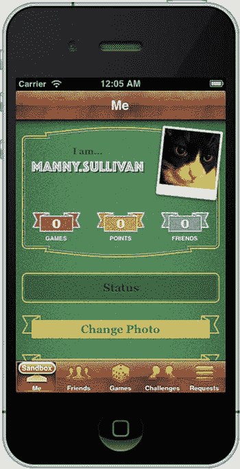

图 9-1.  iOS 设备上的 Game Center

`Game Center` 提供以下基本服务：

*   **认证：** 这只是在`Game Center`服务上标识用户的一个账户。
*   **排行榜：** 这是你的应用程序的“高分榜”。如果你决定实现排行榜，那么由你的应用决定什么构成“高分”。例如，它可以是一个简单的积分系统，也可以是游戏时间。你的应用还可以下载排行榜信息并本地存储。
*   **成就：** 另一种衡量游戏活动的方式。这些通常是玩家达到的特定里程碑（例如“第 2 关”），而不是在排行榜中衡量的分数。
*   **多人游戏：** 允许玩家寻找其他（同一游戏的）玩家进行对战。你可以使用`Game Center`连接游戏中的所有玩家，大家一起玩，或者提供一个玩家列表进行对战。这可能需要你实现自己的服务。

所有`Game Center`游戏都必须从认证玩家开始。所有其他功能都依赖于用户已通过`Game Center`服务认证。与`Game Center`的认证是系统级的，这意味着如果你在一个游戏中通过`Game Center`认证，那么任何其他支持`Game Center`的游戏也会使用该认证。如果没有经过认证的玩家，`Game Center`功能将被禁用。你的游戏是否仍然可以运行，由你决定。

如果你在游戏中确实使用了其他`Game Center`功能，你需要至少有一个视图控制器。这个视图控制器被用作`Game Center`工作的“根”。例如，排行榜是一个`Game Kit`视图控制器类，它为你的游戏提供了一个显示排行榜信息的标准方式。你的游戏需要提供一个视图控制器来模态显示排行榜。

由于`Game Center`是一个基于网络的服务，你需要设置保护措施来处理网络中断。

**注意** 更多关于 `Game Center` 和 `Game Kit` 的详细信息，可以阅读 Kyle Richter (Apress, 2011) 所著的 *Beginning iOS Game Center and Game Kit* ([www.apress.com/9781430235279](http://www.apress.com/9781430235279)) 以及 Apple 的 *Game Kit Programming Guide* ([`developer.apple.com/library/ios/#documentation/NetworkingInternet/Conceptual/GameKit_Guide/Introduction/Introduction.html`](https://developer.apple.com/library/ios/#documentation/NetworkingInternet/Conceptual/GameKit_Guide/Introduction/Introduction.html))。

### 点对点连接

`Game Kit` 使通过蓝牙或 `WiFi` 无线连接多个 iOS 设备变得简单。蓝牙是除第一代 iPhone 和 iPod touch 之外的所有设备内置的无线网络选项。`Game Kit` 允许任何支持的设备与范围内任何其他支持的设备进行通信。对于蓝牙，这个范围大约为 30 英尺（约 10 米）。尽管名称暗示不同，但 `Game Kit` 也适用于非游戏类应用。例如，你可以构建一个社交网络应用，允许人们通过蓝牙轻松传输联系信息。

**警告** 本章中的代码将无法在模拟器中运行，因为模拟器不支持蓝牙。在连接到电脑的设备上构建和调试应用的唯一方法是加入付费的 iPhone 开发者计划。如果你想充分体验本章的精华，你需要这样做。

此外，在撰写本文时，你无法在设备与模拟器之间进行 `Game Kit` 游戏。如果你只有一台设备，你将无法尝试本章中的游戏。

点对点连接依赖于两个组件：

*   **会话** 允许运行同一应用的 iPhone OS 设备通过蓝牙轻松地来回发送信息，而无需编写任何网络代码。
*   **对等选择器** 提供了一种无需编写任何网络或发现 (Bonjour) 代码即可轻松找到其他设备的方法。


在底层，Game Kit 会话利用了 Bonjour，这是苹果公司用于零配置网络和设备发现的技术。因此，使用 Game Kit 的设备能够在网络上互相发现，而无需用户输入 IP 地址或域名。

#### 游戏内语音

游戏内语音允许你为游戏添加语音聊天功能，使玩家能够相互交流。这可以通过 Game Center 服务或点对点连接来实现。

每个 Game Kit 客户端都会被分配一个唯一标识符。Game Kit 不提供生成此标识符的机制；你需要自行提供。一旦你拥有一个标识符，就需要一种方法来发现其他游戏实例，以发起语音聊天。这种发现可以通过多种方式处理。对于点对点连接，你可以使用会话来查找其他玩家。借助 Game Center，你可以使用 Game Center 的多玩家机制来寻找其他玩家。

一旦找到其他玩家，游戏内语音可以轻松地在玩家之间启动和停止语音聊天。

#### 本章应用程序

在本章中，你将通过编写一个简单的网络游戏来探索 Game Kit。你将编写一个双人版本的井字棋（图 9-2），它将使用 Game Kit 让两台不同的 iPhone 或 iPod touch 上的玩家通过蓝牙进行对战。本章不实现通过互联网或局域网的在线游戏。

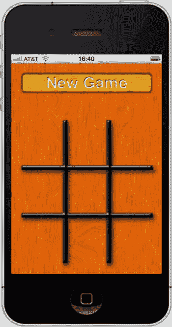

图 9-2. 你将通过一个简单的井字棋游戏来学习 Game Kit 的基础知识

当用户启动你的应用程序时，他们将看到一个空的井字棋盘和一个标有 **New Game**（新游戏）的按钮。（为简单起见，你将不实现让两名玩家在同一设备上玩耍的单设备模式。）当用户按下“New Game”按钮时，应用程序将开始使用对等点选择器查找蓝牙对等点（图 9-3）。

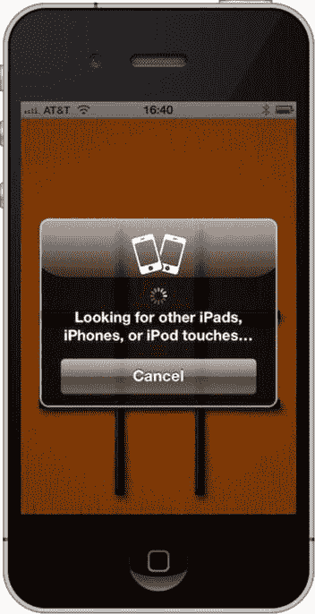

图 9-3. 当用户按下“New Game”按钮时，将启动对等点选择器来查找其他运行井字棋游戏的设备

如果范围内的另一台设备也运行了 TicTacToe 应用程序，并且用户也按下了“New Game”按钮，那么两台设备将互相发现，并且对等点选择器会向用户显示一个对话框，让他们在可用的对等点中进行选择（图 9-4）。

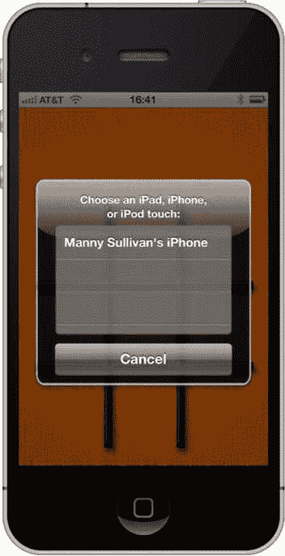

图 9-4. 当范围内有另一台设备启动游戏时，两台设备将出现在彼此的对等点选择器对话框中

在一名玩家选择一个对等点后，iPhone 将尝试建立连接（图 9-5）。一旦连接建立，系统会要求另一方接受或拒绝连接（图 9-6）。如果连接被接受，两个应用程序将协商决定谁先开始。每一方将随机选择一个数字，然后比较这些数字，数字大的先开始。一旦做出决定，游戏将开始（图 9-7），直到有人获胜（图 9-8）。

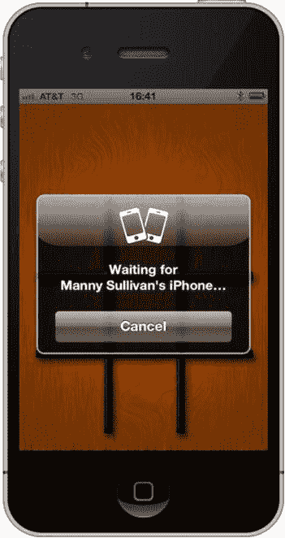

图 9-5. 建立连接

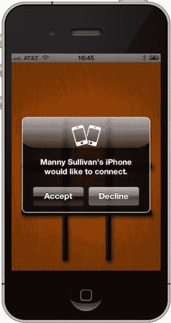

图 9-6. 请求另一位玩家接受连接

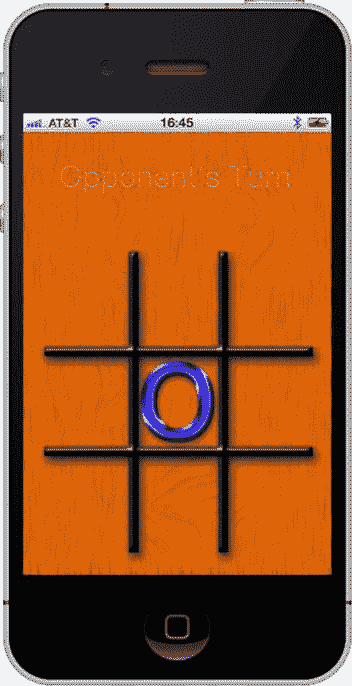

图 9-7. 轮到当前玩家时，可以点击任意可用空格。该空格会在两位用户的设备上都显示为 X 或 O

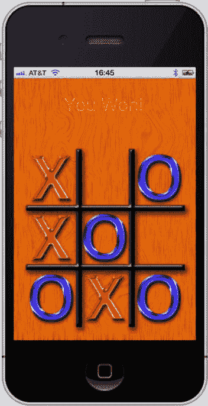

图 9-8. 我们有一位赢家！

如果连接因任何原因丢失，iPhone 将向用户报告连接丢失（图 9-9）。

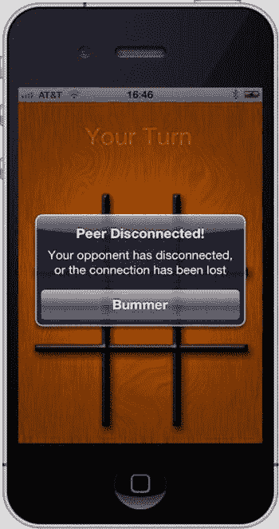

图 9-9. 连接丢失警报

### 网络通信模型

在我们研究 Game Kit 和对等点选择器如何工作之前，让我们先一般性地讨论一下网络程序中使用的通信模型，以便大家在术语上保持一致。

#### 客户端-服务器模型

你可能对客户端-服务器模型很熟悉，因为它是万维网使用的模型。称为 *服务器* 的机器监听来自其他机器（称为 *客户端*）的连接。然后，服务器根据从客户端收到的请求采取行动。在网络中，客户端通常是 Web 浏览器，并且任意数量的客户端都可以连接到单个服务器。客户端从不直接相互通信，而是通过服务器进行所有通信。大多数大型多人在线角色扮演游戏（MMORPG），如《魔兽世界》，也使用这种模型。图 9-10 展示了一个客户端-服务器场景。

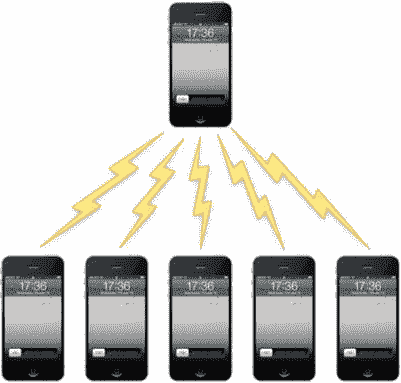

图 9-10. 客户端-服务器模型的特点是一台机器充当服务器，所有通信（甚至包括客户端之间的通信）都通过服务器进行

在 iPhone 应用程序的上下文中，客户端-服务器设置是指一台手机充当服务器，并监听其他运行同一程序的 iPhone。其他手机随后可以连接到该服务器。如果你玩过一款游戏，其中一台机器“主持”游戏，其他机器加入游戏，那么该游戏几乎肯定使用了客户端-服务器模型。

客户端-服务器模型的一个缺点是所有事物都依赖于服务器，这意味着如果服务器发生任何问题，游戏就无法继续。如果充当服务器的用户的手机退出、崩溃或移出范围，整个游戏就结束了。由于所有其他机器都通过中央服务器通信，如果服务器不可用，它们将失去通信能力。对于客户端是连接到互联网的、由冗余高速线路支撑的庞大服务器集群的客户端-服务器游戏来说，这通常不是问题，但对于移动游戏来说，这绝对可能是一个问题。

#### 点对点模型

在点对点模型中，所有个体设备（称为 *对等点*）可以直接相互通信。中央服务器可能用于发起连接或协助某些操作，但点对点模型的主要区别特征在于，对等点可以直接相互通信，并且即使在缺少服务器的情况下也能继续这样做（图 9-11）。

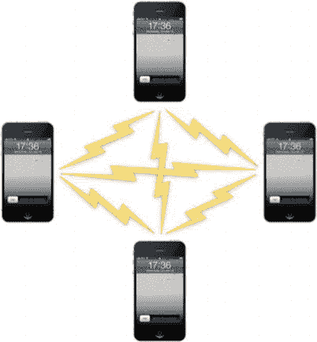

图 9-11. 在点对点模型中，对等点可以直接相互通信，并且即使在缺少服务器的情况下也能继续这样做

点对点模型是由 BitTorrent 等文件共享服务普及的。中央服务器用于查找拥有你所需文件的其他对等点，但一旦连接到这些对等点，即使服务器离线，它们也能继续工作。


### 排版后的文本

在 iPhone 上实现点对点模型最简单且最常见的方式是将两台设备相互连接。例如，在头对头游戏中就使用了这种模型。`Game Kit`让此类点对点网络的设置与配置变得极为简单，正如你将在本章中看到的那样。

### 混合客户端-服务器 / 点对点网络

客户端-服务器模型和点对点模型并非互斥关系，完全有可能创建同时利用这两种模型的混合程序。例如，一款客户端-服务器游戏可能允许某些通信直接从客户端到客户端，而无需经过服务器。在带有聊天窗口的游戏中，它可能允许仅发送给单一收件人的消息直接从发送者的设备发往目标收件人的设备，而其他类型的聊天消息则会发送至服务器，再由服务器分发给所有客户端。

在我们讨论应用节点之间建立连接和数据传输的机制时，你应该牢记这些不同的网络模型。`Node`（节点）是一个通用术语，指连接到应用网络的任何计算机。客户端、服务器或对等端都是节点。你在本章中将要编写的游戏将采用一个简单的、包含两台设备的点对点模型。

### Game Kit 会话

`Game Kit`的核心是会话，由 `GKSession` 类表示。该会话代表你与一部或多部其他 iPhone 之间网络连接的端点。无论你是充当客户端、服务器还是对等端，`GKSession` 的一个实例都将代表你与其他设备之间的连接。无论你是使用对等端选择器，还是编写自己的代码来查找可连接的设备并让用户从中选择，都需要使用 `GKSession`。

**注意** 在阅读接下来的几页内容时，不必过于担心每个元素是在哪里实现的。这些内容最终都会在你本章创建的项目中得到整合。

你还可以使用 `GKSession` 向已连接的对等端发送数据。你需要实现会话代理方法，以便在会话状态发生变化时（例如当另一个节点连接或断开时）收到通知，同时也能接收其他节点发送的数据。

### 创建会话

要使用会话，必须先创建、分配并初始化一个 `GKSession` 对象，如下所示：

```
    GKSession *theSession = [[GKSession alloc] initWithSessionID:@"com.apporchard.game" 
                                                   displayName:nil 
                                                    sessionMode:GKSessionModePeer];
```

初始化会话时需要传递三个参数。

第一个参数是*会话标识符*，它是一个对应用而言唯一的字符串。这用于防止你的应用会话意外连接到其他程序的会话。由于会话标识符是字符串，因此可以是任何内容，但惯例是使用反向 DNS 风格的名称，例如 `com.apporchard.game`。通过这种方式（而非随机挑选一个单词或短语）来分配会话标识符，可以降低意外选中 App Store 上其他应用所用会话标识符的可能性。

第二个参数是*显示名称*。这是一个提供给其他节点的名称，用于唯一标识你的设备。如果你传入 `nil`，显示名称将默认为设备在 iTunes 中设置的名称。如果连接了多台设备，这将允许其他用户看到哪些设备可用，并连接到正确的设备。在图 9-3 中，你可以看到一个使用唯一标识符的示例。在那个例子中，另一台设备使用与我们相同的会话标识符进行广播，并使用显示名称“Manny Sullivan 的 iPhone”。

最后一个参数是*会话模式*。会话模式决定了会话在完成设置并准备好建立连接后的行为。共有三个选项：

*   如果指定 `GKSessionModeServer`，你的会话将在网络上广播自己，以便其他设备可以发现并连接它，但它不会去寻找其他正在广播的会话。
*   如果指定 `GKSessionModeClient`，会话不会在网络上广播自己，但会去寻找其他正在广播的会话。
*   如果指定 `GKSessionModePeer`，你的会话既会在网络上广播自己的可用性，也会去寻找其他会话。

**注意** 虽然在建立点对点网络时通常使用 `GKSessionModePeer`，在设置客户端-服务器网络时使用 `GKSessionModeServer` 和 `GKSessionModeClient`，但这些常量仅决定单个会话是否使用 Bonjour 在网络上广播其可用性，或是否寻找其他可用节点。它们并不一定表示应用正在使用哪种网络模型。

无论你创建何种类型的会话，在通知它开始广播可用性或寻找其他可用节点之前，它并不会实际开始这些操作。你可以将会话属性 `available` 设置为 `YES` 来开始广播或寻找。或者，你也可以通过将 `available` 设置为 `NO`，让节点停止广播可用性和/或停止寻找其他可用节点。

#### 查找并连接其他会话

当使用 `GKSessionModeClient` 或 `GKSessionModePeer` 创建的会话发现另一个正在广播可用性的节点时，它会调用 `session:peer:didChangeState:` 方法，并传入状态 `GKPeerStateAvailable`。每当对等端变为可用或不可用，以及对等端连接或断开时，都会调用此方法。第二个参数将告诉你哪个对等端的状态发生了变化，最后一个参数则会告诉你其新状态。

如果你发现一个或多个其他可用会话，可以选择通过调用 `connectToPeer:withTimeout:` 将会话连接到其中一个可用会话。以下是 `session:peer:didChangeState:` 的一个示例，它会连接到它找到的第一个可用对等端：

```
- (void)session:(GKSession *)session peer:(NSString *)peerID 
                         didChangeState:(GKPeerConnectionState)inState 
{
    if (inState == GKPeerStateAvailable) {
        [session connectToPeer:peerID withTimeout:60];
        session.available = NO;
    }
}
```

这不是一个非常现实的示例，因为你通常会让用户选择他们要连接的节点。然而，这是一个不错的示例，因为它展示了客户端节点的两个基本功能。在此示例中，你在连接后将 `available` 设置为 `NO`。这会导致你的会话停止寻找其他会话。由于一个会话可以连接到多个对等端，因此你并不总是需要这样做。如果你的应用支持多个连接，则应将此属性保留为 `YES`。

#### 监听其他会话

当会话的模式指定为 `GKSessionModeServer` 或 `GKSessionModePeer` 时，它会在另一个节点尝试连接时收到通知。此时，会话会调用 `session:didReceiveConnectionRequestFromPeer:` 方法。你可以通过调用 `acceptConnectionFromPeer:error:` 接受连接，或者通过调用 `denyConnectionFromPeer:` 拒绝连接。以下是一个示例，它假设存在一个名为 `amAcceptingConnections` 的布尔类型实例变量。如果该变量设置为 `YES`，则接受连接；如果设置为 `NO`，则拒绝连接。


```objc
- (void)session:(GKSession *)session didReceiveConnectionRequestFromPeer:(NSString *)peerID 
{
    if (amAcceptingConnections) {
        NSError *error;
        if (![session acceptConnectionFromPeer:peerID error:&error]) {
            // 处理错误
        }
    }
    else {
        [session denyConnectionFromPeer:peerID];
    }
}
```

### 向对等节点发送数据

一旦你建立了连接到另一个节点的会话，向该节点发送数据就变得非常简单。你只需调用两个方法之一即可。具体调用哪个方法取决于你是想向所有已连接的会话发送信息，还是仅向特定会话发送。如果仅向指定对等节点发送数据，请使用 `sendData:toPeers:withDataMode:error:` 方法。如果要向所有已连接的对等节点发送数据，请使用 `sendDataToAllPeers:withDataMode:error:` 方法。

在这两种情况下，都需要为连接指定一种*数据模式*。数据模式告知会话应如何尝试发送数据。有两种选项：

- `GKSendDataReliable`：此选项确保信息能够到达其他会话。如果数据超过一定大小，它会分块发送，并等待每个块的其他对等节点确认。
- `GKSendDataUnreliable`：此模式立即发送数据，不等待确认。它比 `GKSendDataReliable` 快得多，但存在完整消息无法到达其他节点的微小可能性。

通常，`GKSendDataReliable` 数据模式会是你的首选，但如果你有一个程序更注重传输速度而非准确性，那么应考虑使用 `GKSendDataUnreliable`。

以下是向单个对等节点发送数据时的代码示例：

```objc
NSError *error = nil;
if (![session sendData:theData 
                toPeers:[NSArray arrayWithObject:thePeerID] 
          withDataMode:GKSendDataReliable error:&error]) {
        // 进行错误处理
} 
```

以下是向所有已连接对等节点发送数据时的代码示例：

```objc
NSError *error = nil;
if (![session sendDataToAllPeers:data 
                  withDataMode:GKSendDataReliable 
           error:&error]) {
        // 进行错误处理
}
```

### 打包待发送的信息

任何你能放入 `NSData` 实例中的信息都可以发送给其他对等节点。在 Game Kit 中使用此功能有两种基本方法。第一种是使用归档和解档，就像我们在 *Beginning iOS 6 Development* (Apress, 2012) 的第 11 章归档部分所做的那样。

使用归档/解档方法时，你需要定义一个类来保存要发送的单个数据包。该类将包含实例变量，用于保存你可能需要发送的任何类型的数据。当需要发送数据包时，你创建并初始化一个数据包对象的实例，然后使用 `NSKeyedArchiver` 将该对象的实例归档到 `NSData` 实例中，该实例可以传递给 `sendData:toPeers:withDataMode:error:` 或 `sendDataToAllPeers:withDataMode:error:`。你将在本章的示例中使用这种方法。然而，这种方法会产生少量开销，因为它需要创建要传递的对象，以及对这些对象进行归档和解档。

尽管在许多情况下归档对象是最佳方法，因为它易于实现且与 Cocoa Touch 的设计很好地契合，但有时应用程序可能需要不断向其同伴发送大量数据，这种开销可能无法接受。在这些情况下，更快的选择是使用静态数组（普通的旧 C 数组，而非 `NSArray`）作为发送数据的方法中的局部变量。

你可以将任何需要发送给对等节点的数据复制到该静态数组中，然后从该静态数组创建一个 `NSData` 实例。创建 `NSData` 实例仍然涉及一些对象创建，但只需创建一个对象而不是两个，而且没有归档的开销。以下是使用这种更快技术发送数据的简单示例：

```objc
NSUInteger packetData[2];
packet[0] = foo;
packet[1] = bar;
NSData *packet = [NSData dataWithBytes:packetData length:2 * sizeof(packetData)];
NSError *error = nil;
if (![session sendDataToAllPeers:packet withDataMode:GKSendDataReliable error:&error]) {
    // 处理错误
}
```

### 从对等节点接收数据

当会话从对等节点接收数据时，会话会将数据传递给一个称为*数据接收处理程序*的对象上的方法。该方法是 `receiveData:fromPeer:inSession:context:`。默认情况下，数据接收处理程序是会话的委托，但并非必须如此。你可以通过调用会话的 `setDataReceiveHandler:withContext:` 并传入你希望从会话接收数据的对象，来指定另一个对象处理此任务。

无论哪个对象被指定为数据接收处理程序，它都必须实现 `receiveData:fromPeer:inSession:context:`，并且每当从对等节点接收到新数据时，都会调用该方法。无需确认数据已接收，也无需担心等待整个数据包。你可以根据程序的需要直接使用提供的数据。所有网络数据传输的棘手方面都已为你处理。其他对等节点每次调用 `sendDataToAllPeers:withDataMode:error:`，以及其他指定了你的对等节点标识符的对等节点每次调用 `sendData:toPeers:withDataMode:error:`，都会导致数据接收处理程序被调用一次。

以下是一个数据接收处理程序方法的示例，该方法是前面发送示例的对应部分：

```objc
- (void)receiveData:(NSData *)data 
           fromPeer:(NSString *)peer 
           inSession: (GKSession *)theSession 
             context:(void *)context 
{
    NSUInteger *packet = [data bytes];
    NSUInteger foo = packet[0];
    NSUInteger bar = packet[0];
    // 使用 foo 和 bar 执行某些操作
}
```

在构建本章示例时，你将研究如何接收归档对象。

### 关闭连接

当你完成会话后，在释放会话对象之前，进行一些清理工作很重要。在释放会话对象之前，必须将会话设置为不可用，断开与所有对等节点的连接，将数据接收处理程序设置为 `nil`，并将会话委托设置为 `nil`。以下是你 `dealloc` 方法中的代码（或在任何其他需要关闭连接时）可能的样子：

```objc
session.available = NO;
[session disconnectFromAllPeers];
[session setDataReceiveHandler: nil withContext: nil];
session.delegate = nil;
```

相反，如果你只想断开与特定对等节点的连接，可以调用 `disconnectPeerFromAllPeers:`，这将断开远程对等节点与其所连接的所有对等节点的连接。请谨慎使用此方法，因为它会导致被调用的对等节点断开与所有远程对等节点的连接，而不仅仅是你的应用程序。以下是使用它的示例：

```objc
[session disconnectPeerFromAllPeers:thePeer];
```

### 对等选择器

尽管 Game Kit 并非只能用于游戏，但网络游戏显然是该技术背后的主要驱动力——至少从苹果选择的名称来看确实如此。移动游戏中最常见的网络模型是直接对抗或简单的点对点模型，即一名玩家与另一名玩家对战。由于这种场景非常常见，苹果提供了一种称为*对等选择器*的机制，用于轻松设置这种简单类型的点对点网络。

#### 创建对等选择器


对等选择器的设计初衷是使用蓝牙将一台设备连接到另一台设备。尽管存在这种局限性，但对等选择器使用起来非常简单，如果符合你的需求，会是一个绝佳的选择。要创建并显示对等选择器，你只需创建一个`GKPeerPickerController`实例，设置其委托，然后调用其`show`方法即可，代码如下：

```
GKPeerPickerController *picker; 
picker = [[GKPeerPickerController alloc] init]; 
picker.delegate = self;
[picker show];
```

### 处理对等连接

当用户选定了一个对等设备且会话已相互连接后，委托方法`peerPickerController:didConnectPeer:toSession:`将被调用。在该方法的实现中，你需要完成几项操作。首先，你可能需要存储*对等标识符*，这是一个用于标识所连接设备的字符串。对等标识符默认为 iPhone 的设备名称，不过你也可以指定其他值。此外，你还需要保存对会话的引用，以便后续发送数据以及断开会话连接。

```
- (void)peerPickerController:(GKPeerPickerController *)picker
                 didConnectPeer:(NSString *)thePeerID
                          toSession:(GKSession *)theSession
{
    self.peerID = thePeerID;
    self.session = theSession;
    self.session.delegate = self;
    [self.session setDataReceiveHandler:self withContext:NULL];
    [picker dismiss];
    picker.delegate = nil;
}
```

### 创建会话

使用对等选择器时，你还需要处理最后一个委托任务：在选择器请求会话时创建会话。使用对等选择器时，你无需担心与其他对等设备查找和连接相关的大部分任务，但需要负责创建供选择器使用的会话。该方法通常如下所示：

```
- (GKSession *)peerPickerController:(GKPeerPickerController *)picker
            sessionForConnectionType:(GKPeerPickerConnectionType)type
{
    GKSession *theSession;
    theSession = [[GKSession alloc] initWithSessionID:@"a session id"
                                          displayName:nil
                                          sessionMode:GKSessionModePeer];
    return theSession;
}
```

`GKPeerPickerConnectionType`可以是以下两种类型之一：`GKPeerPickerConnectionOnline`（网络/互联网）和`GKPeerPickerConnectionNearby`（蓝牙）。你可以通过`GKPeerPickerController`实例上的`connectionTypesMask`属性来配置允许的类型。默认情况下，它仅假定为蓝牙连接。

我们已经讨论过会话，因此这个方法中应该没有令人困惑的地方。

**注意：** 如果你想通过对等选择器支持通过 WiFi 进行在线游戏，还需要实现另一个对等选择器委托方法：`peerPickerController:didSelectConnectionType:`。请查阅 Apple 文档或《Beginning iOS Game Center and Game Kit》（入门 iOS 游戏中心与游戏套件）一书。

好了，讨论到此为止。让我们开始构建应用程序吧。

### 创建项目

好了，操作步骤你都熟悉。如果 Xcode 尚未打开，请启动它并创建一个新项目。使用单视图应用程序模板，并将项目命名为 **TicTacToe**。你不会使用故事板，因此只应勾选“使用自动引用计数”复选框。项目打开后，请查看本书附带的项目归档文件，位于`09 – TicTacToe`文件夹中。找到名为`wood_button.png`、`board.png`、`O.png`和`X.png`的图像文件，并将它们复制到项目的 Supporting Files 组中。还有一个名为`icon.png`的图标文件，如果你想使用，可以将其复制到项目中。

### 关闭闲置定时器

你要做的第一件事就是关闭*闲置定时器*。闲置定时器的作用是，当用户在一段时间内未与 iPhone 进行交互时，让 iPhone 进入休眠状态。由于对手回合期间用户不会点击屏幕，因此你需要关闭此定时器，以防对手思考时间过长导致手机进入休眠。一般来说，你不希望网络应用程序进入休眠状态，因为休眠会断开网络连接。在大多数情况下，对于联网的 iPhone 游戏，禁用闲置定时器是最佳方法。

在 Xcode 的导航器窗格中展开 TicTacToe 组，然后单击`AppDelegate.m`。在`applicationDidFinishLaunchingWithOptions:`方法中，在方法返回之前添加以下代码行，以禁用闲置定时器。

```
[[UIApplication sharedApplication] setIdleTimerDisabled:YES];
```

**注意：** 极少数情况下，你可能希望保持闲置定时器正常运行，并在应用程序进入休眠时关闭会话，但通过休眠来关闭会话并不像看起来那么简单。应用程序委托方法`applicationWillResignActive:`会在手机进入休眠前被调用，但遗憾的是，它在其他情况下也会被调用。实际上，只要你的应用程序失去响应触摸事件的能力，该方法就会被调用。这使得我们几乎无法区分是系统提示（例如来自推送通知或低电量警告，这些情况不会导致连接断开）导致失焦，还是手机即将真正进入休眠。因此，在 Apple 提供区分这些情况的方法之前，最好的办法就是在网络程序运行时简单地禁止休眠。

### 导入 Game Kit 框架

Game Kit 并非 Xcode 项目模板自动链接的框架之一，因此你需要手动链接它以访问会话和对等选择器方法。在导航器窗格顶部选择 TicTacToe 项目。接着，在项目编辑器中选择 TicTacToe 目标。选择“构建阶段”选项卡，展开“将二进制文件与库链接（3 个项目）”部分。点击左下角的 **+** 按钮。从出现的对话框中选择`GameKit.framework`，然后点击“添加”。

`GameKit.framework` 将出现在导航器窗格中项目组的顶部。将其拖入 Frameworks 组以进行整理。

#### 设计界面

现在，你将设计游戏的用户界面。由于井字棋是一个相对简单的游戏，你将在 Interface Builder 中设计用户界面，而非使用 OpenGL ES。

棋盘上的每个格子都是一个按钮。当用户点击一个尚未被选中的按钮时（通过检查按钮是否有指定图像来判断），你将图像设置为`X.png`或`O.png`（这些文件你几分钟前已添加到项目中）。然后，你将此信息发送到另一台设备。你还将使用按钮的标记值来区分按钮，并更容易判断是否有人获胜。你将棋盘上代表每个格子的按钮分配一个顺序标记值，从左上角开始。通过查看图 9-12，你可以了解每个格子对应的标记值。这样，你无需为每个按钮设置单独的操作方法，即可识别哪个按钮被按下。

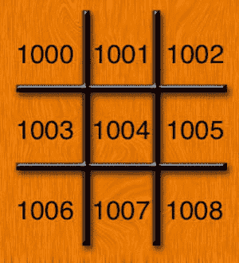

图 9-12. 为每个游戏格子按钮分配一个标记值

#### 定义应用程序常量

在引用井字棋棋盘上的特定按钮时，你可以使用图 9-12 中定义的标记值（并且在 Interface Builder 中也需要使用这些值），但更好的做法是使用一组助记常量。你还将定义一些常量来表示当前游戏状态以及用户是 X 还是 O。


你可以将这些常量定义分散到应用的各个头文件和实现文件中，但将它们集中放在一个文件中会更方便。我们就采用后者。

在导航窗格中选择`TicTacToe`分组，然后创建一个新文件。在模板选择对话框中，选择 iOS 下的 C 和 C++ 部分。选择头文件并点击下一步。将文件保存为`TicTacToe.h`。选择`TicTacToe.h`，它应该看起来像这样：

```c
#ifndef TicTacToe_TicTacToe_h
#define TicTacToe_TicTacToe_h

#endif
```

这些宏（`#ifndef`、`#define`、`#endif`）是 C 语言的防护机制，用于确保`TicTacToe.h`只被包含一次。在 Objective-C 中，你无需担心这个问题，因为`#import`宏已经为你处理了。你可以删除这些行。

现在，你需要定义一些自己的常量。首先，定义一个常量来表示 Game Kit 会话 ID。

```c
#define kTicTacToeSessionID  @"com.apporchard.TicTacToe.session"
```

接下来，我们定义一个用于通过 Game Kit 对数据包进行编码和解码的常量。

```c
#define kTicTacToeArchiveKey @"com.apporchard.TicTacToe"
```

当应用连接到另一台设备时，你需要让应用决定哪位玩家先走。方法是生成一个随机数，数字较大的玩家先走。我们使用宏`dieRoll()`来定义数字生成器，该宏将生成一个 0 到 999,999 之间的数字。这里使用这么大的数字是为了让两台设备掷出相同数字（需要重新掷骰）的概率极低。

```c
#define dieRoll() (arc4random() % 1000000)
```

你还定义了一个常量`kDiceNotRolled`，用于标识骰子尚未掷出。请记住，你将在`NSInteger`实例变量中存储自己掷出的骰子数和对手的骰子数。在 iPhone 上，`NSInteger`与`int`相同。你使用`INT_MAX`值来标识这些值尚未确定。`INT_MAX`是平台上一个`int`能容纳的最大值。由于`dieRoll()`宏生成的最大数字是 999,999，你可以安全地使用`INT_MAX`来标识骰子尚未掷出，因为在 iOS 上`INT_MAX`当前等于 2,147,483,647。即使`INT_MAX`将来发生变化，它也只会变大，不会变小。

```c
#define kDiceNotRolled INT_MAX
```

你需要一些枚举。`GameState`将是你定义不同游戏状态的枚举列表。

```c
typedef enum GameStates {
    kGameStateBeginning,
    kGameStateRollingDice,
    kGameStateMyTurn,
    kGameStateYourTurn,
    kGameStateInterrupted,
    kGameStateDone
} GameState;
```

`BoardSpace`是你在图 9-12 中定义的枚举列表。注意，你将第一个枚举值`kUpperLeft`定义为 1000。后续的每个枚举值都会在此基础上递增。

```c
typedef enum BoardSpaces {
    kUpperLeft = 1000,
    kUpperMiddle,
    kUpperRight,
    kMiddleLeft,
    kMiddleMiddle,
    kMiddleRight,
    kLowerLeft,
    kLowerMiddle,
    kLowerRight
} BoardSpace;
```

`PlayerPiece`是一个简单的枚举，用于标识玩家被分配了哪个棋子。

```c
typedef enum PlayerPieces {
    kPlayerPieceUndecided,
    kPlayerPieceO,
    kPlayerPieceX
} PlayerPiece;
```

最后，你定义一个枚举列表，列出应用将通过 Game Kit 交换的不同数据包类型。

```c
typedef enum PacketTypes {
    kPacketTypeDieRoll,
    kPacketTypeAck,
    kPacketTypeMove,
    kPacketTypeReset,
} PacketType;
```

定义好这些常量后，你可以开始处理应用程序视图了。

#### 设计游戏棋盘

在导航器中选择`ViewController.xib`。Xcode 将在 Interface Builder 中打开它。Interface Builder 中会有一个视图。在对象库中找到图像视图并将其拖入视图中。由于它是你添加到视图中的第一个对象，它应该会自动调整大小以占满整个视图。将其放置好以填充整个视图，然后在工具窗格中打开属性检查器。在属性检查器的顶部，将图像字段设置为`board.png`，这是你之前添加到项目中的图像之一。

接下来，从库中拖动一个圆角矩形按钮到视图顶部。确切的位置暂时不重要。放置后，使用属性检查器将按钮类型从圆角矩形更改为自定义。在 Interface Builder 或属性检查器中删除按钮标签文本“Button”。在属性检查器的图像字段中，选择`wood_button.png`，然后选择编辑器  → 自适应内容大小（或键入 =）来更改按钮的大小以匹配你分配给它的图像。现在使用蓝色参考线将按钮居中于视图中，并使其紧贴顶部蓝色边距，使其看起来如图 9-13 所示。

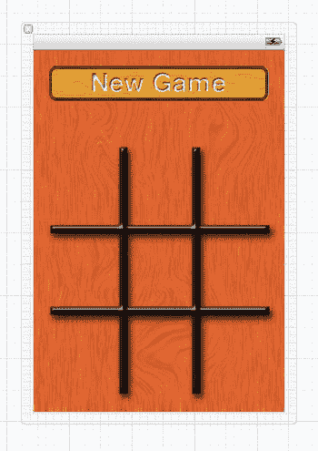

图 9-13.  调整大小并放置按钮后的界面

再次在库中查找标签，并将其拖到视图中。将标签居中在`gameButton`之上。调整标签大小，使其水平方向从左蓝色边距延伸到右蓝色边距，垂直方向从顶部蓝色边距向下延伸到井字棋棋盘的正上方。它会与你刚刚添加的按钮重叠，这没问题，因为标签只在按钮不可见时显示文本。使用属性检查器使文本居中，并将字体大小增加到 60 磅。如果你愿意，也可以将文本设置为漂亮的亮色。当你对标签满意后，删除标签文本“Label”，这样它在应用程序启动时不会显示任何内容。

现在，你需要为九个游戏格子各添加一个按钮，并为它们分配标签值，这样你的代码就能识别每个按钮对应棋盘上的哪个格子。将九个圆角矩形按钮拖到视图中，并使用属性检查器将其类型更改为自定义。使用尺寸检查器将它们放置在表 9-1 指定的位置，并使用属性检查器分配表中列出的标签值。这里有一个小技巧：先创建一个，设置好它的尺寸和属性，然后开始复制。

*表 9-1.  游戏格子位置、尺寸和标签*

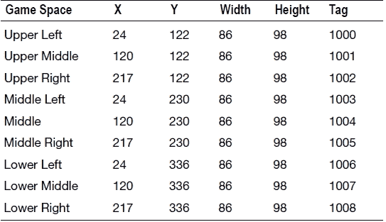

好了，你已经定义了界面，现在让我们将它连接到你的控制器。仍在 Interface Builder 中时，将工具栏中的编辑器从标准视图更改为助理视图。编辑器窗格应水平分割，左侧是 Interface Builder，右侧是源代码编辑器（已打开`ViewController.h`）。你需要为“新游戏”按钮和放置在其上方的标签添加输出口。如果你从“新游戏”按钮中间按住 Control 键拖动，输出口弹出窗口应自动将类型字段设置为`UILabel`。这意味着你在为标签添加输出口。将其命名为`feedbackLabel`，然后点击连接。


你需要像这样为创建的“New Game”按钮添加一个`Outlet`，但它基本上被`feedbackLabel`挡住了。打开 Interface Builder 编辑器面板左下角的展开三角形，并展开左侧的 Object Dock（图 9-14）。在“Objects”组中，位于 View 下方（如果未展开，请展开它），找到名为“Button”的“New Game”按钮对象。从`Button`按住 Control 键拖动到`feedbackLabel Outlet`下方，创建一个新的`Outlet`。将其命名为`gameButton`并点击“Connect”。

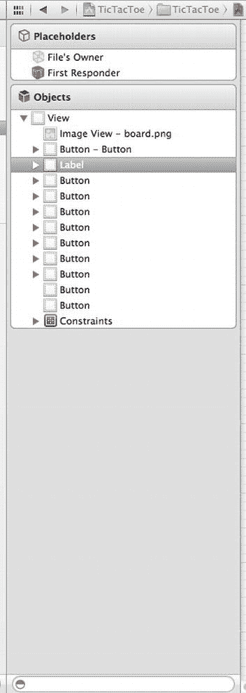

图 9-14.  Interface Builder Object Dock 展开状态

当“New Game”按钮被按下时，你需要连接一个`Action`。从 Object Dock 中的`Button`按住 Control 键拖动到`ViewController.h`中的`@end`上方。创建一个名为`gameButtonPressed`的新`Action`（图 9-15）。

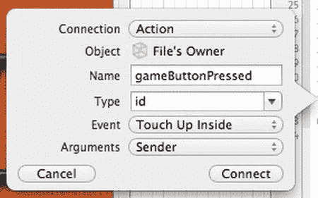

图 9-15.  创建`gameButtonPressed`操作

现在，你需要为九个游戏格子按钮连接`Action`。不过你不需要为它们定义`Outlet`，只需要`Action`。从左上角的按钮按住 Control 键拖动到你刚创建的`Action` `gameButtonPressed`下方。创建一个名为`gameSpacePressed`的新`Action`。现在，从其他每个游戏格子按钮按住 Control 键拖动到`gameSpacePressed`方法声明上。整个方法声明应该会高亮，并出现一个名为“Connect Action”的弹出标签。建立这些连接。

返回标准编辑器模式并保存 XIB。

---

#### 创建 Packet 对象

你需要定义你的游戏如何与自身的其他实例通信。你可以使用像数组这样简单的东西，知道每个元素代表什么；或者使用字典，并知道使用哪些键。与其这样做，不如定义一个特定的类`Packet`，它将用于通过 Game Kit 在两个节点之间来回发送信息。我们在之前创建`TicTacToe.h`中的`enum PacketType`时暗示过这一点。

在导航器窗格中选择`TicTacToe`组，并创建一个新的 Objective-C 类，类名为`Packet`，作为`NSObject`的子类。

文件创建完成后，选择`Packet.h`并在编辑器中打开。首先，你需要添加`TicTacToe.h`头文件。

```
#import "TicTacToe.h"
```

你需要让`Packet`遵循`NSCoding`协议，以便你可以将其归档为`NSData`实例，并通过 Game Kit 会话发送。

```
@interface Packet : NSObject <NSCoding>
```

`Packet`类将只有三个属性：一个用于标识数据包类型，另外两个用于保存可能作为该数据包一部分发送的信息。你唯一需要发送的其他信息是掷骰子的结果以及玩家放置 X 或 O 的游戏棋盘上的哪个格子。

```
@property (nonatomic) PacketType type;
@property (nonatomic) NSUInteger dieRoll;
@property (nonatomic) BoardSpace space;
```

然后，你需要一些`init`方法来创建你将发送的不同类型的数据包。

```
- (id)initWithType:(PacketType)aPacketType dieRoll:(NSUInteger)aDieRoll space:(BoardSpace)
aBoardSpace;
- (id)initDieRollPacket;
- (id)initDieRollPacketWithRoll:(NSUInteger)aDieRoll;
- (id)initMovePacketWithSpace:(BoardSpace)aBoardSpace;
- (id)initAckPacketWithDieRoll:(NSUInteger)aDieRoll;
- (id)initResetPacket;
```

就是这样。保存`Packet.h`并转到`Packet.m`。

首先，实现你在接口文件中声明的`init`方法。

```
- (id)initWithType:(PacketType)aPacketType dieRoll:(NSUInteger)aDieRoll space:(BoardSpace)
aBoardSpace
{
    self = [super init];
    if (self) {
        self.type = aPacketType;
        self.dieRoll = aDieRoll;
        self.space = aBoardSpace;
    }
    return self;
}

- (id)initDieRollPacket
{
    int roll = dieRoll();
    return [self initWithType:kPacketTypeDieRoll dieRoll:roll space:0];
}

- (id)initDieRollPacketWithRoll:(NSUInteger)aDieRoll
{
    return [self initWithType:kPacketTypeDieRoll dieRoll:aDieRoll space:0];
}

- (id)initMovePacketWithSpace:(BoardSpace)aBoardSpace
{
    return [self initWithType:kPacketTypeMove dieRoll:0 space:aBoardSpace];
}

- (id)initAckPacketWithDieRoll:(NSUInteger)aDieRoll
{
    return [self initWithType:kPacketTypeAck dieRoll:aDieRoll space:0];
}

- (id)initResetPacket
{
    return [self initWithType:kPacketTypeReset dieRoll:0 space:0];
}
```

每一个其他初始化方法都只是对`initWithType:dieRoll:space:`的封装调用，其中`BoardSpace`为零（未定义）。

你还需要让`Packet`遵循`NSCoding`协议，添加`encodeWithCoder:`和`initWithCoder:`方法。

```
#pragma mark - NSCoder (Archiving) Methods

- (void)encodeWithCoder:(NSCoder *)coder
{
    [coder encodeInt:[self type] forKey:@"type"];
    [coder encodeInteger:[self dieRoll] forKey:@"dieRoll"];
    [coder encodeInt:[self space] forKey:@"space"];
}

- (id)initWithCoder:(NSCoder *)coder
{
    if (self = [super init]) {
        [self setType:[coder decodeIntForKey:@"type"]];
        [self setDieRoll:[coder decodeIntegerForKey:@"dieRoll"]];
        [self setSpace:[coder decodeIntForKey:@"space"]];
    }
    return self;
}
```

`Packet`是一个非常直接的类。其实现中不应该有你之前没见过的东西。保存`Packet.m`。接下来，你将编写视图控制器并完成你的应用程序。

---

#### 设置视图控制器头文件

你通过 Interface Builder 声明了两个`Outlet`和两个`Action`。现在你将完成视图控制器的实现，包括使其与 Game Kit 协同工作。在编辑器中打开`ViewController.h`。

你需要做的第一件事是导入 Game Kit 和`TicTacToe`头文件，以便编译器了解 Game Kit 中的对象和方法以及你之前定义的常量。

```
#import <GameKit/GameKit.h>
#import "TicTacToe.h"
```

之后，你告诉编译器有一个名为`Packet`的类。`@class`声明不会让编译器查找类头文件——它只是一个承诺，表明该类确实存在，因此以这种方式声明是可以的。

```
@class Packet;
```

你的控制器类需要遵循几个协议。你的控制器将成为 Game Kit 对等选择器和会话的代理。你还会在出现问题时使用警报视图通知用户，因此你让你的类遵循用于定义这些任务中每个任务代理方法的三个协议。

```
@interface ViewController : UIViewController <GKPeerPickerControllerDelegate, GKSessionDelegate, 
                                               UIAlertViewDelegate>
```

你需要添加一些实例变量（ivars）。首先，在`@interface`声明之后立即添加大括号：

```
{
}
```

你需要一个`ivar`来跟踪当前的游戏状态。

```
GameState _state;
```

因为你不知道你是先掷骰子还是先收到对手的骰子结果，所以你需要变量来保存两者。一旦你拥有了两者，就可以比较它们并开始游戏。

```
NSInteger _myDieRoll;
NSInteger _opponentDieRoll;
```

一旦知道谁先走，你就可以在这个实例变量中存储你是`O`还是`X`。

```
PlayerPiece _playerPiece;
```

最后，你还有两个布尔值来跟踪你是否收到了对手的骰子结果，以及你的对手是否确认收到了你的骰子结果。直到你拥有两个骰子结果并且知道你的对手也拥有两者之前，你不想开始游戏。当这两个布尔值都为`YES`时，你就知道是时候开始实际游戏了。

```
BOOL _dieRollReceived;
BOOL _dieRollAcknowledged;
```


### 排版后的文档

你已经有了两个通过 Interface Builder 创建的 Outlet 属性：`feedbackLabel` 和 `gameButton`。你还需要为 Game Kit 会话和已连接节点的对等标识符创建属性。

```objective-c
@property (nonatomic, strong) GKSession *session;
@property (nonatomic, strong) NSString *peerID;
```

当视图加载时，你加载代表两个游戏棋子的图像，并保留对它们的引用。

```objective-c
@property (nonatomic, strong) UIImage *xPieceImage;
@property (nonatomic, strong) UIImage *oPieceImage;
```

最后，你声明了游戏中所需的一系列方法。我们将在你于控制器中实现这些方法时，更详细地讨论具体方法。你需将它们添加到通过 Interface Builder 添加的两个 Action（`gameButtonPressed:` 和 `gameSpacePressed:`）之前。

```objective-c
- (void)resetBoard;
- (void)startNewGame;
- (void)resetDieState;
- (void)startGame;
- (void)sendPacket:(Packet *)packet;
- (void)sendDieRoll;
- (void)checkForGameEnd;
```

这个文件中需要的内容就这些。保存文件并打开 `ViewController.m`。

### 实现井字棋视图控制器

`ViewController.m` 中需要添加大量代码，那我们开始吧。

首先，你需要导入头文件 `Packet.h`。

```objective-c
#import "Packet.h"
```

在 `viewDidLoad` 中（调用 `super` 之后），初始化棋子图像并将当前骰子点数设置为 `kDiceNotRolled`。

```objective-c
_myDieRoll = kDiceNotRolled;
self.oPieceImage = [UIImage imageNamed:@"O.png"];
self.xPieceImage = [UIImage imageNamed:@"X.png"];
```

在实现文件的底部，有两个 Action 方法。你需要实现它们。首先，编辑 `gameButtonPressed:`。

```objective-c
#pragma mark - Game-Specific Actions

- (IBAction)gameButtonPressed:(id)sender
{
    _dieRollReceived = NO;
    _dieRollAcknowledged = NO;

    _gameButton.hidden = YES;
    GKPeerPickerController *picker = [[GKPeerPickerController alloc] init];
    picker.delegate = self;
    [picker show];
}
```

这是用户按下“新建游戏”按钮时的回调。你将 `_dieRollReceived` 和 `_dieRollAcknowledged` 设置为 `NO`，因为你知道在新的游戏中，这两件事都尚未发生。接着，你隐藏按钮，因为不希望玩家在搜索对等设备或进行游戏时请求新游戏。然后，你创建 `GKPeerPickerController` 实例，将 `self` 设置为委托，并显示对等设备选择控制器。这就是启动让用户选择另一台设备进行对战所需做的全部工作。对等设备选择器会处理所有事务，并在需要你执行操作时调用委托方法。

现在，添加用户按下某个游戏格子按钮时的回调。

```objective-c
- (IBAction)gameSpacePressed:(id)sender
{
    UIButton *buttonPressed = sender;
    if (_state == kGameStateMyTurn && [buttonPressed imageForState:UIControlStateNormal] == nil) {
        [buttonPressed setImage:((_playerPiece == kPlayerPieceO) ? self.oPieceImage
                                                                 : self.xPieceImage) 
                       forState:UIControlStateNormal];
        _feedbackLabel.text = NSLocalizedString(@"Opponent's Turn", @"Opponent's Turn");
        _state = kGameStateYourTurn;

        Packet *packet = [[Packet alloc] initMovePacketWithSpace:buttonPressed.tag];
        [self sendPacket:packet];

        [self checkForGameEnd];
    }
}
```

你首先将 `sender` 转换为 `UIButton`。你知道 `sender` 始终是 `UIButton` 的实例，这样做可以避免每次使用时都进行类型转换。接下来，你检查游戏状态。如果不是当前玩家的回合，你不想让用户选择格子。你还检查以确保按下的按钮尚未分配图像。如果已分配图像，则说明该按钮代表的格子里已经有了 X 或 O，用户不能选择它。如果格子没有分配图像并且是你的回合，你根据自己是先手还是后手，将图像设置为适合当前玩家的对应图像。棋子变量稍后会在比较骰子点数时设置。你更新反馈标签，告知用户当前不再是他们的回合，并相应地更改状态。你必须通知另一台设备你已经落子，因此创建 `Packet` 实例，传入被按下按钮的标签值以标识玩家选择了哪个格子。你使用名为 `sendPacket:` 的方法（稍后将会看到）来将 `Packet` 实例发送到另一个节点。最后一步，你检查游戏是否结束。`checkForGameEnd` 方法判断是否有玩家获胜，或者棋盘上是否没有空格（这意味着平局）。

在实现你在接口文件中定义的方法之前，你需要考虑你所做的协议声明。你将 `ViewController` 定义为遵循 `GKPeerPickerControllerDelegate`、`GKSessionDelegate` 和 `UIAlertViewDelegate` 协议。让我们按顺序处理它们，先从 `GKPeerPickerControllerDelegate` 开始。

#### Game Kit 点对点委托方法

当 Game Kit 点对点选择器显示时，它会尝试使用 `peerPickerController:sessionForConnectionType:` 方法创建一个 Game Kit 会话。因此，你先实现这个方法。将此方法添加到 `ViewController.m` 中，放在 `@end` 之前。

```objective-c
#pragma mark - GameKit Peer Picker Delegate Methods

- (GKSession *)peerPickerController:(GKPeerPickerController *)picker
            sessionForConnectionType:(GKPeerPickerConnectionType)type
{
    GKSession *theSession;
    if (type == GKPeerPickerConnectionTypeNearby)
        theSession = [[GKSession alloc] initWithSessionID:kTicTacToeSessionID
                                          displayName:nil
                                          sessionMode:GKSessionModePeer];
    return theSession;
}
```

这是选择器要求你提供会话的地方。因为你希望所有设备既能够广播自身，也能查找网络上的其他设备，所以将会话模式指定为 `GKSessionModePeer`。请注意，你还使用了在 `TicTacToe.h` 头文件中定义的常量 `kTicTacToeSessionID`，以确保只连接到其他 TicTacToe 实例。我们在前面已经讨论过这一点，如果需要回顾代码，可以往前翻几页。

添加处理与对等设备连接的方法。

```objective-c
- (void)peerPickerController:(GKPeerPickerController *)picker
                 didConnectPeer:(NSString *)thePeerID
                          toSession:(GKSession *)theSession
{
    self.peerID = thePeerID;
    self.session = theSession;
    self.session.delegate = self;
    [self.session setDataReceiveHandler:self withContext:NULL];
    [picker dismiss];
    picker.delegate = nil;
    [self startNewGame];
}
```

由于对等设备选择器仅用于简单的点对点游戏，一旦你收到连接通知，就存储会话和对等设备标识符，然后关闭选择器。关闭后，你调用 `startNewGame` 来启动游戏。

接下来，添加处理用户取消操作的委托方法。

```objective-c
- (void)peerPickerControllerDidCancel:(GKPeerPickerController *)picker
{
    self.gameButton.hidden = NO;
}
```

你只需取消隐藏“新建游戏”按钮。

#### Game Kit 会话委托方法


现在，你需要实现 Game Kit 会话的委托方法。从 `session:didFailWithError:` 开始。

```
#pragma mark - GameKit Session Delegate Methods

- (void)session:(GKSession *)theSession didFailWithError:(NSError *)error 
{
    UIAlertView *alert = [[UIAlertView alloc]
                              initWithTitle:NSLocalizedString(@"Error Connecting!",
                                                              @"Error Connecting!")
                                   message:NSLocalizedString(@"Unable to establish the connection.",
                                                             @"Unable to establish the connection.")
                                  delegate:self
                         cancelButtonTitle:NSLocalizedString(@"Bummer", @"Bummer")
                         otherButtonTitles:nil];
    [alert show];
    theSession.available = NO;
    [theSession disconnectFromAllPeers];
    theSession.delegate = nil;
    [theSession setDataReceiveHandler:nil withContext:nil];
    self.session = nil;
}
```

当从 Game Kit 会话收到错误时，你将显示一个警告视图。然后清理 Game Kit 会话并关闭所有连接。最后一步，将 `session` 属性设置为 `nil`。

由于你正在使用对等选择器，因此无需处理选择其他节点或连接它。但必须确保如果对手断开连接，你不会继续尝试进行该游戏。每当对等方的状态发生变化时，都会调用以下方法。如果收到另一个节点已断开连接的通知，你将再次通过警告视图通知用户，当用户关闭警告视图时，你的警告视图委托方法将重置棋盘。

```
- (void)session:(GKSession *)theSession peer:(NSString *)peerID
                               didChangeState:(GKPeerConnectionState)inState
{
    if (inState == GKPeerStateDisconnected) {
        _state = kGameStateInterrupted;
        UIAlertView *alert =
            [[UIAlertView alloc] initWithTitle:NSLocalizedString(@"Peer Disconnected!",
                                                                 @"Peer Disconnected!")
               message:NSLocalizedString(@"Your opponent has disconnected, or the connection has been lost",
                                         @"Your opponent has disconnected, or the connection has been lost")
               delegate:self
               cancelButtonTitle:NSLocalizedString(@"Bummer", @"Bummer")
               otherButtonTitles:nil];
        [alert show];
        theSession.available = NO;
        [theSession disconnectFromAllPeers];
        theSession.delegate = nil;
        [theSession setDataReceiveHandler:nil withContext:nil];
        self.session = nil;
    }
}
```

##### Game Kit 数据接收处理程序

在继续之前，还需要实现一个方法：`receiveData:fromPeer:inSession:context:`。这个方法既不是 Game Kit 对等选择器控制器的委托方法，也不是 Game Kit 会话的委托方法。调用此方法是因为你在 `peerPickerController:didConnectPeer:toSession:` 中创建会话时调用了 Game Kit 会话方法 `setDataReceiveHandler:withContext:`。

```
- (void)receiveData:(NSData *)data
           fromPeer:(NSString *)peer
          inSession:(GKSession *)theSession
            context:(void *)context
{
    NSKeyedUnarchiver *unarchiver = [[NSKeyedUnarchiver alloc] initForReadingWithData:data];
    Packet *packet = [unarchiver decodeObjectForKey:kTicTacToeArchiveKey];

switch (packet.type) {
        case kPacketTypeDieRoll: {
            _opponentDieRoll = packet.dieRoll;
            Packet *ack = [[Packet alloc] initAckPacketWithDieRoll:_opponentDieRoll];
            [self sendPacket:ack];
            _dieRollReceived = YES;
            break;
        }
        case kPacketTypeAck: {
            if (packet.dieRoll != _myDieRoll) {
                NSLog(@"Ack packet doesn't match yourDieRoll (mine: %d, send: %d",
                      packet.dieRoll, _myDieRoll);
            }
            _dieRollAcknowledged = YES;
            break;
        }
        case kPacketTypeMove: {
            UIButton *aButton = (UIButton *)[self.view viewWithTag:[packet space]];
            [aButton setImage:((_playerPiece == kPlayerPieceO) ? self.xPieceImage
                                                               : self.oPieceImage)
                     forState:UIControlStateNormal];
            _state = kGameStateMyTurn;
            _feedbackLabel.text = NSLocalizedString(@"Your Turn", @"Your Turn");
            [self checkForGameEnd];
            break;
        }
        case kPacketTypeReset: {
            if (_state == kGameStateDone)
                [self resetDieState];
            break;
        }
        default: {
            break;
        }
    }

if (_dieRollReceived == YES && _dieRollAcknowledged == YES)
        [self startGame];
   }
```

这是你的数据接收处理程序。每当从另一个节点接收到数据包时，都会调用此方法。首先要做的是将数据解档到所发送的原始 `Packet` 实例的副本中。然后使用 `switch` 语句根据收到的数据包类型执行不同的操作。如果是掷骰子数据包，则存储对手的值，发回确认值，并将 `dieRollReceived` 设置为 `YES`。如果收到确认，请确保返回的数字与你发送的数字相同。这只是一个一致性检查。理论上不应该发生数字不一致的情况。如果发生，可能表明代码存在问题，或者意味着有人作弊。虽然我们怀疑是否有人会费心在井字棋中作弊，但已知在某些网络游戏中存在作弊行为，因此你可能需要考虑验证与对等方交换的任何信息。在这里，你只是记录不一致并继续。在实际应用中，如果检测到这种性质的数据不一致，你可能希望采取更严厉的措施。

如果数据包是移动数据包，表示其他玩家选择了一个空格，则使用 X 或 O 图像更新相应的空格，并更改状态和标签以反映现在轮到你的玩家。你还需要检查其他玩家的移动是否导致游戏结束。当收到重置数据包时，你所做的就是将游戏状态更改为 `kGameStateDone`，这样如果在意识到游戏结束之前收到掷骰子数据包，就不会丢弃它。如果收到了数据包，并且 `dieRollReceived` 和 `dieRollAcknowledged` 现在都是 `YES`，你就知道该开始游戏了。

最后，添加警告视图委托方法。

```
#pragma mark - UIAlertView Delegate Method

- (void)alertView:(UIAlertView *)alertView willDismissWithButtonIndex:(NSInteger)buttonIndex
{
    [self resetBoard];
    self.gameButton.hidden = NO;
}
```

你重置游戏板并取消隐藏“新游戏”按钮。

#### 实现井字棋方法

`startNewGame` 方法非常简单。它只是调用一个方法来重置棋盘，然后调用另一个方法来掷骰子并将结果发送到另一个节点。这两种操作都可能发生在游戏开始之外的其他时间。例如，如果连接丢失，你会重置棋盘；如果两个节点掷出相同数字，你会发送掷骰子结果。

```
#pragma mark - Instance Methods

- (void) startNewGame
{
    [self resetBoard];
    [self sendDieRoll];
}
```


### 文档排版

重置棋盘涉及从所有表示游戏棋盘格子的按钮中移除图像。您不需要声明九个出口（每个按钮一个），而是遍历九个标签值，并使用`viewWithTag:`从内容视图中检索按钮。您还需要清空反馈标签。然后，您向另一个节点发送一个数据包，告知它您正在重置。这样做是为了确保：如果您随后进行了另一次掷骰子操作，另一台机器知道不要覆盖它。网络通信是异步进行的，这意味着您不能像在仅一台设备上运行的程序那样，依赖事情总是按特定顺序发生。您可能在对方设备完成判定谁赢之前就发送了掷骰子结果。通过发送重置数据包，您可以告知另一个节点：可能会有针对新游戏的另一次掷骰子操作，因此请确保它处于正确的状态以接受该新掷骰子结果。如果不这样做，它可能会存储您的掷骰子结果，然后在重置自己的棋盘时覆盖该掷骰子值，这会导致挂起，因为另一台设备将会等待一个永远不会到来的掷骰子结果。您还需要重置玩家的游戏棋子。由于游戏已结束，您不知道玩家在下一场游戏中会是`X`还是`O`。

```objective-c
- (void)resetBoard
{
    for (int i = kUpperLeft; i <= kLowerRight; i++) {
        UIButton *aButton = (UIButton *)[self.view viewWithTag:i];
        [aButton setImage:nil forState:UIControlStateNormal];
    }
    self.feedbackLabel.text = @"";
    Packet *packet = [[Packet alloc] initResetPacket];
    [self sendPacket:packet];
    _playerPiece = kPlayerPieceUndecided;
}
```

重置骰子状态仅需将`dieRollReceived`和`dieRollAcknowledged`设置为`NO`，并将您自己的骰子掷出结果和对手的骰子掷出结果都设置为`kDiceNotRolled`。

```objective-c
- (void)resetDieState
{
    _dieRollReceived = NO;
    _dieRollAcknowledged = NO;
    _myDieRoll = kDiceNotRolled;
    _opponentDieRoll = kDiceNotRolled;
}
```

`startGame`在您收到对手的骰子掷出结果并确认对方也已收到您的掷骰子结果后被调用。首先，确保没有平局。如果出现平局，则重新启动掷骰子过程。否则，根据轮到您先手还是对手先手来设置状态、棋子和`feedbackLabel`的文本。然后重置骰子状态。在这里这样做可能看起来有些奇怪，但此时本局游戏的掷骰子阶段已经结束；并且由于您可能在代码意识到游戏结束之前就收到对手的骰子掷出结果，所以现在重置是为了确保骰子掷出结果不会在下一局游戏中被意外重用。

```objective-c
- (void)startGame
{
    if (_myDieRoll == _opponentDieRoll) {
        _myDieRoll = kDiceNotRolled;
        _opponentDieRoll = kDiceNotRolled;
        [self sendDieRoll];
        _playerPiece = kPlayerPieceUndecided;
    }
    else if (_myDieRoll < _opponentDieRoll) {
        _state = kGameStateYourTurn;
        _playerPiece = kPlayerPieceX;
        self.feedbackLabel.text = NSLocalizedString(@"Opponent's Turn", @"Opponent's Turn");
    }
    else {
        _state = kGameStateMyTurn;
        _playerPiece = kPlayerPieceO;
        self.feedbackLabel.text = NSLocalizedString(@"Your Turn", @"Your Turn");
    }
    [self resetDieState];
}
```

`sendDieRoll:`检查您的掷骰子属性。如果您尚未掷骰子，它会初始化一个`Packet`对象为您掷骰子，并将您的掷骰子值设置为该数据包的掷骰子值。如果您已有掷骰子值，则使用该值初始化一个`Packet`。最后，将掷骰子数据包发送给您的对手。

```objective-c
- (void)sendDieRoll
{
    Packet *rollPacket;
    _state = kGameStateRollingDice;
    if (_myDieRoll == kDiceNotRolled) {
        rollPacket = [[Packet alloc] initDieRollPacket];
        _myDieRoll = rollPacket.dieRoll;
    }
    else {
        rollPacket = [[Packet alloc] initDieRollPacketWithRoll:_myDieRoll];
    }
    [self sendPacket:rollPacket];
}
```

`sendPacket:`将数据包发送到另一台设备（很明显！）。它接受一个`Packet`实例，并将其归档为`NSData`实例。然后，它使用会话的`sendDataToAllPeers:withDataMode:error:`方法将其发送到线路中——嗯，在这种情况下是无线。

```objective-c
- (void)sendPacket:(Packet *)packet
{
    NSMutableData *data = [[NSMutableData alloc] init];
    NSKeyedArchiver *archiver = [[NSKeyedArchiver alloc] initForWritingWithMutableData:data];
    [archiver encodeObject:packet forKey:kTicTacToeArchiveKey];
    [archiver finishEncoding];

    NSError *error = nil;
    if (![self.session sendDataToAllPeers:data withDataMode:GKSendDataReliable error:&error]) {
        // You would some do real error handling
        NSLog(@"Error sending data: %@", [error localizedDescription]);
    }
}
```

`checkForGameEnd`方法会检查所有九个格子，看它们里面是`X`还是`O`，然后查找三个连续的标记。它首先声明一个名为`moves`的变量来跟踪已进行的步数。这是它判断是否平局的方法。如果已经过了九步，且无人获胜，则棋盘上没有可用的格子了，所以是平局。接下来，声明一个包含九个`UIImage`指针的数组。您将从代表棋盘格子的九个按钮中取出图像放入此数组，以便更容易检查是否有玩家获胜。如果找到三个连续相同的标记，您将把三个图像中的一个存储在此变量中，从而知道哪个玩家赢得了游戏。然后，像之前在`resetBoard`方法中那样，通过标签遍历按钮，将按钮中的图像存储到之前声明的数组中。接下来的一大段代码只是检查是否有任何位置出现三个相同的图像连续排列。如果找到三个连续相同的图像，则将三个图像中的一个存储在`winningImage`中。当检查完成时，它将知道哪个玩家（如果有的话）获胜。如果没有赢家，则通过查看`moves`来检查棋盘上是否还有空格。如果没有剩余格子，则说明游戏结束，猫赢了。

**注意**：在井字棋中，平局也称为“猫的游戏”。“猫赢了”这个说法指的是平局。

如果前面的任何代码将状态设置为`kGameStateDone`，则使用`performSelector:withObject:afterDelay:`在用户有时间阅读谁赢了之后开始新游戏。

```objective-c
- (void)checkForGameEnd
{
    NSInteger moves = 0;

    UIImage     *currentButtonImages[9];
    UIImage     *winningImage = nil;

    for (int i = kUpperLeft; i <= kLowerRight; i++) {
        UIButton *oneButton = (UIButton *)[self.view viewWithTag:i];
        if ([oneButton imageForState:UIControlStateNormal])
            moves++;
        currentButtonImages[i - kUpperLeft] = [oneButton imageForState:UIControlStateNormal];
    }

    // Top Row
    if (currentButtonImages[0] == currentButtonImages[1]
        && currentButtonImages[0] == currentButtonImages[2]
        && currentButtonImages[0] != nil)
        winningImage = currentButtonImages[0];

    // Middle Row
    else if (currentButtonImages[3] == currentButtonImages[4]
             && currentButtonImages[3] == currentButtonImages[5]
             && currentButtonImages[3] != nil)
        winningImage = currentButtonImages[3];

    // Bottom Row
    else if (currentButtonImages[6] == currentButtonImages[7]
             && currentButtonImages[6] == currentButtonImages[8]
             && currentButtonImages[6] != nil)
        winningImage = currentButtonImages[6];
```


```objectivec
// 左列
else if (currentButtonImages[0] == currentButtonImages[3]
         && currentButtonImages[0] == currentButtonImages[6]
         && currentButtonImages[0] != nil)
    winningImage = currentButtonImages[0];

// 中列
else if (currentButtonImages[1] == currentButtonImages[4]
         && currentButtonImages[1] == currentButtonImages[7]
         && currentButtonImages[1] != nil)
    winningImage = currentButtonImages[1];

// 右列
else if (currentButtonImages[2] == currentButtonImages[5]
         && currentButtonImages[2] == currentButtonImages[8]
         && currentButtonImages[2] != nil)
    winningImage = currentButtonImages[2];

// 从左上角开始的对角线
else if (currentButtonImages[0] == currentButtonImages[4]
         && currentButtonImages[0] == currentButtonImages[8]
         && currentButtonImages[0] != nil)
    winningImage = currentButtonImages[0];

// 从右上角开始的对角线
else if (currentButtonImages[2] == currentButtonImages[4]
         && currentButtonImages[2] == currentButtonImages[6]
         && currentButtonImages[2] != nil)
    winningImage = currentButtonImages[2];

if (winningImage == self.xPieceImage) {
    if (_playerPiece == kPlayerPieceX) {
        self.feedbackLabel.text = NSLocalizedString(@"你赢了！", @"You Won!");
        _state = kGameStateDone;
    }
    else {
        self.feedbackLabel.text = NSLocalizedString(@"对手赢了！", @"Opponent Won!");
        _state = kGameStateDone;
    }
}
else if (winningImage == self.oPieceImage) {
    if (_playerPiece == kPlayerPieceO){
        self.feedbackLabel.text = NSLocalizedString(@"你赢了！", @"You Won!");
        _state = kGameStateDone;
    }
    else {
        self.feedbackLabel.text = NSLocalizedString(@"对手赢了！", @"Opponent Won!");
        _state = kGameStateDone;
    }
}
else {
    if (moves >= 9) {
        self.feedbackLabel.text = NSLocalizedString(@"猫赢了！", @"Cat Wins!");
        _state = kGameStateDone;
    }
}

if (_state == kGameStateDone)
    [self performSelector:@selector(startNewGame) withObject:nil afterDelay:3.0];
```

等等，你还没做完。你需要回头调整 `didReceiveMemoryWarning` 方法。你需要断开与对等设备的连接。

```objectivec
self.session.available = NO;
[self.session disconnectFromAllPeers];
[self.session setDataReceiveHandler: nil withContext: nil];
self.session.delegate = nil;
```

#### 尝试运行

与我们之前共同编写的大多数应用不同，这个井字棋游戏不能在模拟器中使用。虽然它可以在模拟器中运行，但模拟器不支持蓝牙连接。由于这个应用目前依赖蓝牙连接来实现通信（因为你使用了 Game Kit 和同场设备选择器），所以你需要两台物理设备，且这两台设备都不能是第一代设备，因为原始 iPhone 和第一代 iPod touch 无法与 Game Kit 的同场设备选择器配合使用。这也意味着你需要有两台已配置用于开发的设备。你应该能够同时将 iOS 设备连接到你的电脑。Xcode 会在调试区域显示一个下拉菜单，用于选择要查看的哪台设备。

如果你在同时使用两台设备运行 Xcode 时遇到问题，你需要在一台设备上构建并运行，然后退出并拔掉该设备，接着插入另一台设备并重复同样的操作。完成这些步骤后，两台设备上都会安装该应用。你可以在两台设备上同时运行它，或者通过 Xcode 在一台设备上启动它，这样你就可以进行调试并读取控制台反馈。

**注意**  关于在设备上安装应用的详细说明，请访问开发者门户网站 [`developer.apple.com/ios`](http://developer.apple.com/ios)，该网站仅对付费 iPhone SDK 会员开放。

你应该知道，调试——甚至是在不调试的情况下从 Xcode 运行——都会减慢所连接的 iOS 设备上程序的运行速度，这可能会影响网络通信。在底层，两台设备之间来回传输的所有数据都会检查确认信息并设有超时时间。如果在一定时间内没有收到响应，它们就会断开连接。因此，如果你设置了断点，当程序执行到该断点时，你很可能会断开两台设备之间的连接。这会使得排查 Game Kit 应用中的问题变得非常繁琐。你通常需要使用替代断点的方法，比如 `NSLog()` 或断点动作，以避免中断设备间的网络连接。我们将在第 15 章中进一步讨论调试问题。

#### 游戏开始！

又完成了一个长篇章节，现在你应该对 Game Kit 网络通信有了相当扎实的理解。你了解了如何使用同场设备选择器让用户选择另一台 iPhone 或 iPod touch 进行连接，也知道了如何通过归档对象来发送数据，并且初步体会到了在应用中添加网络多用户功能时所带来的复杂性。

第 10 章

### Map Kit

iPhone 一直都有能力确定其在世界上的位置。尽管最初的 iPhone 没有 GPS，但它有一个地图应用，能够通过手机三角定位或在其已知位置的数据库中查找 WiFi IP 地址来在地图上显示其大致位置。在 iOS 开发的早期，开发者无法在自己的应用中利用这一功能。虽然可以启动地图应用来显示特定位置或路线，但仅使用苹果公司提供的 API，用户无法在不离开当前应用的情况下显示地图数据。

这一情况随着 Map Kit 的出现而改变。现在，应用能够显示地图，包括用户的当前位置，甚至可以在这些地图上放置图钉并显示注释。Map Kit 的功能也不仅限于显示地图。它还包括一项名为*反向地理编码*的功能，允许你将一组特定的坐标转换为物理地址。你的应用可以利用这些坐标不仅能确定用户的所在位置，而且通常还能找到与该位置相关的实际地址。虽然不总能精确到街道地址，但无论用户身处世界何处，你几乎总能获取到所在的城市和州或省份。在本章中，我们将学习如何将 Map Kit 功能添加到任何应用中的基础知识。

**注意**  你在本章中构建的应用可以在 iPhone 模拟器中正常运行；然而，模拟器不会报告你的实际位置。相反，它会返回位于加利福尼亚州旧金山市斯托克顿街的苹果旧金山商店的地址。你可以通过 Xcode 中调试窗格跳转栏上的位置模拟器来更改模拟器使用的位置。

#### 本章的应用

本章的应用开始时将显示一张北美地图（图 10-1）。除了地图之外，你的界面将是空的，只有一个标题富有想象力的“Go”按钮。当按下该按钮时，应用将确定你的当前位置，将地图缩放到该位置，并放置一个图钉来标记该位置（图 10-2）。

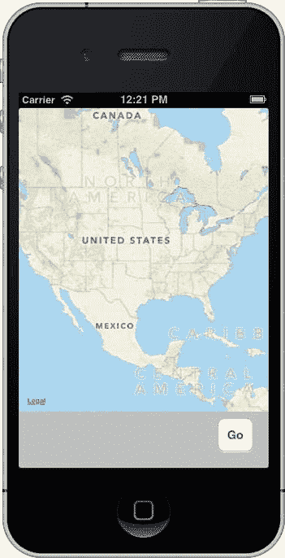

图 10-1. MapMe 应用启动时将显示一张美国地图

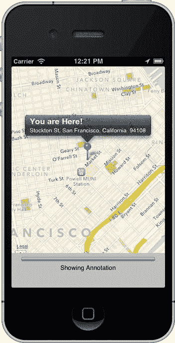

图 10-2. 确定当前位置后，地图将放大到该位置并添加注释


接着，你将使用 Map Kit 的反向地理编码器来确定你当前位置的地址，并在地图上添加一个标注来显示该位置的具体信息。

尽管这个应用很简单，但它利用了 Map Kit 的大部分基本功能。在开始构建项目之前，让我们先探索 Map Kit，看看它是如何运作的。

### 概览与术语

虽然 Map Kit 并不是特别复杂，但它可能会让人有些困惑。让我们先从一个高层次的角度来了解，并明确相关术语，然后你再深入研究各个组件。

要显示地图相关数据，你需要在应用的某个视图中添加一个地图视图。地图视图可以有一个委托，这个委托通常是负责管理地图视图所在视图的控制器类。这也是本章应用程序所采用的方法。你的应用将只有一个视图和一个视图控制器。这个单独的视图将包含一个地图视图以及其他一些元素，而你的单个视图控制器将成为地图视图的委托。

地图视图通过**标注（annotations）**集合来跟踪感兴趣的位置。无论你在地图上看到的是图钉、圆点还是其他任何图标，它都是一个标注。当标注位于正在显示的地图区域内时，地图视图会要求其委托为该标注提供一个视图（称为标注视图），地图视图将在地图上的特定位置绘制该视图。

标注是可选的，选中的标注会显示一个**弹出框（callout）**，这是一个悬浮在地图上方的小视图，就像图 10-2 中显示的 *你在这里！* 视图一样。如果用户点击了一个标注视图，并且该标注视图是可选的，地图视图将显示与该视图关联的弹出框。

### 地图视图

Map Kit 框架的核心元素是由 `MKMapView` 类表示的地图视图。地图视图负责绘制地图并响应用户输入。用户可以使用他们习惯的所有手势，包括捏合缩放、双击放大或双指双击缩小。你可以将地图视图添加到界面中，并使用 Interface Builder 进行配置。与许多 iOS 控件一样，管理地图视图的大部分工作由其委托完成。

#### 地图类型

地图视图能够以多种不同的方式显示地图。它们可以将地图显示为一系列线条和符号，代表当前显示区域的道路和其他地标。这是默认的显示方式，称为**标准地图类型**。你也可以通过指定**卫星地图类型**来使用卫星图像显示地图，或者使用所谓的**混合地图类型**，即标准类型的道路和地标线条叠加在卫星类型的卫星图像之上。你可以在图 10-2 中看到默认地图类型的示例。图 10-3 展示了卫星地图类型，而图 10-4 展示了混合地图类型。

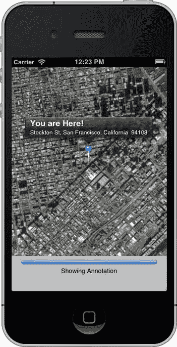

图 10-3. 卫星地图类型显示卫星图像而非线条和符号

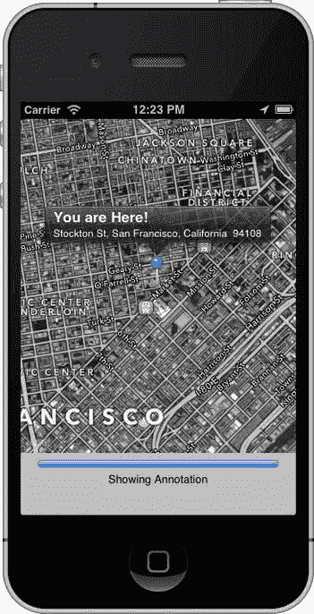

图 10-4. 混合地图类型将默认类型的线条和符号叠加在卫星类型的图像之上

你可以在 Interface Builder 中设置地图类型，或者将地图视图的 `mapType` 属性设置为以下值之一：

```
mapView.mapType = MKMapTypeStandard;
mapView.mapType = MKMapTypeSatellite;
mapView.mapType = MKMapTypeHybrid;
```

#### 用户位置

如果配置得当，地图视图将使用 Core Location 来跟踪用户的位置，并用蓝色圆点在地图上显示，这与地图应用的方式非常相似。在本章的应用中你不会用到这个功能，但你可以通过将地图视图的 `showsUserLocation` 属性设置为 `YES` 来开启它，如下所示：

```
mapView.showsUserLocation = YES;
```

如果地图正在跟踪用户的位置，你可以使用只读属性 `userLocationVisible` 来确定用户当前位置是否在地图视图中可见。如果用户的当前位置正在地图视图中显示，`userLocationVisible` 将返回 `YES`。

你可以从地图视图中获取用户当前位置的具体坐标，方法是先将 `showsUserLocation` 设置为 `YES`，然后访问 `userLocation` 属性。该属性返回一个 `MKUserLocation` 实例。`MKUserLocation` 是一个对象，有一个名为 `location` 的属性，该属性本身是一个 `CLLocation` 对象。`CLLocation` 包含一个名为 `coordinate` 的属性，指向一组坐标。这意味着你可以像下面这样从 `MKUserLocation` 对象中获取实际的坐标：

```
CLLocationCoordinate2D coords = mapView.userLocation.location.coordinate;
```

#### 坐标区域

如果你不能告诉地图视图要显示什么，或者不能找出它当前显示的是世界的哪一部分，那么地图视图就没有多大用处。对于地图视图，完成这些任务的关键是 `MKCoordinateRegion`，这是一个结构体，包含两条数据，它们共同定义了要在地图视图中显示的地图区域。

`MKCoordinateRegion` 的第一个成员叫做 `center`。这是另一个类型为 `CLLocationCoordinate2D` 的结构体，你可能还记得它在《Beginning iOS 6 Development》（Jack Nutting、David Mark 和 Jeff LaMarche 著，Apress，2013 年）一书中关于 Core Location 的章节中出现过。`CLLocationCoordinate2D` 包含两个浮点值，一个纬度和一个经度，用于表示地球上的一个点。在坐标区域的上下文中，这个点表示地图视图的中心点。

`MKCoordinateRegion` 的第二个成员叫做 `span`，它是一个类型为 `MKCoordinateSpan` 的结构体。`MKCoordinateSpan` 结构体有两个成员，叫做 `latitudeDelta` 和 `longitudeDelta`。这两个数字通过标识应显示 `center` 周围多大的区域来设置地图的缩放级别。这些值以纬度和经度度数表示距离。如果 `latitudeDelta` 和 `longitudeDelta` 是比较小的数字，地图将放大得很近；如果它们比较大，地图将缩小并显示更广阔的区域。

图 10-5 展示了 `MKCoordinateRegion` 结构体的构成。

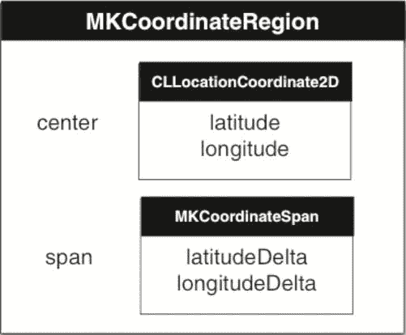

图 10-5. `MKCoordinateRegion` 的图形化表示。它包含两个成员，这两个成员本身也是各拥有两个成员的结构体

如果你回头看看图 10-2，你看到图钉的尖端位于通过 `MKCoordinateRegion.center` 传入的坐标点。地图顶部到底部的距离通过 `MKCoordinateRegion.span.latitudeDelta` 传入，以纬度度数表示。同样地，地图左侧到右侧的距离通过 `MKCoordinateRegion.span.longitudeDelta` 传入，以经度度数表示。

**提示** 如果你记不住哪条线是纬度，哪条线是经度，这里有一个来自我们三年级地理老师克拉巴佩尔夫人（Krabappel，发音为 kruh-bopple）的小窍门。纬度（latitude）听起来像海拔高度（altitude），所以纬度告诉你在球体上的高度。赤道是一条纬线。而本初子午线是一条经线。感谢克拉巴佩尔夫人！


这种方法给程序员带来了两个挑战。首先，谁会以经纬度为单位来思考呢？虽然纬度一度在世界各地大致代表相同的距离，但经度一度所代表的距离会随着你从极地移动到赤道而大幅变化，因此计算经度并非那么直截了当。

第二个挑战是，地图视图具有特定的宽高比（称为*宽高比*），而你指定的 `latitudeDelta` 和 `longitudeDelta` 必须代表具有相同宽高比的区域。幸运的是，Apple 提供了工具来处理这两个问题。

### 将度数转换为距离

无论你身在何处，每一纬度大约代表 69 英里（约 111 公里）。这使得确定传递给 `MKCoordinateSpan` 的 `latitudeDelta` 参数值相当容易计算。如果你使用英里，只需将你想要显示的横向距离除以 69；如果你使用公里，则除以 111。

**注意：** 由于地球并非完美球体（严格来说，它接近一个扁球体），因此每一纬度所代表的实际距离确实存在一些差异，但这种差异不足以让我们费心去计算它，因为从极地到赤道，它仅仅有大约一度的变化。在赤道上，每一纬度等于 69.046767 英里或 111.12 公里，当你向两极移动时，这个数值会略微变小。我们选择 69 和 111，因为它们是几乎在任何地方都与实际距离误差在 1% 以内的整洁整数。

然而，计算每一经度所代表的距离就不那么容易了。要对经度做同样的计算，你必须将纬度考虑在内，因为每一经度所代表的距离取决于你相对于赤道的位置。要计算经度所代表的距离，你必须进行一些复杂的数学运算。幸运的是，Apple 已经为你完成了这些复杂的计算，并提供了一个名为 `MKCoordinateRegionMakeWithDistance()` 的方法，你可以用它来创建一个区域。你提供作为中心点的坐标，以及纬度和经度跨度以米为单位的距离。该函数会查看所提供坐标中的纬度，并为你计算以度数为单位的两个 delta 值。以下是你创建一个区域以显示由 `CLLocationCoordinate2D` 结构体（名为 `center`）表示的特定位置周围每侧一公里区域的方法：

```
MKCoordinateRegion viewRegion = MKCoordinateRegionMakeWithDistance(center, 2000, 2000);
```

要显示 `center` 的每侧一公里，你必须为每个跨度总共指定 2000 米：左侧 1000 米加右侧 1000 米，以及顶部 1000 米加底部 1000 米。此调用之后，`viewRegion` 将包含一个格式正确的 `MKCoordinateRegion`，它几乎可以立即使用。剩下的就是处理宽高比问题。

### 复杂的数学运算

计算每一经度距离的数学运算其实并不那么复杂，所以我们认为应该向那些感兴趣的读者展示一下幕后原理。要计算在给定纬度下每一经度的距离，计算公式是：

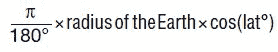

如果 Apple 没有为我们提供函数，你可以遵循这个公式创建几个宏来实现同样的功能。地球半径大约为 3963.1676 英里，即 6378.1 公里。因此，要计算存储在变量 `lat` 中特定纬度处的每一经度距离，你可以这样做：

```
double longitudeMiles = ((M_PI/180.0) × 3963.1676 × cos(latitude));
```

你也可以用同样的计算来确定每一经度以公里为单位的距离，如下所示：

```
double longitudeKilometers = ((M_PI/180.0) × 6378.1 × cos(latitude));
```

### 适应宽高比

在上一节中，我们展示了如何创建一个跨度来显示给定位置每侧一公里的区域。然而，除非地图视图是完美的正方形，否则视图无法恰好显示中心点四个方向各一侧的一公里。如果地图视图比其高度宽，那么 `longitudeDelta` 需要比 `latitudeDelta` 大。如果地图视图比其宽度高，则情况相反。

`MKMapView` 类有一个实例方法，可以调整坐标区域以匹配地图视图的宽高比。该方法名为 `regionThatFits:`。要使用它，你只需传入你创建的坐标区域，它将返回一个已调整为地图视图宽高比的新的坐标区域。使用方法如下：

```
MKCoordinateRegion adjustedRegion = [mapView regionThatFits:viewRegion];
```

### 设置要显示的区域

一旦你创建了一个坐标区域，就可以通过调用 `setRegion:animated:` 方法告诉地图视图显示该区域。如果你为第二个参数传入 `YES`，地图视图将进行缩放、平移或以其他方式动画显示视图从当前位置到新位置的过程。以下是一个示例，它创建一个坐标区域，将其调整为地图视图的宽高比，然后告诉地图视图显示该区域：

```
MKCoordinateRegion viewRegion = MKCoordinateRegionMakeWithDistance(center, 2000, 2000); 
MKCoordinateRegion adjustedRegion = [mapView regionThatFits:viewRegion];
[mapView setRegion:adjustedRegion animated:YES];
```

### 地图视图代理

如前所述，地图视图可以拥有代理。与表格视图和选择器不同，地图视图在没有代理的情况下也能正常工作。在地图视图代理上，你可以实现许多方法，以便在需要时获知与地图相关的特定任务通知。例如，它们允许你在用户通过拖动以显示地图新部分或通过缩放以显示更小或更大区域来改变他们正在查看的地图部分时得到通知。你还可以在地图视图从服务器加载新地图数据时或加载失败时得到通知。地图视图代理方法包含在 `MKMapViewDelegate` 协议中，任何用作地图视图代理的类都应遵循该协议。

#### 地图加载代理方法

从 iOS 6 开始，Map Kit 框架从 Google Maps 切换到了 Apple 提供的服务来执行其功能。除了临时缓存外，它不本地存储任何地图数据。每当地图视图需要到 Apple 的服务器检索新地图数据时，它会调用代理方法 `mapViewWillStartLoadingMap:`，当它成功检索到所需的地图数据时，它会调用代理方法 `mapViewDidFinishLoadingMap:`。如果你在任何时候有需要执行的应用程序特定处理，你可以在地图视图的代理上实现相应的方法。

如果 Map Kit 在从服务器加载地图数据时遇到错误，它会在其代理上调用方法 `mapViewDidFailLoadingMap:withError:`。至少，你应该实现这个代理方法，并通知用户存在问题，这样他们就不会坐在那里等待一个永远不会到来的更新。以下是该方法的非常简单的实现，它仅显示一个警报，让用户知道出了问题：

```
- (void)mapViewDidFailLoadingMap:(MKMapView *)mapView 
                       withError:(NSError *)error 
{
    UIAlertView *alert = [[UIAlertView alloc] 
        initWithTitle:NSLocalizedString(@"Error loading map", 
            @"Error loading map")
        message:[error localizedDescription] 
        delegate:nil 
        cancelButtonTitle:NSLocalizedString(@"Okay", @"Okay") 
        otherButtonTitles:nil];
    [alert show];
}
```

#### 区域更改代理方法


如果您的地图视图已启用，用户将能通过标准 iPhone 手势（如拖拽、双指捏合、双指张开和双击）与它交互。这些操作会改变视图中显示的区域。当地图视图的代理实现了相应方法时，每次发生此类改变都会调用两个代理方法。手势开始时，会调用代理方法 `mapView:regionWillChangeAnimated:`；手势结束时，则会调用 `mapView:regionDidChangeAnimated:`。如果您有需要在视图区域变化期间或变化完成后执行的功能，就应该实现这些方法。

### 判断坐标是否可见

在区域变化的代理方法中，您可能需要频繁执行的一项任务是判断特定的坐标集当前是否在屏幕上可见。对于标注以及用户的当前位置（如果正在被追踪），地图视图会自动为您处理这些判断。然而，有时您仍需要知道某个特定的坐标集是否位于地图视图当前显示的区域之内。

以下是判断方法：

```
CLLocationDegrees leftDegrees = mapView.region.center.longitude – 
                                (mapView.region.span.longitudeDelta / 2.0);
CLLocationDegrees rightDegrees = mapView.region.center.longitude + 
                                (mapView.region.span.longitudeDelta / 2.0);
CLLocationDegrees bottomDegrees = mapView.region.center.latitude – 
                                (mapView.region.span.latitudeDelta / 2.0);
CLLocationDegrees topDegrees = self.region.center.latitude + 
                                (mapView.region.span.latitudeDelta / 2.0);
if (leftDegrees > rightDegrees) { // 国际日期变更线在视图内
    leftDegrees = -180.0 - leftDegrees;
    if (coords.longitude > 0) // 坐标位于日期变更线以西
       coords.longitude = -180.0 - coords.longitude;
}
if (leftDegrees <= coords.longitude && coords.longitude <= rightDegrees &&
    bottomDegrees <= coords.latitude && coords.latitude <= topDegrees) {
    // 坐标正在被显示
}
```

在继续讲解其余的地图视图代理方法之前，我们需要讨论一下标注这个话题。

### 标注

地图视图提供了一种能力，可以用一组补充信息来标记某个特定位置。这些信息及其在地图上的图形表示被称为*标注*。您即将编写的应用程序中放置的大头针（参见图 10-2），就是一种形式的标注。标注由两个部分组成：*标注对象*和*标注视图*。地图视图会跟踪其所有的标注，并在需要显示某个标注时，调用其代理来获取相应的标注视图。

#### 标注对象

每个标注都必须有一个标注对象，该对象几乎总是您编写的自定义类，并且遵循 `MKAnnotation` 协议。标注对象通常是一个相当标准的数据模型对象，其职责是保存与所讨论标注相关的任意数据。标注对象需要响应两个方法，并实现一个属性。标注对象必须实现的这两个方法叫做 `title` 和 `subtitle`，它们是在标注的弹出框（即标注被选中时弹出的小浮动视图）中显示的信息。在图 10-4 中，您可以看到弹出框中显示的标题和副标题。在该例子中，标注对象返回的标题是 `You are Here!`，副标题是 `Stockton St, San Francisco, CA 94108`。

标注对象还必须有一个名为 `coordinate` 的属性，该属性返回一个 `CLLocationCoordinate2D`，用于指定标注应放置在世界上的哪个位置（地理位置上）。地图视图将使用该位置来确定标注的绘制位置。

#### 标注视图

正如我们之前所说，当地图视图需要显示其任何一个标注时，它会调用其代理来为那个标注获取一个标注视图。这是通过方法 `mapView:viewForAnnotation:` 实现的，该方法需要返回一个 `MKAnnotationView` 或其子类对象。标注视图是显示在地图上的对象，而不是标注被选中时弹出的浮动窗口。在图 10-4 中，标注视图就是窗口中央的大头针。它是一个大头针，因为您使用了 `MKAnnotationView` 的提供的子类 `MKPinAnnotationView`，该类设计用于绘制红色、绿色或紫色的大头针。它还包含一些 `MKAnnotationView` 所没有的额外功能，例如大头针落下的动画。

如果您对标注视图有高级绘制需求，可以对 `MKAnnotationView` 进行子类化，并实现自己的 `drawRect:` 方法。然而，通常并不需要对 `MKAnnotationView` 进行子类化，因为您可以创建一个 `MKAnnotationView` 实例，并将其 `image` 属性设置为您想要的任何图像。这开辟了无限的可能性，而无需对 `MKAnnotationView` 进行子类化或添加子视图（参见图 10-6）。

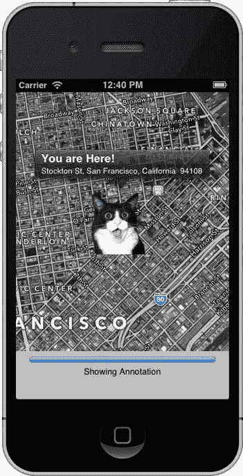

图 10-6. 通过设置 `MKAnnotationView` 的 `image` 属性，您几乎可以在地图上显示任何内容。在此示例中，我们将大头针替换成了一只惊讶的猫，因为这是我们一贯的风格。

#### 添加和移除标注

地图视图会跟踪其所有的标注，因此向地图添加标注只需调用地图视图的 `addAnnotation:` 方法，并提供一个遵循 `MKAnnotation` 协议的对象即可。

```
[mapView addAnnotation:annotation];
```

您也可以使用 `addAnnotations:` 方法，通过提供一个标注数组来添加多个标注。

```
[mapView addAnnotations:[NSArray arrayWithObjects:annotation1, annotation2, nil]];
```

您可以通过 `removeAnnotation:` 方法，传入单个要移除的标注来移除它，或者调用 `removeAnnotations:` 方法，传入包含多个要移除标注的数组来移除它们。所有地图视图的标注都可以通过名为 `annotations` 的属性进行访问，因此如果您想从视图中移除所有标注，可以这样做：

```
[mapView removeAnnotations:mapView.annotations];
```

#### 选中标注

在任何给定时间，只能有一个标注被选中。被选中的标注通常会显示一个*弹出框（callout）*，这是一个浮动气泡或其他视图，用于提供关于该标注的更详细信息。默认的弹出框会显示标注的标题和副标题。然而，您实际上可以自定义弹出框，它只是一个 `UIView` 的实例。我们不会在本章的应用程序中提供自定义的弹出框视图，但这个过程与我们在《**iOS 6 开发入门**》的第 8 章中自定义表格视图单元格的方式非常相似。有关自定义弹出框的更多信息，请查阅 `MKAnnotationView` 的文档。

**注意** 尽管当前只能选中单个标注，但 `MKMapView` 实际上使用了一个 `NSArray` 的实例来跟踪被选中的标注。这可能表明在未来的某个时候，地图视图将支持同时选中多个标注。目前，如果您提供了一个包含多个标注的 `selectedAnnotations` 数组，则只会选中该数组中的第一个对象。


如果用户点击注释的图像（图 10-4 中的图钉或图 10-6 中的震惊猫），则会选中该注释。您也可以通过`selectAnnotation:animated:`方法以编程方式选中注释，并通过`deselectAnnotation:animated:`方法取消选中注释，传入您想要选中或取消选中的注释。如果向第二个参数传递`YES`，它将为标注气泡的出现或消失添加动画效果。

#### 为地图视图提供注释视图

地图视图通过名为`mapView:viewForAnnotation:`的委托方法，向其委托请求与特定注释相对应的注释视图。每当注释进入地图视图的显示区域时，都会调用此方法。

与表格视图单元格的工作方式非常相似，注释视图在滚动出屏幕时会出队但不会被释放。`mapView:viewForAnnotation:`的实现应在分配新注释视图之前，先询问地图视图是否有任何已出队的注释视图。这意味着`mapView:viewForAnnotation:`看起来会很像您编写过的许多`tableView:cellForRowAtIndexPath:`方法。以下是一个示例，它创建了一个注释视图，设置其`image`属性以显示自定义图像，并返回该视图：

```
- (MKAnnotationView *) mapView:(MKMapView *)theMapView viewForAnnotation:(id <MKAnnotation>) annotation
{
    static NSString *placemarkIdentifier = @"my annotation identifier";
    if ([annotation isKindOfClass:[MyAnnotation class]]) {
        MKAnnotationView *annotationView =             [theMapView dequeueReusableAnnotationViewWithIdentifier:placemarkIdentifier];
        if (annotationView == nil)  {
            annotationView = [[MKAnnotationView alloc] initWithAnnotation:annotation 
                reuseIdentifier:placemarkIdentifier];
            annotationView.image = [UIImage imageNamed:@"shocked_cat.png"];
        } 
        else 
            annotationView.annotation = annotation;
        return annotationView;
    }
    return nil;
}
```

这里有几件事需要注意。首先，请注意您检查了注释类，以确保它是您所了解的注释。地图视图委托会收到所有注释的通知，而不仅仅是自定义注释。之前，我们讨论过封装用户位置的`MKUserLocation`对象。嗯，那也是一个注释，当您为地图开启用户跟踪时，每当需要显示用户位置时，就会调用您的委托方法。您可以为该注释提供自己的注释视图，但如果返回`nil`，地图视图将使用默认的注释视图。一般来说，对于任何您不认识的注释，您的方法应返回`nil`，地图视图很可能会正确处理它。

请注意，有一个名为`placemarkIdentifier`的标识符值。这使您能够确保出队的是正确类型的注释视图。您不限于只为地图的所有注释使用一种类型的注释视图，而标识符就是您区分哪些注释视图用于何用途的方式。

如果您确实出队了一个注释视图，那么务必将其`annotation`属性设置为传入的注释（在前面的示例中为`annotation`）。已出队的注释视图几乎肯定链接到某个注释，但不一定是应该链接的那个。

#### 地理编码与反向地理编码

核心定位的一个主要特性是*地理编码*。地理编码是指能够将坐标（以经度和纬度指定）转换为该坐标的用户友好表示形式。将用户友好的位置描述（即地址）转换为经纬度称为*正向地理编码*。*反向地理编码*则是将经纬度转换为用户友好的位置描述。

地理编码在核心定位中由`CLGeocoder`类处理。`CLGeocoder`在后台异步工作，查询相应的服务。在正向地理编码的情况下，`CLGeocoder`使用 iPhone 内置的 GPS 功能。对于反向地理编码，`CLGeocoder`查询一个大型坐标数据库（在此情况下，是苹果的数据库）。

在几乎所有位置，反向地理编码都能告诉您所在的国家和州或省。人口越稠密的区域，您可能获得的信息就越多。如果您身处大城市市中心，您很可能能够检索到所在建筑物的街道地址。在大多数城市和城镇，反向地理编码至少能让您知道所在街道的名称。棘手之处在于，您永远无法确定会获得何种详细程度的信息。

对于本章的应用程序，您将使用`CLGeocoder`的反向地理编码功能。要执行反向地理编码，首先创建一个`CLGeocoder`实例。然后调用`reverseGeocodeLocation:completionHandler:`来执行地理编码。`completionHandler:`参数的类型是`CLGeocodeCompletionHandler`，这是一个*块*。块是一个匿名内联函数，它封装了其执行位置的词法作用域。对于`reverseGeocodeLocation:completionHandler:`，无论反向地理编码尝试成功还是失败，都会执行`completionHandler:`块。

```
CLGeocoder *geocoder = [[CLGeocoder alloc] init];
[geocoder reverseGeocodeLocation:location completionHandler:^(NSArray *placemarks, NSError *error) {
    // process the location or errors
     ...
}
```

**注意**  您可以从苹果了解更多关于块的信息。他们关于块的文档从这里开始：

[`developer.apple.com/library/ios/#featuredarticles/Short_Practical_Guide_Blocks/_index.html`](https://developer.apple.com/library/ios/#featuredarticles/Short_Practical_Guide_Blocks/_index.html)

如果反向地理编码成功，将调用完成处理程序，并且`placemarks`数组将被填充。该数组应只包含一个对象，类型为`CLPlacemark`。如果在反向地理编码期间发生错误或请求被取消，则`placemarks`数组将为`nil`。在这种情况下，完成处理程序将收到一个`NSError`对象，详细说明失败原因。

表 10-1 将`CLPlacemark`的术语映射为您可能更熟悉的术语。

表 10-1. `CLPlacement` 属性定义

| `CLPlacemark` 属性 | 含义 |
| --- | --- |
| `Thoroughfare` | 街道地址。如果是多行，则为第一行。 |
| `subThoroughfare` | 街道地址，第二行（例如，公寓或单元号、邮箱号） |
| `Locality` | 城市 |
| `SubLocality` | 这可能包含社区或地标名称，但通常为`nil` |
| `administrativeArea` | 州、省、地区或其他类似单位 |
| `dministrativeArea` | 县 |
| `postalCode` | 邮政编码 |
| `Country` | 国家 |
| `countryCode` | 两位 ISO 国家代码（参见：[`en.wikipedia.org/wiki/ISO_3166-1_alpha-2`](http://en.wikipedia.org/wiki/ISO_3166-1_alpha-2)） |

知道吗？关于地图套件的讨论就到此为止。让我们开始实际使用它吧。

### 构建 MapMe 应用程序

让我们构建一个展示地图套件一些基本功能的应用程序。首先，使用“Single View Application”模板在 Xcode 中创建一个新项目。将新项目命名为**MapMe**。您将不会使用故事板，因此只应勾选“Use Automatic Reference Counting”复选框。

#### 链接地图套件和核心定位框架


在开始编写任何代码之前，你需要先添加 **Core Location** 和 **Map Kit** 框架。在项目编辑器中导航到 `MapMe` 目标的 **Build Phases** 选项卡。展开 **Link Binary With Libraries (3 items)** 部分。点击左下角的 `+` 按钮。选择 `CoreLocation.framework` 和 `MapKit.framework`（记住，你可以按住  键点击来同时选择多个框架）。点击 **Add** 按钮。这两个框架应该会出现在导航窗格中。你可以将 `CoreLocation.framework` 和 `MapKit.framework` 拖拽到 **Frameworks** 组中，让项目结构更整洁一些。

### 构建界面

选择 `ViewController.xib` 来编辑用户界面。当 Interface Builder 打开后，从库中拖拽一个圆角矩形按钮到视图上。使用蓝色参考线将按钮对齐到视图的右下角。双击这个新放置的按钮来编辑其标题，并输入 `Go`。

从库中拖拽一个进度视图，并将其放置在按钮的左侧，使进度视图的顶部与按钮的顶部对齐。使用蓝色参考线调整大小，使其水平方向从左边界延伸到右边界。它会与按钮重叠，这是没问题的。

接下来，从库中拖拽一个标签到视图上，并将其放置在进度条的下方。水平调整其大小，使其占据从左边界参考线到右边界参考线的整个宽度。现在，使用属性检查器将标签的文本设置为居中对齐，并将字体大小更改为 13，以便文本更合适。最后，删除“Label.”这段文本。

在对象库中找到地图视图（图 10-7）。将地图视图拖拽到视图上。将地图视图的顶部和左侧与视图对齐。将地图视图的宽度调整为窗口视图的宽度。然后将地图视图向底部调整大小，直到出现蓝色参考线，刚好位于你之前放置在底部的进度条和按钮上方（图 10-8）。

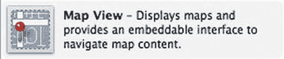

图 10-7  地图视图在对象库中的显示（列表视图）

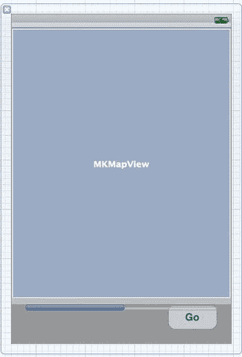

图 10-8  在进度条和按钮上方布局地图视图

现在，你要建立 **Outlets** 和 **Action** 连接。将编辑器置于 **Assistant** 模式（通过工具栏）。**Assistant** 应在 Interface Builder 右侧打开 `ViewController.h`。按住 **Control** 键并从 `Go` 按钮拖拽到 `@interface` 声明下方。请确保你已经选中了按钮，而不是（不可见的）标签。当连接弹出窗口出现时，**Type** 字段应为 `UIButton`。将连接类型设置为 **Outlet**，并将其命名为 `button`。接下来，再次按住 Control 键并从 `Go` 按钮拖拽到 `@end` 声明上方。这次添加一个 **Action**，并将其命名为 `findMe`。

现在，按住 Control 键从进度条拖拽到你刚才添加的按钮属性下方。创建一个名为 `progressBar` 的 **Outlet**，确保其类型为 `UIProgressView`。使用属性编辑器，点击标记为 **Hidden** 的复选框，这样进度条在你想要向用户报告进度之前都是不可见的。

接下来，按住 Control 键从（不可见的）标签拖拽到 `progressBar` 属性下方。你需要猜测标签的大致位置。或者，你也可以像上一章那样，从 **Object Dock**（对象停靠栏）中拖拽标签。无论哪种方式，都将这个 outlet 命名为 `progressLabel`。

最后，按住 Control 键从地图视图拖拽到 `progressLabel` 属性声明下方。将这个 outlet 命名为 `mapView`。按住 Control 键从地图视图拖拽到 **Object Dock** 中的 **File's Owner** 图标。当 **Outlets** 弹出窗口出现时，选择 **delegate**。

保存 XIB。在继续之前，将编辑器切换回 **Standard** 模式。

### 完成视图控制器接口

选择 `ViewController.h` 进行编辑。首先，导入 Map Kit 和 Core Location 的头文件，因为你要在此应用中使用 Core Location 和 Map Kit。

```objc
#import <CoreLocation/CoreLocation.h>
#import <MapKit/MapKit.h>
```

你需要让你的类遵循以下代理协议：

*   `CLLocationManagerDelegate`：以便你能收到来自 Core Location 关于用户当前位置的通知。
*   `MKMapKitDelegate`：因为你将成为地图视图的委托对象。
*   `UIAlertViewDelegate`：用于处理告警视图，当出现问题时，你将用它来通知用户。

```objc
@interface ViewController : UIViewController <CLLocationManagerDelegate, MKMapViewDelegate, 
                                               UIAlertViewDelegate>
```

紧跟在 `@interface` 声明之后，你声明了三个实例变量，用于存储你将在应用中使用的 `CLLocationManager`、`CLGeocoder` 和 `CLPlacemark` 对象。你将其声明为实例变量而非属性，因为你不需要将这些对象暴露给你的接口。

```objc
{
    CLLocationManager *manager;
    CLGeocoder *geocoder;
    CLPlacemark *placemark;
}
```

**注意**  尽管地图视图能够追踪用户的当前位置，但在此应用中，你将使用 Core Location 手动追踪用户位置。通过手动操作，我们可以向你展示更多 Map Kit 的功能。如果你在自己的应用中需要追踪用户位置，只需让地图视图替你完成即可。

就是这样。你已通过 Interface Builder 声明了所需的 **Outlets** 和 **Action**。保存 `ViewController.h`。在编写实现文件之前，你需要先处理你的标注类。

### 编写标注对象类

你需要创建一个类来保存你的标注对象。你将构建一个简单的类来存储一些地址信息，这些信息将从地理编码器中获取。在导航窗格中选择 `MapMe` 组。创建一个名为 `MapLocation` 的新 Objective-C 类，并使其成为 `NSObject` 的子类。

新文件创建好后，单击 `MapLocation.h`。首先，你需要包含 Map Kit 的头文件。

```objc
#import <MapKit/MapKit.h>
```

你需要更改 `MapLocation` 以使其遵循 `MKAnnotation` 和 `NSCoding` 协议。

```objc
@interface MapLocation : NSObject <MKAnnotation, NSCoding>
```

我们说过标注对象是非常标准的数据模型类，对吧？我们让其遵循了 `MKAnnotation` 和 `NSCoding` 协议。你实际上并不会使用归档功能，但让数据模型类遵循 `NSCoding` 是一个好习惯。

接下来，你需要属性来存储地址数据，以及一个 `CLLocationCoordinate2D` 属性，用于在地图上追踪此标注的位置。

```objc
@property (strong, nonatomic) NSString *street;
@property (strong, nonatomic) NSString *city;
@property (strong, nonatomic) NSString *state;
@property (strong, nonatomic) NSString *zip;
@property (nonatomic, readwrite) CLLocationCoordinate2D coordinate;
```

请注意，你特意将 `coordinate` 属性声明为了 `readwrite`。`MKAnnotation` 协议将此属性声明为 `readonly`。你也可以按此方式声明，然后通过使用底层实例变量来设置 `coordinate` 属性，但你要使用该属性来让其他类设置你的标注的坐标。重新定义属性，使其比在已遵循的协议或超类中声明的同一属性具有更宽松的访问权限，这是允许的。你总是可以将 `readonly` 或 `writeonly` 属性重新定义为 `readwrite`，但必须显式使用 `readwrite` 关键字。大多数情况下，这个关键字不会被用到，因为它是默认值，且并非必要。

保存 `MapLocation.h` 并切换到实现文件 `MapLocation.m`。首先，实现 `MKAnnotation` 协议的方法。

```objc
#pragma mark - MKAnnotation 协议方法
```


- (NSString *)title
{
    return NSLocalizedString(@"你在这里！", @"你在这里！");
}

- (NSString *)subtitle
{
    NSMutableString *result = [NSMutableString string];
    if (self.street)
        [result appendString:self.street];
    if (self.street && (self.city || self.state || self.zip))
        [result appendString:@", "];
    if (self.city)
        [result appendString:self.city];
    if (self.city && self.state)
        [result appendString:@", "];
    if (self.state)
        [result appendString:self.state];
    if (self.zip)
        [result appendFormat:@"  %@", self.zip];

return result;
}

这里其实没有任何会让你感到困惑的内容。对于`MKAnnotation`协议中的`title`方法，你只需返回“你在这里！”。然而，`subtitle`方法要稍微复杂一些。由于你无法预知反向地理编码器会返回哪些数据元素，因此必须根据已有的数据来构建副标题字符串。实现方式就是声明一个可变字符串，然后依次追加那些非 nil、非空属性的值。

此外，你还需要实现`NSCoder`协议的方法。

```objc
#pragma mark - NSCoder 协议方法

- (void)encodeWithCoder:(NSCoder *)aCoder
{
    [aCoder encodeObject:self.street forKey:@"street"];
    [aCoder encodeObject:self.city forKey:@"city"];
    [aCoder encodeObject:self.state forKey:@"state"];
    [aCoder encodeObject:self.zip forKey:@"zip"];
}

- (id)initWithCoder:(NSCoder *)aDecoder
{
    self = [super init];
    if (self) {
        [self setStreet:[aDecoder decodeObjectForKey:@"street"]];
        [self setCity:[aDecoder decodeObjectForKey:@"city"]];
        [self setState:[aDecoder decodeObjectForKey:@"state"]];
        [self setZip:[aDecoder decodeObjectForKey:@"zip"]];
    }
    return self;
}
```

其余部分都是对`MapLocation`类进行编码和解码的标准操作，所以我们接着来实现`ViewController`类。继续操作前，请先保存`MapLocation.m`文件。

实现 MapMe 的 ViewController

单击`ViewController.m`文件。首先，添加对`MapLocation`头文件的导入。

```objc
#import "MapLocation.h"
```

接下来，你需要定义一些用于处理标注和反向地理编码的私有类别方法。在类别接口声明中，添加以下两个方法声明：

```objc
@interface ViewController ()
- (void)openCallout:(id<MKAnnotation>)annotation;
- (void)reverseGeocode:(CLLocation *)location;
@end
```

然后，在`viewDidLoad:`方法中设置地图视图的地图类型。声明所有三种地图类型，其中两种被注释掉。这样做只是为了方便你切换当前使用的类型并进行一些实验。将这些代码添加到对`super`的调用之后。

```objc
self.mapView.mapType = MKMapTypeStandard;
//self.mapView.mapType = MKMapTypeSatellite;
//self.mapView.mapType = MKMapTypeHybrid;
```

现在，实现当用户按下按钮时被调用的操作（Action）方法`findMe`。

```objc
#pragma mark - 操作方法

- (IBAction)findMe:(id)sender
{
    if (manager == nil)
        manager = [[CLLocationManager alloc] init];

manager.delegate = self;
    manager.desiredAccuracy = kCLLocationAccuracyBest;
    [manager startUpdatingLocation];

self.progressBar.hidden = NO;
    self.progressBar.progress = 0.0;
    self.progressLabel.text = NSLocalizedString(@"正在确定当前位置",                                                
                                                 @"正在确定当前位置");

self.button.hidden = YES;
}
```

如前所述，你本可以使用地图视图追踪用户位置的功能，但为了学习更多功能，你选择了手动方式。因此，你分配并初始化了一个`CLLocationManager`实例来确定用户位置。你将`self`设置为代理，并告诉位置管理器你需要最高精度，然后才让它开始更新位置。接着，你取消隐藏进度条，并设置进度标签以告知用户正在尝试确定当前位置。最后，你隐藏了按钮，这样用户就无法再次点击它。

现在，你来实现之前在`ViewController.m`开头声明的私有类别方法。

```objc
#pragma mark - （私有）实例方法

- (void)openCallout:(id<MKAnnotation>)annotation
{
    self.progressBar.progress = 1.0;
    self.progressLabel.text = NSLocalizedString(@"正在显示标注", @"正在显示标注");
    [self.mapView selectAnnotation:annotation animated:YES];
}
```

稍后你将使用`openCallout:`方法来选中你的标注。当你将标注添加到地图视图时，无法直接选中它。你必须等到它被添加之后才能选中。这个方法通过使用`performSelector:withObject:afterDelay:`来允许你选中一个标注，从而打开该标注的标注框（callout）。在此方法中，你只需更新进度条和进度标签以显示你已进入最后一步，然后使用`MKMapView`的`selectAnnotation:animated:`方法来选中标注，这将会显示其标注视图。

你还声明了另一个名为`reverseGeocode:`的私有方法。同样，稍后你会用到它。给定一个`CLLocation`实例，它会尝试对位置进行反向地理编码。如果成功，它将创建一个`MapLocation`标注并将其发送到地图视图。如果发生错误，则会弹出一个警告对话框。

```objc
- (void)reverseGeocode:(CLLocation *)location
{
    if (!geocoder)
        geocoder = [[CLGeocoder alloc] init];

[geocoder reverseGeocodeLocation:location completionHandler:^(NSArray* placemarks, NSError* error){
        if (nil != error) {
            UIAlertView *alert =                 [[UIAlertView alloc]                     initWithTitle:NSLocalizedString(@"将坐标转换为位置时出错",
                                                    @"将坐标转换为位置时出错")
                    message:NSLocalizedString(@"地理编码器无法识别坐标",
                                              @"地理编码器无法识别坐标")
                    delegate:self
                    cancelButtonTitle:NSLocalizedString(@"确定", @"确定")
                    otherButtonTitles:nil];
            [alert show];

}
        else if ([placemarks count] > 0) {
            placemark = [placemarks objectAtIndex:0];

self.progressBar.progress = 0.5;
            self.progressLabel.text = NSLocalizedString(@"位置已确定",                                                         @"位置已确定");

MapLocation *annotation = [[MapLocation alloc] init];
            annotation.street = placemark.thoroughfare;
            annotation.city = placemark.locality;
            annotation.state = placemark.administrativeArea;
            annotation.zip = placemark.postalCode;
            annotation.coordinate = location.coordinate;

[self.mapView addAnnotation:annotation];
        }
    }];
}
```

接下来，添加`CLLocationManagerDelegate`方法。

```objc
#pragma mark - CLLocationManagerDelegate 方法

- (void)locationManager:(CLLocationManager *)aManager    
    didUpdateToLocation:(CLLocation *)newLocation            
        fromLocation:(CLLocation *)oldLocation
{
    if ([newLocation.timestamp timeIntervalSince1970] < [NSDate timeIntervalSinceReferenceDate] - 60)
        return;
```


```objc
MKCoordinateRegion viewRegion =
    MKCoordinateRegionMakeWithDistance(newLocation.coordinate, 2000, 2000);
MKCoordinateRegion adjustedRegion = [self.mapView regionThatFits:viewRegion];
[self.mapView setRegion:adjustedRegion animated:YES];

aManager.delegate = nil;
[aManager stopUpdatingLocation];

self.progressBar.progress = 0.25;
self.progressLabel.text = NSLocalizedString(@"Reverse Geocoding Location",
                                            @"Reverse Geocoding Location");

[self reverseGeocode:newLocation];
```

首先，你需要检查当前操作使用的是否是最近一分钟内获取的**新位置**，而非缓存的位置。然后使用 `MKCoordinateRegionMakeWithDistance()` 函数创建一个区域，该区域以用户当前位置为中心，边长为 2000 米（各向延伸 1000 米）。接着根据地图视图的宽高比调整该区域，并让地图视图显示这个调整后的新区域。现在你已经得到了非缓存的位置信息，接下来要停止让位置管理器继续提供更新。位置更新会消耗电量，因此当不再需要更新时，应关闭位置管理器。随后更新进度条和标签，让用户了解当前在整个流程中的进度。这是点击 `Go` 按钮后的四个步骤中的第一步，因此你将进度设为 `.25`，这会显示四分之一的蓝色进度条。最后，调用 `reverseGeocoder:` 方法将新位置转换为注释并更新地图视图。

如果位置管理器遇到错误，只需弹出一个警告框。虽然不是最 robust 的错误处理方案，但对于本教程来说已经足够了。

```objc
- (void)locationManager:(CLLocationManager *)manager didFailWithError:(NSError *)error
{
    NSString *errorType = (error.code == kCLErrorDenied)
                        ? NSLocalizedString(@"Access Denied", @"Access Denied")
                        : NSLocalizedString(@"Unknown Error", @"Unknown Error");

UIAlertView *alert = [[UIAlertView alloc] initWithTitle:NSLocalizedString(@"Error getting Location",
                                                                           @"Error getting Location")
                                                  message:errorType
                                                 delegate:self
                                        cancelButtonTitle:NSLocalizedString(@"OK", @"OK")
                                        otherButtonTitles:nil];
    [alert show];
}
```

现在，添加 `MapView` 的代理方法。

```objc
#pragma mark - MKMapViewDelegate Methods

- (MKAnnotationView *)mapView:(MKMapView *)aMapView viewForAnnotation:(id<MKAnnotation>)annotation
{
    static NSString *placemarkIdentifier = @"Map Location Identifier";
    if ([annotation isKindOfClass:[MapLocation class]]) {
        MKPinAnnotationView *annotationView =
          (MKPinAnnotationView *)[aMapView dequeueReusableAnnotationViewWithIdentifier:placemarkIdentifier];
        if (nil == annotationView) {
            annotationView = [[MKPinAnnotationView alloc] initWithAnnotation:annotation
                                                             reuseIdentifier:placemarkIdentifier];
        }
        else
            annotationView.annotation = annotation;

annotationView.enabled = YES;
        annotationView.animatesDrop = YES;
        annotationView.pinColor = MKPinAnnotationColorPurple;
        annotationView.canShowCallout = YES;
        [self performSelector:@selector(openCallout:) withObject:annotation afterDelay:0.5];

self.progressBar.progress = 0.75;
        self.progressLabel.text = NSLocalizedString(@"Creating Annotation", @"Creating Annotation");

return annotationView;
    }
    return nil;
}
```

当你作为代理的地图视图需要一个注释视图时，它会调用 `mapView:viewForAnnotation:`。首先要做的是声明一个标识符，以便能够重用（dequeue）正确的注释视图类型，然后确保地图视图询问的是你了解的注释类型。如果是，就用标识符从重用队列中取出一个 `MKPinAnnotationView` 实例。如果没有可重用的视图，则创建一个新的。你也可以在此处使用 `MKAnnotationView` 代替 `MKPinAnnotationView`。实际上，在项目归档中有一个备选版本，展示了如何使用 `MKAnnotationView` 显示自定义注释视图而非大头针。如果你没有创建新视图，说明从地图视图中获取了一个重用的视图，此时需要确保该视图与正确的注释关联。然后进行一些配置。

- 确保注释视图已启用，以便可以被选中。
- 将 `animatesDrop` 设置为 `YES`，因为这是一个大头针视图，你希望它像通常的大头针那样掉落到地图上。
- 将大头针颜色设置为紫色，并确保它可以显示标注气泡。
- 之后，使用 `performSelector:withObject:afterDelay:` 调用你之前创建的那个私有方法。
- 注释视图实际显示在地图上之前无法被选中，因此你等待半秒钟确保显示完成后再进行选中。这也确保在标注气泡显示前大头针已结束下落动画。
- 需要更新进度条和文字标签，让用户知道任务即将完成。
- 然后返回注释视图。如果该注释不是你所识别的类型，则返回 `nil`，地图视图将为该类型注释使用默认的注释视图。
- 实现 `mapViewDidFailLoadingMap:withError:`，并在加载地图出现问题时通知用户。同样，本应用程序中的错误检查非常基础；只是通知用户并停止所有操作。

```objc
- (void)mapViewDidFailLoadingMap:(MKMapView *)aMapView withError:(NSError *)error
{
    UIAlertView *alert = [[UIAlertView alloc] initWithTitle:NSLocalizedString(@"Error loading map",
                                                                              @"Error loading map")
                                                    message:[error localizedDescription]
                                                   delegate:nil
                                          cancelButtonTitle:NSLocalizedString(@"OK", @"OK")
                                          otherButtonTitles:nil];
    [alert show];
}
```

- 最后，实现 `UIAlertView` 的代理方法。它将隐藏进度条，并将进度标签设置为空字符串。为简化起见，如果出现问题，我们直接让应用程序终止。在你的实际应用中，可能需要采取更友好的处理方式。

```objc
#pragma mark - UIAlertViewDelegate Method

- (void)alertView:(UIAlertView *)alertView didDismissWithButtonIndex:(NSInteger)buttonIndex
{
    self.progressBar.hidden = YES;
    self.progressLabel.text = @"";
    self.button.hidden = NO;
}
```

现在你应该能够构建并运行你的应用程序了，请尝试一下。

**注意**：在模拟器中运行时，可能会遇到问题。请尝试启动应用，但在按下 `Go` 按钮之前，使用调试跳转栏中的位置模拟器设置一个位置。

尝试修改代码。更改地图类型、添加更多注释，或尝试使用自定义注释视图。

向东前进吧，年轻的程序员！


