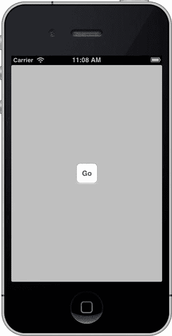
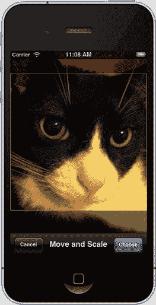
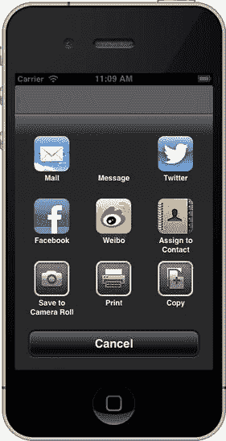
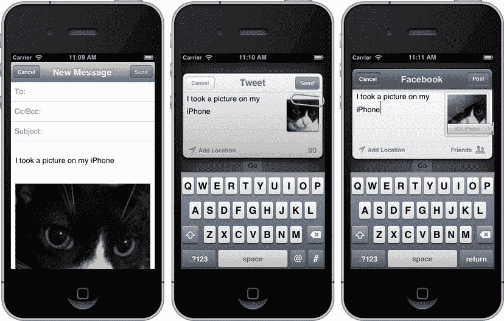

# 第 11 章：消息传递：邮件、短信和社交媒体

自 iOS SDK 诞生之初，苹果就为开发者提供了发送消息的手段。这一切始于 `MessageUI` 框架，该框架允许开发者在其应用中增加发送电子邮件消息的支持。接着，苹果扩展了 `MessageUI` 框架，使其支持短信。在 iOS 5 中，苹果通过一个新的 Twitter 框架增加了对 Twitter 的支持。如今，在 iOS 6 中，苹果已从 Twitter 框架迁移到 `Social` 框架，增加了对 Facebook、新浪微博和 Twitter 的支持。让我们逐一了解每种消息系统的工作原理。

### 本章应用

在本章中，你将构建一个应用程序，它允许用户使用 iPhone 的摄像头拍摄照片，或者，如果他们使用的是模拟器而没有摄像头，那么你将允许他们从照片库中选择一张图片。他们可以对得到的图片进行处理，并通过电子邮件、短信、Facebook 或 Twitter 发送给朋友，而无需离开应用程序。

**注意**  虽然可以通过“信息”应用发送照片，但苹果并未向开发者公开此功能。此功能被称为*多媒体短信服务*，简称 MMS。iOS SDK 仅允许你使用*短消息服务*（SMS）发送文本消息。因此，在应用程序中你只能发送文本消息。

你的应用程序界面将非常简单（图 11-1）。它将包含一个用于启动整个过程的按钮。点击该按钮将调出相机选择控制器，其方式与《Beginning iOS 6 Development》（Apress, 2012）第 20 章的示例程序类似。一旦用户拍摄或选择了图片，他们将能够裁剪和/或缩放图片（图 11-2）。假设他们没有取消操作，图片选择器将返回一张图片，并显示一个活动视图，询问用户希望如何发送消息（图 11-3）。根据他们的选择，你将显示相应的撰写视图（图 11-4）。你将用文本和选中的图片（除非是短信）填充撰写视图。最后，一旦消息发送，你将提供一些反馈，确认消息已发送。



图 11-1.  本章的应用拥有一个非常简单的用户界面，包含一个按钮



图 11-2.  用户可以用相机拍照或从照片库中选取图片，然后裁剪并缩放图片



图 11-3.  选择并编辑图片后，你将显示消息选择器视图



图 11-4.  邮件、Twitter 和 Facebook 的撰写视图

**警告**  本章中的应用程序将在模拟器中运行，但不会使用相机，而是允许你从模拟器的照片库中选择一张图片。如果你曾经使用过模拟器中的“重置内容和设置”菜单项，那么你很可能已经丢失了相册的默认内容，并且没有可用的图片。你可以通过在模拟器中启动 Mobile Safari 并导航到网页上的图片来纠正这一点。确保你正在查看的图片*不是*链接，而是一张静态图片。此方法不适用于链接图片。将鼠标光标悬停在一张图片上，点击并按住鼠标按钮，会弹出一个操作表。其中一个选项是“存储图像”。这会将选中的图片添加到你的 iPhone 照片库中。

此外，请注意，你将无法在模拟器中发送电子邮件。你可以创建电子邮件，模拟器会显示已发送，但这都是假的。邮件最终只会进入“待发送”列表。

### `MessageUI` 框架

要将电子邮件和短信服务嵌入到你的应用程序中，请使用 `MessageUI` 框架。它是 iOS SDK 中最小的框架之一。它由两个类 `MFMailComposeViewController` 和 `MFMessageComposeViewController`，以及它们对应的委托协议组成。

每个类都附带一个静态方法，用于判断设备是否支持该服务。对于 `MFMailComposeViewController`，该方法是 `canSendMail`；对于 `MFMessageComposeViewController`，该方法是 `canSendText`。在尝试发送电子邮件或短信之前，检查你的设备是否能够发送是一个好主意。

```
if ([MFMailComposeViewController canSendMail)] {
    // 发送电子邮件的代码
    . . .
}
if ([MFMessageComposeViewController canSendText]) {
    // 发送短信的代码
    . . .
}
```

让我们先回顾一下电子邮件类 `MFMailComposeViewController`。

#### 创建邮件撰写视图控制器

使用 `MFMailComposeViewController` 类非常简单。你创建一个实例，设置其委托，设置任何你想要预填的属性，然后以模态方式呈现它。当用户完成电子邮件的撰写并点击发送或取消按钮时，邮件撰写视图控制器会通知其委托，由委托负责关闭模态视图。以下是创建邮件撰写视图控制器并设置其委托的方法：

```
MFMailComposeViewController *mc = [[MFMailComposeViewController alloc] init];
mc.mailComposeDelegate = self;
```

#### 填充主题行

在呈现邮件撰写视图之前，你可以预先配置邮件撰写视图控制器的各种字段，例如主题和收件人（收件人:、抄送: 和密送:），以及正文和附件。你可以通过调用 `MFMailComposeViewController` 实例上的 `setSubject:` 方法来填充主题，如下所示：

```
[mc setSubject:@"你好，世界！"];
```

#### 填充收件人

电子邮件可以发送给三类收件人。邮件的主要收件人称为*收件人:*，显示在标有*收件人:*的行上。被抄送的收件人显示在*抄送:*行上。如果你想将某人包含在邮件中，但又不让其他收件人知道此人也在接收邮件，则可以使用*密送:*行（代表“盲抄送”）。使用 `MFMailComposeViewController` 时，你可以填充所有这三个字段。

要设置主要收件人，请使用 `setToRecipients:` 方法，并传入一个包含所有收件人电子邮件地址的 `NSArray` 实例。示例如下：

```
[mc setToRecipients:@[@"manny.sullivan@me.com"]];
```

以相同方式设置其他两类收件人，不过你将分别使用 `setCcRecipients:` 方法处理抄送收件人，以及 `setBccRecipients:` 方法处理密送收件人。

```
[mc setCcRecipients:@[@"maru@boxes.co.jp"]];
[mc setBccRecipients:@[@"lassie@helpfuldogs.org"]];
```

#### 设置消息正文


您也可以使用任意文本填充邮件正文。您既可以使用普通字符串创建纯文本邮件，也可以使用 HTML 创建格式化邮件。要为邮件撰写视图控制器提供邮件正文，请使用 `setMessageBody:isHTML:` 方法。如果您传入的字符串是纯文本，则应将 `NO` 作为第二个参数传入；但如果您在第一个参数中提供的是 HTML 标记而非纯文本字符串，则应在第二个参数中传入 `YES`，以便您的标记在显示给用户之前会被解析。

```
[mc setMessageBody:@"Ohai!!!\n\nKThxBai" isHTML:NO];
[mc setMessageBody:@"<HTML><B>Ohai</B><BR/>I can has cheezburger?</HTML>" isHTML:YES];
```

#### 添加附件

您也可以为外发邮件添加附件。为此，您必须提供一个包含待附加数据的 `NSData` 实例，以及附件的 MIME 类型和要用于附件的文件名。*MIME 类型*（我们在第 9 章讨论与 Web 服务器交互时简要提及过）是定义通过互联网传输的数据类型的字符串。它们用于从 Web 服务器检索或发送文件，也用于发送电子邮件附件。要为外发邮件添加附件，请使用 `addAttachmentData:mimeType:fileName:` 方法。以下是一个将应用程序包中存储的图像添加为附件的示例：

```
NSString *path = [[NSBundle mainBundle] pathForResource:@"surpriseCat" ofType:@"png"];
NSData *data = [NSData dataWithContentsOfFile:path];
[mc addAttachmentData:data mimeType:@"image/png" fileName:@"surpriseCat"];
```

#### 呈现邮件撰写视图

一旦您使用所有要填充的数据配置好控制器后，就可以像之前一样呈现控制器的视图：

```
[self presentViewController:mc animated:YES completion:nil];
```

#### 邮件撰写视图控制器委托方法

邮件撰写视图控制器委托的方法包含在正式协议 `MFMailComposeViewControllerDelegate` 中。无论用户是发送还是取消，也无论系统是否能够发送消息，都会调用 `mailComposeController:didFinishWithResult:error:` 方法。与大多数委托方法一样，第一个参数是指向调用委托方法的对象的指针。第二个参数是*结果码*，它告诉您外发邮件的最终状态；第三个参数是 `NSError` 实例，如果遇到问题，它将提供更详细的信息。无论您收到什么结果码，您都有责任在此方法中通过调用 `dismissModalViewControllerAnimated:` 来关闭邮件撰写视图控制器。

如果用户点击了“取消”按钮，您的委托将收到结果码 `MFMailComposeResultCancelled`。在这种情况下，用户改变了主意，决定不发送邮件。如果用户点击了“发送”按钮，结果码将取决于 `MessageUI` 框架是否能够成功发送邮件。如果能够发送消息，结果码将是 `MFMailComposeResultSent`。如果尝试发送但失败了，结果码将是 `MFMailComposeResultFailed`，在这种情况下，您可能希望检查提供的 `NSError` 实例以了解哪里出了问题。如果由于当前没有网络连接而无法发送消息，但消息已保存到发件箱中以供稍后发送，您将收到结果码 `MFMailComposeResultSaved`。

以下是一个非常简单的委托方法实现，它仅记录了所发生的情况：

```
- (void)mailComposeController:(MFMailComposeViewController*)controller
            didFinishWithResult:(MFMailComposeResult)result
                         error:(NSError*)error
{
    switch (result)
    {
        case MFMailComposeResultCancelled:
            NSLog(@"邮件发送已取消……");
            break;
        case MFMailComposeResultSaved:
            NSLog(@"邮件已保存……");
            break;
        case MFMailComposeResultSent:
            NSLog(@"邮件已发送……");
            break;
        case MFMailComposeResultFailed:
            NSLog(@"邮件发送错误：%@……", [error localizedDescription]);
            break;
        default:
            break;
    }
    [controller dismissViewControllerAnimated:YES completion:nil];
}
```

#### 消息撰写视图控制器

`MFMessageComposeViewController` 与邮件类的对应控制器类似，但更简单。首先，您需要创建一个实例并设置其委托。

```
MFMessageComposeViewController *mc = [[MFMessageComposeViewController alloc] init];
mc.messageComposeDelegate = self;
```

只有两个属性可以填充：`recipients` 和 `body`。与邮件不同，这些属性可以通过类的直接属性以及方法访问器来访问。`Recipients` 是一个字符串数组，其中每个字符串是通讯录中的联系人姓名或电话号码。`Body` 是您要发送的消息。

```
mc.recipients = @[@"曼尼·沙利文"];
mc.body = @"你好，曼尼！";
```

消息撰写视图控制器委托方法的行为与其邮件对应方法完全相同。发送短信时只有三种可能的结果：已取消、已发送或失败。

```
- (void)messageComposeViewController:(MFMessageComposeViewController *)controller
                      didFinishWithResult:(MessageComposeResult)result
{
    switch (result)
    {
        case MessageComposeResultCancelled:
            NSLog(@"短信发送已取消");
            break;
        case MessageComposeResultSent:
            NSLog(@"短信已发送");
            break;
        case MessageComposeResultFailed:
            NSLog(@"短信发送失败");
            break;
        default:
            NSLog(@"短信未发送");
            break;
    }
    [controller dismissViewControllerAnimated:YES completion:nil];
}
```

### Social 框架

在 iOS 5 中，Apple 与 Twitter（[www.twitter.com](http://www.twitter.com)）紧密集成。基本上，您的 Twitter 账户可以从系统层面使用。因此，很容易向 Twitter 发送消息（“推文”）或执行 Twitter API 请求。在 iOS 6 中，Apple 将此功能抽象并扩展到了 Social 框架中。除 Twitter 外，Apple 还为 Facebook 和新浪微博集成了相同的功能。

#### SLComposeViewController

`SLComposeViewController` 在设计和原理上与 Message UI 框架中的邮件和消息视图控制器类非常相似。但是，没有相应的委托类。相反，`SLComposeViewController` 有一个完成处理程序属性，可以为其分配一个代码块。

为了确认您的应用程序可以使用某项服务，您可以调用静态方法 `isAvailableForServiceType:`。例如，检查是否可以发送到 Facebook 的代码如下：

```
if ([SLComposeViewController isAvailableForServiceType:SLServiceTypeFacebook]) {
    // 发送消息到 Facebook 的代码
    . . .
}
```

`isAvailableForServiceType:` 接受一个 `String` 参数，该参数可以是服务类型常量。这些服务类型定义在头文件 `SLServiceTypes.h` 中。目前，Apple 定义了以下服务类型常量：

```
NSString *const SLServiceTypeFacebook;
NSString *const SLServiceTypeTwitter;
NSString *const SLServiceTypeSinaWeibo;
```

如果您能够向服务发送消息，首先需要创建视图控制器的一个实例。

```
SLComposeViewController *composeVC = [SLComposeViewController
                                          composeViewControllerForServiceType:SLServiceTypeTwitter];
```


##### 示例：创建发送推文的视图控制器

本示例将创建一个用于发送推文的视图控制器。你可以在呈现该视图控制器之前设置初始文本、添加图片和添加 URL。

```objc
[composeVC setInitialText:@"Hello, Twitter!"];

UIImage *image = [UIImage imageWithContentsOfFile:@"surpriseCat.png"];
[composeVC addImage:image];

NSURL *url = [NSURL URLWithString:@"http://www.apporchard.com"];
[composeVC addURL:url];
```

这些方法在成功时返回`YES`，失败时返回`NO`。

有两个便捷方法：`removeAllImages`和`removeAllURLs`，用于移除你已添加的任何图片或 URL。

如前所述，你不需要指定委托来处理消息完成事件。相反，你可以通过一个 block 来设置`completionHandler`属性。

```objc
[composeVC setCompletionHandler:^(SLComposeViewControllerResult result) {
    switch (result) {
        case SLComposeViewControllerResultCancelled:
            NSLog(@"Message cancelled.");
            break;
        case SLComposeViewControllerResultDone:
            NSLog(@"Message sent.");
            break;
        default:
            break;
    }
    [self dismissModalViewControllerAnimated:YES completion:nil];
}];
```

该 block 接受一个参数，用于指示消息的结果。同样，你需要通过调用`dismissModalViewControllerAnimated:completion:`方法来关闭视图控制器。

#### SLRequest

如果你只是想发布消息，`SLComposeViewController`就足够了。但如果你想利用这些社交媒体服务提供的 API，该怎么办？这时你需要使用`SLRequest`，它本质上是围绕 HTTP 请求的一个封装，负责处理你的应用程序与社交媒体服务之间的身份认证。

要创建请求，你需要调用类方法`requestForServiceType:requestMethod:URL:parameters:`。

```objc
SLRequest *request = [SLRequest requestForServiceType:SLServiceTypeFacebook
                                       requestMethod:SLRequestMethodPOST
                                                   URL:url
                                          parameters:params];
```

第一个参数与`SLComposeViewController`中使用的服务类型字符串常量相同。`requestMethod:`是 HTTP 操作的一个子集：`GET`、`POST`和`DELETE`。Apple 为此子集定义了一个枚举：`SLRequestMethod`。

```objc
SLRequestMethodGET
SLRequestMethodPOST
SLRequestMethodDELETE
```

`URL:`是由服务提供商定义的 URL，通常不是该服务的公开"www"URL。例如，Twitter 的 URL 以`http://api.twitter.com/`开头。最后，`parameters:`是一个包含 HTTP 参数的字典，用于发送给服务。字典的内容取决于所调用的服务。

一旦你构建好请求，就可以将其发送给服务提供商：

```objc
[request performRequestWithHandler:^(NSData *responseData,
                                          NSHTTPURLResponse *urlResponse,
                                          NSError *error) {
    // 处理响应，处理数据或错误
    ...
}];
```

该处理器是一个 block，返回 HTTP 响应对象以及任何伴随的数据。如果发生错误，会返回一个非`nil`的错误对象。

**注意：** 这里只是对`SLRequest`类的简要概述。你可以在类文档中阅读更多内容：[`developer.apple.com/library/ios/#documentation/Social/Reference/SLRequest_Class/Reference/Reference.html`](https://developer.apple.com/library/ios/#documentation/Social/Reference/SLRequest_Class/Reference/Reference.html)。

#### Activity 视图控制器

在 iOS 6 中，Apple 引入了一种在应用程序内访问各种服务的新方式：Activity 视图控制器（`UIActivityViewController`）。除了让应用程序能够访问标准的 iOS 服务（如复制和粘贴）之外，Activity 视图控制器还提供了一个统一的接口，用于发送电子邮件、短信或向社交媒体服务发布内容。你甚至还可以定义自己的自定义服务。

使用 Activity 视图控制器很简单：用你想要发送的项目（如文本、图片等）初始化 Activity 视图控制器，然后将其推送到你当前的视图控制器上。

```objc
NSString *text = @"some text";
UIImage *image = [[UIImage alloc] initWithContentsOfFile:@"some_image.png"];
NSArray *items = @[ text, image ];

UIActivityViewController *activityVC =
    [[UIActivityViewController alloc] initWithActivityItems:items
                                      applicationActivities:nil];

[self presentViewController:activityVC animated:YES completion:nil];
```

就是这样。很简单，对吧？

所以所有魔法都发生在这里：

```objc
UIActivityViewController *activityVC =
    [[UIActivityViewController alloc] initWithActivityItems:items applicationActivities:nil];
```

当实例化 Activity 视图控制器时，你需要向其传递一个 Activity 项目数组。一个 Activity 项目可以是任何对象，具体取决于应用程序和 Activity 服务目标。在上面的示例代码中，Activity 项目是一个字符串和一个图片。如果你想要使用自定义对象作为 Activity 项目，请让其遵循`UIActivityItemSource`协议。然后，你将完全控制自定义对象如何向 Activity 视图控制器呈现其数据。

`applicationActivities:`参数期望一个`UIActivity`对象数组。如果传递了`nil`值，则 Activity 视图控制器将使用一组默认的 Activity 对象。还记得我们之前说过你可以定义自己的自定义服务吗？你可以通过继承`UIActivity`来定义与你的服务的通信来实现这一点。然后，将你的子类作为应用程序 Activity 数组的一部分传入。

就本章而言，你将只使用默认的 Activity 列表。准备好了吗？让我们开始吧！

### 构建 MessageImage 应用程序

在 Xcode 中，使用 Single View Application 模板创建一个新项目。将项目命名为`MessageImage`。由于此应用程序只有一个视图控制器，你不需要 storyboard。但你仍然会使用自动引用计数（ARC）。

### 构建用户界面

回顾图 11-1。界面非常简单：一个标注为"Go"的按钮。当你按下按钮时，应用程序将激活设备的相机并允许你拍照。

选择`ViewController.xib`。

从库中拖拽一个圆角矩形按钮，将其放置在标题为"View"的窗口中的任意位置。双击按钮并将其标题设置为`Go`。进入助手编辑器，它会将编辑器面板分割并打开`ViewController.h`。从"Go"按钮按住 Control 键拖拽到`ViewController.h`中的`@interface`和`@end`之间。添加一个新的 Action，并将其命名为`selectAndMessageImage`。

接下来，从库中拖拽一个标签到视图窗口。将标签放置在按钮上方，并将其调整大小，使其从左边缘一直延伸到右边缘。在属性检查器中，将文本对齐方式设置为居中。从标签按住 Control 键拖拽到你刚刚创建的`selectAndMessageImage:`Action 上方。添加一个新的 outlet 并将其命名为`label`。最后，双击标签并擦除文本"Label"。

将编辑器切换回标准模式。保存 XIB 文件。

#### 拍照

单击`ViewController.h`。你需要让你的视图控制器遵循两个委托协议：

```objc
@interface ViewController : UIViewController <UINavigationControllerDelegate,
                                               UIImagePickerControllerDelegate>
```


这是因为你将要使用的图片选择控制器要求其委托遵循 `UINavigationControllerDelegate` 和 `UIImagePickerControllerDelegate` 两个协议。使用图片选择控制器可以调用相机并选择要发送的图片。现在你需要为你将要选择的图片添加一个属性。

```
@property (strong, nonatomic) UIImage *image;
```

目前需要做的就这些。接下来我们进入视图控制器实现文件。

#### 调用相机

选择 `ViewController.m` 在编辑器中打开。

当按钮被按下时，你需要实现相应的操作方法。

```
- (IBAction)selectAndMessageImage:(id)sender
{
    UIImagePickerControllerSourceType sourceType = UIImagePickerControllerSourceTypeCamera;
    if (![UIImagePickerController isSourceTypeAvailable:UIImagePickerControllerSourceTypeCamera]) {
        sourceType = UIImagePickerControllerSourceTypePhotoLibrary;
    }

UIImagePickerController *picker = [[UIImagePickerController alloc] init];
    picker.delegate = self;
    picker.allowsEditing = YES;
    picker.sourceType = sourceType;
    [self presentViewController:picker animated:YES completion:nil];
}
```

当 Go 按钮按下后，你将图片源设置为设备的相机。如果相机不可用（例如在模拟器上运行），则回退到使用相册。你将图片选择器的委托设置为你当前的视图控制器，并允许编辑图片。最后，显示图片选择器。

由于你将视图控制器设置为图片选择器的委托，你可以添加你需要的委托方法。在 `selectAndMessageImage:` 方法下方添加以下代码。

```
#pragma mark - UIImagePickerController Delegate Methods

- (void)imagePickerController:(UIImagePickerController *)picker
         didFinishPickingMediaWithInfo:(NSDictionary *)info
{
    [picker dismissViewControllerAnimated:YES completion:nil];
    self.image = [info objectForKey:UIImagePickerControllerEditedImage];
}

- (void)imagePickerControllerDidCancel:(UIImagePickerController *)picker
{
    [picker dismissViewControllerAnimated:YES completion:nil];
}
```

两个方法都会关闭图片选择器，但 `imagePickerController:didFinishPickingMediaWithInfo:` 还会将你的图片属性设置为拍摄（或选择）的照片。

让我们确认一切正常。运行应用程序，拍摄一张照片，然后点击“使用”。此时应该没有任何反应，但这没关系。

#### 选择消息发送方式

图 11-3 展示了选择图片后出现的活动视图控制器。我们来设置一下。

首先，你需要定义一个方法来显示活动视图控制器。打开 `ViewController.h` 并添加以下方法声明：

```
- (void)showActivityViewController;
```

现在，选择 `ViewController.m`，并添加该方法的具体实现。我们将其添加在 `selectAndMessageImage:` 方法之后。

```
- (void)showActivityViewController
{
    NSString *message = NSLocalizedString(@"I took a picture on my iPhone",
                                          @"I took a picture on my iPhone");
    NSArray *activityItems = @[ message, self.image ];
    UIActivityViewController *activityVC =
        [[UIActivityViewController alloc] initWithActivityItems:activityItems
                                  applicationActivities:nil];
    [self presentViewController:activityVC animated:YES completion:nil];
}
```

现在，你需要在选择图片后调用 `showActivityViewController` 方法。在 `imagePickerController:didFinishPickingMediaWithInfo:` 的末尾添加以下代码行。你需要稍微延迟活动视图控制器的显示，以便给 `UIImagePickerController` 足够的时间从根视图控制器中移除。

```
    [self performSelector:@selector(showActivityViewController) withObject:nil afterDelay:0.5];
```

检查一下目前的工作。运行应用程序并确认警告面板出现。就是这样。哇，这真是简单。

**注意：** 如果你选择了一个服务但尚未配置账户信息，iOS 会弹出一个警告，提示你设置账户。

#### 以邮件方式发送……

在本章中，你了解了如何发送电子邮件、短信或发布到社交媒体服务。你应该能够将这个功能添加到你的任何应用程序中。当你准备好继续时，请翻页学习 iPod 操控的艺术。

