# 第 12 章：媒体库访问与播放

每个 iOS 设备，其核心都是一流的媒体播放器。开箱即用，用户即可听音乐、播客和有声读物，以及观看电影和视频。

iOS SDK 应用程序一直以来都能够播放声音和音乐，但苹果在每次 iOS 版本发布时都在扩展这项功能。iOS 3 为我们提供了 `MediaPlayer` 框架，该框架的一项功能是允许访问用户的音频库；iOS 5 则将其扩展，允许访问用户库中的视频。

iOS 4 扩展了 `AVFoundation` 框架，该框架提供了对媒体播放、录制和编辑的更精细控制。这种控制是有代价的，因为 `MediaPlayer` 框架的大部分功能并未直接在 `AVFoundation` 中实现。相反，`AVFoundation` 让你能够为特定需求实现自定义控件。

在本章中，你将开发三个应用程序：一个简单的音频播放器、一个简单的视频播放器以及一个混合音频/视频播放器。前两个将专门使用 `MediaPlayer` 框架。最后一个应用程序将使用 `MediaPlayer` 框架来访问用户的媒体库，但使用 `AVFoundation` 进行播放。

### MediaPlayer 框架

用于访问媒体库的方法和对象是 `MediaPlayer` 框架的一部分，该框架允许应用程序播放音频和视频。虽然该框架允许你访问用户库中所有类型的媒体，但存在一些限制，仅允许你处理音频文件。

iOS 设备上的媒体集合曾被称为 *iPod 库*，我们将在本书中交替使用此术语与 *媒体库*。后者可能更准确，因为苹果已将音乐播放器从 iPod 重命名为 Music，并将视频媒体移到了一个名为 Videos 的应用程序中。最近，苹果更进一步，创建了一个 Podcasts 应用程序来处理你的播客集。

从 `MediaPlayer` 框架的角度来看，整个媒体库由类 `MPMediaLibrary` 表示。不过，你并不会经常使用这个对象。它主要用于当你的应用程序运行时，你需要被通知媒体库发生变化的情况。过去，在应用程序运行时媒体库发生变化的情况很少见，因为这种变化通常发生在将设备与电脑同步时。如今，你可以直接与 iTunes Store 同步你的音乐集，因此你可能需要监控媒体库的变化。

一个媒体项由类 `MPMediaItem` 表示。如果你希望播放用户某个播放列表中的歌曲，你将使用类 `MPMediaPlaylist`，该类代表在 iTunes 中创建并同步到用户设备的播放列表。要在 iPod 库中搜索媒体项或播放列表，你需要使用媒体查询，由类 `MPMediaQuery` 表示。媒体查询将返回所有符合你指定条件的媒体项或播放列表。要为媒体查询指定条件，你使用一种特殊的以媒体为中心的谓词形式，称为媒体属性谓词，由类 `MPMediaPropertyPredicate` 表示。

另一种让用户选择媒体项的方法是使用媒体选择器控制器，它是 `MPMediaPickerController` 的一个实例。媒体选择器控制器允许你的用户使用他们从 iPod 或 Music 应用程序中已经熟悉的基本界面。


你可以使用播放器控制器来播放媒体项目。有两种播放器控制器：`MPMusicPlayerController` 和 `MPMoviePlayerController`。`MPMusicPlayerController` 并非视图控制器，它负责播放音频以及管理待播放的音频项目列表。通常，你需要提供必要的用户界面元素，例如播放、暂停、快进或快退按钮。`MediaPlayer` 框架提供了一个视图控制器类 `MPMoviePlayerViewController`，以便在你的应用程序中轻松管理全屏电影播放器。

如果你希望指定播放器控制器要播放的媒体项目列表，则需要使用媒体项目集合，该类由 `MPMediaItemCollection` 的实例表示。媒体项目集合是媒体项目的不可变集合。一个媒体项目可以在集合中出现多次，这意味着你理论上可以创建一个集合，先播放一千遍“祝你生日快乐”，然后再播放一遍“Rock the Casbah”。如果你真的想这么做……也不是不行。

### 媒体项目

表示媒体项目的类 `MPMediaItem` 的工作方式与大多数 `Objective-C` 类略有不同。你可能会期望 `MPMediaItem` 包含诸如标题、艺术家、专辑名称等属性。但实际情况并非如此。除了从 `NSObject` 继承的属性和用于支持归档的两个 `NSCoding` 方法外，`MPMediaItem` 只包含一个名为 `valueForProperty:` 的实例方法。

`valueForProperty:` 的工作方式很像 `NSDictionary` 的实例，只是它使用的是一组有限的已定义键。例如，如果你想获取媒体项目的标题，你会调用 `valueForProperty:` 并指定键 `MPMediaItemPropertyTitle`，该方法会返回一个包含音轨标题的 `NSString` 实例。媒体项目在 iOS 上是不可变的，因此所有 `MPMediaItem` 属性都是只读的。

一些媒体项目属性被认为是可过滤的。可过滤的媒体项目属性是指那些可以被搜索的属性，你将在本章稍后部分了解这一过程。

#### 媒体项目持久化标识

每个媒体项目都有一个持久化标识符（或称持久化 ID），这是一个与该项目关联并且永远不会改变的数字。如果你需要存储对某个特定媒体项目的引用，你应该存储其持久化 ID，因为它由 iTunes 生成，并且你可以依赖它长期保持不变。

你可以使用属性键 `MPMediaItemPropertyPersistentID` 来获取媒体轨道的持久化 ID，如下所示：

```
NSNumber *persistentId = [mediaItem valueForProperty:MPMediaItemPropertyPersistentID];
```

持久化 ID 是一个可过滤属性，这意味着你可以使用媒体查询根据其持久化 ID 来查找项目。存储媒体项目的持久化 ID 是确保每次搜索都能获得同一对象的最可靠方法。我们将在本章稍后部分讨论媒体查询。

#### 媒体类型

所有媒体项目都有一个与之关联的类型。目前，媒体项目使用三个类别进行分类：音频、视频和通用。你可以通过请求 `MPMediaItemPropertyMediaType` 属性来确定特定媒体项目的类型，如下所示：

```
NSNumber *type = [mediaItem valueForProperty:MPMediaItemPropertyMediaType];
```

媒体项目可能包含多种类型。例如，播客可能是一本有声书的朗读内容。因此，媒体类型是通过位字段（有时称为位标志）实现的。

**注意** 位字段在 C 语言中被广泛使用，苹果在其许多框架中都采用了这种方式。如果你不太确定位字段的用法，可以查阅 David Mark 和 James Bucanek 所著的 *Learn C on the Mac for OS X and iOS* (Apress, 2012) 的第 11 章（[#9781430238072_Ch11.xhtml]）。你还可以在维基百科上找到关于此概念的优秀总结，网址为 [`en.wikipedia.org/wiki/Bitwise_operation`](http://en.wikipedia.org/wiki/Bitwise_operation)。

使用位字段时，单个整数数据类型被用来表示多个非互斥的布尔值，而不是单个数字。要将 `type`（一个对象）转换为 `NSInteger`（文档中定义用于保存媒体类型的整数类型），请使用 `integerValue` 方法，如下所示：

```
NSInteger mediaType = [type integerValue];
```

此时，`mediaType` 的每一位代表一个单一类型。要判断一个媒体项目是否属于特定类型，你需要使用按位与运算符（`&`）将 `mediaType` 与表示可用媒体类型的系统定义常量进行比较。以下是当前常量的列表：

*   `MPMediaTypeMusic`：用于检查媒体是否为音乐。
*   `MPMediaTypePodcast`：用于检查媒体是否为音频播客。
*   `MPMediaTypeAudioBook`：用于检查媒体是否为有声书。
*   `MPMediaTypeAudioAny`：用于检查媒体是否为任何音频类型。
*   `MPMediaTypeMovie`：用于检查媒体是否为电影。
*   `MPMediaTypeTVShow`：用于检查媒体是否为电视剧。
*   `MPMediaTypeVideoPodcast`：用于检查媒体是否为视频播客。
*   `MPMediaTypeMusicVideo`：用于检查媒体是否为音乐视频。
*   `MPMediaTypeITunesU`：用于检查媒体是否为 iTunes U 视频。
*   `MPMediaTypeAnyVideo`：用于检查媒体是否为任何视频类型。
*   `MPMediaTypeAny`：用于检查媒体是否为任何已知类型。

例如，要检查给定的项目是否包含音乐，你可以获取之前得到的 `mediaType`，并执行以下操作：

```
if (mediaType & MPMediaTypeMusic) {
    // 是音乐...
}
```

`MPMediaTypeMusic` 的所有位都设置为 0，除了用于表示音轨包含音乐的那一位被设置为 1。当你对该常量和获取的 `mediaType` 值执行按位与（`&`）操作时，结果值中除了正在检查的那一位外，所有位都将为 0。如果 `mediaType` 设置了音乐位，则该位将为 1；否则为 0。在 `Objective-C` 中，对一个逻辑与或逻辑或表达式求值的 `if` 语句在任何非零结果下都会触发；如果 `mediaType` 的音乐位被设置，那么随后的代码将会运行；否则，它将被跳过。

媒体类型是一个可过滤属性，因此你可以在你的媒体查询中（我们稍后会讨论）指定它们只返回特定类型的媒体。

#### 位运算宏

并非所有程序员都能适应阅读包含位运算符的代码。如果你也有此困扰，别灰心。很容易创建一些宏，将这些位运算检查转换为 C 函数宏，如下所示：

```
#define isMusic(x)      (x & MPMediaTypeMusic)
#define isPodcast(x)    (x & MPMediaTypePodcast)
#define isAudioBook(x)  (x & MPMediaTypeAudioBook)
```

一旦定义了这些宏，你就可以使用更易读的代码来检查返回的类型，例如：

```
if (isMusic([type integerValue])) {
    // 执行某些操作
}
```

#### 可过滤属性

你可能会想从媒体项目中检索多个属性，包括音轨的标题、流派、艺术家和专辑名称。除了 `MPMediaItemPropertyPersistentID` 和 `MPMediaItemPropertyMediaType` 之外，以下是你可用的可过滤属性常量：


- `MPMediaItemPropertyAlbumPersistentID`: 返回物品专辑的持久化 ID。
- `MPMediaItemPropertyArtistPersistentID`: 返回物品艺术家的持久化 ID。
- `MPMediaItemPropertyAlbumArtistPersistentID`: 返回物品专辑的主要艺术家的持久化 ID。
- `MPMediaItemPropertyGenrePersistentID`: 返回物品流派的持久化 ID。
- `MPMediaItemPropertyComposerPersistentID`: 返回物品作曲家的持久化 ID。
- `MPMediaItemPropertyPodcastPersistentID`: 返回物品播客的持久化 ID。
- `MPMediaItemPropertyTitle`: 返回物品的标题，通常表示歌曲名称。
- `MPMediaItemPropertyAlbumTitle`: 返回物品专辑的名称。
- `MPMediaItemPropertyArtist`: 返回录制该物品的艺术家的名称。
- `MPMediaItemPropertyAlbumArtist`: 返回物品专辑的主要艺术家名称。
- `MPMediaItemPropertyGenre`: 返回物品的流派（例如，古典、摇滚或另类）。
- `MPMediaItemPropertyComposer`: 返回物品作曲家的名称。
- `MPMediaItemPropertyIsCompilation`: 如果物品是合集的一部分，则返回 `true`。
- `MPMediaItemPropertyPodcastTitle`: 如果音轨是播客，则返回播客名称。

尽管标题和艺术家几乎总是已知的，但这些属性都不保证会返回值，因此只要程序逻辑包含这些值中的任何一个，都必须进行防御性编码。虽然不太可能，但媒体音轨可以在没有指定名称或艺术家的情况下存在。

以下是一个从媒体项中检索字符串属性的示例：

```objectivec
NSString *title = [mediaItem valueForProperty:MPMediaItemPropertyTitle];
```

### 不可过滤的数值属性

几乎所有你能在 iTunes 中确定的关于音频或视频项目的信息都可以从媒体项中检索到。以下列表中的值是不可过滤的——换句话说，你不能在媒体属性谓词中使用它们。例如，你不能检索所有长度超过四分钟的音轨。但是一旦有了一个媒体项，就可以获得关于该项目的丰富信息。

- `MPMediaItemPropertyPlaybackDuration`: 返回音轨的长度（以秒为单位）。
- `MPMediaItemPropertyAlbumTrackNumber`: 返回该音轨在其专辑中的编号。
- `MPMediaItemPropertyAlbumTrackCount`: 返回该音轨所属专辑的总音轨数。
- `MPMediaItemPropertyDiscNumber`: 如果音轨来自多碟专辑合集，返回该音轨的光盘编号。
- `MPMediaItemPropertyDiscCount`: 如果音轨来自多碟专辑合集，返回该合集的总光盘数。
- `MPMediaItemPropertyBeatsPerMinute`: 返回物品的每分钟节拍数。
- `MPMediaItemPropertyReleaseDate`: 返回物品的发行日期。
- `MPMediaItemPropertyComments`: 返回在“显示简介”选项卡中输入的物品注释。

数值属性总是作为 `NSNumber` 的实例返回。音轨时长是一个 `NSTimeInterval`，可以通过使用 `doubleValue` 方法从 `NSNumber` 中检索。其余的是无符号整数，可以使用 `unsignedIntegerValue` 方法检索。

以下是几个从媒体项中检索数值属性的示例：

```objectivec
NSNumber *durationNum = [mediaItem valueForProperty:MPMediaItemPropertyPlaybackDuration];
NSTimeInterval duration = [durationNum doubleValue];

NSNumber *trackNum = [mediaItem valueForProperty:MPMediaItemPropertyAlbumTrackNumber];
NSUInteger trackNumber = [trackNum unsignedIntegerValue];
```

### 检索歌词

如果媒体音轨有关联的歌词，你可以使用属性键 `MPMediaItemPropertyLyrics` 来检索它们。歌词将以 `NSString` 实例的形式返回，如下所示：

```objectivec
NSString *lyrics = [mediaItem valueForProperty:MPMediaItemPropertyLyrics];
```

### 检索专辑插图

一些媒体音轨有相关的图片。在大多数情况下，这将是音轨专辑的封面图片，但也可能是其他内容。你可以使用属性键 `MPMediaItemPropertyArtwork` 检索专辑插图，该键返回 `MPMediaItemArtwork` 类的实例。`MPMediaItemArtwork` 类有一个方法，可以返回与指定大小匹配的 `UIImage` 实例。以下是一些获取媒体项专辑插图的代码，该插图适合 100x100 像素的视图：

```objectivec
MPMediaItemArtwork *art = [mediaItem valueForProperty:MPMediaItemPropertyArtwork];
CGSize imageSize = {100.0, 100.0};
UIImage *image = [art imageWithSize:imageSize];
```

### 用户自定义属性

可以从媒体项中检索的另一组数据称为*用户自定义*属性。这些是根据用户交互在媒体项上设置的属性。这些属性包括播放次数和评分。

- `MPMediaItemPropertyPlayCount`: 返回该音轨被播放的总次数。
- `MPMediaItemPropertySkipCount`: 返回该音轨被跳过的总次数。
- `MPMediaItemPropertyRating`: 返回音轨的评分，如果音轨未被评分，则返回 0。
- `MPMediaItemPropertyLastPlayedDate`: 返回音轨上次播放的日期。
- `MPMediaItemPropertyUserGrouping`: 返回 iTunes“显示简介”面板中“分组”选项卡的信息。

### 资源 URL 属性

最后一个要讨论的属性是在 iOS 4 中添加的，用于 AVFoundation。我们将在这里提及，但稍后再讨论：

`MPMediaItemPropertyAssetURL`: 一个指向用户媒体库中媒体项的 `NSURL`。

### 媒体项集合

媒体项可以分组到集合中，创造性地称为*媒体项集合*。实际上，这就是你如何指定要由播放控制器播放的媒体项列表的方式。媒体项集合由 `MPMediaItemCollection` 类表示，是媒体项的不可变集合。你可以创建新的媒体项集合，但一旦创建，就不能更改集合的内容。

#### 创建新集合

创建媒体项集合的最简单方法是将所有你想要放入集合的媒体项按顺序放入 `NSArray` 的实例中。然后，你可以将 `NSArray` 的实例传递给工厂方法 `collectionWithItems:`，如下所示：

```objectivec
NSArray *items = @[mediaItem1, mediaItem2];
MPMediaItemCollection *collection = [MPMediaItemCollection collectionWithItems:items];
```

#### 检索媒体项

要从媒体项集合中检索特定的媒体项，你可以使用实例方法 `items`，该方法返回一个 `NSArray` 实例，其中包含集合中所有媒体项，顺序与其在集合中的顺序一致。例如，如果你想检索特定索引处的媒体项，可以这样做：

```objectivec
MPMediaItem *item = [[mediaCollection items] objectAtIndex:5];
```

#### 创建派生集合

由于媒体项集合是不可变的，你不能向集合添加项目，也不能将一个媒体项集合的内容追加到另一个集合中。但是，由于你可以通过实例方法 `items` 访问集合中包含的媒体项数组，因此你可以制作项目数组的可变副本，操作可变数组的内容，然后基于修改后的数组创建一个新集合。

以下是将单个媒体项追加到现有集合末尾的代码：

```objectivec
NSMutableArray *items = [[originalCollection items] mutableCopy];
[items addObject:mediaItem];
MPMediaItemCollection *newCollection = [MPMediaItemCollection collectionWithItems:items];
```

类似地，要合并两个不同的集合，需要合并它们的项目，然后从合并后的数组创建一个新集合。


```objective-c
NSMutableArray *items = [[firstCollection items] mutableCopy];
[items addObjectsFromArray:[secondCollection items]];
MPMediaItemCollection *newCollection = [MPMediaItemCollection collectionWithItems:items];
```

要从现有集合中删除一个或多个项目，您可以使用相同的基本技术。您可以检索集合中包含项目的可变副本，删除要移除的项目，然后基于修改后的项目副本创建新集合，如下所示：

```objective-c
NSMutableArray *items = [[originalCollection items] mutableCopy];
[items removeObject:mediaItemToDelete];
MPMediaItemCollection *newCollection = [MPMediaItemCollection collectionWithItems:items];
```

### 媒体查询与媒体属性谓词

要在媒体库中搜索媒体项目，您需要使用媒体查询，即 `MPMediaQuery` 类的实例。有许多工厂方法可用于从媒体库中检索按特定属性排序的媒体项目。例如，如果您想获取按艺术家排序的所有媒体项目列表，可以使用 `artistsQuery` 类方法创建一个配置好的 `MPMediaQuery` 实例，如下所示：

```objective-c
MPMediaQuery *artistsQuery = [MPMediaQuery artistsQuery];
```

表 12-1 列出了 `MPMediaQuery` 的工厂方法。

表 12-1.  `MPMediaQuery` 工厂方法

| **工厂方法** | **包含的媒体类型** | **分组/排序依据** |
| --- | --- | --- |
| `albumsQuery` | 音乐 | 专辑 |
| `artistsQuery` | 音乐 | 艺术家 |
| `audiobooksQuery` | 有声读物 | 标题 |
| `compilationsQuery` | 任意 | 专辑* |
| `composersQuery` | 任意 | 作曲家 |
| `genresQuery` | 任意 | 流派 |
| `playlistsQuery` | 任意 | 播放列表 |
| `podcastsQuery` | 播客 | 播客标题 |
| `songsQuery` | 音乐 | 标题 |

***仅包含将 `MPMediaItemPropertyIsCompilation` 设置为 `YES` 的专辑。**

这些工厂方法对于显示满足预设条件的用户库的全部内容非常有用。也就是说，您通常希望将查询限制为更小的项目子集。您可以使用媒体谓词来实现这一点。媒体谓词可以在媒体项目的任何可过滤属性上创建，包括持久化 ID、媒体类型或任何字符串属性（如标题、艺术家或流派）。

要在可过滤属性上创建媒体谓词，请使用 `MPMediaPropertyPredicate` 类。使用工厂方法 `predicateWithValue:forProperty:comparisonType:` 创建新实例。例如，下面是创建搜索所有标题为“生日快乐”的歌曲的媒体谓词的方法：

```objective-c
MPMediaPropertyPredicate *titlePredicate =
    [MPMediaPropertyPredicate predicateWithValue:@"Happy Birthday"
                                      forProperty:MPMediaItemPropertyTitle
                                   comparisonType:MPMediaPredicateComparisonContains];
```

您传递的第一个值（此处为 `@"Happy Birthday"`）是比较值。第二个值是要与该比较值进行比较的可过滤属性。通过指定 `MPMediaItemPropertyTitle`，您是在表示要将歌曲标题与字符串“Happy Birthday”进行比较。最后一个项目指定要执行的比较类型。您可以传递 `MPMediaPredicateComparisonEqualTo` 来查找与指定字符串完全匹配的内容，或传递 `MPMediaPredicateComparisonContains` 来查找任何包含传递值作为子字符串的项目。

**注意：** 无论使用何种比较类型，媒体查询始终不区分大小写。因此，前面的示例也会返回名为“HAPPY BIRTHDAY”和“Happy BirthDAY”的歌曲。

因为您传递了 `MPMediaPredicateComparisonContains`，所以此谓词除了匹配普通的“Happy Birthday”之外，还会匹配“Happy Birthday, the Opera”和“Slash Sings Happy Birthday”。如果您传递了 `MPMediaPredicateComparisonEqualTo`，则只会找到最后一个——完全匹配的那个。

您可以创建多个媒体属性谓词并传递给单个查询。如果这样做，查询将使用 AND 逻辑运算符，并且只返回满足所有谓词的媒体项目。

要创建基于媒体属性谓词的媒体查询，您可以使用初始化方法 `initWithFilterPredicates:` 并传入一个包含您希望它使用的所有谓词的 `NSSet` 实例，如下所示：

```objective-c
MPMediaQuery *query =
    [[MPMediaQuery alloc] initWithFilterPredicates:[NSSet setWithObject:titlePredicate]];
```

一旦您有了一个查询——无论是手动创建还是使用其中一个工厂方法检索到的——有两种方法可以执行查询并检索要显示的项目：

-   您可以使用查询的 `items` 属性，该属性返回一个包含满足媒体属性谓词中指定条件的所有媒体项目的 `NSArray` 实例，如下所示：

```objective-c
NSArray *items = query.items;
```

-   您可以使用 `collections` 属性来检索按其中一个可过滤属性分组的对象。您可以通过将 `groupingType` 属性设置为您希望其分组的可过滤属性的属性键来告知查询按哪个属性对项目进行分组。如果您不设置 `groupingType`，它将默认为按标题分组。

当您访问 `collections` 属性时，查询将返回一个 `MPMediaItemCollection` 对象的数组，分组类型中的每个不同值对应一个集合。因此，例如，如果您指定了 `MPMediaGroupingArtist` 的 `groupingType`，查询将返回一个数组，其中包含每个至少有一首歌曲符合您条件的艺术家对应的一个 `MPMediaItemCollection`。每个集合将包含该艺术家符合指定条件的所有歌曲。以下是代码中的可能实现：

```objective-c
query.groupingType = MPMediaGroupingArtist;
NSArray *collections = query.collections;
for (MPMediaItemCollection *oneCollection in collections) {
    // oneCollection 包含一位艺术家所有符合条件的歌曲
}
```

使用媒体查询时您需要非常小心。它们是同步的并在主线程中执行，因此如果您指定一个返回 100,000 个媒体项目的查询，那么在查找、检索这些项目并将其存储到集合或数组时，您的用户界面会出现卡顿。如果您使用的媒体查询可能返回十几个以上的媒体项目，您可能需要考虑将该操作移出主线程。您将在第 14 章中学习如何将操作移出主线程。

### 媒体选择器控制器

如果您希望允许用户从他们的库中选择特定的媒体项目，您将需要使用媒体选择器控制器。媒体选择器控制器允许您的用户使用与他们已经习惯使用的“音乐”应用程序几乎完全相同的界面，从其 iPod 库中选择音频。您的用户将无法使用 Cover Flow，但他们将能够像在“音乐”应用程序中选择音乐时一样，从按歌曲标题、艺术家、播放列表、专辑和流派排序的列表中进行选择（图 12-1）。

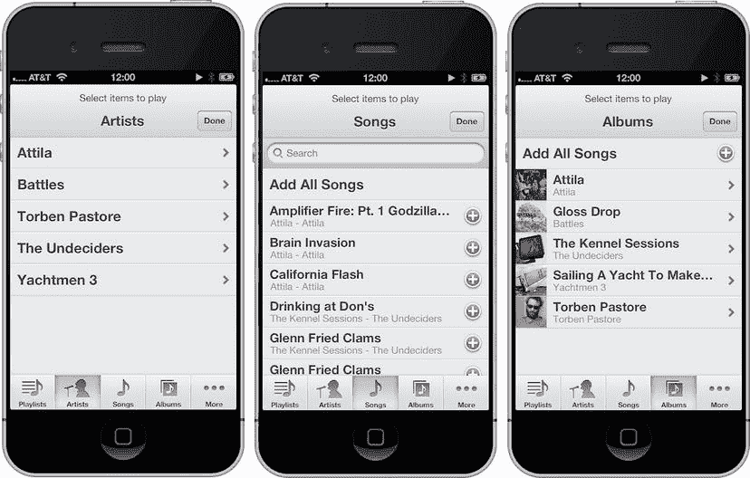

图 12-1.  按艺术家、歌曲和专辑显示的媒体选择器控制器

媒体选择器控制器非常易于使用。它的工作方式与前面章节中介绍的许多其他提供的控制器类（例如您在第 11 章中使用的图像选择器控制器和邮件撰写视图控制器）非常相似。创建一个 `MPMediaPickerController` 实例，为其分配一个委托，然后以模态方式呈现它，如下所示：


```objc
MPMediaPickerController *picker = [[MPMediaPickerController alloc] initWithMediaTypes:MPMediaTypeMusic];
picker.delegate = self;
[picker setAllowsPickingMultipleItems:YES];
picker.prompt = NSLocalizedString(@"选择要播放的项目", @"选择要播放的项目");
[self presentModalViewController:picker animated:YES];
```

创建媒体选择器控制器实例时，需要指定媒体类型。这可以是前面提到的三种音频类型之一——`MPMediaTypeMusic`、`MPMediaTypePodcast` 或 `MPMediaTypeAudioBook`。你也可以传递 `MPMediaTypeAnyAudio`，它目前会返回任何音频项目。

**注意** 传递非音频媒体类型不会在代码中引起任何错误，但当媒体选择器出现时，它只会显示音频项目。

你还可以使用按位或（`|`）运算符，让用户选择任意媒体类型的组合。例如，如果你想让用户从播客和有声书中选择，但不包括音乐，你可以这样创建选择器：

```objc
MPMediaPickerController *picker = [[MPMediaPickerController alloc] initWithMediaTypes:MPMediaTypePodcast | MPMediaTypeAudioBook ];
```

通过将这些常量与按位或运算符结合使用，你最终传递的整数中，表示这两种媒体类型的位被设置为 1，而所有其他位被设置为 0。

另请注意，你需要告诉媒体选择器控制器允许用户选择多个项目。媒体选择器的默认行为是让用户仅选择一个项目。如果这是你期望的行为，那么你无需做任何操作；但如果你想让用户选择多个项目，必须明确告知它。

媒体选择器还有一个名为 `prompt` 的属性，它是一个字符串，会显示在选择器的导航栏上方（参见图 12-1 顶部）。这是可选项，但通常是个好主意。

媒体选择器控制器的委托需要遵循 `MPMediaPickerControllerDelegate` 协议。该协议定义了两个方法：一个在用户点击取消按钮时调用，另一个在用户选择一首或多首歌曲时调用。

#### 处理媒体选择器的取消操作

如果在展示媒体选择器控制器后，用户点击了取消按钮，委托方法 `mediaPickerDidCancel:` 将被调用。你必须在媒体选择器控制器的委托中实现此方法，即使你在用户取消时不需要执行任何处理，因为你必须关闭模态视图控制器。以下是该方法的一个最小化但相当标准的实现：

```objc
- (void)mediaPickerDidCancel:(MPMediaPickerController *)mediaPicker
{
    [self dismissModalViewControllerAnimated: YES];
}
```

#### 处理媒体选择器的选择操作

如果用户使用媒体选择器控制器选择了一个或多个媒体项目，委托方法 `mediaPicker:didPickMediaItems:` 将被调用。此方法必须实现，不仅因为委托有责任关闭媒体选择器控制器，还因为这是了解用户选择了哪些曲目的唯一途径。所选项目被分组在一个媒体项目集合中。

以下是 `mediaPicker:didPickMediaItems:` 的一个非常简单的实现示例，它将返回的集合分配给委托的一个属性：

```objc
- (void)mediaPicker:(MPMediaPickerController *)mediaPicker didPickMediaItems:(MPMediaItemCollection *)theCollection
{
    [self dismissModalViewControllerAnimated: YES];
    self.collection = theCollection;
}
```

### 音乐播放器控制器

如前所述，`MediaPlayer` 框架中有两个播放器控制器：音乐播放器控制器和电影播放器控制器。我们稍后会介绍电影播放器控制器。音乐播放器控制器允许你通过指定媒体项目集合或媒体查询来播放媒体项目队列。正如我们之前所说，音乐播放器控制器没有可视化元素。它是一个播放音频的对象。它允许你通过快进或快退、指定播放哪一特定媒体项目、调整音量或跳转到当前项目的特定播放时间来操作音频的播放。

`MediaPlayer` 框架提供了两种完全不同的音乐播放器控制器：iPod 音乐播放器与应用音乐播放器。它们的使用方式相同，但工作方式存在关键差异。iPod 音乐播放器是音乐应用所使用的播放器；与这些应用一样，当你退出应用而音乐仍在播放时，音乐会继续播放。此外，当用户正在听音乐并启动一个使用 iPod 音乐播放器的应用时，iPod 音乐播放器会继续播放该音乐。相比之下，应用音乐播放器会在你的应用终止时停止音乐。

这里有一个需要注意的地方：iPod 音乐播放器和应用音乐播放器可以同时使用。如果你使用应用音乐播放器控制器播放音频，而用户当前正在听音乐，两者会同时播放。这可能不是你期望的结果，因此你通常需要检查 iPod 音乐播放器当前是否有音乐在播放，即使你实际上计划使用应用音乐播放器控制器进行播放。

#### 创建音乐播放器控制器

要获取任一音乐播放器控制器，请使用 `MPMusicPlayerController` 上的工厂方法。要获取 iPod 音乐播放器，使用 `iPodMusicPlayer` 方法，如下所示：

```objc
MPMusicPlayerController *thePlayer = [MPMusicPlayerController iPodMusicPlayer];
```

获取应用音乐播放器控制器的方法类似，使用 `applicationMusicPlayer` 方法：

```objc
MPMusicPlayerController *thePlayer = [MPMusicPlayerController applicationMusicPlayer];
```

#### 判断音乐播放器控制器是否正在播放

创建应用音乐播放器后，你需要给它一些东西来播放。但如果你获取 iPod 音乐播放器控制器，它很可能已经在播放某些内容。你可以通过查看播放器的 `playbackState` 属性来判断。如果它当前正在播放，该属性将设置为 `MPMusicPlaybackStatePlaying`。

```objc
if (player.playbackState == MPMusicPlaybackStatePlaying) {
    // 正在播放
}
```

#### 指定音乐播放器控制器的队列

指定音乐播放器控制器的音频曲目队列有两种方式：提供媒体查询或提供媒体项目集合。如果你提供媒体查询，音乐播放器控制器的队列将设置为 `items` 属性返回的媒体项目。如果你提供媒体项目集合，它将使用你传递的集合作为其队列。无论哪种情况，你传递的查询或集合中的项目都会替换现有队列。设置队列还会将当前曲目重置为队列中的第一项。

要使用查询设置音乐播放器的队列，请使用 `setQueueWithQuery:` 方法。例如，以下是如何将队列设置为所有歌曲并按艺术家排序：

```objc
MPMusicPlayerController *player = [MPMusicPlayerController iPodMusicPlayer];
MPMediaQuery *artistsQuery = [MPMediaQuery artistsQuery];
[player setQueueWithQuery:artistsQuery];
```

使用媒体项目集合设置队列通过 `setQueueWithItemCollection:` 方法完成，如下所示：

```objc
MPMusicPlayerController *player = [MPMusicPlayerController iPodMusicPlayer];
NSArray *items = [NSArray arrayWithObjects:mediaItem1, mediaItem2, nil];
MPMediaItemCollection *collection = [MPMediaItemCollection collectionWithItems:items];
[items setQueueWithItemCollection:collection];
```

遗憾的是，目前尚无公开 API 可用于获取音乐播放器控制器的队列。这意味着，如果你希望对队列进行操作，通常需要独立于音乐播放器控制器来跟踪队列。

### 获取或设置当前播放的媒体项目

你可以通过 `nowPlayingItem` 属性获取或设置当前歌曲。这让你能够在使用 iPod 音乐播放器控制器时判断当前正在播放的曲目，并指定要播放的新歌曲。请注意，你指定的媒体项目必须已在音乐播放器控制器的队列中。以下是获取当前播放项目的方法：

```objc
MPMediaItem *currentTrack = player.nowPlayingItem;
```

要切换到不同曲目，请执行以下操作：

```objc
player.nowPlayingItem = newTrackToPlay; // 必须已在队列中
```

### 跳过曲目

音乐播放器控制器允许你使用 `skipToNextItem` 方法向前跳过一首歌曲，或使用 `skipToPreviousItem` 方法向后跳回上一首歌曲。如果没有下一首或上一首歌曲可跳转，音乐播放器控制器将停止播放。你还可以使用 `skipToBeginning` 方法回到当前歌曲的开头。

以下是三种方法的示例：

```objc
[player skipToNextItem];
[player skipToPreviousItem];
[player skipToBeginning];
```

### 快进/快退

当你在 iPhone、iPod touch 或 iTunes 上听音乐时，如果长按前进或后退按钮，音乐将开始快进或快退，并以不断加速的速度播放。这让你可以在同一曲目中跳过不想听的部分，或跳回错过的地方。音乐播放器控制器通过 `beginSeekingForward` 和 `beginSeekingBackward` 方法提供相同的功能。使用这两种方法时，可通过调用 `endSeeking` 来停止此过程。

以下是一系列调用，演示了快进并停止，然后快退并停止的过程：

```objc
[player beginSeekingForward];
[player endSeeking];

[player beginSeekingBackward];
[player endSeeking];
```

### 播放时间

不要与“回报时间”（自从他们用平淡无奇的迪克·萨金特替换了出色的迪克·约克后，我们多年来一直梦寐以求的东西）混淆，播放时间指定了你当前在歌曲中的播放进度。如果当前歌曲已播放了五秒，那么播放时间将为 `5.0`。

你可以使用 `currentPlaybackTime` 属性获取和设置当前播放时间。例如，当使用应用程序音乐播放器控制器时，你可能会用到此功能，以便在上次退出应用程序时停止的位置精确恢复播放。以下是使用此属性在当前歌曲中向前跳过十秒的示例：

```objc
NSTimeInterval currentTime = player.currentPlaybackTime;
MPMediaItem *currentSong = player.nowPlayingItem;
NSNumber *duration = [currentSong valueForProperty:
    MPMediaItemPropertyPlaybackDuration];
currentTime += 10.0;
if (currentTime > [duration doubleValue])
    currentTime = [duration doubleValue];
player.currentPlaybackTime = currentTime;
```

请注意检查当前播放歌曲的时长，以确保不会传入无效的播放时间。

### 重复与随机播放模式

音乐播放器控制器具有有序的歌曲队列，大多数情况下，它们按照队列中歌曲的顺序播放，从队列开头播放到末尾，然后停止。用户可以通过在 iPod 或“音乐”应用中设置重复和随机属性来改变此行为。你也可以通过设置音乐播放器控制器的重复和随机模式来改变行为，这些模式由 `repeatMode` 和 `shuffleMode` 属性表示。共有四种重复模式：

*   `MPMusicRepeatModeDefault`：使用上次在 iPod 或“音乐”应用中使用的重复模式。
*   `MPMusicRepeatModeNone`：完全不重复。队列播放完成后停止。
*   `MPMusicRepeatModeOne`：不断重复当前播放曲目，直到用户崩溃。非常适合播放“这是一个小世界”。
*   `MPMusicRepeatModeAll`：队列播放完毕后，从第一首曲目重新开始。

还有四种随机模式：

*   `MPMusicShuffleModeDefault`：使用上次在 iPod 或“音乐”应用中使用的随机模式。
*   `MPMusicShuffleModeOff`：完全不随机——仅按队列顺序播放歌曲。
*   `MPMusicShuffleModeSongs`：以随机顺序播放队列中的所有歌曲。
*   `MPMusicShuffleModeAlbums`：以随机顺序播放当前歌曲所在专辑中的所有歌曲。

以下是同时关闭重复和随机的示例：

```objc
player.repeatMode = MPMusicRepeatNone;
player.shuffleMode = MPMusicShuffleModeOff;
```

### 调整音乐播放器控制器的音量

音乐播放器控制器允许你操作其播放队列中项目的音量。音量可以使用 `volume` 属性进行调整，该属性是一个限幅浮点值。限幅值存储 `0.0` 到 `1.0` 之间的数字。就音量而言，将属性设置为 `1.0` 表示以最大音量播放曲目，值为 `0.0` 表示静音。这两个极端值之间的任何值都代表最大音量的不同百分比，因此将音量设置为 `0.5` 相当于将音量旋钮调到一半。

**注意：** 将音量设置为 `1.1` 并不会比设置为 `1.0` 更响。尽管奈吉尔可能告诉过你，但你无法将音量调到 11。

以下是将播放器设置为最大音量的方法：

```objc
player.volume = 1.0;
```

以下是将音量设置到中点的示例：

```objc
player.volume = 0.5;
```

### 音乐播放器控制器通知

音乐播放器控制器能够在以下三种情况发生时发送通知：

*   当播放状态（播放、停止、暂停、快进等）发生变化时，音乐播放器控制器可以发送 `MPMusicPlayerControllerPlaybackStateDidChangeNotification` 通知。
*   当音量发生变化时，它可以发送 `MPMusicPlayerControllerVolumeDidChangeNotification` 通知。
*   当新曲目开始播放时，它可以发送 `MPMusicPlayerControllerNowPlayingItemDidChangeNotification` 通知。

请注意，音乐播放器控制器默认情况下不会发送任何通知。你必须通过调用 `beginGeneratingPlaybackNotifications` 方法，告知 `MPMusicPlayerController` 实例开始生成通知。要让控制器停止生成通知，请调用 `endGeneratingPlaybackNotifications` 方法。

如果你需要接收这些通知中的任何一个，首先实现一个接受一个参数（`NSNotification *`）的处理方法，然后在通知中心注册感兴趣的通知。例如，如果你希望在当前播放项目更改时触发某个方法，可以实现一个名为 `nowPlayingItemChanged:` 的方法，如下所示：

```objc
- (void)nowPlayingItemChanged:(NSNotification *)notification {
    NSLog(@"新曲目开始播放");
}
```

要开始监听这些通知，你可以为感兴趣的通知类型注册通知中心，然后让该音乐播放器控制器开始生成通知：


```objectivec
NSNotificationCenter *notificationCenter = [NSNotificationCenter defaultCenter];
[notificationCenter addObserver:self selector:@selector(nowPlayingItemChanged:)     
    name:MPMusicPlayerControllerNowPlayingItemDidChangeNotification   
    object:player];
[player beginGeneratingPlaybackNotifications];
```

完成这一步后，每当曲目发生变化，通知中心就会调用你的 `nowPlayingItemChanged:` 方法。

当你完成了操作，不再需要这些通知时，需要取消注册并告诉音乐播放器控制器停止生成通知：

```objectivec
NSNotificationCenter *center = [NSNotificationCenter defaultCenter];
[center removeObserver:self                   
    name:MPMusicPlayerControllerNowPlayingItemDidChangeNotification                 
    object:player];
[player endGeneratingPlaybackNotifications];
```

现在你已经掌握了所有理论知识，让我们开始构建一些东西吧！

### 简易音乐播放器

你要搭建的第一个应用程序将运用之前涵盖的所有内容，来构建一个简易的音乐播放器。该应用将允许用户通过 `MPMediaPickerController` 创建歌曲队列，并通过 `MPMusicPlayerController` 进行播放。

**注意：** 我们将使用术语 *队列* 来描述应用中的歌曲列表，而不是术语 *播放列表*。在处理媒体资料库时，术语 *播放列表* 指的是从 iTunes 同步过来的实际播放列表。这些播放列表可以被读取，但无法使用 SDK 创建。为了避免混淆，我们将坚持使用术语 *队列*。

当应用启动时，它会检查当前是否有音乐正在播放。如果有，它会允许该音乐继续播放，并将任何请求播放的音乐附加到待播放歌曲列表的末尾。

**提示：** 如果你的应用需要播放特定的音效或音乐，你可能会觉得关闭用户当前正在播放的音乐是合适的，但这样做需要谨慎。如果你只是提供背景音乐，你真的应该考虑让正在播放的音乐继续播放，或者至少让用户选择是否关闭他们选择的音乐来播放你应用的音乐。当然，最终决定权在你手中，但在覆盖用户的音乐时，务必谨慎行事。

你要构建的这个应用并不十分实用，因为你能提供给用户的所有功能（甚至更多）在 iOS 设备上的“音乐”应用中已经存在了。但编写这个应用将让你能够探索你自己的应用在处理媒体资料库时可能需要执行的几乎所有任务。

**警告：** 本章的应用必须在真实的 iOS 设备上运行。iOS 模拟器无法访问你电脑上的 iTunes 资料库，任何与 iTunes 资料库访问 API 相关的调用都会在模拟器上导致错误。

### 构建 SimplePlayer 应用

你的应用将获取 iPod 音乐播放器控制器，并允许你通过媒体选择器将歌曲添加到队列中。你将提供一些基本的播放控制功能，如播放/暂停音乐，以及在队列中向前和向后跳转。

**注意：** 再次提醒，模拟器目前还不支持媒体资料库功能。为了充分利用 SimplePlayer 应用，你需要在 iOS 设备上运行它，这意味着你需要注册苹果的付费 iOS 开发者计划。如果你还没有这样做，不妨暂停片刻，前往 [`developer.apple.com/programs/register/`](http://developer.apple.com/programs/register/) 了解一下。

让我们先在 Xcode 中创建一个新项目。由于这是一个非常简单的应用，我们将使用“单视图应用”项目模板，并将新项目命名为 `SimplePlayer`。因为你只有一个视图，所以不需要使用 Storyboard，当然如果你想用的话也可以。

新项目创建完成后，你需要将 `MediaPlayer` 框架添加到项目中。在导航窗格顶部选择 `SimplePlayer` 项目。在项目编辑器中，选择 `SimplePlayer` 目标并打开“构建阶段”面板。找到“将二进制文件与库链接”（3 项）部分并展开。点击该部分底部的 + 按钮，然后添加 `MediaPlayer` 框架。如果操作正确，`MediaPlayer.framework` 应该会出现在导航窗格的项目中。为了保持整洁，我们将 `MediaPlayer.framework` 移到项目中的“框架”组中。

### 构建用户界面

单击 `ViewController.xib` 打开界面生成器。让我们看看 图 12-2。顶部有三个标签，中间是一个图像视图，底部是一个带有四个按钮的按钮栏。我们从底部开始，逐步向上构建。

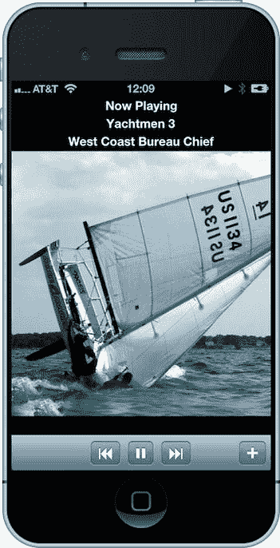

图 12-2.  SimplePlayer 应用正在播放一首歌曲

从对象库中拖拽一个 `UIToolbar` 到 `UIView` 的底部。默认情况下，`UIToolbar` 会提供一个左对齐的 `UIBarButtonItem`。由于你的工具栏需要四个按钮，我们将保留这个按钮。拖拽一个灵活的空白栏按钮项（图 12-3）到 `UIBarButtonItem` 的左侧。确保你使用的是灵活空白，而不是固定空白。如果放置位置正确，`UIBarButtonItem` 现在应该右对齐到 `UIToolbar` 上（图 12-4）。

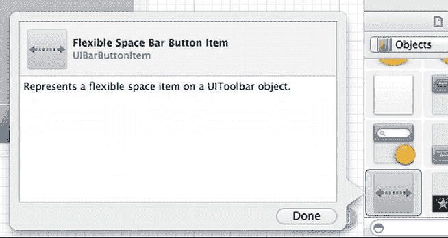

图 12-3.  对象库中的灵活空白栏按钮项

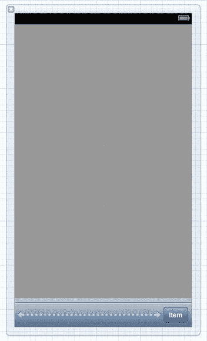

图 12-4.  带有灵活空白的 SimplePlayer 工具栏

在灵活空白的左侧添加三个 `UIBarButtonItem`。这些将是你的播放控制按钮。为了将这些按钮居中，你需要在 `UIToolbar` 的左侧再添加一个灵活的空白栏按钮项（图 12-5）。选择最左侧的按钮，打开属性检查器。将标识符从“自定义”更改为“后退”（图 12-6）。选择新“后退”按钮右侧的按钮，将标识符更改为“播放”。将“播放”按钮右侧的按钮标识符更改为“快进”。选择最右侧的按钮，将标识符更改为“添加”。完成后，效果应如 图 12-7 所示。

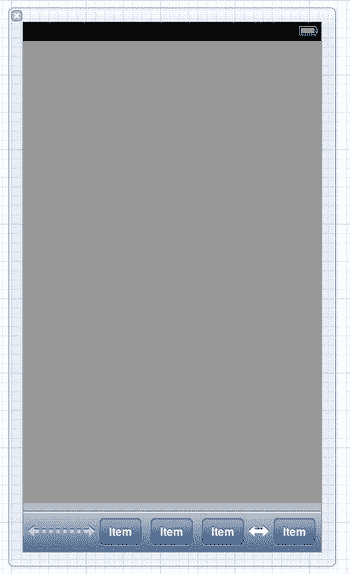

图 12-5.  包含所有按钮的工具栏

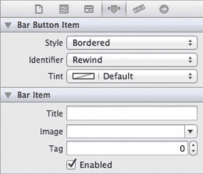

图 12-6.  将栏按钮项标识符更改为“后退”

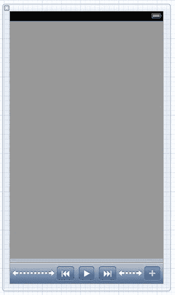

图 12-7.  完成后的工具栏

向上移动视图，你需要添加一个 `UIImageView`。将其拖拽到视图中，位于工具栏上方。界面生成器会将 `UIImageView` 扩展以填充可用区域。如果你不希望这样，请在实用工具面板中打开大小检查器。`UIImageView` 应该已经被选中，如果没有，请选中它以确保你在调整正确的组件。大小检查器应显示你的 `UIImageView` 宽度为 320。将高度改为与宽度相同。现在你的图像视图应该是正方形的。使用对齐参考线将图像视图在视图中居中。


### 格式化你的 SimplePlayer 应用

现在你需要在顶部添加三个标签。拖拽一个标签到应用视图的顶部，将标签区域扩展到视图的宽度。打开属性检查器，将标签文本从“Label”改为“Now Playing”。将标签颜色从黑色改为白色，并将字体设置为 System Bold 17.0。将对齐方式设为居中。最后，将标签背景色改为黑色（图 12-8）。在此标签下方再添加一个标签，为其设置与第一个标签相同的属性，但将文本从“Label”改为“Artist”。再在 Artist 标签下方添加一个标签，设置相同的属性，并将文本改为“Song”。

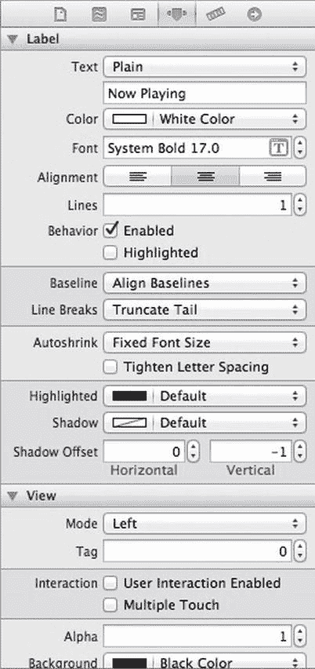

图 12-8. SimplePlayer 标签属性设置

最后，将视图的背景色设为黑色。因为黑色很酷。

### 声明 Outlets 和 Actions

在 Interface Builder 中，从标准编辑器切换到助理编辑器。编辑器面板应拆分为左侧显示 Interface Builder，右侧显示 `ViewController.h`。Control-从带有“Now Playing”文本的标签拖拽到 `@interface` 声明下方。创建一个 `UILabel` 出口并命名为 `status`。对 Artist 和 Song 标签重复此操作，将出口分别命名为 `artist` 和 `song`。

Control-从图像视图拖拽到标签出口下方，创建一个名为 `imageView` 的 `UIImageView` 出口。对工具栏和播放按钮执行相同操作。现在已设置好出口，接下来需要添加动作。

Control-从 `rewindButton` 拖拽，创建一个名为 `rewindPressed` 的动作。对每个按钮重复此操作。将播放动作命名为 `playPausePressed`，快进动作命名为 `fastForwardPressed`，添加动作命名为 `addPressed`。

切换回标准编辑器，选择 `ViewController.h` 在编辑器中打开。

首先，你需要让 `ViewController` 遵循 `MPMediaPickerDelegate` 协议，以便使用 `MPMediaPicker` 控制器。为此，你需要在 UIKit 头文件导入之后，导入 MediaPlayer 头文件：

```objective-c
#import <MediaPlayer/MediaPlayer.h>
```

然后，将协议声明添加到 `ViewController`：

```objective-c
@interface ViewController : UIViewController <MPMediaPickerControllerDelegate>
```

你需要添加另一个 `UIBarButtonItem` 属性，用于存放播放音乐时显示的暂停按钮。你还需要将播放按钮属性从 weak 改为 strong，以便在两个按钮之间切换。

```objective-c
@property (strong, nonatomic) IBOutlet UIBarButtonItem *play;
@property (strong, nonatomic)          UIBarButtonItem *pause;
```

你还需要两个属性：一个用于存放 `MPMediaPlayerController` 实例，另一个用于存放播放器正在播放的 `MPMediaItemCollection`。

```objective-c
@property (strong, nonatomic) MPMusicPlayerController *player;
@property (strong, nonatomic) MPMediaItemCollection   *collection;
```

当 `MPMusicPlayerController` 开始播放新的媒体项时，它会发送类型为 `MPMusicPlayerControllerNowPlayingItemDidChangeNotification` 的通知。你将设置一个该通知的观察者，用于更新视图中的标签。

```objective-c
- (void)nowPlayingItemChanged:(NSNotification *)notification;
```

选择 `ViewController.m` 在编辑器面板中打开。首先，你需要在视图加载时进行一些设置。找到 `viewDidLoad` 方法。在调用 `super` 之后，你需要实例化暂停按钮。

```objective-c
self.pause = [[UIBarButtonItem alloc] initWithBarButtonSystemItem:UIBarButtonSystemItemPause                                                                                                            target:self                                                                                                            action:@selector(playPausePressed:)];
[self.pause setStyle:UIBarButtonItemStyleBordered];
```

接下来，创建你的 `MPMusicPlayerController` 实例。

```objective-c
self.player = [MPMusicPlayerController iPodMusicPlayer];
```

然后，注册通知，以便在播放器中的“正在播放”项发生改变时接收通知。

```objective-c
NSNotificationCenter *notificationCenter = [NSNotificationCenter defaultCenter];
[notificationCenter addObserver:self                        selector:@selector(nowPlayingItemChanged:)                            
 name:MPMusicPlayerControllerNowPlayingItemDidChangeNotification                          
object:self.player];
[self.player beginGeneratingPlaybackNotifications];
```

请注意，你必须告知播放器开始生成播放通知。由于你注册了通知，因此在视图被释放时需要移除观察者。

```objective-c
- (void)didReceiveMemoryWarning
{
    [super didReceiveMemoryWarning];
    // 释放任何可以重新创建的资源
    [[NSNotificationCenter defaultCenter]         
   removeObserver:self                   
   name:MPMusicPlayerControllerNowPlayingItemDidChangeNotification                 
 object:self.player];
}
```

接下来，我们处理按钮动作。当用户按下后退按钮时，你希望播放器跳到队列中的上一首歌曲。但如果当前是第一首歌曲，则只需跳转到该歌曲的开头。

```objective-c
- (IBAction)rewindPressed:(id)sender
{
    if ([self.player indexOfNowPlayingItem] == 0) {
        [self.player skipToBeginning];
    }
    else {
        [self.player endSeeking];
        [self.player skipToPreviousItem];
    }
}
```

当按下播放按钮时，你希望开始播放音乐，同时希望按钮变为暂停按钮。如果播放器已经在播放音乐，你希望播放器暂停（停止），并将按钮切换回播放按钮。

```objective-c
- (IBAction)playPausePressed:(id)sender
{
    MPMusicPlaybackState playbackState = [self.player playbackState];
    NSMutableArray *items = [NSMutableArray arrayWithArray:[self.toolbar items]];
    if (playbackState == MPMusicPlaybackStateStopped || playbackState == MPMusicPlaybackStatePaused) {
        [self.player play];
        [items replaceObjectAtIndex:2 withObject:self.pause];
    }
    else if (playbackState == MPMusicPlaybackStatePlaying) {
        [self.player pause];
        [items replaceObjectAtIndex:2 withObject:self.play];
    }
    [self.toolbar setItems:items animated:NO];
}
```

你查询播放器的播放状态，然后据此决定是启动还是停止播放器。为了在播放和暂停按钮之间切换，你需要获取工具栏中的项目数组，并将第三个项目（索引为 2）替换为相应的按钮。然后，为工具栏替换整个工具栏按钮项目数组。

快进按钮的工作方式与后退按钮类似。按下时，播放器在队列中向前移动并播放下一首歌曲。如果当前是队列中的最后一首歌曲，则停止播放器并重置播放按钮。

```objective-c
- (IBAction)fastForwardPressed:(id)sender
{
    NSUInteger nowPlayingIndex = [self.player indexOfNowPlayingItem];
    [self.player endSeeking];
    [self.player skipToNextItem];
    if ([self.player nowPlayingItem] == nil) {
        if ([self.collection count] > nowPlayingIndex+1) {
            // 播放过程中添加了更多歌曲
            [self.player setQueueWithItemCollection:self.collection];
            MPMediaItem *item = [[self.collection items] objectAtIndex:nowPlayingIndex+1];
            [self.player setNowPlayingItem:item];
            [self.player play];
        }
        else {
            // 没有更多歌曲
            [self.player stop];
            NSMutableArray *items = [NSMutableArray arrayWithArray:[self.toolbar items]];
            [items replaceObjectAtIndex:2 withObject:self.play];
            [self.toolbar setItems:items];
        }
    }
}
```

当按下添加按钮时，你需要以模态方式显示 `MPMediaPickerController`。将其设置为仅显示音乐媒体类型，并将委托设置为 `ViewController`。


```objc
- (IBAction)addPressed:(id)sender
{
    MPMediaType mediaType = MPMediaTypeMusic;
    MPMediaPickerController *picker =         [[MPMediaPickerController alloc] initWithMediaTypes:mediaType];
    picker.delegate = self;
    [picker setAllowsPickingMultipleItems:YES];
    picker.prompt = NSLocalizedString(@"Select items to play", @"Select items to play");
    [self presentViewController:picker animated:YES completion:nil];
}
```

现在似乎是添加 `MPMediaPickerControllerDelegate` 方法的好时机。该协议中只定义了两个方法：`mediaPicker:didPickMediaItems:`（当用户完成选择时调用）和 `mediaPickerDidCancel:`（当用户取消媒体选择时调用）。

```objc
#pragma mark - 媒体选择器委托方法

- (void)mediaPicker:(MPMediaPickerController *)mediaPicker         didPickMediaItems:(MPMediaItemCollection *)theCollection
{
    [mediaPicker dismissViewControllerAnimated:YES completion:nil];

if (self.collection == nil) {
        self.collection = theCollection;
        [self.player setQueueWithItemCollection:self.collection];
        MPMediaItem *item = [[self.collection items] objectAtIndex:0];
        [self.player setNowPlayingItem:item];
        [self playPausePressed:self];
    }
    else {
        NSArray *oldItems = [self.collection items];
        NSArray *newItems = [oldItems arrayByAddingObjectsFromArray:[theCollection items]];
        self.collection = [[MPMediaItemCollection alloc] initWithItems:newItems];
    }
}

- (void)mediaPickerDidCancel:(MPMediaPickerController *) mediaPicker
{
    [mediaPicker dismissViewControllerAnimated:YES completion:nil];
}
```

当用户完成选择后，你需要关闭媒体选择器控制器。接着检查媒体集合属性。如果 `ViewController` 的集合属性为 `nil`，则直接将其赋值为委托调用中传来的媒体集合；如果集合已存在，则需要将新的媒体条目追加到现有集合中。`mediaPickerDidCancel:` 方法则直接关闭媒体选择器控制器。

最后，你需要实现当前播放项发生变化时的通知方法。

```objc
#pragma mark - 通知方法

- (void)nowPlayingItemChanged:(NSNotification *)notification
{
        MPMediaItem *currentItem = [self.player nowPlayingItem];
    if (currentItem == nil) {
        [self.imageView setImage:nil];
        [self.imageView setHidden:YES];
        [self.status setText:NSLocalizedString (@"Tap + to Add More Music", @"Add More Music")];
        [self.artist setText:nil];
        [self.song setText:nil];
    }
    else {
        MPMediaItemArtwork *artwork = [currentItem valueForProperty: MPMediaItemPropertyArtwork];
        if (artwork) {
            UIImage *artworkImage = [artwork imageWithSize:CGSizeMake(320, 320)];
            [imageView setImage:artworkImage];
            [imageView setHidden:NO];
        }

// 显示当前播放媒体条目的艺术家和歌曲名称
        [self.status setText:NSLocalizedString(@"Now Playing", @"Now Playing")];
        [self.artist setText:[currentItem valueForProperty:MPMediaItemPropertyArtist]];
        [self.song setText:[currentItem valueForProperty:MPMediaItemPropertyTitle]];
    }
}
```

`nowPlayingItemChanged:` 方法首先向播放器查询当前正在播放的媒体条目。如果没有任何播放内容，它会重置视图并将状态标签设置为提示用户添加更多音乐。如果有内容在播放，则通过 `MPMediaItemPropertyArtwork` 属性获取媒体条目的插图，并检查该媒体条目是否包含插图。如果包含，则将插图放入图像视图中，然后更新标签以显示艺术家和歌曲名称。

构建并运行 `SimplePlayer` 应用，你应该能够从媒体库中选择音乐并播放。虽然这个播放器相当简单，功能有限，但你可以看到如何使用 `MediaPlayer` 框架来播放音乐。接下来，你将使用 `MediaPlayer` 框架来播放视频。

### MPMoviePlayerController

使用 `MediaPlayer` 框架播放视频非常简单。首先，你需要要播放的媒体条目的 URL。该 URL 可以指向媒体库中的视频文件，也可以指向互联网上的视频资源。如果你想播放媒体库中的视频，可以通过 `MPMediaItem` 的 `MPMediaItemPropertyAssetURL` 属性获取 URL。

```objc
// videoMediaItem 是 MPMediaItem 的一个实例，指向媒体库中的一个视频
NSURL *url = [videoMediaItem valueForProperty:MPMediaItemPropertyAssetURL];
```

获取视频 URL 后，用它来创建 `MPMoviePlayerController` 实例。该视图控制器负责处理视频播放及内置播放控件。`MPMoviePlayerController` 有一个用于呈现播放内容的 `UIView` 属性，该 `UIView` 可以集成到应用的视图（控制器）层级结构中。使用封装了 `MPMoviePlayerController` 的 `MPMoviePlayerViewController` 类会更容易，你可以通过模态方式将 `MPMoviePlayerViewController` 推入视图（控制器）层级结构，从而更易于管理。`MPMoviePlayerViewController` 类将其底层的 `MPMoviePlayerController` 作为属性公开。

为了确定 `MPMoviePlayerController` 中视频媒体的状态，系统会发送一系列通知（表 12-2）。

**表 12-2.** MPMoviePlayerController 通知

| 通知 | 描述 |
| --- | --- |
| `MPMovieDurationAvailableNotification` | 已确定电影（视频）的时长（长度）。 |
| `MPMovieMediaTypesAvailableNotification` | 已确定电影（视频）的媒体类型（格式）。 |
| `MPMovieNaturalSizeAvailableNotification` | 已确定或更改电影（视频）的原始（首选）帧尺寸。 |
| `MPMoviePlayerDidEnterFullscreenNotification` | 播放器已进入全屏模式。 |
| `MPMoviePlayerDidExitFullscreenNotification` | 播放器已退出全屏模式。 |
| `MPMoviePlayerIsAirPlayVideoActiveDidChangeNotification` | 播放器已开始或结束通过 AirPlay 播放电影（视频）。 |
| `MPMoviePlayerLoadStateDidChangeNotification` | 播放器（网络）缓冲状态已更改。 |
| `MPMoviePlayerNowPlayingMovieDidChangeNotification` | 当前正在播放的电影（视频）已更改。 |
| `MPMoviePlayerPlaybackDidFinishNotification` | 播放器已完成播放。可通过 `MPMoviePlayerDidFinishReasonUserInfoKey` 查找原因。 |
| `MPMoviePlayerPlaybackStateDidChangeNotification` | 播放器播放状态已更改。 |
| `MPMoviePlayerScalingModeDidChangeNotification` | 播放器缩放模式已更改。 |
| `MPMoviePlayerThumbnailImageRequestDidFinishNotification` | 捕获缩略图的请求已完成，可能成功或失败。 |
| `MPMoviePlayerWillEnterFullscreenNotification` | 播放器即将进入全屏模式。 |
| `MPMoviePlayerWillExitFullscreenNotification` | 播放器即将退出全屏模式。 |
| `MPMovieSourceTypeAvailableNotification` | 电影（视频）的源类型原本未知，现在已确定。 |

通常，只有在使用 `MPMoviePlayerController` 时才需要关注这些通知。

理论讲够了。现在来构建一个应用，可以从媒体库中同时播放音频和视频媒体内容。


您将使用 `MediaPlayer` 框架构建一个新应用，该应用允许您从媒体库中播放音频和视频内容。首先，您需要创建一个标签栏控制器，其中一个标签用于音频内容，另一个标签用于视频内容（图 12-9）。您将不使用队列来排序媒体选择。保持简单：用户选择媒体项，应用程序将播放它。

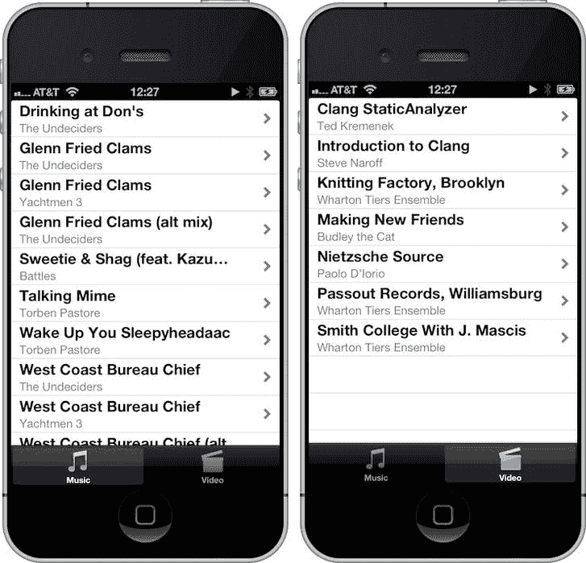

图 12-9. 包含音乐和视频标签的 `MPMediaPlayer`

使用“标签页应用”模板创建一个新项目。将应用命名为 `MPMediaPlayer`，并让项目使用故事板和自动引用计数。将 `MediaPlayer` 框架添加到 `MPMediaPlayer` 目标中。如果您不确定如何操作，请回顾在 `SimplePlayer` 应用中的操作方法。

`Xcode` 将创建两个视图控制器：`FirstViewController` 和 `SecondViewController`，并提供标准尺寸（`first.png`、`second.png`）和双倍尺寸（`first@2x.png`、`second@2x.png`）的标签栏图标。您将替换这些控制器和图像，因此请删除它们。在导航窗格中选择控制器文件 `FirstViewController.[hm]` 和 `SecondViewController.[hm]` 以及 `.png` 文件。删除文件。当 `Xcode` 询问时，将文件移到废纸篓。选择 `MainStoryboard.storyboard` 在故事板编辑器中打开。选择第一个视图控制器场景并删除它。对第二个视图控制器重复此操作。故事板编辑器应仅包含标签栏控制器（图 12-10）。

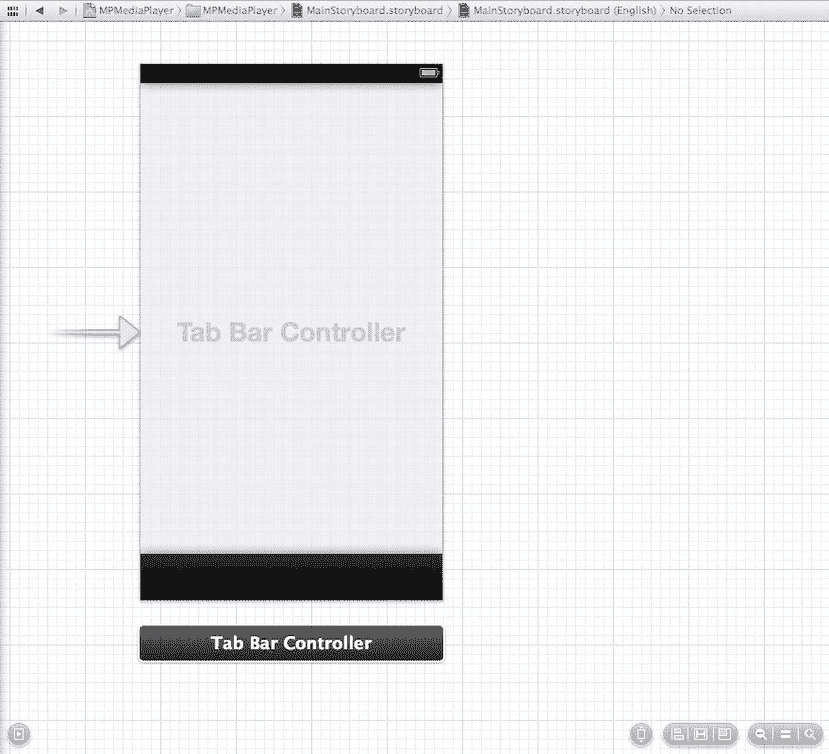

图 12-10. 删除第一个和第二个视图控制器

查看图 12-9，您会看到每个标签控制器都是一个表视图控制器。从对象库中拖拽一个 `UITableViewController` 到故事板编辑器中标签栏控制器的右侧。按住 `Control` 键从标签栏视图控制器拖拽到新的表视图控制器。当弹出“Segue”菜单时，在“关系转场”标题下选择“视图控制器”选项。添加第二个 `UITableViewController`，并再次从标签栏控制器拖拽到它，选择“视图控制器”选项。对齐两个表视图控制器，并尝试使您的故事板看起来像图 12-11。

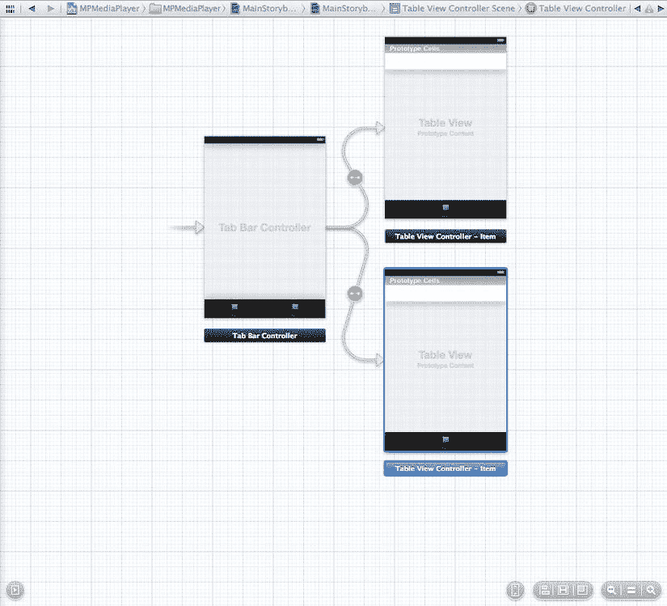

图 12-11. 添加新的表视图控制器

选择顶部表视图控制器中的表视图单元格。打开属性检查器，将“样式”属性设置为“副标题”。为“标识符”属性赋予值 `MediaCell`。将“选择”属性设置为“无”，将“附件”属性设置为“披露指示器”。对底部表视图控制器中的表视图单元格重复这些属性设置。

您将使用顶部表视图控制器处理音频媒体，使用底部表视图控制器处理视频媒体。因此，您将需要一个音频视图控制器和一个视频视图控制器。然而，每个视图控制器实际上只是一个媒体视图控制器。因此，您将首先创建一个 `MediaViewController` 类，然后对它进行子类化。使用 Objective-C 类模板创建一个新文件。将类命名为 `MediaViewController`，并将其设置为 `UITableViewController` 的子类。

您希望 `MediaViewController` 足够通用，以处理音频和视频媒体。这意味着您需要存储一个媒体项数组，并提供一个方法来加载这些项。打开 `MediaViewController.h`。首先，您需要导入 `MediaPlayer` 头文件。将其添加到 `UIKit` 头文件导入之后。

```
#import <MediaPlayer/MediaPlayer.h>
```

我们提到您需要存储一个媒体项数组。您将把它声明为 `MediaViewController` 类的属性。

```
@property (strong, nonatomic) NSArray *mediaItems;
```

并且您将声明一个方法来根据媒体类型填充 `mediaItems`。

```
- (void)loadMediaItemsForMediaType:(MPMediaType)mediaType;
```

选择 `MediaViewController.m` 并调整实现。首先，您需要修复表视图数据源方法，以定义表视图中的节数和每节的行数。

```
- (NSInteger)numberOfSectionsInTableView:(UITableView *)tableView
{
    // Return the number of sections.
    return 1;
}

- (NSInteger)tableView:(UITableView *)tableView numberOfRowsInSection:(NSInteger)section
{
    // Return the number of rows in the section.
    return self.mediaItems.count;
}
```

接下来，您需要调整表视图单元格的填充方式。

```
- (UITableViewCell *)tableView:(UITableView *)tableView          
cellForRowAtIndexPath:(NSIndexPath *)indexPath
{
    static NSString *CellIdentifier = @"MediaCell";
    UITableViewCell *cell = [tableView dequeueReusableCellWithIdentifier:CellIdentifier                                                 forIndexPath:indexPath];

// Configure the cell. . .
    NSUInteger row = [indexPath row];
    MPMediaItem *item = [self.mediaItems objectAtIndex:row];
    cell.textLabel.text = [item valueForProperty:MPMediaItemPropertyTitle];
    cell.detailTextLabel.text = [item valueForProperty:MPMediaItemPropertyArtist];
    cell.tag = row;

return cell;
}
```

最后，您需要实现 `loadMediaItemsForMediaType:` 方法。

```
- (void)loadMediaItemsForMediaType:(MPMediaType)mediaType
{
    MPMediaQuery *query = [[MPMediaQuery alloc] init];
    NSNumber *mediaTypeNumber= [NSNumber numberWithInt:mediaType];
    MPMediaPropertyPredicate *predicate =         
    [MPMediaPropertyPredicate predicateWithValue:mediaTypeNumber                                   
    forProperty:MPMediaItemPropertyMediaType];
    [query addFilterPredicate:predicate];
    self.mediaItems = [query items];
}
```

您已经定义了 `MediaViewController` 类。现在创建您的音频和视频子类。创建一个新的 Objective-C 类，命名为 `AudioViewController`，它将作为 `MediaViewController` 的子类。重复此过程，这次将文件命名为 `VideoViewController`。您只需要对每个文件进行两处小的调整。首先，打开 `AudioViewController.m`，并在 `viewDidLoad` 方法中，在调用 `super` 之后添加以下行：

```
[self loadMediaItemsForMediaType:MPMediaTypeMusic];
```

对 `VideoViewController.m` 执行相同操作，但这次您需要加载视频。

```
[self loadMediaItemsForMediaType:MPMediaTypeAnyVideo];
```

让您的应用使用这些新的视图控制器。选择 `MainStoryboard.storyboard` 打开故事板编辑器。选择顶部表视图控制器。在身份检查器中，将“自定义类”从 `UITableViewController` 更改为 `AudioViewController`。将底部表视图控制器类更改为 `VideoViewController`。

在继续之前，为每个视图控制器更新标签。选择音频视图控制器中的标签栏。在属性检查器中，将“标题”设置为 `Music`，并将“图像”设置为 `music.png`。您可以在本章的下载文件夹中找到图像文件 `music.png` 和 `video.png`。选择视频视图控制器中的标签栏，将其标题设置为 `Video`，并将其图像设置为 `video.png`。

构建并运行您的应用。选择“音乐”标签时，您应该看到媒体库中的所有音乐，选择“视频”标签时，您应该看到媒体库中的所有视频。太好了！现在您需要支持播放。您将使用 `MPMoviePlayerViewController` 来播放视频，但与 `SimplePlayer` 一样，您需要创建一个音频播放视图控制器。您将制作一个更简单的音频播放控制器版本。创建一个新的 Objective-C 文件，命名为 `PlayerViewController`，它将作为 `UIViewController` 的子类。


选择`MainStoryboard.storyboard`，以便在`PlayerViewController`场景中工作。将一个`UIViewController`拖放到音频视图控制器的右侧。选中新的视图控制器，打开身份检查器（Identity Inspector），将其类从`UIViewController`更改为`PlayerViewController`。从音频视图控制器中的表格视图单元格（`UITableViewCell`）按住 Control 键拖拽到`UIViewController`，并选择模态手动转场（Modal Manual Segue）。选中`AudioViewController`与`PlayerViewController`之间的转场，在属性检查器（Attributes Inspector）中将其命名为`PlayerSegue`。

完成后的音频播放视图控制器将如图 Figure 12-12 所示。从顶部开始，添加两个`UILabel`。将它们拉伸至视图宽度。与在`SimplePlayer`中一样，将标签扩展到视图宽度并调整其属性（System Bold 17.0 字体、居中对齐、白色前景色、黑色背景色）。将顶部标签的文本设置为`Artist`，底部标签的文本设置为`Song`。

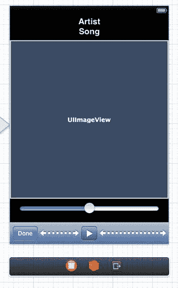

Figure 12-12.  MPMediaPlayer 音频播放视图控制器

将一个`UIImageView`拖入场景中，位于`Song`标签下方。使用蓝色的辅助线合理调整间距。调整图像视图的大小以适应视图宽度，并使其为正方形（320 像素×320 像素）。在图像视图正下方，拖入一个`UISlider`。使用蓝色边距辅助线调整滑块宽度。最后，将一个`UIToolbar`拖放到`PlayerViewController`视图的底部。选中工具栏左侧的`UIBarButtonItem`。使用属性检查器，将标识符（Identifier）从`Custom`更改为`Done`。在`Done`按钮右侧拖入一个弹性空间栏按钮项（Flexible Space Bar Button Item）。接着，在弹性空间项右侧添加一个`UIBarButtonItem`。选中新的栏按钮项，在属性检查器中将其标识符更改为`Play`。最后，为了让播放按钮居中，在`Play`按钮右侧再添加一个弹性空间栏按钮项。

与在`SimplePlayer`中的操作一样，需要为`PlayerViewController`创建一些输出口（Outlet）和操作（Action）。进入助理编辑器模式（Assistant Editor mode）。从`Artist`标签按住 Control 键拖拽到`PlayerViewController`的实现文件中，创建一个名为`artist`的输出口。对`Song`标签执行相同操作，将其命名为`song`。为图像视图、滑块、工具栏和播放按钮创建输出口。除滑块外，输出口的名称应显而易见（例如图像视图对应`imageView`）。滑块对应的输出口将命名为`volume`，因为将使用该滑块控制音量级别。

需要定义三个操作。从音量滑块按住 Control 键拖拽，为值更改事件（Value Changed）创建一个名为`volumeChanged:`的操作。从`Done`按钮拖拽创建一个`donePressed:`操作。从`Play`按钮拖拽创建一个`playPausePressed:`操作。将编辑器切换回标准模式（Standard mode），并选择`PlayerViewController.h`。

首先，需要导入`MediaPlayer`头文件。在`UIKit`头文件导入之后添加导入声明。

```
#import <MediaPlayer/MediaPlayer.h>
```

正如在`SimplePlayer`中所做的那样，需要将`play`属性输出口从`weak`重新定义为`strong`。同时声明`pause`（按钮）属性。

```
@property (strong, nonatomic) IBOutlet UIBarButtonItem *play;
@property (strong, nonatomic)          UIBarButtonItem *pause;
```

需要再添加两个属性：一个用于持有`MPMusicPlayerController`实例，另一个用于持有当前正在播放的`MPMediaItem`。

```
@property (strong, nonatomic) MPMusicPlayerController *player;
@property (strong, nonatomic) MPMediaItem *mediaItem;
```

需要了解播放器状态何时改变以及播放器媒体项何时改变。请记住，这些通过通知（Notifications）处理。将声明一些方法来注册通知中心（Notification Center）。

```
- (void)playingItemChanged:(NSNotification *)notification;
- (void)playbackStateChanged:(NSNotification *)notification;
```

接下来转到`PlayerViewController.m`并实现相关代码。由于暂停按钮不属于故事板场景，需要手动创建它。找到`viewDidLoad`方法，在调用`[super viewDidLoad]`之后创建它。

```
self.pause = [[UIBarButtonItem alloc] initWithBarButtonSystemItem:UIBarButtonSystemItemPause target:self action:@selector(playPausePressed:)];
[self.pause setStyle:UIBarButtonItemStyleBordered];
```

需要一个`MPMusicPlayerController`实例来播放音乐。

```
self.player = [MPMusicPlayerController applicationMusicPlayer];
```

希望观察播放器的通知，因此注册这些通知并要求播放器开始生成通知。

```
NSNotificationCenter *notificationCenter = [NSNotificationCenter defaultCenter];
[notificationCenter addObserver:self
                       selector:@selector(playingItemChanged:)
                           name:MPMusicPlayerControllerNowPlayingItemDidChangeNotification
                         object:self.player];
[notificationCenter addObserver:self
                       selector:@selector(playbackStateChanged:)
                           name:MPMusicPlayerControllerPlaybackStateDidChangeNotification
                         object:self.player];
[self.player beginGeneratingPlaybackNotifications];
```

需要将媒体项传递给播放器。但播放器接受`MPMediaItemCollection`，而不是单个`MPMediaItem`。将在`viewDidAppear:`方法中完成此赋值操作，在该方法中创建一个集合并传递给播放器。

```
- (void)viewDidAppear:(BOOL)animated
{
    [super viewDidAppear:animated];
    MPMediaItemCollection *collection =
    [[MPMediaItemCollection alloc] initWithItems:@[self.mediaItem]];
    [self.player setQueueWithItemCollection:collection];
    [self.player play];
}
```

当`PlayerViewController`被释放时，需要停止生成通知并取消注册观察者。找到`didReceiveMemoryWarning`方法，并添加以下调用：

```
[self.player endGeneratingPlaybackNotifications];
[[NSNotificationCenter defaultCenter]
  removeObserver:self
  name:MPMusicPlayerControllerPlaybackStateDidChangeNotification
  object:self.player];
[[NSNotificationCenter defaultCenter]
  removeObserver:self
  name:MPMusicPlayerControllerNowPlayingItemDidChangeNotification
  object:self.player];
```

`volumeChanged:`方法只需更改播放器音量以反映音量滑块的值。

```
- (IBAction)volumeChanged:(id)sender
{
    self.player.volume = [self.volume value];
}
```

`donePressed:`方法停止播放并关闭`PlayerViewController`。

```
- (IBAction)donePressed:(id)sender
{
    [self.player stop];
    [self dismissViewControllerAnimated:YES completion:nil];
}
```

`playPausePressed:`方法与`SimplePlayer`中的类似。不在工具栏中更新播放/暂停按钮；这将在`playbackStateChanged:`方法中处理。

```
- (IBAction)playPausePressed:(id)sender
{
    MPMusicPlaybackState playbackState = [self.player playbackState];
    if (playbackState == MPMusicPlaybackStateStopped || playbackState == MPMusicPlaybackStatePaused) {
        [self.player play];
    } else if (playbackState == MPMusicPlaybackStatePlaying) {
        [self.player pause];
    }
}
```

实现通知观察者方法非常直接。当播放器媒体项改变时更新视图。同样，这与`SimplePlayer`中的相同方法类似。


```
- (void)playingItemChanged:(NSNotification *)notification
{
    MPMediaItem *currentItem = [self.player nowPlayingItem];
    if (nil == currentItem) {
        [self.imageView setImage:nil];
        [self.imageView setHidden:YES];
        [self.artist setText:nil];
        [self.song setText:nil];
    }
    else {
        MPMediaItemArtwork *artwork = [currentItem valueForProperty: MPMediaItemPropertyArtwork];
        if (artwork) {
            UIImage *artworkImage = [artwork imageWithSize:CGSizeMake(320, 320)];
            [self.imageView setImage:artworkImage];
            [self.imageView setHidden:NO];
        }

// 显示当前播放媒体项的艺术家和歌曲名称
        [self.artist setText:[currentItem valueForProperty:MPMediaItemPropertyArtist]];
        [self.song setText:[currentItem valueForProperty:MPMediaItemPropertyTitle]];
    }
}
```

`The playbackStateChanged: notification observer method`这个通知观察者方法对你来说是新的。你添加了这个通知，以便当播放器在`viewDidAppear:`中自动开始播放音乐时，它能更新播放/暂停按钮的状态。

```
- (void)playbackStateChanged:(NSNotification *)notification
{
    MPMusicPlaybackState playbackState = [self.player playbackState];
    NSMutableArray *items = [NSMutableArray arrayWithArray:[self.toolbar items]];
    if (playbackState == MPMusicPlaybackStateStopped || playbackState == MPMusicPlaybackStatePaused) {
        [items replaceObjectAtIndex:2 withObject:self.play];
    }
```

else if (playbackState == MPMusicPlaybackStatePlaying) {

```
        [items replaceObjectAtIndex:2 withObject:self.pause];
    }
    [self.toolbar setItems:items animated:NO];
}
```

当表格视图单元格被选中时，你需要将音乐媒体项从 `AudioViewController` 发送到 `PlayerViewController`。为此，你需要修改 `AudioViewController` 的实现。选择 `AudioViewController.m` 并添加以下方法：

```
- (void)prepareForSegue:(UIStoryboardSegue *)segue sender:(id)sender
{
    if ([segue.identifier isEqualToString:@"PlayerSegue"]) {
        UITableViewCell *cell = sender;
        NSUInteger index = [cell tag];
        PlayerViewController *pvc = segue.destinationViewController;
        pvc.mediaItem = [self.mediaItems objectAtIndex:index];
    }
}
```

最后一步：你需要将 `PlayerViewController` 导入到 `AudioViewController.m` 中。在文件顶部，紧挨着 `AudioViewController.h` 导入语句下方，添加此导入语句：

```
#import "PlayerViewController.h"
```

构建并运行应用程序。选择一个音乐文件进行播放。应用应会过渡到 `PlayerViewController` 并自动开始播放。滑动音量滑块，看看现在如何调节播放音量。接下来，让我们添加视频播放功能。使用 `MediaPlayer` 框架实现起来非常简单。打开 `VideoViewController` 并实现表格视图的代理方法 `tableView:didSelectRowAtIndexPath:`，如下所示：

```
- (void)tableView:(UITableView *)tableView didSelectRowAtIndexPath:(NSIndexPath *)indexPath
{
    MPMediaItem *mediaItem = [self.mediaItems objectAtIndex:[indexPath row]];
    NSURL *mediaURL = [mediaItem valueForProperty:MPMediaItemPropertyAssetURL];
    MPMoviePlayerViewController *player =         [[MPMoviePlayerViewController alloc] initWithContentURL:mediaURL];
    [self presentMoviePlayerViewControllerAnimated:player];
}
```

就是这样。构建并运行你的应用程序。选择“视频”标签页，挑选一个视频播放。很简单！

### AVFoundation

`AVFoundation` 框架最初在 iOS 3 中引入，仅支持有限的音频播放和录制功能。iOS 4 对该框架进行了扩展，加入了视频播放与录制，以及音视频资产管理功能。

其核心思想是，`AVFoundation` 将音频或视频文件表示为一个 `AVAsset`。理解 `AVAsset` 可能拥有多个轨道这一点很重要。例如，一个音频 `AVAsset` 可能有两个轨道：一个用于左声道，一个用于右声道。一个视频 `AVAsset` 可能拥有更多轨道：有些用于视频，有些用于音频。此外，`AVAsset` 还可能封装其所代表的媒体文件的额外元数据。值得注意的是，仅仅实例化一个 `AVAsset` 并不意味着它就可以准备好播放。`AVAsset` 可能需要一些时间来解析其代表的数据。

为了让你能够精细地控制一个 `AVAsset` 的播放方式，`AVFoundation` 将媒体项的呈现状态与 `AVAsset` 分离开来。这种呈现状态由一个 `AVPlayerItem` 表示。`AVPlayerItem` 中的每个轨道由一个 `AVPlayerItemTrack` 表示。通过使用 `AVPlayerItem` 及其 `AVPlayerItemTracks`，你可以通过一个 `AVPlayer` 对象来决定如何呈现该媒体项（例如，混合音频轨道或裁剪视频）。如果你希望播放多个 `AVPlayerItem`，可以使用 `AVPlayerQueue` 来调度每个 `AVPlayerItem` 的播放。

除了提供对媒体播放更精细的控制之外，`AVFoundation` 还赋予了你创建媒体的能力。你可以利用设备硬件来创建新的媒体资源。硬件由一个 `AVCaptureDevice` 表示。在可能的情况下，你可以配置 `AVCaptureDevice` 来启用特定的设备功能或设置。例如，你可以将代表 iPhone 摄像头的 `AVCaptureDevice` 的 `flashMode` 设置为开启、关闭或自动感应。

为了使用 `AVCaptureDevice` 的输出，你需要使用 `AVCaptureSession`。`AVCaptureSession` 协调从 `AVCaptureDevice` 到其输出形式的数据管理。此输出由 `AVCaptureOutput` 类表示。

使用 `AVFoundation` 创建媒体数据是一个复杂的过程。首先，你需要创建一个 `AVCaptureSession` 来协调媒体数据的捕获和创建。你定义并配置你的 `AVCaptureDevice`，它代表了实际的物理设备（例如 iPhone 摄像头或麦克风）。从 `AVCaptureDevice`，你创建一个 `AVCaptureInput`。`AVCaptureInput` 是一个 `<?>` 对象，代表来自 `AVCaptureDevice` 的数据。每个 `AVCaptureInput` 实例都有多个端口，每个端口代表来自设备的一个数据流。你可以将端口视为 `AVAsset` 轨道的捕获模拟。一旦创建了 `AVCaptureInput(s)`，就将它们分配给 `AVCaptureSession`。每个会话可以有多个输入。

现在你已经有了捕获会话并给会话分配了输入，接下来需要保存数据。你使用 `AVCaptureOutput` 类并将其添加到你的 `AVCaptureSession` 中。你可以使用具体的 `AVCaptureOutput` 子类将数据写入文件，或者将其保存到缓冲区以供进一步处理。

你的 `AVCaptureSession` 现已配置好，可以从设备接收数据并保存。你只需告诉你的会话 `startRunning`。完成后，向你的会话发送 `stopRunning` 消息。有意思的是，可以在会话运行时更改其输入或输出。为了确保平稳过渡，你需要用一对 `beginConfiguration` / `commitConfiguration` 消息来包裹这些更改。

资产元数据由 `AVMetadataItem` 类表示。要向资产添加你自己的元数据，可以使用其可变版本 `AVMutableMetadataItem`，并将其分配给资产。

有时你可能需要将媒体资源从一种格式转换为另一种格式。类似于捕获媒体，你可以使用 `AVAssetExportSession` 类。将你的输入资产添加到导出会话对象，然后将导出会话配置为新的输出格式，并导出数据。

接下来，让我们深入探讨通过 `AVFoundation` 播放媒体的具体细节。

#### AVMediaPlayer


在开始时，基于 `AVFoundation` 的媒体播放器外观将与 `MPMediaPlayer`（图 12-9）相同。与 `MPMediaPlayer` 不同，你的 `AVFoundation` 播放器将使用统一的播放器视图控制器来回放音频和视频媒体。这有几个原因，但主要是因为 `AVFoundation` 没有提供类似 `MPMoviePlayerViewController` 的视频回放视图控制器。相反，你需要定义一个 `UIView` 子类来使用 `AVPlayerLayer` 视图层。无论媒体类型如何，你都使用一个 `AVPlayer` 实例来加载 `AVAsset` 并管理播放控制。

使用 Xcode，创建一个新项目并将其命名为 `AVMediaPlayer`。由于 `AVMediaPlayer` 使用标签栏控制器，并且行为类似于 `MPMediaPlayer`，请遵循你在 `MPMediaPlayer` 中使用的相同步骤，直到添加 `MediaPlayer` 框架为止。你仍然需要 `MediaPlayer` 框架来访问你的媒体库。由于此项目将使用 `AVFoundation` 来播放媒体，你还需要添加 `AVFoundation` 框架。

与 `MPMediaPlayer` 类似，`AVMediaPlayer` 将使用一个通用的 `MediaViewController` 作为抽象基类。创建一个名为 `MediaViewController` 的新 `Objective-C` 类，继承自 `UITableViewController`。同样，这个 `MediaViewController` 类需要足够通用，以支持音频和视频媒体。此外，类似于 `MPMediaPlayer` 的 `MediaViewController`，你需要一种方法来加载媒体项。`AVFoundation` 不提供对媒体库的访问；该功能仅存在于 `MediaPlayer` 框架中。由于你打算使用 `AVPlayer` 类来播放媒体，你需要将 `MPMediaItems` 转换为 `AVAssets`。首先，你需要修改 `MediaViewController.h`。

```objective-c
#import <UIKit/UIKit.h>
#import <MediaPlayer/MediaPlayer.h>

@interface MediaViewController : UITableViewController

@property (strong, nonatomic) NSArray *assets;
- (void)loadAssetsForMediaType:(MPMediaType)mediaType;

@end
```

这一次，你将 `NSArray` 属性命名为 `assets`，因为它是一个 `AVAssets` 数组，而不是 `MPMediaItems`。相应地，出于同样的原因，你将加载方法命名为 `loadAssetsForMediaType:`。

在 `MediaViewController.m` 中，你需要更新表视图数据源方法。在此之前，你需要在导入 `MediaViewController.h` 之后立即导入 `AVFoundation` 头文件。

```objective-c
#import <AVFoundation/AVFoundation.h>
```

现在，找到并更新表视图数据源方法。

```objective-c
- (NSInteger)numberOfSectionsInTableView:(UITableView *)tableView
{
    // 返回分区数。
    return 1;
}

- (NSInteger)tableView:(UITableView *)tableView numberOfRowsInSection:(NSInteger)section
{
    // 返回分区中的行数。
    return self.assets.count;
}

- (UITableViewCell *)tableView:(UITableView *)tableView
         cellForRowAtIndexPath:(NSIndexPath *)indexPath
{
    static NSString *CellIdentifier = @"MediaCell";
    UITableViewCell *cell = [tableView dequeueReusableCellWithIdentifier:CellIdentifier
                                                           forIndexPath:indexPath];

    // 配置单元格...
    NSUInteger row = [indexPath row];
    AVAsset *asset = [self.assets objectAtIndex:row];
    cell.textLabel.text = [asset description];
    cell.tag = row;

    return cell;
}
```

同样，这与你之前在 `MPMediaPlayer` 中所做的类似。注意，`tableView:cellForRowAtIndexPath:` 从你的 `assets` 数组中检索一个 `AVAsset`。请记住，`AVAsset` 没有一种简单的方法来访问其元数据属性，如艺术家名称、歌曲标题或作品集。你稍后会加载这些信息。目前，你只在表视图单元格中显示 `asset` 的描述。

现在，你需要实现 `loadAssetsForMediaType:` 方法。你将其添加到 `MediaViewController.m` 的底部，就在 `@end` 声明之前。

```objective-c
#pragma mark - 实例方法

- (void)loadAssetsForMediaType:(MPMediaType)mediaType
{
    MPMediaQuery *query = [[MPMediaQuery alloc] init];
    NSNumber *mediaTypeNumber = [NSNumber numberWithInt:mediaType];
    MPMediaPropertyPredicate *predicate = [MPMediaPropertyPredicate predicateWithValue:mediaTypeNumber
                                                                          forProperty:MPMediaItemPropertyMediaType];
    [query addFilterPredicate:predicate];

    NSMutableArray *mediaAssets = [[NSMutableArray alloc] initWithCapacity:[[query items] count]];
    for (MPMediaItem *item in [query items]) {
        [mediaAssets addObject:[AVAsset assetWithURL:[item valueForProperty:MPMediaItemPropertyAssetURL]]];
    }
    self.assets = mediaAssets;
}
```

此方法与 `MPMediaPlayer` 中的 `loadMediaItemsForMediaType:` 之间的区别在于，你使用 `MPMediaItemPropertyAssetURL` 来创建你的 `AVAssets`。

你需要创建两个 `Objective-C` 类：`AudioViewController` 和 `VideoViewController`。它们都是 `MediaViewController` 的子类。将以下内容添加到 `AudioViewController.m`，以便它将音频加载到你的音频媒体：

```objective-c
- (void)viewDidLoad
{
    [super viewDidLoad];
    // 在此处执行任何其他视图加载后的设置。
    [self loadAssetsForMediaType:MPMediaTypeMusic];
}
```

对 `VideoViewController.m` 执行相同操作，只是你希望加载的媒体类型是 `MPMediaTypeAnyVideo`。

打开 `MainStoryboard.storyboard`，将两个表视图控制器的自定义类更改为 `AudioViewController` 和 `VideoViewController`，就像你在 `MPMediaPlayer` 中所做的那样。

构建并运行 `AVMediaPlayer`。看起来你正在读取媒体库，但它还不太有用。让我们修复它，以便你可以获取资产元数据。

回想一下，`AVAsset` 的信息在实例化时可能不可用或未加载。向资产请求信息可能会阻塞调用线程。如果你在 `AVMediaPlayer` 中这样做，将会减慢 UI 组件的速度，特别是表视图及其滚动。为了避免这种情况，你将使用 `AVAsset` 方法 `loadValuesAsynchronouslyForKeys:completionHandler:` 异步加载资产的元数据。此外，你将把 `AVAsset` 封装到一个自定义类中，以处理此数据的加载和缓存。

创建一个名为 `AssetItem` 的新 `Objective-C` 类，继承自 `NSObject`。一旦创建了文件并将其添加到项目中，请选择 `AssetItem.h`。由于 `AssetItem` 旨在封装 `AVAsset`，为了方便起见，你将预先声明 `AVAsset` 类。你还需要修改 `AssetItem` 声明以遵循 `NSCopying` 协议。

```objective-c
@class AVAsset;

@interface AssetItem : NSObject <NSCopying>
```

你需要一个属性来保存你的 `AVAsset` 实例。由于你从 URL 加载 `AVAssets`，你还需要添加一个属性来保存你的资产的 URL。这将允许你惰性加载 `AVAsset`，这也有助于提高性能。

```objective-c
@property (strong, nonatomic) NSURL *assetURL;
@property (strong, nonatomic) AVAsset *asset;
```

你定义了三个只读属性，它们代表你为应用程序最关心的资产元数据。

```objective-c
@property (strong, nonatomic, readonly) NSString *title;
@property (strong, nonatomic, readonly) NSString *artist;
@property (strong, nonatomic, readonly) UIImage *image;
```

接下来，定义两个只读属性来告诉你 `AssetItem` 的状态。两者都是 `BOOL` 类型。一个是 `metadataLoaded`，它是一个标志，告诉你是否已经加载了 `AVAsset` 的元数据。第二个是 `isVideo`，它告诉你你的 `AVAsset` 是否有视频轨道。

```objective-c
@property (assign, nonatomic, readonly) BOOL metadataLoaded;
@property (assign, nonatomic, readonly) BOOL isVideo;
```

你需要声明两个初始化方法。一个从 URL 创建实例。另一个从另一个 `AssetItem` 实例创建副本；这对于 `NSCopying` 协议是必需的。

```objective-c
- (id)initWithURL:(NSURL *)aURL;
- (id)initWithAsset:(AssetItem *)assetItem;
```


你需要一个方法，该方法会异步加载`AVAsset`的元数据。

```
- (void)loadAssetMetadataWithCompletionHandler:(void (^)(AssetItem *assetItem))completion;
```

现在准备工作`AssetItem`的实现。打开`AssetItem.m`。首先，你需要在`AssetItem`头文件导入的下方，导入`AVFoundation`头文件。你还需要定义一个字符串常量`kAssetItemDispatchQueue`。稍后会解释为什么需要它。

```
#import <AVFoundation/AVFoundation.h>

#define kAssetItemDispatchQueue "AssetQueue"
```

你需要定义一个私有属性来持有你的调度队列。我们将在第 14 章中更详细地讨论调度队列。调度队列是`Grand Central Dispatch`框架的一部分。你使用调度队列来排列你的资源加载操作。当你加载`AVAsset`并执行异步加载请求时，你会将它们放入调度队列。这样做有两个好处。首先，资源将按照它们被请求的顺序加载，这应该是它们被请求的顺序。其次，这将防止你的应用程序创建过多的后台请求。如果你的媒体库有成百上千个项目，你可能会为每个项目生成一个进程（线程）。创建太多，你的应用程序将冻结。调度队列确保你保持进程（线程）数量较低。你的私有类别声明如下：

```
@interface AssetItem ()
@property (strong, nonatomic) dispatch_queue_t dispatchQueue;
```

你的私有类别还将包含一些方法来帮助处理加载的异步特性。

```
- (AVAsset *)assetCopyIfLoaded;
- (AVAsset *)localAsset;
- (NSString *)loadTitleForAsset:(AVAsset *)a;
- (NSString *)loadArtistForAsset:(AVAsset *)a;
- (UIImage *)loadImageForAsset:(AVAsset *)a;
@end
```

当我们讲到这些方法的具体实现时，会讨论它们的细节。

由于你有多个只读属性，你需要在`@implementation`声明之后合成它们。

```
@synthesize title = _title;
@synthesize artist = _artist;
@synthesize image = _image;
```

让我们从你的初始化方法开始实现方法。

```
- (id)initWithURL:(NSURL *)aURL
{
    self = [super init];
    if (self) {
        self.assetURL = aURL;
        self.dispatchQueue = dispatch_queue_create(kAssetItemDispatchQueue, DISPATCH_QUEUE_SERIAL);
    }
    return self;
}

- (id)initWithAsset:(AssetItem *)assetItem
{
    self = [super init];
    if (self) {
        self.assetURL = assetItem.assetURL;
        self.asset = [assetItem assetCopyIfLoaded];
        _title = assetItem.title;
        _artist = assetItem.artist;
        _image = assetItem.image;
        _metadataLoaded = assetItem.metadataLoaded;
        _isVideo = assetItem.isVideo;
        self.dispatchQueue = dispatch_queue_create(kAssetItemDispatchQueue, DISPATCH_QUEUE_SERIAL);
    }
    return self;
}
```

两个初始化方法应该都很直观。在这两个方法中，你都使用常量字符串标识符`kAssetItemDispatchQueue`创建了一个串行队列。`initWithAsset:`方法复制了相关的属性。注意在复制`AVAsset`属性时使用了私有方法`assetCopyIfLoaded`。

接下来，你将定义遵循`NSCopying`协议所需的方法。

```
#pragma mark - NSCopying Protocol Methods

- (id)copyWithZone:(NSZone *)zone
{
        AssetItem *copy = [[AssetItem allocWithZone:zone] initWithAsset:self];
        return copy;
}

- (BOOL)isEqual:(id)anObject
{
        if (self == anObject)
                return YES;

if ([anObject isKindOfClass:[AssetItem class]]) {
                AssetItem *assetItem = anObject;
                if (self.assetURL && assetItem.assetURL)
                        return [self.assetURL isEqual:assetItem.assetURL];
                return NO;
        }
        return NO;
}

- (NSUInteger)hash
{
    return (self.assetURL) ? [self.assetURL hash] : [super hash];
}
```

对于`isEqual:`和`hash`方法，你依赖于资源`URL`的唯一性。

你将重写某些属性的访问器。为了访问`AssetItem`底层的`AVAsset`，你需要复制一份资源。这是因为`AVAsset`实例在同一时间只能从一个线程访问。如果你返回了对`AssetItem`实际`AVAsset`的引用，则无法保证它不会被不同线程访问。注意，这里你并没有复制底层的`AVAsset`实例变量；而是调用了`localAsset`方法。

```
#pragma mark - Property Overrides

// 复制一份，因为 AVAsset 一次只能安全地从一个线程访问
- (AVAsset*)asset
{
        __block AVAsset *theAsset = nil;
        dispatch_sync(self.dispatchQueue, ^(void) {
                theAsset = [[self localAsset] copy];
        });
        return theAsset;
}

- (NSString *)title
{
    if (_title == nil)
        return [self.assetURL lastPathComponent];
    return _title;
}

- (NSString *)artist
{
    if (_artist == nil)
        return @"Unknown";
    return _artist;
}
```

`title`和`artist`访问器会检查它们各自的实例变量。如果它们为`nil`，你可以假设你尚未加载资源的元数据，或者元数据值不存在。在这些情况下，你使用一个备用值。对于资源标题，你使用资源`URL`的最后一个路径组件。对于艺术家名称，你简单地使用值`Unknown`。

加载资源的元数据可能会有些复杂，所以让我们逐步了解实现过程。

```
- (void)loadAssetMetadataWithCompletionHandler:(void (^)(AssetItem *assetItem))completion
{
    dispatch_async(self.dispatchQueue, ^(void){
```

你做的第一件事是将整个方法体包裹在一个对调度队列的`dispatch_async`调用中。你将通过主线程调用此方法。`dispatch_async`调用确保该方法将被放入你的调度队列并在主线程之外执行。你获取你的`AVAsset`并使其异步加载其元数据。

```
        AVAsset *a = [self localAsset];
        [a loadValuesAsynchronouslyForKeys:@[@"commonMetadata"] completionHandler:^{
            NSError *error;
            AVKeyValueStatus cmStatus = [a statusOfValueForKey:@"commonMetadata" error:&error];
            switch (cmStatus) {
                case AVKeyValueStatusLoaded:
                    _title = [self loadTitleForAsset:a];
                    _artist = [self loadArtistForAsset:a];
                    _image = [self loadImageForAsset:a];
                    _metadataLoaded = YES;
                    break;

case AVKeyValueStatusFailed:
                case AVKeyValueStatusCancelled:
                    dispatch_async(dispatch_get_main_queue(), ^{
                        NSLog(@"The asset's available metadata formats were not loaded:\n%@", [error localizedDescription]);
                    });
                    break;
            }
```

在`loadValuesAsychronouslyForKeys:completetionHandler:`完成后，完成处理程序块会检查`commonMetadata`键的状态。如果加载因某种原因失败或被取消，你记录错误。如果加载成功，你加载你关心的元数据属性，并将`metadataLoaded`标志设置为`YES`。

```
            /* 重要提示：必须调度到主队列才能操作 AVPlayer 和 AVPlayerItem。 */
            dispatch_async(dispatch_get_main_queue(), ^{
                if (completion)
                    completion(self);
            });
        }];
    });
}
```

最后，你调用传入方法的完成处理程序。你将该调用派发回主队列，因为它将与你的`AVPlayer`和`AVPlayerItem`实例进行交互。


好的，作为一名高级文档工程师和翻译员，我将严格遵守您给出的注意事项和示例格式，将您提供的英文文本翻译成中文。


现在让我们来实现你的私有类别方法。关于这些方法有一点需要注意：它们被隐式或显式地期望在调度队列（线程）中执行。`assetCopyIfLoaded` 仅在 `initWithAssetItem:initializer` 方法中使用，用于复制你的 `AVAsset` 属性。你将 `AVAsset` 的复制操作分派到调度队列中，以防止该操作可能阻塞主线程，从而导致用户界面冻结。

```
- (AVAsset*)assetCopyIfLoaded
{
        __block AVAsset *theAsset = nil;
        dispatch_sync(self.dispatchQueue, ^(void){
                theAsset = [_asset copy];
        });
        return theAsset;
}
```

`localAsset` 方法是 `AVAsset` 属性/实例变量的私有访问器。它遵循懒加载逻辑，在必要时实例化 `_asset` 实例变量。请记住，如果你正在调用 `localAsset` 方法，那么你是在调度队列线程中操作，并且它仅由另一个 `AssetItem` 方法调用。

```
- (AVAsset*)localAsset
{
    if (_asset == nil) {
        _asset = [[AVURLAsset alloc] initWithURL:self.assetURL options:nil];
    }
    return  _asset;
}
```

回顾一下 `loadAssetMetadataWithCompletionHandler:` 方法。在成功加载元数据后，你会调用 `loadTitleForAsset:`、`loadArtistForAsset:` 和 `loadImageForAsset:`。让我们逐一分析这些方法，先从 `loadTitleForAsset:` 开始。首先，你提取存储在 asset 的 `commonMetadata` 属性中的标题。

```
- (NSString *)loadTitleForAsset:(AVAsset *)a
{
    NSString *assetTitle = nil;
    NSArray *titles = [AVMetadataItem metadataItemsFromArray:[a commonMetadata]                                                        
    withKey:AVMetadataCommonKeyTitle                                                      
    keySpace:AVMetadataKeySpaceCommon];
```

如果 `titles` 数组不为空，那么你需要找到与设备用户偏好的语言和/或地区设置相匹配的标题。语言和地区偏好是一项系统设置。如果针对某个语言/地区偏好返回了多个标题，你只需返回第一个。

```
    if ([titles count] > 0) {
        // 尝试获取一个与用户偏好的语言之一匹配的标题。
        NSArray *preferredLanguages = [NSLocale preferredLanguages];

for (NSString *thisLanguage in preferredLanguages) {
            NSLocale *locale = [[NSLocale alloc] initWithLocaleIdentifier:thisLanguage];
            NSArray *titlesForLocale = [AVMetadataItem metadataItemsFromArray:titles                                                    withLocale:locale];
            if ([titlesForLocale count] > 0) {
                assetTitle = [[titlesForLocale objectAtIndex:0] stringValue];
                break;
            }
        }
```

如果你未能使用偏好的语言/地区匹配到标题，则直接返回原始 `titles` 数组中的第一个。

```
        // 在偏好的语言中未找到任何匹配项。
```

// 直接使用我们找到的第一个主要标题元数据。

```
        if (assetTitle == nil) {
            assetTitle = [[titles objectAtIndex:0] stringValue];
        }
    }
    return assetTitle;
}
```

从 asset 元数据中查找艺术家名称的过程几乎完全相同，区别仅在于你使用键 `AVMetadataCommonKeyArtist` 从 `commonMetadata` 属性中提取艺术家名称数组。

```
- (NSString *)loadArtistForAsset:(AVAsset *)a
{
    NSString *assetArtist = nil;
    NSArray *titles = [AVMetadataItem metadataItemsFromArray:[a commonMetadata]                                                        
 元数据几乎完全相同，区别仅在于 withKey:AVMetadataCommonKeyArtist                                                      
 元数据几乎完全相同，区别仅在于 keySpace:AVMetadataKeySpaceCommon];
    if ([titles count] > 0) {
        // 尝试获取一个与用户偏好的语言之一匹配的艺术家名称。
        NSArray *preferredLanguages = [NSLocale preferredLanguages];

for (NSString *thisLanguage in preferredLanguages) {
            NSLocale *locale = [[NSLocale alloc] initWithLocaleIdentifier:thisLanguage];
            NSArray *titlesForLocale = [AVMetadataItem metadataItemsFromArray:titles                                                    withLocale:locale];
            if ([titlesForLocale count] > 0) {
                assetArtist = [[titlesForLocale objectAtIndex:0] stringValue];
                break;
            }
        }

// 在偏好的语言中未找到任何匹配项。
```

// 直接使用我们找到的第一个主要艺术家元数据。

```
        if (assetArtist == nil) {
            assetArtist = [[titles objectAtIndex:0] stringValue];
        }
    }
    return assetArtist;
}
```

从 `commonMetadata` 加载 asset 的插图（artwork）则要简单得多。你从 asset 元数据中加载可能的图像数组。images 数组中的第一个条目可以是一个字典或一个数据块。如果该条目是一个字典，那么图像数据存储在键 `data` 下。无论哪种情况，你都可以从该数据实例化一个 `UIImage`。

```
- (UIImage *)loadImageForAsset:(AVAsset *)a
{
    UIImage *assetImage = nil;
    NSArray *images = [AVMetadataItem metadataItemsFromArray:[a commonMetadata]                                                        
 元数据几乎完全相同，区别仅在于 withKey:AVMetadataCommonKeyArtwork                                                      
 元数据几乎完全相同，区别仅在于 keySpace:AVMetadataKeySpaceCommon];
    if ([images count] > 0) {
        AVMetadataItem *item = [images objectAtIndex:0];
        NSData *imageData = nil;
        if ([item.value isKindOfClass:[NSDictionary class]]) {
            NSDictionary *valueDict = (NSDictionary *)item.value;
            imageData = [valueDict objectForKey:@"data"];
        }
        else if ([item.value isKindOfClass:[NSData class]])
            imageData = (NSData *)item.value;
        assetImage = [UIImage imageWithData:imageData];
    }
    return assetImage;
}
```

请记住，你是异步加载 asset 元数据的。这意味着当你从媒体库加载 asset 时，你将对加载 asset 元数据的请求进行排队。与此同时，你的应用程序需要用一些内容来填充表格视图单元格。默认情况下，`AssetItem` 会为标题返回 asset URL 的最后一个路径项，为艺术家返回“未知”。你需要在 asset 元数据加载完成后重新加载表格视图单元格。为此，你需要修改 `MediaViewController` 类。

`MediaViewController` 需要了解你的新 `AssetItem` 类。打开 `MediaViewController.m`，并在其他头文件导入声明之后立即导入 `AssetItem` 头文件。

```
#import "AssetItem.h"
```

接下来，你将添加两个私有类别方法。一个用于根据给定的索引路径配置表格视图单元格。另一个将在你对 `AssetItem` 调用 `loadAssetMetadataWithCompletionHandler:` 时，在完成处理程序中使用。

```
@interface MediaViewController ()
- (void)configureCell:(UITableViewCell *)cell forIndexPath:(NSIndexPath *)indexPath;
- (void)updateCellWithAssetItem:(AssetItem *)assetItem;
@end
```

由于 `configureCell:forIndexPath:` 将用于配置你的表格视图单元格，你可以修改 `table:cellForRowAtIndexPath:` 表格视图数据源方法。

```
- (UITableViewCell *)tableView:(UITableView *)tableView          
  cellForRowAtIndexPath:(NSIndexPath *)indexPath
{
    static NSString *CellIdentifier = @"MediaCell";
    UITableViewCell *cell = [tableView dequeueReusableCellWithIdentifier:CellIdentifier                                                 
  forIndexPath:indexPath];

// 配置单元格...
    [self configureCell:cell forIndexPath:indexPath];

return cell;
}
```

现在，你可以实现 `configureCell:forIndexPath:` 方法了。

```
- (void)configureCell:(UITableViewCell *)cell forIndexPath:(NSIndexPath *)indexPath
{
    NSInteger row = [indexPath row];
```


`AssetItem *assetItem = [self.assets objectAtIndex:row];`
`if (!assetItem.metadataLoaded) {`
`[assetItem loadAssetMetadataWithCompletionHandler:^(AssetItem *assetItem){`
`[self updateCellWithAssetItem:assetItem];`
`}];`
`}`

`cell.textLabel.text = [assetItem title];`
`cell.detailTextLabel.text = [assetItem artist];`
`cell.tag = row;`

你在给定索引路径的`assets`属性数组中查找对应行的`AssetItem`。检查该`AssetItem`的元数据是否已加载。若未加载，则通知`AssetItem`加载其元数据。你的完成处理程序块仅调用`updateCellWithAssetItem:`方法。最后，使用`AssetItem`的标题和艺术家信息填充单元格。

你的完成处理程序`updateCellWithAssetItem:`会使包含传入`AssetItem`的表视图单元格重新加载并重绘自身。作为一项性能优化，你只会更新当前可见的表视图单元格。

```
- (void)updateCellWithAssetItem:(AssetItem *)assetItem
{
        NSArray *visibleIndexPaths = [self.tableView indexPathsForVisibleRows];
        for (NSIndexPath *indexPath in visibleIndexPaths) {
            AssetItem *visibleItem = [self.assets objectAtIndex:[indexPath row]];
            if ([assetItem isEqual:visibleItem]) {
                UITableViewCell *cell = [self.tableView cellForRowAtIndexPath:indexPath];
                [self configureCell:cell forIndexPath:indexPath];
                [cell setNeedsLayout];
                break;
            }
        }
}
```

最后，你需要用`AssetItem`对象填充`assets`属性。找到`loadAssetsForMediaType:`方法中的这一行：

```
[mediaAssets addObject:[AVAsset assetWithURL:[item valueForProperty:MPMediaItemPropertyAssetURL]]];
```

并将其替换为：

```
[mediaAssets addObject:    [[AssetItem alloc] initWithURL:[item valueForProperty:MPMediaItemPropertyAssetURL]]];
```

构建并运行应用。你应该会看到音频视图控制器填充表视图单元格，然后使用正确的元数据刷新这些单元格。如果你的媒体库足够大，你可以向下滚动并观察表视图单元格自行刷新。

你的`AVMediaPlayer`可以从媒体库加载音频和视频媒体，将其作为`AVAsset`（封装在你自定义的`AssetItem`类中）加载，并加载和显示资源的元数据。还缺少什么？你需要播放媒体！

创建一个新的 Objective-C 类。将其命名为`PlayerViewController`，并使其成为`UIViewController`的子类。目前你只需对这个类做这些操作。当你在故事板中布局场景时，会再次回到这个类。

现在，创建另一个名为`AVPlayerView`的 Objective-C 类，它是`UIView`的子类。这个视图将用于播放视频媒体。它是`UIView`的一个简单扩展。打开`AVPlayerView.h`，并将其修改为与以下实现一致：

```
#import <UIKit/UIKit.h>

@class AVPlayer;

@interface AVPlayerView : UIView

@property (strong, nonatomic) AVPlayer* player;
- (void)setVideoFillMode:(NSString *)fillMode;

@end
```

`AVPlayerView`的实现稍微复杂一些。打开`AVPlayerView.m`。首先，你需要导入`AVFoundation`头文件。

```
#import "AVPlayerView.h"
#import <AVFoundation/AVFoundation.h>

@implementation AVPlayerView
```

接下来，你需要重写`UIView`的方法`layerClass`，使其返回`AVPlayerLayer`。

```
+ (Class)layerClass
{
        return [AVPlayerLayer class];
}
```

然后，重写`player`属性，将其重定向到视图的图层。

```
- (AVPlayer *)player
{
        return [(AVPlayerLayer *)[self layer] player];
}

- (void)setPlayer:(AVPlayer *)player
{
        [(AVPlayerLayer*)[self layer] setPlayer:player];
}
```

最后，添加调整视频填充模式的功能。

```
/* 指定视频在播放器图层边界内的显示方式。
   （默认值为 AVLayerVideoGravityResizeAspect）*/
- (void)setVideoFillMode:(NSString *)fillMode
{
        AVPlayerLayer *playerLayer = (AVPlayerLayer*)[self layer];
        playerLayer.videoGravity = fillMode;
}

@end
```

现在你可以开始构建播放器界面了。打开`MainStoryboard.storyboard`。将一个`UIViewController`拖放到`AudioViewController`和`VideoViewController`的右侧。调整其位置，使其与图 12-13 匹配。从`AudioViewController`中的原型表视图单元格拖拽连线到新的`UIViewController`。在弹出的菜单中，在"Selection Segue"标题下选择`Modal`。对`VideoViewController`重复此过程。选择新的`UIViewController`，在身份检查器中将其类从`UIViewController`更改为`PlayerViewController`。对于`AVMediaPlayer`，`PlayerViewController`将同时播放音频和视频文件。

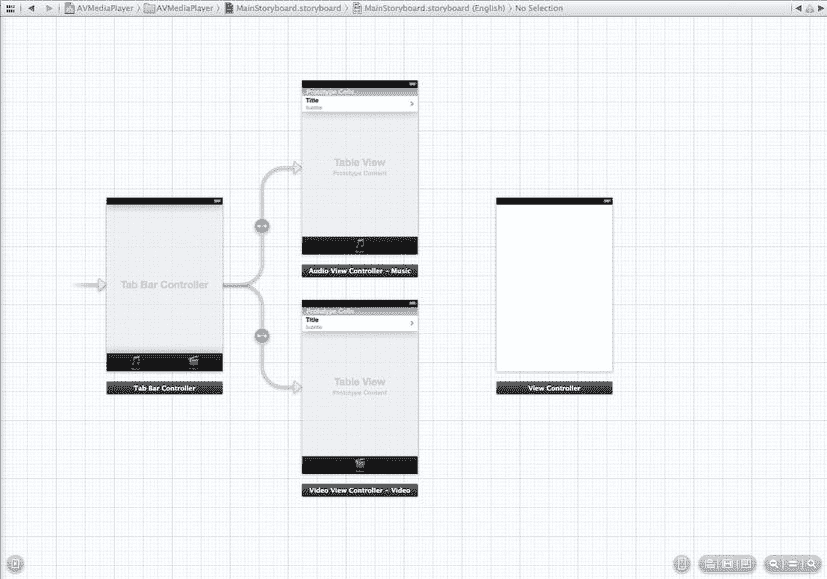

图 12-13. 布局你的`UIViewController`

将一个`UIView`拖放到`PlayerViewController`上。它应展开以填满整个场景。如果没有，调整新`UIView`的大小使其填满。打开身份检查器，将视图的类从`UIView`更改为`AVPlayerView`。切换到属性检查器，将背景颜色从白色更改为黑色。切换到助理编辑器，为`AVPlayerView`创建一个新 outlet。将 outlet 命名为`playerView`。切换回标准编辑器。

再将另一个`UIView`拖放到`PlayerViewController`上。同样，它应展开以填满整个场景；如果没有，则进行调整。与`playerView`不同，你可以保持该视图的类为`UIView`。打开属性检查器，将背景颜色更改为默认（透明）。使用助理编辑器，为这个`UIView`创建一个新 outlet，并将其命名为`controlView`。你将在`controlView`中添加与`MPMediaPlayer`相同的控制组件，并做一些小的补充。查看图 12-14，并与图 12-12 进行比较。你已经在歌曲标签和图片视图之间添加了一个`UISlider`，其两侧各有一个`UILabel`。首先，将一个`UILabel`拖放到场景的最左边缘，正好在歌曲标签下方。将文本从`label`更改为`00:00`，颜色从黑色更改为白色，字体设为 System 12.0，并对文本进行右对齐。在最右边缘添加一个`UILabel`，应用相同的属性更改，但文本改为左对齐。在两个标签之间放置一个`UISlider`，并使其扩展以填充标签之间的空间。使用属性检查器将其当前值从 0.5 更改为 0.0。

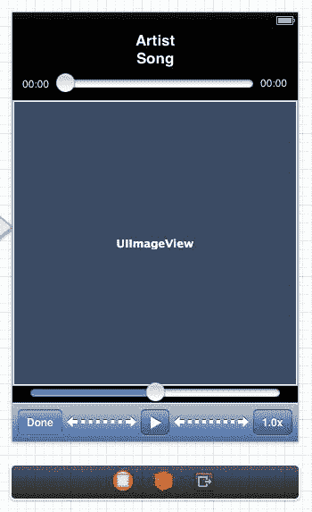

图 12-14. `AVMediaPlayer`的`PlayerViewController`布局

你还需要在工具栏的最右侧添加一个额外的`UIBarButtonItem`。保持按钮的 Identifier 属性为`Custom`，但将标题更改为`1.0x`。你将使用这个按钮在不同速率之间切换播放速度。

你需要为你添加的 UI 组件添加 outlet。选择助理编辑器。为标题为 Artist 的标签创建一个名为`artist`的 outlet。对于 Song 标签，将 outlet 命名为`song`。为顶部的滑块创建一个 outlet，并将其命名为`scrubber`。为滑块左侧的标签创建一个 outlet，命名为`elapsedTime`。对于滑块右侧的标签，将 outlet 命名为`remainingTime`。`UIImageView`的 outlet 应命名为`imageView`。底部的滑块将命名为`volume`。你需要为`UIToolbar`（`toolbar`）、播放按钮（`play`）和`1.0x`按钮（`rate`）创建 outlet。与`MPMediaPlayer`一样，你不需要为 Done 按钮创建 outlet。


现在你需要添加相应的操作。从 scrubbleSlider 滑块控件拖拽连线，为 `touchDown:` 事件添加一个名为 `beginScrubbing` 的新操作。再次从 scrubbleSlider 滑块控件拖拽连线，为 `valueChanged:` 事件添加一个名为 `scrub` 的新操作。最后，为 `touchUpInside` 事件添加一个名为 `endScrubbing` 的新操作。从音量滑块添加一个新操作，命名为 `volumeChanged`，对应 `valueChanged` 事件。为每个工具栏按钮添加一个操作：完成按钮（`donePressed`）、播放按钮（`playPressed`）和速率按钮（`ratePressed`）。

返回标准编辑器，选择 `PlayerViewController.h`。你需要导入以下头文件：

```
#import <AVFoundation/AVFoundation.h>
#import "AVPlayerView.h"
#import "AssetItem.h"
```

和之前一样，你需要将 `play` 属性 outlet 从 weak 重新定义为 strong。同时声明 `pause`（按钮）属性。

```
@property (strong, nonatomic) IBOutlet UIBarButtonItem *play;
@property (strong, nonatomic)          UIBarButtonItem *pause;
```

你需要为 `AssetItem`、`AVPlayerItem` 和 `AVPlayer` 声明属性。

```
@property (strong, nonatomic) AssetItem *assetItem;
@property (strong, nonatomic) AVPlayerItem *playerItem;
@property (strong, nonatomic) AVPlayer *player;
```

你将为播放和暂停按钮分别设置各自的操作，因此声明暂停按钮的操作。

```
- (IBAction)pausePressed:(id)sender;
```

在开始实现 `PlayerViewController` 之前，你需要在 `AssetItem` 中添加一个方法，以便准备用于播放的 `AVAsset`。打开 `AssetItem.h` 并添加以下方法声明：

```
- (void)loadAssetForPlayingWithCompletionHandler:(void (^)(AssetItem *assetItem, NSArray *keys))completion;
```

在 `AssetItem.m` 中，实现代码非常简单。

```
- (void)loadAssetForPlayingWithCompletionHandler:(void (^)(AssetItem *assetItem, NSArray *keys))completion;
{
    dispatch_async(self.dispatchQueue, ^(void){
        NSArray *keys = @[ @"tracks", @"playable" ];
        AVAsset *a = [self localAsset];
        [a loadValuesAsynchronouslyForKeys:keys completionHandler:^{
            /* IMPORTANT: Must dispatch to main queue in order to operate on the AVPlayer and AVPlayerItem. */
            dispatch_async(dispatch_get_main_queue(), ^{
                if (completion)
                    completion(self, keys);
            });
        }];
    });
}
```

你调度了 `AVAsset` 轨道的异步加载。由于你加载了两个键，因此将对每个键的检查推迟到完成处理程序中进行。所以你只需在主线程上调用完成处理程序即可。

你需要实现方法 `assetHasVideo:`。首先，在 `AssetItem.m` 顶部的私有类别中声明它。

```
- (BOOL)assetHasVideo:(AVAsset *)a;
```

实现代码可以添加到 `AssetItem` 实现的底部，位于其他私有类别方法之后。

```
- (BOOL)assetHasVideo:(AVAsset *)a
{
    NSArray *videoTracks = [a tracksWithMediaType:AVMediaTypeVideo];
    return ([videoTracks count] > 0);
}
```

你只需查询资源（asset）的视频轨道即可。

现在你可以开始实现 `PlayerViewController`。首先，需要创建暂停按钮。在 `viewDidLoad` 方法中添加以下几行代码：

```
    self.pause = [[UIBarButtonItem alloc] initWithBarButtonSystemItem:UIBarButtonSystemItemPause                                                                                                target:self                                                                                                action:@selector(pausePressed:)];
    [self.pause setStyle:UIBarButtonItemStyleBordered];
```

接下来，你需要加载并准备用于播放的资源。这将在 `viewDidAppear:` 方法中完成。

```
- (void)viewDidAppear:(BOOL)animated
{
    if (self.assetItem) {
        [self.assetItem loadAssetForPlayingWithCompletionHandler:^(AssetItem *assetItem, NSArray *keys){
```

如果你有 `assetItem`，则调用 `loadAssetForPlayingWithCompletionHandler:` 让其准备播放。完成处理程序的第一步是检查每个键的加载状态。

```
            NSError *error = nil;
            AVAsset *asset = assetItem.asset;
            for (NSString *key in keys) {
                AVKeyValueStatus status = [asset statusOfValueForKey:key error:&error];
                if (status == AVKeyValueStatusFailed) {
                    NSLog(@"Asset Load Failed: %@ | %@", [error localizedDescription], [error localizedFailureReason]);
                    return;
                }
                // handle AVKeyValueStatusCancelled
            }
```

作为合理性检查，我们查看底层的 `AVAsset` 是否可播放。

```
            if (!asset.playable) {
                NSLog(@"Asset Can’t be Played");
                return;
            }
```

如果你已经分配了 `playerItem` 属性，则需要移除一个观察者。

```
            if (self.playerItem) {
                [self.playerItem removeObserver:self forKeyPath:@"status"];
                [[NSNotificationCenter defaultCenter]                     
                removeObserver:self                               
                name:AVPlayerItemDidPlayToEndTimeNotification                             
                object:self.playerItem];
            }
```

你将一个新的 `AVPlayerItem` 分配给 `playerItem` 属性。由于你使用 ARC，之前的任何实例都将被自动释放。这就是为什么在之前的步骤中移除了观察者。

```
            self.playerItem = [AVPlayerItem playerItemWithAsset:asset];
```

你为 `playerItem` 的 `status` 键路径添加一个观察者。

```
            [self.playerItem addObserver:self                               
            forKeyPath:@"status"                                  
            options:NSKeyValueObservingOptionInitial | NSKeyValueObservingOptionNew                                  
            context:PlayerViewControllerStatusObservationContext];
```

注意使用了 `PlayerViewControllerStatusObservationContext`。这是一个稍后你会声明的特殊常量。使用这个常量可以简化 `AVPlayerItem` 通知的注册和识别。

你添加了另一个观察者，这次是针对默认通知中心。你将为 `AVPlayerItemDidPlayToEndTimeNotification` 调用方法 `playerItemDidReachEnd:`。

```
            [[NSNotificationCenter defaultCenter] addObserver:self                                                    
            selector:@selector(playerItemDidReachEnd:)                                                        
            name:AVPlayerItemDidPlayToEndTimeNotification                                                       
            object:self.playerItem];
```

如果 `player` 属性未被赋值，则使用 `playerItem` 属性创建一个。然后你为 `player` 的 `currentItem` 和 `rate` 键路径添加两个观察者。再次注意，你使用了两个特殊常量：`PlayerViewControllerCurrentItemObservationContext` 和 `AVPlayerViewControllerRateObservationContext`。

```
            if (self.player == nil) {
                self.player = [AVPlayer playerWithPlayerItem:self.playerItem];
                [self.player addObserver:self                               
                forKeyPath:@"currentItem"                                  
                options:NSKeyValueObservingOptionInitial | NSKeyValueObservingOptionNew                                  
                context:PlayerViewControllerCurrentItemObservationContext];
                [self.player addObserver:self                               
                forKeyPath:@"rate"                                    
                options:NSKeyValueObservingOptionInitial | NSKeyValueObservingOptionNew                                  
                context:AVPlayerViewControllerRateObservationContext];
            }
```


接下来，确保播放器的 `playerItem` 是正确的。

```
if (self.player.currentItem != self.playerItem)
    [[self player] replaceCurrentItemWithPlayerItem:self.playerItem];
```

最后，您需要初始化一些 UI 组件。如果资产是视频，则隐藏图像视图，因为不需要它。

```
self.artist.text = self.assetItem.artist;
self.song.text = self.assetItem.title;
self.imageView.image = self.assetItem.image;
self.imageView.hidden = self.assetItem.isVideo;
self.scrubber.value = 0.0f;
```

现在声明您所使用的三个观察上下文常量。在 `PlayerViewController.m` 文件的顶部，紧跟导入声明之后，添加以下内容：

```
static void *PlayerViewControllerStatusObservationContext =
    &PlayerViewControllerStatusObservationContext;
static void *PlayerViewControllerCurrentItemObservationContext =
    &PlayerViewControllerCurrentItemObservationContext;
static void *AVPlayerViewControllerRateObservationContext =
    &AVPlayerViewControllerRateObservationContext;
```

这只是定义一些常量上下文值的一种巧妙方式。如果您愿意，也可以使用字符串值，但这种方法更简洁一些。

因此，您已将 `PlayerViewController` 添加为 `AVPlayer` 和 `AVPlayerItem` 的观察者。与默认的通知中心观察者不同，您没有指定要调用的方法。相反，`AVPlayer` 和 `AVPlayerItem` 的观察者将依赖于键值观察。您需要做的就是实现方法 `observeValueForKeyPath:ofObject:change:context:`。该方法需要检查上下文值来决定做什么。

```
- (void)observeValueForKeyPath:(NSString *)path
                      ofObject:(id)object
                        change:(NSDictionary *)change
                       context:(void *)context
{
    /* AVPlayer "playerItem" 属性值观察者 */
    if (context == PlayerViewControllerStatusObservationContext) {
    }
    /* AVPlayer "rate" 属性值观察者 */
    else if (context == AVPlayerViewControllerRateObservationContext) {
    }
    /* AVPlayer "currentItem" 属性值观察者 */
    else if (context == PlayerViewControllerCurrentItemObservationContext) {
    }
    else {
        NSLog(@"其他上下文");
        [super observeValueForKeyPath:path ofObject:object change:change context:context];
    }
}
```

您为在 `PlayerViewController` 中定义的每个上下文常量添加了钩子。如果上下文未知，则通过调用 `super` 将其传递到视图控制器层次结构中。我们保持每个上下文部分为空，因为处理每个上下文本身就是一个话题，我们想逐一详细讲解。

接下来，我们要让您做一些当前可能还不清楚的工作，但一旦实现上下文处理程序和操作方法，就会变得清晰。首先，您需要将 `CoreMedia` 框架添加到项目中。在导航窗格中选择项目，然后通过“构建阶段”窗格将 `CoreMedia` 框架添加到 `AVMediaPlayer` 目标中。返回编辑 `PlayerViewController.m` 并导入 `CoreMedia` 头文件。

```
#import <CoreMedia/CoreMedia.h>
```

您将声明并实现一些私有分类属性方法，这些方法将在上下文处理程序和操作方法中使用。

```
@interface PlayerViewController ()
@property (assign, nonatomic) float prescrubRate;
@property (strong, nonatomic) id playerTimerObserver;

- (void)showPlay;
- (void)showPause;
- (void)updatePlayPause;
- (void)updateRate;

- (void)addPlayerTimerObserver;
- (void)removePlayerTimerObserver;
- (void)updateScrubber:(CMTime)currentTime;

- (void)playerItemDidReachEnd:(NSNotification *)notification;

- (void)handleStatusContext:(NSDictionary *)change;
- (void)handleRateContext:(NSDictionary *)change;
- (void)handleCurrentItemContext:(NSDictionary *)change;
@end
```

在实现这些方法时，我们将逐一讨论。

`showPlay` 和 `showPause` 方法只是用于切换工具栏上“播放”和“暂停”按钮的便捷方法。

```
- (void)showPlay
{
    NSMutableArray *toolbarItems = [NSMutableArray arrayWithArray:self.toolbar.items];
    [toolbarItems replaceObjectAtIndex:2 withObject:self.play];
    self.toolbar.items = toolbarItems;
}

- (void)showPause
{
    NSMutableArray *toolbarItems = [NSMutableArray arrayWithArray:self.toolbar.items];
    [toolbarItems replaceObjectAtIndex:2 withObject:self.pause];
    self.toolbar.items = toolbarItems;
}
```

您需要一个方法来检查是显示“播放”还是“暂停”按钮。您可以通过播放器的 `rate` 属性来判断媒体是否正在播放。`0.0f` 的速率表示媒体未在播放。

```
- (void)updatePlayPause
{
    if (self.player.rate == 0.0f)
        [self showPlay];
    else
        [self showPause];
}
```

`updateRate` 方法仅用于设置“速率”按钮的文本。您添加了一个钩子，使得当播放器实际速率为 `0.0f` 时，按钮显示 `"1.0x"`。

```
- (void)updateRate
{
    float rate = self.player.rate;
    if (rate == 0.0f)
        rate = 1.0f;
    self.rate.title = [NSString stringWithFormat:@"%.1fx", rate];
}
```

当播放器正在播放时，您需要添加一个周期性观察者来更新进度条和时间标签。还需要一个方法来移除这个周期性观察者。

```
- (void)addPlayerTimerObserver
{
    __block id blockSelf = self;
    self.playerTimerObserver =
        [self.player addPeriodicTimeObserverForInterval:CMTimeMakeWithSeconds(0.1f, NSEC_PER_SEC)
                                                 queue:nil
                                            usingBlock:^(CMTime time){ [blockSelf updateScrubber:time]; }];
}

- (void)removePlayerTimerObserver
{
    if (self.playerTimerObserver) {
        [self.player removeTimeObserver:self.playerTimerObserver];
        self.playerTimerObserver = nil;
    }
}
```

请注意，`AVPlayer` 的周期性观察者使用了 `CMTime` 结构。`CMTime` 定义在 `CoreMedia` 框架中，这就是为什么您需要将其包含在此项目中。您将周期性观察者设置为每 `0.1s` 触发一次，并调用 `updateScrubber:` 方法。

```
- (void)updateScrubber:(CMTime)currentTime
{
    if (CMTIME_IS_INVALID(self.playerItem.duration)) {
        self.scrubber.minimumValue = 0.0;
        return;
    }

    double duration = CMTimeGetSeconds(self.playerItem.duration);
    if (isfinite(duration))
    {
        float minValue = [self.scrubber minimumValue];
        float maxValue = [self.scrubber maximumValue];
        double time = CMTimeGetSeconds([self.player currentTime]);
        [self.scrubber setValue:(maxValue - minValue) * time / duration + minValue];

        Float64 elapsedSeconds = CMTimeGetSeconds(currentTime);
        Float64 remainingSeconds = CMTimeGetSeconds(self.playerItem.duration) - elapsedSeconds;
        self.elapsedTime.text = [NSString stringWithFormat:@"%d:%02d",
                                 (int)elapsedSeconds / 60,
                                 (int)elapsedSeconds % 60];
        self.remainingTime.text = [NSString stringWithFormat:@"%d:%02d",
                                   (int)remainingSeconds / 60,
                                   (int)remainingSeconds % 60];
    }
}
```


`updateScrubber`：首先检查`CMTime`值。如果时间无效，则将滑块设为`0.0`并返回。如果时间有效，则查询`playerItem`的时长。若时长为有限值，则利用它来确定滑块值的位置。当前时间和时长同时用于更新`elapsedTime`和`remainingTime`标签。

通知处理方法`playerItemDidReachEnd:`的效果与点击“完成”按钮相同，因此你直接调用`donePressed:`方法。

在处理上下文处理器之前，让我们先实现动作方法。

当你开始拖动滑块时，需要移除播放器的周期性观察者，以免在滑块调整期间进行更新。你缓存当前播放速率，并停止播放器。

```
- (IBAction)beginScrubbing:(id)sender
{
    self.prescrubRate = self.player.rate;
    self.player.rate = 0.0f;
    [self removePlayerTimerObserver];
}
```

`scrub:`动作将播放器更新至可通过滑块值和`playerItem`时长计算出的播放点。然后利用这些值更新`elapsedTime`和`remainingTime`标签，以反映新的滑块值。

```
- (IBAction)scrub:(id)sender
{
        if ([sender isKindOfClass:[UISlider class]]) {
                UISlider* slider = sender;
                if (CMTIME_IS_INVALID(self.playerItem.duration)) {
                        return;
                }

double duration = CMTimeGetSeconds(self.playerItem.duration);
                if (isfinite(duration)) {
                    float minValue = [slider minimumValue];
                    float maxValue = [slider maximumValue];
                    float value = [slider value];
                    double time = duration * (value - minValue) / (maxValue - minValue);
                    [self.player seekToTime:CMTimeMakeWithSeconds(time, NSEC_PER_SEC)];

Float64 remainingSeconds = duration - time;
                    self.elapsedTime.text = [NSString stringWithFormat:@"%d:%02d",                                                       (int)time / 60, (int)time % 60];
                    self.remainingTime.text = [NSString stringWithFormat:@"%d:%02d",                                                          (int)remainingSeconds / 60,                                                          (int)remainingSeconds % 60];
                }
        }
}
```

完成滑块拖动后，你恢复播放器的播放速率和周期性观察者。

```
- (IBAction)endScrubbing:(id)sender
{
        if (self.playerTimerObserver == nil) {
            [self addPlayerTimerObserver];
    }

if (self.prescrubRate != 0.0f) {
            self.player.rate = self.prescrubRate;
            self.prescrubRate = 0.0f;
        }
}
```

使用`AVPlayer`更改音量是一个复杂得多的过程。你的媒体资源可能包含多条轨道，这不仅仅是因为视频；立体声音频资源可能也有两条轨道。因此，你需要找到资源中的所有音频轨道，并将音频混合调整为新的音量。

```
- (IBAction)volumeChanged:(id)sender
{
    float volume = [self.volume value];
    NSArray *audioTracks = [self.assetItem.asset tracksWithMediaType:AVMediaTypeAudio];

NSMutableArray *allAudioParams = [NSMutableArray array];
    for (AVAssetTrack *track in audioTracks) {
        AVMutableAudioMixInputParameters *audioInputParams =             
  [AVMutableAudioMixInputParameters audioMixInputParameters];
        [audioInputParams setVolume:volume atTime:kCMTimeZero];
        [audioInputParams setTrackID:[track trackID]];
        [allAudioParams addObject:audioInputParams];
    }

AVMutableAudioMix *audioMix = [AVMutableAudioMix audioMix];
    [audioMix setInputParameters:allAudioParams];

[self.playerItem setAudioMix:audioMix];
}
```

`donePressed:`将停止播放器，并将你返回到`MediaViewController`。


`- (IBAction)donePressed:(id)sender`
{
    [self.player pause];
    [self dismissViewControllerAnimated:YES completion:nil];
}

`playPressed:` 和 `pausePressed:` 会根据情况更新播放器和工具栏。

`- (IBAction)playPressed:(id)sender`
{
    [self.player play];
    [self updatePlayPause];
}

`- (void)pausePressed:(id)sender`
{
    [self.player pause];
    [self updatePlayPause];
}

`ratePressed:` 操作会在三个播放速率之间切换：0.5、1.0 和 2.0。

`- (IBAction)ratePressed:(id)sender`
{
    float rate = self.player.rate;
    rate *= 2.0f;
    if (rate > 2.0f)
        rate = 0.5;
    self.player.rate = rate;
}

现在你可以实现上下文处理器了。针对 `playerItem` 状态的变化，你需要处理三种可能的状态：未知、准备就绪和播放失败。

`- (void)handleStatusContext:(NSDictionary *)change`
{
    [self updatePlayPause];

AVPlayerStatus status = [[change objectForKey:NSKeyValueChangeNewKey] integerValue];
    switch (status) {
        case AVPlayerStatusUnknown:
            [self removePlayerTimerObserver];
            [self updateScrubber:CMTimeMake(0, NSEC_PER_SEC)];
            break;

case AVPlayerStatusReadyToPlay:
            [self addPlayerTimerObserver];
            break;

case AVPlayerStatusFailed:
            NSLog(@"播放器状态失败");
            break;
    }
}

当播放器速率发生变化时，你只需执行一次完整性检查，以确保在速率按钮上显示正确的标签。

`- (void)handleRateContext:(NSDictionary *)change`
{
    [self updatePlayPause];
    [self updateRate];
}

最后，只有在创建了新的 `AVPlayer` 或 `AVPlayerItem` 实例时，你才需要关注播放器的 `currentItem`。如果你有了新的 `playerItem`，就需要确保相应更新 `playerView` 播放器。

`- (void)handleCurrentItemContext:(NSDictionary *)change`
{
    // 我们已添加/替换了 AVPlayer 的 AVPlayerItem
    AVPlayerItem *newPlayerItem = [change objectForKey:NSKeyValueChangeNewKey];
    if (newPlayerItem != (id)[NSNull null]) {
        // 我们确实有了新的 AVPlayerItem
        self.playerView.player = self.player;
        [self.playerView setVideoFillMode:AVLayerVideoGravityResizeAspect];
    }
    else {
        // 没有 AVPlayerItem
        NSLog(@"没有 AVPlayerItem");
    }
}

你的 `PlayerViewController` 已经完成。现在，你只需要确保在从 `AudioViewController` 或 `VideoViewController` 进行选择时，正确设置了媒体 `AssetItem`。打开 `MediaViewController.m`。为 `PlayerViewController.h` 添加导入指令。

`#import "PlayerViewController.h"`

然后添加 `prepareForSegue:sender:` 的实现。

`- (void)prepareForSegue:(UIStoryboardSegue *)segue sender:(id)sender`
{
    PlayerViewController *pvc = segue.destinationViewController;
    UITableViewCell *cell = sender;
    pvc.assetItem = [self.assets objectAtIndex:cell.tag];
}

你不需要检查正在调用哪个 segue，因为应该只有一个。

构建并运行 `AVMediaPlayer`。选择一首歌曲或视频进行播放。拖动滑块（scrubber）以更改播放点。切换速率，看看如何改变播放速度。相当不错，对吧？

#### 当心！前方有险滩！

在本章中，你进行了一次漫长但愉快的旅程，穿越了使用 iPod 音乐库的丘陵和山谷。你了解了如何使用媒体查询找到媒体项目，以及如何让用户使用媒体选择器控制器选择歌曲。你学会了如何使用和操作媒体项目集合。我们向你展示了如何使用音乐播放器控制器播放媒体项目，以及如何通过搜寻或跳过来操纵当前正在播放的项目。你还学会了如何找出当前正在播放的曲目，无论它是由你的代码播放的，还是用户通过 iPod 或“音乐”应用选择的。

但是，伙计，岸上的假期结束了。是时候扬帆驶入 iOS 安全的开阔水域了。紧闭舱门，加固船只！

