# 第 13 章：锁定安全：iOS 安全

应用程序安全是开发的一个重要方面。保护用户的信息是你需要在开发过程中考虑的一项基本功能。请务必记住，安全不是一个产品，也不是你可以在开发结束时考虑的一个勾选框。安全是一个过程，在整个开发阶段——从设计到实现，再到测试和发布——都必须加以考虑。

我们将介绍一些你应该牢记的基本安全问题，以及如何在 iOS 中处理这些问题。然后我们将介绍安全 SDK，它提供了三项服务：证书、密钥和信任服务，用于管理证书、密钥和信任策略；钥匙串服务，用于管理钥匙串项目；以及随机化服务，用于创建密码学上安全的随机数。

**注意：** 一个重要的安全问题是，如何安全地通过网络发送和接收数据。我们不会在本章中介绍这一点。请查看苹果的“网络”文档。从“网络概述”（`https://developer.apple.com/library/ios/#documentation/NetworkingInternetWeb/Conceptual/NetworkingOverview/`）开始，然后阅读“安全传输参考”（`https://developer.apple.com/library/ios/#documentation/Security/Reference/secureTransportRef/`）。你可能还需要阅读“CFNetwork 编程指南”（`https://developer.apple.com/library/ios/#documentation/Networking/Conceptual/CFNetwork/`）。

你将创建一个能列出钥匙串项目的应用程序。默认情况下，你的应用程序不会有任何钥匙串项目，因此你需要将两个证书（你的自签名根证书和用户证书）嵌入到应用程序中，并将它们添加到钥匙串中。你的钥匙串项目详情视图将允许你对一些文本进行加密和解密，作为功能演示。

### 安全考量

当你要求用户提供一些个人数据时，你实际上是在要求用户信任你——应用程序开发者——会保证这些信息的安全。这也意味着你只请求你需要的信息，并且不会更多。如果你通过互联网发送这些数据，你必须确保数据以安全的方式传输。当你的应用程序收到签名数据时，验证这些签名并确保它们可信是你的职责。

在向用户索取信息时，你需要考虑如果这些数据被泄露可能会发生什么。如果你的应用程序只是一个存储用户最高分的游戏，那么即使数据库在你的应用程序外部被访问，你可能也不需要太担心。但是，如果你要求用户提供密码或其他敏感信息，那么尽最大努力保护用户的信息就至关重要。一种可能的解决方案是对数据进行加密，使其更难被读取。

许多移动应用会例行地将信息传输到基于云的服务，以便集中存储和更新数据。如果你在 iOS 应用和云服务器之间传输敏感的用户信息，你需要确保数据在客户端和服务端都是安全的，并且必须确保数据被安全地传输。此外，你需要确保通信不会被试图访问用户信息或发回恶意数据以帮助在设备上访问用户数据的恶意第三方截获。

### 安全技术

以下部分将介绍一些常见的安全技术。

#### 加密


### 加密与安全

我们相信各位都了解加密数据的概念和意义，但此处仍简要说明。简单来说，加密是一种通过将数据转换为不可读形式来保护数据的方法。要读取数据，需要先进行解密。解密需要掌握密码（即用于加密数据的技术）。密码通过向数据应用密钥（一项额外信息）来实现加密。在传输数据前对其进行加密，可防止数据被拦截和读取。在本地存储数据前也需加密，以防设备丢失或被盗后数据被读取。

主要存在两种加密技术：

- **对称加密：** 通信双方共享单一密钥来加密和解密数据。由于密钥是共享的，一旦泄露，数据可能遭受破解。
- **非对称加密：** 使用两个数学相关的密钥转换数据。用一个密钥加密的数据只能用另一个密钥解密。通常，一个密钥在双方间共享，另一个密钥保持私有。非对称加密的另一种称谓是公钥密码学。

非对称加密的计算成本较高。常见做法是使用非对称加密来加密共享密钥，随后利用对称加密传输实际数据。

### 哈希

在密码学中，*哈希*是从较大数据集中派生出的较小数据片段。这个较小的数据可用作较大数据集的代理。你可以将哈希视为单向加密：将数据加密为唯一值，但无法解密还原。使用字典时就会涉及哈希。字典键被哈希化，以确保其始终指向相同的值。

哈希通常用于校验和计算。使用已知算法对大数据集进行哈希处理。下载数据后，你应对数据集进行哈希，并将哈希值与预期值比对。若值不同，可假定数据在某种程度上已被篡改。

### 证书与签名

通过结合加密和哈希技术，可生成将公钥绑定到特定可信来源的证书。给定一组数据（如电子邮件或网页），发送方会计算数据的哈希值并用私钥加密。该加密后的哈希值与数据及发送方证书一同发送。接收方使用证书的公钥解密发送方的哈希值，并将其与本地计算的哈希值比对。若哈希匹配，则说明数据未被篡改且确由证书所有者发送。这种使用证书进行哈希和加密的过程称为*数字签名*。用户通过签名数据来证明其来源。

如何信任用于签名数据的证书？证书本身由另一来源签名。该来源可能同时被发送方和接收方信任，或该来源的证书仍需由其他方签名。此证书签名链可能持续，直到出现接收方信任的证书。这种证书签名序列称为*信任链*。链中的最后一个证书称为*锚证书*或*根证书*。

签名和证书依赖于被各方在某种程度上信任的证书颁发机构。信任链的强度完全取决于证书颁发机构的安全性。

### 身份标识

将证书与私钥结合可创建数字身份。身份通常使用受密码保护的格式 PKCS#12 进行传输，该格式文件扩展名通常为 `.p12`。

### iOS 中的安全性

从 iOS 4 开始，开发者可选择利用 iOS 设备内置的加密硬件进一步保护应用数据。此功能依赖于 iOS 的密码锁定设置。设备锁定时，即使应用本身也无法访问数据。应用需在设备解锁后才能访问数据。请注意，你可在应用中为此功能编写代码，但除非设备用户启用了密码锁定设置，否则该功能不会生效。通常建议添加此功能。若用户随后启用了密码锁定，他们将获得额外保护层。

为保护应用文件数据，需为所需保护级别指定正确的扩展属性。你可以使用 `NSData` 或 `NSFileManager` 类设置此属性。对于现有文件，使用 `NSFileManager` 的 `setAttributes:ofItemAtPath:error:` 方法。属性参数是一个 `NSDictionary`，其键为 `NSFileProtectionKey`。对于新文件，使用 `NSData` 的 `writeToFile:options:error:` 方法，并通过正确的选项位掩码指定保护级别。可能的保护级别如表 13-1 所示。

**表 13-1.** 保护级别

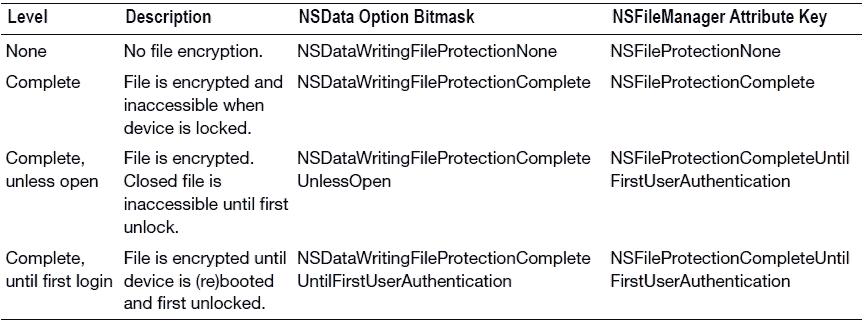

**注意：** `NSData` 还有其他三个写入选项：`NSDataWritingAtomic`、`NSDataWritingWithoutOverwriting`、`NSDataWritingFileProtectionMask`。前两个与 `NSData` 实例写入文件的方式有关，最后一个设置文件自身的权限。这些选项均不涉及密码锁定相关的文件保护设置。

若设置了保护级别，则需为文件可能无法访问做好准备。为此，你的应用需要检查文件可访问性。有以下几种实现方式：

- 在 `AppDelegate` 中实现 `applicationProtectedDataWillBecomeUnavailable:` 和 `applicationProtectedDataDidBecomeAvailable:` 方法。
- 注册 `UIApplicationProtectedDataWillBecomeUnavailable` 和 `UIApplicationProtectedDataDidBecomeAvailable` 通知。
- 检查 `UIApplication` 的 `protectedDataAvailable` 属性。

### 随机化与钥匙串

钥匙串是一个加密容器，用于保存密码、证书或其他信息。钥匙串通过 iOS 密码锁定机制进行加密和锁定。iOS 设备锁定时，任何人都无法访问其内容。输入密码后，iOS 解锁并解密钥匙串以供访问。从用户视角看，钥匙串提供了透明的身份验证。假设你的应用与互联网服务通信，每个服务都需要用户提供登录信息。你无需要求用户每次访问这些互联网服务时都输入信息，而可将这些信息存储在钥匙串中。由于钥匙串是安全的，你可以信赖这些信息的安全性。

在 iOS 中，每个应用都有自己的钥匙串。每个钥匙串包含一组称为钥匙串项（或简称项）的信息。钥匙串项由数据和一组属性组成。从编程角度看，钥匙串项是一个字典（具体为 `CFDictionary`）。其中数据可能加密也可能未加密，这由存储的数据类型（如密码或证书）决定。

在定义钥匙串项字典时，必须使用键常量 `kSecClass` 指定项类别。`kSecClass` 的可能值为一组预定义常量（表 13-2）。

**表 13-2.** `kSecClass` 的可能值


| `kSecClassGenericPassword` | 通用密码条目 |
| --- | --- |
| `kSecClassInternetPassword` | 互联网密码条目 |
| `kSecClassCertificate` | 证书条目 |
| `kSecClassKey` | 加密密钥条目 |
| `kSecClassIdentity` | 标识（证书和私钥）条目 |

根据钥匙串条目类别的值，可以设置一组允许的属性键（请参阅表 13-3）。

表 13-3. 钥匙串条目属性键

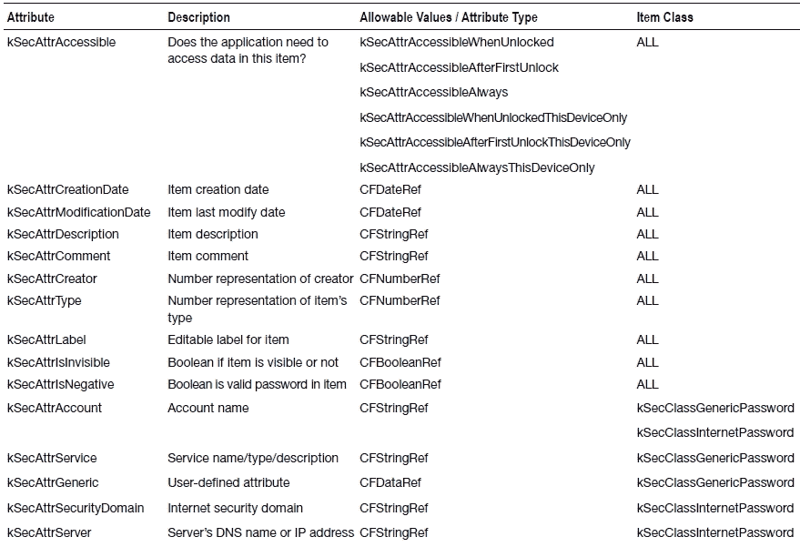
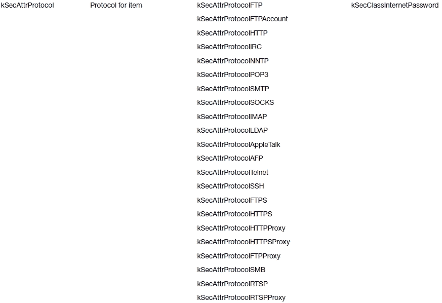
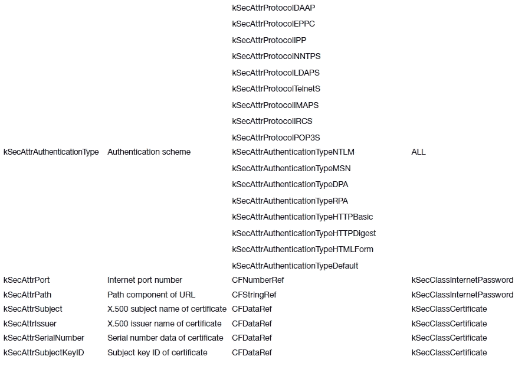
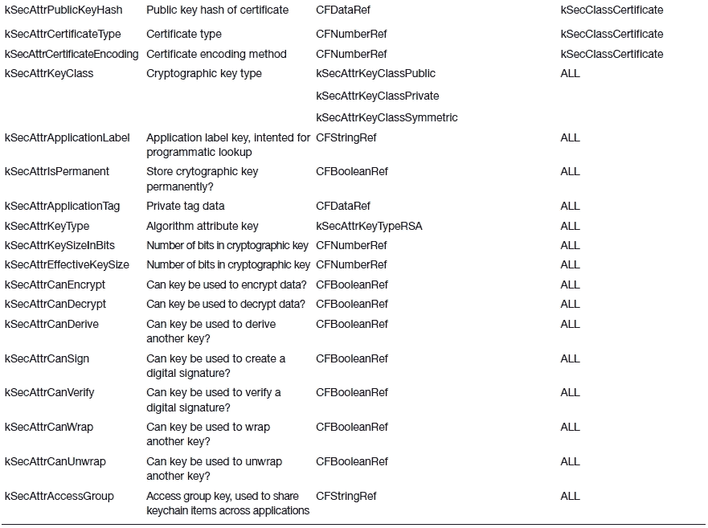

钥匙串 SDK 是一个 Core Foundation 的 C API，而非 Objective-C。因此所有内容都是 Core Foundation 数据类型。该 API 是一组简单的函数：

*   `SecItemAdd`：向钥匙串添加条目
*   `SecItemDelete`：从钥匙串移除条目
*   `SecItemUpdate`：更新钥匙串中的条目
*   `SecItemCopyMatching`：返回符合搜索条件的条目。

仅此而已。

### 证书、密钥和信任服务

为了让证书管理和使用更加便捷，Apple 在 iOS 中新增了许多函数，用于简化证书管理、密钥生成以及信任链评估。具体来说，你可以使用证书、密钥和信任 SDK，通过将证书与私钥匹配来确定身份；创建和请求证书；将证书、密钥和标识导入钥匙串；创建公钥-私钥对；以及管理信任策略。

这些服务利用钥匙串来存储证书和密钥。与钥匙串 SDK 类似，证书、密钥和信任 SDK 是一个 C API，而非 Objective-C。其核心定义了一组安全对象：

*   `SecCertificate`（`SecCertificateRef`）：证书对象
*   `SecIdentity`（`SecIdentityRef`）：标识（证书和私钥）对象
*   `SecKey`（`SecKeyRef`）：（非对称）密钥对象，包括公钥和私钥
*   `SecPolicy`（`SecPolicyRef`）：策略对象
*   `SecTrust`（`SecTrustRef`）：信任管理对象

相应地，Security 框架提供了一系列函数来管理证书；管理标识；生成和使用密钥；以及管理策略和信任。我们不会逐一详述每个函数，但将在本章的应用中涵盖其中部分内容。如需了解更多信息，请阅读 Apple 的《证书、密钥和信任服务编程指南》（[`developer.apple.com/library/ios/#documentation/Security/Conceptual/CertKeyTrustProgGuide/01introduction/`](https://developer.apple.com/library/ios/#documentation/Security/Conceptual/CertKeyTrustProgGuide/01introduction/)）及其参考手册（[`developer.apple.com/library/ios/#documentation/Security/Reference/certifkeytrustservices/`](https://developer.apple.com/library/ios/#documentation/Security/Reference/certifkeytrustservices/)）。

### 钥匙串查看器应用程序

你将创建一个简单的应用程序，演示如何使用应用程序的钥匙串条目。初始状态下，钥匙串应为空。你将添加导入自签名根证书以及由该根证书生成的数字标识的功能。你将显示每个证书的详细信息。最后，你将使用数字标识的公钥-私钥对添加一个简单的加密/解密示例。

在开始构建应用程序之前，你需要创建根证书和数字标识。我们将在 Mac 上的“钥匙串访问”应用程序中使用“证书助理”。

**注意** 如果你不想学习如何创建证书和数字标识，可以跳过本节。我们在本章的书籍下载存档中提供了两个文件：`root.der` 和 `cert.p12`。欢迎直接使用它们。

#### 创建证书颁发机构

打开“钥匙串访问.app”。你可以在 `/应用程序/实用工具` 中找到它。依次前往“钥匙串访问” “证书助理” “创建证书颁发机构”（图 13-1）。证书助理将打开一个表单，用于创建新的证书颁发机构（CA）（图 13-2）。为 CA 指定一个唯一名称，并填写电子邮件地址。取消勾选“将此 CA 设为默认”复选框。其余默认设置即可。点击“创建”。如果证书助理创建成功，你应该会看到类似图 13-3 的窗口。如果点击“显示证书颁发机构”按钮，将打开一个访达窗口，定位到 `~/资源库/Application Support/Certificate Authority/<CA 名称>` 目录。证书助理已将相关 CA 文件放置在此处，其中包括你的根证书。

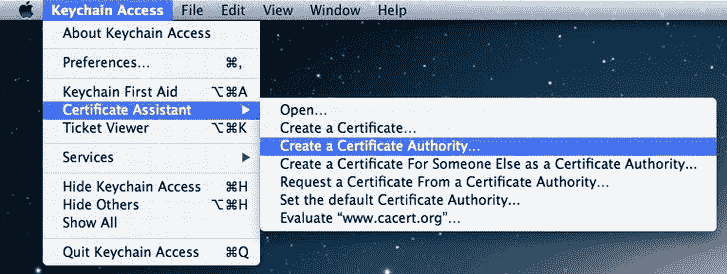

图 13-1. 创建证书颁发机构

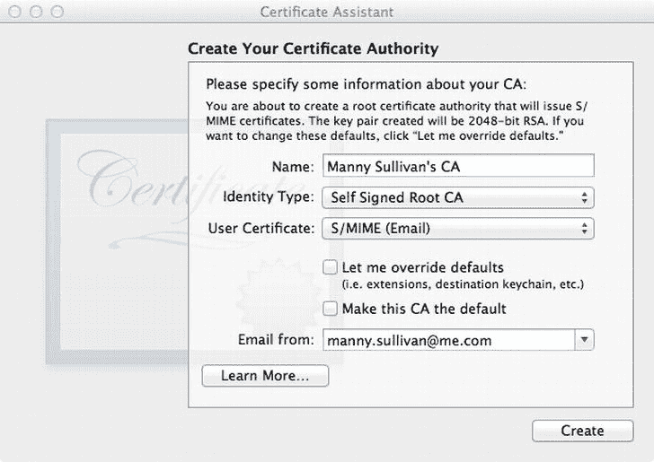

图 13-2. 证书助理

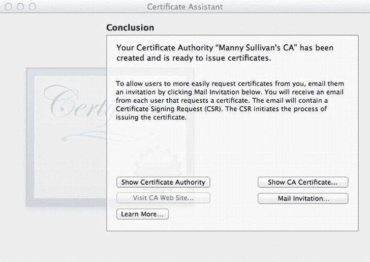

图 13-3. 成功创建证书颁发机构

现在，你需要使用你的 CA 来创建一个新的用户证书。返回“钥匙串访问.app”，依次选择“钥匙串访问” “证书助理” “从证书颁发机构请求证书”。证书助理将显示一个新表单（图 13-4）。输入用户的电子邮件地址和通用名称（不必是个人姓名）。对于 CA 电子邮件地址，输入你在创建 CA 时使用的电子邮件地址（图 13-2）。由于 CA 是自签名的，请选择“存储到磁盘”选项。点击“继续”。系统将显示一个保存对话框。选择一个位置保存文件（默认名称即可），然后点击“保存”。当证书助理完成证书签名请求的创建后，你可以点击“完成”关闭助理。

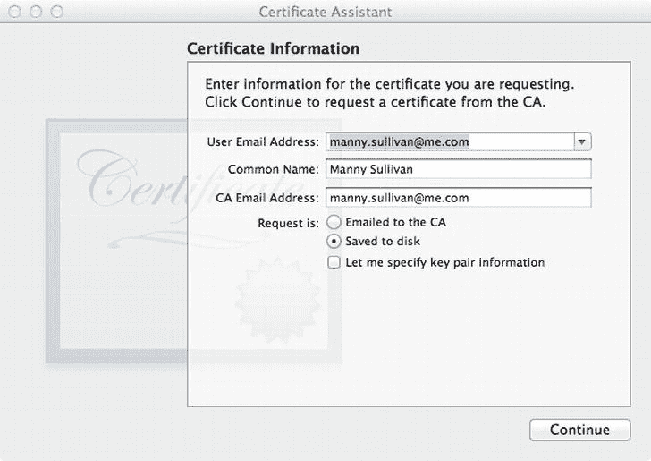

图 13-4. 创建证书签名请求

你将使用此证书签名请求来创建新证书。在“钥匙串访问.app”中，依次选择“钥匙串访问” “证书助理” “以证书颁发机构身份为他人创建证书”。将你刚创建的证书签名请求拖入证书助理的指定区域（图 13-5）。证书助理将切换界面，要求你指定签发 CA。选择你之前创建的 CA 名称。保持两个复选框为未选中状态，点击“继续”。证书助理会再次询问相同信息（老实说，我们也不确定原因）。再次选择你之前创建的 CA 名称，保持复选框未选中状态，点击“继续”（图 13-5）。证书助理完成后，将打开“邮件.app”并创建一封包含证书附件的草稿邮件。你不需要这封邮件，因此可以丢弃该邮件并关闭“邮件.app”。你应该会看到证书助理中显示证书信息（图 13-7）。点击“完成”关闭助理。

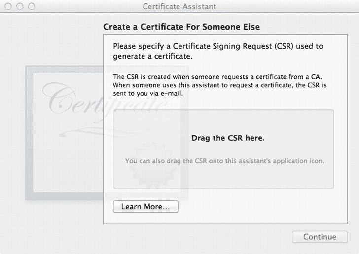

图 13-5. 从 CSR 创建证书


现在需要从用户证书中提取数字身份。在 `Keychain Access.app` 中，选中左侧的 `login` 钥匙串，然后选择下方的 `Certificates` 类别。找到刚刚创建的证书，它应该包含创建证书签名请求时输入的通用名称（图 13-6）。点击名称旁的展开三角形，私钥应显示在证书下方，且与证书名称相同。选中私钥，然后依次点击 `File`  `Export Items`。在保存对话框中将文件命名为 `cert`，确保文件格式为 `Personal Information Exchange (.p12)`。点击 `Save`。系统会要求为 `.p12` 文件设置密码。建议选择密码对话框认为安全的密码。本例中我们使用了 `“@Super2048Cat”`。点击 `OK` 后，可能会要求输入钥匙串密码，即你的登录密码。输入后点击 `Allow`。创建证书成功后，证书助理将显示证书的详细信息（图 13-7）。请注意，由于是自签名证书，系统会标记为由不受信任的颁发机构签名。

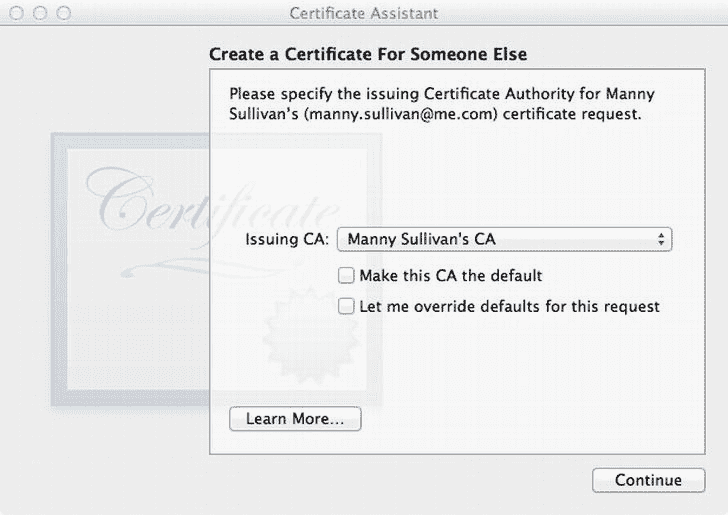

图 13-6. 选择证书的颁发证书颁发机构

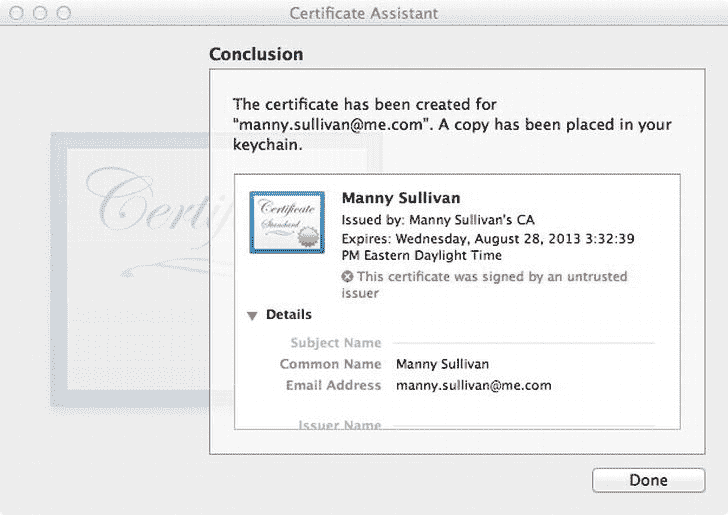

图 13-7. 证书创建成功

最后一步。`Security` 框架期望的是 DER 格式的根证书，而非 `Certificate Assistant` 创建的 PEM 格式。打开 `Terminal.app`，切换目录到 `~/Library/Application Support/Certificate Authority/<CA Name>`。你会看到一个名为 `<CA Name> certificates.pem` 的文件。输入以下命令：

```
> openssl x509 -in <PEM file> −inform PEM -out root.der -outform DER
```

将 `<PEM file>` 替换为实际文件名。

至此，你就可以开始构建应用程序了。

### 创建钥匙串应用

你将使用 `Tabbed Application` 模板作为应用的起点。打开 Xcode 并创建一个新项目，选择 `Tabbed Application` 模板。将项目命名为 `KeychainViewer`，并确保项目使用 storyboard 和自动引用计数。

项目创建完成后，需要添加 `Security` 框架。在项目导航器中选中项目，在项目编辑器中选择 `Keychain Viewer` 目标，然后导航到 `Build Phases` 选项卡。展开 `Link Binary with Libraries (3 Items)` 部分，添加 `Security.framework`。通过将 `Security.framework` 移动到 `Frameworks` 分组中来整理 `Project Navigator`。

你将用不同的实现替换 `FirstViewController` 和 `SecondViewController`。因此，选中文件 `FirstViewController.h`、`FirstViewController.m`、`SecondViewController.h` 和 `SecondViewController.m` 并删除。无需保留这些文件，因此在 Xcode 询问时选择 `Move to Trash`。

稍后你会删除主 storyboard 中的 `First View Controller` 和 `Second View Controller` 场景。首先，定义一些钥匙串项目类。钥匙串 API 是 C 语言 API 而非 Objective-C，因此你需要将其封装到 Objective-C 类中以简化访问。在 `Keychain Viewer` 分组中创建一个新的 Objective-C 类，命名为 `KeychainItem`，使其成为 `NSObject` 的子类。

选中 `KeychainItem.h`，为 `Security` 框架头文件添加导入指令。

```
#import <Security/Security.h>
```

对于每个 `KeychainItem` 对象，你需要知道其可能的类型（例如 `kSecClassGenericPassword`）以及实际的钥匙串项目。这两者都可以通过 `CFTypeRef` CoreFoundation 类型捕获。`CFTypeRef` 映射到通用的 Objective-C 对象 `id`。因此，你将为 `KeychainItem` 类添加两个 `id` 类型的属性。你还将定义一个 `NSDictionary` 属性，用于保存每个钥匙串项目返回的属性字典。最后，你将有一个属性来保存钥匙串项目的持久引用。

```
@property (strong, nonatomic) id type;
@property (strong, nonatomic) id item;
@property (strong, nonatomic) NSDictionary *attributes;
@property (strong, nonatomic) id persistentRef;
```

你需要一个初始化方法来处理这两个属性。

```
- (id)initWithItem:(CFTypeRef)item;
- (id)initWithData:(NSData *)data options:(NSDictionary *)options;
```

`initWithItem:` 用于通过钥匙串 API 创建钥匙串项目时使用。`initWithData:options:` 用于从文件或 URL 加载钥匙串项目；选项字典用于需要传递额外信息来加载钥匙串项目的情况。

你需要能够保存钥匙串项目（即将其写入钥匙串），因此将实现一个 `save` 方法。`save` 方法将返回一个 `BOOL` 值表示成功或失败。你将传入一个指向 `NSError` 指针的指针，以便在失败时发送错误消息。你还会添加一个便捷方法 `valueForAttribute:`，用于封装钥匙串 API 调用以获取钥匙串项目的值。

```
- (BOOL)save:(NSError **)error;
- (id)valueForAttribute:(CFTypeRef)attr;
```

现在实现这些方法。

打开 `KeychainItem.m` 并添加初始化方法。

```
- (id)initWithItem:(CFTypeRef)item
{
    self = [self init];
    if (self) {
        self.item = CFBridgingRelease(item);
    }
    return self;
}
```

这应该是相当标准的做法。注意使用了 `CFBridgingRelease` 函数。这是 CoreFoundation 和 Objective-C 之间免费桥接的一部分。它将非 Objective-C 指针转换为 Objective-C 对象，同时将内存管理转移给 ARC。`CFBridgingRelease` 的逆操作是 `CFBridgingRetain`，稍后会用到。注意在初始化方法中未设置 `type` 属性，这是因为你打算将 `KeychainItem` 设计为*抽象基类*。希望你不会直接实例化 `KeychainItem`，而是实例化其子类。在子类中，你将设置 `type` 属性。

由于 `KeychainItem` 是抽象的，`initWithData:options:` 应该不做任何操作。

```
- (id)initWithData:(NSData *)data options:(NSDictionary *)options
{
    return nil;
}
```

`save:` 方法实际上比想象中更复杂。

```
- (BOOL)save:(NSError **)error
{
    NSDictionary *attributes = @{
        (__bridge id)kSecValueRef : self.item,
        (__bridge id)kSecReturnPersistentRef : (id)kCFBooleanTrue
    };
    CFTypeRef cfPersistentRef;
    OSStatus status = SecItemAdd((__bridge CFDictionaryRef)attributes, &cfPersistentRef);
```


```objective-c
if (status != errSecSuccess) {
    NSDictionary *userInfo = nil;
    switch (status) {
        case errSecParam:
            userInfo = @{ NSLocalizedDescriptionKey : NSLocalizedString(@"errorSecParam",
                          @"传递给函数的一个或多个参数无效。") };
            break;
        case errSecAllocate:
            userInfo = @{ NSLocalizedDescriptionKey : NSLocalizedString(@"errSecAllocate",
                          @"内存分配失败。") };
            break;
        case errSecDuplicateItem:
            userInfo = @{ NSLocalizedDescriptionKey : NSLocalizedString(@"errSecDuplicateItem",
                          @"该项目已存在。") };
            break;
    }
    if (*error)
        *error = [NSError errorWithDomain:NSOSStatusErrorDomain code:status userInfo:userInfo];
    return NO;
}

self.persistentRef = CFBridgingRelease(cfPersistentRef);
return YES;
```

该方法的大部分内容用于处理调用 `SecItemAdd`（向钥匙串添加钥匙串项的操作）时出现的各种错误情况。您会看到一些以 `__bridge` 开头的类型转换，这是无缝桥接的另一部分。在这种情况下，您不希望将内存管理转移给 ARC（或者在 `(__bridge CFDictionaryRef)` 类型转换中，从 ARC 转移出来）。您本可以用纯 CoreFoundation 代码实现，但那样需要通过调用 `CFRelease` 来显式释放 CoreFoundation 对象，而我们觉得当前这种方式更简单。

`valueForAttribute:` 是对 `NSDictionary` 方法 `valueForKey:` 的简单封装，旨在简化您的操作，这样您就不必在代码中到处添加 `(__bridge id)` 类型转换。

```objective-c
- (id)valueForAttribute:(CFTypeRef)attr
{
    return [self.attributes valueForKey:(__bridge id)attr];
}
```

现在您需要实现 `KeychainItem` 的具体子类。回顾一下，Security 框架中定义了四种钥匙串项类型：`kSecClassGenericPassword`、`kSecClassInternetPassword`、`kSecClassCertificate` 和 `kSecClassIdentity`。您只需要处理其中两种：证书和身份。因此，您只需为应用程序定义两个具体子类：`KeychainCertificate` 和 `KeychainIdentity`。

使用 Objective-C 类模板创建一个新文件。将类命名为 `KeychainCertificate`，并使其成为 `KeychainItem` 的子类。创建文件后，选择 `KeychainCertificate.m` 并实现初始化方法。

```objective-c
- (id)init
{
    self = [super init];
    if (self) {
        self.type = [(__bridge id)kSecClassCertificate copy];
    }
    return self;
}

- (id)initWithData:(NSData *)data options:(NSDictionary *)options
{
    SecCertificateRef cert = SecCertificateCreateWithData(NULL, (__bridge CFDataRef)data);
    if (cert) {
        self = [self initWithItem:cert];
    }
    return self;
}
```

使用通用的 `init` 方法设置 `type` 属性。`init` 方法将覆盖 `KeychainItem` 中的默认 `init`。当调用 `KeychainItem initWithItem:` 时，它会调用 `init`。当您使用 `KeychainCertificate` 调用 `initWithItem:` 时，将会调用这个 `init` 方法。

现在，我们来创建 `KeychainIdentity` 类。创建一个新的 Objective-C 类，将其命名为 `KeychainIdentity`，并使其成为 `KeychainItem` 的子类。由于该类封装了一个数字身份，因此从文件加载时需要密码。

```objective-c
- (id)init
{
    self = [super init];
    if (self) {
        self.type = [(__bridge id)kSecClassIdentity copy];
    }
    return self;
}

- (id)initWithData:(NSData *)data options:(NSDictionary *)options
{
    CFDataRef inPKCS12Data = (__bridge CFDataRef)data;
    CFArrayRef items = CFArrayCreate(NULL, 0, 0, NULL);
    // 选项字典需要包含键 kSecImportExportPassphrase，其值为保护文件所用的密码
    OSStatus status = SecPKCS12Import(inPKCS12Data, (__bridge CFDictionaryRef)options, &items);
    if (status != errSecSuccess) {
        NSLog(@"读取 P12 文件时出错");
        abort();
    }
    CFDictionaryRef myIdentityAndTrust = CFArrayGetValueAtIndex(items, 0);
    SecIdentityRef identity = (SecIdentityRef)CFDictionaryGetValue(myIdentityAndTrust, kSecImportItemIdentity);
    if (identity)
        self = [self initWithItem:identity];

return self;
}
```

同样，您重写了 `init` 方法来设置 `type` 属性；这次设置为 `kSecClassIdentity`。`initWithData:options:` 用于加载 PKCS #12 格式的数据。由于这些数据受密码保护，因此需要选项字典包含键 `kSecImportExportPassphrase`，其值为创建文件时使用的密码。

您需要定义将使用刚刚创建的这些 `KeychainItem` 类的视图控制器类。使用 Objective-C 类模板创建一个新文件。将文件命名为 `KeychainItemsViewController`，并使其成为 `UITableViewController` 的子类。这将是您的抽象基视图控制器类。打开 `KeychainItemsViewController.h` 并添加以下属性：

```objective-c
@property (strong, nonatomic) NSArray *items;
```

`items` 属性将保存要显示的钥匙串项数组。打开 `KeychainItemsViewController.m` 来进行所有必要的修改。首先，需要导入 `KeychainItem` 头文件。

```objective-c
#import "KeychainItem.h"
```

接下来，需要更新表格视图的数据源方法，以返回正确的节数和每节的行数。

```objective-c
- (NSInteger)numberOfSectionsInTableView:(UITableView *)tableView
{
    // 返回节数。
    return 1;
}

- (NSInteger)tableView:(UITableView *)tableView numberOfRowsInSection:(NSInteger)section
{
    // 返回该节中的行数。
    return self.items.count;
}
```

最后，需要使用钥匙串项来配置表格视图的单元格。

```objective-c
- (UITableViewCell *)tableView:(UITableView *)tableView cellForRowAtIndexPath:(NSIndexPath *)indexPath
{
    static NSString *CellIdentifier = @"KeychainItemCell";
    UITableViewCell *cell = [tableView dequeueReusableCellWithIdentifier:CellIdentifier
                                                           forIndexPath:indexPath];

// 配置单元格...
    KeychainItem *item = self.items[indexPath.row];
    cell.textLabel.text = [item valueForAttribute:kSecAttrLabel];

return cell;
}
```

这就是 `KeychainItemViewController` 所需的全部内容。接下来定义您将实际使用的具体子类。创建一个新的 Objective-C 类文件。将其命名为 `CertificatesViewController`，作为 `KeychainItemsViewController` 的子类。目前无需修改默认代码。再创建另一个 `KeychainItemsViewController` 的子类。这次将类命名为 `IdentitiesViewController`。

现在，更新故事板以使用 `KeychainCertificate` 和 `KeychainItem` 类。在故事板编辑器中打开 `MainStoryboard.storyboard`。找到第一个视图控制器并删除。对第二个视图控制器重复此操作。然后将一个 `UITableViewController` 拖到编辑器面板中。按住 Control 键从标签栏控制器拖拽到表格视图控制器。当 Segue 选择器弹出窗出现时，在关系 Segue 标签下选择视图控制器。表格视图控制器应该会在底部出现一个标签栏，带有 Item 标签（图 13-8）。点击该标签并打开属性检查器。将标题重命名为 Identities，并使用名为 `first.png` 的图片。

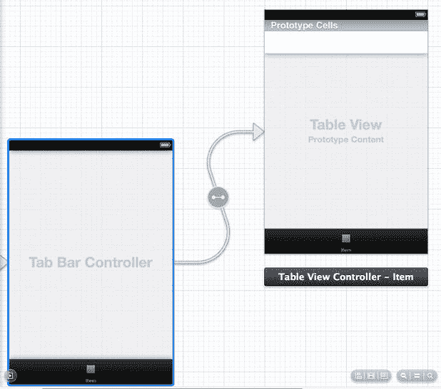


图 13-8 将表视图控制器连接到标签栏控制器

选中表视图控制器，在标识检查器中，将类从 `UITableViewController` 更改为 `IdentitiesViewController`。选中原型单元格标签下的表视图单元格。在属性检查器中，将样式从“自定义”更改为“基本”。为表视图单元格设置标识符为 `KeychainItemCell`。将辅助功能更改为“披露指示器”。

将另一个 `UITableViewController` 拖拽到编辑器面板中。按住 Control 键从标签栏控制器拖拽到该表视图控制器，再次在弹出的菜单中选择“视图控制器”。将标签栏重新标记为“证书”，并使用 `second.png` 图片。将表视图控制器类更改为 `CertificatesViewController`。将表视图单元格调整为“基本”样式，设置标识符为 `KeychainItemCell`，并将辅助功能更改为“披露指示器”。

构建并运行应用（图 13-9）。由于尚未加载钥匙串身份或证书来显示，因此表视图为空。

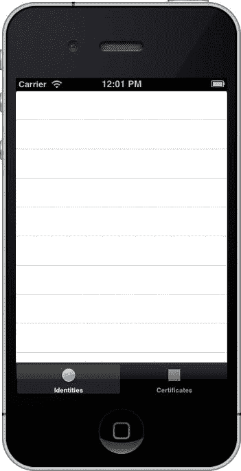

图 13-9 不显示任何钥匙串项目的钥匙串查看器应用

编辑 `CertificatesViewController.m`。首先，你需要导入 `KeychainCertificate.h` 头文件。

```
#import "KeychainCertificate.h"
```

并且需要更新 `viewDidLoad` 以加载你的 `KeychainCertificates`。

```
- (void)viewDidLoad
{
    [super viewDidLoad];
        // 在此处执行任何其他设置后的加载操作。
    self.items = [KeychainCertificate allKeychainCertificates];
}
```

你正在调用 `KeychainCertificate` 类方法 `allKeychainCertificates` 来填充 `items` 属性。但尚未定义该方法。打开 `KeychainCertificate.h` 并添加类方法声明。

```
+ (NSArray *)allKeychainCertificates;
```

打开 `KeychainCertificate.m` 以便实现 `allKeychainCertificates`。

```
+ (NSArray *)allKeychainCertificates
{
    NSMutableArray *certs = [NSMutableArray array];
    NSDictionary *query = @{
        (__bridge id)kSecClass               : (__bridge id)kSecClassCertificate,
        (__bridge id)kSecReturnRef           : (id)kCFBooleanTrue,
        (__bridge id)kSecReturnAttributes    : (id)kCFBooleanTrue,
        (__bridge id)kSecReturnPersistentRef : (id)kCFBooleanTrue,
        (__bridge id)kSecMatchLimit          : (__bridge id)kSecMatchLimitAll
    };
    CFTypeRef results = NULL;
    OSStatus status = SecItemCopyMatching((__bridge CFDictionaryRef)query, &results);
    if (status == errSecSuccess && results != NULL) {
        for (NSDictionary *result in (__bridge NSArray *)results) {
            id itemRef = [result valueForKey:(__bridge id)kSecValueRef];
            id persistentRef = [result valueForKey:(__bridge id)kSecValuePersistentRef];
            NSMutableDictionary *attrs = [NSMutableDictionary dictionaryWithDictionary:result];
            [attrs removeObjectForKey:(__bridge id)kSecValueRef];
            [attrs removeObjectForKey:(__bridge id)kSecValuePersistentRef];
            KeychainCertificate *cert =                 [[KeychainCertificate alloc] initWithItem:(__bridge CFTypeRef)itemRef];
            cert.persistentRef = persistentRef;
            cert.attributes = attrs;
            [certs addObject:cert];
        }
    }
    return certs;
}
```

你查询钥匙串中所有证书，请求证书、其属性及持久化引用。返回的结果是字典数组。你需要解析字典以提取证书和持久化引用。剩余的字典则是属性。根据每个字典创建一个 `KeychainCertificate`，并返回一个 `KeychainCertificate` 数组。

你需要对 `IdentitiesViewController` 重复此过程。编辑 `IdentitiesViewController.m` 并导入 `KeychainIdentity.h` 头文件。


```objc
#import "KeychainIdentity.h"
```

修改`viewDidLoad`以加载所有钥匙串身份标识。

```objc
- (void)viewDidLoad
{
    [super viewDidLoad];
    // Do any additional setup after loading the view.
    self.items = [KeychainIdentity allKeychainIdentities];
}
```

现在你需要在`KeychainIdentity`上定义并实现`allKeychainIdentities`类方法。打开`KeychainIdentity.h`添加定义。

```objc
+ (NSArray *)allKeychainIdentities;
```

将实现添加到`KeychainIdentity.m`。

```objc
+ (NSArray *)allKeychainIdentities
{
    NSMutableArray *idents = [NSMutableArray array];
    NSDictionary *query = @{
        (__bridge id)kSecClass               : (__bridge id)kSecClassIdentity,
        (__bridge id)kSecReturnRef           : (id)kCFBooleanTrue,
        (__bridge id)kSecReturnAttributes    : (id)kCFBooleanTrue,
        (__bridge id)kSecReturnPersistentRef : (id)kCFBooleanTrue,
        (__bridge id)kSecMatchLimit          : (__bridge id)kSecMatchLimitAll
    };
    CFTypeRef results = NULL;
    OSStatus status = SecItemCopyMatching((__bridge CFDictionaryRef)query, &results);
    if (status == errSecSuccess && results != NULL) {
        for (NSDictionary *result in (__bridge NSArray *)results) {
            id itemRef = [result valueForKey:(__bridge id)kSecValueRef];
            id persistentRef = [result valueForKey:(__bridge id)kSecValuePersistentRef];
            NSMutableDictionary *attrs = [NSMutableDictionary dictionaryWithDictionary:result];
            [attrs removeObjectForKey:(__bridge id)kSecValueRef];
            [attrs removeObjectForKey:(__bridge id)kSecValuePersistentRef];

            KeychainIdentity *ident =                 
                  [[KeychainIdentity alloc] initWithItem:(__bridge CFTypeRef)itemRef];
            ident.persistentRef = persistentRef;
            ident.attributes = attrs;
            [idents addObject:ident];
        }
    }
    return idents;
}
```

这个实现本质上与`allKeychainCertificates`相同，区别仅在于你查询的是数字身份标识并创建`KeychainIdentity`实例而非`KeychainCertificate`。你或许可以将通用代码重构到`KeychainItem`的类方法中，但目前这样工作。

构建并运行应用仍不会显示任何身份标识或证书。请记住，在 iOS 中，钥匙串仅限应用作用域内使用。你的应用没有任何钥匙串条目。接下来你将加载之前创建的证书和身份标识。

首先，将你之前创建的两个证书添加到项目中。在项目导航窗格中选择`Supporting Files`组，并将`root.cer`和`cert.p12`文件添加到项目中。确保勾选“Copy items to destination group’s folder (if needed)”复选框。

你将在运行应用时加载这些条目，但你不希望在每次启动应用时都加载它们。打开`AppDelegate.m`，并导入`KeychainCertificate`和`KeychainIdentity`头文件。

```objc
#import "KeychainCertificate.h"
#import "KeychainIdentity.h"
```

接下来，定义一个私有类别。

```objc
@interface AppDelegate ()
- (BOOL)isAnchorCertLoaded;
- (void)addAnchorCertificate;
- (void)addIdentity;
@end
```

你定义了一个方法来检查锚点证书是否已加载，以及两个方法来添加锚点证书和数字身份标识。在实现这些方法之前，你需要修改`application:didFinishLoadingWithOptions:`。

```objc
- (BOOL)application:(UIApplication *)application        didFinishLaunchingWithOptions:(NSDictionary *)launchOptions
{
    // Override point for customization after application launch.
    if ([self isAnchorCertLoaded]) {
        [self addIdentity];
        [self addAnchorCertificate];
    }

    return YES;
}
```

检查锚点证书是否已加载。如果未加载，则加载数字身份标识和锚点证书。该加载只应发生一次，基本上是在应用的首次启动时。`isAnchorCertLoaded`的实现非常简单。

```objc
- (BOOL)isAnchorCertLoaded
{
    return ([[NSUserDefaults standardUserDefaults] valueForKey:@"anchor_certificate"] == nil);
}
```

你只需检查应用的用户默认中是否存在键`anchor_certificate`。如果不存在，则假定证书和数字身份标识尚未加载。要加载证书，你只需加载文件，实例化`KeychainCertificate`，然后保存它。请记住你的`KeychainItem save:`方法会将钥匙串条目写入钥匙串。

```objc
- (void)addAnchorCertificate
{
    NSString *rootCertificatePath = [[NSBundle mainBundle] pathForResource:@"root" ofType:@"der"];
    NSData *data = [[NSData alloc] initWithContentsOfFile:rootCertificatePath];
    KeychainCertificate *cert = [[KeychainCertificate alloc] initWithData:data options:nil];
    if (cert) {
        NSError *error;
        BOOL saved = [cert save:&error];
        if (!saved) {
            NSLog(@"Error Saving Certificate: %@", [error localizedDescription]);
            abort();;
        }
        NSUserDefaults *userDefaults = [NSUserDefaults standardUserDefaults];
        [userDefaults setObject:cert.persistentRef forKey:@"anchor_certificate"];
        [userDefaults synchronize];
    }
}
```

最后一步，你使用键`anchor_certificates`将证书的持久引用写入用户默认。

添加数字身份标识类似于添加证书。你需要发送用于保护身份标识文件的密码。这里你将硬编码该值。在生产应用中，你可能会使用弹窗对话框要求用户输入密码。

```objc
- (void)addIdentity
{
    NSString *identityPath = [[NSBundle mainBundle] pathForResource:@"cert" ofType:@"p12"];
    NSData *data = [[NSData alloc] initWithContentsOfFile:identityPath];
    NSString *password = @"@Super2048Cat";
    KeychainIdentity *ident =         
       [[KeychainIdentity alloc] initWithData:data                                       
       options:@{ (__bridge id)kSecImportExportPassphrase : password }];
    if (ident) {
        NSError *error;
        BOOL saved = [ident save:&error];
        if (!saved) {
            NSLog(@"Error Saving Identity: %@", [error localizedDescription]);
            abort();
        }
    }
}
```

你假设如果证书已加载，那么也意味着已加载数字身份标识。再次提醒，在生产应用中，你可能需要对每个所需的钥匙串条目进行检查。

构建并运行你的应用。现在你应该能看到你的数字身份标识和证书（图 13-10）。

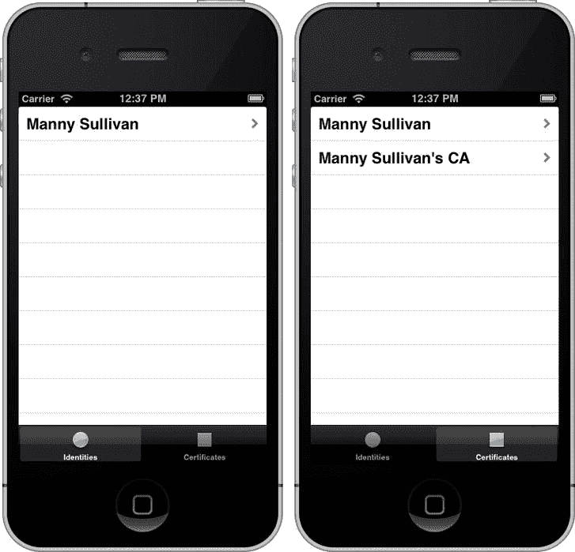

图 13-10.  展示数字身份标识（左）和证书（右）的钥匙串查看器

让我们为数字身份标识和证书添加一个详细视图。你将使用一个简单的文本视图来打印属性。你将模态呈现这个视图控制器，因此需要添加一个按钮来关闭它。

首先创建一个新的 Objective-C 类，命名为`KeychainItemViewController`，它将是`UIViewController`的子类。创建类文件后，打开`KeychainItemViewController.h`。在`@interface`声明之前，预先声明`KeychainItem`类。

```objc
@class KeychainItem;
```

这样做是因为你想要一个`KeychainItem`属性。此外，你将声明一个`UITextView`属性，用于放置钥匙串条目的属性信息。

```objc
@property (strong, nonatomic) KeychainItem *item;
@property (weak, nonatomic) IBOutlet UITextView *textView;
```

最后，你将定义一个操作，当用户点击按钮时关闭视图控制器。

```objc
- (IBAction)done:(id)sender;
```

打开`KeychainItemViewController.m`，并实现`done:`操作。

```objc
- (IBAction)done:(id)sender
{
    [self dismissViewControllerAnimated:YES completion:nil];
}
```


你已经准备好添加视图控制器场景了。打开 `MainStoryboard.storyboard`。从对象库中拖一个 `UIViewController` 到故事板编辑器，放在 `IdentitiesViewController` 旁边。再拖一个 `UIViewController`，这次放在 `CertificatesViewController` 旁边。将两个视图的背景颜色都改为黑色。接下来，在两个 `UIViewController` 上都添加一个 `UITextView`。当你把它们放到 `UIViewController` 上时，它们应该会自动扩展以填充视图。如果没有自动填充，也没关系。你需要将每个文本框调整为视图的宽度（320.0 像素），但高度要小于视图的完整高度（我们使用了 400.0 像素）。删除每个文本框中的默认文本。

在文本框下方各拖一个 `UIButton`。使用蓝色辅助线将按钮对齐到左侧，位于文本框下方。将按钮的标签文字从 `Button` 改为 `Done`。

对于每个场景，使用身份检查器将每个视图控制器的类从 `UIViewController` 改为 `KeychainItemViewController`。按住 Control 键从视图控制器图标拖拽到文本框，选择 `textView` 插座。按住 Control 键从 `Done` 按钮拖拽到视图控制器，选择 `done:` 操作。

最后，按住 Control 键从 `IdentitiesViewController` 中的表格视图单元格拖拽到旁边的 `KeychainItemViewController`。在弹出菜单中选择模态 `Selection Segue`。选择新的 segue，并在属性检查器中将其命名为 `IdentitySegue`。对 `CertificatesViewController` 和它旁边的 `KeychainItemViewController` 重复此过程。这次，在属性检查器中将 segue 命名为 `CertificateSegue`。

你要用钥匙串项目的属性来填充文本框。你将使用 `UIViewController` 的 `viewWillAppear` 方法来填充文本框。

```
- (void)viewWillAppear:(BOOL)animated
{
    if (self.item) {
        NSMutableString *itemInfo = [NSMutableString string];
        [itemInfo appendFormat:@"AccessGroup: %@\n",                              
            [self.item valueForAttribute:kSecAttrAccessGroup]];
        [itemInfo appendFormat:@"CreationDate: %@\n",                                     
            [self.item valueForAttribute:kSecAttrCreationDate]];
        [itemInfo appendFormat:@"CertificateEncoding: %@\n",                              
            [self.item valueForAttribute:kSecAttrCertificateEncoding]];
        [itemInfo appendFormat:@"CreationDate: %@\n", 
            [self.item valueForAttribute:kSecClass]];
        [itemInfo appendFormat:@"Issuer: %@\n", 
            [self.item valueForAttribute:kSecAttrIssuer]];
        [itemInfo appendFormat:@"Label: %@\n", 
            [self.item valueForAttribute:kSecAttrLabel]];
        [itemInfo appendFormat:@"ModificationDate: %@\n",                              
            [self.item valueForAttribute:kSecAttrModificationDate]];
        [itemInfo appendFormat:@"Accessible: %@\n", 
            [self.item valueForAttribute:kSecAttrAccessible]];
        [itemInfo appendFormat:@"PublicKeyHash: %@\n",                              
            [self.item valueForAttribute:kSecAttrPublicKeyHash]];
        [itemInfo appendFormat:@"SerialNumber: %@\n",                              
            [self.item valueForAttribute:kSecAttrSerialNumber]];
        [itemInfo appendFormat:@"Subject: %@\n", 
            [self.item valueForAttribute:kSecAttrSubject]];
             self.textView.text = itemInfo;
    }
}
```

接下来，检查是否有钥匙串项目。如果有，就创建一个 `NS(Mutable)String` 并用一些属性值填充它。这个字符串用于设置文本框的文本。

对于每个表格视图控制器，你需要实现 `prepareForSegue:sender:` 来为 `KeychainItemViewController` 设置钥匙串项目。打开 `CertificatesViewController.m` 并添加导入 `KeychainItemViewController.h` 头文件。

```
#import "KeychainItemViewController.h"
```

`prepareForSegue:sender:` 的实现会检查被调用的 segue，并为 `KeychainItemViewController` 设置 `KeychainItem` 属性。

```
- (void)prepareForSegue:(UIStoryboardSegue *)segue sender:(id)sender
{
    if ([segue.identifier isEqualToString:@"CertificateSegue"]) {
        NSIndexPath *indexPath = [self.tableView indexPathForSelectedRow];
        KeychainCertificate *cert = self.items[indexPath.row];
        KeychainItemViewController *kivc = [segue destinationViewController];
        kivc.item = cert;
    }
}
```

你需要对 `IdentitiesViewController` 重复此过程，并做一些小改动。

```
- (void)prepareForSegue:(UIStoryboardSegue *)segue sender:(id)sender
{
    if ([segue.identifier isEqualToString:@"IdentitySegue"]) {
        NSIndexPath *indexPath = [self.tableView indexPathForSelectedRow];
        KeychainIdentity *ident = self.items[indexPath.row];
        KeychainItemViewController *kivc = [segue destinationViewController];
        kivc.item = ident;
    }
}
```

你检查的是 segue 标识符 `IdentitySegue`，并且你发送的是一个 `KeychainIdentity` 对象，而不是 `KeychainCertificate`。

构建并运行你的应用。选择数字身份并查看属性详情。关闭详情视图并查看一个证书。你可以扩展这个应用，显示每个钥匙串项目特有的属性。你打算做点别的。你要增强数字身份，使其能够加密和解密数据。

打开 `KeychainIdentity.h`。你要添加两个方法。

```
- (NSData *)encrypt:(NSData *)data;
- (NSData *)decrypt:(NSData *)data;
```

对于每个方法，你传入一个 `NSData` 对象，其数据需要被加密或解密。每个方法将返回一个新的 `NSData` 对象，包含转换后的数据。

在你可以使用公钥和私钥来加密和解密数据之前，你需要知道数字身份是否可信。你只需要检查一次信任，所以你会惰性检查，仅在需要时检查。你将声明一个私有 ivar `_trusted` 来告知 `KeychainIdentity` 是否可信。由于你不希望每次 `trusted` 为 false 时都检查信任，你还会声明另一个属性 `trust`，其类型为 `SecTrustRef`。

```
@interface KeychainIdentity ()
@property (assign, nonatomic, readonly, getter=isTrusted) BOOL trusted;
@property (assign, nonatomic, readonly) SecTrustRef trust;
@property (assign, nonatomic, readonly) SecCertificateRef anchorCertificate;
@property (assign, nonatomic, readonly) SecCertificateRef certificate;
- (BOOL)recoverTrust;
@end
```

你还声明了两个额外的属性 `anchorCertificate` 和 `certificate`，以及一个私有方法 `recoverTrust`，这些你将会用到。我们在实现部分会解释原因。

在实现内部，你需要合成 `trusted`、`trust`、`anchorCertificate` 和 `certificate`，以便访问 ivar `_trusted`、`_trust`、`_anchorCertificate` 和 `_certificate`。

```
@synthesize trusted = _trusted;
@synthesize trust = _trust;
@synthesize anchorCertificate = _anchorCertificate;
@synthesize certificate = _certificate;
```

让我们更新 `init` 方法来初始化这些 ivar。

```
- (id)init
{
    self = [super init];
    if (self) {
        self.type = [(__bridge id)kSecClassIdentity copy];
        _trusted = NO;
        _trust = NULL;
    }
    return self;
}
```

你需要实现 `dealloc` 方法，以便在必要时释放信任和证书引用。

```
- (void)dealloc
{
    if (_trust)
        CFRelease(_trust);
    if (_certificate)
        CFRelease(_certificate);
    if (_anchorCertificate)
        CFRelease(_anchorCertificate);
}
```

在你可以实现 `trust` 和 `trusted` 的方法之前，你需要先实现 `anchorCertificate` 和 `certificate` 的方法。


```objc
- (SecCertificateRef)anchorCertificate
{
    if (_anchorCertificate == NULL) {
        id persistentRef =             [[NSUserDefaults standardUserDefaults] objectForKey:@"anchor_certificate"];
        NSDictionary *query = @{
                (__bridge id)kSecClass               : (__bridge id)kSecClassCertificate,
                (__bridge id)kSecValuePersistentRef  : persistentRef,
                (__bridge id)kSecReturnRef           : (id)kCFBooleanTrue,
                (__bridge id)kSecMatchLimit          : (__bridge id)kSecMatchLimitOne
        };
        OSStatus status =             SecItemCopyMatching((__bridge CFDictionaryRef)query, (CFTypeRef *)&_anchorCertificate);
        if (status != errSecSuccess || _anchorCertificate == NULL) {
            NSLog(@"Error loading Anchor Certificate");
            abort();
        }
    }
    return _anchorCertificate;
}
```

你采用懒加载的方式加载锚点证书。这是你在 `AppDelegate` 中加载到钥匙串里的根证书。你取出已加载到 `User Defaults` 中的持久引用，并用它来查询钥匙串中的锚点证书。如果成功，你就设置 `_anchorCertificate` 实例变量。如果失败，则问题比较严重，因此你会记录错误并中止应用程序。

加载数字身份证书要简单得多。

```objc
- (SecCertificateRef)certificate
{
    if (_certificate == NULL) {
        OSStatus status =             SecIdentityCopyCertificate((__bridge SecIdentityRef)self.item, &_certificate);
        if (status != errSecSuccess) {
            NSLog(@"Error retrieving Identity Certificate");
            return NULL;
        }
    }
    return _certificate;
}
```

你需要创建一个策略引用，并将其与证书结合，以创建一个信任引用。

```objc
- (SecTrustRef)trust
{
    if (_trust == NULL) {
        SecPolicyRef policy = SecPolicyCreateBasicX509();
        NSArray *certs = @[ (__bridge id)self.certificate, (__bridge id)self.anchorCertificate ];
        OSStatus status =             SecTrustCreateWithCertificates((__bridge CFTypeRef)certs, policy, &_trust);
        if (status != errSecSuccess) {
            NSLog(@"Error Creating Trust from Certificate");
            return NULL;
        }
    }
    return _trust;
}
```

你将使用这些方法来实现受信属性 `isTrusted` 的 getter 方法。

```objc
- (BOOL)isTrusted
{
    if (_trust == NULL) {
        SecTrustResultType trustResult;
        OSStatus status = SecTrustEvaluate(self.trust, &trustResult);
        if (status == errSecSuccess) {
            switch (trustResult) {
                case kSecTrustResultInvalid:
                case kSecTrustResultDeny:
                case kSecTrustResultFatalTrustFailure:
                case kSecTrustResultOtherError:
                    _trusted = NO;
                    break;
                case kSecTrustResultProceed:
                case kSecTrustResultConfirm:
                case kSecTrustResultUnspecified:
                    _trusted = YES;
                    break;
                case kSecTrustResultRecoverableTrustFailure:
                    _trusted = [self recoverTrust];
                    break;
            }
        }
        else
            _trusted = NO;
    }
    return _trusted;
}
```

你检查 `_trust` 实例变量是否为 `NULL`。如果是，那么你需要检查数字身份是否可信。你访问 `trust` 属性并对其进行评估。如果信任结果代码不是成功的，那么数字身份不可信。接下来的三个结果代码 `kSecTrustResultProceed`、`kSecTrustResultConfirm`、`kSecTrustResultUnspecified` 表示数字身份是可信的。最后一个 `kSecTrustResultUnspecified` 仅表示你尚未为基础证书设置显式的信任设置。

最后一个结果代码 `kSecTrustResultRecoverableTrustFailure` 意味着从技术上讲你已经失败了，但存在一些方法可以恢复，使得数字身份变得可信。在这个特定的应用程序中，可恢复的信任失败是因为你使用了自签名证书颁发机构。为了从中恢复，你需要显式地告诉安全框架信任你的证书颁发机构。这就是 `recoverTrust` 方法发挥作用的地方。

```objc
- (BOOL)recoverTrust
{
    NSArray *anchorCerts = @[ (__bridge id)self.anchorCertificate ];
    SecTrustSetAnchorCertificates(self.trust, (__bridge CFArrayRef)anchorCerts);
    SecTrustSetAnchorCertificatesOnly(self.trust, NO);
    SecTrustResultType trustResult;
    OSStatus status = SecTrustEvaluate(self.trust, &trustResult);
    if (status == errSecSuccess) {
        switch (trustResult) {
            case kSecTrustResultInvalid:
            case kSecTrustResultDeny:
            case kSecTrustResultFatalTrustFailure:
            case kSecTrustResultOtherError:
            case kSecTrustResultRecoverableTrustFailure:
                return NO;
                break;
            case kSecTrustResultProceed:
            case kSecTrustResultConfirm:
            case kSecTrustResultUnspecified:
                return YES;
                break;
        }
    }
    return NO;
}
```

你显式地将锚点证书设置为你之前创建的自签名根证书，并重新评估信任。你以与之前相同的方式处理信任结果，只是这次你将可恢复的信任失败视为失败。

现在你可以实现你的 `encrypt:` 方法了。

```objc
- (NSData *)encrypt:(NSData *)data
{
    if (!self.isTrusted)
        return nil;
```

首先，你检查你的数字身份是否可信。如果不可信，则返回 `nil`。

接下来，你从你的信任引用中复制你的公钥。你用公钥来确定块大小以及你可以加密的字节数大小。

```objc
    SecKeyRef publicKey = SecTrustCopyPublicKey(self.trust);
    size_t keyBlockSize = SecKeyGetBlockSize(publicKey);
    size_t bufferSize = keyBlockSize*sizeof(uint8_t);
```

你使用 `bufferSize` 来分配将要用于加密的数据缓冲区。由于你将使用的填充方式，你的源缓冲区需要减少 11 个字节。

```objc
    uint8_t *srcBuffer = malloc(bufferSize);
    size_t srcBufferLen = keyBlockSize - 11;

uint8_t *buffer = malloc(bufferSize);
    size_t bufferLen = keyBlockSize;
```

你分配你的输出 `NSData` 对象。你实际上使用了一个 `NSMutableData` 实例，以便可以向其追加数据。

```objc
    NSMutableData *result = [[NSMutableData alloc] init];
```

如果你的输入 `NSData` 对象大于允许的块/缓冲区大小，你需要分块加密数据，并将其追加到你的输出 `NSMutableData` 实例中。

```objc
    NSRange range = NSMakeRange(0, keyBlockSize);
    while (range.location < data.length) {
        memset(srcBuffer, 0x0, bufferSize);
        memset(buffer, 0x0, bufferSize);

if (NSMaxRange(range) > data.length)
            range.length = data.length - range.location;

[data getBytes:srcBuffer range:range];
        OSStatus status =             SecKeyEncrypt(publicKey, kSecPaddingPKCS1, srcBuffer, srcBufferLen, buffer, &bufferLen);
        if (status != errSecSuccess) {
            NSLog(@"Error Encrypting Data");
            free(buffer);
            free(srcBuffer);
            free(publicKey);
            return nil;
        }
        [result appendBytes:buffer length:bufferLen];
        range.location += srcBufferLen;
    }
```

在加密错误时，你会记录一个错误并直接返回 `nil`。

最后，你释放缓冲区和公钥引用，并返回加密后的数据对象。

```objc
    free(buffer);
    free(srcBuffer);
    free(publicKey);

return result;
}
```

解密工作方式与加密类似，只有一个细微的差别。

```objc
- (NSData *)decrypt:(NSData *)data
{
    if (!self.isTrusted)
        return nil;
```


`SecKeyRef privateKey;`  
`OSStatus status = SecIdentityCopyPrivateKey((__bridge SecIdentityRef)self.item, &privateKey);`  
`if (status != errSecSuccess && privateKey != NULL) {`  
`CFRelease(privateKey);`  
`privateKey = NULL;`  
`return nil;`  
`}`  

`size_t keyBlockSize = SecKeyGetBlockSize(privateKey);`  
`size_t bufferSize = keyBlockSize * sizeof(uint8_t);`  

`uint8_t *srcBuffer = malloc(bufferSize);`  
`uint8_t *buffer = malloc(bufferSize);`  
`size_t bufferLen = keyBlockSize;`  

`NSMutableData *result = [[NSMutableData alloc] init];`  

`NSRange range = NSMakeRange(0, keyBlockSize);`  
`while (range.location < data.length) {`  
`memset(srcBuffer, 0x0, bufferSize);`  
`memset(buffer, 0x0, bufferSize);`  
`if (NSMaxRange(range) > data.length)`  
`range.length = data.length - range.location;`  

`[data getBytes:srcBuffer range:range];`  
`OSStatus status = SecKeyDecrypt(privateKey, kSecPaddingPKCS1, srcBuffer, keyBlockSize, buffer, &bufferLen);`  
`if (status != errSecSuccess) {`  
`NSLog(@"Error Decrypting Data");`  
`free(buffer);`  
`free(srcBuffer);`  
`free(privateKey);`  
`return nil;`  
`}`  
`[result appendBytes:buffer length:bufferLen];`  
`range.location += keyBlockSize;`  
`}`  

`free(buffer);`  
`free(srcBuffer);`  
`free(privateKey);`  

`return result;`  

从数字身份中检索私钥，并检查返回代码，以确保已成功获取。

现在，在身份详情视图控制器中使用数字身份的加密/解密功能。首先，需要创建一个名为 `IdentityViewController` 的子类，继承 `KeychainItemViewController`。您要添加一个按钮，用于加密和解密文本视图中的内容。打开 `IdentityViewController.h`，声明该按钮的插座变量和操作方法。

```
@property (weak, nonatomic) IBOutlet UIButton *cryptButton;
- (IBAction)crypt:(id)sender;
```

打开 `IdentityViewController.m`。首先，在私有类别中添加一些实例变量和方法。

```
@interface IdentityViewController () {
    NSData *_encryptedData;
}
- (void)encrypt;
- (void)decrypt;
@end
```

`_encryptedData` 将存储加密后的数据（显而易见）。同时，它还会用于判断数据应该被加密还是解密。方法 `encrypt` 和 `decrypt` 的功能不言自明。

`crypt:` 操作方法是一个简单的判断，用于确定调用哪个方法。

```
- (IBAction)crypt:(id)sender
{
    if (_encryptedData)
        [self decrypt];
    else
        [self encrypt];
}
```

`encrypt` 方法获取文本视图的内容，并将其发送给 `KeychainIdentity` 的 encrypt 方法。结果存储在 `_encryptedData` 实例变量中。需要注意的是，您使用 UTF-8 编码对文本视图内容进行了编码。这一点很重要，因为安全框架是在 8 位数据边界上工作的。

```
- (void)encrypt
{
    KeychainIdentity *ident = (KeychainIdentity *)self.item;
    NSData *data = [self.textView.text dataUsingEncoding:NSUTF8StringEncoding];
    _encryptedData = [ident encrypt:data];
    if (_encryptedData == nil) {
        NSLog(@"Encryption Failed");
        return;
    }

    self.textView.text = [_encryptedData description];
    [self.cryptButton setTitle:@"Decrypt" forState:UIControlStateNormal];
}
```

获取加密数据后，将其显示在文本视图中，并更改加密按钮插座变量上的标签。

解密方法则以相反的方式工作。

```
- (void)decrypt
{
    KeychainIdentity *ident = (KeychainIdentity *)self.item;
    NSData *data = [ident decrypt:_encryptedData];
    if (data == nil) {
        NSLog(@"Decryption Failed");
        return;
    }

    NSString *decryptedString = [[NSString alloc] initWithBytes:[data bytes]
                                                          length:[data length]
                                                        encoding:NSUTF8StringEncoding];
    _encryptedData = nil;
    self.textView.text = decryptedString;
    [self.cryptButton setTitle:@"Encrypt" forState:UIControlStateNormal];
}
```

现在，您需要调整故事板，以使用新的 `IdentityViewController`。选择 `MainStoryboard.storyboard` 打开故事板编辑器。在 `IdentitiesViewController` 旁边找到 `KeychainItemViewController`。选中它，并将类从 `KeychainItemViewController` 更改为 `IdentityViewController`。将一个 `UIButton` 拖到视图的右下角，使用蓝色参考线与完成按钮以及视图右侧对齐。将标签文本改为 Encrypt。从视图控制器图标按住 Control 键拖动到 Encrypt 按钮，并将其绑定到 `cryptButton` 插座变量。从 Encrypt 按钮按住 Control 键拖动到视图控制器图标，并将其绑定到 `crypt:` 操作。

构建并运行您的应用程序。选择数字身份以打开 `IdentityViewController`。单击 Encrypt 按钮加密文本，然后单击 Decrypt 按钮解密文本（参见 图 13-11）。

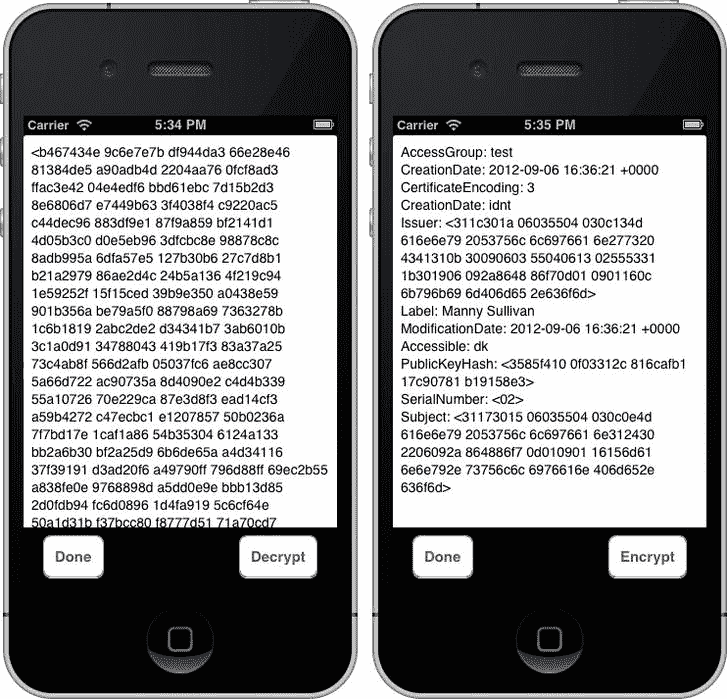

图 13-11. 加密（左）和解密（右）您的数字身份信息

### 安全永不停歇

正如我们在本章开头所述，安全是一个持续的过程。在开发应用程序以及后续阶段，您需要在每一步都考虑安全问题。我们为您展示了通过安全框架在 iOS 中可用的一些功能。希望这些信息足以为您未来的应用程序开发奠定坚实的基础。

如果您想了解更多，请阅读 Apple 的《安全编码指南》（<https://developer.apple.com/library/ios/#documentation/Security/Conceptual/SecureCodingGuide/>）。另一个通用的安全资源是 Christoph Kern、Anita Kesavan 和 Neil Daswani 合著的《安全基础》（Apress，2007 年）。尽管这本书已经出版多年，但其中所涵盖的原则仍然完全有效。

接下来，您将着手保持 iOS 中界面的响应性。这与您刚刚涉及的内容有很大的不同。深吸一口气，然后翻页吧。

---

