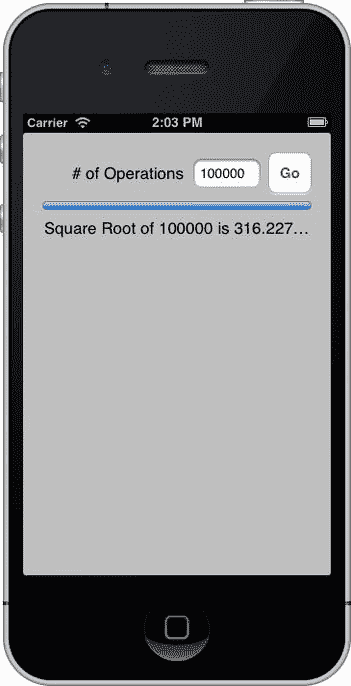
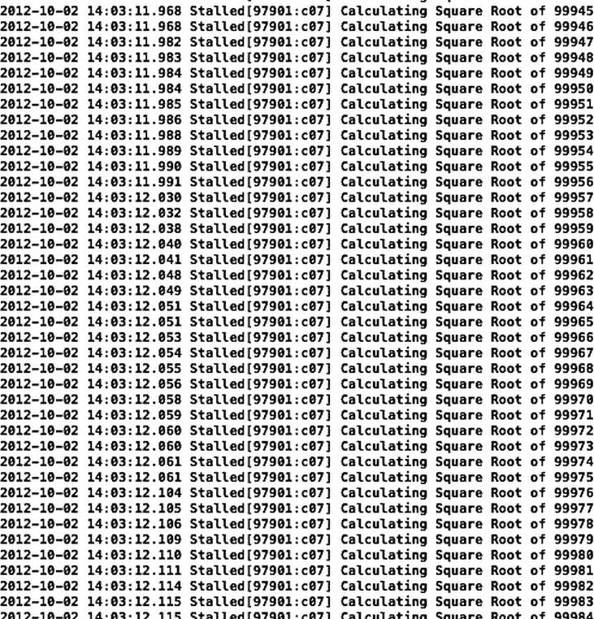
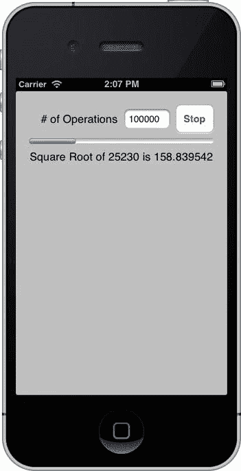
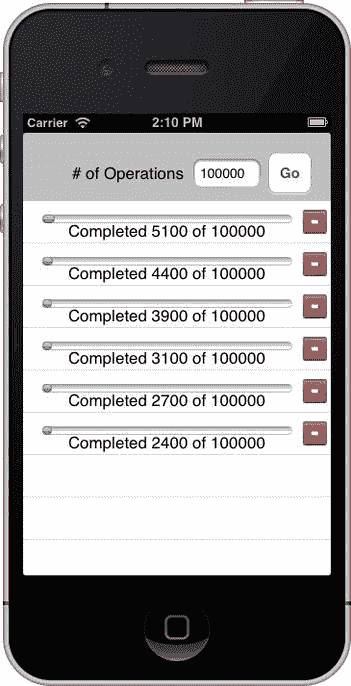

# 第 14 章：保持界面响应

正如我们在本书中多次提到的，如果您在某个操作或委托方法中，或者在这些方法调用的方法中一次性执行过多任务，那么应用程序的界面可能会在长时间运行的方法执行期间出现卡顿甚至冻结。作为一般规则，您绝对不希望应用程序的用户界面变得无响应。您的用户始终期望能够与您的应用程序交互，或者至少在他们不被允许交互时，用户界面能及时更新状态。

在计算机编程中，同时进行多组操作的能力通常被称为*并发*。在本章中，我们将探讨一些为应用程序添加并发的通用解决方案。即使您的应用程序在执行耗时任务，这些方案也能确保用户界面保持响应。虽然向应用程序添加并发的方法有很多，但我们只讨论两种，结合您已在网络运行循环调度中掌握的知识，这两种方法应该能够帮助您处理几乎所有耗时任务。


第一个要介绍的机制是*定时器*（`timer`）。定时器是可以与运行循环一起调度的对象，与你之前使用过的网络类非常相似。定时器可以按设定的时间间隔调用特定对象的方法。例如，你可以设置一个定时器，让它每秒调用控制器类的方法十次。一旦启动，大约每十分之一秒，你的方法就会被触发，直到你告诉定时器停止。

无论是运行循环调度还是定时器，都不是某些人认为的“真正”的并发形式。大多数人将运行循环和定时器称为异步计算，即任务在后台运行，对应用程序的用户界面操作不可见。在这两种情况下，应用程序的主运行循环都会检查某些条件，如果条件满足，它会调用特定对象上的特定方法。然而，如果被调用的方法运行时间过长，你的界面就会变得无响应。但是，使用运行循环和定时器比实现所谓的“真正”并发（即同时运行多个任务和多个运行循环）要简单得多。

我们要介绍的另一个机制在 Objective-C 世界中相对较新。它被称为*操作队列*（`operation queue`），它与你创建的名为*操作*（`operations`）的特殊对象协同工作。操作队列可以同时管理多个操作，并确保这些操作根据你设定的一些简单规则获得处理时间。每个操作都有一组特定的命令，这些命令以你编写的方法形式存在，操作队列会确保每个操作的方法以充分利用可用系统资源的方式运行。

操作队列非常棒，因为它们是一种高级抽象，隐藏了实现真正并发所涉及的繁琐实现细节。在 iOS 中，队列利用一个名为*线程*（`threads`）的操作系统特性为其管理的各种操作分配处理时间。Apple 目前推荐使用操作队列而不是线程，这不仅是因为操作队列更易于使用，还因为它们能为你的应用程序带来其他优势。

**注意：** 尽管在使用 iPhone SDK 时不可用，但并发的另一种形式是多进程处理，即使用 UNIX 系统调用 `fork()` 和 `exec()` 或 Cocoa 的 `NSTask` 类。使用多进程比使用线程更重量级。

Grand Central Dispatch（GCD）是一种允许应用程序更好地利用现代计算机拥有多个处理核心（有时甚至是多个处理器）这一事实的技术。如果你在 GCD 发布之前在程序中使用过操作队列，那么当你为 iOS 重新编译应用程序时，你的代码会自动免费获得 GCD 带来的好处。如果你使用了其他形式的并发（例如线程）而不是操作队列，你的应用程序就不会自动受益于 GCD。

你可能已经明白为什么我们将对“真正”并发的讨论局限于操作队列。它们显然是 Cocoa 和 Cocoa Touch 的未来发展方向。它们大大简化了我们作为程序员的生活，并帮助我们利用尚未被编写出来的技术。还有什么比这更好的呢？

让我们先绕个小弯，看看并发所要解决的问题。

### 探索并发问题

在探索解决并发问题的方法之前，让我们先确保你理解了问题所在。你将构建一个小型应用程序来演示在应用程序主线程上试图一次做太多事情时会出现的问题。每个应用程序都至少有一个执行线程，那就是应用程序主运行循环所在的线程。所有操作方法都在主线程上触发，所有事件处理和用户界面更新也都在主线程上完成。如果在主线程上触发的任何方法耗时过长，用户界面就会冻结并变得无响应。

你的小型应用程序将计算平方根。大量、大量的平方根。用户将能够输入一个数字，你将计算从 1 到他们指定的数字之间的每个数字的平方根（图 14-1）。此练习的唯一目的就是消耗处理器周期。



图 14-1  Stalled 应用程序将演示在应用程序主线程上尝试执行过多工作的问题

当输入一个足够大的数字并点击 Go 按钮时，用户界面将完全无响应数秒甚至更长时间。进度条和进度标签（其属性将在每次循环迭代中被设置）实际上不会向用户显示任何变化，直到循环中的所有值都被计算完毕。只有最后一次计算的结果才会反映在用户界面上。

### 创建 Stalled 应用程序

在 Xcode 中，使用“单视图应用程序”模板创建一个新项目，并将该项目命名为 `Stalled`。首先，你将设计界面并声明你的 `outlet` 和 `action`。然后，你将编写视图控制器的实现并进行测试。

#### 设计界面

选择 `ViewController.xib` 进入 Interface Builder 模式。从库中拖拽一个圆角矩形按钮到视图上，使用蓝色参考线将按钮放置在上右边缘。双击按钮并将其标题更改为 `Go`。

从库中拖拽一个文本字段，并将其放置在按钮的左侧。使用蓝色参考线对齐文本字段，并将其放置在距按钮正确距离的位置。将文本字段调整到其原始大小的约三分之二，或者使用大小检查器将其宽度更改为 70 像素。双击文本字段并将其默认值设置为 `100000`。在属性检查器中，将“键盘”从“默认”更改为“数字键盘”，以限制只能输入数字。

从库中拖拽一个标签，并将其放置在文本字段的左侧。双击标签将其文本更改为 `# of Operations`，然后调整其大小和位置以适应当前可用空间。你可以参考图 14-1。

拖拽一个进度视图，并将其放置在界面上已有的三个项目下方。我们将其放置在距离它们略大于最小距离的位置（如蓝色参考线所示），但对于此应用程序来说，精确放置并不重要。放置好进度条后，使用调整大小的手柄更改其宽度，使其占据从左边距到右边距的所有空间。接下来，使用属性检查器将“进度”字段更改为 `0.0`。

在进度视图下方再放置一个标签。调整标签的大小，使其从左边距延伸到右边距。使用属性检查器将文本对齐方式从“左对齐”更改为“居中对齐”。


点击工具栏上的“助手模式”开关，以便设置输出口和操作。从文本域（Text Field）按住 Control 键拖拽到 `ViewController.h` 中的 `@interface` 声明下方。创建一个名为 `numberOfOperations` 的输出口。从进度视图（Progress View）按住 Control 键拖拽，创建一个名为 `progressBar` 的输出口。对于最后一个输出口，从进度视图下方的标签（Label）按住 Control 键拖拽，并将其命名为 `progressLabel`。在此处双击标签文本并删除。

最后，从“Go 按钮”按住 Control 键拖拽到 `@end` 声明上方。创建一个名为 `go` 的操作。

保存您的 XIB 文件。将编辑器恢复为标准模式。

### 实现卡顿视图控制器

您需要在 `ViewController.m` 中实现 `go` 方法。

```
- (IBAction)go:(id)sender
{
```

该方法首先从文本域中获取数值。

```
    NSInteger operationCount = [self.numberOfOperations.text integerValue];
```

您需要循环计算所有平方根。

```
    for (NSInteger i = 0; i < = operationCount; i++) {
```

让我们记录当前正在进行的计算。

```
        NSLog(@"正在计算 %d 的平方根", i);
```

在正式发布的应用程序中，一般不会像这样记录日志，但在本章中，记录日志有两个作用。首先，您可以通过 Xcode 的调试器控制台看到，即使应用程序的用户界面无响应，它仍在运行。其次，日志记录会消耗不少时间。在实际应用中，这通常是坏事，但由于您的目标只是通过执行处理来展示并发机制，这种性能降低反而对您有利。如果您选择移除 `NSLog()` 语句，则需要将计算数量增加一个数量级，因为 iPhone 每秒实际上能够执行数万次平方根运算，如果没有循环中的 `NSLog()` 语句来限制速度，执行一万次运算几乎不会消耗任何性能。

**注意** 在通过 Xcode 启动的设备上使用 `NSLog()` 记录日志会花费相当长的时间，因为每条 `NSLog()` 语句的结果都必须通过 USB 连接传输到 Xcode。虽然本章的应用程序在设备上也能正常运行，但您可能希望在本章中仅使用模拟器进行测试和调试，或者在使用设备运行时注释掉 `NSLog()` 语句。

然后计算 `i` 的平方根。

```
        double squareRootOfI = sqrt((double)i);
```

接下来更新进度条和标签以反映刚完成的计算，至此循环结束。

```
        self.progressBar.progress = ((float)i / (float)operationCount);
        self.progressLabel.text =             [NSString stringWithFormat:@"%d 的平方根是 %.6f", i, squareRootOfI];
    }
}
```

这个方法的问题不在于您做了什么，而在于您在哪里执行。如前所述，操作方法在主线程上触发，而主线程也是用户界面更新的场所，以及处理由点击和触摸等生成系统事件的地方。如果任何在主线程上触发的方法耗时过长，都会影响应用程序的用户体验。在不太严重的情况下，应用程序会偶尔出现卡顿或停顿。而在严重情况下，比如本例，应用程序的整个用户界面都会冻结。

保存 `ViewController.m` 并构建运行应用程序。按下 Go 按钮观察会发生什么。没什么反应，对吧？如果您留意 Xcode 中的调试控制台，会发现得益于代码中的 `NSLog()` 语句，它正在执行这些计算（图 14-2），但用户界面直到所有计算完成才会更新，对吧？

请注意，如果您点击了文本域，在点击 Go 按钮时数字键盘不会消失。由于键盘没有遮挡任何内容，这不成问题。在应用程序的最终版本中，您将添加一个会被键盘遮挡的表格。您会添加一些代码，在按下 Go 时隐藏键盘。



图 14-2 Xcode 中的调试控制台显示应用程序正在运行，但用户界面被锁定了

**提示** 运行卡顿应用执行 100,000 次迭代可能需要很长时间。您可能希望将默认值设小一些（例如 10,000）。

如果您有耗时很长的代码，要想保持界面响应，基本上有两种选择：可以将代码分解成可以逐步处理的小块，或者将代码移至单独的线程执行，这样应用程序的运行循环就可以返回去更新用户界面以及响应点击和其他系统事件。本章将探讨这两种方案。

首先，您将使用*定时器*来分批次执行请求的计算，确保每次占用时间不超过几分之一秒，以便主线程能够继续处理事件并更新界面。之后，您将学习使用操作队列将计算从应用程序的主线程移开，使主线程能够自由处理事件。

### 定时器

在 Cocoa 和 Cocoa Touch 共享的 Foundation 框架中，有一个名为 `NSTimer` 的类，您可以用它来按照指定的时间间隔调用特定对象上的方法。与您之前使用过的一些网络类类似，定时器会被创建，然后与运行循环关联调度。一旦定时器被调度，它将在指定的时间间隔后触发。如果定时器设置为重复，它将在每个指定间隔过后持续重复调用其目标方法。

定时器并不能保证在精确的指定间隔触发。由于运行循环的工作方式，无法保证定时器触发的精确时刻。定时器将在指定时间过后运行循环的第一次循环中触发。这意味着定时器永远不会在指定间隔之前触发，但可能会在之后触发。通常，实际间隔只比指定时长多几毫秒，但不能依赖于此。如果一个耗时很长的方法在主线程上运行（比如卡顿应用中的那个），那么运行循环将无法触发已调度的定时器，直到那个长时间运行的方法完成，这可能会比请求的时间间隔晚很多。

定时器在其调度所在的线程上触发。在大多数情况下，除非您另有意图，否则定时器将在主线程上创建，它们触发的方法也将在主线程上执行。这意味着您必须遵循与操作方法相同的规则。如果您在由定时器调用的方法中执行过多操作，同样会导致用户界面卡顿。

因此，如果您想使用定时器作为保持用户界面响应的一种机制，就需要将工作分解成小块，每次触发时只做少量工作。稍后我们将向您展示实现这一点的技巧。

#### 创建定时器

创建 `NSTimer` 的实例相当简单。如果想立即创建但暂不将其与运行循环关联，可以使用工厂方法 `timerWithTimeInterval:target:selector:userInfo:repeats:`，如下所示：

```
NSTimer *timer = [NSTimer timerWithTimeInterval:1.0/10.0
                                         target:self
                                       selector:@selector(myTimerMethod:)
                                       userInfo:nil repeats:YES];
```


该方法的第一个参数指定了你希望定时器触发并调用其方法的频率。在此示例中，你传入的是十分之一秒，因此该定时器大约每秒触发十次。接下来的两个参数的工作方式与控制器的`target`和`action`属性完全相同。第二个参数`target`是定时器应调用方法的对象，而`selector`指向定时器触发时实际要调用的方法。由`selector`指定的方法必须接受一个参数，即调用该方法的`NSTimer`实例。第四个参数`userInfo`是为应用程序使用而设计的。如果你在此处传入一个对象，该对象将随定时器一起传递，并在定时器触发时可在其调用的方法中使用。最后一个参数指定定时器是重复触发还是仅触发一次。

**注意**：非重复定时器目前已不太常用，因为你可以通过调用`performSelector:withObject:afterDelay:`方法（你在本书中已多次使用）更轻松地实现完全相同的效果。

一旦你创建了定时器并准备让其开始触发，你需要获取要将其调度到的运行循环的引用，然后添加定时器。以下是将定时器调度到主运行循环的示例：

```
NSRunLoop *loop = [NSRunLoop mainRunLoop];
[loop addTimer:timer forMode:NSDefaultRunLoopMode];
```

当你调度定时器时，运行循环会保留该定时器，直到你停止它。

如果你想创建一个已调度到运行循环的定时器，从而跳过前面两行代码，可以使用工厂方法`scheduledTimerWithTimeInterval:target:selector:userInfo:repeats:`，该方法接受的参数与`timerWithTimeInterval:target:selector:userInfo:repeats:`完全相同。

```
NSTimer *timer = [NSTimer scheduledTimerWithTimeInterval:1.0/10.0
                                                  target:self
                                                selector:@selector(myTimerMethod:)
                                                userInfo:nil
                                                 repeats:YES];
```

### 停止定时器

当你不再需要定时器时，可以通过调用实例的`invalidate`方法将其从运行循环中取消调度。使定时器失效将阻止其进一步触发，并将其从运行循环中移除，这将释放定时器并导致其被释放（除非它已被其他地方保留）。以下是使定时器失效的方法：

```
[timer invalidate];
```

### 定时器的局限性

定时器对于许多用途都非常方便。然而，作为保持界面响应性的工具，它们确实存在一些局限性。其中最主要的局限性是你必须对正在实现的过程有多少可用时间做出一些假设。如果你同时运行多个定时器，事情很容易变得复杂，而确保每个定时器的方法获得适当的可用时间份额、同时不占用主线程过多时间的逻辑可能变得非常复杂和晦涩。

当你有一个（或最多少量）可以轻松分解为离散块进行处理的长时间运行任务时，定时器非常适用。当任务数量超过这个范围，或者进程不适合分块执行时，定时器就会变得过于麻烦，并且不是完成工作的合适工具。

让我们使用一个定时器来使"Stalled"应用程序按照用户期望的方式工作，然后我们将继续讨论如何应对有多个进程的场景。

### 使用定时器修复 Stalled

你将继续使用"Stalled"应用程序，但在继续之前，请先复制一份"Stalled"项目文件夹。你将使用两种不同的技术来修复该项目，因此你需要两份项目副本以便在家中跟着操作。如果遇到问题，你可以随时将本书附带的项目存档中的`14 – Stalled`项目作为本次练习和下一个练习的起点。

#### 创建批处理对象

在开始修改控制器类之前，先创建一个类来表示你的计算批次。该对象将跟踪需要执行的计算数量以及已完成的计算数量。你还要将实际的计算逻辑移入批处理对象中。拥有这个对象将使分块处理变得容易得多，因为批次将自包含在单个对象中。

在导航器面板的"Stalled"组中创建一个新的 Objective-C 类文件。将该类命名为`SquareRootBatch`，并确保它是`NSObject`的子类。当出现保存对话框时，确保它被分配给"Stalled"目标。首先修改接口文件。选择`SquareRootBatch.h`在编辑器中打开。

你需要定义两个属性：一个用于要计算平方根的最大数值，另一个用于当前正在计算平方根的数值。这将使你能在定时器方法调用之间跟踪进度。

```
@property (assign, nonatomic) NSInteger max;
@property (assign, nonatomic) NSInteger current;
```

接下来，声明一个初始化方法，该方法接受一个参数，即你要计算平方根的最大数值。

```
- (id)initWithMaxNumber:(NSInteger)maxNumber;
```

接下来的两个方法将使你的批次能够像枚举器一样工作。你可以通过调用`hasNext`来检查是否还有数字需要计算，并通过调用`next`实际执行下一次计算，该`next`方法返回计算出的值。

```
- (BOOL)hasNext;
- (double)next;
```

之后，你还有两个方法用于获取更新进度条和进度标签的值。

```
- (float)percentCompleted;
- (NSString *)percentCompletedText;
```

这个头文件就写到这里。保存`SquareRootBatch.h`，然后切换到`SquareRootBatch.m`。

首先，定义一个用于抛出异常的字符串。如果超出了你指定的计算数量，你将使用此名称抛出异常。将此`#define`放在`@implementation`声明之前。

```
#define kExceededMaxException @"Exceeded Max"
```

现在，你可以实现在接口文件中定义的方法。首先是初始化方法：

```
- (id)initWithMaxNumber:(NSInteger)maxNumber
{
    self = [super init];
    if (self) {
        self.current = 0;
        self.max = maxNumber;
    }
    return self;
}
```

将`current`属性设置为零，表示你从头开始。你将`max`属性设置为`maxNumber`参数。

接下来是你的"枚举器"方法。`hasNext`简单地检查你是否已达到初始化时的最大数值。

```
- (BOOL)hasNext
{
    return self.current <= self.max;
}

- (double)next
{
    if (self.current > self.max)
        [NSException raise:kExceededMaxException
                    format:@"Requested a calculation from completed batch"];

    return sqrt((double)++self.current);
}
```

`next`方法增加`current`属性，然后返回其平方根。在此之前，你要检查是否尚未达到（并超过）最大数值。

最后，你实现了计算进度和格式化标签文本的方法。

```
- (float)percentCompleted
{
    return (float)self.current / (float)self.max;
}

- (NSString *)percentCompletedText
{
    return [NSString stringWithFormat:@"Square Root of %d is %.6f",
            self.current, sqrt((double)self.current)];
}
```


基本上，你已经将`go`方法中的逻辑提取出来并分布到了这个小类中。通过这样做，你使`batch`完全自包含，从而可以利用`userInfo`参数将`batch`传递给定时器触发的方法。

**注意**：在这个实现中，你可能注意到实际上计算了两次平方根：一次在`next`中，另一次在`percentCompletedText`中。出于示例目的，这其实是有益的，因为它消耗了更多的处理器周期。在实际应用中，你可能希望将计算结果存储在实例变量中，以便无需再次计算即可访问上一次计算的结果。

### 更新 Nib

在导航器面板中选择`ViewController.xib`。进入 Interface Builder 模式后，将编辑器切换为助理模式。接口文件`ViewController.h`应会在编辑器的右侧窗格中打开。从`Go`按钮按住 Control 键拖拽到最后一条`@property`声明下方。为`Go`按钮创建一个新的`outlet`，并将其命名为`goStopButton`。这是你唯一需要的修改，因此保存 XIB。

### 更新视图控制器头文件

重写你的控制器类以使用这个新的定时器。由于用户界面在`batch`运行期间仍然可用，你希望在`batch`运行时将`Go`按钮变为`Stop`按钮。通常，如果可行，给予用户停止长时间运行进程的方式是个好主意。在编辑器中打开`ViewController.h`并添加以下方法声明：

```
- (void)processChunk:(NSTimer *)timer;
```

这就是你需要做的全部。保存`ViewController.h`并打开`ViewController.m`。

### 更新视图控制器实现

首先，导入你创建的 batch 对象的头文件。将其添加为第二条`#import`声明。

```
#import "SquareRootBatch.h"
```

接下来，定义两个常量。

```
#define kTimerInterval (1.0/60.0)
#define kBatchSize     10
```

你定义的第一个常量`kTimerInterval`将用于确定定时器触发的频率。你将以大约每秒触发 60 次作为起点。如果需要在测试时调整该值以保持用户界面的响应性，可以这样做。第二个常量`kBatchSize`将用于定时器调用的方法中。在该方法中，你将在进行计算时检查经过了多少时间，因为你不想在该方法中花费超过一个定时器间隔的时间。实际上，你需要花费比定时器间隔略少的时间，因为你需要将资源留给运行循环处理其他事务。然而，每次计算后都检查经过的时间会很浪费，因此你将在检查经过时间之前进行一定数量的计算，这就是`kBatchSize`的作用。你也可以调整批次大小以获得更佳性能。

接着，在分类中添加一个私有属性。

```
@interface ViewController ()
@property (assign, nonatomic) BOOL processRunning;
@end
```

你需要重写`go`方法为：

```
- (IBAction)go:(id)sender
{
    if (!self.processRunning) {
        NSInteger operationCount = [numberOfOperations.text integerValue];
        SquareRootBatch *batch = [[SquareRootBatch alloc] initWithMaxNumber:operationCount];

[NSTimer scheduledTimerWithTimeInterval:kTimerInterval                                  
                            target:self                                        
                            selector:@selector(processChunk:)                                        
                            userInfo:batch repeats:YES];
        [goStopButton setTitle:@"Stop" forState:UIControlStateNormal];
        self.processRunning = YES;
    }
    else {
        self.processRunning = NO;
        [goStopButton setTitle:@"Go" forState:UIControlStateNormal];
    }
}
```

该方法的开头检查`batch`是否已经在运行。如果没有，则像旧版本一样从文本字段中获取数字。创建一个新的`SquareRootBatch`实例，并使用从文本字段获取的数字进行初始化。创建`batch`对象后，创建一个定时器并安排计划，使其每六十分之一秒调用你的`processChunk:`方法。你将`batch`对象传入`userInfo`参数中，以便定时器方法可以使用它。由于运行循环会保留定时器，你甚至无需声明指向所创建定时器的指针。接着，将按钮标题设为`Stop`，并设置`processRunning`以反映进程已启动。

如果`batch`已经启动，则只需将按钮标题改回`Go`，并将`processRunning`设为`NO`，这将告知`processChunk:`方法停止处理。

现在你已经更新了`go`方法，需要实现`processChunk:`方法。将其添加到你刚刚重写的`go`方法下方。

```
- (void)processChunk:(NSTimer *)timer
{
```

该方法首先检查用户是否在上次调用该方法后点击了`Stop`按钮。如果是，则使定时器失效，这将防止此定时器再次调用该方法，从而结束当前`batch`的处理。同时更新进度标签，告知用户操作已取消。

```
if (!self.processRunning) {
    // Cancelled
    [timer invalidate];
    progressLabel.text = @"Calculations Cancelled";
    return;
}
```

接下来，从定时器中获取`batch`。

```
SquareRootBatch *batch = (SquareRootBatch *)[timer userInfo];
```

之后，计算何时停止处理当前批次。作为起始，你将使用可用时间的一半来处理`batch`。这应该为运行循环接收系统事件和更新 UI 留出足够的时间，但如有必要，你始终可以调整该值。

```
NSTimeInterval endTime = [NSDate timeIntervalSinceReferenceDate] + (kTimerInterval / 2.0);
```

设置一个布尔值，用于标识是否已到达`batch`末尾。如果`hasNext`返回`NO`，则将其设为`YES`。

```
BOOL isDone = NO;
```

然后，进入一个循环，直到达到之前计算的结束时间或没有剩余计算任务为止。

```
while (([NSDate timeIntervalSinceReferenceDate] < endTime) && !isDone) {
```

你将一次计算多个数字的平方根，而不是每次计算后都检查时间，因此进入另一个基于之前定义的批次大小的循环。

```
for (int i = 0; i < kBatchSize; i++) {
```

在该循环中，确认是否还有更多工作需要完成。如果没有，将`isDone`设为`YES`，并将`i`设为批次大小以结束此循环。

```
if (![batch hasNext]) {
    isDone = YES;
    i = kBatchSize;
}
```

如果还有下一个数字需要计算，则获取当前值及其平方根，并将该信息记录到调试控制台。

```
        else {
            NSInteger current = batch.current;
            double nextSquareRoot = [batch next];
            NSLog(@"Calculated square root of %d as %.6f", current, nextSquareRoot);
        }
    }
}
```

处理完一个批次后，更新进度条和标签。

```
progressLabel.text = [batch percentCompletedText];
progressBar.progress = [batch percentCompleted];
```

并且，如果所有计算任务均已处理完毕，则使定时器失效，并更新进度标签和按钮。

```
    if (isDone) {
        [timer invalidate];
        self.processRunning = NO;
        progressLabel.text = @"Calculations Finished";
        [goStopButton setTitle:@"Go" forState:UIControlStateNormal];
    }
}
```


现在就来试试这个新版本吧。编译并运行你的项目，尝试输入不同的数字。当计算进行时，用户界面应该会更新（见图 14-3），进度条也会在屏幕上移动。在批量处理过程中，你应该能够点击“停止”按钮来取消处理。



图 14-3. 现在使用了计时器，应用不再卡顿

这很不错，用户现在可以启动和停止处理过程，并且在计算执行期间仍能继续使用应用。但是，如果后台有更多任务在运行，这种方式就不太理想了。尝试计算每个批次应该占用多少时间会变得相当复杂。幸运的是，苹果提供了操作队列，并在其中实现了各种复杂的逻辑，这样你就不必重复造轮子了。现在让我们来看看操作队列。

### 操作队列与并发

有些情况下，你的应用需要运行不止少数几个并发任务。当任务数量达到一定规模时，复杂性会迅速增加，使得很难用任何形式的运行循环调度来在所有任务间分配时间。当你的应用需要管理大量独立的指令集时，就必须寻求运行循环调度之外的机制来增加并发性。

正如我们之前提到的，传统的应用程序级并发工具之一叫做线程。线程是操作系统提供的一种机制，允许单个应用内同时运行多组指令。在 iOS 中，线程功能由 POSIX 线程 API（通常称为 `pthreads`）提供。不过，在 Cocoa Touch 应用中，你几乎不需要（即使需要也很少）直接使用该 API。

Foundation 框架多年来一直包含一个名为 `NSThread` 的类，它比以过程式 C API 实现的 `pthreads` 要容易使用得多。直到不久之前，`NSThread` 还是 Cocoa 应用中添加和管理线程的推荐方式。

最近，苹果引入了一些实现并发的新类，并强烈建议使用这些新类，而不是直接使用 `NSThread`。`NSOperationQueue` 是一个管理 `NSOperation` 子类实例队列的类。每个 `NSOperation`（或其子类）都包含一组用于执行特定任务的指令。操作队列会根据需要生成并管理线程，以运行队列中的操作。

使用操作队列实现并发，比传统的基于 `NSThread` 的方法要容易得多，更是比直接使用 `pthreads` 简单无数倍。使用操作队列的好处如此明显且令人信服，以至于我们甚至不会向你展示如何直接使用这些底层机制。我们会对线程稍作讨论，但仅限于为你使用 `NSOperationQueue` 提供足够的信息。尽管 `NSOperationQueue` 确实简化了并发的许多方面，但在使用操作队列时，仍然有一些与并发和线程相关的陷阱需要注意。

### 线程

正如我们之前提到的，每个应用都至少有一个线程，即一系列指令。程序启动时开始执行的线程称为主线程。对于 Cocoa Touch 应用来说，主线程包含应用的主运行循环，负责处理输入和更新用户界面。尽管在某些情况下 Cocoa Touch 会隐式地使用额外的线程，但除非你特意创建线程或在操作队列中使用操作，否则你编写的几乎所有应用代码都会在主线程上执行。

为了实现并发，会创建额外的线程，每个线程负责执行一组特定的指令。每个线程都可以平等地访问应用的所有内存。这意味着，除了局部变量之外，任何对象都有可能在任何线程中被修改、使用和改变。一般来说，无法预测一个线程会运行多久，如果存在多个线程，也无法确定哪个线程会先完成。

线程的这两个特性——它们共享访问同一内存的事实，以及无法预测每个线程将获得多少处理时间——是并发编程中随之而来的许多问题的根源。操作队列在一定程度上缓解了时序问题，因为你可以设置优先级和依赖关系（我们稍后会介绍），但内存共享问题仍然是一个值得关注的重点。

### 竞态条件

所有线程都能访问同一块内存的事实，如果在编程时没有意识到这一点，可能会导致各种问题。当一个程序因为多个线程同时访问共享数据而未能给出预期结果时，就称其为存在*竞态条件*。任何线程如果假设自己是某个实际与其他线程共享的资源的唯一使用者，就可能发生竞态条件。

请看下面的代码：

```
static int i;
for (i = 0; i < 25; i++) {
    NSLog(@"i = %d", i);
}
```

在这个例子中，实际上没什么理由将 `i` 声明为静态变量，但这说明了一种典型的竞态条件。当你将变量声明为静态时，它就会变成一个在所有对象上调用此方法时共享的单一变量。如果这段代码在只有单个线程的程序中运行，它会完全正常地工作。多个对象共享同一个变量 `i` 根本不是问题，因为只要你在循环内，就没有其他代码能执行并改变 `i` 的值。

一旦你加入了并发，情况就不再如此了。例如，如果这段代码在多个线程中运行，它们都会共享同一个 `i` 副本。当一个线程递增 `i` 时，它也会同时为其他所有线程递增 `i`。结果并不是每个线程循环 25 次（这可能是预期的意图），而是所有线程总共只循环 25 次。在这种情况下，输出可能如下所示：

| 线程 1: | 线程 2: | 线程 3: |
| --- | --- | --- |
| `i = 0` | `i = 2` | `i = 5` |
| `i = 1` | `i = 3` | `i = 10` |
| `i = 4` | `i = 6` | `i = 13` |
| `i = 7` | `i = 8` | `i = 18` |
| `i = 9` | `i = 11` | `i = 19` |
| `i = 12` | `i = 14` | `i = 24` |
| `i = 15` | `i = 17` |  |
| `i = 16` | `i = 21` |  |
| `i = 20` | `i = 22` |  |
| `i = 23` |  |  |

这种行为几乎肯定不是预期的。在这种情况下，解决方案很简单：移除 `i` 的 `static` 限定符。问题通常不会像这样明显，但现在你应该理解共享内存可能带来的潜在问题。

另一个竞态条件的例子可能发生在访问器和修改器上。例如，假设你有一个表示人的对象，它有两个属性，一个用于保存名字，另一个用于保存姓氏。

```
@implementation Person : NSObject
```

```objc
@property (nonatomic, strong) NSString *firstName;
@property (nonatomic, strong) NSString *lastName;

@end
```

如果 `Person` 的实例被多个线程访问，可能会出现问题。例如，假设该实例在一个线程中被更新，同时在另一个线程中被读取。进一步假设，第一个更新对象的线程正在同时修改 `firstName` 和 `lastName`。为便于讨论，假设有一个名为 `person` 的 `Person` 实例，其初始 `firstName` 值为 `George`，`lastName` 值为 `Washington`。第一个线程中执行的代码将 `firstName` 和 `lastName` 同时改为新值，如下所示：

```
person.firstName = @"Manny";
person.lastName = @"Sullivan";
```

与此同时，另一个线程正在从 `person` 读取值：

```
NSLog(@"Now processing %@ %@.", person.firstName, person.lastName);
```

如果第二个线程的 `NSLog()` 语句恰好在第一个线程两次赋值之间执行，结果将显示为：

```
Now processing Manny Washington.
```

实际上并不存在 Manny Washington 这个人。只有 George Washington 和 Manny Sullivan。然而，对于第二个线程的 `NSLog()` 语句而言，`person` 此时表示的是 Manny Washington。

操作队列并不能消除竞态条件问题，因此对此保持警惕至关重要。有时，你可以为每个线程分配共享资源（例如某个对象或数据块）的独立副本，而不是让多个线程同时访问该共享资源。这可以确保一个线程不会在竞争线程的干扰下意外修改资源。当然，创建多个数据副本会带来一些额外开销。然而，复制资源通常并非可行方案，因为你可能需要获取当前值，而非线程启动时的旧值。在这种情况下，你需要采取额外措施来确保数据完整性并避免竞态条件。避免竞态条件的主要工具是*互斥锁*。

### 互斥锁与 `@synchronized`

互斥锁是一种机制，用于确保当一段代码正在执行时，其他线程无法执行同一段代码或相关代码。术语 *mutex* 是 *mutual*（互斥）和 *exclusion*（排他）的合成词，正如你由此推测的，锁本质上是一种指定在给定时间内只有一个线程能执行特定代码段的方式。

最初，锁总是通过 `NSLock` 类来实现。虽然 `NSLock` 仍可使用，但现在有了一种语言级别的特性来锁定代码段：`@synchronized` 块。

如果将一段代码包裹在 `@synchronized` 块中，该代码在任意时刻只能在一个线程上执行。以下是 `@synchronized` 块的示例：

```
@synchronized(self) {
    person.firstName = @"Samantha";
    person.lastName = @"Stephens";
}
```

请注意，在 `@synchronize` 关键字之后，括号内有一个值：`self`。这个参数称为*互斥信号量*或*互斥锁*。要理解并发环境中的信号量，最好的现实比喻就是小加油站里常见的卫生间钥匙。卫生间只有一把钥匙，通常拴在一个大钥匙环上。只有持有钥匙的人才能使用卫生间。由于只有一把钥匙，因此它就是一个互斥信号量或互斥锁，因为一次只有一个人能使用卫生间。

`@synchronize` 的工作原理与此非常相似。当某个线程到达一个同步代码块时，它会检查是否有其他线程正在使用该互斥锁，即是否有其他使用相同信号量的同步代码段正在执行。如果是，该线程将*阻塞*，直到没有其他代码使用该信号量为止。被阻塞的线程不会执行任何代码。当互斥锁变为可用时，线程将解除阻塞并执行同步代码。

这是在 Cocoa Touch 中避免竞态条件并使对象*线程安全*的主要机制。

### 原子性与线程安全

在《Beginning iOS 6 Development》（Apress）以及本书到目前为止的内容中，我们一直要求你在声明属性时使用 `nonatomic` 关键字。我们从未完全解释过 `nonatomic` 的作用，只是说明原子属性会带来我们不需要的额外开销。这里所指的大部分开销正是互斥锁定。当你不指定 `nonatomic` 时，访问器和修改器的创建效果就如同使用了 `@synchronized` 关键字并以 `self` 作为互斥锁。访问器和修改器的具体形式会因其他关键字和属性的数据类型而异，但以下是 `nonatomic` 访问器的一个简单示例：

```
- (NSMutableString *)foo {
    return foo;
}
```

作为对比，`atomic` 版本的访问器可能如下所示：

```
- (NSMutableString *)foo {
    NSString *ret;
    @synchronized(self) {
        ret = foo;
    }
    return ret;
}
```

`atomic` 版本相比 `nonatomic` 版本多做了以下事情：它将 `self` 作为互斥锁，包裹了除 `return` 语句和变量声明之外的其余代码。这意味着，当下一行代码正在执行时，任何其他以 `self` 作为互斥锁的代码都无法运行。所有 `atomic` 访问器和修改器会在其他线程对同一对象执行其他 `atomic` 访问器或修改器时阻塞。这有助于确保数据完整性。

当我们声明一个属性为 `nonatomic` 时，我们移除了这些保护措施，因为出于某种原因，我们认为不需要它们。到目前为止，这始终没问题，因为我们只从主线程访问和设置对象属性。对于插座变量（outlets），仍然可以几乎总是将它们声明为 `nonatomic`，因为你不应在主线程以外的线程上使用插座变量。大部分 UIKit 不是线程安全的，这意味着通常不宜在主线程以外的线程上设置或获取值。

但是，如果你正在创建用于线程或操作队列的对象，那么几乎肯定应该省略 `nonatomic` 关键字，因为原子属性提供的保护价值足以抵消少量额外开销。

不过，务必注意，原子性与线程安全这两个概念存在区别，使用原子属性并不意味着你的类就是线程安全的。在某些简单情况下，原子属性可能足以使对象实现线程安全，但线程安全性是对象级别的特性。在前面 `Person` 对象的示例中，从两个属性中移除 `nonatomic` 关键字并不会使对象变得线程安全，因为我们之前说明的问题仍然可能发生。你仍然可能遇到一个线程在 `firstName` 被修改后、`lastName` 被修改前读取对象的情况。要使对象真正*线程安全*，不仅需要同步各个访问器和修改器，还需要同步任何涉及依赖数据的操作。在这种情况下，你需要同步设置名字和姓氏的代码，以便其他访问 `firstName` 或 `lastName` 的代码会阻塞，直到该操作完成。

前几页展示的 `@synchronized` 示例充分说明了如何确保操作的原子性。你需要锁定整个操作，以确保在两个值都修改完成之前，没有其他代码能读取其中任何一个值。在 `Person` 类中，你可以考虑添加一个类似 `setFirstName:lastName:` 的方法来同步整个操作，如下所示：

```
- (void)setFirstName:(NSString *)inFirst lastName:(NSString *)inLast {
    @synchronized (self) {
        self.firstName = inFirst;
        self.lastName = inLast;
    }
}
```


注意你使用了修改器方法来设置`first`和`last`名称，尽管这些修改器是原子性的，意味着该修改器中的代码也会被同步。这是可以的，因为`@synchronized`被称为*递归互斥锁*，这意味着只要两个同步块共享同一个互斥锁，一个同步块可以安全地调用另一个同步块。

然而，如果两个同步块不使用同一个互斥锁，你绝对不应该在一个同步块中调用另一个同步块。这样做会带来一种称为*死锁*的风险。

**提示** Apple 的 API 文档会告诉你一个类是否是线程安全的。如果 API 文档没有就此主题给出任何说明，那么你应该认为该类**不**是线程安全的。

### 死锁

有时解决方案本身也有问题，而互斥锁作为并发中竞态条件的主要解决方案，确实有一个很大的自身问题，即*死锁*。当一个线程阻塞并等待一个永远无法满足的条件时，就会发生死锁。例如，如果两个线程各自都有同步代码，而这些同步代码调用了另一个线程上的同步代码，就可能发生死锁。如果两个线程都持有一个互斥锁，并且都在等待对方线程持有的那个互斥锁，那么这两个线程都将永远无法继续执行。它们将永远阻塞。

对于死锁场景，没有简单的解决方案，但有一个非常好的经验法则可以帮助你避免死锁：永远不要让一个同步代码块调用另一个使用不同互斥锁的同步代码块。

如果你发现自己需要调用一个包含同步代码的方法或函数，你可能需要在同步块内实际复制该方法中的代码，而不是调用另一个方法。这似乎违背了我们在本书中一直强调的代码不应被不必要地复制的理念。然而，如果你在必要时没有复制代码，而是尝试从同步代码中调用同步代码，你可能会陷入死锁。

### 休眠时间

如果执行的线程过多，系统可能会变得不堪重负。这在仅有单核单 CPU 的旧款 iPhone 上尤其如此。即使你使用了线程，如果你在过多的线程中尝试处理过多的任务，你的用户界面也可能开始卡顿或响应缓慢。当然，一个解决方案是产生更少的线程。这正是`NSOperationQueue`可以为你处理的事情，稍后你将看到。

线程（以及扩展而来的操作）还有另一件事可以做，以帮助保持应用程序的响应性，那就是*休眠*。线程可以选择休眠一段设定的时间间隔，或者休眠直到某个时间点。如果一个线程休眠，它会阻塞直到休眠结束，这将把处理器周期让给其他线程。在线程或操作中放置休眠调用本质上就是对其进行节流，使其变慢，以确保主线程有足够的处理器时间。

要使你的代码正在执行的线程休眠，你可以使用`NSThread`类上的两个类方法之一。要休眠指定的秒数，你可以使用`sleepForTimeInterval:`方法。例如，要休眠两秒半，你可以这样做：

```
[NSThread sleepForTimeInterval:2.5];
```

要休眠直到一个由`NSDate`实例表示的特定日期和时间，你可以使用`sleepUntilDate:`。因此，上面的例子可以重写如下：

```
[NSThread sleepUntilDate:[NSDate dateWithTimeIntervalSinceNow:2.5]];
```

请注意，你永远、永远（我们真的是说永远）不要在主线程上使用这两种休眠方法（或它们的 pthreads API 对应方法）。为什么？因为主线程是唯一处理事件和更新用户界面的线程。如果你让主线程休眠，你的界面就会直接停止。

### 操作

我们稍后会讨论操作队列，但在此之前，你需要了解操作——操作是包含操作队列所要管理的一系列指令的对象。操作通常采用`NSOperation`的自定义子类的形式。你编写子类，并在其中放入需要并发运行的代码。

**注意** `NSOperation`有两个子类，`NSInvocationOperation`和`NSBlockOperation`，它们允许你在不创建自己的`NSOperation`子类的情况下并发运行代码。`NSInvocationOperation`允许你指定一个对象和选择器作为操作的基础。`NSBlockOperation`允许你指定一个或多个块作为操作的基础。然而，除了最简单的情况外，你通常希望继承`NSOperation`，因为这样做可以让你对过程有更多的控制。

在实现一个用于操作队列的操作时，你需要遵循几个步骤。首先，创建一个`NSOperation`的子类，并定义你需要的任何作为输入或输出的属性。在你的平方根示例中，你将创建一个`NSOperation`的子类，并为其定义`current`和`max`属性。

你需要做的另一件事是重写名为`main`的方法，你可以在其中放置构成操作的代码。在你的`main`方法中，你需要做几件事。第一件事是将你的所有逻辑包装在一个`@try`块中，以便你能捕获任何异常。操作的主方法不抛出任何异常是非常重要的。异常必须被捕获并处理，而不能被重新抛出。操作中未捕获的异常将导致致命的应用程序崩溃。

在`main`中你需要做的第二件事是创建一个新的自动释放池。不同的线程不能共享同一个自动释放池。操作将在单独的线程中运行，因此它不能使用主线程的自动释放池，所以分配一个新的自动释放池很重要。

以下是一个`NSOperation`子类的骨架`main`方法的样子：

```
- (void)main {
    @try {
        @autoreleasepool {
 // 在这里完成工作...
        }
    }
    @catch (NSException * e) {
        // 重要的是我们在这里不要重新抛出异常
        NSLog(@"Exception: %@", e);
    }
}
```

#### 操作依赖

任何操作都可以有一个或多个依赖。依赖是另一个`NSOperation`实例，它必须在这个操作能够执行之前完成。操作队列知道不要运行那些尚未完成依赖的操作。你可以使用`addDependency:`方法向操作添加依赖，如下所示：

```
MyOperation *firstOperation = [[MyOperation alloc] init];
MyOperation *secondOperation = [[MyOperation alloc] init];
[secondOperation addDependency:firstOperation];
...
```

在这个例子中，如果`firstOperation`和`secondOperation`同时被添加到队列中，它们将不会并发运行，即使队列有可用的线程同时运行这两个操作。因为`firstOperation`是`secondOperation`的一个依赖，`secondOperation`将不会开始执行，直到`firstOperation`完成。

你可以使用`dependencies`方法获取操作的依赖数组。

```
NSArray *dependencies = [secondOperation dependencies];
```

你可以使用`removeDependency:`方法移除依赖。要从`secondOperation`中移除`firstOperation`作为依赖，你可以这样做：

```
[secondOperation removeDependency:firstOperation];
```

#### 操作优先级

每个操作都有一个优先级，队列使用它来决定哪个操作何时运行，并且它决定了这个操作将获得多少可用处理资源。你可以使用`setQueuePriority:`方法设置队列的优先级，传入以下值之一：


- `NSOperationQueuePriorityVeryLow`
- `NSOperationQueuePriorityLow`
- `NSOperationQueuePriorityNormal`
- `NSOperationQueuePriorityHigh`
- `NSOperationQueuePriorityVeryHigh`

`NSOperation`的实例默认为`NSOperationQueuePriorityNormal`。以下是将其更改为更高优先级的方法：

```
[firstOperation setQueuePriority:NSOperationQueuePriorityVeryHigh];
```

尽管优先级较高的操作会比优先级较低的操作先执行，但如果某个操作尚未就绪，则不会执行。例如，一个具有非常高优先级但存在未满足依赖关系的操作将不会运行，因此一个较低优先级的操作可能会排在它前面。但是，在已准备好执行的操作（可通过`isReady`属性判断）中，优先级最高的操作将被选中。

您可以通过调用操作的`queuePriority`方法来获取其当前优先级，如下所示：

```
NSOperationQueuePriority *priority = [firstOperation queuePriority];
```

### 其它操作状态

通过继承`NSOperation`，您的类将继承多个可用于确定其当前状态某个方面的属性。要检查操作是否已被取消，可以检查`isCancelled`属性。操作`main`方法中的代码应定期检查`isCancelled`属性，以查看操作是否已被取消。如果已被取消，您的`main`方法应立即停止处理并返回，这将结束该操作。

如果操作的`main`方法当前正在执行，`isExecuting`属性将返回`YES`。如果返回`NO`，则表示该操作由于某种原因尚未启动。这可能是因为操作刚刚创建，或者因为它有一个尚未完成运行的依赖项，亦或是因为队列的最大线程数已经用完，暂无可用线程供此操作使用。

当操作的`main`方法返回时，将触发该方法的`isFinished`属性被设置为`YES`，这将导致该操作从其队列中被移除。

**注意**：`NSOperation`还有另一个名为`isConcurrent`的属性。从 iOS 4 开始，它不起任何作用。操作队列始终会为您的操作创建一个新线程。Dave Dribin（现就职于 Apple）曾在 [www.dribin.org/dave/blog/archives/2009/09/13/snowy_concurrent_operations/](http://www.dribin.org/dave/blog/archives/2009/09/13/snowy_concurrent_operations/) 上发表过相关文章。

### 取消操作

您可以通过调用`cancel`方法来取消操作，如下所示：

```
[firstOperation cancel];
```

这将导致操作的`isCancelled`属性被设置为`YES`。然而，操作有责任在其`main`方法中检查此属性。调用`cancel`不会强制取消操作。它只是设置该属性，而`main`方法有责任在检测到操作已被取消时完成处理并返回。

取消操作是在操作级别而非操作队列级别进行跟踪的，这会导致一些乍看起来可能不正确的行为。如果队列中一个尚未执行的操作被取消，该操作将停留在队列中。对挂起操作调用`cancel`不会将其从队列中移除，并且操作队列不提供移除操作的机制。被取消的操作直到执行完毕才会被移除。该操作必须等待它开始执行，才能意识到已被取消并返回，从而触发其从队列中移除。

### 操作队列

现在您已经知道如何创建操作，让我们来看看管理操作的对象：`NSOperationQueue`。操作队列的创建方式与其他对象类似。您需要分配并初始化队列，如下所示：

```
NSOperationQueue *queue = [[NSOperationQueue alloc] init];
```

#### 向队列添加操作

此时，队列已准备就绪。您可以立即开始向其中添加操作，无需执行任何其他操作。添加操作通过使用`addOperation:`方法来完成，如下所示：

```
[queue addOperation:newOperation];
```

一旦操作被添加到队列中，只要有一个可用的线程并且该操作已准备好执行，它就会立即执行。甚至在您仍在添加其他操作时，它就可能开始执行操作。默认情况下，操作队列会根据可用的硬件设置线程数量。在多处理器或多核设备上运行的队列，倾向于创建比在单处理器、单核设备上运行的队列更多的线程。

#### 设置最大并发操作数

通常建议让操作队列自行决定要使用的线程数量。在大多数情况下，这将确保您的应用程序能够在现在和将来充分利用可用资源。但是，有些情况下您可能希望控制线程数量。例如，如果您有某些操作因阻塞而释放了大量时间，您可能希望运行比操作队列认为应该有的线程更多的线程。您可以使用`setMaxConcurrentOperationCount:`方法来实现这一点。要创建一个串行队列（即只有一个线程的队列），可以这样做：

```
[queue setMaxConcurrentOperationCount:1];
```

要告诉队列根据可用硬件重置最大操作数，可以使用常量`NSOperationQueueDefaultMaxConcurrentOperationCount`，如下所示：

```
[queue setMaxConcurrentOperationCount:NSOperationQueueDefaultMaxConcurrentOperationCount];
```

#### 暂停队列

操作队列可以被暂停（或挂起）。这将导致它停止执行新的操作。已经启动执行的操作将继续执行（除非被取消），但只要队列处于挂起状态，就不会启动新的操作。使用`setSuspended:`方法可以暂停队列，传入`YES`暂停队列，传入`NO`恢复队列。

### 使用操作队列修复 Stalled 应用

现在您已经对操作队列和并发有了很好的掌握，让我们利用这些知识最后一次修复 Stalled 应用。打开之前让您创建的那个 Stalled 应用的副本。如果您没有那样做，您可以直接从项目归档中复制“14 – Stalled”应用，并将其作为本节内容的起点。

这次，您将通过使用操作队列来修复 Stalled 应用。点击“Go”按钮将向队列中添加另一个进程，您还将添加一个表格，显示队列中的操作数量以及它们状态的相关信息。正如您从图 14-4 中看到的，每一行都有一个红色的按钮。您将使用这个红色按钮来取消操作队列中的操作。要创建该按钮，您需要从项目归档中获取`remove.png`图片，并将其添加到该项目的“Supporting Files”组中。请现在就这样做，然后再继续。



图 14-4. Stalled 应用的最终版本将使用操作队列来管理可变数量的平方根运算

#### 创建 SquareRootApplication

您将从创建您的`NSOperation`子类开始。在导航器窗格的“Stalled”组内创建一个新的 Objective-C 类文件。将类命名为`SquareRootOperation`，并将子类设置为`NSOperation`。保存文件，确保它属于“Stalled”目标。

选择`SquareRootOperation.h`进行编辑。首先定义两个常量。在文件顶部的`#import`之后声明它们。

```
#define kBatchSize       100
#define kUpdateFrequency 0.5
```


第一个常量 `kBatchSize` 用于设置在检查操作是否已被取消前要执行的计算次数。第二个常量 `kUIUpdateFrequency` 则指定了更新用户界面的频率（以秒为单位）。实际上，你每秒要进行数千次计算。如果每次更新时都从每个线程更新界面，那会产生极其大量的更新。请记住，用户界面的更新必须在主线程上完成。稍后我们将向你展示如何从操作中安全地实现这一点，但这样做会带来额外开销。不同的线程之间无法直接通信。

你不需要理解线程通信的具体过程，但必须明白在线程之间发送消息会产生开销。幸运的是，稍后你会看到，线程间通信的复杂性对我们来说是屏蔽的。但这种通信仍然存在成本，如果过于频繁地进行，会拖慢运行速度。通过将更新频率降低到每半秒一次，你可以消除大量不必要的线程间通信。在测试应用时，你可能需要调整这个值。你可能会发现，更新频率更高或更低能带来更好的用户体验，但这些设置似乎是一个不错的起点，在设备端和模拟器上都能获得不错的效果。

接着，你为线程的委托（delegate）创建一个协议。你的操作的委托将是应用主视图的控制器类：`StalledViewController`。你将调用该协议的唯一方法，告知控制器已发生变更，这些变更需要体现在表视图中代表该操作的行上。

```objc
@class SquareRootOperation;

@protocol SquareRootOperationDelegate
- (void)operationProgressChanged:(SquareRootOperation *)operation;
@end
```

这与你在定时器示例中创建的 `SquareRootBatch` 类非常相似，区别在于这里你继承的是 `NSOperation` 而非 `NSObject`。除了用于当前计算值和最大计算值的实例变量和属性外，你还有一个用于委托的实例变量和属性。

```objc
@property (assign, nonatomic) NSInteger max;
@property (assign, nonatomic) NSInteger current;
@property (strong, nonatomic) id < SquareRootOperationDelegate > delegate;
```

你有一个初始化方法，该方法接收最大计算次数和一个委托。

```objc
- (id)initWithMaxNumber:(NSInteger)maxNumber delegate:(id < SquareRootOperationDelegate>)aDelegate;
```

并且你有两个方法，可供委托调用以获取进度条和标签的当前值。

```objc
- (float)percentComplete;
- (NSString *)progressString;
```

确保保存 `SquareRootOperation.h`，然后切换到 `SquareRootOperation.m`。你的初始化方法应该没有什么意外之处。

```objc
- (id)initWithMaxNumber:(NSInteger)maxNumber delegate:(id < SquareRootOperationDelegate>)aDelegate
{
    if (self = [super init]) {
        self.max = maxNumber;
        self.current = 0;
        self.delegate = aDelegate;
    }
    return self;
}
```

`percentComplete` 方法与你本章前面为基于定时器的应用版本创建的方法完全相同。

```objc
- (float)percentComplete
{
    return (float)self.current / (float)self.max;
}
```

然而，`progressString` 却有所不同。

```objc
- (NSString *)progressString
{
    if ([self isCancelled])
        return @"Cancelled...";
    if (![self isExecuting])
        return @"Waiting...";

return [NSString stringWithFormat:@"Completed %d of %d", self.current, self.max];
}
```

该方法所做的仅仅是返回一个表示操作当前进度的字符串，该字符串将用于表示此行的单元格中（参见图 14-4）。这里额外采取的一步是，如果操作已被取消，则将标签设置为 `Cancelled...`。请记住，我们之前提到过，尚未开始执行的已取消操作会留在队列中，其 `isCancelled` 属性被设置为 `YES`，直到它们被移出队列，此时它们不会执行任何处理便从队列中移除。由于你无法将这些操作从队列中移除，你采取了次优方案，更新表格中显示的标签，以表明用户请求取消此操作。否则，如果操作尚未开始，则返回 `Waiting...`；如果正在执行，则返回一个标识已计算了多少个平方根的字符串。

下一个方法是操作的灵魂，值得特别关注。`main` 方法是在操作被队列启动时调用的方法。你的操作将在某个线程中运行，因此你首先将一切包裹在 `@try` 块和 `@autoreleasepool` 块中。

```objc
- (void)main
{
    @try {
        @autoreleasepool {
```

然后，你声明并初始化一个变量，用于跟踪自上次更新用户界面以来经过的时间。

```objc
NSTimeInterval lastUIUpdate = [NSDate timeIntervalSinceReferenceDate];
```

接下来，你启动循环，直到操作被取消或 `current` 等于 `max`。

```objc
while (!self.isCancelled && self.current < self.max) {
```

如果操作未被取消，则递增 `current`，计算其平方根，并记录结果。

```objc
                self.current++;
                double squareRoot = sqrt((double)self.current);
                NSLog(@"Operation %@ reports the square root of %d is %.6f",                       self, self.current, squareRoot);
```

接着，你使用模运算来确定是否应该检查时间。请记住，你指定了一个批处理大小常量，用于指示检查是否应该进行用户界面更新的频率。因此，每当 `current % kBatchSize == 0` 时，就表示你已经达到了 `kBatchSize` 的倍数，应该检查是否到了更新用户界面的时间。

```objc
if (self.current % kBatchSize == 0) {
```

如果你已经处理完整个批次，就检查当前时间，并将其与上次更新时间加上更新频率后的值进行比较。如果当前时间大于这些值之和，那么就该向控制器推送另一次更新，以便在用户界面中反映出来。

```objc
if ([NSDate timeIntervalSinceReferenceDate] > lastUIUpdate + kUpdateFrequency) {
```

在使用 `performSelector:onMainThread:withObject:waitUntilDone:` 之前，确保你有委托并且它响应正确的选择器，以便通知控制器代表该操作的行应该被更新。这是一个很棒的方法，让你能够与主线程通信，而无需处理线程间通信的琐碎细节。这绝对是一个可爱至极的方法；随便问一个必须使用 Mach 端口以老派方式实现这一点的人就知道了。

```objc
if ((NSObject *)self.delegate respondsToSelector:@selector(operationProgressChanged:)]) {
    [(NSObject *)self.delegate performSelectorOnMainThread:@selector(operationProgressChanged:)                                withObject:self                              waitUntilDone:NO];
}
```

更新界面后，你将休眠一小段时间。这是可选的，具体使用的值可能在测试应用时会进行调整，但定期阻塞以让出一些时间通常是个好主意。

```objc
[NSThread sleepForTimeInterval:0.05];
```


### 排版后的文档

您使用当前时间更新`lastUIUpdate`，这样在下一次循环时，您就知道自上次更新用户界面以来已经过去了多久。

```
                        lastUIUpdate = [NSDate timeIntervalSinceReferenceDate];
                    }
                }
            }
        }
    }
```

最后，您要捕获所有异常。在此应用程序中，您只需记录它们。如果您需要在此处执行其他操作（例如显示警报），请确保在主线程上调用相应方法。不要在操作中直接执行任何 UI 工作，因为 UIKit 不是线程安全的。是的，我们已经说过这一点，但这很重要。

```
    @catch (NSException *e) {
        NSLog(@"Exception: %@", e);
    }
```

哦，顺便说一下？UIKit 不是线程安全的。

此外，无论您做什么，都不要在此处抛出异常。由于此操作正在非主线程上执行，因此没有更高级别的异常处理程序可以捕获该异常。这意味着在此处抛出的任何异常都将成为未捕获的异常，这在运行时是致命情况（例如发生致命崩溃）。

在继续之前，请确保保存`SquareRootOperation.m`。

### 自定义`ProgressCell`

查看图 14-4，您可以看到用户界面中不再具有单一的进度视图和进度标签。相反，您有一个显示操作队列中各操作的表格视图。每个表格视图单元格都包含一个进度视图、一个进度标签以及一个取消按钮。让我们将该表格视图单元格构建为自定义表格视图单元格。

首先，创建一个新的 Objective-C 类文件，使其成为`UITableViewCell`的子类，并将其命名为`ProgressCell`。创建文件后，选择`ProgressCell.h`并添加以下属性：

```
@property (weak, nonatomic) IBOutlet UIProgressView *progressBar;
@property (weak, nonatomic) IBOutlet UILabel *progressLabel;
```

保存`ProgressCell.h`。

您没有为`ProgressCell`创建 XIB 文件，那么为什么将这些属性声明为出入口？我们现在就来解释，但首先您需要创建 XIB。创建一个新文件。在“新建文件助手”中选择“用户界面”组，然后选择“空”。单击“下一步”，确保“设备系列”设置为 iPhone。当提示保存文件时，文件名为`ProgressCell.xib`。如果它没有打开 Interface Builder，请选择`ProgressCell.xib`。

将一个表格视图单元格拖到 Interface Builder 上。接着，将一个圆角矩形按钮拖到表格视图单元格的最右边缘。在“属性检查器”中，将按钮类型更改为“Custom”，并在“图像”字段中输入`remove.png`。从“对象库”中将一个进度视图拖到表格视图单元格中，位于中心参考线的上方，并使用蓝色参考线对齐左边缘。将进度视图的右边缘延伸到按钮的左边缘。在“属性检查器”中，将“进度”字段从`0.5`更改为`0.0`。接下来，将一个标签拖到进度视图的正下方。将宽度调整为与进度视图相同。使用“属性检查器”将“对齐方式”更改为“居中对齐”。

现在，事情有些不同。在 Interface Builder 左侧的类停靠区中，选择表格视图单元格。打开“实用工具”面板中的“标识检查器”，并将“类”字段从`UITableViewCell`更改为`ProgressCell`。切换到“属性检查器”，并在“标识符”字段中输入`OperationQueueCell`。在此处，将“选择”从“蓝色”更改为“无”。

从类停靠区中的表格视图单元格按住 Control 键拖动到进度视图。在弹出的“接口”菜单中，选择`progressBar`。再从表格视图单元格按住 Control 键拖动到标签。这次选择`progressLabel`。

目前就这样。您稍后会回到此文件，但现在请先保存`ProgressCell.xib`。

### 调整用户界面

选择`ViewController.xib`。在 Interface Builder 中，选择视图窗口并打开“标识检查器”。将底层类从`UIView`更改为`UIControl`。这将允许背景点击触发操作方法。

单击进度视图并按 delete 键。然后单击进度标签（进度条下方的空标签）并再次按 delete 键。

在库中查找表格视图，并将其拖到 Control 窗口。将其放置在窗口中，然后使用调整大小手柄使其占据从左侧到右侧的整个窗口（不是边距，而是整个窗口），并且从窗口的最底部延伸到现有文本字段、按钮和标签的正下方，使用蓝色参考线保持适当的距离。

切换到助理模式，并从表格视图按住 Control 键拖动到`ViewController.h`中最后一个`@property`声明的下方。创建一个名为`tableView`的新输出口。从表格视图再次按住 Control 键拖动到文件所有者，共两次。第一次选择`delegate`输出口，第二次选择`dataSource`输出口。

仍处于助理模式时，在类停靠区选择文件所有者，并将“实用工具”面板切换到“连接检查器”。查找`Touch Down`右侧的圆圈。将圆圈拖到`ViewController.h`中`go`方法的下方，并创建一个名为`backgroundTap`的新操作。

将编辑器恢复到标准模式并保存 XIB。

### `ViewController.h`的更改

在编辑器中打开`ViewController.h`。首先，导入`SquareRootOperation`和`ProgressCell`的接口文件。

```
#import "SquareRootOperation.h"
#import "ProgressCell.h"
```

接着，重新声明`ViewController`以使其遵守所需的协议。

```
@interface ViewController : UIViewController < UITableViewDataSource, UITableViewDelegate, SquareRootOperationDelegate>
```

您不再需要`progressBar`和`progressLabel`属性，因此将它们删除。您已通过 Interface Builder 创建了`tableView`属性。您需要为操作队列声明一个属性。您还声明了一个进度单元格属性（别担心，我们很快会解释！）。

```
@property (weak, nonatomic) IBOutlet UIProgressView *progressBar;
@property (weak, nonatomic) IBOutlet UILabel *progressLabel;
@property (weak, nonatomic) IBOutlet UITableView *tableView;
@property (strong, nonatomic) NSOperationQueue *queue;
@property (strong, nonatomic) IBOutlet ProgressCell *progressCell;
```

最后，您添加一个新方法`cancelOperation:`，当用户点击表格行的取消按钮时将调用此方法。

```
- (IBAction)cancelOperation:(id)sender;
```

保存`ViewController.h`。

### 更新`ViewController.m`

选择`ViewController.m`以便进行最终更改。在文件顶部，您需要在分类声明中添加一个私有属性。

```
@interface ViewController ()
@property (assign, nonatomic) NSInteger cancelledIndex;
@end
```

删除两个已被移除输出口的`@synthesize`语句。

```
@synthesize progressBar;
@synthesize progressLabel;
```

接下来，找到`go`方法，并将当前的实现替换为以下新实现：

```
- (IBAction)go:(id)sender
{
    NSInteger operationCount = [numberOfOperations.text integerValue];
    SquareRootOperation *newOperation = [[SquareRootOperation alloc] initWithMaxNumber:operationCount delegate:self];
    [self.queue addOperation:newOperation];
}
```

首先，您检索操作的数量，就像在前两个版本中所做的一样。接着，您使用该数量创建一个`SquareRootOperation`实例，并将`self`作为委托传递，以便在用户界面发生变化的通知。最后，您将操作添加到队列中。

在`go`方法之后，将`backgroundClick:`方法存根替换为以下实现：

```
- (IBAction)backgroundClick:(id)sender
{
    [self.numberOfOperations resignFirstResponder];
}
```

您刚刚添加的这个方法只是告诉文本字段放弃第一响应者状态，以便键盘回缩，从而您可以看到整个表格。


现在你需要实现`cancelOperation:`方法。向发送者请求其`tag`值，并将其用作表格视图的行索引。使用该索引从操作队列中检索一个操作并取消它。检查该操作是否正在执行，如果没有，则触发表格数据的重新加载，以便行的文本从“等待中...”更改为“已取消...”。

```
- (IBAction)cancelOperation:(id)sender
{
    self.cancelledIndex = [sender tag];
    NSOperation *operation = [[self.queue operations] objectAtIndex:self.cancelledIndex];
    [operation cancel];
    if (![operation isExecuting])
        [self.tableView reloadData];
}
```

回溯一下，找到`viewDidLoad`方法。在调用`super`之后添加以下内容：

```
    self.queue = [[NSOperationQueue alloc] init];
    [self.queue addObserver:self                  forKeyPath:@"operations"                     
         options:(NSKeyValueObservingOptionNew | NSKeyValueObservingOptionOld)                     
         context:NULL];
    self.cancelledIndex = -1;
```

在`viewDidLoad`中，你首先创建一个`NSOperationQueue`的新实例并将其赋值给`queue`。然后你做一些很酷的事情。你使用了一种叫做 KVO 的东西。这不是拼写错误。我们讨论的不是 KVC，但这是一个相关的概念。KVO 代表键值观察，它是一种机制，让你在另一个对象的特定属性发生变化时得到通知。你正在将`self`注册为`queue`在键路径`operations`上的观察者。该键路径是返回包含队列中所有操作的数组的属性的名称。每当一个操作被添加或从队列中移除时，你的控制器类都会因 KVO 而收到通知。`options`参数允许你请求关于更改的额外信息，例如更改属性的先前值。你不需要超出基本 KVO 提供的任何额外内容，所以你传递`0`。你还在最后一个参数中传递`NULL`，因为你没有任何想要传递给通知方法的对象。

既然你已经注册了 KVO 通知，你就必须实现一个名为`observeValueForKeyPath:ofObject:change:context:`的方法。让我们将该方法添加到你的类中，然后讨论它的作用。在文件底部，`@end`之前插入以下新方法：

```
#pragma mark - KVO method

- (void)observeValueForKeyPath:(NSString *)keyPath                       
    ofObject:(id)object                         
      change:(NSDictionary *)change                        
    context:(void *)context
{
```

你对使用 KVO 观察的属性的任何更改都会触发对此方法的调用。该方法的第一个参数是你正在观察的键路径，第二个参数是你正在观察的对象。在你的例子中，由于你只在一个对象上观察一个键路径，你不需要对这些值做任何操作。如果你正在观察多个值，你可能需要检查这些参数以知道该做什么。第三个参数`change`是一个字典，包含关于所发生更改的大量信息。之前观察`queue`时，你没有为`context`传递一个值，所以当此方法被调用时，你不会在`context`中收到任何内容。

**注意**：KVO 是 Cocoa Touch 的一个简洁功能，但我们没有深入介绍。如果你有兴趣在自己的应用程序中利用 KVO，一个很好的起点是苹果的*Key Value Observing Programming Guide*，可在[`developer.apple.com/library/ios/#documentation/Cocoa/Conceptual/KeyValueObserving/KeyValueObserving.html`](https://developer.apple.com/library/ios/#documentation/Cocoa/Conceptual/KeyValueObserving/KeyValueObserving.html)找到。

在此方法中，你首先检索存储在`NSKeyValueChangeKindKey`下的值。这将返回一个`NSNumber`，当转换为整数时，会告诉你是否发生了改变。如果发生了改变，则整数值将等于常量`NSKeyValueChangeSetting`。

```
NSNumber *kind = [change objectForKey:NSKeyValueChangeKindKey];
```

接下来，你获取存储在`NSKeyValueChangeOldKey`下的`NSArray`。这将返回你在对其进行任何工作之前的数组。接下来，你获取存储在`NSKeyValueChangeNewKey`下的`NSArray`。这将为你提供操作完成后的数组。

```
NSArray *old = (NSArray *)[change objectForKey:NSKeyValueChangeOldKey];
NSArray *new = (NSArray *)[change objectForKey:NSKeyValueChangeNewKey];
```

现在，你检查是否发生了更改。如果发生了更改，你将更新表格视图，因此你准备表格视图。

```
if ([kind integerValue] == NSKeyValueChangeSetting) {
    [self.tableView beginUpdates];
```

如果旧数组中的元素数量小于新数组，则说明你插入了一个新操作，并相应地更新表格视图。

```
        if ([old count] < [new count]) {
            NSArray *indexPaths =
                 [NSArray arrayWithObject:[NSIndexPath indexPathForRow:([new count]-1) inSection:0]];
            [self.tableView insertRowsAtIndexPaths:indexPaths
withRowAnimation:UITableViewRowAnimationFade];
        }
```

否则，如果旧数组大于新数组，则说明你删除了一个操作。

```
        else if ([old count] > [new count]) {
            NSArray *indexPaths =                 [NSArray arrayWithObject:[NSIndexPath indexPathForRow:self.cancelledIndex inSection:0]];
            [self.tableView deleteRowsAtIndexPaths:indexPaths                                   
        withRowAnimation:UITableViewRowAnimationFade];
            self.cancelledIndex = -1;
        }
然后你告诉表格视图已完成更改，以便它可以更新自身。
        [self.tableView endUpdates];
    }
}
```

快完成了，朋友们。快完成了。在类的底部，你还有几个方法要添加。首先，你需要添加你的`SquareRootOperationDelegate`方法，在其中更新用户界面。

```
#pragma mark  - SquareRootOperation Delegate Method

- (void)operationProgressChanged:(SquareRootOperation *)op {
    NSUInteger opIndex = [[self.queue operations] indexOfObject:op];
    NSUInteger reloadIndices[] = {0, opIndex};
    NSIndexPath *reloadIndexPath = [NSIndexPath indexPathWithIndexes:reloadIndices length:2];
    ProgressCell *cell = (ProgressCell *)[tableView cellForRowAtIndexPath:reloadIndexPath];
    if (cell) {
        UIProgressView *progressView = cell.progressBar;
        progressView.progress = [op percentComplete];
        UILabel *progressLabel = cell.progressLabel;
        progressLabel.text = [op progressString];

[self.tableView beginUpdates];
        [self.tableView reloadRowsAtIndexPaths:[NSArray arrayWithObject:reloadIndexPath]                               
         withRowAnimation:UITableViewRowAnimationNone];
        [self.tableView endUpdates];
    }
}
```

你获取调用该方法的`SquareRootOperation`实例，并在`operations`数组中找到其索引。你使用该信息构建一个指向与触发方法调用的操作相对应的行的索引路径。你使用该索引路径获取对显示更新后操作的单元格的引用。如果没有对应的单元格，则说明该行当前不可见，你不需要执行任何操作。如果该行可见，你从操作中获取`percentComplete`和`progressString`值，并使用它们来设置操作单元格的标签和进度视图。

剩下的就是表格视图方法了，你们现在对这些已经很熟悉了，所以只需插入以下方法：

```
#pragma mark - Table View Data Source Methods
```


```objc
- (NSInteger)tableView:(UITableView *)theTableView numberOfRowsInSection:(NSInteger)section
{
    if (nil == [self.queue operations])
        NSLog(@"NIL QUEUE OPERATIONS");
    else
        NSLog(@"%d", [[self.queue operations] count]);

return [[self.queue operations] count];
}

- (UITableViewCell *)tableView:(UITableView *)theTableView cellForRowAtIndexPath:(NSIndexPath *)indexPath {
    static NSString *identifier = @"OperationQueueCell";
    ProgressCell *cell = [theTableView dequeueReusableCellWithIdentifier:identifier];
    if (cell == nil) {
        [[NSBundle mainBundle] loadNibNamed:@"ProgressCell" owner:self options:nil];
        cell = (ProgressCell *)self.progressCell;
        self.progressCell = nil;
    }
    SquareRootOperation *rowOp =         (SquareRootOperation *)[[self.queue operations] objectAtIndex:[indexPath row]];
    UIProgressView *progressView = cell.progressBar;
    progressView.progress = [rowOp percentComplete];

UILabel *progressLabel = cell.progressLabel;
    progressLabel.text = [rowOp progressString];
    cell.accessoryView.tag = [indexPath row];

return cell;
}
```

对你来说，唯一可能有点新意的，是以下几行代码：

```
    static NSString *identifier = @"OperationQueueCell";
    ProgressCell *cell = [theTableView dequeueReusableCellWithIdentifier:identifier];
    if (cell == nil) {
        [[NSBundle mainBundle] loadNibNamed:@"ProgressCell" owner:self options:nil];
        cell = (ProgressCell *)self.progressCell;
        self.progressCell = nil;
    }
```

你尝试使用标识符 `"OperationQueueCell"` 出列一个 `ProgressCell`。如果你还记得，那正是你在 `ProgressView.xib` 中赋予该表格视图单元格的标识符。如果 `dequeue` 方法返回 `nil`，你就加载 `ProgressCell` 的 Nib（XIB）。加载该 XIB 会实例化一个 `ProgressCell`，并将其赋值给 `ViewController` 的 `progressCell` 属性。你将那个属性赋值给本地的 `cell` 变量。最后，你将 `progressCell` 属性设置为 `nil`。

**注意**  你可以在苹果的 *《iOS 表格视图编程指南》* 中“从 Nib 文件加载自定义表格视图单元格”这一节阅读更多内容，网址是：[`developer.apple.com/library/ios/#documentation/UserExperience/Conceptual/TableView_iPhone/TableViewCells/TableViewCells.html`](https://developer.apple.com/library/ios/#documentation/UserExperience/Conceptual/TableView_iPhone/TableViewCells/TableViewCells.html)。

为了让这个 XIB 加载机制正常工作，你还需要做两件事。保存 `ViewController.m`，然后选择 `ProgressCell.xib` 打开 Interface Builder。在类面板中选择 File's Owner，并在实用工具面板中打开身份检查器。将类字段从 `NSObject` 更改为 `ViewController`。按住 Control 键从 File's Owner 拖拽到表格视图单元格，并在弹出式菜单的 Outlet 中选择 `progressCell`。接着，按住 Control 键从红色的移除按钮拖拽到 File's Owner，并连接到 `cancelOperation:` 操作。

### 将它们排入队列

构建并运行应用程序，体验一下。你可能希望先在模拟器中运行此应用。尝试生成一整个批次的操作，然后观察它们运行，同时留意 Xcode 的调试器控制台和应用程序本身。尝试删除正在执行和等待中的操作，看看它们的行为。如果你希望在自己的手机上运行此应用，可能需要考虑注释掉 `SquareRootOperation.m` 中 `main` 方法里的 `NSLog()` 语句，但如果这样做，请确保在要执行的计算次数后面多加几个零，或者增加每个操作的休眠时间；否则操作会完成得非常快，你甚至看不到表格的更新。

请注意，当你分别在真机和模拟器上运行时，正在运行的操作数量有多少差异。尝试设置队列中最大并发操作数进行实验，看看性能如何受到影响。

本章只是对并发的简介，但你应该对操作队列和定时器有了足够的掌握，能够在你的 iOS 应用中有效地使用这两种技术。在你消化完所有这些内容后，翻到下一页，你将进入最后的疆域：单元测试、调试和性能分析工具。

