# 第 15 章

## 单元测试、调试和性能分析工具

计算机编程（以及生活）的一个基本事实是，并非所有事情都能完美运行。无论你计划得多么周全，无论你编程多长时间，你编写的应用程序能够第一次就完美运行，并在所有情况和所有可能的使用场景下永远保持完美，这种情况是很少见的。知道如何正确地架构你的应用程序并编写结构良好的代码很重要。知道如何找出事情未能按预期运行的原因并修复它们，同样重要。

你可以利用三种技术来帮助识别和解决这些问题：*单元测试*、*调试*和*性能分析*。

-   *单元测试* 是指隔离出最小的可测试代码片段，并确定该代码的行为是否符合预期。在测试应用程序之前，每个代码单元都会被隔离测试，而应用程序可以被看作是所有代码单元的集成。仅此而已。苹果已经提供了一个单元测试框架，并将其集成到了 Xcode 中。
-   *调试*，你可能已经知道，是指从应用程序中消除错误（或*缺陷*）的任务。虽然它可能指代你用来修正错误的任何过程，但通常它意味着使用*调试器*来查找和识别代码中的错误。
-   *性能分析* 是指在应用程序运行时对其进行测量和分析。执行性能分析通常是为了优化应用程序性能。性能分析可用于监控 CPU 或内存使用情况，以帮助确定你的应用程序在何处消耗资源。对于 iOS，苹果提供了一个名为 Instruments 的图形化工具，使得应用程序性能分析更加容易。

我们将简要介绍这些技术。我们的目标不是成为这些技术的全面指南。相反，我们希望对它们做入门介绍。如果你想要更详细的解释，你可能需要阅读 *Pro iOS Tools: Xcode Instruments and Build Tools*（Apress，2011）。

在本章中，你不会去构建和调试一个复杂的应用程序。相反，你将从一个模板创建一个项目，然后我们将通过添加代码来演示具体问题，向你展示如何逐一实现每种技术。

### 单元测试

让我们从创建一个简单的项目开始。打开 Xcode，创建一个新项目。选择“Master-Detail Application”模板。将其命名为 `DebugTest`，并确保勾选“Include Unit Tests”复选框（图 15-1），同时勾选“Use Core Data”和“Use Automatic Reference Counting”。

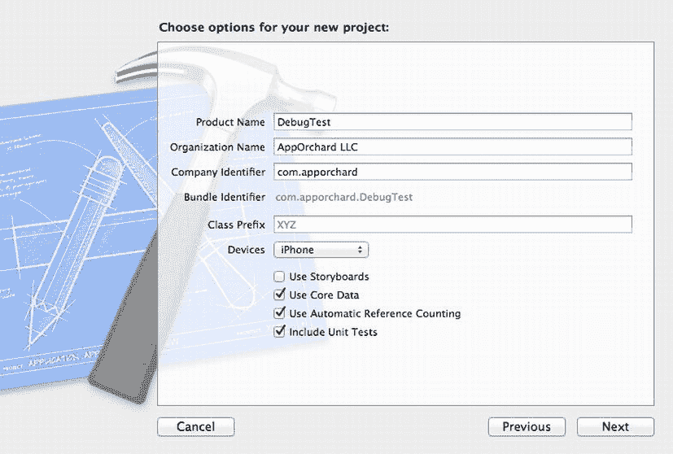

图 15-1. 创建包含单元测试的 `DebugTest` 项目

让我们快速浏览一下这个项目。在导航面板中选择项目，查看结果的项目编辑器（图 15-2）。注意这里有两个目标：应用程序 `DebugTest` 和一个 bundle `DebugTestTests`。这个 bundle 就是你将要编写的单元测试所在的位置。`DebugTestTests` 目标依赖于 `DebugTest` 目标（应用程序）。这意味着当你构建单元测试 bundle 时，它会首先构建应用程序。

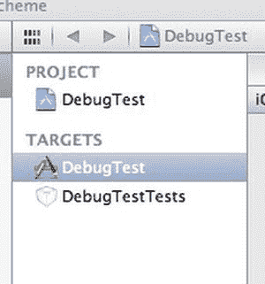

图 15-2. 两个项目目标：应用程序和单元测试 bundle

你如何运行测试？如果你查看 Xcode 工具栏中的方案弹出菜单，会发现没有 `DebugTestTests` 的方案，只有 `DebugTest` 的方案（图 15-3）。

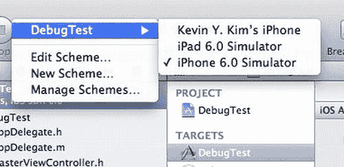


### 图 15-3：DebugTestTests 方案在哪里？

Xcode 会自动为你管理这一切。当你选择产品（Product）→ 测试（Test）作用于 `DebugTest` 方案时，Xcode 会知道要执行 `DebugTestTests` 目标。

现在运行单元测试束，看看会发生什么。选择产品（Product）→ 测试（Test）。

Xcode 应该已通知你测试失败了。问题导航器（Issue Navigator）会告诉你错误发生的位置。如果你选中该失败项，编辑器应跳转到 `DebugTestTests.m` 中失败的测试处（图 15-4）。

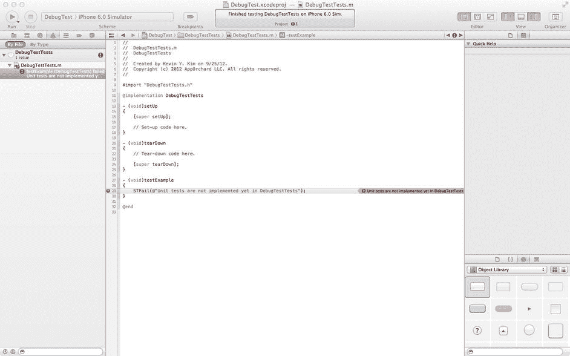

### 图 15-4：Xcode 中失败的测试

现在似乎是讨论单元测试格式的好时机。在项目导航器（Project Navigator）中，打开名为 `DebugTestTests` 的组，并选择 `DebugTestTests.h`。

```
#import <SenTestingKit/SenTestingKit.h>

@interface DebugTestTests : SenTestCase

@end
```

这是一个非常简单的头文件。它导入了头文件 `SenTestingKit.h`，并声明了类 `DebugTestTests` 继承自 `SenTestCase`。那么 `SenTestingKit` 是什么？Xcode 使用的单元测试框架叫做 `OCUnit`。`OCUnit` 是由一家名为 SenTe 的公司开发的（[www.sente.ch/software/ocunit/](http://www.sente.ch/software/ocunit/)）。他们将 `OCUnit` 定义为三个组件：`SenTestingKit`（一个帮助编写测试的框架）、`otest`（一个执行测试的测试工具）以及一组用于将测试集成到 Xcode 中的文件和实用程序。因此，虽然你可以互换使用 `OCUnit` 和 `SenTestingKit`，但 `OCUnit` 指的是整个测试套件，而 `SenTestingKit` 是用于编写测试的 Objective-C 框架。

现在我们来看 `DebugMeTests.m`。

```
#import "DebugTestTests.h"

@implementation DebugTestTests

- (void)setUp
{
    [super setUp];

    // 设置代码写在这里。
}

- (void)tearDown
{
    // 拆卸代码写在这里。

    [super tearDown];
}

- (void)testExample
{
    STFail(@"DebugTestTests 中尚未实现单元测试");
}

@end
```

每个单元测试都遵循一个简单的流程：设置测试、执行测试、拆卸测试。使用 `OCUnit`，每个测试都被定义为一个以 `test` 开头的方法。由于每个测试需要独立运行，每个测试方法都遵循设置/测试/拆卸的循环。

在 `DebugMeTests.m` 的例子中，你可以看到一个测试方法 `testExample`。该方法的主体包含一行代码，调用了 `STFail` 函数。`STFail` 是一个断言，强制测试失败。现在我们来修复它，使其通过。将 `STFail` 替换为以下内容：

```
- (void)testExample
{
    STAssertTrue(YES, @"让这个测试通过");
}
```

**注意：** 如需完整的测试断言列表，请查看 `SenTestingKit` 框架中的 `SenTestCase.h` 文件。

再次运行测试（快捷方式是按 `CMD-U`）。这次它们应该成功了。

你在这里做了什么？你让一个测试通过了，但实际上并没有修复或测试任何东西。这是一个非常重要的点：单元测试并不是银弹。测试的质量取决于你如何编写它们。确保编写有意义的测试非常重要。一种被普遍接受的做法称为*测试优先*：先编写测试，再编写应用程序代码使测试失败，然后调整代码让测试通过。一个有趣的附带效果是，你的代码往往变得更短、更清晰、更简洁。

现在我们来定义一个包含一些简单方法的对象，以便进行测试。创建一个新文件，选择 Objective-C 类。将类命名为 `DebugMe`，并使其成为 `NSObject` 的子类。保存文件时，确保它仅分配给 `DebugTest` 目标（图 15-5）。

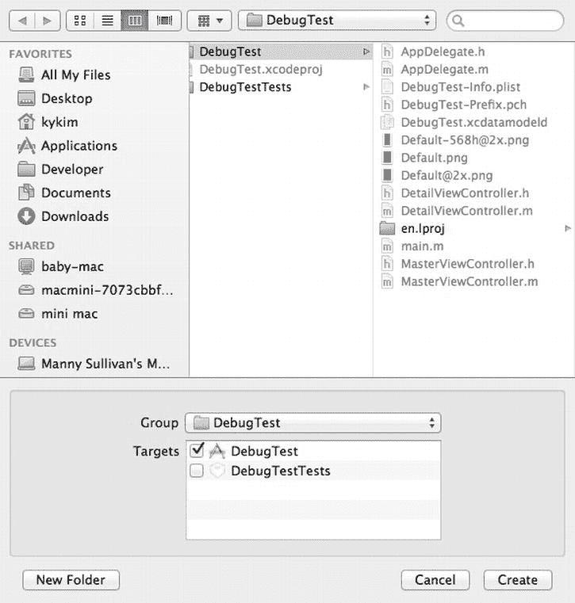

### 图 15-5：仅将 DebugMe 类保存到 DebugTest 目标

选择 `DebugMe.h` 并编辑为如下所示：

```
#import <Foundation/Foundation.h>

@interface DebugMe : NSObject

@property (nonatomic, strong) NSString *string;
```


- (BOOL)isTrue;
- (BOOL)isFalse;
- (NSString *)helloWorld;

@end
```

非常简单。想必你也能猜到 `DebugMe.m` 是什么样子。

```
#import "DebugMe.h"

@implementation DebugMe

- (BOOL)isTrue
{
    return YES;
}

- (BOOL)isFalse
{
    return NO;
}

- (NSString *)helloWorld
{
    return @"Hello, World!";
}

@end
```

再次强调，这很简单。你的类可能比这复杂得多，但这里仅作为示例。

为了测试 `DebugMe` 类，你需要创建一个 `DebugMeTests` 类。新建一个文件，选择 Objective-C 测试用例类（图 15-6）。将该类命名为 `DebugMeTests`（图 15-7）。保存文件时，请确保只将其添加到 `DebugTestTests` target（图 15-8）。现在，我们来更新你的测试类。先从 `DebugMeTests.h` 开始。

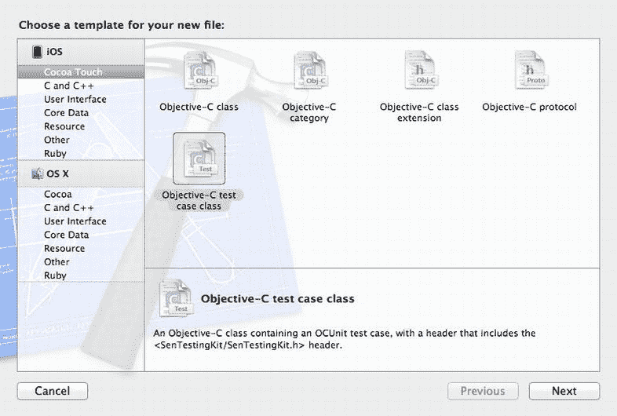

图 15-6. 选择 Objective-C 测试用例类模板

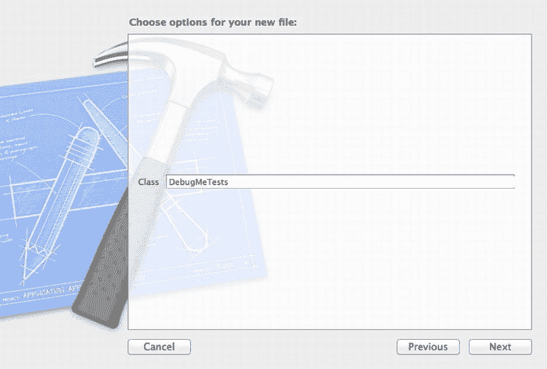

图 15-7. 将测试类命名为 `DebugMeTests`

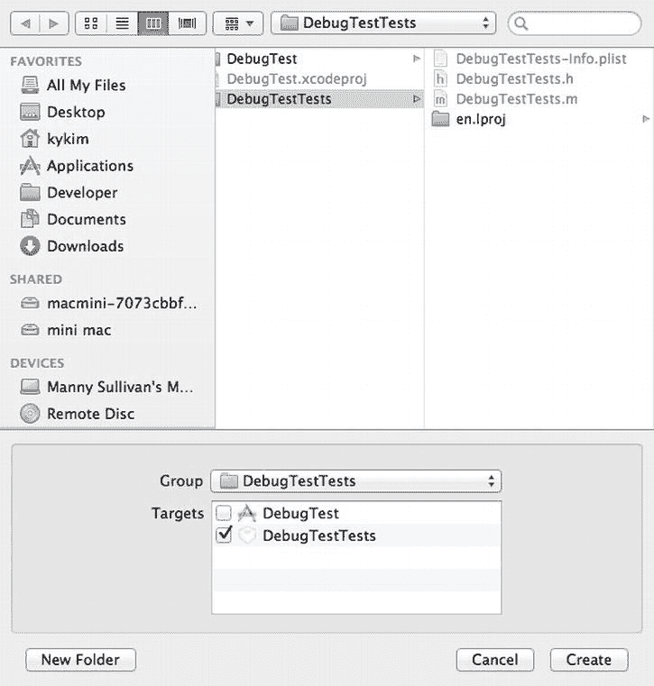

图 15-8. 仅将 `DebugMeTests` 添加到 `DebugTestTests` target

```
#import <SenTestingKit/SenTestingKit.h>
#import "DebugMe.h"

@interface DebugMeTests : SenTestCase

@property (nonatomic, strong) DebugMe *debugMe;

@end
```

导入 `DebugMe` 头文件，并添加属性 `debugMe`。你将在实现中使用该属性。选择 `DebugMeTests.m` 在编辑器中打开实现文件。在编写任何测试之前，你需要先实现 `setUp` 和 `tearDown` 方法。你将使用 `setUp` 实例化 `debugMe` 属性，并使用 `tearDown` 释放它。

```
- (void)setUp
{
    [super setUp];

// 设置代码写在这里。
    self.debugMe = [[DebugMe alloc] init];
}

- (void)tearDown
{
    // 拆卸代码写在这里。
    self.debugMe = nil;

[super tearDown];
}
```

首先，我们来思考一下你想在 `DebugMe` 类中测试什么。`DebugMe` 有一个名为 `string` 的属性。我们可以争论是否需要测试该属性是否存在，也可以争论应该测试它。最终，这取决于你的偏好和项目需求。我们定义一个测试来作为练习。

```
- (void)testDebugMeHasStringProperty
{
    STAssertTrue([self.debugMe respondsToSelector:@selector(string)], 
                 @"期望 DebugMe 拥有 'string' 选择器");
}
```

你只是在检查是否存在 `string` 属性的访问器方法。你还可以检查是否存在设置器方法（`setString:`）。这引出了另一个问题：你是把这个检查放在这个测试里，还是创建另一个测试？同样，没有标准答案；具体做法取决于你的个人偏好和项目需求。

此时，最好再次测试项目。通常，只有当你所有的现有测试都通过时，才添加新测试。因此，在继续之前，运行此测试并确保它通过。

你的测试应该已经通过了，现在我们继续测试 `isTrue` 方法。

```
- (void)testDebugMeIsTrue
{
    BOOL result = [self.debugMe isTrue];
    STAssertTrue(result, @"期望 DebugMe isTrue 为 true，实际得到 %@", result);
}
```

接下来，为 `isFalse` 方法编写一个测试。

```
- (void)testDebugMeIsFalse
{
    BOOL result = [self.debugMe isFalse];
    STAssertFalse(result, @"期望 DebugMe isFalse 为 false，实际得到 %@", result);
}
```

最后，为 `helloWorld` 方法编写一个测试。

```
- (void)testDebugMeHelloWorld
{
    NSString *result = [self.debugMe helloWorld];
    STAssertEquals(result, @"Hello, World!", 
                   @"期望 DebugMe helloWorld 为 'Hello, World!'，实际得到 '%@'", result);
}
```

此时运行你的测试将会返回失败。为什么测试会失败？查看问题导航器。失败消息显示：

```
error: testDebugMeHelloWorld (DebugMeTests) failed: '<7c7d0000>' should be equal to '<f8b23d07>':
期望 DebugMe helloWorld 为 'Hello, World!'，实际得到 'Hello, World!'
```

你告诉测试期望得到 "Hello, World!"，而方法也返回了 "Hello, World!"。这是怎么回事？原来，`STAssertEquals` 期望两个字符串对象相等，而不是它们的值相等。你需要使用 `STAssertEqualObjects`。所以修改后重试。

成功了！你已经编写了你的第一个单元测试用例。

作为通用实践，你应该为应用程序中的每个类都编写一个测试类。有一种称为**测试驱动开发**（TDD）的方法论，建议你先编写测试用例，然后再编写应用程序代码。TDD 的一个附带好处是，你能在开始编码之前就知道应用程序应该如何运行（这难道不是一个好主意吗？）。

**注意** 你可能想深入了解测试驱动开发（TDD）。在 Agile Data 网站（[www.agiledata.org/essays/tdd.html](http://www.agiledata.org/essays/tdd.html)）上可以找到极好的入门介绍。Kent Beck 写了一本优秀的书叫《测试驱动开发》（Addison-Wesley, 2003），我们强烈推荐。

**注意** 还有一个在编写测试时非常有用的概念：**模拟**。当被测试的代码依赖于另一个对象时，你可以定义一个**模拟对象**来模拟这个依赖对象。这有助于保持每个单元测试的**隔离性**。一个优秀的模拟框架是由 Mulle Kyberkinetik 开发的 OCMock（[`ocmock.org/`](http://ocmock.org/)）。

#### 调试

你可能已经注意到，在 Xcode 中创建项目时，项目默认使用的是所谓的**调试配置**。如果你曾经为了 App Store 或临时分发编译过应用程序，那么你应当知道应用程序通常有两种配置，一种叫 `debug`，另一种叫 `release`。

那么，调试配置与发布或分发配置有什么不同呢？实际上它们之间有许多不同之处，但关键区别在于，**调试**配置会在你的应用程序中构建**调试符号**。这些调试符号就像是你编译后应用程序中的小书签，使得将应用程序中触发的任何命令与你项目中的特定源代码片段匹配起来成为可能。Xcode 包含一个称为**调试器**的软件，它利用调试符号将机器码字节还原成生成该机器码的源代码中的特定函数和方法。

**警告** 如果你尝试在发布或分发配置下使用调试器，将会得到非常奇怪的结果，因为这些配置不包含调试符号。调试器会尽力而为，但最终会变得沮丧并悄然失效。

Xcode 4 的重大变化之一是将调试器集成到了主窗口中（图 15-9）。Xcode 的早期版本有自己的独立调试器控制台。现在，Xcode 在调试时会改变多个窗格。我们稍后将讨论每个窗格的内容。

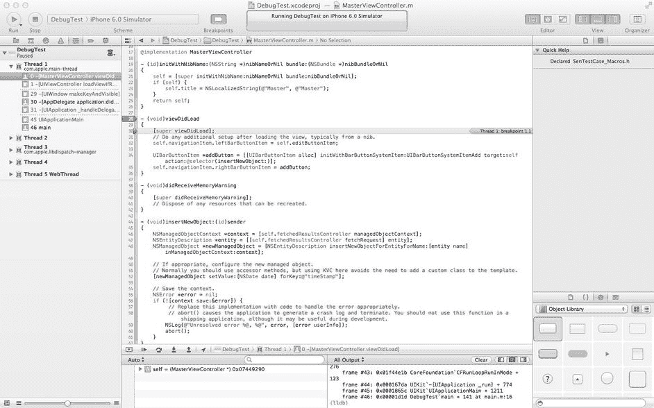

图 15-9. 处于调试器模式的 Xcode

### 断点


### 使用断点进行调试

### 断点简介

你可能拥有的最重要的调试工具是**断点**（breakpoint）。断点是一条指示调试器在代码中特定位置暂停应用程序执行并等待你的指令。通过暂停（而非停止）程序执行，你的应用程序仍在运行，你可以执行诸如查看变量值以及逐行逐步执行代码等操作。断点也可以设置为：不是暂停程序执行，而是执行某个命令或脚本，然后程序继续运行。本章将介绍这两种类型的断点，但你可能会更频繁地使用前者。

### 行号断点

在 Xcode 中最常设置的断点类型是**行号断点**（line number breakpoint）。这种断点允许你指定调试器应在特定文件的特定代码行处停止。要在 Xcode 中设置行号断点，只需单击编辑窗格中源代码文件左侧的空白区域。现在让我们实际操作一下，看看它是如何工作的。

单击`MasterViewController.m`文件。查找名为`viewDidLoad`的方法。它应该是文件中较早的方法之一。在编辑窗格的左侧，你应该能看到一个带有数字的列，如图 15-10 所示。这被称为**装订线**（gutter），它是设置行号断点的一种方式。

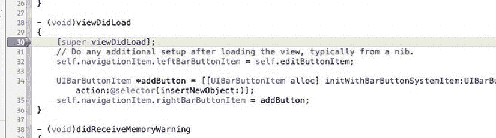

图 15-10. 编辑窗格左侧是一个通常显示行号的列，这就是设置断点的地方

**提示** 如果你没有看到行号或装订线，请打开 Xcode 偏好设置，进入文本编辑窗格并选择编辑标签页（图 15-11）。该部分第一个复选框是“显示：行号”。如果你能看到行号，设置断点会容易得多。

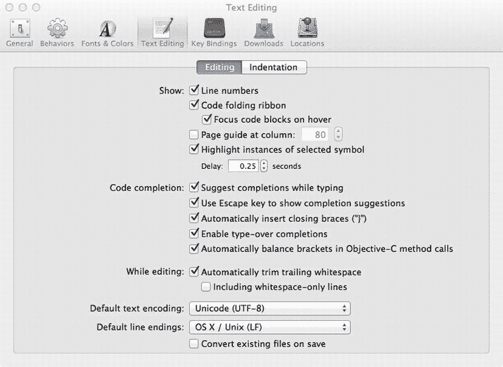

图 15-11. 通过在 Xcode 偏好设置的文本编辑窗格中确保勾选“显示：行号”来显示装订线

查找`viewDidLoad`中的第一行代码，应该是对`super`的调用。在图 15-10 中，这行代码位于第 30 行，不过在你的文件中可能是不同的行号。单击该行左侧的装订线，装订线中会出现一个小箭头指向该行代码。现在你已经在`MasterViewController.m`文件的特定行号处设置了一个断点。

你可以通过将断点拖出装订线来删除它们，也可以通过拖动它们到装订线上的新位置来移动它们。你可以通过单击现有断点来临时禁用它，这会使它们从深色变为浅色。要重新启用禁用的断点，只需再次单击它，使其恢复为深色。

### 尝试基本功能

在讨论你可以使用断点做的所有事情之前，让我们先尝试基本功能。选择**产品** → **运行**。程序将正常启动，然后在视图完全显示之前，你会被带回 Xcode，项目窗口将显示出来，显示即将执行的代码行及其关联的断点（图 15-10）。

**注意** 在调试窗口和项目窗口顶部的工具栏中，有一个标记为“断点”的图标。顾名思义，单击该图标可在断点开启或关闭之间切换。这允许你启用或禁用所有断点，而不会丢失它们。

还记得我们说过要讨论 Xcode 调试器布局吗？现在就来介绍。

### 调试导航器

当 Xcode 进入调试模式时，导航窗格（左侧）会激活调试导航器（图 15-12）。此视图显示应用程序的**堆栈跟踪**（Stack Trace），即导致你到达当前位置的方法和函数调用。在这种情况下，它突出显示了`MasterViewController`中对`viewDidLoad`的调用。灰色行表示你在源代码中无权访问的类和方法。你可以看到下一个方法是来自`UIViewController`的`view`。由于`UIViewController`属于 UIKit 框架，因此你没有源代码也就不足为奇了。

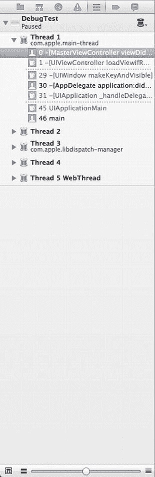

图 15-12. 调试导航器，显示堆栈跟踪

如果你进一步向上查看调用堆栈，会看到调用了`[AppDelegate application:didFinishLaunchingWithOptions:]`。如果你单击该行，编辑窗格将更改为显示`AppDelegate.m`文件，并突出显示在到达断点之前最后调用的那一行。这是一个非常有用的功能。它允许你追踪导致问题的方法和函数调用的流程。

### 调试区域

编辑区域下方的区域称为**调试区域**（Debug Area）（图 15-13）。它由三个部分组成：顶部是调试栏；调试栏下方左侧是变量列表；变量列表右侧是控制台窗格。让我们从变量列表开始逐一讨论。

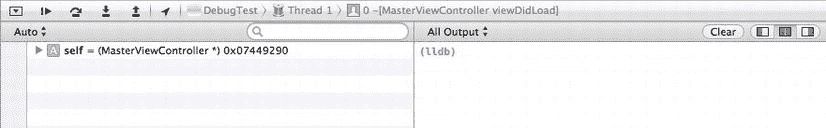

图 15-13. 调试区域，位于编辑区域下方

变量列表显示当前**在作用域内**（in scope）的所有变量。如果变量是当前方法的参数或局部变量，或者是包含该方法的对象的实例变量，则该变量处于作用域内。

**注意** 变量列表还允许你更改变量的值。如果你双击任何值，它将变为可编辑状态，当你按回车键提交更改时，应用程序中的底层变量也会随之更改。

默认情况下，变量列表会显示局部变量。你可以通过选择变量列表窗格左上角的下拉菜单来更改此设置。有三个可用选项：自动；局部；以及所有变量、寄存器、全局变量和静态变量。自动显示 Xcode 认为你根据给定上下文会感兴趣的变量。所有变量… 将显示所有变量和处理器寄存器。可以说，如果你在处理处理器寄存器，那么你正在做一些非常高级的工作，远远超出了本章的范围。

控制台窗格让你可以直接访问调试器命令行和输出。虽然使用调试器控制台命令非常强大，但我们不在这里详细讨论。

需要注意的是，输出（例如`NSLog()`语句）会定向到控制台窗格。因此，在调试时查看那里并观察生成了哪些输出是很有用的。

最后，调试栏包含一组控件（图 15-14）和一个堆栈跟踪跳转栏。跳转栏显示应用程序中当前线程的当前位置。这只是调试导航器视图的一个精炼版本。


图 15-14. 调试栏控件


### 调试栏控制

调试栏提供一系列按钮来帮助控制调试会话。从左起，第一个按钮是用于最小化调试区域的展开按钮。当最小化时，只有调试栏可见。接下来是继续按钮。继续按钮会恢复程序的执行。程序将从上次暂停的位置继续执行，除非遇到另一个断点或错误条件。单步跳过和单步进入按钮允许你一次只执行一行代码。两者的区别在于：单步跳过会将任何方法或函数调用视为一行代码来执行，直接跳转到当前方法或函数中的下一行代码；而单步进入则会进入被调用的方法或函数，并在其第一行代码处停止。单步跳出按钮会结束当前方法的执行，并返回到调用它的方法。这实际上是将当前方法从堆栈跟踪的栈中弹出（你不会以为这个名字是偶然的吧？），而调用此方法的方法则成为堆栈跟踪的顶部。

调试栏上的最后一个按钮是位置按钮。这允许你为使用`Core Location`的应用程序模拟一个位置。

如果你实际操作一下，可能会更清楚一些。停止你的程序。请注意，即使你的程序可能在断点处暂停，它仍在执行中。要停止它，请点击 Xcode 中的停止标志，或从 `Product` 菜单中选择 `Stop`。你将添加一些代码，这可能会让单步跳过、单步进入和单步跳出的用法更清晰。

### 嵌套调用

像这样的嵌套方法调用将两个命令合并到同一行代码中：

```
[[NSArray alloc] initWithObject:@"Hello"];
```

如果你将多个方法嵌套在一起，只需单击一次单步跳过按钮，就会跳过多个实际命令，从而无法在不同的嵌套语句之间设置断点。这是避免过度嵌套消息调用的主要原因。除标准的 `alloc` 和 `init` 方法嵌套外，我们通常不推崇嵌套消息。

点表示法在一定程度上改变了这种情况。记住，点表示法只是调用方法的简写，因此这行代码也是两个命令：

```
[self.tableView reloadData];
```

在调用 `reloadData` 之前，还有一个对访问器方法 `tableView` 的调用。如果使用访问器是合理的，我们通常会直接在消息调用中使用点表示法，而不是使用两行独立的代码，但要小心。很容易忘记点表示法会导致一个方法调用，因此你可能无意中通过在一行代码中嵌套多个方法调用来创建难以调试的代码。

### 试用调试控件

选择 `MasterViewController.m`。在 `@implementation` 声明之后，添加以下两个方法：

```
@implementation MasterViewController

- (float)processBar:(float)inBar {
    float newBar = inBar * 2.0;
    return newBar;
}

- (NSInteger)processFoo:(NSInteger)inFoo {
    NSInteger newFoo = inFoo * 2;
    return newFoo;
}

- (id)initWithNibName:(NSString *)nibNameOrNil bundle:(NSBundle *)nibBundleOrNil
{
...
```

并将以下代码行插入到现有的 `viewDidLoad` 方法中：

```
- (void)viewDidLoad
{
    [super viewDidLoad];
        // Do any additional setup after loading the view, typically from a nib.
    NSInteger foo = 25;
    float bar = 374.3494;
    NSLog(@"foo: %d, bar: %f", foo, bar);

foo = [self processFoo:foo];
    bar = [self processBar:bar];

NSLog(@"foo: %d, bar: %f", foo, bar);

self.navigationItem.leftBarButtonItem = self.editButtonItem;

UIBarButtonItem *addButton =
        [[UIBarButtonItem alloc] initWithBarButtonSystemItem:UIBarButtonSystemItemAdd
                                                      target:self
                                                      action:@selector(insertNewObject:)];
    self.navigationItem.rightBarButtonItem = addButton;
}
```

你的断点应该仍然设置在方法的第一行。当你在断点上方或下方插入或删除文本时，Xcode 在移动断点方面做得相当不错。尽管你刚刚在断点上方添加了两个方法，并且该方法现在起始于一个新的行号，但断点仍然被设置到了正确的代码行上，这很棒。如果断点不知何故被移走了，也别担心；反正你也要移动它。

点击并向下拖动断点，直到它与下面这行代码对齐：

```
NSInteger foo = 25;
```

现在，从 Project 菜单中选择 Run 来编译更改并重新启动程序。你应该会看到断点位于你添加到 `viewDidLoad` 的第一行新代码处。

前两行代码只是声明变量并为它们赋值。这些行没有调用任何方法或函数，因此单步跳过和单步进入按钮在这里的功能将完全相同。为了测试这一点，单击单步跳过按钮执行下一行代码，然后单击单步进入按钮执行第二行新代码。

在使用更多调试器控件之前，查看一下变量列表（图 15-15）。你刚才声明的两个变量出现在变量列表的“本地”标题下，并带有它们的当前值。另外，注意 `bar` 的值是蓝色的。这意味着它刚刚被执行的最后一条命令赋值或更改了。

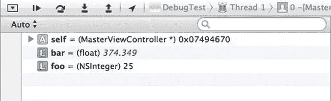

图 15-15. 当变量被最后触发的命令更改时，它在变量列表中会变成蓝色

**注** 你可能已经知道，数字在内存中表示为 2 的幂之和或分数部分的 1/2 的幂之和。这意味着某些数字最终存储在内存中的值会与源代码中指定的值略有不同。尽管你将 `bar` 设置为值 `374.3494`，但最接近的表示是 `374.349396`。相当接近，对吧？

还有另一种查看变量值的方法。如果你移动光标，使其位于编辑窗格中任何出现 `foo` 一词的上方，会弹出一个类似工具提示的小框，告诉你变量的当前值和类型（图 15-16）。

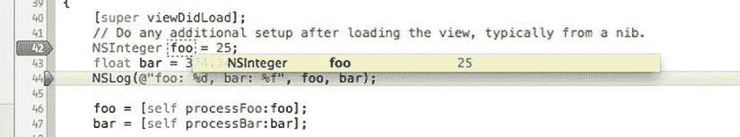

图 15-16. 将鼠标悬停在编辑窗格中的变量上，会同时显示该变量的数据类型和当前值

下一行代码只是一个日志语句，所以再次单击单步跳过按钮让它执行。

接下来的两行代码各自调用了一个方法。你将单步进入其中一个，并单步跳过另一个。现在单击单步进入按钮。

绿色箭头和高亮的代码行应该已经移动到了 `processFoo` 方法的第一行。如果你现在查看堆栈跟踪，会看到 `viewDidLoad` 不再是堆栈中的第一行。它已被 `processFoo` 取代。堆栈跟踪中不再只有一行黑色行，现在有两行，因为你编写了 `processFoo` 和 `viewDidLoad`。如果你愿意，可以单步执行此方法的各行代码。当你准备好返回到 `viewDidLoad` 时，单击单步跳出按钮。这将使你返回到 `viewDidLoad`。`processFoo` 将从堆栈跟踪的栈中被弹出，绿色指示器和高亮将位于调用 `processFoo` 之后的代码行上。


接下来，对于`processBar`，你将使用“单步跳过”。这样做时，你将永远不会在堆栈跟踪中看到`processBar`。调试器将运行整个方法，并在其返回后停止执行。绿色的箭头和高亮显示将向前移动一行（不包括空行和注释）。你可以通过查看`bar`的值来看到`processBar`的结果，此时该值应该是原来的两倍，但该方法本身执行起来就像是一行代码一样。

### 断点导航器和符号断点

现在你已经了解了断点操作的基础知识，但断点远不止于此。在 Xcode 导航区中，选择导航栏上的“断点”标签页（图 15-17）。此窗格显示了你项目中当前设置的所有断点。你可以在此处删除断点：选中它们，然后按 Delete 键。你也可以在此处添加另一种类型的断点，称为*符号断点*。你不必像在特定源代码文件中的特定行设置断点那样，而是可以告诉调试器，每当它到达使用调试配置构建到应用程序中的某个特定调试符号时，就暂停执行。重申一下，调试符号是从方法和函数名称派生出来的、人类可读的名称。

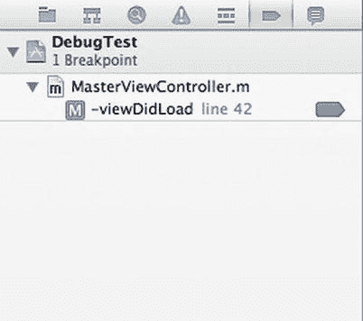

图 15-17. 断点导航器允许你查看项目中的所有断点

单击现有的断点（选择右侧窗格中的第一行），然后按键盘上的 Delete 键将其删除。现在，单击“断点导航器”左下角的 **+** 按钮，然后选择“添加符号断点”（图 15-18）。在弹出的对话框中，在“符号”字段中输入`viewDidLoad`。在“模块”字段中输入`DebugMe`，然后单击“完成”按钮。“断点导航器”将会更新，显示一行`viewDidLoad`，其前面有一个风格化的西格玛图标（图 15-19）。该西格玛图标用于提醒你，这是一个符号断点。

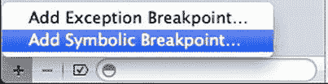

图 15-18. 添加符号断点

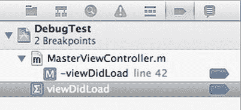

图 15-19. 断点列表已更新，包含你的符号断点

通过单击工具栏上的“运行”按钮重新启动应用程序。如果 Xcode 提示应用程序已在运行，则先停止它。这一次，你的应用程序应该会再次停止在`viewDidLoad`的第一行代码处。

### 条件断点

到目前为止，你设置的符号断点和行号断点都是*无条件断点*，这意味着它们总是在调试器到达时停止。如果程序到达了断点，它就会停止。但你也可以创建*条件断点*，它们仅在某些情况下暂停执行。

如果你的程序仍在运行，请停止它，然后在断点窗口中删除你刚才创建的符号断点。在`MasterViewController.m`中，在`viewDidLoad`里调用`super`的代码之后，添加以下（加粗的）代码行：

```
[super viewDidLoad];
    // Do any additional setup after loading the view, typically from a nib.
for (int i=0; i < 25; i++) {
    NSLog(@"i = %d", i);
}

NSInteger foo = 25;
float bar = 374.3494;
...
```

保存文件。现在，通过单击左侧的行号，在以下代码行设置一个行号断点：

```
for (int i=0; i < 25; i++) {
```

按下 Control 键并单击该断点，然后从上下文菜单中选择“编辑断点”（图 15-20）。此时应出现一个指向该断点的对话框（图 15-21）。在“条件”字段中输入`i > 15`，然后单击“完成”。

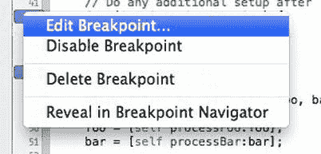

图 15-20. 断点的上下文菜单

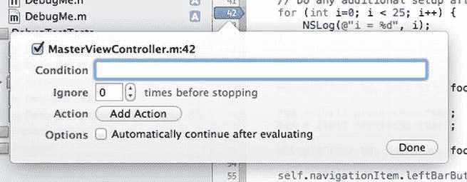

图 15-21. 编辑断点的条件

再次构建并调试你的应用程序。这次它应该像以前一样停止在该断点处，但请查看你的调试控制台，你应该会看到以下内容：

```
2012-09-25 14:19:53.927 DebugTest[53411:c07] i = 0
2012-09-25 14:19:53.940 DebugTest[53411:c07] i = 1
2012-09-25 14:19:53.952 DebugTest[53411:c07] i = 2
2012-09-25 14:19:53.959 DebugTest[53411:c07] i = 3
2012-09-25 14:19:53.965 DebugTest[53411:c07] i = 4
2012-09-25 14:19:53.971 DebugTest[53411:c07] i = 5
2012-09-25 14:19:53.978 DebugTest[53411:c07] i = 6
2012-09-25 14:19:53.984 DebugTest[53411:c07] i = 7
2012-09-25 14:19:54.008 DebugTest[53411:c07] i = 8
2012-09-25 14:19:54.014 DebugTest[53411:c07] i = 9
2012-09-25 14:19:54.022 DebugTest[53411:c07] i = 10
2012-09-25 14:19:54.072 DebugTest[53411:c07] i = 11
2012-09-25 14:19:54.079 DebugTest[53411:c07] i = 12
2012-09-25 14:19:54.085 DebugTest[53411:c07] i = 13
2012-09-25 14:19:54.093 DebugTest[53411:c07] i = 14
2012-09-25 14:19:54.099 DebugTest[53411:c07] i = 15
2012-09-25 14:19:54.106 DebugTest[53411:c07] i = 16
```

如果你查看变量列表，你应该会看到`i`的值为 16。因此，循环的前 16 次并没有暂停执行；相反，因为设置的条件未满足，它一直执行了下去。

当错误发生在一个非常长的循环中时，这可能是一个极其有用的工具。如果没有条件断点，你就只能一步步地单步执行循环直到错误发生，这将非常繁琐。在那些被频繁调用但只在特定情况下才表现出问题的方法中，这也很有用。通过设置条件，你可以告诉调试器忽略那些你知道正常工作的情况。

**提示** “忽略次数”字段（就在“条件”字段下方）也很酷——它是一个每次命中断点时递减的值。因此，你可以将值 16 放入该列，使你的代码在第 16 次命中断点时停止。你甚至可以组合使用这些方法，将“忽略次数”与一个条件一起使用。很酷吧？

## 断点操作

如果你再次查看“断点编辑器”（图 15-21），你会看到一个“操作”标签。这允许你设置一个*断点操作*，这非常有用。

停止你的应用程序。

编辑该断点，并删除你刚刚添加的条件。为此，只需清空“条件”字段即可。现在，你将添加断点操作。在“操作”标签旁边，单击显示为“点击添加操作”的文本。该区域将展开以显示断点操作界面（图 15-22）。

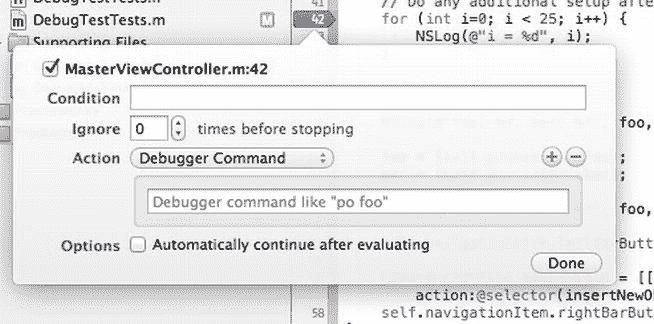

图 15-22. 断点操作界面

有许多不同的选项可供选择（图 15-23）。你可以运行调试器命令，或在控制台日志中添加一条语句。你还可以播放声音、触发 Shell 脚本或 AppleScript。如你所见，在调试应用程序时，你可以做很多事情，而无需用调试相关的特定功能污染你的代码。

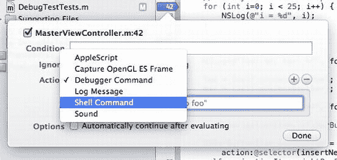

图 15-23. 断点操作允许你触发调试器命令、向日志添加语句、播放声音或触发 Shell 脚本或 AppleScript


从 **Debugger Command** 弹出菜单中选择 **Log Message**，这允许你向调试器控制台添加信息，而无需编写另一条 `NSLog()` 语句。当你为分发编译此应用程序时，此断点将不存在，因此不会意外地将此日志命令随应用程序一同发布。在弹出菜单下方的白色文本区域中，添加以下日志命令：

```
Reached %B again. Hit this breakpoint %H times. Current value of i is @(int)i@
```

`%B` 是一个特殊的替换变量，在运行时会被替换为断点的名称。`%H` 是一个替换变量，会被替换为此断点已触发的次数。两个 `@` 字符之间的文本是一个调试器表达式，告诉它打印变量 `i` 的值，`i` 是一个整数。

任何断点都可以关联一个或多个操作。点击右侧的 `+` 按钮可向此断点添加另一个操作。

接下来，勾选 **“Automatically continue after evaluating action”**（评估操作后自动继续）选项框，这样断点就不会导致程序执行停止。

**提示** 你可以在 *Xcode 4 用户指南*中了解更多关于各种调试操作以及每种操作的正确语法，该指南位于 [`developer.apple.com/library/mac/#documentation/ToolsLanguages/Conceptual/Xcode4UserGuide/000-About_Xcode/about.html`](http://developer.apple.com/library/mac/#documentation/ToolsLanguages/Conceptual/Xcode4UserGuide/000-About_Xcode/about.html)。

再次构建并调试你的应用程序。这一次，你应该会在调试控制台日志中看到 `NSLog()` 语句打印的值之间，显示了额外的信息 (Figure 15-24)。使用 `NSLog()` 记录的语句以粗体打印，而由断点操作执行的语句则以非粗体字符打印。

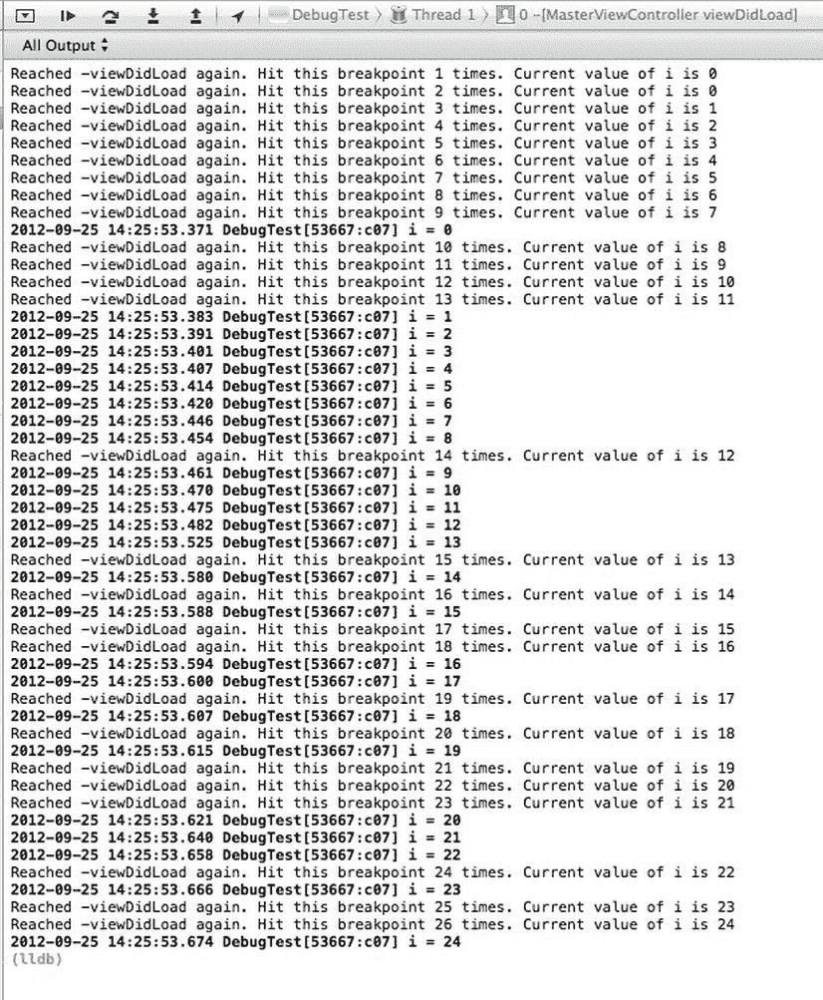

Figure 15-24.  断点日志操作会打印到调试器控制台，但与 `NSLog()` 命令的结果不同，它们不以粗体打印。

断点的功能远不止这些，但这些是基础知识，应该能为你查找和修复应用程序中的问题打下良好基础。

### 静态分析

在 Xcode 的 **Product** 菜单下，有一个标记为 **Analyze** 的菜单项。此选项会编译你的代码并对其执行*静态分析*，能够检测出许多常见问题。通常，当你构建项目时，会在构建结果窗口中看到代表构建警告的黄色图标和代表构建错误的红色图标。当你构建并分析时，还可能会看到带有蓝色图标的多行，这些表示静态分析器发现的潜在问题。尽管静态分析并不完美，有时会识别出实际上不是问题的问题（称为*误报*），但它非常擅长发现某些类型的错误，最显著的是导致内存泄漏的代码。让我们在你的代码中引入一个泄漏，然后对其进行分析。

如果你的应用程序正在运行，请停止它。

在 `MasterViewController.m` 中，在 `viewDidLoad` 方法中，在对 `super` 的调用之后添加以下代码：

```
    NSArray *myArray = [[NSArray alloc] initWithObjects:@"Hello", @"Goodbye", "So Long", nil];
```

在分析之前，最好从 **Product** 菜单中选择 **Clean**。只有被编译的文件才会被分析。自上次编译以来未更改的代码将不会再次编译，也不会被分析。在这种情况下，这不是问题，因为你刚刚更改了引入错误的文件，但分析整个项目是一个好习惯。项目清理完成后，从 **Product** 菜单中选择 **Analyze**。

现在，你将收到一个关于未使用变量的警告，这是正确的。你声明并初始化了 `myArray`，但从未使用过它。如果你查看 Issue Navigator（问题导航器）(Figure 15-25)，你还会在构建结果中看到来自静态分析器的两行额外的内容，其中一行告诉你 `myArray` 在初始化后从未被读取。这基本上与编译器发出的未使用变量警告是同一回事。然而，下一行是编译器不会捕获的。它说：*Argument to ‘NSArray’ method ‘initWithObjects:’ should be an Objective-C pointer type, not ‘char *’*（传递给 `NSArray` 方法 `initWithObjects:` 的参数应该是一个 Objective-C 指针类型，而不是 `char *`）。这是静态分析器在告诉你，你向数组传递了错误类型的指针。要了解更多信息，请点击消息左侧的三角形展开按钮，然后点击下面一条消息。信息量很大，对吧？

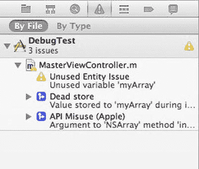

Figure 15-25.  运行静态分析器后的 Issues Navigator（问题导航器）

在开始测试任何应用程序之前，你应该运行 **Build and Analyze**（构建并分析）并检查它指出的每一项。这可以为你省去很多烦恼和麻烦。

### 关于调试的另外一点

你现在掌握了调试的基本工具。我们没有讨论 Xcode 或 LLDB 的全部功能，但我们已经涵盖了要点。要详尽地涵盖这个话题需要远不止一章的篇幅，但你现在已经看到了在 95% 或更多调试工作中会用到的工具。不幸的是，提高调试技能的最佳方式是进行大量的调试实践，这在早期可能会很令人沮丧。当你第一次遇到特定类型的问题时，你往往不确定如何解决。因此，为了给你一点启动帮助，我们将向你展示 Cocoa Touch 程序中最常见的一些问题，并告诉你当这些问题发生时如何查找和修复。

调试可能是这个地球上最困难、最令人沮丧的任务之一。但它也极其重要，并且追踪到一个困扰你代码已久的问题会带来极大的满足感。调试过程之所以如此困难，是因为现代应用程序很复杂，我们用来构建它们的库很复杂，现代操作系统本身也非常复杂。在任何给定时刻，都有大量的代码被加载、运行并交互。

### 使用 Instruments 进行性能分析

我们不打算深入探讨 Instruments。这是另一本书（例如 *Pro iOS Tools*）的主题。让我们来看看如何启动 Instruments 以及它提供了什么。在 Xcode 中选择 **Product**  **Profile**。Xcode 将构建应用程序（如有必要）并启动 Instruments。

**注意** 你也可以在 Apple 的文档中阅读更多关于 Instruments 的内容。它位于 [`developer.apple.com/library/ios/documentation/DeveloperTools/Conceptual/InstrumentsUserGuide`](http://developer.apple.com/library/ios/documentation/DeveloperTools/Conceptual/InstrumentsUserGuide)。

Instruments 通过创建跟踪文档来确定在应用程序执行期间监视什么。每个跟踪文档可以由许多*仪器*组成。每个仪器收集你应用程序运行状态的不同方面。

启动时，Instruments 会提供一系列跟踪文档模板，以帮助你开始 Instruments 会话。它还提供了一个空白模板，允许你定义自己的仪器集以供使用 (Figure 15-26)。

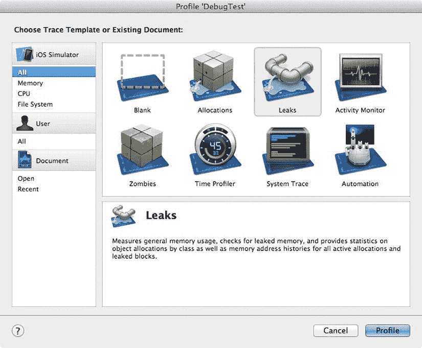

Figure 15-26.  从 Xcode 启动 Instruments

让我们回顾一下 Instruments 提供了哪些模板：


*   `Blank`：一个空模板，供你自定义。
*   `Allocations`：用于按对象跟踪内存使用情况的模板。
*   `Leaks`：另一个内存使用模板，专注于查找内存泄漏。
*   `Activity Monitor`：监控应用程序的系统资源使用情况。
*   `Zombies`：另一个内存使用模板，专注于查找过度释放的内存。
*   `Time Profiler`：对运行中的 CPU 进程进行采样。
*   `System Trace`：监控应用程序线程在系统空间和用户空间之间的移动。
*   `Automation`：脚本工具，用于模拟用户交互。
*   `File Activity`：监控应用程序的文件系统使用情况。
*   `Core Data`：监控应用程序内的 Core Data 活动。

我们先从`Allocations`模板开始。双击它，Instruments 就会打开（图 15-27）。应用程序应该在模拟器中启动，你会注意到你正在跟踪内存使用情况。

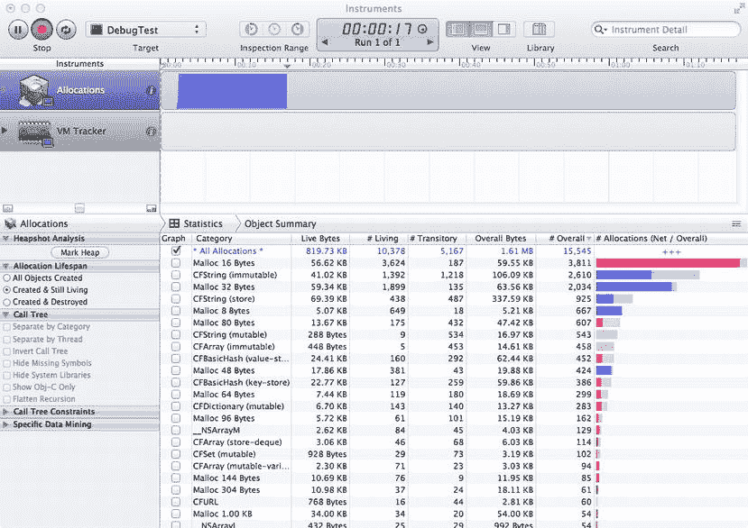

**图 15-27.** Instruments 主窗口

向你的应用程序添加一些项目，然后删除它们。你应该会看到 Instruments 跟踪内存使用情况。

虽然运行一个跟踪工具非常有用，但 Instruments 真正的强大之处在于能够同时运行多个跟踪，并确定你的应用程序可能在何处存在性能问题。

多玩玩 Instruments，看看它是否能帮助你优化你的应用程序。

#### 旅程的终点

正如我们在本章开头所说，在单元测试、调试和性能分析方面，没有什么比经验更好的老师了。所以你需要亲自去实践，犯下自己的错误，然后再修复它们。如果你真的遇到困难，不要犹豫，可以使用搜索引擎或向更有经验的开发者求助，但也不要让这些资源成为你的拐杖。在寻求帮助之前，要尽自己努力去发现并修复你遇到的每一个 Bug。是的，这有时会令人沮丧，但这对你有好处。它能塑造你的品格。

至此，我们的旅程已接近尾声。不过，我们还有一个章节，在你继续 iOS 开发之旅时，给你一些临别的指导。所以，当你准备好时，请翻到下一页。

### 第十六章

#### 路漫漫其修远兮……

你又一次和我们一起完成了这段旅程。太棒了！此刻，你比刚翻开这本书时已经懂得了更多。我们很想告诉你，你现在已经无所不知了，但谈到技术，你永远不可能无所不知。对于 iOS 开发技术而言尤其如此。你在本书中学习到的编程语言和框架是 25 年多发展的成果。我们在苹果公司的工程朋友们总是在狂热地致力于下一个“酷炫新玩意儿”。尽管 iOS 平台比刚推出时成熟得多，但它仍然刚刚开始蓬勃发展。未来还有更多精彩。

在我们开始编写本书这一版之前，苹果公司联合创始人兼董事长史蒂夫·乔布斯去世了。当人们问亚历克斯在 NeXT 以及后来在苹果与史蒂夫共事的感觉如何时，他总是告诉他们，这是他一生中最振奋人心的经历。在那个环境中，他始终确信，时刻对自己期望的只有卓越。在那个环境中，他知道与他密切合作的同事们也共享着这种期望。一个充满激情和才华的环境；还能奢求什么呢？我们在哀悼史蒂夫逝世的同时，我们也承认苹果公司融入了他的 DNA，并且随着苹果公司推动我们挚爱的 iOS 平台向前发展，追求卓越的精神也将继续。

通过完成又一本著作的阅读，你为自己打下了更坚实的基础。你已经掌握了扎实的 Objective-C、Cocoa Touch 以及将这些技术整合起来创建令人惊叹的新 iOS 应用程序的工具的知识。你理解了 iOS 软件架构以及让 Cocoa Touch 大放异彩的设计模式。简而言之，你已经准备好绘制自己的蓝图了。

#### 摆脱困境

编程的核心在于解决问题——弄清楚事情。这既有趣又有回报。但有时你会遇到看似无法克服的难题，一个似乎没有解决方案的问题。

有时，答案会自己出现——这是暂时离开问题一段时间的结果。睡个好觉或者花几个小时做些不同的事情，往往就是你克服难题所需要的全部。请相信我们，有时你会对着同一个问题盯着看几个小时，过度分析，把自己弄得如此紧张，以至于错过了一个显而易见的解决方案。

还有的时候，即使换换环境也无济于事。在这些情况下，拥有一些高层朋友是件好事。以下是一些当你陷入困境时可以求助的资源。

##### Apple 的文档

让自己熟悉 Xcode 的文档浏览器。该文档浏览器是一个前端，通向大量极为宝贵的示例源代码、概念指南、API 参考、视频教程等等。

通过阅读 Apple 的文档，你可以深入了解 iOS 的几乎所有方面。而且你对 Apple 的文档越熟悉，当 Apple 推出未知领域和新技术时，你就越容易在其中探索。

##### 邮件列表

以下是由 Apple 维护的一些有用的邮件列表：

*   [`lists.apple.com/mailman/listinfo/cocoa-dev：`](http://lists.apple.com/mailman/listinfo/cocoa-dev：)一个中等活跃度的列表，主要关注 Mac OS X 的 Cocoa。由于 Cocoa 和 Cocoa Touch 共享共同的血统，该列表上的许多人可能能够帮助你。不过，在提问之前，请务必先搜索列表存档。
*   [`lists.apple.com/mailman/listinfo/xcode-users：`](http://lists.apple.com/mailman/listinfo/xcode-users：)一个专门讨论与 Xcode 相关的问题的邮件列表。
*   [`lists.apple.com/mailman/listinfo/quartz-dev：`](http://lists.apple.com/mailman/listinfo/quartz-dev：)一个用于讨论 Quartz 2D 和 Core Graphics 技术的邮件列表。

##### 讨论论坛

以下是一些你可能想加入的讨论论坛：

*   [`forum.learncocoa.org/`](http://forum.learncocoa.org/)：由《Beginning iOS Development》一书的作者 Jack Nutting 设立的论坛。我们也为本书设立了一个论坛。随书提供的最新版项目归档文件也在这里，它们已更新了所有勘误，并运行在最新版本的 iOS SDK 上。
*   [`devforums.apple.com/：`](http://devforums.apple.com/) 面向 Mac 和 iPhone 软件开发者的 Apple 新开发者社区论坛。这些论坛需要登录，但这意味着你可以讨论仍受保密协议 (NDA) 约束的新功能。众所周知，Apple 的工程师会定期查看论坛并回答问题。
*   [www.iphonedevsdk.com/：](http://www.iphonedevsdk.com) 一个网络论坛，新手和经验丰富的 iPhone 程序员在这里互相帮助解决问题并提供建议。
*   [`forums.macrumors.com/forumdisplay.php?f=135：`](http://forums.macrumors.com/forumdisplay.php?f=135) 由 MacRumors 的好人们主办的一个 iPhone 程序员论坛。

##### 网站

以下是一些你可能想访问的网站：


- [`www.cocoadevcentral.com/`](http://www.cocoadevcentral.com/)：A portal with links to many Cocoa-related sites and tutorials.
- [`cocoaheads.org/`](http://cocoaheads.org/)：CocoaHeads 网站。CocoaHeads is an organization dedicated to peer support and the promotion of Cocoa. It focuses on local groups that meet regularly, where Cocoa developers can get together and have some social time. Nothing beats meeting a real person who can help you, so if there's a CocoaHeads group in your area, check it out. If not, why not start one?
- [`cocoablogs.com/`](http://cocoablogs.com)：A portal with links to many blogs related to Cocoa programming.
- [`stackoverflow.com/questions/tagged/ios`](http://stackoverflow.com/questions/tagged/ios)：Free Q&A site for programming questions tagged "iOS". Overall, it's a great source for finding answers to questions. Many experienced and knowledgeable iPhone programmers, including some who work at Apple, contribute to this site by answering questions or posting example code.
- [`www.quora.com/iOS-Development:`](http://www.quora.com/iOS-Development) 另一个优秀的问答网站。虽然不专注于编程，但这个标签用于 iOS 开发问题。

##### 博客

查看这些博客：

- [`blog.kykim.com/`](http://blog.kykim.com)：Kevin 的博客，内容包罗万象，包括一些 iOS 开发信息。
- [`iphonedevelopment.blogspot.com/`](http://iphonedevelopment.blogspot.com)：Jeff 的 iPhone 开发博客。Jeff 发布了示例代码、教程以及其他 iPhone 开发者感兴趣的信息。
- [`davemark.com/`](http://davemark.com)：Dave 的“阳光小角落”。完全不技术，只是充满了 Dave 感兴趣的奇思妙想，他希望你也喜欢。
- [`nuthole.com/`](http://nuthole.com/)：Jack Nutting 的博客。
- [`theocacao.com:`](http://theocacao.com) Scott Stevenson，一位经验丰富的 Cocoa 程序员。
- [`blog.wilshipley.com/`](http://blog.wilshipley.com)：Wil Shipley 的博客。Wil 是地球上最有经验的 Objective-C 程序员之一。他的“Pimp My Code”系列博文应被列为每个 Objective-C 程序员的必读内容。
- [`rentzsch.tumblr.com/`](http://rentzsch.tumblr.com)：Wolf Rentzsch 的博客。Wolf 是一位经验丰富的独立 Cocoa 程序员，也是 C4 独立开发者大会的创始人。
- [`www.cimgf.com/`](http://www.cimgf.com)：“Cocoa Is My Girlfriend”网站，涵盖使用 Objective-C 进行 Mac 和 iPhone 上的软件开发。
- [`raywenderlich.com/`](http://raywenderlich.com)：Ray Wenderlich 的博客和教程网站。Ray 运营着一个提供补充教程和信息的优秀网站。

##### 如果所有方法都失败了……

给 Kevin 发送电子邮件：moreiphonedev@kykim.com。

##### 再会

我们很高兴你能和我们一起踏上这段旅程。我们祝你一切顺利，并希望你像我们一样享受 iOS 编程。

## 索引

  **A**

- Apple 的 Cocoa 框架

  **B**

- 蓝牙，游戏套件

  **C**

- Core Data
    - 架构
    - 概念和术语
    - 配置表
    - 创建
    - 数据模型
    - 历史
    - 开源控制系统
    - 模板表
    - Xcode 窗口
- 自定义对象
    - 单元格


`custom editor`  
`initialization code`  
`override accessor and mutator`  
`reuseIdentifier`  
`sliderChanged`  
`slider values`  
`subclass of SuperDBEditCell`  
`textField`  
`text property`  
`UIColorPicker`  
`class instances`  
`color attribute`  
`color table view`  
`color us`  
`data model attributes`  
`data model update`  
`age attribute`  
`component pane`  
`editor`  
`favoriteColor attribute`  
`Min. length checkbox`  
`transormable attribute`  
`detail view update`  
`attribute inspector`  
`build and run`  
`final view`  
`HeroDetailController.plist`  
`editor, color attribute`  
`feedback, validation`  
`alert view`  
`delegate method`  
`SuperDBEditCell`  
`generic error alert`  
`Hero class creation`  
`accessors`  
`adding constants`  
`default`  
`entity selection`  
`generated file`  
`header tweaking`  
`mutators`  
`subclass, NSManagedobject`  
`hero detail view`  
`key-value coding`  
`options to user, attribute`  
`picker cleaning`  
`class initializer`  
`color picker`  
`CoreDataErrors.h`  
`drawRect method`  
`with gradient background`  
`initializing`  
`link libraries`  
`QuartzCore.framework`  
`validation dialog`  
`weird color cell`  
`reusable code`  
`SuperDBEditCell refactor`  
`app crash code`  
`code moving`  
`editable property`  
`file merge`  
`menu, Xcode`  
`options, Xcode`  
`Superclass pop-up`  
`Xcode options`  
`validation`  
`constants`  
`@end declaration`  
`error domain`  
`hero class`  
`multiple attributes`  
`nil *vs*. null`  
`NSError method`


### D

- `数据模型`
- `托管对象的创建和插入`
- `委托`
- `删除托管对象`
- `实体`
    - `属性`
    - `获取属性`
    - `获取请求`
    - `NSManagedObjectModel`
    - `持久化存储`
    - `属性`
    - `关系`
    - `集合`
- `获取结果控制器`
- `检查器`
- `键值编码`
- `托管对象`
- `托管对象上下文`
- `模型编辑器`
- `持久化存储与加载的数据`

#### 调试

- `新增功能`
- `AppleScript`
    - `log 命令`
    - `NSLog() 命令`
    - `NSLog() 语句`
    - `Shell 脚本`
- `条形控件`
- `断点行为`
- `断点导航器`
- `断点`
    - `条件断点`
    - `编辑`
- `配置`
- `数据类型、变量`
- `调试区域`
- `调试控件`
- `调试器模式`
- `编辑面板`
- `编辑器区域`
- `装订线`
- `导航器、堆栈跟踪`
- `嵌套调用`
- `弹出对话框`
- `静态分析`
    - `分析器`
    - `NSArray 方法`
- `符号断点`
- `更新后的断点列表`
- `变量更改`
- `viewDidLoad`

### E

- `企业对象框架 (EOF)`
- `表达式`
    - `与聚合`
    - `属性`
    - `错误触发`
    - `HeroListController`
    - `NSExpression`
    - `NSExpressionDescription`
    - `瞬态属性`

### F

- `获取属性`
    - `核心优势`
    - `创建 olderHeroes 属性`
    - `详细信息面板`
    - `FETCH_SOURCE`

---

此外，原文中还存在几个独立的术语（无层级归属），它们分别对应不同章节的链接或图块标记，为保持文档完整性，将其列出：

- `NSLocalizedDescriptionKey`
- `单属性`
- `validateForInsert`
- `validatForUpdate`
- `验证机制`
- `值转换器`
- `虚拟访问器`


predicate（谓词）

detail view update（详情视图更新）

adding powers（添加能力）

cellForRowAtIndexPath（`cellForRowAtIndexPath`）

code replace, new methods（代码替换，新方法）

configure rethink（重新思考配置）

content parsing（内容解析）

data driven configuration（数据驱动配置）

dynamic prototypes（动态原型）

edit mode（编辑模式）

encapsulation and hiding information（封装与信息隐藏）

HeroDetailConfiguration.m（`HeroDetailConfiguration.m`）

HeroDetailController（`HeroDetailController`）

HeroDetailController.plist（`HeroDetailController.plist`）

initial step, add powers（初始步骤，添加能力）

method definition（方法定义）

methods（方法）

new address book（新地址簿）

no general section header（无通用分区头）

numberofRowsInSection（`numberofRowsInSection`）

objectForKey（`objectForKey`）

power section property（能力分区属性）

powers section（能力分区）

property declaration（属性声明）

rowForIndexPath（`rowForIndexPath`）

section header to property list（分区头转为属性列表）

setEditing（`setEditing`）

tableView（`tableView`）

table view cells（表格视图单元格）

viewDidLoad（`viewDidLoad`）

oppositeSexHeroes property（`oppositeSexHeroes` 属性）

powers section（能力分区）

accesoryButtonTappedForRowWithIndexPath（`accesoryButtonTappedForRowWithIndexPath`）

HeroReportController.m（`HeroReportController.m`）

relation tapping（关系点按）

report configuration（报告配置）

ReportViewSegue（`ReportViewSegue`）

power view controller（能力视图控制器）

configuration（配置）

navigating to（导航至）

PowerViewController（`PowerViewController`）

PowerViewSegue（`PowerViewSegue`）

stack, NavigtionController（堆栈，导航控制器）

SuperDB storyboard（SuperDB 故事板）

refactoring view controller（重构视图控制器）

abstraction（抽象）

commitEditingStyle（`commitEditingStyle`）

configuration class（配置类）

detail controller（详情控制器）

HeroDetailController.m（`HeroDetailController.m`）

hero instance variable（英雄实例变量）

new HeroDetailController（新的 HeroDetailController）

new methods（新方法）

prperty list（属性列表）

renaming（重命名）

and relationships to hero class, Hero.h（以及与英雄类的关系，`Hero.h`）

and relationships to Hero class（以及与 Hero 类的关系）

sameSexHeroes property（`sameSexHeroes` 属性）

youngerHeroes property（`youngerHeroes` 属性）

Fetched results controller（获取结果控制器）

creation of（创建）

delegate methods（委托方法）

Did change contents（内容已更改）

Did change object（对象已更改）

Did change selection（选择已更改）

Will Change Content（内容将更改）

retrieving managed object（检索托管对象）

  **G, H**

Gnarly math（复杂数学）

  **I, J, K, L**

iCloud（iCloud）


应用

备份

核心数据

键值对

mergeChangesFromUbiquitousContent

.nosync

文档存储

访问器

位运算符

BOOL 参数

内容参数

禁用查询更新

dispatch_async 函数

文档状态

NSFileManager removeItemAtURL

NSMetadataQuery

进程

状态

子类，UIDocument

子目录

无处不在容器

UIDocument

使用 UIDocument

键值数据存储

在应用中启用

键值数据存储

限制

同步

SuperDB 增强

活跃配置文件

应用 ID 管理页面

配置应用 ID

数据存储测试

启用警告

授权文件

iOS 开发者中心

关键事项

应用 ID 列表

托管对象上下文

新建应用 ID

新建预置描述文件

待定预置描述文件

持久化存储

预置描述文件助手

预置门户

预置描述文件

目标摘要编辑器

查看

数据变更时的 UI 更新

Xcode 编辑器

Xcode 管理器

iOS 软件开发工具包 (SDK) *另请参阅* 超级英雄数据

添加、显示和删除数据

结构分析 *另请参阅* 核心数据

商业方案

CoreLocation 与 MapKit *另请参阅* CoreLocation 与 MapKit

自定义托管对象 *另请参阅* 自定义对象

框架

免费方案

iCloud 存储 *另请参阅* iCloud 存储

响应式界面 *另请参阅* 响应式界面

iOS 6 开发

要求

网站

邮件、社交消息和 iMessage *另请参阅* 消息发送

媒体库访问与播放 *另请参阅* 媒体库访问

迁移与版本 *请参阅* 迁移与版本

新用户

通过蓝牙的点对点连接


关系、获取与表达式

安全性

注册选项

测试、调试与工具

视图

 **M, N**

托管对象 *参见* *另请参阅* 自定义对象

地图工具包

注释

添加与移除

图像属性

地图视图 *vs.* 标注视图

`MKAnnotation`

`MKAnnotationView`

`MKPinAnnotationView`

对象

`placemarkIdentifier`

选择注释

视图

地理编码

块执行

`CLGeocoder`

`CLPlacements` 属性

正向地理编码

MapMe 应用

注释协议

配置

委托方法

完成，视图控制器接口

实现 `ViewController`

初始视图

界面构建

工具包与核心位置

布局、进度条与按钮

定位与注释

`MapLocation`

`mapViewDidFailLoadingMap:`

`MKCoordinateRegionMakeWithDistance()`

`NSCoder` 协议

对象库

私有分类方法

`progressBar`

`reverseGeocode`

健壮的错误处理

`UIAlertView` 委托

编写注释

地图视图

宽高比

度与距离的转换

委托

棘手的数学

加载的委托方法

`MKCoordinateRegionMakeWithDistance()` 方法

区域变化委托

待显示区域

`regionWillChangeAnimated:`

`CLLocation`

坐标区域

混合地图类型

`latitudeDelta`

`longitudeDelta`

`MKMapView`

`MKUserLocation`

卫星地图类型

标准地图类型

结构体与成员

类型

用户位置

`userLocationVisible`

地图视图；`mapViewDidFailLoadingMap:`

地图视图；`regionThatFits:`

概览与术语


反向地理编码

大型多人在线角色扮演游戏（MMORPG）

应用程序模板

音频播放

音频视图控制器

删除视图控制器

didGenerateMemoryWarning

didSelectRowAtIndexpath

实现音频视图控制器

实例

loadMediaItemsForMediaType

手动转场

媒体单元格

音乐和视频标签

导航窗格

通知中心

观察者方法，通知

playbackStateChanged

播放器转场

播放器视图控制器

播放/暂停按钮状态

playPausePressed

表视图单元格

表视图控制器

UIKit 头文件

视频视图控制器

viewDidAppear

viewDidLoad 方法

Avast

AVFoundation

AVAsset

AVCaptureDevice

AVCaptureSession

AVMetadataItem 类

AVPlayerItem

AVPlayerItemTracks

AVCaptureOutput

AVMediaPlayer

assets 数组

assetCopyIfLoaded

AssetItem

BOOL

CMTime 结构体

CMTime 值

commonMetadata

完成处理程序

上下文值

CoreMedia 框架

正确标签，速率按钮

数据源方法

dispatch_async 调用

调度队列

初始化器

initWithAsset 方法

isEqual

实例变量

语言偏好

loadAssetsForMediaType

加载元数据

loadValueAsynchronouslyForKeys

localAsset

媒体视图控制器类

方法声明

MPMediaItems

MPMoviePlayerViewController

NSCopying 协议

Objective-C 类

暂停按钮

播放速率

playerView 播放器

播放器视图控制器


`PlayerViewController.m`  
`PlayerViewControllerStatusObservationContext`  
`playPressed`  
`property declaration`  
`rate button`  
`ratePressed`  
`rate property`  
`scrubber`  
`showPause`  
`showPlay`  
`statuses`  
`table view controllers`  
`tracks`  
`UI components`  
`UIImageView`  
`UILabel`  
`UISlider`  
`UIToolbar`  
`updateCellWithAssetItem`  
`media item collections`  
`execute query`  
`groupingType`  
`init method`  
`MPMediaPredicateComparisonEqualTo`  
`MPMediaQuery factory method`  
`predicateWithValue`  
`queries and property predicates`  
`derived collections`  
`media retrieval`  
`new collection`  
`Media library access and playback`  
`media picker`  
`controller by artist, song ang album`  
`handling, cancels`  
`mediaPickerDidCancel`  
`music application`  
`prompt property`  
`selections handling`  
`type specification`  
`MediaPlayer framework`  
`album artwork`  
`AssetURL property`  
`attributes, numerical`  
`bit field`  
`constants`  
`constants, filterable properties`  
`filterable properties`  
`integerValue method`  
`lyrics retrieval`  
`media items`  
`media library`  
`media type`  
`MPMediaItem`  
`MPMediaItemCollection`  
`MPMediaLibrary`  
`MPMEdiaPickerController`  
`MPMediaPropertyPredicate`  
`MPMediaTypeMusic`  
`MPMoviePlayerViewController`  
`nonfilterable numerical attributes`  
`persistent ID`  
`queries`  
`user defined properties`  
`MPMediaPlayer`  
`MPMoviePlayerController`  
`MPMoviePlayerController, notifications`  
`music player`  
`actions, buttons`  
`attributes labeling`  
`button reset`


倒带按钮

控制器

创建控制器

currentPlaybackTime

最终工具栏

获取媒体项

界面构建器

标签文本更改

链接二进制文件

mediaPickerDidCancel

方法，通知

MPMediaItemCollection

MPMediaPicker 控制器

MPMediaItemPropertyAtWork

MPMusicPlaybackStatePlaying

通知

通知方法

nowPlayingItemChanged

NSNotification

输出口与动作

播放时间

播放按钮

播放判定

播放歌曲

播放列表

队列指定

重复模式

重复与随机播放模式

快进/快退

设置媒体项

setQueryWithQuery

SimplePlayer 应用

跳过曲目

skipToBeginning

skipToNextItem

skipToPreviousItem

空格栏按钮

带空格的工具栏

UIBarButtonItem

UIToolbar

用户界面构建

ViewController 集合

音量调节

音乐播放器；模式，随机播放

消息发送

活动视图控制器

当前视图

UIActivityItemSource

应用

编写视图

图片选择器

消息选择器视图

用户界面

发送邮件

MessageImage

构建用户界面

调用相机

imagePickerController

选取发送者

图片

selectAndMessageImage

多媒体短信服务 (MMS)

短消息服务 (SMS)

社交框架

isAvailableForServiceType

removeAllImages

removeAllURLs

服务提供商

SLComposeViewController

SLRequest

SLServiceTypes.h

字符串常量


```markdown

UI 框架

附件

密件抄送

抄送

创建邮件

dismissModalViewControllerAnimated

邮件对应端

实现委托方法

mailComposeController

邮件撰写视图

消息正文

消息撰写视图控制器

MFMailComposeResult

MIME 类型

参数、结果代码

填充收件人

setMessageBody

填充主题行

视图控制器委托方法

数据迁移

轻量级 *vs.* 标准

设置、轻量级

标准

迁移时机

### O

对象关系映射（ORM）

### P, Q

点对点、蓝牙

连接性

组件

对等选择器

会话

游戏中心

成就

身份验证

在 iOS 设备上

排行榜

多人游戏

服务

Game Kit 会话

参数

关闭连接

创建

数据接收处理器

显示名称参数

查找并连接其他

GKSendDataReliable

GKSendDataUnreliable

GKSessionModeClient

GKSessionModePeer

GKSessionModeServer

模式参数

NSData 实例

打包要发送的信息

从对等方接收数据

向对等方发送数据

会话标识符

Game Kit 会话；GKSession

Game Kit 会话；监听其他

游戏语音

网络通信

客户端-服务器模型

混合模型

大型多人在线角色扮演游戏（MMORPG）

点对点模型

对等方

服务器与客户端

对等选择器

创建机制

GKPeerPickerConnectionNearby

GKPeerPickerConnectionOnline

处理连接

```


对等标识符

会话创建，项目

井字游戏

井字游戏；接受连接

井字游戏；建立连接

练习

项目

`AppDelegate.m`

应用程序常量

分配标签值

`BoardSpace`

数据接收处理程序

`dieRollReceived`

掷骰子

停靠栏，界面生成器

枚举列表

`feedbackLabel`

游戏板设计

`gameButton`

`gameButtonPressed` 操作

游戏空间

`GameState`

`GKPeerPickerController`

群组选择

空闲定时器，关闭

初始化方法

导入框架，游戏套件

界面设计

接口

`kDiceNotRolled`

`kGameStateDone`

`NSCoding`

数据包对象

`PacketType`

点对点委托方法

`PlayerPiece`

`senDieRoll`

`sendpacket`

会话委托方法

设置，视图控制器头文件

项目；警告视图委托方法

项目；`viewWithtag`

井字游戏

警报，连接丢失

基础知识

`checkForGameEnd` 方法

对等选择器

选择器对话框

点击空格

井字游戏方法

井字游戏视图控制器

`ViewController.xib`

封装调用

性能分析

启动 Instruments

模板

窗口，Instruments

 **R**

关系

添加能力实体

设计菜单

无关系的实体

新实体

能力对象

创建反向关系

详细信息窗格视图

在图表视图中

英雄和能力实体

能力关系

超能力和报告

地址对象

级联，删除规则


`collection` 类

`composition` 组合

`data model` 类

`data model` 编辑器

`delete` 规则

`deny`（拒绝）与 `delete`（删除）规则

`destination` 实体

`dynamic` 方法

`fetched` 属性

`instance` 变量

`inverse` 关系

`key-value coding (KVC)` 键值编码

`mutableSetValueForKey:` 可变集合取值方法

`no action`（无操作）与 `delete`（删除）规则

`notify`（通知）与 `delete`（删除）规则

`NSManagedObject` 托管对象

`NSSet` 集合

`NSString` 实例

`power` 编辑

`reports` 部分

`smart` 播放列表

`to-many` 对多关系

`to-one` 对一关系

`valueForKey:` 取值方法

`Responsive` 响应式界面

`batch` 对象

`batch` 大小

`before` 安装前

`debug` 调试控制台

`enumerator` 枚举器

`exception` 异常抛出

`hasNext` 是否有下一个

`implement view` 实现视图控制器

`kBatchSize` 批处理大小常量

`kTimeInterval` 时间间隔常量

`label` 标签文本

`maxNumber` 最大值

`nib` 界面文件更新

`processChunk` 处理块方法

`progess` 进度条与标签

`SquareRootBatch` 平方根批处理

`system` 系统事件

`timer` 计时器方法

`userInfo` 用户信息字典

`view controller` 视图控制器头文件

`concurrency` 并发

`stalled` 停滞的应用程序

`fix stalled` 修复停滞的计时器

`general central dispatch` 通用中央调度

`operations` 操作

`queues and concurrency` 队列与并发

`accesor and mutator` 访问器与修改器

`atomicity` 原子性

`cancel` 取消方法

`code` 代码执行

`concurrent operation` 并发操作计数

`deadlock` 死锁

`dependency` 操作依赖

`isFinished` 是否完成

`mutex` 互斥锁与 `@synchronized` 同步指令

`mutual exclusion` 互斥信号量

`nonatomic` 非原子访问器

`NSLog()` 日志输出函数

`NSOperationQueue` 操作队列

`operation` 队列

`operations` 操作

`operation` 操作状态

`POSIX` 可移植操作系统接口

`priority of operation` 操作优先级

`queue` 队列操作

`race` 竞争条件

`recursive` 递归互斥锁

`setFirstName:` 设置名字方法

`setQueuePriority:` 设置队列优先级方法


-   `sleepForTimeInterval`
-   `sleepy` `time`
-   `suspend`
-   `threads`
-   `thread` `safety`
-   `@tryblock`
-   `queue` `up`
-   `stalled` `application`
-   `debug` `console`
-   `designing`
-   `implementing` `view` `controller`
-   `NSLog()`
-   `progressBar`
-   `text` `field`
-   `timers`
-   `ViewController.m`
-   `stalled` `with` `an` `operation` `queue`
-   `adjusting` `interface`
-   `delegate`
-   `final` `version`
-   `identity` `inspector`
-   `isCancelled` `property`
-   `kBatchSize`
-   `key` `value` `observation`
-   `kUIUpdateFrequency`
-   `NSKeyValueChangeSetting`
-   `ProcessCell` `nib`
-   `ProgressCell`
-   `SquareRootOperation`
-   `StalledViewController`
-   `table` `view` `methods`
-   `timer-based` `version`
-   `trigger`
-   `UIKit`
-   `ViewController.h`
-   `ViewController.m`
-   `viewDidLoad`
-   `wrapping`
-   `threads`
-   `timers`
-   `creating` `a` `timer`
-   `limitations`
-   `NSTimers`
-   `scheduling`
-   `stopping` `timer`
-   `Reverse` `geocoding`

  **S, T**

-   `Security`
-   `application` `security`
-   `considerations`
-   `in` `iOS`
-   `certificates`
-   `CFDictionary`
-   `extended` `attribute`
-   `file` `accesibility`
-   `keychain` `randomization`
-   `keys`
-   `kSecClass`
-   `levels` `of` `protection`
-   `mechanism,` `passcode` `lock`
-   `NSData` `option` `bitmask`
-   `NSFileManager`
-   `passcode` `lock` `settings`
-   `SDK`
-   `security` `objects`
-   `trust` `services`
-   `in` `iOS;attribute` `keys,` `keychain` `item`
-   `keychain` `app`
-   `abstraction` `base` `class`
-   `AppDelegate.m`
-   `automatic` `reference` `counting`
-   `BOOL`
-   `CertificatesViewController`
-   `cert.p12`
-   `CFBridgingRelease`
-   `CFTypeRef`


信息披露指示器

错误条件

FirstViewController

IdentitiesViewController

实现 allKeychainCertificates

初始化器

init 方法

KeychainCertificate

钥匙串身份

KeychainIdentity

KeychainItem

无钥匙串项目

kSecImportExportPassphrase

关系转场

root.cer

保存方法

SecItemAdd

SecondViewController

Security.framework

故事板编辑器

标签栏控制器

表视图数据源

钥匙串查看器

证书颁发机构创建

证书助理

证书颁发机构 (CA)

已完成证书

创建证书颁发机构

从 CSR 生成证书

颁发证书颁发机构

钥匙串访问

密码对话框

个人信息交换

根证书

证书签名请求

SDK 服务

技术

锚点证书

非对称加密

证书与签名

解密

数字身份

加密

哈希

身份

私钥

公钥

根证书

签名

对称加密

超级英雄数据

添加属性

属性

布尔类型

复选框

数据类型

十进制、双精度浮点与浮点类型

整数类型

名称属性

设置名称属性

字符串类型

可转换类型

类型与属性

应用架构

获取结果控制器

声明

委托方法

HeroListController.m

实现

@interface 声明

HeroListController

addHero


助理编辑器

栏按钮

构建并运行

按钮导航栏

连接弹出窗口

连接和输出口

控件拖拽

编辑按钮

标识检查器

接口声明

导航窗格

弹出窗口

标签栏和用户默认设置

模板，文件助理

`UITableViewController`

模型设计

详情窗格

编辑实体

编辑器

实体

属性检查器

新实体

`secretIdentity`

待办事项

编码表格视图

处理错误

实现编辑和添加

加载，获取请求

排序表格视图

秘密身份标签

SuperDB 应用程序

超级英雄数据

视图控制器接口

属性

单元格属性，表格

单元格，表格视图

导航控制器

转场分配

故事板

标签栏

表格视图，场景

Xcode 项目

应用

按钮组

代码编辑器

设备选择

文档大纲

编辑器，故事板

输入详细信息

命名和保存

导航应用程序

导航控制器

新助理

新故事板

大纲和展开箭头

场景添加

转场和场景

故事板

摘要编辑器

  **U**

单元测试和调试

技巧

单元测试

`DebugMe` 类

`DebugMeTests.m`

`Debugtest`

`DebugTestTests` 和 `DebugMeTest`

`DebugTestTests` 方案

失败的测试

问题导航器

`isTrue` 方法

Objective-C 测试用例

`SenTestingKit`

测试类

测试驱动开发 (TDD)

测试绑定器

  **V, W, X, Y, Z**

版本

被编译

当前版本

不同版本

文件检查器

更细粒度的形式

托管对象模型

市场版本标识符

多个版本

命名新版本

新版本

版本编号

设置标识符

实用工具窗格

版本控制

版本标识符

`.xcdatamodel` 文件

Core Data

数据模型

可怕的错误消息

SuperDB 应用

视图

挑战

控制表格结构

创建视图控制器

故事板编辑器

表格属性

表格单元格

自定义 `UITableViewCell` 子类

联系人应用编辑

表格视图单元格

详细视图

编辑模式

编辑视图

`HeroDetailController`

实现

属性列表

图形化表示

建模表格结构

解析

转场

创建

弹出选择器

专业输入

实现选择器

`SuperDBDateCell`

`SuperDBEditCell`

通过属性列表的表格

`HeroDetailConfiguration`

资源文件

Xcode 属性

更新
