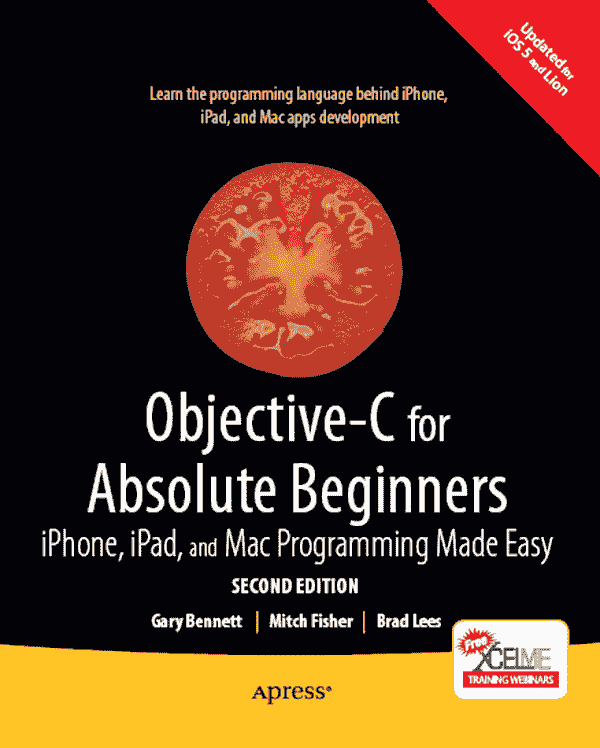
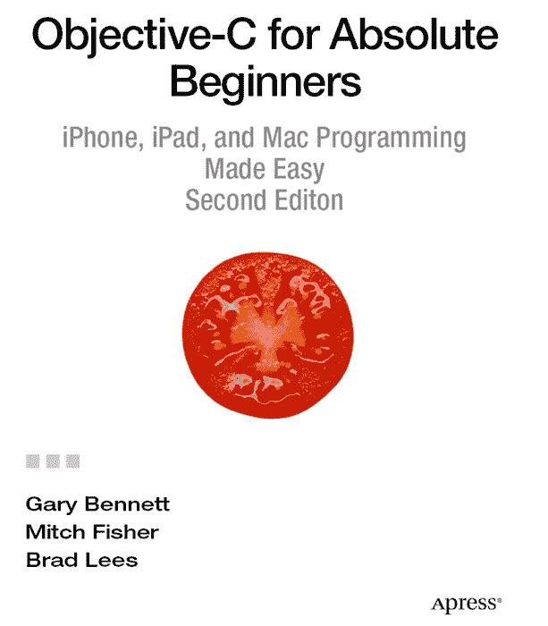

 

**面向绝对初学者的 Objective-C：轻松搞定 iPhone、iPad 和 Mac 编程，第二版**

版权所有 © 2011 作者：Gary Bennett, Mitch Fisher, Brad Lees

保留所有权利。未经版权所有者及出版商的书面许可，本书的任何部分均不得以任何形式或任何方式（电子或机械，包括影印、录制，或通过任何信息存储或检索系统）进行复制或传播。

ISBN-13（平装）：978-1-4302-3653-5

ISBN-13（电子版）：978-1-4302-3654-2

本书中可能会出现商标名称、标识和图像。为避免在每个商标名称、标识或图像出现时都使用商标符号，我们仅在编辑用途及维护商标所有者利益的前提下使用这些名称、标识和图像，无意侵犯任何商标。

本出版物中使用的商品名称、商标、服务标志及类似术语，即使未明确标识，也不应被视为对其是否受专有权利保护的任何意见表达。

总裁兼出版商：Paul Manning  
首席编辑：Michelle Lowman 和 Matthew Moodie  
技术审校：James Bucanek  
编辑委员会：Steve Anglin, Mark Beckner, Ewan Buckingham, Gary Cornell, Morgan Engel, Jonathan Gennick, Jonathan Hassell, Robert Hutchinson, Michelle Lowman, James Markham, Matthew Moodie, Jeff Olson, Jeffrey Pepper, Douglas Pundick, Ben Renow-Clarke, Dominic Shakeshaft, Gwenan Spearing, Matt Wade, Tom Welsh  
协调编辑：Kelly Moritz  
文字编辑：Scribendi, Inc.  
排版：MacPS, LLC  
索引编制：BIM Indexing & Proofreading Services  
插画：SPi Global  
封面设计：Anna Ishchenko

通过 Springer Science+Business Media, LLC. 向全球图书贸易分销：地址：233 Spring Street, 6th Floor, New York, NY 10013。电话：1-800-SPRINGER，传真：(201) 348-4505，电子邮件：`orders-ny@springer-sbm.com`，或访问 `www.springeronline.com`。

有关翻译信息，请发送电子邮件至 `rights@apress.com` 或访问 `www.apress.com`。

Apress 和 friends of ED 书籍可批量购买，用于学术、企业或促销用途。大多数图书还提供电子版及许可证。如需更多信息，请参阅我们的特别批量销售–电子书许可网页：`www.apress.com/bulk-sales`。

本书中的信息按“现状”分发，不提供任何保证。尽管在编写过程中已采取一切预防措施，但作者及 Apress 对因使用本书所含信息而直接或间接导致的任何损失或损害，不对任何个人或实体承担任何责任。

作者在本书中引用的任何源代码或其他补充材料，读者可在 `www.apress.com` 获取。有关如何查找本书源代码的详细信息，请访问 `http://www.apress.com/source-code/`。

*谨以此书献给我职业生涯中影响最大的两个人：我的父亲 Don W. Bennett 和史蒂夫·乔布斯。他们都在今年离开了我们。感谢你们激励我投身于这个既能获得乐趣、发挥影响力、充满创造力，又能实现美国梦的领域。——Gary Bennett*

*我要感谢始终支持我事业的家人和朋友。特别感谢 Heather、Matthew 以及我的两个孩子 Eric 和 Jade，感谢他们在我无数个夜晚和永远忙碌的周末里，耐心地忍受我不在身边的日子。我还要感谢我的朋友 Gary 和 Brad 提供的所有帮助。很高兴能再次与他们合作。——Mitch Fisher*

*我要感谢我的妻子 Natalie 和孩子们，感谢他们给予我的支持以及为让我完成本书所付出的时间。同时，我也感谢那些说服我投身疯狂事业的好朋友们。——Brad Lees*

## 目录一览

目录

关于作者

关于技术审校

致谢

引言

 第 1 章：成为出色的 iOS 或 Mac 程序员

 第 2 章：编程基础

 第 3 章：一切皆数据

 第 4 章：做出决策……并规划程序流程

 第 5 章：使用 Objective-C 进行面向对象编程

 第 6 章：学习 Objective-C 和 Xcode

 第 7 章：Objective-C 的类、对象和方法

 第 8 章：Objective-C 编程基础

 第 9 章：数据比较

 第 10 章：创建用户界面

 第 11 章：存储信息

 第 12 章：协议与委托

 第 13 章：内存、地址与指针

 第 14 章：Xcode 调试器入门

索引

内容一览

关于作者

关于技术审校

致谢

引言

第 1 章：成为优秀的 iOS 或 Mac 程序员

像开发者一样思考

完成开发周期

介绍面向对象编程

使用 Alice 界面

本章小结

练习题

第 2 章：编程基础

与 Alice 一起游览

导航菜单

世界窗口

Alice 中的类、对象和实例

对象树

编辑器区域

详细信息区域

事件区域

创建 Alice 应用——奔向月球，Alice

你的第一个 Objective-C 程序

启动并使用 Xcode 4.2

本章小结

练习题

第 3 章：一切皆数据

编程中使用的数制系统

比特

字节

十六进制

Unicode

数据类型

在 Alice 中使用变量和数据类型

数据类型与 Objective-C

识别问题

本章小结

练习题

第 4 章：关于决策……与程序流程规划

布尔逻辑

真值表

比较运算符

设计应用

伪代码

设计要求

流程图

设计并绘制示例应用的流程图

应用的设计

使用循环重复执行程序语句

在 Alice 中编写示例应用代码

在 Objective-C 中编写示例应用代码

嵌套 If 语句与 Else-If 语句

移除多余字符

通过重构改进代码

运行应用

脱离 Alice 继续前进

本章小结

练习题

第 5 章：使用 Objective-C 进行面向对象编程

对象

什么是类？

规划类

规划属性

规划方法

实现类

继承

为何使用面向对象编程？

无处不在

消除冗余代码

便于调试

便于替换

高级主题

接口

多态

总结

练习

第 6 章：学习 Objective-C 与 Xcode

Objective-C 简史

理解语言符号

将“Objective”融入 Objective-C

在 Xcode 中编写另一个程序

创建项目

总结

练习

第 7 章：Objective-C 类、对象与方法

创建 Objective-C 类

声明接口与实例变量

发送消息（方法）

处理实现文件

编写方法

使用新类

创建项目

添加对象

编写实现文件

创建用户界面

连接代码

运行程序

将类方法提升至新高度

访问 Xcode 文档

总结

练习

第 8 章：Objective-C 编程基础

集合

使用 NSSet

使用 NSArray

NSDictionary

判断集合中的类类型

使用可变类

NSMutableSet

NSMutableArray

NSMutableDictionary

创建 BookStore 应用程序

引入实例变量

访问实例变量

使用 Getter 和 Setter 方法

引入属性

使用属性

理解约定俗成的重要性

完成 MyBookstore 程序

创建视图

添加实例变量

添加描述

创建简单的数据模型类

