# 第 14 章：介绍 Xcode 调试器

调试入门

设置断点

使用断点导航器

调试基础

使用调试器控件

使用步进控件

查看线程窗口和调用堆栈

调试变量

处理代码错误和警告

警告

小结

## 索引

索引

## 关于作者

**加里·贝内特**是`xcelMe.com`的总裁。`xcelMe.com`提供 iPhone/iPad 编程在线课程。加里已教授数千名学生如何开发 iPhone/iPad 应用，并在 iTunes App Store 拥有数款非常受欢迎的应用。加里的学生也在 iTunes App Store 拥有一些最畅销的应用。此外，加里在科技和国防行业工作了 25 年。他曾在美国海军服役 10 年，在两艘核潜艇上担任核工程师。离开海军后，加里在多家公司担任过软件开发人员、首席信息官和总裁等职务。作为首席信息官，他于 2002 年协助 VistaCare 公司上市。加里还与人合著了 Apress 出版社的*iPhone Cool Projects*。他与妻子斯蒂芬妮及四个孩子居住在亚利桑那州斯科茨代尔。

**米奇·费舍尔**是亚利桑那州凤凰城地区的一名软件开发者。他在 20 世纪 80 年代初次接触个人电脑，那时 640 KB 被认为是任何人都用不完的巨大内存。在过去的 25 年里，米奇曾在多家大中小型公司担任软件工程师、软件架构师和软件经理，并领导过团队负责价值数百万美元的项目。米奇目前将时间分配在编写 iOS 应用、创建服务器端 UNIX 技术以及在`xcelMe.com`教授 iOS 开发上。

**布拉德·利斯**在应用开发和服务器管理方面拥有超过 14 年的经验。他专长于在房地产开发系统和金融机构中创建和启动软件项目。其职业生涯亮点包括：担任 Lyle Anderson 公司信息系统经理、Smarsh 公司产品开发经理、iNation 公司应用开发副总裁，以及亚利桑那州最大建筑公司 Orcutt/Winslow Partnership 的信息技术经理。布拉德毕业于亚利桑那州立大学，现与妻子娜塔莉及五个孩子居住在凤凰城。

## 关于技术审校

 **詹姆斯·布卡内克**在过去 30 年间一直从事微机系统编程与开发工作。他拥有广泛的技术经验，涵盖从嵌入式消费产品到工业机器人等多个领域。詹姆斯目前专注于 Macintosh 和 iPhone 软件开发。不编程时，他沉浸于对艺术的热爱，获得了皇家舞蹈学院古典芭蕾副学士学位，并偶尔在亚当斯芭蕾学院授课。

## 引言

过去三年里，我们无数次听到这样的声音：

- “我从未编过程序，但我对 iPhone/iPad 应用有个绝妙的主意。”
- “我真的能学会为 iPhone 或 iPad 编程吗？”

我们总是回答：“是的，但你必须相信自己可以。”只有你自己会告诉自己你做不到。

### 写给新手

本书假设你之前可能从未编过程序。本书也为那些从未使用面向对象编程（OOP）语言编过程序的人而写。市面上有许多关于 Objective-C 的书籍，但这些书都假设读者有编程经验，并且了解 OOP 和计算机逻辑。我们希望写一本能把对计算机编程和逻辑知之甚少甚至一无所知的读者，培养成能用 Objective-C 编程的书。毕竟，Objective-C 是 iPhone、iPad 和 Mac 的原生编程语言。

过去三年里，我们在`xcelMe.com`上教授了超过一千名学生，让他们成为 iPhone/iPad（iOS）开发者。我们的许多学生在 iTunes App Store 中开发了各自类别里最成功的 iOS 应用。我们将前两门课程（面向对象编程与逻辑入门、以及面向 iPhone/iPad 开发者的 Objective-C）中的经验融入了本书。

### 写给更有经验的开发者

许多多年前编程过、或使用非 OOP 语言编程的开发者，在深入 Objective-C 之前需要了解 OOP 和逻辑背景。这本书就是为你准备的。我们会循序渐进地带你了解 OOP 及其在 iOS 开发中的应用，帮助你成为一名成功的 iOS 开发者。

### 为什么选择 Alice：一个创新的 3D 编程环境

多年来，大学计算机科学系一直面临几个问题：

- 男女比例严重失衡
- 高辍学率
- 毕业时间超过平均水平

学习 Java、C++或 Objective-C 这类 OOP 语言最大的挑战之一，就是从一开始就陡峭的学习曲线。过去，学生必须同时学习以下内容：

- 面向对象原则
- 复杂的集成开发环境（IDE），例如 Xcode、Eclipse、Visual Studio
- 编程语言的语法
- 编程逻辑与原则

因此，卡内基梅隆大学获得了美国政府资助，开发了 Alice。Alice 是一个创新的 3D 编程环境，让新手开发者轻松创建丰富的图形化应用。Alice 是学生在 OOP 环境中学习编程的教学工具。该软件使用 3D 图形和拖放界面，提供更吸引人、更少挫败感的初次编程体验。

Alice 使学生能够专注于学习 OOP 原则，而不必同时学习复杂的 IDE 和 Objective-C 原则。你可以逐一专注于每个主题。这有助于学生在学习过程中获得真正的成就感。

作为拖放式编程，Alice 消除了学习 IDE 和编程语言语法的所有复杂性。你会发现编程其实很有趣，并且可以在 Alice 中开发非常酷且复杂的应用。

在介绍完 OOP 主题，读者对内容感到熟悉后，我们再进入 Xcode，让你运用新的 OOP 知识编写 Objective-C 应用。这样，你可以专注于 Objective-C 语法和语言本身，而无需同时学习 OOP。

### 不使用 Alice 学习 Objective-C

超过一千名`xcelMe.com`的学生使用本书成功成为 iOS 开发者。每门课程结束时，我们都会询问学生前四章中的 Alice 部分是否有用。超过一半的学生认为，在前四章开头使用 Alice 来引入章节内容，对他们的成功至关重要。不过，也有部分学生认为他们不需要前四章开头的 Alice 示例。

我们将本书前四章安排为：每章第一部分用 Alice 介绍 OOP 主题；剩余部分则用 Objective-C 介绍该主题。因此，如果你对该主题感到熟悉，可以跳过 Alice 的内容。

### 本书的组织方式

你会发现本书始终强调成就感。我们先在 Alice 中介绍 OOP 和逻辑概念，然后将这些概念迁移到 Xcode 和 Objective-C 中。许多学生是视觉型学习者或实践型学习者。我们两种方法都采用。我们会用视觉示例带你了解主题和概念，然后通过分步示例强化这些概念。

我们经常在不同章节重复某些主题，以巩固所学内容，并以新方式运用这些技能。这使新手程序员能够重新应用开发技能，并在学习过程中获得成就感。如果你觉得某个主题尚未掌握，不必担心，继续前进吧！

### 成功公式

学习编程是程序与你之间的一个互动过程。就像学习演奏乐器一样，你需要练习。你必须完成本书中的示例和练习。理解概念并不意味着你知道如何应用和使用它。

你会从本书中学到很多。你会通过完成书中的练习学到很多。*然而，真正让你学到东西的是调试程序。* 花时间逐步检查代码，找出它为什么没有按你期望的方式运行，这是一个无与伦比的学习过程。调试的缺点是，新手开发者可能会感到特别沮丧。如果你从未想过把电脑扔出窗外，你会有这个念头的。你会质疑自己为什么要做这件事，以及自己是否足够聪明来解决这个问题。编程非常考验人，即使对最有经验的开发者也是如此。

像音乐家一样，练习得越多，你就越擅长。我们说的练习，就是指编程！作为程序员，你可以做出一些令人惊叹的事情。世界尽在掌握。看到自己的应用出现在 iTunes App Store 中，是最令人满足的成就之一。然而，这是有代价的，这个代价就是花在编码和学习上的时间。

在教授了超过一千名学生成为 iOS 开发者之后，我们总结出了一套让学生成功的公式。以下是我们的成功公式：

- 相信自己能做到。唯一会说你做不到的人就是你自己。所以别对自己这么说。
- 完成本书中的所有示例和练习。
- 编码、编码、再编码。你编码越多，就会越擅长。
- 对自己要有耐心。如果你有幸是一个只需阅读就能记住材料的全优生，这在 Objective-C 编码中不会发生。你需要花时间编码。
- 通过阅读本书来学习。真正学习是在调试代码时。
- 使用本章末尾介绍的免费`xcelMe.com`网络研讨会和 YouTube 视频。
- 不要放弃！

### 开发技术栈

我们将引导您了解 iOS 应用的开发流程以及所需的技术。不过，先整体浏览一下所有组件会很有帮助。关于表视图中的 iPhone 应用程序示例，请参见图 1。

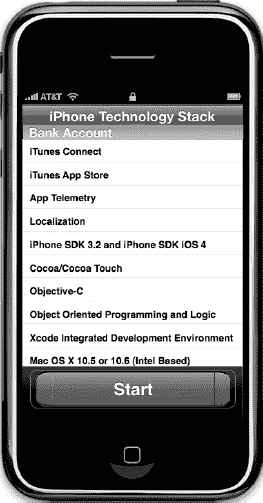

**图 1.** *iPhone/iPad 技术栈*

### 所需软件、材料和设备

Alice 的一大优点是它支持当今三大主流操作系统：

- Windows
- Mac
- Linux

Alice 的另一大优点是免费！您可以从 [`www.Alice.org`](http://www.Alice.org) 下载 Alice。

#### 操作系统与集成开发环境

虽然您可以在多个平台上使用 Alice，但开发人员用于开发 iOS 应用的集成开发环境（IDE）是 `Xcode`。您必须使用基于 Intel 芯片的 Mac 才能使用 `Xcode` 并提交应用！`Xcode` 是免费的，可在 Mac App Store 中获取。

#### 软件开发工具包

您需要注册成为 iOS 开发者。您可以在 [`http://developer.apple.com/iphone`](http://developer.apple.com/iphone) 完成注册。

当您准备好将应用上传到 iTunes App Store 时，需要支付每年 99 美元的费用。

#### 双显示器

我们建议开发者为其电脑连接第二台显示器。在双独立显示器上同时单步调试代码、查看输出窗口和 iPad 模拟器，效果非常理想。苹果硬件使这变得很简单。只需将第二台显示器插入任何基于 Intel 芯片的 Mac 的显示端口（当然，需要使用正确的 Mini DisplayPort 适配器），您就能拥有两台独立工作的显示器。请参见图 2。请注意，双显示器并非必需。如果您没有，只需要调整好打开的窗口以适配屏幕即可。

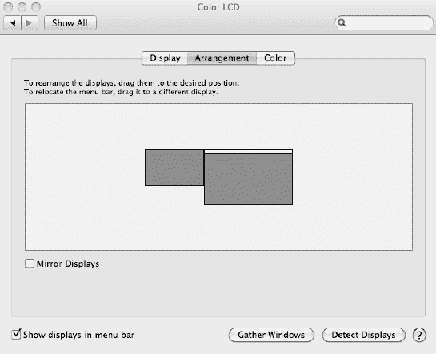

**图 2.** *双显示器*

### 免费在线研讨会、问答与 YouTube 视频

几乎每周三太平洋夏令时晚上 7:30，我们都会举办免费在线研讨会，讨论书中的一个主题或某个热门话题。这些研讨会是免费的，您可以在 [`www.xcelme.com/free-webinars.php`](http://www.xcelme.com/free-webinars.php) 注册参加。

每次研讨会结束时，我们会进行问答环节。您可以就讨论的主题或书中的任何主题提问。

此外，所有这些研讨会都会被录制并上传到 YouTube。

请务必订阅 YouTube 频道，以便在新视频上传时收到通知。

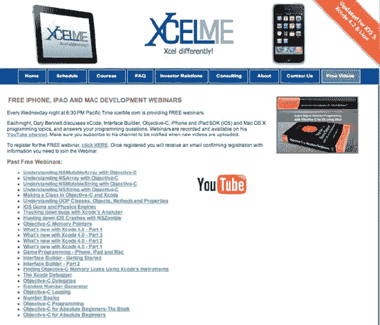

**图 3.** *免费 Objective-C 在线研讨会与 YouTube 视频*

#### 免费书籍论坛

我们为此书创建了一个在线论坛，网址为 [`http://forum.xcelme.com`](http://forum.xcelme.com)。您在学习 Objective-C 时可以在那里提问，并从作者那里获得答案。您还可以找到练习题答案以及额外的练习题来帮助学习。请参见图 3。

您还可以获取练习题的答案，并发现有用的链接，帮助您成为成功的 iPhone/iPad 开发者，创建出色的应用。请参见图 4。那么，让我们开始吧！

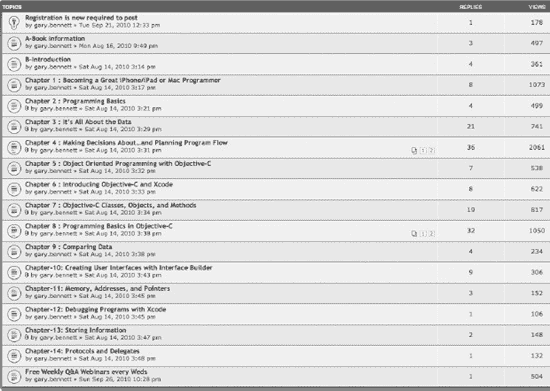

**图 4.** *读者论坛：用于获取练习题答案以及向作者提问*

## 第一章

## 成为优秀的 iOS 或 Mac 程序员

既然您已经准备好成为一名软件开发者，并且已经阅读了本书的引言部分，那么您需要熟悉几个关键概念。您的计算机程序会完全按照您的指令执行——不多也不少。它将遵循操作系统和编程语言定义的规则。您的程序不会在意您今天心情不好，也不会在意您要求它执行某件事多少次。通常，您认为您告诉程序要做的事情，与程序实际做的事情是两码事。

**成功关键：** 如果您还没有做，请花几分钟阅读本书的引言。引言会告诉您去哪里访问每章对应的免费在线研讨会、论坛和 YouTube 视频。此外，您还能更好地理解我们为何使用 Alice 编程环境，以及如何成功开发您的 iOS 和 Mac 应用。

根据您的背景，处理这种非黑即白的事情可能会令人沮丧。很多时候，编程学生都哀叹：“这不是我想要它做的！”当您开始积累编程经验和信心时，您会开始像程序员一样思考。您将理解软件设计和逻辑，并体验到您的程序完全按照您的意愿执行，以及随之而来的满足感。

### 像开发者一样思考

软件开发涉及编写计算机程序，然后让计算机执行该程序。**计算机程序**是我们希望计算机执行的一组指令。在开始编写计算机程序之前，先列出我们希望程序按顺序执行的步骤会很有帮助。这种逐步执行的过程被称为**算法**。

如果我们想编写一个烤面包片的计算机程序，我们首先要编写一个算法。这个算法可能如下所示：

1.  从袋子里取出面包片。
2.  将面包片放入烤面包机。
3.  按下烤面包按钮。
4.  等待面包片弹出。
5.  从烤面包机中取出烤好的面包片。

乍一看，这个算法似乎解决了我们的问题。然而，我们的算法遗漏了许多细节，并且做了很多假设。例如：

1.  用户想要什么样的面包？用户想要白面包、全麦面包还是其他种类的面包？
2.  用户希望面包烤到什么程度？浅色还是深色？
3.  面包烤好后，用户想在面包上放什么：黄油、人造黄油、蜂蜜还是草莓酱？
4.  这个算法对所有不同文化和语言的用户都适用吗？有些文化可能对烤面包有其他的叫法，或者根本不知道烤面包是什么。

现在，你可能会想，对于仅仅制作一个简单的烤面包程序来说，我们考虑得太细了。多年来，软件开发一直背负着耗时过长、成本过高、最终产品并非用户所需的声誉。之所以会有这种声誉，是因为计算机程序员常常在真正想通他们的算法之前，就开始编写程序了。

打造成功应用的关键要素是**设计需求**。设计需求可以非常正式和详细，也可以简单到像写在纸上的一张清单。设计需求之所以重要，是因为它们有助于开发者明晰应用在完成后应该做什么以及不应该做什么。设计需求不应在程序员的真空中完成，而应是开发者、用户和客户协作的成果。

**注意：** 如果本章有任何内容是值得你牢记在心的，那就是在开始软件开发之前，充分考虑设计需求和用户界面设计的重要性。这是软件开发周期中最高效（且成本最低）的时间利用方式。使用铅笔和橡皮擦比修改代码要容易且快得多，因为后者是因为你在开始编程之前没有让其他人审查设计方案。

另一个打造成功应用的关键要素是**用户界面 (UI)** 设计。苹果公司建议将整个开发流程中超过 50% 的时间用于 UI 设计。设计可以是使用 Dean Kaplan 所著的 *《iPhone Application Sketch Book》* 或 *《iPad Application Sketch Book》*（Apress，2009 年）创建的简单纸笔草图，也可以是使用 Omni Group 的 `OmniGraffle`*（*[`www.omnigroup.com`](http://www.omnigroup.com)*）* 软件应用配合 `Ultimate iPhone Stencil` 插件*（*[`www.graffletopia.com`](http://www.graffletopia.com)*）* 创建的屏幕布局。许多软件开发者从 UI 设计入手，在布局好所有屏幕元素并让众多用户查看纸质模型后，再根据屏幕布局写出设计需求。

在你尽最大努力明确了所有设计需求、布局好了所有用户界面屏幕、并让客户或潜在客户查看了你的设计并给出了反馈之后，就可以开始编码了。编码一旦开始，设计需求和用户界面屏幕可能会发生变化，但这些变化通常很小，并且容易在开发过程中被纳入。参见 图 1–1 和 图 1–2。

图 1–1 展示了在开发之前使用 `OmniGraffle` 构建的一个移动银行应用屏幕模型。将制作屏幕模型与设计需求相结合，迫使开发者在编码开始前就充分考虑应用程序的许多可用性问题。这有助于缩短应用开发时间，带来更好的用户体验，并在 iTunes App Store 上获得更好的评价。图 1–2 展示了移动银行应用的视图在完成后的实际外观。

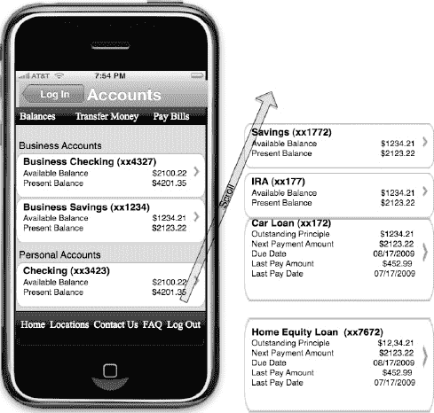

**图 1–1.** *这是在开发开始之前，为 iPhone 移动银行应用制作的账户余额屏幕的用户界面 (UI) 模型。该 UI 设计模型是使用 `OmniGraffle` 完成的。*

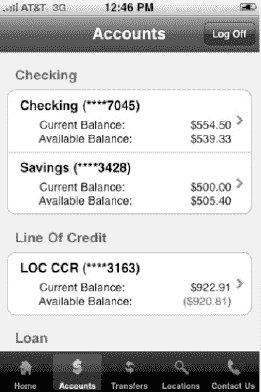

**图 1–2.** *这张截图显示了在 iTunes App Store 上架的一个已完成的 iPhone 移动银行应用。该应用名为 "Woodforest Mobile Banking"。*

### 完成开发周期

现在我们有了设计需求和用户界面设计，并且编写了程序，接下来该做什么呢？编程之后，我们需要确保我们的程序符合设计需求和用户界面设计，并且确保没有错误。在编程术语中，错误被称为**缺陷**。缺陷是我们编程产生的非预期结果，必须在应用发布到 App Store 之前修复。查找程序中的缺陷并确保程序满足设计需求的过程被称为**测试**。通常，由经验丰富的软件测试方法学专家（而非编写该应用的开发者）来执行此测试。软件测试通常被称为**质量保证 (QA)**。

**注意：** 当一个应用准备好提交到 iTunes App Store 时，`Xcode` 会给该文件加上 `.app` 扩展名，例如 `appName.app`。这就是为什么 iPhone、iPad 和 Mac 应用程序被称为 **app**。在本书中，我们将互换使用“程序”、“应用程序”和“应用”这三个术语，它们都表示相同的意思。

在测试阶段，开发者需要与 QA 人员合作，以确定应用程序为何无法按设计工作。这个过程被称为**调试**。它要求开发者逐步检查程序，以找出应用程序无法按设计工作的原因。图 1–3 展示了完整的软件开发周期。

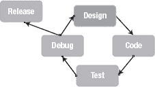

**图 1–3.** *典型的软件开发周期*

在测试和调试过程中，经常需要修改需求（设计），以使应用对用户更友好。在设计需求和用户界面变更完成后，整个过程会重新开始。

在某个时候，大家如此努力开发的应用必须提交到 iTunes App Store。此时需要考虑许多因素：

-   开发成本
-   预算
-   应用的稳定性
-   投资回报率

开发者和管理层之间总是存在权衡取舍。开发者希望应用完美无瑕，而管理层希望尽快从投资中获得回报。如果将发布日期的决定权交给开发者，应用可能永远无法上架 App Store。开发者会无休止地调整应用，使其更快、更高效、更易用。然而，到了某个时间点，代码必须从开发者手中夺过来，上传至 App Store，以便它能够实现其应有的价值。

### 面向对象编程简介

正如导言中详细讨论的那样，`Alice` 使我们能够专注于学习面向对象编程（OOP），而无需一次性掌握所有 `Objective-C` 编程语法和复杂的 `Xcode` 开发环境。相反，我们可以专注于学习 OOP 的基本原则，并快速运用这些原则编写我们的第一个程序。

几十年来，开发者们一直在努力寻找一种更好的方法来开发在项目生命周期内可复用、可管理且易于维护的代码。OOP 旨在帮助实现代码复用和可维护性，同时降低软件开发成本。

OOP 可以被视为程序中对象的集合。对这些对象执行操作以满足设计要求。

一个**对象**是任何可以被操作的东西。例如，一架飞机、一个人或 iPad 上的屏幕/视图都可以是对象。我们可能希望通过让飞机倾斜来操作它。我们可能希望让人行走，或者改变 iPad 上某个应用的屏幕颜色。操作都要应用于这些对象；参见图 1-4。

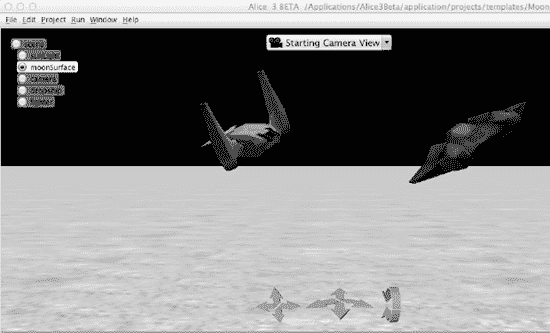

**图 1-4.** *Alice 应用程序中的两个对象：一艘运输船和一架战斗机。两个对象都可以应用操作——起飞和降落、右转和左转。*

如果你点击播放按钮，`Alice` 将会为你运行一个程序，例如图 1-4 中所示的程序。当我们运行 `Alice` 应用程序时，用户可以对应用程序中的对象应用操作。类似地，`Xcode` 是一个**集成开发环境（IDE）**，它使我们能够在编程环境中运行应用程序。我们可以在将应用程序运行到 iOS 设备上之前，先在电脑上通过 Xcode 的模拟器测试它们，如图 1-5 所示。

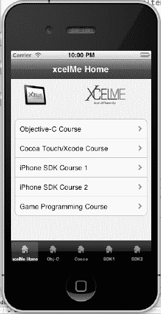

**图 1-5.** *这个示例 iPhone 应用包含一个用于组织课程列表的表格对象。诸如“向左旋转”或“用户选择了第 3 行”等操作可应用于此对象。*

对对象执行的操作称为**方法**。方法操纵对象以实现我们希望应用执行的功能。例如，对于图 1-4 中的喷气机对象，我们可能有以下方法：

`goUp`
`goDown`
`bankLeft`
`turnOnAfterBurners`
`lowerLandingGear`

图 1-5 中的表格对象，在程序中实际被称为 `UITableView`，它可能有以下方法：

`loadView`
`shouldAutorotateToInterfaceOrientation`
`numberOfSectionsInTableView`
`cellForRowAtIndexPath`
`didSelectRowAtIndexPath`

所有对象都有描述这些对象的数据。这些数据被定义为**属性。**每个属性都以特定的方式描述相关联的对象。例如，喷气机对象的属性可能如下：

`altitude = 10,000 feet`
`heading = North`
`speed = 500 knots`
`pitch = 10 degrees`
`yaw = 20 degrees`
`latitude = 33.575776`
`longitude = -111.875766`

对于图 1-5 中的 `UITableView` 对象，以下可能是我们的属性：

`backGroundColor = Red`
`selectedRow = 3`
`animateView = No`

当程序运行时，当用户与应用交互时，或者当程序员设计应用以满足设计要求时，对象的属性可以随时被更改。在特定时间存储在对象属性中的值的集合统称为**对象的状态**。

**状态**是计算机编程中的一个重要概念。在向学生教授状态时，我们让他们走到窗边，找到天空中一架飞机。然后我们让他们打个响指，想象一下当时那架飞机的属性可能具有的一些值。这些值可能是：

`altitude = 10,000 feet`
`latitude = 33.575776`
`longitude = -111.875766`

这些值代表了对象在他们打响指的那个特定时刻的状态。

等待几分钟后，我们让学生找到同一架飞机，再次打响指，并记录下该飞机在那个特定时间点可能的状态。

那么属性的值可能变成这样：

`altitude = 10,500 feet`
`latitude = 33.575665`
`longitude = -111.875777`

请注意对象的状态是如何随时间变化的。

### 使用 Alice 界面

`Alice` 提供了一种很棒的方法来运用我们刚刚讨论过的概念，而无需同时面对学习 `Xcode` 和 `Objective-C` 语言的所有复杂性。只需几分钟就能熟悉 `Alice` 界面并开始编写程序。

本书的导言描述了如何下载 `Alice`。下载并安装后，你需要打开 `Alice`。它的界面将如图 1-6 所示。

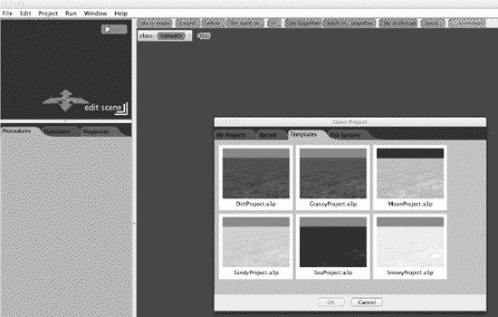

**图 1-6.** *正在运行的 Alice IDE*

严格来说，`Alice` 并不是像 `Xcode` 那样的真正 IDE，但它非常接近，而且比 `Xcode` 更容易学习。真正的 IDE 将代码开发、用户界面布局、调试工具、文档以及模拟器/控制台启动功能集成为单个应用程序；参见图 1-7。然而，`Alice` 提供了与 `Xcode` 相似的外观、感觉和功能。这将为以后我们开始编写 `Objective-C` 代码打下良好的基础。

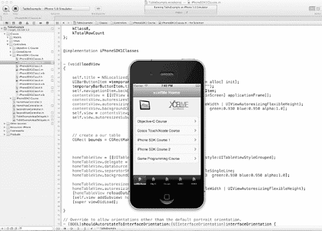

**图 1-7.** *Xcode 集成开发环境（IDE）及 iPhone 模拟器*

在下一章中，你将逐步了解 `Alice` 界面并编写你的第一个程序。

### 本章小结

恭喜你，你已经完成了本书的第一章。理解以下术语非常重要，因为它们将在本书中反复强调：

*   计算机程序
*   算法
*   设计要求
*   用户界面
*   缺陷（Bug）
*   质量保证（QA）
*   调试
*   面向对象编程（OOP）
*   对象
*   属性
*   方法
*   对象的状态
*   集成开发环境（IDE）

### 练习

*   回答以下问题：
    *   为什么要花时间在用户需求上如此重要？
    *   设计需求和算法之间有什么区别？
    *   方法和属性有什么区别？
    *   什么是缺陷（Bug）？
    *   什么是状态？
*   编写一个算法，描述自动售货机从投入硬币到出苏打水的工作过程。假设一瓶苏打水的价格是 80 美分。
*   为一个可以控制自动售货机的应用编写设计要求。

## 第 2 章

## 编程基础

本章将重点介绍成为一名优秀的 `Objective-C` 程序员所必需的构建块。本章将讲解如何使用 `Alice` 用户界面，如何编写我们的第一个 `Alice` 程序，如何编写我们的第一个 `Objective-C` 程序，并探索一些新的 OOP 术语。

**注意：** 我们希望在 `Alice` 中引入新概念，然后在后面的章节中，让你能够在 `Objective-C` 中使用这些概念。我们在过去 3 年中一直使用这种方法，并且根据个人经验，我们知道这种方法可以帮助你快速学习这些概念，不会感到气馁，并为你打下坚实的基础。

### 与爱丽丝一起探索

爱丽丝的 3D 编程环境让编写第一个程序变得简单，因为它应用了你在第 1 章中学到的一些原则。首先，你需要进一步了解爱丽丝的用户界面。当我们首次启动爱丽丝时，会看到一个类似图 2-1 的屏幕。

你可以使用默认的蓝天绿草模板，也可以选择其他不同背景的模板。尽情探索并享受其中乐趣吧。这里将是我们花费大部分时间并编写第一个爱丽丝应用程序的地方。

爱丽丝的用户界面旨在帮助我们高效编写应用程序。其界面在形式和功能上与 Xcode IDE 非常相似。现在，我们来探索爱丽丝的主要区域。

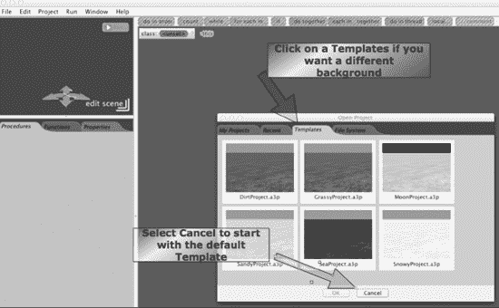

**图 2-1.** *爱丽丝的启动屏幕*

#### 导航菜单

导航菜单，如图 2-2 所示，允许我们打开和关闭文件、设置应用程序偏好、查看世界统计数据、文本输出和错误控制台。我们还可以通过导航菜单访问示例世界和爱丽丝帮助。

**注意：** 在使用爱丽丝时，务必频繁保存程序。如果爱丽丝崩溃而你未保存工作，你将丢失自上次保存以来的所有代码或更改。此外，我们建议你在要打开新的爱丽丝程序时，完全关闭爱丽丝并重新启动。

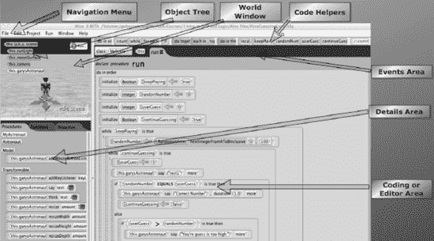

**图 2-2.** *此图展示了爱丽丝用户界面的主要部分。花点时间探索用户界面。你将在本章中了解它如何与 Xcode 进行比较，以及它如何帮助我们学习 Objective-C。*

#### 世界窗口

世界窗口显示我们的虚拟世界在运行时的样子。这个窗口类似于我们稍后用于运行应用程序的 iPhone/iPad 模拟器。世界窗口使我们能够利用爱丽丝的 3D 用户界面来建模我们的应用程序。

在世界窗口中，我们可以移动相机并将其放置到我们想要的视角位置。图 2-3 中的三个箭头工具提供了极大的灵活性，使我们的应用程序栩栩如生。

学习如何在世界中移动相机以获取你希望用户看到的视角非常重要。

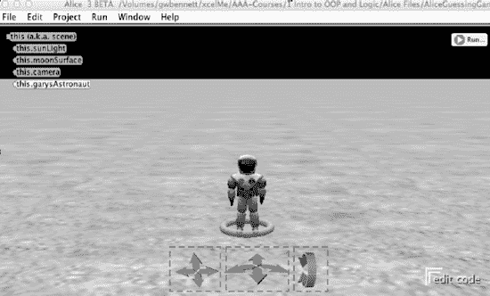

**图 2-3.** *用于在世界窗口中控制相机的相机操控箭头。*

爱丽丝中最重要的控件之一是**编辑场景**控件。参见图 2-4。当我们点击世界窗口右下角的“编辑场景”按钮时，将启动爱丽丝的**场景编辑器**。

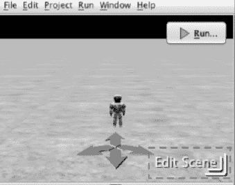

**图 2-4.** *世界窗口中的“编辑场景”按钮由方框标出，是最重要的控件之一。该按钮将启动爱丽丝的场景编辑器，使我们能够向爱丽丝世界添加对象。*

花点时间熟悉图 2-5 所示的场景编辑器。场景编辑器使我们能够：

*   从库中向世界添加对象。
*   从互联网向世界添加对象。
*   在世界中定位对象。
*   调整相机以查看我们的世界。

我们将花费大量时间通过场景编辑器向世界添加对象并设置相机。

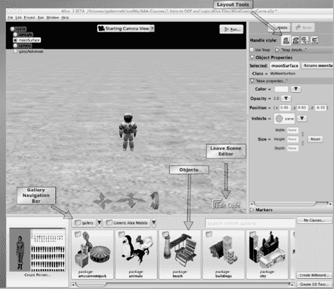

**图 2-5.** *爱丽丝的场景编辑器*

#### 爱丽丝中的类、对象和实例

一组具有相同属性和相同方法（动作）的对象被称为**类**。例如，我们可以有一个名为 `Airplane` 的类。在这个类中，我们可以有五个对象：

`boeing747`
`lockheedSR71`
`boeing737`
`citation10`
`f18Fighter`

这些对象几乎相同。它们来自同一个 `Airplane` 类。它们都具有以下相同的方法：

`land()`
`takeOff()`
`lowerLandingGear()`
`raiseLandingGear()`
`bankRight()`
`bankLeft()`

区分这些对象的唯一因素是它们属性值的不同。这些值的一些属性可能是：

`wingLength = 20ft`
`maxThrust = 200,000lbs`
`numberOfEngines = 2`

在你的世界中，你可能有两个完全相同的对象。你可能希望在视图中看到两架波音 737。类的每个副本称为一个**实例**。向程序添加类的实例称为**实例化**。

#### 对象树

**对象树**（参见图 2-6）使我们能够查看爱丽丝世界中的所有对象。此外，如果对象有子部件，你可以通过单击加号来查看这些子部件，或者通过单击减号来折叠子部件。

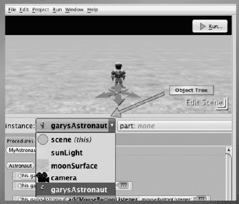

**图 2-6.** *对象树*

许多爱丽丝世界都包含我们应用程序所需的几个内置对象。图 2-6 中的世界包含相机、灯光和地面对象。

#### 编辑器区域

编辑器区域是爱丽丝界面中最大的区域，我们在这里编写代码。使用爱丽丝，我们实际上不需要键入代码；我们可以拖放代码来操作我们的对象和属性。

**注意：** 不要忘记编辑器区域的顶部。顶部包含一行用于循环、分支和其他逻辑结构的控件和逻辑模块，我们可以用它们来控制对象的行为。

#### 详细信息区域

爱丽丝界面中的**详细信息区域**包含用于属性、过程和函数的选项卡，这些构成了对象树中选定的对象。

*   **属性**包含我们选定对象的具体信息（例如，重量、长度和高度）。
*   **过程（方法）** 对对象执行动作（例如，起飞和降落）。
*   **函数**与方法类似。在爱丽丝中，两者的区别在于方法不返回值，而函数会返回值。

#### 事件区域

爱丽丝界面中的事件区域包含应用程序使用的所有现有事件的列表，并为我们提供了创建新事件的机会。**事件**是触发我们方法的条件。响应这些事件的方法（或过程）称为**事件处理程序**。当特定事件发生时，它会**触发**一个信号，由事件处理程序接收和处理。

一些例子是用户在 iPhone 上触摸按钮。触摸或滑动会触发事件，而处理这些事件的方法会对应用程序中的对象进行操作。参见图 2-7。

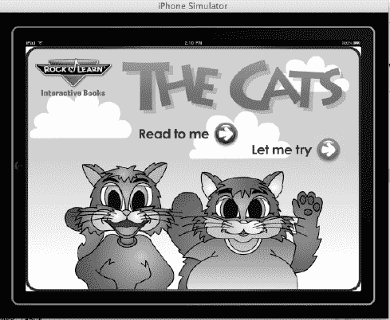

**图 2-7.** *Phonics Easy Reader 1（由 Rock 'n' Learn 出品）以左侧横向方向在 iPad 模拟器上运行。点击“读给我听”或“让我试试”按钮会触发事件，方法接收并处理这些事件——在此示例中，是为孩子朗读或让孩子读出句子中的单词。*

### 创建 Alice 应用——登月，爱丽丝

我们已经介绍了一些新术语和概念，现在是时候做程序员该做的事了——写代码。新手开发者通常会将编写一个 **Hello World** 应用作为他们的第一个程序。我们也会做类似的事情，但 Alice 让它变得更有趣。接下来，在完成第一个 Alice 应用后，我们再来编写第一个 Objective-C 应用。

这个 Alice 应用将在屏幕上显示三个对象：一个月球着陆器和两名宇航员。一名宇航员会说：“鹰已着陆。”另一名宇航员会说：“这是个人的一小步，却是人类的一大步。”

Alice 确实让这类应用的开发变得简单又好玩。请确保你遵循以下步骤：

1. 点击**文件**，然后点击**新建**。
2. 点击**模板**选项卡。
3. 选择 `MoonProject.a3p` 模板，并点击**打开**按钮。参见图 2-8。

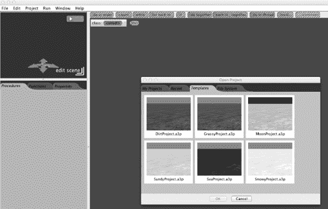

**图 2–8.** *选择太空模板。*

4. 现在，我们需要添加对象。点击**编辑场景**。这是 图 2-4 中“世界”窗口里的一个重要按钮。
5. 在“对象库”中，从**通用 Alice 模型**中选择**太空类别**。
6. 右键点击**月球着陆器**来查看关于该对象的一些信息。参见图 2-9。我们可以点击**“确定”**将对象添加到世界中，也可以直接从库中将它们拖放到世界中。

**注意：** 在这个例子中，你可以看到为什么实例是对象的一个副本。我们正在创建对象的一个副本并将其放入我们的世界中。*实例化* 是对创建副本并初始化对象这一过程的一个术语描述。

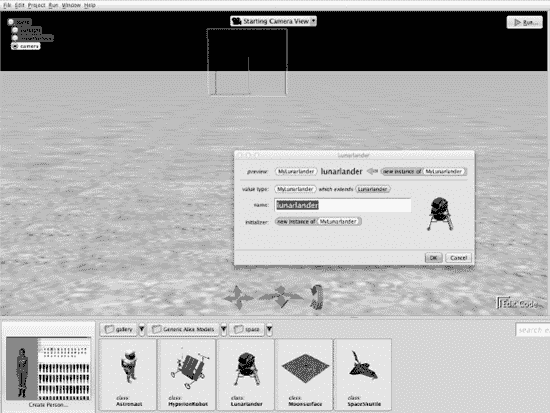

**图 2–9.** *在步骤 6 中查看对象并将其添加到我们的世界中。*

7. 点击 `Astronaut` 类别两次，向世界中添加两名宇航员。
8. 使用 图 2-10 中方框标出的**摄像机调整**和**对象调整**工具，以达到你想要的视觉效果和视角。

**提示：** 有时当你添加两个对象时，Alice 会将一个对象放置在另一个之上。如果发生这种情况，将上面的宇航员拖到另一名宇航员的旁边。你的世界应该看起来像 图 2-10。

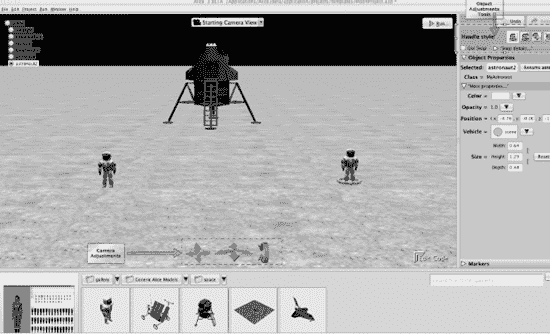

**图 2–10.** *使用“摄像机调整”工具来控制用户对世界的视角。使用“对象调整”工具来塑造和调整对象在世界中的方向。*

9. 在右上角有**对象调整**工具。将鼠标悬停在每个图块上，以了解每个图块工具会对对象产生什么效果。注意 图 2-10 中的对象树。`ground`、`lunarLander`、`astronaut` 和 `astronaut2` 对象都在对象树中。
10. 点击屏幕右下角的**编辑代码**按钮。这将返回编辑器视图。
11. 在世界窗口中点击左侧的宇航员。确保在“详细信息区域”中选中了**过程选项卡**。
12. 现在我们要让宇航员们说些什么。记住，对对象执行动作需要方法。将 `Astronaut2|turn` 图块从“详细信息区域”拖到我们的编辑器中。从参数列表中选择**向左转**、**0.25 旋转**。参见图 2-11。当我们运行应用时，左侧的宇航员将向左旋转四分之一圈，面向另一名宇航员。

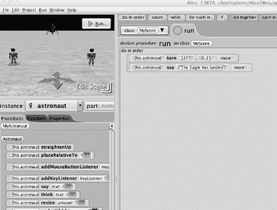

**图 2–11.** *左侧宇航员的方法和参数。*

13. 让我们为另一名宇航员做同样的操作。点击右侧的宇航员。将 `Astronaut|turn` 图块从“详细信息区域”拖到我们的编辑器中。从参数列表中选择**向右转**、**0.25 旋转**。
14. **参数**是方法对对象进行操作所需的信息。一个方法可能需要一个或多个参数。点击右侧的宇航员，将 `Astronaut2|say` 图块拖到编辑器中，**选择其他**，然后输入 **The Eagle has landed.** 参见图 2-12。

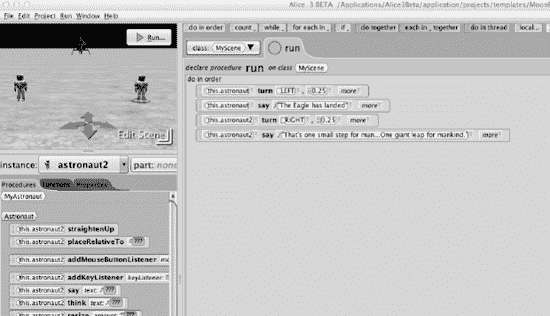

**图 2–12.** *你的编辑器应该包含这些带有列出参数的方法。*

15. 点击右侧的宇航员。将 `astronaut|say` 图块拖到编辑器中，**选择其他**，然后输入 **That’s one small step for man. . . One giant leap for mankind**。你的应用看起来应该像 图 2-12。
16. 让我们运行第一个程序，点击**播放**。如果你正确地完成了所有步骤，你的应用在运行时应该看起来像 图 2-13。如果不是，那么你需要进行一些调试。
17. 将应用保存为 `toTheMoonAlice.a3p`。我们稍后会用到这个应用。点击**文件**  **保存世界**，或者**文件**  **另存世界为**。

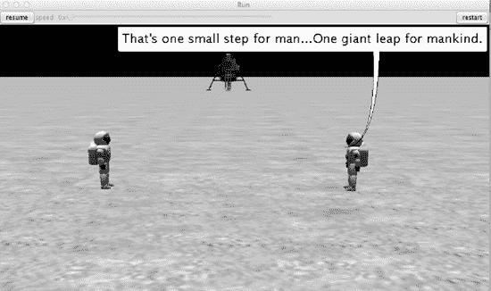

**图 2–13.** *从“世界运行”窗口的顶部区域，我们可以重新运行程序、暂停、继续、重启、停止以及为我们的应用拍照。我们还可以根据应用的运行速度来加快或减慢它。*

### 你的第一个 Objective-C 程序

既然你已经对 OOP 有了一些了解，并且完成了第一个 Alice 程序，那么是时候编写你的第一个 Objective-C 程序，并开始理解 Objective-C 语言、Xcode 和语法了。首先，我们必须安装 Xcode。Xcode 是我们在开发 Objective-C 应用时使用的 IDE。它相当于 Alice 的界面。

### 启动和使用 Xcode 4.2

Xcode 4.2 可从 Mac App Store 免费下载，参见图 2–14；也可从 iOS 开发中心获取，参见图 2–15 和图 2–16。

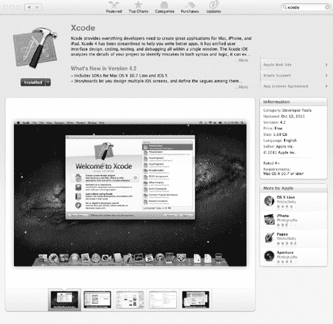

**图 2–14.** *Xcode 4.2 可从 Mac App Store 免费下载。*

**注意：** 该软件包包含我们编写 Objective-C 和 Mac 应用所需的一切。要开发 iPhone 应用，你需要申请 iPhone 开发者计划，支付 99 美元（准备在 iOS 设备上测试时），并从苹果官网 [`http://developer.apple.com/iphone`](http://developer.apple.com/iphone) 下载 iPhone SDK。

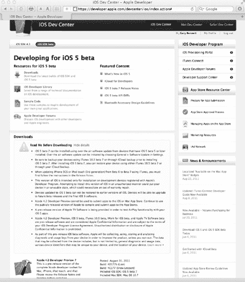

**图 2–15.** *如果你已支付 99 美元并加入 iOS 开发者计划，就可以下载如上图所示的 Xcode 和 iOS SDK 测试版。*

现在我们已经安装了 Xcode，需要开始编写 Objective-C 应用程序了；让我们开始吧。启动 Xcode 后，请按照以下步骤操作：

1.  点击 **Create a new Xcode Project**。参见图 2–16。

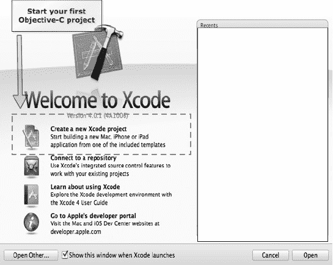

**图 2–16.** *创建我们的第一个 Objective-C 项目。*

**重要提示：** 许多初学者在此处会遇到困难，具体取决于他们使用的 Xcode 版本以及是否安装了 iPhone SDK。在图 2–17 中，你可以看到我们已经安装了 iOS SDK，同时也安装了 Lion 版本的 Xcode。如果你尚未安装这些，也没关系。只需在模板选项的左侧窗格中导航，点击 **Applications**，然后查找 Command Line Tool 即可。

2.  在左侧窗格中选择 **Applications**，选择 **Command Line Tool** 模板，然后点击 **Next**。参见图 2–17。

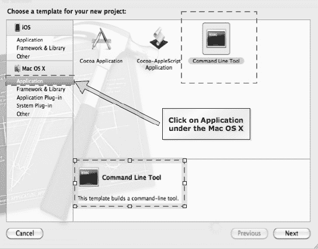

**图 2–17.** *选择 Command Line Tool。你可能需要在其他版本的 Xcode 中导航到等效界面。总之，关键是要找到 Command Line Tool。*

3.  让我们将应用命名为 **HelloWorld**，并选择 **Foundation** 作为应用类型，如图 2–18 所示。然后点击 **Next**，并将应用保存到你选择的目录中。

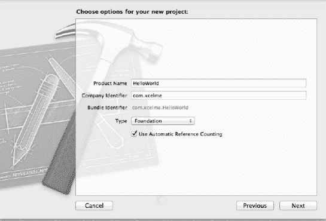

**图 2–18.** *将应用命名为 HelloWorld，并选择 Foundation 作为应用类型。*

4.  在 **Project Navigator** 中，点击 `main.m` 文件。参见图 2–19。

Xcode 为我们做了大量工作，创建了一个包含文件和代码的目录，供我们直接使用。这就是 Xcode 模板的作用——它们为我们节省了大量时间。

我们需要熟悉 Xcode IDE。让我们来看两个最常用的功能（参见图 2–19）：

*   导航区
*   编辑器区

这些区域与我们在 Alice 中使用的界面类似。**导航**区包含构建应用所需的文件，包括我们的类、方法和资源。

**编辑器**区是 Xcode IDE 的核心所在；在这里，我们的梦想变成了现实。编辑器区域是我们编写代码的地方。你会注意到，编写代码时，代码的颜色会发生变化。有时，Xcode 甚至会尝试为你自动补全单词。这些颜色都有其含义，随着我们使用 IDE，它们会逐渐变得清晰。编辑器区域也是我们调试应用的地方。

**注意：** 即使我们已经提过，但值得再说一次：通过阅读本书，你将学习 Objective-C 编程，但通过调试应用，你才会*真正*学会 Objective-C。调试是开发者学习并成长为优秀开发者的途径。

**Run** 按钮将我们的代码从纯文本转换为 Mac、iPhone 或 iPad 能够执行的 `.app` 文件。在 Alice 界面中，我们使用播放按钮来运行 Alice 应用。

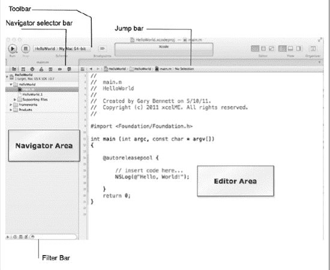

**图 2–19.** *创建项目后，点击 Run 按钮即可运行应用，并在控制台中看到 **Hello World!** 的输出。*

要运行我们的第一个程序，只需点击 **Run** 按钮。Xcode 会检查我们的代码语法，编译应用，如果未发现错误，则会生成一个 `.app` 文件并运行它。该应用程序将在控制台（也称为终端）中运行。

当应用运行时，它会在控制台中打印出 **Hello World**。此外，在控制台窗口中，我们还可以看到应用程序是否已终止以及终止的原因。在本例中，它正常终止。我们可以通过消息 `Program ended with exit code: 0` 看到这一点，这意味着我们的应用没有崩溃。参见图 2–20。

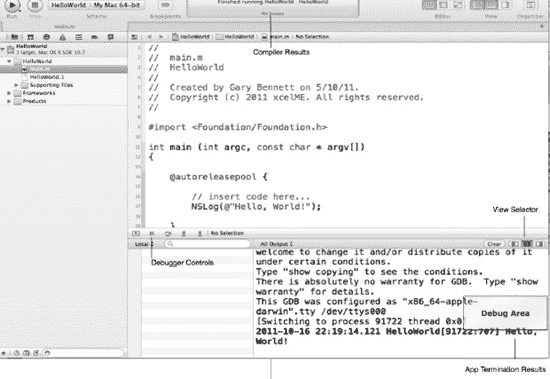

**图 2–20.** *我们的应用在调试器控制台中执行。*

现在，让我们修改我们的应用，使其完成我们之前对宇航员所做的操作：

1.  导航到 `main.m` 文件。
2.  将第 17 行和第 18 行修改为如图 2–21 所示。
3.  我们将在第 8 行末尾故意错误地放置一个分号。这会导致编译器错误。
4.  点击 **Run** 按钮。

你会看到，当我们尝试编译和运行应用时，会出现问题。我们遇到了一个编译器错误，Xcode IDE 中会显示一个红色指针和相应的提示信息。参见图 2–21。

当我们编写 Objective-C 代码时，一切都很重要——即使是分号、大小写和括号也不例外。使编译器能够将代码编译为可执行应用的一系列规则称为**语法**。

`NSLog` 是一个函数，它会在控制台中打印出其参数的内容。

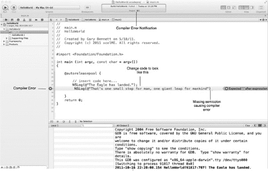

**图 2–21.** *我们的应用出现语法错误，被 Objective-C 编译器捕获。*

现在，让我们通过在第 18 行末尾添加分号来修复应用。构建并运行应用后，我们就能在调试控制台中看到输出。参见图 2–22。

你可以随意尝试和修改打印出的文本。尽情享受吧！

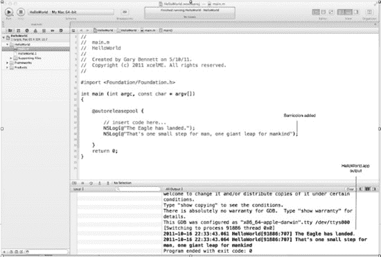

**图 2–22.** *我们的应用编译无错误，并按预期成功完成了输出。*

### 总结

在本章中，我们构建了第一个 Alice 应用。我们还一同安装了 Xcode，并编译、调试和运行了第一个 Objective-C 应用。我们还介绍了新的 OOP 术语，这些术语对于理解 Objective-C 至关重要。

**成功关键：** 如引言中所述，请访问 [`www.xcelme.com`](http://www.xcelme.com) 并点击“免费视频”选项卡，观看与本-章相关的视频。同时，可访问 [`http://forum.xcelme.com`](http://forum.xcelme.com) 就本章内容提问，并查看常见错误的解答。

你应该理解以下术语：

*   类
*   对象
*   方法
*   参数
*   实例
*   实例化

### 练习

*   扩展你的 `toTheMoonAlice.a3p` Alice 应用。在场景中放置你选择的另一个对象，并让该对象在两名宇航员说完话后对他们说些什么。
*   通过添加第三行代码，扩展你的 Objective-C `HelloWorld.app` 应用，该代码将你选择的任何文本打印到控制台。

