# 第 3 章

## 数据即为一切

你可能知道，数据在计算机内存中以 0 和 1 的形式存储。然而，0 和 1 对开发者或应用用户来说并不太有用，因此我们需要了解程序如何使用数据以及数据在计算机上是如何存储的。

在本章中，我们将了解数据在计算机上是如何存储的，以及我们如何操作这些数据。然后，我们将编写一个有趣的 Alice 应用来演示数据存储，接着用 Objective-C 编写相同的 Alice 应用。让我们开始吧！

### 编程中使用的数制

计算机处理信息的方式与人类不同。本节将介绍诸如你的 Mac、iPhone 和 iPad 等设备存储、计数和操作信息的各种方式。


### 位（Bits）

`bit`（位）被定义为计算机用来存储和处理数据的基本信息单位。一个位的值要么是`0`，要么是`1`。在计算机刚问世时，晶体管和微处理器都尚未出现。数据是通过真空管的开启或关闭来操作和存储的。如果真空管开启，位的值为`1`；如果真空管关闭，则值为`0`。计算机能够存储和处理的数据量，直接取决于它拥有多少根真空管。

第一台被公认的计算机名为“电子数字积分计算机”（ENIAC）。它占地超过 136 平方米，拥有 18,000 根真空管，其性能大约相当于你手中的计算器。

如今，计算机使用晶体管来存储和处理数据。计算机处理器的性能取决于其芯片或 CPU 上集成了多少个晶体管。与真空管类似，晶体管也有“关闭”或“开启”两种状态。当晶体管关闭时，其值为`0`；当晶体管开启时，其值为`1`。在撰写本文时，iPhone 5 和 iPad 2 搭载的 A5 处理器采用双核 ARM 架构，集成了超过 2 亿个晶体管，而 iPhone 4 和初代 iPad 中使用的 A4 处理器则有 1.49 亿个晶体管。参见图 3–1。

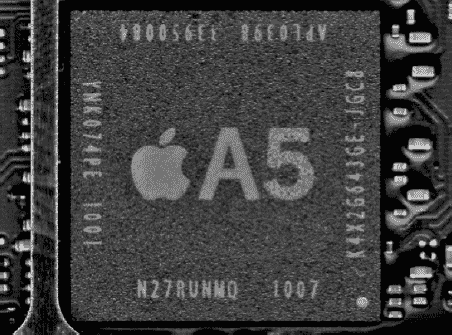

**图 3–1**. *苹果专有的 A5 处理器*

#### 摩尔定律

你的 iPhone 或 iPad 处理器上的晶体管数量，直接关系到设备的处理速度、内存容量以及设备内置的传感器（如加速度计、陀螺仪）。晶体管越多，设备性能就越强大。

1965 年，英特尔联合创始人戈登·E·摩尔描述了处理器中晶体管数量的趋势。他观察到，从 1958 年到 1965 年，处理器中的晶体管数量每 18 个月翻一番，并且很可能会“至少再持续 18 个月”。这一观察结果后来被广为人知地称为“摩尔定律”，并且在超过 55 年的时间里被证明是准确的。参见图 3–2。

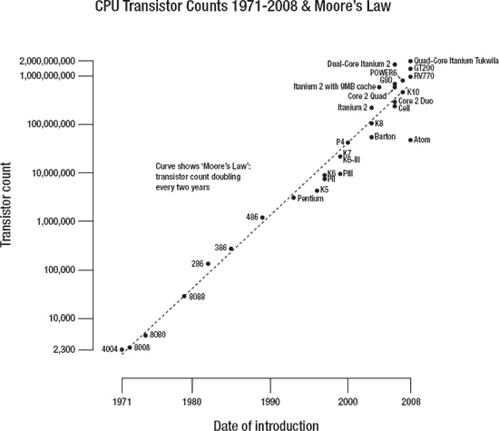

**图 3–2.** *摩尔定律*

**注意：** 摩尔定律也有其弊端，你很可能已经在花钱时亲身体验过了。处理能力快速提升带来的问题是它会迅速使技术变得过时。所以，当你 iPhone 的两年合约到期时，市场上的新款 iPhone 将比你刚签合同时拥有的那台强大一倍。这对大家来说多么方便啊！

### 字节（Bytes）

字节是另一个用于描述计算机信息存储的单位。一个`字节`由 8 个位组成，是一个 2 的整数次幂。一个位最多可以表示两种不同的值，而一个字节最多可以表示 2⁸，即 256 种不同的值。一个字节可以包含 0 到 255 之间的值。

**注意：** 在第 13 章中，我们将更详细地讨论二进制（Base-2）、十进制（Base-10）和十六进制（Base-16）数字系统。然而，为了理解数据类型，本章有必要先对这些系统进行介绍。

`二进制`数字系统表示数字符号 0 和 1。为了说明`71`这个数字如何在二进制中表示，我们将使用一个简单的 8 位（1 字节）表格，其中每个位都表示为 2 的幂次。要将字节值`01000111`转换为十进制，只需将值为 1 的位相加即可。参见表 3–1。

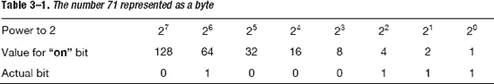

要将数字`22`表示为二进制，就开启那些加起来等于 22 的位，即`00010110`。参见表 3–2。

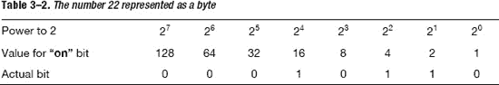

要将数字`255`表示为二进制，就开启那些加起来等于 255 的位，即`11111111`。参见表 3–3。

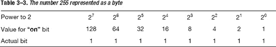

要将数字`0`表示为二进制，就开启那些加起来等于 0 的位，即`00000000`。参见表 3–4。

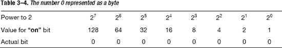

### 十六进制（Hexadecimal）

通常，有必要用计算机能够识别的另一种格式（即十六进制格式）来表示字符。在调试应用时，你会遇到十六进制数。`十六进制`系统是基数为 16 的数字系统。它使用 16 个不同的符号，0–9 表示零到九的值，A、B、C、D、E、F 表示十到十五的值。例如，十六进制数`2AF3`等于十进制中的 (2 × 16³) + (10 × 16²) + (15 × 16¹) + (3 × 16⁰)，即 10,995。图 3–3 展示了 ASCII 字符表。由于 1 字节可以表示 256 个字符，这对于西方字符来说效果很好。例如，十六进制`20`表示一个空格。十六进制`7D`表示“}”。

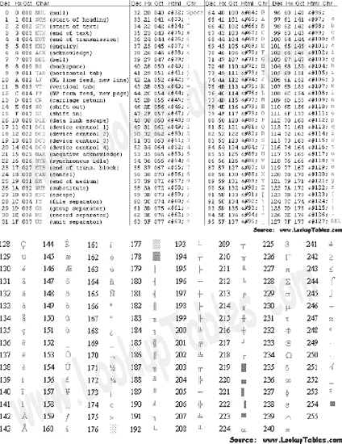

**图 3–3.** *ASCII 字符*

### Unicode

用字节来表示字符在计算机领域一直运行良好，直到大约 20 世纪 90 年代，个人电脑在拥有超过 256 个字符的非西方国家得到广泛应用。Unicode 不是使用 1 字节字符集，而是最多可以使用 4 字节字符集。

为了促进更快的采用，前 256 个码点与 ASCII 字符表保持一致。Unicode 可以有多种字符编码。西方文本最常用的编码叫做`UTF-8`。作为一名 iPhone 开发者，你可能会最常使用这种字符编码。

### 数据类型（Data Types）

既然我们已经讨论了计算机如何处理数据，接下来需要介绍一个非常重要的概念——`数据类型`。人类通常只需查看数据及其使用上下文，就能判断出数据的类型以及它将如何被使用。计算机则需要被告知如何做到这一点。程序员需要告诉计算机它所接收的数据类型。例如：

`2 + 2 = 4`。

计算机需要知道你是想将两个数字相加。在这个例子中，它们是整数。你可能起初会认为，即使是最不经意的观察者也能看出这些数字相加的结果，更不用说一台复杂的计算机了。然而，iPhone 应用的用户通常会将数据存储为一系列字符，而非一个计算结果。例如，一条短信可能这样写：

`"Everyone knows that 2 + 2 = 4".`

在这种情况下，我们在一个被称为`字符串`的字符序列中使用了之前的例子。`数据类型`仅仅是对我们程序的声明，用于定义我们想要存储的数据。`变量`用于存储我们的数据，并在声明时附带一个相关的数据类型。所有数据都存储在变量中，并且变量必须有变量类型。例如，在 Objective-C 中，以下是带有其相关数据类型的变量声明。

```
int x = 10;
int y = 2;
int z = 0;
char prefix = 'c';
NSString *submarineName  = @"USS Nevada SSBN-733";
```

数据类型不能相互混合。你不能执行以下操作：

```
z = x + submarineName;
```

混合数据类型会导致编译器警告或编译器错误，你的应用将无法运行。

你在程序中使用的大部分数据可以分为三种类型：布尔值（Booleans）、数字（numbers）和对象（objects）。在本章的其余部分，我们将讨论如何处理数字和对象数据类型。在第 4 章中，当我们编写具有决策功能的应用时，将进一步讨论布尔数据类型。

**注意：** 本地化你的应用是指编写应用的过程，以便用户能够用他们的母语购买和使用它。这个过程对于本书来说过于高级，但如果你从一开始就做好规划，这是个很容易完成的任务。本地化你的应用，无需为每种语言重写，就能极大地扩展应用的潜在客户总数和收入。请务必本地化你的应用。这并不难，而且可以轻易使购买你应用的人数翻倍甚至翻三倍。


#### 使用 Alice 操作变量与数据类型

现在我们已经学习了数据类型，接下来编写一个 Alice 应用，实现两个数字相加并通过对象和方法显示总和。

1. 打开 Alice，选择 **文件**  **新建世界**。
2. 选择草地模板并点击打开。参见图 3–4。

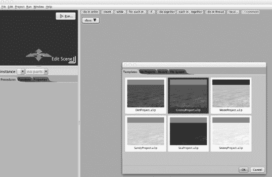

**图 3–4.** *选择草地模板*

接下来，我们需要创建变量并选择数据类型。

3. **点击并拖动编辑器右上角的局部变量图块**。
4. 将第一个变量命名为 `firstNumber` 并定义该变量，如图 3–5 所示。
5. 该变量的数据类型为整数，初始值为 2。

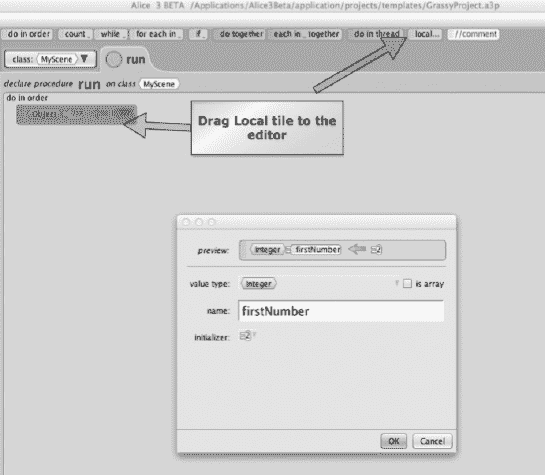

**图 3–5.** *创建一个新的局部变量*

在声明变量时进行初始化始终是一个良好的编程习惯。

6. 创建另一个名为 `secondNumber` 的局部变量，如图 3–6 所示，操作步骤同第 5 步。该变量的数据类型为整数，初始值为 3。

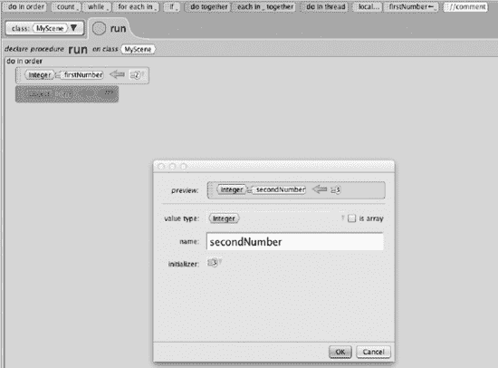

**图 3–6.** *创建第二个局部变量*

7. 创建另一个名为 `totalSum` 的局部变量，如图 3–7 所示，操作步骤同第 5 步。该变量的数据类型为整数，初始值为 0。此局部变量最终将保存 `firstNumber` 与 `secondNumber` 的和。

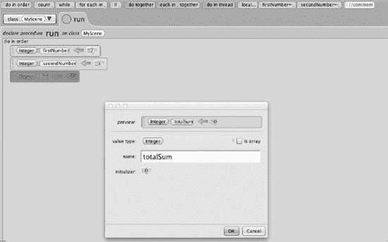

**图 3–7.** *创建变量 totalSum*

8. 将两个变量相加。将 `totalSum` 图块拖动到最后一行。目前，局部变量 `totalSum` 的值为 0。点击 0，将 `firstNumber` 赋值给 `totalSum`。参见图 3–8。

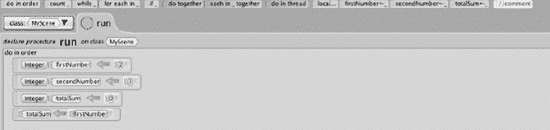

**图 3–8.** *创建变量 totalSum*

9. 现在 `firstNumber` 已赋值给 `totalSum`，请点击 `firstNumber` 图块。
10. 选择 `secondNumber` 以与 `firstNumber` 相加。参见图 3–9。

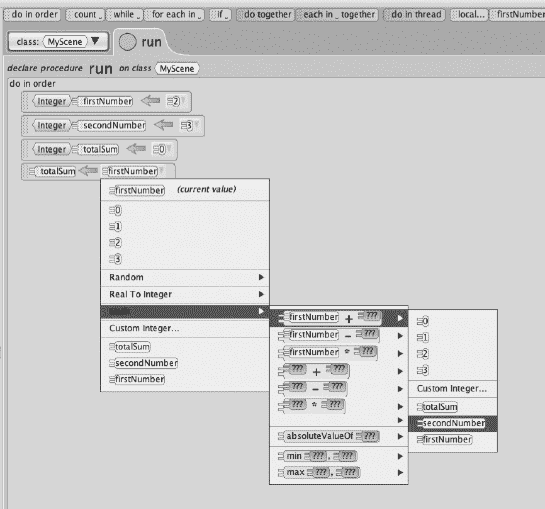

**图 3–9.** *将值设置为数学表达式*

11. `totalNumber` 现在已赋值为 `firstNumber` 与 `secondNumber` 的总和。参见图 3–10。

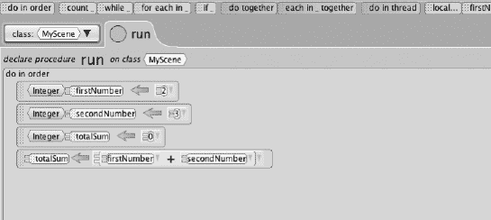

**图 3–10.** *选择 totalSum*

现在我们需要向世界添加一个角色来显示总和。

12. 点击“编辑场景”，然后从屏幕底部的“对象库”中添加你选择的任意对象。我们选择了一只兔子。参见图 3–11。

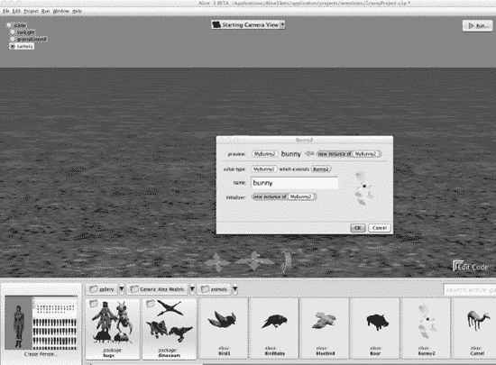

**图 3–11.** *向世界中添加一只兔子*

我们需要声明一个字符串类型的变量。该变量将保存字符串“2 + 3 的和是：5”。

13. 点击场景右下角的“编辑代码”返回到编辑器。
14. 选择兔子实例。在“过程”标签页中，将 `this.bunny say text:???` 过程图块拖拽到编辑器中。参见图 3–12。

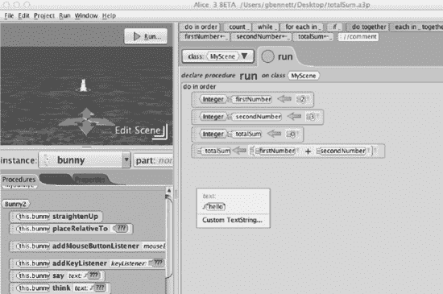

**图 3–12.** *将过程（方法）say 添加到编辑器*

15. 点击“自定义文本字符串”，输入字符串“2 + 3 的和是：”作为参数值。参见图 3–13。

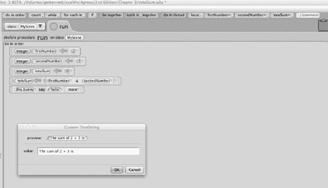

**图 3–13.** *输入字符串参数*

16. 点击“确定”，然后点击“say”过程的第一个参数。将 `totalSum` 追加到我们的第一个参数字符串中。参见图 3–14。

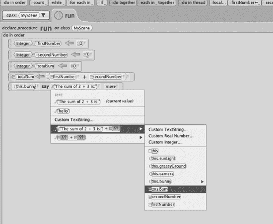

**图 3–14.** *将 totalNumber 添加到自定义字符串中，以便向用户显示*

在最后一步中，Alice 为我们做了一件非常棒的事。当它把 `totalSum` 的值追加到“2 + 3 的和是：”时，自动将 `totalSum` 的数据类型从整数转换为字符串。我们将学习如何使用 Objective-C 实现这一点。

现在可以运行程序，你会注意到自定义字符串显示的时间很短。

若要增加自定义字符串的显示时间，请点击“say”过程的第二个参数选项，将持续时间更改为 2 秒或任何你喜欢的值。参见图 3–15。

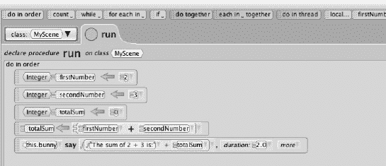

**图 3–15.** *编辑器部分*

17. 按下播放按钮，如果一切操作正确，应用运行时应该看起来像图 3–16。

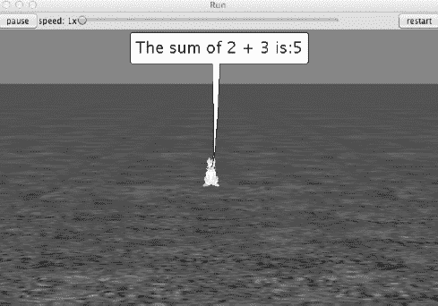

**图 3–16.** *应用已成功运行！*


#### 数据类型与 Objective-C

我们已经介绍了数据类型的基本原理，并编写了一个 Alice 应用来演示这些原理的运用，现在让我们编写一个 Objective-C 应用，来完成我们刚才在 Alice 中实现的功能。

在 Objective-C 中，我们使用的数据类型与 Alice 中类似。一些最常用于存储数字的数据类型包括整数（int）、双精度浮点数（double）、单精度浮点数（float）和长整数（long）。表 3–5 列出了许多基本数据类型。其中许多类型将在后续章节中介绍。

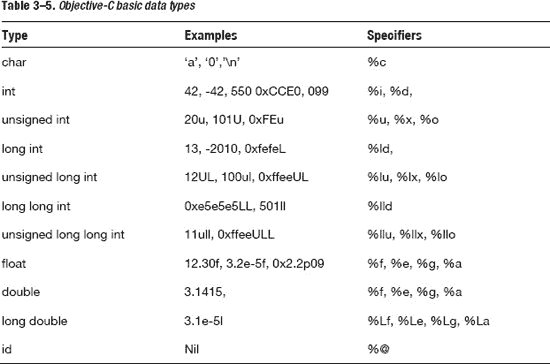

我们的 Objective-C 应用将添加两个整数，并将其和显示在控制台中。该应用还会显示文本“程序已成功终止。”这将既有趣又简单，所以我们开始吧。

1.  作为 iOS 开发者，Xcode 是我们的核心工作环境，因此请打开 Xcode 并创建一个新项目。为此，请选择**文件**  **新建项目**，然后选择图 3–17 中所示的选项。点击“下一步”。

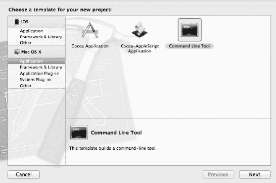

**图 3–17.** *打开一个新项目*

**注意：** 新手在创建命令行应用时最常见的困难之一是在特定版本的 Xcode 中找到该项目。图 3–18 展示了运行在 Lion (10.7) 操作系统上的 Xcode 4.2 版本。您的 Xcode 版本可能更新或更旧，菜单和选择选项也可能有所不同。因此，请在**文件**  **新建项目** 设置中查找对应的选项。如果您在寻找这些选项时遇到困难，请访问本书论坛 forum.xcelme.com 并进入本章节。我们将乐意回答您的问题。

2.  将产品名称保存为 第 3 章（参见图 3–18）。然后选择保存项目的目录，并点击“下一步”。

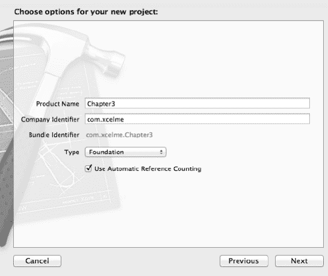

**图 3–18.** *项目设置。*

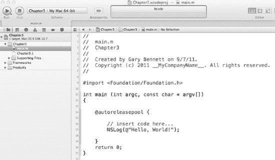

**图 3–19.** *创建完成后，选择 `main.m` 文件，您的 Xcode 项目应如图所示*

3.  创建项目后，您需要在编辑器中打开源代码文件。打开 `main.m` 源文件。（参见图 3–19）

如果您以前在计算机编程中没见过 `//`，它允许程序员对其代码进行注释。注释不会被应用程序编译，而是作为程序员或（更重要的）后续开发者的备注。注释有助于原始开发者和后续开发者理解应用的开发方式。

有时，注释需要跨越多行或仅覆盖一行的一部分。这可以通过 `/*` 和 `*/` 实现。`/*` 和 `*/` 之间的所有文本都被视为注释，不会被编译。

在我们的示例中，首先需要声明并初始化变量 `firstNumber` 和 `secondNumber`。良好的实践是在声明变量时或之后立即进行初始化。

然后，我们将变量 `firstNumber` 和 `secondNumber` 各增加 1。接着打印 `firstNumber` 和 `secondNumber` 的和。

最后，我们将在控制台输出“程序已成功终止。”参见图 3–20

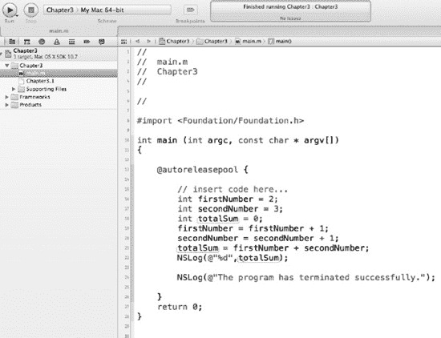

**图 3–20.** *用于控制台输出的代码*

`NSLog` 是一个可以接受一个或多个参数的函数。第一个参数通常是需要打印到控制台的字符串。字符串前的 `@` 符号告诉编译器这是一个 Objective-C 类型的字符串，而非 C++ 字符串。在 iPhone 应用中，`@` 符号通常用于所有字符串前面。如果不使用 `@` 符号，您很可能会遇到编译错误。`NSLog` 是开发者用于测试代码执行的非常实用的函数。

`%d` 告诉编译器将打印一个整数，并用该整数的值替换 `%d`。其他 `NSLog` 格式化说明符请参见表 3–5。最后，我们的第二个参数是要打印的整数。

图 3–21 展示了我们应用完成执行后的输出结果。

要编译并运行您的应用，请点击工具栏上的**运行**按钮。我们可以看到，调试器打印出了 `NSLog` 字符串以及末尾的提示信息，表明应用执行成功。

**注意：** 如果您的编辑器没有上一屏幕截图中显示的那些菜单或装订线（包含程序行号的左侧列），您可以在 Xcode 偏好设置中开启这些选项。您可以通过点击菜单栏中的 Xcode 菜单，然后选择“偏好设置”来打开 Xcode 偏好设置。

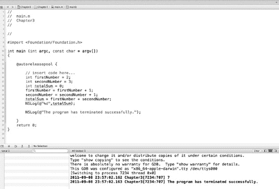

**图 3–21.** *显示 Objective-C 应用结果的控制台日志*

### 问题识别

信不信由你，您的程序可能并不会按照您想象的方式运行。查找应用问题的过程称为调试。为了追踪应用中的错误，我们可以设置断点并检查变量以查看其内容。为此，只需在装订线中您想设置断点的位置单击即可（参见图 3–22）。断点会阻止我们的应用在该行继续执行，并允许我们检查变量。

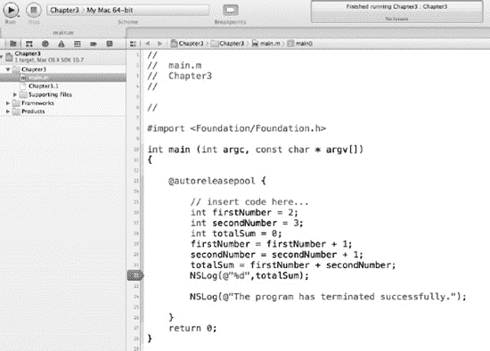

**图 3–22.** *设置调试“断点”*

编辑器装订线中的蓝色指针表示一个断点。当您运行应用程序，并且应用执行到包含断点的代码行时，应用将暂停，并在该行代码上显示一条蓝色横线，同时带有断点标记（参见图 3–23）。此外，您还可以通过将鼠标悬停在变量上来检查每个变量。

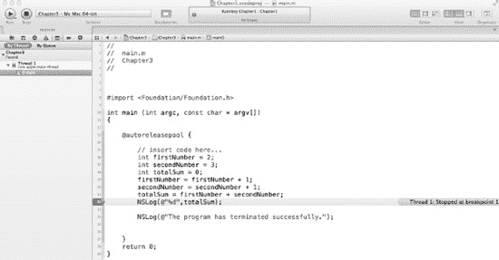

**图 3–23.** *断点命中*

我们将在第 14 章中进一步讨论应用的调试。

### 总结

在本章中，您了解了应用如何使用数据。您看到了如何初始化变量以及如何向它们分配数据。我们解释了变量在声明时都关联有一个数据类型，并且只有相同类型的数据才能分配给变量。

最后，我们向您展示了如何在您的第一个 Alice 应用中使用变量，并通过在 Objective-C 应用中使用变量来结束本章。

### 练习

*   编写一个 Objective-C 控制台应用（命令行工具），将两个整数相乘并将结果显示在控制台中。
*   编写一个 Objective-C 控制台应用，计算一个浮点数的平方。将结果浮点数显示在控制台中。
*   编写一个 Objective-C 控制台应用，将两个浮点数相减，并将结果存储为整数。注意：不会发生四舍五入。

## 第 4 章


