# 做出决策……并规划程序流程

成为 iPhone/iPad/Mac 开发者的酷事之一，就是我们能精确地告诉设备我们想做什么，然后它就会照做——我们的设备会不知疲倦地反复执行任务。这是因为 iPhone/iPad/Mac 不会在意它们昨天工作得多辛苦，也不会让情绪影响工作。这些设备不需要拥抱。

作为开发者也有一个坏处：我们必须考虑应用程序中所有可能出现的结果。许多学生喜欢拥有这种掌控力。他们乐于专注于应用程序的众多细节；然而，需要处理这么多细节有时也会令人沮丧。正如我们在本书前言中提到的，开发应用程序需要付出代价……而这个代价就是时间。你在开发和调试上投入的时间越多，你就越能更好地处理所有细节，你的应用程序运行得也就越好。要成为一名成功的开发者，你必须付出这个代价。

计算机的世界是非黑即白的，没有灰色地带。我们的设备会产生结果，其中许多结果都基于真与假的条件。

在本章中，你将学习计算机逻辑以及如何控制应用程序的流程。处理信息并得出结果是所有应用程序的核心。你的应用程序需要根据值和条件来处理数据。为此，你需要理解计算机如何执行逻辑运算，并根据你的应用程序获取的信息来执行代码。

## 布尔逻辑

**布尔逻辑**是一种用于逻辑运算的系统。布尔逻辑使用像 `AND`、`OR` 这样的二元运算符，以及一元运算符 `NOT` 来判断你的条件是否满足。二元运算符需要两个操作数。一元运算符只需要一个操作数；`AND` 和 `OR` 是二元运算符，而 `NOT` 是一元运算符。

我们刚刚介绍了一些听起来可能令人困惑的新术语；然而，你可能每天都在使用布尔逻辑。让我们来看几个关于二元运算符 `AND` 和 `OR` 的布尔逻辑例子，这些例子来自父母有时会和青少年孩子进行的对话。

"如果你的房间收拾干净了 **并且** 碗碟也洗好了，今晚你就可以去看电影。"

"如果你的房间收拾干净了 **或者** 碗碟洗好了，今晚你就可以去看电影。"

布尔运算符的结果要么是 `TRUE`，要么是 `FALSE`。在第 3 章中，我们简要介绍了布尔数据类型。定义为布尔类型的变量只能包含 `TRUE` 和 `FALSE` 这两个值。

`BOOL seeMovies = FALSE;`

在前面的例子中，`AND` 运算符需要两个操作数：一个在 `AND` 的左边，一个在右边。每个操作数都可以独立地求值为 `TRUE` 或 `FALSE`。

要使 `AND` 运算产生 `TRUE` 结果，`AND` 两边的条件都必须为 `TRUE`。在我们的第一个例子中，青少年必须打扫干净自己的房间 **并且** 洗完碗碟。如果其中任何一个条件是 `FALSE`，结果就是 `FALSE`——那么这个青少年就看不了电影。

要使 `OR` 运算产生 `TRUE` 结果，只需要一个操作数为 `TRUE`，或者两个条件都为 `TRUE` 也可以得到 `TRUE` 结果。在我们的第二个例子中，只要卧室干净了，就能去看电影。

**注意：** 在幕后，你的 iPhone/iPad/Mac 将 `FALSE` 定义为 0，将 `TRUE` 定义为 1。从技术上讲，`TRUE` 被定义为任何非零值；因此，在布尔表达式中求值时，0.1、1 和 2 这些值都会被当作 `TRUE`。

`NOT` 语句是一个一元运算符。它只需要一个操作数就能产生一个布尔结果。例如：

"你 **不能** 去看电影。"

这个例子只用一个操作数。`NOT` 运算符将 `TRUE` 操作数变为 `FALSE`，将 `FALSE` 操作数变为 `TRUE`。这里，结果就是 `FALSE`。

**注意：** 执行 `NOT` 运算通常被称为*翻转比特位*或*取反*。`TRUE` 定义为 1，`FALSE` 定义为 0，而 0 和 1 被称为*比特位*。`NOT` 运算将 `TRUE` 变为 `FALSE`，将 `FALSE` 变为 `TRUE`，因此称之为*翻转比特位*或*对结果取反*。

`AND`、`OR` 和 `NOT` 是三种非常常见的布尔运算符。偶尔，你需要使用更复杂的运算符。`XOR`、`NAND` 和 `NOR` 是 iPhone/iPad/Mac 开发者常用的运算。

布尔运算符 `XOR` 意思是*异或*。记住 `XOR` 运算符工作方式的一个简单方法是：只有当且仅当一个参数为 `TRUE` 时（而非两个都成立），`XOR` 运算符才会返回 `TRUE` 结果。

Objective-C 没有内建这些运算符，但要知道 `NAND` 和 `NOR` 的意思分别是“与非”和“或非”。在计算了 `AND` 或 `OR` 的参数和结果之后，只需对结果取反即可。

### 真值表

让我们使用一个工具来帮助你评估所有布尔运算符。**真值表**是逻辑学中用于评估布尔运算符的数学表格。当试图确定一个布尔运算符的所有可能性时，它们非常有用。让我们来看一些常见的 `AND`、`OR`、`NOT`、`XOR`、`NAND` 和 `NOR` 的真值表。

在 AND 真值表中，存在四种 `TRUE` 和 `FALSE` 的组合。

*   TRUE AND TRUE = TRUE
*   TRUE AND FALSE = FALSE
*   FALSE AND TRUE = FALSE
*   FALSE AND FALSE = FALSE

将这些组合放入真值表中，就得到了表 4-1。

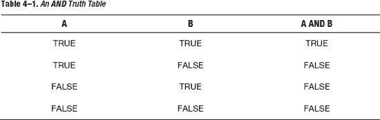

只有当两个操作数都为 `TRUE` 时，AND 真值表才会产生 `TRUE` 结果。

表 4-2 展示了一个 OR 真值表及其所有可能的操作数。

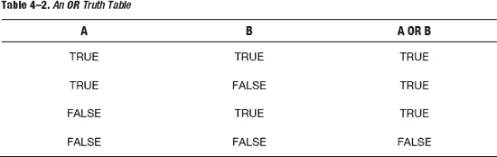

当一个或两个操作数为 `TRUE` 时，OR 真值表会产生 `TRUE` 结果。

表 4-3 展示了一个 NOT 真值表及其所有可能的操作数。

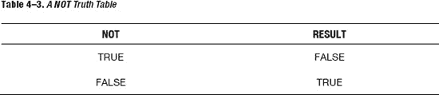

NOT 运算会*翻转比特位*或对原始操作数的布尔值取反。

表 4-4 展示了一个 XOR（或异或）真值表及其所有可能的操作数。

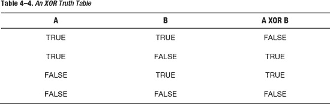

只有当其中一个操作数为 `TRUE` 时，运算符 XOR 才会产生 `TRUE` 结果。

表 4-5 展示了一个 NAND 真值表及其所有可能的操作数。

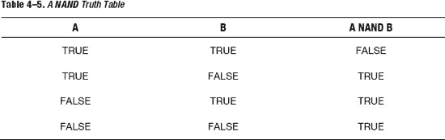

表 4-6 展示了一个 NOR 真值表及其所有可能的操作数。

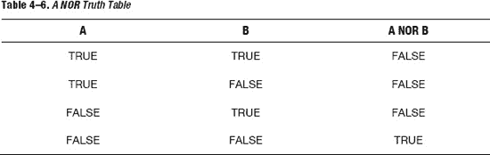

看待 NAND 和 NOR 运算符最简单的方法，就是分别对 AND 和 OR 真值表的结果取反。

### 比较运算符

在软件开发中，不同数据项的比较是通过**比较运算符**完成的。这些运算符产生逻辑上的 TRUE 或 FALSE 结果。表 4-7 列出了比较运算符。

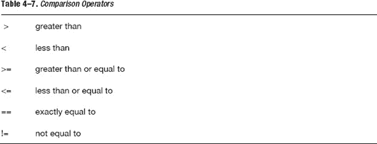

**注意：** 如果你老是忘记大于号和小于号的方向，可以用一个我小学时学到的窍门：如果把大于号和小于号想象成鳄鱼的嘴巴，鳄鱼总是会吃掉更大的那个值。听起来可能有点傻，但这招很管用。

## 设计应用程序

现在我们已经介绍了布尔逻辑和比较运算符，你可以开始设计你的应用程序了。有时，在不编写实际代码的情况下，向他人表达你的应用程序的全部或部分内容是很重要的。

写出代码有助于开发者在思考时理清思路，并与其他开发者就代码中值得关注的部分进行头脑风暴——这有助于在开始编码之前分析问题和可能的解决方案。


### 伪代码

**伪代码**是指编写一种对要解决的算法进行高层级描述的代码。伪代码不包含编程所需的语法格式，但它确实表达了解决当前问题所需的算法。

伪代码可以手写在纸上（或白板上），也可以在计算机上输入。

使用伪代码时，你可以运用关于布尔数据类型、真值表和比较运算符的知识。伪代码示例请参考列表 4–1。

**列表 4–1.** *在 If-Then-Else 代码中使用条件运算符的伪代码示例*

```
int x = 5;
int y = 6;
isComplete  =  TRUE;
if ( x < y)
{
//在此示例中，x 小于 6
    do stuff;
}
else
{
     do other stuff;
}

if  (isComplete == TRUE)
{
//在此示例中，isComplete 等于 TRUE
     do stuff;
}
else
{
     do other stuff;
}
//另一种检查 isComplete == TRUE 的方式
if (isComplete)
{
//在此示例中，isComplete 为 TRUE
     do stuff;
}
//两种检查值是否为 FALSE 的方式
if  (isComplete == FALSE)
{
     do stuff;
}
else
{
//在此示例中，isComplete 为 TRUE，因此将执行 else 块
}
//另一种检查 isComplete == FALSE 的方式
if (!isComplete)
{
     do stuff;
}
else
{
//在此示例中，isComplete 为 TRUE，因此将执行 else 块
}
```

请注意，`!` 会翻转其所应用的布尔值；因此，使用 `!` 会使 `TRUE` 值变成 `FALSE`，使 `FALSE` 值变成 `TRUE`。

通常，有必要组合使用你的比较测试。复合关系测试是一个或多个简单关系测试通过 `&&` 或 `||`（两个竖线字符）连接而成。

`&&` 和 `||` 分别读作逻辑与和逻辑或。列表 4–2 中的伪代码演示了逻辑与和逻辑或运算符。

**列表 4–2.** *使用 && 和 || 逻辑运算符*

```
int x = 5;
int y = 6;
isComplete  =  TRUE;
//使用逻辑与
if (x < y && isComplete == TRUE)
{
//在此示例中，x 小于 6 且 isComplete == TRUE
    do stuff;
}
if (x < y || isComplete == FALSE)
{
    //在此示例中，x 小于 6。
    //对于 OR 运算，只要有一个操作数为 TRUE，结果即为 TRUE。
//参见表 4–2 A OR 真值表
    do stuff;
}
//另一种测试 TRUE 的方式
if (x < y && isComplete)
{
//在此示例中，x 小于 6 且 isComplete == TRUE
    do stuff;
}
//另一种测试 FALSE 的方式
if (x < y && !isComplete)
{
    do stuff;
}
else
{
// isComplete == TRUE
     do stuff;
}
```

### 设计需求

如第 1 章所述，软件开发周期中最昂贵的环节是编写代码。软件开发周期中最便宜的环节是收集应用程序的需求；然而，这个环节却是软件开发中最容易被忽视和最少使用的环节。

设计需求通常始于询问客户、顾客和/或利益相关者，了解应用程序应该如何工作以及应该解决哪些问题。

就应用而言，需求可以包括长篇幅或短篇幅的叙述性描述、界面模拟图和公式。在编码开始之前，用文字处理器更改需求和界面模拟图，要比修改一款 iPhone/iPad/Mac 应用容易得多。以下是某 iPhone 手机银行应用一个视图的设计需求：

*   **视图：** 账户视图
*   **描述：** 显示用户拥有的账户列表。账户列表将分为以下几个部分：商业账户、个人账户及汽车贷款、个人退休账户和房屋净值贷款。
*   **单元格**: 每个单元格将包含账户名称、账户后四位数字、可用余额和当前余额。

一图胜千言。界面模拟图对开发者和用户都很有帮助，因为他们可以直观地看到视图完成后的样子。有许多工具可以快速设计模拟图；其中一种工具是 OmniGraffle。请参见图 4–1，了解一个由 OmniGraffle 生成、用于设计需求的界面模拟图示例。

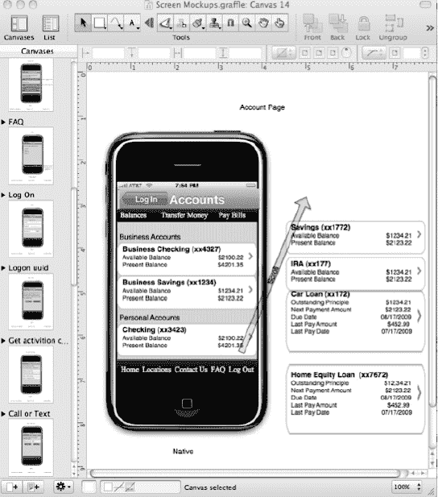

**图 4–1.** *使用 OmniGraffle 和 Ultimate iPhone Stencil Plug-in 制作的手机银行应用界面模拟图*

许多开发者认为设计需求耗时过长且不必要。图 4–1 中的“账户”屏幕呈现了大量信息。许多业务规则可以决定信息如何显示给用户，以及当出现问题时所有的错误处理方式。在设计应用时，在开发过程开始时与所有业务利益相关者合作，对于一次性成功至关重要。

图 4–2 是所有利益相关者都参与到应用开发中的一个示例。从一开始就让所有利益相关者参与每一个视图，将消除多次重写和应用错误。

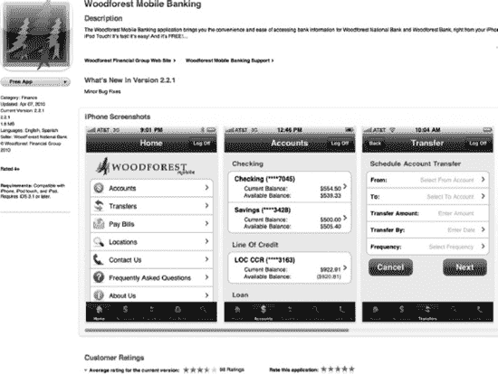

**图 4–2.** *Woodforest 手机银行应用在 iTunes Connect 应用商店中的显示效果；与 图 4–1 中的应用需求“账户”屏幕进行对比。*

此外，苹果公司建议开发者至少将 50% 的开发时间花在用户界面的设计和开发上。

Apress 的 iPhone 和 iPad Sketch Books 也是用于在纸上规划 iOS 应用外观和感觉的绝佳工具。参见图 4–3。

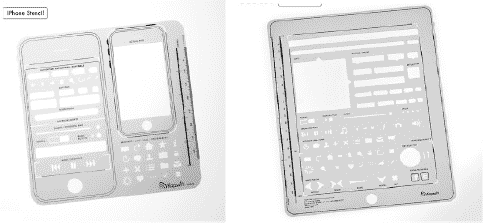

**图 4–3.** *Apress 的 iPhone Sketch Book 模板和 Apress 的 iPad Sketch Book 模板*

### 流程图制作

在设计需求最终确定后，你可以通过伪代码编写应用的各个部分，来解决复杂的开发问题。**流程图制作**是一种常用的算法图示方法。算法被表示为由线条和箭头连接的不同类型的框。开发者经常使用流程图来直观地表示代码。参见图 4–4。

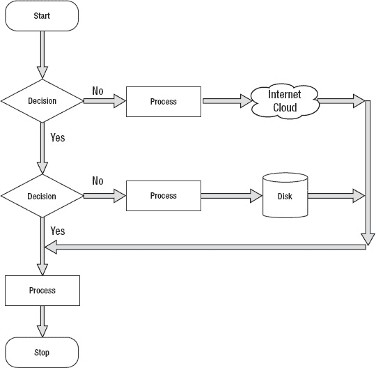

**图 4–4.** *示例流程图，展示了常用的图形及其对应的名称*

流程图应始终有开始和结束。分支绝不应在没有结束的情况下终止。这有助于开发者确保代码中的所有分支都已考虑周全，并能干净地结束执行。

### 设计并绘制示例应用的流程图

我们已经介绍了大量关于决策和程序流程的知识。现在该做程序员最擅长的事情了：编写应用！

你要编写的应用会生成一个 0 到 100 之间（包含 0 和 100）的随机数，并让用户猜测这个数字。用户需要一直猜，直到猜中为止。你可以使用 Alice 画廊中的任何对象来向用户询问猜测结果，你也可以为你对象所在的场景选择任意世界。该对象将为每次猜测过高、过低和猜中提供视觉提示。用户猜测的数字将显示在控制台上。当用户猜中正确答案时，系统会询问他/她是否想再玩一次。参见图 4–5。

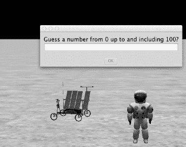

**图 4–5.** *一个宇航员对象正在要求用户猜测一个介于 0 和 100 之间的数字*


### 应用的设计

根据你的设计需求，你可以为应用绘制流程图。请参见图 4–6。

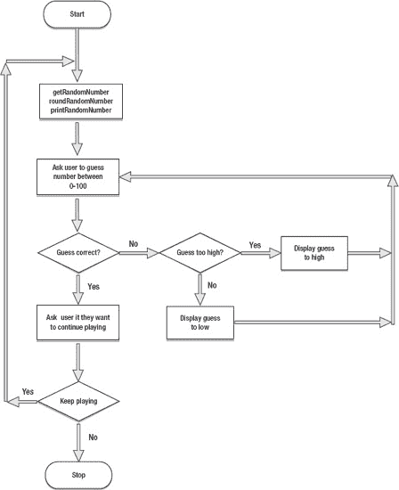

**图 4–6.** *猜随机数应用的流程图*

回顾图 4–6，你会发现当流程图中某个逻辑块接近结束时，会有箭头指回前面的部分，并重复该部分直到某个条件满足。这被称为**循环**。它让你能够重复执行部分程序逻辑，而无需反复重写这些代码段，直到条件满足为止。

## 使用循环重复执行程序语句

**循环**是一组只需指定一次、但可以连续重复多次的程序语句。循环可以重复指定的次数（计数控制），也可以重复直到某个条件（条件控制）发生为止。

在本节中，你将学习计数控制循环和条件控制循环。你还将学习如何使用布尔逻辑来控制循环。

### 计数控制循环

计数控制循环是指重复指定次数的循环。在 Objective-C 和 Alice 中，这就是**for 循环**。一个 `for` 循环有一个计数器变量，该变量使开发者能够指定循环将要执行的次数。请参见代码清单 4–3。

**代码清单 4–3.** *一个计数控制循环*

```
int i;
for (i = 0; i < 10; i++)
{
      //重复花括号内的所有代码 10 次
}
....继续执行
```

代码清单 4–3 中的循环将循环 10 次。变量 `i` 从零开始，并在 `}` 结束时增加 1。递增动作由 `for` 语句中的 `i++` 完成；`i++` 等同于 `i = i + 1`。然后 `i` 逐一增加到 10，并检查是否小于 10。当 `i = 9` 且到达 `}` 时，这个 `for` 循环将退出。

**注意：** 开发者常常会弄错他们认为循环重复的次数。如果在代码清单 4–3 中循环从 1 开始，那么循环将重复 9 次而不是 10 次。

在 Objective-C 中，`for` 循环的计数器变量可以在 `for` 循环声明本身中进行声明。请参见代码清单 4–4。

**代码清单 4–4.** *计数器变量在 for 循环声明中初始化*

```
for (int i = 0; i < 10; i++)
{
      //重复花括号内的所有代码 10 次
}
....继续执行
```

偶尔，你需要在 `for` 循环中只重复一行代码。这可以通过不使用任何 `{}` 来实现。`for` 循环声明之后遇到的第一行代码将按声明中指定的次数重复。请参见代码清单 4–5。

**代码清单 4–5.** *计数器变量在 for 循环声明中初始化*

```
for (int i = 0; i < 10; i++)
      将这行代码执行 10 次;
....继续执行
```

### 条件控制循环

Objective-C 和 Alice 能够重复循环直到某个条件发生变化。你可能需要重复一段代码，直到某个变量达到一个假条件。这种类型的循环称为**while 循环**。`while` 循环是一种控制流语句，它基于给定的布尔条件重复执行。可以将 `while` 循环视为一个重复执行的 `if` 语句。请参见代码清单 4–6。

**代码清单 4–6.** *一个 Objective-C while 循环重复执行*

```
BOOL isTrue = TRUE;
while (isTrue)
{
    //执行某些操作;
     isTrue = FALSE; // 某个条件发生，有时会将 isTrue 设置为 FALSE
};
....继续执行
```

代码清单 4–6 中的 `while` 循环首先检查变量 `isTrue` 是否为 `TRUE`——它确实是——因此进入 `{循环体}` 执行代码。最终，某个条件发生导致 `isTrue` 变为 `FALSE`。完成循环体中的所有代码后，再次检查条件（`isTrue`），然后循环再次重复。这个过程不断重复，直到变量 `isTrue` 被设置为 `FALSE`。

### 无限循环

无限循环会无休止地重复，这通常是因为循环没有终止条件，或者终止条件永远无法满足。

一般来说，无限循环会导致应用变得无响应。它们是代码或逻辑中某个错误（bug）的副作用结果。

**代码清单 4–7.** *一个无限循环的例子*

```
x = 0;
while (x  != 5)
{
    do something;
    x = x + 2;
};
....继续执行
```

代码清单 4–7 是一个由永远无法满足的终止条件导致的无限循环示例。变量 `x` 在每次迭代中都会在 `while` 循环中被检查，但永远不等于 5。变量 `x` 将始终是一个偶数，因为它被初始化为零，并在循环中每次增加 2。这将导致循环无休止地重复。请参见代码清单 4–8。

**代码清单 4–8.** *一个由永远无法满足的终止条件导致的无限循环示例*

```
while (TRUE)
{
    do something;
};
....继续执行
```

## 在 Alice 中编写示例应用

现在你已经完成了设计需求和流程图，并且理解了循环，就可以开始编写你的 Alice 应用了。请参见图 4–7。

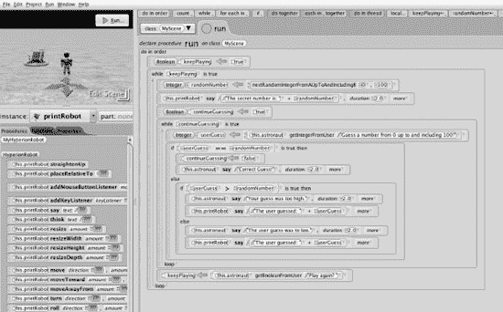

**图 4–7.** *随机数生成器应用*

无法在一张截图中列出这个 Alice 程序的全部源代码。不过，如果你用 HTML 打印出源代码，就可以看到所有代码。请参见图 4–8。

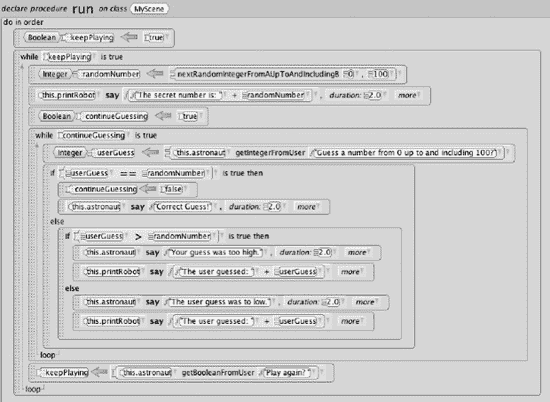

**图 4–8.** *随机数生成器；完整程序清单*

图 4–8 显示了随机数生成器代码的完整程序清单。

**注意：** 你可以在 `forum.xcelme.com` 下载完整的随机数生成器应用。代码位于第 4 章主题下。还有一个视频展示了如何在 Alice 中的 `While` 和 `If` 代码块内拖放所有图块。


### 使用 Objective-C 编写示例应用

根据你的需求以及在 Alice 应用中学到的知识，尝试用 Objective-C 编写一个随机数生成器。

你的 Objective-C 应用将在命令行中运行，它会要求用户猜一个随机数。

1.  打开 Xcode 并创建一个新项目。选择**命令行工具**。请参见图 4–9。

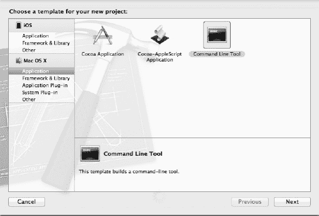

**图 4–9.** *新建一个命令行工具项目。*

2.  将项目命名为 `RandomNumber`（参见图 4–10）。选择**Foundation**，并确保勾选了**使用自动引用计数**。将项目**保存**到硬盘上你喜欢的任何位置。

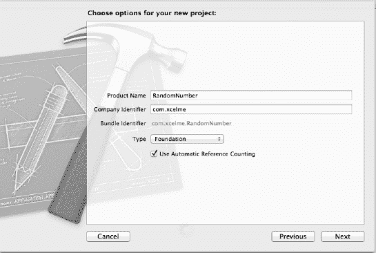

**图 4–10.** *RandomNumber 的项目选项*

现在，你需要打开“源文件”组中的实现文件。你将在这里编写 Objective-C 代码。

3.  打开 `main.m` 文件。删除下面这行代码：`NSLog(@"Hello, World!");`

4.  现在可以开始编写应用了。在 `// insert code here…` 下方开始编写代码。

参见图 4–11。

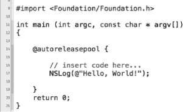

**图 4–11.** *编辑器已就绪，可以编写代码。*

根据你的 Alice 代码，你将编写随机数生成器应用。你会注意到，大部分代码与你的 Alice 应用非常相似。参见代码清单 4–9。

**代码清单 4–9.** *随机数生成器应用的源代码*

```
11 int main (int argc, const char * argv[])
12 {
13
14 @autoreleasepool {
15
16 // insert code here...
17 int randomNumber = 1;
18 int userGuess = 1;
19 BOOL continueGuessing = TRUE;
20 BOOL keepPlaying = TRUE;
21 char yesNo = ' ';
22
23 while (keepPlaying)
24 {
25      randomNumber = (arc4random() % 101);
26      NSLog(@"要猜的随机数是：%d",randomNumber);
27      while (continueGuessing)
28      {
29               NSLog (@"在 0 到 100 之间选一个数。");
30               scanf ("%i", &userGuess);
31               fgetc(stdin);//移除回车/换行符，即多余字符
32              if (userGuess == randomNumber)
33              {
34                      continueGuessing = FALSE;
35                      NSLog(@"猜对了！");
36              }
37              //嵌套 if 语句
38              else if (userGuess > randomNumber)
39              {
40                      //用户猜高了
41                      NSLog(@"你猜的数字太大了");
42              }
43              else
44              {
45                      //无需检查 userGuess < randomNumber，因为这是唯一的可能
46                      NSLog(@"你猜的数字太小了");
47              }
48              //从我们的 Alice 应用中重构而来。这样我们只需要编写一次代码。
49              NSLog(@"用户猜的数字是 %d",userGuess);
50      }
51      NSLog (@"再来一次？Y 或 N");
52
53      yesNo = fgetc(stdin);
54
55      if (yesNo == 'N' || yesNo == 'n')
56      {
57              keepPlaying = FALSE;
58      }
59      continueGuessing = TRUE;
60      }
61 }
62 return 0;
63 }
```

在代码清单 4–9 中，有一些我们之前没讨论过的新代码。第一行新代码（第 25 行）是：

```
randomNumber = (arc4random() % 101);
```

这行代码会生成一个 0 到 100 之间的随机数；`arc4random()` 是一个返回随机数的函数。虽然这不会生成真正的随机数，但对于这个示例来说已经足够了。

取模运算符是 `%`。该运算符返回两个操作数相除的余数；在本例中，它返回的是 `arc4random()` 除以 101 的余数。

下一行新代码是：

```
scanf ("%i", &userGuess);
```

函数 `scanf` 从键盘读取一个值，并将其存储在 `userGuess` 中。

**注意：** 这个 Objective-C 项目的源代码可以在 `forum.xcelme.com` 下载。此外，还有一个简短的视频解释该源代码和项目。

#### 嵌套 If 语句与 Else-If 语句

有时，需要**嵌套 if 语句**。这意味着需要在已有的 if 语句内部再嵌套 if 语句。此外，有时还需要在 if 语句的 else 部分中，第一步就进行比较。这被称为 **else-if 语句**（回顾代码清单 4–9 中的第 38 行）。

```
else if (userGuess > randomNumber)
```

#### 移除多余字符

第 31 行是另一行新代码。

```
fgetc(stdin); //移除回车/换行符，即多余字符
```

`scanf` 函数有时使用起来比较棘手。在本例中，`scanf` 会在输入缓冲区中留下一个残留字符，需要将其刷新，这样你才能从键盘读取 Y 或 N，以判断用户是否想再玩一次。

#### 通过重构改进代码

通常，在让代码运行起来后，你会检查代码并寻找更高效的编写方式。重写代码以使其更高效、更易于维护和阅读的过程被称为**代码重构**。

在审查你的 Objective-C 代码时，你注意到可以删除一些不必要的代码。你的代码在 if-else 语句中重复了下面这行：

```
//从我们的 Alice 应用中重构而来。这样我们只需要编写一次代码。
NSLog(@"用户猜的数字是 %d",userGuess);
```

**注意：** 作为开发者，我们发现你能写出的最好的一行代码就是你没有写的那一行——代码越少意味着需要调试和维护的内容就越少。

#### 运行应用

按下 Objective-C 项目中的“播放”按钮，运行你的应用。参见图 4–12。

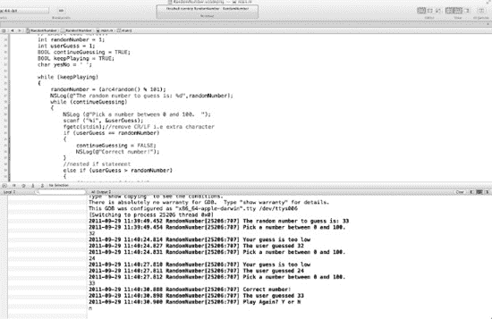

**图 4–12.** *Objective-C 随机数生成器应用的控制器输出*

**注意：** 如果运行应用时没有看到输出控制器，请确保你在编辑器的右上角和右下角选中了（灰色高亮）相同的选项（参见图 4–12）。

### 告别 Alice，继续前进

你利用 Alice 学习了面向对象编程。它让你无需处理语法和编译器就能专注于 OOP 概念；然而，有必要更熟悉 Objective-C 语言的具体细节。Alice 已经很好地完成了它的使命，现在你可以将本书剩余部分的重点放在使用 Objective-C 和 Xcode 上。

### 本章小结

在本章中，你学习了大量关于如何控制应用程序的重要信息；程序流程和决策制定对于每一个 iPhone/iPad/Mac 应用都至关重要。请确保你完成了本章中的 Objective-C 示例。你可能会浏览这些示例并认为无需编写这个应用就能理解所有内容。这将是一个致命错误，会阻碍你成为一名成功的 iPhone/iPad/Mac 开发者。你必须花时间编写这个示例代码。

本章中的术语非常重要。你应该能够描述以下内容：

*   与（AND）
*   或（OR）
*   异或（XOR）
*   与非（NAND）
*   或非（NOR）
*   非（NOT）
*   真值表
*   取反
*   所有比较运算符
*   应用需求
*   逻辑与（`&&`）
*   逻辑或（`||`）
*   流程图
*   循环
*   受控循环
*   For 循环
*   条件控制循环
*   无限循环
*   While 循环
*   嵌套 if 语句
*   代码重构

### 练习

*   扩展随机数生成器应用，使其在控制台中打印出用户猜中正确随机数之前尝试了多少次。分别在 Alice 和 Objective-C 中完成此操作。
*   扩展随机数生成器应用，使其在控制台中打印出用户玩该应用的次数。当用户退出应用时打印此值。分别在 Alice 和 Objective-C 中完成此操作。

## 第 5 章


