# 使用 Objective-C 进行面向对象编程

在过去的 15 年间，编程界一直聚焦于面向对象编程（OOP）这一开发范式。大多数现代开发环境和语言都实现了 OOP。简而言之，OOP 构成了你今天开发一切应用的基础。

你可能会问：既然 OOP 是当今主要的开发模式，为什么我们直到第 5 章才用 Objective-C 来介绍它？答案很简单：对于新开发者来说，这并非一个容易理解的概念。本章中，我们将详细探讨 OOP 的不同方面，以及它们将如何影响你的开发工作。

在应用程序中正确实施 OOP 需要一些前期规划，但这将在项目的整个生命周期为你节省大量时间。OOP 已经改变了开发的方式。在本章中，我们将了解 OOP 究竟是什么。本书第一章已经初步讨论过 OOP，但这里我们将深入细节。我们将重新审视对象是什么，以及它们如何与我们现实世界中的物理对象相关联。我们还会探讨类是什么，以及它们与对象之间的关系。此外，我们将讨论规划类时需要采取的步骤，以及一些可用于实现此目标的视觉工具。读完本章并完成练习后，你将更深入地理解 OOP 是什么，以及它为何对你作为开发者不可或缺。

起初，对象和面向对象编程可能难以理解，但希望随着本章内容的推进，这些概念会逐渐变得清晰易懂。

## 对象

正如第 1 章所讨论的，OOP 基于对象。关于对象的讨论，部分内容将是回顾，但我们也会深入展开。对象是任何可以被作用于的事物。为了更好地解释编程中的对象是什么，我们先看看周围物理世界中的一些事物。物理对象可以是周围任何你能触摸或感知的东西。以电视机为例，它的一些特征包括类型（等离子、液晶或显像管）、尺寸（40 英寸）、品牌（索尼、Vizio）、重量和价格。电视机还具有功能：可以打开或关闭，可以换台、调节音量和调整亮度。

其中一些特征和功能是电视机独有的，而另一些则不是。例如，你家里的沙发可能就不具备与电视机相同的特征。你可能会关注沙发的不同信息，比如材质类型、座位容量和颜色。沙发可能只有少数功能，例如展开成床。

现在我们来专门讨论编程领域中的对象。对象是一个具体的条目。它可以描述物理存在的东西（如一本书），也可以是应用程序中的窗口之类的事物。对象拥有属性和方法。属性描述对象的某些特征，如位置、颜色或名称；而方法则描述对象能够执行的操作，如关闭或重新计算。在我们的例子中，一个`TV`对象会拥有`type`（类型）、`size`（尺寸）和`brand`（品牌）属性，而一个`Couch`对象则会有颜色、材质和舒适度等属性。从编程角度讲，属性是对象中的变量。例如，电视机可以用字符串变量存储品牌，用整数存储高度。

对象还拥有程序员能用来控制它们的命令，这些命令称为方法。方法是其他对象与某个对象交互的方式。例如，对于电视机而言，遥控器上的每个按钮都是一个方法，代表着你可以与电视机交互的方式。方法可以（并且经常）被用来改变属性的值，但方法本身不存储任何值。

正如我们在第 1 章中所述，对象具有状态，这本质上是对象在任意给定时间点的一个快照。状态就是在特定时刻所有属性值的集合。

在前几章中，我们举过书店的例子。书店包含许多不同的对象。其中有图书对象，它们拥有书名、作者、页码和出版商等属性。还有杂志对象，它们拥有标题、期号、类别和出版商等属性。书店还有一些非实物对象，比如一次销售。一个`sale`（销售）对象会包含所购图书、客户信息、支付金额和支付方式等信息。一个`sale`对象可能还拥有一些方法，用于计算税额、打印收据或作废交易。`sale`对象不代表任何实物，但它仍然是一个对象，并且是构建高效书店所必需的。

由于对象是 OOP 的基础，理解对象及其交互方式至关重要。本章剩余部分将详细描述对象及其一些特性。

## 什么是类？

讨论 OOP 就不可能不讨论类。类定义了一个对象将拥有哪些属性和方法。类基本上就像一个饼干模具，可以用来创建具有相似特征的对象。某个特定类的所有对象都将拥有相同的属性和方法。不同对象的属性值则会发生变化。

类类似于动物世界中的物种。物种不是某一个特定的动物，但它描述了该动物许多共同的特征。为了更深入地理解类，让我们看一个自然界中类的例子。`Dog`（狗）类具有所有狗共有的许多属性。例如，狗可能拥有名字、年龄、主人和最喜欢的活动。属于某个类的对象被称为该类的实例。如果查看图 5–1，你可以看到类与作为该类实例的实际对象之间的区别。例如，`Lassie`（莱西）就是`dog`类的一个实例。在下图中，你可以看到我们有一个`Dog`类，它包含四个属性（`品种`、`年龄`、`主人`、`最喜欢的活动`）。在现实生活中，一条狗会拥有更多属性，但我们决定在这个演示中只使用四个。

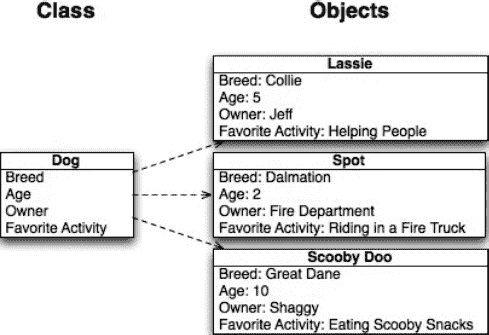

**图 5–1.** *类与单个对象的示例*

## 规划类

规划类是开发过程中最重要的步骤之一。虽然事后回过头来添加属性和方法是可能的（而且你肯定需要这样做），但了解哪些类将在你的应用中使用，以及它们将拥有哪些基本属性和方法，这一点至关重要。在过程初期花费时间规划好各类，是非常重要的。


### 规划属性

让我们来看一下书店的示例以及我们需要创建的一些类。首先，创建一个`Bookstore`类非常重要。`Bookstore`类包含了每个`Bookstore`对象所存储信息的蓝图，例如书店名称、地址、电话号码和徽标（参见图 5–2）。将这些信息放在类中，而不是硬编码到应用程序里，将来可以轻松地对这些信息进行修改。我们将在本章后面讨论使用面向对象编程（OOP）方法论的原因。此外，如果你的书店大获成功并决定再开一家分店，你也能有备无患，因为你可以创建`Bookstore`类的另一个对象。

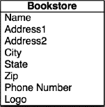

**图 5–2.** *书店类*

接下来，我们再规划一个`Customer`类（参见图 5–3）。注意名称是如何拆分为`First` `Name`和`Last` `Name`的。这样做非常重要。在项目中，有时你可能只需要使用客户的姓氏，如果没有提前规划，将名字和姓氏分开会非常困难。假设你想给一位客户寄一封信，告知他们即将举行的促销活动。你肯定不希望问候语写成"尊敬的张三"。如果写成"尊敬的张三"，会显得更加个性化。

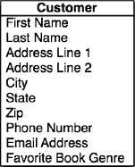

**图 5–3.** *客户类*

你还会注意到，我们将地址拆分成了不同的部分，而不是全部堆在一起。我们将`地址行 1`、`地址行 2`、`城市`、`州`和`邮政编码`分开了。这非常重要，并且会在应用程序中用到。让我们回到刚才想给客户发送店内促销通知信的场景。你可能不想给所有住在其他州的客户都发送这封信。通过拆分地址，你可以轻松过滤掉那些不希望包含在邮寄名单中的客户。

我们还在`Customer`类中添加了`喜爱的图书类型`属性。添加这个属性是为了向你展示如何在每个类中保存多种不同类型的信息。如果你有新的悬疑小说即将出版，并且想发送电子邮件提醒对悬疑小说特别感兴趣的客户，这个字段就会派上用场。通过存储这类信息，你将能够精准地针对客户群体中的不同部分进行推广。

为了创建我们的书店，还需要一个`Book`类（参见图 5–3）。我们将存储关于图书的信息，例如作者、出版商、类型、页数和版次（以防有多个版本）。`Book`类还将包含图书的价格。

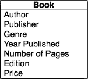

**图 5–4.** *图书类*

我们还添加了一个名为`Sale`的类（参见图 5–5）。这个类比我们讨论过的其他类更抽象，因为它描述的不是有形的物体。你会注意到我们在`Sale`类中添加了对客户和图书的引用。因为`Sale`类将跟踪图书的销售情况，所以我们需要知道哪本书被卖给了哪位客户。

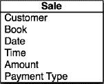

**图 5–5.** *销售类*

现在我们已经规划好了类的属性，接下来需要研究每个类将具有的一些方法。

## 规划方法

我们现在不会添加所有的方法，但你在一开始规划得越多，以后就越容易。并非所有类都会有很多方法，有些类可能根本没有任何方法。

**注意：** 在规划方法时，请记住让它们专注于一个特定的任务。方法越具体，它被重用的可能性就越大。

目前，我们不会向`Book`类或`Bookstore`类添加任何方法。我们将重点关注另外两个类。

对于`Customer`类，我们将添加列出该客户购买历史记录的方法。将来你可能需要添加其他方法，但目前我们只添加这一个。你完成的`Customer`类图应该类似于图 5–6。你会注意到靠近底部的线条将属性与方法分开了。

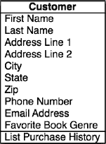

**图 5–6.** *完成的客户类*

对于`Sales`类，我们添加了三个方法。我们添加了`Charge` `Credit` `Card`、`Print` `Invoice`和`Checkout`（参见图 5–7）。目前，你不需要知道如何实现这些方法，但你需要知道你正计划将它们添加到类中。

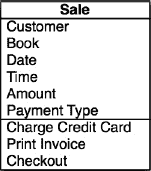

**图 5–7.** *完成的销售类*

现在你已经完成了对类以及将添加到类中的方法的规划，你就有了统一建模语言（UML）图的雏形。基本上，这是一种开发人员用来规划类、属性和方法的图表。通过创建这样的图表来启动你的开发过程，从长远来看将对你大有裨益。对 UML 图的深入讨论超出了本书的范围。如果你想了解更多关于这个主题的信息，smartdraw.com 网站上有非常深入的概述。

`http://www.smartdraw.com/resources/tutorials/uml-diagrams/`

图 5–8 显示了完整的图。

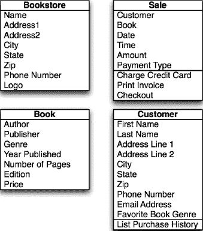

**图 5–8.** *书店的完整 UML 图*


### 实现类

既然我们已经了解了将要创建的对象，接下来就需要创建第一个对象。为此，我们将从一个新项目开始。

1.  请启动 Xcode。点击 **文件**  **新建**  **新建项目**。
2.  在左侧选择 `iOS`。在右侧选择 **Master-Detail Application**。就本章内容而言，我们可以选择任何应用程序类型（参见 图 5–9）。点击“下一步”。

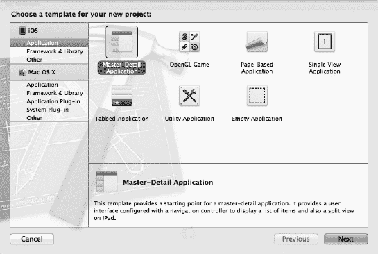

**图 5–9.** *创建新项目*

3.  你需要输入公司名称。保留此屏幕上的复选框为默认状态。我们现在无需担心这些选项。选择一个位置保存项目，然后保存项目。你可以使用名称 `bookstore` 或任何你喜欢的项目名。
4.  选择屏幕左侧的 **BookStore** 文件夹（参见 图 5–10）。这是你大部分代码的存放位置。
5.  选择 **文件**  **新建**  **新建文件**。

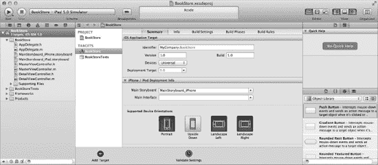

**图 5–10.** *选择 bookStore 文件夹*

6.  在弹出的窗口中，在 iOS 标题下选择 **Cocoa Touch**，然后在右侧点击 **Objective-C class**（参见 图 5–11）。然后点击 **下一步**。

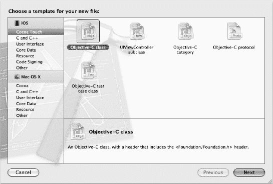

**图 5–11.** *创建新的 Objective-C 类*

7.  在下一个屏幕上，你需要选择对象的超类。这决定了你的对象默认将具有哪些属性和方法。我们现在选择 `NSObject`（参见 图 5–12）。点击 **下一步**。

**注意：** `NSObject` 是 Objective-C 中的基类。它包含了大多数对象所需的属性和方法。

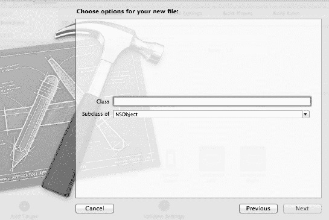

**图 5–12.** *选择超类*

8.  现在你将有机会命名你的类。在本练习中，我们将创建 `Customer` 类。现在，将类命名为 `Customer`。然后点击 **保存**。

**注意：** 为便于使用和理解代码，请记住，在 Objective-C 中，类名应始终以大写字母开头。对象名应始终以小写字母开头。例如，`Book` 是类的合适名称，而 `book` 则是基于 `Book` 类的对象的绝佳名称。对于由两个单词组成的对象，例如图书作者，合适的名称是 `bookAuthor`。这种大小写格式被称为小驼峰式。

9.  现在查看你的主项目文件夹；你应该看到两个新文件。一个名为 `Customer.h`，另一个名为 `Customer.m`。`.h` 文件是头文件，包含有关你类的信息。头文件将列出类中的所有属性和方法，但不会实际包含与它们相关的代码。`.m` 文件是实现文件，是你编写方法代码的地方。
10. 双击 `Customer.h` 文件，你将看到 图 5–12 所示的窗口。你会注意到它当前包含的信息不多。第一部分带有双斜线（`//`）的是注释，不视为代码的一部分。注释允许你告诉阅读你代码的人每部分代码的用途。关于头文件的其他部分，我们现在不详细讨论，只需知道类的所有属性都需要放在 `@interface` 部分的大括号（`{}`）内即可。

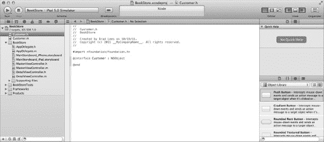

**图 5–13.** *空的客户类*

现在让我们将属性从 UML 图迁移到实际的类中。

**提示：** 属性应始终以小写字母开头。属性名称中不能包含空格。

对于第一个属性“First Name”，我们将下面这行代码添加到文件中。

```
NSString* firstName;
```

这会在我们的类中创建一个名为 `firstName` 的字符串对象。由于 `Customer` 类的所有属性也都是字符串，我们只需要对其他属性重复相同的过程即可。完成后，你的 `@interface` 部分应该如 图 5–13 所示。

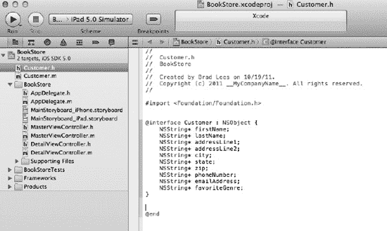

**图 5–14.** *带有属性的客户类接口*

`@interface` 部分完成后，我们需要添加方法。方法需要放在 `@interface` 部分之外，但仍需位于头文件的 `@interface` 部分之内。我们将添加一个返回 `NSArray` 的新方法。代码如下所示：

```
-(NSArray *) listPurchaseHistory;
```

**注意：** `NSString` 是一个用于存储字符串并对其执行操作的类。字符串是一组字符。`NSString` 可以包含字母、数字和标点符号。

这就是在头文件中创建类所需做的全部工作。图 5–15 显示了最终的头文件。在下一章中，我们将更详细地介绍实现文件。

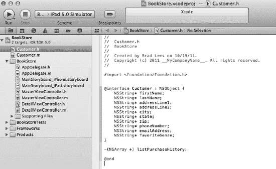

**图 5–15.** *完成的客户类头文件*

## 继承

OOP 的另一个主要特性是继承。编程中的继承类似于遗传继承。你可能从你母亲那里继承了眼睛的颜色，或者从你父亲那里继承了头发的颜色，反之亦然。类可以以类似的方式从其父类继承属性和方法。在 OOP 中，父类被称为超类，子类被称为子类。

在 Objective-C 中，程序员创建的所有类都有一个类似于父类的超类。该类将继承该父类的特征。因此，就像在所有其他 OOP 语言中一样，该类被称为父类的子类。在本章中，我们所有的类都是 `NSObject` 的子类。在 Objective-C 中，大多数情况下，你的类都将是 `NSObject` 的子类。在我们之前的例子中，`Customer` 类是 `NSObject` 的子类。

例如，我们可以创建一个印刷品基类，并使用子类来表示书籍、杂志和报纸。印刷品可能有许多共同点，因此我们可以将变量分配给印刷品超类，而不必为每个单独的类重复分配它们。通过这样做，我们可以进一步减少需要编写和调试的冗余代码量。

在 图 5–16 中，你将看到 `Printed Material` 超类的属性布局，以及它如何影响 `Book`、`Magazine` 和 `Newspaper` 子类。`Printed Material` 类的属性将被子类继承，因此无需在子类中显式定义它们。你会注意到 `Book` 类现在拥有的属性明显减少了。通过使用超类，你将显著减少程序中冗余代码的数量。

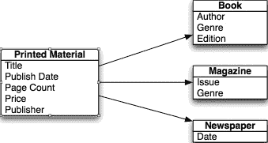

**图 5–16.** *超类和子类的属性*

## 为什么要使用 OOP？

在本章中，我们讨论了什么是 OOP，甚至讨论了如何创建类和对象。然而，我认为讨论为什么要在开发中使用 OOP 原则非常重要。

如果你查看当今流行的编程语言，它们都在一定程度上使用了 OOP 原则。Objective-C、C++、Visual Basic、C# 和 Java 都要求程序员理解类和对象才能成功使用这些语言进行开发。为了成为当今世界的开发者，你需要理解 OOP。但是为什么要使用它呢？


### 随处可见

如今，几乎你选择从事的任何开发工作都需要你理解面向对象的原则。在 Mac OS X 和 iOS 中，你与之交互的每个元素都是一个对象。例如，简单的窗口、按钮和文本框都是对象，并拥有属性和方法。如果你想成为一名成功的程序员，就需要理解 OOP。

### 消除冗余代码

通过使用对象，你可以减少需要重复输入的代码量。如果你编写了一段代码用于在顾客结账时打印收据，那么当你需要重新打印收据时，你也希望同样的代码可用。如果你将打印收据的代码放在`Sales`类中，就无需再次重写这段代码。这不仅节省了时间，通常还能帮助你消除错误。如果你不使用 OOP，并且发票发生了变化（即使是像图形更改这样简单的事情），你就必须确保在桌面应用和移动应用中都进行了修改。如果你漏掉了其中一个，就存在两个界面行为不一致的风险。

### 易于调试

通过将与书籍相关的所有代码都放在一个类中，当书籍出现问题时，你就知道该去哪里查找。对于一个小型应用来说，这听起来可能没什么大不了的，但当你的应用达到数十万甚至数百万行代码时，这将为你节省大量时间。

### 易于替换

如果你将所有代码都放在一个类中，那么随着应用中的变化，你可以替换掉这些类，并赋予新类完全不同的功能。然而，它能够以与当前类相同的方式与应用的其他部分进行交互。这类似于汽车零件。如果你想更换汽车上的消音器，你不需要买一辆新车。如果你与发票相关的代码分散在各处，那就使得修改类的元素变得更加困难。

## 高级主题

我们在本章中讨论了 OOP 的基础知识，但还有一些其他主题对你的理解非常重要。

### 接口

正如我们在本章中讨论的，其他对象通过彼此交互的方式是使用方法。我们讨论了创建类时生成的头文件。这通常被称为接口，因为它告知其他对象它们如何与你的对象进行交互。在你的应用中实现一个标准接口，将使你的代码能够以相似的方式与不同的对象进行交互。这将显著减少你需要编写的特定于对象的代码量。

### 多态性

多态性是指一个类的对象能够以另一个类的对象的样子出现并被使用的能力。这通常通过创建与另一个类相似的方法和属性来实现。我们一直在使用的一个多态性的好例子是书店。在书店中，我们有三个相似的类：`Book`、`Magazine` 和 `Newspaper`。如果我们想对我们的整个库存进行一次大甩卖，我们可以遍历所有书籍并给它们降价。然后遍历所有杂志并给它们降价，接着再遍历所有报纸并给它们降价。这样会比我们实际需要做的工作多出很多。更好的做法是确保所有类都有一个降价方法。然后我们可以对所有对象调用该方法，而无需知道它们属于哪个类，只要它们是包含所需方法的类的子类即可。这将节省大量的时间和编码工作。

在规划你的类时，寻找可能适用于不止一种类别的相似之处和方法。从长远来看，这将为你节省时间并加速你的应用开发。

### 总结

我们终于到达了本章的末尾！以下是所涵盖内容的总结。

*   面向对象编程（OOP）
    *   我们讨论了 OOP 的重要性以及所有现代代码都应使用该方法的原因。
*   对象
    *   你了解了对象以及它们如何对应现实世界中的对象。我们了解到许多编程对象直接与现实世界中的对象相关。你还了解了不对应现实世界对象的抽象对象。
*   类
    *   你了解到类决定了每个对象将拥有的数据类型（属性）和方法。每个对象都需要有一个类。它是对象的蓝图。
*   创建类
    *   你学习了如何规划我们类的属性和方法。
    *   我们使用 Xcode 创建了一个类文件。
    *   我们编辑了类头文件以添加我们的属性和方法。

### 练习

*   尝试为其余我们规划过的类创建类文件。
*   规划一个`Author`类。选择你需要存储的关于作者的信息种类。

对于大胆和进阶的读者：

*   尝试创建一个名为`PrintedMaterials`的超类。规划该类可能拥有的属性。
*   为商店可能销售的其它类型的印刷材料创建类。

## 第 6 章

## 学习 Objective-C 和 Xcode

在很大程度上，所有计算机语言都执行任何计算机都需要执行的典型任务——存储信息、比较信息、对这些信息做出决策，并根据这些决策执行某些操作。Objective-C 是一种让这些任务更易于理解和完成的语言。Objective-C（实际上，任何 C 语言）的真正技巧在于理解用于完成这些任务的符号和关键字。本章将继续探讨 Objective-C 和 Xcode，以便你能够更加熟悉它们。


### Objective-C 简史

Objective-C 实际上是两种语言的结合体：C 语言和一种鲜为人知的名为 Smalltalk 的语言。早在 20 世纪 70 年代，贝尔实验室的几位才华横溢的工程师创造了一种名为 C 的语言，这种语言使得他们心爱的项目——Unix 操作系统——能够轻松地从一台机器移植到另一台机器上。在 C 语言出现之前，人们必须用汇编语言编写程序。汇编语言的问题在于每种语言都特定于其机器，因此将软件从一台机器迁移到另一台机器几乎是不可能的。由布莱恩·克尼汉和丹尼斯·里奇创建的 C 语言解决这个问题的方式，是提供一种能够为其所支持的任意机器生成相应汇编代码的语言，它堪称早期计算机语言的罗塞塔石碑。由于其可移植性，C 语言迅速成为许多类型计算机（尤其是早期个人电脑）的事实标准语言。

快进到 20 世纪 80 年代初，C 语言正逐步成为那个年代最流行的语言之一。大约在这个时候，一家名为 Stepstone 公司的工程师将 C 语言与另一种新兴语言 Smalltalk 结合了起来。C 语言通常被称为过程式语言，即一种使用过程来划分处理步骤的语言。而另一方面，Smalltalk 则完全不同，它是一种面向对象的编程语言。它不使用过程式处理，而是通过编程对象来完成其任务。这种 C 语言的新超集后来被称为“带对象的 C”，或者更常见的名字——Objective-C。

1985 年，布拉德·考克斯将 Objective-C 语言及其商标卖给了 NeXT 计算机公司。NeXT 是史蒂夫·乔布斯的创意产物，而乔布斯在同一年刚刚被他自己的公司——苹果电脑公司——解雇。NeXT 使用 Objective-C 语言构建了 NeXTSTEP 操作系统及其一套开发工具。事实上，Objective-C 语言赋予了 NeXT 在其所有软件上的竞争优势。使用 NeXTSTEP 和 Objective-C 的程序员编写程序的速度比那些使用传统 C 语言的程序员要快得多。尽管 NeXT 计算机的硬件部分从未真正成功，但其操作系统和工具却大获成功。颇具趣味的是，NeXT 于 1996 年底被苹果电脑公司收购，目的是取代其老化的操作系统——该系统自 1984 年第一台 Macintosh 开发以来就一直存在。收购四年后，曾经的 NeXTSTEP 以 Mac OS X 的形式重新登场，而 Objective-C 仍然是该系统的核心。

### 理解语言符号

尽管 Objective-C 集成了大量的面向对象语言特性，但其核心仍然是 C 语言。以下是 Objective-C 中使用的一些符号和语言结构，其中一些是 C 语言的一部分，而大部分我们已经以某种方式接触过了。知道哪些是纯粹的 C 语言成分并不重要；只需知道新旧符号/结构共同构成了 Objective-C 语言即可。

- `{` 这是左花括号，用于开始一个通常被称为代码块的区域。代码块用于定义并包围一段代码，同时设定其作用域。
- `}` 这是右花括号，用于结束一个代码块。凡是有开始（`{`）的地方，就必定有一个对应的结束（`}`）。
- `- (void)methodName` 这是 Objective-C 中方法定义的格式。当然，`methodName` 这个词可以代表任何名称。`(void)` 这个词也是可以变化的，它表示该方法返回的信息类型。在这个例子中，`(void)` 表示该方法没有关联的数据类型（数据类型在第 3 章中介绍过，并将在后续章节中更深入地探讨）。`(void)` 可以被替换成类似 `(NSString*)` 这样的形式，这将在后面进一步讨论。
- `*` 星号（被称为“star”或“splat”）用于表示指针（参见第 13 章）。目前真正需要了解的是，当你看到类似 `NSString*` 这样的内容时，把它当作名称的一部分。`NSString` 和 `NSString*` 是完全不同的。
- `;` 分号用于结束一行代码。关于分号需要记住的一点是，它们不会用在控制程序流程的语句末尾，例如 `if`, `for`, `while` 等。你最终会理解它们该去何处以及不该去何处的规则。
- `[ ]` 这些被称为方括号，用于向 Objective-C 对象发送消息。第 7 章会更详细地讨论这个主题。
- `@` 虽然许多人会将此符号与电子邮件地址联系起来，但 at 符号在 Objective-C 中用于标识一个 Objective-C 指令。指令是一种特殊的 Objective-C 命令，例如 `@interface`，`@implementation` 或 `@property`。
- `#` 井号（如果你喜欢冷知识，也可以叫 octathorpe）与 `@` 符号类似，用于标识 C 语言指令，例如 `#import` 或 `#define`。虽然它最初是 C 语言的一部分，但 `#` 的使用在几乎所有的 Objective-C 程序中仍然可见。

那么，让我们来看一个 Objective-C 代码的例子：

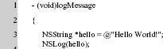

第 1 行表示一个 Objective-C 方法。`(void)` 表示此方法未与数据类型关联，如果被调用，不会向调用者返回值。

第 2 行和第 5 行是定义代码块的花括号。这个代码块定义了该方法。每个方法至少有一个代码块。

第 3 行定义了一个 `NSString*` 对象，并将其值赋为 `@"Hello World"`。请记住，at 符号（`@`）是一个 Objective-C 指令，是定义常量字符串对象的一种快捷方式（回想一下，我们第一次看到字符串是在第 3 章）。

第 4 行调用了 `NSLog` 方法；它不是一个对象，所以我们不能向它发送消息。相反，我们将要打印的 `hello` `NSString*` 对象传递给该方法。

虽然对于刚开始学习 Objective-C 的人来说，这看起来有点难以理解，但这种简单而简洁的语法并不需要花费太多时间去学习。


### 将“Objective”注入 Objective-C

Objective-C 之所以能成为面向对象的语言，很大程度上源于其对 Smalltalk 的借鉴。Smalltalk 是一种百分之百的面向对象语言，而 Objective-C 大量借用了 Smalltalk 的概念和语法。以下是从 Smalltalk 借鉴的几个高层概念。如果其中某些术语听起来陌生，不必担心；它们将在后续章节中讨论（第 7 章 和 第 8 章 介绍了基础知识）。

- 几乎所有事物都是**对象**。
- 对象会接收**消息**。在此语境下，对象有时也被称为**接收者**，因为它正在接收消息。
- 对象包含**实例**变量。
- 对象和实例变量具有定义的**作用域**。
- 类隐藏了对象的**实现**。

**注意：** 正如我们在第 5 章中看到的，术语**类**通常用于表示对象的定义或类型。**对象**是由类创建出来的。例如，SUV 是一种*车型*。类就像是某种蓝图。工厂生产 SUV，产出的就是人们驾驶的 SUV 对象。你无法驾驶一个*类*，但可以驾驶从类构建出的*对象*。

那么，这些概念是如何转换到 Objective-C 中的呢？首先，Objective-C 中的对象通过两个不同的部分来定义：`@interface` 和 `@implementation`。`@interface` 部分定义了对象可以响应哪些消息以及对象将使用的实例变量。`@implementation` 部分包含了 `@interface` 部分中各种消息的实际代码。

为什么接口和实现要分开呢？因为在一个程序中，Objective-C 对象只被定义一次。然而，它可能在程序的许多不同地方被使用。在使用对象的地方，程序只需读入或**导入**接口即可；如果该对象的代码每次使用时都需要复制，那将是低效的。

**注意：** 通常的惯例是，将对象的接口存储在 `.h` 文件中，实现存储在 `.m` 文件中。两个文件都以对象命名。因此，如果要定义一个 `Library` 对象，其接口将位于 `Library.h` 中，实现位于 `Library.m` 中（请记住，名称是区分大小写的）。

接下来，我们看一个简单的例子，这是一个名为 `HelloWorld` 的 Objective-C 对象的完整定义。下面是接口文件（`HelloWorld.h`）。

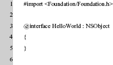

这是实现文件（`HelloWorld.m`）：

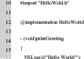

在上面的例子中，定义了一个名为 `HelloWorld` 的对象。这个对象只定义了一个消息——`printGreeting`。所有这些奇怪的符号是什么意思呢？我们以行号为参考，逐行分析这段代码。

第 1 行包含一个编译器指令：`#import <Foundation/Foundation.h>`。为了让这个小程序能够识别某些其他对象（例如第 3 行的 `NSObject`），我们需要让编译器读取其他接口文件。在这里，`Foundation.h` 文件定义了 **Foundation 框架**中的对象和接口。该框架包含了 iOS 和 Mac OS X 系统中大多数非用户界面的基类定义。这里重要的是，我们有 `NSObject` 对象的定义。我们对象的实际起始位置在第 3 行，如下所示。

`@interface HelloWorld : NSObject`

`HelloWorld` 是对象，但 `: NSObject` 是什么意思呢？对象名后的冒号（`:`）表示我们计划从另一个类派生出额外的功能。在这个例子中，`NSObject` 就是那个类。`HelloWorld` 现在是 `NSObject` 的一个*子类*。

**注意：** 为什么叫 `NSObject` 而不是 `Object`？你还记得 Mac OS X 实际上是从 NeXTSTEP 系统移植而来的吗？“NS”是 NeXTSTEP 的缩写，并用于 Mac OS X 和 iOS 的许多基础对象中——例如 `NSObject`、`NSString`、`NSDictionary` 等。

第 4 行和第 5 行仅包含 `{` 和 `}` 字符。这个代码块用于定义对象使用的实例变量，但 `HelloWorld` 类足够简单，不需要实例变量。稍后，在第 9 章中，会有定义和使用实例变量的例子。

第 7 行包含该对象的一个消息定义，如下所示：

`- (void)printGreeting;`

在定义消息时，该行必须以 `+` 或 `-` 字符开头。对于 `HelloWorld` 对象，我们使用 `-` 来表示该消息可以在对象创建*之后*使用。`+` 字符用于可以在对象创建*之前*使用的消息。消息的其余部分 `(void) printGreeting` 代表消息的返回值。这里，`(void)` 值后面跟着实际的消息名 `printGreeting`。

在第 9 行，`@end` 表示对象接口的定义完成。

以上就是 `HelloWorld` 对象接口的完整描述；内容并不多。更复杂的对象只是拥有更多的消息和更多的实例变量。

对于实现部分，源代码存储在不同的文件 `HelloWord.m` 中。开头部分，第 10 行以语句 `#import "HelloWorld.h"` 开始。这只是为了让我们的对象知道自己的接口。虽然将接口文件和实现文件分开起初看起来有些奇怪，但这种惯例在 Objective-C 编程中非常一致。每当要使用一个对象时，只需包含其接口即可。另外，导入时使用了引号括起来的 `"HelloWorld.h"`，而不是单独使用的 `<HelloWorld.h>`。区别是什么？很简单，使用引号（例如 `"HelloWorld.h"`）导入文件，表示编译器应在本地项目中查找该文件；而使用 `<Foundation/Foundation.h>` 导入，则表示该文件位于某个全局区域，适用于*所有*项目。记住的简单方法是：如果你创建了该文件，请使用双引号；如果不是，请使用尖括号（`<` 和 `>`）。

第 12 行是对象实现的开始，如下所示：

`@implementation HelloWorld`

第 14 行是对象消息 `printGreeting` 的定义。它与接口文件中的消息定义看起来完全相同。唯一的区别是，这里定义了实现 `printGreeting` 消息的代码。

第 15 行到第 17 行构成了实现 `printGreeting` 消息的代码块。对于这个简单的消息，调用了函数 `NSLog`。这个基础级别的函数接收一个格式化的 `NSString` 对象，并将结果输出到控制台。`NSString` 类是一个 Objective-C 类，实现了字符串字符的行为。为什么为此专门设计一个类？一方面，它为框架提供了一种表示字符串的一致对象。此外，`NSString` 中具有大量可用于操作、比较和转换实际数据的功能。

这里的 `NSString` 对象是以一种简写方式指定的。`@"Hello World!"` 是一种快速声明 `NSString` 对象的方式。at 符号（`@`）用于表示指定的字符串是一个 `NSString` 对象。

第 19 行向编译器表示实现部分的定义已完成。

但等等，还有更多内容。既然我们已经定义了一个新的 Objective-C 类，那么如何使用它呢？下面是另一段代码，展示了如何使用这个新创建的类，这是主程序（`myprogram.m`）。

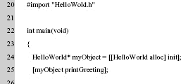


在`HelloWorld.h`文件中，程序首先包含了`*HelloWorld.h*`文件，这使得应用程序的这一部分能够访问`HelloWorld`对象。

在第 22 行，我们有`main`函数。请记住，每个 Objective-C 程序都必须有一个`main`函数。

第 24 行较为复杂。它定义并**实例化**了`HelloWorld`类。你首先看到文本`HelloWorld* myObject`。这定义了一个名为`myObject`的变量，其类型为`HelloWorld`，即我们的新类。星号（`*`）用于表示一个**指向**对象的**指针**。这种表示法基本上意味着我们不希望对象本身在这里；我们只希望有一种方法可以访问它，或者说一个指向它所在位置的指针。可以这样理解：就像有人给了你一张名片。你拥有名片，而不是实际的人。但名片是一种联系人的方式。

**注意：** 实例化使得一个类成为计算机内存中的真实对象。类本身在没有实例的情况下是不可用的。以 SUV 为例，在没有工厂制造（实例化）出 SUV 之前，SUV 毫无意义。只有在那之后，SUV 才能被使用。

该行的下一部分是`[[HelloWorld alloc] init]`。这是一个**嵌套**调用。最内层括号内的指令首先执行，因此`[HelloWorld alloc]`是第一个发送的消息。等等，我们从未定义过`alloc`消息，这怎么能行呢？嗯，当`HelloWorld`被定义时，它被定义为`NSObject`的子类。解释这种关系的另一种方式是：`NSObject`是`HelloWorld`的父类。当我们向`HelloWorld`对象发送`alloc`消息时，系统知道`HelloWorld`不认识这条特定的消息，因此它会自动将消息传递给父类；在我们的例子中，父类是`NSObject`类。

一旦`[HelloWorld alloc]`被调用，返回值是一个指向新分配的`HelloWorld`对象的指针（**分配**意味着我们使用计算机内存的一部分来存储某些内容）。但我们还没有完成。嵌套语句的剩余部分，即`init`消息，接下来被执行：`[[HelloWorld alloc] init]`。因此，现在`init`消息被发送给由`[HelloWorld alloc]`创建的新`HelloWorld`对象。`init`只是执行对象的一些基本初始化。这一切的最终返回是一个指向新对象的指针，即指向`HelloWorld`对象的指针。

**注意：** 在 Objective-C 中，每当向对象发送消息时，代码必须放在方括号`[`和`]`内。

既然我们已经创建了一个新对象，就可以使用它了。第 25 行`[myObject printGreeting]`让我们的对象投入使用。在这段代码中，我们通过向它发送`printGreeting`消息来使用新实例化的对象。程序将输出文本`HelloWorld!`

第 27 行向我们的对象发送另一条消息`release`。这条消息告诉系统，该程序已使用完该对象，并释放与其关联的任何系统资源。

第 28 行向`main`函数的调用者返回值`0`。这表示执行成功。

第 29 行结束代码块和程序。

**注意：** 消息也可以接受多个参数。例如，考虑`[myCarObject switchRadioBandTo:FM andTuneToFrequncy:104.7];`。这里的消息将是`switchRadioBandTo:andTuneToFrequency:`。在每条冒号之后，当消息实际发送时，会放置参数值。你可能还会注意到，这些消息的命名方式使得解释它们实际做的事情变得容易理解。在开发类时，使用有帮助的消息名称是一个理想的约定，因为这使得类的使用更加直观。在命名消息时保持一致性也至关重要。

### 在 Xcode 中编写另一个程序

当您首次打开 Xcode 时，您将看到如图 6-1 所示的屏幕。

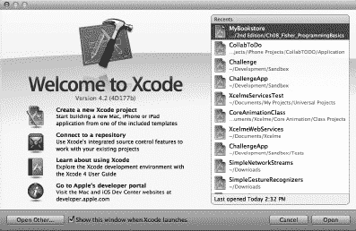

**图 6-1.** *Xcode 打开界面*

图 6-1 显示了一个在启动 Xcode 时始终可见的绝佳界面。在您对 Xcode 更加熟悉之前，请保持选中**Show this window when Xcode launches**复选框。此窗口允许您选择最近创建的项目、访问开发者文档（即**Getting started with Xcode**图标），并快速链接到 Apple 的开发者网站。无论选择哪个文档集，它们都为初学者和高级用户提供了丰富的信息。


### 创建项目

我们将开始一个新项目，因此请点击**创建一个新的 Xcode 项目**图标。无论何时你想开始一个新的 iOS 或 Mac OS X 应用程序、库或其他任何东西，都请使用这个图标。当一个项目已创建并保存后，该项目将出现在屏幕右侧的“最近项目”列表中。

对于这个 Xcode 项目，我们将选择一些非常简单的选项。确保选中了 iOS 应用程序。然后选择**单视图应用程序**，如图 6-2 所示。然后只需点击**下一步**按钮。

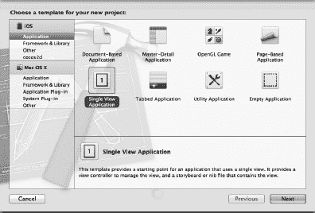

**图 6-2.** *从模板列表中选择一个新项目*

有几种不同类型的模板。这些模板通过自动创建简单的源文件来提供一个起点，使得从头开始一个项目变得更容易。

选择模板并点击**下一步**按钮后，Xcode 会弹出一个对话框，询问项目的名称和其他一些信息，如图 6-3 所示。输入产品名称为 **MyFirstApp**。公司标识符需要有一个值，所以只需输入 **MyCompany**。同时确保**设备系列**设置为 **iPhone**。

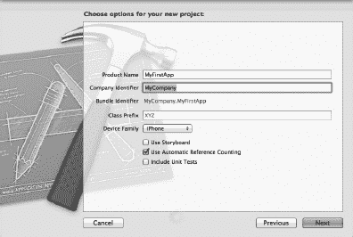

**图 6-3.** *设置产品名称、公司和类型*

**包含单元测试**复选框可以保持默认设置。在我们的示例中，我们没有勾选它。对于这个示例，勾选与否并不重要。提供所有信息后，点击**下一步**按钮。Xcode 将询问你项目的保存位置。你可以将其保存在任何地方，但桌面是一个不错的选择，因为它总是可见的。此外，默认情况下，**使用自动引用计数**是勾选状态，这更可取。^(1)

__________

¹ 第 13 章 会详细介绍自动引用计数或 ARC。

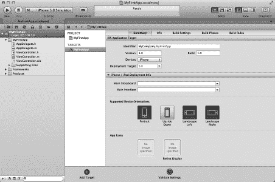

**图 6-4.** *Xcode 4.0 主屏幕*

选择项目保存位置后，将显示 Xcode 主屏幕。最左侧的窗格是源文件列表。右侧三分之二的屏幕专用于上下文相关的编辑器。点击一个源文件，编辑器将显示源代码。点击一个 `*.xib`（读作 zib）文件将显示屏幕界面编辑器。

**注意：** Xcode 4 引入了一个全新的单屏幕环境，称为*工作区窗口*。例如，在 Xcode 3 及更早版本中，Interface Builder（用于构建界面的系统）是一个独立的程序。现在，在 Xcode 4 中，只需点击一个界面文件，即可在 Xcode 4 中显示该界面。

我们的第一个应用程序将会非常简单。这个 iPhone 应用将只包含一个按钮。当按钮被按下时，你的名字将出现在屏幕上。那么，让我们先更仔细地看一下 Xcode 为我们创建的一些存根源代码。Xcode 的一个好处是，它会创建一个无需任何修改即可执行的存根应用程序。在我们开始添加一些代码之前，让我们看一下 Xcode 的主工具栏，如图 6-5 所示。


**图 6-5.** *Xcode 4 工具栏*

初看之下，工具栏有三个不同的区域。左侧区域用于运行/调试应用程序。中间窗口显示状态，作为编译器错误和/或警告的摘要。最右侧区域包含一系列用于自定义编辑视图的按钮。

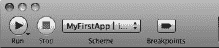

**图 6-6.** *Xcode 工具栏左侧部分特写*

如图 6-6 所示，工具栏的左侧部分包含一个*播放*按钮（类似于 iTunes），该按钮将编译并运行应用程序。如果应用程序正在运行，*停止*按钮将不会变灰。由于它是灰色的，我们知道应用程序没有运行。*方案*和*断点*目前可以不用理会。它们将在第 14 章中更详细地讨论。

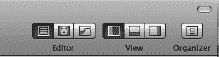

**图 6-7.** *Xcode 工具栏右侧部分特写*

Xcode 工具栏的右侧包含用于更改编辑器的按钮。这三个按钮分别代表*标准编辑器*（已选中）、*辅助编辑器*和*版本编辑器*。目前，只需选择*标准编辑器*，如图 6-7 所示。

在编辑器选择旁边是一组视图按钮。这些按钮可以切换打开或关闭。例如，图 6-7 中选中的按钮代表如图 6-4 所示的当前视图——屏幕左侧三分之一是程序文件列表，其余三分之二是主编辑器。可以选择任意组合，或者都不选，以帮助自定义主工作区窗口。最后一个按钮用于打开*管理器*窗口。我们将在第 14 章中更详细地讨论这个按钮。现在，让我们回到我们的第一个 iPhone 应用。

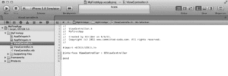

**图 6-8.** *在 Xcode 编辑器中查看源代码*

点击 `ViewController.h` 文件一次，如图 6-8 所示。编辑器显示了一些称为*接口*文件的 Objective-C 代码。你可以通过第 11 行的 `@interface` Objective-C 指令来判断这是一个接口文件。我们将在下一章讨论接口文件的重要性。

**注意：** 目前，我们只是要添加几行代码并看看它们的作用。并不要求你现在就理解这些代码的含义。重要的是通过操作来熟悉 Xcode。第 7 章 会更深入地介绍 Objective-C 程序的构成，第 10 章 会更深入地介绍如何构建 iPhone 界面。

接下来，我们将在这个文件中添加两行代码，如图 6-9 所示。第 12 行在屏幕上定义了一个 iPhone 标签，我们可以在上面放置一些文本。第 15 行告诉编译器这个对象可以接收一个名为 `showName:` 的消息。我们将调用这个方法来填充 iPhone 标签。标签只不过是屏幕上用于放置一些文本信息的区域。

**警告：** 请**完全**按照示例所示输入代码。例如，`UILabel` 不能写成 `uilabel` 或 `UILABEL`。Objective-C 是一种区分大小写的语言，所以 `UILabel` 与 `uilabel` 完全不同。

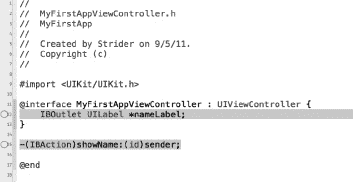

**图 6-9.** *添加到 ViewController.h 接口文件中的代码*

接下来，我们将添加代码使 `showName:` 消息执行某些操作。首先，点击左侧的 `ViewController.m` 文件一次。这个文件是一个*实现*文件。你可以通过第 11 行的 `@implementation` Objective-C 指令来判断它是一个实现文件，如图 6-10 所示。

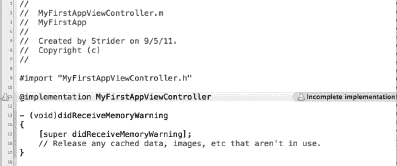

**图 6-10.** *ViewController.m 实现文件*

注意第 11 行有一个警告符号。点击该警告符号会显示警告“不完整的实现”，这基本上意味着我们在接口文件中提到了一个新消息，但它尚未被添加到实现文件中。图 6-11 是更新后的实现文件。

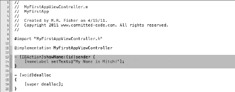

**图 6-11.** *添加到 ViewController.m 实现文件中的代码*


当添加`#19–22`行代码后（如图 6-11 所示），警告消息便会消失。Xcode 4 的妙处在于，无需先尝试编译和运行程序，它就会报告键入代码中的任何警告或错误。这种即时反馈有时可能让人烦恼，但确实能节省时间。

现在我们已经有了必要的代码，但在 iPhone 上还没有界面。接下来，我们将编辑界面，为应用添加两个界面对象。

为了编辑 iPhone 的界面，我们需要单击`ViewController.xib`文件。`.xib`文件包含单个窗口或视图的所有信息。具有多个视图的应用将包含多个`.xib`文件。我们将使用 Xcode 的界面编辑器，将标签（Label）等 UI 对象*连接*到我们刚刚创建的代码上。连接操作就像点击和拖动一样简单。

我们不会修改`MainWindow.xib`文件。在我们的示例中，`MainWindow.xib`文件仅包含了我们的视图，即`ViewController.xib`文件。

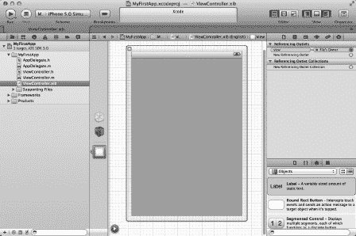

**图 6–12.** *我们将要修改的 iPhone 界面*

请注意，我们点击了屏幕右上角的最后一个`view button`（视图按钮），如图 6-12 所示。这会打开界面的实用工具视图。除其他功能外，此实用工具视图会显示我们可以在应用中使用的各种界面对象。我们只需关注前两个：`Round Rect Button`（圆角矩形按钮）和`Label`（标签）。

第一步是从实用工具窗口中单击`Round Rect Button`。接着，将该对象拖拽到 iPhone 视图上，如图 6-13 所示。不用担心；拖拽该对象并不会将其从实用工具视图的对象列表中移除。拖拽出来会在我们的 iPhone 界面上创建该对象的一个新副本。

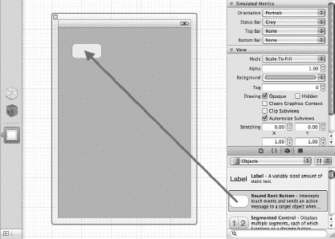

**图 6–13.** *将按钮对象移动到 iPhone 视图上*

接下来，双击刚刚添加到 iPhone 界面上的圆角矩形按钮（Round Rect Button）。这样可以将按钮的标题从无更改为“Name”（名称），如图 6-14 所示。许多不同的界面对象操作方式都与此类似。只需双击并更改对象的标题即可。这也可以在代码中完成，但在界面编辑器中操作要简单得多。

更改标题后，拖拽一个标签（Label）对象并将其放置在按钮正下方，如图 6-15 所示。

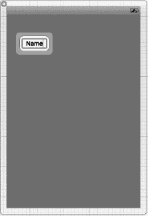

**图 6–14.** *修改按钮标题*

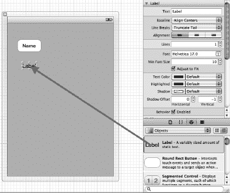

**图 6–15.** *向 iPhone 界面添加标签对象*

目前，我们可以将标签的文本保留为“Label”，因为这样在界面上容易找到它。如果清除了标签的文本，该对象仍然存在，但就没有可见的内容可供点击来选择标签了。通过向右拖拽中间的蓝色球体来扩大标签的尺寸，如图 6-16 所示。

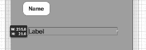

**图 6–16.** *扩大标签尺寸*

现在我们同时拥有了按钮和标签，接下来就可以将这些可视化对象连接到我们的程序。首先，在按钮控件上点击鼠标右键。这会调出一个连接菜单，如图 6-17 所示。

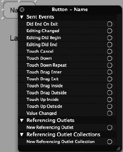

**图 6–17.** *按钮对象的连接菜单*

接着，我们从`Touch Up Inside`（手指抬起）连接圆圈点击并拖拽到`File’s Owner`（文件所有者）图标上，如图 6-18 所示。`Touch Up Inside`表示用户点击了按钮的*内部区域*。将连接拖拽到文件所有者（即`ViewController`对象）上，会将`Touch Up Inside`事件连接到`ViewController`对象。这样做的作用是，每当按钮被按下时，我们的对象都能收到通知。

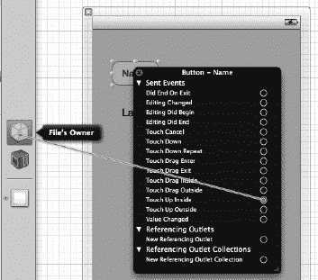

**图 6–18.** *将 `Touch Up Inside` 事件连接到我们的对象*

连接建立后，会显示一个可用于该连接的方法列表，如图 6-19 所示。在我们的示例中，只有一个方法，即`showName:`方法。选择`showName:`方法会将`Touch Up Inside`事件连接到我们的对象。

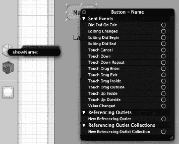

**图 6–19.** *选择处理 `Touch Up Inside` 事件的方法*

连接完成后，详细信息会显示在按钮的连接菜单上，如图 6-20 所示。

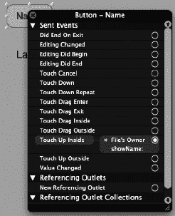

**图 6–20.** *连接现已完成*

接下来，我们为标签对象创建连接。在这种情况下，我们不关心标签的事件；相反，我们希望将`ViewController`的`nameLabel`输出口连接到 iPhone 界面上的对象。这个连接基本上告诉我们的对象，我们想要设置文本的标签位于 iPhone 界面上。

首先，在 iPhone 界面上的标签对象上点击鼠标右键。这会调出标签的连接菜单，如图 6-21 所示。标签对象的选项没有按钮对象那么多。

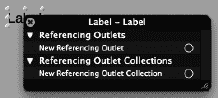

**图 6–21.** *标签对象的连接菜单*

如上所述，我们在此不是为了连接事件。相反，我们连接的是所谓的*引用输出口*（Referencing Outlet）。此连接将屏幕对象连接到`ViewController`对象中的一个变量。就像按钮一样，将连接拖拽到`File’s Owner`图标上，如图 6-22 所示。

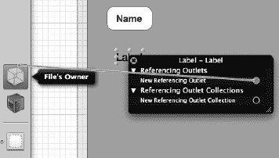

**图 6–22.** *将引用输出口连接到我们的对象*

连接拖拽到文件所有者上后，会显示`ViewController`对象中的输出口列表，如图 6-23 所示。在两个选项中，我们选择`nameLabel`。这是我们正在使用的`ViewController`对象中的变量名称。

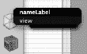

**图 6–23.** *选择对象的变量以完成连接*

选择`nameLabel`后，我们就可以运行程序了。点击 Xcode 窗口左上角的`Run`（运行）按钮（参见图 6-6）。这将自动保存你的文件并在 iPhone 模拟器中启动应用程序，如图 6-24 所示。

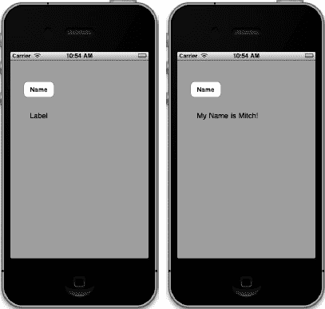

**图 6–24.** *我们的应用运行中，按钮按下前后对比*

点击`Name`按钮后，标签的文本将从默认值“Label”更改为“My Name is Mitch!”或你输入的任何值。如果你愿意，可以回到界面中清除默认的标签文本。

### 总结

本章的示例非常简单，但希望它们能激发你使用 Objective-C 和 Xcode 开发更复杂应用的兴趣。在后续章节中，你将学习更多关于面向对象编程的知识，以及 Objective-C 的更多功能。你已经学到了很多，值得为自己鼓掌。以下是本章讨论的主题总结：

*   Objective-C 语言的起源和简史，
*   Objective-C 中常用的一些语言符号，
*   一个 Objective-C 类的示例，
*   程序的`@interface`和`@implementation`部分，
*   更深入地使用 Xcode，包括输入和编译`HelloWorld.m`源文件，以及
*   将可视化界面对象与应用程序对象中的方法和变量进行连接。


### 练习

*   清除程序中“Label”的默认文本，然后重新运行示例。
*   将界面上的标签对象的宽度调小。这对我们的文本消息有何影响？
*   删除标签的引用插座（Referencing Outlet）连接，然后重新运行项目。会发生什么？
*   如果你觉得自己已经掌握了要领，可以添加一个新的按钮和标签，同时添加到`ViewController`对象和界面中。将其从显示你的名字改为显示其他内容。

## 第 7 章

## Objective-C 类、对象和方法

如果你还没有阅读第 6 章，请在阅读本章之前先阅读它，因为它对 Objective-C 的一些基础知识做了很好的介绍。本章将在此基础上进一步深入。学完本章后，你将对 Objective-C 语言以及如何使用基础知识编写简单程序有更深入的理解。对 Mitch 个人而言，最好的学习方法是编写（或重写）小型 Objective-C 程序，以观察该语言的运作方式。

本章将介绍 Objective-C 类的组成，以及如何通过方法与 Objective-C 对象进行交互。我们将以一个简单的无线电台类为例，展示 Objective-C 类的编写方式。这有望帮助你理解如何使用 Objective-C 类。本章将教你如何针对需要解决的问题来设计对象。我们会涉及如何创建自定义对象，以及如何使用 Foundation 类中提供的现有对象。

如果你来自 C 语言家族，你会发现 Objective-C 与其有许多相似之处。如第 6 章所述，Objective-C 的根源深深植根于 C 语言。本章将扩展第 6 章的主题，并融入第 8 章中描述的一些概念。

## 创建 Objective-C 类

第 6 章介绍了 Objective-C 语言的一些常见元素，让我们快速回顾一下。

*   Objective-C 类分为两部分：类接口（class interface）和类实现（class implementation）。
*   `@interface`：此关键字用于定义新 Objective-C 类的接口。该部分写在`.h`或头文件中。
*   **方法（Methods）**：这些是在类的`@interface`部分定义、并在`.m`文件中的`@implementation`部分实现的代码块。
*   `@implementation`：此关键字用于定义实现接口中定义的方法的实际代码。该部分写在`.m`或 Objective-C 类文件中。

如第 6 章所述，Objective-C 类由接口和相应的实现组成。现在，我们集中讨论接口。在最基本的层面上，类的接口告诉你类的名称、它派生自哪个类，以及该类理解哪些**消息**。请注意这里使用了“消息”一词。要与 Objective-C 对象通信，程序会向该对象发送消息。这些消息直接转化为实现文件中的代码——这些实现代码被称为方法。

以下是类接口第一行的示例：

`@interface RadioStation : NSObject`

这里，类名是`RadioStation`。类名后的冒号（`:`）表示该类派生自另一个类；也就是说，`RadioStation`对象**继承**了`NSObject`类的功能。换句话说，在我们列表 7–1 所示的示例中，`RadioStation`类派生自`NSObject`类。

**提示：** 如果你的对象不继承自任何其他基础类，*始终*继承自`NSObject`；没有它，你的类将毫无价值。`NSObject`提供了使新对象正确运行的基本功能。`NSObject`是所有 Foundation 类的基类。因此，继承自任何 Foundation 类也是可以的。

一旦定义了类名，接口文件的其余部分就包含了该类的主要组成部分（见列表 7–1）。

**列表 7–1.** *接口文件：`RadioStation.h`*

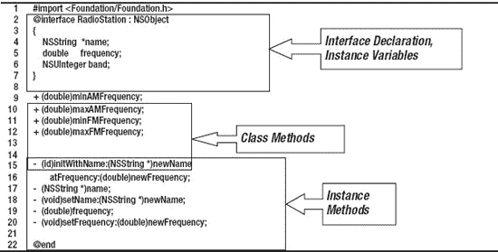

### 声明接口和实例变量

Objective-C 类由其**接口**定义。由于对象大部分通过消息进行通信，对象的接口定义了该对象将响应哪些消息。第 1 行导入了 Foundation 类定义（稍后会详细介绍）。第 2-7 行通过定义类的名称（有时称为**类型**）和继承的类来开始定义类的接口。接下来，有一个在大括号（`{` `}`）内定义的块。此块用于定义该类的*实例*所使用的变量。这些被称为**实例变量**。

每当`RadioStation`类被实例化时，生成的`RadioStation`对象都可以访问这些变量，这些变量仅针对特定实例。如果有十个`RadioStation`对象，每个对象都有自己的变量，独立于其他对象。这也称为**作用域**，即对象的变量位于每个对象的作用域内。


### 发送消息（方法）

每个对象都有方法。在 Objective-C 中，与对象交互的常见概念是向对象发送一条消息：

```
[myStation frequency];
```

上一行代码会向一个名为 `myStation` 的 `RadioStation` 类实例发送一条消息。在这个例子中，`myStation` 被称为**接收者**，因为它接收消息。消息（上例中的 `frequency`）用于选择对象内将要调用的方法。消息中出现的这些方法名称，如上例所示，被称为**选择器**。由于消息根据名称选择方法，实际上消息和方法名是同义词。

如果某个类不理解某条消息，该消息会传递给父对象；在这种情况下，是 `NSObject`。如果父对象也不理解该消息，则会继续传递给其父对象，依此类推，直到找到或找不到这条消息为止。这种行为被称为**动态绑定**，这意味着方法是在运行时而非编译时被找到的。动态绑定允许 Objective-C 程序在运行过程中对变化做出反应——这是 Objective-C 相对于其他语言的一大优势。

消息也可以附带参数。为什么要传递参数？传递参数有几个原因。首先（也是最常见的），可能性范围太大，无法编写成单独的方法。其次，需要存储在对象中的数据是可变的——例如广播电台的名称。在下面的示例中，你会看到为每一种可能的广播频率编写方法是不切实际的；因此，频率作为参数传入。电台名称也是如此。

```
[myStation setFrequency: 104.7];
```

消息是 `setFrequency:`。冒号表示该消息需要一个参数。消息可以有多个参数，如下例所示：

```
myStation = [[RationStation alloc] initWithName:@"KZZP" atFrequency: 104.7];
```

我们关注的消息是：

```
initWithName:atFrequency:
```

理解消息及其结构非常重要，尤其是在实际实现代码时。在你的代码中，你需要确保实现了 `initWithName:atFrequency:` 方法；否则程序将无法运行。

在上例中，消息由两个参数组成：电台名称及其频率。Objective-C 相对于其他语言的一个有趣之处在于，方法本质上是命名参数。如果这是一个 C++ 或 Java 程序，调用方式会是：

```
myObject = New RadioStation("KZZP", 104.7);
```

虽然 `RadioStation` 对象的参数可能看起来很明显，但拥有命名参数可能是一个优势，因为它们或多或少地说明了参数的用途或作用。以下是一些示例：

- `[NSDictionary dictionaryWithContentsOfFile:filename];`
- `[myString characterAtIndex: 1];`
- `[myViewController willRotateToInterfaceOrientation:portrait duration:60];`

### 使用类方法

类不必实例化即可使用。在某些情况下，类拥有可以执行一些简单操作并返回值的方法。这些方法被称为**类方法**。在列表 7–1 中，以加号（`+`）开头的方法是类方法——所有类方法都必须以 `+` 号开头。

类方法有限制。它们最大的限制之一是任何实例变量都不能被使用。嗯，从技术上讲，Xcode 允许在类方法中编写实例变量。代码编译时会产生警告，但访问或使用实例变量不会有任何效果——千万不要这样做。无法使用实例变量是合理的，因为我们还没有实例化任何东西。类方法可以在方法内部拥有自己的局部变量，但不能使用任何定义为实例变量的变量。

调用类方法的方式如下：

```
[RadioStation minAMFrequency];
```

请注意，这个调用与向实例化对象传递消息的方式非常相似。最大的区别在于，这里使用的是*类名*本身，而不是实例变量。类方法在 Mac OS X 和 iOS 框架中被广泛使用。它们主要用于返回一些固定的或众所周知类型的值，或者返回对象的新实例。这类类方法有时被称为**工厂方法**，因为就像工厂一样，它们会创建新东西；在这里，就是创建一个类的新实例。以下是一个工厂方法的示例：

1.  `[NSDate timeIntervalSinceReferenceDate]; // 返回一个数字`
2.  `[NSString stringWithFormat:@"%d", 1000]; // 返回一个新的 NSString 对象`
3.  `[NSDictionary alloc];            // 返回一个新的未初始化的 NSDictionary 对象`

以上所有消息都是正在被调用的类方法。

第一行简单地返回一个值，表示自参考日期 2001 年 1 月 1 日以来的秒数。

第二行返回一个新的 `NSString` 对象，该对象已被格式化，值为 `1000`。

第三行是一种非常常见的形式，因为它实际上分配了一个新对象。通常，这行不单独使用，而是像这样使用：

```
myDict = [[NSDictionary alloc] init];
```

上面的调用是一个**复合调用**。`[NSDictionary alloc]` 类方法返回一个新的 `NSDictionary` 对象。然后，`init` 消息被发送给 `NSDictionary` 对象，用于在类内部进行自身初始化（例如，设置实例变量）。`init` 函数随后将新对象返回给调用者。

那么，何时应该使用类方法？一般而言，如果方法返回的信息不是特定于类的任何特定实例，那么将该方法设为类方法。例如，前面例子中的 `minAMFrequency` 对于任何 `RadioStation` 对象的所有实例都是相同的——这是一个非常适合作为类方法的候选。然而，电台的名称或分配给它的频率对于类的每个实例都是不同的。这些不应该（也确实不能）是类方法。原因在于类方法不能使用该类定义的任何实例变量。

### 使用实例方法

实例方法（列表 7–1 中的第 15–20 行）是只有类被实例化后才能使用的方法；例如：

```
1  RadioStation *myStation;             // 声明一个变量来持有 RadioStation 对象。
2  myStation = [[RadioStation alloc] init]; // 创建一个新对象并将其放入变量中。
3  [myStation setFrequency: 104.7];         // 设置 myStation 对象的频率。
4  double f = [myStation frequency]           // 该实例方法返回当前频率。
```

第 3 行和第 4 行向 `RadioStation` 对象发送消息；第 3 行调用方法来设置频率，第 4 行获取频率。频率与对象一起存储在 `frequency` 实例变量中。此外，实例方法可以访问在类的**接口声明**部分定义的实例变量。所有实例方法都必须以连字符（`-`）开头；这可以很容易地将它们与使用加号（`+`）的类方法区分开来。


### 处理实现文件

现在你已经了解了接口文件的样子，让我们来看看**实现文件**。首先，接口文件的扩展名是 `.h`，例如 `RadioStation.h`。实现文件的扩展名是 `.m`，例如 `RadioStation.m`，如代码清单 7-2 所示。

另一个需要注意的重要事项是，接口文件和实现文件的名称相同（不包括扩展名）。这个约定是普遍使用的：虽然接口文件和实现文件使用不同的名称并没有任何限制，但名称不同可能会造成很大的混乱，并且像 Xcode 这样的工具也无法正常工作。例如，Xcode 的快捷键 Control + Command + 上箭头（^ +  + ）用于在实现文件和接口文件之间切换，如果两个文件名不相同，这个快捷键将无法工作。

**代码清单 7-2.** *实现文件的部分内容*

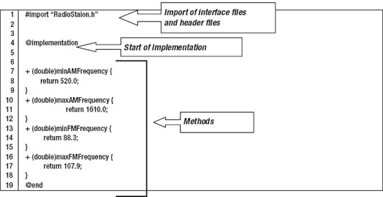

当 Xcode 创建一个类时，它会生成一个非常基本的实现文件框架。代码清单 7-2 以 `#import` 语句开头，用于引入你的接口文件。`#import` 语句会读取该类的接口文件。当编译器处理你的实现文件（`.m`）时，它需要知道正在实现的是哪个类，而接口文件提供了所有需要的信息。

`#import` 语句告诉编译器读取指定的文件，因为编译器需要了解某些预定义的内容。例如，在你的接口文件中，`RadioStation` 类是 `NSObject` 的子类。为了程序能成功编译，需要先定义 `NSObject` 类。所有这些对象都是 iOS 框架的一部分，并通过代码清单 7-1 中接口文件的第 1 行包含进来。

`#import <Foundation/Foundation.h>`

**注意：** 注意 `#import` 语句：一个使用了尖括号（`< >`），另一个使用了普通的双引号（`" "`）。区别在于，尖括号中的文件表示系统级文件，它通过 Xcode 为你的项目自动设置的预定义路径来定位。使用双引号的任何文件则会在当前项目中查找。在我们的例子中，`RadioStation.h` 接口文件属于项目的一部分，所以我们使用双引号；而 `Cocoa.h` 文件是系统文件，使用了尖括号。

### 编写方法

代码清单 7-2 是一个非常简单的例子，但它展示了类中许多方法的常见形式。首先，如果你查看某个类方法的实现文件和接口文件，就能看到它们的相似之处。下面这行代码来自接口文件：

`+ (double)minAMFrequency;`

如你所见，这是一个类方法，因为它以 `+` 开头。接着是 `(double)`，表示该方法返回值的类型，这里是 `double` 类型。接口文件中接下来的部分只是方法的名称 `minAMFrequency`。

下面这行代码来自实现文件：

```
+ (double)minAMFrequency {
        return 520.0;
}
```

这行代码代表了接口中定义的方法的实现。“实现”这个词表明函数在这里编写。它看起来与接口文件几乎相同，但现在包含了一个带有代码的代码块，而不是仅以分号结束。

在前面的例子中，`minAMFrequency` 类方法的实现只是返回一个数值（`double` 类型）520.0。

通常，一个类会在接口文件中定义方法，而在实现文件中包含方法的实际代码。

现在，我们来看一个**实例方法**的实现（参见代码清单 7-3）。实例方法和类方法之间存在一些显著差异：例如，实例方法可以选择使用在接口文件中定义的实例变量。此外，实例方法只有在类被实例化之后才可用。

**代码清单 7-3.** *实例方法的实现*

```
1  - (id)initWithName:(NSString *)newName atFrequency:(double)newFrequency {
2       self = [super init];
3       if (self != nil) {
4           name = newName;
5           frequency = newFrequency;
6       }
7
8       return self;
9  }
```

代码清单 7-3 演示了你的电台类中一个实例方法的实现。这个初始化方法接受新的电台名称和频率。许多 OS X 和 iOS 类都有类似的初始化实例方法。许多类初始化方法允许使用特殊的初始化方法，而不是简单地初始化类然后逐个设置各种值；或者，像本例这样，可以在初始化时传递多个值。

在前面的例子中，第 1 行是方法接口，它包含两个参数：`newName` 和 `newFrequency`。要使用这个方法，调用者只需执行以下操作：

```
RadioStation myStation = [[RadioStation alloc] initWithName:@"WOW FM"
                                               atFrequency: 102.5];
```

这个方法还被定义为返回一个 `id` 类型的值。`id` 是一个通用对象类型，所有 Objective-C 对象都属于 `id` 类型，就像 `RadioStation` 类是一个对象一样。现在，让我们看看实现部分的其余内容。

第 2 行引用了两个特殊变量，你无需在任何地方定义它们。关键字 `self` 用于表示“这个类的这个实例”，因此第 2 行是在给“这个类的这个实例”赋值，其值来自使用第二个特殊变量 `super init` 所返回的结果。关键字 `super` 是“superclass”（超类）的缩写，可以理解为“这个类的父类”。任何初始化类型的方法通常都会以类似第 2 行的代码开始。

为什么第 2 行是必要的呢？好吧，如果你有一个从另一个对象派生出来的对象（回想一下，类被表示为 `RadioStation : NSObject`），你必须告诉父对象初始化自身。父对象也会做同样的事情，告诉它的父对象初始化自身，依此类推，直到达到最顶层的对象。如果另一个类将你的类作为父类，你的代码最终也必须接收一个 `init` 调用，这样 `RadioStation` 才能被初始化。这在 Objective-C 的实际开发中是标准做法。当一个类被创建时，它需要告诉其父类进行初始化；而当这个类即将被销毁时，它需要告诉其父类释放自身。

第 3 行检查 `[super init]` 调用是否成功。如果成功，`self` 的值将不会是 `nil`（`nil` 是一个实际上表示“未初始化”的值）。

第 4 行和第 5 行将这个类的实例变量设置为传入该方法的参数值。

第 8 行将 `self` 返回给调用者。就像对 `[super init]` 的调用一样，你的初始化函数需要将新对象返回给调用者。

## 使用你的新类

你已经创建了一个简单的 `RadioStation` 类，但单凭它自己并不能完成太多功能。在本节中，你将创建 `Radio` 类，并让它维护一个 `RadioStation` 类的列表。


### 创建项目

让我们启动`Xcode`（参见图 7-1），并创建一个名为`RadioStations`的新项目。

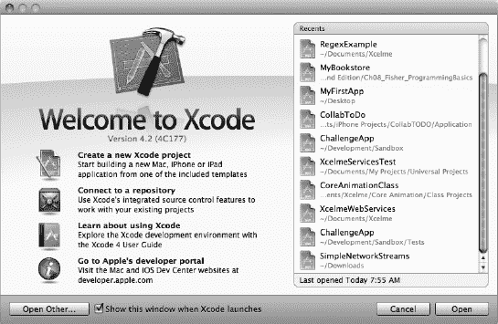

**图 7-1.** *打开`Xcode`，以便创建新项目。*

1.  确保选择 iOS 应用程序，并选中**单视图应用**模板，如图 图 7-2 所示。
2.  选择模板后，点击**下一步**按钮。

    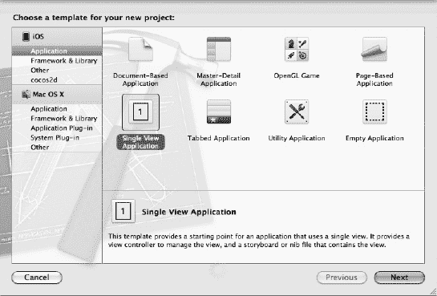

    **图 7-2.** *在新项目窗口中选择模板*

3.  接下来，将产品名称（应用程序名称）设置为`RadioStations`。  
4.  设置公司标识符（可以使用虚构的公司名称），并将设备系列设置为 iPhone（如图 图 7-3 所示）。同时，确保选中“使用自动引用计数”。

    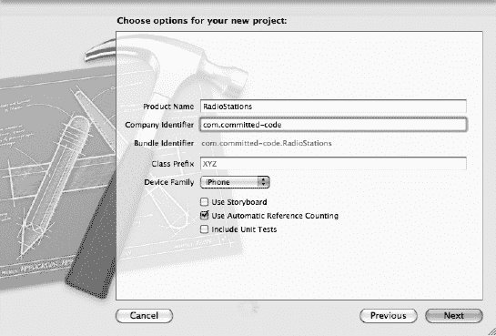

    **图 7-3.** *命名新的 iPhone 应用程序*

5.  点击**下一步按钮**，`Xcode`将询问您希望将新项目保存在何处。您可以将项目保存在桌面或主文件夹中的任何位置。我喜欢保存在桌面，因为它容易找到。做出选择后，只需点击**创建**按钮。
6.  点击**创建**按钮后，`Xcode`的工作区窗口应该会显示出来，如图 图 7-4 所示。

    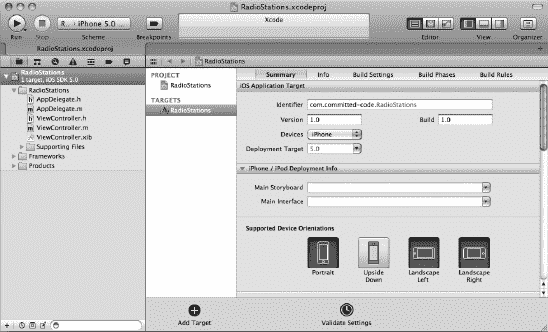

    **图 7-4.** *`Xcode`中的工作区窗口*

### 添加对象

现在，您可以添加新对象了。

1.  首先，创建您的`RadioStation`对象。右键点击 **RadioStations** 组文件夹，然后选择**新建文件…**（如图 图 7-5 所示）。

    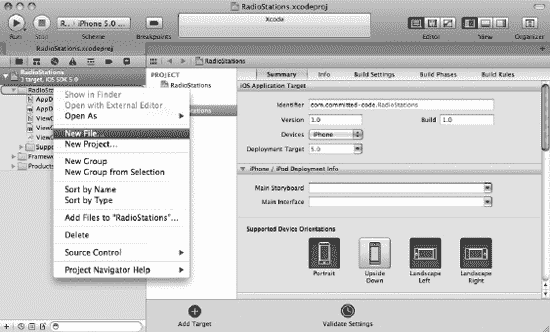

    **图 7-5.** *添加新文件*

2.  在接下来的屏幕中（如图 图 7-6 所示），系统会询问新文件的类型。只需从 Cocoa Touch 组中选择 **Objective-C 类**，然后点击**下一步**。

    

    **图 7-6.** *选择新文件类型*

3.  在下一个屏幕上，输入`RadioStation`作为类名，并选择`NSObject`作为“子类”。这意味着您的新类将是`NSObject`的子类，如图 图 7-7 所示。

    

    **图 7-7.** *选择新对象的子类*

4.  下一个屏幕询问要在哪里创建文件。只需点击**创建**按钮，因为`Xcode`会默认将文件保存到当前项目中，如图 图 7-8 所示。

    

    **图 7-8.** *选择新文件的创建位置*

5.  您的项目窗口现在应该类似于图 7-9。点击`RadioStation.h`文件。请注意，您的新`RadioStation`类的骨架已经存在。现在，完善这个空类，使其看起来像代码清单 7-1，即您的`RadioStation`接口文件。

    

    **图 7-9.** *工作区窗口中您新创建的文件*

### 编写实现文件

现在`RadioStation.h`文件定义了您的新类的实例变量、类方法和实例方法。接下来，我们转到实现文件。

1.  这里将使用的实现文件比我们几页前的示例有所简化，但对于我们的电台模拟来说，它将完美运行。点击`RadioStation.m`文件，并为您的类添加代码，如代码清单 7-4 所示。

**代码清单 7-4.** *`RadioStation` 实现文件*

```objc
 1    #import "RadioStation.h"
 2   
 3    @implementation RadioStation
 4   
 5    + (double)minAMFrequency {
 6        return 520.0;
 7    }
 8    + (double)maxAMFrequency {
 9        return 1610.0;
10    }
11    + (double)minFMFrequency {
12        return 88.3;
13    }
14    + (double)maxFMFrequency {
15        return 107.9;
16    }
17   
18    - (id)initWithName:(NSString *)newName atFrequency:(double)newFrequency {
19        self = [super init];
20        if (self != nil) {
21            name = newName;
22            frequency = newFrequency;
23        }
24       
25        return self;
26    }
27   
28    - (NSString *)name {
29        return name;
30    }
31   
32    - (void)setName:(NSString *)newName {
33       name = newName;
34    }
35   
36    - (double)frequency {
37        return frequency;
38    }
39   
40    - (void)setFrequency:(double)newFrequency {
41        frequency = newFrequency;
42    }
43   
44    @end
```

2.  稍后我们会再回来讲解代码清单 7-4 中的几项内容；不过，既然`RadioStation`类已经定义，您现在就可以编写实际使用它的代码了。
3.  首先，点击`ViewController.h`文件。您需要为此类定义一些实例变量，以便使用，如代码清单 7-5 所示。

**代码清单 7-5.** 更新后的 `ViewController.h` 接口文件

```objc
 1  #import <UIKit/UIKit.h>
 2  
 3  @class RadioStation;
 4  
 5  @interface ViewController : UIViewController
 6  {
 7      RadioStation *myStation;
 8      IBOutlet UILabel* stationName;
 9      IBOutlet UILabel* stationFrequency;
10      IBOutlet UILabel* stationBand;
11  }
12  
13  @end
```

在第 #3 行，您将添加一个所谓的*前向声明*。这基本上是告诉编译器，您将使用一个尚未定义的类，名为`RadioStation`。您最终会导入您的头文件，但不是在这里——这就是您现在需要这个前向声明的原因。

第 #6–8 行定义了一些新的实例变量。第 #8 行是您的`RadioStation`对象。第 #9–11 行将用于您的 iOS 界面，以在屏幕上显示一些值（稍后会详细说明）。另外，不要忘记包含花括号（`{ … }`）。由于原始的`AppDelegate`没有声明任何实例变量，因此不需要这些花括号。

4.  接下来，从主项目窗口中，点击`ViewController.m`文件。代码清单 7-5 显示了`ViewController.m`文件的顶部部分。每当视图被加载到内存时，会调用以下方法：

    ```objc
    viewDidLoad
    ```

    您将在此处开始放置一些初始化代码。

**代码清单 7-5.** *分配您的 `RadioStation` 对象*

```objc
 1  #import "ViewController.h"
 2  #import "RadioStation.h"
 3  
 4  @implementation ViewController
 5  
 6  - (void)didReceiveMemoryWarning
 7  {
 8      [super didReceiveMemoryWarning];
 9      // 释放任何未使用的缓存数据、图像等。
10  }
11  
12  #pragma mark - 视图生命周期
13  
14  - (void)viewDidLoad
15  {
16      [super viewDidLoad];
17          // 执行加载视图后的任何额外设置，通常来自 nib 文件。
18      myStation = [[RadioStation alloc] initWithName:@"STAR 94"
19                                                     atFrequency:94.1];
20      
21  }
```

第 #2 行是导入语句，用于导入您的`RadioStation`对象。

第 #18 和 19 行分配了一个新的`RadioStation`对象，并将其存储到您的新实例变量`myStation`中。


## 创建用户界面

接下来，需要设置主窗口，以便显示您的电台信息。

1.  首先，点击 `ViewController.xib` 文件，如图 Figure 7–10 所示。该文件是 iPhone 主屏幕。

   

   **图 7–10.** *在 iPhone 屏幕上添加标签对象*

2.  拖拽三个标签对象到屏幕上，如图 Figure 7–11 所示。标签可以按任意方式对齐，或如图 Figure 7–11 所示对齐。
3.  但是，您需要预留空间。将标签对象放到 iPhone 屏幕上后，双击该标签对象以更改其文本，使 iPhone 屏幕看起来像 Figure 7–11 所示。

   

   **图 7–11.** *iPhone 屏幕上的所有三个标签*

4.  接下来，在屏幕上添加一个圆角矩形按钮对象，如图 Figure 7–12 所示。按下该按钮后，屏幕将更新显示您的电台信息。

   

   **图 7–12.** *在屏幕上添加一个按钮*

5.  与标签对象类似，只需双击圆角矩形按钮对象，将其标题更改为 **My Station**。
6.  接下来，您需要添加用于保存电台信息的标签字段。这些字段位于现有标签之后，如图 Figure 7–13 所示。放置标签后，需要调整其大小，使其延伸到 iPhone 屏幕边缘。

   

   **图 7–13.** *添加另一个标签对象*

   

   **图 7–14.** *拉伸标签对象*

   **注意：** 拉伸标签对象允许标签文本包含足够长的字符串。如果您**没有**调整标签大小，文本可能会被截断（因为放不下），或者字体大小会变小^(1)。

7. 重复添加和调整标签对象大小的操作，将其放置在现有的“频率”和“波段”标签旁边，如图 Figure 7–15 所示。暂时保留标签的默认文本 *“Label”* 是可以的。

__________

¹ 通过使用代码或界面生成器，您可以自定义标签对象对过大文本的反应方式。所描述的行为基于标签对象的典型默认设置。


**图 7–15.** *添加另一个标签对象*

## 连接代码

现在所有用户界面对象都已就位，您可以开始将这些界面元素连接到程序中的变量。正如您在 第 6 章中所见，这是通过*连接*用户界面对象和程序中的对象来实现的。

1.  首先，将“电台名称”标签连接到您的变量，如图 Figure 7–16 所示。右键单击“Station Name:”标签**旁边**的标签对象，调出连接窗口。

   

   **图 7–16.** *创建连接*

2.  当连接被拖放到“文件所有者”图标上时，会出现另一个小菜单。点击您希望在此标签中显示的实例变量名称——在本例中，您需要的是 `stationName` 实例变量，如图 Figure 7–17 所示。

   

   **图 7–17.** *将界面标签连接到您的 stationName 实例变量*

3.  现在，界面标签对象已*连接*到 `stationName` 实例变量。无论何时设置实例变量的值，屏幕都会更新。**对“频率”和“波段”标签重复上述连接步骤。**

接下来，您需要将按钮连接到代码；但在那之前，您需要添加一些代码来处理实际的按钮点击，如 Listing 7–7 所示。将这些代码添加到 `ViewController.m` 文件的底部。

**Listing 7–7.** *创建 buttonClick 函数*

```
 1  - (IBAction)buttonClick:(id)sender {
 2      [stationName setText:[myStation name]];
 3      [stationFrequency setText:[NSString stringWithFormat:@"%.1f",
 4                                           [myStation frequency]]];
 5      
 6      if (([myStation frequency] >= [RadioStation minFMFrequency]) &&
 7          ([myStation frequency] <= [RadioStation maxFMFrequency])) {
 8          [stationBand setText:@"FM"];
 9      } else {        
10          [stationBand setText:@"AM"];
11      }
12  }
```

Listing 7–7 是一个方法，您将设置它在 iPhone 屏幕上的按钮被按下时调用。首先，在第 1 行，您会注意到 `IBAction` 类型。这让 Xcode 知道此方法可以作为某个操作的结果而被调用。因此，当您去连接应用程序中的操作时，您会看到此方法。

第 2 行和第 3 行都将文本字段设置为 `RadioStation` 类中的值。

```
[stationName setText:[myStation name]]
```

`stationName` 变量正是您刚刚连接到用户界面标签对象的变量，而 `[myStation name]` 用于返回电台的名称。

第 3 行实际上与第 2 行功能相同，但您必须先将 `double` 值（电台频率）转换为 `NSString`。`@"%.1f"` 意味着您转换一个浮点值，并且小数点后只显示一位数字。

第 6-11 行使用了您的实例变量和 `RadioStation` 类的类方法。在这里，您只需检查电台频率是否在 `minFMFrequency` 和 `maxFMFrequency` 之间。如果是，则该电台为 FM 电台；否则，假设其为 AM 波段。第 8 行和第 10 行将在屏幕上显示波段值。

您还需要确保界面文件包含您刚刚编写的新方法。如 [Listing 7–8] 所示，只需在 `ViewController.h` 文件的 `@end` **之前**添加以下代码行：

**Listing 7–7.**


现在，您可以将 iPhone 屏幕上的按钮连接到新创建的方法，如图 Figure 7–18 所示。

1.  右键单击按钮，调出连接窗口。

   

   **图 7–18.** *将事件连接到您的新方法*

2.  与标签对象的操作类似，从 **Touch Up Inside** 事件拖拽连接，并放到“电台应用代理”上。这将弹出您在 Listing 7–7 中创建的 `IBAction` 方法。
3.  只需选择 `buttonClick:`（如图 Figure 7–19 所示）。这将把 Touch Up Inside 事件连接到您的操作，该操作随后会将标签文本值设置为您的电台信息。

**提示：** 当用户触摸按钮*内部*然后松开手指时，“圆角矩形按钮”会发送 Touch Up Inside 事件——直到用户抬起手指，该事件才会真正发送。


**图 7–19.** *选择要连接到 Touch Up Inside 事件的操作*


### 运行程序

建立连接后，你就可以运行并测试程序了！只需点击 Xcode 窗口左上角的 `Run` 按钮，如图 7–20 所示。


**图 7–20.** *运行程序*

如果没有编译错误，iPhone 模拟器将启动，你应该能看到应用程序。只需点击“My Station”按钮，电台信息就会显示出来，如图 7–21 所示。


**图 7–21.** *显示电台信息*

如果界面或运行效果不理想，请回顾操作步骤，确保所有代码和连接均已按上述说明正确配置。

### 进一步掌握类方法

在程序中，你尚未充分利用 `RadioStation` 的所有类方法，但本章已经介绍了什么是类方法及其用法。运用这些知识，尝试完成本章末尾提到的一些练习。通过添加或修改类方法或实例方法，在这个简单的可运行程序上进行尝试，从而理解它们的工作原理。

## 访问 Xcode 文档

我们怎么强调 Xcode `开发者文档`对话框中蕴含的丰富信息都不为过。打开 Xcode 后，主菜单中会出现`帮助`菜单（见图 7–10）。从中即可打开开发者文档窗口。


**图 7–22.** *Xcode 帮助菜单*

打开后，可以使用搜索窗口查找本章中使用的任何类，包括 `NSString` 类的文档，如图 7–23 所示。


**图 7–23.** *开发者文档窗口*

从图 7–23 中可以发现关于 `NSString` 类的多个不同知识点。通读文档以及苹果提供的各种配套指南，这将帮助你更深入地理解各类及其支持的多种方法。

### 本章小结

我们又完成了一章的学习。再次恭喜你独自将大量信息装进了大脑！以下是本章内容的总结：

*   Objective-C 类回顾
*   接口文件
    *   实例变量
    *   类方法
    *   实例方法
*   实现文件
    *   在接口文件中定义方法接口，并在实现文件中编写该接口的代码
    *   类方法与实例方法的使用限制
    *   初始化类并利用实例变量
*   使用新的 `RadioStation` 对象
    *   构建一个使用新对象的 iPhone 应用
    *   将接口类连接到实例变量
    *   将用户界面事件连接到类中的方法

### 练习

*   修改创建 `RadioStation` 类的代码，让电台名称远超出屏幕可显示的长度。会发生什么？
*   通过实例变量修改 `RadioStation` 类，用于指示电台是 AM 还是 FM（提示：你需要修改 `initWithName:Frequency:` 方法，使其接受一个用于表示无线电频段的新参数）。
*   更改当前按钮并添加一个新按钮。将按钮标记为 FM 和 AM。如果用户点击 FM 按钮，则显示一个 FM 电台。如果用户点击 AM 按钮，则显示一个 AM 电台（提示：你需要在 `RadioStationsAppDelegate.h` 接口文件中添加第二个 `RadioStation` 对象）。
*   通过确保 iPhone 应用首次启动时用户不会看到文本“Label”，对界面进行一些清理。
    *   使用界面工具修复此问题。
    *   你如何通过添加代码来解决这个问题？
*   为 `(IBAction)buttonClick:(id)sender` 方法增加更多验证。目前，它验证了 FM 频段范围，但未验证 AM 频段范围。修改代码，使其也能验证 AM 频段范围。
    *   如果电台频率超出范围，请使用现有的标签显示某种错误信息。

## 第 8 章

## Objective-C 编程基础

Objective-C 是一种非常优雅的语言。它将 C 语言的高效性与 Smalltalk 面向对象的优点结合在一起。这种组合于 20 世纪 80 年代中期问世，至今仍在为 iPhone、iPad 和 Mac OS X 背后的出色应用提供动力。一门超过 20 年的语言是如何在这么长时间后依然保持相关性和实用性的？其成功部分源于构成 Objective-C 的两种语言都经过了充分测试和精心设计。另一个原因则不那么明显：iPhone 和 Mac OS X 可用的各种框架大大简化了开发功能完善的应用的过程。这些框架得益于它们已经存在了相当长的时间，这也就意味着稳定性和高功能性。最后，Objective-C 具有高度动态性。虽然本章不会重点讨论这一特性，但 Objective-C 的动态特性提供了许多编译型语言所不具备的灵活性。凭借所有这些优秀特性，Objective-C 及其对应的框架为创作杰作提供了一个绝佳的调色板！

本章将介绍 Objective-C 的一些更常见的概念，例如属性和集合类。本章还将展示在 Xcode 中处理用户界面元素时，如何同时使用属性和实例变量。这听起来工作量很大，但 Objective-C、Foundation 框架和 Xcode 工具提供了丰富的对象和方法，以及一种轻松构建应用的方式。

## 集合

理解集合是学习 Objective-C 的基础。事实上，集合对象几乎是所有现代面向对象语言库的基本构造——有时它们被称为容器。简单来说，集合是一种可以容纳和管理其他对象的类。集合的全部意义在于提供一种通用且高效的方式来存储和检索对象。

有几种不同类型的集合。虽然它们都满足容纳其他对象的相同目的，但主要区别在于对象的检索方式。以下是 Objective-C 中最常用的集合列表：

*   `NSSet`
*   `NSArray`
*   `NSDictionary`
*   `NSMutableSet`
*   `NSMutableArray`
*   `NSMutableDictionary`

注意，列出的三个集合类中，有一个包含单词 `Mutable`。可变的（相对于不可变的）类是指，在集合创建后可以向其中添加或移除项目的类。Mutable 意味着它可以被修改。不可变集合必须在首次创建时使用其所有值进行初始化，之后便无法修改。


### 使用 NSSet

`NSSet` 类用于存储无序的对象列表。*无序*的意思就是——对象在集合中存储时没有顺序。`NSSet` 的优势在于性能——它是可用的最快集合类。当需要存储一组对象，且存储或检索的顺序不重要时，请使用 `NSSet`。

以下是一个典型的 `NSSet` 初始化方法：

```
NSSet *mySet = [NSSet setWithObjects:@"String 1", @"String 2", @"Whatever", nil];
```

如你所见，该集合通过一个对象列表进行初始化，本例中是一个字符串列表。最后一个对象必须是 `nil`，以表示对象列表的结束。另外，这个例子使用了字符串，但一个 `NSSet` 可以由任何对象组成，甚至可以包含不同类型的对象，包括来自其他集合的对象！

**提示：** 所有集合类都能够同时存储和管理任何类型的对象。然而，在典型情况下，大多数程序员倾向于在任何一个特定的集合类中只存储单一类型的对象，以使代码更简单。

为了访问 `NSSet` 中的数据，常用几种访问 `NSSet` 内部元素的方法。其中一种方法如代码清单 8–1 所示，是使用所谓的*快速枚举*，逐个检索每个对象。请注意，下面的快速枚举（第 3-5 行）适用于所有集合类。

**代码清单 8–1.** *通过枚举器遍历 NSSet。*

```
 1  NSSet *mySet = [NSSet setWithObjects:@"One", @"Two", @"Three", nil];
 2  
 3  for (id value in mySet) {
 4      NSLog(@"%@", value);
 5  }
```

**注意：** 在第 3 行中，值的类型是 `id`。回忆一下，`id` 是一个泛型类型，代表任何 Objective-C 类。使用 `id` 的原因是我们存储在 `NSSet` 中的值可以是任何类型。例如，如果 `NSSet` 包含了一个名为 `Animal` 的类和一个名为 `Zoo` 的类，代码就会失败，因为我们没有一个类既是 `Zoo` 类型又是 `Animal` 类型。另一方面，如果 `NSSet` 始终包含相同的类，我们可以用该特定类替换第 3 行中的 `id`。

另一种访问 `NSSet` 的常见方法，特别是在为捕捉触摸事件的 iOS 设备编程时，是使用以下方式：

**代码清单 8–2.** *选择 NSSet 集合中的任意对象。*

```
 1  NSSet *mySet = [NSSet setWithObjects:@"One", @"Two", @"Three", nil];
 2  
 3  NSString *value = [mySet anyObject];
```

第 3 行调用了 `anyObject` 方法。这个方法名副其实；它从集合中返回任意一个对象。返回的对象由集合自行决定，因此无法保证会返回第一个项目。当然，使用 `anyObject` 方法的前提是任何对象都可以满足需求。如前所述，在处理 iOS 设备上的触摸事件时，有时只需要知道至少有一根手指触碰了屏幕即可。每次触摸屏幕都会作为一条记录存储在 `NSSet` 中，每根手指对应一条记录。使用 `anyObject` 会返回其中任意一个触摸对象。

实际上还有很多其他从 `NSSet` 获取对象的方法——多到本章无法一一涵盖。^(1) 不过，有一种特殊的方法涉及到下一个集合——`NSArray` 类。

### 使用 NSArray

`NSArray` 类与其他集合类似，允许程序员管理一组对象。`NSArray` 与 `NSSet` 的不同之处在于，`NSArray` 允许通过对象在数组中的*索引*来检索对象。索引是对象在 `NSArray` 中所占据的数值位置。例如，如果 `NSArray` 中有三个元素，则可以通过从 0 到 2 的索引来引用这些对象。与 C 和 Objective-C 语言中的大多数情况一样，索引从 0 开始。

__________

¹ [`developer.apple.com/library/mac/#documentation/Cocoa/Reference/Foundation/Classes/NSSet_Class/Reference/Reference.html`](http://developer.apple.com/library/mac/#documentation/Cocoa/Reference/Foundation/Classes/NSSet_Class/Reference/Reference.html)

**代码清单 8–3.** *访问 NSArray 中的对象。*

```
 1  NSArray *myArray = [NSArray arrayWithObjects: @"One", @"Two", @"Three", nil];
 2  
 3  NSLog (@"%@", [myArray objectAtIndex:0]);
 4  NSLog (@"%@", [myArray objectAtIndex:1]);
 5  NSLog (@"%@", [myArray objectAtIndex:2]);
```

可以看出，`NSArray` 中的对象可以通过*索引*来检索。索引从 0 开始，且不能超过数组大小减 1。数组的大小可以通过向 `NSArray` 对象发送 `count` 消息轻松计算：

```
int entries = [myArray count];
```

实际上，每一种集合类型，`NSSet`、`NSArray`、`NSDictionary`（以及它们的可变对应类）都会响应 `count` 消息。

**注意：** 你可能已经注意到 `NSLog` 命令传递了一个类似 `:@"%@"` 的字符串。`%@` 是一种格式化字符串，可用于任何 Objective-C 对象。它只是告诉对象描述自身。对于 `NSString` 来说，描述就是字符串本身。不同类型的对象有不同的描述。在代码清单 8–3 中，`[myArray objectAtIndex:0]` 返回一个 `NSString` 对象。如果参数不是一个 Objective-C 类，你的程序会崩溃！

如前所述，有一种方法可以利用 `NSArray` 来访问 `NSSet`。

**代码清单 8–4.** 从现有的 NSSet 创建 NSArray。

```
 1  NSSet *mySet = [NSSet setWithObjects:@"One", @"Two", @"Three", nil];
 2  NSArray *myArray = [NSSet allObjects];
 3  
 4  NSLog(@"%@", [myArray objectAtIndex:1);
```

除了*快速枚举*之外，使用 `allObjects` 方法可以从 `NSSet` 创建一个 `NSArray`。通常，你不会先创建一个集合然后再将其复制到数组中——为什么不一开始就直接创建数组呢？嗯，有时对象列表只能通过 `NSSet` 给出（处理 iOS 设备触摸事件时的 `touchesBegan: withEvent:` 方法就是一个完美的例子）。


### NSDictionary

`NSDictionary`类也是一种非常有用的集合类。与`NSSet`和`NSArray`一样，它允许存储对象，但`NSDictionary`的不同之处在于它允许将*键*与条目相关联。例如，可以创建一个存储`Animal`对象列表的`NSDictionary`。与`NSArray`通过索引访问`Animal`对象不同，`NSDictionary`可以使用像“monkey”这样的`NSString`作为键。然而，所有键必须是唯一的——也就是说，“monkey”不能出现多次。根据你的程序，找到唯一的名称通常不是问题。

使用上面的“monkey”例子——如果有 5 只不同的猴子，`NSDictionary`中只会包含一个对应“monkey”的条目。不过，这个条目本身可以是另一个包含五个唯一猴子名称的`NSDictionary`：

`"monkey" -> NSDictionary object`

这个`NSDictionary`对象包含：

`"Spider" -> Animal Object`
`"Capuchin" -> Animal Object`
`"Tamarin" -> Animal Object`
`"Mandril" -> Animal Object`
`"Orangutan" -> Animal Object`

当然，`NSDictionary`可以通过多种不同的方式进行组织，具体取决于键的定义方式。在大多数情况下，不会出现`NSDictionary`的条目是另一个`NSDictionary`的情况——上面的例子只是为了展示`NSDictionary`（或一般的集合）的灵活性。

让我们看看上面的例子在代码中是如何实现的。例如，假设已经存在一个`Animal`对象列表，我们只是将其赋值给字典：

**列表 8–5.** *使用另一个 NSDictionary 创建 NSDictionary。*

```
 1  NSDictionary *zoo = [NSDictionary dictionaryWithObjectsAndKeys:
 2                       @"elephant", myElephantObject,
 3                       @"giraffe", myGiraffeObject,
 4                       @"monkey", [NSDictionary dictionaryWithObjectsAndKeys:
 5                                   @"Spider", mySpiderMonkey,
 6                                   @"Capuchin", myCapuchinMonkey,
 7                                   @"Tamarin", myTamarinMonkey,
 8                                   @"Mandril", myMandrilMonkey,
 9                                   @"Orangutan", myOrangutanMonkey, nil]
10                       @"zebra", myZebraObject, nil];
```

现在主`NSDictionary`已经设置好了，我们如何知道什么时候获取的是`Animal`对象，什么时候获取的是`NSDictionary`对象呢？（提示：请阅读下一节的标题。）

### 确定集合中的类类型

当遍历集合时，我们通常使用`id`类类型来表示我们不知道集合中的具体类。每个 Objective-C 对象都有两个便捷的方法来帮助我们。现在让我们来看看它们。

以列表 8–3 中的代码为例，考虑以下代码片段：

**列表 8–6.** *处理集合中的不同类。*

```
11  for (id element in [zoo allValues]) {
12      if ([element isKindOfClass:[Animal class]]) {
13          NSLog(@"%@", id);
14      }
15      if ([element isKindOfClass:[NSDictionary class]]) {
16          ... // 处理上面的猴子字典。
17      }
18  }
```

在列表 8–6 中，我们使用快速枚举来遍历我们的动物园`NSDictionary`。由于只有两种可能性：`Animal`类或`NSDictionary`（动物字典），代码需要检查两种不同的类类型。如前所述，每个 Objective-C 对象都有两个便捷的方法。

*   第一个方法是`isKindOfClass:`。如果当前类（即我们的`element`变量）是某种类型的类，此方法返回一个布尔值。
*   第二个便捷方法是`class`方法。此方法简单地返回对象的类；第 12 行是`Animal`类，第 15 行是`NSDictionary`类。

结合使用`isKindOfClass:`和`class`方法，可以相当简单地处理集合中不同类型的类。

## 使用可变类

到目前为止，我们只讨论了初始化后便永远无法更改的集合对象。虽然这显然在某些地方很有用，但更实用的是可以修改的集合类。每个集合类都有一个**可变**版本——我们之前只讨论了**不可变**的类。这些类在本质上是相同的，唯一的区别是可变的版本可以添加和删除元素。

### NSMutableSet

它可以像`NSSet`一样被初始化，也可以不包含任何值进行初始化，然后再添加值。考虑列表 8–7 中的代码：

**列表 8–7.** *向 NSMutableSet 添加对象。*

```
 1  NSMutableSet *mySet = [[NSMutableSet alloc] init];
 2  
 3  [mySet addObject:@"One"];
 4  [mySet addObject:@"Two"];
 5  [mySet addObject:@"Three"];
 6  
 7  for (id val in mySet) {
 8      NSLog(@"%@", val);
 9  }
```

任何可变类的优点在于，可以以编程方式添加和删除元素，而不必在声明类时一次性包含所有值。可以使用以下代码行移除集合中的所有对象：

```
    [mySet removeAllObjects];
```

只要拥有对某个对象的引用，也可以移除特定的对象：

**列表 8–8.** *在 NSMutableSet 中移除特定对象。*

```
10  NSString *testString = @"Zero";
11  
12  [mySet addObject: testString];
13  [mySet addObject: testString];  // 仅用于测试
14  
15  for (id val in mySet) {
16      NSLog(@"%@", val);
17  }
18  
19  [mySet removeObject:testString];
20  
21  for (id val in mySet) {
22      NSLog(@"%@", val);
23  }
```

在列表 8–8 中，第 19 行将移除字符串“Zero”。我们能够这样做，仅仅是因为我们已经在`testString`变量中持有对该对象的引用。这引出了另一个要点：`NSSet`和`NSMutableSet`只会存储*唯一的*对象。两个完全相同的对象（即，相同的指针）不能被添加多次。例如，第 13 行实际上替换了第 12 行添加的第一个`testString`。

**提示：** 添加完全相同的对象意味着指向该对象的指针是相同的。这里不会比较被添加对象的值是否与集合中已有的对象值相同——检查的是指针。指针将在第 11 章中深入讨论。


#### `NSMutableArray`

与 `NSMutableSet` 类似，`NSMutableArray` 也与其父类 `NSArray` 相似。实际上，向 `NSMutableArray` 对象添加对象的方式与 `NSMutableSet` 完全相同，都是使用 `addObject:` 方法。然而，与 `NSMutableSet` 不同的是，`NSMutableArray` 还可以在数组中插入元素——而 `NSMutableSet` 只能向集合中添加对象。请参阅代码清单 8–9。

**代码清单 8–9.** *向 NSMutableArray 添加和插入值。*

```
 1  NSMutableArray *myArray = [[NSMutableArray alloc] init];
 2  
 3  [myArray addObject:@"One"];
 4  [myArray addObject:@"Two"];
 5  [myArray addObject:@"Three"];
 6  
 7  for (id val in myArray) {
 8      NSLog(@"%@", val);
 9  }
10  
11  [myArray insertObject:@"One and a Half" atIndex:1];
12  
13  for (id val in myArray) {
14      NSLog(@"%@", val);
15  }
```

在代码清单 8–9 中，创建新数组的方式与 `NSMutableSet` 类似。然而，在第 11 行，一个新元素被插入到数组的位置 1。请记住，位置 0 是数组的第一个元素。插入操作后，数组的内容将如下所示：


第 11 行插入了一个新元素——剩余元素在数组中向上移动以腾出空间。这一点至关重要，尤其是当代码假定数组中特定索引具有特定值时。

对于 `NSMutableArray`，有多种移除对象的方法。以下是一些较常用的方法：

*   `removeAllObjects` – 此方法如其名所示。它从一个给定的 `NSMutableArray` 中移除所有对象。
*   `removeLastObject` – 此方法移除数组末尾的最后一个对象。数组大小减一。
*   `removeObjectAtIndex:(NSUInteger index)` – 此方法移除给定索引处的对象。该值的范围是从 0 到数组长度减 1。

#### `NSMutableDictionary`

至此，集合类的可变版本如何工作对你来说应该已经非常清楚了——`NSMutableDictionary` 也不例外。`NSMutableDictionary` 提供了 `NSDictionary` 的所有功能，但当然，可以添加和删除元素，如代码清单 8–10 所示：

**代码清单 8–10.** *向 NSMutableDictionary 添加对象。*

```
 1  
 2  NSMutableDictionary *myDict = [[NSMutableDictionary alloc] init];
 3  
 4  [myDict setObject:@"Number One" forKey:@”1”];
 5  [myDict setObject:@"Number Two" forKey:@”2”];
 6  [myDict setObject:@"Number Three" forKey:@”3”];
 7  
 8  for (id val in myDict) {
 9      NSLog(@"%@", val);
10  }
11  
12  [myDict setObject:@"One and a Half" forKey:@”1.5”];
13  
14  for (id val in myArray) {
15      NSLog(@"%@", val);
    }
```

在上面的示例中，对象 `@"One and a Half"` 被添加到字典中。这与数组不同，因为无法像 `NSMutableArray` 那样将对象插入到字典的特定位置。

## 创建 BookStore 应用程序

首先，我们来创建基础应用程序项目。我们首先打开 Xcode，创建一个新的 Master-Detail Application 项目。在这个项目中，我们将为即将构建的书店应用程序创建几个简单的对象：一个 `Book` 对象和一个 `Bookstore` 对象。我们将再次了解实例变量，并学习如何在此项目中获取和设置其值。最后，我们将使用我们的书店对象，你将学习一旦创建了对象后如何利用它们。

启动 Xcode，然后创建一个新项目，如图 8–1 所示。


**图 8–1.** *创建初始项目为 Master-Detail 应用程序。*

1.  点击 **Next** 按钮，并将项目命名为 `MyBookstore`，如图 8–2 所示。公司名称是必填项——可以使用任何真实或虚构的公司名称。本例中使用的 `com.mycompany` 完全没问题。确保设备系列是 iPhone，并且勾选了“使用自动引用计数”选项。

    

    **图 8–2.** *选择产品（应用程序）名称和选项。*

2.  所有内容填写完毕后，按下 **Next** 按钮。Xcode 会提示你指定保存项目的位置。任何你能记住的位置都可以——桌面也是一个好地方。
3.  确定位置后，点击 **Create** 按钮创建新项目。这将创建基础的 Bookstore 项目，如图 8–3 所示。

    

    **图 8–3.** *基础项目的源文件列表。*

4.  点击导航区域左下角的加号（**+**）按钮，向项目添加新对象。在左侧的 iOS 部分下选择 **Cocoa Touch**，然后在右侧选择 **Objective-C Class**，如图 8–4 所示。你也可以在导航区域右键单击，然后选择“New File…”菜单选项。这两种方式没有区别——选择你觉得更自然的方式即可。

    

    **图 8–4.** *创建一个新的 Objective-C 类。*

5.  我们选择一个普通的 Objective-C 类，这将创建一个新的空 Objective-C 对象，我们将用它来构建 `Book` 类。选择此项后，点击 **Next** 按钮。

    

    **图 8–5.** *为我们的新类命名并指定父类。*

6.  Xcode 现在会提示输入对象名称以及我们将继承哪个主对象。选择名称 `Book`，并使 `Book` 成为 `NSObject` 的子类，如图 8–5 所示，然后点击 **Next** 按钮。
7.  最后，Xcode 会询问将新的类文件保存到哪个文件夹。为简单起见，选择项目中的 `MyBookstore` 文件夹，如图 8–6 所示。这里存储了项目中所有其他类文件。

    

    **图 8–6.** *选择保存新类文件的位置。*

    双击 `MyBookstore` 文件夹，然后点击 **Create** 按钮。你将看到 Xcode 的主编辑窗口，并且我们的新类文件 `Book.m` 和 `Book.h` 会出现在导航窗口中，如图 8–7 所示。

8.  重复上述步骤，创建第二个名为 `Bookstore` 的对象。这将创建 `Bookstore.m` 和 `Bookstore.h` 文件。我们将在本章稍后部分使用这个类。现在，我们先集中精力处理 `Book` 对象。

    

    **图 8–7.** *查看我们的新类。*

9.  点击 `Book.h` 文件，开始定义我们的新类！


好的，作为一名高级文档工程师和翻译员，我将遵循您的所有注意事项和示例，将给定的英文文本翻译成中文。


## 引入实例变量

我们的对象简单地命名为 `Book`，它是 `NSObject` 的子类。确实，我们有了一个对象，但目前它还不*存储*任何东西。为了使这个类有用，它需要能够保存一些信息，这通过实例变量来实现。当一个对象被使用时，它必须被实例化。一旦对象被实例化，它就可以访问其实例变量。只要对象保持在作用域内，这些变量就可以供对象使用。正如我们从第 7 章了解的，作用域定义了对象存在的上下文。在某些情况下，对象的作用域可能是整个程序的生命周期。在其他情况下，作用域可能只是一个函数或方法。这完全取决于对象在何处声明以及如何使用它。稍后将更详细地讨论作用域。现在，让我们给我们的 `Book` 类添加一些实例变量，使其更有用。

**代码清单 8–11.** *为 Book.h 文件添加实例变量。*

```
 1  //
 2  //  Book.h
 3  //  MyBookstore
 4  //
 5  //  Created by Mitch Fisher on 8/28/11.
 6  //  Copyright 2011 www.committed-code.com. All rights reserved.
 7  //
 8  
 9  #import <Foundation/Foundation.h>
10  
11  @interface Book : NSObject {
12          NSString *title;
13          NSString *author;
14          NSString *description;
15  }
16  
17  @end
```

这是和之前相同的 `Book` 对象，但现在，大括号内多了三个新的实例变量，即第 12–14 行。它们都是 `NSString` 对象，这意味着它们可以为我们的 `Book` 对象保存文本信息。因此，`Book` 对象现在有了一个存储书名、作者和描述信息的地方。

### 访问实例变量

现在我们有了实例变量，该如何使用它们呢？如何访问它们？正如你在前几章学到的，Objective-C 对象响应消息。不幸的是，仅仅声明一个实例变量并不能保证我们可以访问它。有两种方法可以访问这些变量。

*   一种方法，当然是在我们的 `Book` 对象内部。
*   第二种方法是从对象外部——即程序中使用 `Book` 对象的其他部分。

如果我们在 `Book` 对象内部编写一个方法的代码，访问实例变量就相当简单。例如，你可以直接编写以下代码：

`title = @"Test Title";`

上面这行代码是在 `Book` 类内部编写的。在对象外部，`title` 实例变量是完全不可见的。当然，外部的对象也需要能够访问这些实例变量。为此，你需要创建两种类型的方法：getter 和 setter。

*   **getter** 是一个返回对象中某个值的方法，通常是像 `Book` 对象中的 `author` 变量这样的实例变量。
*   **setter** 是一个更新或设置该实例变量的方法。

让我们看看在 2007 年 Objective-C 2.0 引入之前常见的传统 getter 和 setter 方法。

**提示：** 有时实例变量被称为 ivars。`Ivar` 只是 `instance variable` 的简称。

### 使用 Getter 和 Setter 方法

以下是 `Book` 对象的头文件（`.h`），它包含了 `Book` 的接口定义。

**代码清单 8–12.** *为 Book 对象定义 getter 和 setter。*

```
 1  #import <Foundation/Foundation.h>
 2  
 3  @interface Book : NSObject {
 4          NSString *title;
 5          NSString *author;
 6          NSString *description;
 7  }
 8  
 9  - (NSString *)title;
10  - (void)setTitle:(NSString *)newString;
11  
12  @end
```

在第 9 行和第 10 行声明的两个方法分别是 getter 和 setter 方法。按照惯例，getter 方法的名称与实例变量相同。在我们的例子中，我们正在获取图书对象的书名，所以我们的 getter 方法就是 `title`。它被定义为向调用者返回一个 `NSString` 对象。

setter 方法的命名惯例是 `set`*`实例变量名`*。因此，在我们的例子中，setter 方法被命名为 `setTitle`。请注意，实例变量名的第一个字符使用了大写字母；这也是标准惯例的一部分。

**注意：** 一种称为驼峰命名法（或 `CamelCase`）的命名惯例使用大写字母来区分方法、变量或类名称中的不同单词。这种命名方式形似骆驼，因为大写字母倾向于形成驼峰。它使名称更易读。例如，`stringWithContentsOfURL` 远比 `stringwithcontentsofurl` 易读。

现在，“惯例”这个词已经被多次提及。Objective-C 并不要求方法有特定的名称。然而，由于大多数应用程序都遵循我们讨论的指导原则，这种惯例就成了*事实上的*标准。在稍后讨论属性的主题时，了解这一点变得非常重要。不过现在，我们将手动编写一个 getter 和一个 setter 方法，以便更好地理解它们。

首先，getter——这是最容易实现的方法：

```
- (NSString *)title
{
    return title;
}
```

在上面的例子中，`title` 方法简单地返回了名为 `title` 的局部实例变量。要访问这个方法，可以使用 `[object title]` 语法。

看起来，实例变量和方法名可能会混淆。但由于访问实例变量与访问方法名的方式完全不同，Objective-C 运行环境在处理同名的实例变量和方法名时没有问题。

现在，这是 setter：

```
- (void)setTitle:(NSString *)newTitle
{
    if ([newTitle length] > 0) {
        title = newTitle;
    }
}
```

这个例子比我们的 getter 方法稍微复杂一些，尽管它本可以不这么复杂。在我们的 setter 示例中，在赋值字符串之前，会检查 `newTitle` 的长度是否大于 `0`（`NSString` 类的 `length` 方法返回字符串中的字符数）。显然，我们的 setter 代码不希望当前的书名叫什么。

使用上面的 getter/setter 方法，它们将像以下代码片段所示那样被使用：

```
 1  Book *myBook = [Book alloc] init];
 2  
 3  [myBook setTitle:@”My Great Book”];  // 调用 setter
 4  
 5  NSString *title = [myBook title];  // 调用 getter 并将其放入 ‘title’ NSString 对象中。
```

setter 方法的好处在于，对象可以在接受值之前对参数执行一些验证逻辑。如果对象允许直接访问实例变量，那么这种验证要么必须遍布各处，要么根本不存在验证，从而导致对象的书名可能被设置为无效值（例如空白书名）。

现在，并不需要*总是*为每个实例变量创建 getter 和/或 setter。一个很好的例子是表示当前日期的对象。不需要设置它，只需检索它，因此只需要一个 getter 方法。

对象和变量的需求将决定 getter 和 setter 方法如何构建。如果一个 getter 获取值，一个 setter 设置值，那么仅仅编写对象中的所有 getter 和 setter 就需要大量的编码工作，尤其是在有许多实例变量的情况下。幸运的是，Objective-C 2.0 引入了一种方法，可以在程序员付出最小努力的情况下减轻这种负担。Objective-C 2.0 中的这些特性被称为属性。

**注意：** Objective-C 2.0 于 2006 年随 Xcode 3.4 引入，并包含在 Xcode 4 及更高版本中。


## 介绍属性

当我们为 `Book` 对象创建实例变量时，我们是手动创建了用于访问这些变量的方法。既然你已经了解了如何手动操作，接下来让我们看看如何利用一种名为“属性”的特性。属性是一种简洁的方式，能让编译器自动创建用于获取和/或设置实例变量值的函数。正如你之前所学，实例变量通常无法从对象外部直接访问，因此拥有获取和设置这些变量的方法就显得至关重要。

以下是我们之前创建的 `Book` 对象的接口（头）文件。让我们看看如何让 Objective-C 编译器自动为我们生成 getter 和 setter 方法。

**代码清单 8–13.** *为 Book 对象添加属性。*

```
 1  //
 2  //  Book.h
 3  //  MyBookstore
 4  //
 5  //  Created by M.R. Fisher on 8/28/11.
 6  //  Copyright (c) 2011 www.committed-code.com. All rights reserved.
 7  //
 8  
 9  #import <Foundation/Foundation.h>
10  
11  @interface Book : NSObject {
12  }
13  
14  @property(nonatomic,strong) NSString *title;
15  @property(nonatomic,strong) NSString *author;
16  @property(nonatomic,strong) NSString *description;
17  
18  @end
```

第 14–16 行展示了实例变量的属性声明。并非所有实例变量都需要声明属性，只有那些我们希望对外暴露的才需要。不过，在这个例子中，我们为所有实例变量都创建了属性。注意，之前放在 `{ ... }` 括号内的实际实例变量声明现在已经不见了。当在 Xcode 4 及以上版本中使用属性时，我们不再需要同时声明实例变量**和**属性。编译器已经足够智能，可以自动为你完成这项工作。

属性以 `@property` 指令开头。这告诉 Objective-C 编译器为我们自动生成 getter 和/或 setter 方法。具体生成 getter 还是 setter，或者两者都生成，都包含在声明中。让我们解析一下这段代码：

`@property¹ (nonatomic,strong)² NSString* title³;`

1.  这是属性指令。
2.  小括号及其内部逗号分隔的关键字有时是可选的。在我们的具体例子中，我们指定了 `nonatomic` 和 `strong`。`nonatomic` 关键字告诉编译器不要生成用于多线程的特殊代码——我们没有使用线程，所以使用 `nonatomic` 没问题。第二个关键字 `strong` 用于指示这是一个强类型变量——在第 13 章讨论内存管理时会进一步说明。这里还可以包含许多其他选项；例如 `readonly`，它告诉编译器只创建 getter，不创建 setter，从而防止实例变量在对象外部被设置。
3.  最后，`NSString* title` 是实例变量声明。它必须包含类型，当然还有实例变量名。

这定义了属性的一半。你可能会问：“只有一半？还缺什么？”嗯，`@property` 的另一半是在实现文件（`.m`）中声明的。

**代码清单 8–14.** *为 Book 对象定义 getter 和 setter。*

```
 1  //
 2  //  Book.m
 3  //  MyBookstore
 4  //
 5  //  Created by M.R. Fisher on 8/28/11.
 6  //  Copyright (c) 2011 www.committed-code.com. All rights reserved.
 7  //
 8  
 9  #import "Book.h"
10  
11  @implementation Book
12  @synthesize title, author, description;
13  
14  @end
```

这是 `Book` 对象的实现文件。第 12 行很重要，因为它是完成属性定义所需的另一半。这部分比接口文件简单得多。只需要使用 `@synthesize` 关键字并提供一或多个属性名的列表即可。在一个 `@synthesize` 语句中可以指定多个属性名，也可以写多个 `@synthesize` 行。这完全取决于个人偏好。

现在我们已经创建了三个不同的属性，那么如何使用这些属性呢？

## 使用属性

一旦在接口文件和实现文件都指定了属性，使用起来就非常直接简单。首先，语法略有变化。让我们看一个传统的 setter：

`[myBookObject setTitle:newTitle]; // 传统 setter`

这是一个向图书对象发送 set 消息来设置标题的例子——正如我们所说，非常直接。但是，当使用属性时，情况发生了变化：

`myBookObject.title = newTitle; // setter 示例`

有一些非常重要的点需要说明。首先，对象访问不再使用方括号（`[ ... ]`）。其次，我们使用名为 `title` 的属性，而不是 `setTitle` 方法。在内部，仍然存在一个 `setTitle` 方法，只是它被隐藏了。为什么这一点很重要？嗯，如果我们自己编写了一个显式的 `setTitle` 方法，那么我们的新方法将被调用，而不是编译器创建的方法。这可能是我们想要的行为，也可能不是。

对于 getter，情况非常相似：

`NSString* title = myBookObject.title;  // getter 示例`

获取信息的属性也叫做 `title`。这里的关键在于，访问对象属性的方式决定了是调用 getter 还是 setter。如果我们试图设置变量，就会调用 setter。如果我们试图获取变量的值，就会调用 getter。

最后一个很大的区别是，访问属性的语法现在在对象和方法之间使用点号（`.`）。这是必要的，因为方括号已经没有了，所以点号用于区分使用属性和向对象发送消息。

## 理解命名规范的重要性

如前所述，getter 和 setter 的命名有一套规范。虽然这些命名指南并非强制要求，但理解规范的价值在于使用属性时会非常方便。以下是我们之前的例子：

```
- (void)setTitle:(NSString *) newTitle
{
    if ([newTitle length] > 0) {
        title = newTitle;
    }
}
```

如果我们创建一个像 `@property title` 这样的属性，并将其与 `@synthesize` 关键字配对，编译器将生成两个方法——一个名为 `title` 作为 getter，另一个名为 `setTitle` 作为 setter。但是，如果我们提供了自己的 setter 并按照规范命名（如上述代码），编译器就不会生成自己的 setter。

`        myBookObject.title = newTitle; // 调用自定义 setter`

上述代码将调用我们自己定义的自定义 setter，而不是标准的 setter。如果我们编写了自己的 getter 方法，情况也是如此。现在，让我们继续完成 Bookstore 应用程序。

## 完成 MyBookstore 程序

在理解了实例变量和属性之后，我们现在将着手创建实际的图书店程序。思路很简单——创建一个名为 `Bookstore` 的类，该类将存放几个 `Book` 对象。


## 创建视图

首先，我们来准备好视图。如果你需要复习如何在 Xcode 中构建界面，请参考第 6 章。

1.  在导航窗口中点击 `DetailViewController.xib` 文件。这将显示 Xcode 的界面构建器，如图 8–8 所示。

    

    **图 8–8.** *准备 MyBookstore 的详情视图。*

2.  直接删除作为详情视图占位符的现有控件。我们将添加一些新字段来显示所选图书的详细信息。由于我们删除了此控件，还需要移除引用它的代码。
    1.  在 `DetailViewController.h` 文件中，删除以下行：`@property (strong, nonatomic) IBOutlet UILabel *detailDescriptionLabel;`
    2.  在 `DetailViewController.m` 文件中，删除文件顶部附近的以下行：`@synthesize detailDescriptionLabel = _detailDescriptionLabel;`
    3.  在 `DetailViewController.m` 文件中，在名为 `configureView` 的方法中，删除以下行：`self.detailDescriptionLabel.text = [self.detailItem description];`

3.  接下来，点击视图的“工具”图标，如图 8–9 所示。这将弹出我们可以放置到视图上的控件面板。

    

    **图 8–9.** *选择工具窗口并添加一些标签。*

4.  从对象库中拖放一些标签对象到详情视图上，如图 8–9 所示。确保底部的标签控件宽度设置为视图的宽度。这样它们才能容纳较长的文本。两个文本内容为“Label”的标签对象将被用来连接并显示 Book 对象中的两个值：标题和作者。

### 添加实例变量

接下来，我们要向 `DetailViewController` 类添加一些实例变量。这些实例变量将与详情视图的标签相对应。

1.  首先，打开 `DetailViewController.h` 文件并删除 `detailDescriptionLabel` 属性——我们已将其从界面中删除，不再需要它。
2.  然后，我们将添加两个字段，它们代表详情视图中我们想要存储图书数据的标签，如代码清单 8-14 所示。

    **代码清单 8-14.** *修改 `DetailViewController.h` 文件以包含新的标签。*

    ```
    1  #import <UIKit/UIKit.h>
    2
    3  @interface DetailViewController : UIViewController
    4
    5  @property (strong, nonatomic) id detailItem;
    6
    7  @property (strong, nonatomic) IBOutlet UILabel *titleLabel;
    8  @property (strong, nonatomic) IBOutlet UILabel *authorLabel;
    9
    10 @end
    ```

3.  如果你还记得第 7 章的内容，属性中包含的 `IBOutlet` 标识符让 Xcode 知道这些实例变量（`titleLabel` 和 `authorLabel`）是出现在视图中的控件。接下来，右键点击“Title”下方的标签，并将“新引用插座（New Referencing Outlet）”拖到最顶部的对象“文件所有者（File's Owner）”上，如图 8–10 所示。

    

    **图 8–10.** *为标签对象定义新的引用插座。*

4.  当拖放到文件所有者上时，会弹出一个次级菜单，询问新插座应连接到哪个变量。我们将此标签连接到 `titleLabel` 插座，如图 8–11 和图 8–12 所示。

    

    **图 8–11.** *选择 `titleLabel` 插座。*

    

    **图 8–12.** *连接完成。*

5.  对“Author:”标签下方的标签对象重复此步骤，但要将标签连接到 `authorLabel` 插座。

### 添加描述

现在，我们需要将描述添加到视图中。描述略有不同，因为它可以跨越多行。为此，我们将使用文本视图对象。

1.  首先，向视图添加一个“Description:”标签，如图 8–13 所示。

    

    **图 8–13.** *为描述添加一个新的标签对象。*

2.  然后，将文本视图对象添加到详情视图，如图 8–14 所示。文本视图的优势在于它易于显示多行文本。虽然标签也能显示多行，但不如文本视图对象干净利落。

    **注意：** 默认情况下，文本视图控件会填充各种看似随机的文本。这些文本称为 Lorem Ipsum 文本。如果你需要加载一个包含文本的页面，可以在网上找到许多 Lorem Ipsum 生成器。至于我们的文本视图，文本可以保持原样，因为我们会在运行时移除它。此外，如果清空了文本，在屏幕上准确定位文本视图的位置就会变得更加困难——它可是白色背景上的白色！

    

    **图 8–14.** *向详情视图添加文本视图。*

3.  为了使程序能够利用这个文本视图，我们需要为其创建一个插座，就像我们为标题和描述所做的那样。只需向 `DetailViewController.h` 文件添加一个新属性，如代码清单 8-15 中的第 9 行所示。

    **代码清单 8-15.** *为文本视图添加插座以保存描述。*

    ```
    1   #import <UIKit/UIKit.h>
    2
    3   @interface DetailViewController : UIViewController
    4
    5   @property (strong, nonatomic) id detailItem;
    6
    7   @property (strong, nonatomic) IBOutlet UILabel *titleLabel;
    8   @property (strong, nonatomic) IBOutlet UILabel *authorLabel;
    9   @property (strong, nonatomic) IBOutlet UITextView *descriptionTextView;
    10
    11      @end
    ```

4.  注意类型是 `UITextView` 而不是 `UILabel`——这一点非常重要。另外，不要忘记将 `descriptionTextView` 添加到 `DetailViewController.m` 文件中的 `@synthesize` 语句里，如下所示：`@synthesize titleLabel, authorLabel, descriptionTextView;`

5.  接下来，右键点击 `DetailViewController.xib` 中的文本视图，并将其连接到 `descriptionTextView` 插座。其过程与图 8–10、8–11 和 8–12 所示相同，只不过这次我们连接到的是 `descriptionTextView` 插座。

**注意：** 如上所述，确保 `descriptionTextView` 属性是 `UITextView` 类型非常重要。例如，如果它被意外地设置为 `UILabel` 对象，那么当尝试将屏幕上的文本视图连接到插座时，Xcode 将无法找到 `descriptionTextView` 插座。为什么呢？因为 Xcode 知道该控件是一个 `UITextView`，并且正在寻找一个类型为 `UITextView` 的插座。


#### 创建一个简单的数据模型类

为了能让我们的应用程序正常工作，它需要有一些可供显示的数据。为此，我们将使用之前创建的 `Bookstore` 对象作为数据模型类。数据模型类与其他类并无不同，唯一的区别在于它的全部目的就是让应用程序能够通过对象来访问数据。

将 `Bookstore.h` 文件修改为代码清单 8-16 所示的样子。

**代码清单 8-16** *修改 Bookstore.h 类以包含一个 NSMutableArray*

```
 1  //
 2  //  Bookstore.h
 3  //  MyBookstore
 4  //
 5  //  Created by M.R. Fisher on 8/28/11.
 6  //  Copyright (c) 2011 www.committed-code.com. All rights reserved.
 7  //
 8  
 9  #import <Foundation/Foundation.h>
10  #import "Book.h"
11  
12  @interface Bookstore : NSObject
13  
14  @property(strong, nonatomic) NSMutableArray *theBookStore;
15  
16  - (NSUInteger)count;
17  - (Book *)bookAtIndex:(NSUInteger)index;
18  
19  @end
```

在代码清单 8-16 中，我们在第 10 行添加了 `#import "Book.h"`。这让我们的 `Bookstore` 对象能够识别 `Book` 对象。接着，在第 14 行，我们添加了一个用于存放书籍列表的属性；该属性的名称就是 `theBookStore`。请注意，`theBookStore` 是一个 `NSMutableArray`，这允许我们添加一系列对象——在本例中，是一组 `Book` 对象。最后，我们在第 16 和 17 行向类中添加了两个新方法。第一个方法 `count` 仅用于返回书店中书籍的数量。第二个方法 `bookAtIndex`，在给定 `theBookStore` 数组中的特定索引后，会返回一个 `Book` 对象。

接下来，让我们将代码添加到实现文件 `Bookstore.m` 中。

**代码清单 8-17** *实现 Bookstore 数据对象*

```
 1  //  Bookstore.m
 2  //  MyBookstore
 3  //
 4  //  Created by M.R. Fisher on 8/28/11.
 5  //  Copyright (c) 2011 www.committed-code.com. All rights reserved.
 6  //
 7  
 8  #import "Bookstore.h"
 9  
10  @implementation Bookstore
11  @synthesize theBookStore;
12  
13  - (id)init
14  {
15      self = [super init];
16      if (self) {
17          self.theBookStore = [[NSMutableArray alloc] init];
18          Book *newBook = [[Book alloc] init];
19          newBook.title = @"Objective-C for Absolute Beginners";
20          newBook.author = @"Bennett, Fisher and Lees";
21          newBook.description = @"iOS Programming made easy.";
22          [self.theBookStore addObject:newBook];        
23  
24          newBook = [[Book alloc] init];
25          newBook.title = @"A Farewell To Arms";      
26          newBook.author = @"Ernest Hemingway";
27          newBook.description = @"The story of an affair between an English "
28                                 "nurse and an American soldier "
29                                 "on the Italian front "
30                                 "during World War I.";
31          [self.theBookStore addObject:newBook];
32      }
33  
34      return self;
35  }
36  
37  - (NSUInteger)count
38  {
39      return theBookStore.count;
40  }
41  
42  - (Book *)bookAtIndex:(NSUInteger)index
43  {
44      return [theBookStore objectAtIndex:index];
45  }
46  @end
```

在代码清单 8-7 中，第 13 至 35 行定义了对象的 `init` 方法，每当对象首次初始化时就会调用此方法。在此方法中，我们初始化了打算添加到书店的两本书。第 17 行初始化了 `theBookStore` 数组——这是一个用于存储书籍的 `NSMutableArray` 对象。第 18 行是第一个 `Book` 对象被分配并初始化的地方。第 19 至 21 行为第一本书添加了标题、作者和描述。最后，第 22 行将新的 `Book` 对象添加到了 `theBookStore` 数组中。这里需要注意的重点是，一旦对象被添加到数组中，我们的代码就可以不再关心它；数组现在拥有该对象的所有权。正因如此，第 24 行的操作没有问题。

第 24 行分配了一个新的 `Book` 对象，覆盖了旧的值。这告诉编译器我们不再需要使用旧值——另外，如上所述，`NSMutableArray` 对象 `theBookStore` 无论如何现在已经拥有了旧的 `Book` 对象。

第 25 至 31 行只是将第二本书添加到了数组中。

第 37 至 40 行定义了一个名为 `count` 的方法。此方法仅返回书店数组中的元素数量。获取数组中元素数量的方法也叫做 `count`。

第 42 至 45 行定义了一个名为 `bookAtIndex:` 的方法。请注意它返回一个 `Book` 对象，并接收一个 `NSUInteger` 值。此方法仅调用 `NSMutableArray` 的方法 `objectAtIndex:`，并返回该特定索引处的对象。我们将使用这个方法获取 `Bookstore` 中的 `Book` 对象。

就是这样！定义一个简单的数据模型类所需的一切就是这些。接下来，我们需要允许主程序访问这个类，以便它可以开始显示一些数据。


