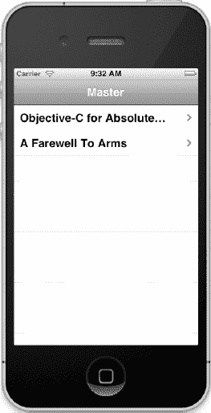
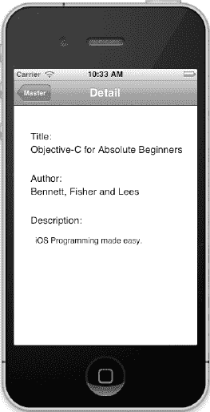

# 修改 `MasterViewController`

我们的简易应用程序包含两个视图控制器：主视图控制器名为 `MasterViewController`，另一个辅助视图控制器名为 `DetailViewController`。视图控制器是控制视图行为的对象。为了让应用程序开始显示来自数据模型的数据，我们首先需要修改 `MasterViewController`——这是应用程序导航的起点。以下代码已经存在于 Xcode 提供的模板中，我们只需对其进行修改以加入数据模型。

首先，需要修改 `MasterViewController.h` 文件。我们要添加一个实例变量来存储 `Bookstore` 对象。代码清单 8-18 显示了第 17 行以属性的形式添加了实例变量。同时请注意第 12 行有一个所谓的*前向声明*。这并没有定义 `Bookstore` 类，只是告诉编译器后续会定义 `Bookstore` 对象。这样就能防止第 17 行因编译器不了解 `Bookstore` 对象而报错。

**代码清单 8-18.** *添加 `Bookstore` 对象。*

```
 1  //
 2  //  MasterViewController.h
 3  //  MyBookstore
 4  //  
 5  //  Created by M.R. Fisher on 8/28/11.
 6  //  Copyright (c) 2011 www.committed-code.com. All rights reserved.
 7  //  
 8
 9  #import <UIKit/UIKit.h>
10
11  @class DetailViewController;
12  @class Bookstore;
13
14  @interface MasterViewController : UITableViewController
15
16  @property (strong, nonatomic) DetailViewController *detailViewController;
17  @property (strong, nonatomic) Bookstore *myBookStore;
18
19  @end
```

接下来，我们需要修改 `MasterViewController.m` 实现文件，以实际使用该对象。首先，要让 `MasterViewController` 知道我们的 `Bookstore` 类。如代码清单 8-19 所示，我们通过在第 13 行导入头文件来实现。

第 18 行是对我们之前声明的 `myBookStore` 属性进行的 `@synthesize`。第 25 行分配了一个新的 `Bookstore` 对象并赋值给该属性。放置一次性初始化（如书店对象）的最佳位置是 `initWithNibName:bundle:` 方法。该方法在类加载时仅被调用一次。

**代码清单 8-19.** *分配 `Bookstore` 对象。*

```
 1  //
 2  //  MasterViewController.m
 3  //  MyBookstore
 4  //
 5  //  Created by M.R. Fisher on 8/28/11.
 6  //  Copyright (c) 2011 www.committed-code.com. All rights reserved.
 7  //
 8
 9  #import "MasterViewController.h"
10
11  #import "DetailViewController.h"
12  #import "Book.h"
13  #import "Bookstore.h"
14
15  @implementation MasterViewController
16
17  @synthesize detailViewController = _detailViewController;
18  @synthesize myBookStore;
19
20  - (id)initWithNibName:(NSString *)nibNameOrNil bundle:(NSBundle *)nibBundleOrNil
21  {
22      self = [super initWithNibName:nibNameOrNil bundle:nibBundleOrNil];
23      if (self) {
24          self.title = NSLocalizedString(@"Master", @"Master");
25          self.myBookStore = [[Bookstore alloc] init];  
26      }                                      
27      return self;
28  }
```

好了，现在 `Bookstore` 对象已经初始化，我们需要告诉 `MasterViewController` 如何显示书籍列表——不显示详情，只显示书名。为此，我们需要修改几个方法。幸运的是，Xcode 提供了一个不错的模板，因此我们的修改量很小。

我们的 `MasterViewController` 是 `UITableViewController` 的子类。该类控制数据行在屏幕上的显示。在我们的案例中，这些行显示的是书名（对于这个简单程序来说只有两本，但终究是一个列表）。

控制 `UITableViewController` 数据内容及显示方式的主要方法有三个。

*   第一个是 `numberOfSectionsInTableView:`。由于我们的应用程序只有一个列表（即一个分区），该方法返回 1。
*   第二个是 `tableView:numberOfRowsInSection:`。在我们的程序中，返回书店数组中的书籍数量。由于这是唯一的分区，代码非常简单。
*   第三个方法是 `tableView:cellForRowAtIndexPath:`。该方法针对屏幕上要显示的每一行被调用，且每次只调用一行。

代码清单 8–20 详细列出了我们需要进行的修改，以便在视图上显示书籍列表。修改从源文件的第 83 行开始。

**代码清单 8-20.** *设置视图以显示书籍。*

```
83  - (NSInteger)tableView:(UITableView *)tableView
84  numberOfRowsInSection:(NSInteger)section
85  {
86      return self.myBookStore.count;
87  }
88  
89  // 自定义表格视图单元格的外观。
90  - (UITableViewCell *)tableView:(UITableView *)tableView  
91           cellForRowAtIndexPath:(NSIndexPath *)indexPath
92  {
93      static NSString *CellIdentifier = @"Cell";
94
95      UITableViewCell *cell =
96         [tableView dequeueReusableCellWithIdentifier:CellIdentifier];
97      if (cell == nil) {
98          cell = [[UITableViewCell alloc] initWithStyle:UITableViewCellStyleDefault
99                                        reuseIdentifier:CellIdentifier];
100          cell.accessoryType = UITableViewCellAccessoryDisclosureIndicator;
101      }
102
103      // 配置单元格。
104      cell.textLabel.text = [self.myBookStore bookAtIndex:indexPath.row].title;
105      return cell;
106  }
```

在这段代码中，我们只需要修改两行。其他部分保持不变即可。这就是使用 Xcode 模板的优势之一。第 86 行原本仅返回 1；我们需要将其改为返回 `Bookstore` 类中项目的数量。

第 104 行看起来稍显复杂。基本上，`UITableView` 的每一行都被称为一个单元格（具体来说是 `UITableViewCell`）。第 104 行将单元格的文本设置为某本书的标题。让我们更具体地看一下这段代码：

```
[self.myBookStore bookAtIndex:indexPath.row].title;
```

首先，`self.myBookStore` 是我们的 `Bookstore` 对象，这一点很明确。我们调用它的方法 `bookAtIndex:`。参数 `indexPath.row` 指定了我们要获取的行——`indexPath.row` 总是比总数量（第 86 行返回的值）小 1。因此，调用 `[self.myBookStore bookAtIndex:indexPath.row]` 会返回一个 `Book` 对象。最后一部分 `.title` 用于访问返回的 `Book` 对象的标题属性。以下代码等同于我们刚才在一行中完成的操作：

```
1  Book *book;
2  book = [self.myBookStore bookAtIndex:indexPath.row];
3  cell.textLabel.text = book.title;
```

现在，你可以构建并运行应用程序，应该能看到我们在数据模型中创建的两本书，如图 8–15 所示。

但任务尚未完成。我们需要让应用程序在点击某本书时显示其详情。为此，我们需要对 `MasterViewController` 进行最后一次修改。

每当触摸屏幕上的某一行时，就会调用 `tableView:didSelectRowAtIndexPath:` 方法。该方法是模板的一部分，但目前并未处理我们的书籍。代码清单 8-21 显示了将详情视图与书籍数据关联起来所需进行的微小修改。



**图 8–15.** *首次运行应用程序。*

**代码清单 8-21.** *通过触摸选中书籍。*


### 代码行示例

```
146  - (void)tableView:(UITableView *)tableView didSelectRowAtIndexPath:(NSIndexPath *)indexPath
147  {
148      Book *selectedBook = [self.myBookStore bookAtIndex:indexPath.row];
149
150      if (!self.detailViewController) {
151          self.detailViewController = [[DetailViewController alloc]
152                                          initWithNibName:@"DetailViewController"
153                                                   bundle:nil];
154      }
155      self.detailViewController.detailItem = selectedBook;
156      [self.navigationController pushViewController:self.detailViewController
157                                           animated:YES];
158  }
```

如果第#148 行看起来与清单 8-20 中的第#104 行非常相似，那是因为它们本质上是相同的。基于`indexPath.row`，我们从`Bookstore`对象中选择特定的书籍，并将其保存到一个名为`selectedBook`的变量中。

在第#155 行，我们将`selectedBook`存储到一个名为`detailItem`的属性中，该属性已经是现有`DetailViewController`类的一部分。这就是我们在`MasterViewController`中需要做的全部工作。我们已经将书籍传递给了`DetailViewController`。我们几乎完成了。现在我们需要对`DetailViewController`做一些小的修改，以便它能够正确显示`Book`对象。

## 修改 DetailViewController

在本章前面，我们修改了`DetailViewController`，使其能够显示书籍的一些详细信息。在我们刚刚完成的代码中，我们修改了`MasterViewController`，使其将选中的书籍传递给`DetailViewController`。现在剩下的就是简单地将`DetailViewController`中的`Book`对象的信息移动到屏幕上的相应字段。所有这些都在一个方法——`configureView`中完成。

**清单 8-22.** *将 Book 对象数据移动到我们的详细视图中。*

```
33  - (void)configureView
34  {
35      // Update the user interface for the detail item.
36
37      if (self.detailItem) {
38          Book *theBook = (Book *)self.detailItem;
39          self.titleLabel.text = theBook.title;
40          self.authorLabel.text = theBook.author;
41          self.descriptionTextView.text = theBook.description;
42      }
43  }
```

`configureView`方法是 Xcode 模板中包含的许多便捷方法之一，每当`DetailViewController`被初始化时都会调用它。这就是我们将选中的`Book`对象信息移动到视图中的字段的地方。

在`DetailViewController.m`文件中的第#38–41 行，是我们将信息从`Book`对象移动到视图的地方。如果您还记得，清单 8-21 中的第#155 行将选中的书籍设置到了`DetailViewController`上一个名为`detailItem`的属性中。第#38 行将该项取出，放入一个名为`theBook`的`Book`对象中。

第#39–41 行简单地将每个`Book`对象的属性移动到了我们在本章前面构建的视图控件中。这就是我们在这个类中需要做的全部。如果您构建并运行项目，然后点击其中一本书，您应该会看到类似图 8–16 的内容。

不要忘记添加对`Book.h`文件的导入，如清单 8-23 第#10 行所示。

**清单 8-23.** *导入 Book.h 头文件。*

```
 1  //
 2  // DetailViewController.m
 3  // MyBookstore
 4  //
 5  // Created by M.R. Fisher on 8/28/11.
 6  // Copyright (c) 2011 www.committed-code.com. All rights reserved.
 7  //
 8
 9  #import "DetailViewController.h"
10  #import "Book.h"
```



**图 8–16.** *首次查看我们的书籍详情。*

## 摘要

我们终于到达了这一章的结尾！以下是我们所涵盖内容的总结。

- **理解集合类：** 集合类是一组非常强大的类，随 Foundation 框架一起提供，允许我们高效地存储和检索信息。
- **使用实例变量：** 实例变量是在类的接口文件中定义的变量，在类被实例化后即可访问。
- **使用属性：** 属性是创建 getter 和/或 setter 的简短方式。Getter 和 setter 用于获取或设置实例变量的值。
- **使用`for...in`循环：** 这个特性提供了一种新的方式来遍历枚举列表中的项。
- **构建主从应用程序：** 我们使用 Xcode 和主从模板构建了一个简单的 Bookstore 程序，用于显示书籍和单本书的详细信息。
- **简单的数据模型：** 使用我们学习到的集合类，我们使用`NSMutableArray`构建了一个 Bookstore 对象，并将其用作 Bookstore 程序中的数据源。
- **将数据连接到视图：** 我们使用 Xcode 将`Book`对象的数据连接到界面字段。

### 练习

- 参考原始程序，向 Bookstore 中添加更多书籍。
- 增强`Book`类，使其能够存储另一个属性——例如价格或 ISBN 号。
- 修改`DetailViewController`，使其显示新的字段。记得将界面控件连接到实例变量。
- 修改`Bookstore`对象，使其调用一个单独的方法来初始化`Book`对象列表（而不是将所有内容放在`init`方法中）。
- `UITableViewCell`还有一个名为`detailTextLabel`的属性。尝试使用它，将其文本属性设置为某些内容。
- 使用 Xcode 修改界面，尝试更改`DetailViewController.xib`文件的背景颜色。

更难的挑战：

- 对`Bookstore`对象中的书籍进行排序，使它们在`MasterDetailView`上按升序显示。

