# 第 9 章

## 比较数据

在本章中，我们将讨论编程中最基本也是最频繁的操作之一：比较数据。在我们的 Bookstore 示例中，如果客户正在寻找特定的书籍，您可能需要比较书名。如果客户有兴趣购买特定作者的书，您可能还需要比较作者。比较数据是开发人员执行的常见任务。您在上一章中学到的许多循环都需要您比较数据，以便知道代码何时应停止循环。

编程中的比较就像使用天平。一端有一个值，另一端有另一个值。中间有一个运算符。运算符决定了进行哪种比较。运算符的示例包括"大于"、"小于"或"等于"。

天平两端的值通常是变量。我们在第 3 章中学习了不同类型的变量。通常，不同变量的比较函数会略有不同。您必须非常熟悉比较数据的函数和语法，因为这将是您开发的基础。

在本章中，我们将使用一个 Bookstore 应用程序的示例。该应用程序将允许用户登录应用程序、搜索书籍以及购买书籍。我们将尝试联系比较数据的不同方式，以展示它们在这类应用程序中是如何使用的。


## 重温布尔逻辑

在前面的章节中，我们介绍了布尔逻辑。由于它在编程中非常普遍，本章将重新审视这个主题，并进行更详细的讨论。

你将编写应用程序执行的最常见的比较就是布尔逻辑。布尔逻辑通常以 `if` `then` 语句的形式出现。布尔逻辑只能有“是”或“否”两个答案之一。以下是一些你将在应用程序中使用的布尔问题的好例子：

*   `5` 比 `3` 大吗？
*   “now”的字母数超过 `5` 吗？
*   `2010 年 6 月 1 日` 晚于今天吗？

请注意，这些问题的正确答案只有两个可能：“是”和“否”。如果你提出的问题可能有超过两个答案，那么该问题需要以不同的措辞来进行编程。

这些问题中的每一个都将由一个 `if` `then` 语句来表示（例如，如果 `5` 大于 `3`，则向用户打印一条消息）。每个 `if` 语句都必须有某种关系运算符。关系运算符可以是“大于”或“等于”之类的。

为了开始在程序中使用这类问题，你首先需要熟悉 C 和 Objective-C 语言中可用的不同关系运算符。我们将首先介绍这些。之后，我们将探讨不同的变量如何与这些运算符一起工作。

## 使用关系运算符

Objective-C 使用 6 个标准的关系运算符。这些是标准的代数运算符，只有一个真正的变化：在 Objective-C 语言中，与大多数其他编程语言一样，等于运算符由两个等号（`==`）构成。在第 4 章的表 4-7 中，我们描述了作为开发者可以使用的不同运算符。

**注意：** 单个等号（`=`）用于给变量赋值。需要两个等号（`==`）来比较两个值。例如，`if(x=9)` 会将值 `9` 赋值给变量 `x`，并且如果 `9` 成功赋值给 `x`，它将返回“是”，这在大多数（如果不是全部）情况下都会发生。而 `if(x==9)` 实际上会执行一个比较，以检查 `x` 是否等于 `9`。

### 比较数字

过去开发者面临的一个难题是在比较中处理不同的数据类型。在本书的前面部分，我们讨论了不同类型的变量。你可能还记得 `1` 是一个整数。如果你想将一个整数与一个浮点数（如 `1.2`）进行比较，这可能会引起一些问题。幸运的是，Objective-C 在这方面帮了我们。在 Objective-C 中，你可以比较任何两个数值数据类型，而无需进行类型转换（在处理其他数据类型时，有时仍然需要进行类型转换，我们将在本章后面讨论这一点）。这让你可以编写代码，而无需担心需要比较的数据类型。

**注意：** 类型转换是一种将数字从一种类型转换为另一种类型的过程。

在我们的应用中，我们需要以多种方式比较数字。例如，假设我们的书店为单次交易消费超过 `30` 美元的顾客提供折扣。我们需要计算顾客的总消费金额，然后将其与 `30` 美元进行比较。如果消费金额大于 `30` 美元，我们需要计算折扣。请参考以下示例。

```
float totalSpent;
int discountThreshhold;
int discountPercent;

discountThreshold=30;
discountPercent=0;
totalSpent=calculateTotalSpent();

if(totalSpent>discountThreshold) {
        discountPercent=10;
}
```

让我们逐行分析这段代码。首先，我们声明变量（`totalSpent`、`discountThreshhold` 和 `discountPercent`）。正如我们在第 3 章中讨论的，如果数字可能包含小数，我们应该将其声明为 `float` 而不是 `int`。我们知道 `discountThreshold` 和 `discountPercent` 不会包含小数，因此我们可以将它们声明为 `int`。在这个例子中，我们假设有一个名为 `calculateTotalSpent` 的函数，它会计算当前订单的总消费额。然后我们简单地检查总消费额是否大于折扣阈值；如果是，我们就设置折扣百分比。还请注意，在比较不同的数值数据类型时，无需告知代码转换数据。正如我们之前提到的，这一切都由 Objective-C 处理。

另一个需要比较数字的操作是循环。正如在第 4 章中讨论的，循环是开发中的核心操作，许多循环类型都需要某种比较来确定何时停止。让我们看一个 `for` 循环的例子。

```
int numberOfBooks;
numberOfBooks=50;

for (int y = 1; y <= numberOfBooks; y++) {
     doSomething();
}
```

在这个例子中，我们遍历（即循环）书店中图书的总数。`for` 语句是开始发生有趣事情的地方。让我们分解一下。

```
int y=1;
```

这部分代码将 `y` 声明为 `int` 类型，然后为其分配一个起始值 `1`。

```
y <= numberOfBooks;
```

这部分告诉计算机检查我们的计数变量 `y` 是否小于或等于我们商店中图书的总数。如果 `y` 变得大于图书数量，循环将不再运行。

```
y++
```

这部分代码每次循环运行时，将 *y* 增加 `1`。


### 创建示例 Xcode 应用

现在我们来创建一个 Xcode 应用，以便开始比较数值数据。

1.  启动 Xcode。在你的硬盘驱动器中，依次进入 `Developer``Applications` 文件夹。将该文件夹拖到 Dock 栏中，因为在本书余下部分我们会经常用到它。请参见图 9-1。

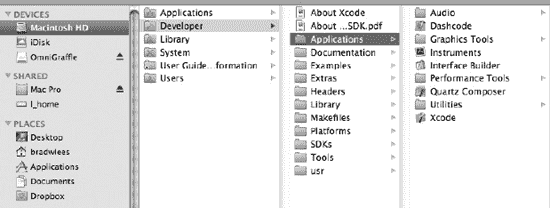
**图 9-1.** *启动 Xcode*

2.  点击“Create a New Xcode Project”以打开一个新窗口。在该窗口左侧，iOS 下方，选择 Application。然后在右侧选择 Single View Application。点击 Next。

**注意：** Window-Based Application 是 iOS 应用类型中最通用、最基本的一种。

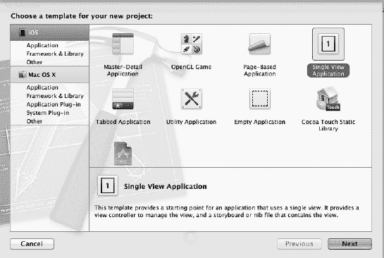
**图 9-2.** *创建新项目*

3.  在下一页，输入你的应用名称。我们使用了 `Comparison` 作为名称，但你可以选择任何你喜欢的名称。这个窗口也是你选择目标设备的地方。我们暂时将其保持为 Universal。请参见图 9-3。

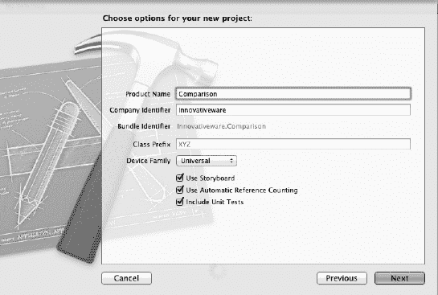
**图 9-3.** *选择项目类型和名称*

**注意：** Xcode 项目默认保存在你的用户主目录下的 Documents 文件夹中。

4.  新项目创建后，你会看到标准的 Xcode 窗口。点击 `Comparison` 文件夹旁边的展开箭头以展开它。你会看到两个文件：`ComparisonsAppDelegate.m` 和 `ComparisonsAppDelegate.h`。`.h` 文件是头文件，此时我们不会对其做任何更改。实际文件名会根据你在创建项目时使用的名称而有所不同。在本示例中，我们将只关注 `ComparisonsAppDelegate.m` 文件。
5.  双击 `main.c` 文件，你会看到以下代码：
    ```
    #import "ComparisonsAppDelegate.h"
    @implementation TestingComparisonsAppDelegate
    @synthesize window=_window;

    - (BOOL)application:(UIApplication *)application
        didFinishLaunchingWithOptions:(NSDictionary *)launchOptions
        {
            // Override point for customization after application launch.
            [self.window makeKeyAndVisible];

    }
    ```
6.  此时，我们的应用只会启动并显示一个窗口。我们将为应用添加一点“Hello World”内容。在 `[self.window makeKeyAndVisible]` 这一行之后，我们需要添加以下代码：`NSLog(@"Hello World");`

这行代码会创建一个内容为“Hello World”的新 `NSString`，并将其传递给用于调试的 `NSLog` 函数。

让我们运行应用看看效果如何。

1.  点击默认工具栏中的 Run 按钮。
2.  iOS 模拟器将启动，并显示一个窗口。回到 Xcode，一个调试窗口会出现在屏幕底部，如图 9-4 所示。你可以随时通过选择 `View``Show Debug Area` 来切换显示此窗口。

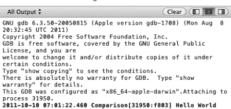
**图 9-4.** *调试器窗口*

这个窗口中的大部分信息对你来说意义不大。最重要的一行是加粗部分，它实际显示了你的应用的输出。该行的第一部分显示了日期、时间和应用名称。“Hello World”部分是由我们之前添加的 `NSLog` 行生成的。

1.  回到应用，打开 `ComparisonsAppDelegate.m` 文件。
2.  找到以 `NSLog` 开头的行。正是这行负责打印“Hello World”部分。我们将通过在这行代码前面加上两个反斜杠（`//`）来注释掉它。注释掉代码会告诉 Xcode 在构建和运行应用时忽略这行代码。被注释掉的代码不会运行。
3.  一旦你注释掉这行代码，再次运行程序时就看不到加粗的那一行了，因为应用不再输出任何内容。
4.  为了让应用输出我们比较的结果，我们需要添加一行代码：`NSLog(@"The result is %@", (6>5 ? @"True" : @"False"));`

**注意：** 上述代码 `(6>5 ? @"True" : @"False")` 被称为三元运算。它本质上只是编写 If/Then 语句的一种简化方式。

5.  将这行代码放入你的代码中。这行代码告诉你的应用打印“The result is”。然后，如果 6 大于 5，它会打印“True”；如果 5 大于 6，则打印“False”。

因为 6 大于 5，所以它会打印出 `True`。

你可以更改这行代码，以测试本章中我们编写的任何示例，或者我们之后会编写的任何示例。

让我们尝试另一个示例。

```
int i=5;
int y=6;
NSLog(@"The result is %@", (y>i ? @"True" : @"False"));
```

在这个示例中，我们创建了一个整数并将其值赋为 5。然后我们创建了另一个变量并将其值赋为 6。接着我们修改了 `NSLog` 示例，改为比较变量 `i` 和 `y`，而不是使用具体的数字。当你运行这个示例时，会得到以下结果：

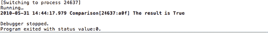
**图 9-4.** *NSLog 输出*

我们现在将探讨其他类型的比较，然后回到我们的应用，测试其中的一些。

## 使用布尔表达式

布尔表达式是所有比较中最简单的一种。布尔表达式用于确定一个值是真还是假。假被定义为 0，真被定义为非零。例如：

```
int j;
j=5;
if(j) {
        some_code();
}
```

`if` 语句始终会被评估为 `true`，因为我们的变量 `j` 不等于零或空。因此，我们的程序会运行 `some_code()` 方法。

```
int j;
j=0;
if(j) {
        some_code();
}
```

如果我们更改 `j` 的值，该语句会被评估为 `false`，因为现在 `j` 等于 0。这可以与 `BOOL` 和数字变量一起使用。

```
int j;
j=0;
if(!j) {
        some_code();
}
```

在布尔表达式前加上一个感叹号会将其值变为相反值（`false` 变成 `true`，`true` 变成 `false`）。现在这行代码询问的是“如果不等于 `j`”，在本例中结果为 `true`，因为 `j` 等于 0。这是一个使用整数充当布尔变量的例子。正如我们之前讨论的，Objective C 也有名为 `BOOL` 的变量，它只有两个可能的值：`YES` 或 `NO`。

**注意：** 许多编程语言使用 `TRUE` 和 `FALSE` 这两个术语，而 Objective C 使用的是 `YES` 和 `NO`。在开发 Objective C 时，C 语言还没有真正的布尔变量。

让我们来看一个与书店相关的例子。我们有一个常客俱乐部，所有会员在购买任何书籍时均可享受 15% 的折扣。这很容易检查。我们只需将变量 `clubMember` 设置为：如果是会员则设为 `YES`，如果不是则设为 `NO`。以下代码将仅对俱乐部会员应用折扣：

```
int discountPercent;
BOOL clubMember;

clubMember=FALSE;
discountPercent=0;
if(clubMember) {
        discountPercent=15;
}
```


## 比较字符串

对于大多数 C 语言来说，字符串是一种非常棘手的数据类型。在 ANSI C（或标准 C）中，字符串仅仅是一个字符数组。而 Objective-C 则进一步推动了字符串的发展，将其转化成一个名为`NSString`的对象。当我们使用对象时，可以调用更多的属性和方法。幸运的是，`NSString`提供了许多用于比较数据的方法，这大大简化了我们的工作。

在为 Mac 和 iPhone 进行开发时，你既能使用`NSString`，也能使用标准的 C 字符串。在本书的范围内，我们将重点放在比较`NSString`对象上。如果你的应用程序中包含 C 类型的字符串，则需要将它们转换为`NSString`，才能使用本书中的代码。幸运的是，这种转换非常简单。

```
char *myCString;
NSString *myNsstring;

myCString = "testing a string";
myNsstring = [NSString stringWithUTF8String: myCString];
```

前两行是你之前见过的代码，是变量声明。你声明了一个名为`myCString`的标准 C 字符串，以及一个名为`myNsstring`的`NSString`。第三行只是对标准 C 字符串的简单初始化，我们为其赋值。

最后一行是关键所在。我们将`NSString`对象赋值为一个新创建的`NSString`对象，该对象的值来源于一个`UTF8string`，并将其传递给已创建的标准 C 字符串。一旦你将所有标准 C 字符串都转换为`NSString`，就能充分利用该类提供的强大比较功能。

让我们看另一个示例。这里，我们将比较密码，以判断是否允许用户登录。

```
NSString *enteredPassword, *myPassword;

myPassword=@"duck";
enteredPassword=@"Duck";
bool continueLogin=NO;

if([enteredPassword isEqualToString:myPassword]) {
        continueLogin=YES;
}
```

第一行声明了两个`NSString`变量。接下来两行初始化了这些字符串。请记住，在使用任何对象之前，都需要先初始化它们。在实际代码中，你需要从用户那里获取`enteredPassword`字符串。这几行代码使用了一种快捷方式。请注意 C 风格字符串前的`@`符号。`@`符号会根据其后的 C 风格字符串创建一个新的`NSString`。

下一行是实际完成工作的代码部分。我们向`enteredPassword`对象发送了一条消息，询问它是否与`myPassword`字符串相等。该方法始终需要传入一个`NSString`对象。这段示例代码的结果始终为`false`，因为`enteredPassword`中包含大写字母，而`myPassword`中都是小写字母。

**注意：** 如果你需要比较两个`NSString`而忽略大小写，只需使用`caseInsensitiveCompare`方法，而不是`isEqualToString`。

你还可能需要对字符串执行许多其他不同的比较操作。例如，你可能想要检查某个字符串的长度。这很容易实现。

```
NSString *enteredPassword;
NSString *myPassword;
myPassword=@"duck";
enteredPassword=@"Duck";
bool continueLogin=NO;

if([enteredPassword length] > 5) {
        continueLogin=YES;
}
```

这段代码会检查输入的密码长度是否大于 5 个字符。

其他时候，你可能需要在一个字符串中搜索某些数据。幸运的是，Objective-C 让这件事变得非常简单。`NSString`提供了一个名为`rangeOfString`的函数，允许你在一个字符串中搜索另一个字符串。`rangeOfString`函数只接受一个参数，即你要搜索的字符串。

```
NSString *searchTitle, *bookTitle;
searchTitle=@"Sea";
bookTitle=@"2000 Leagues Under the Sea";

if([bookTitle rangeOfString:searchTitle].location !=NSNotFound) {
        addToResults();
}
```

这段代码与我们之前检查过的其他示例非常相似。此示例接受一个搜索词，并检查书名中是否包含该搜索词。如果包含，则将该书添加到结果中。这可以进行调整，允许用户在书名、作者甚至描述中搜索特定词条。

**注意：** 默认情况下，所有字符串搜索都是区分大小写的。如果你想在字符串内搜索而忽略大小写，可以将前面的调用：

`[bookTitle rangeOfString: searchTitle]`

改为：

`[bookTitle rangeOfString: searchTitle options:NSCaseInsensitiveSearch]`

有关`NSString`支持的方法的完整列表，请参阅苹果文档：[`http://developer.apple.com/mac/library/documentation/cocoa/reference/Foundation/Classes/NSString_Class/Reference/NSString.html`](http://developer.apple.com/mac/library/documentation/cocoa/reference/Foundation/Classes/NSString_Class/Reference/NSString.html)。


## 比较日期

在任何编程语言中，日期都是一种相当复杂的变量类型，而不幸的是，根据你编写的应用程序类型，它们又非常常见。Objective-C 以前使用 `NSCalendarDate` 类，但最近已被更新式的 `NSDate` 所取代。新的 `NSDate` 包含许多便捷方法，使得日期比较变得简单。我们将重点介绍 `compare` 函数。`compare` 函数返回一个 `NSComparisonResult` 类型，该类型有三个可能的值：`NSOrderedSame`、`NSOrderedDescending`、`NSOrderedAscending`。

```
NSDate *today = [NSDate date];

//促销日期为 2011/12/4
NSDate *saleDate = [NSDate dateWithString:@"2011-12–04 04:00:00 -0700"];

NSComparisonResult result;
bool saleStarted;

result=[today compare:saleDate];

        if(result==NSOrderedAscending) {
                //促销日期在未来
                saleStarted=NO;
        } else if(result==NSOrderedDescending) {
                //促销日期已过去
                saleStarted=YES;
        } else {
                //促销日期与今日相同
                saleStarted=YES;
        }
```

这看起来好像只是为了比较日期而做了大量工作。让我们逐步分析这段代码，看看能否理解其含义。

`NSDate *today = [NSDate date];`
`NSDate *saleDate = [NSDate dateWithString:@"2011-09–04 04:00:00 -0700"];`

这里，我们声明了两个不同的 `NSDate` 对象。第一个名为 `today`，用系统日期（即你的电脑或 iPad 日期）进行初始化。第二个名为 `saleDate`，用未来的某个日期进行初始化。我们将使用这个日期来判断促销是否已经开始。我们不会详细讨论 `NSDate` 的初始化细节，但它可以使用 `dateWithString` 函数进行初始化，就像我们前面展示的那样。

**注意：** 在大多数编程语言中，日期都按照特定的格式处理。通常以四位数的年份开头，后跟连字符，然后是两位数的月份，再跟连字符，最后是两位数的日期。如果您使用带时间的数据格式，这些数据的呈现方式通常也类似。时间通常以小时、分钟和秒的形式呈现，各部分之间用冒号分隔。Objective-C 也支持时区。“-0700”告诉 Objective-C 该时间比格林威治标准时间（即山地标准时间）早 7 小时。

`NSComparisonResult result;`

使用 `NSDate` 对象的 `compare` 函数的结果是一个 `NSComparisonResult` 类型。我们必须声明一个 `NSComparisonResult` 变量来捕获 `compare` 函数的输出。

`result=[today compare:saleDate];`

这一行代码执行了两个日期的比较。它将结果 `NSComparisonResult` 存储到名为 `result` 的变量中。

```
if(result==NSOrderedAscending) {
//促销日期在未来
        saleStarted=NO;
} else if(result==NSOrderedDescending) {
//促销日期已过去
        saleStarted=YES;
} else {
//促销日期与今日相同
        saleStarted=YES;
}
```

现在我们需要找出变量 `result` 中的值。为此，我们执行一条 `if` 语句，将该结果与 `NSComparisonResult` 的三个不同选项进行比较。第一行判断促销日期是否大于今天的日期。这意味着促销日期在未来，因此促销尚未开始。我们将变量 `saleStarted` 设置为 `No`。下一行判断促销日期是否小于今天的日期。如果是，则促销已经开始，我们将 `saleStarted` 变量设置为 `Yes`。再下一行是 `else`。它涵盖了所有其他情况。不过我们知道，唯一剩下的情况是 `NSOrderedSame`。这意味着两个日期完全相同，因此促销刚开始。

还有其他方法可用于比较 `NSDate` 对象。每种方法在某些特定任务中会更高效。我们选择了 `compare` 方法，因为它能处理大部分基本的日期比较需求。

**注意：** 请记住，`NSDate` 同时包含日期和时间。这会影响你的日期比较，因为它不仅会比较日期，还会比较时间。

## 组合比较

正如我们在第 4 章中讨论的，有时需要比单一比较更复杂的逻辑。这时就需要用到逻辑运算符。逻辑运算符使你能够同时检查多个不同的条件。例如，如果我们的图书俱乐部会员消费超过 30 美元时享有特别折扣，我们可以写一条语句来检查。

```
float totalSpent;
 int discountThreshhold;
int discountPercent;
BOOL clubMember = TRUE;

discountThreshhold=30;
discountPercent=0;
totalSpent=calculateTotalSpent();

if(totalSpent > discountThreshhold && clubMember) {
        discountPercent=15;
}
```

我们结合了上面的两个示例。新的比较行解读如下：如果 `totalSpent` 大于 `discountThreshold` **并且** `clubMember` 为 `true`，则将 `discountPercent` 设置为 15。要使此条件返回 `True`，两个条件都必须为真。可以使用 `||` 代替 `&&` 来表示“或”。我们可以将上面这行代码改为：

```
if(totalSpent> discountThreshhold|| clubMember) {
        discountPercent=15;
}
```

现在这行代码解读为：如果 `totalSpent` 大于 `discountThreshold` **或** `clubMember` 为 `true`，则设置折扣百分比。如果任意一个条件为 `true`，此条件将返回 `True`。

你可以继续使用逻辑运算符，根据需求将任意数量的比较串联起来。在某些情况下，你可能需要使用括号将比较条件分组。这可能更复杂，超出了本书的讨论范围。


## 使用 Switch 语句

到目前为止，我们已经看到了几个通过简单使用 `if` 语句和/或 `if`/`else` 语句来比较数据的示例。

```
if (some_value == SOME_CONSTANT) {
    ...
} else if (some_value == SOME_OTHER_CONSTANT) {
    ...
} else if (some_value == YET_SOME_OTHER_CONSTANT) {
    ...
}
```

如果要将某个特定的有序类型与若干常量值进行比较，你可以使用一种不同的方法来简化比较代码：`switch` 语句。

**注意：** 有序类型是一种可以排序的 C 语言内置数据类型。例如 `int`、`long`、`char`、`BOOL`。

`switch` 语句允许将一个或多个常量值与有序数据类型进行比较。这一点至关重要，需要理解。`switch` 语句不允许将有序类型与变量进行比较。下面是一个正确的 `switch` 语句示例：

```
char value;
value = 'd';

switch (value) {        // switch 语句后跟一个左大括号
case 'a':       // 等同于 if (value == 'a')
   ...                  // 在此处调用函数并在 case 之后放置任何其他语句
   ...
break;                  // 表示 "case 'a':" 语句的结束
case 'b':
    ...
    ...
break;
case 'c':       // 如果 case 没有 break，程序会继续执行
case 'd':               //  因此，在这种情况下，如果 value 是 'c' 或 'd'，此代码块将被执行
    ...
    ...
break;
default:                 // default 是可选的，仅当没有与 'value' 匹配的 case 语句时使用
   ...              // 所以，如果 value 等于 'x'，则会执行 switch 语句的 default 部分
   ...          // 因为没有 "case 'x':" 存在
break;
}  // switch 语句结束
```

`switch` 语句非常强大，它简化并精简了将有序类型与若干可能常量进行的比较。话虽如此，这同时也是 `switch` 语句的局限性所在。例如，无法使用 `switch` 语句将 `NSString` 变量与一系列字符串常量进行比较。这是因为 `NSString` 值不是有序类型。`switch` 语句还必须将有序类型与常量进行比较。因此，无法编写如下代码：

```
switch (value) {
case variable: //case 必须是常量，而不能是变量
   ...
break;
```

虽然这些看起来似乎是 `switch` 语句的严重限制，但 `switch` 语句仍然是一个非常强大的语句，可以用来简化某些 `if`/`else` 语句。

### 总结

本章到此结束！以下是涵盖内容的总结。

*   **比较**
    *   数据比较是任何应用程序不可或缺的一部分。
*   **关系运算符**
    *   你了解了六种标准关系运算符及其各自的使用方法。
*   **整数**
    *   整数是最容易比较的信息类型。你了解了如何在程序中使用整数比较以及如何实现它。
*   **示例**
    *   你创建了一个示例应用程序，在其中可以测试你的比较逻辑，确保其正确无误。
    *   你了解了如何修改应用程序以添加不同类型的比较。
*   **布尔值**
    *   你了解了如何检查布尔值。
*   **字符串**
    *   你了解了字符串与你测试过的其他信息类型表现有何不同。你了解到了一些比较字符串时可能遇到的陷阱。
*   **对象**
    *   你了解到比较对象可能相当困难，并且必须小心谨慎，以确保得到你期望的响应。

### 练习

*   修改示例应用程序，以比较一些字符串信息。可以是变量形式或字面量形式。
*   在你的应用程序中创建一个循环，使用你在本章布尔值部分学到的方法来显示一个数字。
*   编写一个 Objective-C 应用，判断以下年份是否为闰年：1800、1801、1899、1900、2000、2001、2003 和 2010。输出应以如下格式写入控制台：“2000 年是闰年”，或“2001 年不是闰年”。

## 第 10 章

## 创建用户界面

Interface Builder 是一款应用程序，它使 iPhone/iPad 和 Mac 开发者能够通过一个强大的图形用户界面轻松创建他们的用户界面。它提供了只需将对象从 Interface Builder 的库中拖拽到应用的用户界面上，即可构建用户界面的能力。

Interface Builder 将你的用户界面设计存储在一个或多个资源文件中，这些文件称为 XIB。这些资源文件用于设置界面对象及其关系。你在用户界面上所做的更改会自动与 Xcode 同步。

要构建用户界面，只需将对象从 Interface Builder 的库面板拖拽到你的视图上。操作和输出口是 Interface Builder 的两个关键组件，它们帮助我们简化开发流程。

我们的视图中对象触发的**操作**会连接到应用代码中的方法。在对象接口文件中声明的**输出口**（指针）会连接到特定的实例变量。请参见图 10–1。

**注意：** Interface Builder 曾经是一款独立的应用程序，开发者用它来设计用户界面。从 Xcode 4.0 开始，Apple 将 Interface Builder 集成到了 Xcode 中。

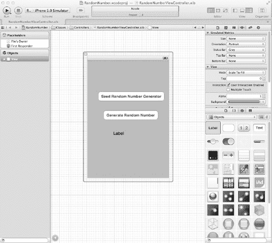

**图 10–1.** *Interface Builder*

## 理解 Interface Builder

对于 iPhone 和 iPad 应用，操作系统负责管理其创建的对象的生命周期。这减轻了开发者的负担，如果开发者使用 Interface Builder 创建了对象，就无需再为其分配内存。

Interface Builder 将用户界面文件保存为一个 bundle，其中包含应用中使用的界面对象和关系。这些 bundle 的文件扩展名是 “.NIB”。在 Interface Builder 3.0 版本中，采用了新的 XML 文件格式，文件扩展名改为 “.XIB”。然而，开发者们在提及或引用这些文件时，仍然称其为 “NIB” 文件。

与大多数其他图形用户界面应用程序不同，NIB 通常被称为“冻干”文件，因为它们包含已归档的对象本身，并且可以随时运行。

XML 文件格式便于与 Subversion 和 Git 等源代码控制系统一起存储。

在下一节中，我们将讨论一种称为“模型-视图-控制器”的应用设计模式。这种设计模式使开发者能够更轻松地维护代码，并在应用的整个生命周期中重用对象。


## 模型-视图-控制器

`Model-View-Controller`（`MVC`）是 iPhone/iPad 开发中最常用的设计模式，学习它将极大简化你的开发者生涯。`MVC` 被广泛应用于软件开发中，被视为一种架构模式。

架构模式描述了开发者可在代码中复用的软件设计问题解决方案。`MVC` 模式并非苹果面向对象编程开发者独有；包括 Windows 和 Linux 平台在内的许多 IDE 厂商都在采用它。

软件开发对企业而言常被视为一项昂贵且高风险的投资。应用经常超出预期开发时间、预算超支，且无法按照承诺运行。面向对象编程曾引发大量关注，让人们相信采用其方法论能节省成本，这主要归功于对象的可复用性和代码更易维护。但最初，这一愿景并未实现。

当工程师们探究面向对象编程为何未能达到预期时，他们发现了开发者设计对象方式的一个关键缺陷：开发者经常将对象混杂在一起，导致随着应用成熟、迁移到不同平台或硬件显示变化，代码变得难以维护。

对象设计时常常存在这样的问题：如果以下任何一项发生变化，就很难隔离受影响的对象：

- 业务规则
- 用户界面
- 客户端-服务器或基于互联网的系统

对象可以划分为三个与任务相关的类别。开发者有责任确保每个类别中的对象不会越界到其他类别。它们分别是：

1. **模型：** 业务对象
2. **视图：** 用户界面对象
3. **控制器：** 与模型和视图通信的对象

当对象被归类到这些组中后，应用就能随着时间的推移更轻松地开发和维护。以下是一个 iPhone 银行应用中的对象及其对应的 `MVC` 类别示例：

**模型**

- 账户余额
- 用户加密
- 账户转账
- 账户登录

**视图**

- 账户余额表格单元格
- 账户登录旋转控件

**控制器**

- 账户余额视图控制器
- 账户转账视图控制器
- 登录视图控制器

在 `MVC` 范式中记忆和归类对象最简单的方法如下：

**模型**：代表真实世界的独特业务或应用规则及代码

**视图**：独特的用户界面代码

**控制器**：任何控制或与模型、视图对象通信的代码

`图 10–2` 展示了 `MVC` 范式。

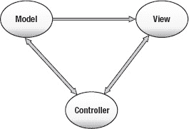

**图 10–2.** *MVC 范式*

Xcode 和 Interface Builder 都不会强制开发者使用 `MVC` 设计模式。开发者需要自行组织对象以运用此设计模式。

值得一提的是，苹果*强烈*推崇 `MVC` 设计模式，其所有框架都设计为在 `MVC` 环境中运行。这意味着，如果你也遵循 `MVC` 设计模式，使用苹果的类库将更加得心应手。否则，你将如同逆水行舟。

## 人机界面指南（HIGs）

在你过于兴奋并开始为应用设计动态用户界面之前，需要先了解一些基本规则。苹果通过 iOS 5 打造了世界上最先进的操作系统之一。此外，苹果产品以直观和用户友好著称。苹果希望用户在不同应用间获得一致的体验。

为确保用户体验的一致性，苹果为开发者提供了关于应用外观和感觉的指南。这些指南被称为人机界面指南（HIGs），适用于 Mac、iPhone 和 iPad。你可以从 `http://developer.apple.com` 下载这些文档。参见 `图 10–3`。

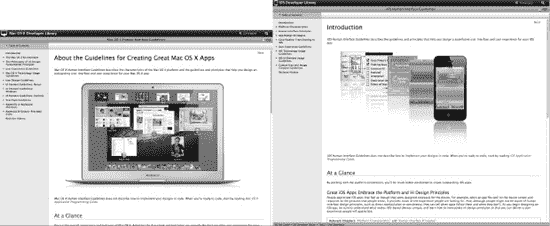

**图 10–3.** *适用于 iOS 设备和 Mac 的苹果人机界面指南（HIGs）*

**注意：** 苹果的 HIGs 不仅仅是建议或参考。苹果对此非常重视。虽然 HIGs 并未描述如何用代码实现用户界面设计，但它们对于理解正确实现视图和控件的方法非常有帮助。

以下是应用在苹果 iTunes App Store 被拒绝的主要原因：

1. 应用崩溃
2. 违反 HIGs
3. 使用苹果私有 API
4. 功能与 iTunes App Store 宣传不符

你可以在开发应用之前阅读、学习并遵循 HIGs，或者当你的应用被苹果拒绝并需要重写部分或全部代码后，再来阅读、学习并遵循 HIGs。无论如何，所有 iOS 开发者最终都将熟悉 HIGs。

许多 iOS 新开发者是通过惨痛教训才明白这一点，但如果你从第一天起就遵循 HIGs，你的 iOS 开发体验将会愉快得多。

## 使用 Interface Builder 创建示例 iPhone 应用

让我们开始构建一个生成并显示随机数的 iPhone 应用。参见 `图 10–4`。这个应用将类似于我们在第 4 章创建的应用，但我们会看到添加 iOS 用户界面（UI）后应用变得多么有趣。

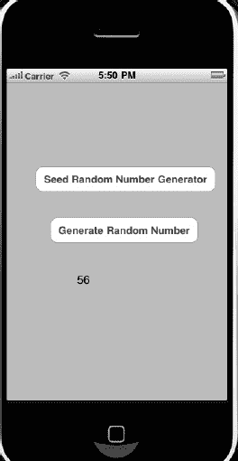

**图 10–4.** *完成的 iOS 随机数生成器应用*

1. 打开 Xcode，选择**创建新项目**。确保为 iPhone 选择**单一视图应用**。参见 `图 10–5`。

   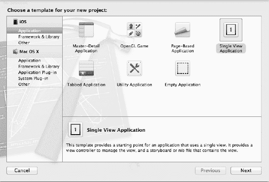

   **图 10–5.** *创建 iPhone 单一视图应用*

2. 将项目命名为“RandomNumber”并保存项目。参见 `图 10–6`。

   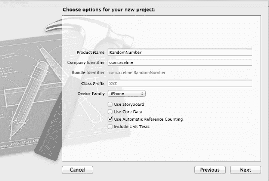

   **图 10–6.** *为我们的 iPhone 项目命名*

3. 你的项目文件和设置被创建并显示出来。参见 `图 10–7`。

   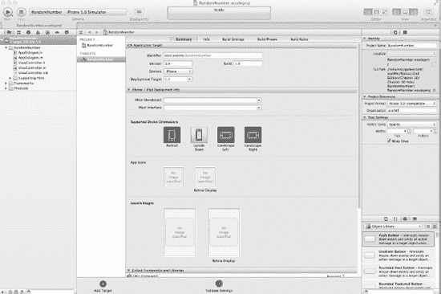

   **图 10–7.** *源文件*

   尽管此项目中只有一个控制器，但在开发初期就建立 MVC 分组是良好的编程习惯。这有助于提醒开发者保持 MVC 范式，避免将所有代码不必要地塞入控制器。

4. 右键点击 RandomNumber 项目，然后选择**新建分组**。参见 `图 10–8`。

   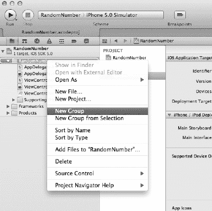

   **图 10–8.** *创建新分组*

5. 创建模型分组、视图分组和控制器分组。

6. 将 `ViewController.m` 和 `.h` 文件拖入控制器分组。拥有这些分组能提醒你在开发代码时遵循 MVC 设计模式，并防止你将所有代码都放在控制器中。参见 `图 10–9`。

   开发者发现，随着项目增长，将 `XIB` 文件与控制器放在一起很有帮助。项目中拥有数十个控制器和 `XIB` 文件的情况并不罕见。将它们放在一起有助于保持一切井井有条。

   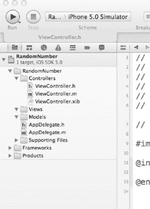

   **图 10–9.** *包含控制器和 XIB 文件的 MVC 分组*

7. 点击 `ViewController.xib` 打开 Interface Builder。

### 使用 Interface Builder

启动 Interface Builder 并开始处理视图的最常见方法是点击与视图相关的 `XIB` 文件。参见 `图 10–10`。

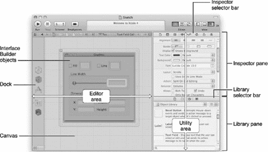

**图 10–10.** *工作区窗口中的 Interface Builder*

当 Interface Builder 打开时，我们可以在画布中看到视图显示。现在我们就能设计用户界面了。首先需要了解 Interface Builder 中的一些子窗口。


## 停靠面板

文档窗口可显示视图所包含的所有对象。以下是这些对象的一些示例：

- 按钮
- 标签
- 文本字段
- 网页视图
- 地图视图
- iAd
- 选择器视图
- 表格视图

**注意：** 您可以展开停靠面板的宽度以查看所有对象的详细列表。请参见图 10–11。为了给画布腾出更多空间，您可以缩小或移除文件列表窗口。

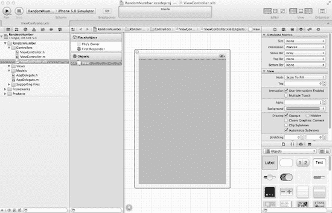

**图 10–11.** *展开停靠面板宽度，以显示 XIB 文件中所有对象的详细视图。*

## 资源库

资源库是您可以发挥创造力的地方。它就像一个对象的自助餐，您可以将其拖放到视图窗口中。

- 通过移动窗口分隔条，可以调整资源库窗口的大小。请参见图 10–12。

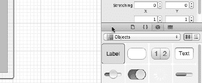

**图 10–12.** *展开资源库面板以查看更多控件。用鼠标滑动分隔条可调整窗口大小。*

对于 Cocoa Touch 对象，资源库面板分为以下五个部分：

- 控件
- 数据视图
- 手势识别器
- 对象与控制器
- 窗口与栏

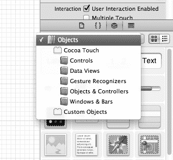

**图 10–13.** *资源库面板中的各种 Cocoa Touch 对象*

## 检查器面板和选择器栏

检查器面板使您可以更改控件的属性，让对象听从您的指令。检查器面板顶部有六个选项卡。请参见图 10–14。

- 文件检查器
- 快速帮助检查器
- 身份检查器
- 属性检查器
- 尺寸检查器
- 连线检查器

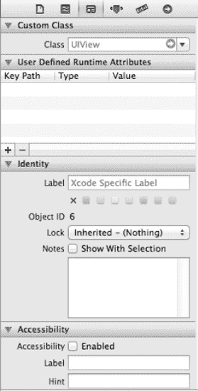

**图 10–14.** *身份检查器和选择器栏*

## 创建视图

我们的随机数生成器将在视图中包含三个对象：一个标签和两个按钮。一个按钮将生成种子，另一个按钮将生成随机数，而标签则显示应用生成的随机数。

1. 从资源库面板的“控件”部分将一个标签拖到视图窗口中。
2. 从资源库窗口将两个圆角矩形按钮拖到视图窗口中。
3. 点击顶部按钮并将其标记为 **种子随机数生成器**。
4. 点击底部按钮并将其标记为 **生成随机数**。请参见图 10–15。

   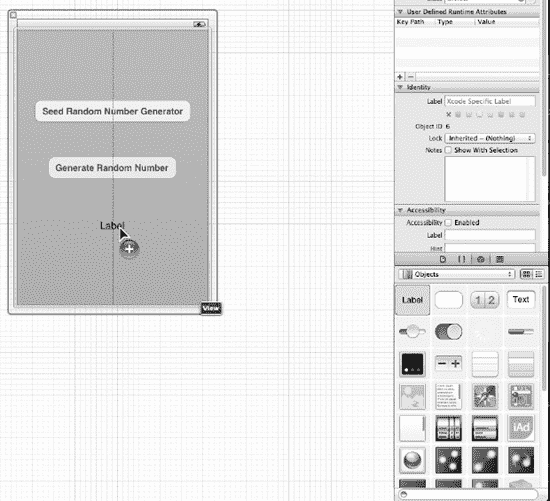

   **图 10–15.** *在视图中放置对象*

   现在，我们要使用 Xcode 4.2 和 iOS 5 的一个新特性。我们现在能够快速轻松地将我们的 Outlet 和 Action 连接到代码。Xcode 4.2 甚至更进一步；它会为我们生成部分代码。我们要做的只是拖放操作。

5. 点击屏幕右上角的“辅助编辑器”图标。这将显示我们正在处理的 XIB 文件的 `.h` 文件。请参见图 10–16。

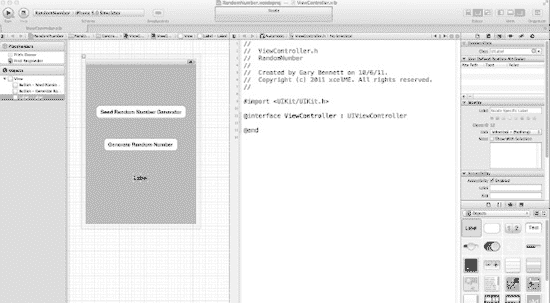

**图 10–16.** *使用辅助编辑器同时显示 .h 文件和 .XIB 文件*

## 使用 Outlet

现在，我们可以通过创建一个 outlet 将标签连接到代码。

1. 为实例变量插入花括号。按住 Control 键从视图中的标签拖到 `.h` 文件中的花括号内并释放。请参见图 10–17。

   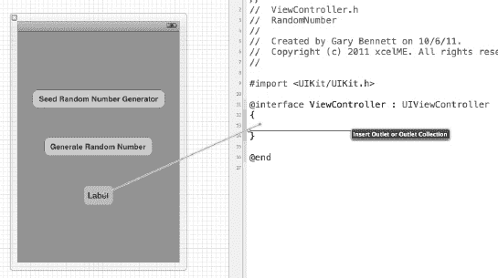

   **图 10–17.** *按住 Control 键拖放以创建 randNumber outlet 的代码*

   将会出现一个弹出窗口。这使我们能够命名并指定 Outlet 的类型。

2. 按照图 10–18 所示完成弹出窗口，然后**按下“连接”按钮**。

   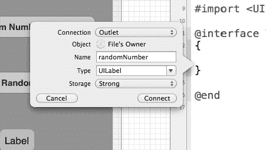

   **图 10–18.** *randomNumber Outlet 的弹出窗口*

现在，outlet 的代码已创建，并且该 outlet 已连接到我们 `.XIB` 文件中的标签对象。第 14 行旁边带有阴影的圆圈表示该 outlet 已连接到 XIB 文件中的一个对象。请参见图 10–19。

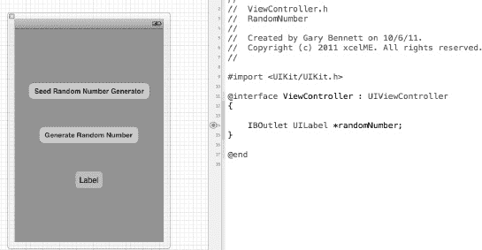

**图 10–19.** *生成的 outlet 实例变量代码并连接到标签对象。*

提醒一下，outlet（指针）是在对象的接口文件中声明，并连接到特定的实例变量。

还有一个声明您可能觉得陌生，叫做 `IBOutlet`，通常简称为 outlet。**Outlet** 向控制器发出信号，表明此实例变量是一个指向在 Interface Builder 中设置的另一个对象的指针。`IBOutlet` 将使 Interface Builder 能够看到该 outlet，并使您能够将变量连接到 Interface Builder 中的对象。

以墙壁上的电源插座为类比，这些实例变量 outlet 连接到对象。使用 Interface Builder，我们可以将这些实例变量连接到相应的对象。

## 连接 Action 和对象

用户界面对象事件，也称为 Action，会触发方法。

现在我们需要将对象 action 连接到按钮。

1. 按住 Control 键从“种子随机数生成器”按钮拖到最后的花括号下方并释放。按照图 10–20 所示完成弹出窗口，然后**按下“连接”按钮**。确保您将连接类型更改为 Action，而不是 Outlet。

   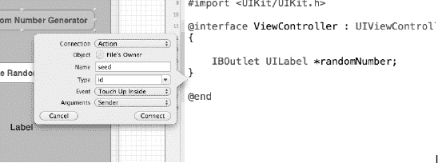

   **图 10–20.** *为种子方法完成弹出窗口。*

2. 对“生成随机数”按钮重复步骤 8。

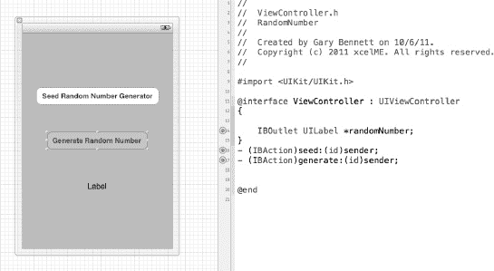

**图 10–21.** *连接到其按钮对象的 Generate 和 Seed action*

## 实现文件

剩下的就是在控制器的实现文件中完成我们的 outlet 和 action 的代码。

打开 `ViewController.m` 文件并完成 `seed:` 和 `generate:` 方法。请参见图 10–22。

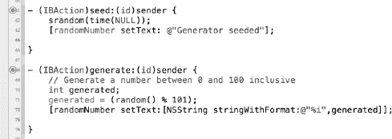

**图 10–22.** *seed: 和 generate: 方法已完成。*

有些代码我们需要进一步审视：`randNumber setText:`。方法 `setText:` 会设置视图中 UILabel 的值。您在 Interface Builder 中从 outlet 到标签对象建立的连接会为您完成所有工作。

就这么简单！

要在 iPhone 模拟器中运行您的 iPhone 应用，请点击“播放”按钮，您的应用应在模拟器中启动。请参见[图 10–23。

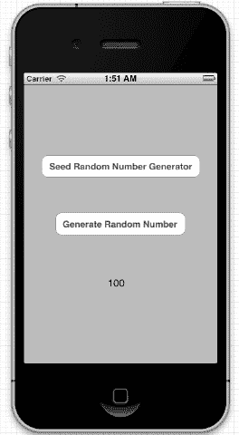

**图 10–23.** *在 iPhone 模拟器中运行的已完成随机数生成器应用*

要为随机函数设定种子，请点击“种子随机数生成器”。要生成随机数，请点击“生成随机数生成器”。

### 总结

做得好！Interface Builder 在创建用户界面时为您节省了大量时间。您拥有强大的一组对象可在应用程序中使用，并且只需编写最少的代码。Interface Builder 处理了许多您通常需要自己处理的细节。

您应该熟悉以下术语：

- XIB 文件
- 模型-视图-控制器 (MVC)
- 架构模式
- 人机界面指南 (HIG)
- Outlet
- Action

### 练习

- 扩展随机数生成器应用，使其在应用启动时在标签中显示日期和时间。
- 调整“生成器已设定种子”的日期和时间消息，使其在标签中完美显示。
- 在显示日期和时间标签后，添加一个按钮以使用新时间更新日期和时间标签。

## 第 11 章


## 存储信息

作为开发者，您会遇到许多需要存储数据的不同场景。用户期望您的应用（app）能在每次启动时记住偏好设置和其他信息。在前几章中，我们讨论了“书店”应用。对于这个应用，用户会希望它能够记住书店中的所有书籍，并将数据库位置设为默认。您的应用需要一种方式来存储、检索这些信息，并可能需要对数据进行搜索和排序。处理数据有时可能会有些棘手。幸运的是，苹果公司提供了相应的方法和框架来简化这一过程。

在本章中，我们将讨论两种需要存储数据的不同格式。首先从保存 Mac 和 iPhone 的偏好设置开始，然后讨论如何在应用中使用 `SQLite` 数据库来存储和检索数据。

## 存储考量

Mac 和 iPhone 在存储方面存在一些主要差异，这些差异会影响您处理数据的方式。我们先从 Mac 谈起，看看您需要如何为其进行开发。

在 Mac 上，默认情况下，应用存储在“应用程序”文件夹中。每个用户都有自己的个人文件夹，用于存储与该用户相关的偏好设置和信息。并非所有用户都有权限写入“应用程序”文件夹或应用包本身。

在 iPhone 和 iPad 上，开发者无需处理不同用户的问题。每位使用 iPhone 的用户都具有相同的权限和相同的文件夹。不过，在 iPhone 上还有一些其他因素需要考虑。iPhone 上的每个应用都处于各自的“沙盒”之中。这意味着一个应用写入的文件只能被该应用自身查看和使用。这为 iPhone 创造了一个更安全的环境，但也改变了我们处理数据存储的方式。

## 数据库

我们已经讨论了如何存储少量信息并在以后检索它们。但如果您有更多信息需要存储呢？如果您需要在这些信息中进行搜索，或者将它们按某种顺序排列呢？这些情况就需要用到数据库。

让我们先讨论一下什么是数据库。数据库是一种工具，用于以易于搜索或检索的方式存储大量信息。使用数据库时，通常一次只检索一小部分数据，而不是整个文件。您日常生活中使用的许多应用都基于某种数据库。您的网上银行应用从数据库中检索账户活动。超市使用数据库检索不同商品的价格。一个简单的数据库示例就是电子表格。您的电子表格中可能有许多列和许多行。电子表格中的列代表了您想要存储的不同信息片段。在数据库中，这些被称为属性。电子表格中的行则被视为数据库中的不同记录。

## 在数据库中存储信息

数据库对开发者来说通常是一个令人望而生畏的主题；大多数开发者会将数据库与企业级数据库服务器（如 Microsoft SQL Server 或 Oracle）联系起来。这些应用需要花费时间进行设置，并且需要持续维护。对大多数开发者来说，像 Oracle 这样的数据库系统可能过于庞大难应付。幸运的是，苹果公司在 Mac、iPhone 和 iPad 中内置了一个小巧紧凑的数据库引擎，名为 `SQLite`。这使您无需承担高昂开销就能获得复杂数据库服务器的许多功能。

`SQLite` 将为您的应用在存储信息方面提供极大的灵活性。它将整个数据库存储在单个文件中。它速度快、可靠性高，且易于在您的应用中实现。`SQLite` 数据库最棒的一点是，无需安装任何软件；苹果公司已经为您考虑周全了。

然而，作为开发者，您应该了解 `SQLite` 确实存在一些局限性：

-   `SQLite` 被设计为单用户数据库。在多人同时访问同一个数据库的环境中，不应使用 `SQLite`。这可能导致数据丢失或损坏。
-   在商业领域，数据库可能会变得非常大。数据库管理员处理高达 500GB 的数据库并不罕见，有时数据库甚至可能远大于此。`SQLite` 应该能够毫无问题地处理较小的数据库，但如果您的数据库开始变得过大，您将会看到性能问题。
-   `SQLite` 缺少企业级数据库解决方案中的一些备份和数据恢复功能。

基于本章的目的，我们将重点使用 `SQLite` 作为我们的数据库引擎。如果您正在开发的应用存在上述任何局限性，您可能需要考虑采用企业级数据库解决方案，但这已超出本书的讨论范围。

**注:** `SQLite` 的名称源于结构化查询语言，或 `SQL`。`SQL` 是用于向数据库输入、搜索和检索数据的语言。

苹果公司一直致力于解决数据库开发中的诸多挑战。作为开发者，您无需熟悉 `SQL`，因为苹果公司已经为您处理了直接的数据库交互。苹果公司创建了一个名为 `Core Data` 的框架，使得与数据库的交互变得容易得多。`Core Data` 是苹果公司从 NeXT 公司的一个名为 `Enterprise Object Framework` 的产品改编而来的，它将为您处理所有数据库交互。使用 `Core Data` 比直接与 `SQLite` 数据库交互要容易得多。通过 `SQL` 直接访问数据库超出了本书的讨论范围。

## Core Data 入门

让我们从创建一个新的 `Core Data` 项目开始。

1.  打开 Xcode，选择 **File**  **New Project**。要创建一个 Mac OS X `Core Data` 项目，请从左侧菜单中选择 Application。它位于 Mac OS X 标题下方。请参见图 11-1。

    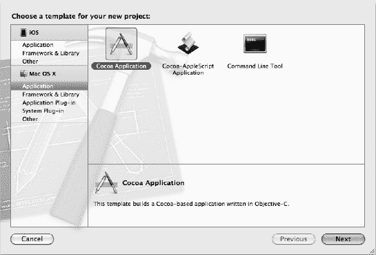

    **图 11-1.** *创建一个新项目。*

2.  完成后点击 Next 按钮。下一个屏幕将允许您决定项目的保存位置和想要使用的名称。基于本章的目的，我们将使用名称 `BookStoreCoreData`。
3.  靠近底部，您会看到三个复选框。第一个复选框标记为 **Use Core Data**。请确保勾选该框，然后点击 **Next**。

    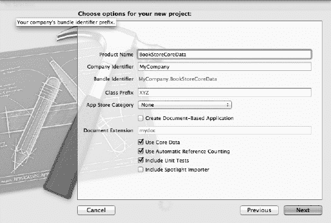

    **图 11-2.** *使用 Core Data。*

完成后，您的新项目将打开。它看起来与标准应用类似，只是现在您会看到一个 `BookStoreCoreData.xcdatamodel` 文件。这个文件被称为数据模型，它将包含关于您将要在 `Core Data` 中存储的数据的信息。


## 模型

如果你点击文件夹旁边的三角形，会看到一个名为 `BookStoreCoreData.xcdatamodel` 的文件。该文件将包含你要存储在数据库中的数据信息。点击这个模型文件，它就会打开。你将看到一个类似于图 11-3 所示的窗口。

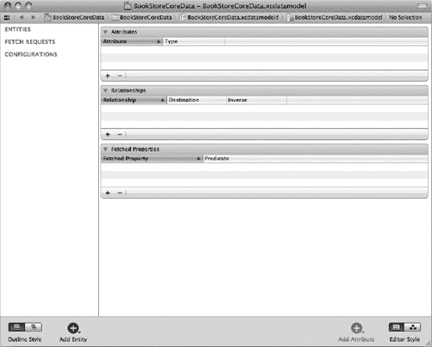

**图 11-3.** *空白的模型。*

窗口分为四个部分。左侧是你的实体。通俗来说，这些就是你想要存储在数据库中的对象或项目。

右上方的窗口包含属性。属性是关于实体的具体信息。例如，一本书是一个实体，而书的标题就是该实体的一个属性。

**注意：** 在数据库术语中，实体是你的数据表，而实体的属性被称为列。由这些实体创建的对象则被称为行。

右中窗口将显示一个实体的所有关系。关系用于连接一个实体与另一个实体。例如，我们将创建一个 `Book` 实体和一个 `Author` 实体。然后我们会将它们关联起来，使每本书都可以有一个作者。右下方部分涉及获取属性。获取属性超出了本书的讨论范围，但它们允许你为数据创建过滤器。

让我们创建一个实体。

1. 点击窗口左下角的加号，或者从菜单中选择 **Editor**  **Add Entity**。参见图 11-4。

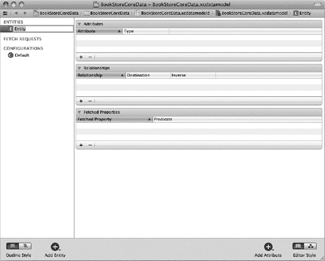

**图 11-4.** *添加一个新实体。*

2. 在左侧，你现在可以给这个实体命名。我们将这个实体命名为 `Book`。

**注意：** 通常认为将实体名称首字母大写是一种良好的实践。

3. 现在，让我们添加一些属性。属性可以看作是书籍的详细信息，因此我们将存储书名、作者、价格和出版年份。显然，在你自己的应用程序中，你可能想存储更多信息，比如出版社、页数和体裁，但我们希望从简单的开始。点击窗口右下角的加号，或者选择 **Editor**  **Add Attribute**，如图 11-5 所示。如果你看不到添加属性的选项，请确保你在左侧已选中了 `Book` 实体。

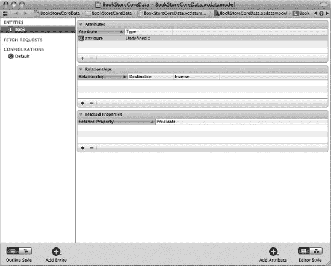

**图 11-5.** *添加一个新属性。*

4. 对于你的属性，你只有两个选项：名称和数据类型。让我们把这个属性命名为 `title`。与实体不同，属性名称应该使用小写。
5. 现在，我们需要选择一个数据类型。选择正确的数据类型非常重要。它会影响数据在数据库中的存储和检索方式。列表中共有 12 个选项，可能会令人望而生畏。我们将讨论最常见的选项，随着你对 Core Data 越来越熟悉，你可以尝试其他选项。最常见的选项是 `String`、`Integer 32`、`Float` 和 `Date`。对于书名，选择 `String`。

> **String**：这是用于存储文本的属性类型。它应该用于存储任何非数字或日期的信息。在此示例中，书名和作者将使用字符串。
> 
> **Integer 32**：实际上，该属性有三种不同的整数值可选。每种整数类型的区别仅在于其可能的最小值和最大值。`Integer 32` 应该可以满足你存储整数时的大部分需求。整数是不带小数的数字。如果你尝试在小数属性中保存整数，小数部分将被截断。在此示例中，出版年份将是一个整数。
> 
> **Float**：Float 是一种可以存储带小数的数字的属性类型。Float 类似于 double 属性，但它们在最小值和最大值上有所不同。Float 应该能够处理任何数值。在此示例中，我们将使用 Float 来存储书的价格。
> 
> **Date**：日期属性顾名思义。它允许你存储日期和时间，然后基于这些值执行搜索和查找。在此示例中，我们不会使用此类型。

6. 让我们为这本书创建其余属性。现在，添加 `price`。它应该是 Float 类型。添加书籍的出版年份。对于由两个单词组成的属性，标准做法是第一个单词小写，第二个单词首字母大写。例如，书籍出版年份属性的理想名称可以是 `yearPublished`。选择 `integer 32` 作为属性类型。添加完所有属性后，你的屏幕应该看起来像图 11-6。

**注意：** 属性名称不能包含空格。

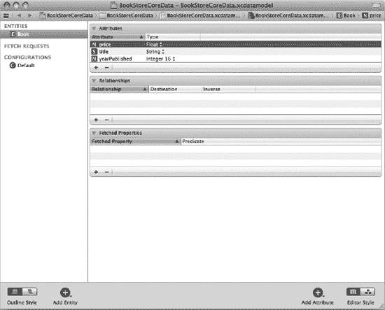

**图 11-6.** *完成后的图书实体。*

**注意：** 如果你习惯于使用数据库，你会注意到我们没有添加主键。主键是一个字段（通常是一个数字），用于唯一标识数据库中的每条记录。在 Core Data 数据库中，无需创建主键。框架会为你管理这一切。

现在我们已经完成了 `Book` 实体，让我们添加一个 `Author` 实体。

1. 添加一个新实体，并将其命名为 `Author`。
2. 为该实体添加 `lastName` 和 `firstName`，两者都被视为字符串。

完成后，你的关系窗口中应该有两个实体。现在我们需要添加关系。

1. 点击 `Book` 实体，然后点击并按住屏幕右下角的加号。选择 Add Relationship，如图 11-7 所示。

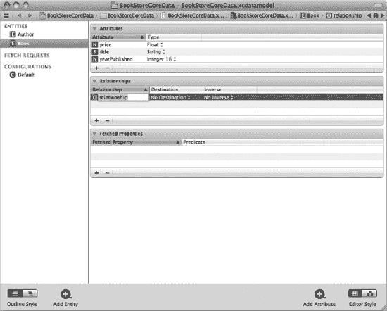

**图 11-7.** *添加一个新关系。*

2. 现在，你将有机会命名你的关系。我们通常给关系起一个与其派生来源的实体相同的名称。输入 `author` 作为名称，或者从下拉菜单中选择 `Author`。
3. 现在，我们已经创建了关系的一半。要创建另一半，请点击 `Author` 实体。现在，点击屏幕底部的加号，并选择 Add Relationship。我们将使用我们正在连接的实体名称作为此关系的名称，因此我们将其命名为 `books`。我们在实体名称后加了一个“s”，因为一个作者可以有多本书。在 Destination 下，选择 `Book`，在 Inverse 下，选择你在上一步中创建的关系。你的模型现在应该看起来像图 11-8。

**注意：** 有时在 Xcode 中处理模型时，需要按 Tab 键来更新实体、属性和关系的名称。这个小怪癖可以追溯到 WebObjects 工具时代。

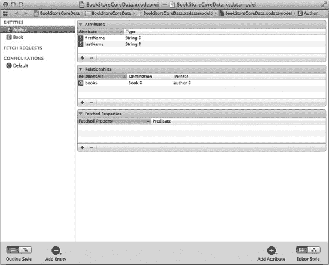

**图 11-8.** *最终的关系。*


现在我们需要让代码了解我们的新实体。为此，选中`Book`实体和`Author`实体，然后选择 **Editor**  **Create NSManagedObject Subclass**。屏幕应如图 11–9 所示。

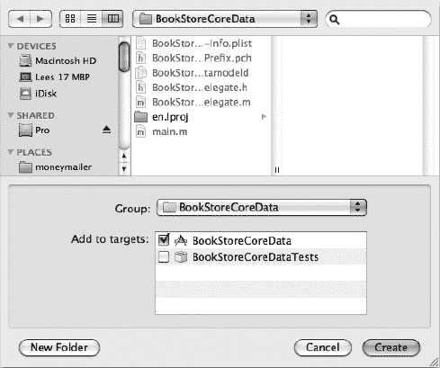

**图 11–9.** *将托管对象添加到项目中。*

选择存储位置并将其添加到项目中。你无需更改此页面上的任何默认设置。然后点击 **Create**。你会注意到项目已添加了四个文件。`Book.h`和`Author.h`包含书籍的头部信息，而`Book.m`和`Author.m`包含实际实现。这些文件相当简单，因为 Core Data 将负责大部分工作。你还应该注意到，如果返回模型并点击`Book`，它会有一个新类。它将不再是`NSManagedObject`，而是`Book`类。

让我们看看`Author.h`的部分内容：

```
#import <Foundation/Foundation.h>
#import <CoreData/CoreData.h>

@class Book;

@interface Author : NSManagedObject {
@private
}
@property (nonatomic, retain) NSString * lastName;
@property (nonatomic, retain) NSString * firstName;
@property (nonatomic, retain) Book * book;

@end
```

你会看到文件开头包含了 Core Data 框架。这使得 Core Data 能够管理你的信息。往下看，你会看到你创建的三个属性。

## 托管对象上下文

我们创建了一个名为`Book`的托管对象。Xcode 的优点是它会生成必要的代码来管理这些新的数据对象。在 Core Data 中，每个托管对象都应存在于托管对象上下文中。上下文负责跟踪对象的更改、执行撤销操作以及将数据写入数据库。在此示例中，我们无需编写代码来创建或管理对象上下文，但当你探索在自己的项目中使用 Core Data 时，你需要意识到它的存在。目前，生成的类提供的基本功能已能正常工作。

## 设置界面

以下步骤将帮助你设置界面：

1.  在项目的 **Resources** 文件夹中，你应该有一个`MainMenu.xib`。双击此文件，Interface Builder 应在新窗口中打开。在窗口左侧，你应该有一个当前对象列表。如果没有此窗口，请单击窗口左下角的小箭头。单击`Window`对象。你的窗口将显示在屏幕右侧。参见图 11–10。

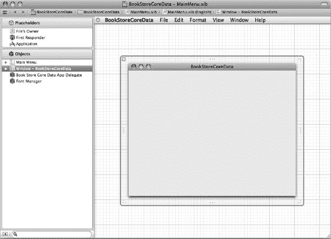

**图 11–10.** *创建界面。*

2.  应该有一个空白窗口。为了给窗口添加一些功能，我们需要从对象库中添加一些对象。要查看对象库，请选择 **View**  **Utilities**  **Object Library**。对象库将显示所有可以添加到窗口的对象。我们将从添加一个 Array Controller（数组控制器）开始。在对象库中向下滚动，直到找到 Array Controller。将其拖到窗口左侧的 **Objects** 窗格。参见图 11–11。

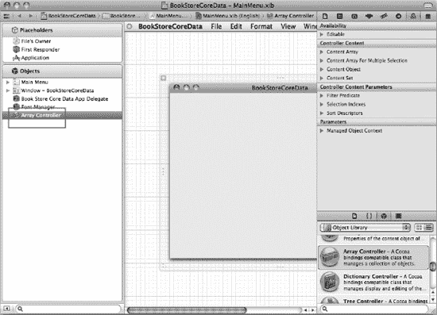

**图 11–11.** *新的 Array Controller。*

3.  双击 Array Controller 并输入名称`BookArray`。现在选择 Array Controller 并查看该对象的绑定。

**注意：** 要查看任何对象的绑定，请选择 **View**  **Utilities**  **Show Bindings Inspector**，或者如果已打开实用工具窗口，请单击圆形符号。

4.  在 **Parameters** 下，如果 **managed object context** 部分未展开，请单击其旁边的箭头。现在勾选 **Bind** 旁边的复选框，并从下拉菜单中选择`Book Store Core Data App Delegate`。
5.  在 **Model Key Path** 中，输入`managedObjectContext`。这会将我们的 Array Controller 绑定到应用程序的默认`managedObjectContext`。这将允许我们添加、修改和保存书籍。参见图 11–12。

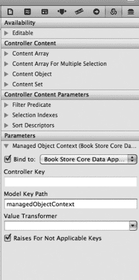

**图 11–12.** *Array Bindings Inspector。*

6.  单击看起来像滑块控件的图标（也称为盾牌）。在 **Object Controller** 标题下，将模式从 **Class** 改为 **Entity Name**。输入`Book`作为实体名称。

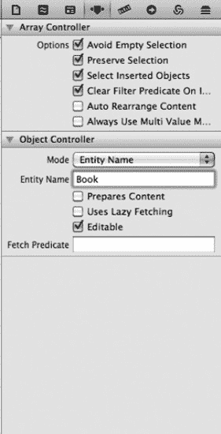

**图 11–13.** *指定实体名称。*

7.  我们需要设置界面。在对象库中，找到一个 Table View（表格视图）对象并将其拖到窗口。你可以轻松移动和调整其大小以符合所需的外观。
8.  找到两个 Push Button（按钮）并将其拖到窗口。将一个按钮的文本改为`Add`，另一个改为`Delete`。

**注意：** 要更改按钮和许多其他图形对象的文本，只需双击该对象即可输入替换文本。

更改表格视图中两列的文本。双击列标题，在第一列输入`Title`，在第二列输入`Price`。窗口现在应类似于图 11–14。

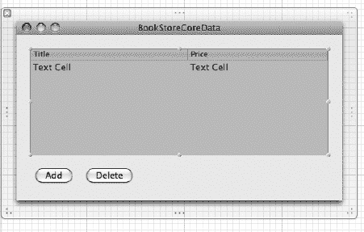

**图 11–14.** *窗口布局。*

我们现在有一个漂亮的窗口，但所有控件都还无法执行任何操作。为了使对象有用途，我们需要将它们绑定到某些东西。

**注意：** Cocoa Bindings 是一种使视图与控制器保持同步的方法。它们有助于减少需要编写的代码量。

要将对象连接到控制器，只需按住 Control 键单击一个项目，然后将其拖动到要连接的项目。将其拖到项目后，将出现一个菜单，其中包含可用的输出口。

1.  首先，按住 Control 键单击你的 Array Controller 并将其拖动到表格视图。将出现一个小的弹出窗口，其中仅选中了一个输出口。选择`content`。你告诉表格视图它将显示 Array Controller 的内容。参见图 11–15。

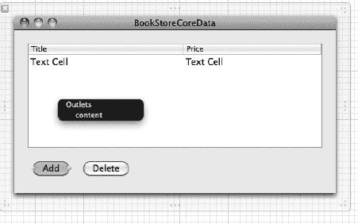

**图 11–15.** *设置绑定。*

2.  现在从 **Add** 按钮按住 Control 键拖动到 Array Controller，并选择`add`。从 **Delete** 按钮按住 Control 键拖动到 Array Controller，并选择`remove`。

**注意：** 当对象成功连接时，它会闪烁两次以提醒程序员。

3.  现在我们的界面大部分应该没问题了。我们只需告诉表格视图中的每一列要显示什么。双击第一个单元格，其中显示 **Text Cell**。这将选中该列。
4.  在 **Bindings** 窗口中，在 **Parameters** 下展开 **Value** 标题。勾选 **Bind to** 旁边的复选框，`Book Array`应已被选中。在 **Model Key Path** 下，输入`title`（参见图 11–16）。选择第二列，勾选 **Bind to**，但在 **Model Key Path** 中输入`price`。

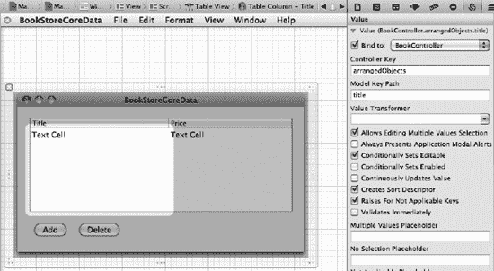

**图 11–16.** *绑定列。*

你应该完成了。单击 **Run**，你应该能够看到新的应用程序窗口。单击 **Add**，它应在表格视图中添加一行。单击列单元格，你可以编辑 **Title** 和 **Price**。你还会注意到，当退出并重新启动应用程序时，它会记住之前存储的值。

这是一个非常简略的 Mac OS X 和 iOS Core Data 入门介绍。Core Data 是一个功能非常强大的 API，需要花大量时间才能精通。


## 小结

本章内容到此结束。以下是涉及知识点的总结。

- **偏好设置**：你学会了如何使用 `NSUserDefaults` 在 iPhone 和 Mac OS X 电脑上以文件形式保存和读取偏好设置。
- **数据库**：你了解了数据库的概念，以及为何在某些情况下使用数据库比使用偏好设置文件更合适。你还学习了苹果集成到 Mac 和 iPhone 中的数据库引擎，以及该引擎的优势与局限性。
- **Core Data**：苹果提供了一个用于与 SQLite 数据库交互的框架。该框架让接口的使用变得简单得多。
- **书店应用**：你创建了一个简单的 Core Data 应用。你使用 Xcode 为书店应用创建了数据模型，学习了如何在两个不同实体之间建立关系，并使用 Xcode 为 Core Data 模型创建了简单的界面。

### 练习

- 为 `Book` 实体添加更多字段。尝试添加出版社、页数和 ISBN 编号。
- 修改图书标签页的布局。重新排序列的顺序。
- 为作者的名和姓添加默认值。

## 第 12 章

## 协议与委托

恭喜！你正在掌握成为 iOS 开发者所需的技能！然而，要想成功，iOS 开发者还需要理解两个额外的主题：协议与委托。新手开发者常常会因这两个概念而感到不知所措，因此我们觉得最好先介绍 Objective-C 语言的基础知识。

## 多重继承

我们在第 1 章中讨论过对象继承。简而言之，对象继承意味着子类可以继承父类的所有特征。请参见图 12-1。

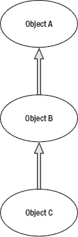

**图 12-1.** *典型的 Objective-C 继承*

C++、Perl 和 Python 都拥有一个称为多重继承的特性。多重继承允许一个类从多个父类继承行为和特性。请参见图 12-2。

然而，多重继承可能会引发歧义，因此会带来问题。由于这个原因，Objective-C 没有实现多重继承。相反，它实现了所谓的协议。

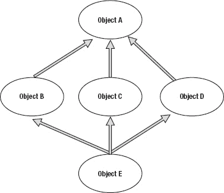

**图 12-2.** *多重继承*

## 理解协议

苹果将协议简单地定义为：一个独立于类定义的方法声明列表。协议与类接口非常相似，不同之处在于它并不定义特定的类。你必须实现协议中列出的方法。例如，报告中鼠标用户操作的方法可以放入一个协议中。请参考以下示例：

```
- (void)mouseDown:(NSEvent *)theEvent;
- (void)mouseDragged:(NSEvent *)theEvent;
- (void)mouseUp:(NSEvent *)theEvent;
```

任何希望响应鼠标事件的类都可以采用该协议并实现其方法。协议非常易于使用，因为它们与类层次结构无关，任何类都可以实现它们。

在本书中，我们一直以书店为例。之前，我们讨论过书店可能销售不同类型的媒体，并讨论了继承在这种情况下如何发挥作用。为了解释协议，假设我们的书店也出售口香糖和糖果。我们希望为这些商品创建一个类，名为 `EdibleItem`。让口香糖继承与书或杂志相同的方法是没有意义的，但所有商品都需要被销售，且库存需要被追踪。在这种情况下，将方法添加到所有商品都可以共享的协议中是有道理的。

**注意：** 协议与继承截然不同。当一个类继承自另一个类时，它不仅接收方法声明，还接收方法本身。而使用协议时，只引入了声明，方法本身需要自行编写。

### 协议语法

协议的接口示例如下：

```
@protocol InventoryItem

- (void)removeFromInventory;
- (void)addToInventory;

@end
```

该协议示例的实现文件如下：

```
@interface MyClass : SomeSuperClass < InventoryItem>
@end
```

任何想要实现 `InventoryItem` 协议的对象，都需在对象定义后包含 `< InventoryItem>`。

例如，我们可以为销售的可食用商品创建接口：

```
@interface Edible : NSObject <InventoryItem>
{
}
```

对于 iOS 开发者来说，为对象设置多个协议并不罕见。这在需要时能赋予对象真正的能力。附加的协议放在第一个协议之后，用逗号分隔。

```
@interface EditbleItem : UITableViewController  <InventoryItem,SaleItem >
{
}
```

这个示例展示了委托的强大之处。`EditableItem` 现在拥有了来自 `InventoryItem` 和 `SaleItem` 的所有方法声明。

为对象委托定义的方法称为**委托方法**。

## 理解委托

委托是辅助对象。它们让我们能够控制自己对象的行为。协议中列出的方法成为 `MyClass` 的辅助方法。

**注意：** 理解委托的关键在于要知道委托是一个独立的对象，它被用来增强宿主对象的行为。因此，你可以创建一个应用委托对象，它可以影响 iOS 的 `NSApplication` 对象的行为，而无需子类化或修改 `NSApplication` 类。你创建的这个对象就是委托对象，`NSApplication` 将向你的对象发送的消息称为**委托方法**。这些方法通常定义在你的类必须采用的协议（`<UIApplicationDelegate>`）中。为了生效，需要将委托对象设置为宿主的 `delegate` 属性。

现在我们可以在对象中使用这些方法了。例如，在我们的 `MyClass` 接口定义中包含 `<CLLocationManagerDelegate>` 协议，使得我们的对象能够被 iPhone 的 GPS 通知其新位置。下面的示例展示了我们将包含并在对象实现文件中定义的方法：

```
- (void)locationManager:(CLLocationManager *)manager didUpdateToLocation:(CLLocation *)newLocation fromLocation:(CLLocation *)oldLocation
{
    ……
}
```

当我们的 GPS 位置发生变化时，`locationManager` 委托方法会自动被调用，从而使你的代码能够处理新旧坐标。代码清单 12-1 展示了如何在我们自己的类 `MyCoreLocationController` 中实现来自 `CLLocationManagerDelegate` 的 `didUpdateToLocation` 和 `didFailWithError` 委托方法。

**代码清单 12-1.** *Core Location 委托示例*

```
@implementation MyCoreLocationController //我们自己的控制器
@synthesize locationManager;

- (id) init
{
    self = [super init];
    if (self != nil) {
        self.locationManager = [[CLLocationManager alloc] init];
        self.locationManager.delegate = self; // 将位置更新发送给我自己
    }
    return self;
}

- (void)locationManager:(CLLocationManager *)manager
    didUpdateToLocation:(CLLocation *)newLocation
           fromLocation:(CLLocation *)oldLocation
{
    NSLog(@"位置: %@", [newLocation description]);
}

- (void)locationManager:(CLLocationManager *)manager
           didFailWithError:(NSError *)error
{
        NSLog(@"错误: %@", [error description]); //输出错误描述
}

- (void)dealloc {
    [self.locationManager release];
    [super dealloc];
}
@end
```


## 下一步行动

你现在已经具备了扎实的 Objective-C 基础。在学习了最后两章——“内存、地址与指针”以及“使用 Xcode 调试程序”之后，你应该能够深入实践，成为一名出色的 iOS 开发者。我们向正在成长为 iOS 开发者的学员推荐两本优秀著作：Mark Dalrymple 和 Scott Knaster 合著的 *在 Mac 上学习 Objective-C*，以及 Dave Mark 和 Jeff LaMarche 合著的 *iOS 5 开发入门*，两书均由 Apress 出版。

你将做好充分准备来阅读这些书籍，并开始编写自己的 iOS 应用。不要放松——请继续前进！立即开始阅读这些书籍并着手编写你的应用程序。你越早开始运用所学的知识，进步就会越快。无论做什么，都请不要停步！

### 本章小结

本章我们介绍了为什么 Objective-C 不使用多重继承，以及协议和委托的工作原理。

在你的 iOS 学习之旅中，还有很多知识需要了解和掌握。请继续努力，并帮助他人一起前行。

你应该熟悉以下术语：

- 多重继承
- 协议
- 委托

