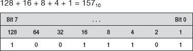
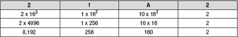
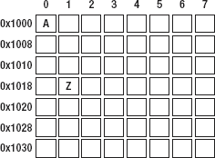
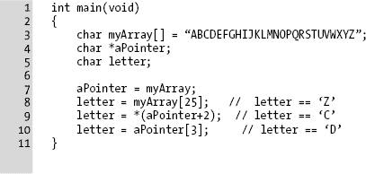
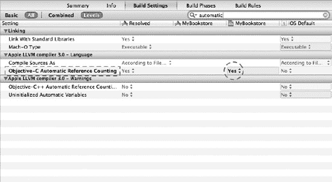
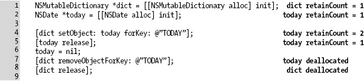
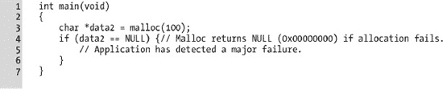
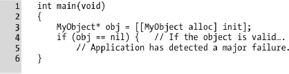
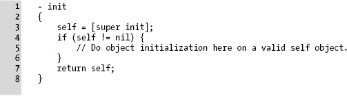
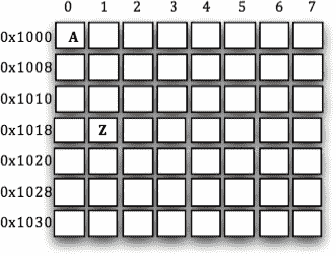

# 内存、地址与指针

计算机和我们人类一样，需要一个工作与存储的空间。例如，可以将计算机内存想象成办公桌上的空间。一个需要同时处理多个项目的人，必须有足够的桌面空间来放置所有文件与文档，以便快速便捷地取用。如果桌面空间对于同时处理的项目数量来说太小，部分项目可能不得不归档到抽屉里，等桌面腾出更多空间再迅速取出。确保桌面空间得到高效利用也非常重要。

处理计算机内存是编程中较为复杂的领域之一。为什么会这样？这些问题按理说现在应该已经解决了，对吧？嗯，可以说是解决了，也可以说没有。有些语言采用了完全消除程序员管理内存需求的方法，通过一些内部机制（以及一种称为垃圾回收的功能）来处理内存的使用和释放。但这种方法的缺点在于，垃圾回收并不能在所有情况下让程序员对内存使用拥有最终决定权。这为什么重要？一般来说，这关乎性能。当完全掌控内存管理时，程序员也就完全掌握了程序的性能（或性能不足的问题）。

本章将介绍在 Mac、iPhone 或 iPad 上处理内存的思路。在任何设备上处理内存都有其挑战。例如，iPhone 和 iPad 作为更小的设备，可用内存更少，这意味着高效利用其内存至关重要。幸运的是，Objective-C 提供了一些机制，让内存管理不再是一件苦差事。你将学习如何分配内存，以及 Xcode 4 中新的自动引用计数（`ARC`）特性，这使得管理已分配内存比早期版本的 Xcode 简单得多。

## 理解内存

虽然很多人可能将计算机内存比作人类大脑，但我更倾向于将计算机内存比作你作为一个人所拥有的物理工作空间。你就像计算机的 CPU，即实际处理信息并对其执行操作的部分。你拥有的工作空间越大，整理东西就越容易，完成任务也越快。当然，我们都会到达一个临界点，无论获得多少额外空间，都无法再提高工作效率。

对于计算机而言，内存是存储某些程序（或程序的一部分）和数据的工作区。在 Mac、iPhone 和 iPad 上，最基本的内存单元是 `字节`。如果你将内存想象成一个网格状的盒子，那么一个字节就是一个单独的盒子，如图 13–1 所示。


**图 13–1.** *字节就像一排盒子。*

当然，在现代典型的计算机中，通常有数十亿个这样的盒子（即字节）。尽管看似庞大近乎无限，但内存是计算机可用作支配的最重要的资源。只有驻留在内存中的程序才能被执行，只有从磁盘加载的数据才能被查看或操作。此外，在 iPhone 或 iPad 上，可用的内存远少于典型的 PC 或 Mac 电脑。一定程度的内存节约始终是一个好习惯。

好了，所以内存就像一个由盒子组成的网格，每个盒子保存一个字节的信息。这到底有什么用？计算机如何将每个字节放入其位置，又如何将其取出？当然，如果我的车库里堆满了没有标签的盒子，我很难找出，比如，所有旧游戏机存放的位置。计算机也面临同样的问题，因此它以一种非常有条理的方式来解决这个问题。在深入探讨计算机如何解决这个问题之前，你需要了解内存单位和地址的基本概念。

### 位、字节与进制

在 图 13–1 中，每个盒子代表一个字节，即内存空间。每个字节可以容纳总共 8 个位。一个`位`就是一个可以是 0 或 1 的数字——即关或开。正是这些 0 和 1 的序列赋予了字节其数值。这些 0 和 1 代表一种`二进制`数字系统；也就是说，每个数字位最多可以有两个值：0 或 1。这有时被称为 base-2 编号系统（与我们日常生活中使用的 base-10 或十进制编号系统相对）。在深入探讨内存的具体细节之前，理解现代计算机硬件上通常使用的编号系统非常重要。

**注：** 现代计算机每字节使用 8 个位。在早期的计算时代，不同的计算机制造商有时会采用不同的字节大小。例如，Control Data Corporation 的 CDC-6000 经常为显示代码使用 12 位字节，而 DEC PDP-10 在位字段上操作，因此一个“字节”可以是 1 位到 36 位中的任何值。IBM 凭借其流行的 System/360 确立了 8 位字节的标准，20 世纪 70 年代的微处理器也是如此。

一般来说，人们几乎对所有事物都使用十进制编号；从金钱到度量衡，十进制是标准。然而，在现代计算机领域，十进制系统很少使用。相反，计算机通常使用二进制（base-2）或十六进制（base-16）。

**注：** 八进制（常称为 base-8）也有使用，但没有十六进制那么常见。


### 将十进制（Base-10）转换为二进制（Base-2）

一个典型的日常数字可能看起来像这样：`1101`。现在，大多数人会认为这个数字是“一千一百零一”。然而，在二进制（Base-2）计数法中，这个数字代表十进制数`13`。让我们看看这是如何实现的。

如图 13-2 所示，在十进制计数法中，每个数位代表 10 的幂次；即从右向左，每一列的值按 10 的幂次（10, 100, 1000 等）递增。我们将千位（`10³`）、百位和个位相加，得到`1,101[10]`（下标表示“基数为 10”）。


**图 13-2.** *十进制计数系统。*

现在，让我们看看同样的数字在二进制中是什么样，如图 13-3 所示。


**图 13-3.** *二进制计数系统。*

在二进制计数法中（如图 13-3 所示），从右向左，每一列的值按 2 的幂次（2, 4, 8, 16, 32 等）递增。我们将`8`、`4`和`1`相加，得到值`13[10]`（这里是二进制结果）。另请注意，连续的 4 位（即半个字节）通常被称为一个**半字节**。

当然，前面提到 8 位（编号从 0 到 7）构成一个字节。图 13-4 展示了一个由 8 位组成的完整字节示例。要获取其值，请将所有列的值相加，方法如下：



**图 13-4.** *一个完整的字节，显示二进制和十进制值。*

### 使用十六进制（Base-16）计数法

最后一个值得一提的、在现代计算机中广泛使用的进制是十六进制（Base-16）计数系统。在二进制中，每个数位可以有 0 和 1 两种值。在十进制中，每个数位可以有 0-9 共十种值。在十六进制中，每个数位可以有 0-F 共十六种值。是的，你没看错；最后一个是`F`。为了在单一数位中表示 16 个值，使用字母来表示数值就变得很有必要。对于十六进制，其数字序列从 0 到 9，然后从`A`到`F`。表示一个字节需要两个十六进制（简称**hex**）数字；每个十六进制数字代表 4 位，如图 13-5 所示。


**图 13-5.** *左侧：两个半字节组成一个字节。右侧是一个简单的十六进制到十进制转换表。*

因此，十六进制数`9D`等于二进制数`10011101`，也等于十进制数`157`。如图 13-5 所示，一个字节的值可以是从`0000 0000`到`1111 1111`（二进制）之间的任意值，也就是`0xFF`（十六进制）。

**注意：** 在`0xFF`中，前缀`0x`在编程中用来表示该数字是一个十六进制数。虽然`FF`看起来很明显（因为只有字母），但像`10`这样的数字就不那么明确了：它是十进制的 10 还是十六进制的 16？而`0x10`则明确了这一点。

学习十六进制需要一些时间适应，但这段时间花得很值。这是因为在处理内存时，几乎所有东西都用十六进制表示。如同十进制计数法，每个数位都比前一位呈指数级增大，如图 13-6 所示。


**图 13-6.** *一个 16 位的十六进制数。*

在十进制中，数位依次是 1, 10, 100, 1000，等等。在十六进制中，数位基于 16，因此是 1, 16, 256, 1024，等等——每一列都是 16 的倍数。然而，一旦你理解了十六进制，你可能也想将其转换为十进制表示。图 13-7 展示了如何将 16 位的十六进制数转换为十进制数。



**图 13-7.** *将 16 位的十六进制数转换为十进制。*

如果我们把所有列的值相加，就会得到答案：

`8,192 + 256 + 160 + 2 = 8,610`

因此`0x21A2`等于`8,610`。

图 13-7 表示的是一个 16 位的数字。计算 32 位和 64 位数字只需要向左增加列数即可。

**提示：** 如果你发现自己经常需要计算 32 位和 64 位的值，只需使用 Mac 上的计算器（切换到程序员视图），或者花点小钱买个能处理十六进制的科学计算器。

我们希望这没有把你吓跑。在最底层理解计算机内存其实并没那么难，而且也不是所有时候都需要这样做。需要记住的重点是：处理内存时，可能有必要理解二进制（Base-2）、十进制（Base-10）和十六进制（Base-16）的值。这在调试应用程序时会变得更加清晰，如第 14 章中所讨论的。


### 理解内存地址基础

就像街道上的建筑一样，内存也有地址，只不过在某些方面，内存寻址要简单得多。在本章前面部分，我们提到计算机可以在虚拟车库中解决追踪旧游戏机盒子的难题。这个过程的第一步是能够追踪内存中的特定位置，这些位置被称为`地址`。从程序的角度来看，这些地址被存储在变量中供后续引用。

计算机中的内存是一组线性的字节（或称为盒子），用于存储信息。如果你只是简单地将这些盒子标记为 1、2、3、4，依此类推，你就会得到一组从 1 开始、以某个非常大的数字结束的盒子。这些数字被称为`内存地址`。

图 13–8 提供了一个寻址内存的简单示例。



**图 13–8.** *寻址的简单示例。*

如果每个块是一个字节，那么第一个字节从地址`0×1000`开始，到`0×1037`结束。请记住，数字前的“0×”表示该数字（此处指地址）是用十六进制表示的。例如，地址`0×1000`实际上是 4096，而不是 1000。数字`0×1000`代表我们内存示例的起始位置。在这个位置存储的是字母“A”。示例中还有字母“Z”。“Z”的值位于内存地址`0×1019`处。地址`0×1000`是一个简单的 16 位地址示例。一个 32 位 iPhone 的地址看起来像`0×03C06D80`。64 位地址的大小将是 32 位地址的两倍。

**注意：** 如果我们的程序可以访问图 13–8 中的内存，它将会把内存的起始点`0×1000`存储到一个变量中。这个变量通常被称为`指针`，因为该变量的值（地址`0×1000`，仅是一个数字）指向我们感兴趣的数据，就像地图上的箭头一样。

另一种看待这个内存网格的方式是将其视为一个数组。在这个例子中，一个变量被声明为一个数组。该数组的长度是 56 个字符，与图 13–8 中示例的大小完全相同。当一个变量（如`myArray`）被声明为数组时，该变量的值会解析为一个地址或指针。为了方便讨论，我们假设`myArray`的地址是`0×1000`，就像图 13–8 中的网格一样。如果你查看变量`myArray`，它的值会是`0×1000`。记住，数组会解析为一个地址。那么，我们如何访问数组中的内存呢？

```
char myArray[56];
```

**注意：** 在 C 和 Objective-C 中，所有数组都是**从零开始**的。这意味着数组的第一个元素位于索引 0，而不是索引 1。一个包含 30 个元素的数组将从元素 0 开始，结束于元素 29。元素 30 在数组的边界之外。

由于 C 和 Objective-C 使用从零开始的数组，如果程序需要访问数组的第一个元素，可以这样操作：

```
char letterA = myArray[0];
```

在这个例子中，`letterA`将被设置为数组的第一个元素，即字母“A”（使用图 13–8 作为数组）。在底层，计算机实际上只是简单地使用数组索引并将其加到地址上。同样，如果地址是`0×1000`，加上 0 得到的新地址仍然是`0×1000`，这正是字母“A”所在的位置。

```
char letterZ = myArray[25];                 // 或者如果你喜欢用十六进制，可以写成 myArray[0×19]！
```

在上面的例子中，`letterZ`将被设置为索引 25 处的值，即字母“Z”。计算机将 25（`0×19`）加到基地址`0×1000`上，得到的结果是`0×1019`。这就是字母“Z”所在的位置。记住，数组是从零开始的，所以“Z”位于索引 25，因为“A”从索引 0 开始；“Z”仍然是第 26 个元素（使用从 1 开始的自然数或计数数）。

在指针后使用方括号（`[ ]`），可以非常简单地访问该内存数组中的元素。还有一种不同的方法可以达到同样的效果。这个例子希望能帮助你更深入地理解指针和地址。

**清单 13–1.** *使用指针。*



在清单 13–1 中，第 3 行声明了一个新数组。方括号（`[ … ]`）是空的，因为我们直接将字母表作为数组的值进行赋值。在这种情况下，由于我们提供了值，编译器知道数组的大小。因此，我们的新数组就像图 13–8 一样：索引 0 处的第一个值是字母“A”，索引 25（`0×19`）处的最后一个值是字母“Z”。`myArray`等同于一个指针，因为它可以直接赋值给一个指针变量，如第 7 行所示。它指向包含字母表的内存区域。

第 4 行声明了一个指针变量。`aPointer`是一个指向`char`数据类型的指针。如果第 4 行是`int *aPointer`，那么`aPointer`就是一个指向`int`类型数据的指针。在我们的例子中，我们将其保留为`char`类型。记住，指针只是一个地址，而地址只是一个数字。

在第 5 行，程序声明了一个字符变量。我们将使用这个变量来存储数组中的数据。

第 7 行看起来有点奇怪，但它实际上是在将`myArray`的值赋给`aPointer`变量。如前所述，作为数组的变量总是解析为一个指针。所以，`myArray`等同于一个指针，这个指针是一个地址，而这个地址只是一个数字。这个数字被赋值给`aPointer`。程序并没有将数组复制给`aPointer`；它只是将`aPointer`的值设置为`myArray`的值。在此程序点上，`myArray`和`aPointer`拥有相同的值，因为它们都引用或指向同一块内存区域。

第 8 行向`myArray`的地址加上 25，并返回数组中偏移 25 个字节处的值，结果是字母“Z”。

第 9 行将`aPointer`的值加 2。记住，`aPointer`等于`myArray`。`aPointer + 2`现在指向字母“C”。如果这在数学上看起来有点奇怪，请记住从零开始的数组：

- `aPointer+0` 指向 “A”
- `aPointer+1` 指向 “B”
- `aPointer+2` 指向 “C”

希望你已经逐渐习惯从零开始的数组。第 9 行还使用了`解引用` `运算符`，即星号（`*`）；下一节将对此进行更多介绍。

第 10 行等价于第 8 行。`myArray`和`aPointer`都有效地指向同一块内存，因此数组运算符可以正常工作。


## 使用解引用运算符

第 9 行看起来与其他行有些不同，让我们更仔细地分析一下：

```
letter = *(aPointer + 2);
```

首先，我们来看括号内的内容：

`aPointer + 2`

这应该相当直接明了：我们将 2 加到指针 `aPointer` 上。如果 `aPointer` 是 0×1000，结果值将是 0×1002。此时指针*指向*了字母“C”。以这种方式使用指针与第 8 行或第 10 行中使用方括号的方式截然不同。我们是在手动调整指针，使其指向一个新值。接下来，我们需要询问计算机：“这个指针指向什么？”在列表 13–1 的第 8 行和第 10 行中，使用数组运算符时，这个问题是隐含的，程序会直接响应。但当我们简单地通过加法、减法等方式改变地址时，程序需要显式地提出这个问题。这就是星号（`*`）发挥作用的地方。

在指针前使用星号可以*解引用*该地址，并返回指针所指向的值。因此，如果我们的指针是 0×1000，而字母“A”存储在 0×1000，我们可以通过解引用指针来获取字母“A”。如果我们的示例指向真实内存，`*(0×1000)` 将返回字母“A”（但实际上不要这样做，因为 0×1000 不是一个真实地址，仅用于简化问题的示例）。请记住，指针是一个地址，而地址只是一个数字。星号要求计算机返回存储在地址中的内容，而不是返回地址本身。

**注：** 在大多数常见编程中，程序员很少有机会直接告诉系统，例如，位置 0×1000 是我们的数据。这是因为内存是**虚拟化**的。虚拟化内存允许使用的内存量超过机器物理内存的实际容量*（虚拟内存超出本书讨论范围）*。因此，操作系统管理数据的存储位置。结果是，计算机告诉程序它的内存在哪里，而不是程序告诉计算机。尽管如此，概念是相同的。

在硬件或设备驱动程序级别的软件开发中，使用硬编码地址更为常见。Mac OS X 或 iOS 中的典型程序永远不会使用硬编码地址。

## 分配内存

在现代操作系统中，程序分配内存，操作系统通过返回一个指向所请求内存的指针来响应。在 C 和 Objective-C 中，**指针**通过在变量名前加上星号（`*`）来声明，如下例所示：

```
char *theData;
NSString *theString;
```

不要将此处的星号与***解引用运算符***混淆。只有在声明变量时，星号才将变量标识为指针。

以下是更多请求内存的示例：

```
1. char data1[100];
2. char *data2 = malloc(100);
3. NSString *myString = [[NSString alloc] init];
```

在示例 1 中，通过数组声明的方式分配内存。程序现在拥有一个数组（`data1`），它**指向** 100 字节的内存。在 C 中，只需记住任何声明为数组的变量即使没有声明为指针，也会被*视为*指针来引用。

示例 2 稍微复杂一些。`data2` 被声明为一个指向 `char` 数据类型的指针。指针通过在文件前加上星号来声明。该行的下一部分是 `malloc(100)`，这是一个标准 C 库函数调用。此函数分配所请求的内存大小并返回一个指向它的指针。在我们的示例中，`malloc` 被传入值 `100`。这请求分配 100 字节。当函数返回时，`data2` 包含一个*指针*，指向这 100 字节的内存。

示例 3 是一种更传统的 Objective-C 类型的内存分配。首先，程序声明一个指向名为 `myString` 的 `NSString` 类的指针。接下来，执行以下代码：`[[NSString alloc] init]`。这将为对象分配所需的内存，并返回一个*指针*指向它。

在所有这些示例中，内存都是从操作系统请求的，并通过指针返回给程序，甚至示例 1 也不例外——只是示例 1 与其他示例略有不同。

### 使用自动变量和指针

在函数或块内创建的任何变量都被视为**自动变量**，或**自动变量**。在我们之前的示例中，示例 1 将 100 个字符分配为一个数组。这是自动完成的，因为如你所知，所有变量默认都是自动变量。由于我们通过数组声明预先定义了所有空间，这块内存会自动为我们管理。示例 2 和 3 也是自动变量，但它们分配的空间仅足以容纳一个指向内存的指针——仅此而已。回想一下，指针只是一个保存内存地址的变量，而不是内存本身。因此，`char* data2` 和 `NSString *myString` 实际上只是保存一个数字的变量，该数字代表一个内存地址。

**提示：** 这样理解指针：*指针*就像一张音乐会的门票，而分配的内存就像座位。门票上带有如何到达座位的信息。如果门票被丢弃（或丢失），找到座位的能力也就丢失了。然而，座位（分配的内存）仍然存在。

示例 2 和 3 是持有内存“门票”的自动变量，而不是内存本身（参见图 13–9）。这意味着，当函数退出且变量超出作用域时，指向内存的指针将会丢失；即“门票”丢失了。问题在于，程序还需要在指针丢失之前释放或解除分配指针所指向的内存。手动分配的内存不会随着指针一起超出作用域；分配的内存对于程序来说是全局的，直到程序退出才会被释放。


**图 13–9.** *指针不是内存本身。*

需要记住的非常重要的一点是，手动分配的内存必须在某个时刻解除分配，具体取决于内存的使用方式。有些内存可能在程序启动时分配，直到程序退出时才需要释放。然而，最常见的内存分配在程序生命周期中会发生很多很多次，因此一旦对象不再使用，立即解除分配相关内存至关重要。手动分配的内存必须手动解除分配。自动分配的内存（例如 `char array[100];`）会自动解除分配。


### 释放内存

当程序分配内存时，需要确保在使用完内存后将其释放（或称为解除分配）。再次以之前的例子为例，示例 2 使用`malloc`命令分配了内存。当程序使用完该内存后，需要将其释放。未能释放内存是一种常见的编程错误，并被形象地称为**内存泄漏**。

为了防止内存泄漏（最终会导致程序崩溃），分配的内存必须谨慎管理。代码清单 13–2 展示了示例 2 和示例 3 在正确释放内存时代码应有的样子。

**代码清单 13–2.** *内存分配与释放。*

```
1   int main(void)
2   {
3       char *data2 = malloc(100);
4       NSString *myString = [[NSString alloc] init];
5       …  // 标准的“执行操作”省略号
6       …
7       free(data2);  // 释放 100 字节
8       data2 = NULL;
9       [myString release];
10      myString = nil;
11   }
```

在代码清单 13–2 中，`data2`在第 3 行被分配。这种分配方式是纯旧式的标准 C 语言，在 Objective-C 程序中并不典型，但了解它仍然非常重要。

第 4 行声明并分配了一个 Objective-C 对象，即`NSString`。

第 7 行释放了第 3 行分配的内存块。

第 8 行将指针设置为`NULL`。这是一个良好的实践，将在下一节中解释。

第 9 行释放了第 4 行分配的对象。`release`消息是一个请求解除分配该对象的消息。之所以`release`消息是*请求*释放内存，这与 Objective-C 对象的内存管理机制有关。这种机制被称为**保留/释放模型**，有时也被称为**引用计数**。

**注意：** 在 Xcode 4 之前，保留/释放模型是 iOS 开发的唯一模型。Xcode 4.2 引入了一个名为自动引用计数（ARC）的选项。ARC 会使编译器自动为你加入保留和释放方法。虽然 ARC 是可选的，但对于在 Xcode 4.2 中启动的任何新项目，它默认是开启的。打开 Xcode 4.2 之前创建的旧项目仍然可以正常编译，并且 ARC 将被禁用。

尽管 ARC 是一个不错的特性，但了解底层实际发生的情况仍然非常重要。ARC 不会移除对保留和释放方法的调用，它只是隐藏了实现，就像 Objective-C 属性隐藏了 getter 和 setter 方法一样。

引用计数使内存使用更高效一些，因为它允许对象知道何时应该释放内存。这是一种比完全手动管理内存稍好一些的机制。

第 10 行与第 8 行等价。Objective-C 指针*可以*被设置为`NULL`，但将指针设置为`nil`要好得多。在 Objective-C 中，`nil`对象具有特殊含义，实际上可以响应消息。`NULL`不具备同样的特性。

我们再看看如果使用 ARC，这个代码清单会如何变化：

**代码清单 13–3.** *使用 ARC 进行内存分配。*

```
1   int main(void)
2   {
3       char *data2 = malloc(100);
4       NSString *myString = [[NSString alloc] init];
5       …  // 标准的“执行操作”省略号
6       …
7       free(data2);  // 释放 100 字节
8       data2 = NULL;
9       myString = nil;
10   }
```

代码清单 13–2 和代码清单 13–3 的主要区别在于省略了`[myString release]`。由于使用了 ARC，它会处理内存的释放。

### 使用特殊指针

正如你所学的，指针只是一个表示内存地址的数字。有两个值得提及的特殊指针。严格来说，它们并非指针，而是代表空指针——即不指向任何内容的指针。这两个指针是`NULL`和`nil`。`NULL`就是零、虚无、什么也没有。由于指针只是表示地址的数字，地址为`0`或`NULL`代表一个逻辑上不指向任何内容的指针。

使用零地址是现代计算机采用的一种约定；计算机不允许任何程序在地址`0`处存储任何东西，这使得使用`NULL`来表示空内存或未使用内存更有意义。了解这一点很重要，因为如果内存分配失败，返回的结果指针就是`NULL`。`NULL`也可以用来指示指针不再有效或只是空了。这对于所有标准 C 语言都是如此。下面展示了如何使用`NULL`初始化指针：

```
       char *data = NULL;
```

它也应像代码清单 13–4 中的代码片段那样用于比较。

**代码清单 13–4.** *使用 NULL 验证和清除指针。*

```
1   char *data = malloc(100);
2   if (data != NULL) {
3       // 使用该内存。它是有效的。
4       free (data);   // 释放内存，我们已完成使用。
5       data = NULL;  // 将指针设置为 NULL，表示它已经为空。
6   }
```

在代码清单 13–4 中，第 2 行通过用`NULL`检查指针来确保`malloc`函数工作正常。如果指针不是`NULL`，则分配成功，程序可以使用返回的值。然后第 4 行释放内存，第 5 行将指针设置为`NULL`，以表示该指针不再指向任何内容。

在处理 Objective-C 对象时，`nil`是 Objective-C 中与`NULL`对应的概念。与`NULL`一样，`nil`是一个指向空内容的特殊指针。然而，在 Objective-C 中，`nil`实际上是一个空对象。由于 Objective-C 大量依赖于向对象发送消息，因此空指针应该能够响应发送给它的消息，即使该指针是空的——`nil`空对象正满足了这一目的。代码清单 13–5 是一个类似于标准 C 版本的示例代码片段。

**代码清单 13–5.** *在可能为 nil 的对象上使用属性。*

```
1   NSArray *bookList = [bookstore booksOnSale];
2   for (NSUinteger i=0 i<bookList.count; ++i) {
3       // 如果 bookList 非 nil，for 循环的这部分将会执行。
4       // 如果 bookList 为 nil，则循环的这部分将被跳过。
5   }
```

**提示：** 当使用票务比喻来理解已释放的内存时，需要注意一点：如果一张票是指向剧院某个座位的指针，演出结束后会发生什么？票仍然指向那个座位，但它不再有效了；演出已经结束。内存也是如此。如果指针指向的内存被释放了，那么这块内存现在可以自由地用于其他内存分配。然而，指针仍然指向那块旧内存。清除指针很重要，这样它就不会被误用。这就是所谓的悬空指针。在使用指针前检查其是否为非`NULL`，配合上在对象释放时将指针设置为`NULL`或`nil`的做法，是一个应该严格遵守的“最佳实践”。


### 在 Objective-C 中使用 ARC 管理内存

如前所述，`ARC` 是 Xcode 4.2 引入的新特性，它隐藏了对 `retain`/`release` 模型的需求。默认情况下，在 Xcode 4.2 中启动的任何 **新** 项目都会启用 `ARC`。旧项目则禁用了 `ARC`。要启用或禁用 `ARC`，只需在 Xcode 4.2 项目的构建设置中查找 **自动引用计数**，如 图 13–10 所示。



**图 13–10.** *在 Xcode 4.2 项目中启用或禁用 ARC。*

我们将探讨如何利用新的 `ARC` 特性在 Objective-C 中管理内存。

首先，`retain`/`release` 和 `autorelease`（稍后讨论）不再是有效的方法。在 `ARC` 下，这些方法已被弃用。这还包括属性中的 `release` 关键字。在 Xcode 4.2 之前，通常这样编写属性：

```
@property (nonatomic, retain) NSString *name;
```

现在使用 Xcode 4.2，这发生了一些变化。该属性应写成：

```
@property (nonatomic, strong) NSString *name;
```

`strong` 关键字取代了 `retain`；`strong` 用于告诉编译器，当赋值时需要保留此对象。反之，编译器会知道，当它不再被使用或重新赋值时，也要释放此对象。

以下是另一个关于如何使用隐式 `strong` 变量的代码示例：

**清单 13–6.** *使用自动引用计数。*

```
1   24 - (id)init
2   {
3          self = [super init];
4          if (self) {
5              self.theBookStore = [[NSMutableArray alloc] init];
6              Book *newBook = [[Book alloc] init];
7              newBook.title = @"Objective-C for Absolute Beginners";
8              newBook.author = @"Bennett, Fisher and Lees";
9              newBook.description = @"iOS Programming made easy.";
10             [self.theBookStore addObject:newBook];
11
12             newBook = [[Book alloc] init];
13             newBook.title = @"A Farwell To Arms";
14             newBook.author = @"Ernest Hemingway";
15             newBook.description = @"The story of an affair between an English "
16                                    "nurse and an American soldier "
17                                    "on the Italian front "
18                                    "during World War I.";
19             [self.theBookStore addObject:newBook];
20             newBook = nil;                                   
21         }
22
23         return self;
24   }
```

如果我们看一下清单 13–6，可以清楚地看到在第 6 行分配了一个新的 `Book` 对象。然而，`ARC` 发挥作用的地方在第 12 行。在这里，我们通过分配一个新的 `Book` 对象来重新赋值指针。按照旧的内存管理规则，我们必须先释放旧值，否则会造成内存泄漏。在 `ARC` 下，编译器知道在重新赋值之前对该指针执行释放操作。第 20 行也是如此。实际上，第 20 行并非必需，因为当变量超出作用域时，`ARC` 会自动释放它。将它赋值为 `nil` 只是执行相同操作的一种更直接的方式。

进一步检查此源文件（来自第 8 章示例的 `Bookstore.m`）发现，这里没有 `dealloc` 方法。因此，`self.theBookStore` 变量 **在没有** `ARC` 的情况下会导致内存泄漏。有了 `ARC`，程序员不必担心释放 `self.theBookStore` 变量，因为当 `Bookstore` 类不再被使用时，`ARC` 会自动执行该操作。

### 在没有 ARC 的 Objective-C 中管理内存

虽然建议在启动新项目时使用 `ARC`，但有时需要管理一个旧项目，该项目要么早于 iOS 4，要么是基于 `retain`/`release` 模型构建的。对于这些项目，Xcode 4 不会自动将其转换为使用 `ARC`。本节介绍如何处理没有 `ARC` 的程序。

如前所述，Objective-C 处理已分配内存的方式与大多数用标准 C 编写的应用程序略有不同。回想一下，Objective-C 系统使用一种称为 `retain`/`release` 模型的东西。使用此模型，由对象分配的内存在每次对该内存感兴趣的应用程序向该对象发送 `retain` 消息时都会被计数。在应用程序的不同阶段，程序指示它已使用完该内存并发送 `release` 消息。当释放次数等于保留次数时，与该对象关联的内存最终被释放。让我们看看这个模型在实践中是什么样子的。清单 13–7 是一个非常基本的例子。

**清单 13–7.** *分配一个 Objective-C 对象。*

```
1   int main(void)
2{   
3       NSString* myString = [[NSString alloc] initWithUTF8String:"Hello World!"];
4       // 使用该字符串执行某些操作的代码...
5       [myString release];
6       myString = nil;
7   }
```

在这个例子中，第 3 行使用 `alloc` 分配了一个新的字符串对象。这一行在这种情况下实际上非常重要；稍后将解释原因。所以第 3 行创建了新的字符串。在创建时，Objective-C 系统自动向该对象发送一条 `retain` 消息。此时，`myString` 变量指向一个当前拥有一个 `retain` 计数的对象。

第 5 行向 `myString` 对象发送了一个 `release` 消息。`release` 从当前 retain 计数（为 1）中减去 1。如前所述，一旦 retain 计数达到零，该对象就会被释放。因此，当第 5 行执行完毕后，`myString` 变量指向已释放的内存。

第 6 行将原始变量设置为 `nil`，以指示该指针现在为空。


#### 使用保留/释放模型

保留和释放内存的过程是 Objective-C 广泛用于管理内存的一种方式。这个过程还有一个别名叫做引用计数，这个名称更具描述性，因为保留和释放内存的过程本质上是计算内存被保留（而非释放）的次数。请注意，这里“内存”是一个通用术语。Objective-C 中的内存管理是为*对象*分配内存，而不仅仅是内存块。大多数 Objective-C 对象都派生自基类 `NSObject`，它负责跟踪对象的保留计数。

**注意：** 如果你追求精确性，实际上是一组 `NSObject` 协议定义了引用计数的消息，而 `NSObject` 类实现了该协议。

到目前为止，事情看起来相当简单：每次 `retain`，最终都需要有一次 `release`。这听起来不难，对吧？嗯，要知道一个对象何时被保留，并不总是那么直接。考虑代码清单 13–8 中的示例。

**代码清单 13–8.** *保留计数示例*



查看代码清单 13–8，可以看到 `dict` 和 `today` 对象的保留计数。`dict` 对象看起来很正常：每当对象被创建时，它的保留计数为 `1`。第 2 行的 `today` 对象也是如此。

到了第 4 行，情况看起来有点奇怪。出于某种原因，`today` 的保留计数现在变成了 `2`。发生了什么？如果我们仔细查看 `NSMutableDictionary` 的 `setObject: forKey:` 方法的文档，我们会看到在 `setObject:` 的部分说明中提到“该对象在添加到接收器之前会收到一条 retain 消息。”

根据文档，在一个对象被添加到字典之前，该对象会收到一条 `retain` 消息。这就是为什么 `today` 的保留计数变成了 `2`。

为什么字典要这样做呢？答案其实很简单。如果我们将一个对象添加到字典中，那么字典就应该对该对象负责；我们基本上是将对象交给它管理。我们可以释放我们添加到字典中的任何对象对应的局部变量。字典随后成为这些对象的所有者。为了确保这一点，`NSMutableDictionary` 类会向其存储的所有数据发送一条 `retain` 消息，以便系统知道有对象正在使用该数据。

由于 `dict` 正在管理这个对象，第 5 行用于释放我们自己的对象。字典依然持有与 `today` 对象相同的内存；我们只是告诉系统，我们已经不再需要它了。如果字典对象*没有*发送 `retain` 消息，那么第 5 行实际上就会导致该内存被释放。规则很简单：一旦一个对象的保留计数通过 `release` 消息变为零，该对象就会收到一条 `dealloc` 消息，该对象所占用的内存就会被真正释放。

第 6 行是一个简单的约定，表示我们不再使用这个指针了。

第 7 行通过键 `TODAY` 移除了对象。当一个对象从字典中被移除时，该对象会自动收到一条 `release` 消息。此时，`today` 曾经指向的那个对象会收到一条 `release` 消息。由于这会使该对象的保留计数变为零，该对象也会收到一条 `dealloc` 消息来释放其内存。

第 8 行简单地给 `dict` 对象发送了一条 `release` 消息。由于没有其他地方保留这个对象，这将释放该对象的内存。

#### 处理隐式保留消息和自动释放

我们如何知道哪些对象需要释放，哪些不需要？答案基本上取决于对象所有权规则。如果创建对象的消息名称中包含 `alloc`、`copy` 或 `new`，那么你就拥有该对象，因此，一旦程序使用完毕，就需要释放它。还有其他一些例子，但遗憾的是，没有硬性规定。正确地释放内存需要理解对象以及哪些消息会导致显式的 `retain`。

虽然对象可以收到显式的 `retain` 消息，但在我们前面的例子中，没有出现任何显式的 `retain`，因为存在自动或隐式的保留消息。例如，每当向字典对象发送 `setObject: forKey:` 消息时，我们添加的对象会自动收到一条 `retain` 消息。如前所述，每当我们分配一个对象时，就隐含了一个 `retain`：

`NSMutableDictionary *dict = [[NSMutableDictionary alloc] init];`

其他调用则不那么明显，如下面的例子所示：

```
NSDate* today = [NSDate date];
```

在上面这个例子中，对象被分配了，但带有一个隐式的释放——称为自动释放（autorelease）。如前所述，任何包含 `alloc`、`copy`、`new` 的方法都要求程序手动释放对象。对于其他情况，对象会被自动释放。

关键在于，返回值是一个 `new` 日期对象。因为它是一个新对象，它会收到一种隐式的 `retain` 消息。但更重要的是，它将自动被释放，因为该对象不是通过 `alloc`/`copy`/`new` 方法创建的。这段代码也可以写成如下形式：

```
NSDate* today = [[[NSDate alloc] init] autorelease];
```

这段代码会产生完全相同的结果。区别在于，在第二个例子中，我们显式地分配了内存，但将其标记为 `autorelease`。Objective-C 运行时系统会自动释放这块内存。虽然使用 `autorelease` 似乎是处理内存释放的最佳方式，但它不一定总是我们需要的。标记为自动释放的变量不会存在很长时间。所有 iOS 和一些 Mac 应用程序都有一个叫做**运行循环**（run-loop）的机制。基本上，应用程序大部分时间都在等待输入。例如，如果你触摸屏幕，应用程序会执行一些功能，然后最终回到等待更多输入的状态。每当应用程序回到等待更多输入的状态时，所有自动释放的变量都会被释放；这段时间可能短至 1/60 秒。因此，`autorelease` 应该谨慎使用，并且仅用于变量的生命周期在当前运行循环范围内的场景中。如果程序需要让一个自动释放的变量存活更长时间，那么要么不使用 `autorelease`（使用标准的 `alloc` 和 `init`），要么简单地给该对象发送一条 `retain` 消息。

**代码清单 13–9.** *保持自动释放变量可用*

```
1   - (NSDate *)getDate
2   {
3       return [NSDate date];
4   }
5
6   - (void)captureDate
7   {
8       // 捕获当前日期并存储在类的实例变量中
9       currentDate = [[self getDate] retain];
10   }
11
12   - (void)dealloc
13   {
14       // 释放 current_date 的内存
15       [currentDate release];
16   }
```

注意第 9 行，我们调用了 `getDate` 方法，然后立即向返回的对象发送了一条 `retain` 消息。这是因为 `getDate` 返回的对象被设置为自动释放。如果程序不这样做，`currentDate` 指向的内存就会被自动释放。

**注意：** 在任何基于 Xcode 4.2 之前版本开发的 iOS 应用程序中，`main.m` 文件里都有一行看起来像这样的代码：

```
NSAutoreleasePool * pool = [[NSAutoreleasePool alloc] init];
```

这就是程序用来自动释放那些在分配时（就像我们上面的例子一样）已收到 `autorelease` 消息的内存的机制。`[NSDate date]` 返回的内存会被自动添加到这个自动释放池中，然后在下一次运行循环时自动释放。


好的，作为一名高级文档工程师和翻译员，我将严格遵守您提供的注意事项和示例格式，将给定的英文文本翻译成中文。


#### 发送 `dealloc` 消息

一般情况下，你的程序绝不应向其他对象发送 `dealloc` 消息。但也存在一些例外情况，其中之一就是在处理 `dealloc` 消息本身时。你只需为你创建的对象处理 `dealloc` 消息。代码清单 13–10 是一段代码片段，展示了如何编写一个典型的 `dealloc` 消息。除了使用 ARC、垃圾收集或没有任何需要释放的内容之外，你创建的每个对象都应该实现一个 `dealloc` 消息。

**代码清单 13–10.** *一个典型的 dealloc 实现。*

```
1   - (void)dealloc
2   {
3       self.iVar1 = nil;     // 如果我们有实例变量，确保它们被释放。
4                             // 此实例变量是一个属性（`第 10 章`）
5       [iVar2 release];      // 另一个例子。我们释放一个正在使用的实例变量
6                             // – 它不是一个属性。
7       [super dealloc];      // 最后，我们告诉父类释放它自己。
8                             // 这是少数几次显式调用 dealloc 的情况之一。
9   }
```

代码清单 13–10 严格来说只是一个示例，其中的实例变量名完全是虚构的。

第 3 行将一个实例变量设置为 `nil`。这不仅是一种常见做法，而且在这个例子中，该实例变量是一个属性。如果该属性是使用 `retain` 关键字创建的，那么像下面这样将属性设置为 `nil` 会自动向 `iVar1` 最初指向的任何对象发送一条 release 消息。

```
@property(retain) NSDate* iVar1
```

这是一种非常干净的释放对象的方法。

第 5 行展示了如何释放非属性的实例变量。到目前为止，我们在许多示例中都使用了这种方法。

第 7 行是你向对象发送 `dealloc` 消息的唯一情况。在这种情况下，程序会告诉其父类（超类）释放自身。父类最终会做同样的事情，向其父类发送 `dealloc`，依此类推，直到基础对象最终被释放。另请注意，`[super dealloc]` 是该方法执行的最后一件事情——先释放父类然后再继续做其他事情并不是一个好主意。

处理 retain/release 模型需要一些时间来适应，但总体来说，它是一个相当直接的内存管理系统。不过，这里有一个警告：尽管我们的例子中提到了对象的 `retainCount` 方法，但不要依赖这个值。因为你无法知道框架的哪些部分对你的对象感兴趣，所以保留计数可能比你预期的要高。然而，了解 `retainCount` 对于排查潜在的内存泄漏问题是有益的。继续练习使用 retain/release 模型，并确保在发送或接收对象时阅读开发者文档，以便了解所涉及的对象是如何被处理的。

### 如果出现问题

无论是通过标准的 C 机制还是 Objective-C 对象分配方法来分配内存，大多数情况下都能成功。但是，程序员不能假设分配对象或分配内存是*总是*成功的。当内存分配失败时，通常预示着更大的问题即将发生，程序可能无法运行太久（会因内存问题而崩溃）。然而，即使程序可能因为无法分配内存而进入不良状态，它也不应该忽略内存分配失败的信号。以下是一些用于测试内存分配是否失败的惯例：



在这个标准的 C 示例中，如果 `malloc` 函数失败，将返回一个 `NULL` 指针。回顾一下，`NULL` 指针只不过是一个指向位置 0×00000000 的指针。内存永远不会从这个位置开始，因此 `NULL` 可以用来指示一个*错误的*内存分配。

在 Objective-C 中，我们需要在两个主要区域执行有效性检查。这是第一个：



在这个示例中，我们尝试创建一个对象，但我们检查返回的指针是否为 `nil`。回顾一下，`nil` 对象基本上是一个默认的空对象，用作表示“空”或“无”的占位符。不要将其与一个空的 `MyObject` 混淆，因为两者不是一回事。

第二个有效性检查仅适用于我们创建的对象。这个检查是在类的 `init` 方法中完成的：



在这个示例中，在对象的 `init` 方法里，程序显式地测试 `self` 是否返回了一个非 `nil` 的值。如果 `self` 不是 `nil`，说明一切正常，该方法可以继续初始化对象。然后，该方法返回 `self`，它可能是 `nil` 也可能不是。这里要注意的重点是，我们在继续处理 `self` 之前，先测试了对 `[super init]` 的调用是否成功。

### 关于 ARC 的说明

虽然我们介绍了许多在不使用 ARC 时手动处理内存的方法，但建议你在任何新创建的项目中使用 ARC。你在这里学到的是，尽管 ARC 隐藏了内存是如何被保留和释放的细节，但理解底层真正发生的事情仍然很重要。

### 总结

本章我们涵盖了不少内容。希望你现在对内存、地址和指针的工作方式有了更清晰的理解。在本章中，我们介绍了以下内容：

*   定义内存
*   使用二进制、十进制和十六进制
*   定义和使用内存地址
*   定义和使用指针
*   定义和使用解引用运算符
*   分配内存
*   使用自动变量并注意陷阱，以免造成内存泄漏
*   释放内存和防止内存泄漏，包括使用 `dealloc` 方法
*   使用特殊指针 `NULL` 和 `nil`
*   理解使用 ARC 的内存管理
*   使用 Objective-C 及其 retain/release 模型管理内存
*   检测内存分配出错的情况。

本章内容非常丰富，恭喜你坚持了下来。理解内存如何在 Mac、iPhone、iPad 或任何计算设备上工作是至关重要的。

### 练习

*   在下面的内存空间中，这个内存块有多大？这块内存中最后一个字节的地址是什么？



*   使用 代码清单 12-1 中的代码，尝试确定以下语句会做什么以及为什么：
    *   `*(aPointer + 2) = '1';`
    *   `(aPointer + 2) = '1';`
*   查看 `NSMutableArray` 类的 `addObject` 方法的 Apple 开发者文档。
    *   `NSMutableArray` 类的 `addObject:` 方法与 `NSMutableDictionary` 类的 `setObject:forKey:` 方法有什么不同？
    *   使用 `NSMutableArray` 将如何改变 代码清单 13–1 中的代码（如果有变化的话）？

## 第 14 章


