# Xcode 调试器介绍

`Xcode` 非常出色！这款工具不仅可以在苹果开发者网站上免费获取，而且实际上真的非常、非常棒！除了能够用来创建下一款出色的 Mac OS X、iPhone 或 iPad 应用之外，`Xcode` 还内置了一个功能强大的调试器。

那么，调试器到底是什么呢？首先，我们要明确一点：程序会*严格*按照编写的内容执行。有时，程序实际所写的功能与预期应实现的功能并不完全一致。这有时会导致程序崩溃，或者仅仅是无法按预期运行。无论哪种情况，当程序无法按计划运行时，我们就说程序存在**缺陷（bugs）**。而检查代码并修复这些问题的过程，就被称为**调试（debugging）**。

关于术语“bug”的真正起源仍存有一些争议，但一个记录详实的案例发生在 1947 年，涉及已故的海军后备役军官、当时的程序员格蕾丝·霍珀（Grace Hopper）少将。霍珀和她的团队当时正试图解决哈佛马克二型计算机的一个问题。一名团队成员在电路中发现了一只飞蛾，正是它导致其中一个继电器出现故障。霍珀后来被引用说：“从那时起，每当计算机出问题，我们就说它里面有‘bug（虫子）’了。”^(1)

无论起源如何，这个术语保留了下来，全世界的程序员都使用调试器（例如 `Xcode`）来帮助查找程序中的错误。真正进行调试的是人；调试工具只是帮助程序员定位问题。任何调试器，无论其名称如何暗示，都不会自己修复问题。

本章将重点介绍 `Xcode` 调试器的一些更重要的功能，并解释如何使用它们。完成本章后，你应该能对 `Xcode` 调试器以及一般的调试过程有足够深入的了解，从而能够搜索并修复大部分编程问题。

__________

¹ Michael Moritz, Alexander L. Taylor III, and Peter Stoler, “The Wizard Inside the Machine,” Time, Vol.123, no. 16: pp. 56–63

## 开始调试

如果你曾经为了捕捉到电影全速播放时无法看清的细节而慢放观看，那么你实际上已经使用了一种类似于调试的工具。逐帧播放电影以揭示你想寻找的细节，这个思路与我们调试程序时应用的思路是相同的。对于程序来说，有时有必要放慢速度来看看发生了什么。调试器允许我们通过两个主要功能来实现这一点：设置断点并逐行单步执行程序——稍后将详细介绍这两个功能。我们先来看看如何进入调试器以及它的界面。

首先，我们需要加载一个现有的程序。本章的示例使用了第 8 章中的 `MyBookstore` 项目，因此请打开 `Xcode` 并加载 `MyBookstore` 项目。

其次，确保在运行方案（Run Scheme）中选择了 **Debug** 配置，如图 14-1 所示。要编辑当前方案，请从主菜单栏选择 ProductEdit Scheme。**Debug** 是默认选项，因此你可能无需更改。这一步很重要，因为如果配置是 **Release**，调试将完全无法工作！

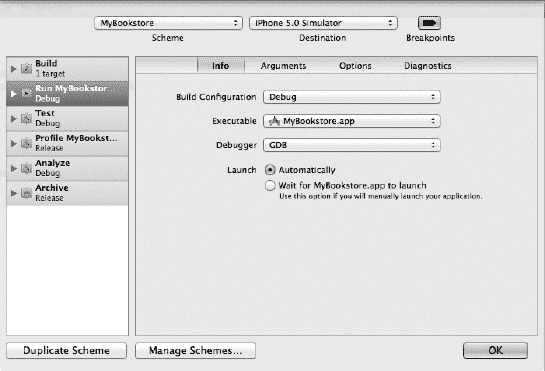

**图 14-1.** *选择调试配置。*

虽然我们不会在本书中讨论 `Xcode` 方案（Schemes），但只需知道，默认情况下，`Xcode` 为你创建的任何 Mac OS X 或 iOS 项目都提供了 **Release** 和 **Debug** 两种配置选项。就本章而言，主要区别在于发布（Release）配置不会添加调试应用程序所需的任何程序信息，而调试（Debug）配置则会。

### 设置断点

要查看程序内部发生了什么，我们需要让程序在我们作为程序员感兴趣的特定位置暂停。**断点**允许我们做到这一点。在图 14-2 中，我们在程序的第 25 行设置了一个断点。要设置断点，只需将光标放在行号上（不是程序文本，而是程序文本左侧的数字 25 上）并单击一次。

如果没有显示行号，请选择主菜单栏中的 Xcode  Preferences，然后点击“Text Editing”选项卡，并勾选“Line Numbers”复选框。

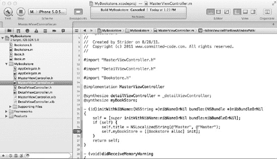

**图 14-2.** *我们的第一个断点*

我们也可以通过将断点拖放到行号列的左侧或右侧来移除它。在图 14-3 中，断点已被拖到列的左侧。在拖放过程中，断点会变成一团烟雾。

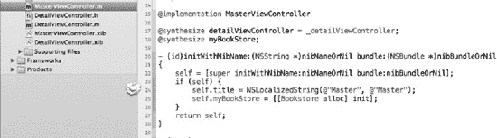

**图 14-3.** *断点在烟雾中消失。*

设置和删除断点是非常简单的任务。还有其他方法可以删除断点，但这种方法是最有趣的！

### 使用断点导航器

对于小项目，知道所有断点的位置并不难。但是，一旦项目变得比我们那个小小的 `MyBookstore` 应用更大，管理所有断点就会变得有点困难。幸运的是，`Xcode` 4 提供了一种简单的方法来列出应用程序中的所有断点，称为断点导航器。可以通过单击导航栏中的断点导航器图标来访问它，如图 14-4 所示。

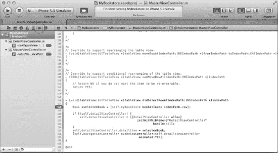

**图 14-4.** *在 Xcode 4 中访问断点导航器*

单击后，它将列出应用程序中当前定义的所有断点。在此处，单击某个断点将跳转到该断点所在的源文件。你也可以在此处轻松删除和禁用断点。

要禁用/启用一个断点，只需单击列表中（或任何出现该断点的地方）的蓝色断点图标即可。不要单击行号，必须是那个蓝色的小图标，如图 14-5 所示。

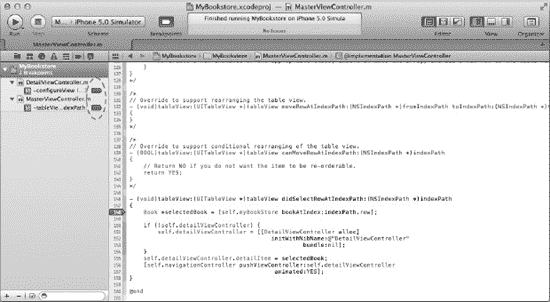

**图 14-5.** *使用断点导航器启用/禁用断点*

有时，禁用断点而不是删除它会更方便，特别是当你计划之后还要在同一位置放置断点时。禁用断点实际上非常简单。只需单击现有的断点，它就会从深蓝色变为非常浅的蓝色。调试器不会在这些褪色的断点处停止，但它们仍然保留在原位，因此可以方便地重新启用，并作为代码中重要区域的标记。

也可以从断点导航器中删除断点。只需选择一个或多个断点，然后按 **delete** 键。确保你选择了正确的断点进行删除，因为此操作没有撤销功能。

也可以选择与断点关联的文件。在这种情况下，如果你选择断点导航器中列出的文件并按 delete 键，该文件中的所有断点都将被删除。

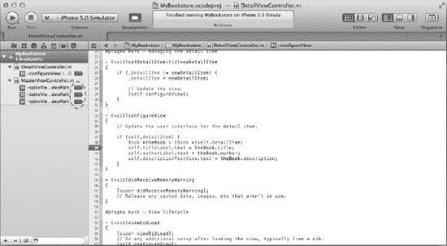

**图 14-6.** *包含多个断点的文件*

请注意，断点是指带有小断点图标的行，如图 14-5 所示。文件相对断点缩进显示；在图 14-5 中，文件是 `DetailViewController.m` 和 `MasterViewController.m`。图 14-6 展示了一个文件包含多个断点的示例。


#### 调试基础

在图 14–2 所示的语句上设置一个断点。接下来，如图 14–7 所示，点击**运行**按钮来编译项目，并在 Xcode 调试器中启动运行。


**图 14–7.** *Xcode 工具栏中的构建与调试按钮*

项目构建完成后，调试器将启动；屏幕上会显示调试窗口，程序将在该语句行停止执行，如图 14–8 所示。

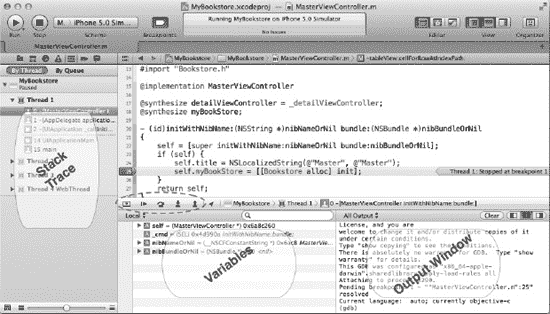

**图 14–8.** *调试器视图，执行停在第 25 行*

调试器视图会添加一些额外的窗口。让我们来逐一了解图 14–8 中调试器的各个部分。

1.  **调试器控件**：（红色圆圈标注）调试控件可以暂停、继续、单步跳过、单步进入和单步跳出程序中的语句。其中单步执行控制最常用。左侧第一个按钮用于显示或隐藏调试区域。在图 14–8 中，调试区域处于显示状态。
2.  **变量：** 变量窗口显示当前作用域内的变量。点击变量名称左侧的小三角形即可展开它。
3.  **输出窗口：** 当程序崩溃或发生异常时，输出窗口会显示非常有用的信息。此外，所有 `NSLog` 的输出也会显示在此处。
4.  **堆栈跟踪：** 堆栈显示对象堆栈以及程序中当前活动的所有线程。堆栈是一个层级视图，展示哪些方法正在被调用。例如，`main` 调用 `UIApplication`，而 `UIApplication` 又调用 `AppDelegate` 类。这些方法调用会“堆叠”起来，直到最终返回，堆栈因此得名。

#### 使用调试器控件

如前所述，调试器启动后，视图会发生变化。出现的是调试控件（图 14–8 中的项目 B）。这些控件相当直观，并在表 14–1 中进行了说明。

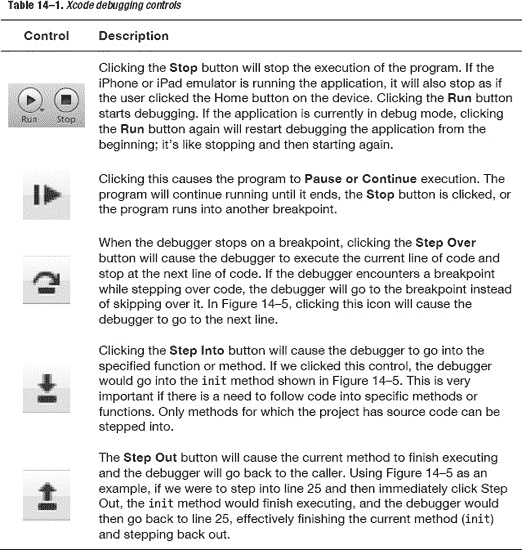

#### 使用单步执行控件

为了练习使用单步执行控件，让我们单步进入一个函数。顾名思义，**单步进入**按钮会跟随程序的执行，进入当前高亮的方法。请确保在 `MasterViewController.m` 文件中图 14–8 所示语句行（示例中的第 25 行，你的可能不同）设置了断点，然后点击运行按钮。你的屏幕应该与图 14–9 类似。

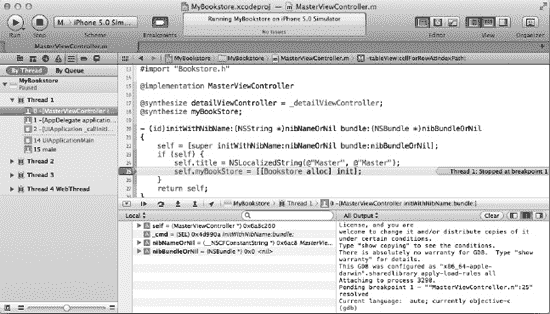

**图 14–9.** *调试器停在 25 行*

点击**单步进入**按钮 ，这将使调试器进入 `Bookstore` 对象的 `init` 方法。屏幕应该看起来像图 14–10。

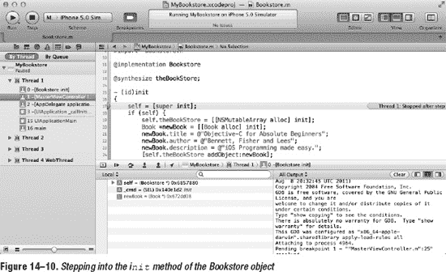

**图 14–10.** *单步进入 `Bookstore` 对象的 `init` 方法*

需要注意的是，调试器不仅进入了 `Bookstore` 对象，而且还切换到了 `Bookstore.m` 文件（之前它位于 `MasterViewController.m` 文件中）。

**单步跳过**控件  会继续执行程序，但不会进入某个方法。它只是执行该方法并继续执行到下一行。**单步跳出**控件  则有点像**单步进入**的反向操作。如果点击**单步跳出**按钮，当前方法会继续执行直至完成。然后调试器会返回到点击**单步进入**之前的那一行。例如，如果在图 14–9 所示的代码行点击了**单步进入**按钮，然后又点击了**单步跳出**按钮，调试器将返回到 `MasterViewController.m` 文件中图 14–9 所示的语句（示例中的第 25 行），即执行**单步进入**操作的那一行。

#### 查看线程窗口与调用堆栈

如前所述，线程窗口显示当前线程（在我们的程序中只有一个）。然而，它也显示了**调用堆栈**。比较图 14–9 和 14–10 在线程窗口方面的差异，我们可以看到，图 14–10 中现在列出了 `[Bookstore init]` 方法，因为 `[MasterViewController initWithNibName:bundle:]` 调用了 `[Bookstore init]` 方法。

现在，调用堆栈不仅仅是一个*已经*被调用的函数列表；相反，它是一个当前*正在*被调用的函数列表。这是一个非常重要的区别。一旦 `init` 方法执行完毕并返回（第 17 行），`[Bookstore init]` 将不再出现在调用堆栈中。你可以把调用堆栈想象成一条面包屑踪迹。这条踪迹告诉了我们如何返回到最初开始的地方。

#### 调试变量

通过将鼠标悬停在变量上，可以查看变量的一些信息（除了它的内存地址）。在我们当前的 `Bookstore` 示例中，所有变量都是通过属性合成的。问题在于，它们无法通过调试器直接看到。因此，为了让调试器实际显示这些变量，我们必须显式地声明它们。要这样做，只需导航到 `Book.h` 头文件，并添加一个名为 `title` 的实例变量，如图 14–11 所示。

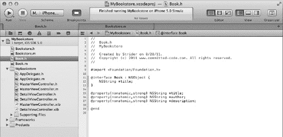

**图 14–11.** *添加一个名为 `title` 的显式实例变量*

（如果你当前正在运行应用程序，在修改 `Book.h` 文件之前，请先点击左上角的停止图标）。接下来，运行应用程序。调试器应该会停在我们在图 14–9 中放置的断点处。单步进入该语句；这会将调试器带到 `Bookstore.m` 文件。接着，使用单步跳过命令逐步执行代码，直到调试器指向“`newBook.author = …`”这一行。

将光标放在 `newBook` 变量出现的任何位置，并展开 `Book` 对象。你应该会看到图 14–12 中显示的内容。

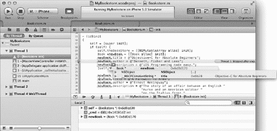

**图 14–12.** *将鼠标悬停在 `newBook` 变量上会显示一些信息*

将鼠标悬停在 `newBook` 变量上会显示它的信息。此变量是在该方法中声明的一个局部变量。它也可以在左下角的变量窗口中看到。在图 14–12 中，你可以看到展开的 `newBook` 变量；它显示了与悬停查看相同的信息。

`newBook` 变量中的相关信息是 `NSCFConstantString` 变量。为简化问题，只需知道 `NSCFConstantString`（Core Foundation 字符串）仍然是我们在构建 `Book` 类时使用的 `NSString` 类。“Core Foundation” 就是 Apple 为程序员提供的基础库类。最右侧的信息（调试器中灰色文本）是该类字符串的实际值。当变量的内容发生变化时，调试器会以蓝色斜体高亮显示变量的新内容，就像你在图 14–13 的变量窗口中所看到的那样。由于这些是 `newBook` 类的新值，因此这些值显示为蓝色和斜体。对于未更改的值，调试器会将其保留为灰色且非斜体。

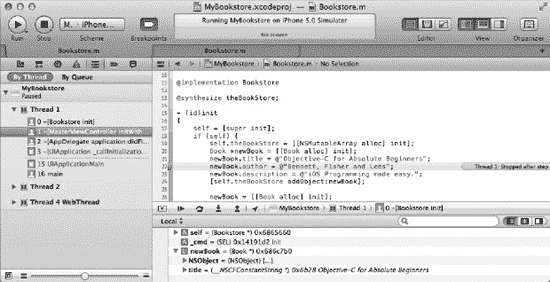

**图 14–13.** *在变量窗口中，值的变化会以蓝色斜体高亮显示。*


### 处理代码错误和警告

虽然代码错误和警告并非 Xcode 4 调试器的真正组成部分，但修复它们却是整个调试过程的一部分。在程序运行之前（无论是否使用调试器），必须修复所有错误。警告不会阻止程序构建，但可能在程序执行期间引发问题。最好是完全没有任何警告。

让我们来看几种不同类型的错误。首先，我们在代码中添加一个错误。在 `MasterViewController.m` 文件的第 25 行，将

```
[[BookStore alloc] init]
```

改为

```
[[BookStore alloc] initialize].
```

保存更改，然后按 +B 构建项目来构建程序。这时会出现一个错误，如图 14-14 所示，该错误可能立即显示，也可能在构建后显示。

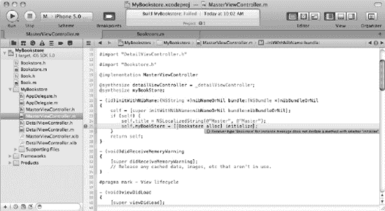

**图 14-14.** *在 Xcode 中查看错误*

接下来，我们点击带有感叹号的三角形图标，切换到问题导航器窗口，如图 14-15 所示。此视图显示程序中当前的所有错误和警告——不仅仅是当前文件 `MasterViewController.m`，而是所有文件。错误以红色八边形内的白色感叹号显示。在我们的例子中，只有一个错误。另外，如果错误信息超出屏幕范围或难以阅读，只需将鼠标悬停在问题导航窗口的错误上，即可显示完整的错误信息。

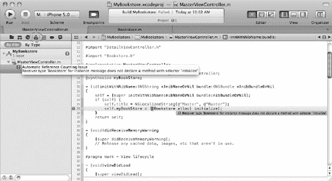

**图 14-15.** *查看问题导航器窗口*

通常，错误会指向实际问题。在上面的例子中，`BookStore` 对象不知道一个名为 `initialize` 的方法。

**提示：** 在构建项目时遇到此错误，通常意味着方法名称拼写错误，或者没有包含正确的头文件来让编译器识别该方法。如果你知道该方法确实存在，请检查头文件是否已包含。否则，可能只是一个拼写错误。

好了，让我们将单词 `initialize` 改为 `init` 来修复这个错误。

#### 警告

警告表明程序存在潜在问题。如上所述，警告不会阻止程序构建，但可能在程序执行期间引发问题。全面介绍那些可能在程序执行期间引发问题的警告超出了本书的范围；不过，消除程序中的所有警告是一个好习惯。

将 `MasterViewController.m` 文件中包含 `@synthesize MasterViewController` 的行（下图中第 14 行；你的行号可能不同）注释掉，方法是在 `@synthesize myBookStore` 前面加上两个斜杠，如图 14-16 所示。然后按 +B 构建项目。

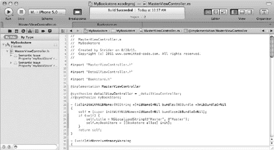

**图 14-16.** *在问题导航器中查看警告*

遗憾的是，该警告并未在 `MasterViewController.m` 文件中显示。点击问题导航器中的第一个警告，我们将定位到第一个问题，如图 14-17 所示。

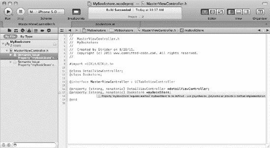

**图 14-17.** *查看我们的第一个警告*

在主窗口中，我们可以看到警告。实际上，这个警告为我们提供了一些关于代码问题的线索。警告内容如下：

> *“属性 ‘myBookStore’ 需要定义方法 ‘myBookStore’ – 请使用 @synthesize、@dynamic 或提供方法实现。”*

我们的代码中有一个 `@property`，但由于我们将其注释掉了，所以没有对应的 `@synthesize`。编译器将此视为警告，因为该方法可能在运行时被动态提供。然而，在我们的例子中，我们并没有这样做；我们只是没有在实现文件中包含 `@synthesize` 关键字。

要解决此问题，只需导航回 `MasterViewController.m` 文件，并移除我们刚刚在第 14 行添加的注释。要导航回文件列表，请点击*文件夹*图标，如图 14-18 所示（或直接点击编辑窗口顶部的返回按钮）。

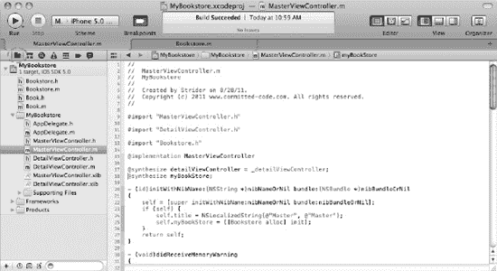

**图 14-18.** *导航回文件列表并修复警告问题*

### 本章小结

在本章中，我们涵盖了免费的 Apple Xcode 调试器的高级功能。无论价格如何，Xcode 都是一个出色的调试器。具体来说，在本章中，你学到了以下内容：

- 术语“bug”的起源以及什么是调试器；
- Xcode 调试器的高级功能：
  - 断点
  - 单步执行程序；
- 如何使用调试控件：
  - 任务（停止标志），
  - 重启与继续（暂停），
  - 单步跳过，
  - 单步进入，
  - 单步跳出；
- 使用各种调试器视图：
  - 线程（调用堆栈），
  - 变量，
  - 文本编辑器，以及
  - 输出；
- 查看程序变量；以及
- 处理错误和警告。

## 索引

### 特殊字符与数字

3D 用户界面，15


###  A

动作，与对象连接，232–233
地址，内存，272–275
`addToResults()` 方法，209
`Airplane` 类，18
算法，1–2, 12
Alice 应用，登月任务：爱丽丝，21–26
Alice 界面，9–11, 13–20
Alice 应用，登月任务：爱丽丝，21–26
其中的类、对象和实例，18
详细信息区域，20
编辑器区域，19
事件区域，20
其中的示例应用，78–79
导航菜单，14
对象树，18–19
世界窗口，15–17
内存分配
自动变量和指针，276–277
分配失败，287–288
AND 运算符，63–65, 67, 85
`Animal` 类，167–168
`Animal` 对象，166–167
`Animal` 类型，165
`AppDelegate` 类，297
应用委托，264
应用
Interface Builder，220–235
连接动作和对象，232–233
停靠栏，225
实现文件，233–235
检查器窗格和选择器栏，228
库窗格，226–227
输出口，230–232
视图，229–230
登月任务：爱丽丝，21–26
概述，216–217
Xcode，202–206
ARC（自动引用计数）特性
使用其管理内存，280–282
不使用其管理内存，282–287
隐含的保留消息和自动释放，285–286
保留/释放模型，283–284
发送 `dealloc` 消息，286–287
ASCII 字符，43
ASCII 表，43
`Astronaut` 类，23
`Author` 类，102
`authorLabel` 变量，185–186, 188–189, 196
自动引用计数特性。*参见* ARC
自动变量，以及指针，276–277
自动释放，以及隐含的保留消息，285–286

###  B

`bankLeft()` 方法，18
`bankRight()` 方法，18
十进制数制，269–270
十六进制数制，270–272
二进制数制，269–270
基数，位，字节，以及，268–269
OOP 的优势，100–101
更易调试，101
消除冗余代码，100
更易替换，101
应用广泛，100
二进制数字系统，42
二进制数制，将十进制转换为，269–270
位，39–40
字节，基数和，268–269
以及摩尔定律，40
`Book` 类，91–92, 96, 99, 174, 176–177, 198, 251, 302
`Book` 对象，171, 175, 177–178, 181, 183, 190, 194, 198, 301
`bookAtIndex` 方法，189–191, 193–195
`Book.h` 文件，176, 301
`Bookstore` 类，90, 92, 191–192, 194, 282
`Bookstore init` 方法，300
`Bookstore` 对象，90, 171, 189, 191, 193–194, 198, 299–300, 304
`Bookstore.h` 类，189
`Bookstore.h` 文件，175, 189
`Bookstore.m` 文件，300–301
布尔数据类型，45, 64, 68
布尔表达式，使用比较运算符，206–212
组合，211–212
日期的比较，209–211
字符串的比较，207–209
布尔逻辑，63–67, 199–200
其比较运算符，67
真值表，65–67
布尔变量，207
`Breakpoint Navigator` 方法，294–296
断点，293–294
错误（Bug），5
`Button` 对象，150
字节，41–42, 268–269


### C

- `call stack`、`thread window`，300
- `CamelCase`，178
- `Camera Adjustment tool`，23
- `caseInsensitiveCompare` 方法，208
- `cellForRowAtIndexPath`，193
- `class methods`，132–133，158
- `class types`，在集合中的确定，167–168
- `classes`，90–98，129–161
  - 在 `Alice Interface` 中，18
  - 声明接口和实例变量，131
  - 定义，89
  - 实现文件，134–135
  - 实现，94–98
  - 方法，131–134
    - `class`，132–133，158
    - 编码，136–138
    - `instance`，134
    - 方法，针对，92–93
    - 属性，针对，90–92
    - `RadioStations` 项目，138–140
      - 代码关联，152–156
      - 实现文件，144–146
      - 对象，141–144
      - 运行程序，157–158
      - `UI`，147–151
      - `Xcode 4.2` 工具集，访问文档，159
- `CLLocationManagerDelegate`，264
- `clubMember` 变量，207，211–212
- `Cocoa.h` 文件，136
- `code errors` 和警告，302–306
- `code refactoring`，83
- `collections`，163–168
  - 在集合中确定类类型，167–168
  - `NSArray` 类，165–166
  - `NSDictionary` 类，166–167
  - `NSSet` 类，164–165
- `Command Line Tool` 模板，30
- `comparing data`，199–214
  - `Boolean` 表达式，206–212
    - 组合比较，211–212
    - 比较日期，209–211
    - 比较字符串，207–209
    - `Boolean` 逻辑，199–200
    - `relational operators`，200–206
      - 比较数字，200–202
      - `exampleXcode` 应用程序，202–206
    - `switch` 语句，212–213
- `comparison operators`，用于布尔逻辑，67
- `ComparisonsAppDelegate.m` 文件，204–205
- `compound call`，133
- `computer program`，1–2
- `condition-controlled loops`，77
- `conventions`，182–183
- `Core Data` 框架，241–243
- `Couch` 对象，88
- `count-controlled loops`，76
- `counter variable`，76–77
- `Create a new Xcode Project` 选项，29
- `Create` 按钮，140，143
- `Custom TextString`，52
- `Customer` 类，90–92，96–97，99
- `Customer.h` 文件，97


### D

- Dalrymple, Mark, 265
- 数据, 39–62, 199–214
  - 布尔表达式, 206–212
    - 组合比较, 211–212
    - 比较日期, 209–211
    - 比较字符串, 207–209
  - 布尔逻辑, 199–200
  - 数制系统, 39–45
    - 比特, 39–40
    - 字节, 41–42
    - 十六进制, 43
    - Unicode, 44
  - 关系运算符, 200–206
    - 比较数字, 200–202
    - 示例 Xcode 应用程序, 202–206
  - switch 语句, 212–213
  - 类型
    - 以及 Objective-C, 54–59
    - 概述, 44–45
    - 在 Alice 中使用, 45–54
- 数据模型, 244–259
  - MyBookstore 程序中的类, 189–191
  - 接口, 252–259
  - 托管对象上下文, 252
- 数据库
  - 用于数据库的 Core Data 框架, 241–243
  - 概述, 240–241
- 日期，比较, 209–211
- `dateWithString` 函数, 210
- `dealloc` 消息，发送, 286–287
- 内存释放, 277–280
- Debug 配置, 292
- 调试器控件, 297
- 调试, 5–6, 10, 60–62
  - 面向对象编程（OOP）的优势, 101
  - 使用 Xcode 调试器, 292–302
    - 断点导航器方法, 294–296
    - 断点, 293–294
    - 控件, 297–300
    - 线程窗口与调用堆栈, 300
    - 变量, 300–302
- 十进制数制，转换为二进制数制, 269–270
- 委托方法, 264
- 委托, 264
- delete 键, 295
- 解引用运算符, 275
- MyBookstore 程序的描述, 186–189
- `descriptionTextView`, 188–189, 196
- 设计需求, 2–3, 5–7, 9, 12
- 详情区域, 20
- `DetailViewController` 类, 185, 196
- MyBookstore 程序的 `DetailViewController` 控制器, 196
- `DetailViewController.h` 文件, 184–185, 188
- `DetailViewController.m` 文件, 184, 189, 196, 296
- `DetailViewController.xib` 文件, 183, 198
- 开发周期, 5–6
- `didFailWithError`, 264–265
- `didSelectRowAtIndexPath`, 195
- `didUpdateToLocation`, 264
- Interface Builder 应用程序的 Dock 栏, 225
- Interface Builder 应用程序的文档窗口, 225
- `Dog` 类, 89
- `doSomething()` 方法, 201
- 动态绑定, 132

### E

- `EdibleItem`, 262
- 编辑代码按钮, 24
- 编辑场景按钮, 16
- `EditableItem`, 263
- 编辑器区域, 19, 32
- 电子数字积分计算机（ENIAC）, 39
- 嵌套的 `else-if` 语句, 83
- ENIAC（电子数字积分计算机）, 39
- `enteredPassword`, 208–209
- 错误、代码与警告, 302–306
- 事件处理程序, 20
- 事件区域, 20
- 布尔表达式, 206–212
  - 组合, 211–212
  - 日期比较, 209–211
  - 字符串比较, 207–209
- 去除多余字符, 83

### F

- 工厂方法, 133
- `FALSE` 运算符, 64–67, 69–70, 77, 82
- 快速枚举器, 164
- 文件
  - 实现文件, 134–135
  - Interface Builder 应用程序的文件, 233–235
  - RadioStations 项目的文件, 144–146
  - 偏好设置文件, 238–240
  - 从文件读取, 239–240
  - 写入文件, 238–239
- `firstNumber` 变量, 46–49, 58
- 位翻转, 66
- 流程图, 73
- `for` 循环, 76
- `forum.xcelme.com`, 79, 83
- 前向声明, 146
- `Foundation` 类, 129, 131
- `Foundation.h` 文件, 107
- 函数, 20

### G

- getter 方法, 177–183
- 草地模板, 45


### H

Hello World 应用，21  
HelloWorld 类，107，109  
HelloWorld 对象，108–109  
`HelloWorld.h` 文件，109  

辅助方法，264  
十六进制，43，270–272  

HIGs（人机界面指南），219–220  
历史，Objective-C 的，103–104  
人机界面指南（HIGs），219–220  

### I, J

`IBAction` 方法，154，156  
IDE（集成开发环境），7  
`If` 语句，83，207  
If-Then-Else 代码，68  
`If/Then` 语句，206  
实现文件，134–135  
用于 Interface Builder 应用，233–235  
用于 `RadioStations` 项目，144–146  
隐式保留消息，以及自动释放，285–286  
无限循环，77  

信息，存储，237–260  
注意事项，237  
数据模型，244–259  
界面，252–259  
托管对象上下文，252  

在数据库中：  
Core Data 框架，241–243  
概述，240–241  

在偏好设置文件中，238–240  
读取，239–240  
写入，238–239  

继承：  
多重继承，261–262  
面向对象编程中的，99–100  

`init` 方法，298–300  
`initWithName:atFrequency:` 方法，132  
检查器面板，以及检查器选择栏，228  
实例方法，134，136  

实例变量，176–179  
访问，177  
getter 和 setter 方法，178–179  
接口和，声明，131  
用于 `MyBookstore` 程序，185–186  

实例，在 Alice 界面中，18  
实例化，22  
集成开发环境（IDE），7  

接口：  
用于数据模型，252–259  
面向对象编程的，101  

Interface Builder 应用：  
示例 iPhone 应用，220–235  
连接动作和对象，232–233  
Dock，225  
实现文件，233–235  
检查器面板和选择栏，228  
库面板，226–227  
输出口，230–232  
视图，229–230  
概述，216–217  

接口声明，134  
接口文件，116  
接口，以及实例变量，声明，131  
`InventoryItem` 协议，263  
iPad 模拟器，21  

iPhone，示例应用，220–235  
`isEqualToString`，208  
`isKindOfClass:` 方法，167–168  

### K

Kaplan, Dean，3  
Knaster, Scott，265  

### L

`Label` 对象，120–121，150–151，154–155，185–186，231，234  

LaMarche, Jeff，265  
`land()` 方法，18  
语言符号，Objective-C 的，104–105  
`Library` 对象，106  
库面板，用于 Interface Builder 应用，226–227  
`locationManager` 方法，264–265  

循环，76，78  
循环，76–77  
条件控制的，77  
计数控制的，76  
无限循环，77  

`lowerLandingGear()` 方法，18  
Lunar Lander，22


### `main.c` 文件，204

`main.m` 文件，81

`MainWindow.xib` 文件，118

托管对象上下文，数据模型，252

Mark, Dave，265

`MasterViewController` 控制器（用于 `MyBookstore` 程序），191–196

`MasterViewController.h` 文件，191

`MasterViewController.m`，296，298，300，302，305–306

`Material` 类，99

`maxFMFrequency`，145，154–155

内存，267–290

地址，272–275

分配，276–277

自动变量和指针，276–277

分配失败，287–288

ARC 特性

使用 ARC 管理内存，280–282

不使用 ARC 管理内存，282–287

位、字节和进制，268–269

释放，277–280

编号

十六进制，270–272

十进制转二进制，269–270

消息

发送 `dealloc` 消息，286–287

隐式保留和自动释放，285–286

方法，8，131–134

类方法，92–93，132–133，158

编码，136–138

实例方法，134

`minFMFrequency`，145，154–155

移动银行应用，72

模型-视图-控制器（MVC）模式，217–218

猴子示例，166–167

`MoonProject.a3p` 模板，21

Moore, Gordon E.，40

摩尔定律，40

多重继承，261–262

可变类，168–171

`NSMutableArray`，169–170

`NSMutableDictionary`，170–171

`NSMutableSet`，168–169

MVC（模型-视图-控制器）模式，217–218

`MyBookstore` 程序，171–176，183–196

数据模型类，189–191

描述，186–189

`DetailViewController` 控制器，196

实例变量，185–186

`MasterViewController` 控制器，191–196

视图，183–185

`MyClass` 接口，264

`MyCoreLocation`，264


###  N

- `NAND` 真值表，66
- 导航菜单，14
- 导航器区域，32
- 嵌套语句，`if` 和 `else-if` 语句，83
- 新建 Xcode 项目，202
- `newBook` 变量，301–302
- `newTitle`，179，182
- 不可变类，168
- `nonatomic` 关键字，181
- `NOR` 真值表，67
- `NOT` 真值表，66
- `NSApplication` 类，264
- `NSArray` 类集合，165–166
- `NSArray` 对象，166
- `NSCalendarDate` 类，210
- `NSCFConstantString` 变量，302
- `NSComparisonResult`，210–211
- `NSDate` 对象，210–211
- `NSDictionary` 类，166–168
- `NSDictionary` 对象，133，167
- `NSLog` 命令，166
- `NSLog` 函数，34，105，205–206
- `NSMutableArray` 类，169–170，190，290
- `NSMutableArray` 方法，191
- `NSMutableArray` 对象，169，191
- `NSMutableDictionary` 类，170–171，284，290
- `NSMutableSet` 类，168–169
- `NSObject` 类，109，130，132，135，137，142
- `NSObject` 对象，107
- `NSOrderedAscending`，210–211
- `NSOrderedDescending`，210–211
- `NSOrderedSame`，210–211
- `NSSet` 类集合，164–165
- `NSString` 类，108，159，179，205，207–209，213，276，302
- `NSString` 对象，108，133，166，177–179，208
- `NSUserDefaults` 类，238
- `NSUserDefaults` 对象，238–239
- 编号
  - 十六进制，270–272
  - 十进制转二进制，269–270
  - 系统，39–45
    - 位，39–40
    - 字节，41–42
    - 十六进制，43
    - Unicode，44
- `numberOfRowsInSection`，193
- `numberOfSectionsInTableView`，193
- 数字，比较，200–202

###  O

- 面向对象编程。*参见* OOP
- 对象树，18–19
- Objective-C，79–84
  - 和数据类型，54–59
  - 历史，103–104
  - 中的语言符号，104–105
  - 嵌套 `if` 和 `else-if` 语句，83
  - 重构，83
  - 删除多余字符，83
  - 中的 Smalltalk 概念，105–110
- `Objective-C` 类，95，108–109，127，129–130，160，165–166，174
- `Objective-C` 命令，105
- `Objective-C` 方法，104–105
- `Objective-C` 对象，105–106，130，137，166，168，177，278，283，287
- Objective-C 程序，Xcode 4.2 工具集，27–35
- `Objective-C` 类型，59，276
- 对象
  - 在 Alice 界面中，18
  - 将动作与对象连接，232–233
  - 定义，88–89
  - 用于 `RadioStations` 项目，141–144
- 对象调整工具，23
- OmniGraffle，3–4，70–71
- OOP（面向对象编程），6–9，87–102
  - 优点，100–101
    - 调试更容易，101
    - 消除冗余代码，100
    - 替换更容易，101
    - 广泛使用，100
  - 类，90–98
  - 定义，89
  - 实现，94–98
  - 方法，92–93
  - 属性，90–92
  - 继承，99–100
  - 接口，101
  - 对象，定义，88–89
  - 和多态，101–102
- 运算符，比较，67
- 输出口，用于 Interface Builder 应用程序，230–232
- 输出窗口，297


### P

参数，25

规划程序流程，63–86
- 布尔逻辑，63–67
  - 比较运算符，67
  - 真值表，65–67
- 设计需求，70–72
- 示例，74
- 流程图绘制，73
- 在 Objective-C 中，79–84
  - 嵌套 if 和 else-if 语句，83
  - 重构，83
  - 移除多余字符，83
- 伪代码，68–69
- 使用循环，76–77
  - 条件控制，77
  - 计数控制，76
  - 无限循环，77

指针，自动变量与，276–277

多态，101–102

偏好文件，238–240
- 读取，239–240
- 写入，238–239

过程（方法），20

过程选项卡，24

程序流程，规划，63–86
- 布尔逻辑，63–67
  - 比较运算符，67
  - 真值表，65–67
- 设计需求，70–72
- 示例，74
- 流程图绘制，73
- 在 Objective-C 中，79–84
  - 嵌套 if 和 else-if 语句，83
  - 重构，83
  - 移除多余字符，83
- 伪代码，68–69
- 使用循环，76–77
  - 条件控制，77
  - 计数控制，76
  - 无限循环，77

编程
- Alice 界面，9–20
  - Alice 应用，21–26
  - 类、对象和实例，18
  - 详细信息区域，20
  - 编辑器区域，19
  - 事件区域，20
  - 导航菜单，14
  - 对象树，18–19
  - 世界窗口，15–17
- 集合，163–168
  - 判断类类型，167–168
  - `NSArray` 类，165–166
  - `NSDictionary` 类，166–167
  - `NSSet` 类，164–165
- 开发周期，5–6
- 实例变量，176–179
  - 访问，177
  - getter 和 setter 方法，178–179
- 可变类，168–171
  - `NSMutableArray`，169–170
  - `NSMutableDictionary`，170–171
  - `NSMutableSet`，168–169
- MyBookstore 程序，171–176, 183–196
  - 数据模型类，189–191
  - 描述，186–189
  - `DetailViewController` 控制器，196
  - 实例变量，185–186
  - `MasterViewController` 控制器，191–196
  - 视图，183–185
- Objective-C 程序，Xcode 4.2 工具集，27–35
- OOP，6–9
- 过程，1–3
- 属性，180–183
- Xcode 中的项目，111–127

属性，9, 20, 180–183
- 用于类，90–92
- 约定，182–183

协议，261–265
- 委托，264
- 多重继承，261–262
- 语法，263

伪代码，68–69

### Q

QA（质量保证），5


### R

- `Radio` 类，138
- `RadioStation` 类，130，132，134，136，138，142，145，147，155，160
- `RadioStation` 接口，144
- `RadioStation` 对象，130–134，141，146–147，160
- `RadioStation.h` 文件，144
- `RadioStation.h` 接口，136
- `RadioStation.m` 文件，144
- `RadioStations` 项目，138–140
  - 挂钩代码，152–156
  - 实现文件，144–146
  - 对象，141–144
  - 运行程序，157–158
  - 用户界面，147–151
- `RadioStationsAppDelegate.h` 接口，160
- `raiseLandingGear( )` 方法，18
- `rangeOfString` 函数，209
- 从偏好设置文件中读取，239–240
- 接收器，131
- 消除冗余代码，100
- 重构，83
- 关系运算符，200–206
  - 数字比较，200–202
  - 示例 Xcode 应用程序，202–206
- `Release` 配置，292
- 内存释放
  - 自动释放与隐式保留消息，285–286
  - 保留/释放模型，283–284
- `removeAllObjects` 方法，168，170
- `removeLastObject` 方法，170
- `removeObjectAtIndex` 方法，170
- 隐式保留消息，285–286
- 保留/释放模型，283–284
- `Round Rect Button` 对象，149
- `Run` 按钮，33
- 运行应用程序，84

### S

- `Sale` 类，91
- `SaleItem`，263
- `Sales` 类，92，100
- `saleStarted` 变量，210–211
- `SArray` 类，165
- `scanf` 函数，82–83
- `Scene Editor`，16–17
- `SDictionary` 类，166
- `secondNumber` 变量，46–49，58
- `Seed` 方法，233
- 选择器，131
- `sender` 方法，161
- `setInstanceVariableName`，178
- setter 方法，177–183
- `setTitle` 方法，178–179，182
- `Objective-C` 中的 `Smalltalk` 概念，105–110
- `some_code( )` 方法，206–207
- `SQLite` 数据库，237，240–241，260
- 堆栈跟踪，297
- 对象状态，9
- 调试的步进控制，298–300
- `Step Into` 按钮，298–300
- 信息存储，237–260
  - 注意事项，237
  - 数据模型，244–259
  - 接口，252–259
  - 托管对象上下文，252
  - 在数据库中
    - `Core Data` 框架，241–243
    - 概述，240–241
  - 在偏好设置文件中，238–240
    - 读取，239–240
    - 写入，238–239
- 字符串参数，52
- 字符串，44，207–209
- `stringWithContentsOfURL`，178
- 子类化，264
- switch 语句，212–213
- 语法，34，263

### T

- `tableView:cellForRowAtIndexPath`，193
- `tableView:didSelectRowAtIndexPath`，194
- `tableView:numberOfRowsInSection`，193
- `takeOff( )` 方法，18
- `Template` 标签页，21
- 测试，5–6
- `testString` 变量，169
- `theBookStore` 数组，189–191
- 线程窗口与调用堆栈，300
- `title` 变量，167，177–178，180–181，188，190，192–193，196
- `titleLabel` 变量，185–186，188–189，196
- `To the Moon Alice` 应用程序，21–26
- `totalNumber` 变量，49，53
- `totalSpent=calculateTotalSpent( )` 方法，201，211
- `totalSum` 变量，47–48，50，53
- `Touch Up Inside` 事件，156–157
- 触发器，20
- `TRUE` 运算符，64–70，77–78，82
- 真值表，65–67
- 数据类型，44–45
  - 与 Objective-C，54–59
  - 在 Alice 中使用，45–54


### U

- UI（用户界面），3、5–6、10–11、118、215–235
- 人机界面指南，219–220
- Interface Builder 应用
    - 示例 iPhone 应用，220–235
    - 概述，216–217
    - MVC 模式，217–218
    - 用于 `RadioStations` 项目，147–151
- `UILabel` 对象，184–185、188–189
- `UITableView` 对象，8–9
- `UITextView`，188–189
- Ultimate iPhone Stencil 插件，3
- unicode（统一码），44
- 唯一对象，169
- 无序，164
- 使用自动引用计数选项，80
- 用户界面 —— *参见* UI
- `userGuess`，82–84
- `UTF8string`，208

### V

- 变量，44、276–277、297
- 视图控制，187、191
- 视图对象，186–187、218
- `ViewController` 对象，122、125–126、128
- `ViewController.h` 文件，116、145、155
- `ViewController.h` 接口，117
- `ViewController.m` 文件，117、146、154
- `ViewController.xib` 文件，118、147
- 视图
    - 用于 Interface Builder 应用，229–230
    - 用于 `MyBookstore` 程序，183–185

### W

- 警告，代码错误与，302–306
- `while` 循环，77
- 基于窗口的应用，202
- `Window` 对象，252
- Woodforest 移动银行应用，72
- 世界窗口，15–17
- 写入偏好设置文件，238–239

### X, Y, Z

- Xcode
    - 在 Xcode 中创建项目，111–127
    - 数字比较示例，202–206
- Xcode 4.2 工具集，27–35、159
- Xcode 调试器
    - 代码错误与警告，302–306
    - 使用调试器进行调试，292–302
        - 断点导航器方法，294–296
        - 断点，293–294
        - 控件，297–300
        - 线程窗口与调用栈，300
        - 变量，300–302
    - 概述，291
- XIB 文件，223–225、230–231、235
- XML 文件，216–217
- XOR 运算符（异或），64–66、85
