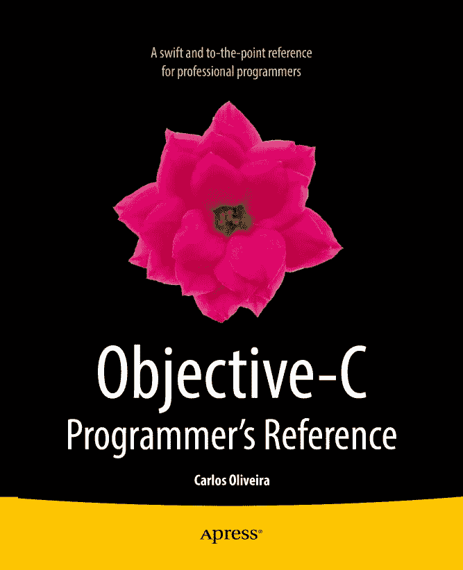

  
卡洛斯·奥利维拉  
《Objective-C 程序员参考手册》  
10.1007/978-1-4302-5906-0  
© Apress 2013 卡洛斯·奥利维拉 《Objective-C 程序员参考手册》

ISBN 978-1-4302-5905-3  
电子版 ISBN 978-1-4302-5906-0  
© Apress 2013  
《Objective-C 程序员参考手册》

总裁兼出版人：保罗·曼宁  
首席编辑：乔纳森·根尼克  
开发编辑：道格拉斯·庞迪克  
技术审校：罗恩·娜塔莉  
编辑委员会：史蒂夫·安格林、马克·贝克纳、尤安·白金汉、加里·康奈尔、路易丝·科里根、摩根·埃特尔、乔纳森·根尼克、乔纳森·哈塞尔、罗伯特·哈钦森、米歇尔·洛曼、詹姆斯·马卡姆、马修·穆迪、杰夫·奥尔森、杰弗里·佩珀、道格拉斯·庞迪克、本·雷诺-克拉克、多米尼克·谢克沙夫特、格温南·斯皮尔林、马特·韦德、汤姆·沃尔什  
协调编辑：吉尔·巴尔扎诺  
文字编辑：玛丽·贝尔  
排版：SPi Global  
索引制作：SPi Global  
美工：SPi Global  
封面设计：安娜·伊什琴科

本书由 Springer Science+Business Media New York 向全球图书贸易经销，地址：233 Spring Street, 6th Floor, New York, NY 10013。电话：1-800-SPRINGER，传真：(201) 348-4505，电子邮箱：`orders-ny@springer-sbm.com`，或访问[`www.springeronline.com`](http://www.springeronline.com)。Apress Media, LLC 是加利福尼亚州的有限责任公司，其唯一成员（所有者）是 Springer Science + Business Media Finance Inc (SSBM Finance Inc)。SSBM Finance Inc 是特拉华州的一家股份公司。

如需了解翻译相关信息，请发送电子邮件至`rights@apress.com`，或访问[`www.apress.com`](http://www.apress.com)。Apress 及 friends of ED 的书籍可批量购买用于学术、企业或促销用途。大多数书籍也提供电子版和许可证。如需更多信息，请参阅我们的特殊批量销售–电子书许可网页：[`www.apress.com/bulk-sales`](http://www.apress.com/bulk-sales)。

本书作者在文中引用的任何源代码或其他补充材料，读者可在[`www.apress.com`](http://www.apress.com)获取。关于如何找到本书源代码的详细信息，请访问[`www.apress.com/source-code/`](http://www.apress.com/source-code/)。

本作品受版权保护。出版者保留所有权利，无论是全部还是部分材料，特别是翻译权、重印权、插图再利用权、朗诵权、广播权、缩微胶片复制权或任何其他物理形式的复制权，以及信息存储与检索的传输权、电子改编权、计算机软件权，或采用目前已知或未来开发的类似或不同方法进行处理的权利。与书评或学术分析相关的简短摘录，或专为输入和执行于计算机系统而提供的材料（仅供购买者独家使用），不受此法律保留限制。本出版物或其部分内容的复制仅允许在出版者所在地现行版权法的规定下进行，且使用许可必须始终从 Springer 获得。使用许可可通过 RightsLink 从版权清算中心获取。违反者将根据相应版权法被起诉。

本书中可能出现商标名称、标识和图像。我们不在每次出现商标名称、标识或图像时使用商标符号，而是仅以编辑方式使用这些名称、标识和图像，以利于商标所有者，且无意侵犯商标权。本出版物中使用商品名称、商标、服务标志及类似术语，即使未明确标识，也不应被视为对这些术语是否受专有权利保护的任何意见表达。

尽管本书中的建议和信息在出版时被认为是真实准确的，但作者、编辑或出版者均不对可能存在的任何错误或遗漏承担法律责任。出版者不对本书内容作任何明示或暗示的保证。

本书献给我的妻子和儿子，他们是我工作的最大灵感源泉。

