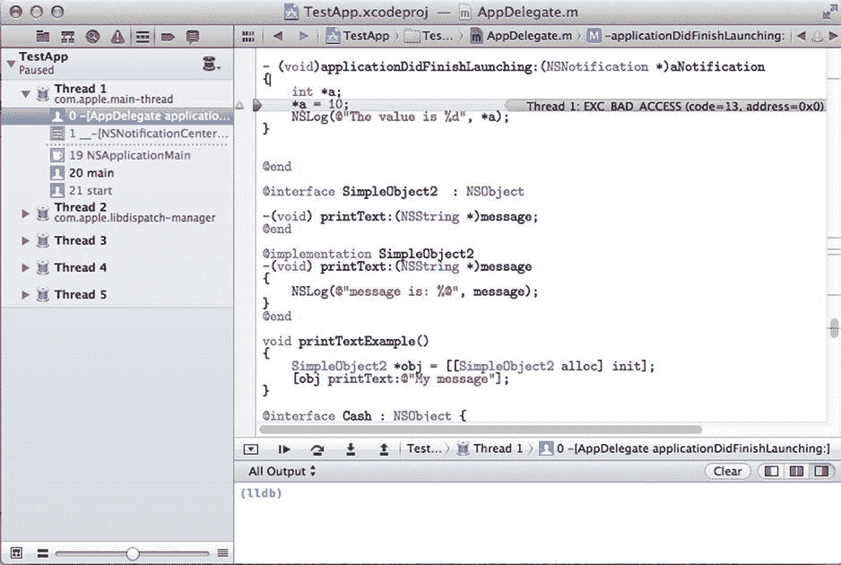
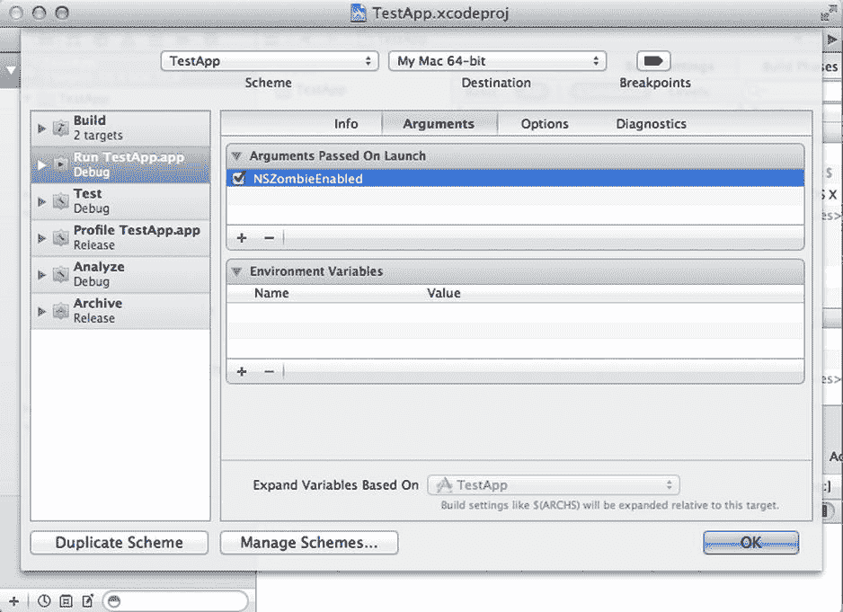
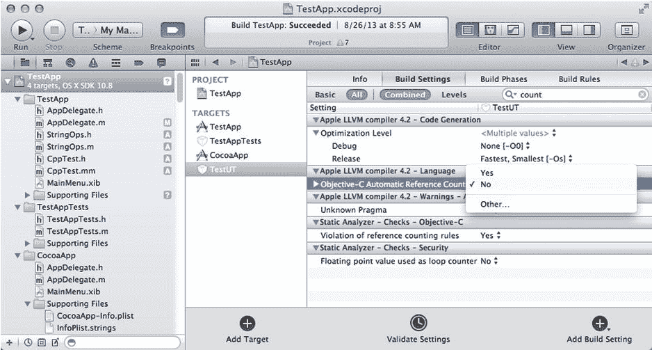

# 8. 内存管理

复杂的内存管理是开发人员在用 C 语言编程时需要面对的主要问题之一。直接操作内存地址所带来的强大能力——这也是高效 C 语言编程的标志——当需要手动管理对象在内存中的位置时，也可能成为一个难题。Objective-C 在保留 C 语言强大能力的同时，也引入了一种更好的方式来组织和管理内存。为了简化内存使用对象的过程，该语言提供了完全基于面向对象编程原则的技术。

你将看到，使用一个强调运行时特性的面向对象语言的优势之一在于，内存管理可以被简化，并大部分委托给系统库，由它们完成大量复杂的工作。Objective-C 程序员可以专注于对象在其应用领域中的实际使用，而不是纠结于底层的内存管理方案。

尽管在 Objective-C 中管理内存比在纯 C 语言中要容易得多，但请务必记住，它仍然基于手动内存管理框架。换句话说，没有像 Java 和 C# 等语言那样的自动垃圾回收器（GC）来控制内存（Objective-C 曾为桌面应用程序提供过 GC，但其已被弃用，转而使用自动引用计数，这将在本章后面说明）。因此，你需要认识到这种内存管理方案的优缺点。

垃圾回收使得内存使用变得几乎微不足道。无需担心对象如何分配以及何时释放。系统会为你处理好一切。然而，它也有一些缺点。经验表明，GC 系统要么效率太低（许多基于 GC 的语言都存在的主要问题），要么太过复杂以至于需要消耗大量计算机资源来运行。例如 Java，其 GC 在十多年的时间里不断改进，最终形成了一个需要大量内存才能高效运行的复杂系统。

Objective-C 不依赖 GC 的事实意味着它可以在任何地方运行，从大型工作站到像手机这样的内存受限设备。所有这一切，在保持基于 C 的语言的高性能的同时也成为可能。

Objective-C 内存管理的秘诀在于使用基于引用的数据模型，并伴以少量简单的规则，这些规则使得在应用程序中分配和释放内存几乎变得直接明了。在本章中，你将学习编写正确 Objective-C 代码所需掌握的规则。在理解了内存管理背后的概念之后，我还会介绍 Apple 编译器通过 ARC（自动引用计数）提供的最新技术，该技术实际上消除了在内存管理机制中手动干预的需要。

## 处理内存问题

在了解如何正确管理内存之前，理解在开发 Objective-C 应用程序过程中可能遇到的内存错误类型非常重要。与其他逻辑错误不同，内存错误是最难修复的，因为它们通常出现在真实错误发生地点很远的地方。因此，开发在错误发生时立即识别内存问题的技术至关重要，这是防止出现更复杂、修复耗时更长问题的一种有效手段。


### 内存问题的类型

在 Objective-C 中，由于其源自 C 语言，程序员需要处理多种内存错误。其中包括以下几种：

- **悬空指针**：当您指向一个不再有效的对象或内存区域时，就会发生悬空指针。在 C 语言中，这可能是由多种原因造成的，例如访问一个已被释放的指针。在 Objective-C 中，悬空指针可能由于对象被错误释放而发生。当这种情况发生时，再次访问该变量很可能会导致应用程序崩溃，因为之前存储在那里的所有数据都已被重用。
- **数组越界访问**：由于在 C 语言中数组和指针是等价的，数组访问可能会导致访问超出已分配区域的指针。这是大多数基于 C 语言的应用中常见的内存错误。然而，Objective-C 程序员可以通过使用诸如 `NSArray` 之类的集合来代替原生数组，从而避免许多此类问题。尽管 `NSArray` 可能不如原生数组快，但它能提供自动保护，防止此类不当的数组访问。对于性能关键代码，在必要时，始终可以从使用集合转换回使用原生数组。
- **内存泄漏**：内存泄漏是指程序中的某部分内存变得无法访问，尽管系统尚未将其释放。内存泄漏在 C 语言和 Objective-C 中都可能出现，只是内存释放的机制不同。在 Objective-C 中，这种情况发生是因为对象的使用者没有在方法结束时（对于局部变量）或者在对象被释放时（对于实例变量）对变量调用 `release`。内存泄漏是一种隐蔽的错误，因为它们不会立即导致崩溃。您感知内存泄漏的方式是内存使用量增加，每次运行有问题的代码时都会发生这种情况。一段时间后，这可能会耗尽应用程序的所有可用内存，导致运行缓慢甚至崩溃。

### 识别内存 Bug

程序员应对内存问题的主要工具之一是使用调试应用程序和库。Xcode 拥有大量辅助工具，可用于定位和修复错误。

我们先考虑内存崩溃。诊断内存崩溃的一个绝佳工具是 Xcode 调试器。使用调试器时，您首先要做的是重现错误，并查看显示崩溃发生位置的堆栈跟踪（参见图 8-1 中的示例）。一旦找到错误的位置，您就可以在错误发生前的几行代码处添加断点。这样您就能清晰地看到错误发生区域附近的变量及其内容，从而能够确定是什么导致了不正确的行为。

通过观察正在执行的变量和代码，理解导致崩溃的原因后，您可以制定一个计划来修复有问题的代码。



图 8-1. 使用 Xcode 调试器定位崩溃位置

Xcode 还提供了一个名为 `NSZombieEnabled` 的强大工具，用于检查对已释放对象的访问。当将此标志传递给在 Xcode 下运行的应用程序时，它会告诉应用程序在释放指针时创建 `NSZombie` 对象。因此，Objective-C 库不只是简单地释放内存，而是会设置一个 `NSZombie` 类型的对象，这对于诊断已释放对象在释放后仍接收消息的情况非常有用。要设置 `NSZombieEnabled` 选项，您需要选择菜单选项 Product ➤ Scheme ➤ Edit Scheme，然后点击“参数”选项卡。在“启动时传递的参数”屏幕上，勾选 `NSZombieEnabled` 的复选框（参见图 8-2）。

当一个 `NSZombie` 对象收到消息时，它会立即触发 Xcode 调试器显示非法访问发生的位置。僵尸对象的位置也会给您提供关于被释放的原始对象以及是谁调用了它的线索。基于这些信息，您可以更轻松地找出对象被错误释放的原因，并修复有问题的源代码以消除此 Bug。



图 8-2. 在 Xcode 中设置 `NSZombieEnabled` 选项


## 分配内存

内存是应用需要管理的最常见的资源类型。为确保任何软件正常运行，都需要定义分配新内存的方式，以及维护已分配内存现有引用的合理方案。最终，系统还需要确定如何释放未使用的内存块。

Objective-C 采用引用计数机制来确定如何维护和释放内存。其工作原理如下：系统创建的每个对象都有一个内部计数器，记录该对象存在多少引用。每个创建新对象的方法（如 `new` 或 `copy`）都会将该计数器初始化为 1。

如果某个对象不再使用，你需要调用属于 `NSObject` 接口的 `release` 方法。调用 `release` 时，它会减少内部计数器的值。如果计数器为正数，内存不会发生任何变化；但如果计数器变为零，该对象就会被删除并从内存中移除。

由此可以看出，新对象的简单使用流程是使用 `new` 等方法创建它，然后在用完后调用 `release`。不过，如果你希望保持对象存活，可以随时调用一个名为 `retain` 的方法。`retain` 的作用是增加内部计数器，表示已添加对该对象的新引用。

以下是一个关于引用计数如何工作的简单示例。考虑下面的 `setupProduction` 方法，它用于在 `Factory` 类中设置生产系统：

```
// 文件 Factory.h

@interface Factory : NSObject

- (void) startProduction;

@end
```

这个接口声明了一个方法 `startProduction`，可用于启动工厂的生产活动。然而在生产开始之前，你需要用所有组件来设置系统。这是通过 `setupProduction` 方法完成的。

```
+ (void) setupProduction
{
    Factory *productFactory = [[Factory alloc] init];
    [productFactory startProduction];
    // 对 productFactory 执行某些操作...
    [productFactory release];
}
```

在此方法中，你只关注数据的分配和释放。因此，你首先通过简单的 `alloc`/`init` 序列分配 `Factory` 对象。内存管理规则规定，使用 `new` 方法创建的内存，内部引用计数为 1。然后，你使用新对象执行 `startProduction` 的生产初始化步骤。

最后，当不再需要 `Factory` 对象时，为避免内存泄漏，你需要调用 `release`。在其内部实现中，`release` 会递减引用计数器并检查其值。由于原始值为 1，计数器将降为零，这会让 `release` 释放该对象并将其从内存中移除。

现在，考虑如果你需要将 `Factory` 对象存储到另一个位置该怎么办。例如，你可能有一个工厂管理类，可用于管理你自己的 `Factory` 对象。

```
// 文件 FactoryManagement.h

/// 负责管理 Factory 对象。
@interface FactoryManagement : NSObject
{
    Factory *factory;
}

- (void) setupProductionManagement:(Factory*)factory;
- (void) dealloc;

@end
```

该接口为工厂提供了一个管理系统。为此，该类需要存储一个指向 `Factory` 对象的指针。`setupProductionManagement:` 方法负责接收一个 `Factory` 对象，并使用它来设置管理系统。下面是其实现方式：

```
// 文件 FactoryManagement.m
#include "FactoryManagement.h"

@implementation FactoryManagement

- (void) setupProductionManagement:(Factory *)aFactory
{
    factory = aFactory;
    [factory retain];
    // 执行其他设置活动
}

- (void) dealloc
{
    [factory release];
    [super dealloc];
}

@end
```

这个例子展示了 `setupProductionManagement:` 方法如何使用作为参数传入的 `Factory` 对象。首先，它将指针保存到实例变量 `factory` 中。然而这样做也需要使用 `retain`。这是必要的，因为否则作为参数传入的对象的引用在 `setupProductionManagement:` 结束后可能会变得无效。

在对工厂对象调用 `retain` 之后，`FactoryManagement` 负责维护 `factory` 对象的引用计数器。因此，当不再需要它时，需要对其调用 `release`。对象最后一次执行此操作的机会是在 `dealloc` 方法中，该方法在系统释放对象之前被调用。

`dealloc` 的实现负责释放该类分配的所有对象。如果一个类持有其运行所需的一个或多个额外资源，它还应实现 `dealloc` 方法，以确保这些资源在其运行结束时被正确释放。未能正确实现 `dealloc` 是大多数内存管理失败的根源，这不仅会导致高于正常的内存使用模式，还可能引发更严重的应用逻辑问题，甚至导致崩溃。


## 引用计数规则

如上一节所述，Objective-C 库实现的引用计数是一种简单的技术，它能让系统决定何时应将对象从内存中移除。但要使它正常工作，程序员需要定期遵循一些规则。尽管这些规则起初可能显得不自然，但经过一些实践后，它们会变成你的第二天性。由于使用引用计数的内存管理规则在系统中统一应用，程序员很快就能习惯并利用其便利性。

引用计数是一种可以应用于任何非垃圾收集语言（如 C 或 C++）的系统。然而，在 Objective-C 中，这种特定内存管理系统的基本优势在于，与 C 不同，所有基础库都统一应用相同的策略。因此，无需像处理 C 代码那样担心不同库使用不同的内存控制策略。一旦你学会了 `retain` 和 `release` 的工作原理，你就能理解系统中所有库（包括第三方框架）的内存使用模式。

引用计数是一种内存组织技术，它使用附加到每个对象上的一个简单计数器。因此，内存管理规则等同于每个对象增加和减少引用计数（该计数指示当前实例在内存中存在多少引用）的规则。

以下是引用计数正常工作需要遵循的规则。当对象被创建时，其内部计数器等于 1。对象仅由以 `new`、`alloc` 或 `copy` 开头的方法创建。当某个客户端为特定对象调用这些方法之一时，生成的指针被认为归该客户端所有。例如，考虑以下代码：

```objc
// 文件 ArrayUse.h

@interface ArrayUse : NSObject

- (void) useArray;

@end

// 文件 ArrayUse.m

#import "ArrayUse.h"

@implementation ArrayUse

- (void) useArray

{

NSArray *myArray = [[NSArray alloc] init];

// 对数组进行操作...

// 该数组归此对象所有。释放它。

[myArray release];

}

@end
```

类 `ArrayUse` 有一个名为 `useArray` 的方法，在该方法中分配并使用了一个数组。该数组是使用 `alloc`/`init` 这对方法创建的，并将结果赋值给 `myArray`。请记住，由于是通过 `alloc` 返回的，该内存现在的引用计数为 1，你拥有返回的对象。这也意味着你控制着该对象的生命周期。由于这是一个局部数组，在方法执行结束后你无法再使用它。因此，你需要在 `myArray` 上调用 `release` 以避免内存泄漏。

现在，考虑一种情况：`myArray` 是一个实例变量，而非局部变量。

```objc
// 文件 ArrayUse.h

@interface ArrayUse : NSObject

{

NSArray *myArray;

}

- (void) useArray;

- (void) dealloc;

@end

// 文件 ArrayUse.m

#import "ArrayUse.h"

@implementation ArrayUse

- (void) useArray

{

myArray = [[NSArray alloc] init];

// 对数组进行操作...

}

// 其他使用 myArray 的方法

- (void) dealloc

{

// 该数组归此对象所有。释放它。

[myArray release];

[super dealloc];

}

@end
```

在此示例中，`myArray` 被分配并存储为实例变量。由于你使用 `new` 创建了 `myArray`，你拥有该变量。这种情况与之前情况的不同之处在于，由于你在类作用域中使用 `myArray`，释放它的合适方法是在 `dealloc` 中进行。两种情况下，`useArray` 类都拥有该对象，唯一的变化在于对象的生命周期。

上述所有权规则的一个结果是：通过以 `alloc`、`new` 和 `copy` 之外的方法创建的对象，并不归代码的调用者所有。`NSArray` 类可以提供一个例子来说明这一点。

```objc
- (void) useArray

{

NSArray *myArray = [NSArray arrayWithObjects:@1, @2, @3, nil];

// 对数组进行操作...

// 这个数组不是用 init/new/copy 创建的

// 所以无需 release

}
```

这次，对象 `myArray` 是使用方法 `arrayWithObjects:` 创建的，这是一个返回新数组的类方法。尽管在功能上这与前一个示例的代码非常相似，但你需要处理对象的方式却截然不同。在这种情况下，`NSArray` 负责提供一种释放对象的方式，因为客户端代码并非 `myArray` 的所有者。

另一方面，当 `myArray` 是实例变量时，同样的问题会改变你的责任。这便引出了内存管理的下一条规则：如果你不拥有一个对象，则需要使用 `retain` 方法来避免它被系统删除。此规则通过修改前述示例得以说明。看看当实例变量持有一个不由你拥有的内存指针时，其处理方式有何不同：

```objc
// 文件 ArrayUse.m

#import "ArrayUse.h"

@implementation ArrayUse

- (void) useArray

{

myArray = [NSArray arrayWithObjects:@1, @2, @3, nil];

// 对数组进行操作...

// 这个数组不是用 init/new/copy 创建的

// 所以我们需要 retain 它：

[myArray retain];

}

// 其他使用 myArray 的方法

- (void) dealloc {

// 该数组归此对象所有。释放它。

[myArray release];

[super dealloc];

}

@end
```

这里你可以看到将 `NSArray` 对象存储在 `myArray` 实例变量中的方式有何不同。由于你使用了 `arrayWithObjects:`，生成的实例并不归 `ArrayUse` 所有。结果是，你需要使用 `retain` 来获得对象的所有权，以便以后能够使用它。如果你没有使用 `retain`，存储在 `myArray` 中的对象会在下一次可用机会时被系统释放。

注意，然而，`dealloc` 的实现没有改变。当 `ArrayUse` 类的对象被销毁时，它拥有对 `myArray` 的一个引用。因此，它需要以与之前相同的方式在 `myArray` 上调用 `release`。


## autorelease 方法

在前一节中，你了解了 Objective-C 中用于内存管理的两个主要方法：`retain` 和 `release`。如你所见，这两个方法会增加或减少每个对象的内部引用计数器，从而使对象自身能够知道它在内存中有多少个引用。这两个方法协同工作，确保只要有对对象的引用，该对象就保持活跃。另一方面，当对象不再被使用时，它们将允许回收内存。

第三种方法用于处理无法直接使用 `release` 的情况。当你希望一个对象在内存中持久存在，但又不想（或无法）承担其后续释放的责任时，就会用到它。一个典型的场景是，一个方法返回一个新对象，但方法名不以 `new`、`alloc` 或 `copy` 开头（请记住，这样的方法通常被允许返回引用计数为 1 的对象）。

考虑一个方法，它返回一个整数数组中排好序的元素。也就是说，它计算出一个新的、排序后的数组，包含原始数组中的相同值。为此，需要创建一个新数组对象并作为结果返回，这可能会导致内存泄漏。这是最初的实现：

```
// 文件 SortArray.h

@interface SortArray : NSObject

- (NSArray *) sortIntegerItems:(NSArray *)data;

@end

// 文件 SortArray.m

#import "SortArray.h"

@implementation SortArray

- (NSArray *) sortIntegerItems:(NSArray *)data

{

NSArray *output = [[NSArray alloc] initWithArray:data];

[output sortedArrayUsingComparator:^(id obj1, id obj2)

{

if ([obj1 integerValue] > [obj2 integerValue])

{

return (NSComparisonResult)NSOrderedDescending;

}

if ([obj1 integerValue] < [obj2 integerValue])

{

return (NSComparisonResult)NSOrderedAscending;

}

return (NSComparisonResult)NSOrderedSame;

}];

return output; // 这里会发生内存泄漏

}

@end
```

这段代码的工作方式如下。首先，通过 `alloc`/`initWithArray:` 消息组合创建一个新数组。结果是一个新的`NSArray`（`output`），它包含了参数`data`中原始值的副本。接下来的几行使用`sortedArrayUsingComparator:` 方法对数组进行排序。该方法接收一个代码块作为参数，该代码块决定了元素之间的比较方式（你在前一章中见过类似的代码块）。最后，将已包含排序后元素的输出数据返回给调用者。

当输出数组被创建时，它的引用计数器被初始化为 1。请注意，情况确实如此，因为数组对象是通过一个以`init`开头的函数（这里是`initWithArray:`）创建的。排序过程不会改变这一事实。然后，当你返回数组对象时，就会出现一个难题。

-   你不能释放该数组，因为这样做会使它失效，并向调用者返回垃圾数据。这意味着你仍然希望数组`output`的引用计数器至少为 1。
-   你无法在将来某个时刻进行释放，因为无法保证你的代码会再次接收到`output`数组。实际上，一旦对象从`sortIntegerItems:`函数返回，你就不再控制它的生命周期。此外，根据你在上一节中看到的规则，该方法的调用者并不拥有该对象，因为此方法名不以`new`、`copy`或`alloc`开头。这意味着调用者也不能释放该对象。

为了在引用计数内存管理的框架内解决这些问题，`NSObject` 提供了另一个名为 `autorelease` 的方法。该方法与内存池的概念配合使用，确保即使在这种情况下的对象也能被释放。`autorelease` 方法向系统发出信号，表明该对象当前应保持存活，但内存池机制会尽快将其释放。以下是如何将此更改应用于`sortIntegerItems:`方法：

```
// 文件 SortArray.m

#import "SortArray.h"

@implementation SortArray

- (NSArray *) sortIntegerItems:(NSArray *)data

{

NSArray *output = [[NSArray alloc] initWithArray:data];

[output sortedArrayUsingComparator:^(id obj1, id obj2)

{

if ([obj1 integerValue] > [obj2 integerValue])

{

return (NSComparisonResult)NSOrderedDescending;

}

if ([obj1 integerValue] < [obj2 integerValue])

{

return (NSComparisonResult)NSOrderedAscending;

}

return (NSComparisonResult)NSOrderedSame;

}];

return [output autorelease];

}

@end
```

只有方法的最后一行被修改了，以便在`output`上调用`autorelease`。结果，你现在无需担心因未能释放返回的数组而导致的内存泄漏。此函数的调用者将有机会接收到一个有效的对象，当数组不再被引用时，系统会负责在其上调用`release`方法。

然而，对于`NSArray`对象而言，使用`autorelease`并不是解决前面问题的唯一方法。请记住，你只需要在你拥有的对象上调用`release`或`autorelease`。你拥有`output`数组，因为调用了`alloc`来创建新对象。但是，还有另一种无需使用`alloc`创建`NSArray`的方法：你只需使用一个构建新`NSArray`的类方法即可。例如，以下是不使用`autorelease`编写上述方法的方式：

```
@implementation SortArray

- (NSArray *) sortIntegerItems:(NSArray *)data

{

NSArray *output = [NSArray arrayWithArray:data];

[output sortedArrayUsingComparator:^(id obj1, id obj2)

{

if ([obj1 integerValue] > [obj2 integerValue])

{

return (NSComparisonResult)NSOrderedDescending;

}

if ([obj1 integerValue] < [obj2 integerValue])

{

return (NSComparisonResult)NSOrderedAscending;

}

return (NSComparisonResult)NSOrderedSame;

}];

return output; // 这里不会发生内存泄漏

}

@end
```

此方法的整体算法没有改变，但现在你通过`arrayWithArray:`方法获取`NSArray`，该方法由`NSArray`类自身提供。由于`arrayWithArray:`不属于会触发结果所有权的方法，因此`sortIntegerItems:`方法并非`output`数组的所有者。因此，无需在`output`对象上调用`release`或`autorelease`。还要注意，对于`sortIntegerItems:`的任何调用者来说，情况也是如此。任何人都可以调用该方法，而无需进行释放或自动释放。


## 使用属性

使用属性（而非实例变量）来持有新对象并不会改变你在前一节中学到的任何少数规则。然而，属性有其自身的属性，因此明确它们如何与现有的内存管理策略交互就变得至关重要。

当你创建一个新属性时，可以决定它将如何存储分配给它的任何对象。以下是可能的内存属性：

- `retain`：此属性表示，如果该属性是赋值的目标，它将获得对已分配对象的所有权。这意味着标记为 `retain` 的属性始终拥有其所指向的对象。不过，使用此类属性的一个优点在于，它们会自动向前一个存储的对象发送 `release` 消息，这样你就不会忘记释放它。为避免内存泄漏，你需要在 `dealloc` 方法中释放存储在此类属性中的任何对象。一种简单的方法是将 `nil` 赋值给该属性，因为这会强制向当前存储的对象发送一条 release 消息。
- `copy`：与前一种情况不同，具有 `copy` 属性的属性不会向对象发送 `retain` 消息，而是创建该对象的一个副本。这意味着分配给该属性的对象的引用计数没有变化，并且你可以更改属性的内容，而不会将任何更改传播到原始对象。这些属性也拥有它们复制的对象，因此你必须在对象被释放之前释放它们，最好在 `dealloc` 方法中进行。
- `assign`：此属性用于不需要特殊内存处理的属性。这是默认行为，在这种情况下，属性的行为非常类似于一个简单的实例变量。在这种情况下，属性在内存管理方面的行为没有变化，你应该只使用上一节中讨论的通用内存管理规则。

以下是一个示例，通过使用一个类来存储图书数据，展示了这些属性属性如何与内存管理和引用计数交互：

```
// 文件 Book.h

@interface Book : NSObject

- (void) updateBook:(NSString*)name authors:(NSArray*)authors
cover:(NSImage*)image;

@property (assign) NSString *bookName;
@property (copy) NSArray *authors;
@property (retain) NSImage *coverImage;

@end
```

考虑一个名为 `Book` 的类，你可以在其中存储图书信息，例如书名、作者列表和封面图片。这个类将这些元素都作为属性包含在内，你将根据它们的属性进行更新。该类还有一个方法 `updateBook:authors:cover:`，负责用传递的参数更新图书数据。

第一个属性 `bookName` 被定义为使用 `assign` 属性。

```
// 文件 Book.m

#import Book.h

@implementation Book

- (void) updateBook:(NSString*)name authors:(NSArray*)authors
cover:(NSImage*)image
{
    self.bookName = name;
    [name retain]; // 此处需要 retain
    // 其他代码
}

- (void) dealloc
{
    [self.bookName release];
    [super dealloc];
}

@end
```

在 `updateBook:authors:cover:` 方法的第一部分，你负责将值 `name` 存储到 `bookName` 属性上。由于 `bookName` 是使用 `assign` 属性声明的，仅将参数名称赋值给 `bookName` 并不会改变对象的所有权或其内部引用计数器。因此，你需要手动向 `name` 对象发送一条 `retain` 消息，以避免它被该对象的其他所有者释放。然而，一旦你获得了属性 `bookName` 的所有权，就需要确保它最终会被释放。这是由 `dealloc` 方法执行的，你必须在其中添加代码来释放属性 `self.bookName`。

第二个属性 `authors` 具有 `copy` 属性。以下示例展示了如何处理该属性：

```
@implementation Book

- (void) updateBook:(NSString*)name authors:(NSArray*)authors
cover:(NSImage*)image
{
    self.bookName = name;
    [name retain]; // 此处需要 retain
    self.authors = authors; // 不需要 retain
}

- (void) dealloc
{
    [self.bookName release];
    self.authors = nil;
    [super dealloc];
}

@end
```

由于属性 `authors` 具有 `copy` 属性，你在内部存储的并非原始对象本身，而是一个副本。同样根据内存管理规则，由 `copy:` 方法返回的副本对象，其所有权属于创建它的人。这意味着你需要在副本使用结束时释放它，或者在 `dealloc` 方法中释放，就像你在上面的示例中看到的那样。请注意，我使用了常用的技巧，即将 `nil` 赋值给对象，而不是直接调用 `release`。通过赋值 `nil`，你让属性的设置器去执行释放操作，同时将属性的值重置为一个已知的值。

使用 copy 属性的好处在于，你无需担心外部客户端对对象的任何更改。如果属性 `authors` 被声明为 `retain` 或 `assign`，则任何在类外部对 `NSArray` 所做的更改都会反映在 `authors` 属性存储的值中。但由于你使用了 `copy` 属性，你可以信赖该值不会改变。

最后，以下代码用于支持 `retain` 属性：

```
@implementation Book

- (void) updateBook:(NSString*)name authors:(NSArray*)authors
cover:(NSImage*)image
{
    self.bookName = name;
    [name retain]; // 此处需要 retain
    self.authors = authors; // 不需要 retain
    self.coverImage = image;
}

- (void) dealloc
{
    [self.bookName release];
    self.authors = nil;
    self.coverImage = nil;
    [super dealloc];
}

@end
```

事实证明，使用带有 `retain` 属性的属性与使用带有 `copy` 属性的属性非常相似。在赋值过程中，该属性的合成方法负责处理两件事：释放任何先前存储的现有值，并向正在被赋值的对象发送一条 `retain` 消息。然而，从你的角度来看，你唯一需要编写的额外代码是在调用 `dealloc` 时进行显式释放。为此，你使用了同样的技巧，即将 `nil` 赋值给 `coverImage` 属性。而合成的属性处理器将负责释放先前存储的值并将 `nil` 存储到其位置上。


## 自动释放池

在前几节中，我讨论了 `autorelease` 的使用。这个消息会发送给一个需要由当前所有者释放的对象，即使这个操作至少应该等到控制权返回给调用者之后才执行。`autorelease` 消息对于在这种情况下简化内存管理非常重要。`autorelease` 方法还可以帮助你编写更简洁的代码。请看下面的示例：

```
- (void) replaceName:(NSString*)newName
{
    NSString *oldName = _bookName;
    _bookName = newName;
    [oldName release];
}
```

`replaceName` 方法操作的是在 `Book` 类中声明的 `bookName` 属性。要用 `newName` 替换 `bookName`，你需要在执行赋值操作之前，将当前对象存储到一个名为 `oldName` 的新变量中。这是必要的，因为你需要释放当前对象，而这样的释放可能会作为副作用改变 `newName` 对象。然而，使用 `autorelease`，你可以通过以下方式简化这段代码：

```
- (void) replaceName:(NSString*)newName
{
    [_bookName autorelease];
    _bookName = newName;
}
```

在这种情况下，你使用 `autorelease` 作为延迟释放，以便在任何实际变更发生之前完成 `newName` 的赋值。

`autorelease` 背后看似神奇的机制被称为自动释放池。这个池只是一个数据结构，它存储了将来需要释放的对象的指针。然后，每当系统库调用这个内存池时，包含在这些数据结构中的对象就会被释放。通常，每个应用程序线程都有一个自动释放池，每当应用程序从事件处理回调（例如）返回时，这个池就会被调用。

每个应用程序至少有一个内存池。主线程中的内存池是在 `main` 函数中建立的。建立这种内存池有两种方式。第一种方式是使用 `NSAutoreleasePool` 对象。示例如下：

```
int main()
{
    NSAutoreleasePool *pool = [[NSAutoreleasePool alloc] init];
    // 主应用程序循环位于此处
    [pool release];
    return 0;
}
```

这里我只展示了 `main` 函数中处理自动释放池的部分。首先通过向 `NSAutoreleasePool` 发送 `alloc` 消息来创建 `pool` 对象。创建此对象保证了被 `autorelease` 的对象将被存储在池中，并且会一直存在，直到池被排空（或者对其调用 `release`）。

创建自动释放池的第二种方法是使用 `@autoreleasepool` 关键字。虽然这与创建 `NSAutoreleasePool` 对象非常相似，但这个关键字允许你定义一个语句块，该语句块将在同一个自动释放池下执行。存储在池中的对象的释放，以及池本身的创建和释放，都由编译器处理。示例如下：

```
int main()
{
    @autoreleasepool
    {
        // 此处为其他语句
    }
    return 0;
}
```

虽然我只展示了在 `main` 函数中自动释放池的示例，但这并不妨碍你在应用程序的特定位置创建其他自动释放池。事实上，如果你编写的代码需要创建和销毁大量对象，那么创建一个中间自动释放池来处理该代码段中所有需要释放的对象可能会很有益处。

创建额外自动释放池的主要优点是，你可以减少代码所需的总内存量。这是因为这样的中间池会提前释放内存中持有的部分对象。如果你遇到由于使用了大量对象而导致内存消耗过高的情况，创建自动释放池可能是回收代码正在分配的部分内存的一个好方法。

## 使用 ARC

你在本章中看到的所有内容都假设你正在使用 `retain`/`release`/`autorelease` 方法进行内存管理。虽然这些是 Apple 的 Objective-C 库中内存管理的基础构建块，但也有其他方法可以让程序员用更少的精力达到相同的效果。

另一种处理内存的方法是使用自动引用计数（ARC）系统，该系统是 Apple 最近提出并在其最新的编译器中实现的。ARC 是一个系统，它会自动将引用计数处理代码添加到你的程序中，这样你就不需要处理内存管理了。尽管引用计数的常规方法仍在底层使用，但你无法直接调用 `retain`、`release` 或 `autorelease`，以便编译器能够自动维护 `retain` 和 `release` 调用的平衡。

Apple 引入 ARC 作为手动内存管理的替代方案，这样程序员就不需要担心调用影响对象内部引用计数器的正确方法序列。同时，ARC 也是垃圾回收（GC）的替代品，垃圾回收是一种自动内存管理技术，适用于少数平台，包括 Mac OS X 中的桌面应用程序。虽然 GC 有很多优点，但 Apple 得出结论，ARC 提供了垃圾回收的大部分相同特性，同时也是一个可预测的系统，会在内存变得不可访问时将其释放。

在基于 GC 的系统中，对象变得不可访问与内存回收之间通常存在滞后时间，这有时会导致应用程序无响应。虽然这在桌面机器上不是什么大问题，但 Objective-C 针对如手机和平板电脑等小型设备这一事实，使得在所有部署 Objective-C 的平台上支持 GC 变得更加困难。通过编写使用 ARC 的应用程序，程序员可以利用这项技术的广泛应用，并在每个支持的平台上部署相同的代码。



**图 8-3.** Xcode 中的项目设置面板，显示了 Objective-C 自动引用计数的选项

在你使用 ARC 之前，有必要通知编译器你希望它生成启用 ARC 的代码。支持 ARC 代码不需要任何运行时更改，因为你之前看到过的那些相同消息将由编译器生成。但是，代码生成阶段需要分析应用程序当前正在使用的对象，并添加必要的消息调用，无论是 `retain`、`release` 还是 `autorelease`。所需的编译器设置在 Xcode 的项目设置面板中可用（参见图 8-3）。

要使用 ARC，你只需要对现有代码做一些更改。最重要的更改是删除任何对诸如 `retain`、`release` 和 `autorelease` 等方法的调用。这些是直接操纵系统中每个对象引用计数器状态的函数。使用 ARC，你需要将这些任务交给编译器，并允许它为每种情况选择最佳选项。编译器通过分析每个变量的使用模式来实现这一点。

例如，如果变量持有一个将返回给调用函数的对象，启用 ARC 的编译器会知道它需要添加一个 `autorelease` 调用来避免悬空指针。类似地，如果变量是在方法内部创建的（例如，使用对 `alloc` 的调用）并且从未在外部被引用，编译器会推断出需要释放该变量以防止内存泄漏。


在使用`ARC`之前，需要对代码进行另一项改动，即移除附加在属性上的与内存管理相关的特性。例如，`ARC`不识别如`retain`或`assign`这样的特性。原因在于，这些决策应在编译分析层面完成。`ARC`的目标是避免像`retain`和`assign`特性所代表的那种手动内存分配思维。

使用`ARC`时的另一个改动是考虑所分配内存的结构，以避免由循环引用导致的内存泄漏。循环引用指的是当一系列对象相互指向，使得每个对象`retain`下一个对象时发生的情况。为了了解这种情况如何发生，请考虑以下简化示例：

```
// file SimpleReference.h

@interface SimpleReference : NSObject

@property (retain) SimpleReference *nextObject;

+ (SimpleReference*) setupCircularReferences;

@end
```

这个`SimpleReference`类除了包含对下一个对象的引用外，几乎不做其他事情。您可以将其视为一种链表数据结构，可用于遍历一系列链接的对象。该接口还包含一个类方法`setupCircularReferences`，它将返回一个包含引用的`SimpleReference`对象，您将在下文看到这一点。

该类的实现部分包含一些生成循环引用的代码：

```
// file SimpleReference.m

#import "SimpleReference.h"

@implementation SimpleReference

+ (SimpleReference*) setupCircularReferences
{
    SimpleReference *r1 = [[SimpleReference alloc] init];
    SimpleReference *r2 = [[SimpleReference alloc] init];
    SimpleReference *r3 = [[SimpleReference alloc] init];
    // create circular references
    r1.nextObject = r2;
    r2.nextObject = r3;
    r3.nextObject = r1;
    return [r1 autorelease];
}

@end
```

这段代码实现了一个简单的方法，分配了三个`SimpleReference`对象并以会产生循环引用的方式设置它们。发生这种情况的原因是`nextObject`属性使用了`retain`特性声明。因此，每次向链表中添加对象时，都会创建一个强引用。

此类循环引用的问题在于它们与引用计数机制配合不佳。假设现在您有以下辅助类：

```
// file SimpleReferenceUtil.h

@interface SimpleReferenceUtil : NSObject

@property (retain) SimpleReference *aReference;

- (void) createReference;

@end
```

这个类通过属性`aReference`持有并强引用了一个`SimpleReference`对象。以下是其实现：

```
// file SimpleReferenceUtil.m

#import "SimpleReferenceUtil.h"

@implementation SimpleReferenceUtil

- (void) createReference
{
    self.aReference = [SimpleReference setupCircularReferences];
}

@end
```

创建代码执行后，`SimpleReferenceUtil`类将持有一个指向`SimpleReference`类实例的强指针。由于`SimpleReference`内部存在循环引用，即使您尝试对`aReference`属性调用`release`，其中包含的三个对象仍将保持正的引用计数。这些对象将构成一块未使用且不可访问的内存区域，也就是内存泄漏。

使用`ARC`，您可以通过将至少一个指针声明为具有`weak`属性来避免这种情况。当属性被标记为`weak`属性时，编译器会以这样一种方式生成代码：当只有`weak`变量指向一个对象时，该对象将被释放。回到前面的示例，通过使用`weak`属性（或标记有`__weak`修饰符的变量），您可以解决循环引用问题。以下是您可以如何修改`SimpleReference`类的接口：

```
// file SimpleReferenceUtil.h

@interface SimpleReferenceUtil : NSObject

@property (weak) SimpleReference *aReference;

- (void) createReference;

@end
```

使用这个新接口并在`ARC`编译设置下，`aReference`属性不允许保留它指向的对象。当然，您还必须提供一种使用非`weak`属性或变量来持有引用的方法。但您可以以不引入循环的方式做到这一点，例如使用一个外部数组，如下所示：

```
+ (SimpleReference*) setupReferences:(NSMutableArray*)refs
{
    SimpleReference *r1 = [[SimpleReference alloc] init];
    SimpleReference *r2 = [[SimpleReference alloc] init];
    SimpleReference *r3 = [[SimpleReference alloc] init];
    // create weak circular references
    r1.nextObject = r2;
    r2.nextObject = r3;
    r3.nextObject = r1;
    [refs addObject:r1];
    [refs addObject:r2];
    [refs addObject:r3];
    return r1;
}
```

这次，您有一组对象被添加到`refs`数组中，这足以避免任何对象被过早释放。这是因为当这些对象被插入到`NSArray`中时，作为数组实例正常操作的一部分，它们会被强引用。在创建了这些额外的（强）引用后，这些对象不会像在只有`weak`引用的情况下那样在方法结束时被释放。


## 总结

在本章中，我概述了 Objective-C 中的内存管理。你了解到内存管理作为一种避免因内存错误访问而导致编程错误的技术的重要性。正确使用内存对于避免常见问题（如内存泄漏）是必要的，内存泄漏会导致应用无响应，并最终因内存资源不足而崩溃。

如果不了解对象如何创建、如何在内存中持有以及最终如何释放，就很难编写正确的软件。虽然 Objective-C 不使用未使用内存的垃圾回收机制（主要是出于性能考虑），但 Foundation 框架提供了一种简单的内存管理机制，该机制在整个系统中被一致地遵循。

有三种方法控制内存的释放或保留：`retain`、`release` 和 `autorelease`。这些方法存在于每个从 `NSObject` 派生的对象中，它们提供了对应用何时应释放内存的精细控制。这些方法是 Objective-C 中每种内存管理方案的基础构建块。

你学会了如何使用自动释放池来方便地管理由 `autorelease` 控制的对象。通过仔细运用自动释放池，可以降低特定算法所需的内存量，因为内存将被更频繁地释放。在那些使用图像和声音文件等大型对象的图形应用中，这种改变能够对产品的性能和易用性产生显著影响。在某些情况下，自动释放池也有助于提升性能：由于你将内存释放推迟到稍后的时间，你可能需要花费更少的总体时间来管理对象的即时释放。

你看到了内存管理消息如何与属性及其不同属性特性交互的示例。属性可用于简化许多内存管理技巧，因为它们可以自动保留或释放它们所持有的对象。通过仔细选择属性的特性，你可以极大地简化代码，同时利用 Objective-C 编译器提供的功能。

最后，我讨论了自动引用计数（ARC），这是一种新技术，编译器负责推导出正确的指令来保留或释放内存。要使用 ARC，你只需遵循一些关于如何处理内存引用并激活编译时设置的约定。其结果是一个快速且稳健的系统，具有较低的内存消耗，并减少了编程错误的机会。

在下一章中，我将介绍键值编程，这是一种在 Cocoa 和许多其他第三方库中广泛使用的技术。通过键值编程，你不仅能够使用通过消息实现的动态代码，还能访问那些可以通过通用方式访问的动态数据。

