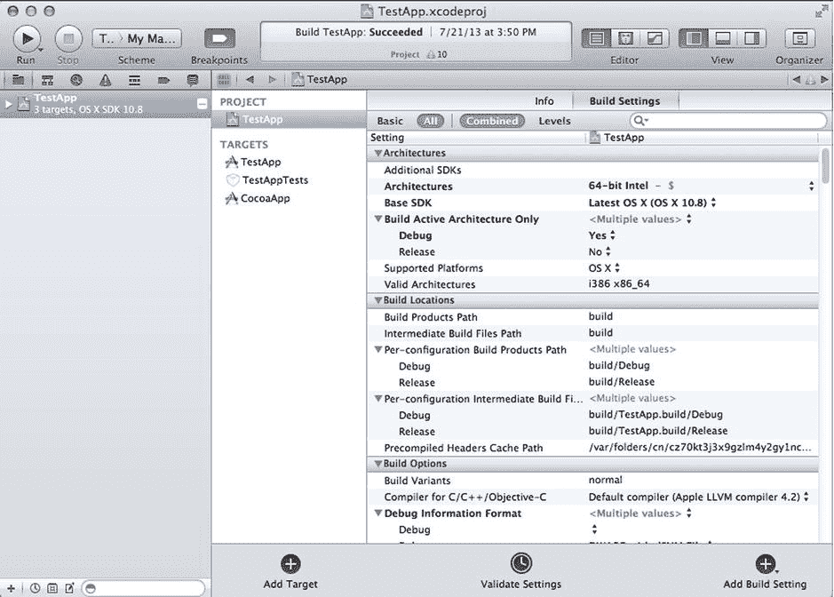
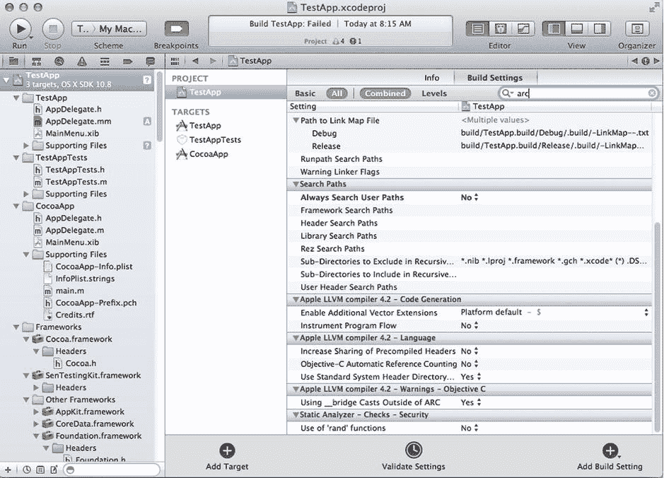

# 12. 编译器

## 摘要

若要高效使用 Objective-C，理解该语言的基础架构至关重要。编译器在软件开发周期中扮演着特殊角色，因为它决定了源代码如何被转换为可执行程序。在苹果环境中，主要使用两种编译器：`gcc`（Mac OS X 传统编译器）以及基于 LLVM（底层虚拟机）的新型 `clang` 编译器，后者由苹果及其他公司作为开源项目在过去数年间开发而成。

编译器负责将程序翻译成 CPU 直接执行的二进制指令。每个源文件都必须首先经过处理，但在生成代码时，你对于最终代码的生成方式拥有一定的自主权。你可以通过 Xcode 或编译器命令行界面提供的一些构建设置来影响代码生成过程。

在本章中，你将了解 Objective-C 编译器提供的若干选项，以及如何利用它们为目标平台编写更优质的代码。首先，你将了解苹果平台可用的编译器：GCC（Mac OS X 最初使用的开源编译器）以及 LLVM clang（目前 Xcode 官方支持的更现代化选项）。

接着，你将学习可直接从 Xcode 的“构建设置”窗口访问的主要构建选项，包括一份最常用的编译器和链接器相关设置速查清单。然后我将展示如何通过命令行调用编译器。

最后，我将讨论 Objective-C 编译器在过去几年中的一些演进方式。首先，我将讨论 ARC（自动引用计数）与现有项目的集成。你还将学习如何利用 Objective-C 编译器的另一实用功能：其与现有 C++ 代码的集成。

## 使用 GCC 与 LLVM 编译器

苹果支持的平台所使用的 Objective-C 编译器在过去数年间持续演进。理解这一演进过程将有助于你在两种编译器之间做出明智选择，并了解何时应使用其中一种而非另一种。

自 Mac OS X 诞生以来，其使用的编译器一直是 GCC。GCC 是一款针对 C、C++ 及其他语言的开源编译器。它作为一个拥有活跃开发者与支持者社区的开源项目，这一事实对平台的选择产生了重大影响。这意味着所有人都能受益于全球开源爱好者引入的改进。此外，用户无需等待苹果提供的修复和更新，而是能够自行解决常见问题，并在必要时执行自己的更新。GCC 是全球最常用的开源编译器，这意味着它在许多不同的操作系统和处理器上都得到支持。

尽管 GCC 编译器已使用多年，但其某些缺陷已成为 Objective-C 语言演进道路上的重要障碍。问题之一在于缺乏对插件的支持，而插件可用于执行编译之外的重要任务，例如文档生成、诊断和性能测量。这一问题恰好发生在苹果向 Objective-C 引入新特性（如 ARC、改进的字面量语法以及与 Xcode IDE 更好的集成）的时刻。

为了在更干净的基础上继续演进该语言，苹果决定支持一款更现代化但仍保持开源的 Objective-C 编译器。其选择是 LLVM clang 项目的产物——一款从头开始构建、旨在解决 GCC 诸多缺陷的现代开源编译器。

LLVM 编译器最初被用作编译的附加选项，但截至撰写本书时，它已成为所有苹果支持平台上 Objective-C 的官方支持编译器。除了 `clang` 新代码的内部优势（这对编译器开发者本身尤为重要）之外，LLVM clang 总体上比旧版 GCC 提供了更好的错误信息。仅此一点就是使用 LLVM 的巨大优势，因为有时理解一条特别晦涩的错误信息的含义可能相当困难。LLVM 通常还提供有助于修复常见错误的选项。

例如，考虑以下包含错误和对 `printf` 调用的代码片段：

```
// 文件 hello.c

#include <stdio.h>

int main()
{
    printf("Hello %s");
    return 0;
}
```

以下是 GCC 产生的信息：

```
> gcc hello.c
hello.c: 在函数 'main' 中:
hello.c:5: 警告: 格式参数太少
hello.c:5: 警告: 格式参数太少
```

虽然这些信息指出了检测到问题的地方，但除了错误发生的行号外，几乎未给出关于底层代码确切错误位置的线索。以下是 `clang` 返回的相同错误信息：

```
> cc hello.c
hello.c:5:19: 警告: '%' 转换数量多于数据参数 [-Wformat]
    printf("Hello %s");
           ~~~~~~~~^
生成了 1 条警告。
```

在此例中，你不仅能看到像 GCC 一样识别出的错误，而且其位置还以一种非常直观的格式被直接指出。

LLVM 的另一个优势是它与 Xcode 更紧密的集成，这得益于其新的内部架构。例如，通过使用 LLVM，Xcode 可以更轻松地以更易于解析和显示的格式提取错误信息和诊断结果。

鉴于这些原因，在接下来几节讨论编译器特性时，我将把 LLVM 视为默认编译器。不过请注意，Objective-C 的大多数当前特性均可通过任一编译器访问。但是，诸如 ARC 等新技术会首先在 LLVM clang 上提供。这是确保你的代码能在 `clang` 上正确编译，从而保证其未来可得到支持的另一个原因。

## 在 Xcode 中更改编译器选项

Xcode 是一个集成环境，为开发周期的每个阶段都提供了有用的工具。特别地，Xcode 为程序员提供了用于定义最适合最终产品的编译器选项的工具。例如，在 Xcode 设置窗口中，可以帮助编译器定义生成可执行代码所需的必要参数。

要访问“设置”窗口，请点击项目导航器中的顶层节点。这将打开“设置编辑器”。然后，点击你想要编辑的项目，你将看到设置列表。点击窗口顶部的“构建设置”以访问构建选项。图 12-1 展示了一个示例项目的“构建设置”窗口外观。



**图 12-1.** 测试项目的构建设置窗口

以下是你可从“构建设置”窗口访问的最常用设置列表：


*   **架构**：Objective-C 编译器可以为多种架构生成代码，包括 32 位 Intel、64 位 Intel 以及 ARM（用于移动设备）。创建新项目时通常会自动定义此设置，但在创建桌面应用程序时（例如，可能需要同时支持 32 位或 64 位架构），您可能需要更改此项。
*   **基础 SDK**：SDK 是一组 Objective-C 库，它们共同构成了 Mac OS X 或 iOS 应用程序的完整编程环境和 API。主要的 SDK 版本每年会发布一次或多次。您可以根据要支持的设备来决定使用哪个 SDK。较旧的设备不支持最新的 SDK，因此您需要在功能或代码的广泛适用性之间做出权衡。
*   **支持的平台**：两个主要平台是 Mac OS X 和 iOS。
*   **构建位置设置**：这组选项决定了构建过程中生成的多个输出文件的位置。例如，您可以决定最终产品、中间目标文件、调试文件等放置在何处。
*   **默认编译器**：您可以在此处定义使用的编译器，即 GCC 或 LLVM clang。如今默认的是 LLVM，但您的代码可能依赖于 GCC 独有的特性。在这种情况下，您应从中期角度考虑更新代码，使其也能兼容其他编译器。
*   **预编译头文件**：如果将此选项设置为“是”，您可以定义一个将被预编译的头文件名称。此选项通常用于加快大型项目的编译速度。开启此设置后，编译器会创建包含文件的预处理表示形式，并在整个项目中重复使用。
*   **运行静态分析器**：LLVM clang 编译器的特性之一是其能够执行语法分析。例如，此类分析可以检测内存泄漏或可能发生算术溢出的区域。您可以通过“产品”➤“分析”菜单（或 Shift + Command + B）手动调用静态分析器。此选项允许您在每次运行编译器时自动调用静态分析器。
*   **验证构建产品**：这是另一个可选步骤，可以通过菜单触发，也可以为每次编译运行自动调用。产品验证会检查编译器和构建系统的输出，并验证它们是否符合特定平台的软件分发规则。
*   **代码签名标识**：对于需要代码签名的构建（例如通过 App Store 分发代码时），此步骤将创建代码签名所需的信息。您需要提供一个签名标识，该标识通过可从 Apple 开发者网站获取的加密密钥确定。
*   **部署目标**：您可以更改生成二进制的部署目标，从而选择哪些操作系统能够运行您生成的代码。通常，这用于保持与应用程序中使用的特定库以及某些较旧设备和 CPU 型号的兼容性。

## 从命令行运行编译器

根据您的工作流程，可能希望直接从命令行窗口运行编译器，而不是使用 Xcode 进行开发。例如，您可能正在使用外部文本编辑器或编程环境。如果您决定使用 vim 作为所有与 Objective-C 文件相关操作的文本编辑器，而不是使用 Xcode IDE，情况便是如此。在这些情况下，使用命令行工具构建整个项目比仅仅为了执行编译而切换到 Xcode 更为方便。

其他时候，您可能想创建一个用于测试目的的快速应用程序，如果您知道确切的步骤，通过命令行操作可能更简单。无论您出于何种原因使用命令行，一旦掌握了正确的编译器选项和构建系统，它与运行 Xcode 一样简单。

在 Mac OS X 上有两种使用命令行编译器的方法。第一种方法是依靠 Xcode 进行项目管理，并使用命令行触发 Xcode 控制的构建。此方法依赖于 `xcodebuild` 工具，该工具在安装 Xcode 时可用。第二种方法是使用您偏好的项目管理工具，例如 `make`、`cmake` 或 `scons`，并创建独立于 Xcode 运行的构建脚本。我将简要说明这两种方法。

要使用第一种方法，即从命令行调用由 Xcode 管理的项目，您只需将 `xcodebuild` 作为命令行程序调用，并向其传递一些参数来确定项目的位置，以及一些可以控制可执行输出特定设置的构建时选项。

例如，假设您有一个名为 `TestProj` 的项目。存储此项目的文件将被称为 `TestProj.xcodeproj`。您可以使用构建器命令 `xcodebuild` 从命令行调用 Xcode 构建系统。此命令负责加载存储构建信息的项目文件，运行选定的目标，并根据需要调用编译器和其它工具来构建最终项目。对于 `TestProj.xcodeproj` 文件，其工作方式如下：

`xcodebuild -project TestProj.xcodeproj`

然后，`xcodebuild` 将构建整个项目，并发出类似以下的消息，直到项目完全构建完成：

```
CpResource TestProj.sqlite build/Release-macos/TestProj.app/TestProj.sqlite
cd /Users/coliveira/MacApps/TestProj
setenv PATH "/Applications/Xcode4.app/Contents/Developer/Platforms/iPhoneOS.platform/Developer/usr/bin:/Applications/Xcode4.app/Contents/Developer/usr/bin:/Users/coliveira/src/cappuccino/bin:/Applications/Xcode.app//Contents/Developer/Platforms/iPhoneOS.platform/Developer/usr/bin/:/usr/texbin:/opt/local/bin/:/sw/bin:/sw/sbin:/usr/bin:/bin:/usr/sbin:/sbin:/usr/local/bin:/usr/X11/bin:/usr/X11R6/bin:/Users/oliveira/Downloads/plan9/port/bin"
builtin-copy -exclude .DS_Store -exclude CVS -exclude .svn -exclude .git -exclude .hg -strip-debug-symbols -strip-tool /Applications/Xcode4.app/Contents/Developer/Toolchains/XcodeDefault.xctoolchain/usr/bin/strip -resolve-src-symlinks /Users/oliveira/MacApps/TestProj/TestProj.sqlite /Users/oliveira/MacApps/TestProj/build/Release-macos/TestProj.app
...
```

`xcodebuild` 命令有许多常用选项，可用于调整命令行构建过程。例如，您可以使用 `-list` 选项来识别所有方案、目标和构建配置。

```
$ xcodebuild -list -project TestProj.xcodeproj
Information about project "TestProj":
Targets:
    TestProj
    OptTkUI
    OptTkUITests
    TestProjOrganizer
    TestProjOrganizerTests
Build Configurations:
    Debug
    Release
If no build configuration is specified and -scheme is not passed then "Release" is used.
Schemes:
    TestProj
    TestProjLite
    OptTkUI
    TestProjOrganizer
```

另一个提供系统有用信息的选项是 `showsdks`，它会列出机器上安装的所有目标 SDK。


`$ xcodebuild --showsdks`

`OS X SDKs：`
`Mac OS X 10.7` -sdk `macosx10.7`
`OS X 10.8` -sdk `macosx10.8`

`iOS SDKs：`
`iOS 6.1` -sdk `iphoneos6.1`

`iOS Simulator SDKs：`
`Simulator - iOS 6.1` -sdk `iphonesimulator6.1`

关于 `xcodebuild`，有趣的一点是它可以执行与 Xcode 内部构建器相同的任务。因此，从基于 IDE 的工作流程迁移到基于命令行的流程非常容易。然而，缺点是它要求项目最初是使用 Xcode 创建的。有些开发者倾向于避免使用它，因此下一个方法（一种用于管理项目依赖关系的外部工具）对他们来说会更合适。

像 `make` 这样的依赖管理工具用于跟踪应用程序中各工件之间的依赖关系。当源工件发生变化时，依赖于该源文件的输出将根据需要重新构建。

由于典型的 Mac OS X 用户界面应用程序中的项目依赖关系非常复杂，`make` 更常用于基于控制台的应用程序。一个简单的示例是一个名为 `hello` 的控制台应用程序，它由三个 Objective-C 文件组成：`main.m`、`Hello.h` 和 `Hello.m`。以下是一个可用于构建此项目的简单 makefile 文件：

```
### 文件 Makefile
#
TARGET = hello
OBJ = Hello.o main.o

all: build

main.o: main.m Hello.h
    cc -o main.o main.m

Hello.o: Hello.m Hello.h
    cc -o Hello.o Hello.m

build: $(OBJ)
    cc $(OBJ) -o $(TARGET)

clean:
    rm -f *.o $(TARGET)
```

这个项目只有一个主文件（`main.m`）和一个类（`Hello`）。`makefile` 描述了每个文件之间的相互依赖关系。因此，构建依赖于存储在 `$(OBJ)` 变量中的目标文件。这些目标文件由源文件 `main.m` 和 `Hello.m` 构建而成。每个依赖行由目标文件的名称、冒号和依赖项列表组成。因此，例如，`main.o` 目标文件依赖于 `Hello.h`。类似地，`Hello.o` 依赖于 `Hello.h`。这意味着当 `Hello.h` 发生变化时，`make` 将重新构建依赖于它的目标，例如 `Hello.o` 和 `main.o`。

重新构建目标的命令列在依赖项列表之后，并以制表符开头。例如，要重新构建 `Hello.o`，使用的命令是：

`cc -o Hello.o Hello.m`

在你创建简单项目时，使用 makefile 可能会更容易，但它很快就会变得难以跟踪项目中的所有依赖关系。因此，只有当代码设计为在多个平台上运行，并且混合使用了 Xcode 不直接支持的其他语言时，才会在 Objective-C 中使用 makefile。如果是这种情况，你应该查阅 Apple 开发者库中关于 `make` 的文档。

## 代码优化

使用编译选项来改变 Objective-C 编译器行为的主要原因之一，是为了实现某种优化目标。例如，你可能希望优化编译后的代码以获得最大速度。或者你可能更倾向于创建紧凑的可执行文件，以便在移动平台上占用更少的空间。本节中的选项可用于引导这两种不同的代码优化方式。

### 速度优化

优化 Objective-C 的主要方法是使用 `-O` 设置之一。`-O` 设置（其中的 `O` 代表“优化”）用于定义你所需的优化级别。该设置通常后跟一个数字，该数字决定了在该特定级别上执行多少优化。

最低级别的优化是 `-O0`，这意味着完全不进行优化。这主要用于你想禁用代码中的优化时，主要是为了调试目的，或者是为了确定性能测量的基线。

有意义的优化的第一个级别是 `-O1`。如果你希望进行一些速度优化，但又不想麻烦地运行该特定平台上可用的全套优化级别，可以应用此级别。下一个优化级别是 `-O2`，它增加了一些额外的改进，可以使你的代码运行得更快。另一方面，增加更多的优化可能会使你的构建运行速度比正常情况稍慢。

`-O3` 级别最为激进，运行所需的时间也最长。如果你需要高性能代码，并且不太在意完成完整构建所需的时间，请使用此级别。这通常在创建项目的发布版本时使用。你也可以使用 `-O4` 级别，它不仅增加了编译优化，还增加了链接时优化，该优化会在链接时考虑所有目标文件。

### 空间优化

Objective-C 的另一个有用的优化目标是最大限度地减少整个应用程序所占用的空间。近年来，随着应用程序变得越来越大，同时它们又需要在非常小的设备（如 iPhone 和 iPod touch）上运行，这一选项变得流行起来。

通过空间优化，你告诉编译器生成占用空间最小的代码，而不是减少执行速度。这是必要的，因为有时空间优化可能会以牺牲速度优化为代价。例如，编译器有时可能会通过添加一些重复的代码段来生成更快的代码。一个众所周知的例子是循环展开优化，它通过增加代码大小来在运行时加速循环。另一方面，由于减少了可执行文件中生成的代码量，可能需要在执行期间花费更多的时间。

在 Objective-C 编译器中优化空间的主要方法是使用 `-Os` 选项。此选项会执行旨在减少目标代码最终大小的优化步骤。当出现冲突时，例如存在其他以提高性能（但可能增加可执行二进制文件大小）为目标的选项，此选项将优先考虑。


## ARC 支持

ARC 是一项允许 Objective-C 程序员在编写代码时无需使用`retain`和`release`等显式引用计数机制的技术。ARC 的主要目标是让程序员摆脱那些可能导致难以调试和修复的常见错误的活动。这是因为，虽然学习 Objective-C 下的内存管理规则并不困难，但仍可能犯下分配错误，从而导致内存泄漏、堆损坏甚至崩溃。

为了解决部分内存管理问题，苹果将 ARC 作为 LLVM 编译器的特性引入。借助 ARC，编译器可以分析对象在 Objective-C 应用程序中的使用方式，并确定应在何处进行保留或释放操作。在绝大多数情况下，它会自动工作，仅在循环引用等内存使用场景下需要少量提示。

在本节中，我仅介绍用于在 Objective-C 中支持 ARC 的编译器选项。关于 ARC 的介绍以及如何使用它来简化 Objective-C 应用程序中的内存管理，请参考第 8 章了解更多信息。

使用 ARC 的首要条件是确保你正在使用 LLVM 编译器而非 GCC。未来 ARC 有可能在 GCC 中实现，但目前这项技术仅在 LLVM clang 上实现。要确定使用的是哪个编译器，请选择“构建选项”窗口。要找到该窗口，请点击左侧面板中的“目标”（这是项目导航器的顶层元素），然后点击项目名称。项目设置将会显示，你可以从窗口顶部的两个选项中选择一个：“信息”和“构建设置”。点击“构建设置”选项，设置窗口将会出现，如图 12-2 所示。

首先，在“构建设置”部分中，选择“C/C++/Objective-C 编译器”选项。然后，在下拉菜单中选择“默认编译器（Apple LLVM compiler 4.2）”。



图 12-2. 用于 ARC 属性的项目设置窗口

项目设置窗口的“Apple LLVM compiler 4.2 – Language”部分包含了 ARC 选项。所需的选项是“Objective-C Automatic Reference Counting”。通过将该值设置为 Yes，你将在项目中启用 ARC。要使用 ARC，你还需确保不使用`retain`和`release`，以及其他在第 8 章中讨论的问题。

## 编译 Objective-C++

正如你在前几章中所见，Objective-C 是 C 编程语言的适当超集，两种语言可以毫无问题地混合使用。特别是，C 语言中创建的每一个函数和表达式也可以被解释为有效的 Objective-C 代码。

由于 Objective-C 被设计为避免与 C 编程语言冲突，它的一个有用特性是，你也可以轻松地将 Objective-C 与 C++ 代码混合使用而不会产生重大问题。Objective-C 代码与 C++ 结合的结果有时被称为 Objective-C++，但从 Objective-C 程序员的角度来看，实际上并没有区别。当混合使用 Objective-C 和 C++ 时，任何 Objective-C 特有的内容都保持不变。唯一的区别是，现在除了 C 之外，你还可以使用 C++ 结构。

使用 Xcode 可以轻松启用 Objective-C++ 编程。Xcode 中编译的语言很大程度上由源文件的扩展名决定。例如，`.m` 扩展名的文件被当作 Objective-C 文件处理，而 `.c` 文件则被当作纯 C 文件处理。要能够混合使用 C++ 和 Objective-C，你只需创建扩展名为 `.mm` 而非 `.m` 的文件。Xcode 会将该扩展名作为文件包含 C++ 代码的指示，并为编译器提供正确的选项，以便 C++ 和 Objective-C 在构建过程中被完全识别。

以下代码是一个混合了 C++ 和 Objective-C 代码的简单示例。虽然解释 C++ 如何工作完全超出了本书的范围，但你可以轻松看到非 C 特性（如类定义）与 Objective-C 对象的创建和使用的结合。

```cpp
class Logger
{
public:
    void addLog(NSString *s);
};

void Logger::addLog(NSString *s)
{
    NSLog(@"here is my message: %@", s);
}
```

这段代码定义了一个名为`Logger`的 C++ 类，负责将字符串消息发送到控制台。你可能会注意到，`addLog`虽然是 C++ 的成员函数，却接受一个`NSString`类型的参数，这是一个 Objective-C 对象。

接下来，你可以从一个普通的 Objective-C 方法内部使用这个类，如下所示：

```objc
- (void) createCppObj
{
    Logger logger;
    logger.addLog(@"my message");
}
```

`logger`对象被声明为`Logger`类型，这是一个 C++ 类。你可以像在普通 C++ 源文件中一样调用`logger`上的方法。

最后，下一个示例展示了如何创建一个包含 Objective-C 对象作为成员变量的 C++ 类。这段代码描述了一种集合类，你可以在其中添加元素并检查集合的大小。

```cpp
class MyCollection
{
public:
    MyCollection();
    ~MyCollection();
    void add(id obj);
    int size();
private:
    NSMutableArray *array;
};
```

第一部分是 C++ 类的定义。有四个公共成员函数和一个`NSMutableArray`类型的私有成员变量。它们的定义如下：

```cpp
MyCollection::MyCollection()
{
    array = [[NSMutableArray alloc] init];
}

MyCollection::~MyCollection()
{
    [array release];
}

void MyCollection::add(id obj)
{
    [array addObject:obj];
}

int MyCollection::size()
{
    return (int)[array count];
}
```

第一个方法称为构造函数，在对象创建时自动调用。该方法会分配并初始化一个`NSMutableArray`类型的新 Objective-C 对象。该对象存储在`array`成员变量中（类似于实例变量）。

第二个方法是析构函数，在对象销毁时运行。当这种情况发生时，你需要释放`array`对象以避免内存泄漏。

接下来的两个方法实现了`add`和`size`操作。它们只是围绕`NSMutableArray`类中相应功能的简单封装。

这个类可以如下使用：

```objc
- (void) useMyCollection
{
    MyCollection * c = new MyCollection;
    c->add(@"test 1");
    c->add(@"test 2");
    NSLog(@"the size is %d", c->size());
    // 这会打印 "the size is 2"
}
```

**注意：** 带有 C++ 结构的 Objective-C 经常使用不同的语法提供相同的功能。因此，我不建议混合使用这两种语言，除非你非常清楚想要达到什么目的。大多数情况下，程序员混合使用 Objective-C 和 C++ 是为了能够访问两种语言的库。即使如此，也请尝试评估你的项目，看看是否有其他替代方案来在同一个代码库中使用这两种语言。


## 总结

在本章中，你学习了 Objective-C 编译器，这是 Mac OS X 和 iOS 软件开发中最重要的工具。编译器负责读取你的源代码并将其转换为可执行代码，这些代码通常以处理器可直接运行的格式存储。

当前用于 Objective-C 语言的编译器 LLVM clang 拥有许多影响最终输出质量的选项。诸如二进制代码的*速度*、*大小*，或是否包含*调试信息*等属性，均由编译过程中传递给编译器的选项定义。作为 Objective-C 开发者，熟悉这些影响 C 语言和 Objective-C 语言程序结果的选项非常重要。

Objective-C 编译器的一个特性是，它不仅能识别纯 C 和 Objective-C 语法，还能识别 C++ 语法。这意味着你可以混合使用两种语言的代码，以充分利用它们的最佳特性。当你创建扩展名为 `.mm` 的文件时，Xcode 可以用来生成正确的结果。

虽然编译器是编程开发中非常重要的工具，但在 Objective-C 的世界里，它无法在没有其他工具帮助的情况下生成输出。与 Objective-C 编译器紧密相关的一个重要工具是**预处理器**。预处理器在初始阶段运行，负责准备源代码以供编译器查看和处理。虽然如今预处理器很少作为独立程序使用，但理解其工作规则以及如何执行初始代码准备仍然非常有用。这将是下一章的主要内容，届时你将学习 Objective-C 预处理器的特性。

