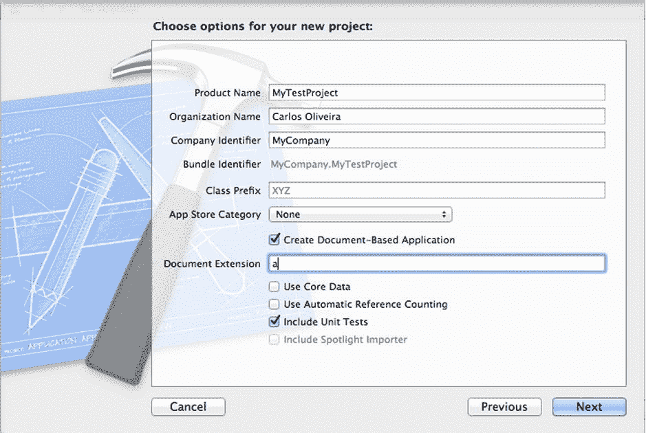
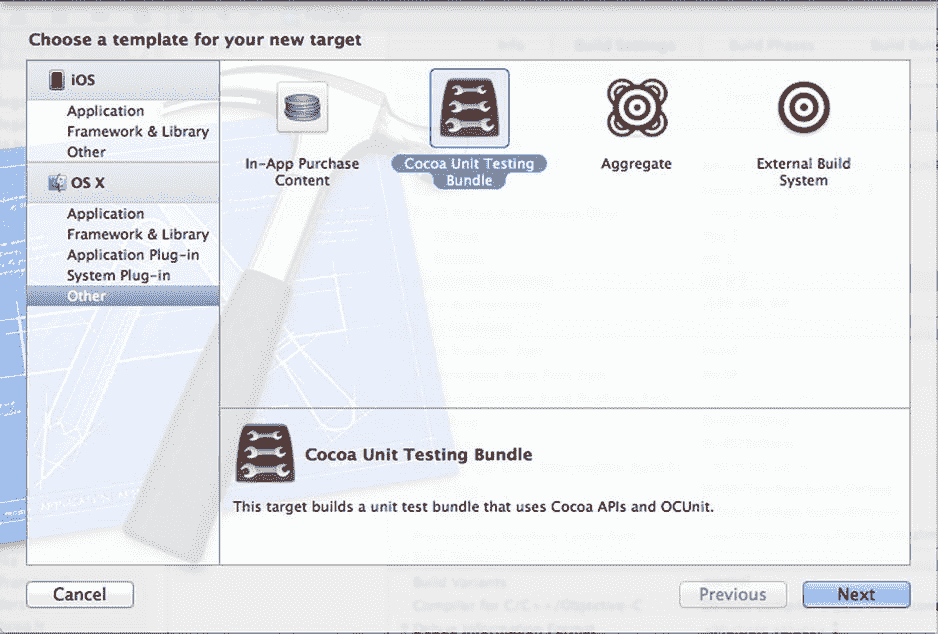

# 14. 单元测试

## 摘要

单元测试是一种编程策略的基础，该策略倡导为应用程序中实现的每个功能创建独立的检查。单元测试也可用于验证某段代码是否符合特定需求。例如，若你创建了一个将两个数相加的方法，便可编写一个单元测试来验证其在某些特定情况下返回的结果是否正确。虽然仅通过测试特定值无法证明代码完全没有问题，但运行单元测试能够增强你对代码确实能返回符合需求结果的信心。

单元测试及其相关工具的另一个用途体现在所谓的测试驱动开发（TDD）中。TDD 是一种软件方法论，要求程序的每一个特性在编写之前都需通过单元测试进行详尽的规定。也就是说，采用 TDD 时，程序员利用新的测试来驱动代码的开发，最终使代码满足所编写测试的要求。

基于单元测试的开发是探索 Objective-C 等面向对象语言模块化特性的绝佳途径。事实上，单元测试框架之所以流行，部分原因在于面向对象编程能够创建定义良好的接口，并且这些接口中的对象对外部代码的依赖很少。

`OCUnit`等测试框架充分利用了这些面向对象编程的特性，使得使用 Objective-C 的程序员能够进行单元测试。在本章中，我将概述如何在 Objective-C 中使用`OCUnit`和`Xcode`进行单元测试。你将学习如何在新的或现有的项目中快速创建单元测试，还将学习如何使用`Xcode` IDE 管理和运行测试集。最后，你将看到一个如何运用 TDD 编程策略来编写 Objective-C 代码的示例。

## 单元测试框架

有责任心的程序员一直努力创建能够检验他们正在实现的功能的测试。因此，测试方法论早在面向对象编程语言发展之前就已存在，并且始终在创建高质量代码中扮演着重要角色。然而，像 Objective-C 这样的面向对象语言提供了一种不可或缺的工具，使得高效的单元测试更易于实现。同时，面向对象编程的特性促成了单元测试通用接口的创建，跨团队或跨公司工作的程序员都可以利用这一接口。

最具影响力的基于面向对象编程的测试框架是`SUnit`，它是一个用 Smalltalk 编写的单元测试库。尽管 Smalltalk 作为一种编程语言在过去十年中 popularity 有所下降，但其许多原始理念（例如对基于消息的多态性的强大运行时支持）依然强劲。这些理念甚至已融入 Objective-C、JavaScript 和 Ruby 等其他主流语言中。Smalltalk 的影响力也延伸到了单元测试技术，例如`SUnit`，它至今仍几乎被这些较新的语言原封不动地沿用。因此，Java 拥有`JUnit`，而 Objective-C 则拥有`OCUnit`，这是一个在设计方法和接口上与 Smalltalk 通过`SUnit`引入的框架非常相似的库。

在本章中，我将讨论`OCUnit`中用于支持单元测试创建和执行的特性。我将主要围绕`OCUnit`展开讨论，主要是因为它是 Objective-C 领域事实上的标准。其成为标准的主要原因之一是苹果公司的支持，它是随`Xcode`一起部署的官方测试库。该 IDE 允许程序员添加基于`OCUnit`的测试目标，以及运行测试并在日志导航面板中显示结果。基于以上原因，`OCUnit`目前是在 Objective-C 中实现单元测试的自然之选。

## 注意

请记住，`OCUnit`并非唯一可用于 Objective-C 的测试框架。实际上，还有其他用 Objective-C 编写的测试框架已作为开源项目提供。使用直接用 C 语言编写的框架（如`CUnit`）也是合适的。特定测试框架的适用性更多取决于项目本身的需求，而非语言的要求。例如，在某些大型项目中，与其他的 C 和/或 C++遗留代码相比，用 Objective-C 编写的代码量可能很小。在这种情况下，使用基于 C 或 C++的测试工具可能更为方便。


## 添加单元测试目标

在本章中，我假设你正在使用 Xcode 创建和构建项目。通过命令行工具添加单元测试是可行的，但这高度依赖于你所使用的构建工具，并且通常不被 Apple 支持。因此，在本章中，我只描述使用 Xcode 创建单元测试的过程。

Xcode 项目可以划分为多个目标，这些目标用于组织单个项目可能产生的各种输出。项目中的目标通常是一个可执行文件，具体取决于你想要支持的平台和环境。单元测试目标允许你创建一个独立的可执行文件，其目的是针对生产代码运行测试用例。通过这种方式，你可以将应用程序特有的代码与仅用于测试应用程序的代码清晰地分离开来。

此外，Xcode 支持两种测试目标，每种目标都与特定类型的测试相关联。逻辑测试是指你只关心单独测试某个特定方法或类正确性的测试。对于这类测试，Xcode 只需要能够找到被测试方法的代码，并将其包含在单元测试目标的可执行文件中。

第二种单元测试是应用测试。这些测试并非完全隔离运行，而是在应用程序的上下文中运行。例如，它们可用于确定特定窗口中的按钮是否具有正确的标签。或者你可以用它们来验证当点击某个菜单选项时，某个特定值是否会更新。由于其自身特性，应用测试依赖于它们所搭建的平台以及该特定环境所使用的工具集。

**注意**

由于应用测试本身具有与环境相关的特性，在本章中我将只考虑逻辑测试，因为逻辑测试在 Objective-C 支持的任何平台上都有效（甚至可能在非 Apple 环境中也能工作）。如果你打算使用特定于应用的单元测试，请查阅你目标环境的编程手册。Apple 在 Xcode 中为 Mac OS X 和 iOS 目标都提供了相关信息。

有两种方法可以向你的代码添加单元测试。第一种也是最简单的方法，是在创建项目时添加测试目标。通过 **新建** ➤ **项目** 菜单选项，你可以从多种项目类型中创建一个新应用程序。如果你选择“OS X 应用程序”，然后选择“Cocoa 应用程序”，将会出现图 14-1 所示的窗口。确保你勾选了“包含单元测试”选项，Xcode 就会生成包含关联单元测试目标的新项目。



图 14-1.

在新项目中包含单元测试

包含单元测试的第二种方法是向现有项目添加一个新目标。Xcode 允许你创建新目标，这是 IDE 支持生成新可执行文件的通用名称。假设你有一个现有项目，想要向其添加一组单元测试。你可以在项目打开时，通过 **新建** ➤ **目标** 菜单来添加新目标。在左侧选择“其他”选项。你会看到一些项目，从中可以选择“Cocoa 单元测试捆绑包”。目标选择窗口如图 14-2 所示。

在目标创建窗口的下一个屏幕中，你可以输入详细信息，例如目标名称以及将包含该目标的项目。输入这些信息后，Xcode 将创建新目标，并用一些可立即用于创建新测试用例的文件预先填充它。



图 14-2.

选择单元测试目标

让我们创建一个名为 `TestUT` 的新目标，它将包含个人项目的测试用例。Xcode 会自动生成一个名为 `TestUT` 的新类，该类将用于存储任何新的测试用例。以下是头文件：

```
// 文件 TestUT.h
#import <SenTestingKit/SenTestingKit.h>
@interface TestUT : SenTestCase
@end
```

上面用到的符号 `SenTestingKit` 是包含 OCUnit 框架的名称。默认类继承自 `SenTestCase`，以便它能够使用 OCUnit 提供的所有方法。以下是相应的实现文件：

```
// 文件 TestUT.m
#import "TestUT.h"
@implementation TestUT

- (void)setUp
{
    [super setUp];
    // 此处的设置代码。
}

- (void)tearDown
{
    // 此处的清理代码。
    [super tearDown];
}

- (void)testExample
{
    STFail(@"TestUT 中尚未实现单元测试");
}
@end
```

请注意实现文件已经为你提供了单元测试类中经常需要的几个方法。你首先需要理解这些方法在测试用例执行过程中是如何协同工作的。

`setUp` 方法负责初始化测试用例的测试环境。你可以在此处添加在测试类中想要运行的每个测试共有的任何代码。例如，如果你需要为每个测试提供一个数据库连接，你可以将创建连接的代码作为 `setUp` 方法的一部分来编写。

类似地，`tearDown` 方法用于 Finalize 该类中每个测试用例所使用的环境。以数据库连接为例，你可能希望在此处关闭连接，这样就不需要在每个测试用例中重复该代码。


## 创建新测试

在 OCTest 中创建测试用例是一个简单的过程。您只需向测试类（在本例中称为 `TestUT`）添加方法即可。这些方法甚至不需要添加到公共接口中，因为 OCTest 框架会负责运行包含在实现部分中的任何测试用例。唯一的要求是，代表测试用例的方法必须以单词 `test` 开头，返回 `void`，并且没有预期参数。因此，您可以按如下方式添加一个新的测试用例：

```
- (void)testExample
{
        // 这段代码将由 OCUnit 运行
        STAssertTrue(TRUE, @"示例测试");
}
```

虽然添加测试的机制很简单，但更重要的是从逻辑上判断何时应在测试用例列表中添加一个新测试。

理论上，可以为大多数非平凡方法编写的测试用例数量是无限的。然而，在实践中，您应该只编写测试来确保实现的某些方面返回正确的结果。例如，这里有一个将整数参数加一的方法：

```
- (int) addOne:(int)value
{
        // 在此处实现
}
```

不可能测试每一个整数值。但是，编写测试来检查该方法对正整数、负整数和零的准确性是有意义的，例如：

```
- (void)testExample
{
        // 在此处创建对象...
        STAssertEquals([obj addOne:2], 3, @"测试 2");
        STAssertEquals([obj addOne:-3], -2, @"测试 -3");
        STAssertEquals([obj addOne:0], 1, @"测试 0");
}
```

通常，创建不仅适用于一般情况，也适用于边界情况的测试是很有用的。例如，如果某个方法应该只对正数有效，那么您应该检查当零作为参数传入时会发生什么，因为在这种边界情况下出现错误是很常见的。

另一个经验法则是，每当发现新的、无法预见的情况时，就添加新的测试用例。例如，如果您在代码中发现了一个 bug，那么添加一个测试用例来检查该 bug 是否已被正确修复是非常有用的。这不仅对于保证当前代码的准确性很重要，而且对于确保代码的未来版本不会出现同样的错误也很重要。这类测试也称为回归测试，因为它们可以防止先前修复的 bug 重新出现在工作代码中。

## 在 Xcode 中运行测试

在 Xcode 中构建测试目标并创建新测试，只是为软件开发使用单元测试方法流程的一半。一旦创建了测试，您就需要在实际的开发环境中运行它们，并验证它们是否全部通过。Xcode 允许您从 IDE 内部运行测试，这样您就可以轻松修复测试过程中出现的任何问题。

如果您在项目中已经有了一个预先设置好的测试目标，您可以使用菜单选项 Product ➤ Test（或键盘快捷键 `⌘U`），项目中定义的测试将会被执行。您有两种方式查看结果。第一种是查看测试目标中执行的所有测试列表。要查看它们，您可以使用菜单栏中的日志导航器，选择 View ➤ Navigators ➤ Show Log Navigator（或键盘快捷键 `⌘7`）。这将在 Xcode 屏幕左侧显示日志导航器。点击与测试操作相对应的日志，您将看到测试目标执行的完整日志。如果一切顺利，您应该会看到一个标记为绿色的测试列表。

访问单元测试结果的第二种方式是通过问题导航器，当一个或多个单元测试失败时即可使用。当发生这种情况时，Xcode 会生成一个问题，该问题与其它问题类别一起列在其导航器中。您可以通过主菜单选择 View ➤ Navigators ➤ Issue Navigator 来访问此视图。然后，查看问题（以红色列出），这将指示在上次执行中是否有一个或多个单元测试失败。您可以点击该问题，代码编辑器将直接跳转到失败的单元测试的位置。您也可以双击该问题，此时将出现一个新的编辑器窗口，光标会定位到错误的确切位置。现在，您可以编辑测试或被测试的代码来修复问题。

## OCUnit 断言宏

正如您在之前的例子中所看到的，您需要使用断言表达式来确定测试是否返回了预期结果。使用断言来确定测试正确性非常普遍，以至于 OCTest 为此定义了多个宏。这些断言宏可以判断两个值是否相等、不同，或者是否符合某种其他关系。

OCTest 中的大多数断言宏都有一个通用的接口。通常的模式是断言名称以 `STAssert` 开头，后跟该宏要执行的测试类型。例如，`STAssertEquals` 用于执行相等性测试。

每个断言宏的参数也遵循类似的模式。前几个参数是要应用测试的对象或值。例如，在 `STAssertEquals` 中，前两个参数是测试相等性的对象。然后，下一个参数是一个描述测试含义的字符串。当断言失败时，该参数会显示在 Xcode 测试日志中。因此，提供一个适当的描述非常重要，这样可以在问题发生时更容易地发现它。

断言宏的另一个常见特性是，描述可以像 `NSLog` 一样接受格式化参数。这在宏中通过使用 "..." 语法指定最后一个参数来表达。

以下是 OCUnit 中常用的断言宏列表。

*   `STAssertEquals(value1, value2, description, ...)`: 当两个值相同时，此宏成功。否则，测试失败并显示给定的描述。此宏适用于非对象值，例如数字、`struct` 或通用指针。
*   `STAssertEqualObjects(obj1, obj2, description, ...)`: 当两个对象相同时，此宏成功。否则，测试失败并显示给定的描述。此宏适用于对象，并使用 `isEqual:` 方法测试相等性。当对象的 `isEqual:` 返回 `false` 或任一对象为 `nil` 时，会发生失败。
*   `STFail`: 这是一个始终失败的宏。在某个代码路径不应该被执行的情况下，使用 `STFail` 很方便，例如：

```
- (void)testExample
{
    int value = [myObj fileOperation];
    switch (value)
    {
        case ERROR_NO_SPACE:
        case ERROR_INCORRECT_FILE_NAME:
            STFail(@"针对不支持的值测试失败");
            break;
        // 其他情况在此处...
        default:
            break;
    }
}
```

在这个例子中，您有一个 switch 语句，其值取决于您正在测试的方法。测试用例需要验证返回值以确定其正确性。在方法返回的值中，您要确保不允许出现 `ERROR_NO_SPACE` 和 `ERROR_INCORRECT_FILE_NAME` 这两个值。检查此条件的一种方法是使用 switch case，并在返回这两个值时调用 `STFail`。虽然此处未展示，但您可能还有许多其他情况需要验证。


- `STAssertEqualsWithAccuracy(value1, value2, accuracy, description, ...):` 此宏使用给定的精度比较第一个值和第二个值。如果比较失败，则使用描述来提示出了什么问题。当处理浮点数值时，此比较宏非常有用，因为精度表示这两个值之间可接受的微小差异。
- `STAssertNil(expression, description, ...):` 此宏测试给定的表达式是否为`nil`值。否则，将使用提供的描述报告失败。
- `STAssertNotNil(expression, description, ...):` 此宏测试给定的表达式是否为非`nil`值。否则，将使用提供的描述报告失败。
- `STAssertTrue(expression, description, ...):` 此宏测试给定的表达式的值是否为`YES`。否则，将使用提供的描述报告失败。
- `STAssertFalse(expression, description, ...):` 此宏测试给定的表达式的值是否为`NO`。否则，将使用提供的描述报告失败。
- `STAssertThrows(expression, description, ...):` 此宏测试给定的表达式在执行时是否抛出异常。如果没有抛出异常，则使用提供的描述报告失败。

异常是一种 Objective-C 机制，用于发出意外错误信号。当库无法从特定错误中恢复时，可能会生成异常。你也可以使用`@throw`关键字生成异常。以下是抛出异常并使用断言宏检测它的示例。此方法用于返回字符串的第一个字符。如果字符串为空，则该方法使用`@throw`关键字引发异常。

```
- (char)getFirstChar:(NSString *)string
{
    if ([string length] < 1)
    {
        @throw [[NSException alloc] initWithName:@"firstChar"
                                          reason:@"StringIsEmpty" userInfo:nil];
    }
    return [string characterAtIndex:0];
}
```

此方法将检查是否存在至少一个字符并返回它。如果字符串为空，它会创建一个描述异常的`NSException`对象，并使用`@throw`关键字生成异常信号。以下测试可用于保证生成异常：

```
- (void)testGetFirstChar
{
    StringOps *so = [[StringOps alloc] init];
    STAssertThrows([so getFirstChar:@""], @"checks for exception on empty string");
}
```

此测试将使用空字符串调用`getFirstChar:`方法。这将检查是否按要求抛出了异常，并在发生时测试通过。

- `STAssertThrowsSpecific(expression, exception_class, description, ...):` 此宏测试给定的表达式在执行时是否抛出了第二个参数中指定的特定异常。如果没有抛出异常，则使用提供的描述报告失败。
- `STAssertNoThrow(expression, description, ...):` 此宏测试给定的表达式在执行时是否不抛出异常。如果抛出了异常，则使用提供的描述报告失败。
- `STAssertNoThrowSpecific(expression, exception_class, description, ...):` 此宏测试给定的表达式在执行时是否不抛出`send`参数中列出的异常类型。如果抛出了异常，则使用提供的描述报告失败。

## Test-Driven Development

测试驱动开发 (TDD) 是一种软件开发策略，其意义远不止于简单地向项目添加测试。TDD 的核心思想是编写测试应先于开发或编写实际代码。TDD 背后的理由是，好的代码应该始终有测试来保证其正常工作。另一方面，拥有测试有助于我们专注于特定功能的开发，以实现期望的功能。

TDD 的这些特性导致了一个特定的工作流程，该流程与大多数开发人员使用的标准编码技术有些不同。其理念是使用单元测试集作为项目中新功能的驱动力。这意味着在向项目添加新类或方法时，首先要做的是创建测试，这些测试将保证新代码的行为符合预期。

例如，假设你想向`StringOps`类添加一个计算字符串反转的新方法。根据 TDD，你需要做的第一件事，甚至在编写类的任何接口之前，就是创建一个名为`testReverse`的新方法。

```
- (void)testReverse
{
    STFail(@"not implemented");
}
```

此测试将按预期失败。但这是一个重要的特性，因为在 TDD 中，你希望测试失败，直到所需功能被正确实现。因此，下一步是创建一个名为`StringOps`的类。然后，可以使用以下代码更新测试：

```
- (void)testReverse
{
    StringOps *so = [[StringOps alloc] init];
    STAssertTrue(so != nil, @"check object created");
}
```

在你导入`StringOps`的头文件后，此测试应该能够编译并正确运行。该测试只是检查你是否可以创建一个`StringOps`类型的对象，这是一个应该可行的简单测试。

现在你已经通过了`StringOps`对象的创建测试，下一步是添加一个实现字符串反转操作的方法。首先要为此创建一个测试。

```
- (void)testReverse
{
    StringOps *so = [[StringOps alloc] init];
    STAssertTrue(so != nil, @"check object created");
    STAssertEqualObjects([so reverse:@"ABC"], @"CBA", @"check string reversal");
}
```

同时，你需要在`StringOps`类中添加一个相应的方法，以便测试能够编译。

```
#import <Foundation/Foundation.h>
@interface StringOps : NSObject
- (NSString*)reverse:(NSString *)string;
@end
```

至于`reverse:`方法的实现，你将从一个仅返回原始字符串的简单实现开始。

```
#import "StringOps.h"
@implementation StringOps
- (NSString*)reverse:(NSString *)string
{
    return string;
}
@end
```

这个算法显然是不正确的，但这正是 TDD 的策略：从一个失败的测试开始，然后才创建一个能够验证测试的有效实现。通过单击  + U（运行测试），你将看到一个需要修复的失败测试。错误信息显示“`'ABC' should be equal to 'CBA' check string reversal`”。单击该错误，编辑器将定位到失败测试所在的位置。

现在，你将编写一个使该测试成功的实现。你将使用一个简单的算法来遍历字符串并交换字符，返回一个新的`NSString`。

```
- (NSString*)reverse:(NSString *)string
{
    char* cstr = (char*)[string UTF8String];
    int size = (int)[string length];
    int i, j;
    for (i=0, j=size-1; i<size/2; ++i, j--)
    {
        char c = cstr[i];
        cstr[i] = cstr[j];
        cstr[j] = c;
    }
    return [NSString stringWithCString:cstr encoding:NSUTF8StringEncoding];
}
```


输入值被用于通过`UTF8String`方法创建一个以空字符结尾的 C 风格字符串。然后，你使用一个简单的循环遍历 C 数组的字符，交换它们的位置以实现反转。数组反转后，你使用类方法`stringWithCString:encoding:`创建并返回一个新字符串，该方法接受一个以空字符结尾的字符数组和所需的编码（在本例中使用标准`UTF8`编码）。

再次运行测试后，你会看到`testReverse`现在通过了。这表明`reverse`的实现产生了预期的结果。与任何测试流程一样，你应该为同一方法添加其他测试以增强对其正确性的信心。例如，你可以添加一个新的断言来确保空字符串被正确处理。

```
- (void)testReverse
{
    StringOps *so = [[StringOps alloc] init];
    STAssertTrue(so != nil, @"check object created");
    STAssertEqualObjects([so reverse:@"ABC"], @"CBA", @"check string reversal");
    STAssertEqualObjects([so reverse:@""], @"", @"check empty strings");
}
```

为了使用 TDD 进行后续操作，你应该从一个失败的示例开始，例如将第二个参数替换为`@"A"`。看到失败后，将其替换为正确的结果`@""`，然后再次运行测试。这应该会成功，从而增强你对测试和被测代码行为正确的信心。

**注意**

上面给出的简单示例展示了使用 Objective-C 遵循测试驱动开发方法所需的所有步骤。使用 TDD 的优势在于，你可以在每一步专注于一个小功能。然后，当该步骤的实现完成后，执行相关测试会增强你对其正确性的信心。TDD 流程与标准开发技术截然不同，后者是先编写代码，然后仅在功能就绪时才使用临时程序进行测试。

## 总结

在本章中，你探讨了单元测试，这是一种经常用于提高代码质量和减少软件产品缺陷数量的编程实践。单元测试方法还有一个额外的好处，即提供快速的开发周期，使程序员能够快速编写代码并测试其正确性。

Objective-C 是使用单元测试方法开发程序的理想环境。它对面向对象技术的支持意味着更容易将代码分解为可以独立测试的较小模块。Objective-C 还提供了一个完整的测试框架，称为`SenTestingKit`，它实现了`OCUnit`库。`OCUnit`基于`SUnit`，这是第一个广泛使用的单元测试解决方案，专为 Smalltalk 语言创建。

你已经学习了如何将单元测试目标集成到现有的 Objective-C 项目中，以及如何将此类目标添加到新项目中。然后，我讨论了可以添加到单元测试用例中的测试类型示例。`OCUnit`框架提供了丰富的测试宏集，便于检测大多数编程条件。例如，有些宏测试其参数是否为`nil`、是否等于或不同于其他对象，或者是否抛出特定类型的应用程序定义异常。

最后，你已经了解了这些特性如何用于支持测试驱动开发，这是一种使用单元测试作为实现新功能驱动力的编程方法论，同时为提供的测试提供实现正确性的一定保证。由于 TDD 支持增量式开发方法，它已被成功地用于开发质量更高、错误更少的软件。以这种方式开发的代码经过频繁测试，也降低了变更产生意外副作用和隐藏错误的风险，而这些错误在完整功能实现后更难追踪。

代码测试只是编程的一个方面，尽管是重要方面。此外，理解如何处理最终可能进入开发周期后期阶段的编程错误非常重要。编程故障是常见现象，即使在通过单元测试制定了广泛代码验证策略的项目中也是如此。在下一章中，你将了解 Xcode 提供的功能，以促进软件错误的识别和消除。你还将看到 Objective-C 程序员可以利用 Objective-C 支持的特性使用的一些调试技术。

