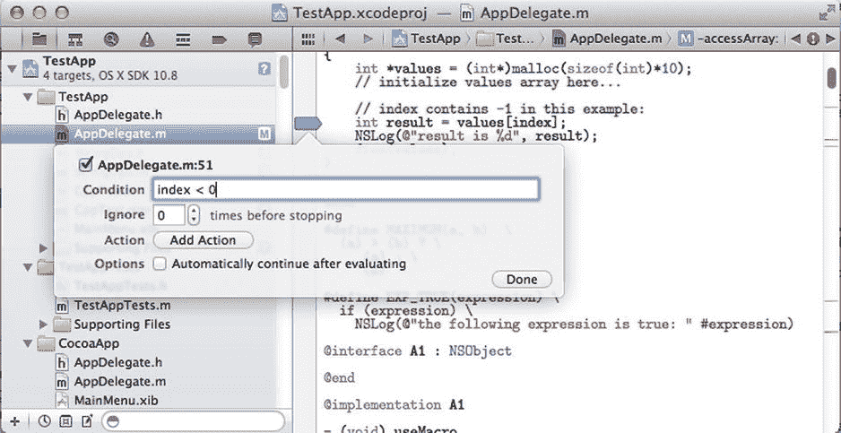
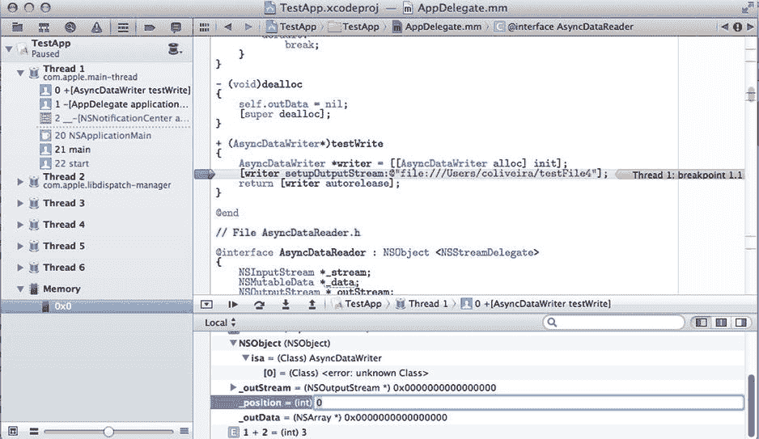
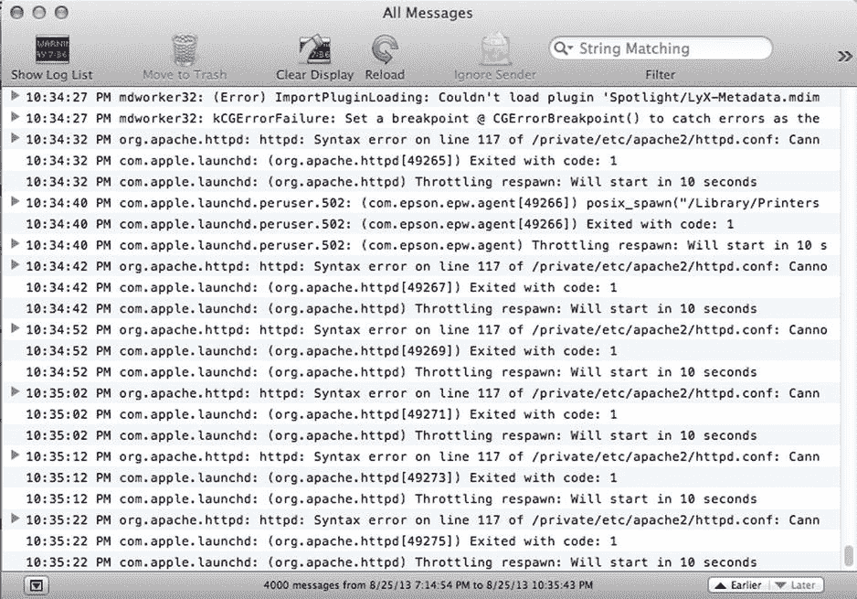

# 15. 调试

**摘要**

任何程序员都知道编写无缺陷软件是多么困难。这就是为什么每个平台都有许多集成的调试辅助工具，用于支持识别、重现和修复编程错误。Xcode 为编写和调试程序提供了完整的解决方案，这使得在新应用或现有应用中查找错误变得更加容易。在本章中，我将解释如何使用这些调试功能。

你将首先了解通用调试方法如何应用于 Objective-C 程序。为此，我将解释一些对查找和修复任何编程语言中的错误都很有价值的通用调试策略。然后，你将看到如何使用包含 Xcode 和相关命令行工具的 Objective-C 环境来支持这些通用调试策略。

必要时，我将通过示例描述如何使用 Xcode 的功能，如断点、监视窗口、条件表达式和日志终端。我还将讨论如何使用`gdb`和`LLVM`调试器等命令行工具。

## 通用调试策略

调试软件是一项需要大量脑力活动的工作，其思维方式与其他编程活动不同。在编程时，你处于“创造者”模式，不断尝试生成良好的软件设计并为现有代码添加新功能；而在调试时，你主要处于“研究者”模式，试图找出特定问题可能隐藏的位置。这种视角的差异是许多人发现难以高效查找和修复错误的原因。

从许多方面来看，在软件中发现问题类似于侦探工作。你需要有一个完善的流程来评估可能的原因并找出错误的根本原因。就像侦探一样，你从数据收集开始，这些数据稍后将用于精确定位问题发生的位置。只有在那时，你才能着手创建和验证关于如何解决该特定问题的假设。

以下是结构良好的调试策略所需步骤的总结。


### 数据收集：调试的第一步
收集数据是解决调试问题的第一步。你需要收集与尝试修复的问题相关的所有信息。为此，有一个非常重要的工具需要考虑使用：一个能够重现问题的案例。无法重现的漏洞非常难以解决，因为你无法追查最初导致问题出现的场景。信息收集过程的首要目标应该是确定如何可靠地重现该漏洞。只有这样，你才能开始着手确定修复方案。

### 定义假设：调试的第二步
当你有办法重现问题之后，下一步就是创建一个关于为什么这不起作用的假设。例如，你可能错误地初始化了一个变量，或者算法中缺少了一个步骤。无论你对问题根源的专业猜测是什么，你都应该制定一个计划来测试这个假设。这通常涉及更多的信息收集，比如查看应用程序日志，或者在调试器中运行应用程序。通过这样做，你将对你试图修复的漏洞的根本原因有更清晰的认识。反复进行“做出专业猜测并尝试用数据验证该猜测”的过程，直到你找到一个或多个可能导致观察到的问题的原因。一旦你找到了指向错误行为的线索，你也会对如何修复它有一个初步的想法。这个知识是你寻找问题过程中产生的附带结果，也是你进行数据收集所取得成果的体现。

### 应用修复：调试的第三步
在你测试了你的假设，并确定它对应了问题的根本原因之后，是时候对代码应用修复了。这可能只是纠正一个小逻辑错误的小改动。但在某些情况下，它也可能导致大的改动，甚至是应用程序的重构。这完全取决于问题的严重程度以及你处理所感知到的问题的策略。

### 创建一个或多个单元测试：调试的第四步
如果你正在按照前一章所述创建单元测试，那么现在是添加另一个测试用例的好时机。添加单元测试有两个原因。首先，在编码过程中，单元测试非常有用，因为它们允许你在进行时专注于单个问题。单元测试让你可以专注于特定的漏洞，并致力于让代码按预期工作，而不是担心程序中所有其他可能出错的地方。一旦你设置好了单元测试，确保它通过，然后返回去测试完整的应用程序。单元测试的第二个作用体现在检查回归上：当定期执行时，单元测试会自动告诉你该问题将来是否再次出现。这为你提供了一个良好的保证，即使未来引入了可能发生变化的代码，程序也能继续按预期工作。

上述概述的一般步骤可以在任何编程语言中执行。然而，正如你将看到的，`Objective-C`提供了一套独特的工具，这些工具方便了需要在代码中修复一个或多个问题的开发人员的工作。这不仅得益于语言本身的特性，还得益于编程环境，其中包括调试器（`gdb`或`LLVM`调试器）和`Xcode`集成调试器（它在命令行调试器的支持下工作）。

在接下来的章节中，你将概述可用于实现上述步骤的调试工具。特别是，你需要使用那些能简化有关编程漏洞数据收集过程的工具。利用这些信息，你可以使用调试环境来测试假设，并验证所提出的解决方案是否能修复报告的漏洞。

## 使用 Xcode 进行调试
`Xcode`最好的特性之一是开发工具的紧密集成，其中调试扮演着重要角色。`Xcode`中的集成调试器是`gdb`（或`LLVM`调试器，具体取决于你项目中使用的调试设置）的前端。使用`Xcode`进行调试的巨大优势在于使用`IDE`时获得的视觉反馈。例如，你可以通过简单地点击想要停止执行的行来创建断点。或者，你可以通过将鼠标悬停在编辑器中的变量名上来查看局部变量的值。与标准调试器的操作相比，这大大节约了时间。

### 控制程序执行
想要进行有效的调试控制，你需要学习的第一组指令是用于程序执行的指令。通过这些指令，程序员能够运行、停止或单步执行用`C`或`Objective-C`代码编写的函数和方法。这些命令提供了调试会话的基本部分，因为如果你想有机会观察代码正在做什么，就需要有某种方法来控制应用程序的执行。

要开始执行一个应用程序，你需要使用`run`命令。该指令会加载程序的可执行文件，并读取其中包含的所有调试信息。调试器还会请求操作系统立即执行该程序。之后，程序被加载到内存中，你可以开始为调试会话定义断点停止位置和其他有用的属性。

`Xcode`中的`run`命令会按预期执行程序。你可以使用菜单 `Product ➤ Run` 来访问此功能。你也可以使用 `⌘ + R` 键盘快捷键。

“步过”操作用于在源代码中移动单步。这意味着当前行中的所有指令都会被执行，应用程序在到达下一行时停止。要单步执行程序，你有两个选项：“步进”将跳转到下一行，或者跳转到当前行执行的任何用户函数或方法的第一行。当你想要跳入当前代码行所调用的方法时，使用“步进”。

另一个步进选项“步过”将直接转到下一行代码，而不会在当前行可能调用的任何其他用户代码处停止。这两种步进执行选项都可以从 `Product ➤ Debug` 菜单中找到。你也可以使用 `F6` 键盘快捷键执行“步过”，使用 `F7` 执行“步进”。


### 添加断点

要在 Xcode 中添加断点，只需点击编辑器面板的左侧边框。该行会添加一个红色圆圈形式的小注释，表明该位置存在一个断点。你也可以使用 `⌘+K` 键盘快捷键，在某行添加或移除断点。

使用 Xcode 创建条件断点很容易。你首先需要按照上述方法创建一个普通断点。然后，`Ctrl+点击`断点指示器，并选择“编辑断点”。一个新面板会弹出，显示可用的选项。你看到的第一个选项是 `Condition`（条件）。在这里，你可以添加任何在断点被激活时处于活动状态的局部变量所构成的表达式。

要移除一个现有断点，`Ctrl+点击`断点指示器。你会看到删除该断点的选项。或者，你可能希望暂时禁用该断点，而不是完全移除它。禁用断点可以保留它可能拥有的任何属性（例如，如果你为其添加了条件表达式）。这样，如果你需要用到这些属性中的任何一个，你可以重新激活该断点。然而，如果你删除了断点，就需要重新输入它原先拥有的所有属性。

在定义新断点时，你可以决定让它基于某个表达式成为条件断点，这样断点只有在通过特定的预设测试时才会被激活。你可以通过 `Ctrl+点击` 断点指示器并选择“编辑断点”选项来添加此类条件断点。出现的界面如图 15-1 所示。你可以根据需要，在条件字段中添加新的表达式。在图 15-1 显示的示例中，我添加了一个断点，该断点仅在变量 `index` 为负数时才会被激活。



图 15-1.  
在 Xcode 中添加条件断点

创建断点时的另一个选项是定义断点可以被忽略的次数。例如，当你已知断点将在某个循环（该循环会重复执行固定次数）中被触发时，这个功能就很有用。只需定义它应该忽略断点的次数即可。

Xcode 中的断点还有另一个可用选项：你可以设置在到达断点时运行一个或多个操作。操作的类型可以是执行脚本、播放声音，或者仅向日志窗口发送一条消息。我特别喜欢消息记录选项。使用它，你可以实现与使用 `NSLog` 或其他打印语句类似的功能，但无需重新编译应用程序。因此，你可以在调试过程中，根据需要决定哪些消息最有助于理解程序的执行。你还可以根据需要添加新消息以获取更多细节。

这些关于断点执行的选项为需要快速找到 Bug 的程序员提供了极大的灵活性。通过学习如何控制断点，你可以最大限度地减少发送给调试器的指令数量，同时获得更好的数据，以便用于决定软件 Bug 的正确修复方案。

### 监视表达式

Xcode 调试系统的另一个特性是提供了表达式监视器。也就是说，你可以定义一些表达式，IDE 会自动对其求值并显示出来。使用监视表达式，你可以例如在程序执行过程中分析特定变量的值。如果这些变量的内容与预期不符，你就能更好地理解应用程序的工作方式，并利用该信息来修复 Bug。

要添加表达式监视器，你需要访问调试区域并显示“变量”视图（如果看不到此视图，请单击调试区域右上角的拆分窗口图标）。一旦“变量”视图可见，`Ctrl+点击`该视图，然后选择“添加表达式”选项。这允许你添加单个变量，或包含变量及其他元素（如方法调用和运算符）的表达式。

在你输入想要监视的表达式后，其值会被定期评估。每当程序状态发生变化时，例如调试器将程序从一个步骤推进到下一个步骤，或者执行了一个函数时，调试器都会重新评估该表达式。通过使用此类表达式，你可以轻松地概览算法所执行的更改。而且，你可以在不重新编译甚至不重新启动应用程序的情况下，更改你想要监视的变量或表达式。

### 检查局部对象

“变量”视图的另一个特性是，能够快速访问当前方法中每个局部变量的内容。这是“变量”视图中的一个标准功能。通过显示局部变量的值，你可以大大减少添加新表达式的需求：通常情况下，局部变量包含了当前算法最重要的内存位置。



图 15-2.  
在“变量”视图中编辑局部变量的值

当你在特定上下文中访问到局部变量后，你可以深入探究其内容，以揭示每个局部存储对象的实例变量。类似地，你也可以通过点击结构体的内部元素来观察其内容。

在局部变量列表中，最重要的元素可能是 `self` 变量。它向你显示当前对象（即当前方法被调用的对象）的信息。因此，从 `self` 你可以检索到诸如当前对象的确切类型、实例变量列表以及每个变量的状态等信息。

使用“变量”视图，你不仅可以观察数值，还可以直接进行更改。例如，假设你发现某个特定变量的值不正确。你怀疑如果该变量正确的话，方法就能正常工作，但你希望在不必构建和重启应用程序的情况下测试这个假设。

执行此类测试的简单方法是 `Ctrl+点击` 你想要更改的变量，然后选择“编辑值”选项。这将允许你更新所选变量的值，而无需重新启动调试会话。图 15-2 展示了如何执行值更新的示例。从那时起，当前方法将使用更新后的值，就好像该值是程序在正常运行过程中生成的一样。根据此测试的结果，你接下来可以对代码进行必要的更改来修复 Bug，或至少缩小问题的范围。


### 使用日志控制台

日志控制台是另一个简单但极为有效的工具，用于排查使用 Objective-C 或 Mac OS X 和 iOS 平台支持的其他编程语言编写的程序中的问题。日志终端是一种发送文本消息的简单方式，程序员随后可以访问这些消息。

在使用 Xcode 时，控制台作为调试面板中的一个窗口随时可用。要向控制台输出内容，只需使用 `NSLog`，正如你在本书各章示例中看到的那样。在应用程序发布并在 Mac OS X 上运行后，可以使用控制台应用程序（如图 15-3 所示）查看和搜索日志，该应用程序已预装在该系统的任何版本中。类似地，对于 iOS 设备，例如可以通过 iTunes 应用程序访问控制台数据。

使用控制台的主要方式是以某种方式打印相关信息，从而更容易识别编程问题的原因。控制台主要有两种使用场景：用于即时调试或用于永久日志记录。



图 15-3. Mac OS X 中的控制台应用程序

第一种使用场景（即时日志记录）很容易理解：在调试会话期间，你可以使用控制台打印想要观察的值。从这个意义上讲，使用日志记录功能类似于使用带表达式监视器的调试器，唯一的缺点是需要重新编译应用程序才能看到结果。另一方面，日志更易于查看，并允许观察调试代码的多次迭代，直到检测到问题。通过打印有用信息进行调试是一种非常常见的调试技术，大多数程序员都曾在某个时候使用过它。

第二种日志使用场景是长期数据收集。要真正发挥作用，这种使用必须发生在实际 bug 出现之前，这样你才能访问到之前的信息。长期日志记录的主要策略是，每当你做出可能导致错误的编程决策时，都应该记录日志数据。在这些逻辑节点，你还应该将所考虑的数据添加到日志中。通过记录这些决策，你可以更容易地在以后确定导致 bug 的事件序列。在处理某些类型的错误时，日志信息是一个非常强大的帮手，应该有条理地加以利用。

要向控制台发送数据，你只需像往常一样使用 `NSLog`。至于更结构化的日志访问和组织技术，有几种 C 和 Objective-C 库可用。例如，Apple 有一个名为 `asl` 的库，它提供了几个高级选项用于将日志写入文件。还有其他开源库模拟了更完整的日志记录框架，例如 Java 中使用的 `log4j`。无论你决定使用哪种技术，通过使用日志数据，你都可以减少从收到 bug 报告到充分理解其根本原因所需的时间。

## 命令行调试器

我在 Xcode 中描述的调试选项主要基于 Mac OS X 和 iOS 平台的底层调试器。此类调试器（例如 `gdb` 和 LLVM 调试器）可通过命令行访问，因此如果终端应用程序更适合你的需求，你可以直接使用它。

调试器是一种专用软件，能够附加到一个进程并显示正在执行的源代码和数据。在传统的 UNIX 平台上，调试器基于命令行，包含一组可用于执行最常见调试任务的命令。如前面几节所述，你一直在通过 Xcode IDE 的支持来使用这些调试器。在大多数情况下，Xcode 只是在命令行调试器的基础上提供了一个图形界面。

Objective-C 最常用的调试器是 `gdb`。LLVM 项目（已在第 13 章中讨论）也有自己的调试器，其接口具有与 `gdb` 支持的命令等效的命令。我将快速介绍如何使用 `gdb` 提供的一些选项，但类似的命令也可以在 LLVM 调试器中使用。

例如，要添加断点，你需要使用 `break` 命令。以下是一个调试示例应用程序的示例，该程序包含一个名为 `a.c` 的文件。以下代码在该文件的第 5 行添加了一个断点：

```
oliveira:∼ $ gdb a
GNU gdb 6.3.50-20050815 (Apple version gdb-1752) (Sat Jan 28 03:02:46 UTC 2012)
Copyright 2004 Free Software Foundation, Inc.
GDB is free software, covered by the GNU General Public License, and you are
welcome to change it and/or distribute copies of it under certain conditions.
Type "show copying" to see the conditions.
There is absolutely no warranty for GDB. Type "show warranty" for details.
This GDB was configured as "x86_64-apple-darwin"...
Reading symbols for shared libraries .. done
(gdb) break a.c:5
Breakpoint 1 at 0x100000f04: file a.c, line 5.
(gdb)
```

就像在 Xcode 中一样，断点定义了你希望程序停止执行的代码位置。一旦应用程序在断点处停止，你可以检查变量和其他内存地址的内容，或者例如调用栈中的调用序列。你可以通过多种方式输入该信息。设置断点的第一种方法是输入文件名后跟行号。也可以仅使用 C 函数的名称来创建断点。以下是在 `main()` 函数中设置断点的方法：

```
(gdb) break main
Note: breakpoint 1 also set at pc 0x100000f04.
Breakpoint 2 at 0x100000f04: file a.c, line 5.
(gdb)
```

现在你可以使用 `run` 命令运行程序。

```
(gdb) run
Starting program: /Users/coliveira/a
Reading symbols for shared libraries +........................ done
Breakpoint 1, main () at a.c:5
5 printf("Hello world");
(gdb)
```

这将加载可执行文件并运行程序，直到找到断点。正如你在上面的示例中看到的，第一个断点被触发，结果程序停止以进行调试。

一旦程序在断点位置停止，可以执行多种操作来控制其执行。例如，你可以使用 `next` 命令单步执行到下一行代码。

```
(gdb) next
11 say_hello();
(gdb)
```

你还可以单步进入当前行执行的代码中。例如，以下代码将导致执行下一条指令：

```
(gdb) step
say_hello () at a.c:5
5 printf("Hello again");
(gdb)
```

你也可以继续执行程序，直到遇到下一个断点。

这几个示例展示了如何通过命令行调试器模拟 Xcode 中几乎所有可用的调试指令。然而，调试器提供了一套丰富的指令集，其范围比可视化调试器所能提供的要全面得多。事实上，Xcode 的调试会话也通过调试面板公开了命令行调试器。

要查看调试器提示符，请点击“视图” ➤ “调试区域” ➤ “激活控制台”。这将显示调试控制台，其中显示了调试器已执行的一些命令。它还有一个提示符，你可以使用它输入新的调试指令，使用的语法与你目前看到的示例类似。有关调试器在你环境中如何工作的更多信息，请查看 Xcode 附带的文档。


## 调试内存问题

内存问题是使用调试器最难追踪的一类问题。造成这种困难的主要原因是，在许多情况下，内存相关问题会在远离真正问题发生点的地方显现出来。例如，考虑一个由过早释放对象引起的问题，就像以下方法中所示：

```
- (void) getArrayValue
{
    NSArray *values = @[ @0, @1, @2, @3];
    NSArray *numbers = values;
    // 此处对 values 数组进行一些操作。
    [values release];
    // 此处执行其他操作...
    id two = numbers[2];
    NSLog(@"number is %@", two);
}
```

这段代码会失败，因为在某个时刻，数组 `values` 也被存储在变量 `numbers` 中。然而，在使用完 `values` 后，代码将其释放，却没有同时使存储在 `number` 中的引用失效。

在更一般的情况下，一个对象可能在应用程序的某个部分被释放，而实际上它在其他地方仍然被需要。然而，对该对象的后续访问可能需要几秒或几分钟才会发生，就像在许多典型的桌面应用程序中那样。另一方面，对于客户端-服务器应用程序，从错误释放到后续访问一个已释放的对象，甚至可能相隔数天。

类似的内存损坏问题，例如非法数组访问、无效指针等，由于错误发生点与访问失败点之间的距离，可能难以追踪。这就是我们在追踪此类内存错误时为什么需要额外帮助的原因。仅仅单步执行代码可能不足以捕捉由内存管理问题导致的缺陷。

幸运的是，Xcode 具有许多功能，可用于帮助追踪此类烦人的内存错误。你将了解的第一个功能是 `ZombieObject` 选项。

### 使用 NSZombie

`NSZombie` 是一种调试辅助工具，能够检测对先前已释放对象的不正确访问。在这种情况下，一条消息被错误地发送给一个不再可用的对象，从而导致立即崩溃。由此产生的问题难以诊断，因为该访问与释放操作（可能发生在不同的代码段中）并不一定有直接关联。

Xcode 中的 `NSZombie` 选项涉及编译器支持，并将所有 `release` 操作转换为创建 `NSZombie` 类对象的过程。这些是非常简单的对象，其唯一功能是在其某个方法被调用时打印一个错误。毕竟，由于它所代表的原始对象据称已被释放，因此对该对象的任何访问都必定是内存访问错误的迹象。

这种策略的优势在于，你不会遇到一个无甚帮助的崩溃，而是会立即看到一条清晰明确的错误消息，详细说明有一条消息被发送给了已释放的对象。该消息还将包含僵尸对象被创建的位置，也就是错误释放发生的位置。此外，僵尸对象还记录了诸如已释放对象的类型和原始指针地址等信息。利用这些信息，追踪最初导致错误释放有问题的逻辑就变得容易得多。

要在你的应用程序中使用 `NSZombie`，需要执行以下步骤。首先，使用菜单 Product ➤ Scheme ➤ Edit Scheme（或使用 `Command+<` 键盘快捷键）为当前项目选择方案。然后，你应该选择面板顶部的 Arguments 选项卡。在启动时传递的参数中，勾选 `NSZombieEnabled`。在 Diagnostics 选项卡中，你还应在“内存管理”组中点击“启用僵尸对象”选项。

在设置 `NSZombie` 选项时，请确保你正在修改调试配置文件，因为使用这些选项会带来性能损失。它们应该只在调试会话期间是必要的，而不应在应用程序的发布版本中使用。

### 使用 guardmalloc 库

虽然 `NSZombie` 是检测访问对象时内存问题的绝佳工具，但当你使用传统的 C 类型（如结构体和数组）时，它并不能提供帮助。为此，你应该求助于 `guardmalloc`，这是一个用于通用内存分配的调试库。

要在你的调试环境中添加对 `guardmalloc` 的支持，你首先需要访问调试方案。只需选择菜单选项 Product ➤ Scheme ➤ Edit Scheme。然后，点击面板顶部的 Diagnostics 选项卡。勾选“启用 Guard Malloc”选项框，该选项列在“内存管理”组中。

`guardmalloc` 库是 `alloc` 等方法使用的标准分配库的替代品。`guardmalloc` 与其他分配库之间的区别在于，它以一种不正确访问将立即产生异常（或崩溃）的方式来组织内存。`guardmalloc` 的工作原理是利用大多数现代处理器中存在的虚拟内存系统。

通过为每个请求分配一个虚拟内存页，`guardmalloc` 确保虚拟内存系统能够检测到对该内存的任何误用。例如，假设你错误地尝试使用一个负数来访问数组。

```
- (void) accessArray:(int) index
{
    int *values = (int*)malloc(sizeof(int)*10);
    // 此处初始化 values 数组...
    // 在此示例中，index 为 -1：
    int result = values[index];
    NSLog(@"result is %d", result);
    free(values);
}
```

上面的方法使用参数 `index` 来访问 `values` 数组中的一个值。然而，该方法没有检查 `index` 的值，这导致了对 C 数组中负位置的引用。如果你没有使用 `guardmalloc`，这种引用可能会成功，但会返回不正确的结果，这使得调试变得更加困难。原因在于，你需要审查所有代码才能找到不正确访问发生的确切位置。这非常困难，尤其是在一个多个并发执行线程可能会修改内存的多线程应用程序中。

然而，使用 `guardmalloc`，这一点以及其他直接分配内存的地方，都将受到处理器使用的虚拟内存指令的保护。因此，如上所示的不正确访问会在应用程序中立即产生崩溃。如果你在调试模式下运行，这非常有帮助，因为调试器会显示崩溃发生的精确位置。使用调试器，你将能够确定触发崩溃的条件，并在它导致进一步问题之前修复它。`guardmalloc` 是可用于修复 C 和 Objective-C 中基本内存访问问题的最有用的工具之一。每当你看到可疑的内存损坏问题时，请使用它，你极有可能识别出发生不正确内存访问的位置。

## 附加工具

虽然调试器是检测和修复编程错误过程中最直观、最实用的工具，但它并不是你应该为此目的使用的唯一工具。许多其他应用程序可以在纠正软件缺陷的过程中为你提供额外的帮助。它们补充了大多数程序员使用的标准工具集，并让你在维护系统当前状态且无缺陷这项艰巨任务中获得优势。

在接下来的部分中，我将讨论两个已成为软件开发中不可或缺的助手。版本控制系统用于维护各种规模应用程序代码的多个版本。它们促进了团队成员之间的沟通，甚至能简化查找错误的任务。其次，我将讨论缺陷跟踪系统，这对于维护关于测试人员和其他应用程序软件用户发现的错误及其他问题的最新信息至关重要。


### 版本控制系统

用于调试问题最常见的辅助工具是版本控制系统（VCS）。过去几年中，涌现出大量开源 VCS 工具；目前它们提供的功能复杂度与最优秀的商业 VCS 应用相当。领先的开源版本控制工具是 `subversion` 和 `git`。这两个系统的实现理念不同，但它们都是高质量的工具，能够有效用于对软件更新进行细粒度控制。

使用 `subversion`，你将拥有一个客户端-服务器系统，可以存储一组源文件的多个修订版本。你可以快速修改文件，并将这些修改存储在服务器上，供一组程序员使用。`Git` 是另一个开源 VCS；它采用分布式方法进行源代码控制，每位开发者都拥有修订版本的完整副本，可以独立于服务器工作。在这类系统中，开发者可以通过共享本地实现的修改来进行协作。这与 `subversion` 采用的方法形成对比，后者所有修改都存储在集中式位置。

使用此类系统辅助追踪编程错误的主要优势在于，你可以用它查看系统的演变过程，以及这种演变如何与你试图解决的问题相互作用。例如，`subversion` 和 `git` 都实现的 `blame` 功能，允许开发者精确确定某次修改是何时添加到特定文件中的。这些信息可以帮助你判断某个特定修改是误操作，还是某个新功能的有效组成部分。与 `blame` 功能一起提供的日志也可用于确定相关修改的提交者。

使用 VCS 还能做另一件事：将你的副本回退到更早的版本，查看该 bug 是否仍然存在。这种探索在 bug 修复的初始阶段极其有用，此时你仍在尽可能多地收集关于问题及其与系统其他部分如何相互作用的信息。这类调查如此有用，以至于 `git` 甚至引入了一种用于调查旧版本的软件模式。`bisect` 选项用于通过二分搜索策略遍历项目的历史记录。你也可以使用 `subversion` 完成同样的操作，这使你能够精确确定 bug 是何时被引入源代码的。

### Bug 追踪系统

Bug 追踪或工单系统是处理软件缺陷时另一个不可或缺的工具。工单系统可以帮助让你的流程更易于跟进，从而能够优先安排软件开发和错误消除方面的工作。一个好的 bug 追踪系统能让你保存关于特定错误发生方式、时间和地点的详细信息。Bug 追踪系统还提供了一个通用的协作工具，使开发者、测试人员和用户都能访问到关于系统中检测到的故障的相同信息。借助这些信息，可以处理更复杂的问题，并共享所有相关人员生成的系统信息。

你应该使用 bug 追踪系统来存储重现 bug 的说明；尽可能详细地描述错误；存储软件运行环境的数据；规划修复 bug 的流程，包括所需工作量、目标日期及其他相关信息。所有这些信息都可以用于驱动调试过程，从而让你能更全面地了解修复 bug 如何与系统中的其他活动相契合。你还可以使用 VCS 与其他软件工程师协调，确保过程中没有重复劳动。

虽然这些并非用于发现和消除软件缺陷的唯一工具，但此类应用是你最常能在常用工具列表中发现的。它们帮助许多用户群体提高了软件质量，并且很可能也是你开发工作中的不错选择。

## 总结

软件 bug 是困扰任何编程团队的常见问题，无论团队多么谨慎都难以避免。因此，使用工具来促进发现和修复软件 bug 的过程至关重要，尤其是在 bug 被发现之时。

Objective-C 语言拥有一个优秀的生态系统，其调试工具与环境紧密结合。Xcode IDE 拥有大量可用于自动化调试过程的功能。诸如可视化调试器、可视化断点和数据监视器等功能，使其成为修复软件缺陷所需多种活动中的宝贵工具。

该编程环境还拥有其他用于检测和纠正内存问题的宝贵工具。`NSZombie` 机制用于生成拦截发送给错误释放对象的消息的代码。`guardmalloc` 调试库用于检测对内存的无效访问，例如引用位于分配内存末尾之外的数组位置。`guardmalloc` 库利用硬件有效处理内存屏障，因此能够精确确定执行此类错误访问的位置。

最后，你了解了一些可用于支持调试过程的工具。像 `git` 和 `subversion` 这样的应用并非 Objective-C 专属，但它们提供了新的可能性，例如检查源代码的旧版本。还可以精确确定谁处理了某个源文件的特定版本，这在大型团队中工作时很有帮助。另一方面，bug 追踪系统用于维护软件故障的详细描述。它们有助于存储重现 bug 的说明，或修复现有问题所需的必要步骤。

在本章结尾，我概述了 Objective-C 及其编程环境最重要的几个方面。在下一章中，你将看到一个为 Mac OS X 编写的典型 Objective-C 应用的完整示例。你将看到我们目前探讨的概念如何整合成一个能受益于与 Cocoa 框架集成的可运行程序。

