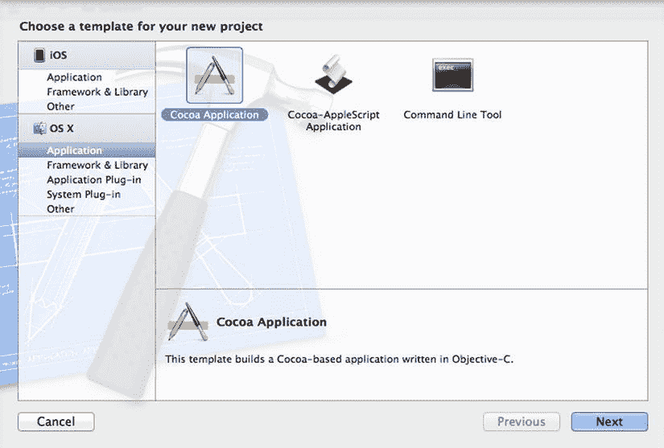
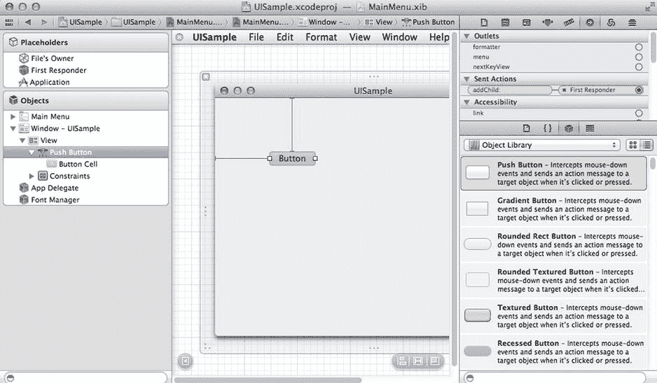
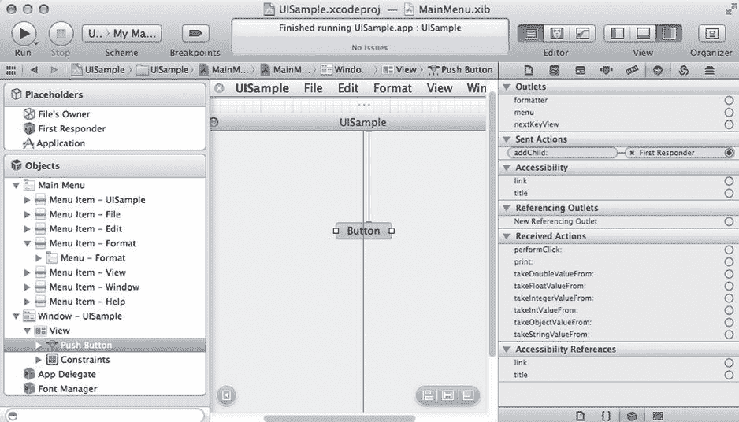
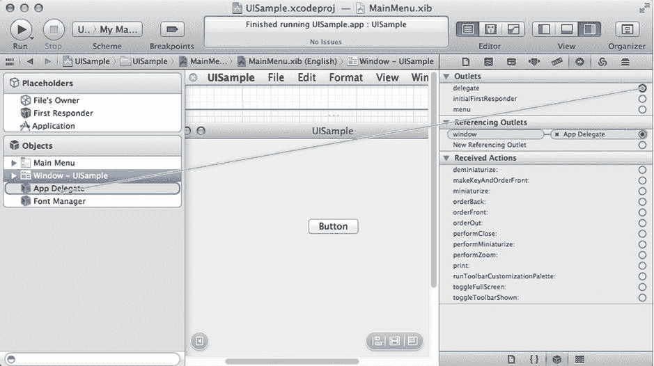
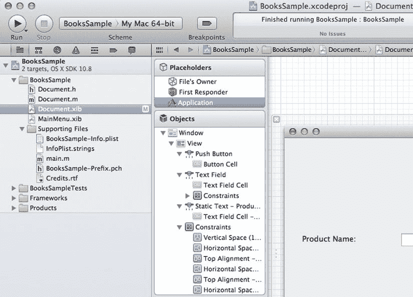
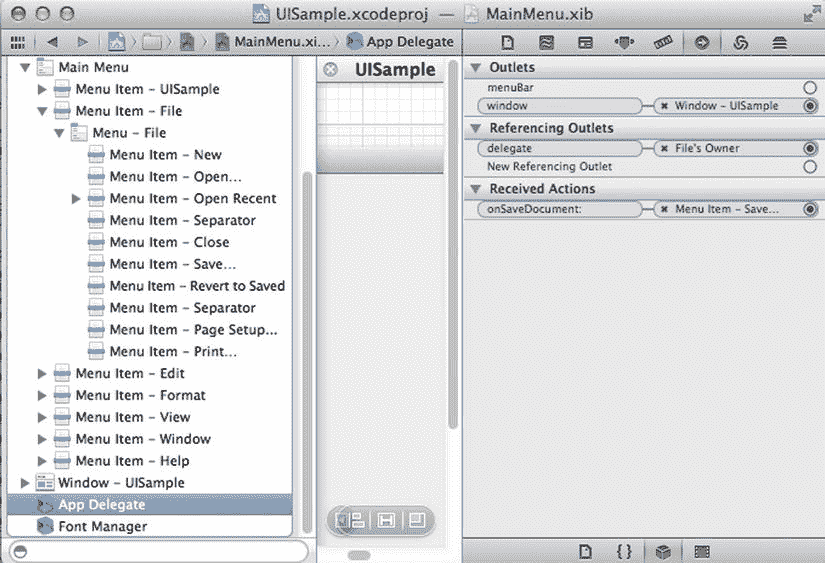

# 16. 构建 OS X GUI 应用程序

## 摘要

`Objective-C` 最常用于实现采用 Cocoa 框架的应用程序。作为一名 `Objective-C` 程序员，你几乎必然会参与 iOS 应用或完整 OS X 应用的开发。在本章中，我将讨论 OS X 上的应用程序开发。为此，你将学习 Cocoa UI，即用于开发符合 OS X UI 标准的图形化应用程序的框架。

`Xcode` 提供了一种面向对象的方法来创建图形界面，在充分利用其功能之前，需要先深入理解这种方法。与其他环境不同，使用 `Xcode` 创建的 GUI 应用并非通过代码生成（尽管必要时也可以这样做）。相反，对象是通过图形化编辑器设计并保存到文件中，然后由 Cocoa 应用程序直接加载。

此类图形化应用程序依赖于 Cocoa 提供的窗口、视图和控制对象的动态行为。通过标准的 `Objective-C` 技术，这些对象可以在 `Xcode` 中进行操作，随后以 nib 文件格式加载到你的应用程序中。从文件加载 nib 时，`Objective-C` 保证保存的属性和连接在运行时依然存在。

首先，我将解释如何在 `Xcode` 中创建一个示例 UI 应用程序。接着，你将看到 Cocoa 框架如何用于保存和加载图形界面的状态，包括属性和对象之间的连接，以便你能花更少的时间编码，用更直观的方式设计应用的 UI。我还将讨论基于 `NSResponder` 类的 UI 对象层次结构。

在本章的最后部分，我将提供一个用 Cocoa 编写的完整 UI 应用程序示例。该应用能够接收来自系统菜单的事件。你还将学习如何使用 Cocoa 库在屏幕上进行绘制，以及如何响应鼠标移动和按键等用户事件。

## 使用 Cocoa 创建 UI 概述

在 OS X 中创建图形化应用程序的第一步是规划 UI 的外观。对于这个初始设计，你可以使用任何现有的 UI 设计应用程序。有些团队使用 Photoshop 等专业图形软件，但市场上还有许多其他选择。如果你在小团队中工作或是一位独立开发者，你完全可以使用手绘设计图来指导完成这一初始阶段。

随后，需要将这个 UI 设计成果转化为实现，开发者将尝试使用编程工具来达到 UI 设计文档中指定的要求。这一阶段的工作将产生一个可使用的界面，可用于功能测试。之后，这个版本将被添加编程功能，逐步实现完整的应用程序。

### 设置 Cocoa 项目

在 `Objective-C` 中创建一个新项目很简单，完全可以在 IDE 内完成。你可以通过前往 **文件 ➤ 新建 ➤ 项目**（或使用键盘快捷键 **⌘+N**）来指示 `Xcode` 调用新建项目向导。出现的项目向导会列出你本地 `Xcode` 配置中所有可用的项目类型。该向导允许你根据所需的项目类型来选择新项目。项目类型列表根据目标操作系统进行划分。对于 Mac OS X，`Xcode` 中有以下可用的项目类型（见图 16-1）：

- **应用程序**：这是最终用户开发者创建面向用户应用程序时使用的主要项目类型。如你接下来所见，其中既有图形化应用，也有控制台应用。
- **框架和库**：这些项目类型用于创建可供其他应用程序后续使用的软件组件。框架是一个用 `Objective-C` 创建的库，可以更轻松地集成到面向对象的应用程序或其他库中。你还可以选择创建基于 C 或 C++ 的库，以便其他语言导入。
- **应用程序插件**：插件是一种特殊类型的库，可在运行时被应用程序导入。这使得应用程序能够根据需要添加或删除插件，甚至从网站安装新插件。由于插件使用的 API 取决于目标应用程序的内部设计，因此生成的插件是特定于应用程序的。在 `Xcode` 提供的标准选项中，你可以为通讯录、安装器应用程序和 Automator 创建插件。如果你的机器上安装了第三方供应商的软件，可能还会提供其他类型的插件。
- **系统插件**：这些插件用于扩展操作系统或 Mac OS X 的一些基础应用程序，例如 Finder。在其他选项中，你可以创建 Mac OS X 插件，用作系统偏好设置应用程序中的偏好设置面板、Finder 的快速查看插件、屏幕保护程序或 Spotlight 导入器。



**图 16-1.** 为 Mac OS X 选择一个新的 Xcode 项目

在本章中，我们关注的是位于**应用程序**选项卡下的应用创建。有以下选项可用：

- **Cocoa 应用程序**：此项目类型可用于创建 Mac OS X 中传统的基于窗口的应用程序。我将以此类项目作为示例，因为它是最常用于创建最终用户应用程序的类型。
- **Cocoa-AppleScript 应用程序**：此项目类型用于创建以 AppleScript 编写的应用程序，AppleScript 是苹果为 Mac OS X 开发的一种脚本语言。AppleScript 如今已不太流行，但仍可用于支持 Mac OS X 中的某些技术。
- **命令行工具**：使用此项目类型创建仅在命令行中运行的应用程序。这些应用不需要基于 `Objective-C`，也可以用其他语言（如 C 或 C++）编写。不过，仍然可以使用 `Objective-C` 的基础框架来简化命令行应用的开发，特别是当它们需要与仅通过 `Objective-C` 框架提供的 Mac OS X 技术交互时。

选择新应用程序并点击**下一步**按钮后，系统会显示一个屏幕，要求提供创建项目所需的一些基本信息，包括文件存放的目录。


### 使用 `nib` 文件

在大多数传统编程环境中，创建界面的工作都需要程序员编写代码来定义每个 UI 控件及其属性，例如屏幕上的位置、如何响应用户事件、颜色等。例如，Java 和 C# 应用程序使用代码来创建 UI 控件，并决定窗口在运行时的外观。在这类编程语言中，UI 实现的结果是大量的代码，这些代码包含了用于创建 UI 并确定其属性的类和方法。即使你使用图形工具在编辑界面时自动生成代码，情况也是如此。



图 16-2. Xcode nib 编辑器

然而，Objective-C 中的 UI 应用程序采用了不同的创建流程。与其他通过编程方式创建 UI 的环境不同，Objective-C 将应用程序与使用 Xcode 预先安排好的活动对象连接起来，如图 16-2 所示。要理解这种差异，你必须了解 Xcode UI 设计器的工作原理及其使用方式。

Xcode UI 设计能力的核心在于 Cocoa UI 对象的功能。Cocoa UI 拥有运行时操作所需的行为，这些行为由 Xcode 编辑器执行。此外，UI 对象可以直接保存到文件中，并恢复到设计时的相同状态。这种文件被称为 nib 文件（含义是 NeXTSTEP Interface Builder），它是一组对象的已保存表示。nib 文件通常以 `xib` 扩展名保存，因为它使用 XML 进行数据编码。你的应用程序稍后只需请求 Cocoa 将文件读入内存，即可恢复这些对象的表示。

因此，从某种意义上说，你并非像在其他语言中那样告诉系统应该如何创建一组对象。相反，你是在 Xcode 中操作那些之后将在应用程序中加载的相同对象。这意味着你可以配置对象，之后除了从 `xib` 文件中读取对象的通用 Cocoa 代码外，无需任何代码来设置它。此外，通过 Xcode 初始创建对象的所有复杂性都对应用程序隐藏了。即使你向 UI 添加了数百个对象，或者对这些对象进行了数千次修改，也无需为此生成或编译任何代码。这对于那些仅仅生成代码的传统工具来说是非常难以实现的。

`xib` 文件的另一个优势是它们可以按需加载。如果你有一个 `xib` 文件，它包含了应用程序中很少使用部分的 UI，那么它不会影响整个应用程序的加载时间。同样，这对于传统的代码生成技术是不可能的，因为即使这些代码在实际中很少使用，也需要生成、编译和加载。

这些使用 `xib` 文件的 UI 控件特性展示了你在 Xcode 中设计图形应用程序时的巨大灵活性。这也是 Mac OS X 相比其他操作系统，能够创建更复杂界面的原因之一。接下来的章节将概述 Xcode 为设计此类应用程序所提供的功能。

### Cocoa UI 类

Xcode UI 设计能力的核心在于 Cocoa 框架中一组类提供的支持。这些 UI 类定义了图形对象的运行时能力。一个 Cocoa UI 对象封装了运行时操作所需的所有行为，这是通过在 Xcode 中编辑 nib 文件来实现的。此外，UI 对象可以轻松保存到 `xib` 文件中，并恢复到其创建时的相同状态。

当你操纵 Xcode 中的对象时，实际上是在决定这些对象在运行时的显示方式和交互方式。运行时行为不仅由诸如颜色和位置之类的静态属性定义，还由窗口中出现的对象之间的关系定义。为了实现这一点，你不仅可以更改 UI 对象的可见属性，还可以使用连接（connections）来“连线”对象，这些连接由一组出口（outlets）和动作（actions）定义。

在 Xcode 中编辑的每个对象可以有一个或多个出口。出口是一个插槽，可以填充到其他对象的连接。例如，一个 `NSWindow` 对象有一个名为 `menu` 的出口。该出口用于向应用程序菜单发送更新，或在必要时读取任何菜单属性。你在 Xcode 中进行 UI 设计时，需要负责定义菜单对象与 `NSWindow` 菜单出口之间的连接。完成所有对象的连线后，该配置将固化在 `xib` 文件中，在需要显示窗口时可以稍后恢复。

Cocoa 中的 UI 对象也具有动作。动作是对象中一个可在设计时用于连接的方法。Xcode 会显示特定 UI 对象在属性面板的“接收动作”列表中提供的所有动作。要使用这些动作，你需要将生成事件的对象连接到一个具有目标（target）的对象，该目标将位于接收端。示例如图 16-3 所示。



图 16-3. 右侧面板中显示了 `NSButton` 控件及其关联属性。其中，你可以看到可用的出口、发送的动作、引用的出口和接收的动作

当 Cocoa 应用程序启动时，它首先要做的事情之一就是加载一个或多个 nib 文件。然后，这个 xml 文件被用来恢复已保存的对象，以便它们能够以在 Xcode 中设计时完全相同的属性和连接加载到内存中。这为对象提供了初始状态。

一旦应用程序启动，通过 Objective-C 代码也可以看到在 Xcode 中建立的连接。每个出口都被转换为对应对象中的一个实例变量，以便 Objective-C 可以使用这些变量向所需的控件发送消息。然后，这些连接弥合了对象的运行时行为（由你在 Objective-C 类中编写的代码定义）与其设计时属性之间的差距。

### Objective-C 中的出口和动作

你已经了解了出口和动作对于建立 `xib` 文件中创建的对象之间连接的重要性。然而，如果这个界面必须在运行时被你的代码使用，那么这些连接需要能够从 Objective-C 访问。Xcode 使用一些简单的约定来将 Objective-C 代码与 UI 中使用的出口和动作连接起来。

要在你的 Objective-C 类中提供一个出口，你可以简单地添加 `IBOutlet` 修饰符，如下所示：

```
#import <Cocoa/Cocoa.h>

@interface AppDelegate : NSObject <NSApplicationDelegate>

{
        id IBOutlet menuBar;
}

@property (assign) IBOutlet NSWindow *window;

@end
```

这个类声明了一个应用程序委托，它将响应发送到应用程序的事件。该类包含两个可以被 Xcode UI 设计器访问的出口。这些出口由 `IBOutlet` 关键字标记。实际上，`IBOutlet` 在编译时没有效果，但在你的类被加载到编辑器中时，Xcode 会识别它。

当 Cocoa 加载一个 nib 文件时，它会包含关于哪些对象被分配给了哪些出口的信息。因此，在 nib 文件加载后，连接被恢复，出口指向正确的对象。因此，如果你在 Xcode 中将菜单栏对象连接到 `menuBar` 出口，那么当应用程序在 Objective-C 中加载时，该连接将是有效的。


## Cocoa UI 层级结构

Cocoa 中图形对象的层级结构根植于 `NSResponder`。这是一个通用对象，因为它提供了所有图形元素共有的、用于响应应用程序事件的行为。用于实现窗口和通用视图的 `NSWindow` 和 `NSView` 都是 `NSResponder` 的子类。

`NSResponder` 提供的功能包括以下内容：

*   响应鼠标事件：`mouseDown:`、`mouseDragged:`、`mouseUp:`、`mouseMoved:`、`mouseEntered:`、`rightMouseDown:` 等。
*   响应键盘事件：`keyDown:`、`keyUp:`、`performMnemonic:`、`interpretKeyEquivalent:` 等。
*   响应其他杂项事件：`cursorUpdate:`、`scrollWheel:`、`helpRequested:` 等。
*   响应各种动作消息：`cancelOperation:`、`capitalizeWord:`、`insertNewLine:`、`insertTab:`、`indent:`、`moveBackward:`、`moveToBeginningOfDocumentAndModifySelection:`、`moveToLeftEndOfLine:`、`moveLeft:`、`moveRight:`、`pageUp:`、`pageDown:`、`scrollLineUp:`、`selectWord:`、`selectLine:`、`showContextHelp:` 等众多方法。
*   管理窗口恢复：`restoreStateWithCoder:` 等。
*   响应菜单事件：`setMenu:`

这只是 `NSResponder` 所提供的接口的一小部分，这使其成为 Cocoa UI 编程中的一个基础类。诸如 `NSWindow`、`NSApplication` 和 `NSView` 等子类进一步细化了该类提供的标准行为。

### NSWindow 类

`NSWindow` 类为 Cocoa 中的所有窗口（包括顶级窗口、工具窗口和对话框）提供了必要的行为。它们都共享一些通用的代码来显示、移动、调整大小和管理窗口的内容。

以下是从 `NSWindow` 派生而来的任何窗口都可以使用的常见功能：

*   定义窗口大小：`setFrameOrigin:`、`setFrameTopLeftPoint:`、`setMinSize:`、`performZoom:`、`showsResizeIndicator` 等。
*   配置窗口属性：`setBackgroundColor:`、`setStyleMask:`、`setOpaque:`、`setHasShadow:` 等。
*   从窗口获取信息：`windowNumber`、`deviceDescription`、`canBecomeVisibleWithoutLogin` 等。
*   管理主窗口状态：`isMainWindow`、`canBecomeMainWindow`、`makeMainWindow` 等。
*   管理子窗口和附属窗口：`addChildWindow:ordered:`、`removeChildWindow:`、`parentWindow` 等。
*   管理标题栏：`standardWindowButton:`、`showsToolbarButton` 等。

`NSWindow` 提供的 API 涵盖了标准 Mac OS X 窗口中的主要功能。Cocoa 将此行为封装在 `NSWindow` 中，你可以通过使用 Xcode 在设计时，或在运行时根据需要调用 `NSWindow` 的方法，来设置使用多少这些功能。

### 窗口控制器对象

窗口控制器是图形应用程序设计中的一个重要部分。与其他 GUI 工具包不同，Cocoa 中的大多自定义代码并非作为 `NSWindow` 的子类编写。相反，Cocoa 使用窗口控制器对象来处理系统中实际的 `NSWindow` 实例的大部分程序化行为。

这之所以可能，同样是因为你可以使用 Xcode 和 nib 文件在设计时将消息重定向到特定对象。当你需要处理特定类型的操作时，无需创建给定 UI 对象的子类。相反，你只需使用 Xcode 将对象连接到窗口控制器中的某个特定操作即可。这保证了你能够拥有修改后的行为，而无需创建任何特定 UI 对象的子类。

通常，定向到 `NSWindow` 的事件会被重定向到窗口控制器以进行即时响应。因此，窗口控制器可以被看作是窗口中功能的总部。你可以根据需要进一步将这些职责划分给其他控制器，但许多简单的应用程序只有一个窗口控制器来响应整个窗口的请求。

在大型应用程序中，每个窗口都可以拥有自己的窗口控制器，用于响应发送到该窗口的消息。如果其他控件的行为足够复杂以至于需要这种级别的自定义，它们也可以拥有自己的关联控制器。

### 委托对象

在 Cocoa UI 对象提供的出口中，最重要的一个是委托出口。委托是一个自动接收发送给特定 UI 控件或窗口的消息和通知的对象。通过将一个对象设置为 UI 控件的委托，你将能够处理定向到该控件的消息。这是在基于 Cocoa 的应用程序中处理 UI 事件的主要机制。

关于在 Xcode UI 中设置委托的示例，请考虑 Window 对象，它是 `NSWindow` 类的一个实例。如果你选中该对象并点击连接检查器（在右侧面板中），你将看到出口列表。其中一个出口是委托对象，它存在于每个 `NSWindow` 类的对象中，如图 16-4 所示。



图 16-4. 连接 `NSWindow` 对象的委托

要设置委托对象，你可以像连接任何其他出口一样，将其连接到所需的接收者。你想要使用的对象是文件所有者（即，拥有此 xib 文件的对象）。点击出口连接图标并将其拖拽到文件所有者占位符上，你将看到出口发生变化以指示新的连接。

一旦委托连接建立，你就可以开始在委托类中添加方法，以处理窗口对象发送的事件。这样的委托类应遵循 `NSWindowDelegate` 协议，该协议定义了发送给委托进行处理的方法。以下是可以委托类中实现的方法列表：

*   窗口移动消息：`windowWillMove:`、`windowDidMove:`、`windowDidChangeScreen:` 等。
*   窗口最小化消息：`windowWillMiniaturize:`、`windowDidMiniaturize:`、`windowDidEndLiveResize:` 等。
*   窗口更新消息：`windowDidUpdate:`、`windowDidExpose:`、`windowDidBecomeMain:`、`windowWillClose:` 等。

## 使用 Xcode 进行 UI 设计

在前面的章节中，你了解了 Cocoa UI 对象如何提供创建功能丰富 UI 所需的所有元素。UI 设计过程涉及运行时和设计时元素的协调。Xcode UI 工具构成了此工作流程的重要组成部分。在本节中，你将学习如何使用 Xcode 来定义 Mac OS X 应用程序的窗口和控件。


### nib 文件的组成元素

在 Xcode 中编辑 nib 文件时，会呈现许多表示基于 UI 应用重要元素的条目。你将首先了解它们的含义，然后在后续几个小节中了解其用法。

nib 文件的所有元素都显示在 Xcode xib 编辑窗口的左侧面板中。它们包括：作为占位对象添加到 nib 中的 UI 控件，这些控件代表 GUI 应用设计基础设施的组成部分；以及标准对象，这些对象在大多数情况下是图形控件，并在 UI 中具有真实的呈现形式。

占位对象的数量有限，但它们是 xib 配置的重要组成部分。这些占位符如下所示：



**图 16-5.** 包含占位符和普通对象的示例应用

-   **文件所有者**：这是拥有 nib 的对象的占位符。文件所有者必须存在，因为它为 xib 中包含所有其他对象的对象提供了一个标准且固定的引用。例如，如果一个 `NSWindowController` 拥有该 xib，则文件所有者将代表该控制器对象。利用文件所有者，你可以通过插座变量连接到你自己 `NSWindowController` 子类的实例变量，这些插座变量将从你的源文件实例变量自动识别出来。你可以使用这些插座变量作为你的 Objective-C 代码与 xib 中实例化对象之间的主要连接。
-   **第一响应者**：在 `window` 中，第一响应者是当前获得焦点的对象。然后，第一响应者会接收多个默认事件，例如键盘事件。你可以将第一响应者视为窗口中事件的默认目标。
-   **应用**：此对象是对 `NSApplication` 类的引用。此占位对象可用作影响整个应用的标准消息的目标，例如“退出”。如果你决定创建 `NSApplication` 的自己子类，也可以使用此对象来接收发往该子类的消息。

除了占位对象，还有放置在 xib 文件中的普通 UI 对象。这些对象以层级方式呈现，具体取决于它们之间的包含关系。例如，通常会在 xib 中添加一个窗口对象，该窗口对象将包含一个或多个用于显示信息的控件，以及一个菜单对象。图 16-5 显示了一个示例，展示了示例应用的占位对象和普通对象。

你可以通过单击来与此面板中的对象进行交互。当你单击一个对象时，它会成为其他面板（例如属性面板）中选中的对象。然后，您可以根据需要更改该对象的属性。

### 对象库

对象库是 Xcode 中的一个面板，显示所有可用于创建 UI 的对象列表。如果对象在库中列出，你可以快速将其添加到 xib，并将其作为你正在设计的界面的一部分。这些对象也可以使用属性面板进行自定义，并移动到所需位置。

该库按类别组织，可以从对象库面板顶部的下拉控件中访问这些类别。主要类别包括 Cocoa、通讯录、自动机和 WebKit。第三方可以为对象库添加单独的类别。例如，你可以添加额外的对象库或使用来自 Web 的开源库。

对于标准应用，Cocoa 类别是你最常使用的类别。它包含 Cocoa 中用于 UI 构建的基本对象。此类别又细分为几个子类别，可用于对 Cocoa 中包含的大量对象进行分类。在这些类别中，你将找到：

-   **控件**：这些对象代表常见的界面控件，例如按钮、下拉控件、标签和数据输入字段。针对各种情况有大量不同设计的控件。例如，按钮有不同形式，如“推送按钮”、“渐变按钮”、“圆角矩形按钮”、“纹理按钮”、“帮助按钮”等。请注意，在许多情况下，这些对象映射到相同的 Cocoa 类（对于按钮，是 `NSButton`），但库中的对象经过预配置，以不同的方式显示。这使得 UI 设计师更容易找到他们需要的正确对象。
-   **数据视图**：数据视图用于显示或编辑附加到 Cocoa 数据源的数据。这些控件的行为与“控件”面板中的控件类似。但是，数据控件直接与数据源通信，并且能够显示或编辑该数据源中包含的数据。因此，当处理存储在数据源（如关系数据库）中的数据集合时，这些控件是理想的选择。
-   **布局视图**：布局视图用于定义窗口中其他控件的布局。它是一个实用控件，因为添加它只是为了帮助组织窗口。这些控件包括简单的盒子，用于定义窗口中其他控件将要放置的区域。还有更复杂的视图，例如“滚动视图”或“垂直分割视图”。
-   **窗口和菜单**：此类别包含表示整个窗口、工具栏和菜单（可显示在菜单栏顶部）的对象。还有不同的窗口可供选择，包括标准窗口、面板（一个较小的辅助窗口）、纹理窗口和带有抽屉的窗口。

### 创建主窗口

UI 创建的第一步是至少向 nib 添加一个窗口。可以通过从对象库面板中选择一个窗口对象来完成。你可以在 UI 中使用多种类型的窗口。

-   **窗口**：标准选项是带有关闭、最小化和最大化按钮的 Cocoa 窗口。这种窗口样式应足以满足大多数用途，包括编辑窗口和信息窗口。
-   **面板**：面板通常用于临时目的。例如，你可能想用它来显示绘图工具、显示所选元素的属性，或者在文档中选择样式。面板窗口不打算长时间使用，因此它们的控件较小且使用频率较低。
-   **纹理窗口**：纹理窗口具有标准窗口的许多相同属性。但是，它具有独特的背景和边框，使其更适合作为工具使用的应用程序。例如，iTunes 使用这种风格的主窗口：它的主要目的不是编辑数据，而是作为音乐播放的工具。
-   **HUD 窗口**：这种窗口样式更适合瞬态数据或信息目的。例如，你可以将其用于帮助信息，或显示应用中选定元素的属性。

要将主窗口添加到 nib 文件，只需将窗口对象拖到编辑区域即可。你会看到该窗口将作为 xib 设计的一部分出现。该窗口也会被添加到左侧显示的对象面板中。通过单击这些项目之一，你将能够更改窗口的属性或配置其插座变量和动作。


### 添加菜单

使用 Xcode 处理菜单栏非常简便。首先，Xcode 创建的初始 xib 文件中已自带菜单栏，它会显示在编辑器窗口的顶部，你可以点击其可视化表示来编辑所需的菜单项。通过双击某个项目并编辑其标签，即可更改菜单的配置。

若要更改这些菜单项的连接，你可以将选中的菜单项拖拽至负责响应的对象上。有几个常用目标对象专门用于响应菜单事件。第一个是应用占位对象（Application placeholder）。例如，对于“退出”或“最小化”等菜单命令，应用程序提供了默认方法来响应这类常见请求。



**图 16-6.** 将菜单项连接到应用委托操作

第二个常见的菜单事件目标对象是应用委托（application delegate）。该对象用于处理发生在应用层面、需要定制化响应的事件。例如，我们来看看应用如何处理一个名为“保存文档”的菜单项。

第一步是向委托对象添加一个操作方法。以下是委托接口的示例：

```
#import <Cocoa/Cocoa.h>

@interface AppDelegate : NSObject <NSApplicationDelegate>
{
        // 存储菜单栏的出口
        id IBOutlet menuBar;
}

@property (assign) IBOutlet NSWindow *window;

// 由菜单事件调用的操作
- (IBAction)onSaveDocument:(id)sender;

@end
```

该接口声明了一个名为 `onSaveDocument:` 的方法，并标记为 `IBAction`。请记住，`IBAction` 只是 `void` 的别名，但在接口文件中使用时，它会告诉 Xcode 该方法可以在设计时连接到其他控件。

在 Xcode 中，当你在 xib 文件中选中 `AppDelegate` 对象时，你会在“已接收操作”（Received Actions）部分看到 `onSaveDocument:` 作为可用的操作出现。要将这个新操作连接到其来源，请点击操作右侧的圆点并拖拽至目标菜单项（本例中为“保存”项）。松开鼠标后，连接便会建立并显示，如图 16-6 所示。

### 加载 nib 后进行修改

任何非简单的应用都需要对控件的默认样式进行一定程度的定制。虽然可以使用 Xcode 的 UI 设计功能进行多项定制，但有些修改通过代码实现更为简便。例如，如果需要对多个控件进行相同的更新，通过 `for` 循环进行修改比在设计时手动操作更方便。同时，能够在界面显示给用户之前就执行这些修改会更好。

因此，提供一种在 nib 文件加载后、但在呈现给用户之前执行代码的方法非常有用。这正是 `windowControllerDidLoadNib` 方法所能实现的，它是 `NSDocument` 接口的一部分。示例如下：

```
- (void)windowControllerDidLoadNib:(NSWindowController *)aController
{
  [super windowControllerDidLoadNib:aController];
  // 在此处进行更新 ...
}
```

如果不使用 `NSDocument` 接口，而是使用视图控制器（view controller）类来管理代码，则有一个类似的方法会在 nib 文件加载后立即运行。该方法名为 `viewDidLoad`（即使 UI 是以编程方式创建的，此方法也会被调用；但如果你知道 UI 来自 nib 文件，那么可以确信 nib 已被加载）：

```
- (void)viewDidLoad{
    [super viewDidLoad];
    // 在此处进行你的修改
}
```

最后，如果你正在子类化一个控件（即 `NSView` 的子类），你应该能够实现 `awakeFromNib` 方法。该方法会在视图从 nib 文件中读取后立即被调用，因此你可以借此机会添加自己的定制内容。

## 使用 Objective-C 编写 UI 应用

在前面的章节中，你了解了 UI 创建的设计层面如何在 Xcode 中交互，并最终生成在磁盘上表示这些对象的 nib 文件。接下来的步骤是使用 Xcode 在运行时控制这些对象。在这里，你可以利用 Objective-C 的所有特性，结合 Cocoa UI 对象提供的丰富运行时功能。

虽然篇幅有限无法介绍 Cocoa UI 库的所有特性，但我将以一个简单的绘图应用程序为例，展示如何用 Objective-C 编写 UI。同时，在介绍这些类和方法的含义时，我会加以解释，以便你对这类应用的工作原理有所了解。如需完整的源代码和支持文件，请访问我在个人网站上的本书页面：[`http://coliveira.net`](http://coliveira.net/)。

我在此介绍的应用是一个交互式应用程序，可用于创建和显示图形（graph）。图形是一种专门的图表，用于展示被称为“图形节点”的项目之间的连接关系。图形在多个应用中用于分析连接元素的结构，此类结构的示例包括计算机网络和交通网络。

### main 函数

在 Objective-C 中，与 C 语言一样，应用程序从 `main` 函数开始执行。如果你有一个不需要大量定制的简单应用，你可以直接将 `main` 的职责委托给 `NSApplicationMain`，这是 `NSApplication` 导出的一个函数，负责执行所需的初始化工作。

```
//
// 文件：main.m
// 图形应用程序
#import <Cocoa/Cocoa.h>

int main(int argc, char *argv[])
{
    return NSApplicationMain(argc, (const char **) argv);
}
```


### AppDelegate

我们从应用程序委托开始。如上所述，该委托接收通过 Xcode 界面编辑器的 nib 文件路由的事件。

```
/* AppDelegate */

#import <Cocoa/Cocoa.h>

@interface AppDelegate : NSObject

{
    IBOutlet id selectNumberOfNodesWindow;
    IBOutlet id numberOfNodesControl;
    IBOutlet id minDistField;
    IBOutlet id applyDistControl;
    int numberOfNodesControlCanceled;
}

- (id)getSelectNumberOfNodesWindow;
- (id)getNumberOfNodesControl;
- (id)getNumberOfNodesApplyDistControl;
- (id)getNumberOfNodesDistField;
- (int)getNumberOfNodesControlCanceled;
- (IBAction)closeSelectNumberOfNodesWindow:(id)sender;
- (IBAction)cancelSelectNumberOfNodesWindow:(id)sender;
- (IBAction)setApplyMinDistOnNumberOfNodesWindow:(id)sender;

@end
```

该应用程序拥有多个出口，对应界面中的字段。例如，有一个字段用于存储窗口中的节点数量。请注意，所有这些字段都被标记为 `IBOutlet`，用于告知 Xcode 这些变量已映射到出口。然后，请注意最后三个方法的返回值是 `IBAction`，这用于告知 Xcode 这些方法应在界面编辑器中映射为操作。

接下来是 AppDelegate 的实现。

```
#import "AppDelegate.h"

@implementation AppDelegate

- (id)getSelectNumberOfNodesWindow
{
    return selectNumberOfNodesWindow;
}

- (id)getNumberOfNodesControl
{
    return numberOfNodesControl;
}

- (int)getNumberOfNodesControlCanceled
{
    return numberOfNodesControlCanceled;
}
```

前三个方法简单地返回几个界面控件的 ID。这些 ID 定义了显示节点数量的窗口、包含节点数量的控件，以及用于取消操作的控件。

```
- (IBAction)cancelSelectNumberOfNodesWindow:(id)sender
{
    printf("The window was canceled\n");
    numberOfNodesControlCanceled = 1;
    [NSApp stopModal];
}

- (IBAction)closeSelectNumberOfNodesWindow:(id)sender
{
    numberOfNodesControlCanceled = 0;
    [NSApp stopModal];
}

- (IBAction)setApplyMinDistOnNumberOfNodesWindow:(id)sender;
{
    if ([sender state] == NSOffState) {
        [minDistField setEnabled:NO];
    } else {
        [minDistField setEnabled:YES];
        [selectNumberOfNodesWindow makeFirstResponder:minDistField];
    }
}
```

这三个方法用于响应应用程序中定义的模态窗口发送的消息。该模态窗口用于定义编辑器中的节点数量。请注意，在前两个方法中，调用了 `NSApp` 对象的 `stopModal` 方法。`stopModal` 用于关闭模态窗口（此处模态窗口是一个小对话框）。

```
- (id)getNumberOfNodesApplyDistControl
{
    return applyDistControl;
}

- (id)getNumberOfNodesDistField
{
    return minDistField;
}

@end
```

最后两个方法是必需的，用于返回存储的信息，例如分布中的节点数量。

### GraphView 接口

`GraphView.h` 文件用于定义图形绘制例程的接口。大部分代码与定义绘制操作过程中所需的实例变量相关。

```
/* GraphView: viewer for graph drawing. */

#import <Cocoa/Cocoa.h>
#include <graph.h>

// This class implements the viewer, which displays the graph and
// takes care of editing operations.

@interface GraphView : NSView
{
    NSBezierPath *path; // path used by the main graph
    NSBezierPath *sg_path; // path used by the sobreposed graph
    NSAffineTransform *transform; // transformation used to draw on scale
    Graph *G; // Main graph
    Graph *sG; // Sobreposed graph
    IBOutlet id Document; // Pointer to the document
    IBOutlet id _posField; // Field in the status bar showing position
    IBOutlet id scroller;
    IBOutlet NSSlider *_slider;
    int *_associatedPoints; // pointer to a vector of associated points
    int _nPoints; // number of points in this graph
    double _sliderValue; // the value of the slider widget
    int _clickedNode; // node that was last clicked
    int _deleteEdgeMode; // 1 if the current mode is "delete edge"
}

-(void) refreshView;
-(void)setBezierPaths;
-(NSBezierPath *) getPath;
-(void)startDeleteEdgeMode;
-(Graph *) getGraph;
-(IBAction)sliderChanged:(id)sender;
-(void) refreshView;
-(void)drawNodeNumbers;
-(int)findClickedNode:(NSPoint)loc;
-(void)moveNode:(int)clickedNode to:(NSPoint)loc;
-(void)addSobreposedGraphToPath;
-(void)addGraphToPath;
-(void)mouseMoved:(NSEvent *)theEvent;

@end
```

请注意，该文件与 Cocoa 应用程序中的大多数文件一样，以命令 `#import <Cocoa/Cocoa.h>` 开头。随后你会看到一个必要的变量列表，其中包含 Xcode 使用的一些出口。在声明的方法中，你还可以看到一个在界面设计阶段使用的操作。


### `GraphView` 的实现

该文件是您正在探索的绘图应用程序的核心。此处定义的 `GraphView` 类是 `NSView` 的子类。正如您之前所见，`NSView` 负责管理屏幕上的某一区域。在此情形下，`GraphView` 负责管理编辑器的所有区域，并处理用户的编辑操作。例如，该类管理键盘、鼠标移动以及窗口调整大小等事件。

文件开头定义了一些有用的宏，例如 `min` 和 `max`，它们将在该类的后续实现中用于某些计算。为了提升速度，还使用纯 C 语言定义了几个函数，但文件的大部分内容是通过 Objective-C 方法实现 `GraphView` 类。

```
#import "GraphView.h"
#import "MyDocument.h"
#include <common.h>
#define NODE_RADIUS 4
#define min(x,y) (x<y ? x : y)
#define max(x,y) (x>y ? x : y)
static int change_points_associated_to_edges(graph_node *graph_node, int a, int b, void *data);
static int find_edge_at_point(graph_node *graph_node, int a, int b, void *data);
struct for_each_edge_data {
    Graph *G;
    int movedNode;
    int secondMovedNode;
    int edgeFound;
    NSPoint *loc;
    NSBezierPath *path;
    NSBezierPath *sg_path;
    GraphView *v;
    double sliderValue;
};
```

`for_each_edge_data` 结构体用于存储关于图中边的有用信息。边只是图中连接两个节点的线条。该结构体用于存储那些需要被 `GraphView` 的方法快速访问的数据。

```
@implementation GraphView
/***************************************
 * 窗口的通用选项。
 ***************************************/
// 有必要声明，我们希望使用原点位于左上角的坐标系。
- (BOOL)isFlipped
{
    return NO; // 应改为 YES 以翻转
}

// 有必要声明，我们希望处理键盘事件。
- (BOOL)acceptsFirstResponder
{
    return YES;
}
```

这两个方法覆盖了 `NSView` 的现有选项。第一个方法决定了视图所使用的坐标系相对于默认坐标系不会发生翻转。默认坐标系的原点位于左上角。您可以尝试将其翻转，以获得一个更传统的、原点位于左下角的坐标系。

第二个方法确定此视图接受第一响应者。这意味着您能够将键盘命令以及其他依赖第一响应者的事件直接发送到该视图。

```
/***************************************
 * 窗口和结构的初始化。
 ***************************************/
// 初始化窗口。
// 注意：此法在 initWithFrame: 之后调用。
-(void)awakeFromNib
{
    [[self window] setAcceptsMouseMovedEvents:YES];

    // 创建路径（保留（retain）可避免路径在方法返回后被垃圾回收（GC））
    path = [[NSBezierPath bezierPath] retain];
    sg_path = [[NSBezierPath bezierPath] retain];
    transform = [[NSAffineTransform transform] retain];

    _associatedPoints = 0;
    _sliderValue = 1.0;
    _clickedNode = 0;
    _deleteEdgeMode = 0;

    [self setBezierPaths];
}
```

`awakeFromNib` 方法覆盖了父类的同名方法。在 `awakeFromNib` 中，您应该进行视图显示前所需的任何初始化。此方法在 nib 文件用于创建用户界面后立即被调用。这意味着在此时，nib 中的所有属性和连接都已恢复，并且 `NSView` 可以访问它们。

这段代码正在调用方法来建立 `GraphView` 的初始状态。例如，您可以看到有两个变量存储了 `NSBezierPath` 的新对象。此对象将在后面用于创建贝塞尔曲线。该方法还分配了一个 `NSAffineTransform` 对象，该对象将用于转换 `GraphView` 上节点和边的位置和大小。


请注意该方法如何调用 `setAcceptsMouseMovedEvents`：。这是必要的，因为标准的 `NSView` 对象并不接收鼠标消息。为了能够处理这些消息，您需要使用上述方法发出请求。

```
// 删除先前分配的内存
-(void)dealloc
{
if (_associatedPoints)
Delete(_associatedPoints);
[path release];
[sg_path release];
[transform release];
[super dealloc];
}
```

`dealloc` 方法负责释放与此视图关联的所有数据。它将删除存储在 `_associatedPoints` 中的屏幕位置。它还将释放 `path`、`sg_path` 和 `transform` 对象。同时，它也会调用基类中的 `dealloc`。

```
// 绘制图形
- (void)drawRect:(NSRect)aRect
{
//
// 首先绘制图形
[transform concat]; // 调用当前变换
[[NSColor redColor] set]; // 将颜色设置为红色
[path stroke]; // 绘制图形
[[NSColor blueColor] set]; // 将颜色设置为蓝色
[sg_path setLineWidth:2]; // 定义线宽
[sg_path stroke]; // 绘制叠加图
//
// 然后绘制节点编号
if (G) { // 如果图已加载
[self drawNodeNumbers]; // 绘制节点
}
}
```

此方法负责绘制视图的内容。实际上，当调用此方法时，大部分决策已经做出。它唯一要做的就是请求重新绘制 `GraphView` 使用的路径。如果图已初始化，它还会在节点附近绘制节点编号。

```
// 删除位于位置“loc”的边
-(int)deleteEdge:(NSPoint)loc
{
//
// 调整必要的数据
struct for_each_edge_data data;
data.G = G;
data.loc = &loc;
data.edgeFound = 0;
data.sliderValue = _sliderValue;
//
// 将数据传递给 find_edge_at_point
gr_for_each_edge_dir(G, find_edge_at_point, &data);
//
// 更改绘制
if (data.edgeFound) {
[self setBezierPaths]; // 重新创建形状
[self setNeedsDisplay:YES]; // 重新绘制屏幕
}
return 1;
}
```

`deleteEdge` 方法使用 `gr_for_each_edge_dir` 函数来完成查找边的艰巨工作（出于性能考虑，它使用 C 函数）。一旦找到边，工作就交由 `setBezierPaths` 方法处理，并重新绘制视图。

```
// 处理鼠标按下事件
- (void)mouseDown:(NSEvent *)theEvent
{
NSPoint loc = [self convertPoint:[theEvent locationInWindow] fromView:nil];
if (_deleteEdgeMode) {
[self deleteEdge:loc];
[[NSCursor arrowCursor] set];
_deleteEdgeMode = 0;
return;
}
_clickedNode = [self findClickedNode:loc];
if (_clickedNode) printf("被点击的节点是 %d\n", _clickedNode);
}
```

当 `mouseDown`：操作被发送到 `GraphView` 时，会调用此方法。该方法首先确定事件发生的精确位置。这是通过 `locationInWindow` 方法完成的，该方法属于 `NSEvent` 对象。如果视图处于删除边模式，则请求删除该边，并将光标设置为普通箭头模式。否则，唯一要做的就是打印被点击节点的编号。

```
- (void)mouseUp:(NSEvent *)theEvent
{
NSPoint loc = [self convertPoint:[theEvent locationInWindow] fromView:nil];
if (_clickedNode) {
//
// 使用缩放因子修正位置
loc.x /= _sliderValue;
loc.y /= _sliderValue;
//
// 更新节点的位置
gr_set_pos(G, _clickedNode, loc.x, loc.y);
//
// 更改每条单独的边的位置
struct for_each_edge_data data;
data.movedNode = _clickedNode;
data.loc = &loc;
data.G = G;
data.path = path;
gr_for_each_adjacent_edge(G, _clickedNode, change_points_associated_to_edges, &data);
//
// 对叠加图执行相同操作（如果存在）
if (sG) {
data.G = sG;
data.path = sg_path;
gr_for_each_adjacent_edge(sG, _clickedNode, change_points_associated_to_edges, &data);
}
//
// 恢复原始位置，并移动节点位置
loc.x *= _sliderValue;
loc.y *= _sliderValue;
[self moveNode:_clickedNode to:loc];
}
```


```objectivec
[self setNeedsDisplay:YES];
}
_clickedNode = 0;
}
```

`mouseUp:` 方法响应发送给 `GraphView` 的鼠标事件。该方法首先使用 `NSEvent` 的 `locationInWindow` 方法获取鼠标点击的位置。然后，如果有点击的节点，代码会继续更新节点和边。首先，应用滑块控件的缩放因子，并更新节点的位置。接着，更新每条连接的边的位置。如果存在叠加图，也会更新它。最后，该方法调用内部的 `moveNode:to:` 方法并重绘视图。

```objectivec
- (void)mouseDragged:(NSEvent *)theEvent
{
    NSPoint loc = [self convertPoint:[theEvent locationInWindow] fromView:nil];
    if (_clickedNode) {
        [self moveNode:_clickedNode to:loc];
        [self setNeedsDisplay:YES];
    }
}
```

当用户按下鼠标按钮并移动鼠标时，会调用 `mouseDragged:` 方法。在此视图中，您可以使用 `moveNode:to:` 方法在节点被点击时提供即时反馈。然后，该方法调用 `setNeedsDisplay` 方法来重绘视图。

```objectivec
-(void)setBezierPaths
{
    [path removeAllPoints];
    G = [Document getGraph];
    if (G) {
        int n = gr_nverts(G);
        if (_associatedPoints && n > _nPoints) {
            Delete(_associatedPoints);
            _associatedPoints = 0;
        }
        if (!_associatedPoints) {
            _associatedPoints = NewVec(int, n);
            if (!_associatedPoints) {
                printf("error creating vector of associated points\n");
                return;
            }
            _nPoints = n;
        }
        [self addGraphToPath];
    }
    [sg_path removeAllPoints];
    sG = [Document getSobreposedGraph];
    if (sG) {
        [self addSobreposedGraphToPath];
    }
}
```

`setBezierPaths` 用于初始化视图中的所有路径。贝塞尔路径是一个对象，它决定了 Cocoa 如何绘制路径。您可以使用贝塞尔路径绘制复杂的路径，包括直线、矩形、圆形和弧线。您只需要设置好贝塞尔路径，并在构造完成后请求在视图上绘制路径即可。此方法设置了内部的贝塞尔路径，以绘制在屏幕上显示图形所需的每一条线。

```c
// this function is called for each edge, and data has the required information
static int draw_the_edge(graph_node *graph_node, int a, int b, void *data)
{
    // reads data and unpack it
    struct for_each_edge_data *myData = (struct for_each_edge_data*) data;
    Graph *G = myData->G;
    NSBezierPath *path = myData->path;
    //
    // adds the position (in the path) of point to the data associated to this
    // edge of the graph so that we remember it later.
    int *point = (int*)malloc(int,sizeof(int));
    *point = [path elementCount];
    gr_set_data(G, a, b, point, 1);
    //
    // add edge to the path
    NSPoint p1, p2;
    nodePos *pa, *pb;
    pa = gr_get_pos(G, a);
    pb = gr_get_pos(G, b);
    p1.x = pa->x;
    p1.y = pa->y;
    p2.x = pb->x;
    p2.y = pb->y;
    [path moveToPoint:p1];
    [path lineToPoint:p2];
    return 1;
}
```

`draw_the_edge` 函数是一个辅助函数，它使用传入的数据来绘制一条边。该方法的重要部分在于它如何通过 `moveToPoint:` 和 `lineToPoint:` 方法来操作贝塞尔路径。这些方法创建了路径，当贝塞尔路径完成后，该路径将在屏幕上被绘制出来。

```c
// draw the shape of a node in position given by p, into the bezier path
void draw_node(nodePos *p, NSBezierPath *path)
{
    NSPoint pos;
    pos.x = p->x-NODE_RADIUS;
    pos.y = p->y-NODE_RADIUS;
    [path moveToPoint:pos];
    pos.x += 2*NODE_RADIUS;
    [path lineToPoint:pos];
    pos.y += 2*NODE_RADIUS;
    [path lineToPoint:pos];
    pos.x -= 2*NODE_RADIUS;
    [path lineToPoint:pos];
    pos.y -= 2*NODE_RADIUS;
    [path lineToPoint:pos];
}
```

此函数对图中的节点执行类似的工作。它操作贝塞尔路径，以便绘制图中的节点。节点的表示是一个由 `NODE_RADIUS` 定义大小的小正方形。

```c
// starts adding the edges to the path. Calls function draw_the_edge to do the job.
```


`-(void)drawEdges:(Graph*)_G withPath:(NSBezierPath*)_path`

```
{

struct for_each_edge_data data;

data.path = _path;

data.G = _G;

gr_for_each_edge_dir(_G, draw_the_edge, &data);

}
```

`drawEdges:withPath:` 负责获取正确的参数，并为图中的每条边调用绘制边的函数。

```
// adds the shapes of the graph to path. Uses drawEdges and drawNodes
- (void)addGraphToPath
{
int i, n;
n = gr_nverts(G);
[self drawEdges:G withPath:path];
for (i=1; i<=n; i++) {
nodePos *p = gr_get_pos(G, i);
_associatedPoints[i-1] = [path elementCount];
draw_node(p, path);
}
}
```

方法 `addGraphToPath` 负责将完整图形绘制到贝塞尔路径上。它首先使用 `drawEdges:withPath:` 绘制边，然后绘制图中的每个节点。

```
// Convenience function to add superposed graph.
-(void)addSobreposedGraphToPath
{
[self drawEdges:sG withPath:sg_path];
}
```

用户可以选择在应用程序中使用叠加图。这通过上述方法实现。

```
-(void)drawNodeNumbers
{
int i;
int n = gr_nverts(G);
for (i=0; i<n; i++) {
NSPoint loc;
loc.x = gr_get_x_pos(G, i+1);
loc.y = gr_get_y_pos(G, i+1);
char num[32];
sprintf(num, "%d", i+1);
[[NSString stringWithCString:num] drawAtPoint:loc withAttributes:0];
}
}
```

此方法绘制与每个节点对应的数字。要在屏幕上绘制字符串，请使用 `NSString` 的 `drawAtPoint:withAttributes:` 方法。`NSString` 的这个扩展将使用给定的位置将字符串直接绘制到视图上。

```
- (int)findClickedNode:(NSPoint) loc
{
int i;
int n;
if (!G) return 0;
n = gr_nverts(G);
for (i=1; i<=n; i++) {
double x = gr_get_x_pos(G, i);
double y = gr_get_y_pos(G, i);
double radius = _sliderValue > 1 ? NODE_RADIUS * _sliderValue : NODE_RADIUS;
x *= _sliderValue;
y *= _sliderValue;
if (i==1) printf("%lf %lf: loc i\n%lf %lf: nodePos i\n",
loc.x, loc.y, x, y);
if (x-radius <= loc.x && x+radius >= loc.x
&& y-radius <= loc.y && y+radius >= loc.y)
return i;
}
return 0;
}
```

此方法提供了一种简单的方法来确定在指定位置是否点击了节点。它遍历节点列表，并返回与给定位置相交的节点的索引。

```
static int change_points_associated_to_edges(
graph_node *graph_node, int a, int b, void *data)
{
struct for_each_edge_data *dt = (struct for_each_edge_data*)data;
int u = a < b ? a : b;
int v = a < b ? b : a;
int point = *((int*)gr_get_data(dt->G, u, v));
if (a < b) point++;
[dt->path setAssociatedPoints:dt->loc atIndex:point];
return 1;
}
```

这是一个辅助函数，使用 `NSBezierPath` 的 `setAssociatedPoints:atIndex:` 方法将数据关联到图中的特定节点。

```
-(void)moveNode:(int)clickedNode to:(NSPoint)loc
{
int point = _associatedPoints[clickedNode-1];
loc.x /= _sliderValue;
loc.y /= _sliderValue;
loc.x -= NODE_RADIUS;
loc.y -= NODE_RADIUS;
[path setAssociatedPoints: &loc atIndex:point];
loc.x += 2*NODE_RADIUS;
[path setAssociatedPoints: &loc atIndex:point+1];
loc.y += 2*NODE_RADIUS;
[path setAssociatedPoints: &loc atIndex:point+2];
loc.x -= 2*NODE_RADIUS;
[path setAssociatedPoints: &loc atIndex:point+3];
loc.y -= 2*NODE_RADIUS;
[path setAssociatedPoints: &loc atIndex:point+4];
}
```

`moveNode:to:` 方法负责将节点重新定位到新位置，并执行所有相关的修改。第一步是检索被点击的点。然后，更新贝塞尔路径，以便节点将在第二个参数确定的位置重新绘制。

```
-(NSBezierPath *) getPath
{
return path;
}

-(Graph *) getGraph
{
return G;
}
```

最后两个方法提供了一种简便的数据检索方式。第一个方法返回视图使用的主路径。第二个方法返回存储所有显示的节点和边信息的图。

```
-(void) refreshView
{
[self setBezierPaths];
```


### 代码与解释

`[self setNeedsDisplay:YES];`

`}`

`refreshView`方法只是重绘屏幕的一种便捷方式。它重置贝塞尔路径对象，然后请求视图重新显示其内容。

```
-(IBAction)sliderChanged:(id)sender
{
	[transform scaleBy:1/_sliderValue];
	_sliderValue = [_slider floatValue];
	[transform scaleBy:_sliderValue];
	[self setNeedsDisplay:YES];
}
```

每当滑块控件发送新事件时，都会调用此操作。请记住，操作通常使用 Xcode 编辑器进行连线（尽管你也可以通过代码实现）。当前方法通过获取滑块对象（已连接到`_slider ivar`）中存储的值，并使用该值为绘制在窗口中的对象定义新的变换比例来响应此事件。然后，该方法请求重绘视图。

```
- (void)keyDown:(NSEvent *)theEvent
{
	NSString *keyChar = [theEvent characters];
	if ( [keyChar isEqualToString:@"c"] ) {
		[self setNeedsDisplay:YES];
		printf("you typed c\n");
	}
}
```

当在`GraphView`是主要响应者的窗口中发生新的按键事件时，操作系统会调用`keyDown:`方法。要获取已按下的字符，你可以使用事件对象上的`characters`方法。在此方法中，你正在测试用户是否按下了“c”字符，并在发生这种情况时调用显示功能。

```
-(void)startDeleteEdgeMode
{
	_deleteEdgeMode = 1;
	[[NSCursor disappearingItemCursor] set];
}
```

当删除边模式启动时会调用此方法，这仅仅意味着在`_deleteEdgeMode`实例变量上设置一个标志。这里有趣的部分是如何在`NSView`上设置新光标；你只需要检索所需的光标（此处为`disappearingItemCursor`），然后调用`set`方法。

```
// this function is called for each edge, and says if and edge is in the position
// pointed by data.
static int find_edge_at_point(graph_node *graph_node, int a, int b, void *data)
{
	//
	// read and unpack data data
	struct for_each_edge_data *myData = (struct for_each_edge_data*) data;
	if (myData->edgeFound) {
		return 1;
	}
	Graph *G = myData->G;
	//
	// make a local copy of myData->loc, because we don't want to change
	// its value (and this caused a bug in the past)
	NSPoint aloc = *(myData->loc);
	NSPoint *loc = &aloc;
	//
	// correct the coordinates according to the zoom value
	loc->x /= myData->sliderValue;
	loc->y /= myData->sliderValue;
	//
	// find coordinates of the edge in the screen
	double x1 = gr_get_x_pos(G, a);
	double y1 = gr_get_y_pos(G, a);
	double x2 = gr_get_x_pos(G, b);
	double y2 = gr_get_y_pos(G, b);
	//
	// if |x1-x2| < |y1-y2| then it is better to invert the roles of x and y,
	// because otherwise the test of the slope is not very efficient (and doesn't work
	// for vertical lines)
	if (abs(x1-x2) < abs(y1-y2)) {
		swap(double, x1, y1);
		swap(double, x2, y2);
		swap(double, loc->x, loc->y);
	}
	//
	// define equation of the line determined by the two points
	double m = (x2-x1 == 0) ? 0 :(y2-y1)/(x2-x1);
	double x = loc->x;
	double y = m * (x - x1) + y1;
	//
	// correcting values: radius is the distance around the edge
	double radius = 4.0;
	//
	// checks if point intersects with line
	if (x >= min(x1, x2) && x <= max(x1, x2)
		&& y-radius <= loc->y && y+radius >= loc->y) {
		myData->edgeFound = 1;
		myData->movedNode = a; // store the nodes adjacent to the edge
		myData->secondMovedNode = b; // ditto
		gr_remove_edge(G, a, b); // remove the edge
	}
	return 1;
}
```

此函数出于性能原因使用 C 语言编写。其目标是检测当用户点击屏幕特定区域时的边。代码可能看起来很复杂，但其背后的思路只是跟随连接图中两点的直线，并返回用户点击了哪条边（如果有点击的话）。

```
// use this for mouse movement:
- (void)mouseMoved:(NSEvent *)theEvent
{
	NSPoint loc = [self convertPoint:[theEvent locationInWindow] fromView:nil];
	//
	// update the location in field in the toolbar
	char str_pos[1024];
	sprintf(str_pos, "(%.0lf, %.0lf)", loc.x, loc.y);
	[_posField setStringValue: [NSString stringWithCString:str_pos]];
}
```

当用户移动鼠标时调用此方法。它首先定义点击发生的位置。然后，为调试目的将位置存储在一个字符串中。该字符串随后被存储在界面中的位置字段中。

## 总结

在本章中，你学习了 Cocoa 中基于 UI 的特性。如你所见，Cocoa 利用了 Objective-C 的优势来支持一种 UI 构建风格，这种风格提供了极大的自由度，并减少了创建丰富 UI 体验所需的代码量。

Mac OS X 中 GUI 开发的核心概念之一是对 nib 文件的支持。nib 是一种基于文件的对象表示形式，可以使用诸如 Xcode 之类的图形工具进行操作。对象通过编辑器创建和修改，但可以被保存并在稍后通过你的应用程序加载。

在本章中，我首先概述了 Cocoa 中 UI 类的层级结构。它们都派生自`NSResponder`类，该类负责处理基于 UI 的事件。其他重要类，如`NSWindow`和`NSView`，实现了系统所有窗口和视图共享的附加特性。

最后，我给出一个完整的应用程序示例，该应用程序处理来自菜单和直接交互（如键盘按键和鼠标移动）的用户输入。该应用程序用于在屏幕上绘制表示一组点和连接线的图形。你已经学习了如何使用贝塞尔路径在屏幕上绘制项目，以及如何执行其他常见任务，如绘制字符串。

在下一章中，我将讨论 Cocoa 中可用的移动编程支持。通过 Cocoa Touch（iOS 平台可用的移动扩展），Objective-C 提供了在 iPhone 和 iPad 等移动设备上运行代码所需的一切。为此，你将使用本章介绍的大部分概念，以及 Cocoa Touch 框架中的一组专用类。


