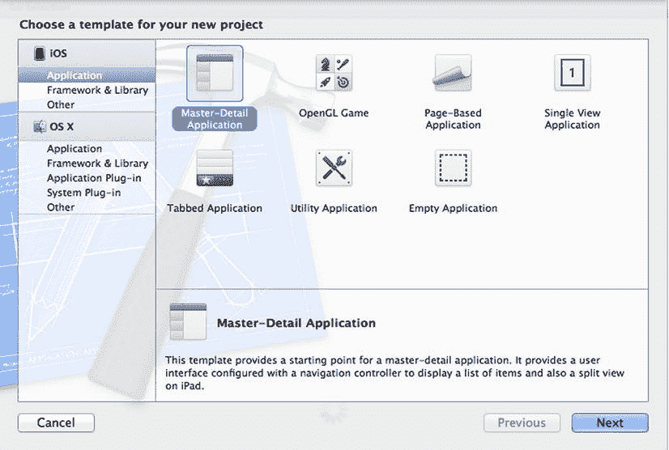
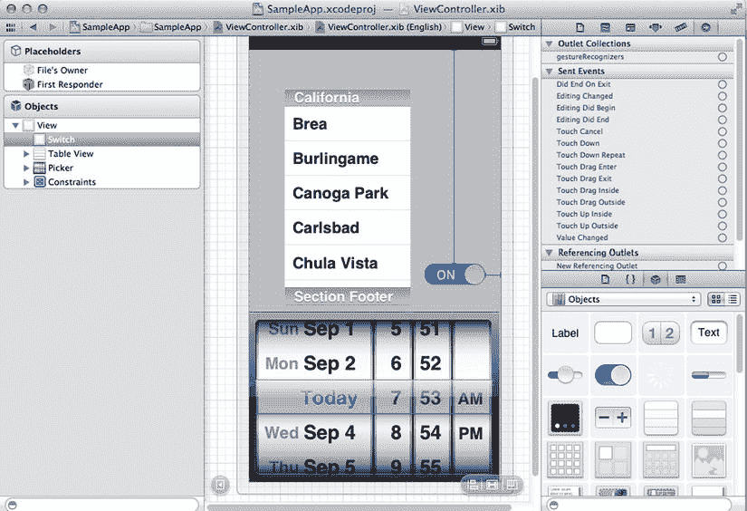
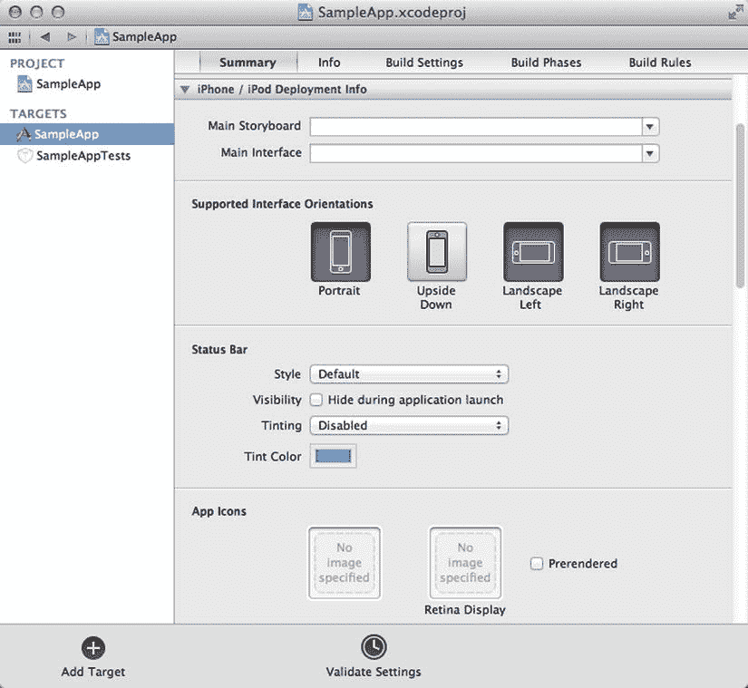
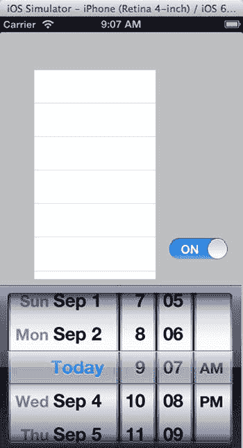

# 17. 构建 iOS 应用

**摘要**

`Cocoa Touch` 是用于为 iOS（驱动 iPhone、iPad 和 iPod touch 的操作系统）构建丰富移动应用的 `Objective-C` 框架。虽然采用了与桌面版 `Cocoa` 相似的技术，但与功能完备的 Mac OS X 框架相比，`Cocoa Touch` 提供了更简化的架构。`Cocoa Touch` 不仅提供了基于触控的 UI 控件，还提供了对摄像头和加速计等移动资源的访问能力。借助 `Cocoa Touch`，开发者可以访问 iOS 所管理的硬件资源，其中包含许多 Mac OS X 应用无法使用的功能。

本章将概述使用 Xcode 开发移动应用的编程环境。我将首先讨论移动应用与为 Mac OS X 编写的功能完备应用之间的区别。你将了解专门为基于触控的界面开发的新 UI 控件。你还将学习如何创建新应用以及如何将这些应用部署到 iOS 目标设备上。

最后，我将以一个完整的示例作为本章的结尾，该示例展示了如何使用 `Objective-C` 与 `Cocoa Touch` 中包含的几个重要类进行交互。这个示例还会向你展示一些图形化 iOS 编程的基本概念，例如动画。此外，它还将展示如何与基于触控的控件进行交互，并在移动设备上响应事件。

## iOS 编程

为 iOS 创建应用与桌面应用开发有许多相似之处。首先，你将使用相同的编程语言 `Objective-C`，以及一些相同的基础库，包括 Foundation 框架中的所有可用功能。Foundation 框架中的通用类，如 `NSArray`、`NSDictionary` 等，保持不变，其用法与本书第一部分所述一致。

另一方面，开发者在创建 iOS 应用时，也需要考虑几个重要的差异。理解这些差异对于开发高效的 iOS 应用是必要的。

### 内存限制

首先是内存使用问题。在 Mac OS X 等现代桌面操作系统中，可用内存非常充足，你很少需要为此担心。例如，除非你在编写处理视频或其他大型数据文件的软件，否则你完全无需担心内存使用情况。特别是，你几乎不需要考虑图形界面中的常规元素（如 UI 控件、图片或小型音效文件）所消耗的内存。

但在移动设备上情况则不同。它们的内存有限，某些热门型号的 iPhone 和 iPod touch 并没有足够的资源来运行你能想象到的所有类型的应用。因此，你需要妥善处理并绕开平台限制，确保你的应用明智地使用资源。

移动应用内存使用方式不同的另一个原因是系统不采用虚拟内存。虚拟内存是专为桌面机器设计的概念：当物理内存不足时，系统会将内存中的部分数据交换到磁盘，以创建额外的内存区域。这产生了一个巨大的内存空间，可供所有应用使用（只要它们不同时耗尽所有内存）。但移动设备并非如此：它们的局限性不允许拥有复杂的虚拟内存系统，因此只能使用直接可用的内存。

### 有限的多处理

另一个差异体现在这些设备的处理能力上。虽然桌面机器可以同时运行多个应用，但搭载 iOS 的移动设备限制了其在任何时刻能执行的多任务数量。这样做是为了节省设备电量，并让用户在不充电的情况下使用更长时间。不过，这一点在过去几年已经发生了变化：最初，Apple 不允许 iOS 进行任何多任务处理。虽然新一代的系统已经引入了后台任务等功能，但其并发能力仍然不及 Mac OS X。因此，在你的移动应用中节约处理资源依然非常重要。

另一个需要考虑的问题是应用的响应速度。请记住，用户试图快速获取信息，因此他们没有耐心等待漫长的加载时间——这种情况在桌面应用中已很常见。例如，桌面用户愿意为启动 Photoshop 等待 30 秒，因为他们将使用该程序数小时。但应用用户与你的应用互动的时间可能只有几分钟甚至几秒钟。如果你只是想发条推文或查看天气，等待加载时间是没有意义的。

这些关于有限内存、有限的多处理能力以及所需短加载时间的考量，使得移动应用的设计与桌面应用截然不同。这意味着你很难直接将一个桌面应用移植到 iOS（即便大部分代码可能可以编译）。你仍然可以复用大量代码，但这些代码必须在一个符合移动环境特点的应用设计背景下使用。

## iOS 中的 UI 类

移动应用与桌面应用的另一个区别在于用户输入的处理方式。桌面应用的图形用户界面主要由鼠标和键盘驱动。然而，iOS 上并没有这两种输入设备。虽然可以给 iOS 设备外接键盘，但在大多数 iOS 应用中进行键盘输入都不太方便。鼠标指针的使用已被用户的直接触摸操作所取代。

这一差异体现在移动应用所使用的 UI 风格上。为了支持 iOS 与 Mac OS X 编程之间的这些不同，iOS 引入了一套专为手势操作（而非鼠标和键盘）而设计的 UI 控件。这些控件被封装为一组由 `Cocoa Touch` 定义的独特 UI 类。这些类被收集并打包在一个名为 `UIKit` 的 `Objective-C` 框架中。


### 容器类

容器是我将要讨论的第一类与 UI 相关的类。它们定义了对象在屏幕上的组织方式以及彼此之间的关联方式。以下是该类别中最重要的几个类：

*   `UIWindow`：`UIWindow` 代表应用程序的管理窗口。在 iOS 中，窗口占据整个屏幕，因为不同应用程序的两个窗口之间不存在多进程处理。窗口可以包含其他控件，例如工具栏和视图。`UIWindow` 类通常不会被创建子类，因为大多数自定义功能都可以通过委托或窗口控制器来实现。
*   `UIView`：`UIView` 是应用程序窗口内的一个矩形区域。视图可以响应用户输入并管理其他视图。`UIView` 对象通常与视图控制器相关联，用于响应常见的通知消息。`UIView` 是 Cocoa Touch 中大多数 UI 控件的父类，例如标签、按钮和日期选择器。
*   `UIToolbar`：类型为 `UIToolbar` 的工具栏对象用于管理按钮和相关控件。iPhone 中的工具栏通常显示在屏幕底部。你可以从 `UIToolbar` 中添加或移除按钮，以便向用户提供有限数量的选项。
*   `UINavigationBar`：这也是一个可以包含其他控件的栏。然而，在 iOS 中，导航栏位于窗口的顶部。导航栏包含一个指向上一位置的默认项。此控件管理在应用程序上下文中显示的每个新屏幕，因此你可以通过使用这些导航按钮在视图列表中返回。

### UI 控件

Cocoa Touch 还提供了大量功能单一的控件，可以帮助用户进行选择、可视化和输入数据。以下是 UIKit 中提供的其他控件类列表，用于支持基于触摸的输入（参见图 17-1）：



图 17-2. 新项目向导中的项目模板选择界面

*   `UILabel`：此类用于创建标签对象。标签可以在 `NSView` 的任何部分显示文本或图像。文本可以使用 RTF 格式进行格式化，大多数文本编辑器都可以生成这种格式。
*   `UITextField`：一个表示输入字段的类，用户可以在其中使用屏幕键盘输入数据，例如电子邮件地址、联系人姓名或密码。`UITextField` 类知道如何控制屏幕键盘的显示，在选择或取消选择控件时显示或隐藏它。
*   `UIButton`：此类能够显示一个简单的按钮，可以使用文本或图像进行自定义。按钮的主要功能是向视图控制器中声明的操作发送消息，然后该操作将执行所请求功能所需的代码。
*   `UISegmentedControl`：此控件显示一个分段表面，您可以触摸它以访问视图的不同部分。由于较小屏幕缺乏空间，此控件在 iPhone 的移动应用中经常使用。
*   `UISwitch`：开关允许用户选择两种状态之一。它始终用于设置应用中答案为`是`/`否`的选项。
*   `UIProgressView`：此视图可用于显示长时间运行操作的进度，以便用户知道应用程序处于活动状态，尽管在执行操作期间处于等待状态。
*   `UIActivityIndicatorView`：此控件在用途上与 `UIProgressView` 类似，但在你不知道一个活动需要多长时间时使用。另一方面，如果操作耗时过长，不应显示此控件，因为它几乎无法让用户了解需要多久才能离开这种繁忙状态。
*   `UIPickerView`：这个多功能 UI 控件可用于从多个项目中选择一个。当点击时，此控件会显示一个大的选择滚轮，使用户更容易点击所需的选项。



图 17-1. 一个 Xcode nib 设计视图，显示了 UIKit 中的一些 UI 控件

## 设置 Cocoa Touch 项目

你可以用一种与 Xcode 中其他项目非常相似的方式来创建 iOS 应用程序：通过使用项目向导来确定需要创建的项目类型。要使用项目向导生成新项目，你可以通过菜单进入**文件** ➤ **新建** ➤ **项目**（或使用键盘快捷键 `Shift+Command+N`）。将显示项目向导，并列出本地 Xcode 安装中所有可用的项目类型。在 iOS 类别中选择“应用程序”，你将看到可用的应用程序类型列表，如图 17-2 所示。

在 iOS 应用程序类型中，以下类型对移动应用开发者感兴趣：

*   **主从应用程序**：这些应用程序提供一个主视图，您可以在其中汇总应用程序内容，以及一个详细视图，可用于编辑和可视化所选内容部分。此类应用程序仅在 iPad 上使用，因为 iPhone 通常没有足够的屏幕空间来同时处理主视图和详细视图。
*   **OpenGL 游戏**：此模板类别用于生成游戏应用。应用程序的设置使您可以访问 OpenGL 视图，这允许开发人员为其游戏创建 2D 和 3D 图像。
*   **基于页面的应用程序**：创建一个新的应用程序，其中数据使用书籍隐喻进行显示。应用程序使用 `UIPageViewController`，它自动化了管理与每一页对应的视图的过程。
*   **单视图应用程序**：此模板生成一个包含单个 `UIView` 的简单应用。
*   **标签栏应用程序**：生成一个使用标签栏界面显示内容的应用程序。此格式适用于深入访问可以以表格格式表示的数据，例如数据库、电话簿和购物清单等。标签栏应用程序自动提供在标签之间导航的工具，例如转到上一个或下一个屏幕。
*   **实用工具应用程序**：这是一个只有一个视图的应用程序，可能还有一个以翻转模式显示的信息视图。您在最后一节中创建的示例应用程序使用了此模板。
*   **空应用程序**：如果前面的类型都不符合您计划的设计，此模板非常有用。您可以通过根据需要添加窗口和视图从头开始。

选择其中一个选项后，您需要输入有关项目的一些基本信息，例如名称、磁盘上的位置和作者。完成初始数据的输入后，Xcode 将生成一个新项目，其中包含一组类和一个代表移动应用 UI 视图的 nib 文件。

除了最初提供的信息外，iOS 应用程序还需要一些系统和 App Store 使用的元数据项。这些项目包括图标、启动图像和 App Store 作品。

图 17-3 显示了项目摘要屏幕，您可以在其中输入 iOS 所需的许多元数据信息项。



图 17-3. 示例 iOS 应用程序的项目属性

以下是您应该用来创建自定义应用程序的一些主要属性：


*   `Bundle Identifier`：表示应用程序的标识符，用作唯一 ID，可在 App Store 中跟踪你的应用。
*   `Version`：应用的版本号在 App Store 中可见，创建新版本时应进行更新。我没有空间描述将应用添加到 App Store 的流程，但你可以使用 [`developer.apple.com`](http://developer.apple.com/) 上的在线资源来熟悉相关要求。
*   `Devices`：使用此选项确定应用将针对 iPhone、iPad 还是两者。你也可以先从一个设备开始，之后根据需要再添加对另一类设备的支持。
*   `Deployment Target`：使用此选项确定 iOS 的目标版本。运行较旧 iOS 版本的设备可能无法运行针对最新版本开发的软件。另一方面，选择较新的目标版本可以使用更高级的功能。
*   `Supported Interface Orientations`：使用此选项为你的应用选择有效的方向。
*   `Status Bar`：使用此选项定义状态栏是否可见。如果可见，你可以选择其颜色和样式。
*   `App Icons`：你可以定义显示在设备上的图标。图标在 iOS 上比在 Mac OS X 上更重要，因为它们是用户从主屏幕访问你的应用的主要方式。如果你计划将应用提交到 App Store，则必须提供图标。
*   `Launch Images`：这些图像用于在应用程序加载前为用户提供快速反馈。因此，如果你在初始化期间需要更多时间，启动图像将提供一个反映应用外观的初始屏幕。

## 使用 iOS 模拟器进行测试

iOS 模拟器是移动开发的重要工具。它解决的主要问题是，与桌面应用不同，你无法直接在运行 IDE 和编译器的同一台机器上运行你正在创建的软件。一个常见的选项是使用连接到桌面的设备。然而，为了便于测试，Apple 发布了 iOS 设备模拟器，如图 17-4 所示。



图 17-4.

iPhone 模式下的 iOS 模拟器，运行一个示例应用程序

iOS 模拟器可用于测试应用的大部分方面，例如内存管理问题和简单的 UI 交互，而无需将应用加载到真实的 iOS 设备中。此外，模拟器允许你在多个模拟设备上运行应用，并找到一些可能的问题，如果你必须手动将应用安装到多个不同的 iPhone 和 iPad 上，这些问题将更难追踪。

要启动模拟器，你可以使用主工具栏上的方案选择工具。确保在方案选择工具中选择了你想要的模拟器方案，无论是 iPhone 还是 iPad。根据你在创建新 iOS 项目时选择的应用类型，你的默认选择可能是 iPhone 或 iPad，除非你的 Mac 上已经连接了真实设备。

选择好适当的方案后，你可以从主菜单中选择 **Product** ➤ **Run**（或按下 `Command+R` 键盘快捷键）来运行项目。如果 iOS 模拟器尚未启动，这将会启动它。Xcode 会将你的应用传输到模拟器使用的目录位置，然后你的应用将启动。

模拟器有多个选项，用于控制模拟硬件的行为方式。在最基本的层面，你可以定义模拟的设备类型。在 Xcode 中选择方案时，你可以选择 iPhone 或 iPad。模拟器启动后，你还有其他选项来选择要测试的特定硬件配置。例如，假设你以 iPhone 的模拟器启动。然后，你可以选择菜单 **Hardware** ➤ **Device**，并从列表中选择一种配置。例如，我使用的 iOS 模拟器版本有以下选项：

*   iPad
*   iPad (Retina)
*   iPhone
*   iPhone (Retina 3.5-inch)
*   iPhone (Retina 4-inch)

根据你使用的模拟器具体版本，你的选项可能会有所不同。你还可以在菜单选项 **Hardware** ➤ **Version** 下选择使用的 iOS 版本，例如 5.1 或 6.0。

使用模拟器进行测试时，你还可以改变的另一个方面是设备的方向。这使你能够确定你的代码是否正确处理了旋转。你可以通过点击菜单 **Hardware** ➤ **Rotate Right**（或使用组合键 `Command+→`）或 **Hardware** ➤ **Rotate Left**（组合键 `Command+←`）来模拟旋转。你还可以模拟按下 iPhone 和 iPad 特有的一些按钮，例如 Home 键（`Shift+Command+H`）和锁定键（`Command+L`）。

最后，你还可以模拟一些仅在移动设备上发生的特殊情况。首先，你可以使用该应用来假装达到了内存不足的状态。这使你可以检测在处理内存问题时的潜在问题，这些问题直到发生低内存情况时可能才被发现。你还可以使用模拟器模拟来电，这样你就可以看到你的应用在从通话切换到正常程序流程以及相反情况下是否会出现问题。

## 一个 iOS 应用示例

我以一个完整的 iOS 应用示例来结束本章。这个示例应用模拟了一个索引卡列表，可以帮助学生准备考试主题或学习外语新单词。

该应用的主 UI 很简单，包含用于上一张和下一张索引卡的按钮，以及一个用于显示卡片隐藏信息的选项。该应用还支持为每张索引卡播放音效文件；这是一个有助于记忆的有用方法。

在接下来的几节中，我将介绍应用中的每个主要文件。在每个方法之后，我会解释它的作用、何时被调用以及实现中使用了哪些对象。在你看完这个应用之后，你将清楚地了解此类应用是如何组织的，以及它们如何与 Cocoa Touch 库交互。有关示例应用的完整文件，请查看我网站上本书的网页 [`http://coliveira.net`](http://coliveira.net/)。

### 主文件

应用的主文件负责初始化 Cocoa Touch 库并运行主循环。然而，这并不困难，因为你可以使用 `UIApplicationMain`。唯一需要做的其他工作是确保应用程序的自动释放池已被初始化。这是通过对 `NSAutoreleasePool` 类调用 `alloc`/`init` 来完成的。

```
//
// main.m
#import <UIKit/UIKit.h>

int main(int argc, char *argv[])
{
    NSAutoreleasePool *pool = [[NSAutoreleasePool alloc] init];
    int retVal = UIApplicationMain(argc, argv, nil, nil);
    [pool release];
    return retVal;
}
```


### `MainViewController` 接口

视图控制器负责确定其对应的视图将如何响应指向它的事件。`MainViewController` 的接口声明了若干个插槽（使用关键字 `IBOutlet`）和动作（使用关键字 `IBAction`），以便 UI 能在新事件发生时向此对象发送消息。

```
#import "FlipsideViewController.h"

@interface MainViewController : UIViewController <FlipsideViewControllerDelegate>

{
        IBOutlet UIView *wordView;
        IBOutlet UILabel *lbWord;
        IBOutlet UILabel *lbTranslation;
        IBOutlet UIButton *btBuy;
        IBOutlet UIButton *btPlay;
        IBOutlet UIView* ad;
}

- (IBAction)showInfo:(id)sender;
- (IBAction)playSound:(id)sender;
- (IBAction)showPrevious:(id)sender;
- (IBAction)showNext:(id)sender;
- (IBAction)shuffle:(id)sender;
- (IBAction)review:(id)sender;
- (IBAction)buyClicked:(id)sender;
+ (void)syncIsFreeVersion:(BOOL)setValue;
+ (void)refreshTopLevelViewController;

@end
```

### `MainViewController` 实现

`MainViewController` 的实现定义了主视图的控制器如何与系统进行交互。该文件实现了所有从 UI 调用的动作，例如移动到上一张和下一张卡片、显示卡片内容以及播放声音。

```
//
// file: MainViewController.m
#import "MainViewController.h"
#import "InfoView.h"
#import "PurchaseController.h"
#import <AVFoundation/AVFoundation.h>

@implementation MainViewController

int currentPos = 0;

struct words
{
    NSString *word, *translation, *file;
} words[] = {
    { @"Ajuda", @"Help", nil },
    { @"Almoço", @"Lunch" , @"Almoco"},
    { @"Restaurante", @"Restaurant", nil},
    { @"Rua", @"Street", nil},
    { @"Semana", @"Week", nil},
    { @"Supermercado", @"Supermarket", nil},
    { @"Viagem", @"Travel", nil},
};
```

这个简单的应用呈现了一个索引卡界面，卡片的一面是单词，另一面是释义。此结构用于维护单词和释义列表。更复杂的应用可能将这些释义存储在数据库中，但作为数据源，这个结构对于你的目标来说已经足够。结构的第三个元素是一个文件名，如果声音文件名与原始单词不同，你将在此处存储该声音文件的名称。

```
#define maxWords sizeof(words)/sizeof(*words)
int perm[maxWords];

static MainViewController *ui_controller = nil;

- (void) refreshWord
{
    CGFloat d = 0.9;
    [UIView animateWithDuration:d animations:^{ wordView.alpha = 0.0; }
    completion:^(BOOL finished){
        int pos = perm[currentPos];
        lbWord.text = words[pos].word;
        lbTranslation.text = words[pos].translation;
        lbTranslation.hidden = YES;
    }];
    [UIView animateWithDuration:d animations:^{ wordView.alpha = 1.0; }
    completion:nil];
}
```

方法 `refreshWord` 负责通过一个过渡效果重新绘制当前视图。为此，你使用了一个借助代码块实现的简单动画。方法 `animateWithDuration:animations:completion:` 接受总时长（以秒为单位）和两个代码块作为参数：第一个代码块执行过渡动画，第二个代码块确定过渡的最终状态。

在这个例子中，动画改变了视图的 alpha 值，该值表示透明度。当这些动画运行时，它们会给人一种淡入淡出的视觉印象，并在动画结束时显示出当前单词的释义。

```
- (IBAction)showNext:(id)sender
{
    currentPos = (currentPos + 1 == maxWords) ? 0 : currentPos + 1;
    [self refreshWord];
}

- (IBAction) showPrevious:(id)sender
{
    currentPos = (currentPos == 0) ? maxWords - 1 : currentPos - 1;
    [self refreshWord];
}
```

这两个方法控制着在索引卡列表中的当前位置。`showNext:` 方法移动到列表中下一个可用的索引卡。`showPrevious:` 方法返回到前一个可用位置。两个方法都使用你之前看到的 `refreshWord` 方法的淡入淡出效果来重新绘制屏幕。

```
- (UILabel*) makeLabel:(NSString*)title width:(CGFloat)w
height:(CGFloat)h top:(CGFloat)t
{
    CGFloat vw = wordView.frame.size.width;
    CGRect r = CGRectMake(vw/2 - w/2, t, w, h);
    UILabel *l = [[[UILabel alloc] initWithFrame:r] autorelease];
    l.text = title;
    l.textAlignment = UITextAlignmentCenter;
    l.backgroundColor = [UIColor colorWithRed:1 green:1 blue:1 alpha:0.0];
    return l;
}
```

方法 `makeLabel:width:height:top:` 创建并返回一个新的标签对象，类型为 `UILabel`。首先，传入的参数信息用于初始化 `CGRect` 结构，该结构决定了控件的位置和尺寸。然后，创建一个新的 `UILabel`。标签使用给定的标题进行初始化，并且文本居中对齐。背景颜色通过 `UIColor` 类的 `colorWithRed:green:blue:alpha:` 方法设置为白色。

```
- (void)resetAdPosition:(UIView *)adView
{
    CGRect adrect = [adView frame];
```


`AppDelegate *deleg = [[UIApplication sharedApplication] delegate];`

`UIWindow *viewCont = deleg.window;`

`// 获取内容框架`

`CGRect brect = viewCont.frame;`

`// 移动到工具栏上方位置`

`adrect.origin.y = brect.size.height - adrect.size.height - 20;`

`adView.frame = adrect;`

`NSLog(@" 高度是 %lf, 工具栏的 y 坐标是 %lf", adrect.origin.y, brect.origin.y);`

`}`

移动应用中的另一个常见任务是通过展示广告来实现盈利。你可以在上方的方法中看到一个如何实现此功能的示例。`resetAdPosition:` 方法展示了使用 Cocoa Touch UI 类显示广告有多么容易。首先，你获取用于定义现有广告对象（该对象是在 Xcode 设计期间添加的）位置和坐标的框架。然后，获取内容窗口的框架矩形，以便使用其尺寸来调整广告控件。你需要设置这些尺寸并将它们保存在广告对象的框架属性中。之后，广告单元将自动显示，其内容由 Apple 直接提供。

`- (void)viewDidLoad`

`{`

`[super viewDidLoad];`

`ui_controller = self;`

`[self resetAdPosition:ad];`

`[self refreshUi];`

`srand(time(NULL));`

`// 创建初始单词排列`

`for (int i=0; i<maxWords; ++i)`

`{`

`perm[i] = i;`

`}`

`[self refreshWord];`

`}`

`viewDidLoad` 方法在控制器加载其资源（包括 nib 文件）之后，但在 UI 显示在屏幕上之前被调用。因此，此时可以安全地引用 nib 文件中的 UI 对象及其对应的插槽。

`viewDidLoad` 的第一步应该始终是调用父类中的相同方法，就像我在这里做的一样。在此实现中，`ui_controller` 变量被初始化，然后调用了一些方法来按需设置 UI。`srand` 函数来自标准 C 库，用于初始化随机数生成器，该生成器将提供索引卡片的序列。

这里使用 `time` 函数仅是为了提供一个合理的随机值来初始化随机序列。然后，你使用恒等排列来初始化排列数组，这样索引卡片最初将以标准顺序呈现。

`viewDidLoad` 方法的最后一步是调用 `refreshWord`，该方法负责在屏幕上绘制所需的索引卡片。

`- (IBAction)shuffle:(id)sender`

`{`

`for (int i=0; i<maxWords; ++i)`

`{`

`int pos = (int)((rand() % ((maxWords-i) * 10))/ 10.0);`

`int t = perm[i];`

`perm[i] = perm[i+pos];`

`perm[i+pos] = t;`

`}`

`[self refreshWord];`

`}`

`shuffle:` 方法被标记为 `IBAction`，用于接收来自应用 UI 上“随机洗牌”按钮的通知。作为此消息的结果，应用应该打乱显示的索引卡片的顺序。这是通过首先创建卡片的随机排列来实现的。循环遍历 `perm` 数组中的所有位置，首先生成一个随机值并存储在变量 `pos` 中。然后，将当前位置存储的值与之前计算出的随机位置中存储的值互换。

`- (IBAction)playSound:(id)sender`

`{`

`NSLog(@"正在播放声音...");`

`AVAudioPlayer *player;`

`NSError *playerError = nil;`

`NSString *file_name = words[perm[currentPos]].file;`

`if (file_name == nil)`

`{`

`file_name = words[perm[currentPos]].word;`

`}`

`file_name = [file_name lowercaseString];`

`NSString *path = [[NSBundle mainBundle] pathForResource:file_name ofType:@"mp3"];`

`if (!path)`

`{`

`NSLog(@"加载文件出错");`

`return;`

`}`

`NSURL *fileURL = [[NSURL alloc] initFileURLWithPath: path];`

`player = [[AVAudioPlayer alloc] initWithContentsOfURL:fileURL error:&playerError];`

`if (!player || playerError)`

`{`

`NSLog(@"创建播放器 %@ 出错: %@", file_name,`

`[playerError localizedDescription]);`

`return;`

`}`

`player.volume = 1.0;`

`player.numberOfLoops = 0;`

`player.delegate = (id<AVAudioPlayerDelegate>)self;`

`NSLog(@"正在调用播放方法...");`

`[player play];`

`[fileURL release];`

`}`

此应用的一个功能是，当用户请求时，它能够为每张索引卡片播放声音。你可以利用此功能来为索引卡片上的概念提供声音提醒，或者播放索引卡片中内容的录音。为每个内容关联一个声音确实有助于记忆。

为了实现此效果，首先要做的是检索将要播放的声音文件的名称。此信息存储在 `words` 数据结构的 `file` 字段中。当前位置通过 `currentPos` 配合 `perm` 数组（它记录了当前的排列）来确定。如果该位置没有存储文件名，则根据索引卡片中存储的信息生成一个文件名。

加载声音文件的第一步是获取其存储路径。为此，你可以使用 `pathForResource:ofType:` 方法，该方法发送给代表 `mainBundle` 的对象。

注意

Bundle 是与应用程序一起分发的一组文件的集合。Cocoa 将一个 Bundle 视为一个单元，在 Mac OS X 的 Finder 中你会将其视为单个文件。Cocoa 提供了几种从 Bundle 中检索信息的方法，但对于大多数简单的应用程序，你只需要与主 Bundle（由 `[NSBundle mainBundle]` 返回）交互即可。

获取所需声音资源的路径后，你需要创建一个代表该文件的 `NSURL` 对象。下一步是创建一个 `AVAudioPlayer` 对象，并使用声音资源 URL 进行初始化。接下来，你需要设置播放器选项，例如音量和循环次数。我还向播放器对象传递了一个委托，该委托将负责接收和响应播放过程中生成的任何通知。最后，向该对象发送播放消息，从而开始播放声音文件的过程。

`- (void)audioPlayerDidFinishPlaying:(AVAudioPlayer *)player successfully:(BOOL)flag`

`{`

`NSLog(@"正在释放播放器...");`

`[player release];`

`}`

`audioPlayerDidFinishPlaying:successfully:` 方法是 `AVAudioPlayerDelegate` 接口的一部分，当播放器对象通知其委托时被调用（请记住，播放器的 `delegate` 属性被初始化为指向 `MainViewController` 对象）。在此实现中，你需要做的唯一重要事情就是释放播放器对象。否则，每次播放声音时，都会导致不必要的新内存泄漏。

`- (IBAction)reveal:(id)sender`

`{`

`lbTranslation.hidden = NO;`

`}`

`reveal:` 方法是在 Xcode 的 nib 设计期间可用的另一个操作。其目的是显示当前索引卡片的隐藏内容。通过更改此 `UILabel` 对象的隐藏属性，Cocoa Touch 库将负责根据需要自动更新 UI。

`- (void)flipsideViewControllerDidFinish:(FlipsideViewController *)c`

`{`

`[self dismissModalViewControllerAnimated:YES];`

`}`

当应用指示需要关闭模态视图时，此方法负责执行关闭操作。这是通过调用继承的方法 `dismissModalViewControllerAnimated:` 来完成的。传递给此方法的值指示是否希望在视图被移除屏幕时显示动画效果。

`- (IBAction)showInfo:(id)sender`

`{`

`InfoView *c = [[[InfoView alloc] initWithNibName:@"InfoView" bundle:nil] autorelease];`

`c. modalTransitionStyle = UIModalTransitionStyleFlipHorizontal;`

`[self presentModalViewController:c animated:YES];`

`}`


`showInfo:` 方法是一个可在 Xcode 的 nib 设计阶段配置的操作。其目的是显示一个信息框，展示关于应用程序的一些信息，例如其名称和当前使用的选项。首先，创建一个类型为 `InfoView` 的新 UI 视图对象。`initWithNibName:bundle:` 方法是创建存储在 nib 文件中的 UI 对象的主要方式。第一个参数定义了 nib 的名称。第二个参数指定了 nib 文件所在包的名称。如果此参数为 `nil`，则 nib 必须位于与当前可执行文件相同的包中。

`modalTransitionStyle` 属性指示了用于显示新视图的过渡方式。此属性初始化为 `UIModalTransitionStyleFlipHorizontal`，以便视图将以水平翻转效果出现。

接下来，该方法在当前屏幕中显示模态视图。`presentModalViewController:animated:` 的第二个参数在首次显示视图时希望使用动画时设置为 `YES`。

```
+ (void) refreshTopLevelViewController

{

[ui_controller refreshUi];

}
```

`refreshTopLevelViewController` 方法作为一个辅助方法提供，用于从应用程序的其他部分刷新 UI 控制器。注意，`ui_controller` 是一个静态变量，初始化为指向当前 UI 控制器。该方法利用了向 `nil` 对象发送消息是有效的这一事实，因此在使用它之前不需要检查 `ui_controller` 是否已初始化。

```
- (BOOL)shouldAutorotateToInterfaceOrientation:(UIInterfaceOrientation)io

{

// Return YES for supported orientations.

return (io == UIInterfaceOrientationPortrait);

}
```

`shouldAutorotateToInterfaceOrientation:` 方法在 iOS 设备尝试改变方向时被调用。某些应用程序需要响应方向变化。例如，阅读器应用程序会根据屏幕方向改变文本的绘制方式。传递给此方法的参数 `UIInterfaceOrientation` 指示了屏幕的新方向。如果希望更改为新方向，此方法的返回值应为 `YES`；如果不希望更改屏幕，则返回 `NO`。此示例应用程序仅在屏幕方向为 `UIInterfaceOrientationPortrait` 时返回 `YES`。因此，它仅支持一种屏幕方向。

```
- (void)didReceiveMemoryWarning

{

// Releases the view if it doesn't have a superview.

[super didReceiveMemoryWarning];

}
```

每当系统内存不足时，此方法会发送到视图。通过响应此方法，可以使应用程序在资源使用问题上能够快速恢复。此示例应用程序仅调用了父类中的相同方法，但对于更复杂的应用，考虑如何在低内存场景下减少资源使用至关重要。

```
- (void)viewDidUnload

{

[btBuy release];

btBuy = nil;

[btPlay release];

btPlay = nil;

[super viewDidUnload];

}
```

`viewDidUnload` 方法将在当前视图从屏幕卸载时释放任何未使用的内存。这是另一个满足移动系统重要需求的方法，因为可用的内存有限。通过释放当前未使用的内存，它可以被其他应用程序（甚至同一应用程序中的其他视图）使用，同时减少系统所需的总资源。

```
- (void)dealloc

{

[btBuy release];

[btPlay release];

[super dealloc];

}

@end
```

`dealloc` 方法负责将类使用的资源归还给操作系统。此类使用了一些控件，因此此时应释放它们，以避免不必要的内存泄漏。始终记得也要调用父类的 `dealloc`，否则会导致父类管理的资源发生内存泄漏。

### FlipsideViewController 接口

`FlipsideViewController` 是 `UIViewController` 的子类，用于响应由翻转侧控件发送的消息，该控件显示关于应用程序的辅助信息。此控制器的主要区别在于它使用了一个委托对象，其类型声明为 `FlipsideViewControllerDelegate`。此协议用于与 `MainWindowViewController` 通信，并且只有一个名为 `flipsideViewControllerDidFinish:` 的方法。

```
// file FlipsideViewController.m

#import <UIKit/UIKit.h>

@protocol FlipsideViewControllerDelegate;

@interface FlipsideViewController : UIViewController

{

}

@property (nonatomic, assign) id <FlipsideViewControllerDelegate> delegate;

- (IBAction)done:(id)sender;

@end

// this protocol must be implemented by classes passed as a delegate

@protocol FlipsideViewControllerDelegate

- (void)flipsideViewControllerDidFinish:(FlipsideViewController *)controller;

@end
```

### FlipsideViewController 实现

`FlipsideViewController` 的实现文件提供了能够响应发送给翻转侧视图的某些消息的方法。

```
// file FlipsideViewController.m

#import "FlipsideViewController.h"

@implementation FlipsideViewController

@synthesize delegate=_delegate;

- (void)viewDidLoad

{

    // the view is now loaded, call the super class first

    [super viewDidLoad];

    self.view.backgroundColor = [UIColor viewFlipsideBackgroundColor];

}
```

`viewDidLoad` 方法在视图即将显示时执行。这里唯一更改的是使用的背景颜色，该颜色由 `UIColor` 对象的 `viewFlipsideBackgroundColor` 方法定义。`UIColor` 是一个提供管理 iOS 设备颜色常用方法的类。

```
- (void)viewDidUnload

{

    // make sure that the parent class is unloaded

    [super viewDidUnload];

    // e.g. self.myOutlet = nil;

}

- (BOOL)shouldAutorotateToInterfaceOrientation:(UIInterfaceOrientation)interfaceOrientation

{

    // Return YES for supported orientations

    return (interfaceOrientation == UIInterfaceOrientationPortrait);

}
```

此方法确定当用户旋转设备时 UI 是否应更改方向。此应用程序仅支持纵向方向。

```
#pragma mark - Actions

- (IBAction)done:(id)sender

{

    // notifies the delegate about the action of closing the current view

    [self.delegate flipsideViewControllerDidFinish:self];

}

@end
```

`done:` 操作已在 Xcode 中设置为在选中关闭按钮时接收事件。在这种情况下，唯一需要做的是通知委托对象（实际上是 `MainWindowController`）此视图需要关闭。这是通过调用委托协议中声明的方法完成的，如头文件所示。


## 总结

在本章中，你学习了如何使用 Objective-C 创建运行于 iPhone 和 iPad 设备上的移动应用程序。Cocoa 框架被用作 iOS 应用程序的官方开发环境，因此如果你打算为苹果平台开发移动应用，Objective-C 是获得可运行产品的最短路径。

你了解了 iOS 应用与为桌面操作系统编写的应用程序之间的差异。这些差异表明需要一套定制的 Objective-C 框架，用于控制移动应用特定的硬件和软件需求。我讨论了 Cocoa Touch 提供的一些支持，包括视图、窗口和基于触摸的 UI 控件。

在本章的最后部分，你看到了一个完整移动应用的代码。我解释了该应用如何使用 Cocoa Touch API 来执行诸如创建新视图、播放声音文件以及执行简单动画等操作。你看到了这些类如何协同工作，并与 `UIKit` 框架一起控制 iOS 体验的各个方面。

通过本章，我们结束了对 Objective-C 语言及其环境的概述。这些章节中提供的材料包含了开启你 Objective-C 开发者之旅所需的基本信息。正如你所看到的，Objective-C 是一门现代语言，其特性使软件开发感觉轻松而自然。通过比其竞争对手（如 C++ 或 Java）更进一步地采用面向对象范式，Objective-C 使过程式编程和面向对象编程的最佳特性得以共存。现在是时候用它来创建你自己的应用程序了。


