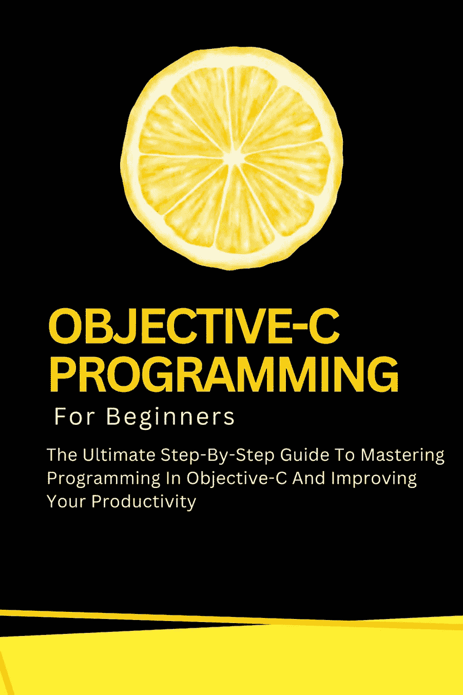

# 排版后的文档

 另见伏尔泰·卢米埃的作品

`Microsoft Word 初学者指南`：面向所有新手的 Word 完整使用指南，助你成为 Microsoft Office 365 专家（计算机/技术类） `Scrivener 初学者指南`：使用 Scrivener 进行写作、组织并完成书籍的完整指南（提升生产力） `Microsoft PowerPoint 初学者指南`：掌握 PowerPoint 的完整指南，学习所有功能、宏和公式，在工作中游刃有余（计算机/技术类） `Microsoft Outlook 初学者指南`：学习所有功能的完整指南，助你管理电子邮件、整理收件箱、创建系统以优化任务（计算机/技术类） `Microsoft OneDrive 初学者指南`：掌握 Microsoft OneDrive 进行文件存储、共享与同步、数据归档和文件管理的完整分步用户指南（计算机/技术类） `Microsoft OneNote 初学者指南`：学习 Microsoft OneNote 以优化理解、任务和项目的完整分步用户指南（计算机/技术类） `Microsoft Access 初学者指南`：掌握 Microsoft Access、创建数据库以管理数据和优化任务的完整分步用户指南（计算机/技术类） `Microsoft Teams 初学者指南`：掌握 Microsoft Teams 以交换消息、促进远程工作和参与虚拟会议的完整分步用户指南（计算机/技术类） `Microsoft Publisher 初学者指南`：掌握 Microsoft Publisher 轻松创建视觉丰富、专业外观出版物的完整分步用户指南（计算机/技术类） `Microsoft Office 365 初学者全能圣经`：掌握 Microsoft Office 套件以提升生产力和完成任务的全方位分步用户指南（计算机/技术类） `Microsoft Exchange Server 初学者指南`：面向企业和个人掌握 Microsoft Exchange Server 的完整指南（计算机/技术类） `Microsoft SharePoint 初学者指南`：掌握 Microsoft SharePoint Store 以在任何设备上组织、共享和访问信息的完整指南（计算机/技术类） `Microsoft Excel 初学者指南`：掌握 Microsoft Excel、有效理解 Excel 公式和函数、准确创建表格和图表等的完整指南（计算机/技术类） `安卓智能手机详解`：面向初学者的安卓手机和平板电脑终极分步使用指南 `Gmail 初学者指南`：像专业人士一样理解和使用 Gmail 的完整分步指南 `Google 日历初学者指南`：优化时间管理与日程安排、组织日程和协调活动以提升生产力的综合指南 `Google Chat 初学者指南`：理解和掌握 Google Chat 以进行企业与个人间沟通、交流和协作的综合指南 `Google 文档初学者指南`：理解和掌握 Google Docs 以提升生产力的综合指南 `Google 云端硬盘初学者指南`：掌握 Google Drive 以简化工作流程、轻松协作并有效保护数据的终极分步指南 `Google 表单初学者指南`：创建和分享在线表单与调查，并实时分析回复的完整分步指南 `Google Meet 初学者指南`：开始使用视频会议、商务、直播、网络研讨会等的完整分步指南 `Google 表格初学者指南`：掌握 Google Sheets 以简化数据分析、使用电子表格、创建图表和提升生产力的终极分步指南 `Google 幻灯片初学者指南`：学习如何创建、编辑、共享和协作演示文稿的完整分步指南 `Google Apps 脚本初学者指南`：掌握 Google Sheets 以创建脚本、自动化任务、构建应用程序以增强生产力的终极分步指南 `Google 课堂初学者指南`：实施和创新教学技能以提升课程质量并激励学生的综合指南 `Google 绘图初学者指南`：创建形状和图表、构建图表以及注释作品以生成引人注目的文档的终极分步指南 `Google Keep 初学者指南`：记笔记、整理、编辑和分享笔记、创建语音笔记以及设置提醒以实现高效工作流程的综合指南 `Google 协作平台初学者指南`：如何创建网站、展示团队工作并进行有效协作的完整分步指南 `Google Workspace 初学者指南`：学习和掌握 Google 所有协作应用（`Gmail`、`云端硬盘`、`表格`、`文档`、`幻灯片`、`表单`等）的完整分步手册指南 `Linux 初学者指南`：学习 Linux 操作系统并像专业人士一样掌握 Linux 命令行的综合指南 `macOS 14 Sonoma 初学者指南`：学习如何像专业人士一样使用 Mac 的完整分步指南 `HTML 初学者指南`：学习、理解和掌握网页设计 HTML 编程的完整分步指南 `iPhone 15 详解`：面向初学者的 iPhone 完整分步使用指南 `JavaScript 初学者指南`：像专业人士一样学习、理解和掌握 JavaScript 编程的终极分步指南 `Python 初学者指南`：学习、理解和掌握 Python 编程的综合指南 `SQL 初学者指南`：学习、理解和掌握 SQL 编程以管理、分析和操作数据的综合指南 `Windows 11 初学者指南`：学习如何像专业人士一样使用 Windows 的终极分步指南 `ChatGPT 初学者指南`：使用 AI 在线赚钱、提升生产力和简化工作的终极分步指南 `C 语言编程初学者指南`：像专业人士一样掌握 C 编程语言的完整分步指南 `CSS`

