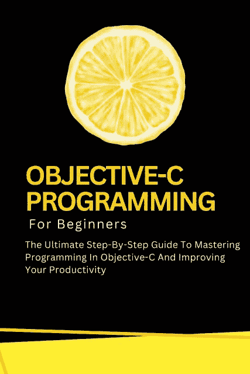

# 面向初学者：学习 Web 开发、构建响应式网站、掌握网页设计并成为编程专家的完整分步指南

## Java 编程入门：像专家一样编写 Java 代码的综合学习与精通指南（计算机科学）

## Kotlin 编程入门：使用 Kotlin 编程语言学习、开发和测试可扩展应用程序的完整分步指南

## MATLAB 入门：编程与问题解决综合指南

## Objective-C 编程入门：掌握 Objective-C 编程并提升工作效率的终极分步指南

### Objective-C 编程入门

掌握 Objective-C 编程并提升工作效率的终极分步指南

尽管在编写本书时已采取一切预防措施，但出版商对书中的错误、遗漏或因使用其中信息而造成的损失不承担任何责任。

**OBJECTIVE-C 编程入门：掌握 Objective-C 编程并提升工作效率的终极分步指南**

第一版。2024 年 7 月 18 日。

版权所有 © 2024 伏尔泰·卢米埃尔。

作者：伏尔泰·卢米埃尔。

## 目录

- 第 1 章：Objective-C 简介
- 第 2 章：Objective-C 基础
- 第 3 章：控制结构
- 第 4 章：函数与方法
- 第 5 章：面向对象编程概念
- 第 6 章：内存管理
- 第 7 章：集合操作
- 第 9 章：Objective-C 高级特性
- 第 10 章：构建与部署应用程序
- 结论

