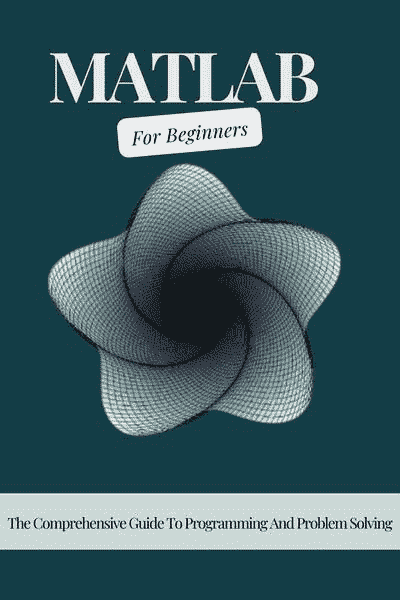

# 第 10 章：构建与部署应用

iOS 开发涉及使用 `iOS SDK`（软件开发工具包）以及 Objective-C 或 Swift 等编程语言，为 iPhone、iPad 等苹果移动设备创建应用程序。iOS 应用设计运行在 iOS 操作系统上，并通过苹果 App Store 进行分发。

## iOS 开发的关键组件

- **iOS SDK**：提供开发 iOS 应用所必需的框架、库和工具。
- **Xcode**：苹果为 iOS 和 macOS 开发提供的集成开发环境（IDE），包含编码、调试和测试 iOS 应用的工具。
- **编程语言**：Objective-C 和 Swift 是 iOS 开发的主要语言。Swift 于 2014 年推出，凭借其现代语法和安全特性而日益流行。
- **UIKit**：提供构建 iOS 应用用户界面的基本组件和类，处理触摸事件、动画等。

## 创建简单的 iOS 应用

### 创建简单 iOS 应用的步骤：

1. **打开 Xcode**：启动 Xcode 并创建新项目（`文件 -> 新建 -> 项目`）。
2. **选择模板**：根据应用需求选择模板（例如：单视图应用、标签页应用）。
3. **配置项目**：设置项目名称、组织标识符、语言（Objective-C 或 Swift）及其他项目特定细节。
4. **设计用户界面**：使用 `Interface Builder` 和 `故事板` 可视化地创建应用用户界面。

## Interface Builder 与故事板

### Interface Builder

`Interface Builder`（IB）是集成在 Xcode 中的图形化编辑器，用于设计 iOS、macOS、watchOS 和 tvOS 应用的界面。

- 拖放 UI 组件（按钮、标签、文本框）。
- 自定义属性（颜色、字体、约束）。
- 将 UI 组件连接到代码（`IBOutlet` 和 `IBAction` 连接）。

### 故事板

`故事板`是应用流程和屏幕的可视化表示，允许你在单个文件中设计多个视图控制器及其转场。

- 可视化并管理应用导航。
- 设计并原型化应用屏幕和转场。
- 简化设计师与开发者之间的协作。

### 在 Interface Builder 中创建 UI 元素

- **添加 UI 元素**：从对象库中将 UI 元素（按钮、标签等）拖放到画布上。
- **自定义属性**：在属性检查器中调整属性（例如：文本、颜色、大小）。
- **建立连接**：使用 `IBOutlet`（用于属性）和 `IBAction`（用于方法）在 UI 组件与代码之间建立连接。

### 使用故事板管理应用流程

- **创建视图控制器**：将视图控制器添加到画布并自定义其外观。
- **定义 Segue**：在视图控制器之间建立 Segue（转场）以定义导航流程。
- **处理导航逻辑**：使用 Segue 和 `prepareForSegue:` 方法实现导航逻辑（例如：推入、模态展示）。

## iOS 开发概述

iOS 开发涉及利用 iOS SDK、Xcode IDE 以及 Swift 或 Objective-C 等编程语言，为苹果移动设备创建应用程序。Xcode 中的 `Interface Builder` 和 `故事板` 简化了用户界面和应用导航的创建，让开发者能够高效地进行可视化设计。理解这些基本概念，对于构建直观、响应迅速且符合苹果设计与可用性标准的 iOS 应用至关重要。

## 模型-视图-控制器（MVC）设计模式

`模型-视图-控制器`（MVC）设计模式是 iOS 开发（以及许多其他框架）中用于分离应用展示层、业务逻辑层和数据层的基本架构模式。它通过将代码组织为三个主要组件来促进模块化、代码复用性和可维护性：

- **模型（Model）**：表示应用的数据和业务逻辑。它封装数据并定义可对数据执行的操作。例如：数据模型、数据库交互和网络请求。
- **视图（View）**：表示应用的用户界面元素。它向用户显示信息并响应用户交互。视图通常通过 UIKit 组件实现，例如 `UILabel`、`UIButton`、`UITableView` 等。
- **控制器（Controller）**：充当模型与视图之间的中介。它处理来自视图的用户输入，根据需要更新模型，并将模型中的变化反映到视图上。控制器通常是 `UIViewController` 或其他管理应用特定行为的控制器类的子类。

### MVC 的优势

- **关注点分离**：每个组件（模型、视图、控制器）都有明确的职责，使代码库更易于理解、维护和扩展。
- **代码复用性**：模型和控制器可以在不同视图或应用之间复用，促进高效的开发实践。
- **并行开发**：不同团队成员可以同时处理不同组件，而不会相互干扰。

## 测试与调试你的应用

### 测试你的应用

- **单元测试**：为单个组件（类、方法）编写并执行测试，确保其行为符合预期。Xcode 提供 `XCTest` 等工具用于编写单元测试。
- **UI 测试**：自动化测试与应用界面进行交互，以验证不同场景下的用户交互和应用行为。可使用 Xcode 的 UI Testing 框架实现。
- **集成测试**：测试应用中各组件如何协同工作，确保应用在实际使用场景中功能正常。

### 调试你的应用

- **使用断点**：在 Xcode 中设置断点，以便在特定代码行暂停应用的执行。

这让你能够检查变量、查看调用栈并定位问题的根源。

### 控制台
使用 `NSLog` 语句或 Xcode 的控制台输出调试信息，例如变量值和方法调用，有助于追踪程序流程并识别错误。

### Xcode
利用 Xcode 内置的调试器逐行执行代码，实时检查变量，并诊断运行时问题。

## 提交到 App Store

### 将应用提交到 App Store 的步骤：

**准备你的应用：**
确保你的应用符合苹果的 App Store 审核指南。在设备和模拟器上彻底测试你的应用，以发现并修复错误。

**创建 App Store Connect 记录：**
使用你的 Apple Developer 账户登录 App Store Connect。

**准备应用素材：**
生成并准备所需的素材，例如应用图标、截屏和宣传图片。

**归档并验证你的应用：**
在 Xcode 中归档你的应用（`Product -> Archive`）。验证你的归档以检查问题，并确保其符合 App Store 的要求。

**提交你的应用：**
通过 App Store Connect 提交你的应用以供审核。提供必要的元数据，例如应用描述、关键词和定价信息。

**应用审核流程：**
苹果的应用审核团队将审核你的应用，以确保其符合 App Store 的指南和标准。在 App Store Connect 中监控你应用的审核状态。

**发布你的应用：**
一旦通过审核，设置你的应用发布日期，并将其上架到 App Store，供用户下载。

理解模型-视图-控制器（`MVC`）设计模式对于有效构建 iOS 应用、促进代码组织和可维护性至关重要。测试和调试确保你的应用正常运行并满足用户期望，而应用提交流程则需要仔细准备并遵守苹果的指南。通过遵循这些实践，你可以开发出高质量的 iOS 应用，并成功将其部署到 App Store，触达全球用户。

## 结论

在这份全面的 iOS 开发和 Objective-C 编程指南中，我们涵盖了构建稳健高效 iOS 应用所必需的基础主题和概念：

- **Objective-C 语法：** 数据类型、变量、控制结构、函数以及面向对象编程原则。
- **iOS 基础：** iOS 开发入门、创建简单的 iOS 应用，以及利用 Interface Builder 和 Storyboard 设计用户界面。
- **进阶概念：** 模型-视图-控制器（`MVC`）设计模式、块（Blocks）和闭包、Grand Central Dispatch（`GCD`）、分类与扩展、键值观察（`KVO`）以及动态类型和绑定。
- **测试与调试：** 使用单元测试、UI 测试和集成测试来测试应用的技术，以及利用 Xcode 工具进行调试的策略。
- **提交到 App Store：** 准备、验证并将你的应用提交到 App Store 进行分发的步骤。

## 编程之旅的下一步

在你继续 Objective-C 编程和 iOS 开发之旅时，请考虑以下下一步行动来深化你的知识和技能：

- **Swift：** 学习 `Swift`，苹果用于 iOS 开发的现代编程语言，它提供了安全特性、现代语法和性能改进。
- **高级 iOS 框架：** 探索高级 iOS 框架，例如用于数据持久化的 Core Data、用于高级 UI 动画的 Core Animation，以及用于基于位置服务的 Core Location。
- **设计模式与架构：** 深入研究 MVC 之外的软件设计模式，例如 `MVVM`（模型-视图-ViewModel）、`VIPER` 和 Clean Architecture，以构建可扩展和可维护的应用。
- **高级主题：** 学习高级主题，例如使用 `Operation` 和 `OperationQueue` 进行并发编程、使用 `URLSession` 进行网络编程，以及使用 Auto Layout 和 SwiftUI 进行高级 UI 开发。
- **持续学习：** 通过关注苹果的开发者文档、参加会议和加入开发者社区，掌握最新的 iOS 更新、框架和最佳实践。

## 对持续学习的鼓励与激励

学习 iOS 开发是一段有益的旅程，它能让你创造出影响全球数百万用户的应用程序。拥抱挑战，在挫折中坚持不懈，并一路庆祝你的成就。请记住：

- **坚持终有回报：** 你克服的每一个挑战，修复的每一个错误，都会让你成为更优秀的开发者。
- **社区很重要：** 与充满活力的 iOS 开发者社区互动，寻求建议、协作和灵感。
- **持续创新：** 运用你的创造力，通过创新的应用解决方案解决现实世界的问题。
- **享受过程：** 享受学习和构建应用的过程，因为重要的不仅是终点，更是沿途获得的经验。

通过保持好奇心、专注和开放学习的心态，你将继续成长为一名 iOS 开发者，并为充满活力的移动应用开发世界做出有意义的贡献。继续编程，持续探索，不断突破 iOS 开发的边界。祝你的编程之旅好运！

---

**不要错过！**

点击下方按钮，你就可以注册订阅，以便在 Voltaire Lumiere 发布新书时收到邮件通知。这是免费的，且无需任何义务。

[`books2read.com/r/B-I-UAPZ-YNBTD`](https://books2read.com/r/B-I-UAPZ-YNBTD)

[`books2read.com/r/B-I-UAPZ-YNBTD`](https://books2read.com/r/B-I-UAPZ-YNBTD)

连接独立的读者与独立的作者。你喜欢《Objective-C 编程初学者指南：掌握 Objective-C 编程并提升技能的超详细一步步教程》吗？那么你应该阅读 Voltaire Lumiere 的《MATLAB 初学者指南：编程与问题解决综合指南》！

### MATLAB 初学者指南：编程与问题解决综合指南

那些想第一次学习 MATLAB 的人应该读这本书。

实际上，这本书是为学生和初学者准备的。

本书同样适用于各类领域的研究人员和学生，包括生物学家、环境科学家、工程师和科学家。撰写本书的目标之一是让任何人都能熟悉`MATLAB`及其强大却易于掌握的运算能力。书中内容以友好的风格呈现，相当易于理解。

书中涉及的主题包括：算术运算、`变量`、数学函数、复数、`向量`、`矩阵`、程序设计、图形绘制、方程求解，以及微积分入门。

另由 Voltaire Lumiere 所著：

-   `Microsoft Word For Beginners`：《微软 Word 完全初学者指南：从新手成为 Office 365 专家的完整教程》（计算机/技术类）
-   `Scrivener For Beginners`：《Scrivener 完全初学者指南：使用 Scrivener 进行写作、整理并完成你的书籍》（提升生产力）
-   `Microsoft PowerPoint For Beginners`：《微软 PowerPoint 完全初学者指南：掌握 PowerPoint 所有功能、宏和公式，在工作中脱颖而出》（计算机/技术类）
-   `Microsoft Outlook For Beginners`：《微软 Outlook 完全初学者指南：学习所有功能来管理邮件、整理收件箱、创建系统以优化任务》（计算机/技术类）
-   `Microsoft OneDrive For Beginners`：《微软 OneDrive 完全初学者指南：掌握文件存储、共享与同步、数据归档和文件管理的完整分步用户指南》（计算机/技术类）
-   `Microsoft OneNote For Beginners`：《微软 OneNote 完全初学者指南：学习使用 OneNote 以优化理解、任务和项目的完整分步用户指南》（计算机/技术类）
-   `Microsoft Access For Beginners`：《微软 Access 完全初学者指南：掌握 Access、创建数据库以管理数据并优化任务的完整分步用户指南》（计算机/技术类）
-   `Microsoft Teams For Beginners`：《微软 Teams 完全初学者指南：掌握 Teams 以交换消息、促进远程工作和参与虚拟会议的完整分步用户指南》（计算机/技术类）
-   `Microsoft Publisher For Beginners`：《微软 Publisher 完全初学者指南：轻松创建视觉丰富、专业出版物样式的完整分步用户指南》（计算机/技术类）
-   `The Microsoft Office 365 Bible All-in-One For Beginners`：《微软 Office 365 综合圣经（初学者全合一）：掌握微软 Office 套件以提升生产力和完成任务能力的完整分步用户指南》（计算机/技术类）
-   `Microsoft Exchange Server For Beginners`：《微软 Exchange Server 完全初学者指南：企业和个人掌握 Exchange Server 的完整教程》（计算机/技术类）
-   `Microsoft SharePoint For Beginners`：《微软 SharePoint 完全初学者指南：掌握 SharePoint 存储以在任何设备上组织、共享和访问信息的完整教程》（计算机/技术类）
-   `Microsoft Excel For Beginners`：《微软 Excel 完全初学者指南：有效理解 Excel 公式和函数，准确创建表格和图表的完整教程》（计算机/技术类）
-   `Android Smartphones Explained`：《安卓智能手机详解：初学者使用安卓手机和平板电脑的终极分步指南》
-   `Gmail For Beginners`：《Gmail 完全初学者指南：像专家一样理解和使用 Gmail 的完整分步指南》
-   `Google Calendar For Beginners`：《Google 日历完全初学者指南：改善时间管理和日程安排，组织日程和协调事件以提高生产力的综合指南》
-   `Google Chat For Beginners`：《Google Chat 完全初学者指南：理解并掌握 Google Chat 以进行企业与个人沟通、交流和协作的综合指南》
-   `Google Docs For Beginners`：《Google 文档完全初学者指南：理解并掌握 Google 文档以提高生产力的综合指南》
-   `Google Drive For Beginners`：《Google 云端硬盘完全初学者指南：掌握 Google 云端硬盘以简化工作流程、轻松协作并有效保护数据的终极分步指南》
-   `Google Forms For Beginners`：《Google 表单完全初学者指南：创建和共享在线表单及调查，并实时分析回复的完整分步指南》
-   `Google Meet For Beginners`：《Google Meet 完全初学者指南：开始使用视频会议、商业活动、直播、网络研讨会等的完整分步指南》
-   `Google Sheets For Beginners`：《Google 表格完全初学者指南：掌握 Google 表格以简化数据分析、使用电子表格、创建图表和提高生产力的终极分步指南》
-   `Google Slides For Beginners`：《Google 幻灯片完全初学者指南：学习如何创建、编辑、共享和协作演示文稿的完整分步指南》
-   `Google Apps Script For Beginners`：《Google Apps Script 完全初学者指南：掌握 Google 表格以创建脚本、自动化任务、构建应用程序以提高生产力的终极分步指南》
-   `Google Classroom For Beginners`：《Google 课堂完全初学者指南：实施和创新教学技能以提升课程质量并激励学生的综合指南》
-   `Google Drawings For Beginners`：《Google 绘图完全初学者指南：创建形状和图表、构建图表和注释作品以生成引人注目的文档的终极分步指南》
-   `Google Keep For Beginners`：《Google Keep 完全初学者指南：笔记记录、整理、编辑和分享笔记、创建语音笔记以及设置提醒以实现高效工作流程的综合指南》
-   `Google Sites For Beginners`：《Google 协作平台完全初学者指南：如何创建网站、展示团队工作并进行有效协作的完整分步指南》
-   `Google Workspace For Beginners`：《Google Workspace 完全初学者指南：学习并掌握所有 Google 协作应用（Gmail、云端硬盘、表格、文档、幻灯片、表单等）的完整分步手册》
-   `Linux For Beginners`：《Linux 完全初学者指南：学习 Linux 操作系统并像专家一样掌握 Linux 命令行的综合指南》
-   `macOS 14 Sonoma For Beginners`：《macOS 14 Sonoma 完全初学者指南：学习如何像专家一样使用 Mac 的完整分步指南》
-   `Html For Beginners`：《HTML 完全初学者指南：学习、理解和掌握 HTML 编程以进行网页设计的完整分步指南》
-   `iPhone 15 Explained`：《iPhone 15 详解：初学者使用 iPhone 的完整分步指南》
-   `Javascript For Beginners`：《JavaScript 完全初学者指南：像专家一样学习、理解和掌握 JavaScript 编程的终极分步指南》
-   `Python For Beginners`：《Python 完全初学者指南：学习、理解和掌握 Python 编程的综合指南》
-   `SQL For Beginners`：《SQL 完全初学者指南：学习、理解和掌握 SQL 编程以管理、分析和操作数据的综合指南》
-   `Windows 11 For Beginners`：《Windows 11 完全初学者指南：学习如何像专家一样使用 Windows 的终极分步指南》
-   `ChatGPT For Beginners`：《ChatGPT 完全初学者指南：利用 AI 在线赚钱、提高生产力和简化工作的终极分步指南》
-   `C Programming For Beginners`：《C 语言完全初学者指南：像专家一样掌握 C 编程语言的完整分步指南》
-   `CSS For Beginners`：《CSS 完全初学者指南：学习 Web 开发以构建响应式网站、掌握网页设计并成为编程专家的完整分步指南》
-   `Java Programming For Beginners`：《Java 编程完全初学者指南：学习并掌握在 Java 中编写代码以成为专家的综合指南》（计算机科学类）
-   `Kotlin Programming For Beginners`：《Kotlin 编程完全初学者指南：学习、开发和测试 Kotlin 可扩展应用程序的完整分步指南》
-   `MATLAB For Beginners`：《MATLAB 完全初学者指南：编程与问题解决综合指南》
-   `Objective-C Programming For Beginners`：《Objective-C 编程完全初学者指南：掌握 Objective-C 编程并提高生产力的终极分步指南》
