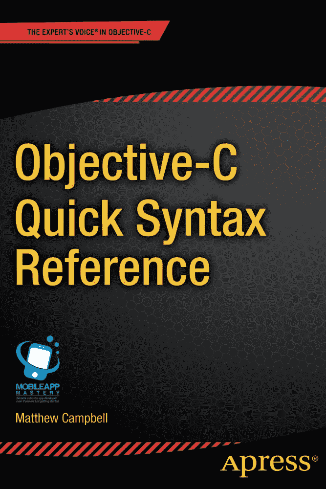

  
马修·坎贝尔  
《Objective-C 快速语法参考》  
10.1007/978-1-4302-6488-0  
© Apress 2013

马修·坎贝尔《Objective-C 快速语法参考》

ISBN 978-1-4302-6487-3  
电子版 ISBN 978-1-4302-6488-0  
© Apress 2013

《Objective-C 快速语法参考》

总裁兼出版人：保罗·曼宁  
主编：史蒂夫·安格林  
技术审校：查尔斯·克鲁兹  
编辑委员会：史蒂夫·安格林、马克·贝克纳、尤恩·白金汉、加里·康奈尔、路易丝·科里根、乔纳森·根尼克、詹姆斯·德沃尔夫、乔纳森·哈塞尔、罗伯特·哈钦森、米歇尔·洛曼、詹姆斯·马卡姆、马修·穆迪、杰夫·奥尔森、杰弗里·佩珀、道格拉斯·庞迪克、本·雷诺-克拉克、多米尼克·沙克沙夫特、格温南·斯皮林、史蒂夫·韦斯、汤姆·韦尔什  
协调编辑：阿纳米卡·潘乔  
文字编辑：玛丽·贝尔  
排版：SPI Global  
索引编制：SPI Global  
插画：SPI Global  
封面设计：安娜·伊什琴科

本书通过 Springer Science+Business Media New York 向全球图书贸易发行，地址：233 Spring Street, 6th Floor, New York, NY 10013。电话：1-800-SPRINGER，传真：(201) 348-4505，电子邮箱：`orders-ny@springer-sbm.com`，或访问 [`www.springeronline.com`](http://www.springeronline.com/)。Apress Media, LLC 是加利福尼亚州的有限责任公司，其唯一成员（所有者）是 Springer Science + Business Media Finance Inc（SSBM Finance Inc）。SSBM Finance Inc 是特拉华州的一家公司。

如需了解翻译事宜，请发送电子邮件至 `rights@apress.com`，或访问 [`www.apress.com`](http://www.apress.com/)。Apress 及 friends of ED 的书籍可批量购买用于学术、企业或促销用途。大多数图书也提供电子版及许可证。更多信息，请参考我们的特殊批量销售–电子书许可网页： [`www.apress.com/bulk-sales`](http://www.apress.com/bulk-sales)。

作者在本书中提及的任何源代码或其他补充材料，读者均可通过 [`www.apress.com`](http://www.apress.com/) 获取。关于如何查找您图书源代码的详细信息，请访问 [`www.apress.com/source-code/`](http://www.apress.com/source-code/)。

本作品受版权保护。出版者保留所有权利，无论全部或部分材料，特别是翻译权、重印权、插图复用权、朗诵权、广播权、缩微胶片复制权或其他任何物理形式的复制权，以及信息存储与检索、电子改编、计算机软件或目前已知或未来开发的类似或不同方法论的传输权。法律保留豁免的情况仅限于与评论或学术分析相关的简短摘录，或专为输入并运行于计算机系统而提供的材料，且仅供购买者个人使用。未经出版者所在地现行版权法许可，不得复制本出版物或其部分内容，且使用许可必须始终从 Springer 获取。许可可通过 RightsLink 在 Copyright Clearance Center 获取。违反行为将按相应版权法予以起诉。本书中可能出现的商标名称、标识和图像，我们不以商标符号标注每次出现，而是仅以编辑方式使用这些名称、标识和图像，以维护商标所有者的利益，并无意侵犯商标权。本书中使用的商品名、商标、服务标志及类似术语，即使未明确标识，也不应被视为对其是否受专有权利保护的任何意见表达。

尽管本书中的建议和信息在出版时被认为是真实准确的，但作者、编辑及出版者对可能存在的任何错误或遗漏不承担法律责任。出版者对本书所含内容不作任何明示或暗示的保证。

献给我的女儿凯拉

