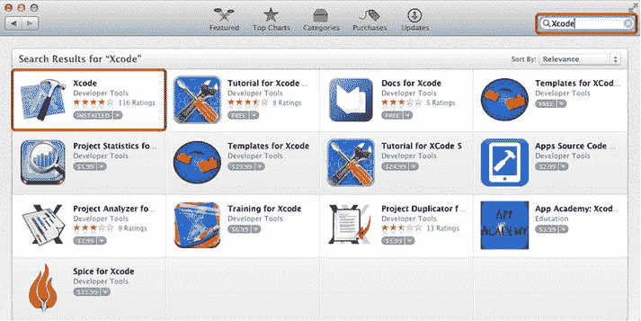
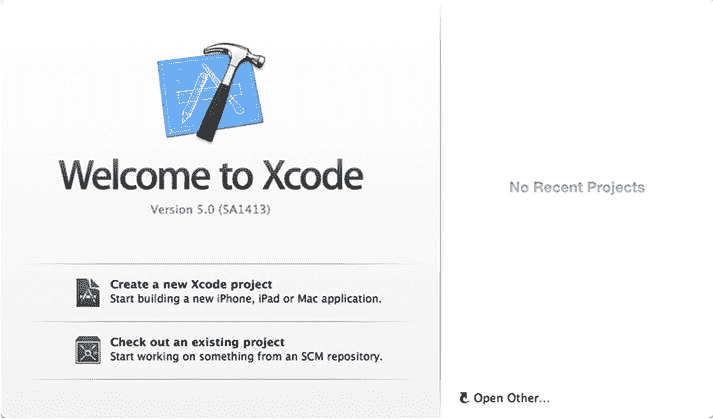
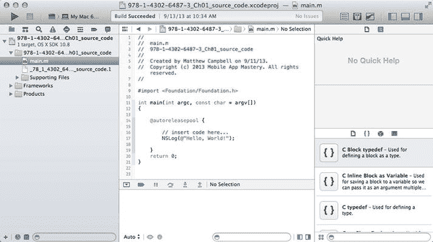
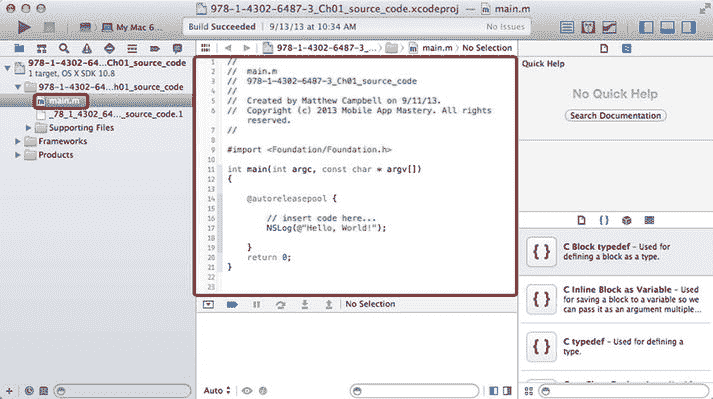
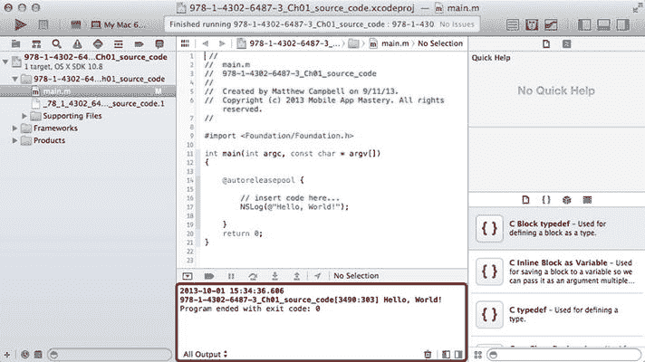
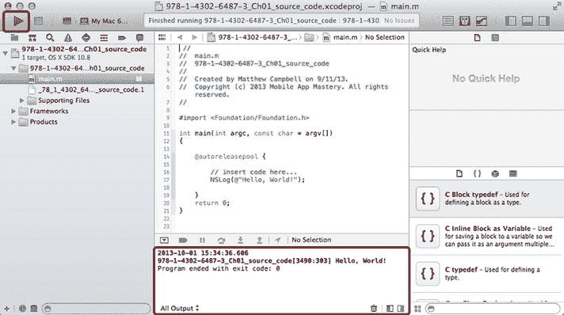

# 1. Hello World

**摘要**

`Objective-C` 是一种扩展了 `C` 语言的编程语言，新增了面向对象编程能力。这意味着大多数经典的 `C` 编程流程在 `Objective-C` 程序中都会用到。为了阅读本书，你需要对 `C` 语言的编程方式有所了解。

## Xcode

`Objective-C` 是一种扩展了 `C` 语言的编程语言，新增了面向对象编程能力。这意味着大多数经典的 `C` 编程流程在 `Objective-C` 程序中都会用到。为了阅读本书，你需要对 `C` 语言的编程方式有所了解。

在编写任何 `Objective-C` 代码之前，你需要准备好合适的工具。对于 `Objective-C` 来说，这个工具就是 `Xcode`。`Xcode` 将是你的主要代码编辑器和集成开发环境（`IDE`）。

**注意**

`Xcode` 需要 `Mac` 系统。你无法在基于 `Windows` 或 `Linux` 的计算机上安装 `Xcode`。

要安装 `Xcode`，请通过选择 Mac 的菜单栏，然后选择 ʿ ➤ App Store，进入 `Mac App Store`。使用 `App Store` 的搜索功能，在沙漏旁边的文本框中输入 `Xcode` 来定位它。按下回车键搜索 `Xcode`。你将看到一个应用列表，而 `Xcode` 应该是列表中的第一个应用。点击 `Xcode` 图标旁边写着 `free` 的按钮来安装 `Xcode`。在 `App Store` 中搜索 `Xcode` 后，你应该会看到如图 1-1 所示的界面。



**图 1-1.** 从 App Store 下载 Xcode

## 创建新项目

通过进入你的 `Applications` 文件夹并点击 `Xcode` 应用来打开 `Xcode`。你将看到一个欢迎屏幕，其中包含文字“`Create a new Xcode project`”（见图 1-2）。点击文字“`Create a new Xcode project`”开始操作。



**图 1-2.** Xcode 欢迎屏幕

接下来出现的屏幕会列出为 `iOS` 和 `Mac` 创建应用的选项。在本书中，你将使用 Mac 的`Command Line Tool`应用，因此请选择 `OSX` ➤ `Application` ➤ `Command Line Tool` 进行设置。

当下一屏出现时，只需给你的新项目命名，选择类型 `Foundation`，其他设置保持不变，然后点击 `Next`。

然后选择一个文件夹来保存 Mac 上的 Xcode 项目。完成此操作后，Xcode 屏幕将会出现。Xcode 屏幕左侧会包含一个文件列表，中间是代码编辑器（见图 1-3）。



**图 1-3.** 代码编辑器和项目导航器

## Hello World

用代码编写 `Hello World` 是我们想要确认项目设置正确时常做的事情。`Xcode` 让这变得非常简单，因为新的 `Command Line Tool` 项目已经自带了 `Hello World` 代码。

你只需要使用 `Project Navigator`（Xcode 屏幕左侧的组件）来找到名为 `main.m` 的文件。点击 `main.m` 在代码编辑器中打开该文件（图 1-4）。



**图 1-4.** 编辑 main.m

当你这样做时，会看到类似如下的代码：

```
#import <Foundation/Foundation.h>

int main(int argc, const char * argv[]){

    @autoreleasepool {

        // insert code here...

        NSLog(@"Hello, World!");

    }

    return 0;

}
```

上述大部分代码用于设置应用程序，从 `#import` 语句开始。该语句导入了运行 `Objective-C` 程序所需的代码，也就是 `Foundation`。

代码的下一部分是一个名为 `main` 的函数，它包含了所有程序代码，并在程序完成时返回整数 `0`。

在 `main` 函数内部，你会看到一个 `Objective-C` 自动释放池。自动释放池用于支持 `Objective-C` 的内存管理系统。自动释放池使用 `@autoreleasepool` 关键字声明。

在这些代码的中间，你可以看到 `Hello World` 代码，它看起来像这样：

```
NSLog(@"Hello, World!");
```

这里的第一部分是函数 `NSLog`。`NSLog` 用于向控制台日志写入消息。Xcode 的控制台日志位于 Xcode 屏幕的底部（图 1-5），它会显示错误信息以及你通过 `NSLog` 发送的消息。



**图 1-5.** 控制台屏幕中的 Hello World 输出

**注意**

默认情况下，控制台日志与调试器一起隐藏在屏幕底部。要看到这两个组件，你必须通过点击 Xcode 屏幕右上角的 `Hide or Show Debug Area` 切换按钮来取消隐藏底部屏幕。该按钮位于一组三个按钮的中间。

字符串 `Hello World` 被引号 (`""`) 和 `Objective-C` 转义字符 `@` 括起来。`@` 字符在 `Objective-C` 中用于让编译器知道某些关键字或代码具有特殊的 `Objective-C` 属性。当 `@` 出现在双引号字符串之前时，例如 `@"Hello, World!"`，意味着该字符串是一个 `Objective-C` 的 `NSString` 对象。

## 代码注释

Xcode 还贴心地为你在该项目中插入了另一行代码。这行代码是代码注释的一个好例子，它以两个特殊字符 `//` 开头。以下是代码注释的样子：

```
// insert code here...
```

代码注释用于帮助记录你的代码，它提供了一种向程序中插入文本的方式，而这些文本不会被编译到可运行的程序中。

### 构建并运行

要测试代码，请点击 Xcode 屏幕左上角的 `Run` 按钮。查看图 1-6 了解要点击哪个按钮。



**图 1-6.** 构建并运行 Hello World 代码

当你点击 `Run` 按钮时，Xcode 将编译 Xcode 项目中的代码，然后运行该程序。你一直在处理的这个程序将打印出 `Hello World` 这几个字。你可以在图 1-6 中看到用圆圈标记的输出。

## 获取更多信息

本书是 `Objective-C` 的快速参考指南，我重点介绍了那些我认为对大多数人最有用的代码和模式。然而，这意味着我无法在本书中包含所有内容。

获取关于 `Objective-C` 以及你可以用 `Objective-C` 创建的 Mac 和 iOS 应用的完整信息的最佳地点是 `Apple Developer` 网站。你可以使用网页浏览器访问 [`http://developer.apple.com/resources`](http://developer.apple.com/resources) 来进入 `Apple Developer` 网站。

该网站包含指南、源代码和代码文档。与本书主题最相关的网站部分是 `Foundation` 框架的代码文档。你可以使用网站的搜索功能查找特定的类，比如 `NSObject`，或者搜索 `Foundation` 或 `Objective-C` 这个词。

