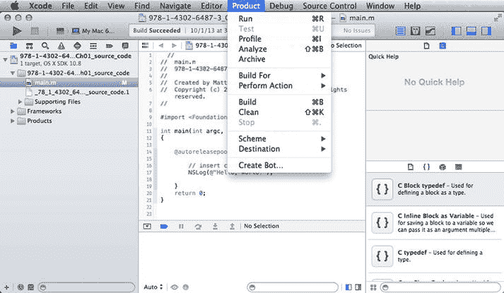
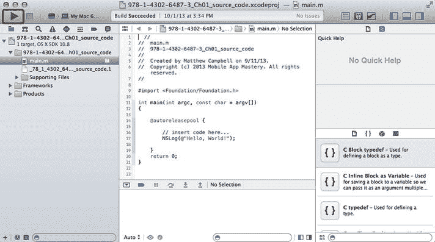
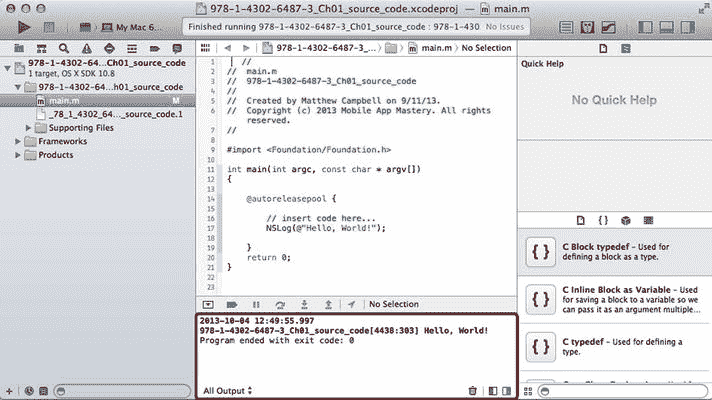

# 2. 构建并运行

**摘要**

`Objective-C` 代码需要被转换成可以在 iOS 设备或 Mac 上运行的机器码。这个过程称为编译，`Xcode` 使用 `LLVM` 编译器来生成机器码。用于创建新项目的 `Xcode` 模板（就像你在第 1 章中所做的那样）会包含编译器所需为你设置好的设置。


## 编译

Objective-C 代码需要转换成能在 iOS 设备或 Mac 上运行的机器码。这个过程称为编译，Xcode 使用 LLVM 编译器来生成机器码。就像你在第 1 章中所做的那样，用于创建新项目的 Xcode 模板已经为你配置好了编译器所需的所有设置。

## 构建

编译代码通常只是创建应用程序过程的一部分。要分发到 Mac 和 iPhone 用户手中的应用程序，除了编译后的代码外，还需要其他资源。这包括图片、电影、音乐和数据库等内容。

这些资源，连同应用程序目录结构，都被打包到一个名为 **Bundle** 的特殊文件中。你将使用 Xcode 编译源代码，然后将所有内容打包到应用程序所需的 bundle 中。这个过程在 Xcode 中被称为**构建**。

如果你查看 Xcode 菜单栏中的“产品”菜单项（图 2-1），你会看到用于构建程序的选项。通常，你只需使用 Xcode 的“构建并运行”功能来编译和测试代码。



图 2-1. 产品构建选项

### 构建并运行

使用位于 Xcode 屏幕左上角的“构建并运行”按钮（见图 2-2）（这是一个看起来像播放按钮的箭头）来构建你的应用程序。



图 2-2. 构建并运行按钮

Xcode 不仅会构建你的应用程序，还会执行代码。如果你为当前程序点击“构建并运行”按钮，你应该会在控制台日志中看到以下文本（也显示在图 2-3 中）：

```
2014-01-12 06:22:48.382
Ch01_source_code[13018:303] Hello, World!
Program ended with exit code: 0
```



图 2-3. 控制台日志的“Hello World”输出

你的输出可能不会与我的完全一致，但你应该在屏幕上看到“Hello World!”字样和项目的名称。

> **注意**  
> 虽然大多数应用程序会得到一个包含编译后机器码的 bundle，但我用于演示本书代码的应用程序并不需要这个。如果你找到编译后的代码文件，你只会发现一个可以用 Mac 终端应用运行的 Unix 可执行文件。

