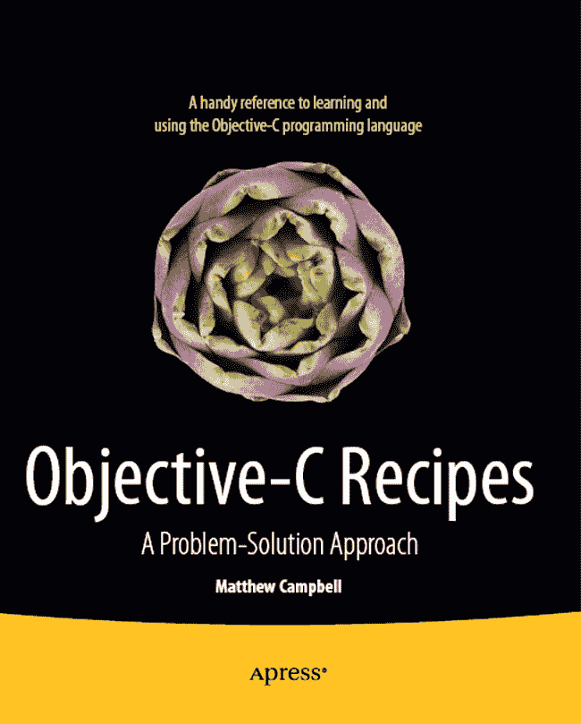
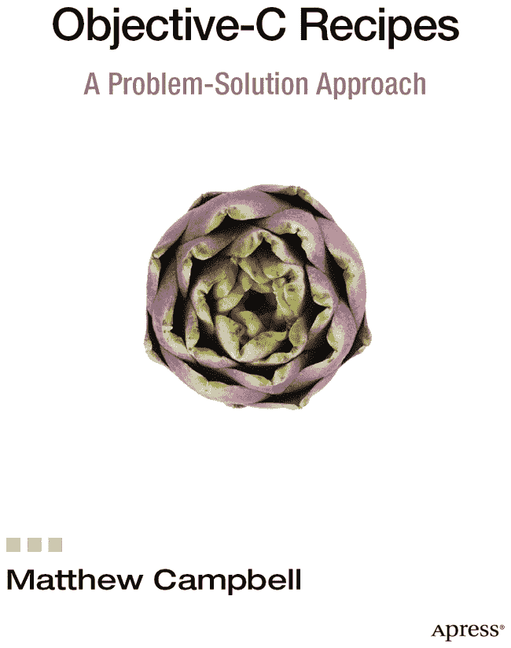

**Objective-C 编程技巧**

版权所有 © 2012 Matthew Campbell

本作品受版权保护。出版商保留所有权利，无论涉及作品的全部或部分内容，具体包括翻译、转载、插图复用、摘录、广播、微缩胶片或其他任何物理形式的复制、传输或信息存储与检索、电子改编、计算机软件，或任何目前已知或未来开发之类似或不同方法的权利。与本法律保留条款相豁免的，仅限于与评论或学术分析相关的简短摘录，或专门为输入计算机系统并执行而提供、仅供购买者独家使用的材料。对本出版物或其部分的复制，仅允许根据出版商所在地现行版权法的规定进行，且使用许可必须始终从 Springer 获得。使用许可可通过版权清算中心的 RightsLink 获取。违反者将根据相应版权法受到起诉。

ISBN-13（平装本）：978-1-4302-4371-7

ISBN-13（电子版）：978-1-4302-4372-4

本书中可能出现商标名称、标识和图像。我们并非在每个商标名称、标识或图像出现时都使用商标符号，仅以编辑方式使用这些名称、标识和图像，以维护商标所有者的利益，无意侵犯商标权。

本出版物中使用商品名称、商标、服务标志及类似术语，即使未被明确标识，也不应被视为对这些术语是否受专有权利保护的判断。

尽管本书中的建议和信息在出版时被认为是真实准确的，但作者、编辑及出版商均不对可能出现的任何错误或遗漏承担法律责任。出版商对本书所载内容不作任何明示或暗示的担保。

总裁与出版人：Paul Manning
主编：Steve Anglin
开发编辑：Matthew Moodie 和 Louise Corrigan
技术审校：Anselm Bradford
编辑委员会：Steve Anglin, Ewan Buckingham, Gary Cornell, Louise Corrigan, Morgan Ertel, Jonathan Gennick, Jonathan Hassell, Robert Hutchinson, Michelle Lowman, James Markham, Matthew Moodie, Jeff Olson, Jeffrey Pepper, Douglas Pundick, Ben Renow-Clarke, Dominic Shakeshaft, Gwenan Spearing, Matt Wade, Tom Welsh
协调编辑：Corbin Collins
文字编辑：Mary Behr
排版：Bytheway Publishing Services
索引编制：SPi Global
插画设计：SPi Global
封面设计：Anna Ishchenko

本书通过 Springer Science+Business Media New York 在全球图书贸易中发行，地址：233 Spring Street, 6th Floor, New York, NY 10013。电话：1-800-SPRINGER，传真：(201) 348-4505，电子邮箱：`orders-ny@springer-sbm.com`，或访问：`www.springeronline.com`。

如需翻译相关信息，请发送电子邮件至：`rights@apress.com`，或访问：`www.apress.com`。

Apress 及 friends of ED 的书籍可批量采购，用于学术、企业或促销用途。大多数图书也提供电子版及许可证。更多信息，请参考我们的特殊批量销售–电子书许可网页：`www.apress.com/bulk-sales`。

作者在本文中提及的任何源代码或其他补充材料，读者可通过 `www.apress.com` 获取。有关如何找到本书源代码的详细信息，请访问：`www.apress.com/source-code/`。

