# 第 1 章 – 应用程序开发

本章涵盖了从命令行和 Xcode 搭建 Objective-C 应用程序所涉及的一些基本要素。你将看到如何编写适用于 Mac 的命令行桌面应用以及适用于 iPhone 和 iPad 的 iOS 应用。

本章中的技巧将向你展示如何：

*   从命令行编译 Objective-C 程序
*   编写一个包含属性和方法的自定义类
*   实现实例方法和类方法
*   使用类别（Category）扩展现有类
*   编写并编译一个 Mac 命令行应用程序
*   使用 Xcode 搭建一个 Mac 应用程序
*   使用 Xcode 搭建一个 iOS 应用程序
*   使用委托（Delegation）和目标-动作（Target-Action）模式为应用程序添加用户控件

**注意：** 本书大部分内容假定你使用的是安装了 Xcode 4.2 的 Mac，你可以从 Mac App Store（[`www.apple.com/mac/app-store/`](http://www.apple.com/mac/app-store/)）获取该版本。

## 1.1 创建终端应用程序

### 问题

你想使用终端来构建一个简单的 Objective-C 程序，该程序不依赖于 Xcode 附带的额外功能。你的程序将使用 Objective-C 在 Mac 的终端控制台窗口中输出一条信息。

### 解决方案

使用你最喜欢的文本编辑器在你的主目录（路径为 `/Users/[你的用户名]/`）下创建一个文件。你可以使用终端中的文本编辑器 `vi`，或者 Mac 自带的基于图形界面的 TextEdit 程序。如果使用 TextEdit，请确保将创建的文件保存为纯文本格式。

在这个文件中，你将添加一个 `main` 函数（顺便一提，如果该函数用 C 语言编写，其外观相同），导入 Foundation 框架，并添加 Objective-C 代码向控制台输出一条 `Hello World` 信息。

要编译这个程序，你将使用一个名为 `clang` 的工具来创建一个可执行文件，该文件可以从终端屏幕运行。

### 工作原理

Objective-C 启动所需的代码总是位于一个名为 `main` 的函数中，该函数接收一些参数并返回一个整数值。在代码的第一行，你导入了 `Foundation`，这是使用 Objective-C 对象所必需的框架。

在你的 `main` 函数内部，你必须设置一个自动释放池（autorelease pool），Objective-C 用它来管理内存。完成这一步后，你就可以使用 `NSString` 类来构建一个 Hello World 字符串，并使用 `NSLog` 将该字符串写入控制台屏幕。

用于编译代码的终端命令叫做 `clang`，它负责编译 Objective-C 程序。以下是在使用 `clang` 编译 Objective-C 程序时可以设置的一些选项：

*   `-fobj` 表示使用 Objective-C 编程语言。
*   `-arc` 指定使用自动引用计数（ARC）。
*   `-framework` 用于链接 Foundation 框架。
*   `-o` 指定将要创建的可执行文件的名称。

**注意：** 如果你的 Mac 运行的是 OSX 10.7 或更高版本，那么你可以使用自动引用计数（ARC）。ARC 是 OSX 10.7 中提供的一项用于内存管理的新功能。你可以通过在编译程序的语句中添加 `–arc` 来启用它。如果不确定自己使用的 OSX 版本，可以暂时省略 `–arc`。有关 ARC 以及常规内存管理的更多详细信息，请参阅第 8 章。

### 代码

你的纯文本文件中的代码应如下所示：

```
#import <Foundation/Foundation.h>
int main (int argc, const char * argv[]){
        @autoreleasepool {
                NSString *helloString = @"Hello World";
                NSLog(@"%@", helloString);
        }
        return 0;
}
```

### 使用方法

打开你的终端，输入以下命令来编译你的代码。在编译之前，请确保导航到你放置代码文件的位置。

```
clang -fobjc -framework Foundation main.m -o maccommandlineapp
```

在此示例中，我假设代码存放在名为 `main.m` 的文件中，并且输出文件将被命名为 `maccommandlineapp`。

按回车键编译代码。程序编译完成后，输入 `open maccommandlineapp` 并按回车键运行和测试你的成果。

另一个窗口应该会打开，并显示如下输出：

```
Hello World
logout

[Process completed]
```

## 1.2 向控制台输出信息

### 问题

在测试代码时，你希望能够将值输出到控制台窗口。对象和基本类型值都可以输出，但每种类型都需要特定的字符串格式化程序才能与 `NSLog` 配合使用。

### 解决方案

将对象和基本类型的值代入 `NSLog` 中，以将这些变量的值报告给控制台屏幕。

### 工作原理

可以使用 `NSLog` 将对象和基本类型值报告给控制台。每种类型都有不同的格式化说明符，必须将其用作值的占位符。你输入希望在控制台中显示的字符串，同时在字符串中希望看到值报告的位置放入说明符。你可以在字符串中放入任意数量的说明符，但必须确保在调用 `NSLog` 时包含了每个对应的值。

例如，如果你有一个名为 `myInteger` 的整型变量和一个名为 `myCharacter` 的字符变量，并且你想将这两个值都报告给控制台，你应该这样做：

```
NSLog(@"myCharacter = %c and myInteger = %i", myCharacter, myInteger);
```

**警告：** 你在 `NSLog` 字符串中包含的每个说明符都必须在逗号分隔的列表右侧有一个对应的值，否则编译器会在编译时抛出错误 `more '%' conversions than data arguments`。

还有一些你可以使用的说明符。有关常用的格式化说明符列表，请参见表 1-1。

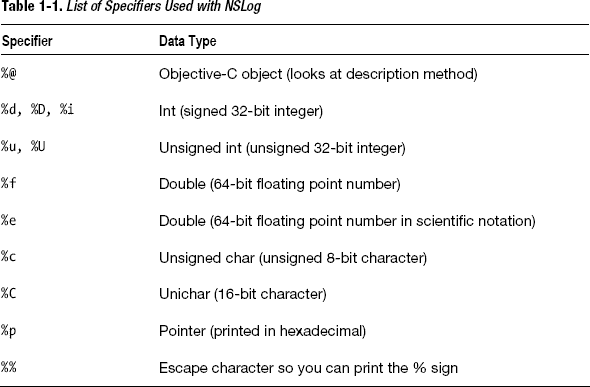

### 代码

以下是使用 `NSLog` 向控制台报告各种变量值的方法：

```
#import <Foundation/Foundation.h>
int main (int argc, const char * argv[]){
        @autoreleasepool {

                //打印基本类型值：
                int myInteger = 1;
                NSLog(@"myInteger = %i", myInteger);

                float myFloatingPointNumber = 2;
                NSLog(@"myFloatingPointNumber = %f", myFloatingPointNumber);
                NSLog(@"myFloatingPointNumber in scientific notation = %e",  
                                                        myFloatingPointNumber);

                char myCharacter = 'A';
                NSLog(@"myCharacter = %c", myCharacter);

                //打印 % 符号
                NSLog(@"Percent Sign looks like %%");

                //打印 Objective-C 对象：
                NSString *myString = @"My String";
                NSLog(@"myString = %@", myString);
                NSLog(@"myString's pointer = %p", myString);

                //打印一系列值
                NSLog(@"myCharacter = %c and myInteger = %i", myCharacter, myInteger);

        }
        return 0;
}
```


好的，作为一名高级文档工程师和翻译员，我将严格遵循您提供的注意事项和示例，为您翻译以下英文文本。


#### 使用方法

若要测试此代码，请像在配方 1-1 中那样使用 `clang` 编译文件。

```
clang -fobjc -framework Foundation main.m -o maccommandlineapp
```

在终端窗口中输入 `open maccommandlineapp` 来运行应用，您应该会看到类似如下的输出：

```
myInteger = 1
myFloatingPointNumber = 2.000000
myFloatingPointNumber in scientific notation = 2.000000e+00
myCharacter = A
Percent Sign looks like %
myString = My String
myString's pointer = 0x105880110
myCharacter = A and myInteger = 1
logout
[Process completed]
```

**注意：** 在你的输出中，`myString` 的指针值可能与我的不同。

## 1.3 创建新的自定义类

### 问题

面向对象的程序员希望能够将功能封装在对象中。要做到这一点，你必须能够定义一个具有属性和行为的自定义类。

### 解决方案

Objective-C 中的类需要接口和实现定义。虽然不是绝对必要，但通常你会将接口和实现放在不同的文件中。包含接口的文件以类本身命名，但文件扩展名为 `.h`。包含实现的文件也使用类名，但文件扩展名为 `.m`。

要使用自定义类，你必须将类的头文件导入到计划使用该类的代码文件中。然后，你可以从该类实例化一个对象，以使用封装在类中的功能。

### 工作原理

第一步是添加两个文件，你将在其中编写自定义类代码。你可以使用你喜欢的文本编辑器来完成此操作。假设你想要一个表示汽车的类。在这种情况下，你只需添加两个新文件：`Car.h` 和 `Car.m`。将这些文件放在与 `main.m` 文件相同的目录中，以便稍后更容易地一起编译它们（代码见列表 1-1 至 1-3）。

在 `Car.h` 文件中，你将找到 `Car` 类的接口。类接口必须以 `@interface` 关键字开始，并以 `@end` 关键字结束。这两个关键字之间的所有内容定义了类的属性和方法。以下是定义 `Car` 类所需的基本代码：

```
#import <Foundation/Foundation.h>

@interface Car : NSObject

@end
```

注意，在 `Car` 类定义中，你再次导入了 `Foundation`，并且在名称 `Car` 之后紧跟 `: NSObject`。这意味着你的汽车是 `NSObject` 的子类。实际上，`NSObject` 是 Objective-C 中的根对象，所有其他对象要么是 `NSObject` 的子类，要么是 `NSObject` 另一个子类的子类。

`Car.m` 文件看起来与 `Car.h` 文件相似。在这里，你首先导入 `Car.h` 文件，然后使用 `@implementation` 关键字声明你正在实现你的自定义类。所有用于实现的代码都放在声明你正在实现 `Car` 的代码行之后。这是迄今为止 `Car` 类实现的样子：

```
#import "Car.h"

@implementation Car

@end
```

为了使用你的类，你需要导入 `Car.h`，然后从该类实例化一个对象。要实例化一个对象，你需要发送两条消息：`alloc` 和 `init`。这两条消息都来自 `NSObject` 父类。

```
Car *car = [[Car alloc] init];
```

#### 代码

**列表 1-1.** *Car.h*

```
#import <Foundation/Foundation.h>

@interface Car : NSObject

@end
```

**列表 1-2.** *Car.m*

```
#import "Car.h"

@implementation Car

@end
```

**列表 1-3.** *main.m*

```
#import "Car.h"

int main (int argc, const char * argv[]){
        @autoreleasepool {
                Car *car = [[Car alloc] init];
                NSLog(@"car is %@", car);

        }
        return 0;
}
```

#### 使用方法

要使用此代码，请像之前一样编译你的文件，只是除了 `main.m` 代码文件之外，还需要包含 `Car` 类的代码文件。

```
clang -fobjc -framework Foundation Car.m main.m -o maccommandlineapp
```

在命令文本中，它可以放在 `main.m` 文件之前。当你运行 `maccommandlineapp` 时，你将看到类似如下的输出：

```
car is <Car: 0x10c411cd0>
logout
[Process completed]
```

当然，在你添加自己的自定义属性和方法之前，`Car` 类做不了太多事情，你将在接下来的配方中看到这些内容。

## 1.4 代码属性访问器

### 问题

自定义类需要表示它们所建模的实体的属性。你需要知道如何在 Objective-C 中定义和实现属性。

### 解决方案

要为自定义类实现属性，你必须在类接口中声明属性，并在类实现中实现这些属性。一旦实现了这些属性，你就可以在需要时通过访问这些属性，在其他代码文件中使用它们。

### 工作原理

为类添加属性时，首先要去的地方是自定义类的头文件。这里你需要两样东西：一个用于保存属性值的局部实例变量和一个属性声明。以下是接口的样子：

```
#import <Foundation/Foundation.h>

@interface Car : NSObject{
@private
    NSString *name_;
}

@property(strong) NSString *name;

@end
```

这里局部实例变量被命名为 `name_`，属性声明以关键字 `@property` 开头。注意，属性声明中在类名前的括号里有 `strong` 这个词。这个词被称为*属性特性*，而 `strong` 只是众多可用属性描述符之一。有关属性特性的列表，请参见表 1-2。

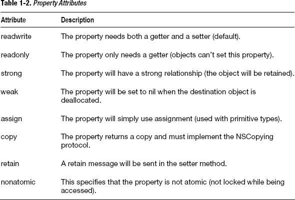

实现属性的第二个地方是实现文件，在你的示例中位于 `Car.m`。在这里你需要编写所谓的 *getter* 和 *setter* 方法。

```
#import "Car.h"

@implementation Car

-(void)setName:(NSString *)name{
    name_ = name;
}

-(NSString *) name{
    return name_;
}

@end
```

你可以像这样使用点符号来设置和获取属性值：

```
car.name = @"Sports Car";
NSLog(@"car is %@", car.name);
```

或者你可以使用标准的 Objective-C 消息传递来使用属性：

```
[car setName:@"New Car Name"];
NSLog(@"car.name is %@", [car name]);
```

在你查看更多 Objective-C 代码时，你会看到这两种访问属性的示例。点符号（第一个示例）是一个相对较新的 Objective-C 特性，是在 Objective-C 2.0 中添加的。请注意，点符号的优势在于，对于那些习惯于将点符号作为标准实践的其他编程语言的程序员来说，它更熟悉。第二个示例，即常规的 Objective-C 消息传递，仍然经常使用。选择一种方法而非另一种主要取决于个人偏好。代码见列表 1-4 至 1-6。

#### 代码

**列表 1-4.** *Car.h*

```
#import <Foundation/Foundation.h>

@interface Car : NSObject{
@private
    NSString *name_;
}

@property(strong) NSString *name;

@end
```

**列表 1-5.** *Car.m*

```
#import "Car.h"

@implementation Car

-(void)setName:(NSString *)name{
    name_ = name;
}

-(NSString *) name{
    return name_;
}

@end
```

**列表 1-6.** *main.m*

```
#import "Car.h"
int main (int argc, const char * argv[]){
        @autoreleasepool {
                Car *car = [[Car alloc] init];
                car.name = @"Sports Car";
                NSLog(@"car.name is %@", car.name);

                [car setName:@"New Car Name"];
                NSLog(@"car.name is %@", [car name]);

        }
        return 0;
}
```


### 用法

要使用这段代码，请像之前一样编译你的文件。

`clang -fobjc-arc -framework Foundation Car.m main.m -o maccommandlineapp`

当你打开 `maccommandlineapp` 时，你将看到类似如下的输出：

`car.name is Sports Car`
`car.name is New Car Name`
`logout`

`[Process completed]`

## 1.5 使用 `@synthesize` 实现代码属性访问器

### 问题

自定义类需要表示其所建模实体的属性。你需要了解如何在 Objective-C 中定义和实现属性才能做到这一点。如果你不想自己编写 getter 和 setter 方法，可以使用 `@synthesize` 作为替代方案。

### 解决方案

要使用 `@synthesize` 实现属性，你仍然需要像在方案 1.4 中那样在类接口中声明属性，并在类实现中实现这些属性。但是，`@synthesize` 不是让你自己编写访问器代码，而是让你使用 `@synthesize` 关键字，指示编译器在编译过程中为你自动填充代码。

### 工作原理

为类添加属性时，首先进入的是自定义类的头文件。使用这种方法，你只需声明一个属性。接口文件如下所示：

```
#import <Foundation/Foundation.h>

@interface Car : NSObject

@property(strong) NSString *name;

@end
```

实现属性所需的第二个文件是实现文件，在你的示例中，该文件位于 `Car.m` 中。你在这里要做的就是在 `@implementation` 关键字之后，使用 `@synthesize` 关键字，并包含你想要为其生成 getter 和 setter 的属性。

```
#import "Car.h"

@implementation Car
@synthesize name;

@end
```

你可以像这样使用点语法来设置和获取属性值：

```
car.name = @"Sports Car";
NSLog(@"car is %@", car.name);
```

或者，你也可以使用标准的 Objective-C 消息传递方式，如下所示：

```
[car setName:@"New Car Name"];
NSLog(@"car.name is %@", [car name]);
```

完整的代码请参阅代码清单 1-7 至 1-9。

#### 代码

**代码清单 1-7.** *Car.h*

```
#import <Foundation/Foundation.h>

@interface Car : NSObject

@property(strong) NSString *name;

@end
```

**代码清单 1-8.** *Car.m*

```
#import "Car.h"

@implementation Car
@synthesize name;

@end
```

**代码清单 1-9.** *main.m*

```
#import "Car.h"
int main (int argc, const char * argv[]){
        @autoreleasepool {
                Car *car = [[Car alloc] init];
                car.name = @"Sports Car";
                NSLog(@"car.name is %@", car.name);

                [car setName:@"New Car Name"];
                NSLog(@"car.name is %@", [car name]);

        }
        return 0;
}
```

### 用法

要使用这段代码，请像之前一样编译你的文件。

`clang -fobjc -framework Foundation Car.m main.m -o maccommandlineapp`

当你打开 `maccommandlineapp` 时，你将看到类似如下的输出：

`car.name is Sports Car`
`car.name is New Car Name`
`logout`

`[Process completed]`

## 1.6 向自定义类添加类方法

### 问题

在 Objective-C 中，你可以向类或对象发送消息来完成任务。如果你希望自定义类能够响应消息，首先必须编写一个类方法。

### 解决方案

要添加类方法，你需要在头文件中添加前向声明。类方法以 `+` 和返回类型（如 `(void)`）开头，后跟一组参数描述符（出现在参数之前的描述性文本）、数据类型和参数名称。类方法在实现文件中 `@implementation` 关键字之后实现。

### 工作原理

为类添加类方法时，首先进入的是自定义类的头文件。类方法在返回类型前有一个 `+` 号。下面是一个类方法的前向声明，该方法向控制台输出一条包含日期的描述信息：

`+(void)writeDescriptionToLogWithThisDate:(NSDate *)date;`

要实现类方法，请转到类的实现文件，在 `@implementation` 关键字之后，编写类方法的代码。

```
+(void)writeDescriptionToLogWithThisDate:(NSDate *)date{
        NSLog(@"Today's date is %@ and this class represents a car", date);
}
```

要使用此方法，你只需向 `Car` 类发送一条消息，无需预先实例化对象。

`[Car writeDescriptionToLogWithThisDate:[NSDate date]];`

完整的代码请参阅代码清单 1-10 至 1-12。

#### 代码

**代码清单 1-10.** *Car.h*

```
#import <Foundation/Foundation.h>
@interface Car : NSObject

@property(strong) NSString *name;

+(void)writeDescriptionToLogWithThisDate:(NSDate *)date;

@end
```

**代码清单 1-11.** *Car.m*

```
#import "Car.h"

@implementation Car

@synthesize name;

+(void)writeDescriptionToLogWithThisDate:(NSDate *)date{
        NSLog(@"Today's date is %@ and this class represents a car", date);
}

@end
```

**代码清单 1-12.** *main.m*

```
#import "Car.h"
int main (int argc, const char * argv[]){
        @autoreleasepool {
                [Car writeDescriptionToLogWithThisDate:[NSDate date]];
        }
        return 0;
}
```

#### 用法

当处理类方法时，你不需要预先实例化对象。你只需向类发送一条消息来执行类方法中的代码。要使用此代码，请像之前一样编译你的文件。

`clang -fobjc -framework Foundation Car.m main.m -o maccommandlineapp`

当你打开 `maccommandlineapp` 时，你将看到类似如下的输出：

`Today's date is 2011-12-19 14:23:11 +0000 and this class represents a car`
`logout`

`[Process completed]`

## 1.7 向自定义类添加实例方法

### 问题

在 Objective-C 中，你可以向类或对象发送消息来完成任务。如果你希望从自定义类实例化出的对象能够响应消息，首先必须编写一个实例方法。

### 解决方案

要添加实例方法，你需要在头文件中添加前向声明。实例方法以 `–` 和返回类型（如 `(void)`）开头，后跟一组参数描述符（出现在参数之前的描述性文本）、数据类型和参数名称。实例方法在实现文件中 `@implementation` 关键字之后实现。

### 工作原理

为类添加实例方法时，首先进入的是自定义类的头文件。实例方法在返回类型前有一个 `-` 号。下面是一个类方法的前向声明，该方法向控制台输出一条包含日期的描述信息：

`-(void)writeOutThisCarsState;`

要实现类方法，请转到类的实现文件，在 `@implementation` 关键字之后，编写类方法的代码。

```
-(void)writeOutThisCarsState{
        NSLog(@"This car is a %@", self.name);
}
```

#### 用法

要使用此方法，你需要先从 `Car` 类实例化一个对象，然后设置 `name` 属性。然后，你可以发送 `writeOutThisCarsState` 消息来执行实例方法中的代码。

```
Car *newCar = [[Car alloc] init];
newCar.name = @"My New Car";
[newCar writeOutThisCarsState];
```

要测试这些代码，请在终端中像之前一样编译你的文件。

`clang -fobjc -framework Foundation Car.m main.m -o maccommandlineapp`

当你打开 `maccommandlineapp` 时，你将看到类似如下的输出：

`Today's date is 2011-12-19 14:23:11 +0000 and this car is a My New Car`
`logout`

`[Process completed]`

## 1.8 使用类别扩展类

### 问题

你希望为类添加方法和行为，但又不希望创建一个全新的子类。


### 解决方案

在 Objective-C 中，你可以使用`Category`来定义和实现属性与方法，这些属性和方法后续可以被附加到一个类上。要实现这一点，你需要两个文件：一个用于列出接口的头文件，以及一个用于列出实现的实现文件。当你准备使用你的`Category`时，可以导入该`Category`的头文件；任何应用了该`Category`的类都将可以使用这些属性和方法。

### 工作原理

首先你需要一个头文件。假设你想扩展`NSString`类，添加一些方法来帮助你创建 HTML 文本。一个`Category`的头文件具有如下所示的接口：

`@interface NSString (HTMLTags)`

紧跟在`@interface`关键字后面的类名是你正在扩展的类。这意味着该`Category`只能应用于`NSString`（或`NSString`的子类）。在类名后面的括号中，放入你为该`Category`指定的名称。

你可以在`@interface`之后、`@end`关键字之前（就像在常规的类接口中一样）为该`Category`定义所有的属性和方法。

实现遵循类似的模式。

`@implementation NSString (HTMLTags)`

当你想要应用这个在`Category`中定义的扩展功能时，只需导入`Category`的头文件，你将能够使用你已经编码的额外属性和方法。代码请参见列表 1-13 至 1-15。

### 代码

**列表 1-13.** *HTMLTags.h*

```objectivec
#import <Foundation/Foundation.h>

@interface NSString (HTMLTags)

-(NSString *) encloseWithParagraphTags;

@end
```

**列表 1-14.** *HTMLTags.m*

```objectivec
#import "HTMLTags.h"

@implementation NSString (HTMLTags)

-(NSString *) encloseWithParagraphTags{
        return [NSString stringWithFormat:@"<p>%@</p>",self];
}

@end
```

**列表 1-15.** *main.m*

```objectivec
#import "HTMLTags.h"

int main (int argc, const char * argv[]){
        @autoreleasepool {
                NSString *webText = @"This is the first line of my blog post";

                //像往常一样打印字符串：
                NSLog(@"%@", webText);

                //使用分类函数打印字符串：
                NSLog(@"%@", [webText encloseWithParagraphTags]);
        }
        return 0;
}
```

### 用法

`Category`通常用于你希望避免创建复杂继承层次结构的情况。也就是说，你宁愿不依赖比根类多出三到四个层级的自定义类，因为你不想陷入这样一种情况：对一个类的修改会对继承层次结构中更深层的类产生意想不到的影响。

`Category`也有助于保持代码的可读性。例如，如果你在你的项目中使用`Category`来扩展`NSString`，那么你的大部分代码对于任何使用过`NSString`的人来说都是熟悉的。另一种对`NSString`进行子类化（例如使用类似`NSHTMLString`的方式）的方法可能会引起混淆。

要从命令行编译列表中的代码，请确保除了`main.m`文件之外，还要编译包含`Category`的文件。

`clang -fobjc-arc -framework Foundation HTMLTags.m main.m -o maccommandlineapp`

当你打开`maccommandlineapp`时，你将看到类似如下的输出：

```
This is the first line of my blog post
<p>This is the first line of my blog post</p>
logout

[进程已完成]
```

## 1.9 从终端创建一个基于窗口的 Mac 应用程序

### 问题

你想从终端创建一个具有用户界面的 Mac 应用程序。虽然 Xcode 通常用于在 Mac 上开发丰富的基于窗口的应用程序，但有时当你设置一个不借助 Xcode 项目模板插入额外代码的应用程序时，更容易看清发生了什么。

### 解决方案

Mac 应用需要一些关键组件才能工作。具体来说，你需要使用`NSApplication`和`NSWindow`类来管理应用程序本身和初始用户界面。你还需要一个应用程序委托类，你可以在一个单独的文件中编码它。应用程序委托通过实现应用程序运行所需的关键方法来充当应用程序的助手。

### 工作原理

这个解决方案有两个步骤。

##### 应用程序委托

Mac 应用使用一种称为**委托**的设计模式。当你想要实现委托时，你指定一个对象（称为委托）来代表另一个对象行事。你的 Mac 应用程序需要一个称为应用程序委托的助手对象才能工作。

应用程序委托是一个需要自己的头文件和实现文件的类。Mac 应用程序委托必须导入 Cocoa 框架并实现`NSApplicationDelegate`协议。协议是一组一个类为了充当委托而必须实现的属性和方法。`NSApplicationDelegate`协议是你的类成为应用程序委托所必需的。

以下是关于如何开始定义应用程序委托的一个例子：

`@interface AppDelegate : NSObject <NSApplicationDelegate>`

你可以看到你在这里采用了`NSApplicationDelegate`协议，因为你已经在`<`和`>`符号之间指定了它。应用程序委托应该有一个`NSWindow`属性并实现委托方法`- (void)applicationDidFinishLaunching:(NSNotification *)aNotification;`。

`NSWindow`属性是放置用户内容的 UI 元素。委托方法是一个当应用程序完成启动到桌面时执行的通知，这使其成为设置应用程序其余部分的好地方。

##### 应用程序

Mac 应用程序本身从之前的`main`函数开始设置和启动。你需要首先获取对`NSApplication`实例的引用。`NSApplication`是使用单例设计模式实现的 Cocoa 类。这意味着每个应用程序只能有一个`NSApplication`实例，并且你必须使用特定的过程来获取对`NSApplication`对象的引用。

`NSApplication *macApp = [NSApplication sharedApplication];`

`sharedApplication`函数是一个类方法，它要么实例化并返回一个`NSApplication`实例，要么简单地返回已经创建的实例。一旦你获取了对 Mac 应用程序的引用，你就可以创建一个应用程序委托并将其设置为`macApp`的委托。

`AppDelegate *appDelegate = [[AppDelegate alloc] init];`
`macApp.delegate = appDelegate;`

这相当于说，应用程序委托现在将代表你的 Mac 应用程序行事。接下来，你的应用程序必须有一个窗口，因此使用`NSWindow`类来实例化一个窗口，并将其设置为应用程序委托的`NSWindow`属性。

```objectivec
int style = NSClosableWindowMask | NSResizableWindowMask | NSTexturedBackgroundWindowMask | NSTitledWindowMask | NSMiniaturizableWindowMask;

NSWindow *appWindow = [[NSWindow alloc] initWithContentRect:NSMakeRect(50, 50, 600, 400)
                                                  styleMask:style
                                                    backing:NSBackingStoreBuffered
                                                      defer:NO];
appDelegate.window = appWindow;
```

现在所有设置和连接都已完成，你可以向用户展示窗口并运行 Mac 应用程序。

`[appWindow makeKeyAndOrderFront:appWindow];`
`[macApp run];`

代码请参见列表 1-16 至 1-18。


## 代码

**代码清单 1-16.** *AppDelegate.h*

```objc
#import <Cocoa/Cocoa.h>

@interface AppDelegate : NSObject <NSApplicationDelegate>

@property (assign) NSWindow *window;

@end
```

**代码清单 1-17.** *AppDelegate.m*

```objc
#import "AppDelegate.h"

@implementation AppDelegate

@synthesize window = _window;

- (void)applicationDidFinishLaunching:(NSNotification *)aNotification{
    NSLog(@"Mac app finished launching");
}

@end
```

**代码清单 1-18.** *main.m*

```objc
#import "AppDelegate.h"

int main (int argc, char *argv[]){
    NSApplication *macApp = [NSApplication sharedApplication];
    AppDelegate *appDelegate = [[AppDelegate alloc] init];
    macApp.delegate = appDelegate;

int style = NSClosableWindowMask | NSResizableWindowMask |
NSTexturedBackgroundWindowMask | NSTitledWindowMask |
NSMiniaturizableWindowMask;

   NSWindow *appWindow = [[NSWindow alloc] initWithContentRect:NSMakeRect(50, 50, 600, 400)
                                                     styleMask:style
                                                       backing:NSBackingStoreBuffered
                                                         defer:NO];
    appDelegate.window = appWindow;
                               [appWindow makeKeyAndOrderFront:appWindow];
    [macApp run];
}
```

## 用法

要在命令行编译代码，请确保在编译时除了 `main.m` 文件外，还要包含 `AppDelegate` 文件。对于这个程序，你还必须链接到 Cocoa 框架，因为你正在使用 Cocoa 来管理 Mac 应用的 UI 元素。

```bash
clang -fobjc -framework Cocoa AppDelegate.m main.m -o macwindowapp
```

打开 `macwindowapp` 文件后，你会看到一个空白窗口出现。它应该看起来像图 1-1。


**图 1-1.** *Mac 应用窗口*

## 1.10 向 Mac 应用添加用户控件

### 问题

Mac 应用需要能够接收和解释用户的意图。这是通过按钮和文本字段等用户控件实现的，你可以将这些控件提供给用户输入，以便根据用户的意愿执行某些操作。你想向应用添加一个按钮，并让用户在点击该按钮时触发某些操作。

### 解决方案

要向 Mac 应用添加按钮，只需在 `applicationDidFinishLaunching` 代理方法中添加代码来创建按钮、设置必要的按钮属性、设置操作方法（响应点击执行的代码），然后将按钮添加到窗口中。你还需要编写操作方法，使其在响应点击时执行相应操作。

### 工作原理

在像你在方法 1.9 中编码的简单 Mac 应用中，你可以向窗口添加一个按钮来向用户呈现此控件：

```objc
button = [[NSButton alloc] initWithFrame:NSMakeRect(230,200,140,40)];
[[self.window contentView] addSubview: button];
```

这通常会在应用委托的 `didFinishLaunching` 代理方法中完成。你也可以通过在此方法中设置属性来配置按钮的 UI：

```objc
[button setTitle: @"Change Color"];
[button setButtonType:NSMomentaryLightButton];
[button setBezelStyle:NSTexturedSquareBezelStyle];
```

按钮使用**目标-动作**设计模式来响应用户操作（如按钮点击）。目标-动作是一种设计模式，其中对象拥有执行动作（一种特殊的方法）所需的信息。你需要告诉该对象哪个方法包含将响应动作而执行的代码，以及该方法位于何处（目标）。

```objc
[button setTarget:self];
[button setAction:@selector(changeBackgroundColor)];
```

这里的目标是 `self`（应用委托），方法名为 `changeBackgroundColor`。在你定位代码的动作方法中，你需要更改窗口的背景颜色。

```objc
-(void)changeBackgroundColor{
    self.window.backgroundColor = [NSColor blackColor];
}
```

代码请参见代码清单 1-19 到 1-21。

### 代码

**代码清单 1-19.** *AppDelegate.h*

```objc
#import <Cocoa/Cocoa.h>

@interface AppDelegate : NSObject <NSApplicationDelegate>

@property (assign) NSWindow *window;

@end
```

**代码清单 1-20.** *AppDelegate.m*

```objc
#import "AppDelegate.h"

@implementation AppDelegate

@synthesize window = _window;
NSButton *button;

-(void)changeBackgroundColor{
    self.window.backgroundColor = [NSColor blackColor];
}

- (void)applicationDidFinishLaunching:(NSNotification *)aNotification{
    NSLog(@"Mac app finished launching");

    button = [[NSButton alloc] initWithFrame:NSMakeRect(230,200,140,40)];
    [[self.window contentView] addSubview: button];
    [button setTitle: @"Change Color"];
    [button setButtonType:NSMomentaryLightButton];
    [button setBezelStyle:NSTexturedSquareBezelStyle];
    [button setTarget:self];
    [button setAction:@selector(changeBackgroundColor)];
}

@end
```

**代码清单 1-21.** *main.m*

```objc
#import "AppDelegate.h"

int main(int argc, char *argv[]){
    NSApplication *macApp = [NSApplication sharedApplication];
    AppDelegate *appDelegate = [[AppDelegate alloc] init];
    macApp.delegate = appDelegate;

    int style = NSClosableWindowMask | NSResizableWindowMask |
    NSTexturedBackgroundWindowMask | NSTitledWindowMask | NSMiniaturizableWindowMask;

   NSWindow *appWindow = [[NSWindow alloc] initWithContentRect:NSMakeRect(50, 50, 600, 400)
                                                     styleMask:style
                                                       backing:NSBackingStoreBuffered
                                                         defer:NO];
    appDelegate.window = appWindow;
[appWindow makeKeyAndOrderFront:appWindow];
    [macApp run];
}
```

### 用法

要在命令行编译此代码，请确保在编译时除了 `main.m` 文件外，还要包含 `AppDelegate` 文件。对于这个程序，你还必须链接到 Cocoa 框架，因为你正在使用 Cocoa 来管理 Mac 应用的 UI 元素。

```bash
clang -fobjc -framework Cocoa AppDelegate.m main.m -o macwindowapp
```

打开 `macwindowapp` 文件后，你会看到一个类似图 1-2 的窗口。

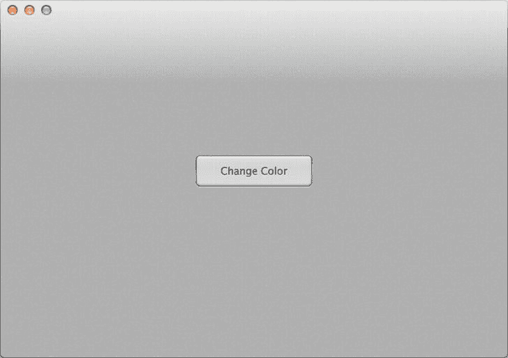

**图 1-2.** *带有按钮的 Mac 应用窗口*

点击按钮时，动作方法将执行，并将窗口的背景颜色变为黑色，如图 1-3 所示。

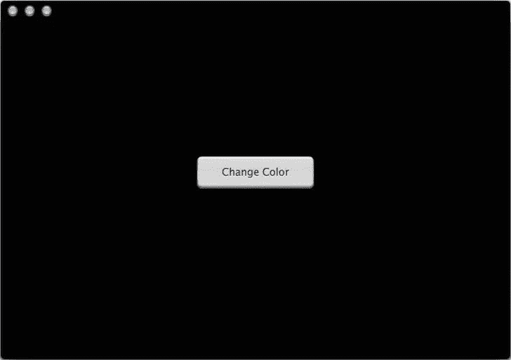

**图 1-3.** *动作方法执行后的窗口*

## 1.11 从 Xcode 创建基于窗口的 Mac 应用

### 问题

到目前为止，方法中仅使用命令行编译器来创建 Objective-C 程序。但是，如果你想开发一个功能丰富的 Mac 应用，你需要使用 Xcode 来为 App Store 发布做好准备。

**注意：** Mac App Store 是一个市场，开发者可以在其中直接向用户出售他们的软件。你可以通过访问 [`www.apple.com/mac/app-store/`](http://www.apple.com/mac/app-store/) 查看其他开发者正在销售的应用。

### 解决方案

使用 Xcode 设置你的 Mac 应用。你可以使用 Xcode 创建命令行应用或 Cocoa 应用；还有其他选项。

**注意：** Cocoa Mac 应用具备消费者预期的用户界面（顶部菜单项、熟悉的控件和布局）。这类应用需要更多框架（即 Cocoa）才能正常运行。命令行应用是更简单的程序，通过“终端”应用运行。你从 Mac App Store 购买的 Mac 应用始终是 Cocoa 应用。


### 工作原理

打开 Xcode，依次进入 **文件**  **新建**  **新建项目**。此时将弹出一个类似图 1-4 所示的对话框。

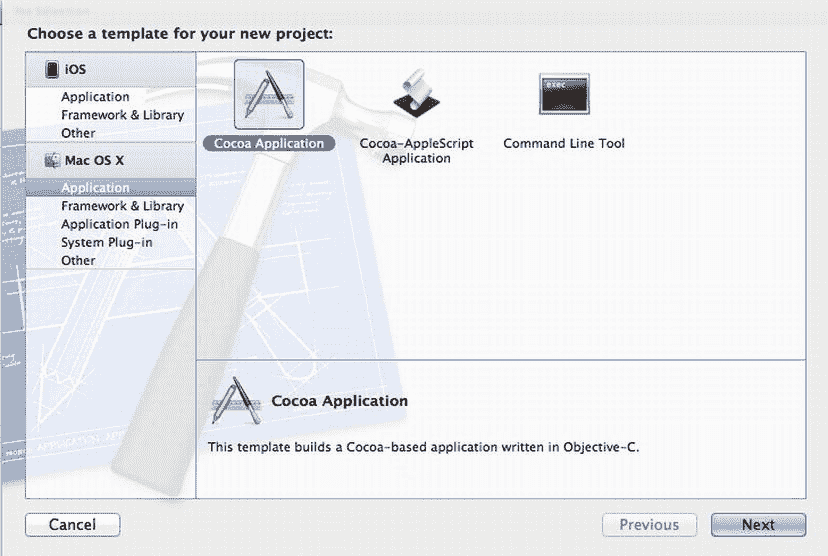

**图 1-4.** *Mac 应用程序模板*

选择 **Mac OS X**  **应用程序**  **Cocoa 应用程序** 来设置一个 Mac 应用。点击“下一步”，你将进入另一个对话框，在此可以指定一些初始设置（参见图 1-5）。

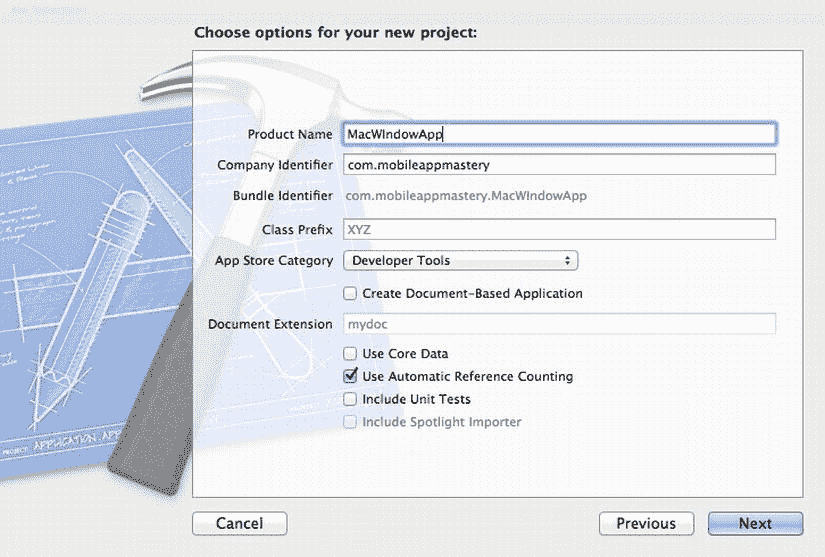

**图 1-5.** *应用程序设置*

有关此界面所有选项的更多详细信息，请参见表 1-3。

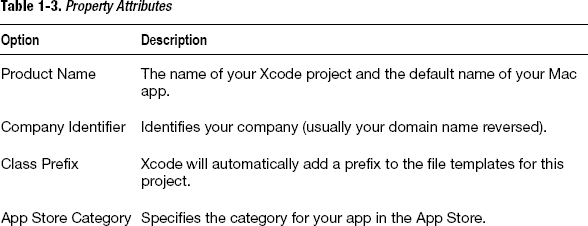

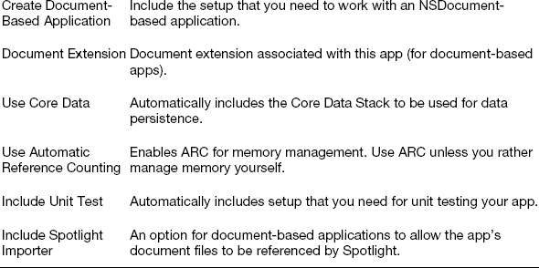

选择初始设置后，点击“下一步”以选择项目位置。在此处，你可以选择在本地使用版本控制系统 Git。

完成所有这些操作后，Xcode 将自动打开，并准备好你需要的所有文件。你的代码文件和其他资源将位于左侧。点击任意代码文件即可在编辑器中查看代码：关键的代码文件将与你在之前任务中处理过的内容类似：`AppDelegate.h`、`AppDelegate.m` 和 `main.m`（你可以通过展开“Supporting Files”文件夹来查看该文件）。

你还会找到用于应用程序开发的其他资源，例如 `MainMenu.xib` 文件（与 Interface Builder 一起使用）、Frameworks 文件夹（链接的框架）以及你的 `InfoPlist` 文件（应用程序设置的关键列表）。有关代码，请参见代码清单 1-22 至 1-24。

### 代码

**代码清单 1-22.** *AppDelegate.h*

```
#import <Cocoa/Cocoa.h>

@interface AppDelegate : NSObject <NSApplicationDelegate>

@property (assign) IBOutlet NSWindow *window;

@end
```

**代码清单 1-23.** *AppDelegate.m*

```
#import "AppDelegate.h"

@implementation AppDelegate

@synthesize window = _window;

- (void)applicationDidFinishLaunching:(NSNotification *)aNotification{
    // Insert code here to initialize your application
}

@end
```

**代码清单 1-24.** *main.m*

```
#import <Cocoa/Cocoa.h>

int main(int argc, char *argv[]){
    return NSApplicationMain(argc, (const char **)argv);
}
```

### 使用方法

你可以通过点击 Xcode 左上角的“运行”按钮来测试此初始设置。Xcode 将收集所有代码和其他资源，将它们链接到所需的框架，然后启动应用程序。Mac 应用窗口将出现，菜单已设置完毕并可供使用。

你可以按照 Recipe 1.10 中的示例，使用 Objective-C 向 Mac 应用添加控件和其他 UI，也可以使用 Xcode 提供的工具来创建 UI。

## 1.12 从 Xcode 创建 iOS 应用程序

### 问题

你想构建一个可以在 iPhone、iPad 或两者上运行的应用程序。这些应用程序遵循与 Mac 应用类似的模式，但它们需要不同的用户界面框架。

### 解决方案

使用 Xcode 设置你的 iOS 应用程序。你可以使用 Xcode 创建仅包含一个屏幕的简单 iOS 应用，或包含导航、标签和页面视图的更丰富的应用。你还可以指定你的应用将在 iPhone、iPad 还是两者上运行。Xcode 提供了适用于大多数情况的模板。

### 工作原理

打开 Xcode，依次进入 **文件**  **新建**  **新建项目**。此时将弹出一个类似图 1-6 所示的对话框。

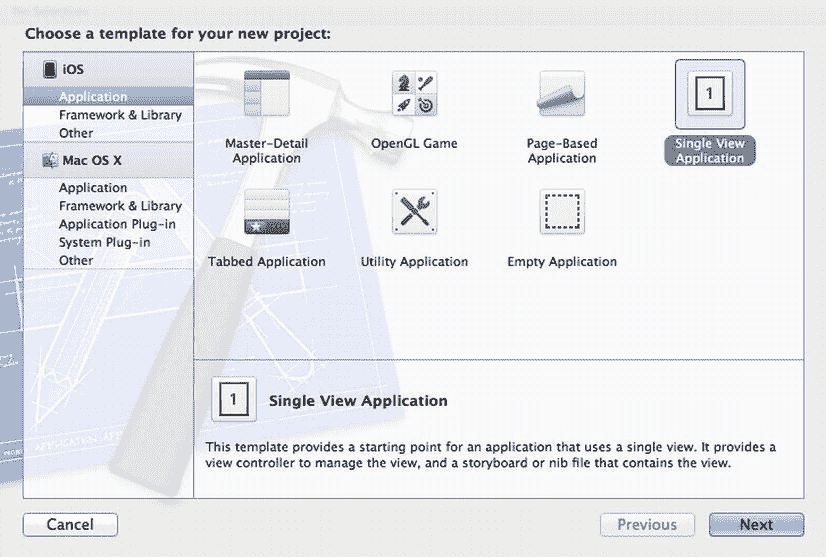

**图 1-6.** *iOS 应用程序模板*

选择 **iOS**  **应用程序**  **单视图应用程序** 来设置一个 iOS 应用程序。点击“下一步”，你将进入另一个对话框，在此可以指定一些初始设置（参见图 1-7）。

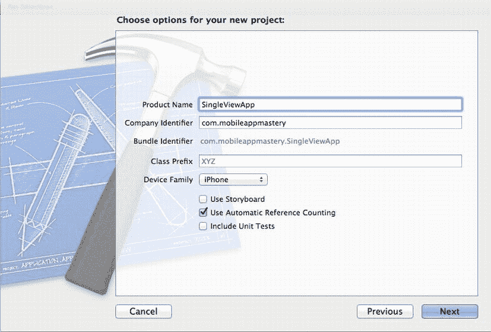

**图 1-7.** *iOS 应用程序设置*

有关此界面所有选项的更多详细信息，请参见表 1-4。

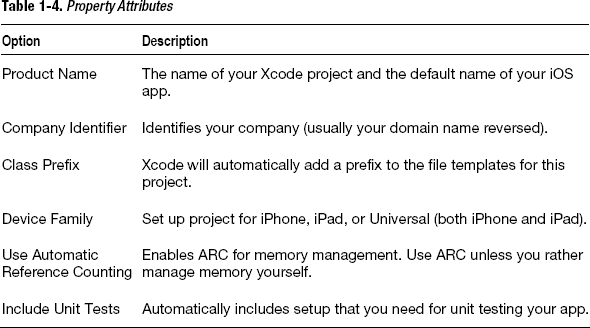

选择初始设置后，点击“下一步”以选择项目位置。在此处，你可以选择在本地使用版本控制系统 Git。

**注意：** Git 是一个版本控制系统，现已集成到 Xcode 中。如果选择使用版本控制，所有更改都将被跟踪，并且你将能够比较所创建代码文件的所有版本。使用 Git 版本控制超出了本书的范围，但随着你开始创建生产级应用，它会成为一个有用的工具。

完成所有这些操作后，Xcode 将自动打开，并准备好你需要的所有文件。你的代码文件和其他资源将位于左侧。点击任意代码文件即可在编辑器中查看代码。关键的代码文件将与你在之前任务中处理过的内容类似：`AppDelegate.h`、`AppDelegate.m` 和 `main.m`（你可以通过展开“Supporting Files”文件夹来查看该文件）。由于这是一个单视图应用，你还将拥有 `ViewController.h`、`ViewController.m` 和 `ViewController.xib`（一个 Interface Builder 文件）的代码文件。

iOS 应用程序的设置方式与 Mac 应用程序大致相同：它们都有一个应用程序类（iOS 中称为 `UIApplication`）和一个应用委托。应用委托必须采用 `UIApplicationDelegate` 协议，并拥有一个窗口（iOS 中称为 `UIWindow`）。应用委托还具有一些委托方法，这些方法充当应用生命周期中关键事件的通知，例如 `applicationDidFinishLaunchingWithOptions`。

在单视图应用模板中，窗口和其他用户界面元素是在应用委托的 `applicationDidFinishLaunchingWithOptions` 委托方法中设置的。

```
- (BOOL)application:(UIApplication *)application
 didFinishLaunchingWithOptions:(NSDictionary *)launchOptions{
    self.window = [[UIWindow alloc] initWithFrame:[[UIScreen mainScreen] bounds]];
    self.viewController = [[ViewController alloc] initWithNibName:@"ViewController"
                                                           bundle:nil];
    self.window.rootViewController = self.viewController;
    [self.window makeKeyAndVisible];
    return YES;
}
```

此模板与你可能记得的 Mac Cocoa 应用模板（Recipe 1.11）略有不同。也就是说，这里你使用了一个名为 `ViewController`（`UIViewController` 的子类）的类，并将其添加到窗口的 `rootViewController` 属性中。

这意味着用户首先看到的屏幕是由此视图控制器管理的。如果你想要更改应用的用户界面，则必须在此视图控制器中进行。

你还会找到用于应用程序开发的其他资源，例如 Frameworks 文件夹（链接的框架）以及你的 `InfoPlist` 文件（应用程序设置的关键列表）。有关代码，请参见代码清单 1-25 至 1-29。


### 代码

**清单 1-25.** *AppDelegate.h*

```objc
#import <UIKit/UIKit.h>

@class ViewController;

@interface AppDelegate : UIResponder <UIApplicationDelegate>

@property (strong, nonatomic) UIWindow *window;
@property (strong, nonatomic) ViewController *viewController;

@end
```

**清单 1-26.** *AppDelegate.m*

```objc
#import "AppDelegate.h"
#import "ViewController.h"

@implementation AppDelegate

@synthesize window = _window;
@synthesize viewController = _viewController;

- (BOOL)application:(UIApplication *)application
 didFinishLaunchingWithOptions:(NSDictionary *)launchOptions
{
    self.window = [[UIWindow alloc] initWithFrame:[[UIScreen mainScreen] bounds]];
    self.viewController = [[ViewController alloc] initWithNibName:@"ViewController" bundle:nil];
    self.window.rootViewController = self.viewController;
    [self.window makeKeyAndVisible];
    return YES;
}

@end
```

**清单 1-27.** *main.m*

```objc
#import <UIKit/UIKit.h>
#import "AppDelegate.h"

int main(int argc, char *argv[])
{
    @autoreleasepool {
        return UIApplicationMain(argc, argv, nil, NSStringFromClass([AppDelegate class]));
    }
}
```

**清单 1-28.** *ViewController.h*

```objc
#import <UIKit/UIKit.h>

@interface ViewController : UIViewController

@end
```

**清单 1-29.** *ViewController.m*

```objc
#import "ViewController.h"

@implementation ViewController

- (void)viewDidLoad
{
    [super viewDidLoad];
}

@end
```

#### 用法

您可以通过点击 Xcode 左上角的“运行”按钮来测试这个初始设置。Xcode 会收集你所有的代码和其他资源，将它们链接到你需要的框架中，然后启动应用程序。iOS 应用将出现在 iOS 模拟器（一种在 Mac 上测试 iOS 应用的特殊程序）中，如图 1-8 所示。

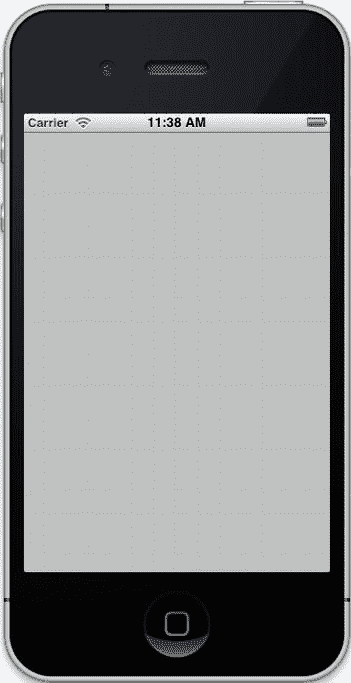

**图 1-8.** *带有单视图应用的 iOS 模拟器*

你可以使用 Objective-C 向 iOS 应用添加控件和其他 UI（参见方案 1.13 和 1.14），或者使用 Xcode 提供的工具来创建 UI。

## 1.13 使用目标-动作模式向 iOS 应用添加用户控件

### 问题

现在你已经设置好了一个 iOS 应用，你希望添加一些用户控件。

### 解决方案

虽然你可以像配方 1.11 中的 Mac 应用那样，将按钮和标签等控件添加到窗口，但更常见的做法是将控件添加到视图中，而视图则呈现在应用程序窗口中。在本方案中，你将向配方 1.12 中的单视图应用添加一个标签和一个按钮。

#### 实现原理

通常，你可以将要用于视图控制器的控件视为属性，并遵循配方 1.4 中的相同规则。然后，你可以在 `viewDidLoad` 视图控制器委托方法中实例化这些属性。最后，编写任何必要的动作方法，并使用目标-动作设计模式将这些动作方法与用户控件关联起来。

在本方案中，你将向 Xcode 模板自带的视图控制器中添加一个 `UILabel` 和 `UIButton`。以下是这些属性前向声明的样子：

```objc
#import <UIKit/UIKit.h>

@interface ViewController : UIViewController

@property(strong) UILabel *myLabel;
@property(strong) UIButton *myButton;

@end
```

在实现文件中，你使用 `@synthesize` 生成 getter 和 setter，并在视图被卸载时将这些控件设置为 nil。

```objc
#import "ViewController.h"

@implementation ViewController
@synthesize myLabel, myButton;

- (void)viewDidLoad
{
    [super viewDidLoad];
}

@end
```

动作方法需要在视图控制器头文件中进行前向声明。

```objc
#import <UIKit/UIKit.h>

@interface ViewController : UIViewController

@property(strong) UILabel *myLabel;
@property(strong) UIButton *myButton;

- (void)updateLabel;

@end
```

这个动作方法可以这样实现来更新标签：

```objc
- (void)updateLabel
{
    self.myLabel.text = @"The button was pressed...";
}
```

这就是当用户按下按钮时你想要发生的事情。通过实例化标签和按钮、设置其属性并将其添加到视图中来完成标签和按钮的初始化。按钮还需要使用目标-动作模式，因此将 `updateLabel` 动作方法连接到按钮的触摸事件上。所有这些都发生在视图控制器的 `viewDidLoad` 事件中。

```objc
- (void)viewDidLoad
{
    [super viewDidLoad];

    // 创建标签
    self.myLabel = [[UILabel alloc] init];
    self.myLabel.frame = CGRectMake(20, 20, 280, 40);
    self.myLabel.textAlignment = UITextAlignmentCenter;
    self.myLabel.backgroundColor = [UIColor clearColor];
    self.myLabel.text = @"Press the button";
    [self.view addSubview:self.myLabel];

    // 创建按钮
    self.myButton = [UIButton buttonWithType:UIButtonTypeRoundedRect];
    self.myButton.frame = CGRectMake(110, 200, 100, 50);

    // 添加 pressButton 动作方法
    [self.myButton addTarget:self
                     action:@selector(updateLabel)
           forControlEvents:UIControlEventTouchUpInside];
    [self.myButton setTitle:@"Press" forState:UIControlStateNormal];

    [self.view addSubview:self.myButton];
}
```

代码请参见清单 1-30 和 1-31。

#### 代码

**清单 1-30.** *ViewController.h*

```objc
#import <UIKit/UIKit.h>

@interface ViewController : UIViewController

@property(strong) UILabel *myLabel;
@property(strong) UIButton *myButton;

- (void)updateLabel;

@end
```

**清单 1-31.** *ViewController.m*

```objc
#import "ViewController.h"

@implementation ViewController
@synthesize myLabel, myButton;

- (void)viewDidLoad
{
    [super viewDidLoad];

    // 创建标签
    self.myLabel = [[UILabel alloc] init];
    self.myLabel.frame = CGRectMake(20, 20, 280, 40);
    self.myLabel.textAlignment = UITextAlignmentCenter;
    self.myLabel.backgroundColor = [UIColor clearColor];
    self.myLabel.text = @"Press the button";
    [self.view addSubview:self.myLabel];

    // 创建按钮
    self.myButton = [UIButton buttonWithType:UIButtonTypeRoundedRect];
    self.myButton.frame = CGRectMake(110, 200, 100, 50);

    // 添加 pressButton 动作方法
    [self.myButton addTarget:self
                     action:@selector(updateLabel)
           forControlEvents:UIControlEventTouchUpInside];
    [self.myButton setTitle:@"Press" forState:UIControlStateNormal];
    [self.view addSubview:self.myButton];
}

- (void)updateLabel
{
    self.myLabel.text = @"The button was pressed...";
}

@end
```

#### 用法

你可以通过点击 Xcode 左上角的“运行”按钮来测试这个初始设置。Xcode 会收集你所有的代码和其他资源，将它们链接到你需要的框架中，然后启动应用程序。iOS 应用将出现在 iOS 模拟器（一种在 Mac 上测试 iOS 应用的特殊程序）中，如图 1-9 所示。

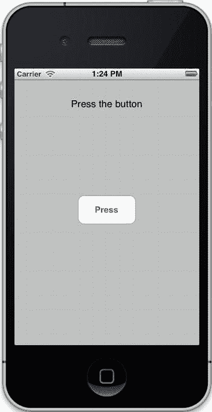

**图 1-9.** *带有用户控件的单视图应用的 iOS 模拟器*

当你触摸按钮时，动作方法将会执行，并将标签更新为文本“按钮被按下了...”。

## 1.14 使用委托模式向 iOS 应用添加用户控件

### 问题

虽然许多用户控件遵循与配方 1.13 中按钮相同的目标-动作模式，但其他用户控件则使用委托设计模式。处理这类控件的过程截然不同，因此你需要了解如何操作。


### 解决方案

使用委托机制的控件与按钮和标签一样，都是添加到视图控制器中的，因此需要属性来引用这些控件。本教程中使用委托机制的控件是`UIPickerView`。该控件向用户呈现一个选择列表，并需要一个委托对象，通常由视图控制器担任。委托负责提供选择器视图上显示的内容，并在用户进行选择时执行相应操作。

### 工作原理

通常，可以将视图控制器上要使用的控件视为属性，并遵循教程 1.4 中的相同规则。然后在`viewDidLoad`视图控制器方法中实例化这些属性。

使用委托机制的控件必须通过委托来遵循所需的协议。在本教程中，你使用的是`UIPickerView`，因此视图控制器需要遵循两个协议：`UIPickerViewDelegate`和`UIPickerViewDataSource`。

视图控制器需要实现两个必需的委托方法，让选择器视图知道要显示多少个组件（列的另一种叫法）和行数。

```
- (NSInteger)numberOfComponentsInPickerView:(UIPickerView *)pickerView{
    return 1;
}

- (NSInteger)pickerView:(UIPickerView *)pickerView numberOfRowsInComponent:(NSInteger)component{
    return 3;
}
```

这两个方法将选择器视图配置为显示一个组件和三行。当选择器视图需要知道每行显示什么内容时，它也会向委托询问此信息。作为委托，你的视图控制器通过委托方法`titleForRow`来响应，如下所示：

```
-(NSString *)pickerView:(UIPickerView *)pickerView titleForRow:(NSInteger)row forComponent:(NSInteger)component{
    return [NSString stringWithFormat:@"row number %i", row];
}
```

这个委托方法根据行号的不同，为每行填充略有差异的文本。最后，当用户通过选择器视图进行选择时，委托通过`didSelectRow`委托方法来协助处理。

```
- (void)pickerView:(UIPickerView *)pickerView didSelectRow:(NSInteger)row inComponent:(NSInteger)component{
    self.myLabel.text = [NSString stringWithFormat:@"row number %i", row];
}
```

设置好这些委托方法后，就可以实例化选择器视图，将选择器视图的委托属性设置为视图控制器，然后将选择器视图添加到视图中。以下是实现此操作的代码：

```
self.myPickerView = [[UIPickerView alloc]initWithFrame:CGRectMake(0, 250, 325, 250)];

self.myPickerView.showsSelectionIndicator = YES;
self.myPickerView.delegate = self;

[self.view addSubview:self.myPickerView];
```

参见清单 1-32 和清单 1-33 的代码。

## 代码

**清单 1-32.** *ViewController.h*

```
#import <UIKit/UIKit.h>

@interface ViewController : UIViewController<UIPickerViewDelegate, UIPickerViewDataSource>

@property(strong) UILabel *myLabel;
@property(strong) UIPickerView *myPickerView;

@end
```

**清单 1-33.** *ViewController.m*

```
#import "ViewController.h"

@implementation ViewController
@synthesize myLabel, myPickerView;

- (void)viewDidLoad{
    [super viewDidLoad];

    //Create label
    self.myLabel = [[UILabel alloc] init];
    self.myLabel.frame = CGRectMake(20, 20, 280, 40);
    self.myLabel.textAlignment = UITextAlignmentCenter;
    self.myLabel.backgroundColor =[UIColor clearColor];
    self.myLabel.text = @"Make a selection";
    [self.view addSubview:self.myLabel];

    //Create picker view
    self.myPickerView = [[UIPickerView alloc]initWithFrame:CGRectMake(0, 250, 325, 250)];

    self.myPickerView.showsSelectionIndicator = YES;
    self.myPickerView.delegate = self;

    [self.view addSubview:self.myPickerView];

}

- (NSInteger)numberOfComponentsInPickerView:(UIPickerView *)pickerView{
    return 1;
}

- (NSInteger)pickerView:(UIPickerView *)pickerView numberOfRowsInComponent:(NSInteger)component{
    return 3;
}

-(NSString *)pickerView:(UIPickerView *)pickerView titleForRow:(NSInteger)row forComponent:(NSInteger)component{
    return [NSString stringWithFormat:@"row number %i", row];
}

- (void)pickerView:(UIPickerView *)pickerView didSelectRow:(NSInteger)row inComponent:(NSInteger)component{
    self.myLabel.text = [NSString stringWithFormat:@"row number %i", row];
}

@end
```

## 使用方法

你可以通过点击 Xcode 左上角的运行按钮来测试这个初始设置。Xcode 会收集所有代码和其他资源，将它们链接到所需的框架，然后启动应用程序。iOS 应用将出现在 iOS 模拟器（一个在 Mac 上测试 iOS 应用的特殊程序）中，如图 1-10 所示。

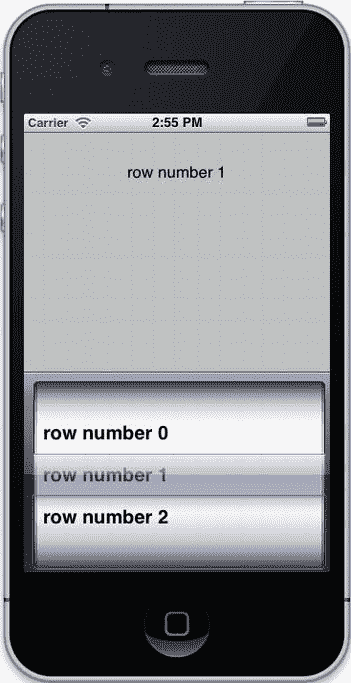

**图 1-10.** *带有选择器视图的单视图应用的 iOS 模拟器*

选择器视图中的所有内容都来自委托视图控制器。当你进行选择时，委托负责更新视图。

## 第 2 章 — 处理字符串和数字

本章介绍如何使用 Foundation 框架和 Objective-C 处理字符串和数字。

本章中的教程将展示如何：

- 使用`NSString`创建字符串对象
- 在 Mac 和 iOS 上从文本文件中读取字符串
- 在 Mac 和 iOS 上将字符串写入文本文件
- 比较字符串
- 操作字符串
- 搜索字符串
- 创建本地化字符串
- 在数字和字符串之间进行转换
- 为货币和其他格式格式化数字

**注意：** 本章中的教程可用于任何链接了 Foundation 框架的 Mac 或 iOS 应用。按照第 1 章中的某个教程（例如 1.1）来设置一个应用，以测试本章中的代码。除非教程指定了其他位置，否则请确保将代码放在主函数中。

## 2.1 创建字符串对象

### 问题

大多数程序都需要表示字符串或字符数组。可以使用 C 语言的方式来表示字符串，但使用面向对象的方法来管理它们要容易得多。要开始在 Objective-C 中使用字符串，必须首先实例化字符串对象。

### 解决方案

使用 Foundation 框架的`NSString`类构造器来创建可在程序中使用的字符串对象。`NSString`提供了一组以`init`开头的构造器和一组以`string`开头并返回字符串对象的函数。你可以使用其中任意一种来创建字符串对象。


### 工作原理

通常，你只需在手动输入的字符串前加上 `@` 符号，并将其赋值给一个 `NSString` 对象，即可完成字符串的创建。`@` 符号告诉编译器这是一个 Objective-C 实体；当 `@` 符号位于引号之前时，编译器就知道这是一个 Objective-C 的 `NSString`。

以下是一个创建字符串对象的示例：

```
NSString *myString1 = @"My String One";
```

有时，你可能需要从一个 UTF-8 编码字节的 C 数组实例化一个字符串对象。`NSString` 提供了一个函数，可以根据以此方式编码的字符串返回一个 `NSString` 实例。

```
NSString *myString2 = [NSString stringWithUTF8String:"My String Two"];
```

随着你对 `NSString` 使用得越来越多，你会发现有很多以单词 `string` 开头的函数，它们会返回一个 `NSString` 实例。还有很多以 `init` 开头的 `NSString` 构造器，它们的名称与这些 string 函数相似，功能也基本相同。例如，你可以使用 `alloc` 和 `initWithUTF8String` 来获取一个与之前类似的 `NSString` 实例，如下所示：

```
NSString *myString3 = [[NSString alloc] initWithUTF8String:"My String Three"];
```

这两种返回 `NSString` 实例的方式在手动管理内存时会很有帮助。所有以单词 `string` 开头的函数都返回 `autoreleased` 对象，这意味着它们应被视为临时对象。通过 `alloc` 和 `init` 返回的 `NSString` 对象是持有的；当你使用完它们后，必须手动释放。如果你使用的是自动引用计数 (ARC)，则无需担心这一点；你可以互换使用这两种方法。

还有一些其他的构造器和函数可以返回字符串实例。其中最有用的一个是 `stringWithFormat` 函数。这个函数通过将值替换到占位符中，使得组合新字符串变得非常容易。你可以使用在 1.2 节中用于将值替换到写入控制台窗口的字符串中的相同占位符。以下是 `stringWithFormat` 的一个示例：

```
int number = 4;
NSString *myString4 = [NSString stringWithFormat:@"My String %i", number];
```

### 代码

以下是一些示例，展示如何在简单的 Mac 应用程序中尝试使用 `NSString` 构造器：

```
#import <Foundation/Foundation.h>

int main (int argc, const char * argv[])
{

    @autoreleasepool {

        NSString *myString1 = @"My String One";
        NSLog(@"myString1 = %@", myString1);

        NSString *myString2 = [NSString stringWithUTF8String:"My String Two"];
        NSLog(@"myString2 = %@", myString2);

        NSString *myString3 = [[NSString alloc] initWithUTF8String:"My String Three"];
        NSLog(@"myString3 = %@", myString3);

        int number = 4;
        NSString *myString4 = [NSString stringWithFormat:@"My String %i", number];
        NSLog(@"myString4 = %@", myString4);

    }
    return 0;
}
```

### 用法

要使用此代码，请在 Xcode 中构建并运行你的 Mac 应用程序。你可以在控制台窗口中查看字符串的结果。

```
myString1 = My String One
myString2 = My String Two
myString3 = My String Three
myString4 = My String 4
```

## 2.2 在 Mac 上从文件读取字符串

### 问题

你想使用文件系统中存储的内容来在你的应用中创建和使用字符串对象。

### 解决方案

要从文本文件创建字符串对象，你需要两样东西：一个错误对象和文本文件的完整文件路径名。准备好这些后，你可以使用 `NSString` 函数 `stringWithContentsOfFile:encoding:error:` 来返回一个包含文本文件内容的 `NSString` 对象。

### 工作原理

`NSString` 类会尝试读取你指定的文本文件。如果操作成功，将返回一个包含文本文件内容的字符串对象。如果操作不成功，将返回 `nil` 并生成一个错误对象，你可以检查该对象来找出问题。

你首先需要一个文件路径名的引用。这个文件路径名引用的是我 Mac 上 Shared 文件夹中一个名为 `textfile.txt` 的文件。

```
NSString *filePathName = @"/Users/Shared/textfile.txt";
```

**注意：** Mac 应用程序可以使用硬编码的文件路径名来访问你 Mac 上的任何文件。然而，iOS 应用程序是被沙盒化的，因此只能访问其应用包自带的文件或位于 iOS 应用文档目录中的文件（参见 2.3 节）。

接下来，你需要一个错误对象来保存错误报告数据，如果读取文件的操作失败，你将需要这些数据。

```
NSError *fileError;
```

这里不需要实例化错误对象，因为你要通过引用将错误对象传递给函数，函数会为你完成错误对象的所有必要设置工作。

最后，你使用 `NSString` 函数来返回要使用的字符串对象，如下所示：

```
NSString *textFileContents = [NSString stringWithContentsOfFile:filePathName
                                                       encoding:NSASCIIStringEncoding
                                                          error:&fileError];
```

字符串对象要么是空的，要么包含文本文件的内容。第一个参数是文件路径名，第二个参数要求你指定文件的编码方式。最后一个参数接收错误对象。`fileError` 前面的 `&` 表示该对象是通过引用传递的，这样你就可以测试错误对象以确保一切按预期工作。

在你使用字符串之前，应该先查询错误对象，确保没有发生错误。测试错误对象的 `code` 属性，看看错误代码是否为 0。如果是，就继续使用该字符串；否则，你可能需要以某种方式报告错误，或者尝试一个替代文件。

```
if(fileError.code == 0)
    NSLog(@"textfile.txt contents: %@", textFileContents);
else
    NSLog(@"error(%ld): %@", fileError.code, fileError.description);
```

### 代码

```
#import <Foundation/Foundation.h>

int main (int argc, const char * argv[])
{

    @autoreleasepool {
        NSString *filePathName = @"/Users/Shared/textfile.txt";
        NSError *fileError;
        NSString *textFileContents = [NSString stringWithContentsOfFile:filePathName
                                                               encoding:NSASCIIStringEncoding
                                                                  error:&fileError];
        if(fileError.code == 0)
            NSLog(@"textfile.txt contents: %@", textFileContents);
        else
            NSLog(@"error(%ld): %@", fileError.code, fileError.description);

    }

    return 0;
}
```

### 用法

要使用此代码，请在 Xcode 中构建并运行你的 Mac 应用程序。你可以在控制台窗口中查看文本文件内容或错误对象内容。

```
textfile.txt contents: This string comes from a local text file.
```

## 2.3 在 iOS 上从文件读取字符串

### 问题

你想使用 iOS 应用中打包的内容来在你的应用中创建和使用字符串对象。

### 解决方案

iOS 应用程序无法像 Mac 命令行应用程序那样从你的 Mac 读取文本文件。但是，你可以将文本文件包含在你的 iOS 应用包中，以便在你的应用运行时可以使用它们。你可以获取应用包或应用文档目录中任何你想要文本文件的引用。


### 工作原理

要在 iOS 应用中包含文本文件，需要将文本文件拖入 Xcode 的 Supporting Files 文件夹中。当对话框弹出时，勾选 *将文件复制到目标组文件夹（如果需要）* 选项。这样做可以确保该文本文件将包含在会在 iOS 模拟器中安装并与 App Store 应用一并打包的 bundle 中。

`NSString` 类会尝试读取您指定的文本文件。如果操作成功，将返回一个包含文本文件内容的字符串对象。如果操作不成功，将返回 `nil` 并生成一个可供检查以定位问题的错误对象。

首先，您需要获取文件路径名的引用。在 iOS 中，您需要获取 bundle 文件夹的引用。由于这是一个动态的文件夹路径，您无法预先硬编码文件夹路径名。但是，您可以使用 `[[NSBundle mainBundle] resourcePath]` 来获取包含所有资源的文件夹的引用。一旦获取到该引用，就可以使用 `stringWithFormat` 方法来构建指向您的文本文件的引用。

```
NSString *bundlePathName = [[NSBundle mainBundle] resourcePath];
NSString *filePathName = [NSString stringWithFormat:@"%@/textfile.txt",
bundlePathName];
```

这里的文件路径名引用的是 iOS 应用中 bundle 资源文件夹内名为 `textfile.txt` 的文件。

您还需要一个错误对象来保存所有错误报告数据，以便在读取文件的操作失败时使用。

```
NSError *fileError;
```

此处无需实例化错误对象，因为您会通过引用将该错误对象传递给函数，而函数会为您完成所有必要的错误对象配置工作。

最后，使用 `NSString` 函数返回要使用的字符串对象，如下所示：

```
NSString *textFileContents = [NSString stringWithContentsOfFile:filePathName
                                                       encoding:NSASCIIStringEncoding
                                                          error:&fileError];
```

该字符串对象可能为空，也可能填充了文本文件的内容。第一个参数是文件路径名，第二个参数要求您指定文件是如何编码的。最后一个参数接收错误对象。`fileError` 前的 `&` 表示该对象是通过引用传递的，因此您可以测试错误对象以确保一切按预期工作。

在使用该字符串之前，您应该查询错误对象，以确定是否发生了错误。如果代码属性为 0，则表示一切正常。如果一切正常，请继续使用该字符串；否则，您可能需要以某种方式报告错误，或者尝试使用其他文件。

```
if(fileError.code == 0)
    NSLog(@"textfile.txt contents: %@", textFileContents);
else
    NSLog(@"error(%ld): %@", fileError.code, fileError.description);
```

相关代码请参见列表 2-1。

### 代码

**列表 2-1.** *AppDelegate.m*

```
#import "AppDelegate.h"

@implementation AppDelegate
@synthesize window = _window;

- (BOOL)application:(UIApplication *)application
 didFinishLaunchingWithOptions:(NSDictionary *)launchOptions{

    NSString *bundlePathName = [[NSBundle mainBundle] resourcePath];

    NSString *filePathName = [NSString stringWithFormat:@"%@/textfile.txt",
 bundlePathName];

    NSError *fileError;

    NSString *textFileContents = [NSString stringWithContentsOfFile:filePathName
                                                           encoding:NSASCIIStringEncoding
                                                              error:&fileError];

    if(fileError.code == 0)
       NSLog(@"textfile.txt contents: %@", textFileContents);
    else
       NSLog(@"error(%d): %@", fileError.code, fileError.description);

self.window = [[UIWindow alloc] initWithFrame:[[UIScreen mainScreen]
bounds]];
    self.window.backgroundColor = [UIColor whiteColor];
    [self.window makeKeyAndVisible];
    return YES;
}

@end
```

### 使用方法

要亲自尝试此代码，您需要创建一个 iOS 应用；具体说明请参见 Recipe 1.12。您的应用委托代码文件应包含列表 2-1 中的代码。`applicationDidFinishLaunchingWithOptions` 委托方法中包含了本食谱所涉及的主要代码。使用 Xcode 构建并运行您的应用，查看控制台，即可看到文本文件的内容被打印到日志中。

```
textfile.txt contents: This string comes from a local text file.
```

## 2.4 在 Mac 上将字符串写入文件

### 问题

您希望能够将从 Mac 应用生成的文本内容存储到文件系统中，以便后续使用或供其他程序使用。

### 解决方案

`NSString` 内置了将字符串对象的内容写入 Mac 文件系统的方法。只需向字符串对象发送 `writeToFile:atomically:encoding:error:` 消息，并传入文件路径名，即可将内容存储在字符串对象中。

### 工作原理

您可以发送 `writeToFile:atomically:encoding:error:` 消息，将字符串的内容保存到文件系统。如果操作不成功，将生成一个可供检查以定位问题的错误对象。

首先，您需要获取文件路径名的引用。此文件路径名引用的是我 Mac 上 Shared 文件夹中名为 `textfile.txt` 的文件。

```
NSString *filePathName = @"/Users/Shared/textfile.txt";
```

**注意：** Mac 应用程序可以使用硬编码的文件路径名来访问 Mac 上的任何文件。但是，iOS 应用程序是沙盒化的，因此只能访问其应用 bundle 中的文件或 iOS 应用文档目录中的文件（参见 Recipe 2.3）。

您还需要一个错误对象来保存所有错误报告数据，以便在读取文件的操作失败时使用。

```
NSError *fileError;
```

此处无需实例化错误对象，因为您会通过引用将该错误对象传递给函数，而函数会为您完成所有必要的错误对象配置工作。

您需要在字符串中准备一些要保存到文件的内容，如下所示：

```
NSString *textFileContents = @"Content generated from a Mac program.";
```

最后，发送 `writeToFile:atomically:encoding:error:` 消息，将 `textFileContents` 的内容保存到文件系统。

```
[textFileContents writeToFile:filePathName
                   atomically:YES
                     encoding:NSStringEncodingConversionAllowLossy
                        error:&fileError];
```

此消息的第一个参数是您要存储字符串内容的完整文件名。第二个参数 `atomically` 指的是您是否希望先将内容写入辅助文件。当您传递 `YES` 时，会使用此辅助文件，这样即使系统崩溃，也能确保数据不会损坏。编码参数让您能够在一定程度上控制字符串在系统中的存储方式，而错误参数则用于报告写入过程中发生的任何错误。

在程序中继续执行之前，您应该查询错误对象以确保一切正常。如果其代码为 0，则表示操作成功。如果是这样，请继续使用该字符串；如果不是，您可能需要以某种方式报告错误，或者尝试使用其他文件。

```
if(fileError.code == 0)
    NSLog(@"textfile.txt contents: %@", textFileContents);
else
    NSLog(@"error(%ld): %@", fileError.code, fileError.description);
```

相关代码请参见列表 2-2。


### 代码

**列表 2-2.** *main.m*

```
#import <Foundation/Foundation.h>

int main (int argc, const char * argv[]){

    @autoreleasepool {
        NSString *filePathName = @"/Users/Shared/textfile.txt";
        NSError *fileError;
        NSString *textFileContents = @"Content generated from a Mac program.";

        [textFileContents writeToFile:filePathName
                           atomically:YES
                             encoding:NSStringEncodingConversionAllowLossy
                                error:&fileError];

        if(fileError.code == 0)
            NSLog(@"textfile.txt was written successfully with these contents: %@",
 textFileContents);
        else
            NSLog(@"error(%ld): %@", fileError.code, fileError.description);

    }
    return 0;
}
```

### 用法

要使用这段代码，请在 Xcode 中构建并运行你的 Mac 应用。你可以在控制台窗口中查看文本文件的内容或错误对象的内容。此外，你还应能使用任何文本编辑器打开该文本文件，查看已写入文件系统的字符串对象内容。

## 2.5 在 iOS 上将字符串写入文件

### 问题

你希望能够将 iOS 应用中生成的文本内容存储到应用的文档目录中，以便日后使用或供其他程序调用。

### 解决方案

iOS 应用不能像 Mac 命令行应用那样将文本文件写入你的 Mac。不过，你可以在 iOS 应用中获取一个沙盒区域，在需要时向其中写入数据。你在 iOS 中存储自己内容的地方称为文档目录，你需要获取此动态目录的引用，才能存储你的字符串对象。

**注意：** 虽然你可以像配方 2.3 中讨论的那样从 Bundle 资源目录读取文本文件，但不能向该目录中的任何文件写入内容。如果你需要在应用中处理某个文件，则必须将该文件复制到你的文档目录，或者直接将更新后的版本保存在文档目录中。

### 工作原理

你可以发送消息 `writeToFile:atomically:encoding:error:` 将字符串内容保存到文档目录。如果操作不成功，将会生成一个错误对象，你可以检查该对象来定位问题。

首先你需要获取文档目录。这个目录在每次应用安装时都会动态生成，因此你无法硬编码它。不过，你可以使用以下函数获取文档目录的引用：

```
NSString *documentsDirectory = NSSearchPathForDirectoriesInDomains![Image
(NSDocumentDirectory, NSUserDomainMask, YES) lastObject];
```

接下来，你需要在文档目录中构造一个对文件路径名称的引用：

```
NSString *filePathName = NSString stringWithFormat:@"%@/textfile.txt",![Image
 documentsDirectory];
```

该文件路径名称引用了 iOS 应用文档目录中名为 `textfile.txt` 的文件。

你还需要一个错误对象，用于保存读取文件操作失败时可能需要的任何错误报告数据。

```
NSError *fileError;
```

这里无需实例化错误对象，因为你通过引用将该错误对象传递给函数，函数会为你完成错误对象的所有必要设置工作。

你需要在字符串中准备一些要保存到文件的内容，示例如下：

```
NSString *textFileContents = @"Content generated from an iOS app.";
```

最后，发送消息 `writeToFile:atomically:encoding:error:` 将 `textFileContents` 的内容保存到文件系统。

```
[textFileContents writeToFile:filePathName
                   atomically:YES
                     encoding:NSStringEncodingConversionAllowLossy
                        error:&fileError];
```

此消息的第一个参数是你想要存储字符串内容的文件的完整名称。第二个参数 `atomically` 表示是否先将内容写入辅助文件。当你传递 `YES` 时，会使用此辅助文件，即使系统崩溃也能保证数据不会损坏。编码参数让你能对字符串在系统中的存储方式有一定控制权，而错误参数用于报告写入期间发生的任何错误。

在程序中继续执行之前，你应该查询错误对象。如果其代码为 `0`，则操作成功。如果一切正常，就继续使用该字符串；否则，你可能需要以某种方式报告错误，或尝试使用替代文件。

```
if(fileError.code == 0)
    NSLog(@"textfile.txt was written successfully with these contents: %@",
 textFileContents);
else
    NSLog(@"error(%d): %@", fileError.code, fileError.description);
```

代码请参见列表 2-3。

### 代码

**列表 2-3.** *AppDelegate.m*

```
#import "AppDelegate.h"

@implementation AppDelegate

@synthesize window = _window;

- (BOOL)application:(UIApplication *)application
 didFinishLaunchingWithOptions:(NSDictionary *)launchOptions{

    NSString *documentsDirectory = NSSearchPathForDirectoriesInDomains![Image
(NSDocumentDirectory, NSUserDomainMask, YES) lastObject];

    NSString *filePathName = NSString stringWithFormat:@"%@/textfile.txt",![Image
 documentsDirectory];

    NSError *fileError;

    NSString *textFileContents = @"Content generated from an iOS app.";

    [textFileContents writeToFile:filePathName
                       atomically:YES
                         encoding:NSStringEncodingConversionAllowLossy
                            error:&fileError];

    if(fileError.code == 0)
        NSLog(@"textfile.txt was written successfully with these contents: %@",
 textFileContents);
    else
        NSLog(@"error(%d): %@", fileError.code, fileError.description);

    self.window = [[UIWindow alloc] initWithFrame:[[UIScreen mainScreen] bounds]];
    self.window.backgroundColor = [UIColor whiteColor];
    [self.window makeKeyAndVisible];
    return YES;
}

@end
```

### 用法

在 iOS 应用委托的 `applicationDidFinishLaunchingWithOptions` 委托方法中找到此代码。使用 Xcode 构建并运行你的应用，查看控制台，即可看到打印到日志中的文本文件内容。如果在写入过程中出现问题，你将在日志中看到错误详情。

现在，你的应用已将字符串对象的内容存储在文档目录中，日后可以通过引用文档目录中的新文本文件来使用这些内容。

## 2.6 比较字符串

### 问题

你希望能够判断两个字符串是否具有相同的值，但由于字符串是对象，因此不能简单地使用 `==` 比较运算符。

### 解决方案

使用 `NSString` 的方法 `isEqualToString:` 获取一个布尔值，该值指示字符串是否与你作为参数传递的字符串相同。你可以根据需要，在 `if` 语句中使用此方法。


### 工作原理

当您想要比较两个字符串时，向第一个字符串发送 `isEqualToString:` 消息，并将第二个字符串作为参数传入。该消息会返回一个布尔值，您可以用它来评估条件语句。

```
BOOL isEqual = [myString1 isEqualToString:myString2];
```

您还可以检查字符串是否包含匹配的后缀或前缀。例如，如果您有一个字符串 “Mr. John Smith, MD”，可以通过向该字符串发送 `hasPrefix` 消息，来判断它是否包含前缀 “Mr”。

```
NSString *name = @"Mr. John Smith, MD";
```

```
BOOL hasMrPrefix = [name hasPrefix:@"Mr"];
```

类似地，您可以通过发送 `hasSuffix` 消息，来判断同一个字符串是否包含后缀 “MD”。

```
BOOL hasMDSuffix = [name hasSuffix:@"MD"];
```

最后，您可以使用 `NSRange` 复合类型来定义子字符串的起始点和长度，从而比较子字符串。首先使用 `NSRange` 信息来获取子字符串，然后用它来测试这些字符串是否相同。

```
NSString *alphabet = @"ABCDEFGHIJKLMONPQRSTUVWXYZ";
```

```
NSRange range = NSMakeRange(2, 3);
```

```
BOOL lettersInRange = [[alphabet substringWithRange:range] isEqualToString:@"CDE"];
```

相关代码请参见列表 2-4。

#### 代码

**列表 2-4.** *main.m*

```
#import <Foundation/Foundation.h>

int main (int argc, const char * argv[]){

    @autoreleasepool {

        NSString *myString1 = @"A";
        NSString *myString2 = @"B";
        NSString *myString3 = @"A";

        BOOL isEqual = [myString1 isEqualToString:myString2];

        if(isEqual)
            NSLog(@"%@ is equal to %@", myString1, myString2);
        else
            NSLog(@"%@ is not equal to %@", myString1, myString2);

        if([myString1 isEqualToString:myString2])
            NSLog(@"%@ is equal to %@", myString1, myString2);
        else
            NSLog(@"%@ is not equal to %@", myString1, myString2);

        if([myString1 isEqualToString:myString3])
            NSLog(@"%@ is equal to %@", myString1, myString3);
        else
            NSLog(@"%@ is not equal to %@", myString1, myString3);

        NSString *name = @"Mr. John Smith, MD";

        BOOL hasMrPrefix = [name hasPrefix:@"Mr"];

        if(hasMrPrefix)
           NSLog(@"%@ has the Mr prefix", name);
        else
       NSLog(@"%@ doesn't have the Mr prefix", name);

       BOOL hasMDSuffix = [name hasSuffix:@"MD"];

       if(hasMDSuffix)
          NSLog(@"%@ has the MD suffix", name);
       else
          NSLog(@"%@ doesn't have the MD suffix", name);

       NSString *alphabet = @"ABCDEFGHIJKLMONPQRSTUVWXYZ";

       NSRange range = NSMakeRange(2, 3);

BOOL lettersInRange = [[alphabet substringWithRange:range] isEqualToString:@"CDE"];

       if(lettersInRange)
          NSLog(@"The letters CDE are in alphabet starting at position 2");
       else
          NSLog(@"The letters CDE aren't in alphabet starting at position 2");

    }
    return 0;
}
```

#### 用法

要使用此代码，请在 Xcode 中构建并运行您的 Mac 应用。检查控制台以查看各种比较的结果。您的输出应如下所示：

```
A is not equal to B
A is not equal to B
A is equal to A
Mr. John Smith, MD has the Mr prefix
Mr. John Smith, MD has the MD suffix
The letters CDE are in alphabet starting at position 2
```

更改各个字符串，以观察这些比较是如何工作的。尝试测试字符串相等和不相等的情况，看看您是否能正确判断。

## 2.7 操作字符串

### 问题

您希望您的应用能够修改字符串内容，但 `NSString` 对象是不可变的，因此无法以任何方式更改。

### 解决方案

当您需要更改字符串内容时，请使用 `NSMutableString` 类。`NSMutableString` 是 `NSString` 的子类，因此您可以像使用 `NSString` 一样使用它。不过，在使用 `NSMutableString` 时，您可以追加、插入、替换和删除子字符串。

### 工作原理

您可以使用与创建字符串相同的构造方法来创建 `NSMutableString`，但请确保将消息发送给 `NSMutableString` 类，而不是 `NSString` 类。`NSMutableString` 有一个独特的构造方法，允许您设置字符串的初始容量。

```
NSMutableString *myString = [[NSMutableString alloc] initWithCapacity:26];
```

该构造方法并不会限制您可使用的字符数量；您仅仅是向编译器传递一个提示，以帮助更高效地管理字符串。一旦您拥有一个可变字符串，就可以通过向该可变字符串发送 `setString` 消息来设置其内容。

```
[myString setString:@"ABCDEFGHIJKLMONPQRSTUVWXYZ"];
```

要向可变字符串中追加一个字符串，请发送 `appendString` 消息。

```
[myString appendString:@", 0123456789"];
```

这会将字符串追加到可变字符串的末尾。但是，如果您想在可变字符串的其他位置插入字符，则需要指定插入字符串的位置，并使用 `insertString` 消息。

```
[myString insertString:@"abcdefg, "
               atIndex:0];
```

您还可以通过向可变字符串发送 `deleteCharactersInRange` 消息，并将要删除的范围作为参数传入，来删除其中的字符。使用 `NSMakeRange` 函数来定义一个范围，该范围包含要删除字符的起始位置和长度。

```
NSRange range = NSMakeRange(9, 3);
```

```
[myString deleteCharactersInRange:range];
```

`NSMutableString` 还内置了一个方法，用于将某个范围内的所有字符替换为另一个字符。因此，如果您希望字符串中出现字符 “`|`” 而不是 “`,`”，则可以使用 `replaceOccurrencesOfString:withString:options:range:` 方法将所有 “`,`” 实例替换为 “`|`”。

```
NSRange rangeOfString = [myString rangeOfString:myString];
```

```
[myString replaceOccurrencesOfString:@", "
                          withString:@"|"
                             options:NSCaseInsensitiveSearch
                               range:rangeOfString];
```

这里使用 `rangeOfString` 消息来指定整个字符串，但您可以定义任意想要执行此操作的范围。

另一种常见的字符串操作是用其他字符替换某个范围内的字符。为此，请使用 `replaceCharactersInRange:withString:` 方法。

```
NSRange rangeToReplace = NSMakeRange(0, 4);
```

```
[myString replaceCharactersInRange:rangeToReplace
                        withString:@"MORE"];
```

这将把字符串中的前四个字符替换为单词 “MORE”。相关代码请参见列表 2-5。


### 代码

**列表 2-5.** *main.m*

```objective-c
#import <Foundation/Foundation.h>

int main (int argc, const char * argv[])
{

    @autoreleasepool {

        NSMutableString *myString = [[NSMutableString alloc] initWithCapacity:26];

        [myString setString:@"ABCDEFGHIJKLMONPQRSTUVWXYZ"];

        NSLog(@"%@", myString);

        [myString appendString:@", 0123456789"];

        NSLog(@"%@", myString);

        [myString insertString:@"abcdefg, "
                       atIndex:0];

        NSLog(@"%@", myString);

        NSRange range = NSMakeRange(9, 3);

        [myString deleteCharactersInRange:range];

        NSLog(@"%@", myString);
        NSRange rangeOfString = [myString rangeOfString:myString];

        [myString replaceOccurrencesOfString:@", "
                                  withString:@"|"
                                     options:NSCaseInsensitiveSearch
                                       range:rangeOfString];

        NSLog(@"%@", myString);

        NSRange rangeToReplace = NSMakeRange(0, 4);

        [myString replaceCharactersInRange:rangeToReplace
                                withString:@"MORE"];

        NSLog(@"%@", myString);
    }

    return 0;
}
```

### 用法

要使用此代码，请从 Xcode 构建并运行您的 Mac 应用。检查控制台，查看字符串是如何被操作的。

```
ABCDEFGHIJKLMONPQRSTUVWXYZ
ABCDEFGHIJKLMONPQRSTUVWXYZ, 0123456789
abcdefg, ABCDEFGHIJKLMONPQRSTUVWXYZ, 0123456789
abcdefg, DEFGHIJKLMONPQRSTUVWXYZ, 0123456789
abcdefg|DEFGHIJKLMONPQRSTUVWXYZ|0123456789
MOREefg|DEFGHIJKLMONPQRSTUVWXYZ|0123456789
```

## 2.8 字符串搜索

### 问题

您想了解，正在操作的字符串中是否包含应用需要知道的关键短语。

### 解决方案

要在一个字符串中搜索另一个字符串，您可以向要搜索的字符串发送 `rangeOfString:options:range:` 消息。您必须指定搜索范围以及搜索选项。如果没有找到任何内容，此方法将返回 `NSNotFound` 且长度为 0；否则，它将返回一个包含查找字符串所需信息的范围。

### 工作原理

要搜索字符串，您可以直接发送 `rangeOfString:options:range:` 消息。您需要指定要使用的搜索选项以及要搜索的字符串范围。

```objective-c
NSString *stringToSearch = @"This string is something that you can search.";

NSRange rangeToSearch = [stringToSearch rangeOfString:stringToSearch];

NSRange resultsRange = [stringToSearch rangeOfString:@"something"
                                             options:NSCaseInsensitiveSearch
                                               range:rangeToSearch];
```

搜索完成后，返回的 `NSRange` 对象将包含您所需的信息。如果 `NSRange` 的 location 属性等于 `NSNotFound`，则表示搜索未找到任何结果。否则，`NSRange` 对象将包含您正在查找的字符串的位置和长度。您以后可以根据需要使用此信息。请参见列表 2-6 中的代码。

### 代码

**列表 2-6.** *main.m*

```objective-c
#import <Foundation/Foundation.h>

int main (int argc, const char * argv[])
{

    @autoreleasepool {

        NSString *stringToSearch = @"This string is something that you can search.";

        NSRange rangeToSearch = [stringToSearch rangeOfString:stringToSearch];

        NSRange resultsRange = [stringToSearch rangeOfString:@"something"
                                                     options:NSCaseInsensitiveSearch
                                                       range:rangeToSearch];

        if(resultsRange.location != NSNotFound){

            NSLog(@"String found starting at location %lu with a length of %lu",
                  resultsRange.location, resultsRange.length);

            NSLog(@"%@", [stringToSearch substringWithRange:resultsRange]);
        }
        else
            NSLog(@"The search didn't turn up any results");

    }
    return 0;
}
```

### 用法

要使用此代码，请从 Xcode 构建并运行您的 Mac 应用。检查控制台，看搜索字符串是否被找到。通过搜索不同的字符串以及您确信不存在的字符串来进一步测试此代码。

以下是按原样运行代码后得到的输出：

```
String found starting at location 15 with a length of 9
something
```

## 2.9 本地化字符串

### 问题

您希望包含适合用户语言偏好的字符串内容。硬编码字符串行不通，因为您只能包含一种语言。

### 解决方案

要在您的应用中包含本地化字符串，您必须为想要支持的每种语言添加一个字符串文件。字符串文件包含键值数据，系统会根据用户偏好的语言选择使用哪个字符串文件。要包含这些本地化字符串，您必须使用 `NSFoundation` 函数 `NSLocalizedString`。

**注意：** 此方法仅适用于 iOS 或 Mac 应用（不适用于命令行应用），因为字符串本地化要求字符串文件位于应用的包内。

### 工作原理

如果您打算跟随本教程操作，请确保已设置好一个 iOS 应用（第 1.12 节）或 Mac 应用（第 1.11 节）。代码位于您的应用委托中。

首先，向您的应用添加一个字符串文件。在 Xcode 中，进入 **文件**  **新建**  **新建文件**。在出现的对话框中，选择 **Mac OS X**  **资源**  **字符串文件**。将您的字符串文件命名为 **Localizable.strings**。

现在，您需要为此文件添加本地化支持，因此选中该文件并确保选中了标识选项卡。要为此文件添加本地化支持，请点击本地化面板中的 + 按钮，然后从出现的下拉菜单中选择一种语言（请参见图 2-1）。

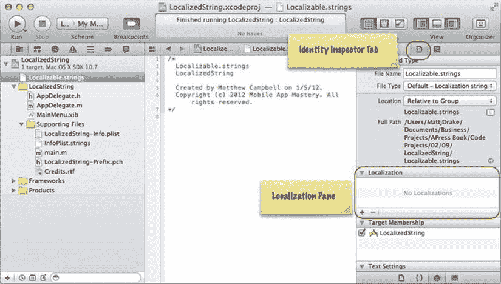

**图 2-1.** *字符串文件标识选项*

**注意：** 在 Xcode 4.2 中，第一次点击该按钮时，标识检查器可能会自动跳转到下一个文件，而不先给您选择语言的机会。如果发生这种情况，请回到标识检查器中的字符串文件，并添加其余的语言支持。

您打算支持的每种语言都会出现在本地化面板中（请参见图 2-2）。如果您在 Xcode 中仔细查看字符串文件，您会注意到，您想要支持的每种语言都有一个字符串文件（您可能需要展开组文件夹才能看到这些文件）。

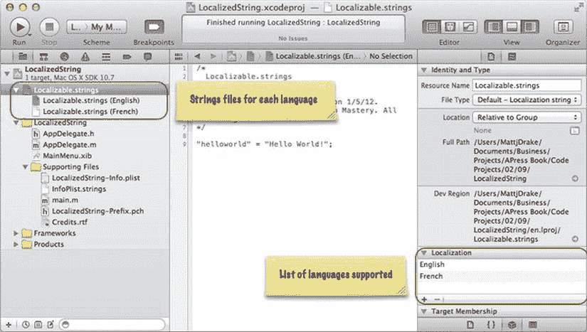

**图 2-2.** *本地化字符串文件*

要向每个文件添加内容，您需要指定一个键（稍后可用于查找内容）和字符串内容本身。例如，如果您想添加一个法文和英文的 `Hello World!` 字符串，请从英文的字符串文件（`Localizable.strings (English)`）开始添加这个键值数据。

```
"helloworld" = "Hello World!";
```

这里 `helloworld` 是键，字符串内容包含在引号之间。该行以分号结束。

接下来，为法文字符串文件（`Localizable.strings (French)`）添加相同的内容。

```
"helloworld" = "Bonjour tout le monde!";
```

要将此字符串放入您的应用，请使用 `NSLocalizedString` 函数，根据您提供的键返回本地化后的字符串。

```objective-c
NSString *localizedString = NSLocalizedString(@"helloworld", @"Hello world in" 
"localized languages");
```

在这个例子中，英语用户将看到 "Hello World!"，而法语用户将看到 "Bonjour tout le monde!"。请参见列表 2-7 中的代码。


### 代码

**代码清单 2-7.** *AppDelegate.m*

```
#import "AppDelegate.h"

@implementation AppDelegate

@synthesize window = _window;

- (void)applicationDidFinishLaunching:(NSNotification *)aNotification{
    NSString *localizedString = NSLocalizedString(@"helloworld", @"Hello world" 
    "in localized languages");
    NSLog(@"%@", localizedString);

}

@end
```

### 用法

要使用这段代码，请在 Xcode 中构建并运行你的 Mac 或 iOS 应用程序。检查控制台以查看写入日志的字符串是什么。如果你将系统偏好设置为英语，则会在控制台中看到 "Hello World!"。

如果你正在处理一个 Mac 应用程序并希望查看法语的本地化字符串，请转到 Mac 的系统偏好设置，点击“语言与文本”，然后将“Français”拖到语言列表的顶部。如果你正在处理一个 iOS 应用程序，请使用 iOS 模拟器或设备的“设置”应用，然后依次选择**通用**  **国际**  **语言**  **Français**。然后返回 Xcode，运行你的应用，查看控制台以观察显示出的本地化字符串。

## 2.10 将数字转换为字符串

### 问题

你有一些数字（原始类型或 `NSNumber` 对象），并希望将它们用作字符串。

### 解决方案

处理数字有两种方式：作为原始类型和 `NSNumber` 对象。要将原始类型用作字符串，你需要使用 `stringWithFormat` 构造器创建一个新字符串，并插入原始类型的值。在这里，你可以使用与解法 1.2 中相同的字符串格式化器。

`NSNumber` 对象可以以相同的方式插入到新字符串中，或者你也可以直接使用 `NSNumber` 的 `stringValue` 函数来返回数字的字符串版本。

### 工作原理

如果你有一个像浮点数这样的原始类型想要转换成字符串，你需要使用 `stringWithFormat` 构造器创建一个新字符串。

```
float fNumber = 12;

NSString *floatToString = [NSString stringWithFormat:@"%f", fNumber];
```

如果你想转换的数字是一个 `NSNumber` 对象，你可以简单地使用该对象的 `stringValue` 函数。

```
NSNumber *number = [NSNumber numberWithFloat:30];

NSString *numberToString = [number stringValue];
```

相关代码见代码清单 2-8。

### 代码

**代码清单 2-8.** *main.m*

```
#import <Foundation/Foundation.h>

int main (int argc, const char * argv[])
{

    @autoreleasepool {

        float fNumber = 12;

        NSString *floatToString = [NSString stringWithFormat:@"%f", fNumber];

        NSLog(@"floatToString = %@", floatToString);

        NSNumber *number = [NSNumber numberWithFloat:30];

        NSString *numberToString = [number stringValue];

        NSLog(@"numberToString = %@", numberToString);

    }
    return 0;
}
```

### 用法

要使用这段代码，请在 Xcode 中构建并运行你的 Mac 应用程序。你可以看到基于现有数字创建并使用的新字符串。

```
floatToString = 12.000000
numberToString = 30
```

## 2.11 将字符串转换为数字

### 问题

在你的应用中，有些数字以字符串形式存储，但你需要将这些数字用于数学函数或使用 `NSNumber` 应用特殊格式。

### 解决方案

如果你需要执行任何数学函数（如加法或减法），你需要将以字符串形式存储的数字转换为原始类型，如 `float` 或 `int`。幸运的是，`NSString` 内置了一些函数，使得这种转换变得非常容易。

但是，如果你想要使用 `NSNumber` 的面向对象特性，那么你需要使用 `NSNumber`。使用 `NSNumber` 要求你为每个数字构造新的 `NSNumber` 对象。如果你需要将这些数字存储在数组中，或者想要使用 `NSNumber` 内置的其他特性，请这样做。

### 工作原理

如果你有一个存储在字符串中的数字，并想将其用作浮点原始类型，请使用字符串的 `floatValue` 函数来获取该值。

```
NSString *aFloatValue = @"12.50";
float f = [aFloatValue floatValue];
```

如果你更倾向于将此字符串转换为 `NSNumber` 对象，你需要在 `NSNumber` 构造器中使用 `floatValue` 函数。

```
NSNumber *aFloatNumber = [NSNumber numberWithFloat:[aFloatValue floatValue]];
```

相关代码见代码清单 2-9。

### 代码

**代码清单 2-9.** *main.m*

```
#import <Foundation/Foundation.h>

int main (int argc, const char * argv[])
{

    @autoreleasepool {

        NSString *aFloatValue = @"12.50";

        float f = [aFloatValue floatValue];

        float result = f * 2 + 45;

        NSLog(@"f = %f and result = %f", f, result);

        NSNumber *aFloatNumber = [NSNumber numberWithFloat:[aFloatValue floatValue]];

        NSLog(@"aFloatNumber = %@", aFloatNumber);

    }
    return 0;
}
```

### 用法

要使用这段代码，请在 Xcode 中构建并运行你的 Mac 应用程序。你可以将数字写入日志，但必须为原始类型使用正确的字符串格式化器，并为 `NSNumber` 对象使用 `%@`。

```
f = 12.500000 and result = 70.000000
aFloatNumber = 12.5
```

## 2.12 格式化数字

### 问题

你希望以用户期望的格式向用户呈现数字。这包括你想要将数字显示为货币、科学记数法或拼写出来的情况。

### 解决方案

使用 `NSNumberFormatter` 类来格式化数字。你需要实例化一个 `NSNumberFormatter` 对象并设置一些属性，以指示它以你想要的方式显示你的数字。

### 工作原理

假设你有一个数字想要显示为货币。

```
NSNumber *numberToFormat = [NSNumber numberWithFloat:9.99];
```

首先，实例化一个 `NSNumberFormatter` 对象，并将对象的 `numberStyle` 设置为货币样式。

```
NSNumberFormatter *numberFormatter = [[NSNumberFormatter alloc] init];

numberFormatter.numberStyle = NSNumberFormatterCurrencyStyle;
```

当你准备好将数字呈现为格式化的货币字符串时，请使用 `stringFromNumber` 函数。

```
NSLog(@"Formatted for currency: %@", [numberFormatter
    stringFromNumber:numberToFormat]);
```

这将以系统设置的区域设置呈现货币数字。在美国你将看到美元符号，在英国你将看到英镑符号。

货币是你可以应用于数字的多种数字样式之一。有关数字样式的完整列表，请参见表 2-1。相关代码见代码清单 2-10。

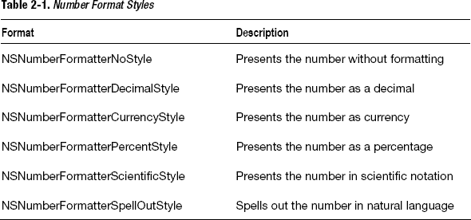

### 代码

**代码清单 2-10.** *main.m*

```
#import <Foundation/Foundation.h>

int main (int argc, const char * argv[])
{

    @autoreleasepool {

        NSNumber *numberToFormat = [NSNumber numberWithFloat:9.99];

        NSLog(@"numberToFormat = %@", numberToFormat);

        NSNumberFormatter *numberFormatter = [[NSNumberFormatter alloc] init];

        numberFormatter.numberStyle = NSNumberFormatterCurrencyStyle;

        NSLog(@"Formatted for currency: %@", [numberFormatter
            stringFromNumber:numberToFormat]);

    }
    return 0;
}
```

### 用法

要使用这段代码，请在 Xcode 中构建并运行你的 Mac 应用程序。你可以在控制台窗口中看到应用的格式。

```
numberToFormat = 9.99
Formatted for currency: $9.99
```


好的，作为高级文档工程师和翻译员，我将遵循您的注意事项和示例，将给定的英文文本翻译成中文。


