# 处理对象集合

本章将帮助你使用 Foundation 框架和 Objective-C 处理数组和字典。

本章中的秘诀将向你展示如何：

- 使用 `NSArray` 和 `NSMutableArray` 创建数组
- 向数组中添加、移除和插入对象
- 搜索和排序数组
- 使用不同的过程来迭代数组
- 将数组内容保存到文件系统
- 使用 `NSDictionary` 和 `NSMutableDictionary` 创建字典
- 向字典添加和移除对象
- 使用不同的过程来迭代字典
- 将字典内容保存到文件系统
- 使用 `NSSet` 和 `NSMutableSet` 创建集合
- 基于对象内容比较集合
- 使用不同的过程来迭代集合
- 向集合添加和移除对象

**注意：** 在 Objective-C 中，有三种类型的对象集合可供使用：数组、字典和集合。选择哪种集合取决于你的应用需求。

数组将对象组织成通过整数索引的列表。

字典使用键来组织对象；字典中的每个对象都与一个字符串键相关联，你可以稍后使用该键来检索对象。

集合包含对象，但不要假设它们有任何顺序或被索引。集合中的对象也必须是唯一的（没有重复项）。从集合中检索对象非常快，因为集合没有索引的开销，因此你会看到它在考虑性能的情况下被使用。

## 3.1 创建数组

### 问题

你的应用需要你将对象分组到一个列表中。

### 解决方案

Objective-C 有两个 Foundation 类，名为 `NSArray` 和 `NSMutableArray`，你可以使用它们来创建对象列表。当你有一个已知不需要动态更改的列表时，使用 `NSArray`；当你需要在之后向数组中添加和移除对象时，使用 `NSMutableArray`。

### 工作原理

数组在 Objective-C 中像其他对象一样创建：你使用 `alloc` 和 `init` 构造函数或像 `arrayWithObjects` 这样的便捷函数来创建数组。如果你使用 `NSArray` 创建数组，数组一旦创建，就不能进行任何更改。使用 `NSMutableArray` 来创建日后可以修改的数组。

以下是创建一个字符串数组的示例：

`NSArray *listOfLetters = [NSArray arrayWithObjects:@"A", @"B", @"C", nil];`

当你使用 `arrayWithObjects` 创建数组时，你必须传入一个以 `nil` 结尾的、用逗号分隔的列表中的对象。这个例子使用了 `NSString` 对象，但你可以对 `NSArray` 和 `NSMutableArray` 使用你喜欢的任何对象，包括从你的自定义类实例化的对象。

如果你选择使用 `NSMutableArray`，你可以使用相同的构造函数来创建你的数组（`NSMutableArray` 是 `NSArray` 的子类）。你也可以使用 `alloc` 和 `init` 创建你的 `NSMutableArray`，因为你可能稍后会向数组中添加对象。有关 `NSArray` 和 `NSMutableArray` 可用构造函数的完整列表，请参见表 3-1，相关代码请参见代码清单 3-1。

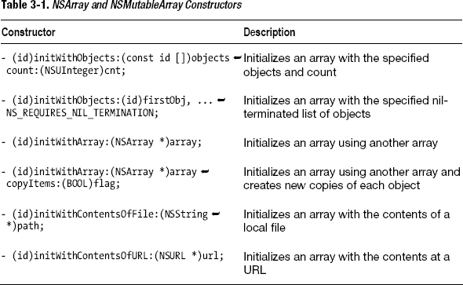

### 代码

**代码清单 3-1.** *main.m*

```
#import <Foundation/Foundation.h>

int main (int argc, const char * argv[])
{

    @autoreleasepool {

        NSArray *listOfLetters1 = [NSArray arrayWithObjects:@"A", @"B", @"C", nil];

        NSLog(@"listOfLetters1 = %@", listOfLetters1);

        NSNumber *number1 = [NSNumber numberWithInt:1];
        NSNumber *number2 = [NSNumber numberWithInt:2];
        NSNumber *number3 = [NSNumber numberWithInt:3];

        NSMutableArray *listOfNumbers1 = [[NSMutableArray alloc] initWithObjects:number1, number2, number3, nil];

        NSLog(@"listOfNumbers1 = %@", listOfNumbers1);

        id list[3];
        list[0] = @"D";
        list[1] = @"E";
        list[2] = @"F";

        NSMutableArray *listOfLetters2 = [[NSMutableArray alloc] initWithObjects:list count:3];

        NSLog(@"listOfLetters2 = %@", listOfLetters2);

    }
    return 0;
}
```

### 用法

要使用此代码，请从 Xcode 构建并运行你的 Mac 应用。检查日志以查看每个数组的内容。在下一个秘诀中，你将看到如何引用这些数组元素，以便将它们的内容打印到日志中或在程序的其他地方使用它们。

## 3.2 引用数组中的对象

### 问题

你想要获取对数组中对象的引用，以便访问其属性或向对象发送消息。

### 解决方案

使用 `objectAtIndex:` 方法来获取对数组中与整数位置对应的对象的引用。你也可以使用 `lastObject` 函数获取对数组中最后一个对象的引用。

### 工作原理

`NSArray` 将对象组织在一个以整数索引的列表中，从数字 0 开始。如果你想获取对数组中对象的引用并且知道该对象的位置，可以使用 `objectAtIndex:` 函数来获取对该对象的引用。

`NSString *stringObject1 = [listOfLetters objectAtIndex:0];`

还有一个非常方便的函数叫 `lastObject`，你可以用它快速获取对数组中最后一个对象的引用。

`NSString *stringObject2 = [listOfLetters lastObject];`

通常，你不会知道对象在数组中的位置。如果你已经有一个对相关对象的引用，可以使用 `indexOfObject:` 函数，以该对象引用作为参数，来查找该对象在数组中的位置。

`NSUInteger position = [listOfLetters indexOfObject:@"B"];`

参见代码清单 3-2。

### 代码

**代码清单 3-2.** *main.m*

```
#import <Foundation/Foundation.h>

int main (int argc, const char * argv[])
{

    @autoreleasepool {

        NSMutableArray *listOfLetters = [NSMutableArray arrayWithObjects:@"A", @"B", @"C", nil];

        NSString *stringObject1 = [listOfLetters objectAtIndex:0];

        NSLog(@"stringObject1 = %@", stringObject1);

        NSString *stringObject2 = [listOfLetters lastObject];

        NSLog(@"stringObject2 = %@", stringObject2);

        NSUInteger position = [listOfLetters indexOfObject:@"B"];

        NSLog(@"position = %lu", position);

    }
    return 0;
}
```

### 用法

要使用此代码，请从 Xcode 构建并运行你的 Mac 应用。你可以看到对象已成功通过写入控制台的输出被引用。

```
stringObject1 = A
stringObject2 = C
position = 1
```

## 3.3 获取数组计数

### 问题

你的应用正在处理数组中的内容，你需要知道数组中有多少元素，以便适当地呈现你的内容。

### 解决方案

`NSArray` 对象有一个 `count` 属性，你可以用它来找出数组中有多少元素。

### 工作原理

要使用 `count` 属性，你可以在任何数组对象上使用点表示法（`listOfLetters.count`），或者你可以发送 `count` 消息（`[listOfLetters count]`）来找出数组中有多少元素。请参阅代码清单 3-3 中的代码。


### 代码

**列表 3-3.** `main.m`

```
#import <Foundation/Foundation.h>

int main (int argc, const char * argv[])
{

    @autoreleasepool {

        NSMutableArray *listOfLetters = [NSMutableArray arrayWithObjects:@"A", @"B",
 @"C", nil];

        NSLog(@"listOfLetters has %lu elements", listOfLetters.count);

    }
    return 0;
}
```

### 用法

要使用此代码，请在 Xcode 中构建并运行你的 Mac 应用程序。日志消息将显示元素的数量。

```
listOfLetters has 3 elements
```

## 3.4 遍历数组

### 问题

你有一个对象数组，希望能够向数组中的每个对象发送相同的消息或访问相同的属性。

### 解决方案

`NSArray` 对象提供了三种内置方式来遍历对象列表。很多人使用 `for-each` 循环来遍历数组中的每个元素。这种结构让你能够设置要应用于数组中每个元素的代码行。

你还可以使用名为 `makeObjectsPerformSelector:withObject:` 的方法，在其中传入你想要每个对象执行的方法名称以及一个参数。

最后，你现在可以选择使用代码块作为参数，通过 `enumerateObjectsUsingBlock:` 方法将其应用于数组中的每个对象。该方法提供了与 `for-each` 循环相同的功能，但你无需编写循环本身的代码，并且会获得一个能帮助你追踪当前元素索引的参数。

### 工作原理

由于你需要内容作为本技巧的示例，请创建三个 `NSMutableString` 对象放入一个新数组。

```
NSMutableString *string1 = [NSMutableString stringWithString:@"A"];
NSMutableString *string2 = [NSMutableString stringWithString:@"B"];
NSMutableString *string3 = [NSMutableString stringWithString:@"C"];

NSArray *listOfObjects = [NSArray arrayWithObjects:string1, string2, string3, nil];
```

要使用 `for-each` 循环遍历此数组，你需要设置循环，并提供一个可引用的局部变量，该变量将代表数组中的当前对象。你还需要添加将在列表中每个对象上执行的代码。

```
for(NSMutableString *s in listOfObjects){
    NSLog(@"This string in lowercase is %@", [s lowercaseString]);
}
```

在该 `for-each` 循环中，你遍历数组中的每个可变字符串，并向日志写入一条消息。`lowercaseString` 函数是一个 `NSString` 函数，它返回全部小写的字符串。

你可以通过发送 `makeObjectsPerformSelector:withObject:` 消息，在不使用 `for-each` 循环的情况下向数组中的每个对象发送消息。你需要使用 `@selector` 关键字和括号中的方法名称来传入该方法。在属性修饰符 `withObject:` 之后传入参数值。

```
[listOfObjects makeObjectsPerformSelector:@selector(appendString:)
                               withObject:@"-MORE"];
```

这里你所做的是向数组中的每个可变字符串发送带有字符串参数 `@"-MORE"` 的 `appendString` 消息。因此，现在每个字符串都已更改，在末尾包含了额外的字符。

**警告：** 确保数组中的对象能够响应你尝试发送的消息。如果你尝试向数组中无法响应某消息的对象发送该消息，程序将崩溃，并且你会收到 `unrecognized selector sent to instance` 错误消息。

你可以使用块来定义一个代码块，并将其应用于数组中的每个对象。块是一种封装代码的方式，使得代码可以被视为一个对象，并因此作为参数传递给另一个对象。`NSArray` 的 `enumerateObjectsUsingBlock:` 方法使你能够为数组中的每个元素执行一个代码块。

```
[listOfObjects enumerateObjectsUsingBlock:^(id obj, NSUInteger idx, BOOL *stop)
{
    NSLog(@"object(%lu)'s description is %@",idx, [obj description]);
}];
```

这基本上提供了与 `for-each` 循环相同的功能，但你只需使用一行代码。此外，该块带有内置参数：你需要引用的对象以及一个帮助你追踪在数组中位置的索引。在此示例中，你使用块为列表中的每个对象，利用对象的描述函数和索引参数向日志写入消息。代码请参见列表 3-4。

### 代码

**列表 3-4.** `main.m`

```
#import <Foundation/Foundation.h>

int main (int argc, const char * argv[])
{

    @autoreleasepool {

        NSMutableString *string1 = [NSMutableString stringWithString:@"A"];
        NSMutableString *string2 = [NSMutableString stringWithString:@"B"];
        NSMutableString *string3 = [NSMutableString stringWithString:@"C"];

        NSArray *listOfObjects = [NSArray arrayWithObjects:string1, string2, string3,
 nil];

        for(NSMutableString *s in listOfObjects){
            NSLog(@"This string in lowercase is %@", [s lowercaseString]);
        }

        [listOfObjects makeObjectsPerformSelector:@selector(appendString:)
                                       withObject:@"-MORE"];

        [listOfObjects enumerateObjectsUsingBlock:^(id obj, NSUInteger idx,
 BOOL *stop) {
            NSLog(@"object(%lu)'s description is %@",idx, [obj description]);
        }];

    }

    return 0;
}
```

### 用法

要使用此代码，请在 Xcode 中构建并运行你的 Mac 应用程序。日志消息将显示开头创建的数组的每种遍历方式的结果。

```
This string in lowercase is a
This string in lowercase is b
This string in lowercase is c
object(0)'s description is A-MORE
object(1)'s description is B-MORE
object(2)'s description is C-MORE
```

## 3.5 排序数组

### 问题

你正在使用数组来组织自定义对象，并且希望这些对象按照其属性值排序后出现在列表中。

### 解决方案

为你想要用来排序数组的每个属性创建一个 `NSSortDescriptor` 对象。将所有 `NSSortDescriptor` 对象放入一个数组，该数组将在下一步中用作参数。使用 `NSArray sortedArrayUsingDescriptors:` 方法，并将 `NSSortDescriptor` 对象的数组作为参数传入，以返回一个按你指定的属性排序的数组。


### 工作原理

本方法使用 `Person` 对象。有关 `Person` 对象的类定义，请参见列表 3-5。虽然你可以使用此方法对字符串或数字等对象进行排序，但当与自定义对象一起使用时，才能真正看到 `NSSortDescriptor` 的强大功能。

你的自定义类名为 `Person`，包含三个属性：`firstName`、`lastName` 和 `age`。`Person` 类还有两个方法：`reportState` 和自定义构造器 `initWithFirstName:lastName:andAge`。

首先，创建一个 `Person` 对象数组。

```
//实例化 Person 对象并将它们全部添加到一个数组中：
Person *p1 = [[Person alloc] initWithFirstName:@"Rebecca"
                                      lastName:@"Smith"
                                        andAge:33];
Person *p2 = [[Person alloc] initWithFirstName:@"Albert"
                                      lastName:@"Case"
                                        andAge:24];
Person *p3 = [[Person alloc] initWithFirstName:@"Anton"
                                      lastName:@"Belfey"
                                        andAge:45];
Person *p4 = [[Person alloc] initWithFirstName:@"Tom"
                                      lastName:@"Gun"
                                        andAge:17];
Person *p5 = [[Person alloc] initWithFirstName:@"Cindy"
                                      lastName:@"Lou"
                                        andAge:6];
Person *p6 = [[Person alloc] initWithFirstName:@"Yanno"
                                      lastName:@"Dirst"
                                        andAge:76];

NSArray *listOfObjects = [NSArray arrayWithObjects:p1, p2, p3, p4, p5, p6,  nil];
```

如果你打印此数组中的每个元素，对象将按照你放入数组的顺序出现。如果你想按每个人的年龄、姓氏和名字对该数组进行排序，可以使用 `NSSortDescriptor` 对象。你需要为你用于排序的每个 `Person` 属性指定一个排序描述符。

```
//创建三个排序描述符并将其添加到一个数组中：
NSSortDescriptor *sd1 = [NSSortDescriptor sortDescriptorWithKey:@"age"
                                                      ascending:YES];

NSSortDescriptor *sd2 = [NSSortDescriptor sortDescriptorWithKey:@"lastName"
                                                      ascending:YES];

NSSortDescriptor *sd3 = [NSSortDescriptor sortDescriptorWithKey:@"firstName"
                                                      ascending:YES];

NSArray *sdArray1 = [NSArray arrayWithObjects:sd1, sd2, sd3, nil];
```

你必须以字符串形式传入属性名称，并指定该属性是按升序还是降序排序。最后，所有排序描述符都需要放入一个数组中。

数组中每个排序描述符的位置决定了对象将被排序的顺序。因此，如果你希望数组先按年龄排序，再按姓氏排序，请确保将对应年龄的排序描述符添加到对应姓氏的排序描述符之前。

要获取排序后的数组，请向要排序的数组发送 `sortedArrayUsingDescriptors` 消息，并将排序描述符数组作为参数传递。

```
NSArray *sortedArray1 = [listOfObjects sortedArrayUsingDescriptors:sdArray1];
```

要查看结果，请使用 `makeObjectsPerformSelector` 方法让排序后数组中的每个对象将其状态报告到日志。

```
[sortedArray1 makeObjectsPerformSelector:@selector(reportState)];
```

这将按照排序描述符指定的顺序（年龄、姓氏、名字）将每个 `Person` 对象的详细信息打印到日志中。代码见列表 3-5 至 3-7。

## 代码

**列表 3-5.** *Person.h*

```
#import <Foundation/Foundation.h>

@interface Person : NSObject

@property(strong) NSString *firstName;
@property(strong) NSString *lastName;
@property(assign) int age;

-(id)initWithFirstName:(NSString *)fName lastName:(NSString *)lName andAge:(int)a;

-(void)reportState;

@end
```

**列表 3-6.** *Person.m*

```
#import "Person.h"

@implementation Person

@synthesize firstName, lastName, age;

-(id)initWithFirstName:(NSString *)fName lastName:(NSString *)lName andAge:(int)a{
    self = [super init];
    if (self) {
        self.firstName = fName;
        self.lastName = lName;
        self.age = a;
    }
    return self;
}

-(void)reportState{
    NSLog(@"这个人的名字是 %@ %@，年龄 %i 岁", firstName, lastName, age);
}

@end
```

**列表 3-7.** *main.m*

```
#import <Foundation/Foundation.h>
#import "Person.h"

int main (int argc, const char * argv[])
{

    @autoreleasepool {

        //实例化 Person 对象并将它们全部添加到一个数组中：
        Person *p1 = [[Person alloc] initWithFirstName:@"Rebecca"
                                              lastName:@"Smith"
                                                andAge:33];

        Person *p2 = [[Person alloc] initWithFirstName:@"Albert"
                                              lastName:@"Case"
                                                andAge:24];

        Person *p3 = [[Person alloc] initWithFirstName:@"Anton"
                                              lastName:@"Belfey"
                                                andAge:45];

        Person *p4 = [[Person alloc] initWithFirstName:@"Tom"
                                              lastName:@"Gun"
                                                andAge:17];

        Person *p5 = [[Person alloc] initWithFirstName:@"Cindy"
                                              lastName:@"Lou"
                                                andAge:6];

        Person *p6 = [[Person alloc] initWithFirstName:@"Yanno"
                                              lastName:@"Dirst"
                                                andAge:76];

        NSArray *listOfObjects = [NSArray arrayWithObjects:p1, p2, p3, p4, p5, p6,
  nil];

        NSLog(@"打印未排序的数组");

        [listOfObjects makeObjectsPerformSelector:@selector(reportState)];

        //创建三个排序描述符并将其添加到一个数组中：
        NSSortDescriptor *sd1 = [NSSortDescriptor sortDescriptorWithKey:@"age"
                                                              ascending:YES];

        NSSortDescriptor *sd2 = [NSSortDescriptor sortDescriptorWithKey:@"lastName"
                                                              ascending:YES];

        NSSortDescriptor *sd3 = [NSSortDescriptor sortDescriptorWithKey:@"firstName"
                                                              ascending:YES];

        NSArray *sdArray1 = [NSArray arrayWithObjects:sd1, sd2, sd3, nil];

        NSLog(@"打印排序后的数组（年龄，姓氏，名字）");

        NSArray *sortedArray1 = [listOfObjects sortedArrayUsingDescriptors:sdArray1];

        [sortedArray1 makeObjectsPerformSelector:@selector(reportState)];

        NSArray *sdArray2 = [NSArray arrayWithObjects:sd2, sd1, sd3, nil];

        NSArray *sortedArray2 = [listOfObjects sortedArrayUsingDescriptors:sdArray2];

        NSLog(@"打印排序后的数组（姓氏，名字，年龄）");

        [sortedArray2 makeObjectsPerformSelector:@selector(reportState)];

    }
    return 0;
}
```


### 用法

要使用此代码，你需要为`Person`类创建一个文件。这是一个 Objective-C 类，你可以使用 Xcode 文件模板来创建它。`Person`类必须被导入到位于`main.m`（适用于 Mac 命令行应用）的代码中。构建并运行项目，然后检查控制台日志以查看排序数组的结果。

```
PRINT OUT ARRAY UNSORTED
This person's name is Rebecca Smith who is 33 years old
This person's name is Albert Case who is 24 years old
This person's name is Anton Belfey who is 45 years old
This person's name is Tom Gun who is 17 years old
This person's name is Cindy Lou who is 6 years old
This person's name is Yanno Dirst who is 76 years old
PRINT OUT SORTED ARRAY (AGE,LASTNAME,FIRSTNAME)
This person's name is Cindy Lou who is 6 years old
This person's name is Tom Gun who is 17 years old
This person's name is Albert Case who is 24 years old
This person's name is Rebecca Smith who is 33 years old
This person's name is Anton Belfey who is 45 years old
This person's name is Yanno Dirst who is 76 years old
PRINT OUT SORTED ARRAY (LASTNAME,FIRSTNAME,AGE)
This person's name is Anton Belfey who is 45 years old
This person's name is Albert Case who is 24 years old
This person's name is Yanno Dirst who is 76 years old
This person's name is Tom Gun who is 17 years old
This person's name is Cindy Lou who is 6 years old
This person's name is Rebecca Smith who is 33 years old
```

## 3.6 查询数组

### 问题

你有一个包含大量对象的数组，希望根据某些条件选择该数组的一个子集，以用于 iOS 应用表格中的搜索栏等控件。

### 解决方案

首先需要的是一个`NSPredicate`对象。`NSPredicate`用于定义搜索查询。接下来，你可以使用原始数组的`filteredArrayUsingPredicate`函数，根据你定义的`NSPredicate`对象的规范，返回原始数组的一个子集。

### 工作原理

针对本节内容，使用与配方 3.5 中相同的`Person`对象。你将定义一个谓词，以返回仅包含年龄大于 30 的`Person`对象的数组。

```
NSPredicate *predicate = [NSPredicate predicateWithFormat:@"age > 30"];
```

谓词需要一个逻辑表达式来应用于数组中的对象。这里的`age`是一个属性，必须是你正在查询的数组对象的一部分。你可以使用与编程中相同的比较运算符（请参阅表 3-2 以获取`NSPredicate`运算符的完整列表）。

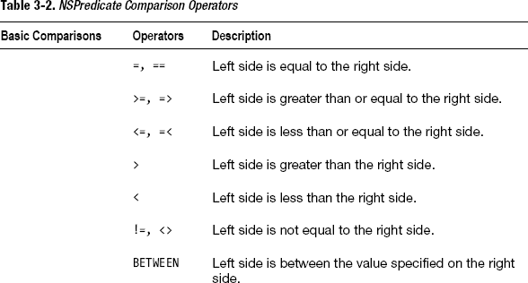
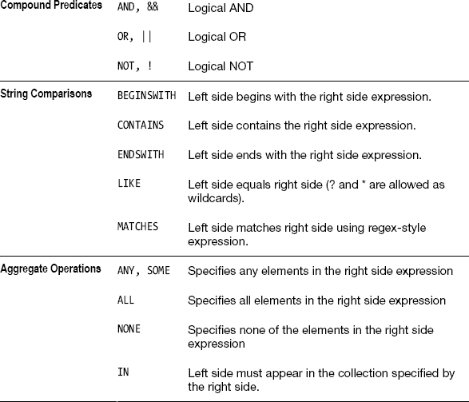

一旦设置好谓词，你只需要使用`filteredArrayUsingPredicate:`函数，并将`NSPredicate`对象作为参数传递，即可获取数组的子集。

```
NSArray *arraySubset = [listOfObjects filteredArrayUsingPredicate:predicate];
```

你将得到另一个数组，其中仅包含符合你在`NSPredicate`对象中编码规范的对象。有关代码，请参见列表 3-8 至 3-10。

#### 代码

**列表 3-8.** *Person.h*

```
#import <Foundation/Foundation.h>

@interface Person : NSObject

@property(strong) NSString *firstName;
@property(strong) NSString *lastName;
@property(assign) int age;

-(id)initWithFirstName:(NSString *)fName lastName:(NSString *)lName andAge:(int)a;

-(void)reportState;

@end
```

**列表 3-9.** *Person.m*

```
#import "Person.h"

@implementation Person

@synthesize firstName, lastName, age;

-(id)initWithFirstName:(NSString *)fName lastName:(NSString *)lName
andAge:(int)a{
    self = [super init];
    if (self) {
        self.firstName = fName;
        self.lastName = lName;
        self.age = a;
    }
    return self;
}

-(void)reportState{
    NSLog(@"This person's name is %@ %@ who is %i years old", firstName, lastName, age);
}

@end
```

**列表 3-10.** *main.m*

```
#import <Foundation/Foundation.h>
#import "Person.h"

int main (int argc, const char * argv[])
{

    @autoreleasepool {
        //实例化 Person 对象并将它们全部添加到一个数组：
        Person *p1 = [[Person alloc] initWithFirstName:@"Rebecca"
                                              lastName:@"Smith"
                                                andAge:33];
        Person *p2 = [[Person alloc] initWithFirstName:@"Albert"
                                              lastName:@"Case"
                                                andAge:24];
        Person *p3 = [[Person alloc] initWithFirstName:@"Anton"
                                              lastName:@"Belfey"
                                                andAge:45];
        Person *p4 = [[Person alloc] initWithFirstName:@"Tom"
                                              lastName:@"Gun"
                                                andAge:17];
        Person *p5 = [[Person alloc] initWithFirstName:@"Cindy"
                                              lastName:@"Lou"
                                                andAge:6];
        Person *p6 = [[Person alloc] initWithFirstName:@"Yanno"
                                              lastName:@"Dirst"
                                                andAge:76];

        NSArray *listOfObjects = NSArray arrayWithObjects:p1, p2, p3, p4, p5, p6,![Image
  nil];

        NSPredicate *predicate = [NSPredicate predicateWithFormat:@"age > 30"];

        NSArray *arraySubset = [listOfObjects filteredArrayUsingPredicate:predicate];

        NSLog(@"PRINT OUT ARRAY SUBSET");

        [arraySubset makeObjectsPerformSelector:@selector(reportState)];

    }
    return 0;
}
```

#### 用法

要使用此代码，请从 Xcode 构建并运行你的 Mac 应用。检查控制台以查看由`NSPredicate`对象进行的查询结果。

```
PRINT OUT ARRAY SUBSET
This person's name is Rebecca Smith who is 33 years old
This person's name is Anton Belfey who is 45 years old
This person's name is Yanno Dirst who is 76 years old
```

## 3.7 操作数组内容

### 问题

你希望数组内容更加动态化，以便你或你的用户可以添加、移除和插入对象到数组中。然而，`NSArray`是一个不可变类，因此一旦你创建了一个`NSArray`，就无法对其内容进行任何更改。

### 解决方案

如果你知道你的数组需要是动态的，请使用`NSMutableArray`。`NSMutableArray`是`NSArray`的一个子类，因此你可以像操作`NSArray`一样操作`NSMutableArray`。但`NSMutableArray`提供了允许你向数组列表中添加、移除和插入对象的方法。


### 工作原理

首先，实例化一个 `NSMutableArray` 对象。你可以使用任意构造方法来完成此操作。要创建一个新的空 `NSMutableArray`，只需使用 `alloc` 和 `init`。

```
NSMutableArray *listOfLetters = [[NSMutableArray alloc] init];
```

要向此数组添加对象，必须向数组发送 `addObject:` 消息，并将要添加的对象作为参数。

```
[listOfLetters addObject:@"A"];
```
```
[listOfLetters addObject:@"B"];
```
```
[listOfLetters addObject:@"C"];
```

使用 `addObject:` 时，你始终是将对象添加到数组列表的末尾。如果要将对象插入到数组中的其他位置，则需要使用 `insertObject:atIndex:` 方法。

```
[listOfLetters insertObject:@"a"
                    atIndex:0];
```

这会将对象插入到数组的第一个位置。

如果你想在特定索引处用一个对象完全替换另一个对象，可以使用 `replaceObjectAtIndex:withObject:` 方法。以下是将字符串 C 替换为小写 c 的方法：

```
[listOfLetters replaceObjectAtIndex:2
                         withObject:@"c"];
```

要让数组中的两个对象交换位置，可以使用 `exchangeObjectAtIndex:withObjectAtIndex:` 方法。

```
[listOfLetters exchangeObjectAtIndex:0
                   withObjectAtIndex:2];
```

当需要从数组中移除对象时，有几种不同的方法可供选择。你可以移除指定索引处的对象，可以移除数组中的最后一个对象，也可以移除列表中的所有对象。如果你手头有该对象的引用，也可以使用该对象引用来从数组中移除该对象。以下是一些移除对象的示例：

```
[listOfLetters removeObject:@"A"];
```
```
[listOfLetters removeObjectAtIndex:1];
```
```
[listOfLetters removeLastObject];
```
```
[listOfLetters removeAllObjects];
```

代码请参见代码清单 3-11。

### 代码

**代码清单 3-11.** *main.m*

```
#import <Foundation/Foundation.h>

int main (int argc, const char * argv[])
{

    @autoreleasepool {

        NSMutableArray *listOfLetters = [[NSMutableArray alloc] init];

        [listOfLetters addObject:@"A"];

        [listOfLetters addObject:@"B"];

        [listOfLetters addObject:@"C"];

        NSLog(@"OBJECTS ADDED TO ARRAY: %@", listOfLetters);

        [listOfLetters insertObject:@"a"
                            atIndex:0];

        NSLog(@"OBJECT 'a' INSERTED INTO ARRAY: %@", listOfLetters);

        [listOfLetters replaceObjectAtIndex:2
                                 withObject:@"c"];

        NSLog(@"OBJECT 'c' REPLACED 'C' IN ARRAY: %@", listOfLetters);

        [listOfLetters exchangeObjectAtIndex:0
                           withObjectAtIndex:2];

        NSLog(@"OBJECT AT INDEX 1 EXCHANGED WITH OBJECT AT INDEX 2 IN ARRAY: %@",
 listOfLetters);

        [listOfLetters removeObject:@"A"];

         NSLog(@"OBJECT 'A' REMOVED IN ARRAY: %@", listOfLetters);

        [listOfLetters removeObjectAtIndex:1];

         NSLog(@"OBJECT AT INDEX 1 REMOVED IN ARRAY: %@", listOfLetters);

        [listOfLetters removeLastObject];

         NSLog(@"LAST OBJECT REMOVED IN ARRAY: %@", listOfLetters);

        [listOfLetters removeAllObjects];

         NSLog(@"ALL OBJECTS REMOVED IN ARRAY: %@", listOfLetters);

    }
    return 0;
}
```

### 用法

要使用此代码，请从 Xcode 构建并运行你的 Mac 应用。检查控制台以查看每次操作后数组的变化。

```
OBJECTS ADDED TO ARRAY: (
    A,
    B,
    C
)
OBJECT 'a' INSERTED INTO ARRAY: (
    a,
    A,
    B,
    C
)
OBJECT 'c' REPLACED 'C' IN ARRAY: (
    a,
    A,
    B,
    c
)
OBJECT AT INDEX 1 EXCHANGED WITH OBJECT AT INDEX 2 IN ARRAY: (
    B,
    A,
    a,
    c
)
OBJECT 'A' REMOVED IN ARRAY: (
    B,
    a,
    c
)
OBJECT AT INDEX 1 REMOVED IN ARRAY: (
    B,
    c
)
LAST OBJECT REMOVED IN ARRAY: (
    B
)
ALL OBJECTS REMOVED IN ARRAY: (
)
```

## 3.8 将数组保存到文件系统

### 问题

你希望将数组中的对象保存到文件系统，以便以后使用或供其他程序使用。

### 解决方案

如果你的数组包含数字或字符串对象列表，你可以将所有对象保存到文件系统以供以后使用。使用 `writeToFile:atomically:` 方法执行此操作。请注意，这不适用于自定义对象。自定义对象需要你采用 `NSCoding` 协议并使用归档类（第 9 章）或 Core Data（第 10 章）。

### 工作原理

对于本教程，创建一个填充了字符串和数字的数组。

```
NSArray *listOfObjects = [NSArray arrayWithObjects:@"A", @"B", @"C", [NSNumber
  numberWithInt:1], [NSNumber numberWithInt:2], [NSNumber numberWithInt:3],  nil];
```

要将其保存到文件系统，首先需要一个文件引用。

```
NSString *filePathName = @"/Users/Shared/array.txt";
```

**注意：** 本教程假设你是在 Mac 应用中进行尝试。iOS 文件引用的工作方式不同；获取 iOS 文件引用的示例，请参见配方 2.5。

现在，你可以使用 `writeToFile:atomically:` 方法将此数组的内容写入 Mac 的文件系统。

```
[listOfObjects writeToFile:filePathName
                atomically:YES];
```

代码请参见代码清单 3-12。

### 代码

**代码清单 3-12.** *main.m*

```
#import <Foundation/Foundation.h>

int main (int argc, const char * argv[])
{

    @autoreleasepool {

        NSArray *listOfObjects = [NSArray arrayWithObjects:@"A", @"B", @"C", [NSNumber
   numberWithInt:1], [NSNumber numberWithInt:2], [NSNumber numberWithInt:3],  nil];

        NSString *filePathName = @"/Users/Shared/array.txt";

        [listOfObjects writeToFile:filePathName
                        atomically:YES];

    }

    return 0;
}
```

### 用法

要使用此代码，请从 Xcode 构建并运行你的 Mac 应用。使用访达定位已创建的文件，该文件位于 `/Users/Shared/array.txt`。文本文件的内容如下所示：

```
<?xml version="1.0" encoding="UTF-8"?>
<!DOCTYPE plist PUBLIC "-//Apple//DTD PLIST 1.0//EN"
 "http://www.apple.com/DTDs/PropertyList-1.0.dtd">
<plist version="1.0">
<array>
        <string>A</string>
        <string>B</string>
        <string>C</string>
        <integer>1</integer>
        <integer>2</integer>
        <integer>3</integer>
</array>
</plist>
```

数据以 XML 格式组织为属性列表（一种用于存储键控数据的 Objective-C 格式）。

## 3.9 从文件系统读取数组

### 问题

你的应用中有些文件包含以数组方式组织的内容，你希望在应用中使用这些内容。

### 解决方案

如果你有一个来自数组的文件，该文件是使用 `writeToFile:atomically:` 方法保存的，请使用 `initWithContentsOfFile:` 构造方法实例化一个新数组，其中包含来自文件的内容。

### 工作原理

对于本教程，请使用配方 3.8 中将数组内容保存到文件系统时使用的文件。因此，此处使用相同的文件路径名：

```
NSString *filePathName = @"/Users/Shared/array.txt";
```

**注意：** 本教程假设你是在 Mac 应用中进行尝试。iOS 文件引用的工作方式不同；获取 iOS 文件引用的示例，请参见配方 2.5。

获得该路径后，你可以使用 `initWithContentsOfFile:` 构造方法创建一个新数组，其中填充了来自文件的内容。

```
NSArray *listOfObjects = [[NSArray alloc] initWithContentsOfFile:filePathName];
```

代码请参见代码清单 3-13。


### 代码

**代码清单 3-13.** *main.m*

```objective-c
#import <Foundation/Foundation.h>

int main (int argc, const char * argv[])
{

    @autoreleasepool {

        NSString *filePathName = @"/Users/Shared/array.txt";

        NSArray *listOfObjects = [[NSArray alloc] initWithContentsOfFile:filePathName];

        NSLog(@"%@", listOfObjects);

    }
    return 0;
}
```

### 用法

要使用此代码，请从 Xcode 构建并运行你的 Mac 应用程序。检查日志以查看数组的内容。

```
(
    A,
    B,
    C,
    1,
    2,
    3
)
```

## 3.10 创建字典

### 问题

你的应用需要将对象分组到一个列表中，并且希望能够使用键来引用这些对象。

### 解决方案

Objective-C 有两个 Foundation 类，名为 `NSDictionary` 和 `NSMutableDictionary`，你可以使用它们创建带键的对象列表。当你希望得到一个确定无需动态更改的列表时，使用 `NSDictionary`；当你后续需要向字典添加或移除对象时，使用 `NSMutableDictionary`。

### 工作原理

在 Objective-C 中，字典的创建方式与其他对象类似：你可以使用 `alloc` 和 `init` 构造器，或使用如 `dictionaryWithObjects:forKeys:` 这样的便捷函数来创建字典。如果你使用 `NSDictionary` 创建字典，那么字典一旦创建完成，就无法进行任何修改。使用 `NSMutableDictionary` 来创建后续可以修改的字典。

下面是一个创建字典的示例，该字典包含不同语言的 `Hello World`。每个短语版本都以其语言作为键。

```objective-c
NSArray *listOfObjects = [NSArray arrayWithObjects:@"Hello World", @"Bonjour tout le
monde", @"Hola Mundo", nil];

NSArray *listOfKeys = [NSArray arrayWithObjects:@"english", @"french", @"spanish", nil];

NSDictionary *dictionary2 = [NSDictionary dictionaryWithObjects:listOfObjects
                                                        forKeys:listOfKeys];
```

`NSDictionary` 的构造器 `arrayWithObjects:forKeys:` 需要两个数组作为参数。第一个数组必须包含要存储的对象，第二个数组必须包含与这些对象关联的键。

如果你选择使用 `NSMutableDictionary`，你可以使用相同的构造器来创建你的数组（`NSMutableDictionary` 是 `NSDictionary` 的子类）。你也可以通过使用 `alloc` 和 `init` 来创建你的 `NSMutableDictionary`，因为你很可能在将来某个时候向数组中添加对象。有关 `NSDictionary` 和 `NSMutableDictionary` 的可用构造器完整列表，请参阅表 3-3，相关代码请参阅代码清单 3-14。

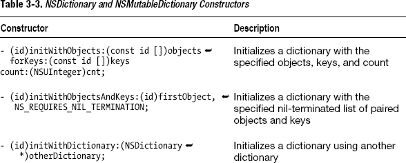

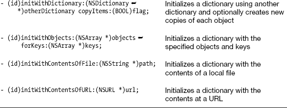

### 代码

**代码清单 3-14.** *main.m*

```objective-c
#import <Foundation/Foundation.h>

int main (int argc, const char * argv[])
{

    @autoreleasepool {

        NSDictionary *dictionary1 = [[NSDictionary alloc] init];

        NSArray *listOfObjects = [NSArray arrayWithObjects:@"Hello World",
@"Bonjour tout le monde",  @"Hola Mundo", nil];

        NSArray *listOfKeys = [NSArray arrayWithObjects:@"english", @"french",
 @"spanish", nil];

        NSDictionary *dictionary2 = [NSDictionary dictionaryWithObjects:listOfObject
                                                                forKeys:listOfKeys];

        NSLog(@"dictionary2 = %@", dictionary2);

    }
    return 0;
}
```

### 用法

要使用此代码，请从 Xcode 构建并运行你的 Mac 应用程序。你可以设置断点并使用 Xcode 调试器检查这些字典的内容。在下一个技巧中，你将看到如何引用这些字典中的每个元素，以便将其内容打印到日志中，或在程序的其他地方使用它们。你可以在日志中看到字典的完整内容被打印出来。

```
dictionary2 = {
    english = "Hello World";
    french = "Bonjour tout le monde";
    spanish = "Hola Mundo";
}
```

## 3.11 引用数组中的对象

### 问题

你希望获取字典中对象的引用，以便访问它们的属性或向这些对象发送消息。

### 解决方案

使用 `objectForKey:` 方法获取由你提供的键所引用的对象的引用。

### 工作原理

`NSDictionary` 对象根据你提供的键来维护对象列表。这使得查找任何感兴趣的对象变得非常容易和快速。只需使用 `objectForKey:` 并提供要查找对象的键，即可获得所需引用。

```objective-c
NSString *helloWorld = [dictionary objectForKey:@"english"];
```

相关代码请参阅代码清单 3-15。

### 代码

**代码清单 3-15.** *main.m*

```objective-c
#import <Foundation/Foundation.h>

int main (int argc, const char * argv[])
{

    @autoreleasepool {

NSArray *listOfObjects = [NSArray arrayWithObjects:@"Hello World",
@"Bonjour tout le monde", @"Hola Mundo", nil];

        NSArray *listOfKeys = [NSArray arrayWithObjects:@"english", @"french",
 @"spanish", nil];

        NSDictionary *dictionary = [NSDictionary dictionaryWithObjects:listOfObjects
                                                               forKeys:listOfKeys];

        NSString *helloWorld = [dictionary objectForKey:@"english"];

        NSLog(@"%@", helloWorld);

    }
    return 0;
}
```

### 用法

要使用此代码，请从 Xcode 构建并运行你的 Mac 应用程序。打印出来的 `hello world` 消息是以英语为键的那一条。

```
Hello World
```

要看法语的 hello world 消息，请将以下代码添加到你的应用程序中：

```objective-c
helloWorld = [dictionary objectForKey:@"french"];

NSLog(@"%@", helloWorld);
```

再次运行应用程序，查看最后一条控制台消息以获取法语的 hello world 消息。你也可以对西班牙语进行同样的操作。

## 3.12 获取字典计数

### 问题

你的应用正在处理字典中的内容，你需要知道字典中有多少个元素，以便适当地呈现你的内容。

### 解决方案

`NSDictionary` 对象有一个 `count` 属性，你可以用其来找出字典中有多少个元素。

### 工作原理

要使用 `count` 属性，你可以在任何字典对象上使用点表示法（`dictionary.count`），或者发送 count 消息（`[dictionary count]`）来找出字典中的元素数量。相关代码请参阅代码清单 3-16。

### 代码

**代码清单 3-16.** *main.m*

```objective-c
#import <Foundation/Foundation.h>

int main (int argc, const char * argv[])
{

    @autoreleasepool {

NSArray *listOfObjects = [NSArray arrayWithObjects:@"Hello World",
@"Bonjour tout le monde", @"Hola Mundo", nil];

        NSArray *listOfKeys = [NSArray arrayWithObjects:@"english", @"french",
 @"spanish", nil];

        NSDictionary *dictionary = [NSDictionary dictionaryWithObjects:listOfObjects
                                                               forKeys:listOfKeys];
        NSUInteger count = dictionary.count;

        NSLog(@"The dictionary contains %lu items", count);

    }
    return 0;
}
```

### 用法

要使用此代码，请从 Xcode 构建并运行你的 Mac 应用程序。日志消息将显示元素的数量。

```
The dictionary contains 3 items
```

## 3.13 遍历字典

### 问题

你有一个字典对象，希望能够向字典中的每个对象发送相同的消息或访问相同的属性。


### 解决方案

使用`allValues NSDictionary`函数将字典转换为数组，以便与`for-each`循环一起使用。或者使用`enumerateKeysAndObjectsUsingBlock:`处理字典中的每个对象。

### 工作原理

`NSDictionary`对象内置了一种遍历对象列表的方式。不过，如果你更愿意使用 Recipe 3.4 中描述的方法，可以临时将字典的键和对象内容转换为数组。例如，要使用`for-each`循环遍历字典中的对象，可以这样做：

```
for (NSString *s in [dictionary allValues]) {
    NSLog(@"value: %@", s);
}
```

`allValues NSDictionary`函数将对象以数组形式（而非字典形式）组织。还有一个`allKeys`函数，可以将所有键值以数组形式返回。

```
for (NSString *s in [dictionary allKeys]) {
    NSLog(@"key: %@", s);
}
```

你还可以使用块（blocks）通过`enumerateKeysAndObjectsUsingBlock:`方法对字典中的每个对象执行代码。这样无需设置`for-each`循环或获取字典的数组版本引用，就可以为字典中的每个对象定义一个要执行的代码块。

```
[dictionary enumerateKeysAndObjectsUsingBlock:^(id key, id obj, BOOL *stop) {
    NSLog(@"key = %@ and obj = %@", key, obj);
}];
```

详见 Listing 3-17 的代码。

### 代码

**Listing 3-17.** *main.m*

```
#import <Foundation/Foundation.h>

int main (int argc, const char * argv[])
{

    @autoreleasepool {

NSArray *listOfObjects = NSArray arrayWithObjects:@"Hello World", ![Image
@"Bonjour tout le monde", @"Hola Mundo", nil];

        NSArray *listOfKeys = NSArray arrayWithObjects:@"english", @"french",![Image
 @"spanish", nil];

        NSDictionary *dictionary = [NSDictionary dictionaryWithObjects:listOfObjects
                                                               forKeys:listOfKeys];

        for (NSString *s in [dictionary allValues]) {
            NSLog(@"value: %@", s);
        }

        for (NSString *s in [dictionary allKeys]) {
            NSLog(@"key: %@", s);
        }

        [dictionary enumerateKeysAndObjectsUsingBlock:^(id key, id obj, BOOL *stop) {
            NSLog(@"key = %@ and obj = %@", key, obj);
        }];

    }
    return 0;
}
```

### 使用方法

要使用此代码，从 Xcode 构建并运行你的 Mac 应用程序。日志消息将展示每种字典遍历方式的结果。

```
value: Hello World
value: Bonjour tout le monde
value: Hola Mundo
key: english
key: french
key: spanish
key = english and obj = Hello World
key = french and obj = Bonjour tout le monde
key = spanish and obj = Hola Mundo
```

## 3.14 操作字典内容

### 问题

你希望字典内容更动态，以便你或用户可以添加、移除和插入对象到字典中。然而，`NSDictionary`是一个不可变类，因此一旦创建了`NSDictionary`，你就无法对其内容进行任何更改。

### 解决方案

当你确定字典需要是动态的时，请使用`NSMutableDictionary`。它是`NSDictionary`的子类，这意味着你可以像使用`NSDictionary`一样使用`NSMutableDictionary`。但`NSMutableDictionary`提供了让你添加、移除和插入对象到字典中的方法。

### 工作原理

首先，你必须实例化一个`NSMutableDictionary`对象。你可以使用任何构造器来做到这一点。要创建一个新的空`NSMutableDictionary`，你可以简单地使用`alloc`和`init`。

```
NSMutableDictionary *dictionary = [[NSMutableDictionary alloc] init];
```

要向这个字典添加对象，你必须向字典发送`setObject:forKey:`消息，并附带要添加的对象及其对应的键。

```
[dictionary setObject:@"Hello World"
               forKey:@"english"];

[dictionary setObject:@"Bonjour tout le monde"
               forKey:@"french"];

[dictionary setObject:@"Hola Mundo"
               forKey:@"spanish"];
```

当你使用`setObject:forKey:`时，你始终将对象添加到字典中，并由你提供的键进行索引。

要从字典中移除一个对象，你必须拥有与该对象匹配的键。如果你有键，可以使用`removeObjectForKey:`方法移除对象。

```
[dictionary removeObjectForKey:@"french"];
```

最后，你可以使用`removeAllObjects`方法一次性移除字典中的所有对象。详见 Listing 3-18 的代码。

### 代码

**Listing 3-18.** *main.m*

```
#import <Foundation/Foundation.h>

int main (int argc, const char * argv[])
{

    @autoreleasepool {

        NSMutableDictionary *dictionary = [[NSMutableDictionary alloc] init];

        [dictionary setObject:@"Hello World"
                       forKey:@"english"];

        [dictionary setObject:@"Bonjour tout le monde"
                       forKey:@"french"];

        [dictionary setObject:@"Hola Mundo"
                       forKey:@"spanish"];

        NSLog(@"已添加到字典的对象: %@", dictionary);

        [dictionary removeObjectForKey:@"french"];

        NSLog(@"从字典中移除的对象: %@", dictionary);

        [dictionary removeAllObjects];

        NSLog(@"从字典中移除的所有对象: %@", dictionary);

    }
    return 0;
}
```

### 使用方法

要使用此代码，从 Xcode 构建并运行你的 Mac 应用程序。检查日志控制台，查看每次操作后字典的变化。

```
已添加到字典的对象: {
    english = "Hello World";
    french = "Bonjour tout le monde";
    spanish = "Hola Mundo";
}
从字典中移除的对象: {
    english = "Hello World";
    spanish = "Hola Mundo";
}
从字典中移除的所有对象: {
}
```

## 3.15 将字典保存到文件系统

### 问题

你希望将字典中的对象保存到文件系统，以便以后使用或被其他程序使用。

### 解决方案

如果你的字典包含数字或字符串对象列表，你可以将所有内容保存到文件系统以备后用。使用`writeToFile:atomically:`方法来实现。请注意，这不适用于自定义对象。

### 工作原理

在本食谱中，设置一个包含短语及其对应键的字典。

```
NSArray *listOfObjects = NSArray arrayWithObjects:@"Hello World", ![Image
@"Bonjour tout le monde", @"Hola Mundo", nil];

NSArray *listOfKeys = [NSArray arrayWithObjects:@"english", @"french", @"spanish", nil];

NSDictionary *dictionary = [NSDictionary dictionaryWithObjects:listOfObjects
                                                       forKeys:listOfKeys];
```

要将其保存到文件系统，首先需要一个文件引用。

```
NSString *filePathName = @"/Users/Shared/dictionary.txt";
```

**注意：** 本食谱假设你是在 Mac 应用程序中尝试此操作。iOS 文件引用工作方式不同；请参阅 Recipe 2.5 了解如何获取 iOS 文件引用的示例。

现在，你可以使用`writeToFile:atomically:`方法将此字典的内容写入 Mac 的文件系统。

```
[dictionary writeToFile:filePathName
                         atomically:YES];
```

详见 Listing 3-19 的代码。


### 代码

**代码清单 3-19.** *main.m*

```objective-c
#import <Foundation/Foundation.h>

int main (int argc, const char * argv[])
{
    @autoreleasepool {
        NSArray *listOfObjects = [NSArray arrayWithObjects:@"Hello World", @"Bonjour tout le monde", @"Hola Mundo", nil];
        NSArray *listOfKeys = [NSArray arrayWithObjects:@"english", @"french", @"spanish", nil];
        NSDictionary *dictionary = [NSDictionary dictionaryWithObjects:listOfObjects forKeys:listOfKeys];
        NSString *filePathName = @"/Users/Shared/dictionary.txt";
        [dictionary writeToFile:filePathName atomically:YES];
    }
    return 0;
}
```

### 用法

要使用此代码，请先在 Xcode 中构建并运行 Mac 应用。然后使用“访达”定位到所创建的文件（该文件位于 `/Users/Shared/dictionary.txt`）。文本文件的内容将如下所示：

```xml
<?xml version="1.0" encoding="UTF-8"?>
<!DOCTYPE plist PUBLIC "-//Apple//DTD PLIST 1.0//EN" "http://www.apple.com/DTDs/PropertyList-1.0.dtd">
<plist version="1.0">
<dict>
    <key>english</key>
    <string>Hello World</string>
    <key>french</key>
    <string>Bonjour tout le monde</string>
    <key>spanish</key>
    <string>Hola Mundo</string>
</dict>
</plist>
```

数据以 XML 格式组织为属性列表（一种用于存储键值数据的 Objective-C 格式）。

## 3.16 从文件系统读取字典

### 问题

你的应用中有一些文件，其内容以字典形式组织，并且你想在应用中使用这些内容。

### 解决方案

如果有一个通过 `writeToFile:atomically:` 方法保存的字典文件，请使用 `initWithContentsOfFile:` 构造器来实例化一个新的字典，并用该文件中的内容填充它。

### 实现原理

对于本方案，请使用方案 3.15 中生成的字典文件，该文件已包含字典内容并存储在文件系统中。因此，你可以在此处使用相同的文件路径名：

```objective-c
NSString *filePathName = @"/Users/Shared/dictionary.txt";
```

**注意：** 本方案假设你是在 Mac 应用中进行尝试。iOS 文件引用机制有所不同；关于如何获取 iOS 文件引用的示例，请参见方案 2.5。

获取文件路径后，你可以使用 `initWithContentsOfFile:` 构造器创建一个新的字典，并用文件内容填充它：

```objective-c
NSDictionary *dictionary = [[NSDictionary alloc] initWithContentsOfFile:filePathName];
```

相关代码请参见代码清单 3-20。

### 代码

**代码清单 3-20.** *main.m*

```objective-c
#import <Foundation/Foundation.h>

int main (int argc, const char * argv[])
{
    @autoreleasepool {
        NSString *filePathName = @"/Users/Shared/dictionary.txt";
        NSDictionary *dictionary = [[NSDictionary alloc] initWithContentsOfFile:filePathName];
        NSLog(@"dictionary: %@", dictionary);
    }
    return 0;
}
```

### 用法

要使用此代码，请先在 Xcode 中构建并运行 Mac 应用。然后检查日志以查看字典的内容。

```
dictionary: {
    english = "Hello World";
    french = "Bonjour tout le monde";
    spanish = "Hola Mundo";
}
```

## 3.17 创建集合

### 问题

你的应用需要将对象以无序集合（即集合）的形式进行分组。

### 解决方案

Objective-C 提供了两个 Foundation 类 `NSSet` 和 `NSMutableSet`，可用于创建集合。如果某个集合在创建后无需动态修改，请使用 `NSSet`；如果之后需要向集合中添加或移除对象，则请使用 `NSMutableSet`。

### 实现原理

集合在 Objective-C 中的创建方式与其他对象类似：使用 `alloc` 和 `init` 构造器或便捷函数（如 `setWithObjects:`）进行创建。如果使用 `NSSet` 创建集合，则集合一旦创建便无法进行任何修改。请使用 `NSMutableSet` 创建之后可以修改的集合。

以下是一个创建集合的示例，该集合包含不同语言的 `Hello World`：

```objective-c
NSSet *set = [NSSet setWithObjects:@"Hello World", @"Bonjour tout le monde", @"Hola Mundo", nil];
```

`NSSet` 的构造器 `setWithObjects:` 需要一个以 `nil` 结尾的数组，其中包含将出现在集合中的对象。

如果选择使用 `NSMutableSet`，你可以使用相同的构造器来创建集合（`NSMutableSet` 是 `NSSet` 的子类）。你也可以通过 `alloc` 和 `init` 来创建 `NSMutableSet`，因为你很可能在后续某个时间点向集合中添加对象。有关 `NSSet` 和 `NSMutableSet` 可用构造器的完整列表，请参见表 3-4；相关代码请参见代码清单 3-21。

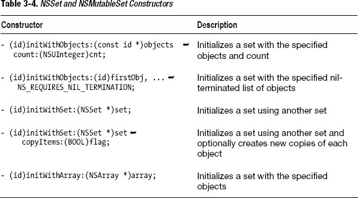

### 代码

**代码清单 3-21.** *main.m*

```objective-c
#import <Foundation/Foundation.h>

int main (int argc, const char * argv[])
{
    @autoreleasepool {
        NSSet *set = [NSSet setWithObjects:@"Hello World", @"Bonjour tout le monde", @"Hola Mundo", nil];
        NSLog(@"set: %@", set);
    }
    return 0;
}
```

### 用法

要使用此代码，请先在 Xcode 中构建并运行 Mac 应用。在日志中，你可以看到打印出的集合完整内容。

```
set: {(
    "Bonjour tout le monde",
    "Hello World",
    "Hola Mundo"
)}
```

## 3.18 获取集合的计数

### 问题

你的应用正在处理集合中的内容，需要知道集合中有多少个元素，以便恰当地呈现内容。

### 解决方案

`NSSet` 对象有一个 `count` 属性，你可以使用它来查找集合中的元素数量。

### 实现原理

要使用 count 属性，你可以在任何集合对象上使用点语法（`set.count`），也可以发送 count 消息（`[set count]`）来查找集合中的元素数量。相关代码请参见代码清单 3-22。

### 代码

**代码清单 3-22.** *main.m*

```objective-c
#import <Foundation/Foundation.h>

int main (int argc, const char * argv[])
{
    @autoreleasepool {
        NSSet *set = [NSSet setWithObjects:@"Hello World", @"Bonjour tout le monde", @"Hola Mundo", nil];
        NSUInteger count = set.count;
        NSLog(@"The set contains %lu items", count);
    }
    return 0;
}
```

### 用法

要使用此代码，请先在 Xcode 中构建并运行 Mac 应用。日志消息将显示元素的数量。

```
The set contains 3 items
```

## 3.19 比较集合

### 问题

你在应用中使用多个集合，并且希望了解每个集合的更多信息以及每个集合中包含哪些对象。

### 解决方案

`NSSet` 提供了一些内置方法，可用于比较集合。你可以判断两个集合是否有交集（它们是否包含某些共同元素）。你可以判断一个集合是否是另一个集合的子集（一个集合中的所有对象是否全部包含在另一个集合中）。你还可以判断一个集合是否等同于另一个集合，或者某个对象是否已经在集合中。


### 工作原理

在这个示例中，你需要两个集合。这些集合应包含代表字母表中字母的字符串对象。

```
NSSet *set1 = [NSSet setWithObjects:@"A", @"B", @"C", @"D", @"E", nil];
NSSet *set2 = [NSSet setWithObjects:@"D", @"E", @"F", @"G", @"H", nil];
```

如果你想检查这些集合之间是否存在重叠的对象（即集合是否相交），可以使用 `intersectsSet:` 函数，该函数会返回一个 `BOOL` 值。

```
BOOL setsIntersect = [set1 intersectsSet:set2];
```

若要判断一个集合是否完全包含另一个集合中的所有对象，可以使用 `isSubsetOfSet:` 函数。

```
BOOL set2IsSubset = [set2 isSubsetOfSet:set1];
```

要测试两个集合是否完全相同，可以使用 `isEqualToSet:` 函数。

```
BOOL set1IsEqualToSet2 = [set1 isEqualToSet:set2];
```

最后，如果你想知道某个对象是否已经存在于集合中，可以使用 `containsObject:` 来检查。

```
BOOL set1ContainsD = [set1 containsObject:@"D"];
```

相关代码请参见代码清单 3-23。

### 代码

**代码清单 3-23.** *main.m*

```
#import <Foundation/Foundation.h>

int main (int argc, const char * argv[])
{

    @autoreleasepool {

        NSSet *set1 = [NSSet setWithObjects:@"A", @"B", @"C", @"D", @"E", nil];
        NSSet *set2 = [NSSet setWithObjects:@"D", @"E", @"F", @"G", @"H", nil];

        NSLog(@"set1 contains:%@", set1);
        NSLog(@"set2 contains:%@", set2);

        BOOL setsIntersect = [set1 intersectsSet:set2];
        BOOL set2IsSubset = [set2 isSubsetOfSet:set1];
        BOOL set1IsEqualToSet2 = [set1 isEqualToSet:set2];
        BOOL set1ContainsD = [set1 containsObject:@"D"];

        NSLog(@"setsIntersect = %i, set2IsSubset = %i, set1IsEqualToSet2 = %i, set1ContainsD = %i", setsIntersect, set2IsSubset, set1IsEqualToSet2, set1ContainsD);

    }
    return 0;
}
```

### 用法

要使用这段代码，在 Xcode 中构建并运行你的 Mac 应用。日志消息会显示集合内容以及各项测试的结果。当 `BOOL` 值为 `YES` 时，日志会打印 `1`；当 `BOOL` 值为 `NO` 时，则打印 `0`。

```
set1 contains:{(
    A,
    D,
    B,
    E,
    C
)}
set2 contains:{(
    H,
    F,
    D,
    G,
    E
)}
setsIntersect = 1, set2IsSubset = 0, set1IsEqualToSet2 = 0, set1ContainsD = 1
```

## 3.20 遍历集合

### 问题

你有一个包含对象的集合，并且希望能够为集合中的每个对象发送相同的消息或访问相同的属性。

### 解决方案

使用 `allObjects NSSet` 函数将集合转换为数组，然后可以使用 `for-each` 循环进行遍历。或者使用 `enumerateObjectsUsingBlock:` 来处理集合中的每个对象。`NSSet` 还支持 `makeObjectsPerformSelector:`，当你希望每个对象只执行一个特定方法时，这个功能非常有用。

### 工作原理

如果你想使用方案 3.4 中描述的方法，可以临时将集合内容转换为数组。例如，要使用 `for-each` 循环遍历集合中的对象，可以这样做：

```
for (NSString *s in [set allObjects]) {
    NSLog(@"value: %@", s);
}
```

你还可以使用 blocks 的 `enumerateObjectsUsingBlock:` 方法为集合中的每个对象执行代码。通过这种方式，你可以定义一段代码块，将其应用于字典中的每个对象，而无需设置 `for-each` 循环或获取集合的数组版本引用。

```
[set enumerateObjectsUsingBlock:^(id obj, BOOL *stop) {
    NSLog(@"obj = %@", obj);
}];
```

如果你只想对每个对象执行一个操作，并且该操作是在对象类定义中编码的方法，可以使用 `makeObjectsPerformSelector:`。

```
[set makeObjectsPerformSelector:@selector(description)];
```

相关代码请参见代码清单 3-24。

### 代码

**代码清单 3-24.** *main.m*

```
#import <Foundation/Foundation.h>

int main (int argc, const char * argv[])
{

    @autoreleasepool {

NSSet *set = [NSSet setWithObjects:@"Hello World", @"Bonjour tout le monde", @"Hola Mundo", nil];

        for (NSString *s in [set allObjects]) {
            NSLog(@"value: %@", s);
        }

        [set enumerateObjectsUsingBlock:^(id obj, BOOL *stop) {
            NSLog(@"obj = %@", obj);
        }];

        [set makeObjectsPerformSelector:@selector(description)];

    }
    return 0;
}
```

### 用法

要使用这段代码，在 Xcode 中构建并运行你的 Mac 应用。日志消息会显示每种遍历集合方式的结果。

```
value: Bonjour tout le monde
value: Hello World
value: Hola Mundo
obj = Bonjour tout le monde
obj = Hello World
obj = Hola Mundo
```

## 3.21 操作集合内容

### 问题

你希望集合的内容更加动态，以便你或用户可以向集合中添加对象和从集合中移除对象。然而，`NSSet` 是一个不可变类，因此一旦你创建了 `NSSet`，就无法对其内容进行任何更改。

### 解决方案

当你确定集合需要是动态的时，请使用 `NSMutableSet`。它是 `NSSet` 的子类，因此你可以像使用 `NSSet` 一样使用 `NSMutableSet`。但 `NSMutableSet` 提供了添加和移除对象的方法。

### 工作原理

首先，实例化一个 `NSMutableSet` 对象。你可以使用任何构造函数来做到这一点。要创建一个新的空 `NSMutableSet`，可以使用 `alloc` 和 `init`。

```
NSMutableSet *set = [[NSMutableSet alloc] init];
```

要向此集合添加对象，必须向集合发送 `addObject:` 消息，并将要添加的对象作为参数传递。

```
[set addObject:@"Hello World"];
[set addObject:@"Bonjour tout le monde"];
[set addObject:@"Hola Mundo"];
```

要从集合中移除一个对象，你必须已经拥有该对象的引用。如果你有这个引用，那么可以使用 `removeObject:`。

```
[set removeObject:@"Bonjour tout le monde"];
```

最后，你可以使用 `removeAllObjects` 方法一次性移除集合中的所有对象。相关代码请参见代码清单 3-25。

### 代码

**代码清单 3-25.** *main.m*

```
#import <Foundation/Foundation.h>

int main (int argc, const char * argv[])
{

    @autoreleasepool {

        NSMutableSet *set = [[NSMutableSet alloc] init];

        [set addObject:@"Hello World"];
        [set addObject:@"Bonjour tout le monde"];
        [set addObject:@"Hola Mundo"];

        NSLog(@"Objects added to set:%@", set);

        [set removeObject:@"Bonjour tout le monde"];

        NSLog(@"Object removed from set:%@", set);

        [set removeAllObjects];

        NSLog(@"All objects removed from set:%@", set);

    }
    return 0;
}
```

### 用法

要使用这段代码，在 Xcode 中构建并运行你的 Mac 应用。检查控制台，查看每次操作后集合的变化。

```
Objects added to set:{(
    "Bonjour tout le monde",
    "Hello World",
    "Hola Mundo"
)}
Object removed from set:{(
    "Hello World",
    "Hola Mundo"
)}
All objects removed from set:{(
)}
```

## 第 4 章

## 文件系统

本章涵盖了在 Mac 和 iOS 上与文件系统相关的工作。

本章中的方案将向你展示如何：

- 获取文件管理器的引用
- 引用 Mac 和 iOS 的关键目录
- 发现和更改文件的属性
- 获取指定目录中的文件列表
- 管理文件和目录
- 搭配文件管理器使用委托
- 使用 `NSData` 类处理数据
- 管理占用大量内存的缓存对象

### 4.1 引用和使用文件管理器

### 问题

你需要处理应用程序的文件系统。

### 解决方案

获取应用程序的 `NSFileManager` 引用以操作文件系统。


### 工作原理

`NSFileManager` 是一个 Objective-C 单例对象（关于单例的解释请参见下面的注释），用于处理文件系统。你可以在 iOS 和 Mac 应用程序中使用 `NSFileManager`，但请注意，由于 iOS 应用运行在沙盒环境中，其文件夹位置仅限于 iOS 应用的 documents 目录。而 Mac 应用可以引用用户计算机上的任何文件夹。

**注：** 单例是一种设计模式，它限制一个类只能被实例化一次。在 Objective-C 中，单例模式出现在多个地方，包括 `UIApplication` 和 `NSApplication`。

要使用 `NSFileManager` 处理文件系统，首先需要获取当前应用程序的文件管理器引用。可以使用 `defaultManager` 函数来获取此引用。

`NSFileManager *fileManager = [NSFileManager defaultManager];`

一旦获取了引用，就可以执行所需的操作。例如，要查找当前目录，可以访问文件管理器的 `currentDirectoryPath` 属性。

`NSString *currentDirectoryPath = [fileManager currentDirectoryPath];`

要更改当前目录，可以向文件管理器发送 `changeCurrentDirectoryPath` 消息。

`[fileManager changeCurrentDirectoryPath:@"/Users/Shared"];`

这行代码会将当前目录路径更改为 Mac 的共享文件夹。相关代码请参见代码清单 4-1。

#### 代码

**代码清单 4-1.** *main.m*

```
#import <Foundation/Foundation.h>

int main (int argc, const char * argv[])
{

    @autoreleasepool {

        NSFileManager *fileManager = [NSFileManager defaultManager];

        NSString *currentDirectoryPath = [fileManager currentDirectoryPath];

        NSLog(@"currentDirectoryPath = %@", currentDirectoryPath);

        [fileManager changeCurrentDirectoryPath:@"/Users/Shared"];

        currentDirectoryPath = [fileManager currentDirectoryPath];

        NSLog(@"currentDirectoryPath = %@", currentDirectoryPath);

    }
    return 0;
}
```

#### 用法

使用此代码，在 Xcode 中构建并运行你的 Mac 应用。查看日志，可以观察到当前目录更改前后的路径。

```
currentDirectoryPath = /Users/[YOUR-USER-NAME]/Library/Developer/Xcode
/DerivedData/GetFileManagerReference-
bdycvqvpjxccqqfvchrjapqmvgpj/Build/Products/Debug

currentDirectoryPath = /Users/Shared
```

### 问题

你的 Mac 应用程序需要引用关键目录，例如用户的文档和下载目录。

### 解决方案

使用 `NSSearchPathForDirectoriesInDomains` 获取应用所需的信息，以引用用户的关键目录。使用 `NSBundle` 获取应用程序包的引用，你需要将随应用程序分发的文件包含在其中。

### 工作原理

要获取应用程序包的引用，可以使用主包的 `bundlePath` 函数。

`NSString *bundlePath = [[NSBundle mainBundle] bundlePath];`

主包是一个单例，可以通过 `NSBundle` 的 `mainBundle` 函数获取。

`NSSearchPathForDirectoriesInDomains` 是一个函数，它基于三个参数返回目录引用：你感兴趣的目录、域（用户、机器、网络、全部）以及一个指示是否希望展开波浪号（`~`）的 `BOOL` 值。

例如，如果你想查找用户文档目录的位置，可以这样做：

```
NSString *directoryPathName = [NSSearchPathForDirectoriesInDomains
(NSDocumentDirectory, NSAllDomainsMask, YES) lastObject];
```

第一个参数指定你感兴趣的目录。有关可以在此处使用的目录常量列表，请参见表 4-1。

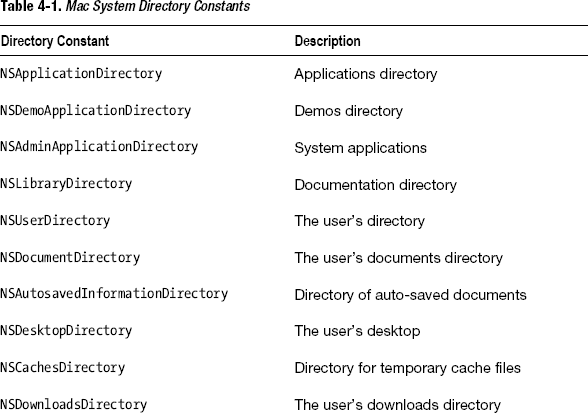

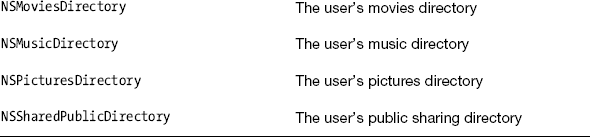

第二个参数用于指定你希望包含在搜索中的域。有关可以搜索的域列表，请参见表 4-2。最后一个参数允许你选择是否展开波浪号字符（~）。

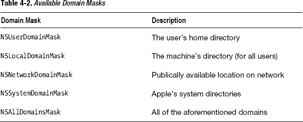

`NSSearchPathForDirectoriesInDomains` 返回一个数组。代码清单 4-2 使用了 `NSArray` 的 `lastObject` 函数来返回数组中的最后一个对象，并将其赋值给字符串。

#### 代码

**代码清单 4-2.** *main.m*

```
#import <Foundation/Foundation.h>

int main (int argc, const char * argv[])
{

    @autoreleasepool {

        NSString *bundlePath = [[NSBundle mainBundle] bundlePath];

        NSLog(@"bundlePath = %@", bundlePath);

        NSString *directoryPathName = [NSSearchPathForDirectoriesInDomains
(NSDocumentDirectory, NSAllDomainsMask, YES) lastObject];

        NSLog(@"directoryPathName = %@", directoryPathName);

    }
    return 0;
}
```

#### 用法

使用此代码，在 Xcode 中构建并运行你的 Mac 应用。你可以在控制台日志中看到文档目录和应用程序包的位置。

```
bundlePath = /Users/[YOUR-USER-NAME]/Library/Developer/Xcode
/DerivedData/GetKeyMacFolderReferences-
belypecqtyqdumeenpjlbpeeaxun/Build/Products/Debug

directoryPathName = /Users/[YOUR-USER-NAME]/Documents
```

### 问题

你的 iOS 应用程序需要引用关键目录，例如应用文档目录和包目录。

### 解决方案

你的应用程序包包含你随应用附带的资源。使用 `NSBundle` 获取此目录的引用，以便根据需要提取资源。要获取指定用于文档、库和缓存的 iOS 目录引用，请使用 `NSSearchPathForDirectoriesInDomains`，如食谱 4.2 所示。

**注：** iOS 应用无法引用所有 Mac 目录，因为 iOS 应用只能在 iOS 模拟器或 iOS 设备上运行，因此只能访问模拟器或设备的目录。

### 工作原理

要获取应用程序包的引用，可以使用主包的 `bundlePath` 函数。

`NSString *bundlePath = [[NSBundle mainBundle] bundlePath];`

主包是一个单例，可以通过 `NSBundle` 的 `mainBundle` 函数获取。如果你在 Finder 中查找此目录，你会看到带有 `.app` 扩展名的应用名称。按住 Control 键并单击此应用名称，选择“显示包内容”，即可查看应用的可执行文件和支持文件（包括你自己添加的任何文件）。这个包最终会被上传到应用商店。

**注：** iOS 应用包目录是只读的，因此在对文件进行修改之前，必须先将文件从应用包中复制出来，并放置到应用沙盒中的可写目录。

`NSSearchPathForDirectoriesInDomains` 基于三个参数返回目录引用：你感兴趣的目录、域（用户、机器、网络、全部）以及一个指示是否希望展开波浪号（`~`）的 `BOOL` 值。

例如，如果你想查找用户文档目录的位置，可以这样做：

```
NSString *documentsDirectory = [NSSearchPathForDirectoriesInDomains
(NSDocumentDirectory, NSUserDomainMask, YES) lastObject];
```

有关可以使用此函数引用的目录列表，请参见表 4-3；相关代码请参见代码清单 4-3。

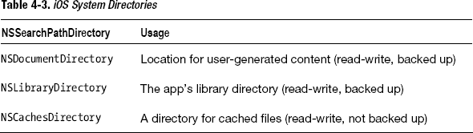

对于其中一些目录，Apple 通过 iTunes 和 iCloud 提供自动备份功能。通常，你应使用文档目录存储希望备份的用户生成内容，使用库目录存储应用需要引用的信息，以及使用缓存目录存储临时文件（缓存不会被备份）。


### 代码

**列表 4-3.** *main.m*

`#import "AppDelegate.h"`

`@implementation AppDelegate`

`@synthesize window = _window;`

`- (BOOL)application:(UIApplication *)application` 
`didFinishLaunchingWithOptions:(NSDictionary  *)launchOptions{`

`    //app bundle not backed up, readonly`
`    NSString *bundlePath = [[NSBundle mainBundle] bundlePath];`

`    NSLog(@"bundlePath = %@", bundlePath);`

`    //documents directory is backed up`
`    NSString *documentsDirectory = NSSearchPathForDirectoriesInDomains`![Image
`(NSDocumentDirectory, NSUserDomainMask, YES) lastObject];`

`    NSLog(@"documentsDirectory = %@", documentsDirectory);`

`    //Library directory is backed up`
`    NSString *libraryDirectory = NSSearchPathForDirectoriesInDomains`![Image
`(NSLibraryDirectory, NSUserDomainMask, YES) lastObject];`

`    NSLog(@"libraryDirectory = %@", libraryDirectory);`

`    //Cache directory is not backe up`
`    NSString *cacheDirectory = NSSearchPathForDirectoriesInDomains`![Image
`(NSCachesDirectory, NSUserDomainMask, YES) lastObject];`

`    NSLog(@"cacheDirectory = %@", cacheDirectory);`

`    self.window = [[UIWindow alloc] initWithFrame:[[UIScreen mainScreen] bounds]];`

`    self.window.backgroundColor = [UIColor whiteColor];`
`    [self.window makeKeyAndVisible];`
`    return YES;`
`}`

`@end`

### 使用方法

这段代码必须位于一个 iOS 应用中才能按预期工作；我将代码放入了应用委托的 `didFinishLaunchingWithOptions:` 方法中。编译你的应用，即可在日志中看到写入的目录字符串。

`bundlePath = /Users/[YOUR-USER-NAME]/Library/Application Support/iPhone` 
`Simulator/5.0/Applications/18AF23E1-9CAB-4FA6-9D5D-`
`39994AD355D7/GetiOSDirectories.app`

`documentsDirectory = /Users/[YOUR-USER-NAME]/Library/Application Support/iPhone` 
`Simulator/5.0/Applications/18AF23E1-9CAB-4FA6-9D5D-39994AD355D7/Documents`

`libraryDirectory = /Users/[YOUR-USER-NAME]/Library/Application Support/iPhone` 
`Simulator/5.0/Applications/18AF23E1-9CAB-4FA6-9D5D-39994AD355D7/Library`

`cacheDirectory = /Users/[YOUR-USER-NAME]/Library/Application Support/iPhone` 
`Simulator/5.0/Applications/18AF23E1-9CAB-4FA6-9D5D-39994AD355D7/Library/Caches`

你也可以将这些目录字符串复制粘贴到访达中，以导航至 iOS 模拟器临时为这些目录在 Mac 上使用的位置。例如，从日志中复制应用包路径名，转到**访达**  **前往**  **前往文件夹**，然后将路径名粘贴到对话框并点击“前往”。你将在此看到 iOS 模拟器为你的应用创建的所有临时目录。

## 4.4 获取文件属性

### 问题

你的应用程序需要关于文件和文件夹的信息，例如创建日期、修改日期和文件类型。

### 解决方案

使用 `NSFileManager` 的 `attributesOfItemAtPath:error:` 函数返回一个字典，列出目标文件或文件夹的所有属性。

### 工作原理

本示例假设你手头有一个可供检查的文件引用。你将需要文件管理器的引用以及要操作的文件（或文件夹）。

```
NSFileManager *fileManager = [NSFileManager defaultManager];
NSString *filePathName = @"/Users/Shared/textfile.txt";
```

接下来，你需要一个错误对象。你会发现，在处理文件系统时，使用错误对象通常是值得的。这能让你的应用更好地从常见问题（如错误的文件名）中恢复。

```
NSError *error = nil;
```

现在，你需要一个字典，可以通过使用文件管理器的 `attributesOfItemAtPath:error:` 函数来获取。你需要为该函数提供文件路径名和错误对象的引用。错误对象的引用需要 `&` 符号来表示通过引用传递错误对象（这样你可以稍后测试它，看是否发生了错误）。

```
NSDictionary *fileAttributes = [fileManager attributesOfItemAtPath:filePathName
                                                             error:&error];
```

下一步，你检查确保没有错误，然后使用一个键（key）从刚刚获取的字典中检索所需信息。

```
if(!error){
    NSDate *dateFileCreated = [fileAttributes valueForKey:NSFileCreationDate];
    NSString *fileType = [fileAttributes valueForKey:NSFileType];
}
```

你查找了文件的创建日期以及文件类型。请参阅表 4-4 获取文件属性键的列表，并参阅列表 4-4 获取代码。

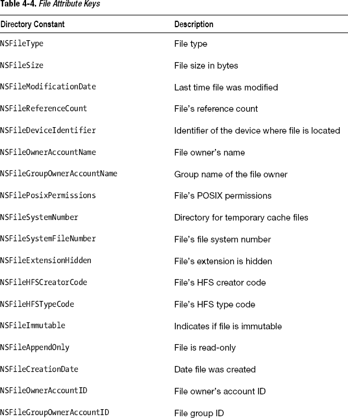


#### 代码

**列表 4-4.** *main.m*

```
#import <Foundation/Foundation.h>

int main (int argc, const char * argv[])
{
    @autoreleasepool {
        NSFileManager *fileManager = [NSFileManager defaultManager];
        NSString *filePathName = @"/Users/Shared/textfile.txt";
        NSError *error = nil;
        NSDictionary *fileAttributes = [fileManager attributesOfItemAtPath:filePathName
                                                                     error:&error];
        if(!error){
            NSDate *dateFileCreated = [fileAttributes valueForKey:NSFileCreationDate];
            NSString *fileType = [fileAttributes valueForKey:NSFileType];
            NSLog(@"This %@ file was created on %@",fileType, dateFileCreated);
        }
    }
    return 0;
}
```

#### 使用方法

要使用这段代码，请将我所用的文件引用替换为你自己 Mac 上的文件引用。然后从 Xcode 编译并运行你的 Mac 应用。查看日志以了解文件属性。

```
This NSFileTypeRegular file was created on 2012-01-03 15:21:47 +0000
```

### 4.5 获取目录中的文件和子目录列表

### 问题

你想找出给定目录中有哪些文件和文件夹。

### 解决方案

使用 `NSFileManager` 的 `contentsOfDirectoryAtPath:error:` 函数来获取一个数组，其中包含目录中所有文件和文件夹的路径名。要获取一个目录及其所有子目录中所有文件和文件夹的列表，请使用 `NSFileManager` 的 `subpathsOfDirectoryAtPath:` 函数。

### 工作原理

本示例假设你手头有一个可供检查的目录引用。你将需要文件管理器的引用以及一个目录来继续。

```
NSFileManager *fileManager = [NSFileManager defaultManager];
NSString *sharedDirectory = @"/Users/Shared";
```

为了简单地获取目录中所有内容的列表，你可以使用 `contentsOfDirectoryAtPath:error:` 来获取一个文件路径名数组。请注意，你将获得目录中所有文件以及所有子目录的路径名。

```
NSError *error = nil;
NSArray *listOfFiles = [fileManager contentsOfDirectoryAtPath:sharedDirectory
                                                        error:&error];
```

与大多数文件系统操作一样，你应该使用一个 `NSError` 对象，在基于文件系统操作结果进行工作之前，应对其进行测试。此函数仅提供你指定的目录顶层中的文件和目录路径。

要递归地获取从你指定目录开始的所有文件和目录路径名，你可以使用 `subpathsOfDirectoryAtPath:error`。

```
NSArray *listOfSubPaths = [fileManager subpathsOfDirectoryAtPath:sharedDirectory
                                                           error:&error];
```

请参阅列表 4-5 获取代码。


### 代码

**代码清单 4-5.** `main.m`

```
#import <Foundation/Foundation.h>

int main (int argc, const char * argv[])
{

    @autoreleasepool {

        NSFileManager *fileManager = [NSFileManager defaultManager];

        NSString *sharedDirectory = @"/Users/Shared";

        NSError *error = nil;

        NSArray *listOfFiles = [fileManagercontentsOfDirectoryAtPath:sharedDirectory
                                                               error:&error];

        if(!error)
            NSLog(@"Contents of shared directory: %@", listOfFiles);

        NSArray *listOfSubPaths = [fileManager subpathsOfDirectoryAtPath:sharedDirectory
                                                                   error:&error];

        if(!error)
            NSLog(@"Sub Paths of shared directory”: %@", listOfSubPaths);

    }
    return 0;
}
```

### 使用方法

要使用这段代码，请将我所用的目录引用替换为你自己 Mac 上的某个目录。然后在 Xcode 中构建并运行你的 Mac 应用。以下是我运行时的输出结果；由于列表变得很长，我删减了部分子目录。

```
Contents of shared directory: (
    "array.txt",
    "dictionary.txt",
    "textfile.txt"
        [EDITED SUB-DIRECTORIES OUT]
)
Sub Paths of shared directory: (
    ".DS_Store",
    ".ioSharedDefaults.W80152WTAGV",
    ".ioSharedDefaults.W8815GRB0P0",
    ".localized",
    ".localized (from old Mac)",
    ".SharedUserDB",
    "array.txt",

        [EDITED SUB-DIRECTORIES OUT]

    subversion,
    "subversion/.DS_Store",
    "subversion/HelloWorld",

        [EDITED SUB-DIRECTORIES OUT]

    "textfile.txt"
)
```

**注意：** 递归获取每个子目录的这些路径名时要小心。复杂的目录层级结构可能使这一操作代价高昂。

## 4.6 管理目录

### 问题

你的应用程序需要添加、移动、复制和删除目录。

### 解决方案

使用 `NSFileManager createDirectoryAtPath:withIntermediateDirectories:attributes:error:` 来创建新目录，`moveItemAtPath:toPath:error:` 来移动目录，`removeItemAtPath:error:` 来删除目录，以及 `copyItemAtPath:toPath:error:` 来复制目录。

### 工作原理

你需要引用文件管理器和要创建的目录，以便继续操作。

```
NSFileManager *fileManager = [NSFileManager defaultManager];
```

```
NSString *sharedDirectory = @"/Users/Shared/NewDirectory1/NewSubDirectory1";
```

与大多数 `NSFileManager` 函数一样，你需要一个错误对象。

```
NSError *error = nil;
```

使用 `createDirectoryAtPath:withIntermediateDirectories:attributes:error:` 来创建一个新目录。此函数需要：要创建的新目录路径名；一个 `BOOL` 值，指示是否要创建路径名中尚不存在的所有中间目录；一个要应用于新目录的属性字典；以及一个错误对象引用。

```
BOOL directoryCreated = [fileManager createDirectoryAtPath:newDirectory
                               withIntermediateDirectories:YES
                                               attributes:nil
                                                    error:&error];
```

该函数返回一个 `BOOL` 值，告诉你操作是否成功，但为了安全起见，你应该使用错误对象来测试。在本示例中，我将属性参数设为 nil，但如果你需要，可以在此处提供一个包含文件属性的 `NSDictionary` 对象。有关可在此处使用的文件属性列表，请参见 表 4-4（在示例 4.4 中）。

你还可以使用 `moveItemAtPath:toPath:error` 函数移动目录。你需要指定旧目录和新目录的位置，以及一个错误对象引用。

```
NSString *directoryMovedTo = @"/Users/Shared/NewSubDirectory1";
```

```
BOOL directoryMoved = [fileManager moveItemAtPath:newDirectory
                                           toPath:directoryMovedTo
                                            error:&error];
```

要删除目录，请使用文件管理器的 `removeItemAtPath:error` 函数。传入要删除的目录以及一个错误对象引用。

```
NSString *directoryToRemove = @"/Users/Shared/NewDirectory1";
```

```
BOOL directoryRemoved =[fileManager removeItemAtPath:directoryToRemove
                                               error:&error];
```

要复制目录，请使用文件管理器的 `copyItemAtPath:toPath:error:` 函数。

```
NSString *directoryToCopy = @"/Users/Shared/NewSubDirectory1";
NSString *directoryToCopyTo = @"/Users/Shared/CopiedDirectory";
```

```
BOOL directoryCopied =[fileManager copyItemAtPath:directoryToCopy
                                           toPath:directoryToCopyTo
                                            error:&error];
```

完整的代码请参见 代码清单 4-6。

#### 代码

**代码清单 4-6.** `main.m`

```
#import <Foundation/Foundation.h>

int main (int argc, const char * argv[])
{

    @autoreleasepool {

        NSFileManager *fileManager = [NSFileManager defaultManager];

        NSString *newDirectory =
@"/Users/Shared/NewDirectory1/NewSubDirectory1";

        NSError *error = nil;

        BOOL directoryCreated = [fileManager createDirectoryAtPath:newDirectory
                                       withIntermediateDirectories:YES
                                                        attributes:nil
                                                             error:&error];
        if(!error)
            NSLog(@"directoryCreated = %i with no error", directoryCreated);
        else
            NSLog(@"directoryCreated = %i with error %@", directoryCreated, error);

        NSString *directoryMovedTo = @"/Users/Shared/NewSubDirectory1";

        BOOL directoryMoved = [fileManager moveItemAtPath:newDirectory
                                                   toPath:directoryMovedTo
                                                    error:&error];

        if(!error)
            NSLog(@"directoryMoved = %i with no error", directoryMoved);
        else
            NSLog(@"directoryMoved = %i with error %@", directoryMoved, error);

        NSString *directoryToRemove = @"/Users/Shared/NewDirectory1";

        BOOL directoryRemoved =[fileManager removeItemAtPath:directoryToRemove
                                                       error:&error];

        if(!error)
            NSLog(@"directoryRemoved = %i with no error", directoryRemoved);
        else
            NSLog(@"directoryRemoved = %i with error %@", directoryRemoved, error);

        NSString *directoryToCopy = @"/Users/Shared/NewSubDirectory1";
        NSString *directoryToCopyTo = @"/Users/Shared/CopiedDirectory";

        BOOL directoryCopied =[fileManager copyItemAtPath:directoryToCopy
                                                   toPath:directoryToCopyTo
                                                    error:&error];

        if(!error)
            NSLog(@"directoryCopied = %i with no error", directoryCopied);
        else
            NSLog(@"directoryCopied = %i with error %@", directoryCopied, error);
    }
    return 0;
}
```

#### 使用方法

要使用这段代码，请将我所用的目录引用替换为你自己 Mac 上的某个目录。然后在 Xcode 中构建并运行你的 Mac 应用。使用 Finder 查看你的目录是否按照预期进行了修改。你也可以查看控制台日志输出，以确认操作是否成功。

```
directoryCreated = 1 with no error
directoryMoved = 1 with no error
directoryRemoved = 1 with no error
directoryCopied = 1 with no error
```

## 4.7 管理文件

### 问题

你的应用程序需要添加、移动、复制和删除文件。


### 解决方案

使用 `NSFileManager` 的 `createFileAtPath:contents:attributes:` 创建新文件，`moveItemAtPath:toPath:error:` 移动文件，`removeItemAtPath:error:` 删除文件，以及 `copyItemAtPath:toPath:error:` 复制文件。

### 工作原理

在进行任何其他操作之前，你首先需要获取文件管理器的引用。

```
NSFileManager *fileManager = [NSFileManager defaultManager];
```

要创建一个文件，你需要使用 `NSData`，它用于处理数据和内容。在本教程中，我将使用 `NSData` 从我的博客获取一张图片。为此，我需要从 `NSURL` 开始，以便能够引用这个资源。

```
NSURL *url = [NSURL URLWithString:@"http://howtomakeiphoneapps.com/wp-"
                          "content/uploads/2012/01/apples-oranges.jpg"];
```

一旦我有了 `NSURL` 对象，就可以使用 `NSData` 的函数 `dataWithContentsOfURL` 将内容直接下载到我的应用中。

```
NSData *dataObject = [NSData dataWithContentsOfURL:url];
```

设置好这个数据对象以供使用后，我就能使用文件管理器的函数 `createFileAtPath:contents:attributes:` 在 Mac 的文件系统上创建文件了。

```
NSString *newFile = @"/Users/Shared/apples-oranges.jpg";

BOOL fileCreated = [fileManager createFileAtPath:newFile
                                       contents:dataObject
                                     attributes:nil];
```

此函数使用存储在 `NSData` 对象中的数据以及你想要指定的任何属性，并将这些数据存储为一个文件。

你也可以使用 `moveItemAtPath:toPath:error:` 函数来移动文件。你需要指定旧的和新的文件路径名称，以及一个错误对象引用。

```
NSError *error = nil;

NSString *fileMovedTo = @"/Users/Shared/apples-oranges-moved.jpg";

BOOL fileMoved = [fileManager moveItemAtPath:newFile
                                     toPath:fileMovedTo
                                      error:&error];
```

要删除一个文件，请使用文件管理器的 `removeItemAtPath:error:` 函数。传入要删除的文件以及一个错误对象的引用。

```
NSString *fileToRemove = @"/Users/Shared/apples-oranges-moved.jpg";

BOOL fileRemoved = [fileManager removeItemAtPath:fileToRemove
                                          error:&error];
```

要复制一个文件，请使用文件管理器的 `copyItemAtPath:toPath:error:` 函数。

```
NSString *fileToCopy = @"/Users/Shared/apples-oranges-moved.jpg";
NSString *copiedFileName = @"/Users/Shared/apples-oranges-backup-copy.jpg";

BOOL fileCopied = [fileManager copyItemAtPath:fileToCopy
                                      toPath:copiedFileName
                                       error:&error];
```

相关代码见 代码清单 4-7。

#### 代码

**代码清单 4-7.** *main.m*

```
#import <Foundation/Foundation.h>

int main (int argc, const char * argv[])
{

    @autoreleasepool {

        NSFileManager *fileManager = [NSFileManager defaultManager];

        NSURL *url = [NSURL URLWithString:@"http://howtomakeiphoneapps.com/wp-"
                                  "content/uploads/2012/01/apples-oranges.jpg"];

        NSData *dataObject = [NSData dataWithContentsOfURL:url];

        NSString *newFile = @"/Users/Shared/apples-oranges.jpg";

        BOOL fileCreated = [fileManager createFileAtPath:newFile
                                                contents:dataObject
                                              attributes:nil];

        NSLog(@"fileCreated = %i with no error", fileCreated);

        NSError *error = nil;

        NSString *fileMovedTo = @"/Users/Shared/apples-oranges-moved.jpg";

        BOOL fileMoved = [fileManager moveItemAtPath:newFile
                                              toPath:fileMovedTo
                                               error:&error];

        if(!error)
            NSLog(@"fileMoved = %i with no error", fileMoved);
        else
            NSLog(@"fileMoved = %i with error %@", fileMoved, error);

        NSString *fileToCopy = @"/Users/Shared/apples-oranges-moved.jpg";
        NSString *copiedFileName = @"/Users/Shared/apples-oranges-backup-copy.jpg";

        BOOL fileCopied = [fileManager copyItemAtPath:fileToCopy
                                               toPath:copiedFileName
                                                error:&error];

        if(!error)
            NSLog(@"fileCopied = %i with no error", fileCopied);
        else
            NSLog(@"fileCopied = %i with error %@", fileCopied, error);

        NSString *fileToRemove = @"/Users/Shared/apples-oranges-moved.jpg";

        BOOL fileRemoved = [fileManager removeItemAtPath:fileToRemove
                                                  error:&error];

        if(!error)
            NSLog(@"fileRemoved = %i with no error", fileRemoved);
        else
            NSLog(@"fileRemoved = %i with error %@", fileRemoved, error);

    }
    return 0;
}
```

#### 用法

要使用此代码，请将我所用的目录引用替换为你自己 Mac 上可以工作的目录。然后在 Xcode 中构建并运行你的 Mac 应用程序。使用 Finder 查看你的目录是否按照预期进行了修改。你也可以查看控制台日志输出来确认操作是否成功。

```
fileCreated = 1 with no error
fileMoved = 1 with no error
fileCopied = 1 with no error
fileRemoved = 1 with no error
```

## 4.8 检查文件状态

### 问题

你想知道感兴趣的文件是否可写，或者在你试图对它进行操作之前，它是否根本不存在。

### 解决方案

使用适当的 `NSFileManager` 函数来测试各种感兴趣的状态。这些函数中的每一个都会返回一个 `BOOL` 值，指示所问文件的状态：

- `fileExistsAtPath:`
- `isReadableFileAtPath:`
- `isWritableFileAtPath:`
- `isExecutableFileAtPath:`
- `isDeletableFileAtPath:`

**注意：** 如果你完全仅依据这些函数的结果来预测应用的行为，请务必小心。在 Apple 的文档中，建议你将它们与使用 `NSError` 进行适当的错误处理结合起来使用。你可以在教程 4.6 和 4.7 中找到 `NSError` 的示例。

### 工作原理

要遵循本教程，你需要引用你 Mac 上的一个文件，就像我下面使用的那样。你还需要一个文件管理器的引用。

```
NSFileManager *fileManager = [NSFileManager defaultManager];

NSString *filePathName = @"/Users/Shared/textfile.txt";
```

你要测试的第一件事是文件是否存在于这个位置。使用 `fileExistsAtPath:` 函数并将结果赋值给一个 `BOOL` 变量，稍后你可以用它来进行测试。

```
BOOL fileExists = [fileManager fileExistsAtPath:filePathName];
```

要查明文件是否可读，请使用 `isReadableFileAtPath:`。

```
BOOL fileIsReadable = [fileManager isReadableFileAtPath:filePathName];
```

使用 `isWritableFileAtPath:` 遵循相同的模式来查明文件是否可写。

```
BOOL fileIsWriteable = [fileManager isWritableFileAtPath:filePathName];
```

要查明文件是否是可执行文件，请使用 `isExecutableFileAtPath:` 函数。

最后，要确定你是否可以删除该文件，请使用 `isDeletableFileAtPath:` 函数并遵循与之前相同的模式。

```
BOOL fileIsDeleteable = [fileManager isDeletableFileAtPath:filePathName];
```

相关代码见 代码清单 4-8。


### 代码

**列表 4-8.** *main.m*

```objc
#import <Foundation/Foundation.h>

int main (int argc, const char * argv[])
{

    @autoreleasepool {

        NSFileManager *fileManager = [NSFileManager defaultManager];

        NSString *filePathName = @"/Users/Shared/textfile.txt";

        BOOL fileExists = [fileManager fileExistsAtPath:filePathName];

        if(fileExists)
            NSLog(@"%@ exists", filePathName);
        else
            NSLog(@"%@ doesn't exist", filePathName);

        BOOL fileIsReadable = [fileManager isReadableFileAtPath:filePathName];

        if(fileIsReadable)
            NSLog(@"%@ is readable", filePathName);
        else
            NSLog(@"%@ isn't readable", filePathName);

        BOOL fileIsWriteable = [fileManager isWritableFileAtPath:filePathName];

        if(fileIsWriteable)
            NSLog(@"%@ is writable", filePathName);
        else
            NSLog(@"%@ isn't writable", filePathName);

        BOOL fileIsExecutable = [fileManager isExecutableFileAtPath:filePathName];

        if(fileIsExecutable)
            NSLog(@"%@ is an executable", filePathName);
        else
            NSLog(@"%@ isn't an executable", filePathName);

        BOOL fileIsDeleteable = [fileManager isDeletableFileAtPath:filePathName];

        if(fileIsDeleteable)
            NSLog(@"%@ is deletable", filePathName);
        else
            NSLog(@"%@ isn't an deletable", filePathName);

    }
    return 0;
}
```

### 使用

从 Mac 命令行应用构建并运行这段代码进行测试。文件状态的每个测试都会根据测试结果打印出相应的日志条目。这是我的输出结果：

```
/Users/Shared/textfile.txt exists
/Users/Shared/textfile.txt is readable
/Users/Shared/textfile.txt is writable
/Users/Shared/textfile.txt isn't an executable
/Users/Shared/textfile.txt is deletable
```

## 4.9 更改文件属性

### 问题

您的应用程序需要更改文件的属性。

### 解决方案

使用文件管理器的`setAttributes:ofItemAtPath:error:`函数来更改文件或目录的属性。

### 工作原理

您需要一个指向文件管理器的引用、一个文件和一个错误对象。

```objc
NSFileManager *fileManager = [NSFileManager defaultManager];

NSString *filePathName = @"/Users/Shared/textfile.txt";

NSError *error = nil;
```

第一步是设置一个包含您想要应用到文件上的文件属性的字典。有关文件属性的列表，请参见表 4-4（在配方 4.4 中）。

```objc
NSMutableDictionary *attributes = [[NSMutableDictionary alloc] init];

[attributes setObject:[NSDate date] forKey:NSFileModificationDate];
```

在本配方中，您将仅更改文件的修改日期。使用`NSFileManager`函数`setAttributes:ofItemPath:error:`，并将字典、文件路径名称和错误对象作为参数传递。

```objc
BOOL attributeChanged = [fileManager setAttributes:attributes
                                      ofItemAtPath:filePathName
                                             error:&error];
```

使用此函数时，请务必检查错误对象和返回的`BOOL`值。代码请参见列表 4-9。

### 代码

**列表 4-9.** *main.m*

```objc
#import <Foundation/Foundation.h>

int main (int argc, const char * argv[])
{

    @autoreleasepool {

        NSFileManager *fileManager = [NSFileManager defaultManager];

        NSString *filePathName = @"/Users/Shared/textfile.txt";

        NSError *error = nil;

        //获取文件属性以便稍后比较：
        NSDictionary *fileAttributes = [fileManager attributesOfItemAtPath:filePathName
                                                                     error:&error];

        if(!error)
            NSLog(@"%@ file attributes (before): %@",filePathName, fileAttributes);

        NSMutableDictionary *attributes = [[NSMutableDictionary alloc] init];

        [attributes setObject:[NSDate date] forKey:NSFileModificationDate];

        BOOL attributeChanged = [fileManager setAttributes:attributes
                                              ofItemAtPath:filePathName
                                                     error:&error];

        if(error)
            NSLog(@"There was an error: %@", error);
        else{
            NSLog(@"attributeChanged = %i", attributeChanged);

            //获取文件属性以查看更改：
            NSDictionary *fileAttributes = fileManager ![Image
            attributesOfItemAtPath:filePathName
                             error:&error];

            if(!error)
                NSLog(@"%@ file attributes (after): %@",filePathName, fileAttributes);
        }

    }
    return 0;
}
```

### 使用

从 Mac 命令行应用构建并运行这段代码进行测试。查看日志输出以确定是否发生错误，并了解文件属性是否按预期更改。

```
/Users/Shared/textfile.txt file attributes (before): {
        NSFileCreationDate = "2012-01-26 14:17:04 +0000";
    NSFileExtensionHidden = 0;
    NSFileGroupOwnerAccountID = 0;
    NSFileGroupOwnerAccountName = wheel;
    NSFileHFSCreatorCode = 0;
    NSFileHFSTypeCode = 0;
    NSFileModificationDate = "2012-01-07 13:09:03 +0000";
    NSFileOwnerAccountID = 502;
    NSFileOwnerAccountName = [YOUR-USER-NAME];
    NSFilePosixPermissions = 511;
    NSFileReferenceCount = 1;
    NSFileSize = 37;
    NSFileSystemFileNumber = 40320513;
    NSFileSystemNumber = 234881026;
    NSFileType = NSFileTypeRegular;
}
attributeChanged = 1
/Users/Shared/textfile.txt file attributes (after): {
        NSFileCreationDate = "2012-01-26 14:17:04 +0000";
    NSFileExtensionHidden = 0;
    NSFileGroupOwnerAccountID = 0;
    NSFileGroupOwnerAccountName = wheel;
    NSFileHFSCreatorCode = 0;
    NSFileHFSTypeCode = 0;
    NSFileModificationDate = "2012-01-26 15:03:18 +0000";
    NSFileOwnerAccountID = 502;
    NSFileOwnerAccountName = [YOUR-USER-NAME];
    NSFilePosixPermissions = 511;
    NSFileReferenceCount = 1;
    NSFileSize = 37;
    NSFileSystemFileNumber = 40320513;
    NSFileSystemNumber = 234881026;
    NSFileType = NSFileTypeRegular;
}
```

## 4.10 对 NSFileManager 使用委托

### 问题

您希望对文件系统操作（如复制和移动文件及目录）拥有更多控制权，并且需要在文件即将被复制或移动时执行额外操作。

### 解决方案

创建您自己的`NSFileManager`实例，而不是使用与您的进程关联的默认文件管理器。您必须将文件管理器的委托设置为一个从实现了`NSFileManagerDelegate`协议的类实例化的对象。在采用了`NSFileManagerDelegate`协议的类中实现委托方法，以便对复制、移动和删除操作获得更多控制权。


### 工作原理

以这种方式使用 `NSFileManager` 需要你有一个可用的类来遵循 `NSFileManagerDelegate` 协议，因为你将采用委托设计模式。这意味着你需要一个能代表文件管理器执行操作的对象。这通常就是你已经在使用的视图控制器或其他类。但由于本教程仅使用命令行 Mac 应用，因此你需要为文件管理器添加一个自定义类。

就本教程而言，我们假设你的应用程序需要对复制操作拥有比 `NSFileManager` 的 `copyItemAtPath:toPath:error:` 函数提供的更多控制权。你将拦截此操作并测试以确保不会复制到“受保护”目录中。

第一步是向应用添加一个具有文件管理器属性的新类（关于如何添加自定义类的更多详情，请参考教程 1.3）。此类头文件如下所示：

```
#import <Foundation/Foundation.h>

@interface MyFileManager : NSObject

@property(strong)NSFileManager *fileManager;

@end
```

此类的实现文件如下所示：

```
#import "MyFileManager.h"

@implementation MyFileManager
@synthesize fileManager;

@end
```

请注意，你的类名为 `MyFileManager`，主要充当文件管理器的容器。

现在，你需要遵循 `NSFileManagerDelegate` 协议，以便此类能代表文件管理器执行操作。你可以在头文件中的接口部分完成此操作。

```
#import <Foundation/Foundation.h>

@interface MyFileManager : NSObject <NSFileManagerDelegate>

@property(strong)NSFileManager *fileManager;

@end
```

上面的代码 `<NSFileManagerDelegate>` 意味着此类遵循了 `NSFileManagerDelegate` 协议，且从此类实例化的对象可以代表 `NSFileManager` 对象执行操作。此协议没有必需的方法，但有一个可选方法你需要实现，因为你希望在复制操作上获得多一点控制权。

因此，请实现委托方法 `fileManager:shouldCopyItemAtPath:toPath:`。此委托方法恰好在文件复制之前执行，这让你有机会测试复制操作是否应该发生。在此函数内，你可以返回一个 `BOOL` 值，指示是否允许继续执行复制操作。

此代码属于 `MyFileManager` 的实现文件。

```objc
- (BOOL)fileManager:(NSFileManager *)fileManager shouldCopyItemAtPath:(NSString *)srcPath toPath:(NSString *)dstPath{

    if([dstPath hasPrefix:@"/Users/Shared/Book/Protected"]){

        NSLog(@"我们无法将文件复制到受保护文件夹，因此该文件未被复制");

        return NO;
    }
    else{

        NSLog(@"我们刚刚成功复制了一个文件");

        return YES;
    }
}
```

这里你通过使用 `NSString` 函数 `hasPrefix`（参见教程 2.6）来测试目标目录是否与受保护目录匹配。根据测试结果，函数返回 `YES` 或 `NO`，并向日志写入一条消息。

你可以重写 `MyFileManager init` 方法来添加自定义初始化代码，以便在此处实例化一个新的文件管理器，并使用 `self` 关键字将文件管理器的委托设置为 `MyFileManager`。

当然，这也属于 `MyFileManager` 的实现部分。

```objc
- (id)init {
    self = [super init];
    if (self) {
        self.fileManager = [[NSFileManager alloc] init];
        self.fileManager.delegate = self;
    }
    return self;
}
```

**注意：** 我建议你查阅清单 4-10 至 4-12。一旦你理解了我这里遵循的通用模式，在上下文中查看代码会更清晰。

到目前为止，你所做的工作本质上是将文件管理器封装在你自己的自定义类中，该类支持你所需的委托模式。现在，你可以继续处理 `main.m` 文件，并使用你刚刚创建的类。

```objc
#import <Foundation/Foundation.h>
#import "MyFileManager.h"

int main (int argc, const char * argv[])
{

    @autoreleasepool {
MyFileManager *myFileManager = [[MyFileManager alloc] init];

        NSString *protectedDirectory = @"/Users/Shared/Book/Protected";

        NSString *cacheDirectory = @"/Users/Shared/Book/Cache";

        NSString *fileSource = @"/Users/Shared/Book/textfile.txt";

        NSString *fileDestination1 = @"/Users/Shared/Book/Protected/textfile.txt";

        NSString *fileDestination2 = @"/Users/Shared/Book/Cache/textfile.txt";

        NSError *error = nil;

    }
    return 0;
}
```

这段代码的关键点是导入 `myFileManager` 的声明以及 `myFileManager` 对象的实例化。其余代码仅是文件和目录引用，以及使用文件管理器时始终需要的错误对象。

现在，你将不再直接使用默认的文件管理器，而是使用你自己的、通过 `myFileManager` 引用的文件管理器。

```objc
BOOL fileCopied1 = [myFileManager.fileManager copyItemAtPath:fileSource
                                                      toPath:fileDestination1
                                                       error:&error];
```

如你所见，你使用了与其他教程中相同的文件管理器函数。但现在你引用了文件管理器属性 `myFileManager`，并且可以预期你刚刚实现的对应委托方法将在项目被复制之前执行。

**注意：** 此方法显然比简单地使用默认文件管理器更耗费精力，但它确实对过程以及错误处理提供了多一点的控制。


### 代码

**代码清单 4-10.** *MyFileManager.h*

```
#import <Foundation/Foundation.h>

@interface MyFileManager : NSObject<NSFileManagerDelegate>

@property(strong)NSFileManager *fileManager;

@end
```

**代码清单 4-11.** *MyFileManager.m*

```
#import "MyFileManager.h"

@implementation MyFileManager
@synthesize fileManager;

- (id)init {
    self = [super init];
    if (self) {
        self.fileManager = [[NSFileManager alloc] init];
        self.fileManager.delegate = self;
    }
    return self;
}

- (BOOL)fileManager:(NSFileManager *)fileManager shouldCopyItemAtPath:
(NSString *)srcPath toPath:(NSString *)dstPath{

    if([dstPath hasPrefix:@"/Users/Shared/Book/Protected"]){

NSLog(@"我们无法将文件复制到受保护文件夹，因此该文件未被复制");

        return NO;
    }
    else{

        NSLog(@"我们已成功复制一个文件");

        return YES;
    }
}

@end
```

**代码清单 4-12.** *main.m*

```
#import <Foundation/Foundation.h>
#import "MyFileManager.h"

int main (int argc, const char * argv[])
{

    @autoreleasepool {
        MyFileManager *myFileManager = [[MyFileManager alloc] init];

        NSString *protectedDirectory = @"/Users/Shared/Book/Protected";

        NSString *cacheDirectory = @"/Users/Shared/Book/Cache";

        NSString *fileSource = @"/Users/Shared/Book/textfile.txt";

        NSString *fileDestination1 =
@"/Users/Shared/Book/Protected/textfile.txt";

        NSString *fileDestination2 = @"/Users/Shared/Book/Cache/textfile.txt";

        NSError *error = nil;

        NSArray *listOfFiles;

        NSLog(@"在尝试复制之前查看目录");

listOfFiles = [myFileManager.fileManager
contentsOfDirectoryAtPath:protectedDirectory
                    error:&error];

        NSLog(@"受保护目录中的文件列表（前）：%@", listOfFiles);

listOfFiles = [myFileManager.fileManager
contentsOfDirectoryAtPath:cacheDirectory
                    error:&error];

        NSLog(@"缓存目录中的文件列表（前）：%@", listOfFiles);

        //尝试复制到受保护文件夹：
        BOOL fileCopied1 = [myFileManager.fileManager copyItemAtPath:fileSource
                                                              toPath:fileDestination1
                                                               error:&error];

        if(error)
            NSLog(@"发生错误：%@。fileCopied1 = %i", error, fileCopied1);

        //尝试复制到缓存文件夹：
        BOOL fileCopied2 =  [myFileManager.fileManager copyItemAtPath:fileSource
                                                               toPath:fileDestination2
                                                                error:&error];

        if(error)
            NSLog(@"发生错误：%@。fileCopied2 = %i", error, fileCopied2);

        NSLog(@"在尝试复制之后查看目录");

listOfFiles = [myFileManager.fileManager
contentsOfDirectoryAtPath:protectedDirectory
                    error:&error];

        NSLog(@"受保护目录中的文件列表（后）：%@", listOfFiles);

listOfFiles = [myFileManager.fileManager
contentsOfDirectoryAtPath:cacheDirectory
                    error:&error];

        NSLog(@"缓存目录中的文件列表（后）：%@", listOfFiles);

    }
    return 0;
}
```

### 使用说明

在 Mac 命令行应用程序中构建并运行此代码以进行测试。查看日志输出，观察打印出的前后目录列表的日志信息，以此判断文件是否被复制及何时复制。同时，注意`MyFileManager`实现中委托方法打印出的日志条目。

```
在尝试复制之前查看目录

受保护目录中的文件列表（前）：(
    ".DS_Store",
    "AAAA.txt"
)

缓存目录中的文件列表（前）：(
    ".DS_Store",
    "1.txt",
    "2.txt"
)

我们无法将文件复制到受保护文件夹，因此该文件未被复制

我们已成功复制一个文件

在尝试复制之后查看目录

受保护目录中的文件列表（后）：(
    ".DS_Store",
    "AAAA.txt"
)

缓存目录中的文件列表（后）：(
    ".DS_Store",
    "1.txt",
    "2.txt",
    "textfile.txt"
)
```

### 4.11 使用 NSData 处理数据

### 问题

你需要在应用程序中处理来自文件及其他来源的数据。

### 解决方案

使用`NSData`和`NSMutableData`处理来自多种来源的数据。`NSData`通过文件、URL、字节及其他`NSData`对象将数据引入应用。你可以使用`NSMutableData`修改数据，并将`NSData`对象保存回文件系统。`NSData`还与其他许多 Foundation 类一起使用。

### 工作原理

本示例演示了如何使用`NSData`和`NSMutableData`，通过这两个类将两个字符数组合并，然后将其作为文件保存到文件系统。

首先，你需要两个数组作为数据源。

```
NSUInteger length = 3;

char bytes1[length];
bytes1[0] = 'A';
bytes1[1] = 'B';
bytes1[2] = 'C';

char bytes2[length];
bytes2[0] = 'D';
bytes2[1] = 'E';
bytes2[2] = 'F';
```

**注意：** 这两个数组都是标准的 C 语言代码。不要将这里的数组与`NSArray`和`NSMutableArray` Foundation 类混淆，它们是面向对象的集合，仅处理对象。这里的`bytes1`和`bytes2`数组仅处理原始类型。你可以这样做，因为 Objective-C 是 C 编程语言的超集，你可以随时将 C 代码与 Objective-C 代码结合使用。

既然有了数据，就可以开始使用数据对象了。在本示例中，你使用`NSMutableData`，因为你需要能够修改数据。

```
NSMutableData *mutableData = [[NSMutableData alloc] init];
```

`NSData`和`NSMutableData`还有其他构造函数，在处理不同数据源时会很有帮助。完整列表参见表 4-5。

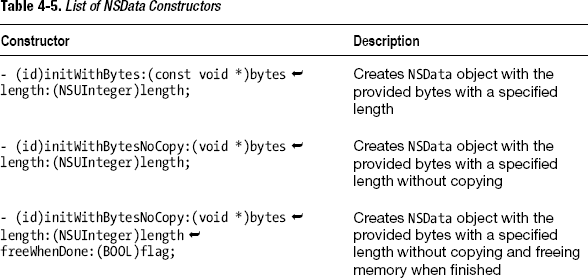

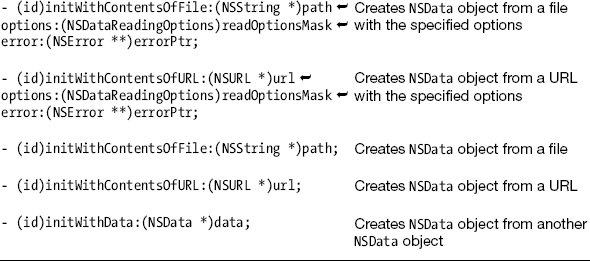

现在可以继续修改数据对象了。使用`NSMutableData`的`appendBytes:length:`函数将第一个字节数组添加到数据对象中。

```
[mutableData appendBytes:bytes1
                  length:length];
```

这将字符 A、B、C 添加到数据对象中。要添加剩余字符，用下一个字节数组重复此过程。

```
[mutableData appendBytes:bytes2
                  length:length];
```

此时，数据对象包含两个字节数组。追加字节是修改数据对象的一种方式，但使用可变数据对象还可以做更多修改。完整列表参见表 4-6。

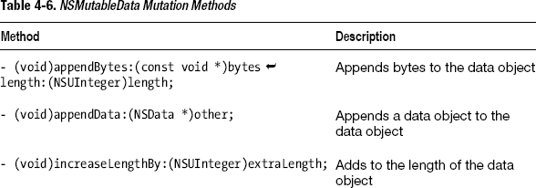

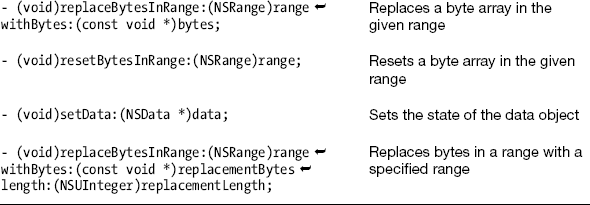

如果你需要在应用程序中使用新数组，可以使用`NSData`的`bytes`函数检索新数组。

```
char *bytesFromData = (char *)[mutableData bytes];
```

要将数据对象的内容保存到文件系统，可以使用`writeToFile:options:error:`函数，并提供文件路径名称、选项参数和错误对象。

```
NSError *error = nil;

BOOL dataSaved = [mutableData writeToFile:@"/Users/Shared/Book/datadump.txt"
                                  options:NSDataWritingAtomic
                                    error:&error];
```

相关代码参见代码清单 4-13。


### 代码

**代码清单 4-13.** *main.m*

```objective-c
#import <Foundation/Foundation.h>

int main (int argc, const char * argv[])
{
    @autoreleasepool {
        NSUInteger length = 3;

        char bytes1[length];
        bytes1[0] = 'A';
        bytes1[1] = 'B';
        bytes1[2] = 'C';

        for (int i=0;i<sizeof(bytes1);i++)
            NSLog(@"bytes1[%i] = %c", i, bytes1[i]);

        char bytes2[length];
        bytes2[0] = 'D';
        bytes2[1] = 'E';
        bytes2[2] = 'F';

        for (int i=0;i<sizeof(bytes2);i++)
            NSLog(@"bytes2[%i] = %c", i, bytes2[i]);

        NSMutableData *mutableData = [[NSMutableData alloc] init];

        [mutableData appendBytes:bytes1
                          length:length];

        [mutableData appendBytes:bytes2
                          length:length];

        NSLog(@"mutableData = %@", mutableData);

        char *bytesFromData = (char *)[mutableData bytes];

        for (int i=0;i<length*2;i++)
            NSLog(@"bytesFromData[%i] = %c", i, bytesFromData[i]);

        NSError *error = nil;

        BOOL dataSaved = [mutableData writeToFile:@"/Users/Shared/datadump.txt"
                                          options:NSDataWritingAtomic
                                            error:&error];

        if(dataSaved)
            NSLog(@"mutableData successfully wrote contents to file system");
        else
            NSLog(@"mutableData was unsuccesful in writing out data because of %@", error);
    }
    return 0;
}
```

### 用法

从 Mac 命令行应用构建并运行此代码以进行测试。查看日志输出，了解各种数据对象的内容。使用文本编辑器检查已创建的文件，查看写入文件系统的内容。

```
bytes1[0] = A
bytes1[1] = B
bytes1[2] = C
bytes2[0] = D
bytes2[1] = E
bytes2[2] = F

mutableData = <41424344 4546>

bytesFromData[0] = A
bytesFromData[1] = B
bytesFromData[2] = C
bytesFromData[3] = D
bytesFromData[4] = E
bytesFromData[5] = F

mutableData successfully wrote contents to file system
```

### 4.12 使用 NSCache 缓存内容

### 问题

你的应用必须在有限的内存条件下运行，因此需要能够缓存内容。

### 解决方案

使用 `NSCache` 来维护一个可缓存在内存中的对象集合。当与 `NSPurgeableData` 配合使用时，`NSCache` 会将对象保留在内存中，直到设备或桌面应用需要回收内存为止。

### 工作原理

`NSCache` 的工作方式类似于 `NSDictionary`，它存储由键索引的对象。`NSCache` 的不同之处在于，当满足某些条件时，它会移除对象。通常，`NSCache` 会对内存不足情况做出响应，但你也可以根据需要定义其他条件。

**注意：** 此处描述的行为仅在缓存中的对象采用 `NSDiscardableContent` 协议时有效。确保一个类采用此协议的最简单方法是使用 `NSPurgeableData` 类，该类采用了此协议，并且可以像 `NSData` 一样使用。

`NSCache` 非常有用的一点是，虽然它会智能地移除对象，但会将对象的键保留在原地。这让你有机会尝试检索该对象，然后检查返回的值是否为 `nil`（表明对象已被移除或尚未创建）。如果返回值为 `nil`，那么你就有了重新创建或重新加载对象的机会。

**注意：** 使用 `NSCache` 检索对象时，务必检查该对象是否仍在缓存中。如果对象不再被缓存，则需要添加代码来重新创建对象并将其重新插入缓存中。

本秘诀假设你已经拥有一个带有视图控制器的 iOS 应用。有关用户界面如何设置的具体信息，请参阅代码清单 4-14 到 4-17。要获取有关如何设置 iOS 应用和用户控件的更多信息，请参阅秘诀 1.12 和 1.13。现在，先看一下视图控制器的头文件，你会看到 `NSCache` 对象被包含为一个属性。

```objective-c
#import <UIKit/UIKit.h>

@interface ViewController : UIViewController

@property (strong) NSCache *cache;
@property (assign) BOOL regularLogo;
@property (strong) UIImageView *myImageView;
@property (strong) UIButton *loadImageButton;

- (void)presentImage;

@end
```

首先，你需要实例化 `NSCache` 对象本身。这里，我们在视图控制器的 `viewDidLoad` 委托方法中执行此操作。

```objective-c
#import "ViewController.h"

@implementation ViewController

-(void)viewDidLoad{
    [super viewDidLoad];

    //设置缓存
    self.cache = [[NSCache alloc] init];
}

@end
```

**注意：** 你可以将 `NSCache` 对象放置在应用的任何位置。一个常见的位置是应用委托，因为你在应用中的任何地方都可以获取对应用委托的引用，这样便于共享缓存。为了使本秘诀尽可能简单，缓存仅作为属性放置在视图控制器中。

将缓存作为属性放置在视图控制器中，并在 `viewDidLoad` 中实例化它，这意味着只要视图控制器处于活动状态，你就可以使用该缓存。

现在，你可以从缓存中检索对象。你需要一个键（可以是字符串），然后可以使用这个键与缓存的 `objectForKey:` 函数来尝试检索对象。

```objective-c
NSString *key = @"regular-logo";
NSPurgeableData *data = [cache objectForKey:key];
```

这里你正尝试从缓存中检索一个 `NSPurgeableData` 对象。在下一步中，你必须立即检查返回的对象是否为 `nil`。你可以使用 if 语句来实现这一点。

```objective-c
if(!data){

}
```

`!data` 表示数据对象等于 `nil`。如果对象是 `nil`，你就可以在花括号之间的代码中重新创建该对象。这里想要检索的数据是存储在应用包中的一张图片。因此，你需要引用应用包（更多信息请参阅秘诀 4.3）并构造图片文件的路径名。

```objective-c
NSString *key = @"regular-logo";
NSPurgeableData *data = [cache objectForKey:key];
if(!data){
    NSString *bundlePath = [[NSBundle mainBundle] bundlePath];
    NSString *imagePath = [NSString stringWithFormat:@"%@/MobileAppMastery-Log.png",
bundlePath];
}
```

一旦你有了文件路径引用，就可以用它来实例化一个包含文件内容的 `NSPurgeableData` 对象。然后，将该对象插入缓存。

```objective-c
NSString *key = @"regular-logo";
NSPurgeableData *data = [cache objectForKey:key];
if(!data){
    NSString *bundlePath = [[NSBundle mainBundle] bundlePath];
    NSString *imagePath = [NSString stringWithFormat:@"%@/MobileAppMastery-Log.png",
bundlePath];

    data = [NSPurgeableData dataWithContentsOfFile:imagePath];
    [cache setObject:data forKey:key];
}
```

现在，对象已被缓存，并且每当你使用键请求时，都可以再次使用它。如果发生某些情况导致对象需要被清除，你仍然可以使用键请求该对象，但会得到 `nil` 的结果，因此你必须再次重复对象创建的过程。


### 代码

**代码清单 4-14.** *AppDelegate.h*

```objc
#import <UIKit/UIKit.h>

@class ViewController;

@interface AppDelegate : UIResponder <UIApplicationDelegate>

@property (strong, nonatomic) UIWindow *window;
@property (strong, nonatomic) ViewController *viewController;

@end
```

**代码清单 4-15.** *AppDelegate.m*

```objc
#import "AppDelegate.h"
#import "ViewController.h"

@implementation AppDelegate

@synthesize window = _window;
@synthesize viewController = _viewController;

- (BOOL)application:(UIApplication *)application didFinishLaunchingWithOptions:(NSDictionary *)launchOptions
{
    self.window = [[UIWindow alloc] initWithFrame:[[UIScreen mainScreen] bounds]];
    // Override point for customization after application launch.
    self.viewController = [[ViewController alloc] initWithNibName:@"ViewController" bundle:nil];
    self.window.rootViewController = self.viewController;
    [self.window makeKeyAndVisible];
    return YES;
}

@end
```

**代码清单 4-16.** *ViewController.h*

```objc
#import <UIKit/UIKit.h>

@interface ViewController : UIViewController

@property (strong) NSCache *cache;
@property (assign) BOOL regularLogo;
@property (strong) UIImageView *myImageView;
@property (strong) UIButton *loadImageButton;

- (void)presentImage;

@end
```

**代码清单 4-17.** *ViewController.m*

```objc
#import "ViewController.h"

@implementation ViewController
@synthesize cache, regularLogo, myImageView, loadImageButton;

-(void)viewDidLoad{
    [super viewDidLoad];

    // 将视图背景色改为白色
    self.view.backgroundColor = [UIColor whiteColor];

    // 首先加载常规标志
    self.regularLogo = YES;

    // 设置缓存
    self.cache = [[NSCache alloc] init];

    // 设置按钮
    self.loadImageButton = [UIButton buttonWithType:UIButtonTypeRoundedRect];
    self.loadImageButton.frame = CGRectMake(20, 415, 280, 37);
    [self.loadImageButton addTarget:self
                             action:@selector(presentImage)
                   forControlEvents:UIControlEventTouchUpInside];
    [loadImageButton setTitle:@"显示图片" forState:UIControlStateNormal];
    [self.view addSubview:loadImageButton];

    // 设置 UIImageView
    self.myImageView = [[UIImageView alloc] init];
    self.myImageView.frame = CGRectMake(0, 0, 320, 407);
    self.myImageView.contentMode = UIViewContentModeScaleAspectFit;
    [self.view addSubview:self.myImageView];
}

- (void)presentImage{
    if(regularLogo){
        NSString *key = @"regular-logo";
        NSPurgeableData *data = [cache objectForKey:key];
        if(!data){
            NSString *bundlePath = [[NSBundle mainBundle] bundlePath];
            NSString *imagePath = [NSString stringWithFormat:
@"%@/MobileAppMastery-Log.png", bundlePath];
            data = [NSPurgeableData dataWithContentsOfFile:imagePath];
            [cache setObject:data forKey:key];
            NSLog(@"已获取资源(%@)并添加到缓存", key);
        }
        else
            NSLog(@"刚刚获取了资源(%@)", key);;
        self.myImageView.image = [UIImage imageWithData:data];
        regularLogo = NO;
    }
    else{
        NSString *key = @"greyscale-logo";
        NSPurgeableData *data = [cache objectForKey:key];
        if(!data){
            NSString *bundlePath = [[NSBundle mainBundle] bundlePath];
NSString *imagePath = [NSString stringWithFormat:@"%@/MAM_Logo_Square_No_Words_Grayscale.png", bundlePath];
            data = [NSPurgeableData dataWithContentsOfFile:imagePath];
            [cache setObject:data forKey:key];
            NSLog(@"已获取资源(%@)并添加到缓存", key);
        }
        else
            NSLog(@"刚刚获取了资源(%@)", key);

        self.myImageView.image = [UIImage imageWithData:data];
        regularLogo = YES;
    }
}

@end
```

### 用法

本教程中使用的应用是一个 iOS 单视图应用。选择这种应用类型是因为 iOS 模拟器能够模拟低内存情况，这让我们可以看到 `NSCache` 在此条件下的工作方式。如果你需要了解如何构建自己的 iOS 单视图应用，请参见教程 1.12。

此示例还使用了两个用户控件：一个按钮和一个图像视图。如果你想了解如何添加和使用这类用户控件，请参见教程 1.13。示例中使用的图片是我的个人图片；如果你想尝试自己的图片，只需将图片文件拖入 Xcode 项目中的 Supporting Files 文件夹即可。务必勾选“复制到目标文件夹”，以确保图片文件被包含在应用包中。

该应用的整体工作方式是：用户会看到一个底部带有按钮的空白屏幕。每次用户按下按钮，就会显示两张图片中的一张。你可以在图 4-1 中看到应用的外观。

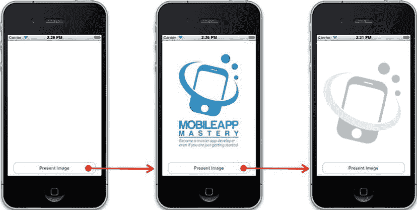

**图 4-1.** *iOS 应用界面*

每次用户触摸按钮时，系统会从缓存中检索其中一张图片。代码根据 `BOOL` 变量 `regularLogo` 来判断选择哪张图片。

一切设置完成后，若要测试此代码，请在 iOS 模拟器中运行该应用，然后按两次 Present Image 按钮，即可看到两张图片均已加载。如果你检查日志，应该会看到两条消息，表明图片是首次创建的。

```
已获取资源(regular-logo)并添加到缓存
已获取资源(greyscale-logo)并添加到缓存
```

现在再次按下按钮两次。你应该会看到图片再次按顺序显示。请检查日志以了解其工作方式。

```
刚刚获取了资源(regular-logo)
刚刚获取了资源(greyscale-logo)
```

这次图片完全不需要创建，只需从缓存中检索即可。

现在，让我们在 iOS 模拟器中创建一个低内存场景，以观察缓存的帮助作用。前往 **iOS 模拟器** → **硬件** → **模拟内存警告**。再次按下按钮两次，查看结果。

```
收到内存警告。
已获取资源(regular-logo)并添加到缓存
刚刚获取了资源(greyscale-logo)
```

从该输出可以看出，常规标志图片必须重新创建，因为 `NSCache` 在收到内存警告时移除了该对象。第二张图片未被移除（因为它仍被图像视图所持有）。

## 第 5 章：处理日期、时间和定时器

本章介绍如何使用 Foundation 框架和 Objective-C 处理日期和定时器。

本章中的教程将教你如何：

- 使用 `NSDate` 创建当前日期
- 使用 `NSDateComponents` 创建自定义日期
- 比较日期
- 将字符串转换为日期
- 格式化日期以便在用户界面上显示
- 对日期进行加减操作
- 使用定时器调度重复和非重复执行的代码

### 5.1 为今天创建日期对象

### 问题

你需要在应用中表示今天的日期。

### 解决方案

使用 `NSDate` 类的 `date` 方法为当前日期创建一个日期对象实例。

### 工作原理

`NSDate` 是一个通常与其他类一起使用的类（将在后续教程中介绍）。单独使用时，`NSDate` 可以获取今天的日期，你可以将其输出到控制台或展示给用户。要获取今天的日期，请使用 `date` 函数并将结果赋值给一个 `NSDate` 对象变量。

```objc
NSDate *todaysDate = [NSDate date];
```

具体代码请参见代码清单 5-1。


### 5.1 获取并显示当前日期

#### 代码

**代码清单 5-1.** *main.m*

```objectivec
#import <Foundation/Foundation.h>

int main (int argc, const char * argv[])
{

   @autoreleasepool {

        NSDate *todaysDate = [NSDate date];

        NSLog(@"Today's date is %@", todaysDate);

}
    return 0;
}
```

#### 用法

要使用此代码，需要在 Xcode 中构建并运行你的 Mac 应用。查看日志即可看到打印出的当前日期。

```
Today's date is 2012-06-27 13:14:30 +0000
```

### 5.2 按组件创建自定义日期

### 问题

你需要在应用中引用当前日期之外的日期。

### 解决方案

使用 `NSDateComponents` 来定义一个具体日期，然后结合你的日期组件使用 `NSCalendar`，返回一个可在应用中使用的 `NSDate` 对象引用。

### 工作原理

要创建自定义日期，你需要使用三个 Foundation 类：`NSDate`、`NSDateComponents` 和 `NSCalendar`。其中 `NSDate` 是最基本的类，用于表示日期。

`NSDateComponents` 类表示构成日期和时间的详细信息：日、月、年、小时。`NSDateComponents` 具有许多日期和时间细节，你可以设置它们来完全自定义你的日期。

`NSCalendar` 类用于表示现实世界中的日历。它用于处理与日历相关的复杂性。你可以指定使用哪种日历，或者直接获取用户系统当前使用的日历。通常，你可以默认使用的是公历，但也可以指定其他日历，例如希伯来历或伊斯兰历。

要创建一个自定义日期，首先要做的是创建一个新的 `NSDateComponents` 实例。

```
NSDateComponents *dateComponents = [[NSDateComponents alloc] init];
```

然后，设置自定义日期的所有相关属性。在本技巧中，我将设置必要的组件，以代表初代 iPhone 在美国加利福尼亚州的发布日期。

```
dateComponents.year = 2007;
dateComponents.month = 6;
dateComponents.day = 29;
dateComponents.hour = 12;
dateComponents.minute = 01;
dateComponents.second = 31;
dateComponents.timeZone = [NSTimeZone timeZoneWithAbbreviation:@"PDT"];
```

这里你需要做的只是使用点语法来设置你感兴趣的日期属性。最后一个属性需要一个特殊的 `NSTimeZone` 对象。你可以指定任意时区，或者直接保留此属性以使用系统时区。

最后，要实际创建你的 `NSDate` 对象，你需要一个对日历的引用（通常是当前系统日历）。你可以通过 `currentCalendar` 消息 `[NSCalendar currentCalendar]` 获取此引用。获取后，使用 `dateWithComponents:` 函数来获取与你通过日期组件设定的条件相匹配的日期对象。

```
NSDate *iPhoneReleaseDate = [[NSCalendar currentCalendar] 
dateFromComponents:dateComponents];
```

代码见代码清单 5-2。

#### 代码

**代码清单 5-2.** *main.m*

```objectivec
#import <Foundation/Foundation.h>

int main (int argc, const char * argv[])
{

    @autoreleasepool {

        NSDateComponents *dateComponents = [[NSDateComponents alloc] init];
        dateComponents.year = 2007;
        dateComponents.month = 6;
        dateComponents.day = 29;
        dateComponents.hour = 12;
        dateComponents.minute = 01;
        dateComponents.second = 31;
        dateComponents.timeZone = [NSTimeZone timeZoneWithAbbreviation:@"PDT"];

NSDate *iPhoneReleaseDate = [[NSCalendar currentCalendar] 
dateFromComponents:dateComponents];

        NSLog(@"The original iPhone went on sale: %@", iPhoneReleaseDate);

    }
    return 0;
}
```

#### 用法

要使用此代码，需要在 Xcode 中构建并运行你的 Mac 应用。通过查看日志，你可以看到 iPhone 发布日期的打印信息。

```
The original iPhone went on sale: 2007-06-29 19:01:31 +0000
```

## 5.3 比较两个日期

### 问题

在你的应用中，你至少有两个日期，并且需要了解它们之间的关系。例如，一个日期是否早于另一个日期？这两个日期相隔多少天？

### 解决方案

对于简单的比较，请使用内置的 `NSDate` 比较函数。要计算出距离另一个日期过去了多少天，你需要同时引用系统日历和两个日期。

### 工作原理

在本技巧中，假设你已经按照技巧 5.2 中的方法设置好了 iPhone 的发布日期。让我们将其与今天的日期进行比较。你可以使用 `NSDate` 的 `date` 函数来获取今天的日期。

第一个比较是判断 iPhone 发布日期是否是今天。要找出这一点，可以使用 `isEqualToDate:` 函数，并将你想要比较的日期作为参数传入。此函数返回一个 `BOOL` 值。

```
NSDate *todaysDate = [NSDate date];

if([todaysDate isEqualToDate:iPhoneReleaseDate])
    NSLog(@"The iPhone was released today!");
else
    NSLog(@"The iPhone was released on some other date");
```

要判断你的日期是否早于另一个日期，可以使用 `earlierDate:` 函数，并将另一个日期作为参数传入。此函数返回两个日期中较早的那个。

```
NSDate *earlierDateIs = [todaysDate earlierDate:iPhoneReleaseDate];
```

你也可以反过来，找出哪个日期较晚。

```
NSDate *laterDateIs = [todaysDate laterDate:iPhoneReleaseDate];
```

要找出两个日期之间相隔的秒数，可以使用 `timeIntervalSinceDate:` 函数，并将第二个日期作为参数传入。你会得到一个 `double` 值，等于两个日期之间的秒数。这是一个名为 `NSTimeInterval` 的 `typedef`（你会在其他日期方法中看到 `NSTimeInterval` 的引用）。

通过将系统日历与 `NSDateComponents` 类结合使用，你可以获得更丰富的日期比较细节。这能以你需要的格式提供两个日期之间的时间。因此，如果你想知道天数、小时数、分钟数、年数、月数或这些单位的某种组合，那你就不必担心了。

第一步是获取对用户系统日历的引用。

```
NSCalendar *systemCalendar = [NSCalendar currentCalendar];
```

接下来，通过按位 OR 运算组合 `NSCalendar` 常量来指定要使用的单位。

```
unsigned int unitFlags = NSYearCalendarUnit | NSMonthCalendarUnit |
NSDayCalendarUnit;
```

**注意：** 按位运算是一种在非常底层的二进制层面处理信息的方式。你可能知道，计算机用一系列的 0 和 1 来表示信息（例如数字 3 表示为 00000011）。按位运算符比较两段信息的二进制表示，并根据这些比较结果创建一个新结果。按位 OR 运算意味着，如果两段信息中任意一段的某一位为 1，则结果的对应位也为 1。

换句话说，我想按年、月、日来查看两个日期之间相隔的时间。关于此处可以使用的常量列表，请参见表 5-1。

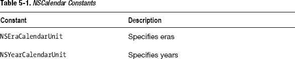

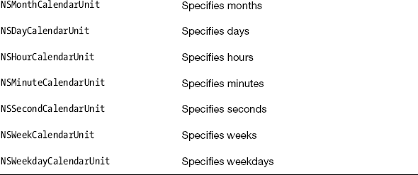

你可以使用 `NSCalendar` 的函数 `components:fromDate:toDate:options`，它会返回一个 `NSDateComponents` 对象，该对象根据你指定的 `NSCalendar` 常量，填充了描述两个日期之间时间差的数据。

```
NSDateComponents *dateComparisonComponents = [systemCalendar components:unitFlags
                                                               fromDate:iPhoneReleaseDate
                                                                 toDate:todaysDate
                                                                options:NSWrapCalendarComponents];
```

你可以访问相应的属性来获取所需的信息。例如，要获取年数，请查看 `dateComparisonComponents.year` 属性。代码见代码清单 5-3。


### 5.3 比较日期

#### 代码

**代码清单 5-3.** *标题*

```objc
#import <Foundation/Foundation.h>

int main (int argc, const char * argv[])
{

    @autoreleasepool {

        NSDateComponents *dateComponents = [[NSDateComponents alloc] init];
        dateComponents.year = 2007;
        dateComponents.month = 6;
        dateComponents.day = 29;
        dateComponents.hour = 12;
        dateComponents.minute = 01;
        dateComponents.second = 31;
        dateComponents.timeZone = [NSTimeZone timeZoneWithAbbreviation:@"PDT"];

        NSDate *iPhoneReleaseDate = [[NSCalendar currentCalendar]
                      dateFromComponents:dateComponents];

        NSLog(@"The original iPhone went on sale: %@", iPhoneReleaseDate);

        NSDate *todaysDate = [NSDate date];

        NSLog(@"Today's date is: %@", todaysDate);

        if([todaysDate isEqualToDate:iPhoneReleaseDate])
            NSLog(@"The iPhone was released today!");
        else
            NSLog(@"The iPhone was released on some other date");

        NSDate *earlierDateIs = [todaysDate earlierDate:iPhoneReleaseDate];

        NSLog(@"The earlier date is: %@", earlierDateIs);

        NSDate *laterDateIs = [todaysDate laterDate:iPhoneReleaseDate];

        NSLog(@"The later date is: %@", laterDateIs);

        NSTimeInterval timeBetweenDates = [todaysDate
                     timeIntervalSinceDate:iPhoneReleaseDate];

        NSLog(@"The iPhone was released %f seconds ago", timeBetweenDates);

        NSCalendar *systemCalendar = [NSCalendar currentCalendar];

        unsigned int unitFlags = NSYearCalendarUnit | NSMonthCalendarUnit |
                                 NSDayCalendarUnit;

        NSDateComponents *dateComparisonComponents =
            [systemCalendar components:unitFlags
                             fromDate:iPhoneReleaseDate
                               toDate:todaysDate
                              options:NSWrapCalendarComponents];

        NSLog(@"The iPhone was released %ld years, %ld months and %ld days ago",
              dateComparisonComponents.year,
              dateComparisonComponents.month,
              dateComparisonComponents.day
              );

    }
    return 0;
}
```

### 使用说明

要使用这段代码，请在 Xcode 中构建并运行你的 Mac 应用程序。查看日志消息以查看日期及其比较结果。

```
The original iPhone went on sale: 2007-06-29 19:01:31 +0000
Today's date is: 2012-06-27 20:54:56 +0000
The earlier date is: 2007-06-29 19:01:31 +0000
The later date is: 2012-06-27 20:54:56 +0000
The iPhone was released on some other date
The iPhone was released 143776405.074785 seconds ago
The iPhone was released 4 years, 6 months and 20 days ago
```

请注意，你的输出消息可能与我的不同，因为你将在与我不同的日期运行此代码。

## 5.4 将字符串转换为日期

### 问题

你有一个包含日期信息的字符串，来自字符串文件，并且希望将此信息用作日期对象。

### 解决方案

使用 `NSDateFormatter` 来指定字符串格式并创建新的日期对象。

### 工作原理

对于这个方案，我们假设你已将日期信息存储为字符串。

```objc
NSString *dateString = @"02/14/2012";
```

首先，你需要一个日期格式化器，因此使用 `NSDateFormatter` 类来创建一个。

```objc
NSDateFormatter *df = [[NSDateFormatter alloc] init];
```

然后，使用字符串的格式设置 `dateFormat` 属性。

```objc
df.dateFormat = @"MM/dd/yyyy";
```

**注意：** 日期格式化器使用 Unicode 日期格式模式。有关可用日期格式模式的完整列表，请参见 [`unicode.org/reports/tr35/tr35-10.html#Date_Format_Patterns`](http://unicode.org/reports/tr35/tr35-10.html#Date_Format_Patterns)。

要创建日期对象，请使用日期格式化器的 `dateFromString:` 函数。

```objc
NSDate *valentinesDay = [df dateFromString:dateString];
```

代码见代码清单 5-4。

#### 代码

**代码清单 5-4.** *标题*

```objc
#import <Foundation/Foundation.h>

int main (int argc, const char * argv[])
{

    @autoreleasepool {

        NSString *dateString = @"02/14/2012";

        NSDateFormatter *df = [[NSDateFormatter alloc] init];

        df.dateFormat = @"MM/dd/yyyy";

        NSDate *valentinesDay = [df dateFromString:dateString];

        NSLog(@"Valentine's Day = %@", valentinesDay);

    }
    return 0;
}
```

### 使用说明

要使用这段代码，请在 Xcode 中构建并运行你的 Mac 应用程序。查看日志消息以查看由字符串创建的日期对象。

```
Valentine's Day = 2012-02-14 05:02:00 +0000
```

你的结果可能与我的不同，因为这取决于你的本地时区。

### 5.5 格式化日期以供显示

### 问题

你希望以一种用户能够识别且在用户界面中看起来美观的格式，将日期对象呈现给用户。

### 解决方案

使用 `NSDateFormatter` 创建日期格式，并获取格式化为字符串的日期对象，以便呈现给用户。

### 工作原理

你使用与方案 5.4 中相同的 Unicode 数据格式模式来指定日期格式化器的日期。因此，如果已经有了方案 5.4 中的日期，但希望向用户呈现不同的格式，可以像这样设置日期格式：

```objc
df.dateFormat = @"EEEE, MMMM d";
```

这将显示该日期对应的星期几（如 Tuesday）、月份名称（如 February）以及数字形式的日期（如 14）。

要查看结果，请使用 `NSDateFormatter` 的 `stringFromDate:` 函数。

```objc
NSLog(@"Another Formatted Valentine's Day = %@", [df
stringFromDate:valentinesDay]);
```

这会以如下格式呈现日期：

```
Tuesday, February 14
```

代码见代码清单 5-5。

#### 代码

**代码清单 5-5.** *标题*

```objc
#import <Foundation/Foundation.h>

int main (int argc, const char * argv[])
{

    @autoreleasepool {

        NSString *dateString = @"02/14/2012";

        NSDateFormatter *df = [[NSDateFormatter alloc] init];

        df.dateFormat = @"MM/dd/yyyy";

        NSDate *valentinesDay = [df dateFromString:dateString];

        NSLog(@"Unformatted Valentine's Day = %@", valentinesDay);

        NSLog(@"Formatted Valentine's Day = %@", [df stringFromDate:valentinesDay]);

        df.dateFormat = @"EEEE, MMMM d";

        NSLog(@"Another Formatted Valentine's Day = %@",
              [df stringFromDate:valentinesDay]);

    }
    return 0;
}
```

### 使用说明

要使用这段代码，请在 Xcode 中构建并运行你的 Mac 应用程序。查看日志消息以查看格式化后的日期对象。

```
Unformatted Valentine's Day = 2012-02-14 05:00:00 +0000
Formatted Valentine's Day = 02/14/2012
Another Formatted Valentine's Day = Tuesday, February 14
```

### 5.6 日期加减

### 问题

你希望在应用程序中进行日期的加减操作。

### 解决方案

使用 `NSDateComponents` 和 `NSCalendar` 类，结合你的日期对象来添加或减去日期。`NSDateComponents` 指定一个时长（一天、一周或其他时间间隔）。`NSCalendar` 为你提供了一种方法，可以根据用户的日历以及你在日期组件对象中设置的规格，创建一个新的日期。


### 工作原理

让我们继续使用您在食谱 5.4 中创建的情人节日期。在这个例子中，您想要获取情人节前一周的日期（也许用作购物日）。

首先需要的是一个日期组件对象。使用 `alloc` 和 `init` 构造器来创建它。

```
NSDateComponents *weekBeforeDateComponents = [[NSDateComponents alloc] init];
```

为了处理时间间隔，您可以设置任何需要的属性。在这个例子中，我们只关心减去一周，因此将日期组件的 `week` 属性设置为 -1。

```
weekBeforeDateComponents.week = -1;
```

现在，您可以使用用户的日历和 `dateByAddingComponents:toDate:options:` 函数来获取一周前的日期。

```
NSDate *vDayShoppingDay = [[NSCalendar currentCalendar]
    dateByAddingComponents:weekBeforeDateComponents
                    toDate:valentinesDay
                   options:0];
```

此函数返回一周前的新日期。另外请注意，要减去日期，您需要在此函数中使用负整数（没有 `dateBySubtractingComponents` 函数）。代码见列表 5-6。

### 代码

**列表 5-6.** *标题*

```
#import <Foundation/Foundation.h>

int main (int argc, const char * argv[])
{

    @autoreleasepool {

        NSString *dateString = @"02/14/2012";

        NSDateFormatter *df = [[NSDateFormatter alloc] init];

        df.dateFormat = @"MM/dd/yyyy";

        NSDate *valentinesDay = [df dateFromString:dateString];

        NSLog(@"Valentine's Day = %@", valentinesDay);

        NSDateComponents *weekBeforeDateComponents = [[NSDateComponents alloc] init];

        weekBeforeDateComponents.week = -1;

        NSDate *vDayShoppingDay = [[NSCalendar currentCalendar]
            dateByAddingComponents:weekBeforeDateComponents
                            toDate:valentinesDay
                           options:0];

        NSLog(@"Shop for Valentine's Day by %@", vDayShoppingDay);

    }
    return 0;
}
```

### 用法

要使用此代码，请从 Xcode 构建并运行您的 Mac 应用程序。检查控制台以查看日期减法的结果。

```
Valentine's Day = 2012-02-14 05:00:00 +0000
Shop for Valentine's Day by 2012-02-07 05:00:00 +0000
```

## 5.7 使用定时器调度和重复任务

### 问题

您的应用需要在特定时间调度代码执行。您还需要重复此任务。

### 解决方案

使用 `NSTimer` 在特定时间调度代码运行。`NSTimer` 需要一个日期对象和对应用运行循环的引用来工作。

**注意：** `NSTimer` 需要一个运行循环，如果您从 Mac 或 iOS 应用使用定时器，则您将拥有运行循环。本食谱需要一个具有运行循环的应用。请分别参阅食谱 1.11 和 1.12，了解创建 Mac 和 iOS 应用的流程。

### 工作原理

在本食谱中，我将把代码放在应用委托中。通常，您会将定时器放在自定义类或应用控制器中。

定时器通过在特定日期和时间向对象发送消息来工作。如果您需要在应用中重复，定时器可以按时间间隔发送消息。首先，您需要一个日期对象来表示定时器开始向对象发送消息的日期和时间。

```
NSDate *scheduledTime = [NSDate dateWithTimeIntervalSinceNow:10.0];
```

这个预定时间是到达此行代码后十秒。您可以在此处使用任何您想要的日期。

接下来，使用 `initWithFireDate:interval:target:selector:userInfo:repeats:` 构造器创建定时器。

```
NSString *customUserObject = @"To demo userInfo";

NSTimer *timer = [[NSTimer alloc] initWithFireDate:scheduledTime
                                          interval:2
                                            target:self
                                          selector:@selector(task)
                                          userInfo:customUserObject
                                           repeats:YES];
```

这里有一些内容需要解释。第一个参数是日期对象，它指定您希望定时器何时激活。接下来是 `interval`，即定时器在再次发送消息之前等待的秒数。之后是 `target` 参数描述符。目标是方法所在的对象。`selector` 参数需要方法名称，前面加上 `@selector` 关键字，并放在括号内。由于方法编码在与定时器相同位置的应用委托中，您可以在此处使用 `self` 关键字。

`userInfo` 是您可以为定时器进行自定义规范而使用的内容。您可以在这里放入任何对象，并且您将能够在正在执行的消息（上面的选择器参数）中获取对该对象的引用。这里我使用了一个字符串，但对于更复杂的活动，通常使用字典或其他集合。

`repeats` 参数是您可以指定此定时器是发送一次消息还是根据您在第二个参数中提供的时间间隔重复发送消息的地方。

接下来需要的是一个运行循环的引用。您可以通过 `NSRunLoop currentRunLoop` 函数来实现。

```
NSRunLoop *runLoop = [NSRunLoop currentRunLoop];
```

现在，只需将定时器添加到运行循环即可。

```
[runLoop addTimer:timer forMode:NSDefaultRunLoopMode];
```

十秒后，定时器将开始每两秒向应用发送 `task` 消息。

要在设置定时器后停止它，您可以向定时器发送 `invalidate` 消息。这会将定时器从运行循环中移除。代码如下所示：

```
[timer invalidate];
```

代码见列表 5-7。

### 代码

**列表 5-7.** *标题*

```
#import "AppDelegate.h"

@implementation AppDelegate

@synthesize window = _window;

- (void)applicationDidFinishLaunching:(NSNotification *)aNotification{

    NSDate *scheduledTime = [NSDate dateWithTimeIntervalSinceNow:10.0];

    NSString *customUserObject = @"To demo userInfo";

    NSTimer *timer = [[NSTimer alloc] initWithFireDate:scheduledTime
                                              interval:2
                                                target:self
                                              selector:@selector(task)
                                              userInfo:customUserObject
                                               repeats:YES];

    NSRunLoop *runLoop = [NSRunLoop currentRunLoop];

    [runLoop addTimer:timer forMode:NSDefaultRunLoopMode];

}

-(void)task:(id)sender{
    NSTimer *localTimer = (NSTimer *)sender;

    NSLog(@"Schedule task has executed with this user info: %@", [localTimer userInfo]);
}

@end
```

### 用法

要使用此代码，请从 Xcode 构建并运行您的 Mac 应用程序。注意控制台窗口，并观察消息何时开始写入日志。我保留了时间戳，以便您可以看到在我编写本食谱时时间间隔是如何工作的。

```
2012-01-19 15:23:28.651 Timer[31067:707] Schedule task has executed with this user
info: To demo userInfo
2012-01-19 15:23:30.651 Timer[31067:707] Schedule task has executed with this user
info: To demo userInfo
2012-01-19 15:23:32.651 Timer[31067:707] Schedule task has executed with this user
info: To demo userInfo
```

## 第 6 章


