# 用法

将 `Car.h` 和 `Car.m` 文件添加到你的 Xcode 项目中，然后包含与我写在应用委托的 `application:didFinishLaunchingWithOptions:` 方法中的相同代码。请记住，你在 Recipe 8.4 中编写的 `dealloc` 方法会在 Objective-C 销毁一个 `Car` 对象之前向日志输出一条消息。因此，你可以利用这一点来测试发送 `autorelease` 消息是否真的能让对象被销毁。

当此应用程序运行时，你将看到来自 `dealloc` 的消息输出到日志：

```
Today's date is 2012-06-27 14:29:21 +0000
This car is a Temporary Car
Applications are expected to have a root view controller at the end of application launch
Temporary Car's dealloc is executing
```

你可以看到 `Car` 对象的状态被写出，并且 `dealloc` 被执行了，即使你从未发送过 `release` 消息。

## 8.6 为 Mac 应用程序启用垃圾回收

### 问题

你想在 Mac 应用程序中启用垃圾回收，作为手动内存管理或 ARC 的替代方案。

### 解决方案

通过将 Xcode 项目中的 Objective-C 垃圾回收设置构建配置更改为 `Supported (-fobjc–gc)` 或 `Required (-fobjc-gc-only)` 来启用垃圾回收。

### 工作原理

为了在 Mac 应用程序中启用垃圾回收，请选择你的项目和目标（参见 Figure 8-1 作为参考）。然后选择“Build Settings”选项卡，查找 Objective-C 垃圾回收构建设置。你可以使用右上角的搜索框更容易地找到此设置。在这两个位置都选择选项 `Supported (-fobjc-gc)`。

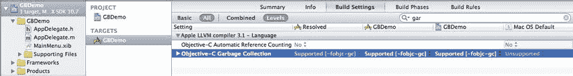

**Figure 8-1.** 设置 Objective-C 垃圾回收构建设置

你也可以在这里选择 `Required (-fobjc-gc-only)` 选项。`Supported` 选项允许你将手动内存管理与垃圾回收内存管理混合使用，而 `Required` 选项则强制你仅使用垃圾回收。完成此设置后，你就可以编写代码而无需担心手动内存管理了。

这就是开始使用 Mac 上垃圾回收所需了解的全部内容。在大多数情况下，你可以像对待 ARC 应用程序一样对待使用垃圾回收的 Mac 应用程序。也就是说，你可以不再担心手动内存管理了。

## 第 9 章

## 处理对象图

对象图指的是应用程序中的对象以及这些对象的所有关系。在大多数应用程序中，你会有许多具有许多关系的对象，如果没有一些帮助，这些关系可能会变得难以管理。

Objective-C 提供了一些很好的功能来帮助你充分利用对象图。本章的教程将向你展示如何：

- 创建对象图
- 使用键值编码（KVC）动态访问属性值
- 使用键路径访问对象图层次结构中的对象
- 使用观察者模式与键值观察（KVO）在属性值更改时获得通知
- 使用检查功能
- 归档和检索对象图

### 面向对象术语

如果你先回顾一些面向对象的术语，理解对象图会容易得多。

### 实体

*实体* 是你正在处理的事物的抽象。通常，这是来自现实世界的事物或对抽象问题的隐喻。在本章中，“实体”一词指的是抽象本身，而不是代码中的任何特定实现。

实体通常用属性和行为来描述。因此，一个汽车实体会具有诸如红色、四个轮胎和运动装饰等属性。汽车的行为包括驾驶、制动和转向。

### 类

*类* 是用于在应用程序内部表示实体的代码。这是你定义实体是什么以及它在应用程序内部做什么的地方。这个过程包括思考实体并使用代码将实体表示为接口和实现。你将实体的属性编码为类中的属性，将实体的行为编码为类中的方法。许多人将类定义比作蓝图。关于类的编码在 第 1 章 的 Recipe 1.3 到 Recipe 1.7 中有详细讨论。

### 对象

就其本身而言，类只是一个定义，并不做太多事情。要使用一个类，你必须从类实例化一个对象。*对象* 是类的一个特定实例。从一个类定义中，你通常会有许多对象。对象由对象类定义中指定的其他对象组成。你可以在 Recipe 1.3 中找到创建和使用自定义类对象的详细示例。

### 对象图

*对象图* 是一个应用程序的对象及其关系的网络。这些是用户在积极使用应用程序时创建和使用的对象。当用户开始从你的类定义创建对象时，对象图可以迅速变得非常丰富和复杂。你可以将对象图理解为应用程序中的每个对象，包括系统和用户界面对象。更可能的是，你可以将对象图理解为属于数据模型的那部分对象。

**注意：** 数据模型指的是称为 Model-View-Controller（MVC）设计模式中的 Model 部分，该模式将应用程序的责任分为三个领域：Model（你正在处理的实体的表示）、View（用户界面）和 Controller（Model 和 View 之间的连接）。

让我们继续教程，从创建对象图开始。

## 9.1 创建对象图

### 问题

你的应用程序使用了一组丰富的模型，并且你需要设置一个足够复杂的对象图来管理你的应用程序。

### 解决方案

使用类来定义使应用程序工作所需的实体属性、方法和关系。

### 工作原理

对于关于 KVC 的教程，你需要一个更丰富的对象图来进行操作。因此，让我们为像任务管理器这样的应用程序设置一个对象图。对于这样的应用程序，你需要几个类来设置一些对象和关系。

#### 处理对象图

为了使对象图足够丰富，让我们为三个实体设置类：`Project`、`Task` 和 `Worker`。`Project` 是一个表示你正在处理的项目类。一个项目包括一个任务列表和一个工作者。`Task` 是一个表示你需要为项目做的一件事情的类。`Worker` 是一个表示可以在项目或任务上工作的人的类。让我们看看每个类的接口，以便你知道你将处理什么。


###### Worker

`#import <Foundation/Foundation.h>`

```objectivec
@interface Worker : NSObject

@property(strong)NSString *name;
@property(strong)NSString *role;

@end
```

`Worker` 持有工人的姓名和角色数据。在 `Worker` 的实现中，你可以重写描述函数，以便日后能够识别特定的 `Worker`。

```objectivec
#import "Worker.h"

@implementation Worker
@synthesize name, role;

-(NSString *)description{
    return [NSString stringWithFormat:@"%@, %@", name, role];
}

@end
```

**注意：** 重写意味着你正在使用新版本的函数或方法来替换超类中定义的函数或方法。`NSObject` 已经有一个名为 `description` 的函数，当你需要一个对象的字符串描述时会用到它。例如，当你使用 `%@` 格式标识符将对象插入到字符串中时，`description` 函数负责提供该字符串。在这里重写 `description` 是确保你稍后能够将合理的描述写入日志的一种简单方法。

###### Task

任务（Task）是项目中需要完成的一项活动。以下是 `Task` 类的头文件内容：

```objectivec
#import <Foundation/Foundation.h>
#import "Worker.h"

@interface Task : NSObject

@property(strong)NSString *name;
@property(strong)NSString *details;
@property(strong)NSDate *dueDate;
@property(assign)int priority;
@property(strong)Worker *assignedWorker;

-(void)writeReportToLog;

@end
```

**注意：** 请记住，`strong` 关键字用于你想要声明所有权的对象，而 `assign` 用于基本数据类型。

如你所见，`Task` 拥有相当多的属性。前四个属性是你预想中构成一个任务应有的内容：任务名称、任务详情、截止日期以及优先级。剩下的属性 `assignedWorker` 建立了一个与 `Worker` 对象的*一对一关系*，该 `Worker` 对象代表被指派完成此任务的人员。

**注意：** 请记住，对象图代表了你的对象及其之间的关系。当你向类中添加作为单一实体的属性时，你就在建立一对一关系。由于你拥有一个 `Worker` 对象作为属性，这意味着每个任务可以分配一个工人。

`Worker` 的实现包含一个报告方法，用于将任务对象的状态写入日志。请注意，我在日志语句的内容前留了一些空格，以便在结合 `Project` 对象的日志报告输出使用时，输出内容能够呈现缩进效果，如下所示：

```objectivec
#import "Task.h"

@implementation Task
@synthesize name, details, dueDate, priority, assignedWorker;

-(void)writeReportToLog{
    NSLog(@"  name = %@", self.name);
    NSLog(@"    description = %@", self.details);
    NSLog(@"    dueDate = %@", self.dueDate);
    NSLog(@"    priority = %i", self.priority);
    NSLog(@"    assignedWorker = %@", self.assignedWorker);
}

@end
```

###### Project

`Project` 是一个更高级别的实体，它持有与项目实体本身相关的数据，并与其他实体建立关系。你可以通过项目名称、截止日期和描述来描述一个 `Project` 实体。与任务类似，项目与负责整个项目的工人具有一对一关系。项目还与任务列表具有*一对多关系*，因为你需要完成一系列任务才能完成一个项目。

**注意：** 你可以在对象图中表示一对一关系以及一对多关系。当你向类中添加集合类型的属性（如集合、数组或字典）时，你就在建立一对多关系。由于你有一个名为 `listOfTasks` 的 `NSMutableArray` 对象作为 `Project` 的一个属性，这意味着你可以拥有一个与项目关联的任务集合。

以下是 `Project` 的接口：

```objectivec
#import <Foundation/Foundation.h>
#import "Task.h"
#import "Worker.h"

@interface Project : NSObject

@property(strong)NSString *name;
@property(strong)NSString *description;
@property(strong)NSDate *dueDate;
@property(strong)NSMutableArray *listOfTasks;
@property(strong)Worker *personInCharge;

-(void)writeReportToLog;

@end
```

再次注意这里如何建立两种关系：`listOfTasks` 是在 `Project` 和 `Task` 之间建立一对多关系的 `NSMutableArray`，而 `personInCharge` 是在 `Project` 和 `Worker` 之间建立一对一关系。

`Project` 的实现包含了将报告写入日志所需的代码。

```objectivec
#import "Project.h"

@implementation Project
@synthesize name, description, dueDate, listOfTasks, personInCharge;

- (id)init{
    self = [super init];
    if (self) {
        self.listOfTasks = [[NSMutableArray alloc] init];
    }
    return self;
}

-(void)writeReportToLog{
    NSLog(@"PROJECT");
    NSLog(@"  name = %@", self.name);
    NSLog(@"  description = %@", self.description);
    NSLog(@"  dueDate = %@", self.dueDate);
    NSLog(@"  personInCharge = %@", self.personInCharge);
    NSLog(@"TASKS");
    [self.listOfTasks enumerateObjectsUsingBlock:^(id obj, NSUInteger idx, BOOL *stop) {
        [obj writeReportToLog];
    }];
}

@end
```

此外，你需要重写 `init` 函数，以确保 `NSMutableArray` 被创建并准备好添加任务。


###### 初始化对象图

要实际使用对象图，你需要创建必要的对象，然后将每个对象分配到其所属的对象关系中。你可以在 Mac 命令行应用程序的 `main.m` 文件中完成所有操作，以构建一个简单的对象图模型；在本章的后续技巧中你将用到它。

首先要做的是设置根对象。每个对象图都至少需要从一个根（或第一个）对象开始。在你的示例中，这是一个 `Project`。

```
Project *workProject01 =[[Project alloc] init];
workProject01.name = @"制作 iOS 应用";
workProject01.description = @"为 iPad 制作一个 iOS 应用程序";
workProject01.dueDate = [NSDate date];
```

这段代码实例化了一个名为 `workProject01` 的 `Project` 对象，并设置了初始属性。接下来，你将开始建立第一个关系：首先为负责该项目的经理创建一个 `Worker` 对象。

```
Worker *personInCharge = [[Worker alloc] init];
personInCharge.name = @"简·史密斯";
personInCharge.role = @"经理";
```

如你所见，你只需创建对象并为新的 `Worker` 对象分配一些属性。现在，你可以将这个 worker 分配给 `workProject01.personInCharge` 属性，从而建立该 worker 与该项目之间的关系。

```
workProject01.personInCharge = personInCharge;
```

建立此关系后，你可以使用点表示法打印出整个 `Worker` 对象，或者仅打印某个属性值（如角色）。

```
//使用对象的描述信息进行写入
NSLog(@"workProject01.personInCharge = %@", workProject01.personInCharge);
//仅打印负责人的角色
NSLog(@"workProject01.personInCharge.role = %@", workProject01.personInCharge.role);
```

这两条语句会将以下内容打印到日志中：

```
workProject01.personInCharge = 简·史密斯, 经理
workProject01.personInCharge.role = 经理
```

本练习的下一部分分为三步：你创建一个新任务，创建一个新 worker 分配给该任务，然后将新任务添加到项目的任务列表中。因此，这次你需要建立两个关系。

第一步，实例化一个新的 `Task` 并为其设置属性值。这一步相当简单。

```
Task *task01 = [[Task alloc] init];
task01.name = @"学习 Objective-C";
task01.details = @"学习 Objective-C 以制作 Mac 应用";
task01.priority = 1;
task01.dueDate = [NSDate date];
```

这段代码仅创建了任务并设置了一些值。接下来，你需要为新 worker 做类似的操作。

```
Worker *employee = [[Worker alloc] init];
employee.name = @"大卫·多恩";
employee.role = @"程序员";
```

最后，你可以在该任务与新 worker 之间建立一对一关系。通过将 `employee` 分配给 `task01` 来建立此关系，如下所示：

```
task01.assignedWorker = employee;
```

现在，使用点表示法导航到 `employee` 对象属性，方式与你为 `personInCharge` 对象所做的类似。

```
//使用对象的描述信息进行写入
NSLog(@"task01.assignedWorker = %@", task01.assignedWorker);
//仅打印员工的角色
NSLog(@"task01.assignedWorker.role = %@", task01.assignedWorker.role);
```

这些日志语句会显示以下内容：

```
task01.assignedWorker = 大卫·多恩, 程序员
task01.assignedWorker.role = 程序员
```

最后，你准备将刚刚创建的任务添加到一开始创建的项目中。为此，你只需将该任务添加到 `NSMutableArray listOfTasks` 中。

```
[workProject01.listOfTasks addObject:task01];
```

这意味着你有了一个项目，该项目关联了一个任务。你可以根据需要创建任意数量的项目并将它们添加到列表中，因为 `Project` 和 `Task` 之间的关系是一对多关系。关于如何向此项目添加更多任务的示例，请参见代码清单 9-xx。

当你想要引用此项目中的某个任务时，可以先获取该数组的引用。然后通过发送 `objectAtIndex:` 消息或 `lastObject` 消息来选择对象。

```
//使用 objectAtIndex: 的示例
//Task *currentTask = [workProject01.listOfTasks objectAtIndex:0];
Task *currentTask = [workProject01.listOfTasks lastObject];
NSLog(@"currentTask.name = %@", currentTask.name);
```

你应在日志中看到以下内容：

```
currentTask.name = 学习 Objective-C
```

至此，你已拥有一个完整的对象图可供使用。你可以发送 `writeReportToLog` 消息来打印出对象图的全部内容。

```
[workProject01 writeReportToLog];
```

关于其工作原理的详细信息，请参阅代码清单 9-6。以下是你将在日志中看到的消息：

```
PROJECT
   name = 制作 iOS 应用
   description = 为 iPad 制作一个 iOS 应用程序
   dueDate = 2012-03-20 15:57:13 +0000
   personInCharge = 简·史密斯, 经理
 TASKS
   name = 学习 Objective-C
     description = 学习 Objective-C 以制作 Mac 应用
     dueDate = 2012-03-20 15:57:13 +0000
     priority = 1
     assignedWorker = 大卫·多恩, 程序员
```

请参阅代码清单 9-1 至 9-7。


## 代码

**代码清单 9-1.** `Worker.h`

```
#import <Foundation/Foundation.h>

@interface Worker : NSObject

@property(strong)NSString *name;
@property(strong)NSString *role;

@end
```

**代码清单 9-2.** `Worker.m`

```
#import "Worker.h"

@implementation Worker
@synthesize name, role;

-(NSString *)description{
    return [NSString stringWithFormat:@"%@, %@", name, role];
}

@end
```

**代码清单 9-3.** `Task.h`

```
#import <Foundation/Foundation.h>
#import "Worker.h"

@interface Task : NSObject

@property(strong)NSString *name;
@property(strong)NSString *details;
@property(strong)NSDate *dueDate;
@property(assign)int priority;
@property(strong)Worker *assignedWorker;

-(void)writeReportToLog;

@end
```

**代码清单 9-4.** `Task.m`

```
#import "Task.h"

@implementation Task
@synthesize name, details, dueDate, priority, assignedWorker;

-(void)writeReportToLog{
    NSLog(@"  name = %@", self.name);
    NSLog(@"    description = %@", self.details);
    NSLog(@"    dueDate = %@", self.dueDate);
    NSLog(@"    priority = %i", self.priority);
    NSLog(@"    assignedWorker = %@", self.assignedWorker);
}

@end
```

**代码清单 9-5.** `Project.h`

```
#import <Foundation/Foundation.h>
#import "Task.h"
#import "Worker.h"

@interface Project : NSObject

@property(strong)NSString *name;
@property(strong)NSString *description;
@property(strong)NSDate *dueDate;
@property(strong)NSMutableArray *listOfTasks;
@property(strong)Worker *personInCharge;

-(void)writeReportToLog;

@end
```

**代码清单 9-6.** `Project.m`

```
#import "Project.h"

@implementation Project
@synthesize name, description, dueDate, listOfTasks, personInCharge;

- (id)init{
    self = [super init];
    if (self) {
        self.listOfTasks = [[NSMutableArray alloc] init];
    }
    return self;
}

-(void)writeReportToLog{
    NSLog(@"PROJECT");
    NSLog(@"  name = %@", self.name);
    NSLog(@"  description = %@", self.description);
    NSLog(@"  dueDate = %@", self.dueDate);
    NSLog(@"  personInCharge = %@", self.personInCharge);
    NSLog(@"TASKS");
    [self.listOfTasks enumerateObjectsUsingBlock:^(id obj, NSUInteger idx, BOOL *stop) {
        [obj writeReportToLog];
    }];
}

@end
```

**代码清单 9-7.** `main.m`

```
#import <Foundation/Foundation.h>
#import "Project.h"
#import "Task.h"

int main(int argc, const char * argv[]){
    @autoreleasepool {
        //对象图示例
        //创建一个新项目
        Project *workProject01 =[[Project alloc] init];
        workProject01.name = @"制作 iOS 应用";
        workProject01.description = @"为 iPad 制作一个 iOS 应用程序";
        workProject01.dueDate = [NSDate date];

        //设置一名负责人
        Worker *personInCharge = [[Worker alloc] init];
        personInCharge.name = @"简·史密斯";
        personInCharge.role = @"经理";

        //将负责人分配给项目
        workProject01.personInCharge = personInCharge;

        //使用对象的 description 方法写出
        NSLog(@"workProject01.personInCharge = %@", workProject01.personInCharge);
        //仅写出负责人的角色
        NSLog(@"workProject01.personInCharge.role = %@",
        workProject01.personInCharge.role);

        //创建新任务
        Task *task01 = [[Task alloc] init];
        task01.name = @"学习 Objective-C";
        task01.details = @"学习 Objective-C 以便制作 Mac 应用";
        task01.priority = 1;
        task01.dueDate = [NSDate date];

        //设置一个分配给该任务的新雇员
        Worker *employee = [[Worker alloc] init];
        employee.name = @"大卫·多恩";
        employee.role = @"程序员";

        //将工作人员分配给任务
        task01.assignedWorker = employee;

        //使用对象的 description 方法写出
        NSLog(@"task01.assignedWorker = %@", task01.assignedWorker);
        //仅写出雇员的角色
        NSLog(@"task01.assignedWorker.role = %@", task01.assignedWorker.role);

        //将任务添加到项目
        [workProject01.listOfTasks addObject:task01];

        //从列表中引用任务时需使用数组
        Task *currentTask = [workProject01.listOfTasks lastObject];
        NSLog(@"currentTask.name = %@", currentTask.name);

        //写出项目报告：
        [workProject01 writeReportToLog];

        //注意：项目所需的每个任务都需要执行此操作

        //创建新任务
        Task *task02 = [[Task alloc] init];
        task02.name = @"研究 UIKit";
        task02.details = @"研究 UIKit 以了解其如何为用户工作。";
        task02.priority = 3;
        task02.dueDate = [NSDate date];

        //将工作人员分配给任务
        task02.assignedWorker = employee;

        //将任务添加到项目
        [workProject01.listOfTasks addObject:task02];

        //创建新任务
        Task *task03 = [[Task alloc] init];
        task03.name = @"评估";
        task03.details = @"签署批准初始项目进度。";
        task03.priority = 1;
        task03.dueDate = [NSDate date];

        //将工作人员分配给任务
        task03.assignedWorker = personInCharge;

        //将任务添加到项目
        [workProject01.listOfTasks addObject:task03];

        //写出项目报告：
        [workProject01 writeReportToLog];

    }
    return 0;
}
```

## 用法

使用此代码的最佳方式是：在 Xcode 中创建一个 Mac 命令行应用程序，并重新创建代码清单 9-1 到 9-7。然后运行该应用程序并检查日志。你将看到如下所示的内容，但其中的 `NSDate` 值会有所不同：

```
workProject01.personInCharge = 简·史密斯, 经理
 workProject01.personInCharge.role = 经理
 task01.assignedWorker = 大卫·多恩, 程序员
 task01.assignedWorker.role = 程序员
 currentTask.name = 学习 Objective-C
 PROJECT
   name = 制作 iOS 应用
   description = 为 iPad 制作一个 iOS 应用程序
   dueDate = 2012-03-20 16:06:55 +0000
   personInCharge = 简·史密斯, 经理
 TASKS
   name = 学习 Objective-C
     description = 学习 Objective-C 以便制作 Mac 应用
     dueDate = 2012-03-20 16:06:55 +0000
     priority = 1
     assignedWorker = 大卫·多恩, 程序员
 PROJECT
   name = 制作 iOS 应用
   description = 为 iPad 制作一个 iOS 应用程序
   dueDate = 2012-03-20 16:06:55 +0000
   personInCharge = 简·史密斯, 经理
 TASKS
   name = 学习 Objective-C
     description = 学习 Objective-C 以便制作 Mac 应用
     dueDate = 2012-03-20 16:06:55 +0000
     priority = 1
     assignedWorker = 大卫·多恩, 程序员
   name = 研究 UIKit
     description = 研究 UIKit 以了解其如何为用户工作。
     dueDate = 2012-03-20 16:06:55 +0000
     priority = 3
     assignedWorker = 大卫·多恩, 程序员
   name = 评估
     description = 签署批准初始项目进度。
     dueDate = 2012-03-20 16:06:55 +0000
     priority = 1
     assignedWorker = 简·史密斯, 经理
```

该输出展示了将在本章中用作示例的完整对象图，因此这是一个很好的参考。

## 9.2 使用键值编码

### 问题

你希望在运行时动态地获取和设置对象图中的属性值，而无需事先知道特定的属性名称。由于你不知道要使用哪些属性，因此无法使用点语法来访问属性值。

### 解决方案

使用键值编码（KVC）来动态地获取和设置属性。`NSObject` 提供了内置方法，让你能够根据与属性名称相对应的字符串键来设置或获取属性值。


### 工作原理

请注意，你正在使用在技巧 9.1 中创建的对象图。`NSObject` 有一些内置行为，可以将每个属性和每个属性值索引到字典数据结构中。该字典的键是声明的属性名称（存储为 `NSString` 对象）。

#### 获取属性值

为了使用此系统获取属性值，你只需将 `NSString` 类型的属性名称提供给 `NSObject` 的 `valueForKey:` 方法即可。由于你通常不知道 `valueForKey:` 会返回哪种类型的对象，因此应使用 `id` 对象类型。将此 `id` 对象命名为 `temp`，并在本技巧中全程使用它。

`id temp;`

要获取项目名称，你需要向 `workProject01` 发送 `valueForKey:` 消息，并将结果赋值给 `temp`，同时使用键 `@"name"`。

`temp = [workProject01 valueForKey:@"name"];`

要使用存储在 `temp` 中的值，你可以将 `temp` 视为 `NSString` 对象。

`NSLog(@"temp (from key name) = %@", temp);`

你应该在日志中看到以下内容：

`temp (from key name) = Make iOS App`

在你事先不知道需要哪个属性值的情况下，这会很有帮助，因为你可以在这里使用字符串。因此，信息可以来自外部输入源（如文本文件），而不是像我这里一样直接将字符串包含在代码中。这种灵活性可以提供一些动态行为；KVC 对于某些系统（如数据绑定和 Interface Builder，一个用于无需编码即可构建用户界面的 Xcode 工具）的运行也至关重要。

你可以使用 `valueForKey:` 获取任何类型的对象，包括自定义对象，比如你设置为负责项目的 `Worker` 对象。

`temp = [workProject01 valueForKey:@"personInCharge"];`

这里有一个 KVC 实现的巧妙技巧。假设你只想了解项目任务列表中每个任务的名称（一个相当常见的需求）。你可以使用 KVC 获取一个只包含这些值的数组。你要做的第一件事是获取任务列表的引用。

`temp = [workProject01 valueForKey:@"listOfTasks"];`

这与前面的示例工作原理完全相同。然后，你想再次使用 `valueForKey:`，但这次是将消息发送给包含任务列表引用的 `temp` 对象，并使用键 `@"name"`。这将返回一个数组，其中填充了 `temp` 对象引用的任务列表内每个 `Task` 对象的 `name` 属性值。

`NSArray *stuffFromTaskList = [temp valueForKey:@"name"];`

这里，我将结果设置给一个 `NSArray` 对象，因为我想使用一种特定的 `NSArray` 枚举方法来演示此操作的结果。

```
[stuffFromTaskList enumerateObjectsUsingBlock:^(id obj, NSUInteger idx, BOOL *stop) {
    NSLog(@"obj: %@", obj);
}];
```

日志应列出以下属性值：

`obj: Learn Objective-C`
`obj: Investigate UIKit`
`obj: Evaluate`

#### 设置属性值

你也可以使用 KVC 设置属性值。这与获取属性值的模式相同。你需要一个 `NSString` 类型的键来引用该属性，并且需要向属性所在的对象发送消息。

因此，如果你想将正在处理的项目的名称更改为“My Pet Project”，可以执行以下操作：

```
[workProject01 setValue:@"My Pet Project"
                 forKey:@"name"];
```

和之前一样，你可以对任何属性执行此操作。你还可以对数组中的每个属性值应用设置。例如，如果你想将每个任务名称重置为“New Task”，可以执行以下操作：

```
temp = [workProject01 valueForKey:@"listOfTasks"];
[temp setValue:@"New Task"
        forKey:@"name"];
```

如果你在应用这些更改后使用 `writeReportToLog` 方法打印日志报告，将会得到以下结果（更新的行以粗体显示）：

`PROJECT`
**`   name = My Pet Project`**
`   description = Make an iOS application for the iPad`
`   dueDate = 2012-03-21 17:01:05 +0000`
`   personInCharge = Jane Smith, Manager`
` TASKS`
**`   name = New Task`**
`     description = Learn Objective-C to make Mac apps`
`     dueDate = 2012-03-21 17:01:05 +0000`
`     priority = 1`
`     assignedWorker = David Done, Programmer`
**`   name = New Task`**
`     description = Investigate UIKit to see how it works for users.`
`     dueDate = 2012-03-21 17:01:05 +0000`
`     priority = 3`
`     assignedWorker = David Done, Programmer`
**`   name = New Task`**
`     description = Signoff on initial project progress.`
`     dueDate = 2012-03-21 17:01:05 +0000`
`     priority = 1`
`     assignedWorker = Jane Smith, Manager`

**注意：** 定义 `Project`、`Task` 和 `Worker` 类的代码文件与技巧 9.1 中的相同。

请参阅列表 9-8 至 9-14。


### 代码

**代码清单 9-8.** *Worker.h*

```
#import <Foundation/Foundation.h>

@interface Worker : NSObject

@property(strong)NSString *name;
@property(strong)NSString *role;

@end
```

**代码清单 9-9.** *Worker.m*

```
#import "Worker.h"

@implementation Worker
@synthesize name, role;

-(NSString *)description{
    return [NSString stringWithFormat:@"%@, %@", name, role];
}

@end
```

**代码清单 9-10.** *Task.h*

```
#import <Foundation/Foundation.h>
#import "Worker.h"

@interface Task : NSObject

@property(strong)NSString *name;
@property(strong)NSString *details;
@property(strong)NSDate *dueDate;
@property(assign)int priority;
@property(strong)Worker *assignedWorker;

-(void)writeReportToLog;

@end
```

**代码清单 9-11.** *Task.m*

```
#import "Task.h"

@implementation Task
@synthesize name, details, dueDate, priority, assignedWorker;

-(void)writeReportToLog{
    NSLog(@"  name = %@", self.name);
    NSLog(@"    description = %@", self.details);
    NSLog(@"    dueDate = %@", self.dueDate);
    NSLog(@"    priority = %i", self.priority);
    NSLog(@"    assignedWorker = %@", self.assignedWorker);
}

@end
```

**代码清单 9-12.** *Project.h*

```
#import <Foundation/Foundation.h>
#import "Task.h"
#import "Worker.h"

@interface Project : NSObject

@property(strong)NSString *name;
@property(strong)NSString *description;
@property(strong)NSDate *dueDate;
@property(strong)NSMutableArray *listOfTasks;
@property(strong)Worker *personInCharge;

-(void)writeReportToLog;

@end
```

**代码清单 9-13.** *Project.m*

```
#import "Project.h"

@implementation Project
@synthesize name, description, dueDate, listOfTasks, personInCharge;

- (id)init{
    self = [super init];
    if (self) {
        self.listOfTasks = [[NSMutableArray alloc] init];
    }
    return self;
}

-(void)writeReportToLog{
    NSLog(@"PROJECT");
    NSLog(@"  name = %@", self.name);
    NSLog(@"  description = %@", self.description);
    NSLog(@"  dueDate = %@", self.dueDate);
    NSLog(@"  personInCharge = %@", self.personInCharge);
    NSLog(@"TASKS");
    [self.listOfTasks enumerateObjectsUsingBlock:^(id obj, NSUInteger idx, BOOL *stop) {
        [obj writeReportToLog];
    }];
}

@end
```

**代码清单 9-14.** *main.m*

```
#import <Foundation/Foundation.h>
#import "Project.h"
#import "Task.h"

int main(int argc, const char * argv[]){
    @autoreleasepool {
        //Create a new project
        Project *workProject01 =[[Project alloc] init];
        workProject01.name = @"Make iOS App";
        workProject01.description = @"Make an iOS application for the iPad";
        workProject01.dueDate = [NSDate date];

        //Setup a new person to be in charge
        Worker *personInCharge = [[Worker alloc] init];
        personInCharge.name = @"Jane Smith";
        personInCharge.role = @"Manager";

        //Assign person to project
        workProject01.personInCharge = personInCharge;

        //Create new task
        Task *task01 = [[Task alloc] init];
        task01.name = @"Learn Objective-C";
        task01.details = @"Learn Objective-C to make Mac apps";
        task01.priority = 1;
        task01.dueDate = [NSDate date];

        //Setup a new person to assign to the task
        Worker *employee = [[Worker alloc] init];
        employee.name = @"David Done";
        employee.role = @"Programmer";

        //Assign worker to task
        task01.assignedWorker = employee;

        //Add task to project
        [workProject01.listOfTasks addObject:task01];

        //Create new task
        Task *task02 = [[Task alloc] init];
        task02.name = @"Investigate UIKit";
        task02.details = @"Investigate UIKit to see how it works for users.";
        task02.priority = 3;
        task02.dueDate = [NSDate date];

        //Assign worker to task
        task02.assignedWorker = employee;

        //Add task to project
        [workProject01.listOfTasks addObject:task02];

        //Create new task
        Task *task03 = [[Task alloc] init];
        task03.name = @"Evaluate";
        task03.details = @"Signoff on initial project progress.";
        task03.priority = 1;
        task03.dueDate = [NSDate date];

        //Assign worker to task
        task03.assignedWorker = personInCharge;

        //Add task to project
        [workProject01.listOfTasks addObject:task03];

        //Use KVC to get property values
        //Use id to get a generalized object reference
        id temp;

        //Get the name of the project:
        temp = [workProject01 valueForKey:@"name"];
        NSLog(@"temp (from key name) = %@", temp);

        //get the person in charge:

        temp = [workProject01 valueForKey:@"personInCharge"];
        NSLog(@"temp (from key personInCharge) = %@", temp);

        //get the project's task list:
        temp = [workProject01 valueForKey:@"listOfTasks"];
        NSLog(@"temp (from key listOfTasks) = %@", temp);

        NSArray *stuffFromTaskList = [temp valueForKey:@"name"];
[stuffFromTaskList enumerateObjectsUsingBlock:^(id obj, NSUInteger idx, BOOL *stop) {
            NSLog(@"obj: %@", obj);
        }];

        //Use KVC to set property values
        [workProject01 setValue:@"My Pet Project"
                         forKey:@"name"];

        temp = [workProject01 valueForKey:@"listOfTasks"];
        [temp setValue:@"New Task"
                forKey:@"name"];

        //write out the object graph's contents
        [workProject01 writeReportToLog];
    }
    return 0;
}
```

### 用法

一个 Mac 命令行程序是测试此代码的充分基础。重新创建从代码清单 9-8 到代码清单 9-14 的所有代码，包括 `main.m` 文件中用于操作对象图（object graph）的代码。

构建并运行你的应用程序。你应该会在控制台日志窗口中看到如下所示的输出。本秘籍的主要变化在于访问属性值的过程，而非内容本身。

```
temp (from key name) = Make iOS App
temp (from key personInCharge) = Jane Smith, Manager
temp (from key listOfTasks) = (
    "<Task: 0x106b16200>",
    "<Task: 0x106b16640>",
    "<Task: 0x106b16730>"
)
 obj: Learn Objective-C
 obj: Investigate UIKit
 obj: Evaluate
 PROJECT
   name = My Pet Project
   description = Make an iOS application for the iPad
   dueDate = 2012-03-21 17:01:05 +0000
   personInCharge = Jane Smith, Manager
 TASKS
   name = New Task
     description = Learn Objective-C to make Mac apps
     dueDate = 2012-03-21 17:01:05 +0000
     priority = 1
     assignedWorker = David Done, Programmer
   name = New Task
     description = Investigate UIKit to see how it works for users.
     dueDate = 2012-03-21 17:01:05 +0000
     priority = 3
     assignedWorker = David Done, Programmer
   name = New Task
     description = Signoff on initial project progress.
     dueDate = 2012-03-21 17:01:05 +0000
     priority = 1
     assignedWorker = Jane Smith, Manager
```

这就是你导航和操作对象图的结果。

## 9.3 在对象图中使用键路径

### 问题

你想动态访问对象图中深层嵌套的对象属性，但 `valueForKey:` 和 `setValueForKey:` 仅在你手头有对象引用时才能工作。

### 解决方案

使用键路径从对象图中获取深层嵌套的对象属性值。`NSObject` 提供了一个名为 `valueForKeyPath:` 的函数，它将帮助你获取这些值。


### 工作原理

请注意，你再次使用了配方 9.1 中创建的对象图。这次，你要提供一个键路径，而不是像配方 9.2 中那样简单地提供一个键值对。*键路径*看起来就像是你使用点表示法访问对象或属性时编写的代码，唯一的区别是键路径是一个字符串。例如，如果你想使用标准的点表示法查看负责人的姓名，可以这样做：

```
id temp;
temp = workProject01.personInCharge.name;
```

请注意，在本配方中你将重复使用`id emp`。若要通过键路径实现相同的功能，可以这样做：

```
temp = [workProject01 valueForKeyPath:@"personInCharge.name"];
```

如果你想再深入一层，获取`NSString`的`uppercaseString`方法的值，可以这样做：

```
temp = [workProject01 valueForKeyPath:@"personInCharge.name.uppercaseString"];
```

正如你可能预料的，你也可以通过键路径设置属性。例如，如果你想更改负责人的姓名，可以这样做：

```
[workProject01 setValue:@"Mary Steinbeck"
             forKeyPath:@"personInCharge.name"];
```

请参阅列表 9-15 至 9-21。

**注意：** 键路径运行良好——但有一个注意事项。无法引用数组中的某个元素。如果你想获取项目任务列表中某个任务的`name`属性值，那就没办法了。唯一的方法是先获取数组的引用，然后通过常规方式从列表中选择对象。

### 代码

**列表 9-15.** *Worker.h*

```
#import <Foundation/Foundation.h>

@interface Worker : NSObject

@property(strong)NSString *name;
@property(strong)NSString *role;

@end
```

**列表 9-16.** *Worker.m*

```
#import "Worker.h"

@implementation Worker
@synthesize name, role;

-(NSString *)description{
    return [NSString stringWithFormat:@"%@, %@", name, role];
}

@end
```

**列表 9-17.** *Task.h*

```
#import <Foundation/Foundation.h>
#import "Worker.h"

@interface Task : NSObject

@property(strong)NSString *name;
@property(strong)NSString *details;
@property(strong)NSDate *dueDate;
@property(assign)int priority;
@property(strong)Worker *assignedWorker;

-(void)writeReportToLog;

@end
```

**列表 9-18.** *Task.m*

```
#import "Task.h"

@implementation Task
@synthesize name, details, dueDate, priority, assignedWorker;

-(void)writeReportToLog{
    NSLog(@"  name = %@", self.name);
    NSLog(@"    description = %@", self.details);
    NSLog(@"    dueDate = %@", self.dueDate);
    NSLog(@"    priority = %i", self.priority);
    NSLog(@"    assignedWorker = %@", self.assignedWorker);
}

@end
```

**列表 9-19.** *Project.h*

```
#import <Foundation/Foundation.h>
#import "Task.h"
#import "Worker.h"

@interface Project : NSObject

@property(strong)NSString *name;
@property(strong)NSString *description;
@property(strong)NSDate *dueDate;
@property(strong)NSMutableArray *listOfTasks;
@property(strong)Worker *personInCharge;

-(void)writeReportToLog;

@end
```

**列表 9-20.** *Project.m*

```
#import "Project.h"

@implementation Project
@synthesize name, description, dueDate, listOfTasks, personInCharge;

- (id)init{
    self = [super init];
    if (self) {
        self.listOfTasks = [[NSMutableArray alloc] init];
    }
    return self;
}

-(void)writeReportToLog{
    NSLog(@"PROJECT");
    NSLog(@"  name = %@", self.name);
    NSLog(@"  description = %@", self.description);
    NSLog(@"  dueDate = %@", self.dueDate);
    NSLog(@"  personInCharge = %@", self.personInCharge);
    NSLog(@"TASKS");
    [self.listOfTasks enumerateObjectsUsingBlock:^(id obj, NSUInteger idx, BOOL *stop) {
        [obj writeReportToLog];
    }];
}

@end
```

**列表 9-21.** *main.m*

```
#import <Foundation/Foundation.h>
#import "Project.h"
#import "Task.h"

int main(int argc, const char * argv[]){
    @autoreleasepool {
        //创建一个新项目
        Project *workProject01 =[[Project alloc] init];
        workProject01.name = @"制作 iOS 应用";
        workProject01.description = @"为 iPad 制作一个 iOS 应用程序";
        workProject01.dueDate = [NSDate date];

        //设置一个负责人
        Worker *personInCharge = [[Worker alloc] init];
        personInCharge.name = @"简·史密斯";
        personInCharge.role = @"经理";

        //将负责人分配给项目
        workProject01.personInCharge = personInCharge;

        //创建新任务
        Task *task01 = [[Task alloc] init];
        task01.name = @"学习 Objective-C";
        task01.details = @"学习 Objective-C 以制作 Mac 应用";
        task01.priority = 1;
        task01.dueDate = [NSDate date];

        //设置一名新员工来分配任务
        Worker *employee = [[Worker alloc] init];
        employee.name = @"大卫·多恩";
        employee.role = @"程序员";

        //将员工分配给任务
        task01.assignedWorker = employee;

        //将任务添加到项目
        [workProject01.listOfTasks addObject:task01];

        //创建新任务
        Task *task02 = [[Task alloc] init];
        task02.name = @"研究 UIKit";
        task02.details = @"研究 UIKit 以了解它如何为用户工作。";
        task02.priority = 3;
        task02.dueDate = [NSDate date];

        //将员工分配给任务
        task02.assignedWorker = employee;

        //将任务添加到项目
        [workProject01.listOfTasks addObject:task02];

        //创建新任务
        Task *task03 = [[Task alloc] init];
        task03.name = @"评估";
        task03.details = @"签署初始项目进度。";
        task03.priority = 1;
        task03.dueDate = [NSDate date];

        //将员工分配给任务
        task03.assignedWorker = personInCharge;

        //将任务添加到项目
        [workProject01.listOfTasks addObject:task03];

        //使用键路径获取属性值
        //使用 id 获取通用对象引用
        id temp;

        //使用点表示法获取负责人的姓名
        temp = workProject01.personInCharge.name;
        NSLog(@"workProject01.personInCharge.name = %@", temp);

        //使用键路径获取负责人的姓名
        temp = [workProject01 valueForKeyPath:@"personInCharge.name"];
        NSLog(@"personInCharge.name = %@", temp);

        //使用键路径获取负责人姓名的全大写形式
        temp = [workProject01 valueForKeyPath:@"personInCharge.name.uppercaseString"];
        NSLog(@"personInCharge.name.uppercaseString = %@", temp);

        //使用键路径设置负责人的姓名
        [workProject01 setValue:@"玛丽·斯坦贝克"
                     forKeyPath:@"personInCharge.name"];

        //输出对象图的内容
        [workProject01 writeReportToLog];
    }
    return 0;
}
```


### 用法

尝试此示例最简单的方法是创建一个命令行 Mac 应用，并包含代码清单 9-15 至 9-21 中的代码。其中的类定义与示例 9.1 和 9.2 中使用的相同。

键路径代码位于 `main.m` 文件的末尾。运行此代码时，你将看到键路径函数的结果。查看负责人的姓名，即可看到你在 `main.m` 代码末尾所做的更改。

```
workProject01.personInCharge.name = Jane Smith
personInCharge.name = Jane Smith
personInCharge.name.uppercaseString = JANE SMITH
PROJECT
   name = Make iOS App
   description = Make an iOS application for the iPad
   dueDate = 2012-03-20 16:06:55 +0000
   personInCharge = Mary Steinbeck, Manager
 TASKS
   name = Learn Objective-C
     description = Learn Objective-C to make Mac apps
     dueDate = 2012-03-20 16:06:55 +0000
     priority = 1
     assignedWorker = David Done, Programmer
   name = Investigate UIKit
     description = Investigate UIKit to see how it works for users.
     dueDate = 2012-03-20 16:06:55 +0000
     priority = 3
     assignedWorker = David Done, Programmer
   name = Evaluate
     description = Signoff on initial project progress.
     dueDate = 2012-03-20 16:06:55 +0000
     priority = 1
     assignedWorker = Mary Steinbeck, Manager
```

如果你没有注意到变化，那么 Mary Steinbeck 现在既被列为项目的负责人，也被列为最后一个任务的负责人。

## 9.4 使用键路径聚合信息

### 问题

你想要从对象图中获取聚合信息。例如，你可能需要了解项目任务列表中所有任务的平均优先级。

### 解决方案

使用 `@count`、`@sum`、`@avg`、`@min`、`@max` 和 `@distinctUnionOfObjects` 从对象图的数组中获取聚合信息。

### 工作原理

当你使用 `valueForKeyPath:` 方法时，可以在键路径中包含 `@count`、`@sum`、`@avg`、`@min`、`@max` 和 `@distinctUnionOfObjects` 操作符，以从数组的属性中生成信息。键路径的一般形式是：

`[键路径].[@操作符].[属性名称]`

如果你想获取你在示例 9.1 中创建的任务列表中所有优先级值的总和，可以这样做：

```
id sum = [workProject01 valueForKeyPath:@"listOfTasks.@sum.priority"];
```

请记住，`listOfTasks` 是一个包含 `Task` 对象的数组。每个 `Task` 对象都有一个名为 `priority` 的 `int` 属性。这些操作符作用于数组中每个 `Task` 对象的 `priority` 属性值。

以下是关于如何使用这些操作符与 `priority` 属性的更多示例：

```
// 获取所有优先级值的总和
id sum = [workProject01 valueForKeyPath:@"listOfTasks.@sum.priority"];
NSLog(@"任务列表优先级总和 = %@", sum);

// 获取所有优先级值的平均值
id average = [workProject01 valueForKeyPath:@"listOfTasks.@avg.priority"];
NSLog(@"任务列表优先级平均值 = %@", average);

// 获取所有优先级值的最小值
id min = [workProject01 valueForKeyPath:@"listOfTasks.@min.priority"];
NSLog(@"任务列表优先级最小值 = %@", min);

// 获取所有优先级值的最大值
id max = [workProject01 valueForKeyPath:@"listOfTasks.@max.priority"];
NSLog(@"任务列表优先级最大值 = %@", max);
```

你还可以获取某个属性的不同值。假设在你的任务列表中，每个任务都分配了一个负责人。通常同一个人会被分配多个任务（就像你对象图中的 David Done 一样）。有时你只需要一个不重复的对象列表。或许你想给项目中的每个人只发送一封电子邮件。

要获取这样的列表，请使用 `@distinctUnionOfObjects` 操作符，如下所示：

```
id listOfWorkers = [workProject01 valueForKeyPath:@"listOfTasks.@distinctUnionOfObjects.assignedWorker"];
NSLog(@"任务列表中的不同工人列表 = %@", listOfWorkers);
```

这会打印出每个工人，但仅出现一次。

```
任务列表中的不同工人列表 = (
    "David Done, Programmer",
    "Jane Smith, Manager"
)
```

David Done 只列出一次，尽管他被分配给了两个任务。参见代码清单 9-22 至 9-28。


### 代码

**代码清单 9-22.** *Worker.h*

```
#import <Foundation/Foundation.h>

@interface Worker : NSObject

@property(strong)NSString *name;
@property(strong)NSString *role;

@end
```

**代码清单 9-23.** *Worker.m*

```
#import "Worker.h"

@implementation Worker
@synthesize name, role;

-(NSString *)description{
    return [NSString stringWithFormat:@"%@, %@", name, role];
}

@end
```

**代码清单 9-24.** *Task.h*

```
#import <Foundation/Foundation.h>
#import "Worker.h"

@interface Task : NSObject

@property(strong)NSString *name;
@property(strong)NSString *details;
@property(strong)NSDate *dueDate;
@property(assign)int priority;
@property(strong)Worker *assignedWorker;

-(void)writeReportToLog;

@end
```

**代码清单 9-25.** *Task.m*

```
#import "Task.h"

@implementation Task
@synthesize name, details, dueDate, priority, assignedWorker;

-(void)writeReportToLog{
    NSLog(@"  name = %@", self.name);
    NSLog(@"    description = %@", self.details);
    NSLog(@"    dueDate = %@", self.dueDate);
    NSLog(@"    priority = %i", self.priority);
    NSLog(@"    assignedWorker = %@", self.assignedWorker);
}

@end
```

**代码清单 9-26.** *Project.h*

```
#import <Foundation/Foundation.h>
#import "Task.h"
#import "Worker.h"

@interface Project : NSObject

@property(strong)NSString *name;
@property(strong)NSString *description;
@property(strong)NSDate *dueDate;
@property(strong)NSMutableArray *listOfTasks;
@property(strong)Worker *personInCharge;

-(void)writeReportToLog;

@end
```

**代码清单 9-27.** *Project.m*

```
#import "Project.h"

@implementation Project
@synthesize name, description, dueDate, listOfTasks, personInCharge;

- (id)init{
    self = [super init];
    if (self) {
        self.listOfTasks = [[NSMutableArray alloc] init];
    }
    return self;
}

-(void)writeReportToLog{
    NSLog(@"PROJECT");
    NSLog(@"  name = %@", self.name);
    NSLog(@"  description = %@", self.description);
    NSLog(@"  dueDate = %@", self.dueDate);
    NSLog(@"  personInCharge = %@", self.personInCharge);
    NSLog(@"TASKS");
    [self.listOfTasks enumerateObjectsUsingBlock:^(id obj, NSUInteger idx, BOOL *stop) {
        [obj writeReportToLog];
    }];
}

@end
```

**代码清单 9-28.** *main.m*

```
#import <Foundation/Foundation.h>
#import "Project.h"
#import "Task.h"

int main(int argc, const char * argv[]){
    @autoreleasepool {
        //创建一个新项目
        Project *workProject01 =[[Project alloc] init];
        workProject01.name = @"制作 iOS 应用";
        workProject01.description = @"为 iPad 制作一个 iOS 应用程序";
        workProject01.dueDate = [NSDate date];

        //设置一位负责人
        Worker *personInCharge = [[Worker alloc] init];
        personInCharge.name = @"简·史密斯";
        personInCharge.role = @"经理";

        //分配负责人到项目
        workProject01.personInCharge = personInCharge;

        //创建新任务
        Task *task01 = [[Task alloc] init];
        task01.name = @"学习 Objective-C";
        task01.details = @"学习 Objective-C 以制作 Mac 应用";
        task01.priority = 1;
        task01.dueDate = [NSDate date];

        //设置一位新员工来分配任务
        Worker *employee = [[Worker alloc] init];
        employee.name = @"大卫·多恩";
        employee.role = @"程序员";

        //分配员工到任务
        task01.assignedWorker = employee;

        //将任务添加到项目
        [workProject01.listOfTasks addObject:task01];

        //创建新任务
        Task *task02 = [[Task alloc] init];
        task02.name = @"研究 UIKit";
        task02.details = @"研究 UIKit，了解其用户交互方式。";
        task02.priority = 3;
        task02.dueDate = [NSDate date];

        //分配员工到任务
        task02.assignedWorker = employee;

        //将任务添加到项目
        [workProject01.listOfTasks addObject:task02];

        //创建新任务
        Task *task03 = [[Task alloc] init];
        task03.name = @"评估";
        task03.details = @"对初始项目进展进行签核。";
        task03.priority = 1;
        task03.dueDate = [NSDate date];

        //分配员工到任务
        task03.assignedWorker = personInCharge;

        //将任务添加到项目
        [workProject01.listOfTasks addObject:task03];

        //使用键路径从数组中获取聚合信息
        //获取计数
        id count = [workProject01 valueForKeyPath:@"listOfTasks.@count.priority"];
        NSLog(@"任务列表计数 = %@", count);

        //获取所有优先级的和
        id sum = [workProject01 valueForKeyPath:@"listOfTasks.@sum.priority"];
        NSLog(@"任务列表优先级总和 = %@", sum);

        //获取所有优先级的平均值
        id average = [workProject01 valueForKeyPath:@"listOfTasks.@avg.priority"];
        NSLog(@"任务列表优先级平均值 = %@", average);

        //获取所有优先级的最小值
        id min = [workProject01 valueForKeyPath:@"listOfTasks.@min.priority"];
        NSLog(@"任务列表优先级最小值 = %@", min);

        //获取所有优先级的最大值
        id max = [workProject01 valueForKeyPath:@"listOfTasks.@max.priority"];
        NSLog(@"任务列表优先级最大值 = %@", max);

        //获取所有不同的分配员工列表
        id listOfWorkers = [workProject01 valueForKeyPath:@"listOfTasks.@distinctUnionOfObjects.assignedWorker"];
        NSLog(@"任务列表中不同的员工列表 = %@", listOfWorkers);

    }
    return 0;
}
```

### 用法

本方案的对象图与之前的方案相同，因此如果你一直在跟进，可以重复使用本章前面设置的项目。否则，可以在 Xcode 中设置一个 Mac 命令行应用，并从代码清单 9-22 到 9-28 添加文件。最重要的代码位于 `main.m` 文件的末尾。

当你构建并运行应用程序时，将在日志中看到聚合信息的结果。

```
任务列表计数 = 3
任务列表优先级总和 = 5
任务列表优先级平均值 = 1.66666666666666666666666666666666666666
任务列表优先级最小值 = 1
任务列表优先级最大值 = 3
任务列表中不同的员工列表 = (
    "大卫·多恩, 程序员",
    "简·史密斯, 经理"
)
```

请注意，你的 `Worker` 对象出现的顺序可能与我的 `Worker` 对象出现的顺序不一致。这是正常的，因为你不能假定对象会以特定顺序出现。

## 9.5 实现观察者模式

### 问题

你希望一个对象在另一个对象的属性值发生变化时得到通知。具体来说，你希望在模型的属性发生变化时通知控制器，以便更新用户界面。

### 解决方案

使用键值观察实现观察者模式。


### 工作原理

使用键值观察需要三个步骤。首先，需要在被观察对象与观察对象之间建立连接。通过向被观察对象发送 `addObserver:forKeyPath:options:context:` 消息，并传入对观察对象的引用，即可完成此操作。

接下来，在观察对象的类定义中，必须重写名为 `observeValueForKeyPath:ofObject:change:context:` 的 `NSObject` 方法。每当被观察对象发生改变时，此方法都会被调用。正是在这里，您可以接收到感兴趣的信息，例如发生变更的对象、键路径以及变更后的属性值。

最后，被观察对象必须在 `dealloc` 方法中移除观察者。`dealloc` 方法会在被观察对象即将被销毁前调用，您需要确保观察者也被移除，否则被观察对象可能会被保留，导致内存泄漏。

为演示如何实现，我们将使用在食谱 9.1 中创建的对象图的一个子集。该子集仅包含一个`Project`对象和一个`Worker`对象。`Task`类及任务列表可暂时忽略。

接下来要做的是，让负责人成为项目`name`属性的观察者。每当项目的`name`属性值发生变更时，负责人将收到通知。

第一步，进入 `main.m` 代码中创建对象图的部分。在 `personInCharge Worker` 对象实例化后，找到合适的位置，向 `project` 发送 `addObserver:forKeyPath:options:context:` 消息，并传入 `personInCharge` 及其他一些对象。新增的代码以粗体显示。

```
// 创建一个新项目
Project *workProject01 =[[Project alloc] init];
workProject01.name = @"制作 iOS 应用";
workProject01.description = @"为 iPad 开发一款 iOS 应用程序";
workProject01.dueDate = [NSDate date];

// 设置一位新的负责人
Worker *personInCharge = [[Worker alloc] init];
personInCharge.name = @"简·史密斯";
personInCharge.role = @"经理";

// 将 personInCharge 添加为观察者：
[workProject01 addObserver:personInCharge
                forKeyPath:@"name"
                   options:NSKeyValueObservingOptionNew
                   context:nil];
```

这意味着对象 `personInCharge` 正在观察对象 `workProject01` 上键路径 `"name"` 的属性值。选项 `NSKeyValueObservingOptionNew` 表示您将收到更新后的属性值信息。

此外，还必须确保在信息到达观察者时能够接收并加以利用。这需要在观察者的类定义中重写 `observeValueForKeyPath:ofObject:change:context:` 方法。在 `Worker` 类（`Worker.m`）的实现文件中重写此方法。

```
#import "Worker.h"

@implementation Worker
@synthesize name, role;

...

-(void)observeValueForKeyPath:(NSString *)keyPath
                     ofObject:(id)object
                       change:(NSDictionary *)change
                      context:(void *)context{
    NSLog(@"'%@' 发现项目 '%@' 发生了变化", self, object);

    NSLog(@"'%@' 已变更为 '%@'", keyPath, [change objectForKey:@"new"]);
}

@end
```

当 `workProject01` 对象的 `name` 属性改变时，这段代码便会执行。参数将包含您感兴趣的信息：键路径、发生变更对象的引用，以及包含变更内容的字典。您可以使用这些信息进行相应处理。在此示例中，只是简单地写入日志。如果您将键值观察用于用户界面，则可以利用此信息更新应用屏幕。

在测试之前，还有一件事需要处理。必须在对象销毁前，移除被观察对象上的所有观察者。因此，请转到 `Project` 类声明，添加一个 `dealloc` 方法，在其中移除观察者。此代码应放在 `Project.m` 文件中。

```
#import "Project.h"

@implementation Project
@synthesize name, description, dueDate, personInCharge;

...

-(void)dealloc{
    [self removeObserver:self.personInCharge
                       forKeyPath:@"name"];
}

@end
```

最后，为测试效果，请像这样更改 `workProject01` 对象的 `name` 属性值：

```
workProject01.name = @"哇塞项目！";
```

您将在日志中看到 `personInCharge` 对象收到了通知，并且日志中记录了报告。

```
'简·史密斯, 经理' 发现项目 '为 iPad 开发一款 iOS 应用程序' 发生了变化
'name' 已变更为 '哇塞项目！'
```

请参阅代码清单 9-29 至 9-33。

## 代码

**代码清单 9-29.** *Project.h*

```
#import <Foundation/Foundation.h>
#import "Worker.h"

@interface Project : NSObject

@property(strong)NSString *name;
@property(strong)NSString *description;
@property(strong)NSDate *dueDate;
@property(strong)Worker *personInCharge;

-(void)writeReportToLog;

@end
```

**代码清单 9-30.** *Project.m*

```
#import "Project.h"

@implementation Project
@synthesize name, description, dueDate, personInCharge;

-(void)writeReportToLog{
    NSLog(@"项目");
    NSLog(@"  名称 = %@", self.name);
    NSLog(@"  描述 = %@", self.description);
    NSLog(@"  截止日期 = %@", self.dueDate);
    NSLog(@"  负责人 = %@", self.personInCharge);
}

-(void)dealloc{
    [self removeObserver:self.personInCharge
                       forKeyPath:@"name"];
}

@end
```

**代码清单 9-31.** *Worker.h*

```
#import <Foundation/Foundation.h>

@interface Worker : NSObject

@property(strong)NSString *name;
@property(strong)NSString *role;

@end
```

**代码清单 9-32.** *Worker.m*

```
#import "Worker.h"

@implementation Worker
@synthesize name, role;

-(NSString *)description{
    return [NSString stringWithFormat:@"%@, %@", name, role];
}

-(void)observeValueForKeyPath:(NSString *)keyPath
                     ofObject:(id)object
                       change:(NSDictionary *)change
                      context:(void *)context{
    NSLog(@"'%@' 发现项目 '%@' 发生了变化", self, object);

    NSLog(@"'%@' 已变更为 '%@'", keyPath, [change objectForKey:@"new"]);
}

@end
```

**代码清单 9-33.** *main.m*

```
#import <Foundation/Foundation.h>
#import "Project.h"

int main(int argc, const char * argv[]){
    @autoreleasepool {
        // 创建一个新项目
        Project *workProject01 =[[Project alloc] init];
        workProject01.name = @"制作 iOS 应用";
        workProject01.description = @"为 iPad 开发一款 iOS 应用程序";
        workProject01.dueDate = [NSDate date];

        // 设置一位新的负责人
        Worker *personInCharge = [[Worker alloc] init];
        personInCharge.name = @"简·史密斯";
        personInCharge.role = @"经理";

        // 将 personInCharge 添加为观察者：
        [workProject01 addObserver:personInCharge
                        forKeyPath:@"name"
                           options:NSKeyValueObservingOptionNew
                           context:nil];

        // 将人员指派给项目
        workProject01.personInCharge = personInCharge;

        // 更改项目名称
        workProject01.name = @"哇塞项目！";

    }
    return 0;
}
```


#### 用法

你可以通过一个简单的命令行 Mac 应用来使用这段代码。包含来自代码清单 9-29 和 9-30 的 `Project` 类声明。请注意，尽管这些声明基于配方 9.1 中的类定义，但它们现在包含了额外的代码，以使其能与键值观察协同工作。

`main.m` 中的代码也已在配方 9.1 的基础上进行了更新，加入了使键值观察生效的代码。当你构建并运行应用程序时，你应当会在日志中看到类似这样的输出：

```
'Jane Smith, Manager' has noticed that the project 'Make an iOS application for
the iPad' has changed
'name' was changed to 'The Wow Project!'
```

当你希望更新用户界面时，键值观察就会派上用场。例如，你可能在 iOS 应用中有一个视图控制器被设置为某个模型属性的观察者，这样当数据模型发生变化时，视图控制器就能更新视图。

## 9.6 检查类和对象

### 问题

你的应用程序正在处理一些在运行时你并不了解其信息的对象，但你希望知道是否能够向这些对象发送消息或以其他方式使用它们。

### 解决方案

使用 `NSObject` 自带的內建方法来检查类。你可以查明某个对象是否属于某个类类型、该对象是否响应某个选择器，以及该对象是否与另一个对象相等。

### 工作原理

本配方使用了你在配方 9.1 中创建的对象图，但你会移除 `Task` 类及其对象，因为在本配方中不需要完整的层级结构。你需要创建一个名为 `Consultant` 的新类，它是 `Worker` 的子类。以下是 `Consultant` 的接口和实现：

```
#import "Worker.h"

@interface Consultant : Worker

@end

@implementation Consultant

-(NSString *)description{
    return [NSString stringWithFormat:@"%@, %@", [super description], @"Consultant"];
}

@end
```

首先，在 `main.m` 文件中设置简化后的对象图。

```
//创建一个新项目
Project *workProject01 =[[Project alloc] init];
workProject01.name = @"Make iOS App";
workProject01.description = @"Make an iOS application for the iPad";
workProject01.dueDate = [NSDate date];

//设置一个负责人
Worker *personInCharge = [[Worker alloc] init];
personInCharge.name = @"Jane Smith";
personInCharge.role = @"Manager";

//将负责人分配给项目
workProject01.personInCharge = personInCharge;

//创建一个顾问
Consultant *consulter = [[Consultant alloc] init];
consulter.name = @"Lone Wolf";
consulter.role = @"Star Programmer";
```

与配方 9.1 一样，这是一个由 Jane Smith 负责的项目。不过，这次你省略了任务列表，并创建了一个名为 Lone Wolf 的顾问。

现在，假设你遇到了这样一个情况：你拥有对一个对象的引用，但你不确定该对象的类型。这种情况可能发生在你使用键值编码时，或者在其他某些情况下你得到了一个对象引用，但不知道自己在处理什么类型的对象。例如，

```
id projectManager = [workProject01 valueForKey:@"personInCharge"];
```

对象变量 `projectManager` 只是一个 `id` 类型，这并没有告诉你任何信息（尽管在这里你恰好知道发生了什么，因为你刚刚创建了对象图）。

你可能会猜测 `projectManager` 是一个 `Worker` 对象，并且你希望向 `projectManager` 发送 `writeReportToLog` 消息。但由于不确定，你希望先测试该对象是否能响应。一种选择是使用 `respondsToSelector` 消息。你可以给这个消息传递一个参数，该参数使用 `@selector` 关键字引用你想要发送的消息。你会得到一个 `BOOL` 值，指示该对象是否会响应。

```
BOOL doesItRespond = [projectManager
respondsToSelector:@selector(writeReportToLog)];
```

你还可以查明一个对象是否是特定类或其子类的实例。只需向该对象发送 `isKindOfClass` 消息，并以一个类对象作为参数。同样，你会得到一个 `BOOL` 值，告诉你该对象是否属于那个类类型。在你的对象图中，`consulter` 和 `projectManager` 都是 `Worker` 类的类型，因此以下代码对这两个对象都返回 `YES`：

```
BOOL isItAKindOfClass = [consulter isKindOfClass:[Worker class]];

isItAKindOfClass = [projectManager isKindOfClass:[Worker class]];
```

你可能还想知道该对象是否是一个类的实例（或对象）。如果对象是该类的一个实例，下一个方法返回 `YES`；如果是其他任何情况（包括该类的子类），则返回 `NO`。因此，如果你像这样测试 `projectManager` 和 `consulter`：

```
BOOL isAnInstanceOfClass = [projectManager isMemberOfClass:[Worker class]];

isAnInstanceOfClass = [consulter isMemberOfClass:[Worker class]];
```

第一个函数返回 `YES`，第二个返回 `NO`。这是因为 `projectManager` 是 `Worker` 的一个实例，而 `consulter` 仅仅只是 `Worker` 子类的一个实例。

有时你会拥有两个对象引用，需要测试它们是否是同一个对象。为此，使用 `isEqual` 消息；如果两个对象相同，你会得到一个 `YES` 值的 `BOOL`；如果它们是两个不同的实例，则得到 `NO`。

因此，对于你的对象图，你可能想测试 `projectManager` 和 `consulter`，看它们是否恰好是同一个对象。

```
BOOL isEqual = [projectManager isEqual:consulter];
```

这返回 `NO`，正如你回顾 `main.m` 代码开头创建对象的过程时可能猜到的。

然而，如果你测试 `projectManager` 和 `personInCharge`，会得到不同的结果。

```
isEqual = [projectManager isEqual:personInCharge];
```

这返回 `YES`，因为它们虽然是不同的对象变量名，但都引用了同一个对象。参见代码清单 9-34 至 9-40。


### 代码

**代码清单 9-34.** *Project.h*

```objc
#import <Foundation/Foundation.h>
#import "Worker.h"

@interface Project : NSObject

@property(strong)NSString *name;
@property(strong)NSString *description;
@property(strong)NSDate *dueDate;
@property(strong)Worker *personInCharge;

-(void)writeReportToLog;

@end
```

**代码清单 9-35.** *Project.m*

```objc
#import "Project.h"

@implementation Project
@synthesize name, description, dueDate, personInCharge;

-(void)writeReportToLog{
    NSLog(@"PROJECT");
    NSLog(@"  name = %@", self.name);
    NSLog(@"  description = %@", self.description);
    NSLog(@"  dueDate = %@", self.dueDate);
    NSLog(@"  personInCharge = %@", self.personInCharge);
}

@end
```

**代码清单 9-36.** *Worker.h*

```objc
#import <Foundation/Foundation.h>

@interface Worker : NSObject

@property(strong)NSString *name;
@property(strong)NSString *role;

@end
```

**代码清单 9-37.** *Worker.m*

```objc
#import "Worker.h"

@implementation Worker
@synthesize name, role;

-(NSString *)description{
    return [NSString stringWithFormat:@"%@, %@", name, role];
}

@end
```

**代码清单 9-38.** *Consultant.h*

```objc
#import "Worker.h"

@interface Consultant : Worker

@end
```

**代码清单 9-39.** *Consultant.m*

```objc
#import "Consultant.h"

@implementation Consultant

-(NSString *)description{
    return [NSString stringWithFormat:@"%@, %@", [super description], @"Consultant"];
}

@end
```

**代码清单 9-40.** *main.m*

```objc
#import <Foundation/Foundation.h>
#import "Project.h"
#import "Consultant.h"

int main(int argc, const char * argv[]){
    @autoreleasepool {
        //Create a new project
        Project *workProject01 =[[Project alloc] init];
        workProject01.name = @"Make iOS App";
        workProject01.description = @"Make an iOS application for the iPad";
        workProject01.dueDate = [NSDate date];

        //Set up a new person to be in charge
        Worker *personInCharge = [[Worker alloc] init];
        personInCharge.name = @"Jane Smith";
        personInCharge.role = @"Manager";

        //Assign person to project
        workProject01.personInCharge = personInCharge;

        //Create a consultant
        Consultant *consulter = [[Consultant alloc] init];
        consulter.name = @"Lone Wolf";
        consulter.role = @"Star Programmer";

        //Get object from key path
        id projectManager = [workProject01 valueForKey:@"personInCharge"];

        //See if the object responds to a selector
BOOL doesItRespond = projectManager ![Image
respondsToSelector:@selector(writeReportToLog)];

        if(doesItRespond)
            [projectManager writeReportToLog];
        else
            NSLog(@"'%@' doesn't respond to selector", projectManager);

        //See if consulter is a type of Worker
        BOOL isItAKindOfClass = [consulter isKindOfClass:[Worker class]];

        if(isItAKindOfClass)
            NSLog(@"consulter is a Worker (%@)", consulter);
        else
            NSLog(@"consulter's no Worker");

        //See if projectManager is a type of Worker
        isItAKindOfClass = [projectManager isKindOfClass:[Worker class]];

        if(isItAKindOfClass)
            NSLog(@"projectManager is a Worker (%@)", projectManager);
        else
            NSLog(@"projectManager's no Worker");

        //See if projectManager is an instance of Worker
        BOOL isAnInstanceOfClass = [projectManager isMemberOfClass:[Worker class]];

        if(isAnInstanceOfClass)
            NSLog(@"projectManager is an instance of Worker");
        else
            NSLog(@"projectManager's no Worker");

        //See if consulter is an instance of Worker
        isAnInstanceOfClass = [consulter isMemberOfClass:[Worker class]];

        if(isAnInstanceOfClass)
            NSLog(@"consulter is an instance of Worker");
        else
            NSLog(@"consulter's no Worker");

        //Compare two objects
        BOOL isEqual = [projectManager isEqual:consulter];

        if(isEqual)
            NSLog(@"'%@' == '%@'", projectManager, consulter);
        else
            NSLog(@"'%@' != '%@'", projectManager, consulter);

        isEqual = [projectManager isEqual:personInCharge];

        if(isEqual)
            NSLog(@"'%@' == '%@'", projectManager, personInCharge);
        else
            NSLog(@"'%@' != '%@'", projectManager, personInCharge);

    }
    return 0;
}
```

### 用法

与本章其他应用程序一样，亲自测试的最简单方法是使用 Xcode 创建一个 Mac 命令行应用程序，并将代码清单 9-34 至 9-40 的代码添加进去。

所有内容都包含在 `main.m` 文件中，其中的 `if` 语句会将每次测试的结果输出到控制台日志。构建并运行该应用程序，然后检查控制台日志即可查看结果。你将在控制台日志中看到类似如下的内容：

```
'Jane Smith, Manager' doesn't respond to selector
consulter is a Worker (Lone Wolf, Star Programmer, Consultant)
projectManager is a Worker (Jane Smith, Manager)
projectManager is an instance of Worker
consulter's no Worker
'Jane Smith, Manager' != 'Lone Wolf, Star Programmer, Consultant'
'Jane Smith, Manager' == 'Jane Smith, Manager'
```

## 9.7 归档对象图

### 问题

你想将对象图导出到文件系统，以便在另一个应用程序中使用对象图，或进行备份。

### 解决方案

在每个支持归档的类中采用并实现 `NSCoding` 协议。然后使用 `NSKeyedArchiver` 类将根对象保存到文件系统。

### 工作原理

在本方案中，你将获取方案 9.1 中创建的对象图，并将其归档到文件系统。然后，在第二个应用程序中，读取并解码保存的对象图。


### NSCoding

此过程的第一步是在每个需要支持归档的类中采用 `NSCoding` 协议。为履行 `NSCoding` 契约，你必须实现两个方法：`encodeWithCoder:` 和 `initWithCoder:`。这两个方法正是类用来编码和解码类对象的方法。

因此，为 `Worker` 类采用并实现 `NSCoding` 协议。第一步是在 `Worker.h` 中的 `Worker` 接口中采用 `NSCoding` 协议。

```objectivec
#import <Foundation/Foundation.h>

@interface Worker : NSObject<NSCoding>

@property(strong)NSString *name;
@property(strong)NSString *role;

@end
```

接下来，在位于 `Worker.m` 的 `Worker` 实现中添加 `encodeWithCoder:` 的实现。

```objectivec
#import "Worker.h"

@implementation Worker
@synthesize name, role;

-(NSString *)description{
    return [NSString stringWithFormat:@"%@, %@", name, role];
}

- (void) encodeWithCoder:(NSCoder *)encoder {
    [encoder encodeObject:self.name forKey:@"namekey"];
    [encoder encodeObject:self.role forKey:@"rolekey"];
}

@end
```

此方法用于告知归档对象根据提供的键将属性值存储到文件中。为了清晰起见，我使用了属性名 + “key” 作为键。

你还需要知道如何解码文件并将其转换为对象。这定义在 `initWithCoder:` 方法中。该方法的 `init` 前缀意味着它构成了构造函数的一部分，并将用于新的对象实例。

```objectivec
#import "Worker.h"

@implementation Worker
@synthesize name, role;

-(NSString *)description{
    return [NSString stringWithFormat:@"%@, %@", name, role];
}

- (void) encodeWithCoder:(NSCoder *)encoder {
    [encoder encodeObject:self.name forKey:@"namekey"];
    [encoder encodeObject:self.role forKey:@"rolekey"];
}

- (id)initWithCoder:(NSCoder *)decoder {
    self.name = [decoder decodeObjectForKey:@"namekey"];
    self.role = [decoder decodeObjectForKey:@"rolekey"];

    return self;
}

@end
```

这里的关键点在于属性和键必须与 `encodeWithCoder:` 方法中定义的一致。

对于你希望支持归档的每个类定义，都必须执行此操作。这意味着对于 Recipe 9.1 中的对象图，你还需要对 `Project` 和 `Task` 执行此操作（相关代码请参见代码清单 9-42 和 9-44）。

### NSKeyedArchiver

一旦所有类都支持归档，你就可以使用 `NSKeyedArchiver` 将对象保存到文件中。如果对象图具有层级结构类型，你需要确定一个根对象（即第一个对象）。在 9.1 的对象图中，`workProject01` 是根对象。你还需要一个稍后可以引用的文件位置。这部分非常简单。

```objectivec
BOOL dataArchived = [NSKeyedArchiver archiveRootObject:workProject01
                                                toFile:@"/Users/Shared/workProject01.dat"];

if(dataArchived)
    NSLog(@"对象图成功归档");
else
    NSLog(@"尝试归档对象图时出错");
```

你可以简单地使用发送给 `NSKeyedArchiver` 的类消息，并配合一个文件位置，将你的对象图保存到文件中。如果你希望反向操作，检索对象图，可以这样做：

```objectivec
Project *storedProject = [NSKeyedUnarchiver unarchiveObjectWithFile:@"/Users/Shared/workProject01.dat"];

if(storedProject)
    [storedProject writeReportToLog];
else
    NSLog(@"尝试检索对象图时出错");
```

这会使用文件中的数据来填充你的对象，包括数组中与你的对象有关系的对象以及字典中与你的对象有关系的对象（例如 Recipe 9.1 中的任务列表）。你可以在完全不同的应用程序中使用它，前提是两个应用程序具有匹配的类定义。请参见代码清单 9-41 至 9-47。


## 代码

**清单 9-41.** `Project.h`

```
#import <Foundation/Foundation.h>
#import "Task.h"
#import "Worker.h"

@interface Project : NSObject<NSCoding>

@property(strong)NSString *name;
@property(strong)NSString *description;
@property(strong)NSDate *dueDate;
@property(strong)NSMutableArray *listOfTasks;
@property(strong)Worker *personInCharge;

-(void)writeReportToLog;

@end
```

**清单 9-42.** `Project.m`

```
#import "Project.h"

@implementation Project
@synthesize name, description, dueDate, listOfTasks, personInCharge;

- (id)init{
    self = [super init];
    if (self) {
        self.listOfTasks = [[NSMutableArray alloc] init];
    }
    return self;
}

-(void)writeReportToLog{
    NSLog(@"PROJECT");
    NSLog(@"  name = %@", self.name);
    NSLog(@"  description = %@", self.description);
    NSLog(@"  dueDate = %@", self.dueDate);
    NSLog(@"  personInCharge = %@", self.personInCharge);
    NSLog(@"TASKS");
    [self.listOfTasks enumerateObjectsUsingBlock:^(id obj, NSUInteger idx, BOOL *stop) {
        [obj writeReportToLog];
    }];
}

- (void) encodeWithCoder:(NSCoder *)encoder {
    [encoder encodeObject:self.name forKey:@"namekey"];
    [encoder encodeObject:self.description forKey:@"descriptionkey"];
    [encoder encodeObject:self.dueDate forKey:@"dueDatekey"];
    [encoder encodeObject:self.personInCharge forKey:@"personInChargekey"];
    [encoder encodeObject:self.listOfTasks forKey:@"listOfTaskskey"];
}

- (id)initWithCoder:(NSCoder *)decoder {
    self.name = [decoder decodeObjectForKey:@"namekey"];
    self.description = [decoder decodeObjectForKey:@"descriptionkey"];
    self.dueDate = [decoder decodeObjectForKey:@"dueDatekey"];
    self.personInCharge = [decoder decodeObjectForKey:@"personInChargekey"];
    self.listOfTasks = [decoder decodeObjectForKey:@"listOfTaskskey"];

    return self;
}

@end
```

**清单 9-43.** `Task.h`

```
#import <Foundation/Foundation.h>
#import "Worker.h"

@interface Task : NSObject<NSCoding>

@property(strong)NSString *name;
@property(strong)NSString *details;
@property(strong)NSDate *dueDate;
@property(assign)int priority;
@property(strong)Worker *assignedWorker;

-(void)writeReportToLog;

@end
```

**清单 9-44.** `Task.m`

```
#import "Task.h"

@implementation Task
@synthesize name, details, dueDate, priority, assignedWorker;

-(void)writeReportToLog{
    NSLog(@"  name = %@", self.name);
    NSLog(@"    description = %@", self.details);
    NSLog(@"    dueDate = %@", self.dueDate);
    NSLog(@"    priority = %i", self.priority);
    NSLog(@"    assignedWorker = %@", self.assignedWorker);
}

- (void) encodeWithCoder:(NSCoder *)encoder {
    [encoder encodeObject:self.name forKey:@"namekey"];
    [encoder encodeObject:self.details forKey:@"detailskey"];
    [encoder encodeObject:self.dueDate forKey:@"dueDatekey"];
    [encoder encodeObject:[NSNumber numberWithInt:self.priority] forKey:@"prioritykey"];
    [encoder encodeObject:self.assignedWorker forKey:@"assignedWorkerkey"];
}

- (id)initWithCoder:(NSCoder *)decoder {
    self.name = [decoder decodeObjectForKey:@"namekey"];
    self.details = [decoder decodeObjectForKey:@"detailskey"];
    self.dueDate = [decoder decodeObjectForKey:@"dueDatekey"];
    self.priority = [[decoder decodeObjectForKey:@"prioritykey"] intValue];
    self.assignedWorker = [decoder decodeObjectForKey:@"assignedWorkerkey"];

    return self;
}

@end
```

**清单 9-45.** `Worker.h`

```
#import <Foundation/Foundation.h>

@interface Worker : NSObject<NSCoding>

@property(strong)NSString *name;
@property(strong)NSString *role;

@end
```

**清单 9-46.** `Worker.m`

```
#import "Worker.h"

@implementation Worker
@synthesize name, role;

-(NSString *)description{
    return [NSString stringWithFormat:@"%@, %@", name, role];
}

- (void) encodeWithCoder:(NSCoder *)encoder {
    [encoder encodeObject:self.name forKey:@"namekey"];
    [encoder encodeObject:self.role forKey:@"rolekey"];
}

- (id)initWithCoder:(NSCoder *)decoder {
    self.name = [decoder decodeObjectForKey:@"namekey"];
    self.role = [decoder decodeObjectForKey:@"rolekey"];

    return self;
}

@end
```

**清单 9-47.** `main.m`

```
#import <Foundation/Foundation.h>
#import "Project.h"
#import "Task.h"

int main(int argc, const char * argv[]){
    @autoreleasepool {
        //对象图示例：
        //创建一个新项目
        Project *workProject01 =[[Project alloc] init];
        workProject01.name = @"制作 iOS 应用";
        workProject01.description = @"为 iPad 制作一个 iOS 应用程序";
        workProject01.dueDate = [NSDate date];

        //创建一个新的负责人
        Worker *personInCharge = [[Worker alloc] init];
        personInCharge.name = @"简·史密斯";
        personInCharge.role = @"经理";

        //将负责人分配给项目
        workProject01.personInCharge = personInCharge;

        //创建新任务
        Task *task01 = [[Task alloc] init];
        task01.name = @"学习 Objective-C";
        task01.details = @"学习 Objective-C 以制作 Mac 应用";
        task01.priority = 1;
        task01.dueDate = [NSDate date];

        //创建一个新员工以分配给任务
        Worker *employee = [[Worker alloc] init];
        employee.name = @"大卫·多恩";
        employee.role = @"程序员";

        //将员工分配给任务
        task01.assignedWorker = employee;

        //将任务添加到项目
        [workProject01.listOfTasks addObject:task01];

        //注意：项目所需的每个任务都需要执行此操作

        //创建新任务
        Task *task02 = [[Task alloc] init];
        task02.name = @"研究 UIKit";
        task02.details = @"研究 UIKit 以了解它如何为用户工作。";
        task02.priority = 3;
        task02.dueDate = [NSDate date];

        //将员工分配给任务
        task02.assignedWorker = employee;

        //将任务添加到项目
        [workProject01.listOfTasks addObject:task02];

        //创建新任务
        Task *task03 = [[Task alloc] init];
        task03.name = @"评估";
        task03.details = @"签署初始项目进度。";
        task03.priority = 1;
        task03.dueDate = [NSDate date];

        //将员工分配给任务
        task03.assignedWorker = personInCharge;

        //将任务添加到项目
        [workProject01.listOfTasks addObject:task03];

        //归档对象图：
        BOOL dataArchived = [NSKeyedArchiver archiveRootObject:workProject01
                                                       toFile:@"/Users/Shared/workProject01.dat"];

        if(dataArchived)
            NSLog(@"对象图归档成功");
        else
            NSLog(@"尝试归档对象图时出错");

        //检索对象图
        Project *storedProject = [NSKeyedUnarchiver unarchiveObjectWithFile:@"/Users/Shared/workProject01.dat"];
        if(storedProject)
            [storedProject writeReportToLog];
        else
            NSLog(@"尝试检索对象图时出错");

    }
    return 0;
}
```


#### 使用方法

要使用此代码，只需将代码清单 9-41 至 9-47 中的文件添加到一个 Mac 命令行应用程序中，你可以通过 Xcode 轻松创建该应用程序。如果运行此应用程序，你将看到对象已被成功归档和检索。为确保归档创建成功，请在 Mac 上找到该文件。你可以用文本编辑器打开此文件，但其中的内容将无法阅读。如果愿意，你也可以尝试将保存的对象图加载到另一个应用程序中。复制你的 Xcode 项目，并将其粘贴到一个新的位置，使用不同的项目名称。保留除`main.m`之外的所有代码文件。然后将`main.m`中的代码替换为以下代码：

```
#import <Foundation/Foundation.h>
#import "Project.h"
#import "Task.h"

int main(int argc, const char * argv[]){
    @autoreleasepool {

        //检索对象图
        Project *storedProject = [NSKeyedUnarchiver unarchiveObjectWithFile:@"/Users/Shared/workProject01.dat"];

        if(storedProject)
            [storedProject writeReportToLog];
        else
            NSLog(@"尝试检索对象图时出错");

    }
    return 0;
}
```

构建并运行此应用程序（确保已先运行了配方中的应用程序），你应该会看到对象图的内容打印输出如下：

```
PROJECT
   name = 制作 iOS 应用
   description = 为 iPad 制作一款 iOS 应用程序
   dueDate = 2012-03-28 21:13:01 +0000
   personInCharge = 简·史密斯，经理
 TASKS
   name = 学习 Objective-C
     description = 学习 Objective-C 以制作 Mac 应用程序
...
```

## 第 10 章

## Core Data

Core Data 是一种用于解决应用程序中数据持久化问题的技术。当用户向对象图中添加内容或对对象图进行修改时，他们通常期望这些更改能在下次使用应用程序时得到体现。

为了实现这一点，你需要找到一种方法，让应用程序能够记住这些对对象图所做的更改。这正是数据持久化的核心所在，而 Core Data 正是你可以用来解决这个问题的技术。本章的配方将向你展示如何：

*   为你的 Mac 和 iOS 应用程序添加 Core Data 支持
*   编写实体描述
*   创建托管对象
*   执行获取请求
*   使用`NSPredicate`执行获取请求
*   使用`NSSortDescriptor`执行获取请求
*   将对对象图的更改提交到数据存储区
*   使用 Core Data 表示多对多关系

**注意：** Core Data 可能相当复杂，并且需要几个步骤来设置。在构建和测试你的项目之前，必须先完成前三个配方。

## 10.1 向应用程序添加 Core Data 支持

### 问题

你想向 iOS 或 Mac 应用程序添加 Core Data 支持。

### 解决方案

链接到 Core Data 框架，并将 Core Data 堆栈添加到你想要支持 Core Data 的类中。

### 工作原理

Core Data 用于存储应用程序的对象数据。虽然 Core Data 可能会使用数据库或文件来保存对象内容，但你无需了解这些细节就能使用 Core Data。你需要做的首先是将 Core Data 框架链接到项目中，并设置一些 Core Data 对象，以便为你的对象使用 Core Data。

在本配方中，你将重新创建在配方 9.1 中创建的 Mac 应用程序所使用的对象图。不过，这次你将使用 iOS 应用程序和 Core Data 来构建这个对象图。Core Data 既可以与 Mac 一起使用，也可以与 iOS 一起使用。

**注意：** Xcode 提供了一个名为“使用 Core Data 进行存储”的复选框，可以自动为你完成部分设置工作。你可以将其作为此配方的替代方案，但请注意，应用程序模板可能与你在此处所做的操作不完全匹配。

#### 链接到 Core Data 框架

你的 iOS 应用程序默认不一定链接到 Core Data，因此你需要手动完成此操作。要链接到一个框架，请转到你的 Xcode 项目的“链接框架”面板。请参见图 10-1 来定位此面板。

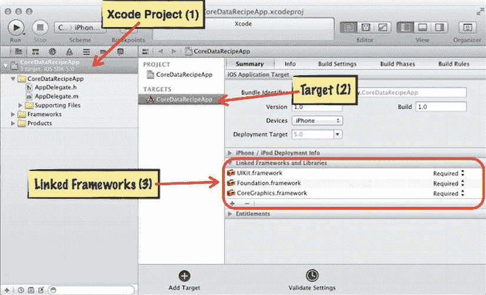

**图 10-1.** *链接到 Core Data 框架*

点击“链接框架”面板中的加号按钮（在图 10-1 中标记为(3)）。你会看到一个屏幕，列出了所有可用的框架。还有一个搜索栏，你可以用其来过滤列表，以便更容易地定位到 Core Data 框架。请参考图 10-2。

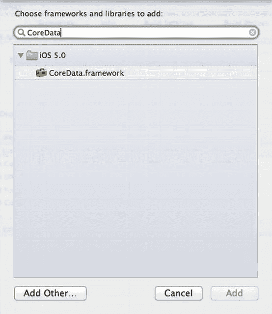

**图 10-2.** *选择 Core Data 框架*

选择名为`CoreData.framework`的项目，然后点击“添加”按钮。


### 添加 Core Data 堆栈

Core Data 需要一些关键对象才能工作。这些对象被称为 *Core Data 堆栈*。你需要将这些对象放在想要实现数据持久化的类中。通常你会看到 Core Data 堆栈位于应用程序委托或根模型类中。

在本教程中，你将向在教程 9.1 中创建的对象图添加 Core Data 支持；你将添加一个适用于整个应用程序的新模型类。该类将作为你的根模型，你将把 Core Data 堆栈以及一个稍后用于存储项目列表的数组放在这里。

第一步是创建新的根模型类，你可以简单地将其命名为 `AppModel`（有关如何向 Xcode 项目添加自定义类的更多详细信息，请参阅教程 1.3）。你需要添加到 `AppModel` 类的第一件事是一个函数，该函数返回你将用于数据存储的 URL。

**注意：** 数据存储是用于在用户设备的应用程序 Documents 目录中存储数据的文件。它可以是 SQLite 数据库或其他文件。虽然你需要向 Core Data 提供此 URL，但无需担心数据库的具体细节，也不需要自己创建数据库。如果文件或数据库不存在，Core Data 会为你创建它。

以下是返回数据存储 URL 的函数：

```
#import "AppModel.h"

@implementation AppModel

- (NSURL *)dataStoreURL {

    NSString *docDir =
        [NSSearchPathForDirectoriesInDomains(NSDocumentDirectory,  
        NSUserDomainMask, YES) lastObject];

    return [NSURL fileURLWithPath:[docDir  
        stringByAppendingPathComponent:@"DataStore.sql"]];
}

@end
```

接下来，将托管对象模型添加到 `AppModel` 中。托管对象模型维护一组数据模式集合。*数据模式*是对构成对象图的实体集合的规范。Core Data 使用这些规范来弄清楚如何使对象数据持久化。在稍后的教程中，你将编写 Core Data 用于这些数据模式的文档。

你将通过添加一个 `NSManagedObjectModel` 类型的属性，将托管对象模型添加到 `AppModel` 中。此属性在 `AppModel` 接口中被标记为 `readonly`。由于 `NSManagedObjectModel` 是一个 Core Data 类，因此你还需要在此处将 Core Data 导入到 `AppModel` 中。

```
#import <Foundation/Foundation.h>
#import <CoreData/CoreData.h>

@interface AppModel : NSObject

-(NSURL *)dataStoreURL;

@property (nonatomic, strong, readonly) NSManagedObjectModel *managedObjectModel;

@end
```

转到 `AppModel` 的实现文件，你必须为这个 `readonly` 属性编写你自己的访问器方法。

```
#import "AppModel.h"

@implementation AppModel
NSManagedObjectModel *_managedObjectModel;

...

- (NSManagedObjectModel *)managedObjectModel {
    if (_managedObjectModel) {
        return _managedObjectModel;
    }
    _managedObjectModel = [NSManagedObjectModel mergedModelFromBundles:nil];
    return _managedObjectModel;
}

@end
```

这个 `readonly` 属性的访问器仅在对象尚未被创建时才延迟创建托管对象模型。托管对象模型将使用你项目中包含的每个模式来创建。

接下来你需要持久化存储协调器。Core Data 堆栈的这一部分负责连接数据存储和托管对象模型。托管对象上下文（你将在下一步添加）也使用持久化存储协调器来将对对象图的更改持久化。

你按照与托管对象模型相同的模式，将此 Core Data 堆栈对象添加到 `AppModel` 类中。

```
- (NSPersistentStoreCoordinator *)persistentStoreCoordinator {
    if (_persistentStoreCoordinator) {
        return _persistentStoreCoordinator;
    }

    NSError *error = nil;
    _persistentStoreCoordinator = [[NSPersistentStoreCoordinator alloc]
        initWithManagedObjectModel:[self managedObjectModel]];
    if (![_persistentStoreCoordinator addPersistentStoreWithType:NSSQLiteStoreType
                                                   configuration:nil
                                                             URL:[self dataStoreURL]
                                                         options:nil
                                                           error:&error]) {
        NSLog(@"Unresolved Core Data error with persistentStoreCoordinator: %@, %@",
                error, [error userInfo]);
    }

    return _persistentStoreCoordinator;
}
```

这一步稍微复杂一些，因为你需要创建一个引用托管对象模型的存储协调器，并且需要添加数据存储引用，以便 Core Data 知道在哪里管理对象数据。

**注意：** 这里没有明确列出持久化存储协调器或托管对象上下文的接口，因为它们遵循与托管对象模型相同的模式。列表 10-2 显示了完整的接口。

当然，持久化存储协调器以及你接下来添加的下一个 Core Data 堆栈对象都需要像托管对象模型一样进行属性声明。它们都遵循相同的模式，因此这里不再重复该代码，但你可以查看 列表 10-2 了解其余属性声明。

接下来，你需要托管对象上下文。这个 Core Data 堆栈对象负责管理一组托管对象。*托管对象*是 Core Data 负责的对象。这些是需要数据持久化的对象。

托管对象上下文就像是一个用于所有对象图更改的草稿板。在应用程序生命周期的关键点，你将使用托管对象上下文来检索对象，并将对象图的更改提交回数据存储。以下是添加托管对象上下文的方法：

```
- (NSManagedObjectContext *)managedObjectContext {
    if (_managedObjectContext) {
        return _managedObjectContext;
    }

    if ([self persistentStoreCoordinator]) {
        _managedObjectContext = [[NSManagedObjectContext alloc] init];
        [_managedObjectContext setPersistentStoreCoordinator:[self
            persistentStoreCoordinator]];
    }

    return _managedObjectContext;
}
```

从函数中可以看出，托管对象上下文只需要一个对持久化存储协调器的引用即可工作。这就是 iOS 的 Core Data 堆栈。这为你提供了 Core Data 支持，但在你展示 Core Data 如何在实际应用程序中工作之前，还需要执行其他步骤。

请参阅 列表 10-1 至 10-4。


### 代码

**清单 10-1.** *AppModel.h*

```objc
#import <Foundation/Foundation.h>
#import <CoreData/CoreData.h>

@interface AppModel : NSObject

-(NSURL *)dataStoreURL;

@property (nonatomic, strong, readonly) NSManagedObjectModel *managedObjectModel;
@property (nonatomic, strong, readonly) NSPersistentStoreCoordinator *persistentStoreCoordinator;
@property (nonatomic, strong, readonly) NSManagedObjectContext *managedObjectContext;

@end
```

**清单 10-2.** *AppModel.m*

```objc
#import "AppModel.h"

@implementation AppModel
NSManagedObjectModel *_managedObjectModel;
NSPersistentStoreCoordinator *_persistentStoreCoordinator;
NSManagedObjectContext *_managedObjectContext;

- (NSURL *)dataStoreURL {
    NSString *docDir = [NSSearchPathForDirectoriesInDomains(NSDocumentDirectory,
        NSUserDomainMask, YES) lastObject];
    return [NSURL fileURLWithPath:[docDir stringByAppendingPathComponent:@"DataStore.sql"]];
}

- (NSManagedObjectModel *)managedObjectModel {
    if (_managedObjectModel) {
        return _managedObjectModel;
    }
    _managedObjectModel = [NSManagedObjectModel mergedModelFromBundles:nil];
    return _managedObjectModel;
}

- (NSPersistentStoreCoordinator *)persistentStoreCoordinator {
    if (_persistentStoreCoordinator) {
        return _persistentStoreCoordinator;
    }

    NSError *error = nil;
    _persistentStoreCoordinator = [[NSPersistentStoreCoordinator alloc]
        initWithManagedObjectModel:[self managedObjectModel]];
    if (![_persistentStoreCoordinator addPersistentStoreWithType:NSSQLiteStoreType
                                                  configuration:nil
                                                            URL:[self dataStoreURL]
                                                        options:nil
                                                          error:&error]) {
        NSLog(@"Unresolved Core Data error with persistentStoreCoordinator: %@, %@",
            error, [error userInfo]);
    }

    return _persistentStoreCoordinator;
}

- (NSManagedObjectContext *)managedObjectContext {
    if (_managedObjectContext) {
        return _managedObjectContext;
    }

    if ([self persistentStoreCoordinator]) {
        _managedObjectContext = [[NSManagedObjectContext alloc] init];
        [_managedObjectContext setPersistentStoreCoordinator:[self persistentStoreCoordinator]];
    }

    return _managedObjectContext;
}

@end
```

**清单 10-3.** *AppDelegate.h*

```objc
#import <UIKit/UIKit.h>

@interface AppDelegate : UIResponder <UIApplicationDelegate>

@property (strong, nonatomic) UIWindow *window;

@end
```

**清单 10-4.** *AppDelegate.m*

```objc
#import "AppDelegate.h"

@implementation AppDelegate
@synthesize window = _window;

- (BOOL)application:(UIApplication *)application didFinishLaunchingWithOptions:
    (NSDictionary *)launchOptions {
    self.window = [[UIWindow alloc] initWithFrame:[[UIScreen mainScreen] bounds]];
    self.window.backgroundColor = [UIColor whiteColor];
    [self.window makeKeyAndVisible];
    return YES;
}

@end
```

#### 用法

在使用 Core Data 实际测试代码之前，需要先进行一些设置。现在，你只需链接到 Core Data 框架，并将 `AppModel` 类添加到 iOS 应用中。构建你的应用，并确保没有出现任何错误。后续的食谱将假定你已经搭建好了 Core Data 堆栈。

## 10.2 添加实体描述

### 问题

你需要描述将由 Core Data 管理的实体。

### 解决方案

向应用中添加一个数据模型文件，然后使用数据模型编辑器来描述你的实体。

### 工作原理

你可以使用 Xcode 来布局实体和属性。将这些实体描述存储在一个称为数据模型的特殊文件中。在本食谱中，你将为一个名为 project 的实体创建实体描述。这是你在食谱 9.1 中设置的同一个项目。

首先，你需要将数据模型添加到应用中。在 Xcode 中，依次选择 File → New → File。然后选择 iOS → Core Data → Data Model。你可以随意命名该文件，但我将保留默认名称 `Model`。你会在项目导航器中看到一个新文件 `Model.xcdatamodeld`。如果你选中这个文件，编辑器屏幕中会显示类似图 10-3 的内容。

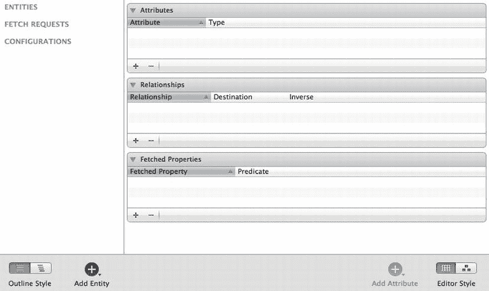

**图 10-3.** *数据模型编辑器*

数据模型编辑器就是你要描述 `Project` 实体的地方。点击屏幕左下角的 Add Entity 按钮。数据模型编辑器中左上角区域（位于标题 entity 下方）会出现一个新条目。将你的实体命名为 `Project`。

一旦开始创建实体，你可以通过添加属性来描述它。这些属性稍后会被转换为代码属性。根据食谱 9-1，你已经知道 `Project` 具有以下属性：名称、描述和截止日期。

**注意：** 食谱 9.1 中的 `Project` 类还有 `Worker` 和 `listOfTasks` 属性。这两个属性稍复杂一些，我们将在后续关于建立 Core Data 关系的食谱中再次讨论它们。

要向 `Project` 实体添加属性，请确保在数据模型编辑器中选中 `Project` 实体，然后点击数据模型编辑器右下角的 Add Attribute 按钮。该属性将出现在数据模型编辑器的中上方区域，你可以在此输入属性的名称（本例中为 `name`）。

在属性 `name` 的右侧，你还可以选择数据类型。点击右侧的下拉框，为 `name` 属性选择数据类型 String。对 `description` 属性重复此过程，但将名称改为 `descrip`。

**注意：** “description” 这个词已被 Core Data 的一个类使用，因此你不能在 `Project` 实体中使用它，否则会产生冲突。

将截止日期属性命名为 `dueDate`，并将其数据类型设置为 Date。

完成后，你的数据模型应类似于图 10-4。

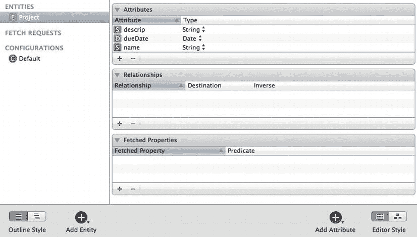

**图 10-4.** *完成的项目数据模型*

以上就是使用数据模型编辑器描述实体的全部内容。

#### 代码

**注意：** 清单 10-5 和 10-6 中的代码是 Xcode 在创建新 iOS 应用时自动生成的默认代码。我未对其做任何修改。

**清单 10-5.** *AppDelegate.h*

```objc
#import <UIKit/UIKit.h>

@interface AppDelegate : UIResponder <UIApplicationDelegate>

@property (strong, nonatomic) UIWindow *window;

@end
```

**清单 10-6.** *AppDelegate.m*

```objc
#import "AppDelegate.h"

@implementation AppDelegate
@synthesize window = _window;

- (BOOL)application:(UIApplication *)application didFinishLaunchingWithOptions:
    (NSDictionary *)launchOptions {
    self.window = [[UIWindow alloc] initWithFrame:[[UIScreen mainScreen] bounds]];
    self.window.backgroundColor = [UIColor whiteColor];
    [self.window makeKeyAndVisible];
    return YES;
}

@end
```

#### 用法

现在你已经准备好进入食谱 10.3，继续设置 Core Data。

### 10.3 向应用添加托管对象

### 问题

你在食谱 10.2 中编写的实体需要一个 Objective-C 类，以便你可以在代码中使用它。

### 解决方案

使用 Xcode 基于你在食谱 10.2 中设置的实体描述自动生成代码文件。


### 工作原理

Core Data 使用实体描述来设置数据库模式，并编码一个可在应用程序中使用的类。你只需向 Xcode 项目添加一个新的 Core Data 文件即可。针对本教程，我将假设你已经按照第 10.1 节设置了 Core Data 栈，并按照第 10.2 节设置了项目实体描述。

选择你在第 10.2 节中创建的数据模型文件。同时，确保选中了 `Project` 实体。然后依次选择 **文件**  **新建**  **文件**，再依次选择 **iOS**  **Core Data**  **NSManagedObject 子类**。在弹出的对话框中，点击“创建”。

你会看到系统为你生成了两个文件：`Project.h` 和 `Project.m`。如果你点击 `Project.h`，会看到以下接口：

```
#import <Foundation/Foundation.h>
#import <CoreData/CoreData.h>

@interface Project : NSManagedObject

@property (nonatomic, retain) NSString * descrip;
@property (nonatomic, retain) NSDate * dueDate;
@property (nonatomic, retain) NSString * name;

@end
```

这看起来像一个典型的 Objective-C 类，不同之处在于 `Project` 是 `NSManagedObject` 的子类，并且你导入了 Core Data 框架。作为 `NSManagedObject` 的子类是 Core Data 能够接管 `Project` 的必要条件。

以下是 `Project` 的实现代码：

```
#import "Project.h"

@implementation Project

@dynamic descrip;
@dynamic dueDate;
@dynamic name;

@end
```

值得注意的是，所有这些属性声明均来自你在第 10.2 节中编写的实体描述。另外，请注意这里的 `@dynamic` 关键字。`@dynamic` 的使用方式类似于 `@synthesize`，用于处理属性访问器代码。

**注意：** `@dynamic` 意味着该类将在运行时处理属性访问器代码。通常，如果你自己使用 `@dynamic` 代码，你需要某种方式让类能够响应属性值的获取和设置请求。`NSManagedObject` 会在后台利用键值编码为你完成这项工作。

这就是创建 `Project` 托管对象所需的全部步骤。请参见代码清单 10-7 至 10-12。

## 代码

**代码清单 10-7.** `AppDelegate.h`

```
#import <UIKit/UIKit.h>

@interface AppDelegate : UIResponder <UIApplicationDelegate>

@property (strong, nonatomic) UIWindow *window;

@end
```

**代码清单 10-8.** `AppDelegate.m`

```
#import "AppDelegate.h"

@implementation AppDelegate
@synthesize window = _window;

- (BOOL)application:(UIApplication *)application didFinishLaunchingWithOptions:  
(NSDictionary *)launchOptions{
    self.window = [[UIWindow alloc] initWithFrame:[[UIScreen mainScreen] bounds]];
    self.window.backgroundColor = [UIColor whiteColor];
    [self.window makeKeyAndVisible];
    return YES;
}

@end
```

**代码清单 10-9.** `AppModel.h`

```
#import <Foundation/Foundation.h>
#import <CoreData/CoreData.h>

@interface AppModel : NSObject

-(NSURL *)dataStoreURL;

@property (nonatomic, strong, readonly) NSManagedObjectModel *managedObjectModel;
@property (nonatomic, strong, readonly) NSPersistentStoreCoordinator 
*persistentStoreCoordinator;
@property (nonatomic, strong, readonly) NSManagedObjectContext *managedObjectContext;

@end
```

**代码清单 10-10.** `AppModel.m`

```
#import "AppModel.h"

@implementation AppModel
NSManagedObjectModel *_managedObjectModel;
NSPersistentStoreCoordinator *_persistentStoreCoordinator;
NSManagedObjectContext *_managedObjectContext;

- (NSURL *)dataStoreURL {

NSString *docDir = NSSearchPathForDirectoriesInDomains(NSDocumentDirectory, ![Image
NSUserDomainMask, YES) lastObject];

return NSURL fileURLWithPath:[docDir ![Image
stringByAppendingPathComponent:@"DataStore.sql"]];
}

- (NSManagedObjectModel *)managedObjectModel {
    if (_managedObjectModel) {
        return _managedObjectModel;
    }
    _managedObjectModel = [NSManagedObjectModel mergedModelFromBundles:nil];
    return _managedObjectModel;
}

- (NSPersistentStoreCoordinator *)persistentStoreCoordinator {
    if (_persistentStoreCoordinator) {
        return _persistentStoreCoordinator;
    }

    NSError *error = nil;
_persistentStoreCoordinator = [[NSPersistentStoreCoordinator alloc] 
initWithManagedObjectModel:[self managedObjectModel]];
    if (![_persistentStoreCoordinator addPersistentStoreWithType:NSSQLiteStoreType
                                                   configuration:nil
                                                             URL:[self dataStoreURL]
                                                         options:nil
                                                           error:&error]) {
NSLog(@"Unresolved Core Data error with persistentStoreCoordinator: %@, %@", 
error, [error userInfo]);
    }

    return _persistentStoreCoordinator;
}

- (NSManagedObjectContext *)managedObjectContext {
    if (_managedObjectContext) {
        return _managedObjectContext;
    }

    if ([self persistentStoreCoordinator]) {
        _managedObjectContext = [[NSManagedObjectContext alloc] init];
_managedObjectContext setPersistentStoreCoordinator:[self ![Image
persistentStoreCoordinator]];
    }

    return _managedObjectContext;
}

@end
```

**代码清单 10-11.** `Project.h`

```
#import <Foundation/Foundation.h>
#import <CoreData/CoreData.h>

@interface Project : NSManagedObject

@property (nonatomic, retain) NSString * descrip;
@property (nonatomic, retain) NSDate * dueDate;
@property (nonatomic, retain) NSString * name;

@end
```

**代码清单 10-12.** `Project.m`

```
#import "Project.h"

@implementation Project

@dynamic descrip;
@dynamic dueDate;
@dynamic name;

@end
```

## 用法

你现在离测试 Core Data 更近了一步，但目前为止这段代码中还没有任何可供测试的内容。在下一个教程中，你将开始看到这一切是如何整合在一起的。

## 10.4 向 Core Data 添加托管对象

### 问题

你想使用由 Core Data 管理的对象。

### 解决方案

使用托管对象上下文创建一个新的托管对象，并将该托管对象保存到数据存储中。


### 工作原理

对于这个方案，您将使用来自方案 10.3 的 Xcode 项目，该项目已设置了 Core Data 栈和`Project`托管对象类。要创建一个新的托管对象，请使用托管对象上下文以及`NSEntityDescription`类的类方法`insertNewObjectForEntityForName:inManagedObjectContext:`。这个方法需要托管对象类`Project`的名称，并返回一个指向刚创建的托管对象的引用。

```
Project *managedProject = (Project *)[NSEntityDescription
insertNewObjectForEntityForName:@"Project"
inManagedObjectContext:[self managedObjectContext]];
```

这会为您提供一个名为`managedProject`的`Project`对象。您应该做的第一件事是设置该项目的某些属性。

```
managedProject.name = @"New Project";
managedProject.descrip = @"This is a new project";
managedProject.dueDate = [NSDate date];
```

这个`managedProject`对象最初只存在于托管对象上下文中。托管对象上下文的功能类似于一个草稿板，您可以在对象准备好存储到数据存储之前将其放置于此。

#### 将更改提交回数据存储

既然您已经创建了内容，就需要使用托管对象上下文将这些更改提交回数据存储。为此，请向托管对象上下文发送`save`消息。

```
[[self managedObjectContext] save:nil];
```

请注意，这行代码演示了如何从`AppModel`类发送`save`消息。如果您想从其他类（例如应用程序代理）发送`save`消息，可以将`save`消息发送给本地的`AppModel`引用；您可以在列表 10-14 中看到这一点。

执行此操作后，您已将自上次发送`save`消息以来对托管对象上下文所做的所有更改提交出去。如果您愿意，可以在此处使用`NSError`对象作为参数；在此示例中，我仅使用了`nil`。您可以在以后从数据存储中检索此对象。

请注意，您将此代码包含在`init`函数中，因此请查看列表 10-13 到 10-18，以了解这一切如何融入`AppModel`的上下文中。创建新项目托管对象的代码被放入一个返回`Project`对象的函数中，这样更易于从其他类（如应用程序代理）进行测试。

### 代码

**列表 10-13.** *`AppDelegate.h`*

```
#import <UIKit/UIKit.h>
#import "AppModel.h"

@interface AppDelegate : UIResponder <UIApplicationDelegate>

@property (strong, nonatomic) UIWindow *window;

@end
```

**列表 10-14.** *`AppDelegate.m`*

```
#import "AppDelegate.h"

@implementation AppDelegate
@synthesize window = _window;

- (BOOL)application:(UIApplication *)application didFinishLaunchingWithOptions:
(NSDictionary *)launchOptions{

    //Create a new AppModel instance
    AppModel *dataModel = [[AppModel alloc] init];

    //Get a new project from dataModel and use it
    Project *newProject = [dataModel makeNewProject];
    newProject.name = @"App Delegate's Project";
    NSLog(@"project.name = %@", newProject.name);
    NSLog(@"project.descrip = %@", newProject.descrip);
    NSLog(@"project.dueDate = %@\n", newProject.dueDate);

    //Post changes back to data store
    [[dataModel managedObjectContext] save:nil];

    self.window = [[UIWindow alloc] initWithFrame:[[UIScreen mainScreen] bounds]];
    self.window.backgroundColor = [UIColor whiteColor];
    [self.window makeKeyAndVisible];
    return YES;
}

@end
```

**列表 10-15.** *`AppModel.h`*

```
#import <Foundation/Foundation.h>
#import <CoreData/CoreData.h>
#import "Project.h"

@interface AppModel : NSObject

-(NSURL *)dataStoreURL;
-(Project *)makeNewProject;

@property (nonatomic, strong, readonly) NSManagedObjectModel *managedObjectModel;
@property (nonatomic, strong, readonly) NSPersistentStoreCoordinator
*persistentStoreCoordinator;
@property (nonatomic, strong, readonly) NSManagedObjectContext *managedObjectContext;

@end
```

**列表 10-16.** *`AppModel.m`*

```
#import "AppModel.h"

@implementation AppModel
NSManagedObjectModel *_managedObjectModel;
NSPersistentStoreCoordinator *_persistentStoreCoordinator;
NSManagedObjectContext *_managedObjectContext;

-(Project *)makeNewProject{

Project *managedProject = (Project *)[NSEntityDescription
insertNewObjectForEntityForName:@"Project"
inManagedObjectContext:[self managedObjectContext]];

    managedProject.name = @"New Project";
    managedProject.descrip = @"This is a new project";
    managedProject.dueDate = [NSDate date];

    return managedProject;

}

- (NSURL *)dataStoreURL {

NSString *docDir = [NSSearchPathForDirectoriesInDomains(NSDocumentDirectory,
NSUserDomainMask, YES) lastObject];

return [NSURL fileURLWithPath:[docDir
stringByAppendingPathComponent:@"DataStore.sql"]];
}

- (NSManagedObjectModel *)managedObjectModel {
    if (_managedObjectModel) {
        return _managedObjectModel;
    }
    _managedObjectModel = [NSManagedObjectModel mergedModelFromBundles:nil];
    return _managedObjectModel;
}

- (NSPersistentStoreCoordinator *)persistentStoreCoordinator {
    if (_persistentStoreCoordinator) {
        return _persistentStoreCoordinator;
    }

    NSError *error = nil;
_persistentStoreCoordinator = [[NSPersistentStoreCoordinator alloc]
initWithManagedObjectModel:[self managedObjectModel]];
    if (![_persistentStoreCoordinator addPersistentStoreWithType:NSSQLiteStoreType
                                                   configuration:nil
                                                             URL:[self dataStoreURL]
                                                         options:nil
                                                           error:&error]) {
NSLog(@"Unresolved Core Data error with persistentStoreCoordinator: %@, %@",
error, [error userInfo]);
    }

    return _persistentStoreCoordinator;
}

- (NSManagedObjectContext *)managedObjectContext {
    if (_managedObjectContext) {
        return _managedObjectContext;
    }

    if ([self persistentStoreCoordinator]) {
        _managedObjectContext = [[NSManagedObjectContext alloc] init];
[_managedObjectContext setPersistentStoreCoordinator:[self
persistentStoreCoordinator]];
    }

    return _managedObjectContext;
}

@end
```

**列表 10-17.** *`Project.h`*

```
#import <Foundation/Foundation.h>
#import <CoreData/CoreData.h>

@interface Project : NSManagedObject

@property (nonatomic, retain) NSString * descrip;
@property (nonatomic, retain) NSDate * dueDate;
@property (nonatomic, retain) NSString * name;

@end
```

**列表 10-18.** *`Project.m`*

```
#import "Project.h"

@implementation Project

@dynamic descrip;
@dynamic dueDate;
@dynamic name;

@end
```


#### 用法

现在，你终于可以亲自测试这段 Core Data 代码了。将代码清单 10-13 至 10-18 的代码添加进去，然后构建并运行你的 Xcode 项目。运行应用后，你将在控制台日志窗口中看到以下输出：

```
project.name = App Delegate's Project
project.descrip = This is a new project
project.dueDate = 2012-04-10 14:07:00 +0000
```

查看 `AppDelegate.m` 文件，了解这些输出是如何生成的。一个 `Project` 托管对象实例由 `AppModel` 类创建，并返回给应用委托。如你所见，这个过程与使用其他 Objective-C 类和对象并没有太大区别。

## 10.5 从数据存储中检索对象

### 问题

你希望用户能够从数据存储中检索他们之前处理过的对象。

### 解决方案

使用**获取请求**来检索数据存储中已有的对象。

#### 工作原理解释

*获取请求*是从数据存储中获取对象的操作。使用 `NSFetchRequest` 类来创建请求，并使用 `NSEntityDescription` 来指定你要从数据存储中检索的实体类型。

你可以使用 `alloc` 和 `init` 构造器来创建 `NSFetchRequest` 对象：

```
NSFetchRequest *request = [[NSFetchRequest alloc] init];
```

你还需要一个实体描述，以便 Core Data 知道要获取什么内容：

```
NSEntityDescription *entity = [NSEntityDescription entityForName:@"Project"
                                    inManagedObjectContext:[self managedObjectContext]];
```

然后，你必须将实体对象分配给获取请求的 entity 属性：

```
request.entity = entity;
```

最后，执行获取请求。结果将以数组的形式返回给你：

```
NSArray *listOfProjects = [[self managedObjectContext] executeFetchRequest:request error:nil];
```

你可以使用这个数组来引用数据存储中可用的托管对象。如果数据存储中还没有对象，数组仍会被创建，但其计数（count）将为 0。

以下是一个如何使用此项目对象数组的示例：

```
//列出每个项目的内容
if([listOfProjects count] == 0)
    NSLog(@"There are no projects in the data store yet");
else {
    NSLog(@"HERE ARE THE PROJECTS IN THE DATA STORE");
    [listOfProjects enumerateObjectsUsingBlock:^(id obj, NSUInteger idx, BOOL *stop) {
        NSLog(@"-----");
        NSLog(@"project.name = %@", [obj name]);
        NSLog(@"project.descrip = %@", [obj descrip]);
        NSLog(@"project.dueDate = %@\n", [obj dueDate]);
    }];
}
```

请参考代码清单 10-19 至 10-24。

#### 代码

**代码清单 10-19.** *AppDelegate.h*

```
#import <UIKit/UIKit.h>
#import "AppModel.h"

@interface AppDelegate : UIResponder <UIApplicationDelegate>

@property (strong, nonatomic) UIWindow *window;

@end
```

**代码清单 10-20.** *AppDelegate.m*

```
#import "AppDelegate.h"

@implementation AppDelegate
@synthesize window = _window;

- (BOOL)application:(UIApplication *)application didFinishLaunchingWithOptions:(NSDictionary *)launchOptions{

    //创建一个新的 AppModel 实例
    AppModel *dataModel = [[AppModel alloc] init];

    //从 dataModel 获取一个新项目并使用它
    Project *newProject = [dataModel makeNewProject];
    newProject.name = @"App Delegate's Project";
    NSLog(@"project.name = %@", newProject.name);
    NSLog(@"project.descrip = %@", newProject.descrip);
    NSLog(@"project.dueDate = %@\n", newProject.dueDate);

    //将更改保存回数据存储
    [[dataModel managedObjectContext] save:nil];

    //获取数据存储中的所有项目
    NSFetchRequest *request = [[NSFetchRequest alloc] init];
    NSEntityDescription *entity = [NSEntityDescription entityForName:@"Project"
                                    inManagedObjectContext:[dataModel managedObjectContext]];
    request.entity = entity;
    NSArray *listOfProjects = [[dataModel managedObjectContext] executeFetchRequest:request error:nil];

    //列出每个项目的内容
    if([listOfProjects count] == 0)
        NSLog(@"There are no projects in the data store yet");
    else {
        NSLog(@"HERE ARE THE PROJECTS IN THE DATA STORE");
      [listOfProjects enumerateObjectsUsingBlock:^(id obj, NSUInteger idx, BOOL *stop) {
            NSLog(@"-----");
            NSLog(@"project.name = %@", [obj name]);
            NSLog(@"project.descrip = %@", [obj descrip]);
            NSLog(@"project.dueDate = %@\n", [obj dueDate]);
        }];
    }

    self.window = [[UIWindow alloc] initWithFrame:[[UIScreen mainScreen] bounds]];
    self.window.backgroundColor = [UIColor whiteColor];
    [self.window makeKeyAndVisible];
    return YES;
}

@end
```

**代码清单 10-21.** *AppModel.h*

```
#import <Foundation/Foundation.h>
#import <CoreData/CoreData.h>
 #import "Project.h"

@interface AppModel : NSObject

-(NSURL *)dataStoreURL;
-(Project *)makeNewProject;

@property (nonatomic, strong, readonly) NSManagedObjectModel *managedObjectModel;
@property (nonatomic, strong, readonly) NSPersistentStoreCoordinator *persistentStoreCoordinator;
@property (nonatomic, strong, readonly) NSManagedObjectContext *managedObjectContext;

@end
```

**代码清单 10-22.** *AppModel.m*

```
#import "AppModel.h"

@implementation AppModel
NSManagedObjectModel *_managedObjectModel;
NSPersistentStoreCoordinator *_persistentStoreCoordinator;
NSManagedObjectContext *_managedObjectContext;

-(Project *)makeNewProject{

Project *managedProject = (Project *)[NSEntityDescription insertNewObjectForEntityForName:@"Project"
                                    inManagedObjectContext:[self managedObjectContext]];

    managedProject.name = @"New Project";
    managedProject.descrip = @"This is a new project";
    managedProject.dueDate = [NSDate date];

    return managedProject;

}

- (NSURL *)dataStoreURL {

NSString *docDir = [NSSearchPathForDirectoriesInDomains(NSDocumentDirectory,
NSUserDomainMask, YES) lastObject];

return [NSURL fileURLWithPath:[docDir stringByAppendingPathComponent:@"DataStore.sql"]];
}

- (NSManagedObjectModel *)managedObjectModel {
    if (_managedObjectModel) {
        return _managedObjectModel;
    }
    _managedObjectModel = [NSManagedObjectModel mergedModelFromBundles:nil];
    return _managedObjectModel;
}
```


```objectivec
- (NSPersistentStoreCoordinator *)persistentStoreCoordinator {
    if (_persistentStoreCoordinator) {
        return _persistentStoreCoordinator;
    }

    NSError *error = nil;
    _persistentStoreCoordinator = [[NSPersistentStoreCoordinator alloc] initWithManagedObjectModel:[self managedObjectModel]];
    if (![_persistentStoreCoordinator addPersistentStoreWithType:NSSQLiteStoreType configuration:nil URL:[self dataStoreURL] options:nil error:&error]) {
        NSLog(@"Unresolved Core Data error with persistentStoreCoordinator: %@, %@", error, [error userInfo]);
    }

    return _persistentStoreCoordinator;
}

- (NSManagedObjectContext *)managedObjectContext {
    if (_managedObjectContext) {
        return _managedObjectContext;
    }

    if ([self persistentStoreCoordinator]) {
        _managedObjectContext = [[NSManagedObjectContext alloc] init];
        [_managedObjectContext setPersistentStoreCoordinator:[self persistentStoreCoordinator]];
    }

    return _managedObjectContext;
}
```

**代码清单 10-23**. `Project.h`

```objc
#import <Foundation/Foundation.h>
#import <CoreData/CoreData.h>

@interface Project : NSManagedObject

@property (nonatomic, retain) NSString *descrip;
@property (nonatomic, retain) NSDate *dueDate;
@property (nonatomic, retain) NSString *name;

@end
```

**代码清单 10-24**. `Project.m`

```objc
#import "Project.h"

@implementation Project

@dynamic descrip;
@dynamic dueDate;
@dynamic name;

@end
```

### 使用说明

要将此代码投入使用，请将代码清单 10-19 至 10-24 添加到您自己的 Xcode 项目中。如果您多次构建并运行该程序，您会发现数据存储中的列表在每次运行时都会增加一个项目。这是因为在应用程序委托中最初创建的新项目被添加到了数据存储中已有的所有项目中。如果您是首次运行此应用程序，输出结果将类似于以下内容：

```text
project.name = App Delegate's Project
project.descrip = This is a new project
project.dueDate = 2012-04-12 15:08:13 +0000
HERE ARE THE PROJECTS IN THE DATA STORE
-----
project.name = App Delegate's Project
project.descrip = This is a new project
project.dueDate = 2012-04-12 15:08:13 +0000
```

**注意：** 托管对象上下文会检索数据存储中的所有对象，以及那些位于托管对象上下文中但尚未提交到数据存储的对象。

### 10.6 将更改提交到数据存储

### 问题

当用户使用您的应用程序时，他们会对您希望保存到数据存储中的内容进行更改。

### 解决方案

检查托管对象上下文，以确认用户的对象图是否发生了任何更改。如果存在更改，您可以回滚并放弃更改，也可以将更改保存回数据存储。

### 工作原理

托管对象的使用方式与其他 Objective-C 对象类似。您可以使用点语法来更改托管对象中的内容。完成此操作后，托管对象上下文就会察觉到对象图已发生更改。

例如，如果您想更改食谱 10.5 中项目的内容，只需执行以下操作：

```objc
newProject.name = @"Project Has New Name";
newProject.descrip = @"Here is a new revision of the project";
```

与之前章节中操作不同的是，托管对象上下文现在已感知到您所做的更改。您可以通过向上下文发送 `hasChanges` 消息来询问托管对象上下文对象图是否发生了更改，具体如下：

```objc
if([[dataModel managedObjectContext] hasChanges])
    NSLog(@"The object graph has changed");
```

有时，您可能希望在应用程序生命周期的关键节点询问托管对象上下文是否有任何更改。如果存在更改，您可以将它们保存到数据存储，或者将其丢弃。以下是如何保存更改的示例：

```objc
if([[dataModel managedObjectContext] hasChanges])
    [[dataModel managedObjectContext] save:nil];
```

当然，您在创建第一个项目时已经看到过此操作。您也可以通过向托管对象上下文发送 `rollback` 消息来放弃更改。

```objc
if([[dataModel managedObjectContext] hasChanges])
    [[dataModel managedObjectContext] rollback];
```

当您想要删除一个托管对象时，必须使用托管对象上下文的 `deleteObject` 方法。

```objc
[[dataModel managedObjectContext] deleteObject:newProject];
```

您仍然可以像更改属性值时那样，通过向托管对象上下文发送 `rollback` 或 `save` 消息来回滚或永久保存此更改。请参见代码清单 10-25 至 10-30。
```


### 代码

**清单 10-25.** *AppDelegate.h*

```objc
#import <UIKit/UIKit.h>
#import "AppModel.h"

@interface AppDelegate : UIResponder <UIApplicationDelegate>

@property (strong, nonatomic) UIWindow *window;

@end
```

**清单 10-26.** *AppDelegate.m*

```objc
#import "AppDelegate.h"

@implementation AppDelegate
@synthesize window = _window;

- (BOOL)application:(UIApplication *)application
didFinishLaunchingWithOptions:(NSDictionary *)launchOptions{

    //Create a new AppModel instance
    AppModel *dataModel = [[AppModel alloc] init];

    //Make some projects
    Project *p1 = [dataModel makeNewProject];
    p1.name = @"Proj1";

    Project *p2 = [dataModel makeNewProject];
    p2.name = @"Proj2";

    Project *p3 = [dataModel makeNewProject];
    p3.name = @"Proj3";

    Project *p4 = [dataModel makeNewProject];
    p4.name = @"Proj4";

    [[dataModel managedObjectContext] save:nil];

    //Get all the projects in the data store
    NSFetchRequest *request = [[NSFetchRequest alloc] init];
    NSEntityDescription *entity = [NSEntityDescription entityForName:@"Project"
                                              inManagedObjectContext:[dataModel managedObjectContext]];
    request.entity = entity;
    NSArray *listOfProjects = [[dataModel managedObjectContext]
                               executeFetchRequest:request error:nil];

    //Print out contents of all the projects
    NSLog(@"-----");
    NSLog(@"NEW PROJECTS IN CONTEXT");
    [listOfProjects enumerateObjectsUsingBlock:^(id obj, NSUInteger idx, BOOL *stop) {
        NSLog(@"project.name = %@", [obj name]);
    }];

    //Rollback example
    Project *rollbackProject = [listOfProjects objectAtIndex:0];
    rollbackProject.name = @"Rollback Project";

    //Look at changed object
    NSLog(@"-----");
    NSLog(@"CHANGED PROJECTS IN CONTEXT");
    [listOfProjects enumerateObjectsUsingBlock:^(id obj, NSUInteger idx, BOOL *stop) {
        NSLog(@"project.name = %@", [obj name]);
    }];

    //Discard changes
    if([[dataModel managedObjectContext] hasChanges])
        [[dataModel managedObjectContext] rollback];

    //Look at object after rollback
    NSLog(@"-----");
    NSLog(@"PROJECTS IN CONTEXT AFTER ROLLBACK");
    [listOfProjects enumerateObjectsUsingBlock:^(id obj, NSUInteger idx, BOOL *stop) {
        NSLog(@"project.name = %@", [obj name]);
    }];

    //Delete second and third projects
    [[dataModel managedObjectContext] deleteObject:p2];
    [[dataModel managedObjectContext] deleteObject:p3];

    //save back to data store
    [[dataModel managedObjectContext] save:nil];

    //Get all the projects in the data store
    request = [[NSFetchRequest alloc] init];
    entity = [NSEntityDescription entityForName:@"Project"
                         inManagedObjectContext:[dataModel managedObjectContext]];
    request.entity = entity;
    listOfProjects = [[dataModel managedObjectContext] executeFetchRequest:request
                                                                    error:nil];

    //Look at objects after deletion
    NSLog(@"-----");
    NSLog(@"PROJECTS IN CONTEXT AFTER DELETION");
    [listOfProjects enumerateObjectsUsingBlock:^(id obj, NSUInteger idx, BOOL *stop) {
        NSLog(@"project.name = %@", [obj name]);
    }];

    self.window = [[UIWindow alloc] initWithFrame:[[UIScreen mainScreen] bounds]];
    self.window.backgroundColor = [UIColor whiteColor];
    [self.window makeKeyAndVisible];
    return YES;
}

@end
```

**清单 10-27.** *AppModel.h*

```objc
#import <Foundation/Foundation.h>
#import <CoreData/CoreData.h>
#import "Project.h"

@interface AppModel : NSObject

-(NSURL *)dataStoreURL;
-(Project *)makeNewProject;

@property (nonatomic, strong, readonly) NSManagedObjectModel *managedObjectModel;
@property (nonatomic, strong, readonly) NSPersistentStoreCoordinator *persistentStoreCoordinator;
@property (nonatomic, strong, readonly) NSManagedObjectContext *managedObjectContext;

@end
```

**清单 10-28.** *AppModel.m*

```objc
#import "AppModel.h"

@implementation AppModel
NSManagedObjectModel *_managedObjectModel;
NSPersistentStoreCoordinator *_persistentStoreCoordinator;
NSManagedObjectContext *_managedObjectContext;

-(Project *)makeNewProject{
    Project *managedProject = (Project *)[NSEntityDescription
                                          insertNewObjectForEntityForName:@"Project"
                                          inManagedObjectContext:[self managedObjectContext]];

    managedProject.name = @"New Project";
    managedProject.descrip = @"This is a new project";
    managedProject.dueDate = [NSDate date];

    return managedProject;
}

- (NSURL *)dataStoreURL {
    NSString *docDir = [NSSearchPathForDirectoriesInDomains(NSDocumentDirectory,
                                                           NSUserDomainMask, YES) lastObject];
    return [NSURL fileURLWithPath:[docDir stringByAppendingPathComponent:@"DataStore.sql"]];
}

- (NSManagedObjectModel *)managedObjectModel {
    if (_managedObjectModel) {
        return _managedObjectModel;
    }
    _managedObjectModel = [NSManagedObjectModel mergedModelFromBundles:nil];
    return _managedObjectModel;
}

- (NSPersistentStoreCoordinator *)persistentStoreCoordinator {
    if (_persistentStoreCoordinator) {
        return _persistentStoreCoordinator;
    }

    NSError *error = nil;
    _persistentStoreCoordinator = [[NSPersistentStoreCoordinator alloc]
                                   initWithManagedObjectModel:[self managedObjectModel]];
    if (![_persistentStoreCoordinator addPersistentStoreWithType:NSSQLiteStoreType
                                                  configuration:nil
                                                            URL:[self dataStoreURL]
                                                        options:nil
                                                          error:&error]) {
        NSLog(@"Unresolved Core Data error with persistentStoreCoordinator: %@, %@",
              error, [error userInfo]);
    }

    return _persistentStoreCoordinator;
}

- (NSManagedObjectContext *)managedObjectContext {
    if (_managedObjectContext) {
        return _managedObjectContext;
    }

    if ([self persistentStoreCoordinator]) {
        _managedObjectContext = [[NSManagedObjectContext alloc] init];
        [_managedObjectContext setPersistentStoreCoordinator:[self persistentStoreCoordinator]];
    }

    return _managedObjectContext;
}

@end
```

**清单 10-29.** *Project.h*

```objc
#import <Foundation/Foundation.h>
#import <CoreData/CoreData.h>

@interface Project : NSManagedObject

@property (nonatomic, retain) NSString * descrip;
@property (nonatomic, retain) NSDate * dueDate;
@property (nonatomic, retain) NSString * name;

@end
```

**清单 10-30.** *Project.m*

```objc
#import "Project.h"

@implementation Project

@dynamic descrip;
@dynamic dueDate;
@dynamic name;

@end
```


### 用法

将代码清单 10-25 至 10-30 中的代码添加到您的 Xcode 项目中，自行测试。本方法比主方法介绍稍显复杂。主要区别在于它包含了四个独立项目，以便您能清晰地观察从数据存储中保存、回滚和删除托管对象的效果。

首次运行应用程序时，您应在控制台日志窗口中观察到类似如下内容：

```
-----
上下文中的新项目
project.name = Proj3
project.name = Proj4
project.name = Proj1
project.name = Proj2
-----
上下文中的已更改项目
project.name = Rollback Project
project.name = Proj4
project.name = Proj1
project.name = Proj2
-----
回滚后上下文中的项目
project.name = Proj3
project.name = Proj4
project.name = Proj1
project.name = Proj2
-----
删除后上下文中的项目
project.name = Proj4
project.name = Proj1
```

**注意：** 项目出现的顺序可能与您的情况不同。

## 10.7 在 Core Data 中使用一对一关系

### 问题

您的对象图需要表示一对一关系，并且您希望由 Core Data 管理此内容。

### 解决方案

在数据模型中至少创建两个实体，然后在数据模型编辑器中为这些实体添加关系。

### 工作原理

您正越来越接近在 Core Data 中实现方法 9.1 的对象图。您需要做的是在数据模型中添加一个 `Worker` 实体。请记住，方法 9.1 中的 `Worker` 类具有 `name` 属性和 `role` 属性。`Worker` 对象可以被分配给项目和任务。我们在这里仅重新创建 `Project` 与 `Worker` 之间的关系。

**注意：** 您即将对数据模型进行重大更改。由于数据模型在首次运行后会被缓存，因此无法在不破坏应用程序的情况下更改数据模型。所以，您需要确保在测试即将对数据模型进行的更改之前，先从 iOS 模拟器中删除应用程序。进入 iOS 模拟器，点击 iOS 模拟器  重置内容和设置。在弹出的对话框中点击“重置”按钮。

首先，向数据模型添加一个新的 `Worker` 实体。按照与方法 10.2 相同的步骤添加 `Worker` 实体。完成后，您的更新模型应如图 10-5 所示。

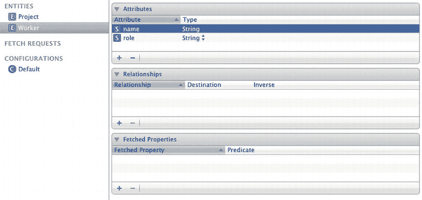

**图 10-5.** *Worker 实体*

接下来，您需要在 `Project` 和 `Worker` 之间建立关系。要建立该关系，请在数据模型编辑器中选择 `Project`，然后点击数据模型编辑器“关系”窗格中的加号按钮。将关系命名为 `personInCharge`，并将目标设置为 `Worker`。

现在，您需要定义反向（或对立）关系。这为您提供了一种引用工作人员正在处理的项目的方法。

选择 `Worker` 实体，然后点击数据模型编辑器“关系”窗格中的加号按钮。将关系命名为 `Project`，并将目标设置为 `Project`。选择 `personInCharge` 作为反向关系。

要一次性查看您刚刚完成的所有操作，请在按住 Command 键的同时选择数据模型编辑器中的每个实体。两个实体都会被高亮显示，您将同时看到列出的所有属性和关系。您的数据模型编辑器应如图 10-6 所示。

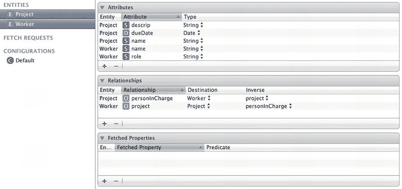

**图 10-6.** *Project 与 Worker 之间以及 Worker 与 Project 之间的关系*

保持 `Project` 和 `Worker` 实体同时被选中，进入文件  新建  文件。然后选择 iOS  Core Data  NSManagedObject 子类。点击“下一步”，然后点击“创建”。您将看到一个警告对话框，因为您将要覆盖之前的 `Project` 类文件。这没关系，因为您确实需要更新它，所以点击“替换”。

在您的 Xcode 项目中，应该会有 `Project` 和 `Worker` 托管对象类的文件。让我们看一下 `Project` 类的接口。

```
#import <Foundation/Foundation.h>
#import <CoreData/CoreData.h>

@class Worker;

@interface Project : NSManagedObject

@property (nonatomic, retain) NSString * descrip;
@property (nonatomic, retain) NSDate * dueDate;
@property (nonatomic, retain) NSString * name;
@property (nonatomic, retain) Worker *personInCharge;

@end
```

负责人的关系由最后一个属性 `personInCharge` 表示。您可以使用此属性来获取与您具有一对一关系的 `Worker` 对象的引用。

现在查看 `Worker` 类的接口，了解反向关系是如何表示的。

```
#import <Foundation/Foundation.h>
#import <CoreData/CoreData.h>

@class Project;

@interface Worker : NSManagedObject

@property (nonatomic, retain) NSString * name;
@property (nonatomic, retain) NSString * role;
@property (nonatomic, retain) Project *project;

@end
```

当您手头只有工作人员引用时，这为您提供了获取项目引用的机会。


所有以上内容为您提供了设置关系与实体的基础设施。但现在，您需要添加代码来创建对象并建立关系。在您之前完成的 Core Data 示例中，您一直在使用`AppModel`中的`makeNewProject`函数来完成此操作。逻辑上讲，您需要在`AppModel`中使用一个`makeNewWorker`函数来为您创建一个`Worker`实例。

更改`AppModel`的接口，以容纳您需要用来创建新`Worker`实例的函数。

```
#import <Foundation/Foundation.h>
#import <CoreData/CoreData.h>
#import "Project.h"
#import "Worker.h"

@interface AppModel : NSObject

-(NSURL *)dataStoreURL;

@property (nonatomic, strong, readonly) NSManagedObjectModel *managedObjectModel;
@property (nonatomic, strong, readonly) NSPersistentStoreCoordinator*persistentStoreCoordinator;
@property (nonatomic, strong, readonly) NSManagedObjectContext *managedObjectContext;

-(Project *)makeNewProject;
-(Worker *)makeNewWorker;

@end
```

`makeNewWorker`函数可以这样编码：

```
#import "AppModel.h"

@implementation AppModel

...

-(Worker *)makeNewWorker{
 Worker *managedWorker = (Worker *)[NSEntityDescription insertNewObjectForEntityForName:@"Worker" inManagedObjectContext:[self managedObjectContext]];

    managedWorker.name = @"New Worker";
    managedWorker.Role = @"Works on projects";

    return managedWorker;
}

...

@end
```

您在`makeNewProject`函数中建立关系本身。

```
#import "AppModel.h"

@implementation AppModel

...

-(Project *)makeNewProject{

Project *managedProject = (Project *)[NSEntityDescription insertNewObjectForEntityForName:@"Project" inManagedObjectContext:[self managedObjectContext]];

    managedProject.name = @"New Project";
    managedProject.descrip = @"This is a new project";
    managedProject.dueDate = [NSDate date];

    managedProject.personInCharge = [self makeNewWorker];

    return managedProject;

}

...

@end
```

现在，如果您使用`AppModel`创建一个新项目，您将自动分配一个`Worker`，并且关系已建立。例如，您可以这样做：

```
//Create a new AppModel instance
AppModel *dataModel = [[AppModel alloc] init];

//Make some projects
Project *p1 = [dataModel makeNewProject];
p1.name = @"Proj1";

NSLog(@"p1.name = %@, p1.personInCharge = %@", p1.name, p1.personInCharge.name);
```

这将会向控制台输出以下内容：

```
p1.name = Proj1, p1.personInCharge = New Worker
w.project.name = Proj1
```

参见清单 10-31 至 10-38。

#### 代码

**清单 10-31.** *AppModel.h*

```
#import <Foundation/Foundation.h>
#import <CoreData/CoreData.h>
#import "Project.h"
#import "Worker.h"

@interface AppModel : NSObject

-(NSURL *)dataStoreURL;

@property (nonatomic, strong, readonly) NSManagedObjectModel *managedObjectModel;
@property (nonatomic, strong, readonly) NSPersistentStoreCoordinator *persistentStoreCoordinator;
@property (nonatomic, strong, readonly) NSManagedObjectContext *managedObjectContext;

-(Project *)makeNewProject;
-(Worker *)makeNewWorker;

@end
```

**清单 10-32.** *AppModel.m*

```
#import "AppModel.h"

@implementation AppModel
NSManagedObjectModel *_managedObjectModel;
NSPersistentStoreCoordinator *_persistentStoreCoordinator;
NSManagedObjectContext *_managedObjectContext;

-(Project *)makeNewProject{

Project *managedProject = (Project *)[NSEntityDescription insertNewObjectForEntityForName:@"Project" inManagedObjectContext:[self managedObjectContext]];

    managedProject.name = @"New Project";
    managedProject.descrip = @"This is a new project";
    managedProject.dueDate = [NSDate date];

    managedProject.personInCharge = [self makeNewWorker];

    return managedProject;

}

-(Worker *)makeNewWorker{
 Worker *managedWorker = (Worker *)[NSEntityDescription insertNewObjectForEntityForName:@"Worker" inManagedObjectContext:[self managedObjectContext]];

    managedWorker.name = @"New Worker";
    managedWorker.Role = @"Works on projects";

    return managedWorker;
}

- (NSURL *)dataStoreURL {

NSString *docDir = [NSSearchPathForDirectoriesInDomains(NSDocumentDirectory, NSUserDomainMask, YES) lastObject];

return [NSURL fileURLWithPath:[docDir stringByAppendingPathComponent:@"DataStore.sql"]];
}

- (NSManagedObjectModel *)managedObjectModel {
    if (_managedObjectModel) {
        return _managedObjectModel;
    }
    _managedObjectModel = [NSManagedObjectModel mergedModelFromBundles:nil];
    return _managedObjectModel;
}

- (NSPersistentStoreCoordinator *)persistentStoreCoordinator {
    if (_persistentStoreCoordinator) {
        return _persistentStoreCoordinator;
    }

    NSError *error = nil;
_persistentStoreCoordinator = [[NSPersistentStoreCoordinator alloc] initWithManagedObjectModel:[self managedObjectModel]];
    if (![_persistentStoreCoordinator addPersistentStoreWithType:NSSQLiteStoreType
                                                 configuration:nil
                                                           URL:[self dataStoreURL]
                                                       options:nil
                                                         error:&error]) {
NSLog(@"Unresolved Core Data error with persistentStoreCoordinator: %@, %@", error, [error userInfo]);
    }

    return _persistentStoreCoordinator;
}

- (NSManagedObjectContext *)managedObjectContext {
    if (_managedObjectContext) {
        return _managedObjectContext;
    }

    if ([self persistentStoreCoordinator]) {
        _managedObjectContext = [[NSManagedObjectContext alloc] init];
[_managedObjectContext setPersistentStoreCoordinator:[self persistentStoreCoordinator]];
    }

    return _managedObjectContext;
}

@end
```

**清单 10-33.** *Worker.h*

```
#import <Foundation/Foundation.h>
#import <CoreData/CoreData.h>

@class Project;

@interface Worker : NSManagedObject

@property (nonatomic, retain) NSString * name;
@property (nonatomic, retain) NSString * role;
@property (nonatomic, retain) Project *project;

@end
```

**清单 10-34.** *Worker.m*

```
#import "Worker.h"
#import "Project.h"

@implementation Worker

@dynamic name;
@dynamic role;
@dynamic project;

@end
```

**清单 10-35.** *Project.h*


# import <Foundation/Foundation.h>
# import <CoreData/CoreData.h>

@class Worker;

@interface Project : NSManagedObject

@property (nonatomic, retain) NSString * descrip;
@property (nonatomic, retain) NSDate * dueDate;
@property (nonatomic, retain) NSString * name;
@property (nonatomic, retain) Worker *personInCharge;

@end

**清单 10-36.** *Project.m*

# import "Project.h"
# import "Worker.h"

@implementation Project

@dynamic descrip;
@dynamic dueDate;
@dynamic name;
@dynamic personInCharge;

@end

**清单 10-37.** *AppDelegate.h*

# import <UIKit/UIKit.h>
# import "AppModel.h"

@interface AppDelegate : UIResponder <UIApplicationDelegate>

@property (strong, nonatomic) UIWindow *window;

@end

**清单 10-38.** *AppDelegate.m*

# import "AppDelegate.h"

@implementation AppDelegate
@synthesize window = _window;

- (BOOL)application:(UIApplication *)application 
didFinishLaunchingWithOptions:(NSDictionary *)launchOptions{

    //创建一个新的 AppModel 实例
    AppModel *dataModel = [[AppModel alloc] init];

    //创建一些项目
    Project *p1 = [dataModel makeNewProject];
    p1.name = @"Proj1";

    NSLog(@"p1.name = %@, p1.personInCharge = %@", p1.name, p1.personInCharge.name);

    Worker *worker = p1.personInCharge;
    NSLog(@"w.project.name = %@", worker.project.name);

    self.window = [[UIWindow alloc] initWithFrame:[[UIScreen mainScreen] bounds]];
    self.window.backgroundColor = [UIColor whiteColor];
    [self.window makeKeyAndVisible];
    return YES;
}

@end

#### 用法

将清单 10-31 到 10-38 中的代码添加到你的应用中。如果你一直在跟随之前的示例进行操作，并希望重用你的 Xcode 项目，请确保在尝试测试此代码之前，从 iOS 模拟器中删除该应用。

构建并运行你的应用，可以在控制台日志中看到以下输出：

`p1.name = Proj1, p1.personInCharge = New Worker`
`w.project.name = Proj1`

## 10.8 在 Core Data 中使用一对多关系

### 问题

你的对象图需要用一种一对多关系来表示，并且你希望这种内容由 Core Data 进行管理。

### 解决方案

在数据模型中至少创建两个实体，然后在数据模型编辑器中的这些实体之间添加一个一对多关系。

### 工作原理

你正越来越接近在 Core Data 中实现来自配方 9.1 的对象图。你想要做的是向数据模型中添加一个任务实体。请记住，配方 9.1 中的 `Task` 类具有 `name`、`details`、`dueDate` 和 `priority` 属性。`Task` 还有一个 `Worker` 属性，这个属性将留到下一个配方中处理。任务包含在项目中，因此关系将从 `Project` 指向 `Task`。每个项目会有多个任务。这里我们只重新创建 `Project` 到 `Task` 的关系。

**注意：** 你即将对数据模型进行另一次重大更改。由于数据模型在首次运行后会被缓存，因此你无法在不破坏应用的情况下更改数据模型。所以你需要确保在测试即将对数据模型做出的更改之前，先从 iOS 模拟器中删除该应用。进入 iOS 模拟器，点击 iOS 模拟器  重置内容和设置。点击弹出的重置按钮。

就像在配方 10.7 中一样，你将向数据模型添加另一个实体。这个实体叫做 `Task`，其属性将与配方 9.2 中的 `Task` 属性相匹配。`Task` 实体的描述将如图 10-7 所示。

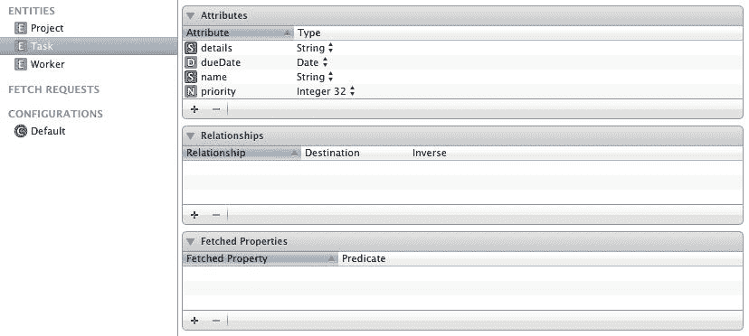

**图 10-7.** *Task 实体*

现在你将开始建立 `Project` 和 `Task` 之间的关系。选择 `Project` 实体，然后点击数据模型编辑器中“关系”窗格的加号。将关系命名为 `listOfTasks`，并将目标设置为 `Task`。

要设置反向关系，选择 `Task` 实体，然后点击数据模型编辑器中“关系”窗格的加号。将关系命名为 `project`，并将目标设置为 `Project`。选择 `listOfTasks` 作为反向关系。

选择数据模型中的所有三个实体，以便同时查看全部内容。或者，你也可以按住 Shift 键，然后点击第一个和最后一个实体来选择所有实体。你应该会得到类似图 10-8 所示的结果。

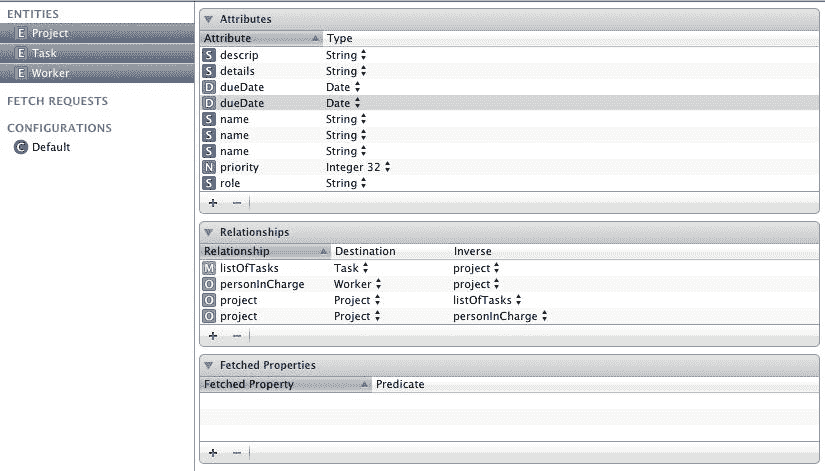

**图 10-8.** *Project、Task 和 Worker 及其关系*

要以更直观的方式查看数据模型，你可以通过点击数据模型编辑器右下角的分段按钮（“编辑器样式：表格、图形”按钮）来更改编辑器样式。这会提供一个图形化的显示，突出显示实体及其关系。效果示例见图 10-9。你可能需要稍微移动实体，才能让它们显示得与图 10-9 中一样。

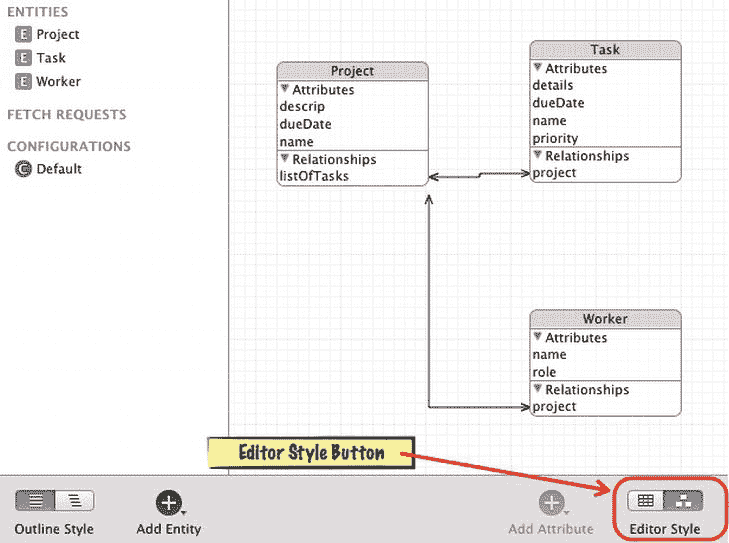

**图 10-9.** *可视化编辑器样式*

你仍然需要将 `Project` 到 `Task` 的关系设置为一对多关系。为此，选择 `listOfTasks` 关系，并使用数据模型检查器将 `listOfTasks` 从一对一关系改为一对多关系。

选择 `listOfTasks`，然后打开位于数据模型编辑器右侧的数据模型检查器。确保 Xcode 的右侧窗格可见，并且你已经打开了数据模型检查器（见图 10-10）。

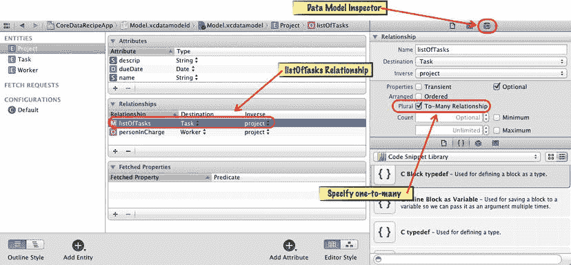

**图 10-10.** *指定一对多关系*

在数据检查器中，勾选名为“复数”的复选框，该复选框显示为“对多关系”。

现在你可以创建托管对象了。确保在数据模型编辑器中选中每个实体，然后选择“文件”“新建”“文件”。接着选择“iOS”“Core Data”“NSManagedObject 子类”。在弹出的对话框中，点击“创建”。你需要允许 Xcode 在此处替换文件。


查看`Project`接口，了解如何在代码中表示一对多关系。

```
#import <Foundation/Foundation.h>
#import <CoreData/CoreData.h>

@class Worker;

@interface Project : NSManagedObject

@property (nonatomic, retain) NSString * descrip;
@property (nonatomic, retain) NSDate * dueDate;
@property (nonatomic, retain) NSString * name;
@property (nonatomic, retain) Worker *personInCharge;
@property (nonatomic, retain) NSSet *listOfTasks;
@end

@interface Project (CoreDataGeneratedAccessors)

- (void)addListOfTasksObject:(NSManagedObject *)value;
- (void)removeListOfTasksObject:(NSManagedObject *)value;
- (void)addListOfTasks:(NSSet *)values;
- (void)removeListOfTasks:(NSSet *)values;

@end
```

持有对所有任务引用的属性是一个名为`listOfTasks`的`NSSet`。提供了额外的接口代码，以便更轻松地向`NSSet`属性添加和删除项目。你只需使用这些存取器即可将`Task`对象添加到项目中。例如，

```
//创建一个任务
Task *t1 = (Task *)[NSEntityDescription insertNewObjectForEntityForName:@"Task"
inManagedObjectContext:[dataModel managedObjectContext]];

t1.name = @"Task 1";
t1.details = @"Task details";
t1.dueDate = [NSDate date];
t1.priority = [NSNumber numberWithInt:1];

//将任务添加到项目
[p1 addListOfTasksObject:t1];

//创建一个任务
Task *t2 = (Task *)[NSEntityDescription insertNewObjectForEntityForName:@"Task"
inManagedObjectContext:[dataModel managedObjectContext]];

t2.name = @"Task 2";
t2.details = @"Task details";
t2.dueDate = [NSDate date];
t2.priority = [NSNumber numberWithInt:1];

//将任务添加到项目
[p1 addListOfTasksObject:t2];
```

现在你可以使用与项目关联的任务。要将这些任务打印到日志中，你可以这样做：

```
//获取数据存储中的所有项目
NSFetchRequest *request = [[NSFetchRequest alloc] init];
NSEntityDescription *entity = [NSEntityDescription entityForName:@"Project"
inManagedObjectContext:[dataModel managedObjectContext]];

request.entity = entity;
NSArray *listOfProjects = [[dataModel managedObjectContext]
executeFetchRequest:request error:nil];

//打印所有项目的内容（包括任务）
NSLog(@"-----");
NSLog(@"NEW PROJECTS IN CONTEXT");
[listOfProjects enumerateObjectsUsingBlock:^(id obj, NSUInteger idx, BOOL *stop) {
    NSLog(@"project.name = %@", [obj name]);
    [[obj listOfTasks] enumerateObjectsUsingBlock:^(id obj, BOOL *stop) {
        NSLog(@" task.name = %@", [obj name]);
    }];
}];
```

请参阅代码清单 10-39 至 10-48。

## 代码

**代码清单 10-39.** *AppDelegate.h*

```
#import <UIKit/UIKit.h>
#import "AppModel.h"

@interface AppDelegate : UIResponder <UIApplicationDelegate>

@property (strong, nonatomic) UIWindow *window;

@end
```

**代码清单 10-40.** *AppDelegate.m*

```
#import "AppDelegate.h"

@implementation AppDelegate
@synthesize window = _window;

- (BOOL)application:(UIApplication *)application
didFinishLaunchingWithOptions:(NSDictionary *)launchOptions{

    //创建一个新的 AppModel 实例
    AppModel *dataModel = [[AppModel alloc] init];

    //创建一个项目
    Project *p1 = [dataModel makeNewProject];
    p1.name = @"Proj1";

    //创建一个任务
Task *t1 = (Task *)[NSEntityDescription insertNewObjectForEntityForName:@"Task"
inManagedObjectContext:[dataModel managedObjectContext]];

    t1.name = @"Task 1";
    t1.details = @"Task details";
    t1.dueDate = [NSDate date];
    t1.priority = [NSNumber numberWithInt:1];

    //将任务添加到项目
    [p1 addListOfTasksObject:t1];

    //创建一个任务
    Task *t2 = (Task *)[NSEntityDescription insertNewObjectForEntityForName:@"Task"
                                                     inManagedObjectContext:
[dataModel managedObjectContext]];

    t2.name = @"Task 2";
    t2.details = @"Task details";
    t2.dueDate = [NSDate date];
    t2.priority = [NSNumber numberWithInt:1];

    //将任务添加到项目
    [p1 addListOfTasksObject:t2];

    //获取数据存储中的所有项目
    NSFetchRequest *request = [[NSFetchRequest alloc] init];
    NSEntityDescription *entity = [NSEntityDescription entityForName:@"Project"
inManagedObjectContext:[dataModel managedObjectContext]];

    request.entity = entity;
NSArray *listOfProjects = [[dataModel managedObjectContext]
executeFetchRequest:request error:nil];

    //打印所有项目的内容（包括任务）：
    NSLog(@"-----");
    NSLog(@"NEW PROJECTS IN CONTEXT");
    [listOfProjects enumerateObjectsUsingBlock:^(id obj, NSUInteger idx, BOOL *stop) {
        NSLog(@"project.name = %@", [obj name]);
        [[obj listOfTasks] enumerateObjectsUsingBlock:^(id obj, BOOL *stop) {
            NSLog(@" task.name = %@", [obj name]);
        }];
    }];

    self.window = [[UIWindow alloc] initWithFrame:[[UIScreen mainScreen] bounds]];
    self.window.backgroundColor = [UIColor whiteColor];
    [self.window makeKeyAndVisible];
    return YES;
}

@end
```

**代码清单 10-41.** *AppModel.h*

```
#import <Foundation/Foundation.h>
#import <CoreData/CoreData.h>
#import "Project.h"
#import "Worker.h"
#import "Task.h"

@interface AppModel : NSObject

-(NSURL *)dataStoreURL;

@property (nonatomic, strong, readonly) NSManagedObjectModel *managedObjectModel;
@property (nonatomic, strong, readonly) NSPersistentStoreCoordinator
*persistentStoreCoordinator;
@property (nonatomic, strong, readonly) NSManagedObjectContext *managedObjectContext;

-(Project *)makeNewProject;
-(Worker *)makeNewWorker;
-(Task *)makeNewTask;

@end
```

**代码清单 10-42.** *AppModel.m*

```
#import "AppModel.h"

@implementation AppModel
NSManagedObjectModel *_managedObjectModel;
NSPersistentStoreCoordinator *_persistentStoreCoordinator;
NSManagedObjectContext *_managedObjectContext;

-(Project *)makeNewProject{

Project *managedProject = (Project *)[NSEntityDescription
insertNewObjectForEntityForName:@"Project"
inManagedObjectContext:[self managedObjectContext]];

    managedProject.name = @"New Project";
    managedProject.descrip = @"This is a new project";
    managedProject.dueDate = [NSDate date];

    managedProject.personInCharge = [self makeNewWorker];

    return managedProject;

}
```


```objectivec
-(Worker *)makeNewWorker{
    Worker *managedWorker = (Worker *)[NSEntityDescription
        insertNewObjectForEntityForName:@"Worker"
                 inManagedObjectContext:[self managedObjectContext]];

    managedWorker.name = @"New Worker";
    managedWorker.Role = @"Works on projects";

    return managedWorker;
}

-(Task *)makeNewTask{
    Task *managedTask = (Task *)[NSEntityDescription
        insertNewObjectForEntityForName:@"Task"
                 inManagedObjectContext:[self managedObjectContext]];

    managedTask.name = @"New Task";
    managedTask.details = @"Task details";
    managedTask.dueDate = [NSDate date];
    managedTask.priority = [NSNumber numberWithInt:1];

    return managedTask;
}

- (NSURL *)dataStoreURL {

    NSString *docDir = [NSSearchPathForDirectoriesInDomains(NSDocumentDirectory,
                                                            NSUserDomainMask, YES) lastObject];

    return [NSURL fileURLWithPath:[docDir
            stringByAppendingPathComponent:@"DataStore.sql"]];
}

- (NSManagedObjectModel *)managedObjectModel {
    if (_managedObjectModel) {
        return _managedObjectModel;
    }
    _managedObjectModel = [NSManagedObjectModel mergedModelFromBundles:nil];
    return _managedObjectModel;
}

- (NSPersistentStoreCoordinator *)persistentStoreCoordinator {
    if (_persistentStoreCoordinator) {
        return _persistentStoreCoordinator;
    }

    NSError *error = nil;
    _persistentStoreCoordinator = [[NSPersistentStoreCoordinator alloc]
            initWithManagedObjectModel:[self managedObjectModel]];
    if (![_persistentStoreCoordinator addPersistentStoreWithType:NSSQLiteStoreType
                                                   configuration:nil
                                                             URL:[self dataStoreURL]
                                                         options:nil
                                                           error:&error]) {
        NSLog(@"Unresolved Core Data error with persistentStoreCoordinator: %@, %@",
              error, [error userInfo]);
    }

    return _persistentStoreCoordinator;
}

- (NSManagedObjectContext *)managedObjectContext {
    if (_managedObjectContext) {
        return _managedObjectContext;
    }

    if ([self persistentStoreCoordinator]) {
        _managedObjectContext = [[NSManagedObjectContext alloc] init];
        [_managedObjectContext setPersistentStoreCoordinator:[self
                persistentStoreCoordinator]];
    }

    return _managedObjectContext;
}

@end
```

**列表 10-43.** *Project.h*

```objectivec
#import <Foundation/Foundation.h>
#import <CoreData/CoreData.h>

@class Worker;

@interface Project : NSManagedObject

@property (nonatomic, retain) NSString * descrip;
@property (nonatomic, retain) NSDate * dueDate;
@property (nonatomic, retain) NSString * name;
@property (nonatomic, retain) Worker *personInCharge;
@property (nonatomic, retain) NSSet *listOfTasks;
@end

@interface Project (CoreDataGeneratedAccessors)

- (void)addListOfTasksObject:(NSManagedObject *)value;
- (void)removeListOfTasksObject:(NSManagedObject *)value;
- (void)addListOfTasks:(NSSet *)values;
- (void)removeListOfTasks:(NSSet *)values;

@end
```

**列表 10-44.** *Project.m*

```objectivec
#import "Project.h"
#import "Worker.h"

@implementation Project

@dynamic descrip;
@dynamic dueDate;
@dynamic name;
@dynamic personInCharge;
@dynamic listOfTasks;

@end
```

**列表 10-45.** *Worker.h*

```objectivec
#import <Foundation/Foundation.h>
#import <CoreData/CoreData.h>

@class Project;

@interface Worker : NSManagedObject

@property (nonatomic, retain) NSString * name;
@property (nonatomic, retain) NSString * role;
@property (nonatomic, retain) Project *project;

@end
```

**列表 10-46.** *Worker.m*

```objectivec
#import "Worker.h"
#import "Project.h"

@implementation Worker

@dynamic name;
@dynamic role;
@dynamic project;

@end
```

**列表 10-47.** *Task.h*

```objectivec
#import <Foundation/Foundation.h>
#import <CoreData/CoreData.h>

@class Project;

@interface Task : NSManagedObject

@property (nonatomic, retain) NSString * name;
@property (nonatomic, retain) NSString * details;
@property (nonatomic, retain) NSString * dueDate;
@property (nonatomic, retain) NSNumber * priority;
@property (nonatomic, retain) Project *project;

@end
```

**列表 10-48.** *Task.m*

```objectivec
#import "Task.h"
#import "Project.h"

@implementation Task

@dynamic name;
@dynamic details;
@dynamic dueDate;
@dynamic priority;
@dynamic project;

@end
```

#### 用法

要使用此代码，请按照“工作原理”部分中的描述添加实体。为 `AppDelegate` 和 `AppModel` 类包含来自列表 10-39 到 10-48 的代码。构建并运行您的项目，您应该会看到类似于以下的输出：

```
-----
 CONTEXT 中的新项目
 project.name = Proj1
  task.name = Task 1
  task.name = Task 2
```

## 10.9 管理数据存储版本控制

### 问题

您有一个已经部署给客户的应用程序，并且您希望对数据模型进行更改。您知道，如果直接对现有数据模型进行更改，将会导致用户的应用程序崩溃。

### 解决方案

在您的原始数据模型基础上，为应用程序添加一个新版本的数据模型。将新版本的数据模型设置为应用程序当前使用的模型。最后，为您的持久化存储协调器添加一些选项，以确保使用更新后的数据模型。


### 工作原理

你现在可能已经意识到，如果在开发应用程序后决定修改数据模型，那么尝试测试代码时应用程序会崩溃。这是因为应用试图使用首次运行时创建的托管对象模型，而该模型与你刚刚创建的更新版托管对象模型不一致。

通常情况下，你只需从 iOS 模拟器（或 Mac 桌面）中删除应用并重新开始即可，这不会产生任何问题。但如果已有用户在使用你的应用，你就需要确保能够使用新数据模型版本，同时不会破坏他们的应用或丢失其内容。

为演示本技巧，请返回在技巧 10.8 中创建的应用，并向 `Task` 实体添加一个新关系。在技巧 9.1 的原始对象图中，`Task` 类与 `Worker` 类存在一对一关系。现在通过新版本数据模型添加此关系。

首先，为持久化存储协调器添加一些选项。将两个标志设置为 `YES` 以启用自动版本管理。这两个标志分别是 `NSMigratePersistentStoresAutomaticallyOption` 和 `NSInferMappingModelAutomaticallyOption`；要使用它们，必须将两者都放入一个 `NSDictionary` 对象中，并将其值设为 `YES`。在 `AppModel.m` 文件中持久化存储协调器编码的位置添加此更新。

```objectivec
#import "AppModel.h"

@implementation AppModel

...

- (NSPersistentStoreCoordinator *)persistentStoreCoordinator {
    if (_persistentStoreCoordinator) {
        return _persistentStoreCoordinator;
    }

    NSError *error = nil;

    NSDictionary *options = [NSDictionary dictionaryWithObjectsAndKeys:
[NSNumber numberWithBool:YES], NSMigratePersistentStoresAutomaticallyOption,
[NSNumber numberWithBool:YES], NSInferMappingModelAutomaticallyOption, nil];

_persistentStoreCoordinator = [[NSPersistentStoreCoordinator alloc]
initWithManagedObjectModel:[self managedObjectModel]];

    if (![_persistentStoreCoordinator addPersistentStoreWithType:NSSQLiteStoreType
                                                   configuration:nil
                                                             URL:[self dataStoreURL]
                                                         options:options
                                                           error:&error]) {
NSLog(@"Unresolved Core Data error with persistentStoreCoordinator: %@, %@",
error, [error userInfo]);
    }

    return _persistentStoreCoordinator;
}

...

@end
```

为了让变化更清晰，我用粗体标出了额外添加的代码。

现在你可以基于原始版本创建数据模型的新版本了。选择你的数据模型文件（名为 `Model.xcdatamodeld`）。然后转到 Editor  Add Model Version。将版本命名为 `Model 2`，并在“Based on Model”下拉框中选择 `Model`。

查看数据模型文件时，你会看到两个数据模型文件：`Model.xcdatamodeld` 和 `Model 2.xcdatamodeld`。目前它们完全相同，你可以通过点击相应文件查看每个数据模型。

现在将当前数据模型设置为 `Model 2`。这是告诉 Core Data 你正在使用新版本的方式。方法是选择数据模型中的顶层项，确保右侧面板显示文件检查器，找到标记为 Current 的下拉框，然后从 Current 下拉框中选择 `Model 2`（参见图 10-11）。

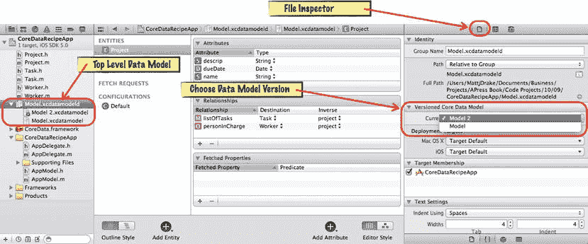

**图 10-11.** *设置当前数据模型版本*

现在添加 `Task` 到 `Worker` 的一对一关系。首先选择 `Model 2`，确保你在处理新版本。要建立关系，在数据模型编辑器中选择 `Task`，然后点击数据模型编辑器关系面板中的加号按钮。将关系命名为 `assignedTo`，并将目标设置为 `Worker`。

接下来你需要定义反向关系。这让你能够引用某个工人正在处理的任务。选择 `Worker` 实体，点击数据模型编辑器关系面板中的加号按钮。将关系命名为 `task`，并将目标设置为 `Task`。在 Inverse 中选择 `assignedTo`。

要一次性查看你刚才所做的全部操作，请按住 Command 键在数据模型编辑器中选择每个实体。两个实体都会被高亮，你将同时看到所有属性和关系。数据模型编辑器应该如图 10-12 所示。

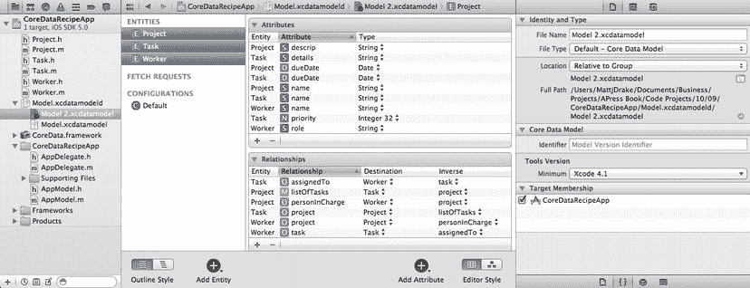

**图 10-12.** *Task 到 Worker 以及 Worker 到 Task 的关系*

保持所有实体处于高亮状态，进入 File  New  File。然后选择 iOS  Core Data  NSManagedObject subclass。点击 Next，然后点击 Create。你会收到一个警告对话框，因为你要覆盖之前的 `Project` 类文件。这没问题，因为你确实需要更新它，所以点击 Replace。

现在你可以使用 Core Data 而不会破坏你的应用程序了。

```objectivec
//Create a new AppModel instance
AppModel *dataModel = [[AppModel alloc] init];

//Make a project
Project *p1 = [dataModel makeNewProject];
p1.name = @"Proj1";

//Make a task
Task *t1 = (Task *)[NSEntityDescription insertNewObjectForEntityForName:@"Task"
                                          inManagedObjectContext:[dataModel managedObjectContext]];
t1.name = @"Task 1";
t1.details = @"Task details";
t1.dueDate = [NSDate date];
t1.priority = [NSNumber numberWithInt:1];

//Assign a worker to this task:
Worker *managedWorker = (Worker *)[NSEntityDescription
                                  insertNewObjectForEntityForName:@"Worker"
                                  inManagedObjectContext:[dataModel managedObjectContext]];
managedWorker.name = @"John";
managedWorker.Role = @"Programmer";

t1.assignedTo = managedWorker;
```

Core Data 会负责管理每个用户应用的两个版本，无需你再进行任何干预。参见代码清单 10-49 至 10-58。


### 代码

**代码清单 10-49.** *AppDelegate.h*

```objc
#import <UIKit/UIKit.h>
#import "AppModel.h"

@interface AppDelegate : UIResponder <UIApplicationDelegate>

@property (strong, nonatomic) UIWindow *window;

@end
```

**代码清单 10-50.** *AppDelegate.m*

```objc
#import "AppDelegate.h"

@implementation AppDelegate
@synthesize window = _window;

- (BOOL)application:(UIApplication *)application didFinishLaunchingWithOptions:(NSDictionary *)launchOptions{

    //创建一个新的 AppModel 实例
    AppModel *dataModel = [[AppModel alloc] init];

    //创建一个项目
    Project *p1 = [dataModel makeNewProject];
    p1.name = @"Proj1";

    //创建一个任务
    Task *t1 = (Task *)[NSEntityDescription insertNewObjectForEntityForName:@"Task" inManagedObjectContext:[dataModel managedObjectContext]];

    t1.name = @"Task 1";
    t1.details = @"Task details";
    t1.dueDate = [NSDate date];
    t1.priority = [NSNumber numberWithInt:1];

    //为此任务分配一个工作人员：
    Worker *managedWorker = (Worker *)[NSEntityDescription insertNewObjectForEntityForName:@"Worker" inManagedObjectContext:[dataModel managedObjectContext]];

    managedWorker.name = @"John";
    managedWorker.Role = @"Programmer";

    t1.assignedTo = managedWorker;

    //将任务添加到项目中
    [p1 addListOfTasksObject:t1];

    //创建一个任务
    Task *t2 = (Task *)[NSEntityDescription insertNewObjectForEntityForName:@"Task" inManagedObjectContext:[dataModel managedObjectContext]];

    t2.name = @"Task 2";
    t2.details = @"Task details";
    t2.dueDate = [NSDate date];
    t2.priority = [NSNumber numberWithInt:1];

    //将任务添加到项目中
    [p1 addListOfTasksObject:t2];

    //获取数据存储中的所有项目
    NSFetchRequest *request = [[NSFetchRequest alloc] init];
    NSEntityDescription *entity = [NSEntityDescription entityForName:@"Project" inManagedObjectContext:[dataModel managedObjectContext]];

    request.entity = entity;
    NSArray *listOfProjects = [[dataModel managedObjectContext] executeFetchRequest:request error:nil];

    //打印所有项目的内容（包含任务）：
    NSLog(@"-----");
    NSLog(@"上下文中的新项目");
    [listOfProjects enumerateObjectsUsingBlock:^(id obj, NSUInteger idx, BOOL *stop) {
        NSLog(@"project.name = %@", [obj name]);
        [[obj listOfTasks] enumerateObjectsUsingBlock:^(id obj, BOOL *stop) {
            NSLog(@" task.name = %@", [obj name]);
            NSLog(@" task.assignedTo = %@", [[obj assignedTo] name]);
        }];
    }];

    self.window = [[UIWindow alloc] initWithFrame:[[UIScreen mainScreen] bounds]];
    self.window.backgroundColor = [UIColor whiteColor];
    [self.window makeKeyAndVisible];
    return YES;
}

@end
```

**代码清单 10-51.** *AppModel.h*

```objc
#import <Foundation/Foundation.h>
#import <CoreData/CoreData.h>
#import "Project.h"
#import "Worker.h"
#import "Task.h"

@interface AppModel : NSObject

-(NSURL *)dataStoreURL;

@property (nonatomic, strong, readonly) NSManagedObjectModel *managedObjectModel;
@property (nonatomic, strong, readonly) NSPersistentStoreCoordinator *persistentStoreCoordinator;
@property (nonatomic, strong, readonly) NSManagedObjectContext *managedObjectContext;

-(Project *)makeNewProject;
-(Worker *)makeNewWorker;
-(Task *)makeNewTask;

@end
```

**代码清单 10-52.** *AppModel.m*

```objc
#import "AppModel.h"

@implementation AppModel
NSManagedObjectModel *_managedObjectModel;
NSPersistentStoreCoordinator *_persistentStoreCoordinator;
NSManagedObjectContext *_managedObjectContext;

-(Project *)makeNewProject{

    Project *managedProject = (Project *)[NSEntityDescription insertNewObjectForEntityForName:@"Project" inManagedObjectContext:[self managedObjectContext]];

    managedProject.name = @"New Project";
    managedProject.descrip = @"This is a new project";
    managedProject.dueDate = [NSDate date];

    managedProject.personInCharge = [self makeNewWorker];

    return managedProject;

}

-(Worker *)makeNewWorker{
    Worker *managedWorker = (Worker *)[NSEntityDescription insertNewObjectForEntityForName:@"Worker" inManagedObjectContext:[self managedObjectContext]];

    managedWorker.name = @"New Worker";
    managedWorker.Role = @"Works on projects";

    return managedWorker;
}

-(Task *)makeNewTask{
    Task *managedTask = (Task *)[NSEntityDescription insertNewObjectForEntityForName:@"Task" inManagedObjectContext:[self managedObjectContext]];

    managedTask.name = @"New Task";
    managedTask.details = @"Task details";
    managedTask.dueDate = [NSDate date];
    managedTask.priority = [NSNumber numberWithInt:1];

    return managedTask;
}

- (NSURL *)dataStoreURL {

    NSString *docDir = [NSSearchPathForDirectoriesInDomains(NSDocumentDirectory, NSUserDomainMask, YES) lastObject];

    return [NSURL fileURLWithPath:[docDir stringByAppendingPathComponent:@"DataStore.sql"]];
}

- (NSManagedObjectModel *)managedObjectModel {
    if (_managedObjectModel) {
        return _managedObjectModel;
    }
    _managedObjectModel = [NSManagedObjectModel mergedModelFromBundles:nil];
    return _managedObjectModel;
}

- (NSPersistentStoreCoordinator *)persistentStoreCoordinator {
    if (_persistentStoreCoordinator) {
        return _persistentStoreCoordinator;
    }

    NSError *error = nil;
    NSDictionary *options = [NSDictionary dictionaryWithObjectsAndKeys:
    [NSNumber numberWithBool:YES], NSMigratePersistentStoresAutomaticallyOption,
    [NSNumber numberWithBool:YES], NSInferMappingModelAutomaticallyOption, nil];

    _persistentStoreCoordinator = [[NSPersistentStoreCoordinator alloc] initWithManagedObjectModel:[self managedObjectModel]];

    if (![_persistentStoreCoordinator addPersistentStoreWithType:NSSQLiteStoreType
                                                   configuration:nil
                                                             URL:[self dataStoreURL]
                                                         options:options
                                                           error:&error]) {
        NSLog(@"持久存储协调器出现未解决的 Core Data 错误: %@, %@", error, [error userInfo]);
    }
    return _persistentStoreCoordinator;
}

- (NSManagedObjectContext *)managedObjectContext {
    if (_managedObjectContext) {
        return _managedObjectContext;
    }

    if ([self persistentStoreCoordinator]) {
        _managedObjectContext = [[NSManagedObjectContext alloc] init];
        [_managedObjectContext setPersistentStoreCoordinator:[self persistentStoreCoordinator]];
    }

    return _managedObjectContext;
}

@end
```

**代码清单 10-53.** *Project.h*

```objc
#import <Foundation/Foundation.h>
#import <CoreData/CoreData.h>

@class Worker;

@interface Project : NSManagedObject

@property (nonatomic, retain) NSString * descrip;
@property (nonatomic, retain) NSDate * dueDate;
@property (nonatomic, retain) NSString * name;
@property (nonatomic, retain) Worker *personInCharge;
@property (nonatomic, retain) NSSet *listOfTasks;
@end

@interface Project (CoreDataGeneratedAccessors)
```


```objc
- (void)addListOfTasksObject:(NSManagedObject *)value;
- (void)removeListOfTasksObject:(NSManagedObject *)value;
- (void)addListOfTasks:(NSSet *)values;
- (void)removeListOfTasks:(NSSet *)values;

@end
```

**代码清单 10-54.** *Project.m*

```objc
#import "Project.h"
#import "Worker.h"

@implementation Project

@dynamic descrip;
@dynamic dueDate;
@dynamic name;
@dynamic personInCharge;
@dynamic listOfTasks;

@end
```

**代码清单 10-55.** *Task.h*

```objc
#import <Foundation/Foundation.h>
#import <CoreData/CoreData.h>

@class Project, Worker;

@interface Task : NSManagedObject

@property (nonatomic, retain) NSString * details;
@property (nonatomic, retain) NSDate * dueDate;
@property (nonatomic, retain) NSString * name;
@property (nonatomic, retain) NSNumber * priority;
@property (nonatomic, retain) Project *project;
@property (nonatomic, retain) Worker *assignedTo;

@end
```

**代码清单 10-56.** *Task.m*

```objc
#import "Task.h"
#import "Project.h"
#import "Worker.h"

@implementation Task

@dynamic details;
@dynamic dueDate;
@dynamic name;
@dynamic priority;
@dynamic project;
@dynamic assignedTo;

@end
```

**代码清单 10-57.** *Worker.h*

```objc
#import <Foundation/Foundation.h>
#import <CoreData/CoreData.h>

@class Project, Task;

@interface Worker : NSManagedObject

@property (nonatomic, retain) NSString * name;
@property (nonatomic, retain) NSString * role;
@property (nonatomic, retain) Project *project;
@property (nonatomic, retain) Task *task;

@end
```

**代码清单 10-58.** *Worker.m*

```objc
#import "Worker.h"
#import "Project.h"
#import "Task.h"

@implementation Worker

@dynamic name;
@dynamic role;
@dynamic project;
@dynamic task;

@end
```

### 使用说明

版本控制测试起来有点棘手。从示例 10.8 的应用程序开始，并确保构建它，以便你能够在控制台日志中看到输出。然后按照本示例的步骤操作，看看你是否能优雅地更新数据模型。在构建并运行此应用程序后，你应该会在控制台日志中看到类似如下的输出：

```
-----
 上下文中的新项目
 project.name = Proj1
  task.name = Task 1
  task.assignedTo = John
  task.name = Task 2
  task.assignedTo = (null)
```

## 第 ¹¹ 章

## 超越 Mac 与 iOS 的 Objective-C

Objective-C 几乎专门用于 Mac 和 iOS 开发，但它也可以在其他平台上使用。本章将讨论如何在 Windows 7 上使用 GNUstep 编写和编译 Objective-C 代码。本章还将演示 Objective-J，这是一种基于 Objective-C 的编程语言，用于开发 Web 应用程序。

在本章中，你将学习：

*   在 Windows 7 上安装 GNUstep
*   在 Windows 7 上编写并编译一个 Hello World 的 Objective-C 程序
*   在 Mac 上下载并安装 Objective-J 和 Cappuccino 框架
*   为 Safari 浏览器创建一个 Hello World 的 Objective-J Web 应用

## 11.1 在 Windows 上安装 GNUstep

### 问题

你需要在 Windows 7 电脑上安装 GNUstep，以便编写能够在 Windows 7 电脑上运行的 Objective-C 代码。

### 解决方案

在你的 Windows 7 电脑上下载并安装 GNUstep 工具，包括 Foundation 和 AppKit，从而使用 Objective-C。

### 工作原理

GNUstep 的目标是让 Objective-C、Foundation 和 AppKit 成为一个跨平台的开发环境。GNUstep 允许你在包括 Windows 在内的许多不同系统上使用本书中介绍的那类代码。

但首先，你需要在你的 Windows 电脑上安装 GNUstep。你可以通过访问 GNUstep 的 Windows 安装程序页面 [`www.gnustep.org/experience/Windows.html`](http://www.gnustep.org/experience/Windows.html) 来完成此操作。

你必须按以下顺序下载并安装这三个软件包：

1.  GNUstep MSYS 系统
2.  GNUstep 核心
3.  GNUstep 开发

让所有安装设置保持默认状态。安装完成后，你将在 Windows 驱动器上看到一个名为 `C:\GNUstep` 的新文件夹。GNUstep 开发环境就位于此处。

当你使用 GNUstep 时，你将使用文本编辑器编写代码，并使用命令行 Shell（Shell 类似于 Mac 的终端）来编译代码。文本编辑器可以是任何能够将文件保存为纯文本的程序（如记事本）。你可以通过依次进入 Windows 开始菜单  所有程序  GNUstep  Shell 来打开 Shell 窗口。

打开 Shell 后，你会看到一个带有提示符的黑色窗口。你将位于 GNUstep 环境的主目录中（而不是 Windows 根目录）。Shell 的外观示例请参见图 11-1。

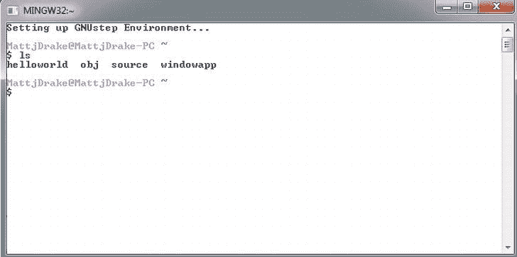

**图 11-1.** *GNUstep Shell*

**注意：** 你的屏幕上可能不会列出你在图 11-1 中看到的那些文件。`ls` 命令会列出你当前所在文件夹中的文件和文件夹。

GNUstep 主目录位于 `C:\GNUstep\msys\1.0\home\[用户名]`。请注意，`[用户名]` 是你的 Windows 用户名。你需要将想要编译的代码文件放在这里。

**注意：** GNUstep Shell 类似于一个迷你的 Mac、Unix 或 Linux 命令行工具，因此这些类型的命令可以在 GNUstep Shell 中使用。例如，图 11-1 展示了使用 `ls` 命令列出我的 GNUstep 主目录中的文件夹。你还可以使用 `cd` 命令来更改当前目录，使用 `mkdir` 命令来创建新目录。

如果你能打开 GNUstep Shell 并且已经安装了来自 GNUstep 网站的全部三个软件包，那么你就可以继续学习示例 11.2 中展示的 Hello World 示例了。

### 11.2 Windows 上的 Objective-C Hello World

### 问题

你想使用 GNUstep 在 Windows 上编写并编译一个简单的 Objective-C 程序。

### 解决方案

要在 Windows 上完成此操作，你需要两个文件：一个包含源代码的文本文件，以及一个称为**makefile（构建文件）**的特殊文本文件。Makefile 用于列出编译器将代码转换为编译程序所需的设置。


好的，作为高级文档工程师和翻译员，我将根据您提供的注意事项和示例，将给定的英文文本翻译成中文。


### 工作原理

使用文本编辑器（记事本即可）创建一个新的文本文件，并将以下代码放入文件中：

```
#import <Foundation/Foundation.h>

int main (int argc, const char * argv[]){

         NSAutoreleasePool *pool = [[NSAutoreleasePool alloc] init];

        NSString *helloString = @"Hello World";
        NSLog(@"%@", helloString);

        [pool drain];
        [pool release];

        return 0;
}
```

这段代码与你之前用过的 `Hello World` Objective-C 示例代码非常相似，只有一处不同。你可以看到这里使用的是 **ARC 之前**的内存管理方式。`@autoreleasepool{}` 块目前在 `GNUstep` 中不受支持。

将文件保存到 GNUstep 的 `home` 目录中，并确保将文件命名为 `main.m`。

**注意：** 如果你使用记事本编辑文本文件，要特别小心，确保记事本没有在你的文件名后追加 `.txt` 文件扩展名。如果你的 Windows 文件资源管理器自动隐藏了文件扩展名，可以使用 GNUstep Shell 中的 `ls` 命令来查看“真正的”文件名。

接下来，你需要编写一个 make 文件。GNUstep 环境使用这些文件将你的代码编译成程序。创建一个新的文本文件，并在文件中包含以下文本：

```
include $(GNUSTEP_MAKEFILES)/common.make

TOOL_NAME = main
main_OBJC_FILES = main.m

include $(GNUSTEP_MAKEFILES)/tool.make
```

make 文件中，对于每个要编译的程序，需要更改的部分已用**粗体**标出。第一个（`TOOL_NAME` 之后）是你的编译程序的文件名，它必须与第二行（`_OBJC_FILES` 之前）匹配。最后一个粗体部分必须与包含你要编译的代码的文件名匹配。

将文件命名为 `GNUmakefile`，并保存在 GNUstep 的 `home` 目录中。该文件不应有文件扩展名。通过以下路径打开 GNUstep Shell：Windows 开始菜单  所有程序  GNUstep  Shell。输入 `ls` 命令，确保你与这两个文件位于同一目录下。你应该能看到这两个文件列出来，并且带有你预期的文件扩展名。

```
$ ls
GNUmakefile main.m
```

现在，你只需输入 `make` 并按下回车键即可。你会在 GNUstep Shell 中看到构建日志。如果有任何错误，也会在这里报告。示例效果请参见图 11-2。

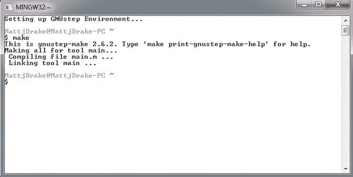

**图 11-2.** *来自 make 命令的构建日志*

你可以通过在 GNUstep Shell 中输入程序名称来测试你的 Objective-C 应用程序。编译后的程序会保存在名为 `obj` 的子目录中，因此你需要输入类似这样的命令：

```
./obj/main
```

示例请参见图 11-3，代码请参见代码清单 11-1 和 11-2。

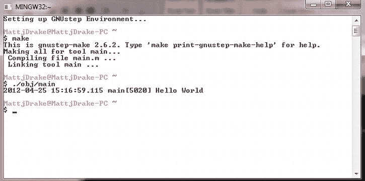

**图 11-3.** *GNUstep Hello World 输出*

### 代码

**代码清单 11-1.** *main.m*

```
#import <Foundation/Foundation.h>

int main (int argc, const char * argv[]){

         NSAutoreleasePool *pool = [[NSAutoreleasePool alloc] init];

        NSString *helloString = @"Hello World";
        NSLog(@"%@", helloString);

        [pool drain];
        [pool release];

        return 0;
}
```

**代码清单 11-2.** *GNUmakefile*

```
include $(GNUSTEP_MAKEFILES)/common.make

TOOL_NAME = main
main_OBJC_FILES = main.m

include $(GNUSTEP_MAKEFILES)/tool.make
```

### 用法

你可以按照“工作原理”部分所述使用此代码。你也可以尝试向 `main.m` 文件中添加其他 Objective-C 对象，以了解它们在 Windows 开发环境中的工作方式。例如，要了解数组如何工作，可以将 `main.m` 修改为如下所示：

```
#import <Foundation/Foundation.h>

int main (int argc, const char * argv[]){

         NSAutoreleasePool *pool = [[NSAutoreleasePool alloc] init];

        NSString *helloString = @"Hello World";
        NSLog(@"%@", helloString);

        NSArray *listOfLetters1 = [NSArray arrayWithObjects:@"A", @"B", @"C", nil];
        NSLog(@"listOfLetters1 = %@", listOfLetters1);

        [pool drain];
        [pool release];

        return 0;
}
```

你需要再次使用 GNUstep Shell 中的 `make` 命令来编译它。要查看新的结果，只需再次输入 `./obj/main` 运行程序即可。你将得到如下输出：

```
Hello World
listOfLetters1 = (A, B, C)
```

你也可以在此处尝试其他 `Foundation` 类。请记住，尽管 GNUstep 是一个开源项目，其目标是支持所有 Foundation 组件，但并不能保证一切都按你期望的那样工作。显然，你在 Windows 上获得的开发环境与 Mac 上的有所不同。

GNUstep 提供了与 Apple 的 Objective-C 类似的功能，但两者并不完全相同。如果你想了解更多关于这个丰富框架的信息，请访问 [`www.gnustep.org/`](http://www.gnustep.org/) 获取最新的详细信息、教程和文档。

## 11.3 下载用于 Web 应用的 Objective-J

### 问题

你希望使用与 Mac 和 iOS 应用的 Objective-C 相同的编码模式，通过 Objective-J 来开发 Web 应用。

### 解决方案

从 [`http://cappuccino.org/download/`](http://cappuccino.org/download/) 下载 Starter Package，以获取使用 Objective-J 开发应用所需的框架。

### 工作原理

Objective-J 将类似 Objective-C 的代码引入 Web 应用。Web 应用与 Mac 或 iOS 应用不同，它们运行在像 Safari 这样的浏览器中。Web 应用不会部署到用户的 Mac 或 iPhone 上，而是部署到 Web 服务器上，用户通过将浏览器指向该 Web 服务器来获取应用。Web 应用已经存在了一段时间，但 Objective-J 的巧妙之处在于，你可以将用于桌面应用的复杂模式和代码用于你的 Web 应用。Objective-J 旨在紧密模仿 Objective-C 的工作方式，因此你会看到 Objective-J 中的类与 Objective-C 中的非常相似（但不完全相同）。

Objective-J 中的 “J” 代表 JavaScript，这是 Objective-J 和 Objective-C 之间的关键区别。Objective-C 是 C 语言的扩展，而 Objective-J 是 JavaScript（一种 Web 应用语言）的扩展。你还会看到“Cappuccino”这个名字与 Objective-J 相关联。Cappuccino 相当于 Objective-C Cocoa 的 Objective-J 版本。这两个词都指的是应用框架（而非纯粹的编程语言）。

要开始使用 Objective-J，你需要一个文本编辑器（如 Mac 上的 TextEdit）、一个 Web 浏览器（如 Mac 上的 Safari），并且需要从 [`http://cappuccino.org/download/`](http://cappuccino.org/download/) 下载 Starter Package。

Starter Package 附带了一个已经设置好的 Hello World 应用程序。下载 Start Package 后，只需导航到 `New Application` 文件夹，并在 Safari 中打开名为 `index.html` 的文件。你会看到一个网页弹出，上面有一个标签显示“Hello World”字样。

**注意：** 除非你将 Objective-J 应用程序部署到 Web 服务器，否则此应用无法在 Chrome 浏览器中运行。这是由于 Chrome 的安全设置所致。

### 用法

在下一个技巧中，你将设置自己的 Hello World 应用以及一些用户控件，以便了解如何使用 Objective-J。在制作自己的应用时，你通常会使用 Cappuccino Starter Package 中提供的示例应用程序作为模板。

## 11.4 编写 Hello World Objective-J 应用

### 问题

你想建立一个简单的 Objective-J 应用程序来显示“Hello World”。


### 解决方案

为你的 Objective-J 应用创建一个文件夹，其中包含你随入门包下载的 Objective-J 框架。你还需要在 Objective-J 应用文件夹中放置这些文件：`Info.plist`、`index.html`、`main.j` 和 `AppController.j`。

### 工作原理

Objective-J 应用不像 Objective-C 的 Mac 和 iOS 应用那样需要编译。相反，在开发应用时，你可以将文件存放在本地桌面；在发布应用时，则存放在 Web 服务器上。当用户访问一个 Objective-J 文件时，浏览器会解释文件中的代码，并在浏览器窗口内呈现结果。

你需要做的第一件事是创建一个名为 `helloworldapp` 的新文件夹，用于存放你的 Objective-J 应用。你可以直接在 Mac 上使用 Finder 在桌面上完成此操作。

**注意：** 你可以在任何系统上使用任何文本编辑器和 Web 浏览器来开发这类应用，但本例将使用标准的 Mac 环境。

接下来，你需要 Objective-J 框架。进入你在配方 11.3 中下载的入门包，然后进入 `NewApplication` 文件夹，找到名为 `Frameworks` 的文件夹。复制 `Frameworks` 文件夹。返回你的 Objective-J 应用文件夹，将 Frameworks 文件夹粘贴进去。

## Info.plist

现在你需要一个 `Info.plist` 文件。该文件的作用与 Mac 和 iOS 应用中同名文件相同：列出 Objective-J 应用运行所需的参数。

在你的文件夹中添加一个名为 `Info.plist` 的新文本文件，并向文件中添加以下代码：

```
<?xml version="1.0" encoding="UTF-8"?>
<plist version="1.0">
<dict>
        <key>CPApplicationDelegateClass</key>
        <string>AppController</string>
</dict>
</plist>
```

这是一个 XML 文件，它告诉应用其委托类名称为 `AppController`。这是一个简单的示例。更复杂的应用可能会在 `info.plist` 文件中包含额外的设置。

## index.html

`index.html` 文件是承载 Objective-J 应用的网页，因此代码将是 HTML 格式。该页面的主要目的是加载你将在后续两个文件中设置的代码文件。与 `Info.plist` 文件一样，将 `index.html` 文件添加到应用文件夹中。它应包含以下 HTML 代码：

```
<!DOCTYPE html
    PUBLIC "-//W3C//DTD XHTML 1.0 Strict//EN"
    "http://www.w3.org/TR/xhtml1/DTD/xhtml1-strict.dtd">
<html xml:lang="en" lang="en">    <head>
        <script type="text/javascript">
            OBJJ_MAIN_FILE = "main.j";
        </script>
        <script type="text/javascript" src="Frameworks/Objective-J/Objective-
J.js"></script>
   <title></title>    
   </head>
</html>
```

此文件主要完成两件事：指定存放主 Objective-J 程序的代码文件，以及指向 Objective-J 框架。

## main.j

`main.j` 文件是主函数所在的位置。其作用与 Objective-C 的 Mac 或 iOS 应用中的 `main.m` 文件相同，即 `main.j` 启动应用对象（在 Objective-J 中是一个 `CPApplicationMain` 对象）。

在你的应用文件夹中创建一个名为 `main.j` 的文本文件，并输入以下代码：

```
@import <Foundation/Foundation.j>
@import <AppKit/AppKit.j>

@import "AppController.j"

function main(args, namedArgs){
    CPApplicationMain(args, namedArgs);
}
```

## AppController.j

`AppController` 充当 Web 应用的委托，与 Mac 或 iOS 应用类似，这里将进行大部分初始应用的设置。

**注意：** 应用委托类在 `Info.plist` 文件中指定。

在你的应用文件夹中添加一个名为 `AppController.j` 的文本文件，并包含以下代码：

```
@import <Foundation/CPObject.j>

@implementation AppController : CPObject{
}

- (void)applicationDidFinishLaunching:(CPNotification)aNotification{

}

@end
```

这段代码可能看起来有点熟悉，因为它类似于 iOS 和 Mac 应用中使用的委托代码。在 `applicationDidFinishLaunching:` 方法中，你放置了用于设置应用用户界面的代码。

添加以下代码来设置一个应用窗口和内容视图：

```
@import <Foundation/CPObject.j>

@implementation AppController : CPObject{
}

- (void)applicationDidFinishLaunching:(CPNotification)aNotification{

    var theWindow = [[CPWindow alloc] initWithContentRect:CGRectMakeZero()
                                                styleMask:CPBorderlessBridgeWindowMask];

    var contentView = [theWindow contentView];

}

@end
```

现在你有了窗口和视图，你可以为你的 Web 应用添加一个标签。

```
@import <Foundation/CPObject.j>

@implementation AppController : CPObject{
}

- (void)applicationDidFinishLaunching:(CPNotification)aNotification{

    var theWindow = [[CPWindow alloc] initWithContentRect:CGRectMakeZero()
                                                styleMask:CPBorderlessBridgeWindowMask];

    var contentView = [theWindow contentView];

    var label = [[CPTextField alloc] initWithFrame:CGRectMakeZero()];
    [label setStringValue:@"Hello World!"];
    [label setFont:[CPFont boldSystemFontOfSize:24.0]];
    [label sizeToFit];
    [label setCenter:[contentView center]];
    [contentView addSubview:label];

    [theWindow orderFront:self];

}

@end
```

这里使用 `CPTextField` 类来创建一个标签。要显示该对象，你必须通过 `addSubView:` 消息将标签添加到 `contentView` 的子视图集合中。这就是你将说 Hello World 的地方。你还会注意到你向窗口发送了 `orderFront:` 消息。这实际上是在浏览器中呈现窗口。相关代码请参见列表 11-3 到 11-6。

# 代码

**列表 11-3.** *Info.plist*

```
<?xml version="1.0" encoding="UTF-8"?>
<!DOCTYPE plist PUBLIC "-//Apple//DTD PLIST 1.0//EN"
"http://www.apple.com/DTDs/PropertyList-1.0.dtd">
<plist version="1.0"><dict>
        <key>CPApplicationDelegateClass</key>
        <string>AppController</string>
</dict>
</plist>
```

**列表 11-4.** *index.html*

```
<!DOCTYPE html
    PUBLIC "-//W3C//DTD XHTML 1.0 Strict//EN"
    "http://www.w3.org/TR/xhtml1/DTD/xhtml1-strict.dtd">
<html xml:lang="en" lang="en">    <head>
        <script type="text/javascript">
            OBJJ_MAIN_FILE = "main.j";
        </script>
        <script type="text/javascript" src="Frameworks/Objective-J/Objective-
J.js"></script>
    <title></title></head> </html>
```

**列表 11-5.** *main.j*

```
@import <Foundation/Foundation.j>
@import <AppKit/AppKit.j>

@import "AppController.j"

function main(args, namedArgs){
    CPApplicationMain(args, namedArgs);
}
```

**列表 11-6.** *AppController.j*

```
@import <Foundation/CPObject.j>

@implementation AppController : CPObject{
}

- (void)applicationDidFinishLaunching:(CPNotification)aNotification{

    var theWindow = [[CPWindow alloc] initWithContentRect:CGRectMakeZero()
                                                styleMask:CPBorderlessBridgeWindowMask];

    var contentView = [theWindow contentView];

    var label = [[CPTextField alloc] initWithFrame:CGRectMakeZero()];

    [label setStringValue:@"Hello World!"];
    [label setFont:[CPFont boldSystemFontOfSize:24.0]];
    [label sizeToFit];
    [label setCenter:[contentView center]];

    [contentView addSubview:label];

    [theWindow orderFront:self];
}

@end
```


### Usage

使用本应用时，请在 Safari 浏览器中打开 `index.html`。你可以使用 Safari 的“文件”菜单打开 `index.html`，或者直接将 `index.html` 文件拖拽到 Safari 图标上以打开应用。你将看到浏览器窗口中显示“Hello World”消息。示例效果请参见 Figure 11-4。

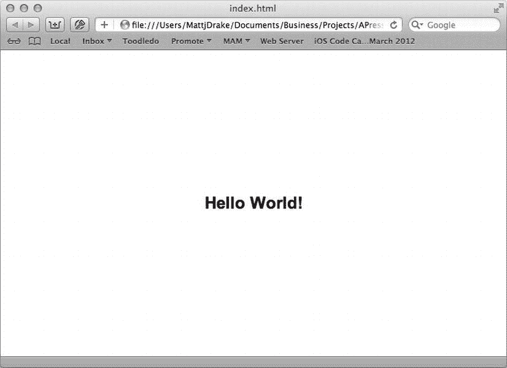

**Figure 11-4.** *Hello World Objective-J 应用*

如果你希望将此类应用部署给用户，必须将整个文件夹放置于网站上。用户只需访问你的网站即可使用该应用。本应用可在包括 Microsoft Internet Explorer 在内的任何现代浏览器中运行。然而，如果你使用的是 Chrome 浏览器，除非已在 Mac 上本地运行 Web 服务器，否则将无法在本地测试 Objective-J 程序。

Objective-J 本身是一个功能丰富的平台，因此无法在此详细阐述。如果你想了解更多关于 Objective-J 的信息，请访问 [`http://cappuccino.org/`](http://cappuccino.org/) 获取教程和文档。

### 11.5 向 Objective-J 应用添加按钮

### 问题

你想为 Web 应用添加按钮等用户控件。

### 解决方案

按照 Hello World 应用的模板来搭建 Web 应用本身。要在 Web 应用中创建按钮，请在应用控制器中使用 `CPButton` 类。

#### 实现原理

在 `AppController.j` 文件中设置 Web 应用的用户控件。如果有任何需要保持引用的控件，请确保在方法外部声明这些对象变量，以便在应用活跃期间它们保持在作用域内。

在文件 `AppController.j` 中设置应用控制器。

```
@import <Foundation/CPObject.j>

@implementation AppController : CPObject{
}

var label;
var contentView;

- (void)applicationDidFinishLaunching:(CPNotification)aNotification{“

     var theWindow = [[CPWindow alloc] initWithContentRect:CGRectMakeZero()]
styleMask:CPBorderlessBridgeWindowMask];

    contentView = [theWindow contentView];

    var frame = CGRectMake(0, 13.0, 150.0, 24.0);

    label = [[CPTextField alloc] initWithFrame:frame];

    [label setStringValue:@"Press the Button"];
    [label setFont:[CPFont boldSystemFontOfSize:24.0]];
    [label sizeToFit];
    [label setCenter:[contentView center]];
    [contentView addSubview:label];

}

@end
```

该代码是第 11.4 节中 Hello World 应用的修改版本。主要区别在于，`contentView` 和 `label` 对象在函数外部声明，以便它们保持在作用域内。

要创建按钮，请使用 `CPButton` 类并设置按钮的属性。`CPButton` 的工作方式与 iOS 中的 `UIButton` 非常相似，使用模式也基本相同。以下是如何将其添加到 `applicationDidFinishLaunching:` 方法中：

```
frame = CGRectMake(CGRectGetWidth([contentView bounds])/2.0 - 40, 
CGRectGetMaxY([label frame]) + 10, 80, 24)
var button = [[CPButton alloc] initWithFrame: frame];
[button setAutoresizingMask:CPViewMinXMargin |
                            CPViewMaxXMargin |
                            CPViewMinYMargin |
                            CPViewMaxYMargin];
[button setTitle:"Make Gray"];
[button setTarget:self];
[button setAction:@selector(changeBackground:)];
[contentView addSubview:button];
```

这遵循了**目标-动作**设计模式。你可以看到，这里的应用控制器是目标，而动作名为 `changeBackground:`。

以下是用于更改应用背景颜色并向 `label` 添加内容的 `changeBackground:` 方法的代码：

```
- (void)changeBackground:(id)aSender{
    var c = [CPColor lightGrayColor];
    [contentView setBackgroundColor:c];
    [label setStringValue:@"Color Changed!"];
}
```

以上就是为这个 Web 应用添加按钮所需的所有步骤！完整代码请参见 Listing 11-7。

#### 代码

**Listing 11-7.** *AppController.j*

```
@import <Foundation/CPObject.j>

@implementation AppController : CPObject{

}

var label;

var contentView;

- (void)applicationDidFinishLaunching:(CPNotification)aNotification{“

     var theWindow = [[CPWindow alloc] initWithContentRect:CGRectMakeZero()]

styleMask:CPBorderlessBridgeWindowMask];

     contentView = [theWindow contentView];

     var frame = CGRectMake(0, 13.0, 150.0, 24.0);

     label = [[CPTextField alloc] initWithFrame:frame];

      [label setStringValue:@"Press the Button"];

      [label setFont:[CPFont boldSystemFontOfSize:24.0]];

      [label sizeToFit];

      [label setCenter:[contentView center]];

      [contentView addSubview:label];

     frame = CGRectMake(CGRectGetWidth([contentView bounds])/2.0 - 40,  

CGRectGetMaxY([label frame]) + 10, 80, 24);

     var button = [[CPButton alloc] initWithFrame: frame];

      [button setAutoresizingMask:CPViewMinXMargin |

                                    CPViewMaxXMargin |

                                    CPViewMinYMargin |

                                    CPViewMaxYMargin];

      [button setTitle:"Make Gray"];

      [button setTarget:self];

      [button setAction:@selector(changeBackground:)];

      [contentView addSubview:button];

      [theWindow orderFront:self];

}

- (void)changeBackground:(id)aSender{

     var c = [CPColor lightGrayColor];

      [contentView setBackgroundColor:c];

      [label setStringValue:@"Color Changed!"];

}

@end
```

#### 用法

要使用本应用，请复用你在第 11.4 节“Hello World”示例中搭建的模板。将 `AppController.j` 文件中的代码替换为 Listing 11.7 中的代码。

运行本应用时，请在 Safari 浏览器中打开 `index.html`。你可以使用 Safari 的“文件”菜单打开 `index.html` 文件，或者直接将 `index.html` 拖拽到 Safari 图标上以打开应用。你将在浏览器窗口中看到一个按钮和一个标签。点击按钮，观察标签内容的变化以及背景颜色变为浅灰色。

# Index


### A, B

应用程序开发

- `class`，19–22
- `console`，4–6
- 自定义 `class`
- `class` 方法，16–18
- 创建，7–9
- 实例方法，18–19
- iOS 应用程序
- 属性，36
- 创建，35–36
- 委托，45–48
- 选择器视图，48
- 模拟器，40
- 目标-动作，40–44
- 模板，35
- 用户控件，44
- `Xcode`，34–40
- Mac 应用程序
- 应用程序设置，32
- 属性，32–33
- 委托，22
- 方法执行，30
- 模板，30–31
- 用户控件，26–30
- 基于 Web 的、终端应用程序，22–25
- `Xcode`，30–34
- `NSLog`，4–6
- 属性访问器
- `@synthesize`，14–16
- 属性，10
- 代码，9–13
- 终端命令，2–4

### 聚合信息，键路径

- `@distinctUnionOfObjects` 运算符，311–313
- 数组，312
- 平均优先级，311–313
- 代码测试，313–317
- 用法，317

### 数组

- `count`，86–87
- 创建，82–84
- 迭代，87–90
- 操作，100–103
- `NSArray` 和 `NSMutableArray` 构造器，83
- `NSPredicate` 比较运算符，96
- 查询，95–100
- 读取文件系统，106–107
- 引用对象，84–86，110–111
- 保存选项，文件系统，104–105
- 排序，90–95

### 异步进程

- GCD
- `dispatch_async` 函数，223–224
- `NSTread`，222–229
- 串行队列，230–235
- `NSOperationQueue`
- `bigTaskAction` 方法，237–238
- 实现，235–241
- 主队列和串行队列，236
- `viewDidLoad` 方法，237
- 线程
- `@synchronized`，217–222
- `AppDelegate.h`，200–203
- `autorelease`，199–200
- 后台任务，204–212
- `NSLock`，212–217
- `NSNumber` 对象，205，207
- `NSObject` 方法，204
- `NSThread`，198–199
- 类型转换，207
- `UIProgressView`，204
- `updateUIWhen`，206
- `ViewController`，204–205
- `viewDidLoad` 方法，213

### 自动引用计数 (ARC)，263，265–267


### C

消费网页内容。*参见* Web 内容

**Core data**

`application`、`managed object`
`@dynamic` 关键字，353
`Objective-C` 类，352–354
测试代码，354–357
用法，357

**数据持久化**，339

**实体描述**
`AppDelegate` 代码，351–352
数据模型文件，349
描述属性，350
编辑器屏幕，349–350
项目完成，350–351
项目实体，350
用法，352
`Xcode`，349–350

**iOS/Mac 应用程序**
`AppModel`，346–348
数据模式，343
框架，340–342
托管对象，345
只读属性，344
堆栈，342–346
用法，348
`Xcode`，340

**托管对象**
数据存储，358
对象，357–358
项目类，357–358
测试代码，358–361
用法，361

**一对多关系**
代码测试，391–397
实体描述，385
接口，389
对象图，385
项目、任务和工人，387
任务代码，385–391
用法，397
可视化编辑器样式，388

**一对一关系**
`makeNewProject` 函数，378
对象图，375
项目与工人关系，375–380
测试代码，380–384
用法，384
工人实体，376

**发布更改**
控制台日志窗口，374
保存/更改，368–369
测试代码，369–374
用法，374

**检索对象**
数据存储，362–363
获取请求，362
测试代码，363–367
用法，367–368

**版本管理**
代码测试，401–408
当前下拉框，399
数据模型，397–401
一对一关系，400
用法，408

### D, E

**日期**
加/减，191–192
比较，183–187
组件，181–183
格式，189–190
`NSCalendar` 常量，184
`NSDate` 类方法，179–180
字符串转换，187–189
定时器、计划代码，193–195

**字典**
计数，112–113
创建，107–110
迭代，113–115
操作，115–117
读取文件系统，120–122
保存对象到文件系统，117–120

### F

**文件系统**
属性，140–142
缓存内容，170–177
更改属性，155–158
构造器，166–167
委托，158–165

**目录**
添加、移动、复制和删除，145–148
子文件夹，143–145

**iOS 应用程序**
引用关键目录，136–139
系统目录，138
`UI`，176

键，141–142

**Mac 应用程序**
域掩码，135
引用关键目录，133–136
系统目录常量，134

管理文件，149–152
`NSCache`，170–177
`NSData`，数据，165–170
`NSFileManager`，158–165
`NSMutableData` 变更方法，167–168
引用，131–133
状态，152–155

### G, H

**垃圾回收**，264，280–281

**GNUstep**，Windows 7
命令行，411
主目录，411
安装，409
包，410
Shell 窗口，410–411
工具，409

**Grand Central Dispatch (GCD)**
`@synthesize` 语句，230
`bigTaskAction` 方法，231–232
块，223
`dispatch_async` 函数，223–224
主队列，226
多线程，222–229
`NSThread`，223
串行队列，230–235


###  I

**iOS 应用程序**

-   属性，36，40
-   创建，35–36
-   委托，45–48
-   选择器视图，48
-   关键参考目录，136–139
-   字符串
    -   读取文件系统，54–57
    -   写入文件系统，59–62
-   系统目录，138
-   目标-动作，40–44
-   模板，35
-   用户界面，176
-   用户控件，44
-   Xcode，34–40

###  J

**JSON**

-   `NSJSONSerialization`，254
-   解析器，254–255
-   网络服务，253–256

###  K, L

**键值编码 (KVC)**

-   获取属性，298–299
-   `NSOject`，297
-   设置属性，299–300
-   测试代码，300–304
-   用法，304

###  M, N

**Mac 应用程序**

-   应用程序设置，32
-   属性，32–33
-   委托，22
-   域掩码，135
-   垃圾回收，280–281
-   方法执行，30
-   关键参考目录，133–136
-   字符串
    -   读取文件系统，52–54
    -   写入文件系统，57–59
-   系统目录常量，134
-   模板，30–31
-   用户控件，26–30
-   基于网络与终端应用程序，22–25
-   窗口，25
-   Xcode，30–34

**内存管理**

-   应用程序，261–262
-   ARC，263，265–267
-   自动释放，263，275–280
-   自定义类，270–274
-   `dealloc` 方法，272
-   垃圾回收，264，280–281
-   生命周期，262
-   选项，264
-   所有权，262
-   属性引用，271–272
-   引用计数，263，267–270

**模型-视图-控制器 (MVC)**，285

###  O, P, Q, R

**对象集合**

-   数组
    -   内容，100–103
    -   计数，86–87
    -   创建，82–84
    -   迭代，87–90
    -   操作，100–103
    -   `NSArray` 和 `NSMutableArray` 构造器，83
    -   `NSPredicate` 比较运算符，96
    -   查询，95–100
    -   读取文件系统，106–107
    -   引用对象，84–86，110–111
    -   保存选项，文件系统，104–105
    -   排序，90–95
-   字典
    -   计数，112–113
    -   创建，107–110
    -   迭代，113–115
    -   操作，115–117
    -   `NSDictionary` 和 `NSMutableDictionary` 构造器，108
    -   读取文件系统，120–122
    -   保存对象，文件系统，117–120
-   集合
    -   比较，125–127
    -   计数，124–125
    -   创建，122–124
    -   迭代，128–129
    -   操作，130–131

**对象图**

-   聚合信息，键路径
    -   `@distinctUnionOfObjects` 运算符，311–313
    -   数组，312
    -   平均优先级级别，311–313
    -   代码测试，313–317
    -   用法，317
-   归档
    -   代码测试，332–337
    -   文件系统，330
    -   `NSCoding` 协议，330–332
    -   `NSKeyedArchiver`，332
    -   用法，337
-   类与对象
    -   内置方法，323
    -   实体，284
    -   任务实现，323–326
    -   测试代码，326–329
    -   用法，329
-   创建，285
    -   实体，283–284
    -   初始化，289–292
-   键路径
    -   代码测试，306–310
    -   用法，310–311
    -   `valueForKey` 和 `setValueForKey`，305–306
-   键值编码
    -   获取属性，298–299
    -   Mac 命令行，304–305
    -   `NSObject`，297
    -   设置属性，299–300
    -   测试代码，300–304
-   网络，284–285
-   对象，284
-   观察者模式实现
    -   类定义，318


`code testing`，320–323

`connection`，318

`dealloc` 方法，318

`key-value` 观察，318–320

`usage`，323

`overriding`，286

`project`，288–289

`task`，286–288

`test code`，292–296

`usage`，296–297

`worker`，285–286

## Objective-C

`GNUstep`，Windows 7

`command-line`，411

`home directory`，411

`installation`，409

`packages`，410

`shell window`，410–411

`tools`，409

`Hello World`，Windows 7

`build log`，413–414

`code testing`，415

`make` 和 `text file`，412

`output`，414

`text file` 创建，412–413

`usage`，415–416

`write` 和 `compile`，412

## Objective-J

`button`，424–427

`Hello World`，418–424

`web application`，416–417

`web applications`，409

### Objective-J `button`

`AppController.j` 文件，424–426

`CPButton` 类，424

`target-action`，425

`test code`，426–427

`usage`，427

`user controls`，424

### Objective-J `Hello World`

`AppController`，420–421

`code testing`，422–423

`folders` 和 `packages`，418

`helloworldapp`，418

`index.html` 文件，419

`Info.plist` 文件，419

`main.j` 文件，420

`Safari browser`，423–424

`web application`，416–417

## 一对多关系

`code testing`，391–397

`entity description`，385

`interfaces`，389

`object graph`，385

`project`、`task` 和 `worker`，387

`task code`，385–391

`usage`，397

`visual editor` 样式，388

## 一对一关系

`makeNewProject` 函数，378

`object graph`，375

`project` 到 `worker` 的关系，375–380

`test code`，380–384

`usage`，384

`worker` 实体，376

##  S

### 字符串

`comparison operator (==)`，63–65

`contain key phrases`，69–71

`file identity options`，72

`foundation framework`，49

`localization`，71–74

`manipulation`，65–69

#### 数字

`currency, scientific notation and spelled out`，78–80

`formats`，78–80

`math functions`，76–78

`primitive type/NSNumber object`，75–76

`styles`，79

`objects`，50–52

#### 读取文件系统

`iOS application`，54–57

`Mac application`，52–54

`search options`，69–71

#### 写入文件系统

`iOS application`，59–62

`Mac application`，57–59

##  T, U

`Terminal application`，2–4

### 线程

`@synchronized`，217–222

`autorelease`，199–200

`background tasks`，204–212

`code testing`，200–203

`main thread`，198

`NSLock`，212–217

`NSNumber object`，205，207

`NSObject method`，204

`NSThread`，198–199

`processes`，198

`type cast`，207

`UIProgressView`，204

`updateUIWhen`，206

`ViewController`，204–205

`viewDidLoad` 方法，213

`Timer`，193–195

##  V

### 版本管理

`code testing`，401–408

`current` 下拉框，399

`data model`，397–401

`one-to-one relationship`，400

`usage`，408

##  W

### Web 内容

`asynchronous`，257–260

`file download`，243–245

`JSON`，253–256

`XML`，245–253

### Windows 7

#### GNUstep

`command-line`，411

`home directory`，411

`installation`，409

`packages`，410

`shell window`，410–411

`tools`，409

#### Hello World

`build log`，413–414

`code testing`，415

`make` 文件，413–414

`output`，414

`text file` 创建，412–413

`usage`，415–416

`write` 和 `compile`，412


###  X

XML

- 委托方法，248
- `LinkShortener`，251–252
- `NSMutableString`，249
- `NSURL` 对象与 `NSData`，246
- `NSXMLParser`，247–251
- 解析器，247–251
- `URL` 函数，252–253
- Web 服务，245
