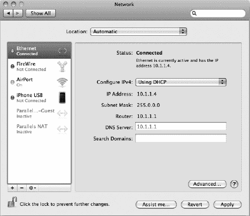
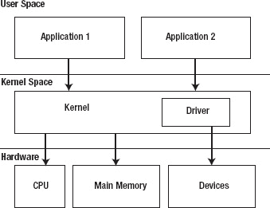
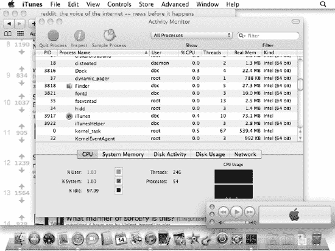
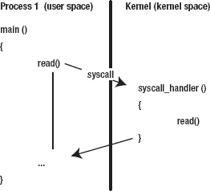
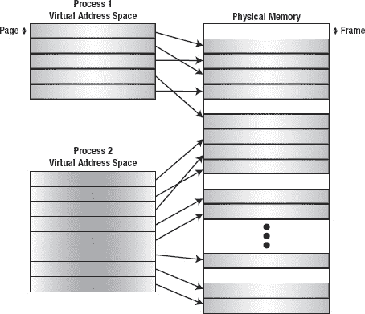
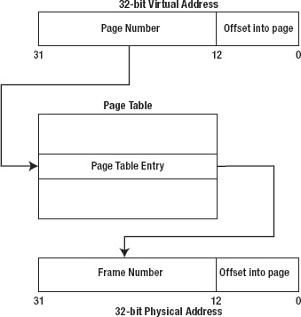
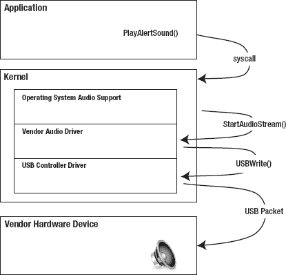

# 操作系统基础

操作系统的角色在于提供一个环境，使用户能够运行应用软件。用户运行的应用在执行过程中依赖操作系统提供的服务来完成任务，通常用户——甚至程序员——都无需过多关注这些细节。例如，当应用需要从磁盘读取文件时，程序员只需调用操作系统提供的某个函数即可。操作系统会处理执行该读取操作所需的具体步骤。这使应用程序员无需担心读取计算机内置硬盘上的文件与读取外部 USB 闪存盘上的文件之间的差异；操作系统会处理这些事务。

大多数程序员都熟悉开发由用户运行的代码，或许还会使用诸如 Cocoa 之类的框架来提供图形用户界面与用户交互。Mac 或 iPhone App Store 上提供的所有应用都属于此类。本书并非关于编写应用软件，而是关于编写内核扩展——也就是为应用提供服务的代码。需要内核扩展的两种情况包括：让操作系统支持自定义硬件设备，以及添加对新文件系统的支持。例如，内核扩展可以让 iTunes 使用新的 USB 音频设备，或者让以太网卡为网络应用提供接口，如图 图 1-1 所示。文件系统内核扩展则可以让在 Windows 计算机上格式化的硬盘像标准 Mac 驱动器一样挂载到 Mac 上。

***图 1-1.** Mac OS X 系统偏好设置中列出的网络接口即代表网络内核扩展。*

操作系统的一个重要角色是管理计算机的硬件资源，例如内存和 CPU，以及外设，比如磁盘存储和键盘。操作系统需要支持的硬件设备集合因机器而异。MacBook Air 的硬件配置与 Mac Pro 截然不同，尽管它们运行着相同的操作系统。为了让操作系统能够支持多种硬件配置而不会变得臃肿，支持每个硬件组件的代码被打包成一种特殊类型的内核扩展，即驱动程序。这种模块化设计使操作系统能够根据系统中存在的硬件按需加载驱动程序。这种方式也允许供应商将驱动程序安装到系统中，以支持其自定义硬件。Mac OS X 的标准安装包含一百多个驱动程序，但运行特定系统只需其中一部分。

开发内核扩展与编写应用软件截然不同。应用的执行通常由用户触发的事件驱动。应用在用户启动时运行；随后它可能等待用户点击按钮或选择菜单项，此时应用会处理该请求。相比之下，内核扩展没有用户界面，也不与用户交互。它们由操作系统加载，并由操作系统调用以执行其自身无法完成的任务，例如当操作系统需要访问内核扩展所驱动的硬件设备时。

为了提升系统的安全性与稳定性，现代操作系统（如 Mac OS X）将核心操作系统代码（内核）与用户运行的应用和服务隔离开来。任何作为内核一部分运行的代码（例如驱动程序代码）被称为运行在“内核空间”。运行在内核空间的代码拥有标准用户应用所不具备的特权，例如能够直接读写连接到计算机的硬件设备。

相反，用户使用的标准应用代码被称为运行在“用户空间”。运行在用户空间的软件无法直接访问硬件。因此，为了访问硬件，用户代码必须向内核发送请求，例如磁盘读取请求，以请求内核代表应用执行任务。

运行在用户空间的代码与运行在内核的代码之间存在严格的界限。应用只能通过调用操作系统发布给用户空间代码的函数来访问内核。同样，在内核空间执行的代码运行在与用户空间代码分离的环境中。内核不提供用户空间代码可用的丰富编程 API，而是提供自身的一套 API，内核扩展的开发者必须使用这些 API。如果你习惯了用户空间编程，这些 API 起初可能会显得受限，因为用户交互和文件系统访问等操作通常对内核扩展不可用。图 1-2 展示了用户空间代码与内核空间代码的分离，以及各层之间的交互。

***图 1-2.** 现代操作系统中各层职责的分离*

强制应用向内核发出请求以访问硬件的一个优势在于，内核（及内核驱动程序）成为硬件设备的中央仲裁者。以声卡为例，系统上可能同时有多个应用在播放音频，但由于它们的请求都汇聚到单个音频驱动程序，该驱动程序能够混合来自所有应用的音频流，并将混合后的结果流提供给声卡。

在本章的剩余部分，我们将概述操作系统内核所提供的功能，重点阐述其在为用户应用提供硬件访问权限方面的重要性。我们从最高层开始，审视应用软件，然后深入探讨操作系统内核层，最后深入最底层——硬件驱动程序。如果你对这些概念已经熟悉，可以直接进入第 2 章。

### 操作系统的角色

作为启动序列的一部分，操作系统会确定系统的硬件配置，查找连接到 USB 端口或插入 PCI 扩展槽的外部设备，并对它们进行初始化，必要时还会加载驱动程序。

一旦操作系统完成加载，用户便可运行应用软件。应用软件可能需要分配内存或将文件写入磁盘，而这些请求都由操作系统处理。对用户而言，操作系统的参与在很大程度上是透明的。

操作系统在运行的应用程序与物理硬件之间提供了一层抽象。应用程序通常通过向操作系统发出高级请求来与硬件通信。由于操作系统处理这些请求，应用程序可以完全不了解其运行的硬件配置，例如安装的 RAM 容量以及磁盘存储是内部 SSD 还是外部 USB 驱动器。

这种抽象使应用软件能够在各种不同的硬件配置上运行，而程序员无需为每种配置添加支持，即使在程序发布后出现了新的硬件设备也是如此。

应用程序开发者通常可以忽略计算机系统工作细节中的许多内容，因为操作系统抽象化了应用程序所运行的硬件平台的复杂性。然而，作为驱动程序开发者，你编写的代码将成为操作系统的一部分，并直接与计算机硬件交互；你无法回避系统的内部运行机制。因此，有必要对操作系统如何履行职责有一个基本的了解。

### 进程管理

用户的计算机上通常安装了许多应用程序。它们纯粹是被动实体。磁盘上的程序包含仅在程序运行时才需要的数据，由可执行代码和应用程序数据组成。当用户启动应用程序时，操作系统会将程序的代码和数据从磁盘加载到内存中，并开始执行其代码。正在执行的程序被称为“进程”。与程序不同，进程是一个活动实体，由程序在执行的某个时刻的状态快照组成。这包括程序代码、程序已分配的内存以及其执行的当前状态，例如程序当前正在执行的函数的 CPU 指令，以及其变量和内存分配的内容。

通常，系统上同时运行着许多进程。这包括用户启动的应用程序（例如 iTunes 或 Safari），以及由操作系统自动启动且对用户无任何提示的进程。例如，Time Machine 备份服务将每小时自动运行一个后台进程来备份数据。甚至可能同时存在同一程序的多个实例，操作系统会将每个实例视为一个独立的进程。图 1-3 显示了 Mac OS X 附带的 `Activity Monitor` 实用工具，可用于查看系统上运行的所有进程。

***图 1-3.** Mac OS X 上的活动监视器，显示系统上运行的所有进程。将其与显示可见用户应用程序的 Dock 进行比较。*

### 进程地址空间

尽管通常同时有许多进程在运行，但每个进程并不知道系统上其他进程的存在。事实上，如果没有明确的代码，一个进程无法与另一个进程交互或影响其行为。

操作系统为每个进程提供了一段允许其运行的内存范围；这被称为进程的地址空间。地址空间是动态的，并在进程分配内存时随着执行而变化。如果某个进程试图读写其地址空间之外的内存地址，操作系统通常会终止该进程，并告知用户应用程序已崩溃。

尽管受保护内存并非新概念，但它直到最近十年才出现在消费级桌面系统上。在 Mac OS X 之前，在 Mac OS 9 下运行的进程能够读写任何内存地址，即使该地址对应于由另一个进程分配或属于操作系统本身的缓冲区。

在没有内存保护的情况下，应用程序能够绕过操作系统，并在未经另一个进程同意的情况下，基于直接修改该进程的内存和变量来实施自己的进程间通信方案。操作系统结构也是如此。例如，Mac OS 9 有一个内部全局变量，其中包含所有打开的 GUI 窗口的链表。尽管此链表名义上由操作系统拥有和操作，但应用程序能够在不调用操作系统的情况下遍历和修改该链表。

没有内存保护时，操作系统容易受到用户应用程序中错误的影响。在具有内存保护的系统上运行的应用程序，最坏的情况下也只能破坏自身的内存和结构，但损害仅限于应用程序本身。在像 Mac OS 9 这样没有内存保护的系统中，应用程序的一个错误可能会覆盖操作系统的内部结构，从而导致系统完全崩溃，并需要重新启动才能恢复。

值得注意的是，在像 Mac OS X 这样的现代操作系统中，内核拥有自己的地址空间。这使得内核能够独立于所有运行的进程进行操作。在 Mac OS X 上，内核和所有已加载的内核扩展共享一个地址空间。这意味着，没有东西可以保护核心操作系统结构免于被有缺陷的驱动程序意外覆盖。与用户进程（可以简单地中止）不同，如果在内核中出现这种情况，整个系统会崩溃，计算机必须重新启动。这种类型的错误在 Mac OS X 上表现为内核恐慌，在 Windows 上则表现为“蓝屏死机”。因此，内核扩展的开发人员需要小心管理内存，以确保所有内存访问都是有效的。

### 操作系统服务

在现代操作系统中，由操作系统执行的功能与由应用程序执行的功能之间存在明确的界限。每当进程希望执行分配内存、从磁盘读取数据或通过网络发送数据等任务时，它都需要通过操作系统提供的一组定义良好的编程接口来进行。像 `malloc()` 和 `read()` 这类系统函数就是提供操作系统服务的系统调用示例。这些系统调用可以由应用程序直接发起，也可以通过更高级的开发框架（例如 Mac OS X 上的 Cocoa 框架）间接调用。在内部，Cocoa 框架正是构建在这些相同的系统调用之上，并通过调用像 `read()` 这样的底层函数来访问操作系统服务。

然而，由于用户进程无法直接访问硬件或操作系统结构，因此对 `read()` 这类函数的调用需要突破进程地址空间的限制。当对操作系统服务发起函数调用时，控制权会从用户应用程序转移到操作系统的特权部分，即内核。将控制权转交给内核通常借助 CPU 来完成，CPU 为此提供了一个专门的指令。例如，现代 Mac 电脑中的 Intel CPU 提供了一个 `syscall` 指令，该指令会跳转到操作系统启动时设置好的一个函数。这个内核函数首先需要识别用户进程执行的是哪个系统调用（通过调用进程写入 CPU 寄存器的一个值来确定），然后读取传递给系统调用的函数参数（同样由调用进程通过 CPU 寄存器设置）。接着，内核代表用户进程执行函数调用，并将控制权连同任何结果代码一起返回给进程。这如图 1-4 所示。

**图 1-4.** 系统调用中的控制流

内核是一个特权进程，能够执行用户进程无法执行但对配置系统所必需的操作。当控制权转移到内核时（例如在系统调用之后），CPU 在内核代码执行期间会进入特权模式，然后在返回用户进程之前降回受限权限状态。

由于内核在执行代表用户进程的系统调用时，其运行的特权级别高于用户进程，因此它必须小心谨慎，避免无意中造成安全漏洞。这种情况可能发生在内核被诱骗执行用户进程不应被允许执行的任务时，例如被要求打开一个用户没有读取权限的文件，或者被提供了一个目标缓冲区，但其地址不在进程的地址空间内。在第一种情况下，尽管内核进程本身有权限打开系统上的任何文件，但由于它代表一个权限较低的用户进程操作，因此该请求需要被拒绝。在第二种情况下，如果内核试图访问一个无效地址，结果将是一个无法恢复的错误，这会导致内核恐慌。

内核错误是灾难性的，需要重启整个系统。为了防止这种情况发生，每当内核代表用户进程执行请求时，它都需要仔细验证进程提供的参数，并且不应假定这些参数是有效的。这适用于内核实现的系统调用，并且正如我们将在后续章节中看到的，也适用于驱动程序接受来自用户进程的控制请求时。

### 虚拟内存

计算机系统中的 RAM 是一种有限的资源，系统中所有正在运行的进程都在竞争其中的一部分。当系统上运行多个应用程序时，所有进程分配的内存总量超过系统 RAM 容量的情况并不罕见。

支持虚拟内存的操作系统允许进程分配和使用比系统实际安装的 RAM 容量更多的内存；也就是说，进程的地址空间不受物理 RAM 数量的限制。借助虚拟内存，操作系统会使用辅存（如硬盘）上的后备存储来存放进程地址空间中无法放入 RAM 的部分。然而，CPU 仍然只能访问位于 RAM 中的地址，因此操作系统必须根据进程运行时对内存的访问，在磁盘后备存储和 RAM 之间交换数据。

在特定时刻，一个进程可能只需要引用其已分配内存总量中的一小部分。这被称为进程的**工作集**，只要操作系统将此工作集保留在 RAM 中，虚拟内存对执行速度的影响就微乎其微。工作集是一个动态实体，它会根据进程运行时正在使用的数据而变化。如果进程访问的某个内存地址不在 RAM 中，相应的数据将从磁盘上的后备存储中读取并加载到 RAM 中。如果没有可用的空闲 RAM 来加载数据，则 RAM 中的部分现有数据需要事先换出到磁盘上，从而释放物理 RAM。

虚拟内存由操作系统处理。用户进程不参与其实现，并且不知道其地址空间的某些部分不在物理 RAM 中，也不知道它访问过的数据可能被换入到主存中。

虚拟内存的一个后果是，进程使用的地址与物理 RAM 中的地址不对应。如果你考虑到进程的地址空间可能大于系统的 RAM 容量，这一点就很明显了。因此，进程读写操作的地址需要从进程的虚拟地址空间转换到物理 RAM 地址。由于每次内存访问都需要地址转换，这由 CPU 来执行，以最小化对执行速度的影响。

操作系统通常使用称为“分页”的方案来实现虚拟地址到物理地址的转换。在分页内存方案下，物理内存被划分为固定大小的块，称为**页框**。大多数操作系统，包括 Mac OS X 和 iOS，都使用 4096 字节的页框大小。同样，每个进程的虚拟地址空间也被划分为固定大小的块，称为**页**。每页的字节数始终与每页框的字节数相同。进程中的每个页随后可以被映射到物理内存中的一个页框，如图 1-5 所示。

**图 1-5.** 进程地址空间中的页可以映射到内存中的任何页框。

虚拟内存的另一个优点是，它允许进程虚拟地址空间中占据连续页面范围的缓冲区，分散到物理内存中多个不连续的页框中，如图 1-5 所示。这解决了物理内存碎片的问题，因为进程的内存分配可以分散到多个物理内存段，而不受限于最长连续物理页框组的大小。

作为进程启动的一部分，操作系统会创建一个表格，用于映射进程虚拟地址空间与其对应物理地址之间的地址关系。这个表格被称为“页表”。从概念上讲，页表为进程地址空间中的每个页面都包含一个表项，其中记录了每个页面所映射到的物理页框的地址。页表项还可能包含 CPU 用于判断页面是否只读的访问控制位，以及一个用于指示该页面是驻留在内存中还是已被交换到后备存储器的标志位。图 1-6 描述了 CPU 将虚拟地址转换为物理地址所执行的步骤。

***图 1-6.** 针对 32 位地址、页大小为 4096 字节（12 位）的虚拟地址到物理地址的转换*

如果进程访问了一个 CPU 无法转换为物理地址的内存地址，就会发生一种称为“缺页错误”的错误。缺页错误由操作系统在特权执行级别进行处理。操作系统会判断该错误是否因为地址不在进程的地址空间内而发生，如果是这种情况，则进程试图访问一个无效地址，并被终止。如果该错误是因为包含该地址的页面已被交换到后备存储器而发生，操作系统将执行以下步骤：

1.  在物理内存中分配一个帧来存放所请求的页面；如果内存中没有空闲帧可用，则将一个现有帧交换到后备存储器以腾出空间。
2.  将所请求的页面从后备存储器读入内存。
3.  更新进程的页表，使得所请求的页面映射到已分配的帧。
4.  将控制权返回给调用进程。

调用进程会重新执行导致该错误的指令，但这一次，CPU 会在页表中找到所请求页面的映射，并且该指令成功完成。

理解虚拟内存和分页机制对于内核开发者至关重要。尽管内核代表用户应用程序处理请求，但它也有自己的地址空间，因此参数通常需要从进程的地址空间复制或映射到内核的地址空间。此外，与硬件设备交互的内核代码通常需要获取内存的物理地址。考虑一个为用户进程处理读取请求的磁盘驱动程序。从磁盘读取数据的目标缓冲区位于用户进程的地址空间中。与 CPU 类似，驱动程序控制的硬件只能写入主内存中的地址，而不能写入后备存储器中的地址。因此，为了处理读取请求，驱动程序需要确保用户缓冲区被交换到主内存中，并在读取操作期间一直保留在主内存中。最后，驱动程序需要将目标缓冲区的地址从虚拟地址转换为硬件可以访问的物理地址。我们将在第 6 章中对此进行更详细的描述。

值得注意的是，尽管 iOS 为每个进程提供了一个页表，但它并不支持后备存储器。乍一看，这似乎完全违背了分页的目的。然而，它服务于两个非常重要的目的。首先，它向每个进程提供了其独占访问内存的视图。其次，它避免了由物理内存碎片化引起的问题。

#### 调度

计算机系统中另一个竞争激烈的资源是 CPU。每个进程都需要访问 CPU 才能执行，但通常情况下，希望访问 CPU 的活动进程数量多于系统上的 CPU 核心数量。因此，操作系统必须在运行中的进程之间共享 CPU 核心，并确保每个进程都能定期获得 CPU 的访问权以便执行。

我们已经看到，进程彼此独立运行，并被赋予各自的地址空间，以防止一个进程影响任何其他进程的行为。然而，在许多应用程序中，允许两个独立的执行路径同时运行是有用的，而不必受限于每个执行路径在其自己的地址空间内运行。这种执行单元被称为“线程”。多个线程都执行来自同一程序代码的代码，并在同一进程内运行（因此共享相同的地址空间），但除此之外，它们独立运行。

对于操作系统来说，线程是调度的基本单元；操作系统调度器在考虑下一步在 CPU 上调度什么时，只需要查看系统中的活动线程。进程要执行，必须至少包含一个线程；当新进程开始运行时，操作系统会自动为其创建初始线程。

调度器的目标有两个：一是防止 CPU 空闲，因为否则宝贵的硬件资源就会被浪费；二是以公平的方式向所有线程提供对 CPU 的访问权，使得单个线程无法独占 CPU 并导致其他线程无法运行。为此，线程会在一个可用的 CPU 核心上被调度，直到发生以下两个事件之一：

*   经过了一定量的时间，称为时间量子，此时该线程被操作系统抢占，并调度另一个线程运行。在 Mac OS X 上，默认的时间量子是 10 毫秒。
*   线程无法继续执行，因为它正在等待某个操作完成，例如等待从磁盘读取数据，或等待另一个线程的结果。在这种情况下，调度器会在原始线程被阻塞时允许另一个线程在 CPU 上运行。这可以防止在某个线程没有工作可做时 CPU 处于空闲状态，并最大化 CPU 用于执行代码的时间。线程也可以通过调用某个`sleep()`函数来自愿放弃其在 CPU 上的时间，该函数会延迟当前线程的执行一段指定的时间。

为应用程序添加多个线程的一个原因是允许它在多个 CPU 核心上并发执行，这样通过将一个复杂操作划分为并行运行的更小步骤，可以加速应用程序的执行。然而，即使在具有单个 CPU 核心的计算机上，多线程也有优势。通过在活动线程之间快速切换，调度器会给人一种所有线程都在并发运行的假象。这允许一个线程阻塞或处于紧凑循环中，而对其余线程的响应能力影响微乎其微，因此可以将耗时的任务移到后台线程，同时让应用程序的其余部分自由响应用户交互。

在与硬件交互的应用程序中，一个常见的设计是将访问硬件的代码放在其自己的线程中。软件代码在等待硬件响应时通常必须阻塞；通过将这些代码从主程序线程中移出，当程序需要等待硬件时，程序的用户界面不会受到影响。

线程的另一个常见用途出现在软件需要以最小延迟响应来自硬件的事件时。应用程序可以创建一个线程，该线程在收到硬件通知之前一直处于阻塞状态，可以使用后续章节讨论的技术来发出信号。当线程被阻塞时，调度器不需要为其提供对 CPU 的访问权，因此该线程的存在对系统性能没有影响。然而，一旦硬件发出了事件信号，线程便会解除阻塞，被调度到 CPU 上，并且可以自由地采取任何必要的行动来响应硬件。

  
#### 硬件与驱动程序  

除了管理 CPU 和内存等关键硬件资源外，操作系统还负责管理可能添加到系统中的硬件外设。这包括键盘、鼠标、U 盘以及显卡等设备。虽然操作系统负责管理这些设备，但它需要借助驱动程序来完成这项工作。驱动程序可以理解为运行在操作系统内核中的插件，使系统能够与硬件设备进行交互。  

支持硬件设备的代码分为两部分：一部分位于设备本身（称为固件），另一部分位于计算机中（称为驱动程序）。驱动程序的作用是代表操作系统控制硬件设备。驱动程序代码被加载到操作系统内核中，并享有与内核其他部分相同的权限，包括直接访问硬件的能力。  

当设备连接到计算机（或计算机启动时），驱动程序负责初始化硬件，并将操作系统的请求翻译成一组硬件特有的操作序列，设备需要执行这些操作来完成操作系统的请求。  

驱动程序从操作系统接收的请求类型取决于其执行的功能。对于某些驱动程序，操作系统会提供一个开发框架。例如，声卡需要编写音频驱动程序。音频驱动程序从操作系统接收与音频领域相关的请求，例如创建 48 kHz 音频输出流的请求，随后是输出指定音频数据包的请求。  

驱动程序也可以基于其他驱动程序构建，并可能请求其他驱动程序提供的服务。例如，USB 音频输入设备的驱动程序使用底层通用 USB 驱动程序的服务来访问其硬件。这使得开发者无需深入了解 USB 协议，从而可以专注于自身设备的特性。与之前的例子类似，音频驱动程序从操作系统接收表示音频流操作的请求，并在响应这些请求时，创建自己的请求传递给底层 USB 驱动程序。这种分层设计实现了每个驱动程序职责的分离：音频驱动程序只需关注处理音频请求和配置音频设备，而 USB 驱动程序只需关注 USB 协议和在 USB 总线上执行数据传输。驱动程序分层方式的示例如图 1-7 所示。  

  

***图 1-7.** 从应用程序到硬件的音频请求中的控制请求链*  

并非所有硬件都能归入操作系统识别的特定类别。例如，3D 打印机等专用设备可能无法获得操作系统的原生支持。此时，硬件制造商需要为其硬件编写通用驱动程序。作为通用驱动程序，操作系统不会将该设备识别为打印机并发送打印请求，而是由专门的应用程序软件控制该驱动程序，直接与打印机驱动程序通信。操作系统提供了一个特殊的系统调用，允许用户应用程序向驱动程序请求操作，称为“I/O 控制”请求，通常简写为`"ioctl"`。`ioctl`指定要执行的操作，并为驱动程序提供操作所需的参数，这些参数可能包括存放操作结果的缓冲区。虽然`ioctl`请求是作为系统调用向操作系统发起的，但该请求会直接传递给驱动程序。  

#### 总结  

操作系统负责管理计算机中的硬件资源。它为用户程序提供计算机系统的抽象模型，使每个程序看起来都能完全访问 CPU 和整个内存范围。用户运行的程序在调用操作系统提供的服务之前，无法直接操作硬件。在处理涉及外设硬件的服务时，操作系统可能需要调用该设备驱动程序提供的函数。  

在后续章节中，我们将把这里介绍的概念付诸实践。我们将向您介绍 macOS X 提供的接口，使驱动程序能够处理虚拟和物理内存地址、响应用户应用程序的请求，以及与 PCI 和 USB 设备通信。  

## 第 2 章  

