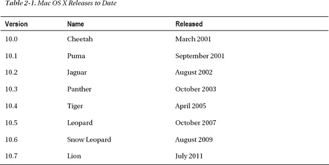
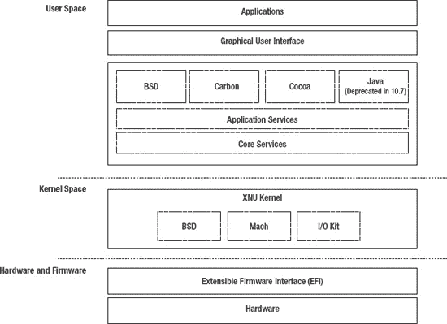
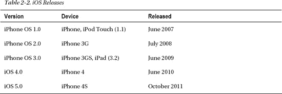
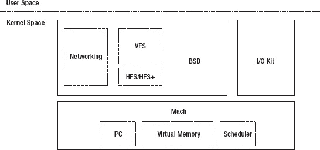
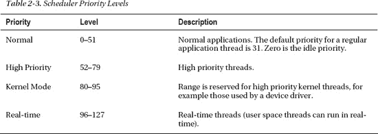
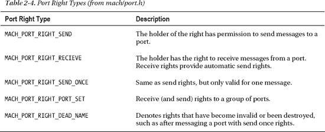
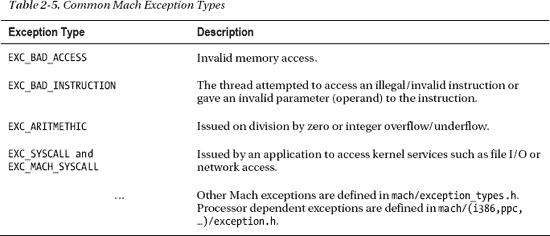

# Mac OS X 与 iOS

Mac OS X 是一款由苹果公司为其 Macintosh 电脑系列开发的基于 Unix 的现代操作系统。OS X 是 Mac OS 的第十代版本。

OS X 以其易用性和视觉吸引力著称的图形用户界面而闻名。苹果公司的产品拥有狂热的追随者，无论是 OS X 还是 iOS 增添的任何新功能都会引起广泛关注。除了标准版 OS X 外，苹果还提供了一款名为 `Mac OS X Server` 的服务器版本。

服务器版后来在 Mac OS X `10.7 (Lion)` 中与标准版合并。OS X 是 Mac OS 9 的继任者，并与早期版本有根本性的不同。与它的前辈们不同，OS X 基于 `NeXTSTEP` 操作系统。目前，Mac OS X 已有八个版本发布，最新版本是代号为 Lion 的 Mac OS X `10.7`。迄今为止发布的 Mac OS X 版本如表 2-1 所示。



Mac OS X 附带了一系列面向开发者的工具，包括 `Xcode`，这使得开发各种应用程序成为可能，其中包含本书的主要主题——内核扩展。

对于最终用户而言，OS X 通常预装了 `iLife` 套件，其中包含用于照片、音频和视频编辑的软件，以及用于编写网页的软件。

## NeXTSTEP

OS X 和 iOS 基于由 NeXT Computer Inc 开发的 `NeXTSTEP` 操作系统。NeXT 公司由史蒂夫·乔布斯于 1985 年离开苹果后创立。该公司最初由乔布斯本人资助，后来获得了大量外部投资。NeXT 后来被苹果收购，`NeXTSTEP` 技术也随之融入 OS X。NeXT 的目标是为学术界和商业界打造一台计算机。尽管与竞争对手相比在商业上取得的成功有限，但 NeXT 计算机（尤其是 NeXTcube）拥有一个极具创新性的操作系统，名为 `NeXTSTEP`，它在很多方面都领先于时代。

`NeXTSTEP` 像当前版本的 OS X 一样，拥有图形用户界面和命令行界面（iOS 不提供用户可访问的命令行界面）。`NeXTSTEP` 引入的许多核心技术至今仍在其后继系统中存在，例如应用程序包和 `Interface Builder`。`Interface Builder` 现在是 `Xcode` 开发环境的一部分，并广泛应用于 OS X 和 iOS 的 Cocoa 应用程序开发。`NeXTSTEP` 提供了 `Driver Kit`，这是一个面向对象的驱动开发框架，后来演变为 `I/O Kit`，这是本书的主要主题之一。

iOS 后来从 OS X 派生而来，是苹果公司面向移动设备的操作系统。它于 2007 年随着第一款 iPhone 的发布而推出，当时被称为 `iPhone OS`，但后来更名为 iOS，以更好地反映其也运行在 iPod Touch、iPad 以及最近的 Apple TV 等其他移动设备上。iOS 是专为具有触摸界面的移动设备构建的。与其最大的竞争对手 Windows 不同，OS X 和 iOS 均未授权给第三方使用，它们只能正式用于苹果的硬件产品。Mac OS X 架构的高级视图如图 2-1 所示。



**图 2-1.** Mac OS X 架构

Mac OS X 和 iOS 的核心符合 POSIX 标准，并且自 Mac OS X `10.5 (Leopard)` 起已符合 Unix 03 认证。OS X 和 iOS 的核心（包括内核和操作系统的 Unix 基础部分）被称为 Darwin，它是苹果公司发布的一个开源操作系统。与 Mac OS X 不同，Darwin 不包含标志性的用户界面，因为它是一个精简系统，仅提供内核以及典型的 Unix 系统用户空间基础工具和服务。在其发布之初，唯一支持的架构是 PowerPC 平台，但作为苹果向 Intel 架构过渡的一部分，随后添加了对 Intel 32 位和 64 位的支持。苹果迄今尚未发布 iOS 所基于的 ARM 版本的 Darwin。Darwin 目前仅以源代码形式提供下载，需要自行编译。Darwin 发行版包含 `XNU` 内核的源代码。对于想要深入了解操作系统内部工作原理以及开发内核扩展的人来说，内核源代码是非常宝贵的资源。你常常能在源代码的头文件或代码本身中找到比苹果开发者网站上记录的更详细的解释。

Darwin 操作系统（因此也包括 OS X 和 iOS）运行着 `XNU` 内核，该内核基于 Mach 内核以及 FreeBSD 操作系统的部分代码。图 2-2 展示了 Mac OS X 的桌面。


**图 2-2.** Mac OS X 桌面

### 编程 API

正如从图 2-1 中所见，OS X 采用分层架构。在 Darwin 核心和用户应用程序之间是一套丰富的编程 API。其中最重要的是 Cocoa，它是基于 GUI 的应用程序的首选框架。iOS 中的对应框架是 Cocoa Touch，两者基本相同，但 Cocoa Touch 提供了专为基于触摸的用户交互而设计的 GUI 元素。Cocoa 和 Cocoa Touch 都是用 Objective-C 语言编写的。Objective-C 是 C 语言的超集，并支持 Smalltalk 风格的消息传递。

#### OBJECTIVE-C

Objective-C 是 Mac OS X、iOS 及其前身 `NeXTSTEP` 下应用程序开发的首选语言。Objective-C 是 C 语言的超集，提供了对面向对象编程的支持，但它缺乏 C++ 等语言提供的许多高级功能，例如多重继承、模板和运算符重载。Objective-C 使用 Smalltalk 风格的消息传递和动态绑定（这在很多方面消除了对多重继承的需求）。该语言由 Brad Cox 和 Tom Love 在 20 世纪 80 年代初发明。尽管驱动或系统级编程通常使用 C 或 C++ 完成，但 Objective-C 仍是 OS X 和 iOS 应用程序开发的事实标准语言。许多核心框架在其类名中仍使用 `NS`（代表 NeXTSTEP）前缀，例如 `NSString` 和 `NSArray`。

其他编程 API 包括 BSD API，它提供了对底层文件和设备访问的应用程序接口，以及 POSIX 线程 API（`pthreads`）。与 Cocoa 不同，BSD 层不提供使用图形用户界面开发应用程序的工具。Mac OS X 还有另一个主要 API，称为 Carbon。Carbon 是一个基于 C 语言的 API，在功能上与 Cocoa 有所重叠。它最初为早期版本的 Mac OS 提供了一些向后兼容性。Carbon API 现已弃用，GUI 应用程序转而使用 Cocoa，但它在 OS X 中仍然存在，用于支持遗留应用程序，例如苹果的 Final Cut Pro 7。Carbon 的公开版本仍然是 32 位版本，因此需要 Cocoa 来实现 64 位兼容性。第四个主要 API 是 Java，现在也已弃用。Java 已在 Mac OS X `10.7` 中从默认安装中移除，但仍然可以作为可选安装提供。

图形和多媒体是 OS X 和 iOS 区别于其他操作系统的关键因素。两者都提供了一套丰富的用于处理图形和多媒体的 API。图形系统的核心是 Quartz 系统。Quartz 包含了窗口系统（Quartz Compositor）以及被称为 Quartz 2D 的 API。Quartz 基于 PDF（便携式文档格式）模型。它提供了分辨率无关的用户界面，以及对文本和图形的抗锯齿渲染。Quartz Extreme 接口提供了硬件辅助的 OpenGL 窗口渲染（在图形硬件支持的情况下）。以下是一些重要的图形和多媒体框架的简短概述。


*   `Quartz`: 由 `Quartz 2D` API 和提供图形窗口服务器的 `Quartz Compositor` 组成。`Cocoa Drawing` 在 `Quartz` 之上提供了一个面向对象的接口，供 Cocoa 应用使用。
*   `OpenGL`: 用于开发 3D 应用的行业标准 API。iOS 支持 `OpenGL` 的一个版本，称为 `OpenGL ES`，这是专为嵌入式设备设计的子集。
*   `Core Animation`: 一个与 Cocoa 集成的基于图层的 API，可轻松创建动画内容并进行变换。
*   `Core Image`: 提供对图像处理的支持，包括添加效果、裁剪或色彩校正。
*   `Core Audio`: 提供对音频播放、录制、混音和处理的支持。
*   `QuickTime`: 一个用于处理多媒体的高级库。它支持音频和视频的播放与录制，包括专业格式。
*   `Core Text`: 一个基于 C 语言的 API，用于文本渲染和排版。`Cocoa Text` API 基于 `Core Text`。

### 支持的平台

OS X 在发布时仅支持 PowerPC 平台。2006 年 1 月，苹果发布了 10.4.4 版本，最终将 Mac OS X 带到了 Intel x86 平台，这一消息在 WWDC 2005 上就已宣布。据苹果称，从 PowerPC 平台迁移的原因是他们对 IBM 交付具有竞争力的微处理器（尤其是为笔记本电脑设计的低功耗处理器）的能力感到失望。对苹果来说，向 Intel 的过渡非常顺利，这实际上是行业内少数成功的平台迁移案例之一。

苹果提供了一个优雅的解决方案，名为 `Rosetta`，这是一个动态翻译器，允许现有的 PowerPC 应用程序在基于 x86 的 Mac 上运行（当然会牺牲一些性能）。苹果还为开发者提供了 `Universal Binaries`，允许单个二进制可执行文件中包含多个架构的原生代码（也称为胖二进制文件）。尽管对 PowerPC 的支持已停止，但从 Mac OS X 10.6 (Snow Leopard) 开始，`Universal Binaries` 仍被用于提供 32 位和 64 位 x86 或 `x86_64` 的可执行文件。

### 64 位操作系统

Mac OS X 10.5 (Leopard) 首次允许 GUI 应用程序成为 64 位原生应用，这是通过一个新的 64 位版本的 Cocoa 实现的，它使开发者能够利用当前一代 Mac 中 64 位 CPU 提供的额外优势。基于 `Carbon` API 的应用程序仍然仅限于 32 位。随后的 Mac OS X 10.6 (Snow Leopard) 更进一步，允许内核以 64 位模式运行。

尽管在 Leopard 中大多数应用程序和 API 已经是 64 位的，但内核本身仍以 32 位模式运行。虽然 Snow Leopard 使得 64 位内核成为可能，但只有部分型号默认使用 64 位，而其他型号需要手动启用。Snow Leopard 是第一个不包含对 PowerPC 计算机支持的版本，尽管 PowerPC 应用程序仍然可以通过 `Rosetta` 运行。对 `Rosetta` 的支持在 Lion 中被移除，同时被移除的还有对 32 位内核的支持。虽然用户空间能够同时支持 64 位和 32 位应用程序，但内核在 64 位模式下运行时与 32 位驱动程序和扩展不兼容。64 位内核提供了许多优势，更大的地址空间意味着可以支持大量内存。

### iOS

iOS，最初称为 iPhone OS 1.0，于 2007 年 6 月发布（iOS 版本请参见表 2-2）。它基于 Mac OS X，并与它的老大哥共享了大部分基本架构。然而，它提供了一个由 Cocoa Touch API（与原始 Cocoa 共享许多特性和部分）提供支持的全新且创新的用户界面，该界面专为 iPhone 的电容式触摸屏设计。除了 Cocoa Touch，iOS 还有许多其他编程 API，例如 `Accelerate` 框架，它提供了针对 iOS 硬件优化的数学及其他相关函数。`External Accessory Framework` 允许 iOS 设备通过蓝牙或内置的 30 针连接器与第三方硬件设备通信。



在发布之初，iPhone OS 无法运行原生的第三方应用程序，但它可以运行针对 iPhone 定制的 Web 应用，这些应用可以添加到 iPhone 的主屏幕。2008 年初，苹果后来宣布了 iPhone 的 SDK，允许开发第三方应用。然而，与大多数计算机平台不同，苹果要求所有 iPhone 应用在用户通过 App Store 安装之前，必须提交并经过预批准，并且因此进行数字签名。尽管许多人（现在仍然）批评这种做法，但它使苹果能够剔除编写糟糕、运行缓慢和恶意的软件，从而改善整体用户体验，并最终提升了该平台的受欢迎程度。非官方地，可以对 iOS 进行“越狱”以访问底层的 Unix 和内核环境，但这会使保修失效。由于对电池寿命的担忧，iPhone 直到 iOS 4.0 发布才真正支持第三方应用程序的多任务处理。iOS 现在支持 iPhone、iPod Touch 和 iPad，并且也运行在最新一代的 Apple TV 上，后者之前基于运行在 Intel x86 CPU 上的 OS X。目前，苹果不支持 Apple TV 上的第三方应用程序。


### XNU 内核

`XNU` 内核庞大而复杂，对其架构的完整描述超出了本书的范围（有其他书籍可满足此需求），但我们将在以下章节中概述构成 `XNU` 的一些主要组件，并简要说明其职责与运作模式。在大多数情况下，为内核编程时，你将编写的是扩展程序，而非修改核心内核本身（除非你恰好是苹果工程师或 Darwin 贡献者）。但了解整个内核的基本架构仍然很有帮助，因为这能让你更好地理解内核扩展在整体框架中的定位。后续章节将侧重于介绍内核提供的一些更重要的编程框架，例如 I/O Kit。

`XNU` 内核是 Mac OS X 和 iOS 的核心。`XNU` 采用分层架构，由三个主要组件构成。内核的最内层被称为 Mach 层，源自卡内基梅隆大学开发的 Mach 3.0 内核。本书中所有提及 Mach 之处，均指在 OS X 和 iOS 中实现的版本，而非原始项目。Mach 最初是作为微内核开发的，是一个仅提供基础服务的薄层，例如处理器管理与调度，以及 IPC（进程间通信）——这是 Mach 内核的核心概念。由于采用分层架构，iOS 与 Mac OS X 版本的 `XNU` 差异极小。

尽管 `XNU` 中 Mach 层的职责与原始项目相同，但其他操作系统服务（如文件系统和网络）则与 Mach 运行在同一内存空间中。苹果将性能作为采用此设计的关键原因，因为在地址空间之间切换（上下文切换）是一项代价高昂的操作。

由于 Mach 层在某种程度上仍然是一个独立的组件，许多人将 `XNU` 称为混合内核，以区别于微内核或宏内核（后者中所有操作系统服务运行在同一上下文中）。图 2-3 展示了 `XNU` 架构的简化示意图。



***图 2-3.** XNU 内核架构*

`XNU` 的第二个主要组件是 BSD 层，可将其视为 Mach 层外围的环。BSD 再次为终端用户应用程序提供编程接口。其职责包括进程管理、文件系统和网络。

最后一个主要组件是 I/O Kit，它为设备驱动程序提供了一个面向对象的框架。

尽管理想情况下每个层应有清晰的职责划分，但现实情况更为复杂，各层之间的界限是模糊的，因为许多操作系统服务和任务跨越了多个组件的边界。

 **提示** 你可以在苹果开源网站下载 `XNU` 的完整源代码：[`www.opensource.apple.com`](http://www.opensource.apple.com)。

### 内核扩展 (KEXT)

`XNU` 内核与大多数（即便不是全部）现代操作系统一样，支持在运行时将代码动态加载到内核地址空间中。这使得在内核运行时可以加载和卸载额外的功能（如驱动程序）。本书的一个主要焦点便是此类内核扩展的开发，尤其侧重于驱动程序，因为这是实现内核扩展最常见的原因。内核扩展主要有两类。第一类是基于 I/O Kit 的内核扩展，用于硬件驱动程序。这些扩展使用 C++ 编写。第二类是通用内核扩展，通常使用 C 编写（虽然 C++ 也可行）。这些扩展可以实现从新网络协议到文件系统的任何功能。通用内核扩展通常与 BSD 或 Mach 层交互。

### Mach

Mach 层可被视为内核的核心，为 BSD 层和 I/O Kit 等更高级别的组件提供底层服务。它负责硬件抽象，隐藏了 PowerPC 架构与 Intel x86 及 x86-64 架构之间的差异。这包括处理陷阱和中断的细节，以及管理内存（包括虚拟内存和分页）。这种设计使得内核能够轻松适配新的硬件架构，苹果从 Intel x86 迁移，而后又为 iOS 采用 ARM 架构便证明了这一点。除了硬件抽象，Mach 还负责线程的调度。它支持对称多处理（SMP），即在多个 CPU 或 CPU 核心之间调度进程的能力。事实上，在已有的 BSD Unix 内核中实现完善的 SMP 支持的难度，正是促使 Mach 开发的关键因素之一。

进程间通信（IPC）是 Mach 设计的核心原则。Mach 中的 IPC 以客户端/服务器系统形式实现。一个任务（客户端）能够请求另一个任务（服务器）的服务。此系统中的端点被称为端口。端口具有相关的权限，该权限决定了客户端是否有权访问特定服务。这种 IPC 机制在 `XNU` 内核内部被广泛使用。以下章节将概述 Mach 层提供的关键抽象和服务。

 **提示**  Mach API 文档可在 `XNU` 源代码包的 `osfmk/man` 目录中找到。

#### 任务与线程

一个任务是由零个或多个共享资源和内存地址空间的可执行线程组成的组。一个任务至少需要一个线程才能被执行。一个 Mach 任务与一个 Unix（BSD 层）进程一一对应。`XNU` 内核本身也是一个任务（称为 `kernel_task`），由多个线程组成。任务资源是私有的，通常不能被其他任务的线程访问。

与任务不同，线程是一个可被 CPU 调度和运行的可执行实体。线程与同一任务中的其他线程共享资源，例如打开的文件或网络套接字。同一任务的线程可以并发地在不同的 CPU 上执行。线程拥有自己的状态，包括处理器状态的副本（寄存器和指令计数器）和自身的栈。当线程被调度到某个 CPU 上运行时，其状态会被恢复。Mach 支持抢占式多任务处理，这意味着线程的执行可以在其分配的时隙（`XNU` 中为 10 毫秒）用完之前被中断。抢占发生在多种情况下，例如当高优先级操作系统事件发生时，当更高优先级的线程需要运行，或当等待长时间 I/O 操作完成时。线程也可以通过进入休眠状态来自愿进行抢占。一个 Mach 线程独立于其他线程进行调度，无论它属于哪个任务。调度器也不了解传统 Unix 系统中进程的父子关系（不过 BSD 层是了解的）。


#### 调度

调度器负责协调线程对 CPU 的访问。包括 XNU 在内的大多数现代内核都采用分时调度器，即每个线程被分配一个有限的（如 XNU 中为 10 毫秒）时间量子，在此时间内线程允许执行。当线程的时间量子耗尽时，它会被强制休眠，以便其他线程能够运行。虽然让每个线程都获得相等的运行时间看似合理公平，但这在实践中并不可行，因为某些线程对低延迟有更高需求，例如执行音频和视频播放。XNU 调度器采用基于优先级的算法来调度线程。表 2-3 展示了调度器使用的优先级等级。



内核将线程组织在双向链表中。这些链表的集合被称为*运行队列*。每个优先级等级（当前为 0–127）对应一个链表。系统中的每个处理器（核心）都维护着自己的运行队列结构（`osfmk/kern/sched.h`）：

```
  struct run_queue {
        int                         highq;                  /* 最高可运行队列 */
        int                         bitmap[NRQBM];          /* 运行队列位图数组 */
        int                         count;                  /* 线程总数 */
        int                         urgency;                /* 抢占紧迫程度 */
        queue_head_t                queues[NRQS];           /* 每个优先级对应一个队列 */
  };
```

普通应用程序线程的初始优先级为 31。随着时间推移，其优先级可能会因调度算法的副作用而降低。例如，当一个线程属于高度计算密集型时，这种情况就会发生。通过降低此类线程的优先级，可以改善 I/O 密集型线程的调度延迟——这些线程大部分时间在发出 I/O 请求之间处于休眠状态，通常会在其时间量子耗尽前再次进入休眠，从而使计算密集型线程能再次获得 CPU 访问权。最终结果是提升了系统的响应性能。

为了避免线程优先级过低而无法运行的情况，Mach 调度器会随时间推移逐渐衰减线程的处理器使用量记录，最终重置该记录，因此线程的优先级会随时间波动。

Mach 调度器支持实时线程，但并不能保证确定的延迟；然而它会尽最大努力确保实时线程能够运行所需的时钟周期数。如果一个实时线程没有足够频繁地阻塞/休眠（例如属于高度计算密集型），它可能会被降级为普通优先级。

#### Mach IPC：端口与消息

端口是一个单向通信端点，代表一种称为"对象"的资源。如果你熟悉 TCP/IP 网络，会发现 Mach 的 IPC 与 UDP 协议有很多相似之处，但与 UDP 协议不同的是，Mach IPC 不仅能用于数据传输。它还可以用于提供同步机制，或在任务之间发送通知。一个 IPC 客户端可以向端口发送消息，而端口的拥有者则接收这些消息。要实现双向通信，需要两个端口。端口在实现上表现为一个消息队列（尽管也存在其他机制）。发往该端口的消息会排队，直到有线程可用以处理它们。一个端口可以接收来自多个发送者的消息，但每个端口只能有一个接收者。

端口具有称为端口权限的保护机制。一个任务必须拥有适当的权限才能与端口交互。端口权限与任务相关联；因此，同一任务中的所有线程对该端口享有相同的权限。端口权限的示例如下：发送权限、单次发送权限和接收权限。这些权限可以在任务间复制或转移。与 Unix 权限不同，端口权限不会从父进程继承给子进程（Mach 任务没有继承概念）。表 2-4 展示了可用的端口权限类型。



一组端口的集合被称为端口集。端口集中的所有端口共享同一个消息队列。系统中使用 32 位整型数来寻址端口。端口没有全局注册表或命名空间。

Mach IPC 系统同样可用于用户空间程序，并可在任务之间或从任务到内核之间传递消息。它提供了一种系统调用的替代方案，尽管其底层机制仍然使用了系统调用。


### Mach 异常

异常是 CPU 在线程执行期间发生某些（特殊的）事件或条件时发送的中断。异常会导致线程执行中断，同时操作系统（Mach）处理该异常。根据发生的异常类型，任务之后可能会恢复执行。常见的异常原因包括访问无效或不存在的内存、执行无效的处理器指令、传递无效参数或除零。这些异常通常会导致违规任务终止，但也会发生一些非错误的异常。

系统调用就是这样一种异常。当用户空间应用程序需要执行涉及内核的低级操作时，例如写入文件或通过网络套接字接收数据，它可能会发出系统调用异常。当操作系统处理系统调用时，它会检查一个寄存器以获取系统调用号，然后使用该号码查找该调用的处理程序，例如 `read()` 或 `recv()`。如果任务试图访问已分页出去的内存，也可能会产生异常。在这种情况下，会生成一个缺页异常，该异常将通过从后备存储中检索缺失的页面来处理，或者导致无效的内存访问。任务也可能使用 `EXC_BREAKPOINT` 异常发出故意的异常，这些异常通常用于调试或跟踪应用程序，例如 Xcode，以暂时挂起线程的执行。

当然，内核本身也可能出现错误行为并导致异常。在这种情况下，操作系统将被挂起，并显示*灰屏死机*（除非内核调试器被激活），通知用户重启计算机。表 2-5 显示了已定义的 Mach 异常的子集。



当异常发生时，内核将挂起导致异常的线程，并向该线程的异常端口发送一条 IPC 消息。如果线程没有处理该异常，它会被转发到其所属任务的异常端口，最后转发到系统（主机）异常端口。以下结构封装了线程、任务或处理器（主机）的异常端口：

```
struct exception_action {
        struct ipc_port*               port;               /* 异常端口 */
        thread_state_flavor_t          flavor;             /* 要发送的状态风格 */
        exception_behavior_t           behavior;           /* 要引发的异常类型 */
        boolean_t                      privileged;         /* 是否在 ipc_task_reset 后存活 */
};
```

每个线程、任务和主机都有一个 `exception_action` 结构数组，该结构指定了异常行为，为每种异常类型（如表 2-5 所定义）定义了一个结构。`flavor` 和 `behavior` 字段指定了应与异常消息一同发送的信息类型，例如通用寄存器或其他专用 CPU 寄存器的状态，以及应执行的处理程序。处理程序将是 `catch_mach_exception_raise()`、`catch_mach_exception_raise_state()` 或 `catch_mach_exception_raise_state_identity()`。当异常被分派后，内核会等待回复以决定后续操作。返回 `KERN_SUCCESS` 表示异常已处理，并允许该线程恢复执行。

线程的异常端口默认为 `PORT_NULL`，除非显式分配了一个端口，否则异常将由任务的异常端口处理。当进程发出 `fork()` 系统调用以生成子进程时，子进程将从父任务继承异常端口。Unix 信号机制是在 Mach 的异常系统之上实现的。

### 时间管理

准确计时是任何操作系统的重要职责，不仅是为了服务用户应用程序，也是为了服务其他重要的内核功能，例如调度进程。在 Mach 中，时间管理的抽象概念被称为时钟。Mach 中的时钟对象将时间表示为纳秒级的单调递增的值。定义了三个主要的时钟：实时时钟、日历时钟和高分辨率时钟。实时时钟记录自上次启动以来的时间，而日历时钟通常由电池供电，因此其值在系统重启或计算机关机期间保持不变。它的分辨率是秒，顾名思义，它用于跟踪当前时间。Mach 时间 KPI 由三个函数组成：

```
void clock_get_uptime(uint64_t* result);
void clock_get_system_nanotime(uint32_t* secs, uint32_t* nanosecs);
void clock_get_calendar_nanotime(uint32_t* secs, uint32_t* nanosecs);
```

日历时钟通常仅由应用程序使用，因为内核本身很少需要关注当前时间或日期，事实上，这样做被认为是糟糕的设计。内核使用实时时钟提供的相对时间。实时时钟的时间通常来自计算机主板上的一个包含振荡晶体的电路。实时时钟电路（RTC）是可编程的，并连接到 CPU（每个 CPU/核心）的中断引脚。RTC 在 XNU 中被编程为 100 Hz 的截止时间（使用 `clock_set_timer_deadline()`）。

