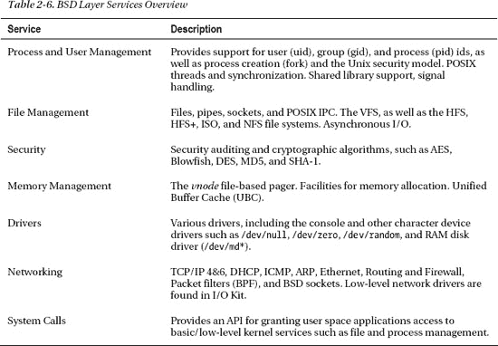

# 内存管理

Mach 层负责以机器无关的方式协调物理内存的使用，为更高级别的组件提供一致的接口。Mach 的虚拟内存子系统，即 Mach VM，为应用程序和内核本身提供受保护的内存以及分配、共享和映射内存的功能。扎实理解内存管理对于成为一个成功的内核程序员至关重要。


#### 任务地址空间

每个 Mach 任务都有其自身的虚拟地址（VM）空间。对于 32 位任务，地址空间为 4 GB；而对于 64 位任务，地址空间则大得多，具有 51 位（约 2 PB）的可用地址空间。视频编辑或特效软件等专业应用经常超出 32 位地址空间的限制。对 64 位虚拟地址空间的支持在 OS X 10.4 中可用。

> **注：** 尽管 32 位应用受限于 4 GB 地址空间，但这与系统中可用的物理内存量无关。OS X 支持物理地址扩展（PAE）等技术，允许 32 位 x86 处理器（或以 32 位模式运行的 64 位处理器）寻址多达 36 位（64 GB）的物理内存；然而，任务地址空间仍被限制在 4 GB。

任务的地址空间是受保护内存概念的基础。除非通过共享内存或其他机制明确允许，否则任务不得访问另一个任务的地址空间及其包含数据的底层物理内存。

#### 内核地址空间管理

内核自身拥有其任务，即 `kernel_task`，该任务具有独立的地址空间。我们以 iOS 这样的 32 位操作系统为例。某些基于 Unix 的操作系统（包括 Linux）采用一种设计，将内核地址空间映射到每个任务的地址空间。内核有 1 GB 的可用地址空间，而任务有 3 GB 可用空间。当任务上下文切换到内核空间时，MMU（内存管理单元）可以避免使用新地址空间重新配置 TLB（转换检测缓冲区），因为内核已位于已知位置，从而加速了原本开销高昂的上下文切换。当然，其缺点在于内核可用的地址空间有限，并且任务仅有 3 GB 可用。在 XNU 中，内核运行在其自身的虚拟地址空间中，不与用户任务共享，这为内核留下了 4 GB 空间，为用户任务留下了 4 GB 空间。

#### VM 映射与条目

虚拟内存（VM）映射是任务地址空间的实际表示。每个任务都有其自身的 VM 映射。该映射由 `vm_map` 结构表示。线程没有关联的映射，因为它们共享其所属任务的 VM 映射。

VM 映射表示映射到进程地址空间中的内存区域的双向链表。每个区域是一段虚拟连续的地址范围（不一定由连续的物理内存支持），由起始地址和结束地址以及其他元数据（例如保护标志，可以是读取、写入和执行权限的任意组合）描述。这些区域由 `vm_map_entry` 结构表示。当在现有条目之前或之后分配更多内存时，VM 映射条目可能与相邻条目合并，或者拆分为更小的区域。如果修改了条目所描述地址范围的保护标志，则会发生拆分，因为保护标志只能在 VM 映射条目上设置。图 2-4 展示了一个包含两个 VM 映射条目的 VM 映射。

**图 2-4.** VM 子系统结构之间的关系

> **提示：** 与任务地址空间相关的结构定义在 XNU 源代码包中的 `mach/vm_map.h` 和 `mach/vm_region.h` 文件中。

#### 物理映射

每个 VM 映射都有一个关联的物理映射，即 `pmap` 结构。该结构有助于保存任务正在使用的虚拟到物理内存映射的信息。Mach VM 中处理物理映射的部分是与机器相关的，因为它与 MMU（内存管理单元）交互，MMU 是系统中负责地址转换的专用硬件组件。

#### VM 对象

VM 映射条目可以指向 VM 对象或 VM 子映射。子映射是其他（VM 映射）映射的容器。子映射用于在地址空间之间共享内存。VM 对象是对位置的表示，或者更确切地说是对所描述内存如何访问的表示。对象底层的物理内存页可能不在物理内存中，但可能位于外部后备存储（OS X 中的硬盘驱动器）上。在这种情况下，VM 对象将包含如何*换入*外部页面的信息。与后备存储之间的传输由接下来讨论的*分页器*处理。

VM 对象以页面为单位描述内存。XNU 中的一个页面当前为 4096 字节。虚拟页面由 `vm_page` 结构描述。一个 VM 对象可以包含多个页面，但一个页面仅与一个 VM 对象相关联。

### 页面

页面是虚拟内存系统的最小单元。在 Mac OS X 和 iOS 以及许多其他操作系统中，页面的大小为 4096 字节（4 KB）。页面大小由处理器决定，因为处理器（更确切地说是其 MMU）负责虚拟到物理的映射并管理 VM 页表缓存（也称为 TLB）。许多架构的页面大小可以由操作系统设置，并且对于 x86 等架构，可以高达 4 MB，甚至混合使用多种页面大小。操作系统维护一个称为页表的数据结构，其中包含物理内存中每个页面大小的块的 `struct vm_page`。该结构包含元数据，例如该页面是否正在使用中。

当任务之间需要共享内存时，VM 映射条目将通过子映射指向外部地址空间，而不是 VM 对象。这通常发生在使用共享库时。共享库被映射到任务的地址空间。

让我们考虑另一个示例。当 Unix 进程发出 `fork()` 系统调用来创建子进程时，将创建一个新进程作为父进程的副本。为了避免必须将内存从父进程复制到子进程，采用了一种称为写时复制（COW）的优化技术。对子进程内存的读取访问将简单地引用与父进程相同的页面。如果子进程修改其内存，则描述该内存的页面将被复制，并创建一个影子 VM 对象。在下一次对该内存区域的读取时，会进行检查以查看影子对象是否已拥有该页面的副本，如果没有，则引用原始的共享页面。仅当父进程中原始 VM 映射条目的继承属性设置为*复制*时，才会发生上述行为。其他可能的值包括*共享*，在这种情况下，子进程将继续对原始内存位置进行读取和写入操作。如果设置为*无*，则映射条目引用的内存页面将不会映射到子进程的地址空间中。第四个可能的值是*复制并删除*，此时内存将被复制到子进程并从父进程中删除。

> **注：** Mach IPC 也使用写时复制来优化任务间的数据传输。


### 检查任务的地址空间

`vmmap` 命令行工具允许你检查进程的虚拟内存映射及其 VM 映射条目。它能清晰地展示内存区域如何映射到任务的 VM 地址空间中。`vmmap` 命令以一个进程标识符（PID）作为参数。以下展示了针对一个简单的 Hello World C 应用（`a.out`，该应用会打印一条消息然后进入休眠）的 PID 执行 `vmmap` 后的输出：

---

`====` **`进程 46874 的不可写区域`**
`__PAGEZERO           00000000-00001000   [     4K] ---/--- SM=NUL  /Users/ole/a.out`
`__TEXT               00001000-00002000   [     4K] r-x/rwx SM=COW  /Users/ole/a.out`
`__LINKEDIT           00003000-00004000   [     4K] r--/rwx SM=COW  /Users/ole/a.out`
`MALLOC guard page    00004000-00005000   [     4K] ---/rwx SM=NUL`
`MALLOC metadata     00021000-00022000    [     4K] r--/rwx SM=PRV`
`__TEXT               8fe00000-8fe42000   [   264K] r-x/rwx SM=COW  /usr/lib/dyld`
`__LINKEDIT          8fe70000-8fe84000    [    80K] r--/rwx SM=COW  /usr/lib/dyld`
`__TEXT              9703b000-971e3000    [  1696K] r-x/r-x SM=COW  /usr/lib/libSystem.B.dylib`
`STACK GUARD         bc000000-bf800000    [  56.0M] ---/rwx SM=NUL  stack guard for thread 0`
**`==== 进程 46874 的可写区域`**
`__DATA              00002000-00003000    [     4K] rw-/rwx SM=PRV  /Users/ole/a.out`
`MALLOC metadata     00015000-00020000    [    44K] rw-/rwx SM=PRV`
`   MALLOC_TINY         00100000-00200000 [  1024K] rw-/rwx SM=PRV  DefaultMallocZone_0x5000`
`MALLOC_SMALL        00800000-01000000    [  8192K] rw-/rwx SM=PRV  DefaultMallocZone_0x5000`
`__DATA              8fe42000-8fe6f000    [   180K] rw-/rwx SM=PRV  /usr/lib/dyld`
`__IMPORT            8fe6f000-8fe70000    [     4K] rwx/rwx SM=COW  /usr/lib/dyld`
`shared pmap         a0800000-a093a000    [  1256K] rw-/rwx SM=COW`
`__DATA              a093a000-a0952000    [    96K] rw-/rwx SM=COW  /usr/lib/libSystem.B.dylib`
`shared pmap         a0952000-a0a00000    [   696K] rw-/rwx SM=COW`
`Stack               bf800000-bffff000    [  8188K] rw-/rwx SM=ZER  thread 0`
`Stack               bffff000-c0000000    [     4K] rw-/rwx SM=COW  thread 0`

---

为了可读性，结果已被精简。输出分为不可写区域和可写区域。如你所见，前者包括零页映射，它是只读的，如果应用程序尝试写入内存地址 0-4096（十进制 4096 = 十六进制 `0x1000`），就会产生异常。这就是为什么当你试图解引用空指针时，应用程序会崩溃。下一个映射条目是应用程序的代码段，其中包含应用程序的可执行代码。你会看到代码段的共享模式（SM）被标记为 COW，这意味着如果此进程产生一个子进程，它将从父进程继承此映射，从而避免复制，直到该段中的页面被修改。

除了 `a.out` 程序本身的代码段之外，你还会看到 `libSystem.B.dylib` 的映射。在 Mac OS X 和 iOS 上，`libSystem` 实现了标准 C 库、POSIX 线程 API 以及其他系统 API。`a.out` 进程从它的父进程 `/sbin/launchd`（所有用户空间进程的父进程）继承了 `libSystem` 的映射。这确保了该库只被加载一次，从而节省内存并提高应用程序的启动速度，因为从辅助存储器（如硬盘）获取库通常很慢。

在可写区域中，你可以看到 `a.out` 和 `libSystem` 的数据段。这些段包含由程序/库定义的变量。显然，这些变量可以被修改，因此每个进程都需要共享库数据段的一个副本，但它是 COW 的，所以直到进程对映射进行修改时，才产生开销。

**提示** 如果你想检查系统进程（如 `launchd`）的虚拟内存映射，你需要使用 `sudo` 运行 `vmmap`，因为默认情况下，你的用户只能检查自己的进程。

### 分页器

虚拟内存允许进程拥有比可用物理内存更大的虚拟地址空间，并且系统上运行的任务可以组合起来，消耗超过可用内存量的内存。实现这一点的机制被称为*分页器*。分页器控制内存页在系统内存（RAM）和辅助后备存储（通常是硬盘）之间传输。当一个内存需求高的任务需要运行时，*分页器*可以暂时将属于非活动任务的内存页传输（换出）到后备存储，从而释放足够的内存，使高需求任务得以执行。类似地，如果发现某个进程大部分时间处于空闲状态，系统可以选择换出该任务的内存，以释放内存供当前或未来的任务使用。当应用程序运行时，如果它试图访问已被换出的内存，就会发生一种称为缺页异常的异常，这也是当任务试图访问无效内存地址时发生的异常。当缺页异常发生时，内核将尝试传输回（换入）与内存地址对应的页，如果该页无法被传输回，则将被视为无效的内存访问，并且该任务将被中止。XNU 内核支持三种不同的分页器：

*   **默认分页器：**执行传统分页，在主内存和系统硬盘上的交换文件（`/var/vm/swapfile*`）之间传输数据。
*   **Vnode 分页器：**与文件系统使用的统一缓冲区缓存（UBC）结合，用于在内存中缓存文件。
*   **设备分页器：**用于管理硬件设备的内存映射，例如将寄存器映射到内存中的 PCI 设备。映射内存通常被 I/O Kit 驱动程序使用，并且 I/O Kit 提供了用于处理此类内存的抽象层。

对于更上层的部分（如 VM 对象）来说，使用哪个分页器或多或少是透明的。每个 VM 对象都有一个关联的*内存对象*，它（通过端口）提供了与当前分页器的接口。

### Mach 中的内存分配

Mach 中一些基本的内存分配例程如下：

```
kern_return_t kmem_alloc(vm_map_t map, vm_offset_t *addrp, vm_size_t  size);
kern_return_t kmem_alloc_contig(vm_map_t map, vm_offset_t *addrp,
                                vm_size_t size, vm_offset_t mask, int flags);
void kmem_free(vm_map_t map, vm_offset_t addr, vm_size_t size);
```

`kmem_alloc()` 提供了在 Mach 中获取内存的主要接口。为了分配内存，你必须提供一个 VM 映射。对于内核中的大多数工作，`kernel_map` 被定义并指向 `kernel_task` 的 VM 映射。第二种变体 `kmem_alloc_contig()` 尝试分配物理上连续的内存，而前者则分配虚拟上连续的内存。Apple 不建议进行这种分配，因为搜索空闲连续块会产生显著的性能开销。Mach 还提供了 `kmem_alloc_aligned()` 函数，该函数分配对齐到 2 的幂的内存，以及其他一些不太常用的变体。`kmem_free()` 函数用于释放已分配的内存。你必须注意传入与分配时相同的 VM 映射，以及原始分配的大小。


### BSD 层

与仅提供少量基础服务的 Mach 不同，BSD 层位于 Mach 和用户应用程序之间，基于 Mach 提供的服务实现了许多核心操作系统功能。在 OS X 和 iOS 中，BSD 层运行在处理器特权模式下，而不是像 Mach 项目最初设想的那样作为用户任务运行。因此，该层没有内存保护，并且与 Mach 和 I/O Kit 运行在相同的地址空间中。BSD 层指的是派生自 FreeBSD 5 操作系统的那部分内核，它本身不是一个完整的系统，而是源自该操作系统的一部分代码。

BSD 层提供服务，例如进程管理、系统调用、文件系统和网络。表 2-6 简要概述了 BSD 层提供的服务。



BSD 层在 Mach 提供的服务之上提供了抽象。例如，其进程管理和内存管理是在 Mach 服务之上实现的。

#### 系统调用

当应用程序需要文件系统的服务，或者希望访问网络时，它需要向内核发出系统调用。BSD 层实现了所有系统调用。当系统调用处理程序执行时，内核上下文会从用户模式切换到内核模式，以处理应用程序的请求，例如读取文件。此 API 被称为 `syscall` API，是从用户空间调用内核中函数的传统 Unix API。系统调用有数百个，包括与进程控制相关的调用，例如 `fork()` 和 `execve()`，或者文件管理调用，例如 `open()`、`close()`、`read()` 和 `write()`。

BSD 层还提供了 `ioctl()` 函数（它本身就是一个系统调用），该函数是 I/O 控制的缩写，通常用于向设备驱动程序发送命令。提供 `sysctl()` 函数用于设置或获取各种内核参数，包括但不限于调度器、内存和网络子系统。

 **提示** 可用的系统调用定义在 `/usr/include/sys/syscall.h` 中。

Mach 陷阱是类似于系统调用的机制，用于跨越内核/用户空间边界。与为应用程序提供直接服务的系统调用不同，Mach 陷阱用于将 IPC 消息从用户空间客户端传送到内核服务器。

