# 网络

网络是 XNU 中 BSD 部分的一个主要子系统。BSD 处理网络的大部分方面，例如套接字通信的细节和 TCP/IP 等协议的实现，但与实际硬件设备的低级通信除外，这通常由 I/O Kit 驱动程序处理。I/O Kit 网络驱动程序将负责处理从网络设备接收的缓冲区、检查它们并确保它们最终到达发起方（例如您的 Web 浏览器）的网络堆栈接口。类似地，BSD 网络堆栈将接受来自应用程序的出站数据，将数据格式化为数据包，然后路由或分派到适当的网络接口。BSD 还实现了 IPFW 防火墙，它将根据系统管理员设置的策略过滤进出计算机的数据包。

BSD 网络层支持广泛的网络和传输层协议，包括 IPv4 和 IPv6、TCP 和 UDP。在更高层次上，我们发现了对 BOOTP、DHCP 和 ICMP 等的支持。其他与网络相关的功能包括路由、桥接和网络地址转换（NAT），以及使用伯克利包过滤器（BPF）的设备级包过滤。

**网络内核扩展 (NKE)**

网络内核扩展 KPI（内核编程接口）是一种允许扩展网络堆栈各个部分的机制。NKE 允许定义新协议，并在网络堆栈的各个级别插入钩子或过滤器。例如，可以创建一个过滤器，拦截特定应用程序或用户对某个地址的 TCP 连接。也可以临时阻止网络数据包，或者在将其传输到更高/更低层级之前修改它们。NKE 源自 Apple，不是传统 BSD 网络堆栈的一部分，但由于其性质，现在它们已与之紧密相连。NKE 将在第 13 章中讨论。

#### 文件系统

内核内置支持一系列不同的文件系统，如表 2-7 所示。Mac OS X 和 iOS 使用的主要文件系统是 HFS+。它是作为 Mac OS 文件系统 HFS 的替代品而开发的。

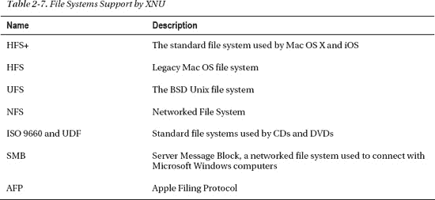

HFS+ 在 Mac OS X 10.2.2 中获得了对日志的支持。日志通过在执行事务之前将事务记录在*日志*中来提高文件系统的可靠性。这使得文件系统能够抵御诸如断电或内核崩溃等事件，因为可以在重启后重放数据，从而使文件系统恢复到一致状态。

HFS+ 支持非常大的文件，最大可达 8 EiB（1 Exbibyte = 2⁶⁰ 字节），这也是最大的可能卷大小。该文件系统完全支持文件名中的 Unicode 字符，并且默认不区分大小写。同时支持 Unix 风格的文件权限和访问控制列表（ACL）。

#### 虚拟文件系统

虚拟文件系统（VFS）提供了对特定文件系统（如 HFS+ 和 AFP）的抽象，使应用程序能够使用单一一致的接口访问它们。VFS 允许通过 VFS 内核编程接口（KPI）轻松地将新文件系统作为内核扩展添加支持，而整个操作系统无需了解其实现的任何信息。VFS 的基本数据结构是 `vnode`。`vnode` 是文件和目录在内核中的表示方式。内核中每个活跃的文件都存在一个 `vnode` 结构。


#### 统一缓冲区缓存

统一缓冲区缓存（UBC）是一种文件缓存。当文件被写入或读取时，它会从后备存储（如硬盘）加载到物理内存中。UBC 与虚拟内存子系统紧密相连，同时也缓存 VM 对象。用于缓存 `vnode` 的结构体如列表 2-1 所示。

**列表 2-1.** `ubc_info` 结构体

```
struct ubc_info {
      memory_object_t             ui_pager;       /* 分页器 */
      memory_object_control_t     ui_control;     /* 分页器的 VM 控制 */
      uint32_t                    ui_flags;       /* 标志 */
      vnode_t                     ui_vnode;       /* 此 ubc_info 的 vnode */
      kauth_cred_t                ui_ucred;       /* 保存 NFS 分页的凭据 */
      off_t                       ui_size;        /* 该 vnode 的文件大小 */

      struct  cl_readahead*       cl_rahead;      /* 集群预读上下文 */
      struct  cl_writebehind*     cl_wbehind;     /* 集群回写上下文 */

      struct  cs_blob*            cs_blobs;       /* 用于代码签名 */
};
```

在引入 UBC 之前，系统拥有两个缓存：页面缓存和缓冲区缓存。缓冲区缓存通过设备号和块号进行索引，用于寻址物理设备上的数据块，而页面缓存则负责内存映射的缓存。

UBC 的大小会根据系统需求动态地增长或缩小。如果缓存中的文件被修改，它会被标记为脏页，以指示缓存副本与磁盘上的原始文件不同。脏页条目会被定期刷新到磁盘。用户空间程序可以通过使用 `fcntl` 系统调用的 `F_NOCACHE` 选项绕过 UBC，直接访问磁盘，这可能会提升那些无法从此类缓存中受益的工作负载（例如不太可能被重复使用的大数据集）的 I/O 性能。

## I/O Kit

构成 XNU 的最后一个主要组件是 I/O Kit，它是一个用于编写设备驱动和其他内核扩展的面向对象框架。它提供了系统硬件的抽象，并为多种硬件类型预定义了基类，使得实现新驱动程序变得简单，因为它可以从基类驱动中继承大部分功能，从而实现高度的代码复用。I/O Kit 框架包含内核级框架以及一个名为 `IOKit.framework` 的用户空间框架。内核框架使用嵌入式 C++（C++ 的一个子集）编写，而用户空间框架则基于 C 语言。

I/O Kit 维护着一个称为 I/O 目录（I/O Catalog）的数据库。I/O 目录是所有可用 I/O Kit 类的注册表。另一个数据库，I/O 注册表（I/O Registry），则追踪 I/O 目录中类的对象实例。I/O 注册表中的对象通常代表设备、驱动程序或支持类，并以分层结构组织，这种结构模仿了硬件设备之间物理连接的方式。例如，一个 USB 设备是其连接的 USB 控制器的子节点。`ioreg` 命令行工具允许你检查 I/O 注册表。

I/O Kit 基于三个主要概念：

*   系列（Families）
*   驱动（Drivers）
*   枢纽（Nubs）

系列代表了特定类型设备的通用抽象。例如，`IOUSBFamily` 处理了实现 USB 相关设备支持所需的许多技术细节。驱动程序负责管理特定的设备或总线。一个驱动程序可能与多个系列有关联。对于一个基于 USB 的存储设备，它可能依赖于 `IOUSBFamily` 和 `IOStorageFamily`。枢纽是可控制实体（如 PCI 或 USB 设备）的接口，更高级别的驱动程序可以使用它与设备进行通信。

作为一名内核程序员，你可能会将大部分时间花在使用 I/O Kit 上，因此本书将用很大篇幅介绍它，并在第 4 章中提供 I/O Kit 的完整描述。

## Libkern 库

与提供系统交互 API 的 Mach 和 BSD 不同，libkern 库为内核的其余部分（特别是 I/O Kit）提供支持性的例程和类。也就是说，它提供了对内核本身以及扩展有用的构建块和工具。受限的 C++ 运行时是在 libkern 中实现的，它提供了诸如 `new` 和 `delete` 运算符等服务的实现。

除了标准的 C++ 运行时，libkern 还提供了许多有用的类，其中最基础的是 `OSObject`，它是 I/O Kit 中所有类的超类。它提供了对引用计数的支持，其工作方式在概念上与 Cocoa 或用户空间中的 Cocoa Touch 中的 `NSObject` 相同。其他值得关注的类包括 `OSDictionary`、`OSArray`、`OSString` 和 `OSInteger`。这些类以及其他类也用于从内核扩展的 `Info.plist` 中提供值的字典。

libkern 库并非只关注核心 C++ 类和运行时，它还提供了通常在标准 C 库中出现的许多函数的实现。例如 `printf()` 和 `scanf()` 函数，以及其他如 `strtol()` 和 `strsep()` 等函数。libkern 提供的其他函数包括加密哈希算法（MD5 和 SHA-1）、UUID 生成以及 zlib 压缩库。该库还包含了 `kxld`，这是用于管理动态加载的内核扩展的库。

最后但同样重要的是，我们还能找到诸如 `OSMalloc()` 等用于分配内存以及实现锁定机制和同步原语的函数。

 **注意** libkern 的源代码位于 XNU 源代码分发中的 `libkern/` 和 `bsd/libkern/` 目录下。

## 平台专家

平台专家包含系统的抽象层。其中部分代码作为公共 XNU 源代码分发的一部分提供，但其余部分则在 `com.apple.driver.AppleACPIPlatform` 内核扩展中实现，该扩展的源代码不可用。平台专家处理系统总线的设备枚举和检测。它可以被视为主板的驱动程序。平台专家负责系统启动后 I/O Kit 设备树（称为 I/O 注册表）的初始构建。平台专家本身将形成该树的根节点 `IOPlatformExpertDevice`。


### 摘要

在本章中，我们：

*   概述了 Mac OS X 和 iOS 操作系统。我们讨论了它们的一般背景和起源，特别关注了内核，这是本书的主要主题。
*   审视了 XNU 内核，即 OS X 和 iOS 共用的内核。
*   讨论了 XNU 内核的分层架构，它由三个主要组件构成：**Mach**、**BSD** 和 **I/O Kit**。Mach 层可视为最内层，最接近硬件，为内核的其他部分提供服务。Mach 层提供的服务包括硬件抽象、虚拟内存和任务调度。
*   讨论了 Mach 调度器的运作方式，以及任务与线程之间的区别。任务可被视为线程的容器，这些线程共享共同的地址空间以及其他资源，例如打开的文件。
*   讨论了 Mach IPC，这是内核及其包含的各个层之间进行通信的机制。此外，我们还分解了在 Mach 中提供虚拟内存所涉及的各个组件，即：**VM 映射**、**VM 映射条目**和 **VM 对象**。
*   讨论了分页程序（pager）的作用和运作方式。
*   讨论了 BSD 层，它源自 FreeBSD 操作系统，运行在 Mach 核心之上，但位于相同的内核地址空间内。它提供了应用程序用于与内核通信的接口，其中最重要的是系统调用。BSD 层实现了网络协议栈，包括 TCP/IP 和其他协议。它还支持文件系统，例如在虚拟文件系统层（VFS，即文件系统的统一接口）之上实现的 HFS+。
*   讨论了 I/O Kit，这是一个基于 C++ 的内核框架，用于编写设备驱动程序和其他扩展。`libkern` 库提供了许多实用函数和构建块，包括构成 I/O Kit 基础的类集合，例如 `OSObject`。

## 第 3 章

## Xcode 与内核开发环境

Apple 在关怀开发者方面有着良好记录，为他们提供了用于 Mac 和 iOS 平台开发的直观、用户友好的工具和 API。任何为 Mac 或 iPhone 编写过应用软件的人都会熟悉面向对象的 Cocoa 框架，它提供了丰富的接口来支持图形用户界面和用户应用所需的其他服务。同样，内核开发者也可以使用专为辅助内核扩展任务而设计的 API。对于驱动程序开发，Apple 提供了 I/O Kit，这是一个用于与硬件交互的面向对象框架。本章将讨论你入门内核开发所需的工具和框架，并包含一个构建和安装简单内核扩展的教程。

### 首选语言：C++

几十年来，C 语言一直是*事实上的*系统级语言。实际上，C 语言最初就是作为编写不可移植汇编代码的替代方案而开发的，专门用于最初的 Unix 系统。XNU 内核和许多 Mac OS X 核心服务都是用 C 语言编写的，而用于驱动程序开发的 I/O Kit 框架则是用 C++ 语言的一个子集编写的。Apple 选择 C++ 用于 I/O Kit，是因为它是一种面向对象的语言，因此允许使用一种抽象物理硬件连接的驱动程序模型。Apple 也曾考虑过使用基于 Objective-C 的框架来开发驱动程序，但最终确定了 C++。尽管 C++ 在应用软件开发中广泛使用，但 Mac OS X 仍然是少数几个允许并实际上鼓励在其内核中运行 C++ 代码的操作系统之一。然而，这并不意味着 Mac OS X 内核能够免疫那些使 C++ 代码在其他内核中产生问题的相同弊端。为了避免其中一些问题，Mac OS X 内核代码必须使用 C++ 提供的一个受限功能子集，称为**嵌入式 C++**。以下功能不可用：

*   异常处理
*   多继承
*   模板
*   运行时类型信息

值得注意的是，由于嵌入式 C++ 是标准 C++ 语言的一个子集，任何为嵌入式 C++ 编写的代码都与常规的 C++ 编译器兼容。

虽然从技术上讲，可以将这些语言特性包含在内核中，但 Apple 决定禁用它它们，因为它们会显著增加编译后代码的大小，从而增加内核的内存占用。禁用对异常的支持不仅是因为额外的代码大小，还因为未能捕获异常会导致内核恐慌。

尽管标准的运行时类型信息被禁用，但 I/O Kit 确实提供了自己的有限实现，这将在下一章讨论。内核开发者还可以使用 C++ 运行时库的有限实现，并且由于语言对模板的支持被禁用，STL 类也无法使用。

作为一般规则，在编写基于 I/O Kit 框架的内核扩展时使用 C++，而其他所有内容（包括文件系统和底层网络代码的实现）则使用 C 语言。

### Xcode

要开始开发内核扩展，你需要安装 Apple 的开发工具，即 Xcode。这些工具可以从 Mac App Store 获取。安装 Xcode 包后，会在硬盘根级别添加一个名为“Developer”的目录，其中包含了 Mac OS X 和 iOS 开发所需的一切，包括：

*   一个集成开发环境（Xcode 应用程序）
*   用于 C、C++ 和 Objective-C 的编译器
*   一个源代码调试器
*   用于内核和应用开发的 API 和头文件
*   用于衡量代码执行时间并识别性能瓶颈的分析工具
*   用于检查连接到系统的硬件设备以及为每个设备加载的驱动程序的实用工具

在这些工具中，Xcode 应用程序将是你编写内核扩展时花费大部分时间的地方，因为它提供了源代码编辑器和编译器的前端。图 3-1 展示了 Xcode 4 的用户界面。

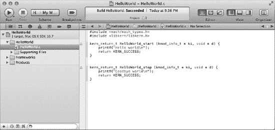

**图 3-1.** *Xcode 4 用户界面*

在底层，Xcode 是命令行编译器和调试器的前端。事实上，完全可以绕过 Xcode，直接在命令行上调用 GCC 来构建你的内核扩展。然而，正如我们将在下一节中看到的，Xcode 提供了项目模板，这些模板会传递用于构建内核扩展的适当编译器标志。

以前版本的 Xcode 使用 GCC 编译器；然而，从 Xcode 4 开始，一个基于 LLVM 的替代性现代编译器被提供为默认编译器。LLVM 编译器是由 Apple 领导的开源项目，支持 Objective-C、C 和 C++。LLVM 的目标是提供比 GCC 更快的编译时间，并通过提供更清晰易读的警告和错误信息，以及允许由编译器自身执行的语义分析来驱动语法高亮和代码补全，从而提供与 IDE（如 Xcode）的更紧密集成。

 **注意** 关于 Xcode 的更多信息，包括如何获取它的信息，可以在 [`http://developer.apple.com/xcode`](http://developer.apple.com/xcode) 找到。


#### “Hello World” 内核扩展

要开始内核编程，让我们先实现一个非常简单的示例，即备受喜爱的 “Hello World” 应用，在此场景下则是内核扩展。首先，启动 Xcode 并从欢迎屏幕中选择 “Create a new Xcode project”。这将为你提供一个新项目的模板列表。如果你选择 “System Plug-in” 类别，你将看到 Xcode 提供了 “Generic Kernel Extension” 和 “I/O Kit Driver” 两个模板。虽然这两个模板都会创建内核扩展，但 I/O Kit 驱动程序要求我们指定一个与之匹配的硬件设备，并且仅当该设备存在时才会加载。而通用内核扩展则不是硬件驱动程序，用户可以随时加载。

在本教程中，我们将基于 “Generic Kernel Extension” 模板创建一个项目，因此选择该项并点击 “Next” 按钮。现在我们需要输入产品名称和公司标识符。产品名称对应最终用户看到的可执行文件名，因此在本例中我们将使用 “HelloWorld”。公司标识符应为你的公司或你本人注册的域名对应的反向 DNS 格式字符串。在本例中，你可以自由使用 “com.osxkernel”，这是为本书目的而注册的域名。通过将产品名称附加到公司标识符后面，Xcode 会生成一个确保项目唯一的字符串，并且不会与任何现有内核扩展的名称冲突（本教程的唯一标识符将是 “com.osxkernel.HelloWorld”）。

 **注意** 反向 DNS 约定在 Mac OS X 中广泛应用于需要唯一标识符的地方。我们将在后续章节中看到，I/O Kit 使用类似的方案来确保 C++ 类的名称是唯一的。旧版本的 Mac OS 9 使用唯一的四字符常量来标识应用，这需要开发者向 Apple 注册他们选择的字符串。而使用反向 DNS 则允许开发者自行生成唯一标识符，无需向 Apple 注册。

点击 “Create” 按钮后，Xcode 将为你生成一个项目，其中包括一个名为 “HelloWorld.c” 的实现文件。你可以通过点击项目窗口左侧的该文件图标来查看其内容。对于本教程，请修改生成的源代码，使其包含头文件 `<libkern/libkern.h>`，并添加两个对 `printf()` 的调用。名为 `HelloWorld_start()` 的函数将在内核扩展加载时被调用，而名为 `HelloWorld_stop()` 的函数则在内核扩展卸载时被调用。编辑完成后，代码应如 代码清单 3-1 所示。

***代码清单 3-1.** “HelloWorld.c” 教程*

```
#include <mach/mach_types.h>
#include <libkern/libkern.h>

kern_return_t   HelloWorld_start (kmod_info_t * ki, void * d) {
    printf("Hello world\n");
    return KERN_SUCCESS;
}

kern_return_t   HelloWorld_stop (kmod_info_t * ki, void * d) {
    printf("Goodbye world\n");
    return KERN_SUCCESS;
}
```

正如我们在第 1 章中提到的，编写内核代码所用的 API 通常与用户应用程序可用的 API 不同；这甚至适用于 `printf()` 这样的函数。内核拥有自己的 `printf` 实现，声明在头文件 `<libkern/libkern.h>` 中，而非包含用户空间头文件 `<stdio.h>`。如果你尝试在内核项目中包含 `<stdio.h>`，编译器将报告找不到该头文件。

除了包含定义 `printf()` 函数的头文件外，我们还需要将内核扩展与提供 `printf` 实际实现的库进行链接。不过，这不是编译时的链接，而是在内核扩展加载时，内核才会解析其所有库依赖。为了告知内核我们的依赖关系，我们需要在内核扩展的属性列表文件中声明我们希望链接的库，在本教程项目中，该文件名为 “HelloWorld-Info.plist”。

要修改属性列表，请点击项目窗口中的 “HelloWorld-Info.plist” 文件。尽管该文件的格式是基于文本的 XML，但 Xcode 包含一个用于操作属性列表文件的图形化编辑器，如图 3-2 所示。在属性列表的 `OSBundleLibraries` 字典中添加一个新项，其键名为 `com.apple.kpi.libkern`，值为 `9.0.0`。完成后，你的属性列表应与图 3-2 完全一致。

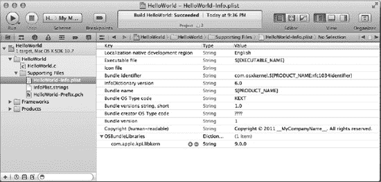

***图 3-2.** Xcode 中的图形化属性列表编辑器*

我们对属性列表文件所做的添加对应的 XML 如代码清单 3-2 所示。

***代码清单 3-2.** 教程内核扩展中 `OSBundleLibraries` 条目的值*

```
<key>OSBundleLibraries</key>
<dict>
        <key>com.apple.kpi.libkern</key>
        <string>9.0.0</string>
</dict>
```

项目的属性列表并非供编译器使用（除了进行一些预处理，例如将 `${PRODUCT_NAME}` 等变量替换为实际值），而是供内核使用的。该属性列表会被复制到编译后的内核扩展中，并在扩展加载时被读取。我们添加到字典中的条目由键值对组成：键标识了我们所依赖的内核库，值则对应该库的最低所需版本。在此例中，我们告知内核，我们需要一个唯一标识符为 `com.apple.kpi.libkern` 的库，并且需要该库的 9.0.0 或更高版本。该库标识符使用了反向 DNS 前缀以确保名称的唯一性；这里，“com.apple” 前缀让我们能够识别出这是 Apple 提供的标准库。

 **提示** 库的版本，在本例中是 9.0.0，指的是 Mac OS X 内核的版本，而非 Mac OS X 系统本身的版本。9.0.0 版本对应于 Mac OS X 10.5.0。你可以通过在终端中执行 `uname –r` 命令来确定你机器上的内核版本。

 **注意** 你可能已经注意到，从 Xcode 模板创建的项目在 “Frameworks” 组中包含了一个名为 “Kernel.framework” 的项。它在项目构建时不会被链接器使用，只是为了让开发者方便访问内核头文件而包含的。

内核扩展项目现已完成并可以构建了。为此，请从 “Project” 菜单中选择 “Build”。你应该不会遇到任何构建错误，但如果遇到了，请确保你的 “HelloWorld.c” 文件内容与代码清单 3-1 中所示的一致。


在运行此内核扩展之前，值得花点时间了解内核如何知道调用哪些入口点，因为源文件中的两个函数看起来是用户自定义的。正如你可能已经猜到的，Xcode 给了我们一些助力，自动为我们生成了部分样板代码。在生成这些代码时，Xcode 使用了项目设置中定义的两个值，它们分别指定了内核扩展的启动和停止例程。这些值如图 3-3 所示。你可以自由地将入口点从 `HelloWorld_start` 和 `HelloWorld_stop` 重命名，只要同时更改源代码中定义的函数名称以及项目构建设置中的对应值即可。

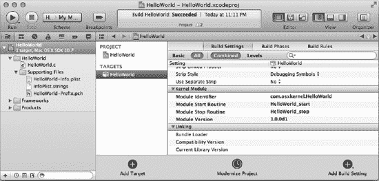

***图 3-3.** “Hello World”内核扩展的项目设置*

项目编译成功后，Xcode 会创建一个名为 `HelloWorld.kext` 的内核扩展。该文件被打包成一个称为 KEXT bundle 的特殊文件。如果你对 bundle 不熟悉，它本质上是一个目录，其中包含可执行文件所需的所有文件，但访达会将其作为一个单一文件呈现给用户。代码清单 3-3 展示了构建“Hello World”内核扩展时创建的 bundle 的内容。

***代码清单 3-3.** `HelloWorld.kext` bundle 的内容*

```
HelloWorld.kext/
HelloWorld.kext/Contents/Info.plist
HelloWorld.kext/Contents/MacOS
HelloWorld.kext/Contents/MacOS/HelloWorld
HelloWorld.kext/Contents/Resources
HelloWorld.kext/Contents/Resources/en.lproj
HelloWorld.kext/Contents/Resources/en.lproj/InfoPlist.strings
```

名为 `Info.plist` 的文件应该很熟悉，因为它正是我们之前修改过的属性列表的副本（Xcode 在过程中做了一些微小的处理）。另一个值得一提的文件直接名为 `HelloWorld`，位于 bundle 的子目录 `Contents/MacOS` 中。该文件包含了内核扩展的实际可执行代码。

#### 加载与卸载内核扩展

内核扩展是运行在操作系统内核内部的代码模块。构建完成后，它需要被加载到内核中才能运行。虽然 Xcode 在编写和构建内核扩展方面表现出色，但它不能用于测试或调试内核扩展；事实上，对于内核扩展，Xcode 窗口中的“运行”按钮只会构建项目，而不会实际加载或运行生成的输出。相反，在 Mac OS X 上，内核扩展可以通过两种方式之一加载：自动加载，即通过将内核扩展 bundle 复制到 `/System/Library/Extensions` 目录；或者通过命令行手动加载。

要加载内核扩展，我们首先需要找到 Xcode 构建的已编译二进制文件。默认情况下，Xcode 4 会将编译器的输出放置在不同于包含源代码的项目目录的位置，这可能会增加通过命令行加载内核扩展时查找路径的难度。要定位 Xcode 写入内核扩展的路径，请右键点击名为 `HelloWorld.kext` 的产品，这将显示一个上下文菜单，然后选择“在访达中显示”项，如图 3-4 所示。

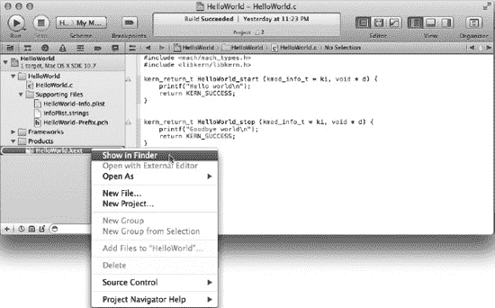

***图 3-4.** 定位已构建内核扩展的路径*

复制到 `/System/Library/Extensions` 目录的内核扩展将在操作系统需要时加载。这可能发生在系统启动时，或者对于驱动程序而言，当需要该驱动程序的硬件设备连接到计算机时。然而，在开发过程中，通过命令行手动加载内核扩展通常更为便捷。

出于安全考虑，由于内核扩展被授予与核心操作系统代码相同的高级权限，因此内核扩展只能由具有系统管理员访问权限的用户安装或加载。作为进一步的安全措施，系统对内核扩展 bundle 的文件权限有严格要求，并且会拒绝加载不满足这些要求的扩展，特别是以下几点：

- KEXT bundle 及其内部的所有文件和文件夹必须属于用户“root”（用户 ID 0）。
- KEXT bundle 及其内部的所有文件和文件夹必须属于组“wheel”（组 ID 0）。
- KEXT bundle 及其内部的任何目录必须具有权限掩码 `0755`（`rwxr-xr-x`）。
- KEXT bundle 内部的所有文件必须具有权限掩码 `0644`（`rw-r--r--`）。

当你在 Xcode 中构建内核扩展时，它生成的 KEXT bundle 会具有正确的 bundle 及其内容的权限掩码，但用户和组的所有权将与运行编译器的用户一致。要纠正文件所有权以符合内核扩展的要求，你可以在终端中使用以下命令：

```
sudo chown -R root:wheel HelloWorld.kext
```

请注意，如果你在 Xcode 构建目录内更改了 KEXT 的所有权，下次构建项目时 Xcode 将没有足够的权限覆盖该 KEXT，这将导致构建错误。要解决此问题，你可以先将 KEXT 从 Xcode 构建目录复制到另一个目录（例如 `/tmp`），然后再更改其所有权并进行加载。

Mac OS X 包含许多用于处理内核扩展的命令行工具。一些常用的命令包括：

- `kextload`，用于将 KEXT 加载到内核中
- `kextunload`，用于停止已加载的 KEXT 并将其从内核中卸载
- `kextutil`，一个面向开发者的实用工具，用于将 KEXT 加载到内核中，可以提供诊断信息详细说明内核扩展加载失败的原因，并能生成对调试活动内核扩展有用的符号
- `kextstat`，用于显示加载到内核中的所有 KEXT 的列表


### 排版后的内容

除`kextstat`（不会主动修改内核状态）外，所有命令都需要以超级用户权限运行。这可以通过在命令前加上`sudo`来实现。

现在我们可以加载“Hello World”内核扩展。要执行此操作，请在终端中运行以下命令：

```
sudo kextload HelloWorld.kext
```

虽然“Hello World”内核扩展已加载且其启动入口点已被调用，但您不会在终端窗口中看到调用`printf`的结果。相反，调用内核实现的`printf`的输出会写入日志文件。要确认“Hello World”内核扩展已加载，可以使用`kextstat`命令，如下所示：

```
kextstat
```

这将打印正在运行的内核扩展列表。由于“Hello World”扩展是最新加载的扩展之一，它应出现在列表末尾。`kextstat`的输出示例如列表 3-4 所示。

**列表 3-4.** `kextstat`命令的输出，其中高亮显示我们的内核扩展

```
Index  Refs   Address             Size        Wired     Name (Version) <Linked Against>
  1      85  0xffffff7f80742000   0x683c      0x683c    com.apple.kpi.bsd (11.1.0)
  2       6  0xffffff7f8072e000   0x3d0       0x3d0     com.apple.kpi.dsep (11.1.0)
  3     110  0xffffff7f8074c000   0x1b9d8     0x1b9d8   com.apple.kpi.iokit (11.1.0)
  4     116  0xffffff7f80738000   0x9b54      0x9b54    com.apple.kpi.libkern (11.1.0)
  5     103  0xffffff7f8072f000   0x88c       0x88c     com.apple.kpi.mach (11.1.0)
...
130       0  0xffffff7f810ce000   0x51000     0x51000   com.apple.filesystems.afpfs (9.8) <129 7 6 5 4 3 1>
144       0  0xffffff7f807b8000   0x2000      0x2000    com.osxkernel.HelloWorld (1) <4>
```

最后，我们将卸载“Hello World”扩展，这将导致调用`HelloWorld_stop()`函数并从内核中卸载该内核扩展。可以通过以下命令完成此操作：

```
sudo kextunload HelloWorld.kext
```

### 使用控制台查看输出

内核中调用`printf()`的结果输出会写入磁盘上的日志文件。该日志采用纯文本文件格式，可以使用标准 Unix 命令`tail`和`cat`并传递日志文件路径`/var/log/kernel.log`来查看。或者，可以使用 Mac OS X 自带的名为“Console”的应用程序来检查日志内容，该应用程序位于`/Applications/Utilities`目录中。Console 应用程序整合了包括内核日志在内的各种系统服务和应用程序的日志。通过 Console 查看教程输出的截图如图 3-5 所示。

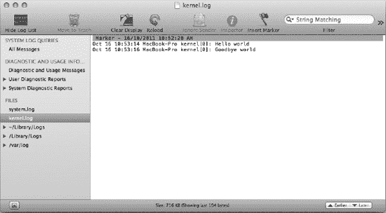

**图 3-5.** 成功加载和卸载内核扩展后，在 Console 实用工具中显示的输出

虽然如果您习惯用户空间开发的源代码级调试器，这可能显得原始，但能够将调试输出打印到控制台仍然是内核代码的基本调试技术之一。有关调试的更多信息，请参见第 16 章。

### 总结

Mac OS X 的内核扩展使用 Apple 提供的 Xcode 包中的工具进行开发。在本章中，我们创建了一个教程性的“Hello World”内核扩展，展示了如何从其他内核库导入符号，并介绍了常用的命令行工具，用于加载和处理内核扩展。

---

## 第 4 章 I/O Kit 框架

Mac OS X 的设备驱动程序是使用名为 I/O Kit 的框架编写的。I/O Kit 由提供驱动程序所需服务的头文件和库，以及用户空间代码用于定位内核驱动程序并与之交互的头文件和库组成。I/O Kit 包含两个主要部分：

*   `Kernel.framework`
*   `IOKit.framework`

虽然稍微有点反直觉，但 I/O Kit 框架是为用户空间应用程序设计的，而不是用于在内核中开发 I/O Kit 驱动程序。相反，`Kernel.framework`包含用于内核空间驱动程序开发的头文件。如果您检查`Kernel.framework`的内容，会看到其中包含一个名为`IOKit`的目录，该目录包含用于内核空间驱动程序开发的头文件。`Kernel.framework`中另一个重要的目录名为`libkern`，其中包含内核 I/O Kit 框架所基于的基础类和类型。

用户空间 I/O Kit 框架有两个用途。它为用户应用程序提供以下功能：确定运行机器上存在的硬件设备、为特定硬件设备定位合适的驱动程序，以及向该驱动程序发送控制请求和请求状态。这些主题将在第 5 章中进一步讨论。此外，用户空间 I/O Kit 框架还允许用户空间应用程序直接与某些硬件设备通信，从而无需内核驱动程序。这对于特定范围的设备是可行的，最显著的是不需要在多个运行中的应用程序之间共享的 USB 和 FireWire 设备。我们在第 15 章中讨论 I/O Kit 的这一方面。


### I/O Kit 模型

I/O Kit 是一个面向对象的框架，因此它需要一种能提供面向对象编程抽象的语言。苹果公司选择使用 C++ 语言来实现 I/O Kit，因此，为 Mac OS X 编写的驱动程序都是用 C++ 开发的。

虽然选择 C++ 进行驱动开发在操作系统中独树一帜，但这反映了 Mac OS X 的现代特性。Mac OS X 的初始版本于 2001 年发布，苹果公司借此机会设计了全新的驱动开发模型。选择 C++ 体现了 I/O Kit 设计时计算机硬件和编译器的状态。

选择面向对象语言具有显著优势。计算机系统中的硬件，本质上是通过多种不同总线连接的一系列设备。例如，一个 USB 设备可能连接到键盘的内部 USB 集线器，而该集线器本身又连接到 iMac 的 USB 端口。在内部，USB 端口由 iMac 主板上的 USB 控制器芯片处理，该芯片通过内部 PCI 总线连接到主板芯片组控制器。通过采用面向对象的驱动模型，I/O Kit 能够通过驱动对象镜像出相同的硬件连接结构。

驱动程序的作用是让操作系统——最终是用户——能够利用硬件实现的服务。操作系统通过以下方式帮助驱动程序：当硬件设备存在时加载其驱动程序，为驱动程序提供访问和与硬件设备交互的方式，并提供接入点，使驱动程序能够将其服务插入操作系统。

  
**注意：** I/O Kit 使用术语“nub”来描述为其他驱动程序提供服务的驱动。例如，USB 集线器的驱动程序就是一个 nub，因为它为连接到其上的 USB 设备的驱动程序提供服务。

选择面向对象的设计对 I/O Kit 非常有利。每个驱动程序都作为一个 C++ 类实现，这使得 I/O Kit 能够为系统中存在的每个硬件设备实例实例化一个新的驱动对象。驱动程序的硬件设备通过一个称为驱动“提供者”（provider）的对象来访问，该对象在初始化时提供给驱动程序。I/O Kit 将使用适合于设备所用硬件总线的提供者类。例如，一个 USB 设备将拥有一个 `IOUSBDevice` 实例的提供者类，而一个 PCI 卡的驱动程序将拥有一个 `IOPCIDevice` 实例的提供者类。这些总线接口的不同能力被不同的提供者类类型所抽象化。例如，USB 设备有多个用于数据传输或读取的端点，因此 `IOUSBDevice` 类包含了用于向指定端点读取或写入数据缓冲区的方法。另一方面，访问 PCI 卡需要通过将一组寄存器映射到内核的地址空间，然后驱动程序可以像写入任何其他内存地址一样，对这些寄存器进行读写操作。

最后，驱动程序需要一种方法将其服务提供给操作系统其余部分。这或许是 I/O Kit 面向对象设计最出色的地方。驱动程序的主类可以实现为 I/O Kit 为特定类型驱动提供的专用类的子类。例如，实现串口的驱动程序将继承标准 `IOSerialStreamSync` 类。类似地，实现音频输出设备的驱动程序将继承 `IOAudioDevice` 类。

通过子类化实现驱动程序的优势在于，你的驱动程序继承了父类的行为和实现。每个串口和每个音频设备都有一些通用操作，这些行为由超类实现，从而免除了驱动开发者编写样板代码的负担。开发者可以专注于特定硬件设备相关的代码。当需要执行设备特定的操作时，超类会调用驱动程序。

如果你曾为其他任何操作系统实现过驱动程序，你无疑需要实现一个分发例程，该例程通常采用一个庞大的 `switch` 语句形式，以处理操作系统可能发出的所有请求，然后调用驱动中实现该请求的适当函数。I/O Kit 采用了不同的方法。驱动请求以方法调用的形式存在。驱动程序只需实现或重写其超类提供的方法即可。这些方法特定于驱动类型。例如，串口驱动程序关注的是通过串口传输和接收字节，因此 `IOSerialStreamSync` 类提供了纯虚方法 `enqueueData()` 和 `dequeueData()`，以便在需要执行这些操作时由子类实现。

对于专用设备，I/O Kit 可能不提供合适的超类。例如，对于实现专用医疗成像设备的驱动程序，I/O Kit 没有提供合适的超类。此类设备的驱动程序将通过一个继承自通用 `IOService` 类的类来实现。`IOService` 提供了管理驱动生命周期的方法，包括驱动对象的初始化和销毁。

最后，驱动程序可以向用户空间应用程序提供接口。用 I/O Kit 的术语来说，这是通过实现一个称为“用户客户端”（user client）的类来处理的。用户客户端是驱动程序实现的一个自定义类，它继承自 `IOUserClient` 类。每当应用程序打开与驱动程序的连接时，I/O Kit 就会实例化一个新的用户客户端对象，用于处理来自该应用程序与驱动程序连接的所有请求。当应用程序关闭与驱动程序的连接，或者应用程序终止（或崩溃）时，该用户客户端会被销毁。如果应用程序打开了与驱动程序的多个连接，I/O Kit 将实例化与连接数量相同的用户客户端对象。

### 对象关系

正如我们所看到的，I/O Kit 驱动程序有两个重要的类：一个是主驱动类继承的超类，另一个是驱动程序用来访问其硬件的提供者类。这种设计意味着驱动程序实现的功能与驱动程序硬件设备连接到计算机的方式是分离的。例如，支持 PCI 声卡的驱动和支持 USB 音频输出设备的驱动都将继承自同一个 `IOAudioDevice` 超类，操作系统将通过向每个驱动发出相同的调用来与这两个驱动交互。毕竟，操作系统的音频子系统不应该关心音频输出设备是如何连接到计算机的。

这种分离也鼓励了代码复用。一家同时生产基于 PCI 和 USB 音频设备的公司，可以为这两种设备使用相同的驱动程序，驱动程序接收到的提供者类根据连接到计算机的是两种硬件设备中的哪一种，而分别是 `IOPCIDevice` 或 `IOUSBDevice` 类型。或者，更有可能的是，硬件厂商可以创建自己的超类来实现这两种设备的通用功能，这个超类本身又是 `IOAudioDevice` 的子类。厂商的 PCI 和 USB 设备的驱动程序只需极少的实现，大部分通用功能都来自其自定义的超类。这种安排如图 4-1 所示。

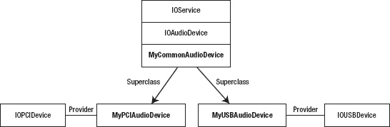

***图 4-1.** I/O Kit 驱动与其超类及提供者类之间关系的示例*


### Info.plist 文件

Macintosh 平台一直支持设备的即插即用设计，安装驱动后无需额外配置。借助 I/O Kit，Mac OS X 也不例外。与我们上一章开发的、一旦添加到系统就会加载的内核扩展不同，驱动程序仅在其支持的某个设备连接到计算机时才会被加载。这样一来，即使系统上可能安装了数百个驱动程序，也只有那些与计算机实际连接的硬件相对应的驱动才会被加载并占用内存。

在第 3 章中，我们看到内核扩展需要一个属性列表文件来定义其入口点等内容。对于实现 I/O Kit 驱动的内核扩展来说，属性列表更为重要。对于 I/O Kit 驱动，属性列表指明了该驱动能够支持的硬件设备列表。驱动支持的每个设备在属性列表中都拥有自己的“个性”，由一个“匹配字典”组成，该字典包含一个数组，描述了每个要匹配的硬件设备。只有当其匹配字典中描述的某个硬件设备连接到计算机时，该驱动才会被加载。

每个匹配字典中最重要的值之一是 `IOProviderClass`，它定义了驱动提供者的类类型，例如 `IOUSBDevice` 或 `IOPCIDevice`。每当有新硬件设备连接到计算机时，I/O Kit 就会为该设备创建一个合适的桩（nub），然后开始为该桩寻找合适的驱动程序。例如，USB 设备的连接处理如下：

1.  用户将 USB 设备连接到计算机。
2.  创建一个新的 `IOUSBDevice` 实例来表示该设备。
3.  I/O Kit 遍历所有包含匹配字典且其提供者类为 `IOUSBDevice` 的驱动程序。
4.  `IOUSBDevice` 检查该驱动程序匹配字典的全部内容。
5.  如果匹配字典中请求的属性与设备的属性相对应，则该驱动将被添加到该设备的潜在驱动列表中。

重要的是，由提供者类来决定一个驱动是否适合某个特定的硬件设备。它通过检查潜在驱动匹配字典中的属性来实现这一点；然而，所使用的具体属性将取决于驱动家族。例如，一个 USB 驱动可能匹配 USB 设备的特定供应商 ID 和产品 ID，也可能匹配通用的设备类别，比如任何 USB 键盘。一个 PCI 设备可能根据设备 PCI 配置空间中指定的供应商 ID 和设备 ID 进行匹配，或者针对任何 PCI 类别（如网卡或显卡）进行匹配。

遵循上述步骤，I/O Kit 已将设备的驱动程序列表缩小到一组潜在匹配项。为了确定硬件设备的最佳驱动程序，I/O Kit 使用了每个驱动的“探测分数”概念。每个驱动都会提名一个探测分数，该分数以某种方式提供了该驱动对设备适用性的相对度量。探测分数最高的驱动最终被选中与设备协同工作。

驱动的探测分数可以通过两种方式设置。一种方式是驱动在其匹配字典中提供一个探测分数。例如，一家制造自定义 USB 键盘的公司可以提供一个驱动，其匹配字典精确匹配该公司键盘的产品 ID，并提供比系统默认键盘驱动更高的探测分数。另一种设置探测分数的方式是通过“主动匹配”，在此过程中，I/O Kit 实例化每个潜在驱动，将其临时连接到硬件设备，并让其有机会询问设备并确定其探测分数。在探测期间，驱动可以完全访问硬件，因此它可以执行所需的任意多次询问来确定其驱动该设备的适用性。驱动可以调整其探测分数，或者更常见的是，如果确定无法与连接的硬件协同工作，可以使用 `probe` 方法选择退出与该设备的匹配。

例如，一个驱动的 `probe` 实现可以确定设备上加载的固件版本，如果固件版本高于驱动支持的版本，它可以拒绝加载。在 `probe` 阶段失败比在之后驱动已被选为设备驱动时失败更高效，因为 I/O Kit 不需要继续启动你的驱动，尽管在这两种情况下，I/O Kit 都会继续尝试加载具有次高探测分数的驱动。

虽然几乎在所有情况下，一个设备只附加一个驱动，但 I/O Kit 确实允许为单个设备加载多个驱动。通过在驱动的匹配字典中添加一个名为“匹配类别”的额外键，I/O Kit 将加载每个匹配类别中探测分数最高的驱动并将其附加到设备上。如果驱动的匹配字典中没有给出匹配类别，则假定为默认类别。

匹配过程是递归的，驱动本身也可能是桩，充当其他类的提供者。例如，实现 USB 主机控制器的 PCI 卡驱动会匹配 `IOPCIDevice`，但会创建自己的 `IOUSBDevice` 实例来表示连接到其端口的设备。这样，该驱动创建的 `IOUSBDevice` 实例反过来又成为其他驱动的提供者类，如图 4-2 所示。这种类型的驱动很可能不是直接实例化 `IOUSBDevice` 类型的类，而是提供自己继承自 `IOUSBDevice` 的类的实现，这在图 4-2 中显示为 `MyUSBDevice`。

任何使用 `MyUSBDevice` 实例作为提供者的驱动都将通过其标准的 `IOUSBDevice` 接口与该提供者通信，但虚拟方法的使用允许 `MyUSBDevice` 的实现覆盖这些方法并提供自己的实现。

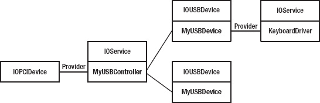

***图 4-2.** 一个既是桩又是驱动的示例，创建作为其他驱动提供者类的对象*

另一个驱动充当桩的示例（实际上这要常见得多）是接受用户应用程序连接的驱动。如前所述，对于用户应用程序每次与驱动的连接，I/O Kit 都会实例化一个称为“用户客户端”的新对象来处理来自应用程序的控制请求，并将其传递给驱动。与主驱动类一样，用户客户端类也是一个 I/O Kit 服务，并且它与其他任何驱动对象一样继承自同一个 `IOService` 基类。每个用户客户端都将主驱动对象作为其提供者类。然而，与主驱动不同，用户客户端不需要经历匹配阶段，因为驱动直接指定了其用户客户端的具体类名。


#### 列表 4-1 假设外部磁盘的驱动程序特性，包含匹配 FireWire 和 USB 连接的字典

```
<key>IOKitPersonalities</key>
<dict>
    <key>MyExternalDiskFireWire</key>
    <dict>
        <key>CFBundleIdentifier</key>
        <string>com.mycompany.driver.MyExternalDiskDriver</string>
        <key>IOClass</key>
        <string>com_mycompany_driver_MyExternalDiskDriver</string>
        <key>IOProviderClass</key>
        <string>IOFireWireUnit</string>
        <key>Unit_SW_Version</key>
        <integer>1111</integer>
        <key>Unit_Spec_ID</key>
        <integer>2222</integer>
    </dict>
    <key>MyExternalDiskUSB</key>
    <dict>
        <key>CFBundleIdentifier</key>
        <string>com.mycompany.driver.MyExternalDiskDriver</string>
        <key>IOClass</key>
        <string>com_mycompany_driver_MyExternalDiskDriverUSB</string>
        <key>IOProviderClass</key>
        <string>IOUSBDevice</string>
        <key>idProduct</key>
        <integer>3333</integer>
        <key>idVendor</key>
        <integer>4444</integer>
        <key>IOProbeScore</key>
        <integer>9000</integer>
    </dict>
</dict>
```

列表 4-1 展示了同时支持 FireWire 和 USB 连接的假设外部磁盘设备的匹配字典。因此，其匹配字典中包含两个条目：第一个条目匹配特定的 FireWire 设备，另一个则匹配特定的 USB 设备。当计算机插入一个单元软件版本为 1111 且单元规格 ID 为 2222 的 FireWire 设备时，驱动程序类 `com_mycompany_driver_MyExternalDiskDriver` 将被实例化并有机会探测该设备。同样地，当计算机插入一个产品 ID 为 3333 且供应商 ID 为 4444 的 USB 设备时，驱动程序类 `com_mycompany_driver_MyExternalDiskDriverUSB` 将被实例化并有机会探测该设备。该 USB 设备将具有默认探测分数 9000，这使其成为该设备的首选驱动程序。

### 驱动程序类

如上一节所述，当 I/O Kit 加载驱动程序时，它会实例化驱动程序属性列表中指定的类。此类必须是 `IOService` 类的子类，可以直接继承，也可以通过继承 `IOService` 类的子类来实现。`IOService` 类提供了在驱动程序生命周期不同阶段被调用的虚方法——例如，当驱动程序被加载和初始化时、当它需要探测其提供者时，以及当驱动程序停止时。由于这些方法在 `IOService` 类的定义中被声明为虚方法，因此可以轻松地在继承自 `IOService` 的自定义驱动程序类中重写它们。

此时，通过创建一个简单的 I/O Kit 驱动程序来实践所学知识可能正是时机。首先，打开 Xcode 并基于“IOKit Driver”模板创建一个新项目。当提示输入产品名称时，请输入“IOKitTest”。可以使用公司标识符“com.osxkernel”，这是一个为本书目的而注册的域名。Xcode 将为您创建一个包含两个文件的项目：一个名为“IOKitTest.cpp”的 C++实现文件及其对应的头文件“IOKitTest.h”。

让我们从声明驱动程序类的定义开始。鉴于我们正在实现一个通用驱动程序，而不是提供诸如串口或磁盘存储等特定功能的驱动程序，我们将驱动程序的主类定义为 `IOService` 的子类，而不是 I/O Kit 提供的更专门的类之一。将列表 4-2 中的文本输入为`IOKitTest.h`的内容。

#### 列表 4-2 “IOKitTest.h”教程

```
#include <IOKit/IOService.h>

class com_osxkernel_driver_IOKitTest : public IOService
{
    OSDeclareDefaultStructors(com_osxkernel_driver_IOKitTest)

public:
    virtual bool    init (OSDictionary* dictionary = NULL);
    virtual void    free (void);

    virtual IOService*      probe (IOService* provider, SInt32* score);
    virtual bool    start (IOService* provider);
    virtual void    stop (IOService* provider);
};
```

头文件的内容应该相当直接，可能除了宏 `OSDeclareDefaultStructors` 之外。如您从第 3 章中所回忆的，I/O Kit 是在 C++语言的一个子集中实现的，该子集不包括异常和运行时类型信息。由于这两个限制，需要使用宏 `OSDeclareDefaultStructors`；它提供了类的构造函数和析构函数的声明，以及提供 I/O Kit 自定义运行时类型信息实现的元数据。我们将在本章后面更深入地讨论这一点。

 **注意** 您可能想知道为什么我们为类使用了如此冗长的名称。内核具有一个全局命名空间，任何活动内核扩展导出的所有符号（包括类名、函数和全局变量）都加载到该空间中。如果扩展包含与已加载扩展冲突的符号，内核将拒绝加载该扩展。因此，为避免这种情况，Apple 建议所有全局函数、类和变量都使用反向 DNS 命名方案进行修饰。

驱动程序类的实现应放在名为“IOKitTest.cpp”的文件中。该文件的内容如列表 4-3 所示。

#### 列表 4-3 “IOKitTest.cpp”教程

```
#include "IOKitTest.h"
#include <IOKit/IOLib.h>

// Define the superclass.
#define super IOService

OSDefineMetaClassAndStructors(com_osxkernel_driver_IOKitTest, IOService)

bool com_osxkernel_driver_IOKitTest::init (OSDictionary* dict)
{
    bool res = super::init(dict);
    IOLog("IOKitTest::init\n");
    return res;
}
```


```cpp
void com_osxkernel_driver_IOKitTest::free (void)
{
        IOLog("IOKitTest::free\n");    
        super::free();
}

IOService* com_osxkernel_driver_IOKitTest::probe (IOService* provider, SInt32* score)
{
        IOService *res = super::probe(provider, score);
        IOLog("IOKitTest::probe\n");    
        return res;
}

bool com_osxkernel_driver_IOKitTest::start (IOService *provider)
{
        bool res = super::start(provider);      
        IOLog("IOKitTest::start\n");    
        return res;
}

void com_osxkernel_driver_IOKitTest::stop (IOService *provider)
{
        IOLog("IOKitTest::stop\n");    
        super::stop(provider);
}
```

 **注意：** I/O Kit 的约定是定义一个名为“super”的宏作为当前类的父类名称。这允许将方法轻松委托给父类实现，如代码清单 4-3 所示。

最后，我们需要通过 `Info.plist` 文件定义驱动程序的匹配字典和库依赖项。在 `IOKitPersonalities` 字典中添加一个名为“IOKitTest”的新字典键，该键包含以下值：

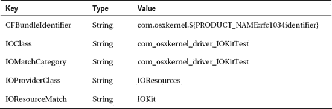

我们还需要向 `OSBundleLibraries` 字典添加两个条目：


项目属性列表的最终版本如图 4-3 所示。

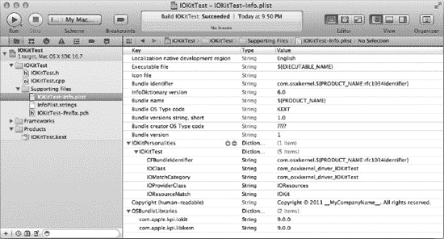

***图 4-3.** IOKitTest 教程的属性列表，包含匹配字典*

鉴于驱动程序的目标是控制硬件，并且 I/O Kit 仅在其硬件设备存在时才会加载驱动程序，您可能会想知道如何测试此驱动程序。幸运的是，I/O Kit 提供了一个特殊的桩（nub），名为 `IOResources`，它可以作为无硬件设备驱动程序的提供者类，例如这里列出的教程驱动程序。在系统中，会有多个驱动程序与 `IOResources` 桩匹配，因此为了允许多个驱动程序附加到 `IOResources`，必须在驱动程序的匹配字典中定义 `IOMatchCategory` 键。

由于 I/O Kit 允许一个桩在每个匹配类别上附加一个驱动程序，指定一个唯一的类别可以使驱动程序加载，并且不会阻止其他驱动程序在我们加载后与 `IOResources` 提供者类匹配。为了完善匹配字典，我们需要为提供者类指定唯一的匹配标准。如果提供者类是一个 USB 设备，这可能是 USB 产品 ID 和供应商 ID 的形式。在我们的教程中，提供者类是 `IOResources`。一个名为“`IOResourceMatch`”的键是 `IOResources` 使用的匹配标准。在示例驱动程序的匹配字典中，此值设置为“`IOKit`”。这告诉提供者类在系统启动期间延迟加载驱动程序，直到 IOKit 子系统完全加载并初始化。

您现在可以构建 `IOKitTest` 项目，该项目可以使用与第 3 章 中相同的“kextload”命令加载。如果您打开“控制台”实用工具并检查“kernel.log”文件的内容，您应该会看到驱动程序类的各个方法已被调用。

驱动程序类的调用顺序如下：

1.  `init()`。此方法保证在类中的任何其他方法之前被调用。其目的与 C++ 类的构造函数相同。驱动程序的 `init()` 方法应首先调用父类提供的实现，如果失败，应立即中止。此方法接收一个参数，即与 `Info.plist` 文件中选定驱动程序个性对应的匹配字典的副本。如果此方法成功，应返回 `true`；否则，应返回 `false`。
2.  `probe()`。此方法在匹配期间被调用，使驱动程序有机会检查硬件设备，该设备通过名为“`provider`”的参数传递给方法。虽然参数“`provider`”是指向 `IOService` 的指针，但可以将其转换为匹配字典中指定的更专门的提供者类（例如 `IOUSBDevice`）。驱动程序的 `probe()` 实现应首先调用父类的实现，如果成功，则执行任何所需的硬件调查以确定驱动程序是否能够控制该硬件。如果驱动程序无法控制硬件，应从 `probe()` 方法返回 `NULL`；否则，应返回应控制此设备的 `IOService` 子类的实例。在几乎所有情况下，此方法将返回当前的 `IOService` 实例（“`this`”）。
3.  `start()`。如果之前对 `probe()` 的调用成功，并且驱动程序被选为最适合控制硬件设备（基于其探测分数），则调用其 `start()` 方法。实现应首先调用父类的 `start()` 实现，如果失败，应立即中止。驱动程序应使用 `start()` 方法配置硬件以供运行，并应初始化其运行时所需的任何资源。如果由于任何原因方法失败且驱动程序无法继续控制硬件，则方法应返回 `false`。然后，I/O Kit 将向具有次高探测分数的驱动程序提供控制设备的机会。
4.  `stop()`。此方法在设备被移除或驱动程序被手动卸载之前不会被调用。此方法与 `start()` 相反；在调用 `stop()` 时，应释放 `start()` 方法中执行的任何配置或分配。最后，实现应调用父类的 `stop()` 实现。
5.  `free()`。最后，在驱动程序对象被销毁之前，I/O Kit 会调用其 `free()` 方法。其目的与 C++ 类的析构函数相同。这为驱动程序提供了释放其 `init()` 方法中分配的任何资源的机会。即使驱动程序从未被选为特定设备的最佳匹配，也会调用此方法。实现应通过调用父类的 `free()` 实现来结束。

异常支持有限的一个后果是，I/O Kit 对象的初始化不是使用传统的 C++ 方法在类的构造函数中执行对象初始化并在发生错误时抛出异常，而是在一个名为“`init`”的自定义方法中执行，该方法返回一个布尔值来表示成功。


### `IORegistryExplorer`

苹果提供了一个非常有用的工具，用于可视化系统中已加载的驱动程序，即“`IORegistryExplorer`”。该工具是 Xcode 工具集的一部分。`IORegistryExplorer` 以图形方式展示当前系统上已加载的驱动程序，以及它们与其他驱动程序之间的关系。这种关系以层级结构呈现，其中提供者类与其所连接的客户端之间构成父子关系。

`IORegistryExplorer` 所展示的是被称为 I/O Registry（I/O 注册表）的实体。如果你有 Windows 背景，请不要将 I/O Registry 与 Windows 注册表混淆。I/O Registry 是一个 I/O Kit 对象的树状结构，在系统启动时创建，随后会随着硬件设备及其相应驱动程序被加载或卸载而动态增长或缩小。与 Windows 注册表不同，I/O Registry 从不写入磁盘，也不会在计算机重启之间保存。

`IOService` 平面包含了 I/O Registry 中的所有对象。因此，在尝试定位某个特定驱动程序时，可能会显得信息量过大。为了帮助在 I/O Registry 中查找特定驱动程序，`IORegistryExplorer` 提供了一个搜索字段，可用于筛选显示的对象，仅显示名称与特定字符串匹配的对象。

`IORegistryExplorer` 还会显示每个驱动程序对象的属性表。当 I/O Kit 加载一个驱动程序时，它会将属性表初始化为与所加载的驱动程序个性相匹配的字典内容；这对应于传递到驱动程序类 `init()` 方法的 `OSDictionary` 对象。随着驱动程序的运行，它可能会通过添加或删除额外的键/值对，或更改特定键的值来操作其属性列表。这些更改仅限于该驱动程序实例本身（因此，如果同一个驱动程序因系统中多个设备而被多次加载，每个实例都有自己独立的属性表）。图 4-4 展示了我们之前开发的示例 IOKit 驱动程序的 `IORegistryExplorer` 界面。

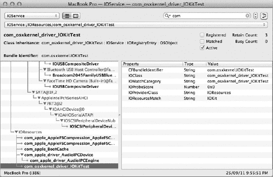

**图 4-4.** 显示 IOKitTest 示例的 `IORegistryExplorer`。右侧显示的属性表是根据驱动程序 `Info.plist` 文件中匹配字典的内容初始化的。

I/O Registry 中的对象被组织成多个平面。每个平面仅显示共享特定功能的对象。启动时，`IORegistryExplorer` 默认显示“`IOService`”平面中对象的关系，该平面包含 I/O Registry 中的所有对象。其他常用平面包括：

- **IODeviceTree:** 这是一个静态平面，反映系统的硬件配置；它不会随着硬件设备连接到系统而改变。设备树的内容很大程度上取决于系统主板，由计算机启动时的硬件配置静态快照组成，包括 PCI 插槽、内置 USB 端口以及主板上的所有硬件控制器，例如 CPU、内存和 USB 控制器。
- **IOPower:** 此平面显示所有实现了电源管理的驱动程序对象。当系统切换到不同的电源状态时（例如进入休眠模式），这些对象会从 I/O Kit 接收通知。
- **IOUSB:** 此平面显示连接到系统的所有 USB 设备和集线器。它仅包含 USB 设备；为设备加载的相应驱动程序可以在 `IOService` 平面中查看。

I/O Registry 也可以通过命令行工具“`ioreg`”访问。与需要安装 Xcode 工具才能使用的 `IORegistryExplorer` 不同，`ioreg` 是 Mac OS X 安装中的标准组成部分，在最终用户的机器或任何其他可能未安装开发者工具的系统上进行调试时非常有用。

### 内核库：`libkern`

I/O Kit 所依赖的运行时支持和基类实现在一个名为 `libkern` 的库中。`libkern` 库提供了对嵌入式 C++ 语言中许多缺失功能的支持。`libkern` 库定义了一个名为 `OSObject` 的类，它作为所有 I/O Kit 类使用的基类。由于基础驱动类 `IOService` 是 `OSObject` 的子类，因此驱动程序的主类也将派生自 `OSObject`。任何派生自 `OSObject` 的类都具备以下功能：

- **运行时类型信息**，通过 `libkern` 提供的自定义宏实现。这些宏提供的功能包括：
    - **类型自省**，即在运行时确定对象的类型，或判断其是否派生自某个给定基类的能力。
    - **动态转换**，即将对象转换为某个派生类类型的能力（例如，将提供者类从 `IOService` 类型转换为 `IOUSBDevice` 类型）。
- **对象创建**，包括基于类名的字符串表示来实例化对象的能力。
- **基于 `retain`/`release` 语义的对象引用计数**。
- **对象追踪**，即能够确定某个类有多少实例已被实例化但尚未释放。


#### OSObject

如果你使用过苹果的 Cocoa 框架编写用户应用程序，那么 libkern 所提供的某些功能应该会非常熟悉。特别是，`OSObject` 类可以被视为 Cocoa 中 `NSObject` 类在内核中的等价物，而动态类型内省能力几乎与 Objective-C 运行时提供的对应功能完全相同。

对于驱动内部私有的类，并不要求使用 `OSObject` 作为其超类，不过你可能会发现，`OSObject` 提供的引用计数和对象追踪功能（无需你额外工作）本身就足以成为采用它的理由。

采用 `OSObject` 作为基类需要遵循以下步骤：

1.  使用标准 C++ 语法，将你的类声明为 `OSObject` 的子类，或者是派生自 `OSObject` 的类（例如 `IOService`）。如果你是从 `OSObject` 派生子类，可能需要包含头文件 `<libkern/c++/OSObject.h>`。
2.  在类声明的第一行（在你的头文件中），包含宏 `OSDeclareDefaultDestructors()`，并将你的类名作为参数传入。该宏除了其他功能外，还会为你的类声明标准 C++ 的构造函数和析构函数，因此你不应再向类声明中添加这两个函数。相反，应添加一个名为 `init()` 的方法作为构造函数，以及一个名为 `free()` 的方法作为析构函数。你可以根据需要向 `init()` 方法添加任何参数，如下例所示。

    ```
    class com_osxkernel_driver_MyObject : public OSObject
    {
        OSDeclareDefaultStructors(com_osxkernel_driver_MyObject)
    public:
        virtual bool     init (const char* name);
        virtual void     free ();
        …
    };
    ```
3.  在实现你类的文件中，放置宏 `OSDefineMetaClassAndStructors()`，该宏接受两个参数：类名及其直接超类的类名。实现文件的前几行通常遵循 `#include "MyObject.h"` 的模式。

    ```
    // 定义 super 作为引用超类的便捷宏
    #define super OSObject

    OSDefineMetaClassAndStructors(com_osxkernel_driver_MyObject, OSObject)
    ```
4.  提供 `init()` 和 `free()` 方法的实现。这两个方法分别扮演构造函数和析构函数的角色，如下例所示。

    ```
    bool com_osxkernel_driver_MyObject::init (const char* name)
    {
        if (! super::init())
                return false;

        // 其他初始化操作
        return true;
    }
    void com_osxkernel_driver_MyObject::free ()
    {
        // 释放 init() 中分配的资源
        super::free();
    }
    ```

在定义了一个从 `OSObject` 派生的对象后，可以在代码中通过调用 C++ `new` 运算符后跟 `init()` 方法来实例化它。为了方便起见，许多类提供了一个静态方法同时执行这两个步骤，并在成功时返回一个非 `NULL` 的对象，如列表 4-4 所示。

**列表 4-4.** 用于构造自定义类新实例的静态辅助方法定义

```
com_osxkernel_driver_MyObject*
        com_osxkernel_driver_MyObject::withName (const char* name)
{
        com_osxkernel_driver_MyObject* me = new com_osxkernel_driver_MyObject;

        if (me && !me->init(name))
        {
                me->release();
                return NULL;
        }

        return me;
}
```

任何基于 `OSObject` 的对象的生命周期都由引用计数决定。当对象首次创建时，其引用计数被初始化为 1。若要释放对象，不应使用 C++ 运算符 `delete`（`OSDeclareDefaultStructors` 宏将其声明为受保护的方法），而应在代码中调用 `release()` 方法。该方法由 `OSObject` 类实现，将对象的引用计数减 1。当对象的最后一个引用被释放，且其引用计数变为 0 时，对象即被释放，并调用 `free()` 方法。如果你的代码持有了一个指向某对象的指针，并且需要保留它，那么就需要延长该对象的生命周期，以确保在你代码持有该对象引用期间，它不会被释放。这可以通过调用 `retain()` 方法来实现，该方法将目标对象的引用计数加 1。为防止内存泄漏，务必确保每次调用 `retain()` 都对应一次 `release()` 调用。

任何派生自 `OSObject` 的对象都支持类型内省。为了将对象转换为另一种类型，libkern 提供了一个名为 `OSDynamicCast(type, object)` 的宏，其功能等同于 C++ 运算符 `dynamic_cast<type>(object)`。该宏会验证对象是否派生自所请求的类，如果是，则返回指向该对象的指针；否则，宏返回 `NULL`。动态转换最常见的用途是安全地将对象从基类转换为更具体的类。例如，驱动的 `start()` 方法会接收到一个指向其提供者类的指针，类型为 `IOService` 对象。然而，该提供者实际上是一个更具体的类，如 `IOUSBDevice` 或 `IOPCIDevice`，而动态转换则允许安全地进行此转换。例如，控制 USB 设备的驱动会在其 `start()` 方法中包含以下代码，将提供者从 `IOService` 转换为 `IOUSBDevice`：

```
IOUSBDevice* usbDevice = OSDynamicCast(IOUSBDevice, provider);
if (usbDevice == NULL)
{
        IOLog("Unknown provider class\n");
        return false;
}
```

`OSObject` 基类还可以追踪其每个派生类已被实例化但尚未释放的实例数量。此信息不仅对 I/O Kit 有用，它还提供了一种追踪内存泄漏的宝贵机制。在内部，I/O Kit 使用每个类的实例计数来确保不会卸载仍存在未释放对象的内核扩展，否则将导致内核恐慌。当一个内核扩展为其定义的所有类都不再有未释放的实例时，内核将卸载该内核扩展。每个 `OSObject` 派生类的实例数可以通过命令行工具 `ioclasscount` 来查看。

 **提示** 如果你打开终端并在加载 IOKitTest 教程后运行命令 `ioclasscount`，你会看到类 `com_osxkernel_driver_IOKitTest` 的一个实例。


#### 容器类

`libkern` 除了定义基类并为内核提供运行时环境外，还定义了许多用于管理对象集合的容器类。`libkern` 提供的容器类包括数组、字典，以及有序和无序集合。虽然所有这些容器都可以包含不同类型的对象，甚至可以在同一个容器中包含不同类型的对象，但容器只能包含派生自 `OSObject` 类的对象。

> **注意：** 如果你熟悉 Mac OS X 上的用户空间编程，`libkern` 容器类相当于 `NSMutableArray`、`NSMutableDictionary` 和 `NSMutableSet`，或者 Core Foundation 类型 `CFMutableDictionary`、`CFMutableArray` 和 `CFMutableSet`。

为了允许将非对象标量类型（例如布尔值、整数和字符串）包含到容器类型中，`libkern` 提供了相应的类 `OSBoolean`、`OSNumber` 和 `OSString`，分别用于封装 `bool`、最长 64 位的整数值以及 C 字符串。

`libkern` 中对字符串的处理值得特别一提。`libkern` 库提供了两个用于表示字符串的类：`OSString` 和 `OSSymbol`（后者是 `OSString` 的子类）。`OSSymbol` 的目的并非提供一个通用的字符串封装器，而是保存代表内核中“符号”的字符串值，例如匹配字典中的常用键。当创建 `OSSymbol` 的新实例时，构造函数会检查是否已存在包含相同字符串值的 `OSSymbol` 对象；如果找到，则返回已有对象的实例，而不是创建一个新实例。这意味着，对于给定的字符串值，最多只有一个 `OSSymbol` 对象表示该值。因此，一个以 `OSSymbol` 值作为键的字典，只需比较两个 `OSSymbol` 值的地址，而无需执行开销更大的字符串比较。

所有容器类在对象所有权方面都遵循相同的行为。添加到容器中的任何对象都会被该容器类保留（retain），而当对象从容器中移除，或者容器本身的最后一个引用被释放导致容器被释放时，容器类会释放（release）这些对象。将对象插入容器后，如果调用者不再需要自己对该对象的引用，则可以自由释放该插入的对象，因为容器类会保持对该对象的一个引用。

在向容器查询其包含的对象后，如果调用者仍在使用返回的对象期间容器可能被释放，则调用者应保留（retain）该对象。`libkern` 容器类在将内容对象返回给调用者之前，不会增加其引用计数（例如，`OSArray` 的 `getLastObject()` 方法在将其最后一个对象返回给调用者之前，不会增加该对象的引用计数）。

需要注意的是，容器类不提供任何用于多线程环境的同步机制。这并非意味着它们不能在包含多线程代码的驱动程序中使用，而是意味着调用者有责任添加自己的锁定机制，以确保对容器类的调用是串行化的。

`libkern` 提供的容器类包括以下内容：

- `OSArray`，提供基于数组索引的对象存储和检索
- `OSDictionary`，提供基于提供的字符串值（称为“键”）的对象存储和检索
- `OSSet`，提供对象的存储以及测试对象是否在集合中的能力
- `OSOrderedSet`，提供基于提供的比较函数进行排序的存储和基于索引的检索

所有 `libkern` 容器类都可以使用类 `OSCollectionIterator` 进行迭代，如代码清单 4-5 所示。当迭代 `OSDictionary` 时，迭代器返回的对象代表字典的键，而非字典本身包含的值。

**代码清单 4-5.** 一个遍历 `OSArray` 中包含对象的示例函数

```
void    IterateArray (OSArray* array)
{
        OSCollectionIterator*   iter;

        iter = OSCollectionIterator::withCollection(array);
        if (iter != NULL)
        {
                OSObject*       anObject;

                while ((anObject = iter->getNextObject()) != NULL)
                {
                        // 假设数组中只包含字符串值：
                        // OSString* aString = OSDynamicCast(OSString, anObject);
                }

                iter->release();
        }
}
```

驱动程序的一个特殊容器对象是它们的属性表。这是一个字典，包含特定驱动程序实例本地的多个键/值对。当加载驱动程序时，I/O Kit 会用来自驱动程序 `Info.plist` 文件的匹配字典条目填充其属性表。然而，当驱动程序运行时，它可以自由地在其属性表中添加或删除额外的值。驱动程序属性表的特殊性在于，它可以被用户空间应用程序（包括 `IORegistryExplorer`）访问。这使得它成为在驱动程序和用户空间之间传递少量数据（例如整数值）的理想方式。

或者，驱动程序可以将某些重要变量的值写入其属性表中的键，然后可以在 `IORegistryExplorer`（或自定义应用程序）中监控这些值，以追踪驱动程序的状态。

### 总结

- I/O Kit 提供了一个面向对象的框架，用于在 Mac OS X 上开发驱动程序。
- 使用该框架编写的驱动程序继承自一个合适的基类，基类的选择基于驱动程序实现的功能。I/O Kit 为驱动程序提供了基类，例如音频输入和输出流、串行端口和磁盘设备。
- 驱动程序通过一个称为其提供者（provider）的对象访问其硬件，该对象允许以与硬件所连接的总线相适宜的方式进行硬件通信。
- 只有当硬件存在于系统中时，驱动程序才会被加载，这由驱动程序属性列表中描述的匹配标准决定。
- I/O Kit 构建在一个名为 `libkern` 的库之上，该库通过对象实例化、引用计数和容器类为内核提供运行时支持。

## 第 5 章


## 从应用程序与驱动程序交互

在上一章中，我们了解了位于内核中的 I/O Kit 驱动程序。另一方面，用户与之交互的应用程序则位于用户空间。因此，如果用户要使用驱动程序提供的服务，就需要跨越内核/用户空间的边界。

Mac OS X 提供了多种不同的机制，驱动程序可以通过这些机制向用户空间应用程序提供服务。开发者选择让特定驱动程序向用户空间应用程序提供服务的方法，取决于该驱动程序所实现的功能类型。例如，所有串行端口、音频驱动程序和存储设备都有各自由 I/O Kit 定义的接口。这个接口允许用户空间应用程序与这些设备协同工作。应用程序能够与任何硬件供应商提供的设备协同工作，前提是该供应商的驱动程序为该设备实现了标准的 I/O Kit 接口。从驱动程序开发者的角度来看，使用 I/O Kit 提供的通用接口最符合他们的利益，因为这能确保驱动程序可被大量用户空间应用程序访问，无需开发者为驱动程序采用自定义接口。同时，这也减少了你自身的工作量。

串行端口驱动程序就是一个很好的例子。Mac OS X 用户空间应用程序通过一个字符设备来访问串行端口，该字符设备由文件系统中 `/dev` 路径下的一个文件表示。为了通过串行设备进行通信，用户应用程序会调用与打开、读取或写入文件系统上任何其他文件相同的函数；也就是 `open()`、`read()` 和 `write()`。在内核中，提供串行端口的驱动程序会创建一个标准 I/O Kit 类 `IOSerialStreamSync` 的实例。I/O Kit 的串行家族会在 `/dev` 目录中创建一个设备节点，并将该节点的路径发布到 I/O Registry 中，以便应用程序能够找到它。它还会将用户应用程序的请求传递给驱动程序实现中的方法调用，该驱动程序实现是标准 `IOSerialDriverSync` 类的子类。驱动程序开发者在向用户空间发布其服务时无需额外工作。这一点如图 5-1 所示。

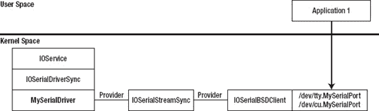

**图 5-1.** 从用户空间应用程序与串行端口通信所涉及的类。除了 `MySerialDriver` 之外，所有对象及其连接均由 I/O Kit 创建。

并非所有驱动程序开发者都像串行端口驱动程序的开发者那样幸运，能由 I/O Kit 负责处理用户空间/内核空间的跨越。对于提供自定义功能的硬件设备，I/O Kit 可能不提供适合你的驱动程序使用的客户端接口。在这种情况下，你的驱动程序需要实现一个自定义接口，供用户空间应用程序在与它交互时使用。正如我们在第 1 章中所见，Mac OS X 在用户空间和内核之间设有严格的屏障。这对此类交互的性质施加了限制。本章将介绍 I/O Kit 提供的跨越用户/内核边界并允许用户应用程序与内核驱动程序通信的方法。

### I/O Kit 框架

进程通过其与内核驱动程序通信的用户空间 API 由一个名为 "IOKit.framework" 的框架提供，下文简称为 "I/O Kit 框架"。I/O Kit 框架允许用户空间应用程序确定系统上存在的硬件设备和内核驱动程序，监控可热插拔硬件（例如 USB 设备）的接入或移除，并与 I/O Kit 驱动程序交互。I/O Kit 框架定义了提供内核对象用户空间表示的数据类型，以及操作这些内核对象所需的函数。尽管 I/O Kit 在内核中是基于 C++ 的框架，但用户空间的 I/O Kit 框架是以一组基于 C 的函数形式提供的，因此它可以被用 C 和 C++ 编写的项目使用，也可以被用 Objective-C 编写的项目使用，这对 GUI 应用程序尤为重要。

I/O Kit 框架提供对 I/O Registry 中存在的内核对象的访问，这些对象可以通过 `IORegistryExplorer` 工具进行检查（见第 4 章）。I/O Registry 由内核对象组成，这些对象代表连接到计算机的硬件设备，或者已与连接的硬件设备匹配并加载到内核中的驱动程序。I/O Registry 中的对象只能在内核中创建（包括由内核驱动程序创建），但 I/O Kit 框架为用户空间中的应用程序提供了一种检查 I/O Registry 内容的方法，包括遍历注册表、确定对象之间的关系（例如，确定哪个驱动程序已针对特定硬件设备加载），以及读写 I/O Registry 中对象的属性。

I/O Registry 包含的内核对象既可以代表已加载的驱动程序，也可以代表已连接的硬件设备。这意味着 I/O Kit 框架提供的功能既可以应用于驱动程序，也可以应用于硬件设备。在某些情况下，应用程序可以通过其对应的 I/O Registry 对象直接操作硬件设备，而无需内核驱动程序；关于 USB 设备的内容将在第 15 章中讨论。I/O Kit 框架还允许应用程序安装通知，以监控特定驱动程序或硬件设备的接入。


### 查找驱动程序

从用户空间应用程序与内核驱动程序通信的第一步，是定位感兴趣的驱动程序的运行实例。在 Mac OS X 等系统中，硬件设备可以随时插入机器，如果用户连接了多个由你的驱动程序支持的硬件设备，则可能会加载该驱动程序的多个实例。为了处理这些情况，I/O Kit 框架提供的函数不仅可以遍历 I/O Registry 中符合特定条件的所有设备和驱动程序，还可以安装一个回调函数来监视符合特定条件的驱动程序或设备的接入或移除。

要在 I/O Registry 中定位特定的驱动程序，I/O Kit 框架使用一个匹配字典，其中包含你感兴趣的驱动程序或设备的属性。I/O Kit 设计的美妙之处在于，用户空间应用程序用于定位驱动程序或硬件设备的匹配字典，其形式与内核驱动程序属性列表中的驱动程序个性（driver personality）中的匹配字典完全相同（参见 第 4 章）。事实上，内核在决定是否根据设备加载驱动程序时用于比较驱动程序匹配字典的代码，正是用户空间应用程序在比较其匹配字典时用于判断设备或驱动程序是否感兴趣的代码。

与驱动程序属性列表中的匹配字典类似，应用程序可以根据需要创建通用或具体（generic or specific）的匹配字典。例如，根据你添加到匹配字典中的属性，它可以匹配所有 USB 设备，或者通过向匹配字典中添加特定的 USB 供应商 ID，来匹配某个制造商生产的任何 USB 设备。再向匹配字典中添加一个特定的 USB 产品 ID，则只能匹配特定的 USB 设备。

作为示例，代码清单 5-1 创建了一个可匹配任何 USB 设备的匹配字典，并使用它遍历 I/O Registry，打印所有匹配设备的名称。要编译此示例，需要在 Xcode 中创建一个基于 Mac OS X 应用程序模板“命令行工具”的新项目。当提示命名项目时，输入“DriverIterator”并选择“Core Foundation”作为项目类型。你还需要将框架“I/OKit.framework”添加到项目中；否则，构建项目时会收到链接错误。

代码结构应该相当简单明了：

1.  它创建一个匹配字典，指定了我们感兴趣的硬件设备或驱动程序的属性。本例使用辅助函数 `IOServiceMatching()`，该函数创建一个字典，其中为 `IOProviderClass` 键添加了一个具有指定值的条目。其效果等同于将 `IOProviderClass` 条目添加到驱动程序属性列表的匹配字典中；任何属于指定类 `IOUSBDevice`（本例中）子类的内核对象都将与该字典匹配。
2.  它调用 `IOServiceGetMatchingServices()`，传入匹配字典，并接收一个迭代器作为输出，该迭代器可用于遍历 I/O Registry 中与该匹配字典匹配的所有内核对象。该迭代器表示调用函数时系统的状态；一旦创建了迭代器对象，即使系统中添加了额外的匹配设备，它也不会被修改。
3.  重复调用函数 `IOIteratorNext()`，每次调用都会返回与指定字典匹配的下一个对象。当接收到最后一个对象后，对 `IOIteratorNext()` 的进一步调用将返回 0。迭代器返回的任何对象，其引用计数都已增加，调用者需要通过调用 `IOObjectRelease()` 来释放它。
4.  为了优化此示例，代码排除了 USB 集线器，仅列出实际 USB 设备的名称。这也使示例能够展示用户空间应用程序可对内核对象执行的类型内省功能。为此，调用了函数 `IOObjectCopyClass()`，该函数以 CoreFoundation 字符串形式返回对象的类类型。匹配字典将包含所有对象，既是 `IOUSBDevice` 的实例，也是从 `IOUSBDevice` 派生的类的实例，其中包括 `IOUSBHubDevice` 类。为了从列表中排除 USB 集线器设备，此示例将忽略类名不与字符串 `IOUSBDevice` 完全匹配的任何对象。

***代码清单 5-1.** 遍历所有已连接 USB 硬件设备的代码*

```c
#include <CoreFoundation/CoreFoundation.h>
#include <IOKit/IOKitLib.h>

int main (int argc, const char * argv[])
{
        CFDictionaryRef         matchingDict = NULL;
        io_iterator_t           iter = 0;
        io_service_t            service = 0;
        kern_return_t           kr;

        // 创建一个可查找任何 USB 设备的匹配字典。
        matchingDict = IOServiceMatching("IOUSBDevice");

        // 为所有匹配该字典的 I/O Registry 对象创建一个迭代器。
        kr = IOServiceGetMatchingServices(kIOMasterPortDefault, matchingDict, &iter);
        if (kr != KERN_SUCCESS)
                return -1;

        // 遍历所有匹配的对象。
        while ((service = IOIteratorNext(iter)) != 0)
        {
                CFStringRef     className;
                io_name_t       name;

                // 列出所有 IOUSBDevice 对象，忽略继承自 IOUSBDevice 的对象。
                className = IOObjectCopyClass(service);
                if (CFEqual(className, CFSTR("IOUSBDevice")) == true)
                {
                        IORegistryEntryGetName(service, name);
                        printf("Found device with name: %s\n", name);
                }
                CFRelease(className);
                IOObjectRelease(service);
        }

        // 释放迭代器。
        IOObjectRelease(iter);

        return 0;
}
```

 **注意** 函数 `IOServiceGetMatchingServices()` 保证会释放传入的匹配字典上的一个引用。这就是为什么 代码清单 5-1 中的代码不需要对其创建的 `CFDictionaryRef` 调用 `CFRelease()` 的原因。


清单 5-1 使用名为 `IOServiceGetMatchingServices()` 的函数，为应用程序感兴趣的**内核对象**创建匹配字典。函数 `IOServiceGetMatchingServices()` 的第一个参数是一个**Mach 端口**，用于用户空间进程与 I/O Kit 之间的通信。从 Mac OS X 10.2 开始，引入了一个名为 `kIOMasterPortDefault` 的便捷宏，不过部分 Apple 示例代码仍沿用 Mac OS X 10.2 之前的方式，即调用 `IOMasterPort()` 函数来获取 I/O Kit 的 Mach 端口。

在像 Mac OS X 这样的系统中，硬件设备可以随时插入系统。我们在上一节中使用的方法存在一个问题：它要求应用程序轮询已连接设备的列表。更好的方法是让 I/O Kit 在您感兴趣的设备连接到计算机时通知您的应用程序。I/O Kit 框架提供了一种替代方案：应用程序指定一个匹配字典和一个回调函数，当有符合匹配字典的对象被添加到 I/O Registry 时，该回调函数会被通知。与 Mac OS X 中的类似函数一样，来自 I/O Kit 框架的通知通过标准事件分发机制（称为**运行循环**）进行传递。

运行循环是 Mac OS X 或 iOS 应用程序从多个来源接收事件通知的基本手段，而无需消耗 CPU 时间去轮询每个来源。运行循环是一个 Core Foundation 对象，监视多个“运行循环源”。每当其中任何一个源生成需要处理的事件时，运行循环便会将该事件分派给已注册的回调函数。Mac OS X 上的每个线程都包含一个运行循环，包括主线程。Mac OS X 上运行在主线程的事件循环，本质上就是一个运行循环，其中包含了键盘和鼠标事件的源。例如，当用户点击鼠标按钮时，主线程的运行循环会唤醒，并在用户点击的应用程序窗口中生成一个 Cocoa 鼠标按下事件。

清单 5-2 演示了命令行工具如何注册以在 USB 设备连接到计算机时接收通知。您会注意到，无论是使用轮询方法还是通知回调，都可以使用相同的匹配字典。

**清单 5-2. 监视 USB 设备接入的代码**

```
#include <CoreFoundation/CoreFoundation.h>
#include <IOKit/IOKitLib.h>

int main (int argc, const char * argv[])
{
        CFDictionaryRef                 matchingDict = NULL;
        io_iterator_t                   iter = 0;
        IONotificationPortRef           notificationPort = NULL;
        CFRunLoopSourceRef              runLoopSource;
        kern_return_t                   kr;

        // 创建一个匹配字典，用于查找任何 USB 设备
        matchingDict = IOServiceMatching("IOUSBDevice");

        notificationPort = IONotificationPortCreate(kIOMasterPortDefault);
        runLoopSource = IONotificationPortGetRunLoopSource(notificationPort);
        CFRunLoopAddSource(CFRunLoopGetCurrent(), runLoopSource, kCFRunLoopDefaultMode);

        kr = IOServiceAddMatchingNotification(notificationPort, kIOFirstMatchNotification,
             matchingDict, DeviceAdded, NULL, &iter);
        DeviceAdded(NULL, iter);

        CFRunLoopRun();

        IONotificationPortDestroy(notificationPort);

        // 释放迭代器
        IOObjectRelease(iter);

        return 0;
}
```

为了创建针对符合特定条件的设备和驱动对象的通知回调，清单 5-2 中的代码执行了以下步骤：

1. 创建一个匹配字典，描述应用程序感兴趣的设备的属性。
2. 调用函数 `IONotificationPortCreate()` 来建立通信通道，I/O Kit 通过该通道能够向用户空间应用程序传递通知消息。
3. 由于我们希望使用运行循环将通知分派到应用程序，因此我们创建一个运行循环源来表示通知端口，并将该源安装到当前线程的运行循环上。
4. 然后，我们调用 `IOServiceAddMatchingNotification()` 将匹配字典与通知端口（以及运行循环源）关联起来。该函数分配并返回一个迭代器对象，该对象在通知消息的操作中扮演着重要角色。调用 `IOServiceAddMatchingNotification()` 之后，迭代器包含了与匹配字典匹配的所有 I/O Registry 对象。I/O Kit 框架不会为这些设备发送通知，因此我们需要手动调用回调函数，并将返回的迭代器传递给它。这样做也很重要，因为只有通过调用 `IOIteratorNext()` 遍历到迭代器的末尾，通知才会被送达，回调函数才会被调用。同样，设备回调必须遍历迭代器直到最后一个对象。在不再需要通知回调之前，调用者不得释放迭代器。与 `IOServiceGetMatchingServices()` 函数类似，当调用 `IOServiceAddMatchingNotification()` 时，它总是会减少匹配字典的引用计数。因此，如果调用者在安装通知后还需要使用该字典，则应事先手动保留该对象。
5. 由于本例是一个命令行工具，我们需要通过调用 `CFRunLoopRun()` 手动运行运行循环。如果这是一个基于 Cocoa 的应用程序，并且我们将通知安装到主运行循环中，那么 `NSApplicationMain()` 函数会为我们启动运行循环。
6. 最后，当应用程序退出时，我们销毁通知端口。这会自动将运行循环源从其加入的运行循环中移除，并释放迭代器对象。

回调函数 `DeviceAdded` 如清单 5-3 所示。您会注意到它与我们在轮询实现中使用的代码完全相同。传递给回调函数的迭代器对象与最初调用 `IOServiceAddMatchingNotification()` 时返回的对象是同一个。由于该对象会被重复用于通知告知我们的所有设备，因此回调函数不能释放该迭代器对象，这一点非常重要，因为在通知安装期间，迭代器必须保持有效。

**清单 5-3. 监视 USB 设备接入的代码**

```
void DeviceAdded (void* refCon, io_iterator_t iterator)
{
        io_service_t            service = 0;

        // 遍历所有匹配的对象。
        while ((service = IOIteratorNext(iterator)) != 0)
        {
                CFStringRef     className;
                io_name_t       name;

                // 列出所有 IOUSBDevice 对象，忽略继承了 IOUSBDevice 的子类对象。
                className = IOObjectCopyClass(service);
                if (CFEqual(className, CFSTR("IOUSBDevice")) == true)
                {
                        IORegistryEntryGetName(service, name);
                        printf("Found device with name: %s\n", name);
                }
                CFRelease(className);
                IOObjectRelease(service);
         }
}
```


 **提示** 设备通知回调出现问题的常见原因，是在调用`IOIteratorNext()`返回`0`之前未能清空迭代器。一旦到达迭代器末尾，迭代器便会重新激活，并且回调功能也会启用。

对于拥有内核驱动程序的硬件设备，用户空间应用程序将通过向驱动程序发送控制请求来操控硬件，而非直接与硬件设备交互。在这种情况下，应用程序关注的并非特定硬件设备的接入，而是该硬件驱动程序何时完成加载。这可以通过使用`IOServiceMatching()`函数创建一个与驱动程序类名匹配的字典来实现。例如，要创建一个与第 4 章中开发的示例 I/O Kit 驱动程序相匹配的字典，应用程序应使用以下代码：

`IOServiceMatching("com_osxkernel_driver_IOKitTest");`

这种反向 DNS 命名方案确保了驱动程序类名的唯一性，这意味着任何与匹配字典相匹配的驱动程序都必定是我们的驱动程序。

### 监测设备移除

除了监测设备接入，应用程序可能还希望监测设备从系统中移除的情况，例如 USB 设备被拔出。与设备接入消息不同（只要设备符合匹配字典描述的条件就会发送），设备移除消息仅针对应用程序已注册关注兴趣的特定设备发送。应用程序通常会注册关注其已打开的所有设备，因为它需要响应正在访问的设备的移除事件。

在我们之前的代码示例中，例如代码清单 5-3，我们在同一个函数内获取驱动程序对象的引用、读取其属性，然后释放该对象。更常见的情况是，应用程序会在设备接入回调函数之后仍然持有驱动程序对象的引用，可能直到应用程序退出或设备被移除时才释放。

 **注意** 在前面的示例中，我们能够使用函数的局部变量来保存驱动程序对象，因为我们在返回函数之前就释放了该驱动程序。但是，如果应用程序希望在返回函数后继续使用驱动程序对象，则需要在堆上分配一个结构体来保存驱动程序状态。

获取驱动程序实例的引用后，应用程序可以注册以接收驱动程序状态变化的通知，包括其硬件设备被移除时驱动程序终止的通知。此通知回调通过调用 I/O Kit 框架中定义的`IOServiceAddInterestNotification()`函数来安装。与设备接入通知类似，应用程序需要提供一个端口，I/O Kit 将通过该端口在驱动程序状态变化时向应用发出信号。该端口可以使用`IONotificationPortCreate()`函数创建，如代码清单 5-2 所示。如果应用程序已为设备接入事件创建了通知端口，则可以共享该通知端口及其对应的运行循环源来接收设备移除通知。只需将现有的通知端口传递给`IOServiceAddInterestNotification()`函数即可实现。

当应用程序收到驱动程序实例已终止的通知时，应释放对该驱动程序的引用，并采取必要措施告知用户设备已被移除。

代码清单 5-4 演示了对代码清单 5-3 中`DeviceAdded()`函数的修改，该修改创建了一个结构体用于表示应用程序中的驱动程序实例，然后安装了一个回调函数，以接收来自驱动程序的通知（例如驱动程序终止通知）。

**代码清单 5-4.** 演示应用程序如何安装回调函数以在驱动程序终止时接收通知的代码片段

```
#include <IOKit/IOMessage.h>

// 用于描述驱动程序实例的结构体。
typedef struct {
        io_service_t    service;
        io_object_t     notification;
} MyDriverData;

// 用于设备接入和驱动程序状态变化的通知端口。
IONotificationPortRef   gNotificationPort = NULL;

void DeviceAdded (void* refCon, io_iterator_t iterator)
{
        io_service_t            service = 0;

        // 遍历所有匹配的对象。
        while ((service = IOIteratorNext(iterator)) != 0)
        {
                MyDriverData*   myDriverData;
                kern_return_t   kr;

                // 分配一个结构体来保存驱动程序实例。
                myDriverData = (MyDriverData*)malloc(sizeof(MyDriverData));
                // 为此驱动程序实例保存 io_service_t。
                myDriverData->service = service;

                // 安装回调函数以接收驱动程序状态变化通知。
                kr = IOServiceAddInterestNotification(gNotificationPort,
                                        service,                        // 驱动程序对象
                                        kIOGeneralInterest,
                                        DeviceNotification,             // 回调函数
                                        myDriverData,           // 传递给回调函数的 refCon
                                        &myDriverData->notification);
        }
}

void DeviceNotification (void* refCon, io_service_t service, natural_t messageType,
     void* messageArgument)
{
        MyDriverData*   myDriverData = (MyDriverData*)refCon;
        kern_return_t   kr;

        // 仅处理驱动程序终止通知。
        if (messageType == kIOMessageServiceIsTerminated)
        {
                // 打印已移除设备的名称。
                io_name_t       name;
                IORegistryEntryGetName(service, name);
                printf("设备已移除: %s\n", name);

                // 移除驱动程序状态变化通知。
                kr = IOObjectRelease(myDriverData->notification);

                // 释放我们对驱动程序对象的引用。
                IOObjectRelease(myDriverData->service);

                // 释放保存驱动程序连接的结构体。
                free(myDriverData);
        }
}
```


### 修改驱动程序属性

一旦应用程序找到其感兴趣的驱动程序对象，它就可以与该驱动程序及其控制的硬件设备进行交互。I/O Kit 框架提供了两种从用户空间与驱动程序交互的方式。一种方法要求应用程序打开一个到驱动程序的连接，然后使用该连接向驱动程序发送控制请求并接收状态信息。如果驱动程序需要维护客户端的状态，或需要访问控制以确保同一时间只有一个客户端可以访问硬件设备，则基于连接的方法是必要的。本章稍后将对此进行讨论。

另一种更为简单的方法是允许应用程序读取和写入驱动程序的键值属性。驱动程序可以执行某些类型的操作，而无需知道是哪个客户端发送的请求，例如读取或写入驱动程序偏好值，或配置硬件设备的设置。例如，音频设备的音量就是一个可以由任何用户应用程序读取或写入的单个值。当该值被设置后，驱动程序可以重新配置硬件设备以适应新的音量设置，无论是由哪个应用程序设置的该值。

正如我们在第 4 章中看到的，每个 I/O Kit 驱动程序都包含一个属性表，它是一个键值对字典。驱动程序的属性表不受限制地可由任何用户空间应用程序访问（这也是 `I/ORegistryExplorer` 工具能够显示每个驱动程序属性的原因）。此外，应用程序可以向驱动程序的属性表中添加新的键值对，并修改现有属性的值。这可用于在用户空间应用程序和内核驱动程序之间轻松交换少量数据。由于这种方法不是基于连接的，因此驱动程序无法为不同的用户应用程序修改其行为；每个用户应用程序都可以访问相同的属性表值。然而，如果加载了同一个驱动程序的多个实例，每个实例都有自己的属性表。需要注意的是，驱动程序的属性表是易失性的，当驱动程序被卸载时不会被保存。

一旦应用程序找到它感兴趣的驱动程序，I/O Kit 框架中包含的函数就可以非常轻松地读取和写入驱动程序的属性表。函数 `IORegistryEntryCreateCFProperties()` 以 Core Foundation 字典的形式向调用应用程序提供驱动程序属性表状态的快照。如果应用程序对某个特定键的值感兴趣，则可以使用函数 `IORegistryEntryCreateCFProperty()`。例如，假设我们希望修改代码清单 5-3 中的回调函数，使其打印连接到计算机的每个 USB 设备的制造商名称，而不是打印设备名称。`IOUSBDevice` 类通过其属性表提供了一个键为 "USB Vendor Name" 的制造商字符串。代码清单 5-5 中的代码显示了修改后的回调函数，该函数从设备的属性表中读取供应商名称。

**代码清单 5-5.** 读取 USB 设备的属性表以获取设备的制造商字符串

```
void DeviceAdded (void* refCon, io_iterator_t iterator)
{
        io_service_t            service = 0;

        // 遍历所有匹配的对象
        while ((service = IOIteratorNext(iterator)) != 0)
        {
                CFStringRef     className;

                // 列出所有 IOUSBDevice 对象，忽略继承自 IOUSBDevice 的子类对象。
                className = IOObjectCopyClass(service);
                if (CFEqual(className, CFSTR("IOUSBDevice")) == true)
                {
                        CFTypeRef               vendorName;

                        vendorName = IORegistryEntryCreateCFProperty(service,
                              CFSTR("USB Vendor Name"), kCFAllocatorDefault, 0);
                        CFShow(vendorName);
                }
                CFRelease(className);
                IOObjectRelease(service);
        }
}
```

如代码清单 5-5 中的代码所示，属性表是驱动程序向用户应用程序发布信息的一种非常便捷的方式，例如其硬件的描述、驱动程序的当前状态或调试信息。驱动程序属性表的另一个用途是允许应用程序向驱动程序传递少量数据。例如，让我们修改第 4 章中开发的示例 I/O Kit 驱动程序，以允许应用程序指定在驱动程序卸载时要打印的自定义消息。我们将通过向属性表中添加一个键为 `StopMessage` 的字符串值来实现此目的。此键将由用户空间应用程序添加到属性表中，但内核驱动程序在卸载时会从属性表中读取它。

让我们从修改用户空间应用程序开始。首先，它需要找到第 4 章中编写的 I/O Kit 驱动程序。这可以通过创建以下匹配字典来完成：

```
matchingDict = IOServiceMatching("com_osxkernel_driver_IOKitTest");
```

接下来，我们将字符串值 "The driver has stopped" 写入驱动程序的属性表，并使其在键 `StopMessage` 下可访问：

```
IORegistryEntrySetCFProperty(service, CFSTR("StopMessage"), CFSTR("The driver has stopped"));
```

这就是用户空间应用程序需要做的全部工作。在这个例子中，我们选择使用字符串值，尽管驱动程序属性的值可以是任何 Core Foundation 类型：`CFString`、`CFNumber`、`CFBoolean`、`CFData`，或者包含受支持 Core Foundation 类型对象的 `CFArray` 或 `CFDictionary`。

当从用户空间应用程序设置驱动程序的属性时，相应驱动程序对象中的 `setProperties()` 方法会被调用，其参数是一个包含已设置属性的字典。`setProperties()` 方法定义在 `IORegistryEntry` 类中，但由于每个 I/O Kit 驱动程序类都是 `IOService`（它本身是 `IORegistryEntry` 的子类）的子类，因此每个驱动程序对象都可以重写此方法。默认情况下，`setProperties()` 的基类实现不执行任何操作。因此，除非您的驱动程序提供了实现，否则用户空间应用程序为您的驱动程序设置的任何属性都将被忽略。

`setProperties()` 方法为驱动程序提供了立即响应用户空间应用程序所设置值的机会。如果修改后的属性要求驱动程序重新配置底层硬件设备，那么 `setProperties()` 方法就是应该执行此操作的地方。对于我们的示例驱动程序，当应用程序更改 `StopMessage` 属性时，我们将让驱动程序更新其属性表并插入提供的字符串值。这也将使该属性可供读取，包括通过 `I/ORegistryExplorer` 读取。处理此问题的代码如代码清单 5-6 所示。

**代码清单 5-6.** 驱动程序 `setProperties()` 方法的示例实现

```
IOReturn com_osxkernel_driver_IOKitTest::setProperties (OSObject* properties)
{
        OSDictionary*   propertyDict;

        // 提供的 properties 对象应为 OSDictionary 对象。
        propertyDict = OSDynamicCast(OSDictionary, properties);
        if (propertyDict != NULL)
        {
                OSObject*               theValue;
                OSString*               theString;
```


### 排版后的文档

```cpp
// 从字典中读取键“StopMessage”对应的值。
theValue = propertyDict->getObject("StopMessage");
theString = OSDynamicCast(OSString, theValue);
if (theString != NULL)
{
    // 将该值添加到驱动的属性表中。
    setProperty("StopMessage", theString);
    return kIOReturnSuccess;
}

return kIOReturnUnsupported;
```

最后，当示例驱动卸载时，如果用户空间程序设置了自定义停止消息，它应该打印该消息。这可以通过查询驱动的属性表中键`"StopMessage"`的值来实现，如代码清单 5-7 所示。在本例中，我们选择将该属性写入驱动的属性表。但驱动并没有被要求必须以这种方式处理`setProperties()`方法。我们也可以将提供的字符串值保存在实例变量中；或者，如果该值用于重新配置硬件，我们可以在`setProperties()`方法中将该值写入硬件，之后驱动便不再需要该值，可以将其丢弃。

**代码清单 5-7.** 使用用户应用程序设置的自定义字符串值

```cpp
void com_osxkernel_driver_IOKitTest::stop (IOService *provider)
{
    OSString*       stopMessage;

    // 从驱动属性表中读取可能设置的自定义字符串以便打印。
    stopMessage = OSDynamicCast(OSString, getProperty("StopMessage"));
    if (stopMessage)
        IOLog("%s\n", stopMessage->getCStringNoCopy());

    super::stop(provider);
}
```

### 基于状态的交互

虽然获取和设置驱动属性的方法为与驱动及硬件设备交互提供了一种非常简便的方式，但它相当不灵活，因此仅适用于非常特定的用途。I/O Kit 框架提供了另一种从用户空间应用程序与驱动交互的方法，该方法基于用户应用程序与驱动之间的连接。使用连接允许驱动确定请求来自哪个用户应用程序，从而可以将状态与连接关联起来。（或者，由于一个应用程序可以打开与驱动的多个连接，驱动可以确定请求来自哪个连接。）这使得实现复杂的协议和基于状态的控制成为可能。

例如，一个硬件设备可能同时只允许一个用户空间应用程序访问，这就需要应用程序请求对设备的独占访问权。获得独占访问权后，它可能需要先配置设备，然后才能读写数据。通过基于连接的方法，驱动可以将硬件的控制权授予已获得设备独占访问权的客户端，并拒绝来自其他连接的请求。此外，它可以确保如果某个连接尚未按需配置硬件，则该客户端无法读写数据。使用连接还允许驱动实现异步操作。应用程序可以向驱动发送一个请求以开始后台操作，然后可以轮询驱动以确定操作是否已完成。由于驱动看到开始操作的请求和每次轮询操作状态的请求都来自同一连接，因此它可以用此信息来确定应用程序正在轮询哪个操作。或者，驱动可以使用应用程序的连接，在后台操作完成时向应用程序发送通知，从而无需轮询状态。

在内核中，用户应用程序与驱动的每个连接都由一个名为`IOUserClient`的类来表示。对于与驱动的每个连接，I/O Kit 会实例化一个`IOUserClient`对象，并且该对象仅在应用程序关闭与驱动的连接或应用程序终止时才会被销毁。应用程序向驱动发出的所有控制请求都由代表该特定连接的用户客户端对象处理。驱动提供了从`IOUserClient`子类化的自定义类实现，并添加了维持应用程序连接状态所需的任何方法和实例变量。

I/O Kit 设计的巧妙之处在于，用户客户端对象本身就是一个驱动对象：`IOUserClient`类继承自`IOService`，并且与任何其他`IOService`实例一样，每个用户客户端都有一个提供者类。对于用户客户端而言，其提供者就是应用程序正在控制的驱动实例。驱动与其用户客户端实例之间的关系示例如图 5-2 所示。

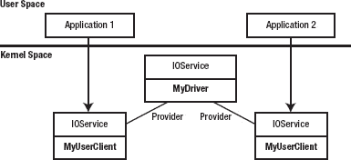

**图 5-2.** 驱动对象与其用户客户端对象之间的关系，后者提供了应用程序连接到驱动的内核端表示。

要建立与驱动的连接，应用程序只需按如下方式调用函数`IOServiceOpen()`：

```cpp
task_port_t     owningTask = mach_task_self();
uint32_t        type = 0;
io_connect_t    driverConnection;
kern_return_t   kr;

kr = IOServiceOpen(service, owningTask, type, &driverConnection);
```


在上述代码中，`service` 表示应用程序希望连接的驱动程序，该驱动程序通过之前描述的标准驱动匹配技术找到，`owningTask` 表示正在运行的应用程序，而 `type` 是一个无符号 32 位整数，其值由驱动程序以任意方式自行解释。如果函数成功完成，`driverConnection` 参数将返回给调用方，并代表与驱动程序建立的连接。应用程序向驱动程序发送的任何请求，都将通过调用一个以该连接对象为参数的函数来实现。当应用程序不再需要控制驱动程序时，它会调用 `IOServiceClose()` 函数。

当应用程序调用 `IOServiceOpen()` 函数时，操作系统会调用内核中指定的驱动程序对象来处理该请求。驱动程序的类将收到以下方法调用：

```
IOReturn    DriverClass::newUserClient (task_t owningTask, void* securityID, UInt32 type,
OSDictionary* properties, IOUserClient** handler)
```

`newUserClient()` 方法的许多参数应该看起来很熟悉。它们就是用户空间应用程序传递给 `IOServiceOpen()` 函数的值。`newUserClient()` 的内核实现负责实例化一个新的用户客户端对象，并通过 `handler` 参数将其返回给调用方。然而，大多数驱动程序并不需要实现 `newUserClient()` 方法，因为 `IOService` 基类已经提供了一个适用于几乎所有用途的实现。要利用这个标准实现，驱动程序只需在其属性表中添加一个键为 `IOUserClientClass` 的字符串值即可。该属性的值是一个字符串，其中包含了驱动程序的用户客户端类的类名。这可以通过在 `Info.plist` 文件中添加驱动程序个性条目来实现（因为驱动程序的属性表是根据 `Info.plist` 文件中的值初始化的），也可以在驱动程序加载时手动设置该属性。例如，图 5-2 中的驱动程序有一个由名为 `MyUserClient` 的类实现的用户客户端，因此它会通过以下调用来设置其用户客户端类：

```
setProperty("IOUserClientClass", "MyUserClient");
```

`newUserClient()` 的标准实现会实例化驱动程序指定的用户客户端类，并初始化新的用户客户端，将主驱动程序类作为其提供者。

现在，让我们看看如何为第 4 章中开发的教程 I/O Kit 驱动程序实现一个用户客户端类。该驱动程序骨架用户客户端类的头文件如清单 5-8 所示。你会注意到，用户客户端实现的许多方法与主驱动程序类实现的方法类似，这是因为 `IOUserClient` 类派生自与所有驱动程序最终派生自的同一个 `IOService` 类。因此，用户客户端实现了与任何其他驱动程序类必须实现的相同的初始化和终止方法。

**清单 5-8.** 基本用户客户端类的头文件

```
class com_osxkernel_driver_IOKitTestUserClient : public IOUserClient
{
        OSDeclareDefaultStructors(com_osxkernel_driver_IOKitTestUserClient)

private:
        task_t                          m_task;
        com_osxkernel_driver_IOKitTest* m_driver;

public:
        virtual bool    initWithTask (task_t owningTask, void* securityToken,
                                        UInt32 type, OSDictionary* properties);
        virtual bool    start (IOService* provider);

        virtual IOReturn        clientClose (void);     
        virtual void    stop (IOService* provider);
        virtual void    free (void);
};
```

除了熟悉的方法 `start()`、`stop()` 和 `free()` 之外，用户客户端还提供了一个属于用户客户端对象管理范畴的额外方法，即 `clientClose()`。当用户空间应用程序关闭与驱动程序的连接时，无论是通过调用 `IOServiceClose()`，还是因为应用程序终止或崩溃，都会调用此方法。驱动程序不应信任用户空间应用程序能够编写良好并在用户客户端关闭前自行清理。因此，`clientClose()` 方法是驱动程序确保硬件恢复到空闲状态并准备好供下一个希望使用它的用户空间应用程序使用的好地方。

 **提示** `IOUserClient` 类提供了一个名为 `clientDied()` 的方法。子类可以选择实现此方法，如果它需要区分客户端连接是由于用户空间进程未调用 `IOServiceClose()` 而终止导致的关闭。由于 `clientDied()` 的默认实现只是简单地调用 `clientClose()`，大多数用户客户端实现可以通过实现 `clientClose()` 方法来同时处理这两种情况。

示例用户客户端类的实现如清单 5-9 所示。为简洁起见，省略了 `stop()` 和 `free()` 的实现方法，因为对于我们的基本用户客户端，这些方法只是简单地调用了超类提供的实现。

**清单 5-9.** 基本用户客户端类的实现

```
// 定义超类。
#define super IOUserClient

OSDefineMetaClassAndStructors(com_osxkernel_driver_IOKitTestUserClient, IOUserClient)

bool    com_osxkernel_driver_IOKitTestUserClient::initWithTask (task_t owningTask, void*
securityToken, UInt32 type, OSDictionary* properties)
{
        if (!owningTask)
                return false;

        if (! super::initWithTask(owningTask, securityToken , type, properties))
                return false;

        m_task = owningTask;

        // 可选：判断调用进程是否具有管理员权限。
        IOReturn ret = clientHasPrivilege(securityToken, kIOClientPrivilegeAdministrator);
        if ( ret == kIOReturnSuccess )
        {
                // m_taskIsAdmin = true;
        }

        return true;
}

bool    com_osxkernel_driver_IOKitTestUserClient::start (IOService* provider)
{
        if (! super::start(provider))
                return false;

        m_driver = OSDynamicCast(com_osxkernel_driver_IOKitTest, provider);
        if (!m_driver)
                return false;

        return true;
}

IOReturn        com_osxkernel_driver_IOKitTestUserClient::clientClose (void)
{
        terminate();
        return kIOReturnSuccess;
}
```

关于清单 5-9 中展示的三个用户客户端方法的实现，有几点需要注意：


在`initWithTask()`方法中，我们将参数`owningTask`保存到一个实例变量中。正如本章后面将要看到的，当我们希望访问客户端地址空间中的内存时（例如，当驱动程序将数据写入由客户端进程分配的缓冲区时），需要用到这个值。`initWithTask()`方法也是确定调用进程权限的一个机会。虽然不常用，但用户客户端可能希望将某些操作限制在具有管理员权限运行的任务上。例如，以太网卡可以使用此方法来防止非特权进程启用混杂模式并访问所有网络数据包。

`start()`方法相当直接，但值得注意的是，作为参数传入的提供者类是主驱动程序类的一个实例。由于用户客户端的角色是接收用户空间应用程序的控制请求并将这些请求传递给驱动程序，因此提供者类需要引用主驱动程序类。这可以通过将`start()`方法中的提供者类保存到实例变量来实现。

`clientClose()`方法是在调用进程通过调用`IOServiceClose()`函数关闭其与驱动程序的连接，或者在没有关闭与驱动程序连接的情况下终止时被调用的。用户客户端在作为`IOService`终止过程一部分（如`stop()`和`free()`）调用的任何其他方法之前，会先接收到`clientClose()`。`clientClose()`的实现应释放代表调用进程分配的所有资源，并将硬件恢复到空闲状态。最后，重要的是实现必须调用`terminate()`方法，该方法会启动销毁用户客户端对象的过程。

用户客户端的角色是作为用户空间应用程序与内核驱动程序之间所有通信的中介。来自用户空间的请求由一个 32 位整数控制码标识，该控制码由驱动程序开发者定义。对于每个请求，应用程序还可以提供参数并从控制请求接收结果。创建用户客户端类之后，剩下的就是定义一个接口，将驱动程序的功能暴露给用户空间应用程序。此接口将由两部分组成：

*   可供希望利用内核驱动程序提供的服务的用户空间应用程序调用的函数库
*   用户客户端类中与每个用户函数相对应并提供接口的内核侧实现的多个方法

用户空间中的库函数和内核中的用户客户端方法都只需要基本实现，因为功能本身来自主驱动程序类。用户空间接口中函数的作用是编码操作及其参数，并将请求传递给驱动程序。当用户客户端接收到请求时，其作用是解码操作和参数，并调用实现所请求功能的适当驱动程序函数。

对于我们的简单用户客户端，我们将定义一个为应用程序提供计时功能的接口。用户空间接口将实现以下函数：

```
kern_return_t   StartTimer (io_connect_t connection);
kern_return_t   StopTimer (io_connect_t connection);
kern_return_t   GetElapsedTimerTime (io_connect_t connection, uint32_t* timerTime);
kern_return_t   GetElapsedTimerValue (io_connect_t connection, TimerValue* timerValue);
kern_return_t   DelayForMs (io_connect_t connection, uint32_t milliseconds);
kern_return_t   DelayForTime (io_connect_t connection, const TimerValue* timerValue);
```

所有驱动程序接口都有用户空间实现和内核用户客户端实现都需要使用的值和类型定义。对于我们定义的接口，共享定义包括请求码和类型定义，例如`TimerValue`结构体。为了允许这些定义在两个项目之间共享，此类定义通常放在一个公共头文件中，该头文件可以被用户空间应用程序和内核项目包含。我们驱动程序的共享定义如列表 5-10 所示。

***列表 5-10.** “TestDriverInterface.h”的内容，包含内核用户客户端和用户空间接口都需要的定义.*

```
typedef struct TimerValue
{
        uint64_t        time;
        uint64_t        timebase;
} TimerValue;

// 用户客户端方法的控制请求码。
enum TimerRequestCode {
        kTestUserClientStartTimer,
        kTestUserClientStopTimer,
        kTestUserClientGetElapsedTimerTime,
        kTestUserClientGetElapsedTimerValue,
        kTestUserClientDelayForMs,
        kTestUserClientDelayForTime,

        kTestUserClientMethodCount
};
```

 **注意** `IOUserClient`将控制请求分派给适当处理程序的接口在 Mac OS X 10.5 中已更改，以支持 64 位内核。新的实现与旧版本的 Mac OS X 不向后兼容。本章仅描述更新后的接口。

I/O Kit 框架包含许多应用程序可用来调用驱动程序的用户客户端中的方法的函数。对于特定控制请求，应用程序应使用哪个函数取决于操作所需的参数类型。对于参数基于整数的请求，`IOConnectCallScalarMethod()`函数是一个合适的选择，因为它允许将可变大小的 64 位整数数组从用户进程传递到内核用户客户端，并从内核驱动程序接收包含操作结果的 64 位整数数组：

```
kern_return_t   IOConnectCallScalarMethod(
                        io_connect_t            connection,
                        uint32_t                selector,
                        const uint64_t*         inputValues,
                        uint32_t                inputCount,
                        uint64_t*               outputValues,
                        uint32_t*               outputCount);
```

该函数的第一个参数是与驱动程序用户客户端的连接，调用者之前已通过调用`IOServiceOpen()`获取了该连接。下一个参数`selector`是由驱动程序定义的控制码，用于描述用户客户端应执行哪个操作。这将是列表 5-10 中定义的`TimerRequestCode`枚举中的一个值。函数的其余参数允许应用程序传递用户客户端在执行操作时所需的任何参数，并在操作之后从用户客户端接收任何结果。标记为输入的参数由调用应用程序提供给用户客户端。标记为输出的参数由用户客户端返回给应用程序。`outputCount`参数既是输入参数也是输出参数；调用者将其值初始化为`outputValues`数组中的元素数量，这告诉用户客户端它可以安全地向该数组写入多少个值。当函数完成时，实际写入`outputValues`数组的值的数量通过`outputCount`的值返回。如果调用者不期望用户客户端返回任何值，则可以将`NULL`作为`outputCount`参数传递。


```markdown

如果一个控制请求接受不同类型的参数，那么定义一个包含所有提供给用户客户端的参数的结构体，以及一个用于接收方法返回结果的结构体，可能会更自然。I/O Kit 框架提供的`IOConnectCallStructMethod()`函数实现了这一点：

```
kern_return_t   IOConnectCallStructMethod(
                        io_connect_t    connection,
                        uint32_t        selector,
                        const void*     inputStruct,
                        size_t          inputStructSize,
                        void*           outputStruct,
                        size_t*         outputStructSize);
```

指向包含输入参数的结构体的指针通过`inputStruct`参数提供，输入结构体的字节大小通过`inputStructSize`参数传递。与标量函数一样，`outputStructSize`参数既是输入参数也是输出参数。调用者将其初始化设为`outputStruct`缓冲区的最大字节大小；完成后，用户客户端通过`outputStructSize`参数返回写入`outputStruct`缓冲区的字节数。

您可能想知道为什么返回的结构体大小会与输出结构体的预期大小不同。函数`IOConnectCallStructMethod()`可用于从用户客户端读取可变长度数组或可变长度字符串。在这些情况下，调用者事先不知道将返回多少字节。如果控制请求不需要输入结构体，则可以将`NULL`作为`inputStruct`参数传递，并将`inputStructSize`设为 0 字节。如果控制请求不返回输出结构体，则可以为`outputStruct`和`outputStructSize`参数都传递`NULL`。

I/O Kit 框架还允许混合使用标量参数和结构体参数，适用于那些既有基于整数的输入或输出参数，又需要输入或输出结构体参数的函数：

```
kern_return_t   IOConnectCallMethod(
                        io_connect_t    connection,
                        uint32_t        selector,
                        const uint64_t* inputValues,
                        uint32_t        inputCount,
                        const void*     inputStruct,
                        size_t          inputStructSize,
                        uint64_t*       outputValues,
                        uint32_t*       outputCount,
                        void*           outputStruct,
                        size_t*         outputStructSize);
```

尽管 I/O Kit 框架提供了三个用于调用用户客户端方法的函数，但`IOConnectCallScalarMethod()`和`IOConnectCallStructMethod()`仅仅是基于`IOConnectCallMethod()`构建的便捷函数。

鉴于 I/O Kit 框架提供了三种调用用户客户端方法的方式，我们来看看如何为示例驱动程序实现用户空间接口。`StartTimer()`和`StopTimer()`函数不向用户客户端传递额外参数，因此它们可以通过调用三个`IOConnectCallXXX()`函数中的任何一个来实现。我们选择使用`IOConnectCallMethod()`函数来实现`StartTimer()`和`StopTimer()`。`StartTimer()`的用户空间实现如下：

```
kern_return_t   StartTimer (io_connect_t connection)
{
        return IOConnectCallMethod(connection, kTestUserClientStartTimer,
                                NULL, 0, NULL, 0, NULL, NULL, NULL, NULL);
}
```

`GetElapsedTimerTime()`的实现从用户客户端读取一个 32 位整数，因此使用`IOConnectCallScalarMethod()`函数来实现它似乎很自然。I/O Kit 用于表示标量值的整数类型是 64 位无符号整数，而不是调用者期望的 32 位值，因此我们需要通过一个临时的 64 位变量对从用户客户端接收到的结果进行类型转换。在`IOConnectCallScalarMethod()`函数完成后，我们不会检查`scalarOutCount`的值，因为如果操作成功完成，我们可以信赖驱动程序的实现返回了一个整数。

```
kern_return_t   GetElapsedTimerTime (io_connect_t connection, uint32_t* timerTime)
{
        uint64_t                scalarOut[1];
        uint32_t                scalarOutCount;
        kern_return_t           result;

        scalarOutCount = 1;     // 初始化为 scalarOut 数组的大小
        result = IOConnectCallScalarMethod(connection, kTestUserClientGetElapsedTimerTime,
                                        NULL, 0, scalarOut, &scalarOutCount);
        if (result == kIOReturnSuccess)
                *timerTime = (uint32_t)scalarOut[0];

        return result;
}
```

最后，我们来看看用户空间库中`DelayForTime()`函数的实现。该函数通过结构体将其参数传递给用户客户端，因此我们使用`IOConnectCallStructMethod()`函数来实现它。

```
kern_return_t   DelayForTime (io_connect_t connection, const TimerValue* timerValue)
{
        return IOConnectCallStructMethod(connection, kTestUserClientDelayForTime,
                                        timerValue, sizeof(TimerValue), NULL, 0);
}
```

来自用户空间应用程序的所有请求都将调用用户客户端类中名为`externalMethod()`的方法，该方法负责调度适当的方法来处理控制请求并解包用户空间应用程序提供的参数。`IOUserClient`基类提供了`externalMethod()`的实现；然而，任何为控制请求提供支持的用户客户端都应当重写基类的实现。在进一步研究驱动程序用户客户端应如何实现`externalMethod()`之前，值得先看看它的接口：

```
IOReturn IOUserClient::externalMethod (uint32_t selector, IOExternalMethodArguments* args,
                        IOExternalMethodDispatch* dispatch, OSObject* target,
                        void* reference);
```

当 I/O Kit 调用您类的`externalMethod()`实现时，只会填充前两个参数；`dispatch`、`target`和`reference`的值都将被设置为`NULL`。第一个参数`selector`是一个 32 位的控制代码，用于指定客户端应用程序请求的操作。下一个参数`args`包含应用程序传递给用户客户端的所有标量和结构体参数。`IOExternalMethodArguments`结构体的定义如下所示，为了清晰起见，省略了一些字段：

```
struct IOExternalMethodArguments
{
        …
        const uint64_t*         scalarInput;
        uint32_t                scalarInputCount;

        const void*             structureInput;
        uint32_t                structureInputSize;

        IOMemoryDescriptor*     structureInputDescriptor;

        uint64_t*               scalarOutput;
        uint32_t                scalarOutputCount;

        void*                   structureOutput;
        uint32_t                structureOutputSize;

        IOMemoryDescriptor*     structureOutputDescriptor;
        uint32_t                structureOutputDescriptorSize;
};
```

```

```markdown

`IOExternalMethodArguments`结构的字段应该很熟悉，因为它们与用户空间的`IOConnectCallMethod()`函数的参数列表几乎完美匹配。有两个字段值得解释：`structureInputDescriptor`和`structureOutputDescriptor`。这些字段用于在用户进程和内核驱动之间传递大于 4096 字节的结构。对于小于虚拟内存页面大小的结构，I/O Kit 会将整个结构从用户缓冲区复制到内核内存缓冲区。对于更大的缓冲区，I/O Kit 会创建一个`IOMemoryDescriptor`对象来直接从用户进程的地址空间引用该缓冲区。`IOMemoryDescriptor`类在第 6 章“内存管理”中描述。

鉴于`externalMethod()`的前两个参数为实现提供了执行请求操作所需的所有信息，您可能想知道剩下的三个参数如何适配。驱动程序的用户客户端在实现`externalMethod()`时采用的传统方法是调用`IOUserClient`超类的实现，传递提供给其方法的`selector`和`args`的值，但填写`dispatch`、`target`和`reference`参数来描述应调用的类方法以处理控制请求。

尽管没有什么能阻止驱动程序在不调用超类的情况下实现`externalMethod()`，但使用`IOUserClient`类提供的实现的优势在于，其实现会对调用进程提供的参数进行验证。`IOUserClient`执行的验证仅限于确保用户客户端从调用进程接收到了预期的参数——例如，确保进程提供了正确数量的标量输入输出参数，并且进程提供的结构参数大小与驱动程序将要读写的结构大小匹配。为此，`IOUserClient`对`externalMethod()`的实现需要知道驱动程序对控制请求期望的参数；这些信息来自通过`dispatch`参数传递给超类实现的`IOExternalMethodDispatch`结构。`IOExternalMethodDispatch`的类型定义如下：

```
struct IOExternalMethodDispatch
{
        IOExternalMethodAction          function;
        uint32_t                        checkScalarInputCount;
        uint32_t                        checkStructureInputSize;
        uint32_t                        checkScalarOutputCount;
        uint32_t                        checkStructureOutputSize;
};
```

`IOExternalMethodDispatch`结构描述了应调用来处理控制请求的回调函数、标量输入输出参数的数量，以及回调函数期望的任何输入输出结构参数的大小。对于可以接受可变数量标量参数或可变长度结构的回调函数，可以将常量`kIOUCVariableStructureSize`写入`IOExternalMethodDispatch`结构的相应字段。

回调函数具有以下签名：

```
typedef IOReturn (*IOExternalMethodAction)(OSObject* target, void* reference,
                        IOExternalMethodArguments* args);
```

您会注意到，回调函数的参数对应于`IOUserClient::externalMethod()`的三个参数，包括`target`和`reference`。这不仅仅是巧合。当您的驱动程序调用超类对`externalMethod()`的实现时，它会验证用户空间进程提供的参数，如果提供了正确的参数，它会调用指定的处理函数，将`target`、`reference`和`args`的值传递给回调函数。由于回调函数是一个静态方法，它无法通过`this`指针访问用户客户端的任何实例变量。因此，`target`的值应设置为将处理控制请求的用户客户端实例，或者，如果控制请求将由不同类的方法处理，则`target`应设置为该类的实例。`reference`的值可供用户客户端自由用于向回调函数传递任意数据。

处理来自用户空间客户端的控制请求的整个过程，包括驱动程序的定制用户客户端实现所执行的步骤以及标准`IOUserClient`实现所执行的步骤，在以下伪代码中描述：

```
// Implementation provided by the driver's IOUserClient subclass
IOReturn           MyUserClient::externalMethod (selector, args, dispatch, target, reference)
{

        Use "selector" to determine which control request has been requested

        Initialize "newDispatch" to the appropriate callback function to handle the control
        request
        Initialize "newTarget" to the current MyUserClient instance
        Initialize "newReference" if we wish to provide additional data to the callback
        function

        Call the superclass:
        IOUserClient::externalMethod(selector, args, newDispatch, newTarget, newReference)
}

// Implementation provided by the I/O Kit's superclass
IOReturn           IOUserClient::externalMethod(selector, args, dispatch, target, reference)
{
        Check that the parameters provided by the user process through "args" match the
        parameters expected by the user client as described in "dispatch".

        If the parameters do not match, exit with the result kIOReturnBadArgument

        Otherwise, call the callback handler for this control request:
        dispatch->function(target, reference, args)
}
```

按照惯例，大多数驱动程序通过向其用户客户端类添加一个调度表来实现`externalMethod()`，该表包含用户客户端接受的每个选择器值的`IOExternalMethodDispatch`值。例如，我们的计时器用户客户端的一个可能的调度表如列表 5-11 所示。

**列表 5-11.** 教程用户客户端接口的调度表

```
const IOExternalMethodDispatch
com_osxkernel_driver_IOKitTestUserClient::sMethods[kTestUserClientMethodCount] =
{
        // kTestUserClientStartTimer   (void)
        { sStartTimer, 0, 0, 0, 0 },

        // kTestUserClientStopTimer   (void)
        { sStopTimer, 0, 0, 0, 0 },

        // kTestUserClientGetElapsedTimerTime   (uint32_t* timerValue)
        { sGetElapsedTimerTime, 0, 0, 1, 0 },

        // kTestUserClientGetElapsedTimerValue   (TimerValue* timerValue)
        { sGetElapsedTimerValue, 0, 0, 0, sizeof(TimerValue) },

        // kTestUserClientDelayForMs   (uint32_t milliseconds)
        { sDelayForMs, 1, 0, 0, 0 },

        // kTestUserClientDelayForTime  (const TimerValue* timerValue)
        { sDelayForTime, 0, sizeof(TimerValue), 0, 0 }
};
```

为了方便起见，我们将使用`TimerRequestCode`枚举中的值作为数组索引来访问调度表中的项目，因此调度表中的项目顺序必须与列表 5-10 中定义的请求代码顺序匹配。

```


定义一个调度表后，用户客户端的`externalMethod()`实现变得简单得多，因为它所需的几乎所有值都直接来自调度表。代码清单 5-12 展示了一个可能的实现。

**代码清单 5-12.** 自定义用户客户端`externalMethod()`的实现

```
IOReturn        com_osxkernel_driver_IOKitTestUserClient::
                externalMethod (uint32_t selector, IOExternalMethodArguments* arguments,
                                IOExternalMethodDispatch* dispatch, OSObject* target,                                 void* reference)
{
        // Ensure the requested control selector is within range.
        if (selector >= kTestUserClientMethodCount)
            return kIOReturnUnsupported;

        dispatch = (IOExternalMethodDispatch*)&sMethods[selector];
        target = this;
        reference = NULL;
        return super::externalMethod(selector, arguments, dispatch, target, reference);
}
```

最后，为了完善用户客户端，我们来了解一下自定义用户客户端提供的两个选择器`GetElapsedTimerTime()`和`DelayForTime()`的可能实现。如前所述，用户客户端实现的每个选择器都有一个对应的回调函数来处理该选择器。该回调函数的参数通过`IOExternalMethodArguments`结构体传递。如果参数能直接作为函数参数传递，处理起来会容易得多，因此每个控制选择器通常有两个方法处理程序：静态回调处理程序和一个提供实际实现的实例方法。

静态回调方法从`IOExternalMethodArguments`结构体中解包参数，并将其传递给用户客户端类或主驱动程序类中的实例方法来执行实际工作。代码清单 5-13 展示了`GetElapsedTimerTime()`和`DelayForTime()`方法的这种安排。

**代码清单 5-13.** 两个用户客户端方法的实现

```
IOReturn        com_osxkernel_driver_IOKitTestUserClient::
                sGetElapsedTimerTime (OSObject* target, void* reference,
                                        IOExternalMethodArguments* arguments)
{
        com_osxkernel_driver_IOKitTestUserClient*       me;
        uint32_t                timerTime;
        IOReturn                result;

        me = (com_osxkernel_driver_IOKitTestUserClient*)target;

        // Call the method that implements the operation.
        result = me->getElapsedTimerTime(&timerTime);
        // Return the scalar result of the operation to the calling process.
        arguments->scalarOutput[0] = timerTime;

        return result;
}

IOReturn        com_osxkernel_driver_IOKitTestUserClient::
                sDelayForTime (OSObject* target, void* reference,
                                IOExternalMethodArguments* arguments)
{
        com_osxkernel_driver_IOKitTestUserClient*       me;

        me = (com_osxkernel_driver_IOKitTestUserClient*)target;
        return me->delayForTime((TimerValue*)arguments->structureInput);
}
```

请注意，在`sGetElapsedTimerTime()`的实现中，我们不需要验证`scalarOutput`数组的大小，在`sDelayForTime()`的实现中也不需要验证`structureInput`缓冲区的大小。这是因为我们可以知道这些参数已经由`IOUserClient`父类的`externalMethod()`实现验证过，该实现已将提供的参数与驱动程序期望的参数进行了比较。然而，`getElapsedTimerTime()`的实际实现会验证客户端是否在尝试读取定时器时间之前已通过调用`StartTimer()`启动了定时器。

 **注意** 驱动程序的用户客户端应始终验证从用户进程接收的参数值。该进程可能已被入侵，或者由第三方开发，其代码可能提供了驱动程序不希望接收的参数值。未能拒绝非法参数值可能导致驱动程序内核恐慌，或在系统中引入漏洞。


好的，作为一名高级文档工程师和翻译员，我将遵循您的注意事项和示例，将给定的英文文本翻译成中文。


### 来自驱动程序的通知

我们在示例驱动程序的用户客户端中实现的方法被设计为阻塞函数；也就是说，用户进程会一直等待，直到用户客户端完成请求的操作后才会继续执行。例如，我们的用户客户端中的 `DelayForMs()` 方法会挂起调用它的线程，直到指定的延迟时间结束。虽然对于一个旨在显式延迟调用线程的函数来说，这可能不是坏事，但用户空间应用程序可能并不总是希望等待驱动程序操作完成，特别是当该操作可能需要不确定的时间，或者依赖于驱动程序无法控制的事件时，例如串口数据的到达。

有两种方法可以解决这个问题。与 Windows 驱动程序模型不同（该模型除非显式启用，否则不允许应用程序同时向驱动程序发送多个控制请求），I/O Kit 允许应用程序根据其需要，将尽可能多的线程的请求发送到用户客户端。这意味着对于阻塞操作的一种解决方案是，应用程序创建一个辅助线程来调用阻塞的用户客户端方法。这样，当驱动程序处理请求时，应用程序的其余部分可以继续执行。第二种方法是让用户客户端实现异步操作，并在操作完成时通过回调函数通知应用程序。

I/O Kit 框架使开发人员能够轻松地将同步阻塞操作转变为异步操作。为了了解具体如何实现，让我们扩展本章中开发的驱动程序接口，加入一个名为 `InstallTimer()` 的函数。该函数将延迟指定的时间，然后通过回调函数通知应用程序。通过这种方式，`InstallTimer()` 函数可以被视为我们现有函数 `DelayForTime()` 的异步实现版本。

I/O Kit 框架实现异步通知的方式，与本章开头描述的设备到达通知的传递方式非常相似（参见代码清单 5-2）。事实上，设备到达通知可以被视为 I/O Kit 框架本身实现的一种特殊的异步完成回调。为了初始化我们的驱动程序库以支持传递完成回调，我们需要创建一个通知端口，内核驱动程序将通过该端口在操作完成时向用户空间进程发送信号。这与我们通过调用 `IONotificationPortCreate()` 函数创建用于传递设备到达通知的通知端口的方式相同。尽管此通知端口将由驱动程序的用户空间库分配，但提供一个允许应用程序访问该端口的函数是一种良好的设计实践，这样应用程序就可以将通知端口安装到其选择的运行循环上。代码清单 5-14 展示了驱动程序通知端口的访问器函数的一种可能实现。

**代码清单 5-14.** 分配一个端口，应用程序可以通过该端口在异步操作完成时接收通知

```
IONotificationPortRef   gAsyncNotificationPort = NULL;

IONotificationPortRef   MyDriverGetAsyncCompletionPort ()
{
        // 如果端口已分配，则返回现有实例。
        if (gAsyncNotificationPort != NULL)
                return gAsyncNotificationPort;

        gAsyncNotificationPort = IONotificationPortCreate(kIOMasterPortDefault);
        return gAsyncNotificationPort;
}
```

然后，应用程序可以按如下方式在其某个运行循环中分配并安装通知端口：

```
CFRunLoopSourceRef      runLoopSource;
notificationPort = MyDriverGetAsyncCompletionPort ();
runLoopSource = IONotificationPortGetRunLoopSource(notificationPort);
CFRunLoopAddSource(CFRunLoopGetCurrent(), runLoopSource, kCFRunLoopDefaultMode);
```

在分配了一个用户空间应用程序可以用来接收来自内核驱动程序的消息的通知端口后，我们现在需要将此端口提供给我们的内核驱动程序，以便它拥有一个可以向其发送异步操作完成信号的端口。该通知端口在每个异步控制请求中提供给驱动程序的用户客户端。I/O Kit 框架为每个 `IOConnectCallXXX()` 函数提供了异步变体，命名为 `IOConnectCallAsyncXXX()`。这些函数的异步形式接受额外的参数，包括一个通知端口、一个回调函数以及一个传递给回调函数的上下文参数。

在所有方面，`IOConnect` 函数的异步变体与其同步版本的行为相同；例如，`IOConnectCallAsyncScalarMethod()` 向用户客户端传递一个整数值数组，并从用户客户端接收一个整数值数组。与这些函数的同步形式一样，任何输出参数都会在函数返回时立即写入，而不是在异步操作完成时写入（当函数返回时，驱动程序可能仍在处理该操作）。

为了举例说明如何使用异步函数，让我们审视示例 `InstallTimer()` 函数的实现。用户空间代码如代码清单 5-15 所示。

**代码清单 5-15.** 驱动程序 `InstallTimer()` 函数的异步控制请求的用户空间实现

```
kern_return_t   InstallTimer (io_connect_t connection, uint32_t milliseconds,
                        IOAsyncCallback0 timerCallback, void* context)
{
        io_async_ref64_t        asyncRef;
        uint64_t                scalarIn[1];

        // 设置回调函数。
        asyncRef[kIOAsyncCalloutFuncIndex] = (uint64_t)timerCallback;
        asyncRef[kIOAsyncCalloutRefconIndex] = (uint64_t)context;

        // 设置输入参数。
        scalarIn[0] = milliseconds;
        return  IOConnectCallAsyncScalarMethod(connection, kTestUserClientInstallTimer,
                IONotificationPortGetMachPort(gAsyncNotificationPort),
                asyncRef,  kIOAsyncCalloutCount,
                scalarIn, 1, NULL, NULL);
}
```

如果你将上面的函数与 `DelayForTime()` 的实现进行比较，你会注意到这两个函数有很多共同点，并且向用户客户端传递了相同的输入和输出参数。这两个函数之间的唯一区别是增加了 `timerCallback` 和 `context` 参数。回调函数及其上下文参数通过 `io_async_ref64_t` 结构提供给 `IOConnectCallAsync` 函数，该结构被定义为一个无符号 64 位整数数组。因为 `io_async_ref64_t` 数组的某些元素由 I/O Kit 内部使用，应用程序应使用常量 `kIOAsyncCalloutFuncIndex` 和 `kIOAsyncCalloutRefconIndex` 来访问该数组，如示例所示。

这就是应用程序执行异步操作所需做的全部工作。当操作完成时，提供的回调函数将被通知，并在应用程序安装了运行循环源的运行循环上执行。回调函数具有以下签名：

```
typedef void (*IOAsyncCallback0)(void* context, IOReturn result);
```

请注意，`IOAsyncCallback0` 中的“0”指的是该函数从驱动程序接收的参数数量。这些参数与传递给 `IOConnectCallAsyncScalarMethod()` 函数的输出标量计数是分开的，它们由内核在异步操作完成时指定。


### 排版后的文本

当然，要使操作异步进行，内核驱动程序必须确保它能从用户客户端立即返回，同时在后台继续处理请求的操作，并在操作完成时向进程发送信号。异步方法调用被用户客户端接收的方式与任何其他方法调用并无不同，并通过`externalMethod()`分派给一个处理函数，该函数通过`IOExternalMethodArguments`结构体接收其参数。然而，与同步方法不同的是，`IOExternalMethodArguments`结构体包含对异步操作有用的字段，如下定义所示：

```
struct IOExternalMethodArguments
{
        …
        mach_port_t             asyncWakePort;
        io_user_reference_t*    asyncReference;
        uint32_t                asyncReferenceCount;
        …
};
```

通过检查`asyncWakePort`的值，实现控制请求的方法可以确定用户应用程序是否通过异步函数调用调用了它。如果该值非零，则表示请求了异步操作。鉴于处理函数将在后台执行请求的操作（因为异步控制请求应避免阻塞调用应用程序），它需要保存它将需要在执行操作时引用的`IOExternalMethodArguments`结构体中的任何值。这包括复制调用者提供的任何标量和结构体输入参数值（注意，输出值会在用户客户端返回时立即返回给调用应用程序，而不是在异步操作完成时）。需要保存的`IOExternalMethodArguments`结构体中的一个重要值是`asyncReference`缓冲区，因为它用于在操作完成时向应用程序发送信号。

下面在列表 5-16 中展示了一个如何执行异步操作的示例。

**列表 5-16.** 异步操作的用户客户端实现。这实现了`InstallTimer()`函数的内核端。

```
// A structure to hold parameters required by the background operation.
struct TimerParams
{
        OSAsyncReference64              asyncRef;
        uint32_t                        milliseconds;
        OSObject*                       userClient;
};

IOReturn  com_osxkernel_driver_IOKitTestUserClient::
       sInstallTimer (OSObject* target, void* reference, IOExternalMethodArguments* arguments)
{
        TimerParams*    timerParams;
        thread_t        newThread;

        // Allocate a structure to store parameters required by the timer.
        timerParams = (TimerParams*)IOMalloc(sizeof(TimerParams));
        // Take a copy of the asyncReference buffer.
        bcopy(arguments->asyncReference, timerParams->asyncRef, sizeof(OSAsyncReference64));

        // Take a copy of the "milliseconds" value provided by the user application.
        timerParams->milliseconds = (uint32_t)arguments->scalarInput[0];
        // Take a reference to the userClient object.
        timerParams->userClient = target;
        // Retain the user client while an asynchronous operation is in progress.
        target->retain();

        // Start a background thread to continue the operation after returning to the caller.
        kernel_thread_start(DelayThreadFunc, timerParams, &newThread);
        thread_deallocate(newThread);

        // Return immediately to the calling application.
        return kIOReturnSuccess;
}

void    com_osxkernel_driver_IOKitTestUserClient::
                DelayThreadFunc (void *parameter, wait_result_t)
{
        TimerParams*    timerParams = (TimerParams*)parameter;

        // Sleep for the requested time.
        IOSleep(timerParams->milliseconds);
        // Send a notification to the user application that the operation has competed.
        sendAsyncResult64(timerParams->asyncRef, kIOReturnSuccess, NULL, 0);

        // The background operation has completed, release the extra reference to the
        // user client object.
        timerParams->userClient->release();

        IOFree(timerParams, sizeof(TimerParams));
}
```

尽管前面的代码包含了很多信息，但重要的是要注意它分配一个对象来保存参数的方式，这些参数是驱动程序在后台线程上完成请求的操作时所需要的。为了防止用户客户端对象在操作进行期间被释放，该方法在启动操作时增加其保留计数，并在操作完成时减少其保留计数。最后，当后台操作完成时，用户客户端（或驱动程序）通过调用`sendAsyncResult64()`向用户应用程序发送信号。`sendAsyncResult64()`的最后两个参数在此示例中未使用，它们允许驱动程序向应用程序的回调函数提供额外的值。例如，异步读取操作可以使用它来返回读取的字节数。

### 总结

*   几乎所有驱动程序都需要将其服务暴露给用户运行的应用程序。
*   为了允许应用程序与内核驱动程序交互，驱动程序需要跨越用户空间代码和内核代码之间的屏障。使用 I/O Kit 框架编写的驱动程序通过实现一个派生自`IOUserClient`类的类来实现这一点。
*   应用程序可以遍历已加载的内核驱动程序，或者安装一个回调函数以在驱动程序加载和卸载时接收通知。
*   I/O Kit 提供了几个函数，允许用户应用程序请求驱动程序提供的服务，包括通过读取和写入驱动程序属性，或者通过建立到驱动程序的连接并通过该连接向驱动程序发送控制请求。

## 第 6 章


