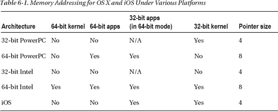
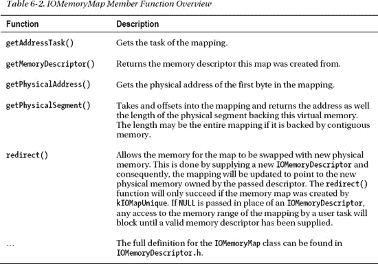
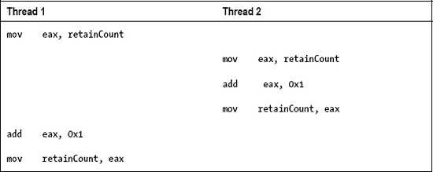
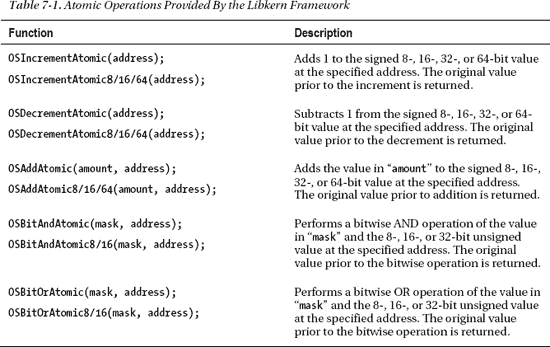
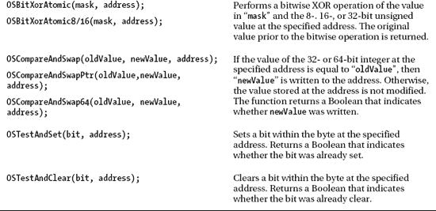
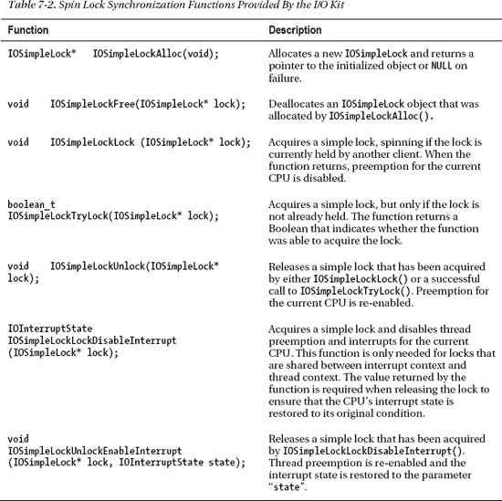
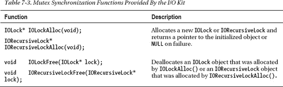
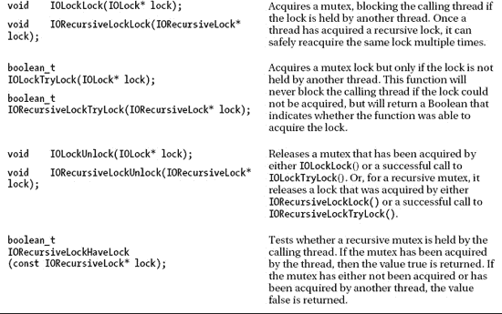
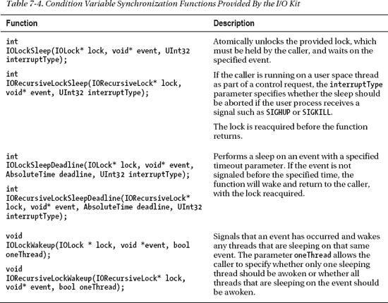
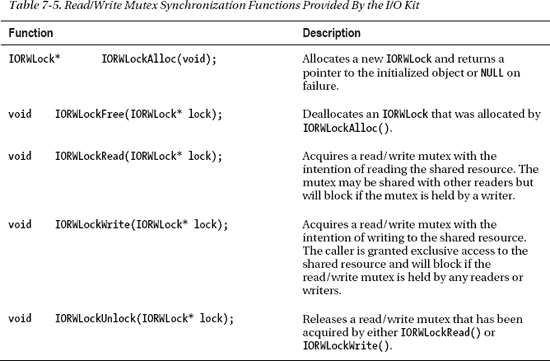

# 内存管理

内核中的内存管理比用户空间程序中的内存管理要复杂得多。用户空间程序通常处理的是平坦的线性地址空间，可以以任意大小的块分配内存，而无需关心这些内存的来源或布局。它拥有简单的接口，通常以字节大小作为参数，并根据所请求内存的可用性返回成功或失败的结果。最糟糕的情况下，内存分配失败或使用不当的后果是导致出错进程被终止。

然而，内核中的情况却并非如此简单。内核必须处理多个内存空间，包括其自身的内存空间，以及这些内存空间与物理内存之间的映射。用户空间程序处理的是虚拟内存，底层物理布局无关紧要，而内核通常需要知道内存是否是连续的以及位于何处。这是因为某些硬件设备无法从特定内存地址读取数据，或者对内存对齐有特殊要求，例如，只能从已按 16 字节边界对齐的内存中读取数据，或者无法读取高于 32 位的地址。然而，内核内存管理最明显的挑战是尽可能少地使用内存，因为它是稀缺资源，尤其对于 iPhone 或 iPad 等嵌入式设备而言。在内核中错误地使用内存可能导致微妙或并不微妙的后果。

在本章中，我们旨在解释作为内核程序员将遇到的各种内存类型、它们的用途，以及最有效、最安全的内存使用方式。我们还将讨论用于分配和管理内存的机制与方法，以及操作系统用于管理内存的一些底层机制。我们还将了解如何执行内存映射操作，即如何将一个地址空间的内存映射到另一个任务的地址空间中。

## 内存类型

内核处理多种类型的内存，因此理解它们之间的差异是实现成功驱动程序或内核扩展的关键。

内存类型可分为：

*   CPU 物理地址
*   总线物理地址
*   用户与内核虚拟地址

除了这三种内存地址类型外，可寻址的内存量也因架构而异，范围从 32 位到 64 位。根据架构的不同，内存的字节序也可能不同，可以是小端序或大端序。

以下各节将讨论每种内存类型在内核编程中的重要性和用途。

### CPU 物理地址

物理地址指的是 CPU 用于访问物理内存的寻址系统。通常，物理地址隐藏在 CPU 的内存管理单元（MMU）之后。MMU 将内核和用户空间通常使用的虚拟地址转换为物理地址。对于 32 位系统，物理地址空间是线性的，范围从 `0` 到 `0xffffffff`（`2³²`）；对于 64 位系统，范围从 `0` 到 `0xffffffffffffffff`（`2⁶⁴`）。对物理内存的访问会缓存在较小的内存缓冲区中，例如通常位于 CPU 芯片上的 L1 和 L2 缓存。

通常，即使是在编写驱动程序时，也无需直接处理物理地址。

**物理地址扩展**

物理地址扩展（PAE）是英特尔开发的一项特性，允许更大的物理地址空间，从而绕过了 32 位系统上 4 GB 的内存限制。所有支持英特尔处理器的 Mac OS X 版本（10.4.4 及更高版本）都支持 PAE。PAE 将可用地址空间扩展到 36 位（显然，不存在 36 位的数据类型，因此地址用 64 位类型表示），从而能够寻址高达 64 GB 的物理内存。然而，PAE 并不改变进程使用的虚拟地址空间大小，后者仍然限制在 4 GB。虽然单个进程或内核无法使用超过 4 GB 的内存，但整个系统总共可以使用高达 64 GB 的内存。

### 总线物理地址

64 位计算的引入带来了一个挑战，因为传统的 I/O 总线（如 PCI 和 PCI-X）无法访问超过 32 位的内存地址。为了解决这个问题，基于 PowerPC G5 的 Mac 在其*北桥*上增加了一个额外的 MMU，用于将 64 位地址重映射为设备可以读取的 32 位地址。这个 MMU 被称为设备地址解析表（DART）。DART 将转换后的内存作为物理地址呈现给设备，然而这些地址是经过转换的，与 CPU 使用的物理地址不同。基于英特尔的计算机具有类似的能力，称为 I/O 内存管理单元（IOMMU），是用于定向 I/O 的虚拟化技术之一。

对于硬件设备来说，*总线物理地址*看起来是一个物理地址，但实际上它是由 DART 转换而来的虚拟地址。如果你感到困惑，不必担心；你很少需要处理这些地址。事实上，如果你使用 I/O Kit，并且使用了本章稍后讨论的 `IOMemoryDescriptor`，它将会自动为你完成所有必要的转换。驱动程序可以使用 `IOPhysicalAddress` 类型来处理物理地址。该类型的大小取决于底层架构。由于 PAE 的存在，即使在 32 位系统上，它也可能是 64 位的。


### 用户和内核虚拟地址

虚拟地址是线性地址，由 CPU 上名为内存管理单元（MMU）的专用芯片转换为物理地址。每个用户空间进程都有自己的内存地址空间，并且从所有实际用途来看，该进程似乎拥有所有物理内存。它可以使用其地址空间中的任何内存位置，甚至包括超过物理内存大小的地址。虚拟地址空间对进程来说呈线性，尽管支撑它的物理内存可能是碎片化的。

在 Mac OS X 中，整个虚拟地址空间都可供进程使用。在 32 位系统上，这包括从 0 到 4 GB 的内存地址。诸如 Microsoft Windows 或 Linux 之类的操作系统使用分离模型，其中内核被映射到每个进程的虚拟地址空间中。例如，在 Windows（32 位）上，用户空间虚拟内存占用从 0 到 `0x7FFFFFFF` 的地址，而保留给内核的内存地址则从 `0x80000000` 到 `0xFFFFFFFF`。由于内核已经被映射，当进程上下文切换到内核模式时（这本身已是一项昂贵的操作），CPU 无需更改页表。这种方法的缺点是内核和用户空间进程可用的地址空间更少，因此以 Windows 为例，在任何给定时间，内核或用户空间进程只能访问 2 GB 内存。在 Linux 上，典型的分割是 3 GB/1 GB，内核只使用 1 GB（尽管 Linux 中一切都是可配置的，也存在其他配置）。如果系统启用了 GPU，通常其具有高达 1 GB 的板载内存，这些内存必须映射到虚拟地址空间中，并且可能导致某些物理内存无法使用，因为 GPU 的大帧缓冲区*遮蔽*了这些内存。

为了避免遮蔽问题，Mac OS X 为内核（4 GB）和用户空间进程（4 GB）提供了完全独立的地址空间，但如前所述，缺点是上下文切换的开销更大。

Mac OS X 10.6 Snow Leopard 引入的 64 位内核彻底解决了地址空间有限的问题。在 64 位内核中，内核地址空间始终被映射。Mac OS X 分割地址空间，使得上 128 TB（！）保留给内核，而下 128 TB 属于当前运行的用户空间任务。尽管地址空间与用户空间共享，但由于页保护标志，任务无法访问内核内存。

虚拟内存地址可能并非始终有物理内存位置作为支撑，因为内存可能已被迁移到外部后备存储（如硬盘驱动器），这是因为它使用频率低，或者因为正在运行的进程需要超过可用量的内存。如果 CPU 访问一个地址，而该地址的内存不在驻留状态，就会产生*缺页异常*。操作系统的组件*分页器*会尝试获取包含该内存地址的页面。

虚拟地址空间的第一个页面（0–4 KB）对进程不可访问，如果尝试访问将会产生异常。

与架构无关的类型 `IOVirtualAddress` 可用于在 I/O Kit 代码中处理虚拟地址。该类型同样是 `mach_vm_address_t` 的别名，后者是 Mach 层中虚拟内存地址的类型。

 **提示** 有关虚拟内存更详细的讨论，请参阅第 1 章，有关 OS X 和 iOS 实现的详细信息，请参阅第 2 章。

## 内存字节序：大端序 vs. 小端序

字节序指的是二进制字在内存中各部分的排列顺序。根据所使用的 CPU 架构，其排列顺序将为小端序或大端序。这种影响可以通过一个简单的 C 程序来演示，如代码清单 6-1 所示。

***代码清单 6-1.** 打印一个 32 位字的字节序*

```
#include <stdio.h>
#include <stdint.h>
int main(int argc, char *argv[])
{
        uint32_t word = 0xaabbccdd;
        uint8_t* ptr = (uint8_t*)&word;
        printf("%02x %02x %02x %02x\n", ptr[0], ptr[1], ptr[2], ptr[3]);
        return 0;
}
```

在小端序系统上执行的结果将是：

- - -

`dd cc bb aa`

- - -

而在大端序系统上：

- - -

`aa bb cc dd`

- - -

正如你所见，在小端序系统上顺序是相反的。所有当前世代的 Mac 都是小端序，因为 Intel x86/x86_64 处理器是小端序；基于 ARM 的 iOS 设备也是如此。较旧的基于 PowerPC 的 Mac 是大端序。那么你为什么还要关心大端序呢？嗯，一些硬件架构或网络协议（如 TCP/IP）使用大端序；此外，你的驱动程序或内核扩展可能需要与基于 PowerPC 架构的旧 Mac 兼容。而且，OS X 支持 *Rosetta*，它在基于 Intel 的 Mac 上模拟 PowerPC 应用程序。你的驱动程序可能会被 *Rosetta* 客户端任务访问。一些用户空间 API（例如 Carbon 文件管理器）也使用大端序数据结构。

C 预处理宏 `__LITTLE_ENDIAN__` 和 `__BIG_ENDIAN__` 由编译器定义，可用于在编译时确定字节序。

## 32 位与 64 位内存寻址

现代 Mac OS X 系统现在已是 64 位。所谓 64 位，我们指的是 CPU 处理 64 位宽度地址（包括通用寄存器）的能力，以及使用 64 位数据总线和 64 位虚拟内存寻址的能力。

**INTEL 64 架构**

Intel 64 (x86-64) 架构是传统 Intel x86 指令集的扩展，使其能够在 64 位模式下运行，并支持大量物理内存。虽然 Intel 发明了 x86 兼容处理器，但此扩展最初由 AMD 创建，并以 AMD64 的名称推向市场。Intel 随后发布了他们自己的 64 位扩展版本，最初命名为 EM64T 和 IA-32e，提供了与 AMD 解决方案的兼容性。Intel 最初押注于从零设计的 IA64 (Itanium)。IA64 摒弃了 x86 的遗留问题。HP 和其他高性能服务器供应商（如 SGI）大力推广 IA64，但普及速度缓慢。Intel 64/AMD64 至今仍是主导架构。所有当前世代的 Mac 中都含有具备 Intel 64 能力的 CPU。一个 x86-64 处理器可以在两种模式下运行，*长模式*或*传统模式*。前者是 64 位模式，并提供兼容性，允许执行 32 位和 16 位应用程序。操作系统必须支持 64 位才能在此模式下运行。后者是 32 位模式，用于仅支持 32 位的操作系统。

表 6-1 展示了 OS X 和 iOS 所支持架构的寻址模式和原生指针大小。



由于内核可能在 32 位模式下运行，而应用程序在 64 位模式下运行，因此当 64 位进程与内核交换数据时（例如，通过 `ioctl()` 或 `IOUserClient` 方法），必须格外小心。在运行 64 位内核并与 32 位应用程序通信时也是如此。问题在于，32 位和 64 位编译器对数据类型的定义可能不同。例如，C 数据类型 `long` 在 32 位程序中是 4 字节宽，而在为 64 位指令集编译的程序中则是 8 字节宽。


### 内存分配

XNU 内核提供了一组丰富的工具用于分配内存。内核内存分配并不像用户空间库中的 `malloc()` / `free()` 接口那样简单直接。内核内存分配设施涵盖的范围从类似于用户空间 `malloc()` 接口的高级机制，到原始页面的直接分配。有几十种不同的函数可用于获取内存。具体使用哪一个取决于你工作的子系统——例如，Mach、BSD 或 I/O Kit——以及内存的需求，例如大小或对齐方式。可以说，内存是计算机系统上最有限的资源之一，尤其是对于 iOS 平台而言，与大多数基于 Mac OS X 的计算机相比，其物理内存数量有限。

在基本层面上，内核使用 `vm_page` 结构来跟踪物理内存。每个物理内存页面都存在一个 `vm_page` 结构。可用的页面是以下页面列表之一的一部分：

-   **活跃列表：** 包含映射到至少一个虚拟地址空间并且最近被使用过的物理页面。
-   **非活跃列表：** 包含已分配但最近未被使用的页面。
-   **空闲列表：** 包含未分配的页面。

从空闲列表中获取一个空闲页面是通过 `vm_page_grab()` 函数或其更高级的接口 `vm_page_alloc()` 完成的。与前者不同，后者将页面放入一个 `vm_object` 中，而不仅仅是将其从空闲列表中移除。如果内核检测到空闲页面数量低于某个阈值，它将通知页面换出守护进程。在这种情况下，分页器将以最近最少使用（LRU）的方式从非活跃列表中驱逐页面。那些从磁盘文件映射而来的页面是首要候选对象，并且可以被简单地丢弃。在 Mac OS X 和 iOS 上，VM 页面缓存和文件系统缓存是合并在一起的，这避免了重复，它们被统称为通用缓冲区缓存（UBC）。源自文件系统的页面由 *vnode* 分页器管理，而 VM 缓存中的页面则由 *default* 分页器管理。

以下各节将概述内核开发人员可用的各种内存分配机制，以及它们的使用方法和限制。

### 底层分配机制

内核有几族内存分配例程。每个主要子系统，例如 Mach、BSD 或 I/O Kit，都有自己的函数族。VM 子系统位于内核的 Mach 部分，它实现了用于分配内存的基本接口。这些接口又反过来用于形成更高级别的内存分配机制，供 BSD 和 I/O Kit 等其他子系统使用。

对于在内核的 Mach 部分工作，使用 `kmem_alloc*()` 函数族。这些函数是相当底层的，距离原始的 `vm_page_alloc()` 函数仅有几层之遥。可用的函数如下：

```
kern_return_t kmem_alloc(vm_map_t map, vm_offset_t* addrp, vm_size_t  size);
kern_return_t mem_alloc_aligned(vm_map_t map, vm_offset_t* addrp, vm_size_t size);
kern_return_t kmem_alloc_wired(vm_map_t map, vm_offset_t* addrp, vm_size_t size);
kern_return_t kmem_alloc_pageable(vm_map_t map, vm_offset_t* addrp, vm_size_t size);
kern_return_t kmem_alloc_contig(vm_map_t map, vm_offset_t* addrp, vm_size_t size,
                                vm_offset_t mask, int flags);
void kmem_free(vm_map_t map, vm_offset_t addr, vm_size_t size);
```

所有函数都要求你指定一个属于用户空间任务或 `kernel_map` 的 VM Map。除 `kmem_alloc_pageable()` 之外，上述所有函数都分配不可换出的线内（wired）内存。

### Mach 区域分配器

Mach 区域分配器是一种分配机制，可以分配固定大小的内存块，这些内存块被称为区域。一个区域通常代表一个常用的内核数据结构，例如文件描述符或任务描述符，但也可以指向用于更通用目的的内存块。由区域分配器分配的数据结构示例包括：

-   文件描述符
-   BSD 套接字
-   任务（`struct task`）
-   虚拟内存结构（VM Map、VM Object）

作为一名内核程序员，如果你需要频繁且快速地分配和释放相同类型的数据对象，你可以使用 `zinit()` 函数创建你自己的区域。要创建一个新区域，你需要告诉分配器对象的大小、队列的最大大小以及分配大小，该大小指定了当区域耗尽时将添加多少内存。

### kalloc 族

`kalloc` 族为快速内存分配提供了一个稍高级别的接口。那些使用过用户空间 `malloc()` 接口的人会熟悉这个 API。事实上，内核也有一个由 *libkern* 内核库定义的 `malloc()` 函数，该函数同样使用由 `kalloc()` 提供的内存。

```
void* kalloc(vm_size_t size);
void* kalloc_noblock(vm_size_t size);
void* kalloc_canblock(vm_size_t size, boolean_t canblock);
void* krealloc(void** addrp, vm_size_t old_size, vm_size_t new_size);
void kfree(void *data, vm_size_t size);
```

`kalloc` 族函数的内存是通过上一节讨论的 Mach 区域分配器获取的。更大的内存分配由 `kmem_alloc()` 函数处理。由于内存可能来自两个来源，`kfree()` 函数需要知道原始分配的大小以确定其来源，并在正确的位置释放内存。`kalloc` 族提供了构成 I/O Kit 和 BSD 层中基本内存函数基础的 API。它也是用于为 C++ 的 `new` 和 `new[]` 运算符提供内存分配的函数。

`kalloc` 函数及其变体，除了 `kalloc_noblock()`，可能会阻塞（休眠）以获取内存。`kfree()` 函数也是如此。因此，如果你需要在中断上下文或持有简单锁时获取内存，则必须使用 `kalloc_noblock()`。

可以查询可用的区域；以下是 `zprint` 命令的输出片段，显示了 `kalloc` 函数使用的区域。

```
                      elem   cur      max    cur      max    cur    alloc    alloc
zone name             size   size    size   #elts    #elts   inuse   size    count
-----------------------------------------------------------------------------------
kalloc.16               16    660K    922K   42240   59049   30284    4K     256 C
kalloc.32               32   3356K   4920K  107392  157464   73407    4K     128 C
kalloc.64               64   4792K   6561K   76672  104976   75837    4K      64 C
kalloc.128             128   2732K   3888K   21856   31104   20571    4K      32 C
kalloc.256             256   4248K   5184K   16992   20736   15950    4K      16 C
kalloc.512             512    968K   1152K    1936    2304    1870    4K       8 C
kalloc.1024           1024    784K   1024K     784    1024     735    4K       4 C
kalloc.2048           2048   3396K   4608K    1698    2304    1586    4K       2 C
kalloc.4096           4096   2204K   4096K     551    1024     508    4K       1 C
kalloc.8192           8192   3160K  32768K     395    4096     383    8K       1 C
kalloc.large         41375   5697K   6743K     141     166     141   40K       1 C
```

每个大小直到 8KB 都有一个对应的区域。小于 8KB 的分配会从最小匹配区域返回一个元素。不能部分分配一个元素，所以，例如，如果你需要 5000 字节的内存，你实际上会被分配 8192 字节（每次分配浪费 3192 字节！）。大于 8KB 的分配由相应的 `kmem_alloc()` 函数处理，而不是区域分配器，但仍然记录在虚拟区域 *kalloc.large* 中。


#### BSD 系统中的内存分配

BSD 子系统中的内存分配由以下函数和宏实现：

`#define MALLOC(space, cast, size, type, flags) (space) = (cast)_MALLOC(size, type, flags)`
`#define FREE(addr, type) _FREE((void *)addr, type)`
`#define MALLOC_ZONE(space, cast, size, type, flags) (space) = (cast)_MALLOC_ZONE(size, type, flags)`
`#define FREE_ZONE(addr, size, type) _FREE_ZONE((void *)addr, size, type)`

`void* _MALLOC(size_t size, int type, int flags);`
`void _FREE(void *addr, int type);`
`void* _MALLOC_ZONE(size_t size, int type, int flags);`
`void _FREE_ZONE(void *elem, size_t size, int type);`

在底层，`_MALLOC()` 函数根据传入的标志使用 `kalloc()` 的某个变体来分配内存；例如，如果需要非阻塞分配，则会调用 `kalloc_noblock()` (`M_NOWAIT`)。`_MALLOC_ZONE()` 函数则直接调用区域分配器，而不是通过 `kalloc()` 间接调用。它允许你访问常用对象类型的区域，例如文件描述符、网络套接字或网络子系统使用的 `mbuf` 描述符，而不是使用通用的 `kalloc.X` 区域。`type` 参数用于确定访问哪个区域。尽管 `_MALLOC()` 也接受 `type` 参数，但除了检查该值是否小于允许的最大值外，该参数会被忽略。已定义了一百多种不同的类型。`flags` 参数可以是以下值之一：

`#define M_WAITOK 0x0000`
`#define M_NOWAIT 0x0001`
`#define M_ZERO 0x0004 /* bzero the allocation */`

 **提示** `MALLOC` 函数族以及区域类型定义在 `sys/malloc.h` 中。

如果指定了 `M_ZERO` 标志，则在将内存返回给调用者之前，会使用 `bzero()` 函数将内存清零。否则，内存中可能仍保留着上一个使用者写入的内容，或者如果从未使用过，则可能包含随机的垃圾数据。

#### I/O Kit 内存分配

I/O Kit 提供了一套完整的内存分配函数。以下所有函数都返回内核虚拟地址，可以直接访问：

`void* IOMalloc(vm_size_t size);`
`void* IOMallocAligned(vm_size_t size, vm_size_t alignment);`
`void* IOMallocPageable(vm_size_t size, vm_size_t alignment);`

对应的释放内存函数如下：

`void IOFree(void* address, vm_size_t size);`
`void IOFreeAligned(vm_size_t size);`
`void IOFreePageable(void* address, vm_size_t size);`

第一个函数 `IOMalloc()` 是 `kalloc()` 的一个封装，并受同样的限制。具体来说，它不能在原子上下文中使用（例如主中断处理程序），因为它可能会阻塞（休眠）以获取内存。如果需要对齐的内存，也不能使用 `IOMalloc()`，因为它不提供任何保证。`IOFree()` 是 `kfree()` 函数的封装，也可能会阻塞（休眠）。如果在持有简单锁（例如 `OSSpinLock`）时调用 `IOMalloc()` 或 `IOFree()`，也可能导致系统死锁，因为这两个函数休眠时线程可能会被抢占。如果中断处理程序试图获取同一个锁，就可能导致死锁。此外，`IOMalloc()` 分配的内存旨在用于小型快速分配，不适合映射到用户空间。因为 `IOMalloc()` 预留的内存来自一个较小的固定大小池，过度使用 `IOMalloc()` 可能会耗尽该池，如果池被耗尽，则会导致内核恐慌。

 **警告** 使用例如 `IOFree()` 释放由 `IOMallocAligned()` 分配的内存是错误的。请始终使用与原始分配函数对应的释放函数。即使现在能正常工作（偶然情况下），该机制也可能在未来的更新中发生变化并导致崩溃。

`IOMallocAligned()` 受到与 `IOMalloc()` 相同的限制，但与 `IOMalloc()` 不同的是，它会返回对齐到特定值的内存地址。例如，如果你需要页对齐的内存，可以传入 4096 以获取对齐到页起始位置的地址。以下是请求对齐内存的一些原因：

-   硬件无法访问未对齐到特定边界的内存，或者访问速度很慢。
-   用于向量计算的内存，如果地址未对齐到特定字节边界（SSE 通常为 16 字节），速度可能会过慢。
-   将用于映射到用户空间进程的内存。由于映射仅对整个页面可行，你可能希望确保缓冲区从页边界开始。
-   你希望数据结构对 CPU 缓存友好。

`IOMallocPageable()` 分配可分页的内存，而其他变体分配的内存总是被固定且无法换出。适用于 `IOMalloc()` 和 `IOMallocAligned()` 的限制也同样适用于 `IOMallocPageable()`。通过它获得的内存不能用于设备 I/O（如 DMA），也不能用于无法阻塞/休眠的代码路径，除非先将其固定。

还有最后一个变体 `IOMallocContiguous()`，它分配物理上连续的内存。该函数现已弃用。苹果建议使用 `IOBufferMemoryDescriptor` 作为替代。

每个内存分配函数都有一个对应的释放内存函数。务必调用与分配内存时所用函数匹配的正确释放函数。每个变体的内存来源不同，来自不同的底层机制，因此它们不可互换。实际上，`IOMalloc()` 可能从不止一个来源获取内存。较大的分配（>8 KB）可能通过 `kmem_alloc()` 分配；但是，较小的分配则来自*区域分配器*。

这恰好解释了为什么必须将原始分配的大小传递给 `IOFree*()` 函数，因为它用于确定内存来自何处。

#### 使用 C++ new 运算符分配内存

libkern 库实现了一个基本的 C++ 运行时环境，I/O Kit 构建于此之上。在 C++ 中，内存分配通常分别使用 `new` 和 `new[]` 运算符来分配单个对象和数组。在 libkern 中，`new` 运算符内部通过调用 `kalloc()` 来获取内存实现。由于 `kfree()` 需要原始分配的大小，libkern 会修改传递给 `new` 运算符的大小，为能够保存分配大小的一个小结构腾出空间，这样当 `delete` 运算符调用 `kfree()` 时，它可以在 `new` 返回地址之前的四个字节中检索到这个大小。

由 `new` 或 `new[]` 分配的内存总是被清零，这与用户空间中这些运算符的大多数实现不同。

 **提示** `new`、`new[]`、`delete`、`delete[]` 运算符的实现可以在 XNU 源码分发的 `libkern/c++/OSRuntime.cpp` 中找到。


### 内存描述符

内存描述符由 `IOMemoryDescriptor` 类实现，是 I/O Kit 中处理内存的基础。该类也是其他重要内存相关类的父类，我们将在本章后面讨论这些子类。I/O Kit 的许多部分都将 `IOMemoryDescriptor` 作为参数接收。例如，USB 系列使用该类来描述用于 USB 读写请求的内存。

`IOMemoryDescriptor` 描述了内存缓冲区或内存范围的属性，但不会分配（或释放）所描述的内存。它包含元数据，并允许对内存执行某些操作。它可以描述虚拟内存和物理内存。该类用途广泛，可用于多种目的。因此，构造 `IOMemoryDescriptor` 也有多种方法。一种常见的方法是使用 `withAddressRange()` 方法，如下所示。

```
static IOMemoryDescriptor* withAddressRange(mach_vm_address_t address,
                                            mach_vm_size_t length, IOOptionBits options,
                                            task_t task);
```

-   第一个参数 `address` 是描述符应操作的内存缓冲区的起始地址。
-   `length` 参数是 `address` 指向的缓冲区的字节数。`task` 参数指定拥有该虚拟内存的任务。
-   `options` 参数指定描述符用于 I/O 传输时的方向。它可能会影响 `prepare()` 和 `complete()` 的行为。可能包含以下标志：
    -   `kIODirectionNone`
    -   `kIODirectionIn`
    -   `kIODirectionOut`
    -   `kIODirectionOutIn`
    -   `kIODirectionInOut`
-   最后一个参数是拥有该内存的任务。如果内核拥有该内存，可以传递 `kernel_task`，这是一个指向内核 `task_t` 结构的全局变量。

`options` 标志指示 I/O 传输的方向，并可用于确定是否需要刷新处理器缓存以确保缓存一致性。

如果描述符将用于 I/O 传输，则必须首先调用其 `prepare()` 方法，该方法将执行以下操作：

-   如果底层内存被换出，则将其换入内存。
-   锁定该内存，使其在传输完成前无法被换出。
-   如有必要，配置设备地址转换映射。

> **注意**：对 `prepare()` 的调用**必须**与对 `complete()` 的调用平衡。还必须注意，除非首先调用了 `prepare()`，否则不要调用 `complete()`。

`prepare()` 方法不是线程安全的。但是，多次调用 `prepare()` 是合法的，但随后必须调用相同次数的 `complete()`。调用描述符的 `release()` 方法不会撤销 `prepare()` 的效果或为您调用 `complete()`，因此必须在调用 `release()` 之前调用 `complete()`。如果描述符被映射到某个地址空间，它将在 `release()` 时自动取消映射。`IOMemoryDescriptor` 也可用于描述其他类型的内存，例如物理地址。对于物理地址，`prepare()` 和 `complete()` 方法不执行任何操作，但会成功返回。此外，物理内存描述符不与任何任务关联。静态成员方法 `withPhysicalAddress()` 可用于为物理段构造 `IOMemoryDescriptor`，如下所示。

```
static IOMemoryDescriptor* withPhysicalAddress(IOPhysicalAddress address,  
IOByteCount withLength, IODirection withDirection);
```

### `IOBufferMemoryDescriptor`

`IOBufferMemoryDescriptor` 是 `IOMemoryDescriptor` 的一个子类，但与其父类不同，它还会分配内存。它目前是分配旨在映射到用户空间或用于从内核分配的缓冲区执行设备 I/O 的内存的推荐方式。但是，内部使用的分配方法取决于请求的大小和在构造期间传递的选项。`IOBufferMemoryDescriptor` 也是获取物理连续内存的推荐方式。`IOBufferMemoryDescriptors` 可以通过静态工厂方法 `inTaskWithOptions()` 或 `inTaskWithPhysicalMask()` 进行分配，如下所示。

```
static IOBufferMemoryDescriptor* inTaskWithOptions(
    task_t                       inTask,
    IOOptionBits                 options,
    vm_size_t                    capacity,
    vm_offset_t                  alignment = 1);

static IOBufferMemoryDescriptor* inTaskWithPhysicalMask(
    task_t                       inTask,
    IOOptionBits                 options,
    mach_vm_size_t               capacity,
    mach_vm_address_t            physicalMask);
```

`inTask` 参数指定内存应映射到哪个任务。对于内核缓冲区，这应设置为 `kernel_task`。如果指定了其他任务标识符，内存将在该任务的地址空间中分配并可访问。除了 `IOMemoryDescriptor` 可用的标志和选项外，还可以传递以下 `options` 来控制分配行为。

-   `kIOMemoryPhysicallyContiguous` 分配物理连续的内存。
-   `kIOMemoryPageable` 分配可分页的内存。默认情况下，所有内存都是不可分页的。
-   `kIOMemoryPurgeable` 仅适用于可分页内存。如果指定了此选项，内存页可以被丢弃而不是被换出。
-   如果内存将被映射到内核和用户空间任务，则应指定 `kIOMemoryKernelUserShared`。它确保内存将是页对齐的。

构造 `IOBufferMemoryDescriptor` 的第二种方式是通过 `inTaskWithPhysicalMask()`，它允许指定位掩码以限制缓冲区的物理地址范围。这在为无法访问某些地址范围的 DMA 设备分配内存时特别有用。例如，一些较旧的设备可能无法访问 32 位以上的物理内存。

通常不鼓励请求物理连续的内存，尤其是在系统启动之后，因为内存会很快碎片化。这会使得难以找到空闲的连续缓冲区，尤其是较大的缓冲区。请求连续内存还可能导致一些内存被换出以处理该请求，这可能需要很长时间。硬件设备通常支持分散/聚集操作，其中多个较小的缓冲区被链接成一个列表并传递给设备，设备随后读取该列表以确定在物理内存中的何处找到其数据。因此，连续内存通常是不必要的。

就像 `IOMalloc()` 系列函数一样，`IOBufferMemoryDescriptor` 可能会休眠，因此不应从中断上下文或持有简单锁时调用它。实际上，`IOBufferMemoryDescriptor` 在内部使用 `IOMalloc()` 和 `IOMallocAligned()` 来分配内存。

### 其他内存描述符

`IOMemoryDescriptor` 还有许多其他相关的子类，如下所示。

-   `IODeviceMemory` 用于描述从设备映射的一段内存范围。
-   `IOMultiMemoryDescriptor` 可用于表示由较小的 `IOMemoryDescriptor` 对象组成的更大连续缓冲区。


### 内存映射

内存映射是指将某个任务的一段内存区域提供给另一个任务使用的功能。在最底层，映射由 Mach 虚拟内存子系统处理，如第二章所述。内存映射为任务间共享资源提供了一种快速方式，无需复制内存，因为映射使得不同任务之间可以访问同一块内存。可写映射在发生修改之前可以共享，此时会采用写时复制（COW）优化技术，仅复制被修改的内存部分。内存映射可以通过多种不同方式实现，可以在多个任务之间进行，也可以在内核与用户空间任务之间双向进行。

#### 将用户空间任务的内存映射到内核空间

从用户空间任务映射内存是驱动程序执行的常见操作。我们以音频设备驱动程序为例，假设某个应用程序希望向我们发送一个包含音频样本的数据缓冲区，以便在硬件设备上播放。为此，用户任务（即音频播放器）会向我们传递一个内存指针，该指针描述了缓冲区在内存中的位置。在用户空间中，复制内存就像调用 `memcpy()` 函数一样简单。

但在内核中，情况就没这么简单了。用户任务传递的地址对内核来说是无效的，因为它只在任务自身的私有地址空间中有效。为了在内核中访问该内存，我们需要在内核自己的地址空间中为缓冲区的底层物理内存创建映射。在底层，此过程通过操作内核的虚拟内存映射（VM Map）来实现。虽然可以使用 Mach 底层接口完成此操作，但更常见的是借助 I/O Kit 的 `IOMemoryDescriptor` 和 `IOMemoryMap` 类来实现。代码清单 6-2 展示了一个虚构的音频驱动程序中的部分代码，该部分通过将内存缓冲区映射到内核地址空间，从而从用户空间音频播放器复制内存。

**代码清单 6-2.** 将用户空间缓冲区映射到内核

```
void copyBufferFromUserTask(task_t userTask, void* userBuffer,
                            uint32_t userBufferSize, void* dstBuffer)
{
     uint32_t                 bytesWritten = 0;
     bool                     wasPrepared = false;
     IOMemoryDescriptor*      memoryDescriptor = NULL;
     IOMemoryMap*             memoryMap = NULL;

     memoryDescriptor = IOMemoryDescriptor::withAddressRange
                            (userBuffer, userBufferSize,                     
                            kIODirectionOut, userTask);
     if (memoryDescriptor == NULL)
         goto bail;

     if (memoryDescriptor->prepare() != kIOReturnSuccess)
         goto bail;
     wasPrepared = true;

     memoryMap = memoryDescriptor->createMappingInTask
                     (kernel_task, 0, kIOMapAnywhere | kIOMapReadOnly);
     if (memoryMap == NULL)
         goto bail;

    void* srcBufferVirtualAddress = (void*)memoryMap->getVirtualAddress();

    if (srcBufferVirtualAddress != NULL)
        bcopy(srcBufferVirtualAddress, dstBuffer, userBufferSize);

    memoryMap->release(); // 这将解除内存映射
    memoryMap = NULL;
bail:
    if (memoryDescriptor)
    {
        if (wasPrepared)
            memoryDescriptor->complete();
        memoryDescriptor->release();
        memoryDescriptor = NULL;
    }
}
```

要映射内存，我们首先为用户空间缓冲区创建一个 `IOMemoryDescriptor`。`IOMemoryDescriptor` 提供了创建内存映射的接口，同时它还允许我们在从缓冲区复制数据期间将内存锁定。这样可以防止在复制过程中，如果音频播放器崩溃或用户退出应用程序，该内存被换出到辅助存储器或消失。

 **注意** 你可能注意到在上述方法中使用了 `goto`，语言纯粹主义者通常认为这是一种不良做法。然而，它经常用于内核代码中，并提供了在发生错误时进行集中清理的便捷方式，以替代在内核中无法使用的异常机制。

实际映射发生在调用 `createMappingInTask()` 方法时：

```
    IOMemoryMap* createMappingInTask(
        task_t                  intoTask,
        mach_vm_address_t       atAddress,
        IOOptionBits            options,
        mach_vm_size_t          offset = 0,
        mach_vm_size_t          length = 0 );
```

 **提示** 你可以使用 `IOMemoryDescriptor::map()` 方法作为快捷方式，在内核地址空间中创建标准映射。还要注意，`map()` 的重载变体已弃用，推荐使用在 Mac OS X 10.5 中引入的 `createMappingInTask()`。

*   第一个参数 `intoTask` 是我们希望在其中创建映射的任务。就我们的目的而言，这里是 `kernel_task`，不过也可以提供另一个任务的任务结构，从而使一个任务的内存可供另一个任务使用。
*   第二个参数 `atAddress` 也很有意思。它指定了 `intoTask` 地址空间中的一个可选目标地址。这允许目标任务将映射定位在固定地址。在我们的示例中，我们并不关心映射在地址空间中的具体位置；我们只需要一个地址来访问它，因此我们传入零而不是固定地址，并在 `options` 中设置 `kIOMapAnywhere`。
*   第三个参数 `options` 使用“内存描述符”部分中描述的标志来控制映射的执行方式，例如只读或读/写。此外，还有用于控制内存相对于 CPU 缓存行为的选项。可设置以下选项：
    *   `kIOMapDefaultCache`，指定映射的缓存策略。对于 I/O 内存，它将禁用缓存；否则使用 `kIOMapCopybackCache`。
    *   `kIOMapInhibitCache`，禁用此映射的缓存。
    *   `kIOMapWriteThruCache`，使用写通缓存。
    *   `kIOMapCopybackCache`，使用写回缓存。
    *   `kIOMapReadOnly`，指定映射为只读。
    *   `kIOMapReference`，当映射已存在的映射时使用，如果该内存之前未被映射，则会失败。
    *   `kIOMapUnique`，确保该内存不存在之前的映射。
*   最后两个参数用于指定缓冲区中的可选偏移量和长度，如果你想仅映射部分缓冲区。但请注意，映射是虚拟内存系统的一个概念，并基于*页*进行操作。你只能以页大小（4096 字节）为单位映射内存。取整操作在内部进行，从而为用户提供了按字节边界操作的假象。


#### IOMemoryMap 类

清单 6-2 中的 `createMappingInTask()` 方法将返回一个 `IOMemoryMap` 实例来表示该映射。在我们之前的示例中，我们调用了 `IOMemoryMap::getVirtualAddress()` 方法，该方法返回一个 `IOVirtualAddress` 类型的值。`IOVirtualAddress` 的具体原始数据类型取决于架构，但对于 64 位内核，使用的是 64 位无符号整数（`uin64_t`），而非指针类型。

当我们不再需要该映射时，我们只需释放 `IOMemoryMap` 对象，对象会自动处理解除映射。您可能会疑惑为何我们不调用 `IOMemoryMap::unmap()` 函数来释放映射。当您创建一个映射时，另一个线程或同一线程有可能再次映射该缓冲区。虽然映射当然只会被创建一次，但执行多次映射操作会增加一个内部引用计数器。然而，调用 `unmap()` 并不会简单地递减引用计数并在计数归零时移除映射，而是无论被引用了多少次，都会直接销毁该映射。这可能导致内核访问无效地址；因此，在使用 `unmap()` 时应格外小心。简单地对该映射调用 `release()` 则会根据需要递减引用或移除映射。表 6-2 描述了一些其他有趣的 `IOMemoryMap` 方法。

请注意，在清单 6-2 的示例中，我们只需稍作修改，创建一个可写映射，就能同样轻松地将内存复制到映射缓冲区中。



 **注意** 除非内核需要主动修改内存，否则没有必要将内存映射到内核空间。如果从用户空间缓冲区执行 DMA，并且内核不需要修改缓冲区中的数据，则无需将其映射到内核地址空间，缓冲区可以直接传输到硬件设备。有关 DMA 的更多信息，请参见第 9 章。

#### 将内存从内核空间映射到用户空间任务

前几节展示了如何获取用户空间分配的内存，并将其映射到内核地址空间，以便内核能够访问。虽然内核可以对该映射进行读写操作，但有时也希望用户空间任务能够将内核内存映射到其地址空间。需要注意的是，出于安全和稳定性原因，Apple 不建议这种做法，应尽可能避免。这样做的一个可能原因是需要将设备内存（例如，来自 PCI 设备）映射到用户空间，以便用户空间程序能够访问设备寄存器。

在 I/O Kit 中，这种内存映射形式通常通过 `IOUserClient` 类完成。可用的内存映射应通过 `clientMemoryForType()` 方法返回。清单 6-3 展示了一个如何实现此功能的通用示例。

***清单 6-3.** 通过 IOUserClient 将内核内存映射到用户空间*

```
#define kTestUserClientDriverBuffer             0
IOReturn com_osxkernel_TestUserClient::
clientMemoryForType(UInt32 type, UInt32 *flags, IOMemoryDescriptor **memory)
{
     IOReturn ret = kIOReturnUnsupported;
     switch (type)
     {
          case kTestUserClientDriverBuffer:
              // 返回一个指向 IOMemoryDescriptor 的指针，
              // 如果是硬件设备，则返回 IODeviceMemory 指针，它是 IOMemoryDescriptor 的子类
              *memory = driver->getBufferMemoryDescriptor();
              *memory->retain();
              ret = kIOReturnSuccess;
              break;
          default:
              break;
     }
     return ret;
}
```

请注意，在返回 `IOMemoryDescriptor` 之前，我们需要对其调用 `retain()`，因为当用户客户端关闭时它会被释放，而我们不希望此描述符被取消分配，因为它是驱动程序拥有的共享资源。在此示例中，我们调用了一个假设的 *driver*，出于示例目的，该驱动有一个名为 `getBufferMemoryDescriptor()` 的方法，该方法返回一个指向内核分配缓冲区（甚至可能是映射到内核地址空间的设备内存）的 `IOMemoryDescriptor`。这里的 `type` 参数只是一个整数，可以是任何值；重要的是将要访问该内存的用户空间程序知道这个值，以便它能够引用正确的内存映射。

在用户空间代码中，您可以执行以下操作来从 `IOUserClient` 映射内存。

```
void* addressOfMappedBuffer = NULL;
int sizeOfMappedBuffer;
IOConnectMapMemory(openDeviceHandleHere,
                   kTestUserClientDriverBuffer,
                   mach_task_self(),
                   (vm_address_t *) &addressOfMappedBuffer,
                   &sizeOfMappedBuffer,
                   kIOMapAnywhere);
```

您可能会注意到这与在内核中创建映射的相似性。这里的 `kIOMapAnywhere` 表示我们不关心映射在地址空间中的具体位置；如果调用成功，`addressOfMappedBuffer` 参数将包含映射的地址，并可用于访问映射的内存。如果未指定 `kIOMapAnywhere`，则使用 `addressOfMappedBuffer` 参数来指定映射的首选地址。倒数第二个参数将告诉我们映射的大小。可以映射的最小单位是一个页面；因此，如果您映射小于 4096 字节的缓冲区，客户端将能够看到该缓冲区所在整个页面的内存，这可能是一个潜在的安全问题。

#### 将内存映射到特定用户空间任务

前面的示例允许任何任务映射内存，并且我们的驱动程序代码无需知道内存将被映射到哪个任务。但是，如果您知道内存应映射到的特定任务，则可以使用清单 6-2 中的方法。区别仅在于将用户空间任务标识符传递给 `IOMemoryDescriptor::createMappingInTask()` 以替代 `kernel_task`。

Apple 建议不要映射从诸如 `IOMalloc()` 和 `IOMallocAligned()` 等函数获得的内存（尽管使用后者是可能的），因为它们来自区域分配器，该分配器专用于私有和临时分配，而非共享。推荐的内存映射方式是使用 `IOBufferMemoryDescriptor`，它是 `IOMemoryDescriptor` 的一个子类，也可以分配内存，如下所示。

```
IOBufferMemoryDescriptor* memoryDescriptor = NULL;  
memoryDescriptor = IOBufferMemoryDescriptor::withOptions(
    kIODirectionOutIn | kIOMemoryKernelUserShared, sizeInBytes, 4096);
```

一个值得注意的有趣参数是 `kIOMemoryKernelUserShared`，它向分配器表明我们希望与用户任务共享该内存。我们传递 4096（页面大小）以获得页面对齐的内存，因为内存映射只能在页面大小单位上进行。


#### 物理地址映射

虚拟内存地址仅供 CPU 使用，对硬件设备毫无意义，硬件设备需要的是物理地址。为了与 CPU 外部的硬件通信，我们需要将内核或用户空间任务的虚拟内存转换为物理地址，以便设备利用物理地址从 RAM 中访问信息。这项任务并不简单，因为虚拟内存通常是非连续（碎片化）的。来看一个例子：我们有一个 128KB 的虚拟内存缓冲区，想要发送给硬件设备。在最坏情况下，该缓冲区可能由 32 个分散在系统内存各处的独立 4KB 页面组成。因此，我们不能简单地转换缓冲区第一个字节的地址，然后告诉设备该缓冲区长度为 128KB；而需要确定缓冲区由多少个碎片组成，并发送一个地址与长度的列表/数组。这通常被称为分散/聚集表或列表。`IOMemoryDescriptor`及其派生类提供了两种帮助进行物理地址转换的方法，如下所示：

* `getPhysicalAddress()`：将第一个字节的地址转换为其物理地址。这主要适用于已知缓冲区是连续的情况。
* `getPhysicalSegment()`：将缓冲区中指定偏移量处的地址进行转换，并返回从该偏移量开始的物理段长度。对于连续缓冲区，该值始终为缓冲区大小减去偏移量。

 **注意**：如果使用不当，此方法可能导致内核恐慌。请参见后面的讨论以了解正确用法。

请注意，根据您使用的是 64 位内核还是 32 位内核，`getPhysicalSegment()`有两个版本，如下所示：

```
#ifdef __LP64__
    virtual addr64_t getPhysicalSegment( IOByteCount   offset,
                                         IOByteCount * length,
                                         IOOptionBits  options = 0 ) = 0;
#else /* !__LP64__ */
    virtual addr64_t getPhysicalSegment( IOByteCount   offset,
                                         IOByteCount * length,
                                         IOOptionBits  options );
#endif /* !__LP64__ */
```

对于 32 位版本（`!__LP64__`），`options`参数必须指定：`kIOMapperNone`，否则该方法在地址超过 4GB 标记时会引发恐慌。一种更灵活、更安全且更简单的内存转换方法是使用`IODMACommand`类，该类与`IOMemoryDescriptor`协同工作。我们在第 9 章中将更详细地讨论`IODMACommand`及相关主题。

### 总结

在本章中，我们讨论了：

* 内核使用的内存地址类型。内核通常使用虚拟地址，无论是针对自身的线程还是用户空间任务的线程。物理内存地址则用于 CPU 与内存之间，以及硬件设备之间。
* 32 位和 64 位内存寻址及模式的重要性。
* 内存分配在不同内核子系统（Mach、BSD 和 I/O Kit）中的执行方式。在 I/O Kit 中，首选机制是使用`IOMalloc*()`函数或`IOBufferMemoryDescriptor`。
* I/O Kit 的许多部分如何使用`IOMemoryDescriptor`及其相关子类来管理和描述内存缓冲区。`IOBufferMemoryDescriptor`就是这样一个子类，它不仅提供内存描述符，还以各种形式分配内存（支持对齐甚至物理连续内存）。
* `IOMemoryMap`类如何用于管理内存映射，并允许内核将用户空间缓冲区映射到其虚拟地址空间，以便内核操作内存。
* `IOUserClient`类如何提供有用的方法`clientMemoryForType()`，该方法处理将内核缓冲区映射到用户空间的细节。
* `IOMemoryDescriptor`如何提供诸如`getPhysicalSegment()`之类的方法，支持将虚拟内存地址映射到物理地址。

## 第 7 章：同步与线程化

正如本书中所述，驱动程序的作用是将硬件设备提供的功能开放给操作系统和用户应用程序使用。这意味着驱动程序内部的代码可能会在任何时候被任意数量的运行中的应用所调用，具体取决于应用何时希望请求硬件设备的服务。在处理这些请求时，驱动程序在发出控制调用的应用的线程上下文中运行。除了这些请求之外，硬件本身也可能需要服务，并可能在任意时刻产生中断，驱动程序必须对这些中断做出响应。最终，对于驱动程序开发者而言，即使驱动程序本身不创建任何额外线程，其代码也会运行在复杂的多线程环境中。

驱动程序将要执行的计算机硬件可能包含多个 CPU 核心。因此，除了驱动程序代码可能被设备中断或其他应用的线程请求抢占外，你的驱动程序还有可能同时在多个核心上运行。这同样适用于驱动程序的中断服务例程，它可能在同一时间与另一个 CPU 核心上的非中断驱动程序代码并行运行。

与多线程应用程序代码的情况一样，驱动程序必须为其内部结构以及可能被多个线程读取或写入的任何数据提供同步访问。驱动程序如何在多个尝试访问其硬件的线程之间提供仲裁，取决于设备的类型。某些硬件一次只能由一个客户端访问。例如，串行端口设备一次只授予一个用户进程独占访问权；驱动程序会确保另一个进程尝试打开串行端口的请求被拒绝。另一方面，磁盘设备可能期望接收来自多个进程的请求，由于硬件本身一次只能处理一个请求，因此驱动程序有责任对传入的请求进行排队，并以串行方式将它们发送给磁盘设备。

I/O Kit 提供了几种不同的机制，驱动程序可以使用这些机制来实现一个方案，在确保驱动程序内部结构在多线程环境中保持有效的同时，为其硬件提供仲裁访问。本章假设你具备代码同步的基本知识，并且之前编写过多线程应用程序代码。


## 同步原语

当两个或更多线程上执行的代码尝试访问公共资源或结构时，就会出现同步问题。I/O Kit 驱动程序常见的同步问题出现在驱动程序需要访问其实例变量时，因为这些变量在驱动程序执行的所有线程之间共享。为了给出具体示例，我们来考虑 I/O Kit 中的一个实际案例，即 `OSObject` 基类的引用计数实现。

`OSObject` 类是 I/O Kit 中所有对象的基类，其职责之一是维护每个对象实例的引用计数，并在引用计数减至 0 时释放该对象。简化版的 `OSObject` 实现（未包含实际实现提供的同步机制）如列表 7-1 所示。

**列表 7-1.** 对象引用计数的可能实现

```
void    Object::retain ()
{
        retainCount += 1;               // 一个定义类型为 int 的实例变量
}

void    Object::release ()
{
        retainCount -= 1;
        if (retainCount == 0)
                this->free();
}
```

虽然上述代码看起来正确，且如果所有对 `retain()` 和 `release()` 的调用均来自单个线程，它会完美运行，但该代码并非线程安全。如果多个线程同时为同一个对象调用 `retain()` 和 `release()`，则可能失败。要理解这个问题，有必要检查前序代码的编译器输出。在此示例中，当该实现以调试版（Debug build）为 64 位 Intel 架构编译时，生成了以下汇编指令。`retain()` 的代码包含以下指令序列：

```
        mov     eax, retainCount          ; 将 retainCount 加载到 CPU 寄存器 EAX 中
        add     eax, 0x1                  ; 对 EAX 中的值执行加 1 操作
        mov     retainCount, eax          ; 将 EAX 中的值写回到 retainCount
```

而 `release()` 的代码包含以下指令序列：

```
        mov    eax, retainCount           ; 将 retainCount 加载到 CPU 寄存器 EAX 中
        sub    eax, 0x1                   ; 对 EAX 中的值执行减 1 操作
        mov    retainCount, eax           ; 将 EAX 中的值写回到 retainCount
        mov    eax, retainCount           ; 将 retainCount 加载到 CPU 寄存器 EAX 中
        cmp    eax, 0x0                   ; 判断 EAX 的值是否为 0
        jne    skipFree                   ; 如果 EAX 不为零，则跳转到下一个指令
        call   free()                     ; 否则，调用 free() 方法
skipFree:
        …
```

多线程环境中出现问题的原因在于，用于递增和递减实例变量 `retainCount` 的 C 代码会编译为三条 CPU 指令：实例变量 `retainCount` 的值从内存加载到 CPU 寄存器，CPU 寄存器的值被递增或递减，然后将结果写回内存。让我们看看如果两个线程同时为同一个对象调用 `retain()` 会发生什么。为简单起见，我们假设代码在单 CPU 核心的机器上执行，并且操作系统调度器在初始 `mov` 指令执行完毕时抢占第一个线程。



在此场景中，线程 1 会将 `retainCount` 的值从内存读取到 EAX 寄存器。此时，操作系统调度器抢占线程 1 并切换到线程 2（在保存线程 1 的 CPU 寄存器状态之后）。线程 2 现在运行，它会将 `retainCount` 的相同值（与线程 1 读取的值相同）读取到 EAX 寄存器。然后它递增该值，并将递增后的值写回内存。接着，操作系统调度器抢占线程 2，并在恢复线程 1 已保存的 CPU 寄存器状态后，将执行切换回线程 1。线程 1 现在从离开的地方继续执行，递增 `retainCount` 的*原始*值，并将结果写回内存。此后，即使 `retain()` 方法被调用了两次，`retainCount` 的值也只增加了 1。

请注意，这个问题只会在特定条件下出现：要么 `retainCount` 实例变量必须由两个线程修改，其中一个线程以上述方式抢占另一个；要么这两个线程必须在两个 CPU 核心上同时运行。这种代码执行结果依赖于运行时机和顺序的问题，被称为竞态条件。竞态条件可能导致非常难以调试的问题，因为该问题本质上依赖于时机，因此不一定每次运行代码都会出现。实际上，代码在测试期间可能看似完美运行，只有在收到用户报告时才会发现驱动程序存在问题。

除了难以复现之外，竞态条件在确实引发问题时，也极难诊断。以之前概述的竞态条件为例：即使调用了两次 `retain()`，对象的保留计数也只增加了 1。这不会立即引发任何问题，驱动程序会继续正常运行，直到很久以后对象被释放时才会暴露问题。由于对象被保留了两次，调用代码理应对该对象释放两次。然而，由于保留计数的值比应有的值少 1，对象将在驱动程序仍持有其一个引用时被销毁。这意味着，在稍后的某个时间点，驱动程序会尝试访问它*认为*自己持有引用的对象。但该对象已被销毁，驱动程序将因访问无效内存而崩溃。请注意，最终导致崩溃的代码可能与包含竞态条件的函数完全不同。因此，将错误的根源追溯回 `retain()` 和 `release()` 将涉及大量的侦破工作。


## 原子操作

由于前一个示例中的竞态条件是由编译器生成三条指令序列来递增和递减实例变量 `retainCount` 导致的，一种解决方案是将编译器输出的加载-修改-存储序列替换为执行等效操作的单个指令。这样，操作被另一个线程抢占执行时就没有机会被中断。然而，在现实中，用一个指令替换一个操作并不总是可行的。相反，我们使用一组行为*如同*单个指令的指令序列。这被称为“原子”操作，因为操作的结果与该指令序列作为一个不可分割的整体执行的结果相同。

原子操作的实现需要 CPU 的支持。例如，Macintosh 计算机中使用的 Intel CPU 提供了一条指令，可以原子地将一个值加到内存中的另一个值上。然而，仅此一项不足以保证该操作在多处理器环境中具有原子性。因此，Intel 指令集提供了一个 `LOCK` 前缀，它能在指令执行期间阻止系统中的任何其他 CPU 访问内存。由于原子操作的实现依赖于特定于 CPU 架构的支持，使用 ARM 指令集的 iOS 设备需要为每个原子操作提供不同的实现。

为了便于在驱动程序代码中访问原子操作，I/O Kit 包含了许多函数，它们提供了基本操作的原子实现，例如整数加法、递增和递减值以及按位运算。这些函数列于表 7-1 中，它们定义在头文件 `<libkern/OSAtomic.h>` 中。





有了这些函数，我们现在可以提供一个 `retain()` 和 `release()` 的实现，以规避前一个示例中出现的竞态条件。这如代码清单 7-2 所示，该实现假设实例变量 `retainCount` 是一个 32 位整数。

**代码清单 7-2.** 多线程环境下对象引用计数的实现

```
void    Object::retain ()
{
        OSIncrementAtomic(&retainCount);
}

void    Object::release ()
{
        uint32_t                originalValue;

        originalValue = OSDecrementAtomic(&retainCount);
        if (originalValue == 1)
                this->free();
}
```

如果我们回头审视代码清单 7-1 中的原始实现以及对应的 `release()` 方法的编译器输出，我们可以看到代码实际上包含两个竞态条件。当 `retainCount` 的值递减到 0 时，会条件性地调用 `free()`。然而，由于编译后的代码在检查其值是否为零之前，会从内存中重新加载 `retainCount` 的值，因此有可能两次调用 `release()` 都读取到值 0，导致该对象的 `free()` 方法被调用两次，这很可能导致崩溃。为了说明这种情况如何发生，假设一个执行 `release()` 的线程已将 `retainCount` 从 2 递减到 1，并将递减后的值写回内存。同时假设，在它能够从内存重新加载 `retainCount` 的值并检查其值是否为 0 之前，该线程被抢占。此时另一个线程有机会运行，如果它执行 `release()`，`retainCount` 将从 1 递减到 0，对象将被销毁。当执行返回到原始线程时，它将重新加载 `retainCount` 的值，发现其为 0，然后再次销毁该对象。

代码清单 7-2 通过使用 `OSDecrementAtomic()` 返回的值来确定最终引用计数是否已被释放，从而避免了这种竞态条件。函数 `OSDecrementAtomic()` 返回其参数在递减之前的原始值。我们知道，如果原始值为 1，则 `retainCount` 的值现已递减为 0，并且该对象可以被安全销毁。

有一组值得特别提及的原子操作是“比较并交换”函数族。比较并交换操作会将一个值写入某个内存地址，但重要的是，只有当被覆盖的值等于调用者提供的某个预期值时，写入才会发生。该操作的结果是一个布尔值，指示写入是否成功。重要的是，出于同步的目的，整个操作是以原子方式执行的。

比较并交换函数可用于构建更复杂的原子操作。例如，假设我们希望实现一个函数，先执行按位与，再执行按位或，并且整个操作是原子的。显然，我们不能简单地先调用 `OSBitAndAtomic()` 再调用 `OSBitOrAtomic()`，因为无法阻止执行在这两个函数之间被抢占。有了 `OSCompareAndSwap()` 函数，我们可以实现一个按位与后接按位或的原子函数，如下所示：

```
uint32_t        AtomicBitAndOr (uint32_t andMask, uint32_t orMask, volatile uint32_t* address)
{
        uint32_t        oldValue;
        uint32_t        newValue;

        do {
                oldValue = *address;
                newValue = oldValue & andMask;
                newValue = newValue | orMask;
        } while (OSCompareAndSwap(oldValue, newValue, address) == false);

        return oldValue;
}
```

你会注意到，在执行两个按位运算时我们完全没有进行同步。这个实现之所以有效且是原子的，是因为它使用 `OSCompareAndSwap()` 函数来确保 `address` 处的值没有发生变化——我们计算要写入的新值正是基于该原始值。如果在此函数执行期间另一个线程修改了 `address` 处的值，那么 `OSCompareAndSwap()` 函数将返回 false 并且不会执行写入。因此，我们必须回到循环的起始处，在重新读取 `address` 处的值后重复整个按位操作。在下一次尝试中，我们希望运气更好，能够在没有其他线程在底层修改 `address` 处值的情况下完成操作，尽管我们会不断重试，直到成功将结果写入内存。

 **注意** 所有原子操作，例如 `OSAddAtomic()`、`OSIncrementAtomic()` 和 `OSBitOrAtomic()`，都可以仅使用 `OSCompareAndSwap()` 来实现。事实上，libkern 库提供的许多原子函数都是以这种方式实现的，包括所有按位原子操作以及每个操作的 8 位和 16 位变体，它们对包含被修改值的完整 32 位字执行比较并交换。


### 锁机制

使用原子操作是同步单个变量访问的有效方案。但我们通常需要同步更复杂的代码段，例如依赖多个变量值的算法或操作硬件的函数。为了消除这些复杂代码区域中的竞态条件可能性，我们依赖互斥机制；也就是说，任何其他试图执行可能干扰我们操作结果的代码的线程都将被阻塞，直到操作完成。获取独占访问权限的行为被称为“获取锁”。

锁机制的基本思想是：任何访问共享资源（例如驱动程序的实例变量）的代码，在执行前都会先获取锁，并在完成共享资源访问后释放锁。锁的关键点在于同一时间只能被一个客户端持有；任何其他想要访问同一共享资源的线程，在尝试获取锁时都会被阻塞，并保持阻塞状态直到锁被释放。获取锁会阻止任何其他依赖同一锁的线程执行，因此最佳实践是只在必要的最短时间内持有锁。

I/O Kit 提供了几种不同风格的锁机制，每种都适用于不同场景。I/O Kit 提供的锁包括：

-   `IOSimpleLock`，实现自旋锁
-   `IOLock`，实现传统互斥锁
-   `IORecursiveLock`，实现一种互斥锁，可由持有锁的线程安全地多次获取
-   `IORWLock`，实现读写锁，可由多个需要读取共享资源的线程共享，但为希望写入共享资源的线程提供独占访问权限。

#### 自旋锁

最基本的锁实现是自旋锁，它可以仅使用原子操作来实现（这或许能解释为什么自旋锁在 I/O Kit 实现中被称为 `IOSimpleLock`）。自旋锁可能仅由一个布尔标志组成，该标志指示当前是否有任何线程持有该锁。当一个线程希望获取锁时，实现逻辑会判断锁是否被持有；如果没有被持有，则原子地设置锁的标志。如果锁被持有，则该函数会简单地不断重试获取锁，直到锁可用为止。以下代码展示了一个自旋锁的实现示例。该实现使用一个无符号 32 位整数来表示锁状态，值为 0 表示锁可用，值为 1 表示锁被持有。

```
typedef    uint32_t    MySpinLock;

void    MyAcquireSpinLock (MySpinLock* lock)
{
    // 如果锁的值为 0，则将其值设置为 1。
    // 持续尝试直到锁的值被成功设置。
    while (OSCompareAndSwap(0, 1, lock) == false)
        ;
}
```

持有自旋锁的线程必须小心，不能再次获取自己当前持有的锁。如果发生这种情况，线程会尝试获取锁并自旋，因为锁不可用。然而，在这种情况下，线程会无限期自旋，因为唯一能释放锁的线程正被阻塞等待该锁。这种情况称为死锁。

I/O Kit 实际使用的 `IOSimpleLock` 实现比给出的示例稍高级一些，因为它在持有锁期间会禁用运行中线程的抢占。这意味着，当持有简单锁时，持有锁的线程在锁释放之前不会被从其所运行的 CPU 上移走。因此，`IOSimpleLock` 应仅在极短的时间内持有（例如在更新驱动程序的实例变量时），并且绝不应执行可能阻塞运行中线程的操作，例如分配内存或获取互斥锁，因为这可能导致死锁。

尽管自旋锁看起来是一种低效的锁机制，因为线程在无法立即获取锁时会消耗 CPU 周期进行自旋，但只要锁仅持有很短时间，它们实际上可能比其他锁机制更高效。在单 CPU 机器上，`IOSimpleLock` 永远不会自旋，因为在线程抢占被禁用的情况下，不存在锁竞争的可能性（实际上，同步是通过禁用线程抢占并阻止任何可能获取锁的其他线程执行来实现的）。在多处理器系统上，获取 `IOSimpleLock` 时禁用抢占并不能阻止在另一个 CPU 上运行的线程尝试访问同一锁（实际上，线程抢占仅对已获取锁的 CPU 核心禁用）。然而，只要自旋锁的持有时间很短，线程在等待锁释放期间自旋所花费的时间通常会远小于使用互斥锁替代自旋锁时阻塞线程的开销。

与互斥锁不同，`IOSimpleLock` 永远不会挂起正在运行的线程。相反，它会自旋直到锁可用。这使得 `IOSimpleLock` 非常适合在主要中断处理程序中运行的代码与非中断代码之间提供同步。实际上，在 I/O Kit 驱动中很少需要此功能，因为大多数驱动程序永远不需要直接处理中断，即使需要处理，大多数也会将中断延迟到次级中断处理程序。I/O Kit 提供了其他适用于次级中断处理程序的锁机制，本章稍后将讨论这些机制。

为了与在主要中断处理程序内运行的代码提供同步，我们需要确保在非中断时间获取 `IOSimpleLock` 的代码永远不会被中断处理程序内尝试获取同一锁的代码抢占，因为这会导致死锁。为了解决这个问题，I/O Kit 提供了一个函数，该函数在获取自旋锁之前禁用运行 CPU 的中断，以及一个对应的函数，用于释放自旋锁然后重新启用中断。正如禁用线程抢占可以保证持有 `IOSimpleLock` 的线程不会在同一 CPU 上被另一个线程抢占一样，禁用中断可以保证持有 `IOSimpleLock` 的线程不会在同一 CPU 上被中断处理程序抢占。系统上另一个 CPU 可能会触发中断，并尝试获取被另一个 CPU 核心上的线程持有的 `IOSimpleLock`（导致中断处理程序自旋），但由于该线程运行在另一个 CPU 上，它可以继续执行并很快释放该 `IOSimpleLock`。

I/O Kit 提供的 `IOSimpleLock` 函数总结于表 7-2 中。




#### 互斥锁

尽管自旋锁在某些应用中效率很高，但在线程需要长时间持有锁，或在持有锁时执行可能阻塞的操作（例如分配内存或获取第二个锁）的情况下，它并不适用。此时使用自旋锁效率极低，因为任何锁竞争都会导致线程在尝试获取锁时持续空转，这会阻止 CPU 执行任何有用的工作。互斥锁没有这个问题，因为尝试获取已被占用的互斥锁的线程会被挂起，直到锁可用为止。操作系统不会让 CPU 空转，而是能调度另一个线程到 CPU 上。I/O Kit 通过一个名为`IOLock`的对象提供对互斥锁的支持。由于互斥锁在无法立即获取时可能会阻塞，因此不能在中断处理程序中使用互斥锁。

`IOLock`提供的功能与用户空间程序可用的 POSIX 互斥锁函数非常相似。你可以在驱动代码中以类似于在用户空间代码中使用 POSIX 互斥锁的方式使用`IOLock`。与`IOSimpleLock`（因为它会禁用抢占，也可能禁用中断，所以不应长时间持有）不同，互斥锁对 CPU 或操作系统调度器的状态没有此类影响。持有互斥锁的线程在其时间片耗尽后仍会被另一个线程抢占，并且如果 CPU 需要处理中断，持有互斥锁的线程也仍然可以被抢占。然而，这些点可以被视为使用互斥锁的优势，因为它们意味着在持有互斥锁时，对可以执行的操作没有限制。在持有互斥锁时，线程可以分配内存、将用户空间的内存映射到内核空间（这可能导致内存分页），并且可以获取另一个互斥锁（这是一个可能阻塞的操作）。

与自旋锁一样，持有互斥锁的线程必须小心，不要再次获取它当前已经持有的互斥锁。否则，就会发生死锁。起初这看起来像是一个人为问题，因为只需确保线程不尝试获取自己已经持有的锁即可。然而，如果在持有锁时执行的代码调用了其他函数，而这些函数又可能调用其他最终会获取该锁的函数，情况就会变得复杂。

例如，假设我们有一个名为`ListEnqueue()`的函数，它需要同步，因为它可能被多个线程调用。`ListEnqueue()`函数可能在我们项目代码库的许多地方被调用，一些调用函数可能已经持有了同步锁，但其他调用函数可能没有持有锁。如果我们的示例`ListEnqueue()`函数获取了一个锁，以确保当它从尚未持有锁的函数调用时是同步的，那么当`ListEnqueue()`从确实持有锁的函数调用时，我们就会引入死锁。这种情况可以通过使用递归互斥锁来解决。

一旦线程获取了递归互斥锁，该同一线程上运行的任何代码都可以多次重新获取该互斥锁，而不会导致死锁。共享资源仍然保持同步，因为任何其他尝试获取该互斥锁的线程都会被阻塞，直到拥有该锁的线程释放其所有获取为止。I/O Kit 通过`IORecursiveLock`对象提供对递归互斥锁的支持。

I/O Kit 提供的互斥锁操作总结于表 7-3。





#### 条件变量

除了提供用于对共享资源进行独占访问的互斥锁之外，`IOLock`和`IORecursiveLock`对象还提供对一种称为条件变量的同步原语的支持。条件变量允许多个线程之间的同步，它提供了一种机制，通过该机制一个线程可以暂停其执行，直到某个特定条件（或事件）发生。

作为例子，让我们考虑一个串行端口驱动程序。我们假设的驱动程序会从用户空间应用程序接收阻塞的读取请求。这些请求将阻塞，并且只有在串行端口接收到数据后才返回到用户空间。与其在驱动程序内部持续轮询直到数据可用，更好的方法是创建一个条件变量并挂起线程，这样它在等待时就不会占用任何 CPU 时间。当驱动程序从硬件接收到数据时，它会唤醒所有正在等待该条件变量的线程。这在以下示例代码中进行了说明：

```
void    MyDriver::read (void* buffer, uint32_t* bytesRead)
{
        IOLockLock(m_lock);
        do {
                // 尝试从硬件读取
                *bytesRead = readFromHardware(buffer);

                // 如果没有可用数据，则休眠直到硬件接收到数据
                if (*bytesRead == 0)
                {
                        int     result;

                        result = IOLockSleep(m_lock, m_readEvent, THREAD_ABORTSAFE);
                        if (result != THREAD_AWAKENED)
                                break;
                }
        } while (*bytesRead == 0);
        IOLockUnlock(m_lock);
}

void    MyDriver::DataAvailable ()
{
        // 唤醒任何在 m_readEvent 上休眠的线程
        IOLockWakeup(m_lock, m_readEvent, false);
}
```

在前面的示例中，`read()`方法会尝试从硬件设备接收任何数据，但如果没有可用数据，它将阻塞当前线程，直到硬件有数据。当硬件有数据可用时，会调用`DataAvailable()`方法（这可能在响应硬件中断时被调用），并且任何被阻塞的线程都会被唤醒。请注意，`read()`方法的全部内容都由一个`IOLock`保护。这确保了对硬件设备的所有读取尝试都是串行化的。否则，当硬件发出数据可用信号时，多个线程被唤醒并同时尝试从设备读取数据，就会存在潜在的竞态条件。`IOLockSleep()`的行为类似于其等效的用户空间函数`pthread_cond_wait()`。第一个参数是调用者必须持有的锁；`IOLockSleep()`会在休眠时原子性地释放该锁，并在事件被信号通知后重新获取该锁。通过这种方式，线程被挂起时不会持有锁。

参数`m_readEvent`是条件变量；等待线程通过条件变量指定它正在等待的事件。信号通知线程通过提供相同的条件变量来指示已发生的事件。驱动程序会定义多个条件变量，这些变量对应于它用于协调其线程之间的事件。I/O Kit 中的条件变量没有特定类型，相反，条件变量是一个任意的`void*`指针，用于唯一标识一个事件。驱动程序通常使用实例变量的地址（例如锁本身的地址）作为条件变量，因为使用地址可以保证该值在驱动程序的多个实例以及系统中的其他驱动程序之间是唯一的。

I/O Kit 提供的条件变量同步操作总结于表 7-4。




提供给`sleep`函数的`interruptType`参数决定了当拥有该线程的进程收到`SIGHUP`或`SIGKILL`等信号时，该函数是否应返回。如果等待是由用户客户端为响应控制请求而执行的，并且驱动程序函数运行在用户空间应用程序创建的线程上，那么这个参数非常有用。根据具体情况，如果进程收到信号，驱动程序可能希望中止等待，因为客户端进程可能已被终止。`interruptType`的可能值如下：

- `THREAD_UNINT`指定睡眠不应被任何信号中止
- `THREAD_INTERRUPTIBLE`指定睡眠在收到`SIGKILL`信号时可能被中止
- `THREAD_ABORTSAFE`指定睡眠在收到任何信号时可能被中止

从睡眠中唤醒后，该函数将返回以下结果值之一：

- `THREAD_AWAKENED`指示函数正常返回，并且事件已通过调用`IOLockWakeup()`发出信号
- `THREAD_TIMED_OUT`指示事件未在指定截止时间前发出信号
- `THREAD_INTERRUPTED`指示拥有驱动程序所在线程的用户进程收到了信号
- `THREAD_RESTART`指示应完全重新启动等待操作

### 读/写互斥锁

互斥锁的一个问题是，只允许单个线程持有锁通常过于限制。在许多情况下，应该允许多个线程读取共享资源。只有当线程希望写入共享资源或以其他方式修改它时，才需要独占访问。这个问题通过一种称为读/写互斥锁的特殊类型互斥锁得到解决。

I/O Kit 通过一个名为`IORWLock`的对象提供读/写互斥锁。读/写互斥锁的使用方式与标准互斥锁类似。一个区别是，调用者必须确定它是打算读取共享资源（在这种情况下它可以与其他读取者共享互斥锁）还是打算写入共享资源（在这种情况下它需要对互斥锁的独占访问）。I/O Kit 根据调用代码希望执行的操作提供了两个不同的函数。

I/O Kit 提供的读/写互斥锁同步操作摘要见表 7-5。



 **注意** I/O Kit 锁原语都构建在 Mach 类型之上。I/O Kit 包含用于获取底层 Mach 锁类型的函数，包括`IOSimpleLockGetMachLock()`，`IOLockGetMachLock()`，`IORecursiveLockGetMachLock()`和`IORWLockGetMachLock()`。这些函数可用于利用 Mach 级别实现但 I/O Kit 函数未公开的行为。例如，Mach 读/写锁可以从共享读取访问升级为独占写入访问，但 I/O Kit 没有提供等效函数。

### 同步异步事件：工作循环

如果驱动程序需要响应硬件中断或定时器等异步事件，驱动程序内部的同步将变得复杂。这增加了一层额外的复杂性，因为除了需要在多个执行线程之间进行同步外，驱动程序现在还必须处理在多个线程上运行的代码与响应异步事件而运行的代码之间的同步。为了简化驱动程序开发人员的工作，I/O Kit 提供了一个名为`IOWorkLoop`的类，它创建一个处理所有异步事件的单个线程。在 I/O Kit 术语中，该线程被称为“工作循环”，驱动程序将其任何异步事件源（如中断处理程序和定时器）注册到`IOWorkLoop`对象中。

在大部分时间里，工作循环线程将处于空闲状态，不消耗 CPU 时间，只是等待事件发生。一旦事件发生，相应的事件源将向工作循环发出信号。工作循环线程将唤醒、处理事件，然后返回睡眠状态。由于所有事件都在同一个工作循环线程上处理，这种设计为同步驱动程序内的多个事件源提供了一个优雅的解决方案。该设计的另一个优点是，由于所有事件源都在同一个线程上处理，处理程序函数不需要提供任何额外的锁定，因为不可能有多个处理程序同时运行。

工作循环是每个 I/O Kit 驱动程序的内在组成部分。`IOService`类（最终派生所有驱动程序对象的基类）提供了一个名为`getWorkLoop()`的方法，通过该方法，提供者类可以与其子驱动程序共享其工作循环。驱动程序可以选择使用其提供者类创建的`IOWorkLoop`对象（通过调用`IOService::getWorkLoop()`），或选择创建自己的`IOWorkLoop`对象。如果驱动程序预计只接收偶尔的异步事件，并且事件处理程序的延迟不需要保持在最低限度，那么共享其提供者类的工作循环是一种有吸引力的方法。这还将简化构成驱动程序构造函数和析构函数的代码，并消除为驱动程序自己的工作循环创建额外内核线程的开销。处理硬件中断的驱动程序应创建自己专用的`IOWorkLoop`对象，因为这能保证最低延迟，因为工作循环不与来自其提供者驱动程序的事件源共享。

驱动程序通常在其`start()`方法内部初始化其工作循环。如果驱动程序决定共享其提供者的工作循环，则可以通过以下方式获取工作循环：

```
m_workLoop = getWorkLoop();        // Implemented by the IOService superclass
if (m_workLoop == NULL)
        abort with error;
m_workLoop->retain();
```

如果驱动程序决定创建自己专用的工作循环，则可以按如下方式实例化一个新的`IOWorkLoop`对象：

```
m_workLoop = IOWorkLoop::workLoop();
if (m_workLoop == NULL)
        abort with error;
```

如果驱动程序实例化了自己的`IOWorkLoop`对象，则应考虑重写`IOService`方法`getWorkLoop()`，以将其工作循环暴露给其任何子驱动程序。


获取到`IOWorkLoop`对象后，驱动程序接下来需要注册它希望在工循环线程上处理的事件源。事件源是继承自`IOEventSource`基类的对象。I/O Kit 提供了专用子类，包括`IOInterruptEventSource`类和`IOTimerEventSource`类，分别用于为 PCI 卡的中断处理程序和定时器事件创建事件源。实例化事件源时，需提供一个回调函数，该函数在事件需要被处理时会被调用。该回调函数保证要么从工作循环线程调用，要么与在工作循环线程上运行的任何代码保持同步。以下是一个为定时器创建事件源并将其添加到工作循环的代码示例：

```
m_timerEventSource = IOTimerEventSource::timerEventSource(this, TimerFiredFunc);
if (m_timerEventSource == NULL)
        出错并中止；

result = m_workLoop->addEventSource(m_timerEventSource);
if (result != kIOReturnSuccess)
        出错并中止；
```

 **注意** 对于中断处理程序而言，在工作循环线程上运行的回调对应于次级中断处理程序；主中断仍然在硬件中断级别处理，并会在任意线程上下文中运行。

驱动程序通常会在其主驱动类中指定一个静态方法作为`IOEventSource`的回调函数。虽然提供给回调函数的参数因所调用的事件源类型而异，但第一个参数始终是指向`OSObject`类的指针，可用于将驱动程序实例传递给回调函数。根据回调函数的复杂程度，其实现可以直接在静态类函数中处理事件，或者转而调用驱动程序的实例方法。

### IOCommandGate

仍然存在的一个问题是，驱动程序可能需要将在其自身线程上运行的代码与在工作循环线程上运行的事件操作同步。例如，考虑一个磁盘设备的驱动程序，它从用户空间应用程序接收读取和写入事务的请求。由于硬件一次只能处理一个事务，任何额外的事务都将被加入队列，并且每当一个事务完成（通过中断发出信号）时，驱动程序将从队列头部取出下一个事务并处理它。由于这个假设的驱动程序既在其中断处理程序（在工作循环上运行）中操作事务队列，也在其用户客户端中操作事务队列，因此它需要一种将工作循环线程上运行的代码与在任意线程上下文中运行的代码同步的方法。

为了解决这个问题，I/O Kit 提供了一种特殊的事件源，称为命令门，由名为`IOCommandGate`的类实现。命令门像其他事件源一样安装在工作循环上，但它本身不生成事件，而是用于在工作循环线程上执行一个任意的回调函数。`IOCommandGate`类包含一个名为`runAction()`的方法，该方法接受一个函数指针并运行该函数，使其与任何其他工作循环事件同步。通过`IOCommandGate`对象执行的函数被称为“门控”函数。门控函数实际上并非在工作循环线程上运行。它只是与所有其他工作循环源（包括通过同一个`IOCommandGate`调用的其他门控函数）被串行化。命令门实际上会在调用`runAction()`的线程上运行该函数。这消除了上下文切换到工作循环线程的开销。以下代码展示了一个通过`IOCommandGate`调用函数的示例：

```
// 在门外部调用的方法
IOReturn MyDriver::startTransaction(Transaction* transaction)
{
        // 通过命令门调用函数 StartTransactionAction
        return m_commandGate->runAction((IOCommandGate::Action)StartTransactionAction);
}

// IOCommandGate::Action
IOReturn MyDriver::StartTransactionAction(MyDriver* self, Transaction* transaction)
{
        // 此静态方法已与所有工作循环方法同步
        ...
        return kIOReturnSuccess;
}
```

在上一个示例中，我们向动作函数提供了一个参数，即参数`transaction`。`IOCommandGate`允许向动作函数提供最多四个参数。

`IOCommandGate`通过递归锁实现其同步。这允许通过`IOCommandGate`调用的函数再通过同一个`IOCommandGate`调用其他函数，而不会导致死锁。它还允许门控函数在条件变量上休眠和唤醒，使用的方法与本章前面讨论的方法类似。`IOCommandGate`类包含两个用于在条件变量上休眠的方法，一个会在指定时间后超时，另一个会一直休眠直到条件变量被触发。这两个方法描述如下：

```
IOReturn             commandSleep(void* event, UInt32 interruptType);
IOReturn             commandSleep(void* event, AbsoluteTime deadline, UInt32 interruptType);
```

参数`event`、`interruptType`和`deadline`与传递给表 7-4 中描述的`IOLockSleep()`和`IOLockSleepDeadline()`函数的同名参数含义相同。正如我们在“条件变量”部分所见，线程只有在持有同步锁时才能在条件变量上休眠。同样的规则适用于`commandSleep()`方法，该方法必须从通过`IOCommandGate`对象调用的函数中调用。

当事件发生时，为了触发命令门的条件变量，`IOCommandGate`类提供了以下方法，其形式与表 7-4 中描述的`IOLockWakeup()`函数相同：

```
void    commandWakeup(void* event, bool oneThread);
```

`IOCommandGate`对象提供了`IORecursiveLock`的所有同步能力，包括互斥锁锁定和条件变量支持。这使得驱动程序可以使用`IOCommandGate`对象替代 I/O Kit 锁来完成所有同步。如果驱动程序需要一个工作循环来提供针对异步事件的同步，这将非常有用；驱动程序可以创建一个`IOCommandGate`，并在其整个实现中使用该工作循环，而无需创建额外的锁。


### 定时器

我们将讨论的最后一个事件源是 `IOTimerEventSource`，它提供了一个基本的非周期性定时器。`IOTimerEventSource` 的一个常见用途是创建看门狗定时器，用于取消在特定时间内未完成的操作。

创建定时器时，调用者需提供一个回调函数，该函数将在定时器到期时执行。与其他事件源一样，定时器必须添加到 `IOWorkLoop` 对象中，其回调函数将在与工作循环上安装的所有其他事件源同步的上下文中运行。

以下代码展示了如何初始化定时器并将其添加到现有的工作循环中：

```
m_timer = IOTimerEventSource::timerEventSource(this, TimerFired);
if (m_timer == NULL)
        abort with error;

result = m_workLoop->addEventSource(m_timer);
if (result != kIOReturnSuccess)
        abort with error;
```

`IOTimerEventSource::timerEventSource()` 方法实例化了一个新的 `IOTimerEventSource` 对象。其第一个参数是一个指向 `OSObject` 的指针，该指针会传递给回调函数，使其能够访问驱动对象。

接下来，需要激活定时器。这可以通过指定从当前时间到定时器触发的超时时间来实现。`IOTimerEventSource` 类提供了以毫秒、微秒、纳秒或任意时间单位指定超时时间的方法：

```
IOReturn         setTimeoutMS(UInt32 ms);
IOReturn         setTimeoutUS(UInt32 us);
IOReturn         setTimeout(UInt32 interval, UInt32 scale_factor = kNanosecondScale);
```

当定时器触发时，将执行指定的回调函数，其签名如下：

```
void    MyDriver::TimerFired(OSObject* owner, IOTimerEventSource* sender)
{
}
```

尽管 `IOTimerEventSource` 提供的定时器是非周期性的，但可以在其回调函数中设置定时器的下一次超时值。你会注意到 `IOTimerEventSource` 实例作为参数传递给了回调函数，这使得回调函数可以方便地重新安装定时器。如果特定应用需要避免定时器后续触发之间的漂移，`IOTimerEventSource` 提供了 `wakeAtTime()` 方法，允许将超时指定为绝对时间。通过每次重新安装定时器时指定一个绝对时间，可以创建一个随时间不漂移的周期性定时器。

如果需要取消定时器（例如，因为看门狗定时器所保护的操作已成功完成），`IOTimerEventSource` 类包含一个名为 `cancelTimeout()` 的方法。该方法也是一个同步点，能保证在该方法返回时，定时器的回调函数不会被调用。

### 释放工作循环

当驱动程序被卸载时，它需要释放其创建的任何工作循环。这分为两步：先从工作循环中移除事件源，然后释放 `IOWorkLoop` 对象。通常，驱动在其 `stop()` 方法中执行第一步，但工作循环本身通常直到调用驱动的 `free()` 方法时才被释放。一个可能的实现如下：

```
void    MyDriver::stop(IOService* provider)
{
        // 移除并释放命令门事件源。
        if (m_commandGate != NULL)
        {
                m_workLoop->removeEventSource(m_commandGate);
                m_commandGate->release();
                m_commandGate = NULL;
        }

        // 移除并释放定时器事件源。
        if (m_timer != NULL)
        {
                m_timer->cancelTimeout();
                m_workLoop->removeEventSource(m_timer);
                m_timer->release();
                m_timer = NULL;
        }

        super::stop(provider);
}

void    MyDriver::free()
{
        // 释放工作循环
        if (m_workLoop != NULL)
        {
                m_workLoop->release();
                m_workLoop = NULL;
        }

        super::free();
}
```


### 内核线程

与用户空间应用程序不同，驱动程序在活跃时并没有一个始终运行的主线程。相反，驱动程序通常会在现有线程上响应特定事件而执行。例如，当用户空间进程通过驱动程序用户客户端发出控制请求时，驱动程序会在该用户进程所拥有的调用线程的上下文中执行。类似地，当驱动程序的硬件产生中断时，驱动程序的中断次处理函数会在工作循环线程上执行。由于驱动程序是响应此类事件而执行，如果驱动程序没有在处理事件（例如控制请求或中断处理程序），那么系统任意线程上通常都不会有其代码在运行。

缺乏等效的主线程可能会给驱动程序带来问题，特别是当它需要持续执行代码以便定期轮询其硬件设备，或者希望执行如将固件下载到硬件这类耗时操作时。在这些情况下，驱动程序可以创建自己的内核线程，以便在该线程上继续执行代码，而不会占用用户进程的线程或工作循环线程。

第 5 章中的代码清单 5-16 展示了一个使用内核线程的绝佳示例。在此示例中，用户空间应用程序向驱动程序发出一个控制请求以执行延迟操作。驱动程序并没有在进程线程的上下文中执行延迟（这将会阻塞调用进程），而是选择创建一个后台线程来执行睡眠操作。一旦延迟完成，驱动程序便通过异步通知向用户进程发送信号。这种简单的设计模式展示了驱动程序如何利用内核线程，将原本会阻塞调用进程线程的同步操作，转变为一个对调用进程而言看似异步的操作。

用于创建内核线程的 API 来自更底层的 Mach 层，并在头文件 `<kern/thread.h>` 中声明。不过，你永远不需要直接包含这个头文件，因为它已被头文件 `<IOKit/IOLib.h>` 所包含。如果你查看 `IOLib.h` 的内容，会发现其中包含少量线程函数，包括对创建线程的支持。然而，从 Mac OS X 10.6 开始，Apple 已弃用这些函数，转而推荐使用 Mach 函数。

函数 `kernel_thread_start()` 可用于创建内核线程。其原型如下所示：

```
kern_return_t   kernel_thread_start(thread_continue_t continuation, void* parameter,
                        thread_t* new_thread);
```

参数 “`continuation`” 实际上是一个函数指针，指向新创建线程的起始例程。如果线程创建成功，`kernel_thread_start()` 的返回值将为 `kIOReturnSuccess`，并且参数 “`new_thread`” 将包含对新创建线程的引用，这与用户空间函数 `pthread_create()` 返回的引用类似。返回的 `thread_t` 对象对调用者来说并不是非常有用，因为用于线程操作的公共内核 API 非常少。不过，可以将 `thread_t` 值与 `current_thread()` 返回的值进行比较，以确定活跃函数是否正在特定线程上运行。

在大多数情况下，调用者在成功创建线程后会立即释放 `thread_t` 对象；这不会影响后台线程本身的执行。要释放 `thread_t` 对象，应使用函数 `thread_deallocate()`，其原型如下：

```
void    thread_deallocate(thread_t thread);
```

 **注意：** 务必释放由 `kernel_thread_start()` 返回的 `thread_t` 对象，以防止内存泄漏。

线程的起始例程具有以下签名：

```
void    ThreadFunction (void* parameter, wait_result_t waitResult)
```

该函数的第一个参数 `parameter` 对应于传递给 `kernel_thread_start()` 的值，允许线程的创建者将上下文传递给线程函数。第二个参数 `waitResult` 对于通过 `kernel_thread_start()` 创建的线程没有用处；它的存在仅仅是线程函数被定义为 `thread_continue_t` 类型的结果。在内部，内核在其他地方也使用了 `thread_continue_t` 类型，而在那些情况下会用到 `waitResult` 的值。

最后，一旦线程完成其操作并希望终止，线程函数应调用 `thread_terminate()` 函数，如下所示：

```
thread_terminate(current_thread());
```

请注意，虽然看起来可能可以从另一个线程终止后台线程，但这会失败并向调用者返回错误。`thread_terminate()` 函数只允许终止当前线程。要终止后台线程（例如在卸载驱动程序时），驱动程序应通知后台线程它需要退出，并让线程自行终止。此通知可以通过设置一个后台线程定期检查的布尔标志，或者设置一个后台线程在其上睡眠的条件变量来实现。

### 总结

*   驱动程序在多线程环境中运行。
*   驱动类的方法可能从任意线程被调用。这意味着，即使驱动程序自身不创建任何线程，它也无法避免对其共享实例变量和硬件进行同步访问的需求。
*   I/O Kit 提供了同步函数，驱动程序可以使用这些函数来防止多个线程同时修改共享数据。
*   自旋锁是一种适用于仅短时间持有锁的代码，或者将在主中断处理程序内部执行的代码的同步机制。
*   如果锁将被持有较长时间，互斥锁是更好的选择，但不能在主中断处理程序内部使用它。
*   为了同步可能在任意时间发生的事件（例如硬件中断或软件定时器），I/O Kit 提供了一个专用线程，这些事件的处理程序在该线程上运行。这被称为工作循环线程，并且 I/O Kit 确保所有安装在工作循环上的事件源都按串行方式执行。


