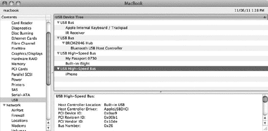
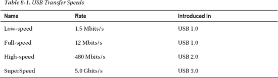
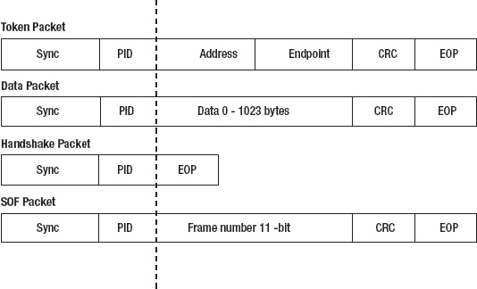
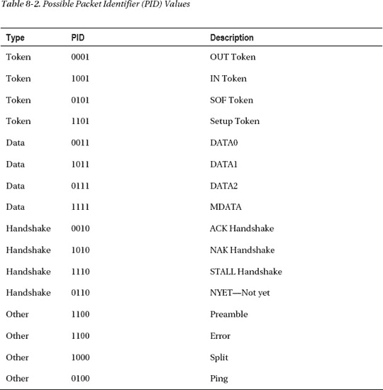
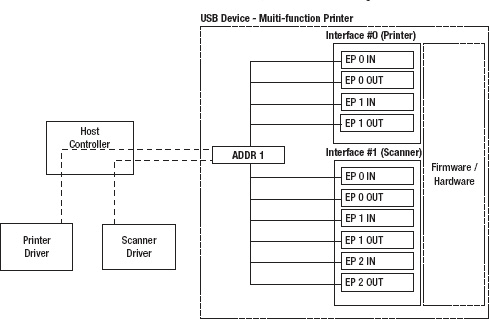
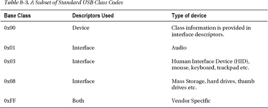
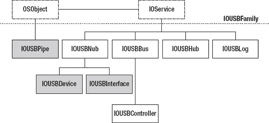
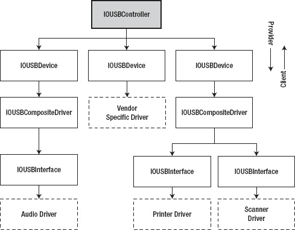
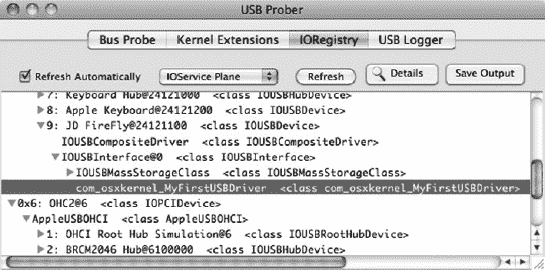

# 通用串行总线

通用串行总线（USB）是一种无处不在的技术，广泛应用于各种产品中，尤其是计算机外设，包括鼠标、键盘、硬盘和打印机，以及几乎所有其他可连接到计算机的设备或装备。USB 是一种规范，定义了设备（如打印机或手机）与主机（由计算机设备控制，如 Mac 或 iPad）之间的通信。USB 规范于 1996 年由包括康柏、DEC、IBM、英特尔、微软、NEC 和北电在内的多家公司组成的联盟共同制定。其初衷是用一种通用连接器取代一系列连接器，从而更轻松地将外部设备连接到个人计算机。USB 规范目前为 3.0 版本。对 3.0 的支持仍在逐步普及，而当前对 2.0 版本的支持最为广泛。苹果公司尚未发布能够支持最新 USB 3.0 规范的硬件，但自 OS X 之前的时代起，苹果计算机就已支持 USB。iOS 系列的设备本身就是 USB 设备，但它们也可以充当 USB 主机。一个例子是 iPad，它可以作为 USB 设备（如数码相机）的主机。

USB 基于主从系统，其中控制器（主机）与从设备进行通信。一个主机通常与一条总线保持一对一的关联。

作为一名内核程序员，如果你负责为某硬件设备编写驱动程序，很大可能这个驱动是针对 USB 设备的。好消息是（至少对我们这些懒惰的程序员来说），如果你的设备符合 USB 实施者论坛（USB-IF）定义的某一类别，那么即使没有驱动也能正常工作。例如，键盘和鼠标符合人机接口设备（HID）规范，这使得供应商无需提供驱动程序，因为操作系统已经具备可用于与这些设备通信的通用驱动程序。然而，供应商仍可选择开发驱动程序——例如，如果设备具有高级功能，比如鼠标上额外的可自定义按钮。

本章将提供 USB 规范及架构的广泛概述。该规范的长度远超本书，因此显然无法进行详细讨论。我们将聚焦于为 USB 设备实现驱动程序时最重要的部分。我们还将讨论 I/O Kit 提供的 USB 子系统架构，并提供一个虚构的 USB 设备驱动程序代码。值得一提的是，USB 驱动程序既可以在内核中编写，也可以在用户空间中编写。当驱动程序/设备可以被多个应用程序同时访问时，或者驱动程序的主要客户端是内核本身时，通常需要内核驱动程序。典型的内核实现设备包括存储、网络、音频和显示驱动程序，而打印机、鼠标和键盘的驱动则可以完全或部分由用户空间驱动程序处理。在本章中，我们将重点介绍 USB 的一般概念，以及内核空间驱动程序的实现。关于用户空间驱动程序的讨论将在第 15 章中提供。

## USB 架构

在 USB 系统中，主机控制器是主设备，USB 设备是从属设备。USB 拓扑结构以树状形式组织，形成一条总线，主机控制器作为根节点，并控制子设备。主机控制器负责协调总线上的活动，未经主机请求，设备无法在总线上执行 I/O 或任何其他操作。

树状结构借助集线器进行分支，这些集线器允许连接的设备成为总线的一部分，从而作为新分支扩展总线。一个集线器的子设备可以连接其他集线器——最多可达四层深度。根集线器通常嵌入并集成在主机控制器本身中。图 8-1 展示了 MacBook 计算机的 USB 拓扑结构。



***图 8-1.** 系统信息显示 MacBook 的 USB 拓扑结构，已连接外部设备*

图 8-1 中的系统有四个内置 USB 总线，但只有两条总线实际连接到外部 USB 端口。虽然大多数人将 USB 设备与外部设备联系起来，但 USB 也常用于与计算机系统中的固定内部设备通信。图 8-1 中 MacBook 的前两条 USB 总线是笔记本内部总线，用于连接内置键盘、触控板和红外接收器。第二条内部总线连接到蓝牙 USB 主机控制器。这两条总线都是 USB 1.1 总线，这没问题，因为连接到它们的设备带宽需求都较低。

这台 MacBook 连接了两个外部 USB 设备：一个外部硬盘和一个 iPhone，每个设备都连接到系统的一个独立物理 USB 端口。虽然你可能认为外部 USB 端口有自己专用的总线，但情况并非总是如此。正如你在图 8-1 中看到的，其中一条总线还连接了一个额外的 USB 设备，即内置的 iSight 摄像头。该摄像头所需的带宽超过了 1.1 USB 总线/控制器所能提供的范围，因此它被连接到两个 USB 2.0 控制器之一，这很可能是为了避免为 iSight 单独设置一个控制器，从而节省空间、零件、成本以及电池电量。其缺点是，外部设备将与 iSight 摄像头（当它被使用时）共享带宽。

确切的 USB 拓扑结构因系统而异，这只是其组织方式的一个示例。

USB 系统中的每条总线最多可支持 127 个设备，包括集线器设备（这些设备也属于 USB 设备）。USB 总线上的带宽在连接的设备之间共享，因此大量活跃设备的存在会显著降低性能，这就是为什么现在常见的做法是将物理 USB 端口连接到独立的主机控制器上——每个控制器提供一条总线，而不是将所有端口连接到一个单一控制器。

USB 设计为支持热插拔，这意味着系统可以在运行期间的任何时候处理设备的插入或移除，尽管根据设备类型，这未必总是安全的——最典型的例子是硬盘，如果在错误的时间拔掉，可能导致文件系统损坏。从开发者的角度来看，这意味着你的驱动程序代码需要设计成能够预判设备的接入或移除。

USB 规范还支持通过总线为设备供电，这是相比旧式总线技术的一大优势，例如，它允许你只需将 iPhone 插入笔记本电脑即可为其充电，或者为硬盘等设备提供自供电。

USB 的关键特征可总结如下：


*   所有设备使用单一连接器类型，旨在取代多种老旧接口，例如`PS/2`。
*   能够将多个设备连接到同一连接器。
*   `USB`总线可通过集线器扩展，每条总线最多支持 127 个设备。
*   设备支持热插拔。
*   设备可通过总线供电，根据功耗需求，可从总线获取充电或全部电力。
*   总线上的所有设备共享带宽。
*   `USB`设备是从设备，未经主机许可无法在总线上发起任何活动。

使`USB`区别于`PCI`等传统硬件架构的一个关键特性是，它不会直接产生系统中断。设备以异步方式通知系统某些事件的能力，对许多常见设备的运行至关重要——例如，每当有新网络数据包到达时通知系统的网络设备，或依赖于向系统报告当前位置或按键信息的鼠标或键盘。

`USB`设备仍可提供类似中断的功能，但无法像`PCI`设备那样直接中断`CPU`。要接收来自`USB`设备的中断，必须向该设备发起一次中断传输。一旦发起传输且事件发生（例如网络数据包到达），`USB`设备并不能随意向主机控制器发送信号——它必须等待主机控制器轮询。`USB`设备只有在主机指示下才能在总线上进行交互。主机控制器为中断传输提供了最大延迟保证，可实现的最低延迟为 125 微秒。设备可在其端点描述符中指定所需的中断轮询间隔。

需要注意的是，尽管`USB`设备本身无法直接中断`CPU`，但`USB`主机控制器完全可以做到，并且它可能因设备完成一次中断传输而触发中断。大多数现代计算机系统通过`PCI`与`USB`控制器通信。

 **提示** USB 规格由非营利组织 USB 实施者论坛（USB-IF）管理。其网站位于[`http://www.usb.org`](http://www.usb.org)。

### USB 传输速度

`USB`标准的首个版本支持两种速度：低速 1.5 Mbit/s 和全速 12 Mbit/s。低速设备不易受电磁干扰影响，因此可以使用质量较低的部件制造，从而降低成本。这降低了不需要全速设备额外带宽的简单`USB`设备的成本。`USB 2.0`标准包含了全速模式，运行速度可达 480 Mbit/s，同时向后兼容`USB 1.0`。这使得`USB`与当时运行速度为 400 Mbit/s 的`Firewire`规格具有竞争力（参见表 8-1 中的`USB`传输速度）。



`USB 3.0`规格支持高达 5 Gbit/s 的速度，在 2011 年`Thunderbolt`发布之前，它是最快的通用外部总线。苹果迄今未在其计算机中选用兼容`USB 3.0`的设备，不过支持`ExpressCard`或`PCI-Express`的 Mac 已有第三方产品可用。

### 主机控制器

主机控制器由单独的规格定义，这些规格决定了计算机系统如何与主机控制器通信。现代系统通常将`USB`主机控制器嵌入主板的 I/O 控制器（南桥）中。大多数主机控制器具有`PCI`接口，系统通过该接口与控制器通信。当驱动程序与`USB`设备通信时，它并非直接进行——而是通过`PCI`与主机控制器通信，但由于 I/O Kit 提供的面向对象抽象层，对驱动程序而言，它看起来就像是在直接与设备通信。`USB`不会直接产生中断；但主机控制器同时使用`DMA`和中断。

通常，一个 32 位 x86 系统只有 16 条中断线，可供外部外设使用的中断线常常只有 2 到 3 条。`USB`解决了这个问题，因为计算机系统只需要一条连接到`USB`主机控制器的中断线，即可与连接到该控制器的所有设备通信。`USB`规格标准化了主机与`USB`设备的通信方式；然而，关于计算机系统如何与主机控制器通信，存在多种标准：

*   *通用主机控制器接口（UHCI）：* `UHCI`由英特尔开发。`UHCI`规格支持低速和全速的`USB 1.x`设备。
*   *开放主机控制器接口（OHCI）：* `OHCI`主要由微软和康柏等公司为`USB 1.x`设备开发。`OHCI`控制器比`UHCI`更“智能”，因为它在控制器本身内置了更多逻辑，而`UHCI`在硬件层面更简单，但在操作系统中需要更复杂的主机控制器驱动程序。
*   *增强型主机控制器接口（EHCI）：* `EHCI`是为`USB 2.0`创建的，支持 480 Mbit/s 的高速设备。`EHCI`不处理`USB 1.x`设备，因此需要集成一个基于`UHCI`或`OHCI`的控制器来处理基于`1.x`系列规格的设备。
*   *可扩展主机控制器接口（xHCI）：* `xHCI`由英特尔设计，支持`USB 3.0`规格。它被设计为统一的主机控制器，使`EHCI`、`OHCI`和`UHCI`变得多余。

计算机系统拥有多个主机控制器并不罕见，每个控制器支持不同的主机控制器接口。例如，图 8-1 中的 MacBook 有两个`OHCI`控制器和两个`EHCI`控制器，以支持`USB 2.0`。Mac OS X 目前拥有支持`OHCI`、`UHCI`和`EHCI`的控制器驱动程序，但不支持`xHCI`。

**USB ON-THE-GO**

作为`USB 2.0`规格的一部分，还存在一个名为`USB On-The-Go (OTG)`的附加标准。虽然移动电话等嵌入式设备通常充当`USB`（从）设备，但`USB OTG`允许角色切换，使移动设备本身充当`USB`主机。`USB OTG`仅在两台设备之间工作，不支持集线器。`iPad`就是一个很好的例子，`iPad`可以作为`USB`设备连接到计算机系统。然而，使用专用适配器，`iPad`也可以充当`USB`主机，你可以将数码相机或存储卡连接到它。


### USB 协议

与串口设备不同——串口设备没有协议（协议需由应用程序自行实现），只有连续的比特和字节流——USB 使用的是基于数据包的协议。由于总线是共享的，并且可以连接多个设备，每个设备都需要单独寻址，因此这种协议是必要的。除非你是为 USB 设备编写固件的硬件工程师，否则你并不需要真正理解甚至了解这种通信发生的具体细节，但在某些情况下，对协议层面的通信方式有一个基本了解，可能有助于调试问题。

USB 协议在主控制器和设备之间实现，它决定了数据在总线上的传输方式。驱动程序实际上并不能洞察或影响这一过程，因为相关细节是由主机和设备的电子元件处理的，而非驱动程序——这与网络通信不同，网络通信协议的许多方面都受软件控制。为了查看或截获实际在线路上传输的数据，需要使用 USB 数据包分析器。USB 分析器是一种专用设备（通常非常昂贵），可以连接在设备和主机之间，捕获它们之间的通信流量。

USB 数据包由采用小端序（LSB）的 8 位字组成。USB 协议有四种主要的数据包类型：

- **令牌包：** 它充当头部，告知接收方接下来是什么类型的数据包/数据。三种令牌包类型分别是 `IN`、`OUT` 和 `Setup`。前两种指明了数据包的方向，最后一种用于启动控制传输。方向是从主机端角度定义的，因此 `IN` 表示从设备到主机的传输，`OUT` 表示从主机到设备的传输。
- **数据包：** 可携带任意数据，每个数据包包含 0–1024 字节。
- **握手包：** 用于确认数据包的成功（`ACK`）或失败（`NAK`）投递，以及报告暂停（`STALL`）状态。
- **帧起始包：** 按固定时间间隔发送，用于同步等时传输模式的数据流。

每种数据包类型的布局可参见图 8-2。



***图 8-2.** USB 数据包类型布局*

所有 USB 数据包都以 **同步** 和 **PID**（数据包标识符）字段开头。同步字段位于其他数据之前，接收方可用于时钟同步。该字段在低速和全速设备中为 8 位，在高速设备中为 32 位。PID（数据包标识符）字段允许解码器确定其后跟随的数据包类型。PID 字段的可能取值见表 8-2。PID 宽度为 4 位，但总长度为 8 位。最后四位是一个校验字段，包含前四位的补码，有助于判断数据包是否有效且未被损坏。



令牌包用于寻址特定设备。地址字段指明数据包发往或来自哪个设备，其值为 1 到 127，用于寻址总线上的设备。一个 USB 设备可能有多个端点，这些端点是独立的通信通道。**端点** 字段指明数据包将投递给设备上的哪个端点。端点将在本章稍后讨论。

所有数据包类型都有一个 CRC（循环冗余校验——用于验证数据完整性）字段。除了数据包采用更宽的 16 位 CRC 字段外，其他所有数据包类型的 CRC 字段均为 5 位宽。

数据包结束（EOP）字段用作分隔符。

一次 USB 事务最多可由三个数据包组成。数据包由 PID 字段指示，可以是以下之一：`DATA0`、`DATA1`、`DATA2` 和 `MDATA`，不过后两者仅用于等时传输模式。PID 字段决定了传输的是哪个数据包，如表 8-2 所示。

一次从主机到设备的数据传输可能如下所示：

1.  包含设备和端点地址的令牌包。PID 指示为 `OUT` 传输。
2.  包含 1024 字节有效载荷的 Data 0 数据包。
3.  包含 322 字节有效载荷的 Data 1 数据包。
4.  从设备发送到主机的握手包，指示传输状态，如 `ACK`、`NAK` 或 `STALL`。

### 端点

主控制器与 USB 设备之间的通信基于端点的概念。端点是单向的，方向为 IN 或 OUT——即从设备到主机的通信，或从主机到设备的通信。主控制器到端点的连接称为管道。管道有两种类型：**流管道**，用于传输数据；**消息管道**，用于传输控制请求。一个 USB 设备最多可支持 32 个端点，其中最多 16 个 IN 端点和 16 个 OUT 端点。端点地址 0 是特殊的，保留用于设备配置。共有四种不同类型的端点可用：

- **批量端点：** 用于传输大量数据。批量传输不保证及时交付或带宽，但保证交付和错误检测。批量传输不适用于低速模式。硬盘、扫描仪、打印机和网卡通常使用批量传输。
- **控制端点：** 用于设备配置和状态检索。对控制端点的请求通过使用预留带宽来保证交付。
- **中断端点：** 用于交换少量对时间敏感的数据，并保证交付。
- **等时端点：** 提供有保证的带宽，但不保证交付。数据丢失后不会重新发送，这对于视频和音频应用来说是理想的。


### USB 描述符

USB 描述符用于描述设备的功能、类型、要求等。描述符按层次结构组织，包含以下主要描述符类型：

-   *设备描述符：* 包含 USB 设备的`产品 ID`（`idProduct`）和`厂商 ID`（`idVendor`）。每个设备只有一个设备描述符。它还包含后续有多少个描述符的信息。厂商 ID 和产品 ID 都是 16 位整数。厂商 ID 由 USB-IF 分配。厂商可以为产品 ID 选择任何 16 位值。厂商/产品 ID 组合必须唯一以避免问题，因为它们用于确定设备的正确驱动程序。设备描述符还包含两个字段来指示设备类型：`bDeviceClass` 和 `bDeviceSubClass`。
-   *配置描述符：* 这指定了设备可以运行的替代配置。例如，一个设备可能有两种配置：一种是在自供电时，另一种是在总线供电时。后者可以在受限模式下运行，仅允许全部功能的一个子集，或者可能仅提供对设备固件进行编程的能力。任何时候只能激活一个配置。配置描述符下面可能有多个接口，一个设备拥有多个配置描述符的情况并不常见。
-   *接口描述符：* 这是一个端点的集合或组，它们共同执行一个功能。可以将其视为一个逻辑子设备。一个接口可能有零个或多个端点。例如，在图 8-3 中，我们看到一个多功能 USB 设备，它包含两个接口：接口 #0 是一个打印机，而接口 #1 是一个扫描仪设备。多个接口可以同时激活和运行。与设备描述符一样，接口描述符具有指示接口类别的字段，由`bInterfaceClass` 和`bInterfaceSubClass` 给出。
-   *端点描述符：* 这描述了端点的类型（批量、中断、同步或控制）和方向（IN、OUT）。



***图 8-3.** 具有两个接口的 USB 复合设备*

### USB 设备类别

USB 描述符包含类别代码，这些代码向系统标识设备的类别，并可用于识别要为设备加载的适当驱动程序。类别代码可以在设备描述符、接口描述符或两者中指定。在设备描述符中指定的类别代码`00h`意味着实际类别代码应从接口描述符中读取。还有一个子类别字段，用于进一步缩小设备类型的范围。表 8-3 显示了可用的类别代码的一小部分。



许多操作系统，包括 Mac OS X 和 iOS，都为符合标准类别的设备提供默认驱动程序，因此操作系统可以处理任何大容量存储或音频 USB 设备，而无需安装第三方驱动程序。厂商仍然可以为提供操作系统通用驱动程序所不具备的额外功能的设备提供可选驱动程序。为此，可以使用 I/O Kit 匹配系统来确保匹配更具体的驱动程序，而不是默认驱动程序。

 **提示** 完整的类别代码列表以及更详细的描述，可以在[`http://www.usb.org/developers/defined_class`](http://www.usb.org/developers/defined_class)找到。

## I/O Kit USB 支持

I/O Kit 中的 USB 支持由`IOUSBFamily`提供，这是一个可动态加载的 KEXT，由包标识符`com.apple.iokit.IOUSBFamily`标识。USB 系列在内核中提供了 USB 处理的核心，并包含用于主机控制器的驱动程序，以及用于表示 USB 设备、接口和管道的抽象类。USB 系列的类层次结构如图 8-4 所示。



***图 8-4.** IOUSBFamily 类层次结构*

如果您只想为 USB 设备实现驱动程序，这些类中的大多数都不相关。图 8-4 中，用于 USB 驱动程序开发的主要类以灰色显示，包括`IOUSBPipe`、`IOUSBDevice`和`IOUSBInterface`，我们稍后将详细讨论它们。

如果您需要实现对新的主机控制器的支持，可以通过继承`IOUSBController`来实现；然而，内核已经为符合 UHCI、OHCI 和 EHCI 的主机控制器提供了驱动程序。尽管未在图 8-4 中显示，但它们是`IOUSBController`的子类，分别称为`AppleUSBUHCI`、`AppleUSBOHCI`和`AppleUSBEHCI`。

 **提示** USB 系列不是 XNU 源代码分发的一部分，但可以以源代码形式从[`http://opensource.apple.com`](http://opensource.apple.com)下载。源代码包包含整个 USB 系列的源代码，包括 UHCI、OHCI 和 EHCI 控制器的实现。它还包含 USB 驱动程序的示例代码，以及如何从用户空间枚举和访问 USB 设备。

### USB 设备与驱动程序处理

当插入 USB 设备时，USB 系列将创建一个`IOUSBDevice`类的实例（`IOService`的子类），并将其插入到 I/O 注册表中。总线上的每个插入设备将恰好创建一个`IOUSBDevice`实例。`IOUSBDevice`的提供者是设备所连接的`IOUSBController`。`IOUSBDevice`类提供了 USB 设备的设备描述符和配置描述符的抽象。接口描述符可以通过`IOUSBInterface`类访问。`IOUSBDevice`充当`IOUSBInterface`类的提供者，如图 8-5 所示。



***图 8-5.** USB 设备与驱动程序提供者关系*

图 8-5 展示了三个 USB 设备及其与更高级别提供者的关系：

-   *左侧的驱动程序：* 这是一个音频设备的驱动程序。您可能已经注意到，在`IOUSBDevice`和`IOUSBInterface`之间还有一个名为`IOUSBCompositeDriver`的额外驱动程序。此复合驱动程序会匹配任何在其设备描述符中将设备类别和子类别设置为零，且没有其他特定于厂商的驱动程序与之匹配的 USB 设备，并为其加载。驱动程序名称可能表明它仅用于具有多个功能的复合驱动程序，但即使对于具有单个接口的设备，也会加载此驱动程序。复合驱动程序执行的唯一功能是选择设备的有效配置（如果它具有多个配置描述符），然后确保其他驱动程序可以针对所选配置的接口进行匹配。
-   *中间的驱动程序：* 这是一个直接连接到`IOUSBDevice`楔子的特定于厂商的驱动程序。由于设备描述符中的设备类别和子类别字段设置为`0xFF/0xFF`（表示特定于厂商的设备），并且驱动程序已正确匹配到该设备，因此`IOUSBCompositeDriver`未被加载。
-   *右侧的驱动程序：* 其组织方式与左侧相同，有一个`IOUSBCompositeDriver`连接到`IOUSBDevice`楔子。复合驱动程序将枚举所有设备接口，并确保它们可供匹配。在这种情况下，有两个接口，每个接口都连接了一个独立的驱动程序。


### 加载 USB 驱动程序

若要实现在插入设备时自动加载驱动程序，你必须按照第 4 章所学的内容，配置驱动程序的 `Info.plist` 文件。正如上一节所述，单个驱动程序可以处理一个 USB 设备，也可以有多个驱动程序，分别对应设备提供的每个接口（功能）。对于 USB 设备，驱动程序会通过设备描述符中的键值进行匹配。I/O Kit 遵循《通用串行总线通用类别规范》制定的驱动程序匹配规则。以下键值组合可用于将驱动程序与 USB 设备进行匹配：

- `idVendor` & `idProduct` & `bcdDevice`
- `idVendor` & `idProduct`
- `idVendor` & `bDeviceSubClass` & `bDeviceProtocol`（仅当 `bDeviceClass == 0xff` 时有效）
- `idVendor` & `bDeviceSubClass`（仅当 `bDeviceClass == 0xff` 时有效）
- `bDeviceClass` & `bDeviceSubClass` & `bDeviceProtocol`（仅当 `bDeviceClass != 0xff` 时有效）
- `bDeviceClass` & `bDeviceSubClass`（仅当 `bDeviceClass != 0xff` 时有效）

每个键代表设备描述符中的一个条目。`bcdDevice` 字段用于存储设备的修订号。如果 `bDeviceClass` 字段的值为 `0xff`，则表示该设备类别由供应商自定义。代码清单 8-1 展示了 `Info.plist` 中一个匹配供应商 ID、产品 ID 和修订号（`bcdDevice`）的匹配字典。

**代码清单 8-1.** 匹配供应商 ID、产品 ID 和设备修订的匹配字典

```
<key>MyUSBDriver</key>
<dict>
<key>CFBundleIdentifier</key>
    <string>com.osxkernel.MyUSBDriver</string>
    <key>IOClass</key>
    <string>com_osxkernel_MyUSBDriver</string>
    <key>IOProviderClass</key>
    <string>IOUSBDevice</string>
    <key>bcdDevice</key>
    <integer>1</integer>
    <key>idProduct</key>
    <integer>2323</integer>
    <key>idVendor</key>
    <integer>0001</integer>
</dict>
```

该条目必须位于驱动程序 `Info.plist` 文件的 `IOKitPersonalities` 部分才能生效。

未被上述规则匹配到的设备将由 `IOUSBCompositeDriver` 处理。如果设备存在多个配置，该驱动程序会选择一个设备配置，然后转而针对设备的接口进行匹配。可用于匹配设备接口的键值如下所示：

- `idVendor` & `idProduct` & `bcdDevice` & `bConfigurationValue` & `bInterfaceNumber`
- `idVendor` & `idProduct` & `bConfigurationValue` & `bInterfaceNumber`
- `idVendor` & `bInterfaceSubClass` & `bInterfaceProtocol`（仅当 `bInterfaceClass == 0xff` 时有效）
- `idVendor` & `bInterfaceSubClass`（仅当 `bInterfaceClass == 0xff` 时有效）
- `bInterfaceClass` & `bInterfaceSubClass` & `bInterfaceProtocol`（仅当 `bInterfaceClass != 0xff` 时有效）
- `bInterfaceClass` & `bInterfaceSubClass`（仅当 `bInterfaceClass != 0xff` 时有效）

**注意：** 你不能自行创建键值组合；必须使用上述针对接口或设备的组合之一。不过，你可以为驱动程序添加多个特性集，每个特性集可以匹配不同的组合，但所使用组合必须是有效组合之一。

每个键代表接口描述符中的一个字段。匹配规则按具体程度排序。例如，最后一条规则匹配接口类别和子类，Apple 的 USB 大容量存储驱动程序正是利用该规则来匹配所有符合该接口的设备，无论其供应商或产品 ID 是什么。代码清单 8-2 展示了 Apple 大容量存储驱动程序的 `Info.plist` 文件（为便于阅读，省略了部分与匹配无关的键）。

**代码清单 8-2.** 匹配 USB 接口类别和子类的匹配字典

```
<key>IOUSBMassStorageClass6</key>
<dict>
    <key>CFBundleIdentifier</key>
    <string>com.apple.iokit.IOUSBMassStorageClass</string>
    <key>IOClass</key>
    <string>IOUSBMassStorageClass</string>
    <key>IOProviderClass</key>
    <string>IOUSBInterface</string>
    <key>bInterfaceClass</key>
    <integer>8</integer>
    <key>bInterfaceSubClass</key>
    <integer>6</integer>
</dict>
```

与代码清单 8-1 中的示例不同，这里的 `IOProviderClass` 指定为 `IOUSBInterface`，它将作为提供者传递给驱动程序的 `start()` 方法，而非 `IOUSBDevice`。

### USB Prober

在开始查看实际代码之前，有必要介绍一个非常实用的工具——USB Prober。USB Prober 是一个与 Xcode 发行版捆绑在一起的实用工具。USB Prober 工具如图 8-6 所示。

**图 8-6.** USB Prober 实用工具

USB Prober 允许你探测系统上可用的 USB 总线，并检查连接到每条总线上的设备层次结构。它还允许你检查设备描述符、配置描述符、接口描述符和端点描述符。*IORegistry* 选项卡允许你检查 I/O Registry 中与 USB 设备相关的 *IOService* 平面，这在开发 USB 驱动程序时非常有用，因为它可以验证你的驱动程序是否匹配正确。USB Prober 还可以执行来自 IOUSBFamily 的 USB 特定跟踪，这在某些情况下可能有助于调试驱动程序。这需要进行一些设置，包括从 Apple 开发者网站下载 USB Debug Kit。该工具包包含一个替代版本的 IOUSBFamily，它提供了详细的日志记录。访问该调试工具包仅限于 Mac 开发者计划的成员。


### 驱动程序示例：USB 大容量存储设备驱动程序

现在，让我们将目前所学付诸实践，构建一个简单的基于 USB 的驱动程序，当各种事件发生时，它会打印日志消息。我们可以制作一个纯虚拟驱动程序，但那未免太无趣了，所以不如创建一个挂载在真实 USB 设备上的驱动程序，这样我们就能观察设备插入和从总线移除时发生的情况，同时又不干扰设备的正常运行。I/O Kit 的面向对象特性使得编写设备驱动程序相对省力。此外，编写 USB 设备驱动程序与编写 Firewire、PCI 或第 4 章中的虚拟 IOKitTest 驱动程序非常相似。

要尝试此示例，您需要一个 U 盘/闪存盘或外置 USB 硬盘。它不需要为 Mac 格式化，因为我们不会访问数据。

 **注意** 建议在非存储重要数据的 Mac 上尝试本书中的示例。内核崩溃可能会损坏您的文件或操作系统。如果您没有专用的 Mac，请确保拥有数据的工作备份。

我们的驱动程序将命名为 `MyFirstUSBDriver`，其类声明如代码清单 8-3 所示。

***代码清单 8-3.** `MyFirstUSBDriver.h`：`MyFirstUSBDriver` 的类声明*

```
#include <IOKit/usb/IOUSBDevice.h>

class com_osxkernel_MyFirstUSBDriver : public IOService
{
    OSDeclareDefaultStructors(com_osxkernel_MyFirstUSBDriver)

public:
    virtual bool init(OSDictionary *propTable);
    virtual IOService* probe(IOService *provider, SInt32 *score );
    virtual bool attach(IOService *provider);
    virtual void detach(IOService *provider);
    virtual bool start(IOService *provider);
    virtual void stop(IOService *provider);
    virtual bool terminate(IOOptionBits options = 0);
};
```

您会注意到，该类的结构几乎与 IOKitTest 驱动程序完全相同，只有一些细微的改动，我们稍后会讨论。`MyFirstUSBDriver` 的实现如代码清单 8-4 所示。

***代码清单 8-4.** `MyFirstUSBDriver.cpp`：`MyFirstUSBDriver` 类的实现*

```
#include <IOKit/IOLib.h>
#include <IOKit/usb/IOUSBInterface.h>
#include "MyFirstUSBDriver.h"

OSDefineMetaClassAndStructors(com_osxkernel_MyFirstUSBDriver, IOService)
#define super IOService

void logEndpoint(IOUSBPipe* pipe)
{
    IOLog("端点 #%d ", pipe->GetEndpointNumber());
    IOLog("--> 类型: ");
    switch (pipe->GetType())
    {
        case kUSBControl: IOLog("kUSBControl "); break;
        case kUSBBulk: IOLog("kUSBBulk "); break;
        case kUSBIsoc: IOLog("kUSBIsoc "); break;
        case kUSBInterrupt: IOLog("kUSBInterrupt "); break;
    }
    IOLog("--> 方向: ");
    switch (pipe->GetDirection())
    {
        case kUSBOut: IOLog("输出 (kUSBOut) "); break;
        case kUSBIn: IOLog("输入 (kUSBIn) "); break;
        case kUSBAnyDirn: IOLog("任意 (控制管道) "); break;
    }        
    IOLog("maxPacketSize: %d interval: %d\n", pipe->GetMaxPacketSize(), pipe->GetInterval());    
}

bool com_osxkernel_MyFirstUSBDriver::init(OSDictionary* propTable)
{
    IOLog("com_osxkernel_MyFirstUSBDriver::init(%p)\n", this);
    return super::init(propTable);
}

IOService* com_osxkernel_MyFirstUSBDriver::probe(IOService* provider, SInt32* score)
{
    IOLog("%s(%p)::probe\n", getName(), this);
    return super::probe(provider, score);
}

bool com_osxkernel_MyFirstUSBDriver::attach(IOService* provider)
{
    IOLog("%s(%p)::attach\n", getName(), this);
    return super::attach(provider);
}

void com_osxkernel_MyFirstUSBDriver::detach(IOService* provider)
{
    IOLog("%s(%p)::detach\n", getName(), this);
    return super::detach(provider);
}

bool com_osxkernel_MyFirstUSBDriver::start(IOService* provider)
{
    IOUSBInterface* interface;
    IOUSBFindEndpointRequest request;
    IOUSBPipe* pipe = NULL;

    IOLog("%s(%p)::start\n", getName(), this);

    if (!super::start(provider))
        return false;

    interface = OSDynamicCast(IOUSBInterface, provider);
    if (interface == NULL)
    {
        IOLog("%s(%p)::start -> provider not a IOUSBInterface\n", getName(), this);
        return false;
    }

    // 大容量存储设备使用两个批量管道，一个用于读取，一个用于写入。

    // 查找批量输入管道。
    request.type = kUSBBulk;
    request.direction = kUSBIn;
    pipe = interface->FindNextPipe(NULL, &request, true);
    if (pipe)
    {
        logEndpoint(pipe);
        pipe->release();
    }

    // 查找批量输出管道。
    request.type = kUSBBulk;
    request.direction = kUSBOut;
    pipe = interface->FindNextPipe(NULL, &request, true);
    if (pipe)
    {
        logEndpoint(pipe);
        pipe->release();
    }  
    return true;
}

void com_osxkernel_MyFirstUSBDriver::stop(IOService *provider)
{
    IOLog("%s(%p)::stop\n", getName(), this);
    super::stop(provider);
}

bool com_osxkernel_MyFirstUSBDriver::terminate(IOOptionBits options)
{
    IOLog("%s(%p)::terminate\n", getName(), this);
    return super::terminate(options);
}
```

如您所见，除了在调用驱动程序的各种方法时记录日志外，此驱动程序中的逻辑非常少。`start()` 方法还会尝试查找批量输入和批量输出端点，并记录有关端点的信息。我们稍后将测试驱动程序，但首先必须创建匹配字典，以便 I/O Kit 知道何时加载我们的驱动程序。`MyFirstUSBDriver` 的匹配字典如代码清单 8-5 所示。

***代码清单 8-5.** `MyFirstUSBDriver` 的匹配字典*

```
<key>IOKitPersonalities</key>
<dict>
    <key>MyFirstUSBDriver</key>
    <dict>
        <key>bInterfaceClass</key>
        <integer>8</integer>
        <key>bInterfaceSubClass</key>
        <integer>6</integer>
        <key>CFBundleIdentifier</key>
        <string>com.osxkernel.MyFirstUSBDriver</string>
        <key>IOClass</key>
        <string>com_osxkernel_MyFirstUSBDriver</string>
        <key>IOMatchCategory</key>
        <string>com_osxkernel_MyFirstUSBDriver</string>
        <key>IOProviderClass</key>
        <string>IOUSBInterface</string>
    </dict>
</dict>
```

该匹配字典与代码清单 8-2 中的示例大致相同。它将匹配 USB 接口而非 USB 设备。我们将 `bInterfaceClass` 设置为 8，这是大容量存储设备的类代码；将 `bInterfaceSubClass` 设置为 6，表示它使用 SCSI 命令集与设备通信（这并不一定意味着驱动器/存储器本身理解 SCSI 协议，而是用于通过总线向设备传输命令，设备上的另一个控制器可能会将其转换为，例如，ATA 命令）。

由于 Apple 默认的 `IOUSBMassStorageClass` 会匹配相同的键，我们需要指定一个匹配类别，以便我们的驱动程序也能被加载。我们通过添加 `IOMatchCategory` 键来实现这一点。我们将其设置为我们的类名，但它可以是任何字符串。

 **提示** 当您在 Xcode 中打开 `Info.plist` 文件时，默认情况下它会在属性列表编辑器中打开。如果您希望复制粘贴到属性列表中，或者对它的存储格式感到好奇，可以右键单击该文件，选择“打开方式”，然后选择“源代码”，它将以 XML 格式呈现。


#### 驱动程序属性列表与加载

我们需要对驱动程序的属性列表文件进行一项额外修改：在 `OSBundleLibraries` 字典中包含我们的依赖项；否则驱动程序将无法加载。可以使用 `kextlibs` 工具查找依赖项。我们使用以下部分为 `libkern` 和 `IOUSBFamily` 添加了依赖关系：

```
<key>OSBundleLibraries</key>
<dict>
        <key>com.apple.iokit.IOUSBFamily</key>
        <string>4.1.8</string>
        <key>com.apple.kernel.libkern</key>
        <string>6.0</string>
</dict>
```

现在我们已经准备好加载驱动程序，或者更准确地说，是让 I/O Kit 为我们加载驱动程序。为了让驱动程序在 USB 设备插入时自动加载，它必须位于 `/System/Library/Extensions` 目录中，这是所有 KEXT 的标准位置。

完成所有操作后，你现在应该可以插入设备了。不过在插入之前，你可以打开 Console 应用程序，并从日志列表中选择 `kernel.log`。一旦插入兼容的设备，你应该会看到以下条目被打印到日志中以响应插入操作：

---

```
Jun 16 22:37:56 macbook kernel[0]: com_osxkernel_MyFirstUSBDriver::init(0x1361f900)
Jun 16 22:37:56 macbook kernel[0]: com_osxkernel_MyFirstUSBDriver(0x1361f900)::attach
Jun 16 22:37:56 macbook kernel[0]: com_osxkernel_MyFirstUSBDriver(0x1361f900)::probe
Jun 16 22:37:56 macbook kernel[0]: com_osxkernel_MyFirstUSBDriver(0x1361f900)::detach
Jun 16 22:37:56 macbook kernel[0]: com_osxkernel_MyFirstUSBDriver(0x1361f900)::attach
Jun 16 22:37:56 macbook kernel[0]: com_osxkernel_MyFirstUSBDriver(0x1361f900)::start
Jun 16 22:37:56 macbook kernel[0]: Endpoint #4 --> Type: kUSBBulk --> Direction: IN (kUSBIn)
maxPacketSize: 512 interval: 0
Jun 16 22:37:56 macbook kernel[0]: Endpoint #3 --> Type: kUSBBulk --> Direction: OUT
(kUSBOut) maxPacketSize: 512 interval: 0
```

---

前五次调用属于匹配过程。第一个方法 `attach()` 用于将我们的驱动程序连接到 I/O Registry 的 `IOService` 平面，在本例中，这将使我们成为 `IOUSBInterface` 节点的客户端，而该节点又是我们刚刚插入的 `IOUSBDevice` 的客户端。正如我们从第 4 章中了解到的，`probe` 方法用于主动匹配，并允许我们进一步询问设备（或本例中的接口）以确定是否匹配。然后 I/O Kit 会调用 `detach()`，并在检查所有可能的匹配项后做出加载哪个驱动程序的决定。通常不建议在 `attach()` 中分配任何资源，因为它可能被多次调用。通常不需要重写 `attach()` 或 `detach()`，因为 `IOService` 提供的默认方法几乎总是足够的。一旦 I/O Kit 选择了我们的驱动程序（在我们的情况下是确定的，因为我们指定了唯一的 `IOMatchCategory`），我们将再次收到对 `attach()` 方法的调用，然后最终调用驱动程序的 `start()` 方法。我们现在可以使用 USB Prober 来验证驱动程序在层次结构中的位置，如图 8-7 所示。



***图 8-7.** USB Prober 显示 `com_osxkernel_MyFirstUSBDriver` 已附加到 `IOService` 平面*

你会注意到，我们与 `IOUSBMassStorageClass` 驱动程序一起附加到了存储设备的 `IOUSBInterface`，而 USB 设备本身则由复合驱动程序 `IOUSBCompositeDriver` 管理。

#### 驱动程序启动

我们在 `MyFirstUSBDriver` 中实现的 `start()` 方法故意保持精简，因为 `IOUSBMassStorageClass` 驱动程序也正在管理该接口，并且我们不希望干扰它对 USB 接口的使用。我们进行了一个基本的完整性检查（这是 `start()` 方法中的常见做法），以确保我们获得的提供程序是我们期望的类型。但是，这并不妨碍你编写一个能够接受并与多种类型提供程序（例如 `IOUSBDevice` 和 `IOUSBInterface`，甚至 `IOPCIDevice` 提供程序）一起工作的驱动程序。

以下是 USB 驱动程序在其 `start()` 方法中通常必须执行的步骤概述：

*   验证传递给我们的 `IOService` 提供程序对象是否是我们期望的类型。我们借助 `OSDynamicCast()` 宏来完成此操作，该宏与 I/O Kit 的运行时类型识别系统协同工作，如果转换成功则返回指向对象的指针，否则返回 `NULL`。
*   存储提供程序的指针以备后用。
*   尝试通过调用提供程序的 `open(IOService* forClient, ...)` 方法打开它。
*   如果你的驱动程序在 `IOUSBDevice` 上运行，你可能需要设置设备的配置。对于基于 `IOUSBInterface` 的驱动程序，通常由 `IOUSBCompositeDriver` 处理。你可以使用 `IOUSBDevice::SetConfiguration()` 设置配置。
*   对于具有 `IOUSBDevice` 提供程序的驱动程序，查找并验证你将使用的接口。并搜索驱动程序所需的适当端点。更多信息请参阅“枚举设备资源”一节。
*   向设备询问状态信息，并通过向其发送控制请求来执行所需的设备配置。
*   分配驱动程序可能需要的任何特定资源，例如 I/O 缓冲区或驱动程序所需的辅助类。
*   如果你的驱动程序是一个 *节点*，并打算为其他驱动程序提供服务，则需要分配并注册这些服务。例如，在 `IOUSBMassStorageClass` 的情况下，它会为接口提供的每个逻辑单元分配 `IOSCSILogicalUnitNub` 对象，并为每个对象调用 `registerService()`（从 `IOService` 继承的方法）。此方法确保将开始为每个 `IOSCSILogicalUnitNub` 对象进行匹配。
*   如果一切成功，`start()` 应返回 `true`。如果返回 `false`，驱动程序显然将无法加载，并且 I/O Kit 将尝试加载一个新的驱动程序（如果存在），可能是一个之前“失败”且评分较低的驱动程序。请注意，如果从 `start()` 返回 `false`，则不会调用 `stop()`。

 **提示** 要卸载 `MyFirstUSBDriver`，只需使用命令：`sudo rm –rf /System/Library/Extensions/MyFirstUSBDriver.kext`

### 处理设备移除

USB 设备和驱动程序必须能够应对设备在任何时间被移除的情况。当 `IOUSBController` 检测到设备被移除时，它会递归地将此信息向下传播到驱动程序栈。驱动程序收到的第一个通知是通过调用其 `terminate()` 方法进行的。以下调用序列是拔掉 `MyFirstUSBDriver` 所附加的大容量存储设备的结果：

```
Jun 16 22:58:46 macbook kernel[0]: com_osxkernel_MyFirstUSBDriver(0xb4e6100)::terminate
Jun 16 22:58:46 macbook kernel[0]: com_osxkernel_MyFirstUSBDriver(0xb4e6100)::stop
Jun 16 22:58:46 macbook kernel[0]: com_osxkernel_MyFirstUSBDriver(0xb4e6100)::detach
```

任何未完成的 I/O 都可以使用 `IOUSBPipe::Abort()` 取消，可以在调用 `terminate()` 方法时执行，或者在驱动程序重写的 `willTerminate()` 或 `didTerminate()` 方法中执行。

移除过程的下一步是调用驱动程序的 `stop()` 方法，该方法应撤消在 `start()` 方法中执行的操作。然后会调用 `detach()`，最后调用 `free()`，它应该清理所有剩余的资源。

如果你的驱动程序被用户应用程序打开（例如通过 `IOUserClient`），那么在应用程序释放其对设备的引用之前，它不会被释放（`free()` 方法不会被调用）。如果此时设备恰好被重新插入，应用程序将无法恢复使用该设备，因为每次插入设备时都会创建驱动程序的新实例。应用程序可以通过使用通知来处理此问题，如第 5 章所述。


#### 枚举接口

在 USB 驱动的 `start()` 方法中，通常需要查找并配置设备将要使用的端点和接口。如果你的驱动基于 `IOUSBDevice` 提供者，很可能需要搜索一个或多个驱动将要使用的接口。这可以通过 `IOUSBDevice::FindNextInterface()` 方法实现：

```
virtual IOUSBInterface* FindNextInterface(IOUSBInterface* current,
                                          IOUSBFindInterfaceRequest* request);
```

第一个参数可以指定为从某个已有的 `IOUSBInterface` 实例开始搜索，并忽略它之前的所有接口。若指定为 `NULL`，则从第一个接口开始搜索。

第二个参数是 `IOUSBFindInterfaceRequest` 类型的结构体：

```
typedef struct {
    UInt16 bInterfaceClass;
    UInt16 bInterfaceSubClass;
    UInt16 bInterfaceProtocol;
    UInt16 bAlternateSetting;
} IOUSBFindInterfaceRequest;
```

要查找一个接口，你可以用所需的属性填充 `IOUSBFindInterfaceRequest` 结构体。

-   `bInterfaceClass` 和 `bInterfaceSubClass` 可用于搜索特定类和子类的接口。这些值对应 表 8-3 中的代码。`IOUSBFamily` 源代码发行版中的头文件 `USBSpec.h` 定义了符号常量，例如 `kUSBMassStorageInterfaceClass` 或 `kUSBPrintingClass`。
-   `bInterfaceProtocol` 指定了接口使用的协议。如果没有类和子类，该字段没有意义。例如，一个 HID（人机交互设备）可以将协议指定为 `kHIDKeyboardInterfaceProtocol` 或 `kHIDMouseInterfaceProtocol`。
-   一个接口可能存在使用不同端点集的替代版本，因此 `bAlternateSetting` 字段可以被设置为请求所需的特定接口。

无关紧要的字段可以设置为 `kIOUSBFindInterfaceDontCare`。将所有字段都设置为该值将简单地返回下一个接口，无论其是什么。

代码清单 8-6 展示了 Apple USB 以太网驱动的一个摘录，它使用 `FindNextInterface()` 方法在 USB 设备（`IOUSBDevice`）上搜索支持以太网的接口。

**代码清单 8-6.** 在 IOUSBDevice 中搜索接口（来自 USBCDCEthernet.cpp）

```
IOUSBFindInterfaceRequest               req;
IOUSBInterface*                         fCommInterface = NULL;

req.bInterfaceClass =    kUSBCommClass;
req.bInterfaceSubClass = kEthernetControlModel;
req.bInterfaceProtocol = kIOUSBFindInterfaceDontCare;
req.bAlternateSetting =  kIOUSBFindInterfaceDontCare;

fCommInterface = fpDevice->FindNextInterface(NULL, &req);    
if (!fCommInterface)
{
     // 未找到
     …
}
```

#### 枚举端点

一个接口本身并不能做什么有用的事情，因此一旦驱动检索到正确的接口，它就必须枚举该接口用于实际 I/O 的端点。枚举/搜索过程类似于查找接口的过程，并通过 `IOUSBInterface::FindNextPipe()` 方法完成：

```
virtual IOUSBPipe *FindNextPipe(IOUSBPipe *current, IOUSBFindEndpointRequest *request);
virtual IOUSBPipe* FindNextPipe(IOUSBPipe *current, IOUSBFindEndpointRequest *request,
        bool withRetain);
```

如果第一个参数非 `NULL`，则告知方法忽略它之前的管道。第二个参数是指向 `IOUSBFindEndpointRequest` 的指针：

```
typedef struct {
    UInt8 type;
    UInt8 direction;
    UInt16 maxPacketSize;
    UInt8 interval;
} IOUSBFindEndpointRequest;
```

-   `type` 字段可以是 `kUSBControl`、`kUSBIsoc`、`kUSBBulk`、`kUSBInterrupt` 或 `kUSBAnyType`。
-   `direction` 字段必须设置为 `kUSBOut`、`kUSBIn` 或 `kUSBAnyDirn`。
-   `maxPacketSize` 字段是端点零支持的最大数据包大小（以字节为单位），应为 8、16、32 或 64。如果无关紧要，可以设置为 0。
-   `interval` 字段可用于搜索具有特定轮询间隔的端点。轮询间隔仅适用于等时和中断端点。

代码清单 8-7 展示了 Apple USB 以太网驱动如何使用 `FindNextPipe()` 方法枚举端点。

**代码清单 8-7.** 为接口枚举 IOUSBPipe 实例（来自 USBCDCEthernet.cpp）

```
IOUSBFindEndpointRequest        epReq;          // 栈上的端点请求结构体
…
// 打开所有端点

epReq.type = kUSBBulk;
epReq.direction = kUSBIn;
epReq.maxPacketSize     = 0;
epReq.interval = 0;
fInPipe = fDataInterface->FindNextPipe(0, &epReq);
if (!fInPipe)
{
    …
    return false;
}
…
epReq.direction = kUSBOut;
fOutPipe = fDataInterface->FindNextPipe(0, &epReq);
if (!fOutPipe)
{
    …
    return false;
}
fOutPacketSize = epReq.maxPacketSize;
…
// 中断管道 - 通信接口

epReq.type = kUSBInterrupt;
epReq.direction = kUSBIn;
fCommPipe = fCommInterface->FindNextPipe(0, &epReq);
if (!fCommPipe)
{
      ….
}
```

代码清单 8-7 中的驱动是一个 USB 以太网驱动。它使用三个端点进行操作。第一个是批量 IN 端点，用于从设备读取网络数据。第二个端点是批量 OUT 管道，用于向设备传输数据包。最后一个端点是中断 IN 端点，用于通知网络数据包到达以及其他事件。在接下来的章节中，我们将研究如何使用端点来执行 I/O。


#### 执行设备请求

设备请求是指针对 USB 设备默认双向控制端点 0 的 I/O 请求，通常用于设备配置和访问设备寄存器。设备请求分为三类：

* **标准 USB 请求**：所有设备都需实现的标准化请求，例如查询设备状态。标准请求的符号常量列表可在`USBSpec.h`中找到。
* **类特定请求**：针对特定设备类别的请求。例如，以太网设备可能提供多个用于配置以太网相关参数的请求。
* **厂商特定请求**

为执行设备请求，`IOUSBDevice`和`IOUSBInterface`均提供了便捷的`DeviceRequest()`方法，该方法底层使用代表默认管道的`IOUSBPipe`对象来传输请求。您也可以自行枚举零端点的`IOUSBPipe`实例并直接使用。该方法的声明如下：

```
DeviceRequest(IOUSBDevRequest *request, UInt32 noDataTimeout,
              UInt32 completionTimeout, IOUSBCompletion *completion);
DeviceRequest(IOUSBDevRequestDesc *, UInt32 noDataTimeout,
              UInt32 completionTimeout, IOUSBCompletion *completion);
```

要发送请求，您必须创建一个`IOUSBDevRequest`或`IOUSBDeviceRequestDesc`结构体并填写相应字段。

```
typedef struct {                       typedef struct {
    UInt8 bmRequestType;                   UInt8 bmRequestType;
    UInt8 bRequest;                        UInt8 bRequest;
    UInt16 wValue;                         UInt16 wValue;
    UInt16 wIndex;                         UInt16 wIndex;
    UInt16 wLength;                        UInt16 wLength;
    void *pData;                           IOMemoryDescriptor *pData;
    UInt32 wLenDone;                       UInt32 wLenDone;
} IOUSBDevRequest;                     } IOUSBDevRequestDesc;
```

* `bmRequestType`字段：这是一个复合字段，用于指定请求类型、方向、类别和接收方。可通过`USBmakebmRequestType(direction, type, recipient)`宏生成该字段，其参数如下：
    * `direction` 可以是 `kUSBIn`、`kUSBOut` 或 `kUSBNone`。
    * `type` 可以是 `kUSBStandard`、`kUSBClass` 或 `kUSBVendor`。
    * `recipient` 可以是 `kUSBInterface`、`kUSBEndpoint` 或 `kUSBDevice`。
* `bRequest`字段：这是一个 8 位值，用于选择要执行的请求。
* `wValue`和`wIndex`：可用于随请求传递参数，其具体含义取决于请求类型。对于接口和端点请求，`wIndex`数值指定了请求所针对的端点/接口的索引号。您可以通过调用`IOUSBPipe::GetEndpointNumber()`或`IOUSBInterface->GetInterfaceNumber()`获取该索引号。
* `wLength`字段：表示`pData`字段的字节数。
* `pData`字段：指向内存缓冲区的指针或`IOMemoryDescriptor`。如果请求无需额外数据，可将`pData`指针设为`NULL`。根据请求方向，该缓冲区将用于读取或写入数据。若使用`IOMemoryDescriptor`，应首先调用其`prepare()`方法确保内存已分页并锁定，直至请求完成。使用内存描述符时，内存可来自用户空间。若使用`void*`变体，指针必须位于内核虚拟地址空间中。
* `wLenDone`字段：无需填写，该字段用于返回实际传输的字节数。

除`request`参数外，`DeviceRequest()`方法还接收另外三个参数。

* `noDataTimeout`：若未发送/接收任何数据，在放弃请求前等待的超时时间（毫秒）。
* `completionTimeout`：为整个包含数据的命令指定超时时间，单位同样为毫秒。
* `completion`：可选参数。若指定，允许异步执行请求，这通常用于避免阻塞调用线程。我们将在本章后续部分详细讨论异步请求。

让我们看一个发起设备请求的示例，再次以 Apple USB 以太网驱动程序为例。代码清单 8-8 中的代码由驱动程序通过定时器周期调用，用于从以太网设备获取统计信息和状态信息，如冲突、丢包、入站数据包等。

**代码清单 8-8.** 从以太网设备下载统计信息的设备请求（USBCDCEthernet.cpp）

```
STREQ = (IOUSBDevRequest*)IOMalloc(sizeof(IOUSBDevRequest));
if (!STREQ)
{
     ...
} else {
     bzero(STREQ, sizeof(IOUSBDevRequest));
     // 现在构建统计请求
    STREQ->bmRequestType = USBmakebmRequestType(kUSBOut, kUSBClass, kUSBInterface);
    STREQ->bRequest = kGet_Ethernet_Statistics;
    STREQ->wValue = currStat;
    STREQ->wIndex = fCommInterfaceNumber;
    STREQ->wLength = 4;
    STREQ->pData = &fStatValue;

    fStatsCompletionInfo.parameter = STREQ;

    rc = fpDevice->DeviceRequest(STREQ, &fStatsCompletionInfo);
    if (rc != kIOReturnSuccess)
    {
    ...
        IOFree(STREQ, sizeof(IOUSBDevRequest));
    } else {
       fStatInProgress = true;
    }
}
```

代码清单 8-8 中的请求是异步执行的。由于`IOUSBDevRequest`结构体必须保持有效直到请求完成，因此不能在栈上分配，但对于同步请求则无此限制。代码清单 8-8 中执行的请求针对特定接口，且属于类特定请求，这意味着它对所有具有相同类代码的接口都适用。该请求的`wValue`字段是索引号，用于指定要传输的统计信息。

#### 控制请求

上一节讨论的设备请求是针对默认控制管道（端点 0）的 I/O 操作。`DeviceRequest()`方法不能用于除默认端点外的其他控制端点。若要对其他控制端点执行请求，必须使用`IOUSBPipe::ControlRequest()`方法。共有四种`ControlRequest()`方法可用：

```
virtual IOReturn ControlRequest(IOUSBDevRequestDesc* request,
        IOUSBCompletion* completion = 0);
virtual IOReturn ControlRequest(IOUSBDevRequest* request, IOUSBCompletion* completion = 0);
virtual IOReturn ControlRequest(IOUSBDevRequestDesc* request,
        UInt32 noDataTimeout,
        UInt32 completionTimeout,
        IOUSBCompletion* completion = 0);
virtual IOReturn ControlRequest(IOUSBDevRequest* request,
        UInt32 noDataTimeout,
        UInt32 completionTimeout,
        IOUSBCompletion* completion = 0);
```

前两种方法的参数与前述`DeviceRequest()`方法完全相同。后两种方法额外支持`noDataTimeout`和`completionTimeout`参数。


#### 对批量端点和中断端点执行 I/O

数据的发送和接收借助 `IOUSBPipe` 类完成，该类代表一个端点。`IOUSBPipe` 类提供了一个用于执行 I/O 的简单接口，其方式类似于用户空间执行文件 I/O。USB 并不直接使用 DMA，尽管主机控制器会使用 DMA 传输数据，但这些细节对我们来说是抽象的。这也意味着我们无需担心内存对齐、物理连续性、地址范围或地址转换问题。我们甚至可以从用户空间缓冲区执行 I/O。

`IOUSBPipe` 类支持对所有端点类型执行 I/O：控制端点、批量端点、中断端点和等时端点。

执行批量 I/O 和中断 I/O 的方法是 `Read()` 和 `Write()`：

```
virtual IOReturn Read(IOMemoryDescriptor* buffer,
                      UInt32 noDataTimeout,
                      UInt32 completionTimeout,
                      IOByteCount reqCount,
                      IOUSBCompletion* completion = 0,
                      IOByteCount* bytesRead = 0);
```

```
virtual IOReturn Write(IOMemoryDescriptor* buffer,
                       UInt32 noDataTimeout,
                       UInt32 completionTimeout,
                       IOByteCount reqCount,
                       IOUSBCompletion* completion = 0);
```

- `buffer` 是一个 `IOMemoryDescriptor`，包含用于读取或写入数据的缓冲区。应调用该内存描述符的 `prepare()` 方法，以确保内存被分页并锁定。该内存可以位于内核或用户任务的地址空间中。
- `noDataTimeout` 参数指定在认为请求失败之前，等待总线上数据传输的时间（以毫秒为单位）。
- `completionTimeout` 参数指定在认为请求失败之前，允许整个请求完成的时间（以毫秒为单位）。
- `reqCount` 是要读取或写入的数据量（以字节为单位）。它必须小于或等于缓冲区的大小，该大小由 `IOMemoryDescriptor::getLength()` 返回。
- `completion` 参数是一个 `IOUSBCompletion` 类型的结构体，用于异步请求。该参数可以指定为 `NULL` 以同步执行请求，此时调用将阻塞，直到请求完成或超时。我们稍后会讨论异步 I/O。
- 对于 `Read()` 方法，`bytesRead` 将返回实际读取的字节数。它可能少于请求的数量。该值仅对同步请求有效。

清单 8-9 展示了 `Read()` 和 `Write()` 方法的调用示例。

**清单 8-9.** *对批量管道进行同步 Read() 和 Write() 的示例*

```
UInt32 bytesRead;
IOMemoryDescriptor* readBuffer;
IOMemoryDescriptor* writeBuffer;
…
if (myBulkPipeIn->Read(readBuffer, 1000, 5000,
                       readBuffer->GetLength(), 0, &bytesRead) != kIOReturnSuccess)
{
     // 处理错误
}
else
    IOLog(“我们读取了: %u 字节\n”, bytesRead);

if (myBulkPipeOut->Write(writeBuffer, 1000, 5000,
                         writeBuffer->GetLength()) != kIOReturnSuccess)
{
    // 处理错误
}
```

由于我们没有为任一方法指定 `completion` 参数，它们都将同步执行，这意味着当方法将控制权返回给我们时，请求已全部执行完毕。请记住，除了默认的控制管道外，所有管道都是单向的，因此 IN 和 OUT 请求在两个独立的管道上执行。

 **注意** 另一组重载的 `Read()` 和 `Write()` 方法不接受 `reqCount` 参数，而是使用 `IOMemoryDescriptor` 的 `GetLength()` 方法。这些方法现已弃用，不应再使用。

清单 8-9 中的示例同样适用于中断端点。处理中断端点不需要特殊的编程接口。I/O 的处理方式与批量端点相同。区别在于行为表现。中断端点提供有界延迟，并且主机控制器保证按照端点描述符中请求的频率轮询设备数据。最小轮询间隔为 125 微秒。中断传输使用预留带宽，这确保了即使在总线上有大量活动的情况下，请求也能顺利完成。与批量传输不同，中断传输不适合传输大量数据，并且对于低速、全速和高速设备，其数据量分别限制为 8、64 或 1024 字节。请注意，中断端点与系统中断没有任何关系。对中断端点的 I/O 是在正常的内核线程中执行的。

#### 处理错误和管道停滞

当端点因错误而无法传输或接收数据时，主机或设备可能会设置 HALT 位。与此状态下的端点或存在错误的端点通信将返回一个 STALL 握手包。在可以继续对该端点执行 I/O 之前，必须先解决错误。`IOUSBPipe` 类提供了两种方法来清除管道停滞并允许恢复 I/O：

```
virtual IOReturn ClearStall(void);
virtual IOReturn ClearPipeStall(bool withDeviceRequest);
```

第二种版本会清除控制器上的错误（翻转位），但如果 `withDeviceRequest` 为 false，则不会向端点发送设备请求。这两种方法都会导致未完成的 I/O 以返回码 `kIOUSBTransactionReturned` 完成。


### 等时传输 I/O

等时传输本质上具有连续性，适用于音频和视频等设备，这些设备需要持续传输数据流，并且需要保证带宽和有限延迟。数据完整性可以通过 CRC 校验，但损坏的数据不会自动重传。设备所需的带宽量在等时端点描述符中指定。如果主机控制器无法保证足够的带宽来支持该设备（例如当总线上已有其他设备预留了带宽时），该设备可能无法正常工作。如果设备可以在较低带宽下运行，则可以通过定义要求更为保守的备用接口描述符来解决。等时传输的最大有效载荷如下：

- 高速设备的最大数据包大小为 1024 字节。
- 全速设备的最大数据包大小为 1023 字节。
- 低速设备不支持等时传输。

等时传输使用微帧的概念。一个微帧的长度为 125 微秒。对于高速设备，每个微帧最多可以传输三个数据包，因此最大数据速率为 3 × 1024 × 8000 微帧/秒 = 24 MB/s。这略低于批量端点能够达到的最大带宽。

一个微帧由 `IOUSBIsocFrame` 结构体表示：

```c
typedef struct IOUSBIsocFrame {
    IOReturn              frStatus;
    UInt16                frReqCount;
    UInt16                frActCount;
} IOUSBIsocFrame;
```

该结构体描述了在每个微帧中应从 I/O 缓冲区传输或接收多少字节的数据。`frReqCount` 字段是请求的字节数，而 `frActCount` 是实际传输的字节数。该结构体还包含一个状态字段。

对等时端点进行读写的方法类似于对中断端点和批量端点进行读写的方法：

```cpp
virtual IOReturn Read(IOMemoryDescriptor* buffer, UInt64 frameStart, UInt32 numFrames,
                      IOUSBIsocFrame* frameList, IOUSBIsocCompletion* completion = 0);
virtual IOReturn Write(IOMemoryDescriptor* buffer, UInt64 frameStart, UInt32 numFrames,
                       IOUSBIsocFrame *frameList, IOUSBIsocCompletion * completion = 0);
```

这些方法接受以下参数：

- `buffer` 参数是一个虚拟连续缓冲区，包含要传输的数据。应调用该内存描述符的 `prepare()` 方法，以确保在传输期间将内存分页并锁定。除此之外，对内存没有特殊要求，它可以是用户空间或内核内存。
- `frameStart` 参数指定要开始的 USB 帧索引。一个 USB 帧对应 8 个微帧。
- `numFrames` 参数是 `frameList` 数组中包含的微帧描述符的数量。
- `frameList` 参数是指向 `IOUSBIsocFrame` 结构体数组的指针。
- 可选的 `completion` 结构体。如果指定，将以异步方式执行此传输。

### 异步请求

通常需要向 USB 设备异步执行请求——例如，在对硬盘进行大量批量请求时。这种情况下，无需阻塞调用线程，USB 控制器即可处理该请求，并在请求完成时通过回调方法通知我们。

为此，您必须向 `Read()`、`Write()`、`DeviceRequest()` 或 `ControlRequest()` 方法提供一个 `IOUSBCompletion` 结构体：

```c
typedef struct IOUSBCompletion {
    void* target;
    IOUSBCompletionAction action;
    void* parameter;
} IOUSBCompletion;
```

- `target` 字段是一个指针，可以包含用户定义的数据。通常用于传递发送请求的类的指针，以便您可以在完成函数中将该指针强制转换回原始类。
- `action` 字段是实际回调，应是一个指向符合 `IOUSBCompletionAction` 原型的函数指针。该函数将在请求完成后被调用。
- `parameter` 字段可以携带一个附加参数，该参数也会传递给完成函数。

`IOUSBCompletionAction` 回调具有以下原型：

```cpp
typedef void ( *IOUSBCompletionAction)(void* target, void* parameter,
                                       IOReturn status, UInt32 bufferSizeRemaining);
```

如您所见，`IOUSBCompletion` 结构体的 `target` 和 `parameter` 字段会直接传递给回调函数。回调函数还将获得传输的 `status`，并且如果请求未完全完成，`bufferSizeRemaining` 字段将包含剩余的字节数。

异步请求在 `IOUSBFamily` 工作循环线程上完成，这意味着如果您在自己的驱动程序中访问回调中的数据，则必须确保此访问已正确同步。

一般来说，USB 驱动程序不会在主中断上下文中运行，但等时 `Read()` 和 `Write()` 方法的低延迟版本除外，后者允许异步等时 I/O 在主中断时间调用完成回调。在这种情况下，需要格外小心，避免调用可能阻塞的代码。应谨慎使用低延迟等时 I/O，即使对于音频和视频驱动程序，通常也并非必需。

### 总结

- 截至撰写本文时，通用串行总线规范存在三个主要修订版本，最新的是 USB 3.0。USB 3.0 虽然在 PC 领域迅速普及，但尚未被 Apple 采用，截至撰写本文时，Apple 仅支持 USB 2.0。
- USB 使用共享总线拓扑，单个主机最多可控制 127 个设备。主机控制器是总线的主控设备，控制总线上的所有活动。设备未经主机许可，绝不允许使用总线。
- USB 设备由描述符的分层结构描述，这些描述符包含有关设备类别、类型、功能和需求的信息。
- USB 设备可以包含零个或多个接口，这些接口是端点的分组。接口通常代表一个逻辑设备功能，例如打印机或扫描仪。
- 端点有四种类型：控制、批量、中断和等时。控制传输用于设备配置和控制。批量端点用于硬盘或网络设备等应用。中断端点提供有限的延迟，但只能传输少量数据。等时传输非常适合需要保证和可预测带宽以及低延迟的视频和音频应用。
- `IOUSBFamily` 处理内核中的 USB 支持。该家族实现了对常见 USB 控制器的支持。与驱动程序开发者相关的三个主要类是 `IOUSBDevice`、`IOUSBInterface` 和 `IOUSBPipe`。USB 驱动程序可以使用 `IOUSBDevice` 或 `IOUSBInterface` 作为其提供者。
- `IOUSBPipe` 提供了端点之上的抽象。它具有处理所有四种端点的方法。它支持同步和异步 I/O。

## 第 9 章


