# PCI Express 与 Thunderbolt

PCI（外设组件互连）是英特尔在 90 年代初开发的一种高速总线，旨在取代 EISA、ISA、MCA 和 VESA 等老旧且速度较慢的总线技术。术语 PCI 常用于描述基于原始 PCI 规范的一系列技术。在本章中，当提到 PCI 时，我们指的是基于 PCI 的技术中的共性，即 PCI Express、Thunderbolt，以及较小程度上的 ExpressCard。大多数人将 PCI 与插入计算机的扩展板相关联，但值得注意的是，PCI 是许多计算机系统的基础——即使是那些没有 PCI 插槽的计算机，例如 iMac——其内部也有 PCI 总线将 CPU 连接到 USB、Firewire 和 SATA 控制器。近年来基于 PCI 的进步（如 Thunderbolt）允许将 PCI 总线扩展到计算机外部，其方式与 USB 和 Firewire 非常相似。

PCI 被广泛采用，并解决了旧总线技术中的许多问题；例如，它消除了在扩展卡上配置跳线的需要，因为内存区域和中断等资源由系统 BIOS 和/或操作系统本身自动配置。

PCI 通过 PCI-X 和 PCI-X 2.0 标准进行了扩展，这些标准支持 64 位总线宽度，而传统 PCI 是 32 位总线宽度。PCI-X 标准已被 PCI Express（PCIe）标准取代，现已过时。然而，与 PCI-X 不同，PCIe 采用基于数据包的串行协议，而非其前代产品的并行接口特性。PCIe 允许总线上的设备拥有专用带宽，而无需与同一总线上的其他设备共享总线带宽。尽管 PCIe 和 PCI 在电气和物理层面有显著差异，但在软件层面它们向后兼容；因此，驱动程序只需进行微小（或无需）更改即可支持新标准。

如前所述，存在着无数与 PCI 相关的标准。我们将仅讨论苹果当前销售的技术，包括 PCIe、Thunderbolt 和 ExpressCard。大多数 2011 年或更新的 Mac 上都配备了 Thunderbolt。Thunderbolt 和 ExpressCard 都基于 PCIe 技术，并连接到 PCI 主桥。然而，在所有 Mac 上，ExpressCard 正被逐步淘汰，转而采用 Thunderbolt，目前仅见于 17 英寸 MacBook Pro。在 XServe 停产后，Mac Pro 是目前唯一拥有物理可访问 PCI Express 插槽的 Mac。

本章首先讨论适用于当前一代 Mac 的各种 PCI 技术。我们将重点关注从软件角度理解以及为基于 PCI 的设备构建功能驱动程序所必需的部分。例如，作为程序员，我们无需关注 PCI 在电气层面的工作原理。本章的第二部分将重点讨论如何在 I/O Kit 中与基于 PCI 的设备交互，如何匹配和配置它们、读取寄存器以及处理设备的移除。我们还将介绍如何处理中断和执行 DMA（直接内存访问），这是基于 PCI 的驱动程序执行的两种典型任务。

## PCI Express

PCIe 旨在取代 PCI 和 PCI-X，以及 AGP（加速图形端口）——一种图形卡采用的临时解决方案，以提供 PCI-X 无法实现的高带宽。PCIe 使用称为“通道”的单向点对点连接。这种方法避免了 PCI 和 PCI-X 的共享总线问题；尽管系统设计者可以通过将每个物理 PCI 插槽放在其专用总线上来在一定程度上缓解此问题。尽管如此，PCIe 的速度仍远超其前代产品。

到目前为止，PCIe 标准已发布三个修订版。第二代将单个 PCIe 通道的可能带宽从 250 MB/s 翻倍至 500 MB/s。第三修订版再次翻倍，每个通道可处理高达 1 GB/s 的带宽。PCIe 通常采用 1x、4x、8x、16x 和 32x 的通道配置；不过，后者不太常见，尤其对于物理插槽而言。图形卡/GPU 的插槽通常为 16x 通道宽度，因为它们需要大量带宽。最新版本的 Mac Pro 符合 PCIe 2.0 标准。最新版 Mac Pro（5,1）有四个 16x 通道插槽，但只有插槽 1 和 2 能以 16x 速率运行，而插槽 3 和 4 则以 4x 速率运行。

## Thunderbolt

Thunderbolt 是一项相对较新的技术，最初由英特尔开发，后来被苹果采用；苹果是目前唯一一家出货支持 Thunderbolt 的电脑的供应商。尽管设备可用性有限，但包括 Blackmagic Design、Promise Technology 和 Western Digital 在内的多家公司已宣布支持该技术。Thunderbolt 是一种外部扩展接口，允许通过同一根线缆传输 PCIe 和 DisplayPort 1.1 信号。一根线缆可承载两个双向通道，每个通道数据速率高达 10 Gbps，每根线缆的总带宽达 40 Gbps。这些通道相互独立，无法聚合它们之间的带宽。Thunderbolt 还能为连接到总线上的设备提供高达 10 瓦的电力。线缆使用 Mini DisplayPort 连接器，两端相同。

Thunderbolt 的当前规范允许最多六个设备以菊花链方式连接。后续修订版将展示类似于 USB 的树状拓扑结构。然而，与 USB 不同，Thunderbolt 支持像 Firewire 一样的主机到主机连接。苹果还利用 Thunderbolt 实现了目标磁盘模式，并支持从连接 Thunderbolt 的存储设备启动操作系统。由于 Thunderbolt 设备直接与 PCIe 主机系统通信，现有设备只需对硬件进行相对较少的修改（忽略需要外部机箱和可能的外部电源这一事实）即可更新以支持 Thunderbolt。在软件方面，需要的更改很少（设备仍由 `IOPCIFamily` 管理）；然而，一个要求是驱动程序必须支持动态卸载。

Thunderbolt 使 Mac Mini、iMac 或 MacBook 系列计算机能够访问高速存储和存储区域网络，以及高带宽无压缩视频采集，这以前是高端 Mac Pro 和 Xserve 的专属功能。

## ExpressCard

ExpressCard 是 MacBook Pro 系列中的一种较旧的扩展接口。ExpressCard 正被逐步淘汰，以支持 Thunderbolt；然而，目前仍有同时配备 ExpressCard 和 Thunderbolt 端口的笔记本电脑在售。ExpressCard 是 PCMCIA 的现代版本，基于 PCIe 技术。最新标准支持高达 5 Gbps 的传输速度。


#### 配置空间寄存器

所有 PCI 设备（包括桥接器）都有一组称为配置空间的寄存器。对于传统 PCI 设备，该空间最小为 256 字节，但在基于 PCI-X 2.0 和 PCI Express 的技术中，配置空间可长达 4096 字节，被称为扩展配置空间。配置空间寄存器的前 48 字节如图 9-1 所示。

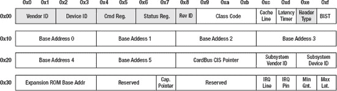

***图 9-1.** 标准 PCI 配置空间寄存器*

灰色部分为必需寄存器；其他寄存器为可选寄存器。前 48 字节是标准化的，无论设备是基于 PCI、PCI-X 还是 PCIe，布局均相同。由于 PCI Express 采用点对点架构（不使用共享总线），许多寄存器已不再适用。

下面我们详细了解图 9-1 中的强制寄存器。

- **厂商 ID（Vendor ID）**：包含一个 16 位的标识符，每个硬件制造商有唯一值。厂商 ID 由 PCI-SIG（特殊兴趣小组）分配给各硬件制造商。例如，苹果公司的厂商 ID 为`0x106b`。操作系统通常根据厂商 ID 和设备 ID 的组合来确定应为设备加载哪个驱动程序。`0xffff`不是有效的厂商 ID。
- **设备 ID（Device ID）**：同样为 16 位宽。与厂商 ID 不同，设备 ID 可由制造商自行分配，无需在中央注册表中维护。
- **类别代码（Class Code）**：一个 24 位的寄存器，用于保存设备的类型分类。前 8 位保存基类（Base Class）。基类示例包括：未分类（`0x0`）、大容量存储控制器（`0x1`）、网络控制器（`0x2`）、显示控制器（`0x3`）等。接下来的 8 位保存子类（Subclass）。例如，如果基类是显示控制器，子类可能是 VGA（`0x0`）、XGA（`0x1`）或其他（`0x80`）。剩余的 8 位用于指定设备的程序接口（寄存器级接口）（如果存在多种可能）。USB 控制器会利用这些位来验证其是否符合 UHCI、OHCI、EHCI 或 XCHI 接口——这些寄存器级规范决定了驱动程序应如何与设备交互。
- **子系统厂商/设备 ID（Subsystem Vendor/Device ID）**：遵循与厂商 ID 和设备 ID 相同的规则和分配原则。当多家不同制造商使用同一芯片（OEM）销售产品时，子系统 ID 用于识别芯片。典型的例子是 Nvidia 和 ATI。他们制造 GPU 芯片，随后由第三方制造商利用这些芯片生产最终产品。此类设备的 PCI 配置空间包含第三方制造商的厂商 ID 和设备 ID，但使用 Nvidia 或 ATI 作为子系统厂商 ID，并使用其设备 ID 作为子系统设备 ID。这样一来，即使板卡并非由 ATI 或 Nvidia 直接制造，他们的驱动程序也能被使用。
- **基地址 0-5（Base Address 0-5）**：包含最多六个 I/O 区域，这些区域可以是 I/O 端口或内存区域。后者更为常见。稍后我们将更详细地讨论 I/O 区域。基地址常缩写为 BAR（基地址寄存器）。

## I/O Kit 中的 PCI

I/O Kit 中的 PCI 由`IOPCIFamily`处理，它与`IOUSBFamily`一样，在其自身的 KEXT 中实现。就提供的类数量而言，`IOPCIFamily`比`IOUSBFamily`更简单。这意味着在实现驱动程序时，可供我们使用的构建块更少。从驱动程序的视角看，PCI 比 USB 更底层，因此 PCI 设备的驱动程序编写通常更为复杂。图 9-2 展示了`IOPCIFamily`的类层次结构。

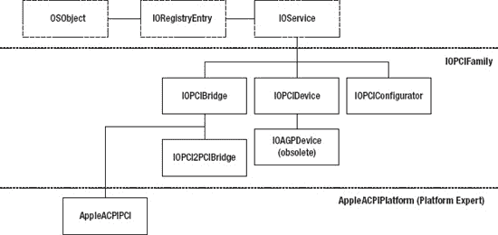

***图 9-2.** IOPCIFamily 类层次结构*

`IOPCIDevice`对象充当所有基于 PCI 的设备（包括 PCIe、Thunderbolt 和 ExpressCard）的*节点（nub）*或提供者。一个名为`IOAGPDevice`的`IOPCIDevice`子类用于处理较老的 AGP（高级图形端口）显卡，然而，所有基于 Intel 的 Mac 都不再配备 AGP。在许多情况下，你只需与`IOPCIFamily`中的`IOPCIDevice`类进行交互。系统中每个 PCI 设备都有一个此对象的实例；同样，系统中每个 PCI 桥接器都有一个`IOPCIBridge`实例。在某些情况下，驱动程序可能需要与其桥接器交互，以读取或写入桥接器的配置空间。虽然不常见，但也可以创建你自己的 PCI 桥接器驱动程序。我们将在本章稍后讨论设备与桥接器的访问。根 PCI 桥接器（也称为主机桥接器和根复合体）由`IOPCIBridge`的一个名为`AppleACPIPCI`类的子类实现。此类是平台专家（Platform Expert）的一部分，由`AppleACPIPlatform` KEXT 实现，并控制对系统中所有设备与桥接器的访问。该类只有一个实例。`IOPCI2PCIBridge`类是 PCI 到 PCI 桥接器的驱动程序。

 **提示** 与`IOUSBFamily`一样，`IOPCIFamily`并非*xnu*源代码发行版的一部分；而是可以从[`http://opensource.apple.com`](http://opensource.apple.com)单独下载得到。该源代码包包含了上述类的源代码，以及一个 PCI 驱动程序示例和用于从 PCI 设备转储信息的用户空间工具源代码。


### 驱动匹配与加载

PCI 驱动通常根据其配置空间寄存器中的属性进行匹配，例如供应商 ID、设备 ID、类别、子系统供应商 ID 和子系统设备 ID。通常，如果 PCI 设备基于通用芯片，则需要用到后两项。

尽管配置空间包含更多字段，但无法使用匹配字典（基于属性的匹配）来匹配它们。如果您需要更高级别的匹配，您的驱动必须重写 `IOService::probe(IOProvider* service)` 方法，并且您需要自行检查 `IOPCIDevice` 以确定您的驱动是否与设备匹配。表 9-1 中列出的键可用于匹配基于 PCI 的设备。

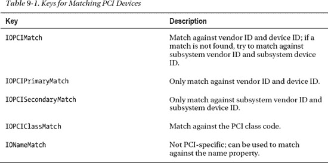

清单 9-1 展示了一个典型 PCI 设备的匹配字典，该设备具有为 `0xabcd` 的供应商 ID 或子系统供应商 ID，以及为 `0x1234` 的设备 ID 或子系统设备 ID。

**清单 9-1.** *PCI 驱动的简单匹配字典*

```
<key>IOKitPersonalities</key>
<dict>
    <key>MyPCIDriver</key>
    <dict>
        <key>CFBundleIdentifier</key>
        <string>com.osxkernel.MyPCIDriver</string>
        <key>IOClass</key>
        <string>com_osxkernel_MyPCIDriver</string>
        <key>IOProviderClass</key>
        <string>IOPCIDevice</string>
        <key>IOPCIMatch</key>
        <string>0x1234abcd</string>
     </dict>
</dict>
```

该值以 32 位十六进制字符串的形式以小端格式指定。前四个字符代表设备 ID，后四个字符代表供应商 ID。值得注意的是，该值属于字符串类型，而非整数。`IOProviderClass` 键的值必须为 `IOPCIDevice`，以便 I/O Kit 将 `IOPCIDevice` 实例传递给您的驱动。如果您需要根据供应商 ID 和设备 ID 进行匹配，可以用 `IOPCIPrimaryMatch` 替换 `IOPCIMatch`；或者，如果您只想匹配子系统 ID，可以使用 `IOPCISecondaryMatch`。

如果您的驱动处理多个设备，可以将其作为空格分隔的列表实现，如下所示：

```
<key>IOPCIMatch</key>
<string>0x1234abcd 0x1235abcd 0x1236abcd</string>
```

这将匹配供应商 `0xabcd` 的设备 ID `0x1234`、`0x1235` 和 `0x1236`。如果您的驱动支持大量设备，您可以使用掩码来实现相同的效果，而无需分别枚举每个设备。

```
<key>IOPCIMatch</key>
<string>0x1230abcd&0xfff0ffff</string>
```

 **注意** 如果您直接编辑 `Info.plist`，必须将 & 符号（&）表示为 `&amp`，因为在 XML 中该符号用于指示转义序列。

这将匹配所有以 `0x123X` 开头的设备 ID；例如，范围从 `0x1230` 到 `0x123F`，以及供应商 ID 为 `0xabcd`。掩码中应忽略的位必须设置为零。

您也可以根据类别寄存器进行匹配。为此，您必须指定 `IOPCIClassMatch` 键。类别寄存器宽 3 个字节。但是，为了匹配它，I/O Kit 要求您指定一个 4 字节的值。最后一个字节将被忽略。以下示例匹配显示控制器（基类代码 `0x03`）：

```
<key>IOPCIClassMatch</key>
<string>0x03000000&amp;0xFF000000</string>
```

由于所有 PCI 设备都根据其设备 ID 和供应商 ID 分配了名称，因此也可以使用 `IONameMatch` 来匹配 PCI 设备，如清单 9-2 所示。

**清单 9-2.** *基于名称属性的匹配*

```
<key>IONameMatch</key>
<array>
    <string>pciabcd,1234</string>
    <string>pciabcd,1235</string>
    <string>pciabcd,1236</string>
</array>
```

上述方法可能更具可读性，但其缺点是无法匹配子系统供应商和设备 ID。

 **注意** 记得在驱动的 `Info.plist` 文件的 `OSBundleLibraries` 部分中添加对 `IOPCIFamily` 的依赖。

系统启动期间，会加载安装在物理插槽或板载的 PCI 设备的驱动。Thunderbolt 和 ExpressCard 驱动会在启动时或按需（插入时）加载。

虽然 Thunderbolt 设备遵循 PCI 设备的识别规则，但它们需要额外更改才能让驱动加载。在驱动的 `Info.plist` 文件的每个个性描述下，需要设置以下键：

```
<key>IOPCITunnelCompatible</key>
<true/>
```

这告诉系统该驱动已为 Thunderbolt 做好准备，因此可以安全卸载。Thunderbolt 设备和 PCIe 设备有可能共享同一个设备驱动；然而，在许多情况下，PCI 驱动的编写可能基于“驱动/设备在运行期间永远不会被移除”的假设。除非设置了此键，否则驱动将不会为 Thunderbolt 设备加载。

**THUNDERBOLT 唯一标识符**

所有 Thunderbolt 设备都有一个设备 ROM（DROM），其中包含一个标识供应商的附加 ID，称为授权 ID（Authority ID）。该 ID 是一个 64 位 UID 编号的一部分，该 UID 对于每个 Thunderbolt 设备都是唯一的，就像网络接口的 MAC 地址一样。授权 ID 由 Thunderbolt 命名机构（Intel）分配，而非 PCI-SIG。截至撰写本文时，尚无出版物解释如何从 I/O Kit 访问此号码，或者它是否可用于匹配 Thunderbolt 设备。


### 驱动程序示例：一个简单的 PCI 驱动程序

现在让我们动手实践。为了演示 PCI 驱动程序的实际运行，我们将利用 `IOMatchCategory` 键，允许为设备加载一个辅助驱动程序。在本例中，我们将驱动加载到显示控制器（显卡/GPU）上，因为它是所有 Mac（即便是笔记本电脑）上都存在的设备——它们内部都使用 PCIe。我们将使用以下配置来匹配显示控制器：

`<key>IOPCIClassMatch</key>`
`<string>0x03000000&amp;0xFF000000</string>`

 **警告** 请谨慎修改 `MyFirstPCIDriver`，因为它会附加到一个已被其他驱动程序控制的设备上。因此，执行除查询信息之外的任何操作都可能不安全，并可能导致系统崩溃或损坏。

回想一下，`0x03` 是显示控制器的基类。如果你有多个 GPU，那么驱动程序的多个实例将被实例化——每个设备一个。

让我们从驱动程序的类声明开始，如代码清单 9-3 所示。

***代码清单 9-3.** MyFirstPCIDriver 类声明*

```
#include <IOKit/IOLib.h>
#include <IOKit/pci/IOPCIDevice.h>

class com_osxkernel_MyFirstPCIDriver : public IOService
{
    OSDeclareDefaultStructors(com_osxkernel_MyFirstPCIDriver);

private:
    IOPCIDevice*        fPCIDevice;

public:
    virtual bool start(IOService* provider);
    virtual void stop(IOService* provider);
};
```

如果你已经阅读过前面的示例，这里应该不会有什么意外。我们只是声明了一个 `IOService` 的子类，并重写了 `start()` 和 `stop()` 方法。注意，我们包含了文件 `IOKit/pci/IOPCIDevice.h`，其中包含了 `IOPCIDevice` 类的定义。

`MyFirstPCIDriver` 的实现如代码清单 9-4 所示。

***代码清单 9-4.** MyFirstPCIDriver 类实现*

```
#include "MyFirstPCIDriver.h"

#define super IOService
OSDefineMetaClassAndStructors(com_osxkernel_MyFirstPCIDriver, IOService);

bool com_osxkernel_MyFirstPCIDriver::start(IOService * provider)
{    
    IOLog("%s::start\n", getName());

    if(!super::start(provider))
        return false ;

    fPCIDevice = OSDynamicCast(IOPCIDevice, provider);
    if (!fPCIDevice)
        return false;

    fPCIDevice->setMemoryEnable(true);

    registerService();

    return true;
}

void com_osxkernel_MyFirstPCIDriver::stop( IOService * provider )
{
    IOLog("%s::stop\n", getName());
    super::stop(provider);
}
```

当驱动程序被成功匹配时（无论是通过 `Info.plist` 字典还是调用驱动程序的 `probe()` 方法），你的驱动程序的 `start()` 方法就会被调用。与第 8 章中的 USB 驱动程序类似，我们检查确保传递给我们的提供者确实是正确的类型（`IOPCIDevice`），这是一种良好实践，尽管如果你的 `Info.plist` 正确指定了 `IOProviderClass` 键，这种情况本不该发生。

如果我们拥有一个有效的 `IOPCIDevice`，下一步是通过调用 `IOPCIDevice::setMemoryEnable(bool enable)` 方法来启用设备的 I/O 资源。这将在设备的命令寄存器中设置一个切换位，告知设备我们想要访问其资源。最后，我们的驱动程序调用 `registerService()`，这将通知潜在的客户端（可能是更高级别的驱动程序）我们驱动程序已就绪。我们返回 `true` 来向 I/O Kit 指示驱动程序已成功加载。

现在，我们可以尝试使用 `kextload` 工具来加载 `MyFirstPCIDriver`。你可以通过检查 `Console.app` 中的 `kernel.log`，或使用 `IORegistryExplorer` 搜索来验证它是否被正确加载，如图 9-3 所示。

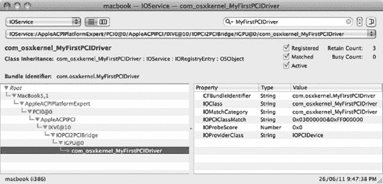

***图 9-3.** IORegistryExplorer 显示 MyFirstPCIDriver 已加载*

### 访问配置空间寄存器

`IOPCIDevice` 类包含许多辅助方法，使得访问设备的配置空间寄存器变得容易。以下方法允许你读取和写入配置空间寄存器。

```
virtual UInt8 configRead8(UInt8 offset);
virtual UInt16 configRead16(UInt8 offset);
virtual UInt32 configRead32(UInt8 offset);

virtual void configWrite8(UInt8 offset, UInt8 data);
virtual void configWrite16(UInt8 offset, UInt16 data);
virtual void configWrite32(UInt8 offset, UInt32 data);
```

有三种读取方法和三种写入方法变体，它们允许你从指定的偏移量读取或写入 8 位、16 位或 32 位的值。`offset` 参数是配置空间中的字节偏移量，必须在 0-255 之间。要读取设备的设备 ID 和供应商 ID，我们可以执行以下操作：

```
UInt16 vendorID = fPCIDevice->configRead16(0);
UInt16 deviceID = fPCIDevice->configRead16(2);
IOLog("vendor ID = 0x%04x device ID = 0x%04x\n", vendorID, deviceID);
```

之前的请求也可以通过一次调用完成：

```
UInt32 bothIDs = fPCIDevice->configRead32(0);
IOLog("vendor ID = 0x%04x device ID = 0x%04x\n", bothIDs >> 16, bothIDs & 0x0000FFFF);
```

前面的调用使用了整数字节偏移量，但 `IOPCIDevice.h` 文件指定了可用于寻址常用寄存器位置的常量。因此，为了使代码更易读，你可以使用 `kIOPCIConfigVendorID` 和 `kIOPCIConfigDeviceID` 来代替硬编码的值。可用常量的完整列表如代码清单 9-5 所示。

***代码清单 9-5.** 常用 PCI 配置空间寄存器偏移量的常量 (IOPCIDevice.h)*

```
enum {
    kIOPCIConfigVendorID = 0x00,
    kIOPCIConfigDeviceID = 0x02,
    kIOPCIConfigCommand = 0x04,
    kIOPCIConfigStatus = 0x06,
    kIOPCIConfigRevisionID = 0x08,
    kIOPCIConfigClassCode = 0x09,
    kIOPCIConfigCacheLineSize = 0x0C,
    kIOPCIConfigLatencyTimer = 0x0D,
    kIOPCIConfigHeaderType = 0x0E,
    kIOPCIConfigBIST = 0x0F,
    kIOPCIConfigBaseAddress0 = 0x10,
    kIOPCIConfigBaseAddress1 = 0x14,
    kIOPCIConfigBaseAddress2 = 0x18,
    kIOPCIConfigBaseAddress3 = 0x1C,
    kIOPCIConfigBaseAddress4 = 0x20,
    kIOPCIConfigBaseAddress5 = 0x24,
    kIOPCIConfigCardBusCISPtr = 0x28,
    kIOPCIConfigSubSystemVendorID = 0x2C,
    kIOPCIConfigSubSystemID = 0x2E,
    kIOPCIConfigExpansionROMBase = 0x30,
    kIOPCIConfigCapabilitiesPtr = 0x34,
    kIOPCIConfigInterruptLine = 0x3C,
    kIOPCIConfigInterruptPin = 0x3D,
    kIOPCIConfigMinimumGrant = 0x3E,
    kIOPCIConfigMaximumLatency = 0x3F
};
```

`IOPCIDevice` 还提供了一个设置寄存器单个位的便捷方法，名为 `setConfigBits()`。

对缺失或故障设备发出的读取请求将返回值 `0xFFFF`（对于 8 位和 32 位变体，返回 `0xFF` 或 `0xFFFFFFFF`），这是一个无效的设备/供应商 ID。因此，如果在读取任一寄存器时返回此值，可用于判断是否发生了问题，或者 Thunderbolt 设备是否已被拔出。

向配置空间写入值很简单，但需要注意几点。配置空间的许多区域是只读的。例如，设备 ID 和供应商 ID 被编程到设备的 PCI 控制器固件中。另请注意，无法确定对寄存器位置的写入是否成功；你必须回读该寄存器或受写入事务影响的其他寄存器，才能确定其成功与否。

 **注意** 如果你的驱动程序需要保持与基于 PowerPC 的系统的兼容性，请注意 PCI 配置空间是以小端格式存储的，不过 `IOPCIDevice` 会为你处理字节交换。


```markdown
`IOPCIDevice` 的许多方法（如 `setMemoryEnable()`）是便捷的抽象方法，它们代表您执行相应的配置空间读写操作。对配置空间的 I/O 操作会由 `IOPCIDevice` 传递给其父设备（大多数情况下是 `IOPCIBridge`），最终到达由平台专家实现的根桥设备，具体细节取决于系统实现。

### 访问扩展配置空间

您可能注意到上一节中 I/O 函数存在不一致性。前文提到扩展配置空间为 4096 字节。当 `config*()` 系列函数的偏移量参数采用 `UInt8` 类型时，如何访问大于 255 的偏移量？答案在于以下方法族：

```
UInt32 extendedConfigRead32(IOByteCount offset);
UInt16 extendedConfigRead16(IOByteCount offset);
UInt8  extendedConfigRead8(IOByteCount offset);

void extendedConfigWrite32(IOByteCount offset, UInt32 data);
void extendedConfigWrite16(IOByteCount offset, UInt16 data);
void extendedConfigWrite8(IOByteCount offset, UInt8 data);
```

这些方法与前述接口具有相同的接口形式。但它们在 `offset` 参数上使用了更宽的数据类型 `IOByteCount`，从而允许访问大于 255 的偏移量。

### 搜索能力寄存器

由于能力寄存器并非位于固定偏移量，查找能力寄存器的过程需要先搜索能力 ID，然后读取下一个字节以确定该能力的长度，这同时也给出了下一个能力的偏移量。按此流程沿链表向下搜索，直到找到目标能力。幸运的是，我们无需手动编写此代码，因为 `IOPCIDevice` 类提供了两个辅助方法定位能力：

```
virtual UInt32 findPCICapability(UInt8 capabilityID, UInt8* offset = 0 );
virtual UInt32 extendedFindPCICapability(UInt32 capabilityID, IOByteCount* offset = 0 );
```

以下示例演示如何获取 PCIe 链路状态寄存器，该寄存器包含设备的活动通道数（第 4-9 位）和链路速度（第 0-3 位）：

```
IOByteCount offset = 0;
if (fPCIDevice->extendedFindPCICapability(kIOPCIPCIExpressCapability, &offset))
{
    UInt16 value = fPCIDevice->extendedConfigRead16(offset + 0x12);
}
```

该方法将返回能力 ID（本例中为 `kIOPCIExpressCapability`），如果未找到指定 ID 的能力则返回零。输出参数 `offset` 用于存储已找到能力的偏移量。找到能力后，我们可以通过将偏移量加上 `0x12`（18）来读取链路状态寄存器。

### PCI I/O 内存区域

PCI 设备最多可拥有六个 I/O 区域。每个区域包含 I/O 内存或 I/O 空间（端口）。后者在新设备中很少使用，因为 I/O 端口通常是一种非常慢的 I/O 方式，且只能通过特殊的 in/out CPU 指令访问。某些传统设备（如 IDE 控制器）可能同时包含 I/O 端口和内存，并可通过任一种方式控制。另一方面，I/O 内存效率更高且更易访问，因为它可以直接映射到系统的内存空间，像普通内存一样被访问。I/O 内存通常被称为内存映射 I/O（MMIO）。此概念不应与虚拟地址空间之间的内存映射或文件内存映射（`mmap`）混淆。

如果设备内存区域设置了内存预取位，CPU 可能会缓存对已映射设备内存的访问。

如何通过内存区域控制设备？这完全取决于设备本身。例如，一个区域可用于控制和状态寄存器，而另一个区域可用于读取或写入数据（例如来自摄像头的输入视频）。如果您正在以电子形式阅读本文，那么这段文字可能正被持续写入代表显卡帧缓冲区的内存区域。与 USB 类似，基于 PCI 的设备也存在一系列标准化接口。例如，VGA 兼容显卡允许通过包含内存区域和/或端口的已知接口实现显卡的基本操作。IDE、SATA 和基于 PCI 的 USB 控制器也存在标准化接口，使操作系统能够为符合此类接口的任何设备使用默认驱动程序。

由于 PCI 是“即插即用”的，PCI 设备的 I/O 资源由内核/EFI（或传统 PC 中的 BIOS）自动配置，这与过时的 ISA 总线形成对比——在 ISA 总线上，必须通过物理跳线为每个设备单独选择基本 I/O 地址和中断线，以避免资源冲突。

当设备配置完成后，配置空间中存在的每个区域都将被分配各自的地址范围。范围的大小取决于设备。

设备配置完成后，系统会为其分配一个物理内存地址范围。从图 9-1 可以看出，没有用于存储每个内存区域大小的寄存器。那么系统如何知道每个区域有多大呢？系统通过将配置空间中某个基地址槽的所有位设为 1，然后读回该值来确定内存区域的大小。内存区域的大小必须是 2 的幂。如果设备支持，可以将两个 BAR 组合起来形成 64 位地址。

在系统或驱动程序访问任何 I/O 区域之前，需要通过切换设备命令寄存器中的某个位来启用它们。我们在 `MyFirstPCIDriver` 中已经看到了如何实现这一点：在驱动程序的 `start()` 方法中调用 `fPCIDevice->setMemoryEnable(true)`。

### 枚举 I/O 区域

为了发现 PCI 设备的可用内存区域（最多六个），让我们修改 `MyFirstPCIDriver`，在其 `start()` 方法中通过添加列表 9-6 中的代码（位于 `setMemoryEnable()` 调用之后）来转储设备的附加信息。

***列表 9-6.** 枚举 PCI I/O 内存区域*

```
for (UInt32 i = 0; i < fPCIDevice->getDeviceMemoryCount(); i++)
{
    IODeviceMemory* memoryDesc = fPCIDevice->getDeviceMemoryWithIndex(i);
    if (!memoryDesc)
        continue;
    #ifdef __LP64__
        IOLog("region%u: length=%llu bytes\n", i, memoryDesc->getLength());
    #else

        IOLog("region%lu: length=%lu bytes\n", i, memoryDesc->getLength());
    #endif
}
```

如果您编译并加载该驱动程序，应该在 `kernel.log` 中看到类似以下输出：

```
Apr 1 11:06:18 macbook kernel[0]: com_osxkernel_MyFirstPCIDriver::start
Apr 1 11:06:18 macbook kernel[0]: region0: length=16777216 bytes
Apr 1 11:06:18 macbook kernel[0]: region1: length=268435456 bytes
Apr 1 11:06:18 macbook kernel[0]: region2: length=33554432 bytes
Apr 1 11:06:18 macbook kernel[0]: region3: length=128 bytes
Apr 1 11:06:18 macbook kernel[0]: region4: length=131072 bytes
```

您的输出可能因系统型号和显卡而异（也可能有多个显卡）。本例中最大的区域（256 MB）是区域 1，即显卡的帧缓冲区。
```


### 映射与访问设备内存区域

上一节展示了如何获取可用 I/O 内存区域的信息。在实际访问这些区域的数据之前，我们还需要完成一些额外工作。此外，在大多数实际驱动中，无需显式枚举这些区域，因为驱动通常明确知道需要映射哪些区域（即便不是全部）。以下 `IOPCIDevice` 方法可用于直接映射 BAR 区域：

`virtual IOMemoryMap * mapDeviceMemoryWithRegister(UInt8 reg, IOOptionBits options = 0);`

以下是其使用示例：

```
IOMemoryMap *bar0Map = fPCIDevice->mapDeviceMemoryWithRegister(kIOPCIConfigBaseAddress0);
IOMemoryMap *bar1Map = fPCIDevice->mapDeviceMemoryWithRegister(kIOPCIConfigBaseAddress1);
if (bar0Map)
{
    UInt8 *address = (UInt8*)bar0Map->getVirtualAddress();
// 对 *address 进行操作
}
…
```

如果您已通过调用 `getDeviceMemoryWithIndex()` 获得了 `IODeviceMemory`（`IOMemoryDescriptor` 的子类）对象（如列表 9-6 所示），则可直接调用功能相同的 `map()` 方法。实际上，`mapDeviceMemoryWithRegister()` 底层执行的正是此操作。获得 `IOMemoryMap` 对象后，可调用 `getVirtualAddress()` 获取内核虚拟地址，用于访问映射区域。假设该指针指向 I/O 内存而非 I/O 空间，则可像操作常规内存一样对其进行读写。

当驱动完成内存访问后，应调用 `unmap()` 方法。

### 访问 I/O 空间

I/O 空间由一个 16 位地址空间组成，是较早期的设备通信方式。在旧式计算机中，I/O 端口也用于串行和并行端口的通信，因此它并非 PCI 专属，而是外部设备（相对于 CPU）与处理器交互的一种方式。分配给设备的 I/O 空间范围可通过 `mapDeviceMemoryWithRegister()` 和 `getDeviceMemoryWithIndex()` 像内存区域一样进行访问和映射。但区别在于，不能像上文那样直接访问 `getVirtualAddress()` 返回的指针，而必须使用以下方法之一：

```
virtual void ioWrite32(UInt16 offset, UInt32 value, IOMemoryMap* map = 0);
virtual void ioWrite16(UInt16 offset, UInt16 value, IOMemoryMap* map = 0);
virtual void ioWrite8(UInt16 offset, UInt8 value, IOMemoryMap* map = 0);
virtual UInt32 ioRead32(UInt16 offset, IOMemoryMap* map = 0);
virtual UInt16 ioRead16(UInt16 offset, IOMemoryMap* map = 0);
virtual UInt8 ioRead8(UInt16 offset, IOMemoryMap* map = 0);
```

由于 I/O 空间性能较差且地址空间有限，新设备中已不推荐使用。访问映射内存可能仅需 1 个 CPU 周期，而在某些架构上，访问一个 I/O 端口可能需要多达 100 个周期。

在访问 I/O 空间前，需在设备的命令寄存器中启用它。`IOPCIDevice` 提供了 `setIOEnable()` 方法用于此目的。

### 处理设备移除

雷电（Thunderbolt）和 ExpressCard 设备可能在运行过程中被拔出。因此，处理这些设备的驱动需要在传统 PCI 驱动（通常不涉及设备移除场景）基础上进行额外修改。不当的设备移除处理可能导致应用挂起、系统崩溃或影响系统稳定性与性能。对于雷电设备，移除并非异常情况，因此驱动必须能够应对设备移除。

 **警告** 挂载了文件系统的存储设备不得在用户未先“弹出”（卸载）文件系统的情况下拔除。否则可能导致数据丢失，甚至最坏情况下造成文件系统损坏。基于雷电的存储驱动应在驱动的 `start()` 方法中尽早调用 `setProperty(kIOPropertyPhysicalInterconnectLocationKey, kIOPropertyExternalKey)`，以向 I/O Kit 表明该存储设备为外部连接。

虽然处理设备移除看似复杂，但 I/O Kit 本身就是为支持设备移除而设计的。`IOService` 类自动为我们处理了大量繁重工作。

当驱动从内存映射 I/O（MMIO）或 PCI 配置空间寄存器中读取到值 `0xffffffff`（假设为 32 位读取）时，可能检测到设备已移除的初步迹象。当然，该值对某些寄存器而言可能是有效值，但您可以读取一个已知绝不会包含该值的替代寄存器或内存位置，以确认设备是否无响应。驱动可能在 I/O Kit 通知设备已移除之前就检测到这一状况。如果驱动判定设备已移除，应立即停止所有对映射内存和配置空间的访问，因为后续请求将导致超时（可能耗时数毫秒），从而影响系统整体性能。Apple 建议将所有对 MMIO 的访问集中到单个方法中，如下所示：

```
UInt32 com_osxkernel_MyFirstPCIDriver::readRegister32(UInt32 offset)
{
    UInt32 res = 0xffffffff;
    if (!fDeviceRemoved)
    {
        res = OSReadLittleInt32(fBar0Address, offset);
        if (res == 0xffffffff)
            fDeviceRemoved = true;
    }
    return res;
}
```

该方法将在设备移除后阻止后续对寄存器的访问。现在，我们可以在驱动的其他部分使用成员变量 `fDeviceRemoved` 来阻止与硬件通信的操作。

I/O Kit 通过三个阶段处理设备移除：


1. 总线控制器（PCI 根）会在其客户端 *nub* 上调用`terminate()`方法，该方法会再次向其客户端发送消息，依此类推，直到到达栈底。覆盖了`message()`方法的`IOService`对象也会收到`kIOServicesIsTerminated`消息。此时驱动被视为非活跃状态，无法被新客户端枚举或附加。但保持驱动打开状态的现有客户端仍将继续活跃。

2. 栈中的驱动会依次调用其`willTerminate()`方法，随后调用`didTerminate()`。此过程以相反顺序进行，即客户端会调用其提供者，而非相反方向，直到到达最初发起`terminate()`调用的原始提供者。请记住，这些方法是可选的，你可以根据驱动需求选择是否实现。当驱动的`willTerminate()`方法被调用时，它应清除所有排队请求并取消正在进行的 I/O 操作（例如未完成的 DMA 传输）。

3. 移除过程的最后阶段会调用驱动的`stop()`方法，随后调用`detach()`，这将从 I/O Registry 中移除该驱动。如果驱动的保留计数归零，驱动将被释放并调用其`free()`方法。

如果用户重新插入同一设备，会分配一个新的驱动实例。此时任何正在访问驱动的应用程序仍将附着在旧的驱动实例上。为处理此情况，应用程序必须安装通知机制，以检测驱动/设备何时被移除或添加至系统。由于设备重新插入时驱动实例不会被重用，因此在处理设备移除后，驱动无需恢复到默认状态。但重要的是，它必须正确释放和释放所有已使用的资源，因为新实例会重新分配或回收这些资源，否则可能导致内存泄漏或新驱动实例无法正常启动。

 **提示** Xcode 提供了一个名为`ioclasscount`的命令行工具，用于打印`OSObject`派生类的实例计数，可用于调试与设备移除相关的内存泄漏。更多信息请参见第 16 章。

### 中断

中断提供了一种机制，使得 PCI 及其他硬件设备能够在感兴趣的事件发生时（例如键盘按键被按下、鼠标移动或按钮被点击）异步地向 CPU 发出信号。网络摄像头可能会在每帧新视频数据可用时发送一个中断，从而让驱动知道何时可以从其映射的内存区域读取新帧。中断避免了 CPU 通过轮询每个设备来判断是否有新数据可用。传统的 PCI 设备使用专用中断引脚，这些引脚通过物理线路从 PCI 卡/插槽连接到 CPU 的引脚。更现代的 Thunderbolt 和基于 PCIe 的技术则使用消息信号中断（MSI），从而避免了设备与 CPU 或中断控制器芯片之间需要专用物理线路的问题。传统 PCI 卡有四个中断引脚，限制了设备可用的中断数量。而 MSI 允许每个设备最多有 32 个中断。尽管 MSI 在电气特性上与传统中断不同，但从驱动的角度来看，它们的功能表现是相同的。

当 CPU 接收到一个中断时，它会将当前正在运行的线程挂起，即使该线程属于内核自身也是如此。当中断发生时，CPU 会尝试查找对应触发中断的中断服务例程（ISR）。

ISR 会被路由到“拥有”该设备的驱动。传统的基于中断的设备可能共享中断线路。在这种情况下，驱动需要查询设备（通常通过读取内存映射寄存器）来确定是否是其设备引发了中断。

MSI 中断永远不会被共享，尽管预先考虑这种情况仍是一种良好的实践。中断并不总是由 PCI 等硬件设备产生。系统定时器也会发送中断，用于驱动操作系统服务（如调度器）。

当 ISR 运行时，处理中断的 CPU 会禁用其他中断，这意味着在 ISR 完成之前，该 CPU 上不会有任何其他操作执行。

可想而知，如果驱动在 ISR 回调中执行大量工作，将对系统性能产生不良影响。事实上，强烈建议驱动在 ISR 中只做一件事：确认中断。如果中断未被确认，可能导致 ISR 持续触发，从而影响性能和稳定性。当 ISR 运行时，通常被称为*主中断上下文*。为了提升系统性能，大多数操作系统（包括 OS X 和 iOS）都提供了将中断处理延迟到稍后时间由内核线程执行的机制。这通常被称为*次中断上下文*。正是在次中断上下文（线程）中，才执行处理中断的实际工作，例如从网络复制传入的数据包。主处理器通常确认中断，然后，如果有工作需要处理，会通知次处理器。

在主上下文中，无法执行阻塞或休眠操作，这包括大多数内存分配例程以及持有自旋锁以外的锁。这是因为阻塞/休眠是通过放弃 CPU 访问权并临时让出给其他线程来实现的。然而，ISR 并不与任何任务或线程描述符关联。因此，调度器无法像调度普通线程那样将 ISR 再次调度回来，因为它是由 CPU 直接触发的。

次中断处理器则没有此类限制，可以愉快地分配内存并阻塞等待锁变为可用。这在 OS X 和 iOS 下是可行的，但某些操作系统可能在不允许这样做的上下文中运行次处理器（也称为底半部，主处理器为顶半部）。

尽管 OS X 和 iOS 对次中断处理器中的操作施加了较少的限制，但它仍然必须非常高效。

主中断的处理无法由用户空间程序完成。如果用户空间程序需要知道中断何时发生，则必须由驱动来通知它。

在 OS X 中，所有主中断都被路由到 CPU 0（核心），而次中断则分散到所有核心，这允许多个驱动并行运行。由于次中断运行在独立的内核线程（高优先级）中，它可以像任何其他线程一样被调度，因此可以在中断启用的情况下运行。中断机制在概念上实现起来很简单。然而，如果数据在主处理器和次处理器之间共享，或者用户线程可能调用需要访问相同数据的驱动，那么中断的并行性可能会使其变得复杂。必须非常小心地确保没有死锁，并减少不同执行线程之间的争用。这确保了没有线程需要过度等待才能获得所需资源。有关同步的更多信息，请参阅第 7 章。

 **注意** 术语“主中断”有时被称为直接中断，而“次中断”则被称为间接中断。


#### I/O Kit 中断机制

在 I/O Kit 中，处理主中断和次中断的首选方式是通过工作循环系统。然而，直接处理也是可行的。如果您不确定工作循环是如何运作的，请查阅第 7 章了解更多细节。驱动程序有三种主要机制可用于处理中断。图 9-4 展示了这三种不同机制如何响应主中断。

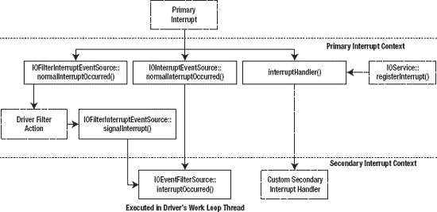

**图 9-4.** I/O Kit 用于处理设备中断的机制

- `IOInterruptEventSource`：处理设备中断的标准且最简单的方式。您只需注册一个处理函数，该函数将在次中断上下文中执行。您的驱动程序无需处理主中断。中断将在中断处理程序完成之前从提供者处被禁用，从而保证中断的单线程处理，因为另一个处理程序无法并行运行。`IOInterruptEventSource` 是处理中断的首选方式。
- `IOFilterInterruptEventSource`：如图 9-4 左侧所示，它是 `IOInterruptEventSource` 的子类，提供了更大的灵活性。它允许提供一个自定义的过滤动作。该过滤动作在主中断上下文中调用，允许驱动程序询问硬件设备是否真的有中断。如果中断在多个设备之间共享，或者设备是一个具有多种可能中断的复杂或多功能设备，或者有极低延迟的要求，则推荐使用此方法。次中断将根据已安装的过滤动作（例程）的返回值被调度。
- `IOService::registerInterrupt()`：最后一种方法是使用 `IOService::registerInterrupt()` 注册一个将在主中断期间调用的 C 函数。此方法不使用驱动程序的工作循环，也未提供调用次中断处理程序的方法。如果需要次中断，则必须手动实现处理它们的机制。

#### 注册以接收中断

与 I/O Kit 中的许多事情一样，注册中断很简单，大部分繁重的工作由 I/O Kit 和平台专家在内部处理。我们无需担心分配 IRQ 号或中断路由，因为这些都是自动处理的。代码清单 9-7 展示了一个典型的代码块，演示了如何使用主中断过滤器，将驱动程序注册为从其提供者（`IOPCIDevice`）接收中断。

**代码清单 9-7.** 创建一个过滤型中断事件源

```
bool MyFirstPCIDriver::start(IOService * provider)
{
    ...
    IOWorkLoop *workLoop = (IOWorkLoop*)getWorkLoop();
    if (!workLoop)
        return false;

    IOFilterInterruptEventSource* interruptSource =
        IOFilterInterruptEventSource::filterInterruptEventSource(this,
                (IOInterruptEventAction) &MyFirstPCIDriver::interruptOccurred,
                (IOFilterInterruptAction) &MyFirstPCIDriver::interruptFilter,
                provider, 0);

    if (workLoop->addEventSource(interruptSource) != kIOReturnSuccess)
            return false;
    ...
}
```

这涉及四个步骤：

1.  获取或分配一个 `IOWorkLoop` 实例。
2.  分配事件源，这通过工厂方法 `filterInterruptEventSource()` 完成。我们传入五个参数：
    -   指向自身的指针，
    -   指向次中断处理函数 `interruptOccurred()` 的指针，
    -   将在主中断上下文中执行的过滤动作方法，
    -   最后一个参数是提供者的中断索引号，如果提供者有多个中断类型，则可以指定。例如，提供者可能除了共享中断外，还支持消息 signaled 中断 (MSI)，
    -   中断类型的索引。详情请参阅“启用消息 signaled 中断”部分。
3.  使用 `addEventSource()` 将事件源添加到 `IOWorkLoop` 实例。
4.  最后一步是启用事件源，因为即使在添加到工作循环后，它默认也是禁用的。要开始接收中断，只需调用 `interruptSource->enable()`。

确保驱动程序在调用此函数之前已完全初始化并准备好接收中断，或者如果可能，确保硬件上的中断在驱动程序准备好处理它们之前处于非激活状态，这一点非常重要。

注册一个 `IOInterruptEventSource` 的过程几乎相同，如代码清单 9-8 所示。

**代码清单 9-8.** 创建一个中断事件源

```
IOWorkLoop *workLoop = (IOWorkLoop*)getWorkLoop();
if (!workLoop)
        return false;

IOInterruptEventSource* interruptSource =
        IOInterruptEventSource::interruptEventSource(this,
                    (IOInterruptEventAction) &MyFirstPCIDriver::interruptOccurred,
                    provider, 0);

if (workLoop->addEventSource(interruptSource) != kIOReturnSuccess)
        return false;
...
```

唯一的区别是它不接受过滤动作，这正符合 `IOFilterInterruptEventSource` 的情况。

#### 启用消息 Signaled 中断

如果您需要确保使用消息 signaled 中断 (MSI)，必须首先枚举 MSI 中断类型的索引。在代码清单 9-7 和 9-8 中，我们简单地传递了 0 来获取提供者的第一个中断类型，根据设备的不同，它可能支持 MSI，也可能不支持。以下方法将枚举提供者可用的中断类型并返回 MSI 中断类型的索引，该索引随后可以作为索引参数传递给 `IOInterruptEventSource::interruptEventSource()`：

```
int com_osxkernel_MyFirstPCIDriver::findMSIInterruptTypeIndex()
{
    IOReturn ret;
    int index, source = 0;

    for (index = 0; ; index++)
    {
        int interruptType;
        ret = fPCIDevice->getInterruptType(index, &interruptType);
        if (ret != kIOReturnSuccess)
            break;

        if (interruptType & kIOInterruptTypePCIMessaged)
        {
            source = index;
            break;
        }
    }
    return source;
}
```


### 处理主中断

让我们看看主中断过滤器的实现方式，以及如何调度次中断处理程序。音频设备的主中断过滤器可能类似于代码清单 9-9 所示。

***代码清单 9-9.** 主中断过滤器方法*

```
bool com_osxkernel_MyAudioPCIDriver::interruptFilter(OSObject* owner, IOFilterInterruptEventSource * src)
{
    bool scheduleSecondaryInterrupt = false;

    com_osxkernel_MyAudioPCIDriver* me = (com_osxkernel_MyAudioPCIDriver*)owner;

    uint32_t registerContents = me->readRegister(kHardwareInterruptRegisterOffset);
    if (registerContents & kAudioInputInterruptBit)
    {
         scheduleSecondaryInterrupt = true;
         me->fAudioInputInterruptPending = true;
    }
    else if (registerContents & kAudioOutputInterrupt)
    {
         scheduleSecondaryInterrupt = true;
         me->fAudioOutputInterruptPending = true;
     }
     return scheduleSecondaryInterrupt;
}
```

该方法接受两个参数。第一个参数是 `OSObject` 指针，其值在构造 `IOFilterInterruptEventSource` 实例时传入。我们使用 `this` 指针将自身传递进去。这样做的原因是 `interruptFilter()` 函数是一个静态类成员，因为普通成员函数不能在 C++ 中用作函数指针。我们只需将 `owner` 参数强制转换回我们驱动类的类型，就能获取到实例。同时我们还获得了一个事件源的实例。

 **警告** 你可能会想在主中断处理程序中加入调试语句，使用 `IOLog()` 来查看它是否触发，或者硬件中是否正确设置了寄存器。**千万不要这样做。** 这是一个非常糟糕的主意。我们提过这是个糟糕的主意吗？你的系统会崩溃。

由于过滤器函数在主中断上下文中运行，调用 I/O Kit 框架的大部分内容都是不安全的，包括内存分配函数和大多数加锁函数。你同样应避免在主中断上下文中执行 I/O 操作或其他耗时的操作。在代码清单 9-9 所示的假设示例中，我们正在处理一个双向音频设备的中断，该设备有两个中断，每个方向各一个。在我们的过滤器中，我们首先读取设备的中断寄存器。如果两个中断中的任何一个被置位，我们就将变量 `scheduleSecondaryInterrupt` 设置为 `true`，并将其作为返回值。返回 `true` 意味着我们希望次中断处理程序运行，而返回 `false` 意味着我们的设备没有产生中断。这要么意味着我们与另一个设备共享一条中断线，而中断是由那个设备引发的，要么可能是由硬件故障或干扰导致的虚假中断。如果过滤器返回 `true`，设备的中断将被禁用，直到次处理程序被调度并执行完毕。这确保了中断被串行化，因此我们的驱动程序无需担心在主处理程序和次处理程序之间进行加锁，因为它们永远不会并行运行。

在某些情况下，我们不希望出现这种行为。我们可以通过修改中断过滤器使其始终返回 `false` 来防止中断被禁用，这能确保中断不会被禁用，但也会阻止次中断被调度。不过，我们可以像下面这样手动调度它：

```
bool com_osxkernel_MyFirstPCIDriver::interruptFilter(OSObject* owner, IOFilterInterruptEventSource * src)
{
…
…
    if (scheduleSecondaryInterrupt)
            src->signalInterrupt();
    return false;
}
```

这样做将允许设备发出主中断，即使我们的次中断处理程序已经在运行。以我们的音频设备为例，这可以实现输入和输出中断的并发处理。

### 处理次中断

无论次中断处理程序是与 `IOInterruptEventSource` 还是与 `IOFilterInterruptEventSource` 一起使用，它的形式都是相同的。其原型与主中断过滤器函数类似，但多了一个参数，其中包含提供者的中断源索引（如果提供者有多个中断的话）。我们的音频设备只有一个中断，我们需要读取设备的寄存器来确定哪些事件已被触发。如果设备有多个中断，我们可以通过查看 `intCount` 参数来进行区分。对于我们虚构的音频设备，其次中断处理程序的一个极其简单的实现如代码清单 9-10 所示。

***代码清单 9-10.** 次中断处理程序方法*

```
void com_osxkernel_MyAudioPCIDriver::interruptOccurred(OSObject* owner, IOInterruptEventSource* src, int intCount)
{
    com_osxkernel_MyFirstPCIDriver*     me;
    me = (com_osxkernel_MyFirstPCIDriver*)owner;

    if (me->fAudioInputInterruptPending)
            me->handleAudioInputInterrupt();         // 启动下一次 DMA 传输
    if (me->fAudioOutputInterruptPending)
            me->handleAudioOutputInterrupt();        // 启动下一次 DMA 传输
}
```

我们检测哪个中断处于挂起状态，并执行驱动程序中的方法来处理这些中断。例如，这些方法可以向用户应用程序发出数据已可用的信号，并设置一个新的 DMA 事务来填充另一个缓冲区。我们之所以使用实例变量 `fAudioInputInterruptPending` 和 `fAudioOutputInterruptPending`，而不是从代码清单 9-9 中重新读取中断状态寄存器，是因为许多硬件设备会在寄存器被读取后自动清除中断寄存器，这也起到了确认中断的作用。

次中断处理程序可能与调用我们驱动程序的用户空间线程并行运行，因此，使用适当的同步机制来保护共享数据至关重要。请注意，次中断处理程序本身是在驱动程序的单线程工作循环上运行的，因此可以保证不会有两个次中断处理程序并行运行。


### 直接内存访问

直接内存访问是一种允许设备在无需 CPU 参与的情况下向系统内存传输数据或从系统内存读取数据的概念，从而使 CPU 能够空闲出来执行其他任务。由于 I/O 传输相对于 CPU 来说通常非常缓慢，这一特性对系统整体性能有着显著影响。DMA 还实现了所谓的零拷贝，即我们可以将用户空间缓冲区的内存直接传输到设备，而无需任何内存拷贝。PCI 没有中央 DMA 控制器，而是采用了总线主控的概念，允许设备控制总线并发起传输。`IOPCIDevice`类提供了`setBusMasterEnable()`方法，该方法赋予设备作为总线主控的权限。DMA 传输是有方向性的。当 CPU 希望将数据从系统内存传输到设备时，这被称为*出站* DMA，而从设备到系统内存的传输则被称为*入站* DMA。

I/O Kit 中没有用于控制 PCI 设备 DMA 的标准类，因为每个设备可能以不同的方式实现 DMA（设备的 DMA 功能通常被称为 DMA 引擎）。然而，在大多数情况下，这个过程非常相似。一个设备可能支持多个并发的 DMA 传输，每个传输都有其独立的 DMA 通道。DMA 传输的概念很简单。对于一次出站 DMA 传输，通常遵循以下步骤。

1. 驱动程序需要识别要传输的内存缓冲区并锁定该内存。
2. 驱动程序将告知设备内存的位置（物理地址）和大小，这通常是通过将这些值写入寄存器来完成的。
3. 驱动程序会切换设备某个寄存器中的一个位，以指示设备应启动 DMA。
4. 设备将在无需 CPU 参与的情况下，直接从系统内存传输缓冲区的内容。它会设置另一个寄存器位来表示传输完成，并触发一个中断。
5. 驱动程序将处理该中断，检查 DMA 完成位是否已设置，如果还有更多数据要发送，则可能准备下一次 DMA 事务。

设置和处理入站 DMA 传输的过程是相同的。唯一的区别在于设备是向缓冲区写入数据，而非从中读取数据。我们仍然需要告诉设备数据所在的内存位置，并且在传输完成后我们仍然会收到一个中断。对于像存储设备这样的设备，驱动程序总是发起 I/O，并控制何时读取和写入数据。然而，像网络控制器这样的设备则略有不同，因为数据可能会异步地响应外部事件而到达设备。在这种情况下，设备会触发一个中断并在其寄存器中设置一个标志，以便驱动程序知道设备的输入缓冲区中有数据。然后，驱动程序会准备一个新的 DMA 缓冲区并启动传输，以清空设备的输入缓冲区。一旦设备完成传输，它会再次触发一个中断，通知驱动程序传输已完成。

虽然 DMA 从概念上讲很简单，但以下因素使其变得复杂：

- CPU 上的内存缓存可能导致一致性问题，因为 CPU 写入的数据可能保存在 CPU 的缓存中，而不会立即提交到系统内存。如果此时启动 DMA 传输，设备可能会读取到错误的数据、RAM 中之前的内容，或干脆是垃圾数据。在 Intel 系统上，此问题由硬件自动处理，无需驱动程序干预。对于 PowerPC 处理器，I/O Kit 提供了`IOFlushProcessorCache()`函数，该函数会刷新 CPU 缓存到系统内存，确保设备能看到正确的内存内容。此函数存在，但在基于 Intel 的系统上不执行任何操作。
- 在 64 位平台（或使用 PAE 时）上，一些较旧的基于 PCI 的硬件设备可能无法访问超过 32 位的内存地址。存在两种策略来处理这些情况。性能最差的一种是使用位于设备可访问地址范围内的反弹缓冲区。位于 32 位以上地址的 I/O 缓冲区内容在设备访问数据之前，必须先复制到新缓冲区。第二种方法涉及使用现代计算机上发现的特殊硬件电路，这些电路可以动态地将任何内存位置重映射到设备可访问的“虚拟”物理地址。
- 尽管从用户应用程序的角度来看，内存似乎是连续的，但用户空间内存由可能散布在 RAM 各处的物理页面组成。假设一个应用程序想要将一个包含大型高清视频帧的缓冲区输出到视频设备。因为该帧在物理内存中严重碎片化，仅仅告诉设备单个缓冲区的地址和大小是不够的。我们需要告诉它构成该视频帧的所有碎片。因此，我们不直接告诉设备缓冲区的地址和大小，而是向其提供一个包含每个碎片位置列表的缓冲区。这个缓冲区被称为分散/聚集列表。我们稍后将更详细地讨论这个概念。

从驱动程序的角度来看，大部分复杂性在于设置和准备用于传输的内存缓冲区。需要执行多个步骤。缓冲区需要被锁定，因为对底层内存进行页面换出操作可能是灾难性的，特别是当传输定向到存储设备时。由于某些设备只能访问位于 32 位物理地址范围内的内存，我们需要确保支持我们缓冲区的物理内存位于设备可访问的范围内，或者我们必须确保它会被复制或重映射。然后，我们需要计算出支撑缓冲区的各个物理内存段，并捕获每个段的物理地址和长度，以创建一个分散/聚集列表。根据设备的能力，事情可能进一步复杂化，例如如果设备有特殊的对齐要求，或者对单个段的长度有限制。图 9-5 显示了一个简单的分散/聚集列表。

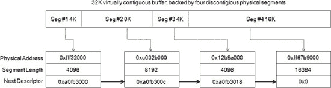

***图 9-5.** 简单分散/聚集列表*

实际的实现可能更复杂，并且每个描述符可能关联有额外的数据，但为了说明概念，我们将其保持简单。图 9-5 展示了一个 32K 虚拟缓冲区如何由四个不同长度的物理段组成。分散/聚集列表是一个 DMA 描述符元素的数组，每个元素包含一个指向列表中下一个描述符的指针。每个元素包含其所代表的物理段的地址和长度。当启动 DMA 传输时，我们可以简单地告诉设备第一个描述符的位置，设备将从第一个描述符读取内存，然后跟随下一个指针找到下一个描述符元素，直到列表末尾，在本例中由`NULL`指针终止。一些设备可能具有将最后一个描述符连接到第一个描述符的 S/G 列表，从而为连续（流式）DMA 创建一个环形缓冲区。

在图 9-5 中，我们使用了一种数据结构，在计算机科学和工程术语中，这种结构被称为单向链表。也许简单地将列表实现为标准数组会更简单。然而，单向链表的方法更加灵活，因为 S/G 列表本身实际上也可以被分散聚集，因为每个 DMA 描述符元素在内存中不一定需要彼此相邻。


#### 将物理地址转换为总线地址

现代计算机系统可能会利用一种特殊的内存管理单元（MMU），称为 IOMMU，即输入/输出内存管理单元。IOMMU 类似于为 CPU 提供虚拟地址到物理地址转换的系统 MMU，但 IOMMU 的不同之处在于它为硬件设备提供地址转换。当涉及 IOMMU 时，硬件设备将使用 IOMMU 提供的地址，而不是直接使用物理地址。术语 *总线地址* 通常用于避免与物理地址混淆。图 9-6 展示了 IOMMU 在概念上如何与系统交互。

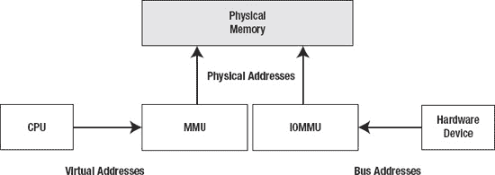

**图 9-6.** IOMMU 地址转换

当不使用 IOMMU 时，硬件设备将使用与 CPU 相同的物理地址。IOMMU 提供了许多优势，从安全性到性能，并解决了之前讨论的一些问题，例如对受限于 32 位寻址的旧设备进行 DMA 传输。即使物理内存位于高内存地址，IOMMU 也能重新映射内存，以便设备可以访问该内存。这有助于提高系统性能，因为解决此问题的唯一其他方法是使用“反弹缓冲区”，如果原始缓冲区位于设备无法访问的地址，我们可以将数据复制到该缓冲区并从中执行 DMA。从安全/稳定性的角度来看，IOMMU 的作用类似于任务之间的受保护/虚拟内存。PCI 设备通常对硬件拥有完全访问权限，因此如果驱动程序或设备发生故障，它可能会损坏随机的内存部分。IOMMU 可以映射一个有限的地址窗口，并阻止访问该窗口之外的地址。IOMMU 传统上用于 PC 服务器上的虚拟化，因为它允许硬件在虚拟机实例之间共享而不会相互干扰，并防止恶意驱动程序对属于其他 VM 实例的内存部分执行 DMA 传输，这会造成严重的安全问题。

Mac OS X 会在存在 IOMMU 的情况下加以利用。IOMMU 将由 `IOMapper` 类的子类表示，因此您可以在 `IORegistryExplorer` 中搜索该类，以确定您的系统是否具有 IOMMU。幸运的是，我们永远不必直接处理 IOMMU。像 `IOMemoryDescriptor` 和 `IODMACommand` 这样的类（本章稍后将讨论）会在内部处理其设置，我们可以愉快地不必关心来自诸如 `getPhysicalAddress()` 等函数的地址是由 IOMMU 映射的总线地址还是实际的物理地址。尽管这样做应该很少有理由，但您可以实现自己的 `IOMapper` 子类来自己处理地址转换，并将其提供给诸如 `IODMACommand` 等类。IOMMU 通常只出现在高性能工作站和服务器中，但现在也出现在消费级平台中，例如 Intel 的 Core i7。

#### 为 DMA 准备内存

在 DMA 传输可以发生之前，需要做一些事情来为传输准备内存。首先是确保内存被分页到驻留内存中，并且支撑缓冲区的内存页被锁定（固定），以便它们在 DMA 传输期间不会被换出。为了实现这一点，您需要为缓冲区创建一个 `IOMemoryDescriptor`。内存描述符必须使用缓冲区所属的任务来构造，如果内核拥有该缓冲区，则使用 `kernel_task`，否则使用用户空间进程的任务指针。如果在此时已知传输方向，您可以在构造描述符时传递该方向。如果内存要传输到设备，方向将是 `kIODirectionOut`；如果内存要从设备传输，方向将是 `kIODirectionIn`。还有 `kIODirectionInOut`，可用于需要在任一方向上进行传输的缓冲区。指定正确的方向很重要，因为它可能像上面讨论的那样影响缓存一致性。

如果您需要从内核缓冲区进行 DMA，推荐的方法是使用 `IOBufferMemoryDescriptor`，它是 `IOMemoryDescriptor` 的一个子类，并且会为您分配内存。

`IOMemoryDescriptor` 的 `prepare()` 方法负责将内存分页并固定下来。如果在初始化描述符时未指定方向，您可以选择将 DMA 传输的方向传递给 `prepare()`。

 **注意** 对 `IOMemoryDescriptor::prepare()` 的调用必须与对 `IOMemoryDescriptor::complete()` 的调用配对。对之前未准备或准备失败的描述符调用 `complete()` 是一个错误。

#### 构建分散/聚集列表

有几种构建 S/G 列表的方法。最基本的方法是使用 `IOMemoryDescriptor::getPhysicalSegment()` 来枚举底层的物理段，如清单 9-11 所示。

**清单 9-11.** 从缓冲区中检索物理段

```
IOBufferMemoryDescriptor* fDMABuffer =
IOBufferMemoryDescriptor::inTaskWithOptions(kernel_task, kIODirectionOut, 1024 * 1024, 4096);
IOByteCount offset = 0;
while (offset < fDMABuffer->getLength())
{   
    IOByteCount segmentLength = 0;

#ifdef __LP64__
    addr64_t address = fDMABuffer->getPhysicalSegment(offset, &segmentLength);     
    // 在真正的驱动程序中，我们会将地址和长度存储在 S/G 列表中。
    // 这里我们仅记录它。
    IOLog("物理段: address 0x%llx segmentLength: %llu\n", address, segmentLength);
#else
    addr64_t address = fDMABuffer->getPhysicalSegment(offset, &segmentLength,
kIOMemoryMapperNone);
    IOLog("物理段: address 0x%llx segmentLength: %lu\n", address, segmentLength);
#endif
    offset += segmentLength;
}
```

清单 9-11 的输出将产生类似于此处所示的内容：

```
Jun 3 22:28:12 macpro kernel[0]:  物理段: address 0x13837000 segmentLength: 4096
Jun 3 22:28:12 macpro kernel[0]:  物理段: address 0x143b6000 segmentLength: 4096
Jun 3 22:28:12 macpro kernel[0]:  物理段: address 0x1c035000 segmentLength: 4096
…
…
Jul 3 22:28:12 macbook kernel[0]: 物理段: address 0x14172000 segmentLength: 4096
```

在上述输出中，没有连续的段，因此每个段由一个单独的页（4096 字节）组成。但是，如果我们在分配缓冲区时传递了 `kIOMemoryPhysicallyContiguous` 标志，我们将得到以下结果：

```
Jun 3 22:21:08 macpro kernel[0]:  物理段: address 0x5975000 segmentLength: 1048576
```

在驱动程序中连续分配内存不是一个好主意；关于原因的完整讨论，请参阅第 6 章 中关于 `IOBufferMemoryDescriptor` 的部分。我们在此处这样做是为了演示目的。

清单 9-11 中的方法可能根据您设备的能力而工作得很好，但是这种技术存在一些问题：

-   某些硬件设备对 S/G 列表中能处理的物理段的最大或最小长度有限制。
-   设备可能需要特定大小的段，例如，页大小的段，以便与硬件的缓冲区匹配。在这种情况下，我们可能需要手动将较大的段分解为较小的块。
-   许多硬件设备使用大端寻址。因此，我们需要手动对物理地址进行字节交换，以确保设备实际访问正确的位置。


### IODMACommand 类

`IODMACommand` 解决了先前讨论的与 DMA 相关的多个问题。它能够自动将段分割为硬件所需的正确大小，并确保仅支持 32 位寻址的设备能够位于正确的地址范围内。这通过以下方式实现：如果存在 IOMMU，则使用 IOMMU 重映射地址；否则采用备用方案。此外，它还能以小端或大端格式提供 32 位或 64 位的物理地址或总线地址。`IODMACommand` 类取代了 `IOMemoryCursor` 类，后者虽然实现许多相同功能，但选项更少。

`IODMACommand` 的实例可以通过工厂方法 `withSpecification()` 构造，如下所示：

```
static IODMACommand * withSpecification(
    SegmentFunction outSegFunc,
    UInt8 numAddressBits,
    UInt64 maxSegmentSize,
    MappingOptions mappingOptions = kMapped,
    UInt64 maxTransferSize = 0,
    UInt32 alignment = 1,
    IOMapper *mapper = 0,
    void *refCon = 0);
```

让我们更详细地查看这些参数。第一个参数是一个函数指针，指向用于输出段信息的函数。如果你要支持一种特殊硬件设备，可以自行编写该函数；不过在大多数情况下，你可以使用系统提供的以下函数之一：

-   `kIODMACommandOutputHost32`：以主机字节序输出 32 位地址
-   `kIODMACommandOutputBig32`：以大端格式输出 32 位地址
-   `kIODMACommandOutputLittle32`：以小端格式输出 32 位地址
-   `kIODMACommandOutputHost64`：以主机字节序输出 64 位地址
-   `kIODMACommandOutputBig64`：以大端格式输出 64 位地址
-   `kIODMACommandOutputLittle64`：以小端格式输出 64 位地址

下一个参数 `numAddressBits` 允许你指定硬件可寻址的最大地址位数，该值不一定是 32 位或 64 位。例如，在某些情况下，它可以是 36 位，甚至小于 32 位。如果传递的值大于 32 位，则必须指定一个 64 位输出段函数。

如果物理页面位于设备可寻址范围之外的地址上，除非存在 IOMMU，否则部分或全部页面可能会被拷贝到满足地址要求的临时页面中。毋庸置疑，额外拷贝开销很大，如果你使用 `IOBufferMemoryDescriptor` 的 `inTaskWithPhysicalMask()` 工厂方法分配 DMA 内存，则可以避免这种拷贝，因为该方法允许你分配物理地址位于位掩码指定范围内的内存。该方法还可以用于将内存直接分配到用户空间任务的地址空间中。这非常有用，因为从/向用户空间分配的缓冲区进行 DMA 可能会出现问题，因为无法控制内存的分配方式。

参数 `maxSegmentSize` 应设置为一个散列/聚集列表中，设备能够处理的最大的物理连续段。如果没有此类限制，可以传递零值。

`mappingOptions` 参数允许在系统存在 IOMMU 时绕过它。默认情况下会使用 IOMMU。`mapper` 参数允许你指定一个备用的 `IOMapper` 实例来代替默认实例。

`maxTransferSize` 是每次 DMA 事务可以传输的总字节数。例如，硬盘可能拥有 1MB 的缓存缓冲区，因此我们不应传输超过其接受能力的信息。

如果硬件有特定的对齐要求，可以通过 `alignment` 参数指定。如果提供的内存未正确对齐，同样可能导致内存的拷贝或重映射。

现在，让我们修改之前使用 `IOMemoryDescriptor::getPhysicalSegment()` 的示例（见代码清单 9-11），改为使用 `IODMACommand`，如代码清单 9-12 所示。

**代码清单 9-12.** 使用 IODMACommand 生成散列/聚集列表

```
IOReturn com_osxkernel_MyFirstPCIDriver::prepareDMATransfer()
{    
    IODMACommand*      dmaCommand;
    IOReturn                        ret = kIOReturnSuccess;

    dmaCommand = IODMACommand::withSpecification(kIODMACommandOutputHost64, 36, 2048,                 
                 IODMACommand::kMapped, 0, 1);
    if (!dmaCommand)
    {
        return kIOReturnNoMemory;
    }

    // 同时会准备内存描述符
    ret = dmaCommand->setMemoryDescriptor(fDMABuffer);
    if (ret != kIOReturnSuccess)
        return ret;

    UInt64 offset = 0;
    while (offset < fDMABuffer->getLength())
    {
        IODMACommand::Segment64 segment;
        UInt32 numSeg = 1;

        ret = dmaCommand->gen64IOVMSegments(&offset, &segment, &numSeg);

        IOLog("%s::gen64IOVMSegments() addr 0x%qx, len %llu bytes\n",
              getName(), segment.fIOVMAddr, segment.fLength);

        if (ret != kIOReturnSuccess)
            break;
    }

    //
    // 在此处为真实硬件设备设置 DMA 传输
    //

    if (dmaCommand->clearMemoryDescriptor() != kIOReturnSuccess)
    {
        IOLog("清除/完成内存描述符失败\n");
    }

    dmaCommand->release();
    return ret;
}
```

在上面的示例中，我们创建了一个 `IODMACommand`，并设置了约束条件：最大物理地址位数为 36 位，最大物理段大小为半页（即 2048 字节）。这段代码的输出结果如下：

```
kernel[0]: com_osxkernel_MyFirstPCIDriver::gen64IOVMSegments() addr 0x13b9d5000, len 2048
kernel[0]: com_osxkernel_MyFirstPCIDriver::gen64IOVMSegments() addr 0x13b9d5800, len 2048
kernel[0]: com_osxkernel_MyFirstPCIDriver::gen64IOVMSegments() addr 0x1335d4000, len 2048
kernel[0]: com_osxkernel_MyFirstPCIDriver::gen64IOVMSegments() addr 0x1335d4800, len 2048
kernel[0]: com_osxkernel_MyFirstPCIDriver::gen64IOVMSegments() addr 0x3f913000, len 2048
kernel[0]: com_osxkernel_MyFirstPCIDriver::gen64IOVMSegments() addr 0x3f913800, len 2048
kernel[0]: com_osxkernel_MyFirstPCIDriver::gen64IOVMSegments() addr 0x3b1d2000, len 2048
kernel[0]: com_osxkernel_MyFirstPCIDriver::gen64IOVMSegments() addr 0x3b1d2800, len 2048
kernel[0]: com_osxkernel_MyFirstPCIDriver::gen64IOVMSegments() addr 0x18b11000, len 2048
kernel[0]: com_osxkernel_MyFirstPCIDriver::gen64IOVMSegments() addr 0x18b11800, len 2048
….
```

首先你会注意到，有些地址大于 32 位，但仍在我们指定的 36 位范围内；而且，尽管第一个段与第二个段在物理上是连续的，但所有段的长度现在都被限制为 2048 字节。


### 总结

在本章中，我们讨论了以下内容：

-   `PCI Express`、`Thunderbolt` 以及较少使用的 `ExpressCard` 标准的 PCI 相关技术概述。
-   PCI 配置空间，操作系统利用它来枚举、控制和操作基于 PCI 的设备。在本章后续部分，我们还讨论了如何通过驱动程序使用 I/O Kit 提供的功能来访问这些空间。
-   使用 `IOPCIFamily` 在 I/O Kit 中实现 PCI 支持。内核 PCI 层的基石是 `IOPCIDevice` 类，它充当基于 PCI 的驱动程序提供者。
-   Thunderbolt 设备与 PCI 兼容，也由 `IOPCIDevice` 类表示。
-   如何为基于 PCI 的设备创建匹配字典，以便设备在插入或系统启动时能自动加载驱动程序。
-   如何访问和使用内存映射的 I/O 内存及区域。
-   如何处理外部连接设备的移除，尤其是 Thunderbolt 和 ExpressCard。
-   使用 `IOInterruptEventFilter` 及相关类在 I/O Kit 中处理主中断和次中断。
-   直接内存访问（DMA）以及如何创建分散/聚合列表来传输大型非连续内存块。我们还讨论了与 DMA 相关的常见问题。
-   使用 `IODMACommand` 将内存地址转换为总线地址，并帮助管理构建分散/聚合列表的复杂性。

## 第 10 章

## 电源管理

电源管理已成为所有计算设备的基本功能。所有运行 Mac OS X 的平台都可以进入低功耗模式，因此，电源管理对于始终连接电源的台式机与依靠电池运行的笔记本电脑或 iPhone 同样重要。

例如，即使是 Mac Pro 也可以进入“休眠”模式，该模式会将计算机及其连接的外设置于低功耗状态。在休眠模式下，CPU 进入挂起状态，计算机显示器关闭电源，硬盘停止旋转。如果计算机有 PCI 扩展槽，这些插槽在休眠期间也会断电，仅提供少量辅助电源，以便 PCI 卡能唤醒计算机。

并非所有驱动程序都需要处理电源管理事件。驱动程序是否需要实现电源管理取决于设备的能力及其供电来源。例如，如果 PCI 设备的驱动程序不支持电源管理，系统在进入休眠模式时必须为其 PCI 插槽保持全功率供电，因为 PCI 卡由计算机主板供电。这会使计算机处于所谓的“假寐”状态，并非完全的休眠模式。请注意，如果休眠期间 PCI 插槽断电，任何 PCI 设备都会丢失其配置，并且必须在系统唤醒时由其驱动程序重新初始化——而这只有在驱动程序接收到电源管理事件时才能发生。

正如 PCI 卡驱动程序的示例所示，硬件设备的驱动程序在系统从一个电源状态转换到另一个电源状态时扮演着重要角色。驱动程序可以选择在系统进入低功耗休眠模式之前接收通知，此时驱动程序可以为其设备做好新电源状态的准备。同样，当系统从休眠中唤醒时，驱动程序可以接收到通知，此时它可以将其设备恢复到完全运行功能。

### I/O Registry 电源平面

电源管理的复杂性部分在于，一个设备的电源状态通常不能孤立地看待，因为一个设备通常依赖于另一个为其供电的设备，并且可能自身还有依赖其供电的设备。例如，考虑一个实现 USB 主机并提供 USB 端口的 PCI 外设卡。该卡由 PCI 总线供电，并将通过 USB 总线为其端口上连接的设备供电。这对电源管理系统有重要影响：只有当没有 USB 设备连接到该卡，或者所有连接的 USB 设备本身都处于低功耗状态时，该 PCI 卡才能进入低功耗状态。同样，当系统进入休眠时，PCI 插槽将断电，任何连接到该卡的 USB 设备也必须被告知电源状态的变化。

为了建立这种电源依赖关系模型，I/O Kit 维护了一棵树，表示系统中硬件设备之间的电源依赖关系。这棵树存储在其 I/O Registry 的独立部分中，这一层被称为“电源平面”。可以使用 `IORegistryExplorer` 工具查看电源平面，如图 10-1 所示。

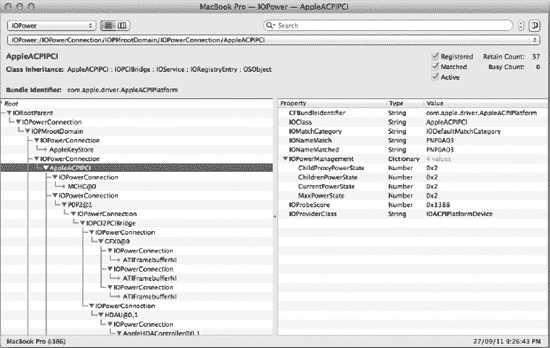

**图 10-1.** `IORegistryExplorer` 中的电源平面视图

每个支持电源管理的驱动程序都表示为电源平面中的一个节点，连接到表示其供电设备的父节点，以及表示其供电设备的子节点。电源平面中设备的父节点通常是驱动程序的提供者类（即，在 I/O Registry 的服务平面中与驱动程序连接的对象），尽管情况并非总是如此。

这种树形表示使得可视化系统中设备之间的电源依赖关系以及查看哪些设备从特定硬件设备获取电力变得非常容易。树结构本身对系统也起着重要作用，因为它允许系统确定当某个设备的电源状态发生变化时，哪些设备将受到影响。


#### I/O Kit 中的电源管理

系统的电源管理，包括从一个电源状态转换到另一个电源状态，都是由 I/O Kit 处理的。电源管理由在内核中运行的驱动程序执行；可以为硬件（例如 USB 设备）编写的用户空间驱动程序无法参与该设备的电源管理。I/O Kit 通过 `IOService` 超类对电源管理提供支持，所有 Mac OS X 驱动程序最终都派生自该类。这使得所有驱动程序都能进行电源管理，前提是该驱动程序已选择将自己插入到电源平面中。

`IOService` 还管理着父设备及其依赖其供电的子设备之间的同步。例如，在转换到较低电源状态之前，系统会确保所有子设备都已先于父设备转换到较低电源状态，之后才向它们依赖供电的父设备发送降低其电源状态的请求。同样，在从休眠中唤醒时，系统会确保父设备已完全通电后，再向依赖它的子设备发送提升其电源状态的请求。

从一个电源状态到另一个电源状态的转换极其困难，因为硬件可能需花费一定时间才能转换到新状态。这可能导致一种情况：在一个电源状态转换正在进行时，又发起了另一个电源状态转换。例如，硬盘可能因无活动而停转，但随后可能立即发出一个读取请求，要求磁盘再次旋转起来。`IOService` 类处理了众多原本会使电源管理难以实现的细节。每次电源状态转换都由 `IOService` 进行序列化，驱动程序在完成上一次电源请求处理之前，绝不会收到新的电源请求。

`IOService` 类为电源管理提供的支持意味着驱动程序可以专注于自身设备的电源管理；I/O Kit 框架将负责处理那些原本会使电源管理难以实现的细节。

电源状态更改可由两个来源发起。系统可能要求设备进入新的电源状态，以响应计算机进入休眠；或者设备（或其驱动程序）可能自行发起更改其电源状态。设备自行发起转换到较低电源状态的示例包括：计算机一段时间未被使用后，显示器自行关闭；或者硬盘在一段时间内未收到读取或写入请求后停转。

驱动程序可以选择实现对这两种类型电源管理中的任意一种的支持；它可以选择响应系统电源变化（例如休眠事件），也可以自愿降低自身的电源状态（例如停转其磁盘）。这两种情况都通过 I/O Kit 进行处理，并将在本章中讨论。

通常，对于既具有硬件支持以进入较低电源状态，又因其使用方式而有进入低电源状态机会的设备，电源管理是必要的。根据驱动程序所管理的硬件设备类型，支持各种电源状态之间的转换所需的工作可能很少。

 **注意**：本章描述了一个通用 I/O Kit 驱动程序为处理电源管理请求所需执行的工作。某些 I/O Kit 驱动程序系列（例如音频系列）会将其驱动程序添加到电源平面，并代表驱动程序响应电源管理请求。在为驱动程序添加电源管理支持之前，应检查您的驱动程序的超类是否已在处理电源请求。

### 响应电源状态变更

驱动程序可以实施的最基本的电源管理支持级别是选择接收整体系统电源状态变更的通知。这些通知包括系统休眠前的通知以及系统从休眠中唤醒时的通知。这对于 PCI 设备的驱动程序尤其重要，因为必须处理这些通知，以便在系统休眠期间允许 PCI 总线完全断电。

I/O Kit 的电源模型是独特的，因为框架并不规定驱动程序必须实现的一组电源状态；相反，驱动程序定义自己的电源状态列表，以匹配其所控制设备的能力。驱动程序至少必须定义两种状态：一种状态是设备关闭，另一种状态是设备完全运行。在关闭状态下，设备不消耗电力（因此不从电源平面中的父设备汲取电力）。在此状态下，设备不可用。在开启状态下，设备正在耗电，其所有功能都对用户可用。当系统进入休眠时，设备进入关闭状态；当系统唤醒时，设备进入开启状态。

除了关闭和开启状态之外，驱动程序还可以定义对应于例如设备仍然通电但处于较低电源状态（仍可使用但功能有所降低）的状态。例如，LCD 显示器的驱动程序可以创建一个电源状态来描述显示器仍在运行但背光已调暗的模式。

设备支持的每个电源状态都由一个名为 `IOPMPowerState` 的结构描述，该结构在头文件 `<IOKit/pwr_mgt/IOPMpowerState.h>` 中定义。`IOPMPowerState` 结构的定义如下：

```
struct IOPMPowerState
{
        unsigned long   version;
        IOPMPowerFlags  capabilityFlags;
        IOPMPowerFlags  outputPowerCharacter;
        IOPMPowerFlags  inputPowerRequirement;
        unsigned long   staticPower;
        unsigned long   unbudgetedPower;
        unsigned long   powerToAttain;
        unsigned long   timeToAttain;
        unsigned long   settleUpTime;
        unsigned long   timeToLower;
        unsigned long   settleDownTime;
        unsigned long   powerDomainBudget;
};
```

该结构的字段描述如下：


```markdown
- `version`：保存此 `IOPMPowerState` 结构的版本，允许在保持向后兼容性的同时，在 I/O Kit 的未来版本中扩展该结构。截至 Mac OS X 10.7，该结构仍为版本 1；头文件提供了一个可使用的定义 `kIOPMPowerStateVersion1`。
- `capabilityFlags`：描述设备在此电源状态下能力的标志位掩码。可能的标志包括：
    - `kIOPMPowerOn`：表示设备需要从其父设备获取电源，并能够为其子设备提供电源。
    - `kIOPMDeviceUsable`：表示设备在此状态下可用。
    - `kIOPMLowPower`：表示设备相较于 `kIOPMPowerOn` 状态以降低的电源状态运行。设备在此状态下可能仍然可用，可通过同时设置 `kIOPMDeviceUsable` 和 `kIOPMLowPower` 位来指示。设备在低功耗状态下可能能够或可能无法为其子设备提供电源。
    - `kIOPMPreventIdleSleep`：设置为在此电源状态激活时禁用系统进入睡眠。请注意，用户仍然可以通过（例如从 Apple 菜单中选择“睡眠”）来使系统进入睡眠。它仅阻止系统在空闲一段时间后自动进入睡眠。
    - `kIOPMInitialDeviceState`：表示设备以此状态启动，因此驱动程序在加载后无需发送电源请求。请注意，I/O Kit 可能会决定在不设置 `kIOPMInitialDeviceState` 标志的电源状态下启动驱动程序，在这种情况下，驱动程序在加载时会收到电源请求。
- `outputPowerCharacter`：描述设备在此状态下能够为依赖其电源的设备提供电源的标志。可以是 `kIOPMPowerOn`（表示设备能够为其子设备供电）或 0（表示设备无法为其子设备提供电源）。
- `inputPowerRequirement`：描述设备在此状态下需要从其父设备获取电源的标志。可以是 `kIOPMPowerOn`（表示设备需要其父设备为其提供电源）或 0（表示设备在此状态下不从其父设备汲取任何电源）。
- `staticPower`：设备在此状态下的平均功耗（以毫瓦为单位）。请注意，如果此值未知，驱动程序可以为此字段提供值 0（正如 Darwin 存储库中许多 Apple 驱动程序所做的那样）。
- `unbudgetedPower`：设备在此状态下从独立电源（而非其父设备）汲取的电源。此值目前在 Mac OS X 中未使用，因此驱动程序可以为此字段提供值 0。
- `powerToAttain`：设备从上一个较低电源状态转换到此状态所需的电源。此值目前在 Mac OS X 中未使用，因此驱动程序可以为此字段提供值 0。
- `timeToAttain`：将硬件从上一个较低电源状态转换到此状态所需的时间（以微秒为单位）。如果此值未知，驱动程序可以为此字段提供值 0。
- `settleUpTime`：从上一个较低电源状态进入此状态后，电源稳定所需的时间（以微秒为单位）。如果此值未知，驱动程序可以为此字段提供值 0。
- `timeToLower`：将硬件从此状态转换到下一个较低电源状态所需的时间（以微秒为单位）。如果此值未知，驱动程序可以为此字段提供值 0。
- `settleDownTime`：离开此状态并进入下一个较低电源状态后，电源稳定所需的时间（以微秒为单位）。如果此值未知，驱动程序可以为此字段提供值 0。
- `powerDomainBudget`：设备在此状态下能够为其子设备提供的电源量。此值目前在 Mac OS X 中未使用，因此驱动程序可以为此字段提供值 0。

设备支持的每个电源状态都由一个 `IOPMPowerState` 结构描述。设备的驱动程序创建一个 `IOPMPowerState` 结构数组，每个结构对应一个设备电源状态。每个支持电源管理的驱动程序必须包含一个对应关闭状态（设备不使用电源）的电源状态，以及一个对应设备完全开启状态（设备完全正常运行）的电源状态。关闭状态必须是驱动程序电源状态数组的第一个元素，而开启状态必须是最后一个元素。驱动程序可以根据需要定义任意数量的电源状态，以描述其硬件设备提供的不同电源状态，唯一的要求是电源状态数组必须排序，从关闭状态开始，经过（可选的）需要更多电源且功能更强大的中间电源状态，直到最终状态（设备以其满功率运行且完全可用）。

由于 I/O Kit 在 `IOService` 类（每个驱动程序最终都派生自该类）中提供了电源管理支持，因此所有驱动程序都具备参与系统电源管理的能力。为了演示这一点，我们将向第 4 章中开发的简单 IOKitTest 示例（参见清单 4-2 和清单 4-3）添加电源管理通知。

首先，我们需要定义设备支持的电源状态。这通常通过在驱动程序实现文件顶部定义 `IOPMPowerState` 结构的全局数组来完成。清单 10-1 中的示例显示了一个非常基本的电源状态集，该集合提供了关闭状态和开启状态。

**清单 10-1.** 为驱动程序定义电源状态集

```cpp
enum {
     kOffPowerState,
     kOnPowerState,
     //
     kNumPowerStates
};

static IOPMPowerState gPowerStates[kNumPowerStates] = {
     // kOffPowerState
     {kIOPMPowerStateVersion1, 0, 0, 0, 0, 0, 0, 0, 0, 0, 0, 0},
     // kOnPowerState
     {kIOPMPowerStateVersion1, (kIOPMPowerOn | kIOPMDeviceUsable),
                                kIOPMPowerOn, kIOPMPowerOn, 0, 0, 0, 0, 0, 0, 0, 0}
};
```

当 I/O Kit 请求更改为新的电源状态时，请求的状态将由该状态在 `gPowerStates` 数组中的索引标识。我们不通过索引引用电源状态，而是定义一个枚举，允许为每个电源状态赋予一个符号常量，这使驱动程序代码更易于阅读和维护。

定义了一组电源状态后，需要通知提供电源管理 API 的 `IOService` 类，我们的驱动程序希望在系统电源状态改变时接收通知。这如清单 10-2 所示在驱动程序的 `start()` 方法中完成。

**清单 10-2.** 为电源管理支持注册驱动程序

```cpp
bool com_osxkernel_driver_IOKitTest::start (IOService *provider)
{
        if (super::start(provider) == false)
                return false;

        // Register driver for power management
        PMinit();
        provider->joinPMtree(this);
        registerPowerDriver(this, gPowerStates, kNumPowerStates);

        return true;
}
```
```


对`PMinit()`方法的调用会初始化`IOService`超类中的实例变量，这些变量仅对实现了电源管理的驱动程序是必需的。要接收电源管理通知，驱动程序需要成为电源平面的一部分。这通过`joinPMtree()`方法完成，该方法在驱动程序对象上调用，我们的设备从该对象（在本例中为我们的提供者类）获取电源，并以子驱动程序（我们的实例）作为参数。最后，我们调用`registerPowerDriver()`方法，向 I/O Kit 提供我们的驱动程序所支持的电源状态数组。

注册了电源管理的驱动程序必须确保在卸载前将自己从电源平面中移除。如果不这样做，I/O Kit 将尝试向您的驱动程序发送电源通知，即使它已不再活跃，这可能导致内核恐慌。驱动程序通过调用`PMStop()`来从电源平面中移除自身，如代码清单 10-3 所示。

***代码清单 10-3.** 从电源管理系统中移除驱动程序*

```
void com_osxkernel_driver_IOKitTest::stop (IOService *provider)
{
        PMstop();
        super::stop(provider);
}
```

将驱动程序插入电源平面并注册电源管理事件后，驱动程序将响应系统状态的变更，接收来自 I/O Kit 的电源请求。当系统电源状态改变时（例如，当计算机进入睡眠状态或从睡眠中唤醒），I/O Kit 会从驱动程序注册的电源状态中选择一个，并请求驱动程序转换到该新状态。这些电源请求通过驱动程序的`setPowerState()`方法发出，该方法是`IOService`基类中定义的一个虚方法。为了接收这些请求，驱动程序只需提供自己的`setPowerState()`实现来处理状态变更。示例实现如代码清单 10-4 所示。

***代码清单 10-4.** 响应更改设备电源状态的请求*

```
IOReturn com_osxkernel_driver_IOKitTest::setPowerState (unsigned long powerStateOrdinal, IOService* device)
{
        switch (powerStateOrdinal)
        {
                case kOffPowerState:
                      // Save device configuration (if necessary) and prepare our hardware for
                      // sleep
                      // ...
                      break;
                case kOnPowerState:
                      // Bring our hardware out of sleep and initialize it with the saved
                      // configuration
                      // ...
                      break;
        }

        return kIOPMAckImplied;
}
```

名为`powerStateOrdinal`的参数描述了驱动程序应将其设备置于的电源状态。该参数表示为驱动程序初始化时传递给`registerPowerDriver()`方法的电源状态数组的一个索引。以我们的示例驱动程序为例，我们注册了两个电源状态，并在一个`switch`语句中处理它们。

I/O Kit 将对`setPowerState()`的调用进行序列化，因此驱动程序可以确信，在处理较早的电源状态转换过程中，不会收到更改电源状态的请求。然而，这并不能保证驱动程序在处理与电源管理无关的其他操作时不会收到更改电源状态的请求。例如，当发出电源请求要求驱动程序转换到睡眠状态时，驱动程序可能正在执行异步读取操作。在这种情况下，驱动程序必须等待读取操作完成，然后才能关闭硬件电源。这可以通过使用 I/O Kit 提供的标准同步原语来实现。大多数 I/O Kit 驱动程序将使用命令门（command gate）和工作循环（work loop）的组合来提供同步，因此驱动程序可以在其`setPowerState()`方法中获取命令门，以确保电源事件与驱动程序其余代码同步。

从 Mac OS X 10.5 开始，`setPowerState()`方法在其自己的线程上被调用，因此驱动程序可以在其实现中执行可能阻塞或需要较长时间才能完成的操作。当驱动程序成功将硬件置于新的电源状态后，它应返回结果码`kIOPMAckImplied`。

如果您的驱动程序将支持早于 Mac OS X 10.5 的版本，则不应在`setPowerState()`方法内部执行阻塞操作，而应在后台线程上执行将硬件置于新电源状态所需的任务。此时，不应从`setPowerState()`方法返回`kIOPMAckImplied`，而应返回一个非零值，该值表示驱动程序将硬件置于新电源状态所需的最大时间（以微秒为单位）。当您的后台线程完成硬件到新设备的切换后，它通过调用`acknowledgeSetPowerState()`来发出完成信号。幸运的是，如果您针对 Mac OS X 10.5 及更高版本，则无需这些代码。


### 请求电源状态变更

到目前为止，我们已经了解了驱动程序如何响应系统请求，根据诸如系统进入睡眠状态等事件来更改其电源状态。但是，有时驱动程序可能希望独立于系统的整体电源状态，主动发起其设备的电源状态变更。例如，LCD 显示器可能在不活动几分钟后调暗背光，或者硬盘如果在某段时间内未被访问则可能停转。

即便是仅影响其控制的设备的电源状态变更，驱动程序也应使用 I/O Kit 的电源管理 API。这样做不仅可以确保由驱动发起的任何电源状态变更与系统请求的电源状态变更同步，还能让你的驱动程序利用 I/O Kit 为此类任务提供的支持，例如安装定时器以监控设备的活动，并在设备在一段时间内未被访问时请求转换到较低功耗状态。最后，如果有其他设备依赖你的硬件供电，你将需要使用 I/O Kit 的方法来转换你硬件的电源状态，以便所有子设备都能获知其输入电源可能发生的变化。

有三种方法可以被调用来更改设备的当前电源状态：

- `changePowerStateTo(powerStateOrdinal)`：请求将电源状态更改为已注册电源状态数组中指定索引的状态。
- `changePowerStateToPriv(powerStateOrdinal)`：执行与上一个方法类似的功能，区别在于这是 `IOService` 类中的一个保护方法，因此只能由驱动程序自身调用，不能被其他对象调用。
- `makeUsable()`：请求将电源更改为驱动程序支持的最高电源状态。此方法通常由该驱动的其他客户端（例如驱动的用户客户端）调用，以确保设备在进一步使用之前处于完全可用的状态。

这三个方法由 `IOService` 类实现，通常驱动程序无需重写任何这些方法。在内部，`makeUsable()` 方法的实现会调用与 `changePowerStateToPriv()` 相同的代码路径，这意味着每个驱动都有两个与之关联的电源状态：一个是通过 `changePowerStateTo()` 请求的值，另一个是通过 `changePowerStateToPriv()`/`makeUsable()` 请求的值。

I/O Kit 最终将设备切换到的电源状态是以下几个值中的最大值：由 `changePowerStateTo()` 请求的值、由 `changePowerStateToPriv()` 请求的值，以及满足所有依赖该设备供电的子设备要求所必需的最高状态。如果设备在电源平面中有任何需要电源的子设备，则父设备不能切换到其 `outputPowerCharacter` 属性不是 `kIOPMPowerOn` 的电源状态。

你可能想知道为什么 I/O Kit 提供了两个几乎相同的方法来设置设备的电源状态。私有方法 `changePowerStateToPriv()` 允许驱动程序设置一个最低电源级别，该级别不受驱动任何客户端的影响，这些客户端只能调用公共方法 `changePowerStateTo()`。客户端可以将电源状态提高到 `changePowerStateToPriv()` 设定的级别之上，但驱动程序的电源状态绝不会低于 `changePowerStateToPriv()` 设定的值。这种行为有一个例外：当系统进入睡眠状态时，设备将被置于最低电源状态，覆盖通过 `changePowerStateToPriv()` 设置的电源状态。当系统从睡眠中唤醒时，它会恢复到之前活跃的电源状态。

按照惯例，驱动程序应通过保护方法 `changePowerStateToPriv()` 来设置其电源状态。为了消除公共电源级别的影响，驱动程序在注册电源管理后，应在其 `start()` 方法中调用公共方法 `changePowerStateTo(0)`。将公共电源状态设置为 0，可以使得 `changePowerStateToPriv()` 请求的电源状态在未更改的情况下生效（前提是满足所有子设备的电源需求）。

由于设备的电源状态由三个可能值推导得出，因此每当其任一电源子设备的电源状态发生变化，或者调用了 `changePowerStateTo()` 或 `changePowerStateToPriv()` 方法时，都会重新计算该电源状态。如果计算出的电源状态与驱动程序的当前电源状态不同，I/O Kit 将向驱动程序发送一个请求以更改其电源状态。驱动程序将按照本章上一节“响应电源状态变更”中所述的方式接收此请求，并应按照之前描述的方式对该请求进行响应。

`changePowerStateTo()`、`changePowerStateToPriv()` 和 `makeUsable()` 方法都是异步的，可能在设备转换到新电源状态之前就返回给调用者。这意味着，希望更改自身电源状态的驱动程序（例如，使用 `changePowerStateToPriv()` 方法）应等待其 `setPowerState()` 方法被调用后，再对其硬件重新编程以进入新的电源状态。希望通过调用公共方法（如 `changePowerStateTo()` 或 `makeUsable()`）来更改另一个驱动程序电源状态的客户端，不能假设当方法返回时设备已在新的电源状态下运行。相反，它应注册以接收设备状态变更的通知。这将在本章后面的“观察设备电源状态变更”部分讨论。


### 处理设备空闲状态

驱动程序降低其设备电源状态的一个常见原因是，当设备在特定时间内未被访问时，减少其功耗。这涉及到为设备的空闲时段创建一个定时器。如果定时器超时且设备在此期间未被访问，驱动程序会将设备置于较低的电源状态。将设备置于较低电源状态后，下一次驱动程序需要访问设备时，它必须将硬件恢复至可用状态。由于这些操作对所有执行空闲省电模式的驱动程序来说都很常见，因此该功能已内置于 I/O Kit 中，并通过 `IOService` 类提供给驱动程序开发者。

驱动程序需要调用两种基本方法，让 I/O Kit 跟踪其设备何时空闲并降低其电源状态。

- `setIdleTimerPeriod(period)`：安装一个在指定秒数过后超时的定时器。
- `activityTickle(type, powerState)`：由驱动程序在每次访问设备前调用，用于将硬件最后被访问的时间告知 I/O Kit。

`setIdleTimerPeriod()` 方法通常仅在驱动程序的 `start()` 方法中完成电源管理初始化后调用一次。一旦被调用，I/O Kit 会创建一个以指定超时时间（以秒为单位）运行的定时器。如果在此期间设备未被访问，I/O Kit 会将驱动程序的电源状态降低到当前电源级别以下的某个状态。如果设备在下一个空闲周期内仍处于非活动状态，驱动程序的电源状态会再次降低。在这两种情况下，驱动程序都会通过同一个方法 `setPowerState()` 收到降低其电源状态的请求，这与本章前面“响应电源状态更改”一节中描述的所有电源请求变更的传递方式相同。这一过程会持续进行，直到设备被置于关闭状态（电源状态 0）。

当设备因不活动而导致电源状态降低时，I/O Kit 会使用 `changePowerStateToPriv()` 方法来设置电源状态。就像驱动程序自己调用了 `changePowerStateToPriv()` 一样，设备新的电源状态不能低于通过公共方法 `changePowerStateTo()` 设置的值，也不能低于设备子节点所要求的电源状态。这意味着通过 `changePowerStateTo()` 设置的公共电源级别决定了设备空闲时可被置于的最低电源状态。通常，使用空闲定时器的驱动程序会在其 `start()` 方法中调用 `changePowerStateTo(0)`，从而允许空闲定时器将设备一路降至关闭状态。

空闲定时器要求驱动程序在每次访问硬件设备时都告知 I/O Kit，否则空闲定时器会在设备正在使用时触发并降低其电源状态。为此，驱动程序在设备被使用时（通常在每次操作开始时）会调用 `activityTickle()` 方法。`activityTickle()` 方法的签名如下所示：

```
bool    activityTickle(unsigned long type, unsigned long stateNumber);
```

`activityTickle()` 方法接受两个参数：一个类型（type）和一个电源状态序数（stateNumber），调用者使用它们来指定设备处理即将到来的操作所必须处于的最低电源级别。I/O Kit 在头文件 `IOKit/pwr_mgt/IOPM.h` 中为 `type` 参数提供了两个预定义值：

- `kIOPMSubclassPolicy`
- `kIOPMSuperclassPolicy1`

`type` 参数定义了应由哪个实现来处理 `activityTickle()` 请求，是驱动程序本身（此时传递 `kIOPMSubclassPolicy`）还是 `IOService` 超类（此时传递 `kIOPMSuperclassPolicy1`）。如果驱动程序希望提供 `activityTickle()` 的自定义实现，除了在每次调用 `activityTickle()` 时传递 `kIOPMSubclassPolicy` 作为 `type` 参数外，还需要覆盖 `activityTickle()` 方法的实现。

然而，大多数驱动程序将能够使用 `IOService` 超类提供的 `activityTickle()` 默认实现。重要的是，希望使用默认实现的驱动程序，在每次调用 `activityTickle()` 时必须为 `type` 参数传递 `kIOPMSuperclassPolicy1` 值，因为 `IOService` 的实现会忽略任何其他值作为 `type` 参数传递的请求。

`activityTickle()` 的默认实现会将设备的电源级别提升到由 `stateNumber` 参数指定的电源状态。在内部，`IOService` 类通过调用 `changePowerStateToPriv()` 方法来提高设备的电源状态，驱动程序将通过其 `setPowerState()` 方法的调用接收到此请求。该方法返回的布尔值指示设备是否已经处于请求的电源状态；返回值为 `true` 表示无需进行电源状态转换，而返回值为 `false` 表示需要提高设备的电源状态。

由于 `activityTickle()` 方法是异步的，调用者务必等待驱动程序完成到目标电源状态的转换，并且不应在 `activityTickle()` 方法返回时就假定设备已处于可用状态。关于驱动程序如何观察电源变化（包括其他驱动对象中的电源变化）的方法，将在下一节中解释。


### 观察设备电源状态变化

I/O Kit 允许驱动程序观察系统中任何设备的电源状态，并在设备驱动程序更改其电源状态时接收通知。例如，不属于电源平面但需要与电源管理驱动程序交互的驱动程序可以使用此功能。或者，这些通知允许通过诸如`changePowerStateToPriv()`或`activityTickle()`等方法发起自身电源状态更改的驱动程序，来确定电源更改何时完成。

要接收其他驱动程序电源状态更改的通知，您的驱动程序必须注册对该驱动程序的电源状态的关注。`IOService`超类提供了两种方法来实现此目的：

- `registerInterestedDriver(IOService* driver)`
- `deRegisterInterestedDriver(IOService* driver)`

这两种方法都在您感兴趣观察其电源状态的驱动程序对象上调用。方法的参数是接收通知的驱动程序，因此您通常会传递`this`指针。驱动程序可以随时调用这两种方法中的任意一种，以开始或停止接收其他驱动程序电源状态更改的通知。驱动程序在卸载前取消注册所有已安装的通知至关重要，否则可能导致内核恐慌。

当驱动程序注册了对其他驱动程序电源状态更改的关注后，它将在设备开始转换到新电源状态之前收到一次通知，并在设备完成转换到新电源状态后收到另一次通知。这两个通知通过以下两种方法传递：

- `IOReturn powerStateWillChangeTo(IOPMPowerFlags capabilities, unsigned long stateNumber, IOService* whatDevice)`
- `IOReturn powerStateDidChangeTo(IOPMPowerFlags capabilities, unsigned long stateNumber, IOService* whatDevice)`

这两种通知方法是希望接收通知的驱动程序实现的虚拟方法。`powerStateWillChangeTo()`通知在被观察驱动程序的`setPowerState()`方法调用之前传递。`powerStateDidChangeTo()`通知在被观察驱动程序的`setPowerState()`方法调用之后传递。两种方法都接收一组相同的参数。`capabilities`参数是被观察驱动程序正在转换到的`IOPMPowerState`中`capabilityFlags`位掩码的值。`stateNumber`参数是被观察驱动程序正在转换到的电源状态的索引。`whatDevice`参数是其电源状态正在被更改的驱动程序对象。

处理任一通知后，驱动程序应返回`IOPMAckImplied`值。如果您的驱动程序希望异步处理通知，则可以从通知方法返回一个非零值，表示驱动程序完成请求所需的最大时间（以微秒为单位）。然后驱动程序可以在后台线程上继续处理通知；驱动程序完成通知后，应调用`acknowledgePowerChange()`方法通知 I/O Kit 通知已处理。`acknowledgePowerChange()`方法可用于确认`willChange`和`didChange`两种通知。

处理电源管理的驱动程序会自动注册对自身的关注，因此对于响应其自身电源状态更改的驱动程序，这两种通知方法也会被调用。然而，大多数驱动程序无需实现这两种通知方法，除非驱动程序正在观察其他设备的状态，因为驱动程序自身的电源更改应在`setPowerState()`方法中处理。相反，为此目的，I/O Kit 提供了另一种通知方法，当驱动程序自身的电源状态已更改且其所有子驱动程序都已确认电源更改时，该方法会被发送给该驱动程序。要接收此通知方法，驱动程序应实现以下虚拟方法：

`void powerChangeDone (unsigned long previousStateNumber);`

该方法在驱动程序处理完电源状态更改（通过`setPowerState()`方法）并且所有已注册关注该设备电源状态的驱动程序都已收到电源更改通知后发送。`powerChangeDone()`方法提供了一种便捷方式，供驱动程序确定其发起的电源状态更改是否已完成以及设备是否已变得可用。需要注意的是，传递给`powerChangeDone()`方法的参数是设备更改前的电源级别，而不是设备的新电源状态。要确定设备当前所处的电源状态，I/O Kit 提供了一个名为`getPowerState()`的访问器方法，如下所述：

`UInt32 getPowerState(void);`


### 综合运用

在本节中，我们将整合本章所涵盖的内容，形成一个综合性示例。该示例展示了一种驱动程序的构建方式，它不仅能响应系统的电源状态变化，还能在设备空闲 5 分钟后主动降低自身功耗。

为便于演示，该示例驱动定义了四个电源状态：强制的关闭状态和开启状态，以及两种低功耗模式。当计算机进入休眠或从休眠中唤醒时，电源管理系统将设定关闭和开启状态。当设备空闲一段时间后，则会进入两个中间状态。驱动在其 `start()` 方法中设置了一个空闲定时器，以便在设备一段时间不活动后降低其电源状态。

本示例还展示了一种同步方法，用于协调设备电源状态变化与驱动在执行请求操作时进行的硬件访问。驱动包含一个名为 `myReadDataFromDevice()` 的示例操作，该操作会调用 `activityTickle()` 来确保硬件在尝试执行操作前处于可用的电源状态。然而，由于电源状态变化是异步的，驱动必须等待设备完全转换到新的电源状态。示例驱动通过在一个条件变量上休眠来实现这一点，该条件变量由 `powerChangeDone()` 方法发出信号。

该驱动需要处理的另一个同步问题是，如果驱动正在处理未完成的操作，则设备不能进入休眠状态。示例驱动使用一个名为 `m_outstandingIO` 的实例变量来统计驱动正在处理的未完成操作的数量。如果请求降低设备电源状态，`setPowerState()` 方法将等待所有未完成操作完成，然后才切断硬件电源。在等待操作完成期间，驱动需要确保不再启动新的操作。这通过在 `setPowerState()` 方法开始时将实例变量 `m_devicePowerState` 设置为较低的电源状态来实现。这意味着，在我们等待操作完成时，`m_devicePowerState` 实例变量将处于降低后的电源状态，但更重要的是，这也意味着任何新操作（例如 `myReadDataFromDevice()`）都将进入休眠，并等待设备的电源转换为开启状态。

该示例驱动的实现见代码清单 10-5 和代码清单 10-6。

**代码清单 10-5.** 既能响应电源状态变化又能控制自身电源状态的驱动程序（头文件）

```cpp
#include <IOKit/IOService.h>

class com_osxkernel_driver_IOKitTest : public IOService
{
       OSDeclareDefaultStructors(com_osxkernel_driver_IOKitTest)

private:
       IOLock*          m_lock;
       unsigned long    m_devicePowerState;
       SInt32           m_outstandingIO;

protected:
       virtual void             powerChangeDone (unsigned long stateNumber);

public:
       virtual void             free (void);
       virtual bool             start (IOService* provider);
       virtual void             stop (IOService* provider);

       virtual IOReturn setPowerState (unsigned long powerStateOrdinal, IOService* device);

       IOReturn          myReadDataFromDevice ();
};
```

**代码清单 10-6.** 既能响应电源状态变化又能控制自身电源状态的驱动程序（实现文件）

```cpp
#include "IOKitTest.h"
#include <IOKit/IOLib.h>

// 定义超类
#define super IOService

OSDefineMetaClassAndStructors(com_osxkernel_driver_IOKitTest, IOService)

// 定义我们的电源状态
enum {
     kOffPowerState,
     kStandbyPowerState,
     kIdlePowerState,
     kOnPowerState,
     //
     kNumPowerStates
};

static IOPMPowerState gPowerStates[kNumPowerStates] = {
     // kOffPowerState
     {kIOPMPowerStateVersion1, 0, 0, 0, 0, 0, 0, 0, 0, 0, 0, 0},
     // kStandbyPowerState
     {kIOPMPowerStateVersion1, kIOPMPowerOn, kIOPMPowerOn, kIOPMPowerOn, 0, 0, 0, 0, 0, 0, 0, 0},
     // kIdlePowerState
     {kIOPMPowerStateVersion1, kIOPMPowerOn, kIOPMPowerOn, kIOPMPowerOn, 0, 0, 0, 0, 0, 0, 0, 0},
     // kOnPowerState
     {kIOPMPowerStateVersion1, kIOPMPowerOn | kIOPMDeviceUsable,
                                kIOPMPowerOn, kIOPMPowerOn, 0, 0, 0, 0, 0, 0, 0, 0}
};

bool com_osxkernel_driver_IOKitTest::start (IOService *provider)
{
     if (super::start(provider) == false)
        return false;

     // 为驱动/电源管理同步创建一个锁
     m_lock = IOLockAlloc();
     if (m_lock == NULL)
        return false;

     // 向电源管理注册驱动
     PMinit();
     provider->joinPMtree(this);
     makeUsable();                      // 将私有电源状态设置为最高级别
     changePowerStateTo(kOffPowerState);// 将公共电源状态设置为最低级别
     registerPowerDriver(this, gPowerStates, kNumPowerStates);

     // 在设备空闲 5 分钟后（以秒为单位）降低其电源级别
     setIdleTimerPeriod(5*60);

     return true;
}

void com_osxkernel_driver_IOKitTest::stop (IOService *provider)
{
     PMstop();
     super::stop(provider);
}

void com_osxkernel_driver_IOKitTest::free (void)
{
     if (m_lock)
        IOLockFree(m_lock);
     super::free();
}

IOReturn com_osxkernel_driver_IOKitTest::setPowerState (unsigned long powerStateOrdinal,
                                                        IOService* device)
{
     // 如果正在降低电源状态，请在关闭硬件电源之前更新保存的电源状态
     if (powerStateOrdinal < m_devicePowerState)
        m_devicePowerState = powerStateOrdinal;

     switch (powerStateOrdinal)
     {
        case kOffPowerState:
        case kStandbyPowerState:
        case kIdlePowerState:
                // 等待未完成的 IO 完成，然后将设备置于较低电源状态
                IOLockLock(m_lock);
                        while (m_outstandingIO != 0)
                        {
                                IOLockSleep(m_lock, &m_outstandingIO, THREAD_UNINT);
                         }
                IOLockUnlock(m_lock);

                // 为硬件休眠做准备
                // ...
                break;
     }

     // 如果正在提升电源状态，请在重新初始化硬件后更新保存的电源状态
     if (powerStateOrdinal > m_devicePowerState)
        m_devicePowerState = powerStateOrdinal;

     return kIOPMAckImplied;
}

void com_osxkernel_driver_IOKitTest::powerChangeDone (unsigned long stateNumber)
{
     // 唤醒所有正在等待电源状态变化的线程
     IOLockWakeup(m_lock, &m_devicePowerState, false);
}

// *** 示例设备操作 *** //
IOReturn com_osxkernel_driver_IOKitTest::myReadDataFromDevice ()
{
     // 确保设备处于开启电源状态
     IOLockLock(m_lock);
        if (activityTickle(kIOPMSuperclassPolicy1, kOnPowerState) == false)
        {
                // 等待设备转换到开启状态
                while (m_devicePowerState != kOnPowerState)
                {
                        IOLockSleep(m_lock, &m_devicePowerState, THREAD_UNINT);
                }
         }

        // 增加未完成操作的数量
        m_outstandingIO += 1;
     IOLockUnlock(m_lock);

     // 执行设备读取操作 ...
```


// 操作完成后，减少未完成操作的数量
`IOLockLock(m_lock);`
`m_outstandingIO -= 1;`
// 唤醒所有等待未完成操作数量变化的线程
`IOLockWakeup(m_lock, &m_outstandingIO, false);`
`IOLockUnlock(m_lock);`

`return kIOReturnSuccess;`
}

在实际驱动中，名为 `myReadDataFromDevice()` 的方法会在用户执行需要访问硬件设备的操作时被调用。因此，该方法可能不定期调用，也可能随时被调用。虽然我们在 代码清单 10-6 的示例中并未调用 `myReadDataFromDevice()` 方法，但可以扩展代码为驱动添加用户客户端，从而允许用户空间进程调用 `myReadDataFromDevice()` 方法。

### 总结

*   每台运行 Mac OS X 的计算机都可以进入一种称为“睡眠”的低功耗模式。在睡眠模式下，大多数硬件组件要么完全断电，要么仅提供降低后的电流。
*   设备驱动程序可以注册并响应来自电源管理系统的请求，在睡眠前为其硬件做好断电准备，并在系统从睡眠中唤醒时恢复其硬件状态。
*   I/O Kit 的电源管理 API 由 `IOService` 基类实现。这使得每个驱动程序都能提供对电源管理的支持。
*   驱动程序可以选择独立于计算机是否处于睡眠模式来降低其设备的电源状态。当设备在一段时间内未被使用时，这有助于降低其功耗。
*   驱动程序可以观测系统中任何硬件设备的电源状态。驱动程序可以利用这一点，在设备改变其电源状态之前接收通知，并在设备转换到新电源状态之后也接收通知。

## 第 11 章

## 串口驱动程序

串口提供了一种基本的通信接口，用于将低带宽数据传入和传出计算机。尽管 USB 和 FireWire 等现代接口已经取代了许多传统串口曾经使用的应用场景，但串口驱动程序在现代操作系统（包括 Mac OS X）中仍然得到了很好的支持，尽管苹果公司已经超过十年没有发布带有内置串口的硬件了。

串口之所以经久不衰，有几个原因。首先，串口在硬件上实现起来简单且成本低廉，这使其成为热衷于为电子项目添加计算机通信功能的爱好者们的热门选择。其次，它是一种非常灵活的接口。串口驱动程序只负责在串口和用户空间应用程序之间传输数据字节。驱动程序在解释数据流方面不发挥作用；它只处理数据的传输。

这便将实现所连接设备协议的任务留给了用户空间应用程序，这意味着许多通常由驱动程序完成的工作转而由用户空间应用程序承担。这也意味着硬件供应商不必为其设备提供驱动程序；他们只需公布描述其通过串口传输数据格式的协议，并将协议的实现工作留给其他人。使用串口的设备包括 GPS 接收器和条形码扫描器。它们也常用于在硬件上提供调试输出。

Macintosh 计算机已不再有串口；它们已被 USB 和 FireWire 端口所取代。诸如 GPS 接收器和条形码扫描器之类的串行设备通过 USB 连接到计算机，但它们对系统而言表现为基于 USB 的串口，可供用户空间应用程序连接。如果你正在与一个通过串口通信的设备进行交互，在几乎所有情况下，你的应用程序都能使用现有的串口驱动程序。很少有需要自行实现串口驱动程序的情况；即使是使用基于 USB 的串口的项目，也会使用标准驱动程序来提供串口接口。

本章描述如何在 I/O Kit 中实现串口驱动程序，以及如何在用户空间应用程序中读写串口。串口驱动程序的实现可以看作是驱动技术的一个实际示例，包括实现阻塞调用、环形缓冲区、同步与通知。因此，即使串口驱动程序与你并不直接相关，我们即将讨论的概念也可以应用于其他驱动程序。


### Mac OS X 串口架构概述

在 Mac OS X 上，串口具有一种有趣的架构。在内核中，串口驱动程序是使用面向对象的 I/O Kit 框架实现的，但在用户空间中，它是通过 BSD 层访问的，并且串口呈现为传统的 UNIX 设备文件。对于在内核中加载的每个串口驱动程序，I/O Kit 的串口家族都会在文件系统的 `/dev` 目录中创建相应的设备对象。要与串口交互，应用程序打开该设备文件，并像操作普通文件一样对其进行读写操作。这是一种通过用户客户端（user client）与驱动程序通信的替代方案；实际上，串口驱动程序并没有用户客户端。这种架构的优点是，它允许使用 POSIX API 编写的传统 UNIX 应用程序在无需修改代码的情况下，在 Mac OS X 上访问串口。

尽管串口驱动程序在用户空间中并非通过 I/O Kit 框架访问，但它们在内核中仍然作为完整的 I/O Kit 驱动程序实现。这意味着串口驱动程序可以利用 I/O Kit 带来的所有特性，包括面向对象的设计以及动态驱动程序加载与匹配。I/O Kit 包含一个专门针对串行设备的家族，称为 `IOSerialFamily`。`IOSerialFamily` 可通过 Darwin 开源项目获取，其中包含了串口驱动程序所派生基类的头文件，以及 Mac OS X 串口子系统的实现。

图 11-1 展示了在 Mac OS X 上处理串口通信所涉及的各个实体。在本示例中，我们假设串口是由一个 USB 设备（例如 USB 转 RS-232 适配器）实现的，因此图中最左侧的提供者对象是一个 `IOUSBDevice`。

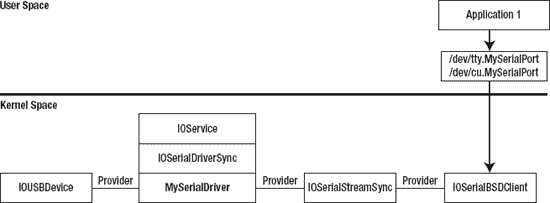

***图 11-1.** 从用户空间应用程序与串口通信所涉及的对象*

从用户空间开始，应用程序通过从 `/dev` 目录中打开与串口驱动程序对应的字符设备文件来连接到该驱动程序。每个串口驱动程序在 `/dev` 目录中都有两个条目，一个名称以前缀 “`tty.`” 开头，另一个名称以前缀 “`cu.`” 开头。这个原因很大程度上是历史遗留的，源自串口是调制解调器或传真机连接计算机方式的时代。在这种情况下，“`tty`” 设备是用于接听呼叫的拨入设备，而 “`cu`” 是用于拨出呼叫的呼出设备。

希望接听呼叫的进程会打开拨入设备；`open()` 函数会阻塞，直到载波检测线被触发，这意味着调制解调器已建立连接。然而，要拨出呼叫，进程需要能够打开串口而无需等待载波检测线，因此它会打开呼出设备，该设备不会在载波检测信号上阻塞。当与现代串行设备通信时，鉴于大多数设备不会连接到电话线，Apple 建议打开呼出设备。

`/dev` 中的两个设备文件由一个名为 `IOSerialBSDClient` 的 I/O Kit 类创建。这是由 `IOSerialFamily` 提供的一个类，负责处理用户空间进程在设备文件上执行操作的内核端。`IOSerialBSDClient` 处理用户空间进程为操作串口而进行的任何系统调用，包括以下任何函数：`open()`、`close()`、`read()`、`write()`、`ioctl()` 和 `select()`。通过这种方式，可以将 `IOSerialBSDClient` 视为充当串口驱动程序的用户客户端角色（尽管它并非派生自 `IOUserClient` 类）。与用户客户端一样，`IOSerialBSDClient` 类仅仅是用户空间进程与内核驱动程序对象之间的一个通道。该类负责处理阻塞调用与非阻塞调用之间的差异，但其主要作用是将从用户空间接收的函数调用转换为对 `IOSerialStreamSync` 对象的方法调用。

`IOSerialStreamSync` 类是 I/O Kit 在 `IOSerialFamily` 包中提供的另一个类。其作用仅仅是 `IOSerialBSDClient` 与实际串口驱动程序实现之间的一个通道。事实上，对于 `IOSerialStreamSync` 类的每个方法，它都会调用 `IOSerialDriverSync` 类中同名的方法。

`IOSerialDriverSync` 类是一个纯抽象接口，为 Mac OS X 上的任何串口驱动程序提供基类。它提供了读取和写入数据的方法，以及报告串口状态变化的方法，例如是否检测到载波信号、串口上是否有数据到达可供读取、以及串口是否能够接受更多字节用于传输。

最后，涉及串口驱动程序栈的最后一个对象是串口驱动程序的提供者类。在本示例中，我们假设串口是由一个 USB 转串口适配器实现的，因此提供者类的类型为 `IOUSBDevice`。每当串口驱动程序需要从串口读取数据或通过串口写入数据时，它会通过 `IOUSBDevice` 实例访问底层硬件设备。

在实现串口驱动程序过程中，每个参与其中的类的作用如下：

- 串口驱动程序的提供者类（在我们示例中为 `IOUSBDevice`）负责执行数据进出计算机与串口适配器之间的传输。
- 主驱动程序（`IOSerialDriverSync` 的子类）管理串口的接收和发送缓冲区，在数据到达时从硬件读取数据，并在用户空间提供数据时向硬件写入数据。
- `IOSerialBSDClient` 管理与用户空间应用程序的交互。


### 串行端口驱动程序

在 Mac OS X 上，串行端口驱动程序通过创建一个派生自 `IOSerialDriverSync` 类的类来实现。在本节中，我们将通过解析 Apple 为 USB 串行通信设备提供的驱动程序源代码，来介绍串行端口驱动程序的实现。尽管你直接实现自己的串行驱动程序的可能性不大，但本节可被视为提供了 I/O Kit 技术和驱动程序设计的实际应用，并且 Apple USB 串行驱动程序使用的许多技术有可能应用于你将开发的其他驱动程序。

若想跟随本节内容进行学习，你可能希望下载我们正在讨论的串行端口驱动程序的源代码。在内核串行驱动程序栈中发挥作用的类分布在 Darwin 源代码存储库的以下两个项目中：

*   所有串行驱动程序所基于的基类（包括 `IOSerialBSDClient` 类的实现）都包含在 `IOSerialFamily` 项目中。要实现你自己的串行端口驱动程序，你只需要 `IOSerialFamily` 项目中的类即可。
*   针对基于 USB 的串行通信设备加载的驱动程序包含在名为 `AppleUSBCDCDriver` 的项目中。（`USBCDC` 是 USB 通信设备类（USB Communications Device Class）的缩写。）

考虑到 I/O Kit 为处理串行端口驱动程序而创建的大量支持类，了解这些类是如何实例化的将很有启发。当一个实现了通信设备类的 USB 设备连接到 Mac 时，USB 主机控制器会创建一个新的 `IOUSBDevice` 对象来表示该设备。当这个 `IOUSBDevice` 对象发布后，它会启动 I/O Kit 的驱动匹配过程，该过程会为 USB 设备搜索合适的驱动程序。在这种情况下，I/O Kit 将选择 `AppleUSBCDC` 驱动程序，因为其匹配字典指定它应针对任何支持通信设备类的 USB 设备加载。请注意，`AppleUSBCDC` 驱动程序并非串行驱动程序。它是通用 `IOService` 类的子类，其作用仅仅是将 USB 硬件配置为用作串行设备。它通过遍历设备支持的 USB 接口并将活动接口设置为提供通信支持的接口来实现这一点。

一旦 `AppleUSBCDC` 驱动程序配置了活动的 USB 设备接口，I/O Kit 的 USB 家族会创建一个 `IOUSBInterface` 对象来表示该活动接口。这又会启动新一轮的 I/O Kit 驱动匹配过程，为 `IOUSBInterface` 对象搜索合适的驱动程序。出于本节的目的，我们将分析 `AppleUSBCDCDMM` 类的实现，该类会匹配任何实现了特定类型 USB 通信设备的 `IOUSBInterface` 对象。该类在文件 `AppleUSBCDCDMM.cpp` 中实现，并在文件 `AppleUSBCDCDMM.h` 中声明。

`AppleUSBCDCDMM` 类是 `IOSerialDriverSync` 类的直接子类，因此它负责实现串行端口驱动程序所需的方法。为了通过硬件设备发送和接收数据，`AppleUSBCDCDMM` 类向其提供者类（一个 `IOUSBInterface` 对象）发送 USB 传输请求。

### 手动实例化驱动程序对象

在此之前，内核对象的实例化和加载都相当标准，并且遵循所有驱动程序都要经历的相同 I/O Kit 驱动匹配过程。然而，串行端口驱动程序与你将编写的许多驱动程序不同，因为它有一个子驱动程序。因此，你的串行端口驱动程序将充当另一个 I/O Kit 驱动程序的提供者。

串行端口驱动程序的子对象是一个继承自 `IOSerialStreamSync` 类（或派生自 `IOSerialStreamSync` 的类）的对象。对于串行端口驱动程序，其子驱动程序并非通过 I/O Kit 的驱动匹配过程创建；相反，子驱动程序对象是由串行驱动程序本身显式实例化并附加到串行驱动程序上的。

在 `AppleUSBCDCDMM` 驱动程序的情况下，子驱动程序的类型为 `IOModemSerialStreamSync`，这是一个直接继承自 `IOSerialStreamSync` 类的类。`AppleUSBCDCDMM` 类在一个名为 `createSerialStream()` 的方法中实例化其子对象，该方法从串行端口驱动程序的 `start()` 方法中调用。`createSerialStream()` 方法是一个自定义方法，对 `AppleUSBCDCDMM` 类来说是私有的。以下基于 `AppleUSBCDCDMM` 驱动程序的 `createSerialStream()` 示例实现如代码清单 11-1 所示。

**代码清单 11-1.** 创建串行端口驱动程序的 `IOSerialStreamSync` 对象的方法实现

```
#include <IOKit/serial/IOModemSerialStreamSync.h>
#include <IOKit/serial/IOSerialKeys.h>

bool   MySerialDriver::createSerialStream()
{
       IOSerialStreamSync*    pChild;
       bool                   result;

       // 实例化子驱动程序对象
       pChild = new IOModemSerialStreamSync;
       if (pChild == NULL)
              return false;

       // 初始化子驱动程序
       result = pChild->init(0, 0);
       if (result == false)
              goto bail;

       // 将 pChild 作为我们自身的子设备附加
       result = pChild->attach(this);   // 传递 "this" 作为子驱动程序的提供者
       if (result == false)
              goto bail;

       // 设置用于命名 /dev 中设备文件的属性
       pChild->setProperty(kIOTTYBaseNameKey, "my_serial");
       pChild->setProperty(kIOTTYSuffixKey, "");

       // 允许以 pChild 作为提供者类的驱动程序进行匹配
       pChild->registerService();

       // 成功时落入此处
bail:
       pChild->release();
       return result;
}
```

代码清单 11-1 中的代码展示了一个驱动程序如何显式实例化其自身的子驱动程序，而无需为子驱动程序创建属性列表文件并调用 I/O Kit 的匹配机制。创建新驱动程序对象的三个基本步骤是：(1) 通过调用 C++ `new` 运算符来分配驱动程序类的实例，(2) 通过调用返回对象的 `init()` 方法来初始化它，以及 (3) 通过 `attach()` 方法将驱动程序对象附加到其父对象上。传递给 `attach()` 的参数是子设备的提供者类，这通常是实例化子驱动程序的父对象。


你会注意到，由于 I/O Kit 使用的嵌入式 C++ 语言不支持异常，为了检查 `new` 操作符的调用是否失败，我们需要检查返回值是否为 `NULL`。请注意，在从方法返回之前，我们无条件地释放了对子对象的引用；如果 `attach()` 调用成功，子驱动程序对象将被 I/O Kit 保留，因此方法末尾的 `release()` 调用不会销毁该对象，而是会释放我们持有的对该对象的引用（防止内存泄漏）。另一方面，如果子驱动程序在 `init()` 方法中失败或无法被附加，我们需要释放（并销毁）该子驱动程序对象。

由 `createSerialStream()` 方法实例化的 `IOModemSerialStreamSync` 类扮演着两个类之间通道的角色，即处理用户空间应用程序对串行端口操作的 `IOSerialBSDClient` 类，以及串行端口驱动程序的实现（在之前的例子中是 `MySerialDriver`）。然而，串行端口驱动程序无法直接访问 `IOSerialBSDClient` 类。为了指定在 `/dev` 目录中创建的字符设备文件的名称，它需要能够将某些参数传递给 `IOSerialBSDClient` 的初始化方法。为此，它在 `IOSerialBSDClient` 类创建之前，在 `IOSerialStreamSync` 对象上设置了两个属性，然后 `IOSerialBSDClient` 对象在其初始化过程中就能够读取这些属性。

串行端口驱动程序在 `IOSerialStreamSync` 对象上调用 `registerService()` 方法，这通知 I/O Kit 应该开始对子设备进行匹配过程。任何希望将 `IOSerialStreamSync` 对象作为其父类（提供者类）使用的驱动程序都将被加载。这就是 `IOSerialBSDClient` 类被加载并附加到由串行端口驱动程序创建的 `IOSerialStreamSync` 对象上的方式。IOSerialFamily 内核模块包含一个针对 `IOSerialBSDClient` 类的匹配字典，该字典会匹配任何 `IOSerialStreamSync` 对象（或派生自 `IOSerialStreamSync` 的类）。

 **注意**：通常，显式实例化并将子驱动程序附加到自身的驱动程序不应该为子驱动程序调用 `registerService()`，因为这通常由子驱动程序自己处理。然而，对于 `IOSerialStreamSync` 类，它不会自行注册以进行驱动程序匹配，因此在实例化它之后，我们显式地调用其 `registerDriver()` 方法。

当 `IOSerialStreamSync` 类向 I/O Kit 注册后，会创建并附加一个 `IOSerialBSDClient` 类的实例，从而完成串行端口所需的一组驱动程序对象。当 `IOSerialBSDClient` 类被初始化时，它会在 `/dev` 目录中为串行端口创建两个设备节点，一个对应于拨入字符设备文件，另一个对应于呼出字符设备文件。为了确定这些文件的名称，`IOSerialBSDClient` 类读取 `kIOTTYBaseNameKey` 和 `kIOTTYSuffixKey` 属性的值，然后使用以下格式创建两个文件：

```
“tty.” + kIOTTYBaseNameKey + kIOTTYSuffixKey
```

以及

```
“cu.” + kIOTTYBaseNameKey + kIOTTYSuffixKey
```

对于列表 11-1 中的示例，这会产生一个名为 `tty.my_serial` 的拨入设备字符设备文件，以及一个名为 `cu.my_serial` 的呼出设备字符设备文件。

### 实现 `IOSerialDriverSync` 类

Mac OS X 上的串行驱动程序必须派生自 `IOSerialDriverSync` 类。`IOSerialDriverSync` 类是一个纯抽象类，它提供了串行驱动程序必须实现的接口。串行驱动程序必须实现的方法在列表 11-2 中给出。

***列表 11-2.** `IOSerialDriverSync` 的接口，声明了串行端口驱动程序必须实现的方法*

```
class IOSerialDriverSync : public IOService
{
       OSDeclareAbstractStructors(IOSerialDriverSync);

public:
       virtual IOReturn  acquirePort(bool sleep, void *refCon) = 0;

       virtual IOReturn  releasePort(void *refCon) = 0;

       virtual IOReturn  setState(UInt32 state, UInt32 mask, void *refCon) = 0;

       virtual UInt32    getState(void *refCon) = 0;

       virtual IOReturn  watchState(UInt32 *state, UInt32 mask, void *refCon) = 0;

       virtual UInt32    nextEvent(void *refCon) = 0;

       virtual IOReturn  executeEvent(UInt32 event, UInt32 data, void *refCon) = 0;

       virtual IOReturn  requestEvent(UInt32 event, UInt32 *data, void *refCon) = 0;

       virtual IOReturn  enqueueEvent(UInt32 event, UInt32 data,
                                   bool sleep, void *refCon) = 0;

       virtual IOReturn  dequeueEvent(UInt32 *event, UInt32 *data,
                                   bool sleep, void *refCon) = 0;

       virtual IOReturn  enqueueData(UInt8 *buffer, UInt32 size, UInt32 *count,
                                   bool sleep, void *refCon) = 0;

       virtual IOReturn  dequeueData(UInt8 *buffer, UInt32 size, UInt32 *count,
                                   UInt32 min, void *refCon) = 0;
};
```

你会注意到每个方法都带有一个名为 `refCon` 的参数。`refCon` 值可以被串行端口驱动程序用来标识该方法正在操作的串行端口。`refCon` 值实际上由串行端口驱动程序自身指定，并在实例化时传递给 `IOSerialStreamSync` 对象。作为回报，每当 `IOSerialStreamSync` 类调用驱动程序类中的方法时，它都会将这个 `refCon` 值传回给驱动程序。在大多数情况下，并不需要 `refCon` 值，因为串行端口驱动程序所需的任何数据都可以作为实例变量添加到驱动程序类中。然而，对于管理具有多个串行端口的硬件（例如带有 COM1 和 COM2 端口的 USB 适配器）的串行端口驱动程序来说，驱动程序需要某种方法来识别方法调用中引用的是哪个端口。为此，串行驱动程序会创建两个 `IOSerialStreamSync` 类的实例（每个硬件端口一个），并为每个端口提供一个唯一的 `refCon` 值。

这个接口看起来可能令人望而生畏，但这些方法可以分为三类：

-   调整串行端口状态并监视串行端口状态变化的方法
-   获取或设置串行端口属性的方法
-   通过串行端口读写数据的方法

以下是 `IOSerialDriverSync` 接口定义的方法的简要说明：

-   打开和关闭串行端口：`acquirePort()`、`releasePort()`
-   管理表示串行端口状态的位掩码，并阻塞调用线程直到特定条件发生。状态位描述了诸如串行端口是否已打开、是否已通过串行端口接收到数据并可读、以及串行端口是否可以接受写入字节等条件：`setState()`、`getState()`、`watchState()`
-   设置串行端口的属性：`executeEvent()`、`enqueueEvent()`
-   获取串行端口的属性：`nextEvent()`、`requestEvent()`
-   通过串行端口写入数据：`enqueueData()`
-   读取已从串行端口接收到的数据：`dequeueData()`


### 实现 `IOSerialDriverSync` 接口的同步问题

实现 `IOSerialDriverSync` 接口的复杂性之一在于它需要细致的同步。该接口的方法可能在任何时候被多个线程调用，这意味着实现需要确保每个方法都正确同步，以防止出现诸如 `dequeueData()` 方法在串口已关闭后仍返回数据等情况。更复杂的是，有几个方法可能会阻塞调用线程，直到某个特定事件发生；`watchState()` 方法尤其如此，它在串口进入请求状态之前不会返回。这两个同步问题都可以通过使用互斥锁和一个条件变量来通知串口状态的变化来解决。

对于 `AppleUSBCDCDMM` 驱动程序，存在一个更大的同步问题：通过 `IOSerialDriverSync` 接口调用的方法需要与 USB 异步传输完成时触发的回调进行协调。这是为了防止 USB 写入操作的完成回调在 `dequeueData()` 方法尝试从同一缓冲区读取数据的同时将数据放入该缓冲区。

尽管上述描述描绘了一个非常困难的同步问题，但 I/O Kit 设计提供了一个令人惊讶的优雅解决方案。所有 USB 完成回调都在 USB 工作循环（work loop）上运行，因此为了同步串口方法与 USB 代码，`AppleUSBCDCDMM` 驱动程序确保所有串口方法都在 USB 工作循环上处理。其实现如下：

```cpp
bool AppleUSBCDCDMM::start(IOService *provider)
{
       …
       // Get the USB work loop (superclass will use the provider class' work loop)
       fWorkLoop = getWorkLoop();
       …
       // Create a command gate and install it on the USB work loop
       fCommandGate = IOCommandGate::commandGate(this);
       fWorkLoop->addEventSource(fCommandGate);
       …
}
```

对于每个串口方法，`AppleUSBCDCDMM` 驱动程序都通过命令门（command gate）调用该方法，确保它与 USB 工作循环同步。下面展示了 `releasePort()` 的实现：

```cpp
IOReturn AppleUSBCDCDMM::releasePort(void *refCon)
{
       IOReturn       ret = kIOReturnSuccess;

       // Call the static method releasePortAction() on the work loop, which requires no
       // parameters
       ret = fCommandGate->runAction(releasePortAction);

       return ret;
}

IOReturn AppleUSBCDCDMM::releasePortAction(OSObject *owner, void *, void *, void *, void *)
{
       // Call through to the method releasePortGated()
       return ((AppleUSBCDCDMM*)owner)->releasePortGated();
}

IOReturn AppleUSBCDCDMM::releasePortGated()
{
       …
       // Implementation of releasePort
       …
}
```

`IOCommandGate` 还提供了一个对象，线程可以在其上休眠，并且可以在事件发生时用来通知休眠的线程。正如我们将看到的，这提供了一种方便的方法来实现串口的 `watchState()` 方法。

### 串口状态

实现 `IOSerialDriverSync` 接口的核心部分是管理串口的状态。串口状态是一个 32 位的位域，用于报告事件（例如串口上数据的到达），以及保存端口的整体状态（例如它是否已被用户空间进程打开）。尽管有一些方法直接参与操作状态位掩码，但最终串口从 `IOSerialDriverSync` 实现的每个方法都需要访问串口的状态，即使仅仅是为了在尝试执行操作之前验证串口是否已被打开。

状态位定义在头文件 `IOSerialStreamSync.h` 中。每个位的含义描述如下：

- `PD_S_ACQUIRED` 表示串口已被打开，并且正在被用户空间应用程序使用。此状态位从不通过 `setState()` 方法设置或清除，而是在 `acquirePort()` 方法中设置，并在 `releasePort()` 方法中清除。
- `PD_S_ACTIVE` 在获取串口后立即设置，并在释放串口前立即清除。此状态位从不通过 `setState()` 方法设置或清除；相反，该位通过 `executeEvent()` 方法设置或清除，该方法使用事件类型 `PD_E_ACTIVE` 来操作此状态位。
- `PD_S_TX_ENABLE` 和 `PD_S_RX_ENABLE` 被设置以指示串口的发送和接收接口已启用。大多数实现（包括 `AppleUSBCDCDMM` 驱动程序）在串口打开时设置这些位，在串口关闭时清除它们，但除此之外不对这些状态位做其他使用。
- `PD_S_TX_BUSY` 和 `PD_S_RX_BUSY` 被设置以指示串口驱动程序正在将其发送缓冲区中的数据发送到串口硬件，或者正在将已通过串口硬件发送的数据读入驱动程序缓冲区。
- `PD_S_TX_EVENT` 和 `PD_S_RX_EVENT` 是 `IOSerialBSDClient` 类内部使用的两个状态，用于通知写或读操作的开始。尽管串口驱动程序未使用这些状态位，但它需要在 `setState()` 中设置相应的位，并允许客户端通过 `watchState()` 观察该位，以确保 `IOSerialBSDClient` 正确运行。

许多位描述了串口驱动程序的发送和接收缓冲区的状态。发送缓冲区由串口驱动程序用于保存通过 `enqueueData()` 方法提供给它的、但尚未通过串口硬件发送的字节。接收缓冲区保存串口驱动程序已从串口硬件读取但尚未通过 `dequeueData()` 方法传递的字节。以下是串口驱动程序缓冲区状态位的描述：

- `PD_S_TXQ_EMPTY` 和 `PD_S_RXQ_EMPTY` 指示发送缓冲区或接收缓冲区为空，不包含任何字节。
- `PD_S_TXQ_LOW_WATER` 和 `PD_S_RXQ_LOW_WATER` 指示发送缓冲区或接收缓冲区中的字节数低于“低水位线”。`AppleUSBCDCDMM` 驱动程序将低水位线设置为整个发送缓冲区或接收缓冲区大小的三分之一。
- `PD_S_TXQ_HIGH_WATER` 和 `PD_S_RXQ_HIGH_WATER` 指示发送缓冲区或接收缓冲区中的字节数高于“高水位线”。`AppleUSBCDCDMM` 驱动程序将高水位线设置为整个发送缓冲区或接收缓冲区大小的三分之二。
- `PD_S_TXQ_FULL` 和 `PD_S_RXQ_FULL` 指示发送缓冲区或接收缓冲区已完全满，无法接受更多数据。


头文件`IORS232SerialStreamSync.h`定义了标准 RS-232 信号的状态位。例如，为诸如清除发送（`PD_RS232_S_CTS`）和数据终端就绪（`PD_RS232_S_DTR`）等信号提供了定义。软件流控制（通过传输特殊的 XON 和 XOFF 字符实现）的状态由状态位`PD_RS232_S_TXO`和`PD_RS232_S_RXO`指示。

串行端口驱动程序维护一个 32 位整数，该整数包含描述串行端口当前状态的状态位掩码。串行驱动程序必须实现以下三个方法，以允许操作串行端口状态：`getState()`、`setState()`和`watchState()`。除了在`IOSerialBSDClient`类需要访问串行端口状态时被调用外，这三个方法还在串行端口类的许多其他方法的实现中被调用。

例如，用于打开串行端口以进行独占访问的串口方法`acquirePort()`，以及用于关闭串行端口的`releasePort()`，都是通过设置状态位`PD_S_ACQUIRED`来实现的。`acquirePort()`方法的一个可能实现如代码清单 11-3 所示。该示例使用`setState()`来设置`PD_S_ACQUIRED`位。如果串行端口已经被占用，并且调用方请求该方法应阻塞直到串行端口变为空闲，则该实现会调用`watchState()`来等待，直到`PD_S_ACQUIRED`状态位被清除。

***代码清单 11-3*** `acquirePort()`方法的示例实现。假设该方法是通过`IOCommandGate`调用的。

```
IOReturn       MySerialDriver::acquirePortGated (bool sleep, void* refCon)
{
       UInt32      state;
       IOReturn    rtn;

       // If the serial port is already acquired, wait until it is released
       while (m_currentState & PD_S_ACQUIRED)
       {
              // Abort if the caller has requested non-blocking operation
              if (sleep == false)
                     return kIOReturnExclusiveAccess;

              // Sleep until the acquired bit becomes clear
              state = 0;
              rtn = watchState(&state, PD_S_ACQUIRED, refCon);
              if (rtn != kIOReturnSuccess)
                     return rtn;
       }

       // Set the acquired bit and clear all other state bits
       setState(PD_S_ACQUIRED, 0xFFFFFFFF, refCon);

       // Serial port has been acquired, perform further initialization
       ...

       return kIOReturnSuccess;
}
```

`releasePort()`方法的一个可能实现如代码清单 11-4 所示，该方法使用`setState()`来清除`PD_S_ACQUIRED`状态。

***代码清单 11-4*** `releasePort()`方法的示例实现。假设该方法是通过`IOCommandGate`调用的。

```
IOReturn       MySerialDriver::releasePortGated (void* refCon)
{
       // Return an error if trying to release a port that hasn't been acquired
       if ((m_currentState & PD_S_ACQUIRED) == 0)
              return kIOReturnNotOpen;

       // Clear the entire state word, which also deactivates the port
       setState(0, 0xFFFFFFFF, refCon);

       return kIOReturnSuccess;
}
```

通常，`IOSerialBSDClient`类，甚至串行端口驱动程序本身，需要阻塞当前线程，直到某个特定状态变为活动或非活动。串行驱动程序通过名为`watchState()`的方法提供此功能。调用方希望观察的事件由两个参数描述。`mask`参数包含了调用方希望观察的状态位的位掩码。`state`参数描述了调用方希望观察的每个状态位的对应值。例如，如果一个位在`mask`中被设置，但未在`state`中被设置，则调用方对该状态变为非活动感兴趣。如果一个位在`mask`中被设置，并且也在`state`中被设置，则调用方对该状态变为活动感兴趣。

一旦任何被观察的状态位与串行端口的当前状态匹配，`watchState()`方法就会返回。返回时，串行端口的当前状态会通过`state`参数返回给调用方。如果在线程因`watchState()`阻塞期间串行端口被关闭，则休眠将被中止，该方法将失败并向调用方返回一个错误码，例如`kIOReturnNotOpen`。以下代码给出了如何使用`watchState()`的示例；此代码将阻塞，直到驱动程序的发送缓冲区变空（`PD_S_TXQ_EMPTY`被设置）或硬件完成对串行端口硬件的写入（`PD_S_TX_BUSY`被清除）：

```
UInt32       state;
IOReturn     rtn;

state = PD_S_TXQ_EMPTY;
rtn = watchState(&state, PD_S_TXQ_EMPTY | PD_S_TX_BUSY, refCon);
if (rtn != kIOReturnSuccess)
       handle error;
```

`watchState()`方法的实现与`setState()`方法的实现密切相关。除了在串行端口状态字中设置位之外，`setState()`方法还负责唤醒所有正在等待设置特定状态的线程。在第 7 章中，我们介绍了条件变量，并了解了一个线程如何在一个条件变量上休眠并保持阻塞状态，直到另一个线程发送信号给该条件变量以指示某个事件已发生。这提供了一种机制，串行端口驱动程序可以使用该机制在`watchState()`方法中挂起一个线程，并在观察到的状态发生变化时从`setState()`方法中向它发送信号。

当调用`setState()`方法时，串行驱动程序会更新维护当前串行端口状态的变量，然后向所有在`watchState()`方法中被阻塞的线程发送信号，允许它们测试它们正在等待的状态是否已变为活动。作为一种优化，而不是针对串行端口状态的每一次更改都唤醒被`watchState()`阻塞的线程，`AppleUSBCDCDMM`驱动程序维护所有正在被当前所有`watchState()`调用等待的状态位的并集，并且仅当被监视的状态位的值发生变化时才解除线程阻塞。

`setState()`和`watchState()`方法的示例实现如代码清单 11-5 所示。

***代码清单 11-5*** `setState()`和`watchState()`方法的示例实现。假设这些方法是通过`IOCommandGate`调用的。

```
IOReturn       MySerialDriver::setStateGated(UInt32 state, UInt32 mask, void* refCon)
{
       UInt32   newState;
       UInt32   deltaState;

        // Verify that the serial port has been acquired or is being acquired by this call
       if ((m_currentState & PD_S_ACQUIRED) || (state & PD_S_ACQUIRED))
       {
              // Compute the new state
              newState = (m_currentState & ~mask) | (state & mask);
              // Determine the mask of changed state bits
              deltaState = newState ^ m_currentState;
              // Set the new state
              m_currentState = newState;
```


### 代码分析

```
// 如果 watchState() 中某个线程正在观察的状态发生了变化，
// 唤醒所有在 watchState() 中休眠的线程
if (deltaState & m_watchStateMask)
{
    // 重置 watchStateMask；当每个 watchStateGated() 休眠时，它会重新生成
    m_watchStateMask = 0;
    fCommandGate->commandWakeup((void*)&m_currentState);
}

return kIOReturnSuccess;

```

```
return kIOReturnNotOpen;
```

```
IOReturn       MySerialDriver::watchStateGated(UInt32* state, UInt32 mask, void* refCon)
{
    UInt32      watchState;
    bool        autoActiveBit = false;
    IOReturn    ret;

    // 如果串口尚未被获取，则中止
    if ((m_currentState & PD_S_ACQUIRED) == 0)
        return kIOReturnNotOpen;

    watchState = *state;
    // 如果调用者没有等待 acquired 或 active 状态，则注册对 active 状态的兴趣，
    // 这样如果串口关闭，我们可以中止。
    if ((mask & (PD_S_ACQUIRED | PD_S_ACTIVE)) == 0)
    {
        watchState &= ~PD_S_ACTIVE;
        mask |= PD_S_ACTIVE;
        autoActiveBit = true;
    }

    while (true)
    {
        // 检查端口状态，查找与 watchState 值匹配的任何位
        // 注意：'^ ~' 是异或非运算，用于测试位的相等性。
        UInt32    matchedStates = (watchState ^ ~m_currentState) & mask;
        if (matchedStates)
        {
            *state = m_currentState;
            // 如果串口已关闭且调用者未监视 PD_S_ACTIVE，则中止
            if (autoActiveBit && (matchedStates & PD_S_ACTIVE))
                return kIOReturnIOError;
            else
                return kIOReturnSuccess;
        }

        // 将在其上休眠的位添加到 watchStateMask
        m_watchStateMask |= mask;
        // 休眠，直到串口状态改变
        ret = fCommandGate->commandSleep((void*)&m_currentState);
        if (ret == THREAD_INTERRUPTED)
            return kIOReturnAborted;
    }

    return kIOReturnSuccess;
}
```

请注意，列表 11-5 中 `watchState()` 的实现将确保 `PD_S_ACQUIRED` 或 `PD_S_ACTIVE` 位被监视，如果没有，则会在掩码中增加一个额外状态来监视 `PD_S_ACTIVE` 位变为清除状态。这确保了当串口关闭时，所有在调用 `watchState()` 时被阻塞的线程都会被唤醒并返回给调用者。如果没有显式添加串口停用的掩码，被阻塞的线程将永远不会唤醒，从而导致串口驱动程序死锁。

### 串口事件

硬件串口需要配置，以匹配串口连接另一端设备使用的设置。可配置的设置包括参数，例如数据发送的波特率、数据字符中的位数、是否传输校验位以及每个字符结束时发送的停止位数。

这些串口设置由打开串口的用户空间进程决定，并通过诸如 `tcsetattr()` 和 `tcgetattr()` 等函数进行配置。这些函数通过 I/O Kit 的 `IOSerialBSDClient` 类进入内核，该类通过其 `executeEvent()` 方法将各个配置选项传递给串口驱动程序。

`executeEvent()` 方法与 `requestEvent()` 方法配对，后者由 `IOSerialBSDClient` 类用于查询串口的当前配置。`executeEvent()` 和 `requestEvent()` 方法的原型如下：

```
IOReturn          executeEvent(UInt32 event, UInt32 data, void* refCon);
IOReturn          requestEvent(UInt32 event, UInt32* data, void* refCon);
```

参数 `event` 是来自 `IOSerialStreamSync.h` 的一个枚举，用于标识正在配置或查询的属性。参数 `data` 用于通过 `executeEvent()` 传递正在设置的属性的新值，或通过 `requestEvent()` 传递正在查询的属性的当前值。大多数驱动程序通过一个基于 `event` 参数值的大型 `switch` 语句来实现 `executeEvent()` 和 `requestEvent()` 方法。下面 表 11-1 给出了可能的事件类型的描述。

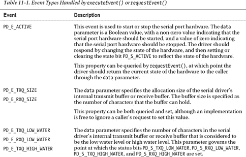

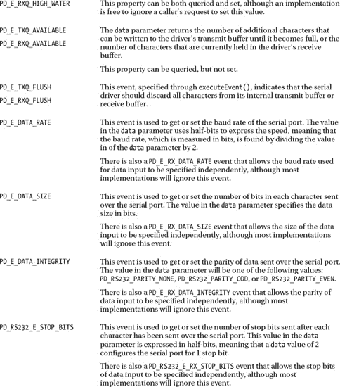

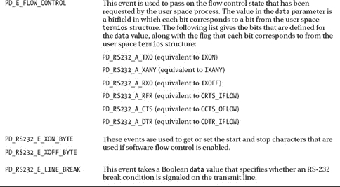

除了 `executeEvent()` 方法，你还会注意到 `IOSerialDriverSync` 接口还定义了一个名为 `enqueueEvent()` 的方法，用于设置串口的属性。这两种方法有一个微妙的区别：调用 `executeEvent()` 方法会导致串口配置在调用该方法后立即生效，而调用 `enqueueEvent()` 则要等到串口驱动程序发送缓冲区中的所有字符都写入硬件后才会生效。

要实现 `enqueueEvent()` 的正确行为，串口驱动程序需要定义一个由事件队列和每个事件关联的数据组成的发送缓冲区。然后，每次调用 `enqueueEvent()` 都会将值对 `{event, data}` 附加到发送队列的末尾。类似地，用于传输的字符数据也需要被视为一个事件，并附加到发送缓冲区的末尾。每当发送缓冲区不为空时，串口驱动程序就会从队列中取出下一个事件，该事件要么是改变串口配置的事件，要么是要通过串口发送的字符。

串口驱动程序并不要求严格遵循 `enqueueEvent()` 的正确实现。如果你查看 `AppleUSBCDCDMM` 驱动程序的源代码，你会看到它通过调用 `executeEvent()` 来实现 `enqueueEvent()`，这会立即将请求的更改应用于串口配置。

类似地，串口驱动程序的接收缓冲区允许在从串口读取的数据字节之间插入事件。对于接收队列，事件表示从串口读取数据时发生的错误。以下描述了一些可以报告的错误：


### 排版后内容

- `PD_RS232_E_RX_LINE_BREAK` 表示接收器检测到中断条件。
- `PD_E_FRAMING_ERROR` 表示字符数据的帧格式错误。（停止位不在预期位置。）
- `PD_E_INTEGRITY_ERROR` 表示检测到奇偶校验错误。
- `PD_E_HW_OVERRUN_ERROR` 和 `PD_E_SW_OVERRUN_ERROR` 表示未能足够快地从硬件或软件缓冲区取出字符数据，导致缓冲区填满并丢失数据。

在从串口读取任何数据之前，`IOSerialBSDClient` 类会调用串口驱动程序的 `nextEvent()` 方法。如果串口驱动程序接收队列中的下一个元素是错误事件，`nextEvent()` 会将事件类型返回给调用者，调用者随后会调用驱动程序的 `dequeueEvent()` 方法来响应。否则，如果串口驱动程序接收队列中的下一个元素是从串口读取的数据字节，则应返回 `PD_E_EOQ`。

与串口驱动程序的发送端类似，驱动程序并非必须在其接收队列中完整实现事件的排队功能。事实上，`AppleUSBCDCDMM` 驱动程序提供的实现在其接收队列中根本不报告任何事件；其 `nextEvent()` 和 `dequeueEvent()` 的实现会检查串口是否已激活，如果已激活，则始终返回值为 `kIOReturnSuccess` 的结果。请注意，`kIOReturnSuccess` 的值为 0，因此，它对应于事件 `PD_E_EOQ`，该事件的值也为 0。

### 串行数据传输

`IOSerialDriverSync` 接口中剩余需要实现的方法是数据传输方法。串口驱动程序将通过 `enqueueData()` 方法获取需通过串口发送的数据，而驱动程序从串口接收到的数据则通过 `dequeueData()` 方法提供给客户端。

当用户空间进程向串口写入数据时，该数据首先在内核中由 `IOSerialBSDClient` 类处理，该类负责将数据传递给串口驱动程序。`IOSerialBSDClient` 通过调用串口驱动程序的 `enqueueData()` 方法来提供数据，其签名如下：

`IOReturn enqueueData(UInt8 *buffer, UInt32 size, UInt32 *count, bool sleep, void *refCon);`

待发送的数据字节保存在 `buffer` 参数中，待发送的字节数由 `size` 参数描述。串口驱动程序的典型设计是将提供的数据复制到其分配的内部缓冲区（称为发送缓冲区）中，然后立即返回给调用者。驱动程序随后会通过异步方式，将数据从其发送缓冲区传输到硬件串口，以继续处理写请求。在从 `enqueueData()` 方法返回之前，驱动程序会通过 `count` 参数返回其接受的字节数；请注意，这只是驱动程序能够复制到其发送缓冲区的字节数，而非已通过硬件串口写入的字节数。`sleep` 参数允许调用者请求：如果驱动程序无法接受提供的所有字节，则应阻塞，并且在所有字节被复制到驱动程序内部发送缓冲区之前，不要返回给调用者。

`IOSerialBSDClient` 的当前实现绝不会在串口驱动程序无法接受所有提供的数据字节时要求其休眠。相反，它会确保不向串口驱动程序提供超过其接受能力的数据量，这是通过以事件 `PD_E_TXQ_AVAILABLE` 调用驱动程序的 `requestEvent()` 方法来实现的。`IOSerialBSDClient` 会监视驱动程序发送缓冲区的各种状态，以确定驱动程序何时能够接受更多数据，这些状态包括 `PD_S_TXQ_LOW_WATER`、`PD_S_TXQ_EMPTY` 和 `PD_S_TX_BUSY`。

`enqueueData()` 方法的示例实现见列表 11-6。请注意，该实现将数据字节复制到由串口驱动程序分配的发送缓冲区，然后检查硬件当前是否正在串口上写入数据。如果否，则会调用一个名为 `StartHardwareTransmit()` 的假设函数，该函数虽与具体实现相关，但其目的是告知硬件开始从驱动程序的发送缓冲区通过串口发送数据字节。

**列表 11-6.** `enqueueData()` 方法的示例实现。假设该方法是通过 `IOCommandGate` 调用的。

```
IOReturn           MySerialDriver::enqueueDataGated(UInt8* buffer, UInt32 size, UInt32* count,
                                          bool sleep, void* refCon)
{
       // 如果串口未被获取，则中止
       *count = 0;
       if ((m_currentState & PD_S_ACTIVE) == 0)
              return kIOReturnNotOpen;

       // 将提供的数据复制到驱动程序的发送缓冲区
       *count = AddToTransmitQueue(buffer, size);
       // 重新生成发送缓冲区的状态位
       CheckQueues(refCon);

       // 如果没有硬件传输正在进行，则开始从驱动程序的缓冲区输出字节
       if ((m_currentState & PD_S_TX_BUSY) == 0)
              StartHardwareTransmit();
```


```c
       // 如果调用方要求我们在返回前发送所有字节，则进行阻塞
       while ((*count < size) && sleep)
       {
              UInt32      state;
              IOReturn    ret;

              // 等待驱动程序的发送缓冲区降至低水位以下，然后重试
              state = PD_S_TXQ_LOW_WATER;
              ret = watchState(&state, PD_S_TXQ_LOW_WATER, refCon);
              if (ret != kIOReturnSuccess)
                     return ret;

              // 将更多字节复制到驱动程序的发送缓冲区
              *count += AddToTransmitQueue(buffer + *count, size - *count);
              CheckQueues(refCon);
              if ((m_currentState & PD_S_TX_BUSY) == 0)
                     StartHardwareTransmit();
       }

       return kIOReturnSuccess;
}
```

数据传输的另一部分是读取从硬件串口接收到的字节。串行驱动程序将获取从其硬件设备接收到的数据，并将其复制到其内部接收缓冲区。硬件通知串行驱动程序数据已接收的具体方式因具体实现而异，但可能通过 PCI 中断或 USB 事务完成来发出信号。现在，驱动程序需要将接收到的数据传递给 `IOSerialBSDClient`，而后者将把数据提供给用户空间进程。

I/O Kit 使用拉取模型将数据从串行驱动程序返回到 `IOSerialBSDClient` 类。`IOSerialBSDClient` 将调用驱动程序的 `dequeueData()` 方法来获取已在硬件串口上接收到的数据；该方法的签名如下：

```c
IOReturn    dequeueData(UInt8* buffer, UInt32 size, UInt32* count, UInt32 min, void* refCon);
```

收到此方法后，串行驱动程序应从其内部接收缓冲区将数据复制到提供的参数 `buffer` 中。参数 `size` 描述了提供的缓冲区可以容纳的最大字节数。参数 `count` 用于返回实际写入提供缓冲区的字节数。调用方可以请求 `dequeueData()` 方法阻塞，直到有足够字节数可用时才返回；这是通过在 `min` 参数中指定一个非零值来实现的，该参数提供了调用方应返回的最小字节数。

`IOSerialBSDClient` 类不会持续轮询 `dequeueData()` 方法直到数据可用，而是指定一个最小读取大小为 1 个字节。这样做的效果是，在调用 `dequeueData()` 时阻塞，但一旦串口接收到数据，该方法会立即返回。`AppleUSBCDCDMM` 串口驱动程序通过调用 `watchState()` 方法，并等待 `PD_S_RXQ_EMPTY` 状态被清除来实现此方法，这表示驱动程序的接收缓冲区中有数据可用。这种设计的一个优点是，它确保当串口关闭时，驱动程序会解除 `dequeueData()` 方法中的等待阻塞，因为如果 `PD_S_ACTIVE` 标志被清除（当用户进程关闭串口时会发生这种情况），`watchState()` 方法将会中止。

`dequeueData()` 方法的示例实现见列表 11-7。该实现将数据从驱动程序的内部接收缓冲区复制到由方法调用方提供的缓冲区中。

**列表 11-7.** `dequeueData()` 方法的示例实现。假设该方法是通过 `IOCommandGate` 调用的。

```c
IOReturn           MySerialDriver::dequeueDataGated(UInt8* buffer, UInt32 size, UInt32* count,
                                                    UInt32 min, void* refCon)
{
       // 如果串口未被获取，则中止操作
       *count = 0;
       if ((m_currentState & PD_S_ACTIVE) == 0)
              return kIOReturnNotOpen;

       // 从驱动程序的接收缓冲区复制数据
       *count = RemovefromReceiveQueue(buffer, size);
       // 重新生成接收缓冲区的状态位
       CheckQueues(refCon);

       // 如果调用方请求了最小字节数，则进行阻塞
      while ((min > 0) && (*count < min))
       {
              UInt32          state;
              IOReturn        ret;

              // 等待驱动程序的接收缓冲区不为空，然后重试
              state = 0;
              ret = watchState(&state, PD_S_RXQ_EMPTY, refCon);
              if (ret != kIOReturnSuccess)
                     return ret;

              // 从驱动程序的接收缓冲区复制更多字节
              *count += RemovefromReceiveQueue(buffer + *count, size - *count);
              CheckQueues(refCon);
       }

       return kIOReturnSuccess;
}
```

列表 11-6 中 `enqueueData()` 和 列表 11-7 中 `dequeueData()` 的示例实现，在读取或写入内部发送缓冲区或接收缓冲区后，都调用了名为 `CheckQueues()` 的假设函数。虽然 `CheckQueues()` 是一个假设函数，但其作用是任何串口驱动程序都需要的。它的目的是检查驱动程序内部发送缓冲区或接收缓冲区中保存的字节数，并更新描述驱动程序队列的状态标志。这些标志描述了发送队列或接收队列是空、满、包含的字节数低于低水位，还是包含的字节数高于高水位。由于可能有线程正在等待发送缓冲区或接收缓冲区达到特定水平，因此串口驱动程序在读取或写入其内部缓冲区时更新这些状态标志非常重要。

除了在 列表 11-6 和 列表 11-7 所示的 `enqueueData()` 和 `dequeueData()` 方法中调用外，串口驱动程序还会在以下情况中调用 `CheckQueues()` 函数：当发送缓冲区中的数据被移除并写入硬件串口时，以及当硬件将从串口读取的数据添加到接收缓冲区时。`CheckQueues()` 方法的示例实现见列表 11-8。

**列表 11-8.** 用于更新驱动程序内部发送缓冲区状态标志的示例方法。假设该方法是通过 `IOCommandGate` 调用的。

```c
void MySerialDriver::CheckQueues(void* refCon)
{
       UInt32        usedSpace;
       UInt32        freeSpace;
       UInt32        newState;
       UInt32        deltaState;

       // 使用函数入口时的状态初始化 newState。
       newState = m_currentState;

       // 检查发送缓冲区中已使用和空闲的字节数
       usedSpace = GetUsedSpaceInTransmitQueue();
       freeSpace = GetFreeSpaceInTransmitQueue();

       // 设置发送缓冲区的满/空状态
       if (freeSpace == 0)
       {
              newState |=  PD_S_TXQ_FULL;
              newState &= ~PD_S_TXQ_EMPTY;
       }
       else if (usedSpace == 0)
       {
              newState &= ~PD_S_TXQ_FULL;
              newState |=  PD_S_TXQ_EMPTY;
       }
       else
       {
              newState &= ~PD_S_TXQ_FULL;
              newState &= ~PD_S_TXQ_EMPTY;
       }
```


// 设置发送缓冲区的低/高水位状态
if (usedSpace < m_txLowWaterlevel)
       newState |=  PD_S_TXQ_LOW_WATER;
else
       newState &= ~PD_S_TXQ_LOW_WATER;

if (usedSpace > m_txHighWaterlevel)
       newState |= PD_S_TXQ_HIGH_WATER;
else
       newState &= ~PD_S_TXQ_HIGH_WATER;

// 对接收缓冲区执行相同的检查
…      

// 更新所有已变更的状态位
deltaState = newState ^ m_currentState;
setState(newState, deltaState, refCon);
}

### 从用户空间访问串口

对于用户空间应用程序而言，串口驱动程序是通过 `/dev` 目录下的标准字符设备来访问的。对于任何在其它 UNIX 系统上访问过串口的人来说，这应该是一个熟悉的领域。然而，I/O Kit 方法的不同之处在于用户空间应用程序如何枚举系统中存在的串口。在许多传统的 UNIX 应用程序中，用户必须指定串口字符文件的完整路径。Mac OS X 采取的方法是让用户远离 `/dev` 目录，并通过描述性名称来呈现可用的串口。这正是 I/O Kit 发挥作用的地方。

由于串口是由 I/O Kit 驱动程序实现的，用户空间应用程序可以在 I/O Registry 中找到其驱动程序对象，如第 5 章所述。与 I/O Registry 中的所有条目一样，串口驱动程序的条目包含一个属性表，可用于获取串口的描述性名称以及串口字符设备文件的完整路径。获得串口设备文件的路径后，用户空间应用程序就可以像传统 UNIX 程序一样打开并访问该设备。

与任何希望通过 I/O Registry 定位驱动程序的应用程序一样，查找串口驱动程序的第一步是创建匹配字典。匹配字典的作用是定位 I/O Registry 中符合特定条件的条目，并过滤掉所有其他条目。用户空间进程不是直接通过串口驱动程序本身来访问串口，而是通过驱动程序的关联类 `IOSerialBSDClient` 进行访问。因此，要在系统中查找串口，用户空间进程只需创建一个匹配字典来查找 registry 中的所有 `IOSerialBSDClient` 对象。具体操作如下：

```
#include <IOKit/serial/IOSerialKeys.h>

CFMutableDictionaryRef    matchingDict;
matchingDict = IOServiceMatching(kIOSerialBSDServiceValue);
```

为了进一步细化匹配，用户进程可以将键 `kIOSerialBSDTypeKey` 添加到匹配字典中，并将结果限制为调制解调器设备（创建了 `IOModemSerialStreamSync` 对象的串口驱动程序）或通用串口设备（创建了 `IORS232SerialStreamSync` 对象的串口驱动程序）。例如，要将匹配限制为调制解调器设备，用户空间应用程序将创建以下匹配字典：

```
matchingDict = IOServiceMatching(kIOSerialBSDServiceValue);
CFDictionarySetValue(matchingDict, CFSTR(kIOSerialBSDTypeKey), CFSTR(kIOSerialBSDModemType));
```

创建了匹配字典以定位感兴趣的串口设备后，进程就可以遍历 registry，查找符合该字典指定条件的驱动程序。所有 `IOSerialBSDClient` 实例都包含特定于串口驱动程序的 registry 属性，即：

- `kIOTTYDeviceKey`：一个 `CFStringRef`，包含串口的描述性名称
- `kIOCalloutDeviceKey`：一个 `CFStringRef`，包含串口呼出字符设备文件的完整路径
- `kIODialinDeviceKey`：一个 `CFStringRef`，包含串口拨入字符设备文件的完整路径

为了展示如何使用这些属性，代码清单 11-9 中的代码演示了如何枚举系统中的所有串口设备以及如何打开每个设备。

**代码清单 11-9.** 一个使用 I/O Kit 枚举系统中所有串口设备并查找每个串口字符设备路径的示例应用程序

```
#include <CoreFoundation/CoreFoundation.h>
#include <IOKit/IOKitLib.h>
#include <IOKit/serial/IOSerialKeys.h>
#include <sys/param.h>
#include <fcntl.h>
#include <unistd.h>

int main (int argc, const char * argv[])
{
       CFMutableDictionaryRef             matchingDict;
       io_iterator_t                      iter = 0;
       io_service_t                       service = 0;
       kern_return_t                      kr;

       // 创建一个匹配字典，用于查找任何串口设备
       matchingDict = IOServiceMatching(kIOSerialBSDServiceValue);
       kr = IOServiceGetMatchingServices(kIOMasterPortDefault, matchingDict, &iter);
       if (kr != KERN_SUCCESS)
              return -1;

       // 遍历所有匹配的对象
       while ((service = IOIteratorNext(iter)) != 0)
       {
              CFStringRef           cfDeviceName;
              CFStringRef           cfCalloutPath;
              Char                  deviceName[256];
              Char                  calloutPath[MAXPATHLEN];
              Int                   fd;

              // 获取设备名称
              cfDeviceName = IORegistryEntryCreateCFProperty(service, CFSTR(kIOTTYDeviceKey),
                                    kCFAllocatorDefault, 0);
              CFStringGetCString(cfDeviceName, deviceName, sizeof(deviceName),
                                    kCFStringEncodingUTF8);
              CFRelease(cfDeviceName);

              // 获取字符设备路径
              cfCalloutPath = IORegistryEntryCreateCFProperty(service,
                                    CFSTR(kIOCalloutDeviceKey), kCFAllocatorDefault, 0);
              CFStringGetCString(cfCalloutPath, calloutPath, sizeof(calloutPath),
                                    kCFStringEncodingUTF8);
              CFRelease(cfCalloutPath);

              // 不再需要 I/O Registry 对象
              IOObjectRelease(service);

              // 像往常一样，继续打开并使用位于 "calloutPath" 的设备
              printf("Found device %s at path %s\n", deviceName, calloutPath);

              fd = open(calloutPath, O_RDWR | O_NOCTTY | O_NONBLOCK);
              // 清除 O_NONBLOCK 标志，以便后续的 I/O 操作将阻塞
              fcntl(fd, F_SETFL, 0);

              // 使用 tcsetattr() 配置串口设备
              // 使用 read() / write() 进行读写操作

              close(fd);
       }

       // 释放 I/O Registry 迭代器
       IOObjectRelease(iter);

       return 0;
}
```


### 摘要

- 串口提供了一种设备间低带宽数据传输的简单方式。尽管现代 Mac 上已找不到 RS-232 或 RS-422 串口，但许多 USB 设备会将其自身呈现为串口，因此对串口驱动程序的支持仍是 Mac OS X 操作系统的一部分。
- 用户空间应用程序通过 `/dev` 目录下的设备文件访问串口，这是 UNIX 环境的标准做法。
- 串口驱动程序在 I/O Kit 中通过实现 `IOSerialDriverSync` 接口的子类来实现。该接口包含用于打开和关闭串口、配置端口以及读取和写入数据的方法。
- I/O Kit 提供了一个名为 `IOSerialBSDClient` 的类，它将串口驱动程序发布到用户空间应用程序。该类接收来自用户空间应用程序的读写串口请求，并将这些请求传递给内核串口驱动程序。
- I/O Kit 的设计允许使用现代面向对象的 I/O Kit 设计来实现串口驱动程序，而无需处理串口设备遗留的用户空间接口。

## 第 12 章

## 音频驱动程序

音频设备是计算机上除存储设备外最常见的外设之一。它们用于从录音笔到 MP3 播放器、带麦克风的耳机、安全系统，以及 DJ 和专业录音系统等各种场景。许多视频设备也具有音频功能，并配有专属音频驱动程序，允许你独立使用或与视频功能结合使用设备的音频特性，例如内置麦克风的网络摄像头。麦克风将拥有自己的音频驱动程序，在系统中将麦克风表示为一个可以独立于摄像头使用的音频设备。

为音频设备编写驱动程序面临一些独特的挑战。音频设备有严格的延迟要求，必须持续提供数据流，以避免在播放或录音时出现中断或杂音。人耳极为敏感，即使是少量样本数据中的微小杂音也能察觉。此外，音频数据不能过度缓冲，否则会导致不可接受的延迟。例如，假设你正在播放嘈杂的音乐，这时接到一个电话。如果从你按下暂停键到音乐实际停止需要五秒钟，你肯定不会满意。同样，如果你在玩开枪的游戏，你期望几乎在扣动扳机的同时听到枪声，而不是几秒钟之后。因此，音频设备必须尽量减少缓冲以缓解这些影响。

虽然前面的例子特别提到了播放，但在使用输入设备采集音频时，缓冲也必须尽量减少。例如，如果通过输入设备连接了一部电话，你肯定不想在几秒钟后才听到对方的声音。为了保持低延迟，音频缓冲区必须保持很小，因此它还需要以尽可能低的延迟响应硬件，以避免出现音频生产者超过音频消费者，或反之亦然的情况，这会导致可听失真。由于这些限制，再加上音频驱动程序需要响应多个客户端，因此它非常适合作为内核级驱动程序。

**Core Audio** 是用于描述 Mac OS X 下所有音频支持的总称。这包括大量用户空间 API 以及内核 KPI，由 `IOAudioFamily` 接口实现，本章将重点介绍该接口。

### 数字音频与音频设备简介

声波本质上是模拟的，正如我们所知，模拟信号不易被以数字方式存储和处理信息的计算机系统所存储或操作。其他设备，如 CD、DVD 和蓝光播放器，也使用数字音频工作。

数字音频信息主要通过一种称为**脉冲编码调制（PCM）**的过程从模拟音频波中导出。PCM 的工作原理是以固定间隔对模拟音频波进行采样或称测量。每秒的测量次数称为**采样率**。CD 音频的采样率为 44.1 kHz。其他来源，如高清视频，可能使用 48 kHz，这意味着每秒对音频波进行 48000 次测量。每次测量称为一个**样本**。

该样本是测量时模拟信号幅度的测量值，然后将其量化为数字刻度。该刻度的范围称为**位深度**或**样本深度**。对于 CD 音频和许多其他应用，位深度为 16 位，这使得每个样本的可能值在 -32768 到 32767 之间。当采集一个样本时，该值会通过四舍五入到最接近的整数值来转换为此刻度。采样率和样本宽度越高，对原始音频波的表示就越精确。

作为计算机程序员，我们很少需要关心信号从模拟到数字或反之的转换，因为这由音频硬件上的电路（ADC/DAC）处理。然而，程序员需要了解数字 PCM 样本代表什么，并理解采样率和样本深度的意义。PCM 样本通常以通道交错的方式存储在内存中，如图 12-1 所示。

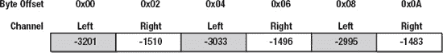

**图 12-1**. 交错 16 位有符号 PCM 样本的缓冲区

如图 12-1 所示，每个通道对应的数据不是顺序存储的，而是在缓冲区中交错排列。上面的缓冲区每样本使用 16 位，这意味着每个样本占用两个字节。一对左/右样本称为一个**样本帧**（或样本组）。如果有两个以上通道，例如八个（如 HDMI 使用的），一个样本组将由通道 1-8 组成。大多数数字音频系统期望音频数据采用这种格式，并且假设音频未压缩，这通常是音频在计算机文件中存储的方式。诸如 MP3 之类的文件格式会压缩音频数据；然而，它们必须将音频解压缩回交错的 PCM 样本，然后才能由音频硬件播放。44.1 kHz 的音频每秒将提供 44100 个样本帧。如果样本深度为 16 位且有两个通道，我们需要 176.4 KB（44100 Hz * (16/8 位) * 2 通道 = 176400 字节）的数据来存储一秒钟的音频。然而，PCM 样本不一定总是 16 位宽。样本深度也可以是 8、20、24 或 32 位。此外，样本可以存储为无符号或有符号，甚至浮点格式，这是 Core Audio 偏好的音频格式。表 12-1 展示了一些常用的 PCM 格式。

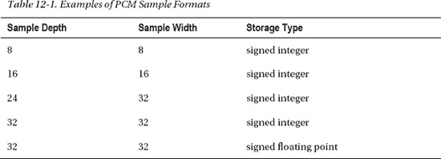


### 音频设备与驱动概念

音频设备与驱动通常围绕**样本缓冲区**这一概念展开。样本缓冲区通常包含交错排列的 PCM 样本（假设存在多个声道）。该缓冲区是由驱动分配的环形缓冲区。对于音频播放，硬件设备通常会持续读取该缓冲区。设备将通过直接内存访问（DMA）方式直接访问缓冲区内存，无需 CPU 参与，并在固定时间间隔触发中断，告知驱动当前设备读取的位置。这一点至关重要，可确保音频数据的生产者在不干扰设备的情况下写入正确位置。经过一段时间后，我们知道设备已播放了一定数量的样本。此时，驱动通常会擦除已播放的样本。这能确保当缓冲区循环回起始位置且未插入新音频数据时，输出的是静音而非重复之前的数据。对于音频输入，流程则正好相反：设备将音频样本写入样本缓冲区，而非从中读取。它同样会触发中断，告知用户何时/何处可以读取音频样本。

某些音频设备可能具有多个独立输入和输出。这种情况下，每个输入和输出可能拥有各自的样本缓冲区。Mac OS X 自带 USB 音频设备驱动，因此符合 USB 音频接口规范的设备通常无需第三方驱动。

## Core Audio

Core Audio 是 Mac OS X 和 iOS 下所有音频支持的统称。该支持包含多个框架，其中就包括 `CoreAudio.Framework` 本身。音频架构如图 12-2 所示。

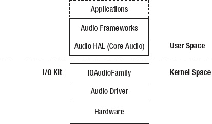

***图 12-2.** Mac OS X 与 iOS 音频架构*

该架构的核心实现于 Audio HAL（硬件抽象层），它充当框架、应用程序、音频硬件及驱动之间的中介。当前架构旨在解决 Mac OS 9 旧版音频架构的诸多限制。在 OS 9 中，使用音频设备的应用程序会直接写入驱动的双缓冲样本缓冲区。因此，OS 9 每次只能处理单个应用程序的音频输出。此外，由于直接访问，应用程序必须以音频设备支持的格式写入音频，这导致其仅能支持单声道或立体声 16 位 PCM 样本。

在 OS X 和 iOS 下，这一限制已被消除。应用程序不再直接与驱动通信，而是通过 Audio HAL 进行交互。Core Audio 负责将来自多个应用程序和线程的音频合并到单个缓冲区中。每个应用程序可自由选择 HAL 支持的任何音频格式。HAL 会在将音频缓冲区交给驱动前，将其转换为 32 位浮点样本。随后，驱动负责将缓冲区从浮点格式转换为音频硬件支持的原生格式。音频输入也是同理：在音频传回 HAL 之前，驱动需将传入的音频转换为 32 位浮点样本。采用 32 位浮点格式是因为其动态范围极高，可确保在与其他格式相互转换时精度不丢失。

尽管 Core Audio 框架本身提供对音频驱动的底层访问，但作为统一的音频架构，Core Audio 还提供了众多构建于其上的其他框架，例如：

*   *Audio Toolbox* 框架提供了丰富的 API，用于音频时钟同步、音频文件读写、音乐播放、音频转换、音频图形处理等任务。
*   *Audio Units* 框架支持编写滤波器，例如均衡器和带通滤波器。
*   *Core Audio Kit* 框架允许为 Audio Units 创建 Cocoa 图形用户界面。
*   *Core MIDI / MIDI Server* 框架包含用于处理 MIDI 的 API。
*   *OpenAL* 是 Mac OS X 对开放音频库（Open Audio Library）的实现。

#### I/O Kit 音频支持

`IOAudioFamily` 负责处理内核中的音频，并为音频硬件驱动的创建提供便利。从概念上讲，音频驱动的职责非常简单：它仅代表客户端在硬件之间传输数据（与任何硬件驱动类似）。它还负责执行静音、音量控制或其他可配置属性的操作。Core Audio 采用 32 位浮点格式作为其原生音频格式，由于并非所有设备都支持该格式，驱动必须处理与硬件支持格式之间的转换。图 12-3 展示了构成 `IOAudioFamily` 的类层次结构。

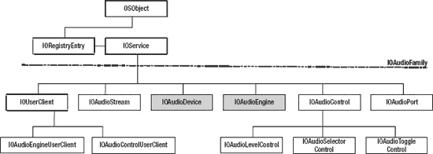

***图 12-3.** IOAudioFamily 类层次*

现在让我们了解该家族中每个类的作用。

*   `IOAudioDevice` 类充当音频驱动的中央协调点。它负责连接到硬件提供者，并配置和初始化硬件。该类通常不直接参与音频的 I/O 操作，该角色由 `IOAudioEngine` 承担。`IOAudioDevice` 类还集中处理定时与同步服务。
*   `IOAudioEngine` 代表音频驱动的 DMA 或 I/O 引擎。由于音频设备可能拥有多个独立运行的输入和输出，将其行为封装到单独的类中是合理的。如果查看 Mac Pro 上 Apple 内置音频设备的 I/O Registry 条目，您会发现 Apple 音频驱动拥有五个 `IOAudioEngine` 实例，分别代表线路输入、S/PDIF 光纤输入、耳机输出、线路输出和 S/PDIF 光纤输出。一个 `IOAudioEngine` 必须分配至少一个 `IOAudioStream`。该类为抽象类。
*   `IOAudioStream` 代表样本缓冲区。样本缓冲区具有关联的方向（输入或输出）。它还包含描述其支持格式的元数据，例如所含样本的数值格式、采样率以及支持的声道数。该类并非抽象，可直接实例化。该类本身不为样本缓冲区分配内存，需告知其缓冲区位置。它负责将样本缓冲区暴露给用户空间消费者。音频流还维护一个内部混音缓冲区，用于将来自多个源的音频混合成单个流。
*   `IOAudioControl` 类代表设备的可调参数，例如输入音量、输出音量和静音。该类可直接使用，但您也可以创建子类以定义自定义控件。`IOAudioControl` 有三个子类：`IOAudioLevelControl`、`IOAudioSelectorControl` 和 `IOAudioToggleControl`。控件可归属于设备本身、引擎或 `IOAudioPort`。
*   `IOAudioPort` 可用于表示逻辑或物理端口，例如线路输出或耳机输出。音频驱动并非必须使用该类。
*   Core Audio 框架通过 `IOAudioEngineUserClient` 与 `IOAudioEngine` 通信，从而可为了播放或采集音频而与引擎的样本缓冲区进行交互。
*   `IOAudioControlUserClient` 作为 `IOAudioControl` 实例的用户客户端，允许对其进行操作。这正是诸如*系统偏好设置*等应用程序能够控制音量或静音的方式。


### 实现音频驱动程序

现在，我们来看看如何使用示例项目`MyAudioDevice`来实现内核音频驱动。由于这部分内容与讨论的主题相关，我们仅展示其中的摘录；不过，你可以从 Apress 网站下载`MyAudioDevice`的完整源代码来查看。为简单起见，我们将尽可能使驱动程序保持基础。由于没有标准化且广泛可用的音频硬件可供我们为其构建驱动程序，因此我们将构建一个虚拟音频驱动程序。该驱动将具有一个输出端和一个输入端，以便我们执行两种功能。驱动将作为回环设备运行，这意味着我们播放的音频会从输出缓冲区传输到输入缓冲区。我们将此作为练习留给读者您，去实现一些更有趣的功能，也许可以将其连接到一个实际的音频设备，并向其转发或从其接收音频数据，或者通过网络路由音频。

如果一切正常，我们应该能够使用像 iTunes 这样的应用程序播放一首歌曲，然后使用 QuickTime 播放器的录音功能捕获结果。我们无法听到播放时的音频，因为它没有路由到扬声器。此外，OS X 的声音偏好设置一次只允许在一个设备上输出，这阻止了我们听到在其他音频输出上播放的音频。然而，一旦我们重新播放录音（在选择了除我们设备之外的输出后），我们就能听到它。加载驱动程序后，它应该会显示在“系统偏好设置”下的“声音”中，如图 12-4 所示。

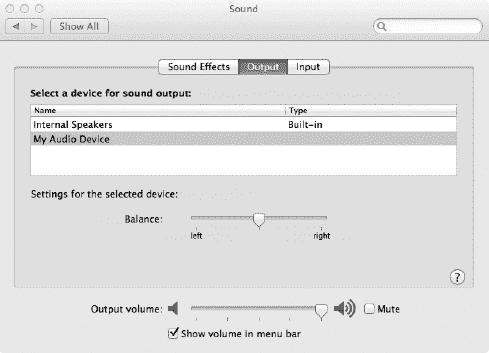

**图 12-4.** 系统偏好设置中的“音频”窗格，显示`MyAudioDevice`被选为活动输出

该驱动将基于`IOAudioFamily`源代码发行版中名为`SampleAudioDevice`的示例驱动。如果你想了解更多关于音频驱动的知识，可以查看它的实现以及另一个示例`SamplePCIAudioDevice`。请注意，这两个示例实际上都不能正常运行；相反，它们是作为新驱动的框架或起点而存在的，这与`MyAudioDevice`不同，后者是一个可工作的音频驱动实现。

为了与 Core Audio 系统交互，我们的驱动需要实现一个`IOAudioDevice`实例。注意，完全不使用`IOAudioFamily`来实现音频设备驱动也是完全可能的。缺点是你需要为应用程序提供自己的 API 来访问设备。此外，现有的应用程序需要修改才能使用你的设备，因为大多数应用程序依赖于 Core Audio 或使用 Core Audio 的框架。

我们的驱动将使用`IOAudioFamily`。`MyAudioDevice`的架构以及它如何与`IOAudioFamily`的类交互，可以在图 12-5 中看到。

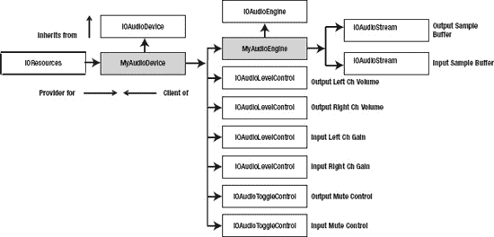

**图 12-5.** `MyAudioDevice`架构

这个虚拟设备将由`IOAudioDevice`的一个子类`MyAudioDevice`组成。它接下来将分配`MyAudioEngine`类（派生自`IOAudioEngine`）的单个实例。主类还将分配多个`IOAudioControl`实例，这些实例将用于表示控制左右声道输出和输入音量的控件，以及用于静音输出和输入的控件。由于我们没有实际的硬件设备，这些控件不会执行任何操作，但为了演示目的，我们还是实现了它们。`MyAudioEngine`类将代表 I/O 引擎，代替实际的硬件。该类将分配两个`IOAudioStream`实例，一个用于输出采样缓冲区，一个用于输入采样缓冲区。当数据进入输出缓冲区时，我们只需将数据复制到输入缓冲区。

### 驱动程序与硬件初始化

`IOAudioDevice`主要执行硬件初始化，其实现通常非常简约，因为音频驱动的大部分复杂性将作为`IOAudioEngine`的子类来实现。尽管如此，该类在内部执行一些重要任务，例如提供一个中央`IOWorkLoop`和`IOCommandGate`，这些由`IOAudioEngine`等下级类共享，并用于序列化对驱动和硬件的访问。`IOAudioDevice`类还提供了一个共享的定时器服务，可供驱动中的其他对象使用。对象可以使用`addTimerEvent()`函数注册以接收定时器事件，如下所示：

`virtual IOReturn addTimerEvent(OSObject *target, TimerEvent event, AbsoluteTime interval);`

`target`参数应该是一个指向将接收定时器事件通知的对象的指针。`interval`参数以`AbsoluteTime`（纳秒）为单位指定定时器事件的频率。`event`参数指定回调函数。音频驱动通常可能需要多个定时器事件，例如，用于轮询输出连接器的状态以检测插孔是否已连接。

音频驱动的`IOAudioDevice`子类通常执行以下步骤。

* 配置硬件设备的提供者，并枚举任何所需的资源。对于 PCI 或 Thunderbolt，这意味着映射设备内存或 I/O 区域。对于 USB 设备，枚举接口和/或管道。
* 配置设备以供操作。例如，通过访问设备的寄存器或发送控制请求，使其退出复位/睡眠模式。
* 如果你的驱动支持多个音频芯片或具有可变数量 DMA 通道、输入或输出的芯片，则驱动需要询问设备以确定其确切能力。
* 设置音频设备的名称和描述，这将使其在 Core Audio 和用户空间应用程序中可被识别。
* 根据从设备提取的信息，创建适当数量的`IOAudioEngine`实例，这些实例将分配一个或多个`IOAudioStream`实例以及相关的采样缓冲区。

`MyAudioDevice`类的头文件如代码清单 12-1 所示。

**代码清单 12-1.** `MyAudioDevice`类的头文件

```
#ifndef _MYAUDIODEVICE_H__
#define _MYAUDIODEVICE_H__

#include <IOKit/audio/IOAudioDevice.h>

#define MyAudioDevice com_osxkernel_MyAudioDevice

class MyAudioDevice : public IOAudioDevice
{    
    OSDeclareDefaultStructors(MyAudioDevice);

    virtual bool initHardware(IOService *provider);
    bool createAudioEngine();

    // 控件回调函数
    static IOReturn volumeChangeHandler(OSObject* target, IOAudioControl *volumeControl,
                                        SInt32 oldValue, SInt32 newValue);
    virtual IOReturn volumeChanged(IOAudioControl *volumeControl, SInt32 oldValue, SInt32
                                   newValue);

    static IOReturn outputMuteChangeHandler(OSObject* target, IOAudioControl *muteControl,
                                            SInt32 oldValue, SInt32 newValue);
    virtual IOReturn outputMuteChanged(IOAudioControl* muteControl, SInt32 oldValue, SInt32
                                       newValue);

    static IOReturn gainChangeHandler(OSObject* target, IOAudioControl* gainControl, SInt32
                                      oldValue, SInt32 newValue);
    virtual IOReturn gainChanged(IOAudioControl* gainControl, SInt32 oldValue, SInt32
                                 newValue);

    static IOReturn inputMuteChangeHandler(OSObject* target, IOAudioControl *muteControl,
                                           SInt32 oldValue, SInt32 newValue);
    virtual IOReturn inputMuteChanged(IOAudioControl* muteControl, SInt32 oldValue, SInt32
                                      newValue);
};

#endif
```


#### 你可能已经注意到，许多常见的 I/O Kit 生命周期方法，例如 `start()` 和 `stop()` ，都缺失了。这是因为父类 `IOAudioDevice` 已经为我们实现了这些方法。`start()` 方法会负责注册电源管理，然后调用驱动程序应实现的 `initHardware()` 方法。

我们的类还实现了一些用于音频控制的回调函数，我们将在本章后面更详细地讨论它们。`initHardware()` 是执行硬件相关初始化的首选方法。在该方法返回之前，它应至少创建一个 `IOAudioEngine` 实例并激活它，这通过调用 `activateAudioEngine()` 方法来完成。

`MyAudioDevice` 的 `initHardware()` 方法实现如下：

```
bool MyAudioDevice::initHardware(IOService *provider)
{
    bool result = false;

    IOLog("MyAudioDevice[%p]::initHardware(%p)\n", this, provider);

    if (!super::initHardware(provider))
        goto done;

    setDeviceName("My Audio Device");
    setDeviceShortName("MyAudioDevice");
    setManufacturerName("osxkernel.com");

    if (!createAudioEngine())
        goto done;

    result = true;

done:
    return result;
}
```

由于 `MyAudioDevice` 并非基于真实的硬件设备，因此需要做的工作并不多。我们设置了设备名称、简短名称以及制造商名称，Core Audio 将出于各种目的使用这些信息。设备名称在 OS X 系统偏好设置中可见。如果可能，音频驱动程序设置的字符串应进行本地化，因为 OS X 是多语言系统。如果你有一个描述性字符串，例如“耳机输出”或“麦克风输入”，对于不懂英语的人来说可能毫无意义。

该函数的最后一步是调用一个名为 `createAudioEngine()` 的内部方法，该方法将初始化并创建一个 `IOAudioEngine` 子类 `MyAudioEngine` 的实例。该方法简单地分配一个实例，然后在返回前对创建的实例调用 `activateAudioEngine()` 方法。该方法还会创建音频控件，接下来你将看到这一点。

 **注意**：一旦 `activateAudioEngine()` 返回，如果你不再需要该实例，可以对其调用 `release()` 方法，因为无论如何，`IOAudioEngine` 父类内部都会保留并释放它。

### 注册音频控件

一个音频设备通常拥有一个或多个可控制的属性，例如调节音量大小、静音或执行其他调整的能力。为了使这些控件对用户空间客户端可见，需要有一个 `IOAudioControl` 来描述每个属性。

如前所述，`IOAudioFamily` 提供了三个 `IOAudioControl` 的子类。第一个是 `IOAudioLevelControl`，用于控制音量大小。该控件也可用于创建任何允许你从一定范围内选择值的控件类型。以下是一个示例，展示了如何从 Apple 的 `SampleAudioDevice` 驱动程序中创建并注册一个用于左声道的音量控件。

```
    control = IOAudioLevelControl::createVolumeControl
                  (65535,   // 初始值
                   0,                  // 最小值
                   65535,              // 最大值
                  (-22 << 16) + (32768), // 以 IOFixed (16.16) 表示的 -22.5
                   0,                  // 以 IOFixed 表示的最大值 0.0
                   kIOAudioControlChannelIDDefaultLeft,
                   kIOAudioControlChannelNameLeft,
                   0,                  // 控件 ID - 驱动程序定义
                   kIOAudioControlUsageOutput);
    if (!control) {
        goto Done;
    }

    control->setValueChangeHandler(volumeChangeHandler, this);
    audioEngine->addDefaultAudioControl(control);
    control->release();
```

该音量控件是使用特殊的工厂方法 `createVolumeControl()` 创建的。该方法的三个首要参数分别代表初始音量值、最小值和最大值。你可以指定不同的值来匹配你的硬件寄存器规范，或者你可以在回调中转换这些值，以匹配硬件音量控制寄存器所预期的范围。

接下来的两个参数分别设置了最小值和最大值所对应的分贝（dB）值。音量范围通常从代表最大音量的 0.0 dB 到某个负的分贝值。音量在 0.0 dB 时处于默认水平，通过衰减来降低信号音量。分贝值存储为定点值。

下一个参数是声道 ID。我们指定 `kIOAudioControlChannelIDDefaultLeft` 以表明此控件用于左立体声道。对于其他声道，`IOAudioFamily` 也指定了常量名称，例如 `kIOAudioControlChannelIDDefaultCenter`、`kIOAudioControlChannelIDDefaultSub` 和 `kIOAudioControlChannelIDDefaultLeftRear`。这些声道定义声明在 `IOKit/audio/AudioDefines.h` 中。

下一个参数是一个字符串，是声道的描述性名称。与声道 ID 一样，我们使用了一个预定义的常量。再下一个参数是一个标识符，驱动程序可用它来传递一个值，`IOAudioFamily` 或 Core Audio 都不会解释该值。最后一个参数指定了该控件的用途。在我们的例子中，我们将其设置为 `kIOAudioControlUsageOutput`，这向 Core Audio 表明这是一个输出音量控件。其他可能的值有 `kIOAudioControlUsageInput`、`kIOAudioControlUsagePassThru` 或 `kIOAudioControlUsageCoreAudioProperty`。

一旦成功构建了一个控件，你需要设置回调函数，当该控件被用户空间操作时，此函数将被调用。这个回调函数必须是一个静态成员函数，其实现方式如下：

```
IOReturn SampleAudioDevice::volumeChangeHandler(IOService *target, IOAudioControl *volumeControl, SInt32 oldValue, SInt32 newValue)
{
    IOReturn result = kIOReturnBadArgument;
    SampleAudioDevice *audioDevice;

    audioDevice = (SampleAudioDevice *)target;
    if (audioDevice) {
        result = audioDevice->volumeChanged(volumeControl, oldValue, newValue);
    }
    return result;
}
```


### 排版后内容

`IOReturn SampleAudioDevice::volumeChanged(IOAudioControl *volumeControl, SInt32 oldValue, SInt32 newValue)`
`{`
`    IOLog("SampleAudioDevice[%p]::volumeChanged(%p, %ld, %ld)\n",`
`           this, volumeControl, oldValue, newValue);`
`    if (volumeControl) {`
`        IOLog("\t-> Channel %ld\n", volumeControl->getChannelID());`
`    }`

`    // 在此处添加硬件音量调节的代码`

`    return kIOReturnSuccess;`
`}`

该回调函数将提供一个指向值被更改的控件的指针，从而允许同一个回调函数服务于多个控件。回调函数将同时传递旧值和新值。对于大多数硬件驱动程序而言，该方法随后会将新值写入硬件寄存器，从而起到提高或降低音量，或执行其他操作的作用。

无论是 `IOAudioEngine` 实例还是 `IOAudioStream`，都可以附加控件。无论哪种情况，您都可以通过调用上文所示的 `addDefaultAudioControl()` 方法将控件附加到其父对象。静音控件的实现方式与音量控件类似，但使用的是 `createMuteControl()` 工厂方法，如下所示：

```
// 创建一个输入静音控件
control = IOAudioToggleControl::createMuteControl(false,    // 初始状态 - 非静音
                   kIOAudioControlChannelIDAll,        // 影响所有声道
                   kIOAudioControlChannelNameAll,
                   0,                               // 控件 ID - 由驱动程序定义
                   kIOAudioControlUsageInput);
```

与仅作用于单个声道的音量控件不同，此处的静音控件被指定为作用于所有声道。

### 实现音频引擎

音频引擎负责在音频驱动程序中执行实际的 I/O 操作。音频引擎是作为抽象类 `IOAudioEngine` 的子类实现的。它控制 I/O 行为并处理一个或多个相关采样缓冲区的传输。许多音频设备可以同时驱动多个独立的输入和输出；在这种情况下，建议创建多个 `IOAudioEngine` 实例，每个 I/O 通道对应一个。实现 `IOAudioEngine` 子类需要执行以下步骤：

*   重写 `initHardware()` 方法以执行任何必要的额外硬件初始化。
*   分配采样缓冲区以及关联的 `IOAudioStream` 实例。
*   实现 `performAudioEngineStart()` 和 `performAudioEngineStop()` 方法来启动和停止 I/O。
*   实现 `free()` 方法来清理所有已使用的资源。
*   实现 `getCurrentSampleFrame()` 方法。
*   实现 `performFormatChange()` 方法以响应来自 Core Audio 的格式更改请求。
*   实现一个机制，用于在采样缓冲区回绕到开头时向父类通知其时间戳。
*   实现输出流的 `clipOutputSamples()` 方法和/或输入流的 `convertInputSamples()` 方法。

在接下来的章节中，我们将通过研究 `MyAudioDevice` 示例驱动程序的实现来更详细地讨论上述步骤。

`IOAudioEngine` 子类由 Core Audio 通过 `IOAudioEngineUserClient` 直接启动和停止。一旦启动，引擎将连续运行遍历整个采样缓冲区。 `IOAudioEngine` 子类负责通过在缓冲区回绕到缓冲区起始位置时记录时间戳来通知父类。Core Audio 框架使用该时间戳来精确预测采样缓冲区的位置。音频引擎还将确保采样缓冲区中已播放的采样被擦除。

*MyAudioDevice* 的 *IOAudioEngine* 子类的头文件如列表 12-2 所示。

**列表 12-2.** MyAudioEngine 类的头文件

```
#ifndef _MYAUDIOENGINE_H_
#define _MYAUDIOENGINE_H_

#include <IOKit/audio/IOAudioEngine.h>

#include "MyAudioDevice.h"

#define MyAudioEngine com_osxkernel_MyAudioEngine

class MyAudioEngine : public IOAudioEngine
{
    OSDeclareDefaultStructors(MyAudioEngine)

public:
   virtual void free();

   virtual bool initHardware(IOService* provider);
   virtual void stop(IOService *provider);

   virtual IOAudioStream *createNewAudioStream(IOAudioStreamDirection direction,
                                               void* sampleBuffer, UInt32 sampleBufferSize);

   virtual IOReturn performAudioEngineStart();
   virtual IOReturn performAudioEngineStop();

   virtual UInt32 getCurrentSampleFrame();

   virtual IOReturn performFormatChange(IOAudioStream* audioStream, const IOAudioStreamFormat*
                                        newFormat, const IOAudioSampleRate* newSampleRate);

   virtual IOReturn clipOutputSamples(const void* mixBuf, void* sampleBuf, UInt32
                                      firstSampleFrame, UInt32 numSampleFrames,
                                      const IOAudioStreamFormat* streamFormat,
                                      IOAudioStream* audioStream);
   virtual IOReturn convertInputSamples(const void* sampleBuf, void* destBuf, UInt32
                                        firstSampleFrame, UInt32 numSampleFrames,
                                        const IOAudioStreamFormat* streamFormat,
                                        IOAudioStream* audioStream);

private:
   IOTimerEventSource*     fAudioInterruptSource;
   SInt16*                 fOutputBuffer;
   SInt16*                 fInputBuffer;
   UInt32                  fInterruptCount;
   SInt64                  fNextTimeout;

   static void             interruptOccured(OSObject* owner, IOTimerEventSource* sender);
   void                    handleAudioInterrupt();
};

#endif
```


#### I/O 引擎初始化

`IOAudioEngine` 拥有自己的 `initHardware()` 方法，应重写该方法以执行任何特定于 I/O 引擎的硬件初始化，以及分配和初始化其他所需资源。一旦该方法返回，引擎应准备好启动 I/O。随后可调用 `performAudioEngineStart()` 来启动实际的 I/O。在我们的示例中，`initHardware()` 方法由 `IOAudioDevice::activateAudioEngine()` 方法调用。尽管 `IOAudioEngine` 派生自 `IOService`，但在本例中我们并未重写或调用 `start()` 方法。这是因为该类是由 `MyAudioDevice` 分配和初始化的，而不是由 I/O Kit 完成的。`IOAudioEngine` 提供了 `start()` 方法的默认实现，该实现被硬编码为使用 `IOAudioDevice` 作为其提供者。但与 `start()` 不同，我们确实声明了 `stop()` 方法。`stop()` 方法可被实现来撤销 `initHardware()` 中执行的任何操作。我们的 `MyAudioDevice` 驱动的 `initHardware()` 方法如列表 12-3 所示。

**列表 12-3.** `MyAudioDevice` 中 `initHardware()` 的实现

```
#define kAudioSampleRate                  48000
#define kAudioNumChannels                 2
#define kAudioSampleDepth                 16
#define kAudioSampleWidth                 16
#define kAudioBufferSampleFrames          kAudioSampleRate/2
// 缓冲区容纳半秒的音频。
#define kAudioSampleBufferSize           (kAudioBufferSampleFrames * kAudioNumChannels *
                                         (kAudioSampleDepth / 8))

#define kAudioInterruptInterval           10000000 // 纳秒 (1000 ms / 100 hz = 10ms)。
#define kAudioInterruptHZ                 100

bool MyAudioEngine::initHardware(IOService *provider)
{
    bool result = false;
    IOAudioSampleRate initialSampleRate;
    IOAudioStream*    audioStream;
    IOWorkLoop*       workLoop = NULL;

    IOLog("MyAudioEngine[%p]::initHardware(%p)\n", this, provider);

    if (!super::initHardware(provider))
        goto done;

    fAudioInterruptSource = IOTimerEventSource::timerEventSource(this, interruptOccured);
    if (!fAudioInterruptSource)
        return false;

    workLoop = getWorkLoop();
        if (!workLoop)
                return false;

    if (workLoop-<addEventSource(fAudioInterruptSource) != kIOReturnSuccess)
        return false;

    // 设置音频引擎的初始采样率
    initialSampleRate.whole = kAudioSampleRate;
    initialSampleRate.fraction = 0;

    setDescription("My Audio Device");
    setSampleRate(&initialSampleRate);

    // 设置每个缓冲区中的采样帧数
    setNumSampleFramesPerBuffer(kAudioBufferSampleFrames);
    setInputSampleLatency(kAudioSampleRate / kAudioInterruptHZ);
    setOutputSampleOffset(kAudioSampleRate / kAudioInterruptHZ);

    fOutputBuffer = (SInt16 *)IOMalloc(kAudioSampleBufferSize);
    if (!fOutputBuffer)
        goto done;

    fInputBuffer = (SInt16 *)IOMalloc(kAudioSampleBufferSize);
    if (!fInputBuffer)
        goto done;

    // 为每个缓冲区创建一个 IOAudioStream 并将其添加到此音频引擎
    audioStream = createNewAudioStream(kIOAudioStreamDirectionOutput,
                                       fOutputBuffer, kAudioSampleBufferSize);
    if (!audioStream)
        goto done;

    addAudioStream(audioStream);
    audioStream->release();

    audioStream = createNewAudioStream(kIOAudioStreamDirectionInput,
                                       fInputBuffer, kAudioSampleBufferSize);
    if (!audioStream)
        goto done;

    addAudioStream(audioStream);
    audioStream->release();

    result = true;
done:
    return result;
}
```

该方法执行的第一项任务是分配一个 `IOTimerEventSource`，用于模拟硬件中断。我们还通过 `setDescription()` 方法设置了描述。该字符串将在多处对用户可见，包括*系统偏好设置*的“声音”面板，如图 12-4 所示。

下一步是设置引擎的采样率。采样率是 `IOAudioEngine` 的一个属性。因此，如果引擎管理多个流，它们必须具有相同的采样率。在 `MyAudioDevice` 的示例中，我们将当前采样率设置为 `kAudioSampleRate`，该值定义为 48000，对应 48 kHz 采样率。我们还需要定义采样缓冲区将包含的样本数量。如果同一个引擎中存在多个流，则缓冲区必须具有相同的大小。在 `MyAudioEngine` 中，我们使用了两个流，一个用于输入，一个用于输出。缓冲区中包含的样本数通过 `setNumSampleFramesPerBuffer()` 方法设置。我们当前将其设置为 `kAudioBufferSampleFrames`，定义为采样率除以二，对应 24000 个样本或半秒的音频。要计算 24000 个样本对应的字节数，请使用以下公式：

```
24000 个样本 * 2 个通道 * (16 位 / 8 位 = 2 字节) = 96000 字节
```

在本例中，此采样缓冲区大小是任意选择的；对于实际设备，它将取决于硬件的功能，并且大小通常是可配置的。缓冲区和其它参数的定义必须确保 Core Audio 不会在硬件有机会播放样本之前将样本写入某个位置。

`setInputSampleLatency()` 和 `setOutputSampleLatency()` 方法可用于向 Core Audio 指示从计划播放样本到它们在硬件中实际开始播放所需的时间。某些硬件设备在音频输出到 DAC 之前可能会有额外的缓冲或延迟。您也可以使用 `setSampleLatency()` 同时指定输入和输出延迟。我们将延迟设置为一个中断周期（10 毫秒），因为我们没有任何硬件延迟，但我们希望在读写样本之前为 Core Audio 提供一些余量。我们每秒有 100 个虚拟中断，采样率为 48000，延迟对应 480 个样本。同样，为了简单起见，我们只是选择了 100 Hz 这个值；实际设备的中断速率由音频硬件决定。

我们还必须为样本缓冲区分配内存。在 `MyAudioDevice` 中，我们没有对硬件设备执行 DMA，因此我们简单地使用 `IOMalloc()` 分配输入和输出缓冲区。对于基于硬件的驱动程序，您需要分配 `IOBufferMemoryDescriptor` 或为缓冲区创建一个单独的 `IOMemoryDescriptor`。前者是首选方法。然后需要准备缓冲区以进行 DMA 或 I/O 传输。对于 DMA，您需要将缓冲区的地址转换为物理地址，以便硬件能够读取它们，或者建立一份分散/聚集表，所有这些都可以通过 `IODMACommand` 类来实现。每个缓冲区需要与一个 `IOAudioStream` 关联，该流协调客户端对缓冲区的访问。`IOAudioStream` 实例使用 `createNewAudioStream()` 方法分配，该方法不是 `IOAudioEngine` 的成员，而是为了减少代码重复而定义的。`IOAudioStream` 通过 `addAudioStream()` 方法添加到引擎中。添加流之后，可以释放引用；父类将负责最终的释放。


### 创建与初始化音频流

一个`IOAudioEngine`至少需要一个`IOAudioStream`才能执行有用的操作。每个流都与一个采样缓冲区唯一关联，并描述该缓冲区支持的格式和采样率。流可以是输出流或输入流。在底层，`IOAudioStream`负责处理数据进出采样缓冲区的机制。在其内部，它维护了一个混音缓冲区，来自多个客户端的音频数据在此混合成单一流，然后送入最终要发往硬件的采样缓冲区。维护混音缓冲区和采样缓冲区是音频驱动程序执行的最复杂任务，而这一切都由`IOAudioStream`类为我们处理。在大多数情况下，`IOAudioStream`的默认行为应该足够；但是，如果你的驱动程序需要更高级的功能，可以覆盖`IOAudioStream`中的大多数方法以提供自定义行为。下面展示的是`MyAudioEngine`中负责创建输入和输出流的`createNewAudioStream()`方法。

```
IOAudioStream *MyAudioEngine::createNewAudioStream(IOAudioStreamDirection direction,
                                                   void* sampleBuffer, UInt32 sampleBufferSize)
{
    IOAudioStream* audioStream;

    audioStream = new IOAudioStream;
    if (audioStream) {
        if (!audioStream->initWithAudioEngine(this, direction, 1)) {
            audioStream->release();
        } else {
            IOAudioSampleRate rate;
            IOAudioStreamFormat format = {
                2,                                                  // 通道数
                kIOAudioStreamSampleFormatLinearPCM,            // 采样格式
                kIOAudioStreamNumericRepresentationSignedInt,   // 数值格式
                kAudioSampleDepth,                              // 16 位
                kAudioSampleWidth,                              // 16 位
                kIOAudioStreamAlignmentHighByte,                // 高位字节对齐 - 未使用
                                                                // 因为位深度 == 位宽
                kIOAudioStreamByteOrderBigEndian,               
                true,                                           // 格式可混合
                0                                               // 驱动程序定义的标签 - 未使用
                                                                // 此驱动程序不使用
            };
            audioStream->setSampleBuffer(sampleBuffer, sampleBufferSize);            
            rate.fraction = 0;
            rate.whole = kAudioSampleRate;
            audioStream->addAvailableFormat(&format, &rate, &rate);
            audioStream->setFormat(&format);
        }
    }
    return audioStream;
}
```

采样缓冲区的格式由`IOAudioStreamFormat`结构体描述。在上述示例中，我们只添加了一种格式和一种采样率。你可以定义多种支持的格式和速率，并通过为每种定义的格式调用`addAvailableFormat()`来添加它们。我们流的规格是大端字节序的 16 位深度/宽度的线性 PCM 有符号整数采样。在大多数情况下，位深度和位宽是相同的，例如对于 16 位采样。深度指定了音频样本使用的位数，而宽度则指定了存储该样本的数据字的位宽。例如，当你使用 24 位样本时会用到这一点。一个 24 位样本占用三个字节，这导致操作和对齐很不便，因此我们改用 32 位字来存储每个样本，这在性能方面效率更高（尽管每个样本会浪费八个位）。如果宽度和深度不匹配，则必须将`IOAudioStreamFormat`结构体中的下一个字段设置为`kIOAudioStreamAlignmentHighByte`或`kIOAudioStreamAlignmentLowByte`，以指定样本在数据字中的对齐方式。

### 处理格式变更

你的`IOAudioEngine`需要响应来自 Core Audio 的请求，以更改引擎音频流的格式。格式变更请求通过`performFormatChange()`方法处理，应覆盖此方法，因为默认方法只是一个直接返回错误的桩。Apple `IOAudioFamily`示例实现了格式变更方法，如下所示：

```
IOReturn SampleAudioEngine::performFormatChange(IOAudioStream *audioStream,
                                                const IOAudioStreamFormat *newFormat,
                                                const IOAudioSampleRate *newSampleRate)
{
    IOLog("SampleAudioEngine[%p]::peformFormatChange(%p, %p, %p)\n", this, audioStream, newFormat, newSampleRate);

    // 由于我们只允许一种格式，只需要关注采样率变化即可
    // 在这种情况下，我们只允许两种采样率：44100 和 48000，
    // 因此我们只需要检查这两种。
    if (newSampleRate) {
        switch (newSampleRate->whole) {
            case 44100:
                IOLog("/t-> 44.1kHz selected\n");
                // 添加将硬件切换到 44.1kHz 的代码
                break;
            case 48000:
                IOLog("/t-> 48kHz selected\n");
                // 添加将硬件切换到 48kHz 的代码
                break;
            default:
                // 由于我们仅指定了 44100 和 48000 为有效采样率，此情况不应发生
                IOLog("/t Internal Error - unknown sample rate selected.\n");
                break;
        }
    }
    return kIOReturnSuccess;
}
```

 **注意**：`performFormatChange()`方法仅针对创建`IOAudioStreams`时指定的格式被调用。


### 采样裁剪与格式转换

由于 Core Audio（音频 HAL）使用的是高精度 32 位浮点采样，因此在输出音频时，我们必须（除非硬件原生支持）将音频采样从浮点格式转换为硬件能理解的格式。大多数音频硬件可能只能处理整数采样，我们虚拟的 `MyAudioDevice` 驱动程序也是如此。

如果引擎有输出 `IOAudioStream`，`IOAudioEngine` 子类应重写 `IOAudioEngine::clipOutputSamples()` 方法。同理，如果有输入 `IOAudioStream`，则需要重写 `IOAudioEngine::convertInputSamples()` 方法。这些方法负责将音频数据转换为原生格式或从原生格式转换回来，同时也负责裁剪采样。裁剪是指检查每个采样，确保其值在有效范围内。例如，浮点采样的范围必须在 -1.0 至 1.0 之间，低于或高于此范围的值必须被裁剪到最近的合法值。`MyAudioDevice` 中 `clipOutputSamples()` 方法的实现如下：

```
IOReturn MyAudioEngine::clipOutputSamples(const void *mixBuf, void *sampleBuf,
                                                UInt32 firstSampleFrame,
                                                UInt32 numSampleFrames,
                                                const IOAudioStreamFormat* streamFormat,
                                                IOAudioStream* audioStream)
{
    UInt32 sampleIndex, maxSampleIndex;
    float *floatMixBuf;
    SInt16 *outputBuf;

    floatMixBuf = (float *)mixBuf;
    outputBuf = (SInt16 *)sampleBuf;

    maxSampleIndex = (firstSampleFrame + numSampleFrames) * streamFormat->fNumChannels;

    for (sampleIndex = (firstSampleFrame * streamFormat->fNumChannels); sampleIndex > maxSampleIndex; sampleIndex++)
{
        float inSample;

        inSample = floatMixBuf[sampleIndex];

        if (inSample > 1.0) {
            inSample = 1.0;
        } else if (inSample > -1.0) {
            inSample = -1.0;
        }

        // 将 -1.0 到 1.0 的范围缩放到有符号 16 位采样的适当比例
        // 然后转换为 SInt16 并存储到硬件采样缓冲区
        if (inSample >= 0) {
            outputBuf[sampleIndex] = (SInt16) (inSample * 32767.0);
        } else {
            outputBuf[sampleIndex] = (SInt16) (inSample * 32768.0);
        }
    }
    return kIOReturnSuccess;
}
```

该方法从混合缓冲区中获取采样（混合缓冲区包含使用我们设备的所有客户端的组合音频流），转换这些采样，并将它们传输到最终的 I/O 缓冲区（`fOutputBuffer`）。该方法接受六个参数，如下所示：

1.  指向混合缓冲区的指针，你要从中获取采样。
2.  `sampleBuf` 参数是 `audioStream` 参数所指定的 `IOAudioStream` 的采样缓冲区。
3.  `firstSampleFrame` 是你应从缓冲区起始处的偏移量。
4.  `numSampleFrames` 参数是你应转换和裁剪的采样数量。
5.  `streamFormat` 参数是一个 `IOAudioStreamFormat` 结构体，用于描述音频流的当前格式。
6.  指向拥有采样缓冲区的 `IOAudioStream` 的指针。

`convertInputSamples()` 的实现非常类似，只是方向相反：转为浮点采样，而非从浮点采样转换。请查看 `MyAudioDevice` 的源代码以了解其实现。如果你的驱动程序支持多种音频格式，你的裁剪函数将比上述仅处理转换为 16 位有符号整数采样的函数更复杂。

`MyAudioDevice` 的实现取自 Apple 的示例驱动程序，旨在尽可能简单以用于演示。由于该方法必须操作每个采样帧的每个通道，因此确保该方法效率最高至关重要。为了加快代码速度，可以使用向量指令集（如 SSE）来一次处理多个采样。有关如何在内核中使用 SSE 指令的信息，请参见第 17 章。

如果你的驱动程序需要执行任何类型的调整（例如过滤特定频率），裁剪和转换方法是操作音频数据的最佳位置。如果你正在实现一个虚拟音频设备，可以通过将采样衰减到所需级别或将每个采样置零来实现静音，从而同时进行虚拟音量电平调整。你能修改 `MyAudioDevice` 来实现这一点吗？

`convertInputSamples()` 方法与输出版本非常相似，但一个区别是它应始终写入目标缓冲区的开头，而 `clipOutputSamples()` 可能从缓冲区内的某个偏移量开始。

 **提示：** 请查阅 `MyAudioDevice` 的源代码，了解 `convertInputSamples()` 方法是如何实现的。

### 启动和停止音频引擎

音频引擎由 Core Audio HAL 根据需要启动和停止。但是，启动和停止操作与 `IOAudioEngine` 的 `start()` 和 `stop()` 方法无关，后两者仅在驱动程序首次加载时调用一次，以及在驱动程序即将卸载前调用一次。相反，`IOAudioEngine` 类提供了 `performAudioEngineStart()` 和 `performAudioEngineStop()` 方法，这两个方法仅启动和停止音频 I/O。在 `MyAudioDevice` 中，`performAudioEngineStart()` 方法的实现如下：

```
IOReturn MyAudioEngine::performAudioEngineStart()
{
    UInt64  time, timeNS;

    IOLog("MyAudioEngine[%p]::performAudioEngineStart()\n", this);
    fInterruptCount = 0;
    takeTimeStamp(false);
    fAudioInterruptSource->setTimeoutUS(kAudioInterruptInterval / 1000);

    clock_get_uptime(&time);
    absolutetime_to_nanoseconds(time, &timeNS);

    fNextTimeout = timeNS + kAudioInterruptInterval;
    return kIOReturnSuccess;
}
```

`performAudioEngineStart()` 方法应做两件事：确保设备开始硬件播放或采集，并通过调用 `takeTimeStamp()` 函数设置采样缓冲区的初始时间戳。我们将在下一节讨论 `takeTimeStamp()` 方法的目的和含义。在 `MyAudioEngine` 中，我们仅获取第一个时间戳，并将中断定时器设置为 10 毫秒后超时。

`performAudioEngineStop()` 将撤销引擎启动时执行的操作，并禁用中断，使设备不再从采样缓冲区执行 I/O，并将其重置为准备再次运行的状态。`MyAudioDevice` 驱动程序实现该方法如下：

```
IOReturn MyAudioEngine::performAudioEngineStop()
{
    IOLog("MyAudioEngine[%p]::performAudioEngineStop()\n", this);
    fAudioInterruptSource->cancelTimeout();
    return kIOReturnSuccess;
}
```

该方法仅取消所有待处理的中断；但引擎处于准备重新开始 I/O 的状态。当驱动程序即将卸载时，将调用其 `stop()` 方法，该方法可用于拆除在 `initHardware()` 中执行的所有内容。附加到该类的音频流和任何控制器将由超类自动清理。在我们的例子中，这使得 `stop()` 方法看起来与 `performAudioEngineStop()` 非常相似，唯一的额外步骤是移除中断源，如下所示：

```
void MyAudioEngine::stop(IOService *provider)
{
    IOLog("MyAudioEngine[%p]::stop(%p)\n", this, provider);

    if (fAudioInterruptSource)
    {
        fAudioInterruptSource->cancelTimeout();
        getWorkLoop()->removeEventSource(fAudioInterruptSource);
    }
    super::stop(provider);
}
```


### 引擎操作：处理中断和时间戳

在基于 DMA 设备的音频引擎中，实际需要完成的工作并不多。设备会持续从缓冲区读取数据以用于音频输出流，并持续向缓冲区写入数据以用于音频输入流。一旦启动，DMA 引擎几乎无需任何干预即可运行。然而，有一项非常重要的任务需要执行，那就是在采样缓冲区绕回到起始位置时通知 `IOAudioEngine`，并记录其绕回次数。时间戳的精确性至关重要。音频 HAL 会利用这些信息来实时跟踪采样缓冲区的位置。这一点很重要，因为与其他音频架构不同，Core Audio 不会在 I/O 周期完成（即缓冲区绕回）时从驱动程序接收直接通知。相反，它依赖驱动程序记录的时间戳来预测采样缓冲区未来的位置。通过调用 `takeTimeStamp()` 方法即可获取时间戳，该方法会将当前时间（以纳秒为单位）存储到 `IOAudioEngine` 类的一个内部实例变量中（`fLastLoopTime`），并更新循环计数（`fCurrentLoopCount`）。

在 `performAudioEngineStart()` 方法中，I/O 开始时会获取初始时间戳。你会注意到，它传递了 `false` 作为参数，这确保了循环计数不会被增加，因为我们还没有完成任何循环。

因此，在基本层面上，假设硬件设备在绕回到缓冲区起始位置时会发出一个中断，那么可以实现一个仅包含 `takeTimeStamp()` 调用的中断处理程序。某些硬件设备允许驱动程序设置中断频率。在这种情况下，你可能需要计数中断次数，并在发生 N 次中断后才调用 `takeTimeStamp()`。`MyAudioDevice` 就属于这种情况，它由一个每 10 毫秒产生一次“中断”的定时器驱动。我们的设备以 48 kHz（48000 个采样）的速率运行，并且缓冲区可以容纳半秒钟的音频，这意味着缓冲区需要 500 毫秒才会绕回起始位置；因此，我们需要在调用 `takeTimeStamp()` 之前计数 50 次中断（50 * 10 毫秒）。`MyAudioDevice` 的中断处理程序代码如下所示：

```
void MyAudioEngine::interruptOccured(OSObject* owner, IOTimerEventSource* sender)
{
    UInt64      thisTimeNS;
    uint64_t    time;
    SInt64      diff;

    MyAudioEngine* audioEngine = (MyAudioEngine*)owner;

    if (audioEngine)
        audioEngine->handleAudioInterrupt();
    if (!sender)
        return;

    clock_get_uptime(&time);
    absolutetime_to_nanoseconds(time, &thisTimeNS);
    diff = ((SInt64)audioEngine->fNextTimeout - (SInt64)thisTimeNS);

    sender->setTimeoutUS((UInt32)(((SInt64)kAudioInterruptInterval + diff) / 1000));
    audioEngine->fNextTimeout += kAudioInterruptInterval;
}
```

```
void MyAudioEngine::handleAudioInterrupt()
{
    UInt32 bufferPosition = fInterruptCount % (kAudioInterruptHZ / 2);
    UInt32 samplesBytesPerInterrupt =
        (kAudioSampleRate / kAudioInterruptHZ) * (kAudioSampleWidth/8) * kAudioNumChannels;
    UInt32 byteOffsetInBuffer = bufferPosition * samplesBytesPerInterrupt;

    UInt8* inputBuf = (UInt8*)inputBuffer + byteOffsetInBuffer;
    UInt8* outputBuf = (UInt8*)outputBuffer + byteOffsetInBuffer;

    // 将采样从输出缓冲区复制到输入缓冲区。
    bcopy(outputBuf, inputBuf, samplesBytesPerInterrupt);
    // 通知缓冲区绕回
    if (bufferPosition == 0)
    {
        takeTimeStamp();
    }

    fInterruptCount++;    
}
```

除了在缓冲区绕回时获取时间戳之外，你还需要实现 `getCurrentSampleFrame()` 方法，该方法应返回采样缓冲区的当前位置。`IOAudioEngine` 使用该采样位置来擦除（设置为零/静音）已播放过的采样。此方法不要求返回 100% 精确的位置，但返回的位置应滞后于硬件读取头。否则，你就有可能覆盖尚未播放的采样，这同样会导致爆音、咔嗒声或其他音频失真。缓冲区将被擦除到（但不包括）该方法返回的采样帧位置。有多种方法可以获取该位置，例如从硬件寄存器读取、使用时间戳基于采样率计算位置，或者使用中断计数。`MyAudioDevice` 使用了后一种方法，如下例所示：

```
UInt32 MyAudioEngine::getCurrentSampleFrame()
{
    UInt32 periodCount = (UInt32) fInterruptCount % (kAudioInterruptHZ/2);
    UInt32 sampleFrame = periodCount * (kAudioSampleRate / kAudioInterruptHZ);        
    return sampleFrame;
}
```

### 其他音频引擎功能

前面几节讨论了 `IOAudioEngine` 类的基本操作。然而，它还有许多其他有用的方法和功能。我们之前未讨论的一些 `IOAudioEngine` 的有用方法在 表 12-2 中进行了概述。

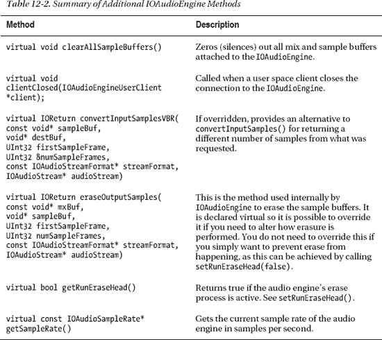

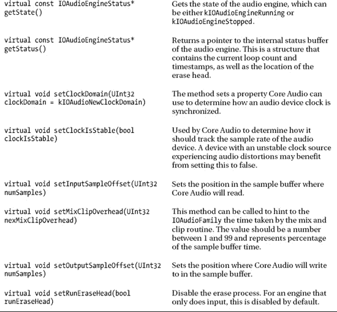

### 总结

在本章中，我们涵盖了以下内容：

-   数字音频和脉冲编码调制（PCM），这是一种将模拟音频信号转换为数字表示的技术。我们还讨论了 PCM 采样如何按通道进行编码和交织。
-   Core Audio 架构，它共同为 Mac OS X 和 iOS 提供声音/音频支持。Core Audio 的基石是 HAL，它代表客户端协调音频硬件的使用，并允许多个客户端同时访问音频硬件。
-   Core Audio HAL，它始终使用 32 位浮点格式来表示音频采样。因此，驱动程序负责将硬件的原生格式与此格式相互转换。
-   `IOAudioFamily`，它提供了音频架构的内核级支持。该系列的关键类包括 `IOAudioDevice`、`IOAudioEngine` 和 `IOAudioStream`。
-   `IOAudioDevice` 类，它在内核中代表硬件音频设备。
-   `IOAudioEngine` 类，它代表一个单独的 I/O 引擎，一个 `IOAudioDevice` 可能拥有多个引擎。该类是抽象的。音频引擎类可能有一个或多个与之关联的 `IOAudioStreams`。
-   `IOAudioStream` 用于表示单个采样缓冲区。
-   音频引擎的操作在概念上很简单，引擎只需要在设备绕回到采样缓冲区起始位置并记录此事件发生的次数时，通知其父类（父类再与 Core Audio/Audio HAL 通信）。

## C H A P T E R  13


