# 网络

内核中网络支持主要在 BSD 层实现。BSD 版本的 UNIX 以其强大且安全的网络支持而闻名。因此，来自 BSD 网络栈的代码已广泛应用于多种操作系统，包括 Mac OS X 和 iOS。虽然网络支持主要在 BSD 层，但它也连接了 I/O Kit，后者为构建基于硬件的网络驱动程序提供了接口。内核网络架构的概念视图如图 13-1 所示。

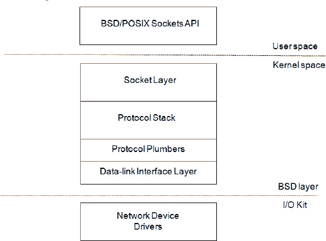

***图 13-1.** 内核网络架构的概念视图*

从用户空间应用程序的角度来看，网络服务是通过 BSD/POSIX 套接字 API 访问的，使用的函数包括 `connect()`、`listen()` 和 `bind()`。然而，套接字 API 不仅用于网络，它还处理各种形式的进程间通信（IPC），例如 UNIX 域套接字。与大多数 BSD 版本不同，XNU 内核还实现了内核套接字 API（KPI）。此 KPI 允许内核和 KEXT 以类似于用户空间应用程序的方式使用套接字。关键区别在于，套接字 KPI 中的函数以“`sock_`”前缀命名。例如，`connect()` 函数在内核 KPI 中命名为 `sock_connect()`。

更高级别的 API，如 Core Foundation 或 Cocoa，将其网络支持构建于套接字 API 接口之上。套接字 API 通过标准的系统调用接口与内核通信。套接字层与文件系统 API 有许多共同之处；实际上，套接字只是一种特殊类型的文件描述符。事实上，`read()` 和 `write()` 系统调用函数也可以用于套接字描述符。

套接字 API 的内核部分负责将数据排队并路由到协议栈中相应的协议处理器，该处理器处理构建网络数据包、将数据分成适当大小的数据包、添加校验和等任务。TCP、UDP 和 IP 正是在协议栈中处理的。协议栈还负责处理路由、防火墙以及辅助协议（如 ARP）的细节。发往外部主机的数据包最终会进入 BSD 网络栈的接口层。接口层再次连接到 I/O Kit 中的网络接口类，后者通过其驱动程序与物理网络设备进行通信。

BSD 网络栈中使用了四个关键数据结构：

*   `socket` 结构表示用户空间或内核空间中打开的套接字，并通过用户空间的文件描述符进行访问。
*   `domain` 结构用于描述协议族，例如 IP 版本 4（`PF_INET`）、IP 版本 6（`PF_INET6`）或本地域（`PF_LOCAL`/`PF_UNIX`）。
*   `protosw` 描述每个受支持协议的独立协议处理器，例如 IPv4、IPv6、TCP、UDP、ICMP、IGMP 或 RAW。通过套接字接口可访问的协议（如 TCP 和 UDP）在使用 `AF_INET` 套接字时，分别由标识符 `SOCK_STREAM` 和 `SOCK_DGRAM` 引用。
*   `ifnet` 结构描述了一个网络接口。每个由命令 `ifconfig` 列出的接口（例如 `en0`、`en1` 和 `lo0`）都由一个 `ifnet` 结构支持。每个 I/O Kit 网络驱动程序也定义了一个 `ifnet` 结构。I/O Kit 驱动程序不需要直接与该结构交互，因为 `IONetworkInterface` 类为其提供了抽象。

XNU 内核的另一个特性是网络内核扩展（NKE）机制。NKE 允许在网络栈的不同层级（如套接字层或 IP 层）插入过滤器。NKE 架构允许您编写自定义路由算法，并实现新的协议和虚拟网络接口。它还可用于数据包过滤和日志记录。此外，内核支持 Berkeley 数据包过滤器（BPF），它允许将原始网络流量路由到用户空间，以便使用 `tcpdump` 等工具进行分析。我们将在本章后面更详细地研究 NKE 系统，以及如何在 I/O Kit 中实现网络设备驱动程序。

为了充分利用本章内容，您需要具备一定的网络知识，理解 TCP/IP 和以太网等概念，并熟悉 OSI 模型的各个层级。

## 网络内存缓冲区

网络内存缓冲区，或称 `mbufs`，是 BSD UNIX 系统（包括 Mac OS X 和 iOS）中的一个基本数据结构。虽然它主要是 BSD 网络层的一个概念，但在编写 I/O 网络驱动程序时，您也会遇到 `mbuf` 数据结构。该结构用于表示网络数据包及其元数据。该结构不暴露给用户空间。`mbuf` 结构如代码清单 13-1 所示。

***代码清单 13-1.** mbuf 数据结构*

```
struct mbuf {
    struct  m_hdr m_hdr;
    union {
        struct {
            struct  pkthdr MH_pkthdr;            /* M_PKTHDR set */
            union {
                struct  m_ext MH_ext;           /* M_EXT set */
                char    MH_databuf[_MHLEN];
            } MH_dat;
         } MH;
         char    M_databuf[_MLEN];              /* !M_PKTHDR, !M_EXT */
    } M_dat;
};
```

完整的 `mbuf` 结构是固定大小的，目前为 256 字节。此大小包括头部和结构所持有的数据。获取可用于数据存储的字节数：`(256 – sizeof(struct m_hdr))`。为了描述更大的数据包，多个 `mbuf` 通过链表链接在一起，如图 图 13-2 所示。

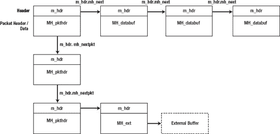

***图 13-2.** mbuf 结构链*

一个 `mbuf` 的列表称为链。在图 13-2 中，展示了一个由三个 `mbuf` 组成的链，每个 `mbuf` 描述一个数据包。每个 `mbuf` 可能包含其他 `mbuf` 的链，共同构成完整的网络数据包。

为了减少大型数据包的开销，`mbuf` 的结构可以指向一个外部缓冲区，而不是使用 `mbuf` 的内部存储。具有外部缓冲区的 `mbuf` 结构称为簇。`MH_ext` 字段用于描述外部缓冲区。`mbuf` 头部（`m_hdr`）位于结构的起始位置，包含存储在 `mh_len` 字段中的 `mbuf` 数据的长度。头部还包含指向链中下一个缓冲区的指针，以及列表或队列中的下一个条目，这些通常代表一个新的数据包；然而，`mbuf` 也可以用于存储其他控制信息。`mh_type` 和 `mh_flags` 用于确定 `mbuf` 的类型和选项，例如，它是否有关联的外部缓冲区。如果 `mbuf` 代表一个数据包的开始，`MH_PKTHDR` 将被设置；如果 `mbuf` 包含外部数据，`MH_EXT` 标志将被设置，这意味着可以安全地访问 `mbuf` 的 `MH_pkthdr` 或 `MH_ext` 结构。


好的，作为高级文档工程师和翻译员，我将严格遵循您提供的注意事项和示例，为您提供专业、准确的中文翻译。

---


### 使用内存缓冲区（Memory Buffers）

虽然`mbuf`结构体出现在许多 UNIX 变体中，但用于操作它们的编程接口在不同平台上却有所不同。XNU 内核提供了用于操作 `mbuf` 的 `mbuf` KPI。KPI 的理念是将`mbuf`视为一个不透明结构体，只能通过 KPI 函数而非直接访问结构体字段来操作。这使得`mbuf`的实现可以在底层发生变化，同时仍然与使用 KPI 的代码保持二进制和源代码兼容。因此，在操作 `mbuf` 时，我们不直接使用 `mbuf` 结构体，而是使用句柄 `mbuf_t` 作为引用。

 **提示** `mbuf` KPI 的头文件是 `bsd/sys/mbuf.h`。关于该 KPI 的完整文档可以在 [`http://developer.apple.com/library/mac/#documentation/Darwin/Reference/KernelIOKitFramework/kpi_mbuf_h`](http://developer.apple.com/library/mac/#documentation/Darwin/Reference/KernelIOKitFramework/kpi_mbuf_h) 找到。

向 `mbuf` 读取和写入数据可以通过以下函数实现：

```
errno_t mbuf_copydata(const mbuf_t mbuf, size_t offset, size_t length, void *out_data);
errno_t mbuf_copyback(mbuf_t mbuf, size_t offset, size_t length, const void *data, mbuf_how_t how);
```

直接使用`bcopy()`或类似函数并不总是可行的，因为`mbuf`中的数据可能分散在多个结构体或外部缓冲区中。上述函数大大简化了这一任务。然而，如果已知缓冲区是连续的，则可以使用`mbuf_data()`函数来获取指向`mbuf`数据区域的指针。`mbuf_copydata()`函数将数据从`mbuf`（链）复制到`out_data`参数指向的内存位置，该内存位置应足够大，能够容纳 `length` 字节的数据。

`mbuf_copyback()` 执行相反的操作，允许您将数据复制回`mbuf`。如果`mbuf`不够大，该函数将通过追加更多`mbuf`以形成链的方式来扩展缓冲区。最后一个参数 `how` 应为 `MBUF_WAITOK` 或 `MBUF_DONTWAIT`，用于向函数指示是否允许其在分配内存时阻塞。在中断例程或性能关键路径中，必须使用 `MBUF_DONTWAIT`，并且通常情况下，只要可能，都优先使用 `MBUF_DONTWAIT`。

`mbuf` KPI 提供了几种构造新`mbuf`的方法，如下所示：

```
errno_t mbuf_allocpacket(mbuf_how_t how, size_t packetlen, unsigned int *maxchunks, mbuf_t *mbuf);
errno_t mbuf_allocpacket_list(unsigned int numpkts, mbuf_how_t how,
                              size_t packetlen, unsigned int *maxchunks, mbuf_t *mbuf);
errno_t mbuf_tag_allocate(mbuf_t mbuf, mbuf_tag_id_t module_id,
                          mbuf_tag_type_t type, size_t length, mbuf_how_t how, void **data_p);
```

以下是对上述函数的简要说明：

*   `mbuf_allocpacket()` 分配一个 `mbuf` 链，其中包含一个指定长度的前导数据包头部。`maxchunks` 是一个输入/输出参数，用于指定链的最大长度。如果指定为 `NULL`，则表示没有限制。
*   `mbuf_allocpacket_list()` 与 `mbuf_allocpacket()` 相同，但生成的是一个 `mbuf` 链的列表。
*   `mbuf_tag_allocate()` 分配一个 `mbuf`，但还允许指定附加数据（标签），当 `mbuf` 在网络栈中传递时，该标签将随 `mbuf` 一起传递。可以通过使用 `mbuf_tag_find()` 函数再次检索该标签。

除了分配和向 `mbuf` 读取/写入数据外，另一个常见操作是使用 `mbuf_next()` 宏遍历 `mbuf` 链：

```
void walk_mbuf(mbuf_t mbuf_head)
{
    mbuf_t mb;
    unsigned char* data;
    size_t len;

    for (mb = mbuf_head; mb; mb = mbuf_next(mb))
    {
         data = (unsigned char*)mbuf_data(mb); // 获取指向数据的指针
         len = mbuf_len(mb);                   // 获取该段的长度
    }
}
```

## 网络内核扩展（Network Kernel Extensions）

内核支持通过网络内核扩展（NKE）机制在多个层次上扩展网络栈。NKE 与常规的 KEXT 没有区别；它只是一个用于描述与网络栈交互或扩展网络栈的 KEXT 的术语。

因此，NKE 也可以在运行时动态加载和卸载。NKE 不属于 I/O Kit，而是位于 BSD 层。NKE 机制是 Mac OS X 独有的，在 BSD UNIX 变体（如 FreeBSD）中不存在。

NKE 可用于多种目的。一些使用示例包括但不限于以下方面：

*   自定义防火墙或安全机制，例如加密
*   添加对新协议的支持
*   添加对新网络接口的支持
*   创建虚拟网络接口
*   创建自定义路由方案
*   延迟、修改、检查或阻止网络数据包
*   调试网络栈和驱动程序

NKE 通常使用以下 KPI/过滤机制之一：

*   **套接字过滤器：** 允许在套接字层的各个点插入过滤器，可以过滤入站和出站流量以及带外通信。它可以过滤套接字 API 支持的大多数协议。可以修改、延迟或拒绝流量。
*   **IP 过滤器：** 允许过滤 IP 版本 4 和 6 的流量。
*   **接口过滤器：** 允许在特定网络接口上监控和修改流量。由于这发生在网络栈的末端，所有发往该接口的协议和流量都将是可见的。
*   **接口 KPI：** 用于创建新网络接口的编程接口。
*   **协议管道：** 提供连接网络协议和网络接口的粘合剂。

### 内核控制 KPI

内核控制接口 `<sys/kern_control.h>` 是一个 KPI，它允许 KEXT 与用户空间进程进行双向通信。该机制通常与 NKE 结合使用，以允许用户空间程序控制和配置 KEXT。关于内核控制 KPI 的完整讨论将在第 17 章中提供。


#### Socket 过滤器

Socket 过滤器是一种强大的机制，允许在内核的 socket 层拦截网络和 IPC 流量。Socket 层（因此也包括 socket 过滤器）位于用户空间与内核中的网络协议栈之间。正因如此，socket 过滤器无法窥探传出网络数据包的 IP 或 TCP 头部，因为这些操作发生在处理链的更下游。不过，仍然可以使用 socket 过滤器对基于 IP 的流量进行过滤，因为诸如数据包目标 IP 地址之类的元数据是已知的。传入流量也是如此：协议栈会在数据进入 socket 层之前剥离头部信息。实际上，我们看到的是最终会被用户空间应用程序读取的重组数据。因此，当需要协议头部信息时，socket 过滤器并不适用，此时应改用更低层次的 IP 或接口过滤器。

另需注意，socket 过滤器无法过滤那些不通过 socket API 启动的协议流量，因为某些辅助协议是由协议栈直接处理的。例如 ARP 和 RARP 请求，它们由内核处理，通常不是由用户应用程序发起，而是作为其他类型流量的副作用而发生的。Socket API 最常被用户空间应用程序或库使用，然而如前所述，也存在一个 socket KPI，允许内核以与用户空间类似的方式使用 socket 通信。内核发起的 socket 同样可以被过滤。

Socket 接口不仅限于过滤数据包。它还可以拦截带外通信，例如对 `bind()` 和 `listen()` 这类与 socket 相关的系统调用的调用。

通过填写 `sflt_filter` 结构体中的所需回调函数来注册一个 socket 过滤器，如代码清单 13-2 所示。

**代码清单 13-2.** 用于注册 Socket 过滤器的 `sflt_filter` 结构体 (`kpi_socketfilter.h`)

```
struct sflt_filter {
        sflt_handle                       sf_handle;
        int                               sf_flags;
        char                             *sf_name;
        sf_unregistered_func              sf_unregistered;
        sf_attach_func                    sf_attach;
        sf_detach_func                    sf_detach;
        sf_notify_func                    sf_notify;
        sf_getpeername_func               sf_getpeername;
        sf_getsockname_func               sf_getsockname;
        sf_data_in_func                   sf_data_in;
        sf_data_out_func                  sf_data_out;
        sf_connect_in_func                sf_connect_in;
        sf_connect_out_func               sf_connect_out;
        sf_bind_func                      sf_bind;
        sf_setoption_func                 sf_setoption;
        sf_getoption_func                 sf_getoption;
        sf_listen_func                    sf_listen;
        sf_ioctl_func                     sf_ioctl;
        struct sflt_filter_ext {
                unsigned int              sf_ext_len;
                sf_accept_func            sf_ext_accept;
                void                     *sf_ext_rsvd[5];        /* 保留 */
        } sf_ext;
#define sf_len                            sf_ext.sf_ext_len
#define sf_accept                         sf_ext.sf_ext_accept
};
```

如你所见，回调函数相当多，但只有少数几个是强制性的，例如 `sf_attach` 和 `sf_detach`。过滤器不需要的非强制性回调可设置为 `NULL`。Socket 过滤器可运行于两种模式；具体使用哪种模式取决于 `sf_flags` 字段中设置的标志。有两个可能的值：

- `SFLT_GLOBAL` – 如果设置此标志，过滤器会将自己附加到与注册过滤器时指定的协议域和协议相匹配的每个 socket 上。一旦注册，过滤器将被针对每个新创建的、符合标准的 socket 所调用。
- `SFLT_PROG` – 仅当 socket 的所有者通过使用 `setsockopt()` 系统调用的 `SO_NKE` socket 选项明确请求时，过滤器才会被激活。

结构体的第一个字段 `sf_handle` 用于在过滤器以编程模式运行（设置了 `SFLT_PROG`）时向客户端标识该过滤器。它还用于在使用后注销 socket 过滤器。该句柄由四个字符的序列组成，且应保证唯一。Apple 提供了一种注册流程以申请唯一的字符序列，称为创建者代码。`sft_name` 字段用于调试目的，通常设置为包含该 KEXT 的 bundle ID，但也可以是任意内容。

使用 `sflt_register()` 函数向系统注册一个 socket 过滤器。


### 使用套接字过滤器构建应用层防火墙

为了更好地理解套接字过滤器机制的工作原理，我们来看一个具体的应用示例。尽管 Mac OS X 本身已内置应用层防火墙（`ALF.kext`），我们仍将创建一个极简版本来展示套接字过滤器的强大功能。`AppWall` 架构包含一个 NKE KEXT，其中实现了套接字过滤器。`AppWall` 将解决阻止未授权程序访问网络的问题，同时还能记录指定程序双向传输的数据信息，且不影响其正常运行。由于 `AppWall` 为概念验证项目，我们将限制其仅支持基于 TCP 协议的 IPv4。

首先，我们定义套接字过滤器：

```
#define APPWALL_FLT_TCP_HANDLE       'apw0'      // 代码应向 Apple 注册

static struct sflt_filter socket_tcp_filter = {
        APPWALL_FLT_TCP_HANDLE,
        SFLT_GLOBAL,
        "com_osxkernel_AppWall",
        appwall_unregistered,
        appwall_attach,
        appwall_detach,
        NULL,
...
        appwall_data_in,
        appwall_data_out,
        appwall_connect_in,
        appwall_connect_out,
        NULL,
...
};
```

 **提示** `AppWall` 的完整源代码将在出版社网站 [`www.apress.com`](http://www.apress.com) 上提供。

根据需求，我们将大量函数指针设为 `NULL`，因为它们与本过滤器的设计无关。如有需要，您可以轻松修改 `AppWall` 来实现这些功能。

接下来查看过滤器注册方式：

```
kern_return_t AppWall_start (kmod_info_t * ki, void * d)
{
...
   ret = sflt_register(&socket_tcp_filter, PF_INET, SOCK_STREAM, IPPROTO_TCP);
    if (ret != KERN_SUCCESS)
        goto bail;

    add_entry("ssh", 1);    // 阻止 ssh 应用
    add_entry("nc", 0);     // 记录 nc 应用数据

    g_filter_registered = TRUE;
...
}
```

为简洁起见，我们省略了通用维护代码（如锁分配或错误处理）。一旦 `sflt_register()` 函数返回，过滤器即刻生效，回调函数可能被触发。因此，在注册过滤器前必须完成所有必要资源（如锁）的初始化。

`sflt_register()` 函数接受四个参数：

- 指向套接字过滤器结构的指针（如前所述）。
- 协议域，我们指定为 `PF_INET`（IPv4 协议族）。
- 类型，我们指定为 `SOCK_STREAM`（全双工流式套接字）。
- 最后是协议，我们指定为 `IPPROTO_TCP`。

 **提示** 域、类型和协议值与用户空间套接字 API 中使用的相同。请查阅 `man 2 socket` 手册页了解可用域、类型和协议的详细信息。

如需处理其他协议（如 UDP），需要再次调用 `sflt_register()`。每个已注册过滤器需要独立的处理句柄，因此您需要为 UDP 过滤器声明第二个结构体。根据需要，第二个结构体可与第一个共享部分或全部回调函数。

最后一步是通过 `AppWall` 的 `add_entry()` 函数向被阻止/监控的应用列表添加条目。在实际 NKE 中，通常会通过内核控制接口允许用户空间工具配置这些条目，而非硬编码。`add_entry()` 函数创建的 `appwall_entry` 结构体如代码清单 13-3 所示。

### AppWall 运行机制与数据结构

在实现过滤器回调函数之前，我们需要声明用于存储过滤器收集信息的数据结构。这些数据结构声明在共享头文件中，未来可被用户空间工具使用，但目前仅用于 `AppWall` KEXT。数据结构如代码清单 13-3 所示。

**代码清单 13-3.** `AppWall` 头文件

```
#define BUNDLE_ID   "com.osxkernel.AppWall"

struct app_descriptor
{
    char name[PATH_MAX];
    unsigned long bytes_in;
    unsigned long bytes_out;
    unsigned long packets_in;
    unsigned long packets_out;
    int           do_block;
    int           outbound_blocked;
    int           inbound_blocked;

};

#if defined (KERNEL)
struct appwall_entry
{
    TAILQ_ENTRY(appwall_entry)   link;
    struct app_descriptor        desc;
    int                          users;  
};
#endif

#endif
```

第一个结构体 `app_descriptor` 用于存储待阻止或监控的应用程序名称。`do_block` 字段为非零的条目将被阻止，而零值表示仅收集和报告统计数据。

我们使用应用程序名称（而非进程标识符 PID）来跟踪该程序的每个实例。虽然这种方案不够安全（可通过重命名可执行文件绕过），但作为示例而言已经足够。

如果希望阻止特定应用程序，`do_block` 字段设为非零值；若为零则仅收集统计信息。当检测到不存在对应 `appwall_entry` 的应用程序套接字时，过滤器将忽略该连接。


### 附加与分离过滤器

当我们的过滤器附加到套接字上时，会调用 `attach` (`sf_attach`) 和 `detach` (`sf_detach`) 函数。这要么是因为拥有该套接字的客户端明确请求我们附加，要么对于全局过滤器而言，是在套接字创建时发生的。无法附加到已建立的套接字上。

由于过滤器可能会拦截大量套接字，回调函数应避免进行任何繁重的处理，因为这可能会影响系统的网络性能。`AppWall` 的设计旨在演示并尽可能保持简单，而非作为一个高性能的套接字过滤器。

我们来看一下 `AppWall` 中附加回调的实现：

```c
static   errno_t appwall_attach(void** cookie, socket_t so)
{
    errno_t                 result = 0;
    struct appwall_entry*   entry;
    char                    name[PATH_MAX];

    *cookie = NULL;

    proc_selfname(name, PATH_MAX);

    lck_mtx_lock(g_mutex);

    entry = find_entry_by_name(name);
    if (entry)
    {
        entry->users++;
        *cookie = (void*)entry;
        printf("AppWall: 正在附加到进程: %s\n", name);
    }
    else
        result = ENOPOLICY; // 不附加到此套接字。

    lck_mtx_unlock(g_mutex);

    return result;
}
```

我们接收两个参数：第一个是 `cookie` 参数，我们可以用它来分配每个套接字的数据。`cookie` 指针将在每个回调中传回给我们。第二个参数是对套接字本身的不透明引用。由于套接字是不透明的，因此必须使用套接字 KPI 来访问它。

### 检索套接字的 IP 地址

以下示例展示了如何使用套接字 KPI 获取套接字绑定的 IP 地址：

```c
unsigned char addstr[256];
struct sockaddr_in  addr;
sock_getsockname(so, (struct sockaddr*)&addr, sizeof(addr));
inet_ntop(AF_INET, &addr.sin_addr, (char*)addstr, sizeof(addstr));
printf("%s:%d\n", addstr, ntohs(addr.sin_port));
```

当调用 `appwall_attach()` 函数时，我们正在创建该套接字的任务上下文中执行，因此，我们可以调用 `proc_selfname()`，该函数返回当前任务的进程名称。获得名称后，我们会搜索 `appwall_entry` 结构体的全局链表，看看是否能找到匹配项。如果找到匹配项，我们会增加其 `users` 计数，并将其赋值给 `cookie` 返回参数。

对链表的所有操作都在全局互斥锁的保护下进行，以防止并发访问。如果未找到匹配项，则返回 `ENOPOLICY`。函数返回任何非零值都将阻止过滤器附加到此套接字（不影响套接字的生命周期），因此，将不再看到针对该套接字的进一步回调。

如果你有一个 `socket_t` 句柄，可以通过调用 `sf_attach()` 函数手动附加到该套接字。

当过滤器需要从套接字分离时，将调用 `sf_detach()` 回调。这发生在套接字关闭时，或者是由于使用 `sflt_unregister()` 注销过滤器的结果。`AppWall` 中的分离回调实现如下：

```c
static void
appwall_detach(void* cookie, socket_t so)
{
    struct appwall_entry*       entry;

    if (cookie)
    {
        entry = (struct appwall_entry*)cookie;

        lck_mtx_lock(g_mutex);

        entry->users--;
        if (entry->users == 0)
        {
            printf("以下应用的报告: %s\n", entry->desc.name);
            printf("===================================\n");

            if (entry->desc.do_block)
            {
                printf("入站已阻止: %d\n", entry->desc.inbound_blocked);
                printf("出站已阻止: %d\n", entry->desc.outbound_blocked);                  
            }
            else
            {
                printf("入站字节数: %lu\n", entry->desc.bytes_in);
                printf("出站字节数: %lu\n", entry->desc.bytes_out);
                printf("入站数据包数: %lu\n", entry->desc.packets_in);
                printf("出站数据包数: %lu\n",entry->desc.packets_out);
            }
            cookie = NULL;
        }        
        lck_mtx_unlock(g_mutex);
    }
    return;
}
```

该函数只是打印一份报告，显示连接被阻止的次数，或者如果应用程序被监控，则转储传输的字节数和数据包数的统计数据。

### 处理连接

套接字过滤器可以拦截对 `connect()` 系统调用（用于出站连接）的调用。系统调用处理程序通过 `sf_connect_out` 过滤器函数调用我们的过滤器。过滤器函数接收以下三个参数：

-   `cookie`
-   指向 `socket` 自身的句柄
-   一个描述套接字预期目的地的 `sockaddr` 结构体

从回调返回非零值将导致错误直接传播回 `connect()` 函数的调用者（来自内核或用户空间），并阻止套接字建立连接，且不会有任何数据包发送到网络上，这正是 `AppWall` 能够阻止出站连接的方式。

这里对 UDP 有一个需要注意的地方。UDP 是无连接的，并且根本不需要调用 `connect()`；它只会调用 `connect()` 来设置 `send()` 和 `recv()` 的默认地址，这不会导致出站网络流量。阻止 UDP 流量可以在数据输出或输入回调中逐数据包进行。

另一方面，`sf_connect_in` 函数不像 `sf_connect_out` 那样响应系统调用而被调用，而是由协议处理程序在新连接建立之前调用。`sf_connect_in` 回调目前仅针对 TCP 调用，不适用于 UDP（它是无连接的）。

与输出过滤器一样，可以通过返回非零值来拒绝连接，从而阻止其建立并向套接字发送任何进一步的数据。`sf_connect_in` 回调接受的参数与输出回调相同，但 `sockaddr` 结构体将描述远程地址。`AppWall` 按如下方式实现 `sf_connect_in` 过滤器函数：

```c
static  errno_t
appwall_connect_in(void* cookie, socket_t so, const struct sockaddr* from)
{
    struct appwall_entry*       entry;
    errno_t                     result = 0;

    entry = (struct appwall_entry*)cookie;
    if (!entry)
        goto bail;

    lck_mtx_lock(g_mutex);

    if (entry->desc.do_block)
    {
        printf("已阻止到以下应用的入站连接: %s", entry->desc.name);
        if (from)
        {
            printf(" 来自: ");
            log_ip_and_port_addr((struct sockaddr_in*)from);
        }        
        entry->desc.inbound_blocked++;
        result = EPERM;
    }
    lck_mtx_unlock(g_mutex);
bail:

    return result;
}
```

该函数查找非 `NULL` 的 `cookie`，如果存在，则检查拥有当前套接字的应用程序是否应被阻止。


### Socket 数据输入与输出

Socket 过滤器的真正强大之处在于 `sf_data_in` 和 `sf_data_out` 这两个过滤函数。它们能够拦截传入和传出的数据包。Socket 过滤器的数据函数所看到的数据包，其协议头部信息（如 IP、TCP 或 UDP 头部）已被剥离（或尚未附加）。对于 TCP 和 UDP 而言，这些信息将代表实际的有效载荷数据，这些数据将被投递给 socket 或从 socket 发出。如果你需要协议头部的数据，你可能希望编写一个 IP 过滤器或接口过滤器。对于传入的数据包，你可以通过对 `mbuf` 调用 `mbuf_pkthdr_rcvif()` 来确定接收该数据包的网络接口。对于传出的数据包，此信息不可用，因为过滤函数是在数据包被路由到网络接口之前执行的。AppWall 中的 `sf_data_out` 函数实现如下：

```
static  errno_t
appwall_data_out(void* cookie, socket_t so, const struct sockaddr* to, mbuf_t* data,
                 mbuf_t* control, sflt_data_flag_t flags)
{
   struct appwall_entry*       entry;
   errno_t                     result = 0;

    entry = (struct appwall_entry*)cookie;
    if (!entry)
        goto bail;

    lck_mtx_lock(g_mutex);
    entry->desc.bytes_out += mbuf_pkthdr_len(*data);
    entry->desc.packets_out++;

    if (entry->desc.do_block)
        result = EPERM;
    lck_mtx_unlock(g_mutex);
bail:
    return result;
}
```

该函数接受以下六个参数：

*   `cookie`，包含指向 `appwall_entry` 结构体的指针。
*   一个 `socket_t` 引用，指向正在传输数据的 socket。
*   一个 `sockaddr` 结构体，包含数据包目标主机的地址。对于 TCP 数据包，该参数为 `NULL`，但对于 UDP 数据包则会被设置。TCP socket 的目标地址可以在连接创建时（`sf_connect_out`）确定。
*   一个指向 `mbuf_t` 句柄的指针。请注意，你不能直接使用 `mbuf_t`，因为它仅仅是一个句柄，你必须使用 mbuf KPI 来从中提取数据和信息。同时也要注意，`mbuf` 参数是一个指针，因此它也可以作为输出参数。可以为其分配一个不同的 `mbuf_t`，该 `mbuf_t` 将替代原始数据包被传输。
*   一个指向 `mbuf_t` 句柄的指针，包含额外的控制数据。
*   第六个参数用于指示数据的类型，例如普通数据、带外数据或记录数据。有两个有效的标志位：`sock_data_filt_flag_oob` 和 `sock_data_filt_flag_record`。值为零表示普通数据。

在 AppWall 的案例中，数据输入函数的实现方式与连接函数类似，通过检查发起调用的 socket 是否附加了 cookie，这进而意味着该数据包应被记录或阻止。如果数据包应被阻止（过滤），我们返回 `EPERM` 以通知调用者它应该释放该数据包并停止进一步处理。如果你希望保留数据包，但阻止其继续传递，你可以改为返回 `EJUSTRETURN`，这将阻止调用者释放数据包。

AppWall 的数据输入函数实现几乎完全相同。它通过返回 `EPERM` 来阻止传入的数据包。

 **提示**  如果你希望了解更多关于 socket 过滤器的信息，Apple 提供了一个更全面的 socket 过滤器示例，名为：*tcplognke*，可以在他们的开发者网站上找到。它展示了如何记录连接，以及如何吞掉（延迟）并在稍后重新注入数据包。它还演示了我们在这里未涉及的一些其他过滤函数以及内核控制机制的使用。

### 互联网协议过滤器

互联网协议（IP）过滤器允许过滤和注入传入及传出的 IP 数据包。IP 过滤机制同时适用于 IPv4 和 IPv6。由于 IP 工作在网络层，因此没有连接或会话的概念，这些由更高层的协议和机制处理。在 IP 层，只有数据包的进出。因此，IP 过滤器比 socket 过滤器简单得多。其编程接口与 socket 过滤器类似。IP 过滤器由 `ipf_filter` 结构体定义：

```
struct ipf_filter {
    void*           cookie;
    const char*     name;
    ipf_input_func  ipf_input;
    ipf_output_func ipf_output;
    ipf_detach_func ipf_detach;
};
```

该结构体包含以下字段和回调函数：

*   `cookie` 字段用于分配一个指针，该指针包含应传递给所有过滤函数的一些数据。
*   `name` 用于调试目的，应设置为可标识你的过滤器/KEXT 的内容。
*   `ipf_input` 和 `ipf_output` 字段定义了实际的过滤函数，它们将分别针对传入和传出的 IP 数据包被调用。
*   `ipf_detach` 函数将在过滤器被分离时调用。与在 socket 关闭时分离的 socket 过滤器不同，IP 过滤器需要通过显式调用 `ipf_remove()` 来分离/移除。请注意，如果在调用 `ipf_remove()` 函数时其中一个过滤函数正在执行，该函数可能会延迟过滤器的移除。因此，你需要等待 `ipf_detach` 过滤函数完成之后才能卸载 KEXT，以避免在 IP 栈尝试调用已从内存中卸载的 `ipf_detach` 时导致内核恐慌。

一个最小 IP 过滤器的完整示例见 代码清单 13-4。

**代码清单 13-4.** MyIPFilter：一个简单 IP 过滤器的实现

```
#include <mach/mach_types.h>
#include <sys/kernel_types.h>
#include <sys/systm.h>
#include <sys/kpi_mbuf.h>
#include <netinet/ip.h>
#include <netinet/kpi_ipfilter.h>

enum {
    kMyFiltDirIn,
    kMyFiltDirOut,
    kMyFiltNumDirs
};

struct myfilter_stats {
    unsigned long udp_packets[kMyFiltNumDirs];
    unsigned long tcp_packets[kMyFiltNumDirs];
    unsigned long icmp_packets[kMyFiltNumDirs];
    unsigned long other_packets[kMyFiltNumDirs];
};

static struct myfilter_stats g_filter_stats;
static ipfilter_t g_filter_ref;
static boolean_t g_filter_registered = FALSE;
static boolean_t g_filter_detached = FALSE;

static void log_ip_packet(mbuf_t* data, int dir) {
    char src[32], dst[32];
    struct ip *ip = (struct ip*)mbuf_data(*data);

    if (ip->ip_v != 4)
        return;

    bzero(src, sizeof(src));
    bzero(dst, sizeof(dst));
    inet_ntop(AF_INET, &ip->ip_src, src, sizeof(src));
    inet_ntop(AF_INET, &ip->ip_dst, dst, sizeof(dst));

    switch (ip->ip_p) {
        case IPPROTO_TCP:
            printf("TCP: ");
            g_filter_stats.tcp_packets[dir]++;
            break;
        case IPPROTO_UDP:
            printf("UDP: ");
            g_filter_stats.udp_packets[dir]++;
            break;
        case IPPROTO_ICMP:
            printf("ICMP: ");
            g_filter_stats.icmp_packets[dir]++;
        default:
            printf("OTHER: ");
            g_filter_stats.other_packets[dir]++;
            break;
    }  
    printf("%s -> %s\n", src, dst);
}

static errno_t myipfilter_output(void* cookie, mbuf_t* data, ipf_pktopts_t options) {
    if (data)
        log_ip_packet(data, kMyFiltDirOut);
    return 0;
}

static errno_t myipfilter_input(void* cookie, mbuf_t* data, int offset, u_int8_t protocol) {
    if (data)
        log_ip_packet(data, kMyFiltDirIn);
    return 0;
}
```


```c
static void myipfilter_detach(void* cookie) {
    /* cookie 并非动态分配，因此在此情况下无需释放 */
    struct myfilter_stats* stats = (struct myfilter_stats*)cookie;
    printf("UDP_IN %lu UDP OUT: %lu TCP_IN: %lu TCP_OUT: %lu ICMP_IN: %lu ICMP OUT: %lu OTHER_IN: %lu OTHER_OUT: %lu\n",
           stats->udp_packets[kMyFiltDirIn],
           stats->udp_packets[kMyFiltDirOut],
           stats->tcp_packets[kMyFiltDirIn],
           stats->tcp_packets[kMyFiltDirOut],
           stats->icmp_packets[kMyFiltDirIn],
           stats->icmp_packets[kMyFiltDirOut],
           stats->other_packets[kMyFiltDirIn],
           stats->other_packets[kMyFiltDirOut]);

    g_filter_detached = TRUE;
}

static struct ipf_filter g_my_ip_filter = {
    &g_filter_stats,
    "com.osxkernel.MyIPFilter",
    myipfilter_input,
    myipfilter_output,
    myipfilter_detach
};  

kern_return_t MyIPFilter_start (kmod_info_t * ki, void * d) {  
    int result;

    bzero(&g_filter_stats, sizeof(struct myfilter_stats));
    result = ipf_addv4(&g_my_ip_filter, &g_filter_ref);

    if (result == KERN_SUCCESS)
        g_filter_registered = TRUE;

    return result;
}

kern_return_t MyIPFilter_stop (kmod_info_t * ki, void * d) {

    if (g_filter_registered)
    {
        ipf_remove(g_filter_ref);
        g_filter_registered = FALSE;
    }
    /* 我们需要确保过滤器在返回之前已被分离 */
    if (!g_filter_detached)
        return KERN_NO_ACCESS; // 尝试再次卸载

    return KERN_SUCCESS;
}
```

过滤器将在 KEXT 加载时自动挂载，并在卸载时自动分离。过滤器会向控制台打印每个接收到的 IP 数据包的源地址和目的地址，同时追踪 TCP、UDP 和 ICMP 数据包的统计数据，并在过滤器分离时汇总打印。

`ipf_filter` 结构体通过 `ipf_addv4()` 函数注册，该函数用于注册 IPv4 过滤器。IPv6 过滤器可以通过 `ipf_addv6()` 注册。

当 IP 数据包到达或离开时，IP 协议栈会调用 `ipf_input` 和 `ipf_output` 回调函数。对于传入的 IP 数据包，过滤器函数将在数据包被更高层协议处理程序（如 TCP 或 UDP）处理之前被调用。如果 IP 数据包是分片包，则会在传递给过滤器函数之前先完成重组。对于传出的数据包，过滤器函数将在数据包被分片之前被调用。通常情况下，一个数据包只会被过滤器函数处理一次。但有一个例外：如果数据包使用了像 IPSec 这样的加密方案，其中可能包含另一个加密的 IP 数据包。在这种情况下，过滤器函数将针对加密数据包和解密后的有效载荷各被调用一次。

IP 过滤器会跨网络接口工作，因此你会看到来自和发往系统中所有活动接口的数据包。如果你需要知道数据包来自哪个接口，可以从 `mbuf` 数据包头部获取该信息。对于传出数据包，此信息尚不可用，因为数据包到网络接口的路由是在输出过滤器函数被调用之后才进行的。这是有意设计的，因为过滤器函数有可能修改数据包的目的地址，我们稍后将看到这一点。

IP 过滤器不仅限于检查数据包；还可以修改数据包、拒绝数据包，以及注入你自己的数据包。为了演示 IP 过滤器的强大功能，我们可以将清单 13-4 中的 `ipf_output` 过滤器函数修改为新版本：

```c
static errno_t myipfilter_output_redirect(void* cookie, mbuf_t* data, ipf_pktopts_t options)
{
    struct in_addr addr_old;
    struct in_addr addr_new;
    int ret;

    struct ip* ip = (struct ip*)mbuf_data(*data);
    if (ip->ip_v != 4)
        return 0;

    addr_old.s_addr = htonl(134744072); // 8.8.8.8
    addr_new.s_addr = htonl(167837964); // 10.1.1.12

    // 将发往 8.8.8.8 的数据包重定向到 IP 地址 10.1.1.12
    if (ip->ip_dst.s_addr == addr_old.s_addr)
    {
        ip->ip_dst = addr_new;
        myipfilter_update_cksum(*data);
        ret = ipf_inject_output(*data, g_filter_ref, options);
        return ret == 0 ? EJUSTRETURN : ret;
    }
    return 0;
}
```

上述示例会将所有发往公网 IP 地址（`8.8.8.8`）的 IP 流量重定向到我们网络中的某个内网 IP 地址（`10.1.1.12`）。我们通过检查 IP 目的地址来实现；如果匹配我们的目标地址，就修改数据包的目的地址为新地址。由于我们修改了数据包，需要重新注入它。这会导致修改后的数据包被视为新数据包，从而再次经过我们的过滤器。通过在注入数据包时传入我们过滤器的引用，可以防止该数据包被我们的过滤器再次处理，如上例所示。

由于我们已重新注入了数据包，需要阻止原始数据包继续向前传递，这通过返回 `EJUSTRETURN` 来实现。这将告知调用者停止处理该数据包，但无需释放它。要完全丢弃一个数据包，可以返回非零值或除 `EJUSTRETURN` 以外的值，这将导致调用者停止处理并释放该数据包。这些规则同时适用于传入和传出的数据包。在修改 IP 数据包的头部时，需要更新其校验和（CRC），以防止数据包因被视为损坏而被丢弃。IP 校验和仅覆盖自身的头部，不包括有效载荷。TCP 和 UDP 的校验和计算会用到 IP 头部的部分字段，包括源地址和目的地址。因此，如果修改了 IP 头部的地址字段，UDP 和 TCP 的校验和也需要重新计算。可以使用 `mbuf_inet_cksum()` 函数为 `mbuf_t` 计算 IP、TCP 和 UDP 的校验和。有关如何更新校验和的示例，请参见本书示例项目 MyIPFilter 中的 `myipfilter_update_cksum()` 函数。

现在我们可以使用 `ping` 命令行工具来测试修改后的 IP 过滤器功能是否正常：

```
$ ping 8.8.8.8
PING 8.8.8.8 (8.8.8.8): 56 data bytes
64 bytes from 10.1.1.12: icmp_seq=0 ttl=64 time=307.636 ms
64 bytes from 10.1.1.12: icmp_seq=1 ttl=64 time=2.513 ms
```

如你所见，我们现在会从 `10.1.1.12` 收到回复，而不是原来的 IP 地址。这在与使用 RAW 套接字的 `ping` 工具配合时可以正常工作。然而，对于像 `ssh` 这样基于常规套接字的应用程序，我们还需要修改传入数据包的源地址，以实现完整的双向通信；否则，当 IP 协议栈收到来自 `10.1.1.12` 主机的未请求数据包时，会产生混乱。你可以修改 `ipf_input` 过滤器函数来处理传入数据包，将源地址从 `10.1.1.12` 转换回 `8.8.8.8`，从而确保数据包被引导到正确的应用程序（该应用程序仍认为我们在与 `8.8.8.8` 通信）。这在概念上与网络地址转换（NAT）技术的实现方式类似。NAT 是 Mac OS X 的互联网共享功能所使用的技术，也是 iPhone 将其 3G 连接共享给其他无线设备的技术。请参考 MyIPFilter 示例的完整源代码，了解如何在数据包输入时进行修改。

尽管在前面的示例中我们只修改了目的地址，但实际上可以修改数据包的任意部分，包括应用层数据。也可以完全用新数据包替换原有数据包。一个典型 IP 数据包的结构如图 13-3 所示。


***图 13-3.** 包含 IP、TCP 头部和数据有效载荷的以太网帧*
```


对于入站和出站数据包，过滤函数将看到完整的数据包，但传递给过滤函数的数据包数据不会包含任何数据链路层头部（例如以太网头部），因为这些头部会在数据包进入 IP 协议栈（我们的过滤函数会被调用）之前被处理。同样，对于出站数据包，以太网或其他数据链路层头部会在数据包通过过滤函数之后才被附加。再次强调，如果你更新了数据包的任意部分，必须确保相关的校验和也得到更新。

### 接口过滤器

接口过滤器是使用过滤机制时最接近底层硬件的方案。它在数据包被网络接口发送或接收之前和之后立即执行操作。如果数据包的目标是一个物理接口（而非环回或虚拟接口），它很可能会被发送到`I/O Kit`驱动程序进行物理传输。与`IP`或套接字过滤器不同，接口过滤器只绑定到单一接口；而`IP`或套接字过滤器会看到系统中所有接口的聚合数据包流量。如果你需要在多个接口上过滤数据包，必须为每个接口注册多个过滤器。接口过滤器机制与套接字和`IP`过滤器非常相似。与套接字过滤器一样，接口过滤器也可以拦截带外事件，例如发送到接口的`ioctl()`消息——例如，设置或获取`IP`地址、网络掩码或`MTU`（最大传输单元）的请求。接口过滤器还可以捕获通过内核事件`API`发送到接口的事件。与套接字和`IP`过滤器相同，接口过滤器允许插入、修改、拒绝和延迟数据包。接口过滤器由`iff_filter`结构体定义：

```
struct iff_filter {
    void*             iff_cookie;
    const char*       iff_name;
    protocol_family_t iff_protocol;
    iff_input_func    iff_input;
    iff_output_func   iff_output;
    iff_event_func    iff_event;
    iff_ioctl_func    iff_ioctl;
    iff_detached_func iff_detached;
};
```

所有过滤函数都是可选的，你可以将不关心的函数留为`NULL`。与`IP`或套接字过滤器不同，接口过滤器会看到所有协议的数据包，这包括在内核中处理的协议（例如`ARP`）。如果你的过滤器只关心`IP`数据包，可以使用`iff_protocol`字段指定`AF_INET`（IPv4）或`AF_INET6`（IPv6），这将确保过滤函数不会被其他协议调用。但只能指定协议族，而不能指定单个协议（如`TCP`或`UDP`）。此外，如果你的过滤器需要检查`IP`数据包，请注意`IP`数据包可能已被分片；并且当使用`IPSec`时，你将没有机会检查加密的`IP`头部。列表 13-5 展示了一个简单接口过滤器的实现。

***列表 13-5.** MyInterfaceFilter：一个简单的网络接口过滤器*

```
#include <libkern/libkern.h>
#include <sys/errno.h>
#include <sys/kpi_mbuf.h>
#include <mach/mach_types.h>
#include <net/kpi_interfacefilter.h>

#include <netinet/in.h>
#include <netinet/ip.h>
#include <net/ethernet.h>

static boolean_t g_filter_registered = TRUE;
static boolean_t g_filter_detached = FALSE;
static interface_filter_t g_filter_ref;

static errno_t myif_filter_input(void* cookie, ifnet_t interface, protocol_family_t protocol,
                                 mbuf_t* data, char** frame_ptr)
{
    printf("incoming packet: %lu bytes\n", mbuf_pkthdr_len(*data));
    return 0;
}

static errno_t myif_filter_output(void* cookie, ifnet_t interface, protocol_family_t protocol,
                                  mbuf_t* data)
{
    printf("outgoing packet: %lu bytes\n", mbuf_pkthdr_len(*data));
    return 0;
}
static void myif_filter_detached(void* cookie, ifnet_t interface)
{
    g_filter_detached = TRUE;
}

static struct iff_filter g_my_iff_filter =
{
    NULL,
    "com.osxkernel.MyInterfaceFilter",
    0,
    myif_filter_input,
    myif_filter_output,
    NULL,
    NULL,
    myif_filter_detached,
};

kern_return_t MyInterfaceFilter_start (kmod_info_t* ki, void* d)
{
    ifnet_t interface;

    if (ifnet_find_by_name("en1", &interface) != KERN_SUCCESS) // 请更换为你自己的接口
        return KERN_FAILURE;
```

```c
if (iflt_attach(interface, &g_my_iff_filter, &g_filter_ref) == KERN_SUCCESS)
{
    g_filter_registered = TRUE;
}

ifnet_release(interface);

return KERN_SUCCESS;
}

kern_return_t MyInterfaceFilter_stop (kmod_info_t* ki, void* d)
{
    if (g_filter_registered)
    {
        iflt_detach(g_filter_ref);
        g_filter_registered = FALSE;
    }
    if (!g_filter_detached)
        return KERN_NO_ACCESS; // 在过滤器分离前不允许卸载

    return KERN_SUCCESS;
}
```

可以使用 `iflt_attach()` 函数将接口过滤器附着到网络接口上。你可以针对多个接口注册一个单一的 `iff_filter`。网络接口由不透明类型 `ifnet_t` 表示，可以通过接口 KPI（`kpi_interface.h`）进行操作。在上述示例中，我们使用接口 KPI 函数 `ifnet_find_by_name()` 获取 BSD 名称为 "en1" 的网络接口的引用，在 MacBook 上，该名称对应的是 Wi-Fi 接口。

当接口接收到传入的数据包时，会调用 `iff_input` 过滤器函数。该回调函数接收五个参数：

-   `cookie` 参数包含注册过滤器时分配给 `iff_cookie` 字段的指针。
-   `ifnet_t` 参数是接收到数据包的网络接口的引用。当同一个过滤器函数处理附着在多个网络接口上的过滤器时，此参数尤其有用。
-   下一个参数是传入数据包所属的 `protocol` 协议族。除非为 `iff_protocol` 字段指定了零值，否则该参数将始终是你指定的协议族。
-   `mbuf_t` 表示包含数据包数据的缓冲区。
-   最后一个参数 `frame_ptr`，是指向接口数据链路帧头的指针。帧头的大小和结构取决于具体的网络接口。对于以太网接口，帧头由源 MAC 地址、目标 MAC 地址以及一个 16 位的“以太类型”字段组成，该字段决定了被封装的协议。对于包含 IP 数据包的以太网帧，该字段值为 `0x0800`。你可以通过调用 `ifnet_hdrlen(ifnet_t)` 函数来确定接口的帧头长度。

输出过滤器函数 `iff_output` 与输入函数类似，但它不将帧头作为单独的参数提供；相反，`mbuf_t` 包含了包括数据链路头在内的整个帧，而不是指向数据链路头之后的数据。如果我们想在接口过滤器的输出函数中检查传入数据包的 IP 头，我们需要先解析数据链路头以找到 IP 头的偏移量。如下所示：

```c
static errno_t myif_filter_output(void* cookie, ifnet_t interface, protocol_family_t protocol,
                                  mbuf_t* data)
{
    char                  src[64], dst[64];
    unsigned char*        pktbuf = mbuf_data(*data);
    struct ether_header*  eth = (struct ether_header *)pktbuf;

    if (ifnet_hdrlen(interface) != ETHER_HDR_LEN)
        return 0;

    if (ntohs(eth->ether_type) == ETHERTYPE_IP)
    {
        struct ip* iphdr = (struct ip*)(pktbuf + ETHER_HDR_LEN);
        inet_ntop(AF_INET, &iphdr->ip_src, src, sizeof(src));
        inet_ntop(AF_INET, &iphdr->ip_dst, dst, sizeof(dst));
        printf("outgoing packet: %lu bytes ip_src: %s ip_dst: %s\n",
                mbuf_pkthdr_len(*data), src, dst);
    }
    else
        printf("outgoing packet: %lu bytes\n", mbuf_pkthdr_len(*data));
    return 0;
}
```

接口过滤器 KPI 不提供注入传入和传出数据包的函数。这一功能由接口 KPI 提供。可以使用 `ifnet_output_raw()` 函数注入传出数据包，或者使用 `ifnet_input()` 函数注入传入数据包。关于如何使用 `inet_output_raw()` 的示例，请参考本章稍后讨论的示例驱动程序 `MyEthernetDriver` 的源代码。

## 调试和测试网络扩展

除了第 16 章“调试和分析”中讨论的一般技术外，Mac OS X 还附带了一些用于调试网络问题的工具，其中最著名的可能是命令行工具 `tcpdump` 和 `netcat`。前者利用了 `libpcap` 库，而该库又构建在内核网络栈中集成的伯克利数据包过滤器（BPF）基础设施之上。BPF 可以插入每个网络接口并安装钩子，从而允许将传入和传出的数据包分流到一个字符设备文件（`/dev/bpfX`），进而可以被诸如 `tcpdump` 之类的工具进行分析。`tcpdump` 实用程序允许你实时查看数据包流，或将其捕获到文件中供以后分析。大量第三方工具可以处理从 `tcpdump` 捕获的数据包跟踪。如果可能，`tcpdump` 实用程序会将受监控的接口置于混杂模式。混杂模式是大多数网络设备的一种固件特性，它告诉设备转发数据包，即使这些数据包不是发往其自身硬件地址的。较新版本的 Mac OS X 即使禁用了混杂模式，也需要 root 权限才能运行 `tcpdump`。由于数据量巨大，从繁忙的网络捕获数据包可能很困难。为了解决这个问题，`tcpdump` 利用了 BPF 的过滤功能，允许你根据从硬件地址到 TCP 头各个标志的广泛标准来过滤数据包。以下是 `tcpdump` 输出的一个示例：

```
$ sudo tcpdump -i en0
tcpdump: 详细输出已抑制，使用 -v 或 -vv 查看完整协议解码
正在 en0 上监听，链路类型 EN10MB (以太网)，捕获大小 65535 字节
20:43:40.911558 IP 192.168.1.2.ipp > 192.168.255.255.ipp: UDP, 长度 237
20:43:51.113519 ARP, 请求 谁有 192.168.1.2 告诉 192.168.1.3, 长度 28
20:43:51.113785 ARP, 应答 192.168.1.2 位于 00:17:f2:0a:86:60 (oui Unknown), 长度 46
20:43:51.113831 IP 192.168.1.3 > 192.168.1.2: ICMP 回显请求, id 64769, seq 0, 长度 64
20:43:51.114004 IP 192.168.1.2 > 192.168.1.3: ICMP 回显应答, id 64769, seq 0, 长度 64
20:44:11.911836 IP 192.168.1.2.ipp > 192.168.255.255.ipp: UDP, 长度 237
20:46:01.413453 IP 192.168.1.2.netbios-ns > 192.168.255.255.netbios-ns: NBT UDP 数据包(137):
查询; 请求; 广播
20:46:01.451950 IP 192.168.1.2.netbios-dgm > 192.168.255.255.netbios-dgm: NBT UDP
数据包(138)
```

`netcat` 实用程序有多种用途。对于网络调试，它擅长创建基于 TCP 和 UDP 的客户端或服务器，因为它可用于为测试目的在任一方向生成流量。这在开发 IP 或套接字过滤器以及网络接口驱动程序时尤其有用。`netcat` 实用程序可以通过 `nc` 命令在终端中调用。以下示例展示了如何创建一个套接字来监听端口 `4040` 上的 UDP 流量：

```
$ nc –u -l 4040
```

你可以在另一台系统上使用 `nc` 连接到该服务器：

```
$ nc –u 192.168.1.2 4040
在此处输入的内容将回显到服务器
```


### I/O Kit 中的网络功能

`IONetworkingFamily` 类族代表了内核网络栈的底层部分。如前所述，I/O Kit 是用于实现基于硬件的网络设备驱动程序的首选层。`IONetworkingFamily` 的类层次结构如图 13-4 所示。

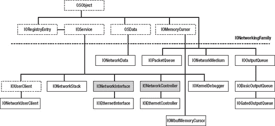

***图 13-4.** `IONetworkingFamily` 类层次结构*

该家族看起来可能相当庞大，但许多类都是辅助性的帮助类，有些我们甚至完全无需关心，因为它们仅在该家族内部使用。该家族中的关键类是 `IONetworkController` 和 `IONetworkInterface`。前者用于表示网络硬件的驱动程序，而后者则用于与 BSD 层中的数据链路接口层 (DLIL) 对接。它作为一个适配器，使 I/O Kit 的网络接口能够被视作 BSD 层的网络接口，这样你就可以使用传统的 UNIX 工具（如 `ifconfig`）来配置设备。接下来，让我们看看各个类的职责：

*   `IOEthernetController` 是所有基于以太网的设备（包括基于 802.11 的无线设备）的基类。在编写以太网或 Wi-Fi 设备的驱动程序时，你通常需要继承此类。
*   `IOEthernetInterface` 作为 `IOEthernetController` 的客户端，提供了控制器与 BSD 网络层之间的粘合层。如果你正在实现一个以太网驱动程序，除非有特殊需求，否则通常无需继承 `IOEthernetInterface`。
*   `IOKernelDebugger` 是一个替代驱动程序。当内核调试器激活时，它将替代 `IONetworkInterface` 与 `IONetworkController` 配合使用。如果你正在编写第三方网络驱动程序，则无需支持此类。
*   `IOMbufMemoryCursor` 围绕 `mbuf` 结构提供了一个面向对象的游标，允许将 `mbuf` 簇转换为物理地址，以供 DMA 使用。有几个专门的子类可用：`IOMBufBigMemoryCursor`、`IOMbufDBMAMemoryCursor`、`IOMbufLittleMemoryCursor`、`IOMbufNaturalMemoryCursor`。
*   `IONetworkController` 是 `IOEthernetController` 的基类。如果你正在为不兼容以太网的设备编写驱动程序，则必须继承 `IONetworkController`。
*   `IONetworkData` 代表一个固定大小的数据缓冲区，由 `IONetworkInterface` 用于导出接口数据到用户空间，尤其是使用统计信息，例如关于丢包和冲突的信息。
*   `IONetworkInterface` 提供了将 `IONetworkController` 绑定到 BSD 数据链路层 (BDIL) 以及网络栈其余部分的粘合层。`IONetworkInterface` 是一个抽象类，如果你的驱动程序基于 `IONetworkInterface`，则必须重新实现它。
*   `IONetworkUserClient` 是 `IOUserClient` 的子类，为 `IONetworkInterface` 提供了一个用户客户端。
*   `IOOutputQueue` 是一个数据包队列，处理多个生产者和一个消费者（设备）。有两个专门的子类可用：`IOBasicOutputQueue` 和 `IOGatedOutputQueue`。
*   `IOPacketQueue` 实现了一个由自旋锁同步的 `mbuf` FIFO 队列。

你可能已经注意到，这里完全没有提及对 802.11x 网络的支持。Apple 并未发布用于开发无线网络驱动程序的框架。Apple 自家的 AirPort 驱动程序位于 `IO802Family.kext` 中，但并未发布其源代码或头文件。这并不妨碍你编写无线网络驱动程序，但这意味着你无法利用预先编写好的类，并且可能需要提供你自己的 `IOUserClient` 以及可能的用户空间工具来配置设备。Apple 的 AirPort 设备是私有 `IO80211Controller` 的子类，而 `IO80211Controller` 本身又是 `IOEthernetController` 的子类。话虽如此，所有现代 Mac 都内置了无线网络功能，因此对此领域第三方设备的需求较低。

### 构建一个简单的以太网控制器驱动程序

让我们通过构建一个简单的以太网驱动程序来亲身体验 I/O Kit 的网络功能。由于实现一个完整可用的驱动程序非常复杂且依赖于硬件，因此很难完整演示，对于那些要为完全不同的设备实现驱动程序的人来说，也可能没什么用。我们将转而专注于基础知识，并熟悉 I/O Kit 提供的用于帮助开发网络驱动程序的工具。我们将通过实现一个名为 `MyEthernetDriver` 的虚拟以太网驱动程序来做到这一点。该驱动程序将演示 I/O Kit 网络驱动程序的核心元素是如何实现的，并展示数据包如何流经它以与系统的其余部分交互。图 13-5 展示了 `MyEthernetDriver` 如何与其他 I/O Kit 类交互。

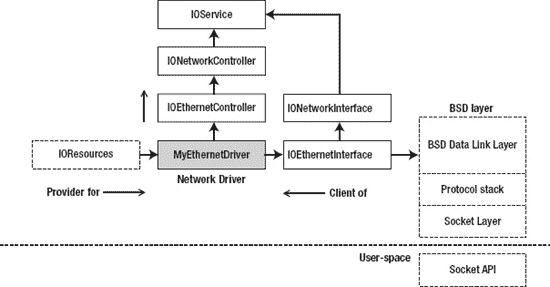

***图 13-5.** `MyEthernetDriver`：与 I/O Kit 和网络栈的交互*

在本例中，`MyEthernetDriver` 使用 `IOResources` 节点作为提供者，但对于由物理设备支持的真实网络设备，它更可能使用 `IOPCIDevice`、`IOUSBDevice`、`IOUSBInterface` 或另一个代表硬件设备的节点。

 **提示**  如果你好奇想看看真实设备的网络驱动程序，`IOUSBFamily` 源代码发行版中曾包含 `AppleUSBCDCEthernet` 的源代码，这是用于遵循 USB 以太网规范设备的驱动程序。该驱动程序不属于新版本，但仍然可以在 Apple 开源网站 (`opensource.apple.com`) 上找到的旧版 `IOUSBFamily` 中获取。还有一种基于流行 PCI 总线的 Realtek 8139 芯片组的驱动程序源代码可用，名为 `AppleRTL8139Ethernet`。对于直接派生自 `IONetworkController` 的网络驱动程序示例，可以查看 `IOFireWireIP`，它实现了通过 FireWire 的 TCP/IP 网络功能。

主驱动类 `MyEthernetDriver` 将继承自 `IOEthernetController`，而 `IOEthernetController` 又继承自 `IONetworkController`。驱动程序还将分配一个 `IOEthernetInterface` 实例，用于与网络栈对接。`IOEthernetInterface` 类不是抽象的，可以直接分配和使用。


#### MyEthernetDriver 的设计

为了理解 `MyEthernetDriver` 的设计背景，假设我们受雇为一种新型以太网设备开发驱动程序。该设备是一个可插入 Mac 雷雳（Thunderbolt）端口的加密狗。由于这项技术当时尚属新兴，获取所需部件有所延迟，因此我们暂时无法拿到实际设备。虽然我们都希望能整天上网冲浪还能领薪水，但毕竟还是要靠本事吃饭。所以在没有实际设备的情况下，我们就开始着手开发驱动程序。我们的目标是尽可能实现那些无需硬件设备就能完成的功能。然而，我们很快意识到，以太网设备的一个主要组成部分是处理实际的网络 I/O。虽然你可以很快构建一个虚拟设备驱动程序，为其分配一个 IP 地址，并开始与之通信，但这里有一个主要问题：发往同一主机上另一个接口或自身接口的网络数据包实际上根本不会被转发到该设备，而是会在协议栈内部循环，不会涉及 I/O Kit 驱动程序。I/O Kit 是专门设计来与实际硬件设备交互的，因此，如果你需要一个虚拟网络接口，BSD 层才是实现它的最佳位置。

我们解决这个问题的方法是将我们的虚拟以太网设备挂载到一个真实的以太网接口上，并利用它来代我们发送和接收数据包。其设置方案类似于 图 13-6 中的示意图。

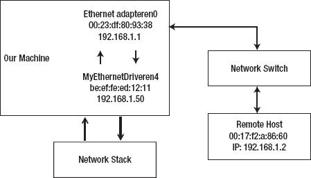

**图 13-6.** MyEthernetDriver 测试设置

当 `MyEthernetDriver` 从网络协议栈接收到一个数据包时，它会将该数据包排队，然后通过连接到物理网络交换机的 `en0` 接口将数据包发送到网络上。如果你没有网络交换机，你可以使用一根直通 cat5 网线直接连接到远程机器来进行测试。测试设置中的每个接口都配置了各自位于同一子网的 IP 地址。网络协议栈负责封装数据包，因此当 `MyEthernetDriver` 收到数据包时，它已经带有一个以太网帧头，其中的目标地址是 `00:17:f2:0a:86:60`，而源地址是 `MyEthernetDriver` 随机选取的 `be:ef:fe:ed:12:11`。大多数基于以太网的网络设备都允许发送带有与自己不同的（虚假）源地址的数据包。因此，如果一切配置正确，我们应该能够在远程主机上接收到来自 `MyEthernetDriver` 的 MAC 和 IP 地址的数据包。

让远程主机的回复回到我们的驱动程序则更棘手一些，因为 `en0` 接口很可能会忽略不是发给自己地址的帧。为了解决这个问题，我们只需在 `en0` 上启用混杂模式，这将使其能够接收并非发给自己地址的数据包。然后，我们将在 `en0` 的输入队列上安装一个接口过滤器，检查数据包是否发往它自己——如果是，我们就放行；如果是发往 `MyEthernetDriver` 的，我们则将其截取并转而导入到 `MyEthernetDriver` 的输入队列。最终结果是一个虚拟的以太网桥接器/交换机。这在概念上接近于虚拟机软件（如 Parallels 或 VMWare Fusion）如何让客户操作系统以桥接模式参与网络。由于我们在以太网层面实现了这一点，这些更改对于像 IP 这样的上层协议是完全透明的，我们甚至可以使用外部 DHCP 服务器为我们的虚拟接口获取 IP 地址。

这应该能给我们留下一个或多或少能正常工作的设备驱动程序，它实际上能够发送和接收真实的网络流量，并为我们提供一个良好近似于真实设备的操作环境。我们将尽可能通过把相关代码放到一个名为 `MyEthernetHwAbstraction` 的独立类中，来向驱动程序隐藏这种桥接操作的发生。该类将负责与“硬件”的通信，而主驱动程序则与 I/O Kit 交互。这种设计使得我们能够快速地将硬件抽象类替换为与实际硬件通信的类。此外，该设计还允许对抽象类进行子类化，以便能够优雅地支持硬件的新变种。

 **注意**  `MyEthernetDriver` 需要一个有线以太网设备来挂载。这是因为无线设备通常不允许发送源地址与自身不同的数据包。这是设备固件的局限性。

`MyEthernetDriver` 的头文件如 代码清单 13-6 所示。

**代码清单 13-6.** MyEthernetDriver 头文件

```
#ifndef MyEthernetDriver_h
#define MyEthernetDriver_h

#include <IOKit/assert.h>
#include <IOKit/IOTimerEventSource.h>
#include <IOKit/IOBufferMemoryDescriptor.h>
#include <IOKit/network/IOEthernetController.h>
#include <IOKit/network/IOEthernetInterface.h>
#include <IOKit/network/IOGatedOutputQueue.h>
#include <IOKit/network/IOMbufMemoryCursor.h>
#include <IOKit/network/IONetworkMedium.h>
#include <IOKit/IOUserClient.h>

#include "MyEthernetHwAbstraction.h"

class com_osxkernel_MyEthernetDriver : public IOEthernetController
{
    friend class com_osxkernel_MyEthernetHwAbstraction;

    OSDeclareDefaultStructors(com_osxkernel_MyEthernetDriver);
public:
    virtual bool init(OSDictionary* properties);
    virtual bool start(IOService* provider);
    virtual void stop(IOService* provider);
    virtual void free();

    virtual bool configureInterface(IONetworkInterface* netif);

    virtual IOReturn enable(IONetworkInterface* netif);
    virtual IOReturn disable(IONetworkInterface* netif);

    virtual IOReturn getHardwareAddress(IOEthernetAddress* addrP);

    // 允许设置我们驱动程序的 Mac 地址
    virtual IOReturn setHardwareAddress(const IOEthernetAddress* addrP);

    virtual UInt32 outputPacket(mbuf_t m, void* param);

    virtual IOReturn setPromiscuousMode(bool active) { return kIOReturnSuccess; }
    virtual IOReturn setMulticastMode(bool active) { return kIOReturnSuccess; }

    bool createMediumDict();

private:    

    static void  interruptOccured(OSObject* owner, IOTimerEventSource* sender);

    IOTimerEventSource*    fInterruptSource;  // 模拟硬件接收中断
    IOEthernetInterface*   fNetworkInterface;
    OSDictionary*          fMediumDict;
    IOWorkLoop*            fWorkLoop;

    IONetworkStats*        fNetworkStats;
    IOEthernetStats*       fEthernetStats;

    com_osxkernel_MyEthernetHwAbstraction* fHWAbstraction; // 底层硬件访问
};

#endif
```


### 驱动程序初始化与启动

网络驱动程序遵循常规的 `IOService` 生命周期。驱动程序和设备的初始化发生在驱动程序的 `start()` 方法中。对于典型设备，可能需要执行以下步骤：

1.  配置设备的提供程序并枚举任何所需资源。对于 PCI 或 Thunderbolt，这意味着映射设备内存或 I/O 区域。对于 USB 设备，枚举接口和管道。
2.  配置设备以使其能够运行——例如，通过访问设备寄存器或发送控制请求，使其退出休眠状态。
3.  从设备提取信息，例如 MAC 地址，以及关于设备能力的信息，例如支持的介质和速率。许多以太网设备支持 *媒体独立接口*（MII）总线，这是一项标准，用于以一致的方式访问设备状态、信息和配置，并与负责物理传输的设备部分（通常称为 PHY）解耦。MII 寄存器包含关于链路状态、支持的网速、错误报告等信息。千兆或万兆以太网设备分别由 GMII 和 XGMII 规范支持。MII、GMII 和 XGMII 都是 IEEE 标准。然而，这些标准并未规定 DMA 引擎如何实现，或设备的 I/O 应如何进行。
4.  根据需求和底层硬件，按需分配和配置 `IOInterruptEventSource` 或 `IOTimerEventSource`。许多网络设备使用软件定时器作为看门狗定时器，持续监视设备故障，并在发生故障时尝试重置设备。
5.  实例化并注册一个 `IOEthernetInterface` 实例，这将使我们的网络控制器对 BSD 网络协议栈和系统其余部分可见。

`MyEthernetDriver` 的 `start()` 方法如列表 13-7 所示。

**列表 13-7.** *MyEthernetDriver* 的 `start()` *方法*

```
bool com_osxkernel_MyEthernetDriver::start(IOService* provider)
{    
    if (!super::start(provider))
        return false;

    fHWAbstraction = new com_osxkernel_MyEthernetHwAbstraction();
    if (!fHWAbstraction)
        return false;
    if (!fHWAbstraction->init(this))
        return false;

    if (!createMediumDict())
        return false;

    fWorkLoop = getWorkLoop();
    if (!fWorkLoop)
        return false;
    fWorkLoop->retain();

    if (attachInterface((IONetworkInterface**)&fNetworkInterface) == false)
        return false;

    fNetworkInterface->registerService();

    fInterruptSource = IOTimerEventSource::timerEventSource(this, interruptOccured);
    if (!fInterruptSource)
        return false;

    if (fWorkLoop->addEventSource(fInterruptSource) != kIOReturnSuccess)
        return false;

    IOLog("%s::start() -> success\n", getName());
    return true;
}
```

在 `start()` 方法中需要完成的工作完全取决于设备的能力。在这个例子中，我们没有代表硬件设备的提供程序，因此可以跳过打开提供程序。下一步是分配一个 `com_osxkernel_MyEthernetHwAbstraction` 类的实例并对其进行初始化。该类包含与硬件设备交互的代码，例如读取其寄存器和设置 I/O 传输的方法。在我们的例子中，它包含的代码允许我们利用另一个设备。严格来说，这一步并非必需——你可以轻松地将所有代码放在主驱动程序中。然而，我们做出了这样的设计决策，以便将来当 *“MyEthernetDevice 2000 Pro”* 问世时，我们可以通过继承现有的硬件抽象类来轻松处理硬件差异。这使得主驱动程序保持简洁，并轻松支持使用同一驱动程序处理多种硬件变体。我们稍后将介绍硬件抽象类。

在“硬件”初始化之后，我们调用 `createMedium()` 函数来发布关于我们的设备支持哪些传输标准和速率的详细信息。我们将在下一节进一步讨论此过程。

接下来调用的方法是 `attachInterface()`，它将返回一个 `IONetworkInterface` 类的实例，该类提供了将我们的驱动程序暴露给内核网络层的粘合层。在我们的例子中，返回的实例将是一个 `IOEthernetInterface` 实例。如果你因任何原因需要对 `IOEthernetInterface` 进行子类化，你可以重写 `IONetworkController::createInterface()`，该方法由 `attachInterface()` 在内部调用，以分配你重写的类。在 `attachInterface()` 返回之前，它还会调用 `IONetworkController::configureInterface()`，你也可以重写该方法来对接口类执行额外的配置。`MyEthernetDriver` 如下实现了 `configureInterface()` 方法：

```
bool com_osxkernel_MyEthernetDriver::configureInterface(IONetworkInterface *netif)
{
    IONetworkData* nd;

    if (super::configureInterface(netif) == false)
        return false;

    nd = netif->getNetworkData(kIONetworkStatsKey);
    if (!nd || !(fNetworkStats = (IONetworkStats *)nd->getBuffer()))
        return false;

    nd = netif->getParameter(kIOEthernetStatsKey);
    if (!nd || !(fEthernetStats = (IOEthernetStats*)nd->getBuffer()))
        return false;

    return true;
}
```

该方法获取指向接口网络统计缓冲区的指针，这些缓冲区将用于记录关于接收/发送数据包、冲突和其他事件的信息。用户空间在多个地方使用这些信息，例如*活动监视器*中的网络选项卡。

要向系统注册一个 `IOEthernetInterface` 实例，我们调用它的 `registerService()` 方法。

在 `start()` 返回之前，我们的最后一个操作是创建一个中断源。我们使用 `IOTimerEventSource` 模拟中断，然而，硬件设备可能使用 `IOFilterInterruptEventSource` 或 `IOInterruptEventSource` 来响应实际的硬件中断。

大多数网络驱动程序可能还想使用一个定时器来提供看门狗功能，该功能周期性地监视设备是否存在错误状态，并检查当前链路状态等情况，以便在出现诸如网线被拔掉等事件时通知网络系统和用户空间。许多驱动程序每一秒触发一次它们的看门狗定时器。


#### 介质与状态选择

`createMedium()` 方法会创建一个字典，向 BSD 协议栈和用户空间发布设备媒体能力的详细信息。大多数现代以太网设备也支持较旧的以太网标准和传输速率。例如，Macbook Pro 中的以太网设备可以在全双工或半双工模式下支持 1000BaseT、100BaseTX 和 10BaseT/UTP，可选择是否启用流控制。如果设备和驱动程序支持，则可以通过 UNIX 命令行工具 `ifconfig` 或通过*系统偏好设置*中的*网络*窗格来控制介质。大多数设备能够自动检测当前介质。媒体能力由 `IONetworkMedium` 类表示。`createMedium()` 类的实现如代码清单 13-8 所示。

***代码清单 13-8.** 用于发布支持的以太网媒体详细信息的方法*
```
static struct MediumTable
{
    UInt32      type;
    UInt32      speed;
}

mediumTable[] =
{
    {kIOMediumEthernetNone, 0},
    {kIOMediumEthernetAuto, 0},
    {kIOMediumEthernet10BaseT | kIOMediumOptionFullDuplex,  10},
    {kIOMediumEthernet100BaseTX | kIOMediumOptionFullDuplex, 100},
    {kIOMediumEthernet1000BaseT | kIOMediumOptionFullDuplex, 1000},
};

bool com_osxkernel_MyEthernetDriver::createMediumDict()
{
    IONetworkMedium*  medium;
    UInt32                            i;

    fMediumDict = OSDictionary::withCapacity(sizeof(mediumTable) /
                                             sizeof(struct MediumTable));
    if (fMediumDict == 0)
        return false;

    for (i = 0; i < sizeof(mediumTable) / sizeof(struct MediumTable); i++)
    {
        medium = IONetworkMedium::medium(mediumTable[i].type, mediumTable[i].speed);
        if (medium)
        {
            IONetworkMedium::addMedium(fMediumDict, medium);
            medium->release();
        }
    }

    if (publishMediumDictionary(fMediumDict) != true)
        return false;

    medium = IONetworkMedium::getMediumWithType(fMediumDict, kIOMediumEthernetAuto);
    setSelectedMedium(medium);
    return true;
}
```
该方法构建了一个包含所支持介质的 `OSDictionary`。介质字典必须通过 `publishMediumDictionary()` 方法发布，以向操作系统通告驱动程序的能力。如果希望驱动程序支持手动选择介质，则需要覆盖 `IONetworkController::selectMedium()` 方法。默认方法将简单地返回 `kIOReturnUnsupported`。你的驱动程序可以调用 `setSelectedMedium()` 来通知系统其介质选择。`setLinkStatus()` 方法可用于同时设置介质和链路状态。链路状态标志包括：`kIONetworkLinkValid` 或 `kIONetworkLinkActive`，对于以太网设备，这些标志可用于指示电缆是否已连接以及设备是否处于活动状态。

#### 配置设备硬件地址

以太网网络使用媒体访问控制（MAC）地址，该地址应为标识网络控制器的 48 位全球唯一地址。网络上的 MAC 地址冲突可能会导致交换机、主机和其他网络设备出现混乱。MAC 地址通常在生产设备时，在 IEEE 分配给每个制造商的地址范围内编程到设备的 EEPROM 中。我们的驱动程序需要将 MAC 地址发布到网络协议栈和用户空间。在用户空间中，该地址除了在信息和配置目的上有助于唯一标识设备外，没有其他作用。然而，网络协议栈确实需要知道该地址，以便正确格式化出站数据包，并为其他协议（如 IP（ARP/RARP））进行地址解析。网络协议栈将调用我们驱动程序的 `getHardwareAddress()` 函数来获取 MAC 地址。`MyEthernetDriver` 的实现如下：
```
IOReturn com_osxkernel_MyEthernetDriver::getHardwareAddress(IOEthernetAddress *addrP)
{
    addrP->bytes[0] = fHWAbstraction->readRegister8(kMyMacAddressRegisterOffset + 0);
    addrP->bytes[1] = fHWAbstraction->readRegister8(kMyMacAddressRegisterOffset + 1);
    addrP->bytes[2] = fHWAbstraction->readRegister8(kMyMacAddressRegisterOffset + 2);
    addrP->bytes[3] = fHWAbstraction->readRegister8(kMyMacAddressRegisterOffset + 3);
    addrP->bytes[4] = fHWAbstraction->readRegister8(kMyMacAddressRegisterOffset + 4);
    addrP->bytes[5] = fHWAbstraction->readRegister8(kMyMacAddressRegisterOffset + 5);

    return kIOReturnSuccess;
}
```
`getHardwareAddress()` 方法是 `IOEthernetController` 中唯一必需的方法（纯虚函数），因此必须实现。由于 `MyEthernetDriver` 没有有效的 MAC 地址，我们任意选择了地址 `be:ef:6c:8e:12:11`。该实现展示了你可能如何从设备的寄存器中获取 MAC 地址。

如果你的设备支持将 MAC 地址更改为用户定义的值，你可以覆盖 `setHardwareAddress()` 方法。该方法应将新的 MAC 地址写入设备的寄存器，如果成功更改，则返回 `kIOReturnSuccess`。默认实现将返回 `kIOReturnUnsupported`。


好的，作为高级文档工程师和翻译员，我将严格按照您的要求，将给定的英文文本翻译成中文。


#### 启用和禁用设备

尽管 `start` 方法可以完全准备好并使设备可操作，但更推荐的方式是，在调用驱动程序的 `enable()` 方法时使设备激活（即处于可以接收和发送的状态）。类似地，当调用驱动程序的 `disable()` 方法时，设备应尽可能进入休眠状态，甚至在可能的情况下进入睡眠状态。驱动程序应该这样做，因为用户可能偶尔选择关闭设备，在这种情况下，它应避免使用资源，这对于确保它不会耗尽设备电池或浪费能源同样重要。`MyEthernetDriver` 的 `enable()` 方法如下所示：

```
IOReturn com_osxkernel_MyEthernetDriver::enable(IONetworkInterface* netif)
{
    IOMediumType          mediumType = kIOMediumEthernet1000BaseT | kIOMediumOptionFullDuplex;
    IONetworkMedium*      medium;

    medium = IONetworkMedium::getMediumWithType(fMediumDict, mediumType);

    if (!fHWAbstraction->enableHardware())
        return kIOReturnError;

    setLinkStatus(kIONetworkLinkActive | kIONetworkLinkValid, medium, 1000 * 1000000);    
    return kIOReturnSuccess;
}
```

当然，具体的实现高度依赖于硬件。在我们的案例中，实现将调用硬件抽象类，该类会附加到我们将用来启用数据包发送和接收的“从属”网络接口。对于真实设备，该方法可能会将设备从睡眠中唤醒，然后启用中断。硬件抽象 `enableHardware()` 方法的实现如下所示：

```
bool    com_osxkernel_MyEthernetHwAbstraction::enableHardware()
{
    bool success = true;

    fRxPacketQueue = IOPacketQueue::withCapacity();
    if (!fRxPacketQueue)
        return false;

    if (ifnet_find_by_name("en0", &interface) != KERN_SUCCESS) // 更改为你自己的接口
        return false;

    ifnet_set_promiscuous(interface, 1);

    if (iflt_attach(interface, &interfaceFilter, &gFilterReference) != KERN_SUCCESS)
        success = false;

    filterRegistered = true;    
    return success;
}
```

该方法将查找设备网络接口 `en0`，该接口应是一个以太网设备。然后它将设备置于混杂模式，这是确保其能够接收发往`MyEthernetDriver`的 MAC 地址的数据包所必需的。最后，在从属接口上安装一个接口过滤器以拦截传入的数据包。我们将检查每个传入的数据包，并将发往我们的数据包转移到我们自己的输入队列：`fRxPacketQueue`，同时忽略所有其他数据包，并允许它们由原始接口处理。

`disable()` 方法应逆转我们在启用设备时执行的操作，并将设备恢复到其原始状态。就我们的目的而言，这意味着移除接口过滤器，这样我们就不会再收到传入的数据包：

```
void    com_osxkernel_MyEthernetHwAbstraction::disableHardware()
{
    if (filterRegistered == true)
    {
        iflt_detach(gFilterReference);
        while (filterRegistered);

        ifnet_set_promiscuous(interface, 0);
        ifnet_release(interface);

        fRxPacketQueue->flush();
        fRxPacketQueue->release();
        fRxPacketQueue = NULL;
    }
}
```

#### 发送网络数据包

现在我们已经成功配置并准备好了设备，可以开始进行一些实际的 I/O 操作了。对于网络驱动程序而言，网络 I/O 在概念上非常简单。网络堆栈负责处理数据包格式化的繁重工作，以及确定数据包确实发往我们的接口。我们的驱动程序只需要关心将原始字节发送到设备即可。数据包通过 `IONetworkController::outputPacket()` 传递给驱动程序，你的驱动程序应重写该方法以从网络堆栈接收数据包。`MyEthernetDriver` 的 `outputPacket()` 方法如下所示：

```
UInt32 com_osxkernel_MyEthernetDriver::outputPacket(mbuf_t packet, void* param)
{
    IOReturn result = kIOReturnOutputSuccess;
    if (fHWAbstraction->transmitPacketToHardware(packet) != kIOReturnSuccess)
    {
        result = kIOReturnOutputStall;
    }
    return result;
}
```

 **注意**  如果 `outputPacket()` 方法接受了某个数据包，驱动程序应释放 `mbuf_t`。`MyEthernetDriver` 不需要执行此操作，因为它将数据包传递给另一个负责释放它的驱动程序。

如果数据包处理成功，实现应返回 `kIOReturnOutputSuccess`。如果硬件正忙且此时无法接受另一个数据包，你可以返回 `kIOReturnOutputStall`，这将在稍后阶段重试同一数据包。要丢弃数据包，只需返回 `kIOReturnOutputDropped`。`outputPacket()` 方法不应阻塞或休眠。

默认情况下，`outputPacket()` 方法由控制器的 `IONetworkInterface` 实例调用，除非通过重写 `createOutputQueue()` 方法手动创建了输出队列，该方法应返回 `IOOutputQueue` 的子类。强烈建议实现一个输出队列（或提供你自己的排队机制）。如果没有队列，你将失去临时暂停队列的能力，并且必须在你驱动的 `outputPacket()` 方法中处理数据包，否则它将被丢弃。如果在调用 `outputPacket()` 时硬件正忙于发送数据包，处理这种情况的唯一方法是将数据包排队，直到硬件再次准备好。

如果你确实实现了一个队列并且它被暂停了，那么当你的硬件准备好再次发送数据包时，必须通过调用 `IOOutputQueue::start()` 来重新启动该队列，否则你将无法接收到更多的数据包。

 **注意**  强烈建议创建一个输出队列；然而，`MyEthernetDriver` 跳过了这一步，因为它直接将数据包发送到另一个网络接口，而该接口实现了自己的排队。

可以通过重写 `createOutputQueue()` 方法来创建队列。当设备被禁用时，你应该调用队列的 `flush()` 方法来移除任何排队的数据包。

一个典型的网络设备会在硬件将一个（或多个）数据包发送到线缆上时发出一个（TX）中断。这也表明其发送缓冲区中现在有更多空间，或者可以执行新的 DMA 事务了。你可以通过调用输出队列的 `service()` 方法来通知队列设备已准备好接收更多数据。这样做的一个副作用是再次调用驱动程序的 `outputPacket()` 方法，如果有可用数据包，则会传递一个新数据包。

上一节中的 `transmitPacketToHardware()` 方法的实现如下：

```
IOReturn    com_osxkernel_MyEthernetHwAbstraction::transmitPacketToHardware(mbuf_t packet)
{    
    if (ifnet_output_raw(interface, 0, packet) != KERN_SUCCESS)
        return kIOReturnOutputDropped;

    // 向驱动程序引发一个中断，通知其数据包已发送。
    fRegisterMap.interruptStatusRegister |= kTXInterruptPending;
    fDriver->fInterruptSource->setTimeoutUS(1);

    return kIOReturnSuccess;
}
```


### 排版后内容

该方法会将接收到的数据包注入从设备的输出队列中。我们通过在虚拟中断寄存器中设置 TX 中断标志位来模拟硬件中断，然后在一微秒后调用定时器函数来模拟从硬件设备接收到中断。

数据包向硬件设备的传输过程同样依赖于具体硬件。基于 PCI 或 Thunderbolt 的设备很可能会使用 DMA。在这种情况下，有两种选择：

* 第一种方案是预先分配一个物理连续缓冲区；例如使用`kIOMemoryPhysicallyContiguous`选项通过`IOBufferMemoryDescriptor`分配的缓冲区，`mbuf`的内容会被复制到该缓冲区中，然后再通过 DMA 传输给硬件。由于`mbuf`可能由多个链式缓冲区组成，因此必须使用`mbuf_next()`遍历整个链，确保所有数据段都能被复制到 DMA 缓冲区中。
* 第二种方案（如果设备支持）是使用`IOMbufMemoryCursor`的变体直接从`mbuf`创建分散/聚合列表，这样可以避免额外的复制操作。游标类负责从`mbuf`生成物理段列表。存在多个`IOMbufMemoryCursors`子类；具体使用哪个取决于设备及其限制。例如，如果使用以大端格式读取地址的设备，可以使用`IOMbufBigMemoryCursor`，该游标可通过`withSpecification()`工厂方法创建：

`static IOMbufBigMemoryCursor* withSpecification(UInt32 maxSegmentSize, UInt32 maxNumSegments);`

`maxSegmentSize`可用于限制单个分散/聚合列表元素的大小。类似地，`maxNumSegments`则控制列表的长度。

### 接收数据包

传入的数据包是异步地从网络到达的，网络驱动程序的职责是在发生 RX 中断时从硬件设备卸载这些数据包，并通过其`IONetworkInterface`或`IOEthernetInterface`（对于以太网驱动程序而言）将它们传递给网络协议栈。`MyEthernetDriver`的中断处理程序如清单 13-9 所示。

**清单 13-9.** `MyEthernetDriver`中断处理程序的实现

```
void com_osxkernel_MyEthernetDriver::interruptOccured(OSObject* owner, IOTimerEventSource* sender)
{
    mbuf_t packet;

    com_osxkernel_MyEthernetDriver* me = (com_osxkernel_MyEthernetDriver*)owner;
    com_osxkernel_MyEthernetHwAbstraction* hwAbstraction = me->fHWAbstraction;
    if (!me)
        return;

    UInt32 interruptStatus = hwAbstraction->readRegister32(kMyInterruptStatusRegisterOffset);

    // 检测到接收中断挂起，从硬件获取数据包。
    if (interruptStatus & kRXInterruptPending)
    {
        while ((packet = hwAbstraction->receivePacketFromHardware()))
        {
            me->fNetworkInterface->inputPacket(packet);
            me->fNetworkStats->inputPackets++;
        }
        me->fNetworkInterface->flushInputQueue();
    }

    if (interruptStatus & kTXInterruptPending)
    {
        // 数据包发送成功。
        me->fNetworkStats->outputPackets++;
    }
}
```

该中断处理程序同时服务于 RX 和 TX 中断。为了确定发生了哪种中断，我们读取设备的中断状态寄存器。通常，中断状态寄存器在读取时会被清除，这将确认并解除中断。关于 TX 中断的简短说明：除了在统计结构中记录数据包已发送之外，我们不做其他任何操作，因为我们没有队列，也无需担心建立新的事务。

当接收到数据包时，需要将其从输入缓冲区转移，并传递给附加到网络控制器驱动程序的`IONetworkInterface`类。数据包通过`IONetworkInterface::inputPacket()`方法传递给网络协议栈。该方法接受一个`mbuf_t`参数。为了将数据放入`mbuf_t`，可以使用`IONetworkController::allocatePacket()`预分配缓冲区，该缓冲区随后可作为传入数据包 DMA 的目标地址。可以使用`IOMbufMemoryCursor`子类来处理将`mbuf`数据转换为物理地址的过程。

在前面的示例中，我们持续循环直到清空传入数据包的队列。实际的硬件设备可能为单个中断接收多个数据包。这个过程通常被称为中断合并。对于运行在 1 吉比特或更高速率下的现代网络设备来说，中断合并是必要的，因为网络帧通常很小，如果为接收到的每一个数据包都触发一次硬件中断，效率会非常低下。相反，设备可以在其板载内存中排队多个数据包，然后再触发一次中断。应避免硬件或驱动程序导致的过度排队，因为它会影响延迟，这可能会对某些应用（如实时多人游戏或音/视频会议）产生不利影响。当调用`inputPacket()`时，数据包会被`IONetworkInterface`内部放入一个队列中。我们可以通过调用`flushInputQueue()`来在准备就绪时清空此队列，该函数会将数据包转发到 BSD 数据链路层以供协议处理程序处理。

清单 13-10 展示了在从从设备取回数据包后，触发我们虚拟 RX 中断的方法。

**清单 13-10.** 处理来自从设备的传入数据包并引发虚拟中断的方法


```cpp
bool com_osxkernel_MyEthernetHwAbstraction::handleIncomingPacket(mbuf_t packet,
                                                                char** frameHdr)
{
    bool passPacketToCaller = true;
    bool copyPacket = false;

    struct ether_header *hdr = (struct ether_header*)*framePtr;
    if (!hdr)
        return false;

    // We only accept packets routed to us if it is addressed to our Mac address,
    // the broadcast or a multicast address.

    if (memcmp(&fMacBcastAddress.bytes, &hdr->ether_dhost, ETHER_ADDR_LEN) == 0)
    {
        copyPacket = true;
    }
    else if (memcmp(&fRegisterMap.address, &hdr->ether_dhost, ETHER_ADDR_LEN) == 0)
    {
        passPacketToCaller = false; // Belongs to our interface.
        copyPacket = true;
    }
    else if (hdr->ether_dhost[0] & 0x01) // multicast
    {
        copyPacket = true;
    }

    if (copyPacket)
    {
        mbuf_t newPacket;
        newPacket = fDriver->allocatePacket((UInt32)mbuf_pkthdr_len(packet) + ETHER_HDR_LEN);

        if (newPacket)
        {
            unsigned char* data = (unsigned char*)mbuf_data(newPacket);
            bcopy(*framePtr, data, ETHER_HDR_LEN);
            data += ETHER_HDR_LEN;
            mbuf_copydata(packet, 0, mbuf_pkthdr_len(packet),data);

            IOLog("input packet is %lu bytes long\n", mbuf_pkthdr_len(packet));

            fRxPacketQueue->lockEnqueue(newPacket);
            fRegisterMap.interruptStatusRegister |= kRXInterruptPending;
            // Raise an interrupt to the driver to inform it of the new packet
            fDriver->fInterruptSource->setTimeoutUS(1);
        }
    }
    return passPacketToCaller;
}
```

在清单 13-10 中，原始数据包在从设备上的输入过滤器被调用时被复制，然后使用模拟硬件接收缓冲区的`IOPacketQueue`进行排队。然后我们通过先在状态寄存器中设置 RX 中断挂起标志，然后设置中断定时器函数的超时时间来向驱动程序引发一个中断。当中断处理程序运行时，它将调用`receivePacketFromHardware()`，该函数会从队列中安全地获取一个新数据包：

```cpp
mbuf_t  com_osxkernel_MyEthernetHwAbstraction::receivePacketFromHardware()
{
    if (!fRxPacketQueue)
        return NULL;
    return fRxPacketQueue->lockDequeue();
}
```

### 试驾 MyEthernetDriver

如果你想测试`MyEthernetDriver`，最好在一个隔离的网络段上，或在网络管理员的许可下进行测试，因为与其他示例不同，它会主动与你的网络交互。在测试之前，你应该修改`MyEthernetHwAbstraction.cpp`，使其指向你想要用来代表`MyEthernetDriver`进行发送和接收的以太网设备。

你可以使用`kextload`来加载`MyEthernetDriver`。与 NKE 必须手动加载不同，`MyEthernetDriver`使用`IOResources`作为提供者，因此如果安装在正确位置，它将在启动期间自动加载。为了测试驱动程序，建议你不要将其保留在系统的扩展目录中，以防出现问题。当驱动程序加载后，你可以使用`IORegisterExplorer`验证其存在性，如图 13-7 所示。

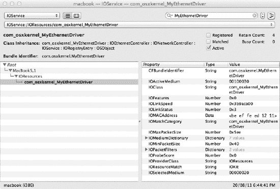

***图 13-7.** 显示 MyEthernetDriver 附加到 IOResources nub 的 IORegisteryExplorer*

我们还应该在系统偏好设置的网络面板中看到新的网络接口，如图 13-8 所示。

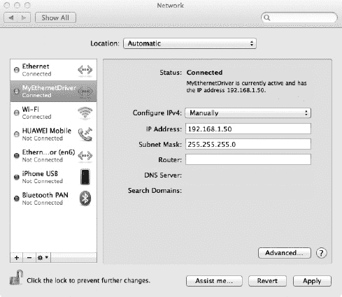

***图 13-8.** 系统偏好设置中的网络面板，显示 MyEthernetDriver 的配置选项*

如果你的网络中有 DHCP 服务器，你可能会看到`MyEthernetDriver`自动分配了一个 IP 地址。如果没有，你可以使用系统偏好设置或使用`ifconfig`命令行工具手动配置 IP 地址：

```
$ sudo ifconfig en5 inet 192.168.1.50 netmask 255.255.255.0
$ ifconfig en5
en5: flags=8863<UP,BROADCAST,SMART,RUNNING,SIMPLEX,MULTICAST> mtu 1500
        ether be:ef:fe:ed:12:11
        inet6 fe80::bcef:feff:feed:1211%en5 prefixlen 64 scopeid 0x7
        inet 192.168.1.50 netmask 0xffffff00 broadcast 192.168.1.255
        media: autoselect (1000baseT <full-duplex>)
        status: active
```

请注意，你可能被分配了不同的 BSD 网络接口名称，具体取决于系统上安装了多少个接口。在本例中，使用了`en5`。假设你已经配置了一个网络上的另一台主机可以访问的 IP 地址，那么即使从属接口使用了不同的 IP/子网，你现在也应该能够访问该主机。我们可以通过使用另一台主机上的`ping`工具来验证其工作是否正常：

```
othermac$ ping 192.168.1.50
PING 192.168.1.50 (192.168.1.50): 56 data bytes
64 bytes from 192.168.1.50: icmp_seq=0 ttl=64 time=0.855 ms
64 bytes from 192.168.1.50: icmp_seq=1 ttl=64 time=0.588 ms
--- 192.168.1.50 ping statistics ---
2 packets transmitted, 2 packets received, 0.0% packet loss
round-trip min/avg/max/stddev = 0.588/0.722/0.855/0.133 ms

othermac$ arp –a
? (192.168.1.50) at be:ef:fe:ed:12:11 on en0 ifscope [ethernet]
? (192.168.255.255) at ff:ff:ff:ff:ff:ff on en0 ifscope [ethernet]
```

你将看到其他系统已经捕获了`MyEthernetDriver`的硬件地址（MAC），并且没有使用从属接口的 MAC 来访问我们。

回到安装了`MyEthernetDriver`的系统，我们可以检查我们接口的统计信息，以查看其传输的数据包数量和大小：

```
$ netstat -i -I en5
Name  Mtu   Network       Address               Ipkts  Ierrs    Opkts  Oerrs  Coll
en5   1500  <Link#7>      be:ef:fe:ed:12:11       61     0       67     0       0
en5   1500  192.168.1     192.168.1.50            61      -      67     -     -
```


### 本章小结

在本章中，我们探讨了内核网络过滤 KPI 以及如何为以太网控制器实现驱动程序。以下是一些关键要点：

- 内核网络支持分为两部分：BSD 层（实现对所有协议和防火墙等网络服务的支持）和 I/O Kit（为编写网络硬件驱动程序提供工具）。
- 内核过滤 KPI 允许在不同层级过滤和操纵网络数据包，包括套接字、IP 和接口层级。
- 内核网络子系统最重要的数据结构是 `mbuf` 结构体，用于存储网络数据包或其他相关数据。在内核扩展中，可以通过不透明引用 `mbuf_t` 和 mbuf KPI 提供的函数来操作 `mbufs`。`mbufs` 的概念在内核的 BSD 部分和 I/O Kit 中均有使用。
- 套接字过滤器允许拦截基于套接字的通信和带外事件。它可以拦截传入和传出的数据。套接字过滤器可以全局附加到系统中的每个套接字，也可以通过编程方式逐套接字附加。使用套接字过滤器，您可以修改、拒绝或注入新的数据包。
- IP 过滤器与套接字过滤器类似，但工作于 IP 层。IP 过滤器将看到系统中所有 IP 流量，无论其接口为何。它也会看到并非直接通过套接字发起的 IP 数据包。
- 接口过滤器允许将过滤器附加到特定的网络接口。接口过滤器可以看到进出该接口的所有流量，无论其协议为何。也可以将所见的流量限制为特定的协议族，例如 IPv4 或 IPv6。
- `IONetworkingFamily` 提供了实现网络硬件设备驱动程序所必需的编程接口。它包括用于队列管理的类以及用于抽象 I/O Kit 与 BSD 层之间接口的类。
- `IONetworkController` 类代表一个网络驱动程序。`IOEthernetController` 提供了一个专门用于处理以太网兼容设备的类。`IONetworkInterface` 提供了将网络设备连接到内核网络系统其他部分的粘合剂。

## 第 14 章

#### 存储系统

存储设备涵盖多种类型，包括硬盘驱动器、CD 和 DVD、USB 闪存驱动器、基于 FireWire 的硬盘，以及作为虚拟驱动器挂载的基于文件的磁盘映像。对用户而言，存储设备表现为桌面上的一个宗卷，他们可以从中读取和写入文件，但用户看不到的是内核中协同工作以实现这一点的多个驱动程序。

存储设备需要多个驱动程序的原因在于其可能呈现的多种不同形式。考虑到外部 USB 闪存驱动器和内部硬盘之间的差异（两者对用户来说都是存储设备），您就能理解需要处理的差异。例如：

- 存储设备与计算机连接的接口可能是 USB 或 FireWire 端口（用于外部存储设备），或通过 SATA 端口（通常用于内部硬盘）。
- 计算机可以通过发送 SCSI 命令来控制存储设备（如 USB 大容量存储设备或 FireWire SPB-2 驱动器），或通过向 AHCI 接口发送 ATA/ATAPI 命令来控制（如内部连接的 SATA 磁盘）。
- 存储设备可能包含单个宗卷，也可能被划分为多个宗卷。
- 每个宗卷将使用用户选择的文件系统进行格式化，可能是 HFS+（Mac OS X 使用的默认文件系统）、NTFS（Windows 使用的默认文件系统）或 Mac OS X 支持的众多文件系统之一。

为了处理所有这些可能的变体，I/O Kit 通过构建一个由多个驱动程序组成的分层堆栈来实现存储设备，其中每一层负责处理一个方面，例如物理连接（USB、FireWire 或 SATA）、命令协议（SCSI 或 ATA/ATAPI）以及逻辑宗卷。对各种文件系统的支持由虚拟文件系统层（VFS 层）提供，该层虽然是内核的一部分，但位于内核的 BSD 部分，且处于 I/O Kit 之外。

I/O Kit 存储堆栈设计中的这种模块化意味着驱动程序堆栈的每一层都与相邻层解耦，每个驱动程序只需处理其所在层提供的功能。这意味着可以编写一个新的文件系统，而无需了解该文件系统可能驻留的存储设备类型，因为该文件系统永远不需要直接与磁盘设备的硬件通信。类似地，在为新型存储设备编写驱动程序时，开发者不需要实现任何文件系统细节；相反，磁盘可以使用 Mac OS X 支持的任一现有文件系统进行格式化。存储设备的驱动程序堆栈如图 14-1 所示。

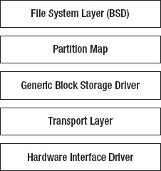

***图 14-1.** 支持存储设备所涉及驱动程序的抽象视图*

并非每一层都需要实现驱动程序。例如，要实现对新型硬盘的支持，您只需在传输层编写一个驱动程序；其余驱动程序堆栈会与您的自定义驱动程序匹配，而您的新磁盘设备将作为标准磁盘呈现给用户。


### 传输层驱动程序

存储设备的驱动程序在 I/O Kit 中实现为驻留在图 14-1 传输层中的传输驱动程序。与任何其他 I/O Kit 驱动程序一样，传输驱动程序将匹配代表其硬件设备的提供者类；该提供者类也是驱动程序访问底层硬件的手段。例如，基于 USB 的存储设备的提供者类将是 `IOUSBDevice` 或 `IOUSBInterface` 的一个实例。

除所有 I/O Kit 驱动程序所要求的最终派生于 `IOService` 类之外，I/O Kit 对传输驱动程序的超类来源没有施加任何限制。这赋予了传输驱动程序很大程度的自由度，因为它可以使用一套适合磁盘设备所用通信协议的方法，而非被迫实现由 I/O Kit 存储家族所强加的接口。

传输驱动程序缺乏通用接口确实带来了一个问题，因为驱动程序栈的上层，特别是紧邻传输驱动程序上方的通用块存储驱动程序，没有通用接口来调用传输驱动程序中的方法。为了解决这个问题，I/O Kit 定义了一个名为 `IOBlockStorageDevice` 的驱动程序类，这是一个位于传输层和通用块存储驱动程序之间的小型轻量级“楔体”驱动程序。

`IOBlockStorageDevice` 类的作用是向通用块存储驱动程序提供磁盘的抽象表示，并将所有请求传递给传输驱动程序，而传输驱动程序则负责实现特定于磁盘设备的行为。传输驱动程序负责定义 `IOBlockStorageDevice` 类的一个具体子类并实例化它。存储驱动程序栈中传输驱动程序与其上下层之间的关系示意图如图 14-2 所示，该图以 Apple AHCI 驱动程序为例。

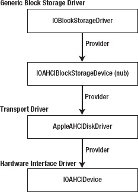

***图 14-2.** Apple AHCI 存储驱动程序栈中各驱动程序之间的关系*

 **注意** 由于 I/O Kit 对传输驱动程序的实现方式没有限制，因此传输驱动程序可以由多个驱动程序栈构成。Apple 在为使用 SCSI 命令集的设备（包括 USB 大容量存储设备和 FireWire 设备）开发驱动程序时利用了这一点。这些设备的驱动程序都使用了一个实现 SCSI 协议的通用驱动程序。

### IOBlockStorageDevice 接口

存储驱动程序栈的上层通过派生自 `IOBlockStorageDevice` 接口的类与传输驱动程序通信。`IOBlockStorageDevice` 将存储设备呈现为调用者可读写的一组线性逻辑块阵列。逻辑块是磁盘能够读取或写入的最小字节数，且磁盘操作必须针对块的整数倍进行。根据磁盘的不同，块大小介于 512 字节到 4096 字节之间。`IOBlockStorageDevice` 类执行的所有操作都作用于连续的磁盘块范围。

`IOBlockStorageDevice` 接口的子类必须实现的方法如列表 14-1 所述。`IOBlockStorageDevice` 类并非旨在提供这些方法行为的完整实现；相反，它会将这些方法传递给其提供者类，即存储驱动程序栈中的传输驱动程序。

***列表 14-1.** `IOBlockStorageDevice` 接口子类需实现的方法*

```
class IOBlockStorageDevice : public IOService
{
        virtual bool            init(OSDictionary * properties);
        virtual IOReturn        doEjectMedia(void) = 0;
        virtual IOReturn        doFormatMedia(UInt64 byteCapacity) = 0;
        virtual UInt32          doGetFormatCapacities(UInt64 * capacities,
                                    UInt32   capacitiesMaxCount) const = 0;
        virtual IOReturn        doLockUnlockMedia(bool doLock) = 0;
        virtual IOReturn        doSynchronizeCache(void) = 0;
        virtual char*           getVendorString(void) = 0;
        virtual char*           getProductString(void) = 0;
        virtual char*           getRevisionString(void) = 0;
        virtual char*           getAdditionalDeviceInfoString(void) = 0;
        virtual IOReturn        reportBlockSize(UInt64 *blockSize) = 0;
        virtual IOReturn        reportEjectability(bool *isEjectable) = 0;
        virtual IOReturn        reportLockability(bool *isLockable) = 0;
        virtual IOReturn        reportMaxValidBlock(UInt64 *maxBlock) = 0;
        virtual IOReturn        reportMediaState(bool *mediaPresent,bool *changedState) = 0;
        virtual IOReturn        reportPollRequirements(bool *pollRequired,
                                    bool *pollIsExpensive) = 0;
        virtual IOReturn        reportRemovability(bool *isRemovable) = 0;
        virtual IOReturn        reportWriteProtection(bool *isWriteProtected) = 0;
        virtual IOReturn        getWriteCacheState(bool *enabled) = 0;
        virtual IOReturn        setWriteCacheState(bool enabled) = 0;
        virtual IOReturn        doAsyncReadWrite(IOMemoryDescriptor *buffer, UInt64 block,
                                    UInt64 nblks, IOStorageAttributes *attributes,
                                    IOStorageCompletion *completion) = 0;
        virtual IOReturn        requestIdle(void);
        virtual IOReturn        doDiscard(UInt64 block, UInt64 nblks);
        virtual IOReturn        doUnmap(IOBlockStorageDeviceExtent* extents,
                                    UInt32 extentsCount, UInt32 options);
};
```


以下内容描述了一个`IOBlockStorageDevice`子类需要实现的方法，这些方法按功能分组排序。

首先介绍的方法会向用户返回设备的人类可读描述。这些字符串用于帮助用户识别与已挂载卷对应的存储设备。如果存储介质尚未格式化，则不会有卷与设备关联，这些标识字符串将是用户确保他们即将格式化的设备正是他们认为的设备的唯一手段。因此，这些字符串应返回描述性名称，例如，标识 USB 闪存盘的制造商，或提供连接接口的描述（如“USB to SATA 适配器”），以便用户轻松识别设备。这些字符串会出现在诸如“磁盘工具”等实用程序以及“系统信息”生成的系统配置文件中。

*   `getVendorString`：返回存储设备的制造商名称。
*   `getProductString`：返回产品型号的描述性名称。
*   `getRevisionString`：返回一个字符串，其解释可由驱动程序开发者决定。这可用于标识存储设备上运行的固件版本，或提供产品设计的标识。由于该值是字符串，因此也可以同时包含这两种值。
*   `getAdditionalDeviceInfoString`：当前未被 I/O Kit 实现使用，但可由专有的磁盘实用程序软件从驱动程序中查询。

以下方法被调用以查询存储设备的能力：

*   `reportRemovability`和`reportEjectability`：两者都返回类似的信息。如果介质可以在驱动程序存在的情况下插入和移除，则该设备被视为可移动。这意味着 I/O Kit 可能会定期轮询传输驱动程序以确定当前是否存在磁盘。此外，如果一个可移动设备可以通过软件控制（如 CD 驱动器）移除，则它被认为是可弹出的。如果设备不可弹出，用户仍然可以通过“访达”或“磁盘工具”执行“弹出”操作，尽管 macOS 会卸载文件系统，但不会弹出介质。
*   `reportLockability`：被调用来确定可移动驱动器中的介质是否可以被“锁定”以防止用户移除。锁定设备的例子是，一个前面板上有弹出按钮的 CD 驱动器，当 CD 被挂载时可以禁用（锁定）该按钮。
*   `reportPollRequirements`：被调用来确定驱动程序是否需要被定期调用以检查介质是否已插入或移除，而不是驱动程序本身能够在介质到达时生成通知。如果设备需要轮询，驱动程序可以通过`reportPollRequirements`方法返回一个额外的标志，以指示轮询是否开销较大，例如，仅能通过旋转设备来检测介质。I/O Kit 只会轮询那些轮询开销不大的设备。
*   `reportMediaState`：被调用来确定设备中是否存在介质。此方法在存储驱动程序堆栈创建时被调用一次，以读取硬件的初始状态，此后仅在驱动程序指示需要轮询来确定介质存在时才会被调用。

以下方法被调用以查询当前介质的能力。每当检测到新介质时，都会调用这些方法。

*   `reportBlockSize`：应返回设备磁盘扇区（或块）的字节大小。用户空间进程可以通过`ioctl`命令`DKIOCGETBLOCKSIZE`访问此值。
*   `reportMaxValidBlock`：返回设备的容量，用设备最后一个块的地址表示。由于磁盘块从 0 开始索引，因此最大有效块比设备的总块数少 1。
*   `reportWriteProtection`：被调用来确定介质是否可以写入，或者是否受到写保护。如果受到写保护，它将被挂载为只读卷。用户空间进程可以通过`ioctl`命令`DKIOCISWRITABLE`访问此值。

以下方法执行介质的低级格式化。并非所有设备都支持低级格式化。尽管这些方法必须在`IOBlockStorageDevice`接口的实现中存在，但如果未提供该功能，则可返回错误。

*   `doGetFormatCapacities`：被调用来获取一个列表，其中包含介质可以格式化成的每种大小（以字节为单位）。用于保存此方法结果的存储空间由调用者提供，该方法返回实际写入列表的项目数。如果调用者希望确定实现支持的格式数量而不接收实际列表，则可以将`NULL`指针传递给列表存储。用户空间进程可以通过`ioctl`命令`DKIOCGETFORMATCAPACITIES`请求此列表。
*   `doFormatMedia`：被调用来执行设备的低级格式化。如果未实现此功能，该方法可以自由返回一个错误，例如`kIOReturnUnsupported`。用户空间进程可以通过发送`ioctl`命令`DKIOCFORMAT`来执行此操作。
*   `doDiscard`方法被调用不是为了格式化整个磁盘，而是为了擦除那些不再存储文件系统所需数据的块。对于固态磁盘，此方法提供了一个机会，可以为被丢弃的块发出 TRIM 命令。用户空间进程可以通过发送`ioctl`命令`DKIOCDISCARD`来执行此操作。此方法在 Mac OS X 10.6 的后续版本中已被弃用，并被`doUnmap`方法取代。
*   `doUnmap`方法引入作为`doDiscard`方法的替代。它执行类似的功能，即释放文件系统未使用的磁盘块。与`doDiscard`方法（仅能释放单个物理连续的磁盘块区间）不同，`doUnmap`方法接收一个数组，其中包含一个或多个不再使用的磁盘块范围。用户空间进程可以通过发送`ioctl`命令`DKIOCUNMAP`来执行此操作。

以下方法允许通过软件控制介质弹出：

*   `doLockUnlockMedia`：被调用来防止用户弹出介质，例如禁用 CD 驱动器前面的弹出按钮。该方法接收一个布尔参数，该参数决定驱动程序应锁定设备中的介质（阻止用户弹出）还是解锁介质（允许用户弹出）。
*   `doEjectMedia`：被调用来从设备中弹出介质。用户空间进程可以通过发送`ioctl`命令`DKIOCEJECT`来执行此操作。
*   `requestIdle`：被调用来使磁盘进入空闲状态，例如停止 CD 驱动器的旋转。虽然没有相应的方法可以使设备退出空闲状态，但下一次读取或写入操作将隐式地使其退出。用户空间进程可以通过发送`ioctl`命令`DKIOCREQUESTIDLE`来执行此操作。

最后，或许是最重要的，是以下用于向设备读取和写入数据的方法：


`doAsyncReadWrite` 是 `IOBlockStorageDevice` 接口的通用数据读写方法。它接受以下参数：一个 `IOMemoryDescriptor` 对象（用于描述磁盘读取时的源缓冲区或磁盘写入时的目标缓冲区）、一个需要进行读取或写入的连续磁盘块范围，以及相关的属性标志。`IOMemoryDescriptor` 还用于判断请求的操作是读取还是写入；驱动程序会调用该对象的 `getDirection()` 方法，如果返回值为 `kIODirectionIn`，则表明请求了读取操作。如果返回值为 `kIODirectionOut`，则表明请求了写入操作。磁盘操作以异步方式执行，完成后，会通过提供的回调函数通知调用方。

`setWriteCacheState` 被调用于启用或禁用设备可能具有的任何硬件缓存。对应的 `getWriteCacheState` 方法返回设备缓存的当前状态。

`doSynchronizeCache` 被调用于将硬件缓存的内容刷新到存储介质。这是一个同步方法，必须等到缓存内容全部写入磁盘后才能返回。当用户空间进程发起 `ioctl` 调用 `DKIOCSYNCHRONIZECACHE` 时，也会调用此方法。

## 构建 RAM 磁盘设备

在了解了实现 `IOBlockStorageDevice` 接口所必须实现的方法后，我们现在可以看看如何在 Mac OS X 中实现一个简单的 RAM 磁盘设备。与 I/O Kit 中任何磁盘设备的驱动程序一样，我们将驱动程序分为两个类：传输驱动程序类（实现功能并与硬件设备通信）和一个实现 `IOBlockStorageDevice` 接口的类（作为传输驱动程序和存储驱动程序栈的设备服务层之间的接口）。

正如我们所看到的，I/O Kit 并不要求存储设备的传输驱动程序以特定方式编写，也不要求其继承自特定的父类。这使得传输驱动程序可以根据实际访问磁盘存储的硬件类型，以最自然的方式编写。对于我们的 RAM 磁盘来说，传输驱动程序所控制的“硬件”仅仅是为 RAM 磁盘提供存储空间的内存分配。正如我们在第 4 章中学到的，一个没有硬件设备可以匹配的 I/O Kit 驱动程序将使用全局的 `IOResources` 类作为其提供者类。这将是我们的 RAM 磁盘传输驱动程序的提供者类。由于我们的传输驱动程序是作为通用驱动程序实现的，我们将把它实现为通用 `IOService` 类的子类。

为了简化，我们的 RAM 磁盘传输驱动程序将在加载时为磁盘分配存储空间，并且在驱动程序卸载之前不会释放它。该存储空间是一个固定大小的内存分配。我们的传输驱动程序还将负责实例化 `IOBlockStorageDevice` 对象，该对象将提供接口，驱动程序栈的上层通过此接口与我们的传输驱动程序通信。RAM 磁盘传输驱动程序的头文件如代码清单 14-2 所示。

**代码清单 14-2.** RAM 磁盘设备传输驱动程序的头文件

```
#include <IOKit/IOService.h>
#include <IOKit/IOBufferMemoryDescriptor.h>

class com_osxkernel_driver_RAMDisk : public IOService
{
        OSDeclareDefaultStructors(com_osxkernel_driver_RAMDisk)

private:
        IOBufferMemoryDescriptor*       m_memoryDesc;
        void*                           m_buffer;

protected:
     bool                    createBlockStorageDevice ();

public:
     virtual bool            start (IOService* provider);
     virtual void            free (void);

     virtual IOByteCount     performRead (IOMemoryDescriptor* dstDesc, UInt64 byteOffset,
                                             UInt64 byteCount);
     virtual IOByteCount     performWrite (IOMemoryDescriptor* srcDesc, UInt64 byteOffset,
                                             UInt64 byteCount);
};
```

RAM 磁盘传输驱动程序的实现如代码清单 14-3 所示。

**代码清单 14-3.** RAM 磁盘设备传输驱动程序的实现

```
// Define the superclass
#define super IOService

OSDefineMetaClassAndStructors(com_osxkernel_driver_RAMDisk, IOService)

#define kDiskByteSize           (16*1024*1024)  // Fix RAM disk size at 16MiB

bool com_osxkernel_driver_RAMDisk::start (IOService *provider)
{
        if (super::start(provider) == false)
                return false;

        // Allocate storage for the disk.
        m_memoryDesc = IOBufferMemoryDescriptor::withCapacity(kDiskByteSize,
                                                              kIODirectionOutIn);
        if (m_memoryDesc == NULL)
                return false;
        m_buffer = m_memoryDesc->getBytesNoCopy();

        // Allocate an IOBlockStorageDevice nub.
        if (createBlockStorageDevice() == false)
                return false;

        return true;
}
```


```cpp
void com_osxkernel_driver_RAMDisk::free (void)
{
        if (m_memoryDesc != NULL)
                m_memoryDesc->release();

        super::free();
}

IOByteCount com_osxkernel_driver_RAMDisk::performRead (IOMemoryDescriptor* dstDesc,
                                                       UInt64 byteOffset, UInt64 byteCount)
{
        return dstDesc->writeBytes(0, (void*)((uintptr_t)m_buffer + byteOffset), byteCount);
}

IOByteCount com_osxkernel_driver_RAMDisk::performWrite (IOMemoryDescriptor* srcDesc,
                                                        UInt64 byteOffset, UInt64 byteCount)
{
        return srcDesc->readBytes(0, (void*)((uintptr_t)m_buffer + byteOffset), byteCount);
}
```

`RAMDisk` 类的实现应该相当直接。在其 `start()` 方法中，传输驱动程序会分配一个内存缓冲区，为磁盘设备提供存储空间。这个缓冲区只有在 RAM 磁盘驱动程序被卸载并调用其 `free()` 方法时才会被释放。`RAMDisk` 驱动类还定义了两个访问存储缓冲区的方法，即 `performRead()` 和 `performWrite()`。

作为一般规则，传输驱动程序的实现方式应与其所控制设备的功能和协议相匹配。清单 14-2 中 RAM 磁盘的接口无疑满足了这一要求，它拥有一套非常简洁的方法。这种自由度带来的结果是，传输驱动程序需要一个实现 `IOBlockStorageDevice` 接口的 nub 驱动程序，来接收存储驱动栈上层的方法调用，并将其传递给传输驱动程序。在我们的 RAM 磁盘驱动示例中，这一功能由继承自 `IOBlockStorageDevice` 接口的 `com_osxkernel_driver_RAMDiskStorageDevice` 类提供。

实现 `IOBlockStorageDevice` 接口的类位于传输驱动程序和上层驱动程序之间；它实现了由上层驱动程序调用的方法，并且反过来需要调用传输驱动程序中实现的方法。因此，它需要引用一个传输驱动类的实例。通常的做法是将传输驱动程序设为 `IOBlockStorageDevice` nub 的提供者类。

在我们的 RAM 磁盘驱动程序中，传输驱动程序直接实例化 `RAMDiskStorageDevice` nub 并将其附加到自身。将 `RAMDiskStorageDevice` 附加到传输驱动程序上，可以将传输驱动程序设置为 `RAMDiskStorageDevice` 的提供者类。这个过程在一个名为 `createBlockStorageDevice()` 的私有方法中实现，传输驱动程序从其 `start()` 方法中调用该方法。其实现见清单 14-4。

**清单 14-4.** 从 RAM 磁盘传输驱动程序实例化 IOBlockStorageDevice Nub

```cpp
bool com_osxkernel_driver_RAMDisk::createBlockStorageDevice ()
{
        com_osxkernel_driver_RAMDiskStorageDevice*      nub = NULL;
        bool            result = false;

        // 分配一个新的 IOBlockStorageDevice nub。
        nub = new com_osxkernel_driver_RAMDiskStorageDevice;
        if (nub == NULL)
                goto bail;

        // 调用自定义初始化方法（传入磁盘总大小）。
        if (nub->init(kDiskByteSize) == false)
                goto bail;

        // 将 IOBlockStorageDevice 附加到此驱动。
        // 此调用会增加 nub 对象的引用计数，
        // 因此我们可以在函数退出时释放我们的引用。
        if (nub->attach(this) == false)
                goto bail;

        // 允许上层驱动程序与 IOBlockStorageDevice 进行匹配。
        nub->registerService();

        result = true;

bail:
        // 无条件释放 nub 对象。
        if (nub != NULL)
                nub->release();

        return result;
}
```

在实例化 nub 驱动程序并将其作为传输驱动程序的客户端附加后，调用 nub 上的 `registerService()` 方法至关重要。这可以由 nub 自身的实现（例如在其 `start()` 方法中）执行，或者像本例中那样由传输驱动程序执行。调用 `registerService()` 的目的是发布 `IOBlockStorageDevice` nub，允许驱动程序与之匹配，从而开始构建存储驱动栈的其余部分。`com_osxkernel_driver_RAMDiskStorageDevice` nub 驱动程序的头文件见清单 14-5。

**清单 14-5.** RAMDiskStorageDevice Nub 类的头文件

```cpp
#include <IOKit/storage/IOBlockStorageDevice.h>

class com_osxkernel_driver_RAMDisk;

class com_osxkernel_driver_RAMDiskStorageDevice : public IOBlockStorageDevice
{
        OSDeclareDefaultStructors(com_osxkernel_driver_RAMDiskStorageDevice)

private:
        UInt64                          m_blockCount;
        com_osxkernel_driver_RAMDisk*   m_provider;

public:
        virtual bool    init(UInt64 diskSize, OSDictionary* properties = 0);

        virtual bool    attach(IOService* provider);
        virtual void            detach(IOService* provider);

        virtual IOReturn        doEjectMedia(void);
        virtual IOReturn        doFormatMedia(UInt64 byteCapacity);
        virtual UInt32          doGetFormatCapacities(UInt64 * capacities, UInt32
                                    capacitiesMaxCount) const;
        virtual IOReturn        doLockUnlockMedia(bool doLock);
        virtual IOReturn        doSynchronizeCache(void);
        virtual char*           getVendorString(void);
        virtual char*           getProductString(void);
        virtual char*           getRevisionString(void);
        virtual char*           getAdditionalDeviceInfoString(void);
        virtual IOReturn        reportBlockSize(UInt64 *blockSize);
        virtual IOReturn        reportEjectability(bool *isEjectable);
        virtual IOReturn        reportLockability(bool *isLockable);
        virtual IOReturn        reportMaxValidBlock(UInt64 *maxBlock);
        virtual IOReturn        reportMediaState(bool *mediaPresent,bool *changedState);
        virtual IOReturn        reportPollRequirements(bool *pollRequired,
                                    bool *pollIsExpensive);
        virtual IOReturn        reportRemovability(bool *isRemovable);
        virtual IOReturn        reportWriteProtection(bool *isWriteProtected);
        virtual IOReturn        getWriteCacheState(bool *enabled);
        virtual IOReturn        setWriteCacheState(bool enabled);
        virtual IOReturn        doAsyncReadWrite(IOMemoryDescriptor *buffer, UInt64 block,
                                    UInt64 nblks, IOStorageAttributes *attributes,
                                    IOStorageCompletion *completion);
};
```

`com_osxkernel_driver_RAMDiskStorageDevice` 类的实现见清单 14-6。为简洁起见，省略了实现为空的函数。

**清单 14-6.** IOBlockStorageDevice Nub 类的实现

```cpp
#include <IOKit/storage/IOBlockStorageDevice.h>

// 定义父类
#define super IOBlockStorageDevice

OSDefineMetaClassAndStructors(com_osxkernel_driver_RAMDiskStorageDevice, IOBlockStorageDevice)

#define kDiskBlockSize          512

bool com_osxkernel_driver_RAMDiskStorageDevice::init(UInt64 diskSize, OSDictionary*
   properties)
{
    if (super::init(properties) == false)
      return false;
    m_blockCount = diskSize / kDiskBlockSize;
    return true;
}
```


```cpp
bool com_osxkernel_driver_RAMDiskStorageDevice::attach (IOService* provider)
{
    if (super::attach(provider) == false)
      return false;
    m_provider = OSDynamicCast(com_osxkernel_driver_RAMDisk, provider);
    if (m_provider == NULL)
      return false;
    return true;
}

void com_osxkernel_driver_RAMDiskStorageDevice::detach(IOService* provider)
{
    if (m_provider == provider)
      m_provider = NULL;
    super::detach(provider);
}

UInt32 com_osxkernel_driver_RAMDiskStorageDevice::doGetFormatCapacities(UInt64* capacities,
                                                                      UInt32 capacitiesMaxCount) const
{
    // 确保数组足够容纳所有格式（我们只需要 1 个元素）。
    if ((capacities != NULL) && (capacitiesMaxCount < 1))
      return 0;               // 错误，返回数组大小为 0。

    // 如果调用者希望查询我们支持的格式数量，可以提供 NULL 数组。
    if (capacities != NULL)
      capacities[0] = m_blockCount * kDiskBlockSize;
    return 1;
}

char* com_osxkernel_driver_RAMDiskStorageDevice::getProductString(void)
{
    return (char*)"RAM Disk";
}

IOReturn com_osxkernel_driver_RAMDiskStorageDevice::reportBlockSize(UInt64 *blockSize)
{
    *blockSize = kDiskBlockSize;
    return kIOReturnSuccess;
}

IOReturn com_osxkernel_driver_RAMDiskStorageDevice::reportMaxValidBlock(UInt64 *maxBlock)
{
    *maxBlock = m_blockCount-1;
    return kIOReturnSuccess;
}

IOReturn com_osxkernel_driver_RAMDiskStorageDevice::reportMediaState(bool *mediaPresent, bool *changedState)
{
    *mediaPresent = true;
    *changedState = false;
    return kIOReturnSuccess;
}

IOReturn com_osxkernel_driver_RAMDiskStorageDevice::reportPollRequirements(bool *pollRequired,
   bool *pollIsExpensive)
{
    *pollRequired = false;
    *pollIsExpensive = false;
    return kIOReturnSuccess;
}

IOReturn com_osxkernel_driver_RAMDiskStorageDevice::reportRemovability(bool *isRemovable)
{
    *isRemovable = true;
    return kIOReturnSuccess;
}

IOReturn com_osxkernel_driver_RAMDiskStorageDevice::doAsyncReadWrite(IOMemoryDescriptor
   *buffer, UInt64 block, UInt64 nblks, IOStorageAttributes *attributes, IOStorageCompletion
   *completion)
{
    IODirection               direction;
    IOByteCount               actualByteCount;

    // 如果设备已被终止，则对传入的 I/O 返回错误。
    if (isInactive() == true)
      return kIOReturnNotAttached;
    // 确保目标块范围在磁盘容量范围内。
    if ((block + nblks) > m_blockCount)
      return kIOReturnBadArgument;

    // 获取缓冲区的方向，指示操作是读取还是写入。
    direction = buffer->getDirection();
    if ((direction != kIODirectionIn) && (direction != kIODirectionOut))
      return kIOReturnBadArgument;

    // 通过传输驱动程序执行读取或写入操作。
    if (direction == kIODirectionIn)
      actualByteCount = m_provider->performRead(buffer, (block*kDiskBlockSize),
                                               (nblks*kDiskBlockSize));
    else
      actualByteCount = m_provider->performWrite(buffer, (block*kDiskBlockSize),
                                                (nblks*kDiskBlockSize));

    // 调用完成函数。
    (completion->action)(completion->target, completion->parameter, kIOReturnSuccess,
                         actualByteCount);

    return kIOReturnSuccess;
}
```

请注意，尽管 RAM 磁盘的传输驱动程序没有块大小的概念（因为其最小可寻址单元是字节），但`IOBlockStorageDevice`接口以块为单位表示磁盘容量，并在执行读取或写入操作时以块为操作单位。因此，枢纽驱动程序的实现定义了一个任意的块大小为 512 字节。

最后，与每个 I/O Kit 驱动程序一样，我们的 RAM 磁盘驱动程序需要一个属性列表来描述驱动程序的需求，包括其匹配字典。RAM 磁盘驱动程序实现的`IOBlockStorageDevice`接口是 I/O Kit 的`IOStorageFamily`框架的一部分，因此我们需要在 RAM 磁盘驱动程序的属性列表中显式包含这个依赖关系。这通过在`Info.plist`文件的`OSBundleLibraries`部分添加一个条目来实现，该条目引用了内核模块`com.apple.iokit.IOStorageFamily`。在此示例中，我们导入的是`IOStorageFamily` 1.6 版本，对应于 Mac OS X 10.6 中包含的版本。

 **注意** 任何实现存储驱动程序栈中某部分驱动程序的的内核扩展，都需要在其属性列表中将`IOStorageFamily`作为依赖项包含在内。

示例 RAM 磁盘驱动程序的属性列表（包括其匹配字典和库依赖项）如图 14-3 所示。

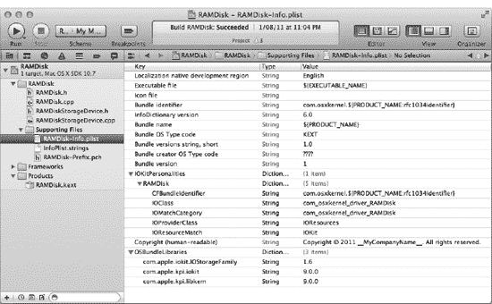

***图 14-3.** 示例 RAM 磁盘驱动程序的属性列表*

构建 RAM 磁盘驱动程序并加载生成的内核扩展后，将显示一个类似于图 14-4 所示的对话框。这并不表示设备存在问题，但确实表明 Mac OS X 无法在磁盘上找到可读取的文件系统。鉴于磁盘尚未写入数据，这是一个预期的错误。

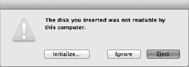

***图 14-4.** 当插入的磁盘不包含可读取的文件系统时，Mac OS X 显示的标准对话框*

点击图 14-4 所示对话框中的“初始化…”按钮，将启动“磁盘工具”应用程序，从而允许对存储设备进行分区并使用文件系统进行初始化。在此之前，使用 IORegisterExplorer 工具检查驱动程序栈的状态会很有趣。除了`RAMDisk`传输驱动程序和`RAMDiskStorageDevice`枢纽之外，您将注意到 I/O Kit 在枢纽驱动程序之上构建了三个驱动程序。驱动程序栈的状态如图 14-5 所示。

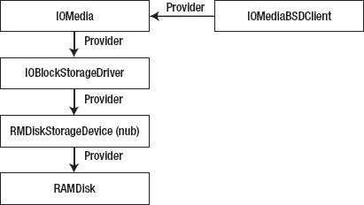

***图 14-5.** 加载未格式化的存储设备时创建的驱动程序栈*

磁盘工具应用程序允许对磁盘进行格式化并初始化为文件系统。此过程包括向磁盘写入分区表（即使磁盘仅包含单个分区也需要），然后向该分区写入文件系统。要使用磁盘工具格式化磁盘，请从左侧磁盘列表中选择设备，然后点击“抹掉”选项卡。磁盘工具中显示的设备名称源自`IOBlockStorageDevice`枢纽返回的描述性字符串，因此对于示例 RAM 磁盘，结果会得到一个名为“RAM Disk Media”的设备。

默认情况下，磁盘工具会向磁盘写入 GUID 分区表，并使用 Mac OS 扩展文件系统（也称为 HFS+文件系统）。磁盘工具不会对卷执行低级格式化，因此无需实现`IOBlockStorageDevice`的`doFormatMedia`方法。初始化卷的过程如图 14-6 所示。

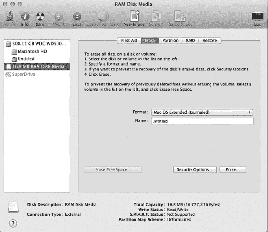

***图 14-6.** 在磁盘工具中初始化新卷*


当分区表和文件系统被写入磁盘后，RAM 磁盘的存储驱动程序栈将再多包含三个驱动程序，如图 14-7 所示。在代表整个磁盘的 `IOMedia` 对象之上，是一个代表磁盘上分区表的 I/O Kit 类；在本例中，该分区表为 GUID 分区表。每个分区都有一个 `IOMedia` 对象，代表该分区的逻辑卷。

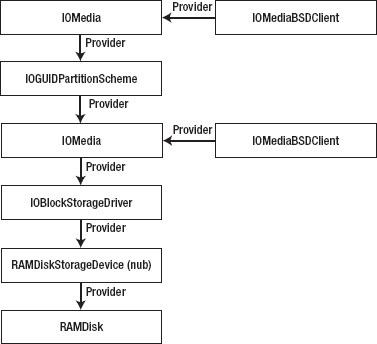

***图 14-7.** 使用 GUID 分区表（包含单个分区）进行分区后的设备驱动程序栈*

当我们为 RAM 磁盘实现驱动程序时，所实现的所有方法都特定于从设备访问数据；它无需提供任何方法来处理分区方案或文件系统，也无需让用户空间进程能够访问该设备。所有这些功能都由 I/O Kit 的 `IOStorageFamily` 所提供的类来处理，特别是 `IOBlockStorageDriver`、`IOMedia` 和 `IOMediaBSDClient` 类。这种设计的好处在于，这些功能在所有存储设备中大部分是通用的，可以在共享类中实现，从而无需每个存储设备都重写相同的功能。

`IOBlockStorageDevice` 和 `IOBlockStorageDriver` 类代表磁盘驱动器硬件，而 `IOMedia` 类代表该驱动器中当前存在的磁盘。以我们的示例 RAM 磁盘驱动程序或 USB 闪存驱动器为例，只要存在存储设备，就始终存在介质；这两者密不可分。然而，情况并非总是如此；例如，一个 CD 驱动器会创建一个 `IOBlockStorageDevice`（I/O Kit 会为其创建一个对应的 `IOBlockStorageDriver`），但除非驱动器中有一张 CD，否则驱动程序栈中将不存在 `IOMedia` 对象。

`IOMedia` 类提供了磁盘的逻辑表示。如果磁盘已分区，一个存储设备将拥有多个 `IOMedia` 对象，每个分区对应一个，此外还有一个代表整个磁盘的对象。在 RAID 的情况下，如果跨越多个磁盘创建了一个单一卷，则会有一个 `IOMedia` 对象代表整个逻辑 RAID 卷。

内核中的每个 `IOMedia` 对象都有一个名为 `IOMediaBSDClient` 的伴随对象，它负责让用户空间进程能够访问该逻辑磁盘。在大多数情况下，进程无需直接与磁盘驱动程序交互。相反，它只需使用已挂载卷上的文件系统来读写该卷中包含的文件。在某些情况下，用户空间进程可能需要直接读写磁盘设备，或直接向磁盘驱动程序发送 ioctl 调用。

遵循 BSD 的惯例，每个磁盘和每个磁盘分区都会创建一个块设备接口和一个字符设备接口。块设备执行带缓冲的 I/O，每次读写都通过缓冲区缓存进行。当进程执行读取操作时，包含所访问数据的磁盘块会从磁盘读取，放入缓冲区缓存，然后复制到用户进程提供的目标缓冲区中。如果进程读取最近访问过的磁盘块，数据很可能已在缓冲区缓存中，从而无需访问磁盘即可完成读取请求。

字符设备提供对磁盘存储的原始访问，不经过缓冲区缓存。这意味着对设备的每次读写都会导致调用设备的 `IOBlockStorageDevice` 接口的方法，该方法会直接读取或写入进程的缓冲区。因此，对字符设备执行的所有读写操作都必须从磁盘块边界开始，并且传输的字节数必须是磁盘块大小的整数倍。

块设备和字符设备接口由 `IOMediaBSDClient` 类创建。块设备接口可通过路径 `/dev/diskN` 访问，字符设备接口可通过路径 `/dev/rdiskN` 访问，其中 `N` 是一个整数，用于赋予设备唯一名称。

构建并加载 RAM 磁盘驱动程序后，可以通过运行终端命令 `diskutil list` 来查看系统中存在的磁盘设备列表。针对 RAM 磁盘设备，此命令输出的示例如列表 14-7 所示。接口 `disk1` 对应于整个存储设备，接口 `disk1s1` 对应于 HFS+ 分区。

***列表 14-7.** 针对 RAM 磁盘设备运行命令 `diskutil list` 的输出*

```
/dev/disk1
   #:   TYPE                    NAME            SIZE            IDENTIFIER
   0:   GUID_partition_scheme                   *16.8 MB        disk1
   1:   Apple_HFS               VolumeName      16.7 MB         disk1s1
```

##### 分区方案

一个磁盘可能被分割成多个更小的逻辑单元，每个单元对用户来说都像是一个独立的磁盘。即使一个硬盘只有一个分区，它也会包含一个分区表，列出了从该磁盘创建的一个或多个分区。Mac OS X 支持许多常见的分区方案，包括 Mac OS X 默认的 GUID 分区方案、在 Windows 上仍然常见的**主引导记录**，以及 **Apple 分区映射**（后者是 Mac OS 在转向基于 Intel 的 Mac 之前的默认分区方案）。

通过编写一个派生自 `IOPartitionScheme` 类的 I/O Kit 驱动程序，可以向 Mac OS X 添加对新分区方案的支持。分区方案驱动程序会在磁盘插入时加载，并扫描磁盘以寻找它能识别的分区表。如果找到了该驱动程序支持的分区表，它会为分区表中的每个条目创建一个 `IOMedia` 对象，并将这些 `IOMedia` 对象附加到其上方（位于驱动程序存储栈中）。由分区驱动程序创建的 `IOMedia` 对象仅描述分区所覆盖的磁盘区域，而非整个磁盘内容。

一个 `IOMedia` 对象可以描述整个磁盘，也可以描述一个由磁盘上物理上连续的块子集组成的单个分区。当实例化 `IOMedia` 对象时，其构造函数会接收一个属性，用于标识该 `IOMedia` 对象是否描述整个磁盘。尽管分区驱动程序会针对一个 `IOMedia` 对象加载，但它只会针对描述整个磁盘内容的 `IOMedia` 对象加载，因为分区表通常不会位于某个分区内部。

分区方案驱动程序成功扫描磁盘后，最终结果是构建了一个类似于图 14-7 所示的存储驱动程序栈：一个描述整个磁盘内容的 `IOMedia` 对象（位于驱动程序栈中 `IOBlockStorageDriver` 之上的对象），以及每个分区对应的一个 `IOMedia` 对象（位于驱动程序栈中 `IOGUIDPartitionTableScheme` 之上的对象）。

值得注意的是，分区方案驱动程序仅负责读取磁盘上已有的分区表；`IOPartitionScheme` 类不包含任何用于写入分区表的方法。可以通过提供一个直接写入磁盘设备的用户空间工具程序来创建分区表。


  
#### 实现分区方案示例

在本节中，我们将探讨如何为 I/O Kit 中的假想分区映射驱动程序实现其功能。首先，让我们查看驱动程序的属性列表，特别是其匹配字典，如代码清单 14-8 所示。

**代码清单 14-8.** 分区方案驱动程序属性列表中的示例匹配字典

```xml
<key>IOKitPersonalities</key>
<dict>
    <key>SamplePartitionScheme</key>
    <dict>
        <key>CFBundleIdentifier</key>
        <string>com.osxkernel.SamplePartitionScheme</string>
        <key>IOClass</key>
        <string>com_osxkernel_driver_SamplePartitionScheme</string>
        <key>IOMatchCategory</key>
        <string>IOStorage</string>
        <key>IOProviderClass</key>
        <string>IOMedia</string>
        <key>IOPropertyMatch</key>
        <dict>
            <key>Whole</key>
            <true/>
        </dict>
    </dict>
</dict>
```

匹配字典有三个重要方面：

-   它指定了提供者类为 `IOMedia`，因此每当插入新磁盘（并创建 `IOMedia` 对象来表示该磁盘）时，分区驱动程序将有机会检查磁盘内容以查找支持的分区表。
-   分区驱动程序只关心代表整个磁盘的 `IOMedia` 对象，因为分区表不可能位于磁盘分区内部。为了将匹配范围缩小到仅代表整个磁盘的 `IOMedia` 对象，匹配字典使用了 `IOPropertyMatch` 键，指定 I/O Kit 仅针对包含 `Whole` 属性且布尔值为 `true` 的 `IOMedia` 对象加载驱动程序。这是 `IOMedia` 对象的标准属性，用于指明该对象是覆盖整个磁盘，还是磁盘的某个分区。
-   属性列表指定了 `IOMatchCategory` 为 `IOStorage`。该属性出现在分区驱动程序的属性表中，对于正确构建存储驱动程序堆栈至关重要。特别是，某些驱动程序会使用 `IOMatchCategory` 属性来判断自身是否位于驱动程序堆栈的顶部，或者其顶层的驱动程序是否也属于 `IOStorage` 堆栈的一部分。

尽管分区方案驱动程序是存储驱动程序堆栈的一部分，并且仅在磁盘拔出后才被卸载，但该驱动程序本身只在磁盘首次插入时发挥作用——此时它负责从磁盘读取分区表，并为其找到的每个分区实例化一个 `IOMedia` 对象。作为派生自标准 I/O Kit 类 `IOService` 的驱动程序，分区方案驱动程序通过 `init()`、`probe()` 和 `start()` 方法执行这些操作，并在卸载时通过 `stop()` 和 `free()` 方法完成清理。

`probe()` 方法对于 `IOPartitionScheme` 驱动程序尤为重要。每当磁盘添加到系统时，分区方案驱动程序就会被实例化，由该驱动程序判断磁盘是否包含支持的分区表，如果不支持，则允许更适合的 `IOPartitionScheme` 驱动程序加载。这一过程通过标准的 `IOService` 方法 `probe()` 实现。通常，`probe()` 方法的目的是检查硬件，确定驱动程序是否能够支持该设备，如果可以，则返回一个整数值，表示驱动程序与硬件的匹配程度。探测分值最高的驱动程序将由 I/O Kit 加载。

对于 `IOPartitionScheme` 驱动程序，`probe()` 方法的职责是读取足够的磁盘信息，以判断磁盘上的分区表是否被驱动程序支持，如果支持，则继续读取分区表条目。严格来说，并非必须在 `probe()` 方法中读取整个分区表，但这样做可以避免在调用驱动程序的 `start()` 方法时重新扫描分区表。Apple 作为 Mac OS X 一部分提供的分区方案驱动程序更进一步，实际上会在 `probe()` 方法中为找到的每个分区实例化一个 `IOMedia` 对象。

如果磁盘包含分区方案驱动程序可识别的分区表，并且 I/O Kit 选定该分区驱动程序为最合适的驱动程序，则会调用其 `start()` 方法。此时，分区方案驱动程序应为每个分区条目创建一个 `IOMedia` 对象，并将其附加到存储驱动程序堆栈中。

`probe()` 和 `start()` 方法的示例实现如代码清单 14-9 所示。该驱动程序基于 `IOStorage` 家族中作为 Darwin 源代码一部分包含的分区方案驱动程序。

与 Darwin 中包含的分区驱动程序一样，代码清单 14-9 中的实现有一个名为 `scan()` 的自定义方法，用于检查磁盘，如果找到支持的分区表，则为每个分区实例化一个 `IOMedia` 对象，并通过 `OSSet` 对象将分区集合返回给调用者。如果在扫描过程中未找到任何 `IOMedia` 对象，则 `probe()` 方法返回失败（以 `NULL` 结果值表示），I/O Kit 将继续为磁盘搜索其他分区方案驱动程序。如果找到支持的分区表，探测方法会将表示每个分区的 `IOMedia` 对象集合保存到名为 `m_partitions` 的实例变量中。

**代码清单 14-9.** 分区方案驱动程序中 `probe()` 和 `start()` 方法的实现

```cpp
#include <IOKit/storage/IOPartitionScheme.h>

// 定义超类
#define super IOPartitionScheme

OSDefineMetaClassAndStructors(com_osxkernel_driver_PartitionScheme, IOPartitionScheme)

IOService* com_osxkernel_driver_PartitionScheme::probe(IOService* provider, SInt32* score)
{
    if (super::probe(provider, score) == NULL)
        return NULL;

    // 扫描 IOMedia 以寻找支持的分区表。
    m_partitions = scan(score);

    // 如果未找到分区表，则返回 NULL。
    return m_partitions ? this : NULL;
}

bool com_osxkernel_driver_PartitionScheme::start (IOService *provider)
{
    IOMedia*                partition;
    OSIterator*             partitionIterator;

    if (super::start(provider) == false)
        return false;

    // 为在探测过程中找到并实例化的 IOMedia 对象创建迭代器。
    partitionIterator = OSCollectionIterator::withCollection(m_partitions);
    if (partitionIterator == NULL)
        return false;

    // 附加并注册每个 IOMedia 对象（代表找到的分区）。
    while ((partition = (IOMedia*)partitionIterator->getNextObject()))
    {
        if (partition->attach(this))
        {
            attachMediaObjectToDeviceTree(partition);
            partition->registerService();
        }
    }
    partitionIterator->release();

    return true;
}
```  


如果`probe()`方法返回成功且 I/O Kit 未找到更好的驱动程序，我们的分区驱动程序将被添加到存储堆栈中，并调用其`start()`方法。分区驱动程序的`start()`方法的作用是将其每个`IOMedia`对象附加到存储驱动程序堆栈，其中每个`IOMedia`对象代表磁盘上的单个分区条目。这是通过名为`attach()`的`IOService`方法完成的，该方法将`IOMedia`对象作为分区驱动程序（即提供者类）的子级插入到 I/O Registry 的服务平面中。

除了将`IOMedia`对象插入 I/O Registry 的服务平面外，可能还需要将其插入 I/O Registry 的设备平面。只有当分区可能被用作基于 PowerPC 的 Macintosh 的引导卷时才需要此操作。这是因为在基于 PowerPC 的 Macintosh 上，引导卷是通过其在 I/O Registry 设备平面中的位置来标识的，因此代表引导分区的`IOMedia`对象需要在设备平面中有一个条目。`IOPartitionScheme`超类提供了一个名为`attachMediaObjectToDeviceTree()`的方法，该方法会将`IOMedia`对象插入 I/O Registry 的设备平面。

`scan()`方法是一个自定义方法，用于确定磁盘是否包含驱动程序支持的分区方案，如果包含，则从磁盘读取分区表条目并创建一组代表每个分区的`IOMedia`对象。这要求分区驱动程序能够读取磁盘，这是通过驱动程序的提供者对象执行的。如驱动程序匹配字典中所指定（参见清单 14-8），分区驱动程序的提供者类是一个代表整个磁盘的`IOMedia`对象。`scan()`方法的一个示例实现在清单 14-10 中提供。

***清单 14-10.** 检测磁盘上示例分区表的存在并实例化该分区表的 IOMedia 对象的方法*

```
OSSet*  com_osxkernel_driver_PartitionScheme::scan(SInt32* score)
{
        IOBufferMemoryDescriptor*       buffer          = NULL;
        SamplePartitionTable*           sampleTable;
1       IOMedia*                        media           = getProvider();
        UInt64                          mediaBlockSize  = media->getPreferredBlockSize();
        bool                            mediaIsOpen     = false;
        OSSet*                          partitions      = NULL;
        IOReturn                        status;

        // 确定此介质是否已格式化。
2       if (media->isFormatted() == false)
                goto bail;
        // 分配一个扇区大小的缓冲区，用于保存从磁盘读取的数据。
3       buffer = IOBufferMemoryDescriptor::withCapacity(mediaBlockSize, kIODirectionIn);
        if (buffer == NULL)
                goto bail;

        // 分配一个集合，用于保存代表磁盘分区的介质对象。
4       partitions = OSSet::withCapacity(8);
        if (partitions == NULL)
                goto bail;

        // 打开存储驱动程序栈（此分区驱动程序是其一部分）以进行读取访问。
5       mediaIsOpen = open(this, 0, kIOStorageAccessReader);
        if (mediaIsOpen == false)
                goto bail;

        // 读取磁盘的第一个扇区。
6       status = media->read(this, 0, buffer);
        if (status != kIOReturnSuccess)
                goto bail;
        sampleTable = (SamplePartitionTable*)buffer->getBytesNoCopy();

        // 确定第一个扇区是否包含我们可识别的分区签名。
7       if (strcmp(sampleTable->partitionIdentifier, kSamplePartitionIdentifier) != 0)
                goto bail;

        // 扫描分区映射中的有效分区条目。
8       for (int index = 0; index < sampleTable->partitionCount; index++)
        {
9               if (isPartitionInvalid(&sampleTable->partitionEntries[index]))
                        continue;

                IOMedia*        newMedia;
10              newMedia = instantiateMediaObject(&sampleTable->partitionEntries[index],
                                                  1+index);
                if ( newMedia )
                {
                        partitions->setObject(newMedia);
                        newMedia->release();
                }
        }

        // 释放临时资源。
11      close(this);
        buffer->release();

        return partitions;

bail:
        // 非成功返回；释放所有已分配的对象。
12      if ( mediaIsOpen )      close(this);
        if ( partitions )       partitions->release();
        if ( buffer )           buffer->release();

        return NULL;
}
```

与清单 14-10 中的编号行相对应，以下是清单中所执行步骤的概述：


1.  我们获得一个指向提供者类的指针，它是一个代表整个磁盘的`IOMedia`对象。所有磁盘读取操作都通过此对象执行，包括从磁盘读取分区表。
2.  在检查分区表之前，我们先检查磁盘介质的任何属性。如果磁盘介质未格式化，我们中止扫描。这也是验证必要条件（例如分区方案可能要求的最小磁盘块大小）的合适位置。
3.  从磁盘读取的所有数据都将写入一个`IOMemoryDescriptor`作为目标。因此，我们分配一个`IOBufferMemoryDescriptor`来保存此方法将从磁盘读取的数据内容。由于此内存描述符将用于从磁盘读取数据的操作，其方向必须设置为`kIODirectionIn`。
4.  我们分配一个`OSSet`容器来保存代表磁盘上找到的每个分区的`IOMedia`对象集合。尽管`OSSet`集合的初始容量为 8 个对象，但若插入超过 8 个`IOMedia`对象，`OSSet`将自动扩展。
5.  存储驱动程序堆栈（分区驱动程序是其一部分）已打开以进行读取访问。由于分区驱动程序将从磁盘读取分区表，但不修改磁盘内容，它只需要读取访问权限。
6.  从磁盘读取第一个磁盘扇区。这通常是分区表头的位置。此示例中使用的假设分区方案将其头部存储在第一个磁盘扇区中。`read()`方法的`buffer`参数同时指定了读取数据的目标和要读取的字节数。
7.  根据从磁盘读取的数据，分区驱动程序确定磁盘是否包含其支持的分区方案。此代码将特定于分区方案；我们的示例驱动程序使用的假设分区方案通过写入磁盘第一个块的字符串常量来标识。因此，驱动程序使用`strcmp()`函数来确定此字符串是否存在，如果找不到，则假定磁盘上存在其他分区方案并返回失败。
8.  代码遍历从磁盘读取的分区表中的每个条目。此代码将特定于分区方案；此示例中使用的假设分区方案将整个分区表存储在初始磁盘扇区中。
9.  验证分区条目。这可能涉及检查分区条目的起始块和长度是否不超过磁盘的容量等。
10. 实例化一个新的`IOMedia`对象来表示该分区条目。
11. 如果成功扫描了分区表，则关闭存储驱动程序堆栈（以平衡之前对`open()`的调用），并将`IOMedia`对象集返回给调用者。
12. 如果发生错误，代码将释放任何已部分分配的资源。

作为第 10 步的一部分调用的`instantiateMediaObject()`方法的实现见列表 14-11。这是一个由我们的分区方案驱动程序定义的自定义方法。

***列表 14-11.** 实例化代表单个磁盘分区的`IOMedia`对象的方法*

```
IOMedia* com_osxkernel_driver_PartitionScheme::instantiateMediaObject
                                (SamplePartitionEntry* sampleEntry, int index)
{
        IOMedia*        media           = getProvider();
        UInt64          mediaBlockSize  = media->getPreferredBlockSize();
        IOMedia*        newMedia;

1       newMedia = new IOMedia;
        if ( newMedia )
        {
                UInt64          partitionBase, partitionSize;

2               partitionBase = OSSwapLittleToHostInt64(sampleEntry->blockStart) *
                                      mediaBlockSize;
                partitionSize = OSSwapLittleToHostInt64(sampleEntry->blockCount) *
                                      mediaBlockSize;

3               if ( newMedia->init(partitionBase, partitionSize, mediaBlockSize,
                     media->getAttributes(), false, media->isWritable()))
                {
4                       // 为此分区设置一个名称。
                        newMedia->setName(sampleEntry->name);

                        // 为此分区设置一个位置值（分区编号）。
                        char location[12];
                        snprintf(location, sizeof(location), "%d", index);
                        newMedia->setLocation(location);

                        // 为此分区设置“分区 ID”键。
                        newMedia->setProperty(kIOMediaPartitionIDKey, index, 32);
                }
                else
                {
5                       newMedia->release();
                        newMedia = NULL;
                }
        }

6       return newMedia;
}
```

对应列表 14-11 中的编号行，以下是列表中执行步骤的概述：

1.  使用 C++ “`new`”运算符分配一个`IOMedia`对象。
2.  从分区表条目中读取分区的起始磁盘块号和分区大小。分区方案具有标准的字节序，可能与驱动程序运行的主机的本机字节顺序不同，因此使用诸如`OSSwapLittleToHostInt64()`之类的字节序宏来确保正确读取数据非常重要。
3.  初始化已分配的`IOMedia`对象。此处提供了`IOMedia::init()`方法的参数：

```
      virtual bool init(UInt64                base,
                        UInt64                  size,
                        UInt64                  preferredBlockSize,
                        IOMediaAttributeMask    attributes,
                        bool                    isWhole,
                        bool                    isWritable,
                        const char*             contentHint = 0,
                        OSDictionary*           properties  = 0);
```

参数`base`和`size`定义了分区在磁盘上的位置，以字节为单位。另一个重要参数是布尔参数`isWhole`，它被设置为`false`以表明此`IOMedia`对象代表一个分区，而不是整个磁盘。参数`contentHint`描述了分区的内容，例如卷使用的文件系统。关于`contentHint`属性的描述将在下一节中说明。

4.  分区的各种属性在分区的`IOMedia`对象上设置。这些包括分区名称，以及位置和分区 ID，两者都源自于该分区在分区表中的索引。
5.  如果`IOMedia`对象未能成功初始化，则释放它。
6.  将初始化后的`IOMedia`对象返回给调用者，如果对象未能成功初始化则返回`NULL`。

最后，当分区方案的驱动程序被卸载时，它必须从其驱动程序堆栈中移除其`IOMedia`对象并释放它们。分区驱动程序可能因磁盘被弹出或磁盘被重新格式化而被卸载，在后一种情况下，可能已将新的分区表写入磁盘，甚至可能使用了不同的分区方案。


### 排版后的内容

列表 14-12 展示了一个分区方案驱动程序实现 `stop()` 和 `free()` 方法的示例。`stop()` 方法将每个 `IOMedia` 对象从 I/O Registry 的设备平面中移除，从而撤销分区驱动在其 `start()` 方法中执行的 `attachMediaObjectToDeviceTree()` 调用。在卸载分区驱动之前，会调用其 `free()` 方法，该方法释放了用于存储各分区条目 `IOMedia` 对象集合的 `OSSet`。

**列表 14-12.** 分区方案驱动程序中 `stop()` 和 `free()` 方法的实现

```
void com_osxkernel_driver_PartitionScheme::stop(IOService* provider)
{
        IOMedia*                partition;
        OSIterator*             partitionIterator;

        // 分离我们先前附加到设备树中的媒体对象。
        partitionIterator = OSCollectionIterator::withCollection(m_partitions);
        if (partitionIterator)
        {
                while ((partition = (IOMedia*)partitionIterator->getNextObject()))
                {
                        detachMediaObjectFromDeviceTree(partition);
                }

                partitionIterator->release();
        }

        super::stop(provider);
}

void com_osxkernel_driver_PartitionScheme::free (void)
{
        if (m_partitions != NULL)
                m_partitions->release();

        super::free();
}
```

### 媒体内容提示属性

正如我们在列表 14-11 中所见，`IOMedia` 类的初始化方法接受一个名为 `contentHint` 的参数。虽然该参数不会被 `IOMedia` 对象解释，但在驱动存储栈的构建中却扮演着非常重要的角色。`contentHint` 参数是一个字符串值，用于描述 `IOMedia` 对象在磁盘上包含的内容。对于一个表示整个磁盘的 `IOMedia` 对象而言，内容提示可以标识该磁盘包含的分区方案。对于一个表示单个分区的 `IOMedia` 对象，内容提示可以标识该卷所使用的文件系统类型。内容提示也可用于自定义目的；例如，提供磁盘加密功能的驱动可以使用内容提示来描述磁盘上已采用的加密方案。

内容提示并非用于向用户描述内容，而是为系统上的其他驱动提供可用的信息。传递给 `IOMedia` 类初始化方法的 `contentHint` 参数，会作为 `IOMedia` 对象上的一个 I/O Registry 属性进行设置。这使得存储栈中的其他驱动可以访问内容提示的值，但更重要的是，它提供了一个可以被指定并与另一个驱动的匹配字典进行匹配的属性。

当我们创建分区方案驱动时，我们指定了一个 `IOPropertyMatch` 项（见列表 14-8），这限制了驱动只与特定的 `IOMedia` 对象进行匹配。就分区方案驱动而言，我们只匹配那些代表整个磁盘的 `IOMedia` 对象。这是通过告知 I/O Kit：分区驱动应仅与包含名为 `"Whole"` 且值为 `true` 的属性的 `IOMedia` 对象进行匹配来实现的。类似地，一个驱动可以向其匹配字典中添加包含键 `"Content Hint"` 的 `IOPropertyMatch` 项，并指定一个包含该驱动感兴趣的具体内容类型的值。例如，这可用于防止磁盘加密驱动加载到未加密的 `IOMedia` 卷上。

内容提示属性的另一个重要用途是识别要为某个 `IOMedia` 卷加载的正确文件系统驱动。仅当 `IOMedia` 对象的内容提示值标识出一个受支持的文件系统时，Mac OS X 才会加载该文件系统驱动。

由于在初始化 `IOMedia` 对象时需要指定内容提示值，因此任何实例化 `IOMedia` 对象的驱动都需要了解该对象所代表的磁盘或分区的内容。对于分区方案驱动，内容提示将来自存储在磁盘上的分区表。例如，Apple 分区映射包含一个直接用作内容提示值的字符串，对应每个分区条目。GUID 分区表则为每个分区包含一个 128 位的 GUID，用于标识该分区的文件系统和内容。该 GUID 会被转换为字符串表示形式，然后用作内容提示。这意味着可能存在多个内容提示值来标识同一文件系统，因此一个文件系统驱动必须针对 `IOMedia` 内容提示中每个可能标识其文件系统的值进行匹配。


### 媒体过滤器驱动程序

驱动程序存储栈的顶部可能包含一个或多个媒体过滤器驱动程序。媒体过滤器驱动程序（也称为过滤方案驱动程序）会匹配存储栈中现有的 `IOMedia` 对象，并创建一个新的 `IOMedia` 对象来表示经过过滤的媒体对象。所有对磁盘的读写请求都会经过该过滤方案驱动程序，使得过滤驱动程序能够操控所读取的数据块，甚至在数据于原始 `IOMedia` 对象与存储栈中其上方的已过滤 `IOMedia` 对象之间传输时对其进行操控。

过滤方案驱动程序可用于实现多种类型的功能。例如，过滤驱动程序可通过匹配磁盘上表示加密分区的 `IOMedia` 对象，并发布一个表示文件系统所使用的未加密分区的 `IOMedia` 对象，来实现块级磁盘加密。过滤方案驱动程序的另一种用途是实现 RAID 驱动程序，该程序匹配多个 `IOMedia` 对象（每个对象代表 RAID 集中的一块独立磁盘），并创建一个表示逻辑卷的单一 `IOMedia` 对象。过滤方案驱动程序与其所控制的 `IOMedia` 对象，以及其发布的 `IOMedia` 对象之间的关系，如图 14-8 所示。

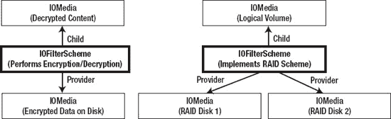

***图 14-8.** 过滤方案驱动程序与其提供者类的关系，以及它为加密方案（左）和 RAID 驱动程序（右）创建的 `IOMedia` 对象*

先前章节中开发的分区方案驱动程序可被视为过滤驱动程序的一种特殊形式。与过滤驱动程序类似，分区方案驱动程序会针对现有的 `IOMedia` 对象加载，并创建一个或多个表示磁盘分区的 `IOMedia` 对象。然而，与分区方案不同的是，通用过滤驱动程序可以有多个提供者类，如图 14-8 中所示的 RAID 驱动程序。另一个区别在于，与过滤驱动程序不同，分区方案驱动程序通常不参与处理通过其所创建的 `IOMedia` 对象进行的每次读写请求。

I/O Kit 提供了一个名为 `IOFilterScheme` 的类，它构成了实现媒体过滤方案的任何驱动程序的超类。过滤方案驱动程序通常会利用其所匹配的 `IOMedia` 对象的“内容提示”属性值，将过滤方案限制为仅加载到该过滤方案能够支持的 `IOMedia` 对象上。例如，Apple 软件 RAID 驱动程序使用 GUID 分区表格式化 RAID 集中的每个磁盘，因此，每个磁盘的 `IOMedia` 对象都包含一个 GUID 作为其“内容提示”属性。Apple 定义了一个 GUID 来指示该磁盘分区构成 RAID 集的一部分，Apple RAID 驱动程序将与之匹配。当 Apple RAID 驱动程序创建其子 `IOMedia` 对象以表示逻辑卷时，它会为该 `IOMedia` 对象赋予一个表示写入整个 RAID 集的文件系统的内容提示。

 **注意** 文件系统驱动程序只会加载到驱动程序存储栈中的顶层（叶节点）`IOMedia` 对象。这意味着，即使过滤方案驱动程序可能匹配一个包含可读文件系统的 `IOMedia` 对象，并创建另一个具有可读文件系统的 `IOMedia` 对象，但只有堆栈中位于该过滤方案驱动程序上方的对象才会被挂载到用户的桌面上。

#### 用于加密的示例过滤方案

让我们通过实现一个简单的块级加密驱动程序，来研究示例过滤方案驱动程序的实现。此示例驱动程序在安全性方面并未采用复杂设计——它仅实现了一个基础的 XOR 加密方案——但它确实展示了过滤方案驱动程序的结构。

我们将开发的过滤方案会加密整个分区的内容，并且我们的示例要求磁盘使用标准 GUID 分区表进行格式化。为了标识加密分区，我们将定义一个新的 GUID 来描述该分区的内容，我们可以使用命令行工具 `uuidgen` 来生成该 GUID。在本示例中，我们将使用 GUID `8D7FD0BB-39A8-43C0-9432-F4E1A269F070`，我们的示例驱动程序已将其定义为描述包含 HFS 文件系统的加密磁盘分区。此后，我们将在章节文本中使用术语 `Encrypted_HFS_GUID`，而非完整地写出该 GUID。

对于此示例，我们将使用标准 GUID 分区表，这意味着存储驱动程序栈中的分区方案驱动程序将是标准的 Apple GUID 分区方案驱动程序。Apple 驱动程序会将每个分区的 `IOMedia` 对象的“内容提示”属性设置为磁盘分区头中的分区类型 GUID。这意味着我们的加密过滤驱动程序希望加载的 `IOMedia` 对象将具有 `Encrypted_HFS_GUID` 的内容提示。加密过滤驱动程序可以忽略所有其他 `IOMedia` 对象，因为它知道它们不代表加密分区。通过添加 `IOPropertyMatch` 键，可以在过滤驱动程序的匹配字典中表达此要求，如代码清单 14-13 所示。

***代码清单 14-13.** 实现加密的示例过滤方案驱动程序的属性列表中的匹配字典*

```
<key>IOKitPersonalities</key>
<dict>
        <key>SampleEncryptionFilter</key>
        <dict>
                <key>Content Mask</key>
                <string>Sample_Encrypted_Data</string>
                <key>CFBundleIdentifier</key>
                <string>com.osxkernel.SampleEncryptionFilter</string>
                <key>IOClass</key>
                <string>com_osxkernel_driver_SampleEncryptionFilter</string>
                <key>IOMatchCategory</key>
                <string>IOStorage</string>
                <key>IOProviderClass</key>
                <string>IOMedia</string>
                <key>IOPropertyMatch</key>
                <dict>
                        <key>Content Hint</key>
                        <string>8D7FD0BB-39A8-43C0-9432-F4E1A269F070</string>
                </dict>
        </dict>
</dict>
```

当过滤方案驱动程序加载时，它可能需要探测其 `IOMedia` 提供者类，以确定它是否包含过滤驱动程序支持的内容。如果是，它会创建一个或多个表示已过滤卷的 `IOMedia` 子对象。这些步骤类似于代码清单 14-9 中所示的分区方案驱动程序的 `probe()` 和 `start()` 方法的实现。然而，与分区方案驱动程序不同，我们的示例加密过滤方案驱动程序可以忽略 `probe()` 方法，因为驱动程序的属性列表已设置，以确保驱动程序仅加载到其“内容提示”属性包含我们的 `Encrypted_HFS_GUID` 类型的 `IOMedia` 对象上。因此，如果驱动程序加载，我们可以假定它正在加载到一个加密分区上。


```markdown
在样本过滤方案驱动程序的`start()`方法中，我们需要创建一个代表已过滤磁盘内容的新`IOMedia`对象；正是通过这个`IOMedia`对象，我们将未加密的数据暴露给系统的其余部分（例如文件系统）。与分区方案驱动程序一样，过滤器驱动程序正确设置其创建的任何子`IOMedia`对象的`contentHint`参数非常重要，因为这是系统能够识别应针对`IOMedia`卷加载哪个文件系统（甚至另一个过滤器方案驱动程序）的方式。对于我们的样本加密过滤器，我们做了一个随意的设计选择，即它将加密 HFS 文件系统，因此由过滤器方案发布的`IOMedia`子对象将在创建时使用`Apple_HFS`作为`contentHint`值。

样本加密过滤器方案的`start()`方法的实现见清单 14-14。我们的样本过滤器方案不提供`init()`或`probe()`方法的实现，因为超类提供的实现已经足够。

**清单 14-14.** 为提供加密的样本过滤器方案实现`start()`方法

```
#include <IOKit/storage/IOFilterScheme.h>

// Define the superclass.
#define super IOFilterScheme

OSDefineMetaClassAndStructors(com_osxkernel_driver_SampleEncryptionFilter, IOFilterScheme)

bool com_osxkernel_driver_SampleEncryptionFilter::start (IOService *provider)
{
        if (super::start(provider) == false)
                return false;

        // Save a reference to our provider class, and verify that it is an IOMedia object.
        m_encryptedMedia = OSDynamicCast(IOMedia, provider);
        if (m_encryptedMedia == NULL)
                return false;

        // Create a child IOMedia object to represent the unencrypted data.
        m_childMedia = instantiateMediaObject();
        if (m_childMedia == NULL)
                return false;

        // Attach the unencrypted IOMedia object to the storage driver stack.
        if (m_childMedia->attach(this) == false)
                return false;
        m_childMedia->registerService();

        return true;
}

IOMedia* com_osxkernel_driver_SampleEncryptionFilter::instantiateMediaObject ()
{
        IOMedia*        newMedia;

        // Allocate a new IOMedia object.
        newMedia = new IOMedia;
        if ( newMedia )
        {
                // Initialize the child IOMedia object.
                // Nearly all of its parameters can be obtained from the provider class.
                if ( newMedia->init(0,                          // base
                                m_encryptedMedia->getSize(),
                                m_encryptedMedia->getPreferredBlockSize(),
                                m_encryptedMedia->getAttributes(),
                                false,                          // isWhole
                                m_encryptedMedia->isWritable(),
                                "Apple_HFS"))                   // contentHint
                {
                        // Set a location value (the partition number) for this media object.
                        newMedia->setLocation("1");
                }
                else
                {
                        newMedia->release();
                        newMedia = NULL;
                }
        }

        return newMedia;
}
```

名为`instantiateMediaObject()`的方法是由`SampleEncryptionFilter`类定义的自定义方法，负责创建表示未加密磁盘内容的子`IOMedia`对象。子`IOMedia`对象的许多属性可以直接来自过滤器驱动程序加密的`IOMedia`提供程序类。对于实现块级加密的驱动程序，无需为子`IOMedia`对象修改卷大小和磁盘块大小等属性。通常，没有任何因素阻止过滤器方案驱动程序创建与其提供程序类不同大小或块大小的`IOMedia`设备，就像 RAID 驱动程序的过滤器方案可能需要的那样。

对于我们的样本加密驱动程序，我们需要拦截对未加密的子`IOMedia`对象执行的所有读写操作。因为我们的过滤器方案位于未加密的`IOMedia`对象（我们创建的子对象）和加密的`IOMedia`对象（我们的提供程序类）之间，所以对子`IOMedia`对象执行的所有读写操作都会通过我们的过滤器驱动程序，因此拦截这些操作只需重写超类中`read()`和`write()`方法的实现即可。

在读操作的情况下，我们的加密过滤器驱动程序需要将读请求传递给加密的`IOMedia`对象，并解密返回的数据。由于读取是异步执行的，这一点变得复杂，因此过滤器驱动程序需要提供完成回调，以便在读取完成时得到通知。此时，从加密卷读回的数据被解密，并调用由发起读取的客户端提供的原始读取完成回调。该实现见清单 14-15。

**清单 14-15.** 为提供加密的样本过滤器方案实现`read()`方法

```
void    com_osxkernel_driver_SampleEncryptionFilter::read (IOService* client,
                                UInt64 byteStart,
                                IOMemoryDescriptor* buffer, IOStorageAttributes* attributes,
                                IOStorageCompletion* completion)
{
        ReadCompletionParams*   context;
        IOStorageCompletion     newCompletion;

        // Allocate a structure to hold state while the read
        // is being performed asynchronously.
1       context = (ReadCompletionParams*)IOMalloc(sizeof(ReadCompletionParams));
        if (context == NULL)
        {
                complete(completion, kIOReturnNoMemory);
                return;
        }

2       context->completion = *completion;
        context->buffer = buffer;
        context->buffer->retain();

        // Setup a callback function so that we will be notified
        // when the encrypted data has been read from disk.
3       newCompletion.target = this;
        newCompletion.action = readCompleted;
        newCompletion.parameter = context;

        // Perform a read of the encrypted data from disk.
4       m_encryptedMedia->read(client, byteStart, buffer, attributes, &newCompletion);
}

void    com_osxkernel_driver_SampleEncryptionFilter::readCompleted (void* target,
                                                                    void* parameter,
                                                      IOReturn status, UInt64 actualByteCount)
{
        ReadCompletionParams*   context = (ReadCompletionParams*)parameter;

        // Decrypt the data read from disk.
5       if (status == kIOReturnSuccess)
                status = decryptBuffer(context->buffer, actualByteCount);

        // If  either the read from disk or the decryption operation failed,
        // set the actualByteCount value to 0.
        if (status != kIOReturnSuccess)
                actualByteCount = 0;
```


```c
        // 调用原始调用方的完成函数。
        complete(&context->completion, status, actualByteCount);
        context->buffer->release();
        IOFree(context, sizeof(ReadCompletionParams));
    }
```

对应列表 14-15 中的编号行，以下是列表中所执行步骤的概述：

1.  由于读取操作是异步执行的，因此在读取完成回调中所需的任何变量或状态都必须保存到临时结构中。我们使用`IOMalloc()`函数在内存中分配一个结构，以保存需要传递给完成回调的所有内容。
2.  初始化已分配的上下文结构。需要保存的一个参数是调用方提供的`IOStorageCompletion`结构；该结构包含调用方希望在读取完成时收到通知的回调函数。我们还保存了一个对`IOMemoryDescriptor`的引用，磁盘中的数据会被读取到此描述符中。由于我们将在回调中引用此对象，因此我们对其执行保留操作，以防止其在回调触发之前被释放。
3.  我们设置一个`IOStorageCompletion`结构，以传递我们自己的回调函数，从而在异步读取完成时收到通知。
4.  我们从加密的`IOMedia`对象执行读取操作。
5.  当读取完成时，将调用我们指定的回调函数（`readCompleted`）。如果读取成功完成，我们将解密从加密的`IOMedia`对象读回的数据。
6.  我们调用调用方提供的`IOStorageCompletion`回调，该回调通知调用方其缓冲区中包含所请求的解密数据。
7.  我们释放之前对`IOMemoryDescriptor`的引用，并释放在步骤 1 中分配的结构。

加密过滤器方案的写入操作实现相当直接，因为它可以在将结果数据写入加密的`IOMedia`对象之前执行加密。因此，即使写入操作是异步执行的，也无需替换调用方提供的完成回调（这与读取操作不同）。

我们并非在原地加密数据，而是分配一个新的`IOMemoryDescriptor`来保存加密后的数据。这使得我们可以保持调用方缓冲区不变，这一点很重要，因为写入操作不应更改源缓冲区的内容。尽管写入操作是异步执行的，但在写入期间，执行该操作的存储栈中的驱动程序会保留`IOMemoryDescriptor`缓冲区。这使我们能够在向加密的`IOMedia`对象发出写入后立即释放我们对该对象的引用。

加密过滤器方案的`write()`方法实现如列表 14-16 所示。

***列表 14-16.** 为提供加密功能的示例过滤器方案实现的 `write()` 方法*

```c
void    com_osxkernel_driver_SampleEncryptionFilter::write (IOService* client,
                                UInt64 byteStart,
                                IOMemoryDescriptor* buffer, IOStorageAttributes* attributes,
                                IOStorageCompletion* completion)
{
        IOMemoryDescriptor*             newDesc;

        // 分配一个缓冲区来保存加密数据并执行加密
        newDesc = encryptBuffer(buffer);
        if (newDesc == NULL)
        {
                // 如果无法分配目标缓冲区，则返回错误。
                complete(completion, kIOReturnNoMemory);
                return;
        }

        // 将加密数据写入加密的 IOMedia 对象。
        m_encryptedMedia->write(client, byteStart, newDesc, attributes, completion);

        // 释放对加密 IOMemoryDescriptor 的引用
        newDesc->release();
}
```


#### 创建自定义 GUID 分区表

我们在上一节中开发的加密过滤方案，只会针对一个 `IOMedia` 对象加载，该对象的“`Content Hint`”属性是一个我们为示例过滤方案目的而定义的自定义值。为了测试这个驱动程序，我们需要创建一个包含我们自定义 GUID 类型分区条目的 GUID 分区表。

这可以通过 Mac OS X 自带的多种命令行工具来实现。在本教程中，我们将创建一个包含 GUID 分区表的卷，用于测试加密过滤驱动程序。加密卷的存储设备将由一个磁盘映像提供，磁盘映像是一个充当虚拟磁盘的普通文件，包含一个文件系统（可能还有一个分区方案），可以作为一个卷挂载在 Mac OS X 桌面上。磁盘映像为测试过滤方案和分区方案驱动程序提供了一种便捷方式，因为它们很容易创建，而无需格式化物理介质。

本节提供了部分命令行工具的教程，这些工具可用于开发存储栈中的驱动程序。在本节中，我们将创建一个磁盘映像，写入一个包含我们指定分区类型的单个分区的 GUID 分区表，然后向我们加密卷写入一个 HFS 文件系统。所有这些任务都将通过命令行工具完成。

首先，打开终端应用程序。第一步是创建一个空白磁盘映像，它将为我们的介质提供存储空间，并扮演磁盘的角色。`hdiutil` 命令行实用程序是一个用于创建和操作磁盘映像文件的工具。我们可以使用以下命令创建一个 25MiB 的空白磁盘映像：

```
hdiutil create -megabytes 25 -layout NONE EncryptedImage.dmg
```

这将在当前工作目录中创建一个名为“`EncryptedImage.dmg`”的文件，包含一个 25MiB 的磁盘映像。选项“`-layout NONE`”指定我们不想在磁盘映像上创建分区表。由于生成的磁盘映像不包含分区映射和文件系统，因此无法挂载。但是，我们可以使用以下命令与该磁盘映像进行交互：

```
hdiutil attach -nomount EncryptedImage.dmg
```

了解了存储设备在 Mac OS X 内核中的实现方式后，我们就能很好地剖析此命令在后台执行的操作。“`hdiutil attach`”命令将加载 Apple 提供的用于管理磁盘映像的内核驱动程序；该驱动程序将派生自与用于实现 RAM 磁盘相同的 `IOBlockStorageDevice` 超类。一个存储驱动程序栈将被构建，其中包含一个代表整个磁盘映像内容的 `IOMedia` 对象。`IOMedia` 对象将有一个对应的 `IOMediaBSDClient` 对象，该对象会在 `/dev` 目录中发布磁盘映像的设备接口。这会导致创建一个块设备（例如 `/dev/disk1`）和一个字符设备（例如 `/dev/rdisk1`），通过它们可以访问磁盘映像。因附加磁盘映像而创建的块设备路径会打印到终端输出。

现在，我们可以通过其块设备接口读写磁盘映像，因此下一步是在磁盘上创建一个 GUID 分区表。`gpt` 命令是 Apple 随 Mac OS X 提供的一个命令行工具，用于创建和操作磁盘的 GUID 分区表。我们可以使用以下命令在空白磁盘上创建 GUID 分区表。请务必将路径 `/dev/diskN` 替换为与您系统上已附加磁盘映像对应的设备接口路径。

```
gpt create /dev/diskN
```

这会在磁盘上写入一个不包含任何分区的 GUID 分区表。我们想在磁盘上创建一个单独的分区，因此下一条命令将向磁盘的 GUID 分区表中插入一个条目：

```
gpt add -t 8D7FD0BB-39A8-43C0-9432-F4E1A269F070 /dev/diskN
```

虽然“`gpt add`”命令允许指定分区大小和起始块偏移量，但如果没有指定分区范围，该实用程序默认会创建一个从它在磁盘上找到的第一个未使用磁盘块范围开始的分区。这非常适合我们的目的，因为它创建了一个填充整个磁盘的单个分区。“`-t`”选项可用于指定所创建分区条目的 GUID 类型。这使我们能够创建一个分区条目，其 GUID 类型是我们为标识加密 HFS 卷而定义的自定义 GUID。向磁盘添加分区后，会创建一个代表该分区的新设备接口。该分区块设备接口的路径会打印到终端输出，其形式为 `/dev/diskNs1`。

 **注意** BSD 使用术语“slice”（切片）来指代磁盘分区。因此，`disk2s1` 指的是块设备“`disk2`”的第一个分区（切片）。切片编号来自 `IOMedia` 对象的 location 值。在我们的分区方案驱动程序和加密过滤方案中，我们为我们创建的每个 `IOMedia` 对象调用了 `setLocation()` 方法。我们提供的字符串用于生成设备接口的名称。

在内核层面，在磁盘上创建分区表会导致 Apple 提供的 `IOGUIDPartitionScheme` 驱动程序被加载。该驱动程序响应用户添加分区条目的操作，会实例化一个 `IOMedia` 对象来表示这个分区。该分区的 `IOMedia` 对象将有一个“`Content Hint`”属性，该属性等于我们分配给该分区的自定义 GUID 类型。此时，我们已准备好加载我们的加密过滤驱动程序。您应该记得，我们的过滤方案驱动程序会针对任何具有我们自定义内容提示 GUID 的 `IOMedia` 对象进行加载。如果我们没有创建具有指定内容类型的分区条目，我们的加密方案驱动程序将找不到合适的 `IOMedia` 对象进行匹配，也就无法测试我们的驱动程序了。

我们的加密过滤方案驱动程序在加载时会创建一个新的 `IOMedia` 对象。这会导致创建另一个块设备，其接口名称类似于“`diskNs1s1`”。此接口代表磁盘分区的未加密内容。在我们的示例加密过滤驱动程序中，它创建的 `IOMedia` 对象被赋予了一个“`Content Hint`”属性，值为 `Apple_HFS`，这告诉 Mac OS X 该介质包含默认的 HFS 文件系统，并导致为未加密卷加载 HFS 文件系统。但是，在此阶段，磁盘分区是空的，不包含任何文件系统。我们可以使用以下命令在卷上创建 HFS 文件系统：

```
newfs_hfs -v MyVolumeName /dev/diskNs1s1
```

选项“`-v`”允许指定卷名称。在上面的示例中，我们将 HFS 卷命名为“`MyVolumeName`”。向（未加密）卷写入 HFS 文件系统后，我们现在可以将文件系统挂载到 Mac OS X 桌面上。这可以通过以下命令完成：

```
hdiutil mountvol /dev/diskNs1s1
```

这将导致桌面上出现一个新卷。由于我们的加密过滤方案存在于存储栈中，任何写入磁盘的文件在数据写入磁盘映像文件之前，都会被我们的 XOR 加密修改。磁盘映像文件本身只是一个普通文件，因此可以通过在任何十六进制编辑器中打开 `.dmg` 文件来检查每个磁盘块的内容。这使得磁盘映像成为调试或验证分区方案驱动程序或过滤方案驱动程序是否正常运行的一种非常有用的手段。


### 排版后的文本

在磁盘上写入分区表和文件系统后，未来只需通过打开磁盘映像文件即可挂载该磁盘映像。I/O Kit 能够自动创建整个驱动程序存储栈，无需用户参与——从磁盘映像的传输驱动程序、GUID 分区方案驱动程序、加密过滤方案，最后到栈顶的 HFS 文件系统。

### 总结

-   包含文件系统的存储卷所提供的功能是通过多个驱动程序的栈来实施的，其中每个驱动程序可能由不同的供应商提供。存储驱动程序栈中每一层的驱动程序都负责执行特定的角色。
-   栈的底层是传输驱动程序，它直接与提供数据存储的硬件设备交互。
-   块存储驱动程序将存储设备抽象表示为一个字节序列，该序列被组织成固定大小的块，并提供对其数据的随机访问。块存储驱动程序位于驱动程序栈中传输驱动程序的上方。
-   分区驱动程序负责从磁盘读取分区表，并创建一个驱动程序对象来表示分区表中存在的每个逻辑卷。分区驱动程序位于驱动程序栈中块存储驱动程序的上方。
-   I/O Kit 通过一个名为 `IOMedia` 的驱动程序对象来表示逻辑卷。每个 `IOMedia` 对象都可以通过 `/dev` 目录中的接口被用户空间进程访问。
-   I/O Kit 允许供应商将过滤方案驱动程序插入到存储驱动程序栈中，以拦截所有对磁盘的读写请求。这可用于实现 RAID 驱动程序，或对写入磁盘的数据进行加密。
-   文件系统驱动程序位于存储驱动程序栈的最顶层。虽然文件系统驱动程序间接通过 I/O Kit 存储驱动程序栈进行读写，但它们实际上是 Mac OS X 的 BSD 层的一部分，不属于 I/O Kit。

## 第 15 章

#### 用户空间 USB 驱动程序

从用户的角度来看，一个需要内核驱动程序的应用程序会降低用户体验。首先，驱动程序安装涉及写入“Extensions”目录，这需要管理员权限。因此，用户需要运行安装程序并输入管理员帐户的密码，然后可能需要重启才能开始使用该应用程序。另一方面，如果应用程序不需要内核驱动程序，则安装过程可以简单到从 Mac App Store 下载应用程序即可。

在某些情况下，通常需要内核驱动程序的应用程序可以无需开发人员编写任何在内核中运行的代码就能实现。相反，通常由驱动程序执行的操作可以由应用程序来完成。这种方法的好处是无需安装内核驱动程序，因此用户不需要管理员权限即可安装应用程序。将驱动程序代码移出内核并移入应用程序的另一个好处是，代码中存在的任何错误最多只会导致应用程序崩溃，而不会引发可能导致整个系统崩溃的内核恐慌。

并非所有硬件设备都能通过用户空间驱动程序进行控制；例如，包含内存映射地址范围的设备需要内核驱动程序。同样，产生中断的设备也需要内核驱动程序，因为只有内核代码才能在主中断级别执行。这意味着所有 PCI 和 Thunderbolt 设备都需要内核驱动程序的支持。然而，基于 USB 和 FireWire 的硬件设备是用户空间驱动程序的理想候选。在本章中，我们将讨论为一个 USB 设备编写一个完全位于用户空间的驱动程序，而无需编写内核驱动程序。

并非所有 USB 和 FireWire 设备都适合使用用户空间驱动程序。特别是，需要在 `/dev` 目录中创建设备接口文件的驱动程序（例如串行端口驱动程序或存储设备）需要内核驱动程序。此外，可以被多个应用程序同时使用的设备，或者需要被系统使用的设备（例如音频驱动程序），应该编写为内核驱动程序。值得庆幸的是，这些情况属于例外，大多数需要自定义驱动程序的 USB 设备都可以通过用户空间驱动程序进行控制。

### 幕后原理

在本书的开头章节描述了 Mac OS X 的架构，并特别指出现代操作系统只允许从内核直接访问硬件之后，你可能想知道这与描述用户空间驱动程序的章节如何保持一致。

本质上，用户空间驱动程序确实需要一个内核驱动程序，但这个内核驱动程序由相同的 `IOUSBDevice` 和 `IOUSBInterface` 对象提供，如果开发人员选择为硬件编写内核驱动程序，它们本应用于与 USB 设备交互。为了使这些对象对用户空间应用程序可用，IOUSBFamily 为在内核中创建的每个 `IOUSBDevice` 和 `IOUSBInterface` 实例发布一个用户客户端。

为这些类创建的用户客户端是极其通用的，其存在的唯一目的是将 `IOUSBDevice` 和 `IOUSBInterface` 类的方法暴露给用户空间。例如，`IOUSBDevice` 类的用户客户端包含用于获取和设置活动设备配置、执行设备请求以及遍历设备接口的方法。`IOUSBInterface` 类的用户客户端包含用于向指定端点读写数据的方法。

应用程序不需要直接调用用户客户端类的方法；相反，I/O Kit 框架提供了一个高级 API 来控制硬件。这个 API 被称为 IOUSBLib。用户空间 USB 驱动程序所涉及的层次结构如 图 15-1 所示。开发人员需要编写的自定义代码仅存在于应用程序层；下面的层是 Apple 作为 Mac OS X 一部分提供的通用库。

虽然了解 IOUSBLib 是如何实现的并非必需，但一点相关知识将帮助你理解应用程序从用户空间查找并与 USB 设备交互所需执行的每个步骤。

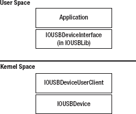

**图 15-1.** 用户空间驱动程序访问其 USB 硬件的层次结构


### IOUSBLib 框架

用于为 USB 设备编写用户空间驱动程序的库称为 `IOUSBLib`，它是 I/O Kit 框架的一部分（也就是说，如果用户空间应用程序要与它自己定义的用户客户端通信，它也会包含同一个框架）。

用户空间驱动程序需要执行的第一个任务是监视其感兴趣的特定 USB 设备的接入。由于 USB 设备可以在任何时候连接到计算机或从计算机断开，因此无法保证应用程序启动时其所关注的设备一定存在。因此，应用程序最好安装一个通知回调，用于监视其控制的 USB 设备的接入。

在第 5 章中，我们了解了应用程序如何创建匹配字典来查找指定内核驱动程序的每个实例。实现用户空间 USB 驱动程序的应用程序也使用同样的方法来定位它将控制的设备。与第 5 章一样，我们首先创建一个字典，指定我们的应用程序希望匹配的驱动程序对象的类名。对于 USB 设备，可以按如下方式完成：

`matchingDictionary = IOServiceMatching(kIOUSBDeviceClassName);` // "IOUSBDevice"

对于大多数应用程序来说，这个匹配字典过于通用，因为它会匹配连接到计算机的所有 USB 设备，包括键盘和鼠标。一个应用程序通常只关注一个特定的 USB 设备，因此这样的匹配字典是不合适的。我们可以通过包含应用程序支持的特定 USB 设备的产品 ID 和供应商 ID 来缩小匹配字典所满足的设备列表。

清单 15-1 展示了一个示例函数，用于为指定供应商 ID 和产品 ID 的 USB 设备创建匹配字典。

**清单 15-1.** 创建 USB 匹配字典

```c
#include <IOKit/IOKitLib.h>
#include <IOKit/usb/IOUSBLib.h>
#include <CoreFoundation/CoreFoundation.h>

CFDictionaryRef         MyCreateUSBMatchingDictionary (SInt32 idVendor, SInt32 idProduct)
{
        CFMutableDictionaryRef  matchingDictionary = NULL;
        CFNumberRef             numberRef;

        // 为 IOUSBDevice 创建一个匹配字典
        matchingDictionary = IOServiceMatching(kIOUSBDeviceClassName);
        if (matchingDictionary == NULL)
                goto bail;

        // 将 USB 供应商 ID 添加到匹配字典中
        numberRef = CFNumberCreate(kCFAllocatorDefault, kCFNumberSInt32Type, &idVendor);
        if (numberRef == NULL)
                goto bail;
        CFDictionaryAddValue(matchingDictionary, CFSTR(kUSBVendorID), numberRef);
        CFRelease(numberRef);

        // 将 USB 产品 ID 添加到匹配字典中
        numberRef = CFNumberCreate(kCFAllocatorDefault, kCFNumberSInt32Type, &idProduct);
        if (numberRef == NULL)
                goto bail;
        CFDictionaryAddValue(matchingDictionary, CFSTR(kUSBProductID), numberRef);
        CFRelease(numberRef);

        // 成功 - 将字典返回给调用方
        return matchingDictionary;

bail:
        // 失败 - 释放资源并返回 NULL
        if (matchingDictionary != NULL)
                CFRelease(matchingDictionary);

        return NULL;
}
```

 **注意：** 应用程序可以通过添加可置于基于内核的 USB 驱动程序属性列表中的任何键来缩小匹配字典的范围（参见第 8 章）。例如，应用程序可以包含 `idVendor`、`idProduct`、`bcdDevice`、`bDeviceSubClass` 或 `bDeviceProtocol` 中的任何键。

对于复合 USB 设备，驱动程序可能更倾向于匹配特定的接口，而不是整个 USB 设备。用户空间驱动程序可以通过为 `IOUSBInterface` 对象的特定实例创建匹配字典来实现这一点。这是因为 I/O Kit 为在内核中创建的 `IOUSBDevice` 类和 `IOUSBInterface` 类的每个实例都定义了一个用户客户端，这使得这两个类都对用户进程可用。

创建了匹配字典后，应用程序可以使用该字典来遍历所有符合其规范的内核对象，或者安装一个回调以在出现此类内核对象时接收通知。这已在第 5 章中描述。清单 15-2 给出了一个遍历给定匹配字典所描述的所有内核设备的函数示例。

**清单 15-2.** 查找并遍历满足匹配字典的设备

```c
void    MyFindMatchingDevices (CFDictionaryRef matchingDictionary)
{
        io_iterator_t           iterator = 0;
        io_service_t            usbDeviceRef;
        kern_return_t           err;

        // 查找所有匹配该字典的内核对象。
        err = IOServiceGetMatchingServices(kIOMasterPortDefault, matchingDictionary,
                       &iterator);
        if (err == 0)
        {
                // 遍历所有匹配的内核对象。
                while ((usbDeviceRef = IOIteratorNext(iterator)) != 0)
                {
                        IOUSBDeviceInterface300**       usbDevice;

                        // 为此设备实例创建一个驱动程序
                        usbDevice = MyStartDriver(usbDeviceRef);
                        IOObjectRelease(usbDeviceRef);
                }

                IOObjectRelease(iterator);
        }
}
```

匹配字典的迭代器（如清单 15-2 所示）将返回多个 `io_service_t` 对象，每个对象代表一个内核对象。`io_service_t` 对象是驻留在内核中的 `IOUSBDevice` 或 `IOUSBInterface` 对象在用户空间的表示。与任何 I/O Kit 类一样，`IOUSBDevice` 和 `IOUSBInterface` 都由一个 C++ 类实现。这些类包含一个公共接口，定义了内核驱动程序与 USB 硬件设备交互的方法。

`IOUSBLib` 接口是通过一个 C++ 类实现的，该类封装了一个代表 `IOUSBDevice` 或 `IOUSBInterface` 的 `io_service_t` 对象。`IOUSBDevice` 类在用户空间的等价物由一个名为 `IOUSBDeviceInterface` 的类实现，而 `IOUSBInterface` 类在用户空间的等价物由一个名为 `IOUSBInterfaceInterface` 的类实现。这些类的声明可以在头文件 `<IOKit/usb/IOUSBLib.h>` 中找到。清单 15-3 中的代码示例演示了用户空间应用程序如何从 `io_service_t` 实例化一个 `IOUSBDeviceInterface` 类。

**清单 15-3.** 从 `io_service_t` 实例化一个 `IOUSBDeviceInterface` 对象

```c
IOUSBDeviceInterface300**       MyStartDriver (io_service_t usbDeviceRef)
{
        SInt32                          score;
        IOCFPlugInInterface**           plugin;
        IOUSBDeviceInterface300**       usbDevice = NULL;
        kern_return_t                   err;

        err = IOCreatePlugInInterfaceForService(usbDeviceRef, kIOUSBDeviceUserClientTypeID,
                                                   kIOCFPlugInInterfaceID, &plugin, &score);
        if (err == 0)
        {
                err = (*plugin)->QueryInterface(plugin,
                        CFUUIDGetUUIDBytes(kIOUSBDeviceInterfaceID300),
                        (LPVOID)&usbDevice);
                IODestroyPlugInInterface(plugin);
        }
```


```markdown

`return usbDevice;`
}`

如果应用程序创建了一个匹配字典，指定了`IOUSBInterface`，那么它接收到的每个`io_service_t`值将代表一个内核`IOUSBInterface`对象，而不是`IOUSBDevice`对象。在这种情况下，应用程序实例化以表示内核对象的用户空间类将是`IOUSBInterfaceInterface`。这只需要对 Listing 15-3 中调用的两个函数所传递的参数进行一处更改。对`IOCreatePlugInInterfaceForService`的调用应如下进行：

```
err = IOCreatePlugInInterfaceForService(usbDeviceRef, kIOUSBInterfaceUserClientTypeID,
                                                kIOCFPlugInInterfaceID, &plugin, &score);
```

类似地，对返回的`plugin`对象调用`QueryInterface`时，应使用以下参数：

```
IOUSBInterfaceInterface300**            usbInterface = NULL;
err = (*plugin)->QueryInterface(plugin,
                        CFUUIDGetUUIDBytes(kIOUSBInterfaceInterfaceID300),
                        (LPVOID)&usbInterface);
```

无论应用程序实例化的是`IOUSBDeviceInterface`还是`IOUSBInterfaceInterface`，代码结构都是相同的。在这两种情况下，第一步都是调用函数`IOCreatePlugInInterfaceForService()`，该函数返回一个类型为`IOCFPlugInInterface`的对象。这个对象作为实例化用户空间 I/O Kit 类的工厂，一旦完成此操作，它就没有其他用途了。事实上，如 Listing 15-3 所示，一旦`IOUSBDeviceInterface`对象被创建，该对象会通过调用`IODestroyPlugInInterface()`立即释放。

`IOCFPlugInInterface`类包含一个名为`QueryInterface()`的方法，应用程序使用该方法来接收指向`IOUSBDeviceInterface`或`IOUSBInterfaceInterface`对象的指针。`IOUSBLib`提供了一种对类进行版本控制的方法。这使得未来版本的 Mac OS X 可以扩展某个类（例如`IOUSBDeviceInterface`），以包含额外功能，同时保持与为旧版本类编写的应用程序的向后兼容性。

当应用程序请求一个接口（例如`IOUSBDeviceInterface`）时，它还必须指定它期望接收的该类版本。类的版本是类名的一部分；例如，`IOUSBDeviceInterface300`标识了随`IOUSBFamily` 3.0.0 版本一起提供的`IOUSBDeviceInterface`类的版本。该版本随 Mac OS X 10.5 一起提供。`IOUSBLib.h`头文件中提供了完整的类名及其版本，以及支持该类所需的最低操作系统版本。

 **提示** 作为一般规则，您应该使用的`IOUSBDeviceInterface`和`IOUSBInterfaceInterface`类的版本，将与您的应用程序需要支持的最低 Mac OS X 版本相关联。例如，需要 Mac OS X 10.5 或更高版本的应用程序应使用`IOUSBDeviceInterface300`和`IOUSBInterfaceInterface300`。

用户客户端类的一个需要花些时间适应的方面是，`IOUSBLib`返回的是指向对象指针的指针。这意味着在调用对象的方法之前，持有该接口的变量需要额外的一次解引用。`IOUSBLib`类的另一个特性是，每个方法都需要将对对象的引用作为第一个参数传递。例如，考虑由`IOCFPlugInInterface`类实现的`QueryInterface()`方法，尽管您可能期望使用以下代码行调用该方法：

```
plugin->QueryInterface(parameters);     // 不正确
```

相反，因为`plugin`变量的类型是`IOCFPlugInInterface**`，因此是一个指向指针的指针，该方法实际上必须使用以下结构来调用：

```
(*plugin)->QueryInterface(plugin, parameters);
```

 **注意** 如果您熟悉微软的组件对象模型（COM），您会立即认出方法名`QueryInterface()`。所有`IOUSBLib`类都基于 COM 编程模型，并派生自基类`IUnknown`。这种设计对使用`IOUSBLib`的应用程序的最大影响是，所有`IOUSBLib`对象都是引用计数的；它们可以通过调用方法`AddRef()`来保留，通过调用方法`Release()`来释放。

### 处理异步操作

正如我们稍后在讨论`IOUSBLib`类时将看到的，许多方法执行的操作是异步完成的。所有此类异步方法都接受两个参数：一个指向回调函数的指针，以及一个名为`refcon`的参数，该参数允许应用程序向回调函数传递任意上下文值。回调函数具有以下签名：

```
void    MyCallbackFunction (void* refcon, IOReturn result, void* arg0);
```

第一个参数`refcon`是应用程序的任意上下文参数。第二个参数报告操作的整体结果；值为`kIOReturnSuccess`表示操作成功完成。最后一个参数`arg0`由`IOUSBLib`提供，并取决于所执行操作的类型。在本章中，当我们描述异步方法时，我们还将描述`IOUSBLib`通过`arg0`参数传递给回调函数的值。

正如内核驱动程序使用工作循环来将其完成例程与其他驱动程序代码同步一样，用户空间应用程序可以使用运行循环来将其来自`IOUSBLib`的完成回调与其余代码同步。

首先，应用程序必须为将要执行异步操作的`IOUSBLib`类创建一个运行循环源。`IOUSBLib`类包含用于创建运行循环源或 Mach 端口以接收异步通知的方法；然而，大多数应用程序只需要处理运行循环源。

需要注意的是，`IOUSBLib`类提供了前缀为`Create`和`Get`的方法（例如`CreateDeviceAsyncEventSource`和`GetDeviceAsyncEventSource`）。然而，`Get`方法只会返回一个之前通过`Create`方法初始化过的对象。以下代码片段显示了一个示例函数，用于创建和安装一个运行循环源，该源将用于接收来自`IOUSBDeviceInterface`类的异步通知：

```
IOReturn   InstallRunLoopSourceForUSBDevice (IOUSBDeviceInterface300** usbDevice)
{
     CFRunLoopSourceRef         runLoopSource;
     IOReturn                   error;

     error = (*usbDevice)->CreateDeviceAsyncEventSource(usbDevice, &runLoopSource);
     if (error == kIOReturnSuccess)
           CFRunLoopAddSource(CFRunLoopGetCurrent(), runLoopSource, kCFRunLoopDefaultMode);

     return error;
}
```

应用程序可以自由地将运行循环源安装到其希望的任何特定线程的运行循环上，包括应用程序主线程的运行循环。对象所有权规则遵循所有 Core Foundation 函数的相同约定：如果应用程序通过`Create`方法获得一个对象，则它拥有该对象并负责释放它。如果应用程序通过`Get`方法获得一个对象，则它不拥有对该对象的引用，因此如果应用程序希望持有该对象，它必须先显式地保留该对象。

```


### `IOUSBDeviceInterface` 类

`IOUSBDeviceInterface` 类是一个用户空间类，提供了与内核驱动程序所使用的 `IOUSBDevice` 类等效的功能。值得注意的是，虽然用户客户端类提供了与其内核对应类相似的功能，但它通过一组不同的方法来实现。因此，为 `IOUSBDevice` 类编写的内核 USB 驱动程序不能简单地移植到用户空间 USB 驱动程序中。

在获得对用户空间 `IOUSBDeviceInterface` 的引用后，应用程序需要做的第一件事就是配置 USB 硬件。应用程序执行此操作的步骤将与第 8 章中为内核驱动程序解释的步骤非常相似。首先，应用程序需要获得对 USB 硬件的独占访问权限，并防止硬件的配置被另一个驱动程序（可能是另一个用户空间驱动程序或内核驱动程序）更改。这是通过调用 `IOUSBDeviceInterface` 方法 `USBDeviceOpen()` 来实现的，如下所示：

```
error = (*usbDevice)->USBDeviceOpen(usbDevice);
```

如果该方法返回的错误代码是 `kIOReturnSuccess`，则表明应用程序已获得配置硬件的独占访问权限。如果另一个应用程序或驱动程序已经获得了对硬件的独占访问权限，那么对 `USBDeviceOpen()` 的调用将失败，并返回错误代码 `kIOReturnExclusiveAccess`，并且应用程序应中止对该设备的所有进一步访问，可能还需要向用户报告错误。

当应用程序使用完设备后，应通过调用 `IOUSBDeviceInterface` 方法 `USBDeviceClose()` 来放弃对硬件的独占访问权限，如下所示：

```
error = (*usbDevice)->USBDeviceClose(usbDevice);
```

以下是 `IOUSBDeviceInterface` 类提供的用于访问 USB 设备描述符中包含信息的方法摘要。在本章中，我们描述的是 `IOUSBDeviceInterface300` 类，因此以下某些方法在早期版本的 `IOUSBDeviceInterface` 类中可能不存在。

-   `GetDeviceClass`、`GetDeviceSubClass` 和 `GetDeviceProtocol`：从 USB 设备描述符中返回设备类别（`bDeviceClass`）、子类别（`bDeviceSubClass`）和协议（`bDeviceProtocol`）。这三个值共同根据 USB 规范中定义的值定义了设备的功能。
-   `GetDeviceVendor`：返回设备的 USB 供应商 ID（`idVendor`）。
-   `GetDeviceProduct`：返回设备的 USB 产品 ID（`idProduct`）。
-   `GetDeviceReleaseNumber`：返回设备发布编号（`bcdDevice`）。
-   `USBGetManufacturerStringIndex`：返回设备制造商名称字符串的索引（`iManufacturer`）。要读取设备中的实际字符串，应用程序必须随后发送标准设备请求“获取描述符”以读取设备字符串表中的条目。
-   `USBGetProductStringIndex`：返回设备产品名称字符串的索引（`iProduct`）。
-   `USBGetSerialNumberStringIndex`：返回设备序列号字符串的索引（`iSerialNumber`）。
-   `GetNumberOfConfigurations`：返回设备在当前速度下支持的配置数量（`bNumConfigurations`）。

以下方法允许应用程序读取与 USB 设备当前状态相关的动态属性：

-   `GetDeviceAddress`：返回 USB 设备的地址，该地址对于其连接的总线是唯一的。
-   `GetDeviceSpeed`：返回设备的速度。可能的值包括 `kUSBDeviceSpeedLow`、`kUSBDeviceSpeedFull` 或 `kUSBDeviceSpeedHigh`。
-   `GetLocationID`：返回一个 32 位值，该值基于设备所连接的 USB 集线器和端口，在系统上唯一标识一个 USB 设备。位置 ID 在计算机重启后不会改变，但如果设备连接到另一个集线器或端口则会改变。因此，如果 USB 设备提供了序列号字符串，则它是跨重启和断开连接跟踪设备的更优选方式。
-   `GetBusFrameNumber`：返回设备所连接的 USB 总线的当前帧编号。该函数还返回与内核驱动程序处理请求的时间相对应的系统主机时间。系统时间可能落在返回的 USB 帧内的任何位置。
-   `GetBusFrameNumberWithTime`：返回设备所连接的 USB 总线的当前帧编号，同时还返回与该帧开始时间相对应的系统主机时间。此方法是在 `IOUSBDeviceInterface` 类的后期版本中引入的，并取代了 `GetBusFrameNumber()` 方法。
-   `GetBusMicroFrameNumber`：返回设备所连接的 USB 总线的当前微帧编号。该函数还返回与内核驱动程序处理请求的时间相对应的系统主机时间（因此此方法的行为类似于 `GetBusFrameNumber()`）。

以下方法为应用程序提供了重置 USB 设备的方式：

-   `ResetDevice`：重置 USB 设备，将其恢复到未配置状态。
-   `USBDeviceReEnumerate`：指示此设备所连接的集线器重置此设备所连接的端口。这相当于将设备从 USB 端口断开并重新连接。
-   `USBDeviceSuspend`：尽管有该方法名，但它可以根据一个布尔参数的值来挂起或恢复 USB 设备所连接的端口。如果该方法挂起设备，则任何未完成的设备事务都将被中止。
-   `USBDeviceAbortPipeZero`：中止控制端点上的任何未完成事务。

`IOUSBDeviceInterface` 类提供了以下方法，允许应用程序在端点零上向设备发送控制请求：


```markdown
-   `DeviceRequest`：是一种同步方法，在设备请求完成之前不会返回。设备请求使用与内核 USB 驱动程序相同的 `IOUSBDevRequest` 结构体描述。
-   `DeviceRequestTO`：是一种同步方法，它接受两个以毫秒为单位的超时值。该方法将在设备请求完成或指定的超时周期到期（以先发生者为准）后返回。调用方提供两个超时值。设备在处理请求时可能停止发送或接收数据，因此一个超时值指定了在放弃控制请求之前，自上次数据传输以来等待的最长时间。另一个超时值指定了允许控制请求从头到尾完成的最长时间。如果指定的任一超时条件发生，则控制请求被中止。
-   `DeviceRequestAsync`：是 `DeviceRequest` 方法的异步等效方法。该方法接受一个回调函数，I/O Kit 使用该回调函数在请求完成时通知调用方。需要注意的是，此方法返回 `kIOReturnSuccess` 并不表示请求成功完成；而是表示操作已成功启动。操作的实际结果将通过回调函数返回。传递给完成回调的 `arg0` 参数的值保存了从设备读取或写入设备的字节数。

清单 15-4 列出了一个示例函数，该函数使用 `DeviceRequest` 方法从 USB 字符串表中读取制造商字符串。该函数首先调用 `USBGetManufacturerStringIndex` 来获取制造商字符串的索引。接下来，准备设备请求结构体。`bmRequestType` 字段指定该请求是数据读取（`kUSBIn`），是一个标准请求（而非由设备类定义的请求或供应商特定的请求），并且该请求的接收者是设备（而非接口或端点）。由于根据 USB 规范，字符串表仅被视为另一个描述符表，因此发送给设备以读取字符串的控制请求是 `kUSBRqGetDescriptor` 请求。`wValue` 字段表示我们正在读取一个字符串描述符，并且还包含要读取字符串的索引。

最后，如果成功从设备读取了字符串数据，该函数会根据返回的数据创建一个 `CFStringRef`，该数据以 UTF-16 小端编码从设备返回。

***清单 15-4.** 演示通过 `IOUSBDeviceInterface` 类进行设备请求的函数*

```
#include <IOKit/usb/IOUSBLib.h>
#include <IOKit/usb/USBSpec.h>
#include <CoreFoundation/CoreFoundation.h>

IOReturn                PrintDeviceManufacturer (IOUSBDeviceInterface300** usbDevice)
{
        UInt8                   stringIndex;
        IOUSBDevRequest         devRequest;
        UInt8                   buffer[256];
        CFStringRef             manufString;
        IOReturn                error;

        // Get the index in the string table for the manufacturer.
        error = (*usbDevice)->USBGetManufacturerStringIndex(usbDevice, &stringIndex);
        if (error != kIOReturnSuccess)
                return error;

        // Perform a device request to read the string descriptor.
        devRequest.bmRequestType = USBmakebmRequestType(kUSBIn, kUSBStandard, kUSBDevice);
        devRequest.bRequest = kUSBRqGetDescriptor;
        devRequest.wValue = (kUSBStringDesc << 8) | stringIndex;
        devRequest.wIndex = 0x409;              // Language setting - specify US English
        devRequest.wLength = sizeof(buffer);
        devRequest.pData = &buffer[0];
        bzero(&buffer[0], sizeof(buffer));
        //
        error = (*usbDevice)->DeviceRequest(usbDevice, &devRequest);
        if (error != kIOReturnSuccess)
                return error;

        // Create a CFString representation of the returned data.
        int             strLength;
        strLength = buffer[0] - 2;              // First byte is length (in bytes)
        manufString = CFStringCreateWithBytes(kCFAllocatorDefault, &buffer[2], strLength,
                                                kCFStringEncodingUTF16LE, false);
        // Print the manufacturer string.
        CFShow(manufString);
        CFRelease(manufString);

        return error;
}
```

以下方法由应用程序用于检查和设置设备配置，以及遍历设备的接口。应用程序通常在首次检测到 USB 设备时调用这些方法来初始化它：

-   `GetConfigurationDescriptionPtr`：返回指定配置描述符的指针；请注意，虽然调用方接收到一个指向 `IOUSBConfigurationDescriptorPtr` 结构体的指针，但该缓冲区由 `IOUSBDeviceInterface` 对象拥有，不应由调用方释放。
-   `GetConfiguration`：返回设备的活动配置编号。请注意，这不是配置的索引，而是活动配置描述中的 `bConfigurationValue` 值。
-   `SetConfiguration`：设置设备的活动配置。通过从所需配置描述中传入 `bConfigurationValue` 来指定配置。
-   `CreateInterfaceIterator`：在设备的接口上创建一个迭代器。与其内核等效方法一样，调用方提供一个 `IOUSBFindInterfaceRequest` 结构体，该结构体指定了返回的接口必须匹配的属性。

在了解了 `IOUSBDeviceInterface` 类提供的功能后，我们现在可以考虑应用程序通常采取的步骤，以初始化一个新连接到系统的 USB 设备。一个示例初始化函数在 清单 15-5 中给出。

***清单 15-5.** 初始化期间配置 USB 设备的示例函数*

```
IOReturn         MyConfigureDevice (IOUSBDeviceInterface300** usbDevice)
{
        UInt8                            numConfigurations;
        IOUSBConfigurationDescriptorPtr  configDesc;
        IOUSBFindInterfaceRequest        interfaceRequest;
        io_iterator_t                    interfaceIterator;
        io_service_t                     usbInterfaceRef;
        IOReturn                         error;

        // Get the count of the device's configurations.
        error = (*usbDevice)->GetNumberOfConfigurations(usbDevice, &numConfigurations);
        if (error != kIOReturnSuccess)
                return error;
        // Ensure the device has at least one configuration
        if (numConfigurations == 0)
                return kIOReturnError;

        // Read the descriptor for the first configuration.
        error = (*usbDevice)->GetConfigurationDescriptorPtr(usbDevice, 0, &configDesc);
        if (error != kIOReturnSuccess)
                return error;
```


```c
        // 将第一个配置设为活动配置。
        error = (*usbDevice)->SetConfiguration(usbDevice, configDesc->bConfigurationValue);
        if (error != kIOReturnSuccess)
                return error;

        // 创建一个迭代器，用于遍历活动配置中的所有接口。
        interfaceRequest.bInterfaceClass = kIOUSBFindInterfaceDontCare;
        interfaceRequest.bInterfaceSubClass = kIOUSBFindInterfaceDontCare;
        interfaceRequest.bInterfaceProtocol = kIOUSBFindInterfaceDontCare;
        interfaceRequest.bAlternateSetting = kIOUSBFindInterfaceDontCare;

        error = (*usbDevice)->CreateInterfaceIterator(usbDevice, &interfaceRequest,
                     &interfaceIterator);
        if (error != kIOReturnSuccess)
                return error;

        // 遍历所有接口。
        while ((usbInterfaceRef = IOIteratorNext(interfaceIterator)) != 0)
        {
                MySetupInterface(usbInterfaceRef);
                IOObjectRelease(usbInterfaceRef);
        }
        IOObjectRelease(interfaceIterator);

        return kIOReturnSuccess;
}
```

清单 15-5 中的代码首先将设备的**活动配置**设置为一个已知的配置，在本例中为设备的第一个配置。这一步是必要的，因为在我们的应用程序启动之前，设备可能已被其他应用程序使用过，因此设备可能处于未知状态。

接下来，应用程序会遍历活动配置中的所有接口。如果我们对某个特定接口感兴趣，可以通过指定该接口所需的类、子类、协议或备用设置来缩小迭代器返回的接口列表范围。获取 USB 接口对象尤为重要，因为应用程序访问设备端点（除了控制端点之外）的唯一途径就是通过 `IOUSBInterfaceInterface` 类。

### IOUSBInterfaceInterface 类

`IOUSBInterfaceInterface` 类是一个用户空间类，提供与内核驱动程序使用的 `IOUSBInterface` 类等效的功能。应用程序可以通过遍历设备的接口来获取对 `IOUSBInterfaceInterface` 类的引用，如清单 15-5 所示；或者，应用程序可以通过创建一个指定服务名 `kIOUSBInterfaceClassName` 的匹配字典来直接获取 `IOUSBInterfaceInterface` 对象。

一个 USB 接口包含一个或多个端点，这些端点允许向设备写入数据或从设备读取数据。用户空间的 USB 驱动程序在使用端点类型方面不受任何限制；所有端点类型，包括批量端点、等时端点和中断端点，都可被用户空间驱动程序使用。用户空间驱动程序能够达到与内核驱动程序相似的数据带宽，这意味着即使是需要大量数据传输的应用程序也可以在用户空间中编写。

无论应用程序是使用 `IOUSBDeviceInterface` 来遍历 USB 接口，还是使用匹配字典直接获取 USB 接口来创建迭代器，应用程序都会收到一个 `io_service_t`，它提供了内核中底层 `IOUSBInterface` 对象的用户空间表示。清单 15-6 演示了如何从 `io_service_t` 对象创建一个 `IOUSBInterfaceInterface` 对象。

***清单 15-6.** 从 io_service_t 实例化一个 IOUSBInterfaceInterface 对象*

```c
IOUSBInterfaceInterface300**     MyCreateInterfaceClass (io_service_t usbInterfaceRef)
{
        SInt32                          score;
        IOCFPlugInInterface**           plugin;
        IOUSBInterfaceInterface300**    usbInterface = NULL;
        kern_return_t                   err;

        err = IOCreatePlugInInterfaceForService(usbInterfaceRef,
                    kIOUSBInterfaceUserClientTypeID,         
                    kIOCFPlugInInterfaceID, &plugin, &score);
        if (err == 0)
        {
                err = (*plugin)->QueryInterface(plugin,
                        CFUUIDGetUUIDBytes(kIOUSBInterfaceInterfaceID300),
                        (LPVOID)&usbInterface);
                IODestroyPlugInInterface(plugin);
        }

        return usbInterface;
}
```

与 USB 设备类一样，应用程序必须先获得 USB 接口对象的独占访问权，然后才能向 USB 接口上的端点传输或从端点接收任何数据。这通过调用 `IOUSBInterfaceInterface` 的方法 `USBInterfaceOpen()` 来实现，如下所示：

```c
error = (*usbInterface)->USBInterfaceOpen(usbInterface);
```

当应用程序使用完该接口后，应通过调用 `IOUSBInterfaceInterface` 的方法 `USBInterfaceClose()` 来释放其独占访问权，如下所示：

```c
error = (*usbInterface)->USBInterfaceClose(usbInterface);
```

`IOUSBInterfaceInterface` 类提供的方法分为两类：一类是获取或设置 USB 设备或接口属性的方法，另一类是与向接口上的端点传输或从端点接收数据相关的方法。以下是 `IOUSBInterfaceInterface` 类提供的方法的总结。在本章中，我们介绍的是 `IOUSBInterfaceInterface300` 类，因此以下部分方法在早期版本的 `IOUSBInterfaceInterface` 类中可能不存在。


### 属性方法(Property Methods)

`IOUSBInterfaceInterface` 类包含用于获取和设置与接口及 USB 设备相关属性的方法。尽管其中一些方法可能看似与之前描述的 `IOUSBDeviceInterface` 类提供的功能重复，但这是有意的，因为它允许与 USB 接口类（而非 USB 设备类）匹配的应用程序仍然能够访问通用的设备功能。

以下方法虽然位于 `IOUSBInterfaceInterface` 类中，但与 USB 设备相关：

*   `GetDeviceVendor`：返回 USB 设备的厂商 ID（Vendor ID）。
*   `GetDeviceProduct`：返回 USB 设备的产品 ID（Product ID）。
*   `GetDeviceReleaseNumber`：返回 USB 设备的设备发行号。
*   `GetLocationID`：返回一个 32 位值，该值基于设备所连接的 USB 集线器和端口，在系统上唯一标识一个 USB 设备。
*   `GetDevice`：返回一个 `io_service_t`，该类型对应于内核中的 `IOUSBDevice` 对象。从此对象出发，应用程序可以实例化一个代表该 USB 设备的 `IOUSBDeviceInterface`。
*   `GetBusFrameNumber`：返回设备所连接的 USB 总线的当前帧号。
*   `GetBusFrameNumberWithTime`：返回设备所连接的 USB 总线的当前帧号，并同时返回该帧起始时刻对应的系统主机时间。
*   `GetBusMicroFrameNumber`：返回设备所连接的 USB 总线的当前微帧号。
*   `GetFrameListTime`：其作用类似于 `IOUSBDeviceInterface` 的 `GetDeviceSpeed` 方法，不过设备的速率是以其当前速度下每个 USB 帧所对应的微秒数来返回的。全速设备将返回 `kUSBFullSpeedMicrosecondsInFrame`（1000 微秒），而高速设备将返回 `kUSBHighSpeedMicrosecondsInFrame`（125 微秒）。

以下方法与获取和设置接口的属性有关：

*   `GetInterfaceClass`、`GetInterfaceSubClass` 和 `GetInterfaceProtocol`：从 USB 接口描述符中返回接口类（`bInterfaceClass`）、子类（`bInterfaceSubClass`）和协议（`bInterfaceProtocol`）。这三个值共同基于 USB 规范中定义的值来定义接口的功能。
*   `GetConfigurationValue`：标识包含此接口的设备配置。返回的值是活动配置描述中的 `bConfigurationValue`。
*   `GetInterfaceNumber`：返回此接口在活动配置中的基于零的索引（`bInterfaceNumber`）。
*   `GetAlternateSetting`：返回此接口的当前活跃备用设置（`bAlternateSetting`）。
*   `SetAlternateInterface`：设置此接口的活跃备用设置。通过传递所需接口描述的 `bAlternateSetting` 值来指定备用设置。
*   `USBInterfaceGetStringIndex`：返回接口描述的字符串索引，该索引来自接口描述符中的 `iInterface` 字段。

### 端点数据传输方法(Endpoint Data Transfer Methods)

一个 USB 接口可以包含一个或多个端点，数据可以从这些端点读取或写入。与内核 USB 驱动程序不同，`IOUSBLib` 不包含用于表示到端点的管道的用户空间对象；相反，所有数据传输都通过 `IOUSBInterfaceInterface` 类进行。应用程序可以使用以下方法确定接口上存在的端点：

*   `GetNumEndpoints`：返回接口提供的端点数量。
*   `GetEndpointProperties`：返回指定端点的类型（`bDescriptorType`）、最大数据包大小（`wMaxPacketSize`）和轮询间隔（`bInterval`）。通过三个值来指定端点——它所在的备用接口设置、其端点号以及端点的传输方向。
*   `GetPipeProperties`：此方法允许应用程序指定一个从 0 到 `GetNumEndpoints` 返回值（含）之间的端点索引，这与 `GetEndpointProperties` 不同，后者要求调用者知道其感兴趣端点的端点号和方向。索引 0 处的端点对应于默认控制端点。此方法返回的信息几乎包含端点描述符的所有数据，包括端点的编号、方向、类型、最大数据包大小以及轮询间隔（如果是中断或同步端点）。
*   `GetPipeStatus`：可用于确定指定管道是否处于停滞状态。如果管道停滞，此方法将返回 `kIOUSBPipeStalled`，否则返回 `kIOReturnSuccess`。如果调用者指定了无效的管道索引，它将返回 `kIOUSBUnknownPipeErr`。
*   `AbortPipe`：中止指定管道索引上的未完成事务。任何被中止的操作都将完成，并返回结果 `kIOReturnAborted`。
*   `ResetPipe` 和 `ClearPipeStall`：尽管这两种方法相同，但更推荐使用 `ClearPipeStall`。应用程序调用其中任一方法以重置已停滞的端点。端点的暂停位被清除，其数据翻转位也被重置。
*   `ClearPipeStallBothEnds`：等同于 `ClearPipeStall`，区别在于除了清除主机端的暂停位并重置数据翻转外，设备端的暂停位也被清除，并且设备的数据翻转也被重置。这确保了由于主机和设备都已重置，下次向端点传输数据或从端点接收数据时不会丢失数据。

为了向端点传输数据或从端点接收数据，应用程序必须确定与要访问的端点相对应的管道索引。虽然端点地址是恒定的（因为它来自设备提供的描述符），但管道索引是由 I/O Kit 分配的。因此，确定给定端点管道索引的唯一方法是枚举 USB 接口中包含的每个管道。示例如下所示（参见 Listing 15-7）。

***清单 15-7.**  查找批量输出端点管道引用的函数*

```
IOReturn        MyFindBulkOutEndpoint (IOUSBInterfaceInterface300** usbInterface,
                                       UInt8* pipeRef)
{
        UInt8           numEndpoints;
        UInt8           i;
        IOReturn        error;

        // 确定此接口中的端点数。
        error = (*usbInterface)->GetNumEndpoints(usbInterface, &numEndpoints);
        if (error != kIOReturnSuccess)
                return error;

        // 遍历接口中的所有端点（跳过端点 0，即控制端点）。
        for (i = 1; i <= numEndpoints; i++)
        {
                UInt8           direction, number, transferType;
                UInt16          maxPacketSize;
                UInt8           interval;
```


```c
error = (*usbInterface)->GetPipeProperties(usbInterface, i, &direction,
                                                &number,
                                                &transferType, &maxPacketSize, &interval);
if (error != kIOReturnSuccess)
        continue;

// 如果找到一个批量输出端点，则将其管道索引返回给调用者。
if ((transferType == kUSBBulk) && (direction == kUSBOut))
{
        *pipeRef = i;
        return kIOReturnSuccess;
}
```

```c
return kIOReturnNotFound;
```

在确定管道索引（在 `IOUSBLib` 的方法中称为管道引用）后，应用程序可以通过该管道读取或写入数据。应用程序用于管理管道的方法取决于管道所代表的端点类型。`IOUSBInterfaceInterface` 类提供了不同的方法，具体取决于管道连接的是控制端点、批量端点、中断端点还是等时端点。

`IOUSBInterfaceInterface` 类提供了若干方法，用于向端点传输数据或从端点接收数据。根据所调用的方法，操作可以同步或异步完成。其他方法则允许调用者提供一个超时值，该值指定了在放弃请求之前允许操作完成的最长时间。最后，还有一些方法是异步完成的，并允许调用者指定超时值。

`IOUSBLib` 采用的约定是：如果方法名称中不包含 `Async`，则该方法是同步完成的。与对应的同步方法相比，异步方法多了两个额外参数——一个在操作完成后执行的回调函数，以及一个可用于向回调函数传递上下文信息的任意指针。

允许调用者指定超时值的方法，其名称中包含字母 `TO`。超时值通过传递给该方法的两组额外参数来描述。设备在处理请求时可能会停止发送或接收数据，因此一个超时值指定了在放弃操作之前，从上一次数据传输完成起等待的最长时间。第二个超时值则指定了从操作开始到完成所允许的最长时间。如果指定的两个超时条件中任意一个发生，请求将被终止。

`IOUSBInterfaceInterface` 类提供了以下方法来执行控制传输。这些方法类似于 `IOUSBDeviceInterface` 类提供的方法，但每个方法都多了一个额外的参数——管道引用。如果为管道引用传递的值是 0，则控制请求被发送到默认的控制端点，即端点 0。

- `ControlRequest`：同步执行一个控制请求。此方法接受一个描述控制请求的 `IOUSBDevRequest` 结构体，并将其发送到指定的控制端点。
- `ControlRequestAsync`：异步执行一个控制请求。此方法接受一个 `IOUSBDevRequest` 结构体，并将其发送到指定的控制端点。当请求完成后，将执行提供给该函数的回调函数。传递给完成回调的 `arg0` 参数值指定了从设备读取或写入设备的字节数。
- `ControlRequestTO`：同步执行一个控制请求，并允许调用者指定超时参数。
- `ControlRequestAsyncTO`：异步执行一个控制请求，并对请求允许花费的时间设置最长时间限制。

设备很可能使用批量端点进行数据传输。批量端点允许以高吞吐量和有保障的数据投递来读取或写入大量数据，但延迟不固定（具体取决于其他设备是否同时尝试通过 USB 总线传输数据）。`IOUSBInterfaceInterface` 类提供了以下方法，允许应用程序通过管道向批量端点读取和写入缓冲区。以下方法也适用于通过中断端点传输数据：

- `ReadPipe`：从 USB 设备上的批量端点或中断端点同步执行数据传输到应用程序提供的缓冲区。应用程序的缓冲区由其地址和缓冲区大小（以字节为单位）来描述。缓冲区大小也是一个输出参数；如果方法成功完成，则通过同一个 `size` 参数向调用者报告读入缓冲区的字节数。
- `WritePipe`：从应用程序提供的缓冲区同步执行数据传输到 USB 设备上的批量端点或中断端点。应用程序的缓冲区由其地址和缓冲区大小（以字节为单位）来描述。
- `ReadPipeAsync`：从 USB 设备上的批量端点或中断端点异步执行数据传输到应用程序提供的缓冲区。当传输完成后，提供的回调函数会收到操作结果和从设备读取的字节数（通过 `arg0` 参数传递）。
- `WritePipeAsync`：从应用程序提供的缓冲区异步执行数据传输到 USB 设备上的批量端点或中断端点。当传输完成后，提供的回调函数会收到操作结果和写入设备的字节数（通过 `arg0` 参数传递）。
- `ReadPipeTO`：从批量端点或中断端点同步执行数据传输到应用程序缓冲区，并为操作指定超时值。
- `WritePipeTO`：从应用程序缓冲区同步执行数据传输到批量端点或中断端点，并为操作指定超时值。
- `ReadPipeAsyncTO`：是 `ReadPipeTO` 方法的异步等效方法。当传输完成或超时时，将调用应用程序提供的回调函数。
- `WritePipeAsyncTO`：是 `WritePipeTO` 方法的异步等效方法。当传输完成或超时时，将调用应用程序提供的回调函数。

**列表 15-8** 中提供了一个使用异步方法 `ReadPipeAsyncTO` 从批量端点读取数据的函数示例。

**列表 15-8.** 演示 `ReadPipeAsyncTO` 方法使用的一个函数

```c
IOReturn        MyAsyncBulkRead (IOUSBInterfaceInterface300** usbInterface, UInt8 pipeRef)
{
        void*           dataBlock;
        const UInt32    noDataTimeout = 50;             // 50 毫秒
        const UInt32    completionTimeout = 500;        // 500 毫秒
        void*           refcon;
        IOReturn        error;

        // 分配一个缓冲区来保存读取的数据。
        dataBlock = malloc(kMyTransferSize);

        // 执行异步读取，并指定超时值。
        // 我们通过 refcon 参数将 dataBlock 传递给回调函数
        refcon = dataBlock;
        error = (*usbInterface)->ReadPipeAsyncTO(usbInterface, pipeRef, dataBlock,
                                                kMyTransferSize,
                                                noDataTimeout, completionTimeout,
                                                ReadCompletedCallback, refcon);
```


```c
// 如果方法返回错误，则不会调用回调函数。
if (error != kIOReturnSuccess)
    free(dataBlock);

return error;
```

```c
void ReadCompletedCallback (void* refcon, IOReturn result, void* arg0)
{
    void* dataBlock = refcon;
    UInt32 byteCount = (UInt32)arg0;

    // 如果读取成功完成，则处理从设备读取的任何数据。
    if (result == kIOReturnSuccess)
    {
        ProcessReadData(dataBlock, byteCount);
    }

    // 释放之前在 MyAsyncBulkRead 中分配的缓冲区。
    free(dataBlock);
}
```

剩下的 USB 端点类型是等时端点。如我们在第 8 章所见，等时端点专为需要以最小延迟及时传输数据流的设备而设计，例如音频或视频数据流。`IOUSBLib` 为用户空间应用程序的等时数据传输提供了全面支持。

等时管道在 USB 总线上拥有保证的带宽。设备报告其带宽需求，如果 USB 主机能够满足这些需求，则设备被授予访问 USB 总线的权限。全速设备可以在每个帧（每毫秒一次）上通过等时管道传输数据，而高速或超高速设备则可以在每个微帧（每 125 微秒一次）上传输数据。

与内核实现类似，应用程序的等时数据传输是通过填充一个 `IOUSBIsocFrame` 结构体数组来设置的，该数组描述了应用程序希望在每个微帧（或全速设备的每个帧）上通过等时管道读取或写入的字节数。`IOUSBIsocFrame` 结构体的定义如下所示。

```c
typedef struct IOUSBIsocFrame {
   IOReturn     frStatus;     // 返回时，此帧的传输结果
   UInt16       frReqCount;   // 此帧上请求读取或写入的字节数
   UInt16       frActCount;   // 返回时，此帧上实际读取或写入的字节数
} IOUSBIsocFrame;
```

通过等时管道的读取或写入通常描述跨越几十毫秒的传输，每当未完成的请求完成时，应用程序会发出新的等时传输请求。`IOUSBInterfaceInterface` 类提供了以下方法用于在等时管道上执行传输：

- `ReadIsochPipeAsync`：从等时管道执行异步数据传输。通过传递一个用于保存从设备读取的数据的缓冲区地址，以及一个描述每个帧上可接受的最大数据量的 `IOUSBIsocFrame` 元素数组来描述数据传输。该方法接受一个名为 `frameStart` 的参数，该参数确定数据传输开始的 USB 帧号，通常是当前帧之后不久的一个 USB 帧。可以通过调用 `GetBusFrameNumber` 方法确定当前 USB 帧。传输完成后，会调用应用程序提供的回调函数；传递给回调函数的 `arg0` 值是 `IOUSBIsocFrame` 数组的地址。应用程序可以检查此数组，以确定每个帧上实际读取的字节数。
- `WriteIsochPipeAsync`：向等时管道执行异步数据传输。调用者提供一个包含要写入设备的数据的缓冲区地址，以及一个描述每个 USB 帧上要从缓冲区传输的字节数的 `IOUSBIsocFrame` 元素数组。该方法接受一个名为 `frameStart` 的参数，该参数确定数据传输开始的 USB 帧号，通常是当前帧之后不久的一个 USB 帧。可以通过调用 `GetBusFrameNumber` 方法确定当前 USB 帧。传输完成后，会调用应用程序提供的回调函数；传递给回调函数的 `arg0` 值是 `IOUSBIsocFrame` 数组的地址。
- `GetBandwidthAvailable`：返回 USB 总线上的可用带宽；这是设备可以分配的最大带宽。带宽报告为每个帧（对于全速设备）或微帧（对于高速设备）可以分配给等时管道的最大字节数。
- `SetPipePolicy`：允许应用程序修改等时或中断管道的带宽预留。对于等时管道，可以更改一个帧（对于全速设备）或微帧（对于高速设备）上可传输的最大允许数据包大小。但是，数据包大小不能设置为大于设备端点描述符中的最大数据包大小。对于中断管道，此方法允许设置最大允许数据包大小和轮询间隔。但是，数据包大小和轮询间隔不能超过端点描述符中请求的值。如果设备端点描述符中请求的初始带宽无法满足，USB 主机将不允许通过等时管道传输数据；此方法可用于为管道分配减少的带宽分配，使其能够使用。

一个执行等时读取操作的函数示例见列表 15-9。请注意，在发出请求之前，该函数会初始化一个 `IOUSBIsocFrame` 元素数组，以描述它可以在每个帧（或高速设备的微帧）上接受的最大字节数。一旦请求完成，设备能够处理在每个帧上接收到的数据，这些数据可能少于请求的最大字节数。

请求开始的帧号由参数 `startFrame` 指定，在示例函数中，该参数是通过在当前帧上添加一个固定延迟来确定的。更一般地，应用程序通常会将一个等时请求的初始帧号设置为前一个等时请求的结束帧号。这样，驱动程序可以连续不断地从设备读取数据，而不会出现任何间隙。

**列表 15-9.**  一个演示从用户空间驱动程序进行等时数据传输的函数

```c
const int      framesPerRequest = 512;
const int     bytesPerFrame = 1024;
```


```c
IOReturn MyScheduleIsocRead (IOUSBInterfaceInterface300** usbInterface, UInt8 pipeRef,
                              void* destinationBuffer)
{
     UInt64             startFrame;
     AbsoluteTime       timeNow;
     IOUSBIsocFrame*    frameList;
     void*              refcon;
     IOReturn           error;

     // 读取当前帧编号。
     // （或者，我们可以发起此等时请求以延续上一个请求。）
     error = (*usbInterface)->GetBusFrameNumber(usbInterface, &startFrame, &timeNow);
     if (error != kIOReturnSuccess)
         return error;
     // 为请求开始的帧添加偏移量，
     // 使其在当前帧之前开始。
     startFrame += 8;

     // 分配 IOUSBIsocFrame 元素数组。
     frameList = (IOUSBIsocFrame*)malloc(framesPerRequest * sizeof(IOUSBIsocFrame));
     // 设置等时请求中每帧要读取的字节数。
     for (int i = 0; i < framesPerRequest; i++)
         frameList[i].frReqCount = bytesPerFrame;

     // 执行等时请求。
     // 我们通过 refcon 参数将 destinationBuffer 传递给回调函数。
     refcon = destinationBuffer;
     error = (*usbInterface)->ReadIsochPipeAsync(usbInterface, pipeRef, destinationBuffer,
                                startFrame,
                                framesPerRequest, frameList, IsocReadCompletedCallback,
                                refcon);
     // 如果方法返回错误，则不会调用回调函数。
     if (error != kIOReturnSuccess)
          free(frameList);

     return error;
}

void IsocReadCompletedCallback (void* refcon, IOReturn result, void* arg0)
{
     uint8_t*           destinationBuffer = (uint8_t*)refcon;
     IOUSBIsocFrame*    frameList = (IOUSBIsocFrame*)arg0;

     // 如果读取成功完成，处理从设备读取的任何数据。
     if (result == kIOReturnSuccess)
     {
         for (int i = 0; i < framesPerRequest; i++)
         {
              if (frameList[i].frStatus == kIOReturnSuccess)
              {
                UInt16          bytesRead;

                // 处理在此帧上读取的数据
                bytesRead = frameList[i].frActCount;
                ProcessReadData(destinationBuffer, bytesRead);
              }

              // 计算下一帧数据的起始地址
              destinationBuffer += frameList[i].frReqCount;
         }
     }

     // 释放在 MyScheduleIsocRead 中分配的帧列表。
     free(frameList);
}
```

### 低延迟等时传输

等时端点通常用于传输多媒体数据，例如持续传输到 USB 设备或从 USB 设备流式传输的音频或视频。处理这些数据的应用程序通常希望以最小的延迟来完成；例如，一个应用程序可能希望在麦克风数据被 USB 设备接收后立即开始处理。先前描述的等时方法的一个问题是，应用程序必须等待完成回调函数被通知后，才能开始处理读取的数据。如果一个应用程序发起一个跨越 10 毫秒 USB 帧的等时请求，这意味着从请求开始到应用程序能够处理从设备读取的数据，至少存在 10 毫秒的延迟。

作为解决方案，`IOUSBInterfaceInterface` 类包含低延迟等时传输方法，这些方法允许应用程序在数据被设备接收后立即访问，即使整个等时请求尚未完成。为此，I/O Kit 会在等时事务进行中更新帧列表的值；在传输期间，`frStatus` 和 `frActCount` 的值会被写入并可供应用程序读取。应用程序无需等待完成回调触发，而是可以定期检查其帧列表的值，并确定何时有新的数据可供处理。例如，这可以在用户空间应用程序的实时线程中完成。

应用程序通过指定更新间隔（0–8 毫秒之间的值），来确定 I/O Kit 在操作进行中更新帧列表的频率。例如，更新频率为 1 意味着在传输过程中，I/O Kit 将每毫秒更新一次应用程序的帧列表。值为 0 意味着 I/O Kit 将在传输结束时才更新帧列表，尽管在事务完成后、应用程序收到完成回调之前，更新后的帧列表即可供应用程序使用。

要使用低延迟等时传输，用于帧列表数组以及保存传输源或目标数据的缓冲区必须使用 `IOUSBInterfaceInterface` 类提供的方法进行分配。这使得 I/O Kit 能够确保缓冲区同时对内核（在传输期间更新缓冲区）和应用程序（在传输期间读取结果）可用。

请注意，低延迟方法不使用 `IOUSBIsocFrame` 结构来描述 USB 帧的传输，而是使用 `IOUSBLowLatencyIsocFrame` 结构。该结构包含一个额外字段 `frTimeStamp`，用于保存 I/O Kit 更新该结构值的时间。

以下方法可用于低延迟等时传输：

- `LowLatencyCreateBuffer`：分配一个缓冲区，用于保存低延迟等时写入的源数据、低延迟等时读取的目标数据，或描述等时传输的 `IOUSBLowLatencyIsocFrame` 元素数组。必须通过提供以下枚举值之一来指定应用程序对该缓冲区的意图：`kUSBLowLatencyWriteBuffer`、`kUSBLowLatencyReadBuffer` 或 `kUSBLowLatencyFrameListBuffer`。
- `LowLatencyDestroyBuffer`：释放先前由 `LowLatencyCreateBuffer` 方法分配的缓冲区。
- `LowLatencyReadIsochPipeAsync`：从 USB 设备上的等时端点执行读取操作。此方法的参数在 `ReadIsochPipeAsync` 方法的基础上进行了扩展，新增了一个名为 `updateFrequency` 的参数，用于指定 I/O Kit 在传输期间更新帧列表的频率（以毫秒为单位）。`IOUSBLowLatencyIsocFrame` 数组和目标缓冲区都必须由 `LowLatencyCreateBuffer` 方法分配。
- `LowLatencyWriteIsochPipeAsync`：向 USB 设备上的等时端点执行写入操作。此方法的参数在 `WriteIsochPipeAsync` 方法的基础上进行了扩展，新增了一个名为 `updateFrequency` 的参数，用于指定 I/O Kit 在传输期间更新帧列表的频率（以毫秒为单位）。`IOUSBLowLatencyIsocFrame` 数组和源缓冲区都必须由 `LowLatencyCreateBuffer` 方法分配。


### 摘要

-   对于特定类型的设备（包括 USB 设备），I/O Kit 使得开发者可以省略内核驱动程序，并完全在用户空间中实现驱动程序。对最终用户而言，这提供了更好的体验。
-   并非所有 USB 设备都适合使用用户空间驱动程序。那些需要由系统自身使用的设备，例如系统级的音频设备或 USB 存储设备，必须在内核中实现其驱动。
-   I/O Kit 提供了一个名为 `IOUSBLib` 的用户空间库，供应用程序与 USB 设备进行交互。`IOUSBLib` 提供了 `IOUSBDevice` 和 `IOUSBInterface` 内核类的用户空间等价物，分别称为 `IOUSBDeviceInterface` 和 `IOUSBInterfaceInterface`。
-   应用程序可以通过创建匹配字典并安装通知回调来监视其支持的 USB 设备的接入和移除，如第 5 章所述。一旦应用程序收到通知，得知其关注的 USB 设备或 USB 接口已连接到计算机，它就可以实例化一个 `IOUSBDeviceInterface` 或 `IOUSBInterfaceInterface` 对象，以提供对 USB 硬件的访问。
-   `IOUSBLib` 为用户空间驱动程序提供了对 USB 设备功能的完整支持。所有端点类型均在用户空间中得到支持，包括控制传输、批量传输、中断传输和等时传输。
-   应用程序可以使用 `IOUSBLib` 执行同步或异步操作。使用回调来通知应用程序异步请求的完成。

## 第 16 章

## 调试

调试是内核级驱动程序或扩展的开发和持续维护工作的一部分。因此，拥有有效调试内核的技能和知识是内核工程师工作描述中的重要组成部分。尽管在开发和质量保证过程中会格外小心，但错误往往是不可避免的。部分原因在于，一旦发布，你的驱动程序很可能会在未经充分测试的硬件/软件组合上运行。例如，你的驱动程序可能在比最初测试时更快或更慢的 CPU 上运行，从而暴露出时序问题。

许多人认为内核调试是一门玄学，这种看法不无道理。当应用程序崩溃时，它可以被转储到调试器中，并且通常可以精确定位导致问题的代码行。在内核中，事情就没那么容易了；虽然可以使用 GNU 调试器 (GDB) 进行调试，但这需要一些设置，并且通常需要两台计算机。此外，内核崩溃常常表现为扩展中完全无关部分的问题，使得难以证明你的驱动程序是否牵涉其中。你或许有幸在崩溃后提取信息或附加调试器；然而，内存可能已被破坏，数据结构的值或调用栈可能不再可信。

如果你正在为硬件设备编写驱动程序，事情可能会更复杂，因为出现故障的设备（在使用原型设备时更常见）也可能破坏内存，或导致计算机死锁或崩溃。这有时使得判断问题出在硬件还是软件上变得困难。

在本章中，我们将探讨各种有助于调试常见问题的技术和策略。

### 常见问题类型

内核崩溃或出现其他问题的原因有很多。然而，它们通常都是常见错误的变体，一旦你知道了所处理问题的类别，开始检查代码中的问题就容易得多。让我们大致看看在内核开发过程中可能遇到的一些问题。

-   **竞态条件：** 一类常见的缺陷，用于描述多个执行线程相互冲突，结果取决于哪个线程先抵达的情况。竞态条件相当常见，通常是由于多线程环境下设计不佳或锁机制不当造成的。它们有时很难复现，并且可能在发现之前隐藏很长时间。当特定的事件序列以特定的顺序发生时，问题就会出现，例如，因为它依赖于用户输入。
-   **死锁：** 当锁实现不佳，并且一个线程在等待一个永远不会发生的事件或锁时发生，可能是因为第二个线程在使用后未能释放该锁。一旦发生这种情况，该条件可能会蔓延到系统中也需要该锁的新线程。从用户的角度来看，这看起来像是他们的应用程序挂起了，并且他们可能无法强制退出，因为它正卡在内核中等待某个事件。
-   **锁竞争：** 一种性能问题，发生在许多线程需要同一个锁，并且花费过多时间等待该锁而不是做任何有用工作的时候。锁竞争通常是设计不佳的结果，可以通过实施合适的锁定方案来预防。一般原则是锁定对数据的访问，而不是对代码的锁定。保护大块代码看似比仅对共享数据进行细粒度锁定更简单；然而，这会降低性能，并增加发生死锁的可能性。
-   **访问无效内存：** 导致内核恐慌的最常见原因。与用户空间程序（会被中止）不同，如果 CPU 引发了无效内存异常，内核会直接恐慌。如果启用了调试器，内核会转储到调试器中，而不是在 Mac OS X 上显示灰色的死亡屏幕或重新启动（这是 iOS 下的行为）。缓冲区溢出有时会导致无效内存异常，除非缓冲区恰好后面跟着有效内存，在这种情况下可能会发生静默的内存损坏。
-   **内存和资源泄漏：** 例如，当驱动程序卸载且未正确释放诸如对象和缓冲区等资源时可能发生。也可能是扩展每次收到请求时分配一些内存，但在使用完后未能释放内存。内核没有垃圾回收功能，因此泄漏会随时间累积并导致内核恐慌。
-   **非法指令/操作数：** 如果 CPU 检测到无效指令或指令的无效参数，则会引发这些异常。这可能是内存损坏或编写不良的驱动程序试图使用 CPU 不存在的特性（例如，在不支持的机器上使用 SSE3 指令集）的结果。你也可能因内存损坏而看到此异常。
-   **在主中断上下文中阻塞：** 会导致恐慌，因为你无法在主中断上下文中阻塞。阻塞需要一个被调度的线程，因为阻塞是通过让线程自愿进入睡眠状态来实现的。在这种情况下，线程的状态被保存，并在调度器决定再次运行该线程时被恢复。主中断处理程序不能被恢复；它必须不受中断地运行完成。许多内核 API 在某些情况下可能会阻塞。例如，如果系统内存不足，内存分配可能会阻塞，这会导致将某些内存换出到磁盘以释放内存供请求使用。因此，诸如 `IOMalloc()` 甚至 `IOLog()` 之类的函数不能在主中断上下文中使用。
-   **主动引发的恐慌：** 当内核因判断某些事情即将严重出错或发生了无法恢复的异常情况而自愿决定崩溃时发生。一个例子是当一次不能阻塞的内存分配失败时。你的驱动程序可以通过调用 `IOPanic()` 来使内核恐慌，该函数是 `panic()` 函数的封装。


当然，以下是排版后的内容：

当然，还可能发生许多其他问题，但大多数都是上述典型问题的变体。

### 内核恐慌

内核恐慌是内核处理异常情况（例如上述问题列表）的主要防御机制。与其在出错时试图继续运行，最安全的做法是立即终止系统执行，以避免对文件系统造成损坏。当 Mac OS X 系统发生内核恐慌时，用户可能会看到多语言的内核恐慌屏幕，除非内核已配置了调试选项，指示用户重启计算机，如图 Figure 16-1 所示。

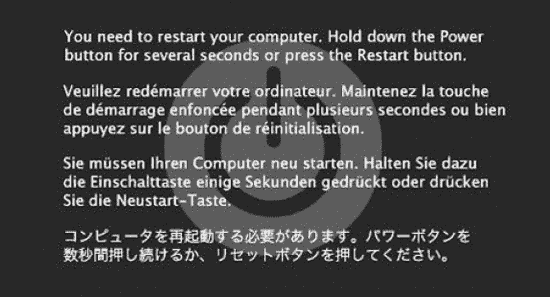

***图 16-1.** Mac OS X 内核恐慌屏幕，相当于 Windows 的蓝屏死机*

在后台，系统会保存一份内核恐慌日志，其中包含发生恐慌的处理器（核心）的堆栈跟踪信息。恐慌日志会临时写入系统的非易失性随机存取存储器（NVRAM），因为系统发生恐慌后访问文件系统通常是不安全的。毕竟，内核恐慌的目的不是为了惹恼用户，而是在事态失控前紧急停机，保护文件系统免受损害。

一旦系统再次启动，恐慌日志会被复制到 `/Library/Logs/DiagnosticReports/` 目录。系统还会显示崩溃报告器对话框窗口，允许用户向 Apple 报告问题。

### 调试机制

调试技术有很多种；具体使用哪一种通常取决于待解决问题的性质。在此，我们将介绍一些有助于调试内核问题的技术。表 16-1 简要概述了我们将在本章讨论的一些机制。

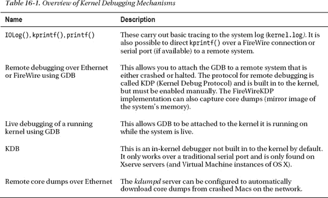

上述大多数调试技术都默认包含在内，但内核中并不总是默认启用，因为它们可能会干扰正在运行的内核或硬件设备，或者可能构成安全风险（例如可能获取目标内存中的敏感内容）。

启用调试机制或控制内核的调试行为可以通过设置内核启动参数来完成。启动参数可以通过两种方式设置：使用 `nvram` 命令，或将其添加到 `/Library/Preferences/SystemConfiguration/com.apple.Boot.plist` 的启动参数字段中。可用的启动参数非常多，但我们最感兴趣的是 `debug` 参数，它控制调试器和系统调试行为。该参数是一个整数值，可以包含表 16-2 中所示的标志位。

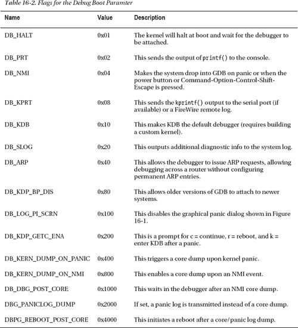

这些值构成一个位掩码，您可以通过“或”（OR）运算将它们组合在一起。例如，要启用 NMI、禁用图形化内核恐慌屏幕并在发生恐慌时进入调试器，我们可以组合这些值，使得：

`0x04 | 0x100 = 0x104`

该值可以在 `com.apple.Boot.plist` 中设置，或使用 `nvram` 命令：

`$ sudo nvram boot-args="原始内容 debug=0x104"`

要禁用或移除调试选项，只需执行以下操作：

`$ sudo nvram boot-args="原始内容"`

如果您已经设置了一些启动参数，此命令会覆盖它们，因此请务必先查询 `boot-args` 参数，以免被覆盖。

#### 从启动期间的崩溃中恢复

您的扩展可能安装在 `/System/Library/Extensions` 目录中，并在系统启动时自动加载。如果存在问题导致扩展在系统启动期间反复崩溃，可以通过以下不同方式恢复系统。

*   **以安全模式启动**：在听到启动声后按住 `shift` 键，直到 Apple 标志出现时松开。这应确保只加载必要的内核扩展（KEXT），然后您就可以移除有问题的 KEXT，以便系统手动启动。
*   **使用目标磁盘模式**：将系统连接到另一台计算机，并在启动时按住 `T` 键，通过 FireWire 或 Thunderbolt 线缆以目标磁盘模式启动。然后您应该能够从系统磁盘中移除有问题的扩展。
*   **引导到另一个分区**（如果存在）。
*   **如果是硬件驱动程序**：如果出问题的 KEXT 是某款硬件的驱动程序，将其从系统中移除可能会阻止该驱动加载。
*   **执行 NVRAM 重置**：如果您需要重置启动参数。

如果不确定导致崩溃的原因，您可以通过按 `Command-V` 以详细模式启动系统。

 **提示** 有关 Intel 架构 Mac 支持的启动按键组合的详细信息，请参阅 [`http://support.apple.com/kb/ht1533`](http://support.apple.com/kb/ht1533)。

#### 使用 IOLog() 进行跟踪

我们在本书中已经多次看到实际应用中的跟踪。跟踪涉及在代码中策略性地放置 `IOLog(...)` 语句，以打印变量并测试条件块是否被触发。`IOLog()` 的输出最终会写入 `kernel.log` 文件。内核用于存储来自 `IOLog()` 消息的缓冲区相当有限，因此如果您短时间内写入大量或长度很长的消息，缓冲区可能会被覆盖，导致在 `syslog` 守护进程有机会将其存入日志文件之前数据丢失。这可能会引起混淆，并在看不到预期输出时导致错误判断。

驱动程序的许多函数可能每秒被调用数百次甚至数千次，因此在每次调用时都打印一条消息可能会适得其反。尽管日志守护进程具有合并相同消息的功能，但如果消息之间存在细微差异，该功能就会失效。此外，它也无法防止缓冲区被覆盖并可能丢失某些消息。

您可以通过重新编译内核，或采用更简单的方法——将内核标志 `msgbuf=n`（其中 `n` 是缓冲区大小，单位为字节）添加到内核的启动配置属性列表 `com.apple.Boot.plist` 中，来更改 `IOLog()` 写入的系统日志缓冲区大小。该文件位于 `/Library/Preferences/SystemConfiguration/` 目录中。

尽管更大的缓冲区可能会降低数据丢失的可能性，但当从驱动程序“热路径”上的函数中打印消息时，它并不能阻止日志被淹没。为避免这种情况，您可以使用清单 16-1 所示技术的变体。

***清单 16-1.** 限制 IOLog 输出*

```
static uint32_t        conditionCount = 0;
com_osxkernel_MyDriver::driverMethod()
{
    ...
    if (someCondition)
    {
        conditionCount++;
        if (conditionCount % 1000 == 0)
            IOLog("条件已发生: %u 次\n", conditionCount);
    }
}
```

这将记录条件发生的次数，但仅每千次才向日志打印一条消息。如果您想调试主中断过滤器，可以使用此方法的变体。但是，需要将 `IOLog()` 调用从主中断过滤器例程中移出，放到一个可以安全调用的地方，例如次中断处理程序或自定义的 `IOUserClient` 方法中。

如果您的驱动程序有多个实例，您可能希望打印附加信息，以便区分是哪个实例在执行何种操作。如果您处于 `IOService` 的上下文中，您可以打印 `this` 指针地址，以帮助唯一标识每个实例。


是否应该在驱动程序代码中始终保留 `IOLog()` 语句？答案既是肯定的，又是否定的。对此看法不一，但驱动程序向系统日志输出大量不必要的内容，从而可能掩盖系统中其他部分潜在的重要消息，这种做法绝对是不受欢迎的。不过，针对异常情况打印少量信息可能是可以接受的。如果你更倾向于在代码中保留 `IOLog()` 语句，可以使用条件变量来禁止它们输出，该变量可由用户空间客户端开启或关闭。这种做法的问题在于可执行文件大小会略微增加，并且 CPU 在执行条件调试语句时需要额外的工作。另一种方法是使用预处理指令，例如 `#ifdef DEBUG … #endif`，这样这些语句将不会被编译进最终的可执行文件中。当然，也可以选择彻底移除大部分调试语句，这可能会使代码更易读。如果用户报告问题，后两种方法的缺点在于，一旦驱动程序发布到现场，就无法启用调试功能，除非要求用户安装调试版本的驱动程序。将三种方法结合起来当然也是可行的，但这里的一般建议是：不要在代码中随意堆砌调试日志，而是应该将它们放置在关键位置，即使对于你未曾预料到的问题，这些日志也能派上用场。

虽然使用 `IOLog()` 进行跟踪看似原始，但在发现错误时往往非常有效。当然，这种方法在系统没有真正崩溃的情况下效果最佳，因为你可以通过系统日志观察行为。然而，如果系统崩溃，`syslog` 守护进程将无法将日志缓冲区的最新内容写入日志文件。因此，在下次重启时，这些输出可能会丢失。有一些方法可以解决这个问题，包括通过 FireWire 进行远程跟踪，这将在本章后面讨论。

### 打印堆栈回溯

`IOLog()` 函数足以满足许多用途；但在某些情况下，仅仅知道某个函数被调用是不够的。你还需要了解导致你的函数被调用的调用堆栈，因为它可能从多个代码路径被调用。可以使用 `OSReportWithBackTrace()` 函数打印调用堆栈，如 列表 16-2 所示。

***列表 16-2.** 使用 `OSReportWithBackTrace()` 转储调用堆栈*

```
void testFunc3() {
    IOLog("address of testFunc3: %p\n", &testFunc3);
    OSReportWithBacktrace("OSReportWithBacktrace() called from testFunc3()");
}
void testFunc2() {
    IOLog("address of testFunc2: %p\n", &testFunc2);
    testFunc3();
}
void testFunc1() {
    IOLog("address of testFunc1: %p\n", &testFunc1);
    testFunc2();
}
bool com_osxkernel_MyDebugDriver::start(IOService * provider) {
    testFunc1();
    ….
}
```

列表 16-2 中的代码应输出以下结果：

---

```
address of testFunc1: 0x9ac280
address of testFunc2: 0x9ac250
address of testFunc3: 0x9ac220
OSReportWithBacktrace() called from testFunc3()
Backtrace 0x9ac26f 0x9ac29f 0x9ac2ee 0x543f60 0x542137 0x5426e9 0x5443d5
    Kernel Extensions in backtrace (with dependencies):
         com.osxkernel.MyDebugDriver(1)@0x9ab000->0x9acfff
```

---

你可能会注意到，测试函数打印的地址与回溯中打印的地址相似，但并不相同。`IOLog()` 打印的地址是相对于每个函数起始位置的；然而，在回溯中，你看到的是每个测试函数调用下一个测试函数时的地址。`OSReportWithBackTrace()` 函数还会打印回溯中涉及的任何 KEXT 的起始地址和结束地址。我们看到我们的 KEXT 加载在内存地址 `0x9ab000` 处，你可能会注意到 `testFunc1()`、`testFunc2()` 和 `testFunc3()` 都在 `MyDebugDriver` 的地址范围内。利用这些信息，我们还可以通过从基地址中减去函数地址来计算函数在其可执行映像中的偏移量，例如，对于 `testFunc1(): 0x9ac280 - 0x9ab000 = 4736 字节`。然后，你可以使用 GDB 调试器和 `disassemble <offset>` 命令。


### 通过 FireWire 进行远程跟踪

可以通过 FireWire 连接将 `krprintf()` 函数的输出重定向到另一台系统。此方法比使用 `IOLog()` 更稳健，因为在崩溃发生时，日志输出将被保存在远程系统上。该方法的另一个优势是它在非常早期的启动过程中即可使用，这对于调试参与系统启动过程的驱动程序（例如存储和显示驱动程序）非常有用。它还可以调试关机和睡眠事件。您的驱动程序无需任何特殊支持或修改，即可通过 FireWire 输出日志信息。

配置通过 FireWire 进行远程日志记录所需的一切都已包含在 Mac OS X 10.5 及更高版本中，无需安装额外的 KEXT。您需要两台 Mac 电脑来设置此项。两台系统不必运行相同版本的 Mac OS X。

在目标机器（即您希望从中发送日志输出的机器）上，执行以下操作。

`sudo nvram boot-args="debug=0x8"`

此启动选项启用 `kprintf()` 函数的重定向，以便输出将同时镜像到 FireWire 接口和系统日志。应重启系统以使此选项生效。下一步是使用 FireWire 线缆连接两台系统。与 `IOLog()` 不同，`kprintf()` 函数是同步的，这意味着当其返回时，它已经将消息通过 FireWire 传输完毕。`kprintf()` 在完成之前会禁用中断，如果使用过于频繁，可能会影响与时序相关的问题。由于中断被禁用，如果函数参数引用的内存恰好被换出到磁盘，该函数可能会导致崩溃。

 **警告：** 建议在调试期间，目标机器和调试机器都断开所有其他 FireWire 设备的连接。

在接收调试输出的机器上，运行 `fwkpfv` 命令，这是 FireWire 日志查看工具。如果目标机器连接正确且线缆已正确连接，几秒钟后您将收到调试输出。以下示例展示了在目标机器启动时捕获的会话摘录：

---

`Welcome to FireWireKPrintf. (viewer v2.6)`
`AppleFWOHCI_KPF: version 4.7.1 – init`
`u>626665 AppleFWOHCI_KPF: Time format-> Microseconds = 'u>clock_uptime_micro'`
`u>1141021 AppleUSBHub::setPowerState(0x4fbe200, 0 -> 4) took 301 ms`
`u>2065689 [Bluetooth::CSRHIDTransition] DeviceRequest error: e00002ed`
`u>2109928 AppleUSBHub::powerStateWillChangeTo(0x4f13200, AppleUSBHub, 4 -> 3) took 100 ms`
`u>2117294 AppleUSBHub::powerStateWillChangeTo(0x4f70e00, AppleUSBHub, 4 -> 3) took 100 ms`
`u>2130057 AppleUSBHub::powerStateWillChangeTo(0x4f70a00, AppleUSBHub, 4 -> 3) took 100 ms`
`…`
`…`
`…`
`u>20236388 Adding domain PPP (family 34)`
`u>24073549 kPEDisableScreen -1`
`u>24158956 kPEDisableScreen 1`
`u>25568081 initialize_screen: b=4645B000, w=00000690, h=0000041A, r=00002000, d=00000001`
`u>25568131 kPEEnableScreen 1`
`u>304129579 IOSCSIPeripheralDeviceType00::setPowerState(0x4fe3500, 3 -> 4) async took 351 ms`
`u>1070371211 IOSCSIPeripheralDeviceType00::setPowerState(0x4fe3500, 3 -> 2) async took 1153 ms`

---

如果您希望从自己的 KEXT 通过 FireWire 进行日志记录，则必须使用 `kprintf()` 函数进行记录，而不是 `IOLog()`，后者内部不使用 `kprintf`，而是调用 `printf()`，该调用仅会进入内核日志。处理此问题的一种策略是为 `IOLog()` 和 `kprintf()` 创建您自己的包装函数，在发布版本中调用前者，在调试版本中调用后者。

列表 16-3 展示了如何使用 `kprintf()` 记录日志的示例。

**列表 16-3.** 通过 FireWire 使用 `kprintf()` 将日志消息记录到远程机器

```
#include <kern/debug.h> // 声明 kprintf()
bool com_osxkernel_MyDebugDriver::start(IOService * provider)
{
        kprintf("%s::start - Hello FireWire Listeners\n", getName());
        return true;
}
```

在远程系统上运行此代码将产生以下输出：

---

`u>1071578492 com_osxkernel_MyDebugDriver::start - Hello FireWire Listeners`

---

如果内核崩溃，您也可以通过对 FireWire 日志查看器获取崩溃日志。还可以使用 FireWire 将 GNU 调试器远程附加到内核，我们将在本章后面看到这一点。


#### 远程内核核心转储

Mac OS X 提供了一种通过网络将崩溃（或挂起）系统的核心转储传输到远程机器的机制。核心转储是系统内存中连线内容的二进制镜像。通过捕获核心转储，我们可以保留系统在崩溃时所处确切状态的证据，并且可以使用此镜像与 `GDB` 一起获取系统中所有线程的堆栈跟踪，同时检查内存内容以及内核数据结构。

方便的是，启用核心转储所需的一切都已存在于 Mac OS X 中。仅需进行少量配置。在转储服务器（即从崩溃机器接收核心转储的机器）上，你需要按如下方式激活 `kdumpd` 守护进程：

`# sudo vi /System/Library/LaunchDaemons/com.apple.kdumpd.plist`

将 `Disabled` 键从 `true` 改为 `false`。如果你愿意，还可以配置转储文件的存放目录。默认目录是 `/PanicDumps`。按如下方式启动 `kdumpd` 守护进程：

`# sudo launchctl load /System/Library/LaunchDaemons/com.apple.kdumpd.plist`
`# sudo launchctl start com.apple.kdumpd`

该服务器使用 UDP 端口 1069，因此应确保目标机器与服务器之间没有防火墙。目标机器和服务器无需运行相同版本的 Mac OS X。

 **注意** 要使用 `kdumpd`，目标机器（崩溃系统）需要通过以太网连接到网络。不能使用 AirPort 设备，因为处理转储传输的 KDB（内核调试协议）驱动程序仅适用于以太网设备。加载后，你可以使用 `IORegisteryExplorer` 检查内核调试驱动程序连接在何处，并搜索名为 `IOKernelDebugger` 的驱动程序。

`kdumpd` 守护进程能够从多台机器接收核心转储，并将每个转储文件以机器的 IP 地址归档。如果你在一家开发内核运行软件的公司工作，你可以配置所有 Mac 电脑，使其在崩溃时自动将转储发送到中央服务器。当质量保证测试人员在测试中遇到问题时，这可以节省大量时间，因为工程人员可以立即开始调试转储的镜像。

 **警告** 应谨慎操作，仅在受信任的网络中使用 `kdumpd`，因为崩溃系统的内存内容会以未加密方式通过网络传输，可能包含敏感信息，例如密码和私钥。

配置目标机器同样简单，可以通过在 `/Library/Preferences/SystemConfiguration/com.apple.Boot.plist` 中设置内核启动参数，或者使用 `nvram` 命令来完成，如下所示：

`# sudo nvram boot-args="debug=0xd44 _panicd_ip=192.168.1.1"`

上述指令指示内核在发生内核恐慌或触发 NMI（不可屏蔽中断）事件时进行核心转储。后者在系统完全挂起、看似无响应但实际上并未发生内核恐慌的情况下非常有用。此时，你可以使用电脑上的电源按钮触发 NMI 事件，这将启动核心转储。在此期间，机器将冻结，不会运行任何进程。如果机器仍有响应而你执行了此操作，机器将在核心转储传输完成后恢复正常运行，仿佛什么都没发生过。

`_panicd_ip` 参数指定了运行 `kdumpd` 的机器的 IP 地址。如果你计划让恐慌服务器永久运行，建议将此 IP 地址设为静态。不能使用主机名或 DNS 名称作为服务器地址，因为无法进行名称解析。

如果你按下电源按钮，目标机器的屏幕上将显示以下输出：

```
Entering system dump routine
Attempting connection to panic server configured at IP 192.168.1.1, port 1069
Resolved 192.168.1.1’s (or proxy’s) link level address
Transmitting packets to link level address: 00:16:cb:a6:73:8b
Kernel map size is 4546437120
Sending write request for core-xnu-1699.22.73-192.168.1.2-2fe8a6d9
Protocol features: 0x1
Kernel map has 1389 entries
Generated Mach-O header size was 100224
```

目标机器将在屏幕上写入点 (.)，直到转储完成。如果转储是由 NMI 事件触发的，系统将恢复运行；如果是由内核恐慌触发的，系统将等待远程调试器连接。

### KDB

内核支持一个名为 `KDB` 的内核内调试器。`KDB` 仅支持通过串口进行调试。它默认不包含在内核构建中；因此，你需要编译并安装自定义内核才能使用它。`KDB` 在既无法使用 FireWire 也无法使用以太网进行极低级别调试时有一些应用。`KDB` 需要在被调试的机器上有一个原生串口，这仅存在于现已停产的 Xserve 上（尽管如果在虚拟机中运行 Mac OS X，串口也可用）。出于所有实际目的，推荐使用 GNU 调试器（`GDB`）；我们在此提及 `KDB` 只是为了避免与 `GDB` 混淆。

### 通过以太网或 FireWire 使用 GDB 进行远程调试

内核支持通过以太网（IP/UDP）或 FireWire 连接使用 `GDB`。同样，这需要两台运行 Mac OS X 的电脑。虽然 Xcode 支持 `GDB`，但你无法使用 Xcode 调试内核；你必须使用命令行界面。不过，`GDB` 是 Xcode 的一部分。无需在被调试的机器上安装 Xcode；它只需要安装在远程系统（客户端）上。

 **注意** 严格来说，也可以使用其他运行 `GDB` 的操作系统作为主机来调试 Mac OS X 目标系统。虽然没有相关文档，但一些文档暗示这是可能的，不过配置起来并不简单。

与 `KDB` 不同，调试支持默认内置于内核中。但是，调试功能在默认情况下是禁用的，可以通过在目标机器上添加适当的启动参数轻松启用，例如：

`$ sudo nvram boot-args="debug=0x144 -v"`

`-v`（详细输出）标志并非严格必需。它的作用是禁用启动时带有 Apple 标志的灰屏，而是显示一个文本控制台（常见于 UNIX 和 Linux 系统），在系统启动时显示日志消息。设置好启动参数后，需要重新启动系统才能使更改生效。


#### 配置主机

搭建目标系统很简单，但主机需要多做些准备。在开始调试前，您需要为目标系统所使用的内核版本下载正确的内核调试套件（Kernel Debug Kit）。苹果公司似乎不会及时为每个编译版本发布对应的套件，因此您可能需要降级或升级目标系统，以匹配已发布的某个内核调试套件版本。如果使用了错误的版本，GDB 可能无法解析正确的符号和数据结构，从而导致错误结果和严重混乱，例如出现不应被调用的函数被调用的情况。

 **提示** 内核调试套件不属于 Xcode 组件，可从 [`http://developer.apple.com/hardwaredrivers/download/kerneldebugkits.html`](http://developer.apple.com/hardwaredrivers/download/kerneldebugkits.html) 下载。该页面包含旧版套件，而较新的版本则发布在 Apple 开发者网站的 *下载*  *开发者工具* 部分。此页面仅供 Mac 开发者计划成员访问（成为会员需要缴纳年费）。

内核调试套件包含以下内容：

-   内核调试版本（`mach_kernel`）
-   I/O Kit 框架及选定 KEXT 的调试版本
-   符号文件
-   各种脚本
-   GDB 宏

 **警告** 请勿将内核调试套件中的文件替换到您的系统上；这些文件无需安装在目标系统或主机上。实际上，您无需安装套件中的任何文件，直接通过挂载的映像访问即可。

您可以将 Mac OS X 系统的默认内核（`mach_kernel`）替换为内核调试套件中的调试版本。由于优化已被禁用，这将帮助您获得更准确的结果和堆栈跟踪。

如果您在主机上安装了 XNU 内核的源代码，还可以将其链接到调试器，从而在调试器中查看源代码而非汇编代码；不过，如果您仅仅调试自己的扩展程序，通常不需要这样做（这种情况下，您只需链接自己扩展程序的源代码即可）。

#### 连接到远程目标

如果在目标系统上使用 `nvram` 命令设置了合适的引导参数，并在主机上准备好了内核调试套件，您现在就可以通过按下目标系统的电源按钮来触发一个非屏蔽中断（NMI）事件。这应该在屏幕左上角显示以下文本：

```
Debugger called: <Button SCI>
ethernet MAC address: 00:16:cb:a6:74:8b
ip address: 192.168.1.1

Waiting for remote debugger connection.
```

启动 GDB 并连接到远程目标可通过以下步骤完成：

```
$ gdb -arch i386 /Volumes/KernelDebugKit/mach_kernel
```

如果调试主机与目标系统的架构不同，可以指定 `arch` 参数。例如，在本例中，我们正在调试一个运行 32 位内核的目标系统，而主机运行的是 64 位内核。您也可以通过指定 `x86_64` 来进行反向操作。

```
(gdb) source /Volumes/KernelDebugKit/kgmacros
```

上一行将加载专门的 GDB 宏，这些宏将帮助您检查目标系统内核的状态。例如，您可以转储正在运行的任务或线程列表。输入 `help kgm` 可获取所有可用宏的完整列表。

要连接目标，请使用以下命令：

```
(gdb) target remote-kdp
(gdb) attach 192.168.1.1
Connected.
(gdb)
```

上述命令将连接到远程目标，这样我们就可以开始调试会话。然后我们可以开始发出命令，例如，使用 `bt` 获取堆栈跟踪，其输出将类似于以下内容：

```
#0  Debugger (message=0xba97e4 "Button SCI") at /SourceCache/xnu/xnu-
1504.15.3/osfmk/i386/AT386/model_dep.c:867
#1  0x00ba8de3 in ?? ()
#2  0x00556636 in IOFilterInterruptEventSource::normalInterruptOccurred (this=0x4eab980) at
/SourceCache/xnu/xnu-1504.15.3/iokit/Kernel/IOFilterInterruptEventSource.cpp:140
#3  0x00b73a50 in ?? ()
#4  0x00b72ccd in ?? ()
#5  0x00b85fc5 in ?? ()
#6  0x00b89621 in ?? ()
#7  0x0056ac20 in IOSharedInterruptController::handleInterrupt (this=0x4e9cd80,
nub=0x4e9cd80) at /SourceCache/xnu/xnu-1504.15.3/iokit/Kernel/IOInterruptController.cpp:727
#8  0x00bcf5bb in ?? ()
#9  0x00b66213 in ?? ()
#10 0x00b71911 in ?? ()
#11 0x00580d96 in PE_incoming_interrupt (interrupt=73) at /SourceCache/xnu/xnu-
1504.15.3/pexpert/i386/pe_interrupt.c:65
#12 0x002ab432 in interrupt (state=0x4e9dd20) at /SourceCache/xnu/xnu-
1504.15.3/osfmk/i386/trap.c:511
#13 0x002a1c2e in lo_allintrs () at cpu_data.h:397
#14 0x00225bba in processor_idle (thread=0x10bff0, processor=0x4cf0dac) at
/SourceCache/xnu/xnu-1504.15.3/osfmk/kern/sched_prim.c:2982
#15 0x0022698c in thread_select (thread=0x5e407a8, processor=<value temporarily unavailable,
due to optimizations>) at /SourceCache/xnu/xnu-1504.15.3/osfmk/kern/sched_prim.c:1327
#16 0x002275b0 in thread_block_reason (continuation=0, parameter=0x0, reason=<value
temporarily unavailable, due to optimizations>) at /SourceCache/xnu/xnu-
1504.15.3/osfmk/kern/sched_prim.c:1856
#17 0x00227654 in thread_block (continuation=0) at /SourceCache/xnu/xnu-
1504.15.3/osfmk/kern/sched_prim.c:1875
#18 0x464debbc in ?? ()
```

该命令将显示内核堆栈，即 NMI 事件发生时 CPU 正在执行的函数调用序列。我们从中可以看到，系统在中断前所做的最后一件事是响应 NMI 中断。如果您好奇当时其他 CPU（核心）在做什么，可以发出 `showcurrentstacks` 命令，该命令将打印系统中每个 CPU（核心）的堆栈跟踪。

现在您可以设置断点或检查内核状态。发出 `continue` 命令将恢复内核运行。我们将在本章后面更详细地探讨如何使用 GDB。


#### 使用 FireWire 进行调试

除了以太网，内核调试协议也可以通过 FireWire（使用 `FireWireKDP` 机制）进行。`fwkdp` 工具可用于帮助设置合适的调试参数，但你也可以手动设置它们。`FireWireKDP` 还兼容通过 FireWire 进行日志记录，并可用于将核心转储传输到远程系统。

要在目标系统上配置 `FireWireKDP`，可以按照以下步骤操作：

```
$ sudo fwkdp --setargs
FireWire KDP Tool (v1.3)
Boot-args helper mode:
*** Would you like to enable kernel core dumps? y|[n] > y
Setting boot-args with 'sudo nvram boot-args="debug=0xd46 kdp_match_name=firewire
_panicd_ip=1.2.3.4"'
Setting boot-args... done.
Restart for the nvram changes to take effect.
```

 **提示** `fwkdp` 的手册（man）页面包含更多信息。

在主机系统上，你将在此运行调试器，也需要运行 `fwkdp`。请确保以代理模式启动它。完成后，你可以使用 `GDB` 以与通过以太网调试相同的方式进行调试。附加到远程目标的过程几乎相同；唯一的主要区别是你附加到的是 **localhost**，而不是目标的 IP 地址。目标系统重启后，你可以像之前一样按下电源按钮以生成 `NMI` 事件来进入调试器，这将在目标屏幕上显示以下结果：

---

```
Debugger Called: <Button SCI>
Entering system dump routine
Attempting connection to panic server configured at 1.2.3.4 port 1069
AppleFWOHCI_KDP: Darwin Kernel Version 10.8.0: Tue Jun 7 16:33:36 PDT 2011; root:xnu-
1504.15.3~1/RELEASE_i386
AppleFWOHCI_KDP: v4.7.3 configured as KDP sender/receiver.
Recevied a debugger packet, transferring control to the debugger
Transmitting packets to link level address: 00:1c:df:f7:e0:72
Kernel map size is 1187131392
Sending write request for core-xnu-1504.15.3-0.0.0.0-ff28cfb5
Kernel map has 850 entries
Generated Mach-O header size was 79932
Transmitting kernel state, please wait: ……
Total number of packets transmitted: 502848
Waiting for remote debugger connection.
Connected to remote debugger.
```

---

如果一切顺利，在主机上运行的 `fwkdp` 代理会将核心文件下载到其工作目录。前述示例中的核心转储文件名为 `core-xnu-1504.15.3-0.0.0.0-ff28cfb5`。核心文件下载完成后，远程系统将等待调试器附加。

### 对运行中的内核进行实时调试

Mac OS X（自 10.5 版本起）提供了一项鲜为人知但功能强大的特性，即能够将调试器附加到正在运行的系统上。实时调试要求你启用对 `/dev/kmem` 字符设备文件的支持，该文件允许用户空间进程读写内核的内存地址空间。你可以使用以下命令启用对 `/dev/kmem` 的支持：

```
$ sudo nvram boot-args="kmem=1"
```

 **注意** 上述命令会清除现有的启动参数，因此你需要在任何你想要的参数（例如，启用远程调试或 FireWire 日志记录）之外额外添加此参数。

你可以通过检查重启后是否存在 `/dev/kmem` 文件来测试它是否生效。附加到实时内核的过程类似于附加到远程目标。步骤如下：

```
$ sudo gdb /Volumes/KernelDebugKit/mach_kernel

(gdb) target darwin-kernel
(gdb) source /Volumes/KernelDebugKit/kgmacros
Loading Kernel GDB Macros package. Type "help kgm" for more info.

(gdb) attach
Connected.
```

此时，你可以检查内核的状态，例如使用 `showcurrentthreads` 命令。

实时调试在许多情况下都很有用，例如，如果使用你的驱动程序的应用程序在执行用户客户端方法时在内核中挂起。你可以附加到内核并找出问题所在。你还可以检查驱动程序的内存及其数据结构。实时调试只能在系统运行时使用，不能用于调试已崩溃或死锁的系统。

### 使用虚拟机进行调试

如果你没有第二台机器，也可以使用虚拟机进行内核调试。VMware Fusion 或 Parallels Desktop 等软件允许虚拟化运行另一个 Mac OS X 副本。可以通过将所需的启动参数放入 `/Library/Preferences/SystemConfiguration/com.apple.Boot.plist` 来在虚拟机上启用内核调试功能。在虚拟机上可能无法调试硬件驱动程序，因为你无法在虚拟机中直接使用 PCI 或 Thunderbolt 设备。不过，可以将 USB 设备分配给虚拟机实例。Mac OS X Lion 能够作为虚拟化实例运行，但在此之前，只有 Mac OS X 的服务器版本可以虚拟化。

### 使用 GDB 在内核中进行调试

有多种方式可以使用 `GDB` 来调试内核或加载到内核中的 KEXT，例如：

- 通过以太网远程调试
- 通过 FireWire 远程调试
- 在捕获的核心转储文件上进行调试
- 在实时系统上进行调试
- 使用虚拟机

此外，内核可以通过以下方式进入调试器：

- 由于内核恐慌
- 手动触发的 `NMI` 事件
- 由于设置了 `DB_HALT` 选项以在启动时暂停系统并进入调试器
- 在代码中通过调用 `PE_enter_debugger()` 函数编程进入

只有在远程调试设置下才能编程进入调试器；实时调试不能在启动期间、系统崩溃或使用 `NMI` 事件暂停时进行，也不能通过编程方式进行，因为这会停止系统，等待远程调试器附加，从而也会停止运行调试会话的 `gdb` 实例。

#### 内核 GDB 宏

内核调试工具包附带了许多有用的 `GDB` 宏函数，这些函数大大简化了检查内核的任务。这些宏有助于解释常见的内核数据结构，例如任务和线程描述符，以及与内存相关的数据结构，例如 VM 映射。此外，它还提供了用于访问 PCI 配置空间、I/O 空间以及对物理内存进行非转换访问的函数。表 16-3 展示了可用宏的一个小子集。

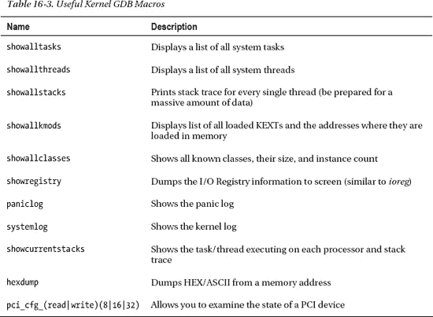


#### 为 KEXT 创建符号信息

在 GDB 中调试你自己的 KEXT 之前，需要先生成该 KEXT 的符号信息。由于 KEXT 是动态加载的，我们无法预先知道它在内存中的具体位置。虽然我们的 KEXT 包含了符号信息，但函数和数据的地址都是相对于 KEXT 二进制文件而言的。一旦 KEXT 被加载，其内部函数的绝对地址将是 `kernel_load_address + relative_address`。

幸运的是，内核调试工具包 (Kernel Debug Kit) 提供了一个小脚本，可以帮助我们生成包含内核地址空间内绝对地址的最终符号表。该脚本名为 `createsymbolfiles`，使用方法如下：

```
$ /Volumes/KernelDebugKit/createsymbolfiles -a i386 -s ./ MyDebugDriver.kext
MyDebugDriver.kext appears to be loadable (not including linkage for on-disk libraries).

Enter the hexadecimal load addresses for these extensions
(press Return to skip symbol generation for an extension):

com.osxkernel.MyDebugDriver: 0x9b9000
```

加载地址可以从多个地方找到，例如，使用 `kextstat` 命令，如下所示：

```
$ kextstat
Index Refs Address    Size       Wired      Name (Version) <Linked Against>
  126    0 0x9b9000   0x3000     0x2000     com.osxkernel.MyDebugDriver (1) <5 4 3>
```

在上面的例子中，这个 KEXT 没有额外的依赖项；然而，在实际情况中，一个 KEXT 可能依赖于一个或多个其他 KEXT，例如某个 I/O Kit 家族，此时系统也会提示你输入它们的地址。如果你正在调试来自远程系统的崩溃转储，或者直接调试一个崩溃的系统，那么如果你的扩展导致了崩溃，它的加载地址以及所有依赖项的加载地址都可以在崩溃日志中找到。请注意，你的 KEXT 每次加载时都可能被分配不同的地址，因此你需要每次都重新生成符号信息。

以上步骤足以让我们获得基本的符号信息，但这仅限于函数的符号名称，无法提供源代码行信息。要获得源代码行信息，你可以像图 16-2 所示那样配置扩展的调试信息格式。

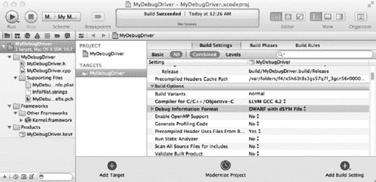

**图 16-2.** 使用 Xcode 设置调试信息格式

带有 dSYM 的 DWARF 格式会为你创建一个独立的文件，其中包含一套完整的符号以及将代码位置映射回源代码行所需的信息。在进行调试构建时，这些信息通常会被嵌入到可执行文件中；但对于驱动的发布构建，你可以将这些信息生成到外部文件中。一个好的做法是将这些调试信息归档以备后用。这样，当用户报告崩溃时，调试工作会变得更加容易。在我们的例子中，dSYM 文件（实际上是一个包）将被命名为 `MyDebugDriver.kext.dSYM`。在运行 `createsymbolfiles` 脚本之前，应将 dSYM 包与 KEXT 放在一起。

#### 使用 GDB 调试 KEXT

在接下来的部分中，我们将分析一个由假设的驱动程序 `MyDebugDriver` 引起的崩溃。`MyDebugDriver` 的头文件规范如代码清单 16-4 所示。

**代码清单 16-4.** MyDebugDriver 头文件

```
class com_osxkernel_MyDebugDriver : public IOService
{
    OSDeclareDefaultStructors(com_osxkernel_MyDebugDriver);
public:
    virtual bool init(OSDictionary* dict);
    virtual bool start(IOService* provider);
    virtual void stop(IOService* provider);

    void testFunc1(UInt32 arg1, UInt32 arg2, UInt32 arg3, UInt32 arg4);
    void testFunc2(UInt32 arg1, UInt32 arg2, UInt32 arg3, UInt32 arg4);
    void testFunc3(UInt32 arg1, UInt32 arg2, UInt32 arg3, UInt32 arg4);

    static void  timerFired(OSObject* owner, IOTimerEventSource* sender);
private:

    IOTimerEventSource*     fTimer;
    int                     fVariable1;
    int                     fVariable2;
};
```

该驱动程序启动了一个定时器，定时器会调用 `testFunc1()`，接着 `testFunc1()` 调用 `testFunc2()`，`testFunc2()`再调用 `testFunc3()`，而 `testFunc3()` 由于解引用了一个空指针导致内核恐慌。每个函数都接受四个整数参数（这些参数是随机选取的，没有实际意义），并且这些参数从第一个函数到最后一个函数保持不变。传入的参数值分别是 65261、48879、0 和 5380。

我们之前已经使用 FireWire 内核转储机制成功地从崩溃系统生成了一个核心转储，并且使用正确的加载地址为我们的驱动程序构建了符号信息。现在，我们准备在 GDB 中加载它并开始实际工作。要找到驱动程序中的错误，我们需要执行以下步骤：

-   使用正确的加载地址创建一个符号文件（参见上一节）
-   启动 GDB 并加载核心转储
-   从内核添加符号信息
-   加载内核调试工具包 GDB 宏
-   将我们的 KEXT 二进制文件 `MyDebugDriver` 加载到 GDB 中
-   为 `MyDebugDriver` 加载符号信息（如果 GDB 无法在与 KEXT 相同的位置找到它们）
-   告诉 GDB `MyDebugDriver` 源代码的位置（可选）

以下是针对 `MyDebugDriver` 的完整调试会话：

```
$ gdb -c core-xnu-1504.15.3-0.0.0.0-fb3a74d3
GNU gdb 6.3.50-20050815 (Apple version gdb-1704) (Thu Jun 23 10:48:29 UTC 2011)
…
This GDB was configured as "x86_64-apple-darwin".
#0  0x002b1e3e in ?? ()
(gdb) add-symbol-file /Volumes/KernelDebugKit/mach_kernel
add symbol table from file "/Volumes/KernelDebugKit/mach_kernel"? (y or n) y
Reading symbols from /Volumes/KernelDebugKit/mach_kernel...Reading symbols from /Volumes/KernelDebugKit/mach_kernel.dSYM/Contents/Resources/DWARF/mach_kernel...done.
done.
(gdb) source /Volumes/KernelDebugKit/kgmacros
Loading Kernel GDB Macros package.  Type "help kgm" for more info.
```

上述命令序列加载了核心转储文件，从内核调试工具包中添加了内核的符号信息，并最终加载了 GDB 宏。这些宏必须在加载内核符号信息之后加载，以确保正确初始化。

现在，我们可以发出 `backtrace` 命令来查看系统崩溃的位置，如下所示：


`(gdb)` **`backtrace`**
```
#0  0x002b1e3e in Debugger (message=0x5dd7fc "panic")
#1  0x0021b837 in panic (str=0x59e3d0 "Kernel trap at 0x%08x, type %d=%s, registers:\nCR0:
0x%08x, CR2: 0x%08x, CR3: 0x%08x, CR4: 0x%08x\nEAX: 0x%08x, EBX: 0x%08x, ECX: 0x%08x, EDX:
0x%08x\nCR2: 0x%08x, EBP: 0x%08x, ESI: 0x%08x, EDI: 0x%08x\nE"...) at /SourceCache/xnu/xnu-
1504.15.3/osfmk/kern/debug.c:303
#2  0x002abf6a in panic_trap [inlined] () at :1052
#3  0x002abf6a in kernel_trap (state=0x46ee3e10) at /SourceCache/xnu/xnu-
1504.15.3/osfmk/i386/trap.c:1001
#4  0x002a1a78 in trap_from_kernel () at cpu_data.h:397
#5  0x009ba0b7 in last_kernel_symbol ()
#6  0x009ba356 in last_kernel_symbol ()
#7  0x009ba3b8 in last_kernel_symbol ()
#8  0x009ba45b in last_kernel_symbol ()
#9  0x005571d5 in IOTimerEventSource::timeoutAndRelease (self=0x2a17b0, c=0x5022071) at
/SourceCache/xnu/xnu-1504.15.3/iokit/Kernel/IOTimerEventSource.cpp:122
#10 0x00230235 in thread_call_thread (group=0x863ea0) at /SourceCache/xnu/xnu-
1504.15.3/osfmk/kern/thread_call.c:848
```

由于我们尚未加载我们的 KEXT，#5–#8 号符号显示为虚假符号，因为调试器无法将函数的地址解析为其符号名称。为了解决这个问题，我们将把 `MyDebugDriver` KEXT 连同其符号信息一起加载到 GDB 中，操作如下：

`(gdb)` **`add-kext MyDebugDriver.kext`**
```
Reading symbols from com.osxkernel.MyDebugDriver.sym...Reading symbols from
MyDebugDriver.kext.dSYM/Contents/Resources/DWARF/MyDebugDriver...done.
```
`(gdb)` **`directory MyDebugDriver/`**
```
Source directories searched: MyDebugDriver:$cdir:$cwd
```

现在我们已经加载了驱动程序及其符号信息，并告知了 GDB 查找 `MyDebugDriver` 源代码的位置。内核自身源代码的位置被硬编码在调试内核映像中。如果你希望在 GDB 中显示源代码，则需要为你下载 XNU 源代码的位置创建一个指向 `/SourceCache/` 目录的符号链接。

接下来，让我们在加载了 KEXT 和符号信息的情况下，再次尝试 `backtrace` 命令，操作如下：

`(gdb)` **`backtrace`**
```
...
#5  0x009ba0b7 in com_osxkernel_MyDebugDriver::testFunc3 (this=0x4e80f80, arg1=65261,
arg2=48879, arg3=0, arg4=5380) at MyDebugDriver.cpp:14
#6  0x009ba356 in com_osxkernel_MyDebugDriver::testFunc2 (this=0x4e80f80, arg1=65261,
arg2=48879, arg3=0, arg4=5380) at MyDebugDriver.cpp:21
#7  0x009ba3b8 in com_osxkernel_MyDebugDriver::testFunc1 (this=0x4e80f80, arg1=65261,
arg2=48879, arg3=0, arg4=5380) at MyDebugDriver.cpp:27
#8  0x009ba45b in com_osxkernel_MyDebugDriver::timerFired (owner=0x4e80f80, sender=0xb63adc0)
at MyDebugDriver.cpp:64
...
```

这样可读性强多了。我们现在已经确定了确切的调用栈，可以看到驱动程序中涉及的哪些方法，具体到文件名和行号。我们还可以看到传递给这些方法的参数，并且这些参数与我们之前选取的值相符。让我们跳转到第五个栈帧，即崩溃发生的位置，来进一步检查崩溃情况，操作如下：

`(gdb)` **`frame 5`**
```
#5  0x009ba0b7 in com_osxkernel_MyDebugDriver::testFunc3 (this=0x4e80f80, arg1=65261,
arg2=48879, arg3=0, arg4=5380) at MyDebugDriver.cpp:14
14                     thisWillNotWork->fVariable1 = arg3;
Current language:  auto; currently c++
```
`(gdb) print thisWillNotWork`
```
$1 = (com_osxkernel_MyDebugDriver *) 0x0
```

我想我们找到问题了！我们正试图给成员变量 `fVariable1` 赋值，但该对象并未被初始化。我们还可以列出 `testFunc3()` 的源代码，操作如下：

`(gdb)` **`list com_osxkernel_MyDebugDriver::testFunc3,15`**
```
9      void com_osxkernel_MyDebugDriver::testFunc3(UInt32 arg1, UInt32 arg2, UInt32 arg3, UInt32 arg4)
10     {
11         if (arg3 == 0)
12         {
13             com_osxkernel_MyDebugDriver *thisWillNotWork = NULL;
14             thisWillNotWork->fVariable1 = arg3;
15         }
```

瞧，这永远行不通！我们找到了这个 bug，看起来只有当传入的第三个参数设置为零时，它才会被触发。

如果你仅有符号信息，而缺少将地址映射到特定源代码位置所需的调试信息，你可以使用 GDB 中的 `disassemble` 命令从该地址处转储方法的反汇编。让我们看看 `testFunc3()` 的反汇编，操作如下：

`(gdb)` **`disassemble 0x009ba0b7`**
```
...
0x009ba09f <testFunc3Emmmm+35>:     mov    %eax,-0x1c(%ebp)
0x009ba0a2 <testFunc3Emmmm+38>:     mov    -0x18(%ebp),%eax
0x009ba0a5 <testFunc3Emmmm+41>:     cmp    $0x0,%eax
0x009ba0a8 <testFunc3Emmmm+44>:     jne    0x9ba0ba <testFunc3Emmmm+62>
0x009ba0aa <testFunc3Emmmm+46>:     movl   $0x0,-0x20(%ebp)
0x009ba0b1 <testFunc3Emmmm+53>:     mov    -0x18(%ebp),%eax
0x009ba0b4 <testFunc3Emmmm+56>:     mov    -0x20(%ebp),%ecx
0x009ba0b7 <testFunc3Emmmm+59>:     mov    %eax,0x54(%ecx)
0x009ba0ba <testFunc3Emmmm+62>:     add    $0x18,%esp
...
```

如果不熟悉汇编语言，这看起来可能让人望而生畏，但通过比较反汇编和原始源代码，你能够推断出不少信息。例如，`cmp` 指令将 `eax` 寄存器的值与常量 `$0x0` 进行比较，我们可以正确猜测出这对应于第 11 行的 `if` 语句。

尽管我们已经找到了问题的根源，但假设我们暂时对为什么第三个参数传入了零值感到好奇。也许我们的驱动程序在计算传递给 `testFunc3()` 的值时，使用了某种内部状态。在这种情况下，我们可以通过查看崩溃时驱动程序所处的状态来继续我们的检查。由于 `testFunc3()` 是 `com_osxkernel_MyDebugDriver` 的一个成员方法，我们知道指向该类实例的指针会自动作为 `this` 指针传递给该成员函数。我们可以像下面这样，从之前的栈回溯中解引用 `this` 指针地址：

`(gdb)` **`print *(com_osxkernel_MyDebugDriver*)0x4e80f80`**
```
$9 = {
  <IOService> = {
    <IORegistryEntry> = {
      <OSObject> = {
        <OSMetaClassBase> = {
          _vptr$OSMetaClassBase = 0x9baa00
        },
        members of OSObject:
        retainCount = 65537
      },
      members of IORegistryEntry:
      reserved = 0x4e71a40,
      fRegistryTable = 0xb693800,
      fPropertyTable = 0x503a400
    },
    members of IOService:
    reserved = 0x0,
    __provider = 0x4d17f00,
    …….
  },
  members of com_osxkernel_MyDebugDriver:
  fTimer = 0xb63adc0,
  fVariable1 = 2,
  fVariable2 = 4,
  static gMetaClass = {
    <OSMetaClass> = {
      <OSMetaClassBase> = {
        _vptr$OSMetaClassBase = 0x9ba980
      },
      members of OSMetaClass:
      reserved = 0xb63ba00,
      superClassLink = 0x85fac8,
      className = 0x4e5b5a0,
      classSize = 92,
      instanceCount = 1
    }, <No data fields>},
  static metaClass = 0x9ba000,
  static superClass = 0x9ba020
```

现在我们可以检查我们驱动程序实例的内部状态，并看到其成员变量 `fVariable1` 和 `fVariable2` 的值。我们还可以从元类信息中看到我们类存在多少个实例，并确定该驱动程序的 retain 计数。


### 理解内核恐慌日志

在系统崩溃后，可以在 `/Library/Logs/DiagnosticReports/` 目录中找到恐慌日志，或者可以通过从核心转储或远程 GDB 会话中提取崩溃目标信息来获取。作为一名内核程序员，你可能需要分析从客户计算机发送来的内核恐慌日志，而这些计算机你很少能进行物理访问。此外，客户可能不愿意或无法协助你获取核心转储。因此，能够理解并从日志中提取尽可能多的信息至关重要。现在，让我们开始查看恐慌日志以及我们可以从中提取哪些信息。之前章节讨论的 `MyDebugDriver` 崩溃的恐慌日志如代码清单 16-5 所示。

**代码清单 16-5.** `MyDebugDriver` 崩溃的恐慌日志

```
panic(cpu 1 caller 0xffffff80002c268d): Kernel trap at 0xffffff7f81345570, type 14=page fault,
registers:
CR0: 0x000000008001003b, CR2: 0x0000000000000090, CR3: 0x0000000000100000, CR4:
0x0000000000000660
RAX: 0x0000000000000000, RBX: 0x0000000000000000, RCX: 0x0000000000000000, RDX:
0x000000000000beef
RSP: 0xffffff808e973e80, RBP: 0xffffff808e973ea0, RSI: 0x000000000000feed, RDI:
0xffffff801ab61100
R8:  0x0000000000001504, R9:  0x000000000000beef, R10: 0x0000000000000000, R11:
0x0000000000001504
R12: 0xffffff7f8134591a, R13: 0xffffff800c81d200, R14: 0xffffff800c81d200, R15:
0xffffff800b735880
RFL: 0x0000000000010246, RIP: 0xffffff7f81345570, CS:  0x0000000000000008, SS:
0x0000000000000010
CR2: 0x0000000000000090, Error code: 0x0000000000000002, Faulting CPU: 0x1

Backtrace (CPU 1), Frame : Return Address
0xffffff808e973b40 : 0xffffff8000220702
0xffffff808e973bc0 : 0xffffff80002c268d
0xffffff808e973d60 : 0xffffff80002d7a3d
0xffffff808e973d80 : 0xffffff7f81345570
0xffffff808e973ea0 : 0xffffff7f813458b6
0xffffff808e973ed0 : 0xffffff7f81345914
0xffffff808e973f00 : 0xffffff7f813459f4
0xffffff808e973f40 : 0xffffff800063bc61
0xffffff808e973f70 : 0xffffff800023dafc
0xffffff808e973fb0 : 0xffffff8000820057
      Kernel Extensions in backtrace:
         com.osxkernel.MyDebugDriver(1.0)[FF6F45C8-68F8-3150-9C43-
99A2F19B3FB1]@0xffffff7f81345000->0xffffff7f81348fff

BSD process name corresponding to current thread: kernel_task
Boot args: debug=0xd44 _panicd_ip=192.168.1.1 panicd_ip=192.168.1.1

Mac OS version:
11A511

Kernel version:
Darwin Kernel Version 11.0.0: Sat Jun 18 12:56:35 PDT 2011; root:xnu-
1699.22.73~1/RELEASE_X86_64
Kernel UUID: 24CC17EB-30B0-3F6C-907F-1A9B2057AF78
System model name: MacBook5,1 (Mac-F42D89C8)

System uptime in nanoseconds: 200305435891999
last loaded kext at 200285007562702: com.osxkernel.MyDebugDriver  1 (addr 0xffffff7f81345000,
size 16384)
last unloaded kext at 187374587106276: com.apple.driver.AppleUSBCDC     4.1.15 (addr
0xffffff7f8133d000, size 12288)
loaded kexts:
com.osxkernel.MyDebugDriver  1
com.apple.driver.AppleUSBDisplays   302.1.2
com.apple.driver.AppleIntelProfile  83
com.apple.filesystems.afpfs 9.8
```

代码清单 16-5 中的恐慌日志是在与之前不同的系统上生成的。这个系统运行的是更新的 Mac OS X Lion 版本，该系统仅运行 64 位版本的内核。该恐慌日志包含以下元素：

- 发生的恐慌/问题的类型以及发生问题的 CPU（核心）编号
- CPU 状态的转储（寄存器值）
- 崩溃时 CPU 正在执行的回溯信息
- 崩溃中涉及的内核扩展及其依赖关系（上面没有）
- 导致崩溃的进程（任务）名称
- 内核构建版本和版本号
- 系统型号
- 关于最近加载/卸载的 KEXT 的信息
- 已加载的 KEXT 的完整列表

你可能首先注意到，这次恐慌是由*页面错误*引起的，这为我们提供了后续在代码中应查找哪些内容的线索。同时，查看导致问题的任务也通常很有用。在这个例子中，崩溃发生时我们的驱动程序是在内核上下文（`kernel_task`）中执行的，而非代表用户空间线程执行。

首先，让我们查看回溯信息，并尝试证明我们的驱动程序确实涉及其中。我们的驱动程序被列为回溯信息的一部分，因此它极有可能与此有关。你还将注意到我们的驱动程序后面有两个地址：`0xffffff7f81345000->0xffffff7f81348fff`。这是加载地址，我们的 KEXT 的指令和数据被加载到了内核地址空间的这个位置。要确定栈上的哪些函数属于我们的驱动程序，我们可以简单地查找栈上在该范围内的地址。可以识别出四个地址——`0xffffff7f81345570`、`0xffffff7f813458b6`、`0xffffff7f81345914` 和 `0xffffff7f813459f4`。

之前我们已经知道，它们很可能对应 `testFunc3()`、`testFunc2()`、`testFunc1()` 和 `timerFired()`。

 **提示** 在上一个回溯信息中，列中的第一个地址是栈帧条目的地址，而第二个地址是返回地址，即当上一个函数调用完成时执行返回到的位置。在这个场景下，我们感兴趣的是返回地址。你可能会注意到，栈帧地址包含递增的地址，并且在这个例子中它们都在单个页面内。如果这些值看起来随机且分散在各地，很可能栈帧已损坏，那么回溯信息可能就没用了，因为这些信息不值得信赖。

假设我们完全不知道这些地址对应驱动程序中的哪些函数，我们可以使用一个简单的技巧。只需将其中一个函数的地址减去加载地址，就可以确定该函数在驱动程序可执行映像中的偏移量，如下所示：

```
0xffffff7f81345570 - 0xffffff7f81345000 = 1392 字节
```

现在我们知道了该函数位于 KEXT 起始位置偏移 1392 字节处，假设我们有该驱动程序的可用可执行映像（与崩溃中涉及的确切版本和构建一致），我们可以执行以下操作：

```
$ gdb MyDebugDriver.kext/Contents/MacOS/MyDebugDriver
GNU gdb 6.3.50-20050815 (Apple version gdb-1704) (Thu Jun 23 10:48:29 UTC 2011)
This GDB was configured as "x86_64-apple-darwin"...
(gdb) disassemble 1392
Dump of assembler code for function _ZN27com_osxkernel_MyDebugDriver9testFunc3Ejjjj:
0x0000000000000540 <testFunc3Ejjjj+0>:       push   %rbp
0x0000000000000541 <testFunc3Ejjjj+1>:       mov    %rsp,%rbp
0x0000000000000544 <testFunc3Ejjjj+4>:       sub    $0x20,%rsp
0x0000000000000548 <testFunc3Ejjjj+8>:       mov    %rdi,-0x8(%rbp)
0x000000000000054c <testFunc3Ejjjj+12>:      mov    %esi,-0xc(%rbp)
0x000000000000054f <testFunc3Ejjjj+15>:      mov    %edx,-0x10(%rbp)
0x0000000000000552 <testFunc3Ejjjj+18>:      mov    %ecx,-0x14(%rbp)
0x0000000000000555 <testFunc3Ejjjj+21>:      mov    %r8d,-0x18(%rbp)
0x0000000000000559 <testFunc3Ejjjj+25>:      mov    -0x14(%rbp),%eax
0x000000000000055c <testFunc3Ejjjj+28>:      cmp    $0x0,%eax
0x000000000000055f <testFunc3Ejjjj+31>:      jne    0x576 <_ZN27com_osxkernel_MyDebugDriver9testFunc3Ejjjj+54>
...
End of assembler dump.
(gdb) info line *1392
Line 14 of "MyDebugDriver.cpp" starts at address 0x569
<_ZN27com_osxkernel_MyDebugDriver9testFunc3Ejjjj+41> and ends at 0x576
<_ZN27com_osxkernel_MyDebugDriver9testFunc3Ejjjj+54>.
```


我们已找到崩溃的位置！CPU 寄存器的完整描述超出了本书的范围，但只需说明它们包含大量有用信息即可。下一节我们将讨论如何利用寄存器信息来检索函数参数。崩溃日志中的处理器当时运行在 64 位模式下。`x86_64`系统可用的寄存器数量比`i386`系统更多，且局部变量通常通过通用寄存器而非栈来传递。

 **提示** 技术说明 TN2063 更详细地讨论了如何调试和解读内核恐慌，并包含了 PowerPC 系统的恐慌日志调试方法：[`http://developer.apple.com/library/mac/#technotes/tn2063/_index.html`](http://developer.apple.com/library/mac/#technotes/tn2063/_index.html)。

### x86-64 调用约定

调用约定是函数传递其参数的一种方案。调用约定取决于编程语言、操作系统、架构和编译器。理解所使用的调用约定有助于我们在发生崩溃时解码寄存器状态。例如，在运行 64 位可执行程序或内核的 Mac OS X 上，采用 System V AMD64 ABI 约定（注意 Windows 使用不同的调用约定，因此寄存器使用方式会不同）。在 Mac OS X 的 64 位任务中，函数调用参数的寄存器分配如表 16-4 所示。

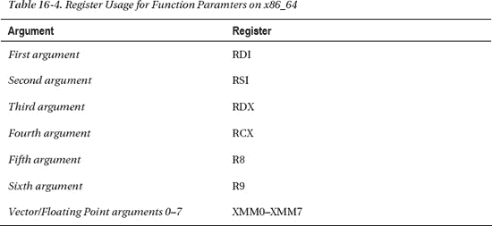

如果函数参数超过六个，剩余参数将通过栈传递。在分析 C++代码时需要注意：非静态的 C++成员方法总是将 `this` 指针作为第一个参数传递，因此方法的实际第一个参数通过 `RDI` 传递，而 `this` 指针则被放入 `RSI` 寄存器。

让我们查看代码清单 16-5 中恐慌日志显示的寄存器，尝试通过检查寄存器状态来确定传递给函数的参数，如下所示：

*   `RDI`：`0xffffff801ab61100`（this 指针）
*   `RSI`：`0x000000000000feed`（十进制 = 65261）
*   `RDX`：`0x000000000000beef`（十进制 = 48879）
*   `RCX`：`0x0000000000000000`（十进制 = 0）
*   `R8`：`0x0000000000001504`（十进制 = 5380）

如您所见，代码清单 16-5 中的寄存器内容与传递给 `testFunc3()` 的四个参数完全一致：65261、48879、0 和 5380。我们还可以看到第一个参数看起来像一个指针，很可能是指向当前 `MyDebugDriver` 实例的 `this` 指针。

假设 `testFunc3()` 是一个更复杂的方法，且崩溃发生在函数更靠后的位置，那么寄存器在崩溃时可能已被重用并覆盖。在这种情况下，您可能无法恢复参数的原始值。

### 使用活动监视器诊断挂起的进程

图 16-3 所示的 Mac OS X 活动监视器有助于诊断内核问题。

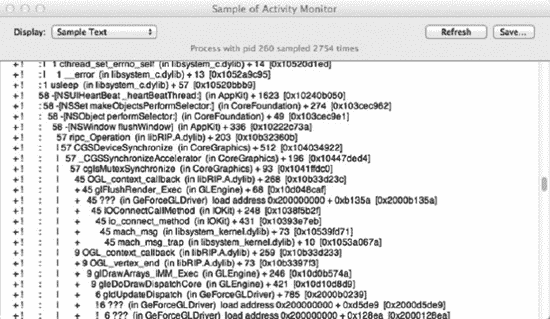

***图 16-3.** 来自活动监视器的进程采样输出*

活动监视器中显示的任何任务都可以被采样（`kernel_task` 除外），采样期间会生成该任务所有线程的调用图。从内核调试的角度来看，这非常有用，因为您可以判断一个进程是否有线程通过诸如 `IOConnectCallMethod()` 之类的系统调用进入您的驱动程序。如果进程挂起，强制退出将启动崩溃报告程序，它会提供更详细的日志，包括线程当前在内核中运行时其内核栈的信息。进程采样功能还能帮助您确定性能问题，并找出应用程序花费时间最多的地方。

### 查找内存和资源泄漏

对于可在运行时动态加载和卸载的扩展，防止内存和资源泄漏尤为重要。一个检测泄漏的实用工具是 `ioclasscount` 实用程序，它可以显示每个已知类（已加载到内核中）的实例计数。典型输出如下所示：

```
CHUDUtils = 1
com_apple_AppleFSCompression_AppleFSCompressionTypeZlib = 1
com_apple_BootCache = 1
com_apple_driver_AudioIPCDevice = 1
com_apple_driver_AudioIPCEngine = 1
com_belkin_f2cd0007_adapter = 0
com_osxkernel_MyDebugDriver = 5
com_vmware_kext_KeyboardState = 1
com_vmware_kext_UsbDevice = 2
com_vmware_kext_UsbPortArbiter = 1
.....
```

它显示我们的驱动程序被保留（`retain()`）了五次。即使其控制的硬件设备已被移除，只要保留计数未归零，驱动程序的 `free()` 函数就不会被调用。这将阻止内核扩展完全卸载。通常，每次用户空间应用程序打开驱动程序时，保留计数都会增加；或者，由于另一个驱动程序或驱动程序使用的辅助支持类对其调用了 `retain()`，保留计数也会增加。未能使 `retain()` 调用与 `release()` 调用保持平衡将导致泄漏。`ioclasscount` 实用程序无需修改内核启动参数即可使用；默认情况下它不会安装在系统上，而是作为 Xcode 分发版的一部分安装。在调试时，可以将其复制到没有 Xcode 的系统上。当一个驱动程序已被卸载，并且所有对其的引用都已释放（保留计数 = 0）时，它将被 `kextd` 守护进程卸载。尽管引用计数已降为零，但 KEXT 完全卸载可能需要一分钟。

如果您能够使用 GDB 对内核进行实时调试，则可以使用诸如 `showallclasses` 或 `showregistry` 之类的宏，如下所示：

```
(gdb) showallclasses
…
1    x    84 bytes com_vmware_kext_VmmonService
2    x    80 bytes com_vmware_kext_UsbDevice
1    x   104 bytes com_vmware_kext_UsbPortArbiter
1    x   136 bytes com_vmware_kext_UsbPortArbiterUserClient
1    x   132 bytes com_vmware_kext_KeyboardState
1    x    92 bytes com_osxkernel_MyDebugDriver
....
(gdb) showregistry
...
      +-o com_osxkernel_MyDebugDriver  <object 0x0703e680, id 0x1000007a9, vtable 0xcbc980,
!registered, !matched, active, busy 0, retain count 5>
...
```

 **提示** `zprint` 和 `showioalloc` 宏可以进一步帮助跟踪内存使用情况。

为了进一步帮助调试引用计数错误，可以重写 `OSObject::taggedRetain(const void *tag)` 和 `OSObject::taggedRelease(const void *)`。例如，打印一条消息或打印调用者栈的回溯，以帮助识别泄漏的来源。


### 摘要

- 内核中可能出现一些常见问题，例如死锁和无效内存访问，进而可能导致内核崩溃。
- 内核崩溃是一种防御机制，用于应对内核无法恢复的异常或错误状况。它基本上会禁用系统，以防止文件系统或其他文件存储遭到破坏。
- Mac OS X 开箱即提供了一系列有用的调试机制，从简单的追踪和日志记录机制，到对远程内核调试的内置支持。
- 可以配置 Mac OS X 使用 `kdumpd`，在其崩溃时（或手动触发时）接受来自远程系统的核心转储。核心转储包含活动/固定内存，可以加载到 GDB 中。
- 可以通过 FireWire 和以太网从远程系统调试内核。此机制是内置的，但默认未激活。通过设置适当的 NVRAM 参数和标志，可以启用远程调试。
- Apple 通常为每个发布的 Mac OS X 版本提供一个内核调试工具包 (Kernel Debug Kit)。该工具包包含脚本、内核的调试版本以及 I/O Kit 框架 KEXT。调试工具包还包含用于简化 GDB 内核调试的宏。这些宏允许你获取有关调用栈的信息并检查内核的关键数据结构。在本地机器上运行的内核也可以使用 GDB 进行实时调试。
- 要调试你自己的 KEXT，必须为其生成调试符号。由于 KEXT 在内核中动态加载，我们需要为 KEXT 生成正确的符号地址。内核调试工具包提供了 `createsymbolfiles` 脚本来帮助完成此操作。
- 内核崩溃日志包含许多有用的信息，我们可以利用这些信息回溯并找到导致崩溃的位置。
- `ioclasscount` 工具可追踪 I/O Kit 中类的实例计数，并可用于检测内存泄漏或其他问题。

## 第 17 章：高级内核编程

本章涵盖了更高级的内核程序员感兴趣的各种主题。我们将讨论如何在内核中使用流式 SIMD 扩展 (SSE) 和浮点运算。(SIMD 是单输入多数据 (Single Input Multiple Data) 的缩写。) 我们还将研究处理多函数设备驱动程序的策略，并讨论 I/O Kit 框架的实现。我们将介绍内核控制 KPI，它可以用于与不使用 I/O Kit 的 KEXT（例如网络内核扩展 (NKE)）进行用户空间通信。我们还将展示如何在内核中操作和管理进程，例如获取进程的进程标识符 (PID) 和向进程发送信号。某些驱动程序可能需要从文件系统加载额外的资源，例如固件映像。本章讨论了如何使用 `OSKextRequestResource()` 函数加载这些资源。本章最后讨论了驱动程序如何使用通知向用户空间守护进程发送消息。

### 内核中的 SSE 和浮点运算

流式 SIMD 扩展 (SSE) 是 MMX 的后继者，是一种特殊的指令集，在大多数现代 Intel 和 AMD 处理器上都能找到。它允许对值数组（向量）而不是单个值（标量）执行常见的指令，例如加法、乘法和移位。这可以极大地加速许多计算任务，尤其是在数字信号处理、音频、图形和视频等领域。通常情况下，内核并不是进行大量计算的好地方，但在某些领域这是不可避免的——例如，在音频驱动程序中，需要转换来自多个用户空间应用程序的音频采样并将其混合到单个输出缓冲区。RAID-5 和 RAID-6 算法的软件实现也是可能需要在内核中进行计算并通过 SSE 进行优化的例子。

传统上，在内核环境中使用 SSE 和浮点运算并非易事。某些操作系统（例如 Linux）要求你在使用前显式保存浮点/SSE 状态，并在使用后恢复；否则，线程的浮点状态可能会被覆盖。然而，在 Mac OS X 中，内核可以自由使用浮点运算和 SSE，而无需手动保存和恢复寄存器状态。通常，当一个线程用完它的时间片或因其他线程被抢占而停止执行时，该线程停止执行时的 CPU 寄存器状态会被保存到内存中，并在线程继续执行时恢复。为了优化性能，内核只存储通用寄存器，而不存储浮点和 SSE 寄存器，因为它们使用频率较低。实际上，许多程序根本不会使用浮点或 SSE。当另一个线程尝试使用这些寄存器时，CPU 会引发异常/陷阱，这将保存先前的内容并清除寄存器以供新线程使用。当原始线程即将恢复执行时，浮点和/或 SSE 寄存器将恢复到之前的状态。

有两种使用 SSE 的方法：

- 通过使用汇编或内联汇编直接使用 CPU 指令。
- 通过使用 GCC 提供的内联函数 (intrinsic functions)，这些函数为大多数指令提供了更友好的 C 函数包装。对于 SSE2，这些函数在头文件 `emmintrin.h` 中提供，该头文件不属于内核框架。但是，你可以复制该文件并将其包含在你的项目中。这是可行的，因为这些函数都是内联的，不依赖于任何外部库。

SSE 指令集有许多修订版。目前最新的主要版本是 SSE4。一些较旧的系统可能不支持 2007 年推出的 SSE4。尝试在不支持 SSE4 的 CPU 上执行 SSE4 指令将导致内核崩溃。为防止这种情况，你需要在执行 SSE 指令之前提供对 CPU 能力的运行时检测，或者针对更旧的版本（例如 SSE2，它早于所有基于 Intel 的 Mac）。

### 多函数驱动程序

USB 和 PCI 设备可能是包含多个独立设备的复合设备，每个设备的功能可以由各自的驱动程序处理。其他设备可能由多个驱动程序处理的单个逻辑设备组成。让我们以带有 HDMI 输出端口的现代显卡为例。HDMI 能够同时传输音频和视频，因此提供一个允许该设备与 Core Audio 一起使用的音频驱动程序会很方便。该设备是显卡，因此其硬件不具备大多数音频硬件典型的 DMA 引擎。相反，音频数据在规则的垂直消隐间隔期间与视频帧一起发送。这种设计意味着音频和视频部分紧密关联，并且需要它们之间的共享状态才能运行。由于没有明确的分离，驱动程序可以如图 17-1 所示进行构建。

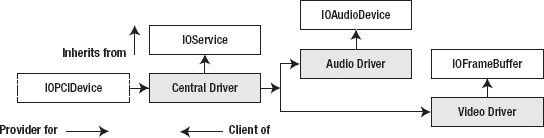

**图 17-1.** 多函数驱动程序

图 17-1 中的设计使用了一个中央驱动程序，它协调硬件并管理提供者。中央驱动程序用于匹配硬件提供者。然后，中央驱动程序会创建一个基于 `IOAudioFamily` 的音频驱动程序和一个基于 `IOGraphicsFamily` 的视频/图形驱动程序。管理从属驱动程序与中央驱动程序的关系有两种方法：

- 中央驱动程序、音频驱动程序和视频驱动程序可以位于不同的 KEXT 中。中央驱动程序匹配硬件资源，而音频和视频驱动程序将匹配中央驱动程序并将其用作提供者。
- 所有驱动程序可以位于同一个 KEXT 中。然后，中央驱动程序需要手动管理从属驱动程序的生命周期。


### 编写 I/O Kit 家族（Families）

到目前为止，我们已经探讨了如何实现各种形式的驱动程序，其中大多数驱动都与一个或多个家族（family）进行交互。在某些情况下，你可能会想实现一个家族而不是一个驱动程序——例如，当你需要支持一种新的总线技术，或者拥有一系列依赖于相同基础设施或通用服务的硬件设备时。家族可以通过以下特征与驱动程序进行区分：

- 一个家族通常由多个 `IOService` 类组成，这些类被打包在一个 KEXT 中，以提供相关服务。
- 可以将家族视为内核中用户空间共享库的对应物。
- 驱动程序依赖于家族，反之则不成立。
- 家族不会被直接加载；它之所以被加载，是因为某个驱动程序声明了对其的依赖。
- 家族没有匹配字典，也不参与被动或主动匹配。
- 与任何其他 KEXT 一样，家族安装于 `/System/Library/Extensions` 目录下。

编写家族并没有特殊的 API 或方法。其实现方式与其他任何驱动程序完全相同。Apple 建议专注于良好的基础面向对象设计，并让其自然演进，而不是特意着手创建一个家族。驱动程序可以通过其属性列表文件中的 `OSBundleLibraries` 键值来声明对某个家族（或任何其他 KEXT）的依赖。只有当所有依赖项都被解析并加载后，驱动程序才能被加载并链接到内核中。`kextd` 守护进程负责执行此任务。当需要加载驱动程序时，`kextd` 守护进程会检查驱动程序的 `Info.plist` 文件以获取其依赖项。如果 `Info.plist` 错误地指定或未能列出某些依赖项，这将导致链接失败，并且驱动程序将无法加载。为了依赖于某个家族，驱动程序必须列出该家族的包标识符（bundle ID）——例如 `com.apple.iokit.IOAudioFamily`——以及版本号——例如 `1.7.9fc8`。

I/O Kit 保证在依赖于某个家族的驱动程序加载之前，该家族已被加载。这是必要的，否则驱动程序中的符号将无法解析。

由于 Apple 的许多 I/O Kit 家族都是开源代码，因此可以对它们进行修改并用修改后的版本替换原始版本。然而，不建议这样做，因为家族 KEXT 可能会被 Apple 随后的软件更新所覆盖，这意味着修改后的 KEXT 的功能可能会丢失。在某些情况下，通过插入额外的跟踪代码来修改家族可能有助于调试。

扩展一个家族是直接修改它的更好选择。扩展起来很容易，因为 I/O Kit 家族中的大多数类都将其方法声明为虚方法（virtual），即使该类本身并非抽象类。你可能希望这样做有很多原因。例如，如果你需要支持一种 `IOUSBFamily` 不支持的新型 USB 控制器，你可以创建自己的 `IOUSBController` 子类来表示这个新控制器。扩展后的类可以编译到需要它的驱动程序所在的同一个 KEXT 中，或者编译到你自己的库/家族 KEXT 中。`IONetworkingFamily` 和其他家族在设计时就专门支持这种形式的扩展。

### 内核控制 KPI

内核控制接口 `<sys/kern_control.h>` 是一个 KPI，它允许 KEXT 与用户空间进程进行双向通信。内核控制系统位于内核的 BSD 部分，因此是用 C 语言而不是 C++ 编写的（I/O Kit 使用 C++）。

该 KPI 旨在允许用户空间程序控制并配置 KEXT。例如，假设你已经实现了一个自定义防火墙 NKE（网络内核扩展）。然后，你可以使用内核控制 API 来告诉你的防火墙它应该阻止哪些地址或端口的流量，以及检索日志和统计数据。

在核空间和用户空间使用该 KPI 都相对简单。实际上，在用户空间使用内核控制机制不需要特殊的 API，因为它是通过常规套接字访问的。可以使用 `getsockopt()` 或 `setsockopt()` 系统调用函数从用户空间发出控制请求。可以将内核控制系统与 `ioctl()` 系统调用进行比较，但与 `ioctl()` 系统调用不同，内核控制系统更适合跨越内核/用户空间边界传输大量数据。从用户空间发送和接收数据时，支持使用 `send()` 和 `recv()` 系统调用函数。在内核中，数据传输是使用前面讨论过的 `mbuf` 数据结构来处理的。

要使用内核控制接口，必须首先注册一个新接口，这可以确保用户空间的客户端能够找到它并与之建立连接。这可以通过声明并填充一个包含各种事件回调以及标识名称的 C 结构体来实现。C 语言不是面向对象的，因此“对象”通常由包含数据和函数指针的结构体来表示。注册结构体如 代码清单 17-1 所示。

**代码清单 17-1.** 来自 `<sys/kern_control.h>` 的 `kern_ctl_reg` 结构体

```c
struct kern_ctl_reg
{
    /* 控制信息 */
    char                        ctl_name[MAX_KCTL_NAME];
    u_int32_t                   ctl_id;
    u_int32_t                   ctl_unit;
    /* 控制设置 */
    u_int32_t                   ctl_flags;
    u_int32_t                   ctl_sendsize;
    u_int32_t                   ctl_recvsize;
    /* 分派函数 */
    ctl_connect_func            ctl_connect;
    ctl_disconnect_func         ctl_disconnect;
    ctl_send_func               ctl_send;
    ctl_setopt_func             ctl_setopt;
    ctl_getopt_func             ctl_getopt;
};
```

让我们更详细地查看结构体的各个字段：

- `ctl_name` 应设置为 KEXT 的包标识符（bundle ID）。
- `ctl_id` 字段用于额外的寻址，因为一个 KEXT 可能同时注册多个内核控制。`ctl_id` 字段可以动态注册，也可以由 Apple 开发者技术支持（DTS）分配。
- 仅当使用 DTS 分配的 ID 时，才使用 `ctl_unit` 字段。
- `ctl_flags` 只有两个标志位。第一个是 `CTL_FLAG_PRIVILEGED`，如果设置了此标志，则意味着用户空间程序必须拥有 root 权限才能连接到该内核控制。第二个标志是 `CTL_FLAG_REG_ID_UNIT`，如果使用 DTS 分配的 ID，则应设置此标志。
- `ctl_sendsize` 和 `ctl_recvsize` 字段可用于调整通过 `send()` 和 `recv()` 发送数据时的发送和接收缓冲区大小。

其余字段是函数指针，当相应的事件发生时，这些函数将被调用：

- 当用户空间客户端连接或断开连接时，将分别调用 `ctl_connect` 和 `ctl_disconnect` 回调。
- 当客户端使用 `setsockopt()` 或 `getsockopt()` 函数时，会调用 `ctl_setopt` 和 `ctl_getopt` 回调。这些函数通常用于获取或设置配置参数。接下来是 `ctl_send` 回调，这个名称可能有点令人困惑，因为它不是用于发送数据，而是用于从发送数据的客户端接收数据。要实际发送数据，请使用 `ctl_enqueuedata()` 函数。


#### 内核控制注册

我们来看一个如何使用内核控制接口的示例（`HelloKernControl`）。在此示例中，你将实现一个最简化的内核控制，包含一个`get`操作和一个`set`操作。`get`操作返回内核中存储的一个字符串，`set`操作则会覆盖该字符串，使得后续的`get`操作返回新的字符串。以下是一个已填好的内核控制注册结构体示例：

```
static struct kern_ctl_reg g_kern_ctl_reg = {
    "com.osxkernel.HelloKernControl",
    0,
    0,
    CTL_FLAG_PRIVILEGED,
    0,
    0,
    hello_ctl_connect,
    hello_ctl_disconnect,
    NULL,
    hello_ctl_set,
    hello_ctl_get
};
```

我们使用动态分配的 ID，并指定该内核控制仅允许特权客户端（root）访问。我们定义了四个回调函数，但将`ctl_send`回调设为`NULL`，因为本例中不支持该功能。以下是用于注册和注销内核控制的代码：

```
static boolean_t g_filter_registered = FALSE;
static kern_ctl_ref g_ctl_ref;

kern_return_t HelloKernControl_start (kmod_info_t* ki, void* d)
{
    strncpy(g_string_buf, DEFAULT_STRING, strlen(DEFAULT_STRING));

    /* 注册控制 */
    int ret = ctl_register(&g_kern_ctl_reg, &g_ctl_ref);

    if (ret == KERN_SUCCESS)
    {
        g_filter_registered = TRUE;
        return KERN_SUCCESS;
    }
    return KERN_FAILURE;
}

kern_return_t HelloKernControl_stop (kmod_info_t* ki, void* d)
{
    if (g_clients_connected != 0)
        return KERN_FAILURE;

    if (g_filter_registered)
        ctl_deregister(g_ctl_ref);

    return KERN_SUCCESS;
}
```

你在 KEXT 的`start()`函数中注册接口，并在`stop()`函数中注销接口，该函数会在 KEXT 被卸载前调用。由于内核控制通常会与用户空间共享数据，因此有必要定义一个共享头文件，用于存储内核和用户空间共同使用的声明。`HelloKernControl`的共享头文件如下例所示：

```
#ifndef HelloKernControl_HelloKernControl_h
#define HelloKernControl_HelloKernControl_h

#define BUNDLE_ID "com.osxkernel.HelloKernControl"

#define HELLO_CONTROL_GET_STRING  1
#define HELLO_CONTROL_SET_STRING  2

#define DEFAULT_STRING            "Hello World"
#define MAX_STRING_LEN            256

#endif
```

#### 客户端连接

以下是连接与断开回调函数的实现：

```
static int hello_ctl_connect(kern_ctl_ref ctl_ref, struct sockaddr_ctl *sac, void** unitinfo)
{
    printf("进程 pid=%d 已连接\n", proc_selfpid());
    return 0;
}
static errno_t hello_ctl_disconnect(kern_ctl_ref ctl_ref, u_int32_t unit, void* unitinfo)
{
    printf("进程 pid=%d 已断开连接\n", proc_selfpid());
    return 0;
}
```

在上例中，`hello_ctl_connect()`函数记录了打开内核控制的客户端的 PID。通常需要维护一个按客户端划分的数据结构。该数据结构应赋值给`unitinfo`参数——例如：`*uinitinfo = myStructure;`。这样，在其他回调函数中就可以获取该结构体。如果在客户端连接时分配了内存，则应在断开连接的回调中释放内存。如果你希望拒绝某个客户端——例如，因为同一时间只允许一个客户端，或最大客户端数已满——只需返回一个错误码，例如`EBUSY`或`EPERM`。

#### 获取与设置选项

一旦客户端成功连接，它就可以开始向内核控制发起`get`/`set`选项请求。控制`get`函数的实现如下：

```
static int hello_ctl_get(kern_ctl_ref ctl_ref, u_int32_t unit, void *unitinfo, int opt,
                         void *data, size_t *len)
{
    int ret = 0;
    switch (opt) {
        case HELLO_CONTROL_GET_STRING:
            *len = min(MAX_STRING_LEN, *len);
            strncpy(data, g_string_buf, *len);
            break;
        default:
            ret = ENOTSUP;
            break;
    }
    return ret;
}
```

`opt`参数来自客户端，指定了客户端感兴趣的选项。常见的做法是创建一个共享头文件，其中包含 KEXT 和用户空间程序共用的选项定义。

 **警告：** 共享数据结构时要格外小心，因为 KEXT 和用户空间程序可能对结构体进行不同的对齐填充。这可能导致错误、数据损坏甚至更严重的问题。

上述 case 仅处理了一个选项。该选项由`HELLO_CONTROL_GET_STRING`定义，它返回全局变量`g_string_buf`中的字符串，该变量在所有客户端之间共享。如果在连接回调中分配了私有数据，可以通过将`unitinfo`参数的数据类型进行转换来获取它。

为了将字符串返回给客户端，你需要将其复制到`data`参数指向的内存地址。`len`参数是一个输入/输出参数，包含了数据缓冲区的长度。显然，你必须确保不会越界写入。如果向缓冲区写入了数据，则应修改`len`以反映实际写入的字节数。

`set`选项函数的实现非常相似：

```
static int hello_ctl_set(kern_ctl_ref ctl_ref, u_int32_t unit, void* unitinfo, int opt,
                         void* data, size_t len)
{
    int ret = 0;
    switch (opt) {
        case HELLO_CONTROL_SET_STRING:
            strncpy(g_string_buf, (char*)data, min(MAX_STRING_LEN, len));
            printf("HELLP_CONTROL_SET_STRING: 新字符串设置为：\"%s\"\n", g_string_buf);
            break;
       default:
            ret = ENOTSUP;
            break;
   }
   return ret;
}
```

与控制`get`选项函数类似，我们通过`data`和`len`参数接收来自用户空间的缓冲区数据及其长度。该数据在函数返回后即失效，因此你必须复制任何需要保留的数据。


### 从用户空间访问内核控制接口

清单 17-2 中的示例演示了如何连接前文所述的内核控制接口。

**清单 17-2.** *用于连接内核控制接口的用户空间工具*

```c
#include <stdio.h>
#include <stdlib.h>
#include <strings.h>
#include <unistd.h>

#include <sys/socket.h>
#include <sys/ioctl.h>
#include <sys/kern_control.h>
#include <sys/sys_domain.h>

#include "HelloKernControl.h"

int main(int argc, char* const*argv)
{
    struct ctl_info ctl_info;
    struct sockaddr_ctl sc;
    char str[MAX_STRING_LEN];

    int sock = socket(PF_SYSTEM, SOCK_DGRAM, SYSPROTO_CONTROL);
       if (sock < 0)
       return -1;

    bzero(&ctl_info, sizeof(struct ctl_info));
    strcpy(ctl_info.ctl_name, "com.osxkernel.HelloKernControl");

    if (ioctl(sock, CTLIOCGINFO, &ctl_info) == -1)
       return -1;

    bzero(&sc, sizeof(struct sockaddr_ctl));
    sc.sc_len = sizeof(struct sockaddr_ctl);
    sc.sc_family = AF_SYSTEM;
    sc.ss_sysaddr = SYSPROTO_CONTROL;
    sc.sc_id = ctl_info.ctl_id;
    sc.sc_unit = 0;

    if (connect(sock, (struct sockaddr *)&sc, sizeof(struct sockaddr_ctl)))
        return -1;

    /* 从内核获取现有字符串 */
    unsigned int size = MAX_STRING_LEN;
    if (getsockopt(sock, SYSPROTO_CONTROL, HELLO_CONTROL_GET_STRING, &str, &size) == -1)
        return -1;

    printf("kernel string is: %s\n", str);

    /* 设置新字符串 */
    strcpy(str, "Hello Kernel, here's your new string, enjoy!");
    if (setsockopt(sock, SYSPROTO_CONTROL, HELLO_CONTROL_SET_STRING,
                   str, (socklen_t)strlen(str)) == -1)
        return -1;

    close(sock);

    return 0;
}
```

执行清单 17-2 中的程序后，您应看到以下结果：

```
$ sudo kextload HelloKernControl.kext

$ sudo ./hello_tool
kernel string is: Hello World
$ sudo ./hello_tool
kernel string is: Hello Kernel, here's your new string, enjoy!
```

### 在内核中处理进程

内核的 BSD 部分提供了一个 KPI，用于获取系统中活动进程的信息。请注意，BSD 中使用的是术语*进程*，而 Mach 内核部分使用的是*任务*，尽管它们实际上指的是同一事物。

**内核私有 KPI**

如果您在内核头文件中仔细查找，可能会遇到预处理器指令 `KERNEL_PRIVATE`。这些区域内定义的函数或其他符号不允许第三方内核扩展使用，即使包含了正确的头文件，尝试使用它们也会因无法解析的符号而导致该 KEXT 加载失败。Apple 自身的 KEXT 通过添加对 `com.apple.kpi.private` 的依赖来访问这些符号。如果您在自己的 KEXT 中添加对此 KPI 的依赖，它将无法加载，因为只有 Apple 签名的 KEXT 才能使用它。

在第 13 章的 AppWall 示例中，您已经看到如何获取进程信息的示例，当时我们使用了 `proc_selfname()` 函数来获取当前运行进程的进程名。如果该函数在内核拥有的线程中被调用，则会返回内核进程名称 `"kernel_task"`。

如果您需要知道当前运行进程的 PID 而不是名称，可以调用 `proc_selfpid()`。您也可以使用 `proc_name(int pid, char * buf, int size)` 函数通过已知的 PID 来查找进程名称。表 17-1 概述了进程 KPI 中的函数。

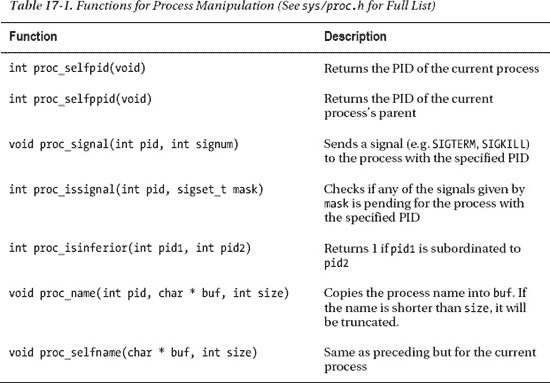

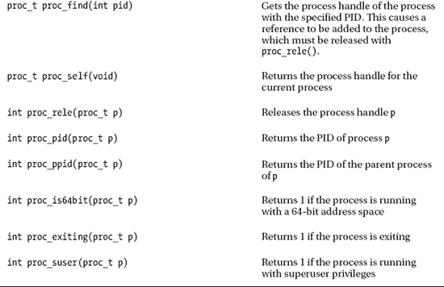

### 加载资源

I/O Kit 不提供任何让驱动程序访问文件系统的类或函数。这是一个深思熟虑的设计决定，而非 I/O Kit 设计中的疏忽。理论上，驱动程序不应需要访问磁盘上的文件。驱动程序的作用是响应操作系统的请求以管理其硬件设备，而不是主动发起请求。然而，在实践中，驱动程序可能需要从文件系统访问数据的原因有很多。最常见的原因之一是读取资源数据，例如驱动程序硬件的固件数据。

尽管 I/O Kit 不允许常规的文件系统访问，但它确实提供了让驱动程序从其驱动程序包内的 "Resources" 目录访问文件的方法。I/O Kit 的资源加载 API 定义在头文件 `<libkern/OSKextLib.h>` 中。该 API 是异步的：驱动程序请求加载其所需的资源，并提供一个回调函数，I/O Kit 会在数据可用时通过该回调通知驱动程序。

我们提到 I/O Kit 不提供常规的文件系统访问，但除此之外，I/O Kit 本身也无法访问文件系统。为了加载驱动程序的资源文件，I/O Kit 依赖于一个用户空间辅助进程，该进程代表 I/O Kit 读取请求的文件，并将文件内容传回给 I/O Kit。然后 I/O Kit 通知发出请求的驱动程序。

由于 I/O Kit 依赖用户空间辅助进程来加载资源，因此在辅助进程启动之前，无法在启动过程中加载资源。然而，在大多数情况下，这不会对驱动程序造成问题，因为 I/O Kit 会将请求排队，直到辅助进程准备好从内核接收请求。

驱动程序可以通过调用 `OSKextRequestResource()` 函数来请求 I/O Kit 从驱动程序的资源目录加载文件。该函数的定义如下：

```c
OSReturn OSKextRequestResource(const char* kextIdentifier,
                               const char* resourceName,
                               OSKextRequestResourceCallback  callback,
                               void* context,
                               OSKextRequestTag* requestTagOut);
```

第一个参数 `kextIdentifier` 指定包含待加载资源的驱动程序的包标识符；这几乎总是由驱动程序 `Info.plist` 文件中的 `CFBundleIdentifier` 键指定的值。第二个参数 `resourceName` 是要从驱动程序包中加载的资源文件的名称。接下来的两个参数是回调函数和相关的上下文参数，该参数在资源加载完成后传递给回调函数。最后一个参数 `requestTagOut` 会立即返回给调用者，可用于跟踪加载资源的操作。

如果对 `OSKextRequestResource()` 的调用成功，当请求完成时，驱动程序将通过其指定的回调函数收到通知。完成回调具有以下签名：

```c
typedef void (*OSKextRequestResourceCallback)(OSKextRequestTag requestTag,
                                              OSReturn result,
                                              const void* resourceData,
                                              uint32_t resourceDataLength,
                                              void* context);
```


提供给回调函数的第一个参数 `requestTag`，用于标识此完成回调所引用的资源。第二个参数 `result` 告知调用者操作是否成功完成。如果 `result` 的值为 `kIOReturnSuccess`，则表明已成功从磁盘读取资源数据，接下来的两个参数 `resourceData` 和 `resourceDataLength` 包含所请求资源文件的内容。`resourceData` 缓冲区仅在回调函数内有效，因此如果驱动程序希望在回调之外引用资源数据，必须制作一份数据副本。最后一个参数 `context` 包含传递给 `OSKextRequestResource` 函数的上下文参数值。

剩下的步骤是将资源文件添加到驱动程序包中。通过 `OSKextRequestResource` 函数加载的任何资源都必须位于驱动程序包的 `Resources` 子目录中。大多数情况下，可以通过将该文件添加到驱动程序的 Xcode 项目来实现此目的。对于除源代码之外的文件类型，Xcode 在构建项目时默认会将文件复制到包的资源目录中。

#### 超越 KEXT 资源

上一节讨论的资源加载函数是为特定目的而设计的。I/O Kit 函数为驱动程序提供了对其 `Resources` 目录中文件内容的只读访问权限。然而，在许多情况下，驱动程序访问其包之外的文件或写入磁盘上的文件是很有用的。例如，提供持久化设置的驱动程序需要某种方法来从磁盘上的文件读取这些设置。它还需要一种方法将这些设置写入磁盘。

尽管 I/O Kit 不包含为驱动程序提供此类功能的函数，但其资源加载函数的实现为我们提供了如何将此类功能添加到我们自己的驱动程序中的线索。正如 I/O Kit 依赖用户空间守护进程代表内核加载资源文件一样，驱动程序可以通过提供自己的用户空间守护进程来处理代表其发出的请求，从而实现对磁盘上文件中持久化设置的读写。下一节将介绍这种设计，它开辟了一种更通用的解决方案，可以扩展到驱动程序偏好设置之外。

### 来自内核驱动程序的通知

从内核驱动程序访问任意文件系统项的通用解决方案是实现一个用户空间守护进程，作为内核驱动程序的辅助进程。此进程将处理来自驱动程序的请求，执行指定的操作，然后将操作结果传回驱动程序。这种方法可以扩展到读取和写入文件等请求之外，并可用于执行内核中无法实现的操作，例如向用户显示对话框。源自内核的用户交互的一个典型例子是标准 USB 家族，当连接一个需要比 USB 总线所能提供的更多功率的设备时，它会显示一个警告对话框。


**注意：** `IOUSBFamily` 目前使用一个称为内核-用户通知中心的已弃用接口来显示警告消息，例如低电量警告。I/O Kit 曾经提供一个 API，允许驱动程序通过标准的系统守护进程显示对话框。然而，这个 API 现已弃用，驱动程序现在必须提供自己的守护进程。

驱动程序希望执行的任何在内核中无法实现的操作，例如写入文件、显示错误消息，甚至启动应用程序，都可以通过用户空间守护进程来执行。实际上，驱动程序代码被分为两部分：内核驱动程序和用户空间守护进程。这种设计使用了在第 5 章中讨论的相同技术。不过，不是用户启动用户空间进程，而是由系统自动启动一个后台守护进程。

用户空间守护进程和驱动程序协同工作以执行某些操作。大多数时候，用户空间守护进程处于空闲状态。它仅在收到来自内核驱动程序的请求时才会行动。用户空间守护进程需要响应三种通知：

- 新内核驱动程序的加载
- 内核驱动程序的卸载
- 来自驱动程序的操作请求

由于守护进程将在系统启动时启动，它可能在其对应的内核驱动程序启动之前就启动了。因此，该进程应安装一个回调，以便在其内核驱动程序启动或停止时接收通知。在大多数情况下，守护进程与驱动程序实例之间是一对多的关系，单个守护进程将处理来自当前加载的所有驱动程序实例的请求。

守护进程可以通过为其驱动程序安装匹配字典来监视其内核驱动程序实例的加载和卸载，如第 5 章所述。无论是后台守护进程还是具有用户界面的应用程序，进程执行此操作的步骤都是相同的。守护进程能够通过驱动程序的 `IOUserClient` 类发送请求，使用第 5 章中描述的 I/O Kit 框架的函数与其内核驱动程序进行通信。

在第 5 章中，您了解了用户空间进程如何向内核驱动程序发出请求并发送数据。这一点很重要，因为守护进程将使用这种方法将操作结果发送回内核驱动程序。现在，我们将介绍进程如何接收来自内核的通知，例如代表驱动程序执行操作的请求——例如，向用户显示错误消息。

从内核驱动程序到用户空间守护进程的通信通过 Mach 端口进行。建立内核驱动程序可用于向用户空间进程发送通知的通信通道涉及以下步骤：


1.  用户空间守护进程通过调用`IOServiceOpen()`定位其驱动实例并打开与该驱动的用户客户端的连接，如第 5 章所述。
2.  守护进程创建一个能够接收内核驱动通知的`mach`端口。此操作通过调用`CFMachPortCreate()`函数完成。该函数接受多个参数，包括一个用于传递通知的回调函数。
3.  守护进程为该`mach`端口创建运行循环源，并将其安装到其某个线程的运行循环中。之后，当在`mach`端口上收到通知时，会在运行循环线程上执行守护进程的回调。
4.  守护进程通过调用`IOConnectSetNotificationPort()`函数将`mach`端口传递给内核驱动。作为响应，驱动的用户客户端会调用其`registerNotificationPort()`方法。
5.  在内核中，用户客户端实现了虚方法`registerNotificationPort()`。客户端接收由用户空间守护进程创建的`mach`端口，并将其值保存在一个实例变量中。
6.  当驱动希望通知用户空间守护进程某个事件时，会调用`mach_msg_send_from_kernel()`函数，并提供其希望传递给用户空间守护进程的任何数据。
7.  作为响应，守护进程的回调函数会被调用。该回调函数接收从内核驱动传递过来的任何数据，并处理内核的请求。如果操作结果需要回传给内核，用户空间守护进程可以通过调用驱动的用户客户端定义的任何方法来实现，如第 5 章所述。

在本节的剩余部分，我们将通过一个示例来演示如何将通知从内核驱动发送到用户空间进程。首先，你需要定义一个结构体，用于描述要从内核驱动发送到用户空间守护进程的数据。该结构体必须以`mach_msg_header_t`结构体开头，因为它描述了用户空间守护进程中将要接收数据的`mach`目标端口。在`mach_msg_header_t`字段之后，该结构体可以包含多个字段，用于允许将任意数据随通知一起发送到用户空间守护进程。该结构体的定义必须对用户空间守护进程和内核驱动都是可访问的，因此应放置在一个两个项目都能包含的头文件中。以下是允许将两个整数参数从内核传递到用户守护进程的结构体定义示例：

```
typedef struct {
    mach_msg_header_t       messageHeader;
    uint32_t                customParameter1;
    uint32_t                customParameter2;
} MyNotificationMessage;
```

下面列出的代码是接收内核发送的通知的用户空间回调函数示例。名为`msg`的参数包含了整个`MyNotificationMessage`结构体，包括添加的两个任意整数。这些位于消息头部之后的额外字段，既可用于描述驱动希望用户空间守护进程执行的操作，也可用于传递该操作所需的其他参数。

```
void   MyDriverRequestCallback (CFMachPortRef port, void *msg, CFIndex size, void *info)
{
    MyNotificationMessage* notify = (MyNotificationMessage*)msg;

    printf("Param 1 is %x, param 2 is %x\n", notify->customParameter1,
            notify->customParameter2);
}
```

列表 17-3 中显示的代码片段演示了用户空间守护进程为安装一个用于接收内核驱动通知的`mach`端口所必须采取的步骤。第一步是分配一个`mach`端口和相应的运行循环源，并将该`mach`端口安装到其运行循环中。接下来，将这个`mach`端口提供给内核驱动。每当驱动希望向用户空间进程发送通知时，该请求都会通过提供的`mach`端口进行传递。

***列表 17-3.** 用于安装回调以接收内核驱动通知的用户空间代码*

```
CFMachPortContext      portContext;
CFMachPortRef          notificationPort = NULL;
CFRunLoopSourceRef     runLoopSource = NULL;
kern_return_t          kr;

// Set up the CFMachPortContext structure that is needed when creating the mach port.
portContext.version = 0;
portContext.info = (void*)context; // Arbitrary pointer provided to the callback
portContext.retain = NULL;
portContext.release = NULL;
portContext.copyDescription = NULL;

// Create a mach port.
notificationPort = CFMachPortCreate(kCFAllocatorDefault, MyDriverRequestCallback, &portContext,  NULL);
if (notificationPort)
{
    // Create a run loop source for the mach port.
    runLoopSource = CFMachPortCreateRunLoopSource(kCFAllocatorDefault, notificationPort, 0);
    // Install the run loop source on the run loop that corresponds to the current thread.
    CFRunLoopAddSource(CFRunLoopGetCurrent(), runLoopSource, kCFRunLoopDefaultMode);
}
// Pass the notification port to the driver.
kr = IOConnectSetNotificationPort(driverConnection, 0,
                                  CFMachPortGetPort(notificationPort), 0);
```

用户空间函数`IOConnectSetNotificationPort()`会导致调用驱动的用户客户端的`registerNotificationPort()`方法。这是一个在`IOUserClient`基类中定义的虚方法，但需要由每个子类来实现。在下面的示例实现中，`registerNotificationPort()`方法复制了对应于用户空间进程通知端口的`mach`端口，以便将来当驱动希望向用户空间进程发送信号时可以使用它。

```
IOReturn       com_osxkernel_driver_IOKitTestUserClient::
       registerNotificationPort (mach_port_t port, UInt32 type, io_user_reference_t refCon)
{
    m_notificationPort = port;
    return kIOReturnSuccess;
}
```

在设置了进程的通知端口之后，内核驱动现在能够在需要时向用户空间守护进程发送信号。这通常通过`IOUserClient`子类来执行，因为通知端口特定于某个用户客户端。一个可被调用以向用户空间进程传递两个任意整数的自定义用户客户端方法示例，如列表 17-4 所示。

***列表 17-4.** 一个从驱动向用户空间进程发送通知的自定义方法*

```
IOReturn       com_osxkernel_driver_IOKitTestUserClient::
       mySendNotification (uint32_t parameter1, uint32_t parameter2)
{
    MyNotificationMessage  notification;
    IOReturn               result;

    if (m_notificationPort == MACH_PORT_NULL)
        return kIOReturnError;

    // Set up the standard mach_msg_header_t fields.
    notification.messageHeader.msgh_bits = MACH_MSGH_BITS(MACH_MSG_TYPE_COPY_SEND, 0);
    notification.messageHeader.msgh_size = sizeof(MyNotificationMessage);
    notification.messageHeader.msgh_remote_port = m_notificationPort;
    notification.messageHeader.msgh_local_port = MACH_PORT_NULL;
    notification.messageHeader.msgh_reserved = 0;
    notification.messageHeader.msgh_id = 0;

    notification.customParameter1 = parameter1;
    notification.customParameter2 = parameter2;

    // Send the request to user space
    result = mach_msg_send_from_kernel(
                 &notification.messageHeader, sizeof(MyNotificationMessage));

    return result;
}
```


### 总结

本章涵盖：

- 如何在内核中使用浮点和 SSE。你了解到，OS X 与其他操作系统不同，无需任何特殊操作即可支持这些功能。
- 编写多功能驱动程序的策略。
- 内核控制 KPI 是一种 BSD KPI，可用于内核扩展与用户空间之间的通信。它通常与网络内核扩展（NKE）结合使用，但在 I/O Kit 中很少使用。
- 我们介绍了从内核处理进程的 KPI。该 KPI 包含用于发送信号以及获取进程名称和进程标识符（PID）的函数。
- 内核扩展如何从其 bundle 中加载外部资源，以及如何处理驱动程序偏好设置。
- 内核扩展如何向用户空间进程发送消息和通知。

## 第 18 章：部署

到目前为止，我们提供了背景信息，并探讨了多种类型驱动程序和内核扩展的实际实现。本章重点介绍如何为最终用户交付做准备。Apple 以提供用户友好的软件（和硬件）解决方案而闻名；Apple 及其客户都期望第三方供应商能提供同样水平的客户体验。用复杂的安装程序让客户或用户感到困扰，是在任何平台上将业务拱手让给竞争对手的好方法。部署像内核扩展这样的软件起初看似简单，但需要考虑众多问题，例如如何兼容各种不同的硬件和操作系统版本。许多客户可能不愿升级，大型企业或政府机构更是如此——因此，你可能需要同时支持最前沿的和旧版的操作系统，所有这些版本可能具有不同特性，需要特殊处理。除了外部因素，软件的分发也可能很复杂。你很少会只分发 KEXT 本身；它通常还需要额外的捆绑软件。例如，计算机显卡可能会附带一个系统偏好设置面板、一个用于访问设备特殊功能的框架、用于升级固件的应用程序，以及可能捆绑用于展示显卡功能的游戏等应用程序。你还需要处理客户可能升级或降级你软件发行版的情况。

虽然这一切看似艰巨——也确实如此——但仍有希望。像往常一样，Apple 提供了简化此过程的工具。对于部署，更高级的软件安装工具是 `PackageMaker`。`PackageMaker` 允许通过易用的图形用户界面来创建安装向导。`PackageMaker` 还具有命令行工具功能，可用于将包构建集成到更大的构建系统中。

### 安装与加载内核扩展

KEXT bundle 通常安装在系统目录 `/System/Library/Extensions` 中。你也可以将 KEXT 保存到此目录之外；但随后需要使用下一节概述的方法自行负责加载 KEXT。KEXT 仍然需要设置正确的权限。为了能够被 KEXT 守护进程（`kextd`）加载，KEXT 必须由 root 用户拥有，属于 `wheel` 组，并具有权限掩码 `0755`。

对于基于 I/O Kit 的驱动程序，当其在 I/O Registry 中注册了提供者时（假设 KEXT 在其 `Info.plist` 文件中定义了合适的 personality），KEXT 通常会由 KEXT 守护进程自动加载。未与硬件提供者关联的 KEXT 可以在系统启动时使用 `IOResources` 节点作为提供者来自动加载。对于非基于 I/O Kit 的 KEXT，例如 NKE 或虚拟网络驱动程序，这将无法实现，因为 `IOResources` 不适用于 I/O Kit 之外的 KEXT。

对于非 I/O Kit 的 KEXT，可以创建一个 Launch Daemon。Launch Daemons 和 Agents 是 Apple 对许多传统 UNIX 服务（包括 `init.d`、`cron` 和 `inetd`）的替代品。Agents 在用户登录系统时根据该用户的安全权限运行。而 Daemons 则是系统级的，通常以 root 权限运行。我们可以使用 Launch Daemon 在计算机启动时执行一个 shell 脚本，该脚本进而加载我们的 KEXT。要创建一个 launch agent，只需定义一个如 清单 18-1 所示的 `plist` 文件。

**清单 18-1.** Launch Daemon 属性列表文件

```
<?xml version="1.0" encoding="UTF-8"?>
<!DOCTYPE plist PUBLIC "-//Apple Computer//DTD PLIST 1.0//EN"
        "http://www.apple.com/DTDs/PropertyList-1.0.dtd">
<plist version="1.0">
<dict>
    <key>Label</key>
    <string>com.osxkernel.launchd.HelloWorld</string>
    <key>ProgramArguments</key>
    <array>
        <string>/Library/Application\ Support/HelloWorld/loadkext.sh</string>
        <string>load</string>
    </array>
    <key>RunAtLoad</key>
    <true/>
</dict>
</plist>
```

该文件应安装到 `/System/Library/LaunchDaemon` 或 `~/Library/LaunchDaemon`，文件名为 `com.osxkernel.launchd.HelloWorld.plist`。现在，Launch Daemon 将在启动期间触发 `loadkext.sh` 脚本。该脚本本身可以实现为 清单 18-2 所示。

**清单 18-2.** 用于加载 KEXT 的 UNIX Shell 脚本

```
#!/bin/sh
COMMAND=$1

THEKEXT=/System/Library/Extensions/HelloWorld.kext

if [ -f "$THEKEXT" ]
then
    echo "KEXT does not exist"
    exit 1
fi
if [ "$COMMAND" = "load" ]
then
        kextload $THEKEXT
elif [ "$COMMAND" = "unload" ]
then
        kextunload $THEKEXT
fi
```


在某些情况下，你可能希望按需加载内核扩展（KEXT），而不是在系统启动时加载。例如，对于一个 VPN（虚拟专用网络）应用程序，它可能会附带一个 `KEXT` 来处理自定义的网络级加密方案或安装一个虚拟 VPN 接口。这个 `KEXT` 仅在应用程序保持活动状态时才需要。让它在活动状态下运行会浪费内存资源，并且在启动时加载它可能会影响启动时间。此外，由于 `KEXT` 会与网络栈交互，它实际上可能会妨碍并影响系统的网络性能。在这种情况下，应用程序可能希望动态地加载和卸载 `KEXT`。这可以通过使用类似前面的脚本实现。应用程序需要以 root 权限运行才能加载和卸载 `KEXT`。然而，将整个应用程序设为 `setuid` root 并不是一个好主意，因为这可能导致严重的安全问题。另一种解决方案是使用 `AuthorizationExecuteWithPrivileges()` API 执行一个最小的辅助程序，以临时提升被执行程序的权限。这将提示用户输入计算机的系统密码。可以通过修改 `KEXT` 的 `plist` 文件包含以下内容来允许非 root 用户加载 `KEXT`：

```
<key>OSBundleAllowUserLoad</key>
<true/>
```

虽然这允许非特权进程或用户加载 `KEXT`，但随后卸载 `KEXT` 仍然需要 root 权限。因此，前一种技术更受青睐，也更安全，因为用户必须明确批准该操作。

### Mac App Store 上的内核扩展

苹果目前不允许应用程序在 Mac App Store 或 iOS App Store 上安装 `KEXT`（iOS App Store 没有任何在不违反许可协议的情况下构建 `KEXT` 的方法）。如果你的应用程序依赖于内核扩展，你将需要在 App Store 之外分发它。Mac App Store 应用程序也不允许请求 root 权限，而安装和加载 `KEXT` 需要这些权限。然而，即使应用程序可能依赖于特定的硬件设备，也可以提交它们，但在这种情况下，你需要通过一个经过批准的用户空间 API 与设备通信（详见第 15 章了解如何实现）。

### 内核扩展的版本管理

如果你的内核扩展可以直接被用户空间应用程序访问，你可能希望提供一个版本管理系统，以防止较旧的用户空间应用程序访问较新的内核扩展，反之亦然。对于音频驱动程序或其他使用系统提供的 `IOUserClient` 的驱动程序，这不是必需的；但是，如果不是这种情况，你的 `KEXT` 本质上会向应用程序提供一个需要保持兼容的 API。如果 `KEXT` 已更新，较旧的应用程序可能会崩溃甚至导致系统崩溃。没有标准化的方法来解决这个问题，解决方案在很大程度上取决于 `KEXT` 以及访问它的应用程序的性质。一种策略是在一个共享的头文件中包含一个版本号：

```
//
// SharedHeaderFile.h
//
#ifndef Shared_Header_H_
#define Shared_Header_H_

const int KernelUserClientAPIVersion = 1001;

#endif
```

由于 `KEXT` 和用户应用程序都将 `KernelUserClientAPIVersion` 版本号编译到它们的二进制映像中，因此用户应用程序可以确定 `KEXT` 的版本号是否与其自身匹配。每次接口发生更改时，例如，添加、移除或更改了一个 `IOUserClient` 方法，都必须更新版本号以反映这一变化。如果你的 `KEXT` 提供了可供第三方开发者使用的 API，最好的方法是提供一个在内部处理此版本管理的 API，而不是允许开发者直接访问 `IOUserClient`。这样，内核与用户空间之间的接口可以更改，而不会破坏现有应用程序；它甚至允许你向完全不同的驱动程序或 `KEXT` 提供相同的 API。

### 测试与质量保证

测试内核扩展可能是一项挑战。现代计算机系统和设备通常非常复杂，即使你的组件与系统其他部分相对隔离，由于它是整个机制中的一环，也可能产生不希望的副作用。适当的测试（最好由未直接参与工程过程的人员进行）至关重要——直接参与的人员可能对产品的工作方式有先入为主的观念，从而无法发现最终用户可能遇到的问题。测试内核扩展在很大程度上取决于扩展的性质和类型；因此，提供一份详尽的测试事项清单是不可能的。以下是一些通用建议：

- 测试驱动程序是否能够正确处理进入睡眠和唤醒。你可以使用 Xcode 附带的 `SleepX` 工具轻松进行压力测试。该应用程序允许你在计算机每次唤醒时执行脚本或外部程序。你还可以调整睡眠间隔和希望测试的周期数。你的驱动程序正确处理睡眠非常重要，尤其是对于移动设备和笔记本电脑，因为驱动程序保持活动状态意味着 CPU 需要保持活动——这将耗尽系统电池，甚至在合盖运行时可能导致笔记本电脑过热。
- 测试驱动程序是否能够使用 `kextload` 和 `kextunload` 处理重复加载和卸载。你可以使用 `ioclasscount` 和 `ioalloccount` 工具来测试引用泄漏或内存分配泄漏。
- 通过执行常见的用户任务来测试使用该驱动程序的应用程序。例如，对于音频设备，尽可能多地使用不同的设置和格式组合来播放和捕获音频。
- 在所有支持的平台和操作系统上进行测试，例如 `Macbook Pro`、`Mac Mini`、`iMac`、`Mac Pro` 或 `iPod`、`iPhone` 和 `iPad`。对于 Mac，请务必测试 32 位和 64 位版本以及所有受支持的操作系统版本，例如 `Snow Leopard`、`Lion` 等。
- 对于热插拔设备：
    - 测试驱动程序和设备在反复插拔后是否能继续正常工作。你可能希望至少进行 100 次以上的重复测试，以确保在现场不会出现问题。
    - 测试驱动程序是否能处理系统进入睡眠的情况。驱动程序还应准备好处理设备在系统休眠期间被移除的情况。
- 测试 `KEXT` 的 32 位和 64 位版本。如果你支持 pre-Lion 操作系统，你将需要提供支持 32 位和 64 位系统的通用二进制文件。
- 测试安装程序包；确保所有文件都正确安装——具有正确的权限，并且位于正确的位置。

如果在测试期间或由客户报告发现问题，最好为每个已发布的 `KEXT` 预先归档符号信息和/或调试版本，以便你可以快速尝试重现问题并进行调试。这对大多数人来说似乎显而易见，但这种情况发生的频率可能超出你的想象：有人在不增加版本号的情况下传递了软件组件（例如 `KEXT`）的某个版本。每次进行更改并发布/提供给外部实体（甚至内部质量保证小组）时，版本号都应该是唯一的，否则你将很快无法跟踪并让所有相关人员感到困惑。


### 打包 KEXT 与软件

`PackageMaker` 是打包和分发由多个组件构成的软件的首选工具。与那些所有必要组件都自包含并嵌入到应用程序包中的简单应用不同，更复杂的软件分发（例如包含 KEXT 的分发）可能需要将组件安装到文件系统的多个位置。例如，驱动程序需要将其自身放置在 `/System/Library/Extensions` 目录下，并且可能还包含用于加载偏好设置或升级固件的辅助程序，这些程序需要安装启动代理（Launch Agents）或守护进程（Daemons）。`PackageMaker` 能够做到这一点，甚至更多。`PackageMaker` 的用户界面如图 18-1 所示。

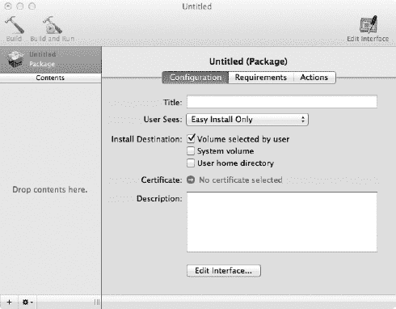

***图 18-1.** PackageMaker 用户界面*

`PackageMaker` 的输出是一个扩展名为“*.pkg*”的二进制压缩包文件，可以通过 `Installer.app` 程序或 `installer` UNIX 命令来安装，执行命令如下所示：

`sudo installer -pkg HelloWorld.pkg -target /`

使用 `Installer.app` 进行安装会启动一个基于 GUI 的向导，引导用户完成安装过程。如果软件包有多个可选的子组件，用户将有机会选择或取消选择它们。用户还可以更改目标宗卷（即软件包的安装位置），前提是软件包通过设置“由用户选择宗卷”选项明确允许这样做。

`PackageMaker` 不仅限于将软件组件放置到文件系统中。它还可以检查系统要求和先决条件，包括操作系统版本是否受支持，或者检查它所依赖的其他软件组件是否存在。它还可以在软件安装前后针对每个组件触发自定义的 UNIX 脚本。对于硬件驱动程序，`PackageMaker` 还允许你在允许用户继续操作之前验证你的设备是否存在。这适用于 FireWire、PCI 和 USB 设备。

**提示** 在打包 KEXT 进行分发时，请确保 Xcode 为你打算支持的架构进行构建。通过对 KEXT 的二进制文件使用 `file` 命令，你可以检查它支持哪些架构。你可能还需要确保不分发 KEXT 的调试版本。

#### 为 Hello World 内核扩展构建软件包

现在，你可以构建一个快速软件包来安装示例 Hello World KEXT。你还需要安装一个启动守护进程属性列表文件（代码清单 18-1）和一个 shell 脚本（代码清单 18-2），该脚本将由启动守护进程执行，并再次加载 KEXT。在设计你自己的软件包之前，你需要确定其组件。例如，如果你要为音频设备分发驱动程序，你可能希望将驱动程序与某些允许播放或捕获音频的软件捆绑在一起，或许还需要一个 SDK，其他开发者可以使用该 SDK 来编写自己的应用程序。开发者可能只想要驱动程序，而最终用户可能只想要捆绑的应用程序而不需要 SDK，等等。在这种场景下，你可以创建三个子组件：驱动程序、应用程序和 SDK，并允许用户选择要安装的组件。对于 `HelloWorld` 软件包，你只需添加一个组件即可。

要开始操作，请打开 `PackageMaker` 并从菜单中选择“新建”。随后会弹出一个对话框，如图 18-2 所示。

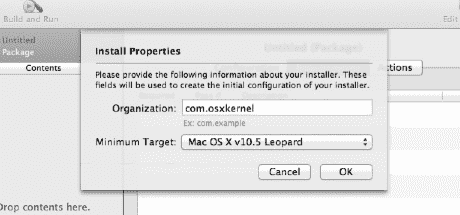

***图 18-2.** 安装属性对话框*

“组织”字段应为你的组织的反向 DNS 名称。该值用于标识软件包并赋予其唯一名称。“最低目标”下拉菜单允许你选择你想要支持的最旧的 OS 版本。软件包将拒绝安装在比安装目标更旧的版本上。输入你的选择后，你可以为软件包指定一个标题。

#### 向软件包添加内容

你现在可以开始向软件包添加文件。这可以通过从主菜单中选择“项目  添加内容...”来完成，或者简单地将文件拖入 `PackageMaker` 的左侧窗格。图 18-3 显示了已填充 `HelloWorld` 分发所需文件的内容窗格。

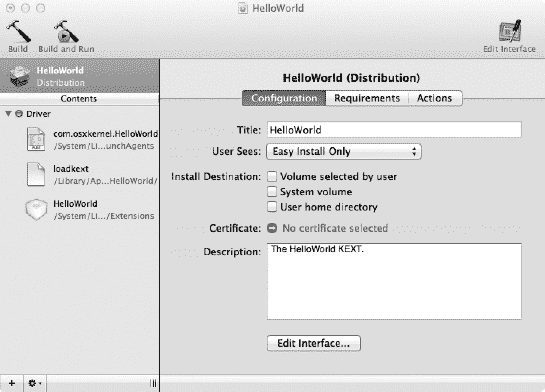

***图 18-3.** HelloWorld 分发*

我们的 `HelloWorld` 软件包仅包含三个文件（如图 18-3 左侧所示）：KEXT 本身以及两个允许 KEXT 在启动时加载的辅助文件。当你将文件拖入或添加到软件包时，`PackageMaker` 会自动创建一个*选项*，在本例中我们将其命名为“驱动程序”。该选项代表一个可由用户单独选择的子组件。但是，如果主窗格中的“用户可见”字段设置为“仅简易安装”，则即使有多个组件，也不会提示用户选择单个组件。“安装目标”选择允许你设置软件包的安装位置。此时，我们不勾选任何选项，因为我们所有的文件都使用绝对路径。如果选择了“由用户选择宗卷”，安装向导会询问用户希望安装到哪个宗卷（硬盘）。建议允许这种选择，以便给用户更大的灵活性——特别是对于大型软件包，用户可能希望将其存储在第二个更大的数据驱动器上。


#### 配置软件包

从图 18-3 所示配置窗格中选择“编辑界面”选项，将显示软件包在通过`Installer.app`打开时的呈现视图。`PackageMaker`允许您交互式地编辑文本并设置背景图像。您还可以添加本地化设置，以便提供其他语言的说明。

主窗格包含三个标签页，如图图 18-3 所示。“需求”标签页用于配置适用于整个软件包的全局需求。您也可以为各个选项单独设置需求，这样即使系统不满足某些选项的需求，用户仍可安装其他组件。需求可在需求编辑器中指定，其中包含许多可配置的预定义检查项。以下是可用测试的子集：

- 目标卷可用兆字节数
- 最低 CPU 频率（Hz）
- 可用内存（字节）
- 系统 OS 版本 / 目标 OS 版本
- 系统中存在文件
- FireWire、USB、PCI 设备存在
- 脚本执行结果

当预定义测试均不适用时，最后一个选项“脚本执行结果”尤为实用。您可以编写 Shell 脚本执行自定义测试，并根据脚本的返回代码让安装程序执行相应操作。您还可以指定当需求测试失败时显示的自定义错误信息。“操作”标签页允许您配置可自动执行的操作，包括安装前或安装后的操作。例如，对于`HelloWorld`软件包，我们可能希望确保在安装新版本之前，先卸载任何先前安装的`HelloWorld.kext`。我们可以像图 18-4 所示那样定义此操作。

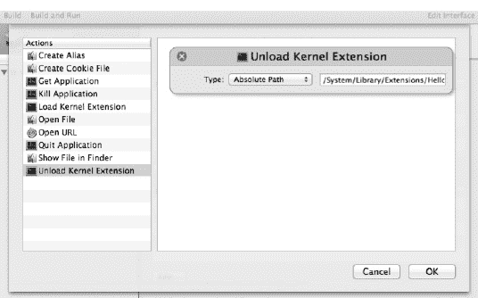

***图 18-4.** 操作编辑器*

在某些情况下，假设您有一个 USB 设备的驱动程序：您可能希望在安装新驱动程序之前，确保所有使用该设备的应用程序都已关闭。正在运行的应用程序可能会阻止驱动程序正常卸载。您可能会注意到没有运行程序或脚本的选项；不过，这可以通过选择文件并选择“脚本”标签页，在逐个文件的基础上实现。

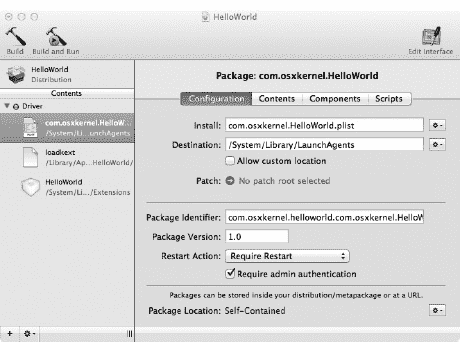

***图 18-5.** 单个软件包的配置窗格*

到目前为止，我们使用术语“软件包”来指代整个项目，但在`PackageMaker`的术语中，我们实际上指的是一个分发版，它由多个较小的软件包组成。这些较小的软件包由添加到分发版中的单个文件或对象（如 KEXT、应用程序包或 PDF 文件）构成。每个对象都关联有元数据和版本信息。

图 18-5 显示了添加到分发版中的软件包的主配置窗格。“安装”字段指定源位置，而“目标”字段指定对象将安装在文件系统中的位置。选中“允许自定义位置”选项可让用户指定其他位置。源位置和目标位置可以是相对路径或绝对路径。大多数情况下，建议使用前者。在前述示例（图 18-5）中，我们对源文件使用了相对位置，对目标位置使用了文件系统中的绝对路径，因为该文件必须安装到该目录中，且不能根据用户偏好重新定位。对于 KEXT 也是如此，我们需要它位于`/System/Library/Extensions`目录下。相对路径是相对于`PackageMaker`项目所在的位置。

“补丁”字段允许您指定正在安装对象的旧版本，以便安装程序可以修补现有文件，而不是安装一个全新的文件。

在配置窗格中，您还可以为每个软件包单独指定版本号和标识符。“重启操作”允许您在安装完成后提示用户重新启动计算机。如果您有必须启动的启动代理或守护程序，或者您替换了系统运行时难以重新加载的驱动程序（例如存储或图形驱动程序），则可能需要进行此操作。您还可以要求用户注销或关闭系统。“需要管理员身份验证”复选框将在允许安装软件包之前提示用户输入管理员密码。如果您将文件安装在用户主目录之外，通常必须指定此项，因为安装程序默认没有管理员权限。大多数 KEXT，特别是驱动程序，必须安装在`/System`目录下，而普通用户通常没有该目录的写入权限。

最后，“软件包位置”字段允许指定安装软件包对象文件的备用位置；例如，您可以指定一个 HTTP URL。

软件包的“内容”标签页如图 18-6 所示。

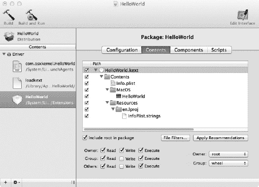

***图 18-6.** 软件包配置窗格的“内容”标签页*

“内容”标签页允许您检查软件包的各个文件。通常，软件包由一个包（bundle）或单个文件组成。一个包可能包含其他包或任意文件。如果需要排除某些文件，您可以指定正则表达式模式来实现。例如，来自源代码版本控制系统（如 Subversion）的元数据目录，可以通过模式`*/\.svn$`排除。您还可以配置文件安装到文件系统后各个文件应具有的权限。“应用建议”按钮将根据文件类型和预期目标位置推测正确的权限。

 **注意** 内核扩展（Kernel Extensions）对其权限非常挑剔，必须由*root*用户和*wheel*组所有。此外，所有者必须具有读写和执行权限，而组应仅具有读和执行权限。这对应于 UNIX 权限掩码 0755。元数据文件（例如`Info.plist`文件）无需设置可执行位。

“脚本”标签页允许为软件包定义安装前和安装后脚本。这些脚本可用于执行无法通过“操作”编辑器定义的自定义安装步骤。您可能希望使用安装前脚本在守护程序或应用程序被新版本替换之前将其关闭。您还可以清理新版本不再需要的文件。脚本通常使用 Bash 或其他脚本语言编写。如果您从脚本中删除旧文件，请谨慎使用`rm`命令，因为您的软件包可能以管理员权限运行，指定错误的文件名可能导致误删错误的文件或目录。例如，考虑以下命令：`rm –rf /System/Library/$MYKEXT`。如果`$MYKEXT`变量最终为空，该命令将转而删除`/System/Library`目录。随之而来的将是非常不满的客户。


#### 构建软件包

完成添加和配置所有要包含在分发版本中的部件后，您可以通过点击工具栏上的“构建”或“构建并运行”来构建它。后者会在构建完成后在 `Installer.app` 中打开该软件包。在构建阶段，软件包将经过验证和检查；如果存在错误或警告，您可以修正它们并重新构建软件包。最终结果类似于图 18-7。

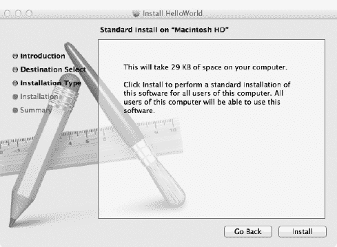

***图 18-7.** 使用 `Installer.app` 启动时呈现的软件包*

生成的软件包将写入名为 `<Title>.pkg` 的文件。该软件包是压缩的，而不是一个包，因此无法在访达中直接检查其内容。当您保存一个 PackageMaker 项目时，它会以名为 `<Title>.pmdoc` 的包的形式保存。项目包中包含定义该项目的 XML 文件。您可以使用文本编辑器编辑这些文件，或者在产品的构建过程中使用脚本自动替换或更新内容。如果您希望从命令行构建软件包，可以执行以下操作：

```
$ /Developer/Applications/Utilities/PackageMaker.app/Contents/MacOS/PackageMaker --doc HelloWorld.pmdoc --version 2.0 --title 'HelloWorld'
```

上述命令构建了版本号为 2.0 的 `<Title>.pkg`。

#### 卸载软件包

遗憾的是，并不存在用于自动卸载使用 PackageMaker 创建的软件包的机制。要手动卸载软件包，您需要识别该软件包安装的文件并将其删除。您还必须停止并移除该软件包安装的任何启动代理或守护程序。更好的选择是为您的用户提供一个执行卸载操作的脚本或程序。不过，PackageMaker 能够处理升级问题。

### 总结

在本章中，我们了解了以下内容：

- 系统如何自动加载 I/O Kit 内核扩展，以及如何手动加载其他不会自动加载类型的 KEXT（例如网络内核扩展）。后者通常通过使用启动守护程序来实现。
- 对 KEXT 与用户空间之间的接口进行版本控制非常重要，以避免破坏与之交互的旧版/新版应用程序。处理此问题的一种策略是在共享头文件中包含版本号。
- 质量保证和测试是开发周期的重要组成部分，也是软件分发给客户之前的最后一道防线。在所有支持的平台上全面测试软件的所有方面和使用模式非常重要。
- PackageMaker 软件是在 Mac OS X 上分发更复杂软件包（即包含多个组件的东西，例如 KEXT、辅助守护程序和最终用户应用程序）的首选方式。
- PackageMaker 是一个随 Xcode 一起分发的工具。PackageMaker 可以通过图形用户界面或命令行使用。使用 PackageMaker 创建的软件包通过 `Installer.app` 应用程序安装。
- PackageMaker 不提供用于卸载软件包的机制。

## 索引

###  数字与符号

`_MALLOC()` 函数, 107

`_MALLOC_ZONE()` 函数, 107

`<libkern/OSKextLib.h>` 头文件, 424

###  A

`AbortPipe`, 375

`acknowledgePowerChange()` 方法, 219

*活跃列表*, 104

`activityTickle()` 方法, 217

`activityTickle(type, powerState)` 方法, 216

`addAudioStream()` 方法, 267

`addAvailableFormat()`, 268

`addEventSource()`, 195

`addressOfMappedBuffer` 参数, 119

高级图形端口 (AGP), 177

高级内核编程, 411

- 驱动程序通知
  - 任意文件系统, 425
  - 通信, 426 – 27
  - 自定义用户客户端方法, 430 – 31
  - 守护进程, 426
  - `IOConnectSetNotificationPort()` 函数, 430
  - `IOUSBFamily`, 425
  - `IOUserClient` 类, 426
  - `IOUserClient` 子类, 430
  - 内核-用户通知中心, 425
  - `mach_msg_header_t` 结构, 427
  - `MyNotificationMessage` 结构, 428
  - `registerNotificationPort()` 方法, 430
  - 结构定义, 427 – 28
  - 用户空间代码, 428 – 30
  - 用户空间守护进程, 426
- I/O Kit 家族, 413 – 14
- 内核控制 KPI
  - 访问，用户空间, 419 – 21
  - C 语言, 414
  - 客户端连接, 417 – 18
  - `getsockopt()` 系统调用函数, 414
  - 获取和设置选项, 418 – 19
  - `HelloKernControl` 头文件, 417
  - `kern_ctl_reg` 结构, 414 – 15
  - `KEXT`, 414
  - 注册, 415 – 17
  - `send()` 和 `recv()` 系统调用函数, 414
  - `setsockopt()` 系统调用函数, 414
  - vs. `ioctl()` 系统调用, 414
- `KEXT` 资源, 425
  - 加载资源, 423 – 25
- 多功能驱动程序, 412 – 13
- 进程, 421 – 23
- SSE 和浮点运算, 411 – 12
- `app_descriptor` 结构, 286
- Apple AHCI 存储驱动程序栈, 321
- Apple USB 串行驱动程序, 226
- `AppleACPIPCI`, 177
- `AppleRTL8139Ethernet`, 305
- `AppleUSBCDC` 驱动程序, 226
- `AppleUSBCDCEthernet`, 305
- `arg0` 参数, 364, 377
- `atAddress` 参数, 116
- `attachMediaObjectToDeviceTree()`, 350
- 音频驱动程序, 249
  - 额外的音频引擎功能, 275 – 76
  - 音频引擎实现
    - 头文件，`MyAudioEngine` 类, 263 – 64
    - `IOAudioEngine` 子类, 262
  - 缓冲, 249
  - Core Audio, 249, 251 – 53


### 数字音频与音频设备

模拟音频波，250

`PCM` 采样，250–51

采样缓冲区，251

采样率，250

声波，模拟，249

#### 硬件初始化

`activateAudioEngine()` 方法，259，260

`addTimerEvent()` 函数，257

`createAudioEngine()` 方法，259

`event` 参数，257

头文件，`MyAudioDevice` 类，257–59

`I/O Kit` 生命周期方法，259

`initHardware()` 方法，259

`IOAudioDevice` 子类，257

`IOAudioEngine`，256

`IOWorkLoop` 和 `IOCommandGate`，256

`target` 参数，257

#### I/O 引擎初始化

音频流的创建与初始化，267–68

处理格式变更，268–69

处理中断和时间戳，273–75

`initHardware()` 方法，264–66

`IOAudioStream`，267

`IODMACommand` 类，267

`IOMalloc()`，267

`IOTimerEventSource`，266

采样缓冲区，266，267

采样率，266

采样裁剪与转换，269–71

`setDescription()` 方法，266

`setInputSampleLatency()` 函数，266

`setOutputSampleLatency()` 函数，266

启动与停止音频引擎，272–73

#### I/O Kit 音频支持

`IOAudioControl`，256

`IOAudioDevice`，255

`IOAudioEngine`，256

`IOAudioFamily`，255

`IOAudioStream`，256

`MyAudioDevice` 架构，256

`MyAudioDevice` 源代码，254

`MyAudioEngine` 类，256

驱动程序编程，249

#### 注册音频控制

`addDefaultAudioControl()`，262

属性，260

回调函数，261

通道 ID，261

`createMuteControl()` 工厂方法，262

`createVolumeControl()` 方法，260

dB 值，261

`IOAudioLevelControl`，260

`IOAudioStream`，262

`系统偏好设置`，255

`系统偏好设置`，255

#### 音频 HAL

`音频 HAL`，269

`音频工具箱`，252

`音频单元`，252

`audioStream` 参数，271

#  B

`bAlternateSetting`，374

`基地址 0-5`，176

基地址寄存器 (`BAR`)，176

`bConfigurationValue`，369，374

`bDescriptorType`，374

`bDeviceClass`，365

`bDeviceProtocol`，365

`bDeviceSubClass`，365

伯克利包过滤器 (`BPF`)，276，301

`bInterfaceClass`，374

`bInterfaceNumber`，374

`bInterfaceProtocol`，374

`bInterfaceSubClass`，374

`bInterval`，374

位深度，250

BSD 数据链路层 (`BDIL`)，304

BSD 套接字，105

`bzero` 函数，107


### `C`

- `capabilities` 参数，218
- `capabilityFlags`，209
- `capabilityFlags` 位掩码，218
- `CFMachPortCreate()` 函数，426
- `changePowerStateTo()` 方法，215，216，217
- `changePowerStateTo(powerStateOrdinal)` 方法，215
- `changePowerStateToPriv()` 方法，215，216，217
- `changePowerStateToPriv(powerStateOrdinal)` 方法，215
- `Class Code`，176
- `ClearPipeStall`，375
- `ClearPipeStallBothEnds`，375
- `clientMemoryForType` 方法，118
- `clipOutputSamples()` 方法，270
- Cocoa 框架，6
- Cocoa Touch API，20
- `com.apple.iokit.IOAudioFamily`，413
- `com.apple.iokit.IOStorageFamily` 内核模块，335
- `com.apple.kpi.private`，422
- `com_osxkernel_MyEthernetHwAbstraction` 类，311
- `commandSleep()` 方法，141

#### 条件变量

- 定义，133
- 函数，134–35
- `interruptType` 值，135–36
- `IOLockSleep()`，133，134
- `m_readEvent` 参数，134
- `read()` 方法，133
- 示例代码，133
- `SIGHUP` 或 `SIGKILL` 信号，135
- 用户空间应用程序，133

#### 配置空间寄存器

- 能力寄存器，185–86
- 设备 ID 和厂商 ID，183
- 扩展配置空间，185
- `IOPCIDevice.h` 文件，184
- `offset` 参数，183
- 偏移常量，184
- PCI 控制器固件，184
- 基于 PowerPC 的系统，185
- `setConfigBits()` 方法，184
- `setMemoryEnable()` 方法，185
- 连接和断开回调，417–18
- `connect()` 系统，289
- 常量回调函数，101
- 常量 `IOAsyncCallback0` 函数，101
- 常量 `IOConnectCallAsyncScalarMethod()` 函数，101
- `contentHint` 参数，349，351
- 控制获取函数，418
- `ControlRequest`，377
- `ControlRequestAsync`，377
- `ControlRequestAsyncTO`，377
- `ControlRequestTO`，377
- `convertInputSamples()` 方法，271
- `cookie` 参数，300
- 写时复制（COW）优化，112
- Core Audio，249，251–53
- `Core Audio Kit`，252
- `Core MIDI / MIDI Server`，253
- `CreateDeviceAsyncEventSource` 方法，364
- `CreateInterfaceIterator`，369
- `createMappingInTask()` 方法，115，116
- `createMedium()` 方法，312–13
- `createNewAudioStream()` 方法，267


###  D

Darwin 发行版，17

Darwin 源代码仓库，226

数据链路接口层 (DLIL)，303

**调试**

启动参数，386，387

`boot-args` 参数，387

崩溃，387

**死锁**，382

FireWire，远程跟踪，390，392

GNU 调试器

`backtrace` 命令，404

`cmp` 指令，407

`disassemble` 命令，406

FireWire 核心转储机制，403

FireWireKDP 机制，397，398

`fVariable1` 和 `fVariable2`，408

主机，395，396

内核宏，400，401

内核恐慌日志，408，410，411

Mac OS X，394

MyDebugDriver 头文件，403，404

指针，407，408

远程调试设置，400

远程目标，396，397

运行中的内核，399

符号信息，401，403

符号链接，405

UNIX 和 Linux 系统，395

详细信息标志，395

x86-64 调用约定，411，412

Xcode，394

挂起的进程，412，413

**非法指令/操作数**，382

**无效内存访问**，382

`IOLog()` 跟踪，388，389

KDB，394

内核恐慌，383

内核问题，384

**锁竞争**，382

**内存与资源泄漏**，382，413，414

`nvram` 命令，385，387

**主中断上下文**，383

**竞态条件**，382

远程内核核心转储，392，393，394

堆栈回溯，389

虚拟机，399

**主动触发的恐慌**，383

`deRegisterInterestedDriver(IOService* driver)` 方法，218

`detach()` 方法，191

设备地址解析表 (DART)，100

`Device ID`，175

`DeviceRequest`，367

`DeviceRequest` 方法，367

`DeviceRequestAsync`，367

`DeviceRequestTO`，367

`didChange` 通知，219

`didTerminate()` 方法，191

直接内存访问 (DMA)，251

直接内存访问 (DMA)

64 位平台，201

缓冲区，200，201

数据结构，202

定义，199

*入站* DMA，199

`IODMACommand` 类

32 位寻址，206

`alignment` 参数，208


代码输出，209

深奥的硬件设备，206

代，208–9

`inTaskWithPhysicalMask()` 工厂方法，207

`IOBufferMemoryDescriptor`，207

`IOMemoryCursor` 类，206

`IOMMU`，206

`mappingOptions` 参数，207

`maxSegmentSize` 参数，207

`maxTransferSize`，208

内存缓存，200

内存准备，203–4

空指针，202

`outbound` DMA，199

出站 DMA 传输，199–200

页面调出操作，201

物理总线地址转换，202–3

分散/聚集列表，201, 204–6

`setBusMasterEnable()`，199

用户空间内存，201

零拷贝，199

`DKIOCEJECT`，326

`DKIOCGETFORMATCAPACITIES`，325

`DKIOCISWRITABLE`，325

`DKIOCREQUESTIDLE`，326

`DKIOCSYNCHRONIZECACHE`，327

`DKIOCUNMAP`，326

`do_block` 字段，286

`doDiscard` 方法，326

`doFormatMedia`，337

`domain` 结构，276

`Driver` 类，`Info.plist` 文件

“`IOKitTest.cpp`”教程，59–60

“`IOKitTest.h`”教程，58

`com.osxkernel`，58

`IOKitPersonalities` 字典，60

`IOKitTest` 字典，60

`IOKitTest.cpp`，58

`IOMatchCategory` 键，61

`IOResourceMatch`，61

`IOResources` 节点，61

`IOResources` 提供者类，61

`IOService` 类，58

`kernel.log` 文件，62

方法调用顺序，62–63

对象初始化，63

`OSBundleLibraries` 字典，60–61

`OSDeclareDefaultStructors` 宏，58

项目的属性列表，61

`super` 宏，60

驱动程序，69

控制请求链，13

设备移除

回调函数，77

回调函数安装，78–79

`DeviceAdded()` 函数，77

驱动程序对象，77

`IONotificationPortCreate()` 函数，77

`IOServiceAddInterestNotification()` 函数，77

驱动程序属性

基于连接的方法，79

Core Foundation，82

Core Foundation 字典，80

自定义字符串值，83

`CustomMessage`，81

调试信息，81

`IOUSBDevice` 类，80

键/值对，79

制造商字符串，81

`setProperties()` 方法，82

`StopMessage`，81, 83

表格，79

输入/输出控制，14

I/O Kit 框架，70–71

IO 注册表，71

内核/用户空间边界，69

底层 USB 驱动程序，13

匹配字典

回调函数，73

`CFRunLoopRun()` 函数，75

代码结构，71

命令行工具，71

Core Foundation，71

`DeviceAdded`，75

`DriverIterator`，71

事件循环，74

`IOIteratorNext()` 函数，75

`IOMasterPort()` 函数，73

`IONotificationPortCreate()` 函数，75

`IOServiceAddMatchingNotification()` 函数，75

`IOServiceGetMatchingServices()` 函数，75

`IOServiceMatching()` 函数，76

内核驱动程序的属性列表，71

`kIOMasterPortDefault` 宏，73

`NSApplicationMain()` 函数，75

运行循环，74

USB 设备，71

USB 设备到达，74–75, 76

USB 硬件设备，72–73

通知

异步操作，99

`asyncReference` 缓冲区，102

阻塞操作，99

`DelayForMs()` 方法，99

`DelayForTime()` 函数，99

`InstallTimer()` 函数，99, 100–101, 102–3

`IOConnectCallAsyncXXX()` 函数，100

`IOConnectCallXXX()` 函数，100

`IOExternalMethodArguments` 结构，101–2

`IONotificationPortCreate()` 函数，99

`kIOAsyncCalloutFuncIndex` 和 `kIOAsyncCalloutRefconIndex` 常量，101

端口分配，99–100

`sendAsyncResult64()`，103

`timerCallback` 和 `context` 参数，101

操作系统内核，12

打印机，14

串口驱动程序，69, 70

基于状态的交互

异步操作，83

后台操作，83, 84

基于连接的方法，83

`driverConnection` 参数，84

`IOServiceClose()` 函数，85

`IOServiceOpen()` 函数，84, 85

用户客户端。*参见* 用户客户端方法

用户空间应用程序，69, 70

###  E

嵌入式 C++，39–40

`emmintrin.h` 头文件，412

*增强型主机控制器接口 (ECHI)*，145

`EPERM`，291

`ExpressCard`，175

*可扩展主机控制器接口 (xHCI)*，145


### F

`fAudioInputInteruptPending`，第 199 页

`fAudioOutputInterruptPending`，第 199 页

`fCurrentLoopCount`，第 273 页

`File descriptors`，第 105 页

`Filter scheme driver`。*参见* `Media filter drivers`

`filterInterruptEventSource()` 方法，第 195 页

`Firmware`，第 12 页

`firstSampleFrame`，第 271 页

`flush()`，第 317 页

`flushInputQueue()`，第 319 页

`frActCount` 值，第 383 页

`frame_ptr` 参数，第 300 页

`frameStart` 参数，第 380 页，第 381 页

`Free List`，第 104 页

`free()` 方法，第 142 页–第 43 页，第 191 页

`frStatus` 值，第 383 页

`frTimeStamp` 字段，第 384 页

### G

`g_string_buf` 变量，第 419 页

`GCC` 编译器，第 41 页

`GetAlternateSetting`，第 374 页

`getBufferMemoryDescriptor()` 方法，第 119 页

`GetBusFrameNumber`，第 366 页，第 372 页

`GetBusFrameNumber` 方法，第 380 页，第 381 页

`GetBusFrameNumber()` 方法，第 366 页

`GetBusFrameNumberWithTime`，第 366 页，第 372 页

`GetBusMicroFrameNumber`，第 366 页，第 372 页

`GetConfiguration`，第 369 页

`GetConfigurationDescriptionPtr`，第 369 页

`GetConfigurationValue`，第 374 页

`getCurrentSampleFrame()` 方法，第 274 页

`GetDevice`，第 372 页

`GetDeviceAddress`，第 366 页

`GetDeviceAsyncEventSource` 方法，第 364 页

`GetDeviceClass`，第 365 页

`getDeviceMemoryWithIndex()` 方法，第 188 页，第 189 页

`GetDeviceProduct`，第 365 页，第 372 页

`GetDeviceProtocol`，第 365 页

`GetDeviceReleaseNumber`，第 365 页，第 372 页

`GetDeviceSpeed`，第 366 页，第 373 页

`GetDeviceSubClass`，第 365 页

`GetDeviceVendor`，第 365 页，第 372 页

`getDirection()` 方法，第 327 页

`GetEndpointProperties`，第 374 页，第 375 页

`GetFrameListTime`，第 373 页

`getHardwareAddress()` 函数，第 314 页

`getHardwareAddress()` 方法，第 314 页

`GetInterfaceClass`，第 374 页

`GetInterfaceNumber`，第 374 页

`GetInterfaceProtocol`，第 374 页

`GetInterfaceSubClass`，第 374 页

`GetLocationID`，第 366 页，第 372 页

`GetNumberOfConfigurations`，第 366 页

`GetNumEndpoints`，第 374 页，第 375 页

`getPhysicalAddress()` 函数，第 203 页

`getPhysicalAddress()` 方法，第 120 页

`getPhysicalSegment()` 方法，第 120 页

`GetPipeProperties`，第 375 页

`GetPipeStatus`，第 375 页

`getVirtualAddress()` 方法，第 188 页，第 189 页

### H

`Hardware abstraction layer (HAL)`，第 252 页

`HELLO_CONTROL_GET_STRING`，第 419 页

`hello_ctl_connect()` 函数，第 418 页

`HelloWorld` 发行版，第 437 页

`Hot-pluggable devices`，第 434 页


###  I, J

`I/O Kit` 框架，51

“nub”，52

样板代码，52

`C++` 语言，51

驱动程序的提供者，52

`Info.plist` 文件

活动匹配，55

`com_mycompany_driver_MyExternalDiskDriver` 类，57

`com_mycompany_driver_MyExternalDiskDriverUSB` 类，57

驱动程序类。*参见* 驱动程序类，`Info.plist` 文件

驱动程序个性，57

`IOPCIDevice`，55

`IOProviderClass`，54

`IORegistryExplorer`，63–65

`IOUSBDevice`，55–56

内核扩展，54

匹配类别，55

匹配字典，54，55，57

`MyUSBDevice`，56

属性列表，54

USB 设备连接，54

用户客户端，56

`IOAudioDevice` 类，52

`IOSerialStreamSync` 类，52

`IOService` 类，53

`IOUSBDevice` 类，52

`Kernel` 框架，51

`libkern`。*参见* `libkern`

对象关系，53–54

面向对象编程抽象，51

驱动程序的角色，52

用户空间应用程序，51

I/O 内存管理单元（`IOMMU`），100，202–3

I/O 内存区域

控制和状态寄存器，186

*枚举*

帧缓冲区，188

显卡，188

`kernel.log`，188

*`setMemoryEnable()`*，187–88

帧缓冲区，186

I/O 端口，186

I/O 空间访问，189

IDE 控制器，186

映射与访问，188

大小，186

标准化接口，186

`ifconfig` 工具，312

*`iff_input`* 过滤函数，300

*`iff_protocol`* 字段，300

*`ifnet`* 结构体，276

`ifnet_hdrlen(ifnet_t)` 函数，300

*`ifnet_t`* 参数，300

`iInterface` 字段，374

*非活跃列表*，104

`Info.plist` 文件，413

`inputPacket()`，319

`inputPowerRequirement`，209

`inputStructSize` 参数，90

安装目标，437

*`inTask`* 参数，111

`inTaskWithOptions()` 方法，111

*`inTaskWithPhysicalMask()`*，112

`inTaskWithPhysicalMask()` 方法，111

*`intCount`* 参数，199

Intel 64 架构，103

接口过滤器

`AF_INET`，298

回调参数，300

*`iff_filter`* 结构，298

`ifnet_find_by_name()` KPI 函数，300

`ifnet_output_raw()` 函数，301

*`ioctl()`* 消息，297

*`MyInterfaceFilter`*，298–300


## 索引

`output filter function`（输出过滤函数），第 300–301 页

`physical interface`（物理接口），第 297 页

`Internet Protocol (IP) filters`（互联网协议过滤器）

`*EJUSTRETURN*`，第 296 页

`encrypted IP packet`（加密 IP 数据包），第 295 页

`Ethernet`（以太网），第 297 页

`ipf_addv4()`函数，第 295 页

`ipf_input`和`ipf_output`回调函数，第 295 页

`ipf_output filter function`（`ipf_output`过滤函数），第 296 页

`IPv4`和`IPv6`，第 292 页

`*MyIPFilter implementation*`（*MyIPFilter 实现*），第 292–95 页

`NAT`（网络地址转换），第 297 页

`*ping*`命令行工具，第 296 页

`structure`（结构体），第 292 页

`TCP`和`UDP`校验和，第 296 页

`UDP`和`TCP`校验和，第 296 页

`Interrupt event source filtering`（中断事件源过滤），第 195–96 页

`Interrupt handler code`（中断处理程序代码），第 273–74 页

`Interrupt Service Routine (ISR)`（中断服务例程），第 192 页

`*interruptFilter()*`函数，第 197 页

`*interruptOccurred()*`方法，第 195 页

`*intoTask*`参数，第 116 页

`*ioalloccount*`工具，第 433 页

`IOAudioControl`，第 254 页

`IOAudioControlUserClient`，第 254 页

`IOAudioDevice`，第 253 页

`IOAudioDevice superclass`（`IOAudioDevice`父类），第 53 页

`*IOAudioEngine*`，第 253 页，第 254 页

`*IOAudioEngineUserClient*`，第 254 页

`IOAudioFamily`，第 249 页，第 253 页，第 412 页

`*IOAudioLevelControl*`，第 254 页

`*IOAudioPort*`，第 254 页

`*IOAudioSelectorControl*`，第 254 页

`*IOAudioStream*`，第 254 页

`*IOAudioStreamFormat*`结构体，第 268 页

`*IOAudioToggleControl*`，第 254 页

`IOBasicOutptuQueue`类，第 304 页

`IOBlockStorageDevice`类，第 320 页，第 321 页，第 339 页

`IOBlockStorageDriver`类，第 339 页

`IOBufferMemoryDescriptor`，第 109 页，第 203 页，第 205 页，第 267 页，第 318 页

`IOCFPlugInInterface`类，第 362 页

`ioclasscount`工具，第 192 页，第 433 页

`*IOConnectCall*()`函数，第 432 页

`IOConnectSetNotificationPort()`函数，第 427 页

`IODeviceMemory`，第 188 页

`IODeviceTree`，第 64 页

`*IODMACommand*`类，第 120 页，第 203 页

`IOEthernetController`类，第 303 页，第 304 页

`*IOEthernetInterface*`，第 310 页，第 312 页

`IOEthernetInterface`类，第 303 页，第 311 页

`IOEventSource`基类，第 139 页

`IOExternalMethodArguments`结构体，第 92–93 页，第 97 页，第 101–2 页

`IOExternalMethodDispatch`结构体，第 94 页

`*IOFilterInterruptEventSource*`，第 194 页，第 196 页，第 198 页，第 312 页

`*IOFilterInterruptEventSource*`实例，第 197 页

`*IOFireWireIP*`，第 305 页

`*IOGatedOutputQueue*`类，第 304 页

`*IOGraphicsFamily*`，第 413 页


`IOInterruptEventSource`，194、196、198、310、312

`IOInterruptEventSource` 类，139

`IOInterruptEventSource::interruptEventSource()`，196

`IOIteratorNext()` 函数，72

`IOKernelDebugger` 类，303

`IOKitPersonalities` 字典，60

`IOLock`，127、131

`IOLockSleep()` 函数，141

`IOLockSleepDeadline()` 函数，141

`IOLockWakeup()` 函数，141

`IOLog()`，198

`IOMalloc()` 系列，112

`IOMalloc()` 函数，108

`IOMallocAligned()`，112

`IOMallocAligned()` 函数，108、109

`IOMallocContiguous()` 函数，109

`IOMallocPageable()` 函数，109

`IOMatchCategory`，342

`IOMBufBigMemoryCursor` 子类，304

`IOMbufDBMAMemoryCursor` 子类，304

`IOMbufLittleMemoryCursor` 子类，304

`IOMbufMemoryCursor`，318

`IOMbufMemoryCursor` 类，304

`IOMbufMemoryCursor` 子类，319

`IOMbufNaturalMemoryCursor` 子类，304

`IOMedia` 类，339

`IOMediaBSDClient` 类，339、340

`IOMemoryDescriptor`，115、188、203、359

`IOMemoryDescriptor` 类，113、203

`IOMemoryDescriptor` 对象，327

`IOMemoryDescriptor::getPhysicalSegment()`，204、208

`IOMemoryDescriptor::map()` 方法，115

`IOMemoryDescriptor::prepare()`，100

`IOMemoryMap` 类，113

`IOMemoryMap` 成员函数，117

`IOMemoryMap::getVirtualAddress()` 方法，116

`IOMemoryMap::unmap()` 函数，117

`IONetworkController` 类，304

`IONetworkController::selectMedium()` 方法，313

`IONetworkData` 类，304

`IONetworkInterface` 类，304、311、319

`IONetworkMedium` 类，312

`IONetworkUserClient` 类，304

`IOObjectCopyClass()` 函数，72

`IOObjectRelease()` 函数，72

`IOOutputQueue` 类，304

`IOPacketQueue`，321

`IOPacketQueue` 类，304

`IOPCI2PCIBridge` 类，177

`IOPCIDevice` 方法，188

`IOPCIDevice` 提供者类，53、54

`IOPhysicalAddress`，100

`IOPMAckImplied` 值，218

`IOPower`，64

`IOPropertyMatch`，342

`IOPropertyMatch` 项，351

`IOProviderClass` 键，71

`IORecursiveLock`，141

`IORegistryEntry` 类，82

`IORegistryEntryCreateCFProperties()` 函数，79

`IORegistryEntryCreateCFProperty()` 函数，80


IORegistryExplorer，203，206

`IORWLock`，127，136

`IOSerialDriverSync` 类，69

`IOSerialStreamSync` 类，53

`IOService` 类，207，320

`IOService` 生命周期方法，272

`IOService::registerInterrupt()`，194

`IOServiceGetMatchingServices()` 函数，72，73

`IOServiceMatching()` 函数，71

`IOServiceOpen()` 函数，426

`IOSimpleLock`。*参见* 自旋锁：

`IOStorage` 栈，342

`IOStorageCompletion`，359

`IOTimerEventSource`，312

`IOTimerEventSource` 类，139，141–42

`IOTimerEventSources`，310

`IOUSB`，65

`IOUSBConfigurationDescriptorPtr` 结构，369

`IOUSBController` 子类，414

`IOUSBDevice`，72

`IOUSBDevice` 类，320

`IOUSBDevice` 提供者类，53，54

`IOUSBDeviceInterface` 类

* `bmRequestType` 字段，367
* `CFStringRef`，368
* 控制请求，367
* 设备配置，369–70
* 设备请求函数，368–69
* `IOUSBDevice` 类，361，364
* `IOUSBDeviceInterface300` 类，365–66
* `kIOReturnExclusiveAccess` 错误码，365
* `kIOReturnSuccess` 错误码，365
* `kUSBIn`，367
* `kUSBRqGetDescriptor` 请求，367
* 循环源，364
* `QueryInterface` 方法，362
* 读取动态属性，366
* 重置 USB 设备，366–67
* `USBDeviceClose()`，365
* `USBDeviceOpen()`，365
* `USBGetManufacturerStringIndex`，367
* `wValue` 字段，367

`IOUSBFindInterfaceRequest` 结构，369

`IOUSBHubDevice`，72

`IOUSBInterface` 类，320

`IOUSBInterfaceInterface` 类，372–73

* 端点数据传输方法
  * 异步，376
  * 批量端点，377
  * 回调函数，376
  * 控制请求，377
  * 端点确定，374–75
  * 中断端点，377–78
  * 等时数据传输。*参见* 等时数据传输
  * 管道索引，375，376
  * 管道引用，375–76
  * `ReadPipeAsyncTO`，378–79
* 端点类型，371
* 获取和设置属性，373–74
* `io_service_t`，361–62
* `io_service_t` 对象，371
* `IOUSBInterface` 类，361，371
* `IOUSBInterfaceInterface300` 类，372
* `kIOUSBInterfaceClassName`，371
* 匹配字典，371
* `QueryInterface` 方法，362
* `USBInterfaceClose()`，372
* `USBInterfaceOpen()`，371

`IOUSBIsocFrame` 数组，380，381

`IOUSBIsocFrame` 结构，384

`IOUSBLowLatencyIsocFrame` 数组，384

`IOUSBLowLatencyIsocFrame` 结构，384

`IOUserClient` 类，53，85，118

`IOUserClient` 方法，432，433

`IOVirtualAddress`，101，116

`IOWorkLoop`，195

`ipf_detach` 函数，292

`ipf_remove()` 函数，292

iPhone OS，16

等时数据传输

* USB 总线带宽，380
* `GetBandwidthAvailable`，381
* `IOUSBIsocFrame` 结构，380
* 低延迟等时传输，383–84
* 读取操作函数，381–83
* `ReadIsochPipeAsync`，380
* `SetPipePolicy`，381
* `WriteIsochPipeAsync`，381

`isWhole`，349


###  `K`

`*kAudioBufferSampleFrames*`, 266

`*kAudioSampleRate*`, 266

内核地址空间管理，29

内核控制 KPI，281

内核开发

C++ 语言，39–40

控制台实用工具，50–51

内核扩展。*参见* 内核扩展

Xcode，40–41

内核扩展

“Hello World”应用程序

“系统插件”类别，41

`<libkern/libkern.h>` 头文件，42，43

`com.apple.kpi.libkern`，44

`HelloWorld.c`，42–43，44

`HelloWorld-Info.plist` 文件，43

I/O Kit 驱动程序，42

`Info.plist` 文件，46

`Kernel.framework`，44

KEXT 包，46

Mac OS X 内核，44

`printf()` 函数，43

项目设置，44，46

属性列表，43–44，43–44

反向 DNS 约定，42

反向 DNS 前缀，44

加载和卸载

编译后的二进制文件，47

`HelloWorld.kext`，47

`HelloWorld_stop()` 函数，50

KEXT 包，48

`kextload` 命令，48

`kextstat` 命令，48–50

`kextunload` 命令，48

`kextutil` 命令，48

路径位置，47

安全性，47

内核扩展：，43

内核扩展（KEXT），429

加载与安装

`AuthorizationExecuteWithPrivileges()`，431

I/O Registry，429

`Info.plist` 文件，429

`IOResources`，429

iOS App Store，431

`kextd`，429

`LaunchDaemon`，430

Mac App Store，431

`plist` 文件，431

偏好设置与配置，431–32

root 用户，429

UNIX 脚本，430–31

VPN 应用程序，431

打包：。*参见* PackageMaker，KEXT

软件分发，429

测试与质量保证，433–34

版本控制系统，432–33

内核库。*参见* libkern

内核私有，422

`KernelUserClientAPIVersion`，433

`kextd` 守护进程，413

`kextload`，433

`kextunload`，433

`kfree()` 函数，106，108

`kIOAudioStreamAlignmentHighByte`，268

`kIOAudioStreamAlignmentLowByte`，268

`kIODirectionIn`，203

`kIODirectionIn` 值，327

`kIODirectionInOut`，203

`kIODirectionOut`，203

`kIODirectionOut` 值，327

`kIOMapAnywhere`，116，119

`kIOMapCopybackCache`，116

`kIOMapDefaultCache`，116

`kIOMapInhibitCache`，116

`kIOMapReadOnly`，116

`kIOMapReference`，116

`kIOMapUnique`，116

`kIOMapWriteThruCache`，116

`kIOMemoryKernelUserShared`，112

`kIOMemoryMapperNone`，120

`kIOMemoryPageable`，111

`kIOMemoryPhysicallyContiguous`，111，318

`kIOMemoryPhysicallyContiguous` 标志，205

`kIOMemoryPurgeable`，112

`kIONetworkLinkActive` 标志，313

`kIONetworkLinkValid` 标志，313

`kIOPCIConfigDeviceID`，184

`kIOPCIConfigVendorID`，184

`kIOPCIExpressCapability`，186

`kIOPMDeviceUsable`，209

`kIOPMInitialDeviceState`，209

`kIOPMLowPower`，209

`kIOPMPowerOn`，209

`kIOPMPowerStateVersion1`，208

`kIOPMPreventIdleSleep`，209

`kIOPMSubclassPolicy` 参数，217

`kIOPMSuperclassPolicy1` 参数，217

`kIOPropertyExternalKey`，189

`kIOPropertyPhysicalInterconnectLocationKey`，189

`kIOReturnSuccess`，144，314，367，375

`kIOReturnSuccess` 值，364

`kIOReturnUnsupported`，313，314，325

`kIOServicesIsTerminated` 消息，191

`kIOUSBPipeStalled`，375

`kIOUSBUnknownPipeErr`，375

`kmem_alloc()` 函数，107

`kmem_alloc()`* 系列，105

`kmem_alloc_pageable()` 函数，105

`kUSBFullSpeedMicrosecondsInFrame`，373

`kUSBHighSpeedMicrosecondsInFrame`，373


### L

Launch Daemon（启动守护进程），430，432

*Legacy mode（传统模式）*，103

`len` 参数，419

`libkern`，51

`OSObject` 类

- 采纳流程，65–67
- `ioclasscount` 命令，68
- 容器类，68–70
- `free()` 方法，67
- 功能，65
- `init()` 方法，67
- `ioclasscount` 命令，68
- 内核扩展，68
- `NSObject` 类，65
- `OSDeclareDefaultStructors` 宏，67
- `retain()` 方法，67
- `start()` 方法，68
- 静态辅助方法，67

`libkern` 内核库，105

`libkern` 库，109

`libpcap` 库，301

`LLVM` 编译器，41

*Long mode（长模式）*，103

`LowLatencyCreateBuffer`，384

`LowLatencyCreateBuffer` 方法，384

`LowLatencyDestroyBuffer`，384

`LowLatencyReadIsochPipeAsync`，384

`LowLatencyWriteIsochPipeAsync`，384

### M

`m_devicePowerState`，220

`m_outstandingIO` 变量，220

Mac OS 9，5

Mac OS X，224，225，226

Mac OS X 与 iOS

- 64 位操作系统，20
- 架构，16，17
- Darwin 发行版，17
- 桌面，17，18
- iLife 套件，16
- Intel x86 平台，20
- NeXTSTEP 操作系统，16
- Objective-C，18，19
- POSIX，17
- PowerPC 平台，17，20
- 编程 API，18，19
- 发布日期，15，20
- Unix 03 认证，17
- XNU 内核。*参见* XNU 内核

Mac OS X 与 iOS 音频架构，252

`mach_msg_send_from_kernel()` 函数，427

`mach_vm_address_t`，101

`makeUsable()` 方法，215，216

`malloc()` 函数，105

`map()` 方法，188

`mapDeviceMemoryWithRegister()` 方法，188，189

*匹配与加载驱动程序*

- 32 位十六进制字符串，179
- `Info.plist`，179
- `Info.plist` 文件，180
- `IONameMatch`，180
- `IOPCIClassMatch`，179
- `IOPCISecondaryMatch`，179
- `IOProvider` 服务方法，178
- `IOProviderClass`，179
- 键，178
- 匹配字典，178–79
- name 属性，180
- Thunderbolt 设备，180–81

`maxNumSegments`，318

`maxSegmentSize`，318

`mbuf_pkthdr_rcvif()` 函数，290

`mbuf_t` 缓冲区，300

媒体访问控制（MAC）地址，313–14

媒体过滤驱动程序

- 块级磁盘加密，352
- Content Hint 属性，353
- 加密：
  - `Encrypted_HFS_GUID`，353
  - HFS 文件系统，353
  - `instantiateMediaObject()` 方法，356
  - `IOPropertyMatch`，353
  - 匹配字典，属性列表，353–54
  - `probe()` 方法，354
  - `read()` 方法，357–59
  - `SampleEncryptionFilter` 类，356
  - `start()` 方法实现，354–56
  - `uuidgen` 命令行工具，353
  - `write()` 方法，360–61
  - `write()` 方法，356
  - XOR 加密方案，353

GUID 分区表

- `.dmg` 文件，363
- `"gpt add"` 命令，362
- `"hdiutil attach"` 命令，362
- `Apple_HFS`，363
- Content Hint 属性，361，363
- 磁盘映像，361，362
- `disk2`，363
- `disk2s1`，363


`EncryptedImage.dmg` 文件，362

`gpt` 命令，362

`hdiutil` 命令行工具，362

HFS 文件系统，361，363，364

`IOBlockStorageDevice` 超类，362

`IOGUIDPartitionScheme` 驱动程序，363

`IOMediaBSDClient` 对象，362

`MyVolumeName`，363

`setLocation()` 方法，363

`IOFilterScheme` 类，352

RAID 驱动程序，352，353

*介质无关接口* (MII) 总线，310

`memcpy()` 函数，113

内存管理，99

`IOMemoryDescriptor`

`complete()` 方法，111

`IOBufferMemoryDescriptor`，111–12

`IODeviceMemory`，112

`IOMultiMemoryDescriptor`，112

`prepare()` 方法，110–11

`release()` 方法，111

虚拟和物理内存，110

`withAddressRange()` 方法，110

`withPhysicalAddress()` 方法，111

*内核内存分配*

BSD，107

C++ `new` 运算符，109

I/O Kit，107–9

`kalloc` 系列，105–7

低层分配机制，104–5

Mach 区域分配器，105

`malloc()`/`free()` 接口，104

VM 页面缓存和文件系统缓存，104

`vm_page` 结构，104

`xnu` 内核，104

内存映射

COW 优化，112

定义，112

`IOBufferMemoryDescriptor`，119

`IOMalloc()` 和 `IOMallocAligned()` 函数，119

`IOMemoryDescriptor::createMappingInTask()`，119，120

`IOMemoryMap` 类，116–18

内存管理，内存映射（续）

`IOMemoryMap::getVirtualAddress()`，120

从内核到用户空间任务，118–19

`kIOMemoryKernelUserShared`，119

物理地址映射，120

从用户空间任务到内核空间，101–2

类型

32 位与 64 位内存寻址，103–4

大端序与小端序，102

总线物理地址，100

CPU 物理地址，100

用户和内核虚拟地址，101–2

内存管理单元 (MMU)，202

内存管理单元 (MMU)，100，101

内存映射 I/O (MMIO)，190

内存映射 I/O (MMIO)，186

消息信号中断 (MSI)，196–97

消息信号中断 (MSI)，195

`message()` 方法，191

消息信号中断 (MSI)。参见

互斥锁

优势，131

死锁，131

函数，131–32

`IOLock`，127，131

`ListEnqueue()` 函数，131

POSIX 互斥锁函数，131

递归互斥锁，131

`MyEthernetDriver`，301

BSD 层，306

`configureInterface()` 方法，311–12

DHCP 服务器，323

`en5`，323

`enable()` 方法，314–15

头文件，307–9

`ifconfig` 命令行工具，323

交互，305

中断处理程序，318–19

`IOEthernetController`，306

`IOEthernetInterface`，306

`IONetworkController`，305，306

`IORegisterExplorer`，321

`IORegisteryExplorer`，322

`IOResources`，321

`IOResources` 节点，305

`IOUSBFamily` 源码发布包，305

`kextload`，321

MAC 地址，314

Mac 的 Thunderbolt 端口，306

`MyEthernetHwAbstraction` 类，307

`MyEthernetHwAbstraction.cpp`，321

网络栈，306

`outputPacket()` 函数，316

数据包与数据传输，324

物理网络交换机，306

`ping` 工具，324

`start()` 方法，310–11

系统偏好设置，网络面板，322，323

测试设置，306

虚拟以太网桥接器/交换机，307

`MyFirstPCIDriver` 类

声明，181–82

实现，182

`Info.plist`，182

`IOProviderClass` 键，182

`IORegistryExplorer`，183

`kextload` 工具，183

修改，181

`probe()` 方法，182

`registerService()` 函数，182

`start()` 方法，182

`myReadDataFromDevice()` 方法，224

`myReadDataFromDevice()` 操作，219


###  N

`netcat`，302

`网络地址转换（NAT）`，297

`网络内核扩展（NKE）`，414

`网络内核扩展（NKE）`

- 架构，276
- `接口过滤器`。*参见* 接口过滤器
- `接口 KPI`，281
- `IP 过滤器`。*参见* 互联网协议过滤器
- 内核控制接口，281
- `协议配置器`，281
- `套接字过滤器`。*参见* 套接字过滤器

`网络内存缓冲区（mbufs）`

- 集群，278
- `数据结构`，277–78
- KPI，279
- 链表，278
- `mbuf_allocpacket()` 函数，280
- `mbuf_allocpacket_list` 函数，280
- `mbuf_copyback()` 函数，279
- `mbuf_copydata()` 函数，279
- `MBUF_DONTWAIT`，280
- `mbuf_tag_allocate()` 函数，280
- `MBUF_WAITOK`，280
- `MH_ext` 字段，279
- `mbuf_next()` 宏，280

`网络技术`，275

- BSD 层，275
- BSD 网络栈，276
- 数据结构，276
- 调试与测试，301
- I/O Kit
  - AirPort 驱动程序，304
  - `disable()` 方法，315–16
  - 驱动程序初始化与启动
    - `attachInterface()` 方法，311
    - `configureInterface()` 方法，311–12
    - `createMedium()` 函数，311
    - `registerService()` 方法，312
    - `start()` 方法，309–11
  - `enable()` 方法，314–15
  - `enableHardware()` 方法，315
  - 以太网控制器驱动程序。*参见* `MyEthernetDriver`
  - `fRxPacketQueue`，315
  - `IO80211Controller`，304
  - `IO802Family.kext`，304
  - `IONetworkController` 类，303
  - `IONetworkingFamily` 类层次结构，302，303
  - `IONetworkInterface` 类，303
  - `IOUserClient`，304
  - MAC 地址配置，313–14
  - 介质与状态选择，312–13
  - 数据包传输，316–18
  - 接收数据包，318–21
- 内核网络架构，275
- KPI，276
- `mbufs`。*参见* 网络内存缓冲区
- NKE。*参见* 网络内核扩展
- 套接字 API，276

`numSampleFrames`，271

###  O

`Objective-C`，18

`开放主机控制器接口（OHCI）`，145

`OpenAL`，253

`操作系统基础`，1

- 启动顺序，4
- 驱动程序，2
- 硬件与驱动程序，12–14
- 硬件配置，2
- 内核扩展，1，2
- 内核空间代码，3
- 网络接口，1，2
- 进程地址空间，5–6
- 进程管理，4–5
- 调度，11–12
- 服务，6–7
- 声卡，3
- 用户空间代码，3
- 虚拟内存
  - 缓冲区，11
  - 缺页，10
  - 页帧，8–9
  - 页表，9
  - 分页，8，10，11
  - 物理地址转换，9，10
  - RAM，7–8

`opt` 参数，418

`options` 参数，116

`OSArray`，69，70

`OSBoolean` 类，69

`OSBundleLibraries`，44，180，413

`OSBundleLibraries` 字典，43，60–61

`OSDeclareDefaultDestructors()` 宏，66

`OSDefineMetaClassAndStructors()` 宏，66

`OSDictionary`，69，313

`OSDictionary` 对象，63

`OSKextRequestResource` 函数，424–25

`OSNumber` 类，69

`OSOBject`，192

`OSOrderedSet`，69

`OSSet`，69

`OSString` 类，69

`OSSwapLittleToHostInt64()`，349

`OSSymbol` 类，69

`outputPacket()` 方法，316–17

`outputPowerCharacter`，209

`outputStructSize` 参数，90

`outputStructSize` 参数，91


###  P, Q

*PackageMaker*，429

- `PackageMaker`，`KEXT`
- `.user interface`，434
- `"Volume selected by user" option`，435
- `binary compressed package file`，435
- `contents addition`，436–37
- `file` command，435
- `FireWire`，`PCI`，and `USB`，435
- `GUI-based wizard`，435
- `Hello World Kernel Extension`，436
- `Installer.app` program，435
- `Launch Agents/Daemons`，434
- `package building`，441–42
- `package configuration`
    - `“Actions” editor`，441
    - `“Actions” tab`，438
    - `“Allow custom location” option`，439
    - `“Apply Recommendations” button`，440
    - `“Contents” tab`，440
    - `“Destination” field`，439
    - `“Edit Interface” option`，437
    - `“Install” field`，439
    - `“Package Location” field`，440
    - `“Patch” field`，439
    - `“Require admin authentication”`，440
    - `“Requirements” tab`，438
    - `“Restart Action”`，439
    - `“rm” command`，441
    - `“Scripts” tab`，439，441
    - `action editor`，438
    - `bundle/individual file`，440
    - `HelloWorld.kext`，438
    - `Installer.app`，437
    - `Launch Agents/Daemons`，440
    - `meta data files`，441
    - `meta-data and version information`，439
    - `root` user，441
    - `test subset`，438
    - `wheel` group，441
- `software distributions`，434
- `uninstallation`，442
- `UNIX scripts`，435
- `user interface`，435
- `Xcode`，435

`PCI Express (PCIe)`，174

`performAudioEngineStart()` method，272，273

`performAudioEngineStop()` method，272–73

`performRead()` and `performWrite()` methods，329

`Peripheral component interconnect (PCI)`，173

- `configuration space registers`，175–76
- `DMA`. *参见* `Direct Memory Access`
- `ExpressCard`，175
- `I/O Kit`
    - `Configuration space registers`. *参见* `Configuration space registers`
    - `display controller`，181
    - `handling device removal`，189–92
    - `IOAGPDevice`，177
    - `IOMatchCategory`，181
    - `IOPCIBridge`，177
    - `IOPCIDevice` object，177
    - `IOPCIFamily class hierarchy`，176，177
    - `matching and loading drivers`，178–80
    - `memory regions`. *参见* `I/O memory regions`
    - `MyFirstPCIDriver class`. *参见* `MyFirstPCIDriver class`
- `interrupts`
    - `direct interrupt`，193
    - `handling primary interrupts`，197–98
    - `handling secondary interrupts`，198–99
    - `I/O Kit mechanisms`，193–94
    - `indirect interrupts`，193
    - `ISR`，192–93
    - `MSI`，192，196–97
    - `OS X and iOS`，193
    - `primary interrupt context`，192
    - `registration`，195–96
    - `secondary interrupt context`，192
- `PCI Express`，174
- `PCI-X and PCI-X 2.0 standards`，173
- `Thunderbolt`，174

`Physical Address Extensions (PAE)`，100

`Power management`，205

- `doze state`，`PCI card`，205
- `I/O Kit`，206–7
- `I/O registry power plane`，205–6
- `power state changes`
    - `acknowledgeSetPowerState()`，214
    - `driver registration`，211–12
    - `driver removal`，212
    - `for driver`，211
    - `gPowerStates array`，211
    - `handling device idle`，216–17
    - `header file`，220–21
    - `implementation file`，221–24
    - `IOPMPowerState` structure，208
    - `IOPMPowerState` structures，210
    - `IOService` class，210
    - `joinPMtree()` method，212
    - `kIOPMAckImplied code`，214
    - `myReadDataFromDevice()` method，224
    - `notifications`，208
    - `observation`，218–19
    - `off and on states`，208，219
    - `PMinit()` method，212
    - `powerStateOrdinal parameter`，214
    - `registerPowerDriver()` method，212，214
    - `request response`，212–14
    - `requesting`，214–16
    - `setPowerState()` method，212，214
    - `structure fields`，208–10
    - `sleep mode`，205
- `powerChangeDone()` method，219
- `powerDomainBudget`，210
- `PowerPC architecture`，102
- `powerStateDidChangeTo()` notification，218
- `powerStateWillChangeTo()` notification，218
- `powerToAttain`，210
- `pre-Lion operating systems`，434
- `prepare()` method，203
- `Primary interrupt filter method`，197
- `proc_selfname()` function，422
- `proc_selfpid()` function，422
- `protosw`，276
- `publishMediumDictionary()` method，313
- `Pulse Code Modulation (PCM)`，250


### R

`RAM`，7–8

`RAMDiskStorageDevice` nu​b 类头文件，331–32

`ReadIsochPipeAsync` 方法，384

`ReadPipe`，377

`ReadPipeAsync`，378

`ReadPipeAsyncTO`，378

`ReadPipeTO`，378

`receivePacketFromHardware()`，321

`registerInterestedDriver(IOService* driver)` 方法，218

`registerNotificationPort()` 方法，427

`ResetDevice`，366

`ResetPipe`，375

`Rosetta`，20，102

`runAction()`，140

### S

采样深度，250

采样帧，250

采样率，250

`sampleBuf` 参数，271

`scheduleSecondaryInterrupt` 变量，198

`sDelayForTime()`，98

次级中断处理函数，199

串口驱动程序

Apple USB 串口驱动，226

`AppleUSBCDC` 驱动，226

`AppleUSBCDCDMM` 类，227

`attach()` 方法，228

C++ `new` 运算符，228

通信设备类，226

`createSerialStream()` 方法，227，229

Darwin 源代码仓库，226

数据传输，223

`executeEvent()` 和 `requestEvent()` 方法，239，241，242

I/O Kit，226

`init()` 方法，228

`IOModemSerialStreamSync` 类，229

`IOSerialDriverSync` 类，226

`AppleUSBCDCDMM` 驱动，232，233

`dequeueData()` 方法，232

`IOSerialDriverSync` 接口，230，231，232

`refCon` 值，231

`watchState()` 方法，232

`IOSerialFamily` 内核模块，229

`IOSerialStreamSync` 类，227

`IOSerialStreamSync` 对象，228

`IOUSBDevice` 对象，226

内核串口驱动栈，226

`kIOTTYBaseNameKey` 和 `kIOTTYSuffixKey` 属性，230

Mac OS X，224，225，226

`PD_E_FRAMING_ERROR`，242

`PD_E_HW_OVERRUN_ERROR` 和 `PD_E_SW_OVERRUN_ERROR`，242

`PD_E_INTEGRITY_ERROR`，242

`PD_RS232_E_RX_LINE_BREAK`，242

`registerService()` 方法，229

串口数据传输

`CheckQueues()` 函数，246

`dequeueData()` 方法，243，245，246

驱动内部发送缓冲区，246，247

`enqueueData()` 方法，243，244

`IOSerialBSDClient`，243

`requestEvent()` 方法，243

`StartHardwareTransmit()` 函数，244

发送缓冲区，243

串口设置，239

`tcsetattr()` 和 `tcgetattr()` 函数，239

用户空间应用程序，223

`/dev` 目录，248

字符设备，249，250

I/O Registry，248

`IOSerialBSDClient` 对象，248

`kIOCalloutDeviceKey`，249

串口驱动程序，用户空间应用程序（续）

`kIODialinDeviceKey`，249

`kIOTTYDeviceKey`，248

匹配字典，248

`Set option` 函数，419

`SetAlternateInterface`，374

`SetConfiguration`，369

`setHardwareAddress()` 方法，314

`setIdleTimerPeriod(period)` 方法，216


`setIOEnable()` 方法，189

`setLinkStatus()` 方法，313

`setNumSampleFramesPerBuffer()` 方法，266

`setPowerState()` 方法，216，217，218，220

`setProperties()` 方法，82

`setProperty`，189

`setSelectedMedium()`，313

`settleDownTime`，210

`settleUpTime`，210

`sf_connect_in` 过滤器函数，289–90

`sf_connect_in` 函数，289

`sf_connect_out` 过滤器函数，289

`sf_data_out` 函数，290–91

`sf_handle` 结构体，283

`sflt_register()` 函数，284，285

`sflt_register()` 函数 `add_entry()` 函数，285

`sft_name`，284

`sGetElapsedTimerTime()`，98

`SleepX` 工具，433

`sock_data_filt_flag_oob` 标志，291

`sock_data_filt_flag_record` 标志，291

`sockaddr` 结构体，289，291

#### Socket 过滤器

AppWall

`ALF.kext`，284

IP 版本 4，284

操作与数据结构，286

注册，284–85

完整源码，284

#### 挂接与分离

挂接回调函数，287

`cookie` 参数，287

分离回调函数，288–89

`ENOPOLICY`，288

IP 地址获取，287

`proc_selfname()`，288

`sf_attach` 函数，286

`sf_attach()` 函数，288

`sf_detach` 函数，286

`sflt_unregister()`，288

辅助协议，282

`bind()` 与 `listen()`，282

连接处理，289–90

数据输入与输出，290–92

定义，284

过滤基于 IP 的流量，281

`sf_attach` 与 `sf_detach`，283

`sf_flags` 字段，283

`sflt_filter` 结构体，282–83

`SFLT_GLOBAL`，283

`SFLT_PROG`，283

`socket` 结构体，276

#### 自旋锁

布尔标志，128

CPU 周期空转，128

死锁，128

中断处理程序，129

`IOSimpleLock` 函数，129–30

多处理器系统，128

无符号 32 位整数，128

`startFrame` 参数，381

`stateNumber` 参数，218

`staticPower`，209

`stop()` 方法，191

## 存储系统，319

驱动程序堆栈，320

外部 USB 闪存驱动器 vs. 内部硬盘，319

I/O Kit，319

##### `IOBlockStorageDevice` 接口

磁盘工具，324

`doAsyncReadWrite`，327

`doDiscard` 方法，325


`doEjectMedia`，326

`doFormatMedia`，325

`doGetFormatCapacities`，325

`doLockUnlockMedia`，326

`doSynchronizeCache`，327

`doUnmap` 方法，326

`getAdditionalDeviceInfoString`，324

`getProductString`，324

`getRevisionString`，324

`getVendorString`，324

`getWriteCacheState`，327

逻辑块，321

`reportBlockSize`，325

`reportLockability`，324

`reportMaxValidBlock`，325

`reportMediaState`，324

`reportPollRequirements`，324

`reportRemovability` 和 `reportEjectability`，324

`reportWriteProtection`，325

`requestIdle`，326

`setWriteCacheState`，327

子类实现方法，322–23

系统信息，324

分层堆栈，319

媒体过滤器驱动程序。*参见* 媒体过滤器驱动程序

多个驱动程序，319

##### 分区方案

`attachMediaObjectToDeviceTree()` 方法，345

假设分区方案，347

`instantiateMediaObject()` 方法实现，348–50

`IOBufferMemoryDescriptor`，347

`IOGUIDPartitionTableScheme`，341

`IOMemoryDescriptor`，347

`IOPartitionScheme` 类，340，341

`IOService` 方法，344

`kIODirectionIn`，347

Mac OS X，340

匹配字典、属性列表，341–42

媒体内容提示属性，351

`OSSet`，347

分区条目验证，348

`probe()` 方法，342–44

`read()` 方法，347

`scan()` 方法，345–46

`start()` 方法，342–44

`stop()` 和 `free()` 方法，350–51

`strcmp()` 函数，347

##### RAM 磁盘设备

块和字符设备接口，340

块和字符设备接口，340

缓冲区缓存，340

`com_osxkernel_driver_RAMDiskStorageDevice` 类，330

`com_osxkernel_driver_RAMDiskStorageDevice` 类实现，332–35

`createBlockStorageDevice()` 方法，330

磁盘工具应用，336–38

`diskutil list` 命令，340

驱动程序堆栈，337

GUID 分区表，338，339

I/O Kit，327

`IOBlockStorageDevice` 类，339

`IOBlockStorageDevice` 存根，330–31

`IOBlockStorageDriver` 类，339

`IOMedia` 类，339

`IOMediaBSDClient` 类，339

`IOMediaBSDClient` 对象，339

`IORegisterExplorer` 工具，336

`IOResources` 类，327

`IOService` 类，327


`IOStorageFamily`，339

`IOStorageFamily`框架，335

`kernel extension`（内核扩展），335，336

`Mac OS X`实现，327

`matching dictionary`（匹配字典），335

`memory allocation`（内存分配），327

`OSBundleLibraries`，335

`property list`（属性列表），335，336

`RAMDisk`类，329

`RAMDiskStorageDevice`，330

`registerService()`方法，331

`standard Mac OS X`（标准 Mac OS X）对话框，336

`transport driver`（传输驱动程序）头文件，328

`transport driver`（传输驱动程序）实现，328–29

`transport layer drivers`（传输层驱动程序），320–21

`VFS layer`（VFS 层），319

`streamFormat`参数，271

`Streaming SIMD Extensions (SSE)`（流式 SIMD 扩展），411–12

`Struct task`（结构体任务），105

*子系统供应商/设备 ID*，176

**同步与线程处理**，119

`仲裁`，119

`异步事件`。*参见* `工作循环`

**原子操作**

`ARM 指令集`，123

`按位与和或`，125–26

`定义`，123

`函数`，123–24

`LOCK 前缀`，123

`对象引用计数实现`，124–25

`OSBitAndAtomic()`函数，125

`OSBitOrAtomic()`函数，125

`OSCompareAndSwap()`函数，125，126

`OSDecrementAtomic()`，125

`竞态条件`，123

`release()`方法，125

`retain()`和`release()`实现，124

`retainCount`值，125

**中断服务例程**，119

`同步与线程处理（续）`

**内核线程**

`<IOKit/IOLib.h>`头文件，143

`<kern/thread.h>`头文件，143

`延续参数`，144

`延迟操作`，143

`中断处理程序`，143

`kernel_thread_start()`函数，144

`new_thread 参数`，144

`参数函数`，144

`pthread_create()`函数，144

`睡眠操作`，143

`thread_terminate()`函数，144

`耗时操作`，143

`用户空间进程`，143

`waitResult`函数，144

**锁**

`条件变量`。*参见* `条件变量`

`I/O Kit`，127

`互斥锁`。*参见* `互斥锁`

`竞态条件`，127

`读/写互斥锁`，136–37

`共享资源`，127

`自旋锁`。*参见* `自旋锁`

**多 CPU 核心**，119

**原语**

`EAX 寄存器`，122

`mov 指令`，121

`OSObject 类`，120

`OSObject 实现`，120

`竞态条件`，122

`release()`函数，120

`retain()`函数，120–21

`retainCount`，122

###  T

`*takeTimeStamp()*`，273

`*takeTimeStamp()*`函数，272

`*takeTimeStamp()*`方法，273

`tcpdump`，301–2

`*tcplognke*`，292

`*terminate()*`方法，191

`线程`，11–12

`Thunderbolt`，174

`timeToAttain`，210

`timeToLower`，210

`事务参数`，140

`transmitPacketToHardware()`方法，317–18


###  U

`unbudgetedPower`, 210

统一缓冲区缓存 (UBC), 37, 38

唯一标识符 (UID), 432

`unitinfo` 参数, 418

通用缓冲区缓存 (UBC), 104

通用主机控制器接口 (UHCI), 145

通用串行总线 (USB)

- 批量端点, 149
- 配置描述符, 150
- 控制端点, 149
- 控制请求, 171
- 设备与驱动程序处理, 153, 154
- 设备类别, 151
- 设备描述符, 150
- 设备移除, 164, 165
- 设备请求, 168, 170, 171
- 驱动程序加载, 154, 156
- 驱动程序启动, 163, 164
- 端点描述符, 150
- 端点枚举, 166, 167, 168
- 主机控制器, 142, 144, 145
- I/O 批量与中断
  - 异步请求, 175, 176
  - 完成参数, 172
  - `completionTimeout`, 172
  - 端点, 173
  - 错误与管道挂起, 174
  - `IOMemoryDescriptor`, 172
  - `IOUSBPipe` 类, 171
  - 等时 I/O, 174, 175
  - `Read()` 和 `Write()` 方法, 171, 172
  - `reqCount`, 172
- I/O 工具包, 152
- 实施者论坛, 141
- 接口描述符, 150
- 接口枚举, 165, 166
- 中断端点, 149
- 中断传输, 143
- iSight 摄像头, 143
- 等时端点, 149
- 关键特性, 143
- MacBook, 142
- 大容量存储设备驱动程序
  - `attach()` 方法, 162
  - `bInterfaceClass`, 161
  - `IOMatchCategory` 键, 161
  - `IOUSBInterface`, 163
  - `IOUSBMassStorageClass`, 161
  - `kernel.log`, 162
  - `kextlibs` 工具, 162
  - 匹配字典, 161
  - `MyFirstUSBDriver.cpp`, 158, 159, 160
  - `MyFirstUSBDriver.h`, 158
  - `OSBundleLibraries` 字典, 162
  - `start()` 方法, 161
  - 拇指/闪存驱动器, 158
  - 虚拟驱动程序, 157
- 主从系统, 141
- 消息管道, 149
- On-The-Go (OTG), 145
- 探测器, 156, 157
- 协议, 146
  - 通信协议, 146
  - 循环冗余校验字段, 148
  - 数据包, 146
  - 数据包, 148
  - 包结束 (EOP) 字段, 148


*端点* 字段，148

*帧数据包*，146

*握手数据包*，146

同步传输模式，149

小端格式（LSB），146

数据包标识符值，147，148

数据包类型布局，147

*令牌数据包*，146

事务，148

*流管道*，149

拓扑，142

传输速度，144

3.0 版本，141

*unmap()* 方法，189

`updateFrequency` 参数，384

`USBDeviceAbortPipeZero`，367

`USBDeviceReEnumerate`，366

`USBGetManufacturerStringIndex`，365

`USBGetProductStringIndex`，365

`USBGetSerialNumberStringIndex`，365

`USBInterfaceGetStringIndex`，374

#### 用户客户端方法

回调函数，94

`clientClose()` 方法，86，88

`clientDied()` 方法，86

`DelayForTime()`，97

`DelayForTime()` 函数，92

调度表，95–97

驱动程序对象与用户客户端对象，84

`externalMethod()`，93，95，98

`externalMethod()` 实现，92，97

`getElapsedTimerTime()`，98

`GetElapsedTimerTime()` 和 `DelayForTime()` 方法，98

`GetElapsedTimerTime()` 实现，91

`GetElapsedTimerTimer()`，97

头文件，85–86

实现，86–87

`initWithTask()` 方法，87

`inputStruct` 参数，90

`IOConnectCallMethod()` 函数，91

`IOConnectCallScalarMethod()` 函数，89，91

`IOConnectCallStructMethod()` 函数，90，91

`IOExternalMethodArguments` 结构体，92–93，97

`IOExternalMethodDispatch`，95

`IOExternalMethodDispatch` 结构体，93

`IOMemoryDescriptor` 类，93

`IOService`，84

`IOService` 类，85

`IOServiceClose()` 函数，86

`IOUserClient` 类，84

库函数，88

`MyUserClient` 类，85

`newUserClient()` 方法，85

`outputCount` 参数，90

`outputStruct` 缓冲区，90

`outputValues` 数组，90

伪代码，94–95

`scalarOutput` 数组，98

`start()` 方法，88

`StartTimer()` 和 `StopTimer()` 函数，91

`structureInput` 缓冲区，98

`structureInputDescriptor` 和 `structureOutputDescriptor`，93

`TestDriverInterface.h`，89

`TimerRequestCode` 枚举，90，97

用户空间接口，88

#### 用户空间 USB 驱动程序

`用户空间 USB 驱动程序`，357

异步操作，363–64

扩展目录，357

`IOUSBDevice` 类，358

`IOUSBDeviceInterface` 类。*参见* `IOUSBDeviceInterface` 类

`IOUSBInterface` 类，358

`IOUSBInterfaceInterface` 类。*参见* `IOUSBInterfaceInterface` 类

`IOUSBLib`，358

#### 用户空间 USB 驱动程序（续）

##### `IOUSBLib` 框架

`AddRef()` 方法，363

`IOCFPlugInInterface` 类，363

`IOCreatePlugInInterfaceForService`，362

`IOCreatePlugInInterfaceForService()` 函数，362

`IODestroyPlugInInterface()`，362

`IOUSBLib.h` 头文件，362

`IUnknown` 类，363

匹配字典，359–62

通知回调，358

`plugin` 变量，363

`QueryInterface`，362

`QueryInterface()` 方法，362，363

`Release()` 方法，363

层级，358

PCI 和 Thunderbolt 设备，357

主中断层级，357

###  V

*供应商 ID*，175

虚拟文件系统层（VFS 层），319

虚拟内存地址，120

虚拟内存结构，105

虚拟专用网络（VPN），431

*vm_page*_*alloc()* 函数，105

`vm_page_grab` 函数，104

###  W

`whatDevice` 参数，218

`willChange` 通知，219

*willTerminate()* 方法，191

Windows 注册表，63

`withSpecification()` 工厂方法，318

`wMaxPacketSize`，374

#### 工作循环

优势，138

回调函数，139

`getWorkLoop()` 方法，138，139

硬件中断/定时器，137

中断处理程序，139

`IOCommandGate`，139–41

`IOEventSource` 函数，139

`IOWorkLoop` 对象，137，138–39

`OSObject` 类，139

释放，142–43

定时器，141–42

`WriteIsochPipeAsync` 方法，384

`WritePipe`，377

`WritePipeAsync`，378

`WritePipeAsyncTO`，378

`WritePipeTO`，378


###  X, Y

*Xcode*，433

Xcode 4 用户界面，40，41

XNU 内核

- 架构，22
- BSD 层，22
- 文件系统，36
- FreeBSD 5 操作系统，34
- 网络，36
- 服务概览，34
- 系统调用，35
- UBC，37，38
- 虚拟文件系统，37
- I/O 工具包，38，40
- I/O 工具包，22
- KEXT，22
- Mach 层，21
  - 异常，26，27
  - 硬件抽象，23
  - 进程间通信，25，26
  - 内存分配，34
  - 内存管理，28
  - 分页器，33，34
  - 物理映射，30
  - 调度，24，25
  - 任务地址空间，28，31，32，33
  - 任务与线程，23
  - 时间管理，27，28
  - 虚拟内存映射，29，30
  - 虚拟内存对象，30，31

###  Z

`zinit()` 函数，105
