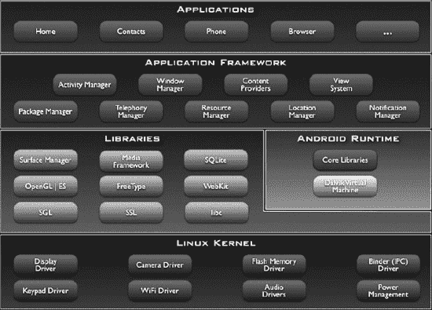
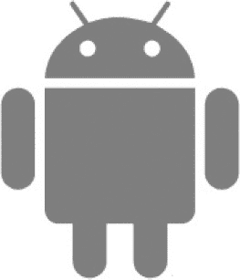
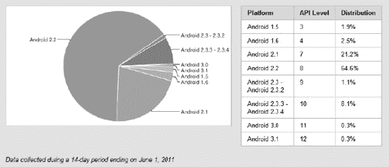
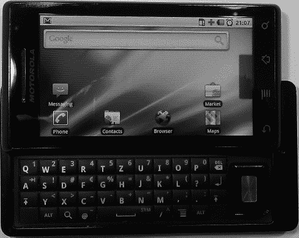
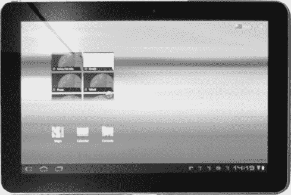
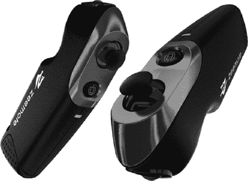
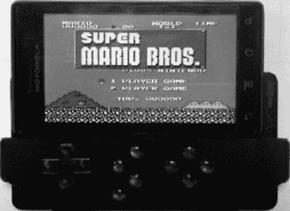

# 目录

目录概览

关于作者

致谢

引言

## 第 1 章：Android，新秀登场

Android 简史

碎片化问题

谷歌的角色

Android 开源项目

Android 市场

挑战、设备扶持与谷歌 I/O 大会

Android 的特性与架构

内核

运行时与 Dalvik 虚拟机

系统库

应用框架

软件开发工具包

开发者社区

设备，设备，还是设备！

硬件

设备的多样性

跨所有设备的兼容性

移动游戏的与众不同

口袋里的游戏机

始终在线

休闲与硬核

大市场，小开发者

本章小结

## 第 2 章：Android SDK 初探

搭建开发环境

安装 JDK

安装 Android SDK

安装 Eclipse

安装 ADT Eclipse 插件

Eclipse 快速导览

实用的 Eclipse 快捷键

Hello World——Android 版

创建项目

探索项目结构

编写应用程序代码

运行与调试 Android 应用程序

连接设备

创建 Android 虚拟设备

运行应用程序

调试应用程序

LogCat 与 DDMS

使用 ADB

本章小结

## 第 3 章：游戏开发基础

游戏类型：各有所爱

休闲游戏

益智游戏

动作与街机游戏

塔防游戏

创新

游戏设计：笔比代码更有力

核心游戏机制

故事与美术风格

屏幕与过渡

代码：实质细节

应用与窗口管理

输入

文件 I/O

音频

图形

游戏框架

本章小结

## 第 4 章：面向游戏开发者的 Android

定义 Android 应用：清单文件

`<manifest>` 元素

应用元素

`<activity>` 元素

`<uses-permission>` 元素

`<uses-feature>` 元素

`<uses-sdk>` 元素

十个简单步骤设置安卓游戏项目

市场过滤器

定义你的游戏图标

Android API 基础

创建一个测试项目

Activity 生命周期

输入设备处理

文件处理

音频编程

播放音效

流式播放音乐

基本图形编程

最佳实践

总结

 第 5 章：一个安卓游戏开发框架

攻击计划

`AndroidFileIO` 类

`AndroidAudio`、`AndroidSound` 和 `AndroidMusic`：碰撞、巨响、轰鸣！

`AndroidInput` 和 `AccelerometerHandler`

`AccelerometerHandler`：哪边朝上？

`CompassHandler`

`Pool` 类：因为重用对你有好处！

`KeyboardHandler`：上、上、下、下、左、右……

触摸处理器

`MultiTouchHandler`

`AndroidInput`：伟大的协调者

`AndroidGraphics` 和 `AndroidPixmap`：双彩虹

处理不同的屏幕尺寸和分辨率

`AndroidPixmap`：为大众准备的像素

`AndroidGraphics`：满足我们绘图的需求

`AndroidFastRenderView`：循环、拉伸、循环、拉伸

`AndroidGame`：整合所有内容

总结

 第 6 章：Mr. Nom 入侵安卓

创建资源

设置项目

`MrNomGame`：主 Activity

`Assets`：一个便捷的资源仓库

`Settings`：跟踪用户选择和高分

`LoadingScreen`：从磁盘获取资源

主菜单屏幕

`HelpScreenClass(es)` 类

高分屏幕

渲染数字：一次探索

实现屏幕

抽象……

抽象 Mr. Nom 的世界：模型、视图、控制器

`GameScreen` 类

总结

 第 7 章：OpenGL ES：温和入门

什么是 OpenGL ES，为什么我要关心它？

编程模型：一个类比

投影

标准化设备空间与视口

矩阵

渲染管线

开始之前

`GLSurfaceView`：从 2008 年开始让事情变简单

`GLGame`：实现游戏接口

看妈妈，我弄到了一个红色三角形！

定义视口

定义投影矩阵

指定三角形

整合起来

指定每个顶点的颜色

纹理映射：贴墙纸变得简单

纹理坐标

位图上传

纹理过滤

纹理的销毁

实用的代码片段

启用纹理渲染

综合实例

纹理类

索引顶点：复用有益

综合实例

顶点类

Alpha 混合：看穿你的秘密

更多图元：点、线、条带与扇形

2D 变换：玩转模型-视图矩阵

世界空间与模型空间

再谈矩阵

平移变换初步示例

更多变换

性能优化

帧率测量

Android 1.5 上 Hero 设备的奇怪问题

是什么让我的 OpenGL ES 渲染如此缓慢？

移除不必要的状态切换

减小纹理尺寸以减少像素获取

减少对 OpenGL ES/JNI 方法的调用

顶点绑定的概念

结语

总结

 第 8 章：2D 游戏编程技巧

开始之前

起初……向量诞生

向量的操作

一点三角学

实现一个向量类

简单使用示例

2D 中的一点物理知识

牛顿与欧拉：最好的朋友

力与质量

理论模拟

实践模拟

2D 中的碰撞检测与物体表示

包围体

构建包围体

游戏对象属性

粗检测与精检测碰撞检测

一个详细的示例

2D 中的摄像机

Camera2D 类

示例

纹理图集：共享是美德

示例

纹理区域、精灵与批次：隐藏 OpenGL ES 的复杂性

TextureRegion 类

SpriteBatcher 类

精灵动画

动画类

示例

总结

 第 9 章：超级跳跃者：一款 2D OpenGL ES 游戏

核心游戏机制

背景故事与艺术风格

屏幕与过渡

定义游戏世界

创建资源

UI 元素

使用位图字体处理文本

游戏元素

纹理图集的救赎

音乐与音效

实现超级跳跃者

资源类

以下是根据您的要求翻译并保留格式的中文版本：

Settings 类

主 Activity

Font 类

GLScreen

主菜单屏幕

帮助屏幕

高分屏幕

模拟类

游戏屏幕

WorldRenderer 类

优化与否

小结

 第 10 章：OpenGL ES：进入 3D 世界

开始之前

3D 中的顶点

Vertices3：存储 3D 位置

一个示例

透视投影：越近越大

Z 缓冲区：化混沌为有序

修复上一个示例

混合：身后空无一物

Z 缓冲区精度与 Z 冲突

定义 3D 网格

一个立方体：3D 世界的 Hello World

一个示例

再谈矩阵与变换

矩阵栈

基于矩阵栈的层级系统

一个简单的相机系统

小结

 第 11 章：3D 编程技巧

开始之前

3D 中的向量

OpenGL ES 中的光照

光照工作原理

光源

材质

OpenGL ES 如何计算光照：顶点法线

实践

关于 OpenGL ES 光照的一些说明

Mipmapping

简单相机

第一人称或欧拉相机

欧拉相机示例

Look-At 相机

加载模型

Wavefront OBJ 格式

实现 OBJ 加载器

使用 OBJ 加载器

关于加载模型的一些说明

3D 中的一点物理

3D 中的碰撞检测与对象表示

3D 中的包围体

包围球重叠检测

GameObject3D 和 DynamicGameObject3D

小结

 第 12 章：Droid Invaders：最终章

核心游戏机制

背景故事与艺术风格

屏幕与转场

定义游戏世界

创建资源

UI 资源

游戏资源

声音与音乐

攻击计划

Assets 类

Settings 类

主 Activity

主菜单屏幕

设置屏幕

模拟类

Shield 类

Shot 类

Ship 类

Invader 类

World 类

GameScreen 类

WorldRender 类

优化

小结

 第 13 章：发布你的游戏

关于测试的提示

成为注册开发者

签署你的游戏 APK

将游戏上架到市场

上传资源

产品详情

发布选项

发布！

市场营销

开发者控制台

小结

 第 14 章：接下来做什么？

融入社交元素

位置感知

多人游戏功能

OpenGL ES 2.0 及更多

框架与引擎

网络资源

结语

 索引

## 关于作者

 **马里奥·泽赫纳** 白天是研发部门的软件工程师，夜晚则是一位充满热情的游戏开发者，以 Badlogic Games 的名义发布作品。他开发了 Android 游戏《Newton》，以及适用于 Windows、Linux 和 Mac OSX 的《Quantum》，此外还有大量原型和小型游戏。他目前正在开发一个名为 `libgdx` 的开源跨平台游戏开发解决方案。除了编码活动，他还积极撰写关于游戏开发的教程和文章，这些内容免费发布于网络，尤其是在他的博客上（[`http://www.badlogicgames.com`](http://www.badlogicgames.com)）。

 **罗伯特·格林** 是俄勒冈州波特兰市游戏工作室 Battery Powered Games 的创始人。他开发了九款 Android 游戏，包括《Deadly Chambers》、《Antigen》、《Wixel》、《Light Racer》和《Light Racer 3D》。在全身心投入移动视频游戏开发和发布之前，罗伯特曾在明尼阿波利斯和芝加哥的软件公司工作，包括 IBM Interactive。罗伯特目前的重点是跨平台游戏开发和高性能移动游戏。他经常在个人博客上更新游戏编程技巧，网址是 [`http://www.rbgrn.net`](http://www.rbgrn.net)。

## 引言

你好，欢迎来到 Android 游戏开发的世界。你来到这里是为了学习 Android 上的游戏开发，我们希望成为帮助你实现想法的人。

我们将一起覆盖相当广泛的内容和主题：Android 基础知识、音频和图形编程、一点数学和物理知识，以及一个名为 OpenGL ES 的令人生畏的东西。基于所有这些知识，我们将开发三款不同的游戏，其中一款甚至是 3D 的。

如果你知道自己在做什么，游戏编程可以很容易。因此，我们努力以这样的方式呈现材料：不仅给你有用的代码片段以供复用，而且实际上向你展示了游戏开发的整体面貌。理解底层原理是应对日益复杂的游戏创意的关键。你不仅能够编写与本书过程中开发的游戏相似的游戏，而且还将具备足够的知识，能够自行前往网络或书店，独立探索游戏开发的新领域。

### 关于目标读者的一点说明

本书首先面向的是游戏编程的完全初学者。你无需具备任何该领域的预备知识；我们将引导你了解全部基础知识。然而，我们假设你已掌握一些关于 Java 的知识。如果你对这方面感到生疏，我们建议你通过阅读布鲁斯·埃克尔（Prentice Hall, 2006）所著的 *Java 编程思想* 在线版来回顾一下，这是一本关于该编程语言的优秀入门教材。除此之外，没有其他要求。不需要事先接触过 Android 或 Eclipse！

本书也面向那些希望在 Android 上大展拳脚的中级游戏程序员。虽然部分内容对你来说可能已是老生常谈，但书中仍包含许多技巧和提示，值得一读。Android 有时像一头难以捉摸的野兽，而本书应被视为你的战斗指南。

### 本书的组织结构

本书采用迭代式方法，我们将缓慢而扎实地从最基础的知识出发，逐步深入到硬件加速游戏编程的精妙境界。在全书各章节中，我们将逐步构建一个可复用的代码库，因此我们建议按顺序阅读各个章节。当然，经验更丰富的读者可以跳过自己已经掌握的某些部分。只需确保仔细阅读那些跳过的章节中的代码清单，以便理解这些类和接口如何在后续更高级的章节中被使用。

### 获取源代码

本书完全自包含；运行示例和游戏所需的所有代码均已收录在内。然而，将书中的代码清单复制到 Eclipse 容易出错，而且游戏不仅仅由代码组成，还包含你无法轻易从书中复制的资源文件。此外，从本书文本复制代码到 Eclipse 的过程也可能会引入错误。我们已竭尽全力确保本书中的所有代码清单没有错误，但“小妖精”们总是难以对付。

为了确保体验顺畅，我们创建了一个 Google Code 项目，为你提供以下内容：

*   完整的源代码和资源文件，基于 GPL 第三版许可，可从该项目的 Subversion 仓库获取。
*   一份快速入门指南，以文字形式展示了如何将项目导入 Eclipse，以及相应的视频演示。
*   一个问题跟踪器，允许你报告发现的任何错误，无论是书中的错误还是随书代码中的错误。一旦你在问题跟踪器中提交问题，我们就可以在 Subversion 仓库中整合任何修复。这样，你将始终获得最新且（希望是）无错误的本书代码版本，其他读者也能从中受益。
*   一个讨论组，欢迎所有人免费加入并讨论本书内容。当然，我们也会在那里。

对于每个包含代码的章节，Subversion 仓库中都有一个对应的 Eclipse 项目。这些项目互不依赖，因为随着本书内容的推进，我们将迭代地改进一些框架类。因此，每个项目都是独立的。第 5 章和第 6 章的代码都包含在 `ch06-mrnom` 项目中。

Google Code 项目的地址是：[`http://code.google.com/p/beginning-android-games`](http://code.google.com/p/beginning-android-games)。

## 第 1 章

## Android，新生的力量

作为 90 年代初的孩子，我们自然是伴随着可靠的任天堂 Game Boy 和世嘉 Game Gear 长大的。我们花了无数个小时帮助马里奥拯救公主，在《俄罗斯方块》中冲击最高分，以及通过联机线在《超级 RC Pro-Am》中与朋友竞速。我们走到哪里都带着这些了不起的硬件。对游戏的热爱让我们渴望创造自己的世界，并与朋友们分享。我们开始在 PC 上编程，但很快意识到无法将我们的小小杰作移植到现有的便携式游戏机上。尽管我们一直是充满热情的程序员，但随着时间的推移，我们对玩电子游戏的兴趣逐渐消退。此外，我们的 Game Boy 最终也坏了……

快进到 2011 年。智能手机已成为这个时代新的移动游戏平台，与任天堂 DS 和索尼 PSP 等经典的专用掌机系统竞争。这一发展重新点燃了我们的兴趣，我们开始研究哪些移动平台适合我们的开发需求。苹果的 iOS 似乎是我们游戏编程技能的一个不错选择。然而，我们很快意识到这个系统并非开放，我们的作品只有在苹果允许的情况下才能与他人分享，而且开发 iOS 还需要一台 Mac。然后，我们发现了 Android。

我们立刻就爱上了它。Android 的开发环境可以在所有主流平台上运行——没有任何附加条件。它拥有一个充满活力的开发者社区，乐于帮助你解决遇到的任何问题，同时还提供全面的文档。你可以免费与任何人分享你的游戏，如果你想通过作品盈利，只需几分钟就能将你最新的伟大创新发布到拥有数百万用户的全球市场。

剩下的唯一问题就是弄清楚如何为 Android 编写游戏，以及如何将我们的 PC 游戏开发知识迁移到这个新系统上。在接下来的章节中，我们希望能与你们分享经验，并引领你们开始 Android 游戏开发。当然，这在一定程度上也是一个自私的计划：我们希望有更多游戏可以在路上玩！

让我们从认识我们的新朋友——Android 开始吧。

### Android 简史

Android 首次公开露面是在 2005 年，当时谷歌收购了一家名为 Android Inc. 的小型创业公司。这引发了人们对谷歌有意进军移动设备领域的猜测。2008 年，Android 1.0 版本的发布终结了所有猜测，Android 成为移动市场上的新挑战者。从那时起，Android 便开始与 iOS（当时称为 iPhone OS）和 BlackBerry OS 等已建立的平台展开竞争。Android 的增长是惊人的，每年都在抢占越来越多的市场份额。虽然移动技术的未来总在变化，但有一件事是确定的：Android 会持续存在。

由于 Android 是开源的，手机制造商使用这个新平台的入门门槛很低。他们可以生产面向所有价格段的设备，并修改 Android 本身以适应特定设备的处理能力。因此，Android 不仅限于高端设备，还可以部署在低成本设备中，从而覆盖更广泛的受众。

Android 成功的一个关键因素是 2007 年底成立的开放手机联盟 (OHA)。OHA 包括 HTC、高通、摩托罗拉和英伟达等公司，它们共同致力于开发移动设备的开放标准。虽然 Android 的代码主要由谷歌开发，但所有 OHA 成员都以某种形式为其源代码做出了贡献。

Android 本身是一个基于 Linux 内核 2.6 版的移动操作系统和平台，并且可免费用于商业和非商业用途。OHA 的许多成员都为其设备构建了带有修改后用户界面 (UI) 的定制版 Android，例如 HTC 的 Sense 和摩托罗拉的 MOTOBLUR。Android 的开源特性也使得爱好者们能够创建和分发自己的版本。这些通常被称为 *mods（修改版）*、*firmware（固件）* 或 *roms（只读存储器镜像）*。在编写本文时，最著名的 rom 由一个名为 Cyanogen 的人开发，其目标是为各种 Android 设备带来最新和最好的改进。

### Android 版本演进

自 2008 年发布以来，Android 已获得七个版本更新，所有版本均以甜点命名（除现已无关紧要的 Android 1.1 外）。每个 Android 平台版本都添加了与游戏开发者相关的新功能：版本 1.5（`Cupcake`）增加了对在 Android 应用程序中包含原生库的支持，此前应用程序仅限于使用纯 Java 编写。在对性能要求极高的场景中，原生代码非常有用。版本 1.6（`Donut`）引入了对不同屏幕分辨率的支持。我们将在本书中多次回顾这一发展，因为它对编写 Android 游戏的方式有一定影响。版本 2.0（`Éclair`）带来了对多点触控屏幕的支持，版本 2.2（`Froyo`）为 Dalvik 虚拟机（VM）添加了即时（`JIT`）编译功能，该软件驱动 Android 上所有 Java 应用程序。`JIT`显著加快了 Android 应用程序的执行速度——根据场景不同，速度最高可提升五倍。版本 2.3（`Gingerbread`）为 Dalvik VM 添加了新的并发垃圾收集器。2011 年初，Android 衍生出名为 `Honeycomb` 的平板电脑版本，其版本号为 3.0。`Honeycomb` 包含的应用程序编程接口（API）变化比迄今为止任何单个 Android 版本都更为显著。到版本 3.1，`Honeycomb` 增加了对分割和管理大型高分辨率平板电脑屏幕的广泛支持，并添加了更多类似 PC 的功能，如 USB 主机支持和对外围设备（包括键盘、鼠标和操纵杆）的支持。此版本唯一的问题是它仅针对平板电脑。Android 的小屏幕/智能手机版本停留在 2.3。此后 Android 4.0（又名 `Ice Cream Sandwich`，简称 `ICS`）问世，它是将 `Honeycomb`（3.1）和 `Gingerbread`（2.3）合并为一套通用功能的结果，这些功能在平板电脑和手机上均表现出色。

`ICS` 对最终用户来说是一次巨大提升，为 Android 用户界面和内置应用程序（如浏览器、电子邮件客户端和照片服务）增加了许多改进。对于开发者而言，`ICS` 合并了 `Honeycomb` 的 UI API，将大屏幕功能带入手机。`ICS` 还合并了 `Honeycomb` 的 USB 外围设备支持，使制造商可以选择支持键盘和操纵杆。至于新的 API，`ICS` 增加了一些功能，例如 Social API，它提供了联系人、个人资料数据、状态更新和照片的统一存储。幸运的是，对于 Android 游戏开发者来说，`ICS` 核心保持了良好的向后兼容性，确保构建得当的游戏能够与旧版本（如 `Cupcake` 和 `Éclair`）保持良好的兼容性。

### 碎片化

Android 的巨大灵活性是有代价的：选择开发自己 UI 的公司必须追赶新版本 Android 的快速发布节奏。这可能导致仅使用几个月的手机变得过时，因为运营商和手机制造商拒绝创建包含新 Android 版本改进的更新。这一过程的结果是被称为**碎片化**的大问题。

碎片化有多种表现。对最终用户而言，这意味着由于受困于旧版 Android，无法安装和使用某些应用程序和功能。对开发者而言，这意味着在创建应适用于所有 Android 版本的应用程序时，需要格外小心。虽然为早期 Android 版本编写的应用程序通常能在新版本上正常运行，但反之则不然。当然，添加到较新 Android 版本的某些功能（如多点触控支持）在旧版本上不可用。因此，开发者被迫为不同版本的 Android 创建独立的代码路径。

2011 年，许多知名的 Android 设备制造商同意在设备生命周期（18 个月）内支持最新的 Android 操作系统。这看似不长，但却是帮助减少碎片化的重要一步。这也意味着 Android 的新功能（如 `Ice Cream Sandwich` 中的新 API）能更快地在更多手机上可用。尽管如此，市场上总会有相当一部分用户运行着较旧的 Android 版本。如果游戏开发者希望获得大众市场认可，游戏需要在不少于六个不同版本的 Android 上运行，这些版本分布在超过 400 种设备上（而且还在增加！）。

但不必担忧。虽然这听起来令人恐惧，但事实证明，为适应多个 Android 版本所需采取的措施是最低限度的。大多数情况下，你甚至可以忽略这个问题，假装只有一个 Android 版本。作为游戏开发者，我们更关心硬件能力，而非 API 差异。这是碎片化的另一种形式，对 iOS 等平台也是一个问题，尽管不那么明显。在本书中，我们将介绍在您为 Android 开发下一款游戏时可能遇到的、可能阻碍您的相关碎片化问题。

### Google 的角色

虽然 Android 名义上是开放手机联盟（Open Handset Alliance）的产物，但在实现 Android 本身以及提供其发展所需的生态系统方面，Google 是明确的领导者。

### Android 开源项目

Google 的努力总结在*Android 开源项目*中。大部分代码采用 Apache License 2 许可，与 GNU 通用公共许可证（GPL）等其他开源许可证相比，该许可证非常开放且限制较少。每个人都可以自由使用此源代码构建自己的系统。然而，宣称兼容 Android 的系统必须首先通过 Android 兼容性计划，该流程确保与开发者编写的第三方应用程序的基线兼容性。兼容的系统被允许参与 Android 生态系统，该生态系统还包括 Android Market。

### Android 市场

Google 于 2008 年 10 月向公众开放了`Android Market`。这是一个在线软件商店，用户可以在其中查找并安装第三方应用程序（即应用）。该市场主要面向 Android 设备，但也提供了一个网页前端，用户可以通过它搜索、评分、下载和安装应用。虽然并非强制要求，但大多数 Android 设备都默认安装了 Google Android 市场应用。

该市场允许第三方开发者发布免费或付费应用。在许多国家都可以购买付费应用，其集成的购买系统使用`Google Checkout`处理汇率问题。Android 市场还提供了按国家/地区手动设置应用价格的选项。

用户注册 Google 账户后即可访问该市场。应用可以通过信用卡经由`Google Checkout`支付，或使用运营商代扣费方式购买。买家可在购买后 15 分钟内决定退回应用并获得全额退款。此前退款时限为 24 小时，但为了减少对系统的滥用而缩短了时间。

开发者需要向 Google 注册一个 Android 开发者账户，并支付一次性费用 25 美元，才能在市场上发布应用。成功注册后，开发者可以在几分钟内开始发布新应用。

Android 市场没有审批流程，而是依赖权限系统。安装应用前，用户会看到一组必需的权限，涉及电话服务、网络、安全数字（SD）卡等访问权限。只有用户批准这些权限后，应用才会被安装。该系统依赖用户的诚信。这种方法在 PC 上（尤其是在 Windows 系统上）并不十分成功，但在 Android 上似乎至今行之有效；只有少数应用因恶意用户行为而被从市场中下架。

为了销售应用，开发者还需免费注册一个`Google Checkout`商家账户。所有金融交易都通过该账户处理。Google 还拥有一个应用内购买系统，它与 Android 市场和`Google Checkout`集成在一起。开发者可以使用一个独立的 API 来处理应用内购买交易。

### 挑战赛、设备赠送与 Google I/O

为了持续吸引更多开发者加入 Android 平台，Google 推出了以挑战赛形式的推广活动。首个活动名为 Android 开发者挑战赛（ADC），于 2008 年启动，并为获奖项目提供了相对高额的现金奖励。ADC 在次年再次举办，并且在开发者参与度方面再次取得了巨大成功。2010 年和 2011 年没有举行 ADC，可能是因为 Android 当时已拥有相当规模的开发者基础，不再需要针对吸引新开发者的特别推广。

作为对开发者的激励措施，Google 于 2010 年初启动了一项设备赠送计划。每位在市场上拥有一个或多个应用，且下载量超过 5000 次、用户平均评分至少达到 3.5 星的开发者，都会收到一部全新的摩托罗拉 Droid、摩托罗拉 Milestone 或 Nexus One 手机。这次推广在开发者社区中受到了热烈欢迎。不过，最初许多人对此表示怀疑，认为这些突如其来的电子邮件通知是一个精心设计的骗局。幸运的是，对于收件人来说，这次推广最终被证实是真的，数千台设备被发送给了世界各地的开发者——这是 Google 取悦其第三方开发者、让他们继续留在该平台，并可能吸引新开发者的出色举措。

Google 为开发者提供了专门的 Android 开发手机（ADP）。第一款 ADP 是 T-Mobile G1（也被称为 HTC Dream）的一个版本。下一代产品称为 ADP2，是 HTC Magic 的一个变种。Google 还以 Nexus One 的形式发布了自有手机，最初面向最终用户销售。虽然最初并非作为 ADP 发布，但许多人认为它是 ADP2 的继任者。Google 最终停止向最终用户销售 Nexus One，现在仅向合作伙伴和开发者发货。2010 年底，最新的 ADP 发布了——一款运行 Android 2.3（姜饼）的三星设备，名为 Nexus S。ADP 可以在 Android 市场上购买，购买时需要拥有开发者账户。Nexus S 可以通过 Google 的独立网站 `www.google.com/phone` 购买。

一年一度的 Google I/O 大会是每位 Android 开发者每年都期待的活动。在 Google I/O 上，会揭晓最新、最强大的 Google 技术和项目，其中 Android 近年来占据了特殊地位。Google I/O 通常设有多个关于 Android 相关主题的分会场，这些内容也以视频形式发布在 YouTube 的 Google Developers 频道上。在 Google I/O 2011 上，三星和 Google 向所有普通参会者发放了 Galaxy Tab 10.1 设备。这真正标志着 Google 大力抢占平板电脑市场份额的开端。

### Android 的特性与架构

Android 不仅仅是另一个用于移动设备的 Linux 发行版。在为 Android 开发时，你很可能不会直接接触到 Linux 内核本身。面向开发者的 Android 是一个抽象了底层 Linux 内核的平台，并通过 Java 进行编程。从高层视角来看，Android 拥有几个不错的特性：

*   **应用程序框架**：提供了一套丰富的 API，用于创建各种类型的应用程序。它还允许重用和替换平台及第三方应用程序提供的组件。
*   **Dalvik 虚拟机**：负责在 Android 上运行应用程序。
*   **图形库**：一套用于 2D 和 3D 编程的图形库。
*   **媒体支持**：支持常见的音频、视频和图像格式，例如 Ogg Vorbis、MP3、MPEG-4、H.264 和 PNG。甚至还有一个用于播放音效的专用 API，这将在你的游戏开发冒险中派上用场。
*   **外设访问 API**：用于访问摄像头、全球定位系统（GPS）、指南针、加速度计、触摸屏、轨迹球、键盘、控制器和游戏杆等外设。请注意，并非所有 Android 设备都具备所有这些外设——这正是硬件碎片化的体现。

当然，Android 远不止上述这几个特性。但对于你的游戏开发需求而言，这些特性最为相关。

Android 的架构由一组组堆叠的组件构成，每一层都构建在其下一层的组件之上。图 1-1 展示了 Android 主要组件的概览。

**图 1-1.** *Android 架构概览*

#### 内核

从堆栈的最底层开始，你可以看到 Linux 内核为硬件组件提供了基本的驱动程序。此外，内核还负责内存与进程管理、网络等底层事务。

#### 运行时与 Dalvik

Android 运行时构建于内核之上，负责生成并运行 Android 应用程序。每个 Android 应用都在独立的进程中运行，拥有自己的 Dalvik 虚拟机。

`Dalvik` 以 `DEX` 字节码格式运行程序。通常，你需要使用一个名为 `dx` 的特殊工具（该工具由软件开发工具包（SDK）提供）将常见的 Java `.class` 文件转换为 DEX 格式。与经典的 Java `.class` 文件相比，`DEX` 格式的设计目标是拥有更小的内存占用。这通过高度压缩、表格以及合并多个 `.class` 文件来实现。

Dalvik 虚拟机与核心库进行交互，核心库提供了暴露给 Java 程序的基本功能。核心库通过使用 Apache Harmony Java 实现的一个子集，提供了 Java 标准版（SE）中可用的一部分（而非全部）类。这也意味着，无论是 `Swing` 或 `抽象窗口工具包（AWT）`，还是任何在 Java 微型版（ME）中能找到的类，都不可用。不过，只要稍加注意，你仍然可以在 `Dalvik` 上使用许多为 Java SE 提供的第三方库。

在 Android 2.2（Froyo）之前，所有字节码都是被解释执行的。Froyo 引入了一个追踪式 JIT 编译器，它可以即时地将部分字节码编译为机器码。这大大提升了计算密集型应用程序的性能。JIT 编译器可以利用专门针对特定计算优化的 CPU 特性，例如专用的浮点运算单元（FPU）。几乎每个新版本的 Android 都会改进 JIT 编译器并提升性能，但这通常以增加内存消耗为代价。不过，这是一个可扩展的解决方案，因为新设备标配的内存容量越来越大。

`Dalvik` 还集成了一个垃圾回收器（GC）。它是一个标记-清除、非分代的垃圾回收器，有时会让开发者感到有些抓狂。然而，只要注意一些细节，你就能在日常的游戏开发中与 GC 和平共处。最新的 Android 版本（2.3）拥有一个改进的并发垃圾回收器，缓解了一些问题。在本书后面的章节中，你将更详细地研究 GC 相关问题。

`Dalvik VM` 的每个实例中运行的应用程序，至少共有 16MB 的堆内存可用。较新的设备，尤其是平板电脑，为了支持更高分辨率的图形，拥有更高的堆内存限制。尽管如此，在游戏中很容易用尽所有这些内存，因此你在管理图像和音频资源时必须牢记这一点。

#### 系统库

除了提供部分 Java SE 功能的核心库之外，还有一套原生 C/C++ 库（图 1-1 中的第二层），它们构成了应用程序框架（图 1-1 中的第三层）的基础。这些系统库主要负责计算密集型任务，例如图形渲染、音频播放和数据库访问，这些任务不太适合由 Dalvik VM 处理。这些 API 由应用程序框架中的 Java 类封装，当你开始编写游戏时将会用到它们。你会以某种形式用到以下库：

> **Skia 图形库（Skia）**：这个 2D 图形软件用于渲染 Android 应用程序的用户界面。你将使用它来绘制你的第一个 2D 游戏。
> 
> **嵌入式系统开放图形库（OpenGL ES）**：这是硬件加速图形渲染的行业标准。OpenGL ES 1.0 和 1.1 在所有 Android 版本上都向 Java 公开。引入了着色器的 OpenGL ES 2.0 仅在 Android 2.2（Froyo）及更高版本上得到支持。需要指出的是，Froyo 中 OpenGL ES 2.0 的 Java 绑定并不完整，缺少一些关键方法。幸运的是，这些方法在 2.3 版本中被添加了。此外，模拟器以及一些仍占少许市场份额的老旧设备不支持 OpenGL ES 2.0。就你的目标而言，请坚持使用 OpenGL ES 1.0 和 1.1，以最大限度地提高兼容性，并让你轻松进入 Android 3D 编程的世界。
> 
> **OpenCore**：这是一个用于音频和视频的媒体播放与录制库。它支持多种格式，例如 Ogg Vorbis、MP3、H.264、MPEG-4 等等。你主要会处理音频部分，它不直接暴露给 Java 端，而是封装在几个类和服务中。
> 
> **FreeType**：这是一个用于加载和渲染位图及矢量字体的库，最著名的是 TrueType 格式。FreeType 支持 Unicode 标准，包括针对阿拉伯语及类似特殊文本的从右到左字形渲染。遗憾的是，这在 Java 端并不完全成立，Java 端仍然不支持阿拉伯语排版。与 OpenCore 类似，FreeType 不直接暴露给 Java 端，而是封装在几个便捷的类中。

这些系统库为游戏开发者提供了广泛的支持，并承担了大部分繁重的工作。这就是为什么你可以用纯粹的旧式 Java 来编写游戏的原因。

**注意：** 尽管 Dalvik 的能力通常足以满足你的需求，但有时你可能需要更高的性能。例如，对于非常复杂的物理模拟或繁重的 3D 计算，你通常会求助于编写原生代码。这方面不在本书的讨论范围内。已经有几个针对 Android 的开源库可以帮助你保持在 Java 端进行开发。例如，请参见 `http://code.google.com/p/libgdx/`。

#### 应用程序框架

应用程序框架将系统库和运行时整合在一起，创建了 Android 的用户端。该框架管理应用程序，并提供一个精细的结构，应用程序在其中运行。开发者通过一组 Java API 为该框架创建应用程序，这些 API 涵盖 UI 编程、后台服务、通知、资源管理、外设访问等领域。Android 提供的所有开箱即用的核心应用程序，例如邮件客户端，都是使用这些 API 编写的。

应用程序，无论它们是 UI 还是后台服务，都可以将其能力告知其他应用程序。这种通信使得一个应用程序能够重用其他应用程序的组件。一个简单的例子是，一个应用程序需要拍照并对其进行一些操作。该应用程序向系统查询提供此服务的另一个应用程序的组件。然后，第一个应用程序就可以重用该组件（例如，内置的相机应用程序或照片图库）。这大大减轻了程序员的负担，并使你能够定制 Android 行为的众多方面。

作为一名游戏开发者，你将在此框架内创建 UI 应用程序。因此，你将关注应用程序的架构和生命周期，以及它与用户的交互。后台服务在游戏开发中通常扮演较小的角色，这就是为什么不会详细讨论它们。

### 软件开发工具包

要为 Android 开发应用程序，您将用到 Android 软件开发工具包（`SDK`）。`SDK` 包含一整套全面的工具、文档、教程和示例，能帮助您快速上手。其中还包含了创建 Android 应用所需的 Java 库。这些库内含应用框架的 API。所有主流桌面操作系统均可作为开发环境得到支持。

`SDK` 的突出特性如下：

*   `调试器`，能够调试在设备或模拟器上运行的应用程序。
*   一个`内存与性能分析工具`，帮助您发现内存泄漏和定位缓慢的代码。
*   `设备模拟器`，虽然有时稍显缓慢，但精确度高，基于 `QEMU`（一款用于模拟不同硬件平台的开源虚拟机）。`命令行工具`，用于与设备通信。
*   `构建脚本`以及用于打包和部署应用程序的工具。

`SDK` 可以与 `Eclipse` 集成，`Eclipse` 是一款功能丰富且广受欢迎的开源 Java 集成开发环境（`IDE`）。这种集成是通过 `Android 开发工具（ADT）`插件实现的，该插件为 `Eclipse` 增加了一系列新功能，用于：创建 Android 项目；在模拟器或设备上执行、分析和调试应用程序；以及打包 Android 应用以便部署到 Android Market。请注意，`SDK` 也可以集成到其他 `IDE` 中，例如 `NetBeans`。不过，官方并不提供对此的支持。

**注意：** 第 2 章 介绍了如何使用 `SDK` 和 `Eclipse` 搭建开发环境。

`SDK` 和用于 `Eclipse` 的 `ADT` 插件会持续更新，以添加新特性和功能。因此，保持它们处于更新状态是个好主意。

优秀的 `SDK` 都附带着详尽的文档。Android 的 `SDK` 在这方面也毫不逊色，它包含了大量的示例应用程序。您还可以在 [`http://developer.android.com/guide/index.html`](http://developer.android.com/guide/index.html) 找到开发者指南和针对应用框架所有模块的完整 API 参考。

### 开发者社区

Android 成功的部分原因在于其开发者社区，这些社区聚集在网络的各个角落。最热门的开发者交流网站是位于 [`http://groups.google.com/group/android-developers`](http://groups.google.com/group/android-developers) 的 Android 开发者群组。当您遇到看似无法解决的问题时，这里是提问和寻求帮助的首选之地。该群组的访客涵盖各种 Android 开发者，从系统程序员到应用开发者，再到游戏程序员。偶尔，负责 Android 部分模块的谷歌工程师也会通过提供宝贵的见解来提供帮助。注册是免费的，我们强烈建议您现在加入！除了为您提供一个提问的地方，这里也是一个搜索之前已回答的问题和问题解决方案的好地方。因此，在提问之前，请先检查问题是否已有答案。

每一个像样的开发者社区都有自己的吉祥物。Linux 有企鹅 Tux，GNU 有它的……嗯，牛羚，Mozilla Firefox 有它时髦的 Web 2.0 狐狸。Android 也不例外，它选择了一个绿色的小机器人作为吉祥物。图 1-2 向您展示了那个小淘气。

**图 1-2.** *Android 的无名吉祥物*

虽然颜色的选择可能有待商榷，但这个无名小机器人已经出现在一些流行的 Android 游戏中。它最引人注目的亮相是在 Replica Island 中，这是一款免费的开源平台游戏，由前谷歌开发者倡导者 Chris Pruett 作为“20% 项目”创建。“20% 项目”指的是谷歌员工每周有一天的时间可以花在自己选择的项目上。

### 设备，设备，设备！

Android 并不局限于单一的硬件生态系统。许多知名的手机制造商，如 HTC、摩托罗拉、三星和 LG，都已加入了 Android 阵营，并提供了多种多样的 Android 设备。除了手机，还有大量基于 Android 的平板设备。不过，所有设备都共享一些关键概念，这将使您作为游戏开发者的工作稍微容易一些。

#### 硬件

在后续关于兼容性这一“移动标靶”的章节中，我们会详细讨论相关事项。谷歌最初发布了以下最低硬件规格。实际上，几乎所有现有的安卓设备都满足，甚至往往远超这些建议：

> `*128MB 内存*`：这是最低规格。当前的高端设备已经配备了 1GB 内存，并且按照摩尔定律的发展趋势，这种上升势头短期内不会停止。
>
> `*256MB 闪存*`：这是存储系统镜像和应用程序所需的最低内存量。在很长一段时间里，内存不足是安卓用户最大的抱怨，因为第三方应用程序只能安装在闪存中。这一情况在 Froyo（安卓 2.2）版本发布后得到了改变。
>
> `*迷你 SD 卡或微型 SD 卡存储*`：大多数设备都配备了几 GB 的 SD 卡存储空间，用户可以自行更换容量更大的 SD 卡。
>
> `*16 位色四分之一视频图形阵列（QVGA）薄膜晶体管液晶显示器（TFT LCD）*`：在安卓 1.6 版本之前，操作系统仅支持半尺寸 VGA（HVGA）屏幕（480×320 像素）。从 1.6 版本开始，支持了更低和更高分辨率的屏幕。当前的高端手机拥有宽 VGA（WVGA）屏幕（800×480、848×480 或 852×480 像素），而一些低端设备支持 QVGA 屏幕（320×280 像素）。平板电脑屏幕有多种尺寸，通常约为 1280×800，而谷歌电视则带来了对高清电视 1920×1080 分辨率的支持！尽管许多开发者倾向于认为每台设备都有触摸屏，但事实并非如此。安卓正逐步进入机顶盒和配备传统显示器的类 PC 设备领域。这些设备并不具备与手机或平板电脑相同的触摸屏输入方式。
>
> `*专用硬件按键*`：这些按键用于导航。设备总会提供一些专门映射到标准导航命令（如主页和返回）的按钮，这些按钮通常与屏幕上的触摸命令区分开来。安卓的硬件范围非常广泛，所以不要妄下定论！

当然，大多数安卓设备所配备的硬件远不止最低规格要求。几乎所有手机都具备 `*GPS*`、`*加速度计*` 和 `*指南针*`。许多设备还配备了 `*距离传感器和光线传感器*`。这些外围设备为游戏开发者提供了让用户与游戏互动的新方式，稍后你将了解到其中一些。少数设备甚至带有完整的 `*QWERTY 键盘*` 和 `*轨迹球*`。后者最常见于 HTC 设备。`*摄像头*` 也几乎存在于所有当前的便携设备上。一些手机和平板电脑配备了两个摄像头：一个在后置，一个在前置，用于视频通话。

专用的 `*图形处理器单元（GPU）*` 对游戏开发尤为重要。最早运行安卓系统的手机就已经配备了支持 OpenGL ES 1.0 的 GPU。较新的便携设备拥有与旧款 Xbox 或 PlayStation 2 性能相当的 GPU，支持 OpenGL ES 2.0。如果没有图形处理器，平台会提供一个名为 `PixelFlinger` 的软件渲染器作为后备方案。许多低预算手机依赖软件渲染器，对于大多数低分辨率屏幕来说，它的速度已经足够。

除了图形处理器，当前任何可用的安卓设备也都配备了专用的 `*音频硬件*`。许多硬件平台包含用于解码不同媒体格式（如 H.264）的专用电路。连接功能则由用于移动电话、Wi-Fi 和蓝牙的硬件组件提供。安卓设备中的所有硬件模块通常集成在一个单一的 `*片上系统（SoC）*` 中，这种系统设计也常见于嵌入式硬件。

#### 设备范围

最初，只有 G1 这一款设备。开发者们热切期待更多设备出现，随后几款差异微小的手机便接踵而至，它们被称为“第一代”。多年来，硬件变得越来越强大，现在已有各种手机、平板电脑和机顶盒，从配备 2.5 英寸 QVGA 屏幕、仅靠 500MHz ARM CPU 运行软件渲染器的设备，一直到拥有双 1GHz CPU、配备可支持高清电视的极强 GPU 的机器。

我们已经讨论过碎片化问题，但开发者还需要应对如此广泛的屏幕尺寸、功能和性能差异。最佳方法是了解最低硬件要求，并将其作为游戏设计和性能测试的“最低公分母”。

##### 最低实用目标

截至 2011 年 10 月 3 日，只有不到 3% 的安卓设备运行的是 2.1 版本之前的安卓系统。这一点很重要，因为它意味着你从现在开始开发的游戏仅需支持最低 API 级别 7（安卓 2.1），并且到它完成时，仍将覆盖 97%（按版本划分）的安卓设备。这并不是说你不能使用最新的功能！当然可以，我们会向你展示如何做到。你只需要在设计游戏时加入一些后备机制，使其兼容性下探到 2.1 版本。当前数据可通过谷歌的 [`http://developer.android.com/resources/dashboard/platform-versions.html`](http://developer.android.com/resources/dashboard/platform-versions.html) 获取，图 1–3 展示了一张 2011 年中收集的图表。

**图 1–3.** *2011 年 10 月 3 日的安卓版本分布情况*

那么，什么设备适合作为最低目标基线呢？回顾一下第一款发布的安卓 2.1 设备：最初的 `*摩托罗拉 Droid*`，如 图 1–4 所示。尽管它后来已更新至安卓 2.2，但 Droid 仍然是一款广泛使用的设备，其 CPU 和 GPU 性能都相当不错。

**图 1–4.** *摩托罗拉 Droid*

最初的 Droid 被誉为第一款“第二代”设备，它是在首批基于高通 MSM7201A 的型号（包括 G1、Hero、MyTouch、Eris 等）发布大约一年后推出的。Droid 是第一款拥有高于 480×320 分辨率屏幕和独立 PowerVR GPU 的手机，也是第一款原生支持多点触控的安卓设备（尽管它有一些多点触控问题，但稍后会详细介绍）。

支持 Droid 意味着你要支持的设备具备以下规格集：

*   CPU 速度在 550MHz 到 1GHz 之间，支持硬件浮点运算
*   支持 OpenGL ES 1.x 和 2.0 的可编程 GPU
*   WVGA 屏幕
*   支持多点触控
*   安卓 2.1 或 2.2+ 版本

Droid 是一个极好的最低目标设备，因为它运行安卓 2.2 并支持 OpenGL ES 2.0。它还有着与大多数手机相似的分辨率（854×480）。如果一个游戏在 Droid 上运行良好，那么它在 90% 的安卓手机上也很可能表现良好。仍然会存在一些老旧的设备，甚至一些较新的设备屏幕尺寸为 480×320，所以最好为此做好计划并至少在这些设备上进行测试，但就性能而言，为了占据绝大多数安卓市场，你不太需要支持比 Droid 配置更低的设备。

### 前沿设备

`Honeycomb` 引入了非常坚实的平板电脑支持，并且平板电脑显然已成为一种热门的游戏平台。随着 2011 年初设备搭载 `NVIDIA Tegra 2` 芯片，手机和平板电脑都开始采用快速的**双核 CPU**，更强大的 **GPU** 也已成为标配。在撰写本书时，讨论哪些设备最前沿是困难的，因为变化太快，但目前设备普遍拥有超快处理器、海量存储、大容量内存、高分辨率屏幕、双手多点触控支持，甚至少数新机型还配备了 3D 立体显示。

Android 设备中最常见的 GPU 是 Imagination Technologies 的 `PowerVR` 系列、高通集成了 `Adreno` GPU 的 `Snapdragon` 系列，以及 NVIDIA 的 `Tegra` 系列。`PowerVR` 目前有几种型号：`530`、`535` 和 `540`。不要被型号之间微小的数字增量所迷惑；与前辈相比，`540` 是一款速度极快的 GPU，它被用于三星 Galaxy S 系列以及 Google Nexus S。`530` 用于 Droid，而 `535` 则分散在几款机型中。也许最常用的 GPU 是高通的，几乎每款 HTC 设备都采用它。`Tegra` GPU 主要面向平板电脑，但也在一些手机中出现。这三种相互竞争的芯片架构都极具可比性且性能强大。

三星 Galaxy Tab 10.1（见图 1–5）是目前事实上的 Android 平板电脑标准，它具备以下特性：

- NVIDIA Tegra 2 双核 1GHz CPU/GPU
- 支持 OpenGL ES 1.x 和 2.0 的可编程 GPU
- 1280×800 屏幕
- 十点触控支持
- Android Honeycomb 3.1

**图 1–5.** *三星 Galaxy Tab 10.1*

支持 Galaxy Tab 10.1 级别的平板电脑，对于维持接纳此技术的用户增长至关重要。从技术上讲，支持它与其他设备并无不同。然而，Google 和三星承诺在其发布后至少 18 个月内，会为其维护最新版本的 Android，因此它很可能会在第一轮部署中获得最新的 Android 操作系统升级和新功能。平板电脑尺寸的屏幕是设计阶段可能需要额外考虑的另一个方面，但你稍后会看到更多相关内容。

### 未来：下一代

设备制造商总是尽可能长时间地对最新手机保密，但一些规格总会泄露出来。

所有未来设备的普遍趋势是更多核心、更大内存、更优 GPU 和更高屏幕分辨率。相互竞争的芯片不断推出，吹嘘着越来越高的参数，与此同时 Android 自身也在成长和成熟，几乎每个后续版本都在提升性能并增加新功能。硬件市场竞争极其激烈，并且没有任何放缓的迹象。

虽然 Android 始于一部手机，但它已迅速演变为能在不同类型的设备上良好运行，包括电子书阅读器、机顶盒、平板电脑、导航系统，以及可插入底座变成 PC 的混合型手机。要创建一款能在任何地方运行的 Android 游戏，开发者需要考虑 Android 的本质：一个几乎可以嵌入任何设备的无处不在的操作系统。我们不应假设 Android 只会停留在当前类型的设备上。自 2008 年以来，它的发展如此迅猛，覆盖面如此之广，对 Android 而言，显然是天高任鸟飞。

无论未来带来什么，Android 都将长存！

### 游戏手柄

鉴于各种 Android 手机提供了不同的输入方式，一些制造商生产了专用的游戏手柄。由于 Android 中没有针对此类手柄的 API，游戏开发者必须使用游戏手柄制造商提供的 SDK 来单独集成支持。

其中一款游戏手柄是 `Zeemote JS1`，如图 1–6 所示。它配备了一个模拟摇杆和一组按钮。

**图 1–6.** *`Zeemote JS1` 游戏手柄*

该手柄通过蓝牙与 Android 设备连接。游戏开发者通过 `Zeemote SDK` 提供的独立 API 集成对手柄的支持。已有几款 Android 游戏支持可选使用此手柄。

理论上，用户也可以通过蓝牙将任天堂 Wii 手柄与 Android 设备连接。存在一些利用 Wii 手柄的原型，但没有官方支持的 SDK，这使得集成变得棘手。

如图 1–7 所示的 `Game Gripper`，是一项专为 Motorola Droid 和 Milestone 设计的巧妙发明。它是一个简单的橡胶配件，滑到手机的 QWERTY 键盘上，在其上方覆盖一个近乎标准的游戏手柄布局。游戏开发者只需在他们的游戏中添加键盘控制，无需集成特殊库来与 Gripper 通信。毕竟，它只是一块橡胶。

**图 1–7.** *工作中的 `Game Gripper`*

游戏手柄在 Android 领域仍有些小众。然而，一些成功的作品已经集成了对特定手柄的支持，此举普遍受到 Android 游戏玩家的欢迎。因此，应该考虑集成对这些外设的支持。

### 全设备兼容性

在讨论完手机、平板、芯片组、外设等众多话题之后，显而易见，支持安卓设备市场与支持 PC 市场并无二致。屏幕尺寸范围从微小的 320×240 一路延伸到 1920×1080（在 PC 显示器上甚至可能更高！）。在最落伍的第一代设备上，你只有可怜的 500MHz ARM5 CPU 和显存非常有限的 GPU。而在另一端，你拥有高带宽、多核 1-2GHz 的 CPU，搭配大规模并行化的 GPU 和海量内存。第一代手机的多点触控系统不稳定，无法识别离散的触控点。新型平板电脑则能支持十个独立的触控点。机顶盒则根本不支持任何触控！开发者到底该怎么办？

首先，这一切中仍有章可循。安卓本身有一个兼容性程序，规定了安卓兼容设备各部分的最低规格和参数范围。如果设备不符合标准，则不允许预装安卓市场应用。呼，这让人松了一口气！该兼容性程序可在[`http://source.android.com/compatibility/overview.html`](http://source.android.com/compatibility/overview.html)找到。

安卓兼容性程序在一份名为兼容性定义文档（CDD）的文件中概述，该文件可在兼容性网站上获取。该文档会随每个安卓平台版本更新，硬件制造商必须更新并重新测试其设备以保持合规。

以下是 CDD 中与游戏开发者相关的几项要求：

- 最低音频延迟（因设备而异）
- 最小屏幕尺寸（目前为 2.5 英寸）
- 最小屏幕密度（目前为 100 dpi）
- 可接受的宽高比（目前为 4:3 到 16:9）
- 3D 图形加速（要求支持`OpenGL ES 1.0`）
- 输入设备

即使你无法理解上述某些条目，也不必担心。你将在本书后续内容中更详细地探讨其中许多主题。从这份列表中得出的要点是：存在一种方法，可以设计出在绝大多数安卓设备上都能运行的游戏。通过规划好游戏中的用户界面和通用视图，使其适应不同的屏幕尺寸和宽高比，同时理解你不仅需要触控功能，还需要键盘或其他输入方式，你就能成功开发出兼容性很强的游戏。不同的游戏需要不同的技术来在不同硬件上实现良好的用户体验，所以不幸的是，解决这些问题并没有银弹。但请放心：只要花些时间并适当规划，你就能获得良好效果。

### 移动游戏与众不同

早在 iPhone 和安卓出现之前，游戏就已经是一个巨大的市场。然而，随着这些新型混合设备的出现，格局开始发生变化。游戏不再是书呆子小孩的专属。人们看到严肃的商务人士在公共场合用手机玩最新的热门游戏，报纸报道小型游戏开发者在手机应用市场成功致富的故事，而老牌游戏发行商则难以跟上移动领域的发展步伐。游戏开发者必须认识到这一变化并相应调整。让我们看看这个新生态系统能带来什么。

#### 口袋里的游戏机

移动设备无处不在。这可能是本节要传达的关键信息。由此，你可以轻松推导出关于移动游戏的所有其他事实。

随着硬件价格不断下降，新设备的计算能力持续增长，它们也成了游戏的理想平台。如今手机是必需品，因此市场渗透率极高。许多人正在将老式经典手机更换为新一代智能手机，并发现他们可以通过各种令人难以置信的应用程序获得新的选择。

以前，如果你想玩电子游戏，必须特意决定购买一台游戏主机或一台游戏 PC。现在，你在手机、平板和其他设备上免费获得了这种功能。没有额外的成本（至少如果你不计入可能需要的流量套餐的话），你的新游戏设备随时可用。只需从口袋或包里拿出来就可以开始玩了——无需随身携带单独的专用设备，因为一切都被集成在一个设备里。

除了只需携带一个设备就能满足电话、互联网和游戏需求的优势之外，另一个因素使移动游戏更容易被更广泛的受众接受：你可以直接在设备上启动专用的市场应用，挑选一个感兴趣的游戏，然后立即开始玩。无需去商店，也无需通过 PC 下载却发现，比如，你没有所需的 USB 线来将游戏传输到手机上。

当前一代设备处理能力的提升也影响着游戏开发者的创作可能性。即使是中等水平的设备，也能提供类似于老式 Xbox 和 PlayStation 2 平台上的游戏体验。有了这些强大的硬件平台，你还可以开始探索包含物理模拟的复杂游戏，这是一个充满创新潜力的领域。

新设备带来了新的输入方式，这一点已经有所提及。已有一些游戏利用了大多数安卓设备中的 GPS 和/或指南针功能。加速度计的使用已成为许多游戏的必备功能，而多点触控屏幕为用户与游戏世界的交互提供了新方式。与经典游戏主机相比（暂且忽略 Wii），这对游戏开发者来说是一个相当大的变化。虽然已经有很多探索，但仍然有创新的方式来利用所有这些功能。

#### 始终在线

安卓设备通常与数据套餐一起销售。这推动了网络流量的持续增长。智能手机用户很可能随时都在上网（忽略硬件设计缺陷导致的信号不佳情况）。

永久连接性为移动游戏打开了一个全新的世界。用户可以在地球另一端向对手发起一盘快速国际象棋挑战，探索由真实人物填充的虚拟世界，或者尝试在绅士般的死亡竞赛中击杀来自另一个城市的好友。此外，这一切都在移动中发生——在公共汽车上、火车上，或是当地公园最心爱的角落。

除了多人游戏功能，社交网络也开始影响移动游戏。游戏提供了自动将你的最新高分推送到 Twitter 账户，或通知朋友你在你们共同喜爱的赛车游戏中获得的最新成就的功能。尽管经典游戏世界中也存在着不断发展的社交网络（例如 Xbox Live 或 PlayStation Network），但 Facebook 和 Twitter 等服务的市场渗透率要高得多，因此用户无需同时管理多个网络，减轻了负担。

### 休闲玩家与硬核玩家

移动设备被大量用户广泛接受，也意味着那些从未碰过 NES 手柄的人突然发现了游戏世界。他们对于好游戏的理解，往往与硬核玩家有相当大的差异。

根据手机的使用场景，典型用户通常倾向于更休闲类的游戏，这类游戏他们可以在公交车上或在快餐店排队时随时玩上几分钟。这些游戏就像 PC 上那些令人上瘾的小型 Flash 游戏，迫使许多上班族在感觉到背后有人时慌忙按下`Alt+Tab`。扪心自问：你每天愿意花多少时间在手机上玩游戏？你能想象在这样一台设备上玩一场“快速”的《文明》游戏吗？

当然，可能确实有一些硬核玩家，如果能在手机上玩到心爱的《高级龙与地下城》变体，他们甚至愿意献出自己的长子。但这个群体只是极少数，iPhone App Store 和 Android Market 上的畅销游戏就证明了这一点。最畅销的游戏通常本质极其休闲，但它们都藏着一个绝招：玩一局的平均时间在几分钟范围内，但这些游戏却通过各种“邪恶”的机制让你不断回来再玩。比如，某个游戏可能提供一套精心设计的在线成就系统，让你能虚拟地炫耀自己的技巧。而另一个游戏则可能是一款伪装成休闲游戏的硬核游戏。给玩家提供一种轻松保存进度的方式，你就能把一个史诗级 RPG 当作一款可爱的益智游戏来卖！

### 大市场，小开发者

低门槛是吸引众多爱好者和独立开发者的主要因素。对于 Android 系统而言，这个门槛尤其之低：只需获取`SDK`，然后开始编程即可。你甚至不需要真机设备，使用模拟器就行（不过建议至少拥有一台开发设备）。Android 的开放性也促成了网上的大量相关活动。关于该系统编程的各个方面信息都可以在网上免费找到。无需签署保密协议，也无需等待某个权威机构授予你进入他们“神圣生态系统”的权限。

在撰写本文时，市场上最成功的游戏大多是由一人公司和小型团队开发的。大型发行商尚未涉足这个市场，至少没有取得过成功。Gameloft 就是一个典型的例子。尽管在 iPhone 平台上表现强势，Gameloft 却未能在 Android 市场站稳脚跟，最终决定在其自家网站上销售游戏。Gameloft 可能对当时缺乏数字版权管理方案（如今 Android 已有）感到不满，而这一缺失大大降低了知道他们游戏的人数。

Android 环境也允许大量的实验和创新，因为那些在市场里闲逛、寻找“小宝石”的玩家，正是寻求新鲜想法和游戏机制的人。在经典游戏平台（如 PC 或游戏主机）上进行实验往往容易失败。然而，Android Market 能让你接触到大量愿意尝试实验性新创意的用户，并且无需太多努力就能触达他们。

当然，这并不意味着你不需要推广你的游戏。一种方法是将你的最新游戏告知网上的各种博客和专题网站。许多 Android 用户都是发烧友，会定期访问这些网站，搜寻下一个热门大作。

另一种接触大量用户的方式是在 Android Market 中获得“推荐”。一旦被推荐，你的应用程序就会出现在用户启动市场应用时显示的列表中。许多开发者报告称，下载量会因此大幅增长，这与在市场中获得推荐直接相关。不过，如何获得推荐有点神秘。无论你是大型发行商还是一个人的小作坊，拥有一个绝妙的创意并以最精致的方式将其实现，是你最好的赌注。

### 小结

Android 真是一个令人兴奋的“小野兽”。你已经了解了它的构成，并对其开发者生态系统有了一点了解。从开发角度来看，它在软件和硬件方面都提供了一个非常有趣的系统，并且由于 SDK 是免费提供的，入门门槛极低。作为手持设备，设备本身功能非常强大，使我们可以向用户呈现画面丰富的游戏世界。利用加速度计等传感器，你能够创造出具有新颖用户交互方式的创新游戏理念。当你完成游戏开发后，你可以在几分钟内将它们部署给数百万潜在玩家。听起来很激动人心吗？是时候亲手写点代码了！

