# Android SDK 初步上手

Android SDK 提供了一套工具，让你能迅速创建应用程序。本章将指导你使用 SDK 工具构建一个简单的 Android 应用程序。这涉及以下步骤：

1.  搭建开发环境。
2.  在 Eclipse 中创建新项目并编写代码。
3.  在模拟器或真机上运行应用程序。
4.  调试和分析应用程序。

我们从搭建开发环境开始。

## 搭建开发环境

Android SDK 非常灵活，能与多种开发环境良好集成。纯粹主义者可能会选择使用命令行工具，走得硬核路线。不过，我们希望事情能更舒适一些，因此我们将采用更简单、更直观的方式，使用 IDE（集成开发环境）。

以下是需要按给定顺序下载和安装的软件清单：

1.  Java 开发工具包 (JDK)，版本 5 或 6。我们建议使用版本 6。
2.  Android 软件开发工具包 (Android SDK)。
3.  针对 Java 开发者的 Eclipse，版本 3.4 或更高。
4.  Eclipse 的 Android 开发工具 (ADT) 插件。

让我们逐步完成正确配置所有内容所需的步骤。

**注意：** 鉴于网络内容时刻在变化，我们在此不提供具体网址。请启动你最喜欢的搜索引擎，查找上述项目的下载位置。

### 安装 JDK

为你的操作系统下载指定版本的 JDK。在大多数系统上，JDK 以安装程序或软件包的形式提供，因此通常不会有问题。安装好 JDK 后，你需要添加一个名为 `JDK_HOME` 的新环境变量，指向 JDK 安装的根目录。此外，你应该将 `$JDK_HOME/bin` 目录（在 Windows 上是 `%JDK_HOME%\bin`）添加到你的 `PATH` 环境变量中。


### 设置 Android SDK

Android SDK 同样适用于三种主流桌面操作系统。请根据你的平台选择对应版本并下载。SDK 以 ZIP 或 tar.gz 压缩包形式提供，只需将其解压到方便管理的文件夹中（例如 Windows 系统的 `c:\android-sdk` 或 Linux 系统的 `/opt/android-sdk`）。SDK 的 `tools/` 文件夹中包含若干命令行工具。请创建一个名为 `ANDROID_HOME` 的环境变量，指向 SDK 安装的根目录，并将 `$ANDROID_HOME/tools`（Windows 系统为 `%ANDROID_HOME%\tools`）添加到你的 `PATH` 环境变量中。这样，日后需要时，你就能轻松地从命令行中调用这些工具。

完成上述步骤后，你将得到一个基础安装环境，其中包含创建、编译和部署 Android 项目所需的基本命令行工具，以及 SDK 和 AVD 管理器——一个用于安装 SDK 组件和创建模拟器所用虚拟设备的工具。仅凭这些工具还不足以开始开发工作，因此你需要安装额外的组件。这时就需要用到 SDK 和 AVD 管理器。该管理器是一个包管理器，类似于你在 Linux 上见到的包管理工具。它允许你安装以下类型的组件：

> *Android 平台*：每个官方 Android 版本都有一套对应的 SDK 平台组件，包含运行时库、模拟器使用的系统镜像以及任何特定版本的开发工具。
>
> *SDK 附加组件*：附加组件通常是独立于具体平台的外部库和工具。例如，**Google APIs** 就属于此类，它允许你在应用中集成谷歌地图。
>
> *Windows 系统下的 USB 驱动程序*：此驱动程序是你在 Windows 系统上运行和调试实体设备应用所必需的。在 Mac OS X 和 Linux 系统上，则无需特殊驱动。
>
> *示例代码*：每个平台都附带一组特定于该平台的示例代码。这些是学习如何使用 Android 运行时库实现特定功能的重要资源。
>
> *文档*：这是最新 Android 框架 API 文档的本地副本。

作为贪婪的开发者，我们当然想要安装所有这些组件，以便能随时使用全套功能。因此，我们首先需要启动 SDK 和 AVD 管理器。在 Windows 系统上，SDK 根目录下有一个名为 `SDK manager.exe` 的可执行文件。在 Linux 和 Mac OS X 系统上，只需运行 `tools` 目录下的 `android` 脚本即可。

首次启动时，SDK 和 AVD 管理器将连接到包服务器并获取可用包列表。随后，管理器会弹出如图 2‑1 所示的对话框，允许你安装单个组件。只需勾选“全部接受”，点击“安装”按钮，然后为自己泡杯好茶或咖啡。管理器需要花一些时间来完成所有包的安装。

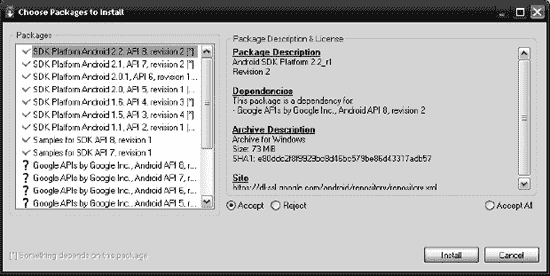

**图 2‑1.** *首次接触 SDK 和 AVD 管理器*

你可以随时使用 SDK 和 AVD 管理器来更新组件或安装新组件。该管理器还用于创建新的 AVD（Android 虚拟设备），这在后续我们开始在模拟器上运行和调试应用时是必需的。

一旦安装过程完成，你就可以继续下一步，设置开发环境了。

### 安装 Eclipse

Eclipse 有多种版本。对于 Android 开发者，我们建议使用 Eclipse for Java Developers 3.6 版本。与 Android SDK 类似，Eclipse 以 ZIP 或 tar.gz 压缩包形式提供。只需将其解压到你选择的文件夹中即可。解压完成后，你可以在桌面上为 Eclipse 安装根目录下的 `eclipse` 可执行文件创建一个快捷方式。

首次启动 Eclipse 时，系统会提示你指定一个工作空间目录。图 2‑2 展示了这个对话框。

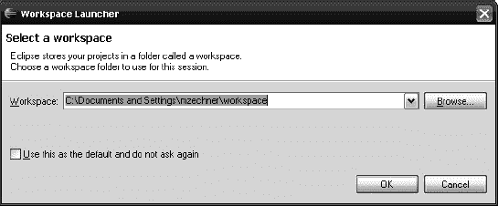

**图 2‑2.** *选择工作空间*

工作空间是 Eclipse 中用来包含一组项目的文件夹。你可以为所有项目使用单个工作空间，也可以使用多个工作空间来分别管理不同的项目组，这完全取决于你。本书附带的示例项目都组织在单个工作空间中，你可以在此对话框中指定该目录。现在，我们只需在某个位置创建一个空的工作空间。

之后，Eclipse 会显示一个欢迎界面，你可以放心地忽略并关闭它。关闭后你将看到默认的 Eclipse Java 透视图。后续章节中你会更深入地了解 Eclipse。目前，让它运行起来就足够了。


### 安装 ADT Eclipse 插件

我们搭建环境配置中的最后一步是安装 ADT Eclipse 插件。Eclipse 基于插件架构，可借助第三方插件扩展其功能。ADT 插件将 Android SDK 中的工具与 Eclipse 的强大功能融为一体。通过这种组合，我们完全可以忘记调用那些命令行式的 Android SDK 工具；ADT 插件将这些工具透明地集成到我们的 Eclipse 工作流程中。

为 Eclipse 安装插件有两种方式：手动安装（将插件 ZIP 文件的内容解压到 Eclipse 的插件文件夹），或通过 Eclipse 自带的插件管理器进行安装。这里我们将选择第二种方式。

1.  要安装新插件，请转到 **帮助 > 安装新软件...**，这将打开安装对话框。在此对话框中，你可以选择安装插件的来源。首先，你需要添加要获取的 ADT 插件的仓库。点击**添加**按钮。系统将显示图 2-3 所示的对话框。
2.  在第一个文本字段中，你可以输入仓库名称，例如“ADT 仓库”即可。第二个文本字段用于指定仓库的 URL。对于 ADT 插件，该字段应填写 `https://dl-ssl.google.com/android/eclipse/`。请注意，此 URL 可能因版本更新而有所不同，因此请务必查看 ADT 插件网站以获取最新链接。

    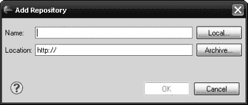

    **图 2-3.** *添加仓库*

3.  确认对话框后，你将返回安装对话框，此时对话框应正在获取仓库中可用插件的列表。勾选**开发者工具**复选框，然后点击**下一步**按钮。
4.  Eclipse 现在将计算所有必要的依赖项，然后会弹出一个新对话框，列出将要安装的所有插件及其依赖项。点击**下一步**按钮确认。
5.  将弹出另一个对话框，提示你接受每个待安装插件的许可协议。当然，你应该接受这些许可协议，最后点击**完成**按钮开始安装。

    **注意：**安装过程中，系统会要求你确认安装未经签名的软件。不必担心，这些插件只是没有经过验证的签名而已。同意安装以继续该过程。

6.  最后，Eclipse 会询问是否应重启以应用更改。你可以选择完全重启，也可以选择不重启而应用更改。为了稳妥起见，请选择**立即重启**，这将按预期重新启动 Eclipse。

Eclipse 重启后，你将看到与之前相同的 Eclipse 窗口。工具栏上增加了几个针对 Android 的新按钮，使你可以直接在 Eclipse 中启动 SDK 和 AVD 管理器，以及创建新的 Android 项目。图 2-4 展示了这些新的工具栏按钮。


**图 2-4.** *ADT 工具栏按钮*

左侧第一个按钮允许你打开 AVD 和 SDK 管理器。下一个按钮是创建新 Android 项目的快捷方式。另外两个按钮将创建新的单元测试项目或 Android 清单文件（这些功能我们在本书中不会用到）。

作为完成 ADT 插件安装的最后一步，你需要告知插件 Android SDK 的位置。

1.  打开**窗口 > 首选项**，在出现的对话框的树形视图中选择**Android**。
2.  在右侧，点击**浏览**按钮，选择你的 Android SDK 安装根目录。
3.  点击**确定**按钮关闭对话框。现在，你就可以创建你的第一个 Android 应用程序了。

### Eclipse 快速导览

Eclipse 是一个开源 IDE，可用于开发用多种语言编写的应用程序。通常，Eclipse 用于 Java 开发。得益于 Eclipse 的插件架构，已经创建了许多扩展，因此也可以开发纯 C/C++、Scala 或 Python 项目。其可能性是无限的；例如，甚至还有用于编写 LaTeX 项目的插件——这与你平常的代码开发任务有些许相似之处。

一个 Eclipse 实例使用一个包含一个或多个项目的工作空间。之前，我们启动时定义了一个工作空间。你创建的所有新项目都将存储在工作空间目录中，同时存储的还有定义了使用该工作空间时 Eclipse 外观的配置以及其他内容。

Eclipse 的用户界面 (UI) 围绕两个概念展开：

*   **视图**：一个独立的 UI 组件，例如源代码编辑器、输出控制台或项目资源管理器。
*   **透视图**：一组特定的视图，通常是你为特定开发任务（例如，编辑和浏览源代码、调试、性能分析、与版本控制仓库同步等）最可能需要用到的。

Eclipse for Java Developers 提供了几个预定义的透视图。我们最感兴趣的两个透视图叫做 `Java` 和 `Debug`。`Java` 透视图如图 2-5 所示。它在左侧显示**包资源管理器**视图，中间是源代码编辑视图（此处为空，因为我们尚未打开源文件），右侧有**任务列表**视图、**大纲**视图，以及一个包含名为**问题**视图、**Javadoc** 视图和**声明**视图等子视图的选项卡式视图。

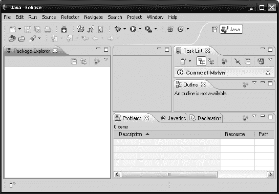

**图 2-5.** *Eclipse 运行中——Java 透视图*

你可以通过拖放自由调整透视图内任何视图的位置，也可以调整视图大小。此外，你还可以向透视图添加或移除视图。要添加视图，请转到**窗口 > 显示视图**，然后从列表中选择一个，或选择**其他...** 以获取所有可用视图的列表。

要切换到其他透视图，你可以转到**窗口 > 打开透视图**，然后选择你想要的。一种在已打开的透视图之间切换的更快方法是在 Eclipse 的左上角。在这里你可以看到哪些透视图已经打开，以及哪个透视图是活动的。在图 2-5 中，请注意 `Java` 透视图是打开且活动的。它是当前唯一打开的透视图。一旦你打开其他透视图，它们也会显示在 UI 的那个部分。

图 2-5 中显示的工具栏也仅是视图。根据你当前所处的透视图，工具栏也可能会发生变化。回想一下，在我们安装 ADT 插件后，工具栏中出现了几个新按钮。这是插件的常见行为：它们通常会增加新的视图和透视图。就 ADT 插件而言，除了标准的 `Java 调试`透视图之外，我们现在还可以访问一个名为 DDMS（Dalvik 调试监控服务，专门用于调试和分析 Android 应用程序）的透视图。ADT 插件还添加了几个新视图，包括 `LogCat` 视图，该视图会显示任何已连接设备或模拟器的实时日志信息。

一旦你熟悉了透视图和视图的概念，Eclipse 就不会那么令人生畏了。在接下来的小节中，我们将探索一些我们将用来编写 Android 游戏的透视图和视图。我们不可能涵盖使用 Eclipse 进行开发的所有细节，因为它是一个庞然大物。因此，我们建议，如有需要，你可以通过其详尽的帮助系统来了解更多关于 Eclipse 的知识。


#### 实用的 Eclipse 快捷键

每个新的集成开发环境都需要一些时间来学习和适应。经过多年使用 Eclipse，我们发现以下快捷键能显著加快软件开发速度。这些快捷键使用的是 Windows 术语，Mac OS X 用户应相应地使用 `Command` 和 `Option` 键代替：

*   将光标放在函数或字段上并按 `Ctrl+Shift+G`，即可在工作空间中搜索对该函数或字段的所有引用。例如，如果你想查看某个函数在哪里被调用，只需点击将光标移到该函数上，然后按 `Ctrl+Shift+G`。
*   将光标放在函数调用上并按 `F3`，即可跟踪该调用并跳转到声明和定义该函数的源代码。将此快捷键与 `Ctrl+Shift+G` 结合使用，可以轻松导航 Java 源代码。
*   `Ctrl+Space` 可自动补全你正在输入的函数或字段名。输入几个字符后按下此快捷键。当有多个可能选项时，会出现一个选择框。
*   `Ctrl+Z` 是撤销。
*   `Ctrl+X` 是剪切。
*   `Ctrl+C` 是复制。
*   `Ctrl+V` 是粘贴。
*   `Ctrl+F11` 用于运行应用程序。
*   `F11` 用于调试应用程序。
*   `Ctrl+Shift+O` 用于组织当前源文件的 Java 导入。
*   `Ctrl+Shift+F` 用于格式化当前源文件。
*   `Ctrl+Shift+T` 用于跳转到任何 Java 类。
*   `Ctrl+Shift+R` 用于跳转到任何资源文件，例如图像、文本文件等。

Eclipse 中还有许多其他有用的功能，但掌握这些基本的键盘快捷键可以显著加快你的游戏开发速度，让 Eclipse 的使用体验更美好。Eclipse 的可配置性也很高。这些键盘快捷键中的任何一个都可以在“首选项”中重新分配给不同的按键。

### 你好，世界：Android 风格

开发环境搭建好后，我们现在可以在 Eclipse 中创建我们的第一个 Android 项目。ADT 插件安装了几个向导，使得创建新的 Android 项目变得非常容易。

#### 创建项目

创建新 Android 项目有两种方法。第一种方法是在包资源管理器视图中右键单击（参见 图 2-4），然后从弹出的菜单中选择 **新建  项目…**。在弹出的对话框中，在“Android”类别下选择“Android 项目”。如你所见，该对话框中还有许多其他创建项目的选项。这是在 Eclipse 中创建任何类型新项目的标准方法。确认对话框后，Android 项目向导将打开。

第二种方法要简单得多：只需单击创建新 Android 项目的按钮（如前面的 图 2-4 所示）。

进入 Android 项目向导对话框后，你需要做出一些决定。

1.  首先，你必须定义项目名称。通常的惯例是使用小写字母。在本例中，将项目命名为“helloworld”。
2.  接下来，你必须指定构建目标。目前，只需选择 Android 1.5 构建目标，因为这是最低共同基准，而且你暂时不需要像多点触控这样高级的功能。

   **注意：** 在第 1 章中，你看到 Android 的每个新版本都会向 Android 框架 API 添加新的类。构建目标指定了你想在应用程序中使用哪个版本的 API。例如，如果你选择 Android 3.1 构建目标，你就可以使用最新、最强大的 API 功能。但这伴随着风险：如果你的应用程序在 API 版本较低的设备（例如运行 Android 1.5 版本的设备）上运行，当你访问仅在版本 3.1 中可用的 API 功能时，应用程序将会崩溃。在这种情况下，你需要在运行时检测支持的 SDK 版本，并且仅在确定设备上的 Android 版本支持此版本时，才访问 3.1 的功能。这听起来可能很麻烦，但正如你将在第 5 章中看到的，只要应用程序架构良好，你就可以轻松启用或禁用特定于某些版本的功能，而无需冒崩溃的风险。

3.  接下来，你需要指定应用程序的名称（例如 `Hello World`）、所有源文件最终所在的 Java 包名称（例如 `com.helloworld`）以及一个活动名称。活动类似于桌面操作系统中的窗口或对话框。我们就把这个活动命名为 `HelloWorldActivity`。
4.  “最低 SDK 版本”字段允许你指定运行应用程序所需的最低 Android 版本。此参数不是必需的，但建议指定。SDK 版本从 1（1.0）开始编号，并随每个新版本递增。由于 1.5 是第三个版本，请在此处指定 3。请记住，你之前必须指定一个构建目标，它可能比最低 SDK 版本更新。这使你可以使用更高的 API 级别，同时也能部署到较旧版本的 Android 上（当然，前提是确保只调用该版本支持的 API 方法）。
5.  点击“完成”来创建你的第一个 Android 项目。

   **注意：** 设置最低 SDK 版本有一些影响。应用程序只能在 Android 版本等于或高于你指定的最低 SDK 版本的设备上运行。当用户通过 Market 应用浏览 Android Market 时，仅会显示具有适当最低 SDK 版本的应用程序。

#### 探索项目

在包资源管理器中，你现在应该会看到一个名为“helloworld”的项目。展开它及其所有子项，你将看到类似 图 2-6 的内容。这是大多数 Android 项目的通用结构。让我们稍微探索一下。

*   `AndroidManifest.xml` 描述你的应用程序。它定义了你的应用程序包含哪些活动和服务，理论上运行在什么最低和目标 Android 版本上，以及需要哪些权限（例如，访问 SD 卡或网络）。
*   `default.properties` 保存构建系统的各种设置。我们不打算修改它，因为 ADT 插件会在必要时自动处理它的修改。
*   `src/` 包含你所有的 Java 源文件。请注意，包名与你之前在 Android 项目向导中指定的名称相同。
*   `gen/` 包含由 Android 构建系统生成的 Java 源文件。你不应该修改它们，因为在某些情况下，它们会自动重新生成。
*   `assets/` 用于存放应用程序所需的文件（例如配置文件、音频文件等）。这些文件会与你的 Android 应用程序打包在一起。
*   `res/` 保存应用程序所需的资源，例如图标、用于国际化的字符串以及通过 XML 定义的 UI 布局。与 assets 一样，这些资源也会与你的应用程序打包在一起。
*   Android 1.5 告诉我们，我们正在针对 Android 1.5 版本目标进行构建。这实际上是一个依赖，以标准 JAR 文件的形式存在，其中包含了 Android 1.5 API 的类。

包资源管理器视图隐藏了另一个目录，名为 `bin/`，它存放着准备部署到设备或模拟器的编译代码。与 `gen/` 文件夹一样，我们通常不关心该文件夹中的内容。

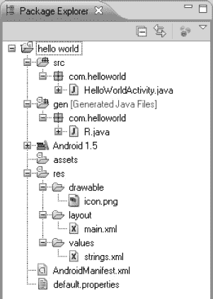

**图 2-6.** *Hello World 项目结构*

我们可以通过在包资源管理器视图中右键单击要放置新资源的文件夹，然后选择“新建”加上要创建的相应资源类型，轻松地添加新的源文件、文件夹和其他资源。不过，目前我们先保持现状。接下来，我们稍微修改一下源代码。


### 编写应用代码

我们还没有编写过一行代码，现在该动手了。Android 项目向导已经为我们创建了一个名为 `HelloWorldActivity` 的模板 Activity 类，当我们在模拟器或设备上运行应用时，这个类将会被显示出来。在 Package Explorer 视图中双击该文件，打开类的源代码。我们将用代码清单 2–1 中的代码替换掉模板代码。

**代码清单 2–1.** `HelloWorldActivity.java`

```java
package com.helloworld;
import android.app.Activity;
import android.os.Bundle;
import android.view.View;
import android.widget.Button;
public class HelloWorldActivity extends Activity
implements View.OnClickListener {
    Button button;
    int touchCount;

    @Override
    public void onCreate(Bundle savedInstanceState) {
        super.onCreate(savedInstanceState);
        button = new Button(this);
        button.setText("Touch me!");
        button.setOnClickListener(this);
        setContentView(button);
    }
    public void onClick(View v) {
        touchCount++;
        button.setText("Touched me " + touchCount + " time(s)");
    }
}
```

我们来剖析一下代码清单 2–1，以便理解它的作用。详细的细节将留到后续章节再讲，现在我们只需要了解大致原理。

源代码文件以标准的 Java 包声明和几个 import 语句开头。大多数 Android 框架类都位于 `android` 包中。

```java
package com.helloworld;

import android.app.Activity;
import android.os.Bundle;
import android.view.View;
import android.widget.Button;
```

接下来，我们定义 `HelloWorldActivity`，并让它继承 Android 框架 API 提供的基类 `Activity`。`Activity` 类似于经典桌面 UI 中的窗口，但有一个限制：`Activity` 总是填满整个屏幕（除了 Android UI 顶部的通知栏）。此外，我们还让 `Activity` 实现 `OnClickListener` 接口。如果你有其他 UI 工具包的使用经验，很可能已经猜到下一步要做什么了。稍后会有更详细的说明。

```java
public class HelloWorldActivity extends Activity
implements View.OnClickListener {
```

我们让 `Activity` 拥有两个成员变量：一个 `Button` 和一个用于记录按钮点击次数的整数。

```java
    Button button;
    int touchCount;
```

每个 `Activity` 都必须实现抽象方法 `Activity.onCreate()`，当 Activity 首次启动时，Android 系统会调用该方法一次。它替代了你通常用来创建类实例的构造函数。在方法体中的第一条语句必须是调用基类的 `onCreate()` 方法。

```java
    @Override
    public void onCreate(Bundle savedInstanceState) {
        super.onCreate(savedInstanceState);
```

接着，我们创建一个 `Button` 并设置其初始文本。`Button` 是 Android 框架 API 提供的众多 Widget 之一。在 Android 中，Widget 与所谓的 `View` 是同义词。注意，`button` 是我们 `HelloWorldActivity` 类的一个成员变量，稍后我们需要引用它。

```java
        button = new Button(this);
        button.setText("Touch me!");
```

`onCreate()` 中的下一行设置了 `Button` 的 `OnClickListener`。`OnClickListener` 是一个回调接口，包含一个方法 `OnClickListener.onClick()`，当 `Button` 被点击时会被调用。我们希望收到点击通知，因此让 `HelloWorldActivity` 实现该接口，并将其注册为 `Button` 的 `OnClickListener`。

```java
        button.setOnClickListener(this);
```

`onCreate()` 方法中的最后一行将 `Button` 设置为 `Activity` 所谓的 content `View`。`View` 是可以嵌套的，而 `Activity` 的 content `View` 是这一层级结构的根节点。在我们的例子中，我们简单地将 `Button` 设置为 `Activity` 要显示的 `View`。为了简单起见，我们不深入讨论在此 content `View` 下 `Activity` 将如何布局的细节。

```java
        setContentView(button);
    }
```

下一步是实现接口要求 `Activity` 提供的 `OnClickListener.onClick()` 方法。每次 `Button` 被点击时，该方法都会被调用。在这个方法中，我们增加 `touchCount` 计数器，并设置 `Button` 的文本为新字符串。

```java
    public void onClick(View v) {
        touchCount++;
        button.setText("Touched me " + touchCount + " time(s)");
    }
}
```

因此，总结一下我们的 `Hello World` 应用：我们构建了一个包含 `Button` 的 `Activity`。每次 `Button` 被点击时，我们通过相应地设置其文本来反映这一操作。（这或许不是世界上最激动人心的应用，但足以用于后续的演示目的。）

请注意，我们从未需要手动编译任何东西。ADT 插件与 Eclipse 协同工作，每当我们添加、修改或删除源文件或资源时，都会重新编译项目。编译过程的结果是一个 APK 文件，可直接部署到模拟器或 Android 设备上。APK 文件位于项目的 `bin/` 文件夹中。

在接下来的小节中，你将使用此应用来学习如何在模拟器实例以及真实设备上运行和调试 Android 应用。

## 运行和调试 Android 应用

编写完第一版应用代码后，我们想要运行并测试它，以便发现潜在问题，或者仅仅是欣赏它的“风采”。我们有两种方式可以实现这一点：

-   在通过 USB 连接到开发电脑的真实设备上运行应用。
-   启动 SDK 中包含的模拟器，并在其中测试应用。

在这两种情况下，我们都需要做一些准备工作，才能最终看到应用运行起来。

### 连接设备

在连接设备进行测试之前，我们必须确保操作系统能够识别它。在 Windows 上，这涉及安装合适的驱动程序，这些驱动程序是我们之前安装的 SDK 的一部分。只需连接你的设备，并按照标准的 Windows 驱动程序安装流程操作，将安装路径指向 SDK 安装根目录下的 `driver/` 文件夹。对于某些设备，你可能需要从制造商网站获取驱动程序。许多设备可以使用 SDK 自带的 Android ADB 驱动程序；然而，通常需要将特定设备的硬件 ID 添加到 INF 文件中。快速搜索设备名称和“Windows ADB”，通常就能找到连接该特定设备所需的信息。

在 Linux 和 Mac OS X 上，通常不需要安装任何驱动程序，因为操作系统已自带。根据你使用的 Linux 发行版，你可能需要稍微调整 USB 设备发现机制，通常是创建一个新的 `udev` 规则文件。这因设备而异。快速进行网络搜索应该就能找到适用于你设备的解决方案。


### 创建安卓虚拟设备

SDK 自带一个模拟器，可运行所谓的安卓虚拟设备。*虚拟设备*包含特定安卓版本的系统镜像、外观以及一组属性，其中包括屏幕分辨率、SD 卡大小等。

要创建 AVD，你必须启动 SDK 和 AVD 管理器。你可以按照之前 SDK 安装步骤中所述的方法操作，或者直接在 Eclipse 中点击工具栏上的 SDK 管理器按钮。

1. 在左侧列表中选择`虚拟设备`。你将看到当前可用的 AVD 列表。除非你已经操作过 SDK 管理器，否则此列表应为空；让我们来改变这一点。
2. 要创建新的 AVD，请点击右侧的`新建…`按钮，这将弹出如图 2–7 所示的对话框。

   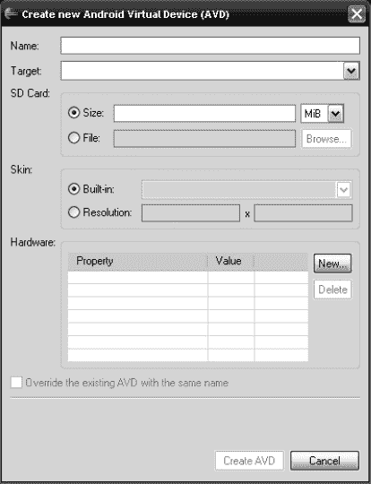

   **图 2–7.** *SDK 管理器的 AVD 创建对话框*

3. 每个 AVD 都有一个名称，供你之后引用。目标平台指定 AVD 应使用的安卓版本。此外，你还可以指定 AVD 的 SD 卡大小和屏幕尺寸。对于简单的“hello world”项目，你可以选择 Android 1.5 目标平台，其他设置保持默认即可。对于实际测试，你通常需要创建多个 AVD，涵盖你希望应用支持的所有安卓版本和屏幕尺寸。

**注意**：除非你拥有十几台不同安卓版本和屏幕尺寸的设备，否则你应该使用模拟器对安卓版本/屏幕尺寸组合进行额外的测试。

### 运行应用程序

现在你已经设置好了设备和 AVD，终于可以运行`Hello World`应用程序了。在 Eclipse 中，你可以轻松实现这一点：在包资源管理器视图中右键点击“hello world”项目，然后选择**运行为  安卓应用程序**（或者点击工具栏上的运行按钮）。然后 Eclipse 将在后台执行以下步骤：

1. 如果自上次编译后有任何文件发生更改，则将项目编译为 APK 文件。
2. 如果尚不存在，则为安卓项目创建新的运行配置。（稍后我们将介绍运行配置。）
3. 通过启动或重用已运行的、具有合适安卓版本的模拟器实例，或者在已连接的设备上部署并运行应用程序（该设备也至少需要运行你在创建项目时指定的最低安卓版本，即 Min SDK Level 参数），来安装并运行该应用程序。

如果你按照上一节的建议只创建了一个 Android 1.5 的 AVD，那么 ADT Eclipse 插件将启动一个运行该 AVD 的新模拟器实例，部署 Hello World APK 文件，然后启动应用程序。输出结果应如图 2–8 所示。

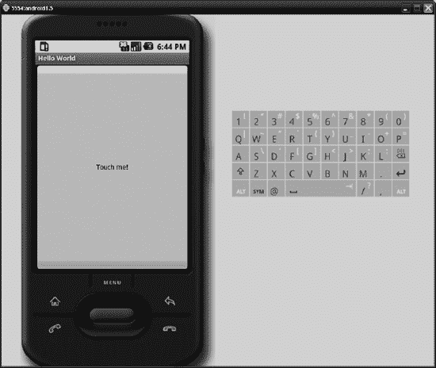

**图 2–8.** *运行中的 Hello World 应用程序*

模拟器的工作方式几乎与真实设备完全相同，你可以通过鼠标像在设备上用*手指*一样与之交互。以下是真实设备与模拟器之间的一些差异：

- 模拟器仅支持单点触控输入。只需使用鼠标光标，将其当作你的手指即可。
- 模拟器缺少一些应用程序，例如安卓市场。
- 要改变屏幕上设备的方向，不要倾斜你的显示器。相反，请使用数字键盘上的 7 键来改变方向。你必须先按下数字键盘上方的`Num Lock`键来禁用其数字功能。
- 模拟器非常慢。不要通过在模拟器上运行来评估应用程序的性能。
- 模拟器目前仅支持带有少量扩展的 OpenGL ES 1.0。我们将在第 7 章中讨论 OpenGL ES。这对我们的目的来说没问题，只是模拟器上的 OpenGL ES 实现存在缺陷，并且它经常给出与实际设备上截然不同的结果。目前，请记住不要在模拟器上测试任何 OpenGL ES 应用程序。

稍微玩转一下它，熟悉熟悉。

**注意**：启动一个新的模拟器实例需要相当长的时间（取决于你的硬件，最多可达 10 分钟）。你可以在整个开发过程中让模拟器保持运行，这样就不必反复重启，或者在创建或编辑 AVD 时勾选“快照”选项，这将允许你保存和恢复 VM 的快照，从而实现快速启动。

有时当我们运行安卓应用程序时，ADT 插件执行的自动模拟器/设备选择会成为一种障碍。例如，我们可能连接了多个设备/模拟器，但想要在特定的设备/模拟器上测试应用程序。为解决这个问题，我们可以在安卓项目的运行配置中关闭自动设备/模拟器选择。那么，什么是运行配置呢？

运行配置提供了一种方式，告诉 Eclipse 当你让它运行应用程序时应该如何启动你的程序。运行配置通常允许你指定传递给应用程序的命令行参数、VM 参数（针对 Java SE 桌面应用程序的情况）等等。Eclipse 和第三方插件为特定类型的项目提供了不同的运行配置。ADT 插件在可用的运行配置集中添加了一个安卓应用程序运行配置。当我们在本章前面首次运行应用程序时，Eclipse 和 ADT 使用默认参数在后台为我们创建了一个新的安卓应用程序运行配置。

要进入安卓项目的运行配置，请执行以下操作：

1. 在包资源管理器视图中右键点击项目，选择**运行为  运行配置。**
2. 从左侧列表中选择“hello world”项目。
3. 在对话框的右侧，你现在可以修改运行配置的名称，并在安卓、目标和通用选项卡上更改其他设置。
4. 要将自动部署更改为手动部署，请点击`目标`选项卡并选择`手动`。

当你再次运行应用程序时，系统会提示你选择一个兼容的模拟器或设备来运行该应用程序。图 2–9 显示了此对话框。在此图中，我们添加了几个具有不同目标平台的 AVD，并连接了两台设备。

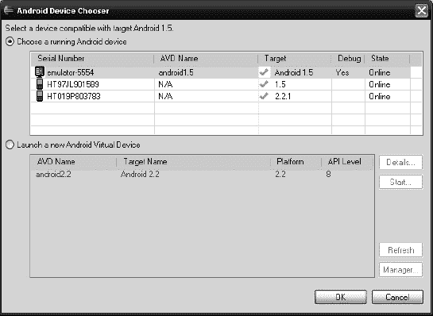

**图 2–9.** *选择运行应用程序的模拟器/设备*

该对话框显示了所有正在运行的模拟器和当前已连接的设备，以及所有其他当前未运行的 AVD。你可以选择任何模拟器或设备来运行你的应用程序。


### 调试应用程序

有时你的应用程序会出现意外行为或崩溃。要弄清究竟哪里出了问题，你需要能够调试应用程序。

`Eclipse` 和 `ADT` 为 Android 应用程序提供了极其强大的调试功能。我们可以在源代码中设置断点，检查变量和当前堆栈跟踪，等等。

在调试应用程序之前，我们必须修改其 `AndroidManifest.xml` 文件以启用调试。这有点像是先有鸡还是先有蛋的问题，因为我们还没有详细研究过清单文件。目前，你只需知道清单文件指定了应用程序的一些属性。其中一个属性就是应用程序是否可调试。该属性以 `xml` 属性的形式在清单文件的 `<application>` 标签中指定。要启用调试，我们在清单文件的 `<application>` 标签中添加以下属性：

`android:debuggable="true"`

在开发应用程序期间，你可以安全地将该属性保留在清单文件中。但在发布应用程序到市场之前，别忘了删除该属性。

现在你已经将应用程序设置为可调试状态，就可以在模拟器或设备上进行调试了。通常，你会在调试前设置断点，以便在程序的特定点检查程序状态。

要设置断点，只需在 `Eclipse` 中打开源文件，然后双击你想要设置断点那一行前面的灰色区域。为了演示，我们在 `HelloWorldActivity` 类的第 23 行执行此操作。这将使调试器每次点击按钮时暂停。在双击后，源代码视图应该会显示那一行前面出现一个小圆圈，如图 2–10 所示。你可以通过在源代码视图中再次双击断点来移除它们。

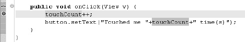

**图 2–10.** *设置断点*

启动调试与运行应用程序非常相似，如上一节所述。在包资源管理器视图中右键点击项目，然后选择 **调试方式**  **Android 应用程序**。这将为你的项目创建一个新的调试配置，就像直接运行应用程序一样。你可以通过从上下文菜单中选择 **调试方式**  **调试配置** 来更改该调试配置的默认设置。

**注意：** 除了通过包资源管理器视图中的项目上下文菜单，你也可以使用“运行”菜单来运行和调试应用程序，以及访问配置。

如果你启动第一次调试会话，`Eclipse` 会询问你是否要切换到调试透视图，你可以确认。我们先来看看这个透视图。图 2–11 展示了我们开始调试 `Hello World` 应用程序后的样子。

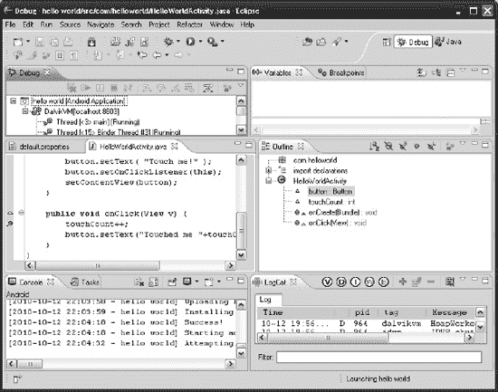

**图 2–11.** *调试透视图*

如果你还记得我们对 `Eclipse` 的快速浏览，那么你就会知道有几种不同的透视图，它们由一组针对特定任务的视图组成。调试透视图与 Java 透视图看起来截然不同。

-   第一个要注意的新视图是左上角的调试视图。它显示所有当前正在运行的应用程序，如果应用程序以调试模式运行，还会显示其所有线程的堆栈跟踪。
-   调试视图下方是我们在 Java 透视图中也使用过的源代码编辑视图。
-   控制台视图会打印来自 `ADT` 插件的消息，告诉我们它在做什么。
-   `LogCat` 视图将是你开发之旅中的最佳助手之一。此视图显示运行你应用程序的模拟器/设备的日志输出。这些日志输出来自系统组件、其他应用程序以及你自己的应用程序。当你的应用程序崩溃时，`LogCat` 视图会显示堆栈跟踪，并且还允许你在运行时输出自己的日志消息。我们将在下一节更详细地了解 `LogCat`。
-   大纲视图在调试透视图中不是很有用。你通常关心的是断点、变量以及调试时程序暂停的当前行。我们经常从调试透视图中移除大纲视图，以便为其他视图留出更多空间。
-   变量视图对于调试目的特别有用。当调试器遇到断点时，你将能够检查并修改程序当前作用域中的变量。
-   最后，断点视图显示了你到目前为止设置的所有断点列表。

如果你好奇的话，可能已经点击了正在运行应用程序中的按钮，看看调试器如何反应。它会停在第 23 行，正如我们通过在那里设置断点所指示的那样。你还会注意到，变量视图现在显示了当前作用域中的变量，其中包括活动本身（`this`）和方法的参数（`v`）。你可以通过展开变量来进一步深入查看。

调试视图显示了从当前堆栈向下到你当前所在方法的堆栈跟踪。请注意，你可能运行了多个线程，并且可以在调试视图中随时暂停它们。

最后，注意我们设置断点的那一行被高亮显示了，这表示程序当前在代码中暂停的位置。

你可以指示调试器执行当前语句（按 `F6`）、单步进入当前方法中调用的任何方法（按 `F5`），或者正常继续程序执行（按 `F8`）。或者，你也可以使用“运行”菜单上的项目来实现相同的操作。此外，请注意，还有比我们刚才提到的更多的单步执行选项。与所有事情一样，我们建议你进行实验，看看哪些方法对你有用，哪些没有。

**注意：** 好奇心是成功开发 Android 游戏的基石。你必须深入了解你的开发环境才能充分利用它。本书篇幅有限，无法解释 `Eclipse` 的所有细枝末节，因此我们鼓励你进行实验。


#### `LogCat` 与 `DDMS`

ADT Eclipse 插件安装了许多可在 Eclipse 中使用的新视图和透视图。其中最有用的视图之一是`LogCat`视图，我们在上一节中简要介绍过。

`LogCat`是 Android 事件日志系统，允许系统组件和应用程序输出有关不同日志级别的日志信息。每条日志条目由时间戳、日志级别、日志来源的进程 ID、应用程序自身定义的标签以及实际日志消息组成。

`LogCat`视图会从连接的模拟器或设备收集并显示这些信息。图 2–12 展示了`LogCat`视图的一些示例输出。

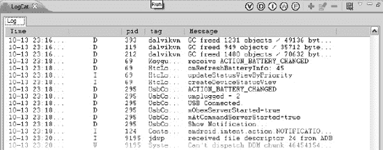

**图 2–12.** *LogCat 视图*

请注意，`LogCat`视图的右上角有许多按钮。

- 前五个按钮允许你选择要显示的日志级别。
- 绿色加号按钮让你可以根据标签、进程 ID 和日志级别定义过滤器，这在你想只显示自己应用程序的日志输出时（应用程序可能会使用特定标签进行日志记录）非常有用。
- 其他按钮允许你编辑过滤器、删除过滤器或清除当前输出。

如果当前连接了多个设备和模拟器，则`LogCat`视图只会输出其中一个的日志数据。为了获得更精细的控制和更多检查选项，你可以切换到`DDMS`透视图。

`DDMS`（Dalvik 调试监视服务器）提供了关于所有连接设备上运行的进程和 Dalvik 虚拟机的大量深入信息。你可以随时通过**窗口** → **打开透视图** → **其他** → **DDMS** 切换到`DDMS`透视图。图 2–13 展示了`DDMS`透视图的通常外观。

一如既往，有几个特定的视图适合我们当前的任务。在这种情况下，我们希望收集有关所有进程、它们的虚拟机和线程、堆的当前状态、关于特定连接设备的`LogCat`信息等等。

- **设备视图**显示所有当前连接的模拟器和设备，以及它们上运行的所有进程。通过此视图的工具栏按钮，你可以执行各种操作，包括调试选中的进程、记录堆和线程信息，以及截取屏幕截图。
- `LogCat`视图与上一个透视图中的相同，区别在于它将显示当前在设备视图中选中的设备的输出。
- **模拟器控制视图**允许你更改正在运行的模拟器实例的行为。例如，你可以强制模拟器伪造 GPS 坐标用于测试。

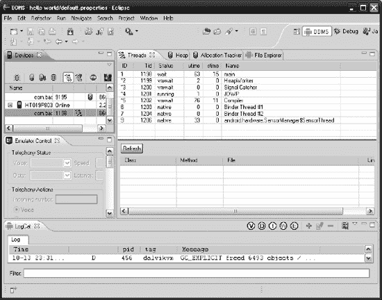

**图 2–13.** *运行中的 DDMS*

- **线程视图**显示有关在设备视图中当前选中的进程上运行的线程的信息。只有当你启用线程跟踪时，线程视图才会显示这些信息，这可以通过单击设备视图中左起第五个按钮来实现。
- **堆视图**（未在图 2–13 中显示）提供关于设备上堆状态的信息。与线程信息一样，你必须在设备视图中通过单击左起第二个按钮明确启用堆跟踪。
- **分配跟踪器视图**显示在过去一段时间内哪些类被分配最多。此视图是查找内存泄漏的绝佳方式。
- 最后，还有**文件资源管理器视图**，它允许你修改连接的 Android 设备或模拟器实例上的文件。你可以像使用标准操作系统文件资源管理器一样，将文件拖放到此视图中。

`DDMS`实际上是一个独立的工具，通过 ADT 插件与 Eclipse 集成。你也可以从`$ANDROID_HOME/tools`目录（在 Windows 上是`%ANDROID_HOME%/tools`）以独立应用程序的形式启动`DDMS`。`DDMS`并不直接连接到设备，而是使用 Android 调试桥（ADB），这是 SDK 中包含的另一个工具。让我们看一下 ADB，以完善你对 Android 开发环境的了解。

## 使用 ADB

ADB 允许你管理连接的设备和模拟器实例。它实际上由三个组件组成：

- 一个运行在开发机器上的**客户端**，你可以通过从命令行发出命令`adb`（如果你按照之前所述设置了环境变量，这应该可以工作）来启动它。当我们谈论 ADB 时，我们指的是这个命令行程序。
- 一个同样运行在你开发机器上的**服务器**。该服务器作为后台服务安装，负责 ADB 程序实例与任何连接的设备或模拟器实例之间的通信。
- **ADB 守护进程**，它同样作为后台进程运行在每个模拟器和设备上。ADB 服务器连接到这个守护进程进行通信。

通常，我们通过`DDMS`透明地使用 ADB，而忽略它作为命令行工具的存在。有时 ADB 对于一些小任务来说很方便，所以让我们快速了解一下它的一些功能。

**注意：** 请查看 Android 开发者网站 [`http://developer.android.com`](http://developer.android.com) 上的 ADB 文档，以获取可用命令的完整参考列表。

使用 ADB 执行的一个非常有用的任务是查询连接到 ADB 服务器（因此也就是连接到你的开发机器）的所有设备和模拟器。为此，请在命令行上执行以下命令（注意，> 不是命令的一部分）。

```
adb devices
```

这会打印出所有连接的设备和模拟器及其各自的序列号的列表，类似于以下输出：

```
List of devices attached
HT97JL901589    device
HT019P803783    device
```

设备或模拟器的序列号用于针对其执行后续特定命令。以下命令会将位于开发机器上一个名为`myapp.apk`的 APK 文件安装到序列号为`HT019P803783`的设备上。

```
adb –s HT019P803783 install myapp.apk
```

`–s`参数可以与任何针对特定设备执行操作的 ADB 命令一起使用。

还有一些命令可以将文件复制到设备或模拟器，以及从设备或模拟器复制文件。以下命令将一个名为`myfile.txt`的本地文件复制到序列号为`HT019P803783`的设备的 SD 卡上。

```
adb –s HT019P803783 push myfile.txt  /sdcard/myfile.txt
```

要从 SD 卡中拉取一个名为`myfile.txt`的文件，你可以发出以下命令：

```
adb pull /sdcard/myfile.txt myfile.txt
```

如果当前只有一个设备或模拟器连接到 ADB 服务器，你可以省略序列号。`adb`工具会自动为你定位到连接的设备或模拟器。

当然，ADB 工具提供了更多可能性。大部分功能都通过`DDMS`暴露出来，我们通常会使用`DDMS`而不是命令行。不过，对于快速任务来说，命令行工具是很理想的。


### 摘要

Android 开发环境有时会让人望而生畏。幸运的是，你只需要掌握其中一部分可用选项就能入门，本章最后几页应该已经为你提供了足够的信息，让你能够开始编写一些基础代码了。

本章最重要的收获在于理解各个组成部分如何协同工作。JDK 和 Android SDK 为所有 Android 开发提供了基础。它们提供了编译、部署以及在模拟器实例和真实设备上运行应用程序的工具。为了加快开发速度，我们使用 Eclipse 以及 ADT 插件，这个插件替我们完成了原本需要在命令行中使用 JDK 和 SDK 工具才能完成的所有繁重工作。Eclipse 本身建立在几个核心概念之上：管理项目的**工作区**；提供特定功能（如源码编辑或 LogCat 输出）的**视图**；为特定任务（如调试）将相关视图整合在一起的**透视图**；以及允许你指定运行或调试应用程序时所用启动设置的**运行和调试配置**。

掌握这一切的秘诀在于实践，尽管这听起来可能很枯燥。在本书中，我们将实现几个项目，这些项目应该能让你对 Android 开发环境更加得心应手。不过，归根结底，能否更进一步，还要靠你自己。

有了这些信息，你就可以开始阅读本书的初衷了：开发游戏。

## 第 3 章

## 游戏开发入门

游戏开发很难——这并非因为它是什么高深莫测的学问，而是因为在你真正开始编写梦想中的游戏之前，需要消化大量的信息。在编程方面，你不得不处理诸如文件输入/输出（I/O）、输入处理、音频和图形编程以及网络代码等琐碎事务。而这些还只是基础！在此之上，你需要构建实际的游戏机制。实现这些机制的代码也需要结构清晰，而如何创建游戏的架构并不总是显而易见的。你实际上必须决定如何让游戏世界动起来。不使用物理引擎，而是自己编写简单的模拟代码，这样行得通吗？游戏世界的单位和比例应该如何设定？它又是如何映射到屏幕上的？

实际上，还有一个许多初学者会忽视的问题，那就是在开始动手编码之前，你首先需要设计你的游戏。无数的项目从未见光，就卡在了技术演示阶段，原因就在于从未清楚想过游戏最终应该如何运作。我指的不是普通第一人称射击游戏的基本游戏机制。那部分是简单的：WASD 键加鼠标，就搞定了。你需要问自己这些问题：是否有启动画面？它之后如何过渡？主菜单屏幕上有什么？在游戏的实际屏幕上，有哪些抬头显示元素？如果我按下暂停按钮会发生什么？设置屏幕应该提供哪些选项？我的界面设计在不同屏幕尺寸和宽高比下如何呈现？

有趣的是，这里没有万能的灵丹妙药；也没有标准方法可以解决所有这些问题。我们不会假装能给你一套一劳永逸的解决方案。相反，我们将尝试说明我们通常如何着手设计一个游戏。你可以选择完全采用，或根据自身需求进行调整。没有规则——只要对你有用就行。但是，无论是在代码中还是在纸面上，你都应始终力求简单的解决方案。

### 游戏类型：各有所爱

在项目开始时，你通常要决定游戏所属的类型。除非你提出的是全新且前所未见的创意，否则你的游戏创意很可能会归入当前流行的几种主流类型之一。大多数类型都有既定的游戏机制标准（例如，控制方案、特定目标等）。偏离这些标准可能会让游戏大获成功，因为玩家总是渴望新鲜事物。但这也可能带来巨大风险，因此要仔细考虑，你的新平台跳跃游戏/第一人称射击游戏/即时策略游戏是否真的有受众。

让我们来看看 Android 市场上一些更受欢迎类型的例子。

#### 休闲游戏

Android 市场上可能最大的游戏细分市场是由所谓的**休闲游戏**组成的。那么究竟什么是休闲游戏？这个问题没有具体的答案，但休闲游戏有一些共同特征。通常，它们具有极佳的可玩性，即使不是游戏玩家也能轻松上手，这极大地增加了潜在玩家群体。游戏单次体验通常最长只需几分钟。然而，休闲游戏简单玩法所蕴含的成瘾性常常能让玩家沉迷数小时。实际的游戏机制范围广泛，从极其简单的益智游戏到一键式平台跳跃游戏，再到像把纸球扔进篮筐这样简单的事情。由于休闲游戏类型的定义模糊，其可能性是无穷无尽的。

*《绑架》* 和 *《绑架 2》*（图 3–1），由一人工作室 Psym Mobile 开发，是完美的休闲游戏例子。它属于“跳跃游戏”的子类型（至少我是这么称呼它的）。游戏的目标是引导不断跳跃的奶牛从一个平台到另一个平台，并到达关卡顶部。在上升途中，你将面对破碎的平台、尖刺和会飞的敌人。你可以拾取能帮助你到达顶部的强化道具等等。你通过倾斜手机来控制奶牛，从而影响它跳跃/下落的方向。易于理解的操控、清晰的目标和可爱的图形使这款游戏成为 Android 市场上的首批热门作品之一。

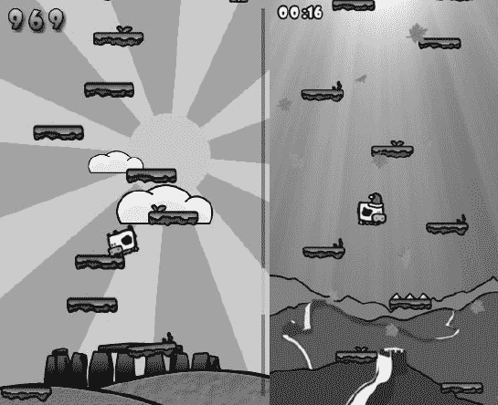

**图 3–1.** *《绑架》（左）和《绑架 2》（右），由 Psym Mobile 开发*

*《抗原》*（图 3–2），由 Battery Powered Games LLC 开发，则完全是另一种类型的游戏。这款游戏是由本书的一位合著者开发的，不过我们提及它并非为了宣传，而是因为它遵循了我们在本书中概述的某些输入和兼容性方法。在《抗原》中，你扮演一名抗体，对抗各种不同的病毒。这款游戏实际上是一个混合型动作益智游戏。你通过屏幕上的方向键和右上角的旋转按钮来控制抗体。你的抗体每侧都有一组连接器，可以让你连接到病毒并将其摧毁。虽然《绑架》仅通过加速度计实现单一输入机制，但《抗原》的操控要复杂一些。并非所有设备都支持多点触控，因此我们为所有可能的设备设计了几种输入方案；Zeemote 手柄控制就是其中之一。为了接触到尽可能广泛的受众，我们特别确保游戏即使在 320×240 像素屏幕的低端设备上也能运行，同时它也能很好地适配到运行在 1280×800 分辨率下的现代平板电脑上。


**图 3–2.** *《抗原》，由 Battery Powered Games LLC 开发*

要列出休闲游戏类别下所有可能的子类型，恐怕就能填满本书的大部分篇幅。在这个类型中还可以找到更多创新的游戏概念，值得去市场上的相应类别中看看，以获取一些灵感。


#### 益智游戏

益智游戏无需多言。我们都熟知像 *《俄罗斯方块》* 和 *《宝石迷阵》* 这样的优秀游戏。它们是 Android 游戏市场的重要组成部分，并且深受各年龄段人群的喜爱。与 PC 端通常只是将三个同色或同形物体放在一起的益智游戏不同，Android 上的许多益智游戏背离了经典的三消模式，采用了更精细、基于物理引擎的谜题。

*《超级堆叠》*（图 3–3）是一款出色的物理益智游戏范例。游戏的目标是通过触摸来移除方块，并让方块顶部的星星安全地落到最底层的平台上。虽然这听起来相当简单，但在后面的关卡中会变得相当复杂。该游戏由 `Box2D`（一个 2D 物理引擎）驱动。


**图 3–3.** *《超级堆叠》，Camel Games 出品*

*《连接》*（图 3–4），由 `BitLogik` 开发，是一款极简但有趣的脑筋急转弯小游戏。目标是用一条线连接图形中的所有点。计算机科学专业的学生可能会认出这是一个熟悉的问题。

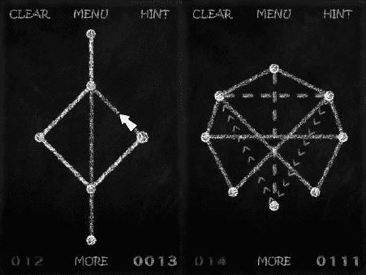

**图 3–4.** *《连接》，BitLogik 出品*

当然，你也能在市场上找到各种《俄罗斯方块》的克隆版、三消游戏以及其他标准模式的游戏。这里列出的游戏表明，益智游戏完全可以不只是对某个 20 年前概念的又一次克隆。

#### 动作与街机游戏

动作与街机游戏通常能充分发挥 Android 平台的潜力。其中许多游戏拥有令人惊叹的 3D 视觉效果，展示了在当前硬件上可以实现的效果。这一类型包含众多子类，包括赛车游戏、射击游戏、第一人称和第三人称射击游戏以及平台游戏。Android 市场的这一细分领域仍然有些欠发达，因为拥有资源来制作这类大作的大公司对于加入 Android 阵营犹豫不决。不过，一些独立开发者已经主动承担起填补这一空白的责任。

*《复制岛》*（图 3–5）可能是迄今为止 Android 上最成功的平台游戏。它由前谷歌工程师兼游戏开发倡导者 Chris Pruett 开发，旨在证明人们可以用纯 Java 在 Android 上编写高性能游戏。该游戏通过提供多种输入方案来适应所有潜在的设备配置。开发过程中特别注意了即使在低端设备上也能良好运行。游戏本身讲述的是一个机器人奉命取回一件神秘物品的故事。游戏机制类似于老式的 SNES 16 位平台游戏。在标准设置中，通过加速度计和两个按钮来控制机器人：一个按钮用于启动推进器跳过障碍，另一个用于从上方踩踏敌人。该游戏还是开源的，这是另一个优点。

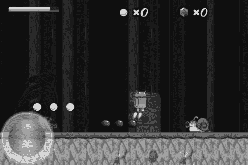

**图 3–5.** *《复制岛》，Chris Pruett 开发*

*《Exzeus》*（图 3–6），由 `HyperDevBox` 开发，是一款经典的轨道射击游戏，继承了 SNES 上《星际火狐》的风格，但拥有高保真的 3D 图形。这款游戏应有尽有：不同的武器、能量增强道具、强大的 Boss 战以及大量可射击的目标。与许多其他 3D 游戏一样，该游戏旨在高端设备上运行。主角通过倾斜屏幕和屏幕上的按钮来控制——对于这类游戏来说，这是一种相当直观的控制方案。

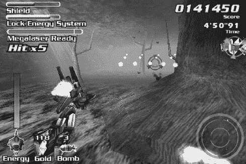

**图 3–6.** *《Exzeus》，HyperDevBox 出品*

*《致命密室》*（图 3–7），由 Battery Powered Games LLC 开发，是一款第三人称射击游戏，风格类似《毁灭战士》和《雷神之锤》等经典作品。与《Antigen》一样，这款游戏也是由本书的一位合著者开发的。我们提到它是为了与《Exzeus》进行对比。该游戏是第三人称/第一人称射击游戏的混合体，具有完整的 `OpenGL ES` 3D 动画图形、枪支、爆炸效果以及你对这类游戏所期待的一切。与多数只能在最新硬件上运行的同类型游戏不同，我们非常注意使其即使在 Hero 和 G1 等低端设备上也能运行。该游戏还提供了多种输入方案，因此你可以在单点触摸屏、多点触摸屏、键盘以及 Zeemote JS1 上玩这款游戏。从技术上讲，这款游戏是一项重大成就，尤其是考虑到它是由一个人在大约六个月内编程完成的，并且可以在 G1 手机上流畅运行。

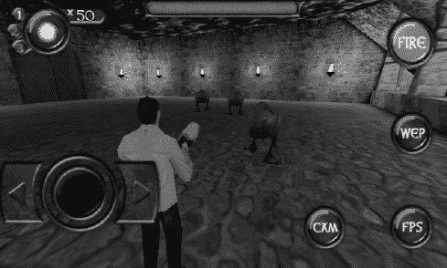

**图 3–7.** *《致命密室》，Battery Powered Games LLC 出品*

*《光辉》*（图 3–8），由 `Hexage` 开发，代表了从旧的《太空侵略者》概念出发的一次杰出的进化。游戏没有提供静态的战场，而是呈现了横向卷轴关卡，并且在关卡和敌人设计上具有相当的多样性。你通过倾斜手机来控制飞船，并且可以用击败敌人获得的积分购买新武器来升级飞船的武器系统。半像素化的图形风格赋予了这款游戏独特的外观和感觉，同时也唤起了对旧时光的回忆。

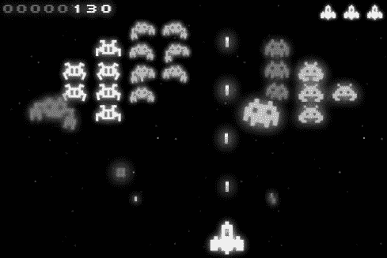

**图 3–8.** *《光辉》，Hexage 出品*

动作与街机类游戏在市场上仍然有些代表性不足。玩家们渴望优秀的动作游戏，所以也许这就是你的机会！

#### 塔防游戏

鉴于它们在 Android 平台上的巨大成功，我们觉得有必要将塔防游戏作为一个独立的类型来讨论。塔防游戏最初是由模组社区开发的 PC 实时战略游戏的一个变种，并因此流行起来。这个概念很快被移植成了独立游戏。塔防游戏目前是 Android 上最畅销的游戏类型。

在一款典型的塔防游戏中，通常是一股邪恶力量会一波一波地派出怪物来攻击你的城堡/基地/水晶/等等。你的任务是通过在地图上的特定位置放置防御炮塔来射击来袭的敌人来保卫该区域。每杀死一个敌人，你通常会获得一些金钱或积分，你可以用来投资新的炮塔或升级。这个概念极其简单，但要想平衡好这类游戏却相当困难。

*《机器人防御》*（图 3–9），由 Lupis Labs Software 开发，是 Android 平台上所有塔防游戏的鼻祖。在 Android 大部分生命周期里，它一直占据着市场付费游戏榜首的位置。该游戏遵循标准的塔防模式，没有任何花哨的装饰。这是一个简单直接且容易让人上瘾的塔防游戏实现，拥有不同的可平移地图、成就和高分榜。其呈现方式足以传达游戏概念，但并不出众，这进一步证明了一款畅销游戏未必需要拥有顶尖的图形和音频效果。

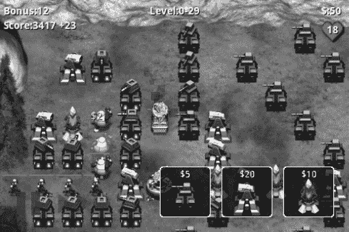

**图 3–9.** *《机器人防御》，Lupis Labs Software 出品*


### 创新

有些游戏无法简单归入某一类别。它们利用安卓设备的新功能和特性（如摄像头或 GPS）来创造全新体验。这批创新游戏具有社交属性和地理位置感知功能，甚至引入了增强现实领域的某些元素。

*SpecTrek*（图 3–10）是第二届安卓开发者挑战赛的优胜作品之一。游戏目标是在开启 GPS 的情况下四处游走，寻找鬼魂并用摄像头捕捉它们。鬼魂只是叠加在摄像头视图上，玩家的任务是将它们保持在焦点中，并按下`捕捉`按钮来得分。


**图 3–10.** *SpecTrek，由 SpecTrekking.com 出品*

*Apparatus*（图 3–11）是一款曾在安卓平板电脑上登场的游戏。它在许多先前的物理益智游戏基础上进行了创新，其执行方式让玩家不由自主地沉迷于通过创造目标机器来解谜。它使用了简单但赏心悦目的 3D 图形，并且能在从 Android 1.6 起的几乎所有设备上运行。

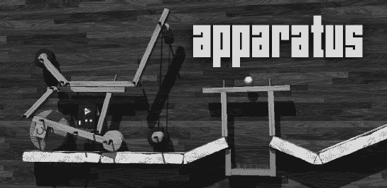

**图 3–11.** *Apparatus，由 BitHack 出品*

许多新游戏、创意、类型和应用起初看起来并不像游戏，但它们确实是。因此，进入安卓市场时，很难精准界定当下什么是创新。我们见过将平板作为游戏主机，连接电视，再通过蓝牙连接多部安卓手机作为控制器的游戏。休闲社交游戏已经流行了相当长一段时间，许多最初在苹果平台上的热门作品也已移植到安卓。所有可能的创意都已被开发殆尽了吗？绝非如此！对于愿意承担风险尝试新游戏创意的开发者而言，总有未被开拓的市场和游戏创意等待发掘。硬件性能日益提升，这为之前因 CPU 算力不足而无法实现的全新可能性打开了大门。

那么，既然你已经了解安卓平台已有的游戏，我们建议你打开市场应用，查看前面介绍的一些游戏。注意它们的结构（例如，哪些界面会跳转到哪些界面，按钮的功能，游戏元素如何互动等）。通过以分析性思维玩游戏，你就能获得对这些要素的感知。暂时抛开娱乐因素，专注于解构游戏。完成后，再回来继续阅读。我们将要在纸上设计一个非常简单的游戏。

### 游戏设计：笔胜于代码

如前所述，打开集成开发环境（IDE）直接拼凑出一个炫酷技术演示确实很有诱惑力。如果你想原型化实验性的游戏机制并验证其可行性，这并无不可。但一旦完成，请丢弃原型。拿起笔和纸，坐在舒适的椅子上，认真思考游戏所有的高层方面。暂时不要关注技术细节——这些稍后再做。现在，你需要专注于设计游戏的用户体验。最佳方式是通过草拟以下内容：

*   核心游戏机制，包括关卡概念（如适用）。
*   包含主要角色的粗略背景故事。
*   物品、道具或其他可修改角色、机制或环境的元素列表（如适用）。
*   基于背景故事和角色的图形风格草图。
*   所有涉及界面的草图，以及界面间转换的示意图和触发条件（例如，游戏结束状态）。

如果你翻阅过目录，就会知道我们将在安卓上实现*贪吃蛇*。*贪吃蛇*是移动市场有史以来最受欢迎的游戏之一。如果你还不了解*贪吃蛇*，请在继续阅读前上网查一下。我在这里等着……

欢迎回来。既然你已经知道*贪吃蛇*是怎么回事，我们就假设这是我们自己想到的创意，并开始为其设计布局。先从游戏机制开始。

### 核心游戏机制

开始前，列出我们需要的东西：

*   一把剪刀
*   书写工具
*   大量纸张

在游戏设计的这个阶段，一切都是变动的目标。我们建议你，与其在 Paint、Gimp 或 Photoshop 中精心制作精美图片，不如用纸制作基本构建块，并在桌子上重新排列直到合适为止。你可以轻松地在实体上进行修改，而无需与笨拙的鼠标较劲。一旦对纸质设计满意后，可以拍照或扫描设计以便日后参考。让我们开始创建核心游戏界面的这些基本块。图 3–12 展示了我们为核心游戏机制所需的版本。

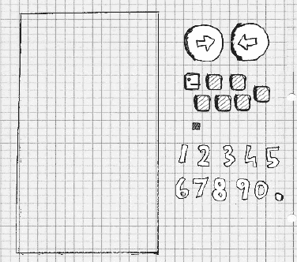

**图 3–12.** *游戏设计构建块*

最左边的矩形是我们的屏幕，大约相当于 Nexus One 屏幕的大小。我们将把所有其他元素放在上面。接下来的构建块是两个用于控制蛇的按钮。最后是蛇头、几节尾巴和它可以吃的一个块。我们还写下了一些数字并剪了下来。这些将用于显示分数。图 3–13 展示了我们对初始游戏区域的构想。

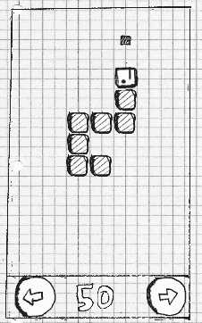

**图 3–13.** *初始游戏区域*

让我们定义游戏机制：

*   蛇沿着头部所指方向前进，并拖拽其尾部。头部和尾部由大小相同、视觉差异不大的部分构成。
*   如果蛇超出屏幕边界，它从对侧重新进入屏幕。
*   如果按下右或左按钮，蛇会顺时针（右转）或逆时针（左转）转 90 度。
*   如果蛇撞到自己（例如，其尾部的一部分），游戏结束。
*   如果蛇的头部撞到一个块，该块消失，分数增加 10 分，并在游戏区域中未被蛇占据的位置出现一个新块。蛇还会增加一节尾巴。新尾巴会附着在蛇的末端。

对于如此简单的游戏来说，这已经是相当复杂的描述了。请注意，我们大致按复杂度递增的顺序排列了这些条目。蛇在游戏区域吃到块时的行为可能是最复杂的。当然，更复杂的游戏无法用如此简洁的方式描述。通常，你会将这些拆分成独立部分，分别设计，最后在流程的最终整合步骤中将它们连接起来。

最后一条游戏机制意味着：由于屏幕上的所有空间最终都会被蛇占据，游戏终将结束。

既然我们完全原创的游戏机制创意看起来不错，接下来尝试为它构思一个背景故事吧。


#### 故事与美术风格

虽然一个包含僵尸、飞船、矮人和大量爆炸场面的史诗故事会很有趣，但我们不得不意识到资源是有限的。我们的绘画技巧，如图 3-12 所示，实在有些欠缺。就算性命攸关，我们也画不出僵尸。于是，我们做了任何有自尊心的独立游戏开发者都会做的事：采用涂鸦风格，并据此调整背景设定。

欢迎来到诺姆先生的世界。诺姆先生是一条纸蛇，他总是渴望吞食从纸张大陆上某个未知源头滴落下来的墨水渍。诺姆先生无比自私，他只有一个不那么崇高的目标：成为世界上体型最大的、充满墨水的纸蛇！

这个小小的背景故事让我们可以进一步定义几件事：

*   美术风格为涂鸦风格。我们稍后会将构建模块扫描进电脑，作为游戏中的图形资源使用。
*   由于诺姆先生是一个个人主义者，我们会稍微修改他方块化的外观，给他加上一张像样的蛇脸和一顶帽子。
*   可食用的方块将变成一组墨水渍。
*   我们会通过让诺姆先生在每次吞食墨水渍时发出咕噜声，来打造游戏的音频效果。
*   我们不会采用“涂鸦蛇”这样乏味的标题，而是将游戏命名为“诺姆先生”，一个更有趣的名字。

图 3-14 展示了全副武装的诺姆先生，以及一些将取代原始方块的墨水渍。我们还草绘了一个涂鸦风格的“诺姆先生”标志，可以在整个游戏中复用。


**图 3-14.** *诺姆先生、他的帽子、墨水渍以及标志*

#### 屏幕与转场

在确定了游戏机制、背景故事、角色和美术风格后，我们现在可以设计游戏屏幕以及它们之间的转场效果了。不过，首先需要准确理解屏幕的构成：

*   屏幕是填充整个显示的原子单元，负责游戏中恰好一个部分（例如，主菜单、设置菜单或进行操作的游戏屏幕）。
*   屏幕可以由多个组件组成（例如，按钮、控件、抬头显示或游戏世界的渲染）。
*   屏幕允许用户与屏幕上的元素交互。这些交互可以触发屏幕转场（例如，在主菜单按下“新游戏”按钮，可以将当前活跃的主菜单屏幕切换为游戏屏幕或关卡选择屏幕）。

有了这些定义，我们就可以开动脑筋，设计诺姆先生游戏的所有屏幕了。

游戏向玩家呈现的第一件事是主菜单屏幕。一个好的主菜单屏幕应该包含什么？

*   原则上来说，显示游戏名称是个好主意，所以我们会放上诺姆先生的标志。
*   为了让画面看起来更统一，我们还需要一个背景。我们将复用游戏场地的背景。
*   玩家通常想玩游戏，所以我们添加一个“开始游戏”按钮。这将是我们第一个交互组件。
*   玩家想要追踪自己的进度和最佳成绩，所以我们还会添加一个“最高分”按钮，这是另一个交互组件。
*   可能有人不知道“贪吃蛇”游戏。我们通过一个“帮助”按钮为他们提供帮助，该按钮会跳转至帮助屏幕。
*   虽然我们的声音设计会很棒，但有些玩家可能还是更喜欢静音游戏。给他们一个象征性的切换按钮来开启或关闭声音就能解决问题。

如何在实际屏幕上布局这些组件则取决于个人品味。你可以开始研究计算机科学的一个子领域——人机交互（HCI），以获得关于如何向用户呈现应用程序的最新科学观点。不过，对于《诺姆先生》来说，这可能有点小题大做。我们最终采用了图 3-15 所示的简洁设计。


**图 3-15.** *主菜单屏幕*

请注意，所有这些元素（标志、菜单按钮等）都是独立的图片。

从主菜单屏幕开始设计，我们立即获得了一个好处：我们可以直接从交互组件中推导出更多的屏幕。就《诺姆先生》而言，我们将需要一个游戏屏幕、一个最高分屏幕和一个帮助屏幕。我们可以省去设置屏幕，因为唯一的设置（声音）已经存在于主屏幕上。

我们先暂时忽略游戏屏幕，集中精力设计最高分屏幕。我们决定最高分将本地存储在《诺姆先生》中，因此我们只跟踪单个玩家的成就。我们还决定只记录最高的五个分数。因此，最高分屏幕将如图 3-16 所示，顶部显示“最高分”文字，接着是五个最高分数，以及一个带箭头的按钮，表示你可以返回某个地方。我们将再次复用游戏场地的背景，因为我们喜欢这种省事的做法。

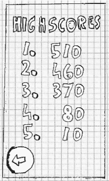

**图 3-16.** *最高分屏幕*


接下来是帮助画面。它会向玩家介绍故事背景和游戏机制。由于这些信息量太大，无法在一个屏幕上全部呈现。因此，我们将把帮助画面拆分成多个画面。每个画面将向用户展示一项关键信息：Mr. Nom 是谁以及他想要什么，如何操控 Mr. Nom 吃掉墨渍，以及 Mr. Nom 不喜欢什么（也就是他不能碰到自己）。一共是三个帮助画面，如图 3–17 所示。注意，我们在每个画面上都添加了一个按钮，表示还有更多信息可以阅读。稍后我们会将这些画面连接起来。

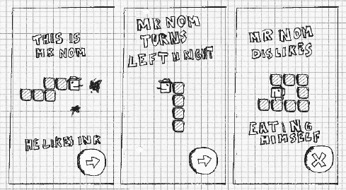

**图 3–17.** *帮助画面*

最后是我们的游戏画面，之前我们已经看到它运行的样子了。不过，我们还有几个细节没有提到。首先，游戏不应该立即开始；我们应该给玩家一点准备时间。因此，画面会先显示一个提示，需要触摸屏幕才能开始大快朵颐。这不需要单独做一个画面；我们会直接在游戏画面中实现这个初始暂停。

说到暂停，我们还会添加一个按钮，让用户可以暂停游戏。一旦暂停，我们还需要给用户提供一种方式来继续游戏。在这种情况下，我们会显示一个巨大的“继续”（`Resume`）按钮。在暂停状态下，我们还会显示另一个按钮，让用户可以返回主菜单画面。

如果 Mr. Nom 咬到了自己的尾巴，我们需要通知玩家游戏结束了。我们可以实现一个单独的游戏结束画面，或者留在游戏画面中，只覆盖一个巨大的“游戏结束”（`Game Over`）消息。这里我们选择后者。为了完善体验，我们还会显示玩家获得的分数，以及一个返回主菜单的按钮。

将游戏画面的这些不同状态视为子画面。我们有四个子画面：初始准备状态、正常游戏进行状态、暂停状态和游戏结束状态。图 3–18 展示了这些子画面。

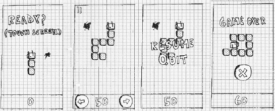

**图 3–18.** *游戏画面及其四种不同状态*

现在是时候把这些画面连接起来了。每个画面都包含一些用于切换到另一个画面的交互组件。

*   在主菜单画面，我们可以通过相应的按钮进入游戏画面、高分画面和帮助画面。
*   在游戏画面，我们可以通过暂停状态的按钮或游戏结束状态的按钮返回主菜单画面。
*   在高分画面，我们可以返回主菜单画面。
*   从第一个帮助画面，我们可以进入第二个帮助画面；从第二个到第三个；从第三个到第四个；从第四个画面，我们将返回主菜单画面。

这就是所有的切换！看起来并不复杂，对吧？图 3–19 以可视化的方式总结了所有这些切换，用箭头从每个交互组件指向目标画面。我们还在图中包含了构成画面的所有元素。

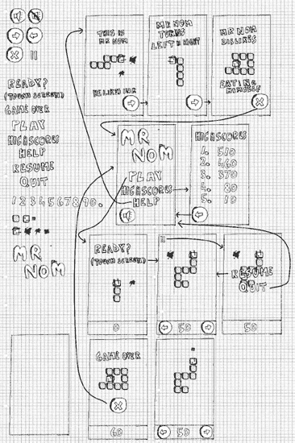

**图 3–19.** *所有设计元素与切换*

至此，我们已经完成了第一个完整的游戏设计。剩下就是实现了。我们如何才能将这个设计变成一个可执行的游戏呢？

**注意：** 我们刚才用来创建游戏设计的方法对于较小的游戏来说很合适。这本书叫做《Beginning Android Games》，所以这是一个合适的方法论。对于较大的项目，你很可能会在一个团队中工作，每个团队成员专攻一个方面。虽然在那种情况下你仍然可以应用这里描述的方法，但你可能需要稍作调整和优化，以适应不同的环境。你还会进行更多迭代式的工作，不断优化你的设计。

### 代码：关键细节

这里又有一个先有鸡还是先有蛋的问题：我们只想了解与游戏编程相关的 Android API。然而，我们仍然不知道如何实际编写一个游戏。我们有了如何设计一个游戏的想法，但把它变成一个可执行程序对我们来说仍然像巫术一样。在接下来的小节中，我们将向你概述一个游戏通常由哪些元素构成。我们将研究一些接口的伪代码，这些接口稍后我们会用 Android 提供的东西来实现。接口非常棒，原因有二：它们让我们可以专注于语义，而无需了解实现细节；并且它们允许我们稍后替换实现（例如，我们可以不用 2D CPU 渲染，而是利用 `OpenGL ES` 来在屏幕上显示 `Mr. Nom`）。

每个游戏都需要一个基本框架，来抽象化并简化与底层操作系统通信的麻烦。通常，它被分成以下几个模块：

> *窗口管理*：负责创建窗口，并处理诸如关闭窗口或在 Android 中暂停/恢复应用程序等问题。
> 
> *输入*：与窗口管理模块相关，负责跟踪用户输入（即触摸事件、按键、外设和加速度计读数）。
> 
> *文件 I/O*：允许我们从磁盘上将游戏资源的字节读取到程序中。
> 
> *图形*：除了实际的游戏本身，这可能是最复杂的模块。它负责加载图形并将其绘制到屏幕上。
> 
> *音频*：负责加载和播放所有我们将要听到的声音。
> 
> *游戏框架*：将上述所有模块结合在一起，为编写游戏提供一个易于使用的基础。

这些模块中的每一个都由一个或多个接口组成。每个接口都至少有一个具体的实现，该实现基于底层平台（本例中为 `Android`）提供的内容来应用接口的语义。

**注意：** 是的，我们故意没有在上面的列表中包含网络。我们不会在这本书中实现多人游戏。根据游戏类型的不同，这是一个相当高级的话题。如果你对此感兴趣，可以在网络上找到一系列教程。（[`www.gamedev.net`](http://www.gamedev.net) 是一个不错的起点。）

在接下来的讨论中，我们将尽可能保持平台无关性。这些概念在所有平台上都是相同的。


#### 应用与窗口管理

游戏与其他任何带有用户界面的计算机程序并无二致。它被包含在某种形式的窗口中（如果底层操作系统的 UI 范式基于窗口，而所有主流操作系统皆是如此）。窗口充当容器，我们基本上将其视为绘制游戏内容的画布。

大多数操作系统允许用户以特殊方式与窗口交互，除了触摸客户区或按键之外。在桌面系统上，通常可以拖拽窗口、调整窗口大小，或将其最小化到任务栏。在 Android 中，调整大小被替换为适应方向变化，而最小化则类似于通过按下主页按钮或响应来电，将应用程序置于后台。

应用和窗口管理模块也负责实际设置窗口，并确保该窗口由一个单一的 UI 组件填充，我们可以后续渲染到该组件，并且该组件能接收用户以触摸或按键形式输入的指令。该 UI 组件可能通过 CPU 渲染，也可能像 OpenGL ES 那样通过硬件加速。

应用和窗口管理模块并没有一套固定的接口。我们稍后会将其与游戏框架合并。我们需要记住的是必须管理的应用程序状态和窗口事件：

> *创建*：在窗口（以及应用程序）启动时调用一次。
>
> *暂停*：当应用程序被某种机制暂停时调用。
>
> *恢复*：当应用程序恢复且窗口重新置于前台时调用。

**注意：** 一些 Android 爱好者可能会对此不以为然。为什么只使用一个单一的窗口（Android 术语中的`Activity`）？为什么不为游戏使用多个 UI 小部件——例如，用于实现游戏可能需要的复杂 UI？主要原因是我们希望对游戏的外观和感觉拥有完全的控制。这也使我们能够专注于 Android 游戏编程，而不是 Android UI 编程，关于后者已有更优秀的书籍存在——例如，Mark Murphy 的佳作 *Beginning Android 2*（Apress，2010）。

#### 输入

用户肯定希望以某种方式与我们的游戏进行交互。这就是输入模块的用武之地。在大多数操作系统中，诸如触摸屏幕或按键等输入事件会被分派到当前获得焦点的窗口。然后，窗口会进一步将事件分派给拥有焦点的 UI 组件。这个分派过程对我们来说通常是透明的；我们唯一关心的是从拥有焦点的 UI 组件获取事件。操作系统的 UI API 提供了一种机制，可以挂钩到事件分派系统中，这样我们就能轻松注册并记录事件。这种挂钩并记录事件的过程就是输入模块的主要任务。

我们能用记录下来的信息做什么呢？有两种操作模式：

> *轮询*：通过轮询，我们仅检查输入设备的当前状态。当前检查与上次检查之间的任何状态都将丢失。这种输入处理方式适合检查诸如用户是否触摸了特定按钮等情况。它不适合跟踪文本输入，因为按键事件的顺序会丢失。
>
> *基于事件的处理*：这提供了自上次检查以来发生事件的完整时间顺序历史记录。这是一种执行文本输入或任何其他依赖事件顺序任务的合适机制。它对于检测手指首次触摸屏幕或手指何时抬起也很有用。

我们需要处理哪些输入设备呢？在 Android 上，主要有三种输入方式：触摸屏、键盘/轨迹球以及加速度计。前两种既适用于轮询也适用于基于事件的处理。加速度计通常仅通过轮询使用。触摸屏可以产生三种事件：

> *触摸按下*：当手指接触到屏幕时发生。
>
> *触摸拖动*：当手指在屏幕上拖动时发生。在拖动之前，总会有一个按下事件。
>
> *触摸抬起*：当手指从屏幕抬起时发生。

每个触摸事件都附带额外信息：相对于 UI 组件原点的位置，以及用于在多指触控环境中识别和跟踪不同手指的指针索引。

键盘可以产生两种类型的事件：

> *按键按下*：当按键被按下时发生。
>
> *按键抬起*：当按键被抬起时发生。此事件之前总有一个按键按下事件。

按键事件也携带额外信息。按键按下事件存储了被按下键的键码。按键抬起事件存储了键码和一个实际的 Unicode 字符。键码与按键抬起事件产生的 Unicode 字符是有区别的。后者会考虑其他键的状态，例如 Shift 键。这样，例如我们就能在按键抬起事件中得到大写和小写字母。而对于按键按下事件，我们只知道某个键被按下了，但不知道这个按键动作实际会产生什么字符。

希望使用自定义 USB 硬件（包括摇杆、模拟控制器、特殊键盘、触摸板或其他 Android 支持的外设）的开发者，可以通过利用`android.hardware.usb`包中的 API 来实现，该 API 在 API 级别 12（Android 3.1）中引入，也通过`com.android.future.usb`包反向移植到了 Android 2.3.4。USB API 允许 Android 设备在主机模式下运行（允许外设连接并被 Android 设备使用），或者在配件模式下运行（允许设备作为另一个 USB 主机的配件）。这些 API 并不太适合初学者，因为设备访问是非常底层的，提供数据流 IO 给 USB 配件，但重要的是要知道这项功能确实存在。如果你的游戏设计围绕某个特定的 USB 配件，你当然需要为该配件开发一个通信模块并使用它进行原型设计。


最后，我们来看看加速度计。需要重点理解的是，虽然几乎所有手机和平板电脑都将加速度计作为标准硬件，但许多新设备（包括机顶盒）可能没有加速度计，因此务必始终规划多种输入模式！

要使用加速度计，我们将始终轮询其状态。加速度计会报告地球重力在其三个轴之一上施加的加速度。这三个轴分别称为`x`、`y`和`z`。图 3-20 展示了每个轴的方向。每个轴上的加速度以米每二次方秒（`m/s²`）表示。根据物理课所学，我们知道一个物体在地球上自由落体时，其加速度约为 `9.8 m/s²`。其他星球的重力不同，因此加速度常数也不同。为简单起见，我们这里只考虑地球。当一个轴指向远离地心方向时，它受到最大加速度；若指向地心，则得到负的最大加速度。例如，如果你竖直握住手机（竖屏模式），`y`轴将报告加速度为 `9.8 m/s²`。在图 3-20 中，`z`轴会报告加速度为 `9.8 m/s²`，而`x`轴和`y`轴报告的加速度为零。

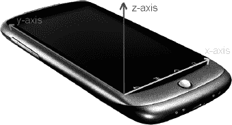

**图 3–20.** *Android 手机上的加速度计坐标轴。z 轴指向手机外部。*

现在，我们定义一个接口，该接口允许我们轮询触摸屏、键盘和加速度计，并支持基于事件的触摸屏和键盘访问（见代码清单 3–1）。

**代码清单 3–1.** *输入接口及 KeyEvent 和 TouchEvent 类*

```
package com.badlogic.androidgames.framework;

import java.util.List;

public interface Input {
    public static class KeyEvent {
        public static final int KEY_DOWN = 0;
        public static final int KEY_UP = 1;

        public int type;
        public int keyCode;
        public char keyChar;
    }

    public static class TouchEvent {
        public static final int TOUCH_DOWN = 0;
        public static final int TOUCH_UP = 1;
        public static final int TOUCH_DRAGGED = 2;

        public int type;
        public int x, y;
        public int pointer;
    }

    public boolean isKeyPressed(int keyCode);

    public boolean isTouchDown(int pointer);

    public int getTouchX(int pointer);

    public int getTouchY(int pointer);

    public float getAccelX();

    public float getAccelY();

    public float getAccelZ();

    public List<KeyEvent> getKeyEvents();

    public List<TouchEvent> getTouchEvents();
}
```

我们的定义以两个类开始：`KeyEvent`和`TouchEvent`。`KeyEvent`类定义了编码事件类型的常量；`TouchEvent`类也是如此。`KeyEvent`实例记录其类型、按键代码，以及当事件类型为`KEY_UP`时的 Unicode 字符。

`TouchEvent`代码类似，包含触摸事件类型、手指相对于 UI 组件原点的位置，以及触摸屏驱动程序分配给该手指的指针 ID。只要手指在屏幕上，其指针 ID 就保持不变。如果两根手指按下，然后手指 0 抬起，那么只要手指 1 还在触摸屏幕，它就会保持其 ID。新手势将获得第一个空闲 ID，在本例中为 0。指针 ID 通常是顺序分配的，但也不能保证总是如此。例如，Sony Xperia Play 使用 15 个 ID，并以循环方式分配给触摸操作。切勿在代码中对新指针的 ID 做任何假设——你只能通过索引读取指针的 ID，并在该指针抬起之前引用它。

接下来是`Input`接口的轮询方法，它们应该是不言自明的。`Input.isKeyPressed()`接收一个`keyCode`，并返回对应的键当前是否被按下。`Input.isTouchDown()`、`Input.getTouchX()`和`Input.getTouchY()`返回给定指针是否按下，以及其当前的 x 和 y 坐标。请注意，如果相应的指针实际上没有触摸屏幕，那么这些坐标将是未定义的。

`Input.getAccelX()`、`Input.getAccelY()`和`Input.getAccelZ()`返回各加速度计轴的相应加速度值。

最后两个方法用于基于事件的处理。它们返回自上次调用这些方法以来记录的`KeyEvent`和`TouchEvent`实例。这些事件按照发生的时间排序，最新的事件位于列表末尾。

有了这个简单的接口和这些辅助类，我们就满足了所有的输入需求。接下来，我们来看看文件处理。

**注意：** 虽然带有公共成员的可变类令人深恶痛绝，但在这种情况下我们可以侥幸使用它们，原因有二：Dalvik 在调用方法（此处为 getter）时仍然很慢；并且事件类的可变性不会影响`Input`实现的内部运作。请记住，这通常是一种糟糕的风格，但为了性能原因，我们偶尔会采用这种捷径。

#### 文件 I/O

读写文件对于游戏开发来说至关重要。鉴于我们身处 Java 世界，我们主要关注创建`InputStream`和`OutputStream`实例，这是从特定文件读取数据和向其写入数据的标准 Java 机制。在我们的场景中，我们主要关注读取随游戏打包的文件，例如关卡文件、图片和音频文件。写入文件的操作要少得多。通常，我们仅在需要维护高分榜或游戏设置，或保存游戏状态以便用户从中断处继续时，才会写入文件。

我们希望尽可能简单的文件访问机制。代码清单 3–2 展示了我们提议的一个简单接口。

**代码清单 3–2.** *文件 I/O 接口*

```
package com.badlogic.androidgames.framework;

import java.io.IOException;
import java.io.InputStream;
import java.io.OutputStream;

public interface FileIO {
    public InputStream readAsset(String fileName) throws IOException;

    public InputStream readFile(String fileName) throws IOException;

    public OutputStream writeFile(String fileName) throws IOException;
}
```

这相当精简。我们只需指定文件名即可获得一个流。如同在 Java 中通常所做的那样，如果出现问题，我们将抛出`IOException`。文件的读写位置取决于具体实现。资源将从应用程序的 APK 文件中读取，而文件将从 SD 卡（也称为外部存储）读取和写入。

返回的`InputStreams`和`OutputStreams`是普通的 Java 流。当然，使用完毕后我们必须关闭它们。


#### 音频

虽然音频编程是一个相当复杂的话题，但我们可以用一个非常简单的抽象来应对。我们不会进行任何高级的音频处理；只会播放从文件中加载的音效和音乐，就像在图形模块中加载位图一样。

不过，在深入探讨模块接口之前，让我们先花点时间了解一下声音到底是什么，以及它是如何以数字方式表示的。

##### 声音的物理原理

声音通常被建模为一组在空气或水等介质中传播的波。波并不是实际的物理物体，而是介质内分子的运动。想象一下你往一个小池塘里扔了一块石头。当石头击中池塘表面时，它会推开池塘里的大量水分子，而这些被推开的水分子会将能量传递给它们的邻居，邻居们也会开始移动和推动。最终，你会看到圆形波纹从石头落水处扩散开来。

声音产生时也发生类似的事情。不过，不是圆形运动，而是球形运动。正如你可能从童年时进行的高度科学实验中了解到的，水波可以相互作用；它们可以相互抵消或相互增强。声波也是如此。环境中所有的声波结合在一起，就形成了你听音乐时听到的音调和旋律。声音的音量取决于移动和推动的分子的能量有多少传递给它们的邻居，并最终传递到你的耳朵。

##### 录音与回放

音频录制和回放的原理其实在理论上相当简单。对于录音，我们记录下构成声波的分子在某个空间区域上施加特定压力时的时刻。回放这些数据，只需让扬声器周围的空气分子像我们录音时那样摆动和运动即可。

在实践中，这当然要稍微复杂一些。音频通常通过两种方式之一进行录制：模拟或数字。在这两种情况下，声波都是通过某种麦克风录制的，麦克风通常由一个振膜组成，它将分子的推动转换为某种信号。这个信号如何处理和存储，正是模拟录音和数字录音的区别所在。我们使用数字方式工作，所以让我们来看看这种情况。

数字录音意味着在离散的时间步长上测量和存储麦克风振膜的状态。根据周围分子的推动，振膜可以相对于中性状态被向内或向外推动。这个过程称为采样，因为我们在离散的时间点上采集振膜状态的样本。我们在每单位时间内采集的样本数量称为*采样率*。通常时间单位是秒，单位称为赫兹（Hz）。每秒采样数越多，音频质量越高。CD 以 44,100 Hz（即 44.1 KHz）的采样率回放。较低的采样率也有应用，例如在电话线上传输语音时（这种情况通常为 8 KHz）。

采样率只是决定录音质量的属性之一。我们存储每个振膜状态样本的方式也很重要，并且同样受数字化过程的影响。让我们回忆一下振膜状态到底是什么：它是振膜偏离其中性状态的距离。由于振膜被向内推还是向外推是有区别的，我们记录的是有符号的距离。因此，特定时间步长的振膜状态是一个负数或正数。我们可以用多种方式存储这个有符号数：作为一个有符号的 8 位、16 位或 32 位整数，作为一个 32 位浮点数，甚至是一个 64 位浮点数。每种数据类型都有精度限制。一个 8 位有符号整数可以存储 127 个正距离值和 128 个负距离值。一个 32 位整数提供了更高的分辨率。当存储为浮点数时，振膜状态通常被归一化到-1 到 1 之间。最大正值和最小负值代表振膜偏离中性状态能达到的最远距离。振膜状态也称为振幅，它代表撞击它的声音的响度。

使用单个麦克风，我们只能录制单声道声音，这会丢失所有空间信息。使用两个麦克风，我们可以在空间的不同位置测量声音，从而得到所谓的*立体声*。例如，你可以将一个麦克风放置在发出声音的物体的左侧，另一个放置在右侧，从而实现立体声。当声音通过两个扬声器同时回放时，我们可以合理地再现音频的空间成分。但这同时也意味着，在存储立体声音频时，我们需要存储两倍的样本数量。

回放最终是一个简单的事情。一旦我们有了数字形式的音频样本，并且具有特定的采样率和数据类型，我们就可以将这些数据交给音频处理单元，它会将这些信息转换成连接扬声器的信号。扬声器解释这个信号，并将其转换为振膜的振动，进而引起周围空气分子的运动并产生声波。这和我们录音时所做的完全一样，只是过程相反！

##### 音频质量与压缩

哇，好多理论。我们为什么要关心这些？如果你注意听了，现在你就能根据采样率和用于存储每个样本的数据类型来判断一个音频文件质量高低了。采样率越高，数据类型的精度越高，音频的质量就越好。然而，这也意味着我们需要更多的存储空间来存放我们的音频信号。

想象一下，我们录制了相同的声音，时长为 60 秒，但录制了两次：一次以 8 KHz 的采样率，每样本 8 位；另一次以 44 KHz 的采样率，16 位精度。存储每个声音需要多少内存？在第一种情况下，每个样本需要 1 字节。乘以 8000 Hz 的采样率，我们每秒需要 8000 字节。对于我们完整的 60 秒音频录制，这需要 480,000 字节，大约半兆字节（MB）。我们更高质量的录制需要多得多的内存：每样本 2 字节，每秒 2 乘以 44,000 字节。即每秒 88,000 字节。乘以 60 秒，我们得到 5,280,000 字节，略高于 5 MB。你通常听的一首 3 分钟流行歌曲，以这种质量录制会占用超过 15 MB，而且这还只是单声道录制。对于立体声录制，你需要两倍的内存。一首歌就占这么多字节，真是太多了！


许多聪明人已经想出了一些方法来减少音频记录所需的字节数。他们发明了相当复杂的心理声学压缩算法，用于分析未压缩的音频记录并输出体积更小、经过压缩的版本。这种压缩通常是*有损的*，意味着原始音频的某些微小部分会被省略。当你播放`MP3`或`OGG`文件时，你实际上听到的是经过压缩的有损音频。因此，使用`MP3`或`OGG`等格式将有助于减少在磁盘上存储音频所需的空间。

那么，从压缩文件中回放音频又是如何呢？虽然存在用于各种压缩音频格式的专用解码硬件，但常见的音频硬件通常只能处理未压缩的样本。在将样本实际馈送到声卡之前，我们必须先将它们读入内存并进行解压缩。我们可以一次性完成此操作，并将所有未压缩的音频样本存储在内存中，或者根据需要仅从音频文件中流式读入部分数据。

**实践**

你已经看到，即使是 3 分钟的歌曲也可能占用大量内存。因此，在播放游戏音乐时，我们将即时流式读取音频样本，而不是将所有音频样本预加载到内存中。通常，我们只有一个音乐流在播放，所以我们只需访问磁盘一次。

对于短暂的声音效果，例如爆炸声或枪声，情况则略有不同。我们经常需要同时多次播放一个音效。对于每个音效实例，从磁盘流式读取音频样本并不是一个好主意。幸运的是，简短的声音不会占用太多内存。因此，我们将一个音效的所有样本读入内存，然后可以直接并同时地从内存中播放它们。

我们有以下需求：

*   我们需要一种方法来加载音频文件，既支持流式播放，也支持从内存播放。
*   我们需要一种方法来控制流式音频的播放。
*   我们需要一种方法来控制已完全加载音频的播放。

这直接转化为了`Audio`、`Music`和`Sound`这几个接口（分别如清单 3–3 至 3–5 所示）。

**清单 3–3.** *Audio 接口*

```
package com.badlogic.androidgames.framework;

public interface Audio {
    public Music newMusic(String filename);
    public Sound newSound(String filename);
}
```

`Audio`接口是我们创建新的`Music`和`Sound`实例的方式。一个`Music`实例代表一个流式音频文件。一个`Sound`实例代表一个完全保存在内存中的短音效。`Audio.newMusic()`和`Audio.newSound()`方法都将文件名作为参数，如果加载过程失败（例如，当指定的文件不存在或已损坏），则会抛出`IOException`。这些文件名引用的是应用程序 APK 文件中的资源文件。

**清单 3–4.** *Music 接口*

```
package com.badlogic.androidgames.framework;

public interface Music {
    public void play();
    public void stop();
    public void pause();
    public void setLooping(boolean looping);
    public void setVolume(float volume);
    public boolean isPlaying();
    public boolean isStopped();
    public boolean isLooping();
    public void dispose();
}
```

`Music`接口稍微复杂一些。它提供了开始、暂停和停止音乐流的方法，以及设置循环播放的方法（这意味着当到达音频文件末尾时会自动从头开始播放）。此外，我们可以将音量设置为`0`（静音）到`1`（最大音量）之间的浮点数。还有一些 getter 方法可用，允许我们查询`Music`实例的当前状态。一旦我们不再需要`Music`实例，就必须处理它。这将关闭所有系统资源，例如用于流式读取音频的文件。

**清单 3–5.** *Sound 接口*

```
package com.badlogic.androidgames.framework;

public interface Sound {
    public void play(float volume);
    public void dispose();
}
```

`Sound`接口更简单。我们需要做的就是调用它的`play()`方法，该方法同样接受一个浮点数参数来指定音量。我们可以随时调用`play()`方法（例如，当 Nom 先生吃到一个墨点时）。一旦我们不再需要`Sound`实例，就必须处理它，以释放样本使用的内存以及其他可能关联的系统资源。

**注意：** 虽然我们在本章中涵盖了很多内容，但关于音频编程还有更多东西需要学习。为了保持本节内容简短精炼，我们简化了一些事情。例如，通常你不会线性地指定音量。在我们的上下文中，忽略这个小细节是可以的。但要意识到，实际情况远比这复杂！


#### 图形

游戏框架核心的最后一个模块是图形模块。你可能已经猜到，它将负责将图像（也称为位图）绘制到屏幕上。这听起来很简单，但如果你想要高性能的图形，至少需要了解图形编程的基础知识。让我们从 2D 图形的基础开始。

我们需要提出的第一个问题是：图像究竟是如何输出到我的显示器上的？答案相当复杂，但我们并不需要了解所有细节。我们只需快速回顾一下计算机和显示器内部发生的事情。

##### 关于光栅、像素和帧缓冲

如今的显示器都是基于光栅的。*光栅*是一个由所谓图像元素组成的二维网格。你可能知道它们被称为*像素*，在后续文本中我们将这样称呼它们。光栅网格的宽度和高度是有限的，我们通常以每行和每列的像素数来表示。如果你有勇气，可以打开电脑，尝试在显示器上辨认出单个像素。不过请注意，我们不对因此对眼睛造成的任何伤害负责。

一个像素有两个属性：网格中的位置和颜色。像素的位置在离散坐标系中以二维坐标表示。*离散*意味着坐标始终位于整数位置。坐标在施加于网格上的欧几里得坐标系中定义。坐标系的原点是网格的左上角。x 轴正方向指向右侧，y 轴正方向指向下方。最后一点最容易让人困惑。我们稍后会再讨论这个问题；这种情况有一个简单的原因。

忽略那个奇怪的 y 轴，我们可以看到，由于坐标的离散性，原点与网格左上角的像素重合，该像素位于`(0,0)`。原点像素右侧的像素位于`(1,0)`，原点像素下方的像素位于`(0,1)`，依此类推（见图 3–21 左侧）。显示器的光栅网格是有限的，因此有意义的坐标数量有限。负坐标位于屏幕之外。大于或等于光栅宽度或高度的坐标也位于屏幕之外。请注意，最大的 x 坐标是光栅宽度减 1，最大的 y 坐标是光栅高度减 1。这是因为原点与左上角像素重合。差一错误在图形编程中通常是令人沮丧的常见来源。

显示器从图形处理器接收持续不断的信息流。这些信息编码了显示光栅中每个像素的颜色，具体由控制屏幕绘制的程序或操作系统指定。显示器每秒会刷新其状态数十次。确切的速率称为刷新率，以赫兹为单位。液晶显示器通常具有每秒 60 Hz 的刷新率；阴极射线管显示器和等离子显示器通常具有更高的刷新率。

图形处理器可以访问一个称为视频内存或 VRAM 的特殊内存区域。在 VRAM 中，有一个保留区域用于存储要显示在屏幕上的每个像素。这个区域通常被称为*帧缓冲*。因此，一个完整的屏幕图像被称为一帧。对于显示器光栅网格中的每个像素，帧缓冲中都有一个对应的内存地址来保存该像素的颜色。当我们想要更改屏幕上显示的内容时，只需更改 VRAM 中该内存区域内像素的颜色值。

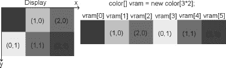

**图 3–21.** *过于简化的显示器光栅网格和 VRAM*

现在是时候解释为什么显示器坐标系中的 y 轴指向下方了。内存，无论是 VRAM 还是普通 RAM，都是线性和一维的。可以把它想象成一个一维数组。那么，我们如何将二维像素坐标映射到一维内存地址呢？图 3–21 展示了一个非常小的三乘二像素显示器光栅网格，以及它在 VRAM 中的表示。（我们假设 VRAM 仅由帧缓冲内存组成。）由此，我们可以轻松推导出以下公式来计算位于`(x,y)`的像素的内存地址：

```
int address = x + y * rasterWidth;
```

我们也可以反过来，根据地址计算像素的 x 和 y 坐标：

```
int x = address % rasterWidth;
int y = address / rasterWidth;
```

所以，y 轴之所以指向下方，是因为 VRAM 中像素颜色的内存布局。这实际上是计算机图形学早期遗留下来的某种传统。显示器会更新屏幕上每个像素的颜色，从左上角开始，向右移动，然后在下一行折返到最左边，直到到达屏幕底部。将 VRAM 内容以这种方式布局，便于将颜色信息传输到显示器，这非常方便。

**注意：** 如果我们能够完全访问帧缓冲，就可以使用上述公式编写一个完整的图形库来绘制像素、线条、矩形、加载到内存中的图像等等。现代操作系统出于各种原因不授予我们对帧缓冲的直接访问权限。相反，我们通常绘制到一个内存区域，然后由操作系统将其复制到实际的帧缓冲中。尽管如此，总体概念在这种情况下仍然适用！如果你对如何高效地执行这些底层操作感兴趣，可以在网上搜索一个叫 Bresenham 的人以及他的画线和画圆算法。

##### 垂直同步与双缓冲

现在，如果你还记得关于刷新率的段落，你可能会注意到这些速率似乎相当低，我们写入帧缓冲的速度可能比显示器刷新的速度还快。这种情况确实可能发生。更糟糕的是，我们不知道显示器何时从 VRAM 抓取其最新帧副本，这可能会在我们在绘制过程中造成问题。在这种情况下，显示器将显示部分旧的帧缓冲内容和部分新的状态，这是一种不理想的情况。你可以在许多电脑游戏中看到这种效果，它表现为画面撕裂（屏幕同时显示上一帧的部分内容和新帧的部分内容）。

解决这个问题的第一部分方案称为*双缓冲*。图形处理单元管理的不是一个帧缓冲，而是两个：前缓冲和后缓冲。前缓冲中的像素颜色将被读取，供显示器使用；后缓冲则用于绘制下一帧，同时显示器可以顺利地从前缓冲获取数据。当我们绘制完当前帧后，我们告诉 GPU 交换这两个缓冲，这通常意味着只是交换前缓冲和后缓冲的地址。在图形编程文献和 API 文档中，你可能会找到*页面翻转*和*缓冲交换*这两个术语，它们指的就是这个过程。

不过，仅靠双缓冲并不能完全解决问题：屏幕刷新内容的过程中仍然可能发生交换。这时就需要*垂直同步*（也称为 *vsync*）登场了。当我们调用缓冲交换方法时，GPU 会阻塞，直到显示器发出信号表示已完成当前刷新。如果发生这种情况，GPU 就可以安全地交换缓冲地址，一切便会顺利进行。


幸运的是，如今我们几乎无需关心这些繁琐的细节。VRAM 以及双缓冲和垂直同步的细节都被安全地隐藏起来，让我们无法对其造成破坏。相反，我们获得了一组 API，这些 API 通常将我们限制在操作应用程序窗口的内容上。其中一些 API，例如 `OpenGL ES`，暴露了硬件加速功能，它本质上不过是利用图形芯片上的专用电路来操作 VRAM。看，这并不是魔法！你之所以应该了解其内部工作原理（至少是高层级原理），是因为这能让你理解应用程序的性能特性。当启用了垂直同步（`vsync`），你的帧率永远无法超过屏幕的刷新率，如果你只是绘制一个像素，这可能会令人费解。

当我们使用非硬件加速的 API 进行渲染时，我们并不直接与显示器本身打交道。相反，我们绘制的是窗口中的某个 UI 组件。在我们的例子中，我们处理的是一个覆盖整个窗口的单一 UI 组件。因此，我们的坐标系不会覆盖整个屏幕，而只覆盖我们的 UI 组件。该 UI 组件实际上成为了我们的显示器，拥有其自己的虚拟帧缓冲。然后，操作系统将管理所有可见窗口内容的合成，并确保这些内容被正确地传输到它们在真实帧缓冲中所覆盖的区域。

**什么是颜色？**

你会注意到，到目前为止我们有意地忽略了颜色。我们在图 3-21 中创建了一个名为 `color` 的类型，并假装一切安好。让我们看看颜色到底是什么。

从物理上讲，颜色是你的视网膜和视觉皮层对电磁波的反应。这种波的特征在于其波长和强度。我们可以看到波长大约在 400 到 700 纳米之间的波。电磁波谱的这个子频段也称为可见光谱。彩虹展示了可见光谱中的所有颜色，从紫色到蓝色，再到绿色，然后是黄色，接着是橙色，最后是红色。显示器所做的一切就是为每个像素发射特定的电磁波，我们将其体验为每个像素的颜色。不同类型的显示器使用不同的方法来实现这一目标。这个过程的一个简化版本是这样的：屏幕上的每个像素由三种不同的荧光粒子组成，这些粒子会发出红光、绿光或蓝光中的一种。当显示器刷新时，每个像素的荧光粒子会通过某种方式发光（例如，对于 CRT 显示器，像素的粒子会受到一束电子的轰击）。对于每个粒子，显示器可以控制其发光强度。例如，如果一个像素完全是红色，那么只有红色粒子会以全强度被电子轰击。如果我们想要三种基色以外的颜色，我们可以通过混合基色来实现。混合是通过改变每个粒子发出其颜色的强度来完成的。电磁波在到达我们视网膜的途中会相互叠加。我们的大脑将这种混合解释为一种特定的颜色。因此，一种颜色可以通过红、绿、蓝基色的强度混合来指定。

**颜色模型**

我们刚才讨论的被称为颜色模型，具体来说是 RGB 颜色模型。当然，`RGB` 代表红色、绿色和蓝色。我们还可以使用许多其他的颜色模型，例如 `YUV` 和 `CMYK`。然而，在大多数图形编程 API 中，`RGB` 颜色模型几乎是标准，因此我们这里只讨论它。

`RGB` 颜色模型被称为加法颜色模型，这是因为最终的颜色是通过混合加法原色红色、绿色和蓝色而得到的。你可能在学校里做过混合原色的实验。图 3-22 为你展示了一些 RGB 颜色混合的例子，以便稍微唤起你的记忆。

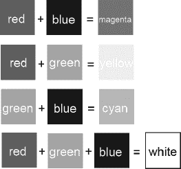

**图 3-22.** *混合红、绿、蓝三原色的乐趣*

当然，通过改变红、绿、蓝分量的强度，我们可以生成比图 3-22 中所示多得多的颜色。每个分量可以有一个介于 0 和某个最大值（比如 1）之间的强度值。如果我们将每个颜色分量解释为三维欧几里得空间中三个轴上的一个值，我们可以绘制所谓的*颜色立方体*，如图 3-23 所示。如果我们改变每个分量的强度，就可以得到更多可用的颜色。一个颜色被表示为三元组 `(red, green, blue)`，其中每个分量在 0.0 到 1.0 之间。0.0 表示该颜色没有强度，1.0 表示最大强度。黑色位于原点 `(0,0,0)`，白色位于 `(1,1,1)`。

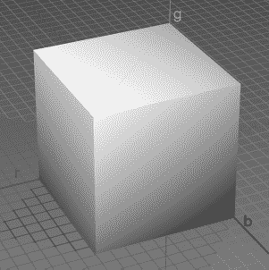

**图 3-23.** *强大的 RGB 颜色立方体*

**数字编码颜色**

我们如何在计算机内存中对 RGB 颜色三元组进行编码？首先，我们必须定义要为颜色分量使用什么数据类型。我们可以使用浮点数，并将有效范围指定为 0.0 到 1.0 之间。这将为每个分量提供相当高的分辨率，并使我们能够使用大量不同的颜色。遗憾的是，这种方法会占用大量空间（每像素 3 倍 4 或 8 字节，具体取决于我们使用 32 位还是 64 位浮点数）。

我们可以做得更好——代价是丢失一些颜色——这完全没问题，因为显示器通常只能发射有限的颜色范围。我们可以为每个分量使用无符号整数，而不是使用浮点数。现在，如果我们为每个分量使用一个 32 位整数，我们并没有得到任何好处。相反，我们为每个分量使用一个无符号字节。然后每个分量的强度范围是 0 到 255。对于 1 个像素，我们因此需要 3 个字节，即 24 位。那是 2 的 24 次方（16,777,216）种不同的颜色。我想说这足以满足我们的需求。

我们还能进一步缩减吗？是的，可以。我们可以将每个分量打包到一个 16 位的字中，这样每个像素只需要 2 字节的存储空间。红色使用 5 位，绿色使用 6 位，蓝色使用剩余的 5 位。绿色获得 6 位的原因是我们的眼睛能看到比红色或蓝色更多的绿色色调。所有位加起来可以编码 2 的 16 次方（65,536）种不同的颜色。图 3-24 展示了如何使用前面描述的三种编码来编码一种颜色。


**图 3-24.** *一种漂亮的粉色的颜色编码（在本印刷版中将是灰色，抱歉）*

对于浮点数的情况，我们可以使用三个 32 位的 Java 浮点数。在 24 位编码的情况下，我们有一个小问题：Java 中没有 24 位的整数类型，因此我们可以将每个分量存储在一个单独的字节中，或者使用一个 32 位整数，让高 8 位闲置。在 16 位编码的情况下，我们可以再次使用两个单独的字节，或者将分量存储在一个 `short` 值中。请注意，Java 没有无符号类型。由于二进制补码的强大功能，我们可以安全地使用有符号整数类型来存储无符号值。

对于 16 位和 24 位整数编码，我们还需要指定在 `short` 或 `int` 值中存储三个分量的顺序。通常使用两种方法：`RGB` 和 `BGR`。图 3-23 使用了 `RGB` 编码。蓝色分量处于最低的 5 位或 8 位，绿色分量占据接下来的 6 位或 8 位，红色分量占据最高的 5 位或 8 位。`BGR` 编码只是颠倒这个顺序。绿色位保持不变，红色和蓝色位互换位置。在本书中，我们将使用 `RGB` 顺序，因为 Android 的图形 API 也使用这个顺序。让我们总结一下到目前为止讨论的颜色编码：


-   32 位浮点 RGB 编码：每个像素 12 字节，强度范围 0.0 到 1.0。
-   24 位整数 RGB 编码：每个像素 3 或 4 字节，强度范围 0 到 255。分量顺序可为 RGB 或 BGR。在某些场合也称为`RGB888`或`BGR888`，其中`8`表示每个分量的位数。
-   16 位整数 RGB 编码：每个像素 2 字节；红色和蓝色强度范围 0 到 31，绿色强度范围 0 到 63。分量顺序可为 RGB 或 BGR。在某些场合也称为`RGB565`或`BGR565`，其中`5`和`6`表示对应分量的位数。

我们所使用的编码类型也称为颜色深度。创建并存储在磁盘或内存中的图像具有定义的颜色深度，实际图形硬件的帧缓冲区和显示器本身也是如此。如今，显示器的默认颜色深度通常为 24 位，在某些情况下可以配置为使用更低的颜色深度。图形硬件的帧缓冲区也相当灵活，可以使用多种不同的颜色深度。当然，我们自己的图像也可以采用任何我们喜欢的颜色深度。

**注意：** 逐像素颜色信息的编码方式还有很多。除了 RGB 颜色，我们还可以拥有灰度像素，它们只有一个分量。由于这些方式使用不多，我们在此先忽略它们。

##### 图像格式与压缩

在游戏开发过程中，美工会提供使用 Gimp、Paint.NET 或 Photoshop 等图形软件创建的图像。这些图像可以以多种格式存储在磁盘上。首先，为什么需要这些格式？我们不能直接将光栅数据作为字节块存储在磁盘上吗？

可以，但让我们算算这需要多少内存。假设我们想要最高质量，选择以`RGB888`格式编码像素，每像素 24 位。图像大小为 1024×1024。仅仅一张图片就需要 3MB！使用`RGB565`，我们可以将其降至约 2MB。

与音频的情况一样，关于如何减少存储图像所需内存的研究已经很多。通常采用压缩算法，这些算法专为存储图像和尽可能保留原始颜色信息而定制。两种最流行的格式是`JPEG`和`PNG`。`JPEG`是一种有损格式，意味着在压缩过程中会丢弃一些原始信息。`PNG`是一种无损格式，能够 100%还原原始图像。有损格式通常具有更好的压缩特性，占用更少的磁盘空间。因此，我们可以根据磁盘内存限制来选择使用哪种格式。

与音效类似，当我们将图像加载到内存时，必须完全解压。因此，即使你的图像在磁盘上压缩后只有 20KB，在 RAM 中仍然需要宽度乘以高度乘以颜色深度的完整存储空间。

加载和解压后，图像将以像素颜色数组的形式存在，其布局方式与 VRAM 中的帧缓冲区完全相同。唯一的区别在于像素位于普通 RAM 中，且颜色深度可能与帧缓冲区的颜色深度不同。加载的图像也有像帧缓冲区一样的坐标系：原点在左上角，x 轴向右，y 轴向下。

图像加载后，我们只需将像素颜色从图像传输到帧缓冲区的相应位置，即可将其绘制到帧缓冲区。我们不是手动完成，而是使用提供该功能的 API。

##### Alpha 合成与混合

在开始设计图形模块接口之前，我们还需处理一件事：图像合成。为便于讨论，假设我们有一个可以渲染的帧缓冲区，以及一堆加载到 RAM 中、即将用于帧缓冲区的图像。图 3-25 展示了一个简单的背景图像，以及鲍勃——一位僵尸杀手。

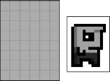

**图 3-25.** *简单的背景和宇宙主宰者鲍勃*

要绘制鲍勃的世界，我们首先将背景图像绘制到帧缓冲区，然后将鲍勃绘制在帧缓冲区的背景图像之上。这个过程称为合成，因为我们把不同的图像合成为最终图像。绘制顺序很重要，因为任何新的绘制调用都会覆盖帧缓冲区中的当前内容。那么，合成的最终输出会是什么？图 3-26 展示了结果。

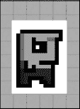

**图 3-26.** *将背景和鲍勃合成到帧缓冲区（不是我们想要的结果）*

哎呀，这可不是我们想要的。在图 3-26 中，注意鲍勃被白色像素包围。当我们把鲍勃绘制在背景之上时，那些白色像素也被绘制了，从而覆盖了背景。如何绘制鲍勃的图像，使其只有鲍勃的像素被绘制而白色背景像素被忽略？

这就引出了 Alpha 混合。严格来说，鲍勃的情况是 Alpha 遮罩，但这只是 Alpha 混合的一个子集。图形软件通常不仅允许我们指定像素的 RGB 值，还可以指定其透明度。可以把它看作是像素颜色的另一个分量。我们可以像编码红、绿、蓝分量一样对其进行编码。

我们之前提到过，可以将 24 位的 RGB 三元组存储在一个 32 位整数中。这个 32 位整数中有 8 个未使用的位，我们可以利用它们来存储 Alpha 值。然后，我们可以将像素的透明度指定为 0 到 255，其中 0 表示完全透明，255 表示完全不透明。这种编码称为`ARGB8888`或`BGRA8888`，取决于分量的顺序。当然，也有`RGBA8888`和`ABGR8888`格式。

在 16 位编码的情况下，我们遇到了一个小问题：16 位短整数的所有位都被颜色分量占用了。让我们模仿`ARGB8888`格式，类似地定义一种`ARGB4444`格式。这样总共为 RGB 值留下 12 位——每个颜色分量 4 位。

我们很容易想象完全透明或不透明像素的渲染方法是如何工作的。在第一种情况下，我们只需忽略 Alpha 分量为零的像素。在第二种情况下，我们直接覆盖目标像素。然而，当像素的 Alpha 分量既不完全透明也不完全不透明时，事情就变得稍微复杂了。

在正式讨论混合时，我们需要定义几个概念：

- 混合有两个输入和一个输出，每个都用 RGB 三元组（`C`）加上一个 Alpha 值（`α`）表示。
- 两个输入称为源和目的地。源是我们想要绘制到目标图像（即帧缓冲区）之上的图像中的像素。目标是我们要用源像素（部分）覆盖的像素。
- 输出同样是一个由 RGB 三元组和 Alpha 值表示的颜色。不过我们通常忽略 Alpha 值。为简单起见，本章将这样做。
- 为简化计算，我们将 RGB 和 Alpha 值表示为 0.0 到 1.0 范围内的浮点数。

有了这些定义，我们就可以创建所谓的混合方程。最简单的方程如下所示：

```
red = src.red * src.alpha + dst.red * (1 - src.alpha)
blue = src.green * src.alpha + dst.green * (1 - src.alpha)
green = src.blue * src.alpha + dst.blue * (1 - src.alpha)
```


`src`和`dst`是我们要相互混合的源像素和目标像素。我们按分量混合这两种颜色。注意在这些混合方程中缺少目标 alpha 值。让我们尝试一个例子，看看它的效果：

`src = (1, 0.5, 0.5), src.alpha = 0.5, dst = (0, 1, 0)`
`red = 1 * 0.5 + 0 * (1 - 0.5) = 0.5`
`blue = 0.5 * 0.5 + 1 * (1 - 0.5) = 0.75`
`red = 0.5 * 0.5 + 0 * (1 - 0.5) = 0.25`

图 3–27 说明了上述方程。我们的源颜色是一种粉红色调，目标颜色是一种绿色调。两种颜色对最终输出颜色的贡献相等，产生了一种有些脏的绿色或橄榄色。


**图 3–27.** *混合两个像素*

两位名叫 Porter 和 Duff 的绅士提出了一系列混合方程。不过，我们将坚持使用上述方程，因为它涵盖了大部分用例。尝试在纸上或你选择的图形软件中实验一下，以感受混合对你的构图会产生什么影响。

**注意：** 混合是一个广阔的领域。如果你想充分挖掘其潜力，我们建议你在网络上搜索 Porter 和 Duff 关于这个主题的原始著作。不过，对于我们将要编写的游戏来说，上述方程已经足够了。

请注意，上述方程涉及很多乘法运算（准确说是六次）。乘法运算代价高昂，我们应尽可能避免它们。在混合的情况下，我们可以通过将源像素颜色的 RGB 值与源 alpha 值预乘来去掉其中的三个乘法。大多数图形软件支持将图像的 RGB 值与各自的 alpha 值预乘。如果不支持，你可以在加载时于内存中完成。然而，当我们使用图形 API 进行混合绘制时，必须确保使用正确的混合方程。我们的图像仍然包含 alpha 值，因此上述方程会输出错误的结果。源 alpha 不能与源颜色相乘。幸运的是，所有 Android 图形 API 都允许我们完全指定我们想要如何混合图像。

在 Bob 的例子中，我们只需在我们首选的图形软件中将所有白色像素的 alpha 值设置为零，以 ARGB8888 或 ARGB4444 格式加载图像，可能预乘 alpha，并使用一种绘图方法，该方法使用正确的混合方程执行实际的 alpha 混合。结果将类似于图 3–28。

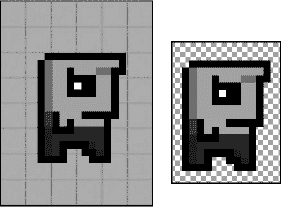

**图 3–28.** *左侧是混合后的 Bob，右侧是 Paint.NET 中的 Bob。棋盘格图案说明白色背景像素的 alpha 值为零，因此背景棋盘格显现出来。*

**注意：** JPEG 格式不支持存储每个像素的 alpha 值。在这种情况下请使用 PNG 格式。

### 实践

有了所有这些信息，我们终于可以开始为我们的图形模块设计接口了。让我们定义这些接口的功能。请注意，当我们提到帧缓冲区时，我们实际上是指我们绘制到的 UI 组件的虚拟帧缓冲区。我们只是假设我们直接绘制到真实的帧缓冲区。我们需要能够执行以下操作：

*   从磁盘加载图像，并将它们存储在内存中以便以后绘制。
*   用颜色清除帧缓冲区，以便我们可以擦除上一帧留下的内容。
*   在帧缓冲区的特定位置设置一个像素到特定颜色。
*   在帧缓冲区上绘制线条和矩形。
*   将之前加载的图像绘制到帧缓冲区。我们希望能够绘制完整的图像或其中的一部分。我们还需要能够绘制带混合和不带混合的图像。
*   获取帧缓冲区的尺寸。

我们提出了两个简单的接口：`Graphics`和`Pixmap`。让我们从`Graphics`接口开始，如清单 3–6 所示。

**清单 3–6.** *Graphics 接口*

```java
package com.badlogic.androidgames.framework;

public interface Graphics {
    public static enum PixmapFormat {
        ARGB8888, ARGB4444, RGB565
    }

    public Pixmap newPixmap(String fileName, PixmapFormat format);

    public void clear(int color);

    public void drawPixel(int x, int y, int color);

    public void drawLine(int x, int y, int x2, int y2, int color);

    public void drawRect(int x, int y, int width, int height, int color);

    public void drawPixmap(Pixmap pixmap, int x, int y, int srcX, int srcY,
            int srcWidth, int srcHeight);

    public void drawPixmap(Pixmap pixmap, int x, int y);

    public int getWidth();

    public int getHeight();
}
```

我们从一个名为`PixmapFormat`的公共静态枚举开始。它编码了我们将支持的不同像素格式。接下来是我们`Graphics`接口的不同方法：

*   `Graphics.newPixmap()`方法将加载一个以 JPEG 或 PNG 格式给出的图像。我们为生成的`Pixmap`指定一个期望的格式，这是对加载机制的一个提示。生成的`Pixmap`可能具有不同的格式。我们这样做是为了能够在一定程度上控制加载图像的内存占用（例如，将 RGB888 或 ARGB8888 图像加载为 RGB565 或 ARGB4444 图像）。文件名指定了我们应用程序 APK 文件中的一个资源。
*   `Graphics.clear()`方法使用给定的`color`清除整个帧缓冲区。在我们的小框架中，所有颜色都将指定为 32 位 ARGB8888 值（`Pixmap`当然可能具有不同的格式）。
*   `Graphics.drawPixel()`方法将帧缓冲区中 (x, y) 处的像素设置为给定的`color`。屏幕外的坐标将被忽略。这被称为*裁剪*。
*   `Graphics.drawLine()`方法类似于`Graphics.drawPixel()`方法。我们指定线的起点和终点，以及一种颜色。线在帧缓冲区光栅之外的任何部分都将被忽略。
*   `Graphics.drawRect()`方法在帧缓冲区上绘制一个矩形。(x, y) 指定矩形左上角在帧缓冲区中的位置。参数`width`和`height`分别指定 x 和 y 方向的像素数量，矩形将从 (x, y) 开始填充。我们沿 y 方向向下填充。`color`参数是用于填充矩形的颜色。
*   `Graphics.drawPixmap()`方法将`Pixmap`的矩形部分绘制到帧缓冲区。(x, y) 坐标指定`Pixmap`在帧缓冲区中的目标位置的左上角。参数`srcX`和`srcY`指定从`Pixmap`中使用的矩形区域的相应左上角，该坐标在`Pixmap`自身的坐标系中给出。最后，`srcWidth`和`srcHeight`指定我们从`Pixmap`中取出的部分的大小。
*   最后，`Graphics.getWidth()`和`Graphics.getHeight()`方法返回帧缓冲区的宽度和高度（以像素为单位）。

除了`Graphics.clear()`之外，所有绘图方法都会自动为它们接触到的每个像素执行混合，如上一节所述。我们可以逐个案例地禁用混合以加快绘图速度，但这会使我们的实现复杂化。通常，对于像 Mr. Nom 这样的简单游戏，我们可以一直启用混合。

`Pixmap`接口在清单 3–7 中给出。

**清单 3–7.** *Pixmap 接口*

```java
package com.badlogic.androidgames.framework;
```


```java
import com.badlogic.androidgames.framework.Graphics.PixmapFormat;

public interface Pixmap {
    public int getWidth();
    public int getHeight();
    public PixmapFormat getFormat();
    public void dispose();
}
```

我们保持其非常简洁且不可变，因为合成操作是在帧缓冲区中完成的。

- `Pixmap.getWidth()` 和 `Pixmap.getHeight()` 方法分别返回 `Pixmap` 的以像素为单位的宽度和高度。
- `Pixmap.getFormat()` 方法返回存储在 RAM 中的 `Pixmap` 所使用的 `PixelFormat`。
- 最后，还有 `Pixmap.dispose()` 方法。`Pixmap` 实例会占用内存和其他可能的系统资源。如果不再需要它们，就应该通过此方法将其释放。

借助这个简单的图形模块，我们之后可以轻松实现“诺姆先生”游戏。让我们通过讨论游戏框架本身来结束本章。

## 游戏框架

完成了所有基础工作后，我们终于可以讨论如何实现游戏本身了。为此，让我们明确游戏需要执行哪些任务：

- 游戏被划分为不同的屏幕。每个屏幕执行相同的任务：评估用户输入、将输入应用于屏幕状态，以及渲染场景。某些屏幕可能不需要任何用户输入，而是在一段时间后过渡到另一个屏幕（例如，启动画面）。
- 这些屏幕需要以某种方式进行管理（即，我们需要跟踪当前屏幕，并具备过渡到新屏幕的方法，这归结为销毁旧屏幕并将新屏幕设置为当前屏幕）。
- 游戏需要允许屏幕访问不同的模块（用于图形、音频、输入等），以便它们加载资源、获取用户输入、播放声音、渲染到帧缓冲区等。
- 由于我们的游戏是实时的（这意味着事物会持续移动和更新），我们必须让当前屏幕尽可能频繁地更新其状态并渲染自身。我们通常在一个称为*主循环*的循环内执行此操作。当用户退出游戏时，循环终止。此循环的单次迭代称为一个*帧*。我们所能计算出的每秒帧数（FPS）称为*帧率*。
- 说到时间，我们还需要跟踪自上一帧以来经过的时间跨度。这用于实现与帧无关的移动，我们稍后会讨论。
- 游戏需要跟踪窗口状态（即是否暂停或恢复），并将这些事件通知当前屏幕。
- 游戏框架将负责设置窗口并创建用于渲染和接收输入的 UI 组件。

让我们将其简化为一些伪代码，暂时忽略暂停和恢复等窗口管理事件：

```java
createWindowAndUIComponent();

Input input = new Input();
Graphics graphics = new Graphics();
Audio audio = new Audio();
Screen currentScreen = new MainMenu();
Float lastFrameTime = currentTime();

while ( !userQuit() ) {
    float deltaTime = currentTime() - lastFrameTime;
    lastFrameTime = currentTime();

    currentScreen.updateState(input, deltaTime);
    currentScreen.present(graphics, audio, deltaTime);
}

cleanupResources();
```

我们首先创建游戏窗口以及用于渲染和接收输入的 UI 组件。接着，实例化执行底层工作所需的所有模块。然后实例化起始屏幕并将其设为当前屏幕，并记录当前时间。最后进入主循环，当用户表示想要退出游戏时，循环终止。

在游戏循环中，我们计算所谓的*增量时间*。这是自上一帧开始以来经过的时间。然后我们记录当前帧开始的时间。增量时间和当前时间通常以秒为单位。对于屏幕而言，增量时间表示自上次更新以来经过了多少时间——如果我们要实现与帧无关的移动（稍后会再提及），就需要这些信息。

最后，我们只需更新当前屏幕的状态并将其呈现给用户。更新取决于增量时间以及输入状态；因此，我们将这些信息提供给屏幕。呈现过程包括将屏幕状态渲染到帧缓冲区，以及播放屏幕状态所需的任何音频（例如，因上次更新中发射了子弹而产生的音效）。呈现方法可能还需要知道自上次调用以来经过了多少时间。

当主循环终止时，我们可以清理并释放所有资源，然后关闭窗口。

```markdown

#### 游戏循环与界面设计

几乎所有游戏在高层的工作方式都是如此：处理用户输入、更新状态、将状态呈现给用户，然后无限重复（或直到用户对游戏失去兴趣）。

现代操作系统上的 UI 应用通常不以实时方式工作。它们采用基于事件的范式，操作系统通过回调通知应用程序输入事件以及何时需要渲染自身。应用程序在启动时向操作系统注册这些回调，负责处理接收到的通知。所有这些都发生在所谓的*UI 线程*中——即 UI 应用的主线程。通常最好尽快从回调中返回，因此我们不应该在回调中实现主循环。

相反，我们将游戏主循环托管在游戏启动时生成的一个独立线程中。这意味着当我们需要接收 UI 线程事件（如输入事件或窗口事件）时，必须采取一些预防措施。但这些细节将在我们为 Android 实现游戏框架时再处理。只需记住，我们需要在特定时间点同步 UI 线程和游戏主循环线程。

#### 游戏和屏幕接口

基于以上讨论，让我们尝试设计一个游戏接口。该接口的实现需要完成以下任务：

- 设置窗口和 UI 组件，并挂接回调以便接收窗口和输入事件。
- 启动主循环线程。
- 跟踪当前屏幕，并在每个主循环迭代（即帧）中通知其更新和呈现自身。
- 将窗口事件（例如暂停和恢复事件）从 UI 线程传输到主循环线程，并传递给当前屏幕，以便其相应地更改状态。
- 提供对我们之前开发的所有模块的访问权限：`Input`、`FileIO`、`Graphics`和`Audio`。

作为游戏开发者，我们希望对主循环运行在哪个线程以及是否需要与 UI 线程同步保持无关性。我们只想借助底层模块和一些窗口事件通知来实现不同的游戏屏幕。因此，我们将创建一个非常简单的`Game`接口来隐藏所有这些复杂性，以及一个抽象`Screen`类来帮助我们实现所有屏幕。清单 3-8 显示了`Game`接口。

**清单 3-8.** *游戏接口*

```java
package com.badlogic.androidgames.framework;

public interface Game {
    public Input getInput();
    public FileIO getFileIO();
    public Graphics getGraphics();
    public Audio getAudio();
    public void setScreen(Screen screen);
    public Screen getCurrentScreen();
    public Screen getStartScreen();
}
```

如预期，接口提供了一些 getter 方法，返回底层模块的实例，这些实例将由`Game`实现类实例化并跟踪管理。

`Game.setScreen()`方法允许我们设置`Game`的当前`Screen`。这些方法将一次性实现，同时包含内部的线程创建、窗口管理和主循环逻辑，主循环会不断请求当前屏幕进行呈现和更新。

`Game.getCurrentScreen()`方法返回当前活跃的`Screen`。

稍后我们将使用名为`AndroidGame`的抽象类来实现`Game`接口，该类将实现除`Game.getStartScreen()`之外的所有方法。`Game.getStartScreen()`方法将是一个抽象方法。当我们为实际游戏创建`AndroidGame`实例时，将继承它并覆盖`Game.getStartScreen()`方法，返回游戏第一个屏幕的实例。

为了让您了解设置游戏将有多简单，这里有一个示例（假设我们已经实现了`AndroidGame`类）：

```java
public class MyAwesomeGame extends AndroidGame {
    public Screen getStartScreen() {
        return new MySuperAwesomeStartScreen(this);
    }
}
```

这很酷，不是吗？我们只需实现想要用于启动游戏的屏幕，`AndroidGame`类将为我们完成其余工作。从那时起，`MySuperAwesomeStartScreen`将收到来自主循环线程中`AndroidGame`实例的更新和渲染请求。请注意，我们将`MyAwesomeGame`实例本身传递给`Screen`实现的构造函数。

**注意：** 如果您想知道什么实际实例化我们的`MyAwesomeGame`类，这里给您一个提示：`AndroidGame`将从`Activity`派生，当用户启动我们的游戏时，Android 操作系统将自动实例化它。

#### 屏幕抽象类

拼图的最后一块是抽象类`Screen`。我们将其设为抽象类而不是接口，以便实现一些簿记功能。这样，在实际实现`Screen`抽象类时，我们只需编写更少的样板代码。清单 3-9 显示了抽象`Screen`类。

**清单 3-9.** *Screen 类*

```java
package com.badlogic.androidgames.framework;

public abstract class Screen {
    protected final Game game;

    public Screen(Game game) {
        this.game = game;
    }

    public abstract void update(float deltaTime);
    public abstract void present(float deltaTime);
    public abstract void pause();
    public abstract void resume();
    public abstract void dispose();
}
```

事实证明，簿记工作并没有那么复杂。构造函数接收`Game`实例并将其存储在一个 final 成员变量中，所有子类都可以访问它。通过这种机制，我们可以实现两件事：

- 我们可以访问`Game`的底层模块来播放音频、绘制屏幕、获取用户输入以及读写文件。
- 我们可以在适当时机通过调用`Game.setScreen()`来设置新的当前屏幕（例如，当按下触发屏幕切换的按钮时）。

第一点显而易见：我们的`Screen`实现需要访问这些模块，以便能够执行有意义的操作，比如渲染大量疯狂的独角兽。

第二点允许我们在`Screen`实例内部轻松实现屏幕切换。每个`Screen`可以根据其状态决定何时切换到哪个其他`Screen`（例如，当菜单按钮被按下时）。

`Screen.update()`和`Screen.present()`方法现在应该不言自明：它们将更新屏幕状态并相应地呈现。`Game`实例将在主循环的每次迭代中调用它们一次。

当游戏暂停或恢复时，会调用`Screen.pause()`和`Screen.resume()`方法。这项工作同样由`Game`实例完成，并应用于当前活跃的`Screen`。

当调用`Game.setScreen()`时，`Game`实例将调用`Screen.dispose()`方法。`Game`实例通过此方法销毁当前`Screen`，从而给`Screen`释放所有系统资源（例如存储在`Pixmap`中的图形资产）的机会，以便为新屏幕的资源腾出内存空间。对`Screen.dispose()`方法的调用也是屏幕确保所有需要持久化的信息被保存的最后机会。

#### 一个简单示例

继续我们的`MySuperAwesomeGame`示例，这里是`MySuperAwesomeStartScreen`类的一个非常简单的实现：

```java
public class MySuperAwesomeStartScreen extends Screen {
    Pixmap awesomePic;
    int x;
```

```


`public MySuperAwesomeStartScreen(Game game) {`
`    super(game);`
`    awesomePic = game.getGraphics().newPixmap("data/pic.png",`
`            PixmapFormat.RGB565);`
`}`

`@Override`
`public void update(float deltaTime) {`
`    x += 1;`
`    if (x > 100)`
`        x = 0;`
`}`

`@Override`
`public void present(float deltaTime) {`
`    game.getGraphics().clear(0);`
`    game.getGraphics().drawPixmap(awesomePic, x, 0, 0, 0,`
`            awesomePic.getWidth(), awesomePic.getHeight());`
`}`

`@Override`
`public void pause() {`
`    // 此处无需执行任何操作`
`}`

`@Override`
`public void resume() {`
`    // 此处无需执行任何操作`
`}`

`@Override`
`public void dispose() {`
`    awesomePic.dispose();`
`}`

我们来看看这个类与 `MySuperAwesomeGame` 类结合后会执行哪些操作：

1.  当创建 `MySuperAwesomeGame` 类时，它会设置窗口、用于渲染和接收事件的 UI 组件、用于接收窗口和输入事件的回调函数，以及主循环线程。最后，它会调用自身的 `MySuperAwesomeGame.getStartScreen()` 方法，该方法会返回一个 `MySuperAwesomeStartScreen()` 类的实例。
2.  在 `MySuperAwesomeStartScreen` 的构造函数中，我们从磁盘加载一张位图，并将其存储在一个成员变量中。至此，屏幕设置完成，控制权交还给 `MySuperAwesomeGame` 类。
3.  主循环线程现在会持续调用我们刚刚创建的实例中的 `MySuperAwesomeStartScreen.update()` 和 `MySuperAwesomeStartScreen.present()` 方法。
4.  在 `MySuperAwesomeStartScreen.update()` 方法中，每帧我们都会将名为 `x` 的成员变量增加 1。该成员变量用于存储我们要渲染的图像的 x 坐标。当 x 坐标值大于 100 时，我们将其重置为 0。
5.  在 `MySuperAwesomeStartScreen.present()` 方法中，我们使用黑色（`0x00000000 = 0`）清除帧缓冲区，并在位置 (`x`,0) 渲染我们的 `Pixmap`。
6.  主循环线程会重复步骤 3 到 5，直到用户按下设备上的返回按钮退出游戏。随后，`Game` 实例会调用 `MySuperAwesomeStartScreen.dispose()` 方法，该方法会释放 `Pixmap` 资源。

这就是我们的第一个（不算特别）有趣的游戏！用户所能看到的只是一个图像在屏幕上从左向右移动。这绝对算不上愉快的用户体验，但我们稍后会改进这一点。请注意，在 Android 上，游戏可以在任意时刻暂停和恢复。我们的 `MyAwesomeGame` 实现会随之调用 `MySuperAwesomeStartScreen.pause()` 和 `MySuperAwesomeStartScreen.resume()` 方法。只要应用程序本身处于暂停状态，主循环线程也会暂停。

最后还有一个问题需要讨论：帧率无关的运动。

#### 帧率无关运动

假设用户设备能以 60 FPS 运行上一节中的游戏。我们每帧将 `MySuperAwesomeStartScreen.x` 成员变量增加 1 像素，那么我们的 `Pixmap` 将在 100 帧内前进 100 像素。在 60 FPS 的帧率下，大约需要 1.66 秒才能到达位置 (100,0)。

现在假设第二位用户在不同的设备上运行我们的游戏。该设备能以 30 FPS 运行我们的游戏。每秒，我们的 `Pixmap` 前进 30 像素，因此需要 3.33 秒才能到达位置 (100,0)。

这很糟糕。对我们这个简单游戏来说，这或许对用户体验影响不大，但假设把 `Pixmap` 替换成超级马里奥，想想以帧依赖的方式移动他会意味着什么。假设我们按住方向键右键，让马里奥向右跑。在每一帧中，我们把他向前移动 1 像素，就像我们对 `Pixmap` 所做的那样。在能以 60 FPS 运行游戏的设备上，马里奥的跑步速度会是 30 FPS 设备上的两倍！这会完全改变用户体验，完全取决于设备的性能。我们需要解决这个问题。

这个问题的解决方案称为帧无关运动。我们不再每帧移动固定的像素量，而是以每秒移动的单位数来指定运动速度。假设我们希望 `Pixmap` 每秒前进 50 像素。除了每秒 50 像素这个值，我们还需要知道自上次移动 `Pixmap` 以来过去了多少时间。这就是那个奇怪的 delta time（增量时间）发挥作用的地方。它精确地告诉我们自上次更新以来过去了多少时间。因此，我们的 `MySuperAwesomeStartScreen.update()` 方法应该如下所示：

```
@Override
public void update(float deltaTime) {
    x += 50 * deltaTime;
    if (x > 100)
        x = 0;
}
```

如果我们的游戏以恒定的 60 FPS 运行，传递给该方法的 delta time 将总是 `1 / 60 ~ 0.016` 秒。因此，每帧我们前进 `50 × 0.016 ~ 0.83` 像素。在 60 FPS 下，我们每秒前进 `60 × 0.83 ~ 50` 像素！让我们用 30 FPS 测试一下：`50 × 1 / 30 ~ 1.66`。乘以 30 FPS，我们每秒同样总共移动 50 像素。因此，无论运行我们游戏的设备执行速度有多快，我们的动画和运动都将始终与实际挂钟时间保持一致。

如果我们真的用之前的代码尝试这样做，那么在 60 FPS 下，我们的 `Pixmap` 根本不会移动。这是因为代码中的一个错误。我们留点时间让你找出它。这个错误非常微妙，但在游戏开发中是常见的陷阱。我们每帧用来递增的 `x` 成员变量实际上是一个整数。将 `0.83` 加到整数上是没有效果的。要修复这个问题，我们只需要将 `x` 存储为 `float` 而不是 `int`。这也意味着在调用 `Graphics.drawPixmap()` 时，我们必须将其强制转换为 `int`。

**注意：** 尽管在 Android 上浮点运算通常比整数运算慢，但其影响大多是微不足道的，因此使用开销稍高的浮点运算是可以接受的。

以上就是我们游戏框架的全部内容。我们可以将 Mr. Nom 设计中的屏幕直接翻译到我们的类和框架接口中。当然，仍有一些实现细节需要注意，但我们将在后面的章节中讨论。现在，你可以为自己感到非常自豪了。你坚持读完了本章内容，现在你已经准备好成为一名 Android（及其他平台）游戏开发者了！

### 总结

在阅读了这短短五十多页信息高度浓缩的章节后，你应该对创建游戏所涉及的内容有了很好的了解。我们研究了 Android 市场上一些最流行的游戏类型并得出了一些结论。我们仅使用剪刀、笔和纸，从头开始设计了一个完整的游戏。最后，我们探讨了游戏开发的理论基础，甚至创建了一套接口和抽象类，在本书后续内容中，我们将基于这些理论概念，使用它们来实现我们的游戏设计。如果你觉得想深入学习这些基础知识以外的内容，请务必查阅网络获取更多信息。你已经掌握了所有关键词。理解这些原则是开发稳定且性能良好的游戏的关键。话已至此，让我们为 Android 实现我们的游戏框架吧！

## 第 4 章


