# 面向游戏开发者的 Android 开发指南

Android 的应用框架庞大且有时令人困惑。但凡你能想到的任务，几乎都有相应的 API 可供使用。当然，你必须先学习这些 API。幸运的是，作为游戏开发者，我们只需要其中极为有限的一部分。我们需要的只是一个包含单一 UI 组件的窗口，可以在此绘制图形、接收输入，并且能够播放音频。这涵盖了我们在上一章中设计的游戏框架的所有需求，而且实现方式具有较好的平台无关性。

在本章中，你将学习实现《贪吃诺姆》所需的最基本的 Android API。你会惊讶地发现，要实现这个目标，你实际上只需要了解这些 API 的皮毛。让我们回顾一下需要哪些组件：

* 窗口管理
* 输入处理
* 文件输入/输出
* 音频
* 图形

对于每个模块，应用框架 API 中都有对应的实现。我们将挑选并选择处理这些模块所需的 API，讨论其内部机制，最后实现我们在上一章中设计的游戏框架的相应接口。

然而，在深入探讨 Android 的窗口管理之前，我们有必要重新审视一下之前在第 2 章中简单提及的一个话题：通过清单文件定义应用程序。

### 定义 Android 应用程序：清单文件

一个 Android 应用程序可以由多种不同的组件构成：

*活动（Activities）*：这些是与用户交互的前端组件，提供可交互的用户界面。

*服务（Services）*：这些是在后台运行的进程，没有可见的用户界面。例如，服务可能负责轮询邮件服务器以检查新邮件。

*内容提供者（Content providers）*：这些组件将应用程序的部分数据提供给其他应用程序使用。

*意图（Intents）*：这些是由系统或应用程序本身创建的消息，然后传递给任何感兴趣的接收方。意图可以通知我们系统事件，例如 SD 卡被移除或 USB 线缆被连接。系统也使用意图来启动我们应用程序的组件，例如活动。我们也可以触发自己的意图，请求其他应用程序执行某个操作，比如打开相册显示图片，或者启动相机应用拍照。

*广播接收者（Broadcast receivers）*：这些组件对特定的意图做出响应，并可能执行某个操作，例如启动特定的活动或向系统发送另一个意图。

Android 应用程序没有像桌面操作系统（例如 Java 的 `main()` 方法）那样单一的入口点。相反，Android 应用程序的组件是由特定的意图启动或要求执行特定操作的。

应用程序中包含哪些组件，以及这些组件响应哪些意图，都在应用程序的清单文件中定义。Android 系统使用此清单文件来了解应用程序的构成，例如应用程序启动时要显示的默认活动。

**注意：** 本书只关注活动（Activities），因此我们只会讨论清单文件中与此类组件相关的部分。如果你想深入了解，可以在 Android 开发者网站上查看关于清单文件的更多信息。

清单文件的用途远不止定义应用程序的组件。以下列表总结了在游戏开发背景下清单文件的相关部分：

* 应用程序的版本（显示在 Android 市场上并被其使用）
* 应用程序可以运行的 Android 版本
* 应用程序所需的硬件配置（例如多点触控、特定屏幕分辨率或对 OpenGL ES 2.0 的支持）
* 使用特定组件的权限，例如写入 SD 卡或访问网络栈

在接下来的小节中，我们将创建一个模板清单，稍作修改后可在本书所有项目中重复使用。为此，我们将逐一介绍定义应用程序所需的所有相关 XML 标签。

#### `<manifest>` 元素

`<manifest>` 标签是 `AndroidManifest.xml` 文件的根元素。以下是一个基本示例：

```
<manifest
      package="com.helloworld"
      android:versionCode="1"
      android:versionName="1.0"
      android:installLocation="preferExternal">
…
</manifest>
```

我们假设你之前接触过 XML，因此应该熟悉第一行。`<manifest>` 标签声明了一个名为 `android` 的命名空间，该命名空间在清单文件的其余部分中会一直使用。`package` 属性定义了应用程序的根包名。稍后，我们将以此包名为基准来引用应用程序的特定类。

`versionCode` 和 `versionName` 属性以两种形式指定了应用程序的版本。`versionCode` 是一个整数，每次发布新版本的应用程序时都必须递增。Android 市场使用它来跟踪应用程序的版本。`versionName` 会显示给在 Android 市场上浏览该应用程序的用户。你可以在此处使用任何字符串。

`installLocation` 属性仅在 Eclipse 中将 Android 项目的构建目标设置为 Android 2.2 或更新版本时才可用。它指定了应用程序的安装位置。字符串 `preferExternal` 告诉系统我们希望将应用程序安装到 SD 卡上。这仅适用于 Android 2.2 及更新版本，所有更早版本的 Android 系统会忽略此设置。在 Android 2.2 及更新版本中，如果可能，应用程序会尽量安装在内部存储上。

如前所示，清单文件中 XML 元素的所有属性通常都以 `android` 命名空间为前缀。为简洁起见，在以下小节中讨论特定属性时，我们将省略该命名空间。

在 `<manifest>` 元素内部，我们接着定义应用程序的组件、权限、硬件配置以及支持的 Android 版本。


#### 应用元素

与 `<manifest>` 元素类似，让我们通过一个示例来讨论 `<application>` 元素：

```
<application android:icon="@drawable/icon" android:label="@string/app_name"
android:debuggable="true">
…
</application>
```

这看起来是不是有点奇怪？`@drawable/icon` 和 `@string/app_name` 这些字符串是怎么回事？在开发标准 Android 应用时，我们通常会编写大量 XML 文件，每个文件定义了应用的特定部分。要完整定义这些部分，我们还需要能够引用未在 XML 文件中定义的资源，如图片或国际化字符串。这些资源位于 `res/` 文件夹的子文件夹中，正如我们在第 2 章中剖析 Eclipse 里的 Hello World 项目时所讨论的那样。

为了引用资源，我们使用上述表示法。`@` 表示我们想引用别处定义的资源。其后的字符串指定了我们想引用的资源类型，它直接映射到 `res/` 目录下的某个文件夹或文件。最后一部分指定了资源的名称。在上述示例中，这是一张名为 `icon` 的图片和一个名为 `app_name` 的字符串。对于图片而言，它就是我们指定的实际文件名，可在 `res/drawable/` 文件夹中找到。请注意，图片名称不包含像 `.png` 或 `.jpg` 这样的后缀。Android 会根据 `res/drawable/` 文件夹中的内容自动推断后缀。`app_name` 字符串定义在 `res/values/strings.xml` 文件中，该文件存储了应用使用的所有字符串。字符串的名称是在 `strings.xml` 文件中定义的。

**注意：** Android 上的资源处理极其灵活，但也很复杂。对于本书，我们决定跳过大部分资源处理，原因有二：对于游戏开发来说这完全是过度设计，而且我们希望完全控制我们的资源。Android 有修改 `res/` 文件夹中资源的习惯，尤其是图片（称为可绘制对象）。作为游戏开发者，我们不希望这样。我们建议在游戏开发中使用 Android 资源系统的唯一用途是字符串国际化。本书不会深入探讨这一点；相反，我们将使用更适合游戏开发的 `assets/` 文件夹，它不会改动我们的资源，并允许我们指定自己的文件夹层级。

现在，`<application>` 元素各属性的含义应该更清晰一些了。`icon` 属性指定了 `res/drawable/` 文件夹中用作应用图标的图片。此图标将显示在 Google Play 以及设备上的应用启动器中。它也是我们在 `<application>` 元素中定义的所有 Activity 的默认图标。

`label` 属性指定了应用在启动器中显示的名称。在上述示例中，它引用了 `res/values/string.xml` 文件中的一个字符串，也就是我们在 Eclipse 中创建 Android 项目时指定的内容。我们也可以将其设置为原始字符串，例如 `我的超级棒游戏`。该标签也是我们在 `<application>` 元素中定义的所有 Activity 的默认标签。标签将显示在我们应用的标题栏中。

`debuggable` 属性指定了我们的应用是否可以被调试。对于开发阶段，我们通常应将其设置为 `true`。当你将应用部署到市场时，只需将其切换为 `false`。如果你不将其设置为 `true`，你将无法在 Eclipse 中调试应用。

我们只讨论了可以为 `<application>` 元素指定的属性中很小的一部分。然而，这些对于我们的游戏开发需求来说已经足够了。如果你想了解更多，可以访问 Android 开发者网站上的完整文档。

`<application>` 元素包含了所有应用组件的定义，包括 Activity 和服务，以及任何使用的附加库。

#### `<activity>` 元素

现在变得有趣了。以下是我们 Mr. Nom 游戏的一个假设示例：

```
<activity android:name=".MrNomActivity"
          android:label="Mr. Nom"
          android:screenOrientation="portrait"
          android:configChanges="keyboard|keyboardHidden|orientation"
    <intent-filter>
        <action android:name="android.intent.action.MAIN" />
        <category android:name="android.intent.category.LAUNCHER" />
    </intent-filter>
</activity>
```

我们首先看看 `<activity>` 标签的属性。

> `name`：此属性指定了 Activity 类相对于我们在 `<manifest>` 元素中指定的 `package` 属性的名称。你也可以在此处指定完全限定的类名。
> 
> `label`：我们已经在 `<application>` 中指定了相同的属性。此标签显示在 Activity 的标题栏中（如果有的话）。如果我们定义的 Activity 是应用的入口点，此标签也会用作应用启动器中显示的文本。如果我们不指定它，则会使用 `<application>` 元素中的标签。请注意，我们在这里使用了原始字符串，而不是对 `string.xml` 文件中字符串的引用。
> 
> `screenOrientation`：此属性指定 Activity 将使用的屏幕方向。这里我们为 Mr. Nom 游戏指定了 `portrait`（竖屏），这意味着它只能在竖屏模式下运行。或者，如果我们想以横屏模式运行，可以指定 `landscape`（横屏）。这两种配置都会强制 Activity 的方向在其整个生命周期内保持不变，无论设备实际方向如何。如果我们省略此属性，则 Activity 将使用设备的当前方向，通常基于加速度计数据。这也意味着，每当设备方向改变时，Activity 会被销毁并重新启动——这对于游戏来说是不希望发生的。我们通常会将游戏 Activity 的方向固定为竖屏或横屏模式。
> 
> `configChanges`：旋转设备或滑出键盘被视为配置变更。发生此类变更时，Android 会销毁并重新启动我们的应用以适应变化。这在游戏中是不可取的。`<activity>` 元素的 `configChanges` 属性可以解决这个问题。它允许我们指定哪些配置变更由我们自己处理，而无需销毁和重新创建 Activity。可以使用 `|` 字符连接来指定多个配置变更。在上述示例中，我们自己处理了 `keyboard`（键盘）、`keyboardHidden`（键盘隐藏）和 `orientation`（方向）变更。

与 `<application>` 元素一样，当然可以为 `<activity>` 元素指定更多属性。对于游戏开发，我们使用刚刚讨论的四个属性就足够了。

现在，你可能已经注意到 `<activity>` 元素并非空元素，它包含了另一个元素，而该元素本身又包含了两个元素。它们是做什么用的？

正如我们之前指出的，Android 上的应用没有一个单一的“主入口点”概念。相反，我们可以有多个入口点，形式为 Activity 和服务，它们因系统或第三方应用发出的特定 Intent 而启动。我们需要以某种方式告知 Android，我们应用的哪些 Activity 和服务将（以及以何种方式）响应特定的 Intent。这就是 `<intent-filter>` 元素发挥作用的地方。


在前面的示例中，我们指定了两种意图过滤器：`<action>`和`<category>`。`<action>`元素告诉 Android，我们的 Activity 是应用程序的主要入口点。`<category>`元素指定我们希望将该 Activity 添加到应用程序启动器中。这两个元素共同作用，使得当按下应用程序启动器中的图标时，Android 能够推断出它应该启动那个特定的 Activity。

对于`<action>`和`<category>`元素，唯一需要指定的是`name`属性，它标识了该 Activity 将响应的意图。意图`android.intent.action.MAIN`是一个特殊的意图，Android 系统使用它来启动应用程序的主 Activity。意图`android.intent.category.LAUNCHER`用于告诉 Android，应用程序的某个特定 Activity 是否应在应用程序启动器中拥有一个入口。

通常，我们只会有一个 Activity 同时指定这两个意图过滤器。然而，一个标准的 Android 应用程序几乎总是包含多个 Activity，这些 Activity 也需要在`manifest.xml`文件中定义。以下是这类子 Activity 的定义示例：

```
<activity android:name=".MySubActivity"
          android:label="Sub Activity Title"
          android:screenOrientation="portrait">
          android:configChanges="keyboard|keyboardHidden|orientation"/>
```

这里没有指定任何意图过滤器——只包含了我们之前讨论过的 Activity 的四个属性。当我们像这样定义一个 Activity 时，它只能被我们自己的应用程序使用。我们通过一种特殊的意图以编程方式启动这种类型的 Activity；例如，当在一个 Activity 中按下按钮以打开一个新的 Activity 时。我们将在后续章节中看到如何以编程方式启动一个 Activity。

总结一下，我们有一个 Activity，为其指定了两个意图过滤器，使其成为应用程序的主要入口点。对于所有其他 Activity，我们省略意图过滤器规范，使它们成为应用程序内部的 Activity。我们将以编程方式启动这些 Activity。

**注意：** 如前所述，在我们的游戏中，我们只会有一个 Activity。这个 Activity 将拥有与之前展示的完全相同的意图过滤器规范。我们讨论如何指定多个 Activity 的原因是，我们稍后将创建一个具有多个 Activity 的特殊示例应用程序。别担心——这很容易。

#### `<uses-permission>`元素

我们现在离开`<application>`元素，回到通常作为`<manifest>`元素子元素定义的元素。其中之一是`<uses-permission>`元素。

Android 拥有一个精细的安全模型。每个应用程序都在自己的进程和虚拟机中运行，拥有自己的 Linux 用户和组，并且不能影响其他应用程序。Android 还限制了对系统资源的使用，例如网络设施、SD 卡和音频录制硬件。如果我们的应用程序想要使用任何这些系统资源，我们必须请求权限。这是通过`<uses-permission>`元素完成的。

权限总是具有以下形式，其中`string`指定了我们希望被授予的权限名称：

```
<uses-permission android:name="string"/>
```

以下是一些可能用到的权限名称：

- `android.permission.RECORD_AUDIO`：授予我们访问音频录制硬件的权限。
- `android.permission.INTERNET`：授予我们访问所有网络 API 的权限，这样我们就能从网络获取图片或上传高分。
- `android.permission.WRITE_EXTERNAL_STORAGE`：允许我们在外部存储（通常是设备的 SD 卡）上读取和写入文件。
- `android.permission.WAKE_LOCK`：允许我们获取所谓的唤醒锁。使用此唤醒锁，我们可以防止设备在屏幕长时间未触碰时进入休眠状态。例如，在仅通过加速度计控制的游戏中可能会发生这种情况。
- `android.permission.ACCESS_COARSE_LOCATION`：这是一个非常有用的权限，因为它允许你获取非 GPS 级别的信息，例如用户所在的国家，这对于语言默认设置和分析很有用。
- `android.permission.NFC`：允许应用程序通过 NFC（近场通信）执行 I/O 操作，这对于涉及快速交换少量信息的各种游戏功能非常有用。

为了访问网络 API，我们需要在`<manifest>`元素下指定以下子元素：

```
<uses-permission android:name="android.permission.INTERNET"/>
```

对于任何额外的权限，我们只需添加更多的`<uses-permission>`元素。你可以指定更多权限；我们再次建议你查阅官方 Android 文档。我们只需要上面讨论过的这些权限。

忘记添加类似访问 SD 卡这样的权限是常见的错误来源。它表现为设备日志中的一条消息，但由于日志中的大量杂乱信息，该消息可能未被察觉。思考你的游戏将需要哪些权限，并在最初创建项目时就指定它们。

另外需要注意的一点是，当用户安装你的应用程序时，他或她将首先被要求审查你的应用程序所需的所有权限。许多用户会直接跳过这些内容，并愉快地安装他们能找到的任何应用。一些用户对自己的决定更加谨慎，会详细审查权限。如果你请求可疑的权限，比如发送昂贵的短信或获取用户的位置信息，当你的应用程序上线到市场时，你可能会在应用评论部分收到一些恶评。如果你必须使用这些有问题的权限之一，你还应该在应用描述中告诉用户你使用它的原因。最好的做法是首先避免使用这些权限，或者提供合法使用它们的相应功能。


#### `<uses-feature>` 元素

如果你本身就是 Android 用户，并且拥有一台运行像 1.5 这样的老旧 Android 版本的设备，你就会注意到一些很棒的应用程序不会出现在你设备上的 Android Market 应用中。造成这种情况的原因之一，可能是应用程序的清单文件中使用了 `<uses-feature>` 元素。

Android Market 应用会根据你的硬件配置文件过滤所有可用的应用程序。通过 `<uses-feature>` 元素，应用程序可以指定它需要哪些硬件功能；例如，多点触控或对 OpenGL ES 2.0 的支持。任何不具备所指定功能的设备都会触发该过滤器，从而使得终端用户最初无法看到该应用。

`<uses-feature>` 元素具有以下属性：

`<uses-feature android:name="`*`string`*`" android:required=["true" | "false"]`
`android:glEsVersion="integer" />`

`name` 属性指定了功能本身。`required` 属性告诉过滤器，我们是否在所有情况下都需要该功能，或者它只是锦上添花。最后一个属性是可选的，仅当需要特定的 OpenGL ES 版本时才使用。

对于游戏开发者来说，以下功能最为相关：

> `android.hardware.touchscreen.multitouch`：这要求设备具备能够进行基本多点触控交互（如捏合缩放等）的多点触控屏幕。这类屏幕在独立追踪多指动作时存在问题，因此你必须评估这些能力是否足以满足你的游戏需求。
>
> `android.hardware.touchscreen.multitouch.distinct`：这是前一个功能的进阶版。它要求具备完整的多点触控能力，适用于实现诸如屏幕虚拟双摇杆控制等功能。

我们将在本章后面部分探讨多点触控。现在只需记住，当我们的游戏需要多点触控屏幕时，我们可以通过指定一个包含上述某个功能名称的 `<uses-feature>` 元素来剔除所有不支持该功能的设备，如下所示：

`<uses-feature android:name="`*`android.hardware.touchscreen.multitouch`*`"`
`android:required="true"/>`

对游戏开发者来说，另一件有用的事情是指定所需的 OpenGL ES 版本。在本书中，我们将关注 OpenGL ES 1.0 和 1.1。对于这些版本，我们通常不需要指定 `<uses-feature>` 元素，因为它们之间的差异并不大。然而，任何实现了 OpenGL ES 2.0 的设备都可以被认为是图形处理能力强大的设备。如果我们的游戏在视觉上很复杂，并且需要强大的处理能力，我们可以要求 OpenGL ES 2.0，这样游戏就只会出现在那些能够以可接受帧率渲染我们精美画面的设备上。请注意，我们并不是要使用 OpenGL ES 2.0，而只是通过硬件类型进行过滤，以便我们的 OpenGL ES 1.x 代码能获得足够的处理能力。以下是实现方法：

`<uses-feature android:glEsVersion="0x00020000" android:required="true"/>`

这将使我们的游戏仅出现在支持 OpenGL ES 2.0 的设备上，因此可以推断这些设备拥有相当强大的图形处理器。

**注意：** 某些设备会错误地报告此功能，这将使你的应用对原本完全合适的设备不可见。请谨慎使用。

假设你想为你的游戏提供 USB 外设的可选支持，以便设备可以作为 USB 主机，并连接手柄或其他外设。处理这个问题的正确方法是添加：

`<uses-feature android:name="android.hardware.usb.host" android:required="false"/>`

将 `android:required` 设置为 `false` 就是在向市场表明“我们可能会用到这个功能，但它不是下载和运行游戏所必需的。” 为你的游戏声明可选硬件功能的使用，是一种使其能适应未来你可能遇到的各种硬件的好方法。它允许制造商将应用限制为仅限那些已声明支持其特定硬件的应用，并且如果你声明了可选支持，你的应用将会包含在可为此设备下载的应用列表中。

现在，你在硬件方面的每一个特定要求都可能潜在地减少你的游戏可以安装的设备数量，这将直接影响你的销售额。在指定上述任何内容之前，请三思。例如，如果你的游戏的标准模式需要多点触控，但你也能够想出办法让它在单点触控设备上运行，那么你应该努力拥有两套代码路径——一套对应一种硬件配置——这样你的游戏就可以部署到更大的市场。

#### `<uses-sdk>` 元素

我们要放在清单文件中的最后一个元素是 `<uses-sdk>` 元素。它是 `<manifest>` 元素的子元素。当我们在第 2 章中创建 Hello World 项目时，我们已经隐式地定义了此元素，并在“新建 Android 项目”对话框中指定了最低 SDK 版本。那么这个元素是做什么的呢？这里有一个例子：

`<uses-sdk android:minSdkVersion="3" android:targetSdkVersion="13"/>`

正如我们在第 2 章中讨论的，每个 Android 版本都有一个与其关联的整数，也称为 SDK 版本。`<uses-sdk>` 元素指定了我们的应用程序支持的最低版本以及目标版本。在这个例子中，我们将最低版本定义为 Android 1.5，目标版本定义为 13。这个元素允许我们将一个使用了仅在较新版本中可用的 API 的应用程序，部署到安装了较低版本系统的设备上。一个突出的例子就是多点触控 API，从 SDK 版本 5（Android 2.0）开始就支持了。当我们在 Eclipse 中设置 Android 项目时，我们使用一个支持该 API 的构建目标；例如，SDK 版本 5 或更高（我们通常将其设置为最新的 SDK 版本，在写作本文时为 13）。如果我们希望我们的游戏也能在 SDK 版本 3（Android 1.5）的设备上运行，我们就像之前一样，在清单文件中指定 `minSdkVersion`。当然，我们必须小心，不要在较低版本（至少在 1.5 设备上）中使用任何不可用的 API。在具有更高版本系统的设备上，我们也可以使用较新的 API。

对于大多数游戏来说，上述配置通常是可行的（除非你无法为更高版本的 API 提供单独的备用代码路径，在这种情况下，你需要将 `minSdkVersion` 属性设置为你实际支持的最低 SDK 版本）。


### 十步轻松完成安卓游戏项目设置

现在让我们结合前面所有的信息，整理出一个在 Eclipse 中创建安卓游戏项目的简单分步方法。以下是我们对项目的需求：

-   它应能使用最新 SDK 版本的功能，同时保持与某些设备仍在运行的最低 SDK 版本兼容。这意味着我们要支持安卓 1.5 及以上版本。
-   在可能的情况下，它应安装到 SD 卡，这样我们就不会占满设备的内部存储空间。
-   它应是可调试的。
-   它应有一个单一的主 Activity，能自行处理所有配置变化，这样当硬件键盘弹出或设备方向改变时，它不会被销毁。
-   该 Activity 应固定为竖屏或横屏模式。
-   它应允许我们访问 SD 卡。
-   它应允许我们获取唤醒锁。

有了你刚掌握的知识，这些目标很容易实现。步骤如下：

1.  如第 2 章所述，通过打开“新建安卓项目”对话框，在 Eclipse 中创建一个新的安卓项目。
2.  在“新建安卓项目”对话框中，指定你的项目名称，并将构建目标设置为最新的可用 SDK 版本。
3.  在同一对话框中，指定你的游戏名称、存放所有类的包名以及主 Activity 的名称。然后将最低 SDK 版本设置为 3。点击“完成”使项目成为现实。
4.  打开 `AndroidManifest.xml` 文件。
5.  为了让安卓在可用时将游戏安装到 SD 卡，向 `<manifest>` 元素添加 `installLocation` 属性，并将其设置为 `preferExternal`。
6.  为了使游戏可调试，向 `<application>` 元素添加 `debuggable` 属性，并将其设置为 `true`。
7.  要固定 Activity 的方向，向 `<activity>` 元素添加 `screenOrientation` 属性，并指定你想要的方向（`portrait` 或 `landscape`）。
8.  要告诉安卓我们想要处理 `keyboard`、`keyboardHidden` 和 `orientation` 配置变化，将 `<activity>` 元素的 `configChanges` 属性设置为 `keyboard|keyboardHidden|orientation`。
9.  向 `<manifest>` 元素添加两个 `<uses-permission>` 元素，并指定 `name` 属性为 `android.permission.WRITE_EXTERNAL_STORAGE` 和 `android.permission.WAKE_LOCK`。
10. 最后，向 `<uses-sdk>` 元素添加 `targetSdkVersion` 属性，并指定你的目标 SDK。它应与你在步骤 1 中为构建目标指定的 SDK 版本相同。

搞定了。这十个简单步骤将生成一个完整定义的应用程序，该程序会安装到 SD 卡（在安卓 2.2 及以上版本）、是可调试的、具有固定方向、在配置变化时不会崩溃、允许你访问 SD 卡和唤醒锁，并且能在从安卓 1.5 到最新版本的所有安卓版本上运行。以下是执行上述步骤后最终的 `AndroidManifest.xml` 文件内容：

```
<?xml version="1.0" encoding="utf-8"?>
<manifest xmlns:android="http://schemas.android.com/apk/res/android"
      package="com.badlogic.awesomegame"
      android:versionCode="1"
      android:versionName="1.0"
      android:installLocation="preferExternal">
    <application android:icon="@drawable/icon"
                 android:label="Awesomnium"
                 android:debuggable="true">
        <activity android:name=".GameActivity"
                  android:label="Awesomnium"
                  android:screenOrientation="landscape"
                  android:configChanges="keyboard|keyboardHidden|orientation">
            <intent-filter>
                <action android:name="android.intent.action.MAIN" />
                <category android:name="android.intent.category.LAUNCHER" />
            </intent-filter>
        </activity>
    </application>
    <uses-permission android:name="android.permission.WRITE_EXTERNAL_STORAGE" />
    <uses-permission android:name="android.permission.WAKE_LOCK" />
    <uses-sdk android:minSdkVersion="3" android:targetSdkVersion="9" />
</manifest>
```

如你所见，我们在 `<application>` 和 `<activity>` 元素的 `label` 属性中去掉了 `@string/app_name`。这并非必须，但将应用程序定义放在一处是更可取的做法。从现在开始，一切都关于代码！或者，不是吗？

### 市场过滤器

有如此多不同能力的不同安卓设备，硬件制造商有必要只允许兼容的应用程序在其设备上下载和运行，否则用户将会在尝试运行不兼容的应用时获得糟糕的体验。为了处理这个问题，安卓市场会针对特定设备，从可用应用列表中过滤掉不兼容的应用程序。例如，如果你的设备没有摄像头，而你搜索一个需要摄像头的游戏，它就根本不会显示出来。无论好坏，对你（用户）而言，这个应用就像根本不存在一样。

我们之前讨论过的许多清单元素都被用作市场过滤器。除了我们已讲过的 `<uses-feature>`、`<uses-sdk>` 和 `<uses-permission>`，还有一些特定于市场过滤的元素你应该牢记：

> `<supports-screens>`：这允许你声明你的游戏可以运行的屏幕尺寸和密度。理想情况下，你的游戏应能适配所有屏幕，我们将向你展示如何做到这一点。然而，在清单文件中，你应该为每种支持的屏幕尺寸显式声明支持。
>
> `<uses-configuration>`：这让你可以显式声明对设备上某种输入配置类型的支持，例如硬键盘、QWERTY 特定键盘、触摸屏或者可能轨迹球导航输入。理想情况下，你应该支持上述所有类型，但如果你的游戏需要非常特定的输入，你将需要研究并使用这个标签进行市场过滤。
>
> `<uses-library>`：这允许声明你的游戏所依赖的第三方库必须存在于设备上。例如，你的游戏可能需要一个体积庞大但非常常见的文本转语音库。使用此标签声明该库可以确保只有安装了该库的设备才能看到并下载你的游戏。一个常见用途是让基于 GPS/地图的游戏只能在安装了谷歌地图库的设备上运行。

随着安卓的发展，可能还会出现更多的市场过滤器标签，因此请务必在部署前查看开发者网站上的官方市场过滤器页面，以获取最新信息。


### 定义游戏的图标

当您将游戏部署到设备并打开应用程序启动器时，会看到它的入口有一个漂亮但并非独特的 Android 图标。在市场中，您的游戏也会显示相同的图标。如何将其更改为自定义图标呢？

请再仔细查看一下 `<application>` 元素。我们在其中定义了一个名为 `icon` 的属性。它引用了 `res/drawable` 目录下名为 `icon` 的图像。因此，该怎么做显而易见：将 `drawable` 文件夹中的图标图像替换为您自己的图标图像。

当您检查 `res/` 文件夹时，会发现不止一个 `drawable` 文件夹，如图 Figure 4–1 所示。

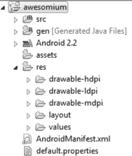

**图 4–1.** *我的 `res/` 文件夹发生了什么？*

现在，这又是一个经典的“先有鸡还是先有蛋”问题。在 第 2 章 中，我们的 Hello World 项目里只有一个 `res/drawable` 文件夹。这是因为我们将 SDK 版本 3 指定为了构建目标。该版本仅支持单一屏幕尺寸。这一情况在 Android 1.6（SDK 版本 4）时发生了变化。我们在 第 1 章 中看到设备可能有不同的尺寸，但并未讨论 Android 如何处理这些差异。实际上，存在一套精密的机制，允许您为一系列所谓的屏幕密度定义图形资源。*屏幕密度* 是物理屏幕尺寸与屏幕像素数量的组合。我们将在后续章节中更详细地探讨这个主题。目前，只需了解 Android 定义了四种密度即可：`ldpi` 用于低密度屏幕，`mdpi` 用于标准密度屏幕，`hdpi` 用于高密度屏幕，`xhdpi` 用于超高密度屏幕。对于较低密度的屏幕，我们通常使用较小的图像；对于较高密度的屏幕，则使用高分辨率资源。

因此，对于我们的图标而言，需要提供四个版本：每种密度一个。但这些版本应该多大呢？幸运的是，`res/drawable` 文件夹中已有默认图标，我们可以据此反推出自定义图标的大小。`res/drawable-ldpi` 中的图标分辨率为 36×36 像素，`res/drawable-mdpi` 中的图标分辨率为 48×48 像素，`res/drawable-hdpi` 中的图标分辨率为 72×72 像素，而 `res/drawable-xhdpi` 中的图标分辨率为 96×96 像素。我们只需创建相同分辨率的自定义图标版本，并将每个文件夹中的 `icon.png` 文件替换为我们自己的 `icon.png` 文件即可。只要我们将图标图像文件命名为 `icon.png`，就可以保持清单文件不变。请注意，清单文件中的文件引用是区分大小写的。为安全起见，资源文件名始终使用小写字母。

为了实现与 Android 1.5 的真正兼容，我们需要添加一个名为 `res/drawable/` 的文件夹，并将 `res/drawable-mdpi/` 文件夹中的图标图像放入其中。Android 1.5 无法识别其他 `drawable` 文件夹，因此可能找不到我们的图标。

最后，我们已经准备好编写一些 Android 代码了。

### Android API 基础

在本章的其余部分，我们将重点实践那些与游戏开发需求相关的 Android API。为此，我们会采取一个非常便捷的做法：建立一个测试项目，其中将包含我们准备使用的各种 API 的所有小测试示例。让我们开始吧。

#### 创建一个测试项目

根据上一节的内容，我们已经知道如何设置所有项目。因此，第一件事就是执行前面概述的十个步骤。我们遵循这些步骤，创建了一个名为 `ch04--android-basics` 的项目，其中包含一个名为 `AndroidBasicsStarter` 的主活动。我们将使用一些较旧和较新的 API，因此将最低 SDK 版本设置为 3（Android 1.5），并将构建目标以及目标 SDK 版本设置为 9（Android 2.3）。从现在开始，我们将创建新的活动实现，每个实现演示 Android API 的某些部分。

但请记住，我们只有一个主活动。那么，主活动应该是什么样的呢？我们想要一种便捷的方式来添加新活动，同时也能轻松启动特定活动。对于单个主活动的情况，显然该活动需要以某种方式提供启动特定测试活动的途径。如前所述，清单文件中会将主活动指定为主要入口点。我们添加的每个额外活动都不会包含 `<intent-filter>` 子元素。我们将从主活动通过编程方式启动它们。


### `AndroidBasicsStarter` Activity

Android API 提供了一个特殊的类 `ListActivity`，它继承自我们在 Hello World 项目中使用的 `Activity` 类。`ListActivity` 是一种特殊的 Activity，其唯一目的是显示列表内容（例如字符串）。我们用它来显示测试活动的名称。点击列表项时，将通过编程方式启动相应的 Activity。Listing 4–1 展示了 `AndroidBasicsStarter` 主 Activity 的代码。

**清单 4–1.** *`AndroidBasicsStarter.java`，负责列出并启动所有测试的主 Activity*

```
package com.badlogic.androidgames;

import android.app.ListActivity;
import android.content.Intent;
import android.os.Bundle;
import android.view.View;
import android.widget.ArrayAdapter;
import android.widget.ListView;

public class AndroidBasicsStarter extends ListActivity {
    String tests[] = { "LifeCycleTest", "SingleTouchTest", "MultiTouchTest",
            "KeyTest", "AccelerometerTest", "AssetsTest",
            "ExternalStorageTest", "SoundPoolTest", "MediaPlayerTest",
            "FullScreenTest", "RenderViewTest", "ShapeTest", "BitmapTest",
            "FontTest", "SurfaceViewTest" };

    public void onCreate(Bundle savedInstanceState) {
        super.onCreate(savedInstanceState);
        setListAdapter(new ArrayAdapter<String>(this,
                android.R.layout.simple_list_item_1, tests));
    }

    @Override
    protected void onListItemClick(ListView list, View view, int position,
            long id) {
        super.onListItemClick(list, view, position, id);
        String testName = tests[position];
        try {
            Class clazz = Class
                    .forName("com.badlogic.androidgames." + testName);
            Intent intent = new Intent(this, clazz);
            startActivity(intent);
        } catch (ClassNotFoundException e) {
            e.printStackTrace();
        }
    }
}
```

我们选择的包名是 `com.badlogic.androidgames`。导入的类也相当直观：这些就是我们在代码中将要使用的所有类。`AndroidBasicsStarter` 类继承自 `ListActivity` 类——这仍然没什么特别之处。字段 `tests` 是一个字符串数组，它保存了启动应用程序应该显示的所有测试 Activity 的名称。请注意，该数组中的名称正是我们稍后将要实现的 Activity 类的完整 Java 类名。

接下来的代码应该很熟悉：它是 `onCreate()` 方法，每个 Activity 都必须实现它，并且当 Activity 创建时系统会调用该方法。请记住，我们必须调用 Activity 基类的 `onCreate()` 方法。这是我们在自己的 `Activity` 实现的 `onCreate()` 方法中必须做的第一件事。如果没有调用，将抛出异常，并且 Activity 将无法显示。

完成上述操作后，我们接下来调用一个名为 `setListAdapter()` 的方法。此方法由我们继承的 `ListActivity` 类提供，它允许我们指定 `ListActivity` 要为我们显示的列表项。这些项必须以实现了 `ListAdapter` 接口的类实例的形式传递给该方法。我们使用方便的 `ArrayAdapter` 来做到这一点。`ArrayAdapter` 的构造函数接受三个参数：第一个是 Activity，第二个稍后解释，第三个是 `ListActivity` 应该显示的项数组。我们愉快地将前面定义的 `tests` 数组作为第三个参数传入，这就完成了所有工作。

那么 `ArrayAdapter` 构造函数的第二个参数是什么？要解释这一点，我们必须深入讲解 Android UI API 的所有内容，而我们在本书中并不打算使用这些 API。因此，与其浪费篇幅介绍我们不需要的内容，不如给你一个快速而粗略的解释：列表中的每一项都是通过一个 `View` 来显示的。该参数定义了每个 `View` 的布局以及类型。值 `android.R.layout.simple_list_item_1` 是 UI API 提供的一个预定义常量，用于快速启动和运行。它代表一个用于显示文本的标准列表项 `View`。回顾一下：`View` 是 Android 上的 UI 控件，例如按钮、文本字段或滑块。在第 2 章 剖析 `HelloWorld` Activity 时我们讨论过这一点。

如果我们仅用这个 `onCreate()` 方法启动 Activity，将看到类似 Figure 4–2 所示的屏幕。

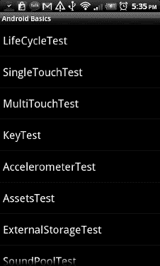

**图 4–2.** *我们的测试启动 Activity，看起来不错，但还没有太多功能*

现在，让我们让列表项在被点击时触发一些操作。我们希望启动与点击的列表项相对应的 Activity。


### 以编程方式启动活动

`ListActivity` 类有一个名为 `onListItemClick()` 的受保护方法，当点击列表项时会被调用。我们只需在 `AndroidBasicsStarter` 类中重写该方法即可。这正是我们在清单 4–1 中所做的。

该方法的参数包括：`ListActivity` 用于显示列表项的 `ListView`、被触摸且位于该 `ListView` 中的 `View`、被触摸项在列表中的位置，以及一个我们不太关心的 ID。我们真正关心的只有 `position` 参数。

`onListItemClicked()` 方法首先会遵守规范，调用基类的方法。如果我们重写了活动的方法，这始终是一个好习惯。接下来，我们根据 `position` 参数从 `tests` 数组中获取类名。这是拼图的第一块。

之前我们讨论过，可以通过 `Intent` 以编程方式启动我们在清单文件中定义的活动。`Intent` 类有一个简洁的构造函数来完成此操作，它接受两个参数：一个 `Context` 实例和一个 `Class` 实例，分别代表我们想要启动的活动所对应的 Java 类。

`Context` 是一个接口，为我们提供关于应用程序的全局信息。`Activity` 类实现了该接口，因此我们只需将 `this` 引用传递给 `Intent` 构造函数即可。

为了获取代表我们想要启动的活动的 `Class` 实例，我们会用到一点反射技术。如果你用过 Java，应该对此并不陌生。静态方法 `Class.forName()` 接受一个字符串，该字符串包含我们想要获取 `Class` 实例的类的完全限定名。我们之后要实现的所有测试活动都将位于 `com.badlogic.androidgames` 包中。将包名与从 `tests` 数组中获取的类名拼接起来，就能得到我们想要启动的活动类的完全限定名。我们将该名称传递给 `Class.forName()`，便能得到一个我们可以传递给 `Intent` 构造函数的 `Class` 实例。

一旦 `Intent` 构建完成，我们就可以通过调用 `startActivity()` 方法来启动它。该方法同样在 `Context` 接口中定义。由于我们的活动实现了该接口，我们只需调用该方法的实现即可。就这样大功告成了！

那么我们的应用程序将如何运行呢？首先，启动活动会显示出来。每次我们点击列表中的某个项，就会启动相应的活动。启动活动将被暂停并转入后台。我们发送的 `Intent` 会创建新的活动，并取代屏幕上原有的启动活动。当我们按下手机上的返回按钮时，该活动被销毁，启动活动恢复运行，重新占据屏幕。

### 创建测试活动

当我们创建新的测试活动时，需要执行以下步骤：

1.  在 `com.badlogic.androidgames` 包中创建相应的 Java 类并实现其逻辑。
2.  在清单文件中为其添加一个条目，视需要使用任何属性（例如 `android:configChanges` 或 `android:screenOrientation`）。请注意，我们不会指定 `<intent-filter>` 元素，因为我们将以编程方式启动该活动。
3.  将该活动的类名添加到 `AndroidBasicsStarter` 类的 `tests` 数组中。

只要我们遵循此流程，其他一切将由我们在 `AndroidBasicsStarter` 类中实现的逻辑处理。新的活动将自动出现在列表中，并且可以通过简单的触摸来启动。

你可能会好奇，通过触摸启动的测试活动是否在它自己的进程和虚拟机中运行。答案是否定的。由多个活动组成的应用程序拥有一个所谓的*活动栈*。每次我们启动一个新的活动，它就会被压入该栈中。当我们关闭新活动时，最后被压入栈的活动将被弹出并恢复，成为屏幕上新的活跃活动。

这也带来了其他一些影响。首先，应用程序的所有活动（栈中已暂停的活动以及当前活跃的活动）共享同一个虚拟机。它们也共享同一个内存堆。这既是福音也是诅咒。如果你的活动中存在静态字段，一旦活动启动，它们就会在堆上分配内存。作为静态字段，它们会在活动被销毁以及随后的活动实例被垃圾回收后依然存在。如果你不小心使用静态字段，这可能导致严重的内存泄漏。在使用静态字段之前，请三思而后行。

如前所述，在我们的实际游戏中，通常只会有一个活动。上述的启动活动是一个例外，目的是为了让我们的生活更轻松。但别担心，即使只有一个活动，我们也有很多机会遇到麻烦。

**注意：** 我们对 Android 用户界面编程的探讨就到此为止。从这之后，我们将始终在一个活动中使用单个 `View` 来输出内容和接收输入。如果你想了解布局、视图组以及 Android 用户界面库提供的各种花哨功能，我们建议你阅读 Mark Murphy 的著作 *Beginning Android 2*（Apress，2010 年），或者 Android 开发者网站上优秀的开发指南。

### 活动生命周期

在为 Android 编程时，我们首先要弄清楚的是活动如何运行。在 Android 中，这被称为*活动生命周期*。它描述了活动可能经历的各种状态以及这些状态之间的转换。让我们先讨论一下其背后的理论。


#### 理论解析

一个活动（Activity）可能处于以下三种状态之一：

> *运行中*：在此状态下，活动占据屏幕顶层，直接与用户交互。

> *暂停*：当活动仍在屏幕上可见，但被透明活动或对话框部分遮挡，或手机屏幕被锁定时，即进入此状态。暂停的活动随时可能被 Android 系统终止（例如，因内存不足）。请注意，活动实例本身在虚拟机堆中仍然存活，并等待恢复至运行状态。

> *停止*：当活动被另一个活动完全遮挡，从而在屏幕上不可见时，即进入此状态。例如，如果我们启动某个测试活动，`AndroidBasicsStarter` 活动就会处于此状态。当用户按下主页键暂时返回主屏幕时，也会进入此状态。如果内存不足，系统也可以决定完全终止该活动并将其从内存中移除。

在暂停和停止状态下，Android 系统都可能随时决定终止活动。系统可以礼貌地通过调用活动的 `finished()` 方法事先通知活动，也可以不友好地直接静默终止其进程。

活动可以从暂停或停止状态恢复至运行状态。再次注意，当活动从暂停或停止状态恢复时，它在内存中仍然是同一个 Java 实例，因此所有状态和成员变量都与活动被暂停或停止前相同。

活动提供了一些受保护的方法，我们可以通过重写它们来获取状态变化信息：

> `Activity.onCreate()`：当活动首次启动时调用。在此方法中，我们设置所有 UI 组件并接入输入系统。此方法在活动生命周期中只会被调用一次。

> `Activity.onRestart()`：当活动从停止状态恢复时调用。调用此方法前会先调用 `onStop()`。

> `Activity.onStart()`：在 `onCreate()` 之后调用，或当活动从停止状态恢复时调用。在后一种情况下，调用此方法前会先调用 `onRestart()`。

> `Activity.onResume()`：在 `onStart()` 之后调用，或当活动从暂停状态恢复时调用（例如屏幕解锁时）。

> `Activity.onPause()`：当活动进入暂停状态时调用。这可能是我们收到的最后一次通知，因为 Android 系统可能会决定静默终止我们的应用。我们应该在此方法中保存所有希望持久化的状态！

> `Activity.onStop()`：当活动进入停止状态时调用。调用此方法前会先调用 `onPause()`。这意味着，在活动停止之前，会先暂停。与 `onPause()` 类似，这可能是 Android 系统静默终止活动前我们收到的最后一次通知。我们也可以在此处保存持久化状态。但是，系统可能决定不调用此方法而直接终止活动。由于 `onPause()` 总是在 `onStop()` 之前以及活动被静默终止之前被调用，我们最好将所有信息保存到 `onPause()` 方法中。

> `Activity.onDestroy()`：在活动生命周期结束时调用，此时活动将被不可逆地销毁。这是我们可以持久化任何信息以便下次活动重新创建时恢复的最后机会。请注意，如果活动在系统调用 `onPause()` 或 `onStop()` 后被静默销毁，此方法可能实际上永远不会被调用。

图 4–3 展示了活动生命周期及方法调用顺序。

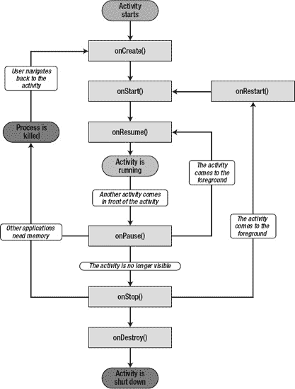

**图 4–3.** *强大而令人困惑的活动生命周期*

以下是我们应从中汲取的三个重要教训：

1.  在我们的活动进入运行状态之前，无论我们是刚从停止状态还是暂停状态恢复，`onResume()` 方法都会被执行。因此我们可以安全地忽略 `onRestart()` 和 `onStart()` 方法。我们不需要关心是从停止状态还是暂停状态恢复。对于我们的游戏而言，我们只需要知道当前确实处于运行状态，而 `onResume()` 方法会通知我们这一点。

2.  活动可能在 `onPause()` 之后被静默销毁。我们绝不应假定 `onStop()` 或 `onDestroy()` 会被调用。我们还知道 `onPause()` 总是在 `onStop()` 之前被调用。因此，我们可以安全地忽略 `onStop()` 和 `onDestroy()` 方法，仅重写 `onPause()`。在此方法中，我们必须确保所有希望持久化的状态，如最高分和关卡进度，都被写入外部存储，例如 SD 卡。在 `onPause()` 之后，一切都无法保证，我们无法知道活动是否还有机会再次运行。

3.  我们知道，如果系统决定在 `onPause()` 或 `onStop()` 之后终止活动，`onDestroy()` 可能永远不会被调用。然而，有时我们想知道活动是否真的要被终止。那么，如果 `onDestroy()` 不会被调用，我们该如何判断呢？`Activity` 类提供了一个名为 `Activity.isFinishing()` 的方法，我们可以在任何时候调用它来检查我们的活动是否即将被终止。我们至少可以保证，在活动被终止之前，`onPause()` 方法会被调用。我们只需在 `onPause()` 方法中调用 `isFinishing()` 方法，即可判断活动在 `onPause()` 调用之后是否会被销毁。

这样做让事情简单多了。我们只需重写 `onCreate()`、`onResume()` 和 `onPause()` 方法。

*   在 `onCreate()` 中，我们设置用于渲染和接收输入的窗口及 UI 组件。
*   在 `onResume()` 中，我们（重新）启动主循环线程（在上一章中讨论过）。
*   在 `onPause()` 中，我们简单地暂停主循环线程，并且如果 `Activity.isFinishing()` 返回 `true`，我们还将任何需要持久化的状态保存到磁盘。

许多人在活动生命周期上挣扎，但如果我们遵循这些简单的规则，我们的游戏将能够妥善处理暂停、恢复以及清理工作。


## 实践环节

让我们编写第一个演示活动生命周期的测试示例。我们需要某种能显示到目前为止发生了哪些状态变化的输出。我们将通过两种方式实现：

1.  该活动显示的唯一 UI 组件是一个名为 `TextView` 的控件。它用于显示文本，我们在启动器活动中已经隐式地使用它来显示每个条目。每次进入新状态时，我们都会向 `TextView` 追加一个字符串，它将显示到目前为止发生的所有状态变化。
2.  由于我们无法在 `TextView` 中显示活动的销毁事件（因为它会从屏幕上过快消失），因此我们也会将所有状态变化输出到 `LogCat`。我们通过 `Log` 类来实现，该类提供了一些静态方法，用于向 `LogCat` 追加消息。

请记住我们需要做什么来向测试应用程序添加一个测试活动。首先，在清单文件中以 `<activity>` 元素的形式定义它，该元素是 `<application>` 元素的子元素：

`<activity android:label="生命周期测试" android:name=".LifeCycleTest" android:configChanges="keyboard|keyboardHidden|orientation" />`

接下来，我们向 `com.badlogic.androidgames` 包中添加一个名为 `LifeCycleTest` 的新 Java 类。最后，我们将该类名添加到之前定义的 `AndroidBasicsStarter` 类的 `tests` 成员中。（当然，我们在编写演示类时已经将其放在那里了。）

在后续章节中，我们创建的任何测试活动都需要重复所有这些步骤。为简洁起见，我们不再赘述这些步骤。另请注意，我们没有为 `LifeCycleTest` 活动指定方向。在此示例中，我们可以处于横向或纵向模式，具体取决于设备方向。我们这样做是为了让你看到方向变化对生命周期的影响（由于我们设置 `configChanges` 属性的方式，这里没有影响）。列表 4-2 展示了整个活动的代码。

**列表 4-2.** *LifeCycleTest.java，演示活动生命周期*

```
package com.badlogic.androidgames;

import android.app.Activity;
import android.os.Bundle;
import android.util.Log;
import android.widget.TextView;

public class LifeCycleTest extends Activity {
    StringBuilder builder = new StringBuilder();
    TextView textView;

    private void log(String text) {
        Log.d("LifeCycleTest", text);
        builder.append(text);
        builder.append('\n');
        textView.setText(builder.toString());
    }

    @Override
    public void onCreate(Bundle savedInstanceState) {
        super.onCreate(savedInstanceState);
        textView = new TextView(this);
        textView.setText(builder.toString());
        setContentView(textView);
        log("已创建");
    }

    @Override
    protected void onResume() {
        super.onResume();
        log("已恢复");
    }

    @Override
    protected void onPause() {
        super.onPause();
        log("已暂停");
        if (isFinishing()) {
            log("正在结束");
        }
    }
}
```

我们快速过一遍这段代码。该类继承自 `Activity`——这并不令人意外。我们定义了两个成员：一个 `StringBuilder`，用于保存到目前为止我们生成的所有消息；以及 `TextView`，用于直接在 `Activity` 中显示这些消息。

接下来，我们定义了一个小的私有辅助方法，该方法会将文本记录到 `LogCat`，将其追加到我们的 `StringBuilder` 中，并更新 `TextView` 文本。对于 `LogCat` 输出，我们使用静态的 `Log.d()` 方法，该方法接受一个标签作为第一个参数，实际消息作为第二个参数。

在 `onCreate()` 方法中，我们像往常一样首先调用超类方法。我们创建 `TextView` 并将其设置为活动的内容视图。它将填满活动的整个空间。最后，我们将创建的消息记录到 `LogCat`，并使用之前定义的辅助方法 `log()` 更新 `TextView` 文本。

接下来，我们重写活动的 `onResume()` 方法。与我们重写的任何活动方法一样，我们首先调用超类方法。我们唯一要做的就是再次调用 `log()`，并将 `"已恢复"` 作为参数传递。

重写的 `onPause()` 方法看起来与 `onResume()` 方法非常相似。我们首先将消息记录为 `"已暂停"`。我们还想知道活动在 `onPause()` 方法调用后是否会被销毁，因此我们检查 `Activity.isFinishing()` 方法。如果它返回 `true`，我们也会记录结束事件。当然，我们无法看到更新后的 `TextView` 文本，因为活动会在更改显示在屏幕上之前被销毁。因此，正如前面讨论的，我们也将所有内容输出到 `LogCat`。

运行应用程序，并稍微操作一下这个测试活动。以下是你可以执行的一系列操作：

1.  从启动器活动启动测试活动。
2.  锁定屏幕。
3.  解锁屏幕。
4.  按下主页按钮（这将使你返回主屏幕）。
5.  在主屏幕上，按住主页按钮，直到显示当前正在运行的应用程序列表。选择 Android Basics Starter 应用程序以恢复（这将使测试活动重新显示在屏幕上）。
6.  按下返回按钮（这将使你返回启动器活动）。

如果你的系统在活动暂停期间未决定在任何时候静默地杀死它，你将看到 图 4-4 中的输出（当然，前提是你尚未按下返回按钮）。

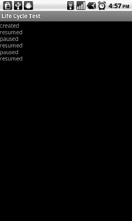

**图 4-4.** *运行 LifeCycleTest 活动*

启动时，会调用 `onCreate()`，随后是 `onResume()`。当我们锁定屏幕时，会调用 `onPause()`。当我们解锁屏幕时，会调用 `onResume()`。当我们按下主页按钮时，会调用 `onPause()`。返回活动将再次调用 `onResume()`。当然，相同的消息也会显示在 `LogCat` 中，你可以在 Eclipse 的 `LogCat` 视图中观察到。图 4-5 显示了我们在执行上述操作序列（加上按下返回按钮）时写入 `LogCat` 的内容。

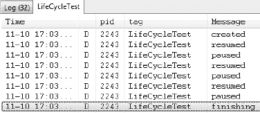

**图 4-5.** *LifeCycleTest 的 LogCat 输出*

再次按下返回按钮会调用 `onPause()` 方法。由于它也会销毁活动，因此 `onPause()` 中的条件语句也会被触发，通知我们这是该活动的最后一次出现。

这就是活动生命周期，去除了神秘色彩，并针对我们的游戏编程需求进行了简化。我们现在可以轻松处理任何暂停和恢复事件，并且保证在活动被销毁时收到通知。

### 输入设备处理

正如前面章节所讨论的，我们可以从 Android 上的许多不同输入设备获取信息。在本节中，我们将讨论 Android 上三个最相关的输入设备以及如何使用它们：触摸屏、键盘和加速度计。

#### 获取（多点）触摸事件

触摸屏可能是从用户获取输入的最重要方式。在 Android 2.0 版本之前，API 仅支持处理单指触摸事件。多点触摸是在 Android 2.0（SDK 版本 5）中引入的。多点触摸事件报告被附加到单点触摸 API 上，在可用性方面带来了一些好坏参半的结果。我们将首先研究处理所有 Android 版本上都可用的单点触摸事件。


##### 处理单点触控事件

在第 2 章中处理按钮点击时，我们看到监听器接口是 Android 向应用报告事件的方式。触控事件也不例外。触控事件会被传递到我们为`View`注册的`OnTouchListener`接口实现中。`OnTouchListener`接口只有一个方法：

`public abstract boolean onTouch (View v, MotionEvent event)`

第一个参数是接收触控事件的`View`对象。第二个参数则是我们需要解析以获取触控事件的数据。

可以通过`View.setOnTouchListener()`方法为任何`View`实现注册`OnTouchListener`。`OnTouchListener`会在`MotionEvent`被分派给`View`本身之前被调用。我们可以在`onTouch()`方法的实现中通过返回`true`来告知`View`我们已经处理了该事件。如果返回`false`，`View`自身将会处理该事件。

`MotionEvent`实例有三个与我们相关的方法：

> `MotionEvent.getX()`和`MotionEvent.getY()`：这些方法返回相对于`View`的触控事件的 x 坐标和 y 坐标。坐标系以视图左上角为原点，x 轴向右，y 轴向下。坐标以像素为单位。注意这些方法返回的是浮点数，因此坐标具有亚像素精度。
>
> `MotionEvent.getAction()`：该方法返回触控事件的类型。它是一个整数值，取值可以是`MotionEvent.ACTION_DOWN`、`MotionEvent.ACTION_MOVE`、`MotionEvent.ACTION_CANCEL`和`MotionEvent.ACTION_UP`。

听起来很简单，实际上也确实如此。当手指触碰到屏幕时，会触发`MotionEvent.ACTION_DOWN`事件。当手指移动时，会触发类型为`MotionEvent.ACTION_MOVE`的事件。请注意，你总会收到`MotionEvent.ACTION_MOVE`事件，因为你无法让手指保持完全静止。触控传感器能识别出最细微的变化。当手指再次抬起时，会报告`MotionEvent.ACTION_UP`事件。`MotionEvent.ACTION_CANCEL`事件则有点神秘。文档指出，当当前手势被取消时会触发该事件。我们在实际开发中从未遇到过这个事件。不过，在开始实现第一个游戏时，我们仍会处理它，并将其视为`MotionEvent.ACTION_UP`事件。

让我们编写一个简单的测试 Activity，看看这在代码中是如何工作的。该 Activity 应在屏幕上显示手指的当前位置以及事件类型。代码清单 4-3 展示了我们设计的代码。

**代码清单 4-3.** *SingleTouchTest.java; 测试单点触控处理*

```java
package com.badlogic.androidgames;

import android.app.Activity;
import android.os.Bundle;
import android.util.Log;
import android.view.MotionEvent;
import android.view.View;
import android.view.View.OnTouchListener;
import android.widget.TextView;

public class SingleTouchTest extends Activity implements OnTouchListener {
    StringBuilder builder = new StringBuilder();
    TextView textView;

    public void onCreate(Bundle savedInstanceState) {
        super.onCreate(savedInstanceState);
        textView = new TextView(this);
        textView.setText("Touch and drag (one finger only)!");
        textView.setOnTouchListener(this);
        setContentView(textView);
    }

    @Override
    public boolean onTouch(View v, MotionEvent event) {
        builder.setLength(0);
        switch (event.getAction()) {
            case MotionEvent.ACTION_DOWN:
                builder.append("down, ");
                break;
            case MotionEvent.ACTION_MOVE:
                builder.append("move, ");
                break;
            case MotionEvent.ACTION_CANCEL:
                builder.append("cancle, ");
                break;
            case MotionEvent.ACTION_UP:
                builder.append("up, ");
                break;
        }
        builder.append(event.getX());
        builder.append(", ");
        builder.append(event.getY());
        String text = builder.toString();
        Log.d("TouchTest", text);
        textView.setText(text);
        return true;
    }
}
```

我们让 Activity 实现了`OnTouchListener`接口。我们还拥有两个成员变量：一个用于`TextView`，另一个是用于构建事件字符串的`StringBuilder`。

`onCreate()`方法不言自明。唯一的新意在于调用了`TextView.setOnTouchListener()`，我们将 Activity 注册到`TextView`，使其能接收`MotionEvent`。

剩下的就是`onTouch()`方法的实现。我们忽略了`view`参数，因为知道它必定是`TextView`。我们只关心获取触控事件类型，将标识该类型的字符串追加到`StringBuilder`中，再追加触控坐标，然后更新`TextView`的文本。仅此而已。我们还将事件记录到 LogCat，以便观察事件发生的顺序，因为`TextView`只会显示我们处理的最后一个事件（每次调用`onTouch()`时我们都会清空`StringBuilder`）。

`onTouch()`方法中有一个细微之处在于返回语句，我们返回了`true`。通常，为了不干扰事件分派过程，我们会遵循监听器概念并返回`false`。但在本例中，如果这样做，我们将只能收到`MotionEvent.ACTION_DOWN`事件。因此，我们告知`TextView`我们刚刚消费了该事件。这种行为在不同的`View`实现中可能有所不同。幸运的是，在本书其余部分，我们只需要使用另外三种视图，并且它们都会允许我们消费任何想要的事件。

如果我们在模拟器或连接的设备上运行该应用程序，可以看到`TextView`始终显示报告给`onTouch()`方法的最后一个事件类型和位置。此外，你还可以在 LogCat 中看到相同的信息。

我们没有在清单文件中固定 Activity 的方向。如果你旋转设备使 Activity 处于横屏模式，坐标系当然会改变。图 4-6 展示了 Activity 在竖屏和横屏模式下的情况。在这两种情况下，我们都试图触摸`View`的中心。注意 x 和 y 坐标似乎发生了交换。该图还展示了两种模式下的 x 轴和 y 轴（黄线），以及我们大致触摸到的屏幕位置（绿色圆圈）。在两种情况下，原点都在`TextView`的左上角，x 轴向右，y 轴向下。

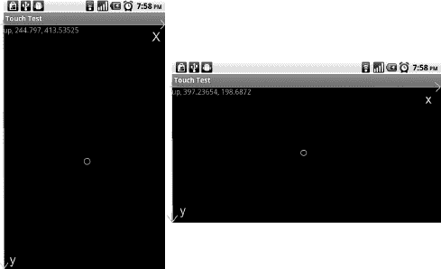

**图 4-6.** *在竖屏和横屏模式下触摸屏幕*

根据方向不同，我们的最大 x 和 y 值当然也会变化。上图是在 Nexus One 上截取的，该设备在竖屏模式下屏幕分辨率为 480×800 像素（横屏模式下为 800×480 像素）。由于触控坐标是相对于`View`给出的，并且视图并未填满整个屏幕，因此我们的最大 y 值会小于分辨率高度。稍后我们将看到如何启用全屏模式，以便标题栏和通知栏不会妨碍我们。

遗憾的是，在较旧的 Android 版本和第一代设备上，触控事件存在一些问题。


> *触摸事件洪泛*：当手指在触摸屏上按下时，驱动程序会尽可能多地报告触摸事件——在某些设备上可达每秒数百次。我们可以通过在`onTouch()`方法中调用`Thread.sleep(16)`来解决此问题，这会使分发这些事件的 UI 线程休眠 16 毫秒。这样一来，我们每秒最多只能收到 60 个事件，这已足以实现响应灵敏的游戏。该问题仅存在于搭载 Android 1.5 系统的设备上。

> *触摸屏幕消耗 CPU*：即使在`onTouch()`方法中让线程休眠，系统仍需处理驱动程序报告的内核事件。在 Hero 或 G1 等老旧设备上，这可能会占用高达 50%的 CPU 资源，从而留给主循环线程的处理能力大幅减少。其后果是我们原本完美的帧率会显著下降，有时甚至会低至游戏无法正常游玩的程度。在第二代设备上，该问题不那么明显，通常可以忽略。遗憾的是，对于老旧设备目前尚无解决方案。

一般来说，为了稳妥起见，你需要在所有`onTouch()`方法中加入`Thread.sleep(16)`。在新设备上，这不会产生任何影响；而在旧设备上，它至少能防止触摸事件洪泛。

随着第一代设备逐渐退出历史舞台，随着时间的推移，这个问题会越来越不严重。尽管如此，它仍然给游戏开发者带来极大的困扰。试着向你的用户解释：你的游戏运行得像糖浆一样慢，是因为驱动中的某个东西占用了所有 CPU。是的，没人会在意。

##### 处理多点触控事件

警告：前方有大麻烦！多点触控 API 被附加到了最初仅处理单点触控的`MotionEvent`类上。这使得在尝试解码多点触控事件时非常容易混淆。让我们试着理清头绪。

**注意：** 多点触控 API 似乎也让创建它的 Android 工程师感到困惑。它在 SDK 8 版本（Android 2.2）中经历了重大更新，增加了新的方法、新的常量，甚至重命名了常量。这些改动应该能让多点触控的开发工作稍微轻松一些。然而，这些新特性仅适用于 SDK 8 及更高版本。为了支持所有具备多点触控能力的 Android 版本（2.0 至 2.2.1），我们必须使用 SDK 5 版本的 API。

处理多点触控与处理单点触控事件非常相似。我们仍然实现与单点触控事件相同的`OnTouchListener`接口。我们也从`MotionEvent`实例中读取数据。我们还处理之前处理过的那些事件类型，比如`MotionEvent.ACTION_UP`，外加一些不是太难搞的新事件类型。

##### 指针 ID 与索引

当我们想要访问触摸事件的坐标时，差异就开始了。`MotionEvent.getX()`和`MotionEvent.getY()`返回屏幕上单根手指的坐标。在处理多点触控事件时，我们使用这些方法的重载变体，它们接受一个所谓的*指针索引*。示例如下：

```
event.getX(pointerIndex);
event.getY(pointerIndex);
```

现在，你可能会认为`pointerIndex`直接对应于触摸屏幕的某一根手指（例如，按下的第一根手指的`pointerIndex`为 0，按下的第二根手指的`pointerIndex`为 1，以此类推）。遗憾的是，事实并非如此。

`pointerIndex`是`MotionEvent`内部数组的索引，该数组保存了屏幕上特定手指的事件坐标。手指在屏幕上的真实标识符被称为*指针标识符*。指针标识符是一个任意数字，它唯一地标识了一次指针触摸到屏幕的实例。有一个单独的方法`MotionEvent.getPointerIdentifier(int pointerIndex)`，它根据指针索引返回指针标识符。只要单根手指一直触摸屏幕，其指针标识符就会保持不变。而指针索引却不一定如此。理解这两者之间的区别非常重要，并且要明白不能依赖第一次触摸的索引是 0、ID 也是 0，因为在某些设备上，尤其是第一版 Xperia Play，指针 ID 会一直递增到 15，然后重新从 0 开始，而不会重用可用的最小 ID。

让我们先来研究如何获取事件的指针索引。我们暂时忽略事件类型。

```
int pointerIndex = (event.getAction() & MotionEvent.ACTION_POINTER_ID_MASK) >>
MotionEvent.ACTION_POINTER_ID_SHIFT;
```

你可能和我们初次实现这段代码时的想法一样。在彻底丧失信心之前，让我们试着解读一下这里发生了什么。我们通过`MotionEvent.getAction()`从`MotionEvent`中获取事件类型。好的，这个我们之前做过。接下来，我们对从`MotionEvent.getAction()`方法获取的整数与一个名为`MotionEvent.ACTION_POINTER_ID_MASK`的常量执行按位与操作。现在有趣的地方来了。

该常量的值为`0xff00`，所以我们实际上是将除了第 8 到第 15 位之外的所有位都置为 0，而第 8 到第 15 位恰好保存了事件的指针索引。`event.getAction()`返回的整数的低八位保存了事件类型的值，比如`MotionEvent.ACTION_DOWN`及其同类事件。我们通过这次按位运算实际上丢弃了事件类型。现在移位操作应该更容易理解了。我们向右移动`MotionEvent.ACTION_POINTER_ID_SHIFT`位（其值为 8），所以我们基本上是把第 8 到第 15 位移动到了第 0 到第 7 位，从而得到事件的实际指针索引。有了这个索引，我们就可以获取事件的坐标以及指针标识符。

请注意，我们的魔数常量被命名为`XXX_POINTER_ID_XXX`而不是`XXX_POINTER_INDEX_XXX`（后者更有意义，因为我们实际上是想提取指针索引，而不是指针标识符）。嗯，Android 工程师们肯定也糊涂了。在 SDK 8 版本中，他们弃用了这些常量，并引入了名为`XXX_POINTER_INDEX_XXX`的新常量，其值与弃用的常量完全相同。为了让基于 SDK 5 版本编写的遗留应用程序能在较新版本的 Android 上继续运行，旧常量当然仍然可以使用。

所以我们现在知道了如何获取那个神秘的指针索引，并可以用它来查询事件的坐标和指针标识符。


##### 动作掩码与更多事件类型

接下来，我们需要从 `MotionEvent.getAction()` 返回的整数中，剥离掉编码在内的额外指针索引，只获取纯粹的事件类型。我们只需通过掩码操作屏蔽掉指针索引部分即可：

`int action = event.getAction() & MotionEvent.ACTION_MASK;`

嗯，这很简单。遗憾的是，只有当你了解指针索引是什么，并且知道它实际上被编码在动作值中时，才能真正理解这行代码。

剩下的工作就是像之前一样解析事件类型。我们之前提到过，这里有一些新的事件类型，下面逐一说明：

> `MotionEvent.ACTION_POINTER_DOWN`：当第一根手指触摸屏幕后，任何后续手指触摸屏幕时都会产生此事件。第一根手指仍然会产生 `MotionEvent.ACTION_DOWN` 事件。
> 
> `MotionEvent.ACTION_POINTER_UP`：这与前一个动作类似。当有手指从屏幕抬起，且屏幕上仍有超过一根手指触摸时，会触发此事件。屏幕上最后抬起的那根手指会产生 `MotionEvent.ACTION_UP` 事件，这根手指不一定是触摸屏幕的第一根手指。

幸运的是，我们可以简单地把这两种新事件类型当作旧的 `MotionEvent.ACTION_UP` 和 `MotionEvent.ACTION_DOWN` 事件来处理。

最后一个区别是，单个 `MotionEvent` 可能包含多个事件的数据。是的，你没看错。要实现这一点，被合并的事件必须具有相同的类型。实际上，这种情况只会发生在 `MotionEvent.ACTION_MOVE` 事件上，因此我们只需在处理该事件类型时注意这一点。要检查单个 `MotionEvent` 中包含多少个事件，我们可以使用 `MotionEvent.getPointerCount()` 方法，它会告诉我们有多少根手指的坐标信息包含在该 `MotionEvent` 中。然后，我们可以通过 `MotionEvent.getX()`、`MotionEvent.getY()` 和 `MotionEvent.getPointerId()` 方法来获取指针索引从 0 到 `MotionEvent.getPointerCount() - 1` 的指针标识符和坐标。

##### 实践应用

让我们为这个出色的 API 编写一个示例。我们希望最多追踪十根手指（目前还没有设备能追踪更多手指，所以我们这样做很安全）。通常，当我们往屏幕上增加手指时，Android 设备会分配连续的指针索引，但这并非总能保证，因此我们在数组中使用指针索引作为依据，并且简单地显示分配给触摸点的 ID。我们记录每个指针的坐标和触摸状态（触摸或未触摸），并通过 `TextView` 将这些信息输出到屏幕上。我们将测试 Activity 命名为 `MultiTouchTest`。清单 4–4 展示了完整的代码。

**清单 4–4.** *MultiTouchTest.java；测试多点触控 API*

```
package com.badlogic.androidgames;

import android.app.Activity;
import android.os.Bundle;
import android.view.MotionEvent;
import android.view.View;
import android.view.View.OnTouchListener;
import android.widget.TextView;

public class MultiTouchTest extends Activity implements OnTouchListener {
    StringBuilder builder = new StringBuilder();
    TextView textView;
    float[] x = new float[10];
    float[] y = new float[10];
    boolean[] touched = new boolean[10];
    int[] id = new int[10];

    private void updateTextView() {
        builder.setLength(0);
        for (int i = 0; i < 10; i++) {
            builder.append(touched[i]);
            builder.append(", ");
            builder.append(id[i]);
            builder.append(", ");
            builder.append(x[i]);
            builder.append(", ");
            builder.append(y[i]);
            builder.append("\n");
        }
        textView.setText(builder.toString());
    }

    public void onCreate(Bundle savedInstanceState) {
        super.onCreate(savedInstanceState);
        textView = new TextView(this);
        textView.setText("Touch and drag (multiple fingers supported)!");
        textView.setOnTouchListener(this);
        setContentView(textView);
        for (int i = 0; i < 10; i++) {
            id[i] = -1;
        }
        updateTextView();
    }

    @Override
    public boolean onTouch(View v, MotionEvent event) {
        int action = event.getAction() & MotionEvent.ACTION_MASK;
        int pointerIndex = (event.getAction() & MotionEvent.ACTION_POINTER_ID_MASK) >>
                MotionEvent.ACTION_POINTER_ID_SHIFT;
        int pointerCount = event.getPointerCount();
        for (int i = 0; i < 10; i++) {
            if (i >= pointerCount) {
                touched[i] = false;
                id[i] = -1;
                continue;
            }
            if (event.getAction() != MotionEvent.ACTION_MOVE && i != pointerIndex) {
                // if it's an up/down/cancel/out event, mask the id to see if we should
                // process it for this touch point
                continue;
            }
            int pointerId = event.getPointerId(i);
            switch (action) {
                case MotionEvent.ACTION_DOWN:
                case MotionEvent.ACTION_POINTER_DOWN:
                    touched[i] = true;
                    id[i] = pointerId;
                    x[i] = (int) event.getX(i);
                    y[i] = (int) event.getY(i);
                    break;

                case MotionEvent.ACTION_UP:
                case MotionEvent.ACTION_POINTER_UP:
                case MotionEvent.ACTION_OUTSIDE:
                case MotionEvent.ACTION_CANCEL:
                    touched[i] = false;
                    id[i] = -1;
                    x[i] = (int) event.getX(i);
                    y[i] = (int) event.getY(i);
                    break;
            }
        }
        return true;
    }
}
```


```java
case MotionEvent.ACTION_MOVE:
touched[i] = true;
                id[i] = pointerId;
                x[i] = (int) event.getX(i);
                y[i] = (int) event.getY(i);
break;
            }
        }

        updateTextView();
return true;
    }
}
```

我们像之前一样实现了`OnTouchListener`接口。为了追踪十根手指的坐标和触摸状态，我们添加了三个新的成员数组来存储这些信息。数组`x`和`y`存储每个指针 ID 的坐标，数组`touched`存储对应指针 ID 的手指是否按下。

接下来，我们创建了一个辅助方法，它会将手指的当前状态输出到`TextView`中。该方法简单地遍历所有十根手指的状态，并通过`StringBuilder`将它们拼接起来，最终将文本设置到`TextView`上。

`onCreate()`方法设置了活动（Activity），并让活动作为`OnTouchListener`注册到`TextView`上。这部分我们已经非常熟悉了。

现在到了棘手的部分：`onTouch()`方法。

我们首先通过对`event.getAction()`返回的整数进行掩码操作来获取事件类型。接着，我们提取指针索引，并根据之前讨论的方法从`MotionEvent`中获取对应的指针标识符。

`onTouch()`方法的核心是那个巨大的`switch`语句，我们之前曾以简化形式用它来处理单点触摸事件。我们将所有事件从高层次上分为三类：

*   发生触摸按下事件：（`MotionEvent.ACTION_DOWN`或`MotionEvent.ACTION_POINTER_DOWN`）。我们将对应指针标识符的触摸状态设为`true`，同时保存该指针的当前坐标。
*   发生触摸抬起事件：（`MotionEvent.ACTION_UP`、`MotionEvent.ACTION_POINTER_UP`或`MotionEvent.CANCEL`）。我们将对应指针标识符的触摸状态设为`false`，并保存其最后已知坐标。
*   一根或多根手指在屏幕上拖动：（`MotionEvent.ACTION_MOVE`）。我们检查`MotionEvent`中包含多少个事件，然后更新指针索引 0 到`MotionEvent.getPointerCount() - 1`的坐标。对于每个事件，我们获取对应的指针标识符并更新坐标。

事件处理完毕后，我们通过调用之前定义的`updateView()`方法来更新`TextView`。最后，我们返回`true`，表示已处理该触摸事件。

图 4–7 展示了在一台三星 Galaxy S 上触摸 5 根手指并稍作拖动后，活动生成的输出结果。

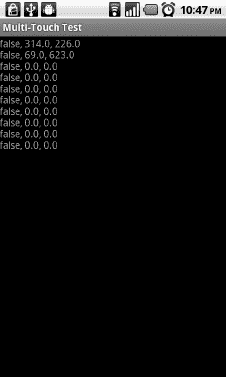

**图 4–7.** *多点触摸的有趣体验*

运行这个示例时，我们可以观察到以下几点：

*   如果我们在一台 Android 版本低于 2.0 的设备或模拟器上启动它，由于使用了这些早期版本中不可用的 API，会得到一个严重的异常。我们可以通过判断应用程序运行的 Android 版本来解决这个问题：在 Android 1.5 和 1.6 的设备上使用单点触摸代码，在 Android 2.0 或更新的设备上使用多点触摸代码。我们将在下一章中详细讨论。
*   模拟器不支持多点触摸。如果我们创建一台运行 Android 2.0 或更高版本的模拟器，API 是存在的，但我们只有单鼠标。即使有两个鼠标，也无济于事。
*   触摸两根手指，抬起第一根，然后再触摸下去。在第一根手指抬起后，第二根手指会保持其指针标识符。当第一根手指第二次触摸下去时，它会获得一个新的指针标识符，通常是 0，但也可以是任何整数。任何新触摸屏幕的手指都将获得一个新的指针标识符，该标识符可以是当前未被其他活动触摸使用的任意值。这是一条需要记住的规则。
*   如果你在 Nexus One 或 Droid 上尝试，当你在同一轴上交叉两根手指时，会注意到一些奇怪的行为。这是因为这些设备的屏幕不能完全支持对单根手指的跟踪。这是一个大问题，但我们可以通过精心设计用户界面在一定程度上解决。在后面的章节中，我们还会再次讨论这个问题。需要记住的要点是：*不要交叉轨迹！*

这样，Android 上的多点触摸处理就介绍完了。虽然它很令人头疼，但一旦你理清所有这些术语，并习惯位操作后，你会对实现感到更加得心应手，像专家一样处理所有的触摸点。

**注意：** 很抱歉这部分内容让你感到头疼。这一节内容相当复杂。遗憾的是，官方 API 文档极其匮乏，大多数人只是通过胡乱尝试来“学习”这个 API。我们建议你多练习上面的代码示例，直到完全理解它的内部机制。


#### 处理按键事件

经历了上一节的疯狂之后，我们理应来点简单到极点的内容。欢迎来到按键事件处理。

要捕获按键事件，我们需要实现另一个监听器接口，名为 `OnKeyListener`。它只有一个方法 `onKey()`，签名如下：

`public boolean onKey(View view, int keyCode, KeyEvent event)`

其中 `View` 参数指定了接收按键事件的视图，`keyCode` 参数是 `KeyEvent` 类中定义的常量之一，最后一个参数则是按键事件本身，它包含一些附加信息。

什么是键码？（屏幕上的）键盘上的每个按键以及每个系统按键都有一个唯一的数字编号。这些键码在 `KeyEvent` 类中被定义为静态公共最终整型常量。其中一个键码是 `KeyCode.KEYCODE_A`，即 A 键的键码。这与按下按键时在文本字段中生成的字符无关。它实际上只是标识按键本身。

`KeyEvent` 类与 `MotionEvent` 类类似。它有两个与我们相关的两个方法：

> `KeyEvent.getAction()`：此方法返回 `KeyEvent.ACTION_DOWN`、`KeyEvent.ACTION_UP` 和 `KeyEvent.ACTION_MULTIPLE`。就我们的目的而言，可以忽略最后一种按键事件类型。另外两种会在按键按下或释放时发送。
> 
> `KeyEvent.getUnicodeChar()`：返回该按键在文本字段中产生的 Unicode 字符。假设我们按住 Shift 键并按下 A 键。这将报告为一个键码为 `KeyEvent.KEYCODE_A` 的事件，但 Unicode 字符却是 `A`。如果我们想自己处理文本输入，就可以使用这个方法。

要接收键盘事件，`View` 必须获得焦点。可以通过以下方法调用来强制获取焦点：

`View.setFocusableInTouchMode(true);`
`View.requestFocus();`

第一个方法保证 `View` 可以获得焦点。第二个方法则请求特定视图获取焦点。

让我们实现一个简单的测试 Activity，看看它们如何协同工作。我们想要获取按键事件，并在 `TextView` 中显示最近接收到的那个事件。我们将显示的信息包括按键事件类型、键码以及（如果会产生的话）Unicode 字符。请注意，有些按键本身不会产生 Unicode 字符，只有与其他字符组合时才会产生。清单 4–5 展示了几行代码如何实现所有这些功能。

**清单 4–5.** *KeyTest.Java；测试按键事件 API*

```java
package com.badlogic.androidgames;

import android.app.Activity;
import android.os.Bundle;
import android.util.Log;
import android.view.KeyEvent;
import android.view.View;
import android.view.View.OnKeyListener;
import android.widget.TextView;

public class KeyTest extends Activity implements OnKeyListener {
    StringBuilder builder = new StringBuilder();
    TextView textView;

    public void onCreate(Bundle savedInstanceState) {
        super.onCreate(savedInstanceState);
        textView = new TextView(this);
        textView.setText("Press keys (if you have some)!");
        textView.setOnKeyListener(this);
        textView.setFocusableInTouchMode(true);
        textView.requestFocus();
        setContentView(textView);
    }

    @Override
    public boolean onKey(View view, int keyCode, KeyEvent event) {
        builder.setLength(0);
        switch (event.getAction()) {
            case KeyEvent.ACTION_DOWN:
                builder.append("down, ");
                break;
            case KeyEvent.ACTION_UP:
                builder.append("up, ");
                break;
        }
        builder.append(event.getKeyCode());
        builder.append(", ");
        builder.append((char) event.getUnicodeChar());
        String text = builder.toString();
        Log.d("KeyTest", text);
        textView.setText(text);

        if (event.getKeyCode() == KeyEvent.KEYCODE_BACK)
            return false;
        else
            return true;
    }
}
```

我们首先声明 Activity 实现了 `OnKeyListener` 接口。接着，定义了两个我们已经熟悉的成员变量：一个用于构建要显示文本的 `StringBuilder` 和一个用于显示文本的 `TextView`。

在 `onCreate()` 方法中，我们确保 `TextView` 获得焦点，以便它能接收按键事件。我们还通过 `TextView.setOnKeyListener()` 方法将 Activity 注册为 `OnKeyListener`。

`onKey()` 方法同样非常直接明了。我们在 `switch` 语句中处理两种事件类型，向 `StringBuilder` 追加相应的字符串。接着，我们追加键码以及来自 `KeyEvent` 本身的 Unicode 字符，并将其输出到 LogCat 和 `TextView` 中。

最后一个 `if` 语句很有意思：如果按下的是返回键，我们从 `onKey()` 方法中返回 `false`，让 `TextView` 来处理该事件。否则，我们返回 `true`。为什么这里要区分处理呢？

如果我们在返回键的情况下返回 `true`，就会对 Activity 的生命周期造成一些干扰。由于我们决定自行消费返回键事件，Activity 将不会被关闭。当然，在某些场景下，我们确实希望捕获返回键以防止 Activity 被关闭。但是，强烈建议除非绝对必要，否则不要这样做。

图 4–8 展示了在 Droid 设备键盘上同时按住 Shift 和 A 键时 Activity 的输出结果。

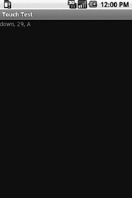

**图 4–8.** *同时按下 Shift 和 A 键*

这里有几点需要注意：

*   观察 LogCat 输出时，请注意我们可以轻松处理同时发生的按键事件。同时按住多个按键不会有问题。
*   按下方向键和滚动轨迹球都会被报告为按键事件。
*   与触摸事件一样，在旧版 Android 系统和第一代设备上，按键事件可能会消耗相当多的 CPU 资源。不过，它们不会产生大量事件。

和上一节相比，这节内容相当轻松，不是吗？

**注意：** 按键处理 API 比我们这里展示的要复杂一些。不过，对于我们游戏编程项目而言，这里介绍的信息已经绰绰有余了。如果你需要更复杂的内容，请参考 Android 开发者官方网站的文档。


#### 读取加速度计状态

游戏中一个非常有趣的输入选项是加速度计。所有安卓设备都必须配备三轴加速度计。我们在上一章中曾简单讨论过加速度计。通常，我们只需要轮询加速度计的状态即可。

那么如何获取加速度计信息呢？你猜对了——通过注册监听器。我们需要实现的接口名为`SensorEventListener`，它包含两个方法：

`public void onSensorChanged(SensorEvent event);`
`public void onAccuracyChanged(Sensor sensor, int accuracy);`

当新的加速度计事件到达时，会调用第一个方法。当加速度计精度发生变化时，会调用第二个方法。在我们的应用中，可以安全地忽略第二个方法。

那么我们应该在哪里注册`SensorEventListener`呢？这需要做一些准备工作。首先，我们需要检查设备是否确实安装了加速度计。虽然我们刚才提到所有安卓设备都必须包含加速度计，但这一点在未来可能会改变。因此，我们希望 100%确保该输入方法可用。

第一步是获取所谓的`SensorManager`实例。这个管理器会告诉我们加速度计是否已安装，同时也是我们注册监听器的地方。要获取`SensorManager`，需要使用`Context`接口中的方法：

`SensorManager manager = (SensorManager)context.getSystemService(Context.SENSOR_SERVICE);`

`SensorManager`是一种由安卓系统提供的*系统服务*。安卓由多个系统服务组成，每个服务都为请求者提供不同的系统信息。

获取管理器后，我们可以检查加速度计是否可用：

`boolean hasAccel = manager.getSensorList(Sensor.TYPE_ACCELEROMETER).size() > 0;`

通过这段代码，我们向管理器查询所有已安装的类型为`accelerometer`的传感器。虽然这意味着设备可能拥有多个加速度计，但实际上通常只会返回一个加速度计传感器。

如果安装了加速度计，我们可以从`SensorManager`获取它，并按如下方式注册`SensorEventListener`：

`Sensor sensor = manager.getSensorList(Sensor.TYPE_ACCELEROMETER).get(0);`
`boolean success = manager.registerListener(listener, sensor, SensorManager.SENSOR_DELAY_GAME);`

参数`SensorManager.SENSOR_DELAY_GAME`指定了监听器应以多高的频率更新加速度计的最新状态。这是一个专为游戏设计的特殊常量，因此我们可以放心使用。请注意，`SensorManager.registerListener()`方法返回一个布尔值，指示注册过程是否成功。这意味着之后我们需要检查该布尔值，以确保确实能从传感器接收到事件。

注册监听器后，我们将在`SensorEventListener.onSensorChanged()`方法中接收`SensorEvent`。方法名称暗示它仅在传感器状态发生变化时被调用。这有点令人困惑，因为加速度计状态是不断变化的。实际上，当我们注册监听器时，已经指定了所需的传感器状态更新频率。

那么如何处理`SensorEvent`呢？这相当简单。`SensorEvent`有一个名为`SensorEvent.values`的公共浮点数组成员，它保存了加速度计三个轴当前的加速度值。`SensorEvent.values[0]`保存 x 轴的值，`SensorEvent.values[1]`保存 y 轴的值，`SensorEvent.values[2]`保存 z 轴的值。我们曾在第 3 章讨论过这些值的含义，如果忘记了，可以重新查看"输入"部分。

有了这些信息，我们可以编写一个简单的测试活动。我们只想在`TextView`中输出每个加速度计轴的数值。代码清单 4-6 展示了如何实现这一点。

**代码清单 4-6.** *AccelerometerTest.java；测试加速度计 API*

```
package com.badlogic.androidgames;

import android.app.Activity;
import android.content.Context;
import android.hardware.Sensor;
import android.hardware.SensorEvent;
import android.hardware.SensorEventListener;
import android.hardware.SensorManager;
import android.os.Bundle;
import android.widget.TextView;

public class AccelerometerTest extends Activity implements SensorEventListener {
    TextView textView;
    StringBuilder builder = new StringBuilder();

    @Override
    public void onCreate(Bundle savedInstanceState) {
        super.onCreate(savedInstanceState);
        textView = new TextView(this);
        setContentView(textView);

        SensorManager manager = (SensorManager) getSystemService(Context.SENSOR_SERVICE);
        if (manager.getSensorList(Sensor.TYPE_ACCELEROMETER).size() == 0) {
            textView.setText("No accelerometer installed");
        } else {
            Sensor accelerometer = manager.getSensorList(
                    Sensor.TYPE_ACCELEROMETER).get(0);
            if (!manager.registerListener(this, accelerometer,
                    SensorManager.SENSOR_DELAY_GAME)) {
                textView.setText("Couldn't register sensor listener");
            }
        }
    }

    @Override
    public void onSensorChanged(SensorEvent event) {
        builder.setLength(0);
        builder.append("x: ");
        builder.append(event.values[0]);
        builder.append(", y: ");
        builder.append(event.values[1]);
        builder.append(", z: ");
        builder.append(event.values[2]);
        textView.setText(builder.toString());
    }

    @Override
    public void onAccuracyChanged(Sensor sensor, int accuracy) {
        // nothing to do here
    }
}
```

我们首先检查加速度计传感器是否可用。如果可用，则从`SensorManager`获取它，并尝试注册我们的活动（该活动实现了`SensorEventListener`接口）。如果任何步骤失败，我们将`TextView`设置为显示相应的错误信息。

`onSensorChanged()`方法只是从传递给它的`SensorEvent`中读取轴值，并相应地更新`TextView`文本。

`onAccuracyChanged()`方法的存在是为了让我们完整实现`SensorEventListener`接口，除此之外没有其他实际用途。

图 4-9 展示了设备垂直于地面时，在竖屏和横屏模式下各轴的值。

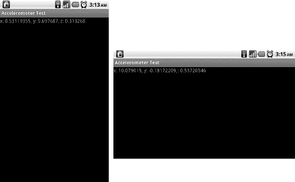

**图 4-9.** *设备垂直于地面时，竖屏模式（左图）和横屏模式（右图）下的加速度计轴值*

安卓加速度计处理的一个陷阱是：加速度计的值是相对于设备的默认方向而言的。这意味着如果你的游戏仅在横屏模式下运行，那么在默认方向为竖屏的设备上，获取到的值将与默认方向为横屏的设备相差 90 度！那么如何应对这个问题呢？使用这个便捷的代码片段，你就能轻松应对：


### 排版后的内容

`int` `screenRotation;`
`public void` `onResume() {`
`        WindowManager windowMgr = (WindowManager)activity.getSystemService(Activity.WINDOW_SERVICE);`
`                // getOrientation() 在 Android 8 中已弃用，但与 getRotation() 功能相同，后者是相对于设备自然方向的旋转角度`
`        screenRotation = windowMgr.getDefaultDisplay().getOrientation();`
`}`

`static final int` `ACCELEROMETER_AXIS_SWAP` `[][] = {`
`    {1, -1, 0, 1}, // ROTATION_0`
`    {-1, -1, 1, 0}, // ROTATION_90`
`    {-1, 1, 0, 1}, // ROTATION_180`
`    {1, 1, 1, 0}}; // ROTATION_270`
`public void` `onSensorChanged(SensorEvent event) {`
`final int` `[] as =` `ACCELEROMETER_AXIS_SWAP` `[screenRotation];`
`float` `screenX = (` `float` `)as[0] * event.values[as[2]];`
`float` `screenY = (` `float` `)as[1] * event.values[as[3]];`
`float` `screenZ = event.values[2];`
`    // 现在即可使用 screenX、screenY 和 screenZ 作为加速度计值！`
`}`

以下是关于加速度计的一些补充说明：

*   正如图 4–9 右侧截图所示，加速度计的值有时可能超出其指定范围。这是由于传感器存在微小误差，因此如果要求数值尽可能精确，你需要进行相应调整。
*   无论你的 Activity 处于何种方向，加速度计的轴报告顺序始终相同。
*   应用开发者有责任根据设备的自然方向来旋转加速度计的值。

#### 读取指南针状态

读取加速度计以外的其他传感器（例如指南针）的方法非常相似。实际上，它们的相似程度之高，以至于我们完全可以让你通过简单的复制粘贴，将加速度计测试代码改造为指南针测试！请将所有出现的：

`Sensor.` `TYPE_ACCELEROMETER`

替换为：

`Sensor.` `TYPE_ORIENTATION`

然后重新运行测试。现在你会看到，你的 `x`、`y` 和 `z` 值的作用截然不同。如果你将设备屏幕朝上并平行于地面水平放置，`x` 会显示指南针航向的角度值，而 `y` 和 `z` 应接近 0。现在倾斜设备，观察这些数值如何变化。`x` 仍将作为主要航向（方位角），而 `y` 和 `z` 则分别显示设备的俯仰角和横滚角。由于 `TYPE_ORIENTATION` 常量已被弃用，你也可以通过调用 `SensorManager.getOrientation(float[] R, float[] values)` 来获取相同的指南针数据，其中 `R` 是一个旋转矩阵（参见 `SensorManager.getRotationMatrix()`），而 `values` 则包含三个返回值，但这次它们是以弧度为单位。

至此，我们已经讨论了 Android API 中所有与输入处理相关的类，这些类将用于游戏开发。

**注意：** 顾名思义，`SensorManager` 类还允许你访问其他传感器，包括指南针和光线传感器。如果你有创意，可以设计一个利用这些传感器的游戏点子。处理这些传感器事件的方式与我们处理加速度计数据的方式类似。Android 开发者网站的文档会为你提供更多信息。

### 文件处理

Android 为我们提供了几种读取和写入文件的方法。在本节中，我们将探讨资源文件（assets）以及如何访问外部存储（通常以 SD 卡形式实现）。让我们从资源文件开始。

#### 读取资源文件

在第 2 章中，我们简要了解了 Android 项目的所有文件夹。我们确定了 `assets/` 和 `res/` 文件夹是我们放置应随应用一同分发的文件的位置。在讨论清单文件时，我们曾提到不会使用 `res/` 文件夹，因为它对我们组织文件结构的方式施加了限制。而 `assets/` 目录则是存放所有文件的地方，我们可以按任何想要的文件夹层次结构来组织。

`assets/` 文件夹中的文件通过一个名为 `AssetManager` 的类来访问。我们可以通过以下方式为应用获取对该管理器的引用：

`AssetManager assetManager = context.getAssets();`

我们之前已经见过 `Context` 接口；它由 `Activity` 类实现。在实际应用中，我们会从 Activity 中获取 `AssetManager`。

一旦我们拥有了 `AssetManager`，就可以开始疯狂地打开文件了：

`InputStream inputStream = assetManager.open("dir/dir2/filename.txt");`

该方法会返回一个普通的 Java `InputStream`，我们可以用它来读取任何类型的文件。`AssetManager.open()` 方法的唯一参数是相对于资源文件目录的文件名。在上面的例子中，`assets/` 文件夹下有两个目录，其中第二个目录（`dir2/`）是第一个目录（`dir/`）的子目录。在我们的 Eclipse 项目中，该文件位于 `assets/dir/dir2/`。

让我们编写一个简单的测试 Activity 来检验这个功能。我们打算从 `assets/` 目录下一个名为 `texts` 的子目录中加载一个名为 `myawesometext.txt` 的文本文件。该文本文件的内容将显示在一个 `TextView` 中。代码清单 4–7 展示了这个令人惊叹的 Activity 的源代码。

**代码清单 4–7.** *AssetsTest.java，演示如何读取资源文件*

```
package com.badlogic.androidgames;

import java.io.ByteArrayOutputStream;
import java.io.IOException;
import java.io.InputStream;

import android.app.Activity;
import android.content.res.AssetManager;
import android.os.Bundle;
import android.widget.TextView;

public class AssetsTest extends Activity {
    @Override
    public void onCreate(Bundle savedInstanceState) {
        super.onCreate(savedInstanceState);
        TextView textView = new TextView(this);
        setContentView(textView);

        AssetManager assetManager = getAssets();
        InputStream inputStream = null;
        try {
            inputStream = assetManager.open("texts/myawesometext.txt");
            String text = loadTextFile(inputStream);
            textView.setText(text);
        } catch (IOException e) {
            textView.setText("无法加载文件");
        } finally {
            if (inputStream != null)
                try {
                    inputStream.close();
                } catch (IOException e) {
                    textView.setText("无法关闭文件");
                }
        }
    }

    public String loadTextFile(InputStream inputStream) throws IOException {
        ByteArrayOutputStream byteStream = new ByteArrayOutputStream();
        byte[] bytes = new byte[4096];
        int len = 0;
        while ((len = inputStream.read(bytes)) > 0)
            byteStream.write(bytes, 0, len);
        return new String(byteStream.toByteArray(), "UTF8");
    }
}
```

除了发现从 `InputStream` 加载简单文本在 Java 中相当冗长之外，这里没有太多令人惊讶的地方。我们编写了一个名为 `loadTextFile()` 的小方法，它会从 `InputStream` 中提取所有字节，并以字符串形式返回这些字节。我们假设文本文件采用 UTF-8 编码。其余部分只是捕获和处理各种异常。图 4–10 展示了这个小 Activity 的输出结果。

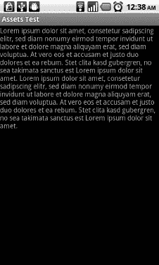

**图 4–10.** *`AssetsTest` 的文本输出*

你应该从本节中掌握以下几点：

*   在 Java 中从 `InputStream` 加载文本文件是一件很麻烦的事！通常，我们会借助诸如 Apache IOUtils 之类的库来完成这项工作。我们将此作为练习留给你。
*   我们只能读取资源文件，不能写入它们。
*   我们可以轻松地修改 `loadTextFile()` 方法来加载二进制数据。只需返回字节数组而不是字符串即可。


#### 访问外部存储

虽然将应用所需的所有图片和声音通过资源文件（assets）打包发布非常出色，但有时我们需要能够持久化存储一些信息，并在之后重新加载。一个常见的例子就是保存高分记录。

Android 提供了多种实现方式：你可以使用应用的本地共享首选项、小型 SQLite 数据库等等。所有这些选项都有一个共同点：它们都无法优雅地处理大型二进制文件。那我们为何需要处理它呢？虽然我们可以指示 Android 将应用安装到外部存储设备上，从而节省内部存储空间，但这仅适用于 Android 2.2 及以上版本。对于更早的版本，我们所有的应用数据都会被安装到内部存储中。理论上，我们可以只在 APK 文件中包含应用代码，并在首次启动应用时从服务器将所有资源文件下载到 SD 卡。Android 上的许多热门游戏正是这样做的。

在其他场景中，我们也需要访问 SD 卡（在当前所有可用设备上，这个词几乎等同于*外部存储*）。例如，我们可以允许用户使用游戏内置编辑器创建自己的关卡。我们需要将这些关卡数据存储在某处，而 SD 卡是实现这一目的的完美选择。

那么，现在我们已经说服你不要使用 Android 提供的那些花哨机制来存储应用偏好设置，接下来让我们看看如何在 SD 卡上读写文件。

首先，我们必须请求访问外部存储的权限。这需要在清单文件中使用本章前面讨论过的 `<uses-permission>` 元素来完成。

接下来，我们需要检查运行应用的设备上是否确实存在外部存储设备。例如，如果你创建了一个 AVD（Android 虚拟设备），你可以选择不让它模拟 SD 卡，这样你的应用就无法向其写入数据。另一个无法访问 SD 卡的原因可能是外部存储设备正被其他程序使用（例如，用户可能正在通过 USB 在台式电脑上浏览它）。那么，以下是获取外部存储状态的方法：

`String state = Environment.getExternalStorageState();`

嗯，我们得到一个字符串。`Environment` 类定义了几个常量。其中之一叫做 `Environment.MEDIA_MOUNTED`，也是一个字符串。如果上述方法返回的字符串等于这个常量，我们就拥有了对外部存储的完全读写权限。请注意，你必须使用 `equals()` 方法来比较这两个字符串；引用相等性并不总是有效。

一旦确定我们确实可以访问外部存储，就需要获取其根目录名称。如果我们想访问特定文件，则需要相对于此目录指定文件路径。要获取根目录，我们使用另一个 `Environment` 的静态方法：

`File externalDir = Environment.getExternalStorageDirectory();`

从这开始，我们可以使用标准的 Java I/O 类来读写文件。

让我们快速编写一个示例，该示例向 SD 卡写入一个文件，再读回该文件，将其内容显示在 `TextView` 中，然后从 SD 卡删除该文件。代码清单 4–8 显示了此活动的源代码。

**代码清单 4–8.** *ExternalStorageTest 活动*

```
package com.badlogic.androidgames;

import java.io.BufferedReader;
import java.io.BufferedWriter;
import java.io.File;
import java.io.FileReader;
import java.io.FileWriter;
import java.io.IOException;

import android.app.Activity;
import android.os.Bundle;
import android.os.Environment;
import android.widget.TextView;

public class ExternalStorageTest extends Activity {
    @Override
    public void onCreate(Bundle savedInstanceState) {
        super.onCreate(savedInstanceState);
        TextView textView = new TextView(this);
        setContentView(textView);

        String state = Environment.getExternalStorageState();
        if (!state.equals(Environment.MEDIA_MOUNTED)) {
            textView.setText("No external storage mounted");
        } else {
            File externalDir = Environment.getExternalStorageDirectory();
            File textFile = new File(externalDir.getAbsolutePath()
                    + File.separator + "text.txt");
            try {
                writeTextFile(textFile, "This is a test. Roger");
                String text = readTextFile(textFile);
                textView.setText(text);
                if (!textFile.delete()) {
                    textView.setText("Couldn't remove temporary file");
                }
            } catch (IOException e) {
                textView.setText("Something went wrong! " + e.getMessage());
            }
        }
    }

    private void writeTextFile(File file, String text) throws IOException {
        BufferedWriter writer = new BufferedWriter(new FileWriter(file));
        writer.write(text);
        writer.close();
    }

    private String readTextFile(File file) throws IOException {
        BufferedReader reader = new BufferedReader(new FileReader(file));
        StringBuilder text = new StringBuilder();
        String line;
        while ((line = reader.readLine()) != null) {
            text.append(line);
            text.append("\n");
        }
        reader.close();
        return text.toString();
    }
}
```

首先，我们检查 SD 卡是否已挂载。如果没有，我们提前退出。接下来，我们获取外部存储目录，并构造一个新的 `File` 实例，指向我们将在下一步中创建的文件。`writeTextFile()` 方法使用标准的 Java I/O 类完成其工作。如果文件尚不存在，此方法将创建它；否则，它将覆盖已存在的文件。成功将测试文本写入外部存储设备上的文件后，我们再次读入该文本，并将其设置为 `TextView` 的显示文字。最后一步，我们再次从外部存储中删除该文件。所有这些操作都设置了标准的保护措施，如果出现问题，会通过向 `TextView` 输出错误信息来报告。图 4–11 显示了该活动的输出结果。


**图 4–11.** *收到！*

以下是本节需要记住的经验教训：

*   不要乱动不属于你的任何文件。如果你删除了用户上次度假的照片，他们会非常生气。
*   始终检查外部存储设备是否已挂载。
*   不要乱动外部存储设备上的任何文件！我是认真的！

因为很容易就能删除外部存储设备上的所有文件，所以当你在应用市场上下一个需要访问 SD 卡权限的应用之前，可能需要三思。一旦安装，该应用就对你的文件拥有完全控制权。

### 音频编程

Android 提供了一些易于使用的 API 来播放音效和音乐文件——这完全满足了我们的游戏编程需求。让我们来看看这些 API。


#### 设置音量控制

如果你有安卓设备，你会注意到按下音量加减按钮时，控制的是不同的音量设置，具体取决于你当前使用的应用。在通话中，你能控制传入语音流的音量；在使用 YouTube 应用时，你控制的是视频音频的音量；在主屏幕上，你控制的是铃声音量。

安卓为不同用途提供了多种音频流。当我们在游戏中播放音频时，会使用那些将音效和音乐输出到特定音频流的类，这个音频流被称为**音乐流**。在考虑播放音效或音乐之前，我们首先要确保音量按钮能控制正确的音频流。为此，我们需要使用 `Context` 接口的另一个方法：

```
context.setVolumeControlStream(AudioManager.STREAM_MUSIC);
```

一如既往，我们选择的 `Context` 实现就是 Activity。调用此方法后，音量按钮将控制音乐流，我们稍后会将音效和音乐输出到该音频流。这个方法在 Activity 的生命周期中只需调用一次，`Activity.onCreate()` 方法是最佳调用时机。

写一个只包含一行代码的示例有点小题大做。因此，我们暂时不这样做。只需要记住在所有输出声音的 Activity 中使用此方法。

#### 播放音效

在第 3 章中，我们讨论了流式播放音乐和播放音效之间的区别。后者存储在内存中，通常持续时间不超过几秒钟。安卓为我们提供了一个名为 `SoundPool` 的类，它让播放音效变得非常简单。

我们可以像下面这样简单地实例化新的 `SoundPool` 对象：

```
SoundPool soundPool = new SoundPool(20, AudioManager.STREAM_MUSIC, 0);
```

第一个参数定义了可以同时播放的最大音效数量。这并不意味着我们不能加载更多音效；它只是限制了可以同时播放的音效数量。第二个参数定义了 `SoundPool` 输出音频的音频流。我们选择了之前设置过音量控制的音乐流。最后一个参数目前未使用，应设置为 0。

要将音频文件中的音效加载到堆内存中，我们可以使用 `SoundPool.load()` 方法。我们将所有文件存储在 `assets/` 目录中，因此我们需要使用接受 `AssetFileDescriptor` 的重载版本的 `SoundPool.load()` 方法。如何获取那个 `AssetFileDescriptor`？很简单——通过我们之前使用的 `AssetManager`。下面演示如何通过 `SoundPool` 从 `assets/` 目录加载一个名为 `explosion.ogg` 的 OGG 文件：

```
AssetFileDescriptor descriptor = assetManager.openFd("explosion.ogg");
int explosionId = soundPool.load(descriptor, 1);
```

通过 `AssetManager.openFd()` 方法获取 `AssetFileDescriptor` 很简单。通过 `SoundPool` 加载音效也同样容易。`SoundPool.load()` 方法的第一个参数是我们的 `AssetFileDescriptor`，第二个参数指定了音效的优先级。这个参数目前未被使用，为了将来的兼容性，应将其设置为 1。

`SoundPool.load()` 方法返回一个整数，作为已加载音效的句柄。当我们想要播放该音效时，只需指定这个句柄，`SoundPool` 就知道要播放哪个音效。

播放音效同样非常简单：

```
soundPool.play(explosionId, 1.0f, 1.0f, 0, 0, 1);
```

第一个参数是我们从 `SoundPool.load()` 方法接收到的句柄。接下来的两个参数指定了左右声道使用的音量。这些值应介于 0（静音）和 1（音量最大）之间。

接下来是两个我们很少使用的参数。第一个是优先级，目前未被使用，应设置为 0。另一个参数指定了音效应该循环播放的次数。不建议循环播放音效，因此这里通常应使用 0。最后一个参数是播放速率。将其设置为大于 1 的值会使音效以比录制时更快的速度播放，而设置为小于 1 的值则会导致播放速度变慢。

当我们不再需要某个音效并想释放一些内存时，可以使用 `SoundPool.unload()` 方法：

```
soundPool.unload(explosionId);
```

我们只需传入从 `SoundPool.load()` 方法中为该音效获取的句柄，它就会被从内存中卸载。

通常，我们的游戏会有一个单一的 `SoundPool` 实例，用于根据需要加载、播放和卸载音效。当我们完成所有音频输出并且不再需要 `SoundPool` 时，应该始终调用 `SoundPool.release()` 方法，该方法会释放 `SoundPool` 通常占用的所有资源。释放后，你当然不能再使用该 `SoundPool`。同时，该 `SoundPool` 加载的所有音效也将消失。

让我们编写一个简单的测试 Activity，每次点击屏幕时，它都会播放一个爆炸音效。我们已经掌握了实现此功能所需的所有知识，因此清单 4–9 中应该不会出现任何大的意外。


**代码清单 4–9.** *SoundPoolTest.java；播放音效*

`package` `com.badlogic.androidgames;`

`import` `java.io.IOException;`

`import` `android.app.Activity;`
`import` `android.content.res.AssetFileDescriptor;`
`import` `android.content.res.AssetManager;`
`import` `android.media.AudioManager;`
`import` `android.media.SoundPool;`
`import` `android.os.Bundle;`
`import` `android.view.MotionEvent;`
`import` `android.view.View;`
`import` `android.view.View.OnTouchListener;`
`import` `android.widget.TextView;`

`public class` `SoundPoolTest` `extends` `Activity` `implements` `OnTouchListener {`
`    SoundPool soundPool;`
`int` `explosionId = -1;`

`    @Override`
`public void` `onCreate(Bundle savedInstanceState) {`
`super``.onCreate(savedInstanceState);`
`TextView textView =` `new` `TextView(` `this` `);`
`        textView.setOnTouchListener(` `this` `);`
`        setContentView(textView);`

`        setVolumeControlStream(AudioManager.STREAM_MUSIC);`
`soundPool =` `new` `SoundPool(20, AudioManager.STREAM_MUSIC, 0);`

`try` `{`
`            AssetManager assetManager = getAssets();`
`            AssetFileDescriptor descriptor = assetManager`
`                    .openFd("explosion.ogg");`
`            explosionId = soundPool.load(descriptor, 1);`
`}` `catch` `(IOException e) {`
`            textView.setText("从资源中加载音效失败，"`
`                    + e.getMessage());`
`        }`
`    }`

`    @Override`
`public boolean` `onTouch(View v, MotionEvent event) {`
`if` `(event.getAction() == MotionEvent.ACTION_UP) {`
`if` `(explosionId != -1) {`
`                soundPool.play(explosionId, 1, 1, 0, 0, 1);`
`            }`
`        }`
`return true` `;`
`    }`
`}`

我们首先让类继承自 `Activity` 并实现 `OnTouchListener` 接口，以便后续处理屏幕点击事件。该类包含两个成员变量：`SoundPool` 实例，以及待加载和播放的音效句柄。我们将句柄初始化为 -1，表示音效尚未加载。

在 `onCreate()` 方法中，我们重复之前做过多次的操作：创建一个 `TextView`，将 Activity 注册为 `OnTouchListener`，并将 `TextView` 设置为内容视图。

接下来的一行代码设置了音量控制键用于控制音乐流，如前所述。然后我们创建 `SoundPool`，并将其配置为可同时播放 20 个音效。对于大多数游戏来说，这已经足够了。

最后，我们通过 `AssetManager` 获取放入 `assets/` 目录下的 `explosion.ogg` 文件的 `AssetFileDescriptor`。要加载该音效，只需将该描述符传递给 `SoundPool.load()` 方法并存储返回的句柄。如果在加载过程中出现异常，`SoundPool.load()` 方法会抛出异常，此时我们捕获异常并显示错误信息。

在 `onTouch()` 方法中，我们只需检查手指是否抬起，以此判断屏幕是否被点击。如果是，并且爆炸音效已成功加载（通过句柄不为 -1 来判断），我们就直接播放该音效。

执行这个小程序时，只需触摸屏幕就能让世界爆炸。如果快速连续触摸屏幕，你会发现音效会以重叠的方式多次播放。要超过我们为 `SoundPool` 设置的 20 次同时播放上限非常困难。但万一达到上限，系统会停止当前正在播放的某个音效，为新请求的播放腾出空间。

请注意，在前面的例子中，我们没有卸载音效或释放 `SoundPool`。这是为了简洁起见。通常，你应在 Activity 即将被销毁时的 `onPause()` 方法中释放 `SoundPool`。只需记住，始终释放或卸载你不再需要的任何资源。

虽然 `SoundPool` 类非常易于使用，但有几个注意事项需要牢记：

*   `SoundPool.load()` 方法会异步执行实际加载。这意味着，在调用 `SoundPool.play()` 方法播放该音效之前，需要短暂等待，因为加载可能尚未完成。遗憾的是，无法检查音效是否加载完成。只有 SDK 8 版本的 `SoundPool` 才支持此功能，而我们需要支持所有 Android 版本。不过这通常不是什么大问题，因为在首次播放音效之前，你很可能还要加载其他资源。
*   已知 `SoundPool` 在处理 MP3 文件和长音频文件时存在问题，其中 *长* 的定义是“超过 5 到 6 秒”。这两个问题都没有文档说明，因此没有严格的规则来判断你的音效是否会有问题。作为一般规则，我们建议改用 OGG 音频文件而非 MP3，并在音频质量变差之前，尽量使用最低的采样率和最短的时长。

**注意：** 与我们所讨论的任何 API 一样，`SoundPool` 还有更多功能。我们简要提到过可以循环播放音效。为此，你可以从 `SoundPool.play()` 方法获取一个 ID，用于暂停或停止循环播放的音效。如果需要此功能，请查阅 Android 开发者网站上的 `SoundPool` 文档。


#### 流式音乐播放

小型音效可以放入安卓应用从操作系统获得的有限堆内存中。但包含较长音乐片段的大型音频文件则无法容纳。因此，我们需要将音乐流式传输到音频硬件，这意味着我们一次只读取一小块数据，足够将其解码为原始 PCM 数据，然后将其发送给音频芯片。

这听起来有些吓人。幸运的是，有 `MediaPlayer` 类可以为我们处理所有这些事务。我们只需将其指向音频文件并告知它播放即可。

实例化 `MediaPlayer` 类非常简单：

`MediaPlayer mediaPlayer = new MediaPlayer();`

接下来，我们需要告诉 `MediaPlayer` 要播放哪个文件。这同样通过 `AssetFileDescriptor` 完成：

`AssetFileDescriptor descriptor = assetManager.openFd("music.ogg");`
`mediaPlayer.setDataSource(descriptor.getFileDescriptor(), descriptor.getStartOffset(),`
`descriptor.getLength());`

这里比 `SoundPool` 的情况稍微复杂一些。`MediaPlayer.setDataSource()` 方法并不直接接受 `AssetFileDescriptor`。相反，它需要一个 `FileDescriptor`，我们可以通过 `AssetFileDescriptor.getFileDescriptor()` 方法获取。此外，我们还需要指定音频文件的偏移量和长度。为什么要指定偏移量？实际上，所有资源都存储在同一个文件中。为了让 `MediaPlayer` 能找到文件的起始位置，我们必须提供该文件在包含它的资源文件中的偏移量。

在开始播放音乐文件之前，我们还需要调用另一个方法来准备 `MediaPlayer` 进行播放：

`mediaPlayer.prepare();`

这实际上会打开文件，并检查它是否能够被 `MediaPlayer` 实例读取和播放。从此刻起，我们就可以自由地播放音频文件、暂停、停止、设置循环播放以及调整音量。

要开始播放，我们只需调用以下方法：

`mediaPlayer.start();`

请注意，只有在 `MediaPlayer.prepare()` 方法成功调用后（如果抛出运行时异常你会注意到），才能调用此方法。

在开始播放后，我们可以通过调用 `pause()` 方法来暂停播放：

`mediaPlayer.pause();`

同样，只有在成功准备 `MediaPlayer` 并开始播放后，调用此方法才有效。要恢复暂停的 `MediaPlayer`，我们可以直接再次调用 `MediaPlayer.start()` 方法，无需任何准备。

要停止播放，我们调用以下方法：

`mediaPlayer.stop();`

请注意，当我们想要启动已停止的 `MediaPlayer` 时，必须先再次调用 `MediaPlayer.prepare()` 方法。

我们可以通过以下方法设置 `MediaPlayer` 循环播放：

`mediaPlayer.setLooping(true);`

要调整音乐播放的音量，我们可以使用此方法：

`mediaPlayer.setVolume(1, 1);`

这将设置左右声道的音量。文档并未规定这两个参数的范围。根据实验，有效范围似乎是在 0 到 1 之间。

最后，我们需要一种方法来检查播放是否已结束。我们可以通过两种方式实现。一种是为 `MediaPlayer` 注册一个 `OnCompletionListener`，当播放完成时会调用该监听器：

`mediaPlayer.setOnCompletionListener(listener);`

如果我们想要轮询 `MediaPlayer` 的状态，可以使用以下方法：

`boolean isPlaying = mediaPlayer.isPlaying();`

请注意，如果 `MediaPlayer` 设置为循环播放，前面的任何方法都不会指示 `MediaPlayer` 已停止。

最后，当我们用完 `MediaPlayer` 实例后，需要确保通过调用以下方法释放它所占用的所有资源：

`mediaPlayer.release();`

在丢弃该实例之前始终这样做，被认为是一种良好的实践。

如果我们没有将 `MediaPlayer` 设置为循环播放且播放已结束，我们可以通过再次调用 `MediaPlayer.prepare()` 和 `MediaPlayer.start()` 方法重新启动 `MediaPlayer`。

这些方法大多数是异步工作的，因此即使你调用了 `MediaPlayer.stop()`，此后短时间内调用 `MediaPlayer.isPlaying()` 方法仍可能返回 `true`。这通常无需我们担心。在大多数游戏中，我们会将 `MediaPlayer` 设置为循环播放，然后在需要时停止它（例如，当我们切换到需要播放其他音乐的不同界面时）。

让我们编写一个小型测试活动，以循环模式播放来自 `assets/` 目录的声音文件。此音效将根据活动生命周期进行暂停和恢复——当我们的活动暂停时，音乐也应暂停；当活动恢复时，音乐播放应从中断处继续。清单 4-10 展示了如何实现这一点。

**清单 4-10.** *MediaPlayerTest.java；播放音频流*

```java
package com.badlogic.androidgames;

import java.io.IOException;

import android.app.Activity;
import android.content.res.AssetFileDescriptor;
import android.content.res.AssetManager;
import android.media.AudioManager;
import android.media.MediaPlayer;
import android.os.Bundle;
import android.widget.TextView;

public class MediaPlayerTest extends Activity {
    MediaPlayer mediaPlayer;

    @Override
    public void onCreate(Bundle savedInstanceState) {
        super.onCreate(savedInstanceState);
        TextView textView = new TextView(this);
        setContentView(textView);

        setVolumeControlStream(AudioManager.STREAM_MUSIC);
        mediaPlayer = new MediaPlayer();
        try {
            AssetManager assetManager = getAssets();
            AssetFileDescriptor descriptor = assetManager.openFd("music.ogg");
            mediaPlayer.setDataSource(descriptor.getFileDescriptor(),
                    descriptor.getStartOffset(), descriptor.getLength());
            mediaPlayer.prepare();
            mediaPlayer.setLooping(true);
        } catch (IOException e) {
            textView.setText("无法加载音乐文件，" + e.getMessage());
            mediaPlayer = null;
        }
    }

    @Override
    protected void onResume() {
        super.onResume();
        if (mediaPlayer != null) {
            mediaPlayer.start();
        }
    }

    protected void onPause() {
        super.onPause();
        if (mediaPlayer != null) {
            mediaPlayer.pause();
            if (isFinishing()) {
                mediaPlayer.stop();
                mediaPlayer.release();
            }
        }
    }
}
```

我们以活动成员变量的形式持有对 `MediaPlayer` 的引用。在 `onCreate()` 方法中，我们像往常一样简单地创建一个 `TextView` 用于输出任何错误消息。

在开始使用 `MediaPlayer` 之前，我们确保音量控制确实控制着音乐流。设置好之后，我们实例化 `MediaPlayer`。我们从 `AssetManager` 中获取位于 `assets/` 目录下名为 `music.ogg` 文件的 `AssetFileDescriptor`，并将其设置为 `MediaPlayer` 的数据源。剩下的工作就是准备 `MediaPlayer` 实例并将其设置为循环播放流。如果出现任何问题，我们会将 `MediaPlayer` 成员设置为 `null`，以便稍后确定加载是否成功。此外，我们还会向 `TextView` 输出一些错误文本。


在`onResume()`方法中，我们简单地启动`MediaPlayer`（如果创建成功的话）。`onResume()`方法是执行此操作的绝佳位置，因为它会在`onCreate()`之后和`onPause()`之后被调用。在第一种情况下，它将首次开始播放；在第二种情况下，它将简单地恢复已暂停的`MediaPlayer`。

`onResume()`方法会暂停`MediaPlayer`。如果 Activity 即将被销毁，我们会停止`MediaPlayer`，然后释放其所有资源。

如果你尝试使用它，请确保同时测试其对暂停和恢复 Activity 的反应，方法可以是锁定屏幕或临时切换到主屏幕。当恢复时，`MediaPlayer`将从暂停时的位置继续播放。

以下是需要注意的几点：

*   `MediaPlayer.start()`、`MediaPlayer.pause()`和`MediaPlayer.resume()`方法只能如刚才讨论的那样，在某些状态下调用。在尚未准备好`MediaPlayer`时，切勿尝试调用它们。仅在准备好`MediaPlayer`之后，或者当你希望通过调用`MediaPlayer.pause()`显式暂停它后恢复播放时，才调用`MediaPlayer.start()`。
*   `MediaPlayer`实例相当重量级。实例化多个实例将占用大量资源。我们应该始终尽量只保留一个实例用于音乐播放。音效更适合使用`SoundPool`类来处理。
*   请记得将音量控制设置为处理音乐流，否则你的播放器将无法调整游戏音量。

本章内容快结束了，但前面还有一个大话题：2D 图形。

### 基础图形编程

Android 为我们提供了两个用于在屏幕上进行绘制的主要 API。一个主要用于简单的 2D 图形编程，另一个用于硬件加速的 3D 图形编程。本章和下一章将重点介绍使用`Canvas`API 进行 2D 图形编程，它是 Skia 库的优质封装，适用于中等复杂度的 2D 图形。在开始之前，我们首先需要讨论两件事：全屏和唤醒锁。

#### 使用唤醒锁

如果你让之前编写的测试程序闲置几秒钟，手机屏幕就会变暗。只有当你触摸屏幕或按下按钮时，屏幕才会恢复全亮度。为了确保屏幕始终唤醒，我们可以使用所谓的*唤醒锁*。

我们需要做的第一件事是在清单文件中添加一个合适的`<uses-permission>`标签，名称为`android.permission.WAKE_LOCK`。这将允许我们使用`WakeLock`类。

我们可以通过`PowerManager`获取`WakeLock`实例，代码如下：

`PowerManager powerManager =`
`(PowerManager)context.getSystemService(Context.POWER_SERVICE);`
`WakeLock wakeLock = powerManager.newWakeLock(PowerManager.FULL_WAKE_LOCK, "My Lock");`

与所有其他系统服务一样，我们从`Context`实例获取`PowerManager`。`PowerManager.newWakeLock()`方法接收两个参数：锁的类型和一个我们可以自由定义的标签。有几种不同的唤醒锁类型；对于我们的目的，`PowerManager.FULL_WAKE_LOCK`类型是合适的。它将确保屏幕保持开启，CPU 全速运行，并且键盘保持启用状态。

要启用唤醒锁，我们必须调用其`acquire()`方法：

`wakeLock.acquire();`

从此刻起，无论经过多长时间没有用户交互，手机都将保持唤醒状态。当我们的应用程序暂停或销毁时，我们必须再次禁用或释放唤醒锁：

`wakeLock.release();`

通常，我们在`Activity.onCreate()`方法中实例化`WakeLock`实例，在`Activity.onResume()`方法中调用`WakeLock.acquire()`，并在`Activity.onPause()`方法中调用`WakeLock.release()`方法。这样，我们就能保证应用程序在暂停或恢复的情况下依然运行良好。由于只需要添加四行代码，我们就不编写完整的示例了。相反，我们建议你简单地将代码添加到下一节的全屏示例中，然后观察效果。

#### 进入全屏模式

在我们一头扎进使用 Android API 绘制第一个图形之前，让我们先解决另一个问题。到目前为止，我们所有的 Activity 都显示了标题栏。通知栏也是可见的。我们希望通过去除这些元素，进一步提高玩家的沉浸感。我们可以通过两个简单的调用来实现这一点：

`requestWindowFeature(Window.FEATURE_NO_TITLE);`
`getWindow().setFlags(WindowManager.LayoutParams.FLAG_FULLSCREEN,`
`WindowManager.LayoutParams.FLAG_FULLSCREEN);`

第一个调用去除了 Activity 的标题栏。要使 Activity 进入全屏模式并同时消除通知栏，我们调用第二个方法。请注意，我们必须在设置 Activity 的内容视图之前调用这些方法。

列表 4-11 向你展示了一个非常简单的测试 Activity，演示了如何进入全屏模式。

**列表 4-11.** *FullScreenTest.java；让我们的 Activity 进入全屏模式*

```
package com.badlogic.androidgames;

import android.os.Bundle;
import android.view.Window;
import android.view.WindowManager;

public class FullScreenTest extends SingleTouchTest {

    @Override
    public void onCreate(Bundle savedInstanceState) {
        requestWindowFeature(Window.FEATURE_NO_TITLE);
        getWindow().setFlags(WindowManager.LayoutParams.FLAG_FULLSCREEN,
                WindowManager.LayoutParams.FLAG_FULLSCREEN);
        super.onCreate(savedInstanceState);
    }
}
```

这里发生了什么？我们简单地继承自之前创建的`TouchTest`类，并重写了`onCreate()`方法。在`onCreate()`方法中，我们启用了全屏模式，然后调用了超类（即`TouchTest` Activity）的`onCreate()`方法，该方法将设置 Activity 的其余所有部分。再次注意，我们必须在设置内容视图之前调用这两个方法。因此，我们在执行这两个方法之后才调用超类的`onCreate()`方法。

我们还在清单文件中将 Activity 的方向固定为竖屏模式。你没有忘记为我们编写的每个测试在清单文件中添加`<activity>`元素，对吧？从现在开始，我们将始终将其固定为竖屏或横屏模式，因为我们不希望坐标系一直变化。

通过继承`TouchTest`，我们有了一个功能完整的示例，现在可以用它来探索我们即将进行绘制的坐标系。该 Activity 会在你触摸屏幕时显示触摸坐标，就像之前的`TouchTest`示例一样。这次的区别在于我们处于全屏模式，这意味着触摸事件的最大坐标等于屏幕分辨率（每个维度减一，因为我们从[0,0]开始）。对于 Nexus One 手机，竖屏模式下的坐标范围是(0,0)到(479,799)（总共 480×800 像素）。

虽然看起来屏幕在不断重绘，但实际上并非如此。回想一下我们的`TouchTest`类，我们是在每次处理触摸事件时才更新`TextView`。这反过来会使`TextView`重绘自身。如果我们不触摸屏幕，`TextView`就不会重绘自身。对于游戏来说，我们需要能够尽可能频繁地重绘屏幕，最好是在我们主循环线程中进行。我们先从简单的开始，在 UI 线程中实现持续渲染。


#### UI 线程中的持续渲染

到目前为止，我们所做的只是在需要时设置 `TextView` 的文本。实际的渲染工作是由 `TextView` 自身完成的。现在让我们创建一个自定义的 `View`，其唯一目的就是让我们能在屏幕上绘制内容。我们还希望它能尽可能频繁地重绘自身，并且希望有一种简单的方法，在这个神秘的重绘方法中执行我们自己的绘制。

虽然这听起来可能很复杂，但实际上 Android 让我们很容易就能实现这样的功能。我们只需要创建一个继承自 `View` 类的类，并重写一个名为 `View.onDraw()` 的方法。每当系统需要我们的 `View` 重绘自身时，就会调用这个方法。代码可能如下所示：

```
class RenderView extends View {
    public RenderView(Context context) {
        super(context);
    }

    protected void onDraw(Canvas canvas) {
        // 待实现
    }
}
```

这并不是什么高深莫测的技术，对吧？我们会在 `onDraw()` 方法中接收到一个名为 `Canvas` 类的实例。在接下来的章节中，这将是我们的主力工具。它允许我们在另一个位图或 `View`（或者 Surface，稍后会讨论）上绘制形状和位图。

我们可以像使用 `TextView` 一样使用这个 `RenderView`。只需将其设置为 Activity 的内容视图，并连接上所需的任何输入监听器即可。然而，它目前还没有太多用处，原因有二：它实际上没有绘制任何内容；即使它绘制了，也只在 Activity 需要重绘时才会绘制（例如，在创建或恢复时，或者覆盖它的对话框消失时）。我们怎样才能让它自行重绘呢？

很简单，就像这样：

```
protected void onDraw(Canvas canvas) {
    // 所有绘制代码放在这里
    invalidate();
}
```

在 `onDraw()` 末尾调用 `View.invalidate()` 方法会告诉 Android 系统，一旦它有空闲时间，就再次重绘 `RenderView`。所有的这些操作仍然发生在 UI 线程上，这线程有点像是懒马。不过，我们确实通过 `onDraw()` 方法实现了持续渲染，尽管这是相对较慢的持续渲染。我们稍后会改进这个问题；目前来说，这已经足够满足我们的需求了。

那么，让我们再次回到神秘的 `Canvas` 类。这是一个功能相当强大的类，它封装了一个名为 Skia 的自定义低级图形库，该库专门针对在 CPU 上执行 2D 渲染进行了优化。`Canvas` 类为我们提供了许多绘制方法，用于绘制各种形状、位图，甚至文本。

这些绘制方法绘制到哪里去了呢？这取决于具体情况。一个 `Canvas` 可以渲染到一个 `Bitmap` 实例；`Bitmap` 是 Android 2D API 提供的另一个类，我们稍后会介绍。在这里，它绘制到屏幕上由该 `View` 占据的区域。当然，这是一个极其简化的说法。在底层，它并不会直接绘制到屏幕上，而是绘制到某种位图上，系统稍后将结合 Activity 中所有其他 `View` 的位图，组合成最终的输出图像。然后，该图像会被交给 GPU，通过另一组神秘的路径显示在屏幕上。

我们并不需要关心这些细节。从我们的角度来看，我们的 `View` 似乎是拉伸到全屏的，所以它完全可以看作是直接绘制到系统的帧缓冲上。在接下来的讨论中，我们将假设我们直接绘制到帧缓冲上，而系统则为我们处理所有巧妙的操作，比如垂直回扫和双缓冲等。

`onDraw()` 方法会以系统允许的频率被调用。对我们来说，它非常类似于我们理论上的游戏主循环体。如果我们想用这个方法来实现一个游戏，我们会把所有游戏逻辑都放到这个方法里。出于多种原因我们不会这样做，性能就是其中之一。

那么，让我们来做些有趣的事情。每次你接触到新的绘图 API 时，写一个小测试来检查屏幕是否真的被频繁重绘。这是一种简易的灯光秀测试。你只需要在每次调用重绘方法时，用一种新的随机颜色填充屏幕即可。这样你只需要找到该 API 中允许你填充屏幕的方法，而无需了解太多繁琐的细节。让我们用自定义的 `RenderView` 实现来编写这样一个测试。

`Canvas` 中用于用特定颜色填充其渲染目标的方法叫做 `Canvas.drawRGB()`：

```
Canvas.drawRGB(int r, int g, int b);
```

`r`、`g`、`b` 参数分别代表我们将用于填充“屏幕”颜色的红、绿、蓝分量。每个分量的取值范围为 0 到 255，因此这里我们实际上指定的是 RGB888 格式的颜色。如果你不记得关于颜色的细节，请重新阅读第 3 章的“数字颜色编码”部分，因为我们在本章剩余部分都会用到这些信息。

列表 4–12 展示了我们这个小灯光秀的代码。

**注意：** 运行此代码会快速用随机颜色填满屏幕。如果你患有癫痫或对光敏感，请不要运行它。

**列表 4–12.** *RenderViewTest Activity*

```
package com.badlogic.androidgames;

import java.util.Random;

import android.app.Activity;
import android.content.Context;
import android.graphics.Canvas;
import android.os.Bundle;
import android.view.View;
import android.view.Window;
import android.view.WindowManager;

public class RenderViewTest extends Activity {
    class RenderView extends View {
        Random rand = new Random();

        public RenderView(Context context) {
            super(context);
        }

        protected void onDraw(Canvas canvas) {
            canvas.drawRGB(rand.nextInt(256), rand.nextInt(256),
                    rand.nextInt(256));
            invalidate();
        }
    }

    @Override
    public void onCreate(Bundle savedInstanceState) {
        super.onCreate(savedInstanceState);
        requestWindowFeature(Window.FEATURE_NO_TITLE);
        getWindow().setFlags(WindowManager.LayoutParams.FLAG_FULLSCREEN,
                WindowManager.LayoutParams.FLAG_FULLSCREEN);
        setContentView(new RenderView(this));
    }
}
```

对于我们的第一个图形演示来说，这已经相当简洁了。我们将 `RenderView` 类定义为 `RenderViewTest` Activity 的一个内部类。正如前面讨论的，`RenderView` 类派生自 `View` 类，并且有一个必需的构造函数以及重写的 `onDraw()` 方法。它还有一个 `Random` 类的实例作为成员变量；我们将用它来生成随机颜色。

`onDraw()` 方法非常简单。我们首先告诉 `Canvas` 用随机颜色填充整个视图。对于每个颜色分量，我们只需要指定一个介于 0 和 255 之间的随机数（`Random.nextInt()` 是不包含上限的）。之后，我们告诉系统我们希望尽快再次调用 `onDraw()` 方法。

Activity 的 `onCreate()` 方法启用了全屏模式，并将我们 `RenderView` 类的一个实例设置为内容视图。为了保持示例的简洁，我们暂时省略了唤醒锁。

给这个例子截图没什么意义。它所做的只是在 UI 线程上，以系统允许的最快速度用随机颜色填充屏幕。这并不值得大书特书。让我们来做些更有趣的事情：绘制一些形状。

**注意：** 前面提到的持续渲染方法是可行的，但我们强烈建议不要使用它！我们应该尽可能少地在 UI 线程上工作。稍后，我们将使用一个单独的线程来讨论如何正确地做到这一点，这样我们之后还可以实现游戏逻辑。


#### 获取屏幕分辨率（及坐标系）

在第 2 章中，我们详细讨论了帧缓冲区及其属性。请记住，帧缓冲区保存了最终显示在屏幕上的像素颜色。我们可用的像素数量由屏幕分辨率定义，该分辨率以像素为单位的宽度和高度给出。

现在，通过我们自定义的`View`实现，我们实际上并非直接渲染到帧缓冲区。然而，由于我们的`View`覆盖了整个屏幕，我们可以假装它直接渲染到了帧缓冲区。为了知道在哪里渲染我们的游戏元素，我们需要了解 x 轴和 y 轴上各有多少像素，即屏幕的宽度和高度。

`Canvas`类提供了两个方法可以告诉我们这些信息：

```
int width = canvas.getWidth();
int height = canvas.getHeight();
```

这两个方法返回`Canvas`渲染目标的像素宽度和高度。请注意，根据我们 Activity 的方向，宽度可能小于或大于高度。例如，一台 Nexus One 手机在竖屏模式下的分辨率是 480×800 像素，因此`Canvas.getWidth()`方法会返回 480，而`Canvas.getHeight()`方法会返回 800。在横屏模式下，这两个值会互换：`Canvas.getWidth()`返回 800，`Canvas.getHeight()`返回 480。

我们需要知道的第二项信息是我们进行渲染的坐标系是如何组织的。首先，只有整数像素坐标才有意义（存在称为子像素的概念，但我们在此忽略它）。我们也已经知道，无论是竖屏还是横屏模式，该坐标系的原点(0,0)始终位于显示器的左上角。正 x 轴始终指向右方，正 y 轴始终指向下方。图 4-12 显示了一个假设的横屏模式下的屏幕，其分辨率为 48×32 像素。

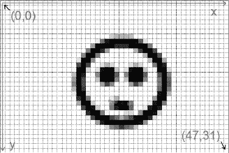

**图 4-12.** *一个 48×32 像素宽屏幕的坐标系*

请注意图 4-12 中坐标系的原点是如何与屏幕左上角的像素重合的。因此，屏幕左下角的像素并非我们以为的(48,32)，而是(47,31)。通常，(宽度 – 1, 高度 – 1) 总是屏幕右下角像素的位置。

图 4-12 向您展示了一个假设的横屏模式下的屏幕坐标系。现在您应该能够想象出竖屏模式下坐标系的样子了。

`Canvas`的所有绘图方法都在这种坐标系中运作。通常，我们可以操作的像素数量远多于我们 48×32 像素示例中的数量（例如，800×480）。话虽如此；让我们终于开始绘制一些像素、直线、圆形和矩形吧。

**注意：** 您可能已经注意到不同设备可能有不同的屏幕分辨率。我们将在下一章探讨这个问题。现在，我们只专注于最终在我们自己的屏幕上显示一些内容。

#### 绘制简单形状

经过一百五十页的篇幅，我们终于要开始绘制第一个像素了。我们将快速浏览一下`Canvas`类提供给我们的一些绘图方法。

##### 绘制像素

我们首先想知道的是如何绘制单个像素。这可以通过以下方法实现：

```
Canvas.drawPoint(float x, float y, Paint paint);
```

需要立即注意两点：像素的坐标是用浮点数指定的，并且`Canvas`不允许我们直接指定颜色，而是需要我们提供一个`Paint`类的实例。

不要因为我们使用浮点数指定坐标而感到困惑。`Canvas`拥有一些非常高级的功能，允许我们在非整数坐标上进行渲染，这就是使用浮点数的原因。不过我们暂时还不需要这个功能；我们将在下一章再回顾它。

`Paint`类保存着用于绘制形状、文本和位图的样式与颜色信息。对于绘制形状，我们只关心两件事：颜色和样式。由于像素实际上没有样式，我们先集中看颜色。下面是我们实例化`Paint`类并设置颜色的方法：

```
Paint paint = new Paint();
paint.setARGB(alpha, red, green, blue);
```

实例化`Paint`类非常简单。`Paint.setARGB()`方法也应该很容易理解。每个参数分别代表颜色的一个分量，取值范围为 0 到 255。因此，我们这里指定的是一个 ARGB8888 颜色。

另外，我们还可以使用以下方法来设置`Paint`实例的颜色：

```
Paint.setColor(0xff00ff00);
```

我们向此方法传递一个 32 位整数。它同样编码了一个 ARGB8888 颜色；在这个例子中，它是绿色，alpha 设置为完全不透明。`Color`类定义了一些静态常量，它们编码了一些标准颜色，例如`Color.RED`、`Color.YELLOW`等。如果您不想自己指定十六进制值，可以使用这些常量。

##### 绘制直线

要绘制直线，我们可以使用以下`Canvas`方法：

```
Canvas.drawLine(float startX, float startY, float stopX, float stopY, Paint paint);
```

前两个参数指定直线起点的坐标，接下来两个参数指定直线终点的坐标，最后一个参数指定一个`Paint`实例。绘制的直线宽度为一个像素。如果我们希望直线更粗，可以通过设置`Paint`的描边宽度来指定其像素厚度：

```
Paint.setStrokeWidth(float widthInPixels);
```

##### 绘制矩形

我们也可以使用`Canvas`绘制矩形：

```
Canvas.drawRect(float topleftX, float topleftY, float bottomRightX, float bottomRightY,
Paint paint);
```

前两个参数指定矩形左上角的坐标，接下来两个参数指定矩形右下角的坐标，`Paint`则指定矩形的颜色和样式。那么，我们有哪些样式可选，又如何进行设置呢？

要设置`Paint`实例的样式，我们调用以下方法：

```
Paint.setStyle(Style style);
```

`Style`是一个枚举，包含`Style.FILL`、`Style.STROKE`和`Style.FILL_AND_STROKE`这几个值。如果我们指定`Style.FILL`，矩形将用`Paint`的颜色填充。如果我们指定`Style.STROKE`，只会绘制矩形的轮廓，同样使用`Paint`的颜色和描边宽度。如果设置`Style.FILL_AND_STROKE`，则矩形会被填充，同时轮廓也会用给定的颜色和描边宽度绘制出来。

##### 绘制圆形

绘制圆形（可以是填充、描边或两者兼具）会更有趣：

```
Canvas.drawCircle(float centerX, float centerY, float radius, Paint paint);
```

前两个参数指定圆心的坐标，下一个参数指定以像素为单位的半径，最后一个参数同样是`Paint`实例。与`Canvas.drawRectangle()`方法一样，`Paint`的颜色和样式将用于绘制圆形。

最后一件重要的事是，所有这些绘图方法都会执行 Alpha 混合。只需将颜色的 alpha 值设置为除 255（0xff）以外的值，您的像素、直线、矩形和圆形就会变成半透明的。


##### 综合实践

让我们编写一个快速测试活动，展示前面介绍的方法。这次，我们希望你先分析代码清单 4-13 中的代码，弄清楚在竖屏模式下，不同形状会绘制在一块 480×800 屏幕的什么位置。进行图形编程时，最至关重要的一点是想象你发出的绘制命令将如何执行。这需要一些练习，但确实会带来丰厚回报。

**代码清单 4-13.** *ShapeTest.java；疯狂绘制形状*

```
package com.badlogic.androidgames;

import android.app.Activity;
import android.content.Context;
import android.graphics.Canvas;
import android.graphics.Color;
import android.graphics.Paint;
import android.graphics.Paint.Style;
import android.os.Bundle;
import android.view.View;
import android.view.Window;
import android.view.WindowManager;

public class ShapeTest extends Activity {
    class RenderView extends View {
        Paint paint;

        public RenderView(Context context) {
            super(context);
            paint = new Paint();
        }

        protected void onDraw(Canvas canvas) {
            canvas.drawRGB(255, 255, 255);
            paint.setColor(Color.RED);
            canvas.drawLine(0, 0, canvas.getWidth()-1, canvas.getHeight()-1, paint);

            paint.setStyle(Style.STROKE);
            paint.setColor(0xff00ff00);
            canvas.drawCircle(canvas.getWidth() / 2, canvas.getHeight() / 2, 40, paint);

            paint.setStyle(Style.FILL);
            paint.setColor(0x770000ff);
            canvas.drawRect(100, 100, 200, 200, paint);
            invalidate();
        }
    }

    @Override
    public void onCreate(Bundle savedInstanceState) {
        super.onCreate(savedInstanceState);
        requestWindowFeature(Window.FEATURE_NO_TITLE);
        getWindow().setFlags(WindowManager.LayoutParams.FLAG_FULLSCREEN,
                             WindowManager.LayoutParams.FLAG_FULLSCREEN);
        setContentView(new RenderView(this));
    }
}
```

你脑海中是否已经形成画面了？那我们来快速分析一下`RenderView.onDraw()`方法。其余部分和上一个例子相同。

我们首先用白色填充屏幕。接下来，从原点绘制一条线到屏幕右下角的像素点。我们使用了一个颜色设置为红色的画笔，所以这条线会是红色。

接着，我们稍微修改画笔，将其样式设置为`Style.STROKE`，颜色设为绿色，alpha 值设为 255。随后，使用刚修改的`Paint`在屏幕中心绘制一个半径为 40 像素的圆。由于`Paint`的样式设置，只会绘制圆的轮廓。

最后，我们再次修改`Paint`。将样式设置为`Style.FILL`，颜色设为纯蓝色。请注意，这次我们将 alpha 值设为了`0x77`，换算成十进制是 119。这意味着我们下一次调用绘制的图形将会有大约 50%的透明度。

图 4-13 展示了该测试活动在竖屏模式下，于 480×800 和 320×480 两种屏幕上的输出结果。

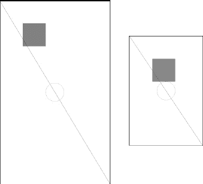

**图 4-13.** *ShapeTest 在 480×800 屏幕（左）和 320×480 屏幕（右）上的输出（后续添加了黑色边框）*

哦，天哪，这是怎么回事？这就是在不同屏幕分辨率下使用绝对坐标和尺寸进行渲染所得到的结果。两张图片中唯一不变的是那条红线，它只是从左上角画到右下角。这是以与屏幕分辨率无关的方式完成的。

矩形的位置在（100,100）。根据屏幕分辨率不同，它到屏幕中心的距离也会不同。矩形的尺寸是 100×100 像素。在大屏幕上的相对空间占比要比在小屏幕上小得多。

圆的位置同样是屏幕分辨率无关的，但其半径不是。因此，在小屏幕上它比在大屏幕上占用了更多的相对空间。

我们已经看到，处理不同的屏幕分辨率可能会有点问题。如果再考虑不同的物理屏幕尺寸，情况会更糟。不过，我们将在下一章中尝试解决这个问题。请记住，屏幕分辨率和物理尺寸都很重要。

**注意：** `Canvas`和`Paint`类提供的功能远不止我们刚才讨论的这些。事实上，所有标准的 Android `View`都是通过这个 API 来绘制自身的，所以你能想象到其背后还有更多内容。一如既往，请查看 Android 开发者网站以获取更多信息。

#### 使用位图

虽然用基本形状（如线条或圆）来制作游戏是可行的，但这并不够吸引人。我们希望有优秀的艺术家为我们创建精灵、背景等各种炫酷元素，然后我们从 PNG 或 JPEG 文件中加载它们。在 Android 上实现这一点非常简单。


##### 加载与检查位图

`Bitmap`类将成为我们的得力助手。我们通过`BitmapFactory`单例从文件加载位图。由于图片以资源形式存储，接下来看看如何从`assets/`目录加载图像：

```
InputStream inputStream = assetManager.open("bob.png");
Bitmap bitmap = BitmapFactory.decodeStream(inputStream);
```

`Bitmap`类本身包含一些我们感兴趣的方法。首先，我们需要获取其像素宽高：

```
int width = bitmap.getWidth();
int height = bitmap.getHeight();
```

其次可能想了解的是存储的`Bitmap`颜色格式：

```
Bitmap.Config config = bitmap.getConfig();
```

`Bitmap.Config`是一个枚举，包含以下值：

* `Config.ALPHA_8`
* `Config.ARGB_4444`
* `Config.ARGB_8888`
* `Config.RGB_565`

从第 3 章中，你应该了解这些值的含义。如果不清楚，我们强烈建议重新阅读第 3 章的“数字颜色编码”部分。

有趣的是，并没有 RGB888 颜色格式。PNG 只支持 ARGB8888、RGB888 和调色板颜色。那么加载 RGB888 PNG 时会使用哪种颜色格式？答案是`BitmapConfig.RGB_565`。对于通过`BitmapFactory`加载的任何 RGB888 PNG，系统都会自动采用这种格式。原因在于大多数 Android 设备的实际帧缓冲区都使用该颜色格式。为每个像素使用更高位深度加载图像会浪费内存，因为最终渲染时像素仍需转换为 RGB565。

那么为什么还要设置`Config.ARGB_8888`配置呢？答案是在将最终图像绘制到帧缓冲区之前，可以在 CPU 上完成图像合成。对于 Alpha 分量，相比`Config.ARGB_4444`，该配置提供了更多的位深度，这在某些高质量图像处理中可能是必需的。

ARGB8888 PNG 图像将被加载为`Config.ARGB_8888`配置的`Bitmap`。另外两种颜色格式很少使用。不过，我们可以告诉`BitmapFactory`尝试以特定颜色格式加载图像，即使原始格式不同。

```
InputStream inputStream = assetManager.open("bob.png");
BitmapFactory.Options options = new BitmapFactory.Options();
options.inPreferredConfig = Bitmap.Config.ARGB_4444;
Bitmap bitmap = BitmapFactory.decodeStream(inputStream, null, options);
```

我们使用重载的`BitmapFactory.decodeStream()`方法，通过`BitmapFactory.Options`类的实例向图像解码器传递提示。如前所示，可以通过`BitmapFactory.Options.inPreferredConfig`成员指定所需的`Bitmap`颜色格式。在这个假设示例中，`bob.png`文件是 ARGB8888 PNG，我们希望`BitmapFactory`加载并将其转换为 ARGB4444 位图。不过工厂也可以忽略这个提示。

这将释放该`Bitmap`实例占用的所有内存。当然，调用此方法后就不能再使用该位图进行渲染。

你也可以通过以下静态方法创建空`Bitmap`：

```
Bitmap bitmap = Bitmap.createBitmap(int width, int height, Bitmap.Config config);
```

如果你需要实时进行自定义图像合成，这个方法会很有用。`Canvas`类同样可以作用于位图：

```
Canvas canvas = new Canvas(bitmap);
```

然后你就可以像修改`View`内容一样修改位图。

##### 释放位图

`BitmapFactory`可以在加载图像时帮助我们减少内存占用。如第 3 章所述，位图会占用大量内存。使用更小的颜色格式降低每像素位数有所帮助，但如果我们不断加载位图，最终仍会耗尽内存。因此，应始终通过以下方法释放不再需要的任何`Bitmap`实例：

```
Bitmap.recycle();
```

##### 绘制位图

加载位图后，我们可以通过`Canvas`绘制它们。最简单的方法如下所示：

```
Canvas.drawBitmap(Bitmap bitmap, float topLeftX, float topLeftY, Paint paint);
```

第一个参数不言自明。`topLeftX`和`topLeftY`参数指定位图左上角在屏幕上的坐标。最后一个参数可以为`null`。虽然可以通过`Paint`指定一些高级绘制参数，但我们实际上并不需要。

还有另一个同样有用的方法：

```
Canvas.drawBitmap(Bitmap bitmap, Rect src, Rect dst, Paint paint);
```

这个方法非常出色。它允许我们通过第二个参数指定要绘制的`Bitmap`区域。`Rect`类保存矩形的左上角和右下角坐标。通过`src`指定`Bitmap`区域时，使用`Bitmap`自身的坐标系。如果指定为`null`，则使用完整的`Bitmap`。

第三个参数同样以`Rect`实例的形式定义要绘制的`Bitmap`区域位置。不过这次角点坐标是在`Canvas`目标（`View`或另一个`Bitmap`）的坐标系中给出的。最大的惊喜在于两个矩形不必大小相同。如果目标矩形的尺寸小于源矩形，`Canvas`会自动进行缩放；如果目标矩形更大，同样也会缩放。我们通常会将最后一个参数设为`null`。但请注意，这种缩放操作非常消耗性能，仅在必要时才应使用。

所以你可能会想：如果存在不同颜色格式的`Bitmap`实例，在通过`Canvas`绘制前是否需要转换为某种标准格式？答案是否定的。`Canvas`会自动处理转换。当然，如果使用与原生帧缓冲区相同的颜色格式，处理速度会稍快一些。通常我们直接忽略这个问题。

混合功能默认也是启用的，因此如果图像包含每像素的 Alpha 分量，它会被实际解析。


### 整合所有内容

有了这些信息，我们终于可以加载并渲染一些鲍勃图像了。清单 4-14 展示了我们为演示目的编写的`BitmapTest`活动的源代码。

**清单 4-14.** *BitmapTest 活动*

```
package com.badlogic.androidgames;

import java.io.IOException;
import java.io.InputStream;

import android.app.Activity;
import android.content.Context;
import android.content.res.AssetManager;
import android.graphics.Bitmap;
import android.graphics.BitmapFactory;
import android.graphics.Canvas;
import android.graphics.Rect;
import android.os.Bundle;
import android.util.Log;
import android.view.View;
import android.view.Window;
import android.view.WindowManager;

public class BitmapTest extends Activity {
    class RenderView extends View {
        Bitmap bob565;
        Bitmap bob4444;
        Rect dst = new Rect();

        public RenderView(Context context) {
            super(context);

            try {
                AssetManager assetManager = context.getAssets();
                InputStream inputStream = assetManager.open("bobrgb888.png");
                bob565 = BitmapFactory.decodeStream(inputStream);
                inputStream.close();
                Log.d("BitmapText",
                        "bobrgb888.png format: " + bob565.getConfig());

                inputStream = assetManager.open("bobargb8888.png");
                BitmapFactory.Options options = new BitmapFactory.Options();
                options.inPreferredConfig = Bitmap.Config.ARGB_4444;
                bob4444 = BitmapFactory
                        .decodeStream(inputStream, null, options);
                inputStream.close();
                Log.d("BitmapText",
                        "bobargb8888.png format: " + bob4444.getConfig());

            } catch (IOException e) {
                // silently ignored, bad coder monkey, baaad!
            } finally {
                // we should really close our input streams here.
            }
        }

        protected void onDraw(Canvas canvas) {
            dst.set(50, 50, 350, 350);
            canvas.drawBitmap(bob565, null, dst, null);
            canvas.drawBitmap(bob4444, 100, 100, null);
            invalidate();
        }
    }

    @Override
    public void onCreate(Bundle savedInstanceState) {
        super.onCreate(savedInstanceState);
        requestWindowFeature(Window.FEATURE_NO_TITLE);
        getWindow().setFlags(WindowManager.LayoutParams.FLAG_FULLSCREEN,
                WindowManager.LayoutParams.FLAG_FULLSCREEN);
        setContentView(new RenderView(this));
    }
}
```

活动的`onCreate()`方法已是老生常谈，我们直接跳到自定义的`View`。

它有两个`Bitmap`成员，一个以 RGB565 格式存储鲍勃图像（第 3 章中介绍过），另一个以 ARGB4444 格式存储鲍勃图像。我们还有一个`Rect`成员，用于存储渲染的目标矩形。

在`RenderView`类的构造函数中，首先将鲍勃图像加载到`View`的`bob565`成员中。请注意，该图像是从 RGB888 PNG 文件加载的，`BitmapFactory`会自动将其转换为 RGB565 图像。为了验证这一点，我们还将该`Bitmap`的`Bitmap.Config`输出到 LogCat。RGB888 版本的鲍勃图像背景为不透明白色，因此无需进行混合处理。

接下来，我们从`assets/`目录中的 ARGB8888 PNG 文件加载鲍勃图像。为了节省内存，我们指示`BitmapFactory`将该图像转换为 ARGB4444 位图。工厂可能不会遵从这一请求（原因不明）。为了确认它是否满足了我们的要求，我们也将此`Bitmap`的`Bitmap.Config`输出到 LogCat。

`onDraw()`方法非常简单。我们只做了两件事：将`bob565`缩放至 250×250 像素（原始尺寸为 160×183 像素）进行绘制，然后在它之上绘制未缩放但已混合的`bob4444`（由`Canvas`自动完成）。图 4-14 展示了两个鲍勃图像的非凡效果。

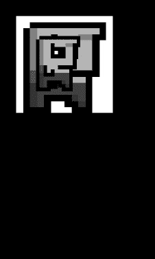

**图 4-14.** *两个鲍勃图像重叠（分辨率为 480×800 像素）*

LogCat 报告`bob565`的颜色格式确实是`Config.RGB_565`，而`bob4444`已被转换为`Config.ARGB_4444`。`BitmapFactory`没有辜负我们的期望！

以下是你应该从本节中掌握的一些要点：

- 尽可能使用最低的色彩格式以节省内存。但这可能会以降低视觉质量和略微减慢渲染速度为代价。
- 除非绝对必要，否则避免绘制缩放后的位图。如果你知道缩放后的大小，请离线或在加载时预先进行缩放。
- 如果不再需要`Bitmap`，请务必调用`Bitmap.recycle()`方法。否则会导致内存泄漏或内存不足。

一直使用 LogCat 进行文本输出略显繁琐。接下来我们看看如何通过`Canvas`渲染文本。

**注意：** 与其他类一样，`Bitmap`的内容远不止这几页所能描述。我们仅涵盖了编写 Mr. Nom 游戏所需的最基本内容。如需了解更多，请查阅 Android 开发者网站上的文档。

#### 渲染文本

虽然 Mr. Nom 游戏中输出的文本将通过手绘方式实现，但了解如何通过 TrueType 字体绘制文本也不无裨益。我们先从`assets/`目录加载自定义 TrueType 字体文件开始。

##### 加载字体

Android API 为我们提供了名为`Typeface`的类，用于封装 TrueType 字体。它提供了一个简单的静态方法，可以从`assets/`目录加载此类字体文件：

```
Typeface font = Typeface.createFromAsset(context.getAssets(), "font.ttf");
```

有趣的是，如果字体文件无法加载，此方法不会抛出任何类型的`Exception`，而是抛出`RuntimeException`。为什么该方法没有显式抛出异常，这有点令人费解。

##### 使用字体绘制文本

获取字体后，我们将其设置为`Paint`实例的`Typeface`：

```
paint.setTypeFace(font);
```

通过`Paint`实例，我们还可以指定渲染字体的大小：

```
paint.setTextSize(30);
```

此方法的文档同样略显简略。它并未说明文字大小是以点（points）还是像素（pixels）为单位。我们暂且假定是像素。

最后，我们可以通过以下`Canvas`方法使用该字体绘制文本：

```
canvas.drawText("This is a test!", 100, 100, paint);
```

第一个参数是要绘制的文本。接下来的两个参数是文本应绘制到的坐标。最后一个参数我们很熟悉：它是指定要绘制文本的颜色、字体和大小的`Paint`实例。通过设置`Paint`的颜色，你也就设置了要绘制文本的颜色。


##### 文本对齐与边界

现在，你可能想知道前面方法中的坐标与文本字符串所填充的矩形之间存在怎样的关系。这些坐标是否指定了包含文本的矩形的左上角？答案其实更复杂一些。`Paint` 实例有一个名为*对齐设置*的属性。它可以通过 `Paint` 类的以下方法进行设置：

```
Paint.setTextAlign(Paint.Align align);
```

`Paint.Align` 枚举包含三个值：`Paint.Align.LEFT`、`Paint.Align.CENTER` 和 `Paint.Align.RIGHT`。根据所设置的对齐方式，传递给 `Canvas.drawText()` 方法的坐标会被解释为矩形的左上角、矩形的顶部中心点或矩形的右上角。默认对齐方式是 `Paint.Align.LEFT`。

有时，了解特定字符串的像素边界也很有用。为此，`Paint` 类提供了以下方法：

```
Paint.getTextBounds(String text, int start, int end, Rect bounds);
```

第一个参数是我们希望获取边界的字符串。第二和第三个参数指定了字符串中需要测量的起始字符和结束字符。结束参数是不包含在内的。最后一个参数 `bounds` 是我们自己分配并传入方法的一个 `Rect` 实例。该方法会将边界矩形的宽度和高度写入 `Rect.right` 和 `Rect.bottom` 字段。为方便起见，我们可以调用 `Rect.width()` 和 `Rect.height()` 来获取相同的值。

请注意，所有这些方法仅适用于单行文本。如果要渲染多行文本，我们需要自行处理布局。

##### 整合应用

理论说得够多了：让我们来编写一些代码。清单 4–15 展示了文本渲染的实际应用。

**清单 4–15.** *FontTest 活动*

```java
package com.badlogic.androidgames;

import android.app.Activity;
import android.content.Context;
import android.graphics.Canvas;
import android.graphics.Color;
import android.graphics.Paint;
import android.graphics.Rect;
import android.graphics.Typeface;
import android.os.Bundle;
import android.view.View;
import android.view.Window;
import android.view.WindowManager;

public class FontTest extends Activity {
    class RenderView extends View {
        Paint paint;
        Typeface font;
        Rect bounds = new Rect();

        public RenderView(Context context) {
            super(context);
            paint = new Paint();
            font = Typeface.createFromAsset(context.getAssets(), "font.ttf");
        }

        protected void onDraw(Canvas canvas) {
            paint.setColor(Color.YELLOW);
            paint.setTypeface(font);
            paint.setTextSize(28);
            paint.setTextAlign(Paint.Align.CENTER);
            canvas.drawText("This is a test!", canvas.getWidth() / 2, 100,
                    paint);

            String text = "This is another test o_O";
            paint.setColor(Color.WHITE);
            paint.setTextSize(18);
            paint.setTextAlign(Paint.Align.LEFT);
            paint.getTextBounds(text, 0, text.length(), bounds);
            canvas.drawText(text, canvas.getWidth() - bounds.width(), 140,
                    paint);
            invalidate();
        }
    }

    @Override
    public void onCreate(Bundle savedInstanceState) {
        super.onCreate(savedInstanceState);
        requestWindowFeature(Window.FEATURE_NO_TITLE);
        getWindow().setFlags(WindowManager.LayoutParams.FLAG_FULLSCREEN,
                WindowManager.LayoutParams.FLAG_FULLSCREEN);
        setContentView(new RenderView(this));
    }
}
```

我们不再讨论活动的 `onCreate()` 方法，因为之前已经介绍过了。

我们的 `RenderView` 实现包含三个成员：一个 `Paint`、一个 `Typeface` 和一个 `Rect`，稍后将在其中存储文本字符串的边界。

在构造函数中，我们创建了一个新的 `Paint` 实例，并从 `assets/` 目录下的 `font.ttf` 文件中加载字体。

在 `onDraw()` 方法中，我们将 `Paint` 设置为黄色，设置字体及其大小，并指定在调用 `Canvas.drawText()` 时用于解释坐标的文本对齐方式。实际的绘制调用渲染了字符串 `This is a test!`，在 y 轴坐标 100 处水平居中。

对于第二次文本渲染调用，我们做了不同的事情：我们希望文本与屏幕右边缘对齐。我们可以通过使用 `Paint.Align.RIGHT` 和 x 坐标为 `Canvas.getWidth() – 1` 来实现。相反，我们采用了一种更复杂的方法，通过使用字符串的边界来稍微练习一下基本的文本布局。我们还更改了渲染时字体的颜色和大小。图 4–15 展示了该活动的输出。


**图 4–15.** *文本乐趣（480×800 像素分辨率）*

`Typeface` 类的另一个神秘之处在于，它并没有明确允许我们释放其所有资源。我们必须依赖垃圾回收器来完成这项清理工作。

**注意：** 这里我们只是浅尝辄止地介绍了文本渲染。如果你想了解更多……那么，现在你应该知道该去哪里寻找答案了。

#### 使用 SurfaceView 进行持续渲染

在这一节中，我们将成长为真正的开发者。这涉及到线程以及与之相关的所有麻烦。我们会安然度过这一关。我保证！

##### 动机

当我们第一次尝试进行持续渲染时，采用了错误的方式。占用 UI 线程是不可接受的；我们需要一个在独立线程中完成所有繁重工作的解决方案。于是，`SurfaceView` 应运而生。

顾名思义，`SurfaceView` 类是一个处理 `Surface` 的 `View`，而 `Surface` 是 Android API 中的另一个类。什么是 `Surface`？它是屏幕合成器用于渲染特定 `View` 的原始缓冲区的抽象。屏幕合成器是 Android 上所有渲染的幕后主导，最终负责将所有像素推送到 GPU。在某些情况下，`Surface` 可以实现硬件加速。不过我们对此并不太在意。我们只需要知道，这是一种将内容渲染到屏幕上的更直接方式。

我们的目标是在独立线程中执行渲染，这样就不会占用忙于其他事务的 UI 线程。`SurfaceView` 类为我们提供了一种从 UI 线程以外的线程向其渲染的方法。

##### SurfaceHolder 与锁定

为了从不同于 UI 线程的线程向 `SurfaceView` 渲染，我们需要获取 `SurfaceHolder` 类的一个实例，如下所示：

```
SurfaceHolder holder = surfaceView.getHolder();
```

`SurfaceHolder` 是 `Surface` 的封装器，并为我们完成一些记账工作。它提供了两个方法：

```
Canvas SurfaceHolder.lockCanvas();
SurfaceHolder.unlockAndPost(Canvas canvas);
```

第一个方法锁定 `Surface` 以进行渲染，并返回一个我们可以使用的 `Canvas` 实例。第二个方法再次解锁 `Surface`，并确保我们通过 `Canvas` 绘制的内容显示在屏幕上。我们将在渲染线程中使用这两个方法来获取 `Canvas`，进行渲染，最后将刚渲染的图像显示在屏幕上。我们传递给 `SurfaceHolder.unlockAndPost()` 方法的 `Canvas` 必须是从 `SurfaceHolder.lockCanvas()` 方法接收到的那个。

当 `SurfaceView` 被实例化时，`Surface` 并不会立即创建。相反，它是异步创建的。每次活动暂停时，surface 都会被销毁，并在活动恢复时重新创建。


##### 表面创建与有效性

只要 `Surface` 尚未有效，我们就无法从 `SurfaceHolder` 获取 `Canvas`。不过，我们可以通过以下语句检查 `Surface` 是否已创建：

`boolean isCreated = surfaceHolder.getSurface().isValid();`

如果此方法返回 `true`，我们就可以安全地锁定表面，并通过获取的 `Canvas` 进行绘制。我们必须确保在调用 `SurfaceHolder.lockCanvas()` 后再次解锁 `Surface`，否则我们的 Activity 可能会导致手机死锁！

##### 整合所有部分

那么，我们如何将这一切与独立的渲染线程以及 Activity 生命周期整合在一起呢？弄清楚这个问题的最佳方法是查看一些实际代码。代码清单 4–16 展示了一个完整的示例，它在 `SurfaceView` 的独立线程中执行渲染。

**代码清单 4–16.** *SurfaceViewTest Activity*

```
package com.badlogic.androidgames;

import android.app.Activity;
import android.content.Context;
import android.graphics.Canvas;
import android.os.Bundle;
import android.view.SurfaceHolder;
import android.view.SurfaceView;
import android.view.Window;
import android.view.WindowManager;

public class SurfaceViewTest extends Activity {
    FastRenderView renderView;

    public void onCreate(Bundle savedInstanceState) {
        super.onCreate(savedInstanceState);
        requestWindowFeature(Window.FEATURE_NO_TITLE);
        getWindow().setFlags(WindowManager.LayoutParams.FLAG_FULLSCREEN,
                             WindowManager.LayoutParams.FLAG_FULLSCREEN);
        renderView = new FastRenderView(this);
        setContentView(renderView);
    }

    protected void onResume() {
        super.onResume();
        renderView.resume();
    }

    protected void onPause() {
        super.onPause();
        renderView.pause();
    }

    class FastRenderView extends SurfaceView implements Runnable {
        Thread renderThread = null;
        SurfaceHolder holder;
        volatile boolean running = false;

        public FastRenderView(Context context) {
            super(context);
            holder = getHolder();
        }

        public void resume() {
            running = true;
            renderThread = new Thread(this);
            renderThread.start();
        }

        public void run() {
            while (running) {
                if (!holder.getSurface().isValid())
                    continue;

                Canvas canvas = holder.lockCanvas();
                canvas.drawRGB(255, 0, 0);
                holder.unlockCanvasAndPost(canvas);
            }
        }

        public void pause() {
            running = false;
            while (true) {
                try {
                    renderThread.join();
                } catch (InterruptedException e) {
                    // 重试
                }
            }
        }
    }
}
```

这看起来并不那么吓人，对吧？我们的 Activity 持有一个 `FastRenderView` 实例作为成员变量。这是一个自定义的 `SurfaceView` 子类，它将为我们处理所有线程事务和表面锁定。对于 Activity 来说，它就像一个普通的 `View`。

在 `onCreate()` 方法中，我们启用全屏模式，创建 `FastRenderView` 实例，并将其设置为 Activity 的内容视图。

这次我们还重写了 `onResume()` 方法。在这个方法中，我们将通过调用 `FastRenderView.resume()` 方法来间接启动渲染线程，该方法内部完成了所有魔法操作。这意味着线程将在 Activity 初始创建时启动（因为 `onCreate()` 之后总是跟着调用 `onResume()`）。当 Activity 从暂停状态恢复时，线程也会重新启动。

当然，这暗示着我们必须在某处停止线程；否则，每次调用 `onResume()` 时我们都会创建一个新线程。这就是 `onPause()` 的作用所在。它调用 `FastRenderView.pause()` 方法，该方法将完全停止线程。在线程完全停止之前，该方法不会返回。

那么，让我们看看这个示例的核心类：`FastRenderView`。它与我们在前面几个示例中实现的 `RenderView` 类类似，都派生自另一个 `View` 类。在这个例子中，我们直接派生自 `SurfaceView` 类。它还实现了 `Runnable` 接口，以便我们可以将其传递给渲染线程，使其执行渲染线程逻辑。

`FastRenderView` 类有三个成员变量。`renderThread` 成员变量只是对将负责执行我们渲染线程逻辑的 `Thread` 实例的引用。`holder` 成员变量是对我们从所派生自的 `SurfaceView` 超类获得的 `SurfaceHolder` 实例的引用。最后，`running` 成员变量是一个简单的布尔标志，我们将用它来通知渲染线程停止执行。`volatile` 修饰符有一个特殊的含义，我们稍后会讨论。

在构造函数中，我们只做了三件事：调用超类构造函数，并将对 `SurfaceHolder` 的引用存储在 `holder` 成员变量中。

接下来是 `FastRenderView.resume()` 方法。它负责启动渲染线程。请注意，每次调用此方法时，我们都会创建一个新的 `Thread`。这与我们讨论 Activity 的 `onResume()` 和 `onPause()` 方法时讨论的内容一致。我们还将 `running` 标志设置为 `true`。你很快就会看到它如何在渲染线程中使用。最后一点要记住的是，我们将 `FastRenderView` 实例本身设置为线程的 `Runnable`。这将在新线程中执行 `FastRenderView` 的下一个方法。

`FastRenderView.run()` 方法是我们自定义 `View` 类的主力。其主体在渲染线程中执行。如你所见，它仅仅由一个循环组成，一旦 `running` 标志被设置为 `false`，该循环就会停止执行。当这种情况发生时，线程也将停止并消亡。在 `while` 循环内部，我们首先检查以确保 `Surface` 有效，如果有效，我们就锁定它，进行渲染，然后再次解锁，正如之前讨论的那样。在这个例子中，我们只是用红色填充 `Surface`。

`FastRenderView.pause()` 方法看起来有点奇怪。首先我们将 `running` 标志设置为 `false`。如果你向上看一点，会看到 `FastRenderView.run()` 方法中的 `while` 循环最终会因此终止，从而停止渲染线程。在接下来的几行代码中，我们通过调用 `Thread.join()` 简单地等待线程完全终止。这个方法会等待线程终止，但在线程实际终止之前可能会抛出 `InterruptedException`。由于我们必须确保线程在从该方法返回之前已经死亡，因此我们在一个无限循环中执行 join，直到成功为止。

让我们回到 `running` 标志的 `volatile` 修饰符。为什么我们需要它？原因很微妙：如果编译器发现该方法中第一行与 `while` 块之间没有依赖关系，它可能会决定重新排序 `FastRenderView.pause()` 方法中的语句。如果编译器认为这会使代码执行得更快，它允许这样做。然而，我们依赖于在该方法中指定的执行顺序。想象一下，如果 `running` 标志在我们尝试 join 线程之后才被设置。我们将进入无限循环，因为线程永远不会终止。

`volatile` 修饰符阻止了这种情况的发生。任何引用此成员的语句都将按顺序执行。这使我们避免了一个讨厌的海森堡 bug——一个时而出现时而消失、无法被稳定复现的 bug。


### 排版后内容

还有一件事可能会让你觉得这段代码会崩掉：如果在调用 `SurfaceHolder.getSurface().isValid()` 和 `SurfaceHolder.lock()` 之间，Surface 被销毁了会怎样？嗯，我们很幸运——这种情况永远不会发生。要理解原因，我们需要退一步，看看 `Surface` 的生命周期是如何工作的。

我们知道 `Surface` 是异步创建的。很有可能我们的渲染线程会在 `Surface` 有效之前执行。我们通过不锁定 `Surface`（除非它有效）来防止这种情况。这涵盖了 Surface 创建的情况。

渲染线程代码不会因为 `Surface` 在有效性检查和锁定之间被销毁而崩溃，这与 `Surface` 被销毁的时间点有关。`Surface` 总是在我们返回 Activity 的 `onPause()` 方法之后才被销毁。由于我们在该方法中通过调用 `FastRenderView.pause()` 等待线程结束，因此当 `Surface` 实际被销毁时，渲染线程将不再存活。很酷，不是吗？但这也让人困惑。

现在，我们以正确的方式执行连续渲染。我们不再占用 UI 线程，而是使用一个单独的渲染线程。我们也让它遵循 Activity 的生命周期，这样它就不会在 Activity 暂停时在后台运行、消耗电池。世界再次变得和谐。当然，我们还需要将 UI 线程中输入事件的处理与渲染线程同步。但这会变得非常简单，当你阅读下一章时就会明白，届时我们将基于你在本章中吸收的所有信息来实现游戏框架。

#### 使用 Canvas 的硬件加速渲染

Android 3.0 Honeycomb 增加了一个显著的功能，即能够为标准 2D Canvas 绘图调用启用 GPU 硬件加速。此功能的价值因应用和设备而异，因为有些设备实际上在 CPU 上执行 2D 绘图性能更好，而另一些则会从 GPU 中受益。硬件加速在底层所做的是分析绘图调用并将其转换为 OpenGL。例如，如果我们指定从 (0,0) 到 (100,100) 绘制一条线，那么硬件加速将使用 OpenGL 组合成一个特殊的画线调用，并将其绘制到一个硬件缓冲区中，该缓冲区随后会被合成到屏幕上。

启用此硬件加速很简单，只需将以下内容添加到你的 `AndroidManifest.xml` 中的 `<application />` 标签下：

```
android:hardwareAccelerated="true"
```

请务必在多种设备上分别开启和关闭硬件加速来测试你的游戏，以确定它是否适合你。未来，一直开启它可能没问题，但和其他事情一样，我们建议你自行测试和判断。当然，还有更多配置选项可以让你为特定的 Application、Activity、Window 或 View 设置硬件加速，但由于我们做的是游戏，通常每种只有一个，因此通过 Application 全局设置是最合理的。

Android 此功能的开发者 Romain Guy 有一篇非常详细的博客文章，介绍了硬件加速的注意事项以及使用它来获得不错性能的一些通用指南。该博客文章的 URL 是：[`android-developers.blogspot.com/2011/03/android-30-hardware-acceleration.html`](http://android-developers.blogspot.com/2011/03/android-30-hardware-acceleration.html)

### 最佳实践

Android（或者更准确地说，Dalvik）有时会有一些奇怪的性能特性。为了结束本章，我们将向你介绍一些最重要的最佳实践，遵循这些实践能让你的游戏运行如丝般顺滑。

-   垃圾收集器是你最大的敌人。一旦它获得 CPU 时间来执行其脏活，它会让世界停止最多 600 毫秒。这是半秒钟，你的游戏将无法更新或渲染。用户会抱怨的。尽可能避免创建对象，尤其是在你的内层循环中。
-   对象可能会在一些不那么明显的地方被创建，你需要避免这些情况。不要使用迭代器，因为它们会创建新对象。不要使用任何标准的 `Set` 或 `Map` 集合类，因为它们每次插入时都会创建新对象；相反，请使用 Android API 提供的 `SparseArray` 类。使用 `StringBuffer` 而不是用 `+` 运算符连接字符串，因为后者每次都会创建一个新的 `StringBuffer`。看在老天爷的份上，千万别用装箱的原生类型！
-   在 Dalvik 中，方法调用的相关开销比其他虚拟机更大。如果可以，请使用静态方法，因为它们的性能最好。静态方法通常被认为是有害的，就像静态变量一样，因为它们会促进糟糕的设计，所以尽量保持你的设计尽可能清晰。也许你也应该避免使用 getter 和 setter。在没有 JIT 的情况下，直接字段访问比方法调用快大约三倍，有 JIT 时则快大约七倍。尽管如此，在删除所有 getter 和 setter 之前，请先考虑你的设计。
-   在较旧的设备和没有 JIT 的 Dalvik 版本（Android 2.2 之前的任何版本）上，浮点运算是在软件中实现的。老派的游戏开发者会立即退回到定点数学运算。但也不要这样做，因为整数除法也很慢。大多数情况下，你可以使用浮点数，而较新的设备配备浮点运算单元（FPU），一旦 JIT 启动，这能大大加快速度。
-   尝试将频繁访问的值塞入方法的局部变量中。访问局部变量比访问成员或调用 getter 更快。

当然，你还需要注意许多其他事情。在本书的其余部分，当上下文允许时，我们会穿插一些性能提示。如果你遵循前面的建议，应该是安全的。只要别让垃圾收集器得逞就行！

### 总结

本章涵盖了为 Android 编写一个像样的小型 2D 游戏所需了解的一切。我们看到了使用一些默认设置建立一个新游戏项目是多么容易。我们讨论了神秘的 Activity 生命周期以及如何与之共存。我们与触摸（更重要的是，多点触摸）事件作了斗争，处理了按键事件，并通过加速度计检查了设备的方向。我们探索了如何读写文件。在 Android 上输出音频原来是小儿科，而且除了 `SurfaceView` 的线程问题之外，在屏幕上绘制东西也不是那么难。Mr. Nom 现在可以成为现实——一个可怕的、饥饿的现实！

## 第 5 章

## 一个 Android 游戏开发框架

你可能已经注意到，我们已经通过了四章，却没有写一行游戏代码。我们让你经历所有这些枯燥的理论并要求你实现测试程序的原因很简单：如果你想编写游戏，你必须确切知道发生了什么。你不能只是从网络上各处复制粘贴代码，然后指望它们拼凑出下一个第一人称射击大作。到现在为止，你应该已经牢牢掌握了如何从头开始设计一个简单的游戏，如何为 2D 游戏开发构建一个漂亮的 API，以及哪些 Android API 能提供实现你想法所需的功能。

为了让 Mr. Nom 成为现实，我们必须做两件事：实现我们在第 3 章设计的游戏框架接口和类，并在此基础上编写 Mr. Nom 的游戏逻辑。让我们从游戏框架开始，将我们在第 3 章设计的内容与我们在第 4 章讨论的内容合并起来。90% 的代码你应该已经熟悉了，因为我们在前一章的测试程序中已经涵盖了大部分内容。


### 行动计划

在第 3 章中，我们规划了一个游戏框架的最小化设计，它抽象掉了所有平台细节，以便我们能专注于此行的目的：游戏开发。现在，我们将以自底向上的方式，从最简单到最困难，逐一实现所有这些接口和抽象类。第 3 章中的接口位于包`com.badlogic.androidgames.framework`中。我们将本章的实现代码放在包`com.badlogic.androidgames.framework.impl`里，以此表明它包含了框架在 Android 平台上的实际实现。我们将在所有接口实现前加上`Android`前缀，以便与接口本身区分开来。让我们从最简单的部分开始：文件 I/O。

本章及下一章的代码将合并到同一个 Eclipse 项目中。现在，你可以按照上一章的步骤在 Eclipse 中新建一个 Android 项目。此时，默认 Activity 的名称无关紧要。

### AndroidFileIO 类

原始的`FileIO`接口简洁而高效。它包含四个方法：一个用于获取资源文件的`InputStream`，一个用于获取外部存储中文件的`InputStream`，一个用于返回外部存储设备上文件的`OutputStream`，以及最后一个用于获取游戏`SharedPreferences`的方法。在第 4 章中，你学会了如何使用 Android API 打开资源文件和外部存储上的文件。清单 5-1 基于第 4 章的知识，展示了`FileIO`接口的实现。

**清单 5-1.** *AndroidFileIO.java；实现 FileIO 接口*

```java
package com.badlogic.androidgames.framework.impl;

import java.io.File;
import java.io.FileInputStream;
import java.io.FileOutputStream;
import java.io.IOException;
import java.io.InputStream;
import java.io.OutputStream;

import android.content.Context;
import android.content.SharedPreferences;
import android.content.res.AssetManager;
import android.os.Environment;
import android.preference.PreferenceManager;

import com.badlogic.androidgames.framework.FileIO;

public class AndroidFileIO implements FileIO {
    Context context;
    AssetManager assets;
    String externalStoragePath;

    public AndroidFileIO(Context context) {
        this.context = context;
        this.assets = context.getAssets();
        this.externalStoragePath = Environment.getExternalStorageDirectory()
                .getAbsolutePath() + File.separator;
    }
    @Override
    public InputStream readAsset(String fileName) throws IOException {
        return assets.open(fileName);
    }

    @Override
    public InputStream readFile(String fileName) throws IOException {
        return new FileInputStream(externalStoragePath + fileName);
    }

    @Override
    public OutputStream writeFile(String fileName) throws IOException {
        return new FileOutputStream(externalStoragePath + fileName);
    }

    public SharedPreferences getPreferences() {
        return PreferenceManager.getDefaultSharedPreferences(context);
    }
}
```

一切都简单明了。我们实现了`FileIO`接口，存储了`Context`（它是访问 Android 几乎所有功能的入口），存储了从`Context`获取的`AssetManager`，存储了外部存储的路径，并基于此路径实现了四个方法。最后，我们传递所有抛出的`IOException`，以便在调用方知晓任何异常情况。

我们的`Game`接口实现将持有此类的一个实例，并通过`Game.getFileIO()`返回它。这也意味着，为了让`AndroidFileIO`实例正常工作，我们的`Game`实现需要传递`Context`。

请注意，我们并未检查外部存储是否可用。如果它不可用，或者我们忘记在清单文件中添加相应的权限，程序将抛出异常，因此错误检查是隐式的。现在，我们可以继续框架的下一个部分：音频。


### AndroidAudio、AndroidSound 与 AndroidMusic：碰撞、轰鸣、巨响！

在第三章中，我们设计了三个接口来满足所有音频需求：`Audio`、`Sound` 和 `Music`。`Audio` 负责从资源文件中创建 `Sound` 和 `Music` 实例。`Sound` 让我们能够播放存储在 RAM 中的音效，而 `Music` 则将较大的音乐文件从磁盘流式传输到声卡。在第四章中，你学习了实现这一点所需的 Android API。我们将从 `AndroidAudio` 的实现开始，如代码清单 5-2 所示。

**代码清单 5-2.** `AndroidAudio.java`；实现 `Audio` 接口

```java
package com.badlogic.androidgames.framework.impl;

import java.io.IOException;

import android.app.Activity;
import android.content.res.AssetFileDescriptor;
import android.content.res.AssetManager;
import android.media.AudioManager;
import android.media.SoundPool;

import com.badlogic.androidgames.framework.Audio;
import com.badlogic.androidgames.framework.Music;
import com.badlogic.androidgames.framework.Sound;

public class AndroidAudio implements Audio {
    AssetManager assets;
    SoundPool soundPool;
```

`AndroidAudio` 实现包含一个 `AssetManager` 和一个 `SoundPool` 实例。`AssetManager` 用于在调用 `AndroidAudio.newSound()` 时，将音效从资源文件加载到 `SoundPool` 中。`AndroidAudio` 实例还负责管理 `SoundPool`。

```java
    public AndroidAudio(Activity activity) {
        activity.setVolumeControlStream(AudioManager.STREAM_MUSIC);
        this.assets = activity.getAssets();
        this.soundPool = new SoundPool(20, AudioManager.STREAM_MUSIC, 0);
    }
```

我们在构造函数中传入游戏 `Activity` 有两个原因：它允许我们设置媒体流的音量控制（我们总是希望这样做），并且它为我们提供了一个 `AssetManager` 实例，我们将愉快地将其存储在相应的类成员中。`SoundPool` 配置为并行播放 20 个音效，这足以满足我们的需求。

```java
@Override
    public Music newMusic(String filename) {
        try {
            AssetFileDescriptor assetDescriptor = assets.openFd(filename);
            return new AndroidMusic(assetDescriptor);
        } catch (IOException e) {
            throw new RuntimeException("Couldn't load music '" + filename + "'");
        }
    }
```

`newMusic()` 方法创建一个新的 `AndroidMusic` 实例。该类的构造函数接收一个 `AssetFileDescriptor`，并使用它来创建一个内部的 `MediaPlayer`（稍后会详细说明）。`AssetManager.openFd()` 方法在出现问题时抛出 `IOException`。我们捕获它，并将其重新抛出为 `RuntimeException`。为什么不将 `IOException` 传递给调用者呢？首先，这会严重增加调用代码的混乱程度，因此我们更愿意抛出一个无需显式捕获的 `RuntimeException`。其次，我们从资源文件加载音乐。只有当我们忘记将音乐文件添加到 `assets/` 目录，或者音乐文件包含错误字节时，它才会失败。错误字节构成了不可恢复的错误，因为我们需要那个 `Music` 实例来确保游戏正常运行。为了避免这种情况，我们在游戏框架中的几个其他地方也抛出 `RuntimeExceptions`，而不是受检异常。

```java
    @Override
    public Sound newSound(String filename) {
        try {
            AssetFileDescriptor assetDescriptor = assets.openFd(filename);
            int soundId = soundPool.load(assetDescriptor, 0);
            return new AndroidSound(soundPool, soundId);
        } catch (IOException e) {
            throw new RuntimeException("Couldn't load sound '" + filename + "'");
        }
    }
```

最后，`newSound()` 方法将音效从资源加载到 `SoundPool` 中，并返回一个 `AndroidSound` 实例。该实例的构造函数接收一个 `SoundPool` 和 `SoundPool` 分配给音效的 ID。同样，我们会捕获所有受检异常，并将其重新抛出为未检查的 `RuntimeException`。

**注意：** 我们在任何方法中都不释放 `SoundPool`。原因是始终会有一个单独的 `Game` 实例持有一个单独的 `Audio` 实例，而该实例又持有一个单独的 `SoundPool` 实例。因此，只要 Activity（以及我们的游戏）处于活动状态，`SoundPool` 实例就会一直存在。一旦 Activity 结束，它就会自动销毁。

接下来，我们将讨论实现 `Sound` 接口的 `AndroidSound` 类。代码清单 5-3 展示了其实现。

**代码清单 5-3.** 使用 `AndroidSound.java` 实现 `Sound` 接口

```java
package com.badlogic.androidgames.framework.impl;

import android.media.SoundPool;

import com.badlogic.androidgames.framework.Sound;

public class AndroidSound implements Sound {
    int soundId;
    SoundPool soundPool;

    public AndroidSound(SoundPool soundPool, int soundId) {
        this.soundId = soundId;
        this.soundPool = soundPool;
    }

    @Override
    public void play(float volume) {
        soundPool.play(soundId, volume, volume, 0, 0, 1);
    }

    @Override
    public void dispose() {
        soundPool.unload(soundId);
    }
}
```

这里没有什么意外之处。通过 `play()` 和 `dispose()` 方法，我们简单地存储了 `SoundPool` 和已加载音效的 ID，以便后续播放和释放。得益于 Android API，没有比这更简单的方法了。

最后，我们必须实现由 `AndroidAudio.newMusic()` 返回的 `AndroidMusic` 类。代码清单 5-4 显示了该类的代码，看起来比之前的要复杂一些。这是因为 `MediaPlayer` 使用了一个状态机，如果我们在某些状态下调用方法，它会持续抛出异常。

**代码清单 5-4.** `AndroidMusic.java`；实现 `Music` 接口

```java
package com.badlogic.androidgames.framework.impl;

import android.content.res.AssetFileDescriptor;
import android.media.MediaPlayer;
import android.media.MediaPlayer.OnCompletionListener;

import com.badlogic.androidgames.framework.Music;

public class AndroidMusic implements Music, OnCompletionListener {
    MediaPlayer mediaPlayer;
    boolean isPrepared = false;
```

`AndroidMusic` 类存储了一个 `MediaPlayer` 实例以及一个名为 `isPrepared` 的布尔值。请记住，只有在 `MediaPlayer` 准备好时，我们才能调用 `MediaPlayer.start()` / `stop()` / `pause()`。这个成员帮助我们跟踪 `MediaPlayer` 的状态。

`AndroidMusic` 类实现了 `Music` 接口以及 `OnCompletionListener` 接口。在第三章中，我们简要定义了这个接口，作为通知我们 `MediaPlayer` 何时停止播放音乐文件的一种方式。如果发生这种情况，在调用任何其他方法之前，`MediaPlayer` 需要重新准备。`OnCompletionListener.onCompletion()` 方法可能在一个单独的线程中被调用，由于我们在该方法中设置了 `isPrepared` 成员，我们必须确保它能免受并发修改的影响。


```java
public AndroidMusic(AssetFileDescriptor assetDescriptor) {
    mediaPlayer = new MediaPlayer();
    try {
        mediaPlayer.setDataSource(assetDescriptor.getFileDescriptor(),
                assetDescriptor.getStartOffset(),
                assetDescriptor.getLength());
        mediaPlayer.prepare();
        isPrepared = true;
        mediaPlayer.setOnCompletionListener(this);
    } catch (Exception e) {
        throw new RuntimeException("Couldn't load music");
    }
}
```

在构造函数中，我们通过传入的`AssetFileDescriptor`创建并准备好`MediaPlayer`，设置`isPrepared`标志，并将`AndroidMusic`实例注册为`MediaPlayer`的`OnCompletionListener`。如果出现任何问题，我们会再次抛出一个未检查的`RuntimeException`。

```java
@Override
public void dispose() {
    if (mediaPlayer.isPlaying())
        mediaPlayer.stop();
    mediaPlayer.release();
}
```

`dispose()`方法检查`MediaPlayer`是否仍在播放，如果是则停止它。否则，调用`MediaPlayer.release()`会抛出一个运行时异常。

```java
@Override
public boolean isLooping() {
    return mediaPlayer.isLooping();
}

@Override
public boolean isPlaying() {
    return mediaPlayer.isPlaying();
}

@Override
public boolean isStopped() {
    return !isPrepared;
}
```

`isLooping()`、`isPlaying()`和`isStopped()`方法很直接。前两个使用了`MediaPlayer`提供的方法；最后一个使用了`isPrepared`标志，它指示`MediaPlayer`是否已停止。这是`MediaPlayer.isPlaying()`不一定能告诉我们的，因为如果`MediaPlayer`暂停但未停止，它会返回`false`。

```java
@Override
public void pause() {
    if (mediaPlayer.isPlaying())
        mediaPlayer.pause();
}
```

`pause()`方法简单地检查`MediaPlayer`实例是否正在播放，如果是则调用它的`pause()`方法。

```java
@Override
public void play() {
    if (mediaPlayer.isPlaying())
        return;
    try {
        synchronized (this) {
            if (!isPrepared)
                mediaPlayer.prepare();
            mediaPlayer.start();
        }
    } catch (IllegalStateException e) {
        e.printStackTrace();
    } catch (IOException e) {
        e.printStackTrace();
    }
}
```

`play()`方法稍微复杂一些。如果已经在播放，我们直接返回。接下来有一个强大的`try…catch`块，在其中我们根据标志检查`MediaPlayer`是否已经准备好；如果需要则准备它。如果一切顺利，我们调用`MediaPlayer.start()`方法，这将开始播放。这个过程在一个`synchronized`块中进行，因为我们使用了`isPrepared`标志，由于我们实现了`OnCompletionListener`接口，该标志可能在不同的线程上设置。如果出现问题，我们会抛出一个未检查的`RuntimeException`。

```java
@Override
public void setLooping(boolean isLooping) {
    mediaPlayer.setLooping(isLooping);
}

@Override
public void setVolume(float volume) {
    mediaPlayer.setVolume(volume, volume);
}
```

`setLooping()`和`setVolume()`方法可以在`MediaPlayer`的任何状态下调用，并委托给相应的`MediaPlayer`方法。

```java
@Override
public void stop() {
    mediaPlayer.stop();
    synchronized (this) {
        isPrepared = false;
    }
}
```

`stop()`方法停止`MediaPlayer`并在一个`synchronized`块中设置`isPrepared`标志。

```java
@Override
public void onCompletion(MediaPlayer player) {
    synchronized (this) {
        isPrepared = false;
    }
}
```

最后是`OnCompletionListener.onCompletion()`方法，由`AndroidMusic`类实现。它所做的仅仅是在一个`synchronized`块中设置`isPrepared`标志，以便其他方法不会突然抛出异常。接下来，我们将继续学习与输入相关的类。

### AndroidInput 和 AccelerometerHandler

通过几个便捷的方法，我们在第 3 章中设计的`Input`接口使我们可以访问加速度计、触摸屏和键盘，并支持轮询和事件模式。将实现该接口的所有代码放入一个文件的想法有些混乱，因此我们将所有输入事件处理外包给处理程序类。`Input`实现将使用这些处理程序来假装它实际上在执行所有工作。


#### AccelerometerHandler：哪面朝上？

我们先从所有处理器中最简单的 `AccelerometerHandler` 开始。代码清单 5-5 展示了它的代码。

**代码清单 5-5.** *AccelerometerHandler.java；执行所有加速度计处理*

```java
package com.badlogic.androidgames.framework.impl;

import android.content.Context;
import android.hardware.Sensor;
import android.hardware.SensorEvent;
import android.hardware.SensorEventListener;
import android.hardware.SensorManager;

public class AccelerometerHandler implements SensorEventListener {
    float accelX;
    float accelY;
    float accelZ;

    public AccelerometerHandler(Context context) {
        SensorManager manager = (SensorManager) context
                .getSystemService(Context.SENSOR_SERVICE);
        if (manager.getSensorList(Sensor.TYPE_ACCELEROMETER).size() != 0) {
            Sensor accelerometer = manager.getSensorList(
                    Sensor.TYPE_ACCELEROMETER).get(0);
            manager.registerListener(this, accelerometer,
                    SensorManager.SENSOR_DELAY_GAME);
        }
    }

    @Override
    public void onAccuracyChanged(Sensor sensor, int accuracy) {
        // 此处无需执行任何操作
    }

    @Override
    public void onSensorChanged(SensorEvent event) {
        accelX = event.values[0];
        accelY = event.values[1];
        accelZ = event.values[2];
    }

    public float getAccelX() {
        return accelX;
    }

    public float getAccelY() {
        return accelY;
    }

    public float getAccelZ() {
        return accelZ;
    }
}
```

不出所料，这个类实现了我们在第 4 章中使用过的 `SensorEventListener` 接口。该类存储了三个成员变量，分别保存三个加速度计轴上的加速度值。

构造函数接收一个 `Context` 对象，并从中获取一个 `SensorManager` 实例来设置事件监听。其余代码与我们在上一章中所做的相同。请注意，如果没有安装加速度计，该处理器在其整个生命周期中将愉快地返回所有轴上的零加速度。因此，我们不需要任何额外的错误检查或异常抛出代码。

接下来的两个方法 `onAccuracyChanged()` 和 `onSensorChanged()` 应该很熟悉了。在第一个方法中，我们什么也不做，因此没什么可报告的。在第二个方法中，我们从提供的 `SensorEvent` 中获取加速度值，并将其存储在处理器的成员变量中。最后三个方法只是简单地返回每个轴的当前加速度。

请注意，我们在此处无需执行任何同步操作，即使 `onSensorChanged()` 方法可能在不同的线程中被调用。Java 内存模型保证对`Boolean`、`int`或`byte`等基本类型的写入和读取是原子性的。在这种情况下，依赖于此事实是可以的，因为我们所做的仅仅是为变量赋新值，并没有进行更复杂的操作。如果情况并非如此（例如，我们在 `onSensorChanged()` 方法中对成员变量进行了某些操作），我们就需要进行适当的同步。

#### CompassHandler

为了有趣，我们将提供一个与 `AccelerometerHandler` 类似的例子，但这一次，我们将同时提供指南针数值以及手机的俯仰角和横滚角。我们将指南针数值称为“偏航角”（yaw），因为这是一个标准的方位术语，很好地定义了我们所看到的数值。

以下代码片段与前一个加速度计示例的唯一区别在于，将传感器类型更改为 `TYPE_ORIENTATION`，并将字段名称从“accel”重命名为“yaw, pitch, roll”。否则，其工作方式相同，你可以轻松地将此代码作为控制处理器替换到游戏中！代码清单 5-6 展示了它的代码。

**代码清单 5-6.** *CompassHandler.java；执行所有指南针处理*

```java
package com.badlogic.androidgames.framework.impl;

import android.content.Context;
import android.hardware.Sensor;
import android.hardware.SensorEvent;
import android.hardware.SensorEventListener;
import android.hardware.SensorManager;

public class CompassHandler implements SensorEventListener {
    float yaw;
    float pitch;
    float roll;

    public CompassHandler(Context context) {
        SensorManager manager = (SensorManager) context
                .getSystemService(Context.SENSOR_SERVICE);
        if (manager.getSensorList(Sensor.TYPE_ORIENTATION).size() != 0) {
            Sensor compass = manager.getDefaultSensor(Sensor.TYPE_ORIENTATION);
            manager.registerListener(this, compass,
                    SensorManager.SENSOR_DELAY_GAME);
        }
    }

    @Override
    public void onAccuracyChanged(Sensor sensor, int accuracy) {
        // 此处无需执行任何操作
    }

    @Override
    public void onSensorChanged(SensorEvent event) {
        yaw = event.values[0];
        pitch = event.values[1];
        roll = event.values[2];
    }

    public float getYaw() {
        return yaw;
    }

    public float getPitch() {
        return pitch;
    }

    public float getRoll() {
        return roll;
    }
}
```


### Pool 类：复用对你有益！

作为 Android 开发者，最糟糕的事情是什么？就是停止世界的垃圾回收！如果你查看第 3 章中的`Input`接口定义，你会发现`getTouchEvents()`和`getKeyEvents()`方法。这些方法返回`TouchEvents`和`KeyEvents`列表。在我们的键盘和触摸事件处理器中，我们不断地创建这两个类的实例，并将它们存储在处理器内部的列表中。当按下按键或手指触摸屏幕时，Android 输入系统会频繁触发这些事件，因此我们不断创建新实例，而垃圾回收器会在短时间内回收这些实例。为了避免这种情况，我们实现了一种称为实例池的概念。我们不再重复创建类的新实例，而是简单地复用之前创建的实例。`Pool`类是实现这一行为的便捷方式。让我们看看代码清单 5-7 中的代码。

**代码清单 5-7.** *Pool.java；与垃圾回收器良好协作*

```
package com.badlogic.androidgames.framework;

import java.util.ArrayList;
import java.util.List;

public class Pool<T> {
```

这里是泛型：首先要注意的是，这是一个泛型类，类似于`ArrayList`或`HashMap`等集合类。泛型允许我们在`Pool`中存储任何类型的对象，而无需进行强制类型转换。那么`Pool`类的作用是什么呢？

```
    public interface PoolObjectFactory<T> {
        public T createObject();
    }
```

首先定义了一个名为`PoolObjectFactory`的接口，它同样是泛型的。该接口只有一个方法`createObject()`，该方法将返回一个与`Pool`/`PoolObjectFactory`实例的泛型类型相同的新对象。

```
    private final List<T> freeObjects;
    private final PoolObjectFactory<T> factory;
    private final int maxSize;
```

`Pool`类包含三个成员变量。其中包括一个用于存储池化对象的`ArrayList`、一个用于生成类所持有类型新实例的`PoolObjectFactory`，以及一个用于存储`Pool`最大可容纳对象数的成员。最后一个成员是必需的，以确保我们的`Pool`不会无限增长；否则，我们可能会遇到内存不足异常。

```
    public Pool(PoolObjectFactory<T> factory, int maxSize) {
        this.factory = factory;
        this.maxSize = maxSize;
        this.freeObjects = new ArrayList<T>(maxSize);
    }
```

`Pool`类的构造方法接收一个`PoolObjectFactory`和最大可存储对象数。我们将这两个参数存储到对应的成员变量中，并实例化一个新的`ArrayList`，其容量设置为最大对象数。

```
    public T newObject() {
        T object = null;

        if (freeObjects.size() == 0)
            object = factory.createObject();
        else
            object = freeObjects.remove(freeObjects.size() - 1);

        return object;
    }
```

`newObject()`方法负责通过`PoolObjectFactory.createObject()`方法为我们返回一个`Pool`所持有类型的新实例，或者如果`freeObjects`列表中有池化实例，则返回一个池化实例。使用此方法时，只要`Pool`的`freeObjects`列表中存有对象，我们就能获取到已回收的对象。否则，该方法会通过工厂创建一个新对象。

```
    public void free(T object) {
        if (freeObjects.size() < maxSize)
            freeObjects.add(object);
    }
}
```

`free()`方法允许我们重新插入不再使用的对象。如果`freeObjects`列表尚未满容量，该方法会将对象插入到列表中。如果列表已满，则该对象不会被添加，并且很可能在下一次垃圾回收执行时被回收。

那么，我们如何使用这个类呢？我们将通过一些伪代码示例，展示`Pool`类如何与触摸事件结合使用。

```
PoolObjectFactory<TouchEvent> factory = new PoolObjectFactory<TouchEvent>() {
    @Override
    public TouchEvent createObject() {
        return new TouchEvent();
    }
};
Pool<TouchEvent> touchEventPool = new Pool<TouchEvent>(factory, 50);
TouchEvent touchEvent = touchEventPool.newObject();
-- 在这里执行某些操作 --
touchEventPool.free(touchEvent);
```

首先，我们定义一个创建`TouchEvent`实例的`PoolObjectFactory`。接着，我们实例化`Pool`，指定使用该工厂，并告知其最大存储 50 个`TouchEvent`对象。当我们需要从`Pool`中获取一个新的`TouchEvent`时，我们会调用`Pool`的`newObject()`方法。初始状态下，`Pool`为空，因此它会请求工厂创建一个全新的`TouchEvent`实例。当我们不再需要该`TouchEvent`时，通过调用`Pool`的`free()`方法将其重新插入到`Pool`中。下次调用`newObject()`方法时，我们会获得同一个`TouchEvent`实例并进行复用，从而避免垃圾回收器带来的问题。这个类在多个场景中都非常有用。请注意，当从`Pool`中获取对象时，必须小心地将复用的对象完全重新初始化。


### `KeyboardHandler`：上上下下左右左右……

`KeyboardHandler` 必须完成多个任务。首先，它必须连接到接收键盘事件的 `View`。其次，它必须存储每个按键的当前状态以供轮询。此外，它还必须维护一个我们在第 3 章中设计的、用于基于事件输入处理的 `KeyEvent` 实例列表。最后，它必须正确同步所有操作，因为它会在 UI 线程上接收事件，同时被我们在另一个线程上执行的主游戏循环轮询。工作量不小！作为回顾，我们将在下面展示在第 3 章中作为 `Input` 接口一部分定义的 `KeyEvent` 类。

```
public static class KeyEvent {
public static final int KEY_DOWN = 0;
public static final int KEY_UP = 1;

public int type;
public int keyCode;
public char keyChar;
}
```

这个类简单地定义了两个表示按键事件类型的常量以及三个成员变量，分别保存事件的类型、键码和 Unicode 字符。有了这些，我们就可以实现我们的处理器了。

清单 5–8 展示了使用前面讨论过的 Android API 和新的 `Pool` 类来实现该处理器。

**清单 5–8.** *`KeyboardHandler.java`：自 2010 年起处理按键*

```
package com.badlogic.androidgames.framework.impl;

import java.util.ArrayList;
import java.util.List;

import android.view.View;
import android.view.View.OnKeyListener;

import com.badlogic.androidgames.framework.Input.KeyEvent;
import com.badlogic.androidgames.framework.Pool;
import com.badlogic.androidgames.framework.Pool.PoolObjectFactory;

public class KeyboardHandler implements OnKeyListener {
boolean[] pressedKeys = new boolean[128];
    Pool<KeyEvent> keyEventPool;
List<KeyEvent> keyEventsBuffer = new ArrayList<KeyEvent>();
List<KeyEvent> keyEvents = new ArrayList<KeyEvent>();
```

`KeyboardHandler` 类实现了 `OnKeyListener` 接口，以便它能够从 `View` 接收按键事件。接下来是这些成员变量。

第一个成员变量是一个包含 128 个布尔值的数组。我们将每个按键的当前状态（按下或未按下）存储在这个数组中。数组的索引是按键的键码。幸运的是，`android.view.KeyEvent.KEYCODE_XXX` 常量（用于编码键码）的取值范围都在 0 到 127 之间，因此我们可以用对垃圾回收器友好的方式来存储它们。请注意，一个不幸的巧合是，我们的 `KeyEvent` 类与 Android 的 `KeyEvent` 类重名，后者的实例会被传递给我们的 `OnKeyEventListener.onKeyEvent()` 方法。这种小小的混淆仅限于此处理器的代码中。由于按键事件没有比“`KeyEvent`”更好的名字了，我们选择忍受这种短暂的混淆。

下一个成员变量是一个 `Pool`，用于保存我们 `KeyEvent` 类的实例。我们不想惹怒垃圾回收器，因此我们会回收所有创建的 `KeyEvent` 对象。

第三个成员变量存储了尚未被我们的游戏消费的 `KeyEvent`。每次我们在 UI 线程上收到一个新的按键事件时，都会将其添加到这个列表中。

最后一个成员变量存储了我们通过调用 `KeyboardHandler.getKeyEvents()` 方法返回的 `KeyEvent`。在接下来的章节中，我们将了解为什么需要对按键事件进行双缓冲。

```
public KeyboardHandler(View view) {
PoolObjectFactory<KeyEvent> factory = new PoolObjectFactory<KeyEvent>() {
            @Override
public KeyEvent createObject() {
return new KeyEvent();
            }
        };
keyEventPool = new Pool<KeyEvent>(factory, 100);
        view.setOnKeyListener(this);
        view.setFocusableInTouchMode(true);
        view.requestFocus();
    }
```

构造函数只有一个参数，即我们希望从中接收按键事件的 `View`。我们使用一个合适的 `PoolObjectFactory` 创建 `Pool` 实例，将该处理器注册为 `View` 的 `OnKeyListener`，最后通过使该 `View` 成为焦点 `View` 来确保它能够接收按键事件。

```
    @Override
public boolean onKey(View v, int keyCode, android.view.KeyEvent event) {
if (event.getAction() == android.view.KeyEvent.ACTION_MULTIPLE)
return false;

synchronized (this) {
            KeyEvent keyEvent = keyEventPool.newObject();
            keyEvent.keyCode = keyCode;
            keyEvent.keyChar = (char) event.getUnicodeChar();
if (event.getAction() == android.view.KeyEvent.ACTION_DOWN) {
                keyEvent.type = KeyEvent.KEY_DOWN;
if(keyCode > 0 && keyCode < 127)
pressedKeys[keyCode] = true;
            }
if (event.getAction() == android.view.KeyEvent.ACTION_UP) {
                keyEvent.type = KeyEvent.KEY_UP;
if(keyCode > 0 && keyCode < 127)
pressedKeys[keyCode] = false;
            }
            keyEventsBuffer.add(keyEvent);
        }
return false;
    }
```

接下来，我们将讨论 `OnKeyListener.onKey()` 接口方法的实现，每当 `View` 接收到一个新的按键事件时，该方法就会被调用。我们首先忽略任何编码为 `KeyEvent.ACTION_MULTIPLE` 事件的（Android）按键事件。这些在我们的上下文中并不相关。接着是一个同步块。请记住，事件是在 UI 线程上接收的，而读取是在主循环线程上进行的，因此我们必须确保没有成员变量被并行访问。

在同步块内部，我们首先从 `Pool` 中获取一个 `KeyEvent` 实例（我们 `KeyEvent` 实现的一个实例）。根据 `Pool` 的状态，我们可能会得到一个回收的实例，也可能得到一个全新的实例。接下来，我们根据传递给该方法的 Android `KeyEvent` 的内容来设置 `KeyEvent` 的 `keyCode` 和 `keyChar` 成员变量。然后，我们解码 Android `KeyEvent` 的类型（`type`），并相应地设置我们自己的 `KeyEvent` 的类型以及 `pressedKey` 数组中的元素。最后，我们将我们的 `KeyEvent` 添加到之前定义的 `keyEventBuffer` 列表中。

```
public boolean isKeyPressed(int keyCode) {
if (keyCode < 0 || keyCode > 127)
return false;
return pressedKeys[keyCode];
    }
```

我们处理器的下一个方法是 `isKeyPressed()` 方法，它实现了 `Input.isKeyPressed()` 的语义。首先，传入一个指定键码的整数（Android `KeyEvent.KEYCODE_XXX` 常量之一），并返回该按键是否被按下。我们通过一些范围检查后查询 `pressedKey` 数组中的按键状态来实现这一点。请记住，我们在上一个方法中设置了该数组的元素，而该方法是在 UI 线程上调用的。由于我们再次处理的是原始类型，因此不需要进行同步。

```
public List<KeyEvent> getKeyEvents() {
synchronized (this) {
int len = keyEvents.size();
for (int i = 0; i < len; i++)
                keyEventPool.free(keyEvents.get(i));
            keyEvents.clear();
            keyEvents.addAll(keyEventsBuffer);
            keyEventsBuffer.clear();
return keyEvents;
        }
    }
}
```

我们处理器的最后一个方法叫做 `getKeyEvents()`，它实现了 `Input.getKeyEvents()` 方法的语义。我们再次以一个同步块开始，并且要记住，此方法将从另一个线程调用。


接下来，我们遍历 `keyEvents` 数组，并将其中的所有 `KeyEvent` 插入到 `Pool` 中。请记住，我们是在 UI 线程的 `onKey()` 方法中从 `Pool` 获取实例的，而在这里，我们又将它们重新插入回 `Pool`。但 `keyEvents` 列表难道不是空的吗？是的，但这仅限于我们首次调用该方法时。要理解其中缘由，你必须掌握该方法的其余部分。

在神秘的 `Pool` 插入循环结束后，我们清空 `keyEvents` 列表，并用 `keyEventsBuffer` 列表中的事件填充它。最后，我们清空 `keyEventsBuffer` 列表，并将重新填充好的 `keyEvents` 列表返回给调用者。这到底是怎么回事呢？

我们将用一个简单的例子来说明。首先，我们来看看每当 UI 线程有新事件到达，或者游戏在主线程中获取事件时，`keyEvents` 列表、`keyEventsBuffer` 列表以及 `Pool` 分别发生了什么变化：

```
UI 线程: onKey() ->
           keyEvents = { }, keyEventsBuffer = {KeyEvent1}, pool = { }
主线程: getKeyEvents() ->
           keyEvents = {KeyEvent1}, keyEventsBuffer = { }, pool { }
UI 线程: onKey() ->
           keyEvents = {KeyEvent1}, keyEventsBuffer = {KeyEvent2}, pool { }
主线程: getKeyEvents() ->
           keyEvents = {KeyEvent2}, keyEventsBuffer = { }, pool = {KeyEvent1}
UI 线程: onKey() ->
           keyEvents = {KeyEvent2}, keyEventsBuffer = {KeyEvent1}, pool = { }
```

1.  我们在 UI 线程中收到一个新事件。此时 `Pool` 中还没有任何内容，因此会创建一个新的 `KeyEvent` 实例（`KeyEvent1`）并插入到 `keyEventsBuffer` 列表中。
2.  我们在主线程中调用 `getKeyEvents()`。`getKeyEvents()` 从 `keyEventsBuffer` 列表中取出 `KeyEvent1`，并将其放入将要返回给调用者的 `keyEvents` 列表中。
3.  我们在 UI 线程中又收到一个事件。此时 `Pool` 仍然为空，因此会创建一个新的 `KeyEvent` 实例（`KeyEvent2`）并插入到 `keyEventsBuffer` 列表中。
4.  主线程再次调用 `getKeyEvents()`。现在，有趣的事情发生了。在进入方法时，`keyEvents` 列表仍然持有 `KeyEvent1`。插入循环会将该事件放入 `Pool` 中。然后它清空 `keyEvents` 列表，并将 `keyEventsBuffer` 中的任何 `KeyEvent`（本例中是 `KeyEvent2`）插入进去。我们刚刚回收了一个按键事件。
5.  另一个按键事件到达 UI 线程。这次，`Pool` 中有一个空闲的 `KeyEvent`，我们愉快地重用了它。不可思议的是，这里没有垃圾回收！

这种机制有一个注意事项，那就是我们必须频繁调用 `KeyboardHandler.getKeyEvents()`，否则 `keyEvents` 列表会迅速填满，并且没有对象会返回到 `Pool` 中。只要记住这一点，就可以避免出现问题。

## 触摸处理器

现在该考虑碎片化问题了。在上一章中，我们揭示了多点触控仅在 Android 1.6 以上的版本中得到支持。我们在多点触控代码中使用的所有好用的常量（例如 `MotionEvent.ACTION_POINTER_ID_MASK`）在 Android 1.5 或 1.6 上都是不可用的。如果我们将项目的构建目标设置为包含此 API 的 Android 版本，就可以在代码中使用它们；但是，应用程序在任何运行 Android 1.5 或 1.6 的设备上都会崩溃。我们希望游戏能够在所有当前可用的 Android 版本上运行，那么如何解决这个问题呢？

我们采用一个简单的技巧。我们编写两个处理器，一个使用 Android 1.5 中的单点触控 API，另一个使用 Android 2.0 及以上版本中的多点触控 API。只要不在版本低于 2.0 的 Android 设备上执行多点触控处理器的代码，这就是安全的。虚拟机不会加载该代码，也就不会持续抛出异常。我们需要做的只是确定设备运行的 Android 版本，然后实例化相应的处理器。在讨论 `AndroidInput` 类时，你将看到这是如何工作的。现在，让我们专注于这两个处理器。

### TouchHandler 接口

为了能够互换使用我们的两个处理器类，我们需要定义一个通用接口。列表 5–9 展示了 `TouchHandler` 接口。

**列表 5–9.** *TouchHandler.java，为 Android 1.5 和 1.6 实现。*

```
package com.badlogic.androidgames.framework.impl;

import java.util.List;

import android.view.View.OnTouchListener;

import com.badlogic.androidgames.framework.Input.TouchEvent;

public interface TouchHandler extends OnTouchListener {
    public boolean isTouchDown(int pointer);

    public int getTouchX(int pointer);

    public int getTouchY(int pointer);

    public List<TouchEvent> getTouchEvents();
}
```

所有 `TouchHandler` 都必须实现 `OnTouchListener` 接口，该接口用于将处理器注册到 `View`。该接口中的方法与第 3 章中定义的 `Input` 接口的相应方法对应。前三个方法用于轮询特定指针 ID 的状态，最后一个方法用于获取 `TouchEvent` 以执行基于事件处理的输入。请注意，轮询方法接受的指针 ID 可以是任意数字，并由触摸事件给出。


### `SingleTouchHandler` 类

在我们的单点触控处理器中，我们忽略除零以外的所有 ID。回顾一下，我们将回忆在第 3 章中作为`Input`接口一部分定义的`TouchEvent`类。

```
public static class TouchEvent {
    public static final int TOUCH_DOWN = 0;
    public static final int TOUCH_UP = 1;
    public static final int TOUCH_DRAGGED = 2;

    public int type;
    public int x, y;
    public int pointer; }
```

与`KeyEvent`类类似，它定义了几个反映触摸事件类型的常量，以及`View`坐标系中的 x 和 y 坐标以及指针 ID。代码清单 5-10 展示了适用于 Android 1.5 和 1.6 的`TouchHandler`接口实现。

**代码清单 5-10.** *SingleTouchHandler.java； 擅长单点触控，但不擅长多点触控*

```
package com.badlogic.androidgames.framework.impl;

import java.util.ArrayList;
import java.util.List;

import android.view.MotionEvent;
import android.view.View;

import com.badlogic.androidgames.framework.Pool;
import com.badlogic.androidgames.framework.Input.TouchEvent;
import com.badlogic.androidgames.framework.Pool.PoolObjectFactory;

public class SingleTouchHandler implements TouchHandler {
    boolean isTouched;
    int touchX;
    int touchY;
    Pool<TouchEvent> touchEventPool;
    List<TouchEvent> touchEvents = new ArrayList<TouchEvent>();
    List<TouchEvent> touchEventsBuffer = new ArrayList<TouchEvent>();
    float scaleX;
    float scaleY;
```

首先，我们让该类实现`TouchHandler`接口，这也意味着我们必须实现`OnTouchListener`接口。接着，我们有三个成员变量来存储单指触摸屏的当前状态，然后是一个`Pool`和两个用于存放`TouchEvent`的列表。这与`KeyboardHandler`中的做法相同。我们还有两个成员变量：`scaleX`和`scaleY`。我们将在后续章节中介绍它们，并使用它们来处理不同的屏幕分辨率。

**注意：** 当然，我们可以通过从处理所有对象池和同步相关问题的基类派生`KeyboardHandler`和`SingleTouchHandler`来使代码更优雅。然而，这会使解释更加复杂，因此，我们选择多写几行代码。

```
    public SingleTouchHandler(View view, float scaleX, float scaleY) {
        PoolObjectFactory<TouchEvent> factory = new PoolObjectFactory<TouchEvent>() {
            @Override
            public TouchEvent createObject() {
                return new TouchEvent();
            }
        };
        touchEventPool = new Pool<TouchEvent>(factory, 100);
        view.setOnTouchListener(this);

        this.scaleX = scaleX;
        this.scaleY = scaleY;
    }
```

在构造函数中，我们将处理器注册为`OnTouchListener`，并设置用于回收`TouchEvent`的`Pool`。我们还存储了传递给构造函数的`scaleX`和`scaleY`参数（暂时忽略它们）。

```
    @Override
    public boolean onTouch(View v, MotionEvent event) {
        synchronized (this) {
            TouchEvent touchEvent = touchEventPool.newObject();
            switch (event.getAction()) {
                case MotionEvent.ACTION_DOWN:
                    touchEvent.type = TouchEvent.TOUCH_DOWN;
                    isTouched = true;
                    break;
                case MotionEvent.ACTION_MOVE:
                    touchEvent.type = TouchEvent.TOUCH_DRAGGED;
                    isTouched = true;
                    break;
                case MotionEvent.ACTION_CANCEL:
                case MotionEvent.ACTION_UP:
                    touchEvent.type = TouchEvent.TOUCH_UP;
                    isTouched = false;
                    break;
            }

            touchEvent.x = touchX = (int)(event.getX() * scaleX);
            touchEvent.y = touchY = (int)(event.getY() * scaleY);
            touchEventsBuffer.add(touchEvent);                    

            return true;
        }
    }
```

`onTouch()`方法实现了与`KeyboardHandler`的`onKey()`方法相同的效果；唯一的区别是我们现在处理的是`TouchEvent`而不是`KeyEvent`。所有关于同步、对象池和`MotionEvent`处理的知识我们都已经熟悉。唯一有趣的是，我们将触摸事件报告的 x 和 y 坐标乘以了`scaleX`和`scaleY`。这一点非常重要，因为我们将在后续章节中再次讨论它。

```
    @Override
    public boolean isTouchDown(int pointer) {
        synchronized (this) {
            if (pointer == 0)
                return isTouched;
            else
                return false;
        }
    }

    @Override
    public int getTouchX(int pointer) {
        synchronized (this) {
            return touchX;
        }
    }

    @Override
    public int getTouchY(int pointer) {
        synchronized (this) {
            return touchY;
        }
    }
```

`isTouchDown()`、`getTouchX()`和`getTouchY()`方法允许我们根据在`onTouch()`方法中设置的成员变量来轮询触摸屏的状态。关于它们，唯一值得注意的一点是，它们只为指针 ID 为零的情况返回有效数据，因为此类仅支持单点触控屏幕。

```
    @Override
    public List<TouchEvent> getTouchEvents() {
        synchronized (this) {    
            int len = touchEvents.size();
            for (int i = 0; i < len; i++ )
                touchEventPool.free(touchEvents.get(i));
            touchEvents.clear();
            touchEvents.addAll(touchEventsBuffer);
            touchEventsBuffer.clear();
            return touchEvents;
        }
    }
}
```

最后一个方法`SingleTouchHandler.getTouchEvents()`对你来说应该很熟悉，它与`KeyboardHandler.getKeyEvents()`方法类似。请记住，我们会频繁调用此方法，以便`touchEvents`列表不会填满。


### MultiTouchHandler（多点触控处理器）

为了处理多点触控，我们使用了一个名为`MultiTouchHandler`的类，如代码清单 5-11 所示。

**代码清单 5-11.** `MultiTouchHandler.java`（功能相同，用于多点触控）

```
package com.badlogic.androidgames.framework.impl;

import java.util.ArrayList;
import java.util.List;

import android.view.MotionEvent;
import android.view.View;

import com.badlogic.androidgames.framework.Input.TouchEvent;
import com.badlogic.androidgames.framework.Pool;
import com.badlogic.androidgames.framework.Pool.PoolObjectFactory;

public class MultiTouchHandler implements TouchHandler {
    private static final int MAX_TOUCHPOINTS = 10;

    boolean[] isTouched = new boolean[MAX_TOUCHPOINTS];
    int[] touchX = new int[MAX_TOUCHPOINTS];
    int[] touchY = new int[MAX_TOUCHPOINTS];
    int[] id = new int[MAX_TOUCHPOINTS];
    Pool<TouchEvent> touchEventPool;
    List<TouchEvent> touchEvents = new ArrayList<TouchEvent>();
    List<TouchEvent> touchEventsBuffer = new ArrayList<TouchEvent>();
    float scaleX;
    float scaleY;

    public MultiTouchHandler(View view, float scaleX, float scaleY) {
        PoolObjectFactory<TouchEvent> factory = new PoolObjectFactory<TouchEvent>() {
            @Override
            public TouchEvent createObject() {
                return new TouchEvent();
            }
        };
        touchEventPool = new Pool<TouchEvent>(factory, 100);
        view.setOnTouchListener(this);

        this.scaleX = scaleX;
        this.scaleY = scaleY;
    }

    @Override
    public boolean onTouch(View v, MotionEvent event) {
        synchronized (this) {
            int action = event.getAction() & MotionEvent.ACTION_MASK;
            int pointerIndex = (event.getAction() & MotionEvent.ACTION_POINTER_ID_MASK)
                    >> MotionEvent.ACTION_POINTER_ID_SHIFT;
            int pointerCount = event.getPointerCount();
            TouchEvent touchEvent;
            for (int i = 0; i < MAX_TOUCHPOINTS; i++) {
                if (i >= pointerCount) {
                    isTouched[i] = false;
                    id[i] = -1;
                    continue;
                }
                int pointerId = event.getPointerId(i);
                if (event.getAction() != MotionEvent.ACTION_MOVE && i != pointerIndex) {
                    // if it's an up/down/cancel/out event, mask the id to see if we should process it for this touch
                    // point
                    continue;
                }
                switch (action) {
                    case MotionEvent.ACTION_DOWN:
                    case MotionEvent.ACTION_POINTER_DOWN:
                        touchEvent = touchEventPool.newObject();
                        touchEvent.type = TouchEvent.TOUCH_DOWN;
                        touchEvent.pointer = pointerId;
                        touchEvent.x = touchX[i] = (int) (event.getX(i) * scaleX);
                        touchEvent.y = touchY[i] = (int) (event.getY(i) * scaleY);
                        isTouched[i] = true;
                        id[i] = pointerId;
                        touchEventsBuffer.add(touchEvent);
                        break;

                    case MotionEvent.ACTION_UP:
                    case MotionEvent.ACTION_POINTER_UP:
                    case MotionEvent.ACTION_CANCEL:
                        touchEvent = touchEventPool.newObject();
                        touchEvent.type = TouchEvent.TOUCH_UP;
                        touchEvent.pointer = pointerId;
                        touchEvent.x = touchX[i] = (int) (event.getX(i) * scaleX);
                        touchEvent.y = touchY[i] = (int) (event.getY(i) * scaleY);
                        isTouched[i] = false;
                        id[i] = -1;
                        touchEventsBuffer.add(touchEvent);
                        break;

                    case MotionEvent.ACTION_MOVE:
                        touchEvent = touchEventPool.newObject();
                        touchEvent.type = TouchEvent.TOUCH_DRAGGED;
                        touchEvent.pointer = pointerId;
                        touchEvent.x = touchX[i] = (int) (event.getX(i) * scaleX);
                        touchEvent.y = touchY[i] = (int) (event.getY(i) * scaleY);
                        isTouched[i] = true;
                        id[i] = pointerId;
                        touchEventsBuffer.add(touchEvent);
                        break;
                }
            }
            return true;
        }
    }

    @Override
    public boolean isTouchDown(int pointer) {
        synchronized (this) {
            int index = getIndex(pointer);
            if (index < 0 || index >= MAX_TOUCHPOINTS)
                return false;
            else
                return isTouched[index];
        }
    }

    @Override
    public int getTouchX(int pointer) {
        synchronized (this) {
            int index = getIndex(pointer);
            if (index < 0 || index >= MAX_TOUCHPOINTS)
                return 0;
            else
                return touchX[index];
        }
    }

    @Override
    public int getTouchY(int pointer) {
        synchronized (this) {
            int index = getIndex(pointer);
            if (index < 0 || index >= MAX_TOUCHPOINTS)
                return 0;
            else
                return touchY[index];
        }
    }

    @Override
    public List<TouchEvent> getTouchEvents() {
        synchronized (this) {
            int len = touchEvents.size();
            for (int i = 0; i < len; i++)
                touchEventPool.free(touchEvents.get(i));
            touchEvents.clear();
            touchEvents.addAll(touchEventsBuffer);
            touchEventsBuffer.clear();
            return touchEvents;
        }
    }

    // returns the index for a given pointerId or -1 if no index.
    private int getIndex(int pointerId) {
        for (int i = 0; i < MAX_TOUCHPOINTS; i++) {
            if (id[i] == pointerId) {
                return i;
            }
        }
        return -1;
    }
}
```

`onTouch()`方法看起来和上一章的测试示例一样复杂。不过，我们所要做的只是将该测试代码与我们之前详细讨论过的事件池化和同步机制结合起来。与`SingleTouchHandler.onTouch()`方法相比，唯一的区别在于我们处理了多个触摸点，并相应设置了`TouchEvent.pointer`成员（而不是使用 0 值）。

轮询方法`isTouchDown()`、`getTouchX()`和`getTouchY()`也应该看起来很熟悉。我们执行一些错误检查，然后从我们在`onTouch()`方法中填充的成员数组中获取相应触摸点索引的状态。

```
@Override
public List<TouchEvent> getTouchEvents() {
    synchronized (this) {
        int len = touchEvents.size();
        for (int i = 0; i < len; i++)
            touchEventPool.free(touchEvents.get(i));
        touchEvents.clear();
        touchEvents.addAll(touchEventsBuffer);
        touchEventsBuffer.clear();
        return touchEvents;
    }
}
```

最后一个方法`getTouchEvents()`与`SingleTouchHandler`中对应的方法完全相同。现在我们已经拥有了所有这些处理器，就可以实现`Input`接口了。


### AndroidInput：伟大的协调者

我们游戏框架的 `Input` 实现将所有已开发的处理器整合在一起。任何方法调用都会被委托给相应的处理器。该实现中唯一有趣的部分在于，如何根据设备运行的 Android 版本来选择 `TouchHandler` 的实现。代码清单 5-12 展示了一个名为 `AndroidInput` 的实现。

**代码清单 5-12.** *AndroidInput.java；优雅地处理处理器*

```java
package com.badlogic.androidgames.framework.impl;

import java.util.List;

import android.content.Context;
import android.os.Build.VERSION;
import android.view.View;

import com.badlogic.androidgames.framework.Input;

public class AndroidInput implements Input {
    AccelerometerHandler accelHandler;
    KeyboardHandler keyHandler;
    TouchHandler touchHandler;
```

我们首先让这个类实现第 3 章中定义的 `Input` 接口。这引出了三个成员：`AccelerometerHandler`、`KeyboardHandler` 和 `TouchHandler`。

```java
    public AndroidInput(Context context, View view, float scaleX, float scaleY) {
        accelHandler = new AccelerometerHandler(context);
        keyHandler = new KeyboardHandler(view);
        if (Integer.parseInt(VERSION.SDK) < 5)
            touchHandler = new SingleTouchHandler(view, scaleX, scaleY);
        else
            touchHandler = new MultiTouchHandler(view, scaleX, scaleY);
    }
```

这些成员在构造函数中初始化，构造函数接收 `Context`、`View` 以及 `scaleX` 和 `scaleY` 参数（我们可以暂时忽略这些参数）。`AccelerometerHandler` 通过 `Context` 参数实例化，而 `KeyboardHandler` 则需要传入 `View`。

为了决定使用哪个 `TouchHandler`，我们只需检查应用程序运行时所使用的 Android 版本。这可以通过 `VERSION.SDK` 字符串完成，该字符串是 Android API 提供的常量。为什么它是个字符串尚不清楚，因为它直接编码了我们 manifest 文件中使用的 SDK 版本号。因此，我们需要将其转换为整数以进行比较。第一个支持多点触控 API 的 Android 版本是 2.0，对应 SDK 版本 5。如果当前设备运行的是更低的 Android 版本，我们就实例化 `SingleTouchHandler`；否则，使用 `MultiTouchHandler`。在 API 层面，这就是我们需要关心的所有碎片化问题。当我们开始使用 OpenGL 进行渲染时，会遇到更多的碎片化问题，但无需担心——就像触控 API 问题一样，它们很容易解决。

```java
    @Override
    public boolean isKeyPressed(int keyCode) {
        return keyHandler.isKeyPressed(keyCode);
    }

    @Override
    public boolean isTouchDown(int pointer) {
        return touchHandler.isTouchDown(pointer);
    }

    @Override
    public int getTouchX(int pointer) {
        return touchHandler.getTouchX(pointer);
    }

    @Override
    public int getTouchY(int pointer) {
        return touchHandler.getTouchY(pointer);
    }

    @Override
    public float getAccelX() {
        return accelHandler.getAccelX();
    }

    @Override
    public float getAccelY() {
        return accelHandler.getAccelY();
    }

    @Override
    public float getAccelZ() {
        return accelHandler.getAccelZ();
    }

    @Override
    public List<TouchEvent> getTouchEvents() {
        return touchHandler.getTouchEvents();
    }

    @Override
    public List<KeyEvent> getKeyEvents() {
        return keyHandler.getKeyEvents();
    }
}
```

该类的其余部分不言自明。每个方法调用都被委托给相应的处理器，由它完成实际工作。至此，我们完成了游戏框架输入 API 的开发。接下来，我们将讨论图形。

## AndroidGraphics 与 AndroidPixmap：双重彩虹

是时候回到我们最钟爱的主题——图形编程了。在第 3 章中，我们定义了两个接口：`Graphics` 和 `Pixmap`。现在，我们将基于你在第 4 章所学的内容来实现它们。不过，我们还有一个问题需要考虑：如何处理不同的屏幕尺寸和分辨率。

### 处理不同的屏幕尺寸和分辨率

自 1.6 版本起，Android 已支持不同的屏幕分辨率。它可以处理从 240×320 像素到全高清 1920×1080 像素的各种分辨率。在上一章中，我们讨论了不同屏幕分辨率和物理屏幕尺寸带来的影响。例如，使用绝对坐标和以像素为单位的大小进行绘制会产生意想不到的结果。如图 5-1 所示，当我们在 480×800 和 320×480 的屏幕上绘制一个左上角位于 (219,379)、大小为 100×100 像素的矩形时，会发生什么情况。

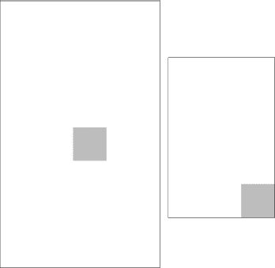

**图 5-1.** *一个 100×100 像素的矩形，在 480×800 屏幕（左）和 320×480 屏幕（右）上绘制于 (219,379) 位置。*

这种差异带来两个问题。首先，我们不能假设固定分辨率来绘制游戏。第二个原因更为微妙：在图 5-1 中，我们假设两个屏幕具有相同的密度（即每个像素在两个设备上的物理尺寸相同），但现实中情况很少如此。

#### 密度

密度通常以每英寸像素数或每厘米像素数来指定（有时你会听到每英寸点数，这在技术上并不准确）。Nexus One 有一个 480×800 像素的屏幕，物理尺寸为 8×4.8 厘米。较老的 HTC Hero 有一个 320×480 像素的屏幕，物理尺寸为 6.5×4.5 厘米。这意味着 Nexus One 两个轴上均为 100 像素/厘米，而 Hero 两个轴上大约为 71 像素/厘米。我们可以使用以下等式轻松计算每厘米像素数。

*每厘米像素数（x 轴）= 以像素为单位的宽度 / 以厘米为单位的宽度*

或者：

*每厘米像素数（y 轴）= 以像素为单位的高度 / 以厘米为单位的高度*

通常，我们只需要在单个轴上计算即可，因为物理像素是正方形的（其实它们是三个像素，但这里我们忽略这一点）。

一个 100×100 像素的矩形以厘米计会有多大？在 Nexus One 上，它是一个 1×1 厘米的矩形；而在 Hero 上，它是一个 1.4×1.4 厘米的矩形。例如，如果我们试图在所有屏幕尺寸上提供足够大以适应普通拇指的按钮，就需要考虑这一点。这个例子表明这是一个可能带来巨大问题的主要问题；然而，它通常不会。我们需要确保按钮在高密度屏幕（例如 Nexus One）上大小适中，因为它们在低密度屏幕上会自动足够大。


### 宽高比

宽高比是另一个需要考虑的问题。屏幕的宽高比是指宽度与高度之间的比例，单位可以是像素或厘米。我们可以通过以下公式计算宽高比。

`像素宽高比 = 宽度像素数 / 高度像素数`

或者：

`物理宽高比 = 宽度厘米数 / 高度厘米数`

这里的`宽度`和`高度`通常指横向模式下的宽度和高度。Nexus One 的像素宽高比和物理宽高比约为 1.66，而 Hero 的宽高比则为 1.5。这意味着什么呢？与 Hero 相比，Nexus One 在横向模式下，x 轴上相对于高度拥有更多可用的像素。图 5–2 通过 Replica Island 在两款设备上的截图展示了这一点。

**注意：** 本书采用公制单位。我们知道，如果您习惯使用英寸和磅，这可能会带来不便。不过，由于后续章节将涉及一些物理问题，而物理问题通常以公制单位定义，最好现在就习惯起来。请记住，1 英寸约等于 2.54 厘米。

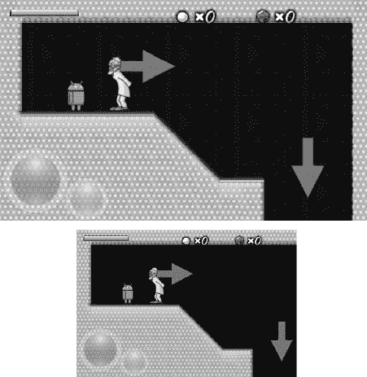

**图 5–2.** *Nexus One（上）与 HTC Hero（下）上的 Replica Island。*

Nexus One 在 x 轴上显示的内容稍多一些。然而，在 y 轴上两者完全一致。这种情况下，Replica Island 的创建者是如何应对的呢？

#### 应对不同的宽高比

Replica Island 是宽高比问题的一个非常实用的例子。该游戏最初设计为适配 480×320 像素的屏幕，包括所有“精灵”（如机器人和医生）、“世界”的图块以及 UI 元素（屏幕左下角的按钮和顶部的状态信息）。当游戏在 Hero 上渲染时，精灵位图中的每个像素都精确对应屏幕上的一个像素。而在 Nexus One 上，渲染时所有内容都会被放大，因此精灵的一个像素实际会占用屏幕上的 1.5 个像素。换句话说，一个 32×32 像素的精灵在屏幕上会变成 48×48 像素。这个缩放因子可以轻松地通过以下公式计算得出。

`缩放因子（x 轴）= 屏幕宽度像素数 / 目标宽度像素数`

以及：

`缩放因子（y 轴）= 屏幕高度像素数 / 目标高度像素数`

目标宽度和高度等于为图形资源设计的屏幕分辨率；在 Replica Island 中，尺寸为 480×320 像素。对于 Nexus One，x 轴上的缩放因子为 1.66，y 轴上的缩放因子为 1.5。为什么两个轴上的缩放因子不同呢？

这是因为两个屏幕分辨率具有不同的宽高比。如果我们简单地将 480×320 像素的图像拉伸为 800×480 像素的图像，原始图像将在 x 轴上被拉伸。对于大多数游戏来说，这点影响微不足道，因此我们可以针对特定的目标分辨率绘制图形资源，并在渲染时将其拉伸到实际的屏幕分辨率（请记住 `Bitmap.drawBitmap()` 方法）。

然而，对于某些游戏，您可能希望采用更复杂的方法。图 5–3 显示了 Replica Island 从 480×320 像素放大到 800×480 像素，并与实际渲染效果的淡色图像叠加在一起。

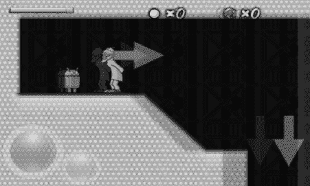

**图 5–3.** *将 Replica Island 从 480×320 像素拉伸到 800×480 像素，并与在 800×480 像素显示屏上实际渲染效果的淡色图像叠加。*

Replica Island 使用我们刚才计算的缩放因子（1.5）在 y 轴上执行常规拉伸，但在 x 轴上并没有使用缩放因子（1.66），因为那样会压扁图像，而是采用了 y 轴的缩放因子。这种技巧使得屏幕上的所有对象都能保持其宽高比。一个 32×32 像素的精灵变成了 48×48 像素，而不是 53×48 像素。不过，这也意味着我们的坐标系不再局限于 (0,0) 到 (479,319) 之间了；相反，它的范围变成了 (0,0) 到 (533,319)。这就是为什么我们在 Nexus One 上看到的 Replica Island 内容比在 HTC Hero 上更多的原因。

但请注意，使用这种精巧的方法可能并不适合所有游戏。例如，如果游戏世界的大小取决于屏幕宽高比，那么屏幕更宽的玩家可能会拥有不公平的优势。像《星际争霸 2》这样的游戏就会出现这种情况。最后，如果您希望整个游戏画面适配单一屏幕（例如《贪吃蛇》游戏），最好使用更简单的拉伸方法；如果使用第二种方法，在更宽的屏幕上会留下空白区域。

#### 一个更简单的解决方案

Replica Island 的一个优势是它通过 OpenGL ES 完成了所有这些拉伸和缩放操作，而 OpenGL ES 是硬件加速的。到目前为止，我们只讨论了如何通过 `Canvas` 类绘制到 `Bitmap` 和 `View` 上，这涉及 CPU 上缓慢的数值运算，而不涉及 GPU 上的硬件加速。

考虑到这一点，我们可以使用一个简单的技巧：创建一个以目标分辨率为尺寸的 `Bitmap` 实例作为帧缓冲。这样，我们在设计图形资源或通过代码渲染时，就无需担心实际的屏幕分辨率了。取而代之的是，我们假装所有设备的屏幕分辨率都相同，所有绘制调用都通过一个 `Canvas` 实例指向这个“虚拟”帧缓冲 `Bitmap`。当我们完成一帧的渲染后，只需通过调用 `Canvas.drawBitmap()` 方法将这个帧缓冲 `Bitmap` 绘制到我们的 `SurfaceView` 上即可，该方法允许我们绘制一个经过拉伸的 `Bitmap`。

如果我们想使用与 Replica Island 相同的技术，就需要调整帧缓冲在较大轴向上的尺寸（即横向模式下的 x 轴，以及纵向模式下的 y 轴）。我们还必须确保填充额外的像素，以避免出现空白区域。


### 实现方案

现在我们将所有内容总结成一个工作计划。

- 我们针对固定的目标分辨率（在`Mr. Nom`中为 320×480）设计所有图形资源。
- 创建与目标分辨率尺寸相同的`Bitmap`对象，将所有绘图调用重定向到该对象上，从而在固定坐标系中工作。
- 完成一帧的绘制后，将拉伸后的帧缓冲区`Bitmap`绘制到`SurfaceView`上。在屏幕分辨率较低的设备上，图像会被缩小；在分辨率较高的设备上，图像会被放大。
- 在执行缩放操作时，确保所有用户交互的 UI 元素在所有屏幕密度下都足够大。我们可以在图形资源设计阶段，结合实际设备的尺寸和前述公式来完成这一工作。

现在我们已经掌握了处理不同屏幕分辨率和密度的方法，接下来可以解释在前几节实现`SingleTouchHandler`和`MultiTouchHandler`时遇到的`scaleX`和`scaleY`变量了。

所有游戏代码都将基于固定的目标分辨率（320×480 像素）运行。如果我们在分辨率更高或更低的设备上接收到触摸事件，这些事件的 x 和 y 坐标将定义在`View`的坐标系中，而非目标分辨率坐标系中。因此，需要根据缩放因子将这些坐标从原始坐标系转换到我们的坐标系。为此，我们使用以下公式。

```
转换后的触摸点 x = 实际触摸点 x * (目标 x 轴像素 / 实际 x 轴像素)
转换后的触摸点 y = 实际触摸点 y * (目标 y 轴像素 / 实际 y 轴像素)
```

我们来计算一个简单示例：假设目标分辨率为 320×480 像素，设备分辨率为 480×800 像素。如果触摸屏幕中央，我们会收到坐标为(240,400)的事件。使用上述两个公式，我们得到以下计算结果，恰好位于目标坐标系的正中央。

```
转换后的触摸点 x = 240 * (320 / 480) = 160
转换后的触摸点 y = 400 * (480 / 800) = 240
```

再举一个例子：假设实际分辨率为 240×320，再次触摸屏幕中央，坐标为(120,160)。

```
转换后的触摸点 x = 120 * (320 / 240) = 160
转换后的触摸点 y = 160 * (480 / 320) = 240
```

这个转换方法在两种方向上均适用。只要将实际触摸事件坐标乘以目标因子与实因子的比值，就无需在实际游戏代码中进行坐标转换。所有触摸坐标都将以固定目标坐标系表示。

解决这个问题后，我们就可以实现游戏框架的最后几个类了。

### AndroidPixmap：为大众服务的像素

根据第 3 章中`Pixmap`接口的设计，需要实现的内容并不多。代码清单 5–13 给出了具体代码。

**代码清单 5–13. `AndroidPixmap.java`：一个封装`Bitmap`的`Pixmap`实现**

```java
package com.badlogic.androidgames.framework.impl;

import android.graphics.Bitmap;

import com.badlogic.androidgames.framework.Graphics.PixmapFormat;
import com.badlogic.androidgames.framework.Pixmap;

public class AndroidPixmap implements Pixmap {
    Bitmap bitmap;
    PixmapFormat format;

    public AndroidPixmap(Bitmap bitmap, PixmapFormat format) {
        this.bitmap = bitmap;
        this.format = format;
    }

    @Override
    public int getWidth() {
        return bitmap.getWidth();
    }

    @Override
    public int getHeight() {
        return bitmap.getHeight();
    }

    @Override
    public PixmapFormat getFormat() {
        return format;
    }

    @Override
    public void dispose() {
        bitmap.recycle();
    }
}
```

我们只需存储封装的`Bitmap`实例及其格式（以`PixmapFormat`枚举值形式存储，定义见第 3 章）。同时，实现`Pixmap`接口所需的方法，以便查询`Pixmap`的宽度、高度和格式，并确保像素可以从 RAM 中释放。注意，`bitmap`成员是包内可见的，这样我们可以在即将实现的`AndroidGraphics`类中访问它。


#### AndroidGraphics：满足绘图需求

我们在第 3 章中设计的`Graphics`接口同样精简高效。它负责将像素、线条、矩形和`Pixmap`绘制到帧缓冲上。如前所述，我们将使用`Bitmap`作为帧缓冲，并通过`Canvas`将所有的绘图调用指向它。此外，它还负责从资源文件中创建`Pixmap`实例。因此，我们还需要另一个`AssetManager`。列表 5-14 展示了我们的接口实现类`AndroidGraphics`的代码。

**列表 5-14.** *AndroidGraphics.java；实现 Graphics 接口*

```
package com.badlogic.androidgames.framework.impl;

import java.io.IOException;
import java.io.InputStream;

import android.content.res.AssetManager;
import android.graphics.Bitmap;
import android.graphics.Bitmap.Config;
import android.graphics.BitmapFactory;
import android.graphics.BitmapFactory.Options;
import android.graphics.Canvas;
import android.graphics.Paint;
import android.graphics.Paint.Style;
import android.graphics.Rect;

import com.badlogic.androidgames.framework.Graphics;
import com.badlogic.androidgames.framework.Pixmap;

public class AndroidGraphics implements Graphics {
    AssetManager assets;
    Bitmap frameBuffer;
    Canvas canvas;
    Paint paint;
    Rect srcRect = new Rect();
    Rect dstRect = new Rect();
```

该类实现了`Graphics`接口。它包含一个用于加载`Bitmap`实例的`AssetManager`成员、一个代表人工帧缓冲的`Bitmap`成员、一个用于绘制人工帧缓冲的`Canvas`成员、一个绘图所需的`Paint`成员，以及两个用于实现`AndroidGraphics.drawPixmap()`方法的`Rect`成员。最后这三个成员的存在是为了避免在每次绘图调用时都创建这些类的新实例，否则会给垃圾回收器带来诸多问题。

```
public AndroidGraphics(AssetManager assets, Bitmap frameBuffer) {
    this.assets = assets;
    this.frameBuffer = frameBuffer;
    this.canvas = new Canvas(frameBuffer);
    this.paint = new Paint();
}
```

在构造函数中，我们从外部获得了代表人工帧缓冲的`AssetManager`和`Bitmap`。我们将它们分别存储在相应的成员变量中，并创建了用于绘制人工帧缓冲的`Canvas`实例，以及用于部分绘图方法的`Paint`对象。

```
    @Override
    public Pixmap newPixmap(String fileName, PixmapFormat format) {
        Config config = null;
        if (format == PixmapFormat.RGB565)
            config = Config.RGB_565;
        else if (format == PixmapFormat.ARGB4444)
            config = Config.ARGB_4444;
        else
            config = Config.ARGB_8888;

        Options options = new Options();
        options.inPreferredConfig = config;

        InputStream in = null;
        Bitmap bitmap = null;
        try {
            in = assets.open(fileName);
            bitmap = BitmapFactory.decodeStream(in);
            if (bitmap == null)
                throw new RuntimeException("无法从资源文件加载位图 '"
                        + fileName + "'");
        } catch (IOException e) {
            throw new RuntimeException("无法从资源文件加载位图 '"
                    + fileName + "'");
        } finally {
            if (in != null) {
                try {
                    in.close();
                } catch (IOException e) {
                }
            }
        }

        if (bitmap.getConfig() == Config.RGB_565)
            format = PixmapFormat.RGB565;
        else if (bitmap.getConfig() == Config.ARGB_4444)
            format = PixmapFormat.ARGB4444;
        else
            format = PixmapFormat.ARGB8888;

        return new AndroidPixmap(bitmap, format);
    }
```

`newPixmap()`方法尝试使用指定的`PixmapFormat`从资源文件中加载`Bitmap`。我们首先将`PixmapFormat`转换为第 4 章中使用的 Android `Config`类常量。接着，创建一个新的`Options`实例并设置偏好的颜色格式。然后，通过`BitmapFactory`尝试从资源中加载`Bitmap`，如果出错则抛出`RuntimeException`。否则，我们检查`BitmapFactory`实际使用了哪种格式来加载`Bitmap`，并将其转换为`PixmapFormat`枚举值。请记住，`BitmapFactory`可能会忽略我们期望的颜色格式，因此我们必须检查其实际使用的解码格式。最后，基于加载的`Bitmap`及其`PixmapFormat`构建一个新的`AndroidBitmap`实例，并将其返回给调用者。

```
    @Override
    public void clear(int color) {
        canvas.drawRGB((color & 0xff0000) >> 16, (color & 0xff00) >> 8,
                (color & 0xff));
    }
```

`clear()`方法提取指定 32 位 ARGB 颜色参数中的红、绿、蓝三色分量，并调用`Canvas.drawRGB()`方法，从而用该颜色清除人工帧缓冲。此方法会忽略指定颜色的任何 Alpha 值，因此我们无需提取该值。

```
    @Override
    public void drawPixel(int x, int y, int color) {
        paint.setColor(color);
        canvas.drawPoint(x, y, paint);
    }
```

`drawPixel()`方法通过`Canvas.drawPoint()`方法在人工帧缓冲上绘制一个像素。首先，我们设置`paint`成员变量的颜色，然后将该颜色与像素的 x、y 坐标一并传递给绘图方法。

```
    @Override
    public void drawLine(int x, int y, int x2, int y2, int color) {
        paint.setColor(color);
        canvas.drawLine(x, y, x2, y2, paint);
    }
```

`drawLine()`方法在人工帧缓冲上绘制给定的直线，调用`Canvas.drawLine()`方法时使用`paint`成员来指定颜色。

```
    @Override
    public void drawRect(int x, int y, int width, int height, int color) {
        paint.setColor(color);
        paint.setStyle(Style.FILL);
        canvas.drawRect(x, y, x + width - 1, y + width - 1, paint);
    }
```

`drawRect()`方法设置`Paint`成员的颜色和样式属性，以便绘制一个填充颜色矩形。在实际调用`Canvas.drawRect()`时，我们需要将`x`、`y`、`width`和`height`参数转换为矩形左上角和右下角的坐标。对于左上角，我们直接使用`x`和`y`参数。对于右下角，我们将宽度和高度分别加到 x 和 y 上，然后减去 1。例如，如果我们渲染一个 x 和 y 为(10,10)、宽度和高度均为 2 的矩形，且不减去 1，那么屏幕上最终得到的矩形尺寸将是 3×3 像素。

```
    @Override
    public void drawPixmap(Pixmap pixmap, int x, int y, int srcX, int srcY,
            int srcWidth, int srcHeight) {
        srcRect.left = srcX;
        srcRect.top = srcY;
        srcRect.right = srcX + srcWidth - 1;
        srcRect.bottom = srcY + srcHeight - 1;

        dstRect.left = x;
        dstRect.top = y;
        dstRect.right = x + srcWidth - 1;
        dstRect.bottom = y + srcHeight - 1;
```


```  
canvas.drawBitmap(((AndroidPixmap) pixmap).bitmap, srcRect, dstRect, null);  
```  

`drawPixmap()` 方法允许我们绘制 `Pixmap` 的某一部分。它会设置实际绘制调用中使用的 `Rect` 成员的源和目标区域。与绘制矩形时类似，我们需要将 x 和 y 坐标以及宽度和高度转换为左上角和右下角坐标。同样需要减 1，否则会多出 1 个像素。接下来，通过 `Canvas.drawBitmap()` 方法进行实际绘制。如果绘制的 `Pixmap` 具有 `PixmapFormat.ARGB4444` 或 `PixmapFormat.ARGB8888` 颜色深度，该方法会自动进行混合处理。注意，我们必须将 `Pixmap` 参数强制转换为 `AndroidPixmap` 类型，才能获取其 `bitmap` 成员以供 `Canvas` 绘制。这虽然有些复杂，但可以确保传入的 `Pixmap` 实例确实是 `AndroidPixmap`。

```  
@Override  
public void drawPixmap(Pixmap pixmap, int x, int y) {  
    canvas.drawBitmap(((AndroidPixmap)pixmap).bitmap, x, y, null);  
}  
```  

第二个 `drawPixmap()` 方法将完整的 `Pixmap` 绘制到指定坐标处的人工帧缓冲区。同样，我们需要进行类型转换以获取 `AndroidPixmap` 的 `Bitmap` 成员。

```  
@Override  
public int getWidth() {  
    return frameBuffer.getWidth();  
}  

@Override  
public int getHeight() {  
    return frameBuffer.getHeight();  
}  
```  

最后，我们实现了 `getWidth()` 和 `getHeight()` 方法，它们直接返回 `AndroidGraphics` 内部渲染所使用的人工帧缓冲区的大小。

实现框架所需的最后一个类是 `AndroidFastRenderView`。

#### AndroidFastRenderView：循环、拉伸、循环、拉伸

这个类的名称暗示了其核心功能。在上一章中，我们讨论了使用 `SurfaceView` 在独立线程中执行连续渲染，该线程也可以承载游戏的主循环。我们开发了一个非常简单的类 `FastRenderView`，它继承自 `SurfaceView` 类，确保与 Activity 生命周期良好配合，并设置了一个线程通过 `Canvas` 持续渲染 `SurfaceView`。在此，我们将复用 `FastRenderView` 类并增强其功能。

- 它持有一个 `Game` 实例的引用，通过该实例可以获取当前活动的 `Screen`。我们在 `FastRenderView` 线程中持续调用 `Screen.update()` 和 `Screen.present()` 方法。
- 它会记录帧之间的时间差（增量时间），并将其传递给当前活动的 `Screen`。
- 它获取 `AndroidGraphics` 实例所绘制的人工帧缓冲区，并将其绘制到 `SurfaceView` 上，必要时进行缩放。

清单 5–15 展示了 `AndroidFastRenderView` 类的实现。

**清单 5–15.** *AndroidFastRenderView.java，一个执行游戏代码的线程化 SurfaceView*

```  
package com.badlogic.androidgames.framework.impl;  

import android.graphics.Bitmap;  
import android.graphics.Canvas;  
import android.graphics.Rect;  
import android.view.SurfaceHolder;  
import android.view.SurfaceView;  

public class AndroidFastRenderView extends SurfaceView implements Runnable {  
    AndroidGame game;  
    Bitmap framebuffer;  
    Thread renderThread = null;  
    SurfaceHolder holder;  
    volatile boolean running = false;  
    // ...  
}  
```  

这段代码看起来应该很熟悉。我们只需要新增两个成员：一个 `AndroidGame` 实例和一个表示人工帧缓冲区的 `Bitmap` 实例。其他成员与第 3 章中的 `FastRenderView` 相同。

```  
public AndroidFastRenderView(AndroidGame game, Bitmap framebuffer) {  
    super(game);  
    this.game = game;  
    this.framebuffer = framebuffer;  
    this.holder = getHolder();  
}  
```  

在构造函数中，我们通过 `AndroidGame` 参数（它是一个 `Activity`，后续章节会讨论）调用基类的构造函数，并将参数存储在各自成员中。与之前一样，我们获取了 `SurfaceHolder`。

```  
public void resume() {  
    running = true;  
    renderThread = new Thread(this);  
    renderThread.start();  
}  
```  

`resume()` 方法与 `FastRenderView.resume()` 方法完全相同，因此不再赘述。简而言之，该方法确保我们的线程与 Activity 生命周期良好配合。

```  
public void run() {  
    Rect dstRect = new Rect();  
    long startTime = System.nanoTime();  
    while (running) {  
        if (!holder.getSurface().isValid())  
            continue;  

        float deltaTime = (System.nanoTime() - startTime) / 1000000000.0f;  
        startTime = System.nanoTime();  

        game.getCurrentScreen().update(deltaTime);  
        game.getCurrentScreen().present(deltaTime);  

        Canvas canvas = holder.lockCanvas();  
        canvas.getClipBounds(dstRect);  
        canvas.drawBitmap(framebuffer, null, dstRect, null);  
        holder.unlockCanvasAndPost(canvas);  
    }  
}  
```  

`run()` 方法新增了一些功能。首先，它能够跟踪每帧之间的增量时间。为此，我们使用了 `System.nanoTime()`，该方法以纳秒为单位返回当前时间（类型为 long）。

**注意：** 1 纳秒等于十亿分之一秒。

在每次循环迭代中，我们首先计算上一次循环迭代的起始时间与当前时间的差值。为了方便处理这个差值，我们将其转换为秒。接着，保存当前时间戳，以便在下一次循环迭代中计算新的增量时间。有了增量时间后，我们调用当前 `Screen` 的 `update()` 和 `present()` 方法，这些方法会更新游戏逻辑并将内容渲染到人工帧缓冲区。最后，我们获取 `SurfaceView` 的 `Canvas`，并绘制人工帧缓冲区。如果传递给 `Canvas.drawBitmap()` 方法的目标矩形小于或大于帧缓冲区，系统会自动进行缩放。

注意，这里我们使用了一种快捷方式：通过 `Canvas.getClipBounds()` 方法获取一个覆盖整个 `SurfaceView` 的目标矩形。该方法会将 `dstRect` 的 `top` 和 `left` 成员分别设为 0 和 0，将 `bottom` 和 `right` 成员设为实际屏幕尺寸（在 Nexus One 的竖屏模式下为 480×800）。方法的其余部分与我们在 `FastRenderView` 测试中的实现完全相同。该方法确保当 Activity 暂停或销毁时，线程会停止运行。

```  
public void pause() {  
    running = false;  
    while (true) {  
        try {  
            renderThread.join();  
            break;  
        } catch (InterruptedException e) {  
            // 重试  
        }  
    }  
}  
```  

该类最后一个方法 `pause()` 与 `FastRenderView.pause()` 方法相同 —— 它终止渲染/主循环线程，并等待线程完全结束后才返回。

我们的框架已基本完成。最后一个关键部分是实现 `Game` 接口。


### AndroidGame：整合所有功能

我们的游戏开发框架已接近完成。只需实现第 3 章中设计的`Game`接口，就能将所有零散部分整合起来。为此，我们将使用本章前面各节创建的类。以下是相关职责列表。

- 执行窗口管理。在本场景中，这意味着要建立一个活动界面和一个`AndroidFastRenderView`，并妥善处理活动生命周期。
- 使用并管理`WakeLock`，防止屏幕变暗。
- 实例化`Graphics`、`Audio`、`FileIO`和`Input`，并向相关方提供引用。
- 管理`Screen`并将其与活动生命周期集成。
- 我们的总体目标是创建一个名为`AndroidGame`的单一基类，后续从该类派生。我们希望后面实现`Game.getStartScreen()`方法，以便通过以下方式启动游戏。

```
public class MrNom extends AndroidGame {
    @Override
    public Screen getStartScreen() {
        return new MainMenu(this);
    }
}
```

我们希望你能理解，在埋头编写实际游戏代码之前，先设计一个可用的框架是多么有益。这个框架可以复用于所有未来对图形性能要求不高的游戏。现在，让我们讨论一下清单 5–16，其中展示了`AndroidGame`类。

**清单 5–16.** *AndroidGame.java；整合所有功能*

```
package com.badlogic.androidgames.framework.impl;

import android.app.Activity;
import android.content.Context;
import android.content.res.Configuration;
import android.graphics.Bitmap;
import android.graphics.Bitmap.Config;
import android.os.Bundle;
import android.os.PowerManager;
import android.os.PowerManager.WakeLock;
import android.view.Window;
import android.view.WindowManager;

import com.badlogic.androidgames.framework.Audio;
import com.badlogic.androidgames.framework.FileIO;
import com.badlogic.androidgames.framework.Game;
import com.badlogic.androidgames.framework.Graphics;
import com.badlogic.androidgames.framework.Input;
import com.badlogic.androidgames.framework.Screen;

public abstract class AndroidGame extends Activity implements Game {
    AndroidFastRenderView renderView;
    Graphics graphics;
    Audio audio;
    Input input;
    FileIO fileIO;
    Screen screen;
    WakeLock wakeLock;
```

类定义首先让`AndroidGame`继承`Activity`类并实现`Game`接口。接下来，我们定义几个应该已经熟悉的成员变量。第一个成员是`AndroidFastRenderView`，用于绘制图形，并管理我们的主循环线程。当然，我们将`Graphics`、`Audio`、`Input`和`FileIO`成员分别设置为`AndroidGraphics`、`AndroidAudio`、`AndroidInput`和`AndroidFileIO`的实例。下一个成员变量保存当前活动的`Screen`。最后，还有一个成员变量持有`WakeLock`，用于防止屏幕变暗。

```
    @Override
    public void onCreate(Bundle savedInstanceState) {
        super.onCreate(savedInstanceState);

        requestWindowFeature(Window.FEATURE_NO_TITLE);
        getWindow().setFlags(WindowManager.LayoutParams.FLAG_FULLSCREEN,
                WindowManager.LayoutParams.FLAG_FULLSCREEN);

        boolean isLandscape = getResources().getConfiguration().orientation ==
            Configuration.ORIENTATION_LANDSCAPE;
        int frameBufferWidth = isLandscape ? 480 : 320;
        int frameBufferHeight = isLandscape ? 320 : 480;
        Bitmap frameBuffer = Bitmap.createBitmap(frameBufferWidth,
                frameBufferHeight, Config.RGB_565);

        float scaleX = (float) frameBufferWidth
                / getWindowManager().getDefaultDisplay().getWidth();
        float scaleY = (float) frameBufferHeight
                / getWindowManager().getDefaultDisplay().getHeight();

        renderView = new AndroidFastRenderView(this, frameBuffer);
        graphics = new AndroidGraphics(getAssets(), frameBuffer);
        fileIO = new AndroidFileIO(getAssets());
        audio = new AndroidAudio(this);
        input = new AndroidInput(this, renderView, scaleX, scaleY);
        screen = getStartScreen();
        setContentView(renderView);

        PowerManager powerManager = (PowerManager)
            getSystemService(Context.POWER_SERVICE);
        wakeLock = powerManager.newWakeLock(PowerManager.FULL_WAKE_LOCK, "GLGame");
    }
```

`onCreate()`方法是`Activity`类熟悉的启动方法，按照要求首先调用基类的`onCreate()`方法。接下来，我们将`Activity`设置为全屏，就像上一章其他几个测试那样。在接下来的几行代码中，我们设置人工帧缓冲。根据活动的方向，我们要么使用 320×480 的帧缓冲（竖屏模式），要么使用 480×320 的帧缓冲（横屏模式）。为了确定`Activity`的屏幕方向，我们从`Configuration`类获取方向成员，该类通过调用`getResources().getConfiguration()`获得。基于该成员的值，我们设置帧缓冲大小并实例化一个`Bitmap`，在后续章节中将其传递给`AndroidFastRenderView`和`AndroidGraphics`实例。

**注意：** `Bitmap`实例采用`RGB565`颜色格式。这样既能节省内存，又能使绘图速度稍快。

我们还计算了`scaleX`和`scaleY`值，`SingleTouchHandler`和`MultiTouchHandler`类将使用这些值，将触摸事件坐标转换到我们固定的坐标系中。

接下来，我们用必要的构造函数参数实例化`AndroidFastRenderView`、`AndroidGraphics`、`AndroidAudio`、`AndroidInput`和`AndroidFileIO`。最后，我们调用游戏将实现的`getStartScreen()`方法，并将`AndroidFastRenderView`设置为`Activity`的内容视图。当然，之前实例化的所有辅助类都会在后台完成更多工作。例如，`AndroidInput`类会通知选定的触摸处理程序与`AndroidFastRenderView`通信。

```
    @Override
    public void onResume() {
        super.onResume();
        wakeLock.acquire();
        screen.resume();
        renderView.resume();
    }
```

接下来是我们重写的`Activity`类的`onResume()`方法。像往常一样，第一件事是调用父类方法。接着，我们获取`WakeLock`，并确保通知当前`Screen`游戏（以及活动）已恢复。最后，我们通知`AndroidFastRenderView`恢复渲染线程，这也会启动游戏的主循环，在该循环中，我们在每次迭代时通知当前`Screen`进行更新和呈现。

```
    @Override
    public void onPause() {
        super.onPause();
        wakeLock.release();
        renderView.pause();
        screen.pause();

        if (isFinishing())
            screen.dispose();
    }
```


```markdown
首先，`onPause()`方法再次调用父类方法。接着，它释放了`WakeLock`并确保渲染线程已终止。如果在调用当前`Screen`的`onPause()`之前没有终止线程，我们可能会遇到并发问题，因为 UI 线程和主循环线程会同时访问`Screen`。一旦确定主循环线程不再存活，我们便会通知当前`Screen`暂停自身。如果`Activity`即将被销毁，我们也会通知`Screen`，以便它执行必要的清理工作。

```
    @Override
    public Input getInput() {
        return input;
    }

    @Override
    public FileIO getFileIO() {
        return fileIO;
    }

    @Override
    public Graphics getGraphics() {
        return graphics;
    }

    @Override
    public Audio getAudio() {
        return audio;
    }
```

`getInput()`、`getFileIO()`、`getGraphics()`和`getAudio()`方法无需解释。我们只需将相应的实例返回给调用者。之后，调用者将始终是游戏中某个`Screen`的实现。

```
    @Override
    public void setScreen(Screen screen) {
        if (screen == null)
            throw new IllegalArgumentException("Screen must not be null");

        this.screen.pause();
        this.screen.dispose();
        screen.resume();
        screen.update(0);
        this.screen = screen;
    }
```

起初，我们从`Game`接口继承的`setScreen()`方法看起来很简单。我们从一些传统的空值检查开始，因为我们不能允许一个空的`Screen`。接下来，我们告诉当前`Screen`暂停并释放自身，以便为新`Screen`腾出空间。新的`Screen`被要求恢复自身，并以零增量时间更新一次。最后，我们将`Screen`成员设置为新的`Screen`。

让我们思考一下谁会调用这个方法以及何时调用。在设计 Mr. Nom 时，我们确定了各个`Screen`实例之间的所有转换。我们通常会在这些`Screen`实例之一的`update()`方法中调用`AndroidGame.setScreen()`方法。

例如，假设我们有一个主菜单`Screen`，在`update()`方法中检查「开始」按钮是否被按下。如果是这种情况，我们将通过在`MainMenu.update()`方法中调用`AndroidGame.setScreen()`方法来转换到下一个`Screen`，并传入该下一个`Screen`的全新实例。`MainMenu`屏幕将在调用`AndroidGame.setScreen()`后重新获得控制权，并且应立即返回给调用者，因为它不再是活动`Screen`。在这种情况下，调用者是主循环线程中的`AndroidFastRenderView`。如果你检查负责更新和渲染活动`Screen`的主循环部分，你会看到`update()`方法将在`MainMenu`类上被调用，但`present()`方法将在新的当前`Screen`上被调用。这会带来问题，因为我们定义`Screen`接口的方式保证了在要求`Screen`呈现自身之前，`resume()`和`update()`方法至少会被调用一次。这就是为什么我们在`AndroidGame.setScreen()`方法中对新的`Screen`调用这两个方法。`AndroidGame`类负责一切。

```
    public Screen getCurrentScreen() {
        return screen;
    }
}
```

最后一个方法是`getCurrentScreen()`方法，它简单地返回当前活动的`Screen`。

最后，请记住`AndroidGame`派生自`Game`，后者还有另一个名为`getStartScreen()`的方法。这是我们必须实现的方法，以启动我们的游戏！

现在，我们已经创建了一个易于使用的 Android 游戏开发框架。我们所要做的就是实现我们游戏的`Screen`。我们也可以在未来任何图形需求不高的游戏中重用这个框架。如果需要强大的图形能力，我们必须使用 OpenGL ES。然而，要做到这一点，我们只需要替换框架中的图形部分。所有其他用于音频、输入和文件 I/O 的类都可以重用。

### 总结

在本章中，我们从头实现了一个功能完善的 2D Android 游戏开发框架，它可以被重用于未来的所有游戏（只要它们图形需求不大）。我们非常注重实现良好、可扩展的设计。我们可以使用这段代码，并用 OpenGL ES 替换其渲染部分，从而使 Mr. Nom 3D 化。

有了所有这些样板代码，让我们专注于我们在这里的真正目的：编写游戏！

## 第 6 章

## Mr. Nom 入侵 Android

在第 3 章中，我们为 Mr. Nom 制定了完整的设计，包括游戏机制、简单的背景故事、手工制作的图形资源，以及基于一些纸模的所有屏幕定义。在上一章中，我们开发了一个完整的游戏开发框架，使我们能够轻松地将设计的屏幕转化为代码。但言归正传，让我们开始编写我们的第一个游戏吧！

### 创建资源

Mr. Nom 中有两种类型的资源：音频资源和图形资源。我们通过一个名为 Audacity 的优秀开源应用程序和一个糟糕的上网本麦克风录制了音频资源。我们创建了一个音效，在按下按钮或选择菜单项时播放，一个在 Mr. Nom 吃掉污渍时播放，还有一个在他吃掉自己时播放。我们将它们保存为 OGG 格式放到`assets/`文件夹中，文件名分别为`click.ogg`、`eat.ogg`和`bitten.ogg`。

早些时候，我们提到过希望将设计阶段的纸模作为我们真实的游戏图形来重用。为此，我们首先需要使它们符合我们的目标分辨率。

我们选择了一个固定的目标分辨率 320×480（竖屏模式），并以此设计我们所有的图形资源。这看起来可能很小，但它让我们能够非常快速和轻松地开发游戏和图形，毕竟重点是让你了解整个 Android 游戏开发过程。

对于你的商业游戏，请考虑所有分辨率并使用更高分辨率的图形，以便你的游戏在平板大小的屏幕上看起来效果良好，或许以 800×1280 作为基准。我们扫描了所有纸模并稍微调整了它们的大小。我们将大部分资源保存为单独的文件，并将其中一些合并到一个文件中。所有图像都以 PNG 格式保存。背景是唯一采用 RGB888 格式的图像；其他所有图像都是 ARGB8888 格式。图 6-1 展示了我们最终得到的结果。

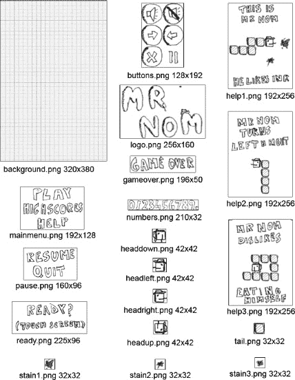

**图 6-1.** *Mr. Nom 的所有图形资源及其各自的文件名和像素尺寸。*

让我们详细分解一下这些图像：
```


> `background.png`：这是我们的背景图片，我们将首先把它绘制到帧缓冲区。显然，它与我们的目标分辨率尺寸相同。
> `buttons.png`：包含游戏中所需的所有按钮。我们将它们放在一个文件中，因为可以通过 `Graphics.drawPixmap()` 方法轻松绘制，该方法支持绘制图像的一部分。在开始使用 OpenGL ES 绘制时，我们会更频繁地使用这种技巧，所以最好现在就习惯它。将多张图像合并为一张的做法常被称为*图集化*，而合并后的图像则称为*图像图集*（或纹理图集、精灵表）。每个按钮尺寸为 64×64 像素，这在判断触摸事件是否按到了屏幕上的按钮时会非常有用。
> `help1.png`、`help2.png` 和 `help3.png`：这些图像将显示在 Mr. Nom 的三个帮助屏幕上。它们的尺寸相同，这样更容易在屏幕上进行布局。
> `logo.png`：这是将在主菜单屏幕上显示的标志。
> `mainmenu.png`：包含我们在主菜单上向玩家展示的三个选项。选择其中一个将触发跳转到相应屏幕。每个选项高度约为 42 像素，这有助于我们轻松检测到哪个选项被触摸。
> `ready.png`、`pause.png` 和 `gameover.png`：当游戏即将开始、暂停或结束时，我们将绘制这些图像。
> `numbers.png`：包含后续渲染高分所需的所有数字。需要注意的是，除末尾的点（10×32 像素）外，每个数字的宽高均为 20×32 像素。这可以用来渲染任何给定的数字。
> `tail.png`：这是 Mr. Nom 的尾巴，更准确地说，是尾巴的一部分。其尺寸为 32×32 像素，这将对后续实现产生一些影响，我们稍后会讨论。
> `headdown.png`、`headleft.png`、`headright.png` 和 `headup.png`：这些是 Mr. Nom 头部的图像，每个方向对应一个。因为它的帽子，这些图像需要比尾巴图像稍大一些。每个头部图像尺寸为 42×42 像素。
> `stain1.png`、`stain2.png` 和 `stain3.png`：这是三种可渲染的污渍类型。拥有三种类型能让游戏画面更丰富。它们与尾巴图像一样，尺寸为 32×32 像素。

很好，现在开始实现各个屏幕吧！

### 设置项目

如上一章所述，我们将把 Mr. Nom 的代码与框架代码合并。所有与 Mr. Nom 相关的类都将放在 `com.badlogic.androidgames.mrnom` 包中。此外，我们还需要按照第 4 章的说明修改清单文件。我们的默认 Activity 将命名为 `MrNomGame`。只需按照第 4 章中“十个简单步骤设置 Android 游戏项目”部分的十个步骤操作，正确设置 `<activity>` 属性（即确保游戏固定为竖屏模式，并且配置变化由应用程序处理），并为应用授予适当的权限（写入外部存储、使用唤醒锁等）。

上一节中的所有资源都位于项目的 `assets/` 文件夹中。此外，我们还需要将 `icon.png` 文件放入 `res/drawable`、`res/drawable-ldpi`、`res/drawable-mdpi` 和 `res/drawable-hdpi` 文件夹中。我们直接使用了 Mr. Nom 的 `headright.png`，将其重命名为 `icon.png`，并将适当调整大小后的版本放入各个文件夹。

剩下的工作就是将游戏代码放入 Eclipse 项目的 `com.badlogic.androidgames.mrnom` 包中！

### MrNomGame：主 Activity

我们的应用需要一个主入口点，在 Android 中即默认的 `Activity`。我们将这个默认 `Activity` 命名为 `MrNomGame`，并让它继承自 `AndroidGame`（我们在第 5 章中为实现游戏运行而创建的类）。它将负责创建和运行第一个屏幕。代码清单 6-1 展示了我们的 `MrNomGame` 类。

**代码清单 6-1.** *MrNomGame.java；主 Activity/游戏混合体*

```
package com.badlogic.androidgames.mrnom;

import com.badlogic.androidgames.framework.Screen;
import com.badlogic.androidgames.framework.impl.AndroidGame;

public class MrNomGame extends AndroidGame {
    @Override
    public Screen getStartScreen() {
        return new LoadingScreen(this);
    }
}
```

我们只需要继承 `AndroidGame` 并实现 `getStartScreen()` 方法，该方法将返回一个 `LoadingScreen` 类的实例（我们稍后实现）。记住，这将让我们启动游戏所需的一切：从设置音频、图形、输入和文件 I/O 等不同模块，到启动主循环线程。非常简单，对吧？

### Assets：便捷的资源存储

加载屏幕将加载游戏的所有资源。但我们将它们存储在哪里呢？我们会采用一种在 Java 领域不太常见的做法：创建一个包含大量静态公有成员的类，用于保存从资源中加载的所有 `Pixmap` 和 `Sound`。代码清单 6-2 展示了这个类。

**代码清单 6-2.** *Assets.java；保存所有 Pixmap 和 Sound 以便轻松访问*

```
package com.badlogic.androidgames.mrnom;

import com.badlogic.androidgames.framework.Pixmap;
import com.badlogic.androidgames.framework.Sound;

public class Assets {
    public static Pixmap background;
    public static Pixmap logo;
    public static Pixmap mainMenu;
    public static Pixmap buttons;
    public static Pixmap help1;
    public static Pixmap help2;
    public static Pixmap help3;
    public static Pixmap numbers;
    public static Pixmap ready;
    public static Pixmap pause;
    public static Pixmap gameOver;
    public static Pixmap headUp;
    public static Pixmap headLeft;
    public static Pixmap headDown;
    public static Pixmap headRight;
    public static Pixmap tail;
    public static Pixmap stain1;
    public static Pixmap stain2;
    public static Pixmap stain3;

    public static Sound click;
    public static Sound eat;
    public static Sound bitten;
}
```

我们从资源中加载的每张图像和每个声音都有一个对应的静态成员。如果想使用某个资源，可以这样操作：

`game.getGraphics().drawPixmap(Assets.background, 0, 0)`

或者这样：

`Assets.click.play(1);`

这样非常方便。但需要注意的是，由于这些静态成员未被声明为 `final`，因此无法防止被覆盖。只要我们不覆盖它们，就是安全的。实际上，这些公有的非 final 成员使得这种“设计模式”成了一种反模式。不过对于我们的游戏来说，稍微偷懒是可以接受的。更干净的解决方案是将资源隐藏在所谓的*单例类*的 setter 和 getter 后面。我们就坚持使用这种“穷人的资源管理器”吧。


### 设置：追踪用户选择与最高分

在加载界面中，我们还需要加载另外两部分内容：用户设置与最高分。回顾一下第 3 章中的主菜单和最高分屏幕，你会发现我们允许用户切换音效开关，并存储了前五名的最高分。我们将把这些设置保存到外部存储器中，以便游戏下次启动时能重新加载它们。为此，我们将实现另一个简单的类，命名为 `Settings`，如代码清单 6-3 所示。

**代码清单 6-3.** *Settings.java；用于存储设置并执行加载/保存操作*

```java
package com.badlogic.androidgames.mrnom;

import java.io.BufferedReader;
import java.io.BufferedWriter;
import java.io.IOException;
import java.io.InputStreamReader;
import java.io.OutputStreamWriter;

import com.badlogic.androidgames.framework.FileIO;

public class Settings {
    public static boolean soundEnabled = true;
    public static int[] highscores = new int[] { 100, 80, 50, 30, 10 };
```

音效是否播放由一个名为 `soundEnabled` 的公共静态布尔值决定。最高分则存储在一个包含五个元素的整型数组中，按从高到低排序。我们为这两项设置都定义了合理的默认值。访问这两个成员的方式与访问 `Assets` 类的成员相同。

```java
    public static void load(FileIO files) {
        BufferedReader in = null;
        try {
            in = new BufferedReader(new InputStreamReader(
                    files.readFile(".mrnom")));
            soundEnabled = Boolean.parseBoolean(in.readLine());
            for (int i = 0; i < 5; i++) {
                highscores[i] = Integer.parseInt(in.readLine());
            }
        } catch (IOException e) {
            // :( 没关系，我们有默认值
        } catch (NumberFormatException e) {
            // :/ 没关系，默认值能解决问题
        } finally {
            try {
                if (in != null)
                    in.close();
            } catch (IOException e) {
            }
        }
    }
```

静态方法 `load()` 会尝试从外部存储中一个名为 `.mrnom` 的文件加载设置。为此，它需要一个 `FileIO` 实例，我们将其作为参数传入该方法。该方法假设音效设置和每条最高分记录都分别存储在不同的行中，并直接读取它们。如果过程中出现任何问题（例如外部存储不可用或尚无设置文件），我们就会回退到默认值，并忽略这个失败情况。

```java
    public static void save(FileIO files) {
        BufferedWriter out = null;
        try {
            out = new BufferedWriter(new OutputStreamWriter(
                    files.writeFile(".mrnom")));
            out.write(Boolean.toString(soundEnabled));
            for (int i = 0; i < 5; i++) {
                out.write(Integer.toString(highscores[i]));
            }
        } catch (IOException e) {
        } finally {
            try {
                if (out != null)
                    out.close();
            } catch (IOException e) {
            }
        }
    }
```

接下来是一个名为 `save()` 的方法。它会获取当前设置，并将其序列化到外部存储的 `.mrnom` 文件（即 `/sdcard/.mrnom`）中。音效设置和每条最高分记录都以单独的行存储在该文件中，正如 `load()` 方法所期望的那样。如果出现任何问题，我们会忽略该失败，并使用之前定义的默认值。在一款 3A 级大作中，你可能需要将这种加载错误告知用户。

值得注意的是，在 Android API 8 中，新增了一些更具体的方法来处理托管的外部存储。例如，新增了 `Context.getExternalFilesDir()` 方法，它会在外部存储中提供一个特定位置，不会污染 SDCard 或内部闪存的根目录，并且在卸载应用程序时也会被清理。当然，要添加对此的支持，意味着你需要在 API 8 及以上版本动态加载类，或者将最低 SDK 版本设为 8 并失去向后兼容性。为简单起见，Mr. Nom 将使用旧版的 API 1 外部存储位置。但如果你需要一个如何动态加载类的示例，我们代码中的 `TouchHandler` 就是现成的范例。

```java
    public static void addScore(int score) {
        for (int i = 0; i < 5; i++) {
            if (highscores[i] < score) {
                for (int j = 4; j > i; j--)
                    highscores[j] = highscores[j - 1];
                highscores[i] = score;
                break;
            }
        }
    }
}
```

最后一个方法 `addScore()` 是一个便捷方法。我们将用它来向最高分列表中添加新的分数，并根据要插入的数值自动重新排序。


### `LoadingScreen`：从磁盘获取资源

有了这些类，我们现在可以轻松地实现加载界面。代码清单 6–4 展示了相关代码。

**代码清单 6–4.** `LoadingScreen.java`；加载所有资源和设置

```java
package com.badlogic.androidgames.mrnom;

import com.badlogic.androidgames.framework.Game;
import com.badlogic.androidgames.framework.Graphics;
import com.badlogic.androidgames.framework.Screen;
import com.badlogic.androidgames.framework.Graphics.PixmapFormat;

public class LoadingScreen extends Screen {
    public LoadingScreen(Game game) {
        super(game);
    }
```

我们让 `LoadingScreen` 类继承自第 3 章定义的 `Screen` 类。这要求我们实现一个接收 `Game` 实例的构造函数，并将其传递给父类构造函数。请注意，这个构造函数将在我们之前定义的 `MrNomGame.getStartScreen()` 方法中被调用。

```java
    @Override
    public void update(float deltaTime) {
        Graphics g = game.getGraphics();
        Assets.background = g.newPixmap("background.png", PixmapFormat.RGB565);
        Assets.logo = g.newPixmap("logo.png", PixmapFormat.ARGB4444);
        Assets.mainMenu = g.newPixmap("mainmenu.png", PixmapFormat.ARGB4444);
        Assets.buttons = g.newPixmap("buttons.png", PixmapFormat.ARGB4444);
        Assets.help1 = g.newPixmap("help1.png", PixmapFormat.ARGB4444);
        Assets.help2 = g.newPixmap("help2.png", PixmapFormat.ARGB4444);
        Assets.help3 = g.newPixmap("help3.png", PixmapFormat.ARGB4444);
        Assets.numbers = g.newPixmap("numbers.png", PixmapFormat.ARGB4444);
        Assets.ready = g.newPixmap("ready.png", PixmapFormat.ARGB4444);
        Assets.pause = g.newPixmap("pausemenu.png", PixmapFormat.ARGB4444);
        Assets.gameOver = g.newPixmap("gameover.png", PixmapFormat.ARGB4444);
        Assets.headUp = g.newPixmap("headup.png", PixmapFormat.ARGB4444);
        Assets.headLeft = g.newPixmap("headleft.png", PixmapFormat.ARGB4444);
        Assets.headDown = g.newPixmap("headdown.png", PixmapFormat.ARGB4444);
        Assets.headRight = g.newPixmap("headright.png", PixmapFormat.ARGB4444);
        Assets.tail = g.newPixmap("tail.png", PixmapFormat.ARGB4444);
        Assets.stain1 = g.newPixmap("stain1.png", PixmapFormat.ARGB4444);
        Assets.stain2 = g.newPixmap("stain2.png", PixmapFormat.ARGB4444);
        Assets.stain3 = g.newPixmap("stain3.png", PixmapFormat.ARGB4444);
        Assets.click = game.getAudio().newSound("click.ogg");
        Assets.eat = game.getAudio().newSound("eat.ogg");
        Assets.bitten = game.getAudio().newSound("bitten.ogg");
        Settings.load(game.getFileIO());
        game.setScreen(new MainMenuScreen(game));
    }
```

接下来是我们对 `update()` 方法的实现，在该方法中加载资源和设置。对于图像资源，我们只需通过 `Graphics.newPixmap()` 方法创建新的 `Pixmap`。请注意，我们指定了 `Pixmap` 应使用的颜色格式。背景采用 `RGB565` 格式，而所有其他图像采用 `ARGB4444` 格式（如果 `BitmapFactory` 遵循我们的提示）。这样做是为了节省内存，并在后续操作中提升渲染速度。我们的原始图像以 PNG 格式存储，使用 `RGB888` 和 `ARGB8888` 格式。我们还加载了三种音效，并将它们存储在 `Assets` 类的相应成员中。接着，我们通过 `Settings.load()` 方法从外部存储加载设置。最后，我们触发画面切换，跳转至名为 `MainMenuScreen` 的 `Screen`，该画面将从此节点接管执行。

```java
    @Override
    public void present(float deltaTime) {

    }

    @Override
    public void pause() {

    }

    @Override
    public void resume() {

    }

    @Override
    public void dispose() {

    }
}
```

其他方法只是存根，不执行任何操作。由于 `update()` 方法会在所有资源加载完成后立即触发画面切换，因此在此画面中无需执行其他操作。


### 主菜单界面

主菜单界面相当简单。它只负责渲染 Logo、主菜单选项和音效设置开关按钮。其全部功能就是对主菜单选项或音效设置开关按钮的触摸做出响应。要实现这一行为，我们需要知道两件事：在屏幕的哪个位置渲染图像，以及哪些触摸区域会触发界面切换或音效设置的开关。 图 6-2 展示了我们在屏幕上渲染不同图像的位置。由此我们可以直接推导出触摸区域。

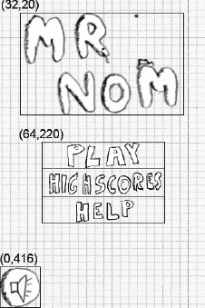

**图 6-2.** *主菜单界面。坐标指定了不同图像的渲染位置，轮廓线则标明了触摸区域。*

Logo 和主菜单选项图像的 x 坐标经过计算，确保其在 x 轴上居中。

接下来，让我们实现`Screen`。 代码清单 6-5 展示了相关代码。

**代码清单 6-5.** *MainMenuScreen.java；主菜单界面*

```
package com.badlogic.androidgames.mrnom;

import java.util.List;

import com.badlogic.androidgames.framework.Game;
import com.badlogic.androidgames.framework.Graphics;
import com.badlogic.androidgames.framework.Input.TouchEvent;
import com.badlogic.androidgames.framework.Screen;

public class MainMenuScreen extends Screen {
    public MainMenuScreen(Game game) {
        super(game);
    }
```

我们让这个类再次继承自`Screen`，并为其实现一个合适的构造函数。

```
    @Override
    public void update(float deltaTime) {
        Graphics g = game.getGraphics();
        List<TouchEvent> touchEvents = game.getInput().getTouchEvents();
        game.getInput().getKeyEvents();

        int len = touchEvents.size();
        for (int i = 0; i < len; i++) {
            TouchEvent event = touchEvents.get(i);
            if (event.type == TouchEvent.TOUCH_UP) {
                if (inBounds(event, 0, g.getHeight() - 64, 64, 64)) {
                    Settings.soundEnabled = !Settings.soundEnabled;
                    if (Settings.soundEnabled)
                        Assets.click.play(1);
                }
                if (inBounds(event, 64, 220, 192, 42)) {
                    game.setScreen(new GameScreen(game));
                    if (Settings.soundEnabled)
                        Assets.click.play(1);
                    return;
                }
                if (inBounds(event, 64, 220 + 42, 192, 42)) {
                    game.setScreen(new HighscoreScreen(game));
                    if (Settings.soundEnabled)
                        Assets.click.play(1);
                    return;
                }
                if (inBounds(event, 64, 220 + 84, 192, 42)) {
                    game.setScreen(new HelpScreen(game));
                    if (Settings.soundEnabled)
                        Assets.click.play(1);
                    return;
                }
            }
        }
    }
```

接下来是`update()`方法，我们将在其中完成所有触摸事件检查。首先，我们从`Game`提供的`Input`实例中获取`TouchEvent`和`KeyEvent`。请注意，我们并没有使用`KeyEvent`，但为了清理内部缓冲区，我们还是将其取出（这确实有点不优雅，但让我们养成这个习惯）。然后，我们遍历所有`TouchEvent`，直到找到一个类型为`TouchEvent.TOUCH_UP`的事件。（我们也可以选择查找`TouchEvent.TOUCH_DOWN`事件，但在大多数 UI 中，使用 up 事件来表示某个 UI 组件被按下。）

一旦找到合适的事件，我们就检查它是否按下了音效开关按钮或某个菜单条目。为了让代码更简洁，我们编写了一个名为`inBounds()`的方法，该方法接收一个触摸事件、x 和 y 坐标以及宽度和高度。该方法检查触摸事件是否位于由这些参数定义的矩形内，并返回`true`或`false`。

如果按下了音效开关按钮，我们只需反转`Settings.soundEnabled`布尔值。如果按下了任何主菜单条目，我们会实例化相应界面并通过`Game.setScreen()`进行设置，从而切换到该界面。在这种情况下，我们可以立即返回，因为`MainMenuScreen`已无需再做任何操作。如果开关按钮或主菜单条目被按下，并且音效已启用，我们还会播放点击音效。

请记住，得益于我们在第 5 章中讨论的触摸事件处理程序所执行的缩放魔法，所有触摸事件都将相对于我们 320×480 像素的目标分辨率进行报告。

```
    private boolean inBounds(TouchEvent event, int x, int y, int width, int height) {
        if (event.x > x && event.x < x + width - 1 &&
            event.y > y && event.y < y + height - 1)
            return true;
        else
            return false;
    }
```

`inBounds()`方法的运作方式如前所述：传入一个`TouchEvent`和一个矩形，它将告诉你该触摸事件的坐标是否位于该矩形内。

```
    @Override
    public void present(float deltaTime) {
        Graphics g = game.getGraphics();

        g.drawPixmap(Assets.background, 0, 0);
        g.drawPixmap(Assets.logo, 32, 20);
        g.drawPixmap(Assets.mainMenu, 64, 220);
        if (Settings.soundEnabled)
            g.drawPixmap(Assets.buttons, 0, 416, 0, 0, 64, 64);
        else
            g.drawPixmap(Assets.buttons, 0, 416, 64, 0, 64, 64);
    }
```

`present()`方法可能是你最期待的方法，但它其实并不激动人心。我们的小游戏框架使得渲染主菜单界面变得非常简单。我们只需在坐标(0,0)处渲染背景，这基本上会清空我们的帧缓冲区，因此无需调用`Graphics.clear()`。接下来，我们按照图 6-2 所示的坐标绘制 Logo 和主菜单条目。最后，我们根据当前设置绘制音效开关按钮。如你所见，我们使用了同一个`Pixmap`，但只绘制了它合适的部分（音效开关按钮；参见图 6-1）。就这么简单。

```
    @Override
    public void pause() {
        Settings.save(game.getFileIO());
    }
```

最后需要讨论的部分是`pause()`方法。由于我们可以在此界面更改一项设置，因此必须确保将其持久化到外部存储设备。有了我们的`Settings`类，这变得相当简单！

```
    @Override
    public void resume() {

    }

    @Override
    public void dispose() {

    }
}
```

`resume()`和`dispose()`方法在此`Screen`中无需执行任何操作。


### `HelpScreen` 类（系列）

接下来，我们将实现之前在 `update()` 方法中用到的 `HelpScreen`、`HighscoreScreen` 和 `GameScreen` 类。

我们在第 3 章中定义了三个帮助屏幕，每个屏幕大致解释游戏玩法的一个方面。现在，我们直接将其转化为名为 `HelpScreen`、`HelpScreen2` 和 `HelpScreen3` 的 `Screen` 实现。它们都有一个按钮，用于触发屏幕切换。`HelpScreen3` 屏幕将切回 `MainMenuScreen`。图 6-3 展示了三个帮助屏幕及其绘制坐标和触摸区域。

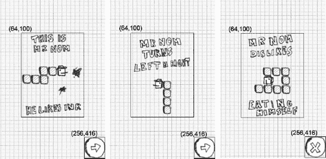

**图 6-3.** *三个帮助屏幕、绘制坐标和触摸区域。*

这看起来实现起来相当简单。让我们从代码清单 6-6 所示的 `HelpScreen` 类开始。

**代码清单 6-6.** *`HelpScreen.java`; 第一个帮助屏幕*

```
package com.badlogic.androidgames.mrnom;

import java.util.List;

import com.badlogic.androidgames.framework.Game;
import com.badlogic.androidgames.framework.Graphics;
import com.badlogic.androidgames.framework.Input.TouchEvent;
import com.badlogic.androidgames.framework.Screen;

public class HelpScreen extends Screen {
    public HelpScreen(Game game) {
        super(game);
    }

    @Override
    public void update(float deltaTime) {
        List<TouchEvent> touchEvents = game.getInput().getTouchEvents();
        game.getInput().getKeyEvents();

        int len = touchEvents.size();
        for (int i = 0; i < len; i++) {
            TouchEvent event = touchEvents.get(i);
            if (event.type == TouchEvent.TOUCH_UP) {
                if (event.x > 256 && event.y > 416) {
                    game.setScreen(new HelpScreen2(game));
                    if (Settings.soundEnabled)
                        Assets.click.play(1);
                    return;
                }
            }
        }
    }

    @Override
    public void present(float deltaTime) {
        Graphics g = game.getGraphics();
        g.drawPixmap(Assets.background, 0, 0);
        g.drawPixmap(Assets.help1, 64, 100);
        g.drawPixmap(Assets.buttons, 256, 416, 0, 64, 64, 64);
    }

    @Override
    public void pause() {
    }

    @Override
    public void resume() {
    }

    @Override
    public void dispose() {
    }
}
```

同样，非常简单。我们继承自 `Screen`，并实现了一个合适的构造器。接下来，是我们熟悉的 `update()` 方法，它只检查底部的按钮是否被按下。如果是，我们就播放点击音效并切换到 `HelpScreen2`。

`present()` 方法会先渲染背景，然后是帮助图片和按钮。

`HelpScreen2` 和 `HelpScreen3` 类的代码看起来相同；唯一的区别是它们绘制的帮助图片以及要切换到的屏幕。我们可以同意不必查看它们的代码。接下来是高分屏幕！

### 高分屏幕

高分屏幕简单地绘制存储在 `Settings` 类中的前五个最高分，加上一个告知玩家其正处于高分屏幕的精美标题，以及一个位于左下角的按钮，按下后切回主菜单。有趣的部分在于我们如何渲染高分。首先，让我们看看渲染图像的位置，如图 6-4 所示。

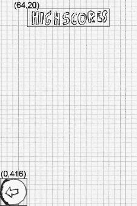

**图 6-4.** *无高分显示的高分屏幕。*

这看起来和我们实现的其他屏幕一样简单。但是我们如何绘制动态分数呢？

#### 渲染数字：深入探讨

我们有一个名为 `numbers.png` 的资源图片，其中包含从 0 到 9 的所有数字以及一个点。每个数字是 20×32 像素，点是 10×32 像素。数字从左到右按升序排列。高分屏幕应显示五行，每行显示五个高分中的一个。这样的一行以高分的排名开头（例如，“1.” 或 “5.”），后跟一个空格，然后是实际分数。我们该如何做到这一点？

我们手头有两个工具：`numbers.png` 图像和 `Graphics.drawPixmap()`，它允许我们将图像的一部分绘制到屏幕上。假设我们想要默认高分的第一行（字符串“1. 100”）渲染在 (20, 100) 处，使得数字 1 的左上角与该坐标重合。我们这样调用 `Graphics.drawPixmap()`：

```
game.getGraphics().drawPixmap(Assets.numbers, 20, 100, 20, 0, 20, 32);
```

我们知道数字 1 的宽度是 20 像素。我们字符串的下一个字符必须渲染在 (20+20, 100) 处。以字符串“1. 100”为例，这个字符是点，在 `numbers.png` 图像中宽度为 10 像素：

```
game.getGraphics().drawPixmap(Assets.numbers, 40, 100, 200, 0, 10, 32);
```

字符串中的下一个字符需要渲染在 (20+20+10, 100) 处。这个字符是空格，我们不需要绘制它。我们只需要将 x 轴再向前推进 20 像素，因为我们假定这就是空格字符的宽度。因此，下一个字符 1 将渲染在 (20+20+10+20, 100) 处。看到规律了吗？

给定字符串中第一个字符的左上角坐标，我们可以遍历字符串的每个字符，绘制它，并根据刚刚绘制的字符，将下一个要绘制字符的 x 坐标增加 20 或 10 像素。

我们还需要根据当前字符，确定应该绘制 `numbers.png` 图像的哪一部分。为此，我们需要该部分左上角的 x 和 y 坐标，以及它的宽度和高度。y 坐标始终为零，这在查看图 6-1 时应该很明显。高度也是一个常数，本例中是 32。宽度要么是 20 像素（如果字符串字符是数字），要么是 10 像素（如果是点）。我们唯一需要计算的是 `numbers.png` 图像中该部分的 x 坐标。我们可以使用下面这个巧妙的小技巧来做到这一点。

字符串中的字符可以被解释为 Unicode 字符或 16 位整数。这意味着我们实际上可以用这些字符代码进行运算。幸运的是，字符 0 到 9 具有递增的整数表示形式。我们可以像这样用这个来计算 `numbers.png` 图像中数字部分的 x 坐标：

```
char character = string.charAt(index);
int x = (character – '0') * 20;
```

这将为字符 0 得到 0，为字符 3 得到 3 × 20 = 60，依此类推。这正是每个数字部分的 x 坐标。当然，这对点字符不起作用，所以我们需要特殊处理。让我们将其总结为一个方法，给定行的字符串和渲染开始的 x 和 y 坐标，该方法可以渲染我们的一条高分行。

```
public void drawText(Graphics g, String line, int x, int y) {
    int len = line.length();
    for (int i = 0; i < len; i++) {
        char character = line.charAt(i);

        if (character == ' ') {
            x += 20;
            continue;
        }
        int srcX = 0;
        int srcWidth = 0;
        if (character == '.') {
            srcX = 200;
            srcWidth = 10;
        } else {
            srcX = (character - '0') * 20;
            srcWidth = 20;
        }
```


`g.drawPixmap(Assets.numbers, x, y, srcX, 0, srcWidth, 32);`
`x += srcWidth;`
`}`

我们遍历字符串中的每个字符。如果当前字符是空格，我们只需将 x 坐标增加 20 像素。否则，我们计算当前字符在 `numbers.png` 图像中对应区域的 x 坐标和宽度。该字符要么是数字，要么是点号。然后我们渲染当前字符，并将渲染的 x 坐标向前移动我们刚刚绘制的字符的宽度。当然，如果我们的字符串包含空格、数字和点号以外的任何字符，此方法就会失效。你能想出一种方法，让它适用于任意字符串吗？

### 实现屏幕（Screen）

借助这一新知识，我们现在可以轻松地实现 `HighscoreScreen` 类，如代码清单 6–7 所示。

**代码清单 6–7.** *HighscoreScreen.java；展示我们迄今为止的最佳成绩*

```
package com.badlogic.androidgames.mrnom;

import java.util.List;

import com.badlogic.androidgames.framework.Game;
import com.badlogic.androidgames.framework.Graphics;
import com.badlogic.androidgames.framework.Screen;
import com.badlogic.androidgames.framework.Input.TouchEvent;

public class HighscoreScreen extends Screen {
    String lines[] = new String[5];

    public HighscoreScreen(Game game) {
        super(game);

        for (int i = 0; i < 5; i++) {
            lines[i] = "" + (i + 1) + ". " + Settings.highscores[i];
        }
    }
```

为了与垃圾回收器保持友好，我们将五条最高分记录的字符串存储在一个字符串数组成员中。我们在构造函数中，根据 `Settings.highscores` 数组构造这些字符串。

```
    @Override
    public void update(float deltaTime) {
        List<TouchEvent> touchEvents = game.getInput().getTouchEvents();
        game.getInput().getKeyEvents();

        int len = touchEvents.size();
        for (int i = 0; i < len; i++) {
            TouchEvent event = touchEvents.get(i);
            if (event.type == TouchEvent.TOUCH_UP) {
                if (event.x < 64 && event.y > 416) {
                    if(Settings.soundEnabled)
                        Assets.click.play(1);
                    game.setScreen(new MainMenuScreen(game));
                    return;
                }
            }
        }
    }
```

接下来，我们定义 `update()` 方法，它毫无意外地非常枯燥。我们所做的只是检查是否有触摸抬起事件按下了左下角的按钮。如果是这种情况，我们就播放点击音效，并切换回 `MainMenuScreen`。

```
    @Override
    public void present(float deltaTime) {
        Graphics g = game.getGraphics();

        g.drawPixmap(Assets.background, 0, 0);
        g.drawPixmap(Assets.mainMenu, 64, 20, 0, 42, 196, 42);

        int y = 100;
        for (int i = 0; i < 5; i++) {
            drawText(g, lines[i], 20, y);
            y += 50;
        }

        g.drawPixmap(Assets.buttons, 0, 416, 64, 64, 64, 64);
    }
```

借助我们之前定义的强大 `drawText()` 方法，`present()` 方法非常简单。如常，我们首先渲染背景图像，然后是 `Assets.mainmenu` 图像中的“HIGHSCORES”部分。我们本可以将这部分存储在单独的文件中，但这里复用它以释放更多内存。

接下来，我们遍历在构造函数中为每条最高分记录创建的五条字符串。我们使用 `drawText()` 方法绘制每一行。第一行从 (20,100) 开始；下一行在 (20,150) 处渲染，以此类推。我们只是将每行文本渲染的 y 坐标增加 50 像素，以便在行之间形成良好的垂直间距。最后，我们通过绘制按钮来完成此方法。

```
    public void drawText(Graphics g, String line, int x, int y) {
        int len = line.length();
        for (int i = 0; i < len; i++) {
            char character = line.charAt(i);

            if (character == ' ') {
                x += 20;
                continue;
            }

            int srcX = 0;
            int srcWidth = 0;
            if (character == '.') {
                srcX = 200;
                srcWidth = 10;
            } else {
                srcX = (character - '0') * 20;
                srcWidth = 20;
            }

            g.drawPixmap(Assets.numbers, x, y, srcX, 0, srcWidth, 32);
            x += srcWidth;
        }
    }

    @Override
    public void pause() {

    }

    @Override
    public void resume() {

    }

    @Override
    public void dispose() {

    }
}
```

其余方法应该不言自明。让我们来看看 Mr. Nom 游戏缺失的最后一部分：游戏屏幕。

### 抽象化……

到目前为止，我们只实现了一些无聊的 UI 相关代码以及一些用于资源和设置的维护代码。现在，我们将对 Mr. Nom 的世界及其中的所有对象进行抽象。我们还将让 Mr. Nom 摆脱屏幕分辨率的束缚，让他在自己的小世界里，使用自己的小坐标系生活。


#### 抽象化「Nom 先生」的世界：模型、视图、控制器

如果你是一位资深程序员，很可能听说过设计模式。大致而言，它们是针对特定场景设计代码的策略。有些偏学术理论，有些则在现实世界中有所应用。对于游戏开发，我们可以从*模型-视图-控制器（MVC）*设计模式中借鉴一些思路。这种模式常被数据库和 Web 领域用来分离数据模型、表现层和数据操作层。我们不会严格遵循这种设计模式，而是以更简化的形式进行适配。

那么这对「Nom 先生」意味着什么呢？首先，我们需要对游戏世界进行抽象化表示，它独立于任何位图、音效、帧缓冲或输入事件。取而代之，我们将用面向对象的方式，通过几个简单的类来建模「Nom 先生」的世界。我们会为世界中的污渍创建一个类，也为「Nom 先生」本身创建一个类。「Nom 先生」由头部和尾部组成，我们也将用一个单独的类来表示它们。为了将所有内容整合在一起，我们将设计一个全知类来表示「Nom 先生」的完整世界，包括污渍和「Nom 先生」本身。所有这些构成了 MVC 中的*模型*部分。

MVC 中的*视图*则是负责渲染「Nom 先生」世界的代码。我们会有一个类或方法，它接收世界类，读取其当前状态，并将其渲染到屏幕上。*如何*渲染与模型类无关，这是从 MVC 中学到的最重要一课。模型类独立于一切，而视图类和方法则依赖于模型类。

最后，我们来看 MVC 中的*控制器*。它根据用户输入或时间流逝等因素，指挥模型类改变其状态。模型类为控制器提供方法（例如，通过"将「Nom 先生」转向左"这样的指令），控制器随后可用这些方法来修改模型的状态。模型类中不包含任何直接访问触摸屏或加速度计等设备的代码。这样，我们就能让模型类摆脱所有外部依赖。

这听起来可能有些复杂，你或许会问我们为什么要这样做。但这种方法有很多好处。我们可以在不了解图形、音频或输入设备的情况下实现所有游戏逻辑。可以在不修改模型类本身的情况下，调整游戏世界的渲染方式。甚至可以将 2D 世界渲染器替换为 3D 世界渲染器。通过使用控制器，我们可以轻松添加对新输入设备的支持——它所做的只是将输入事件转换为对模型类的方法调用。想通过加速度计控制「Nom 先生」？没问题——在控制器中读取加速度计数值，然后将其转换为对「Nom 先生」模型的"将「Nom 先生」转向左"或"将「Nom 先生」转向右"方法调用。想支持 Zeemote 手柄？没问题，和加速度计的情况一样处理即可！使用控制器最大的好处是：我们无需修改「Nom 先生」的任何一行代码就能实现这一切。

让我们从定义「Nom 先生」的世界开始。为此，我们将稍微偏离严格的 MVC 模式，利用图形资源来说明基本概念。这也有助于我们稍后实现视图组件（将「Nom 先生」的抽象世界渲染为像素）。

图 6-5 展示了游戏画面，其上以网格形式叠加了「Nom 先生」的世界。

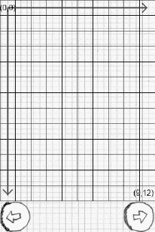

**图 6-5.** *叠加在游戏画面上的「Nom 先生」世界*

请注意，「Nom 先生」的世界被限定在 10×13 个单元格的网格中。我们使用坐标系来定位单元格，原点位于左上角(0, 0)，延伸至右下角(9, 12)。「Nom 先生」的任何部分都必须位于这些单元格中，因此其 x 和 y 坐标必须是在这个世界范围内的整数。世界中的污渍也是如此。「Nom 先生」的每个部分恰好占据 1×1 单位的单元格。注意，单位类型无关紧要——这是我们自己的幻想世界，不受国际单位制或像素的束缚！

「Nom 先生」不能离开这个小世界。如果他从边界穿出，就会从另一端出现，他的所有身体部分也会随之而来。（顺便说一句，地球上也存在同样的问题——朝任何方向走得足够远，你都会回到起点）。「Nom 先生」只能逐格移动。他所有部分始终位于整数坐标上。例如，他绝不会占据两个半单元格。

**注意：** 如前所述，我们这里使用的并非严格的 MVC 模式。如果你对 MVC 模式的正确定义感兴趣，建议阅读 Erich Gamma、Richard Helm、Ralph Johnson 和 John M. Vlissides（即"四人帮"）合著的《设计模式：可复用面向对象软件的基础》（Addison-Wesley, 1994）。在这本书中，MVC 模式被称为观察者模式。

### 污渍类

「Nom 先生」世界中最简单的对象是污渍。它只是呆在世界的一个单元格中，等待被吃掉。在设计「Nom 先生」时，我们为污渍创建了三种不同的视觉表现。污渍的类型在「Nom 先生」的世界中并无区别，但我们还是会将其包含在`Stain`类中。代码清单 6-8 展示了`Stain`类。

**代码清单 6-8.** *Stain.java*

```
package com.badlogic.androidgames.mrnom;

public class Stain {
    public static final int TYPE_1 = 0;
    public static final int TYPE_2 = 1;
    public static final int TYPE_3 = 2;
    public int x, y;
    public int type;

    public Stain(int x, int y, int type) {
        this.x = x;
        this.y = y;
        this.type = type;
    }
}
```

`Stain`类定义了三个公共静态常量，用于编码污渍的类型。每个`Stain`对象有三个成员：在「Nom 先生」世界中的 x 坐标、y 坐标，以及类型（类型是之前定义的常量之一）。为了使代码简洁，我们没有按照常见做法添加 getter 和 setter 方法。最后，我们用一个便捷的构造函数来结束这个类，以便轻松实例化`Stain`对象。

值得注意的是，这个类与图形、音效或其他类没有任何关联。`Stain`类独立存在，骄傲地编码了「Nom 先生」世界中污渍的属性。


### `Snake` 和 `SnakePart` 类

Mr. Nom 就像一条移动的链条，由互相连接的部分组成，当我们选中其中一个部分并将其拖动到某处时，其他部分也会随之移动。每个部分占据 Mr. Nom 世界中的一个单元格，就像污点一样。在我们的模型中，我们不区分头部和尾部，因此可以用一个类来表示 Mr. Nom 的这两种部分。清单 6–9 展示了 `SnakePart` 类，它用于定义 Mr. Nom 的这两个部分。

**清单 6–9.** *SnakePart.java*

```java
package com.badlogic.androidgames.mrnom;

public class SnakePart {
    public int x, y;

    public SnakePart(int x, int y) {
        this.x = x;
        this.y = y;
    }
}
```

这与 `Stain` 类本质上相同——只是去掉了 `type` 成员。在 Mr. Nom 世界模型中，第一个真正有趣的类是 `Snake` 类。我们来思考一下它必须具备哪些能力：

- 它必须存储头部和尾部。
- 它必须知道 Mr. Nom 当前的前进方向。
- 当 Mr. Nom 吃掉一个污点时，它必须能够长出一个新的尾部。
- 它必须能够沿着当前方向移动一个单元格。

第一点和第二点很容易实现。我们只需要一个 `SnakePart` 实例的列表——列表中的第一个部分是头部，其余部分构成尾部。Mr. Nom 可以向上、向下、向左、向右移动。我们可以用一些常量来编码这些方向，并将当前方向存储在 `Snake` 类的一个成员中。

第三点也不算复杂。我们只需在已有的部分列表中再添加一个 `SnakePart`。问题在于应该把这个部分添加到什么位置？答案可能听起来有些出人意料：我们将它放在与列表中最后一个部分相同的位置。当我们研究如何实现前文列表中的最后一点（即移动 Mr. Nom）时，这样做的原因就会变得更加清晰。

图 6–6 展示了 Mr. Nom 的初始配置。它由三个部分组成：位于 (5, 6) 的头部，以及位于 (5, 7) 和 (5, 8) 的两个尾部。

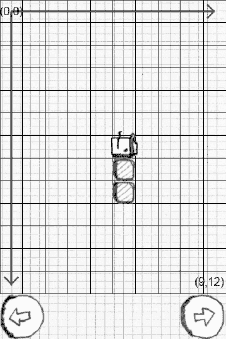

**图 6–6.** *Mr. Nom 的初始配置。*

列表中的部分是有序的，从头部开始，到最后一个尾部结束。当 Mr. Nom 前进一个单元格时，其头部后面的所有部分都必须跟随。然而，Mr. Nom 的部分可能并非像图 6–6 那样排列成一条直线，因此仅仅将所有部分朝着 Mr. Nom 前进的方向平移是不够的。我们必须采用更精细的方法。

尽管听起来可能有些反直觉，但我们需要从列表中的最后一个部分开始。我们将其移动到前一个部分的位置，并对列表中除头部外的所有其他部分重复此操作，因为头部之前没有部分。对于头部，我们检查 Mr. Nom 当前的前进方向，并相应地修改头部的位置。图 6–7 以一个更复杂的 Mr. Nom 配置说明了这一点。

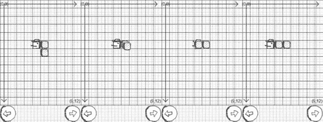

**图 6–7.** *Mr. Nom 前进并带动其尾部。*

这种移动策略与我们的“吃”策略配合得很好。当我们为 Mr. Nom 添加一个新部分时，下次 Mr. Nom 移动时，它将停留在前一个部分的位置。另外，请注意，如果 Mr. Nom 越过世界边缘，这种方法将使我们能够轻松地实现 Mr. Nom 绕到世界的另一边。我们只需相应地设置头部的位置，其余部分会自动完成。

有了这些信息，我们现在可以实现代表 Mr. Nom 的 `Snake` 类。清单 6–10 展示了代码。

**清单 6–10.** *Snake.java；Mr. Nom 的代码实现*

```java
package com.badlogic.androidgames.mrnom;

import java.util.ArrayList;
import java.util.List;

public class Snake {
    public static final int UP = 0;
    public static final int LEFT = 1;
    public static final int DOWN = 2;
    public static final int RIGHT = 3;

    public List<SnakePart> parts = new ArrayList<SnakePart>();
    public int direction;
```

我们首先定义了一组常量，用于编码 Mr. Nom 的方向。请记住，Mr. Nom 只能左右转弯，因此定义常量值的方式至关重要。这将使我们以后能够通过将当前方向常量递增或递减 1，轻松地将其旋转正负 90 度。

接下来，我们定义一个名为 `parts` 的列表，用于存放 Mr. Nom 的所有部分。该列表中的第一项是头部，其他项是尾部。`Snake` 类的第二个成员存储了 Mr. Nom 当前的前进方向。

```java
    public Snake() {
        direction = UP;
        parts.add(new SnakePart(5, 6));
        parts.add(new SnakePart(5, 7));
        parts.add(new SnakePart(5, 8));
    }
```

在构造函数中，我们将 Mr. Nom 设置为由头部和两个额外的尾部组成，位置大致位于世界中央，如前面图 6–6 所示。我们还将方向设置为 `Snake.UP`，这样下次要求 Mr. Nom 前进时，它将向上移动一个单元格。

```java
    public void turnLeft() {
        direction += 1;
        if (direction > RIGHT)
            direction = UP;
    }

    public void turnRight() {
        direction -= 1;
        if (direction < UP)
            direction = RIGHT;
    }
```

`turnLeft()` 和 `turnRight()` 方法仅修改 `Snake` 类的方向成员。左转时，我们将其加一；右转时，我们将其减一。我们还必须确保，如果方向值超出我们之前定义的常量范围，Mr. Nom 的方向能够正确循环。

```java
    public void eat() {
        SnakePart end = parts.get(parts.size()-1);
        parts.add(new SnakePart(end.x, end.y));
    }
```

接下来是 `eat()` 方法。它所做的只是在列表末尾添加一个新的 `SnakePart`。这个新部分将与当前末尾部分具有相同的位置。正如前面讨论的那样，下次 Mr. Nom 前进时，这两个重叠的部分将分开。

```java
    public void advance() {
        SnakePart head = parts.get(0);

        int len = parts.size() - 1;
        for (int i = len; i > 0; i--) {
            SnakePart before = parts.get(i-1);
            SnakePart part = parts.get(i);
            part.x = before.x;
            part.y = before.y;
        }

        if (direction == UP)
            head.y -= 1;
        if (direction == LEFT)
            head.x -= 1;
        if (direction == DOWN)
            head.y += 1;
        if (direction == RIGHT)
            head.x += 1;

        if (head.x < 0)
            head.x = 9;
        if (head.x > 9)
            head.x = 0;
        if (head.y < 0)
            head.y = 12;
        if (head.y > 12)
            head.y = 0;
    }
```

下一个方法 `advance()` 实现了图 6–7 所示的逻辑。首先，我们从最后一个部分开始，将每个部分移动到前一个部分的位置。我们将头部排除在此机制之外。然后，根据 Mr. Nom 的当前方向移动头部。最后，我们执行一些检查，以确保 Mr. Nom 不会跑到他的世界外面。如果发生这种情况，我们只需让他绕回，使他从世界的另一边出现。


`public boolean checkBitten() {`  
`    int len = parts.size();`  
`    SnakePart head = parts.get(0);`  
`    for (int i = 1; i < len; i++) {`  
`        SnakePart part = parts.get(i);`  
`        if (part.x == head.x && part.y == head.y)`  
`            return true;`  
`    }`  
`    return false;`  
`}`

最后一个方法`checkBitten()`是一个辅助方法，用于检查 Mr. Nom 是否咬到了自己的尾巴。它所做的就是检查是否有任何尾部部分与头部处于同一位置。如果是这种情况，Mr. Nom 将会死亡，游戏结束。

### World 类

我们的模型类中的最后一个叫做`World`。`World`类有几个任务需要完成：

- 跟踪 Mr. Nom（以`Snake`实例的形式），以及落在`World`上的`Stain`。在我们的世界中，永远只会有一个污渍。
- 提供一个方法，该方法将基于时间更新 Mr. Nom（例如，他应该每 0.5 秒前进一个单元格）。这个方法还会检查 Mr. Nom 是否吃到了污渍或者咬到了自己。
- 跟踪得分；这基本上就是到目前为止吃掉的污渍数量乘以 10。
- 在 Mr. Nom 每吃掉十个污渍后增加他的速度。这将使游戏更具挑战性。
- 跟踪 Mr. Nom 是否还活着。我们稍后会用它来判断游戏是否结束。
- 在 Mr. Nom 吃掉当前污渍后创建一个新的污渍（这是一个微妙但重要且异常复杂的任务）。

在这个任务列表中，只有两项我们还没有讨论过：基于时间的方式更新世界以及放置新的污渍。

#### 基于时间的 Mr. Nom 运动

在第 3 章中，我们讨论了基于时间的运动。这基本上意味着我们定义所有游戏对象的速度，测量自上次更新以来经过的时间（也称为 delta 时间），并通过将速度乘以 delta 时间来推进对象。在第 3 章给出的示例中，我们使用了浮点值来实现这一点。然而，Mr. Nom 的部分具有整数位置，因此我们需要弄清楚如何在这种情况下推进对象。

我们首先定义 Mr. Nom 的速度。Mr. Nom 的世界是有时间的，我们以秒为单位测量时间。最初，Mr. Nom 应该每 0.5 秒前进一个单元格。我们需要做的就是跟踪自上次推进 Mr. Nom 以来经过了多少时间。如果累计时间超过了我们的 0.5 秒阈值，我们就调用`Snake.advance()`方法并重置时间累加器。这些 delta 时间从哪里来？还记得`Screen.update()`方法吗？它获取帧 delta 时间。我们只需将其传递给`World`类的更新方法，该方法会进行累加。为了使游戏更具挑战性，每次 Mr. Nom 再吃掉十个污渍，我们就会将该阈值减少 0.05 秒。当然，我们必须确保阈值不会达到 0，否则 Mr. Nom 将以无限速度移动——爱因斯坦对此可不会友好。

#### 放置污渍

我们必须解决的第二个问题是，当 Mr. Nom 吃掉当前污渍时，如何放置一个新的污渍。它应该出现在世界中的一个随机单元格中。所以我们可以直接实例化一个带有随机位置的`Stain`，对吗？遗憾的是，事情没那么简单。

想象一下 Mr. Nom 占据了相当多的单元格。污渍被放置在 Mr. Nom 已经占据的单元格中的概率是相当大的，并且随着 Mr. Nom 变得越来越大，这个概率还会增加。因此，我们必须找到一个当前未被 Mr. Nom 占据的单元格。这又很简单了，对吧？只需遍历所有单元格，并使用第一个未被 Mr. Nom 占据的单元格。

同样，这有点不理想。如果我们从同一个位置开始搜索，污渍就不会被随机放置。相反，我们将从世界中的一个随机位置开始，扫描所有单元格直到到达世界的末尾，然后，如果我们还没有找到空闲单元格，再扫描起始位置以上的所有单元格。

我们如何检查一个单元格是否空闲？最天真的解决方案是遍历所有单元格，获取每个单元格的 x 和 y 坐标，然后针对这些坐标检查 Mr. Nom 的所有部分。我们有 10 × 13 = 130 个单元格，而 Mr. Nom 最多可以占据 55 个单元格。那将是 130 × 55 = 7,150 次检查！诚然，大多数设备都能处理，但我们可以做得更好。

我们将创建一个二维布尔数组，其中每个数组元素代表世界中的一个单元格。当我们必须放置一个新的污渍时，我们首先遍历 Mr. Nom 的所有部分，并将数组中那些被部分占据的元素设置为`true`。然后我们只需选择一个随机位置开始扫描，直到找到一个空闲单元格，我们可以在其中放置新的污渍。由于 Mr. Nom 由 55 个部分组成，这需要 130 + 55 = 185 次检查。好多了！

#### 判断游戏何时结束

还有一件事我们必须考虑：如果所有单元格都被 Mr. Nom 占据了怎么办？在这种情况下，游戏就结束了，因为 Mr. Nom 将正式成为整个世界。考虑到每吃一个污渍我们加 10 分，理论上可达到的最高分数是`((10 × 13) - 3) × 10 = 1,270`分（记住，Mr. Nom 一开始有三个部分）。


### 实现世界类

呼，我们有很多东西要实现，那就开始吧。代码清单 6–11 展示了 `World` 类的代码。

**代码清单 6–11.** *World.java*

```
package com.badlogic.androidgames.mrnom;

import java.util.Random;

public class World {
    static final int WORLD_WIDTH = 10;
    static final int WORLD_HEIGHT = 13;
    static final int SCORE_INCREMENT = 10;
    static final float TICK_INITIAL = 0.5f;
    static final float TICK_DECREMENT = 0.05f;

    public Snake snake;
    public Stain stain;
    public boolean gameOver = false;
    public int score = 0;

    boolean fields[][] = new boolean[WORLD_WIDTH][WORLD_HEIGHT];
    Random random = new Random();
    float tickTime = 0;
    static float tick = TICK_INITIAL;
```

和往常一样，我们首先定义一些常量——这里包括世界的宽度和高度（以单元格为单位）、Mr. Nom 每次吃掉污渍时增加的分值、用于推动 Mr. Nom 前进的初始时间间隔（称为*嘀嗒*），以及每当 Mr. Nom 吃掉十个污渍后我们缩短嘀嗒间隔的数值（以略微加快游戏速度）。

接下来，我们有一些公有成员：一个 `Snake` 实例、一个 `Stain` 实例、一个存储游戏是否结束的布尔值以及当前得分。

我们还定义了另外四个包私有成员：一个二维数组，用于放置新污渍；一个 `Random` 类实例，用于生成随机数来放置污渍并决定其类型；时间累加器变量 `tickTime`，用来累加每帧的增量时间；以及当前嘀嗒的持续时间，它定义了 Mr. Nom 前进的频率。

```
    public World() {
        snake = new Snake();
        placeStain();
    }
```

在构造函数中，我们创建了 `Snake` 类的一个实例，它将具有如图 6–6 所示的初始配置。我们还会通过 `placeStain()` 方法放置第一个随机污渍。

```
    private void placeStain() {
        for (int x = 0; x < WORLD_WIDTH; x++) {
            for (int y = 0; y < WORLD_HEIGHT; y++) {
                fields[x][y] = false;
            }
        }

        int len = snake.parts.size();
        for (int i = 0; i < len; i++) {
            SnakePart part = snake.parts.get(i);
            fields[part.x][part.y] = true;
        }

        int stainX = random.nextInt(WORLD_WIDTH);
        int stainY = random.nextInt(WORLD_HEIGHT);
        while (true) {
            if (fields[stainX][stainY] == false)
                break;
            stainX += 1;
            if (stainX >= WORLD_WIDTH) {
                stainX = 0;
                stainY += 1;
                if (stainY >= WORLD_HEIGHT) {
                    stainY = 0;
                }
            }
        }
        stain = new Stain(stainX, stainY, random.nextInt(3));
    }
```

`placeStain()` 方法实现了前面讨论的放置策略。我们首先清除单元格数组。接着，将所有被蛇身体占据的单元格设置为 `true`。最后，我们扫描数组，从一个随机位置开始寻找空闲单元格。一旦找到空闲单元格，我们就创建一个随机类型的污渍。注意，如果所有单元格都被 Mr. Nom 占据，那么循环将永远不会终止。我们会在下一个方法中确保这种情况永远不会发生。

```
    public void update(float deltaTime) {
        if (gameOver)
            return;

        tickTime += deltaTime;

        while (tickTime > tick) {
            tickTime -= tick;
            snake.advance();
            if (snake.checkBitten()) {
                gameOver = true;
                return;
            }

            SnakePart head = snake.parts.get(0);
            if (head.x == stain.x && head.y == stain.y) {
                score += SCORE_INCREMENT;
                snake.eat();
                if (snake.parts.size() == WORLD_WIDTH * WORLD_HEIGHT) {
                    gameOver = true;
                    return;
                } else {
                    placeStain();
                }

                if (score % 100 == 0 && tick - TICK_DECREMENT > 0) {
                    tick -= TICK_DECREMENT;
                }
            }
        }
    }
}
```

`update()` 方法负责根据传入的增量时间更新 `World` 及其中的所有对象。游戏屏幕的每一帧都会调用此方法，从而持续更新世界的状态。我们首先检查游戏是否结束。如果是，则无需更新任何内容。接着，我们将增量时间累加到累加器中。`while` 循环会消耗所有累积的嘀嗒次数（例如，当 `tickTime` 为 1.2 且一个嘀嗒应持续 0.5 秒时，我们可以更新世界两次，累加器中剩余 0.2 秒）。这被称为*固定时间步长模拟*。

在每次迭代中，我们首先从累加器中减去嘀嗒间隔。然后，让 Mr. Nom 前进。我们检查他是否咬到了自己，如果是，则设置游戏结束标志。最后，我们检查 Mr. Nom 的头部是否与污渍位于同一单元格。如果是，则增加得分并让 Mr. Nom 生长。接着，检查 Mr. Nom 的身体部分数量是否等于世界中的单元格总数。如果是，则游戏结束并从函数返回。否则，我们通过 `placeStain()` 方法放置一个新污渍。最后要做的事情是检查 Mr. Nom 是否刚刚又吃掉了十个污渍。如果是，且我们的阈值仍大于零，则将其减少 0.05 秒。嘀嗒间隔会更短，从而让 Mr. Nom 移动得更快。

至此，我们的模型类集合就完成了。最后需要实现的是游戏屏幕！


### `GameScreen` 类

现在只剩下最后一个屏幕需要实现了。让我们看看这个屏幕的功能：

- 正如第 3 章 Mr. Nom 的设计中所定义的，游戏屏幕可以处于四种状态之一：等待用户确认准备就绪、游戏运行中、暂停等待状态，以及游戏结束等待用户点击按钮的状态。
    - 在准备状态下，我们只需提示用户触摸屏幕以开始游戏。
    - 在运行状态下，我们会更新游戏世界、渲染画面，并在玩家按下屏幕底部的左转或右转按钮时，控制 Mr. Nom 进行相应转向。
    - 在暂停状态下，我们仅显示两个选项：一个是继续游戏，另一个是退出游戏。
    - 在游戏结束状态下，我们告知用户游戏已结束，并提供返回主菜单的触摸按钮。
- 对于每种状态，我们都需要实现不同的 `update` 和 `present` 方法，因为每种状态执行不同的操作并显示不同的用户界面。
- 游戏结束后，如果玩家取得了高分，我们必须确保存储该分数。

这涉及相当多的职责，因此代码量会比平时更多。为此，我们将对该类的源代码清单进行拆分。在深入代码之前，我们先规划一下如何在每种状态下安排不同的 UI 元素。图 6–8 展示了这四种状态。

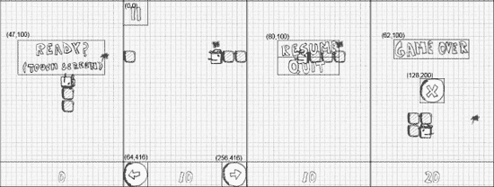

**图 6-8.** *游戏屏幕的四种状态：准备、运行、暂停和游戏结束。*

请注意，我们还会在屏幕底部渲染分数，并在 Mr. Nom 的游戏世界与底部按钮之间绘制一条分隔线。分数的渲染方式与我们在 `HighscoreScreen` 中使用的例程相同。此外，我们根据分数字符串的宽度将其水平居中显示。

最后需要补充的信息是如何根据模型来渲染 Mr. Nom 的世界。这实际上非常简单。请再次查看图 6–1 和图 6–5。每个单元格的大小恰好是 32×32 像素。污渍图像的大小也是 32×32 像素，Mr. Nom 的尾巴部分同样如此。Mr. Nom 各个方向的头部图像大小为 42×42 像素，因此它们无法完全放入单个单元格中。不过，这并非问题所在。要渲染 Mr. Nom 的世界，我们只需获取每个污渍和蛇身体部分，将其世界坐标乘以 32，即可得到该物体在屏幕上的像素中心点——例如，一个位于世界坐标 `(3,2)` 的污渍，其屏幕中心点会在 `96×64` 处。基于这些中心点，接下来只需获取相应的资源，并围绕这些坐标进行居中渲染即可。现在开始编码。清单 6–12 展示了 `GameScreen` 类。

**清单 6–12.** *`GameScreen.java`*

```
package com.badlogic.androidgames.mrnom;

import java.util.List;

import android.graphics.Color;

import com.badlogic.androidgames.framework.Game;
import com.badlogic.androidgames.framework.Graphics;
import com.badlogic.androidgames.framework.Input.TouchEvent;
import com.badlogic.androidgames.framework.Pixmap;
import com.badlogic.androidgames.framework.Screen;

public class GameScreen extends Screen {
    enum GameState {
        Ready,
        Running,
        Paused,
        GameOver
    }

    GameState state = GameState.Ready;
    World world;
    int oldScore = 0;
    String score = "0";
```

首先，我们定义一个名为 `GameState` 的枚举类型，用于编码四种状态（准备、运行、暂停和游戏结束）。接着，我们定义了三个成员变量：一个保存屏幕当前状态，一个保存 `World` 实例，另外两个则分别以整数和字符串形式保存当前显示的分数。之所以需要最后两个成员变量，是为了避免每次绘制分数时都从 `World.score` 成员变量创建新的字符串。我们将缓存该字符串，并仅在分数发生变化时创建新字符串。这样一来，我们就能更好地与垃圾回收器协作。

```
public GameScreen(Game game) {
    super(game);
    world = new World();
}
```

构造函数调用了父类构造函数，并创建了一个新的 `World` 实例。构造函数返回后，游戏屏幕将处于准备状态。

```
@Override
public void update(float deltaTime) {
    List<TouchEvent> touchEvents = game.getInput().getTouchEvents();
    game.getInput().getKeyEvents();

    if(state == GameState.Ready)
        updateReady(touchEvents);
    if(state == GameState.Running)
        updateRunning(touchEvents, deltaTime);
    if(state == GameState.Paused)
        updatePaused(touchEvents);
    if(state == GameState.GameOver)
        updateGameOver(touchEvents);
}
```

接下来是屏幕的 `update()` 方法。它所做的就是从输入模块获取 `TouchEvents` 和 `KeyEvents`，然后根据当前状态，将更新操作委托给我们为每种状态实现的四个更新方法之一。

```
private void updateReady(List<TouchEvent> touchEvents) {
    if(touchEvents.size() > 0)
        state = GameState.Running;
}
```

下一个方法是 `updateReady()`。当屏幕处于准备状态时，将会调用此方法。它所做的就是检查屏幕是否被触摸。如果是，则将状态更改为运行状态。

```
private void updateRunning(List<TouchEvent> touchEvents, float deltaTime) {

    int len = touchEvents.size();
    for(int i = 0; i < len; i++) {
        TouchEvent event = touchEvents.get(i);
        if(event.type == TouchEvent.TOUCH_UP) {
            if(event.x < 64 && event.y < 64) {
                if(Settings.soundEnabled)
                    Assets.click.play(1);
                state = GameState.Paused;
                return;
            }
        }
        if(event.type == TouchEvent.TOUCH_DOWN) {
            if(event.x < 64 && event.y > 416) {
                world.snake.turnLeft();
            }
            if(event.x > 256 && event.y > 416) {
                world.snake.turnRight();
            }
        }
    }

    world.update(deltaTime);
    if(world.gameOver) {
        if(Settings.soundEnabled)
            Assets.bitten.play(1);
        state = GameState.GameOver;
    }
    if(oldScore != world.score) {
        oldScore = world.score;
        score = "" + oldScore;
        if(Settings.soundEnabled)
            Assets.eat.play(1);
    }
}
```


`updateRunning()`方法首先检查屏幕左上角的暂停按钮是否被按下。如果是，它将状态设置为暂停。接着，它检查屏幕底部的控制按钮之一是否被按下。注意，这里我们检查的是按下事件而非抬起事件。如果任一按钮被按下，我们会通知`World`中的`Snake`实例向左或向右转弯。没错，`updateRunning()` 方法包含了我们 MVC 模式中的控制器代码！在所有触摸事件被检查完毕后，我们通知`world`根据给定的增量时间进行更新。如果`World`发出游戏结束信号，我们相应改变状态，并播放`bitten.ogg`音效。然后，我们检查缓存的旧分数是否与`World`存储的分数不同。如果不同，我们就知道两件事：Mr. Nom 吃到了一个污点，并且需要更新分数字符串。此时，我们播放`eat.ogg`音效。这就是运行状态更新的全部内容。

```
private void updatePaused(List<TouchEvent> touchEvents) {
    int len = touchEvents.size();
    for (int i = 0; i < len; i++) {
        TouchEvent event = touchEvents.get(i);
        if (event.type == TouchEvent.TOUCH_UP) {
            if (event.x > 80 && event.x <= 240) {
                if (event.y > 100 && event.y <= 148) {
                    if (Settings.soundEnabled)
                        Assets.click.play(1);
                    state = GameState.Running;
                    return;
                }
                if (event.y > 148 && event.y < 196) {
                    if (Settings.soundEnabled)
                        Assets.click.play(1);
                    game.setScreen(new MainMenuScreen(game));
                    return;
                }
            }
        }
    }
}
```

`updatePaused()`方法仅检查菜单选项之一是否被触摸，并相应更改状态。

```
private void updateGameOver(List<TouchEvent> touchEvents) {
    int len = touchEvents.size();
    for (int i = 0; i < len; i++) {
        TouchEvent event = touchEvents.get(i);
        if (event.type == TouchEvent.TOUCH_UP) {
            if (event.x >= 128 && event.x <= 192 &&
                event.y >= 200 && event.y <= 264) {
                if (Settings.soundEnabled)
                    Assets.click.play(1);
                game.setScreen(new MainMenuScreen(game));
                return;
            }
        }
    }
}
```

`updateGameOver()`方法也检查屏幕中央的按钮是否被按下。如果被按下，我们则触发返回主菜单屏幕的屏幕切换。

```
@Override
public void present(float deltaTime) {
    Graphics g = game.getGraphics();

    g.drawPixmap(Assets.background, 0, 0);
    drawWorld(world);
    if (state == GameState.Ready)
        drawReadyUI();
    if (state == GameState.Running)
        drawRunningUI();
    if (state == GameState.Paused)
        drawPausedUI();
    if (state == GameState.GameOver)
        drawGameOverUI();

    drawText(g, score, g.getWidth() / 2 - score.length()*20 / 2, g.getHeight() - 42);
}
```

接下来是渲染方法。`present()`方法首先绘制背景图像，因为所有状态都需要它。接着，它会根据当前状态调用相应的绘制方法。最后，它渲染 Mr. Nom 的世界并在屏幕底部中央绘制分数。

```
private void drawWorld(World world) {
    Graphics g = game.getGraphics();
    Snake snake = world.snake;
    SnakePart head = snake.parts.get(0);
    Stain stain = world.stain;

    Pixmap stainPixmap = null;
    if (stain.type == Stain.TYPE_1)
        stainPixmap = Assets.stain1;
    if (stain.type == Stain.TYPE_2)
        stainPixmap = Assets.stain2;
    if (stain.type == Stain.TYPE_3)
        stainPixmap = Assets.stain3;
    int x = stain.x * 32;
    int y = stain.y * 32;
    g.drawPixmap(stainPixmap, x, y);

    int len = snake.parts.size();
    for (int i = 1; i < len; i++) {
        SnakePart part = snake.parts.get(i);
        x = part.x * 32;
        y = part.y * 32;
        g.drawPixmap(Assets.tail, x, y);
    }

    Pixmap headPixmap = null;
    if (snake.direction == Snake.UP)
        headPixmap = Assets.headUp;
    if (snake.direction == Snake.LEFT)
        headPixmap = Assets.headLeft;
    if (snake.direction == Snake.DOWN)
        headPixmap = Assets.headDown;
    if (snake.direction == Snake.RIGHT)
        headPixmap = Assets.headRight;
    x = head.x * 32 + 16;
    y = head.y * 32 + 16;
    g.drawPixmap(headPixmap, x - headPixmap.getWidth() / 2, y - headPixmap.getHeight() / 2);
}
```

正如我们刚刚讨论的，`drawWorld()`方法绘制世界。它首先选择用于渲染污点的`Pixmap`，然后绘制它并将其在屏幕位置上水平居中。接着，我们渲染 Mr. Nom 的所有尾部部分，这很简单。最后，根据 Mr. Nom 的方向选择要使用的头部`Pixmap`，并在屏幕坐标中头部的位置绘制该`Pixmap`。与其他对象一样，我们也将图像围绕该位置居中。这就是 MVC 中视图的代码。

```
private void drawReadyUI() {
    Graphics g = game.getGraphics();

    g.drawPixmap(Assets.ready, 47, 100);
    g.drawLine(0, 416, 480, 416, Color.BLACK);
}

private void drawRunningUI() {
    Graphics g = game.getGraphics();

    g.drawPixmap(Assets.buttons, 0, 0, 64, 128, 64, 64);
    g.drawLine(0, 416, 480, 416, Color.BLACK);
    g.drawPixmap(Assets.buttons, 0, 416, 64, 64, 64, 64);
    g.drawPixmap(Assets.buttons, 256, 416, 0, 64, 64, 64);
}

private void drawPausedUI() {
    Graphics g = game.getGraphics();

    g.drawPixmap(Assets.pause, 80, 100);
    g.drawLine(0, 416, 480, 416, Color.BLACK);
}

private void drawGameOverUI() {
    Graphics g = game.getGraphics();

    g.drawPixmap(Assets.gameOver, 62, 100);
    g.drawPixmap(Assets.buttons, 128, 200, 0, 128, 64, 64);
    g.drawLine(0, 416, 480, 416, Color.BLACK);
}

public void drawText(Graphics g, String line, int x, int y) {
    int len = line.length();
    for (int i = 0; i < len; i++) {
        char character = line.charAt(i);

        if (character == ' ') {
            x += 20;
            continue;
        }

        int srcX = 0;
        int srcWidth = 0;
        if (character == '.') {
            srcX = 200;
            srcWidth = 10;
        } else {
            srcX = (character - '0') * 20;
            srcWidth = 20;
        }

        g.drawPixmap(Assets.numbers, x, y, srcX, 0, srcWidth, 32);
        x += srcWidth;
    }
}
```

方法`drawReadUI()`、`drawRunningUI()`、`drawPausedUI()`和`drawGameOverUI()`并非新内容。它们像往常一样，根据图 6-8 所示的坐标执行 UI 渲染。`drawText()`方法与`HighscoreScreen`中的方法相同，因此我们也不再讨论它。


```java
@Override
public void pause() {
    if (state == GameState.Running)
        state = GameState.Paused;

    if (world.gameOver) {
        Settings.addScore(world.score);
        Settings.save(game.getFileIO());
    }
}

@Override
public void resume() {

}
@Override
public void dispose() {

}
```

最后，还有一个至关重要的方法 `pause()`，它会在活动被暂停或游戏画面被另一个画面替换时被调用。这是保存我们设置的最佳位置。首先，我们将游戏状态设为暂停。如果 `pause()` 方法是因为活动被暂停而调用的，这将确保用户返回游戏时会收到继续游戏的提示。这是一种良好的行为习惯，因为让玩家从退出游戏的瞬间直接继续游戏会带来压力。接下来，我们检查游戏画面是否处于游戏结束状态。如果是，我们将玩家获得的分数计入最高分（是否计入取决于分数值），并将所有设置保存到外部存储。

就是这样。我们从零开始为安卓编写了一个完整的游戏！我们可以为自己感到骄傲，因为我们已经掌握了创建几乎所有我们喜欢的游戏所需的所有必要主题。从这里开始，剩下的基本上只是锦上添花的工作了。

### 总结

在本章中，我们在框架之上实现了一个功能完备的游戏，包含了所有必要的功能（音乐除外）。你了解了为什么将模型与视图和控制器分离是有意义的，并且你了解到我们不需要用像素来定义游戏世界。我们可以利用这段代码，将渲染部分替换为 OpenGL ES，让“Nom 先生”走向 3D 世界。我们还可以通过为“Nom 先生”添加动画、添加一些色彩、增加新的游戏机制等方式，来让当前的渲染器更有趣味。不过，我们还只是触及了可能性的皮毛而已。

在继续阅读本书之前，我们建议你拿起游戏代码，好好摆弄一番。添加一些新的游戏模式、能量道具和敌人——任何你能想到的东西。

等你回来后，在下一章中，我们将充实图形编程的知识，让我们的游戏看起来更炫酷一些，并且还将迈出进入三维世界的第一步！

