# OpenGL ES：温和入门

“Nom 先生”取得了巨大的成功。得益于其扎实的初始设计和游戏框架，实现“Nom 先生”对我们来说易如反掌。最棒的是，即使在低端设备上，游戏也能流畅运行。当然，“Nom 先生”并不是一个非常复杂或图形密集型的游戏，因此使用 `Canvas` API 进行渲染被证明是一个好主意。

然而，当你想要做更复杂的事情时——比如像《Replica Island》这样的游戏——你就会碰壁：`Canvas` 无法应对这类游戏的视觉复杂性。而且，如果你想要炫酷的 3D 效果，`Canvas` 也无能为力。那么……你该怎么办呢？

这就是 OpenGL ES 大展身手的地方了。在本章中，我们首先会简要了解 OpenGL ES 究竟是什么以及它能做什么。然后，我们将专注于使用 OpenGL ES 进行 2D 图形渲染，而无需深入使用该 API 进行 3D 图形渲染时涉及的那些数学上更复杂的领域（我们将在后面的章节中讨论）。我们需要循序渐进，因为 OpenGL ES 可能会变得相当复杂。准备好了解 OpenGL ES 了吗？

### 什么是 OpenGL ES，为什么我要关心它？

OpenGL ES 是（3D）图形编程的行业标准。它特别针对移动和嵌入式设备。它由 Khronos Group 维护，该组织是一个包括 ATI、NVIDIA 和 Intel 在内的企业联合体；这些公司共同定义和扩展该标准。

说到标准，目前 OpenGL ES 有三个递增的版本：1.0、1.1 和 2.0。在本书中，我们关注的是前两个版本。所有安卓设备都支持 OpenGL ES 1.0，大多数也支持版本 1.1，后者在 1.0 规范的基础上增加了一些新功能。然而，OpenGL ES 2.0 打破了与 1.x 版本的兼容性。你可以使用 1.x 或 2.0，但不能同时使用两者。原因在于，1.x 版本使用了一种称为*固定功能管线*的编程模型，而版本 2.0 则允许你通过所谓的*着色器*以编程方式定义渲染管线的部分。许多第二代设备已经支持 OpenGL ES 2.0；然而，其 Java 绑定目前尚不可用（除非你以新的 Android 2.3 为目标平台）。不过，对于大多数游戏来说，OpenGL ES 1.x 已经足够好了，因此我们将在此坚持使用它。

**注意：** 模拟器仅支持 OpenGL ES 1.0。虽然 OpenGL ES 是一个标准，但不同的制造商对其解释不同，不同设备间的性能也差异巨大，所以请务必在各种设备上进行测试以确保兼容性。

OpenGL ES 是一个 API，它以 Khronos 小组提供的一组 C 语言头文件的形式存在，并附有关于这些头文件中定义的 API 应如何表现的非常详细的规范。这包括诸如像素和线条应如何渲染等内容。然后，硬件制造商基于此规范，在 GPU 驱动之上为其 GPU 实现该接口。这些实现的质量略有差异：有些公司严格遵守标准（如 PowerVR），而另一些公司似乎难以遵循。这有时会导致实现中出现与 GPU 相关的错误，这些错误与安卓本身无关，而是由制造商提供的硬件驱动程序引起的。在你进入 OpenGL ES 世界的旅程中，我们会为你指出任何设备特定的问题。

**注意：** OpenGL ES 或多或少是功能更丰富的桌面 OpenGL 标准的兄弟版本。它与后者的不同之处在于，部分功能被缩减或完全移除。尽管如此，还是可以编写出能在两种规范下运行的应用程序，这对于将游戏移植到桌面平台来说非常棒。

那么 OpenGL ES 究竟能做什么？简而言之，它是一个精炼且高效的三角形渲染机器。详细的回答则要稍微复杂一些。


#### 编程模型：一个类比

通常来说，OpenGL ES 是一个 3D 图形编程 API。因此，它拥有一个相当简洁且易于理解的编程模型，我们可以通过一个简单的类比来说明。

可以将 OpenGL ES 想象成一台相机的工作方式。要拍摄一张照片，你首先得到达你想要拍摄的场景。你的场景由各种物体组成——比如，一张上面放着更多物品的桌子。所有这些物体相对于你的相机都有各自的位置和朝向，以及不同的材质和纹理。玻璃是半透明且反光的；桌子可能由木头制成；杂志上印有某位政治家的最新照片；等等。有些物体甚至可能移动（例如，一只你赶不走的果蝇）。你的相机也具有属性，例如焦距、视野、图像分辨率、将拍摄的照片尺寸，以及在世界中（相对于某个原点）的独特位置和朝向。即使物体和相机都在移动，当你按下快门时，你捕捉到了场景的一个静态影像（现在，我们先忽略可能导致图像模糊的快门速度）。在那一无限短暂的瞬间，一切都静止且定义明确，照片精确地反映了所有这些位置、朝向、纹理、材质和光照的配置。图 7-1 展示了一个抽象场景，其中包含一台相机、光源以及三个具有不同材质的物体。

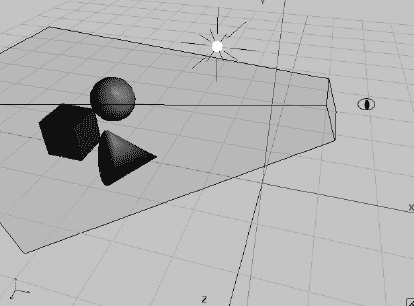

**图 7-1.** *一个抽象场景*

每个物体相对于场景原点都有各自的位置和朝向。由视点指示的相机，相对于场景原点也有一个位置。图 7-1 中的棱锥体就是所谓的*视体*或*视锥体*，它显示了相机捕捉了多少场景以及相机的朝向。带有光线的小白球是场景中的光源，它相对于原点也有一个位置。

我们可以将这个场景直接映射到 OpenGL ES，但为此我们需要定义几样东西：

-   *物体（也称模型）*：这些通常由四组属性构成：几何形状、颜色、纹理和材质。几何形状由一组三角形指定。每个三角形由三维空间中的三个点组成，因此我们有相对于坐标系原点定义的 x、y、z 坐标，如图 7-1 所示。注意 z 轴指向我们。颜色通常指定为 RGB 三元组，这是我们熟悉的。纹理和材质则稍微复杂一些，我们稍后会讲到。
-   *灯光*：OpenGL ES 提供了几种具有不同属性的光源类型。它们只是三维空间中具有位置和/或方向的数学对象，外加颜色等属性。
-   *相机*：这也是一个数学对象，在三维空间中具有位置和朝向。此外，它还有控制我们看到多少图像的参数，类似于真实相机。所有这些共同定义了一个视体或视锥体（由图 7-1 中顶部被截断的棱锥体表示）。在这个棱锥体内部的任何东西都能被相机看到；外部的任何东西都不会出现在最终图像中。
-   *视口*：这定义了最终图像的尺寸和分辨率。可以将其想象成你放入模拟相机中的胶卷类型，或者你用数码相机拍摄照片时获得的图像分辨率。

了解了这些之后，OpenGL ES 可以从相机的视角构建出我们场景的 2D 位图。请注意，我们是在三维空间中定义所有内容的。那么，OpenGL ES 是如何将其映射到二维的呢？

#### 投影

这种 2D 映射是通过一种叫做*投影*的方法完成的。我们已经提到，OpenGL ES 主要处理三角形。一个三角形在 3D 空间中有三个定义好的点。为了将这样一个三角形渲染到帧缓冲中，OpenGL ES 需要知道这些 3D 点在帧缓冲的基于像素的坐标系中的坐标。一旦它知道了这三个角点坐标，就可以简单地绘制帧缓冲中位于该三角形内部的像素。我们甚至可以自己编写一个小小的 OpenGL ES 实现，通过将 3D 点投影到 2D，然后通过 `Canvas` 简单地绘制它们之间的连线。

在 3D 图形中，有两种常用的投影方式。

-   *平行（或正交）投影*：如果你使用过 CAD 应用程序，你可能已经了解这一点。平行投影不关心物体离相机有多远；物体在最终图像中始终具有相同的大小。这种投影方式通常用于在 OpenGL ES 中渲染 2D 图形。
-   *透视投影*：你的眼睛每天都在使用这种投影。离你较远的物体在你的视网膜上显得更小。当我们在 OpenGL ES 中进行 3D 图形处理时，通常使用透视投影。

在这两种情况下，你都需要一个叫做*投影平面*的东西，它几乎与你的视网膜完全相同——它是光线实际被记录以形成最终图像的地方。虽然数学上的平面在面积上是无限的，但我们的视网膜是有限的。我们的 OpenGL ES “视网膜” 等于图 7-1 中看到的视锥体顶部的矩形。视锥体的这一部分是 OpenGL ES 将投影点的区域。这个区域被称为*近裁剪平面*，它有自己的小型 2D 坐标系。图 7-2 再次显示了从相机视角看到的近裁剪平面，并叠加了坐标系。

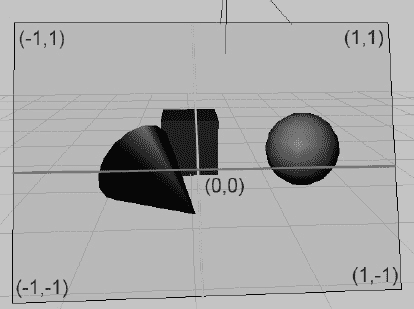

**图 7-2.** *近裁剪平面（也称为投影平面）及其坐标系*

请注意，这个坐标系绝非固定不变的。我们可以操作它，以便在我们喜欢的任何投影坐标系中工作；例如，我们可以指示 OpenGL ES 让原点位于左下角，并让“视网膜”的可见区域在 x 轴上为 480 单位，在 y 轴上为 320 单位。听起来耳熟吗？是的，OpenGL ES 允许你为投影点指定任何你想要的坐标系。

一旦我们指定了视锥体，OpenGL ES 就会获取三角形的每个点，并从该点发射一条穿过投影平面的射线。平行投影和透视投影之间的区别在于这些射线方向是如何构建的。图 7-3 从上方展示了这两者之间的区别。

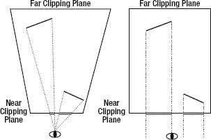

**图 7-3.** *透视投影（左）和平行投影（右）*

透视投影从三角形的点向相机（在本例中，也就是视点）发射射线。因此，较远的物体在投影平面上会显得更小。当我们使用平行投影时，射线垂直于投影平面发射。在这种情况下，无论物体有多远，它在投影平面上的大小都会保持不变。

如前所述，我们的投影平面在 OpenGL ES 术语中被称为*近裁剪平面*。视锥体的所有侧面都有类似的名称。离相机最远的那一面被称为*远裁剪平面*。其他的则被称为*左*、*右*、*上*和*下*裁剪平面。任何位于这些平面外部或后方的物体都不会被渲染。部分位于视锥体内部的物体将沿着这些平面被裁剪，这意味着位于视锥体外部的部分会被切掉。这就是*裁剪平面*这个名称的由来。


您可能会好奇为什么平行投影的视景体在图 7-3 中是矩形的。事实上，投影实际上是由我们如何定义裁剪平面决定的。在透视投影的情况下，左、右、上、下裁剪平面并不垂直于近裁剪平面和远裁剪平面（参见图 7-3，该图仅显示了左、右裁剪平面）。在平行投影的情况下，这些平面是垂直的，这告诉 OpenGL ES 无论物体距离相机有多远，都以相同的大小渲染所有物体。

### 标准化设备空间与视口

一旦 OpenGL ES 计算出三角形在近裁剪平面上的投影点，它最终就可以将这些点转换为帧缓冲区中的像素坐标。为此，它必须首先将点转换到所谓的*标准化设备空间*。这等同于图 7-2 中所描绘的坐标系。基于这些标准化设备空间坐标，OpenGL ES 通过以下简单公式计算最终的帧缓冲区像素坐标：

`pixelX = (norX + 1) / (viewportWidth + 1) + norX`
`pixelY = (norY + 1) / (viewportHeight + 1) + norY`

其中 `norX` 和 `norY` 是 3D 点的标准化设备坐标，`viewportWidth` 和 `viewportHeight` 是视口在 x 轴和 y 轴上的像素大小。我们无需过多担心标准化设备坐标，因为 OpenGL 会自动为我们执行转换。我们真正关心的是视口和视景体。

### 矩阵

稍后您将看到如何指定视景体，从而指定投影。OpenGL ES 以*矩阵*的形式表达投影。我们不需要了解矩阵的内部原理。我们只需要知道它们对我们场景中定义的点做了什么。以下是关于矩阵的要点总结：

-   矩阵编码了要应用于点的变换。变换可以是投影、平移（点被移动）、绕某个点和轴的旋转、缩放等。
-   通过将这样的矩阵与一个点相乘，我们将变换应用于该点。例如，将一个点与一个编码了沿 x 轴平移 10 个单位的矩阵相乘，将会使该点沿 x 轴移动 10 个单位，从而修改其坐标。
-   我们可以通过矩阵相乘将存储在多个独立矩阵中的变换连接成一个矩阵。当我们用这个连接后的单一矩阵与一个点相乘时，该矩阵中存储的所有变换都将应用于该点。变换应用的顺序取决于我们进行矩阵相乘的顺序。
-   有一种特殊的矩阵称为*单位矩阵*。如果我们用它与一个矩阵或一个点相乘，将不会发生任何变化。可以想象将点或矩阵乘以单位矩阵就像将数字乘以 1。它没有任何效果。当你了解 OpenGL ES 如何处理矩阵时（请参见“矩阵模式与活动矩阵”一节），单位矩阵的相关性就会变得清晰——这是经典的先有鸡还是先有蛋的问题。

**注意：** 在此上下文中，当我们谈论点时，我们实际指的是 3D 向量。

OpenGL ES 有三个不同的矩阵应用于我们模型的点：

-   *模型视图矩阵*：我们可以使用此矩阵来移动、旋转或缩放我们三角形的点（这是模型视图矩阵的*模型*部分）。此矩阵也用于指定我们相机的位置和朝向（这是*视图*部分）。
-   *投影矩阵*：顾名思义——此矩阵编码了投影，因此也编码了相机的视景体。
-   *纹理矩阵*：此矩阵允许我们操纵纹理坐标（我们将在后面讨论）。然而，由于 OpenGL ES 的这一部分因驱动缺陷在部分设备上存在问题，我们将在本书中避免使用此矩阵。

### 渲染管线

OpenGL ES 会跟踪这三个矩阵。每当我们设置其中一个矩阵时，它会记住该矩阵，直到我们再次更改它。在 OpenGL ES 术语中，这被称为一种*状态*。不过，OpenGL 管理的不止是矩阵状态；它还会跟踪我们是否想要对三角形进行 alpha 混合、是否要启用光照、应将哪个纹理应用到我们的几何体上，等等；事实上，OpenGL ES 就是一个巨大的状态机。我们设置其当前状态，向其输入对象的几何体，然后告诉它为我们渲染一幅图像。让我们看看一个三角形是如何通过这个强大的三角形渲染机器的。图 7-4 展示了 OpenGL ES 流水线的一个非常高层级、简化的视图。

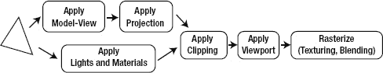

**图 7-4.** *三角形的历程*

一个三角形通过此流水线的过程如下：

1.  我们的勇敢三角形首先被模型视图矩阵变换。这意味着它的所有点都与这个矩阵相乘。这个乘法实际上会移动三角形在世界中的点。
2.  然后，得到的输出与投影矩阵相乘，有效地将 3D 点变换到 2D 投影平面上。
3.  在这两步之间（或与它们并行），当前设置的光照和材质也会应用于我们的三角形，赋予其颜色。
4.  一旦所有这些都完成，投影后的三角形将被裁剪到我们的“视网膜”上，并变换为帧缓冲区坐标。
5.  作为最后一步，OpenGL 根据光照阶段的颜色、要应用于三角形的纹理以及混合状态（该状态下三角形的每个像素可能会也可能不会与帧缓冲区中的像素合并）来填充三角形的像素。

您需要学习的只是如何将几何体和纹理传递给 OpenGL ES，以及如何设置前述每个步骤所使用的状态。在您能够做到这一点之前，您需要了解 Android 如何允许您访问 OpenGL ES。

**注意：** 虽然对 OpenGL ES 流水线的高层级描述大多是正确的，但它被大大简化了，并省略了一些将在后续章节中变得重要的细节。另一件需要注意的事情是，当 OpenGL ES 执行投影时，它实际上并非投影到 2D 坐标系；而是投影到所谓的*齐次坐标系*，这实际上是四维的。这是一个非常复杂的数学主题，所以为简单起见，我们仅坚持使用 OpenGL ES 投影到 2D 坐标的简化前提。


### 开始之前

在本章剩余部分，我们将提供许多简短示例，正如第 4 章讨论 Android API 基础知识时所做的那样。我们会使用与第 4 章相同的启动类，它会显示一个可启动的测试 `Activity` 列表。唯一会改变的是通过反射实例化的 `Activity` 名称及其所在包。本章剩余示例都将位于包 `com.badlogic.androidgames.glbasics` 中，其余代码保持不变。新的启动 `Activity` 将命名为 `GLBasicsStarter`。你还需要从第 5 章复制所有源代码，其中包含你的框架类，因为你当然希望复用它们。最后，你将编写一些新的框架类和辅助类，它们将放入 `com.badlogic.androidgames.framework` 包及其子包中。

我们还会再次提供一个清单文件。由于以下每个示例都是一个 `Activity`，我们必须确保每个 Activity 在清单中都有对应条目。所有示例都将使用固定屏幕方向（取决于示例，使用竖屏或横屏），并告知 Android 它们能处理 `keyboard`、`keyboardHidden` 和 `orientationChange` 事件。

解决了这些前置问题后，好戏开始吧！

### GLSurfaceView：从 2008 年起让事情变简单

我们首先需要一种能够通过 OpenGL ES 进行绘制的 `View`。幸运的是，Android API 中确实存在这样一个 `View`——它叫做 `GLSurfaceView`，继承自 `SurfaceView` 类（我们之前已经用该类绘制过 Mr. Nom 的世界）。

我们还需要一个独立的主循环线程，以免拖慢 UI 线程。惊喜来了：`GLSurfaceView` 已经为我们创建了这样一个线程！我们只需实现一个名为 `GLSurfaceView.Renderer` 的监听器接口，并将其注册到 `GLSurfaceView` 中。该接口包含三个方法：

```
interface Renderer {
    public void onSurfaceCreated(GL10 gl, EGLConfig config);
    public void onSurfaceChanged(GL10 gl, int width, int height);
    public void onDrawFrame(GL10 gl);
}
```

每当 `GLSurfaceView` 的 Surface 被创建时，都会调用 `onSurfaceCreated()` 方法。这发生在我们首次启动 `Activity` 时，以及每次从暂停状态返回 `Activity` 时。该方法接收两个参数：一个 `GL10` 实例和一个 `EGLConfig`。`GL10` 实例允许我们向 OpenGL ES 发出命令。`EGLConfig` 则告诉我们 Surface 的属性，例如颜色、深度等。我们通常会忽略它。我们将在 `onSurfaceCreated()` 方法中设置几何体和纹理。

每当 Surface 大小改变时，会调用 `onSurfaceChanged()` 方法。我们以参数形式获取 Surface 的新宽度和新高度（以像素为单位），以及一个 `GL10` 实例（如果我们想发出 OpenGL ES 命令的话）。

`onDrawFrame()` 方法才是乐趣所在。它在精神上类似于我们的 `Screen.render()` 方法，由 `GLSurfaceView` 为我们设置的渲染线程尽可能频繁地调用。在这个方法中，我们执行所有渲染操作。

除了注册 `Renderer` 监听器外，我们还必须在 `Activity` 的 `onPause()`/`onResume()` 方法中调用 `GLSurfaceView.onPause()`/`onResume()`。原因很简单。`GLSurfaceView` 会在其 `onResume()` 方法中启动渲染线程，并在其 `onPause()` 方法中销毁该线程。这意味着，当我们的 `Activity` 暂停时，监听器不会被调用，因为调用我们监听器的渲染线程也会被暂停。

这里只有一个麻烦：每次我们的 `Activity` 被暂停时，`GLSurfaceView` 的 Surface 将被销毁。当 `Activity` 再次恢复——并且调用了 `GLSurfaceView.onResume()`——时，`GLSurfaceView` 会实例化一个新的 OpenGL ES 渲染 Surface，并通过调用我们监听器的 `onSurfaceCreated()` 方法来通知我们这一点。如果没有一个问题，这一切都会很好：我们迄今为止设置的所有 OpenGL ES 状态都会丢失。这也包括纹理之类的东西，我们将不得不重新加载。这个问题被称为*上下文丢失*。*上下文*一词源于 OpenGL ES 为我们创建的每个 Surface 都关联了一个上下文，该上下文持有当前状态。当我们销毁那个 Surface 时，上下文也随之丢失。不过，这也没那么糟糕，只要我们恰当地设计游戏来处理这种上下文丢失。

**注意：** 实际上，EGL 负责上下文和 Surface 的创建与销毁。EGL 是 Khronos Group 的另一项标准；它定义了操作系统 UI 如何与 OpenGL ES 协同工作，以及操作系统如何授予 OpenGL ES 访问底层图形硬件的权限。这包括 Surface 创建和上下文管理。由于 `GLSurfaceView` 为我们处理了所有 EGL 相关事宜，在几乎所有情况下我们都可以安全地忽略它。

按照惯例，让我们编写一个小示例，该示例每帧会以随机颜色清除屏幕。代码清单 7–1 展示了代码。

**代码清单 7–1.** *GLSurfaceViewTest.java；疯狂清屏*

```
package com.badlogic.androidgames.glbasics;

import java.util.Random;
```


```java
import javax.microedition.khronos.egl.EGLConfig;
import javax.microedition.khronos.opengles.GL10;
import android.app.Activity;
import android.opengl.GLSurfaceView;
import android.opengl.GLSurfaceView.Renderer;
import android.os.Bundle;
import android.util.Log;
import android.view.Window;
import android.view.WindowManager;
```

```java
public class GLSurfaceViewTest extends Activity {
    GLSurfaceView glView;

    public void onCreate(Bundle savedInstanceState) {
        super.onCreate(savedInstanceState);
        requestWindowFeature(Window.FEATURE_NO_TITLE);
        getWindow().setFlags(WindowManager.LayoutParams.FLAG_FULLSCREEN,
                WindowManager.LayoutParams.FLAG_FULLSCREEN);
        glView = new GLSurfaceView(this);
        glView.setRenderer(new SimpleRenderer());
        setContentView(glView);
    }
```

我们在类中保存了一个对`GLSurfaceView`实例的引用，作为其成员变量。在`onCreate()`方法中，我们将应用程序设置为全屏，创建了`GLSurfaceView`，设置了我们实现的`Renderer`，并将`GLSurfaceView`设为`Activity`的视图内容。

```java
    @Override
    public void onResume() {
        super.onPause();
        glView.onResume();
    }

    @Override
    public void onPause() {
        super.onPause();
        glView.onPause();
    }
```

在`onResume()`和`onPause()`方法中，我们调用了父类方法以及对应的`GLSurfaceView`方法。这些方法将启动和拆除`GLSurfaceView`的渲染线程，进而会在适当的时候触发我们实现的`Renderer`的回调方法。

```java
    static class SimpleRenderer implements Renderer {
        Random rand = new Random();

        @Override
        public void onSurfaceCreated(GL10 gl, EGLConfig config) {
            Log.d("GLSurfaceViewTest", "surface created");
        }

        @Override
        public void onSurfaceChanged(GL10 gl, int width, int height) {
            Log.d("GLSurfaceViewTest", "surface changed: " + width + "x"
                    + height);
        }

        @Override
        public void onDrawFrame(GL10 gl) {
            gl.glClearColor(rand.nextFloat(), rand.nextFloat(),
                    rand.nextFloat(), 1);
            gl.glClear(GL10.GL_COLOR_BUFFER_BIT);
        }
    }
}
```

代码的最后部分是我们实现的`Renderer`。它只是在`onSurfaceCreated()`和`onSurfaceChanged()`方法中记录了一些日志信息。真正有趣的部分是`onDrawFrame()`方法。

如前所述，`GL10`实例让我们能够访问 OpenGL ES API。`GL10`中的`10`表示它提供了 OpenGL ES 1.0 标准中定义的所有函数。目前，我们对此可以满意了。该类中的所有方法都对应标准中定义的相应 C 函数。每个方法都以`gl`开头，这是 OpenGL ES 的古老传统。

我们调用的第一个 OpenGL ES 方法是`glClearColor()`。你可能已经知道它的作用。它设置了当我们发出清除屏幕命令时要使用的颜色。OpenGL ES 中的颜色几乎总是 RGBA 格式，每个分量的取值范围在 0 到 1 之间。虽然也有其他方式定义颜色（例如 RGB565），但目前我们暂用浮点数表示。我们可以只设置一次清除颜色，OpenGL ES 会记住它。用`glClearColor()`设置的颜色是 OpenGL ES 的一个状态。

下一个调用实际上是用我们刚刚指定的清除颜色来清屏。`glClear()`方法接受一个参数，用于指定要清除哪个缓冲区。OpenGL ES 不仅拥有存储像素的帧缓冲区概念，还有其他类型的缓冲区。你将在第 10 章中了解它们，但目前我们只关心存储像素的帧缓冲区，OpenGL ES 称之为*颜色缓冲区*。为了告诉 OpenGL ES 我们要清除这个缓冲区，我们指定了常量`GL10.GL_COLOR_BUFFER_BIT`。

OpenGL ES 有很多常量，它们都定义为`GL10`接口的静态公共成员。与方法一样，每个常量都以`GL_`为前缀。

以上就是我们的第一个 OpenGL ES 应用程序。我们就不展示令人印象深刻的截图了，因为你大概知道它是什么样子。

**注意：** 切莫从其他线程调用 OpenGL ES！这是第一条也是最后一条戒律！原因在于 OpenGL ES 是为单线程环境设计的，并且不是线程安全的。虽然可以在多线程环境下勉强工作，但很多驱动程序会因此出现问题，而且这样做没有实际好处。


### GLGame：实现游戏接口

在上一章中，我们实现了 `AndroidGame` 类，该类将音频、文件 I/O、图形和用户输入处理的所有子模块整合在一起。我们希望为即将开发的 2D OpenGL ES 游戏复用其中的大部分代码，因此我们实现了一个名为 `GLGame` 的新类，它实现了我们之前定义的 `Game` 接口。

你首先会注意到，以你目前的 OpenGL ES 知识，不可能实现 `Graphics` 接口。这里有个惊喜：你不需要实现它。OpenGL 不太适合你的 `Graphics` 接口的编程模型；相反，我们将实现一个新类 `GLGraphics`，它将跟踪我们从 `GLSurfaceView` 获取的 `GL10` 实例。清单 7–2 展示了代码。

**清单 7–2.** *GLGraphics.java；跟踪 GLSurfaceView 和 GL10 实例*

`package com.badlogic.androidgames.framework.impl;`

`import javax.microedition.khronos.opengles.GL10;`

`import android.opengl.GLSurfaceView;`

`public class GLGraphics {`
`    GLSurfaceView glView;`
`    GL10 gl;`

`    GLGraphics(GLSurfaceView glView) {`
`this.glView = glView;`
`    }`

`public GL10 getGL() {`
`return gl;`
`    }`

`void setGL(GL10 gl) {`
`this.gl = gl;`
`    }`

`public int getWidth() {`
`return glView.getWidth();`
`    }`

`public int getHeight() {`
`return glView.getHeight();`
`    }`
`}`

这个类只有几个 getter 和 setter。请注意，我们将在 `GLSurfaceView` 设置的渲染线程中使用此类。因此，调用主要存在于 UI 线程上的 `View` 的方法可能会存在问题。但在本例中，这是可以的，因为我们只查询 `GLSurfaceView` 的宽度和高度，所以可以顺利规避此问题。

`GLGame` 类稍微复杂一些。它的大部分代码借鉴自 `AndroidGame` 类。渲染线程和 UI 线程之间的同步稍微复杂一些。让我们在清单 7–3 中看一下。

**清单 7–3.** *GLGame.java，强大的 OpenGL ES 游戏实现*

`package com.badlogic.androidgames.framework.impl;`

`import javax.microedition.khronos.egl.EGLConfig;`
`import javax.microedition.khronos.opengles.GL10;`

`import android.app.Activity;`
`import android.content.Context;`
`import android.opengl.GLSurfaceView;`
`import android.opengl.GLSurfaceView.Renderer;`
`import android.os.Bundle;`
`import android.os.PowerManager;`
`import android.os.PowerManager.WakeLock;`
`import android.view.Window;`
`import android.view.WindowManager;`

`import com.badlogic.androidgames.framework.Audio;`
`import com.badlogic.androidgames.framework.FileIO;`
`import com.badlogic.androidgames.framework.Game;`
`import com.badlogic.androidgames.framework.Graphics;`
`import com.badlogic.androidgames.framework.Input;`
`import com.badlogic.androidgames.framework.Screen;`

`public abstract class GLGame extends Activity implements Game, Renderer {`
`enum GLGameState {`
`Initialized,`
`Running,`
`Paused,`
`Finished,`
`Idle`
`    }`

`    GLSurfaceView glView;    `
`    GLGraphics glGraphics;`
`    Audio audio;`
`    Input input;`
`    FileIO fileIO;`
`    Screen screen;`
`    GLGameState state = GLGameState.Initialized;`
`Object stateChanged = new Object();`
`long startTime = System.nanoTime();`
`    WakeLock wakeLock;`

该类继承了 `Activity` 类，并实现了 `Game` 和 `GLSurfaceView.Renderer` 接口。它有一个名为 `GLGameState` 的枚举，用于跟踪 `GLGame` 实例所处的状态。你将很快看到这些状态是如何使用的。

该类的成员包括一个 `GLSurfaceView` 和 `GLGraphics` 实例。该类还拥有 `Audio`、`Input`、`FileIO` 和 `Screen` 实例，这些实例是我们编写游戏所必需的，就像我们在 `AndroidGame` 类中所做的那样。`state` 成员通过 `GLGameState` 枚举之一来跟踪状态。`stateChanged` 成员是一个对象，我们将用它来同步 UI 线程和渲染线程。最后，我们还有一个成员来跟踪增量时间，以及一个 `WakeLock`，我们将用它来防止屏幕变暗。

`    @Override`
`public void onCreate(Bundle savedInstanceState) {`
`super.onCreate(savedInstanceState);`
`        requestWindowFeature(Window.FEATURE_NO_TITLE);`
`        getWindow().setFlags(WindowManager.LayoutParams.FLAG_FULLSCREEN,`
`                             WindowManager.LayoutParams.FLAG_FULLSCREEN);`
`glView = new GLSurfaceView(this);`
`        glView.setRenderer(this);`
`        setContentView(glView);`

`glGraphics = new GLGraphics(glView);`
`fileIO = new AndroidFileIO(getAssets());`
`audio = new AndroidAudio(this);`
`input = new AndroidInput(this, glView, 1, 1);`
`        PowerManager powerManager = (PowerManager) getSystemService(Context.POWER_SERVICE);`
`        wakeLock = powerManager.newWakeLock(PowerManager.FULL_WAKE_LOCK, "GLGame");        `
`    }`

在 `onCreate()` 方法中，我们执行通常的设置流程。我们将 `Activity` 设置为全屏，实例化 `GLSurfaceView`，并将其设置为内容 `View`。我们还实例化了所有其他实现框架接口的类，例如 `AndroidFileIO` 或 `AndroidInput` 类。请注意，除了 `AndroidGraphics` 之外，我们复用了在 `AndroidGame` 类中使用的类。另一个重要的一点是，我们不再让 `AndroidInput` 类像在 `AndroidGame` 中那样将触摸坐标缩放到目标分辨率。缩放值都是 1，因此我们将获得真实的触摸坐标。稍后将会清楚我们为什么这样做。我们做的最后一件事是创建 `WakeLock` 实例。

`public void onResume() {`
`super.onResume();`
`        glView.onResume();`
`        wakeLock.acquire();`
`    }`

在 `onResume()` 方法中，我们让 `GLSurfaceView` 通过调用其 `onResume()` 方法来启动渲染线程。我们还获取了 `WakeLock`。

`    @Override`
`public void onSurfaceCreated(GL10 gl, EGLConfig config) {`
`        glGraphics.setGL(gl);`

`synchronized(stateChanged) {`
`if(state == GLGameState.Initialized)`
`                screen = getStartScreen();`
`            state = GLGameState.Running;`
`            screen.resume();`
`            startTime = System.nanoTime();`
`        }        `
`    }`

`onSurfaceCreate()` 方法将在接下来被调用，它当然是在渲染线程上调用的。在这里，你可以看到状态枚举是如何使用的。如果应用程序是第一次启动，状态将是 `GLGameState.Initialized`。在这种情况下，我们调用 `getStartScreen()` 方法来返回游戏的起始界面。如果游戏未处于初始化状态，而是已经在运行，那么我们知道我们刚刚从暂停状态恢复。无论如何，我们将状态设置为 `GLGameState.Running`，并调用当前 `Screen` 的 `resume()` 方法。我们还跟踪当前时间，以便稍后计算增量时间。

同步是必要的，因为我们在同步块内操作的成员可能会在 UI 线程的 `onPause()` 方法中被操作。这是我们必须防止的事情，所以我们使用一个对象作为锁。我们也可以使用 `GLGame` 实例本身，或者一个合适的锁。

`    @Override`
`public void onSurfaceChanged(GL10 gl, int width, int height) {`
`    }`

`onSurfaceChanged()` 方法基本上只是一个存根。我们在这里不需要做任何事情。


```java
@Override
public void onDrawFrame(GL10 gl) {
    GLGameState state = null;

    synchronized(stateChanged) {
        state = this.state;
    }

    if(state == GLGameState.Running) {
        float deltaTime = (System.nanoTime() - startTime) / 1000000000.0f;
        startTime = System.nanoTime();

        screen.update(deltaTime);
        screen.present(deltaTime);
    }

    if(state == GLGameState.Paused) {
        screen.pause();            
        synchronized(stateChanged) {
            this.state = GLGameState.Idle;
            stateChanged.notifyAll();
        }
    }

    if(state == GLGameState.Finished) {
        screen.pause();
        screen.dispose();
        synchronized(stateChanged) {
            this.state = GLGameState.Idle;
            stateChanged.notifyAll();
        }            
    }
}
```

`onDrawFrame()`方法执行了绝大部分工作。它由渲染线程尽可能频繁地调用。在这里，我们检查游戏所处的状态并做出相应反应。由于状态可能由 UI 线程在`onPause()`方法中设置，因此我们必须同步对其的访问。

如果游戏正在运行，我们计算时间差(`delta time`)，并通知当前的`Screen`进行更新和呈现。

如果游戏暂停，我们通知当前的`Screen`也进行暂停。然后我们将状态更改为`GLGameState.Idle`，表示我们已收到来自 UI 线程的暂停请求。由于我们在 UI 线程的`onPause()`方法中等待此事件发生，因此我们通知 UI 线程，它现在可以真正暂停应用程序。此通知是必要的，因为我们必须确保在 UI 线程上`Activity`被暂停或关闭时，渲染线程能够正确地暂停/关闭。

如果`Activity`正在被关闭（而非暂停），则我们响应`GLGameState.Finished`状态。在这种情况下，我们通知当前的`Screen`暂停并释放自身，然后向 UI 线程发送另一个通知，UI 线程等待渲染线程完成资源清理。

```java
@Override
public void onPause() {
    synchronized(stateChanged) {
        if(isFinishing())            
            state = GLGameState.Finished;
        else
            state = GLGameState.Paused;
        while(true) {
            try {
                stateChanged.wait();
                break;
            } catch(InterruptedException e) {
            }
        }
    }
    wakeLock.release();
    glView.onPause();  
    super.onPause();
}  
```

`onPause()`方法是我们通常的`Activity`通知方法，当`Activity`被暂停时，它会在 UI 线程上被调用。根据应用程序是被关闭还是暂停，我们相应地设置状态，并等待渲染线程处理新状态。这是通过标准的 Java 等待/通知机制实现的。

最后，我们释放`WakeLock`，并通知`GLSurfaceView`和`Activity`暂停自身，从而有效地关闭渲染线程并销毁 OpenGL ES 表面，这触发了之前提到的令人头疼的 OpenGL ES 上下文丢失问题。

```java
public GLGraphics getGLGraphics() {
    return glGraphics;
}  
```

`getGLGraphics()`方法是一个新方法，只能通过`GLGame`类访问。它返回我们存储的`GLGraphics`实例，以便以后在`Screen`实现中能够访问`GL10`接口。

```java
@Override
public Input getInput() {
    return input;
}

@Override
public FileIO getFileIO() {
    return fileIO;
}

@Override
public Graphics getGraphics() {
    throw new IllegalStateException("We are using OpenGL!");
}

@Override
public Audio getAudio() {
    return audio;
}

@Override
public void setScreen(Screen screen) {
    if(screen == null)
        throw new IllegalArgumentException("Screen must not be null");

    this.screen.pause();
    this.screen.dispose();
    screen.resume();
    screen.update(0);
    this.screen = screen;
}

@Override
public Screen getCurrentScreen() {
    return screen;
}
```

该类的其余部分工作方式与之前相同。如果我们意外地尝试访问标准的`Graphics`实例，我们会抛出一个异常，因为`GLGame`不支持它。相反，我们将通过`GLGame.getGLGraphics()`方法获取`GLGraphics`对象。

为什么我们要经历与渲染线程同步的所有麻烦？这是因为这将使我们的`Screen`实现完全在渲染线程上运行。`Screen`的所有方法都将在那里执行，如果我们想要访问 OpenGL ES 功能，这是必需的。记住，我们只能在渲染线程上访问 OpenGL ES。

让我们用一个例子来总结一下。清单 7–4 展示了本章第一个示例在使用`GLGame`和`Screen`时的样子。

**清单 7–4.** *GLGameTest.java； 更多屏幕清理，现在 100%使用 GLGame*

```java
package com.badlogic.androidgames.glbasics;

import java.util.Random;

import javax.microedition.khronos.opengles.GL10;

import com.badlogic.androidgames.framework.Game;
import com.badlogic.androidgames.framework.Screen;
import com.badlogic.androidgames.framework.impl.GLGame;
import com.badlogic.androidgames.framework.impl.GLGraphics;

public class GLGameTest extends GLGame {
    @Override
    public Screen getStartScreen() {
        return new TestScreen(this);
    }

    class TestScreen extends Screen {
        GLGraphics glGraphics;
        Random rand = new Random();

        public TestScreen(Game game) {
            super(game);
            glGraphics = ((GLGame) game).getGLGraphics();
        }

        @Override
        public void present(float deltaTime) {
            GL10 gl = glGraphics.getGL();
            gl.glClearColor(rand.nextFloat(), rand.nextFloat(),
                    rand.nextFloat(), 1);
            gl.glClear(GL10.GL_COLOR_BUFFER_BIT);
        }

        @Override
        public void update(float deltaTime) {
        }

        @Override
        public void pause() {
        }

        @Override
        public void resume() {
        }

        @Override
        public void dispose() {
        }
    }
}
```

这与上一个示例是同一个程序，不同的是我们现在继承自`GLGame`而不是`Activity`，并且我们提供了一个`Screen`实现，而不是`GLSurfaceView.Renderer`实现。

在接下来的示例中，我们将只关注每个示例`Screen`实现的相关部分。示例的总体结构将保持不变。当然，我们必须将示例`GLGame`实现添加到启动器`Activity`以及清单文件中。

解决了这个问题之后，让我们来渲染我们的第一个三角形。

### 看，我有了一个红色三角形！

您已经了解到，在告诉 OpenGL ES 绘制几何图形之前，需要设置一些东西。我们最关心的两件事是投影矩阵（以及与之相关的视锥体）和视口，前者决定了输出图像的尺寸，后者控制渲染输出在帧缓冲区中的位置。


#### 定义视口

OpenGL ES 使用视口将投影到近裁剪平面上的点的坐标转换为帧缓冲区的像素坐标。我们可以通过以下方法，告诉 OpenGL ES 仅使用帧缓冲区的一部分——或者全部：

`GL10.glViewport(int x, int y, int width, int height)`

`x` 和 `y` 坐标指定了视口在帧缓冲区中的左上角位置，而 `width` 和 `height` 则指定了视口的大小（以像素为单位）。请注意，OpenGL ES 假定帧缓冲区的坐标系统原点位于屏幕左下角。由于我们使用全屏模式，通常会将 `x` 和 `y` 设置为零，将 `width` 和 `height` 设置为屏幕分辨率。我们可以通过此方法指示 OpenGL ES 仅使用帧缓冲区的一部分。然后，它会获取渲染输出，并自动将其拉伸到该部分。

**注意：** 尽管该方法看起来像是在为我们设置一个用于渲染的 2D 坐标系统，但实际上并非如此。它仅定义了 OpenGL ES 用于输出最终图像的帧缓冲区部分。我们的坐标系统是通过投影矩阵和模型视图矩阵定义的。

#### 定义投影矩阵

接下来需要定义的是投影矩阵。由于本章只关注 2D 图形，因此我们希望使用平行投影。该怎么做呢？

##### 矩阵模式与活动矩阵

我们已经讨论过，OpenGL ES 会维护三个矩阵：投影矩阵、模型视图矩阵和纹理矩阵（我们暂且忽略它）。OpenGL ES 提供了一些特定方法来修改这些矩阵。然而，在使用这些方法之前，我们必须告诉 OpenGL ES 要操作哪个矩阵。这可以通过以下方法完成：

`GL10.glMatrixMode(int mode)`

`mode` 参数可以是 `GL10.GL_PROJECTION`、`GL10.GL_MODELVIEW` 或 `GL10.GL_TEXTURE`。这些常量分别对应将哪个矩阵设为活动矩阵，这是很明确的。后续对矩阵操作方法的任何调用，都将作用于我们用此方法设置的矩阵，直到我们再次调用此方法来更改活动矩阵。此矩阵模式是 OpenGL ES 的一个状态（如果我们的应用程序被暂停和恢复，当上下文丢失时，该状态也会丢失）。要操纵投影矩阵以进行后续调用，我们可以这样调用方法：

`gl.glMatrixMode(GL10.GL_PROJECTION);`

##### 使用 `glOrthof` 进行正交投影

OpenGL ES 提供了以下方法，用于将活动矩阵设置为正交（平行）投影矩阵：

`GL10.glOrthof(int left, int right, int bottom, int top, int near, int far)`

嘿，这看起来似乎与我们的视景体裁剪平面有关……确实如此！那么，这里要指定什么值呢？

OpenGL ES 拥有一个标准坐标系统，如图 7-4 所示。x 轴正方向指向右侧，y 轴正方向指向上方，z 轴正方向指向我们。通过 `glOrthof()`，我们在此坐标系统中定义了平行投影的视景体。如果回顾一下图 7-3，可以看到平行投影的视景体是一个盒子。我们可以将 `glOrthof()` 的参数解释为指定了视景体盒子的两个对角。图 7-5 对此进行了说明。

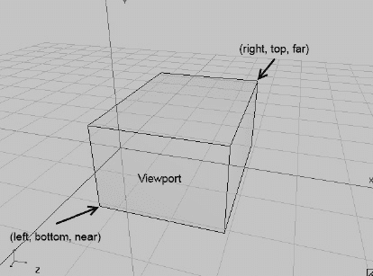

**图 7-5.** *一个正交视景体*

我们视景体的正面将直接映射到视口。对于全屏视口，例如从 (0,0) 到 (480,320)（比如 Hero 设备的横向模式），正面的左下角将映射到屏幕的左下角，正面的右上角将映射到屏幕的左上角。OpenGL 会自动为我们进行拉伸。

由于我们要进行 2D 图形处理，我们会以一种允许我们在某种像素坐标系统中工作的方式来指定角点——即 `left`、`bottom`、`near` 和 `right`、`top`、`far`（见图 7-5），就像我们使用 `Canvas` 和 Mr. Nom 游戏时那样。以下是我们设置这样一个坐标系统的方法：

`gl.glOrthof(0, 480, 0, 320, 1, -1);`

图 7-6 展示了该视景体。

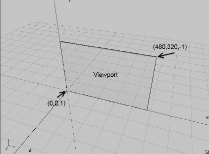

**图 7-6.** *用于使用 OpenGL ES 进行 2D 渲染的平行投影视景体*

我们的视景体非常薄，但这没关系，因为我们只进行 2D 操作。我们坐标系统的可见部分从 (0,0,1) 到 (480,320,-1)。我们在此盒子内指定的任何点也将在屏幕上可见。这些点将被投影到盒子的正面，也就是我们熟悉的近裁剪平面。然后，投影会被拉伸到视口上，无论视口的尺寸如何。假设我们有一部分辨率为 800×480 像素（横向模式）的 Nexus One 设备。当我们指定视景体时，可以在 480×320 的坐标系统中工作，OpenGL 会将其拉伸到 800×480 的帧缓冲区（如果我们指定视口覆盖整个帧缓冲区的话）。最棒的是，我们完全可以自由地使用更奇特的视景体。我们也可以使用角点为 (-1,-1,100) 和 (2,2,-100) 的视景体。我们指定的、落在此盒子内的所有内容都将是可见的，并会被自动拉伸——非常巧妙！

注意，我们还设置了近裁剪平面和远裁剪平面。由于本章将完全忽略 z 坐标，你可能会想将 near 和 far 都设为零；但由于多种原因，这不是个好主意。为了稳妥起见，我们给视景体在 z 轴上留出一点缓冲。我们所有几何图形的点都将在 x-y 平面上定义，`z` 设置为零——完全 2D 化。

**注意：** 你可能已经注意到，现在 y 轴指向上方，原点位于屏幕左下角。尽管 `Canvas`、UI 框架和许多其他 2D 渲染 API 采用 y 轴向下、原点在左上角的约定，但在游戏编程中使用这个“新”坐标系统实际上更方便。例如，如果超级马里奥在跳跃，你难道不期望他在上升过程中 y 坐标增加而不是减少吗？想使用另一种坐标系统？没问题，只需交换 `glOrthof()` 中的 `bottom` 和 `top` 参数即可。另外，虽然视景体的图示从几何角度来说大体正确，但 `glOrthof()` 对近裁剪平面和远裁剪平面的解释实际上略有不同。鉴于这点有些复杂，我们就暂且假定前面的图示是正确的。


### 实用代码片段

这里有一个小代码片段，将用于本章的所有示例。它用黑色清屏，将视口设置为覆盖整个帧缓冲区，并设置投影矩阵（从而设置视锥体），以便我们可以在一个舒适的坐标系中工作——原点位于屏幕左下角，y 轴指向上方。

```
gl.glClearColor(0,0,0,1);
gl.glClear(GL10.GL_COLOR_BUFFER_BIT);
gl.glViewport(0, 0, glGraphics.getWidth(), glGraphics.getHeight());
gl.glMatrixMode(GL10.GL_PROJECTION);
gl.glLoadIdentity();
gl.glOrthof(0, 320, 0, 480, 1, -1);
```

等等，这里的 `glLoadIdentity()` 是做什么用的？实际上，OpenGL ES 提供的用于操作活动矩阵的大多数方法并不是直接设置矩阵；它们会根据所传入的参数构建一个临时矩阵，并将其与当前矩阵相乘。`glOrthof()` 方法也不例外。例如，如果我们每帧都调用 `glOrthof()`，就会不断将投影矩阵与自身相乘。为了避免这种情况，我们确保在乘以投影矩阵之前已经有一个干净的单位矩阵。记住，矩阵乘以单位矩阵后会得到原矩阵本身，这正是 `glLoadIdentity()` 的作用。可以把它理解为先加载数值 1，再将其与我们已有的任何值相乘；在我们的例子中，这个值就是 `glOrthof()` 生成的投影矩阵。

请注意，我们的坐标系现在从 (0,0,1) 到 (320,480,–1)——这是针对竖屏渲染模式。

### 指定三角形

接下来，我们需要弄清楚如何告诉 OpenGL ES 我们要渲染的三角形。首先，让我们定义三角形的构成要素：

- 一个三角形由三个点组成。
- 每个点被称为一个顶点。
- 每个顶点在三维空间中都有一个位置。
- 三维空间中的位置由三个浮点数给出，分别指定 x、y 和 z 坐标。
- 顶点还可以具有其他属性，例如颜色或纹理坐标（我们稍后会讨论）。这些属性也可以用浮点数表示。

OpenGL ES 要求我们以数组形式传递三角形定义；然而，由于 OpenGL ES 本质上是一个 C 语言 API，我们不能直接使用标准的 Java 数组。相反，我们必须使用 Java NIO 缓冲区，这些缓冲区只是连续字节的内存块。

#### 关于 NIO 缓冲区的小插曲

准确地说，我们需要使用*直接* NIO 缓冲区。这意味着内存不是在虚拟机的堆内存中分配的，而是在原生堆内存中分配。要构造这样一个直接 NIO 缓冲区，我们可以使用以下代码片段：

```
ByteBuffer buffer = ByteBuffer.allocateDirect(NUMBER_OF_BYTES);
buffer.order(ByteOrder.nativeOrder());
```

这将分配一个容量为 `NUMBER_OF_BYTES` 字节的 `ByteBuffer`，并确保其字节顺序与底层 CPU 使用的字节顺序一致。NIO 缓冲区具有三个属性：

- `容量`：缓冲区总共能容纳的元素数量。
- `位置`：下一个元素将要写入或读取的当前位置。
- `限制`：最后一个已定义元素的索引加一。

缓冲区的`容量`是其实际大小。对于 `ByteBuffer`，容量以字节为单位。可以将`位置`和`限制`属性理解为定义缓冲区中从`位置`开始到`限制`（不包含）结束的一个片段。

由于我们希望以浮点数形式指定顶点，因此最好能避免处理字节。幸运的是，我们可以将 `ByteBuffer` 实例转换为 `FloatBuffer` 实例，从而直接用浮点数进行操作。

```
FloatBuffer floatBuffer = buffer.asFloatBuffer();
```

对于 `FloatBuffer`，容量、位置和限制都以浮点数表示。我们对这些缓冲区的使用模式相当有限，具体如下：

```
float[] vertices = { ... 顶点位置等定义 ... };
floatBuffer.clear();
floatBuffer.put(vertices);
floatBuffer.flip();
```

我们首先将数据定义在标准 Java 浮点数组中。在将浮点数组放入缓冲区之前，我们通过 `clear()` 方法告诉缓冲区清空自身。这并不会实际擦除任何数据，而是将位置重置为 0，并将限制设为容量。接下来，我们使用 `FloatBuffer.put(float[] array)` 方法，将整个数组的内容从缓冲区当前的位置开始复制到缓冲区中。复制完成后，缓冲区的位置会增加数组的长度。随后调用 `put()` 方法会将额外数据追加到我们上一次复制到缓冲区的数组数据之后。最后调用 `FloatBuffer.flip()` 只是交换了位置和限制。

对于这个例子，假设我们的顶点数组大小为五个浮点数，并且 `FloatBuffer` 有足够的容量存储这五个浮点数。调用 `FloatBuffer.put()` 后，缓冲区的位置将为 5（索引 0 到 4 被数组中的五个浮点数占据）。限制仍等于缓冲区的容量。调用 `FloatBuffer.flip()` 后，位置被设为 0，限制被设为 5。任何需要从缓冲区读取数据的对象都会知道应该读取索引 0 到 4 的浮点数（记住限制是不包含的）；而 OpenGL ES 也需要知道这一点。但请注意，它会愉快地忽略限制。通常，除了传递缓冲区给它之外，我们还需要告诉它要读取的元素数量。这里没有错误检查，所以要小心。

有时，在填充缓冲区后手动设置缓冲区的位置会很有用。这可以通过调用以下方法来实现：

```
FloatBuffer.position(int position)
```

这将在后续派上用场，当我们临时将已填充缓冲区的位置设置为非零值，以便让 OpenGL ES 从特定位置开始读取数据时。


##### 向 OpenGL ES 发送顶点数据

那么，我们如何定义第一个三角形的三个顶点位置呢？很简单——假设我们的坐标系为从 `(0,0,1)` 到 `(320,480,–1)`，正如我们在前面的代码片段中所定义的那样——我们可以执行以下操作：

```
ByteBuffer byteBuffer = ByteBuffer.allocateDirect(3 * 2 * 4);
byteBuffer.order(ByteOrder.nativeOrder());
FloatBuffer vertices = byteBuffer.asFloatBuffer();
vertices.put(new float[] {    0.0f,   0.0f,
                              319.0f, 0.0f,
                              160.0f, 479.0f  });
vertices.flip();
```

前三行应该已经比较熟悉了。唯一有趣的部分是我们分配了多少字节。我们有三个顶点，每个顶点由一个以 x 和 y 坐标表示的位置组成。每个坐标是一个浮点数，因此占用 4 个字节。那就是三个顶点乘以两个坐标再乘以四个字节，总共为我们的三角形分配了 24 个字节。

**注意：** 我们可以仅用 x 和 y 坐标来指定顶点，OpenGL ES 会自动将 z 坐标设为零。

接下来，我们将一个包含顶点位置的浮点数组放入缓冲区。我们的三角形从左下角 `(0,0)` 开始，延伸到视锥/屏幕的右侧边缘 `(319,0)`，然后延伸到视锥/屏幕顶部边缘的中间位置。作为合格的 NIO 缓冲区用户，我们还会对缓冲区调用 `flip()` 方法。这样，位置（position）将为 0，限制（limit）将为 6（记住，`FloatBuffer` 的限制和位置是以 float 为单位给出的，而非字节）。

一旦我们的 NIO 缓冲区准备就绪，我们就可以告诉 OpenGL ES 使用其当前状态（即视口和投影矩阵）来绘制它。这可以通过以下代码片段完成：

```
gl.glEnableClientState(GL10.GL_VERTEX_ARRAY);
gl.glVertexPointer( 2, GL10.GL_FLOAT, 0, vertices);
gl.glDrawArrays(GL10.GL_TRIANGLES, 0, 3);
```

调用 `glEnableClientState()` 有点过时。它告诉 OpenGL ES 我们即将绘制的顶点具有位置信息。这有点傻，原因有二：

- 该常量名为 `GL10.GL_VERTEX_ARRAY`，这有点令人困惑。如果它叫 `GL10.GL_POSITION_ARRAY` 会更合理。
- 没有任何方法可以绘制没有位置的图形，因此对这个方法的调用有点多余。不过，为了让 OpenGL ES 满意，我们还是会这么做。

在调用 `glVertexPointer()` 时，我们告诉 OpenGL ES 在哪里可以找到顶点位置，并提供一些附加信息。第一个参数告诉 OpenGL ES，每个顶点位置由两个坐标（x 和 y）组成。如果我们指定了 x、y 和 z，那么我们会向该方法传递 `three`。第二个参数告诉 OpenGL ES 我们用于存储每个坐标的数据类型。在这里，它是 `GL10.GL_FLOAT`，表示我们使用了每个编码为 4 字节的浮点数。第三个参数 `stride` 告诉 OpenGL ES 每个顶点位置之间以字节为单位的间隔。在前面的例子中，`stride` 是 0，因为位置是紧密排列的[顶点 1 `(x,y)`，顶点 2 `(x,y)`，以此类推]。最后一个参数是我们的 `FloatBuffer`，关于它需要注意两点：

- `FloatBuffer` 代表本地堆中的一块内存，因此有一个起始地址。
- `FloatBuffer` 的当前位置是该起始地址的一个偏移量。

当我们告诉 OpenGL ES 绘制缓冲区的内容时，它会取缓冲区的起始地址并加上缓冲区当前位置，从而到达缓冲区中开始读取顶点数据的那个浮点数。顶点指针（再次强调，它应该被称为*位置指针*）是 OpenGL ES 的一个状态。只要我们不更改它（并且上下文没有丢失），OpenGL ES 就会记住它，并将其用于所有后续需要顶点位置的调用。

最后是调用 `glDrawArrays()`。它将绘制我们的三角形。第一个参数指定了我们即将绘制的图元类型。这里，我们说想要渲染一个三角形列表，通过 `GL10.GL_TRIANGLES` 来指定。下一个参数是相对于顶点指针所指向的第一个顶点的偏移量。该偏移量以顶点为单位，而不是字节或浮点数。如果我们指定了不止一个三角形，就可以使用这个偏移量来仅渲染三角形列表的一个子集。最后一个参数告诉 OpenGL ES 它应该使用多少个顶点进行渲染。在我们的例子中，是三个顶点。请注意，如果我们要绘制 `GL10.GL_TRIANGLES`，必须始终指定为 3 的倍数。每个三角形由三个顶点组成，所以这很合理。对于其他图元类型，规则略有不同。

一旦我们发出了 `glVertexPointer()` 命令，OpenGL ES 就会将顶点位置传输到 GPU 并存储在那里，供所有后续渲染命令使用。每次我们告诉 OpenGL ES 渲染顶点时，它都会从我们上次通过 `glVertexPointer()` 指定的数据中获取这些顶点的位置。

我们的每个顶点可能有比单纯位置更多的属性。另一个属性可能是顶点的颜色。我们通常将这些属性称为*顶点属性*。

你可能会想知道，既然我们只指定了位置，OpenGL ES 如何知道我们的三角形应该是什么颜色。事实证明，对于任何我们未指定的顶点属性，OpenGL ES 都有合理的默认值。这些默认值大多可以直接设置。例如，如果我们想为所有绘制的顶点设置一个默认颜色，可以使用以下方法：

```
GL10.glColor4f(float r, float g, float b, float a)
```

该方法将为所有未指定颜色的顶点设置要使用的默认颜色。颜色以 RGBA 值给出，范围是 0.0 到 1.0，与之前清除颜色（clear color）的情况类似。OpenGL ES 启动时的默认颜色是 `(1,1,1,1)`——即完全不透明的白色。

这就是我们使用自定义平行投影渲染一个三角形所需的全部代码——仅需 16 行代码就能完成清屏、设置视口和投影矩阵、创建用于存储顶点位置的 NIO 缓冲区以及绘制三角形！现在，将这和我们用来解释这一切的六页篇幅比较一下。当然，我们可以省略细节并使用更粗略的语言。问题是 OpenGL ES 有时是一个非常复杂的家伙，为了避免得到一个空屏幕，最好弄清楚它的来龙去脉，而不是仅仅复制粘贴代码。


#### 整合

为了完善本节内容，下面通过一个漂亮的 `GLGame` 和 `Screen` 实现来整合所有知识点。清单 7–5 展示了完整示例。

**清单 7–5.** *FirstTriangleTest.java*

```java
package com.badlogic.androidgames.glbasics;

import java.nio.ByteBuffer;
import java.nio.ByteOrder;
import java.nio.FloatBuffer;

import javax.microedition.khronos.opengles.GL10;

import com.badlogic.androidgames.framework.Game;
import com.badlogic.androidgames.framework.Screen;
import com.badlogic.androidgames.framework.impl.GLGame;
import com.badlogic.androidgames.framework.impl.GLGraphics;

public class FirstTriangleTest extends GLGame {
    @Override
    public Screen getStartScreen() {
        return new FirstTriangleScreen(this);
    }
```

`FirstTriangleTest` 类继承自 `GLGame`，因此必须实现 `Game.getStartScreen()` 方法。在该方法中，我们创建了一个新的 `FirstTriangleScreen`，随后 `GLGame` 会频繁调用该屏幕以进行更新和呈现。请注意，当此方法被调用时，我们已经处于主循环（更准确地说，是 `GLSurfaceView` 渲染线程）中，因此可以在 `FirstTriangleScreen` 类的构造函数中使用 OpenGL ES 方法。让我们仔细看看这个 `Screen` 实现。

```java
class FirstTriangleScreen extends Screen {
    GLGraphics glGraphics;
    FloatBuffer vertices;

    public FirstTriangleScreen(Game game) {
        super(game);
        glGraphics = ((GLGame)game).getGLGraphics();

        ByteBuffer byteBuffer = ByteBuffer.allocateDirect(3 * 2 * 4);
        byteBuffer.order(ByteOrder.nativeOrder());
        vertices = byteBuffer.asFloatBuffer();
        vertices.put(new float[] { 0.0f,   0.0f,
                                   319.0f,  0.0f,
                                   160.0f, 479.0f});
        vertices.flip();
    }
```

`FirstTriangleScreen` 类包含两个成员：一个 `GLGraphics` 实例，以及我们信赖的 `FloatBuffer`，它存储了三角形三个顶点的二维坐标。在构造函数中，我们从 `GLGame` 中获取 `GLGraphics` 实例，并根据之前的代码片段创建并填充 `FloatBuffer`。由于 `Screen` 的构造函数接收一个 `Game` 实例，我们必须将其强制转换为 `GLGame` 实例，以便使用 `GLGame.getGLGraphics()` 方法。

```java
    @Override
    public void present(float deltaTime) {
        GL10 gl = glGraphics.getGL();
        gl.glViewport(0, 0, glGraphics.getWidth(), glGraphics.getHeight());
        gl.glClear(GL10.GL_COLOR_BUFFER_BIT);
        gl.glMatrixMode(GL10.GL_PROJECTION);
        gl.glLoadIdentity();
        gl.glOrthof(0, 320, 0, 480, 1, -1);

        gl.glColor4f(1, 0, 0, 1);
        gl.glEnableClientState(GL10.GL_VERTEX_ARRAY);
        gl.glVertexPointer(2, GL10.GL_FLOAT, 0, vertices);
        gl.glDrawArrays(GL10.GL_TRIANGLES, 0, 3);
    }
```

`present()` 方法反映了我们刚才讨论的内容：设置视口、清除屏幕、设置投影矩阵以便在自定义坐标系中工作、设置默认顶点颜色（此处为红色）、指定我们的顶点将包含位置信息、告诉 OpenGL ES 在哪里可以找到这些顶点位置，最后，渲染出我们漂亮的小红三角形。

```java
    @Override
    public void update(float deltaTime) {
        game.getInput().getTouchEvents();
        game.getInput().getKeyEvents();
    }

    @Override
    public void pause() {
    }

    @Override
    public void resume() {
    }

    @Override
    public void dispose() {
    }
}
```

该类的其余部分只是样板代码。在 `update()` 方法中，我们确保事件缓冲区不会被填满。其余代码不做任何操作。

**注意：** 从现在开始，我们将只关注 `Screen` 类本身，因为其外部的 `GLGame` 派生类（如 `FirstTriangleTest`）始终是相同的。我们还会稍作精简，省略 `Screen` 类中所有空方法或样板方法。以下示例都将仅在成员、构造函数和 `present` 方法上有所不同。

图 7–7 展示了上述示例的运行结果。

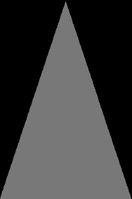

**图 7–7.** *我们第一个吸引人的三角形*

以下是本示例在 OpenGL ES 最佳实践方面所犯的错误：

*   我们毫无必要地重复将相同的状态设置为相同的值。在 OpenGL ES 中，状态变更开销很大——有些稍大，有些稍小。我们应该始终尝试减少在单帧内进行的状态变更次数。
*   一旦设置好视口和投影矩阵，它们就永远不会改变。我们可以将这些代码移至 `resume()` 方法中，该方法仅在 OpenGL ES 表面（重新）创建时被调用一次；这也能处理 OpenGL ES 上下文丢失的问题。
*   我们也可以将用于清除的颜色和默认顶点颜色的设置移至 `resume()` 方法。这两种颜色也不会改变。
*   我们可以将 `glEnableClientState()` 和 `glVertexPointer()` 方法移至 `resume()` 方法。
*   每帧唯一需要调用的只是 `glClear()` 和 `glDrawArrays()`。这两者都使用当前的 OpenGL ES 状态，只要我们不更改它们，并且不因为 `Activity` 暂停和恢复而丢失上下文，这些状态就会保持不变。

如果我们实施了这些优化，主循环中就只有两个 OpenGL ES 调用。为了清晰起见，我们现在暂且不采用这种最小状态变更的优化方式。不过，当我们开始编写第一个 OpenGL ES 游戏时，我们将必须尽可能遵循这些实践，以保证良好的性能。

现在，为我们的三角形顶点添加一些更多属性，首先从颜色开始。

**注意：** 非常非常敏锐的读者可能已经注意到，图 7–7 中的三角形实际上在右下角缺失了一个像素。这看起来像是一个典型的栅格化偏差错误，但实际上是由于 OpenGL ES 栅格化（绘制像素）三角形的方式所致。有一个特定的三角形栅格化规则导致了这一瑕疵。不必担心——我们主要关注的是渲染二维矩形（由两个三角形组成），在这种场景下，该效果会消失。


### 指定逐顶点颜色

在上一个示例中，我们通过 `glColor4f()` 为绘制的所有顶点设置了全局默认颜色。有时，我们希望进行更精细的控制（例如，为每个顶点设置不同颜色）。OpenGL ES 提供了这一功能，而且使用起来非常简便。我们只需为每个顶点添加 RGBA 浮点分量，并告诉 OpenGL ES 在哪里可以找到每个顶点的颜色，这与我们告知它顶点位置的方式类似。让我们先从为每个顶点添加颜色开始。

```
int VERTEX_SIZE = (2 + 4) * 4;
ByteBuffer byteBuffer = ByteBuffer.allocateDirect(3 * VERTEX_SIZE);
byteBuffer.order(ByteOrder.nativeOrder());
FloatBuffer vertices = byteBuffer.asFloatBuffer();
vertices.put(new float[] {   0.0f,   0.0f, 1, 0, 0, 1,
                            319.0f,   0.0f, 0, 1, 0, 1,
                            160.0f, 479.0f, 0, 0, 1, 1});
vertices.flip();
```

首先，我们需要为三个顶点分配一个 `ByteBuffer`。这个 `ByteBuffer` 应该分配多大？每个顶点有两个坐标分量和四个（RGBA）颜色分量，总共六个浮点数。每个浮点数值占用 4 个字节，所以一个顶点占用 24 个字节。我们将这些信息存储在 `VERTEX_SIZE` 中。调用 `ByteBuffer.allocateDirect()` 时，只需将 `VERTEX_SIZE` 乘以我们要存储在 `ByteBuffer` 中的顶点数量即可。其余部分不言自明。我们获取 `ByteBuffer` 的 `FloatBuffer` 视图，并通过 `put()` 方法将顶点数据放入 `ByteBuffer`。浮点数组的每一行依次存储一个顶点的 x 坐标、y 坐标以及 R、G、B、A 分量。

要渲染这些顶点，我们必须告诉 OpenGL ES，我们的顶点不仅有位置属性，还包含了颜色属性。像之前一样，我们首先调用 `glEnableClientState()`。

```
gl.glEnableClientState(GL10.GL_VERTEX_ARRAY);
gl.glEnableClientState(GL10.GL_COLOR_ARRAY);
```

现在 OpenGL ES 知道每个顶点都包含位置和颜色信息后，我们必须告诉它可以在哪里找到这些信息：

```
vertices.position(0);
gl.glVertexPointer(2, GL10.GL_FLOAT, VERTEX_SIZE, vertices);
vertices.position(2);            
gl.glColorPointer(4, GL10.GL_FLOAT, VERTEX_SIZE, vertices);
```

首先，我们将存储顶点数据的 `FloatBuffer` 的位置设置为 0。此时位置指向缓冲区中第一个顶点的 x 坐标。接着，我们调用 `glVertexPointer()`。与之前示例的唯一区别是，我们现在指定了顶点大小（记住，单位是字节）。OpenGL ES 随后将从我们指定的起始位置开始在缓冲区中读取顶点位置。对于第二个顶点的位置，它会在第一个位置地址的基础上增加 `VERTEX_SIZE` 个字节，依此类推。

接下来，我们将缓冲区的位置设置为第一个顶点的 R 分量，并调用 `glColorPointer()`，以告知 OpenGL ES 在哪里可以找到我们顶点的颜色。第一个参数是每个颜色的分量数。这总是 4，因为 OpenGL ES 要求我们为每个顶点提供 R、G、B、A 分量。第二个参数指定每个分量的类型。与顶点坐标类似，我们再次使用 `GL10.GL_FLOAT` 来指示每个颜色分量是 0 到 1 之间的浮点数。第三个参数是各顶点颜色之间的跨度（stride）。它自然与顶点位置之间的跨度相同。最后一个参数再次是我们的顶点缓冲区。

由于我们在调用 `glColorPointer()` 之前调用了 `vertices.position(2)`，OpenGL ES 知道第一个顶点的颜色从缓冲区中的第三个浮点数开始。如果我们没有将缓冲区位置设置为 2，OpenGL ES 就会从位置 0 开始读取颜色数据。这将导致错误，因为那是第一个顶点 x 坐标所在的位置。图 7-8 展示了 OpenGL ES 将如何读取我们的顶点属性，以及它如何为每个属性从一个顶点跳到下一个顶点。

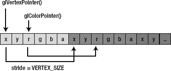

**图 7-8.** *我们的顶点 FloatBuffer、OpenGL ES 用于读取位置/颜色的起始地址，以及用于跳转到下一个位置/颜色的跨度（stride）*

为了绘制三角形，我们再次调用 `glDrawElements()`，这会指示 OpenGL ES 使用 `FloatBuffer` 中的前三个顶点绘制一个三角形。

```
gl.glDrawElements(GL10.GL_TRIANGLES, 0, 3);
```

由于我们启用了 `GL10.GL_VERTEX_ARRAY` 和 `GL10.GL_COLOR_ARRAY`，OpenGL ES 知道它应该使用由 `glVertexPointer()` 和 `glColorPointer()` 指定的属性。它会忽略默认颜色，因为我们提供了自己的逐顶点颜色。

**注意：** 我们刚刚指定顶点位置和颜色的方式称为*交错*（interleaving）。这意味着我们将一个顶点的属性打包在一个连续的内存块中。我们也可以通过另一种方式实现：*非交错顶点数组*（non-interleaved vertex arrays）。我们可以使用两个 `FloatBuffer`，一个用于位置，一个用于颜色。然而，由于内存局部性，交错方式的性能要好得多，因此我们在此不讨论非交错顶点数组。

将所有代码整合到一个新的 `GLGame` 和 `Screen` 实现中应该相当简单。清单 7-6 展示了文件 `ColoredTriangleTest.java` 的一个片段。我们省略了样板代码。

**清单 7-6.** *ColoredTriangleTest.java 片段；位置和颜色属性的交错*

```
class ColoredTriangleScreen extends Screen {
    final int VERTEX_SIZE = (2 + 4) * 4;
    GLGraphics glGraphics;
    FloatBuffer vertices;        

    public ColoredTriangleScreen(Game game) {
        super(game);
        glGraphics = ((GLGame) game).getGLGraphics();

        ByteBuffer byteBuffer = ByteBuffer.allocateDirect(3 * VERTEX_SIZE);
        byteBuffer.order(ByteOrder.nativeOrder());
        vertices = byteBuffer.asFloatBuffer();
        vertices.put(new float[] {   0.0f,   0.0f, 1, 0, 0, 1,
                                    319.0f,   0.0f, 0, 1, 0, 1,
                                    160.0f, 479.0f, 0, 0, 1, 1});
        vertices.flip();
    }

    @Override
    public void present(float deltaTime) {
        GL10 gl = glGraphics.getGL();
        gl.glViewport(0, 0, glGraphics.getWidth(), glGraphics.getHeight());
        gl.glClear(GL10.GL_COLOR_BUFFER_BIT);
        gl.glMatrixMode(GL10.GL_PROJECTION);
        gl.glLoadIdentity();
        gl.glOrthof(0, 320, 0, 480, 1, -1);

        gl.glEnableClientState(GL10.GL_VERTEX_ARRAY);
        gl.glEnableClientState(GL10.GL_COLOR_ARRAY);

        vertices.position(0);
        gl.glVertexPointer(2, GL10.GL_FLOAT, VERTEX_SIZE, vertices);
        vertices.position(2);            
        gl.glColorPointer(4, GL10.GL_FLOAT, VERTEX_SIZE, vertices);

        gl.glDrawArrays(GL10.GL_TRIANGLES, 0, 3);
    }
```


```markdown
酷——这看起来仍然相当简单。与之前的示例相比，我们只是在`FloatBuffer`中为每个顶点添加了四个颜色分量，并启用了`GL10.GL_COLOR_ARRAY`。最棒的是，我们在后续示例中添加的任何其他顶点属性都将以相同的方式工作。我们只需告诉 OpenGL ES 不要使用该特定属性的默认值；相反，我们告诉它从`FloatBuffer`中查找这些属性，从特定位置开始，并按照`VERTEX_SIZE`个字节的间距从一个顶点移动到下一个顶点。

现在，我们也可以关闭`GL10.GL_COLOR_ARRAY`，这样 OpenGL ES 就会像之前一样使用我们通过`glColor4f()`指定的默认顶点颜色。为此，我们可以调用

`gl.glDisableClientState(GL10.GL_COLOR_ARRAY);`

OpenGL ES 将关闭从`FloatBuffer`读取颜色的功能。即使我们之前已经通过`glColorPointer()`设置了颜色指针，OpenGL ES 也会记住该指针，尽管我们刚刚告诉它不要使用它。

为了完善这个示例，让我们看一下前面程序的输出。图 7–9 展示了一个截图。

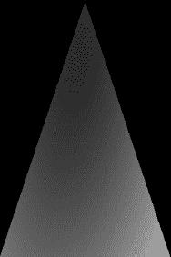

**图 7–9.** *逐顶点着色三角形*

哇，这真是太棒了！我们没有对 OpenGL ES 如何使用我们指定的三种颜色（左下角顶点为红色、右下角顶点为绿色、顶部顶点为蓝色）做任何假设。结果发现，它会在顶点之间为我们插值颜色。通过这种方式，我们可以轻松创建漂亮的渐变；然而，单靠颜色并不能让我们长久满足。我们想用 OpenGL ES 绘制图像。这就是所谓的纹理映射发挥作用的地方。

## 纹理映射：贴墙纸如此简单

当我们编写 Mr. Nom 时，我们加载了一些位图并直接将其绘制到帧缓冲区——不涉及旋转，只有一点缩放，这很容易实现。在 OpenGL ES 中，我们主要处理三角形，它们可以具有我们想要的任何方向或缩放比例。那么，我们如何用 OpenGL ES 渲染位图呢？

很简单，只需将位图加载到 OpenGL ES（以及拥有专用 RAM 的 GPU），为三角形每个顶点添加一个新属性，然后告诉 OpenGL ES 渲染我们的三角形并将位图（在 OpenGL ES 术语中也称为*纹理*）应用到三角形上。让我们先看看这些新的顶点属性具体指定了什么。

### 纹理坐标

要将位图映射到三角形，我们需要为三角形的每个顶点添加*纹理坐标*。什么是纹理坐标？它指定了纹理（我们上传的位图）中要映射到三角形某个顶点的点。纹理坐标通常是二维的。

虽然我们将位置坐标称为 x、y 和 z，但纹理坐标通常被称为 u 和 v，或者 s 和 t，这取决于你所在图形程序员圈子的习惯。OpenGL ES 称它们为 s 和 t，所以我们将沿用这个叫法。如果你在网上阅读到使用 u/v 命名法的资料，不要混淆：它与 s 和 t 是一样的。这个坐标系是什么样的？图 7–10 展示了 Bob 在被上传到 OpenGL ES 后在纹理坐标系中的样子。

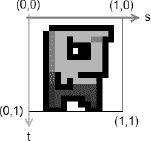

**图 7–10.** *Bob，上传到 OpenGL ES 后，在纹理坐标系中显示*

这里有几点有趣的发现。首先，s 等于标准坐标系中的 x 坐标，t 等于 y 坐标。s 轴指向右方，t 轴指向下方。坐标系的原点与 Bob 图像的左上角重合。图像的右下角映射到 (1,1)。

那么，像素坐标去哪了？事实证明，OpenGL ES 不太喜欢它们。相反，我们上传的任何图像，无论其以像素为单位的宽度和高度是多少，都将被嵌入到这个坐标系中。图像的左上角始终在 (0,0)，右下角始终在 (1,1)——即使宽度是高度的两倍也是如此。我们称这些为*归一化坐标*，它们有时会让我们的生活更轻松。现在，我们如何将 Bob 映射到我们的三角形上呢？很简单，我们只需给三角形的每个顶点在 Bob 的坐标系中赋予一对纹理坐标。图 7–11 展示了几种配置。

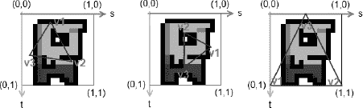

**图 7–11.** *映射到 Bob 的三个不同的三角形；v1、v2 和 v3 分别指定了三角形的一个顶点。*

我们可以随心所欲地将三角形的顶点映射到纹理坐标系。请注意，三角形在位置坐标系中的方向不必与在纹理坐标系中的方向相同。这两个坐标系是完全解耦的。那么，让我们看看如何将这些纹理坐标添加到我们的顶点中。

```java
int VERTEX_SIZE = (2 + 2) * 4;
ByteBuffer byteBuffer = ByteBuffer.allocateDirect(3 * VERTEX_SIZE);
byteBuffer.order(ByteOrder.nativeOrder());
vertices = byteBuffer.asFloatBuffer();
vertices.put(new float[] {   0.0f,   0.0f, 0.0f, 1.0f,
                            319.0f,   0.0f, 1.0f, 1.0f,
                            160.0f, 479.0f, 0.5f, 0.0f});
vertices.flip();
```

这很简单。我们只需确保缓冲区中有足够的空间，然后将纹理坐标附加到每个顶点即可。前面的代码对应于图 7–10 中最右边的映射。请注意，我们的顶点位置仍然在我们通过投影定义的常用坐标系中给出。如果我们愿意，也可以像前面的示例一样，为每个顶点添加颜色属性。然后 OpenGL ES 会将插值后的顶点颜色与三角形映射到的纹理像素颜色进行混合。当然，我们需要相应地调整缓冲区的大小以及`VERTEX_SIZE`常量；例如，(2 + 4 + 2) × 4。为了告诉 OpenGL ES 我们的顶点具有纹理坐标，我们再次使用`glEnableClientState()`以及`glTexCoordPointer()`方法，其行为与`glVertexPointer()`和`glColorPointer()`完全相同（你能看出规律吗？）。

```java
gl.glEnableClientState(GL10.GL_VERTEX_ARRAY);
gl.glEnableClientState(GL10.GL_TEXTURE_COORD_ARRAY);

vertices.position(0);
gl.glVertexPointer(2, GL10.GL_FLOAT, VERTEX_SIZE, vertices);
vertices.position(2);
gl.glTexCoordPointer(2, GL10.GL_FLOAT, VERTEX_SIZE, vertices);
```

不错——这看起来非常熟悉。那么，剩下的问题是我们如何将纹理上传到 OpenGL ES 并告诉它将其映射到我们的三角形上？自然，这稍微复杂一些。但别担心，它仍然很简单。
```


#### 上传位图

首先，我们必须加载位图。在 Android 上，我们已经知道如何做到这一点。

`Bitmap bitmap = BitmapFactory.decodeStream(game.getFileIO().readAsset("bobrgb888.png"));`

这里我们以 RGB888 配置加载 Bob 的图片。接下来需要做的是告诉 OpenGL ES 我们要创建一个新纹理。OpenGL ES 对某些事物（例如纹理）具有对象的概念。要创建一个纹理对象，我们可以调用以下方法：

`GL10.glGenTextures(int numTextures, int[] ids, int offset)`

第一个参数指定要创建的纹理对象数量。通常，我们只需要创建一个。下一个参数是一个整数数组，OpenGL ES 会将生成的纹理对象 ID 写入其中。最后一个参数只是告诉 OpenGL ES 它应该从数组的哪个位置开始写入 ID。

你已经了解到 OpenGL ES 是一个 C API。自然，它无法为新纹理返回一个 Java 对象；相反，它会给我们一个该纹理的 ID（或句柄）。每次我们想让 OpenGL ES 对该特定纹理执行某些操作时，都需要指定其 ID。因此，这里是一个更完整的代码片段，展示了如何生成单个新纹理对象并获取其 ID：

```
int textureIds[] = new int[1];
gl.glGenTextures(1, textureIds, 0);
int textureId = textureIds[0];
```

纹理对象仍然是空的，这意味着它还没有任何图像数据。让我们上传位图。为此，我们首先必须绑定纹理。在 OpenGL ES 中绑定某物意味着我们希望 OpenGL ES 在所有后续调用中使用该特定对象，直到我们再次更改绑定。这里，我们要绑定一个纹理对象，可以使用 `glBindTexture()` 方法。一旦绑定了纹理，我们就可以操作其属性，例如图像数据。以下是我们如何将 Bob 的图片上传到新纹理对象的方法：

```
gl.glBindTexture(GL10.GL_TEXTURE_2D, textureId);
GLUtils.texImage2D(GL10.GL_TEXTURE_2D, 0, bitmap, 0);
```

首先，我们使用 `glBindTexture()` 绑定纹理对象。第一个参数指定我们要绑定的纹理类型。Bob 的图片是 2D 的，所以我们使用 `GL10.GL_TEXTURE_2D`。还有其他纹理类型，但在本书中我们不需要。对于需要知道我们要处理的纹理类型的方法，我们将始终指定 `GL10.GL_TEXTURE_2D`。该方法的第二个参数是我们的纹理 ID。一旦该方法返回，所有后续与 2D 纹理一起使用的方法都将作用于我们的纹理对象。

下一个方法调用调用了 `GLUtils` 类的一个方法，该类由 Android 框架提供。通常，上传纹理图像的任务相当复杂；这个小小的辅助类大大减轻了我们的负担。我们需要做的只是指定纹理类型（`GL10.GL_TEXTURE_2D`）、mipmapping 级别（我们将在第 11 章中讨论；默认为零）、我们要上传的位图，以及另一个参数，该参数在所有情况下都必须设置为零。在此调用之后，我们的纹理对象就有了关联的图像数据。

**注意：** 纹理对象及其图像数据实际上存储在视频 RAM 中，而不是我们通常的 RAM 中。当 OpenGL ES 上下文被销毁时（例如，当我们的活动被暂停并恢复时），纹理对象（以及图像数据）将会丢失。这意味着每次（重新）创建 OpenGL ES 上下文时，我们都必须重新创建纹理对象并重新上传我们的图像数据。如果不这样做，我们看到的将只是一个白色三角形。

#### 纹理过滤

在使用纹理对象之前，我们还需要定义最后一件事。这关系到我们的三角形在屏幕上占据的像素可能多于或少于纹理映射区域中的像素。例如，图 7–10 中 Bob 的图片大小为 128×128 像素。我们的三角形映射到该图像的一半，因此它使用了纹理中的 (128×128) /2 个像素（也称为*纹素*）。当我们使用前面代码片段中定义的坐标将三角形绘制到屏幕时，它将占据 (320×480) / 2 个像素。这比我们从纹理映射中获取的像素要多得多。当然，也可能反过来：我们在屏幕上使用的像素少于纹理映射区域中的像素。第一种情况称为*放大*，第二种情况称为*缩小*。对于每种情况，我们需要告诉 OpenGL ES 应该如何放大或缩小纹理。在 OpenGL ES 术语中，放大和缩小也被称为*缩小过滤*和*放大过滤*。这些过滤器是我们纹理对象的属性，就像图像数据本身一样。要设置它们，我们首先必须确保通过调用 `glBindTexture()` 绑定了纹理对象。如果是这样，我们可以像这样设置它们：

```
gl.glTexParameterf(GL10.GL_TEXTURE_2D, GL10.GL_TEXTURE_MIN_FILTER, GL10.GL_NEAREST);
gl.glTexParameterf(GL10.GL_TEXTURE_2D, GL10.GL_TEXTURE_MAG_FILTER, GL10.GL_NEAREST);
```

两次我们都使用了 `GL10.glTexParameterf()` 方法，该方法用于设置纹理的属性。在第一次调用中，我们指定了缩小过滤；在第二次调用中，我们指定了放大过滤。该方法的第一个参数是纹理类型，默认为 `GL10.GL_TEXTURE_2D`。第二个参数告诉该方法我们要设置哪个属性；在我们的例子中，是 `GL10.GL_TEXTURE_MIN_FILTER` 和 `GL10.GL_TEXTURE_MAG_FILTER`。最后一个参数指定了应该使用的过滤器类型。这里我们有两个选项：`GL10.GL_NEAREST` 和 `GL10.GL_LINEAR`。

第一种过滤器类型将始终选择纹理映射中最近的纹素映射到像素。第二种过滤器类型将为三角形的每个像素采样四个最近的纹素，并取其平均值以得到最终颜色。如果我们想要像素化的外观，则使用第一种过滤器；如果想要平滑的外观，则使用第二种。图 7–12 显示了这两种过滤器类型的区别。

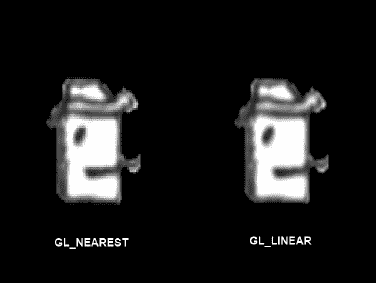

**图 7–12.** *GL10.GL_NEAREST 与 GL10.GL_LINEAR 对比；第一种过滤器类型产生像素化外观；第二种则使图像稍微平滑一些。*

我们的纹理对象现在已经完全定义好了：我们创建了一个 ID，设置了图像数据，并指定了在渲染不是像素完美的情况下要使用的过滤器。完成后解除纹理绑定是一个常见做法。我们还应该回收我们加载的 `Bitmap`，因为我们不再需要它。为什么要浪费内存呢？这可以通过以下代码片段实现：

```
gl.glBindTexture(GL10.GL_TEXTURE_2D, 0);
bitmap.recycle();
```

这里，`0` 是一个特殊的 ID，告诉 OpenGL ES 它应该解除当前绑定对象的绑定。如果我们想要使用该纹理来绘制三角形，当然需要再次绑定它。

#### 处理纹理

了解如何在我们不再需要时从视频 RAM 中删除纹理对象也很有用（就像我们使用 `Bitmap.recycle()` 释放位图的内存一样）。这可以通过以下代码片段实现：

```
gl.glBindTexture(GL10.GL_TEXTURE_2D, 0);
int textureIds = { textureid };
gl.glDeleteTextures(1, textureIds, 0);
```

注意，在删除纹理对象之前，我们首先必须确保该纹理对象当前未被绑定。其余部分类似于我们使用 `glGenTextures()` 创建纹理对象的方式。


#### 一段实用的代码片段

供你参考，以下是创建纹理对象、加载图像数据以及在 Android 上设置滤波器的完整代码片段：

```java
Bitmap bitmap = BitmapFactory.decodeStream(game.getFileIO().readAsset("bobrgb888.png"));
int textureIds[] = new int[1];
gl.glGenTextures(1, textureIds, 0);
int textureId = textureIds[0];
gl.glBindTexture(GL10.GL_TEXTURE_2D, textureId);
GLUtils.texImage2D(GL10.GL_TEXTURE_2D, 0, bitmap, 0);
gl.glTexParameterf(GL10.GL_TEXTURE_2D, GL10.GL_TEXTURE_MIN_FILTER, GL10.GL_NEAREST);
gl.glTexParameterf(GL10.GL_TEXTURE_2D, GL10.GL_TEXTURE_MAG_FILTER, GL10.GL_NEAREST);
gl.glBindTexture(GL10.GL_TEXTURE_2D, 0);
bitmap.recycle();
```

其实并不复杂。其中最重要的一点是，使用完 `Bitmap` 后一定要将其回收；否则会造成内存浪费。我们的图像数据已经安全地存储在纹理对象的显存中（除非上下文丢失，我们需要重新加载）。

#### 启用纹理

在绘制带纹理的三角形之前，还有一件事要做。我们需要绑定纹理，并告诉 OpenGL ES 它应该将纹理应用到我们渲染的所有三角形上。是否执行纹理映射是 OpenGL ES 的另一个状态，我们可以通过以下方法启用和禁用它：

```java
GL10.glEnable(GL10.GL_TEXTURE_2D);
GL10.glDisable(GL10.GL_TEXTURE_2D);
```

这些方法看起来有些眼熟。在之前的章节中，当我们启用/禁用顶点属性时，我们使用的是 `glEnableClientState()`/`glDisableClientState()`。正如我们之前所说，这些是 OpenGL 早期阶段的遗留产物。为什么它们没有被合并到 `glEnable()`/`glDisable()` 中，是有其原因的，但这里我们不做深究。只需记住：使用 `glEnableClientState()`/`glDisableClientState()` 来启用和禁用顶点属性，而对于 OpenGL 的其他状态（如纹理），则使用 `glEnable()`/`glDisable()`。

#### 综合运用

理清这些之后，我们现在可以编写一个小例子来综合运用这些知识。清单 7-7 展示了 `TexturedTriangleTest.java` 源文件的一个摘录，仅列出了其中包含的 `TexturedTriangleScreen` 类的相关部分。

**清单 7-7.**  摘自 TexturedTriangleTest.java；为三角形添加纹理

```java
class TexturedTriangleScreen extends Screen {
    final int VERTEX_SIZE = (2 + 2) * 4;
    GLGraphics glGraphics;
    FloatBuffer vertices;
    int textureId;

    public TexturedTriangleScreen(Game game) {
        super(game);
        glGraphics = ((GLGame) game).getGLGraphics();

        ByteBuffer byteBuffer = ByteBuffer.allocateDirect(3 * VERTEX_SIZE);
        byteBuffer.order(ByteOrder.nativeOrder());
        vertices = byteBuffer.asFloatBuffer();
        vertices.put(new float[] {    0.0f,   0.0f, 0.0f, 1.0f,
                                      319.0f,   0.0f, 1.0f, 1.0f,
                                      160.0f, 479.0f, 0.5f, 0.0f});
        vertices.flip();
        textureId = loadTexture("bobrgb888.png");
    }

    public int loadTexture(String fileName) {
        try {
            Bitmap bitmap = BitmapFactory.decodeStream(game.getFileIO().readAsset(fileName));
            GL10 gl = glGraphics.getGL();
            int textureIds[] = new int[1];
            gl.glGenTextures(1, textureIds, 0);
            int textureId = textureIds[0];
            gl.glBindTexture(GL10.GL_TEXTURE_2D, textureId);
            GLUtils.texImage2D(GL10.GL_TEXTURE_2D, 0, bitmap, 0);
            gl.glTexParameterf(GL10.GL_TEXTURE_2D, GL10.GL_TEXTURE_MIN_FILTER, GL10.GL_NEAREST);
            gl.glTexParameterf(GL10.GL_TEXTURE_2D, GL10.GL_TEXTURE_MAG_FILTER, GL10.GL_NEAREST);
            gl.glBindTexture(GL10.GL_TEXTURE_2D, 0);
            bitmap.recycle();
            return textureId;
        } catch (IOException e) {
            Log.d("TexturedTriangleTest", "couldn't load asset 'bobrgb888.png'!");
            throw new RuntimeException("couldn't load asset '" + fileName + "'");
        }
    }

    @Override
    public void present(float deltaTime) {
        GL10 gl = glGraphics.getGL();
        gl.glViewport(0, 0, glGraphics.getWidth(), glGraphics.getHeight());
        gl.glClear(GL10.GL_COLOR_BUFFER_BIT);
        gl.glMatrixMode(GL10.GL_PROJECTION);
        gl.glLoadIdentity();
        gl.glOrthof(0, 320, 0, 480, 1, -1);

        gl.glEnable(GL10.GL_TEXTURE_2D);
        gl.glBindTexture(GL10.GL_TEXTURE_2D, textureId);

        gl.glEnableClientState(GL10.GL_VERTEX_ARRAY);
        gl.glEnableClientState(GL10.GL_TEXTURE_COORD_ARRAY);

        vertices.position(0);
        gl.glVertexPointer(2, GL10.GL_FLOAT, VERTEX_SIZE, vertices);
        vertices.position(2);
        gl.glTexCoordPointer(2, GL10.GL_FLOAT, VERTEX_SIZE, vertices);

        gl.glDrawArrays(GL10.GL_TRIANGLES, 0, 3);
    }
}
```

我们自由地将纹理加载代码封装到一个名为 `loadTexture()` 的方法中，该方法简单地接受一个位图的文件名作为参数。该方法返回由 OpenGL ES 生成的纹理对象 ID，我们将在 `present()` 方法中使用它来绑定纹理。

我们对三角形的定义应该不会让人感到意外；只是为每个顶点添加了纹理坐标。

`present()` 方法执行其常规操作：清除屏幕并设置投影矩阵。接下来，我们通过调用 `glEnable()` 启用纹理映射，并绑定我们的纹理对象。剩下的步骤与我们之前所做的一样：启用要使用的顶点属性；告诉 OpenGL ES 在哪里可以找到它们以及使用什么步长；最后，通过调用 `glDrawArrays()` 绘制三角形。图 7-13 显示了上述代码的输出结果。

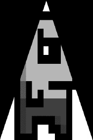

**图 7-13.**  将 Bob 的纹理映射到我们的三角形上

最后还有一件事我们尚未提及，但非常重要：

我们加载的所有位图的宽度和高度都必须是 2 的幂。

请务必遵守这一点，否则会出现问题。

这到底意味着什么呢？我们在示例中使用的 Bob 图像大小为 128×128 像素。128 是 2 的 7 次方（2×2×2×2×2×2×2）。其他有效的图像尺寸包括 2×8、32×16、128×256 等等。我们的图像大小也存在限制。遗憾的是，这个限制取决于我们应用程序运行的硬件。OpenGL ES 1.x 标准并未规定支持的最小纹理尺寸；不过，根据经验，512×512 像素的纹理在所有当前的 Android 设备上都能正常工作（并且很可能也能在未来的所有设备上正常工作）。我们甚至可以说，1024×1024 的纹理也是可以的。

到目前为止，我们几乎忽略的另一个问题是纹理的颜色深度。幸运的是，我们用来将图像数据上传到 GPU 的 `GLUtils.texImage2D()` 方法为我们很好地处理了这个问题。OpenGL ES 可以处理 RGBA8888、RGB565 等颜色深度。我们应该始终使用尽可能低的颜色深度，以减少带宽。为此，我们可以像前面章节那样，使用 `BitmapFactory.Options` 类，例如，将 RGB888 的 `Bitmap` 在内存中加载为 RGB565 的 `Bitmap`。一旦我们以所需的颜色深度加载了 `Bitmap` 实例，`GLUtils.texImage2D()` 就会接管并确保 OpenGL ES 以正确的格式获取图像数据。当然，你应该始终检查降低颜色深度是否对你的游戏的视觉效果产生了负面影响。


### 纹理类

为了减少后续示例所需的代码，我们编写了一个名为 `Texture` 的辅助类。它会从资源中加载位图并据此创建纹理对象。该类还提供了一些便捷方法，用于绑定纹理和释放纹理。清单 7–8 展示了相关代码。

**清单 7–8.** `Texture.java`，一个简易的 OpenGL ES 纹理类

```
package com.badlogic.androidgames.framework.gl;

import java.io.IOException;
import java.io.InputStream;

import javax.microedition.khronos.opengles.GL10;

import android.graphics.Bitmap;
import android.graphics.BitmapFactory;
import android.opengl.GLUtils;

import com.badlogic.androidgames.framework.FileIO;
import com.badlogic.androidgames.framework.impl.GLGame;
import com.badlogic.androidgames.framework.impl.GLGraphics;

public class Texture {
    GLGraphics glGraphics;
    FileIO fileIO;
    String fileName;
    int textureId;
    int minFilter;
    int magFilter;

    public Texture(GLGame glGame, String fileName) {
        this.glGraphics = glGame.getGLGraphics();
        this.fileIO = glGame.getFileIO();
        this.fileName = fileName;
        load();
    }

    private void load() {
        GL10 gl = glGraphics.getGL();
        int[] textureIds = new int[1];
        gl.glGenTextures(1, textureIds, 0);
        textureId = textureIds[0];

        InputStream in = null;
        try {
            in = fileIO.readAsset(fileName);
            Bitmap bitmap = BitmapFactory.decodeStream(in);
            gl.glBindTexture(GL10.GL_TEXTURE_2D, textureId);
            GLUtils.texImage2D(GL10.GL_TEXTURE_2D, 0, bitmap, 0);
            setFilters(GL10.GL_NEAREST, GL10.GL_NEAREST);            
            gl.glBindTexture(GL10.GL_TEXTURE_2D, 0);
        } catch (IOException e) {
            throw new RuntimeException("Couldn't load texture '" + fileName +"'", e);
        } finally {
            if (in != null)
                try { in.close(); } catch (IOException e) { }
        }
    }

    public void reload() {
        load();
        bind();
        setFilters(minFilter, magFilter);        
        glGraphics.getGL().glBindTexture(GL10.GL_TEXTURE_2D, 0);
    }

    public void setFilters(int minFilter, int magFilter) {
        this.minFilter = minFilter;
        this.magFilter = magFilter;
        GL10 gl = glGraphics.getGL();
        gl.glTexParameterf(GL10.GL_TEXTURE_2D, GL10.GL_TEXTURE_MIN_FILTER, minFilter);
        gl.glTexParameterf(GL10.GL_TEXTURE_2D, GL10.GL_TEXTURE_MAG_FILTER, magFilter);
    }    

    public void bind() {
        GL10 gl = glGraphics.getGL();
        gl.glBindTexture(GL10.GL_TEXTURE_2D, textureId);
    }

    public void dispose() {
        GL10 gl = glGraphics.getGL();
        gl.glBindTexture(GL10.GL_TEXTURE_2D, textureId);
        int[] textureIds = { textureId };
        gl.glDeleteTextures(1, textureIds, 0);
    }
}
```

这个类唯一值得注意的地方是 `reload()` 方法，当 OpenGL ES 上下文丢失时我们可以使用它。另外需要注意的是，`setFilters()` 方法仅在 `Texture` 实际绑定时才会生效，否则它设置的是当前绑定纹理的过滤模式。

我们也可以为顶点缓冲区编写一个小的辅助方法。但在此之前，我们还需要讨论另一个内容：索引顶点。

### 索引顶点：重用对你有利

到目前为止，我们始终用顶点列表定义三角形，每个三角形都有一组自己的顶点。实际上我们只绘制过单个三角形，但增加更多三角形并非难事。

然而，在某些情况下，两个或多个三角形可以共享一些顶点。想想看，基于我们目前的知识，如何渲染一个矩形？我们只需定义两个三角形，它们会有两个位置、颜色和纹理坐标都相同的顶点。我们可以做得更好。图 7–14 展示了渲染矩形的旧方式和新方式。

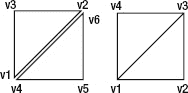

**图 7–14.** 用六个顶点将矩形渲染为两个三角形（左），以及用四个顶点渲染它（右）

我们不再重复使用顶点 v4 和 v6 来复制顶点 v1 和 v2，而是只定义这些顶点各一次。在这种情况下，我们仍然渲染两个三角形，但显式告诉 OpenGL ES 每个三角形使用哪些顶点（即，第一个三角形使用 v1、v2 和 v3，第二个三角形使用 v3、v4 和 v1）。每个三角形使用的顶点是通过顶点数组中的索引定义的。数组中的第一个顶点索引为 0，第二个顶点索引为 1，依此类推。对于前面的矩形，我们会有一个如下所示的索引列表：

```
short[] indices = { 0, 1, 2,
                    2, 3, 0  };
```

顺便提一下，OpenGL ES 要求我们将索引指定为 short 类型（这并不完全正确；我们也可以使用 byte 类型）。然而，与顶点数据类似，我们不能直接将 short 数组传递给 OpenGL ES，它需要一个直接的 `ShortBuffer`。我们已经知道如何处理这个问题了。

```
ByteBuffer byteBuffer = ByteBuffer.allocate(indices.length * 2);
byteBuffer.order(ByteOrder.nativeOrder());
ShortBuffer shortBuffer = byteBuffer.asShortBuffer();
shortBuffer.put(indices);
shortBuffer.flip();
```

一个 short 需要 2 字节的内存，因此我们为 `ShortBuffer` 分配 `indices.length` × 2 字节。我们再次将字节顺序设为本机字节序，并获取一个 `ShortBuffer` 视图，以便更轻松地操作底层的 `ByteBuffer`。剩下的工作就是将索引放入 `ShortBuffer`，然后翻转它，以便正确设置限制和位置。

如果我们想用两个索引三角形将 Bob 绘制成一个矩形，我们可以这样定义顶点：

```
ByteBuffer byteBuffer = ByteBuffer.allocateDirect(4 * VERTEX_SIZE);
byteBuffer.order(ByteOrder.nativeOrder());
vertices = byteBuffer.asFloatBuffer();
vertices.put(new float[] {  100.0f, 100.0f, 0.0f, 1.0f,
                            228.0f, 100.0f, 1.0f, 1.0f,
                            228.0f, 229.0f, 1.0f, 0.0f,
                            100.0f, 228.0f, 0.0f, 0.0f });
vertices.flip();
```

顶点的顺序与图 7–13 右侧完全相同。我们通过常规的 `glEnableClientState()` 和 `glVertexPointer()`/`glTexCoordPointer()` 调用，告诉 OpenGL ES 我们的顶点具有位置和纹理坐标，以及在哪里可以找到这些顶点属性。唯一的区别在于我们绘制两个三角形时调用的方法。

```
gl.glDrawElements(GL10.GL_TRIANGLES, 6, GL10.GL_UNSIGNED_SHORT, indices);
```

这个方法实际上与 `glDrawArrays()` 非常相似。第一个参数指定了我们想要渲染的图元类型——在本例中是一个三角形列表。下一个参数指定了我们想要使用的顶点数量，在本例中等于六。第三个参数指定了索引的类型——我们指定为 unsigned short。请注意，Java 没有无符号类型；但是，考虑到有符号数的补码编码，使用一个实际上包含有符号 short 的 `ShortBuffer` 是没问题的。最后一个参数是我们的 `ShortBuffer`，它包含六个索引。

那么，OpenGL ES 会做什么呢？它知道我们想要渲染三角形；它知道我们想要渲染两个三角形，因为我们指定了六个顶点；但 OpenGL ES 不会按顺序从顶点数组中取出六个顶点，而是按顺序遍历索引缓冲区，并使用它索引到的顶点。


#### 综合分析

将上述各部分整合后，我们得到 代码清单 7–9 中的代码。

**代码清单 7–9.** *IndexedTest.java 节选；绘制两个索引三角形*

```
class IndexedScreen extends Screen {
    final int VERTEX_SIZE = (2 + 2) * 4;
    GLGraphics glGraphics;
    FloatBuffer vertices;   
    ShortBuffer indices;
    Texture texture;

    public IndexedScreen(Game game) {
        super(game);
        glGraphics = ((GLGame) game).getGLGraphics();

        ByteBuffer byteBuffer = ByteBuffer.allocateDirect(4 * VERTEX_SIZE);
        byteBuffer.order(ByteOrder.nativeOrder());
        vertices = byteBuffer.asFloatBuffer();
        vertices.put(new float[] {  100.0f, 100.0f, 0.0f, 1.0f,
                                    228.0f, 100.0f, 1.0f, 1.0f,
                                    228.0f, 228.0f, 1.0f, 0.0f,
                                    100.0f, 228.0f, 0.0f, 0.0f });
        vertices.flip();

        byteBuffer = ByteBuffer.allocateDirect(6 * 2);
        byteBuffer.order(ByteOrder.nativeOrder());
        indices = byteBuffer.asShortBuffer();
        indices.put(new short[] { 0, 1, 2,
                                  2, 3, 0 });
        indices.flip();

        texture = new Texture((GLGame)game, "bobrgb888.png");
    }         

    @Override
    public void present(float deltaTime) {
        GL10 gl = glGraphics.getGL();
        gl.glViewport(0, 0, glGraphics.getWidth(), glGraphics.getHeight());            
        gl.glClear(GL10.GL_COLOR_BUFFER_BIT);
        gl.glMatrixMode(GL10.GL_PROJECTION);
        gl.glLoadIdentity();
        gl.glOrthof(0, 320, 0, 480, 1, -1);

        gl.glEnable(GL10.GL_TEXTURE_2D);
        texture.bind();

        gl.glEnableClientState(GL10.GL_TEXTURE_COORD_ARRAY);            
        gl.glEnableClientState(GL10.GL_VERTEX_ARRAY);

        vertices.position(0);
        gl.glVertexPointer(2, GL10.GL_FLOAT, VERTEX_SIZE, vertices);                                   
        vertices.position(2);
        gl.glTexCoordPointer(2, GL10.GL_FLOAT, VERTEX_SIZE, vertices);

        gl.glDrawElements(GL10.GL_TRIANGLES, 6, GL10.GL_UNSIGNED_SHORT, indices);
    }
}
```

请注意我们使用了强大的 `Texture` 类，这大大减少了代码量。图 7–15 展示了输出结果，以及鲍勃的辉煌形象。

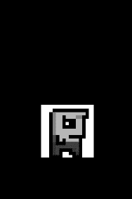

**图 7–15.** *索引化后的鲍勃*

现在，这与我们使用 `Canvas` 的方式已经非常接近了。同时，我们拥有了更大的灵活性，因为不再局限于与坐标轴对齐的矩形。

这个示例涵盖了目前我们需要了解的有关顶点的所有内容。我们看到，每个顶点必须至少包含一个位置，并且可以附带其他属性，例如颜色（以四个 RGBA 浮点值表示）和纹理坐标。我们还看到，可以通过索引来复用顶点，以避免重复。这能带来一定的性能提升，因为 OpenGL ES 不必将多于必要数量的顶点与投影矩阵和模型视图矩阵相乘（再次说明，这种说法并不完全准确，但我们姑且据此理解）。

#### Vertices 类

让我们创建一个 `Vertices` 类，使代码编写更简单。这个类能够容纳最大数量的顶点，并可选地容纳用于渲染的索引。它还应负责启用渲染所需的所有状态，并在渲染完成后清理这些状态，以便其他代码能够依赖一组干净的 OpenGL ES 状态。代码清单 7–10 展示了我们易于使用的 `Vertices` 类。

**代码清单 7–10.** *Vertices.java；封装（索引化）顶点*

```
package com.badlogic.androidgames.framework.gl;

import java.nio.ByteBuffer;
import java.nio.ByteOrder;
import java.nio.FloatBuffer;
import java.nio.ShortBuffer;

import javax.microedition.khronos.opengles.GL10;

import com.badlogic.androidgames.framework.impl.GLGraphics;

public class Vertices {
    final GLGraphics glGraphics;
    final boolean hasColor;
    final boolean hasTexCoords;
    final int vertexSize;
    final FloatBuffer vertices;
    final ShortBuffer indices;
}
```

`Vertices` 类持有一个 `GLGraphics` 实例的引用，这样我们在需要时就能获取 `GL10` 实例。我们还存储了顶点是否拥有颜色和纹理坐标的信息。这提供了极大的灵活性，因为我们可以选择渲染所需的最少属性集。此外，我们还存储了一个用于保存顶点的 `FloatBuffer` 和一个用于保存可选索引的 `ShortBuffer`。

```
    public Vertices(GLGraphics glGraphics, int maxVertices, int maxIndices, boolean hasColor, boolean hasTexCoords) {
        this.glGraphics = glGraphics;
        this.hasColor = hasColor;
        this.hasTexCoords = hasTexCoords;
        this.vertexSize = (2 + (hasColor?4:0) + (hasTexCoords?2:0)) * 4;

        ByteBuffer buffer = ByteBuffer.allocateDirect(maxVertices * vertexSize);
        buffer.order(ByteOrder.nativeOrder());
        vertices = buffer.asFloatBuffer();

        if(maxIndices > 0) {
            buffer = ByteBuffer.allocateDirect(maxIndices * Short.SIZE / 8);
            buffer.order(ByteOrder.nativeOrder());
            indices = buffer.asShortBuffer();
        } else {
            indices = null;
        }            
    }
```

在构造函数中，我们指定了 `Vertices` 实例最多能容纳的顶点数和索引数，以及顶点是否包含颜色或纹理坐标。在构造函数内部，我们据此设置成员变量并实例化缓冲区。请注意，如果 `maxIndices` 为零，则 `ShortBuffer` 会被设置为 `null`。在这种情况下，渲染将以非索引的方式进行。

```
    public void setVertices(float[] vertices, int offset, int length) {
        this.vertices.clear();
        this.vertices.put(vertices, offset, length);
        this.vertices.flip();
    }

    public void setIndices(short[] indices, int offset, int length) {
        this.indices.clear();
        this.indices.put(indices, offset, length);
        this.indices.flip();
    }
```

接下来是 `setVertices()` 和 `setIndices()` 方法。如果 `Vertices` 实例没有存储索引，后者会抛出一个 `NullPointerException`。我们只需清空缓冲区并复制数组的内容。

```
    public void draw(int primitiveType, int offset, int numVertices) {
        GL10 gl = glGraphics.getGL();

        gl.glEnableClientState(GL10.GL_VERTEX_ARRAY);
        vertices.position(0);
        gl.glVertexPointer(2, GL10.GL_FLOAT, vertexSize, vertices);

        if(hasColor) {
            gl.glEnableClientState(GL10.GL_COLOR_ARRAY);
            vertices.position(2);
            gl.glColorPointer(4, GL10.GL_FLOAT, vertexSize, vertices);
        }
```


`if (hasTexCoords) {`
`    gl.glEnableClientState(GL10.GL_TEXTURE_COORD_ARRAY);`
`    vertices.position(hasColor?6:2);`
`    gl.glTexCoordPointer(2, GL10.GL_FLOAT, vertexSize, vertices);`
`}`

`if (indices != null) {`
`    indices.position(offset);`
`    gl.glDrawElements(primitiveType, numVertices, GL10.GL_UNSIGNED_SHORT, indices);`
`} else {`
`    gl.glDrawArrays(primitiveType, offset, numVertices);`
`}`

`if (hasTexCoords)`
`    gl.glDisableClientState(GL10.GL_TEXTURE_COORD_ARRAY);`

`if (hasColor)`
`    gl.glDisableClientState(GL10.GL_COLOR_ARRAY);`
`}`

`Vertices` 类的最后一个方法是 `draw()`。它接收图元类型（例如 `GL10.GL_TRIANGLES`）、顶点缓冲区（若使用索引则为索引缓冲区）的偏移量，以及用于渲染的顶点数量。根据顶点是否包含颜色和纹理坐标，我们启用相应的 OpenGL ES 状态，并告知 OpenGL ES 数据的位置。当然，对于始终需要的顶点位置，我们也进行同样的操作。根据是否使用索引，我们调用 `glDrawElements()` 或 `glDrawArrays()`，并传入方法接收的参数。请注意，`offset` 参数也可用于索引渲染：我们只需相应地设置索引缓冲区的位置，使 OpenGL ES 从此偏移量开始读取索引，而非从索引缓冲区的第一个索引开始。我们在 `draw()` 方法中做的最后一件事是清理一点 OpenGL ES 状态。如果顶点具有这些属性，我们调用 `glDisableClientState()`，并传入 `GL10.GL_COLOR_ARRAY` 或 `GL10.GL_TEXTURE_COORD_ARRAY`。我们需要这样做，因为另一个 `Vertices` 实例可能不使用这些属性。如果渲染那个 `Vertices` 实例，OpenGL ES 仍会查找颜色和/或纹理坐标。

我们可以用以下代码片段替换前面示例构造函数中所有繁琐的代码：

```
Vertices vertices = new Vertices(glGraphics, 4, 6, false, true);
vertices.setVertices(new float[] { 100.0f, 100.0f, 0.0f, 1.0f,
                                   228.0f, 100.0f, 1.0f, 1.0f,
                                   228.0f, 228.0f, 1.0f, 0.0f,
                                   100.0f, 228.0f, 0.0f, 0.0f }, 0, 16);
vertices.setIndices(new short[] { 0, 1, 2, 2, 3, 0 }, 0, 6);
```

同样，我们可以将所有用于设置顶点属性数组和渲染的调用替换为下列单一调用：

```
vertices.draw(GL10.GL_TRIANGLES, 0, 6);
```

结合我们的 `Texture` 类，我们现在为所有 2D OpenGL ES 渲染打下了相当不错的基础。然而，为了完全复现 `Canvas` 的所有渲染能力，我们仍然缺少混合功能。让我们来探讨一下。

## Alpha 混合：我能看穿你

在 OpenGL ES 中启用 Alpha 混合相当容易。我们只需要两个方法调用：

```
gl.glEnable(GL10.GL_BLEND);
gl.glBlendFunc(GL10.GL_SRC_ALPHA, GL10.GL_ONE_MINUS_SRC_ALPHA);
```

第一个方法调用应该很熟悉：它只是告诉 OpenGL ES，从此刻起，它应该对渲染的所有三角形应用 Alpha 混合。第二个方法稍微复杂一些。它指定了源颜色和目标颜色应如何组合。如果你还记得我们在第 3 章讨论的内容，源颜色和目标颜色的组合方式由一个简单的混合方程控制。`glBlendFunc()` 方法只是告诉 OpenGL ES 使用哪种方程。前面的参数指定我们希望源颜色与目标颜色完全按照第 3 章中混合方程指定的方式混合。这与 `Canvas` 为混合 `Bitmap` 的方式相同。

OpenGL ES 中的混合功能相当强大且复杂，还有很多细节。不过，对于我们的目的，我们可以忽略所有这些细节，只需在想要将三角形与帧缓冲区混合时使用上面的混合函数即可——这与我们使用 `Canvas` 混合 `Bitmap` 的方式相同。

第二个问题是源颜色和目标颜色来自哪里。后者很容易解释：它是帧缓冲区中我们将要用绘制的三角形覆盖的像素颜色。源颜色实际上是两种颜色的组合。

> *顶点颜色*：这是通过 `glColor4f()` 为所有顶点指定的颜色，或者通过向每个顶点添加颜色属性来指定的每个顶点颜色。
>
> *纹素颜色*：如前所述，纹素是纹理中的一个像素。当使用映射到其上的纹理渲染三角形时，OpenGL ES 会将纹素颜色与三角形每个像素的顶点颜色混合。

因此，如果我们的三角形没有纹理映射，用于混合的源颜色就等于顶点颜色。如果三角形有纹理映射，三角形每个像素的源颜色是顶点颜色和纹素颜色的混合。我们可以使用 `glTexEnv()` 方法指定顶点颜色和纹素颜色如何组合。默认是将顶点颜色与纹素颜色进行*调制*，这基本上意味着两种颜色按分量相乘（顶点 r × 纹素 r，依此类推）。对于本书中的所有用例，这正是我们想要的，因此我们不会深入探讨 `glTexEnv()`。在某些非常特殊的情况下，您可能想要更改顶点颜色和纹素颜色的组合方式。与 `glBlendFunc()` 一样，我们将忽略细节，只使用默认设置。

当我们加载一个没有 Alpha 通道的纹理图像时，OpenGL ES 会自动假设每个像素的 Alpha 值为 1。如果我们加载 RGBA8888 格式的图像，OpenGL ES 会很乐意使用提供的 Alpha 值进行混合。

对于顶点颜色，我们必须始终指定一个 Alpha 分量，要么通过 `glColor4f()`（最后一个参数是 Alpha 值），要么通过为每个顶点指定四个分量（同样，最后一个分量是 Alpha 值）。

让我们用一个简短的例子来实践一下。我们希望绘制两次 `Bob`：第一次使用没有每个像素 Alpha 通道的图像 `bobrgb888.png`，第二次使用包含 Alpha 信息的图像 `bobargb8888.png`。请注意，PNG 图像实际上以 ARGB8888 格式存储像素，而非 RGBA8888。幸运的是，我们用于上传纹理图像数据的 `GLUtils.texImage2D()` 方法会自动为我们进行转换。清单 7-11 展示了我们使用 `Texture` 和 `Vertices` 类进行的小实验的代码。

**清单 7-11.** *摘自 BlendingTest.java；混合实战*


### `BlendingScreen` 类实现

`BlendingScreen`实现了`Screen`，并包含以下成员：
- `GLGraphics glGraphics`
- `Vertices vertices`
- `Texture textureRgb`
- `Texture textureRgba`

```java
public BlendingScreen(Game game) {
    super(game);
    glGraphics = ((GLGame)game).getGLGraphics();

    textureRgb = new Texture((GLGame)game, "bobrgb888.png");
    textureRgba = new Texture((GLGame)game, "bobargb8888.png");

    vertices = new Vertices(glGraphics, 8, 12, true, true);
    float[] rects = new float[] {
            100, 100, 1, 1, 1, 0.5f, 0, 1,
            228, 100, 1, 1, 1, 0.5f, 1, 1,
            228, 228, 1, 1, 1, 0.5f, 1, 0,
            100, 228, 1, 1, 1, 0.5f, 0, 0,

            100, 300, 1, 1, 1, 1, 0, 1,
            228, 300, 1, 1, 1, 1, 1, 1,
            228, 428, 1, 1, 1, 1, 1, 0,
            100, 428, 1, 1, 1, 1, 0, 0

    };
    vertices.setVertices(rects, 0, rects.length);
    vertices.setIndices(new short[] {0, 1, 2, 2, 3, 0,
                                    4, 5, 6, 6, 7, 4 }, 0, 12);
}
```

`BlendingScreen`持有一个`Vertices`实例来存储两个矩形，以及两个`Texture`实例——一个保存 Bob 的 RGBA8888 图像，另一个保存 RGB888 版本。在构造函数中，我们从文件`bobrgb888.png`和`bobargb8888.png`加载了两个纹理，并依赖`Texture`类和`GLUtils.texImag2D()`将 ARGB8888 PNG 转换为 OpenGL ES 所需的 RGBA8888 格式。接下来，我们定义了顶点和索引。第一个矩形（由四个顶点组成）映射到 Bob 的 RGB888 纹理。第二个矩形映射到 Bob 的 RGBA8888 版本，并在 RGB888 Bob 矩形上方 200 个单位处渲染。注意，第一个矩形的所有顶点颜色为`(1,1,1,0.5f)`，而第二个矩形的顶点颜色为`(1,1,1,1)`。

```java
@Override
public void present(float deltaTime) {
    GL10 gl = glGraphics.getGL();
    gl.glViewport(0, 0, glGraphics.getWidth(), glGraphics.getHeight());
    gl.glClearColor(1,0,0,1);
    gl.glClear(GL10.GL_COLOR_BUFFER_BIT);
    gl.glMatrixMode(GL10.GL_PROJECTION);
    gl.glLoadIdentity();
    gl.glOrthof(0, 320, 0, 480, 1, -1);

    gl.glEnable(GL10.GL_BLEND);
    gl.glBlendFunc(GL10.GL_SRC_ALPHA, GL10.GL_ONE_MINUS_SRC_ALPHA);

    gl.glEnable(GL10.GL_TEXTURE_2D);
    textureRgb.bind();
    vertices.draw(GL10.GL_TRIANGLES, 0, 6);

    textureRgba.bind();
    vertices.draw(GL10.GL_TRIANGLES, 6, 6);
}
```

在`present()`方法中，我们用红色清除屏幕，并按常规设置投影矩阵。接着，我们启用 Alpha 混合并设置正确的混合方程。最后，我们启用纹理映射并渲染两个矩形。第一个矩形使用 RGB888 纹理渲染，第二个矩形使用 RGBA8888 纹理渲染。我们将两个矩形存储在同一个`Vertices`实例中，因此使用`vertices.draw()`方法的偏移量。图 7–16 展示了这个小例子的输出结果。

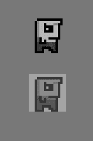

**图 7–16.** *Bob：顶点颜色混合（底部）和纹理混合（顶部）*

对于 RGB888 Bob，混合是通过每个顶点颜色的 Alpha 值执行的。由于我们将这些值设为 0.5f，Bob 呈现 50%的半透明效果。

对于 RGBA8888 Bob，每个顶点的颜色 Alpha 值均为 1。然而，由于该纹理的背景像素 Alpha 值为 0，且顶点与纹素颜色经过调制，Bob 的这个版本的背景消失了。如果我们也将每个顶点颜色的 Alpha 值设为 0.5f，那么 Bob 本身也会像屏幕底部的副本一样呈现 50%的半透明效果。图 7–17 展示了这种情况的效果。

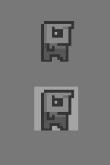

**图 7–17.** *RGBA8888 Bob 的另一种版本，使用 0.5f 的每顶点 Alpha 值（屏幕顶部）*

以上就是我们在 2D 中使用 OpenGL ES 进行混合所需了解的全部内容。

然而，还有一点非常重要：**混合的开销很大**！说真的，不要过度使用。当前的移动 GPU 在混合大量像素方面表现并不出色。只有在绝对必要时才应使用混合。

## 更多图元：点、线、条带和扇形

当我们说 OpenGL ES 是一个庞大、粗糙的三角形渲染机器时，我们并没有 100%说实话；实际上，OpenGL ES 还可以渲染点和线。最重要的是，它们也是通过顶点定义的，因此上述所有内容（纹理、每顶点颜色等）同样适用。我们只需要在调用`glDrawArrays()`/`glDrawElements()`时使用`GL10.GL_TRIANGLES`以外的其他类型，即可渲染这些图元。我们也可以对这些图元进行索引渲染，尽管这有点多余（至少在点的情况下）。图 7–18 列出了 OpenGL ES 提供的所有图元类型。

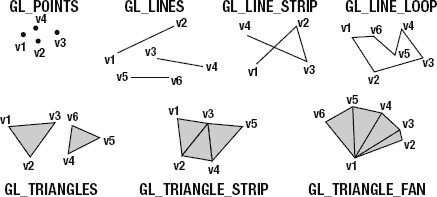

**图 7–18.** *OpenGL ES 可以渲染的所有图元*

让我们快速了解所有这些图元：

> - **点**：每个顶点本身就是一个图元。
> - **线**：一条线由两个顶点组成。与三角形一样，我们可以用 2 × *n*个顶点定义*n*条线。
> - **线带**：所有顶点被解释为属于一条长线的连续部分。
> - **线环**：与线带类似，区别在于 OpenGL ES 会自动从最后一个顶点到第一个顶点绘制一条额外的线。
> - **三角形**：我们已经知道这一点。每个三角形由三个顶点组成。
> - **三角形条带**：无需指定三个顶点，只需指定*三角形数量* + 1 个顶点。OpenGL ES 将从顶点(v1,v2,v3)构造第一个三角形，从顶点(v2,v3,v4)构造下一个三角形，依此类推。
> - **三角形扇形**：有一个基顶点(v1)被所有三角形共享。第一个三角形为(v1,v2,v3)，下一个三角形为(v1,v3,v4)，依此类推。

三角形条带和扇形的灵活性略低于纯三角形列表。但它们可以带来一定的性能提升，因为需要乘以投影矩阵和模型视图矩阵的顶点更少。不过，在我们的所有代码中，我们将坚持使用三角形列表，因为它们更易于使用，并且通过使用索引也可以实现类似的性能。

OpenGL ES 中的点和线有点特殊。当我们使用像素完美的正交投影时（例如，屏幕分辨率为 320×480 像素，并且`glOrthof()`调用使用了这些精确值），我们仍然无法在所有情况下获得像素完美的渲染。由于所谓的**菱形退出规则**，点和线顶点的位置需要偏移 0.375f。如果你要渲染像素完美的点和线，请记住这一点。我们已经看到类似的情况也适用于三角形。然而，鉴于我们在 2D 中通常绘制矩形，我们不会遇到这个问题。

既然渲染除`GL10.GL_TRIANGLES`以外的图元只需使用图 7–17 中的其他常量之一，我们就不再提供示例程序了。我们大部分时间将坚持使用三角形列表，尤其是在进行 2D 图形编程时。

现在，让我们深入探讨 OpenGL ES 为我们提供的另一项功能：万能的模型视图矩阵！


## 二维变换：模型-视图矩阵的乐趣

到目前为止，我们所做的所有工作只是以三角形列表的形式定义了静态几何体。没有任何移动、旋转或缩放。此外，即使顶点数据本身保持不变（例如，由两个三角形组成的矩形的宽度和高度，以及纹理坐标和颜色），如果我们想在多个位置绘制同一个矩形，我们还是不得不复制顶点。回顾一下清单 7-11，暂时忽略顶点的颜色属性。两个矩形仅在 y 坐标上相差 200 个单位。如果我们有一种方法可以在不实际改变顶点值的情况下移动它们，我们只需定义鲍勃的矩形一次，然后就能在不同的位置绘制他——而这正是我们使用模型-视图矩阵的方式。

### 世界空间与模型空间

要理解其工作原理，我们必须跳出我们那个小小的正交视景体来思考。我们的视景体位于一个称为*世界空间*的特殊坐标系中。这是我们所有顶点最终会聚集的空间。

到目前为止，我们都是以相对于这个世界空间原点的绝对坐标来指定所有顶点位置的（对照图 7-5）。我们真正想要的是让我们顶点的位置定义独立于这个世界空间坐标系。我们可以通过为每个模型（例如，鲍勃的矩形、一艘宇宙飞船等）赋予其自身的坐标系来实现这一点。

这就是我们通常所说的*模型空间*，即我们定义模型顶点位置的坐标系。图 7-19 在二维中展示了这一概念，同样的规则也适用于三维（只需添加一个 z 轴）。

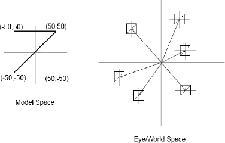

**图 7-19.** *在模型空间中定义模型，复用它，并在世界空间的不同位置渲染它*

在图 7-19 中，我们有一个通过`Vertices`实例定义的模型——例如，像这样：

```
Vertices vertices = new Vertices(glGraphics, 4, 12, false, false);
vertices.setVertices(new float[] { -50, -50,
                                   50, -50,
                                   50,  50,
                                  -50,  50 }, 0, 8);
vertices.setIndices(new short[] {0, 1, 2, 2, 3, 0}, 0, 6);
```

为了便于讨论，我们先忽略任何顶点颜色或纹理坐标。现在，当我们渲染这个模型而不做任何额外修改时，它将被放置在我们最终图像中世界空间的原点附近。如果我们想在一个不同的位置渲染它——比如，它的中心位于世界空间中的 (200,300) ——我们可以像这样重新定义顶点位置：

```
vertices.setVertices(new float[] { -50 + 200, -50 + 300,
                                   50 + 200, -50 + 300,
                                   50 + 200,  50 + 300,
                                  -50 + 200,  50 + 300 }, 0, 8);
```

在下次调用 `vertices.draw()` 时，模型将以 (200,300) 为中心进行渲染，但这有点繁琐，不是吗？

### 再次认识矩阵

还记得我们之前简要讨论过的矩阵吗？我们讨论过矩阵如何编码变换，例如平移（移动物体）、旋转和缩放。我们用来将顶点投影到投影平面上的投影矩阵编码了一种特殊类型的变换：投影。

矩阵是更优雅地解决我们之前问题的关键。我们无需通过重新定义来手动移动顶点位置，只需设置一个编码了平移的矩阵即可。由于 OpenGL ES 的投影矩阵已经被我们通过 `glOrthof()` 指定的正交图形投影矩阵占用，我们将使用另一个 OpenGL ES 矩阵：模型-视图矩阵。以下是我们如何将模型的原点移动到眼睛/世界空间中特定位置的方法：

```
gl.glMatrixMode(GL10.GL_MODELVIEW);
gl.glLoadIdentity();
gl.glTranslatef(200, 300, 0);
vertices.draw(GL10.GL_TRIANGLES, 0, 6);
```

我们首先必须告诉 OpenGL ES 我们要操作哪个矩阵。在我们的例子中，是模型-视图矩阵，由常量 `GL10.GL_MODELVIEW` 指定。接下来，我们确保模型-视图矩阵被设置为单位矩阵。基本上，我们只是覆盖了其中已有的任何内容——我们可以理解为清除了该矩阵。接下来调用的方法就是神奇发生的地方。

`glTranslatef()` 方法接受三个参数：沿 x 轴、y 轴和 z 轴的平移量。由于我们希望模型的中心位于眼睛/世界空间的 (200,300)，我们指定一个沿 x 轴平移 200 单位，沿 y 轴平移 300 单位。因为我们在二维空间中工作，我们简单忽略 z 轴并将其平移分量设为零。我们没有为顶点指定 z 坐标，因此它们默认为零。零加零等于零，所以我们的顶点将保持在 x-y 平面内。

从此刻起，OpenGL ES 的模型-视图矩阵编码了一个平移 (200,300,0)，这个平移将被应用于所有通过 OpenGL ES 管线的顶点。如果你回顾一下图 7-4，你会看到 OpenGL ES 首先将每个顶点与模型-视图矩阵相乘，然后应用投影矩阵。直到现在，模型-视图矩阵都被设置为单位矩阵（OpenGL ES 的默认值）；因此，它之前对我们的顶点没有影响。我们的小小 `glTranslatef()` 调用改变了这一点，它将在所有顶点被投影之前首先移动它们。

当然，这是即时完成的；我们的 `Vertices` 实例中的值完全没有改变。如果 `Vertices` 实例有任何永久性改变，我们早就注意到了，因为按照这个逻辑，投影矩阵可能早就改变了它。

### 使用平移的初步示例

我们可以用平移做什么？假设我们想在世界中的不同位置渲染 100 个鲍勃。此外，我们希望他们在屏幕上移动，并在每次碰到屏幕边缘（更准确地说，是我们平行投影视景体的某个平面，该平面与屏幕的边界重合）时改变方向。我们可以通过创建一个大的 `Vertices` 实例来容纳 100 个矩形的顶点（每个鲍勃一个），并逐帧重新计算顶点位置来实现。更简单的方法是，使用一个小的 `Vertices` 实例，它只保存一个矩形（鲍勃模型），并通过使用模型-视图矩阵即时平移它来复用。让我们定义我们的鲍勃模型。

```
Vertices bobModel = new Vertices(glGraphics, 4, 12, false, true);
bobModel.setVertices(new float[] { -16, -16, 0, 1,
                                   16, -16, 1, 1,
                                   16,  16, 1, 0,
                                  -16,  16, 0, 0, }, 0, 8);
bobModel.setIndices(new short[] {0, 1, 2, 2, 3, 0}, 0, 6);
```

所以，每个鲍勃的大小是 32×32 单位。我们还为他添加了纹理映射——我们将使用 `bobrgb888.png` 来查看每个鲍勃的边界。


#### Bob 成为一个类

让我们定义一个简单的 `Bob` 类。它将负责保存 `Bob` 的位置，并根据增量时间在其当前方向上推进位置，就像我们推进 Nom 先生一样（区别在于我们不再在网格中移动）。`update()` 方法还将确保 Bob 不会逃离我们的视景体边界。代码清单 7–12 展示了 `Bob` 类。

**代码清单 7–12.** *Bob.java*

```
package com.badlogic.androidgames.glbasics;

import java.util.Random;

class Bob {
    static final Random rand = new Random();
    public float x, y;
    float dirX, dirY;

    public Bob() {
        x = rand.nextFloat() * 320;
        y = rand.nextFloat() * 480;
        dirX = 50;
        dirY = 50;
    }

    public void update(float deltaTime) {
        x = x + dirX * deltaTime;
        y = y + dirY * deltaTime;

        if (x < 0) {
            dirX = -dirX;
            x = 0;
        }

        if (x > 320) {
            dirX = -dirX;
            x = 320;
        }

        if (y < 0) {
            dirY = -dirY;
            y = 0;
        }

        if (y > 480) {
            dirY = -dirY;
            y = 480;
        }
    }
}
```

每个 `Bob` 在构造时都会将自身放置在世界的随机位置。所有 `Bob` 初始时都朝同一方向移动：每秒向右 50 个单位、向上 50 个单位（因为我们乘以了 `deltaTime`）。在 `update()` 方法中，我们简单地基于时间在 Bob 的当前方向上推进他，然后检查他是否超出了视锥体边界。如果是，我们就反转他的方向，并确保他仍位于视锥体内。

现在假设我们实例化了 100 个 `Bob`，如下所示：

```
Bob[] bobs = new Bob[100];
for (int i = 0; i < 100; i++) {
    bobs[i] = new Bob();
}
```

要渲染每个 `Bob`，我们会这样做（假设我们已经清除了屏幕、设置了投影矩阵并绑定了纹理）：

```
gl.glMatrixMode(GL10.GL_MODELVIEW);
for (int i = 0; i < 100; i++) {
    bob.update(deltaTime);
    gl.glLoadIdentity();
    gl.glTranslatef(bobs[i].x, bobs[i].y, 0);
    bobModel.render(GL10.GL_TRIANGLES, 0, 6);
}
```

这相当简洁，不是吗？对于每个 `Bob`，我们调用他的 `update()` 方法，该方法会推进他的位置并确保他保持在我们的微小世界边界内。接下来，我们将一个单位矩阵加载到 OpenGL ES 的模型视图矩阵中，这样我们就有一个干净的起点。然后，我们在调用 `glTranslatef()` 时使用当前 `Bob` 的 x 和 y 坐标。当我们在下一次调用中渲染 Bob 模型时，所有顶点都将根据当前 `Bob` 的位置进行偏移——这正是我们想要的。

#### 整合起来

让我们把它做成一个完整的示例。代码清单 7–13 展示了代码。

**代码清单 7–13.** *BobTest.java; 100 个移动的 Bob！*

```
package com.badlogic.androidgames.glbasics;

import javax.microedition.khronos.opengles.GL10;

import com.badlogic.androidgames.framework.Game;
import com.badlogic.androidgames.framework.Screen;
import com.badlogic.androidgames.framework.gl.FPSCounter;
import com.badlogic.androidgames.framework.gl.Texture;
import com.badlogic.androidgames.framework.gl.Vertices;
import com.badlogic.androidgames.framework.impl.GLGame;
import com.badlogic.androidgames.framework.impl.GLGraphics;

public class BobTest extends GLGame {

    @Override
    public Screen getStartScreen() {
        return new BobScreen(this);
    }

    class BobScreen extends Screen {
        static final int NUM_BOBS = 100;
        GLGraphics glGraphics;
        Texture bobTexture;
        Vertices bobModel;
        Bob[] bobs;
```

我们的 `BobScreen` 类持有一个 `Texture`（从 `bobrbg888.png` 加载）、一个 `Vertices` 实例（保存 Bob 的模型，一个简单的纹理矩形）以及一个 `Bob` 实例数组。我们还定义了一个名为 `NUM_BOBS` 的小常量，以便我们可以修改屏幕上想要显示的 Bob 数量。

```
        public BobScreen(Game game) {
            super(game);
            glGraphics = ((GLGame)game).getGLGraphics();

            bobTexture = new Texture((GLGame)game, "bobrgb888.png");

            bobModel = new Vertices(glGraphics, 4, 12, false, true);
            bobModel.setVertices(new float[] { -16, -16, 0, 1,  
                                                16, -16, 1, 1,
                                                16,  16, 1, 0,
                                               -16,  16, 0, 0, }, 0, 16);
            bobModel.setIndices(new short[] {0, 1, 2, 2, 3, 0}, 0, 6);

            bobs = new Bob[100];
            for (int i = 0; i < 100; i++) {
                bobs[i] = new Bob();
            }            
        }
```

构造函数只是加载纹理、创建模型并实例化 `NUM_BOBS` 个 Bob 实例。

```
        @Override
        public void update(float deltaTime) {
            game.getInput().getTouchEvents();
            game.getInput().getKeyEvents();

            for (int i = 0; i < NUM_BOBS; i++) {
                bobs[i].update(deltaTime);
            }
        }
```

`update()` 方法是我们让 `Bob` 们自我更新的地方。我们还确保输入事件缓冲区被清空。

```
        @Override
        public void present(float deltaTime) {
            GL10 gl = glGraphics.getGL();
            gl.glClearColor(1,0,0,1);
            gl.glClear(GL10.GL_COLOR_BUFFER_BIT);
            gl.glMatrixMode(GL10.GL_PROJECTION);
            gl.glLoadIdentity();
            gl.glOrthof(0, 320, 0, 480, 1, -1);

            gl.glEnable(GL10.GL_TEXTURE_2D);
            bobTexture.bind();

            gl.glMatrixMode(GL10.GL_MODELVIEW);
            for (int i = 0; i < NUM_BOBS; i++) {
                gl.glLoadIdentity();
                gl.glTranslatef(bobs[i].x, bobs[i].y, 0);
                gl.glRotatef(45, 0, 0, 1);
                gl.glScalef(2, 0.5f, 0);
                bobModel.draw(GL10.GL_TRIANGLES, 0, 6);
            }            
        }
```

在 `render()` 方法中，我们清除屏幕、设置投影矩阵、启用纹理功能并绑定 Bob 的纹理。最后几行负责实际渲染每个 `Bob` 实例。由于 OpenGL ES 会记住其状态，我们只需设置一次活动矩阵；在本例中，我们将在代码的其余部分修改模型视图矩阵。然后，我们遍历所有 `Bob`，将模型视图矩阵设置为基于当前 `Bob` 位置的平移矩阵，并渲染模型，该模型将自动被模型视图矩阵进行平移。

```
        @Override
        public void pause() {
        }

        @Override
        public void resume() {
        }

        @Override
        public void dispose() {
        }
    }
}
```

这样就完成了。最棒的是，我们再次采用了在 Mr. Nom 中使用的 MVC 模式。它确实非常适用于游戏编程。Bob 的逻辑部分与他的外观完全解耦，这很好，因为我们可以轻松地将他的外观替换为更复杂的东西。图 7–20 展示了我们的程序运行几秒钟后的输出。

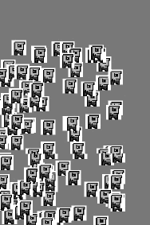

**图 7–20.** *好多 Bob！*

关于变换的乐趣还远未结束。如果你还记得几页前我们说过的话，你就会知道接下来是什么：旋转和缩放。

## 更多变换

除了 `glTranslatef()` 方法之外，OpenGL ES 还为我们提供了两种用于变换的方法：`glRotatef()` 和 `glScalef()`。


### 旋转

以下是 `glRotatef()` 的函数签名：

`GL10.glRotatef(float angle, float axisX, float axisY, float axisZ);`

第一个参数是我们想要旋转顶点所依据的角度，单位为度。其余参数的含义是什么？

当我们旋转某物时，我们是围绕一个轴进行旋转。什么是轴？嗯，我们已经知道三个轴：X 轴、Y 轴和 Z 轴。我们可以将这些轴表示为所谓的向量。正 X 轴可以描述为`(1,0,0)`，正 Y 轴为`(0,1,0)`，正 Z 轴为`(0,0,1)`。正如你所见，向量实际上编码了一个方向；在我们的例子中，是三维空间的方向。Bob 的方向也是一个向量，但位于二维空间中。向量也可以编码位置，比如 Bob 在二维空间中的位置。

要定义我们想要围绕其旋转 Bob 模型的轴，我们需要回到三维空间。图 7-21 展示了之前代码在三维空间中定义的 Bob 模型（为了定位方向而应用了纹理）。

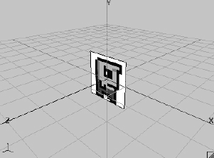

**图 7-21.** *三维空间中的 Bob*

由于我们没有为 Bob 的顶点定义 Z 坐标，所以他被嵌入到三维空间的 XY 平面中（记住，这实际上是模型空间）。如果我们想旋转 Bob，可以围绕任何我们能想到的轴进行：X 轴、Y 轴、Z 轴，甚至是一个像`(0.75,0.75,0.75)`这样完全疯狂的轴。然而，针对我们的二维图形编程需求，在 XY 平面内旋转 Bob 是有意义的；因此，我们将使用正 Z 轴作为我们的旋转轴，它可以定义为`(0,0,1)`。旋转将围绕 Z 轴逆时针进行。像下面这样调用`glRotatef()`会导致 Bob 模型的顶点旋转，如图 7-22 所示。

`gl.glRotatef(45, 0, 0, 1);` 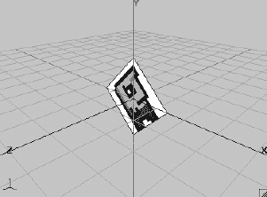

**图 7-22.** *Bob 围绕 Z 轴旋转 45 度*

### 缩放

我们还可以使用`glScalef()`来缩放 Bob 的模型，如下所示：

`glScalef(2, 0.5f, 1);`

给定 Bob 的原始模型姿态，这将产生图 7-23 所描绘的新方向。

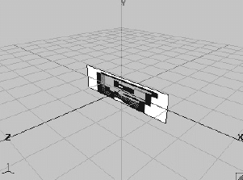

**图 7-23.** *Bob 在 X 轴上缩放 2 倍，在 Y 轴上缩放 0.5 倍……哎哟。*

### 组合变换

现在，我们还讨论了可以通过将多个矩阵相乘来组合它们的效果，从而形成一个新的矩阵。所有方法——`glTranslatef()`、`glScalef()`、`glRotatef()`和`glOrthof()`——正是这样做的。它们将当前激活的矩阵与基于我们传入的参数在内部创建的临时矩阵相乘。那么，让我们组合对 Bob 的旋转和缩放。

```
gl.glRotatef(45, 0, 0, 1);
gl.glScalef(2, 0.5f, 1);
```

这将使 Bob 的模型看起来像图 7-24（记住，我们仍在模型空间中）。

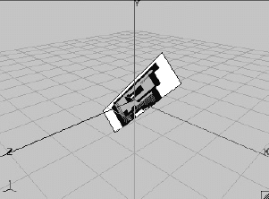

**图 7-24.** *Bob，先缩放后旋转（看起来还是不太开心）*

如果我们将变换的顺序反过来，会发生什么？

```
gl.glScalef(2, 0.5, 0);
gl.glRotatef(45, 0, 0, 1);
```

图 7-25 给出了答案。

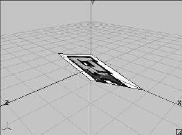

**图 7-25.** *Bob，先旋转后缩放*

哇，这已经不是我们认识的那个 Bob 了。发生了什么？如果查看代码片段，你实际上会期望图 7-24 看起来像图 7-25，而图 7-25 看起来像图 7-24。在第一个片段中，我们先应用旋转再缩放 Bob，对吗？

不对。OpenGL ES 矩阵相乘的方式决定了这些矩阵所编码的变换应用于模型的顺序。我们与当前激活矩阵相乘的最后一个矩阵将最先应用于顶点。因此，如果我们想按此精确顺序缩放、旋转和平移 Bob，我们必须像下面这样调用这些方法：

```
glTranslatef(bobs[i].x, bobs[i].y, 0);
glRotatef(45, 0, 0, 1);
glScalef(2, 0.5f, 1);
```

如果我们将`BobScreen.present()`方法中的循环改为以下代码：

```
gl.glMatrixMode(GL10.GL_MODELVIEW);
for (int i = 0; i < NUM_BOBS; i++) {
    gl.glLoadIdentity();
    gl.glTranslatef(bobs[i].x, bobs[i].y, 0);
    gl.glRotatef(45, 0, 0, 1);
    gl.glScalef(2, 0.5f, 0);
    bobModel.draw(GL10.GL_TRIANGLES, 0, 6);
}
```

输出将看起来像图 7-25。

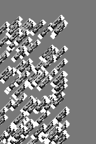

**图 7-26.** *一百个 Bob 被缩放、旋转和平移（按此顺序）到它们在三维空间中的位置*

当你初次接触桌面版 OpenGL 时，很容易搞混这些矩阵操作的顺序。要记住如何正确操作，可以使用称为 LASFIA 原则的助记工具：最后指定，最先应用（是的，这个助记法并不太好记，对吧？）。

熟悉模型-视图变换的最简单方法是大量使用它们。我们建议你拿`BobTest.java`源文件，修改内层循环一段时间，并观察效果。注意，你可以为渲染每个模型指定任意数量的变换。添加更多的旋转、平移和缩放。尽情尝试吧。

通过这最后一个例子，我们基本上已经掌握了使用 OpenGL ES 编写 2D 游戏所需的一切……真的吗？

## 性能优化

当我们在像 Droid 或 Nexus One 这样强劲的第二代设备上运行这个例子时，一切都会流畅如丝。如果我们在 Hero 上运行它，一切都会开始卡顿且看起来相当糟糕。但是，嘿，我们不是说过 OpenGL ES 是快速图形渲染的银弹吗？嗯，确实是，但前提是我们必须按照 OpenGL ES 要求的方式来做。


### 测量帧率

`BobTest` 提供了一个绝佳的示例来开始进行一些优化。但在那之前，我们需要一种评估性能的方法。人工目视检查（“呃，看起来有点卡顿”）不够精确。衡量程序运行速度的更好方法是计算每秒渲染的帧数。如果你还记得第 3 章，我们曾讨论过一种称为垂直同步（简称 vsync）的技术。目前市面上所有安卓设备都启用了该功能，它将我们能达到的最高帧率（FPS）限制为 60。当我们的程序以该帧率运行时，就说明代码足够高效。

**注意：** 虽然能稳定在 60 FPS 很棒，但在许多安卓设备上实现这样的性能实际上相当困难。即便只是清空屏幕，高分辨率平板电脑也需要填充大量像素。通常来说，只要我们的游戏能以超过 30 FPS 的速度渲染世界，我们就心满意足了。当然，帧数更高也无妨。

让我们编写一个小型辅助类来统计 FPS 并定期输出该值。代码清单 7-14 展示了名为 `FPSCounter` 的类的代码。

**代码清单 7-14.** *FPSCounter.java; 每秒统计帧数并记录到 LogCat*

```
package com.badlogic.androidgames.framework.gl;

import android.util.Log;

public class FPSCounter {
    long startTime = System.nanoTime();
    int frames = 0;

    public void logFrame() {
        frames++;
        if (System.nanoTime() - startTime >= 1000000000) {
            Log.d("FPSCounter", "fps: " + frames);
            frames = 0;
            startTime = System.nanoTime();
        }
    }
}
```

我们可以在 `BobScreen` 类中放置一个该类的实例，并在 `BobScreen.present()` 方法中调用一次 `logFrame()` 方法。以下是我们在 Hero（运行 Android 1.5）、Droid（运行 Android 2.2）和 Nexus One（运行 Android 2.2.1）上得到的输出结果。

```
Hero:
12-10 03:27:05.230: DEBUG/FPSCounter(17883): fps: 22
12-10 03:27:06.250: DEBUG/FPSCounter(17883): fps: 22
12-10 03:27:06.820: DEBUG/dalvikvm(17883): GC freed 21818 objects / 524280 bytes in 132ms
12-10 03:27:07.270: DEBUG/FPSCounter(17883): fps: 20
12-10 03:27:08.290: DEBUG/FPSCounter(17883): fps: 23

Droid:
12-10 03:29:44.825: DEBUG/FPSCounter(8725): fps: 39
12-10 03:29:45.864: DEBUG/FPSCounter(8725): fps: 38
12-10 03:29:46.879: DEBUG/FPSCounter(8725): fps: 38
12-10 03:29:47.879: DEBUG/FPSCounter(8725): fps: 39
12-10 03:29:48.887: DEBUG/FPSCounter(8725): fps: 40

Nexus One:
12-10 03:28:05.923: DEBUG/FPSCounter(930): fps: 43
12-10 03:28:06.933: DEBUG/FPSCounter(930): fps: 43
12-10 03:28:07.943: DEBUG/FPSCounter(930): fps: 44
12-10 03:28:08.963: DEBUG/FPSCounter(930): fps: 44
12-10 03:28:09.973: DEBUG/FPSCounter(930): fps: 44
12-10 03:28:11.003: DEBUG/FPSCounter(930): fps: 43
12-10 03:28:12.013: DEBUG/FPSCounter(930): fps: 44
```

初步检查后，我们可以发现以下几点：

* Hero 的速度是 Droid 和 Nexus One 的一半。
* Nexus One 比 Droid 稍快一些。
* 在 Hero 上，我们的进程（17883）产生了垃圾对象。

现在，列表中的最后一点有些令人费解。我们在三台设备上运行的是相同的代码。进一步检查发现，我们在 `present()` 或 `update()` 方法中都没有分配任何临时对象。那么 Hero 上到底发生了什么？

### Hero 上的 Android 1.5 奇案

事实证明，Android 1.5 中存在一个 bug。嗯，严格来说它*并不真的是*一个 bug，而是一些极其草率的编程所致。还记得我们为顶点和索引使用了直接 NIO 缓冲区吗？这些实际上是原生堆内存中的内存块。每次我们调用 `glVertexPointer()`、`glColorPointer()` 或任何其他 `glXXXPointer()` 方法时，OpenGL ES 都会尝试获取该缓冲区的原生堆内存地址，以便查找顶点并将数据传输到视频 RAM 中。Android 1.5 上的问题在于，每次我们请求直接 NIO 缓冲区的内存地址时，它都会生成一个名为 `PlatformAddress` 的临时对象。由于我们大量调用了 `glXXXPointer()` 和 `glDrawElements()` 方法（记住，后者会从直接的 `ShortBuffer` 中获取地址），Android 会分配海量的临时 `PlatformAddress` 实例，对此我们也无能为力（虽然存在变通方法，但暂时不讨论）。我们只能接受在 Android 1.5 上使用 NIO 缓冲区存在严重问题这一事实，然后继续前进。


### 是什么让我的 OpenGL ES 渲染如此缓慢？

Hero 机型比二代设备慢并不令人意外。然而，Droid 中的 PowerVR 芯片实际上比 Nexus One 中的 Adreno 芯片略快，因此上述结果初看有些奇怪。进一步检查后，我们可以将差异归因于：我们在每一帧中调用了许多 OpenGL ES 方法，而这些方法都是成本高昂的 Java Native Interface (JNI) 方法。这意味着它们实际上是在调用 C 代码，其开销比在 Dalvik 上调用 Java 方法更大。Nexus One 拥有 JIT 编译器，可以在此处进行一些优化。那么，我们暂且假设差异源于 JIT 编译器（这个假设可能并不完全正确）。

现在，让我们看看哪些操作对 OpenGL ES 不利：

-   每帧频繁更改状态（例如，开启/关闭混合、启用/禁用纹理映射等）
-   每帧频繁更改矩阵
-   每帧频繁绑定纹理
-   每帧频繁更改顶点、颜色和纹理坐标指针

这一切归根结底都是频繁更改状态。为什么这会导致成本高昂？GPU 的工作方式就像工厂里的流水线。在流水线前端处理新进入的部件时，流水线末端则完成之前阶段已处理过的部件。让我们用一个小型汽车工厂的比喻来尝试理解。

生产线上有一些状态，例如工厂工人可用的工具、用于组装汽车零件的螺栓类型、给汽车喷涂的颜色等等。是的，真实的汽车工厂有多条装配线，但我们假设这里只有一条。现在，只要我们不改变任何状态，流水线的每个阶段都会繁忙地工作。然而，一旦我们改变某个状态，流水线就会停顿，直到所有正在组装的汽车完成。只有在那之后，我们才能实际更改状态，并用新的油漆、螺栓或其他工具来组装汽车。

关键见解在于，调用 `glDrawElements()` 或 `glDrawArrays()` 并不会立即执行；相反，该命令会被放入一个由 GPU 异步处理的缓冲区中。这意味着对绘制方法的调用不会阻塞。因此，测量 `glDrawElements()` 调用的耗时是一个糟糕的主意，因为实际工作可能在未来才会执行。这就是我们转而测量 FPS 的原因。当帧缓冲区交换时（是的，我们在 OpenGL ES 中也使用双缓冲），OpenGL ES 会确保所有待处理的操作都被执行。

因此，将汽车工厂的比喻翻译成 OpenGL ES 术语，意味着以下内容：当新的三角形通过调用 `glDrawElements()` 或 `glDrawArrays()` 进入命令缓冲区时，GPU 管线可能会完成从早期渲染方法调用开始处理当前三角形的渲染工作（例如，一个三角形可能正在管线的光栅化阶段被处理）。这具有以下含义：

-   更改当前绑定的纹理是昂贵的。命令缓冲区中任何尚未处理且使用了该纹理的三角形都必须先渲染完毕。管线会发生停顿。
-   更改顶点、颜色和纹理坐标指针是昂贵的。命令缓冲区中任何尚未渲染且使用了旧指针的三角形都必须先渲染完毕。管线会发生停顿。
-   更改混合状态是昂贵的。命令缓冲区中任何需要/不需要混合且尚未渲染的三角形都必须先渲染完毕。管线会发生停顿。
-   更改模型视图矩阵或投影矩阵是昂贵的。命令缓冲区中任何尚未处理且应应用旧矩阵的三角形都必须先渲染完毕。管线会发生停顿。

这一切的精髓就是 *减少状态变更*——减少所有状态变更。

### 移除不必要的状态变更

让我们看看 `BobTest` 的 `present()` 方法，看看我们能改变什么。以下是供参考的代码片段——我们添加了 `FPSCounter`，并且也使用了 `glRotatef()` 和 `glScalef()`：

```
@Override
public void present(float deltaTime) {
    GL10 gl = glGraphics.getGL();
    gl.glViewport(0, 0, glGraphics.getWidth(), glGraphics.getHeight());
    gl.glClearColor(1,0,0,1);
    gl.glClear(GL10.GL_COLOR_BUFFER_BIT);
    gl.glMatrixMode(GL10.GL_PROJECTION);
    gl.glLoadIdentity();
    gl.glOrthof(0, 320, 0, 480, 1, -1);

    gl.glEnable(GL10.GL_TEXTURE_2D);
    bobTexture.bind();

    gl.glMatrixMode(GL10.GL_MODELVIEW);
    for (int i = 0; i < NUM_BOBS; i++) {
        gl.glLoadIdentity();
        gl.glTranslatef(bobs[i].x, bobs[i].y, 0);
        gl.glRotatef(45, 0, 0, 1);
        gl.glScalef(2, 0.5f, 1);
        bobModel.draw(GL10.GL_TRIANGLES, 0, 6);
    }
    fpsCounter.logFrame();
}
```

我们首先可以做的事情是将 `glViewport()` 和 `glClearColor()` 的调用，以及设置投影矩阵的方法调用移到 `BobScreen.resume()` 方法中。清除颜色永远不会改变；视口和投影矩阵也不会改变。为什么不把设置所有持久 OpenGL 状态（如视口或投影矩阵）的代码放在 `BobScreen` 的构造函数中呢？嗯，我们需要应对上下文丢失的问题。我们执行的所有 OpenGL ES 状态修改都会丢失，当我们的屏幕的 `resume()` 方法被调用时，我们知道上下文已被重新创建，因此它丢失了我们之前可能设置的所有状态。我们也可以将 `glEnable()` 和纹理绑定调用放入 `resume()` 方法中。毕竟，我们希望始终启用纹理功能，并且我们也只想使用那个单一的 Bob 纹理。为了稳妥起见，我们还在 `resume()` 方法中调用 `texture.reload()`，这样在上下文丢失的情况下，我们的纹理图像数据也会被重新加载。以下是我们修改后的 `present()` 和 `resume()` 方法：

```
@Override
public void resume() {
    GL10 gl = glGraphics.getGL();
    gl.glViewport(0, 0, glGraphics.getWidth(), glGraphics.getHeight());
    gl.glClearColor(1, 0, 0, 1);
    gl.glMatrixMode(GL10.GL_PROJECTION);
    gl.glLoadIdentity();
    gl.glOrthof(0, 320, 0, 480, 1, -1);

    bobTexture.reload();
    gl.glEnable(GL10.GL_TEXTURE_2D);
    bobTexture.bind();
}

@Override
public void present(float deltaTime) {
    GL10 gl = glGraphics.getGL();
    gl.glClear(GL10.GL_COLOR_BUFFER_BIT);

    gl.glMatrixMode(GL10.GL_MODELVIEW);
    for (int i = 0; i < NUM_BOBS; i++) {
        gl.glLoadIdentity();
        gl.glTranslatef(bobs[i].x, bobs[i].y, 0);
        gl.glRotatef(45, 0, 0, 1);
        gl.glScalef(2, 0.5f, 0);
        bobModel.draw(GL10.GL_TRIANGLES, 0, 6);
    }

    fpsCounter.logFrame();
}
```

在这三款设备上运行这个“改进”后的版本，性能表现如下：

```
Hero:
12-10 04:41:56.750: DEBUG/FPSCounter(467): fps: 23
12-10 04:41:57.770: DEBUG/FPSCounter(467): fps: 23
12-10 04:41:58.500: DEBUG/dalvikvm(467): GC freed 21821 objects / 524288 bytes in 133ms
12-10 04:41:58.790: DEBUG/FPSCounter(467): fps: 19
12-10 04:41:59.830: DEBUG/FPSCounter(467): fps: 23

Droid:
12-10 04:45:26.906: DEBUG/FPSCounter(9116): fps: 39
12-10 04:45:27.914: DEBUG/FPSCounter(9116): fps: 41
12-10 04:45:28.922: DEBUG/FPSCounter(9116): fps: 41
12-10 04:45:29.937: DEBUG/FPSCounter(9116): fps: 40

Nexus One:
12-10 04:37:46.097: DEBUG/FPSCounter(2168): fps: 43
12-10 04:37:47.127: DEBUG/FPSCounter(2168): fps: 45
12-10 04:37:48.147: DEBUG/FPSCounter(2168): fps: 44
12-10 04:37:49.157: DEBUG/FPSCounter(2168): fps: 44
12-10 04:37:50.167: DEBUG/FPSCounter(2168): fps: 44
```


可以看到，所有设备都已从我们的优化中获得了微小的收益。当然，效果并非十分显著。这可以归因于一个事实：当我们在帧开始时调用所有这些方法时，渲染管线中并没有任何三角形。

### 减小纹理尺寸意味着需要获取的像素更少

那么还有什么可以改变的呢？有一些并不那么显而易见的点。我们的`Bob`实例大小为 32×32 单位。我们使用一个大小为 320×480 单位的投影平面。在 Hero 设备上，这将实现像素完美的渲染。在 Nexus One 或 Droid 上，我们坐标系中的一个单位占据的像素略小于一个像素。无论如何，我们的纹理实际大小为 128×128 像素。我们不需要那么高的分辨率，所以让我们将纹理图像 `bobrgb888.png` 调整为 32×32 像素。我们将新图像命名为 `bobrgb888-32x32.png`。使用这个更小的纹理，我们得到了每台设备的以下 FPS 数据：

```
Hero:
12-10 04:48:03.940: DEBUG/FPSCounter(629): fps: 23
12-10 04:48:04.950: DEBUG/FPSCounter(629): fps: 23
12-10 04:48:05.860: DEBUG/dalvikvm(629): GC freed 21812 objects / 524256 bytes in 134ms
12-10 04:48:05.990: DEBUG/FPSCounter(629): fps: 21
12-10 04:48:07.030: DEBUG/FPSCounter(629): fps: 24

Droid:
12-10 04:51:11.601: DEBUG/FPSCounter(9191): fps: 56
12-10 04:51:12.609: DEBUG/FPSCounter(9191): fps: 56
12-10 04:51:13.625: DEBUG/FPSCounter(9191): fps: 55
12-10 04:51:14.641: DEBUG/FPSCounter(9191): fps: 55

Nexus One:
12-10 04:48:18.067: DEBUG/FPSCounter(2238): fps: 53
12-10 04:48:19.077: DEBUG/FPSCounter(2238): fps: 56
12-10 04:48:20.077: DEBUG/FPSCounter(2238): fps: 53
12-10 04:48:21.097: DEBUG/FPSCounter(2238): fps: 54
```

哇，这对第二代设备来说影响巨大！事实表明，这些设备的 GPU 最痛恨的事情莫过于扫描大量像素。无论是从纹理中获取纹素，还是实际将三角形渲染到屏幕上，都是如此。这些 GPU 获取纹素以及将像素渲染到帧缓冲区的速率被称为*填充率*。所有第二代 GPU 都严重受限于填充率，因此我们应该尽可能使用最小的纹理（或者只将我们的三角形映射到它们的一小部分上），并且不要在屏幕上渲染非常大的三角形。我们还应该注意重叠：重叠的三角形越少越好。

**注意：** 实际上，对于像 Droid 上的 PowerVR SGX 530 这样的 GPU 来说，重叠并不是一个极其严重的问题。这些 GPU 有一种称为*基于瓦片的延迟渲染*的特殊机制，可以在特定条件下消除大量重叠。不过，我们仍然需要注意那些永远不会在屏幕上显示的像素。

Hero 设备仅从纹理图像尺寸的减小中获得了少许好处。那么问题可能出在哪里呢？

### 减少 OpenGL ES/JNI 方法的调用次数

首要嫌疑对象是我们为每个`Bob`渲染模型时，每帧发出的众多 OpenGL ES 调用。首先，每个`Bob`有四个矩阵操作。如果我们不需要旋转或缩放，可以将调用减少到两个。以下是在内部循环中仅使用 `glLoadIdentity()` 和 `glTranslatef()` 时，每台设备的 FPS 数据：

```
Hero:
12-10 04:57:49.610: DEBUG/FPSCounter(766): fps: 27
12-10 04:57:49.610: DEBUG/FPSCounter(766): fps: 27
12-10 04:57:50.650: DEBUG/FPSCounter(766): fps: 28
12-10 04:57:50.650: DEBUG/FPSCounter(766): fps: 28
12-10 04:57:51.530: DEBUG/dalvikvm(766): GC freed 22910 objects / 568904 bytes in 128ms

Droid:
12-10 05:08:38.604: DEBUG/FPSCounter(1702): fps: 56
12-10 05:08:39.620: DEBUG/FPSCounter(1702): fps: 57
12-10 05:08:40.628: DEBUG/FPSCounter(1702): fps: 58
12-10 05:08:41.644: DEBUG/FPSCounter(1702): fps: 57

Nexus One:
12-10 04:58:01.277: DEBUG/FPSCounter(2509): fps: 54
12-10 04:58:02.287: DEBUG/FPSCounter(2509): fps: 54
12-10 04:58:03.307: DEBUG/FPSCounter(2509): fps: 55
12-10 04:58:04.317: DEBUG/FPSCounter(2509): fps: 55
```

嗯，这显著提升了 Hero 的性能，而 Droid 和 Nexus One 也因移除两个矩阵操作而略微受益。当然，这里面有点取巧的成分：如果我们需要旋转和缩放`Bob`实例，就不可避免地要发出这两个额外的调用。然而，当我们只做 2D 渲染时，可以使用一个巧妙的小技巧来摆脱所有矩阵操作（我们将在下一章中探讨这一点）。

OpenGL ES 是一个 C 语言 API，通过 JNI 包装器提供给 Java 使用。这意味着我们调用的每个 OpenGL ES 方法都必须跨越这个 JNI 包装器，才能调用实际的 C 语言原生函数。这在早期的 Android 版本中成本较高，但在较新的版本中已经有所改善。如上所示，其影响并不十分巨大，尤其是当实际操作所需的时间超过了发出调用本身的时间时。


#### 绑定顶点的概念

那么，我们还有什么可以改进的地方吗？让我们再次审视一下当前的 `present()` 方法 [已移除 `glRotatef()` 和 `glScalef()`]：

```
public void present(float deltaTime) {
    GL10 gl = glGraphics.getGL();            
    gl.glClear(GL10.GL_COLOR_BUFFER_BIT);

    gl.glMatrixMode(GL10.GL_MODELVIEW);
    for (int i = 0; i < NUM_BOBS; i++) {
        gl.glLoadIdentity();
        gl.glTranslatef(bobs[i].x, bobs[i].y, 0);
        bobModel.draw(GL10.GL_TRIANGLES, 0, 6);
    }

    fpsCounter.logFrame();
}
```

这看起来已经相当优化了，不是吗？实际上，它并非最优。首先，我们也可以将 `gl.glMatrixMode()` 的调用移到 `resume()` 方法中，但这不会对性能产生巨大影响，正如我们之前所见。第二个可优化的点则更为微妙。

我们使用 `Vertices` 类来存储和渲染 Bob 模型。还记得 `Vertices.draw()` 方法吗？这里再展示一次：

```
public void draw(int primitiveType, int offset, int numVertices) {
    GL10 gl = glGraphics.getGL();

    gl.glEnableClientState(GL10.GL_VERTEX_ARRAY);
    vertices.position(0);
    gl.glVertexPointer(2, GL10.GL_FLOAT, vertexSize, vertices);

    if (hasColor) {
        gl.glEnableClientState(GL10.GL_COLOR_ARRAY);
        vertices.position(2);
        gl.glColorPointer(4, GL10.GL_FLOAT, vertexSize, vertices);
    }

    if (hasTexCoords) {
        gl.glEnableClientState(GL10.GL_TEXTURE_COORD_ARRAY);
        vertices.position(hasColor?6:2);
        gl.glTexCoordPointer(2, GL10.GL_FLOAT, vertexSize, vertices);
    }

    if (indices != null) {
        indices.position(offset);
        gl.glDrawElements(primitiveType, numVertices, GL10.GL_UNSIGNED_SHORT, indices);
    } else {
        gl.glDrawArrays(primitiveType, offset, numVertices);
    }

    if (hasTexCoords)
        gl.glDisableClientState(GL10.GL_TEXTURE_COORD_ARRAY);

    if (hasColor)
        gl.glDisableClientState(GL10.GL_COLOR_ARRAY);
}
```

现在再回顾一下前面的循环。注意到什么了吗？对于每个 Bob，我们通过 `glEnableClientState()` 反复启用相同的顶点属性。实际上，我们只需要设置一次，因为每个 Bob 都使用相同的模型，而该模型总是使用相同的顶点属性。下一个主要问题是对每个 Bob 调用 `glXXXPointer()`。由于这些指针也是 OpenGL ES 状态，我们同样只需要设置一次，因为它们一旦设定就不会改变。那么，我们该如何解决这个问题呢？让我们稍微重写 `Vertices.draw()` 方法：

```
public void bind() {
    GL10 gl = glGraphics.getGL();

    gl.glEnableClientState(GL10.GL_VERTEX_ARRAY);
    vertices.position(0);
    gl.glVertexPointer(2, GL10.GL_FLOAT, vertexSize, vertices);

    if (hasColor) {
        gl.glEnableClientState(GL10.GL_COLOR_ARRAY);
        vertices.position(2);
        gl.glColorPointer(4, GL10.GL_FLOAT, vertexSize, vertices);
    }

    if (hasTexCoords) {
        gl.glEnableClientState(GL10.GL_TEXTURE_COORD_ARRAY);
        vertices.position(hasColor?6:2);
        gl.glTexCoordPointer(2, GL10.GL_FLOAT, vertexSize, vertices);
    }
}

public void draw(int primitiveType, int offset, int numVertices) {
    GL10 gl = glGraphics.getGL();

    if (indices != null) {
        indices.position(offset);
        gl.glDrawElements(primitiveType, numVertices, GL10.GL_UNSIGNED_SHORT, indices);
    } else {
        gl.glDrawArrays(primitiveType, offset, numVertices);
    }        
}

public void unbind() {
    GL10 gl = glGraphics.getGL();
    if (hasTexCoords)
        gl.glDisableClientState(GL10.GL_TEXTURE_COORD_ARRAY);

    if (hasColor)
        gl.glDisableClientState(GL10.GL_COLOR_ARRAY);
}
```

你看出我们做了什么吗？我们可以像处理纹理一样处理顶点和所有指针。通过一次 `Vertices.bind()` 调用，我们“绑定”了顶点指针。从此刻起，每次 `Vertices.draw()` 调用都将使用这些“已绑定”的顶点，就像绘制调用也会使用当前绑定的纹理一样。当我们完成使用该 `Vertices` 实例渲染后，调用 `Vertices.unbind()` 来禁用另一个 `Vertices` 实例可能不需要的任何顶点属性。保持 OpenGL ES 状态的清洁是个好习惯。以下是我们的 `present()` 方法现在的样子 [我们也将 `glMatrixMode(GL10.GL_MODELVIEW)` 调用移到了 `resume()` 中]：

```
@Override
public void present(float deltaTime) {
    GL10 gl = glGraphics.getGL();
    gl.glClear(GL10.GL_COLOR_BUFFER_BIT);

    bobModel.bind();
    for (int i = 0; i < NUM_BOBS; i++) {
        gl.glLoadIdentity();
        gl.glTranslatef(bobs[i].x, bobs[i].y, 0);
        bobModel.draw(GL10.GL_TRIANGLES, 0, 6);
    }
    bobModel.unbind();

    fpsCounter.logFrame();
}
```

这样有效地将 `glXXXPointer()` 和 `glEnableClientState()` 方法的调用减少到每帧仅执行一次。我们因此节省了近 100 × 6 次对 OpenGL ES 的调用。这应该会对性能产生巨大影响吧？

```
Hero:
12-10 05:16:59.710: DEBUG/FPSCounter(865): fps: 51
12-10 05:17:00.720: DEBUG/FPSCounter(865): fps: 46
12-10 05:17:01.720: DEBUG/FPSCounter(865): fps: 47
12-10 05:17:02.610: DEBUG/dalvikvm(865): GC freed 21815 objects / 524272 bytes in 131ms
12-10 05:17:02.740: DEBUG/FPSCounter(865): fps: 44
12-10 05:17:03.750: DEBUG/FPSCounter(865): fps: 50

Droid:
12-10 05:22:27.519: DEBUG/FPSCounter(2040): fps: 57
12-10 05:22:28.519: DEBUG/FPSCounter(2040): fps: 57
12-10 05:22:29.526: DEBUG/FPSCounter(2040): fps: 57
12-10 05:22:30.526: DEBUG/FPSCounter(2040): fps: 55

Nexus One:
12-10 05:18:31.915: DEBUG/FPSCounter(2509): fps: 56
12-10 05:18:32.935: DEBUG/FPSCounter(2509): fps: 56
12-10 05:18:33.935: DEBUG/FPSCounter(2509): fps: 55
12-10 05:18:34.965: DEBUG/FPSCounter(2509): fps: 54
```

现在三款设备的表现几乎不相上下。Droid 表现最佳，Nexus One 紧随其后。我们的小 Hero 也表现不俗。与未优化的情况相比，帧率从 22 FPS 提升到了 50 FPS。性能提升了超过 100%。我们可以为此感到自豪。我们优化后的 Bob 测试已经近乎完美。

当然，我们新的可绑定 `Vertices` 类现在也有一些限制：

*   我们只能在 `Vertices` 实例未绑定时设置顶点和索引数据，因为这些信息的上传是在 `Vertices.bind()` 中执行的。
*   我们不能同时绑定两个 `Vertices` 实例。这意味着我们在任何时间点只能使用一个 `Vertices` 实例进行渲染。不过这通常不是大问题，而且考虑到性能提升如此显著，我们也能接受这一点。


#### 本章小结

我们还能应用一项针对 2D 图形编程（尤其是矩形等平面几何体）的优化，这将在下一章中讨论。需要记住的关键词是**批处理**（*batching*），其目标是减少 `glDrawElements()` / `glDrawArrays()` 的调用次数。3D 图形也有相应的技术，称为实例化（*instancing*），但在 OpenGL ES 1.x 中无法实现。

在结束本章之前，我们还想再提两点。首先，当你运行 `BobText` 或 `OptimizedBobTest`（其中包含我们刚刚开发的超级优化代码）时，请注意那些 Bob 方块会在屏幕上轻微摇晃。这是因为它们的位置是以浮点数形式传递给 `glTranslatef()` 的。要实现像素完美的渲染，OpenGL ES 对顶点坐标包含小数部分的问题非常敏感。我们实际上无法完全解决这个问题；但在真实游戏中，这种效果会不那么明显，甚至完全消失，正如我们将在实现下一个游戏时看到的那样。通过使用更丰富的背景等方法，我们可以在一定程度上掩盖这种效果。

第二点是想说明我们如何解读 FPS 测量值。从前面的输出中可以看出，FPS 会略有波动。这可以归因于与我们的应用程序同时运行的后台进程。我们的游戏永远无法占用全部系统资源，因此我们必须学会与这个问题共存。在优化程序时，不要通过关闭所有后台进程来伪造运行环境。应在手机处于正常状态（就像你日常使用它一样）下运行应用程序。这样才能真实反映用户体验。

我们取得的这一成果为本章画上了句号。需要提醒的是：只有在渲染代码能正常工作，并且确实存在性能问题时，才应开始对其进行优化。过早的优化常常会导致必须重写整个渲染代码，因为它可能变得难以维护。

### 总结

OpenGL ES 是一个庞大的系统。我们已成功将其精简到足以满足游戏编程需求的规模。我们讨论了什么是 OpenGL ES（一个精简高效的三角形渲染引擎）及其工作原理。接着，我们探索了如何通过指定顶点来使用 OpenGL ES 功能、如何创建纹理，以及如何利用状态（如混合）来实现一些不错的效果。我们还初步了解了投影及其与矩阵的关系。虽然我们没有讨论矩阵的内部工作原理，但探索了如何使用它们来旋转、缩放和变换可重用模型——从模型空间到世界空间。当以后使用 OpenGL ES 进行 3D 编程时，你会发现你已经掌握了所需知识的 90%。我们只需更改投影，并为顶点添加一个 z 坐标（实际上还有一些其他细节，但从高层次来看，仅此而已）。不过在此之前，我们将先用 OpenGL ES 编写一个漂亮的 2D 游戏。在下一章中，你将了解一些可能用到的 2D 编程技巧。

## 第 8 章

## 2D 游戏编程技巧

第 7 章 展示了 OpenGL ES 为 2D 图形编程提供了许多可供利用的特性，例如轻松实现旋转和缩放，以及将视景体自动拉伸到视口。与使用 `Canvas` 相比，它在性能上也更具优势。

现在是时候探讨一些更高级的 2D 游戏编程主题了。在编写 Mr. Nom 时，你已经凭直觉使用了其中一些概念，包括基于时间的状态更新和图像图集。即将介绍的内容大多也非常直观，你很可能迟早会想到同样的解决方案。但明确地学习这些知识总是没有坏处。

2D 游戏编程有几个关键概念。有些与图形相关，有些则涉及如何表示和模拟你的游戏世界。所有这些概念都有一个共同点：它们都依赖于一点线性代数和三角学知识。不必担心，编写像《超级马里奥兄弟》这样的游戏所需的数学水平并不算高。让我们从回顾一些 2D 线性代数和三角学概念开始。

### 开始之前

与之前的“理论”章节一样，你将创建一些示例来直观感受其原理。在本章中，你可以重用上一章开发的内容，主要是 `GLGame`、`GLGraphics`、`Texture` 和 `Vertices` 类，以及框架中的其余类。

你的演示项目由一个名为 `GameDev2DStarter` 的启动器组成，它提供了一个要运行的测试列表。重用 `GLBasicsStarter` 的代码，只需替换测试的类名即可。以 `<activity>` 元素的形式将每个测试添加到清单中。

每个测试同样是 `Game` 接口的一个实例，实际的测试逻辑以 `Screen` 的形式实现，该 `Screen` 包含在测试的 `Game` 实现中，如同上一章一样。为了节省篇幅，这里只展示 `Screen` 的相关部分。每个测试的 `GLGame` 和 `Screen` 实现的命名约定仍然是 `XXXTest` 和 `XXXScreen`。

澄清了这一点之后，我们来谈谈向量。


### 最初……向量的诞生

在上一章中，你了解到向量不应与位置混为一谈。这并非完全正确，因为你可以（并且将会）通过向量来表示某些空间中的位置。实际上，向量可以有许多种解释：

- **位置**：在之前的章节中，你已经使用这种方法来编码实体相对于坐标系原点的坐标。
- **速度和加速度**：这些是你在下一节会听到的物理量。虽然你可能习惯将速度和加速度视为单一数值，但实际上，它们应该表示为二维或三维向量。它们不仅编码了实体的速率（例如，一辆以 100 公里/小时行驶的汽车），还编码了实体运动的方向。请注意，这种向量解释并未说明该向量是相对于原点给出的。这很合理，因为汽车的速度和方向与其位置无关。想象一辆汽车以 100 公里/小时的速度在笔直的高速公路上向西北行驶。只要它的速度和方向不变，速度向量也不会改变。
- **方向和距离**：方向类似于速度，但通常缺乏物理量。你可以使用这种向量解释来编码状态，例如“这个实体指向东南”。距离只是告诉我们一个位置相对于另一个位置有多远，以及方向。

图 8–1 展示了这些解释的实际应用。

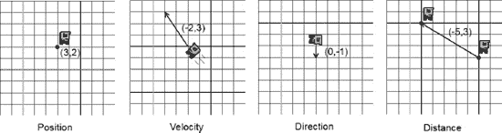

**图 8–1.** *鲍勃，其位置、速度、方向和距离均以向量表示*

当然，图 8–1 并未穷尽所有情况。向量还可以有更多的解释。然而，对于你的游戏开发需求来说，这四种基本解释已经足够了。

图 8–1 中遗漏了一个东西，那就是向量分量的单位。请确保这些单位是合理的（例如，鲍勃的速度可以是米/秒，这样他在 1 秒内向左移动 2 米，向上移动 3 米）。位置和距离也是如此，它们也可以用米来表示。不过，鲍勃的方向则是一个特例——它是无量纲的。如果你想指定一个物体的大致方向，同时将方向的物理特性分开处理，这会非常方便。你可以针对鲍勃的速度这样做：将其速度的方向存储为一个方向向量，而将速率存储为一个单一数值。单一数值也称为*标量*。方向向量的长度必须为 1，这将在后面讨论。

### 向量运算

向量的强大之处在于你可以轻松地操作和组合它们。不过，在此之前，你需要定义如何表示向量：

`v = (x, y)`

这并不令人惊讶，你已经做过无数次了。每个向量在你的二维空间中都有一个 `x` 和一个 `y` 分量（没错，本章中你将停留在二维空间）。你还可以将两个向量相加：

`c = a + b = (a.x, a.y) + (b.x, b.y) = (a.x + b.x, a.y + b.y)`

你需要做的只是将分量相加，以得到最终的向量。使用图 8–1 中给出的向量试试看。假设你取鲍勃的位置 `p = (3,2)`，加上他的速度向量 `v = (−2,3)`，你会得到一个新位置 `p' = (3 + -2, 2 + 3) = (1,5)`。不要被 `p` 后面的撇号搞糊涂了；它只是用来表示你得到了一个新向量 `p`。当然，这个小运算只有在位置和速度的单位匹配时才合理。在这个例子中，你假设位置以米（m）为单位，速度以米/秒（m/s）为单位，这完全匹配。

当然，你也可以进行向量减法：

`c = a – b = (a.x, a.y) – (b.x, b.y) = (a.x – b.x, a.y – b.y)`

同样，你需要做的就是将两个向量的分量相减。然而，请注意从一个向量减去另一个向量的顺序很重要。以图 8–1 中最右边的图像为例。你有一个绿色的鲍勃在位置 `pg = (1,4)`，一个红色的鲍勃在位置 `pr = (6,1)`，其中 `pg` 和 `pr` 分别代表绿色位置和红色位置。当你计算从绿色鲍勃到红色鲍勃的距离向量时，你会进行如下计算：

`d = pg – pr = (1, 4) – (6, 1) = (-5, 3)`

这很奇怪。这个向量实际上是指向从红色鲍勃到绿色鲍勃的方向！要得到从绿色鲍勃到红色鲍勃的方向向量，你必须反过来进行减法：

`d = pr – pg = (6, 1) – (1, 4) = (5, -3)`

如果你想求从位置 `a` 到位置 `b` 的距离向量，请使用以下通用公式：

`d = b – a`

换句话说，总是用结束位置减去起始位置。起初这有点令人困惑，但如果你仔细想想，这是完全合理的。在方格纸上试试看！

你还可以将一个向量乘以一个标量（记住，标量只是一个单一数值）：

`a' = a * scalar = (a.x * scalar, a.y * scalar)`

你将向量的每个分量都乘以标量。这允许你缩放向量的长度。以图 8–1 中的方向向量为例。它被指定为 `d = (0,−1)`。如果你将它乘以标量 `s = 2`，你实际上将其长度翻倍：`d × s = (0, -1 × 2) = (0, -2)`。当然，你也可以通过使用小于 1 的标量来缩短它——例如，`d` 乘以 `s = 0.5` 会创建一个新向量 `d' = (0, -0.5)`。

说到长度，你还可以计算向量的长度（以其单位表示）：

`|a| = sqrt(a.x * a.x + a.y * a.y)`

`|a|` 符号表示这是向量的长度。如果你在学校上线性代数课时没有睡觉，你可能认出了这个向量长度公式。它其实就是将勾股定理应用到你的炫酷二维向量上。向量的 `x` 和 `y` 分量构成了直角三角形的两条边，而第三条边就是向量的长度。图 8–2 说明了这一点。

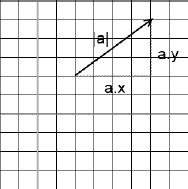

**图 8–2.** *毕达哥拉斯也会喜爱向量*

由于平方根的特性，向量的长度总是正数或零。如果将其应用于红色和绿色鲍勃之间的距离向量，你可以算出它们彼此相距多远（假设它们的位置以米为单位）：

`|pr – pg| = sqrt(5 * 5 + -3 * -3) = sqrt(25 + 9) = sqrt(34) ~= 5.83 米`


注意，如果你计算了`|*pg* – *pr*|`，你会得到相同的值，因为长度与向量的方向无关。这个新知识还有另一个含义：当你将一个向量与标量相乘时，其长度会发生相应变化。给定一个向量`*d*=(0,–1)`，其原始长度为 1 个单位，你可以将其乘以`2.5`，得到一个新的向量，其长度为 2.5 个单位。

方向向量通常没有与之关联的单位。你可以通过将它们与标量相乘来赋予它们单位——例如，你可以将一个方向向量`*d* = (0,1)`与一个速度常量`*s* = 100 m/s`相乘，得到一个速度向量`*v* = (0 × 100,1 × 100) = (0,100)`。让你的方向向量的长度始终为 1 总是一个好主意。长度为 1 的向量被称为*单位向量*。你可以通过将向量的每个分量除以其长度来使任何向量成为单位向量：

`d' = (d.x/|d|, d.y/|d|)`

记住`|d|`只是表示向量`*d*`的长度。试试看。假设你想要一个精确指向东北方向的方向向量：`*d* = (1,1)`。你可能觉得这个向量已经是单位长度了，因为两个分量都是 1，对吗？错：

`|d| = sqrt(1*1 + 1*1) = sqrt(2) ~= 1.44`

你可以通过使该向量成为单位向量来轻松解决这个问题：

`d' = (d.x/|d|, d.y/|d|) = (1/|d|, 1/|d|) ~= (1/1.44, 1/1.44) = (0.69, 0.69)`

这也被称为*归一化*向量，这仅意味着你确保其长度为 1。利用这个小技巧，你可以，例如，从一个距离向量创建一个单位长度的方向向量。当然，你必须注意零长度向量，因为在这种情况下你需要除以零！

### 一点三角学

现在是时候转向三角学一会儿了。三角学中有两个基本函数：*余弦*和*正弦*。每个函数都接受一个参数：一个*角度*。你可能习惯于用度（例如，45°或 360°）来指定角度。然而，在大多数数学库中，三角函数期望角度以弧度为单位。你可以使用以下等式轻松地进行度与弧度之间的转换：

`degreesToRadians(angleInDegrees) = angleInDegrees / 180 * pi`
`radiansToDegrees(angle) = angleInRadians / pi * 180`

这里，`pi`是备受喜爱的超级常数，其近似值为 3.14159265。`pi`弧度等于 180°，因此前面的函数就是这样来的。

那么，给定一个角度，余弦和正弦实际计算的是什么呢？它们计算的是相对于原点的单位长度向量的 x 和 y 分量。图 8–3 对此进行了说明。

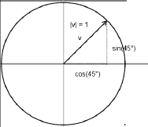

**图 8–3.** *余弦和正弦生成一个单位向量，其端点位于单位圆上*

因此，给定一个角度，你可以像这样创建一个单位长度的方向向量：

`v = (cos(angle), sin(angle))`

你也可以反过来，计算一个向量相对于 x 轴的角度：

`angle = atan2(v.y, v.x)`

`atan2`函数实际上是一个人为构造的函数。它使用反正切函数（即正切函数的反函数，三角学中的另一个基本函数）来构建一个范围在−180°到 180°（如果角度以弧度返回，则为`–pi`到`pi`）之间的角度。其内部实现有些复杂，在此讨论中并不那么重要。参数是你的向量的 y 和 x 分量。请注意，`atan2`函数工作时，向量不必是单位向量。另外，请注意，y 分量通常首先给出，然后是 x 分量——但这取决于所选的数学库。这是一个常见的错误来源。

尝试几个例子。给定一个向量`*v*=(cos(97°),sin(97°))`，`atan2(sin(97°),cos(97°))`的结果是 97°。太好了，这很简单。使用向量`*v*=(1,−1)`，你得到`atan2(−1,1)= –45°`。因此，如果你的向量的 y 分量为负，你会得到一个在 0°到–180°范围内的负角度。如果`atan2`的输出为负，你可以通过加上 360°（或 2`pi`）来解决这个问题。在前面的例子中，你将得到 315°。

你想要能够应用于向量的最后一个操作是按某个角度旋转它们。以下方程的推导再次相当复杂。幸运的是，你可以直接使用这些方程，而不需要了解正交基向量。（*提示：* 如果你想了解背后的原理，这是在网络上搜索的关键词。）以下是神奇的伪代码：

```
v.x' = cos(angle) * v.x - sin(angle) * v.y
v.y' = sin(angle) * v.x + cos(angle) * v.y
```

哇，这比预想的要简单。无论你对向量作何解释，这都会将任何向量绕原点逆时针旋转。

结合向量的加法、减法和标量乘法，你实际上可以自行实现所有 OpenGL 矩阵操作。这是从上一章进一步提高`BobTest`性能的解决方案的一部分。这将在接下来的章节中讨论。现在，请专注于所讨论的内容并将其转化为代码。


### 实现一个向量类

现在你可以为二维向量创建一个易于使用的向量类，命名为 `Vector2`。它应该包含两个成员变量，用于存储向量的 x 和 y 分量。此外，它还需要提供几个便捷方法，使我们能够执行以下操作：

- 向量的加法和减法
- 向量分量与标量的乘法
- 测量向量的长度
- 向量归一化
- 计算向量与 x 轴之间的夹角
- 旋转向量

Java 缺乏运算符重载功能，因此你需要设计一种机制，使得 `Vector2` 类的使用不那么繁琐。理想情况下，你应该能够实现如下操作：

```
Vector2 v = new Vector2();
v.add(10,5).mul(10).rotate(54);
```

你可以通过让每个 `Vector2` 方法返回对向量自身的引用来轻松实现这一点。当然，你还希望对诸如 `Vector2.add()` 这样的方法进行重载，以便你可以传入两个浮点数或另一个 `Vector2` 的实例。代码清单 8–1 展示了完整的 `Vector2` 类。

**代码清单 8–1.** *Vector2.java：实现一些实用的二维向量功能*

```
package com.badlogic.androidgames.framework.math;

import android.util.FloatMath;

public class Vector2 {
    public static float TO_RADIANS = (1 / 180.0f) * (float) Math.PI;
    public static float TO_DEGREES = (1 / (float) Math.PI) * 180;
    public float x, y;

    public Vector2() {
    }

    public Vector2(float x, float y) {
        this.x = x;
        this.y = y;
    }

    public Vector2(Vector2 other) {
        this.x = other.x;
        this.y = other.y;
    }
```

将该类放在 `com.badlogic.androidgames.framework.math` 包中，其他数学相关的类也将位于此包中。

首先定义两个静态常量 `TO_RADIANS` 和 `TO_DEGREES`。要将以弧度表示的角度转换为度，只需将其乘以 `TO_DEGREES`；要将以度表示的角度转换为弧度，则乘以 `TO_RADIANS`。你可以通过查看之前定义的两个控制度与弧度转换的方程来验证这一点。利用这个小技巧，你可以省去一些除法运算，从而提高速度。

接下来，定义存储向量分量的成员变量 `x` 和 `y`，以及几个构造函数——这些都不复杂：

```
public Vector2 cpy() {
    return new Vector2(x, y);
}
```

`cpy()` 方法将创建当前向量的一个副本实例并返回它。如果你想操作向量的副本，同时保留原始向量的值，这个方法会非常有用。

```
public Vector2 set(float x, float y) {
    this.x = x;
    this.y = y;
    return this;
}

public Vector2 set(Vector2 other) {
    this.x = other.x;
    this.y = other.y;
    return this;
}
```

`set()` 方法允许你设置向量的 x 和 y 分量，可以基于两个浮点数参数，也可以基于另一个向量。这些方法返回对该向量的引用，因此你可以像之前讨论的那样进行链式操作。

```
public Vector2 add(float x, float y) {
    this.x += x;
    this.y += y;
    return this;
}

public Vector2 add(Vector2 other) {
    this.x += other.x;
    this.y += other.y;
    return this;
}

public Vector2 sub(float x, float y) {
    this.x -= x;
    this.y -= y;
    return this;
}

public Vector2 sub(Vector2 other) {
    this.x -= other.x;
    this.y -= other.y;
    return this;
}
```

`add()` 和 `sub()` 方法有两种形式：一种处理两个浮点数参数，另一种则处理另一个 `Vector2` 实例。所有这四个方法都返回对该向量的引用，以便进行链式操作。

```
public Vector2 mul(float scalar) {
    this.x *= scalar;
    this.y *= scalar;
    return this;
}
```

`mul()` 方法简单地将向量的 x 和 y 分量与给定的标量值相乘，并返回对向量本身的引用，以便进行链式操作。

```
public float len() {
    return FloatMath.sqrt(x * x + y * y);
}
```

`len()` 方法精确计算向量的长度，公式如前所述。注意，这里使用的是 `FastMath` 类，而不是 Java SE 提供的常规 `Math` 类。这是一个特殊的 Android API 类，它处理的是 `float` 而不是 `double`，并且比 `Math` 类的等效方法稍快一些。

```
public Vector2 nor() {
    float len = len();
    if (len != 0) {
        this.x /= len;
        this.y /= len;
    }
    return this;
}
```

`nor()` 方法将向量归一化到单位长度。它在内部首先使用 `len()` 方法计算长度。如果长度为零，则可以提前退出，避免除零操作。否则，将向量的每个分量除以其长度，得到单位长度的向量。为了进行链式操作，再次返回对该向量的引用。

```
public float angle() {
    float angle = (float) Math.atan2(y, x) * TO_DEGREES;
    if (angle < 0)
        angle += 360;
    return angle;
}
```

`angle()` 方法使用 `atan2()` 方法计算向量与 x 轴之间的夹角，如前所述。这里必须使用 `Math.atan2()` 方法，因为 `FastMath` 类没有提供此方法。返回的角度以弧度为单位，因此通过乘以 `TO_DEGREES` 将其转换为度。如果角度小于零，则加上 360˚，以便返回一个范围在 0 到 360˚ 之间的值。

```
public Vector2 rotate(float angle) {
    float rad = angle * TO_RADIANS;
    float cos = FloatMath.cos(rad);
    float sin = FloatMath.sin(rad);

    float newX = this.x * cos - this.y * sin;
    float newY = this.x * sin + this.y * cos;

    this.x = newX;
    this.y = newY;

    return this;
}
```

`rotate()` 方法简单地将向量绕原点旋转给定的角度。由于 `FastMath.cos()` 和 `FastMath.sin()` 方法期望角度以弧度形式给出，因此首先将其从度转换为弧度。接着，使用之前定义的方程计算向量新的 x 和 y 分量，然后返回向量本身，再次实现链式操作。

```
public float dist(Vector2 other) {
    float distX = this.x - other.x;
    float distY = this.y - other.y;
    return FloatMath.sqrt(distX * distX + distY * distY);
}

public float dist(float x, float y) {
    float distX = this.x - x;
    float distY = this.y - y;
    return FloatMath.sqrt(distX * distX + distY * distY);
}
```

最后，有两个方法计算当前向量与另一个向量之间的距离。

以上就是你闪亮登场的 `Vector2` 类，在后续代码中你可以用它来表示位置、速度、距离和方向。通过在简单示例中使用你的新类来感受一下它的功能吧。


#### 一个简单的使用示例

以下是一个简单测试的提案：

- 在你的世界中创建一个由三角形代表的大炮，其位置固定。三角形的中心位于 (2.4, 0.5)。
- 每次触摸屏幕时，你需要旋转三角形使其朝向触摸点。
- 你的视锥体将显示世界在 (0,0) 到 (4.8, 3.2) 之间的区域。你不使用像素坐标操作，而是定义自己的坐标系，其中一个单位等于一米。此外，你将采用横屏模式工作。

有几件事需要考虑。你已经知道如何在模型空间中定义一个三角形——可以为此创建一个 `Vertices` 实例。你的大炮在默认方向下应指向右侧，角度为 0 度。图 8–4 展示了模型空间中的大炮三角形。

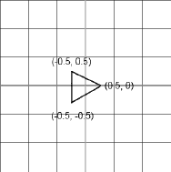

**图 8–4.** *模型空间中的大炮三角形*

渲染该三角形时，只需使用 `glTranslatef()` 将其移动到世界坐标中的位置 (2.4, 0.5)。

你还需要旋转大炮，使其尖端指向你最后触摸的屏幕点。为此，你需要计算出最后一次触摸事件在你世界中的位置。`GLGame.getInput().getTouchX()` 和 `getTouchY()` 方法将返回屏幕坐标中的触摸点，原点位于左上角。`Input` 实例不会像在 Mr. Nom 中那样将事件缩放到固定坐标系。相反，你会收到触摸 Hero 或 Nexus One（分辨率分别为 479x319 和 799x479）横屏右下角时的坐标。你需要将这些触摸坐标转换为世界坐标。你在 Mr. Nom 和基于 `Canvas` 的游戏框架中的触摸处理器中已经做过类似操作；唯一的不同是这次坐标范围略小，并且你的世界 Y 轴指向上方。以下是通用情况下实现转换的伪代码，几乎与第 5 章中的触摸处理器相同：

`worldX = (touchX / Graphics.getWidth()) * viewFrustmWidth`
`worldY = (1 - touchY / Graphics.getHeight()) * viewFrustumHeight`

你将触摸坐标除以屏幕分辨率，归一化到 (0,1) 范围。对于 Y 坐标，从 1 中减去归一化后的触摸 Y 坐标，以翻转 Y 轴。剩下的只需将 X 和 Y 坐标乘以视锥体的宽度和高度——在本例中分别是 4.8 和 3.2。然后你可以从 `worldX` 和 `worldY` 构造一个 `Vector2`，用于存储触摸点在你世界坐标中的位置。

最后需要做的是计算旋转大炮所需的角度。让我们看看图 8–5，其中显示了你世界坐标中的大炮和一个触摸点。

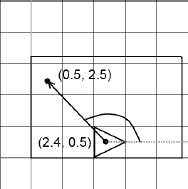

**图 8–5.** *处于默认状态的大炮，指向右侧（角度 = 0°）、一个触摸点，以及你需要旋转大炮的角度。矩形是你的视锥体在屏幕上显示的世界区域：(0,0) 到 (4.8, 3.2)。*

你需要做的就是从大炮中心 (2.4, 0.5) 到触摸点创建一个距离向量（记住，你需要从触摸点中减去大炮中心，而不是反过来）。得到距离向量后，可以使用 `Vector2.angle()` 方法计算角度。然后可以用这个角度通过 `glRotatef()` 旋转你的模型。

让我们来编写代码。代码清单 8–2 展示了 `CannonScreen` 的相关部分，它属于 `CannonTest` 类。

**代码清单 8–2.** *摘自 CannonTest.java；触摸屏幕将旋转大炮*

```
class CannonScreen extends Screen {
    float FRUSTUM_WIDTH = 4.8f;
    float FRUSTUM_HEIGHT = 3.2f;
    GLGraphics glGraphics;
    Vertices vertices;
    Vector2 cannonPos = new Vector2(2.4f, 0.5f);
    float cannonAngle = 0;
    Vector2 touchPos = new Vector2();
```

首先定义两个常量，用于表示视锥体的宽度和高度，如前所述。接下来，声明一个 `GLGraphics` 实例和一个 `Vertices` 实例。将大炮的位置存储在 `Vector2` 中，其角度存储在一个浮点数中。最后，还有另一个 `Vector2`，用于计算从原点到触摸点的向量与 X 轴之间的角度。

为什么将 `Vector2` 实例存储为类成员？你可以在每次需要时实例化它们，但这会让垃圾回收器不高兴。通常，尽量只实例化一次所有 `Vector2` 实例，然后尽可能重复使用。

```
    public CannonScreen(Game game) {
        super(game);
        glGraphics = ((GLGame) game).getGLGraphics();
        vertices = new Vertices(glGraphics, 3, 0, false, false);
        vertices.setVertices(new float[] {  -0.5f, -0.5f,
                                            0.5f, 0.0f,
                                           -0.5f, 0.5f }, 0, 6);
    }
```

在构造函数中，获取 `GLGraphics` 实例并根据图 8–4 创建三角形。

```
    @Override
    public void update(float deltaTime) {
        List<TouchEvent> touchEvents = game.getInput().getTouchEvents();
        game.getInput().getKeyEvents();

        int len = touchEvents.size();
        for (int i = 0; i < len; i++) {
            TouchEvent event = touchEvents.get(i);

            touchPos.x = (event.x / (float) glGraphics.getWidth())
                    * FRUSTUM_WIDTH;
            touchPos.y = (1 - event.y / (float) glGraphics.getHeight())
                    * FRUSTUM_HEIGHT;
            cannonAngle = touchPos.sub(cannonPos).angle();
        }
    }
```

接下来是 `update()` 方法。只需遍历所有 `TouchEvent`，计算大炮的角度。这可以通过几个步骤完成。首先，如前所述，将触摸事件的屏幕坐标转换为世界坐标系。将触摸事件的世界坐标存储在 `touchPoint` 成员中。然后从 `touchPoint` 向量中减去大炮的位置，得到图 8–5 中描绘的向量。接着计算该向量与 X 轴之间的角度。大功告成！

```
    @Override
    public void present(float deltaTime) {

        GL10 gl = glGraphics.getGL();
        gl.glViewport(0, 0, glGraphics.getWidth(), glGraphics.getHeight());
        gl.glClear(GL10.GL_COLOR_BUFFER_BIT);
        gl.glMatrixMode(GL10.GL_PROJECTION);
        gl.glLoadIdentity();
        gl.glOrthof(0, FRUSTUM_WIDTH, 0, FRUSTUM_HEIGHT, 1, -1);
        gl.glMatrixMode(GL10.GL_MODELVIEW);
        gl.glLoadIdentity();

        gl.glTranslatef(cannonPos.x, cannonPos.y, 0);
        gl.glRotatef(cannonAngle, 0, 0, 1);
        vertices.bind();
        vertices.draw(GL10.GL_TRIANGLES, 0, 3);
        vertices.unbind();
    }
```


`present()` 方法做的还是那些老一套的固定工作：设置视口、清屏、利用视锥体的宽度和高度创建正交投影矩阵，并告知 OpenGL ES 后续所有矩阵操作都将在模型-视图矩阵上进行。加载一个单位矩阵到模型-视图矩阵以“清空”它。接着，将（单位）模型-视图矩阵与一个平移矩阵相乘，这样就能把三角形的顶点从模型空间移动到世界空间。调用你在 `update()` 方法中计算出的角度值作为参数的 `glRotatef()` 函数，这样你的三角形就会在平移之前先在模型空间中完成旋转。请记住，变换是按照**逆向顺序**应用的——最后指定的变换最先应用。最后，绑定三角形的顶点，渲染它，然后解绑。

```
@Override
public void pause() {

}

@Override
public void resume() {

}

@Override
public void dispose() {

}
```

现在，你有了一个会紧跟你的每一次触摸而移动的三角形。图 8–6 展示了触摸屏幕左上角后的效果。

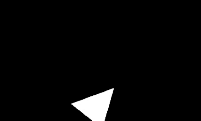

**图 8–6.** *你的三角形火炮对左上角的触摸事件做出响应*

请注意，无论你是在火炮位置渲染一个三角形，还是渲染一个贴有火炮图像的矩形纹理，对 OpenGL ES 来说其实都无关紧要。同时，你仍然把所有的矩阵操作都放在了 `present()` 方法中。事实上，这样做的好处是更容易跟踪 OpenGL ES 的状态，并且你可以在一次 `present()` 调用中使用多个视锥体（例如，一个视锥体用来设置以米为单位的世界，用于渲染你的游戏世界；另一个视锥体用来设置以像素为单位的世界，用于渲染 UI 元素）。如上一章所述，这对性能的影响并不大，因此在大多数情况下，采用这种方式是可以接受的。只需记住，如果后续有需要，你可以随时进行优化。

从今以后，向量将成为你最好的朋友。你可以用它们来指定世界中的几乎一切事物。你还能借助向量实现一些非常基础的物理效果。一门火炮要是不能开火，那还有什么用呢，对吧？

## 二维中的一点物理知识

在本节中，你将使用一个非常简单且功能有限的物理系统。游戏的关键在于巧妙的**模拟**。为了尽可能避免高强度的计算，游戏会在任何可能的地方取巧。游戏中物体的行为不需要 100% 的物理精确度；它只需要足够逼真、看起来可信就行了。有时候你甚至完全不想要精确的物理行为（比如说，你可能希望一组物体向下落，而另一组更疯狂的物体向上飞）。

即便是最初的《超级马里奥兄弟》也至少运用了一些牛顿力学的基本原理。这些原理非常简单且易于实现。这里只会讨论为你游戏中的物体实现一个简单物理模型所必需的、最基本的部分。

### 牛顿与欧拉，永远的挚友

你最关心的是所谓的“质点”运动物理学，这涉及物体随时间变化的位置、速度和加速度。质点意味着你用带有质量的、无穷小的一个点来近似所有的物体。你不需要处理像扭矩（物体绕其质心的旋转速度）这类东西，因为那是一个复杂的领域，足以写满整本书。你只需要关注物体的以下三个属性：

*   **位置**：简单来说，就是物体在某个空间里的坐标向量——在你这儿，是一个二维空间。你用向量来表示它。位置通常以米为单位。
*   **速度**：物体每秒钟的位置变化量。速度用一个二维速度向量表示，它结合了物体运动方向的单位长度方向向量和物体的移动速率（以米/秒为单位）。请注意，速率只决定了速度向量的长度；如果你用速率对速度向量进行归一化，就会得到一个漂亮的单位长度方向向量。
*   **加速度**：物体每秒钟的速度变化量。你可以用一个只影响速度大小（速度向量的长度）的标量来表示，也可以用二维向量来表示，这样就能让 x 轴和 y 轴具有不同的加速度。这里选择后者，因为这样能更方便地实现比如弹道效果等功能。加速度通常以米每秒每秒（m/s²）为单位。没写错——速度在每一秒内，都会改变一个以米每秒为单位的量。

当你知道了某个时刻的物体属性后，就可以通过积分来模拟该物体随时间在世界中的运动轨迹。这听起来可能有点吓人，但你在“诺姆先生”和“鲍勃测试”中已经做过类似的事了。在那些例子中，你没有使用加速度，只是简单地将速度设置为一个固定的向量。以下是如何对物体的加速度、速度和位置进行常规积分的方法：

```
Vector2 position = new Vector2();
Vector2 velocity = new Vector2();
Vector2 acceleration = new Vector2(0, -10);
while(simulationRuns) {
float deltaTime = getDeltaTime();
   velocity.add(acceleration.x * deltaTime, acceleration.y * deltaTime);
   position.add(velocity.x * deltaTime, velocity.y * deltaTime);
}
```

这被称为**数值欧拉积分**，是游戏中最直观的积分方法之一。你从一个位于 (0,0) 的位置、一个 (0,0) 的速度和一个 (0,−10) 的加速度开始。这意味着在 y 轴上速度每秒增加 1 米/秒。而 x 轴上没有运动。在进入积分循环之前，你的物体是静止不动的。在循环内部，你首先根据加速度乘以时间增量来更新速度，然后根据速度乘以时间增量来更新位置。这就是那个听起来很唬人的词汇“积分”的全部含义。

**注意：** 和通常一样，这只是冰山一角。欧拉积分是一种“不稳定”的积分方法，在可能的情况下应该避免使用。通常，人们会采用所谓的“**韦尔莱积分**”的变体，它仅仅稍微复杂一点。然而，就你的目的而言，更简单的欧拉积分已经足够了。


### 力与质量

你可能会好奇加速度从何而来。这是个好问题，答案有很多。汽车的加速度来自它的引擎。引擎对汽车施加一个力，使其加速。但这并非全部。由于重力的作用，汽车还会向地心方向加速。唯一阻止它坠入地心的是地面——它无法穿透地面。地面抵消了这种重力。基本概念如下：

`力 = 质量 × 加速度`

你可以将其重新整理为以下公式：

`加速度 = 力 / 质量`

力的国际单位制（SI）单位是*牛顿*。（猜猜是谁提出的。）如果你把加速度指定为矢量，那么你也必须把力指定为矢量。因此，力可以有方向。例如，重力在 `(0,−1)` 方向上向下拉。加速度还取决于物体的质量。物体的质量越大，要使它加速到与较轻物体一样快，就需要施加更大的力。这是前述公式的直接结果。

不过，对于简单的游戏，你可以忽略质量和力，直接使用速度和加速度。在上述伪代码中，你将加速度设置为 `(0,−10)` 米/秒²（再说一遍，不是笔误），这大致是物体向地球坠落时的加速度，无论其质量如何（忽略空气阻力等因素）。这是真的，去问伽利略吧！

### 理论上的模拟练习

使用前面的例子来模拟一个物体向地球坠落的过程。假设让循环迭代十次，并且 `getDeltaTime()` 始终返回 0.1 秒。你将得到每次迭代的位置和速度：

`time=0.1, position=(0.0,-0.1), velocity=(0.0,-1.0)`
`time=0.2, position=(0.0,-0.3), velocity=(0.0,-2.0)`
`time=0.3, position=(0.0,-0.6), velocity=(0.0,-3.0)`
`time=0.4, position=(0.0,-1.0), velocity=(0.0,-4.0)`
`time=0.5, position=(0.0,-1.5), velocity=(0.0,-5.0)`
`time=0.6, position=(0.0,-2.1), velocity=(0.0,-6.0)`
`time=0.7, position=(0.0,-2.8), velocity=(0.0,-7.0)`
`time=0.8, position=(0.0,-3.6), velocity=(0.0,-8.0)`
`time=0.9, position=(0.0,-4.5), velocity=(0.0,-9.0)`
`time=1.0, position=(0.0,-5.5), velocity=(0.0,-10.0)`

1 秒后，你的物体会坠落 5.5 米，速度达到 `(0,−10)` 米/秒，沿直线向下冲向地心（当然，直到它撞到地面）。

你的物体会无限制地增加其向下的速度，因为你还没有考虑空气阻力。（如前所述，你可以轻松地“作弊”自己的系统。）你可以通过检查当前速度的长度（即物体的速率）来强制设定一个最大速度。

无所不知的维基百科指出，人体自由落体的最大速度（即终端速度）大约为 125 英里/小时。换算成米/秒（125 × 1.6 × 1000 / 3600），得到 55.5 米/秒。为了让模拟更真实，你可以按如下方式修改循环：

```
while (simulationRuns) {
   float deltaTime = getDeltaTime();
   if (velocity.len() < 55.5)
      velocity.add(acceleration.x * deltaTime, acceleration.y * deltaTime);
   position.add(velocity.x * deltaTime, velocity.y * deltaTime);
}
```

只要物体的速率（速度矢量的长度）小于 55.5 米/秒，你就可以通过加速度来增加速度。当达到终端速度时，只需停止用加速度来增加它。这种简单的速度限制技巧在许多游戏中都被大量使用。

你可以通过在 x 方向上增加另一个加速度（例如 `(–1,0)` 米/秒²）来将风加入方程。为此，在将加速度加到速度之前，先将重力加速度与风加速度相加：

```
Vector2 gravity = new Vector2(0,-10);
Vector2 wind = new Vector2(-1,0);
while (simulationRuns) {
   float deltaTime = getDeltaTime();
   acceleration.set(gravity).add(wind);
   if (velocity.len() < 55.5)
      velocity.add(acceleration.x * deltaTime, acceleration.y * deltaTime);
   position.add(velocity.x * deltaTime, velocity.y * deltaTime);
}
```

你也可以完全忽略加速度，让物体以固定速度运动。你在之前的 `BobTest` 中就是这样做的。只有当角色 Bob 碰到边界时，你才立即改变他的速度。

### 实践中的模拟练习

即使使用这个简单的模型，可能性也是无穷无尽的。让我们扩展你之前的 `CannonTest`，以便能实际发射一颗炮弹。以下是你要实现的目标：

- 只要用户在屏幕上拖动手指，炮台就会跟随手指移动。这样你就可以指定发射炮弹的角度。
- 一旦收到手指抬起事件，就可以向炮台指向的方向发射一颗炮弹。炮弹的初始速度是炮台方向与炮弹起始速度的结合。速度等于炮台与触摸点之间的距离。触摸点越远，炮弹飞得越快。
- 在没有新的手指抬起事件之前，炮弹会持续飞行。
- 将你的视景体尺寸加倍，设为从 `(0,0)` 到 `(9.6, 6.4)`，这样你就可以看到更多世界。另外，将炮台放在 `(0,0)` 位置。请注意，世界中的所有单位现在都以米为单位。
- 你可以将炮弹渲染为一个 0.2×0.2 米（即 20×20 厘米）的红色矩形——这已经很接近真实炮弹的大小了。各位海盗当然可以选择更逼真的尺寸。

最初，炮弹的位置为 `(0,0)`——与炮台位置相同。速度也为 `(0,0)`。由于你在每次更新时都施加重力，炮弹将直接垂直下落。

一旦收到手指抬起事件，将炮弹的位置重置为 `(0,0)`，其初始速度设为 `(Math.cos(cannonAngle), Math.sin(cannonAngle))`。这将确保炮弹沿着炮台指向的方向飞行。同时，只需将速度乘以触摸点与炮台之间的距离即可设定速率。触摸点离炮台越近，炮弹飞得越慢。

听起来足够简单，现在你可以尝试实现它。将 `CannonTest` 中的代码复制到一个名为 `CannonGravityTest.java` 的新文件中。将该文件中的类重命名为 `CannonGravityTest` 和 `CannonGravityScreen`。清单 8–3 展示了 `CannonGravityScreen`。

**清单 8–3.** *摘自 CannonGravityTest*

```
class CannonGravityScreen extends Screen {
   float FRUSTUM_WIDTH = 9.6f;
   float FRUSTUM_HEIGHT = 6.4f;
   GLGraphics glGraphics;
   Vertices cannonVertices;
   Vertices ballVertices;
   Vector2 cannonPos = new Vector2();
   float cannonAngle = 0;
   Vector2 touchPos = new Vector2();
   Vector2 ballPos = new Vector2(0,0);
   Vector2 ballVelocity = new Vector2(0,0);
   Vector2 gravity = new Vector2(0,-10);
```

变化不大。你只是将视景体的尺寸翻倍了，并通过将 `FRUSTUM_WIDTH` 和 `FRUSTUM_HEIGHT` 分别设置为 9.6 和 6.2 来反映这一点。这意味着你可以看到世界中一个 9.2×6.2 米的矩形区域。由于你还想绘制炮弹，因此添加了另一个名为 `ballVertices` 的 `Vertices` 实例，它将存储炮弹矩形的四个顶点和六个索引。新成员 `ballPos` 和 `ballVelocity` 存储炮弹的位置和速度，而成员 `gravity` 是重力加速度，在程序运行期间将保持恒定的 `(0,−10)` 米/秒²。


```java
public CannonGravityScreen(Game game) {
    super(game);
    glGraphics = ((GLGame) game).getGLGraphics();
    cannonVertices = new Vertices(glGraphics, 3, 0, false, false);
    cannonVertices.setVertices(new float[] { -0.5f, -0.5f,
                                            0.5f, 0.0f,
                                           -0.5f, 0.5f }, 0, 6);
    ballVertices = new Vertices(glGraphics, 4, 6, false, false);
    ballVertices.setVertices(new float[]  { -0.1f, -0.1f,
                                            0.1f, -0.1f,
                                            0.1f,  0.1f,
                                           -0.1f,  0.1f }, 0, 8);
    ballVertices.setIndices(new short[] {0, 1, 2, 2, 3, 0}, 0, 6);
}
```

在构造函数中，只需为炮弹矩形创建额外的 `Vertices` 实例。在模型空间中用顶点 (−0.1,−0.1)、(0.1,−0.1)、(0.1,0.1) 和 (−0.1,0.1) 来定义它。采用索引绘制方式，因此在此指定六个顶点。

```java
@Override
public void update(float deltaTime) {
    List<TouchEvent> touchEvents = game.getInput().getTouchEvents();
    game.getInput().getKeyEvents();

    int len = touchEvents.size();
    for (int i = 0; i < len; i++) {
        TouchEvent event = touchEvents.get(i);

        touchPos.x = (event.x / (float) glGraphics.getWidth())
                * FRUSTUM_WIDTH;
        touchPos.y = (1 - event.y / (float) glGraphics.getHeight())
                * FRUSTUM_HEIGHT;
        cannonAngle = touchPos.sub(cannonPos).angle();

        if(event.type == TouchEvent.TOUCH_UP) {
            float radians = cannonAngle * Vector2.TO_RADIANS;
            float ballSpeed = touchPos.len();
            ballPos.set(cannonPos);
            ballVelocity.x = FloatMath.cos(radians) * ballSpeed;
            ballVelocity.y = FloatMath.sin(radians) * ballSpeed;
        }
    }

    ballVelocity.add(gravity.x * deltaTime, gravity.y * deltaTime);
    ballPos.add(ballVelocity.x * deltaTime, ballVelocity.y * deltaTime);
}
```

`update()` 方法只做了细微改动。触摸点在世界坐标中的计算以及火炮角度的计算仍与之前相同。第一个新增内容是事件处理循环内的 `if` 语句。当收到触摸释放事件时，你要准备发射炮弹。将火炮瞄准角度转换为弧度，因为稍后将使用 `FastMath.cos()` 和 `FastMath.sin()`。接下来，计算火炮与触摸点之间的距离，这将决定炮弹的速度。将炮弹的位置设置为火炮的位置。最后，计算炮弹的初始速度。如上一节所述，利用正弦和余弦函数，从火炮角度构造一个方向向量。将该方向向量乘以炮弹速度，即可得到最终的炮弹速度。这一点很有意思，因为炮弹从一开始就具备这个速度。在现实世界中，炮弹当然会从 0 米/秒开始加速，在空气阻力、重力和火炮施加的力的共同作用下达到某个速度。不过，在这里可以取巧，因为这种加速发生的时间窗口非常短（几百毫秒）。在 `update()` 方法的最后，你更新炮弹的速度，并据此调整它的位置。

```java
@Override
public void present(float deltaTime) {

    GL10 gl = glGraphics.getGL();
    gl.glViewport(0, 0, glGraphics.getWidth(), glGraphics.getHeight());
    gl.glClear(GL10.GL_COLOR_BUFFER_BIT);
    gl.glMatrixMode(GL10.GL_PROJECTION);
    gl.glLoadIdentity();
    gl.glOrthof(0, FRUSTUM_WIDTH, 0, FRUSTUM_HEIGHT, 1, -1);
    gl.glMatrixMode(GL10.GL_MODELVIEW);

    gl.glLoadIdentity();
    gl.glTranslatef(cannonPos.x, cannonPos.y, 0);
    gl.glRotatef(cannonAngle, 0, 0, 1);
    gl.glColor4f(1,1,1,1);
    cannonVertices.bind();
    cannonVertices.draw(GL10.GL_TRIANGLES, 0, 3);
    cannonVertices.unbind();

    gl.glLoadIdentity();
    gl.glTranslatef(ballPos.x, ballPos.y, 0);
    gl.glColor4f(1,0,0,1);
    ballVertices.bind();
    ballVertices.draw(GL10.GL_TRIANGLES, 0, 6);
    ballVertices.unbind();
}
```

在 `present()` 方法中，只需添加炮弹矩形的渲染代码。这一步在渲染火炮三角形之后执行，这意味着在渲染矩形之前必须先“清理”模型-视图矩阵。通过 `glLoadIdentity()` 实现，然后使用 `glTranslatef()` 将炮弹矩形从模型空间转换到世界空间中的炮弹当前位置。

```java
@Override
public void pause() {

}

@Override
public void resume() {

}

@Override
public void dispose() {

}
```

如果你运行该示例并触摸屏幕几次，就能对炮弹的飞行轨迹有相当直观的感受。图 8–7 显示了输出结果（由于是静态图像，可能并不那么引人注目）。


**图 8–7.** *一门发射红色矩形的三角形火炮。令人印象深刻！*

这些物理知识已经足够满足你的需求。借助这个简单的模型，你可以模拟的东西远不止炮弹。例如，超级马里奥也可以类似的方式模拟。如果你曾玩过《超级马里奥兄弟》，你会注意到马里奥在奔跑时需要一点时间才能达到最大速度。这可以通过非常快的加速度和速度上限来实现，就像前面的伪代码那样。跳跃的实现方式与发射炮弹非常相似。马里奥当前的速度会通过一个初始的 y 轴跳跃速度进行调整（请记住，你可以像处理其他向量一样叠加速度）。你始终会施加一个向下的 y 轴加速度（重力），这使得他在跳跃后落回地面或掉进坑里。x 轴方向的速度不受 y 轴运动的影响。你仍然可以按左或右方向键来改变 x 轴的速度。这个简单模型的妙处在于，它允许你用极少的代码实现非常复杂的行为。在编写下一款游戏时，你可以使用这类物理机制。

仅仅发射炮弹并没有太多乐趣。你希望的是能用炮弹击中物体。为此，你需要一种叫做碰撞检测的技术，我们将在下一节中研究它。


## 二维空间中的碰撞检测与物体表示

当你的游戏世界中有了运动物体后，你自然希望它们能相互交互。其中一种交互模式便是简单的碰撞检测。当两个物体以某种方式重叠时，我们就说它们发生了碰撞。在《Mr. Nom》这款游戏中，当你检查 Mr. Nom 是否咬到自己或吃掉墨点时，你已经做过一点简单的碰撞检测了。

碰撞检测通常伴随着碰撞响应：一旦确定两个物体发生了碰撞，你需要通过合理调整物体的位置和/或运动来作出响应。例如，当超级马里奥踩到板栗仔时，板栗仔会升天，而马里奥则会再次跳起。一个更复杂的例子是两张或更多台球之间的碰撞与响应。以你目前的需求来看，还不需要深入研究这类碰撞响应，因为那有点大材小用了。你的碰撞响应通常只会涉及改变物体的状态（例如，让物体爆炸或死亡、收集一枚金币、设置分数等）。这类响应与具体游戏密切相关，因此本节不再赘述。

那么，如何判断两个物体是否发生了碰撞呢？首先你需要考虑何时进行碰撞检测。如果你的物体遵循上一节讨论的简单物理模型，你可以在当前帧和时间步长内移动完所有物体后，再检测碰撞。

### 包围形状

一旦确定了物体的最终位置，你就可以进行碰撞测试了，这本质上就是测试物体是否重叠。但重叠的是什么呢？你的每个物体都需要具有某种数学定义的外形或形状，用于界定其范围。在这种情况下，正确的术语是**包围形状**。图 8–8 展示了几种可供选择的包围形状。

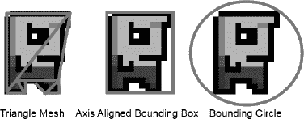

**图 8–8.** *Bob 的几种不同包围形状*

图 8–8 中三种包围形状的属性如下：

*   **三角形网格**：通过用若干三角形近似物体的轮廓，尽可能紧密地包围物体。它需要最多的存储空间，构建困难，且碰撞测试成本高。不过，它提供的结果最为精确。你未必使用与渲染相同的三角形，而是专门存储它们用于碰撞检测。该网格可以存储为一个顶点列表，每三个连续的顶点构成一个三角形。为了节省内存，你也可以使用索引顶点列表。
*   **轴对齐包围盒**：通过一个轴对齐的矩形来包围物体。这意味着矩形的底边和顶边始终与 x 轴对齐，左边和右边与 y 轴对齐。这种方法的碰撞测试速度也很快，但精度不如三角形网格。包围盒通常以其左下角的位置、宽度和高度来存储。（在二维情况下，这也被称为包围矩形）。
*   **包围圆**：用能容纳物体的最小圆形来包围物体。它的碰撞测试速度极快，但却是最不精确的包围形状。该圆形通常以其圆心位置和半径来存储。

游戏中的每个物体，除了位置、缩放和旋转外，还会获得一个包裹住它的包围形状。当然，当你移动物体时（例如，在物理积分步骤中），你需要根据物体的位置、缩放和旋转来调整包围形状的位置、缩放和旋转。

调整位置变化很简单：你只需相应地移动包围形状。对于三角形网格，只需移动每个顶点；对于包围矩形，移动左下角；对于包围圆，只需移动圆心。

缩放包围形状要稍微复杂一些。你需要定义一个围绕其进行缩放的点。这个点通常是物体的位置，通常也称为物体的中心。如果采用此约定，缩放就变得很简单了。对于三角形网格，缩放每个顶点的坐标；对于包围矩形，缩放其宽度、高度以及左下角的位置；对于包围圆，缩放其半径（圆心等于物体的中心）。

旋转包围形状同样依赖于旋转中心点的定义。如果采用上述约定（以物体中心为旋转点），旋转也变得容易了。对于三角形网格，只需将所有顶点围绕物体中心旋转。对于包围圆，你无需做任何事，因为无论物体如何旋转，半径都保持不变。包围矩形则稍微复杂一些。你需要构造出所有四个角点，旋转它们，然后找出能包围这四个点的轴对齐包围矩形。图 8–9 展示了旋转后的三种包围形状。

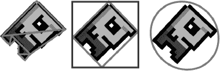

**图 8–9.** *旋转后的包围形状，以物体中心为旋转点*

虽然旋转三角形网格或包围圆相当容易，但轴对齐包围盒的结果却并不尽如人意。请注意，原始物体的包围盒比旋转后的版本贴合得更紧。这就引出了一个问题：我们最初是如何为 Bob 获取这些包围形状的。


### 构建包围形状

在本示例中，将基于鲍勃的图像手动构建包围形状。但假如鲍勃的图像以像素为单位给出，而你的世界以米为单位呢？这个问题的解决方案涉及归一化和模型空间。想象一下，当你用 OpenGL 渲染鲍勃时，在模型空间中为他使用的两个三角形。这个矩形在模型空间中以原点为中心，并且具有与鲍勃纹理图像相同的纵横比（宽/高）（即纹理贴图中为 32×32 像素，而模型空间中为 2×2 米）。现在你可以应用鲍勃的纹理，并找出模型空间中包围形状各点的位置。图 8–10 展示了如何在模型空间中围绕鲍勃构建包围形状。

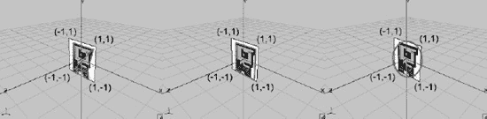

**图 8–10.** *模型空间中围绕鲍勃的包围形状*

这个过程可能看起来有些繁琐，但所涉及的步骤并不复杂。首先要记住纹理映射的工作原理。你需要为鲍勃矩形的每个顶点（由两个三角形组成）在纹理空间中指定纹理坐标。无论图像的实际像素宽度和高度是多少，纹理空间中纹理图像的左上角位于 (0,0)，左下角位于 (1,1)。要将图像像素空间转换为纹理空间，可以使用这个简单的变换：

```
u = x / imageWidth
v = y / imageHeight
```

其中 `u` 和 `v` 是图像空间中由 `x` 和 `y` 给出的像素的纹理坐标。`imageWidth` 和 `imageHeight` 设置为图像的像素尺寸（在鲍勃的例子中为 32×32）。图 8–11 展示了鲍勃图像的中心如何映射到纹理空间。

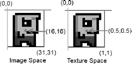

**图 8–11.** *从图像空间到纹理空间的像素映射*

该纹理应用于你在模型空间中定义的一个矩形。在图 8–10 中，有一个左上角在 (−1,1)、右下角在 (1,−1) 的示例。你可以使用米作为世界中的单位，因此该矩形的宽度和高度均为 2 米。此外，你知道左上角的纹理坐标为 (0,0)，右下角的纹理坐标为 (1,1)，因此你将整个纹理映射到鲍勃身上。情况并非总是如此，正如你在后续小节中会看到的那样。

现在你需要一种通用方法，从纹理空间映射到模型空间。通过将映射限制为仅针对纹理空间和模型空间中轴对齐的矩形，可以让工作稍微简单一些。假设纹理空间中一个轴对齐的矩形区域被映射到模型空间中的一个轴对齐矩形。对于这个变换，你需要知道模型空间中矩形的宽度和高度，以及纹理空间中矩形的宽度和高度。在鲍勃的例子中，你有一个在模型空间中的 2×2 矩形，以及在纹理空间中的 1×1 矩形（因为你将整个纹理映射到该矩形）。你还需要知道每个矩形在其各自空间中的左上角坐标。对于模型空间矩形，那是 (−1,1)；对于纹理空间矩形，那是 (0,0)（同样，因为你映射了整个纹理，而不仅仅是部分）。有了这些信息，再加上你想要映射到模型空间的像素的 u 坐标和 v 坐标，你可以通过以下两个方程进行变换：

```
mx = (u − minU) / (tWidth) × mWidth + minX
my = (1 − ((v − minV) / (tHeight)) × mHeight − minY
```

变量 `u` 和 `v` 是上一步从像素空间转换到纹理空间时计算出的坐标。变量 `minU` 和 `minV` 是你从纹理空间映射的区域左上角的坐标。变量 `tWidth` 和 `tHeight` 是你的纹理空间区域的宽度和高度。变量 `mWidth` 和 `mHeight` 是你的模型空间矩形的宽度和高度。变量 `minX` 和 `minY` 是——你猜对了——模型空间中矩形左上角的坐标。最后，你得到了 `mx` 和 `my`，即模型空间中变换后的坐标。

这些方程将 `u` 坐标和 `v` 坐标映射到 0 到 1 的范围，然后缩放并定位到模型空间中。图 8–12 展示了一个纹理空间中的纹素，以及它如何被映射到模型空间中的一个矩形。在两侧，你可以看到 `tWidth` 和 `tHeight`，以及 `mWidth` 和 `mHeight`。每个矩形的左上角对应于纹理空间中的 (`minU`，`minV`) 和模型空间中的 (`minX`，`minY`)。

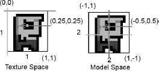

**图 8–12.** *从纹理空间到模型空间的映射*

代入前两个方程，你可以直接从像素空间转换到模型空间：

```
mx = ((x/imageWidth) − minU) / (tWidth) * mWidth + minX
my = (1 − (((y/imageHeight) − minV) / (tHeight)) * mHeight − minY
```

你可以使用这两个方程，根据通过纹理映射映射到对象矩形的图像，来计算对象的包围形状。对于三角形网格的情况，这可能有点繁琐；包围矩形和包围圆的情况则要简单得多。通常，你不需要走这条复杂路线，而是创建你的纹理，使得包围矩形至少与通过 OpenGL ES 为对象渲染的矩形具有相同的纵横比。这样，你可以直接从对象的图像尺寸构建包围矩形。包围圆的情况也是如此。希望这已经向你展示了，如何根据映射到模型空间矩形的图像，构建任意包围形状。

现在你应该知道如何为你的 2D 对象构建一个贴合良好的包围形状了。但请记住，在创建图形资源时手动定义这些包围形状的尺寸，并在游戏世界中定义对象的单位和大小。然后你可以在代码中使用这些尺寸来进行碰撞检测。


### 游戏对象属性

鲍勃变胖了。除了用于渲染的网格（映射到鲍勃图像纹理的矩形）之外，你现在还有一个第二种数据结构，以某种形式保存着他的边界框。关键是要认识到，虽然你根据模型空间中鲍勃的映射版本来建模边界框，但实际的边界框独立于你映射鲍勃矩形所用的纹理区域。当然，在创建边界形状时，请尽量使其与纹理中鲍勃图像的轮廓紧密匹配。然而，纹理图像是 32×32 像素还是 128×128 像素并不重要。因此，你世界中的一个对象具有三个属性组：

-   它的位置、方向、缩放、速度和加速度。利用这些属性，你可以应用上一节中的物理模型。当然，有些对象可能是静态的，因此只会包含位置、方向和缩放。通常你甚至可以省略方向和缩放。对象的位置通常与模型空间的原点重合，如图 8–10 所示。这可以使某些计算更简单。
-   它的边界形状（通常在模型空间中围绕对象中心构建），该形状与对象的位置重合，并与对象的方向和缩放对齐，如图 8–10 所示。这为你的对象提供了边界，并定义了其在世界中的大小。你可以根据需要使这个形状变得复杂。例如，你可以将其制作成由多个边界形状组合而成的复合形状。
-   它的图形表示。如图 8–12 所示，你仍然使用两个三角形为鲍勃形成一个矩形，并将他的图像纹理映射到矩形上。该矩形在模型空间中定义，但未必等同于边界形状，如图 8–10 所示。你发送给 OpenGL ES 的鲍勃的图形矩形略大于鲍勃的边界矩形。

这种属性分离允许你应用模型-视图-控制器（MVC）模式。

-   在模型方面，你拥有鲍勃的物理属性，包括他的位置、缩放、旋转、速度、加速度和边界形状。鲍勃的位置、缩放和方向决定了他的边界形状在世界空间中的位置。
-   视图只需获取鲍勃的图形表示（即在模型空间中定义的两个纹理映射三角形），并根据鲍勃的位置、旋转和缩放，在世界空间位置处渲染它们。这里你可以像之前那样使用 OpenGL ES 矩阵操作。
-   控制器负责根据用户输入（例如，按下左键可以让他向左移动）以及物理力（例如重力加速度，就像你在上一节中对炮弹施加的那样）来更新鲍勃的物理属性。

当然，鲍勃的边界形状与他在纹理中的图形表示之间存在某种对应关系，因为你基于该图形表示来构建边界形状。因此，你的 MVC 模式并非完全纯粹，但你可以接受这一点。

### 宽相位与窄相位碰撞检测

然而，你仍然不知道如何检查你的对象及其边界形状之间的碰撞。碰撞检测分为两个阶段：

> **宽相位**：在此阶段，你试图找出哪些对象可能发生碰撞。想象一下有 100 个可能相互碰撞的对象。如果你天真地选择测试每个对象与其他所有对象，那么你需要执行 100 × 100 / 2 次重叠测试。这种朴素的重叠测试方法具有 O(*n*²) 的渐近复杂度，意味着它需要 n² 步才能完成（实际上它可能只需要一半的步数就能完成，但渐近复杂度忽略了任何常数）。在一个良好的、非暴力的宽相位中，你可以尝试找出哪些对象对实际上有碰撞风险。其他对象对（例如，两个距离太远不可能发生碰撞的对象）将不会被检查。通过这种方式，你可以减少计算负载，因为窄相位测试通常相当昂贵。
> 
> **窄相位**：一旦你知道哪些对象对可能发生碰撞，你就需要通过对其边界形状执行重叠测试来测试它们是否真的发生碰撞。

你可以先关注窄相位，将宽相位留到后面处理。

## 窄相位

完成宽相位后，你必须检查可能发生碰撞的对象的边界形状是否重叠。前面提到过，你有几种边界形状的选择。三角形网格在计算上最昂贵且创建起来最麻烦。事实证明，在大多数 2D 游戏中，你可以使用边界矩形和边界圆，因此这是你可以在此处重点关注的内容。

### 圆形碰撞

边界圆是检查两个对象是否碰撞的最便宜的方法。让我们定义一个简单的 `Circle` 类。代码清单 8–4 展示了代码。

**代码清单 8–4.** `Circle.java`，一个简单的圆形类

```
package com.badlogic.androidgames.framework.math;

public class Circle {
    public final Vector2 center = new Vector2();
    public float radius;

    public Circle(float x, float y, float radius) {
        this.center.set(x,y);
        this.radius = radius;
    }
}
```

你将圆心存储为 `Vector2`，半径存储为一个简单的浮点数。如何检查两个圆是否重叠？请看图 8–13。

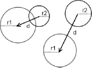

**图 8–13.** *两个圆重叠（左），以及两个圆不重叠（右）*

这非常简单且计算效率高。你所需要做的就是计算两个圆心之间的距离。如果距离大于两个半径之和，那么你就知道这两个圆不重叠。在代码中，这将表现为：

```
public boolean overlapCircles(Circle c1, Circle c2) {
    float distance = c1.center.dist(c2.center);
    return distance <= c1.radius + c2.radius;
}
```

首先，测量两个圆心之间的距离，然后检查该距离是否小于或等于半径之和。

你需要在 `Vector2.dist()` 方法中进行平方根运算。这很不幸，因为求平方根是一项开销很大的操作。你能让它更快吗？是的，可以——你需要做的只是重新表述你的条件：

`sqrt(dist.x × dist.x + dist.y × dist.y) <= radius1 + radius2`

你可以通过对不等式两边进行乘方来消除平方根，如下所示：

`dist.x × dist.x + dist.y × dist.y <= (radius1 + radius2) × (radius1 + radius2)`

你用右侧多一个加法和乘法运算来换取去除平方根。这要好得多。现在你可以创建一个 `Vector2.distSquared()` 函数，该函数将返回两个向量之间的距离平方：

```
public float distSquared(Vector2 other) {
    float distX = this.x - other.x;
    float distY = this.y - other.y;
    return distX*distX + distY*distY;
}
```

那么 `overlapCircles()` 方法就变成了：

```
public boolean overlapCircles(Circle c1, Circle c2) {
    float distance = c1.center.distSquared(c2.center);
    float radiusSum = c1.radius + c2.radius;
    return distance <= radiusSum * radiusSum;
}
```


### 矩形碰撞

现在你可以处理矩形了。首先，你需要一个能表示矩形的类。如前所述，你希望矩形由其左下角位置以及宽度和高度来定义。在代码清单 8–5 中正是这样实现的。

**代码清单 8–5.** `Rectangle.java`，一个矩形类

```
package com.badlogic.androidgames.framework.math;

public class Rectangle {
    public final Vector2 lowerLeft;
    public float width, height;

    public Rectangle(float x, float y, float width, float height) {
        this.lowerLeft = new Vector2(x,y);
        this.width = width;
        this.height = height;
    }
}
```

将左下角的位置存储在一个`Vector2`中，宽度和高度存储在两个浮点数中。如何检查两个矩形是否重叠？图 8–14 应该能给你一些启发。

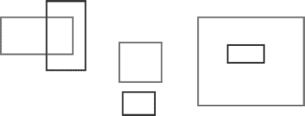

**图 8–14.** 大量重叠与不重叠的矩形

前两种情况（部分重叠和不重叠）很容易理解。最后一种情况则出人意料。当然，一个矩形可以完全包含在另一个矩形内部。这种情况在圆形中也同样会发生。不过，当两个圆形相互包含时，你之前实现的圆形重叠检测也能返回正确结果。

检查矩形是否重叠乍看起来相当复杂。不过，运用一点逻辑就能创建一个非常简单的测试。以下是检查两个矩形是否重叠的最简方法：

```
public boolean overlapRectangles(Rectangle r1, Rectangle r2) {
    if (r1.lowerLeft.x < r2.lowerLeft.x + r2.width &&
        r1.lowerLeft.x + r1.width > r2.lowerLeft.x &&
        r1.lowerLeft.y < r2.lowerLeft.y + r2.height &&
        r1.lowerLeft.y + r1.height > r2.lowerLeft.y)
        return true;
    else
        return false;
}
```

这段代码初看有点令人困惑，所以我们逐一分析每个条件。第一个条件表明第一个矩形的左边缘必须在第二个矩形右边缘的左侧。下一个条件表明第一个矩形的右边缘必须在第二个矩形左边缘的右侧。另外两个条件对矩形的上边缘和下边缘也提出了相同的要求。如果所有这些条件都满足，那么两个矩形就重叠了。你可以用图 8–14 来验证一下。该检测方法也涵盖了包含的情况。

### 圆与矩形碰撞

能否检测圆形与矩形是否重叠？答案是肯定的。不过，这稍微复杂一些。请看图 8–15。

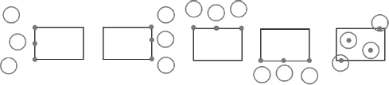

**图 8–15.** 通过寻找矩形上（或内）距离圆形最近的点，来检测圆形与矩形是否重叠

检测圆形与矩形是否重叠的总体策略如下：

*   找出矩形上或矩形内距离圆心最近的 x 坐标。该坐标可以是矩形左边或右边上的一个点，但前提是圆心不在矩形内部。如果圆心在矩形内部，则最近的 x 坐标就是圆心的 x 坐标。
*   找出矩形上或矩形内距离圆心最近的 y 坐标。该坐标可以是矩形上边或下边上的一个点，但前提是圆心不在矩形内部。如果圆心在矩形内部，则最近的 y 坐标就是圆心的 y 坐标。
*   如果由最近 x 坐标和最近 y 坐标构成的点位于圆内，则圆形和矩形重叠。

尽管在图 8–15 中没有描绘，但此方法同样适用于圆形完全包含矩形的情况。编写代码如下：

```
public boolean overlapCircleRectangle(Circle c, Rectangle r) {
    float closestX = c.center.x;
    float closestY = c.center.y;

    if (c.center.x < r.lowerLeft.x) {
        closestX = r.lowerLeft.x;
    }
    else if (c.center.x > r.lowerLeft.x + r.width) {
        closestX = r.lowerLeft.x + r.width;
    }

    if (c.center.y < r.lowerLeft.y) {
        closestY = r.lowerLeft.y;
    }
    else if (c.center.y > r.lowerLeft.y + r.height) {
        closestY = r.lowerLeft.y + r.height;
    }

    return c.center.distSquared(closestX, closestY) < c.radius * c.radius;
}
```

描述听起来比实际实现吓人多了。你只需确定矩形上距离圆心最近的点，然后检查该点是否位于圆内。如果位于圆内，则圆形和矩形之间就存在重叠。

请注意，你在`Vector2`中添加了一个重载的`distSquared()`方法，该方法接受两个浮点数参数，而不是另一个`Vector2`。对于`dist()`函数也要做相同处理。

### 整合所有内容

检查一个点是否位于圆内或矩形内也很有用。你可以再编写两个方法，并将它们与你刚刚定义的另外三个方法一起放入一个名为`OverlapTester`的类中。代码清单 8–6 展示了相关代码。

**代码清单 8–6.** `OverlapTester.java`；测试圆形、矩形和点之间的重叠

```
package com.badlogic.androidgames.framework.math;

public class OverlapTester {
    public static boolean overlapCircles(Circle c1, Circle c2) {
        float distance = c1.center.distSquared(c2.center);
        float radiusSum = c1.radius + c2.radius;
        return distance <= radiusSum * radiusSum;
    }

    public static boolean overlapRectangles(Rectangle r1, Rectangle r2) {
        if (r1.lowerLeft.x < r2.lowerLeft.x + r2.width &&
            r1.lowerLeft.x + r1.width > r2.lowerLeft.x &&
            r1.lowerLeft.y < r2.lowerLeft.y + r2.height &&
            r1.lowerLeft.y + r1.height > r2.lowerLeft.y)
            return true;
        else
            return false;
    }

    public static boolean overlapCircleRectangle(Circle c, Rectangle r) {
        float closestX = c.center.x;
        float closestY = c.center.y;

        if (c.center.x < r.lowerLeft.x) {
            closestX = r.lowerLeft.x;
        }
        else if (c.center.x > r.lowerLeft.x + r.width) {
            closestX = r.lowerLeft.x + r.width;
        }

        if (c.center.y < r.lowerLeft.y) {
            closestY = r.lowerLeft.y;
        }
        else if (c.center.y > r.lowerLeft.y + r.height) {
            closestY = r.lowerLeft.y + r.height;
        }

        return c.center.distSquared(closestX, closestY) < c.radius * c.radius;
    }
    public static boolean pointInCircle(Circle c, Vector2 p) {
        return c.center.distSquared(p) < c.radius * c.radius;
    }

    public static boolean pointInCircle(Circle c, float x, float y) {
        return c.center.distSquared(x, y) < c.radius * c.radius;
    }

    public static boolean pointInRectangle(Rectangle r, Vector2 p) {
        return r.lowerLeft.x <= p.x && r.lowerLeft.x + r.width >= p.x &&
               r.lowerLeft.y <= p.y && r.lowerLeft.y + r.height >= p.y;
    }

    public static boolean pointInRectangle(Rectangle r, float x, float y) {
        return r.lowerLeft.x <= x && r.lowerLeft.x + r.width >= x &&
               r.lowerLeft.y <= y && r.lowerLeft.y + r.height >= y;
    }
}
```

太棒了，现在你拥有了一个功能完备的 2D 数学库，可用于所有简单的物理模型和碰撞检测。接下来，我们可以更详细地探讨一下宽泛阶段检测。


#### 粗测阶段

那么，如何实现粗测阶段所承诺的神奇效果呢？请看图 8-16，这是一个典型的《超级马里奥兄弟》场景。

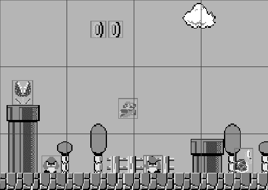

**图 8-16.** *超级马里奥和他的敌人们。物体周围的方框是它们的包围矩形；大框构成了施加于世界上的网格。*

你能猜到可以采取什么措施来消除一些碰撞检测吗？图 8-16 中的蓝色网格代表你可以用来划分世界的单元格。每个单元格的尺寸完全相同，并且整个世界都被单元格覆盖。马里奥当前位于其中两个单元格中，而其他可能与马里奥发生碰撞的物体则位于不同的单元格中。因此，你无需进行任何碰撞检查，因为马里奥与场景中其他任何物体都不在同一个单元格中。你只需要执行以下操作：

-   根据物理引擎和控制器步骤，更新世界中所有物体的状态。
-   根据物体的位置，更新每个物体包围形状的位置。当然，你也可以同时考虑物体的朝向和缩放。
-   根据包围形状，确定每个物体位于哪个或哪些单元格中，并将它们添加到这些单元格包含的物体列表中。
-   仅检查可能发生碰撞（例如，板栗仔不会与其他板栗仔发生碰撞）且位于同一单元格内的物体对。

这种方法被称为*空间哈希网格*粗测阶段，实现起来非常简单。你首先需要定义每个单元格的大小。这高度依赖于你在游戏世界中所使用的比例和单位。

#### 详细示例

基于上一个炮弹示例，开发一个空间哈希网格粗测阶段。你将完全重写它，以整合本节迄今涵盖的所有内容。除了大炮和炮弹之外，你还需要加入靶标。为了方便起见，只需使用 0.5×0.5 米的正方形作为靶标即可。这些正方形是静态的，不会移动。你的大炮也是静态的。唯一会移动的就是炮弹本身。通常，你可以将游戏世界中的物体分为**静态物体**和**动态物体**。现在，你可以设计一个代表这些物体的类。

##### GameObject、DynamicGameObject 和 Cannon

让我们从静态案例（即基础案例）开始，如代码清单 8-7 所示。

**代码清单 8-7.** *GameObject.java，一个带有位置和边界的静态游戏对象*

```
package com.badlogic.androidgames.gamedev2d;

import com.badlogic.androidgames.framework.math.Rectangle;
import com.badlogic.androidgames.framework.math.Vector2;

public class GameObject {
    public final Vector2 position;
    public final Rectangle bounds;

    public GameObject(float x, float y, float width, float height) {
        this.position = new Vector2(x,y);
        this.bounds = new Rectangle(x-width/2, y-height/2, width, height);
    }
}
```

游戏中的每个物体都有一个与其中心重合的位置。此外，让每个物体都有一个单一的包围形状——本例中为一个矩形。在构造函数中，根据参数设置位置和包围矩形（该矩形以物体中心为中心）。

对于动态物体（即移动的物体），你还需要跟踪其速度和加速度（如果它们自身确实被加速，例如通过引擎或推进器）。代码清单 8-8 显示了`DynamicGameObject`类的代码。

**代码清单 8-8.** *DynamicGameObject.java：为 GameObject 扩展速度和加速度向量*

```
package com.badlogic.androidgames.gamedev2d;

import com.badlogic.androidgames.framework.math.Vector2;

public class DynamicGameObject extends GameObject {
    public final Vector2 velocity;
    public final Vector2 accel;

    public DynamicGameObject(float x, float y, float width, float height) {
        super(x, y, width, height);
        velocity = new Vector2();
        accel = new Vector2();
    }
}
```

你扩展了`GameObject`类，以便继承位置和边界成员。此外，还为速度和加速度创建了向量。一个新的动态游戏对象在初始化后将具有零速度和零加速度。

在你的炮弹示例中，你拥有大炮、炮弹和靶标。炮弹是一个`DynamicGameObject`，因为它根据简单的物理模型移动。靶标是静态的，可以使用标准的`GameObject`来实现。大炮也可以通过`GameObject`类来实现。你将从一个`GameObject`类派生出一个`Cannon`类，并添加一个存储大炮当前角度的字段。代码清单 8-9 显示了代码。

**代码清单 8-9.** *Cannon.java：为 GameObject 扩展角度属性*

```
package com.badlogic.androidgames.gamedev2d;

public class Cannon extends GameObject {
    public float angle;

    public Cannon(float x, float y, float width, float height) {
        super(x, y, width, height);
        angle = 0;
    }
}
```

这样，就能完美地封装表示大炮世界中的物体所需的所有数据。每当你需要一个特殊类型的物体（如大炮）时，如果是静态物体，就可以简单地从`GameObject`派生；如果它具有速度和加速度，则从`DynamicGameObject`派生。

**注意：** 过度使用继承可能导致严重的麻烦和非常糟糕的代码架构。不要为了用继承而用继承。刚才使用的简单类层级结构是可以的，但不应让它变得更深（例如，再扩展`Cannon`）。还有其他的游戏对象表示方法，通过组合方式来完全避免继承。不过，对于你的目的而言，简单的继承已经足够。如果你对其他表示方法感兴趣，可以在网络上搜索“composites”或“mixins”。


### 空间哈希网格

你的加农炮将被一个 1×1 米的矩形所包围，炮弹的包围矩形为 0.2×0.2 米，而每个目标的包围矩形为 0.5×0.5 米。这些包围矩形以每个物体的位置为中心，这样能让你的工作更轻松一些。

当加农炮示例启动时，你可以简单地在随机位置放置若干个目标。以下是在你的世界中设置这些物体的方法：

```
Cannon cannon = new Cannon(0, 0, 1, 1);
DynamicGameObject ball = new DynamicGameObject(0, 0, 0.2f, 0.2f);
GameObject[] targets = new GameObject[NUM_TARGETS];
for (int i = 0; i < NUM_TARGETS; i++) {
    targets[i] = new GameObject((float)Math.random() * WORLD_WIDTH,
                                (float)Math.random() * WORLD_HEIGHT,
                                0.5f, 0.5f);  
}
```

常量 `WORLD_WIDTH` 和 `WORLD_HEIGHT` 定义了你的游戏世界的大小。所有事件都应发生在由 (0,0) 和 (`WORLD_WIDTH`, `WORLD_HEIGHT`) 所围成的矩形内。图 8–17 展示了目前游戏世界的一个简单模型。

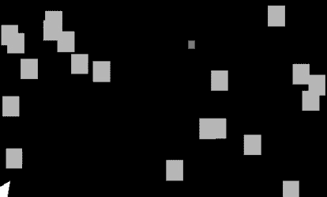

**图 8–17.** *你的游戏世界模型*

你的世界之后会看起来像这样，但现在你可以叠加一个空间哈希网格。哈希网格的单元格应该有多大？虽然没有银弹，但让它们比场景中最大的物体大五倍会很有帮助。在你的示例中，最大的物体是加农炮，但你不会让任何东西与加农炮碰撞，因此你可以基于场景中第二大的物体（即目标）来确定网格大小。这些目标的尺寸是 0.5×0.5 米。因此，一个网格单元的尺寸应为 2.5×2.5 米。图 8–18 显示了叠加到你的世界上的网格。

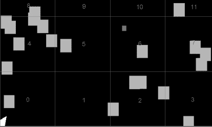

**图 8–18.** *你的加农炮世界，叠加了一个包含 12 个单元格的空间哈希网格*

你拥有固定数量的单元格——在加农炮世界的例子中，是 12 个。给每个单元格分配一个唯一的编号，从左下角的单元格开始，其 ID 为 0。请注意，顶部的单元格实际上延伸到了世界之外。这没有问题；你只需确保所有物体都保持在世界的边界之内即可。

你要做的是找出一个物体属于哪个（或哪些）单元格。理想情况下，你希望计算出包含该物体的单元格的 ID。这样你就可以使用以下简单的数据结构来存储你的单元格：

```
List<GameObject>[] cells;
```

没错；你将每个单元格表示为一个 `GameObject` 的列表。空间哈希网格本身仅由一个 `GameObject` 列表的数组构成。

现在，你可以计算出包含某个物体的单元格的 ID。图 8–18 显示了几个横跨两个单元格的目标。事实上，一个小物体可能横跨多达四个单元格，而一个比网格单元格大的物体可能横跨超过四个单元格。你可以通过选择网格单元格大小为游戏中最大物体尺寸的倍数来确保这种情况永远不会发生。这样一来，一个物体最多只能被包含在四个单元格中。

要计算一个物体的单元格 ID，只需取包围矩形的四个角点，并检查每个角点所在的单元格。确定一个点所在的单元格很容易——你只需将其坐标除以单元格的宽度。假设你有一个坐标为 (3,4) 的点，单元格大小为 2.5×2.5 米：该点将位于 ID 为 5 的单元格中，如图 8–18 所示。

你可以将点的每个坐标除以单元格大小，得到二维整数坐标，如下所示：

```
cellX = floor(point.x / cellSize) = floor(3 / 2.5) = 1
cellY = floor(point.y / cellSize) = floor(4 / 2.5) = 1
```

根据这些单元格坐标，你可以轻松获得单元格 ID：

```
cellId = cellX + cellY × cellsPerRow = 1 + 1 × 4 = 5
```

常量 `cellsPerRow` 就是用单元格覆盖 x 轴上的世界所需的单元格数：

```
cellsPerRow = ceil(worldWidth / cellSize) = ceil(9.6 / 2.5) = 4
```

你可以这样计算每列所需的单元格数：

```
cellsPerColumn = ceil(worldHeight / cellSize) = ceil(6.4 / 2.5) = 3
```

基于此，你可以相当容易地实现空间哈希网格。你通过提供世界的大小和所需的单元格大小来设置它。假设所有活动都发生在世界的正象限内。这意味着世界中所有点的 x 和 y 坐标都将为正。这是一个你可以接受的约束。

根据这些参数，空间哈希网格可以计算出它需要多少个单元格（`cellsPerRow` × `cellsPerColumn`）。你还可以添加一个简单的方法来将物体插入网格，该方法将使用物体的边界来确定包含它的单元格。然后，该物体将被添加到包含它的每个单元格的对象列表中。如果物体包围形状的一个角点位于网格之外，你可以直接忽略该角点。

在每一帧更新物体的位置后，将每个物体重新插入空间哈希网格。然而，在你的加农炮世界中，有些物体是不移动的，因此每一帧都重新插入它们是非常浪费的。通过为每个单元格存储两个列表来区分动态物体和静态物体。一个列表会每帧更新，只包含移动的物体；另一个列表是静态的，只有在插入新的静态物体时才会被修改。

最后，你需要一个方法，该方法返回与要碰撞的物体位于同一些单元格中的物体列表。这个方法所做的就是检查该物体位于哪些单元格中，检索这些单元格中的动态和静态物体列表，然后将它们返回给调用者。当然，你必须确保不返回任何重复项，这可能会发生在某个物体位于多个单元格中的情况。

代码清单 8–10 展示了代码（嗯，大部分代码）。`SpatialHashGrid.getCellIds()` 方法稍后讨论，因为它稍微复杂一些。

**代码清单 8–10.** *摘自 SpatialHashGrid.java：空间哈希网格实现*

```
package com.badlogic.androidgames.framework.gl;

import java.util.ArrayList;
import java.util.List;

import com.badlogic.androidgames.gamedev2d.GameObject;

import android.util.FloatMath;

public class SpatialHashGrid {
    List<GameObject>[] dynamicCells;
    List<GameObject>[] staticCells;
    int cellsPerRow;
    int cellsPerCol;
    float cellSize;
    int[] cellIds = new int[4];
    List<GameObject> foundObjects;
```

如前所述，你存储了两个单元格列表，一个用于动态物体，一个用于静态物体。你还存储了每行和每列的单元格数，这样你之后可以判断检查的点是在世界内部还是外部。单元格大小也需要存储。`cellIds` 数组是一个工作数组，你可以使用它临时存储一个 `GameObject` 所在的四个单元格 ID。如果它只位于一个单元格中，那么该数组的第一个元素将被设置为完全包含该物体的单元格的 ID。如果物体位于两个单元格中，那么该数组的前两个元素将存放单元格 ID，以此类推。为了指示单元格 ID 的数量，你将数组中所有“空”元素设置为 –1。`foundObjects` 列表也是一个工作列表，你可以在调用 `getPotentialColliders()` 时返回它。为什么你需要保留这两个成员，而不是在每次需要时实例化一个新数组和列表呢？想想垃圾回收器这个怪物吧。


```java
@SuppressWarnings("unchecked")
public SpatialHashGrid(float worldWidth, float worldHeight, float cellSize) {
    this.cellSize = cellSize;
    this.cellsPerRow = (int)FloatMath.ceil(worldWidth/cellSize);
    this.cellsPerCol = (int)FloatMath.ceil(worldHeight/cellSize);
    int numCells = cellsPerRow * cellsPerCol;
    dynamicCells = new List[numCells];
    staticCells = new List[numCells];
    for (int i = 0; i < numCells; i++) {
        dynamicCells[i] = new ArrayList<GameObject>(10);
        staticCells[i] = new ArrayList<GameObject>(10);
    }
    foundObjects = new ArrayList<GameObject>(10);
}
```

该类的构造函数接收世界的大小和所需的单元格尺寸。根据这些参数，计算出需要多少个单元格，然后实例化单元格数组以及用于存放每个单元格内对象的列表。初始化 `foundObjects` 列表。你实例化的所有 `ArrayList` 初始容量都为十个 `GameObject`。这样做是为了避免内存分配。其假设是，单个单元格不太可能包含超过十个 `GameObject`。只要这个假设成立，数组就无需调整大小。

```java
public void insertStaticObject(GameObject obj) {
    int[] cellIds = getCellIds(obj);
    int i = 0;
    int cellId = -1;
    while (i <= 3 && (cellId = cellIds[i++]) != -1) {
        staticCells[cellId].add(obj);
    }
}

public void insertDynamicObject(GameObject obj) {
    int[] cellIds = getCellIds(obj);
    int i = 0;
    int cellId = -1;
    while (i <= 3 && (cellId = cellIds[i++]) != -1) {
        dynamicCells[cellId].add(obj);
    }
}
```

接下来是 `insertStaticObject()` 和 `insertDynamicObject()` 方法。它们通过调用 `getCellIds()` 来计算对象所在单元格的 ID，并将对象相应地插入到对应的列表中。`getCellIds()` 方法实际上会填充 `cellIds` 成员数组。

```java
public void removeObject(GameObject obj) {
    int[] cellIds = getCellIds(obj);
    int i = 0;
    int cellId = -1;
    while (i <= 3 && (cellId = cellIds[i++]) != -1) {
        dynamicCells[cellId].remove(obj);
        staticCells[cellId].remove(obj);
    }
}
```

还有一个 `removeObject()` 方法，你可以用它来确定对象位于哪些单元格，然后从动态和静态列表中删除它。例如，当游戏对象死亡时，就需要用到这个方法。

```java
public void clearDynamicCells(GameObject obj) {
    int len = dynamicCells.length;
    for (int i = 0; i < len; i++) {
        dynamicCells[i].clear();
    }
}
```

`clearDynamicCells()` 方法将用于清空所有动态单元格列表。如前所述，你需要在每一帧重新插入动态对象之前调用此方法。

```java
public List<GameObject> getPotentialColliders(GameObject obj) {
    foundObjects.clear();
    int[] cellIds = getCellIds(obj);
    int i = 0;
    int cellId = -1;
    while (i <= 3 && (cellId = cellIds[i++]) != -1) {
        int len = dynamicCells[cellId].size();
        for (int j = 0; j < len; j++) {
            GameObject collider = dynamicCells[cellId].get(j);
            if (!foundObjects.contains(collider))
                foundObjects.add(collider);
        }

        len = staticCells[cellId].size();
        for (int j = 0; j < len; j++) {
            GameObject collider = staticCells[cellId].get(j);
            if (!foundObjects.contains(collider))
                foundObjects.add(collider);
        }
    }
    return foundObjects;
}
```

最后是 `getPotentialColliders()` 方法。它接收一个对象，并返回与该对象处于相同单元格中的相邻对象列表。使用工作列表 `foundObjects` 来存储找到的对象列表。同样，你不希望每次调用此方法时都实例化一个新列表。你只需要确定传递给方法的对象位于哪些单元格中。然后，你将那些单元格中找到的所有动态和静态对象添加到 `foundObjects` 列表中，并确保没有重复项。当然，使用 `foundObjects.contains()` 来检查重复项并非最优方案，但鉴于找到的对象数量永远不会很大，在这种情况下使用它是可以接受的。如果遇到性能问题，那么这里是优化的首选目标。遗憾的是，这并不简单。当然，你可以使用 `Set`，但每次向其中添加对象时，它都会在内部分配新对象。目前，就保持原样，知道如果出现性能问题可以再回来处理即可。

缺少的方法是 `SpatialHashGrid.getCellIds()`。代码清单 8–11 展示了它的代码。别担心，它只是看起来有点吓人。

**代码清单 8–11.** *SpatialHashGrid.java 的其余部分：实现 getCellIds()*

```java
public int[] getCellIds(GameObject obj) {
    int x1 = (int)FloatMath.floor(obj.bounds.lowerLeft.x / cellSize);
    int y1 = (int)FloatMath.floor(obj.bounds.lowerLeft.y / cellSize);
    int x2 = (int)FloatMath.floor((obj.bounds.lowerLeft.x + obj.bounds.width) / cellSize);
    int y2 = (int)FloatMath.floor((obj.bounds.lowerLeft.y + obj.bounds.height) / cellSize);

    if (x1 == x2 && y1 == y2) {
        if (x1 >= 0 && x1 < cellsPerRow && y1 >= 0 && y1 < cellsPerCol)
            cellIds[0] = x1 + y1 * cellsPerRow;
        else
            cellIds[0] = -1;
        cellIds[1] = -1;
        cellIds[2] = -1;
        cellIds[3] = -1;
    } else if (x1 == x2) {
        int i = 0;
        if (x1 >= 0 && x1 < cellsPerRow) {
            if (y1 >= 0 && y1 < cellsPerCol)
                cellIds[i++] = x1 + y1 * cellsPerRow;
            if (y2 >= 0 && y2 < cellsPerCol)
                cellIds[i++] = x1 + y2 * cellsPerRow;
        }
        while (i <= 3) cellIds[i++] = -1;
    } else if (y1 == y2) {
        int i = 0;
        if (y1 >= 0 && y1 < cellsPerCol) {
            if (x1 >= 0 && x1 < cellsPerRow)
                cellIds[i++] = x1 + y1 * cellsPerRow;
            if (x2 >= 0 && x2 < cellsPerRow)
                cellIds[i++] = x2 + y1 * cellsPerRow;
        }
        while (i <= 3) cellIds[i++] = -1;
    } else {
        int i = 0;
        int y1CellsPerRow = y1 * cellsPerRow;
        int y2CellsPerRow = y2 * cellsPerRow;
        if (x1 >= 0 && x1 < cellsPerRow && y1 >= 0 && y1 < cellsPerCol)
            cellIds[i++] = x1 + y1CellsPerRow;
        if (x2 >= 0 && x2 < cellsPerRow && y1 >= 0 && y1 < cellsPerCol)
            cellIds[i++] = x2 + y1CellsPerRow;
        if (x2 >= 0 && x2 < cellsPerRow && y2 >= 0 && y2 < cellsPerCol)
            cellIds[i++] = x2 + y2CellsPerRow;
        if (x1 >= 0 && x1 < cellsPerRow && y2 >= 0 && y2 < cellsPerCol)
            cellIds[i++] = x1 + y2CellsPerRow;
        while (i <= 3) cellIds[i++] = -1;
    }
    return cellIds;
}
```

该方法的前四行计算对象边界矩形左下角和右上角的单元格坐标。之前讨论过如何计算。要理解该方法的其余部分，请思考一个对象如何与网格单元格重叠。有四种可能性：


-   对象位于单个单元格内。边界矩形的左下角和右上角具有相同的单元格坐标。
-   对象水平跨越两个单元格。左下角在一个单元格内，右上角在右侧的单元格内。
-   对象垂直跨越两个单元格。左下角在一个单元格内，右上角在上方的单元格内。
-   对象跨越四个单元格。左下角在一个单元格内，右下角在右侧的单元格内，右上角在该单元格上方的单元格内，左上角在第一个单元格上方的单元格内。

该方法所做的就是针对每种可能的情况进行特殊处理。第一个 `if` 语句检查单单元格情况，第二个 `if` 语句检查水平双单元格情况，第三个 `if` 语句检查垂直双单元格情况，而 `else` 块处理对象重叠四个网格单元格的情况。在这四个块的每一个中，请确保仅在相应单元格坐标位于世界范围内时才设置单元格 `ID`。该方法的内容就是这些。

现在，这个方法看起来似乎需要大量的计算能力。的确如此，但实际消耗比其代码量所暗示的要少。最常见的情况是第一种，处理该情况的成本相当低。你能发现进一步优化此方法的机会吗？

### 整合所有内容

让我们将本节中积累的所有知识整合起来，形成一个不错的小示例。你可以像前几页讨论的那样，扩展上一节的炮弹示例。使用 `Cannon` 对象作为大炮，使用 `DynamicGameObject` 作为炮弹，并使用多个 `GameObject` 作为目标。每个目标的大小为 0.5×0.5 米，并随机放置在世界中。

你需要能够射击这些目标。为此，你需要碰撞检测。你可以遍历所有目标并与炮弹进行检测，但那样太无趣了。使用你新奇的 `SpatialHashGrid` 类来加速查找当前炮弹位置潜在碰撞目标的过程。但是，不要将炮弹或大炮插入网格中，因为这实际上对你没有帮助。

由于这个示例已经相当大了，将其拆分为多个代码清单。将测试命名为 `CollisionTest`，并将相应的屏幕命名为 `CollisionScreen`。像往常一样，我们只关注屏幕部分。先从代码清单 8-12 中的成员和构造函数开始。

**代码清单 8-12.** *摘自 `CollisionTest.java`：成员和构造函数*

```java
class CollisionScreen extends Screen {
    final int NUM_TARGETS = 20;
    final float WORLD_WIDTH = 9.6f;
    final float WORLD_HEIGHT = 4.8f;
    GLGraphics glGraphics;        
    Cannon cannon;
    DynamicGameObject ball;
    List<GameObject> targets;
    SpatialHashGrid grid;

    Vertices cannonVertices;
    Vertices ballVertices;
    Vertices targetVertices;

    Vector2 touchPos = new Vector2();
    Vector2 gravity = new Vector2(0, -10);

    public CollisionScreen(Game game) {
        super(game);
        glGraphics = ((GLGame)game).getGLGraphics();

        cannon = new Cannon(0, 0, 1, 1);
        ball = new DynamicGameObject(0, 0, 0.2f, 0.2f);
        targets = new ArrayList<GameObject>(NUM_TARGETS);
        grid = new SpatialHashGrid(WORLD_WIDTH, WORLD_HEIGHT, 2.5f);
        for (int i = 0; i < NUM_TARGETS; i++) {
            GameObject target = new GameObject((float)Math.random() * WORLD_WIDTH,
                                               (float)Math.random() * WORLD_HEIGHT,
                                               0.5f, 0.5f);  
            grid.insertStaticObject(target);
            targets.add(target);
        }

        cannonVertices = new Vertices(glGraphics, 3, 0, false, false);
        cannonVertices.setVertices(new float[] { -0.5f, -0.5f,
                                                  0.5f, 0.0f,
                                                 -0.5f, 0.5f }, 0, 6);

        ballVertices = new Vertices(glGraphics, 4, 6, false, false);            
        ballVertices.setVertices(new float[] { -0.1f, -0.1f,
                                                0.1f, -0.1f,
                                                0.1f,  0.1f,
                                               -0.1f,  0.1f }, 0, 8);
        ballVertices.setIndices(new short[] {0, 1, 2, 2, 3, 0}, 0, 6);

        targetVertices = new Vertices(glGraphics, 4, 6, false, false);
        targetVertices.setVertices(new float[] { -0.25f, -0.25f,
                                                  0.25f, -0.25f,
                                                  0.25f,  0.25f,
                                                 -0.25f,  0.25f }, 0, 8);
        targetVertices.setIndices(new short[] {0, 1, 2, 2, 3, 0}, 0, 6);
    }
```


你可以从 `CannonGravityScreen` 中借鉴大量代码。首先定义几个常量，用于控制目标数量与世界大小。接着，你需要 `GLGraphics` 实例，以及用于存储大炮、炮弹和目标的物体对象（目标存储在列表中）。当然，你还需要一个 `SpatialHashGrid`。为了渲染你的世界，你需要几个网格：一个用于大炮，一个用于炮弹，还有一个用于渲染每个目标。请记住，在 `BobTest` 中，你只需要一个矩形就能将 100 个 Bob 渲染到屏幕上。在此复用这一原则，而不要用单个 `Vertices` 实例来持有所有目标的三角形（矩形）。最后两个成员与 `CannonGravityTest` 中的相同。当用户触摸屏幕时，你将使用它们来发射炮弹并应用重力。

构造函数执行了前面讨论的所有操作。实例化你的世界对象和网格。唯一有趣的一点是，你还需要将目标作为静态对象添加到空间哈希网格中。

现在，请查看 代码清单 8–13 中 `CollisionTest` 类的下一个方法。

**代码清单 8–13.** *CollisionTest.java 摘录：update() 方法*

```java
@Override
public void update(float deltaTime) {
    List<TouchEvent> touchEvents = game.getInput().getTouchEvents();
    game.getInput().getKeyEvents();

    int len = touchEvents.size();
    for (int i = 0; i < len; i++) {
        TouchEvent event = touchEvents.get(i);

        touchPos.x = (event.x / (float) glGraphics.getWidth())* WORLD_WIDTH;
        touchPos.y = (1 - event.y / (float) glGraphics.getHeight()) * WORLD_HEIGHT;

        cannon.angle = touchPos.sub(cannon.position).angle();                      

        if(event.type == TouchEvent.TOUCH_UP) {
            float radians = cannon.angle * Vector2.TO_RADIANS;
            float ballSpeed = touchPos.len() * 2;
            ball.position.set(cannon.position);
            ball.velocity.x = FloatMath.cos(radians) * ballSpeed;
            ball.velocity.y = FloatMath.sin(radians) * ballSpeed;
            ball.bounds.lowerLeft.set(ball.position.x - 0.1f, ball.position.y - 0.1f);
        }
    }

    ball.velocity.add(gravity.x * deltaTime, gravity.y * deltaTime);
    ball.position.add(ball.velocity.x * deltaTime, ball.velocity.y * deltaTime);
    ball.bounds.lowerLeft.add(ball.velocity.x * deltaTime, ball.velocity.y * deltaTime);

    List<GameObject> colliders = grid.getPotentialColliders(ball);
    len = colliders.size();
    for(int i = 0; i < len; i++) {
        GameObject collider = colliders.get(i);
        if(OverlapTester.overlapRectangles(ball.bounds, collider.bounds)) {
            grid.removeObject(collider);
            targets.remove(collider);
        }
    }
}
```

与往常一样，首先获取触摸和按键事件，并且只遍历触摸事件。触摸事件的处理方式与 `CannonGravityTest` 中几乎相同。唯一的区别是，你使用的是 `Cannon` 对象而不是旧示例中的向量，并且在触摸事件结束后、大炮准备发射时，重置了炮弹的边界矩形。

下一个变化在于更新炮弹的方式。你没有直接使用向量，而是使用了为炮弹实例化的 `DynamicGameObject` 的成员。忽略了 `DynamicGameObject.acceleration` 成员，而是将重力加速度直接加到炮弹的速度上。将炮弹速度乘以 2，使其飞得更快一些。有趣的是，你不仅更新了炮弹的位置，还更新了其边界矩形左下角的位置。这一点至关重要，否则你的炮弹将移动，而其边界矩形却不会移动。为什么不直接使用炮弹的边界矩形来存储炮弹的位置呢？因为你可能希望为物体附加多个边界形状。那么，哪一个边界形状应该持有物体的实际位置呢？因此，将这两者分开是有益的，而且只会带来微小的计算开销。当然，你可以通过只将速度乘以一次 deltaTime 来优化这一点。这样，开销就简化为两次加法——为了你获得的灵活性，这点代价微不足道。

该方法的最后一部分是你的碰撞检测代码。在空间哈希网格中找到与炮弹位于相同单元格的目标。为此使用 `SpatialHashGrid.getPotentialColliders()` 方法。由于该方法会直接评估炮弹所在的单元格，因此你不需要将炮弹插入网格中。接下来，遍历所有潜在碰撞体，检查炮弹的边界矩形与潜在碰撞体的边界矩形之间是否真正存在重叠。如果存在，则简单地将目标从目标列表中移除。请记住，你只将目标作为静态对象添加到了网格中。

以上就是你的完整游戏机制。谜题的最后一块是实际的渲染，这应该不会让你感到意外。请参见 代码清单 8–14 中的代码。

**代码清单 8–14.** *CollisionTest.java 摘录：present() 方法*

```java
@Override
public void present(float deltaTime) {
    GL10 gl = glGraphics.getGL();
    gl.glViewport(0, 0, glGraphics.getWidth(), glGraphics.getHeight());
    gl.glClear(GL10.GL_COLOR_BUFFER_BIT);
    gl.glMatrixMode(GL10.GL_PROJECTION);
    gl.glLoadIdentity();
    gl.glOrthof(0, WORLD_WIDTH, 0, WORLD_HEIGHT, 1, -1);
    gl.glMatrixMode(GL10.GL_MODELVIEW);

    gl.glColor4f(0, 1, 0, 1);
    targetVertices.bind();
    int len = targets.size();
    for(int i = 0; i < len; i++) {
        GameObject target = targets.get(i);
        gl.glLoadIdentity();
        gl.glTranslatef(target.position.x, target.position.y, 0);
        targetVertices.draw(GL10.GL_TRIANGLES, 0, 6);
    }
    targetVertices.unbind();

    gl.glLoadIdentity();
    gl.glTranslatef(ball.position.x, ball.position.y, 0);
    gl.glColor4f(1,0,0,1);
    ballVertices.bind();
    ballVertices.draw(GL10.GL_TRIANGLES, 0, 6);
    ballVertices.unbind();  

    gl.glLoadIdentity();
    gl.glTranslatef(cannon.position.x, cannon.position.y, 0);
    gl.glRotatef(cannon.angle, 0, 0, 1);
    gl.glColor4f(1,1,1,1);
    cannonVertices.bind();
    cannonVertices.draw(GL10.GL_TRIANGLES, 0, 3);
    cannonVertices.unbind();                    
}
```

这里没有什么新内容。和往常一样，首先设置投影矩阵和视口，并清屏。接着，复用存储在 `targetVertices` 中的矩形模型，渲染所有目标。这本质上与你在 `BobTest` 中所做的相同，只不过这次渲染的是目标。然后，像在 `CollisionGravityTest` 中一样，渲染炮弹和大炮。

这里唯一要注意的是，你更改了绘制顺序，以便炮弹始终位于目标之上，而大炮始终位于炮弹之上。你还通过调用 `glColor4f()` 将目标渲染为绿色。


## 2D 世界中的摄像机

这个小测试的输出与图 8–17 完全相同，因此你可以跳过重复步骤。当你发射炮弹时，它会穿过目标区域。任何被炮弹击中的目标都会从世界中移除。

如果你稍加打磨并加入一些激励性的游戏机制，这个示例实际上可以变成一款不错的游戏。你能想到哪些改进？不妨动手尝试一下这个示例，以熟悉你在前几页中学到的新工具。

本章中还有几个内容需要讨论：摄像机、纹理图集和精灵图。这些内容涉及与图形相关的技巧，它们独立于你的游戏世界模型。那么，我们开始吧！

到目前为止，你的代码中还没有“摄像机”的概念；你只是通过`glOrthof()`定义了视锥体，就像这样：

```
gl.glMatrixMode(GL10.GL_PROJECTION);
gl.glLoadIdentity();
gl.glOrthof(0, FRUSTUM_WIDTH, 0, FRUSTUM_HEIGHT, 1, -1);
```

从第 6 章可知，前两个参数定义了视锥体在世界中左右边缘的 x 坐标，接下来两个参数定义了视锥体上下边缘的 y 坐标，最后两个参数定义了远近裁剪面。图 8–19 再次展示了这个视锥体。

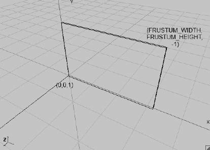

**图 8–19.** *再次展示 2D 世界中的视锥体*

因此，你只能看到世界中的区域 (0,0,1) 到 (`FRUSTUM_WIDTH`, `FRUSTUM_HEIGHT`,-1)。如果能将视锥体向左移动，岂不更妙？当然很棒，而且实现起来也极其简单：

```
gl.glOrthof(x, x + FRUSTUM_WIDTH, 0, FRUSTUM_HEIGHT, 1, -1);
```

此时，`x` 只是你定义的一个偏移量。当然，你也可以在 x 轴和 y 轴上同时移动：

```
gl.glOrthof(x, x + FRUSTUM_WIDTH, y, y + FRUSTUM_HEIGHT, 1, -1);
```

图 8–20 展示了这种移动的效果。

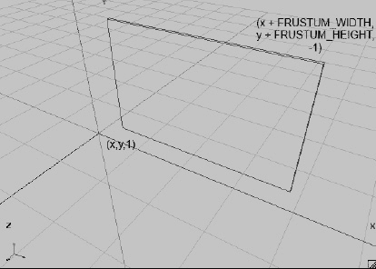

**图 8–20.** *移动视锥体*

只需在世界空间中指定视锥体的左下角即可。这已经足够实现一个可自由移动的 2D 摄像机。但你可以做得更好。是否可以不通过指定`x`和`y`来设定视锥体的左下角，而是指定视锥体的中心？这样，你就可以轻松地将视锥体居中于某个特定位置的物体上——例如，前例中的炮弹：

```
gl.glOrthof(x – FRUSTUM_WIDTH / 2, x + FRUSTUM_WIDTH / 2, y – FRUSTUM_HEIGHT / 2, y + FRUSTUM_HEIGHT / 2, 1, -1);
```

图 8–21 展示了这种效果。

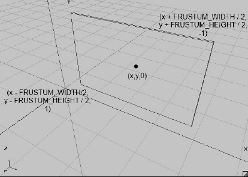

**图 8–21.** *以中心点指定视锥体*

然而，`glOrthof()` 的功能远不止于此。缩放功能呢？我们来思考一下。你知道，通过 `glViewportf()`，可以告诉 OpenGL ES 你希望将视锥体的内容渲染到屏幕的哪个部分。OpenGL ES 会自动拉伸和缩放输出，以适配视口。现在，如果你缩小视锥体的宽度和高度，你将在屏幕上显示世界的一个更小区域——这就是放大。如果你放大视锥体，你可以显示世界的更多部分——这就是缩小。因此，你可以引入一个缩放因子，将其乘以视锥体的宽度和高度来实现缩放。因子为 1 时，将使用正常的视锥体宽度和高度显示世界，如图 8–21](#Chapter08.html#fig_8_21) 所示。因子小于 1 将放大视锥体中心，而因子大于 1 将缩小，显示世界的更多部分（例如，将缩放因子设为 2 将显示世界两倍的范围）。以下是使用 `glOrthof()` 实现此功能的方法：

```
gl.glOrthof(x – FRUSTUM_WIDTH / 2 * zoom, x + FRUSTUM_WIDTH / 2 * zoom, y – FRUSTUM_HEIGHT / 2 * zoom, y + FRUSTUM_HEIGHT / 2 * zoom, 1, -1);
```

简单至极！现在，你可以创建一个摄像机类，它包含一个观察位置（视锥体中心）、标准的视锥体宽度和高度，以及一个缩放因子，用于缩小或放大视锥体，从而显示更少的世界内容（放大）或更多的世界内容（缩小）。图 8–22 展示了缩放因子为 0.5（内部灰色框）和 1（外部透明框）时的视锥体。

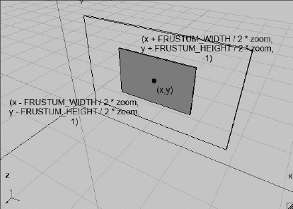

**图 8–22.** *通过调整视锥体大小进行缩放*

为了让功能更完善，你还应该添加一个功能。想象一下，你触摸屏幕，并想确定触摸的是 2D 世界中的哪个点。在之前不断改进的炮弹示例中，你已经这样做过几次了。对于未考虑摄像机位置和缩放的视锥体配置，如图 8–19](#Chapter08.html#fig_8_19) 所示，你使用了以下公式（参见炮弹示例中的 `update()` 方法）：

```
worldX = (touchX / Graphics.getWidth()) × FRUSTUM_WIDTH;
worldY = (1 – touchY / Graphics.getHeight()) × FRUSTUM_HEIGHT;
```

首先，通过将触摸点的 x 和 y 坐标除以屏幕的宽度和高度，将其归一化到 0 到 1 的范围内，然后乘以视锥体的宽度和高度，将其转换到世界空间。你所需做的只是将视锥体的位置和缩放因子考虑进去。以下是实现方法：

```
worldX = (touchX / Graphics.getWidth()) × FRUSTUM_WIDTH + x – FRUSTUM_WIDTH / 2;
worldY = (1 – touchY / Graphics.getHeight()) × FRUSTUM_HEIGHT + y – FRUSTUM_HEIGHT / 2;
```

这里，`x` 和 `y` 是你的摄像机在世界空间中的位置。


### Camera2D 类

现在让我们将所有内容整合到一个类中。这个类需要存储相机的位置、标准平截头体的宽度和高度，以及缩放因子。你还需要一个便捷的方法来正确设置视口（始终使用整个屏幕）和投影矩阵。此外，还需要一个能将触摸坐标转换为世界坐标的方法。代码清单 8–15 展示了新的 `Camera2D` 类。

**代码清单 8–15.** `Camera2D.java`，适用于 2D 渲染的全新相机类

```
package com.badlogic.androidgames.framework.gl;

import javax.microedition.khronos.opengles.GL10;

import com.badlogic.androidgames.framework.impl.GLGraphics;
import com.badlogic.androidgames.framework.math.Vector2;

public class Camera2D {
    public final Vector2 position;
    public float zoom;
    public final float frustumWidth;
    public final float frustumHeight;
    final GLGraphics glGraphics;
```

如前所述，你将相机的位置、平截头体的宽度和高度以及缩放因子存储为成员变量。位置和缩放因子是公开的，以便你可以轻松操作它们。你还需要一个对 `GLGraphics` 的引用，以便获取屏幕当前的像素宽度和高度，用于将触摸坐标转换为世界坐标。

```
    public Camera2D(GLGraphics glGraphics, float frustumWidth, float frustumHeight) {
        this.glGraphics = glGraphics;
        this.frustumWidth = frustumWidth;
        this.frustumHeight = frustumHeight;
        this.position = new Vector2(frustumWidth / 2, frustumHeight / 2);
        this.zoom = 1.0f;
    }
```

在构造函数中，将 `GLGraphics` 实例以及缩放因子为 1 时的平截头体宽度和高度作为参数传入。你存储这些参数，并将相机的位置初始化为朝向由 (0,0,1) 和 (`frustumWidth`, `frustumHeight`,–1) 所界定盒子的中心，如图 8–19 所示。初始缩放因子设置为 1。

```
    public void setViewportAndMatrices() {
        GL10 gl = glGraphics.getGL();
        gl.glViewport(0, 0, glGraphics.getWidth(), glGraphics.getHeight());
        gl.glMatrixMode(GL10.GL_PROJECTION);
        gl.glLoadIdentity();
        gl.glOrthof(position.x - frustumWidth * zoom / 2,
                    position.x + frustumWidth * zoom / 2,
                    position.y - frustumHeight * zoom / 2,
                    position.y + frustumHeight * zoom / 2,
                    1, -1);
        gl.glMatrixMode(GL10.GL_MODELVIEW);
        gl.glLoadIdentity();
    }
```

`setViewportAndMatrices()` 方法将视口设置为覆盖整个屏幕，并按照之前讨论的方式，根据相机的参数设置投影矩阵。在该方法末尾，告诉 OpenGL ES 后续所有矩阵操作均针对模型视图矩阵，并加载一个单位矩阵。每帧都调用此方法，以便你从一个干净的状态开始。不再需要直接调用 OpenGL ES 来设置视口和投影矩阵。

```
    public void touchToWorld(Vector2 touch) {
        touch.x = (touch.x / (float) glGraphics.getWidth()) * frustumWidth * zoom;
        touch.y = (1 - touch.y / (float) glGraphics.getHeight()) * frustumHeight * zoom;
        touch.add(position).sub(frustumWidth * zoom / 2, frustumHeight * zoom / 2);
    }
}
```

`touchToWorld()` 方法接收一个包含触摸坐标的 `Vector2` 实例，并将该向量转换到世界空间。这与之前讨论的方法相同；唯一的区别在于你可以使用自带的便捷 `Vector2` 类。

#### 示例

在炮弹示例中使用 `Camera2D` 类。复制 `CollisionTest` 文件并将其重命名为 `Camera2DTest`。将文件内部的 `GLGame` 类重命名为 `Camera2DTest`，并将 `CollisionScreen` 类重命名为 `Camera2DScreen`。你需要做一些小的改动来使用新的 `Camera2D` 类。

首先，在 `Camera2DScreen` 类中添加一个新的成员变量：

```
Camera2D camera;
```

在构造函数中初始化该成员变量，具体如下：

```
camera = new Camera2D(glGraphics, WORLD_WIDTH, WORLD_HEIGHT);
```

传入你的 `GLGraphics` 实例以及世界的宽度和高度，这些之前在你调用 `glOrthof()` 时被用作平截头体的宽度和高度。现在你需要做的就是用以下代码替换 `present()` 方法中直接调用 OpenGL ES 的代码，原代码如下：

```
gl.glViewport(0, 0, glGraphics.getWidth(), glGraphics.getHeight());
gl.glClear(GL10.GL_COLOR_BUFFER_BIT);
gl.glMatrixMode(GL10.GL_PROJECTION);
gl.glLoadIdentity();
gl.glOrthof(0, WORLD_WIDTH, 0, WORLD_HEIGHT, 1, -1);
gl.glMatrixMode(GL10.GL_MODELVIEW);
```

将其替换为：

```
gl.glClear(GL10.GL_COLOR_BUFFER_BIT);
camera.setViewportAndMatrices();
```

当然，你仍然需要清除帧缓冲区，但所有其他直接调用 OpenGL ES 的代码都被很好地隐藏在了 `Camera2D.setViewportAndMatrices()` 方法中。如果运行这段代码，你会发现一切没有变化。所有功能与之前一致——你只是让代码变得更简洁、更灵活。

你还可以简化测试中的 `update()` 方法。既然已经在相机类中添加了 `Camera2D.touchToWorld()` 方法，不妨直接用起来。你可以将 update 方法中的下面这段代码：

```
touchPos.x = (event.x / (float) glGraphics.getWidth())* WORLD_WIDTH;
touchPos.y = (1 - event.y / (float) glGraphics.getHeight()) * WORLD_HEIGHT;
```

替换为：

```
camera.touchToWorld(touchPos.set(event.x, event.y));
```

简洁明了——现在一切都很好地封装起来了。但如果不充分利用相机类的全部功能，那就太无趣了。以下是计划：当炮弹未飞出时，希望相机以“常规”方式观察世界。这很简单；你已经在这么做了。你可以通过检查炮弹位置的 y 坐标是否小于或等于零来判断炮弹是否在飞行。由于你始终对炮弹施加重力，即使不发射它也会下落，因此这是一种简单的判断方法。

当炮弹飞行时（y 坐标大于零），新的功能将生效。你希望相机跟随炮弹。只需将相机的位置设置为炮弹的位置即可实现。这样会使炮弹始终保持在屏幕中心。你还想尝试使用缩放功能。因此，你可以根据炮弹的 y 坐标增加缩放因子：距离零点越远，缩放因子越大。如果炮弹的 y 坐标更高，这将使相机拉远。以下是需要在测试屏幕的 `update()` 方法末尾添加的代码：

```
if(ball.position.y > 0) {
    camera.position.set(ball.position);
    camera.zoom = 1 + ball.position.y / WORLD_HEIGHT;
} else {
    camera.position.set(WORLD_WIDTH / 2, WORLD_HEIGHT / 2);
    camera.zoom = 1;
}
```

只要炮弹的 y 坐标大于零，相机就会跟随它并拉远视角。只需在标准缩放因子 1 的基础上增加一个值。这个值就是炮弹 y 位置与世界高度之间的比例。如果炮弹的 y 坐标位于 `WORLD_HEIGHT`，缩放因子将为 2，因此你会看到更多的世界。实现方式非常灵活；你可以使用任何你想要的公式——这里并没有什么神奇之处。如果炮弹的位置小于或等于零，则按之前的示例正常显示世界。


## 纹理图集：因为共享即是关爱

到目前为止，你在程序中只使用了单一纹理。如果你不仅想渲染鲍勃，还想渲染其他超级英雄、敌人、爆炸效果或金币，该怎么办？你可以使用多个纹理，每个纹理存放一种对象类型的图像。但 OpenGL ES 可能不太喜欢这种做法，因为你需要为渲染的每种对象类型切换纹理（即绑定鲍勃的纹理、渲染鲍勃，绑定金币纹理、渲染金币，依此类推）。你可以通过将多个图像放入单个纹理来更高效地实现这一点。这就是纹理图集：一个包含多个图像的单一纹理。你只需绑定该纹理一次，然后即可渲染图集中包含图像的任何实体类型。这可以减少状态切换的开销，并提升性能。图 8-23 展示了这样一个纹理图集。

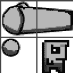

**图 8-23** *纹理图集*

图 8-23 中有三个对象：一门大炮、一枚炮弹和鲍勃。网格并非纹理的一部分，它仅用于说明你通常如何创建纹理图集。

纹理图集的尺寸为 64×64 像素，每个网格为 32×32 像素。大炮占据两个网格，炮弹占据不到四分之一网格，鲍勃占据一个网格。现在，回顾一下你如何定义大炮、炮弹和目标的边界（以及图形矩形），你会发现它们之间的大小关系与你在网格中看到的非常相似。目标在你的世界中是 0.5×0.5 米，大炮是 0.2×0.2 米。在你的纹理图集中，鲍勃占据 32×32 像素，炮弹占据略小于 16×16 像素。纹理图集与你世界中对象大小的关系应该很明确了：图集中的 32 像素对应你世界中的 0.5 米。最初示例中，大炮是 1×1 米，但当然你可以更改。根据你的纹理图集，大炮占据 64×32 像素，因此你应该让大炮在你世界中的尺寸为 1×0.5 米。哇，这真是异常简单，不是吗？

那么，为什么选择 32 像素来匹配你世界中的 1 米呢？请记住，纹理的宽度和高度必须是 2 的幂。使用像 32 这样的 2 的幂像素单位来映射到世界中的 0.5 米，是让美术师应对纹理大小限制的一种便捷方式。这也使得在像素艺术中更容易正确把握不同对象的大小关系。

请注意，并没有任何限制阻止你在每个世界单位中使用更多像素。你可以选择 64 像素或 50 像素来匹配世界中的 0.5 米。那么，什么样的像素到米的比例比较合适呢？这同样取决于游戏运行的屏幕分辨率。让我们进行一些计算。

你的大炮世界以左下角(0,0)和左上角(9.6,4.8)为边界。这被映射到你的屏幕上。让我们计算一下，在 Hero 手机的屏幕（横屏模式下 480×320 像素）上，每世界单位有多少像素：

```
pixelsPerUnitX = screenWidth / worldWidth = 480 / 9.6 = 50 像素/米
pixelsPerUnitY = screenHeight / worldHeight = 320 / 6.4 = 50 像素/米
```

你的大炮，现在在世界中占据 1×0.5 米，因此在屏幕上将使用 50×25 像素。你可以从纹理中使用 64×32 像素的区域，因此实际上在渲染大炮时，可以稍微缩小纹理图像。这完全没问题——OpenGL ES 会自动为你处理。取决于你为纹理设置的缩小过滤器，结果要么清晰且像素化（`GL_NEAREST`），要么稍微平滑一些（`GL_LINEAR`）。如果你希望 Hero 手机达到像素级完美渲染，你需要稍微缩放纹理图像。你可以使用 25×25 像素的网格尺寸，而不是 32×32。然而，如果你只是调整图集图像的大小（或者更准确地说，完全重新手绘），你会得到一幅 50×50 像素的图像——这对 OpenGL ES 来说不可行。你必须向左侧和底部添加填充，以得到 64×64 像素的图像（因为 OpenGL ES 要求宽度和高度为 2 的幂）。因此，OpenGL ES 在 Hero 手机上缩放纹理图像是没有问题的。

在像 Nexus One（横屏模式下 800×480 像素）这样的高分辨率设备上情况如何？让我们通过以下公式针对这种屏幕配置进行计算：

```
pixelsPerUnitX = screenWidth / worldWidth = 800 / 9.6 = 83 像素/米
pixelsPerUnitY = screenHeight / worldHeight = 480 / 6.4 = 75 像素/米
```

你在 x 轴和 y 轴上得到不同的每单位像素数，因为你的视锥体宽高比（9.6 / 6.4 = 1.5）与屏幕的宽高比（800 / 480 = 1.66）不同。这在第 4 章中已经讨论过，并概述了若干解决方案。当时，你针对固定的像素尺寸和宽高比进行设计；现在你可以采用该方案，针对固定的视锥体宽度和高度进行设计。在 Nexus One 的情况下，由于更高的分辨率和不同的宽高比，大炮、炮弹和鲍勃会被放大并拉伸。请接受这一事实，因为你希望所有玩家都能看到你世界的同一区域。否则，具有更宽宽高比的玩家将能够看到更多世界，从而获得优势。

那么，你如何使用这样的纹理图集呢？你只需重新映射矩形。你不需要使用整个纹理，而是仅使用其中的一部分。为了计算纹理图集中包含的图像角落的纹理坐标，你可以复用前一个例子中的公式。快速回顾一下：

```
u = x / imageWidth
v = y / imageHeight
```

这里，`u`和`v`是纹理坐标，`x`和`y`是像素坐标。鲍勃左上角的像素坐标为(32,32)。将其代入上述公式，得到纹理坐标(0.5,0.5)。你可以对需要的任何其他角落执行相同操作，并据此为矩形的顶点设置正确的纹理坐标。


#### 示例

将纹理图集添加到你之前的示例中，让它看起来更美观。`Bob` 将成为你的目标。

复制 `Camera2DTest` 并稍作修改。将副本放在名为 `TextureAtlasTest.java` 的文件中，并相应重命名其中包含的两个类（`TextureAtlasTest` 和 `TextureAtlasScreen`）。

你要做的第一件事是向 `TextureAtlasScreen` 添加一个新成员：

`Texture texture;`

不要在构造函数中创建 `Texture`，而是在 `resume()` 方法中创建它。请记住，当你的应用程序从暂停状态恢复时，纹理将会丢失，因此你必须在 `resume()` 方法中重新创建它们：

`@Override`
`public void resume() {`
`texture = new Texture(((GLGame)game), "atlas.png");`
`}`

将图 8-23 中的图片放入项目的 `assets/` 文件夹中，并将其命名为 `atlas.png`。（当然，它不包含图中所示的网格线。）

接下来，你需要修改顶点的定义。你为每种实体类型（大炮、炮弹和 Bob）都有一个 `Vertices` 实例，每个实例持有一个由四个顶点和六个索引组成的矩形，构成三个三角形。你所需做的只是根据纹理图集为每个顶点添加纹理坐标。你还需要将大炮从三角形表示改为一个 1×0.5 米的矩形表示。以下是用于替换构造函数中旧顶点创建代码的内容：

```
cannonVertices = new Vertices(glGraphics, 4, 6, false, true);
cannonVertices.setVertices(new float[] { -0.5f, -0.25f, 0.0f, 0.5f,
                                          0.5f, -0.25f, 1.0f, 0.5f,
                                          0.5f,  0.25f, 1.0f, 0.0f,
                                         -0.5f,  0.25f, 0.0f, 0.0f },
                                          0, 16);
cannonVertices.setIndices(new short[] {0, 1, 2, 2, 3, 0}, 0, 6);
```

```
ballVertices = new Vertices(glGraphics, 4, 6, false, true);
ballVertices.setVertices(new float[] { -0.1f, -0.1f, 0.0f, 0.75f,
                                        0.1f, -0.1f, 0.25f, 0.75f,
                                        0.1f,  0.1f, 0.25f, 0.5f,
                                       -0.1f,  0.1f, 0.0f, 0.5f },
                                        0, 16);
ballVertices.setIndices(new short[] {0, 1, 2, 2, 3, 0}, 0, 6);
```

```
targetVertices = new Vertices(glGraphics, 4, 6, false, true);
targetVertices.setVertices(new float[] { -0.25f, -0.25f, 0.5f, 1.0f,
                                          0.25f, -0.25f, 1.0f, 1.0f,
                                          0.25f,  0.25f, 1.0f, 0.5f,
                                         -0.25f,  0.25f, 0.5f, 0.5f },
                                          0, 16);
targetVertices.setIndices(new short[] {0, 1, 2, 2, 3, 0}, 0, 6);
```

你的每个网格现在由四个顶点组成，每个顶点都包含一个二维位置和纹理坐标。向网格添加六个索引，用于指定你想要渲染的两个三角形。大炮在 y 轴上略小一些。现在它的尺寸是 1×0.5 米，而不是 1×1 米。这也反映在构造函数中稍早时 `Cannon` 对象的构造上：

`cannon = new Cannon(0, 0, 1, 0.5f);`

由于你无需对大炮本身进行任何碰撞检测，因此在该构造函数中设置什么尺寸并不重要；这样做只是为了保持一致性。

你需要修改的最后一件事是你的渲染方法。以下是其完整代码：

```
@Override
public void present(float deltaTime) {
    GL10 gl = glGraphics.getGL();
    gl.glClear(GL10.GL_COLOR_BUFFER_BIT);
    camera.setViewportAndMatrices();

    gl.glEnable(GL10.GL_BLEND);
    gl.glBlendFunc(GL10.GL_SRC_ALPHA, GL10.GL_ONE_MINUS_SRC_ALPHA);
    gl.glEnable(GL10.GL_TEXTURE_2D);
    texture.bind();

    targetVertices.bind();
    int len = targets.size();
    for(int i = 0; i < len; i++) {
        GameObject target = targets.get(i);
        gl.glLoadIdentity();
        gl.glTranslatef(target.position.x, target.position.y, 0);
        targetVertices.draw(GL10.GL_TRIANGLES, 0, 6);
    }
    targetVertices.unbind();

    gl.glLoadIdentity();
    gl.glTranslatef(ball.position.x, ball.position.y, 0);
    ballVertices.bind();
    ballVertices.draw(GL10.GL_TRIANGLES, 0, 6);
    ballVertices.unbind();

    gl.glLoadIdentity();
    gl.glTranslatef(cannon.position.x, cannon.position.y, 0);
    gl.glRotatef(cannon.angle, 0, 0, 1);
    cannonVertices.bind();
    cannonVertices.draw(GL10.GL_TRIANGLES, 0, 6);
    cannonVertices.unbind();
}
```

在这里，你启用了混合，设置了合适的混合函数，启用了纹理处理，并绑定了你的图集纹理。你还需要稍微调整 `cannonVertices.draw()` 调用，现在它会渲染两个三角形而不是一个。这就完成了所有工作。图 8-24 展示了你的“整容”操作结果。

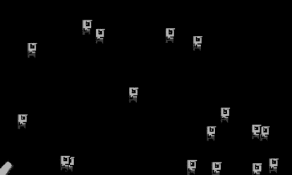

**图 8-24.** *用纹理图集美化大炮示例*

关于纹理图集，你还需要了解以下几点：

- 当你使用 `GL_LINEAR` 作为缩小和/或放大过滤器时，如果图集中的两个图像彼此接触，可能会出现伪影。这是因为纹理映射器实际上会为屏幕上的一个像素从纹理中获取最近的四个纹素。当它对某个图像的边界执行此操作时，它也会从图集中相邻的图像获取纹素。你可以通过在图像之间引入 2 像素的空边框来消除这个问题。更好的方法是复制每个图像的边界像素。第一种解决方案更简单——只需确保你的纹理大小依然是 2 的幂次。

- 无需将图集中的所有图像都排列在一个固定的网格中。你可以尽可能紧凑地将任意大小的图像放入图集中。你只需要知道图像在图集中的起始和结束位置，以便为其计算正确的纹理坐标。然而，打包任意大小的图像是一个不容忽视的问题。网上有一些工具可以帮助你创建纹理图集；只需搜索一下，你就会找到大量选择。

- 通常，你无法将游戏中的所有图像都放入一个纹理中。请记住，不同设备支持的最大纹理大小各不相同。你可以放心地假设所有设备都支持 512×512 像素（甚至 1024×1024 像素）的纹理大小。因此，你可以拥有多个纹理图集。不过，你应该尝试将会在屏幕上一起看到的对象分组到同一个图集中——例如，第 1 关的所有对象放在一个图集中，第 2 关的所有对象放在另一个图集中，所有 UI 元素放在另一个图集中，以此类推。在最终确定你的美术资产之前，请考虑好逻辑分组。

- 还记得你在 Mr. Nom 中是如何动态绘制数字的吗？你当时就用到了纹理图集。实际上，你可以通过纹理图集执行所有动态文本渲染。只需将游戏所需的所有字符放入一个图集，然后通过多个矩形映射到图集中相应的字符，按需渲染它们。你可以在网上找到一些工具，这些工具会为你生成所谓的*位图字体*。为了你在后续章节中的目的，请坚持使用 Mr. Nom 中使用的方法：静态文本将作为一个整体预先渲染，只有动态文本（例如，高分中的数字）将通过图集进行渲染。


你可能已经注意到，Bob 在图形上被炮弹击中之前就消失了。这是因为你的碰撞形状稍微有点大。Bob 和炮弹周围有一些空白区域。解决方案是什么？只需让碰撞形状稍微小一点。你应该对此有所感觉，因此调整源代码，直到碰撞效果合适。在开发游戏时，你经常会发现这样微调的机会。微调可能除了好的关卡设计之外，是最关键的部分之一。让事物感觉合适可能很困难，但一旦你达到了《超级马里奥兄弟》中那样的完美程度，会非常有满足感。遗憾的是，这是无法传授的，因为它取决于你游戏的外观和感觉。把它看作是区分好游戏与坏游戏的神奇配方。

**注意：** 为了解决上述提到的消失问题，使边界矩形比其图形表示稍微小一点，以允许在触发碰撞前有一定的重叠。

## 纹理区域、精灵和批处理：隐藏 OpenGL ES

到目前为止，你为炮弹示例编写的代码包含大量样板代码，其中一些是可以简化的。其中一个方面是`Vertices`实例的定义。用七行代码来定义一个纹理矩形很繁琐。另一个你可以改进的方面是手动计算纹理图集中图像的纹理坐标。最后，当你想要渲染 2D 矩形时，涉及大量高度重复的代码。还有一种比每个对象一次绘制调用更好的渲染多个对象的方法。你可以通过引入几个新概念来解决所有这些问题：

- **纹理区域**：你在上一个示例中使用了纹理区域。纹理区域是单个纹理中的一个矩形区域（例如，图集中包含炮弹的区域）。你需要一个优秀的类来封装所有从像素坐标转换到纹理坐标的繁琐计算。
- **精灵**：精灵很像一个游戏对象。它有一个位置（以及可能的朝向和缩放），以及一个图形范围。你通过矩形来渲染精灵，就像你渲染 Bob 或炮弹一样。实际上，Bob 和其他对象的图形表示可以而且应该被视为精灵。精灵也映射到纹理中的一个区域。这就是纹理区域的用武之地。虽然直接结合游戏中的精灵很诱人，但你应该遵循模型-视图-控制器模式将它们分开。这种图形和模型代码的清晰分离可以实现更好的设计。
- **精灵批处理**：精灵批处理负责一次性渲染多个精灵。为此，精灵批处理需要知道每个精灵的位置、大小和纹理区域。精灵批处理将是你的神奇成分，用来摆脱每个对象的多次绘制调用和矩阵操作。

这些概念紧密相连，接下来将进行讨论。

### TextureRegion 类

由于你已经使用过纹理区域，因此应该很容易明白你需要什么。你知道如何从像素坐标转换到纹理坐标。你需要一个类，在其中可以指定纹理图集中图像的像素坐标，然后该类会存储相应的图集区域的纹理坐标，以供进一步处理（例如，当你想要渲染一个精灵时）。话不多说，清单 8-16 展示了你的`TextureRegion`类。

***清单 8-16.*** `TextureRegion.java`：将像素坐标转换为纹理坐标

```java
package com.badlogic.androidgames.framework.gl;

public class TextureRegion {
    public final float u1, v1;
    public final float u2, v2;
    public final Texture texture;

    public TextureRegion(Texture texture, float x, float y, float width, float height) {
        this.u1 = x / texture.width;
        this.v1 = y / texture.height;
        this.u2 = this.u1 + width / texture.width;
        this.v2 = this.v1 + height / texture.height;
        this.texture = texture;
    }
}
```

`TextureRegion`以纹理坐标形式存储区域左上角（`u1`，`v1`）和右下角（`u2`，`v2`）的纹理坐标。构造函数接受一个`Texture`以及区域左上角的像素坐标和区域的宽度和高度。要为`Cannon`构造一个纹理区域，你可以这样做：

```java
TextureRegion cannonRegion = new TextureRegion(texture, 0, 0, 64, 32);
```

同样，你可以为 Bob 构造一个区域：

```java
TextureRegion bobRegion = new TextureRegion(texture, 32, 32, 32, 32);
```

以此类推。你可以在已创建的示例代码中使用它，并利用`TextureRegion`的`u1`、`v1`、`u2`和`v2`成员来指定矩形顶点的纹理坐标。但你不需要这么做，因为你想要完全摆脱这些繁琐的定义。这正是你可以使用精灵批处理来完成的。


### `SpriteBatcher` 类

如前所述，一个精灵可以通过其位置、大小和纹理区域（以及可选的旋转角度和缩放比例）轻松定义。它本质上就是世界空间中的一个图形化矩形。为简化操作，请遵循惯例：将位置设为精灵中心，并围绕该中心构建矩形。现在你可以创建一个 `Sprite` 类并按如下方式使用：

`Sprite bobSprite = new Sprite(20, 20, 0.5f, 0.5f, bobRegion);`

这将构建一个新精灵，其中心位于世界坐标 (20,20)，向四周各延伸 0.25 米，并使用 `bobRegion TextureRegion`。但你也可以这样操作：

`spriteBatcher.drawSprite(bob.x, bob.y, BOB_WIDTH, BOB_HEIGHT, bobRegion);`

这样看起来就好多了。你不需要再为对象的图形表现创建额外对象，而是按需绘制 Bob 实例。你也可以使用一个重载方法：

`spriteBatcher.drawSprite(cannon.x, cannon.y, CANNON_WIDTH, CANNON_HEIGHT, cannon.angle, cannonRegion);`

这将绘制经过角度旋转的加农炮。那么，如何实现精灵批处理器呢？`Vertices` 实例又在哪里？让我们思考一下批处理器的工作原理。

究竟什么是批处理？在图形学领域中，批处理被定义为将多次绘制调用合并为一次绘制调用。如前章所述，这能让 GPU 更高效地工作。精灵批处理器提供了一种实现方式，具体原理如下：

- 批处理器拥有一个初始为空（或在收到清除指令后变空）的缓冲区，该缓冲区用于存储顶点。在你的案例中，它将是一个简单的浮点数组。
- 每次调用 `SpriteBatcher.drawSprite()` 方法时，会根据参数指定的位置、大小、朝向和纹理区域，向缓冲区添加四个顶点。这意味着你需要手动旋转和平移顶点位置，而非借助 OpenGL ES。不过别担心，`Vector2` 类的代码将在此处派上用场。这是消除所有绘制调用的关键。
- 当你指定完所有需要渲染的精灵后，通知精灵批处理器一次性将所有精灵矩形对应的顶点提交给 GPU，然后调用实际的 OpenGL ES 绘制方法渲染所有矩形。为此，你可以将浮点数组的内容传输至 `Vertices` 实例，并利用它渲染矩形。

**注意：** 你只能对使用同一纹理的精灵进行批处理。不过这问题不大，因为你本来就会使用纹理图集。

精灵批处理器的典型使用模式如下：

`batcher.beginBatch(texture);`  
`// 根据需要多次调用 batcher.drawSprite()，引用纹理中的区域`  
`batcher.endBatch();`

调用 `SpriteBatcher.beginBatch()` 会向批处理器传达两件事：清空缓冲区，并使用传入的纹理。为方便起见，你将在此方法内绑定纹理。

接着，根据需求渲染任意多个引用该纹理区域的精灵。这将填充缓冲区，每个精灵增加四个顶点。

调用 `SpriteBatcher.endBatch()` 表示通知精灵批处理器当前批次的精灵渲染已完成，应立即将顶点上传至 GPU 进行实际渲染。你将使用带索引的渲染方式（借助 `Vertices` 实例），因此在浮点数组缓冲区中除了顶点之外，还需要指定索引。但由于你始终渲染矩形，可以预先在 `SpriteBatcher` 的构造函数中一次性生成索引。为此，你需要知道批处理器每批能绘制多少个精灵。通过设定每批可渲染精灵数量的硬性上限，你无需扩展任何数组或其他缓冲区，只需在构造函数中一次性分配这些数组和缓冲区。

整体机制相当简单。`SpriteBatcher.drawSprite()` 方法看似神秘，但并非难题（如果暂时忽略旋转和缩放）。你只需要根据参数计算顶点位置和纹理坐标即可。在之前的示例（如定义加农炮、炮弹和 Bob 的矩形时）中，你已手动完成过类似操作。在 `SpriteBatcher.drawSprite()` 方法中，你可以基于方法参数自动完成大致相同的操作。现在让我们查看 `SpriteBatcher`。[代码清单 8–17](http://Chapter08.html#list_8_17) 展示了相关代码。

**代码清单 8–17.** *`SpriteBatcher.java` 节选（不含旋转和缩放）*

```
package com.badlogic.androidgames.framework.gl;

import javax.microedition.khronos.opengles.GL10;

import android.util.FloatMath;

import com.badlogic.androidgames.framework.impl.GLGraphics;
import com.badlogic.androidgames.framework.math.Vector2;

public class SpriteBatcher {
    final float[] verticesBuffer;
    int bufferIndex;
    final Vertices vertices;
    int numSprites;
```

首先查看成员变量。`verticesBuffer` 是临时浮点数组，用于存储当前批次精灵的顶点。`bufferIndex` 指示在浮点数组中写入下一组顶点的起始位置。`vertices` 是用于渲染批次的 `Vertices` 实例，它也将存储稍后定义的索引。`numSprites` 记录当前批次已绘制的精灵数量。

```
public SpriteBatcher(GLGraphics glGraphics, int maxSprites) {
    this.verticesBuffer = new float[maxSprites*4*4];
    this.vertices = new Vertices(glGraphics, maxSprites*4, maxSprites*6, false,
    true);
    this.bufferIndex = 0;
    this.numSprites = 0;

    short[] indices = new short[maxSprites*6];
    int len = indices.length;
    short j = 0;
    for (int i = 0; i < len; i += 6, j += 4) {
                indices[i + 0] = (short)(j + 0);
                indices[i + 1] = (short)(j + 1);
                indices[i + 2] = (short)(j + 2);
                indices[i + 3] = (short)(j + 2);
                indices[i + 4] = (short)(j + 3);
                indices[i + 5] = (short)(j + 0);
        }
        vertices.setIndices(indices, 0, indices.length);
    }
```

进入构造函数，它有两个参数：创建 `Vertices` 实例所需的 `GLGraphics` 实例，以及批处理器每批能渲染的最大精灵数。构造函数中首先创建浮点数组。每个精灵有四个顶点，每个顶点占用四个浮点数（两个用于 x、y 坐标，另外两个用于纹理坐标）。最多可有 `maxSprites` 个精灵，因此缓冲区需要 4 × 4 × `maxSprites` 个浮点数。

接着创建 `Vertices` 实例，需要存储 `maxSprites` × 4 个顶点和 `maxSprites` × 6 个索引。告知 `Vertices` 实例，每个顶点不仅包含位置属性，还包含纹理坐标。然后将 `bufferIndex` 和 `numSprites` 成员初始化为零。为 `Vertices` 实例创建索引，由于索引永不改变，只需执行一次。批次中的第一个精灵的索引始终为 0, 1, 2, 2, 3, 0；下一个精灵则为 4, 5, 6, 6, 7, 4；依此类推。你可以预先计算这些索引并存储到 `Vertices` 实例中，这样只需设置一次，而不是每个精灵都设置。

```
public void beginBatch(Texture texture) {
        texture.bind();
        numSprites = 0;
        bufferIndex = 0;
    }
```


## 方法详解

接下来是`beginBatch()`方法。它绑定纹理并重置`numSprites`和`bufferIndex`成员，以便第一个精灵的顶点将被插入到`verticesBuffer`浮点数组的起始位置。

```
public void endBatch() {
    vertices.setVertices(verticesBuffer, 0, bufferIndex);
    vertices.bind();
    vertices.draw(GL10.GL_TRIANGLES, 0, numSprites * 6);
    vertices.unbind();
}
```

下一个方法是`endBatch()`；你需要调用它来最终确定并绘制当前批次。它首先将为此批次定义的顶点从浮点数组传输到`Vertices`实例。剩下的工作就是绑定`Vertices`实例，绘制`numSprites` × 2 个三角形，然后再次解绑`Vertices`实例。由于你使用索引渲染，需要指定要使用的索引数量——每个精灵六个索引，乘以`numSprites`。渲染的整个过程就是这样。

```
public void drawSprite(float x, float y, float width, float height, TextureRegion region) {
    float halfWidth = width / 2;
    float halfHeight = height / 2;
    float x1 = x - halfWidth;
    float y1 = y - halfHeight;
    float x2 = x + halfWidth;
    float y2 = y + halfHeight;

    verticesBuffer[bufferIndex++] = x1;
    verticesBuffer[bufferIndex++] = y1;
    verticesBuffer[bufferIndex++] = region.u1;
    verticesBuffer[bufferIndex++] = region.v2;

    verticesBuffer[bufferIndex++] = x2;
    verticesBuffer[bufferIndex++] = y1;
    verticesBuffer[bufferIndex++] = region.u2;
    verticesBuffer[bufferIndex++] = region.v2;

    verticesBuffer[bufferIndex++] = x2;
    verticesBuffer[bufferIndex++] = y2;
    verticesBuffer[bufferIndex++] = region.u2;
    verticesBuffer[bufferIndex++] = region.v1;

    verticesBuffer[bufferIndex++] = x1;
    verticesBuffer[bufferIndex++] = y2;
    verticesBuffer[bufferIndex++] = region.u1;
    verticesBuffer[bufferIndex++] = region.v1;

    numSprites++;
}
```

下一个方法是`SpriteBatcher`的核心方法。它接收精灵中心的 x 和 y 坐标、其宽度和高度，以及它所映射到的`TextureRegion`。该方法的职责是将四个顶点添加到当前`bufferIndex`起始的浮点数组中。这四个顶点组成一个纹理映射矩形。你计算左下角（`x1`，`y1`）和右上角（`x2`，`y2`）的位置，并使用这四个变量以及来自`TextureRegion`的纹理坐标来构建顶点。顶点按逆时针顺序添加，从左下顶点开始。一旦它们被添加到浮点数组，你就递增`numSprites`计数器，并等待添加另一个精灵或最终确定批次。

这就是全部工作。你只需通过将预变换的顶点缓冲在浮点数组中并一次性渲染它们，就消除了一大批绘制方法。与之前使用的方法相比，这将显著提高你的 2D 精灵渲染性能。减少 OpenGL ES 状态变化和更少的绘制调用让 GPU 更高效。

还有一件事需要实现：一个可以绘制旋转精灵的`SpriteBatcher.drawSprite()`方法。你需要做的就是构造四个角顶点（不添加位置），绕原点旋转它们，添加精灵的位置使顶点位于世界空间中，然后按照之前的绘制方法继续。你可以使用`Vector2.rotate()`来实现，但这会带来一些函数开销。因此，你重现了`Vector2.rotate()`中的代码，并尽可能进行了优化。`SpriteBatcher`的最终方法如清单 8-18 所示。

**清单 8-18.** *SpriteBatcher.java 的其余部分：绘制旋转精灵的方法*

```
public void drawSprite(float x, float y, float width, float height, float angle, TextureRegion region) {
    float halfWidth = width / 2;
    float halfHeight = height / 2;

    float rad = angle * Vector2.TO_RADIANS;
    float cos = FloatMath.cos(rad);
    float sin = FloatMath.sin(rad);

    float x1 = -halfWidth * cos - (-halfHeight) * sin;
    float y1 = -halfWidth * sin + (-halfHeight) * cos;
    float x2 = halfWidth * cos - (-halfHeight) * sin;
    float y2 = halfWidth * sin + (-halfHeight) * cos;
    float x3 = halfWidth * cos - halfHeight * sin;
    float y3 = halfWidth * sin + halfHeight * cos;
    float x4 = -halfWidth * cos - halfHeight * sin;
    float y4 = -halfWidth * sin + halfHeight * cos;

    x1 += x;
    y1 += y;
    x2 += x;
    y2 += y;
    x3 += x;
    y3 += y;
    x4 += x;
    y4 += y;

    verticesBuffer[bufferIndex++] = x1;
    verticesBuffer[bufferIndex++] = y1;
    verticesBuffer[bufferIndex++] = region.u1;
    verticesBuffer[bufferIndex++] = region.v2;

    verticesBuffer[bufferIndex++] = x2;
    verticesBuffer[bufferIndex++] = y2;
    verticesBuffer[bufferIndex++] = region.u2;
    verticesBuffer[bufferIndex++] = region.v2;

    verticesBuffer[bufferIndex++] = x3;
    verticesBuffer[bufferIndex++] = y3;
    verticesBuffer[bufferIndex++] = region.u2;
    verticesBuffer[bufferIndex++] = region.v1;

    verticesBuffer[bufferIndex++] = x4;
    verticesBuffer[bufferIndex++] = y4;
    verticesBuffer[bufferIndex++] = region.u1;
    verticesBuffer[bufferIndex++] = region.v1;

    numSprites++;
}
```

你采用与较简单的绘制方法相同的操作，不同的是你构造了全部四个角点，而不仅仅是两个对角点。这是旋转所必需的。其余部分与之前相同。

缩放呢？你并不需要另一个方法，因为缩放精灵只需要缩放其宽度和高度。你可以在两个绘制方法外部进行缩放，因此不需要为精灵的缩放绘制再准备一组方法。

这就是 OpenGL ES 实现闪电般快速精灵渲染背后的重大秘密。


### 使用 `SpriteBatcher` 类

现在你可以在你的火炮示例中整合 `TextureRegion` 和 `SpriteBatcher` 这两个类。复制 `TextureAtlas` 示例并将其重命名为 `SpriteBatcherTest`。其中包含的类可以命名为 `SpriteBatcherTest` 和 `SpriteBatcherScreen`。

去掉屏幕类中的 `Vertices` 成员。你不再需要它们了，因为 `SpriteBatcher` 会为你处理所有繁琐的工作。取而代之，添加以下成员：

```java
TextureRegion cannonRegion;
TextureRegion ballRegion;
TextureRegion bobRegion;
SpriteBatcher batcher;
```

现在，你的图集中三个对象各自对应了一个 `TextureRegion`，同时也拥有一个 `SpriteBatcher`。

接下来，修改屏幕的构造函数。去掉所有 `Vertices` 的实例化和初始化代码，并用一行代码替换：

```java
batcher = new SpriteBatcher(glGraphics, 100);
```

这会将我们的 `batcher` 成员设置为一个新的 `SpriteBatcher` 实例，该实例可以在一个批次中渲染多达 100 个精灵。

`TextureRegion` 在 `resume()` 方法中初始化，因为它们依赖于 `Texture`：

```java
@Override
public void resume() {
    texture = new Texture(((GLGame)game), "atlas.png");
    cannonRegion = new TextureRegion(texture, 0, 0, 64, 32);
    ballRegion = new TextureRegion(texture, 0, 32, 16, 16);
    bobRegion = new TextureRegion(texture, 32, 32, 32, 32);
}
```

这里没什么意外。最后需要修改的是 `present()` 方法。你会惊讶地发现它现在看起来如此简洁。代码如下：

```java
@Override
public void present(float deltaTime) {
    GL10 gl = glGraphics.getGL();
    gl.glClear(GL10.GL_COLOR_BUFFER_BIT);
    camera.setViewportAndMatrices();

    gl.glEnable(GL10.GL_BLEND);
    gl.glBlendFunc(GL10.GL_SRC_ALPHA, GL10.GL_ONE_MINUS_SRC_ALPHA);
    gl.glEnable(GL10.GL_TEXTURE_2D);

    batcher.beginBatch(texture);

    int len = targets.size();
    for (int i = 0; i < len; i++) {
        GameObject target = targets.get(i);
        batcher.drawSprite(target.position.x, target.position.y, 0.5f, 0.5f, bobRegion);
    }

    batcher.drawSprite(ball.position.x, ball.position.y, 0.2f, 0.2f, ballRegion);
    batcher.drawSprite(cannon.position.x, cannon.position.y, 1, 0.5f, cannon.angle, cannonRegion);
    batcher.endBatch();
}
```

这真是太棒了。你现在调用的 OpenGL ES 方法仅用于清除屏幕、启用混合和纹理贴图以及设置混合函数。其余的都是纯粹的 `SpriteBatcher` 和 `Camera2D` 的功劳。由于所有对象共享同一个纹理图集，你可以在一个批次中渲染它们。你使用图集纹理调用 `batcher.beginBatch()`，使用简单的绘制方法渲染所有 Bob 目标，渲染球体（同样使用简单绘制方法），最后使用可以旋转精灵的绘制方法渲染火炮。最后调用 `batcher.endBatch()` 结束该方法，该方法会实际将精灵的几何数据传送到 GPU 并渲染所有内容。

### 性能测量

那么 `SpriteBatcher` 方法比你在 `BobTest` 中使用的方法快多少？像在 `BobTest` 中那样，在代码中添加一个 `FPSCounter`，并在 Hero、Droid 和 Nexus One 设备上测试。将目标数量增加到 100，并将 `SpriteBatcher` 可渲染的最大精灵数设置为 102，因为你要渲染 100 个目标、1 个球体和 1 个火炮。结果如下：

```
Hero (1.5):
12-27 23:51:09.400: DEBUG/FPSCounter(2169): fps: 31
12-27 23:51:10.440: DEBUG/FPSCounter(2169): fps: 31
12-27 23:51:11.470: DEBUG/FPSCounter(2169): fps: 32
12-27 23:51:12.500: DEBUG/FPSCounter(2169): fps: 32

Droid (2.1.1):
12-27 23:50:23.416: DEBUG/FPSCounter(8145): fps: 56
12-27 23:50:24.448: DEBUG/FPSCounter(8145): fps: 56
12-27 23:50:25.456: DEBUG/FPSCounter(8145): fps: 56
12-27 23:50:26.456: DEBUG/FPSCounter(8145): fps: 55

Nexus One (2.2.1):
12-27 23:46:57.162: DEBUG/FPSCounter(754): fps: 61
12-27 23:46:58.171: DEBUG/FPSCounter(754): fps: 61
12-27 23:46:59.181: DEBUG/FPSCounter(754): fps: 61
12-27 23:47:00.181: DEBUG/FPSCounter(754): fps: 60
```

在得出结论之前，让我们也测试一下旧的方法。由于该示例并不完全等同于旧的 `BobTest`，修改 `TextureAtlasTest`，它和当前示例相同——唯一的区别是它使用旧的 `BobTest` 方法进行渲染。结果如下：

```
Hero (1.5):
12-27 23:53:45.950: DEBUG/FPSCounter(2303): fps: 46
12-27 23:53:46.720: DEBUG/dalvikvm(2303): GC freed 21811 objects / 524280 bytes in 135ms
12-27 23:53:46.970: DEBUG/FPSCounter(2303): fps: 40
12-27 23:53:47.980: DEBUG/FPSCounter(2303): fps: 46
12-27 23:53:48.990: DEBUG/FPSCounter(2303): fps: 46

Droid (2.1.1):
12-28 00:03:13.004: DEBUG/FPSCounter(8277): fps: 52
12-28 00:03:14.004: DEBUG/FPSCounter(8277): fps: 52
12-28 00:03:15.027: DEBUG/FPSCounter(8277): fps: 53
12-28 00:03:16.027: DEBUG/FPSCounter(8277): fps: 53

Nexus One (2.2.1):
12-27 23:56:09.591: DEBUG/FPSCounter(873): fps: 61
12-27 23:56:10.591: DEBUG/FPSCounter(873): fps: 60
12-27 23:56:11.601: DEBUG/FPSCounter(873): fps: 61
12-27 23:56:12.601: DEBUG/FPSCounter(873): fps: 60
```

与使用 `glTranslate()` 等方法的旧方式相比，Hero 在新 `SpriteBatcher` 方法下性能表现差很多。Droid 实际上从新方法中受益，而 Nexus One 则基本不受影响。如果你将目标数量再增加 100 个，你会发现在 Nexus One 上 `SpriteBatcher` 方法也会更快。

那么 Hero 是怎么回事呢？`BobTest` 中的问题是调用了太多 OpenGL ES 方法，那么为什么现在使用了更少的 OpenGL ES 方法调用，性能反而更差了呢？


### 规避 `FloatBuffer` 中的一个 Bug

这个现象的原因并不明显。每次调用 `Vertices.setVertices()` 时，你的 `SpriteBatcher` 都会将一个浮点数数组放入一个直接的 `ByteBuffer` 中。该方法最终会调用 `FloatBuffer.put(float[])`，而这正是导致性能问题的元凶。虽然桌面版 Java 通过真正的批量内存移动来实现 `FloatBuffer` 的该方法，但 Harmony 版本却会对数组中的每个元素调用 `FloatBuffer.put(float)`。这非常不幸，因为该方法是 JNI 方法，其开销非常大（很像同样是 JNI 方法的 OpenGL ES 方法）。

有几种解决方案。例如，`IntBuffer.put(int[])` 就没有这个问题。你可以将 `Vertices` 类中的 `FloatBuffer` 替换为 `IntBuffer`，并修改 `Vertices.setVertices()` 方法，使其首先将浮点数从 float 数组传输到一个临时的 int 数组，然后将该 int 数组的内容复制到 `IntBuffer` 中。这个解决方案是由另一位游戏开发者 Ryan McNally 提出的，他也在 Android 问题追踪器上报告了这个 Bug。在 Hero 设备上，这个修复方案能带来五倍的性能提升，在其他 Android 设备上提升幅度稍小一些。

请修改 `Vertices` 类以包含此修复。将 `vertices` 成员变量更改为 `IntBuffer` 类型。添加一个名为 `tmpBuffer` 的新成员变量，它是一个 `int[]` 数组。`tmpBuffer` 数组在 `Vertices` 的构造函数中初始化，如下所示：

`this.tmpBuffer = new int[maxVertices * vertexSize / 4];`

同时，在构造函数中，你也需要从 `ByteBuffer` 获取一个 `IntBuffer` 视图，而不是 `FloatBuffer`：

`vertices = buffer.asIntBuffer();`

现在，`Vertices.setVertices()` 方法看起来像这样：

```java
public void setVertices(float[] vertices, int offset, int length) {
    this.vertices.clear();
    int len = offset + length;
    for (int i = offset, j = 0; i < len; i++, j++)
        tmpBuffer[j] = Float.floatToRawIntBits(vertices[i]);
    this.vertices.put(tmpBuffer, 0, length);
    this.vertices.flip();
}
```

首先，将 `vertices` 参数的内容传输到 `tmpBuffer`。静态方法 `Float.floatToRawIntBits()` 会将浮点数的位模式重新解释为整数。然后，你需要将 int 数组的内容复制到 `IntBuffer`（即曾经的 `FloatBuffer`）中。这样能提升性能吗？在 Hero、Droid 和 Nexus One 上运行 `SpriteBatcherTest` 现在会产生以下输出：

```
Hero (1.5):
12-28 00:24:54.770: DEBUG/FPSCounter(2538): fps: 61
12-28 00:24:54.770: DEBUG/FPSCounter(2538): fps: 61
12-28 00:24:55.790: DEBUG/FPSCounter(2538): fps: 62
12-28 00:24:55.790: DEBUG/FPSCounter(2538): fps: 62

Droid (2.1.1):
12-28 00:35:48.242: DEBUG/FPSCounter(1681): fps: 61
12-28 00:35:49.258: DEBUG/FPSCounter(1681): fps: 62
12-28 00:35:50.258: DEBUG/FPSCounter(1681): fps: 60
12-28 00:35:51.266: DEBUG/FPSCounter(1681): fps: 59

Nexus One (2.2.1):
12-28 00:27:39.642: DEBUG/FPSCounter(1006): fps: 61
12-28 00:27:40.652: DEBUG/FPSCounter(1006): fps: 61
12-28 00:27:41.662: DEBUG/FPSCounter(1006): fps: 61
12-28 00:27:42.662: DEBUG/FPSCounter(1006): fps: 61
```

是的——我知道你反复确认了——这不是笔误。Hero 现在真的达到了 60 FPS。这个由五行代码组成的变通方案将你的性能提升了 50%。Droid 也从这个修复中受益了一点。

这个问题在最新版本的 Android 中已经修复。然而，并非所有设备都会收到最新版本，因此你应该保留这个变通方案以保持向后兼容性。

**注意：** 还有另一个更快的变通方案。它涉及一个自定义的 JNI 方法，该方法在原生代码中执行内存移动。你可以在网上搜索“Android Game Development Wiki”找到它。大多数情况下你可以使用这个方案，而不是纯 Java 的变通方案。但是，包含 JNI 方法稍微复杂一些，这就是为什么这里描述的是纯 Java 变通方案。

## 精灵动画

如果你曾经玩过 2D 视频游戏，你就会知道你现在仍然缺少一个至关重要的组成部分：精灵动画。动画由所谓的*关键帧*组成，它们产生了运动的错觉。图 8-25 展示了一个由 Ari Feldmann（来自他免版税的 SpriteLib）制作的精美动画精灵。

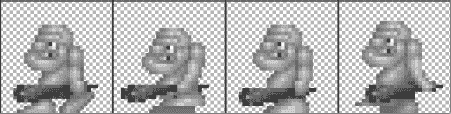

**图 8-25.** *走路中的穴居人，作者 Ari Feldmann（网格并非原图所有）*

该图像尺寸为 256×64 像素，每个关键帧是 64×64 像素。要制作动画，你只需使用第一个关键帧绘制一个精灵一段时间（例如 0.25 秒），然后切换到下一个关键帧，依此类推。当到达最后一帧时，你有两个选择：停留在最后一帧，或者从头开始（这就是所谓的*循环动画*）。

你可以轻松地使用 `TextureRegion` 和 `SpriteBatcher` 类来实现这一点。通常，你不仅会拥有像图 8-25 中那样的单个动画，而是会在同一个图集 (atlas) 中拥有更多动画。除了行走动画，你还可以有跳跃动画、攻击动画等等。对于每个动画，你需要知道帧持续时间 (frame duration)，它告诉你在切换到下一帧之前，应该持续使用动画的单个关键帧多长时间。


### 动画类

由此，你可以定义`Animation`类的需求，该类用于存储单个动画的数据，例如图 8–25 中的行走动画：

*   一个`Animation`对象包含多个`TextureRegion`，它们用于存储每个关键帧在图集（texture atlas）中的位置。`TextureRegion`的顺序与动画播放时的顺序相同。
*   `Animation`对象还存储帧持续时间（frame duration），即切换到下一帧之前必须经过的时间。
*   `Animation`类应提供一个方法，你向该方法传入你在该动画所代表的状态（例如，向左行走）中所花费的时间，该方法将返回对应的`TextureRegion`。该方法需要考虑你是否希望动画循环播放，还是在播放结束时停留在最后一帧。

最后一点很重要，因为它允许你存储单个`Animation`实例，供世界中的多个对象使用。每个对象只需跟踪其当前状态（即，它是在行走、射击还是跳跃，以及在该状态下持续了多久）。当你渲染该对象时，使用状态来选择要播放的动画，并使用状态时间来从`Animation`对象获取正确的`TextureRegion`。代码清单 8–19 展示了新`Animation`类的代码。

**代码清单 8–19.** *Animation.java，一个简单的动画类*

```
package com.badlogic.androidgames.framework.gl;

public class Animation {
    public static final int ANIMATION_LOOPING = 0;
    public static final int ANIMATION_NONLOOPING = 1;

    final TextureRegion[] keyFrames;
    final float frameDuration;

    public Animation(float frameDuration, TextureRegion ... keyFrames) {
        this.frameDuration = frameDuration;
        this.keyFrames = keyFrames;
    }

    public TextureRegion getKeyFrame(float stateTime, int mode) {
        int frameNumber = (int)(stateTime / frameDuration);

        if (mode == ANIMATION_NONLOOPING) {
            frameNumber = Math.min(keyFrames.length-1, frameNumber);
        } else {
            frameNumber = frameNumber % keyFrames.length;
        }
        return keyFrames[frameNumber];
    }
}
```

首先，定义两个常量，用于`getKeyFrame()`方法。第一个常量表示动画应循环播放，第二个常量表示动画应在最后一帧停止。

接下来，定义两个成员变量：一个用于存储`TextureRegion`对象的数组，以及一个用于存储帧持续时间的浮点数。

你将帧持续时间和包含关键帧的`TextureRegion`对象传递给构造函数，构造函数简单地存储它们。你可以对`keyFrames`数组进行防御性拷贝（defensive copy），但这会分配一个新对象，可能会导致垃圾回收器压力稍大。

有趣的部分是`getKeyFrame()`方法。你传入对象在该动画所代表的状态中已花费的时间，以及模式（`Animation.ANIMATION_LOOPING`或`Animation.NON_LOOPING`）。根据`stateTime`计算在给定状态下已经播放了多少帧。如果动画不应循环播放，只需将`frameNumber`限制在`TextureRegion`数组的最后一个元素。否则，取模运算，这将自动产生你想要的循环效果（例如，4 % 3 = 1）。剩下的就是返回正确的`TextureRegion`。

#### 一个示例

让我们创建一个名为`AnimationTest`的示例，并附带一个对应的屏幕`AnimationScreen`。与往常一样，我们只讨论屏幕本身。

你想要渲染多个向左行走的穴居人。你的世界将视锥体（view frustum）大小相同，尺寸为 4.8×3.2 米。（这是任意设定的；你可以使用任何尺寸。）一个穴居人是一个大小为 1×1 米的`DynamicGameObject`。你将继承`DynamicGameObject`并创建一个名为`Caveman`的新类，该类将存储一个额外的成员变量，用于跟踪穴居人已经行走了多长时间。每个穴居人以每秒 0.5 米的速度向左或向右移动。为`Caveman`类添加一个`update()`方法，根据时间增量和速度更新穴居人的位置。如果穴居人到达世界的左边缘或右边缘，将其放置到世界的另一侧。使用图 8–25 中的图像，并相应地创建`TextureRegion`对象和一个`Animation`实例。为了渲染，使用`Camera2D`实例和`SpriteBatcher`，因为它们看起来很酷。代码清单 8–20 展示了`Caveman`类的代码。

**代码清单 8–20.** *AnimationTest 摘录，展示内部类 Caveman。*

```
static final float WORLD_WIDTH = 4.8f;
static final float WORLD_HEIGHT = 3.2f;

static class Caveman extends DynamicGameObject {
    public float walkingTime = 0;

    public Caveman(float x, float y, float width, float height) {
        super(x, y, width, height);
        this.position.set((float)Math.random() * WORLD_WIDTH,
                          (float)Math.random() * WORLD_HEIGHT);
        this.velocity.set(Math.random() > 0.5f?-0.5f:0.5f, 0);
        this.walkingTime = (float)Math.random() * 10;
    }

    public void update(float deltaTime) {
        position.add(velocity.x * deltaTime, velocity.y * deltaTime);
        if (position.x < 0) position.x = WORLD_WIDTH;
        if (position.x > WORLD_WIDTH) position.x = 0;
        walkingTime += deltaTime;
    }
}
```

两个常量`WORLD_WIDTH`和`WORLD_HEIGHT`是外部类`AnimationTest`的一部分，供内部类使用。你的世界大小为 4.8×3.2 米。

接下来是内部类`Caveman`，它继承了`DynamicGameObject`，因为你要基于速度移动穴居人。你定义了一个额外的成员变量，用于跟踪穴居人已经行走了多长时间。在构造函数中，将穴居人放置在一个随机位置，并让它向左或向右行走。将`walkingTime`成员变量初始化为 0 到 10 之间的一个数字；这样你的穴居人不会同步行走。

`update()`方法根据穴居人的速度和时间增量来移动它。如果它离开了世界，将其重置到左边缘或右边缘。将时间增量加到`walkingTime`上，以跟踪它已经行走了多长时间。

代码清单 8–21 展示了`AnimationScreen`类。

**代码清单 8–21.** *AnimationTest.java 摘录：AnimationScreen 类*

```
class AnimationScreen extends Screen {
    static final int NUM_CAVEMEN = 10;
    GLGraphics glGraphics;
    Caveman[] cavemen;
    SpriteBatcher batcher;
    Camera2D camera;
    Texture texture;
    Animation walkAnim;
}
```

你的屏幕类包含常见的成员变量。你有一个`GLGraphics`实例、一个`Caveman`数组、一个`SpriteBatcher`、一个`Camera2D`、包含行走关键帧的`Texture`，以及一个`Animation`实例。


```java
public AnimationScreen(Game game) {
    super(game);
    glGraphics = ((GLGame)game).getGLGraphics();
    cavemen = new Caveman[NUM_CAVEMEN];
    for (int i = 0; i < NUM_CAVEMEN; i++) {
        cavemen[i] = new Caveman((float)Math.random(), (float)Math.random(), 1, 1);
    }
    batcher = new SpriteBatcher(glGraphics, NUM_CAVEMEN);
    camera = new Camera2D(glGraphics, WORLD_WIDTH, WORLD_HEIGHT);
}
```

在构造函数中，你需要创建`Caveman`实例，以及`SpriteBatcher`和`Camera2D`。

```java
@Override
public void resume() {
    texture = new Texture(((GLGame)game), "walkanim.png");
    walkAnim = new Animation(0.2f,
        new TextureRegion(texture, 0, 0, 64, 64),
        new TextureRegion(texture, 64, 0, 64, 64),
        new TextureRegion(texture, 128, 0, 64, 64),
        new TextureRegion(texture, 192, 0, 64, 64));
}
```

在`resume()`方法中，你从资源文件`walkanim.png`加载包含动画关键帧的纹理图集，这与图 8-25 中所示相同。随后，你创建`Animation`实例，将帧持续时间设置为 0.2 秒，并为纹理图集中的每个关键帧传入一个`TextureRegion`。

```java
@Override
public void update(float deltaTime) {
    int len = cavemen.length;
    for (int i = 0; i < len; i++) {
        cavemen[i].update(deltaTime);
    }
}
```

`update()`方法仅遍历所有`Caveman`实例，并以当前增量时间调用它们的`Caveman.update()`方法。这将使穴居人移动并更新他们的行走时间。

```java
@Override
public void present(float deltaTime) {
    GL10 gl = glGraphics.getGL();
    gl.glClear(GL10.GL_COLOR_BUFFER_BIT);
    camera.setViewportAndMatrices();

    gl.glEnable(GL10.GL_BLEND);
    gl.glBlendFunc(GL10.GL_SRC_ALPHA, GL10.GL_ONE_MINUS_SRC_ALPHA);
    gl.glEnable(GL10.GL_TEXTURE_2D);

    batcher.beginBatch(texture);
    int len = cavemen.length;
    for (int i = 0; i < len; i++) {
        Caveman caveman = cavemen[i];
        TextureRegion keyFrame = walkAnim.getKeyFrame(caveman.walkingTime, Animation.ANIMATION_LOOPING);
        batcher.drawSprite(caveman.position.x, caveman.position.y,
            caveman.velocity.x < 0 ? 1 : -1, 1, keyFrame);
    }
    batcher.endBatch();
}

@Override
public void pause() {
}

@Override
public void dispose() {
}
```

最后，你还有`present()`方法。首先清除屏幕，并通过相机设置视口和投影矩阵。接着，启用混合和纹理映射，并设置混合函数。通过告知精灵批处理器你想使用动画纹理图集开始一个新批次来开始渲染。然后，遍历所有穴居人并渲染它们。对于每个穴居人，你首先基于其行走时间从`Animation`实例中获取正确的关键帧。你需要指定动画应循环播放。然后，你在其位置使用正确的纹理区域绘制穴居人。

但这里的`width`参数是做什么用的？请记住，你的动画纹理仅包含“向左走”动画的关键帧。如果穴居人向右走，你想水平翻转纹理，这可以通过指定负宽度来实现。如果你不放心，可以回到`SpriteBatcher`代码检查这是否有效。实际上，你通过指定负宽度来翻转精灵的矩形。你也可以通过指定负高度在垂直方向上做同样的操作。

图 8-26 展示了正在行走的穴居人。


**图 8-26.** *穴居人行走*

这就是你使用 OpenGL ES 制作精美 2D 游戏所需了解的全部内容。请注意你如何将游戏逻辑与呈现彼此分离。穴居人不需要知道自己正在被渲染。因此，他不需要保留任何与渲染相关的成员，例如`Animation`实例或`Texture`。你只需跟踪穴居人的状态以及他处于该状态的时长。结合他的位置和大小，你就可以轻松地使用你那些辅助类来渲染他。

### 总结

现在你应该已经具备创建几乎任何你想要 2D 游戏的良好能力。你已经学习了向量及其使用方法，并得到了一个很好的可重用`Vector2`类。你还研究了用于创建弹道炮弹等物体的基础物理知识。碰撞检测也是大多数游戏的关键部分，你现在应该知道如何通过`SpatialHashGrid`正确高效地执行它。你探索了一种通过创建`GameObject`和`DynamicGameObject`类来跟踪对象状态和形状，从而将游戏逻辑和对象与渲染分离的方法。你了解了通过 OpenGL ES 实现 2D 相机概念是多么简单，这一切都基于一个名为`glOrthof()`的方法。你学习了纹理图集、为什么需要它们以及如何使用它们。通过引入纹理区域、精灵以及如何通过`SpriteBatcher`高效渲染它们，这一知识得到了扩展。最后，你研究了精灵动画，事实证明这实现起来极其简单。

值得注意的一点是，本章涵盖的所有主题——包括粗测和精测碰撞检测、物理模拟、运动积分以及不同形状的边界——在许多开源库（如`Box2D`、`Chipmunk Physics`、`Bullet Physics`等）中都得到了稳健的实现。所有这些库最初都是用 C 或 C++开发的，但有一些库提供了 Android 封装或 Java 实现，这使得它们在规划游戏时成为值得考虑的选项。

在下一章中，你将使用你的新工具创建一个新游戏。你会惊讶于它有多么简单。

## 第 9 章
## 《超级跳跃者》：一款 2D OpenGL ES 游戏

是时候把我们学到的一切整合到一个游戏中来了。正如第 3 章所讨论的，移动领域有几个非常流行的类型可供选择。对于我们的下一个游戏，我们决定走更休闲的路线。我们将实现一个类似《绑架》（Abduction）或《 doodle jump》的跳跃类游戏。与《诺姆先生》一样，我们将从定义游戏机制开始。
```


### 核心游戏机制

我们建议你快速在安卓设备上安装《Abduction》这款游戏，或者在网上搜索该游戏的视频。从这个例子中，我们可以提炼出我们这款名为《超级跳跃者》的游戏的核心机制。以下是一些细节：

- 主角持续向上跳跃，在平台之间移动。游戏世界在垂直方向上跨越多个屏幕。
- 左右倾斜手机可控制水平移动。
- 当主角离开一个水平屏幕边界时，他会从对侧重新进入屏幕。
- 平台可以是静止的，也可以是水平移动的。
- 某些平台在主角碰到时会被随机粉碎。
- 在向上攀爬的途中，主角可以收集物品来增加分数。
- 除了金币，一些平台上还有弹簧，能让主角跳得更高。
- 敌对势力在游戏世界中水平移动。当我们的主角碰到其中一个敌人时，就会死亡，游戏结束。
- 当我们的主角掉落到屏幕底部边缘以下时，游戏结束。
- 关卡顶部设有某种目标。当主角碰到该目标时，新的一关开始。

虽然这个列表比我们为《Nom 先生》创建的列表要长，但看起来并没有复杂太多。图 9–1 展示了核心概念的初始草图。这次我们直接使用 `Paint.NET` 来制作草图。让我们构思一个背景故事。


**图 9–1.** *我们最初的游戏机制草图，展示了主角、平台、金币、敌对势力以及关卡顶部的目标。*

### 背景故事与美术风格

我们将在此充分发挥创意，为我们的游戏构思以下独特的故事。

我们的主角鲍勃患有慢性跳跃症。他注定每次脚一沾地就必须跳跃。更糟糕的是，他心爱的无名公主被一群邪恶的杀手飞鼠绑架，并被关在天上的城堡里。鲍勃的病症最终证明是有益的，他踏上了寻找爱人的征途，与邪恶的松鼠势力战斗。

这个经典的电子游戏故事非常适合 8 位像素图形风格，这种风格可以在 NES（任天堂娱乐系统）上的原创《超级马里奥兄弟》等游戏中找到。图 9–1 中的草图展示了我们游戏中所有元素的最终图形效果。鲍勃、金币、松鼠和粉碎的平台当然都是动画的。我们还将使用符合视觉风格的音乐和音效。

### 屏幕与界面切换

我们现在可以定义我们的屏幕和界面切换了。我们将沿用《Nom 先生》中使用过的相同模式：

-   我们将有一个主屏幕，上面包含游戏标志；有“开始游戏”、“高分榜”和“帮助”菜单项；还有一个用于禁用或启用声音的按钮。
-   我们将有一个游戏屏幕，它会要求玩家准备就绪，并优雅地处理运行、暂停、游戏结束和下一关等状态。与我们在《Nom 先生》中使用的相比，唯一的新增内容是屏幕的“下一关”状态，当鲍勃碰到城堡时会触发该状态。在这种情况下，将生成一个新的关卡，鲍勃会从世界底部重新开始，同时保留他的分数。
-   我们将有一个高分榜屏幕，显示玩家迄今为止取得的前五名分数。
-   我们将有帮助屏幕，向玩家展示游戏机制和目标。我们会耍个小聪明，省略掉关于如何控制玩家的说明。现在的孩子应该能够应对我们在 80 年代和 90 年代初面对的那种复杂性，那时候游戏没有任何操作指引。

这或多或少与我们在《Nom 先生》中的设定相同。图 9–2 展示了所有屏幕及界面切换。请注意，除了暂停按钮外，游戏屏幕或其子屏幕上没有任何其他按钮。当要求准备就绪时，用户会凭直觉触摸屏幕。


**图 9–2.** *《超级跳跃者》的所有屏幕及界面切换。*

解决了这些问题，我们现在可以思考我们游戏世界的大小和单位，以及它如何映射到图形资源上。


### 定义游戏世界

经典的“先有鸡还是先有蛋”问题再次困扰着我们。上一章你已了解到，我们在世界单位（例如米）和像素之间建立了对应关系。我们的物体是在世界空间中物理定义的。边界形状和位置以米为单位给出；速度以米/秒为单位。然而，物体的图形表示是以像素定义的，因此我们必须建立某种映射。我们通过首先为图形资源定义一个目标分辨率来克服这个问题。与 Mr. Nom 游戏一样，我们将使用 320×480 像素（宽高比 1.5）的目标分辨率。选择这个目标是因为它是最低的实用分辨率，但如果你专门针对平板电脑进行开发，可能需要使用 800×1280 这样的分辨率，或者介于两者之间的某个分辨率，例如 480×800（典型的 Android 手机分辨率）。无论你的目标分辨率如何，其原理都是一样的。

接下来我们要做的是在世界中建立像素和米之间的对应关系。图 9-1 中的示意图让我们了解了不同物体所占的屏幕空间大小，以及它们之间的相对比例。对于 2D 游戏，我们建议选择 32 像素对应 1 米的映射关系。那么，让我们将这张大小为 320×380 像素的示意图覆盖上一个网格，其中每个单元格为 32×32 像素。在我们的世界空间中，这对应着 1×1 米的单元格。图 9-3 展示了我们的示意图和网格。


**图 9-3.** 叠放了网格的示意图。每个单元格为 32×32 像素，对应游戏世界中 1×1 米的区域。

图 9-3 当然有点取巧。我们这样排列图形是为了使它们与网格单元格整齐对齐。在实际游戏中，我们会将物体放置在非整数坐标位置上。

那么，我们能从图 9-3 中得到什么信息呢？首先，我们可以直接估算出世界中每个物体以米为单位的宽度和高度。以下是我们将用于物体边界矩形的数值：

*   鲍勃为`0.8×0.8`米；他没有完全占据一个完整的单元格。
*   平台为`2×0.5`米，水平占据两个单元格，垂直占据半个单元格。
*   金币为`0.8×0.5`米。它几乎垂直占据一个单元格，水平方向大约占据半个单元格。
*   弹簧为`0.5×0.5`米，每个方向占据半个单元格。实际上弹簧的高比宽稍大一些。我们将其边界形状设为正方形，以便碰撞检测更加宽容。
*   松鼠为`1×0.8`米。
*   城堡为`0.8×0.8`米。

有了这些尺寸，我们也获得了用于碰撞检测的物体边界矩形的尺寸。如果根据游戏运行效果发现这些尺寸偏大或偏小，我们可以进行调整。

从图 9-3 中我们还能推导出视锥体的尺寸。它将显示我们世界中 10×15 米的区域。

剩下的唯一定义内容是游戏中的速度和加速度。这高度取决于我们希望游戏带来的手感。通常需要进行一些实验才能得到正确的数值。以下是我们经过几轮调优后得出的结果：

*   重力加速度矢量为`(0,–13)` m/s²，略高于地球上的重力加速度，也高于我们在炮弹示例中使用的数值。
*   鲍勃的初始跳跃速度矢量为`(0,11)` m/s。注意，跳跃速度仅影响 y 轴上的运动。水平移动将由当前的加速度计读数决定。
*   当鲍勃碰到弹簧时，他的跳跃速度矢量将是正常跳跃速度的 1.5 倍。相当于`(0,16.5)` m/s。同样，这个值完全来自于实验。
*   鲍勃的水平移动速度为`20` m/s。注意，这是一个无方向的速度，而非矢量。我们稍后会解释它如何与加速度计配合工作。
*   松鼠会持续从左到右再返回进行巡逻。它们的恒定移动速度为`3` m/s。以矢量形式表示，松鼠向左移动时为`(–3,0)` m/s，向右移动时为`(3,0)` m/s。

那么鲍勃的水平移动是如何工作的呢？我们之前定义的速度实际上是鲍勃的最大水平速度。根据玩家倾斜手机的程度，鲍勃的水平移动速度将在`0`（无倾斜）和`20` m/s（完全向一侧倾斜）之间变化。

由于我们的游戏将以竖屏模式运行，我们将使用加速度计 x 轴的值。当手机未倾斜时，该轴报告的加速度为`0` m/s²。当完全向左倾斜至横屏方向时，该轴报告的加速度约为`–10` m/s²。当完全向右倾斜时，该轴报告的加速度约为`10` m/s²。我们只需将加速度计读数除以其最大绝对值（`10`）进行归一化，然后将鲍勃的最大水平速度乘以该值即可。因此，当手机完全向一侧倾斜时，鲍勃将以`20` m/s 的速度向左或向右移动；如果手机倾斜程度较小，移动速度也相应较小。当手机完全倾斜时，鲍勃每秒可以在屏幕上移动两次。

我们将根据当前 x 轴的加速度计数值，每帧更新这个水平移动速度，并将其与鲍勃的垂直速度相结合——垂直速度由重力加速度和当前垂直速度推导得出，正如我们在早期示例中对炮弹所做的处理一样。

世界的一个基本方面是我们能看到的部分。由于鲍勃从屏幕底部边缘离开屏幕就会死亡，我们的摄像机也在游戏机制中扮演了角色。虽然我们会使用摄像机进行渲染，并在鲍勃跳跃时将其向上移动，但我们不会在世界模拟类中使用它。相反，我们记录鲍勃到目前为止的最高 y 坐标。如果他的位置低于该值减去视锥体高度的一半，我们就知道他已离开屏幕。因此，我们并没有完全将模型（我们的世界模拟类）与视图分离开来，因为我们需要知道视锥体的高度来判断鲍勃是否死亡。不过我们可以接受这一点。

让我们来看看需要的资源。

### 创建资源

我们的新游戏有两种类型的图形资源：UI 元素和实际的游戏元素（或称世界元素）。我们先从 UI 元素开始。


### UI 元素

首先需要注意的一点是，UI 元素（按钮、Logo 等）并不依赖于我们的像素到世界单位的映射。与 Mr. Nom 游戏类似，我们根据目标分辨率来设计它们——在本例中为 320×480 像素。查看图 9-2，我们可以确定需要哪些 UI 元素。

我们创建的第一个 UI 元素是不同屏幕所需的按钮。图 9-4 展示了我们游戏中的所有按钮。


**图 9-4.** *各种按钮，每个尺寸为 64×64 像素。*

我们倾向于在一个单元格大小为 32×32 或 64×64 像素的网格中创建所有图形资源。图 9-4 中的按钮就是在一个每个单元格为 64×64 像素的网格中排布的。顶行的按钮用于主菜单屏幕，以指示声音是否启用。左下角的箭头用于在几个屏幕中导航到下一个屏幕。右下角的按钮在游戏运行时的游戏屏幕中使用，以允许用户暂停游戏。

你可能想知道为什么没有指向右方的箭头。请记住，使用我们精巧的精灵批处理器，我们可以通过指定负的宽度和/或高度值轻松地翻转我们绘制的内容。我们将对一些图形资源使用这个技巧以节省一些内存。

接下来是主菜单屏幕所需的元素。那里有 Logo、菜单项和背景。图 9-5 展示了所有这些元素。


**图 9-5.** *背景图片、主菜单项和 Logo。*

背景图片不仅用于主菜单屏幕，还用于所有屏幕。它的大小与我们的目标分辨率相同，为 320×480 像素。主菜单项占据 300×110 像素。你在图 9-5 中看到的黑色背景是因为白底白字效果不佳。在实际图片中，背景当然是由透明像素组成的。Logo 尺寸为 274×142 像素，边角处有一些透明像素。

接下来是帮助屏幕的图片。我们没有将它们各自与几个元素合成，而是偷懒地将它们全部制作为 320×480 像素的全屏图片。这将略微减少我们绘制代码的大小，同时不会给程序增加太多负担。你可以在图 9-2 中看到所有的帮助屏幕。我们将与这些图片合成的唯一元素是箭头按钮。

对于高分屏幕，我们将复用主菜单项图片中标有“HIGHSCORES”的部分。实际分数是使用一种特殊技术渲染的，我们将在本章稍后探讨。该屏幕的其余部分同样由背景图片和一个按钮组成。

游戏屏幕有更多文本 UI 元素，即“READY?”标签、暂停状态的菜单项（“RESUME”和“QUIT”）以及“GAME OVER”标签。图 9-6 展示了它们的全貌。


**图 9-6.** *“READY?”、“RESUME”、“QUIT”和“GAME OVER”标签*

### 使用位图字体处理文本

那么，我们如何渲染游戏屏幕中的其他文本元素呢？使用与 Mr. Nom 游戏中渲染分数相同的技术。现在我们不仅拥有数字，还拥有字符。我们使用一个图像图集，其中每个子图像代表一个字符（例如，*0* 或 *a*）。这个图像图集被称为位图字体。图 9-7 展示了我们将要使用的位图字体。


**图 9-7.** *一种位图字体。*

图 9-7 中的黑色背景和网格当然不是实际图片的一部分。位图字体是一种在游戏屏幕上渲染文本的非常古老的技术。它们通常包含一系列 ASCII 字符的图像。这样一个字符图像被称为一个*字形*。ASCII 是 Unicode 的前身之一。ASCII 字符集包含 128 个字符，如图 9-8 所示。


**图 9-8.** *ASCII 字符及其十进制、十六进制和八进制值。*

在这 128 个字符中，有 96 个是可打印字符（字符 32 到 127）。我们的位图字体只包含可打印字符。位图字体的第一行包含字符 32 到 47；下一行包含字符 48 到 63，依此类推。ASCII 仅在您想要存储和显示使用标准拉丁字母的文本时有用。有一种扩展的 ASCII 格式，它使用值 128 到 255 来编码西方语言的其他常见字符，例如 ö 或 é。更具表现力的字符集（例如，用于中文或阿拉伯语）通过 Unicode 表示，不能通过 ASCII 编码。对于我们的游戏，标准的 ASCII 字符集就足够了。

那么，我们如何使用位图字体渲染文本呢？事实证明这非常简单。首先，我们创建 96 个纹理区域，每个区域对应位图字体中的一个字形。我们可以将这些纹理区域存储在一个数组中，如下所示：

```
TextureRegion[] glyphs = new TextureRegion[96];
```

Java 字符串采用 16 位 Unicode 编码。对我们来说幸运的是，我们位图字体中的 ASCII 字符在 ASCII 和 Unicode 中具有相同的值。要获取 Java 字符串中某个字符的区域，我们只需这样做：

```
int index = string.charAt(i) - 32;
```

这为我们提供了纹理区域数组的直接索引。我们只需从字符串中的当前字符减去空格字符（32）的值。如果索引小于 0 或大于 95，则表示该字符是位图字体中没有的 Unicode 字符。通常，我们直接忽略这样的字符。

要在一行中渲染多个字符，我们需要知道字符之间应该有多少间距。图 9-7 中的位图字体是一种所谓的等宽字体。

这意味着每个字形具有相同的宽度。我们的位图字体字形每个大小为 16×20 像素。当我们在字符串中逐字符推进渲染位置时，我们只需添加 20 像素。我们将绘制位置从一个字符移动到另一个字符的像素数称为*步进*。对于我们的位图字体，它是固定的；然而，它通常根据我们绘制的字符而变化。一种更复杂的*步进*形式会同时考虑当前要绘制的字符和下一个字符来计算步进。如果你想在网络上查找，这种技术称为*字距调整*。我们只使用等宽位图字体，因为它们能大大简化我们的工作。

那么，我们是如何生成那个 ASCII 位图字体的呢？我们使用了网络上许多可用的位图字体生成工具之一。我们使用的工具叫做 Codehead's Bitmap Font Generator，并且是免费提供的。你可以选择硬盘上的一个字体文件，并指定字体的高度，生成器就会为其生成包含 ASCII 字符集的图片。该工具还有许多其他选项，我们在此无法详述。我们建议你去查看一下并稍微摆弄一番。

我们将使用此技术绘制游戏中所有剩余的字符串。稍后，您将看到一个位图字体类的具体实现。让我们继续看看我们的资源。

有了位图字体，我们现在拥有了所有图形 UI 元素的资源。我们将通过一个 `SpriteBatcher` 来渲染它们，该批处理器使用一个设置了视图截锥体的摄像机，该截锥体直接映射到我们的目标分辨率。这样我们就可以用像素坐标来指定所有坐标。


#### 游戏元素

剩下的就是实际游戏对象了。这些对象依赖于我们先前讨论过的像素与世界单位的映射关系。为了尽可能简化创建过程，我们使用了一个小技巧：从每个单元格 32×32 像素的网格开始绘制。所有对象都居中在一个或多个这样的单元格中，这样它们就能轻松对应到我们世界中的物理尺寸。让我们从鲍勃开始，如图 9–9 所示。


**图 9–9.** 鲍勃及其五个动画帧。

图 9–9 展示了两个跳跃帧、两个下落帧和一个死亡帧。每张图片尺寸为 160×32 像素，每个动画帧尺寸为 32×32 像素。背景像素为透明。

鲍勃可以处于三种状态：跳跃、下落和死亡。我们为每种状态准备了动画帧。诚然，两个跳跃帧之间的差异很小——只有他的前额发在摆动。我们将为鲍勃的三种动画分别创建一个 `Animation` 实例，并根据他的当前状态使用它们进行渲染。我们也没有为鲍勃向左移动准备重复的帧。与箭头按钮一样，我们只需在调用 `SpriteBatcher.drawSprite()` 时指定一个负宽度，即可水平翻转鲍勃的图像。

图 9–10 描绘了邪恶松鼠。我们再次使用两个动画帧，这样松鼠看起来就像在扇动它那双邪恶的翅膀。


**图 9–10.** *一只邪恶的飞松鼠及其两个动画帧。*

图 9–10 中的图片尺寸为 64×32 像素，每个帧为 32×32 像素。

图 9–11 中的金币动画比较特殊。我们的关键帧序列将不是 1、2、3、1，而是 1、2、3、2、1。否则，金币会从第 3 帧的收缩状态直接跳到第 1 帧的完全展开状态。通过重复使用第 2 帧，我们可以节省一点空间。


**图 9–11.** *金币及其动画帧。*

图 9–11 中的图片尺寸为 96×32 像素，每个帧为 32×32 像素。

关于图 9–12 中的弹簧图片，没什么好多说的。弹簧就那样欢快地待在图片中央。


**图 9–12.** *弹簧。图片尺寸为 32×32 像素。*

图 9–13 中的城堡也是非动画的。它比其他对象大（64×64 像素）。


**图 9–13.** *城堡。*

图 9–14 中的平台（64×64 像素）有四个动画帧。根据我们的游戏机制，当鲍勃撞击某些平台时，它们会粉碎。在这种情况下，我们将完整播放一次平台的动画。对于静态平台，我们只使用第一帧。


**图 9–14.** *平台及其动画帧。*

#### 纹理图集来帮忙

这就是我们游戏中所有的图形资源。我们之前已经讨论过，纹理的宽度和高度必须是 2 的幂次方。我们的背景图像和所有帮助屏幕的尺寸都是 320×480 像素。我们将它们存储为 512×512 像素的图片，以便作为纹理加载。这已经是六张纹理了。

我们还需要为其他所有图像分别创建纹理吗？不。我们创建一个单一的纹理图集。事实证明，所有其他东西都能很好地放入一个 512×512 像素的图集中，我们可以将其作为单一纹理加载——这会让 GPU 非常高兴，因为除了背景和帮助屏幕图像外，我们只需要绑定一个纹理即可用于所有游戏元素。图 9–15 展示了这个图集。

图 9–15 中的图像尺寸为 512×512 像素。网格和红色轮廓线不属于图像部分，背景像素为透明。UI 标签和位图字体的黑色背景像素也是如此。网格单元格大小为 32×32 像素。使用这种纹理图集的好处在于，如果你想要支持更高分辨率的屏幕，你只需要更改这个纹理图集的大小！将其放大到 1024×1024，并配合更高保真度的图形，即使我们的目标分辨率是 320×480，OpenGL 也会自动为你提供更好的图形效果，而无需更改游戏代码！

我们将所有图像放置在纹理图集中坐标为 32 倍数的角落位置。这使得创建 `TextureRegions` 变得更加容易。


**图 9–15.** *强大的纹理图集。*

#### 音乐与音效

我们还需要音效和音乐。由于我们的游戏是 8 位复古风格，因此使用所谓的*芯片音乐*（chip tunes）非常合适。芯片音乐是由合成器生成的音效和音乐。最著名的芯片音乐由任天堂的 NES、SNES 和 GameBoy 生成。对于音效，我们使用了 Tomas Pettersson 开发的名为 *sfxr* 的工具（更准确地说是其 Flash 版本，名为 *as3sfxr*）。它可以在 [www.superflashbros.net/as3sfxr](http://www.superflashbros.net/as3sfxr) 找到。图 9–16 展示了其用户界面。


**图 9–16.** `as3sfxr`，Tomas Pettersson 开发的 `sfxr` 的 Flash 移植版。

我们为跳跃、撞击弹簧、撞击金币和撞击松鼠创建了音效。我们还为点击 UI 元素创建了一个音效。我们所做的只是对 `as3sfxr` 左侧每个类别的按钮随意点击，直到找到合适的音效。

游戏音乐通常更难获得。网上有一些网站提供适合《超级跳跃者》这类游戏的 8 位芯片音乐。我们将使用一首名为“New Song”的曲子，由 Geir Tjelta 创作。这首曲子可以在 [www.freemusicarchive.org](http://www.freemusicarchive.org) 找到。它采用知识共享署名-非商业性使用-禁止演绎（即音乐共享）许可协议。这意味着我们可以在非商业项目中使用它，例如我们的开源游戏《超级跳跃者》，只要我们注明归功于 Geir，并且不修改原始作品。当你在网上寻找游戏音乐时，务必确保遵守许可协议。人们在创作这些乐曲上投入了大量心血。如果许可协议不适用于你的项目（例如，如果是商业项目），那么你就不能使用它。

### 实现《超级跳跃者》

实现《超级跳跃者》将非常简单。我们可以重用上一章的完整框架，并遵循我们之前在《Nom 先生》中采用的高层架构。这意味着我们将为每个屏幕创建一个类，每个类实现该屏幕所需的逻辑和呈现。除此之外，我们还将进行标准项目设置，包括合适的清单文件、所有资源放在 `assets/` 文件夹中、应用程序图标等等。让我们从主 `Assets` 类开始。


### 资源类

在 Mr. Nom 游戏中，我们已经有了一个`Assets`类，它仅包含存储在静态成员变量中的大量`Pixmap`和`Sound`引用。在 Super Jumper 中，我们将采用同样的做法。不过，这次我们还会添加一点加载逻辑。清单 9–1 展示了相关代码。

**清单 9–1.** `Assets.java`，包含除帮助屏幕纹理之外的所有资源

```
package com.badlogic.androidgames.jumper;

import com.badlogic.androidgames.framework.Music;
import com.badlogic.androidgames.framework.Sound;
import com.badlogic.androidgames.framework.gl.Animation;
import com.badlogic.androidgames.framework.gl.Font;
import com.badlogic.androidgames.framework.gl.Texture;
import com.badlogic.androidgames.framework.gl.TextureRegion;
import com.badlogic.androidgames.framework.impl.GLGame;

public class Assets {
    public static Texture background;
    public static TextureRegion backgroundRegion;

    public static Texture items;
    public static TextureRegion mainMenu;
    public static TextureRegion pauseMenu;
    public static TextureRegion ready;
    public static TextureRegion gameOver;
    public static TextureRegion highScoresRegion;
    public static TextureRegion logo;
    public static TextureRegion soundOn;
    public static TextureRegion soundOff;
    public static TextureRegion arrow;
    public static TextureRegion pause;
    public static TextureRegion spring;
    public static TextureRegion castle;
    public static Animation coinAnim;
    public static Animation bobJump;
    public static Animation bobFall;
    public static TextureRegion bobHit;
    public static Animation squirrelFly;
    public static TextureRegion platform;
    public static Animation brakingPlatform;
    public static Font font;

    public static Music music;
    public static Sound jumpSound;
    public static Sound highJumpSound;
    public static Sound hitSound;
    public static Sound coinSound;
    public static Sound clickSound;
```

这个类保存了我们在整个游戏中所需的全部`Texture`、`TextureRegion`、`Animation`、`Music`和`Sound`实例的引用。唯一没有在这里加载的是帮助屏幕的图片。

```
    public static void load(GLGame game) {
        background = new Texture(game, "background.png");
        backgroundRegion = new TextureRegion(background, 0, 0, 320, 480);

        items = new Texture(game, "items.png");
        mainMenu = new TextureRegion(items, 0, 224, 300, 110);
        pauseMenu = new TextureRegion(items, 224, 128, 192, 96);
        ready = new TextureRegion(items, 320, 224, 192, 32);
        gameOver = new TextureRegion(items, 352, 256, 160, 96);
        highScoresRegion = new TextureRegion(Assets.items, 0, 257, 300, 110 / 3);
        logo = new TextureRegion(items, 0, 352, 274, 142);
        soundOff = new TextureRegion(items, 0, 0, 64, 64);
        soundOn = new TextureRegion(items, 64, 0, 64, 64);
        arrow = new TextureRegion(items, 0, 64, 64, 64);
        pause = new TextureRegion(items, 64, 64, 64, 64);

        spring = new TextureRegion(items, 128, 0, 32, 32);
        castle = new TextureRegion(items, 128, 64, 64, 64);
        coinAnim = new Animation(0.2f,
                new TextureRegion(items, 128, 32, 32, 32),
                new TextureRegion(items, 160, 32, 32, 32),
                new TextureRegion(items, 192, 32, 32, 32),
                new TextureRegion(items, 160, 32, 32, 32));
        bobJump = new Animation(0.2f,
                new TextureRegion(items, 0, 128, 32, 32),
                new TextureRegion(items, 32, 128, 32, 32));
        bobFall = new Animation(0.2f,
                new TextureRegion(items, 64, 128, 32, 32),
                new TextureRegion(items, 96, 128, 32, 32));
        bobHit = new TextureRegion(items, 128, 128, 32, 32);
        squirrelFly = new Animation(0.2f,
                new TextureRegion(items, 0, 160, 32, 32),
                new TextureRegion(items, 32, 160, 32, 32));
        platform = new TextureRegion(items, 64, 160, 64, 16);
        brakingPlatform = new Animation(0.2f,
                new TextureRegion(items, 64, 160, 64, 16),
                new TextureRegion(items, 64, 176, 64, 16),
                new TextureRegion(items, 64, 192, 64, 16),
                new TextureRegion(items, 64, 208, 64, 16));

        font = new Font(items, 224, 0, 16, 16, 20);

        music = game.getAudio().newMusic("music.mp3");
        music.setLooping(true);
        music.setVolume(0.5f);
        if (Settings.soundEnabled)
            music.play();
        jumpSound = game.getAudio().newSound("jump.ogg");
        highJumpSound = game.getAudio().newSound("highjump.ogg");
        hitSound = game.getAudio().newSound("hit.ogg");
        coinSound = game.getAudio().newSound("coin.ogg");
        clickSound = game.getAudio().newSound("click.ogg");
    }
```

`load()`方法将在游戏开始时被调用一次，负责填充类的所有静态成员。它加载背景图片并为其创建一个对应的`TextureRegion`。接着，加载纹理图集并创建所有必要的`TextureRegion`和`Animation`。请将代码与图 9–15 以及上一节中的其他图形进行对比。关于加载图形资源的代码，唯一值得注意的是金币`Animation`实例的创建。如前所述，我们在动画帧序列的末尾复用了第二帧。所有动画的帧时间都设定为 0.2 秒。

我们还创建了`Font`类的一个实例，这个类我们还没有讨论过。它将实现使用嵌入在图集中的位图字体来渲染文本的逻辑。构造函数接受包含位图字形的`Texture`、包含字形区域左上角的像素坐标、每行字形的数量以及每个字形的大小（以像素为单位）。

我们在这个方法中也加载了所有的`Music`和`Sound`实例。如你所见，我们又用到了老朋友`Settings`类。我们可以从 Mr. Nom 项目中直接复用这个类，几乎无需修改，只是你会看到稍后略有改动。请注意，我们将`Music`实例设置为循环播放，音量设为 0.5，这样它比音效要柔和一些。只有当用户之前没有禁用声音时，音乐才会开始播放，这个设置保存在`Settings`类中，与 Mr. Nom 中的做法相同。

```
    public static void reload() {
        background.reload();
        items.reload();
        if (Settings.soundEnabled)
            music.play();
    }
```

接下来，我们有一个名为`reload()`的神秘方法。请记住，当应用程序暂停时，OpenGL ES 上下文会丢失。我们必须在应用程序恢复时重新加载纹理，这正是此方法的作用。如果声音处于启用状态，我们还会恢复音乐播放。

```
    public static void playSound(Sound sound) {
        if (Settings.soundEnabled)
            sound.play(1);
    }
}
```

这个类的最后一个方法是一个辅助方法，我们将在其余代码中用它来播放音频。无需处处检查声音是否启用，而是将这个检查封装在这个方法中。

让我们来看一下修改后的`Settings`类。


#### Settings 类

变化不大。清单 9–2 展示了对 `Settings` 类稍作修改后的代码。

```
/** 清单 9–2. Settings.java，我们稍作修改的 Settings 类，源自 Mr. Nom 项目。 */
package com.badlogic.androidgames.jumper;

import java.io.BufferedReader;
import java.io.BufferedWriter;
import java.io.IOException;
import java.io.InputStreamReader;
import java.io.OutputStreamWriter;

import com.badlogic.androidgames.framework.FileIO;

public class Settings {
    public static boolean soundEnabled = true;
    public final static int[] highscores = new int[] { 100, 80, 50, 30, 10 };
    public final static String file = ".superjumper";

    public static void load(FileIO files) {
        BufferedReader in = null;
        try {
            in = new BufferedReader(new InputStreamReader(files.readFile(file)));
            soundEnabled = Boolean.parseBoolean(in.readLine());
            for (int i = 0; i < 5; i++) {
                highscores[i] = Integer.parseInt(in.readLine());
            }
        } catch (IOException e) {
            // :( 没关系，我们有默认值
        } catch (NumberFormatException e) {
            // :/ 没关系，默认值能救场
        } finally {
            try {
                if (in != null)
                    in.close();
            } catch (IOException e) {
            }
        }
    }

    public static void save(FileIO files) {
        BufferedWriter out = null;
        try {
            out = new BufferedWriter(new OutputStreamWriter(
                    files.writeFile(file)));
            out.write(Boolean.toString(soundEnabled));
            out.write("\n");
            for (int i = 0; i < 5; i++) {
                out.write(Integer.toString(highscores[i]));
                out.write("\n");
            }
        } catch (IOException e) {
        } finally {
            try {
                if (out != null)
                    out.close();
            } catch (IOException e) {
            }
        }
    }

    public static void addScore(int score) {
        for (int i = 0; i < 5; i++) {
            if (highscores[i] < score) {
                for (int j = 4; j > i; j--)
                    highscores[j] = highscores[j - 1];
                highscores[i] = score;
                break;
            }
        }
    }
}
```

与 Mr. Nom 版本中该类唯一的区别在于读写设置项的文件名。我们现在使用 `.superjumper` 文件，而不是 `.mrnom`。

#### 主 Activity

我们需要一个 `Activity` 作为游戏的主入口点。我们将其命名为 `SuperJumper`。清单 9–3 展示了其代码。

```
/** 清单 9–3. SuperJumper.java，主入口点类 */
package com.badlogic.androidgames.jumper;

import javax.microedition.khronos.egl.EGLConfig;
import javax.microedition.khronos.opengles.GL10;

import com.badlogic.androidgames.framework.Screen;
import com.badlogic.androidgames.framework.impl.GLGame;

public class Settings {
    public static boolean soundEnabled = true;
    public final static int[] highscores = new int[] { 100, 80, 50, 30, 10 };
    public final static String file = ".superjumper";

    public static void load(FileIO files) {
        BufferedReader in = null;
        try {
            in = new BufferedReader(new InputStreamReader(files.readFile(file)));
            soundEnabled = Boolean.parseBoolean(in.readLine());
            for (int i = 0; i < 5; i++) {
                highscores[i] = Integer.parseInt(in.readLine());
            }
        } catch (IOException e) {
            // :( 没关系，我们有默认值
        } catch (NumberFormatException e) {
            // :/ 没关系，默认值能救场
        } finally {
            try {
                if (in != null)
                    in.close();
            } catch (IOException e) {
            }
        }
    }

    public static void save(FileIO files) {
        BufferedWriter out = null;
        try {
            out = new BufferedWriter(new OutputStreamWriter(
                    files.writeFile(file)));
            out.write(Boolean.toString(soundEnabled));
            out.write("\n");
            for (int i = 0; i < 5; i++) {
                out.write(Integer.toString(highscores[i]));
                out.write("\n");
            }
        } catch (IOException e) {
        } finally {
            try {
                if (out != null)
                    out.close();
            } catch (IOException e) {
            }
        }
    }

    public static void addScore(int score) {
        for (int i = 0; i < 5; i++) {
            if (highscores[i] < score) {
                for (int j = 4; j > i; j--)
                    highscores[j] = highscores[j - 1];
                highscores[i] = score;
                break;
            }
        }
    }
}
```

我们继承自 `GLGame`，并实现了 `getStartScreen()` 方法，该方法返回一个 `MainMenuScreen` 实例。另外两个方法不太容易理解。

我们重写了 `onSurfaceCreate()` 方法，每次 OpenGL ES 上下文重新创建时都会调用该方法（可参考第 6 章中 `GLGame` 的代码）。如果该方法首次被调用，我们会使用 `Assets.load()` 方法来加载所有资源，并尝试从 SD 卡上的设置文件中加载设置项。否则，我们只需要通过 `Assets.reload()` 方法重新加载纹理并开始播放音乐。我们还重写了 `onPause()` 方法，以便在音乐正在播放时暂停它。

我们这样做是为了避免在屏幕的 `resume()` 和 `pause()` 方法中重复执行这些操作。

在深入讲解屏幕实现之前，让我们先看看新的 `Font` 类。


### Font 类

我们将使用位图字体渲染任意（ASCII）文本。我们已经在高层次上讨论过这是如何工作的，现在让我们看看代码清单 9–4 中的代码。

**代码清单 9–4.** `Font.java`，一个位图字体渲染类

```
package com.badlogic.androidgames.framework.gl;

public class Font {
    public final Texture texture;
    public final int glyphWidth;
    public final int glyphHeight;
    public final TextureRegion[] glyphs = new TextureRegion[96];
```

该类存储了包含字体字形的纹理、单个字形的宽度和高度，以及一个`TextureRegion`数组——每个字形对应一个。数组中的第一个元素保存空格字形的区域，下一个元素保存感叹号字形的区域，以此类推。换句话说，第一个元素对应 ASCII 字符代码 32，最后一个元素对应 ASCII 字符代码 127。

```
    public Font(Texture texture,
                int offsetX, int offsetY,
                int glyphsPerRow, int glyphWidth, int glyphHeight) {
        this.texture = texture;
        this.glyphWidth = glyphWidth;
        this.glyphHeight = glyphHeight;
        int x = offsetX;
        int y = offsetY;
        for (int i = 0; i < 96; i++) {
            glyphs[i] = new TextureRegion(texture, x, y, glyphWidth, glyphHeight);
            x += glyphWidth;
            if (x == offsetX + glyphsPerRow * glyphWidth) {
                x = offsetX;
                y += glyphHeight;
            }
        }
    }
```

在构造函数中，我们存储位图字体的配置并生成字形区域。参数`offsetX`和`offsetY`指定纹理中位图字体区域的左上角。在我们的纹理图集中，那是位于(224,0)的像素。参数`glyphsPerRow`告诉我们每行有多少个字形，参数`glyphWidth`和`glyphHeight`指定单个字形的大小。由于我们使用固定宽度的位图字体，该大小对所有字形都相同。`glyphWidth`也是我们在渲染多个字形时向前移动的值。

```
    public void drawText(SpriteBatcher batcher, String text, float x, float y) {
        int len = text.length();
        for (int i = 0; i < len; i++) {
            int c = text.charAt(i) - ' ';
            if (c < 0 || c > glyphs.length - 1)
                continue;

            TextureRegion glyph = glyphs[c];
            batcher.drawSprite(x, y, glyphWidth, glyphHeight, glyph);
            x += glyphWidth;
        }
    }
}
```

`drawText()`方法接受一个`SpriteBatcher`实例、一行文本以及开始绘制文本的 x 和 y 位置。x 和 y 坐标指定第一个字形的中心。我们要做的就是从字符串中获取每个字符的索引，检查我们是否有对应的字形，如果有，则通过`SpriteBatcher`渲染它。然后我们将 x 坐标增加`glyphWidth`，以便可以开始渲染字符串中的下一个字符。

你可能想知道为什么我们不需要绑定包含字形的纹理。我们假设在调用`drawText()`之前已经完成了绑定。原因是文本渲染可能是一个批次的一部分，在这种情况下纹理必须已经绑定。为什么要在`drawText()`方法中不必要地再次绑定它？记住，OpenGL ES 最喜欢最少的状态变更。

当然，我们只能使用这个类处理固定宽度的字体。如果我们想要支持更通用的字体，我们还需要了解每个字符的推进距离。一个解决方案是使用字距调整，如“使用位图字体处理文本”部分所述。不过，我们对这个简单的解决方案很满意。

### GLScreen

在最后两章的示例中，我们总是通过类型转换来获取`GLGraphics`的引用。让我们用一个名为`GLScreen`的小辅助类来解决这个问题，它将为我们完成这些繁重的工作，并将`GLGraphics`的引用存储在一个成员中。代码清单 9–5 显示了代码。

**代码清单 9–5.** `GLScreen.java`，一个小辅助类。

```
package com.badlogic.androidgames.framework.impl;

import com.badlogic.androidgames.framework.Game;
import com.badlogic.androidgames.framework.Screen;

public abstract class GLScreen extends Screen {
    protected final GLGraphics glGraphics;
    protected final GLGame glGame;

    public GLScreen(Game game) {
        super(game);
        glGame = (GLGame)game;
        glGraphics = ((GLGame)game).getGLGraphics();
    }

}
```

我们存储了`GLGraphics`和`GLGame`实例。当然，如果作为参数传递给构造函数的`Game`实例不是`GLGame`，这会崩溃。但我们会确保它是。`Super Jumper`的所有屏幕都将派生自这个类。


### 主菜单界面

该界面由 `SuperJumper.getStartScreen()` 返回，因此是玩家看到的第一个界面。它负责渲染背景和 UI 元素，并等待我们触摸任一 UI 元素。根据被触摸的元素，我们可以切换配置（启用/禁用音效）或跳转到新界面。代码清单 9-6 展示了相关代码。

**代码清单 9-6.** *MainMenuScreen.java：主菜单界面。*

```
package com.badlogic.androidgames.jumper;

import java.util.List;

import javax.microedition.khronos.opengles.GL10;

import com.badlogic.androidgames.framework.Game;
import com.badlogic.androidgames.framework.Input.TouchEvent;
import com.badlogic.androidgames.framework.gl.Camera2D;
import com.badlogic.androidgames.framework.gl.SpriteBatcher;
import com.badlogic.androidgames.framework.impl.GLScreen;
import com.badlogic.androidgames.framework.math.OverlapTester;
import com.badlogic.androidgames.framework.math.Rectangle;
import com.badlogic.androidgames.framework.math.Vector2;

public class MainMenuScreen extends GLScreen {
    Camera2D guiCam;
    SpriteBatcher batcher;
    Rectangle soundBounds;
    Rectangle playBounds;
    Rectangle highscoresBounds;
    Rectangle helpBounds;
    Vector2 touchPoint;
```

该类继承自 `GLScreen`，因此我们可以更方便地访问 `GLGraphics` 实例。

该类包含几个成员变量。第一个是名为 `guiCam` 的 `Camera2D` 实例。我们还需要一个 `SpriteBatcher` 来渲染背景和 UI 元素。我们将使用 `Rectangle` 类来确定用户是否触摸了某个 UI 元素。由于使用了 `Camera2D`，我们还需要一个 `Vector2` 实例来将触摸坐标转换为世界坐标。

```
    public MainMenuScreen(Game game) {
        super(game);
        guiCam = new Camera2D(glGraphics, 320, 480);
        batcher = new SpriteBatcher(glGraphics, 100);
        soundBounds = new Rectangle(0, 0, 64, 64);
        playBounds = new Rectangle(160 - 150, 200 + 18, 300, 36);
        highscoresBounds = new Rectangle(160 - 150, 200 - 18, 300, 36);
        helpBounds = new Rectangle(160 - 150, 200 - 18 - 36, 300, 36);
        touchPoint = new Vector2();
    }
```

在构造函数中，我们简单地初始化了所有成员。这里有一个惊喜：`Camera2D` 实例让我们可以在 320×480 像素的目标分辨率下工作。我们只需将视景体的宽度和高度设置为合适的值，其余工作由 OpenGL ES 自动完成。但请注意，原点仍然在左下角，y 轴向上。我们将在所有包含 UI 元素的界面中使用这种 GUI 摄像机，以便用像素坐标而非世界坐标进行布局。当然，在非 320×480 像素的屏幕上我们有所取巧，但早先在《Mr. Nom》中已经这么做过了，所以不必为此感到不安。为每个 UI 元素设置的 `Rectangle` 均以像素坐标给出。

```
    @Override
    public void update(float deltaTime) {
        List<TouchEvent> touchEvents = game.getInput().getTouchEvents();
        game.getInput().getKeyEvents();

        int len = touchEvents.size();
        for (int i = 0; i < len; i++) {
            TouchEvent event = touchEvents.get(i);
            if (event.type == TouchEvent.TOUCH_UP) {
                touchPoint.set(event.x, event.y);
                guiCam.touchToWorld(touchPoint);

                if (OverlapTester.pointInRectangle(playBounds, touchPoint)) {
                    Assets.playSound(Assets.clickSound);
                    game.setScreen(new GameScreen(game));
                    return;
                }
                if (OverlapTester.pointInRectangle(highscoresBounds, touchPoint)) {
                    Assets.playSound(Assets.clickSound);
                    game.setScreen(new HighscoresScreen(game));
                    return;
                }
                if (OverlapTester.pointInRectangle(helpBounds, touchPoint)) {
                    Assets.playSound(Assets.clickSound);
                    game.setScreen(new HelpScreen(game));
                    return;
                }
                if (OverlapTester.pointInRectangle(soundBounds, touchPoint)) {
                    Assets.playSound(Assets.clickSound);
                    Settings.soundEnabled = !Settings.soundEnabled;
                    if (Settings.soundEnabled)
                        Assets.music.play();
                    else
                        Assets.music.pause();
                }
            }
        }
    }
```

接下来是 `update()` 方法。我们遍历由 `Input` 实例返回的 `TouchEvent` 列表，并检查触摸抬起事件。如果检测到此类事件，我们首先将触摸坐标转换为世界坐标。由于摄像机的设置使我们可以在目标分辨率下工作，因此该转换在 320×480 像素的屏幕上简化为翻转 y 坐标。在更大或更小的屏幕上，我们只需将触摸坐标转换到目标分辨率即可。获得世界触摸点后，我们将其与 UI 元素的矩形范围进行比对。如果“开始游戏”、“高分榜”或“帮助”被触摸，则跳转到相应界面。若音效按钮被按下，则更改设置并恢复或暂停音乐。另外请注意，通过 `Assets.playSound()` 方法，每当 UI 元素被触摸时都会播放点击音效。

```
    @Override
    public void present(float deltaTime) {
        GL10 gl = glGraphics.getGL();
        gl.glClear(GL10.GL_COLOR_BUFFER_BIT);
        guiCam.setViewportAndMatrices();

        gl.glEnable(GL10.GL_TEXTURE_2D);

        batcher.beginBatch(Assets.background);
        batcher.drawSprite(160, 240, 320, 480, Assets.backgroundRegion);
        batcher.endBatch();

        gl.glEnable(GL10.GL_BLEND);
        gl.glBlendFunc(GL10.GL_SRC_ALPHA, GL10.GL_ONE_MINUS_SRC_ALPHA);

        batcher.beginBatch(Assets.items);

        batcher.drawSprite(160, 480 - 10 - 71, 274, 142, Assets.logo);
        batcher.drawSprite(160, 200, 300, 110, Assets.mainMenu);
        batcher.drawSprite(32, 32, 64, 64,
            Settings.soundEnabled ? Assets.soundOn : Assets.soundOff);

        batcher.endBatch();

        gl.glDisable(GL10.GL_BLEND);
    }
```

`present()` 方法在此阶段已无需过多解释。我们清除屏幕，通过摄像机设置投影矩阵，然后渲染背景和 UI 元素。由于 UI 元素具有透明背景，我们临时启用混合来渲染它们。背景不需要混合，因此我们不会启用它以节省一些 GPU 周期。再次注意，UI 元素在坐标系中渲染，该坐标系的原点位于屏幕左下角，y 轴向上。

```
    @Override
    public void pause() {
        Settings.save(game.getFileIO());
    }

    @Override
    public void resume() {
    }

    @Override
    public void dispose() {
    }
}
```

最后一个实际执行操作的方法是 `pause()` 方法。在此方法中，我们确保将设置保存到 SD 卡，因为用户可以在该界面上更改音效设置。


#### 帮助屏幕

我们有五个帮助屏幕，它们的工作方式完全相同：加载帮助屏幕图像，将其与箭头按钮一起渲染，然后等待触摸箭头按钮以切换到下一个屏幕。这些屏幕之间唯一的区别在于它们各自加载的图像以及它们所切换到的目标屏幕。因此，我们只向您展示第一个帮助屏幕的代码（它会切换到第二个帮助屏幕）。帮助屏幕的图像文件命名为 `help1.png`、`help2.png`，依此类推，直到 `help5.png`。相应的屏幕类分别称为 `HelpScreen`、`Help2Screen` 等。最后一个屏幕 `Help5Screen` 会切换回 `MainMenuScreen`。

`package com.badlogic.androidgames.jumper;`

`import java.util.List;`
`import javax.microedition.khronos.opengles.GL10;`
`import com.badlogic.androidgames.framework.Game;`
`import com.badlogic.androidgames.framework.Input.TouchEvent;`
`import com.badlogic.androidgames.framework.gl.Camera2D;`
`import com.badlogic.androidgames.framework.gl.SpriteBatcher;`
`import com.badlogic.androidgames.framework.gl.Texture;`
`import com.badlogic.androidgames.framework.gl.TextureRegion;`
`import com.badlogic.androidgames.framework.impl.GLScreen;`
`import com.badlogic.androidgames.framework.math.OverlapTester;`
`import com.badlogic.androidgames.framework.math.Rectangle;`
`import com.badlogic.androidgames.framework.math.Vector2;`

`public class HelpScreen extends GLScreen {`
`    Camera2D guiCam;`
`    SpriteBatcher batcher;`
`    Rectangle nextBounds;`
`    Vector2 touchPoint;`
`    Texture helpImage;`
`    TextureRegion helpRegion;`

我们再次拥有几个成员变量，分别用于存放摄像机、一个 `SpriteBatcher`、箭头按钮的矩形区域、触摸点的向量，以及帮助图像的 `Texture` 和 `TextureRegion`。

`public HelpScreen(Game game) {`
`    super(game);`
`    guiCam = new Camera2D(glGraphics, 320, 480);`
`    nextBounds = new Rectangle(320 - 64, 0, 64, 64);`
`    touchPoint = new Vector2();`
`    batcher = new SpriteBatcher(glGraphics, 1);`
`}`

在构造函数中，我们设置所有成员变量的方式与我们在 `MainMenuScreen` 中所做的非常相似。

`@Override`
`public void resume() {`
`    helpImage = new Texture(glGame, "help1.png");`
`    helpRegion = new TextureRegion(helpImage, 0, 0, 320, 480);`
`}`

`@Override`
`public void pause() {`
`    helpImage.dispose();`
`}`

在 `resume()` 方法中，我们加载实际的帮助屏幕纹理，并创建一个相应的 `TextureRegion` 用于与 `SpriteBatcher` 一起渲染。我们在此方法中执行加载操作，因为 OpenGL ES 上下文可能会丢失。如前所述，背景和 UI 元素的纹理由 `Assets` 和 `SuperJumper` 类处理。我们无需在任何屏幕中处理它们。此外，我们在 `pause()` 方法中再次释放帮助图像纹理以清理内存。

`@Override`
`public void update(float deltaTime) {`
`    List<TouchEvent> touchEvents = game.getInput().getTouchEvents();`
`    game.getInput().getKeyEvents();`
`    int len = touchEvents.size();`
`    for (int i = 0; i < len; i++) {`
`        TouchEvent event = touchEvents.get(i);`
`        touchPoint.set(event.x, event.y);`
`        guiCam.touchToWorld(touchPoint);`

`        if (event.type == TouchEvent.TOUCH_UP) {`
`            if (OverlapTester.pointInRectangle(nextBounds, touchPoint)) {`
`                Assets.playSound(Assets.clickSound);`
`                game.setScreen(new HelpScreen2(game));`
`                return;`
`            }`
`        }`
`    }`
`}`

接下来是 `update()` 方法，它简单地检查箭头按钮是否被按下。如果是，我们就切换到下一个帮助屏幕。我们还会播放点击音效。

`@Override`
`public void present(float deltaTime) {`
`    GL10 gl = glGraphics.getGL();`
`    gl.glClear(GL10.GL_COLOR_BUFFER_BIT);`
`    guiCam.setViewportAndMatrices();`

`    gl.glEnable(GL10.GL_TEXTURE_2D);`

`    batcher.beginBatch(helpImage);`
`    batcher.drawSprite(160, 240, 320, 480, helpRegion);`
`    batcher.endBatch();`

`    gl.glEnable(GL10.GL_BLEND);`
`    gl.glBlendFunc(GL10.GL_SRC_ALPHA, GL10.GL_ONE_MINUS_SRC_ALPHA);`

`    batcher.beginBatch(Assets.items);`
`    batcher.drawSprite(320 - 32, 32, -64, 64, Assets.arrow);`
`    batcher.endBatch();`

`    gl.glDisable(GL10.GL_BLEND);`
`}`

`@Override`
`public void dispose() {`
`}`

在 `present()` 方法中，我们清除屏幕、设置矩阵、在一个批次中渲染帮助图像，然后渲染箭头按钮。当然，我们不需要在此处渲染背景图像，因为帮助图像已经包含了它。

其他帮助屏幕与前文所述类似。


#### 高分榜界面

接下来要介绍的是高分榜界面。在这里，我们将使用主菜单 UI 标签的一部分（即 HIGHSCORES 部分），并通过 `Assets` 类中存储的 `Font` 实例，渲染保存在 `Settings` 中的高分数据。当然，我们还提供了一个箭头按钮，方便玩家返回主菜单。代码清单 9-7 展示了相关代码。

**代码清单 9-7.** *HighscoresScreen.java：高分榜界面*

```java
package com.badlogic.androidgames.jumper;

import java.util.List;

import javax.microedition.khronos.opengles.GL10;

import com.badlogic.androidgames.framework.Game;
import com.badlogic.androidgames.framework.Input.TouchEvent;
import com.badlogic.androidgames.framework.gl.Camera2D;
import com.badlogic.androidgames.framework.gl.SpriteBatcher;
import com.badlogic.androidgames.framework.impl.GLScreen;
import com.badlogic.androidgames.framework.math.OverlapTester;
import com.badlogic.androidgames.framework.math.Rectangle;
import com.badlogic.androidgames.framework.math.Vector2;

public class HighscoreScreen extends GLScreen {
    Camera2D guiCam;
    SpriteBatcher batcher;
    Rectangle backBounds;
    Vector2 touchPoint;
    String[] highScores;
    float xOffset = 0;
```

与往常一样，我们定义了几个成员变量，包括摄像机、`SpriteBatcher`、箭头按钮的边界框等。在高分数组中，我们存储了为玩家展示的每条高分记录的格式化字符串。`xOffset` 是我们计算出的一个值，用于偏移每行文字的渲染位置，从而使这些行在水平方向上居中。

```java
public HighscoreScreen(Game game) {
    super(game);

    guiCam = new Camera2D(glGraphics, 320, 480);
    backBounds = new Rectangle(0, 0, 64, 64);
    touchPoint = new Vector2();
    batcher = new SpriteBatcher(glGraphics, 100);
    highScores = new String[5];
    for (int i = 0; i < 5; i++) {
        highScores[i] = (i + 1) + ". " + Settings.highscores[i];
        xOffset = Math.max(highScores[i].length() * Assets.font.glyphWidth,
xOffset);
    }
    xOffset = 160 - xOffset / 2;
}
```

在构造函数中，我们照常初始化了所有成员变量，并计算了 `xOffset` 的值。具体方法是，针对五条高分记录创建五个字符串，然后评估其中最长字符串的尺寸。由于我们的位图字体是等宽字体，因此可以轻松地通过字符数乘以字形宽度来计算一行文字所需的像素数。当然，这种方法并未考虑非打印字符或 ASCII 字符集之外的字符。由于我们知道不会使用这些字符，所以这个简单的计算方法是可以接受的。构造函数中的最后一行，则是将最长行宽度的一半从 160（我们目标屏幕 320×480 像素的水平中心点）中减去，并进一步减去字形宽度的一半进行调整。之所以需要这样做，是因为 `Font.drawText()` 方法使用的是字形中心点，而非某个角点。

```java
@Override
public void update(float deltaTime) {
    List<TouchEvent> touchEvents = game.getInput().getTouchEvents();
    game.getInput().getKeyEvents();
    int len = touchEvents.size();
    for (int i = 0; i < len; i++) {
        TouchEvent event = touchEvents.get(i);
        touchPoint.set(event.x, event.y);
        guiCam.touchToWorld(touchPoint);

        if(event.type == TouchEvent.TOUCH_UP) {
            if(OverlapTester.pointInRectangle(backBounds, touchPoint)) {
                game.setScreen(new MainMenu(game));
                return;
            }
        }
    }
}
```

`update()` 方法仅检查箭头按钮是否被按下，如果是，则播放点击音效并切换回主菜单界面。

```java
@Override
public void present(float deltaTime) {
    GL10 gl = glGraphics.getGL();
    gl.glClear(GL10.GL_COLOR_BUFFER_BIT);
    guiCam.setViewportAndMatrices();

    gl.glEnable(GL10.GL_TEXTURE_2D);

    batcher.beginBatch(Assets.background);
    batcher.drawSprite(160, 240, 320, 480, Assets.backgroundRegion);
    batcher.endBatch();

    gl.glEnable(GL10.GL_BLEND);
    gl.glBlendFunc(GL10.GL_SRC_ALPHA, GL10.GL_ONE_MINUS_SRC_ALPHA);

    batcher.beginBatch(Assets.items);
    batcher.drawSprite(160, 360, 300, 33, Assets.highScoresRegion);

    float y = 240;
    for (int i = 4; i >= 0; i--) {
        Assets.font.drawText(batcher, highScores[i], xOffset, y);
        y += Assets.font.glyphHeight;
    }

    batcher.drawSprite(32, 32, 64, 64, Assets.arrow);
    batcher.endBatch();

    gl.glDisable(GL10.GL_BLEND);
}

@Override
public void resume() {
}

@Override
public void pause() {
}

@Override
public void dispose() {
}
```

`present()` 方法同样非常直接。我们清屏、设置矩阵、渲染背景、渲染主菜单标签中的高分榜部分，然后利用构造函数中计算出的 `xOffset` 来渲染五行高分记录。现在我们可以理解为什么 `Font` 不处理纹理绑定：因为我们可以将五次对 `Font.drawText()` 的调用合批处理。当然，我们必须确保 `SpriteBatcher` 实例能够合批处理渲染文本所需的足够多的精灵（在此例中是字形）。我们在构造函数中以最大批次大小 100 个精灵（字形）创建它时，已经确保了这一点。

接下来，我们来看看游戏模拟部分的各个类。

##### 模拟类

在深入游戏界面之前，我们需要先创建模拟类。我们将沿用 Mr. Nom 中的模式，为每个游戏对象创建一个类，并创建一个无所不包的超类 `World`，它将所有零散部分联系在一起，驱动我们的游戏世界正常运行。我们需要为以下几个元素创建类：

*   鲍勃
*   松鼠
*   弹簧
*   金币
*   平台

鲍勃、松鼠和平台可以移动，因此我们将基于上一章创建的 `DynamicGameObject` 来构建它们的类。弹簧和金币是静态的，因此它们将从 `GameObject` 类派生。每个模拟类的任务如下：

*   存储对象的位置、速度和边界形状。
*   如有需要，存储对象的状态以及在该状态下持续的时间（状态时间）。
*   提供一个 `update()` 方法，根据对象的行为逻辑推动其前进。
*   提供改变对象状态的方法（例如，通知鲍勃已死亡，或触发了弹簧）。

然后，`World` 类将负责管理这些对象的多个实例，在每一帧更新它们，检查对象与鲍勃之间的碰撞，并执行碰撞响应（即，让鲍勃死亡、收集金币等）。我们将从最简单的类开始，逐一介绍每个类。


好的，作为一名高级文档工程师和翻译员，我将严格按照您的注意事项和示例，将给定的英文文本翻译成中文。


## 弹簧类

我们从清单 9–8 中的 `Spring` 类开始。

**清单 9–8.** `Spring.java`，弹簧类。

```
package com.badlogic.androidgames.jumper;

import com.badlogic.androidgames.framework.GameObject;

public class Spring extends GameObject {
    public static float SPRING_WIDTH = 0.3f;
    public static float SPRING_HEIGHT = 0.3f;

    public Spring(float x, float y) {
        super(x, y, SPRING_WIDTH, SPRING_HEIGHT);
    }
}
```

`Spring` 类继承自 `GameObject` 类：由于弹簧不移动，我们只需要一个位置和碰撞形状。

接下来，我们定义了两个可公开访问的常量：以米为单位的弹簧宽度和高度。我们之前估算过这些值，此处直接复用。

最后一部分是构造函数，它接收弹簧中心的 x 和 y 坐标。通过它，我们调用父类 `GameObject` 的构造函数，该构造函数接收对象的位置以及宽度和高度，以此来构建一个碰撞形状（一个以给定位置为中心的 `Rectangle`）。有了这些信息，我们的 `Spring` 就完全定义了，它拥有了一个位置和一个用于碰撞检测的碰撞形状。

## 金币类

接下来是清单 9–9 中的金币类。

**清单 9–9.** `Coin.java`，金币类。

```
package com.badlogic.androidgames.jumper;

import com.badlogic.androidgames.framework.GameObject;

public class Coin extends GameObject {
    public static final float COIN_WIDTH = 0.5f;
    public static final float COIN_HEIGHT = 0.8f;
    public static final int COIN_SCORE = 10;

    float stateTime;

    public Coin(float x, float y) {
        super(x, y, COIN_WIDTH, COIN_HEIGHT);
        stateTime = 0;
    }

    public void update(float deltaTime) {
        stateTime += deltaTime;
    }
}
```

`Coin` 类与 `Spring` 类几乎相同，只有一个区别：我们记录了金币已存在的时间。稍后当我们想要使用 `Animation` 渲染金币时，需要用到这个信息。在上一章的最后一个示例中，我们对穴居人也做了同样的事情。这是一种我们将用于所有模拟类的技术。给定一个状态和状态时间，我们可以选择一个 `Animation`，以及用于渲染该 `Animation` 的关键帧。金币只有一个状态，所以我们只需要跟踪状态时间即可。为此，我们提供了 `update()` 方法，它会将传入的增量时间累加到状态时间中。

类顶部定义的常量指定了金币的宽度和高度（同我们之前定义的一样），以及 Bob 吃到金币所获得的分数。

## 城堡类

接下来，我们为位于世界顶部的城堡创建一个类。清单 9–10 展示了相关代码。

**清单 9–10.** `Castle.java`，城堡类。

```
package com.badlogic.androidgames.jumper;

import com.badlogic.androidgames.framework.GameObject;

public class Castle extends GameObject {
    public static float CASTLE_WIDTH = 1.7f;
    public static float CASTLE_HEIGHT = 1.7f;

    public Castle(float x, float y) {
        super(x, y, CASTLE_WIDTH, CASTLE_HEIGHT);
    }
}
```

这并不复杂。我们只需要存储城堡的位置和边界。城堡的大小由常量 `CASTLE_WIDTH` 和 `CASTLE_HEIGHT` 定义，使用了我们之前讨论过的值。

## 松鼠类

接下来是清单 9–11 中的 `Squirrel` 类。

**清单 9–11.** `Squirrel.java`，松鼠类。

```
package com.badlogic.androidgames.jumper;

import com.badlogic.androidgames.framework.DynamicGameObject;

public class Squirrel extends DynamicGameObject {
    public static final float SQUIRREL_WIDTH = 1;
    public static final float SQUIRREL_HEIGHT = 0.6f;
    public static final float SQUIRREL_VELOCITY = 3f;

    float stateTime = 0;

    public Squirrel(float x, float y) {
        super(x, y, SQUIRREL_WIDTH, SQUIRREL_HEIGHT);
        velocity.set(SQUIRREL_VELOCITY, 0);
    }

    public void update(float deltaTime) {
        position.add(velocity.x * deltaTime, velocity.y * deltaTime);
        bounds.lowerLeft.set(position).sub(SQUIRREL_WIDTH / 2, SQUIRREL_HEIGHT / 2);

        if (position.x < SQUIRREL_WIDTH / 2) {
            position.x = SQUIRREL_WIDTH / 2;
            velocity.x = SQUIRREL_VELOCITY;
        }
        if (position.x > World.WORLD_WIDTH - SQUIRREL_WIDTH / 2) {
            position.x = World.WORLD_WIDTH - SQUIRREL_WIDTH / 2;
            velocity.x = -SQUIRREL_VELOCITY;
        }
        stateTime += deltaTime;
    }
}
```

`Squirrel` 是移动对象，因此我们让该类继承自 `DynamicGameObject`，这同时也为我们提供了速度和加速度向量。我们首先定义了松鼠的大小及其速度。由于松鼠是动画对象，我们还需要跟踪其状态时间。和金币一样，松鼠只有一个状态：水平移动。它是向左还是向右移动可以根据速度向量的 x 分量来判断，因此我们不需要为此存储单独的状态成员。

在构造函数中，我们自然使用松鼠的初始位置和大小调用了父类的构造函数。我们还将速度向量设置为 (`SQUIRREL_VELOCITY`, 0)。因此，所有松鼠最初都会向右移动。

`update()` 方法根据速度和增量时间更新松鼠的位置和碰撞形状。这是标准的欧拉积分步骤，我们在上一章中讨论并大量使用过。我们还检查松鼠是否碰到了世界的左边缘或右边缘。如果是这种情况，我们只需反转其速度向量，使其开始向相反方向移动。如前所述，我们世界的宽度固定为 10 米。我们要做的最后一件事是根据增量时间更新状态时间，以便之后可以决定使用两个动画帧中的哪一个来渲染这只松鼠。


### 平台类

`Platform` 类如代码清单 9-12 所示。

**代码清单 9-12.** *Platform.java，平台类*

```
package com.badlogic.androidgames.jumper;

import com.badlogic.androidgames.framework.DynamicGameObject;

public class Platform extends DynamicGameObject {
    public static final float PLATFORM_WIDTH = 2;
    public static final float PLATFORM_HEIGHT = 0.5f;
    public static final int PLATFORM_TYPE_STATIC = 0;
    public static final int PLATFORM_TYPE_MOVING = 1;
    public static final int PLATFORM_STATE_NORMAL = 0;
    public static final int PLATFORM_STATE_PULVERIZING = 1;
    public static final float PLATFORM_PULVERIZE_TIME = 0.2f * 4;
    public static final float PLATFORM_VELOCITY = 2;
```

当然，平台类要稍微复杂一些。让我们逐一过一遍该类中定义的常量。正如之前讨论的，前两个常量定义了平台的宽度和高度。平台具有类型：它可以是静态平台或移动平台。我们通过常量 `PLATFORM_TYPE_STATIC` 和 `PLATFORM_TYPE_MOVING` 来表示这一点。平台还可以处于两种状态之一：正常状态（即静止或移动）或粉碎状态。该状态通过常量 `PLATFORM_STATE_NORMAL` 或 `PLATFORM_STATE_PULVERIZING` 进行编码。当然，粉碎是一个有时限的过程。因此，我们定义了平台完全粉碎所需的时间，即 0.8 秒。这个值只是根据平台 `Animation` 的帧数和每帧持续时间推导出来的——这是我们在尝试遵循 MVC 模式时必须接受的小小不便之一。最后，如前所述，我们将移动平台的速度定义为 2 m/s。移动平台的行为将完全类似于松鼠，它只会朝一个方向移动，直到碰到世界的水平边界，此时它会反转方向。

```
    int type;
    int state;
    float stateTime;

    public Platform(int type, float x, float y) {
        super(x, y, PLATFORM_WIDTH, PLATFORM_HEIGHT);
        this.type = type;
        this.state = PLATFORM_STATE_NORMAL;
        this.stateTime = 0;
        if (type == PLATFORM_TYPE_MOVING) {
            velocity.x = PLATFORM_VELOCITY;
        }
    }
```

为了存储 `Platform` 实例的类型、状态和状态时间，我们需要三个成员变量。这些变量在构造函数中根据 `Platform` 的类型进行初始化，该类型是构造函数的参数之一，此外还有平台中心的位置。

```
    public void update(float deltaTime) {
        if (type == PLATFORM_TYPE_MOVING) {
            position.add(velocity.x * deltaTime, 0);
            bounds.lowerLeft.set(position).sub(PLATFORM_WIDTH / 2, PLATFORM_HEIGHT / 2);

            if (position.x < PLATFORM_WIDTH / 2) {
                velocity.x = -velocity.x;
                position.x = PLATFORM_WIDTH / 2;
            }
            if (position.x > World.WORLD_WIDTH - PLATFORM_WIDTH / 2) {
                velocity.x = -velocity.x;
                position.x = World.WORLD_WIDTH - PLATFORM_WIDTH / 2;
            }
        }

        stateTime += deltaTime;
    }
```

`update()` 方法会移动平台并检查是否超出世界边界，通过反转速度向量进行相应处理。这与我们在 `Squirrel.update()` 方法中所做的完全相同。我们还在方法末尾更新了状态时间。

```
    public void pulverize() {
        state = PLATFORM_STATE_PULVERIZING;
        stateTime = 0;
        velocity.x = 0;
    }
}
```

该类的最后一个方法叫做 `pulverize()`。它将状态从 `PLATFORM_STATE_NORMAL` 切换为 `PLATFORM_STATE_PULVERIZING`，并重置状态时间和速度。这意味着移动平台将停止移动。当 `World` 类检测到 Bob 与 `Platform` 发生碰撞，并基于随机数决定粉碎该 `Platform` 时，将会调用此方法。我们稍后会对此进行讨论。


### Bob 类

首先需要讨论一下 Bob。`Bob` 类如代码清单 9–13 所示。

### 代码清单 9–13. `Bob.java`

```
package com.badlogic.androidgames.jumper;

import com.badlogic.androidgames.framework.DynamicGameObject;

public class Bob extends DynamicGameObject{
    public static final int BOB_STATE_JUMP = 0;
    public static final int BOB_STATE_FALL = 1;
    public static final int BOB_STATE_HIT = 2;
    public static final float BOB_JUMP_VELOCITY = 11;
    public static final float BOB_MOVE_VELOCITY = 20;
    public static final float BOB_WIDTH = 0.8f;
    public static final float BOB_HEIGHT = 0.8f;
```

我们再次从一系列常量开始。Bob 可以处于三种状态之一：向上跳跃、向下坠落或受到撞击。他还拥有一个垂直跳跃速度（仅作用于 y 轴）和一个水平移动速度（仅作用于 x 轴）。最后两个常量定义了 Bob 在世界中的宽度和高度。当然，我们还需要存储 Bob 的状态和状态时间。

```
    int state;
    float stateTime;

    public Bob(float x, float y) {
        super(x, y, BOB_WIDTH, BOB_HEIGHT);
        state = BOB_STATE_FALL;
        stateTime = 0;
    }
```

构造函数仅调用父类构造函数，以使 Bob 的中心位置和边界形状正确初始化，然后初始化 `state` 和 `stateTime` 成员变量。

```
    public void update(float deltaTime) {
        velocity.add(World.gravity.x * deltaTime, World.gravity.y * deltaTime);
        position.add(velocity.x * deltaTime, velocity.y * deltaTime);
        bounds.lowerLeft.set(position).sub(bounds.width / 2, bounds.height / 2);

        if(velocity.y > 0 && state != BOB_STATE_HIT) {
            if(state != BOB_STATE_JUMP) {
                state = BOB_STATE_JUMP;
                stateTime = 0;
            }
        }

        if(velocity.y < 0 && state != BOB_STATE_HIT) {
            if(state != BOB_STATE_FALL) {
                state = BOB_STATE_FALL;
                stateTime = 0;
            }
        }

        if(position.x < 0)
            position.x = World.WORLD_WIDTH;
        if(position.x > World.WORLD_WIDTH)
            position.x = 0;

        stateTime += deltaTime;
    }
```

`update()` 方法首先根据重力和 Bob 的当前速度更新其位置和边界形状。注意，该速度是重力与 Bob 自身跳跃及水平移动的复合结果。接下来两个主要的条件块将 Bob 的状态设置为 `BOB_STATE_JUMP` 或 `BOB_STATE_FALL`，并根据其 y 轴速度分量重新初始化状态时间。若速度大于零，则 Bob 正在上升；若小于零，则正在下降。此操作仅在 Bob 未被撞击且尚未处于正确状态时执行，否则我们会不断将状态时间重置为零，这会对后续 Bob 的动画效果产生不良影响。我们还会在 Bob 超出世界左右边界时，让他从另一端穿入世界。最后，我们更新 `stateTime` 成员变量。

除了重力，Bob 的速度从何而来？这便是其他方法的作用所在。

```
    public void hitSquirrel() {
        velocity.set(0,0);
        state = BOB_STATE_HIT;
        stateTime = 0;
    }

    public void hitPlatform() {
        velocity.y = BOB_JUMP_VELOCITY;
        state = BOB_STATE_JUMP;
        stateTime = 0;
    }

    public void hitSpring() {
        velocity.y = BOB_JUMP_VELOCITY * 1.5f;
        state = BOB_STATE_JUMP;
        stateTime = 0;
    }
}
```

当 Bob 碰到松鼠时，`World` 类会调用 `hitSquirrel()` 方法。此时 Bob 停止自主移动并进入 `BOB_STATE_HIT` 状态。此后只有重力会作用于 Bob，玩家无法再控制他，他也不再与平台交互。这与超级马里奥被敌人击中时的行为类似——他只是向下坠落。

`hitPlatform()` 方法同样由 `World` 类调用。当 Bob 在下落过程中碰到平台时，会触发该方法。此时我们将他的 y 轴速度设为 `BOB_JUMP_VELOCITY`，并相应设置其状态和状态时间。此后 Bob 将向上运动，直到重力重新占据上风使其下落。

最后一个方法 `hitSpring()` 在 Bob 碰到弹簧时由 `World` 类调用。其功能与 `hitPlatform()` 方法基本相同，仅有一个区别：初始上升速度被设置为 `BOB_JUMP_VELOCITY` 的 1.5 倍。这意味着 Bob 碰到弹簧时，会比碰到平台跳得更高。


### 世界类

我们需要讨论的最后一个类是 `World` 类。这个类稍微有些长，因此我们将它拆分开来讲解。清单 9–14 展示了代码的第一部分。

**清单 9–14.** *摘自 `World.java`：常量、成员变量与初始化。*

```
package com.badlogic.androidgames.jumper;

import java.util.ArrayList;
import java.util.List;
import java.util.Random;

import com.badlogic.androidgames.framework.math.OverlapTester;
import com.badlogic.androidgames.framework.math.Vector2;

public class World {
    public interface WorldListener {
        public void jump();
        public void highJump();
        public void hit();
        public void coin();
    }
```

我们首先定义了一个名为 `WorldListener` 的接口。它的作用是什么？我们需要用它来解决一个 MVC 小问题：何时播放音效？我们当然可以直接在对应的模拟类中添加对 `Assets.playSound()` 的调用，但这种做法不够清晰。因此，我们让 `World` 类的用户注册一个 `WorldListener`，当 Bob 从平台上跳跃、从弹簧上弹跳、被松鼠击中或收集金币时，系统会调用这个监听器。稍后，我们会注册一个监听器，由它负责为每个事件播放对应的音效，这样模拟类就不必与渲染和音频播放产生直接依赖关系。

```
public static final float WORLD_WIDTH = 10;
public static final float WORLD_HEIGHT = 15 * 20;
public static final int WORLD_STATE_RUNNING = 0;
public static final int WORLD_STATE_NEXT_LEVEL = 1;
public static final int WORLD_STATE_GAME_OVER = 2;
public static final Vector2 gravity = new Vector2(0, -12);
```

接下来，我们定义了几个常量。`WORLD_WIDTH` 和 `WORLD_HEIGHT` 分别指定了世界的水平范围和垂直范围。请记住，我们的视景体将显示世界中 10×15 米的一个区域。根据这里定义的常量，世界在垂直方向上会跨越 20 个视景体（或屏幕的高度）。同样，这个值也是我们通过反复调优得出的。在讨论如何生成关卡时，我们会再次回到这个参数。此外，世界可以处于三种状态之一：运行中、等待下一关卡开始，或者游戏结束——当 Bob 坠落过远（超出视景体范围）时触发。这里我们还将重力加速度向量定义为一个常量。

```
public final Bob bob;
public final List<Platform> platforms;
public final List<Spring> springs;
public final List<Squirrel> squirrels;
public final List<Coin> coins;
public Castle castle;
public final WorldListener listener;
public final Random rand;

public float heightSoFar;
public int score;
public int state;
```

接下来是 `World` 类的所有成员变量。它负责追踪 Bob；所有 `Platform`、`Spring`、`Squirrel` 和 `Coin` 对象；以及 `Castle`。此外，它还包含一个指向 `WorldListener` 的引用和一个 `Random` 实例，后者用于生成各种随机数。最后三个成员变量则用于记录 Bob 目前已到达的最高高度、世界的状态以及已获得的分数。

```
public World(WorldListener listener) {
    this.bob = new Bob(5, 1);
    this.platforms = new ArrayList<Platform>();
    this.springs = new ArrayList<Spring>();
    this.squirrels = new ArrayList<Squirrel>();
    this.coins = new ArrayList<Coin>();
    this.listener = listener;
    rand = new Random();
    generateLevel();

    this.heightSoFar = 0;
    this.score = 0;
    this.state = WORLD_STATE_RUNNING;
}
```

构造函数初始化了所有成员变量，并存储了作为参数传入的 `WorldListener`。Bob 在水平方向上被放置在世界中间，在垂直方向上位于地面略微上方 (5,1) 处。其余部分基本不言自明，只有一个例外：`generateLevel()` 方法。

##### 生成世界

你可能已经感到好奇，我们究竟是如何创建世界中的对象并进行放置的呢？我们采用了一种称为程序化生成的方法。我们设计了一个简单的算法，它会为我们随机生成一个关卡。清单 9–15 展示了相关代码。

**清单 9–15.** *摘自 `World.java`：`generateLevel()` 方法。*

```
private void generateLevel() {
    float y = Platform.PLATFORM_HEIGHT / 2;
    float maxJumpHeight = Bob.BOB_JUMP_VELOCITY * Bob.BOB_JUMP_VELOCITY
            / (2 * -gravity.y);
    while (y < WORLD_HEIGHT - WORLD_WIDTH / 2) {
        int type = rand.nextFloat() > 0.8f ? Platform.PLATFORM_TYPE_MOVING
                : Platform.PLATFORM_TYPE_STATIC;
        float x = rand.nextFloat()
                * (WORLD_WIDTH - Platform.PLATFORM_WIDTH)
                + Platform.PLATFORM_WIDTH / 2;

        Platform platform = new Platform(type, x, y);
        platforms.add(platform);

        if (rand.nextFloat() > 0.9f
                && type != Platform.PLATFORM_TYPE_MOVING) {
            Spring spring = new Spring(platform.position.x,
                    platform.position.y + Platform.PLATFORM_HEIGHT / 2
                            + Spring.SPRING_HEIGHT / 2);
            springs.add(spring);
        }

        if (y > WORLD_HEIGHT / 3 && rand.nextFloat() > 0.8f) {
            Squirrel squirrel = new Squirrel(platform.position.x
                    + rand.nextFloat(), platform.position.y
                    + Squirrel.SQUIRREL_HEIGHT + rand.nextFloat() * 2);
            squirrels.add(squirrel);
        }

        if (rand.nextFloat() > 0.6f) {
            Coin coin = new Coin(platform.position.x + rand.nextFloat(),
                    platform.position.y + Coin.COIN_HEIGHT
                            + rand.nextFloat() * 3);
            coins.add(coin);
        }

        y += (maxJumpHeight - 0.5f);
        y -= rand.nextFloat() * (maxJumpHeight / 3);
    }
    castle = new Castle(WORLD_WIDTH / 2, y);
}
```

让我们用通俗的语言概括一下这个算法的总体思路：

1.  从世界的底部 `y = 0` 处开始。
2.  在未到达世界顶部之前，重复执行以下步骤：
   1.  在当前 `y` 位置创建一个平台（移动或静止），其 `x` 位置随机。
   2.  生成一个 0 到 1 之间的随机数，如果该数大于 0.9 且平台不是移动的，则在该平台上方创建一个弹簧。
   3.  如果当前 `y` 值超过了关卡高度的三分之一，则生成一个随机数；如果该数大于 0.8，则在平台位置周围随机偏移一个位置创建一只松鼠。
   4.  生成一个随机数，如果该数大于 0.6，则在平台位置周围随机偏移一个位置创建一个金币。
   5.  将 `y` 增加 Bob 的最大正常跳跃高度，再略微随机减少一点——但减少幅度要保证 `y` 值不低于上一个 `y` 值——然后返回步骤 2。
3.  将城堡放置在最后一个 `y` 位置，并水平居中。

这个过程的核心秘密在于步骤 2e 中如何增加下一个平台的 `y` 位置。我们必须确保 Bob 能从当前平台跳到下一个平台。考虑到 Bob 的初始垂直跳跃速度为 11 m/s，他跳跃的高度受重力限制。如何计算 Bob 能跳多高呢？我们可以用以下公式：

```
高度 = 速度 × 速度 / (2 × 重力) = 11 × 11 / (2 × 13) ≈ 4.6 米
```


这意味着每个平台之间的垂直距离应为 4.6 米，这样鲍勃才能触碰到平台。为了确保所有平台都可触及，我们采用略低于最大跳跃高度的数值。这能保证鲍勃总能从一个平台跳到下一个。平台的横向放置位置仍然是随机的。考虑到鲍勃的横向移动速度为 20 米/秒，我们有充分把握他不仅能垂直抵达平台，也能横向到达。

其他对象则是基于随机概率生成的。`Random.nextFloat()` 方法每次调用时会返回一个介于 0 到 1 之间的随机数值，每个数值出现的概率均等。只有当从`Random`获取的随机数大于 0.8 时，才会生成松鼠。这意味着我们生成松鼠的概率是 20%（1 − 0.8）。所有其他随机生成的对象也是如此。通过调整这些数值，我们可以控制世界中对象的数量。

### 更新世界

生成世界后，我们需要更新其中的所有对象并检测碰撞。代码清单 9–16 展示了`World`类的更新方法。

**代码清单 9–16.** *摘自 World.java：更新方法*

```
public void update(float deltaTime, float accelX) {
    updateBob(deltaTime, accelX);
    updatePlatforms(deltaTime);
    updateSquirrels(deltaTime);
    updateCoins(deltaTime);
    if (bob.state != Bob.BOB_STATE_HIT)
        checkCollisions();
    checkGameOver();
}
```

`update()` 方法将由游戏屏幕后续调用。它接收时间增量与加速度计 x 轴加速度作为参数，负责调用其他更新方法，并执行碰撞检测和游戏结束检查。我们为世界中的每种对象类型都设置了一个更新方法。

```
private void updateBob(float deltaTime, float accelX) {
    if (bob.state != Bob.BOB_STATE_HIT && bob.position.y <= 0.5f)
        bob.hitPlatform();
    if (bob.state != Bob.BOB_STATE_HIT)
        bob.velocity.x = -accelX / 10 * Bob.BOB_MOVE_VELOCITY;
    bob.update(deltaTime);
    heightSoFar = Math.max(bob.position.y, heightSoFar);
}
```

`updateBob()` 方法负责更新鲍勃的状态。它首先检查鲍勃是否触碰到了世界的底部，如果是，则指示鲍勃进行跳跃。这意味着在每个关卡开始时，鲍勃可以从地面起跳。当然，一旦地面移出视野，这一机制就不再生效。接着，我们根据传入的加速度计 x 轴数值更新鲍勃的水平速度。如前所述，我们将数值从−10 到 10 的范围归一化为−1 到 1（从完全向左倾斜到完全向右倾斜），再乘以鲍勃的标准移动速度。随后，通过调用`Bob.update()` 方法让鲍勃自行更新。最后，我们记录鲍勃迄今为止到达的最高 y 坐标位置，用于后续判断鲍勃是否坠落过深。

```
private void updatePlatforms(float deltaTime) {
    int len = platforms.size();
    for (int i = 0; i < len; i++) {
        Platform platform = platforms.get(i);
        platform.update(deltaTime);
        if (platform.state == Platform.PLATFORM_STATE_PULVERIZING
                && platform.stateTime > Platform.PLATFORM_PULVERIZE_TIME) {
            platforms.remove(platform);
            len = platforms.size();
        }
    }
}
```

接下来，我们在`updatePlatforms()` 中更新所有平台。遍历平台列表，对每个平台调用其`update()` 方法并传入当前时间增量。如果平台处于粉碎状态，则检查该状态持续的时间。若平台在`PLATFORM_STATE_PULVERIZING` 状态下的时间超过`PLATFORM_PULVERIZE_TIME`，则将其从平台列表中移除。

```
private void updateSquirrels(float deltaTime) {
    int len = squirrels.size();
    for (int i = 0; i < len; i++) {
        Squirrel squirrel = squirrels.get(i);
        squirrel.update(deltaTime);
    }
}

private void updateCoins(float deltaTime) {
    int len = coins.size();
    for (int i = 0; i < len; i++) {
        Coin coin = coins.get(i);
        coin.update(deltaTime);
    }
}
```

在`updateSquirrels()` 方法中，我们通过调用每个`Squirrel` 实例的`update()` 方法并传入当前时间增量来更新它们。对于金币，我们在`updateCoins()` 方法中执行相同的操作。


###### 碰撞检测与响应

回顾我们最初的 `World.update()` 方法，可以看到接下来要做的是检测 Bob 与世界中所有他可能碰撞的其他物体之间的碰撞。只有当 Bob 处于不等于 `BOB_STATE_HIT` 的状态时，我们才会执行此操作，否则他会因重力继续下落。让我们看看 代码清单 9-17 中的这些碰撞检测方法。

**代码清单 9-17.** *World.java 摘录：碰撞检测方法。*

```java
private void checkCollisions() {
    checkPlatformCollisions();
    checkSquirrelCollisions();
    checkItemCollisions();
    checkCastleCollisions();
}
```

`checkCollisions()` 方法大致上是一个主方法，它只是调用所有其他碰撞检测方法。Bob 会与世界中的几种物体碰撞：平台、松鼠、金币、弹簧和城堡。对于每种物体类型，我们都有一个单独的碰撞检测方法。请记住，我们在更新了世界中所有物体的位置和边界形状之后调用此方法及其子方法。可以将其视为在特定时间点对世界状态的一个快照。我们所做的就是观察这个静止图像，看看是否有任何重叠。然后，我们可以采取行动，通过操控物体的状态、位置、速度等，确保发生碰撞的物体在下一帧中对这些重叠或碰撞做出反应。

```java
private void checkPlatformCollisions() {
if (bob.velocity.y > 0)
return;

int len = platforms.size();
for (int i = 0; i < len; i++) {
        Platform platform = platforms.get(i);
if (bob.position.y > platform.position.y) {
if (OverlapTester
                    .overlapRectangles(bob.bounds, platform.bounds)) {
                bob.hitPlatform();
                listener.jump();
if (rand.nextFloat() > 0.5f) {
                    platform.pulverize();
                }
break;
            }
        }
    }
}
```

在 `checkPlatformCollisions()` 方法中，我们检测 Bob 与世界中的任何平台之间是否有重叠。如果 Bob 正在上升途中，我们会提前跳出该方法。这样 Bob 就能从下方穿过平台。对于《超级跳跃者》来说，这是一种良好的行为；而在像《超级马里奥兄弟》这样的游戏中，如果 Bob 从下方撞到方块，我们可能希望他掉下来。

接下来，我们遍历所有平台，检查 Bob 是否在当前平台上方。如果是，则测试他的边界矩形是否与平台的边界矩形重叠。如果重叠，我们通过调用 `Bob.hitPlatform()` 告知 Bob 他撞到了平台。回顾那个方法，可以看到它会触发一次跳跃并相应地设置 Bob 的状态。然后，我们调用 `WorldListener.jump()` 方法通知监听器 Bob 刚刚又开始跳跃了。稍后我们会利用这一点在监听器中播放相应的音效。最后，我们获取一个随机数，如果它大于 0.5，我们就让平台自行粉碎。该平台将再存活 `PLATFORM_PULVERIZE_TIME` 秒（0.8），然后会在前面展示的 `updatePlatforms()` 方法中被移除。当渲染该平台时，我们将使用它的状态时间来决定播放哪个平台动画关键帧。

```java
private void checkSquirrelCollisions() {
int len = squirrels.size();
for (int i = 0; i < len; i++) {
        Squirrel squirrel = squirrels.get(i);
if (OverlapTester.overlapRectangles(squirrel.bounds, bob.bounds)) {
            bob.hitSquirrel();
            listener.hit();
        }
    }
}
```

`checkSquirrelCollisions()` 方法测试 Bob 的边界矩形与每只松鼠的边界矩形是否重叠。如果 Bob 撞到松鼠，我们会让他进入 `BOB_STATE_HIT` 状态，这将使他坠落，并且玩家无法再控制他。我们还会通知 `WorldListener`，以便它播放音效。

```java
private void checkItemCollisions() {
int len = coins.size();
for (int i = 0; i < len; i++) {
        Coin coin = coins.get(i);
if (OverlapTester.overlapRectangles(bob.bounds, coin.bounds)) {
            coins.remove(coin);
            len = coins.size();
            listener.coin();
            score += Coin.COIN_SCORE;
        }

    }

if (bob.velocity.y > 0)
return;

    len = springs.size();
for (int i = 0; i < len; i++) {
        Spring spring = springs.get(i);
if (bob.position.y > spring.position.y) {
if (OverlapTester.overlapRectangles(bob.bounds, spring.bounds)) {
                bob.hitSpring();
                listener.highJump();
            }
        }
    }
}
```

`checkItemCollisions()` 方法检测 Bob 与世界中的所有金币和所有弹簧。如果 Bob 撞到金币，我们会从世界中移除该金币，通知监听器收取了一枚金币，并将当前分数增加 `COIN_SCORE`。如果 Bob 正在向下坠落，我们还会检测 Bob 与世界中的所有弹簧。如果他撞到弹簧，我们会告知他，以便他执行一次比平常更高的跳跃。我们也会通知监听器这一事件。

```java
private void checkCastleCollisions() {
if (OverlapTester.overlapRectangles(castle.bounds, bob.bounds)) {
        state = WORLD_STATE_NEXT_LEVEL;
    }
}
```

最后一个方法检测 Bob 与城堡的碰撞。如果 Bob 撞到城堡，我们将世界状态设置为 `WORLD_STATE_NEXT_LEVEL`，向任何外部实体（例如我们的游戏屏幕）发出信号，表示我们应该过渡到下一关，下一关又将是一个随机生成的 `World` 实例。

###### 游戏结束，伙计！

`World` 类中最后一个方法（在 `World.update()` 方法的最后一行被调用）如 代码清单 9-18 所示。

**代码清单 9-18.** *World.java 的其余部分：游戏结束检测方法。*

```java
private void checkGameOver() {
if (heightSoFar - 7.5f > bob.position.y) {
state = WORLD_STATE_GAME_OVER;
        }
    }
}
```

回想一下我们如何定义游戏结束状态：Bob 必须离开视锥体的底部。视锥体自然由一个 `Camera2D` 实例控制，该实例有一个位置。该位置的 y 坐标始终等于 Bob 迄今为止达到的最大 y 坐标，因此摄像机会在一定程度上跟随 Bob 向上移动。由于我们希望保持渲染和模拟代码分离，因此我们在世界中并没有对摄像机的引用。因此，我们在 `updateBob()` 中跟踪 Bob 的最高 y 坐标，并将该值存储在 `heightSoFar` 中。我们知道视锥体的高度是 15 米。因此，我们也知道如果 Bob 的 y 坐标低于 `heightSoFar` - 7.5，那么他就已经从底部边缘离开了视锥体。这时 Bob 就被宣告死亡。当然，这有点取巧，因为它基于这样的假设：视锥体的高度始终是 15 米，并且摄像机始终位于 Bob 迄今为止能达到的最高 y 坐标处。如果我们允许缩放或使用不同的摄像机跟随方法，这就不再成立。不过，我们不会把事情搞得太复杂，就这样保留原样。在游戏开发中，你经常会面临这样的决策，因为有时很难从软件工程的角度保持一切整洁（从我们过度使用公有或包私有成员就可以看出）。

你可能想知道为什么我们不使用上一章开发的 `SpatialHashGrid` 类。稍后我们会告诉你原因。让我们先实现 `GameScreen` 类来完成游戏。


### 游戏界面

《超级跳跃者》的开发已接近尾声。最后需要实现的是游戏界面，它将向玩家展示真实的游戏世界，并允许玩家与之交互。游戏界面包含五个子界面，如图 9-2 所示。我们分别有：准备界面、正常运行界面、下一关界面、游戏结束界面和暂停界面。之前《Nom 先生》中的游戏界面与此类似，只是由于只有一关，所以缺少了下一关界面。我们将沿用《Nom 先生》中的方法：为所有子界面编写独立的更新和呈现方法，这些方法负责更新和渲染游戏世界，以及子界面中的 UI 元素。由于游戏界面代码稍长，我们将分多个代码清单展示。清单 9-19 展示了游戏界面的第一部分。

**清单 9-19.** *摘自 GameScreen.java：成员变量与构造函数。*

```
package com.badlogic.androidgames.jumper;

import java.util.List;

import javax.microedition.khronos.opengles.GL10;

import com.badlogic.androidgames.framework.Game;
import com.badlogic.androidgames.framework.Input.TouchEvent;
import com.badlogic.androidgames.framework.gl.Camera2D;
import com.badlogic.androidgames.framework.gl.FPSCounter;
import com.badlogic.androidgames.framework.gl.SpriteBatcher;
import com.badlogic.androidgames.framework.impl.GLScreen;
import com.badlogic.androidgames.framework.math.OverlapTester;
import com.badlogic.androidgames.framework.math.Rectangle;
import com.badlogic.androidgames.framework.math.Vector2;
import com.badlogic.androidgames.jumper.World.WorldListener;

public class GameScreen extends GLScreen {
    static final int GAME_READY = 0;
    static final int GAME_RUNNING = 1;
    static final int GAME_PAUSED = 2;
    static final int GAME_LEVEL_END = 3;
    static final int GAME_OVER = 4;

    int state;
    Camera2D guiCam;
    Vector2 touchPoint;
    SpriteBatcher batcher;
    World world;
    WorldListener worldListener;
    WorldRenderer renderer;
    Rectangle pauseBounds;
    Rectangle resumeBounds;
    Rectangle quitBounds;
    int lastScore;
    String scoreString;
```

该类首先定义了几个常量，用于表示界面的五种状态。接着是成员变量。我们有一个用于渲染 UI 元素的摄像机，以及一个用于将触摸坐标转换为世界坐标的向量（与其他界面一样，转换到 320×480 单位的视锥体，即我们的目标分辨率）。接下来，我们有一个`SpriteBatcher`、一个`World`实例和一个`WorldListener`。`WorldRenderer`类我们稍后会详细说明，它基本上只是接收一个`World`对象并进行渲染。注意，它的构造函数将`SpriteBatcher`和`World`的引用作为参数。这意味着我们将使用同一个`SpriteBatcher`来渲染界面 UI 元素和游戏世界。其余成员是用于不同 UI 元素（如暂停子界面中的“继续”和“退出”菜单项）的`Rectangle`，以及两个用于跟踪当前分数的成员。我们希望在渲染分数时避免每帧都创建新字符串，从而减轻垃圾回收器的负担。

```
    public GameScreen(Game game) {
        super(game);
        state = GAME_READY;
        guiCam = new Camera2D(glGraphics, 320, 480);
        touchPoint = new Vector2();
        batcher = new SpriteBatcher(glGraphics, 1000);
        worldListener = new WorldListener() {
            @Override
            public void jump() {
                Assets.playSound(Assets.jumpSound);
            }

            @Override
            public void highJump() {
                Assets.playSound(Assets.highJumpSound);
            }

            @Override
            public void hit() {
                Assets.playSound(Assets.hitSound);
            }

            @Override
            public void coin() {
                Assets.playSound(Assets.coinSound);
            }
        };
        world = new World(worldListener);
        renderer = new WorldRenderer(glGraphics, batcher, world);
        pauseBounds = new Rectangle(320- 64, 480- 64, 64, 64);
        resumeBounds = new Rectangle(160 - 96, 240, 192, 36);
        quitBounds = new Rectangle(160 - 96, 240 - 36, 192, 36);
        lastScore = 0;
        scoreString = "score: 0";
    }
```

在构造函数中，我们初始化了所有成员变量。这里唯一值得注意的是我们通过匿名内部类实现的`WorldListener`。它被注册到`World`实例中，当接收到相应事件时，会播放对应的音效。


### 更新 `GameScreen`

接下来是更新方法，它们会确保任何用户输入得到正确处理，并在必要时更新 `World` 实例。代码清单 9–20 展示了相关代码。

**代码清单 9–20.** *摘自 `GameScreen.java`：更新方法。*

```
@Override
public void update(float deltaTime) {
    if(deltaTime > 0.1f)
        deltaTime = 0.1f;

    switch(state) {
        case GAME_READY:
            updateReady();
            break;
        case GAME_RUNNING:
            updateRunning(deltaTime);
            break;
        case GAME_PAUSED:
            updatePaused();
            break;
        case GAME_LEVEL_END:
            updateLevelEnd();
            break;
        case GAME_OVER:
            updateGameOver();
            break;
    }
}
```

我们再次使用 `GLScreen.update()` 方法作为主方法，它会根据屏幕的当前状态调用其他更新方法之一。请注意，我们将 delta 时间限制为 0.1 秒。我们为什么这么做？在第 6 章中，我们讨论了 Android 1.5 版本中直接 `ByteBuffers` 的一个会生成垃圾的 bug。在 Android 1.5 设备上运行《超级跳跃者》时，我们也会遇到同样的问题。游戏会时不时地被垃圾回收器中断几百毫秒。这将体现在几百毫秒的 delta 时间上，从而使 Bob 像瞬移一样从一个地方跳到另一个地方，而不是平滑地移动过去。这会让玩家感到恼火，并且还会影响我们的碰撞检测。由于 Bob 在单帧内移动了很大距离，他可能会直接穿过一个平台而不会与其发生重叠。通过将 delta 时间限制在 0.1 秒这个合理的最大值，我们可以缓解这些影响。

```
private void updateReady() {
    if(game.getInput().getTouchEvents().size() > 0) {
        state = GAME_RUNNING;
    }
}
```

`updateReady()` 方法在暂停子屏幕中被调用。它所做的就是等待一个触摸事件，一旦发生，就会将游戏屏幕的状态更改为 `GAME_RUNNING` 状态。

```
private void updateRunning(float deltaTime) {
    List<TouchEvent> touchEvents = game.getInput().getTouchEvents();
    int len = touchEvents.size();
    for(int i = 0; i < len; i++) {
        TouchEvent event = touchEvents.get(i);
        if(event.type != TouchEvent.TOUCH_UP)
            continue;

        touchPoint.set(event.x, event.y);
        guiCam.touchToWorld(touchPoint);

        if(OverlapTester.pointInRectangle(pauseBounds, touchPoint)) {
            Assets.playSound(Assets.clickSound);
            state = GAME_PAUSED;
            return;
        }
    }

    world.update(deltaTime, game.getInput().getAccelX());
    if(world.score != lastScore) {
        lastScore = world.score;
        scoreString = "" + lastScore;
    }
    if(world.state == World.WORLD_STATE_NEXT_LEVEL) {
        state = GAME_LEVEL_END;
    }
    if(world.state == World.WORLD_STATE_GAME_OVER) {
        state = GAME_OVER;
        if(lastScore >= Settings.highscores[4])
            scoreString = "new highscore: " + lastScore;
        else
            scoreString = "score: " + lastScore;
        Settings.addScore(lastScore);
        Settings.save(game.getFileIO());
    }
}
```

在 `updateRunning()` 方法中，我们首先检查用户是否点击了右上角的暂停按钮。如果是，则游戏进入 `GAME_PAUSED` 状态。否则，我们使用当前 delta 时间以及负责控制 Bob 水平移动的加速度计 x 轴值来更新 `World` 实例。世界更新完毕后，我们检查是否需要更新分数字符串。我们还会检查 Bob 是否到达了城堡，如果到达，则进入 `GAME_NEXT_LEVEL` 状态，该状态将显示图 9–2 左上角的提示信息，并等待一个触摸事件来生成下一关。如果游戏结束，我们根据所得分数是否为新的最高分，将分数字符串设置为 `score: #score` 或 `new highscore: #score`。然后将分数添加到 `Settings` 中，并指示其将所有设置保存到 SD 卡。此外，我们将游戏屏幕设置为 `GAME_OVER` 状态。

```
private void updatePaused() {
    List<TouchEvent> touchEvents = game.getInput().getTouchEvents();
    int len = touchEvents.size();
    for(int i = 0; i < len; i++) {
        TouchEvent event = touchEvents.get(i);
        if(event.type != TouchEvent.TOUCH_UP)
            continue;

        touchPoint.set(event.x, event.y);
        guiCam.touchToWorld(touchPoint);

        if(OverlapTester.pointInRectangle(resumeBounds, touchPoint)) {
            Assets.playSound(Assets.clickSound);
            state = GAME_RUNNING;
            return;
        }
        if(OverlapTester.pointInRectangle(quitBounds, touchPoint)) {
            Assets.playSound(Assets.clickSound);
            game.setScreen(new MainMenuScreen(game));
            return;
        }
    }
}
```

在 `updatePaused()` 方法中，我们检查用户是否点击了“恢复”或“退出”界面元素，并作出相应反应。

```
private void updateLevelEnd() {
    List<TouchEvent> touchEvents = game.getInput().getTouchEvents();
    int len = touchEvents.size();
    for(int i = 0; i < len; i++) {
        TouchEvent event = touchEvents.get(i);
        if(event.type != TouchEvent.TOUCH_UP)
            continue;
        world = new World(worldListener);
        renderer = new WorldRenderer(glGraphics, batcher, world);
        world.score = lastScore;
        state = GAME_READY;
    }
}
```

在 `updateLevelEnd()` 方法中，我们检查是否有触摸结束事件；如果有，就创建一个新的 `World` 和 `WorldRenderer` 实例。我们还告诉 `World` 延续当前已取得的分数，并将游戏屏幕设置为 `GAME_READY` 状态，该状态将再次等待一个触摸事件。

```
private void updateGameOver() {
    List<TouchEvent> touchEvents = game.getInput().getTouchEvents();
    int len = touchEvents.size();
    for(int i = 0; i < len; i++) {
        TouchEvent event = touchEvents.get(i);
        if(event.type != TouchEvent.TOUCH_UP)
            continue;
        game.setScreen(new MainMenuScreen(game));
    }
}
```

在 `updateGameOver()` 方法中，我们再次仅检查一个触摸事件，一旦发生，就返回主菜单，如图 9–2 所示。


### 渲染游戏界面

经过所有更新后，游戏界面将通过调用 `GameScreen.present()` 来请求渲染自身。我们来看看代码清单 9-21 中的这个方法。

**代码清单 9-21.** *GameScreen.java 节选：渲染方法*

```
@Override
public void present(float deltaTime) {
    GL10 gl = glGraphics.getGL();
    gl.glClear(GL10.GL_COLOR_BUFFER_BIT);
    gl.glEnable(GL10.GL_TEXTURE_2D);

    renderer.render();

    guiCam.setViewportAndMatrices();
    gl.glEnable(GL10.GL_BLEND);
    gl.glBlendFunc(GL10.GL_SRC_ALPHA, GL10.GL_ONE_MINUS_SRC_ALPHA);
    batcher.beginBatch(Assets.items);
    switch(state) {
    case GAME_READY:
        presentReady();
        break;
    case GAME_RUNNING:
        presentRunning();
        break;
    case GAME_PAUSED:
        presentPaused();
        break;
    case GAME_LEVEL_END:
        presentLevelEnd();
        break;
    case GAME_OVER:
        presentGameOver();
        break;
    }
    batcher.endBatch();
    gl.glDisable(GL10.GL_BLEND);
}
```

游戏界面的渲染分两步完成。我们首先通过 `WorldRenderer` 类渲染实际游戏世界，然后根据游戏界面的当前状态，在游戏世界之上渲染所有 UI 元素。`render()` 方法正是执行此操作。与更新方法类似，我们为所有子界面也分别设有单独的渲染方法。

```
private void presentReady() {
    batcher.drawSprite(160, 240, 192, 32, Assets.ready);
}
```

`presentRunning()` 方法仅显示右上角的暂停按钮以及左上角的得分字符串。

```
private void presentRunning() {
    batcher.drawSprite(320 - 32, 480 - 32, 64, 64, Assets.pause);
    Assets.font.drawText(batcher, scoreString, 16, 480-20);
}
```

在 `presentRunning()` 方法中，我们仅渲染暂停按钮和当前得分字符串。

```
private void presentPaused() {
    batcher.drawSprite(160, 240, 192, 96, Assets.pauseMenu);
    Assets.font.drawText(batcher, scoreString, 16, 480-20);
}
```

`presentPaused()` 方法显示暂停菜单 UI 元素并再次显示得分。

```
private void presentLevelEnd() {
    String topText = "the princess is ...";
    String bottomText = "in another castle!";
    float topWidth = Assets.font.glyphWidth * topText.length();
    float bottomWidth = Assets.font.glyphWidth * bottomText.length();
    Assets.font.drawText(batcher, topText, 160 - topWidth / 2, 480 - 40);
    Assets.font.drawText(batcher, bottomText, 160 - bottomWidth / 2, 40);
}
```

`presentLevelEnd()` 方法在屏幕顶部渲染字符串“公主在……”，在屏幕底部渲染字符串“另一个城堡！”，如图 9-2 所示。我们进行了一些计算以使这些字符串水平居中。

```
private void presentGameOver() {
    batcher.drawSprite(160, 240, 160, 96, Assets.gameOver);
    float scoreWidth = Assets.font.glyphWidth * scoreString.length();
    Assets.font.drawText(batcher, scoreString, 160 - scoreWidth / 2, 480-20);
}
```

`presentGameOver()` 方法显示游戏结束 UI 元素以及得分字符串。请记住，得分屏幕在 `updateRunning()` 方法中被设置为“得分：#得分”或“新纪录：#数值”。

### 收尾工作

这基本上就是我们的游戏界面类。其剩余代码见代码清单 9-22。

**代码清单 9-22.** *GameScreen.java 剩余部分：pause()、resume() 和 dispose() 方法。*

```
    @Override
    public void pause() {
        if(state == GAME_RUNNING)
            state = GAME_PAUSED;
    }

    @Override
    public void resume() {
    }

    @Override
    public void dispose() {
    }
```

我们只是确保当用户决定暂停应用程序时，我们的游戏界面处于暂停状态。

最后需要实现的是 `WorldRenderer` 类。

## WorldRenderer 类

这个类不会让人感到意外。它只需使用构造函数中传递给它的 `SpriteBatcher`，并相应地渲染世界。代码清单 9-23 展示了代码的开头部分。

**代码清单 9-23.** *WorldRenderer.java 节选：常量、成员和构造函数。*

```
package com.badlogic.androidgames.jumper;

import javax.microedition.khronos.opengles.GL10;

import com.badlogic.androidgames.framework.gl.Animation;
import com.badlogic.androidgames.framework.gl.Camera2D;
import com.badlogic.androidgames.framework.gl.SpriteBatcher;
import com.badlogic.androidgames.framework.gl.TextureRegion;
import com.badlogic.androidgames.framework.impl.GLGraphics;

public class WorldRenderer {
    static final float FRUSTUM_WIDTH = 10;
    static final float FRUSTUM_HEIGHT = 15;
    GLGraphics glGraphics;
    World world;
    Camera2D cam;
    SpriteBatcher batcher;

    public WorldRenderer(GLGraphics glGraphics, SpriteBatcher batcher, World world) {
        this.glGraphics = glGraphics;
        this.world = world;
        this.cam = new Camera2D(glGraphics, FRUSTUM_WIDTH, FRUSTUM_HEIGHT);
        this.batcher = batcher;
    }
```

和往常一样，我们从定义一些常量开始。在本例中，是视锥体的宽度和高度，我们将其定义为 10 米和 15 米。我们还有一些成员——即一个 `GLGraphics` 实例、一个摄像机以及从游戏界面获取的 `SpriteBatcher` 引用。

构造函数接受一个 `GLGraphics` 实例、一个 `SpriteBatcher` 以及 `WorldRenderer` 应绘制的 `World` 作为参数。我们相应地设置所有成员。代码清单 9-24 展示了实际的渲染代码。

**代码清单 9-24.** *WorldRenderer.java 剩余部分：实际渲染代码*

```
public void render() {
    if(world.bob.position.y > cam.position.y )
        cam.position.y = world.bob.position.y;
    cam.setViewportAndMatrices();
    renderBackground();
    renderObjects();
}
```

`render()` 方法将渲染分为两个批次：一个用于背景图像，另一个用于世界中的所有对象。它还会根据 Bob 的当前 y 坐标更新相机位置。如果 Bob 位于相机 y 坐标上方，则相应调整相机位置。请注意，我们在此处使用的是以世界单位工作的相机。我们仅为背景和对象设置一次矩阵。

```
public void renderBackground() {
    batcher.beginBatch(Assets.background);
    batcher.drawSprite(cam.position.x, cam.position.y,
                       FRUSTUM_WIDTH, FRUSTUM_HEIGHT,
                       Assets.backgroundRegion);
    batcher.endBatch();
}
```

`renderBackground()` 方法仅渲染背景，使其跟随相机移动。它不滚动，而是始终渲染以填满整个屏幕。我们也不对背景渲染使用任何混合，以便略微提升性能。

```
public void renderObjects() {
    GL10 gl = glGraphics.getGL();
    gl.glEnable(GL10.GL_BLEND);
    gl.glBlendFunc(GL10.GL_SRC_ALPHA, GL10.GL_ONE_MINUS_SRC_ALPHA);

    batcher.beginBatch(Assets.items);
    renderBob();
    renderPlatforms();
    renderItems();
    renderSquirrels();
    renderCastle();
    batcher.endBatch();
    gl.glDisable(GL10.GL_BLEND);
}
```


`renderObjects()` 方法负责渲染第二批对象。这次我们使用**混合模式**，因为所有对象都有透明背景像素。所有对象都在单个批次中渲染。回顾 `GameScreen` 的构造函数，我们使用的 `SpriteBatcher` 可以处理单个批次中的 1000 个精灵——这对我们的世界来说绰绰有余。对于每种对象类型，我们都有一个独立的渲染方法。

```
private void renderBob() {
    TextureRegion keyFrame;
    switch(world.bob.state) {
        case Bob.BOB_STATE_FALL:
            keyFrame = Assets.bobFall.getKeyFrame(world.bob.stateTime,
            Animation.ANIMATION_LOOPING);
            break;
        case Bob.BOB_STATE_JUMP:
            keyFrame = Assets.bobJump.getKeyFrame(world.bob.stateTime,
            Animation.ANIMATION_LOOPING);
            break;
        case Bob.BOB_STATE_HIT:
        default:
            keyFrame = Assets.bobHit;
    }

    float side = world.bob.velocity.x < 0? -1: 1;
    batcher.drawSprite(world.bob.position.x, world.bob.position.y, side * 1, 1,
    keyFrame);
}
```

`renderBob()` 方法负责渲染 Bob。根据 Bob 的状态和状态时间，我们从 Bob 总共五个关键帧中选择一个关键帧（参见本章前面的图 9-9）。根据 Bob 速度的 x 分量，我们也能判断 Bob 面对的方向。基于此，我们将宽度乘以 1 或 -1 来相应地翻转纹理区域。记住，我们只有 Bob 朝右看的关键帧。还需注意，我们没有使用 `BOB_WIDTH` 或 `BOB_HEIGHT` 来指定 Bob 的绘制矩形尺寸。这些尺寸是碰撞形状的尺寸，并不一定是渲染矩形的尺寸。我们使用 1×1 米对应 32×32 像素的映射。这将是我们所有精灵渲染的通用做法；我们将使用 1×1 矩形（Bob、金币、松鼠、弹簧）、2×0.5 矩形（平台）或 2×2 矩形（城堡）。

```
private void renderPlatforms() {
    int len = world.platforms.size();
    for(int i = 0; i < len; i++) {
        Platform platform = world.platforms.get(i);
        TextureRegion keyFrame = Assets.platform;
        if(platform.state == Platform.PLATFORM_STATE_PULVERIZING) {
            keyFrame = Assets.brakingPlatform.getKeyFrame(platform.stateTime,
            Animation.ANIMATION_NONLOOPING);
        }

        batcher.drawSprite(platform.position.x, platform.position.y,
                           2, 0.5f, keyFrame);
    }
}
```

`renderPlatforms()` 方法遍历世界中的所有平台，并根据平台的状态选择一个 `TextureRegion`。平台可能处于粉碎状态或非粉碎状态。对于非粉碎状态，我们直接使用第一个关键帧；对于粉碎状态，我们根据平台的状态时间从粉碎动画中获取一个关键帧。

```
private void renderItems() {
    int len = world.springs.size();
    for(int i = 0; i < len; i++) {
        Spring spring = world.springs.get(i);
        batcher.drawSprite(spring.position.x, spring.position.y, 1, 1,
        Assets.spring);
    }

    len = world.coins.size();
    for(int i = 0; i < len; i++) {
        Coin coin = world.coins.get(i);
        TextureRegion keyFrame = Assets.coinAnim.getKeyFrame(coin.stateTime,
        Animation.ANIMATION_LOOPING);
        batcher.drawSprite(coin.position.x, coin.position.y, 1, 1, keyFrame);
    }
}
```

`renderItems()` 方法负责渲染弹簧和金币。对于弹簧，我们直接使用 `Assets` 中定义的唯一 `TextureRegion`；对于金币，我们根据金币的状态时间从动画中选择一个关键帧。

```
private void renderSquirrels() {
    int len = world.squirrels.size();
    for(int i = 0; i < len; i++) {
        Squirrel squirrel = world.squirrels.get(i);
        TextureRegion keyFrame = Assets.squirrelFly.getKeyFrame(squirrel.stateTime,
        Animation.ANIMATION_LOOPING);
        float side = squirrel.velocity.x < 0?-1:1;
        batcher.drawSprite(squirrel.position.x, squirrel.position.y, side * 1, 1, keyFrame);
    }
}
```

`renderSquirrels()` 方法负责渲染松鼠。我们再次根据松鼠的状态时间获取关键帧，判断其面朝方向，并在使用 `SpriteBatcher` 渲染时相应调整宽度。这是必要的，因为纹理图集中只有松鼠面朝左的版本。

```
private void renderCastle() {
    Castle castle = world.castle;
    batcher.drawSprite(castle.position.x, castle.position.y, 2, 2, Assets.castle);
}
```

最后一个方法叫做 `renderCastle()`，它简单地使用我们在 `Assets` 类中定义的 `TextureRegion` 绘制城堡。

这很简单，不是吗？我们只需要渲染两个批次：一个用于背景，一个用于对象。退一步看，我们还要为游戏屏幕的所有 UI 元素渲染第三个批次。这意味着三次纹理切换和三次向 GPU 上传新顶点。理论上我们可以合并 UI 和对象批次，但这会很麻烦，并且需要在代码中引入一些规避手段。根据我们在第 6 章的优化指南，我们应该拥有闪电般的渲染速度。让我们看看是否确实如此。

我们终于完成了。我们的第二款游戏《超级跳跃者（Super Jumper）》现在可以玩了。


### 优化还是不优化

是时候对我们的新游戏进行基准测试了。实际上唯一需要关注速度的地方就是游戏画面。我们只需在`GameScreen`类中放置一个`FPSCounter`实例，并在`GameScreen.render()`方法末尾调用其`FPSCounter.logFrame()`方法。以下是 Hero、Droid 和 Nexus One 三款设备上的测试结果：

```
Hero (1.5):
01-02 20:58:06.417: DEBUG/FPSCounter(8251): fps: 57
01-02 20:58:07.427: DEBUG/FPSCounter(8251): fps: 57
01-02 20:58:08.447: DEBUG/FPSCounter(8251): fps: 57
01-02 20:58:09.447: DEBUG/FPSCounter(8251): fps: 56
Droid (2.1.1):
01-02 21:03:59.643: DEBUG/FPSCounter(1676): fps: 61
01-02 21:04:00.659: DEBUG/FPSCounter(1676): fps: 59
01-02 21:04:01.659: DEBUG/FPSCounter(1676): fps: 60
01-02 21:04:02.666: DEBUG/FPSCounter(1676): fps: 60
Nexus One (2.2.1):
01-02 20:54:05.263: DEBUG/FPSCounter(1393): fps: 61
01-02 20:54:06.273: DEBUG/FPSCounter(1393): fps: 61
01-02 20:54:07.273: DEBUG/FPSCounter(1393): fps: 60
01-02 20:54:08.283: DEBUG/FPSCounter(1393): fps: 61
```

开箱即用能达到每秒 60 帧，这表现相当不错。当然，Hero 设备因为 CPU 性能较弱，运行起来有些吃力。我们可以使用`SpatialHashGrid`来稍微加速游戏世界的模拟。亲爱的读者，我们把这个作为练习留给你。不过其实也没必要一定这么做，因为 Hero 设备总会遇到问题（其他 1.5 版本的设备也是如此）。更糟糕的是，Hero 设备上时不时会因垃圾回收出现卡顿。我们知道原因（直接`ByteBuffer`的一个 Bug），但对此也无能为力。希望 Android 1.5 版本能尽快被淘汰吧。

以上测量结果是在主菜单关闭音效的情况下获得的。现在让我们开启音频播放再试一次：

```
Hero (1.5):
01-02 21:01:22.437: DEBUG/FPSCounter(8251): fps: 43
01-02 21:01:23.457: DEBUG/FPSCounter(8251): fps: 48
01-02 21:01:24.467: DEBUG/FPSCounter(8251): fps: 49
01-02 21:01:25.487: DEBUG/FPSCounter(8251): fps: 49
Droid (2.1.1):
01-02 21:10:49.979: DEBUG/FPSCounter(1676): fps: 54
01-02 21:10:50.979: DEBUG/FPSCounter(1676): fps: 56
01-02 21:10:51.987: DEBUG/FPSCounter(1676): fps: 54
01-02 21:10:52.987: DEBUG/FPSCounter(1676): fps: 56
Nexus One (2.2.1):
01-02 21:06:06.144: DEBUG/FPSCounter(1470): fps: 61
01-02 21:06:07.153: DEBUG/FPSCounter(1470): fps: 61
01-02 21:06:08.173: DEBUG/FPSCounter(1470): fps: 62
01-02 21:06:09.183: DEBUG/FPSCounter(1470): fps: 61
```

糟糕。当播放背景音乐时，Hero 设备性能显著下降。音频也拖慢了 Droid 的速度。不过 Nexus One 似乎完全不受影响。我们能做些什么呢？实际上什么也做不了。问题主要不在于音效，而是背景音乐。流式解码 MP3 或 OGG 文件会占用我们游戏的 CPU 周期；这就是现实。只需记住在性能测试时将这个因素考虑进去。

### 总结

我们借助 OpenGL ES 的强大功能创建了第二个游戏。得益于我们完善的框架，实际实现起来轻而易举。纹理图集和`SpriteBatcher`的使用带来了非常出色的性能。我们还讨论了如何渲染固定宽度的 ASCII 位图字体。对游戏机制的良好初始设计，以及明确界定世界单位与像素单位之间的关系，使得游戏开发轻松了许多。想象一下，如果我们试图用像素来处理一切，那将是多么可怕的噩梦。所有计算都将充斥着除法运算——而低性能 Android 设备的 CPU 可不太喜欢这种运算。我们还特别注意将逻辑与表现层分离。总而言之，Super Jumper 是一款成功的游戏。

现在是时候把旋钮调到 11 档了。让我们开始涉足 3D 图形编程吧。

## 第 10 章

## OpenGL ES：迈向 3D

Super Jumper 在 2D OpenGL ES 渲染引擎上运行得相当不错。现在是时候全面转向 3D 了。在定义视锥体和精灵顶点时，你已经接触过 3D 空间。但在精灵的情况下，每个顶点的 z 坐标默认被设为零。与 2D 渲染的差异其实并没有那么大：

- 顶点不仅有 x 和 y 坐标，还需要 z 坐标。
- 使用透视投影替代正交投影。离相机越远的物体看起来越小。
- 在 3D 中，旋转、平移和缩放等变换拥有更多自由度。顶点不再局限于 x-y 平面移动，而是可以在所有 3 个轴上自由移动。
- 相机在 3D 空间中拥有任意位置和朝向。
- 渲染物体三角形的顺序变得重要。距离相机较远的物体必须被距离相机较近的物体遮挡。

最棒的是，你已经在我们框架中为这一切打下了基础。只需对几个类稍作调整，就能转向 3D。

### 开始之前

与往常一样，本章你将编写几个示例。为此你将遵循之前的模式：创建一个启动活动（Starter Activity）来展示示例列表。你将复用前几章创建的全部框架，包括`GLGame`、`GLScreen`、`Texture`和`Vertices`类。

本章的启动活动名为`GL3DBasicsStarter`。你可以复用第 6 章中`GLBasicsStarter`的代码，只需将待运行示例类的包名改为`com.badlogic.androidgames.gl3d`。你还需要再次以`<activity>`元素的形式，将每个测试添加到清单文件（Manifest）中。所有测试都将在固定的横屏模式下运行，这通过在每个`<activity>`元素中指定。

每个测试都是`GLGame`抽象类的实例，实际测试逻辑以`GLScreen`的形式实现，并包含在测试的`GLGame`实现中，正如之前章节所示。为了节省篇幅，这里只展示`GLScreen`的相关部分。每个测试的`GLGame`和`GLScreen`实现遵循`XXXTest`和`XXXScreen`的命名惯例。

### 3D 中的顶点

在第 7 章中，你了解到顶点具有以下属性：

- 位置
- 颜色（可选）
- 纹理坐标（可选）
- 你创建了一个名为`Vertices`的辅助类，它为你处理了所有繁琐的细节。此前顶点位置限制为仅包含 x 和 y 坐标。要实现 3D，你只需修改`Vertices`类，使其支持 3D 顶点位置即可。


`Vertices3`：存储三维坐标

让我们基于原有的 `Vertices` 类编写一个名为 `Vertices3` 的新类来处理三维顶点。代码清单 10–1 展示了其代码。

**代码清单 10–1.** `Vertices3.java`，现在拥有更多坐标维度。

```
package com.badlogic.androidgames.framework.gl;

import java.nio.ByteBuffer;
import java.nio.ByteOrder;
import java.nio.IntBuffer;
import java.nio.ShortBuffer;

import javax.microedition.khronos.opengles.GL10;

import com.badlogic.androidgames.framework.impl.GLGraphics;

public class Vertices3 {
    final GLGraphics glGraphics;
    final boolean hasColor;
    final boolean hasTexCoords;
    final int vertexSize;
    final IntBuffer vertices;
    final int[] tmpBuffer;
    final ShortBuffer indices;

    public Vertices3(GLGraphics glGraphics, int maxVertices, int maxIndices,
        boolean hasColor, boolean hasTexCoords) {
        this.glGraphics = glGraphics;
        this.hasColor = hasColor;
        this.hasTexCoords = hasTexCoords;
        this.vertexSize = (3 + (hasColor ? 4 : 0) + (hasTexCoords ? 2 : 0)) * 4;
        this.tmpBuffer = new int[maxVertices * vertexSize / 4];

        ByteBuffer buffer = ByteBuffer.allocateDirect(maxVertices * vertexSize);
        buffer.order(ByteOrder.nativeOrder());
        vertices = buffer.asIntBuffer();

        if (maxIndices > 0) {
            buffer = ByteBuffer.allocateDirect(maxIndices * Short.SIZE / 8);
            buffer.order(ByteOrder.nativeOrder());
            indices = buffer.asShortBuffer();
        } else {
            indices = null;
        }
    }

    public void setVertices(float[] vertices, int offset, int length) {
        this.vertices.clear();
        int len = offset + length;
        for (int i = offset, j = 0; i < len; i++, j++)
            tmpBuffer[j] = Float.floatToRawIntBits(vertices[i]);
        this.vertices.put(tmpBuffer, 0, length);
        this.vertices.flip();
    }

    public void setIndices(short[] indices, int offset, int length) {
        this.indices.clear();
        this.indices.put(indices, offset, length);
        this.indices.flip();
    }

    public void bind() {
        GL10 gl = glGraphics.getGL();

        gl.glEnableClientState(GL10.GL_VERTEX_ARRAY);
        vertices.position(0);
        gl.glVertexPointer(3, GL10.GL_FLOAT, vertexSize, vertices);

        if (hasColor) {
            gl.glEnableClientState(GL10.GL_COLOR_ARRAY);
            vertices.position(3);
            gl.glColorPointer(4, GL10.GL_FLOAT, vertexSize, vertices);
        }

        if (hasTexCoords) {
            gl.glEnableClientState(GL10.GL_TEXTURE_COORD_ARRAY);
            vertices.position(hasColor ? 7 : 3);
            gl.glTexCoordPointer(2, GL10.GL_FLOAT, vertexSize, vertices);
        }
    }

    public void draw(int primitiveType, int offset, int numVertices) {
        GL10 gl = glGraphics.getGL();

        if (indices != null) {
            indices.position(offset);
            gl.glDrawElements(primitiveType, numVertices,
                    GL10.GL_UNSIGNED_SHORT, indices);
        } else {
            gl.glDrawArrays(primitiveType, offset, numVertices);
        }
    }

    public void unbind() {
        GL10 gl = glGraphics.getGL();
        if (hasTexCoords)
            gl.glDisableClientState(GL10.GL_TEXTURE_COORD_ARRAY);

        if (hasColor)
            gl.glDisableClientState(GL10.GL_COLOR_ARRAY);
    }
}
```

与 `Vertices` 相比，除了以下少数几点外，其余内容保持不变：

-   在构造函数中，`vertexSize` 的计算方式有所不同，因为顶点位置现在占用三个浮点数而非两个。
-   在 `bind()` 方法中，调用 `glVertexPointer()` 时（第一个参数），你告诉 OpenGL ES 你的顶点有三个坐标而不是两个。
-   你还需要调整在调用 `vertices.position()` 时为可选的颜色和纹理坐标分量设置的偏移量。

以上就是你需要做的全部改动。使用 `Vertices3` 类时，当你调用 `Vertices3.setVertices()` 方法时，现在需要为每个顶点指定 x、y 和 z 坐标。在使用方面，其他一切保持不变。你仍然可以拥有逐顶点颜色、纹理坐标、索引等特性。


#### 示例

我们来编写一个名为 `Vertices3Test` 的简单示例。你希望绘制两个三角形，其中一个三角形的每个顶点 z 值为 −3，另一个三角形的每个顶点 z 值为 −5。你还会使用逐顶点颜色。由于我们尚未讨论如何使用透视投影，你将使用一个带有合适近裁剪面和远裁剪面的正交投影，使这两个三角形位于视锥体内（即近裁剪面为 10，远裁剪面为 −10）。图 10–1 展示了这一场景。


**图 10–1.** *三维空间中的一个红色三角形（前面）和一个绿色三角形（后面）。*

红色三角形位于绿色三角形的前方。之所以能说“前方”，是因为在 OpenGL ES 中（实际上它并没有“摄像机”的概念），默认情况下摄像机位于原点并沿 z 轴负方向观察。绿色三角形还向右略微偏移了一些，这样从正面观看时我们能看见它的一部分。它的大部分区域应被红色三角形遮挡。列表 10–2 展示了渲染此场景的代码。

**列表 10–2.** *Vertices3Test.java：绘制两个三角形。*

```
package com.badlogic.androidgames.gl3d;

import javax.microedition.khronos.opengles.GL10;

import com.badlogic.androidgames.framework.Game;
import com.badlogic.androidgames.framework.Screen;
import com.badlogic.androidgames.framework.gl.Vertices3;
import com.badlogic.androidgames.framework.impl.GLGame;
import com.badlogic.androidgames.framework.impl.GLScreen;

public class Vertices3Test extends GLGame {

    @Override
    public Screen getStartScreen() {
        return new Vertices3Screen(this);
    }

    class Vertices3Screen extends GLScreen {
        Vertices3 vertices;

        public Vertices3Screen(Game game) {
            super(game);

            vertices = new Vertices3(glGraphics, 6, 0, true, false);
            vertices.setVertices(new float[] { -0.5f, -0.5f, -3, 1, 0, 0, 1,
                                                0.5f, -0.5f, -3, 1, 0, 0, 1,
                                                0.0f,  0.5f, -3, 1, 0, 0, 1,
                                                0.0f,  -0.5f, -5, 0, 1, 0, 1,
                                                1.0f,  -0.5f, -5, 0, 1, 0, 1,
                                                0.5f,  0.5f, -5, 0, 1, 0, 1}, 0, 7 * 6);

        }

        @Override
        public void present(float deltaTime) {
            GL10 gl = glGraphics.getGL();
            gl.glClear(GL10.GL_COLOR_BUFFER_BIT);
            gl.glViewport(0, 0, glGraphics.getWidth(), glGraphics.getHeight());
            gl.glMatrixMode(GL10.GL_PROJECTION);
            gl.glLoadIdentity();
            gl.glOrthof(-1, 1, -1, 1, 10, -10);
            gl.glMatrixMode(GL10.GL_MODELVIEW);
            gl.glLoadIdentity();
            vertices.bind();
            vertices.draw(GL10.GL_TRIANGLES, 0, 6);
            vertices.unbind();
        }

        @Override
        public void update(float deltaTime) {
        }

        @Override
        public void pause() {
        }

        @Override
        public void resume() {
        }

        @Override
        public void dispose() {
        }

    }
}
```

如你所见，这是一个完整的源文件。后面的示例将只展示相关部分，因为除了类名不同之外，其余部分基本保持不变。

`Vertices3Screen` 中有一个 `Vertices3` 成员变量，它在构造函数中被初始化。总共有六个顶点，每个顶点包含一种颜色，且没有纹理坐标。由于两个三角形之间没有共享顶点，因此未使用索引几何体。这些信息被传递给了 `Vertices3` 的构造函数。接着，通过调用 `Vertices3.setVertices()` 来设置实际的顶点数据。前三行指定了前方的红色三角形，后三行指定了后方的绿色三角形，该三角形向右偏移了 0.5 个单位。每行中的第三个浮点数即为对应顶点的 z 坐标。

在 `present()` 方法中，你首先要像往常一样清除屏幕并设置视口。然后，加载一个正交投影矩阵，建立足够大的视锥体以显示整个场景。最后，渲染 `Vertices3` 实例中包含的两个三角形。图 10–2 展示了这个程序的输出结果。


**图 10–2.** *两个三角形——但有些不对劲。*

这很奇怪。根据我们的理论，红色三角形（位于中间）应该位于绿色三角形的前方。摄像机位于原点并沿 z 轴负方向观察，从图 10–1 可以看出，红色三角形比绿色三角形更靠近原点。这是怎么回事？

OpenGL ES 将按照你在 `Vertices3` 实例中指定的顺序来渲染三角形。由于你先指定了红色三角形，因此它会先被绘制。你可以通过改变三角形的顺序来解决这个问题。但如果摄像机并非沿 z 轴负方向观察，而是从后面观察，那该怎么办？你必须在渲染之前根据三角形到摄像机的距离重新进行排序。这显然不是可行的解决方案。这确实不是解决办法。我们稍后会解决这个问题。首先，让我们摆脱正交投影，改用透视投影。

**关于坐标系的说明**：你可能注意到，在我们的示例中，我们默认从 Z 轴方向观察，其中 Z 值增大方向朝向观察者，X 值增大方向朝右，Y 值增大方向朝上。这被称为“右手定则”，是 OpenGL 使用的标准坐标系。如果你的拇指代表 X 轴，那么食指指向正前方就是 Y 轴，而中指从掌心向下伸出则代表 Z 轴。参见图 10–3 的示例。有时你需要稍微翻转一下手掌并仔细思考，但如果你感到困惑，只需记住这个规则，最终它会变得非常自然。


**图 10–3.** *右手定则。*


### 透视投影：近大远小

迄今为止，我们一直使用正交投影，这意味着无论物体距离近裁剪面多远，它在屏幕上显示的大小始终不变。我们的眼睛所看到的世界是另一番景象：物体离得越远，看起来就越小。这就是所谓的透视投影，在第 4 章中已有简要讨论。

正交投影与透视投影的差异可以通过视锥体的形状来解释。正交投影中是一个长方体；而在透视投影中，则是一个截去顶端的棱锥，其顶部作为近裁剪面，底部作为远裁剪面，侧面则构成左、右、上、下裁剪面。图 10-4 展示了一个透视视锥体，通过它你可以观察场景。


**图 10-4.** *包含场景的透视视锥体（左）；从上方观察的视锥体（右）。*

透视视锥体由四个参数定义：

1.  相机到近裁剪面的距离
2.  相机到远裁剪面的距离
3.  视口的宽高比，它内嵌于近裁剪面中，由视口宽度除以高度得出
4.  视野，指定视锥体的宽窄程度，从而决定场景中可见范围的大小

虽然我们提到了相机，但这里还没有引入相机的具体概念。只需假想有一个固定在原点、沿 z 轴负方向观察的相机，如图 10-3 所示。

近裁剪面和远裁剪面的距离我们并不陌生。你只需设置好它们，使完整场景包含在视锥体内即可。观察图 10-4 中的右图，视野参数也容易理解。

视口的宽高比则稍显不直观。为什么需要它呢？这是为了确保当渲染目标屏幕的宽高比不等于 1 时，世界场景不会被拉伸变形。

之前，你使用`glOrthof()`以投影矩阵的形式指定了正交视锥体。对于透视视锥体，你可以使用名为`glFrustumf()`的方法。不过，还有一种更简单的方式。

传统上，OpenGL 附带一个名为`GLU`的实用工具库。它包含一些辅助函数，用于设置投影矩阵和实现相机系统等。该库在 Android 上也以`GLU`类的形式提供。它提供了一些静态方法，我们无需创建`GLU`实例即可调用。我们感兴趣的方法名为`gluPerspective()`：

```
GLU.gluPerspective(GL10 gl, float fieldOfView, float aspectRatio, float near, float far);
```

此方法会将当前激活的矩阵（即投影矩阵或模型视图矩阵）与一个透视投影矩阵相乘，类似于`glOrthof()`。第一个参数是`GL10`的实例，通常就是用于其他所有 OpenGL ES 相关操作的实例。第二个参数是以角度为单位的视野；第三个参数是视口的宽高比；最后两个参数分别指定了近裁剪面和远裁剪面到相机位置的距离。由于目前还没有真正的相机，这些值是相对于世界原点给出的，迫使我们沿 z 轴负方向观察，如图 10-4 所示。这在目前完全没问题；你需要确保渲染的所有物体都位于这个固定不变的视锥体内。只要只使用`gluPerspective()`，你就无法改变虚拟相机的位置或朝向。你始终只能看到沿 z 轴负方向观察到的世界的一部分。

我们来修改最后一个示例，使其使用透视投影。只需将所有代码从`Vertices3Test`复制到一个名为`PerspectiveTest`的新类中，并将`Vertices3Screen`重命名为`PerspectiveScreen`。唯一需要修改的是`present()`方法。代码清单 10-3 展示了相关代码。

**代码清单 10-3.** *摘自 `PerspectiveTest.java`：透视投影。*

```
@Override
public void present(float deltaTime) {
    GL10 gl = glGraphics.getGL();
    gl.glClear(GL10.GL_COLOR_BUFFER_BIT);
    gl.glViewport(0, 0, glGraphics.getWidth(), glGraphics.getHeight());
    gl.glMatrixMode(GL10.GL_PROJECTION);
    gl.glLoadIdentity();
    GLU.gluPerspective(gl, 67,
                       glGraphics.getWidth() / (float)glGraphics.getHeight(),
                       0.1f, 10f);
    gl.glMatrixMode(GL10.GL_MODELVIEW);
    gl.glLoadIdentity();
    vertices.bind();
    vertices.draw(GL10.GL_TRIANGLES, 0, 6);
    vertices.unbind();
}
```

与之前的`present()`方法相比，唯一的区别在于现在使用`GLU.gluPerspective()`代替了`glOrtho()`。视野设置为 67 度，接近人类的平均视野。增大或减小此值，可以看到左右两侧更多或更少的范围。接下来指定的是宽高比，即屏幕宽度除以高度。注意，这将是一个浮点数，因此在除法之前需要将其中一个值转换为`float`。最后两个参数是近裁剪面和远裁剪面的距离。由于虚拟相机位于原点并沿 z 轴负方向观察，任何 z 值小于-0.1 且大于-10 的物体都将位于近裁剪面和远裁剪面之间，因此可能可见。图 10-5 显示了本示例的输出结果。


**图 10-5.** *透视投影（基本正确）。*

现在你确实在进行正确的 3D 图形渲染。如你所见，三角形的渲染顺序仍然存在问题。这个问题可以通过使用强大的 z 缓冲来解决。


### Z-缓存：为混沌带来秩序

什么是 z-缓存？在第 4 章中，我们讨论过帧缓存。它存储屏幕上每个像素的颜色。当 OpenGL ES 将三角形渲染到帧缓存时，它只改变构成该三角形的像素的颜色。

z-缓存与帧缓存非常相似，同样为屏幕上的每个像素分配了存储位置。但它存储的不是颜色，而是深度值。像素的深度值大致相当于 3D 空间中对应点到视锥体近裁剪平面的归一化距离。

默认情况下（如果在创建帧缓存的同时也创建了 z-缓存），OpenGL ES 会为三角形的每个像素向 z-缓存写入深度值。你只需告诉 OpenGL ES 利用这些信息来判断当前正在绘制的像素是否比已存在的像素更接近近裁剪平面。为此，只需用适当的参数调用`glEnable()`：

`GL10.glEnable(GL10.GL_DEPTH_TEST);`

这就足够了。OpenGL ES 会将传入像素的深度与 z-缓存中已有的像素深度进行比较。如果传入的深度值更小，说明它更接近近裁剪平面，因此位于帧缓存和 z-缓存中已有像素的前面。

图 10-5 说明了这一过程。z-缓存初始化时所有值都设为无穷大（或一个非常大的数）。当渲染第一个三角形时，将其每个像素的深度值与 z-缓存中对应像素的值进行比较。如果一个像素的深度值小于 z-缓存中的值，它就通过了所谓的*深度测试*（或称*z-测试*）。该像素的颜色会被写入帧缓存，其深度也会覆盖 z-缓存中对应的值。如果测试未通过，则该像素的颜色和深度值都不会被写入缓存。如图 10-6 所示，其中渲染了第二个三角形。有些像素的深度值更小，因此被渲染；其他像素则未通过测试。


**图 10-6.** *帧缓存中的图像（左）；渲染两个三角形后 z-缓存的内容（右）。*

与帧缓存类似，我们也需要为每一帧清除 z-缓存，否则上一帧的深度值仍会留在其中。为此，按如下方式调用`glClear()`：

`gl.glClear(GL10.GL_COLOR_BUFFER_BIT | GL10.GL_DEPTH_BUFFER_BIT);`

这会一次性清除帧缓存（或颜色缓存）以及 z-缓存（或深度缓存）。

#### 修复上一个示例

让我们使用 z-缓存来修复上一个示例中的问题。你只需将所有代码复制到一个名为`ZBufferTest`的新类中，并修改新类`ZBufferScreen`的`present()`方法，如代码清单 10-4 所示。

**代码清单 10-4.** *摘自 ZBufferTest.java：使用 z-缓存。*

```java
@Override
public void present(float deltaTime) {
    GL10 gl = glGraphics.getGL();
    gl.glClear(GL10.GL_COLOR_BUFFER_BIT | GL10.GL_DEPTH_BUFFER_BIT);
    gl.glViewport(0, 0, glGraphics.getWidth(), glGraphics.getHeight());
    gl.glMatrixMode(GL10.GL_PROJECTION);
    gl.glLoadIdentity();
    GLU.gluPerspective(gl, 67,
            glGraphics.getWidth() / (float)glGraphics.getHeight(),
            0.1f, 10f);
    gl.glMatrixMode(GL10.GL_MODELVIEW);
    gl.glLoadIdentity();

    gl.glEnable(GL10.GL_DEPTH_TEST);

    vertices.bind();
    vertices.draw(GL10.GL_TRIANGLES, 0, 6);
    vertices.unbind();

    gl.glDisable(GL10.GL_DEPTH_TEST);
}
```

第一个改变是调用`glClear()`时的参数。现在两个缓存都被清除，而不仅仅是帧缓存。

你还必须在渲染两个三角形之前启用深度测试。在完成所有 3D 几何体的渲染后，必须再次禁用深度测试。为什么？想象一下要在 3D 场景之上渲染 2D UI 元素，比如当前得分或按钮。由于你会使用`SpriteBatcher`，它仅适用于 2D，因此 2D 元素的顶点不会有有意义的 z 坐标。你也不需要深度测试，因为你会显式指定要将顶点绘制到屏幕上的顺序。

这个示例的输出结果如图 10-7 所示，现在看起来符合预期了。


**图 10-7.** *z-缓存的实际效果，使得渲染顺序无关。*

最后，中间的绿色三角形被正确渲染在红色三角形之后，这要归功于我们的新挚友——z-缓存。然而，和大多数朋友一样，有时候我们的友谊也会因一些小问题而受到影响。让我们来看看使用 z-缓存时的一些注意事项。


### 混合：你身后空无一物

假设你想为场景中 `z = -3` 处的红色三角形启用混合。比如你将每个顶点颜色的 alpha 分量设置为 `0.5f`，这样三角形背后的物体就能透显出来。在这种情况下，`z = -5` 处的绿色三角形应该会透显出来。我们来思考一下 OpenGL ES 会做什么，以及还会发生什么：

- OpenGL ES 会将第一个三角形渲染到深度缓冲区和颜色缓冲区。
- 接着 OpenGL ES 会渲染绿色三角形，因为在 `Vertices3` 实例中，它排在红色三角形之后。
- 绿色三角形位于红色三角形后面的部分将不会显示在屏幕上，因为这些像素会被深度测试剔除。
- 由于红色三角形被渲染时，它背后没有任何东西可以透显出来，所以不会有任何东西从前方的红色三角形中透显出来。

当混合与深度缓冲区结合使用时，你**必须**确保所有透明物体都按照与摄像机位置距离递增的顺序进行排序，并从后往前渲染。所有不透明物体必须在任何透明物体之前渲染。不过，不透明物体不需要排序。

让我们编写一个简单的示例来演示这一点。保持当前由两个三角形组成的场景，并将第一个三角形（`z = -3`）顶点颜色的 alpha 分量设置为 `0.5f`。根据我们的规则，你必须先渲染不透明物体——本例中是绿色三角形（`z = -5`）——然后从最远到最近渲染所有透明物体。在这个场景中，只有一个透明物体：红色三角形。

将上一个示例的所有代码复制到一个名为 `ZBlendingTest` 的新类中，并将其中包含的 `ZBufferScreen` 重命名为 `ZBlendingScreen`。你只需要做的是：更改第一个三角形的顶点颜色，并在 `present()` 方法中启用混合，并按顺序渲染两个三角形。代码清单 10–5 展示了这两个相关方法。

**代码清单 10–5.** *摘自 ZBlendingTest.java：启用 Z 缓冲区时的混合。*

```java
public ZBlendingScreen(Game game) {
    super(game);

    vertices = new Vertices3(glGraphics, 6, 0, true, false);
    vertices.setVertices(new float[] { -0.5f, -0.5f, -3, 1, 0, 0, 0.5f,
                                        0.5f, -0.5f, -3, 1, 0, 0, 0.5f,
                                        0.0f,  0.5f, -3, 1, 0, 0, 0.5f,
                                        0.0f,  -0.5f, -5, 0, 1, 0, 1,
                                        1.0f,  -0.5f, -5, 0, 1, 0, 1,
                                        0.5f,  0.5f, -5, 0, 1, 0, 1}, 0, 7 * 6);
}

@Override
public void present(float deltaTime) {
    GL10 gl = glGraphics.getGL();
    gl.glClear(GL10.GL_COLOR_BUFFER_BIT | GL10.GL_DEPTH_BUFFER_BIT);
    gl.glViewport(0, 0, glGraphics.getWidth(), glGraphics.getHeight());
    gl.glMatrixMode(GL10.GL_PROJECTION);
    gl.glLoadIdentity();
    GLU.gluPerspective(gl, 67,
            glGraphics.getWidth() / (float)glGraphics.getHeight(),
            0.1f, 10f);
    gl.glMatrixMode(GL10.GL_MODELVIEW);
    gl.glLoadIdentity();

    gl.glEnable(GL10.GL_DEPTH_TEST);
    gl.glEnable(GL10.GL_BLEND);
    gl.glBlendFunc(GL10.GL_SRC_ALPHA, GL10.GL_ONE_MINUS_SRC_ALPHA);

    vertices.bind();
    vertices.draw(GL10.GL_TRIANGLES, 3, 3);
    vertices.draw(GL10.GL_TRIANGLES, 0, 3);
    vertices.unbind();

    gl.glDisable(GL10.GL_BLEND);
    gl.glDisable(GL10.GL_DEPTH_TEST);
}
```

在 `ZBlendingScreen` 类的构造函数中，你仅仅更改了第一个三角形顶点颜色的 alpha 分量为 `0.5`。这将使第一个三角形变为透明。在 `present()` 方法中，你执行常规操作，比如清除缓冲区并设置矩阵。你还必须启用混合并设置合适的混合函数。有趣的部分在于现在如何渲染这两个三角形。你首先渲染绿色三角形，它是 `Vertices3` 实例中的第二个三角形，因为它是不透明的。所有不透明物体必须在任何透明物体渲染之前完成渲染。接下来，渲染透明三角形，它是 `Vertices3` 实例中的第一个三角形。对于两次绘制调用，只需使用 `vertices.draw()` 方法的第二和第三个参数传入适当的偏移量和顶点数量即可。图 10–8 展示了该程序的输出结果。


**图 10–8.** *启用 Z 缓冲区时的混合。*

让我们颠倒两个三角形的绘制顺序，如下所示：

```java
vertices.draw(GL10.GL_TRIANGLES, 0, 3);
vertices.draw(GL10.GL_TRIANGLES, 3, 3);
```

因此你先绘制从顶点 0 开始的三角形，然后绘制从顶点 3 开始的第二个三角形。这将先渲染前方的红色三角形，再渲染后方的绿色三角形。图 10–9 展示了结果。


**图 10–9.** *错误的混合方式；后方的三角形本应透显出来。*

到目前为止，物体仅由三角形构成，这当然有点过于简单了。当我们渲染更复杂的形状时，会再次探讨混合与 Z 缓冲区的结合使用。现在，先总结一下如何在 3D 场景中处理混合：

1. 渲染所有不透明物体。
2. 将所有透明物体按照与摄像机距离递增（从最远到最近）的顺序进行排序。
3. 按照排序后的顺序，从最远到最近渲染所有透明物体。

在大多数情况下，排序可以基于物体中心到摄像机的距离。如果你的某个物体很大，并且可能跨越多个其他物体，就会遇到问题。如果不采用高级技巧，这个问题几乎无法绕过。有几种对桌面版 OpenGL 非常有效的可靠解决方案，但由于大多数 Android 设备的 GPU 功能有限，这些方案无法在这些设备上实现。幸运的是，这种情况非常罕见，你几乎总是可以坚持使用基于中心的简单排序方法。


### Z 缓存精度与 Z 冲突

人们总是忍不住将近裁剪面与远裁剪面设置得过于极端，以便尽可能展示场景中的宏伟景观。毕竟你花费了大量精力在场景中添加了海量物体，这些付出理应被看到。唯一的问题是 Z 缓存的精度有限。在大多数 Android 设备上，Z 缓存中存储的每个深度值最多只有 16 位，也就是说最多只有 65,535 个不同的深度值。因此，你应当使用更合理的数值，而不是将近裁剪面距离设为 `0.00001`、远裁剪面距离设为 `1000000`。否则你很快就会发现，不当配置的视锥体与 Z 缓存配合会产生多么"漂亮"的伪影。

问题出在哪里？想象一下你刚刚提到的远近裁剪面设置。像素的深度值大致相当于它到近裁剪面的距离——距离越近，深度值越小。使用 16 位深度缓存时，系统会将近远裁剪面之间的深度值内部量化为 65,535 个区间；每个区间占据 `1000000 / 65535 = 15` 个世界单位。如果你选用米作为单位，且物体尺寸通常为 `1×2×1` 米，那么所有物体都会落在同一个区间内，此时 Z 缓存就帮不上什么忙了，因为所有像素都会获得相同的深度值。

**注意：** Z 缓存中的深度值实际上并非线性分布，但上述原理依然成立。

使用 Z 缓存时另一个相关问题是所谓的 Z 冲突。图 10–10 展示了这个问题。


**图 10–10.** *Z 冲突实例*

图 10–10 中的两个矩形是*共面*的，即它们位于同一平面内。由于它们相互重叠，因此共享了部分像素，这些像素本应具有相同的深度值。然而受限于浮点数精度，GPU 可能无法为重叠像素计算出相同的深度值。此时哪颗像素能通过深度测试就变成了抽奖。通常可以通过将其中一个共面物体向另一物体方向微量偏移来解决。偏移量取决于几个因素，因此通常需要反复试验。总结一下：

*   不要为近裁剪面和远裁剪面距离设置过小或过大的值。
*   通过微量偏移来避免共面物体。

## 定义三维网格

到目前为止，你只使用少量三角形作为场景中物体的占位符。更复杂的物体该如何处理？

我们已经讨论过 GPU 本质上是一个庞大而高效的三维渲染机器。因此所有三维物体也必须由三角形组成。在前面的章节中，我们用两个三角形来呈现平面矩形。其中使用的原理——如顶点定位、颜色、纹理和顶点索引——在三维空间中完全相同。唯一的区别是三角形不再局限于 x-y 平面，你可以自由指定每个顶点在三维空间中的位置。

如何构建这种由三角形组成的"汤"来构成三维物体？你可以像为精灵矩形那样通过编程方式实现，也可以使用支持所见即所得三维物体建模的软件。这类应用采用了多种范式，从逐个操作三角形到仅需指定少数参数即可生成所谓的*三角形网格*（这是对三角形列表的雅称，你即将采用这种表述）。

Blender、3ds Max、ZBrush 和 Wings 3D 等知名软件包为用户提供了丰富的三维物体创建功能。其中有些是免费的（如 Blender 和 Wings 3D），有些是商业软件（例如 3ds Max 和 ZBrush）。本书的篇幅不足以教会你如何使用这些程序，因此我们将另辟蹊径。所有这些程序都能将三维模型保存为不同文件格式。网络上也有大量免费的三维模型资源。在下一章中，你将编写一个加载器，用于解析最简单且最常用的文件格式之一。

在本章中，我们将完全通过编程方式实现。让我们来创建最简单的三维物体之一：一个立方体。


### 一个立方体：3D 世界中的 Hello World

在前几章中，你已经大量运用了模型空间的概念。这是用于定义模型的空间，它与世界空间完全无关。你必须遵循将所有物体都构建在模型空间原点周围的惯例，使得物体的中心与那个原点重合。这样一个模型就可以在世界空间中不同位置、不同朝向处被复用于渲染多个物体，就像第 7 章中那个庞大的`BobTest`示例一样。

要为立方体建模，首先要确定它的角点。图 10-11 展示了一个边长为 1 单位（例如 1 米）的立方体。我们将立方体稍微展开，以便你能看到由两个三角形组成的各个独立侧面。当然，在实际情况下，各个侧面会在棱边和角点处交汇。


**图 10-11.** *一个立方体及其角点。*

立方体有六个面，每个面由两个三角形组成。每个面的两个三角形共享两个顶点。对于立方体的正面，位于(-0.5,0.5,0.5)和(0.5,-0.5,0.5)的顶点是共享的。每个面只需要四个顶点；对于一个完整的立方体，总共需要 6 × 4 = 24 个顶点。然而，你需要指定 36 个索引，而不仅仅是 24 个。这是因为共有 6 × 2 个三角形，每个三角形使用你那 24 个顶点中的 3 个。你可以使用顶点索引为这个立方体创建一个网格，如下所示：

```
float[] vertices = { -0.5f, -0.5f,  0.5f,
                      0.5f, -0.5f,  0.5f,
                      0.5f,  0.5f,  0.5f,
                     -0.5f,  0.5f,  0.5f,

                      0.5f, -0.5f,  0.5f,
                      0.5f, -0.5f, -0.5f,
                      0.5f,  0.5f, -0.5f,
                      0.5f,  0.5f,  0.5f,

                      0.5f, -0.5f, -0.5f,
                     -0.5f, -0.5f, -0.5f,
                     -0.5f,  0.5f, -0.5f,
                      0.5f,  0.5f, -0.5f,

                     -0.5f, -0.5f, -0.5f,
                     -0.5f, -0.5f,  0.5f,
                     -0.5f,  0.5f,  0.5f,
                     -0.5f,  0.5f, -0.5f,

                     -0.5f,  0.5f,  0.5f,
                      0.5f,  0.5f,  0.5f,
                      0.5f,  0.5f, -0.5f,
                     -0.5f,  0.5f, -0.5f,

                     -0.5f, -0.5f,  0.5f,
                      0.5f, -0.5f,  0.5f,
                      0.5f, -0.5f, -0.5f,
                     -0.5f, -0.5f, -0.5f
};

short[] indices = { 0, 1, 3, 1, 2, 3,
                    4, 5, 7, 5, 6, 7,
                    8, 9, 11, 9, 10, 11,
                    12, 13, 15, 13, 14, 15,
                    16, 17, 19, 17, 18, 19,
                    20, 21, 23, 21, 22, 23,
};

Vertices3 cube = new Vertices3(glGraphics, 24, 36, false, false);
cube.setVertices(vertices, 0, vertices.length);
cube.setIndices(indices, 0, indices.length);
```

在这段代码中，你只指定了顶点位置。从正面开始，其左下顶点位于(-0.5,-0.5,0.5)。然后按逆时针方向指定该面的其余三个顶点。接下来是立方体的右侧面，接着是背面、左侧面、顶面和底面——均遵循相同模式。将顶点定义与图 10-10 进行比较。

接下来定义索引。总共有 36 个索引——前面代码中的每一行都定义了由三个顶点（每个三角形）构成的两个三角形。索引序列(0, 1, 3, 1, 2, 3)定义了立方体的正面，接下来的三个索引定义了右侧面，依此类推。再次将这些索引与前面代码中给出的顶点以及图 10-10 进行对比。

一旦所有顶点和索引定义完毕，就将它们存储在一个`Vertices3`实例中用于渲染，这就是代码片段最后几行所做的工作。

纹理坐标呢？很简单，只需将它们添加到顶点定义中即可。假设有一个 128×128 的纹理，其中包含木箱侧面的图像。我们希望立方体的每个面都贴上这个纹理。图 10-12 展示了如何实现这一点。


**图 10-12.** *正面、左侧面和顶面每个顶点的纹理坐标。（其他面同理。）*

将纹理坐标添加到立方体正面后的代码大致如下：

```
float[] vertices = { -0.5f, -0.5f,  0.5f, 0, 1,
                      0.5f, -0.5f,  0.5f, 1, 1,
                      0.5f,  0.5f,  0.5f, 1, 0,
                     -0.5f,  0.5f,  0.5f, 0, 0,
                     // 其余部分类似
```

当然，你还需要告诉`Vertices3`实例它包含纹理坐标：

```
Vertices3 cube = new Vertices3(glGraphics, 24, 36, false, true);
```

剩下的工作就是加载纹理本身，使用`glEnable()`启用纹理映射，并使用`Texture.bind()`绑定纹理。让我们来编写一个示例吧。


### 原始内容排版

#### 一个示例

你想创建一个立方体网格，如前面代码片段所示，并应用板条箱纹理。由于你在模型空间中以原点为中心对立方体进行建模，因此必须使用`glTranslatef()`将其移动到世界空间，就像之前在`BobTest`示例中对 Bob 模型所做的那样。你还希望立方体绕 Y 轴旋转，这可以通过使用`glRotatef()`实现，同样类似于`BobTest`示例。清单 10–6 展示了`CubeTest`类中包含的`CubeScreen`类的完整代码。

**清单 10–6.** *摘自 CubeTest.java：渲染纹理立方体。*

```java
class CubeScreen extends GLScreen {
    Vertices3 cube;
    Texture texture;
    float angle = 0;

    public CubeScreen(Game game) {
        super(game);
        cube = createCube();
        texture = new Texture(glGame, "crate.png");
    }

    private Vertices3 createCube() {
        float[] vertices = { -0.5f, -0.5f,  0.5f, 0, 1,
                              0.5f, -0.5f,  0.5f, 1, 1,
                              0.5f,  0.5f,  0.5f, 1, 0,
                             -0.5f,  0.5f,  0.5f, 0, 0,

                              0.5f, -0.5f,  0.5f, 0, 1,
                              0.5f, -0.5f, -0.5f, 1, 1,
                              0.5f,  0.5f, -0.5f, 1, 0,
                              0.5f,  0.5f,  0.5f, 0, 0,

                              0.5f, -0.5f, -0.5f, 0, 1,
                             -0.5f, -0.5f, -0.5f, 1, 1,
                             -0.5f,  0.5f, -0.5f, 1, 0,
                              0.5f,  0.5f, -0.5f, 0, 0,

                             -0.5f, -0.5f, -0.5f, 0, 1,
                             -0.5f, -0.5f,  0.5f, 1, 1,
                             -0.5f,  0.5f,  0.5f, 1, 0,
                             -0.5f,  0.5f, -0.5f, 0, 0,

                             -0.5f,  0.5f,  0.5f, 0, 1,
                              0.5f,  0.5f,  0.5f, 1, 1,
                              0.5f,  0.5f, -0.5f, 1, 0,
                             -0.5f,  0.5f, -0.5f, 0, 0,

                             -0.5f, -0.5f,  0.5f, 0, 1,
                              0.5f, -0.5f,  0.5f, 1, 1,
                              0.5f, -0.5f, -0.5f, 1, 0,
                             -0.5f, -0.5f, -0.5f, 0, 0
        };

        short[] indices = { 0, 1, 3, 1, 2, 3,
                            4, 5, 7, 5, 6, 7,
                            8, 9, 11, 9, 10, 11,
                            12, 13, 15, 13, 14, 15,
                            16, 17, 19, 17, 18, 19,
                            20, 21, 23, 21, 22, 23,
        };

        Vertices3 cube = new Vertices3(glGraphics, 24, 36, false, true);
        cube.setVertices(vertices, 0, vertices.length);
        cube.setIndices(indices, 0, indices.length);
        return cube;
    }

    @Override
    public void resume() {
        texture.reload();
    }

    @Override
    public void update(float deltaTime) {
        angle += 45 * deltaTime;
    }

    @Override
    public void present(float deltaTime) {
        GL10 gl = glGraphics.getGL();
        gl.glViewport(0, 0, glGraphics.getWidth(), glGraphics.getHeight());
        gl.glClear(GL10.GL_COLOR_BUFFER_BIT | GL10.GL_DEPTH_BUFFER_BIT);
        gl.glMatrixMode(GL10.GL_PROJECTION);
        gl.glLoadIdentity();
        GLU.gluPerspective(gl, 67,
                           glGraphics.getWidth() / (float) glGraphics.getHeight(),
                           0.1f, 10.0f);
        gl.glMatrixMode(GL10.GL_MODELVIEW);
        gl.glLoadIdentity();

        gl.glEnable(GL10.GL_DEPTH_TEST);
        gl.glEnable(GL10.GL_TEXTURE_2D);
        texture.bind();
        cube.bind();
        gl.glTranslatef(0,0,-3);
        gl.glRotatef(angle, 0, 1, 0);
        cube.draw(GL10.GL_TRIANGLES, 0, 36);
        cube.unbind();
        gl.glDisable(GL10.GL_TEXTURE_2D);
        gl.glDisable(GL10.GL_DEPTH_TEST);
    }

    @Override
    public void pause() {
    }

    @Override
    public void dispose() {
    }
}
```

这里有一个用于存储立方体网格的字段、一个`Texture`实例，以及一个用于存储当前旋转角度的浮点数。在构造函数中，创建立方体网格并从名为`crate.png`的资源文件加载纹理——这是一张 128×128 像素的板条箱侧面图。

创建立方体的代码位于`createCube()`方法中。它仅设置了顶点和索引，并据此创建一个`Vertices3`实例。每个顶点都包含一个 3D 位置和纹理坐标。

`resume()`方法仅告知纹理重新加载。请记住，在 OpenGL ES 上下文丢失后，必须重新加载纹理。

`update()`方法仅增加旋转角度，后续将绕 Y 轴旋转立方体。

`present()`方法首先设置视口并清除帧缓冲区和深度缓冲区。接着设置透视投影，并将 OpenGL ES 的模型视图矩阵加载为单位矩阵。启用深度测试和纹理映射，绑定纹理和立方体网格。然后使用`glTranslatef()`将立方体移动到世界空间中的位置(0,0,−3)。使用`glRotatef()`在模型空间中绕 Y 轴旋转立方体。请记住，这些变换应用到网格上的顺序是相反的。立方体将首先被旋转（在模型空间中），然后旋转后的版本被定位到世界空间。最后，绘制立方体，解绑网格，并禁用深度测试和纹理映射。你其实不必禁用这些状态，此处添加它们是为了以防你之后要在 3D 场景之上渲染 2D 元素。图 10–13 展示了这个首个真正 3D 程序的输出。


**图 10–13.** *一个在 3D 中旋转的纹理立方体。*

### 矩阵与变换再探

在第 6 章中，你已经初步了解了矩阵。让我们总结一下它们的一些属性，作为复习：

*   矩阵将点（或我们这里的顶点）平移到一个新位置。这通过将矩阵与点的位置相乘来实现。
*   矩阵可以沿每个轴按某个量平移点。
*   矩阵可以缩放点，即它将点的每个坐标乘以某个常数。
*   矩阵可以绕某个轴旋转一个点。
*   将单位矩阵与一个点相乘对该点没有影响。
*   将一个矩阵与另一个矩阵相乘会得到一个新矩阵。将一个点与这个新矩阵相乘，会将该点同时应用原始矩阵中编码的两个变换。
*   将矩阵与单位矩阵相乘对该矩阵没有影响。

OpenGL ES 为我们提供了三种类型的矩阵：

*   **投影矩阵**：用于设置视景体的形状和大小，这决定了投影的类型以及世界场景显示的比例。
*   **模型视图矩阵**：用于在模型空间中变换模型，并将模型放置到世界空间。
*   **纹理矩阵**：在许多设备上存在问题。

既然你已经工作在 3D 环境中，那么你有了更多可用的选项。例如，你不仅可以像处理 Bob 那样绕 Z 轴旋转模型，还可以绕任意轴旋转。然而，真正改变的是，你现在可以额外使用 Z 轴来定位你的对象。实际上，早在第 6 章渲染 Bob 时，你已经在 3D 环境中工作了；只是那时忽略了 Z 轴。但除此之外，还有更多操作可以做。


#### 矩阵栈

到目前为止，您在使用 OpenGL ES 时都是像这样使用矩阵：

```
gl.glMatrixMode(GL10.GL_PROJECTION);
gl.glLoadIdentity();
gl.glOrthof(-1, 1, -1, 1, -10, 10);
```

第一条语句设置了当前激活的矩阵。所有后续的矩阵操作都将在这个矩阵上执行。在这个例子中，您将激活矩阵设为单位矩阵，然后将其与一个正交投影矩阵相乘。您在处理模型视图矩阵时也做了类似的操作：

```
gl.glMatrixMode(GL10.GL_MODELVIEW);
gl.glLoadIdentity();
gl.glTranslatef(0, 0, -10);
gl.glRotate(45, 0, 1, 0);
```

这段代码操纵了模型视图矩阵。它首先加载一个单位矩阵，以清除该调用之前模型视图矩阵中的所有内容。接着，它将矩阵与一个平移矩阵和一个旋转矩阵相乘。这个相乘的顺序很重要，因为它定义了这些变换按照什么顺序应用到网格的顶点上。最后一个指定的变换将最先应用到顶点上。在前面的例子中，你先将每个顶点绕 y 轴旋转了 45 度，然后将每个顶点沿 z 轴移动了 -10 个单位。

在这两种情况下，所有的变换都被编码在一个单一的矩阵中，要么是 OpenGL ES 的投影矩阵，要么是模型视图矩阵。但事实证明，对于每种矩阵类型，实际上都有一个矩阵栈可供你使用。

目前，你仅仅使用了这个栈中的单个槽位：栈顶（TOS）。矩阵栈的 TOS 才是 OpenGL ES 实际用来变换顶点的矩阵，无论是投影矩阵还是模型视图矩阵。栈中 TOS 下方的任何矩阵都只是闲置在那里，等待成为新的 TOS。那么，如何操作这个栈呢？

OpenGL ES 提供了两个方法，可以用来压入（push）和弹出（pop）当前的 TOS：

```
GL10.glPushMatrix();
GL10.glPopMatrix();
```

与 `glTranslatef()` 及其同类方法一样，这些方法总是作用于当前通过 `glMatrixMode()` 设置的激活矩阵栈。

`glPushMatrix()` 方法会复制当前的 TOS，并将其压入栈中。`glPopMatrix()` 方法会移除当前的 TOS，使其下方的元素成为新的 TOS。让我们通过一个小例子来理解：

```
gl.glMatrixMode(GL10.GL_MODELVIEW);
gl.glLoadIdentity();
gl.glTranslate(0,0,-10);
```

到目前为止，模型视图矩阵栈上只有一个矩阵。“保存”这个矩阵：

```
gl.glPushMatrix();
```

现在你已经复制了当前的 TOS，并将旧的 TOS 压入栈中。此时栈上有两个矩阵，每个都编码了一个沿 z 轴移动 -10 个单位的平移变换。

```
gl.glRotatef(45, 0, 1, 0);
gl.glScalef(1, 2, 1);
```

由于矩阵操作总是作用于 TOS，现在顶部的矩阵编码了一个缩放操作、一个旋转操作和一个平移操作。你之前压入的矩阵仍然只包含一个平移变换。此时，如果你渲染一个以模型空间给出的网格（比如你的立方体），它将先沿 y 轴缩放，然后绕 y 轴旋转，最后沿 z 轴平移 -10 个单位。现在，弹出 TOS：

```
gl.glPopMatrix();
```

这将移除 TOS，并使其下方的矩阵成为新的 TOS。在我们的例子中，这就是原始的平移矩阵。在这次调用之后，栈上再次只有一个矩阵——即例子开始时初始化的那个矩阵。如果你现在渲染一个物体，它只会被沿 z 轴平移 -10 个单位。包含缩放、旋转和平移的那个矩阵已经消失了，因为它被弹出了栈。图 10–14 展示了执行上述代码时矩阵栈的变化情况。


**图 10–14.** *操纵矩阵栈。*

那么这有什么好处呢？首先，你可以用它来记住那些应该应用到世界中所有物体上的变换。假设你想让世界中的所有物体在每个轴向上都偏移 10 个单位，你可以这样做：

```
gl.glMatrixMode(GL10.GL_MODELVIEW);
gl.glLoadIdentity();
gl.glTranslatef(10, 10, 10);
for( MyObject obj: myObjects) {
   gl.glPushMatrix();
   gl.glTranslatef(obj.x, obj.y, obj.z);
   gl.glRotatef(obj.angle, 0, 1, 0);
   // 渲染以模型空间给出的物体模型，例如立方体
   gl.glPopMatrix();
}
```

这种模式将在后续讨论如何在 3D 中创建相机系统时使用。相机的位置和朝向通常被编码为一个矩阵。你将加载这个相机矩阵，它会变换所有物体，使得你可以从相机的视角看到它们。不过，矩阵栈还有更妙的用途。

#### 使用矩阵栈的层级系统

什么是层级系统？我们的太阳系就是一个例子。中心是太阳。太阳周围是行星，它们在特定距离上绕太阳公转。某些行星周围有卫星，它们绕着行星本身公转。太阳、行星和卫星都围绕自身的中心自转（某种程度上）。你可以用矩阵栈构建这样一个系统。

太阳在我们的世界中有一个位置，并且围绕自身旋转。所有行星都跟随太阳移动，所以如果太阳改变了位置，行星的位置也必须改变。你可以用 `glTranslatef()` 来定位太阳，用 `glRotatef()` 让它自转。

行星相对于太阳有一个位置，它们围绕自身自转，同时也围绕太阳公转。行星的自转可以通过 `glRotatef()` 实现，而围绕太阳的公转可以通过 `glTranslatef()` 和 `glRotatef()` 实现。让行星跟随太阳移动可以通过额外的 `glTranslatef()` 实现。

卫星相对于它们所环绕的行星有一个位置，它们围绕自身自转，同时也围绕它们各自的行星公转。卫星的自转可以通过 `glRotatef()` 实现，而围绕行星的公转可以通过 `glTranslatef()` 和 `glRotatef()` 实现。让卫星跟随行星移动可以通过 `glTranslatef()` 实现。由于行星跟随太阳移动，卫星也必须跟随太阳移动，这同样可以通过调用 `glTranslatef()` 来实现。

这里存在着所谓的父/子关系。太阳是每个行星的父级，每个行星是每个卫星的父级。每个行星是太阳的子级，每个卫星是其行星的子级。这意味着，子级的位置总是相对于它的父级给出的，而不是相对于世界的原点。

太阳没有父级，所以它的位置确实是相对于世界原点给出的。行星是太阳的子级，所以它的位置是相对于太阳给出的；卫星是行星的子级，所以它的位置是相对于行星给出的。你可以把每个父级的中心视为指定其子级时所使用的坐标系的原点。

系统中每个物体的自转独立于其父级。如果你想缩放一个物体，情况也是如此。这些东西是相对于它们自己的中心给出的。这本质上与模型空间相同。

##### 一个简单的板条箱太阳系

让我们创建一个小例子，一个非常简单的板条箱太阳系。在世界坐标系的原点 (0,0,5) 处，有一个板条箱位于系统的中心。在这个“太阳”板条箱周围，你想让一个“行星”板条箱以 3 个单位的距离绕太阳公转。行星板条箱应该比太阳板条箱小；将其缩小到 0.2 个单位。在行星板条箱周围，你想有一个“卫星”板条箱。行星板条箱和卫星板条箱之间的距离应为 1 个单位，卫星板条箱也将缩小，比如说缩放到 0.1 个单位。所有物体在 x-z 平面内绕其各自的父级公转，同时也绕自身的 y 轴自转。图 10–15 展示了场景的基本设置。


**图 10–15.** *板条箱系统。*


### HierarchicalObject 类

让我们定义一个简单的类，它可以表示一个具有以下属性的通用太阳系天体：

-   相对于其父级中心的位置。
-   围绕父级旋转的角度。
-   围绕自身 y 轴旋转的角度。
-   缩放比例。
-   子对象列表。
-   对要渲染的 `Vertices3` 实例的引用。

`HierarchicalObject` 应更新其旋转角度和子对象，并渲染自身及其所有子对象。这是一个递归过程，因为每个子对象都会渲染它自己的子对象。使用 `glPushMatrix()` 和 `glPopMatrix()` 来保存父级的变换，以便子对象能随父级一起移动。代码清单 10-7 展示了相关代码。

**代码清单 10-7.** *HierarchicalObject.java，表示板条箱系统中的一个物体。*

```
package com.badlogic.androidgames.gl3d;

import java.util.ArrayList;
import java.util.List;

import javax.microedition.khronos.opengles.GL10;

import com.badlogic.androidgames.framework.gl.Vertices3;

public class HierarchicalObject {
    public float x, y, z;
    public float scale = 1;
    public float rotationY, rotationParent;
    public boolean hasParent;
    public final List<HierarchicalObject> children = new ArrayList<HierarchicalObject>();
    public final Vertices3 mesh;
```

前三个成员变量编码了物体相对于其父级的位置（如果没有父级，则相对于世界原点）。下一个成员变量存储了物体的缩放比例。`rotationY` 成员变量存储了物体围绕自身的旋转角度，`rotationParent` 成员变量存储了围绕父级中心的旋转角度。`hasParent` 成员变量指示该物体是否有父级。如果没有，则不必应用围绕父级的旋转。这对于系统中的“太阳”来说就是如此。最后，还有一个子对象列表以及对一个 `Vertices3` 实例的引用，该实例保存了用于渲染每个物体的立方体的网格。

```
    public HierarchicalObject(Vertices3 mesh, boolean hasParent) {
        this.mesh = mesh;
        this.hasParent = hasParent;
    }
```

构造函数仅接收一个 `Vertices3` 实例和一个布尔值，该布尔值指明此物体是否有父级。

```
    public void update(float deltaTime) {
        rotationY += 45 * deltaTime;
        rotationParent += 20 * deltaTime;
        int len = children.size();
        for (int i = 0; i < len; i++) {
            children.get(i).update(deltaTime);
        }
    }
```

在 `update()` 方法中，首先更新 `rotationY` 和 `rotationParent` 成员变量。每个物体将围绕自身每秒旋转 45 度，并围绕其父级每秒旋转 20 度。同时，你还需要对该物体的每个子对象递归调用 `update()` 方法。

```
    public void render(GL10 gl) {
        gl.glPushMatrix();
        if (hasParent)
            gl.glRotatef(rotationParent, 0, 1, 0);
        gl.glTranslatef(x, y, z);
        gl.glPushMatrix();
        gl.glRotatef(rotationY, 0, 1, 0);
        gl.glScalef(scale, scale, scale);
        mesh.draw(GL10.GL_TRIANGLES, 0, 36);
        gl.glPopMatrix();

        int len = children.size();
        for (int i = 0; i < len; i++) {
            children.get(i).render(gl);
        }
        gl.glPopMatrix();
    }
}
```

`render()` 方法是关键所在。首先要做的是压入模型视图矩阵当前的栈顶元素 (TOS)，该矩阵会在物体外部被设置为激活状态。由于此方法是递归的，因此通过这种方式来保存父级的变换。

接下来，应用使物体围绕父级旋转并将其置于相对于父级中心位置的变换。请记住，变换是按逆序执行的，因此实际上是先放置物体（相对于父级），然后再将其围绕父级旋转。仅当物体确实有父级时才执行旋转。太阳板条箱没有父级，所以不对它进行旋转。这些是相对于物体父级的变换，并且也会应用于该物体的子对象。将行星绕太阳移动，也会移动“附属的”月球。

接下来要做的是再次压入 TOS。至此，TOS 包含了父级的变换以及物体相对于父级的变换。你需要保存此矩阵，因为它也将应用于该物体的子对象。物体的自旋和缩放不应用于子对象，这就是为什么你要在 TOS 的一个副本上执行此操作（通过压入 TOS 创建）。在应用自旋和缩放变换后，使用它所存储引用的板条箱网格来渲染这个物体。让我们思考一下，由于 TOS 矩阵，模型空间中的顶点会发生什么。请记住变换应用的顺序：后应用的先执行。

板条箱将首先被缩放到合适的大小。接下来应用的变换是自旋。这两个变换应用于模型空间中的顶点。然后，顶点将被平移到相对于物体父级的位置。如果该物体没有父级，则实际上是将顶点平移到世界空间。如果它有父级，则会将它们平移到父级空间，而父级位于原点。如果父级空间中有父级，你还会将物体围绕该父级旋转。如果你展开递归，你会看到也会应用这个物体的父级的变换，依此类推。通过这种机制，月球首先被放置在父级坐标系中，然后放入太阳的坐标系中，这等同于世界空间。

当完成当前物体的渲染后，弹出 TOS，这样新的 TOS 仅包含物体相对于其父级的变换和旋转。你不希望子对象也应用该物体的“局部”变换（即，围绕物体 y 轴的旋转和物体缩放）。剩下的就是递归处理子对象了。

**注：** 实际上，你应该以向量的形式编码 `HierarchicalObject` 的位置，以便更轻松地处理它。但是，你还没有编写 `Vector3` 类。将在下一章中实现它。


### 综合应用

接下来，我们将在实际程序中使用这个`HierarchicalObject`类。为此，只需将`CubeTest`中的代码复制过来即可，其中也包含了我们将重用的`createCube()`方法。将类重命名为`HierarchyTest`，并将`CubeScreen`重命名为`HierarchyScreen`。你唯一需要做的就是创建你的对象层级结构，并在适当的位置调用`HierarchicalObject.update()`和`HierarchicalObject.render()`方法。列表 10–8 展示了`HierarchyTest`中的相关片段。

**列表 10–8.** *HierarchyTest.java 摘录：实现一个简单的层级系统。*

```java
class HierarchyScreen extends GLScreen {
    Vertices3 cube;
    Texture texture;
    HierarchicalObject sun;
```

你只在类中添加了一个新成员，名为`sun`。它代表了对象层级结构的根节点。由于所有其他对象都作为子对象存储在这个`sun`对象中，因此你无需显式地存储它们。

```java
public HierarchyScreen(Game game) {
    super(game);
    cube = createCube();
    texture = new Texture(glGame, "crate.png");

    sun = new HierarchicalObject(cube, false);
    sun.z = -5;

    HierarchicalObject planet = new HierarchicalObject(cube, true);
    planet.x = 3;
    planet.scale = 0.2f;
    sun.children.add(planet);

    HierarchicalObject moon = new HierarchicalObject(cube, true);
    moon.x = 1;
    moon.scale = 0.1f;
    planet.children.add(moon);
}
```

在构造方法中，我们设置了层级系统。首先，加载纹理并创建所有对象都将使用的立方体网格。接着，创建`sun`。它没有父对象，并且位于相对于世界原点（虚拟摄像机所在位置）的 (0,0,−5) 处。接下来，创建围绕`sun`公转的行星球箱。它位于相对于`sun`的 (0,0,3) 处，缩放比例为 0.2。由于球箱在模型空间中的边长是 1，这个缩放因子将使其渲染出的边长为 0.2 个单位。这里关键的一步是，你将行星作为子对象添加到了`sun`中。对于月球，你也做了类似处理。它位于相对于行星的 (0,0,1) 处，缩放比例为 0.1 个单位。同样将其作为子对象添加到行星中。请参考图 10–14，该图使用了相同的坐标系来帮助理解这个设置。

```java
@Override
public void update(float deltaTime) {
    sun.update(deltaTime);
}
```

在`update()`方法中，只需让`sun`更新自身即可。它将会递归地调用其所有子对象的相同方法，子对象再依次调用它们所有子对象的相同方法，依此类推。这将更新层级结构中所有对象的旋转角度。

```java
@Override
public void present(float deltaTime) {
    GL10 gl = glGraphics.getGL();
    gl.glViewport(0, 0, glGraphics.getWidth(), glGraphics.getHeight());
    gl.glClear(GL10.GL_COLOR_BUFFER_BIT | GL10.GL_DEPTH_BUFFER_BIT);
    gl.glMatrixMode(GL10.GL_PROJECTION);
    gl.glLoadIdentity();
    GLU.gluPerspective(gl, 67, glGraphics.getWidth()
            / (float) glGraphics.getHeight(), 0.1f, 10.0f);
    gl.glMatrixMode(GL10.GL_MODELVIEW);
    gl.glLoadIdentity();
    gl.glTranslatef(0, -2, 0);

    gl.glEnable(GL10.GL_DEPTH_TEST);
    gl.glEnable(GL10.GL_TEXTURE_2D);
    texture.bind();
    cube.bind();

    sun.render(gl);
    cube.unbind();
    gl.glDisable(GL10.GL_TEXTURE_2D);
    gl.glDisable(GL10.GL_DEPTH_TEST);
}
// rest as in CubeScreen
```

最后，是`render()`方法。从设置视口、清除帧缓冲区和深度缓冲区的常规操作开始。同时设置透视投影矩阵，并为 OpenGL ES 的模型视图矩阵加载一个单位矩阵。随后的`glTranslatef()`调用很有趣：它会将整个太阳系沿 y 轴向下推移 2 个单位。这样，你就可以从稍微俯视的角度观察这个系统。这可以理解为实际上将摄像机沿 y 轴向上移动了 2 个单位。这种理解实际上是构建一个合适摄像机系统的关键，我们将在下一章中探讨。

设置好所有基础项之后，启用深度测试和纹理映射，绑定纹理和立方体网格，然后让`sun`渲染自身。由于层级结构中的所有对象都使用相同的纹理和网格，因此你只需要绑定一次。这个调用将如上一节所述，递归地渲染`sun`及其所有子对象。最后，出于乐趣，禁用深度测试和纹理。图 10–16 显示了此程序的输出。


**图 10–16.** *运行中的球箱太阳系。*

很好，一切按预期运行。`sun`仅围绕自身旋转。行星在距离`sun` 3 个单位处绕其公转。它也同样围绕自身旋转，且大小是`sun`的 20%。月球绕行星公转，但由于使用了矩阵栈，它也会随着行星一起绕`sun`运动。月球也具有自身旋转和缩放形式的局部变换。

`HierarchicalObject`类足够通用，你可以用它进行各种尝试。添加更多的行星和月球，甚至月球的卫星。尽兴地使用矩阵栈，直到你掌握它为止。这又是一个需要通过大量实践才能学会的东西。你需要能在脑海中可视化，当组合所有这些变换时，实际发生了什么。

**注意：** 不要过度使用矩阵栈。它有最大深度限制，通常根据 GPU/驱动程序的差异，介于 16 到 32 个条目之间。我们在一个应用程序中最多只用到了四个层级。


### 简易相机系统

在上一例中，你已经初步了解了如何在 3D 中实现相机系统。你使用 `glTranslatef()` 将整个世界沿 y 轴向下平移了 2 个单位。由于相机固定于原点并沿 z 轴负方向观察，这种方法给人的感觉就像相机本身向上移动了 2 个单位。而所有物体的 y 坐标仍保持为零。

这正如那句经典谚语：“山不过来，我就过去。”与其实际移动相机，不如移动整个世界。假设你想让相机位于 `(10,4,2)` 位置，只需像这样使用 `glTranslatef()`：

```
gl.glTranslatef(-10,-4,-2);
```

如果你希望相机绕其 y 轴旋转 45 度，可以这样做：

```
gl.glRotatef(-45,0,1,0);
```

你也可以将这两步组合起来，就像处理“普通”物体一样：

```
gl.glTranslatef(-10,-4,-2);
gl.glRotatef(-45,0,1,0);
```

诀窍在于必须对变换方法的参数取反。让我们通过前面的例子来思考。你知道，“真实”的相机固定在世界原点并沿 z 轴负方向观察。通过应用反向相机变换，你将世界带入相机的固定视野中。使用绕 y 轴旋转 45 度的虚拟相机，等同于固定相机并将世界绕相机旋转−45 度。平移也是同理。你的虚拟相机可以放置在 `(10,4,2)` 位置。然而，由于真实相机固定在世界原点，你只需将所有物体平移该位置向量的反向向量，即 `(−10,−4,−2)`。

当你将上一例 `present()` 方法中的以下三行代码：

```
gl.glMatrixMode(GL10.GL_MODELVIEW);
gl.glLoadIdentity();
gl.glTranslatef(0, -2, 0);
```

替换为以下四行代码：

```
gl.glMatrixMode(GL10.GL_MODELVIEW);
gl.glLoadIdentity();
gl.glTranslatef(0, -3, 0);
gl.glRotatef(45, 1, 0, 0);
```

你将得到图 10–17 所示的输出。


**图 10–17.** *从 (0,3,0) 位置俯视世界。*

从概念上讲，相机现在位于 `(0,3,0)`，并以−45 度角俯视场景（这等同于将相机绕 x 轴旋转−45 度）。图 10–18 展示了带相机的场景设置。


**图 10–18.** *相机在场景中的位置和朝向。*

实际上，你可以通过四个属性来定义一个非常简单的相机：

-   其在世界空间中的位置。
-   其绕 x 轴的旋转（俯仰角）。这相当于上下点头。
-   其绕 y 轴的旋转（偏航角）。这相当于左右转头。
-   其绕 z 轴的旋转（翻滚角）。这相当于左右歪头。

有了这些属性，你可以使用 OpenGL ES 方法创建一个相机矩阵。这被称为*欧拉旋转*相机。许多第一人称射击游戏使用这种相机来模拟头部的倾斜。通常你会忽略翻滚角，只应用偏航角和俯仰角。应用旋转的顺序非常重要。对于第一人称射击游戏，你应该先应用俯仰旋转，再应用偏航旋转：

```
gl.glTranslatef(-cam.x,- cam.y,-cam.z);
gl.glRotatef(cam.yaw, 0, 1, 0);
gl.glRotatef(cam.pitch, 1, 0, 0);
```

许多游戏仍然使用这种非常简单的相机模型。如果包含了翻滚角旋转，你可能会观察到一种称为*万向锁*的效果。在特定配置下，此效果会抵消其中一个旋转。

**注意：**用文字甚至图像来解释万向锁都非常困难。由于你只会使用偏航角和俯仰角，所以不会遇到这个问题。要了解万向锁究竟是什么，可以在你喜欢的网络视频网站上搜索。欧拉旋转无法解决这个问题。实际的解决方案在数学上很复杂，本书不深入探讨。

第二种实现简易相机系统的方法是使用 `GLU.gluLookAt()` 方法。

```
GLU.gluLookAt(GL10 gl,
              float eyeX, float eyeY, float eyeZ,
              float centerX, float centerY, float centerZ,
              float upX, float upY, float upZ);
```

与 `GLU.gluPerspective()` 方法类似，它会将当前活动矩阵与一个变换矩阵相乘。在此例中，它是一个将变换世界的相机矩阵：

-   `gl` 是贯穿渲染过程使用的 `GL10` 实例。
-   `eyeX`、`eyeY` 和 `eyeZ` 指定了相机在世界中的位置。
-   `centerX`、`centerY` 和 `centerZ` 指定了相机在世界中注视的一个点。
-   `upX`、`upY` 和 `upZ` 指定了所谓的*上向量*。把它想象成从头顶向上射出的一支箭。向左或向右歪头，这支箭会指向与头顶相同的方向。

上向量通常设置为 `(0,1,0)`，即使这不完全正确。在大多数情况下，`gluLookAt()` 方法可以重新归一化这个上向量。图 10–19 展示了相机位于 `(3,3,0)`，注视点 `(0,0,−5)` 的场景，以及其“真实”的上向量。


**图 10–19.** *位于 (3,3,0) 位置、注视 (0,0,−3) 的相机。*

你可以将之前修改过的 `HierarchyScreen.present()` 方法中的代码替换为以下代码片段：

```
gl.glMatrixMode(GL10.GL_MODELVIEW);
gl.glLoadIdentity();
GLU.gluLookAt(gl, 3, 3, 0, 0, 0, -5, 0, 1, 0);
```

这次，你还注释掉了对 `sun.update()` 的调用，因此层级结构将如同图 10–19 所示。图 10–20 展示了使用该相机的结果。


**图 10–20.** *工作中的相机。*

当你想要跟随一个角色，或者希望通过仅指定相机位置和注视点来更好地控制场景视角时，这种相机非常有用。就目前而言，这就是你需要了解的关于相机的全部内容。在下一章中，你将编写两个简单的类：一个用于第一人称射击类型的相机，另一个用于可以跟随物体的注视型相机。

### 总结

现在你应该已经掌握了使用 OpenGL ES 进行 3D 图形编程的基础知识。你学习了如何设置透视视锥体，如何指定 3D 顶点位置，以及什么是 z 缓冲。你还看到了 z 缓冲如何根据使用正确与否，既是朋友也是敌人。你创建了第一个 3D 物体：一个纹理立方体，它其实非常简单。最后，你进一步学习了矩阵和变换，并创建了一个层级化的简易相机系统。你会很高兴地发现，这甚至连冰山一角都算不上。在下一章，我们将在 3D 图形编程的背景下重新审视第 7 章的几个主题。我们还会介绍一些在编写最终游戏时会派上用场的新技巧。我们强烈建议你亲手实践本章中的示例。创建新的形状，尽情尝试变换和相机系统吧。

# 第 11 章


## 3D 编程技巧

3D 编程是一个极其广阔且复杂的领域。本章将探讨编写简易 3D 游戏所需的最低限度主题：

-   我们将重新审视老朋友“向量”，并为它增加一个坐标。
-   光照是任何 3D 游戏的重要组成部分。我们将探讨如何利用 OpenGL ES 实现简单光照。
-   以编程方式定义对象十分繁琐。我们将学习一种简单的 3D 文件格式，以便加载和渲染由 3D 建模软件创建的 3D 模型。
-   在第 8 章中，我们讨论了对象表示与碰撞检测。我们将研究如何在 3D 环境中完成同样的工作。
-   我们还将简要回顾在第 10 章中探讨过的一些物理概念——不过这次是在 3D 环境下。

让我们从 3D 向量开始。

### 开始之前

一如既往，我们将在本章中创建几个简单的示例程序。为此，只需创建一个新项目，并将到目前为止已开发框架的所有源代码复制过来。

与之前的章节一样，我们将有一个单一的测试启动活动，它以列表形式向我们呈现各项测试。我们将其命名为 `GLAdvancedStarter`，并设为默认活动。直接复制 `GL3DBasicsStarter`，然后替换测试的类名。我们还需要在清单文件中为每个测试活动添加一个相应的 `<activity>` 元素。

每个测试将照常继承 `GLGame`；实际代码将通过一个 `GLScreen` 实现，并与 `GLGame` 实例挂钩。为节省篇幅，我们只向您展示 `GLScreen` 实现的相关部分。所有测试及启动活动均位于包 `com.badlogic.androidgames.gladvanced.` 中。部分类将属于我们的框架，并会放入相应的框架包中。


### 三维向量

在第 8 章中，我们讨论了二维向量及其几何意义。你可能已经猜到，我们在那里讨论的所有内容在三维空间中同样适用。我们只需要在向量中增加一个坐标，即 z 坐标。

我们在二维向量中研究的运算可以轻松地迁移到三维空间。我们通过如下语句来定义三维向量：

`v = (x, y, z)`

三维向量的加法按如下方式进行：

`c = a + b = (a.x, a.y, a.z) + (b.x, b.y, b.z) = (a.x + b.x, a.y + b.y, a.z + b.z)`

减法运算的方式完全相同：

`c = a - b = (a.x, a.y, a.z) - (b.x, b.y, b.z) = (a.x - b.x, a.y - b.y, a.z - b.z)`

向量与标量的乘法运算如下：

`a' = a × 标量 = (a.x × 标量, a.y × 标量, a.z × 标量)`

测量三维向量的长度也非常简单；我们只需在勾股定理方程中加入 z 坐标：

`|a| = sqrt(a.x × a.x + a.y × a.y + a.z × a.z)`

基于此，我们也可以将向量归一化到单位长度：

`a' = (a.x / |a|, a.y / |a|, a.z / |a|)`

我们在第 8 章中讨论的所有关于向量的几何意义在三维空间中仍然成立：

*   位置可以用一个普通向量的 x、y 和 z 坐标来表示。
*   速度和加速度也可以表示为三维向量。每个分量表示该属性在一个轴上的特定数值，例如速度情况下的米每秒，或加速度情况下的米每二次方秒。
*   我们可以用简单的三维单位向量来表示方向（或轴）。在第 8 章中使用 OpenGL ES 的旋转功能时，我们就这么做了。
*   我们可以通过终点向量减去起点向量，然后测量结果向量的长度来测量距离。

另一个非常有用的操作是围绕三维轴旋转三维向量。我们之前通过 OpenGL ES 的 `glRotatef()` 方法使用了这个原理。然而，我们不能用它来旋转我们将用于存储游戏对象位置或方向的向量，因为它只能作用于我们提交给 GPU 的顶点。幸运的是，Android API 中提供了一个 `Matrix` 类，允许我们在 Java 端模拟 OpenGL ES 在 GPU 上所做的操作。让我们编写一个实现所有这些功能的 `Vector3` 类。清单 11–1 展示了代码，我们将边讲解边说明。

**清单 11–1.** `Vector3.java`，一个三维向量

```
package com.badlogic.androidgames.framework.math;

import android.opengl.Matrix;
import android.util.FloatMath;

public class Vector3 {
    private static final float[] matrix = new float[16];
    private static final float[] inVec = new float[4];
    private static final float[] outVec = new float[4];
    public float x, y, z;
```

该类以几个私有的静态 final 浮点数组开始。我们稍后在实现 `Vector3` 类的新 `rotate()` 方法时会用到它们。只需记住 `matrix` 成员有 16 个元素，`inVec` 和 `outVec` 各有 4 个元素。

接下来定义的 `x`、`y` 和 `z` 成员应该不言自明。它们存储向量的实际分量：

```
    public Vector3() {
    }

    public Vector3(float x, float y, float z) {
        this.x = x;
        this.y = y;
        this.z = z;
    }

    public Vector3(Vector3 other) {
        this.x = other.x;
        this.y = other.y;
        this.z = other.z;
    }

    public Vector3 cpy() {
        return new Vector3(x, y, z);
    }

    public Vector3 set(float x, float y, float z) {
        this.x = x;
        this.y = y;
        this.z = z;
        return this;
    }

    public Vector3 set(Vector3 other) {
        this.x = other.x;
        this.y = other.y;
        this.z = other.z;
        return this;
    }
```

与 `Vector2` 类似，我们的 `Vector3` 类有一些构造函数、设置方法以及一个 `cpy()` 方法，以便我们可以轻松地克隆向量或从程序中计算出的分量来设置向量。

```
    public Vector3 add(float x, float y, float z) {
        this.x += x;
        this.y += y;
        this.z += z;
        return this;
    }

    public Vector3 add(Vector3 other) {
        this.x += other.x;
        this.y += other.y;
        this.z += other.z;
        return this;
    }

    public Vector3 sub(float x, float y, float z) {
        this.x -= x;
        this.y -= y;
        this.z -= z;
        return this;
    }

    public Vector3 sub(Vector3 other) {
        this.x -= other.x;
        this.y -= other.y;
        this.z -= other.z;
        return this;
    }

    public Vector3 mul(float scalar) {
        this.x *= scalar;
        this.y *= scalar;
        this.z *= scalar;
        return this;
    }
```

各种 `add()`、`sub()` 和 `mul()` 方法只是我们之前在 `Vector2` 类中所做内容的一个扩展，增加了一个 z 坐标。它们实现了我们前面讨论的内容。很简单，对吧？

```
    public float len() {
        return FloatMath.sqrt(x * x + y * y + z * z);
    }

    public Vector3 nor() {
        float len = len();
        if (len != 0) {
            this.x /= len;
            this.y /= len;
            this.z /= len;
        }
        return this;
    }
```

`len()` 和 `nor()` 方法本质上也与 `Vector2` 类中的相同。我们做的只是将新的 z 坐标纳入计算中。

```
    public Vector3 rotate(float angle, float axisX, float axisY, float axisZ) {
        inVec[0] = x;
        inVec[1] = y;
        inVec[2] = z;
        inVec[3] = 1;
        Matrix.setIdentityM(matrix, 0);
        Matrix.rotateM(matrix, 0, angle, axisX, axisY, axisZ);
        Matrix.multiplyMV(outVec, 0, matrix, 0, inVec, 0);
        x = outVec[0];
        y = outVec[1];
        z = outVec[2];
        return this;
    }
```

这就是我们新的 `rotate()` 方法。如前所述，它利用了 Android 的 `Matrix` 类。`Matrix` 类本质上包含几个静态方法，比如 `Matrix.setIdentityM()` 或 `Matrix.rotateM()`。这些方法对浮点数组进行操作，类似于我们之前定义的那些。一个矩阵被存储为 16 个浮点值，而向量需要四个元素。我们不会深入探讨该类的内部工作原理；我们需要的只是一种在 Java 端模拟 OpenGL ES 矩阵功能的方法，而这正是该类提供给我们的。所有方法都对矩阵进行操作，并且其操作方式与 OpenGL ES 中的 `glRotatef()`、`glTranslatef()` 或 `glIdentityf()` 完全相同。

该方法首先将向量的分量设置到我们之前定义的 `inVec` 数组中。接下来，我们在类的 `matrix` 成员上调用 `Matrix.setIdentityM()`。这将“清空”矩阵。在 OpenGL ES 中，我们使用 `glIdentityf()` 对驻留在 GPU 上的矩阵执行相同操作。然后我们调用 `Matrix.rotateM()`。它接收存储矩阵的浮点数组、该数组的偏移量、我们想要旋转的角度（以度为单位）以及我们想要围绕旋转的（单位长度）轴。该方法等同于 `glRotatef()`。它会将给定的矩阵与一个旋转矩阵相乘。最后，我们调用 `Matrix.multiplyMV()`，它会将存储在 `inVec` 中的向量与矩阵相乘。这将把矩阵中存储的所有变换应用到该向量上。结果将输出到 `outVec` 中。该方法的其余部分只是从 `outVec` 数组中获取新的结果分量，并将它们存储在 `Vector3` 的成员变量中。

**注意：** 你可以使用 `Matrix` 类做更多事情，而不仅仅是旋转向量。它对传入矩阵的操作效果与 OpenGL ES 完全相同。

```
    public float dist(Vector3 other) {
        float distX = this.x - other.x;
        float distY = this.y - other.y;
        float distZ = this.z - other.z;
        return FloatMath.sqrt(distX * distX + distY * distY + distZ * distZ);
    }

    public float dist(float x, float y, float z) {
        float distX = this.x - x;
        float distY = this.y - y;
        float distZ = this.z - z;
        return FloatMath.sqrt(distX * distX + distY * distY + distZ * distZ);
    }

    public float distSquared(Vector3 other) {
        float distX = this.x - other.x;
        float distY = this.y - other.y;
        float distZ = this.z - other.z;
        return distX * distX + distY * distY + distZ * distZ;
    }

    public float distSquared(float x, float y, float z) {
        float distX = this.x - x;
        float distY = this.y - y;
        float distZ = this.z - z;
        return distX * distX + distY * distY + distZ * distZ;
    }
}
```

最后，我们拥有常用的 `dist()` 和 `distSquared()` 方法来计算三维空间中两个向量之间的距离。

注意，我们遗漏了 `Vector2` 中的 `angle()` 方法。虽然可以测量三维空间中两个向量之间的夹角，但这并不能给出 0 到 360 度范围内的角度。通常，我们通过仅使用每个向量的两个分量并应用 `Vector2.angle()` 方法，来评估向量在 x/y、z/y 和 x/z 平面上的夹角，从而解决问题。直到我们的最后一个游戏才需要此功能，因此届时我们再讨论这个话题。

我们认为你会同意我们不需要一个显式的使用此类的示例。我们可以像在第 8 章中使用 `Vector2` 类一样调用它。接下来进入下一个主题：OpenGL ES 中的光照。


## OpenGL ES 中的光照

OpenGL ES 中的光照是一项实用的功能，能为我们的 3D 游戏增添不错的效果。要使用这一功能，我们首先需要了解 OpenGL ES 的光照模型。

### 光照的工作原理

让我们先思考一下光照是如何工作的。首先，我们需要一个光源来发射光线。其次，我们需要一个能被照亮的物体。最后，我们需要一个传感器，比如我们的眼睛或相机，来捕捉光源发出并被物体反射回来的光子。光照会根据以下因素改变物体被感知的颜色：

- 光源的类型
- 光源的颜色或强度
- 光源相对于被照物体的位置和方向
- 物体的材质和纹理

物体反射光的强度取决于多种因素。我们最关心的是光线照射到表面时的角度。光线与表面越垂直，表面反射光的强度就越大。图 11-1 阐述了这一点。


**图 11-1.** *光线与表面越垂直，反射光的强度就越大。*

当光线照射到表面时，它会以两种不同的方式被反射。大部分光会被*漫射*，这意味着反射光线会因物体表面的不平整而随机散射。而另一些反射则是*镜面反射*，这意味着光线像撞击到完美镜面一样被反弹回来。图 11-2 展示了漫射和镜面反射的区别。


**图 11-2.** *漫射与镜面反射*

镜面反射会表现为物体上的高光。物体是否会产生镜面反射取决于其材质。表面粗糙或不平整的物体，如皮肤或织物，通常不会有镜面高光。而表面光滑的物体，如玻璃或大理石，则会表现出这种光照效果。当然，玻璃或大理石的表面在绝对意义上也并非真正光滑，但与木材或人类皮肤等材质相比，它们非常平滑。

当光线照射到表面时，其反射光还会根据物体的化学成分而改变颜色。例如，我们看到的红色物体，是因为它们只反射了光中的红色部分，而“吸收”了所有其他波长的光。黑色物体则几乎吸收了照射到其上的所有光线。

OpenGL ES 允许我们通过指定光源和物体材质来模拟这种现实世界中的行为。

### 光源

我们周围充满了各种光源。太阳不断地向我们发射光子；我们的显示器在夜晚发光，用那柔和的蓝光包围着我们；灯泡和车灯让我们在黑暗中不会撞到东西或发生碰撞事故。OpenGL ES 允许你创建四种类型的光源：

- **环境光**：环境光本身*并非*一种光源，而是来自其他光源的光子在我们世界中四处反弹的结果。所有这些漫射光子共同形成了一种默认的照明水平，它没有方向性，并且均匀地照亮所有物体。
- **点光源**：这类光源在空间中有明确的位置，并向所有方向发射光线。例如，灯泡就是一个点光源。
- **方向光**：在 OpenGL ES 中，这些被表示为方向，并假定它们距离无限远。太阳可以被理想化为一种方向光源。由于地球与太阳之间的距离，我们可以假设来自太阳的光线都以相同的角度照射到地球。
- **聚光灯**：这类光源与点光源类似，在空间中有明确的位置。此外，它们还有一个照射方向，并会产生一个限制在一定半径范围内的光锥。路灯就是一个聚光灯的例子。

我们只探讨环境光、点光源和方向光。由于 OpenGL ES 计算光照的方式，在像 Android 设备上那些性能有限的 GPU 上，聚光灯往往难以正确实现。稍后你就会明白原因。

除了光源的位置和方向，OpenGL ES 还允许我们指定光源的颜色或强度。这以 RGBA 颜色表示。然而，OpenGL ES 要求我们为每个光源指定四种不同的颜色，而不是一种。

- **环境色**：这是影响物体整体明暗的颜色/强度。无论物体相对于光源的位置或朝向如何，它都会被这种颜色均匀照亮。
- **漫射色**：这是在计算漫反射时，用来照亮物体的颜色/强度。与现实生活中一样，物体背对光源的一面将不会被照亮。
- **镜面色**：这种颜色/强度与漫射色类似。但它只会影响物体表面朝向观察者和光源的特定区域。
- **自发光色**：这很容易引起误解，且在真实应用场景中用途很少，因此我们不作深入讨论。

通常，我们只会设置光源的漫射色和镜面色，而其他两个保留默认值。在大多数情况下，我们也会为漫射色和镜面色使用相同的 RGBA 颜色。

### 材质

我们世界中的每个物体都有一层材质覆盖。材质定义了照射到物体上的光线将如何被反射，并会改变反射光的颜色。OpenGL ES 允许我们为材质指定与光源相同的四种 RGBA 颜色：

- **环境色**：这种颜色会与场景中任何光源的环境色相结合。
- **漫射色**：这种颜色会与任何光源的漫射色相结合。
- **镜面色**：这种颜色会与任何光源的镜面色相结合，用于物体表面的镜面高光点。
- **自发光色**：我们再次忽略这一项，因为它在我们的上下文中用途不大。

图 11-3 展示了材质/光源属性的前三种类型：环境色、漫射色和镜面色。


**图 11-3.** *不同的材质/光照类型。左：仅环境光。中：仅漫射光。右：环境光与漫射光结合镜面高光。*

在图 11-3 中，我们可以看到不同材质和光照属性的贡献。环境光均匀地照亮物体。漫射光的反射取决于光线照射到物体的角度；正对光源的区域更亮，而光线无法到达的区域则呈现黑暗。在最右侧的图像中，我们看到了环境光、漫射光和镜面光的组合效果。镜面光表现为球体上的一个白色高光点。


### OpenGL ES 如何计算光照：顶点法线

你或许知道，物体反射的光线强度取决于光线照射到物体表面的角度。OpenGL ES 正是利用这一原理来计算光照，它通过使用**顶点法线**来实现，与定义纹理坐标或顶点颜色类似，我们必须在代码中定义顶点法线。图 11-4 展示了一个带有顶点法线的球体。


**图 11-4.** *一个球体与其顶点法线*

法线是长度为单位长度的向量，指示表面朝向的方向。在我们的场景中，表面就是三角形。不过，我们需要指定的是顶点法线，而非表面法线。顶点法线与表面法线的区别在于，顶点法线不必与表面法线方向一致。在图 11-4 中能清晰看到这一点：每个顶点法线实际上是该顶点所属所有三角形法线的平均值。这种平均计算能使物体呈现平滑的着色效果。

当我们启用顶点法线和光照来渲染物体时，OpenGL ES 会确定每个顶点与光源之间的角度。基于这个角度，结合物体材质与光源的环境光、漫反射和镜面反射属性，就能计算出顶点的颜色。最终得到物体每个顶点的颜色，然后与其他顶点的计算颜色相组合，在三角形上进行插值。插值后的颜色再与我们应用到物体上的纹理贴图相结合。

听起来可能有些吓人，但其实并不复杂。我们只需要启用光照，指定光源、待渲染物体的材质以及顶点法线，再加上通常指定的其他顶点属性（如位置或纹理坐标）即可。接下来，我们看看如何用 OpenGL ES 实现这一切。

## 实践环节

接下来，我们将逐步介绍在 OpenGL ES 中实现光照所需的全部步骤。过程中，我们会创建几个小辅助类，以便更便捷地操作光源。这些类将放在 `com.badlogic.androidgames.framework.gl` 包中。

### 启用与禁用光照

与所有 OpenGL ES 状态一样，我们首先需要启用该功能。操作如下：

`gl.glEnable(GL10.GL_LIGHTING);`

启用后，光照将应用于我们渲染的所有物体。当然，为了获得有意义的结果，我们还需要指定光源、材质以及顶点法线。渲染完所有需要光照的物体后，可以再次禁用光照：

`gl.glDisable(GL10.GL_LIGHTING);`

### 指定光源

OpenGL ES 提供了四种类型的光源：环境光、点光源、方向光和聚光灯。我们将探讨如何定义前三种。要使聚光灯效果良好，物体的每个模型都需要极高的三角形数量，这在当前大多数移动设备上难以实现。

OpenGL ES 限制一个场景中最多同时存在八个光源，外加一个全局环境光。这八个光源各有标识符，从 `GL10.GL_LIGHT0` 到 `GL10.GL_LIGHT7`。要操控某个光源的属性，需指定其对应的 ID。

光源需要按以下语法启用：

`gl.glEnable(GL10.GL_LIGHT0);`

这样，OpenGL ES 会获取 ID 为零的光源属性，并将其应用于所有渲染物体。若要禁用光源，可执行如下语句：

`gl.glDisable(GL10.GL_LIGHT0);`

环境光是个特例，它没有标识符。在 OpenGL ES 场景中，始终只有一个环境光。我们来看看如何处理它。

#### 环境光

如前所述，环境光是一种特殊类型的光照。它没有位置或方向，只有一种颜色，场景中所有物体都会被均匀照亮。OpenGL ES 允许我们按如下方式指定全局环境光：

```
float[] ambientColor = { 0.2f, 0.2f, 0.2f, 1.0f };
gl.glLightModelfv(GL10.GL_LIGHT_MODEL_AMBIENT, color, 0);
```

`ambientColor` 数组保存了环境光颜色的 RGBA 值，以 0 到 1 范围内的浮点数编码表示。`glLightModelfv()` 方法的第一个参数是一个常量，指定我们要设置环境光颜色；第二个参数是存放颜色的浮点数组；第三个参数是数组中的偏移量，方法将从该偏移量开始读取 RGBA 值。我们将其封装到一个简洁的小类中。代码清单 11-2 展示了具体代码。

**代码清单 11-2.** *AmbientLight.java，OpenGL ES 全局环境光的简单抽象*

```
package com.badlogic.androidgames.framework.gl;

import javax.microedition.khronos.opengles.GL10;

public class AmbientLight {
    float[] color = {0.2f, 0.2f, 0.2f, 1};

    public void setColor(float r, float g, float b, float a) {
        color[0] = r;
        color[1] = g;
        color[2] = b;
        color[3] = a;
    }

    public void enable(GL10 gl) {
        gl.glLightModelfv(GL10.GL_LIGHT_MODEL_AMBIENT, color, 0);
    }
}
```

我们仅将环境光颜色存储在一个浮点数组中，然后提供两个方法：一个用于设置颜色，另一个用于让 OpenGL ES 使用我们定义的环境光颜色。默认情况下，我们使用灰色的环境光颜色。


### 点光源

点光源具有位置属性，以及环境光、漫反射和镜面反射的颜色/强度（我们省略了自发光颜色/强度）。要指定不同的颜色，我们可以这样做：

```
gl.glLightfv(GL10.GL_LIGHT3, GL10.GL_AMBIENT, ambientColor, 0);
gl.glLightfv(GL10.GL_LIGHT3, GL10.GL_DIFFUSE, diffuseColor, 0);
gl.glLightfv(GL10.GL_LIGHT3, GL10.GL_SPECULAR, specularColor, 0);
```

第一个参数是光源标识符；在这里我们使用第四个光源。下一个参数指定我们要修改的光源属性。第三个参数是一个保存 RGBA 值的浮点数组，最后一个参数是该数组中的偏移量。指定位置很简单：

```
float[] position = {x, y, z, 1};
gl.glLightfv(GL10.GL_LIGHT3, GL10.GL_POSITION, position, 0);
```

我们再次指定要修改的属性（在本例中是位置），以及一个四元素数组，该数组存储了光源在我们世界坐标中的 x、y 和 z 坐标。请注意，对于位置光源，数组的第四个元素必须设置为 1！让我们把它放入一个辅助类中。清单 11–3 向你展示了代码。

**清单 11–3.** *PointLight.java，OpenGL ES 点光源的一个简单抽象*

```
package com.badlogic.androidgames.framework.gl;

import javax.microedition.khronos.opengles.GL10;

public class PointLight {
    float[] ambient = { 0.2f, 0.2f, 0.2f, 1.0f };
    float[] diffuse = { 1.0f, 1.0f, 1.0f, 1.0f };
    float[] specular = { 0.0f, 0.0f, 0.0f, 1.0f };
    float[] position = { 0, 0, 0, 1 };
    int lastLightId = 0;

    public void setAmbient(float r, float g, float b, float a) {
        ambient[0] = r;
        ambient[1] = g;
        ambient[2] = b;
        ambient[3] = a;
    }

    public void setDiffuse(float r, float g, float b, float a) {
        diffuse[0] = r;
        diffuse[1] = g;
        diffuse[2] = b;
        diffuse[3] = a;
    }

    public void setSpecular(float r, float g, float b, float a) {
        specular[0] = r;
        specular[1] = g;
        specular[2] = b;
        specular[3] = a;
    }

    public void setPosition(float x, float y, float z) {
        position[0] = x;
        position[1] = y;
        position[2] = z;
    }

    public void enable(GL10 gl, int lightId) {
        gl.glEnable(lightId);
        gl.glLightfv(lightId, GL10.GL_AMBIENT, ambient, 0);
        gl.glLightfv(lightId, GL10.GL_DIFFUSE, diffuse, 0);
        gl.glLightfv(lightId, GL10.GL_SPECULAR, specular, 0);
        gl.glLightfv(lightId, GL10.GL_POSITION, position, 0);
        lastLightId = lightId;
    }

    public void disable(GL10 gl) {
        gl.glDisable(lastLightId);
    }
}
```

我们的辅助类存储了光源的环境光、漫反射和镜面反射颜色分量以及位置（第四个元素设置为 1）。此外，我们还为此光源存储了最后使用的光源标识符，以便我们能提供一个 `disable()` 方法，在必要时可以关闭该光源。对于每个光源属性，我们都有一个便捷的 setter 方法。我们还有一个 `enable()` 方法，它接受一个 `GL10` 实例和一个光源标识符（例如 `GL10.GL_LIGHT6`）。该方法会启用该光源，设置其属性，并存储所使用的光源标识符。`disable()` 方法仅使用在 `enable()` 中设置的 `lastLightId` 成员来禁用该光源。

我们在成员数组的初始化器中对环境光、漫反射和镜面反射颜色使用了合理的默认值。该光源将是白色的，并且不会产生任何镜面高光，因为镜面反射颜色是黑色。

### 方向光

*方向光*与点光源几乎相同。唯一的区别在于它拥有方向而不是位置。表达方向的方式有点令人困惑。OpenGL ES 期望我们定义一个世界坐标中的点，而不是直接使用方向向量。然后通过计算从该点到世界原点的方向向量来得出方向。以下代码片段将产生一个来自世界右侧的方向光：

```
float[] dirPos = {1, 0, 0, 0};
gl.glLightfv(GL10.GL_LIGHT0, GL10.GL_POSITION, dirPos, 0);
```

我们可以将其转换为方向向量：

```
dir = -dirPos = {-1, 0, 0, 0}
```

其余属性，如环境光或漫反射颜色，与点光源相同。清单 11–4 展示了一个用于方向光的辅助类的代码。

**清单 11–4.** *DirectionLight.java，OpenGL ES 方向光的一个简单抽象*

```
package com.badlogic.androidgames.framework.gl;

import javax.microedition.khronos.opengles.GL10;

public class DirectionalLight {
    float[] ambient = { 0.2f, 0.2f, 0.2f, 1.0f };
    float[] diffuse = { 1.0f, 1.0f, 1.0f, 1.0f };
    float[] specular = { 0.0f, 0.0f, 0.0f, 1.0f };
    float[] direction = { 0, 0, -1, 0 };
    int lastLightId = 0;

    public void setAmbient(float r, float g, float b, float a) {
        ambient[0] = r;
        ambient[1] = g;
        ambient[2] = b;
        ambient[3] = a;
    }

    public void setDiffuse(float r, float g, float b, float a) {
        diffuse[0] = r;
        diffuse[1] = g;
        diffuse[2] = b;
        diffuse[3] = a;
    }

    public void setSpecular(float r, float g, float b, float a) {
        specular[0] = r;
        specular[1] = g;
        specular[2] = b;
        specular[3] = a;
    }

    public void setDirection(float x, float y, float z) {
        direction[0] = -x;
        direction[1] = -y;
        direction[2] = -z;
    }

    public void enable(GL10 gl, int lightId) {
        gl.glEnable(lightId);
        gl.glLightfv(lightId, GL10.GL_AMBIENT, ambient, 0);
        gl.glLightfv(lightId, GL10.GL_DIFFUSE, diffuse, 0);
        gl.glLightfv(lightId, GL10.GL_SPECULAR, specular, 0);
        gl.glLightfv(lightId, GL10.GL_POSITION, direction, 0);
        lastLightId = lightId;
    }

    public void disable(GL10 gl) {
        gl.glDisable(lastLightId);
    }
}
```

我们的辅助类与 `PointLight` 类几乎相同。唯一的区别是方向数组的第四个元素设置为 1。我们还有一个 `setDirection()` 方法，而不是 `setPosition()` 方法。`setDirection()` 方法允许我们指定一个方向，例如（-1, 0, 0），以便光线来自右侧。在该方法内部，我们只是对所有的向量分量取反，从而将方向转换为 OpenGL ES 期望的格式。


##### 指定材质

材质由若干属性定义。与 OpenGL ES 中的其他元素一样，材质是一种状态，它会一直生效，直到我们再次更改它或 OpenGL ES 上下文丢失。要设置当前激活的材质属性，可以执行以下操作：

```gl.glMaterialfv(GL10.GL_FRONT_AND_BACK, GL10.GL_AMBIENT, ambientColor, 0);
gl.glMaterialfv(GL10.GL_FRONT_AND_BACK, GL10.GL_DIFFUSE, diffuseColor, 0);
gl.glMaterialfv(GL10.GL_FRONT_AND_BACK, GL10.GL_SPECULAR, specularColor, 0);
```

与通常一样，我们需要指定环境光、漫反射和镜面反射的 RGBA 颜色。这同样通过四元素浮点数组完成，与我们处理光源属性的方式相同。将其整合到一个小的辅助类中也非常容易。代码清单 11–5 展示了具体代码。

**代码清单 11–5.** *Material.java，OpenGL ES 材质的简单抽象*

```java
package com.badlogic.androidgames.framework.gl;

import javax.microedition.khronos.opengles.GL10;

public class Material {
    float[] ambient = { 0.2f, 0.2f, 0.2f, 1.0f };
    float[] diffuse = { 1.0f, 1.0f, 1.0f, 1.0f };
    float[] specular = { 0.0f, 0.0f, 0.0f, 1.0f };

    public void setAmbient(float r, float g, float b, float a) {
        ambient[0] = r;
        ambient[1] = g;
        ambient[2] = b;
        ambient[3] = a;
    }

    public void setDiffuse(float r, float g, float b, float a) {
        diffuse[0] = r;
        diffuse[1] = g;
        diffuse[2] = b;
        diffuse[3] = a;
    }

    public void setSpecular(float r, float g, float b, float a) {
        specular[0] = r;
        specular[1] = g;
        specular[2] = b;
        specular[3] = a;
    }

    public void enable(GL10 gl) {
        gl.glMaterialfv(GL10.GL_FRONT_AND_BACK, GL10.GL_AMBIENT, ambient, 0);
        gl.glMaterialfv(GL10.GL_FRONT_AND_BACK, GL10.GL_DIFFUSE, diffuse, 0);
        gl.glMaterialfv(GL10.GL_FRONT_AND_BACK, GL10.GL_SPECULAR, specular, 0);
    }
}
```

这里同样没有太大意外。我们只是存储了材质的三个分量，并提供了设置方法和一个用于设置材质的 `enable()` 方法。

在处理材质时，OpenGL ES 还有一个小技巧。通常我们不会使用 `glMaterialfv()`，而是选择一种叫做颜色材质（*color material*）的方法。这意味着 OpenGL ES 不会使用通过 `glMaterialfv()` 指定的环境光和漫反射颜色，而是会采用我们模型的顶点颜色作为环境光和漫反射的材质颜色。要启用这个便捷功能，只需调用：

```gl.glEnable(GL10.GL_COLOR_MATERIAL);
```

如前面所示，我们通常使用这种方式，而不是一个功能完备的材质类，因为环境光和漫反射颜色通常是相同的。而且，因为在大多数演示和游戏中我们也不使用镜面高光，所以只需启用颜色材质，完全不用任何 `glMaterialfv()` 调用即可。使用 `Material` 类还是颜色材质，完全由你决定。

##### 指定法线

为了让光照在 OpenGL ES 中工作，我们必须为模型的每个顶点指定顶点法线。顶点法线必须是一个单位长度向量，指向该顶点所属表面的（平均）朝向方向。图 11–5 展示了我们立方体的顶点法线。


**图 11–5.** *我们立方体每个顶点的顶点法线*

顶点法线只是另一个顶点属性，就像位置或颜色一样。为了上传顶点法线，我们必须再次修改 `Vertices3` 类。要告诉 OpenGL ES 在哪里可以找到每个顶点的法线，我们使用 `glNormalPointer()` 方法，就像之前使用 `glVertexPointer()` 或 `glColorPointer()` 方法一样。代码清单 11–6 展示了我们最终修订后的 `Vertices3` 类。

**代码清单 11–6.** *Vertices3.java，支持法线的最终版本*

```java
package com.badlogic.androidgames.framework.gl;

import java.nio.ByteBuffer;
import java.nio.ByteOrder;
import java.nio.IntBuffer;
import java.nio.ShortBuffer;

import javax.microedition.khronos.opengles.GL10;

import com.badlogic.androidgames.framework.impl.GLGraphics;

public class Vertices3 {
    final GLGraphics glGraphics;
    final boolean hasColor;
    final boolean hasTexCoords;
    final boolean hasNormals;
    final int vertexSize;
    final IntBuffer vertices;
    final int[] tmpBuffer;
    final ShortBuffer indices;
```

在成员变量中，唯一的新增是 `hasNormals` 布尔值，它用于追踪顶点是否具有法线。

```java
    public Vertices3(GLGraphics glGraphics, int maxVertices, int maxIndices,
        boolean hasColor, boolean hasTexCoords, boolean hasNormals) {
        this.glGraphics = glGraphics;
        this.hasColor = hasColor;
        this.hasTexCoords = hasTexCoords;
        this.hasNormals = hasNormals;
        this.vertexSize = (3 + (hasColor ? 4 : 0) + (hasTexCoords ? 2 : 0) + (hasNormals
            ? 3    : 0)) * 4;
        this.tmpBuffer = new int[maxVertices * vertexSize / 4];

        ByteBuffer buffer = ByteBuffer.allocateDirect(maxVertices * vertexSize);
        buffer.order(ByteOrder.nativeOrder());
        vertices = buffer.asIntBuffer();

        if (maxIndices > 0) {
            buffer = ByteBuffer.allocateDirect(maxIndices * Short.SIZE / 8);
            buffer.order(ByteOrder.nativeOrder());
            indices = buffer.asShortBuffer();
        } else {
            indices = null;
        }
    }
```

在构造函数中，我们现在也接受一个 `hasNormals` 参数。我们还必须修改 `vertexSize` 成员的计算方式，如果存在法线，则需要为每个顶点额外增加三个浮点数。

```java
    public void setVertices(float[] vertices, int offset, int length) {
        this.vertices.clear();
        int len = offset + length;
        for (int i = offset, j = 0; i < len; i++, j++)
            tmpBuffer[j] = Float.floatToRawIntBits(vertices[i]);
        this.vertices.put(tmpBuffer, 0, length);
        this.vertices.flip();
    }

    public void setIndices(short[] indices, int offset, int length) {
        this.indices.clear();
        this.indices.put(indices, offset, length);
        this.indices.flip();
    }
```

如你所见，`setVertices()` 和 `setIndices()` 方法保持不变。

```java
    public void bind() {
        GL10 gl = glGraphics.getGL();

        gl.glEnableClientState(GL10.GL_VERTEX_ARRAY);
        vertices.position(0);
        gl.glVertexPointer(3, GL10.GL_FLOAT, vertexSize, vertices);
```


```java
if (hasColor) {
    gl.glEnableClientState(GL10.GL_COLOR_ARRAY);
    vertices.position(3);
    gl.glColorPointer(4, GL10.GL_FLOAT, vertexSize, vertices);
}

if (hasTexCoords) {
    gl.glEnableClientState(GL10.GL_TEXTURE_COORD_ARRAY);
    vertices.position(hasColor ? 7 : 3);
    gl.glTexCoordPointer(2, GL10.GL_FLOAT, vertexSize, vertices);
}

if (hasNormals) {
    gl.glEnableClientState(GL10.GL_NORMAL_ARRAY);
    int offset = 3;
    if (hasColor)
        offset += 4;
    if (hasTexCoords)
        offset += 2;
    vertices.position(offset);
    gl.glNormalPointer(GL10.GL_FLOAT, vertexSize, vertices);
}
```

在刚刚展示的 `bind()` 方法中，我们执行了常规的 ByteBuffer 操作，这次还通过 `glNormalPointer()` 方法整合了法线。为了计算法线指针的偏移量，我们必须考虑是否提供了颜色和纹理坐标。

```java
public void draw(int primitiveType, int offset, int numVertices) {
    GL10 gl = glGraphics.getGL();

    if (indices != null) {
        indices.position(offset);
        gl.glDrawElements(primitiveType, numVertices,
                GL10.GL_UNSIGNED_SHORT, indices);
    } else {
        gl.glDrawArrays(primitiveType, offset, numVertices);
    }
}
```

你可以看到 `draw()` 方法再次无需修改；所有的魔法都发生在 `bind()` 方法中。

```java
public void unbind() {
    GL10 gl = glGraphics.getGL();
    if (hasTexCoords)
        gl.glDisableClientState(GL10.GL_TEXTURE_COORD_ARRAY);

    if (hasColor)
        gl.glDisableClientState(GL10.GL_COLOR_ARRAY);

    if (hasNormals)
        gl.glDisableClientState(GL10.GL_NORMAL_ARRAY);
}
```

最后，我们还稍微修改了 `unbind()` 方法。如果使用了法线，我们会禁用法线指针，以正确清理 OpenGL ES 状态。

使用这个修改后的 `Vertices3` 版本和以前一样简单。这里有一个小例子：

```java
float[] vertices = { -0.5f, -0.5f, 0, 0, 0, 1,
                    0.5f, -0.5f, 0, 0, 0, 1,
                    0.0f, 0.5f, 0, 0, 0, 1 };
Vertices3 vertices = new Vertices3(glGraphics, 3, 0, false, false, true);
vertices.setVertices(vertices);
```

我们创建了一个 `float` 数组来容纳三个顶点，每个顶点都有一个位置（每行前三个浮点数）和一个法线（每行后三个浮点数）。在这个例子中，我们有一个位于 x/y 平面的三角形，其法线指向正 z 轴方向。剩下的工作就是创建 `Vertices3` 实例并设置顶点。很简单，对吧？绑定、绘制和解绑的工作方式与旧版本完全相同。当然，我们也可以像以前一样添加顶点颜色和纹理坐标。

### 整合所有内容

让我们将所有内容整合在一起。我们希望绘制一个场景，其中包含一个全局环境光、一个点光源和一个定向光，它们都照亮一个位于原点中心的立方体。为了更好的效果，我们还会调用 `gluLookAt()` 来定位我们在世界中的相机。图 11–6 展示了我们世界的设置。


**图 11–6.** *我们的第一个光照场景*

与我们所有的示例一样，我们创建一个名为 `LightTest` 的类，它像往常一样扩展 `GLGame`。它的 `getStartScreen()` 方法返回一个新的 `LightScreen` 实例。`LightScreen` 类扩展了 `GLScreen`，如列表 11–7 所示。

**列表 11–7.** *来自 LightTest.java 的摘录，使用 OpenGL ES 进行光照*

```java
class LightScreen extends GLScreen {
    float angle;
    Vertices3 cube;
    Texture texture;
    AmbientLight ambientLight;
    PointLight pointLight;
    DirectionalLight directionalLight;
    Material material;
```

我们从几个成员变量开始。`angle` 成员存储立方体绕 y 轴的当前旋转角度。`Vertices3` 成员存储立方体模型的顶点，我们稍后将定义它。此外，我们还存储了 `AmbientLight`、`PointLight` 和 `DirectionalLight` 实例，以及一个 `Material`。

```java
    public LightScreen(Game game) {
        super(game);

        cube = createCube();
        texture = new Texture(glGame, "crate.png");
        ambientLight = new AmbientLight();
        ambientLight.setColor(0, 0.2f, 0, 1);
        pointLight = new PointLight();
        pointLight.setDiffuse(1, 0, 0, 1);
        pointLight.setPosition(3, 3, 0);
        directionalLight = new DirectionalLight();
        directionalLight.setDiffuse(0, 0, 1, 1);
        directionalLight.setDirection(1, 0, 0);
        material = new Material();
    }
```

接下来是构造函数。在这里，我们创建了立方体模型的顶点并加载了板条箱纹理，就像我们在上一章中所做的那样。我们还实例化了所有的光源和材质，并设置了它们的属性。环境光颜色是浅绿色，点光源是红色的，位于我们世界中的 (3,3,0) 处。定向光具有蓝色漫反射颜色，从左侧照射。对于材质，我们使用默认值（少量环境光，白色漫反射，黑色镜面反射）。

```java
    @Override
    public void resume() {
        texture.reload();
    }
```

在 `resume()` 方法中，我们确保在上下文丢失的情况下（重新）加载纹理。

```java
    private Vertices3 createCube() {
        float[] vertices = { -0.5f, -0.5f, 0.5f, 0, 1, 0, 0, 1,
                            0.5f, -0.5f, 0.5f, 1, 1, 0, 0, 1,
                            0.5f, 0.5f, 0.5f, 1, 0, 0, 0, 1,
                            -0.5f, 0.5f, 0.5f, 0, 0, 0, 0, 1,

                            0.5f, -0.5f, 0.5f, 0, 1, 1, 0, 0,
                            0.5f, -0.5f, -0.5f, 1, 1, 1, 0, 0,
                            0.5f, 0.5f, -0.5f, 1, 0, 1, 0, 0,
                            0.5f, 0.5f, 0.5f, 0, 0, 1, 0, 0,

                            0.5f, -0.5f, -0.5f, 0, 1, 0, 0, -1,
                            -0.5f, -0.5f, -0.5f, 1, 1, 0, 0, -1,
                            -0.5f, 0.5f, -0.5f, 1, 0, 0, 0, -1,
                            0.5f, 0.5f, -0.5f, 0, 0, 0, 0, -1,

                            -0.5f, -0.5f, -0.5f, 0, 1, -1, 0, 0,
                            -0.5f, -0.5f, 0.5f, 1, 1, -1, 0, 0,
                            -0.5f, 0.5f, 0.5f, 1, 0, -1, 0, 0,
                            -0.5f, 0.5f, -0.5f, 0, 0, -1, 0, 0,

                            -0.5f, 0.5f, 0.5f, 0, 1, 0, 1, 0,
                            0.5f, 0.5f, 0.5f, 1, 1, 0, 1, 0,
                            0.5f, 0.5f, -0.5f, 1, 0, 0, 1, 0,
                            -0.5f, 0.5f, -0.5f, 0, 0, 0, 1, 0,
```


```java
private Vertices3 createCube() {
    float[] vertices = {
            -0.5f, -0.5f, -0.5f, 0, 1, 0, -1, 0,
            0.5f, -0.5f, -0.5f, 1, 1, 0, -1, 0,
            0.5f, -0.5f, 0.5f, 1, 0, 0, -1, 0,
            -0.5f, -0.5f, 0.5f, 0, 0, 0, -1, 0
    };
    short[] indices = { 0, 1, 2, 2, 3, 0,
                        4, 5, 6, 6, 7, 4,
                        8, 9, 10, 10, 11, 8,
                        12, 13, 14, 14, 15, 12,
                        16, 17, 18, 18, 19, 16,
                        20, 21, 22, 22, 23, 20,
                        24, 25, 26, 26, 27, 24 };
    Vertices3 cube = new Vertices3(glGraphics, vertices.length / 8, indices.length, false, true, true);
    cube.setVertices(vertices, 0, vertices.length);
    cube.setIndices(indices, 0, indices.length);
    return cube;
}
```

`createCube()`方法与前几个示例中使用的方法基本相同。这次，我们为每个顶点添加了法线，如图 11-4 所示。除此之外，没有任何实质变化。

```java
@Override
public void update(float deltaTime) {
    angle += deltaTime * 20;
}
```

在`update()`方法中，我们只是增加了立方体的旋转角度。

```java
@Override
public void present(float deltaTime) {
    GL10 gl = glGraphics.getGL();
    gl.glClearColor(0.2f, 0.2f, 0.2f, 1.0f);
    gl.glClear(GL10.GL_COLOR_BUFFER_BIT | GL10.GL_DEPTH_BUFFER_BIT);
    gl.glEnable(GL10.GL_DEPTH_TEST);
    gl.glViewport(0, 0, glGraphics.getWidth(), glGraphics.getHeight());

    gl.glMatrixMode(GL10.GL_PROJECTION);
    gl.glLoadIdentity();
    GLU.gluPerspective(gl, 67, glGraphics.getWidth() / (float) glGraphics.getHeight(), 0.1f, 10f);
    gl.glMatrixMode(GL10.GL_MODELVIEW);
    gl.glLoadIdentity();
    GLU.gluLookAt(gl, 0, 1, 3, 0, 0, 0, 0, 1, 0);

    gl.glEnable(GL10.GL_LIGHTING);

    ambientLight.enable(gl);
    pointLight.enable(gl, GL10.GL_LIGHT0);
    directionalLight.enable(gl, GL10.GL_LIGHT1);
    material.enable(gl);

    gl.glEnable(GL10.GL_TEXTURE_2D);
    texture.bind();

    gl.glRotatef(angle, 0, 1, 0);
    cube.bind();
    cube.draw(GL10.GL_TRIANGLES, 0, 6 * 2 * 3);
    cube.unbind();

    pointLight.disable(gl);
    directionalLight.disable(gl);

    gl.glDisable(GL10.GL_TEXTURE_2D);
    gl.glDisable(GL10.GL_DEPTH_TEST);
}
```

这里变得有趣了。前几行是我们的样板代码：清除颜色和深度缓冲区、启用深度测试以及设置视口。

接下来，我们通过`gluPerspective()`将投影矩阵设置为透视投影矩阵，并同时使用`gluLookAt()`设置模型视图矩阵，这样我们就拥有了如图 11-6 所示的相机设置。

接着我们启用光照本身。此时尚未定义任何光源，因此在接下来几行中，我们通过调用各个光源以及材质的`enable()`方法来定义它们。

像往常一样，我们还启用了纹理并绑定了我们的板条箱纹理。最后，我们调用`glRotatef()`旋转立方体，并通过精心放置的`Vertices3`实例调用来渲染其顶点。

为了收尾，我们禁用了点光源和方向光（记住，环境光是一个全局状态），以及纹理和深度测试。OpenGL ES 中的光照就这么多内容！

```java
@Override
public void pause() {
}

@Override
public void dispose() {
}
```

该类的其余部分留空；在暂停情况下我们无需执行任何特殊操作。

图 11-7 展示了我们示例的输出结果。


**图 11-7.** *我们的场景（来自图 11-6），使用 OpenGL ES 渲染*

## OpenGL ES 中光照的一些说明

虽然光照可以增添一些视觉享受，但它也有其局限和陷阱。以下是一些您应当牢记的要点。

- **光照开销大**，尤其是在低端设备上。请谨慎使用。启用的光源数量越多，渲染场景所需的计算能力就越高。
- **指定点/方向光的位置/方向时**，必须在加载相机矩阵之后、在模型视图矩阵上乘以任何用于移动和旋转物体的矩阵**之前**进行！这一点至关重要。如果不遵循此方法，将会出现一些难以解释的光照伪影。
- **使用`glScalef()`改变模型大小时**，其法线也会被缩放。这很糟糕，因为 OpenGL ES 期望法线为单位长度。为解决此问题，可以使用命令`glEnable(GL10.GL_NORMALIZE)`，或者在某些情况下使用`glEnable(GL10.GL_RESCALE_NORMAL)`。我们建议坚持使用前者，因为后者存在一些限制和注意事项。问题在于，归一化或重新缩放法线的计算负荷很大。为了获得最佳性能，最好不要缩放带光照的物体。


### 多级渐远纹理

如果读者尝试运行之前的示例，并将立方体逐渐远离摄像机，可能会注意到随着立方体变小，纹理开始显得颗粒化并充斥着小瑕疵。这种效果被称为*锯齿*，是所有信号处理中的显著现象。图 11-8 右侧展示了该效果，左侧则展示了应用*多级渐远纹理*技术后的结果。


**图 11-8.** *右侧为锯齿伪影；左侧为多级渐远纹理的效果*

我们不深入探讨锯齿产生的原因；读者只需了解如何让物体看起来更美观。这正是多级渐远纹理的用武之地。

修复锯齿问题的关键在于，对屏幕上尺寸较小或距离视点较远的物体部分使用更低分辨率的图像。这通常被称为*多级渐远纹理金字塔*或*多级渐远纹理链*。给定一张默认分辨率的图像（例如 256×256 像素），我们为其创建更小的版本，多级渐远纹理金字塔的每一级都将边长度减半。图 11-9 展示了不同多级渐远纹理级别的木箱纹理。


**图 11-9.** *一个多级渐远纹理链*

要在 OpenGL ES 中为纹理创建多级渐远纹理，我们需要做两件事：

*   将缩小过滤器设置为 `GL_XXX_MIPMAP_XXX` 常量之一，通常为 `GL_LINEAR_MIPMAP_NEAREST`。
*   通过调整原始图像大小，为多级渐远纹理链的每一级创建图像，并将其上传到 OpenGL ES。多级渐远纹理链依附于单个纹理，而非多个纹理。

要调整多级渐远纹理链的基础图像大小，我们可以直接使用 Android API 提供的 `Bitmap` 和 `Canvas` 类。让我们对 `Texture` 类稍作修改。代码清单 11-8 显示了相关代码。

**代码清单 11-8.** *Texture.java，Texture 类的最终版本*

```
package com.badlogic.androidgames.framework.gl;

import java.io.IOException;
import java.io.InputStream;

import javax.microedition.khronos.opengles.GL10;

import android.graphics.Bitmap;
import android.graphics.BitmapFactory;
import android.graphics.Canvas;
import android.graphics.Rect;
import android.opengl.GLUtils;

import com.badlogic.androidgames.framework.FileIO;
import com.badlogic.androidgames.framework.impl.GLGame;
import com.badlogic.androidgames.framework.impl.GLGraphics;

public class Texture {
    GLGraphics glGraphics;
    FileIO fileIO;
    String fileName;
    int textureId;
    int minFilter;
    int magFilter;
    public int width;
    public int height;
    boolean mipmapped;
```

我们只添加了一个名为 `mipmapped` 的新成员，用于存储纹理是否包含多级渐远纹理链。

```
    public Texture(GLGame glGame, String fileName) {
        this(glGame, fileName, false);
    }

    public Texture(GLGame glGame, String fileName, boolean mipmapped) {
        this.glGraphics = glGame.getGLGraphics();
        this.fileIO = glGame.getFileIO();
        this.fileName = fileName;
        this.mipmapped = mipmapped;
        load();
    }
```

为了保持兼容性，我们保留了旧构造函数，它会调用新的构造函数。新的构造函数接受第三个参数，允许我们指定是否希望纹理使用多级渐远纹理。

```
    private void load() {
        GL10 gl = glGraphics.getGL();
        int[] textureIds = new int[1];
        gl.glGenTextures(1, textureIds, 0);
        textureId = textureIds[0];

        InputStream in = null;
        try {
            in = fileIO.readAsset(fileName);
            Bitmap bitmap = BitmapFactory.decodeStream(in);
            if (mipmapped) {
                createMipmaps(gl, bitmap);
            } else {
                gl.glBindTexture(GL10.GL_TEXTURE_2D, textureId);
                GLUtils.texImage2D(GL10.GL_TEXTURE_2D, 0, bitmap, 0);
                setFilters(GL10.GL_NEAREST, GL10.GL_NEAREST);
                gl.glBindTexture(GL10.GL_TEXTURE_2D, 0);
                width = bitmap.getWidth();
                height = bitmap.getHeight();
                bitmap.recycle();
            }
        } catch (IOException e) {
            throw new RuntimeException("Couldn't load texture '" + fileName
                    + "'", e);
        } finally {
            if (in != null)
                try {
                    in.close();
                } catch (IOException e) {
                }
        }
    }
```

`load()` 方法基本保持不变。唯一的增加点是，在纹理需要使用多级渐远纹理时调用 `createMipmaps()`。非多级渐远纹理的 `Texture` 实例创建方式与之前相同。

```
    private void createMipmaps(GL10 gl, Bitmap bitmap) {
        gl.glBindTexture(GL10.GL_TEXTURE_2D, textureId);
        width = bitmap.getWidth();
        height = bitmap.getHeight();
        setFilters(GL10.GL_LINEAR_MIPMAP_NEAREST, GL10.GL_LINEAR);

        int level = 0;
        int newWidth = width;
        int newHeight = height;
        while (true) {
            GLUtils.texImage2D(GL10.GL_TEXTURE_2D, level, bitmap, 0);
            newWidth = newWidth / 2;
            newHeight = newHeight / 2;
            if (newWidth <= 0)
                break;
            Bitmap newBitmap = Bitmap.createBitmap(newWidth, newHeight,
                    bitmap.getConfig());
            Canvas canvas = new Canvas(newBitmap);
            canvas.drawBitmap(bitmap,
                    new Rect(0, 0, bitmap.getWidth(), bitmap.getHeight()),
                    new Rect(0, 0, newWidth, newHeight), null);
            bitmap.recycle();
            bitmap = newBitmap;
            level++;
        }

        gl.glBindTexture(GL10.GL_TEXTURE_2D, 0);
        bitmap.recycle();
    }
```

`createMipmaps()` 方法相当直接。我们首先绑定纹理，以便操作其属性。我们做的第一件事是记录位图的宽度和高度，并设置过滤器。注意，我们将缩小过滤器设置为 `GL_LINEAR_MIPMAP_NEAREST`。如果不使用此过滤器，多级渐远纹理将不起作用，OpenGL ES 将回退到普通过滤，只使用基础图像。

`while` 循环也很直观。我们将当前位图作为当前级别的图像上传。从级别 0 开始，即包含原始图像的基础级别。上传完当前级别的图像后，我们创建其较小版本，将宽度和高度除以 2。如果新宽度小于或等于零，我们就可以跳出无限循环，因为我们已经为每个多级渐远纹理级别上传了图像（最后一张图像的大小为 1×1 像素）。我们使用 `Canvas` 类来调整图像大小，并将结果存储在 `newBitmap` 中。然后，我们回收旧位图以清理其占用的内存，并将 `newBitmap` 设置为当前位图。重复此过程，直到图像小于 1×1 像素。

最后，我们解绑纹理，并回收循环中生成的最后一位图。

```
    public void reload() {
        load();
        bind();
        setFilters(minFilter, magFilter);
        glGraphics.getGL().glBindTexture(GL10.GL_TEXTURE_2D, 0);
    }
```


`public void setFilters(int minFilter, int magFilter) {`
    `this.minFilter = minFilter;`
    `this.magFilter = magFilter;`
    `GL10 gl = glGraphics.getGL();`
    `gl.glTexParameterf(GL10.GL_TEXTURE_2D, GL10.GL_TEXTURE_MIN_FILTER,`
            `minFilter);`
    `gl.glTexParameterf(GL10.GL_TEXTURE_2D, GL10.GL_TEXTURE_MAG_FILTER,`
            `magFilter);`
`}`

`public void bind() {`
    `GL10 gl = glGraphics.getGL();`
    `gl.glBindTexture(GL10.GL_TEXTURE_2D, textureId);`
`}`

`public void dispose() {`
    `GL10 gl = glGraphics.getGL();`
    `gl.glBindTexture(GL10.GL_TEXTURE_2D, textureId);`
    `int[] textureIds = { textureId };`
    `gl.glDeleteTextures(1, textureIds, 0);`
`}`

类的其余部分与之前版本相同。使用上的唯一区别在于我们调用构造函数的方式。由于这非常简单，我们就不专门为 mipmapping 编写示例了。我们会在所有用于 3D 对象的纹理上使用 mipmapping。在 2D 中，mipmapping 的作用较小。关于 mipmapping 的最后几点说明：

- 如果使用 mipmapped 纹理绘制的对象很小，mipmapping 可以显著提升性能。原因是 GPU 需要从 mipmap 金字塔中较小的图像中获取更少的纹理元素。因此，明智的做法是始终在可能变小的对象上使用 mipmapped 纹理。
- 与非 mipmapped 版本相比，mipmapped 纹理占用的内存多出 33%。这种权衡通常是可接受的。
- 在 OpenGL ES 1.x 中，mipmapping 仅适用于正方形纹理。这一点至关重要。如果你的对象虽然使用了精美的图像作为纹理，但仍然是白色的，那么你很可能忘记了这一限制。

**注意：** 再次强调，因为这确实很重要，请记住 mipmapping 仅适用于正方形纹理！512×256 像素的图像将无法工作。

## 简单相机

在上一章中，我们讨论了创建相机的两种方式。第一种是欧拉相机，类似于第一人称射击游戏中使用的相机。第二种是观察目标相机，用于电影式镜头操作或跟随物体。让我们创建两个辅助类，以便在游戏中使用。

### 第一人称或欧拉相机

第一人称或欧拉相机由以下属性定义：

- 视野角度（以度为单位）。
- 视口宽高比。
- 近裁剪平面和远裁剪平面。
- 三维空间中的位置。
- 绕 y 轴的角度（偏航角）。
- 绕 x 轴的角度（俯仰角）。此角度限制在 −90 到 +90 度范围内。想想你能把头部倾斜到什么程度，并尝试超越这些角度！我们对任何伤害概不负责。

前三个属性用于定义透视投影矩阵。我们在所有 3D 示例中已经通过调用 `gluPerspective()` 实现了这一点。

其他三个属性定义了相机在我们世界中的位置和方向。我们将按照上一章所述，从中构建一个矩阵。让我们把所有内容整合到一个简单的类中。列表 11–9 展示了代码。

我们还希望能够将相机朝其朝向的方向移动。为此，我们需要一个单位长度的方向向量，并将其加到相机的位置向量上。我们可以借助 Android API 提供的 `Matrix` 类来创建这种向量。让我们思考一下。

在默认配置下，我们的相机将沿着负 z 轴方向观察，其方向向量为 (0, 0, –1)。当我们指定偏航角或俯仰角时，这个方向向量会相应地旋转。为了计算方向向量，我们只需要将其与一个旋转默认方向向量的矩阵相乘，就像 OpenGL ES 旋转我们模型的顶点一样。

让我们看看所有这些在代码中是如何工作的。列表 11–9 展示了 `EulerCamera` 类。

**列表 11–9.** *EulerCamera.java，一个基于绕 x 轴和 y 轴欧拉角的简单第一人称相机*

`package com.badlogic.androidgames.framework.gl;`

`import javax.microedition.khronos.opengles.GL10;`

`import android.opengl.GLU;`
`import android.opengl.Matrix;`

`import com.badlogic.androidgames.framework.math.Vector3;`

`public class EulerCamera {`
    `final Vector3 position = new Vector3();`
    `float yaw;`
    `float pitch;`
    `float fieldOfView;`
    `float aspectRatio;`
    `float near;`
    `float far;`

前三个成员变量保存了相机的位置和旋转角度。其他四个成员变量保存了用于计算透视投影矩阵的参数。默认情况下，我们的相机位于世界原点，沿负 z 轴方向观察。

`public EulerCamera(float fieldOfView, float aspectRatio, float near, float far) {`
    `this.fieldOfView = fieldOfView;`
    `this.aspectRatio = aspectRatio;`
    `this.near = near;`
    `this.far = far;`
`}`

构造函数接收四个参数来定义透视投影。我们保持相机的位置和旋转角度不变。

`public Vector3 getPosition() {`
    `return position;`
`}`

`public float getYaw() {`
    `return yaw;`
`}`

`public float getPitch() {`
    `return pitch;`
`}`

getter 方法仅返回相机的方向和位置。

`public void setAngles(float yaw, float pitch) {`
    `if (pitch < -90)`
        `pitch = -90;`
    `if (pitch > 90)`
        `pitch = 90;`
    `this.yaw = yaw;`
    `this.pitch = pitch;`
`}`

`public void rotate(float yawInc, float pitchInc) {`
    `this.yaw += yawInc;`
    `this.pitch += pitchInc;`
    `if (pitch < -90)`
        `pitch = -90;`
    `if (pitch > 90)`
        `pitch = 90;`
`}`


### 排版后的内容

`setAngles()`方法允许我们直接指定摄像机的偏航角和俯仰角。请注意，我们将俯仰角限制在−90 到 90 度的范围内。我们的头无法旋转超过这个范围，因此我们的摄像机也不应该能够做到这一点。

`rotate()`方法与`setAngles()`方法几乎相同。它不是设置角度，而是通过参数增加角度。当我们在下一个示例中实现基于触摸屏的控制方案时，这将非常有用。

```
public void setMatrices(GL10 gl) {
    gl.glMatrixMode(GL10.GL_PROJECTION);
    gl.glLoadIdentity();
    GLU.gluPerspective(gl, fieldOfView, aspectRatio, near, far);
    gl.glMatrixMode(GL10.GL_MODELVIEW);
    gl.glLoadIdentity();
    gl.glRotatef(-pitch, 1, 0, 0);
    gl.glRotatef(-yaw, 0, 1, 0);
    gl.glTranslatef(-position.x, -position.y, -position.z);
}
```

`setMatrices()`方法只是按前面讨论的方式设置投影矩阵和模型-视图矩阵。投影矩阵通过`gluPerspective()`根据构造函数中传递给摄像机的参数进行设置。模型-视图矩阵通过应用绕 x 轴和 y 轴的旋转以及平移来执行“先旋转后平移”技巧。所有涉及的因素都被取反，以实现摄像机保持在世界原点并沿负 z 轴方向观察的效果。因此，我们围绕摄像机旋转和平移物体，而不是反过来。

```
final float[] matrix = new float[16];
final float[] inVec = { 0, 0, -1, 1 };
final float[] outVec = new float[4];
final Vector3 direction = new Vector3();

public Vector3 getDirection() {
    Matrix.setIdentityM(matrix, 0);
    Matrix.rotateM(matrix, 0, yaw, 0, 1, 0);
    Matrix.rotateM(matrix, 0, pitch, 1, 0, 0);
    Matrix.multiplyMV(outVec, 0, matrix, 0, inVec, 0);
    direction.set(outVec[0], outVec[1], outVec[2]);
    return direction;
}
```

最后，我们有一个神秘的`getDirection()`方法。它伴随着几个`final`成员，我们在方法内部使用它们进行计算。我们这样做是为了避免每次调用该方法时都分配新的`float`数组和`Vector3`实例。将这些成员视为临时工作变量。

在方法内部，我们首先设置一个包含绕 x 轴和 y 轴旋转的变换矩阵。我们不需要包含平移，因为我们只想要一个方向向量，而不是位置向量。摄像机的方向与其在世界中的位置无关。我们调用的`Matrix`方法应该是不言自明的。唯一奇怪的是，我们实际上以相反的顺序应用它们，而没有对参数取反。我们在`setMatrices()`方法中做了相反的操作。这是因为我们现在实际上是在以变换虚拟摄像机相同的方式变换一个点，该虚拟摄像机不必位于原点，也不必定向为沿负 z 轴方向观察。我们旋转的向量是`(0,0,-1)`，存储在`inVec`中。如果没有应用旋转，这就是我们摄像机的默认方向。矩阵乘法所做的就是将这个方向向量旋转摄像机的俯仰角和滚转角，使其指向摄像机朝向的方向。我们做的最后一件事是基于矩阵-向量乘法的结果设置一个`Vector3`实例，并将其返回给调用者。我们可以稍后使用这个单位长度的方向向量来让摄像机沿着它朝向的方向移动。

有了这个小小的辅助类，我们就可以编写一个小的示例程序，允许我们在一个由板条箱组成的世界中移动。

#### 欧拉摄像机示例

我们现在想在一个小程序中使用`EulerCamera`类。我们希望能够根据手指在触摸屏上的滑动来向上、向下、向左和向右旋转摄像机。我们还希望当按下按钮时，摄像机能够向前移动。我们的世界应该由几个板条箱组成。图 11–10 显示了我们的场景的初始设置。


**图 11–10.** *一个包含 25 个板条箱、一个点光源和一个处于初始位置和方向的欧拉摄像机的简单场景*

摄像机将位于`(0,1,3)`。我们还有一个位于`(3,3,-3)`的白色点光源。板条箱在 x 轴上从-4 到 4 以及在 z 轴上从 0 到-8 的网格中定位，中心间距为 2 个单位。

我们将如何通过滑动来旋转摄像机？当我们水平滑动时，我们希望摄像机绕 y 轴旋转。这相当于向左和向右转动我们的头。当我们垂直滑动时，我们希望摄像机绕 x 轴旋转。这相当于向上和向下倾斜我们的头。我们还希望能够组合这两种滑动操作。实现这一目标的最直接方法是检查是否有手指在屏幕上，如果有，则测量该手指在屏幕上的当前位置与上次已知位置的每个轴上的差值。然后，我们可以通过使用 x 轴的差值进行 y 轴旋转，以及使用 y 轴的差值进行 x 轴旋转，来推导出两个轴上的旋转变化。

我们还希望摄像机能够通过按下一个屏幕上的按钮来向前移动。这很简单；我们只需要调用`EulerCamera.getDirection()`并将其结果乘以我们希望的摄像机移动速度和`delta`时间，以便我们再次执行基于时间的移动。我们需要做的唯一事情是绘制按钮（我们决定在屏幕左下角绘制一个 64×64 的按钮），并检查它当前是否被手指触摸。

为了简化我们的实现，我们只允许用户进行滑动旋转或移动。我们可以为此使用多点触控功能，但这会使我们的实现变得相当复杂。

有了这个行动计划，让我们看看`EulerCameraScreen`，它是一个`GLGame`实现`EulerCameraTest`中包含的`GLScreen`实现（仅是通常的测试结构）。清单 11–10 显示了代码。

**清单 11–10.** *来自 EulerCameraTest.java 的摘录，EulerCameraScreen*

```
class EulerCameraScreen extends GLScreen {
    Texture crateTexture;    
    Vertices3 cube;
    PointLight light;
    EulerCamera camera;
    Texture buttonTexture;
    SpriteBatcher batcher;
    Camera2D guiCamera;
    TextureRegion buttonRegion;
    Vector2 touchPos;
    float lastX = -1;
    float lastY = -1;
}
```

我们从几个成员开始。前两个存储板条箱的纹理以及纹理立方体的顶点。我们将使用上一个示例中的`createCube()`方法生成顶点。

下一个成员是一个我们已经熟悉的`PointLight`，以及我们新的`EulerCamera`类的一个实例。

接下来是我们渲染按钮所需的一些成员。我们为此按钮使用一个单独的 64×64 图像，名为`button.png`。为了渲染它，我们还需要一个`SpriteBatcher`以及一个`Camera2D`实例和一个`TextureRegion`。这意味着我们将在这个示例中结合 3D 和 2D 渲染！最后三个成员用于跟踪 UI 坐标系（固定为 480×320）中的当前`touchPos`，以及存储上次已知的触摸位置。我们将对`lastX`和`lastY`使用值–1 来表示尚无有效的上次触摸位置。

```
public EulerCameraScreen(Game game) {
    super(game);
```


### 代码示例与排版说明

`crateTexture = new Texture(glGame, "crate.png", true);`
`cube = createCube();`
`light = new PointLight();`
`light.setPosition(3, 3, -3);`
`camera = new EulerCamera(67, glGraphics.getWidth() / (float)glGraphics.getHeight(), 1, 100);`
`camera.getPosition().set(0, 1, 3);`

`buttonTexture = new Texture(glGame, "button.png");`
`batcher = new SpriteBatcher(glGraphics, 1);`
`guiCamera = new Camera2D(glGraphics, 480, 320);`
`buttonRegion = new TextureRegion(buttonTexture, 0, 0, 64, 64);`
`touchPos = new Vector2();`

## 构造函数部分

在构造函数中，我们加载了木箱纹理并创建了立方体顶点，方法与上一个示例相同。我们还创建了一个`PointLight`并将其位置设置为(3,3,-3)。`EulerCamera`使用标准参数创建：67 度视野、当前屏幕分辨率的长宽比、近裁剪面距离 1、远裁剪面距离 100。最后，我们将摄像机位置设置为(0,1,3)，如图 11-10 所示。

构造函数的剩余部分，我们加载按钮纹理并创建`SpriteBatcher`、`Camera2D`和`TextureRegion`实例，用于渲染按钮。最后，我们创建了一个`Vector2`实例，以便将真实触摸坐标转换到用于 UI 渲染的`Camera2D`坐标系中，这与我们在第 9 章 Super Jumper 中的做法相同。

## `createCube()`与`resume()`方法

```java
private Vertices3 createCube() {
    // 与上一个示例相同
}

@Override
public void resume() {
    crateTexture.reload();
}
```

`createCube()`和`resume()`方法与前一个示例完全相同，因此此处不再重复所有代码。

## `update()`方法

```java
@Override
public void update(float deltaTime) {
    game.getInput().getTouchEvents();
    float x = game.getInput().getTouchX(0);
    float y = game.getInput().getTouchY(0);
    guiCamera.touchToWorld(touchPos.set(x, y));

    if (game.getInput().isTouchDown(0)) {
        if (touchPos.x < 64 && touchPos.y < 64) {
            Vector3 direction = camera.getDirection();
            camera.getPosition().add(direction.mul(deltaTime));
        } else {
            if (lastX == -1) {
                lastX = x;
                lastY = y;
            } else {
                camera.rotate((x - lastX) / 10, (y - lastY) / 10);
                lastX = x;
                lastY = y;
            }
        }
    } else {
        lastX = -1;
        lastY = -1;
    }
}
```

`update()`方法是所有滑动旋转和移动操作发生的地方，基于触摸事件驱动。我们首先通过调用`Input.getTouchEvents()`清空触摸事件缓冲区。接下来，获取屏幕上第一根手指的当前触摸坐标。注意，如果没有手指触摸屏幕，调用的方法将返回索引为零的手指的最后一个已知位置。我们还将真实触摸坐标转换到 2D UI 坐标系，以便轻松检查左下角的按钮是否被按下。

有了这些值后，我们检查是否有手指正在触摸屏幕。如果是，首先检查是否触摸了按钮（在 2D UI 系统中坐标范围从(0,0)到(64,64)）。如果是这种情况，我们获取摄像机的当前方向并将其乘以当前增量时间后添加到位置向量上。由于方向向量是单位向量，这意味着摄像机将以每秒一个单位的速度移动。

如果按钮未被触摸，我们将触摸解释为滑动手势。为此，我们需要有一个有效的最后一个已知触摸坐标。用户第一次放下手指时，`lastX`和`lastY`成员的值将为-1，表示我们无法计算上次和当前触摸坐标之间的差值，因为只有一个数据点。因此，我们只需存储当前触摸坐标并从`update()`方法返回。如果上次调用`update()`时记录了触摸坐标，我们只需计算当前触摸坐标与上次触摸坐标在 x 轴和 y 轴上的差值。我们直接将这些差值转换为旋转角度的增量。为了稍微减慢旋转速度，我们将差值除以 10。剩下的就是调用`EulerCamera.rotate()`方法，该方法将相应地调整旋转角度。

最后，如果没有手指触摸屏幕，我们将`lastX`和`lastY`成员设置为-1，表示在能够进行滑动手势处理之前必须等待第一次触摸事件。

## `present()`方法

```java
@Override
public void present(float deltaTime) {
    GL10 gl = glGraphics.getGL();
    gl.glClear(GL10.GL_COLOR_BUFFER_BIT | GL10.GL_DEPTH_BUFFER_BIT);
    gl.glViewport(0, 0, glGraphics.getWidth(), glGraphics.getHeight());

    camera.setMatrices(gl);

    gl.glEnable(GL10.GL_DEPTH_TEST);
    gl.glEnable(GL10.GL_TEXTURE_2D);
    gl.glEnable(GL10.GL_LIGHTING);

    crateTexture.bind();
    cube.bind();
    light.enable(gl, GL10.GL_LIGHT0);

    for (int z = 0; z >= -8; z -= 2) {
        for (int x = -4; x <= 4; x += 2) {
            gl.glPushMatrix();
            gl.glTranslatef(x, 0, z);
            cube.draw(GL10.GL_TRIANGLES, 0, 6 * 2 * 3);
            gl.glPopMatrix();
        }
    }

    cube.unbind();

    gl.glDisable(GL10.GL_LIGHTING);
    gl.glDisable(GL10.GL_DEPTH_TEST);

    gl.glEnable(GL10.GL_BLEND);
    gl.glBlendFunc(GL10.GL_SRC_ALPHA, GL10.GL_ONE_MINUS_SRC_ALPHA);

    guiCamera.setViewportAndMatrices();
    batcher.beginBatch(buttonTexture);
    batcher.drawSprite(32, 32, 64, 64, buttonRegion);
    batcher.endBatch();

    gl.glDisable(GL10.GL_BLEND);
    gl.glDisable(GL10.GL_TEXTURE_2D);
}
```

`present()`方法出奇地简单，这得益于我们在那些小辅助类上所投入的精力。我们从常规操作开始，例如清空屏幕和设置视口。接下来，我们让`EulerCamera`设置投影矩阵和模型视图矩阵。从此刻起，我们可以渲染任何应在屏幕上显示为 3D 的内容。在此之前，我们启用深度测试、纹理映射和光照。然后，绑定木箱纹理和立方体顶点，并启用点光源。注意，我们只绑定一次纹理和立方体顶点，因为我们将为所有渲染的木箱重复使用它们。这与第 8 章 BobTest 中用于通过减少状态变更来加速渲染的技巧相同。

下一段代码通过简单的嵌套 for 循环以网格形式绘制 25 个立方体。由于我们需要将模型视图矩阵与平移矩阵相乘，将立方体顶点放置在特定位置，因此还必须使用`glPushMatrix()`和`glPopMatrix()`，以避免破坏同样存储在模型视图矩阵中的摄像机矩阵。

渲染完立方体后，我们解绑立方体顶点并禁用光照和深度测试。这一步至关重要，因为接下来我们要渲染带有按钮的 2D UI 叠加层。由于按钮实际上是圆形的，我们还启用了混合功能，使纹理边缘变得透明。


渲染按钮的方式与我们之前在 Super Jumper 中渲染 UI 元素的方式相同。我们告诉`Camera2D`设置视口和矩阵（这里我们实际上并不需要再次设置视口；可以随意“优化”这个方法），然后告诉`SpriteBatcher`我们将渲染一个精灵。我们在通过`guiCamera`设置的 480×320 坐标系中的 (32,32) 位置渲染完整的按钮纹理。

最后，我们只需禁用之前启用的最后几个状态：混合和纹理化。

```
    @Override
public void pause() {

    }

    @Override
public void dispose() {
    }      
}
```

该类的其余部分只是`pause()`和`dispose()`方法的一些存根。图 11–11 显示了这个小程序输出。


**图 11–11.** *一个简单的第一人称射击游戏控制示例，为简化起见未使用多点触控*

很不错，对吧？而且代码量也不大，这要归功于我们的辅助类所做的出色工作。现在，添加多点触控支持当然会很棒。这里有一个提示：不要像刚刚看到的示例那样使用轮询，而是使用实际的触摸事件。在“触摸按下”事件中，检查按钮是否被点击。如果是，则将与之关联的指针 ID 标记为无法产生滑动手势，直到相应的“触摸抬起”事件被触发。来自其他所有指针 ID 的触摸事件都可以被解释为滑动手势！

### 观察摄像机

游戏中常见的第二种摄像机是简单的观察摄像机。它由以下参数定义：

*   空间中的位置。
*   上向量。可以将其想象成一个箭头，当你将相机平放在水平面上时，在相机背面贴上“此面朝上”贴纸时看到的箭头。
*   空间中的观察位置或方向向量。我们将使用前者。
*   以度为单位的视野。
*   视口宽高比。
*   近裁剪平面和远裁剪平面距离。

观察摄像机与欧拉摄像机之间的唯一区别在于我们编码摄像机方向的方式。在这种情况下，我们通过上向量和观察位置来指定方向。让我们为这种类型的摄像机编写一个辅助类。清单 11–11 展示了代码。

**清单 11–11.** *LookAtCamera.java，一个没有花哨功能的简单观察摄像机*

```
package com.badlogic.androidgames.framework.gl;

import javax.microedition.khronos.opengles.GL10;

import android.opengl.GLU;

import com.badlogic.androidgames.framework.math.Vector3;

public class LookAtCamera {
    final Vector3 position;
    final Vector3 up;
    final Vector3 lookAt;
    float fieldOfView;
    float aspectRatio;
    float near;
    float far;

    public LookAtCamera(float fieldOfView, float aspectRatio, float near, float far) {
        this.fieldOfView = fieldOfView;
        this.aspectRatio = aspectRatio;
        this.near = near;
        this.far = far;

        position = new Vector3();
        up = new Vector3(0, 1, 0);
        lookAt = new Vector3(0,0,-1);
    }

    public Vector3 getPosition() {
        return position;
    }

    public Vector3 getUp() {
        return up;
    }

    public Vector3 getLookAt() {
        return lookAt;
    }

    public void setMatrices(GL10 gl) {
        gl.glMatrixMode(GL10.GL_PROJECTION);
        gl.glLoadIdentity();
        GLU.gluPerspective(gl, fieldOfView, aspectRatio, near, far);
        gl.glMatrixMode(GL10.GL_MODELVIEW);
        gl.glLoadIdentity();
        GLU.gluLookAt(gl, position.x, position.y, position.z, lookAt.x, lookAt.y, lookAt.z, up.x, up.y, up.z);
    }
}
```

这里没有什么真正令人惊讶的地方。我们只需将位置、上向量和`lookAt`值存储为`Vector3`实例，以及我们在`EulerCamera`中也有的透视投影参数。此外，我们提供了一些 getter 方法，以便我们可以修改摄像机的属性。唯一有趣的方法是`setMatrices()`，但即使这对我们来说也是老生常谈了。我们首先根据视野、宽高比以及近裁剪和远裁剪平面距离，将投影矩阵设置为透视投影矩阵。然后，我们通过`gluLookAt()`将模型视图矩阵设置为包含摄像机位置和方向矩阵，正如前一章所讨论的。这实际上会生成一个与我们在`EulerCamera`示例中“手工制作”的矩阵非常相似的矩阵。它也将围绕摄像机旋转物体，而不是相反。然而，`gluLookAt()`方法的友好接口使我们不必考虑那些繁琐的事情，比如反转位置或角度。

事实上，我们可以像使用`EulerCamera`一样使用这个摄像机。我们需要做的就是通过从摄像机的观察点减去其位置并归一化来创建一个方向向量。然后，我们只需根据偏航角和俯仰角旋转这个方向向量。最后，我们将新的观察点设置为摄像机的位置，并加上方向向量。两种方法都会产生完全相同的变换矩阵。这只是处理摄像机方向的两种不同方式。

我们将不编写`LookAtCamera`的显式示例，因为它的接口非常简单。我们将在本书的最后一个游戏中使用它，让它跟随一艘小巧的宇宙飞船！如果你想尝试一下，可以将其添加到我们之前编写的`LightTest`中，或者修改`EulerCameraTest`，使得`LookAtCamera`可以像第一人称射击游戏摄像机一样使用，如前一段所述。

### 加载模型

用代码定义像我们立方体这样的模型是非常繁琐的。创建这些类型模型的更好方法是使用允许所见即所得地创建复杂形状和对象的特殊软件。有大量可用于此任务的软件：

*   *Blender*，一个在许多游戏和电影制作中使用的开源项目。功能非常强大且灵活，但也有些令人生畏。
*   *Wings3D*，我们的首选武器，也是开源的。我们使用它进行简单的低多边形（即：三角形数量不多）静态物体建模。它非常简单，但能完成工作。
*   *3D Studio Max*，业界的事实标准之一。这是一个商业产品，但有学生版可用。
*   *Maya*，另一个业界的宠儿。它也是一个商业产品，但有一些可能适合较小预算的定价选项。

这仅仅是市面上众多流行选择中的一部分。教你如何使用其中任何一种都远远超出了本书的范围。然而，无论你使用什么软件，在某个时候你都会将你的工作保存为某种格式。其中一种格式是 Wavefront OBJ，这是一种非常古老的纯文本格式，可以轻松解析并转换为我们的`Vertices3`实例之一。


### Wavefront OBJ 格式

我们将实现该格式子集的加载器。我们的加载器仅支持由三角形组成的模型，并且可以选择包含纹理坐标和法线。OBJ 格式也支持存储任意凸多边形，但在此我们不作深入探讨。无论你是直接找到一个 OBJ 模型还是自己创建，请确保它是三角化的——即仅由三角形组成。

OBJ 格式基于行结构。以下是我们要处理的语法部分：

- `v x y z`：`v` 表示该行编码了一个顶点位置，而 `x`, `y`, `z` 是以浮点数形式编码的坐标。
- `vn i j k`：`vn` 表示该行编码了一个顶点法线，`i`, `j`, `k` 分别是顶点法线的 x、y、z 分量。
- `vt u v`：`vt` 表示该行编码了一对纹理坐标，`u` 和 `v` 是纹理坐标。
- `f v1/vt1/vn1 v2/vt2/vn2 v3/vt3/vn3`：`f` 表示该行编码了一个三角形。每个 `v/vt/vn` 块包含三角形单个顶点的位置、纹理坐标和法线的索引。这些索引相对于之前通过其他三种行格式定义的顶点位置、纹理坐标和顶点法线。`vt` 和 `vn` 索引可以省略，表示该三角形特定顶点没有纹理坐标或法线。

我们将忽略任何不以 `v`、`vn`、`vt` 或 `f` 开头的行；如果任何允许的行不符合上述格式，我们也会输出错误。单行内的项由空白字符分隔，可包括空格、制表符等。

**注意：** OBJ 格式可以存储比我们在此解析的更多信息。只要模型是三角化的，并且包含法线和纹理坐标，我们只需解析此处展示的语法，忽略其他内容即可。

以下是一个带有法线的纹理三角形在 OBJ 格式中的简单示例：

```
v -0.5 -0.5 0
v 0.5 -0.5 0
v 0 0.5 0
vn 0 0 1
vn 0 0 1
vn 0 0 1
vt 0 1
vt 1 1
vt 0.5 0
f 1/1/1 2/2/2 3/3/3
```

请注意，顶点位置、纹理坐标和法线不必按如此整齐的顺序定义。如果保存文件的软件选择这样做，它们可以交错排列。

`f` 语句中给出的索引是基于 1 的，而不是基于 0 的（如 Java 数组的情况）。某些软件甚至有时会输出负数索引。OBJ 格式规范允许这种情况，但这很麻烦。我们必须跟踪到目前为止已加载的顶点位置、纹理坐标或顶点法线的数量，然后根据该索引所指示的顶点属性，将负数索引分别加至相应的位置、顶点坐标或法线数量上。

### 实现 OBJ 加载器

我们的方案是将文件完全加载到内存中，并为每一行创建一个字符串。我们还将为所有要加载的顶点位置、纹理坐标和法线创建临时的浮点数组。它们的大小将等于 OBJ 文件的行数乘以每个属性的分量数；即纹理坐标为 2，法线为 3。这样做会导致分配的内存超出存储数据所需的必要量，但这仍然比每次数组填满时重新分配新数组要好。

对于定义每个三角形的索引，我们也采用同样的做法。虽然 OBJ 格式确实是一种索引格式，但我们不能直接将那些索引用于我们的 `Vertices3` 类。原因在于，一个顶点属性可能被多个顶点重复使用，因此存在一对多的关系，这在 OpenGL ES 中是不允许的。因此，我们将使用一个非索引的 `Vertices3` 实例，并直接复制顶点。对我们的需求而言，这样是可以的。

我们来看如何实现这一切。清单 11–12 展示了代码。

**清单 11–12.** *ObjLoader.java，一个用于加载 OBJ 格式子集的简单类*

```
package com.badlogic.androidgames.framework.gl;

import java.io.BufferedReader;
import java.io.IOException;
import java.io.InputStream;
import java.io.InputStreamReader;
import java.util.ArrayList;
import java.util.List;

import com.badlogic.androidgames.framework.impl.GLGame;

public class ObjLoader {
    public static Vertices3 load(GLGame game, String file) {
        InputStream in = null;
        try {
            in = game.getFileIO().readAsset(file);
            List<String> lines = readLines(in);

            float[] vertices = new float[lines.size() * 3];
            float[] normals = new float[lines.size() * 3];
            float[] uv = new float[lines.size() * 2];

            int numVertices = 0;
            int numNormals = 0;
            int numUV = 0;
            int numFaces = 0;
```

我们做的第一件事是打开一个 `InputStream`，读取由文件参数指定的资产 `file`。然后我们使用一个名为 `readLines()` 的方法（在后续代码中定义）读取该文件的所有行。根据行数，我们分配浮点数组，用于存储每个顶点位置的 x、y、z 坐标、每个顶点法线的 x、y、z 分量以及每个顶点纹理坐标的 u、v 分量。由于我们不知道文件中有多少个顶点，我们只为数组分配了比所需更多的空间。每个顶点属性依次存储在三个数组的后续元素中。第一个读取的顶点位置位于 `vertices[0]`、`vertices[1]` 和 `vertices[2]`，依此类推。我们还追踪三角形定义中每个顶点三个属性的索引。此外，我们还有几个计数器来跟踪已经加载了多少项。

```
            for (int i = 0; i < lines.size(); i++) {
                String line = lines.get(i);
```

接下来是一个 `for` 循环，它遍历文件中的所有行。

```
                if (line.startsWith("v ")) {
                    String[] tokens = line.split("[ ]+");
                    vertices[vertexIndex] = Float.parseFloat(tokens[1]);
                    vertices[vertexIndex + 1] = Float.parseFloat(tokens[2]);
                    vertices[vertexIndex + 2] = Float.parseFloat(tokens[3]);
                    vertexIndex += 3;
                    numVertices++;
                    continue;
                }
```

如果当前行是顶点位置定义，我们按空白字符分割该行，读取 x、y、z 坐标，并将其存储在 `vertices` 数组中。


```java
if (line.startsWith("vn ")) {
    String[] tokens = line.split("[ ]+");
    normals[normalIndex] = Float.parseFloat(tokens[1]);
    normals[normalIndex + 1] = Float.parseFloat(tokens[2]);
    normals[normalIndex + 2] = Float.parseFloat(tokens[3]);
    normalIndex += 3;
    numNormals++;
    continue;
}

if (line.startsWith("vt")) {
    String[] tokens = line.split("[ ]+");
    uv[uvIndex] = Float.parseFloat(tokens[1]);
    uv[uvIndex + 1] = Float.parseFloat(tokens[2]);
    uvIndex += 2;
    numUV++;
    continue;
}
```

我们对法线和纹理坐标进行同样的处理：

```java
if (line.startsWith("f ")) {
    String[] tokens = line.split("[ ]+");

    String[] parts = tokens[1].split("/");
    facesVerts[faceIndex] = getIndex(parts[0], numVertices);
    if (parts.length > 2)
        facesNormals[faceIndex] = getIndex(parts[2], numNormals);
    if (parts.length > 1)
        facesUV[faceIndex] = getIndex(parts[1], numUV);
    faceIndex++;

    parts = tokens[2].split("/");
    facesVerts[faceIndex] = getIndex(parts[0], numVertices);
    if (parts.length > 2)
        facesNormals[faceIndex] = getIndex(parts[2], numNormals);
    if (parts.length > 1)
        facesUV[faceIndex] = getIndex(parts[1], numUV);
    faceIndex++;

    parts = tokens[3].split("/");
    facesVerts[faceIndex] = getIndex(parts[0], numVertices);
    if (parts.length > 2)
        facesNormals[faceIndex] = getIndex(parts[2], numNormals);
    if (parts.length > 1)
        facesUV[faceIndex] = getIndex(parts[1], numUV);
    faceIndex++;
    numFaces++;
    continue;
}
```

在这段代码中，三角形的每个顶点（这里称为*面*，这是 OBJ 格式中使用的术语）由顶点位置、纹理坐标和法线数组的三个索引值三元组定义。纹理坐标和法线索引可以省略，因此我们会对此进行跟踪。索引也可以是负数，在这种情况下，我们必须将它们加到目前已加载的位置/纹理坐标/法线数量上。`getIndex()` 方法就是为我们做这件事的。

```java
float[] verts = new float[(numFaces * 3) * (3 + (numNormals > 0 ? 3 : 0) + (numUV > 0 ? 2 : 0))];
```

一旦我们加载了所有的顶点位置、纹理坐标、法线和三角形，我们就可以开始组装一个 `float` 数组，该数组以 `Vertices3` 实例所期望的格式存放顶点。存储这些顶点所需的浮点数数量可以很容易地从我们加载的三角形数量以及是否给出了法线和纹理坐标来推导出来。

```java
for (int i = 0, vi = 0; i < numFaces * 3; i++) {
    int vertexIdx = facesVerts[i] * 3;
    verts[vi++] = vertices[vertexIdx];
    verts[vi++] = vertices[vertexIdx + 1];
    verts[vi++] = vertices[vertexIdx + 2];

    if (numUV > 0) {
        int uvIdx = facesUV[i] * 2;
        verts[vi++] = uv[uvIdx];
        verts[vi++] = 1 - uv[uvIdx + 1];
    }

    if (numNormals > 0) {
        int normalIdx = facesNormals[i] * 3;
        verts[vi++] = normals[normalIdx];
        verts[vi++] = normals[normalIdx + 1];
        verts[vi++] = normals[normalIdx + 2];
    }
}
```

为了填充 `verts` 数组，我们只需遍历所有三角形，提取每个三角形每个顶点的 `vertex` 属性，然后按照我们通常用于 `Vertices3` 实例的布局将它们放入 `verts` 数组中。

```java
Vertices3 model = new Vertices3(game.getGLGraphics(), numFaces * 3, 0, false, numUV > 0, numNormals > 0);
model.setVertices(verts, 0, verts.length);
return model;
```

我们做的最后一件事是实例化 `Vertices3` 实例并设置顶点。

```java
} catch (Exception ex) {
    throw new RuntimeException("couldn't load '" + file + "'", ex);
} finally {
    if (in != null)
        try {
            in.close();
        } catch (Exception ex) {

        }
}
```

该方法的其余部分只是进行一些异常处理并关闭 `InputStream`。

```java
static int getIndex(String index, int size) {
    int idx = Integer.parseInt(index);
    if (idx < 0)
        return size + idx;
    else
        return idx - 1;
}
```

`getIndex()` 方法接收三角形定义中顶点属性的一个索引，以及已加载的属性数量，并返回一个适合在我们的工作数组中引用该属性的索引。

```java
static List<String> readLines(InputStream in) throws IOException {
    List<String> lines = new ArrayList<String>();

    BufferedReader reader = new BufferedReader(new InputStreamReader(in));
    String line = null;
    while ((line = reader.readLine()) != null)
        lines.add(line);
    return lines;
}
```

最后，还有 `readLines()` 方法，它只是读取文件中的每一行，并将所有这些行作为字符串的 `List` 返回。

要从资产中加载 OBJ 文件，我们可以按如下方式使用 `ObjLoader`：

```java
Vertices3 model = ObjLoader.load(game, "mymodel.obj");
```

在经历了所有这些索引的复杂操作之后，是不是相当简单明了？不过，要渲染这个 `Vertices3` 实例，我们需要知道它有多少个顶点。让我们再次扩展 `Vertices3` 类，添加两个方法，分别返回实例中当前定义的顶点数和索引数。列表 11–13 向您展示了代码。

**列表 11–13.** *摘自 `Vertices3.java`，获取顶点数和索引数*

```java
public int getNumIndices() {
    return indices.limit();
}

public int getNumVertices() {
    return vertices.limit() / (vertexSize / 4);
}
```

对于索引的数量，我们只需返回存储索引的 `ShortBuffer` 的 limit。对于顶点的数量，我们采用同样的方法。但是，由于 limit 是以 `FloatBuffer` 中定义的浮点数的数量来报告的，因此我们必须将其除以顶点大小。由于我们在 `vertexSize` 中以字节数存储该值，因此我们将该成员除以 4。

### 使用 OBJ 加载器

为了演示 OBJ 加载器，我们重写了上一个示例，并创建了一个名为 `ObjTest` 的新测试以及一个 `ObjScreen`。我们从上一个示例中复制了所有代码，只更改了 `ObjScreen` 构造函数中的一行：

```java
cube = ObjLoader.load(glGame, "cube.obj");
```

因此，我们没有使用 `createCube()` 方法（已移除），而是直接从名为 `cube.obj` 的 OBJ 文件中加载模型。我们在 Wings3D 中创建了之前通过 `createCube()` 以编程方式指定的立方体的副本。它具有与手动创建版本相同的顶点位置、纹理坐标和法线。毫不奇怪，当您运行 `ObjTest` 时，它的外观将与我们的 `EulerCameraTest` 完全一样。因此，我们省去了必要的屏幕截图。


在下一章中，我们将编写游戏，目前使用的加载器虽可满足需求，但远非健壮。有以下几点需要注意：

- Android 中的字符串处理本身就比较慢。`OBJ` 格式是纯文本格式，因此需要大量解析工作，这会对加载时间产生负面影响。你可以通过将 `OBJ` 模型转换为自定义二进制格式来解决此问题。例如，可以直接序列化我们在 `ObjLoader.load()` 方法中填充的 `verts` 数组。
- `OBJ` 格式还有许多我们未利用的特性。如果你想扩展这个简单的加载器，请在网络上查阅格式规范，添加更多功能应该不难。
- `OBJ` 文件通常伴随着一个*材质文件*。该文件定义了 `OBJ` 文件中顶点组要使用的颜色和纹理。由于我们知道特定 `OBJ` 文件使用哪个纹理，因此不需要此功能。对于更健壮的加载器，你也需要研究材质文件的规范。

### 3D 中的简单物理

在第 8 章中，我们开发了一个非常简单的基于质点的 2D 物理模型。好消息是：这一切在 3D 中同样适用！

- 位置现在是三维向量，而不是二维向量。我们只需添加一个 `z` 坐标。
- 速度仍然以每轴*米/秒*表示。我们只需为 `z` 轴增加一个分量！
- 加速度也仍然以每轴*米/秒²*表示。同样，我们只增加了一个坐标。

第 8 章中描述物理模拟更新的伪代码如下：

```
Vector2 position = new Vector2();
Vector2 velocity = new Vector2();
Vector2 acceleration = new Vector2(0, -10);
while (simulationRuns) {
    float deltaTime = getDeltaTime();
    velocity.add(acceleration.x * deltaTime, acceleration.y * deltaTime);
    position.add(velocity.x * deltaTime, velocity.y * deltaTime);
}
```

我们可以通过简单地将 `Vector2` 实例替换为 `Vector3` 实例，将其转换到 3D 空间：

```
Vector3 position = new Vector3();
Vector3 velocity = new Vector3();
Vector3 acceleration = new Vector3(0, -10, 0);
while (simulationRuns) {
    float deltaTime = getDeltaTime();
    velocity.add(acceleration.x * deltaTime, acceleration.y * deltaTime, acceleration.z * deltaTime);
    position.add(velocity.x * deltaTime, velocity.y * deltaTime, velocity.z * deltaTime);
}
```

就是这样！这个简单的物理模型对于许多简单的 3D 游戏来说已经足够。在本书的最终游戏中，由于游戏对象的性质，我们甚至不会使用任何加速度。

当然，更复杂的 3D（以及 2D）物理实现起来会更难。为此，你通常会使用第三方库，而不是自己重新发明轮子。在 Android 上的问题是，由于涉及大量计算，基于 Java 的解决方案会太慢。有一些针对 Android 的 2D 物理解决方案，它们通过 Java 本地接口（JNI）封装了像 Box2D 这样的本地 C++ 库，为 Java 应用程序提供本地 API。对于 3D 物理，有一个名为 Bullet 的库。然而，这个库目前还没有可用的 JNI 绑定。不过，这些主题已远远超出本书的范围，并且在许多情况下，我们不需要任何复杂的刚体物理。

### 3D 中的碰撞检测与对象表示

在第 8 章中，我们讨论了对象表示与碰撞检测之间的关系。我们力求让游戏世界对象尽可能独立于其图形表示。相反，我们更倾向于根据其包围形状、位置和朝向（旋转）来定义对象。位置和朝向问题不大：位置可以用 `Vector3` 表示，朝向可以用绕 x、y、z 轴旋转的角度表示（注意上一章提到的万向锁潜在问题）。让我们来看看包围形状。

#### 3D 中的包围形状

关于包围形状，我们同样有很多选择。图 11-12 展示了 3D 编程中一些更流行的包围形状。


**图 11-12.** 各种包围形状。从左到右：三角形网格、轴对齐包围盒和包围球

- **三角形网格**：它能尽可能紧密地包围对象。然而，基于三角形网格进行两个对象的碰撞检测计算量非常大。
- **轴对齐包围盒**：它松散地包围对象。其计算强度远低于三角形网格。
- **包围球**：它对对象的包围甚至更松散。这是检测碰撞的最快方法。

三角形网格和包围盒的另一个问题是，每当我们旋转或缩放对象时，都必须重新调整它们的方向，就像在 2D 中一样。而包围球在旋转对象时不需要任何修改。如果缩放对象，我们只需缩放球的半径，这是一个简单的乘法运算。


### 包围球重叠检测

三角形网格与包围盒碰撞检测的数学原理相当复杂。不过，对于我们接下来的游戏而言，使用包围球就足够了。我们还可以应用一个小技巧——实际上在《超级跳跳人》中已经用过：为了让包围球更贴合模型，我们让它比图形表示更小一些。图 11–13 展示了飞船的包围球效果。


**图 11–13.** *缩小包围球以更好地贴合物体*

当然，这是一个非常取巧的方法，但事实证明，在许多情况下，它足以维持大部分碰撞检测正确的假象。

那么，如何检测两个球体是否碰撞？或者说，如何检测它们是否重叠？这与圆形检测的原理完全相同！我们只需测量一个球体中心到另一个球体中心的距离。如果该距离小于两个球体半径之和，则发生碰撞。让我们创建一个简单的 `Sphere` 类。代码清单 11–13 展示了代码。

**代码清单 11–13.** *Sphere.java —— 一个简单的包围球*

```java
package com.badlogic.androidgames.framework.math;

public class Sphere {
    public final Vector3 center = new Vector3();
    public float radius;

    public Sphere(float x, float y, float z, float radius) {
        this.center.set(x,y,z);
        this.radius = radius;
    }
}
```

这与我们在 `Circle` 类中使用的代码相同。唯一的变化是存储中心的向量，现在变成了 `Vector3` 而不是 `Vector2`。

我们还要为 `OverlapTester` 类添加一些方法，用于检测两个球体的重叠以及点是否在球体内。代码清单 11–14 展示了代码。

**代码清单 11–14.** *OverlapTester.java 节选 —— 添加球体测试方法*

```java
public static boolean overlapSpheres(Sphere s1, Sphere s2) {
    float distance = s1.center.distSquared(s2.center);
    float radiusSum = s1.radius + s2.radius;
    return distance <= radiusSum * radiusSum;
}

public static boolean pointInSphere(Sphere c, Vector3 p) {
    return c.center.distSquared(p) < c.radius * c.radius;
}

public static boolean pointInSphere(Sphere c, float x, float y, float z) {
    return c.center.distSquared(x, y, z) < c.radius * c.radius;
}
```

这再次与 `Circle` 重叠测试的代码完全相同。我们只是使用了球体的中心，它是一个 `Vector3` 而非 `Circle` 类中的 `Vector2`。

**注意：** 关于 3D 碰撞检测的专题可以写成整本书。如果你想深入探索这个有趣的世界，我们推荐 Christer Ericson 所著的《实时碰撞检测》（Morgan Kaufmann, 2005）。任何有自尊心的游戏开发者的书架上都应该有这本书！

## GameObject3D 和 DynamicGameObject3D

现在我们有了适用于 3D 物体的优秀包围形状，可以轻松编写与 2D 中使用的 `GameObject` 和 `DynamicGameObject` 类对应的版本。我们只需将所有 `Vector2` 替换为 `Vector3` 实例，并使用 `Sphere` 类代替 `Rectangle` 类。代码清单 11–15 展示了 `GameObject3D` 类。

**代码清单 11–15.** *GameObject3D —— 表示一个带有位置和包围盒的简单物体*

```java
package com.badlogic.androidgames.framework;

import com.badlogic.androidgames.framework.math.Sphere;
import com.badlogic.androidgames.framework.math.Vector3;

public class GameObject3D {
    public final Vector3 position;
    public final Sphere bounds;

    public GameObject3D(float x, float y, float z, float radius) {
        this.position = new Vector3(x,y,z);
        this.bounds = new Sphere(x, y, z, radius);
    }
}
```

这段代码非常简单，无需过多解释。唯一的小问题是，我们必须将同一位置存储两次：一次作为 `GameObject3D` 类中的 `position` 成员，另一次存储在 `GameObject3D` 类所包含的 `Sphere` 实例的 `position` 成员中。虽然有点不美观，但为了清晰起见，我们仍沿用此方式。

从这个类派生 `DynamicGameObject3D` 类同样简单。代码清单 11–16 展示了代码。

**代码清单 11–16.** *DynamicGameObject3D.java —— GameObject3D 的动态版本*

```java
package com.badlogic.androidgames.framework;

import com.badlogic.androidgames.framework.math.Vector3;

public class DynamicGameObject3D extends GameObject {
    public final Vector3 velocity;
    public final Vector3 accel;

    public DynamicGameObject3D(float x, float y, float z, float radius) {
        super(x, y, z, radius);
        velocity = new Vector3();
        accel = new Vector3();
    }
}
```

我们再次将所有的 `Vector2` 替换为 `Vector3`，然后轻松搞定。

在 2D 中，我们曾需要仔细考虑物体的图形表示（以像素为单位）与世界模型所用单位之间的关系。在 3D 中，我们可以摆脱这种束缚！我们从 OBJ 等文件加载的 3D 模型的顶点，可以用任何我们想要的单位系统来定义。我们不再需要将像素转换为世界单位，反之亦然。这使得 3D 工作稍微容易一些。我们只需要训练美术人员，让他/她提供与我们的世界单位系统比例正确的模型。

### 总结

再次，我们揭开了游戏编程世界中的许多神秘面纱。我们简要讨论了 3D 向量，发现它们与 2D 向量一样易于使用。核心思路是：只需添加一个 z 坐标！我们还了解了 OpenGL ES 中的光照。借助我们编写的表示材质和光源的辅助类，在场景中设置光照变得相当简单。为了获得更好的性能和更少的图形伪影，我们还在 `Texture` 类中实现了简单的 mipmapping。我们还探索了简单的欧拉相机和注视相机的实现，仅用少量代码并借助了 `Matrix` 类。

由于在代码中手工创建 3D 网格很繁琐，我们还研究了最简单、最流行的 3D 文件格式之一：Wavefront OBJ。我们回顾了简单的物理模型，并将其迁移到了 3D 领域，发现这就像创建 3D 向量一样简单。

议程上的最后一点是，弄清楚如何在 3D 中处理包围形状和物体表示。鉴于我们适度的需求，我们为这两个问题找到了非常简单的解决方案，这些方案与我们 2D 中使用的方法非常相似，甚至完全相同。

虽然 3D 编程的内容远不止我们在这里能呈现的，但你现在已经对编写 3D 游戏所需的知识有了相当好的理解。一个重要的认识是，2D 游戏和 3D 游戏之间实际上并没有太大区别（当然，在一定的复杂度范围内）。我们不必再害怕 3D 了！在第 12 章中，我们将运用新学到的知识，编写本书的最后一个游戏：Droid Invaders！

# 第 12 章：Droid Invaders：最终章

你终于准备好要创作本书的最后一个游戏了。这次你将开发一个简单的动作/街机游戏，改编一个经典作品并赋予它出色的 3D 外观，运用前两章讨论的技术。


### 核心游戏机制

正如你从本章标题中可能猜到的那样，你将实现一个《太空侵略者》的变体版本，它本质上是 2D 游戏（如图 12–1 所示）。


**图 12–1.** *原始的《太空侵略者》街机游戏*

这里有个小惊喜：基本上你将保持在 2D 环境中。所有物体都将以包围球的形式拥有 3D 边界，并在 3D 空间中拥有位置坐标。然而，运动将只发生在`x`/`z`平面内，这会让某些事情更简单些。图 12–2 展示了改编后的 3D 版《太空侵略者》世界，该模型是用 Wings3D 创建的。


**图 12–2.** *3D 游戏场地模型*

现在来定义游戏机制：

-   一艘飞船在游戏区域底部飞行，只能在`x`轴上移动。
-   移动范围受限于游戏区域边界。当飞船到达游戏区域的左边界或右边界时，会直接停止移动。
-   你需要让玩家可以选择使用加速度计或屏幕上的按钮来控制飞船左右移动。
-   飞船每秒可发射一次。玩家通过按下屏幕上的按钮进行射击。
-   游戏区域底部有三个护盾，每个护盾由五个方块组成。
-   侵略者以图 12–2 所示的初始阵型出现，然后它们会向左移动一段距离，再向`z`轴正方向移动一段距离，接着向右移动一段距离。总共会有 32 个侵略者，组成四行，每行八个。
-   侵略者会随机射击。
-   当子弹击中飞船时，飞船爆炸并失去一条命。
-   当子弹击中护盾时，护盾永久消失。
-   当子弹击中侵略者时，侵略者爆炸，得分增加 10 分。
-   当所有侵略者被摧毁后，新一波侵略者出现，移动速度比上一波略快。
-   当侵略者直接撞上飞船时，游戏结束。
-   当飞船失去所有生命时，游戏结束。

这个清单并不算太庞大，对吧？所有操作本质上都可以在 2D 中执行（在`x`/`z`平面，而非`x`/`y`平面）。不过你仍然会使用 3D 包围球。也许在完成第一版迭代后，你会想把游戏扩展到真正的 3D。那么现在呢？你可以继续了解故事背景了。

### 故事背景与美术风格

这款游戏将命名为《机器人侵略者》，以向安卓和《太空侵略者》致敬。名字虽然俗气，但我们并不打算制作一款 3A 级大作。遵循经典射击游戏（如《毁灭战士》）的传统，故事背景将极为简洁。故事如下：

> *来自外太空的侵略者攻击地球。你是唯一能够抵御邪恶力量的人。*

这对《毁灭战士》和《雷神之锤》来说已经足够了，所以对《机器人侵略者》来说也绰绰有余。

在 GUI 方面，美术风格会带点复古感，使用与你曾在第 9 章《超级跳跳人》中相同的旧式字体。游戏世界本身将以炫酷的 3D 形式呈现，包含带纹理和光照的 3D 模型。图 12–3 展示了游戏屏幕的效果。


**图 12–3.** *《机器人侵略者》模型图。很酷吧！*

音乐将混合摇滚/金属风格，音效也会与场景相匹配。

### 屏幕与过渡

由于你已经在第 6 章的《诺姆先生》和第 9 章的《超级跳跳人》中两次实现了帮助屏幕和高分屏幕，因此在《机器人侵略者》中可以免去这些；原理总是相同的，而且玩家一看到游戏屏幕就应该知道该怎么做。相反，你可以添加一个设置屏幕，让玩家选择输入类型（多点触控或加速度计），并启用或禁用音效。以下是《机器人侵略者》的屏幕列表：

-   一个主屏幕，包含 Logo 以及“开始游戏”和“设置”选项。
-   一个游戏屏幕，会立即开始游戏（不再有准备信号！），同时处理暂停状态，并在飞船失去所有生命后显示“游戏结束”文本。
-   一个设置屏幕，显示三个代表配置选项的图标（多点触控、加速度计和音效）。

这与前两款游戏非常相似。图 12–4 展示了所有屏幕及其过渡。


**图 12–4.** *《机器人侵略者》的屏幕与过渡*

### 定义游戏世界

在 3D 环境中工作的乐趣之一，就是你可以摆脱像素的束缚。你可以用任何想要的单位来定义你的世界。前面概述的游戏机制要求一个有限的游戏区域，所以先从定义这个区域开始。图 12–5 展示了游戏世界中游戏区域的方位。


**图 12–5.** *游戏区域*

世界中的一切都将发生在`x`/`z`平面内的这个边界内部。坐标范围限定为：`x`轴从-14 到 14，`z`轴从 0 到-15。飞船将能够沿着游戏区域的底部边缘移动，范围从`(−14,0,0)`到`(14,0,0)`。

接下来，定义世界中物体的大小：

-   飞船的半径为 0.5 个单位。
-   侵略者的半径稍大为 0.75 个单位，这样更容易被击中。
-   每个护盾块的半径为 0.5 个单位。
-   每发子弹的半径为 0.1 个单位。

这些数值是如何得出的？只需将游戏世界划分为 1 单位乘 1 单位的单元格，然后思考每个游戏元素相对于游戏区域的大小应该有多大。通常，你可以通过少量实验或使用现实世界中的单位（如米）来得出这些尺寸。在《机器人侵略者》中，不使用米，而使用无名单位。

上面定义的半径当然可以直接转化为包围球。对于护盾块和飞船，你可以稍微取巧，因为这些物体显然不是球形的。由于游戏世界的 2D 特性，你可以通过这个小技巧蒙混过关。对于侵略者来说，使用球体实际上是一个相当不错的近似。

你还必须定义移动物体的速度：

-   飞船的最大移动速度为每秒 20 个单位。与《超级跳跳人》一样，实际速度通常会更低，因为它取决于设备的倾斜角度。
-   侵略者初始移动速度为每秒 1 个单位。每一波都会略微增加这个速度。
-   子弹速度为每秒 10 个单位。

有了这些定义，你就可以开始实现游戏世界的逻辑了。不过，你会发现，资源的创建与所定义的单位直接相关。

### 创建资源

与前几款游戏一样，你有两种图形资源：UI 元素（如 Logo 或按钮），以及游戏中不同类型物体的模型。


#### UI 素材

创建 UI 素材时，需以某个目标分辨率为基准。你的游戏将以横屏模式运行，因此只需选择 480×320 像素的目标分辨率。图 12-4 中的界面已展示了 UI 元素：一个徽标、不同的菜单项、几个按钮以及一些文本。关于文本，可以复用《超级跳跃者》中的字体。你在之前的游戏中已经完成了这些元素的合成，也了解到将它们放入纹理图集可以提升性能。用于《太空入侵者》的纹理图集（包含所有 UI 元素以及游戏中所有界面的字体）如图 12-6 所示。


**图 12-6.** *包含按钮、徽标和字体的 UI 元素图集。存储于文件 `items.png` 中，尺寸为 512×512 像素*

这与《超级跳跃者》中使用的核心概念基本相同。此外，你还有一个将在所有界面中渲染的背景。图 12-7 展示了这张图片。


**图 12-7.** *存储于 `background.jpg` 中的背景图片，尺寸为 512×512 像素*

正如你在图 12-4 中所见，你只需要使用此图像的左上角区域即可渲染出一个完整的画面（480×320 像素）。

以上就是所需的全部 UI 元素。现在，你可以着手处理 3D 模型及其纹理了。

#### 游戏素材

正如第 11 章所述，本书无法详细介绍如何使用 Wings3D 等软件创建 3D 模型。如果你想创建自己的模型，请选择一款合适的应用程序并研读一些教程（网络上通常免费提供）。对于《太空入侵者》的模型，你可以使用 Wings3D，并直接将其导出为 OBJ 格式，该格式可通过你的框架加载。所有模型仅由三角形构成，并包含纹理坐标和法线。虽然部分模型可能不需要纹理坐标，但保留它们也无妨。

飞船模型及其纹理如图 12-8 所示。


**图 12-8.** *Wings3D 中的飞船模型 (`ship.obj`) 及其纹理 (`ship.png`, 256×256 像素)*

关键在于，图 12-8 中的飞船大致具有上一节所述的“半径”。你无需缩放任何内容，也无需在不同坐标系之间转换尺寸和位置。飞船模型的定义单位与其包围球体相同！

图 12-9 展示了入侵者模型及其纹理。


**图 12-9.** *入侵者模型 (`invader.obj`) 及其纹理 (`invader.png`, 256×256 像素)*

入侵者模型遵循与飞船模型相同的原理。将一个 OBJ 文件用于存储顶点位置、纹理坐标、法线和面，同时提供一个纹理图像。

护盾方块和子弹被建模为立方体，存储于 `shield.obj` 和 `shot.obj` 文件中。尽管它们被分配了纹理坐标，但在渲染时将实际上不进行纹理映射。只需将它们绘制为具有特定颜色的（半透明）对象（护盾方块为蓝色，子弹为黄色）。

最后是爆炸效果（再次参见图 12-3）。如何建模它们呢？不需要。你可以沿用 2D 中的做法：简单地在三维世界中绘制一个带有合适 z 坐标的矩形，并将包含爆炸动画帧的纹理图像映射上去。这与你在《超级跳跃者》中用于动画对象的原理相同。唯一的区别是，你需要在 z 坐标小于零的位置（即爆炸物体所在的位置）绘制该矩形。你甚至可以利用 `SpriteBatcher` 类来实现！为 OpenGL ES 欢呼吧。图 12-10 展示了纹理。


**图 12-10.** *爆炸动画纹理 (`explode.png`, 256×256 像素)*

动画的每一帧大小为 64×64 像素。你只需为每一帧生成 `TextureRegion`，并将它们放入一个 `Animation` 实例中，然后就可以像在《超级跳跃者》中处理松鼠或鲍勃一样，根据给定的动画时间获取正确的帧。

#### 音效与音乐

对于音效，再次使用 sfxr。在网上搜索爆炸音效。它是一个公共领域音效，因此你可以在《太空入侵者》中使用它。对于我们自己版本的《太空入侵者》，我们使用真实乐器录制了音乐。是的——这非常复古。以下是《太空入侵者》的音频文件列表。

*   `click.ogg`，用于菜单项/按钮的点击声
*   `shot.ogg`，射击声
*   `explosion.ogg`，爆炸声
*   `music.mp3`，为《太空入侵者》创作的摇滚/金属乐

### 行动计划

游戏机制、设计方案和素材准备就绪后，即可开始编码。像往常一样，创建一个新项目，复制所有框架代码，确保清单文件和图标等正确无误。到目前为止，你应该已经掌握了如何进行项目设置。所有《太空入侵者》的代码都将放在 `com.badlogic.androidgames.droidinvaders` 包中。素材存储在 Android 项目的 `assets/` 目录下。采用与《超级跳跃者》相同的整体结构：一个继承自 `GLGame` 的默认 Activity，若干实现不同界面和转场效果的 `GLScreen` 实例（如图 12-4 所示），用于加载素材和存储设置的类，游戏对象类，以及一个能在 3D 中绘制游戏世界的渲染类。首先从 `Assets` 类开始。


### 资产类

好吧，你以前做过这个，所以别指望有什么惊喜。代码清单 12-1 展示了`Assets`类的代码。

**代码清单 12-1.** *Assets.java，一如既往地加载和存储资产*

```java
package com.badlogic.androidgames.droidinvaders;

import com.badlogic.androidgames.framework.Music;
import com.badlogic.androidgames.framework.Sound;
import com.badlogic.androidgames.framework.gl.Animation;
import com.badlogic.androidgames.framework.gl.Font;
import com.badlogic.androidgames.framework.gl.ObjLoader;
import com.badlogic.androidgames.framework.gl.Texture;
import com.badlogic.androidgames.framework.gl.TextureRegion;
import com.badlogic.androidgames.framework.gl.Vertices3;
import com.badlogic.androidgames.framework.impl.GLGame;

public class Assets {
    public static Texture background;
    public static TextureRegion backgroundRegion;
    public static Texture items;
    public static TextureRegion logoRegion;
    public static TextureRegion menuRegion;
    public static TextureRegion gameOverRegion;
    public static TextureRegion pauseRegion;
    public static TextureRegion settingsRegion;
    public static TextureRegion touchRegion;
    public static TextureRegion accelRegion;
    public static TextureRegion touchEnabledRegion;
    public static TextureRegion accelEnabledRegion;
    public static TextureRegion soundRegion;
    public static TextureRegion soundEnabledRegion;
    public static TextureRegion leftRegion;
    public static TextureRegion rightRegion;
    public static TextureRegion fireRegion;
    public static TextureRegion pauseButtonRegion;
    public static Font font;
```

有几个成员变量用于存储 UI 元素的纹理以及背景图片。此外，还存储了多个`TextureRegion`以及一个`Font`。这涵盖了所有 UI 需求。

```java
    public static Texture explosionTexture;
    public static Animation explosionAnim;
    public static Vertices3 shipModel;
    public static Texture shipTexture;
    public static Vertices3 invaderModel;
    public static Texture invaderTexture;
    public static Vertices3 shotModel;
    public static Vertices3 shieldModel;
```

使用纹理和`Vertices3`实例来存储游戏对象的模型和纹理。一个`Animation`实例可以存放爆炸动画的帧。

```java
    public static Music music;
    public static Sound clickSound;
    public static Sound explosionSound;
    public static Sound shotSound;
```

最后，用一些`Music`和`Sound`实例来存储游戏的音频。

```java
    public static void load(GLGame game) {
        background = new Texture(game, "background.jpg", true);
        backgroundRegion = new TextureRegion(background, 0, 0, 480, 320);
        items = new Texture(game, "items.png", true);
        logoRegion = new TextureRegion(items, 0, 256, 384, 128);
        menuRegion = new TextureRegion(items, 0, 128, 224, 64);
        gameOverRegion = new TextureRegion(items, 224, 128, 128, 64);
        pauseRegion = new TextureRegion(items, 0, 192, 160, 64);
        settingsRegion = new TextureRegion(items, 0, 160, 224, 32);
        touchRegion = new TextureRegion(items, 0, 384, 64, 64);
        accelRegion = new TextureRegion(items, 64, 384, 64, 64);
        touchEnabledRegion = new TextureRegion(items, 0, 448, 64, 64);
        accelEnabledRegion = new TextureRegion(items, 64, 448, 64, 64);
        soundRegion = new TextureRegion(items, 128, 384, 64, 64);
        soundEnabledRegion = new TextureRegion(items, 190, 384, 64, 64);
        leftRegion = new TextureRegion(items, 0, 0, 64, 64);
        rightRegion = new TextureRegion(items, 64, 0, 64, 64);
        fireRegion = new TextureRegion(items, 128, 0, 64, 64);
        pauseButtonRegion = new TextureRegion(items, 0, 64, 64, 64);
        font = new Font(items, 224, 0, 16, 16, 20);
```

`load()`方法首先创建 UI 相关的内容。这不过是像往常一样加载纹理和创建区域。

```java
        explosionTexture = new Texture(game, "explode.png", true);
        TextureRegion[] keyFrames = new TextureRegion[16];
        int frame = 0;
        for (int y = 0; y < 256; y += 64) {
            for (int x = 0; x < 256; x += 64) {
                keyFrames[frame++] = new TextureRegion(explosionTexture, x, y, 64, 64);
            }
        }
        explosionAnim = new Animation(0.1f, keyFrames);
```

接下来，创建爆炸动画的`Texture`，以及每一帧的`TextureRegion`和`Animation`实例。只需以 64 像素为步长，从左上角循环到右下角，为每一帧创建一个`TextureRegion`。然后将所有区域提供给一个`Animation`实例，其帧持续时间为 0.1 秒。

```java
        shipTexture = new Texture(game, "ship.png", true);
        shipModel = ObjLoader.load(game, "ship.obj");
        invaderTexture = new Texture(game, "invader.png", true);
        invaderModel = ObjLoader.load(game, "invader.obj");
        shieldModel = ObjLoader.load(game, "shield.obj");
        shotModel = ObjLoader.load(game, "shot.obj");
```

接着，加载飞船、入侵者、护盾方块和子弹的模型与纹理。有了强大的`ObjLoader`，这非常简单，对吧？注意，这里对`Texture`使用了 Mipmapping 技术。

```java
        music = game.getAudio().newMusic("music.mp3");
        music.setLooping(true);
        music.setVolume(0.5f);
        if (Settings.soundEnabled)
            music.play();

        clickSound = game.getAudio().newSound("click.ogg");
        explosionSound = game.getAudio().newSound("explosion.ogg");
        shotSound = game.getAudio().newSound("shot.ogg");
    }
```

最后，加载游戏的音乐和音效。你可以看到对`Settings`类的引用，这与 Super Jumper 和 Mr. Nom 中的基本相同。这个方法会在游戏启动时，由你即将实现的`DroidInvaders`类调用一次。一旦所有资源加载完毕，除了`Texture`之外（当游戏暂停后恢复时需要重新加载），其他大部分资源都可以忽略。


```java
public static void reload() {
    background.reload();
    items.reload();
    explosionTexture.reload();
    shipTexture.reload();
    invaderTexture.reload();
    if (Settings.soundEnabled)
        music.play();
}
```

这就是 `reload()` 方法的作用。在 `DroidInvaders.onResume()` 方法中调用它，以便重新加载纹理并取消暂停音乐。

```java
public static void playSound(Sound sound) {
    if (Settings.soundEnabled)
        sound.play(1);
}
```

最后，你在 Super Jumper 中使用过的便捷方法同样可以简化音效播放的操作。当用户禁用声音时，此方法内不要播放任何内容。

**注意：** 虽然这种加载和管理资源的方法易于实现，但如果资源数量较多，可能会变得混乱。另一个问题是，有时所有资源无法同时放入内存。对于简单的游戏（比如你在本书中开发的游戏），这种方法已经足够。我们自己开发的游戏中也经常使用这种方法。对于大型游戏，则需要考虑更精细的资源管理策略。

### `Settings` 类

与 `Assets` 类一样，你可以部分复用为之前游戏编写的代码。现在可以额外存储一个布尔值，用于指示用户希望使用触摸屏还是加速度计来控制飞船移动。你可以放弃最高分支持，因为无需追踪该项数据。当然，作为练习，你也可以重新加入最高分显示界面以及将分数保存到 SD 卡的功能。代码清单 12–2 展示了相关代码。

**代码清单 12–2.** `Settings.java`，老调重弹

```java
package com.badlogic.androidgames.droidinvaders;

import java.io.BufferedReader;
import java.io.BufferedWriter;
import java.io.IOException;
import java.io.InputStreamReader;
import java.io.OutputStreamWriter;

import com.badlogic.androidgames.framework.FileIO;

public class Settings {
    public static boolean soundEnabled = true;
    public static boolean touchEnabled = true;
    public final static String file = ".droidinvaders";
```

存储声音是否启用，以及用户是否希望通过触摸输入来控制飞船。设置信息将保存在 SD 卡上的 `droidinvaders` 文件中。

```java
    public static void load(FileIO files) {
        BufferedReader in = null;
        try {
            in = new BufferedReader(new InputStreamReader(files.readFile(file)));
            soundEnabled = Boolean.parseBoolean(in.readLine());
            touchEnabled = Boolean.parseBoolean(in.readLine());
        } catch (IOException e) {
            // 😅 没关系，我们有默认值
        } catch (NumberFormatException e) {
            // 🙃 没关系，默认值拯救了我们
        } finally {
            try {
                if (in != null)
                    in.close();
            } catch (IOException e) {
            }
        }
    }
```

这部分内容无需赘述；你之前已经实现过。尝试从 SD 卡上的文件中读取两个布尔值。如果读取失败，则回退为默认值。

```java
    public static void save(FileIO files) {
        BufferedWriter out = null;
        try {
            out = new BufferedWriter(new OutputStreamWriter(
                    files.writeFile(file)));
            out.write(Boolean.toString(soundEnabled));
            out.write("\n");
            out.write(Boolean.toString(touchEnabled));
        } catch (IOException e) {
        } finally {
            try {
                if (out != null)
                    out.close();
            } catch (IOException e) {
            }
        }
    }
}
```

保存操作同样非常平淡。只需存储当前值，如果失败则忽略错误。这又是一个可以改进的地方，因为你可能希望告知用户出现了问题。

### 主活动

与往常一样，需要一个继承自 `GLGame` 类的主活动。它负责在启动时通过调用 `Assets.load()` 加载资源，以及在活动暂停或恢复时暂停或恢复音乐。作为启动界面，直接返回 `MainMenuScreen`，稍后将实现它。需要注意的一点是在清单文件中定义该活动。务必确保方向设置为 `landscape`（横屏）！代码清单 12–3 展示了相关代码。

**代码清单 12–3.** `DroidInvaders.java`，主活动

```java
package com.badlogic.androidgames.droidinvaders;

import javax.microedition.khronos.egl.EGLConfig;
import javax.microedition.khronos.opengles.GL10;

import com.badlogic.androidgames.framework.Screen;
import com.badlogic.androidgames.framework.impl.GLGame;

public class DroidInvaders extends GLGame {
    boolean firstTimeCreate = true;
    @Override
    public Screen getStartScreen() {
        return new MainMenuScreen(this);
    }

    @Override
    public void onSurfaceCreated(GL10 gl, EGLConfig config) {
        super.onSurfaceCreated(gl, config);
        if (firstTimeCreate) {
            Settings.load(getFileIO());
            Assets.load(this);
            firstTimeCreate = false;
        } else {
            Assets.reload();
        }
    }

    @Override
    public void onPause() {
        super.onPause();
        if (Settings.soundEnabled)
            Assets.music.pause();
    }
}
```

这与 Super Jumper 中的代码完全相同。在调用 `getStartScreen()` 时，返回一个接下来将要编写的 `MainMenuScreen` 的新实例。在 `onSurfaceCreated()` 中，确保资源被重新加载；在 `onPause()` 中，如果音乐正在播放则暂停它。

如你所见，一旦你掌握了实现简单游戏的思路，许多内容都可以重复使用。思考一下如何将更多样板代码迁移到框架中，从而进一步减少重复！


### 主菜单界面

在之前的游戏中，您已经编写了许多琐碎的界面。**Droid Invaders** 也存在一些这样的界面。原则始终相同：提供一些可点击的 UI 元素来触发界面切换或配置更改，并显示一些信息。主菜单界面仅显示标志、开始游戏和设置选项，如图 Figure 12–4 所示。触摸这些按钮中的任意一个，都会触发向 `GameScreen` 或 `SettingsScreen` 的界面切换。Listing 12–4 展示了相关代码。

**代码清单 12–4.** *MainMenuScreen.java，主菜单界面*

```java
package com.badlogic.androidgames.droidinvaders;

import java.util.List;

import javax.microedition.khronos.opengles.GL10;

import com.badlogic.androidgames.framework.Game;
import com.badlogic.androidgames.framework.Input.TouchEvent;
import com.badlogic.androidgames.framework.gl.Camera2D;
import com.badlogic.androidgames.framework.gl.SpriteBatcher;
import com.badlogic.androidgames.framework.impl.GLScreen;
import com.badlogic.androidgames.framework.math.OverlapTester;
import com.badlogic.androidgames.framework.math.Rectangle;
import com.badlogic.androidgames.framework.math.Vector2;

public class MainMenuScreen extends GLScreen {
    Camera2D guiCam;
    SpriteBatcher batcher;
    Vector2 touchPoint;
    Rectangle playBounds;
    Rectangle settingsBounds;
```

和通常一样，您需要一个摄像头来设置视口和 480×320 像素的虚拟目标分辨率。使用 `SpriteBatcher` 来渲染 UI 元素和背景图片。`Vector2` 和 `Rectangle` 实例将帮助您判断触摸是否命中了某个按钮。

```java
    public MainMenuScreen(Game game) {
        super(game);
        
        guiCam = new Camera2D(glGraphics, 480, 320);
        batcher = new SpriteBatcher(glGraphics, 10);
        touchPoint = new Vector2();
        playBounds = new Rectangle(240 - 112, 100, 224, 32);
        settingsBounds = new Rectangle(240 - 112, 100 - 32, 224, 32);
    }
```

在构造函数中，像往常一样设置摄像头和 `SpriteBatcher`。根据屏幕上两个元素在 480×320 目标分辨率下的位置、宽度和高度，实例化 `Vector2` 和 `Rectangles`。

```java
    @Override
    public void update(float deltaTime) {
        List<TouchEvent> events = game.getInput().getTouchEvents();
        int len = events.size();
        for (int i = 0; i < len; i++) {
            TouchEvent event = events.get(i);
            if (event.type != TouchEvent.TOUCH_UP)
                continue;
            
            guiCam.touchToWorld(touchPoint.set(event.x, event.y));
            if (OverlapTester.pointInRectangle(playBounds, touchPoint)) {
                Assets.playSound(Assets.clickSound);
                game.setScreen(new GameScreen(game));
            }
            if (OverlapTester.pointInRectangle(settingsBounds, touchPoint)) {
                Assets.playSound(Assets.clickSound);
                game.setScreen(new SettingsScreen(game));
            }
        }
    }
```

在 `update()` 方法中，获取触摸事件并检查是否为“触摸抬起”事件。如果存在此类事件，将其实际坐标转换为摄像头设置的坐标系。剩下的工作就是将触摸点与包围菜单项的两个矩形进行碰撞检测。如果其中一个被命中，则播放点击音效并切换到相应的界面。

```java
    @Override
    public void present(float deltaTime) {
        GL10 gl = glGraphics.getGL();
        gl.glClear(GL10.GL_COLOR_BUFFER_BIT);
        guiCam.setViewportAndMatrices();
        
        gl.glEnable(GL10.GL_TEXTURE_2D);
        
        batcher.beginBatch(Assets.background);
        batcher.drawSprite(240, 160, 480, 320, Assets.backgroundRegion);
        batcher.endBatch();
        
        gl.glEnable(GL10.GL_BLEND);
        gl.glBlendFunc(GL10.GL_SRC_ALPHA, GL10.GL_ONE_MINUS_SRC_ALPHA);
        
        batcher.beginBatch(Assets.items);
        batcher.drawSprite(240, 240, 384, 128, Assets.logoRegion);
        batcher.drawSprite(240, 100, 224, 64, Assets.menuRegion);
        batcher.endBatch();
        
        gl.glDisable(GL10.GL_BLEND);
        gl.glDisable(GL10.GL_TEXTURE_2D);
    }
```

`present()` 方法与在**超级跳跃**的大多数界面中所做的操作相同。清屏并通过摄像头设置投影矩阵。启用纹理，然后立即通过 `SpriteBatcher` 和 `Assets` 类中定义的 `TextureRegion` 渲染背景。菜单项包含半透明区域，因此在渲染它们之前需要启用混合。

```java
    @Override
    public void pause() {
    }
    
    @Override
    public void resume() {
    }
    
    @Override
    public void dispose() {
    }
}
```

类的其余部分由不执行任何操作的样板方法组成。`Texture` 的重新加载在 `DroidInvaders` 活动中完成，因此在 `MainMenuScreen` 中没有其他需要处理的事情。


### 设置界面

设置界面让玩家能够更改输入方式，以及开启或关闭音频。用三个不同的图标来表示这一功能（参见图 12–4）。触摸“手形”或“倾斜设备”图标即可启用对应的输入方式。当前启用的输入方式图标会呈现金色。音频图标的处理方式与之前的游戏相同。

用户的选择通过设置`Settings`类中的相应布尔值来体现。务必确保每次设置发生更改时，都通过调用`Settings.save()`方法立即将这些设置保存到 SD 卡。代码清单 12–5 展示了具体代码。

**代码清单 12–5.** *SettingsScreen.java，设置界面*

```
package com.badlogic.androidgames.droidinvaders;

import java.util.List;

import javax.microedition.khronos.opengles.GL10;

import com.badlogic.androidgames.framework.Game;
import com.badlogic.androidgames.framework.Input.TouchEvent;
import com.badlogic.androidgames.framework.gl.Camera2D;
import com.badlogic.androidgames.framework.gl.SpriteBatcher;
import com.badlogic.androidgames.framework.impl.GLScreen;
import com.badlogic.androidgames.framework.math.OverlapTester;
import com.badlogic.androidgames.framework.math.Rectangle;
import com.badlogic.androidgames.framework.math.Vector2;

public class SettingsScreen extends GLScreen {
    Camera2D guiCam;
    SpriteBatcher batcher;
    Vector2 touchPoint;
    Rectangle touchBounds;
    Rectangle accelBounds;
    Rectangle soundBounds;
    Rectangle backBounds;
```

和往常一样，设置一个摄像头和`SpriteBatcher`来渲染你的 UI 元素和背景。为了检测触摸事件是否点击到按钮，需为屏幕上的三个按钮分别存储一个向量和矩形区域。

```
    public SettingsScreen(Game game) {
        super(game);
        guiCam = new Camera2D(glGraphics, 480, 320);
        batcher = new SpriteBatcher(glGraphics, 10);
        touchPoint = new Vector2();

        touchBounds = new Rectangle(120 - 32, 160 - 32, 64, 64);
        accelBounds = new Rectangle(240 - 32, 160 - 32, 64, 64);
        soundBounds = new Rectangle(360 - 32, 160 - 32, 64, 64);
        backBounds = new Rectangle(32, 32, 64, 64);
    }
```

在构造函数中，为屏幕初始化所有成员。这里没有什么高深的技术。

```
    @Override
    public void update(float deltaTime) {
        List<TouchEvent> events = game.getInput().getTouchEvents();
        int len = events.size();
        for (int i = 0; i < len; i++) {
            TouchEvent event = events.get(i);
            if (event.type != TouchEvent.TOUCH_UP)
                continue;

            guiCam.touchToWorld(touchPoint.set(event.x, event.y));
            if (OverlapTester.pointInRectangle(touchBounds, touchPoint)) {
                Assets.playSound(Assets.clickSound);
                Settings.touchEnabled = true;
                Settings.save(game.getFileIO());
            }
            if (OverlapTester.pointInRectangle(accelBounds, touchPoint)) {
                Assets.playSound(Assets.clickSound);
                Settings.touchEnabled = false;
                Settings.save(game.getFileIO());
            }
            if (OverlapTester.pointInRectangle(soundBounds, touchPoint)) {
                Assets.playSound(Assets.clickSound);
                Settings.soundEnabled = !Settings.soundEnabled;
                if (Settings.soundEnabled) {
                    Assets.music.play();
                } else {
                    Assets.music.pause();
                }
                Settings.save(game.getFileIO());
            }
            if (OverlapTester.pointInRectangle(backBounds, touchPoint)) {
                Assets.playSound(Assets.clickSound);
                game.setScreen(new MainMenuScreen(game));
            }
        }
    }
```

`update()`方法会获取触摸事件，并检查是否注册了“触摸抬起”事件。如果是，它将触摸坐标转换为摄像头的坐标系。然后，利用这些坐标检测各个矩形区域，以决定执行何种操作。

```
    @Override
    public void present(float deltaTime) {
        GL10 gl = glGraphics.getGL();
        gl.glClear(GL10.GL_COLOR_BUFFER_BIT);
        guiCam.setViewportAndMatrices();

        gl.glEnable(GL10.GL_TEXTURE_2D);

        batcher.beginBatch(Assets.background);
        batcher.drawSprite(240, 160, 480, 320, Assets.backgroundRegion);
        batcher.endBatch();

        gl.glEnable(GL10.GL_BLEND);
        gl.glBlendFunc(GL10.GL_SRC_ALPHA, GL10.GL_ONE_MINUS_SRC_ALPHA);

        batcher.beginBatch(Assets.items);
        batcher.drawSprite(240, 280, 224, 32, Assets.settingsRegion);
        batcher.drawSprite(120, 160, 64, 64,
                Settings.touchEnabled ? Assets.touchEnabledRegion : Assets.touchRegion);
        batcher.drawSprite(240, 160, 64, 64,
                Settings.touchEnabled ? Assets.accelRegion
                        : Assets.accelEnabledRegion);
        batcher.drawSprite(360, 160, 64, 64,
                Settings.soundEnabled ? Assets.soundEnabledRegion : Assets.soundRegion);
        batcher.drawSprite(32, 32, 64, 64, Assets.leftRegion);
        batcher.endBatch();

        gl.glDisable(GL10.GL_BLEND);
        gl.glDisable(GL10.GL_TEXTURE_2D);
    }
```

`render()`方法与`MainMenuScreen.render()`方法的功能相同。在需要时，通过纹理和混合来渲染背景和按钮。根据当前设置，决定使用哪个`TextureRegion`来渲染三个设置按钮。

```
    @Override
    public void pause() {
    }

    @Override
    public void resume() {
    }

    @Override
    public void dispose() {
    }
}
```

该类的其余部分同样由几个没有实际功能的样板方法组成。

在创建`GameScreen`之前，你必须先实现游戏世界的逻辑和渲染。救星来了：模型-视图-控制器架构！

##### 模拟类

像往常一样，为游戏世界中的每个对象创建一个独立的类。它们包括：

*   一艘飞船
*   入侵者
*   子弹
*   护盾方块

整个协调工作由无所不包的`World`类来执行。正如你在上一章所见，在对象表示方面，2D 和 3D 之间并没有太大区别。现在可以使用`GameObject3D`和`DynamicObject3D`代替`GameObject`和`DynamicObject`。唯一的区别在于：使用`Vector3`实例替代`Vector2`实例来存储位置、速度和加速度；使用包围球体替代包围矩形来表示物体的形状。剩下的工作就是实现游戏世界中不同对象的行为。


好的，作为高级文档工程师和翻译员，我将遵循您的注意事项和示例，将给定的英文文本翻译为中文。


### 护盾类

根据游戏机制定义，您已经了解了护盾方块的大小和行为。它们只是静静地存在于世界的某个位置，等待被飞船或入侵者的子弹摧毁。它们内部没有太多逻辑，因此代码相当简洁。清单 12-6 展示了护盾方块的内部实现。

**清单 12-6.** *Shield.java，护盾方块类*

```java
package com.badlogic.androidgames.droidinvaders;

import com.badlogic.androidgames.framework.GameObject3D;

public class Shield extends GameObject3D {
    static float SHIELD_RADIUS = 0.5f;

    public Shield(float x, float y, float z) {
        super(x, y, z, SHIELD_RADIUS);
    }
}
```

定义护盾的半径，并根据构造函数的参数初始化其位置和包围球。仅此而已！

### 子弹类

子弹类同样简单。它派生自 `DynamicGameObject3D`，因为它实际上是移动的。清单 12-7 展示了相关代码。

**清单 12-7.** *Shot.java，子弹类*

```java
package com.badlogic.androidgames.droidinvaders;

import com.badlogic.androidgames.framework.DynamicGameObject3D;

public class Shot extends DynamicGameObject3D {
    static float SHOT_VELOCITY = 10f;
    static float SHOT_RADIUS = 0.1f;

    public Shot(float x, float y, float z, float velocityZ) {
        super(x, y, z, SHOT_RADIUS);
        velocity.z = velocityZ;
    }

    public void update(float deltaTime) {
        position.z += velocity.z * deltaTime;
        bounds.center.set(position);
    }
}
```

您需要定义一些常量，即子弹速度及其半径。构造函数接收子弹的初始位置，以及它在 z 轴上的速度。等等，您不是刚刚才把速度定义为一个常量吗？是的，但这会让您的子弹只沿着 z 轴正方向飞行。这对于入侵者发射的子弹来说没问题，但飞船发射的子弹必须飞向相反方向。当您创建一颗子弹时（在此类外部），您知道它应该飞行的方向。因此，子弹的速度由其创建者设定。

`update()` 方法仅执行常见的质点物理运动。其中不涉及加速度，因此您只需将恒定速度乘以时间增量，再将其加到子弹的位置上。关键部分是，您还需要根据子弹的位置更新包围球中心的位置。否则，包围球将不会随子弹移动。

### 飞船类

`Ship` 类负责更新飞船的位置，将其限制在游戏场地边界内，并记录其当前状态。它可以处于存活或爆炸状态。在这两种情况下，都需要记录飞船在该状态下持续的时间。然后可以使用状态时间进行动画，例如，就像您在 Super Jumper 及其 `WorldRenderer` 类中所做的那样。飞船将从外部获取其当前速度，该速度取决于用户输入——要么像您为 Bob 所做的那样通过加速度计读数获取，要么根据屏幕按钮的按下状态基于一个常量获取。此外，飞船会记录其剩余生命数，并为我们提供一种方法来告知它已被击毁。清单 12-8 展示了相关代码。

**清单 12-8.** *Ship.java，飞船类*

```java
package com.badlogic.androidgames.droidinvaders;

import com.badlogic.androidgames.framework.DynamicGameObject3D;

public class Ship extends DynamicGameObject3D {
    static float SHIP_VELOCITY = 20f;
    static int SHIP_ALIVE = 0;
    static int SHIP_EXPLODING = 1;
    static float SHIP_EXPLOSION_TIME = 1.6f;
    static float SHIP_RADIUS = 0.5f;
```

首先定义几个常量，用于表示飞船的最大速度、两种状态（存活和爆炸）、飞船完全爆炸所需的时间以及飞船的包围球半径。同时，让此类派生自 `DynamicGameObject3D`，因为它具有位置、包围球以及速度。存储在 `DynamicGameObject3D` 中的加速度向量将再次不被使用。

```java
    int lives;
    int state;
    float stateTime = 0;
```

接下来是成员变量，包括两个整型变量，分别用于记录飞船的剩余生命数和其状态（`SHIP_ALIVE` 或 `SHIP_EXPLODING`）。最后一个成员变量用于记录飞船在当前状态下已持续了多少秒。

```java
    public Ship(float x, float y, float z) {
        super(x, y, z, SHIP_RADIUS);
        lives = 3;
        state = SHIP_ALIVE;
    }
```

构造函数执行通常的父类构造函数调用，并初始化一些成员变量。飞船总共有三条命。

```java
    public void update(float deltaTime, float accelY) {
        if (state == SHIP_ALIVE) {
            velocity.set(accelY / 10 * SHIP_VELOCITY, 0, 0);
            position.add(velocity.x * deltaTime, 0, 0);
            if (position.x < World.WORLD_MIN_X)
                position.x = World.WORLD_MIN_X;
            if (position.x > World.WORLD_MAX_X)
                position.x = World.WORLD_MAX_X;
            bounds.center.set(position);
        } else {
            if (stateTime >= SHIP_EXPLOSION_TIME) {
                lives--;
                stateTime = 0;
                state = SHIP_ALIVE;
            }
        }
        stateTime += deltaTime;
    }
```

`update()` 方法非常简单。它接收时间增量以及设备当前在 y 轴上的加速度计读数（请记住，您处于横屏模式，因此加速度计的 y 轴就是您屏幕的 x 轴）。如果飞船存活，则根据加速度计值（范围在 -10 到 10 之间）设置其速度，就像您在 Super Jumper 中为 Bob 所做的那样。此外，根据当前速度更新其位置。接下来，使用您稍后在 `World` 类中定义的两个常量，检查飞船是否超出了游戏场地的边界。位置修正后，更新飞船包围球的中心。

如果飞船正在爆炸，则检查爆炸持续了多长时间。在爆炸状态持续 1.6 秒后，飞船完成爆炸，损失一条命，并回到存活状态。

最后，根据给定的时间增量更新 `stateTime` 成员变量。

```java
    public void kill() {
        state = SHIP_EXPLODING;
        stateTime = 0;
        velocity.x = 0;
    }
}
```

最后一个 `kill()` 方法将由 `World` 类在检测到飞船与子弹或入侵者发生碰撞时调用。它会将状态设置为爆炸，重置状态时间，并确保飞船在所有轴上的速度均为零（从未设置速度向量的 y 和 z 分量，因为您只沿着 x 轴运动）。


### 侵略者类

侵略者只是按照预定义的模式在太空中漂浮。图 12-11 展示了这一模式。


**图 12-11.** *侵略者的移动轨迹。向左、向下、向右、向下、向左、向下、向右、向下……*

侵略者遵循一种极其简单的移动模式。从初始位置开始，它首先向右移动一段距离。接着，它向下移动（即沿着游戏场地上 z 轴正方向），同样移动一段指定距离。完成向下移动后，它会开始向右移动，基本上是回溯到向左移动之前的 x 坐标位置。

除起始阶段外，左右移动的距离始终相同。图 12-11 展示了左上角侵略者的移动路径。它的第一次向左移动距离比后续所有向左或向右的移动都要短。水平移动距离是游戏场地宽度的一半，在此示例中为 14 个单位。对于第一次水平移动，侵略者需移动的距离是这一半，即 7 个单位。

你需要做的是追踪侵略者的移动方向以及在该方向上已移动的距离。如果它达到了给定移动状态对应的移动距离（水平移动为 14 个单位，垂直移动为 1 个单位），则切换至下一个移动状态。所有侵略者的初始移动距离均设置为游戏场地宽度的一半。再看一遍图 12-11 就能明白为何如此设计！这样会使侵略者在游戏场地的左右边缘来回反弹。

侵略者还具有恒定的速度。嗯，实际上，如果当前波次的侵略者全部被消灭，当你生成新一波侵略者时，速度会提高。要实现这一点，只需将默认速度乘以一个外部设置的常数即可，该常数来自负责更新所有侵略者的`World`类。

最后，你必须追踪侵略者的状态，其状态可以是存活或爆炸中。使用与飞船类相同的机制，包含状态和状态时间。清单 12-9 展示了相关代码。

**清单 12-9.** *Invader.java，侵略者类*

```
package com.badlogic.androidgames.droidinvaders;

import com.badlogic.androidgames.framework.DynamicGameObject3D;

public class Invader extends DynamicGameObject3D {
    static final int INVADER_ALIVE = 0;
    static final int INVADER_DEAD = 1;
    static final float INVADER_EXPLOSION_TIME = 1.6f;
    static final float INVADER_RADIUS = 0.75f;
    static final float INVADER_VELOCITY = 1;
    static final int MOVE_LEFT = 0;
    static final int MOVE_DOWN = 1;
    static final int MOVE_RIGHT = 2;
```

首先定义一些常量，包括侵略者的状态、爆炸持续时间、半径和默认速度，以及三个用于追踪侵略者当前移动方向的常量。

```
    int state = INVADER_ALIVE;
    float stateTime = 0;
    int move = MOVE_LEFT;
    boolean wasLastStateLeft = true;
    float movedDistance = World.WORLD_MAX_X / 2;
```

追踪侵略者的状态、状态时间、移动方向以及移动距离，其中移动距离应初始设置为游戏场地宽度的一半。同时追踪上一次水平移动是否向左。这有助于在侵略者完成 z 轴上的垂直移动后，决定其下一步应向左还是向右移动。

```
    public Invader(float x, float y, float z) {
        super(x, y, z, INVADER_RADIUS);
    }
```

构造函数通过父类构造函数，完成侵略者位置及碰撞球体的常规设置。

```
    public void update(float deltaTime, float speedMultiplier) {
        if (state == INVADER_ALIVE) {
            movedDistance += deltaTime * INVADER_VELOCITY * speedMultiplier;
            if (move == MOVE_LEFT) {
                position.x -= deltaTime * INVADER_VELOCITY * speedMultiplier;
                if (movedDistance > World.WORLD_MAX_X) {
                    move = MOVE_DOWN;
                    movedDistance = 0;
                    wasLastStateLeft = true;
                }
            }
            if (move == MOVE_RIGHT) {
                position.x += deltaTime * INVADER_VELOCITY * speedMultiplier;
                if (movedDistance > World.WORLD_MAX_X) {
                    move = MOVE_DOWN;
                    movedDistance = 0;
                    wasLastStateLeft = false;
                }
            }
            if (move == MOVE_DOWN) {
                position.z += deltaTime * INVADER_VELOCITY * speedMultiplier;
                if (movedDistance > 1) {
                    if (wasLastStateLeft)
                        move = MOVE_RIGHT;
                    else
                        move = MOVE_LEFT;
                    movedDistance = 0;
                }
            }

            bounds.center.set(position);
        }

        stateTime += deltaTime;
    }
```

`update()`方法接收当前时间步长和速度倍增器，使新一波侵略者移动更快。当然，只有在侵略者存活时才执行移动逻辑。

首先计算本次更新中侵略者将移动的单位数，并相应增加`movedDistance`成员变量。如果向左移动，则直接通过从位置 x 坐标减去移动速度乘以时间步长和速度倍增器的值来更新位置。如果移动距离足够，通过设置`move`成员为`MOVE_DOWN`来指示开始垂直移动。同时将`wasLastStateLeft`设置为`true`，以便知道向下移动结束后，需要向右移动。

处理向右移动时执行完全相同操作。唯一的区别是从位置 x 坐标减去移动速度（注意原文此处逻辑有误，向右应加，但已按正确逻辑翻译），并且在达到移动距离后将`wasLastStateLeft`设置为`false`。

如果向下移动，则操作侵略者位置的 z 坐标，并再次检查在该方向上的移动距离。如果达到向下移动的移动距离，则根据`wasLastStateLeft`成员中编码的上一次水平移动方向，将移动状态切换为`MOVE_LEFT`或`MOVE_RIGHT`。完成侵略者位置更新后，像处理飞船一样设置碰撞球体的位置。最后，更新当前状态时间，完成本次更新。

```
    public void kill() {
        state = INVADER_DEAD;
        stateTime = 0;
    }
}
```

此处的`kill()`方法与`Ship`类的`kill()`方法作用相同。它用于告知侵略者应开始死亡。将其状态设置为`INVADER_DEAD`，并重置其状态时间。此后侵略者将停止移动，仅根据当前时间步长更新其状态时间。


### 世界类

`World` 类是这一切的总控。它存储飞船、入侵者和子弹，并负责更新它们以及检测碰撞。这与《超级跳跳人》非常相似，只有一些细微差别。护盾方块和入侵者的初始放置也由 `World` 类负责。创建一个 `WorldListener` 接口，用于通知外部各方世界内发生的事件，例如爆炸或子弹发射。这样，你就能像在《超级跳跳人》中一样播放音效。建议逐一阅读代码方法。代码清单 12–10 展示了相关代码。

**代码清单 12–10.** *World.java，世界类，将所有内容整合在一起*

```
package com.badlogic.androidgames.droidinvaders;

import java.util.ArrayList;
import java.util.List;
import java.util.Random;

import com.badlogic.androidgames.framework.math.OverlapTester;

public class World {
    public interface WorldListener {
        public void explosion();

        public void shot();
    }
```

你希望外部各方在发生爆炸或发射子弹时能够知晓。为此，定义了一个监听器接口，你可以实现该接口并将其注册到 `World` 实例中，当这些事件发生时，该监听器将被调用。这与《超级跳跳人》非常相似，只是事件有所不同。

```
    final static float WORLD_MIN_X = -14;
    final static float WORLD_MAX_X = 14;
    final static float WORLD_MIN_Z = -15;
```

还需要一些常量来定义世界的范围，正如“定义游戏世界”一节中讨论的那样。

```
    WorldListener listener;
    int waves = 1;
    int score = 0;
    float speedMultiplier = 1;
    final List<Shot> shots = new ArrayList<Shot>();
    final List<Invader> invaders = new ArrayList<Invader>();
    final List<Shield> shields = new ArrayList<Shield>();
    final Ship ship;
    long lastShotTime;
    Random random;
```

世界对象跟踪若干事项。你有一个 `listener`，当发生爆炸或发射子弹时调用它。同时，还要跟踪玩家已经摧毁了多少波入侵者。`score` 成员跟踪当前得分，而 `speedMultiplier` 允许你加快入侵者的移动速度（回顾 `Invaders.update()` 方法）。此外，还存储了当前世界中活跃的子弹、入侵者和护盾方块的列表。最后，有一个 `Ship` 实例，并存储了飞船上次发射子弹的时间。该时间以 `System.nanoTime()` 返回的纳秒为单位存储，因此使用 long 数据类型。当你需要决定入侵者是否应该发射子弹时，`Random` 实例会派上用场。

```
    public World() {
        ship = new Ship(0, 0, 0);
        generateInvaders();
        generateShields();
        lastShotTime = System.nanoTime();
        random = new Random();
    }
```

在构造函数中，将 `Ship` 创建在初始位置，生成入侵者和护盾，并初始化其余成员。

```
    private void generateInvaders() {
        for (int row = 0; row < 4; row++) {
            for (int column = 0; column < 8; column++) {
                Invader invader = new Invader(-WORLD_MAX_X / 2 + column * 2f,
                    0, WORLD_MIN_Z + row * 2f);
                invaders.add(invader);
            }
        }
    }
```

`generateInvaders()` 方法简单地创建一个 8x4 的入侵者网格，其排列方式如图 12–11 所示。

```
    private void generateShields() {
        for (int shield = 0; shield < 3; shield++) {
            shields.add(new Shield(-10 + shield * 10 - 1, 0, -3));
            shields.add(new Shield(-10 + shield * 10 + 0, 0, -3));
            shields.add(new Shield(-10 + shield * 10 + 1, 0, -3));
            shields.add(new Shield(-10 + shield * 10 - 1, 0, -2));
            shields.add(new Shield(-10 + shield * 10 + 1, 0, -2));
        }
    }
```

`generateShields()` 类也做了类似的事情：实例化三个护盾，每个护盾由五个护盾方块组成，布局如图 12–2 所示。

```
    public void setWorldListener(WorldListener worldListener) {
        this.listener = worldListener;
    }
```

一个 setter 方法可以设置 `World` 的监听器。

```
    public void update(float deltaTime, float accelX) {
        ship.update(deltaTime, accelX);
        updateInvaders(deltaTime);
        updateShots(deltaTime);

        checkShotCollisions();
        checkInvaderCollisions();

        if (invaders.size() == 0) {
            generateInvaders();
            waves++;
            speedMultiplier += 0.5f;
        }
    }
```

`update()` 方法出奇地简单。它使用当前的 delta 时间以及加速度计 y 轴的读数，并将后者传递给 `Ship.update()`。飞船更新后，调用 `updateInvaders()` 和 `updateShots()`，它们负责更新这两类对象。在世界中所有对象更新完成后，开始检测碰撞。`checkShotCollision()` 方法将检测所有子弹与飞船和/或入侵者之间的碰撞。

最后，检查入侵者是否全部死亡，如果是，则生成新一波入侵者。为了垃圾回收器着想，你可以通过 `Pool` 等方式重用旧的 `Invader` 实例。但为了简化，这里直接创建新实例。顺便一提，子弹也是如此。鉴于你在一次游戏会话中创建的对象数量很少，垃圾回收器几乎不会触发。如果你想让垃圾回收器彻底放心，只需使用 `Pool` 来重用已死亡的入侵者和子弹即可。另外，注意这里也增加了速度乘数！

```
    private void updateInvaders(float deltaTime) {
        int len = invaders.size();
        for (int i = 0; i < len; i++) {
            Invader invader = invaders.get(i);
            invader.update(deltaTime, speedMultiplier);

            if (invader.state == Invader.INVADER_ALIVE) {
                if (random.nextFloat() < 0.001f) {
                    Shot shot = new Shot(invader.position.x,
                                         invader.position.y,
                                         invader.position.z,
                                         Shot.SHOT_VELOCITY);
                    shots.add(shot);
                    listener.shot();
                }
            }

            if (invader.state == Invader.INVADER_DEAD &&
                invader.stateTime > Invader.INVADER_EXPLOSION_TIME) {
                invaders.remove(i);
                i--;
                len--;
            }
        }
    }
```

`updateInvaders()` 方法有几项职责。它遍历所有入侵者并调用它们的 `update()` 方法。更新完一个 `Invader` 实例后，检查它是否存活。如果是，则通过生成随机数来决定其是否有机会发射子弹。如果该随机数小于 0.001，则发射一颗子弹。这意味着每个入侵者在每一帧都有 0.1% 的概率发射子弹。如果发生这种情况，就实例化一颗新子弹，设置其速度使其沿 z 轴正方向移动，并通知监听器。如果 `Invader` 已死亡并完成爆炸，则简单地从当前入侵者列表中移除它。


```java
private void updateShots(float deltaTime) {
    int len = shots.size();
    for (int i = 0; i < len; i++) {
        Shot shot = shots.get(i);
        shot.update(deltaTime);
        if (shot.position.z < WORLD_MIN_Z || shot.position.z > 0) {
            shots.remove(i);
            i--;
            len--;
        }
    }
}
```

`updateShots()` 方法同样简单。遍历所有子弹，更新它们的位置，并检查每个子弹是否已离开游戏区域，若是，则将其从 `shots` 列表中移除。

```java
private void checkInvaderCollisions() {
    if (ship.state == Ship.SHIP_EXPLODING)
        return;

    int len = invaders.size();
    for (int i = 0; i < len; i++) {
        Invader invader = invaders.get(i);
        if (OverlapTester.overlapSpheres(ship.bounds, invader.bounds)) {
            ship.lives = 1;
            ship.kill();
            return;
        }
    }
}
```

在 `checkInvaderCollisions()` 方法中，检查是否有任何入侵者与飞船发生了碰撞。这相当简单，因为你需要做的就是遍历所有入侵者，并检查每个入侵者的包围球体与飞船的包围球体是否重叠。根据游戏机制的定义，如果飞船与入侵者相撞，游戏即告结束。这就是为什么在调用 `Ship.kill()` 方法之前，先将飞船的 `lives` 设为 1。调用之后，飞船的 `live` 成员变量被设为 0，你将在另一个方法中使用它来检查游戏是否结束。

```java
private void checkShotCollisions() {
    int len = shots.size();
    for (int i = 0; i < len; i++) {
        Shot shot = shots.get(i);
        boolean shotRemoved = false;

        int len2 = shields.size();
        for (int j = 0; j < len2; j++) {
            Shield shield = shields.get(j);
            if (OverlapTester.overlapSpheres(shield.bounds, shot.bounds)) {
                shields.remove(j);
                shots.remove(i);
                i--;
                len--;
                shotRemoved = true;
                break;
            }
        }
        if (shotRemoved)
            continue;

        if (shot.velocity.z < 0) {
            len2 = invaders.size();
            for (int j = 0; j < len2; j++) {
                Invader invader = invaders.get(j);
                if (OverlapTester.overlapSpheres(invader.bounds, shot.bounds) && invader.state == Invader.INVADER_ALIVE) {
                    invader.kill();
                    listener.explosion();
                    score += 10;
                    shots.remove(i);
                    i--;
                    len--;
                    break;
                }
            }
        } else {
            if (OverlapTester.overlapSpheres(shot.bounds, ship.bounds) && ship.state == Ship.SHIP_ALIVE) {
                ship.kill();
                listener.explosion();
                shots.remove(i);
                i--;
                len--;
            }
        }
    }
}
```

`checkShotCollisions()` 方法稍微复杂一些。它遍历每个 `Shot` 实例，并检查它与护盾块、入侵者或飞船之间是否存在重叠。护盾块可以被飞船或入侵者发射的子弹击中。入侵者只能被飞船发射的子弹击中。而飞船只能被入侵者发射的子弹击中。要区分子弹是由飞船还是入侵者发射的，你只需要查看其 z 轴速度。如果速度为正值，则子弹朝向飞船移动，因此是由入侵者发射的。如果速度为负值，则是由飞船发射的。

```java
public boolean isGameOver() {
    return ship.lives == 0;
}
```

`isGameOver()` 方法的作用很简单：向外部告知飞船是否已经失去了所有生命值。

```java
public void shoot() {
    if (ship.state == Ship.SHIP_EXPLODING)
        return;

    int friendlyShots = 0;
    int len = shots.size();
    for (int i = 0; i < len; i++) {
        if (shots.get(i).velocity.z < 0)
            friendlyShots++;
    }

    if (System.nanoTime() - lastShotTime > 1000000000 || friendlyShots == 0) {
        shots.add(new Shot(ship.position.x, ship.position.y, ship.position.z, -Shot.SHOT_VELOCITY));
        lastShotTime = System.nanoTime();
        listener.shot();
    }
}
```

最后，还有 `shoot()` 方法。它会在用户每次按下开火按钮时从外部调用。正如游戏机制部分所述，飞船可以每秒发射一颗子弹，或者如果场上没有飞船发射的子弹，也可以立即发射。当然，如果飞船正在爆炸，它是无法开火的，所以这是你需要检查的第一件事。接下来，遍历所有 `Shot` 实例，检查其中是否有飞船发射的子弹。如果没有，你可以立即开火。否则，检查上一次发射子弹的时间。如果距离上一次发射已过去超过一秒，则发射一颗新子弹。这次，将速度设置为 `-Shot.SHOT_VELOCITY`，这样子弹就会沿着 z 轴负方向朝入侵者移动。和往常一样，调用监听器来通知它这一事件。

至此，构成游戏世界的所有类都已介绍完毕！与你在 *Super Jumper* 中的实现相比，原理几乎相同，代码也非常相似。当然，*Droid Invaders* 是一个非常简单的游戏，因此你可以使用简单的解决方案，例如对一切物体都使用包围球体。对于许多简单的 3D 游戏来说，这就足够了。接下来是你游戏的最后两个部分：`GameScreen` 类和 `WorldRenderer` 类！


### `GameScreen` 类

当游戏切换到 `GameScreen` 类时，玩家无需声明“准备就绪”即可立即开始游戏。你只需要关注以下几种状态：

- **运行状态**：在此状态下渲染背景、世界和 UI 元素，如图 12-4 所示。
- **暂停状态**：在此状态下渲染背景、世界和暂停菜单，如图 12-4 所示。
- **游戏结束状态**：在此状态下渲染的内容与上述类似。

遵循 Super Jumper 中使用的相同方法，为这三种状态分别提供不同的 `update()` 和 `present()` 方法。

此类中唯一值得关注的部分是如何处理用户输入以移动飞船。你希望玩家能够通过屏幕按钮或加速度计来控制飞船。你可以读取 `Settings.touchEnabled` 字段来判断用户对此的偏好。根据激活的输入方式，决定是否渲染屏幕按钮，并将适当的加速度计值传递给 `World.update()` 方法来移动飞船。

使用屏幕按钮时，无需使用加速度计值；只需向 `World.update()` 方法传递一个恒定的人为加速度值即可。该值的范围必须在 -10（向左）到 10（向右）之间。经过一些试验，你可能发现通过屏幕按钮向左移动时取 -5，向右移动时取 5。

此类中另一个有趣的部分是组合渲染 3D 游戏世界和 2D UI 元素的方式。请看代码清单 12-11 中 `GameScreen` 类的代码。

**代码清单 12-11.** *GameScreen.java，游戏屏幕*

```java
package com.badlogic.androidgames.droidinvaders;

import java.util.List;
import javax.microedition.khronos.opengles.GL10;
import com.badlogic.androidgames.droidinvaders.World.WorldListener;
import com.badlogic.androidgames.framework.Game;
import com.badlogic.androidgames.framework.Input.TouchEvent;
import com.badlogic.androidgames.framework.gl.Camera2D;
import com.badlogic.androidgames.framework.gl.FPSCounter;
import com.badlogic.androidgames.framework.gl.SpriteBatcher;
import com.badlogic.androidgames.framework.impl.GLScreen;
import com.badlogic.androidgames.framework.math.OverlapTester;
import com.badlogic.androidgames.framework.math.Rectangle;
import com.badlogic.androidgames.framework.math.Vector2;

public class GameScreen extends GLScreen {
    static final int GAME_RUNNING = 0;
    static final int GAME_PAUSED = 1;
    static final int GAME_OVER = 2;
```

与往常一样，你使用一些常量来编码屏幕的当前状态。

```java
    int state;
    Camera2D guiCam;
    Vector2 touchPoint;
    SpriteBatcher batcher;
    World world;
    WorldListener worldListener;
    WorldRenderer renderer;
    Rectangle pauseBounds;
    Rectangle resumeBounds;
    Rectangle quitBounds;
    Rectangle leftBounds;
    Rectangle rightBounds;
    Rectangle shotBounds;
    int lastScore;
    int lastLives;
    int lastWaves;
    String scoreString;
    FPSCounter fpsCounter;
```

`GameScreen` 的成员变量与往常一样。你拥有一个跟踪状态的成员、一个相机、一个触摸点向量、一个用于渲染 2D UI 元素的 `SpriteBatcher`、一个 `World` 实例及其 `WorldListener`、一个 `WorldRenderer`（稍后编写），以及一组用于检测 UI 元素是否被触摸的 `Rectangle` 对象。此外，三个整数用于跟踪上次的生命数、波次和分数，以便不必每次更新 `scoreString`，从而减少 GC 活动。最后，还有一个 `FPSCounter`，以便日后评估游戏性能表现。

```java
    public GameScreen(Game game) {
        super(game);

        state = GAME_RUNNING;
        guiCam = new Camera2D(glGraphics, 480, 320);
        touchPoint = new Vector2();
        batcher = new SpriteBatcher(glGraphics, 100);
        world = new World();
        worldListener = new WorldListener() {
            @Override
            public void shot() {
                Assets.playSound(Assets.shotSound);
            }

            @Override
            public void explosion() {
                Assets.playSound(Assets.explosionSound);
            }
        };
        world.setWorldListener(worldListener);
        renderer = new WorldRenderer(glGraphics);
        pauseBounds = new Rectangle(480 - 64, 320 - 64, 64, 64);
        resumeBounds = new Rectangle(240 - 80, 160, 160, 32);
        quitBounds = new Rectangle(240 - 80, 160 - 32, 160, 32);
        shotBounds = new Rectangle(480 - 64, 0, 64, 64);
        leftBounds = new Rectangle(0, 0, 64, 64);
        rightBounds = new Rectangle(64, 0, 64, 64);
        lastScore = 0;
        lastLives = world.ship.lives;
        lastWaves = world.waves;
        scoreString = "lives:" + lastLives + " waves:" + lastWaves + " score:" + lastScore;
        fpsCounter = new FPSCounter();
    }
```

在构造函数中，按照你已习惯的方式设置所有成员变量。`WorldListener` 负责在世界中发生事件时播放正确的音效。其余部分与 Super Jumper 相同，只是针对略有不同的 UI 元素进行了调整。

```java
    @Override
    public void update(float deltaTime) {
        switch (state) {
            case GAME_PAUSED:
                updatePaused();
                break;
            case GAME_RUNNING:
                updateRunning(deltaTime);
                break;
            case GAME_OVER:
                updateGameOver();
                break;
        }
    }
```

`update()` 方法根据屏幕的当前状态，将实际的更新工作委托给另外三个更新方法之一。

```java
    private void updatePaused() {
        List<TouchEvent> events = game.getInput().getTouchEvents();
        int len = events.size();
        for (int i = 0; i < len; i++) {
            TouchEvent event = events.get(i);
            if (event.type != TouchEvent.TOUCH_UP)
                continue;

            guiCam.touchToWorld(touchPoint.set(event.x, event.y));
            if (OverlapTester.pointInRectangle(resumeBounds, touchPoint)) {
                Assets.playSound(Assets.clickSound);
                state = GAME_RUNNING;
            }

            if (OverlapTester.pointInRectangle(quitBounds, touchPoint)) {
                Assets.playSound(Assets.clickSound);
                game.setScreen(new MainMenuScreen(game));
            }
        }
    }
```

`updatePaused()` 方法遍历所有可用的触摸事件，并检查是否按下了两个菜单项之一（`Resume` 或 `Quit`）。在每种情况下，都会播放点击声音。这里没有新内容。


```java
private void updateRunning(float deltaTime) {
    List<TouchEvent> events = game.getInput().getTouchEvents();
    int len = events.size();
    for (int i = 0; i < len; i++) {
        TouchEvent event = events.get(i);
        if (event.type != TouchEvent.TOUCH_DOWN)
            continue;

        guiCam.touchToWorld(touchPoint.set(event.x, event.y));

        if (OverlapTester.pointInRectangle(pauseBounds, touchPoint)) {
            Assets.playSound(Assets.clickSound);
            state = GAME_PAUSED;
        }
        if (OverlapTester.pointInRectangle(shotBounds, touchPoint)) {
            world.shot();
        }
    }

    world.update(deltaTime, calculateInputAcceleration());
    if (world.ship.lives != lastLives || world.score != lastScore
            || world.waves != lastWaves) {
        lastLives = world.ship.lives;
        lastScore = world.score;
        lastWaves = world.waves;
        scoreString = "lives:" + lastLives + " waves:" + lastWaves
                + " score:" + lastScore;
    }
    if (world.isGameOver()) {
        state = GAME_OVER;
    }
}
```

`updateRunning()`方法负责两件事：检查暂停按钮是否被按下并做出相应反应，以及根据用户输入更新世界。第一个问题很简单，所以我们来看看世界更新机制。如您所见，您将加速度值的计算委托给一个名为 `calculateInputAcceleration()` 的方法。一旦世界更新完毕，检查三个状态（生命值、波数或得分）是否有任何变化，并相应更新 `scoreString`。最后，检查游戏是否结束，如果结束，则进入 `GameOver` 状态。

```java
private float calculateInputAcceleration() {
    float accelX = 0;
    if (Settings.touchEnabled) {
        for (int i = 0; i < 2; i++) {
            if (game.getInput().isTouchDown(i)) {
                guiCam.touchToWorld(touchPoint.set(game.getInput()
                        .getTouchX(i), game.getInput().getTouchY(i)));
                if (OverlapTester.pointInRectangle(leftBounds, touchPoint)) {
                    accelX = -Ship.SHIP_VELOCITY / 5;
                }
                if (OverlapTester.pointInRectangle(rightBounds, touchPoint)) {
                    accelX = Ship.SHIP_VELOCITY / 5;
                }
            }
        }
    } else {
        accelX = game.getInput().getAccelY();
    }
    return accelX;
}
```

`calculateInputAcceleration()` 方法中实际解释用户输入。如果启用了触摸，则检查屏幕上的左或右移动按钮是否被按下，并相应地将加速度值设置为 –5（向左）或 5（向右）。如果使用加速度计，则直接返回其在 y 轴上的当前值（请记住，此时是横向模式）。

```java
private void updateGameOver() {
    List<TouchEvent> events = game.getInput().getTouchEvents();
    int len = events.size();
    for (int i = 0; i < len; i++) {
        TouchEvent event = events.get(i);
        if (event.type == TouchEvent.TOUCH_UP) {
            Assets.playSound(Assets.clickSound);
            game.setScreen(new MainMenuScreen(game));
        }
    }
}
```

`updateGameOver()` 方法同样很简单，它只是检查触摸事件，如果发生，则过渡到 `MainMenuScreen`。

```java
@Override
public void present(float deltaTime) {
    GL10 gl = glGraphics.getGL();
    gl.glClear(GL10.GL_COLOR_BUFFER_BIT
            | GL10.GL_DEPTH_BUFFER_BIT);
    guiCam.setViewportAndMatrices();

    gl.glEnable(GL10.GL_TEXTURE_2D);
    batcher.beginBatch(Assets.background);
    batcher.drawSprite(240, 160, 480, 320, Assets.backgroundRegion);
    batcher.endBatch();
    gl.glDisable(GL10.GL_TEXTURE_2D);

    renderer.render(world, deltaTime);

    switch (state) {
        case GAME_RUNNING:
            presentRunning();
            break;
        case GAME_PAUSED:
            presentPaused();
            break;
        case GAME_OVER:
            presentGameOver();
    }

    fpsCounter.logFrame();
}
```

`present()` 方法实际上也非常简单。像往常一样，首先清除帧缓冲区。同时清除 z 缓冲区，因为您将要渲染一些需要 z 测试的 3D 对象。接下来，设置投影矩阵，以便像在 `MainMenuScreen` 或 `SettingsScreen` 中一样渲染 2D 背景图像。完成后，告诉 `WorldRenderer` 渲染游戏世界。最后，根据当前状态委托 UI 元素的渲染。请注意，`WorldRenderer.render()` 方法负责设置渲染 3D 世界所需的一切！

```java
private void presentPaused() {
    GL10 gl = glGraphics.getGL();
    guiCam.setViewportAndMatrices();
    gl.glEnable(GL10.GL_BLEND);
    gl.glBlendFunc(GL10.GL_SRC_ALPHA, GL10.GL_ONE_MINUS_SRC_ALPHA);
    gl.glEnable(GL10.GL_TEXTURE_2D);

    batcher.beginBatch(Assets.items);
    Assets.font.drawText(batcher, scoreString, 10, 320-20);
    batcher.drawSprite(240, 160, 160, 64, Assets.pauseRegion);
    batcher.endBatch();

    gl.glDisable(GL10.GL_TEXTURE_2D);
    gl.glDisable(GL10.GL_BLEND);
}
```

`presentPaused()` 方法仅通过存储在 `Assets` 中的 `Font` 实例渲染 `scoreString`，以及暂停菜单。请注意，此时已经渲染了背景图像和 3D 世界。因此，所有 UI 元素都将叠加在 3D 世界之上。

```java
private void presentRunning() {
    GL10 gl = glGraphics.getGL();
    guiCam.setViewportAndMatrices();
    gl.glEnable(GL10.GL_BLEND);
    gl.glBlendFunc(GL10.GL_SRC_ALPHA, GL10.GL_ONE_MINUS_SRC_ALPHA);
    gl.glEnable(GL10.GL_TEXTURE_2D);

    batcher.beginBatch(Assets.items);
    batcher.drawSprite(480- 32, 320 - 32, 64, 64, Assets.pauseButtonRegion);
    Assets.font.drawText(batcher, scoreString, 10, 320-20);
    if (Settings.touchEnabled) {
        batcher.drawSprite(32, 32, 64, 64, Assets.leftRegion);
        batcher.drawSprite(96, 32, 64, 64, Assets.rightRegion);
    }
    batcher.drawSprite(480 - 40, 32, 64, 64, Assets.fireRegion);
    batcher.endBatch();

    gl.glDisable(GL10.GL_TEXTURE_2D);
    gl.glDisable(GL10.GL_BLEND);
}
```

`presentRunning()` 方法也很直接。首先渲染 `scoreString`。如果启用了触摸输入，则渲染左右移动按钮。最后，渲染发射按钮并重置所有已更改的 OpenGL ES 状态（纹理和混合）。

```java
private void presentGameOver() {
    GL10 gl = glGraphics.getGL();
    guiCam.setViewportAndMatrices();
    gl.glEnable(GL10.GL_BLEND);
    gl.glBlendFunc(GL10.GL_SRC_ALPHA, GL10.GL_ONE_MINUS_SRC_ALPHA);
    gl.glEnable(GL10.GL_TEXTURE_2D);

    batcher.beginBatch(Assets.items);
    batcher.drawSprite(240, 160, 128, 64, Assets.gameOverRegion);
    Assets.font.drawText(batcher, scoreString, 10, 320-20);
    batcher.endBatch();

    gl.glDisable(GL10.GL_TEXTURE_2D);
    gl.glDisable(GL10.GL_BLEND);
}
```


`presentGameOver()`方法的内容大同小异——只是渲染一些字符串和 UI。

```java
@Override
public void pause() {
    state = GAME_PAUSED;
}
```

最后是`pause()`方法，它只是将`GameScreen`切换至暂停状态。

```java
@Override
public void resume() {

}

@Override
public void dispose() {

}
}
```

其余部分都是空存根，以便实现`GLGame`接口。接下来介绍最后一个类：`WorldRenderer`！

### WorldRender 类

回想一下需要在 3D 中渲染的内容：

*   飞船——使用飞船模型和纹理，并应用光照。
*   入侵者——使用入侵者模型和纹理，同样应用光照。
*   战场上的任何子弹——基于子弹模型，本次无纹理但带光照。
*   护盾方块——基于护盾方块模型，无纹理，但带光照和透明度（参见 图 12–3）。
*   爆炸效果——当飞船或入侵者爆炸时，用爆炸效果替代其模型。爆炸效果自然不带光照。

前四项的编码您已掌握。但爆炸效果如何处理呢？

其实可以借助`SpriteBatcher`实现。根据爆炸中的飞船或入侵者的状态时间，从持有爆炸动画的`Animation`实例中获取`TextureRegion`（参见`Assets`类）。`SpriteBatcher`只能在 x/y 平面上渲染带纹理的矩形，因此需要想办法将该矩形移动到空间中的任意位置（即爆炸的飞船或入侵者所在位置）。只需在通过`SpriteBatcher`渲染矩形之前，对模型-视图矩阵调用`glTranslatef()`即可轻松实现！

其他对象的渲染设置非常直观。设置一个从右上方射来的方向光，以及一个环境光，让所有对象无论朝向如何都能获得微弱照明。摄像机位于飞船稍上后方，视线看向飞船前方一点。为此可使用`LookAtCamera`。要让摄像机跟随飞船，需保持其位置坐标和视线点的 x 坐标与飞船的 x 坐标同步。

作为额外视觉效果，让入侵者绕 y 轴旋转。同时，让飞船根据其当前速度绕 z 轴旋转，使其看起来朝运动方向倾斜。

现在开始编写代码！清单 12–12 展示了 Droid Invaders 的最终类。

**清单 12–12.** *WorldRenderer.java, 世界渲染器*

```java
package com.badlogic.androidgames.droidinvaders;

import java.util.List;

import javax.microedition.khronos.opengles.GL10;

import com.badlogic.androidgames.framework.gl.AmbientLight;
import com.badlogic.androidgames.framework.gl.Animation;
import com.badlogic.androidgames.framework.gl.DirectionalLight;
import com.badlogic.androidgames.framework.gl.LookAtCamera;
import com.badlogic.androidgames.framework.gl.SpriteBatcher;
import com.badlogic.androidgames.framework.gl.TextureRegion;
import com.badlogic.androidgames.framework.impl.GLGraphics;
import com.badlogic.androidgames.framework.math.Vector3;

public class WorldRenderer {
    GLGraphics glGraphics;
    LookAtCamera camera;
    AmbientLight ambientLight;
    DirectionalLight directionalLight;
    SpriteBatcher batcher;
    float invaderAngle = 0;
```

`WorldRenderer`保存了`GLGraphics`实例，用于获取`GL10`对象。还包含一个`LookAtCamera`、一个`AmbientLight`、一个`DirectionalLight`和一个`SpriteBatcher`。最后，用一个成员变量记录所有入侵者的当前旋转角度。

```java
public WorldRenderer(GLGraphics glGraphics) {
    this.glGraphics = glGraphics;
    camera = new LookAtCamera(67, glGraphics.getWidth()
                / (float) glGraphics.getHeight(), 0.1f, 100);
        camera.getPosition().set(0, 6, 2);
        camera.getLookAt().set(0, 0, -4);
    ambientLight = new AmbientLight();
        ambientLight.setColor(0.2f, 0.2f, 0.2f, 1.0f);
    directionalLight = new DirectionalLight();
        directionalLight.setDirection(-1, -0.5f, 0);
    batcher = new SpriteBatcher(glGraphics, 10);
    }
```


在构造函数中，像往常一样设置所有成员。摄像机具有 67°的视野、0.1 个单位的近裁剪平面距离和 100 个单位的远裁剪平面距离。视锥体因此可以轻松包含整个游戏世界。将其定位在飞船的上方和后方，并让它看向`(0,0,-4)`。环境光仅是一种微弱的灰色，而定向光是白色，来自右上侧。最后，实例化`SpriteBatcher`，以便能够渲染爆炸矩形。

```
public void render(World world, float deltaTime) {
        GL10 gl = glGraphics.getGL();
        camera.getPosition().x = world.ship.position.x;
        camera.getLookAt().x = world.ship.position.x;
        camera.setMatrices(gl);

        gl.glEnable(GL10.GL_DEPTH_TEST);
        gl.glEnable(GL10.GL_TEXTURE_2D);
        gl.glEnable(GL10.GL_LIGHTING);
        gl.glEnable(GL10.GL_COLOR_MATERIAL);
        ambientLight.enable(gl);
        directionalLight.enable(gl, GL10.GL_LIGHT0);

        renderShip(gl, world.ship);
        renderInvaders(gl, world.invaders, deltaTime);

        gl.glDisable(GL10.GL_TEXTURE_2D);

        renderShields(gl, world.shields);
        renderShots(gl, world.shots);

        gl.glDisable(GL10.GL_COLOR_MATERIAL);
        gl.glDisable(GL10.GL_LIGHTING);
        gl.glDisable(GL10.GL_DEPTH_TEST);
    }
```

在`render()`方法中，首先将摄像机的 x 坐标设置为飞船的 x 坐标。当然，也要相应地设置摄像机注视点的 x 坐标。这样，摄像机就会跟随飞船。一旦位置和注视点更新完毕，通过调用`LookAtCamera.setMatrices()`来设置投影矩阵和模型视图矩阵。

接下来，设置渲染所需的所有状态。你需要深度测试、纹理映射、光照以及颜色材质功能，这样就不必通过`glMaterial()`为物体指定材质。接下来的两条语句激活了环境光和定向光。通过这些调用，一切设置就绪，可以开始渲染物体了。

首先渲染的是飞船，通过调用`renderShip()`实现。然后，通过调用`renderInvaders()`渲染入侵者。

由于护盾方块和子弹不需要纹理贴图，直接禁用它以节省一些计算。关闭纹理后，通过调用`renderShots()`和`renderShields()`来渲染子弹和护盾。

最后，禁用之前设置的其他状态，以便将干净的 OpenGL ES 状态返回给调用者。

```
private void renderShip(GL10 gl, Ship ship) {
        if (ship.state == Ship.SHIP_EXPLODING) {
            gl.glDisable(GL10.GL_LIGHTING);
            renderExplosion(gl, ship.position, ship.stateTime);
            gl.glEnable(GL10.GL_LIGHTING);
        } else {
            Assets.shipTexture.bind();
            Assets.shipModel.bind();
            gl.glPushMatrix();
            gl.glTranslatef(ship.position.x, ship.position.y, ship.position.z);
            gl.glRotatef(ship.velocity.x / Ship.SHIP_VELOCITY * 90, 0, 0, -1);
            Assets.shipModel.draw(GL10.GL_TRIANGLES, 0,
                    Assets.shipModel.getNumVertices());
            gl.glPopMatrix();
            Assets.shipModel.unbind();
        }
    }
```

`renderShip()`方法首先检查飞船的状态。如果飞船正在爆炸，则禁用光照，调用`renderExplosion()`在飞船位置渲染爆炸效果，然后重新启用光照。

如果飞船存活，则绑定其纹理和模型，推送模型视图矩阵，将其移动到自身位置并根据其速度绕 z 轴旋转，然后绘制其模型。最后，再次弹出模型视图矩阵（只保留摄像机的视图），并解绑飞船模型的顶点。

```
private void renderInvaders(GL10 gl, List<Invader> invaders, float deltaTime) {
        invaderAngle += 45 * deltaTime;

        Assets.invaderTexture.bind();
        Assets.invaderModel.bind();
        int len = invaders.size();
        for (int i = 0; i < len; i++) {
            Invader invader = invaders.get(i);
            if (invader.state == Invader.INVADER_DEAD) {
                gl.glDisable(GL10.GL_LIGHTING);
                Assets.invaderModel.unbind();
                renderExplosion(gl, invader.position, invader.stateTime);
                Assets.invaderTexture.bind();
                Assets.invaderModel.bind();
                gl.glEnable(GL10.GL_LIGHTING);
            } else {
                gl.glPushMatrix();
                gl.glTranslatef(invader.position.x, invader.position.y,
                        invader.position.z);
                gl.glRotatef(invaderAngle, 0, 1, 0);
                Assets.invaderModel.draw(GL10.GL_TRIANGLES, 0,
                        Assets.invaderModel.getNumVertices());
                gl.glPopMatrix();
            }
        }
        Assets.invaderModel.unbind();
    }
```

`renderInvaders()`方法与`renderShip()`方法非常相似。唯一的区别在于，你遍历入侵者列表，并在遍历之前绑定纹理和网格。这大大减少了绑定次数并加速了渲染。对于每个入侵者，再次检查其状态，并渲染爆炸效果或普通的入侵者模型。由于你在`for`循环外部绑定了模型和纹理，你必须在渲染爆炸效果而非入侵者之前解绑并重新绑定它们。

```
private void renderShields(GL10 gl, List<Shield> shields) {
        gl.glEnable(GL10.GL_BLEND);
        gl.glBlendFunc(GL10.GL_SRC_ALPHA, GL10.GL_ONE_MINUS_SRC_ALPHA);
        gl.glColor4f(0, 0, 1, 0.4f);
        Assets.shieldModel.bind();
        int len = shields.size();
        for (int i = 0; i < len; i++) {
            Shield shield = shields.get(i);
            gl.glPushMatrix();
            gl.glTranslatef(shield.position.x, shield.position.y,
                    shield.position.z);
            Assets.shieldModel.draw(GL10.GL_TRIANGLES, 0,
                    Assets.shieldModel.getNumVertices());
            gl.glPopMatrix();
        }
        Assets.shieldModel.unbind();
        gl.glColor4f(1, 1, 1, 1f);
        gl.glDisable(GL10.GL_BLEND);
    }
```

`renderShields()`方法渲染，你猜对了，护盾方块。应用与渲染入侵者时相同的原则。你只绑定一次模型。由于没有纹理，你不需要绑定纹理。然而，你需要启用混合。将全局顶点颜色设置为蓝色，alpha 分量设置为 0.4。这将使护盾方块稍微透明。

```
private void renderShots(GL10 gl, List<Shot> shots) {
        gl.glColor4f(1, 1, 0, 1);
        Assets.shotModel.bind();
        int len = shots.size();
        for (int i = 0; i < len; i++) {
            Shot shot = shots.get(i);
            gl.glPushMatrix();
            gl.glTranslatef(shot.position.x, shot.position.y, shot.position.z);
            Assets.shotModel.draw(GL10.GL_TRIANGLES, 0,
                    Assets.shotModel.getNumVertices());
            gl.glPopMatrix();
        }
        Assets.shotModel.unbind();
        gl.glColor4f(1, 1, 1, 1);
    }
```

在`renderShots()`中渲染子弹与渲染护盾相同，只是你没有使用混合，并且使用了不同的顶点颜色（黄色）。


```java
private void renderExplosion(GL10 gl, Vector3 position, float stateTime) {
    TextureRegion frame = Assets.explosionAnim.getKeyFrame(stateTime,
            Animation.ANIMATION_NONLOOPING);

    gl.glEnable(GL10.GL_BLEND);
    gl.glPushMatrix();
    gl.glTranslatef(position.x, position.y, position.z);
    batcher.beginBatch(Assets.explosionTexture);
    batcher.drawSprite(0, 0, 2, 2, frame);
    batcher.endBatch();
    gl.glPopMatrix();
    gl.glDisable(GL10.GL_BLEND);
}
```

最后是神秘的 `renderExplosion()` 方法。你需要获取想要渲染爆炸效果的位置，以及正在爆炸的物体的状态时间。后者用于从爆炸 `Animation` 中获取正确的 `TextureRegion`，就像你在 Super Jumper 中为 Bob 所做的那样。

你做的第一件事是基于状态时间获取爆炸动画帧。接下来，启用混合，因为爆炸效果包含透明像素，你不想渲染这些像素。推送当前的模型-视图矩阵并调用 `glTranslatef()`，这样在此调用之后渲染的任何内容都将位于指定位置。告知 `SpriteBatcher` 你即将使用爆炸纹理渲染一个矩形。

下一个调用就是魔法发生的地方。告知 `SpriteBatcher` 在 (0,0,0) 处渲染一个宽度和高度为 2 个单位的矩形（z 坐标未显式给出，但默认为零，还记得吗？）。因为你使用了 `glTranslatef()`，该矩形将不再以原点为中心，而是以你指定给 `glTranslatef()` 的位置为中心，这个位置恰好就是发生爆炸的飞船或入侵者的位置。最后，弹出模型-视图矩阵并再次禁用混合。

就是这样。十二个类，构成了一个完整的 3D 游戏，复现了经典的太空入侵者游戏。试试看吧。等你回来，可以再看看性能特性。

## 优化

在你考虑优化游戏之前，必须先评估其性能表现。我们在 `GameScreen` 类中加入了一个 `FPSCounter`，让我们看看它在 Hero、Droid 和 Nexus One 上的输出。

```
Hero (Android 1.5):
02-17 00:59:04.180: DEBUG/FPSCounter(457): fps: 25
02-17 00:59:05.220: DEBUG/FPSCounter(457): fps: 26
02-17 00:59:06.260: DEBUG/FPSCounter(457): fps: 26
02-17 00:59:07.280: DEBUG/FPSCounter(457): fps: 26

Nexus One (Android 2.2.1):
02-17 01:05:40.679: DEBUG/FPSCounter(577): fps: 41
02-17 01:05:41.699: DEBUG/FPSCounter(577): fps: 41
02-17 01:05:42.729: DEBUG/FPSCounter(577): fps: 41
02-17 01:05:43.729: DEBUG/FPSCounter(577): fps: 40

Droid (Android 2.1.1):
02-17 01:47:44.096: DEBUG/FPSCounter(1758): fps: 47
02-17 01:47:45.112: DEBUG/FPSCounter(1758): fps: 47
02-17 01:47:46.127: DEBUG/FPSCounter(1758): fps: 47
02-17 01:47:47.135: DEBUG/FPSCounter(1758): fps: 46
```

Hero 的表现有些吃力，但在 25 fps 下游戏依然可玩。Nexus One 达到了约 41 fps，Droid 也达到了 47 fps，运行相当流畅。还能做得更好吗？

就状态变化而言，情况并不算太糟。你可以在这里或那里减少一些冗余变化，例如一些 `glEnable()` / `glDisable()` 调用。但从以往的优化尝试来看，你知道这并不能显著减少开销。

对于 Hero 设备，有一件事你可以做：禁用光照。一旦移除 `WorldRenderer.render()`、`WorldRenderer.renderShip()` 和 `WorldRenderer.renderInvaders()` 中相应的 `glEnable()` / `glDisable()` 调用，Hero 就能达到以下帧率：

```
Hero (Android 1.5):
02-17 01:14:44.580: DEBUG/FPSCounter(618): fps: 31
02-17 01:14:45.600: DEBUG/FPSCounter(618): fps: 31
02-17 01:14:46.610: DEBUG/FPSCounter(618): fps: 31
02-17 01:14:47.630: DEBUG/FPSCounter(618): fps: 31
```

这是一个相当大的改进，而你只需要关闭光照。为特定设备编写特化的渲染代码是可行的，但最好避免这样做。还有其他可以做的地方吗？

在渲染爆炸效果时，如果处理的是正在爆炸的入侵者，你的方法并非最优。你可能会在渲染所有入侵者的过程中更改模型和纹理绑定，这会使图形管线有些不开心。然而，爆炸并不经常发生，持续时间也不长（1.6 秒）。但刚刚展示的测量结果是在屏幕上没有任何爆炸效果的情况下取得的，所以问题并不在此。

事实是，你在每一帧渲染了太多的物体，导致了显著的调用开销，并轻微地阻塞了管线。以你目前对 OpenGL ES 的了解，对此并没有太多办法。不过，鉴于游戏在所有设备上“感觉”都可玩性不错，那么达到 60 fps 并非绝对必要。众所周知，Droid 和 Nexus One 即使要渲染稍微复杂的 3D 场景并以 60 帧每秒运行也相当困难。因此，你可以从中学到的最后一课是：如果你的游戏不能以 60 fps 运行，不必抓狂。如果视觉效果流畅、游戏体验良好，即使 30 fps 也完全可以接受。

**注意：** 其他常见的优化策略包括使用裁剪、顶点缓冲对象以及其他这里未讨论的更高级主题。我们曾尝试将这些技术应用到我们的 Droid Invaders 中——效果是：零。这些设备都没有从这些优化中获益。这并不意味着这些技术毫无用处。这取决于众多因素及其副作用，并且很难预测特定配置会如何表现。如果你感兴趣，只需在网络上搜索这些术语，然后自己尝试这些技术吧！

### 总结

在本章中，你完成了第三个游戏，一个完整的 3D 太空入侵者复刻版。你运用了在本书中学到的所有技术和技巧，最终成果相当令人满意。当然，这些并非 AAA 级大作。事实上，这些游戏都无法让玩家长时间乐在其中。这正是你的用武之地。发挥创意，扩展这些游戏，让它们变得有趣！你已经拥有了可用的工具。

## 第 13 章

## 发布你的游戏

成为 Android 游戏开发者的最后一步是将你的游戏交给玩家。有两条可能的路径：

- 从项目 `bin/` 文件夹中取出 `APK` 文件，放到网上，然后告诉你的朋友们下载并在他们的设备上安装。
- 像真正的专业人士一样，在 Android Market 上发布你的应用程序。

第一种选择是在你正式上架市场之前，让他人测试应用程序的绝佳方式。他们只需要获取 `APK` 文件并在自己的设备上安装即可。一旦你的游戏准备好正式发布，真正的乐趣就开始了。


### 关于测试的一点说明

正如我们在前几章中所见，不同设备之间存在各种差异。在发布你的应用程序之前，请确保它在几款常见设备和不同的 Android 版本上运行良好。遗憾的是，目前还没有简单的方法可以做到这一点。我们很幸运地拿到了几部手机，它们涵盖了不同的设备类别和代际，用于测试。然而，根据你的预算，这可能不是一个可行的选择。你可能不得不依赖模拟器（但不要过于依赖，因为它确实不可靠），或者最好找几个朋友来帮忙。

另一种测试应用程序的方法是将测试版发布到 Android Market。你可以在应用标题中明确标注其为测试版，以便用户了解情况。当然，有些用户会欣然忽略所有警告，然后抱怨你可能尚未完成的应用的质量。生活就是这样，你可能不得不面对负面甚至可能是无理的评论。不过请记住：用户是上帝。不要生他们的气——试着想办法改进你的应用。

以下是我们通常在发布前用于测试应用的设备列表：

*   Samsung Galaxy Leo/I5801，320×240 像素屏幕
*   HTC Hero（Android 1.5），480×320 像素屏幕
*   HTC G1（Android 1.6），480×320 像素屏幕
*   Motorola Milestone/Droid（Android 2.1），854×480 像素屏幕
*   HTC Desire HD（Android 2.2），800×480 像素屏幕
*   Nexus One（Android 2.3），800×480 像素屏幕
*   Samsung Galaxy S（Android 2.3），800×480 像素屏幕
*   Samsung Galaxy Tab 10.1（Android 3.1），1280×800 像素屏幕

如你所见，我们覆盖了相当广泛的屏幕尺寸/分辨率和设备代际。如果你寻找外部测试人员，请确保他们能覆盖这里列出的大部分设备代际。当然，较新的设备也应在你的列表中，但主要是为了兼容性测试，而非性能测试。

最后，你必须接受一个事实：你无法在所有设备上测试你的应用。你很可能会收到一些无法解释的错误报告，这些错误很可能源于用户运行了行为异常的定制 ROM。无论如何，不要惊慌；这在某种程度上是正常的。但如果错误问题变得过于严重，你就必须想出一个应对方案。幸运的是，Android Market 在这方面帮了我们一把。我们稍后会介绍它的工作原理。

**注意：** 除了 Android Market 的错误报告功能，还有一个不错的解决方案叫做 `ACRA`（Android 应用崩溃报告），它是一个专门用于报告 Android 应用所有崩溃的开源库。你可以在 [`http://code.google.com/p/acra/`](http://code.google.com/p/acra/) 找到它，并且非常易于使用。只需按照 Google Code 页面上的指南将其集成到你的应用中即可。

### 成为注册开发者

Google 让你在官方 Android Market 上发布应用变得非常容易。你只需一次性支付 25 美元的费用注册一个 Android 开发者账号。根据你所在的国家，此账号将允许你在市场上发布免费和/或付费应用。Google 正在努力扩大可以销售应用的国家数量。

要注册账号，请访问 [`https://market.android.com/publish/signup`](https://market.android.com/publish/signup) 并按照那里的说明进行操作。

除了 Android 开发者账号之外，如果你想销售应用，还需要注册一个免费的 Google Checkout 商家账号。你可以在开发者账号注册过程中选择执行此操作。我们不是律师，因此无法在此提供任何法律建议。在销售应用之前，请确保你了解其中的法律影响。如有疑问，请考虑咨询这方面的专家。我们并不是想因此吓倒你，因为整个过程总体来说是相当顺畅的，但你应该准备好向政府的税务部门汇报你的行为。

Google 将抽取你辛苦赚来的收入的 30%，用于分发你的应用并提供基础设施。这似乎是各个平台上的应用商店普遍采用的标准抽成比例。


### 签署游戏的 APK

成功注册为官方 Android 开发者后，就该准备发布你的应用了。为了发布应用，你需要对`APK`文件进行签名。在此之前，应确保一切准备就绪。以下是签署应用前需要完成的一系列事项：

-   从清单文件的`<application>`标签中移除`android:debuggable`属性。
-   在`<manifest>`标签中，你会找到`android:versionCode`和`android:versionName`属性。如果你已经发布过应用的旧版本，则必须增加`versionCode`属性，同时建议修改`versionName`。`versionCode`属性必须是整数；`versionName`可以是任意内容。
-   如果你的构建目标等于或高于 SDK 级别 8（Android 2.2），还应确保`<manifest>`标签中的`android:installLocation`属性设置为`preferExternal`或`auto`。这将满足用户的期望，确保应用在可能的情况下安装到外部存储。
-   确保只指定游戏真正需要的权限。用户不喜欢安装那些似乎要求不必要权限的应用。请检查清单文件中的`<uses-permission>`标签。
-   确认已正确设置`android:minSdkVersion`和`android:targetSdkVersion`。你的应用只会显示在运行版本等于或高于指定 SDK 版本的 Android 手机的 Android Market 上。

请仔细复查所有这些项目。完成后，你就可以按照以下步骤最终导出一个已签名的、准备上传到市场的`APK`文件：

1.  在包资源管理器视图中右键点击你的项目，选择 Android **工具  导出已签名的应用包**。这时会弹出图 13–1 所示的对话框。

   

   **图 13–1.** *导出签名对话框*

2.  点击`下一步`按钮，调出图 13–2 所示的对话框。

   

   **图 13–2.** *选择或创建密钥库*

3.   *密钥库* 是一个受密码保护的文件，用于存储为你的`APK`文件签名的密钥。因为你还没有创建密钥库，所以现在需要在此对话框中创建。只需提供密钥库的位置以及用于保护它的密码。如果你已经创建了密钥库（例如，你要发布应用的第二个版本），可以选择`使用现有密钥库`单选按钮，并直接提供密钥库文件的位置。点击`下一步`按钮，调出图 13–3 所示的对话框。

   

   **图 13–3.** *创建用于签署`APK`的密钥*

4.  要创建有效密钥，你必须填写别名、密码和有效期（年），以及在`姓氏和名字`字段中填写名称。其余字段为可选，但最好也填写完整。再次点击`下一步`，将看到最终对话框（见图 13–4）。

   

   **图 13–4.** *指定目标文件*

5.  现在，基本完成了。只需指定导出`APK`文件的存储位置，并记住该路径。稍后你想将该`APK`上传到市场时会用到。

当你想要发布一个已发布应用的新版本时，可以重复使用第一次操作对话框时创建的密钥库。在图 13–2 所示的对话框中，只需选择你之前创建的密钥库文件，并提供该密钥库的密码。然后你会看到图 13–5 所示的对话框。

只需选择你之前创建的密钥，提供其密码，然后像之前一样继续操作。这两种情况的结果都是得到一个已签名的、准备上传到 Android Market 的`APK`文件。

**注意：** 一旦你上传了一个已签名的`APK`，就必须使用相同的密钥来签署同一应用的任何后续版本。


**图 13–5.** *复用密钥*

所以，你已经创建了第一个已签名的`APK`——恭喜！现在，我们来增加一点挑战，告诉你市场支持多个`APK`。对于单个应用，你可以创建多个`APK`，利用设备能力过滤为每个安装你应用的用户提供“最佳适配”。这是一个很棒的功能，因为它意味着你可以做到以下几点：

- 提供与特定 GPU 兼容的特定图像集。
- 针对旧版 Android 提供功能有限的功能集。
- 为更大屏幕提供更大尺寸的图形，为其他所有屏幕提供常规尺寸的图形。

随着时间的推移，Google 肯定会增加更多过滤器，但仅凭这里列出的这些，你就能真正精确地瞄准目标设备（如平板电脑），而无需为了保持第一代设备下载量合理而大费周折。

### 将游戏发布到市场

现在可以登录你在 Android Market 网站上的开发者账户了。只需访问[`http://market.android.com/publish`](http://market.android.com/publish)并登录。你会看到图 13–6 所示的界面。


**图 13–6.** *欢迎来到 Android Market，开发者！*

这就是 Android 所谓的*开发者控制台*，我们稍后会讨论它。现在，让我们专注于发布应用。使用`上传应用`按钮即可开始。让我们来看看上传页面的各个部分，第一部分如图 13–7 所示。


**图 13–7.** *Android Developer Console 上的编辑应用屏幕片段*

#### 上传资源

首先，你需要指定刚才签名并导出的`APK`文件。只需选择该文件，然后点击`上传`按钮。与此同时，你可以继续上传其余资源，因为`APK`会在后台继续上传。系统会在`APK`上传完成后进行检查，并在同一页面上向你报告任何错误。

你还必须提供至少两张应用截图。它们必须是特定格式（`JPEG`或`PNG`）和特定尺寸（320×480、480×800、480×854、1280×720 或 1280×800）。当用户在 Android Market 上（无论是在移动应用还是官方网站[`http://market.android.com`](http://market.android.com)上）查看应用详情时，这些截图将会显示。

接下来，你需要上传一张 512×512 像素的高分辨率`PNG`或`JPEG`格式的应用图标。目前，该图标仅在用户在 Android Market 网站查看你的应用时显示。请务必把它做得精美一些。

如果你的游戏获得推荐，宣传图（180×120 像素，`PNG`或`JPEG`格式）和特色图（1024×500 像素）会显示在 Android Market 上。获得推荐意义重大，这意味着用户在移动应用或网站上打开 Android Market 时，第一眼看到的就是你的应用。哪些应用能获得推荐由 Google 决定，只有他们知道决策依据。

最后，你可以提供一个指向应用推广 YouTube 视频的链接。该链接会出现在 Android Market 网站上。请注意，Android Market 的开发者界面不断变化，可能包含此处未列出的其他功能。


### 产品详情

在产品详情部分，该内容将向 Android Market 的用户展示。您可以在此为您应用的标题（最多 30 个字符）和可选的描述（最多 4000 个字符）指定多种语言。另外还有 500 个字符可用于通知用户您应用最新版本中的近期变更。推广文字仅在您的应用获得推荐时使用。

接下来，您需要指定应用的**类型**和**类别**。每种应用类型都有一系列类别可供选择。对于游戏，您可以指定：街机与动作、益智与解谜、卡牌与赌场、休闲，或是竞速与体育。这些选项的分类方式可能让人有些困惑（竞速难道不属于体育？），而且本可以设计得更好。希望未来能有所改进。

最后，您需要决定用户是否需要为您的游戏付费。此项决定是最终决定。一旦您选择了两个选项中的一个，除非您使用不同的密钥重新发布游戏，否则将无法更改。如果这样做，您将丢失所有用户评论，并且还会在某种程度上疏远您的用户。请仔细思考您的游戏要走哪条路。我们不会就您的游戏定价提供建议，因为这取决于多种因素。`$0.99` 美元的价格似乎是多数游戏的标准，用户也大致如此预期。但这也*不*妨碍您在此进行一些尝试。如果您出售游戏，请确保您了解其中涉及的法律问题。

### 发布选项

“发布选项”面板允许您指定是否要对您的应用进行复制保护、设置内容分级以及选择希望应用上架的地区。复制保护功能几乎毫无用处，因为只需在网上查找几个指南就能轻易绕过。Google 即将弃用这种类型的复制保护，该功能原本旨在防止用户从其设备复制您的 `APK` 文件并在网络上免费提供。相反，Google 现在提供了一个 API，用于将许可服务集成到您的应用中。该服务旨在增加用户盗版您游戏的难度。评估此服务不在本书的讨论范围内；如果您对盗版问题非常担忧，建议您访问 Android 开发者网站。与许多数字版权管理（DRM）方案一样，已有用户报告称，他们无法运行或安装使用了许可服务的应用。当然，对此也要持保留态度。这是您目前如果需要 DRM 所能得到的最佳选择。

内容分级允许您指定目标受众。对于如何对您自己的应用进行分级有相关指南，您可以通过单击发布页面上的 `Learn More` 链接来了解。Market 会根据您提供的内容分级来过滤您的应用。因此，请仔细评估适合您游戏的分级。

最后，您可以选择您的应用在哪些地区上架。通常，您当然希望它在*全球*都能使用。但是，尽管可能性不大，但也可能存在您仅希望在特定地区发布应用的情况，这可能是出于法律原因。

### 发布！

您在发布页面上需要指定的最后几项内容是：您的联系信息、您同意 Android 内容准则（同一页面上有链接——请阅读它们），以及确认您同意美国出口法律（通常都没有问题）。提供所有这些信息后，就可以单击页面底部那个大大的 `Publish` 按钮了！

您的游戏将立即向全球数百万人开放。在 Android Market 上，您的应用将进入“最新上架”类别，只要不被其他新应用从列表中挤下去，用户就能发现它。不要试图去钻“最新上架”机制的空子；这行不通。每隔几小时上传一次应用的“新”版本并不会让您的应用在“最新上架”列表中上升。

### 市场营销

虽然这远远超出了我们的专业领域，但这里有一些关于市场营销的思考。围绕 Android 平台，网络上有一个健康的生态系统，包括新闻网站、博客、论坛等等。大多数博客和新闻网站乐于报道新游戏，因此请尝试尽可能多地去联系它们。还有一些特定于游戏的 Android 网站，例如 `http://www.droidgamers.com`，应该是您发布信息的首要目标。如果不进行一点营销，您的游戏不太可能受到关注，因为“最新上架”列表的动态性非常高。市场营销是您游戏成功的一部分。关于这个主题已经写了成千上万本书，但我们认为没有什么神奇的公式。制作一款出色的游戏，然后让大家知道它。

### 开发者控制台

一旦您的游戏上架，您会希望跟踪它的状态。到目前为止有多少人下载了它？有没有崩溃？用户怎么评价？所有这些都可以在开发者控制台中查看（参见图 13–6）。对于您发布的每个应用，您都可以获取以下信息：

-   您游戏的总体评分和评分数量
-   用户发表的评论（只需点击相应应用的 `Comments` 链接）
-   您的应用被安装的次数
-   您的应用的**有效**安装数
-   错误报告

错误报告是我们特别感兴趣的。图 13–8 显示了收到的关于 Newton 游戏的错误报告。


**图 13–8.** *错误报告概览*

总共有 8 次卡死和 2 次崩溃。Newton 上架已超过一年，所以这个结果还算不错。当然，您可以进一步深入查看具体的错误。开发者控制台的错误报告功能将为您提供关于崩溃和卡死的详细信息，例如问题发生的设备型号、完整的堆栈跟踪等。当您试图弄清楚应用到底出了什么问题时，这会非常有帮助。市场上的评论除了用于一般性问题识别外，帮助不大。

**注意：** 错误报告是一项设备端功能，在较旧的 Android 版本上不受支持。如果您想完全确信自己能捕获所有问题，我们建议如前所述，了解一下 ACRA。

### 总结

在市场上发布您的游戏非常轻松，入门门槛也很低。困难的部分在于让你的游戏为人所知，这是我们无法帮助您的任务。现在，您已经掌握了在 Android 上设计、实现和发布您的第一款游戏所需的所有知识。愿原力与你同在！

## 第 14 章

## 接下来做什么？

我们在本书中讨论了很多内容，然而还有更多东西需要学习。如果您对本书中阅读的所有材料都感到得心应手，您可能希望进行更深入的探索。以下是为您的旅程提供的一些想法和方向。


### 社交互动

过去几年中，游戏行业最大的趋势之一是与社交媒体及服务的整合。`Twitter`、`Facebook` 和 `Reddit` 已成为许多人生活的一部分，这些用户希望朋友和家人也能参与到他们的游戏中。有什么比让你老爸在最新版《僵尸射击》里打败你更酷的事呢？对吧？

`Twitter` 和 `Facebook` 都提供了 API，让你的游戏能够与它们的服务交互。想给用户一个分享最新高分到推特的渠道？没问题——集成 `Twitter API`，一切就绪。

与此相关的是，移动领域有两项重要服务致力于连接玩家，让他们轻松发现新游戏：`Scoreloop` 和 `OpenFeint`。这两项服务都提供了 Android API，让玩家能够轻松在线保存高分、对比成就等。两者的 API 都相当直接，并附有优秀的示例和文档。

### 位置感知

我们在第 1 章和第 4 章中只是简要提及了这一点，并未在任何游戏中加以利用。所有 Android 设备都配备了某种类型的传感器，可以确定其位置。这一功能本身就足够有趣，将其用于游戏中，可以创造出一些创新且前所未有的游戏机制。大多数 Android 游戏几乎没有利用这一功能。你能想到在你的游戏中使用 `GPS` 传感器的有趣方式吗？

### 多人游戏功能

鉴于这是一本入门书籍，我们并未讨论如何创建多人游戏。只需说明一点：Android 确实提供了相应的 API。根据游戏类型的不同，实现多人游戏功能的难度也有所差异。回合制游戏，如国际象棋或卡牌游戏，实现起来相当简单。快节奏的动作游戏或即时战略游戏则完全是另一回事。无论哪种情况，你都需要具备网络编程知识，而网上有大量关于这一主题的资料。

### OpenGL ES 2.0 及更多

可以说，到目前为止你只看到了 OpenGL ES 的一半。我们只使用了 `OpenGL ES 1.0`，因为它是目前 Android 上支持最广泛的版本。其固定功能特性非常适合入门 3D 图形编程。然而，还有一个更新、更绚丽的 `OpenGL ES` 版本，它允许你直接在 GPU 上编码。这与你在本书中所见的内容大不相同，因为所有繁琐的细节都需要你负责，例如从纹理中获取单个纹素或手动变换顶点坐标，这些全部直接在 GPU 上完成。

`OpenGL ES 2.0` 拥有所谓的“基于着色器”或可编程管线，这与 `OpenGL ES 1.0` 和 `1.1` 的固定功能管线形成对比。对于许多 3D（和 2D）游戏而言，`OpenGL ES 1.x` 已绰绰有余。不过，如果你想玩点花样，或许可以考虑试试 `OpenGL ES 2.0`！别担心——你在本书中学到的所有概念都很容易应用到可编程管线上。

Android 有一个名为 `RenderScript` 的 Google 支持库，它是一个用于构建炫酷 `OpenGL ES 2.0` 效果的高级接口，无需忍受使用其繁琐 API 实现的所有痛苦。别误会——`OpenGL ES 2.0` 很棒，我们对此有丰富的经验——但 `RenderScript` 无疑提供了一种更简单的方法来创建许多图形效果，并且它是许多 Android 原生版本中自带默认动态壁纸的核心。

我们也没有涉及诸如动画 3D 模型以及一些更高级的 `OpenGL ES 1.x` 概念（如顶点缓冲对象）等主题。与 `OpenGL ES 2.0` 一样，你可以在网上以及书籍中找到许多资源。你已经掌握了基础知识，现在是时候学习更多了！

### 框架与引擎

如果你购买本书时缺乏游戏开发经验，可能会好奇为什么我们没有选择使用 Android 游戏开发中众多现成的框架之一。重新发明轮子不好，对吧？我们希望你能扎实地理解基本原理。虽然学习过程有时可能枯燥，但最终会有所回报。当你用在这里获得的知识武装自己后，再去掌握任何现成的解决方案都会容易得多，我们希望你能意识到这带来的优势。

对于 Android，存在多个商业和非商业的开源框架及引擎。框架和引擎有什么区别？

- **框架**让你能够掌控游戏开发环境的各个方面。代价是你需要自己摸索做事的方式（例如，如何组织游戏世界、如何处理屏幕和场景切换等）。在本书中，我们开发了一个非常简单的框架，并在此基础上构建了我们的游戏。
- 另一方面，**引擎**则针对特定任务进行了优化，它规定了你应该如何做事，为常见任务提供了易于使用的模块，并为你的游戏提供了通用架构。缺点是你的游戏可能不适合引擎提供的现成解决方案。通常，你需要修改引擎本身才能实现目标，而这取决于源代码是否可用。引擎可以极大地加快初始开发速度，但如果你遇到引擎未设计解决的问题，就可能使其陷入停滞。

归根结底，这取决于个人品味、预算和目标。作为独立开发者，我们更喜欢框架，因为它们通常更容易理解，并且能让我们以完全符合自己意愿的方式做事。

话虽如此，选择你的“毒药”吧。以下是一份可以加速你开发过程的框架和引擎列表：


*   `Unreal Development Kit` ([`www.udk.com`](http://www.udk.com)): 一款商业游戏引擎，可在多种平台上运行，由 Epic Games 开发。Epic 制作了诸如《虚幻竞技场》等游戏，因此该引擎品质卓越。使用其自己的脚本语言。
*   `Unity` ([`http://unity3d.com`](http://unity3d.com)): 另一款商业游戏引擎，拥有出色的工具和功能。它同样可在多种平台上运行，包括 iOS、Android 或浏览器，并且易于学习。支持多种语言编写游戏逻辑；Java 不在其中。
*   `jPCT-AE` ([`www.jpct.net/jpct-ae/`](http://www.jpct.net/jpct-ae/)): 基于 Java 的 `jPCT` 引擎在 Android 上的移植版，在 3D 编程方面具有一些出色的特性。可在桌面端和 Android 上运行。闭源。
*   `Ardor3D` ([`www.ardor3d.com`](http://www.ardor3d.com)): 一款非常强大的基于 Java 的 3D 引擎。可在 Android 和桌面端运行，开源且文档齐全。
*   `libgdx` ([`http://code.google.com/p/libgdx/`](http://code.google.com/p/libgdx/)): 由 Mario Zechner 开发的基于 Java 的开源游戏开发框架，适用于 2D 和 3D 游戏。无需修改任何代码即可在 Windows、Linux、Mac OS X 以及当然的 Android 上运行。你可以在桌面端开发和测试，而无需连接设备并上传你的 APK 文件（或使用缓慢的模拟器）。读完本书后你可能会感到得心应手——这都是我们邪恶计划的一部分。你注意到了吗？这个项目符号只是比其他的稍微大一点。
*   `Slick-AE` ([`http://slick.cokeandcode.com`](http://slick.cokeandcode.com)): 基于 Java 的 `Slick` 框架在 Android 上的移植版，构建在 `libgdx` 之上。提供大量功能以及易于使用的 2D 游戏开发 API。当然是跨平台且开源的。
*   `AndEngine` ([`www.andengine.org`](http://www.andengine.org)): 一款优秀的基于 Java、仅限 Android 的 2D 引擎，部分基于 `libgdx` 代码（开源就是胜利）。概念类似于著名的 iOS 游戏开发引擎 `cocos2d`。
*   `BatteryTech` ([`www.batterypoweredgames.com/batterytech`](http://www.batterypoweredgames.com/batterytech)): 一个开源商业库，使用 C++ 编写，支持跨平台游戏代码，并正式支持 Android、iOS、Windows 和 OSX 作为构建目标。
*   `Moai` ([`http://getmoai.com`](http://getmoai.com)): 另一个开源商业库，使用 C++ 编写，通过跨平台游戏代码面向 Android 和 iOS。
*   `Papaya` ([`http://papayamobile.com/developer/engine`](http://papayamobile.com/developer/engine)): 一个免费的 Android 独占 2D 游戏引擎，包含物理 API、OpenGL 支持、粒子效果等功能。

越来越多的中间件、框架和引擎不断涌现，因此这份列表绝非详尽无遗。我们建议你在某个时间点尝试这些选项。它们可以极大地帮助你加快游戏开发速度。

### 网络资源

网络充满了游戏开发资源。一般来说，Google 会是你最好的朋友，但也有一些特殊的地方值得你去看看，包括：

*   [`www.gamedev.net`](http://www.gamedev.net): 网络上最古老的游戏开发网站之一，拥有海量的文章宝库，涵盖各种游戏开发主题。
*   [`www.gamasutra.com`](http://www.gamasutra.com): 游戏开发界的另一个老牌巨头。更偏向行业导向，包含大量项目复盘和对专业游戏开发世界的洞察。
*   [`www.gpwiki.org`](http://www.gpwiki.org): 一个大型的游戏开发百科站点，充满了针对不同平台、语言等等的游戏编程文章。
*   [`www.flipcode.com/archives/`](http://www.flipcode.com/archives/): 现已关闭的 `flipcode` 网站的存档。这里可以找到一些精华内容。虽然有时会略显过时，但它仍然是一个极好的资源。
*   [`www.java-gaming.org`](http://www.java-gaming.org): Java 游戏开发者首选的去处。像《我的世界》的 Markus Persson 这样的人也常光顾此地。

### 结束语

无数个不眠之夜和随之而来的布满血丝的眼睛，都倾注在了本书的写作中。可以说，虽然生活中很少有比制作电子游戏和向他人传播知识更让我们享受的事情，但能完成这个项目的最后这几段文字，绝对算得上是其中之一。

写作这本书是一种乐趣（早晨可就不那么美妙了），我们希望我们提供了你所需的内容。还有更多东西有待发现，更多的技术、算法和想法有待探索。这对你来说仅仅是个开始。前方还有更多的知识等待你去学习。

我们很自信，凭借我们所剖析和讨论的内容，你已经拥有了一个坚实的基础，这将使你能够更快地掌握新的思想和概念。不再需要陷入复制粘贴代码的陷阱。更棒的是，我们讨论的几乎所有内容都能很好地移植到其他任何平台（语言或 API 上可能有些许差异）。我们希望你能看到全局，并希望这能让你开始构建你梦寐以求的游戏。

## 索引


###  数字与特殊字符

二维变换，334–345

合并变换，343–345

与矩阵，335–336

旋转，341–342

缩放，342

使用平移，336–341

世界空间与模型空间，334–335

OpenGL ES 中的 3D，495–531

混合，507–510

摄像机系统，527–530

矩阵，517–530

使用层次化系统，520–526

矩阵堆栈，518–520

透视投影，502–504

三角形网格，511–517

顶点，496–501

z-缓冲，505–507，510–511

z-冲突，510–511

3D 编程，533–585

摄像机，561–572

欧拉角，562–570

注视变换，571–572

碰撞检测与物体表示，581–584

3D 编程中的包围体，581–583

`GameObject3D` 与 `DynamicGameObject3D` 类，583–584

介绍，533–534

OpenGL ES API 中的光照，538–556

描述，538–540

启用与禁用，543

示例，552–556

局限性，556

材质，541，547–548

光源，540–547

顶点法线，542–552

加载模型，573–580

局限性，579–580

OBJ 加载器，574–579

Wavefront OBJ 格式，573–574

mipmapping，557–561

物理引擎，580–581

向量，534–538

###  A

加速度计状态，读取，146–151

`AccelerometerHandler` 处理器，`AndroidInput` 实现，202–204

`accelHandler.getAccelX( )` 方法，220

`accelHandler.getAccelY( )` 方法，220

`accelHandler.getAccelZ( )` 方法，220

动作游戏，与街机游戏，58–61

活动矩阵，与矩阵模式，298

活动

`AndroidBasicsStarter`，121–123

生命周期，125–132

实践中，129–132

理论上，125–128

以编程方式启动，123–124

测试，124–125

`Activity` 类，121，124，128，152，235–236，292

`<activity>` 元素，111–113

`activity.getAssets( )` 方法，198

`Activity.isFinishing( )` 方法，130

`Activity.onCreate( )` 方法，37，126，159，167

`Activity.onStart( )` 方法，126

`Activity.onStop( )` 方法，126

ADB（Android 调试桥）工具，50–51

`ADB` 命令，51

`add( )` 方法，363，365，536

`addScore( )` 方法，245

ADT（Android 开发工具）插件，28–30

`advance( )` 方法，264

alpha 混合，在 OpenGL ES 中，329–333

alpha 合成，与混合，91–94

环境光，543–544

`AmbientLight( )` 方法，553，628

Android 1.5，优化 OpenGL ES，347

Android 调试桥（ADB）工具，50–51

Android 开发工具（ADT）插件，28–30

Android 市场，4–5

Android 市场网站，发布游戏，642–645

市场营销，645

产品详情部分，644

发布按钮，645

发布选项面板，644–645

上传资源，643–644

Android 开源项目，4

Android 安装包（APK）文件，38，41，79，635，637–641，650

Android SDK，25–52

应用程序，39–51

ADB 工具，50–51

AVD，39–40

连接设备，39


## 索引

- `debugging`（调试）, 44–47
- `LogCat` 系统与 `DDMS`, 48–50
- 运行, 41–44

- `Hello World` 项目, 33–38
    - 项目结构, 34–36
    - 编写应用程序代码, 36–38

- `IDE`（集成开发环境）, 25–33
    - `Eclipse` 平台, 28–33
    - `JDK`（Java 开发工具包）, 26

- `Android Virtual Devices`（安卓虚拟设备，`AVDs`）, 39–40

- `AndroidAudio` 接口，以及 `AndroidSound` 和 `AndroidMusic` 接口, 197–202
    - `AndroidAudio.newMusic()` 方法, 199
    - `AndroidAudio.newSound()` 方法, 198

- `AndroidBasicsStarter` 活动, 121–123, 126
- `AndroidBasicsStarter` 类, 122–123, 125, 129
- `AndroidFastRenderView` 类, 231–234
- `AndroidFileIO` 类, 196–197
    - `AndroidFileIO.getAssets()` 方法, 235, 293
- `AndroidGame` 类, 100, 234–238, 290–293
    - `AndroidGame` 参数, 232
    - `AndroidGame.setScreen()` 方法, 238
- `AndroidGraphics` 接口，以及 `AndroidPixmap` 接口, 221–234
    - `AndroidFastRenderView` 类, 231–234
    - 处理不同屏幕尺寸与分辨率, 221–226
- `AndroidGraphics.getAssets()` 方法, 235
- `AndroidInput` 类, 212, 236, 293
    - `AndroidInput` 的实现, 202–204, 219–221
- `AndroidManifest.xml` 文件, 44, 109, 117
- `AndroidMusic` 类, 199–200, 202
    - `AndroidMusic` 接口，以及 `AndroidAudio` 和 `AndroidSound` 接口, 197–202
- `AndroidPixmap` 接口，以及 `AndroidGraphics` 接口, 221–234
    - `AndroidFastRenderView` 类, 231–234
    - 处理不同屏幕尺寸与分辨率, 221–226
- `AndroidSound` 类, 199
    - `AndroidSound` 接口，以及 `AndroidAudio` 和 `AndroidMusic` 接口, 197–202
- `angle()` 方法, 365, 368, 538
- 动画，精灵, 427–433
    - `Animation` 类, 428–429
    - 示例, 429–433
- `Animation` 类, 428
- `AnimationScreen` 类, 430
- `AnimationTest` 类, 430
- `API` 类, 365


API（应用程序编程接口），121–192

活动生命周期，125–132

实践中的，129–132

理论中的，125–128

文件处理，152–158

访问外部存储，154–157

读取资源文件，152–154

共享首选项，158

输入设备处理，132–151

多点触控事件，132–136，143

处理按键事件，143–146

读取加速度计状态，146–151

读取指南针状态，151

单点触控事件，132–136

播放音效，159–162

编程

音频，158–159

图形，167–192

流式音乐，163–166

测试项目，121–125

APK（安卓安装包）文件，38，41，79，635，637–641，650

应用和窗口管理模块，74

`<application>` 元素，110–111

应用程序框架，9–10

应用程序编程接口。*参见* API

应用程序，39–51

ADB，50–51

AVD，39–40

连接设备，39

调试，44–47

LogCat 系统和 DDMS，48–50

清单文件，108–121

`<activity>` 元素，111–113

`<application>` 元素，110–111

`<manifest>` 元素，109

`<uses-feature>` 元素，114–116

`<uses-permission>` 元素，113–114

`<uses-sdk>` 元素，116

定义游戏图标，119–121

市场过滤器，119

设置游戏项目的步骤，117–118

运行，41–44

测试，635–636

编写代码，Hello World 项目，36–38

街机游戏，动作游戏与，58–61

艺术风格，针对 Super Jumper 游戏，436–437

艺术风格

与背景故事，针对 Droid Invaders 游戏，589–590

故事与，66–67

屏幕宽高比，222–225


`asset files`（资源文件），阅读，152–154

`assetDescriptor.getLength()` 方法，200

`assetDescriptor.getStartOffset()` 方法，200

`AssetManager.openFd()` 方法，159，198

`assets`（资源）
- 用于 Droid Invaders 游戏，593–596
  - 声音与音乐，596
  - UI 资源，593–596
- 使用 `LoadingScreen` 类从磁盘获取，246
- 用于 Mr. Nom 游戏，239–241
  - 存储位置，242–243
- 在 Super Jumper 游戏中，441–449
  - 游戏元素，445–447
  - 声音，448–449
  - 位图字体文本，443–445
  - 纹理图集，447
  - UI 元素，441–442
- 上传，643–644

`Assets` 类
- 用于 Droid Invaders 游戏，597–599
- 在 Super Jumper 游戏中，450–452

`Assets.invaderModel.bind()` 方法，629–630

`Assets.invaderModel.getNumVertices()` 方法，630

`Assets.invaderModel.unbind()` 方法，630

`Assets.invaderTexture.bind()` 方法，629–630

`Assets.load()` 方法，455

`Assets.music.pause()` 方法，459，602，606

`Assets.music.play()` 方法，459，606

`Assets.playSound()` 方法，460，473

`Assets.reload()` 方法，455，602

`Assets.shieldModel.bind()` 方法，630

`Assets.shieldModel.getNumVertices()` 方法，630

`Assets.shieldModel.unbind()` 方法，630

`Assets.shipModel.bind()` 方法，629

`Assets.shipModel.getNumVertices()` 方法，629

`Assets.shipModel.unbind()` 方法，629

`Assets.shipTexture.bind()` 方法，629

`Assets.shotModel.bind()` 方法，630

`Assets.shotModel.getNumVertices()` 方法，631

`Assets.shotModel.unbind()` 方法，631

`audio`（音频），79–83，158–159
- 声音的物理原理，80
- 播放音效，159–162
- 实践应用，82–83
- 音质与压缩，81–82
- 录制与回放，80–81
- 设置音量控制，158–159
- 流式音乐播放，163–166

`Audio` 接口，82

`Audio()` 方法，98

`Audio.newMusic()` 方法，82

`Audio.newSound()` 方法，83

AVDs（Android 虚拟设备），39–40

`awesomePic.dispose()` 方法，102

`awesomePic.getHeight()` 方法，102

`awesomePic.getWidth()` 方法，102


### B

-   `background.reload()` 方法，452，599
-   背景故事，与艺术风格，589–590
-   `ballVertices.bind()` 方法，377，404，414
-   `ballVertices.unbind()` 方法，377，404，414
-   `batcher.beginBatch()` 方法，424
-   `batcher.drawSprite()` 方法，419
-   `batcher.endBatch()` 方法，419，424，432，460，465，490，604，607，625，631
-   `beginBatch()` 方法，421
-   基准测试，Super Jumper 游戏，492–493
-   最佳实践，192
-   `bind()` 方法，322，354，497–498，550–551，560
-   `Bitmap` 类，178
-   位图字体，使用文本，443–445
-   `Bitmap.Config` 文件，182
-   `Bitmap.drawBitmap()` 方法，224
-   `BitmapFactory.decodeStream`，315，318–319
-   `BitmapFactory.Options` 类，179，321
-   `BitmapFactory.Options()` 方法，179，181
-   `bitmap.getConfig()` 方法，178，229，560
-   `bitmap.getHeight()` 方法，178，227，559–560
-   `bitmap.getWidth()` 方法，178，227，559–560
-   `Bitmap.recycle()` 方法，179，183，227，317–319，559–560
-   位图，178–183
    -   演示，180–183
    -   处理，179
    -   绘制，179–180
    -   加载与检查，178–179
    -   用于纹理映射，315–316
-   `BitmapTest` 活动，180
-   混合
    -   OpenGL ES 中的 3D，507–510
    -   Alpha 合成与，91–94
-   `Bob` 类，在 Super Jumper 游戏中，471–473
-   `Bob()` 方法，337–339
-   `bob.hitPlatform()` 方法，477，479
-   `bob.hitSpring()` 方法，480
-   `bob.hitSquirrel()` 方法，479
-   `bobModel.bind()` 方法，355
-   `bobModel.unbind()` 方法，355
-   `BobScreen` 类，339，346
-   `BobScreen.present()` 方法，344，346
-   `BobScreen.resume()` 方法，349
-   `BobTest` 方法，425
-   `bobTexture.bind()` 方法，340，349–350
-   `bobTexture.reload()` 方法，350
-   `Bob.update()` 方法，477
-   `Boolean.parseBoolean`，244，453–454，600
-   `bottomText.length()` 方法，488
-   包围体
    -   在 3D 编程中，581
    -   包围球重叠测试，582–583
    -   用于碰撞检测，379–383
-   `bounds.width()` 方法，185
-   宽相位，碰撞检测，390–391
-   `buffer.asFloatBuffer()` 方法，302，327
-   `buffer.asIntBuffer()` 方法，426，497，550
-   `buffer.asShortBuffer()` 方法，327，497，550
-   缓冲，双缓冲，垂直同步与，86–87
-   `buffer.order`，302，327，497，550
-   `builder.appendevent.getKeyCode()` 方法，145
-   `builder.appendevent.getX()` 方法，134
-   `builder.appendevent.getY()` 方法，134
-   `builder.toString()` 方法，134，145
-   `ByteArrayOutputStream()` 方法，153
-   `ByteBuffer.allocateDirect()` 方法，309
-   `byteBuffer.asFloatBuffer()` 方法，303，306，309，311，314，319，324
-   `byteBuffer.asShortBuffer()` 方法，323，325
-   `byteBuffer.orderByteOrder.nativeOrder()` 方法，303，306，309，311，314，319，323–325
-   `ByteOrder.nativeOrder()` 方法，302，327，497，550


###  C

`calculateInputAcceleration()` 方法，623 页–624 页

`calledglOrthof()` 方法，301 页

`camera.getDirection()` 方法，567 页

`camera.getLookAt()` 方法，628 页

`camera.getPosition()` 方法，567 页、628 页

摄像机，561 页–572 页
- 在 2D 中，404 页–410 页
- 在 3D 中，527 页–530 页
- 欧拉角，562 页–570 页
- 注视，571 页–572 页

`camera.setViewportAndMatrices()` 方法，409 页、414 页、424 页、432 页

`cam.setViewportAndMatrices()` 方法，489 页

`Cannon` 类，392 页、400 页、402 页、413 页

`CannonTest` 类，368 页

`cannonVertices.bind()` 方法，377 页、404 页、414 页

`cannonVertices.draw()` 方法，414 页

`cannonVertices.unbind()` 方法，377 页、404 页、414 页

`Canvas` 类，170 页、172 页–173 页、179 页、225 页、558 页、560 页
- 画布，使用硬件加速渲染，191 页–192 页

`Canvas` 方法，174 页、183 页

`Canvas.drawBitmap()` 方法，225 页、230 页、233 页

`canvas.drawCirclecanvas.getWidth()` 方法，176 页

`Canvas.drawLine()` 方法，230 页

`Canvas.drawPoint()` 方法，230 页

`Canvas.drawRect()` 方法，230 页

`Canvas.drawRGB()` 方法，229 页

`Canvas.getClipBounds()` 方法，233 页

`canvas.getHeight()` 方法，172 页、176 页

`canvas.getWidth()` 方法，172 页、176 页、185 页–186 页

`Castle` 类，在《超级跳跃者》游戏中，468 页

`Caveman` 类，430 页

`Caveman.update()` 方法，431 页

挑战，设备播种程序，5 页–6 页

`checkBitten()` 方法，265 页、269 页

`checkCastleCollisions()` 方法，478 页、480 页

`checkCollisions()` 方法，477 页–478 页

`checkGameOver()` 方法，477 页、481 页

`checkInvaderCollisions()` 方法，616 页–617 页

`checkItemCollisions()` 方法，478 页、480 页

`checkPlatformCollisions()` 方法，478 页–479 页

`checkShotCollisions()` 方法，616 页、618 页–619 页

`checkSquirrelCollisions()` 方法，478 页–480 页

`children.size()` 方法，523 页

`Circle` 类，385 页、582 页

圆形


`collision`（碰撞），第 385–386 页

`drawing`（绘制），第 175 页

`Class.forName()` 方法，第 124 页

`cleanupResources()` 方法，第 98 页

`clear()` 方法，第 229 页，第 303 页

`clearDynamicCells()` 方法，第 398 页

`Coin` 类（在 Super Jumper 游戏中），第 467–468 页

`coin()` 方法，第 473 页，第 483 页

`coins.size()` 方法，第 478 页，第 480 页

`colliders.size()` 方法，第 402 页

`collision detection`（碰撞检测），第 378–404 页

用于碰撞检测的包围形状，第 379–383 页

宽阶段，第 390–391 页

示例，第 391–404 页

窄阶段，第 385–390 页

圆与矩形碰撞，第 387–389 页

圆碰撞，第 385–386 页

矩形碰撞，第 386–387 页

以及在 3D 编程中的对象表示，第 581–584 页

包围形状，第 581–583 页

`GameObject3D` 和 `DynamicGameObject3D` 类，第 583–584 页

在 Super Jumper 游戏中，第 478–480 页

`CollisionScreen` 类，第 409 页

`CollisionTest` 类，第 402 页

`CollisionTest` 文件，第 409 页

`Color` 类，第 174 页

颜色

描述，第 87 页

数字编码，第 89–90 页

模型，第 87–88 页

为顶点指定颜色，第 309–312 页

组合（2D 变换），第 343–345 页

读取指南针状态，第 151 页

`CompassHandler` 处理器，第 204–221 页

`AndroidInput` 实现，第 219–221 页

`KeyboardHandler` 处理器，第 207–211 页

`Pool` 类，第 205–207 页

触摸处理器，第 211–219 页

`MultiTouchHandler` 类，第 215–219 页

`SingleTouchHandler` 类，第 212–215 页

`TouchHandler` 接口，第 212 页

跨所有设备的兼容性，第 19–20 页

Alpha 合成与混合，第 91–94 页

压缩

音频质量与压缩，第 81–82 页

图像格式与压缩，第 90–91 页

`Config` 类，第 229 页

永久连接，第 21–22 页

`Context` 接口，第 124 页，第 147 页，第 152 页，第 159 页

`Context` 参数，第 219 页

`context.getAssets()` 方法，第 152 页，第 181 页，第 196 页

`Context.getExternalFilesDir()` 方法，第 245 页

使用 `SurfaceView` 类进行连续渲染，第 186–192 页

检查表面有效性，第 187–188 页

演示，第 188–191 页

使用原因，第 187 页

`SurfaceHolder` 类与锁定，第 187 页

游戏控制器，第 18–19 页

坐标系与屏幕分辨率，第 172–173 页

`cpy()` 方法，第 364 页，第 535–536 页

`crateTexture.bind()` 方法，第 568 页

`crateTexture.reload()` 方法，第 567 页

`createCube()` 方法，第 515–516 页，第 524 页，第 553–554 页，第 566–567 页，第 579 页

`createMipmaps()` 方法，第 559–560 页

`createObject()` 方法，第 206–207 页，第 209 页，第 213 页，第 216 页

`createWindowAndUIComponent()` 方法，第 98 页

`cube.bind()` 方法，第 516 页，第 525 页，第 555 页，第 568 页

`CubeScreen` 类，第 515 页

`CubeTest` 类，第 515 页

`cube.unbind()` 方法，第 516 页，第 526 页，第 555 页，第 569 页

`currentTime()` 方法，第 98 页


###  D

`Dalvik 调试监控服务器 (DDMS)`、`LogCat`系统，48—50

`Dalvik 虚拟机`，运行时和，7—8

`DDMS` (`Dalvik 调试监控服务器`)、`LogCat`系统，48—50

#### 调试

`ADB`工具，50—51

应用程序，44—47

`decodeStream`，315，318—319

密度，222

`descriptor.getLength()`方法，163，165

`descriptor.getStartOffset()`方法，163，165

开发者社区，11—12

开发者控制台，645—646

设备种子计划，挑战，5—6

#### 设备

12—19

`AVD`，39—40

跨所有设备的兼容性，19—20

连接，39

尖端设备，16—17

硬件规格，12—13

下一代设备，17—18

设备范围，14—19

##### 尖端设备

16—17

游戏控制器，18—19

最低目标，14—16

##### 下一代设备

17—18

移动设备的普及，20—21

### D

`直接 NIO 缓冲区`，302—303

方向光，546—547

`DirectionalLight()`方法，553，628

`disable()`方法，546

`dispose()`方法，96，200，247，251，257，322，432，488，561，626

`dist()`方法，386，389，538

`distSquared()`方法，386，389，538

双重缓冲，垂直同步，86—87

`draw()`方法，328，551

`drawGameOverUI()`方法，274，276

`drawLine()`方法，230

`drawPausedUI()`方法，274—276

`drawPixel()`方法，230

`drawPixmap()`方法，228，230—231

`drawReadUI()`方法，276

`drawReadyUI()`方法，274—275

`drawRect()`方法，230

`drawRunningUI()`方法，274—276

`drawText()`方法，184，186，256，276，457

`drawWorld()`方法，275

#### Droid Invaders 游戏

587—633

资源，593—596

音效与音乐，596

用户界面，593—594

`Assets`类，597—599

背景故事与美术风格，589—590

编码，596—597

核心游戏机制，587—589

定义游戏世界，591—593

`GameScreen`类，620—626

主活动，601—602

主菜单屏幕，602—604

优化，632—633

屏幕与切换，590

`Settings`类，600—601

设置屏幕，604—607

##### 模拟类

607—619

`Invader`，611—614

`Shield`，608

`Ship`，609—611

`Shot`，608—609

`World`，614—619

`WorldRender`类，626—631

`DroidInvaders`活动，604

`DroidInvaders`类，599

`dynamicCells[cellId].size()`方法，398

`dynamicCells[i].clear()`方法，397

`DynamicGameObject`类，392，433，583

`DynamicGameObject3D`类，与`GameObject3D`类，583—584


### E

`eat()`方法，264

Eclipse 平台，概述，30–32

安装 ADT 插件，28–30

概述，28

快捷键，32–33

`editor.commit()`方法，158

`e.getMessage()`方法，156，161，165

`enable()`方法，546，548，555

`endBatch()`方法，421

引擎，框架与，648–650

`Environment`类，155

`Environment.getExternalStorageDirectory()`方法，155–156，196

`Environment.getExternalStorageState()`方法，155–156

`e.printStackTrace()`方法，122，201

`ES`方法，290，306，347，352，426，529

`EulerCamera`类，562，565–566

`EulerCamera.getDirection()`方法，566

`EulerCamera.rotate()`方法，568

事件日志记录，LogCat 系统，48–50

`event.getAction()`方法，134，137–138，140–141，144，161，209，214，216

`event.getPointerCount()`方法，140，216

`event.getUnicodeChar()`方法，145，209

`events.size()`方法，603，606，622–624

`explosion()`方法，614，621

`explosionTexture.reload()`方法，599

外部存储，访问，154–157

`externalDir.getAbsolutePath()`方法，156

### F

`factory.createObject()`方法，206

扇形，在 OpenGL ES 中，333–334

`FastMath`类，365

`FastMath.cos()`方法，366，376

`FastMath.sin()`方法，366，376

`FastRenderView`类，190，231

`FastRenderView.pause()`方法，189–190，233

`FastRenderView.resume()`方法，189–190，232

文件处理，152–158

访问外部存储，154–157

读取资源文件，152–154

共享偏好，158

文件 I/O，79

`FileIO`接口，196–197

第一人称摄像机，562–570

`FirstTriangleScreen`类，306

`FirstTriangleTest`类，306

`flip()`方法，304

`float lines.size()`方法，575

`FloatBuffer`，解决其中的 Bug，426–427

`floatBuffer.clear()`方法，303

`floatBuffer.flip()`方法，303

`Font`类，在 Super Jumper 游戏中，456–457

`Font.drawText()`方法，464–465

字体

使用字体绘制文本，183–184

加载字体，183

力，与质量，372–373

`foundObjects.clear()`方法，398

`foundObjects.contains()`方法，398

`FPSCounter()`方法，622

`fpsCounter.logFrame()`方法，349–350，353，355

`FPSCounter.logFrame()`方法，492

`fpsCounter.logFrame()`方法，625

碎片化，3–4

帧率无关移动，103–104

帧率，优化 OpenGL ES，345–347

帧率，帧率无关移动，103–104

`frameBuffer.getHeight()`方法，231

`frameBuffer.getWidth()`方法，231

帧缓冲区，像素，光栅与，84–85

框架，与引擎，648–650

`free()`方法，207

`freeObjects.removefreeObjects.size()`方法，206

全屏视图，168–169


###  G

游戏控制器，18–19

游戏框架，195–238  
- `AndroidAudio`、`AndroidSound` 和 `AndroidMusic` 接口，197–202  
- `AndroidFileIO` 类，196–197  
- `AndroidGame` 类，234–238  
- `AndroidGraphics` 和 `AndroidPixmap` 接口，221–234  
- `AndroidFastRenderView` 类，231–234  
- 处理不同屏幕尺寸和分辨率，221–226  
- `AndroidInput` 实现与 `AccelerometerHandler` 处理器，202–204  
- `CompassHandler` 处理器，204–221  
- `AndroidInput` 实现，219–221  
- `KeyboardHandler` 处理器，207–211  
- `Pool` 类，205–207  
- 触摸处理器，211–219

游戏图标，定义，119–121

`Game` 接口，99–101，197，234–235，237，290，358

游戏结束状态，在《超级跳跃者》游戏中，481

游戏画面，在《超级跳跃者》游戏中，481–489  
- 渲染，486–488  
- 更新，483–486

游戏世界，属于《超级跳跃者》游戏，438–441

`game.getAudio()` 方法，246，451–452，599

`Game.getCurrentScreen()` 方法，100

`game.getCurrentScreen()` 方法，233

`Game.getFileIO()` 方法，197，315，318–319，575

`game.getGLGraphics()` 方法，297，306，319，324，339，368，401，431，458，577

`game.getGraphics()` 方法，102，243，246，248，250，254，256，274–276

`game.getInput()` 方法，248，252，307，375，459，484–485，605，622，624

`Game.getStartScreen()` 方法，100，234，306

`GameObject` 类，392，466–467

`GameObject3D` 类，以及 `DynamicGameObject3D` 类，583–584

`GameObject(float)Math.random()` 方法，393，401

玩家，休闲玩家和核心玩家，22

`GameScreen` 类，251，270–277，481，492，620–626，632

`GameScreen.present()` 方法，486

`GameScreen.render()` 方法，492

`Game.setScreen()` 方法，100–101，249

GC 活动，621

`generateInvaders()` 方法，615–616

`generateLevel()` 方法，474–475

`generateShields()` 方法，615–616

游戏类型，54–63  
- 动作和街机游戏，58–61  
- 休闲游戏，54–56  
- 创新游戏，62–63  
- 益智游戏，56–57  
- 塔防游戏，61

`getAccelX()` 方法，77，203，220，485

`getAccelY()` 方法，77，203，220，624

`getAccelZ()` 方法，78，203，220

`getAssets()` 方法，153，161，165

`getAudio()` 方法，99，237，296

`getCellIds()` 方法，397–398

`getConfig()` 方法，181

`getCurrentScreen()` 方法，100，238，296

`getDeltaTime()` 方法，372–374，580

`getDirection()` 方法，564

`getFileIO()` 方法，99，237，295

`getFormat()` 方法，96，227

`getGL()` 方法，291

`getGLGraphics()` 方法，295，297，311，319，330，339，375，401，431，458

`getGraphics()` 方法，99，237，295

`getHeight()` 方法，95–96，172，227，231，235，291

`getHolder()` 方法，188，232

`getIndex()` 方法，577–578

`getInput()` 方法，99，237，295


`getKeyEvents()` 方法，78、205、211、248、256、307、369、402、462、464

`getKeyFrame()` 方法，429

`getLookAt()` 方法，572

`getNumIndices()` 方法，579

`getNumVertices()` 方法，579

`getOrientation()` 方法，150

`getPitch()` 方法，205、563

`getPosition()` 方法，563、572

`getPotentialColliders()` 方法，396、398

`getPreferences()` 方法，197

`getResources()` 方法，235–236

`getRoll()` 方法，205

`getRotation()` 方法，150

`getStartScreen()` 方法，100、234–235、238、242、296、339、455、552、602

`getTouchEvents()` 方法，205、215、219、248、307、402、462、486、622、624

`getTouchX()` 方法，215、218、367

`getTouchY()` 方法，215、367

`getUp()` 方法，572

`getWidth()` 方法，95–96、172、227、231、235、291

`getWindow()` 方法，168、171、176、181、185、188、235、289、292

`getWindowManager()` 方法，235

`getYaw()` 方法，205、563

`g.getHeight()` 方法，249、274

`g.getWidth()` 方法，274

`glBindTexture()` 方法，315–316

`glBlendFunc()` 方法，329–330

`glClear()` 方法，290、308、506

`glClearColor()` 方法，290、349

`glClearColor.nextFloat()` 方法，289、297

`glColorPointer()` 方法，310–312、314、347、549

`glDisableClientState()` 方法，318、328

`glDrawArrays()` 方法，305、308、320、324、328、333、348、356


`glDrawElements()` 方法，310，328，333，347–348，356

`glEnable()` 方法，318，320，349，505，514，632

`glEnableClientState()` 方法，304，308–309，314，318，324，353，355

`glFrustumf()` 方法，503

`GLGame` 类，290–297，306–309，409，601

`GLGame` 接口，626

`glGame.getFileIO()` 方法，321，558

`GLGame.getGLGraphics()` 方法，296，307

`glGame.getGLGraphics()` 方法，321，558

`GLGame.getInput()` 方法，367

`glGenTextures()` 方法，317

`GLGraphics` 方法，296

`glGraphics.getGL()` 方法，297，328，340，376，408，424，604，624，626，628

`glGraphics.getHeight()` 方法，301，307，500，504，508，516，525，554–555，566

`glGraphics.getWidth()` 方法，349，369，402，408，504，508，525，566，568，628

`glIdentityf()` 方法，537

`glLightModelfv()` 方法，543

`glLoadIdentity()` 方法，338，344，350，353，369，506，516，519，555，572

`glMaterialfv()` 方法，548

`glMatrixMode()` 方法，353，519

`glNormalPointer()` 方法，549，551

`glOrtho()` 方法，504

`glOrthof()` 方法，299–300，334，336，343，404，406，409，433，503

`glPopMatrix()` 方法，519–520，522–523，569，629–631

`glPushMatrix()` 方法，519–520，522–523，569，629–631

`glRotatef()` 方法，341–342，349，352，369，515，520，534，537，555

`glScalef()` 方法，341–343，349，352，556

`GLScreen`，在 Super Jumper 游戏中，457–458

`GLScreen.update()` 方法，484

`GLSurfaceView` 类，287–290

`GLSurfaceView` 方法，289

`GLSurfaceView.onPause()` 方法，288

`GLSurfaceView.onResume()` 方法，288

`GLSurfaceView.Renderer` 接口，292

`glTexCoordPointer()` 方法，314

`glTexEnv()` 方法，330

`glTexParameterf()` 方法，316

`glTranslate()` 方法，426

`glTranslatef()` 方法，336，338，343，356，377，517，520，526，537，631

`GLU.glLookAt()` 方法，529

`GLU.gluPerspective()` 方法，504，529

`gluLookAt()` 方法，529，552，555，572

`gluPerspective()` 方法，503，555，562，564

`GLUtils` 类，316

`glVertexPointer()` 方法，304–305，308，310–311，314，324，347，498，549

`glView.getHeight()` 方法，291

`glView.getWidth()` 方法，291

`glView.onPause()` 方法，289，295

`glView.onResume()` 方法，289，293

`glViewport()` 方法，349

`glViewportf()` 方法，406

`glXXXPointer()` 方法，347，353，355

`Google`  
I/O 大会，5–6  
角色，4–6

`Android Market`，4–5

`Android 开源项目`，4

挑战，设备种子计划，5–6

图形，84–97，167–192  
Alpha 合成与混合，91–94  
位图，178–183  
演示，180–183


#### 图片与图形

- `disposing of`（处理）, 179
- `drawing`（绘制）, 179–180
- `loading and examining`（加载与检查）, 178–179

##### 颜色

- `description of`（描述）, 87
- `encoding digitally`（数字编码）, 89–90
- `models of`（模型）, 87–88

##### 渲染

- `continuous rendering in UI thread`（UI 线程中的连续渲染）, 169–172
- `drawing shapes`（绘制形状）, 173–177
  - `circles`（圆形）, 175
  - `demonstration of`（演示）, 175–177
  - `lines`（线条）, 174
  - `pixels`（像素）, 173–174
  - `rectangles`（矩形）, 174–175
- `going full-screen`（全屏化）, 168–169
- `image formats and compression`（图像格式与压缩）, 90–91
- `in practice`（实际应用）, 94–97
- `rasters, pixels, and framebuffers`（光栅、像素与帧缓冲）, 84–85
- `rendering`（渲染）
  - `continuous`（连续）, 186–191
  - `hardware-accelerated with canvas`（使用画布的硬件加速）, 191–192
  - `text`（文本）, 183–186
- `screen resolution and coordinate systems`（屏幕分辨率与坐标系）, 172–173
- `vsync and double-buffering`（垂直同步与双缓冲）, 86–87
- `wake locks`（唤醒锁）, 167

##### 接口与方法

- `Graphics` 接口, 95, 228, 290
- `Graphics()` 方法, 98
- `Graphics.clear()` 方法, 95–96, 250
- `Graphics.drawLine()` 方法, 96
- `Graphics.drawPixel()` 方法, 95–96
- `Graphics.drawPixmap()` 方法, 96, 104, 241, 253
- `Graphics.drawRect()` 方法, 96
- `Graphics.getHeight()` 方法, 96, 367, 407
- `Graphics.getWidth()` 方法, 96, 367, 407
- `Graphics.newPixmap()` 方法, 95, 247
- `guiCamera.setViewportAndMatrices()` 方法, 569
- `guiCam.setViewportAndMatrices()` 方法, 460, 463, 465, 487, 604, 606, 624–626
- `guiCam.touchToWorld.touchPoint.set.game.getInput()` 方法, 623

###  H

- `hardware-accelerated rendering`（硬件加速渲染）, 使用画布, 191–192
- `hardware`（硬件）, 规格, 12–13
- `headPixmap.getHeight()` 方法, 275
- `headPixmap.getWidth()` 方法, 275
- `Hello World` 项目, 33–38
  - 项目结构, 34–36
  - 编写应用程序代码, 36–38
- `HelloWorldActivity` 类, 38, 45, 123
- `help screens`（帮助屏幕）, 在 Super Jumper 游戏中, 461–463
- `helpImage.dispose()` 方法, 462
- `HelpScreen` 类, 251
- `HelpScreen` 类, 251–252
- `hierarchical systems`（层次系统）, 使用矩阵, 520–526
  - `HierarchicalObject` 类, 522–524
  - 太阳系示例, 521
- `HierarchicalObject` 类, 524, 526
- `HierarchicalObject.render()` 方法, 524
- `HierarchicalObject.update()` 方法, 524
- `HierarchyScreen.present()` 方法, 530
- `high scores`（最高分）, 以及用户设置, 243–245
- `high-scores screen`（最高分屏幕）, 253–257, 463–466
- `highJump()` 方法, 473, 483
- `HighscoreScreen` 类, 255
- `hit()` 方法, 473, 483
- `hitPlatform()` 方法, 472–473
- `hitSpring()` 方法, 473
- `hitSquirrel()` 方法, 472–473
- `holder.getSurface()` 方法, 189, 232
- `holder.lockCanvas()` 方法, 189, 233


### I

I/O（输入/输出），文件，79

游戏图标定义，119–121

IDE（集成开发环境），25–33

Eclipse 平台

功能描述，30–32

安装，28–30

快捷键，32–33

JDK，26

图像格式与压缩，90–91

`inBounds()` 方法，249–250

`in.close()` 方法，229，244，322，453，455，559，578，601

索引顶点，323–329

`indices.flip()` 方法，325

`indices.limit()` 方法，579

INF 文件，39

输入设备，132–151

多点触控事件，132，136–143

处理按键事件，143–146

读取加速度计状态，146–151

读取指南针状态，151

单点触控事件处理，132–136

`Input` 接口，78，202，205，207，212，219

`Input()` 方法，98

输入模块，75–78

输入/输出（I/O），文件，79

`Input.getAccelX()` 方法，78

`Input.getAccelY()` 方法，78

`Input.getAccelZ()` 方法，78

`Input.getKeyEvents()` 方法，210

`Input.getTouchEvents()` 方法，568

`Input.getTouchX()` 方法，78

`Input.getTouchY()` 方法，78

`Input.isKeyPressed()` 方法，78，210

`Input.isTouchDown()` 方法，78

`inputStream.close()` 方法，153，181

`in.readLine()` 方法，244，453–454，600

`insertDynamicObject()` 方法，397

`insertStaticObject()` 方法，397

`Integer.parseInt.in.readLine()` 方法，244，453–454

集成开发环境。参见“IDE”

`Intent` 类，124

`Invader` 类，611–614

`invader.kill()` 方法，618

`invaders.size()` 方法，616–618，629

`invaderTexture.reload()` 方法，599

`invalidate()` 方法，169–171，176，181，185

`isFinishing()` 方法，295

`isGameOver()` 方法，619，623

`isKeyPressed()` 方法，210

`isLooping()` 方法，83，201

`isPlaying()` 方法，83，201

`isStopped()` 方法，83，201

`isTouchDown()` 方法，215，218

`items.reload()` 方法，452，599

### J

JAR 文件，35

Java 类，8，33，122，124，129

Java 开发工具包 (JDK)，26

Java 方法，347

Java 对象，315

JDK（Java 开发工具包），26

JNI 方法，426–427

`jump()` 方法，473，483

### K

按键事件处理，143–146

`KeyboardHandler` 类，208

`KeyboardHandler` 处理器，207–211

`KeyboardHandler.getKeyEvents()` 方法，209，211，215

`KeyEvent` 类，78，143，207–208，213

`KeyEvent()` 方法，209

`KeyEvent` 类型，210

`keyEventPool.newObject()` 方法，209

`keyEventsBuffer.clear()` 方法，210

`keyEvents.clear()` 方法，210

`keyEvents.size()` 方法，210

`keyHandler.getKeyEvents()` 方法，221

`kill()` 方法，610–611，614，618


###  L

`len()` 方法，365，536–537

`Level` 参数，41

系统库，8–9

`LifeCycleTest` 活动，129，131

光照，在 OpenGL ES API 中，538–556

- 描述，538–540
- 启用和禁用，543
- 示例，552–556
- 限制，556
- 材质，541，547–548
- 光源，540–547
- 顶点法线，542–552

`LightScreen` 类，552

`line.length()` 方法，254，257，276

线条

- 绘制，174
- 在 OpenGL ES 中，333–334

`lines.size()` 方法，576

Linux 内核，7

`ListActivity` 类，122

`ListAdapter` 接口，122

`listener.coin()` 方法，480

`listener.explosion()` 方法，618

`listener.highJump()` 方法，480

`listener.hit()` 方法，479

`listener.jump()` 方法，479

`listener.shot()` 方法，616，619

`load()` 方法，159，162，244，321–322，558–560，598，601

`LoadingScreen` 类

- 通过该类从磁盘获取资源，246–247
- 通过 `LoadingScreen` 类从磁盘获取，247

`loadTextFile()` 方法，154

`loadTexture()` 方法，320

位置感知，647

锁定

- `SurfaceHolder` 类与，187
- 唤醒锁，167

`Log` 类，129

LogCat 系统，以及 DDMS，48–50

`logFrame()` 方法，346

日志记录，LogCat 系统，48–50

观察摄像机，571–572

###  M

主活动

- 用于《Droid Invaders》游戏，601–602
- 在《Super Jumper》游戏中，454–456

主菜单屏幕，247–251

- 用于《Droid Invaders》游戏，602–604
- 在《Super Jumper》游戏中，458–461

`main()` 方法，108

`MainMenu` 类，238

`MainMenu()` 方法，98

`MainMenu.update()` 方法，238

`manager.getSensorListSensor.TYPE_ACCELEROMETER.size()` 方法，147–148，203

`<manifest>` 元素，109

清单文件，108–121

- `<activity>` 元素，111–113
- `<application>` 元素，110–111
- `<manifest>` 元素，109
- `<uses-feature>` 元素，114–116
- `<uses-permission>` 元素，113–114
- `<uses-sdk>` 元素，116
- 定义游戏图标，119–121
- 市场过滤器，119
- 设置游戏项目的步骤，117–118

市场过滤器，119

市场营销，645

质量与力，372–373

`Material` 类，548

`Material()` 方法，553

材质，541，547–548

`Math` 类，365

`Math.maxhighScores[i].length()` 方法，464

`Math.random()` 方法，431

矩阵

- 与二维变换，335–336
- 在三维中，517–530
- 层级系统与矩阵，520–526
- 矩阵栈，518–520
- 在 OpenGL ES 中，284–285

`Matrix` 类，534，537，562，584

矩阵模式与活动矩阵，298

`Matrix.multiplyMV()` 方法，537

`Matrix.rotateM()` 方法，537

`Matrix.setIdentityM()` 方法，537

`MediaPlayer` 类，163

`MediaPlayer()` 方法，163，165，200

`mediaPlayer.isLooping()` 方法，201

`mediaPlayer.isPlaying()` 方法，164，200–201

`mediaPlayer.pause()` 方法，163，165–166，201

`mediaPlayer.prepare()` 方法，163，165，200–201

`mediaPlayer.release()` 方法，164–165，200

`mediaPlayer.setDataSourceassetDescriptor.getFileDescriptor()` 方法，200


`mediaPlayer.setDataSource()`方法，163、165

`mediaPlayer.start()`方法，163–166、200–201

`mediaPlayer.stop()`方法，164–165、200、202

`Float.floatToRawIntBits()`方法，426

最小目标，14–16

mipmapping（多级渐远纹理），557–561

移动游戏，20–23

- 大型市场中的小型开发者，22–23
- 休闲与硬核玩家，22
- 永久连接性，21–22
- 移动设备的普及，20–21

模型空间，与世界空间，334–335

模型-视图-控制器设计模式。*参见* MVC

模型，573–580

- 模型的限制，579–580
- OBJ 加载器，实现，574–579
- Wavefront OBJ 格式，573–574

`MotionEvent`类，136、143

`MotionEvent.ACTION_MASK`事件，138

`MotionEvent.getAction()`方法，133、137–138

`MotionEvent.getPointerCount()`方法，138、141

`MotionEvent.getY()`方法，138

运动

- 帧无关运动，103–104
- 基于时间的运动，在 Mr. Nom 游戏中，265–266

Mr. Nom 游戏，239–277

- 抽象化，257–277
- `GameScreen`类，270–277
- MVC 设计模式，258–269
- 资源，239–241
- `HelpScreen`类，251–252
- `MrNomGame`活动，242–247
  - 资源存储，242–243
  - 追踪用户设置和最高分，243–245
  - `LoadingScreen`类，246–247
- 屏幕
  - 高分榜，253–257
  - 主菜单，247–251
- 设置项目，241–242

`MrNomGame`活动，242–247

- 资源存储，242–243
- 追踪用户设置和最高分，243–245
- `LoadingScreen`类，通过其从磁盘获取资源，246–247

`MrNomGame`类，242

`MrNomGame.getStartScreen()`方法，246

`mul()`方法，365、536

多人游戏功能，648

多点触控事件

- 概述，132
- 处理，136–143
  - `MotionEvent.ACTION_MASK`事件，138
  - 指针 ID 和索引，137–138
  - 实践，139–143

`MultiTouchHandler`类，215–219、236

音乐

- 音乐与音效，用于 Droid Invaders 游戏，596
- 流式播放，163–166

`Music`接口，83、200

`music.play()`方法，451–452、599

MVC（模型-视图-控制器）设计模式，258–269

- `Snake` 和 `SnakePart`类，260–265
- `Stain`类，260
- `World`类，265–269
  - 结束游戏，267
  - 实现，267–269
  - 放置污点，266
  - Mr. Nom 的基于时间移动，265–266

`MyAwesomeGame`类，100

`MySuperAwesomeGame`类，102–103

`MySuperAwesomeGame.getStartScreen()`方法，102

`MySuperAwesomeStartScreen`类，102

`MySuperAwesomeStartScreen()`方法，102

`MySuperAwesomeStartScreen.dispose()`方法，103

`MySuperAwesomeStartScreen.pause()`方法，103

`MySuperAwesomeStartScreen.present()`方法，103

`MySuperAwesomeStartScreen.resume()`方法，103

`MySuperAwesomeStartScreen.update()`方法，103–104

###  N

窄阶段，碰撞检测，385–390

- 圆与矩形碰撞，387–389
- 圆碰撞，385–386
- 矩形碰撞，386–387

`nativeOrder()`方法，302、327、497、550

`newMusic()`方法，198

`newObject()`方法，206–207

`newPixmap()`方法，229

`newSound()`方法，199

`nor()`方法，365、536–537

标准化设备空间，284


### O

- OBJ 文件，574、578–580、584、595
- Wavefront OBJ 格式，573–574
- OBJ 加载器的实现，574–579
- `Object()` 方法，292
- 3D 编程中的对象表示与碰撞检测，581–584
  - 包围体，581–583
  - `GameObject3D` 和 `DynamicGameObject3D` 类，583–584
- `ObjLoader.load()` 方法，579
- OGG 文件，159、493
- `onAccuracyChanged()` 方法，149、204
- `OnClickListener.onClick()` 方法，38
- `OnCompletionListener` 接口，200–201
- `OnCompletionListener.onCompletion()` 方法，200、202
- `onCreate()` 方法，37、122、126、130、145、166、172、185、236、293
- `onDestroy()` 方法，127–128
- `onDraw()` 方法，169–171、176、182、185
- `onDrawFrame()` 方法，288、290、294
- `onKey()` 方法，143、145、210–211、214
- `OnKeyEventListener.onKeyEvent()` 方法，208
- `OnKeyListener` 接口，145、208
- `OnKeyListener.onKey()` 方法，209
- `onPause()` 方法，126、128、162、166、188、236、288、293、295、602
- `onRestart()` 方法，126、128
- `onResume()` 方法，126、128、130、150、166、188、190、288、293、599
- `onSensorChanged()` 方法，147、149、204
- `onStop()` 方法，126–128
- `onSurfaceChanged()` 方法，287、290、294
- `onSurfaceCreate()` 方法，293、455
- `onSurfaceCreated()` 方法，287–288、290、602
- `onTouch()` 方法，133–136、141、162、214–215、218


`OnTouchListener`接口, 132, 134, 136, 141, 161, 212–213

开源编程, Android 开源项目, 4

`OpenGL ES`, 279–356

2D 变换, 334–345

- 组合, 343–345
- 与矩阵, 335–336
- 旋转, 341–342
- 缩放, 342
- 使用平移, 336–341
- 世界空间 vs. 模型空间, 334–335

3D 图形, 495–531

- 混合, 507–510
- 相机系统, 527–530
- 矩阵, 517–530
- 透视投影, 502–504
- 三角形网格, 511–517
- 顶点, 496–501
- `z-buffer`, 505–507, 510–511
- `z-fighting`, 510–511

`alpha` 混合, 329–333

`Android 1.5`, 648

API 中的光照, 538–556

- 描述, 538–540
- 启用与禁用, 543
- 示例, 552–556
- 局限性, 556
- 材质, 541, 547–548
- 光源, 540–547
- 顶点法线, 542–552

为顶点指定颜色, 309–312

定义投影矩阵, 298–301

- 矩阵模式与活动矩阵, 298
- 使用`glOrthof`进行正交投影, 299–300

定义视口, 298

与直接 NIO 缓冲区, 302–303

扇形, 333–334

`GLGame`类, 290–297, 306–309

`GLSurfaceView`类, 287–290

索引顶点, 323–329

线条, 333–334

矩阵, 284–285

归一化设备空间, 284

优化, 345–356

- `Android 1.5`, 347
- 绑定顶点, 352–355
- 帧率, 345–347
- 可能的渲染问题, 347–349
- 减少调用, 352
- 减小纹理尺寸, 351–352
- 移除不必要的状态更改, 349–351

概述, 279–282

点, 333–334

图元, 333–334

投影, 282–284

渲染管线, 285–286

条带, 333–334

纹理映射, 313–322

- 位图, 315–316
- 释放纹理, 317
- 启用纹理, 318
- `Texture`类, 321–322
- 纹理坐标, 313–315
- 纹理过滤, 316–317
- 三角形纹理, 302–305

优化, `OpenGL ES`, 345–356

- `Android 1.5-347`, 347
- 绑定顶点, 352–355
- 帧率, 345–347
- 可能的渲染问题, 347–349
- 减少调用, 352
- 减小纹理尺寸, 351–352
- 移除不必要的状态更改, 349–351

`Options()`方法, 228

使用`glOrthof`的正交投影, 299–300

`out.close()`方法, 245, 454–455, 601

重叠测试, 包围球, 582–583

`overlapCircles()`方法, 386

`OverlapTester`类, 582


### `P, Q`

`Paint 类`，174，177，184

`Paint()`方法，174，176，185，228

`parts.get.parts.size()`方法，264

`parts.size()`方法，264–265

`pause()`方法，83，101，250，257，277，307，462，488，516，626

`paused()`方法，277

透视投影，502–504

物理，371–378

- 在 3D 编程中，580–581
- 力和质量，372–373
- 物体下落示例，373–378
- 质点，371–372

像素

- 绘制，173–174
- 光栅、帧缓冲与像素，84–85

`Pixmap`接口，96，226–227

`Pixmap`参数，230

`Pixmap.dispose()`方法，97

`Pixmap.getFormat()`方法，96

`Pixmap.getHeight()`方法，96

`Pixmap.getWidth()`方法，96

`placeStain()`方法，268–269

`Platform`类，在`Super Jumper`游戏中，469–471

`Platform int`类型，470

`platform.pulverize()`方法，479

`platforms.size()`方法，477，479

`play()`方法，83，162，199，201

播放与录制，80–81

`PNG`文件，182

点光源，544–546

质点，371–372

指针 ID 与指针索引，137–138

指针索引，137–138

`PointLight`类，547

`PointLight()`方法，553，566

点，在 OpenGL ES 中，333–334

`Pool`类，205–208

`PoolObjectFactory.newObject()`方法，206

`PowerManager.FULL_WAKE_LOCK`类型，167

`PowerManager.newWakeLock()`方法，167

`z`缓冲区的精度，510–511

共享首选项，158

`present()`方法，233，250，320，349，403，424，517，569，620，625

`presentGameOver()`方法，487–488，624，626


`presentLevelEnd()` 方法，第 487 页–第 488 页

`presentPaused()` 方法，第 487 页–第 488 页，第 624 页–第 625 页

`presentReady()` 方法，第 487 页

`presentRunning()` 方法，第 487 页，第 624 页–第 626 页

OpenGL ES 中的图元，第 333 页–第 334 页

产品详情部分，第 644 页

编程

-   音频，第 79 页–第 83 页，第 158 页–第 159 页
-   音频质量与压缩，第 81 页–第 82 页
-   声音的物理原理，第 80 页
-   实践应用，第 82 页–第 83 页
-   录制与播放，第 80 页–第 81 页
-   设置音量控制，第 158 页–第 159 页
-   核心游戏机制，第 64 页–第 66 页
-   文件输入/输出，第 79 页
-   游戏框架，第 97 页–第 104 页
    -   示例，第 102 页–第 103 页
    -   与帧率无关的移动，第 103 页–第 104 页
    -   游戏与屏幕接口，第 99 页–第 101 页
-   图形，第 84 页–第 97 页，第 167 页–第 192 页
    -   Alpha 合成与混合，第 91 页–第 94 页
    -   位图，第 178 页–第 183 页
    -   颜色，第 87 页–第 90 页
    -   在 UI 线程中持续渲染，第 169 页–第 172 页
    -   绘制形状，第 173 页–第 177 页
    -   全屏显示，第 168 页–第 169 页
    -   图像格式与压缩，第 90 页–第 91 页
    -   实践应用，第 94 页–第 97 页
    -   光栅、像素与帧缓冲区，第 84 页–第 85 页
    -   渲染，第 183 页–第 186 页，第 192 页
    -   屏幕分辨率与坐标系，第 172 页–第 173 页
    -   垂直同步与双缓冲，第 86 页–第 87 页
    -   唤醒锁，第 167 页
-   模块
    -   应用程序与窗口管理，第 74 页
    -   输入，第 75 页–第 78 页

`projection matrix`，在 OpenGL ES 中定义，第 298 页–第 301 页
-   矩阵模式与活动矩阵，第 298 页
-   使用 `glOrthof` 进行正交投影，第 299 页–第 300 页

OpenGL ES 中的投影，第 282 页–第 284 页

发布按钮，第 645 页

发布，第 635 页–第 646 页
-   成为注册开发者，第 636 页–第 637 页
-   开发者控制台，第 645 页–第 646 页
-   在 Android Market 网站上发布游戏，第 642 页–第 645 页
-   市场营销，第 645 页
-   产品详情部分，第 644 页
-   发布按钮，第 645 页
-   发布选项面板，第 644 页–第 645 页
-   上传资源，第 643 页–第 644 页
-   签署 APK 文件，第 637 页–第 641 页
-   测试应用程序，第 635 页–第 636 页

发布选项面板，第 644 页–第 645 页

`pulverize()` 方法，第 471 页

`put()` 方法，第 303 页，第 309 页

益智游戏，第 56 页–第 57 页


### R

`rand.nextFloat()` 方法，289、297、337、475、479

`Random` 类，171、267

`Random()` 方法，171、267、289、297、337、474、615

`Random.nextFloat()` 方法，476

光栅、像素，84–85

`reader.close()` 方法，156

`reader.readLine()` 方法，156、578

`readLines()` 方法，575、578

录制与播放，80–81

`Rect` 类，180

`Rect()` 方法，181、185、228、232

`Rectangle` 类，583

矩形

- 碰撞检测，386–387
- 绘制，174–175

注册开发者，成为，636–637

`reload()` 方法，322、452、560、599

`removeObject()` 方法，397

`render()` 方法，340、487、489–490、523、526、607、625、628、632

`renderBackground()` 方法，489–490

`renderBob()` 方法，490–491

`renderCastle()` 方法，490、492

`renderer.render()` 方法，487

渲染

- 使用 `SurfaceView` 类进行连续渲染，186–192
- 在 UI 线程中渲染，169–172
- 使用画布进行硬件加速渲染，191–192
- 文本渲染，183–186
  - 对齐与边界，184
  - 字体，183–184
  - 综合运用，184–186

`renderItems()` 方法，490–492

`renderObjects()` 方法，489–490

`renderPlatforms()` 方法，490–491

`renderSquirrels()` 方法，490、492

`renderThread.join()` 方法，189、233

`renderThread.start()` 方法，189、232

`RenderView` 类，171–172、182、189

`renderView.pause()` 方法，188、236

`renderView.resume()` 方法，188、236

`RenderViewTest` 活动，171

分辨率、屏幕尺寸与，221–226

`resume()` 方法，101–102、247、251、350、354、377、465、500、626

`rotate()` 方法，366、422、535、537、564

旋转，2D 变换，341–342

`run()` 方法，189–190、232–233

`Runnable` 接口，190

运行时与 Dalvik 虚拟机，7–8


### S

`save()` 方法，245，605

缩放，2D 变换，342

`score.length()` 方法，274

高分与用户设置，243–245

`scoreString.length()` 方法，488

`Screen` 类，99–100，246，308

`Screen` 接口，238

屏幕界面与游戏界面，99–101

屏幕分辨率与坐标系，172–173

屏幕尺寸与分辨率，221–226

`Screen.dispose()` 方法，101，236，294

`Screen.pause()` 方法，101，236，294

`Screen.present()` 方法，101，231

`Screen.render()` 方法，288

`Screen.resume()` 方法，101，236–237，293，296

屏幕

-   高分屏幕，253–257
-   主菜单屏幕，247–251
-   在《超级跳跃者》游戏中，437–438
-   游戏屏幕，481–489
-   帮助屏幕，461–463
-   高分屏幕，463–466
-   主菜单屏幕，458–461
-   以及屏幕切换，67–72，590

`Screen.update()` 方法，101，231，266

软件开发工具包（SDK），10–11

`SensorEventListener` 接口，149，203

`SensorManager` 类，151

`SensorManager.getRotationMatrix()` 方法，151

`setAngles()` 方法，563–564

`setDirection()` 方法，547

`setFilters()` 方法，322

`setIndices()` 方法，327，550

`setLooping()` 方法，202

`setMatrices()` 方法，564，572，629

`setPosition()` 方法，547

`setScreen()` 方法，237–238

`Settings` 类

-   用于《Droid Invaders》游戏，600–601
-   在《超级跳跃者》游戏中，453–454

设置屏幕，用于《Droid Invaders》游戏，604–607

`Settings.loadgame.getFileIO()` 方法，246

`Settings.loadgetFileIO()` 方法，602

`Settings.load()` 方法，247

`Settings.savegame.getFileIO()` 方法，250，276，460，485，606

`setVertices()` 方法，327，498，500，550

`setViewportAndMatrices()` 方法，408–409

形状，绘制，173–177

-   圆形，175
-   演示，175–177
-   线条，174
-   像素，173–174
-   矩形，174–175

共享首选项，158

`Shield` 类，608

`shields.size()` 方法，618，630

`Ship` 类，609–611，614

`ship.kill()` 方法，617–618

`shipTexture.reload()` 方法，599

`shoot()` 方法，619

`shortBuffer.flip()` 方法，323

`Shot` 类，608–609

`shot()` 方法，614，621

`shots.size()` 方法，617–619，631

`SimpleRenderer()` 方法，289

仿真类，607–619

-   `Invader`，611–614
-   `Shield`，608
-   `Ship`，609–611
-   `Shot`，608–609
-   `World`，614–619

单点触摸事件，处理，132–136

`SingleTouchHandler` 类，212–215

`SingleTouchHandler.getTouchEvents()` 方法，215，219

`SingleTouchHandler.onTouch()` 方法，218

`Snake` 类与 `SnakePart` 类，260–265

`Snake()` 方法，263，268

`snake.advance()` 方法，266，268

`snake.eat()` 方法，269

`SnakePart` 类与 `Snake` 类，260–265

`snake.parts.size()` 方法，268–269，275

社交媒体，集成，647

软件开发工具包（SDK），10–11

太阳系示例，521

声音

-   效果，播放，159–162
-   与音乐，用于《Droid Invaders》游戏，596
-   物理原理，80
-   在《超级跳跃者》游戏中，448–449

`Sound` 接口，82–83，199

`SoundPool` 类，162，166

`SoundPool.load()` 方法，159–160，162

`SparseArray` 类，192

`SpatialHashGrid` 类，400，481

`SpatialHashGrid.getCellIds()` 方法，396，398

`SpatialHashGrid.getPotentialColliders()` 方法，403


`Sphere` 类，582–583

`Spring` 类，在 Super Jumper 游戏中，466–467

`springs.size()` 方法，480

`Sprite` 类，418

`SpriteBatcher` 类，423，428，595

`SpriteBatcher` 方法，425–426

`SpriteBatcher.beginBatch()` 方法，419

`SpriteBatcher.drawSprite()` 方法，418–419，422，446

`SpriteBatcher.endBatch()` 方法，419

精灵
- 动画，427–433
  - `Animation` 类，428–429
  - 示例，429–433
- `SpriteBatcher` 类，418–427
- 性能测量，425–426
- 使用，423–425
- 解决 `FloatBuffer` 中的 Bug，426–427

`SQLite` 数据库，154

`Squirrel` 类，在 Super Jumper 游戏中，468–469

`squirrels.size()` 方法，478–479

`Squirrel.update()` 方法，471

`Stain` 类，260–261

污渍，放置，266

状态变化，移除不必要的，349–351

`stateChanged.notifyAll()` 方法，294

`stateChanged.wait()` 方法，295

`staticCells[cellId].size()` 方法，398

`stop()` 方法，83，164，200，202

外部存储，访问，154–157

故事与艺术风格，66–67

`String` 文件，79，82，196，198，319，321，454，558，575，600

`StringBuilder()` 方法，129，133，139，144，148，156

`String.byteStream.toByteArray()` 方法，153

三角形带，在 OpenGL ES 中，333–334

`sub()` 方法，365，536

`sun.update()` 方法，530

Super Jumper 游戏，435–494
- 艺术风格，436–437
- `Assets` 类，450–452
- 资源，441–449
  - 游戏元素，445–447
  - 音效，448–449
  - 位图字体文本，443–445
  - 纹理图集，447
  - UI 元素，441–442
- 性能测试，492–493
- `Bob` 类，471–473
- `Castle` 类，468
- `Coin` 类，467–468
- `Font` 类，456–457
- 游戏界面，481–489
  - 渲染，486–488
  - 更新，483–486
- 游戏世界，438–441
- `GLScreen`，457–458
- 帮助界面，461–463
- 高分界面，463–466
- 主活动，454–456
- 主菜单界面，458–461
- 概述，435–436
- `Platform` 类，469–471
- 界面列表，437–438
- `Settings` 类，453–454
- `Spring` 类，466–467
- `Squirrel` 类，468–469
- `World` 类，473–481
  - 碰撞检测，478–480
  - 游戏结束状态，481
  - 生成世界，475–476
  - 更新世界，477–478
- `WorldRenderer` 类，489–492

`SuperJumper` 类，462

`SuperJumper.getStartScreen()` 方法，458

`super.onPause()` 方法，130，165，188，236，289，295，602

`super.onResume()` 方法，130，165，188，236，293

`SurfaceHolder` 类与锁定，187

`surfaceHolder.getSurface()` 方法，187

`SurfaceHolder.lockCanvas()` 方法，187–188

曲面，检查有效性，187–188

`SurfaceView` 类，186–192，231，287
- 检查曲面有效性，187–188
- 演示，188–191
- 使用原因，187
- `SurfaceHolder` 类与锁定，187

`surfaceView.getHolder()` 方法，187

系统库，8–9

`System.nanoTime()` 方法，232–233，292–294，346，615，619


### `targets.size()` 方法，403，414，424

`targetVertices.bind()` 方法，403，414

`targetVertices.unbind()` 方法，403，414

测试活动，124–125

文本，183–186

-   对齐和边界，184
-   在 Super Jumper 游戏中使用位图字体，443–445
-   用于绘制文本的字体，183–184
-   加载，183
-   综合应用，184–186

`text.length()` 方法，185，457

`text.toString()` 方法，156

纹理图集概述，410–416

-   在 Super Jumper 游戏中，447

`Texture` 类，325，329，331，558，584

纹理映射，313–322

-   位图，315–316
-   释放纹理，317
-   启用纹理，318
-   优化，减小尺寸，351–352
-   `Texture` 类，321–322
-   纹理坐标，313–315
-   纹理过滤，316–317

`texture.bind()` 方法，325，414，421，514，516，525，555

`TexturedTriangleScreen` 类，318

`TextureRegion` 类，417–418

`texture.reload()` 方法，349，516，553

`textureRgba.bind()` 方法，331

`textureRgb.bind()` 方法，331

`textView.requestFocus()` 方法，144

`textView.setTextbuilder.toString()` 方法，130，139，149

`this.indices.clear()` 方法，327，497，550

`this.indices.flip()` 方法，327，497，550

`this.position.set(float)Math.random()` 方法，430

`this.screen.dispose()` 方法，237，296

`this.screen.pause()` 方法，237，296

`this.velocity.set.Math.random()` 方法，430

`this.vertices.clear()` 方法，327，426，497，550

`this.vertices.flip()` 方法，327，426，497，550

基于时间的移动，在 Mr. Nom 游戏中，265–266

`toFloatBuffer.put()` 方法，303

`topText.length()` 方法，488

触摸处理器，211–219

-   `MultiTouchHandler` 类，215–219
-   `SingleTouchHandler` 类，212–215
-   `TouchHandler` 接口，212

`TouchEvent` 类，78，212

`TouchEvent()` 方法，207，213，216

`touchEventPool.newObject()` 方法，207，214，216–217

`touchEventsBuffer.clear()` 方法，215，218–219

`touchEvents.clear()` 方法，215，218

`touchEvents.size()` 方法，215，218，249，256，273，369，402，462，484，486

`TouchHandler` 接口，212–213

`touchHandler.getTouchEvents()` 方法，220

`touchPos.len()` 方法，376，402

`touchPos.sub(cannonPos).angle()` 方法，369，376

`touchPos.sub(cannon.position).angle()` 方法，402

`TouchTest` 活动，168

`TouchTest` 类，168–169

`touchToWorld()` 方法，409

塔防游戏，61

过渡，屏幕与，67–72，590

三角形网格，OpenGL ES 中的 3D，511–517

三角形，使用 OpenGL ES，302–305

三角学，用于向量，361–362

`turnLeft()` 方法，263–264

`turnRight()` 方法，263–264

`Typeface` 类，186

`Typeface.createFromAsset.context.getAssets()` 方法，183，185


###  U

用户界面

Droid Invaders 游戏资源，593–594

线程中的持续渲染，169–172

`unbind()` 方法，354, 498, 551–552

`update()` 方法，238, 339, 369, 410, 471, 478, 523, 610, 615, 617

`updateBob()` 方法，477, 481

`updateCoins()` 方法，478

`updateGameOver()` 方法，274, 484, 486, 622, 624

`updateLevelEnd()` 方法，484, 486

`updatePaused()` 方法，273, 484–486, 622–623

`updatePlatforms()` 方法，478–479

`updateReady()` 方法，272, 484

`updateRunning()` 方法，273, 485, 488, 623

`updateSquirrels()` 方法，478

`updateTextView()` 方法，139–140

USB 驱动程序，26

用户体验设计，63–72

核心游戏机制，64–66

屏幕与转场，67–72

故事与美术风格，66–67

用户界面。*参见* UI

用户设置与高分记录，243–245

`<uses-feature>` 元素，114–116

`<uses-permission>` 元素，113–114

`<uses-sdk>` 元素，116

###  V

向量，358–371

在 3D 编程中，534–538

概述，359–361

三角加农炮示例，366–371

三角法，361–362

`Vector` 类，363–366

`velocity.len()` 方法，373–374

顶点法线，542, 549–552

垂直同步与双缓冲，86–87

顶点

3D 中的顶点，496–501

顶点颜色，309–312

`Vertices` 类，326–330, 353, 355, 357, 426, 495–496

`Vertices3` 类，496–498

`Vertices.bind()` 方法，354–355, 369, 421, 500, 504, 506, 508

`vertices.draw()` 方法，331, 335, 353–354, 509

`vertices.flip()` 方法，303, 306, 309, 311, 314, 319, 324–325

`vertices.limit()` 方法，579

`vertices.position()` 方法，498

`Vertices.setVertices()` 方法，426

`Vertices.unbind()` 方法，354, 369, 421, 500, 504, 506, 508

`View` 类，169, 171, 189–190

在 OpenGL ES 中定义视口，298

`View.requestFocus()` 方法，144, 209

虚拟设备 AVD，39–40

设置音量控制，158–159

垂直同步与双缓冲，86–87


###  W

- `wakeLock.acquire()` 方法，167，236，293
- `wakeLock.release()` 方法，167，236，295
- `Wavefront OBJ` 格式，573–574
- `web` 资源，650–651
- `windowMgr.getDefaultDisplay()` 方法，150
- `World` 类，265–269，614–619
  - 结束游戏，267
  - 实现，267–269
  - 放置污渍，266
  - 在《超级跳跳人》游戏中，473–481
    - 碰撞检测，478–480
    - 游戏结束状态，481
    - 生成世界，475–476
    - 更新世界，477–478
  - 先生小游戏的时间运动，265–266
- `World()` 方法，268，272，615，621
- `world space`，与 `model space` 对比，334–335
- `world.coins.size()` 方法，491
- `WorldListener` 接口，614
- `WorldListener()` 方法，483，621
- `WorldListener.jump()` 方法，479
- `world.platforms.size()` 方法，491
- `WorldRender` 类，626–631
- `WorldRenderer` 类，482，487，489–492，609
- `world.shot()` 方法，623
- `world.snake.turnLeft()` 方法，272
- `world.snake.turnRight()` 方法，272
- `world.springs.size()` 方法，491
- `world.squirrels.size()` 方法，492
- `World.update()` 方法，478，481，620
- `writer.close()` 方法，156

###  X, Y

- `XML` 文件，110

###  Z

- `z-buffer`，505–511
- `z-fighting`，510–511
- `ZBlendingScreen` 类，508
- `ZBufferScreen` 类，506
- `ZIP` 文件，28
