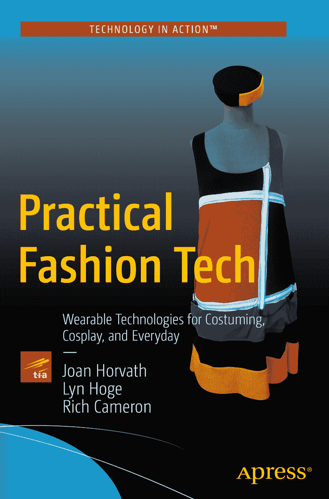

 Joan Horvath, Lyn Hoge 和 Rich Cameron  
实用时尚科技  
用于戏服、角色扮演及日常生活的可穿戴技术

作者在本文中引用的任何源代码或其他补充材料，读者均可在[`www.apress.com/9781484216637`](http://www.apress.com/9781484216637)获取。有关如何找到本书源代码的详细信息，请访问[`www.apress.com/source-code/`](http://www.apress.com/source-code/)。读者也可在 SpringerLink 上各章节的“补充材料”部分访问源代码。  
ISBN 978-1-4842-1663-7  
电子版 ISBN 978-1-4842-1662-0  
DOI 10.1007/978-1-4842-1662-0  
美国国会图书馆控制号：2016954029  
© Joan Horvath, Lyn Hoge 和 Rich Cameron 2016

实用时尚科技  
常务董事：Welmoed Spahr  
首席编辑：Michelle Lowman 和 Natalie Pao  
编辑委员会：Steve Anglin, Pramila Balan, Louise Corrigan, James T. DeWolf, Jonathan Gennick, Robert Hutchinson, Celestin Suresh John, James Markham, Susan McDermott, Matthew Moodie, Ben Renow-Clarke, Gwenan Spearing  
协调编辑：Mark Powers 和 Jessica Vakili  
文字编辑：Corbin Collins  
排版：SPi Global  
索引编制：SPi Global  
插图制作：SPi Global

如需了解翻译相关信息，请发送电子邮件至`rights@apress.com`，或访问[`www.apress.com`](http://www.apress.com)。Apress 及 friends of ED 图书可批量购买，用于学术、企业或促销用途。大多数书籍也提供电子版及其许可证。如需更多信息，请参考我们的特殊批量销售–电子书许可网页：[`www.apress.com/bulk-sales`](http://www.apress.com/bulk-sales)。

本作品受版权保护。出版商保留所有权利，包括全部或部分材料的翻译、重印、插图再利用、朗诵、广播、微缩胶片复制或其他任何物理形式的复制，以及信息的传输或检索存储、电子改编、计算机软件，或采用目前已知或未来开发的类似或不同方法进行使用。本书中可能出现商标名称、标识和图像。对于每个出现的商标名称、标识或图像，我们并非都使用商标符号，而是仅在编辑风格中使用这些名称、标识和图像，以利于商标所有者，且无意侵犯商标权。在本出版物中使用商品名称、商标、服务标记及类似术语，即使未标明为商标，也不应被视为对其是否受专有权利保护的任何意见表达。

尽管本书中的建议和信息在出版时被认为是真实准确的，但作者、编辑和出版商均不对可能存在的任何错误或疏漏承担法律责任。出版商对本书所载内容不作任何明示或暗示的担保。

印刷于无酸纸

本书通过 Springer Science+Business Media New York（地址：233 Spring Street, 6th Floor, New York, NY 10013）在全球图书贸易中发行。电话：1-800-SPRINGER，传真：(201) 348-4505，电子邮件：`orders-ny@springer-sbm.com`，或访问`www.springeronline.com`。Apress Media, LLC 是一家加利福尼亚有限责任公司，其唯一成员（所有者）是 Springer Science + Business Media Finance Inc (SSBM Finance Inc)。SSBM Finance Inc 是一家特拉华州公司。

谨以此书献给 Lyn Hoge 的家人（包括血缘亲属和更广泛的亲友），感谢他们带来的欢笑、冒险、支持和爱。他们在顺境和逆境中都始终相伴，并一直慷慨地分享他们的智慧、快乐和创意。

## 引言

本书是两位技术专家（Joan 和 Rich）与一位资深教师、服装设计师兼编舞家（Lyn）的合作成果。我们三人轮流执笔不同章节和部分。时尚科技需要掌握设计、制版、缝纫、电子、编程和 3D 打印等多方面的技能。除了技术能力，制作一件优秀的戏服或配饰还需要懂得如何成就一件好作品的隐性知识。

我们知道，人们从不同领域接触时尚科技和可穿戴电子设备，每位读者可能已经对其中一部分非常了解。因此，本书的结构设计使您如果对某方面已经非常熟悉，可以轻松跳过一两个章节。

市面上有许多书籍介绍了一系列项目。本书也包含项目，但我们更侧重于解释为什么某些事情要按特定方式来做，以便您能理解这些技术如何应用于其他情境。技术日新月异，总有新组件可供探索；关键在于了解它们设计背后的通用原理，以及知道哪里最可能找到使用最新产品的方法。关于如何缝纫、如何 3D 打印以及如何使用`Arduino`，已有大量优秀资源。我们觉得缺失的部分是将它们整合到一本可读性强的手册中。

我们在撰写本书时考虑了几类读者。首先，如果您已经对为戏剧制作精美戏服感兴趣，或者喜欢参加角色扮演大会，那么您将能够运用本书的材料，让您的作品变得可互动、发光，或者按照您选择的技术方向进行探索。另一方面，如果您对`Arduino`电子技术有所了解，但完全不知道如何缝纫或组装一件服装，那么您可以填补知识空白，并学习如何设计整个项目。

如果您是一名高中或大学教师，需要开设一门“时尚科技”、“戏服技术”或“可穿戴电子”课程，附录 A 提供了一些可供起步的建议。本书中的材料也非常适合作为夏令营活动的基础，将传统缝纫和手工艺与一些电子设备和编程结合起来。需要注意的是，与传统手工艺材料相比，电子元件既精密又昂贵——它们不是玩具。大多数制造商建议最低使用年龄为 13 岁左右，并需成人监督，我们也提出同样的建议。

时尚科技面临的挑战之一是需要大量材料。首先，您需要一台缝纫机，否则只能从现有服装改造或小到可以手缝的项目入手。您需要购买所需的电子元件，并且对于某些项目，您需要能够使用 3D 打印服务。在设计项目时，我们尽量让您能用最少的硬件进行尝试。

进行第一个项目时，最大的诱惑是去做一些宏大而复杂的东西。这不是个好主意，因为缺乏经验时，调试混合了缝纫、电子电路和软件的项目会非常困难。我们几乎用了整整一章（第 10 章）来解构我们的第一个集体项目——事实证明，它过于雄心勃勃了。为了减少这种诱惑，我们提供了一些有趣且开放式的初级项目，您可以根据喜好添加更多内容，或者在觉得作品已让自己满意时停下来。

为了涵盖所有这些内容，我们将本书分为四个部分。第一部分“大图景”为其余部分奠定了基础。第 1 章阐述了我们对于时尚科技所包含内容的看法，并讲述了我们三人如何作为一个团队合作，以此为您建立自己的团队提供范本。第 2 章则广泛介绍了优秀戏剧服装的构成要素，假设这是许多读者应用本书材料的方式。

接着进入第二部分“基础知识”，我们介绍了可穿戴技术所需的关键技能。第 3 章介绍了手缝和机缝的基础知识，并提供了许多其他参考资料。第 4 章重点介绍了创建和使用缝纫图案的艺术。在第 5 章中，我们转向技术方面，介绍了电子元件。在第 6 章中，我们学习了如何对这些设备进行编程。最后，在第 7 章中，我们通过一个全面且易于管理的项目将所有知识融会贯通，该项目要求制作一条带有内置计时器的女主人围裙，当计时器倒计时时，围裙上的红灯会闪烁，时间到时则会亮起绿灯。这些章节足以让您学会制作“闪烁”项目——即那些能发光并具备基本灯光控制能力的服装。

第三部分“进阶知识”探讨了更复杂的主题。第 8 章回顾了可用于让您的项目对环境做出反应的各种传感器类型，并介绍了一些其他硬件，如电机，这些内容超出了本书详细讨论的范围，但我们认为您应该有所了解。

第 9 章总结了 3D 打印流程，并指出了在哪里可以详细了解它。第 10 章讲述了我们在没有充分规划的情况下，试图创建一个过于复杂的项目（一条具有自我意识的裙子）的经验。

如果您正考虑直接跳到第 11 章的更大项目（我们知道，我们也有过这种想法），请抑制住这种冲动，先阅读第 10 章。说到第 11 章，您将在其中找到本书封面上展示的那条裙子，它使用了电致发光（EL）带材来照亮织物块之间的边界。这是一个中级缝纫项目，不需要电路设计或编程。该章中的另一个项目则采用了一顶现成的帽子，并为其添加了电路，以便在您摇头表示“不”时亮起红灯，在您点头表示“是”时亮起绿灯。这个帽子项目只需要最少的缝纫工作。因此，您可以根据自己最擅长的领域选择一个有分量的项目。

最后，在第四部分“未来之路”中，第 12 章探讨了本书其他部分未涉及但在业余戏服制作中经常使用的其他技术，例如激光切割、泡沫盔甲制作和真空成型。第 13 章对本书的主要部分进行了总结，回顾了一些当前的高端项目，并对该领域未来的发展方向进行了一些推测。

我们还收录了两个附录。附录 A 详细介绍了如何规划一门以项目为中心的、时长不一的课程，以教授时尚科技的所有内容。附录 B 则将本书中的所有链接汇总到了一个便捷的参考列表中。

本书中包含了一些`Arduino``sketches`（草图）。这些代码可供下载。说明位于本书的版权页上。

我们希望您能享受尝试那些对您而言是全新的时尚科技领域的过程，并期待在未来看到许多项目。如果您基于本书制作出了很酷的作品，可以通过她的`@JoanHorvath` Twitter 账户推文告诉 Joan，或者通过[`www.nonscriptum.com`](http://www.nonscriptum.com)联系我们。现在，开始阅读并做出一些了不起的东西吧！

## 致谢

本书在很大程度上借鉴了开源硬件和软件社区。首先，我们要感谢全球`Arduino`社区的贡献，特别是[`www.arduino.cc`](http://www.arduino.cc)上提供的众多实用教程和背景信息，以及我们用于许多插图的`Fritzing`软件（[`www.fritzing.org`](http://www.fritzing.org)）背后的社区。如果没有开源 3D 打印硬件和软件社区，消费级 3D 打印生态系统就不会以目前的形式存在，我们始终感谢该社区，因为它是我们工作中许多成果的基石。我们已尽力准确标注所有开源材料，并为任何无意中的遗漏表示歉意。

整个创客社区也给予了极大的支持。Joan 和 Rich 在“关于作者”部分中的照片是由 Ethan Etnyre 在 2015 年圣马特奥创客嘉年华上拍摄的；我们感谢通过观摩创客活动中的项目所获得的所有灵感。

Apress 的制作团队，无论是过去的还是现在的成员，在大部分时间里都使这个过程无缝衔接，并在遇到困难时提供了虚拟的针线支持。我们与 Mark Powers、Michelle Lowman、Corbin Collins、Natalie Pao、Jessica Vakili 和 Welmoed Spahr 直接打交道最多，但我们也同样感谢许多我们未曾谋面的团队成员。

我们感谢洛杉矶 Windward 学校的教职员工和学生，特别是 Lyn 在 2015-2016 学年戏剧服装班的同学们，这些概念中的许多都是在那里以早期形式进行试验的，同时也感谢 Lyn 的系主任 Jordon Fox。加利福尼亚州圣莫尼卡的`Make Believe`戏服公司的新老店主们在讨论优秀戏服的构成要素时提供了极大的帮助。`Punished Props`的联合创始人 Bill Doran 也慷慨地花费时间，为我们提供了关于第 12 章应包含内容的建议。其他人允许我们使用他们的图片或创意，我们在这些内容出现时已注明出处。

最后，我们感谢我们的朋友和家人，他们容忍了一本创客书籍创作过程中的混乱，并在需要的时候提供了披萨补给。这本书对我们三人来说是一次奇妙的创意之旅，我们感谢在各自通往这一刻的道路上遇到的每一个人。

