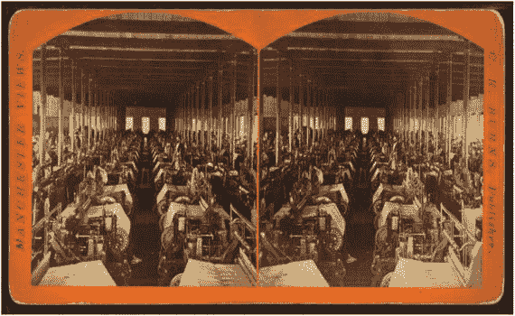
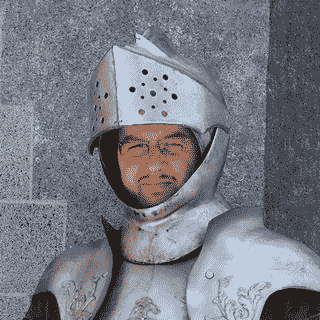
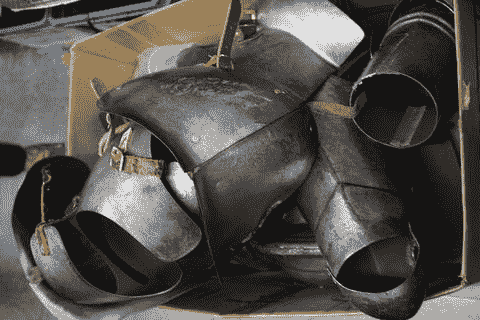
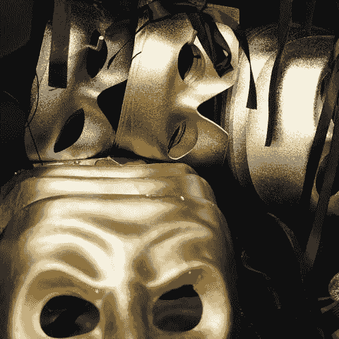
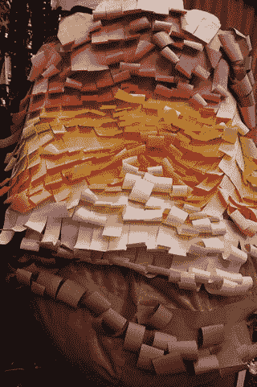

# 1. 时尚科技

*电子补充材料* 本章的在线版本（doi:[10.1007/978-1-4842-1662-0_1](http://dx.doi.org/10.1007/978-1-4842-1662-0_1)）包含仅供授权用户使用的补充材料。

时尚科技是一个跨学科领域，它将传统时尚与纺织品同现代电子技术、软件及其他技术相融合。在本书中，我们认为时尚科技指的是那些包含电子元件的互动式服装或配饰，或是利用 3D 打印等数字制造技术创作的作品。得益于电子制造领域的进步，计算机、传感器以及可嵌入日常物品的发光元件的成本得以降低，这类技术直到最近才在消费级层面普及。本章将介绍时尚科技，并讲述如何利用本书开启这一新兴领域的实践之旅。

## 时尚科技简史

自古以来，制作衣物以抵御恶劣天气一直是技术发展的灵感源泉。工具从用于在皮革上打孔的骨锥，发展到用于纺纱的纺锤，再到能够以工业规模生产大量布料的织机。图 1-1 展示了一张 1875 年的立体照片，拍摄的是阿莫斯基格（新罕布什尔州）方格花布厂的织布车间。（这张立体图像在 [`stereo.nypl.org/view/14480`](http://stereo.nypl.org/view/14480) 上还有动画版本。）

**图 1-1.** 约 1875 年的织布场景。图片来自纽约公共图书馆（ [`digitalcollections.nypl.org/items/510d47e1-7c18-a3d9-e040-e00a18064a99`](http://digitalcollections.nypl.org/items/510d47e1-7c18-a3d9-e040-e00a18064a99) ）

对制作精美图案织物的渴望，促成了 1801 年提花织机的诞生。织布工制作了打有孔的卡片，这些卡片通过一个精巧的轻张力弹簧与金属线系统，控制着织机所织出的图案。这使得诸如锦缎等极为复杂的图案得以自动生成。

然而，用于窗帘和婚纱的华丽织物并非故事的全部。英国数学家兼发明家查尔斯·巴贝奇看到了提花织机的穿孔卡片，并思考是否可以用类似的系统来制造一种更通用的、用于解决数学问题的计算器，他称之为分析机。

巴贝奇于 1837 年首次描述了这台机器；但这台完整的机器实际上从未被制造出来（ [`en.wikipedia.org/wiki/Analytical_Engine`](https://en.wikipedia.org/wiki/Analytical_Engine) ）。尽管如此，巴贝奇仍被广泛认为是通用计算机的发明者，而其穿孔卡片的后续形式一直使用到 20 世纪 70 年代。因此，计算机诞生于维多利亚时代的时尚科技之中！

**提示** 如果你对纺织技术的历史感兴趣，可以访问 [www.cs.arizona.edu/patterns/weaving/index.html](http://www.cs.arizona.edu/patterns/weaving/index.html) 这个网站，那里有一个令人惊叹的历史档案库，包含许多插图和原始文献。更具体地说，如果你想要下载一本关于如何为提花织机制作卡片的维多利亚时代书籍，E. A. 波塞尔特的《提花织机分析与解读》（Posselt, 1893）现已进入公共领域，可从 Hathi Trust 数字图书馆获取，网址为 [`hdl.handle.net/2027/gri.ark:/13960/t26b0d33d`](http://hdl.handle.net/2027/gri.ark:/13960/t26b0d33d)。

20 世纪 50 年代末集成电路的问世及其快速发展，现已带来价格低廉、大小与硬币相当的计算机。已故的戈登·摩尔在 1965 年预测，基于技术进步，计算机芯片的性能大约每两年翻一番；这条后来被称为“摩尔定律”的预测（迄今为止）惊人地准确。这意味着，20 世纪 80 年代初期的超级计算机，其性能已被 2016 年那些仅几英寸见方、售价 5 美元的单板计算机所超越。

其他数字电子产品也紧随其后，为智能手机、相机及其他设备开发的微型处理器和传感器，如今使得将相当于 20 世纪 80 年代需要专人维护的处理能力，不显眼地集成到一顶帽子或一条围裙中成为可能。从提花织机开始，这一发展经历了一个循环，如今将电路编织进衣物中已成为现实。（我们将在第 13 章讨论谷歌的 Project Jacquard。）

能够接触到廉价、易编程的电子产品还带来了另一个副作用：基于机器人的消费产品兴起，例如低成本消费级 3D 打印机和电脑化的家用缝纫机。3D 打印机反过来使得快速、低成本地制作实体物体原型变得容易，并正引领着更多创新。功能丰富的家用缝纫机能够完成复杂的项目，而这些项目在过去对于业余爱好者来说可能过于繁重。

总而言之，你可以利用一系列令人惊叹的技术来制作酷炫的项目。在本书中，我们聚焦于将数字电子技术及相关技术（例如 3D 打印）应用于时尚领域，例如制作戏服和其他互动式可穿戴作品。

## 戏服制作

如今，在家中制作更精致、更专业的戏服已成为可能。因此，角色扮演——装扮并扮演喜爱的虚构人物——已然成为一种亚文化现象（最初在日本兴起，并迅速传播到美国及其他地区），这并不令人惊讶。科幻及其他类型的展会活动上，经常有粉丝身着戏服扮演自己钟爱的角色。动漫和电子游戏角色是热门主题。有鉴于此，许多场合都需要营造出超脱尘世的效果，而本书中介绍的技术，或许正是将角色扮演戏服提升到新高度的关键。

历史戏服一直很受欢迎。文艺复兴博览会（[`www.renfaire.com`](http://www.renfaire.com)）普及了对伊丽莎白时代晚期活动的历史重演，以及装扮成那个时代的人物。可见的电子设备可能会显得与角色不符，但你手臂上可能有一条眼睛发光的龙，或者一个会朝向光线的头。

你阅读本书，可能是为了寻找增强戏剧效果戏服的灵感，无论是用于学校演出（正如琳在本章后面所谈到的），还是用于专业用途。在学校层面，戏服可能需要预算低廉、快速组装，并且对于一个患有舞台恐惧症的十岁孩子来说，穿脱要方便。一些由电子技术驱动的战略性特效，能让一套戏服令人难忘。例如，琳和她的学生们为了《小美人鱼》的演出，为鱼添加了可编程的发光眼睛。

最后，还有用于派对、节日等场合的普通装扮戏服。图 1-2 展示了定制的、真空成型（第 13 章）的塑料盔甲在盒子里的样子，而在图 1-3 中，它短暂地将里奇爵士变身为他真正的游侠骑士身份。

图 1-3. 盔甲穿在我们的骑士作者身上

图 1-2. 盒子里的塑料盔甲

一些戏服元素，比如面具（图 1-4）或某个时代的服装，能将人带到另一个时空。如果你已经有了奇幻戏服，何不将它混搭起来，使其具有互动性呢？（盔甲和面具由加利福尼亚州圣莫尼卡的 Make Believe 公司提供；我们将在第 2 章中进一步讨论。）

图 1-4. 面具

也许你并非要制作一件戏服本身，而是想做些有实用功能的东西——比如在黑暗中能自动亮起作为小夜灯的墙饰，或者在包里布置一些巧妙的 LED 灯，以便在晚上能找到钥匙。

我们想表达的核心观点是，应用本书技术的第一步，是思考你要做什么以及你希望它看起来是什么样。人们常常一开始就为了技术本身而想使用某项技术，但结果往往不尽如人意。仅仅因为有可能制作一件互动服装或艺术品，你就应该这么做吗？

如果你正在阅读本书，你可能正打算制作像我们刚才描述的那些戏服。或者，你可能是被要求为高中生或大学生开发一门课程。如果你是老师或家长，时尚科技项目可以是一个很好的方式，去说服那些原本可能对电子或编程望而却步的学生，让他们在最终产品的激励下，尝试一下这些领域。

## 我们的设计理念

我们三人（琼、里奇和琳）是从截然不同的方向进入这个领域的。里奇是千禧一代，从小就开始设计电子项目（包括当今消费级 3D 打印机的前身之一，以及一款精巧的小型 3D 打印机，里奇和琼曾任职的公司至今仍在销售它——你可以在第 9 章看到它）。他喜欢为了创造而创造，这是通常对黑客的定义。（在我们所处的圈子里，黑客并没有负面含义。那些利用技能做坏事的人被称为黑帽黑客）。里奇非常注重细节，对本书中涉及的硬件和软件拥有百科全书般的知识。

琼则是前火箭科学家转型而来，她的角色是把握全局，并思考如何避免在任何一个技术领域陷入过多的细节。她曾参与其他行星的航天器项目，在那里一个微小的错误都可能导致灾难。因此，她带来了处理复杂系统的结构化方法和经验，同时也希望将解释尽可能简化（同时保持正确性）。

琳则拥有多年为初中和高中演出制作戏服的丰富经验。除了似乎能凭空（以及一堆布料）变出戏服的能力之外，她还有幽默感，并且对于什么小细节可能带来天壤之别有着敏锐的眼光。她还在课堂上教授过缝纫，因此了解可能出现的各种陷阱。

我们三人轮流引导你阅读本书，并且在本书的大部分内容中，当聚焦于某一个人的特定专长时，我们会切换成第一人称。有时我们合作得过于紧密，以至于无法由某一个人来主导，这时（就像此处这样）我们就会使用“我们”。

我们在此介绍我们的背景（本书前面的“作者简介”部分还有更多内容），是因为我们建议你组建一个团队来完成你的第一个项目，这个团队应具备所有这些方面的能力，尽管不一定像我们三人这样恰好分布在团队中。良好的默契和幽默感对于一个团队来说也非常重要。有时候事情看起来就是很傻，你必须笑一笑，找出哪里出了问题，并且不再重蹈覆辙。其他时候，你可能需要让你团队中的某个成员独自在角落里尝试一段时间。但是，如果我们中的任何一个人卡住了，我们发现向其他人清晰地阐述问题非常有价值，这样我们就可以回到基本原理，思考我们最初想要达成什么目标。

## 规划你的项目

市面上有许多书籍涵盖了制作时尚科技项目的不同方面，互联网上也有很多你可以尝试的项目。我们感觉缺少一条循序渐进的路径，从缝纫基础，再加上电子硬件和软件开始，以便让那些对所需技能知之甚少的人也能开始项目制作。

我们始终强调系统设计的概念。很容易为项目的某个部分想出一个绝妙的主意，但如果你不考虑它要整合到可穿戴物品中，而以孤立的方式去做那个部分，那么最终的做法可能与你开始将其整合到连衣裙或帽子中时应采取的方式大相径庭。我们无论如何强调提前端到端地规划一个复杂项目的必要性都不为过。第 10 章讲述了我们共同完成的第一个项目的故事，在那个项目中，我们很大程度上忽略了这一原则——尽管我们三人都知道不应该这样。

在本书中，我们将涵盖缝纫（包括制作和使用纸样）、创建电子电路以及编程的基础知识。这些是大多数时尚科技项目的核心技能，我们会对每一项进行相当深入的探讨。我们按照你最有可能创建项目的顺序来安排章节：先缝纫，然后设计电路，最后（如果需要的话）进行编程。我们将指导你如何管理项目中的复杂性，并为你提供技巧，帮助你在项目遇到问题时避免不知所措。

### 穿戴者的环境

如第 2 章所述，你还需要深入思考穿戴者将要做什么，以及他们在穿着服装时所处的环境。例如，本书中的项目都设计为在干燥的室内环境中穿着。尽管其中有一个围裙项目，但我们设想它更多是用于在派对上端菜时给朋友留下深刻印象，而不是在烹饪或手湿时使用。

### 原型制作与测试

在规划项目时，要思考在项目开发中的哪些环节可以拼凑出迷你原型。对于缝纫部分，你可以制作一个白坯样衣——用非常便宜的布料制作的项目版本，这样即使需要拆线和反复重缝也不会心疼。在制作电子部分时，你最初可以使用鳄鱼夹（用于临时连接电路的夹子）来搭建一个最终要用导电线缝制的电路。而在编程时，则应当考虑如何创建一些简单的阶梯式项目，逐步构建最终功能。随着本书的深入，我们会介绍这些技巧。当你构思想要实现的目标时，考虑如何让部分功能可以独立测试，这样就不会最终陷入一个可能存在多重交互问题的复杂项目。

但最重要的是，先确定你想要服装是什么样子，然后再添加技术或动画元素。接下来，林将分享她的一些最佳创作经验。

### 林的服装故事

在我参与过的每一部作品中，似乎总有一两套服装很难做到位。要么概念过于抽象难以理解或完善，要么试穿过程麻烦重重，要么遭遇各种其他问题。为《康尼岛的圣诞节》制作火鸡服装时就遇到了这种情况。

这部作品中的一些服装尤其具有挑战性，因为故事背景设定在 20 世纪 30 年代的布朗克斯区。剧中还有一出戏中戏，其中的服装应该看起来像是大萧条时期纽约的孩子们和他们的父母手工制作的。我想要一种俗气的效果，特别是对于出现在感恩节庆典场景中的那只火鸡。我们找到的大多数服装都过于现代化了。那个时代的色彩不应如此鲜艳和霓虹，我希望面料的外观能具有真实感。

在与导演进行大量头脑风暴后，我在网上购买了一套火鸡服装。收到后，我拿起剪刀就动手了。我剪掉了袖子，并修剪了上衣的大部分前片和后片。这样我就可以让女演员穿上肩带或背带。服装的下半身是填充的，这部分我想保留下来。我没有使用腿部套，因为她要把它穿在裙子外面。

当我对整体服装的造型感到满意后，我开始用卷曲的彩色纸条覆盖下半部分来表现羽毛。我使用柔和的棕色、橙色和黄色纸条，将它们绕在铅笔上卷曲，然后成排地粘在火鸡身体上。服装的尾部形状很漂亮，所以我只是用彩色纸羽毛覆盖了它，这是我最喜欢的部分（图 1-5）。

**图 1-5.** 彩色纸火鸡尾部特写

卷曲和粘贴纸羽毛非常耗时且有点繁琐，但我对最终的效果很满意。至于肉垂和喙，我剪了两张相应形状的彩色纸，用双面胶将它们固定在女演员的脸上。

我还将卷曲的彩色纸羽毛用于天使加百列的翅膀。从硬纸板上裁剪出翅膀形状，覆盖上白色羽毛，绑在演员背上，并确保他侧身通过门口，这是这套服装成功且迷人的解决方案。大多数时候我都是用布料来制作和修改服装，所以这部作品让我耳目一新，回归了本源。

就探索疯狂古怪想法的自由度而言，《绿野仙踪》的制作可能是我最喜欢的作品。导演、另一位服装师和我花了很多时间琢磨一些与常规版本略有不同的角色方案。我们让邪恶女巫穿着滑雪靴站在一个由她的飞猴拉动的滚动平台上。这样她可以不用走路就移动，并以一种非常威胁的方式前倾。为了让她在舞台上熔化，我们在她的女巫裙子下面加了一条裙撑，她可以慢慢扭动，蹲得非常低，缩成一团，留下中间凹陷的裙撑站立着。

飞猴们穿着染成棕色的保暖内衣，上面缝着毛茸茸的斑块和尾巴。铁皮人有金属烟囱管做的胳膊和腿，胆小狮的鬃毛是用拖把头做的。芒奇金人是最有趣的创作。我在一家廉价商店找到了一些非常难看且色彩鲜艳的扎染连体衣。然后我使用了亮色的普通舞蹈紧身裤，在里面塞满棉絮，为每位演员将两对扭在一起，固定在他们的头上。当房子降落在奥兹国时，藏起来的芒奇金人看起来就像一片奇奇怪怪的根茎。

经过多年的服装制作经验，我发现通常在制作初期看似失败的作品，到了首演之夜反而会成为最好的——至少是评论最多的。在任何演出中，我最喜欢的时刻就是与制作团队在初期进行头脑风暴、探索和实验。发散思维，收集新意见和不同观点，这令人无比振奋。

**注**

阅读林的故事时，有几件事可能会引起你的注意。其一，听起来很有趣。好的设计不能太严肃。要充满玩心，尝试一些不协调的东西。这不是我们在书中能教会你的技能，但我们会在书中不时穿插一些像林这样的侧边栏，为你提供成功实践的范例。第 2 章会深入探讨什么构成一件好的服装，并对类似林刚刚分享的那些经验进行解构。

## 总结

在本章中，我们定义了时尚科技，并简要介绍了构成这一跨学科领域的交叉领域的历史。接着，我们介绍了可能应用这些技术的不同服装制作场景。我们讨论了如何使用本书，并阐述了我们的设计理念。我们还列举了几个关于优秀服装的案例研究，这些服装明显是低技术含量的，目的是为了说明：好的服装本身就会大放异彩，而设计是一个好项目中最核心的要素。在下一章中，我们将更广泛地讨论什么构成一件好的服装。

