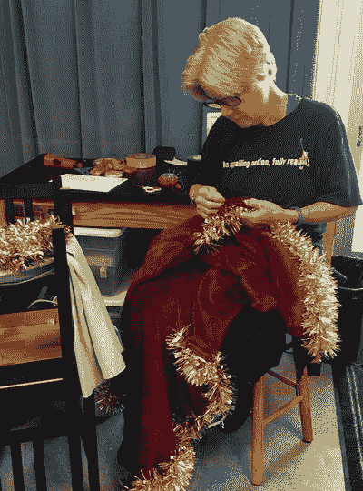
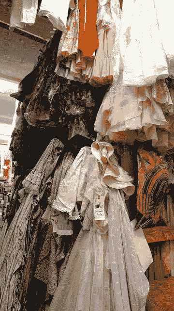
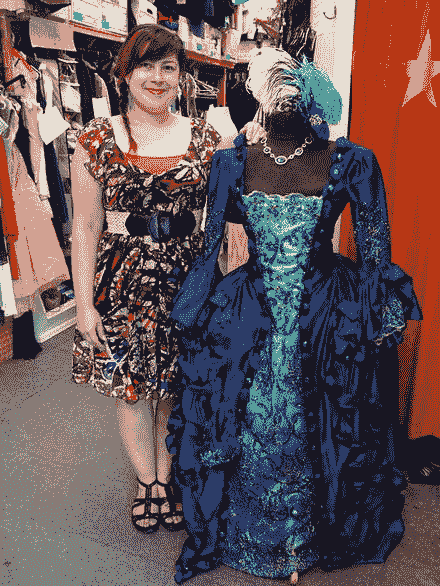
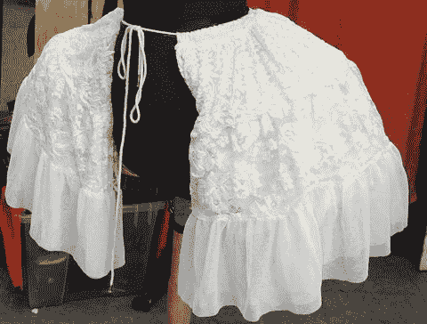
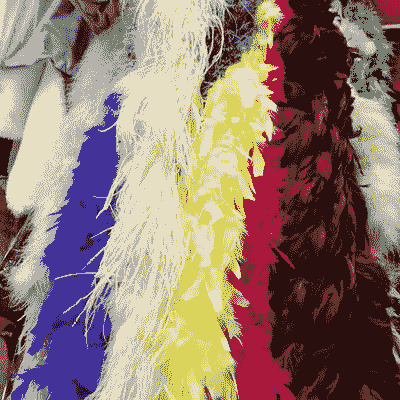

# 2. 实践性戏服设计

本书中，我们带你涉猎诸多领域：缝纫、制版、电子技术和计算机编程。然而对许多读者而言，核心目标仍是制作一件可穿着的戏服。人们自古便有装扮与假面狂欢的传统，而近年来**角色扮演**（Cosplay）愈发流行。这一为爱好者催生无数展会的活动，大致可定义为将自己装扮成电影、电子游戏或其他故事中最喜爱的角色（有时细节惊人）。Cosplayer 也可能从某种风格出发（比如**蒸汽朋克**——维多利亚服饰与准时代机械装饰的混搭），在此基础上进行创作。

技能固然重要，但明确最终作品的用途同样关键。若你以此书作为教授这些技能的课程基础，那么每个项目都可以是小练习，最终累积成一件可供穿着或悬挂展示的毕业作品。

然而，若你阅读此书是为了为自己或本地剧团制作戏服，就需要深入思考设计问题：什么才算一件好戏服？**Lyn** 已从事戏服创作多年，下一节便是她经验的凝练。她与 **Joan** 还曾与加利福尼亚州圣莫尼卡一家专业戏服制作租赁店的历任及现任老板交流，听取他们对好戏服的定义。

## 何为戏服？

戏服不仅表演艺术中举足轻重，在我们的日常生活中亦意义重大。你选择穿什么、何时穿，都会向家人朋友透露关于你心情或去向的诸多细节。这些选择定义了我们如何向世界呈现自我。无论是高级定制时装、运动装，还是古怪混搭，我们的穿着都在宣告我们是谁、想成为谁，以及希望世界如何看待我们。一件好戏服能在角色开口前，便向观众揭示其本质。

### 戏服设计的力量

戏服能以微妙的方式抓住观众，使其沉浸于故事，也可能分散观众对情节的注意力。Cosplay 戏服通常高度特定于某些角色，但也可用于引入新角色或新概念。

角色、社会地位和时代背景共同定义了戏服的样貌。戏服是为男人、女人、动物、外星人，还是这些元素的组合？正在创造的是何种类型的角色？此角色与他人有何异同？角色的年龄及所处时代？角色穿着此戏服需进行多少体力活动？戏服是用于戏剧或故事中的写实表现，还是夸张或风格化的表演？

戏服师与设计师必须研究历史上各阶级、各性别的着装方式。历史上，人们的性别曾通过着装被清晰区分。但在当今世界，一切皆有可能。男女选择相同的单品、色彩与风格。几乎一切都被接纳，并被尝试。

戏服可将角色设定于特定历史时期、特定地点和特定国家。多数时代都有非常明确的视觉风格、形态与轮廓，戏服也可能展现角色所处的气候或季节。

角色的着装方式可能揭示其本质，或展现其希望被人看待的形象——这或许与其真实本性相反。一个反派角色可能试图表现得朴实诚实；而一个温顺害羞的人或许会假装酷炫新潮。想想《天鹅湖》中的奥德特与奥黛尔——善与恶的天鹅，通常由同一人扮演，但通过白色与黑色芭蕾舞裙的切换来区分。同样，经典西部片中白色或黑色牛仔帽，被用作"好人"与"坏人"的速写符号。当然，还有达斯·维达与卢克·天行者的对比。

### Lyn 的学生戏剧戏服制作贴士

若你身处学校戏剧系，很可能还会面临时间与成本限制，或许需要一人制作、修改或调整多件戏服（如图 2-1 中我正在做的）。无论你拥有何种资源来制作戏服，关键在于从清晰的概念出发：这件戏服试图传达什么。

图 2-1. Lyn 正在制作学校音乐剧戏服

我常依靠家长的捐赠，并大量光顾二手店，来为整部演出完成戏服设计。为连衣裙或长袍添加镶边或其他饰物，创造出完全不同的外观，相当容易且乐趣十足。我在图 2-1 中正在处理的是一件二手丝绒长袍，我为《科尼岛圣诞节》中的圣诞老人角色缝制了一条金色花环作为饰边。

我最满意的一些戏服，正是那些我不得不拆解并重塑为新作品的旧衣。我曾用一件 1950 年代的粉色舞会礼服，为《绿野仙踪》中的好女巫格林达添加了大量蕾丝和褶边。对于西方坏女巫，我则用了一件 1960 年代的黑色塔夫绸鸡尾酒裙，拆掉华丽部分，加上了橡胶蛇、蜘蛛和其他邪恶元素。我认为这两件是我最钟爱的创作之一。可惜它们被借出几次后便一去不返……深深叹息。

用有限的预算完成整部演出的戏服是可行的。只需要一些规划与劳作，但成果可能相当惊艳且令人满足，尤其当学生们参与头脑风暴、裁剪与缝纫时。

从头开始打造一件戏服也充满乐趣。我最爱的几件包括：为《单身公寓》制作的两件 1960 年代 **崔姬**风格波点连衣裙、《该死的美国佬》中洛拉的戏服、《万事皆可》中的几套 1940 年代踢踏舞裤装，以及为《科尼岛圣诞节》制作的一只火鸡。

拿起一件衣服，把它变成与原本截然不同的东西。让你的大脑自由探索。大胆勇敢地做出选择。有时会失败，但另一些时候则惊艳无比。我从每件修改或创作的作品中都学到了很多，尤其是那些出了状况、结果不尽如人意的作品。

## 戏服设计原则

当被问及“什么才是一套好戏服”时，塔妮莎·法切特迅速答道：必须让人一眼就能看出穿着者扮演的是什么角色。塔妮莎刚刚接手了位于洛杉矶附近圣莫尼卡的`Make Believe`（[`www.makebelieveinccostumes.com`](http://www.makebelieveinccostumes.com)）戏服制作与租赁店。

`Make Believe` 成立于 20 世纪 80 年代初期，最初是为附近一家剧院服务的准专属戏服部门。创始人`道格·斯佩瑟特`和`露丝·塔利`将业务发展至今，据塔妮莎估计，库存已有数千套戏服（如图 2-2 所示）。

**图 2-2.** 专业戏服库存

创始人`露丝·塔利`最近退休了，但她很慷慨地给林发来了她眼中优秀舞台戏服的一些关键标准。她的要点如下：

-   “戏服只有作为布景、灯光、化妆、发型、道具等整体设计的一部分时才会出彩。当所有元素融为一体，那便是魔法。戏服必须符合时代背景，并且在此基础上适合演员。如果演员穿上后显得滑稽，我有时也会在历史准确性上‘耍点小聪明’。比如裙撑得收一点，或者护裆别那么厚实，或者把无数纽扣用魔术贴固定，方便穿脱。”
-   “戏服还必须服务于演员。如果演员需要突出，那么颜色、面料、装饰都需要抢眼。如果需要不引人注目，那就走低调路线。如果是撕脱裙，那看起来必须毫不费力，或是意外扯落。在古装剧中，观众必须能感受到内衣也是符合时代的，而有些内衣能改变体态和动作，这便增添了历史感。”
-   “观众应该能很快判断出故事发生在哪个年代，无论是 1840 年还是 1940 年，并且应该能识别出阶级、王室身份，或许还有职业。观众应该能看出是哪个季节，以及白天还是夜晚。如果你把这些全都拿捏得恰到好处，那你就拥有一套出色的戏服了。”

露丝还发现，历史上一个时代的时尚与建筑之间存在相似之处。她说：“我曾想研究不同时代的建筑与服饰，以比较它们的轮廓、质朴或华丽。时尚能告诉我们大量关于我们所处时代以及过去时代的信息。我认为从‘青少年时代’到‘咆哮的二十年代’的转变，是服饰、思想、行为、文学中自由运动的绝佳范例，而摩登女郎在其中又具有多大的代表性呢？很难将时装设计师对艺术家的影响与艺术家对时装设计师的影响截然分开。想想`埃尔特`。想想`摩登 60 年代`。想想`波普艺术`。还有音乐……披头士在`埃德·沙利文秀`上穿着的服装是否成为了主流时尚？如今，在舞台上捕捉这一点就成了戏服设计师的工作。建制派、嬉皮士、摩登族、书呆子——无数时代皆是如此。在`《双城记》`和`《三个火枪手》`中，让法国人像法国人、英国人像英国人，这是对戏服设计师的挑战。而`马伏里奥`呢？没有他那交叉的吊袜带，他还算什么？”

### 让戏服为你服务

塔妮莎建议，一个人要想穿上戏服后看起来好看，最重要的就是穿着舒适。她指的是身体上的舒适，并且戏服要结实，不会在穿着者身上散架。但她也指更微妙的一点。人们可能会想象，一位专业的戏服设计师大部分时间都在温和地劝说人们放弃与年龄不符的服装。

然而，显然人们普遍认为自己不够好看，驾驭不了某种造型。塔妮莎说，人们必须“放下防备”才能有效地穿上戏服，而并非每个人都能或愿意这么做。他们还必须“决定自己想获得何种关注”。

在制作戏服的过程中，尝试角色所需要的所有肢体动作非常重要。如果你等到戏服做完才试，可能就得进行大量修改了。

### 戏服开发的时间与精力

塔妮莎一直以来最喜欢的戏服之一是一件古装长裙（如图 2-3 所示）。塔妮莎估计这件戏服耗费了数百个工时。带珠饰的面料可以买到，但非常昂贵，因此必须谨慎使用以避免浪费。

**图 2-3.** 塔妮莎·法切特与一条她钟爱的长裙及其配饰

除了令人惊叹的表面细节，可以说“内部”还有很多支撑结构（见图 2-4）。像这样精致的戏服有很多层，经验指导着该用什么面料来制作，以便它们能为不同的穿着者进行修改，而不会在修改过程中被毁坏。

**图 2-4.** 图 2-3 中长裙的部分内部支撑结构

### 你将制作什么？

在深入阅读本书之前，请思考你最终想要完成什么样的项目。随着你对可能性的了解加深，这个目标可能会改变，但拥有一个目标既能激励你，也能防止你陷入过多孤立的技术探索而最终无法拿出一个酷炫的成品。翻阅一下项目章节（第 7 章和第 11 章），看看是否有让你心动的项目。

如果你是正在规划课程的老师，你可能想设计几种期末项目类型，以稍微缩小可能性范围。例如，你可以建议学生为课程结束前后学校戏剧演出中的某个部分制作道具。

或者，全班可以共同制作一件细节丰富、配件众多的历史戏服。他们可以在不同层面上参与制作。团队合作很鼓舞人心，他们可以学习协作并表达自己的想法。另一个不错的期末项目是让每个学生选择一部戏剧中一个场景里的一个角色，设计戏服和配饰，然后制作出整套造型。

## 初学者的错误

在第 10 章中，我们向你介绍了我们的第一个主要可穿戴科技项目，当时我们过于雄心勃勃了。塔妮莎同意，缺乏经验的人常犯的一个错误就是试图同时做太多事情。不过，当被问及是否有想不起来的失败戏服例子时，她没能举出例子。“每件事都能学到东西，”她说。这种态度与我们的朋友、`伯班克创客空间`（[`www.burbankmakerspace.com`](http://www.burbankmakerspace.com)）的共同创始人`梅塔尔纳特·海耶斯`非常接近，他喜欢用`#测试案例`这个标签来描述某件事搞砸了，但他同样从中有所收获。

### 材料

Tanisa 指出，在缝纫项目中，初学者最常见的错误是选择“非常漂亮、有光泽的面料”，但这些面料可能质量不佳，或者缺乏挺括感和纹理，容易暴露出许多瑕疵。本书会为各个项目推荐合适的面料，尽力帮你避免这一问题。不过，我们的目标并非引导你为了完成项目而机械地执行，而是让你能够举一反三，继续深入。因此，我们会解释推荐每种面料的原因，以便你在此基础上拓展。但请不要害怕尝试，尤其是在废旧衣物和二手店购买的物品上进行实验。这些是学习处理不同面料、饰边和服装的绝佳且廉价的途径。

专业人士聚在一起时，会讨论各种材料及其组合方式，并分享使用胶水及类似材料的经验。这类经验技巧并非一夜之间就能学会，但你可以利用购买材料时与人交流的机会来增长见识。这是实体店购物相对于网购的优势之一。同样的道理也适用于电子和软件领域，只不过，在那些领域，相当于实体店的地方可能就是混迹于创客空间了。

**注意**  
像本书这类项目的一个挑战在于，你可能需要将电子元件与图 2-5 中所示的材料整合在一起。跨领域、跨学科的融合正是乐趣所在，但务必在项目初期就仔细考虑不同材料之间可能存在的兼容性问题。

  
图 2-5. 服装道具店 Make Believe 的羽毛围巾库存

### 估算时间

专业人士在制作戏服时，时间至关重要，因为他们的生意需要维持。一位角色扮演者可能会花一年时间为某个展会制作一套服装，但显然，如果店铺也这么做，它们就得关门大吉了。

**提示**  
当你考虑运用本书中的技巧设计自己的戏服时，我们建议你预估一下尝试完成它需要多长时间，然后将最佳预估时间乘以三。这个倍数通常涵盖了你在制作过程中必须先解决其他问题所需的学习时间。不过，对于大多数这类事情，学习和掌握技巧的唯一途径就是亲身尝试。正如我们所说的：`#testcase`（动手尝试）！

### 不要独自硬撑

专业戏服设计师通常专注于设计的某个方面，并会聘请其他人来完成其他部分。在你学习的时候，可以和朋友们组队合作。如果你是在课堂上教授这门课，你的某位同事可能有一些可以帮上忙的经验。但无论是独自一人还是和朋友一起，都不要害怕去尝试某种造型。

## 本章总结

本章基于 Lyn 的经验以及该领域一些专业人士的见解，介绍了优秀戏服背后的一些设计理念。Lyn 回顾了她最喜爱的一些戏服，本章还特别强调了在学生戏剧制作戏服设计过程中需要牢记的几个关键设计要点。

