# 3. 如何缝纫

可穿戴技术的一个挑战在于，你需要学习做许多通常不属于一个人技能范畴的不同事情。当然，你也可以像我们三位作者一样进行合作。在本书中，我们力求为你提供所有关键基础，使你原则上能够独立完成（或与你的学生一起完成）各个项目。

本章涵盖手缝和机缝的基本要素，先从手缝开始，再过渡到机缝。本章由 Lyn 主讲。我教授缝纫和戏服制作多年，因此知道你可能会犯的所有错误，并能帮你避免其中一部分。

使用廉价面料来学习和磨练技艺是个好主意，因为一旦出错需要更换面料，成本可能会很高。有些时候，我不得不反复拆改一条缝线，导致布料上留下了明显的针孔。在犯了太多错误之后，我不得不从备料中裁剪出一块新的布料。

**注意**  
不要害怕犯错。在学习新事物时，犯错几乎是不可避免的。刚开始学缝纫时，我常常连续犯同样的错误，这让我抓狂。我后来发现，当我过于分心时就应该停下来休息一下。几乎每次制作带袖子的东西时，我都会正确地装上第一只袖子，然后把第二只袖子装反（里外颠倒）。我必须确保自己在尝试安装第二只袖子前完全集中注意力。这其实就是发现自己的缺点并设法预防它们的过程。我现在仍然会犯错，但少多了，而且我更善于修正错误了。

图 3-1 展示的是我和我的第一个可穿戴项目——一件背心，上面带有我们在第 1 章中讨论过、并在第 10 章中详细拆解的光线和传感器。Joan 和 Rich 说，如果你是从电子领域转过来，并且从未缝过纫，你可能会发现缝纫比你习惯的技术要更宽容，同时也需要做出更多的设计决策。（颜色和垂坠感在电路设计中并不常见！）

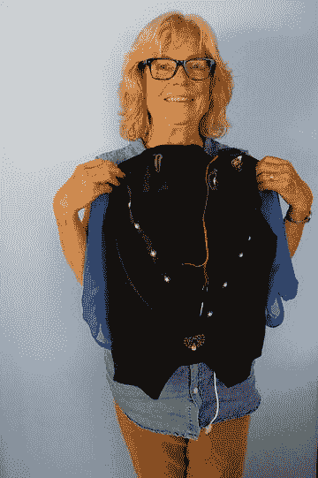  
图 3-1. Lyn 和她的第一个可穿戴项目

## 基础手缝工具与技巧

缝纫的历史源远流长——可追溯至旧石器时代（可以在 [`https://en.wikipedia.org/wiki/Sewing`](https://en.wikipedia.org/wiki/Sewing) 找到一段有趣的历史）。在机器时代，手缝是创造独一无二物品的一种方式，并且目前是家庭手工爱好者将缝纫部件附着到布料上的唯一真正可行途径。入门并不需要太多东西。

我在课堂教学中教授缝纫、服装设计和制版，这意味着当学生有疑问或出现问题时，我能在现场解答和纠正。如果你是完全零基础的缝纫新手，我建议找个人指导你，或者观看一些在线视频来学习特定针法或解决疑问。以下是一些适合从零开始的网站：[`www.Instructables.com/id/How-to-Sew`](http://www.Instructables.com/id/How-to-Sew) 或 [`www.wikihow.com/sew`](http://www.wikihow.com/sew) ，或视频 [`www.youtube.com/watch?v=B2mfJweh8a0`](http://www.youtube.com/watch?v=B2mfJweh8a0)。在 `Instructables` 网站上还有制作多种针法的短视频，例如本章中描述的暗缝针法（`www.instructables.com/id/Hand-Sewing-Basic-Slip-Stitch-Blind-Stitch/`）。

或者，直接搜索“如何缝纫”或“如何手动或机器缝纫”。有时需要多看几张图片或几种描述才能理解所讲解的内容。图 3-2 展示了练习本节所述各种针法所需的工具。完成你的作品也会用到它们：

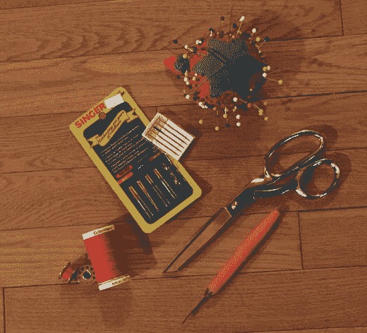

图 3-2.

你需要的物品

- 轻至中等重量的棉布。
- 锋利的手缝针（适用于轻至中等重量布料）。
- 缝纫剪或剪刀（通常在布店能买到）。
- 通用缝纫线。有很多品牌可供选择。我喜欢古特曼（Gutermann）的涤纶线，它有一定弹性且不易断裂。练习针法时，使用与布料颜色对比鲜明的线，能让你更容易看清布面上的针迹。
- 直针（缝纫时用于固定布片）和针插（用于插放缝针）。
- 卷尺。（测量身体时，布卷尺最佳。如果没有，可以用绳子或缎带绕被测部位一周，然后用尺子测量绳长。）
- 裁缝粉笔或水溶性记号笔（用于在布料上标记剪口、省道或纸样上的其他符号）。
- 拆线器（用于拆掉缝错的部分）。
- 熨斗（用于熨平缝好的接缝并去除褶皱）。

以下物品也很有用，但并非必需：

- 切割垫或硬纸板（保护台面并保持布料清洁）
- 穿针器
- 放大镜
- 顶针（保护手指）
- 蜂蜡（本章后面会介绍）

开始你的第一次缝纫实验时，选择一小块轻至中等重量的通用棉布。布料种类繁多，棉布是学习和练习基础技能容易上手的选择。你可以用一条大手帕、面粉袋厨房毛巾，或者从布店买些零头布（零头布是布匹末端的剩余布料，通常价格便宜）。

小贴士

你可以在线购买布料，但如果你不熟悉布料的各种特性，最初去实体布店可能会更明智。在那里你能亲手触摸布料，并咨询关于重量、弹力大小以及用缝纫机缝制时需要何种型号缝针等问题。

### 穿针

如前面所述，拿好你的锋利缝针和对比色的线，以便更容易看清布料上的针迹。以后当你制作成衣时，通常希望线的颜色与布料相匹配。不过，有时你可能也会想用对比色线来作为设计点缀。

手持缝针，针眼朝向自己。剪掉线头的一小段，确保它没有分叉，然后穿过针眼，直到能从背面捏住线头，再拉出约 3-4 英寸。或者，你可以使用穿针器（图 3-3）。握住针眼和线，从线轴上拉出约 12-18 英寸的线，然后剪断线头。

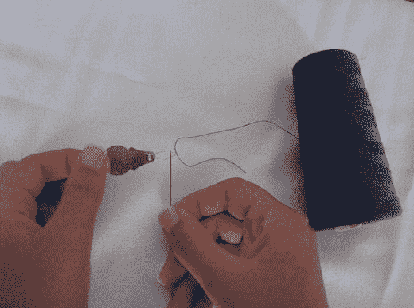

图 3-3.

使用穿针器

注意

你很快就会发现线头容易分叉。导电线尤其难以这样处理。在线头上涂一点蜂蜡可以防止线头分叉，并使穿针更容易。对于棉线，如果你觉得不恶心，也可以用嘴湿润线头。但不要对导电线这样做——既不管用，也因为线头有点锋利。

### 打结

确保握紧针眼和线，或者将其插入针插（线很容易从针上滑脱，需要重新穿针，这会很烦人）。使用较长的那段线，将线头捏在食指和拇指之间，绕手指一圈，然后一边牢牢捏住线头，一边用拇指和食指搓转线圈并将其从手指上推下（图 3-4）。运气好的话，你就能打成一个结。

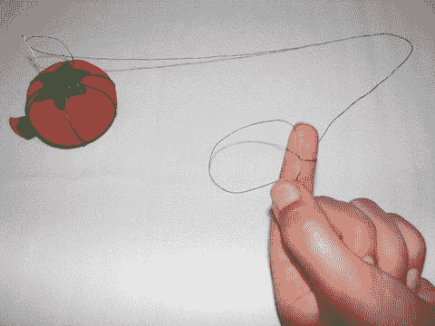

图 3-4.

打结

有时最好重复这个过程一次，以得到一个稍大且更牢固的结。如果结相对于布料织纹来说太小，它会从布面脱出，你就必须重新打结再开始——有时需要反复尝试。刚开始学习缝纫时，这会考验你的耐心，但总有办法纠正错误并继续下去。深呼吸，或者在房间里、屋子周围或街区内短暂走走，可能会有所帮助。

小贴士

如果布料织纹非常稀疏，一个好方法是先缝一小针，将线几乎全部拉出，然后将线头打个结。我们在本书的其他项目中会用到导电线。导电线由细小的编织金属丝制成，很难打出牢固的结。给导电线打结后（普通线则不必），我会滴一滴透明指甲油来固定结头。

区分正面和反面

布料顶面或颜色更鲜艳的一面称为正面。底面或颜色较暗淡的一面称为反面。使用有绒毛的布料（因摩擦方向不同而呈现不同外观的布料），如灯芯绒、天鹅绒和丝绒时，绒毛面为正面。卫衣布料则用光滑的一面作为正面，而非起毛的一面。

### 使用不同的针法

本节将介绍将物品缝在一起的不同方法。针法是你的缝纫工具，掌握多种针法会大有裨益。

小贴士

始终捏住缝针靠近针眼处的针体与线，以防止线从针眼滑脱。这能帮你避免反复穿针。

#### 平针缝

将两块布料的正面对齐。手持针线，从底部（两个正面相对的那一面）将针尖向上刺入，穿过两层布料，直到线结抵住布料。在距穿出点约四分之一英寸处，从顶面将针穿过，并拉紧线，直至线完全穿过且针脚平整。为清晰起见，图 3-5 仅展示了穿过一层布料的针脚。

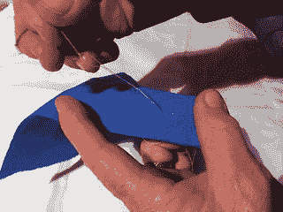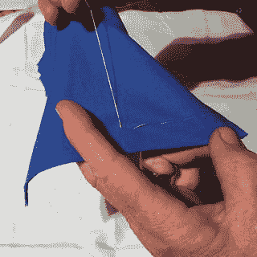

图 3-5. 进行中的平针缝

继续重复这些步骤，形成一条直线针脚。你可以让内侧（或底部）的针脚比外侧（或顶部）稍长一些，也可以让它们长度相等。尝试不同大小的针脚，直到熟练掌握技巧并能保持针脚整洁。

#### 疏缝针

这种针法和平针缝相同，但每个针脚要长得多。它是一种临时针法，通常用于在机器缝合前将布料固定在一起，无需别针，也可用于快速锁边、其他修补或临时固定。

#### 倒针缝

这是最牢固的针法，或许也是最容易保持直线的一种。先在布料上缝一针，当针从布料穿出准备缝第二针时，不要远离第一针下针，而是将针从第一针末端的上方刺入，并穿过布料（图 3-6）。下一针在底部会更长，将线拉至顶部，然后倒回前一针的末端。继续使用这种技法，或在每个倒针之间加入几个平针。

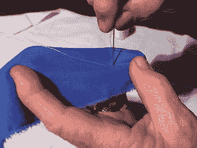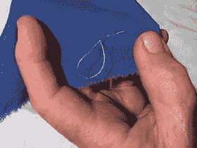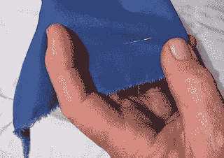

图 3-6. 制作倒针缝

#### 暗缝针或藏针缝

这种针法稍复杂些，但能让你的衣物或作品呈现出专业的外观。它几乎是看不见的针脚，一旦学会暗缝针，就能快速完成收尾。

练习暗缝针时，剪下一小块方布，对折。打开，将两侧向中线折叠并熨平，然后沿中线再次对折（此步骤及后续步骤如图 3-7 所示）。

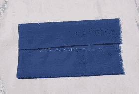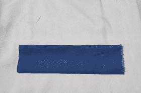

图 3-7. 为暗缝针折叠布料

将针从布料顶部刺入，穿过折叠的上边缘，直至线结卡住。然后将针移至下方折叠处，将针水平刺入折痕，沿布料内侧推进约 1/4 英寸。接着将针拉出，再回到上方折叠处。将针水平穿过上方折叠并拉出线。依此继续直至末端（见图 3-8）。

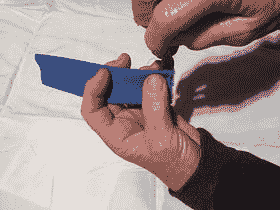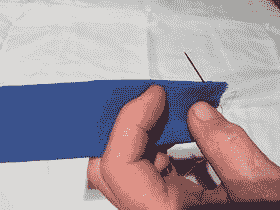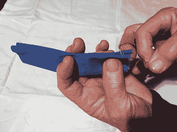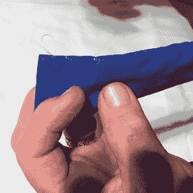

图 3-8. 藏针缝步骤

在末端，于最后一个长针脚对面的折叠处缝一个小针脚。拉线形成一个线圈，将针穿过线圈，再拉紧打一个结。重复此操作三次，以形成一个牢固的尾结。这种针法可用于连接两块布料，或作为单块布料的边缘处理。

#### 包边缝

包边缝同样用于连接边缘。起针方法与暗缝针相同——将线从布料背面穿至正面靠近边缘处。然后将针斜向朝向缝纫方向刺入布料背面。不要将线拉紧，而是先将针穿过这个线圈，然后拉线形成 90 度角。继续操作直至完成边缘。在末端，将针移至线形成的最后一个垂直线右侧，从布料中穿出并形成一个线圈。将针穿过线圈并拉紧三次以形成尾结（图 3-9）。与暗缝针一样，包边缝可用于连接两块布料，或作为单块布料的边缘处理。

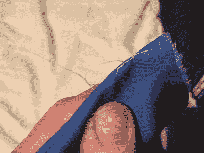

图 3-9. 包边缝

#### 卷针缝

将一块布料对折并用别针固定。从内侧将针穿过折痕（图 3-10a），使其从正面穿出（图 3-10b）。将针从背面刺入并穿回正面，使其与第一针平齐（图 3-10c）。继续重复至末端（图 3-10d），并打一个收尾结。

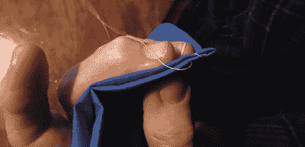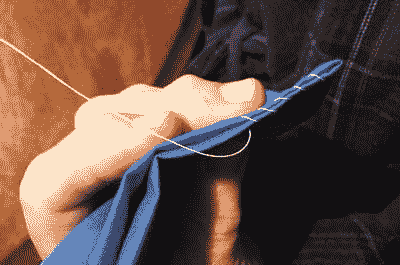

图 3-10c. (上) 和 d (下). 卷针缝步骤 c 和 d

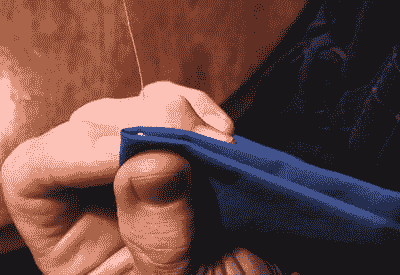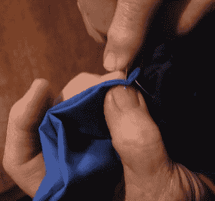

图 3-10a. (上) 和 b (下). 卷针缝步骤 a 和 b

**提示：** 参考图片有助于理解说明文字。这些针法在布料的两面应看起来相同。

## 穿引缝纫机线

学习手工缝纫或许已经让人望而生畏，但现代缝纫机实际上是相当复杂的自动化设备。由于缝纫机非常耐用，如果你拥有一台机器，它可能是 60 年前的老型号（比如图 3-11 中那台 1953 年生产的铸铁款 Singer Featherweight），也可能是现代机型（图 3-12）。以下说明将尽可能涵盖各种型号的机器。

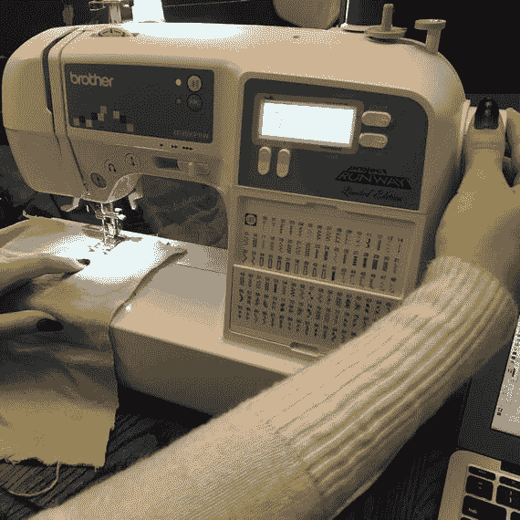

图 3-12. 2015 年款 Brother 自动缝纫机

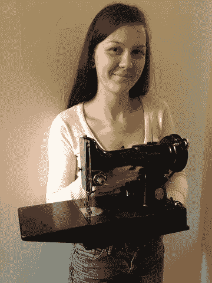

图 3-11. 一台 1953 年生产的 Singer Featherweight 缝纫机，至 2015 年仍可正常使用。（感谢 Rich 的妹妹 Rachel Cameron 为图片提供模特并审阅说明。）

根据机型不同，缝纫机可通过转动旋钮或按下按钮选择多种线迹。最常见的是直线线迹、Z 字形线迹和刺绣线迹。你可以通过旋钮或电脑屏幕菜单调整线迹的长度和宽度。功能更复杂的机型甚至提供更多线迹选择。机器还配有按钮或开关可实现倒缝。

如果你有一台新机器，通常会附带使用手册，其中包含穿线所需的步骤说明（如果找不到手册，也可在线查找）。许多机器本身也会以某种方式显示穿线路径（图 3-13）。

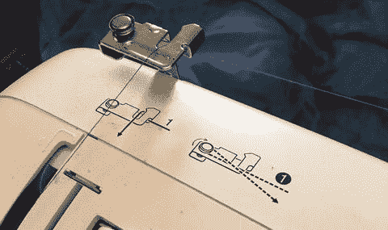

图 3-13. 图 3-12 中机器顶部的穿线示意图

如果你从未尝试过，给缝纫机穿线可能会令人困惑。但一旦学会，在大多数标准机型上只需几秒钟，你就可以准备开始缝纫了。你必须能看清机针细小的针眼并具备相当好的瞄准能力，因此如果看近处需要眼镜，务必戴上。许多机器配有穿线器，有助于解决视力模糊或手抖的问题。

> **注意**
> 缝纫机针的针眼位于尖端，而手缝针的针眼在针尾。切勿将两者混用。

你需要准备一些测试布料、一卷缝纫线（与手缝同理，如果想练习并轻松看到线迹，建议使用与布料颜色对比明显的线）。此外，还需准备缝纫机针和一个绕好线的梭芯——它为布料底部的线迹提供底线。在给机器上半部分穿线之前，大多数缝纫机需要先给梭芯绕线。请将以下说明（以两台机器为例展示常见差异）作为指导，并查阅你的机器手册了解具体细节。

### 绕制梭芯

使用你选择的缝纫线，给梭芯绕线，使线迹的顶线和底线颜色一致。当你缝制其他项目时，可以收集绕有不同颜色线的梭芯，这样就不需要每次都重新绕线。

首先，左手握住手轮，右手转动内侧旋钮将其松开。将线轴插在机器顶部的线轴钉上。如果机器没有内侧轮，顶部可能有一个释放按钮。将线从梭芯内侧的孔穿到外侧，然后将梭芯放在梭芯绕线轴上。将绕线轴向右推。捏住线头，缓慢踩下脚踏控制器，在梭芯上绕几圈线。图 3-14 显示了此过程的状态。

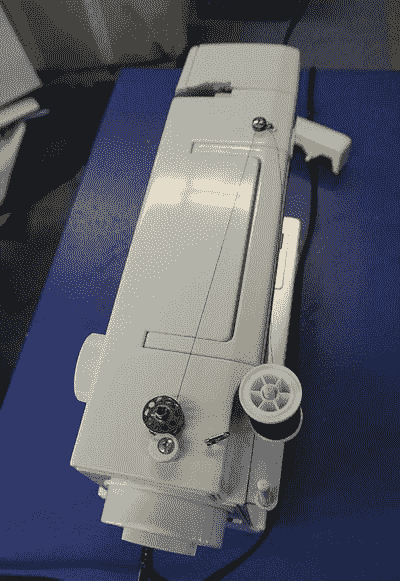

图 3-14. 绕制梭芯

接着，停止机器，将靠近梭芯顶部孔的线头剪断。再次踩下脚踏控制器，直到梭芯绕满。停止机器，将梭芯绕线轴向左移回原位。剪断线。现代机型中，位于图 3-12 主梭线轴前方的装置即为等效的梭芯座。

### 安装机针

将机针平面朝下放在平面上，检查它是否笔直。机针与平面之间的间隙应均匀，且针尖必须锋利。安装机针时，朝自己的方向（逆时针）转动手轮，将针杆组件升至最高位置，并抬起压脚——即针周围压住布料的部件。你的机器应有释放机制，例如压脚附近的杠杆。图 3-15 展示了此步骤（图中机器已完成上半部分穿线）。

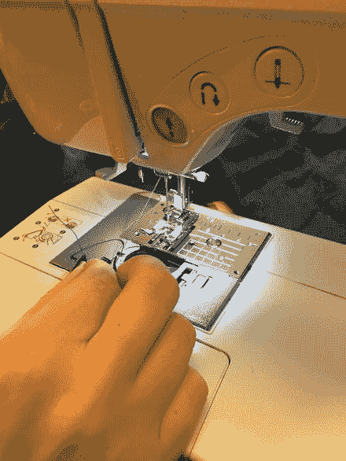

图 3-15. 压脚

松开针夹螺丝，将一枚机针插入针夹，确保机针的平面朝外。务必将机针向上推至最大限度。用机器配备的相应机构拧紧机针。

### 为机器上半部分穿线

朝自己的方向（逆时针）转动手轮，将挑线杆升至最高位置。确保压脚处于抬起状态。将线轴插在机器顶部的线轴钉上。如果线轴钉是水平放置的，用随附的线轴盖固定线轴。用锋利的剪刀将线头剪出一个干净利落的端头。捏住线头，穿过顶部导线器。将线头绕过上方导线器（图 3-16）。

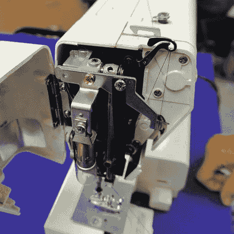

图 3-16. 上方导线器

在线轴附近捏住线，将线头向下绕过夹线簧座或张力组件。张力组件位于图 3-16 中机器的顶部，用于控制线的流量。用力将线向上拉，然后根据机器上的数字或图示，穿过机器可能配备的其他夹线装置。某些情况下，如图 3-16 中的机器，导线器周围的区域可以打开，以便操作。

将线向下穿过机器上剩余的导线器，并将其滑入针杆导线器——即针上方的一个小夹子，在图 3-17 中隐约可见。从机针前方向后穿线，将线拉过针眼几英寸，并引向左侧（你的机器可能是从右向左穿——请参照机器上的图示）。

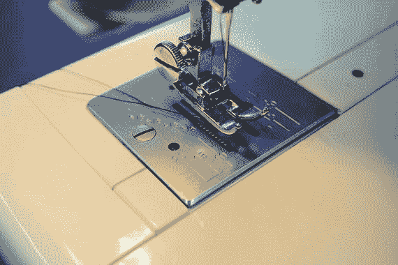

图 3-17. 穿好线的机针

### 安装梭芯

在较新型号的缝纫机上，请按照机器上的图示安装梭芯，将梭芯放入机针下方的梭芯套内（图 3-18）。在某些机器上，梭芯套可能位于机身前侧或底部侧面（图 3-19）。不同机器的布局虽有差异，但通过这两个示例可以了解基本原理。

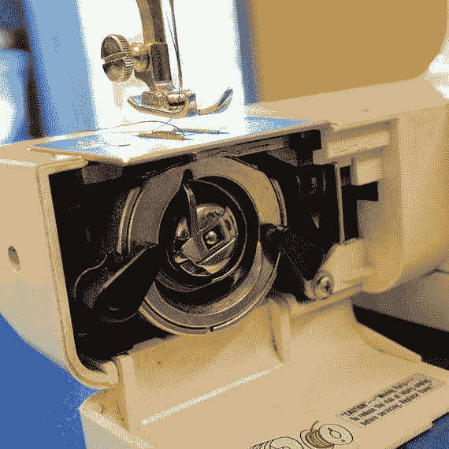

图 3-19. 在另一款设计的机器上，梭芯位于机身前侧靠近底部的位置

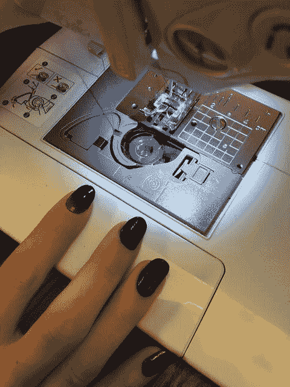

图 3-18. 一台现代缝纫机上的梭芯穿线方向

将绕满线的梭芯放入梭芯套内的梭芯腔中，确保线按照机器图示指定的方向送出。

握住梭芯套上的锁扣，将梭芯套推入机器上的安装位置，然后松开锁扣。松开锁扣后，梭芯套应能锁定到位。拉出几英寸的梭芯线。

将压脚抬起，用左手轻轻捏住机针的线。朝自己的方向（逆时针）转动手轮一整圈，直到机针没入梭芯套中。继续捏住线并转动手轮，直到机针再次升至最高位置。当机针上升时，梭芯线也会形成一个线环。将线向左拉出，将梭芯线环从梭芯套中进一步拉出。将机针线和梭芯线一起向后拉出 4 到 6 英寸（约 10 到 15 厘米），远离自己。此时，你可以在之前的图 3-17 中看到已经穿好线的机针。现在，你（终于）可以开始缝纫了！

## 试机缝纫

在开始任何项目之前，最好先练习使用缝纫机。利用下面列出的基本针法以及一些碎布头，练习将布料放在压脚下方、手动转轮降下机针、放下压脚（使用之前抬起压脚的同一杠杆）、缝纫、更换针法、使用倒缝、移除布料以及剪断线头。大多数缝纫机在机针旁边都配有切线刀——或者使用锋利剪刀。

要将机针从布料中取出，朝自己的方向转动旋钮，直到机针处于最高位置并离开布料，抬起压脚，然后将布料从压脚下拉出。留出 4 到 6 英寸（约 10 到 15 厘米）的线头，以备下次使用。

### 改变缝纫方向

有些项目需要改变缝线的方向。操作方法如下：先缝几英寸长的线迹。当机针在布料中时停止机器（如果机针抬起，则手动将其降下）。抬起压脚，将布料旋转 90 度，然后放下压脚。继续缝几英寸（图 3-20）。练习将布料别在一起并制作缝线。剪出一条曲线并沿着曲线缝纫，同时练习在曲线上剪牙口。"剪牙口"指的是从布料边缘向缝线处剪出小的 V 形切口，以使缝线更平整。

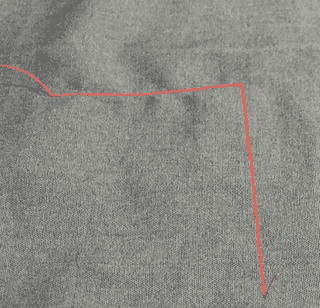

图 3-20. 改变缝纫方向

### 尝试不同类型的针法

如果你的缝纫机有多样化的针法可选，不妨全部尝试一下。某些针法可能需要不同的压脚和/或机针。

#### 双针缝纫或加固缝

沿缝线缝完第一道线后，在缝份内距第一道线 1/4 英寸（约 6 毫米）处，使用直线针迹或之字形针迹再缝一道线（图 3-21）。

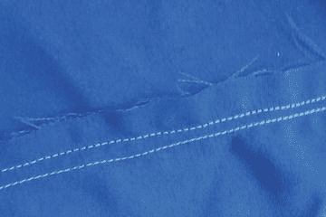

图 3-21. 加固缝

#### 缩缝针迹

沿缝线使用长直线针迹缝纫，在线缝两端各留下 3 到 4 英寸（约 7.5 到 10 厘米）的线头。拉动线头来调整松紧度（图 3-22）。

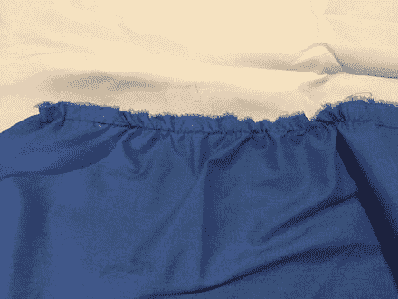

图 3-22. 缩缝针迹

#### 边缘缝

贴近布料边缘缝纫，用针迹覆盖边缘（图 3-23）。

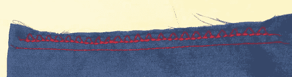

图 3-23. 边缘缝

#### 面缝

在布料的正面或外侧，紧贴缝线进行缝纫。以压脚作为引导（图 3-24）。

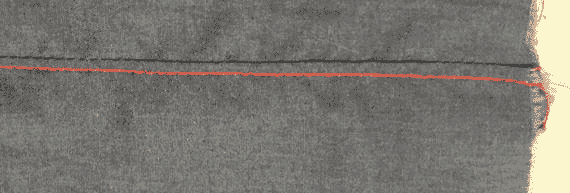

图 3-24. 面缝

#### 倒针缝

当完成一片衣片的缝纫后，停止机器，将机器设置为倒缝模式，沿同一条缝线缝几针。然后再向前缝至衣片末端。图 3-25 展示了机器上的“倒缝”按钮——通常是一个类似图中所示的按钮或杠杆（即右侧那个带有“绕过头顶”箭头图案的按钮）。

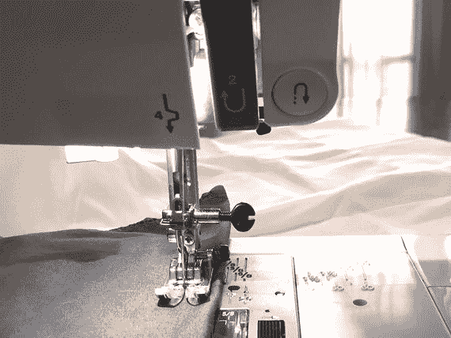

图 3-25. 倒缝按钮（位于右上角）

还有更多种类的针法。要了解它们在实际中的应用，最好的方法是拿一个纸样，尝试真正制作一件东西。

### 针法的实际应用

图 3-26 是你在第 4 章中将要制作的一件背心的草图。你可以看到其中一些针法将用在何处。即使是一件简单的背心，也包含几块不显眼却需要用到多种针法的部件。

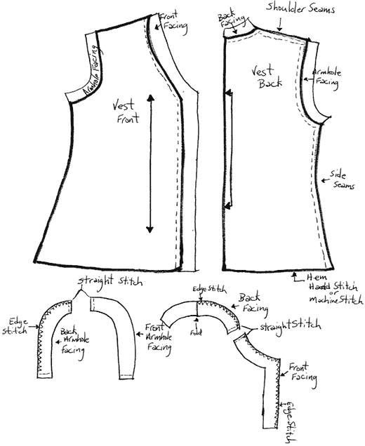

图 3-26. 第 4 章背心所使用的针法

在第 4 章中，你将看到这些针法的更多实际运用。大多数情况下，缝纫并没有绝对的“正确”方法。你可以尝试不同的方法来观察效果。例如，在第 4 章中，我们就在几个位置进行了面缝，以展示其效果（此处未显示）。

## 本章小结

本章介绍了手工缝纫和使用标准缝纫机进行缝纫的基础知识。还讨论了开始缝纫所需准备的事项，展示了几种常见针法，并讲解了如何穿引标准缝纫机的线以及常用缝纫术语。在开始下一章的第一个项目之前，先在碎布头上练习缝直线、缝曲线、边缘缝以及处理缝线末端，将会很有帮助。

