# 4. 制作与使用缝纫纸样

本章将带你了解缝纫纸样的方方面面。又是 Lyn 执笔，现在将引领你运用第 3 章介绍的针法和技巧。

初次使用标准缝纫纸样时，务必阅读并遵循附带的说明，同时理解并遵照纸样部件上印刷的标记。就像做一道新菜谱，最好在开始工作前通读所有步骤。商业纸样通常印在薄纸上，塞入信封中。纸样信封就像一个装满围巾的魔术帽，你似乎能不停地抽出纸样部件——多到让人怀疑那么小的信封怎么可能装得下。我每次用完纸样后，似乎永远无法把所有部件整齐地塞回去。

说明书中通常有一节介绍面料裁剪布局和符号。再次强调，就像菜谱一样，一旦理解了步骤，你就可以根据自己的风格和能力进行调整或修改。先将所有需要的纸样部件别在面料上，并在裁剪前仔细核对所有方向和符号，有助于避免一些错误。

你可以先裁剪较小的部件，以确保沿着正确的线迹剪裁并剪出合适的剪口。万一出错，这些部件也更容易重新裁剪，而且不会浪费大块面料。

在本章中，我们将制作一件简单的无衬里背心（图 4-1）。它不需要很多面料，基本形状也相当容易缝制和收尾。整件背心可以手缝，但用缝纫机缝合会快得多。如果你需要更多手缝练习，也可以选择手工缝制背心的边缘。

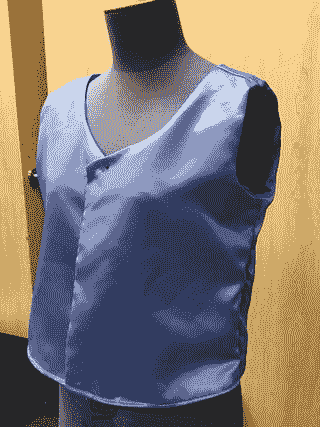

图 4-1. 本章将要制作的背心成品效果

## 测量

使用或制作纸样的第一步是确定你要做什么。之后，你需要测量穿着者（如果是服装）、待覆盖的家具或任何需要贴合的对象。如果是测量人体，建议使用软尺，因为它具有柔韧性，可以贴合身体曲线。以下是测量不同身体尺寸的一些技巧：

-   胸围（女性）：将软尺绕过胸部和背部，位置在乳头水平线。确保软尺环绕身体一周时保持水平。如果是自测，使用镜子会很方便。
-   胸围（男性）：将软尺绕过前胸和背部，位置直接在乳头下方，确保软尺环绕身体一周时保持水平。
-   腰围：找到躯干最细处，将软尺绕身体一周，位置在肚脐上方约一英寸处。确保软尺环绕一周保持水平。请注意，这可能不是你穿裤子或裙子的位置。当今的时尚款式比传统腰线低得多。但无论款式如何，腰围都是在这个位置测量的。
-   臀围：找到臀部最丰满处，将软尺绕前身和背部一周。确保软尺环绕一周保持水平。
-   裆长：将软尺一端固定在肚脐处，将软尺从双腿间拉过，向上至背部与肚脐平齐的位置。
-   大腿围：将软尺绕大腿最丰满处一周，保持水平。
-   小腿围：将软尺绕小腿最丰满处一周，保持水平。
-   上臂围：绕二头肌最丰满处一周。
-   腕围：绕手腕骨骼处一周。
-   臂长：将手臂向一侧伸直，将软尺一端置于腋窝前部，固定此处，测量至手腕。
-   前中长（躯干）：将软尺一端置于锁骨间的凹陷处（胸骨顶端），向下测量至肚脐。
-   后中长（躯干）：将软尺一端置于颈后下方的脊柱处，向下测量至背部与肚脐平齐的位置。

注意：如果你愿意，也可以用绳子测量。具体做法是：用一段绳子或丝带绕在要测量的部位，在重合处捏住或做标记，然后用尺子或码尺测量绳子的长度。也有人用过胶带（贴在一件旧 T 恤或保鲜膜上，然后整片剪下）来制作定制的人台。没有一位作者尝试过后一种方法，但你可以在网上找到相关描述和图片。

## 选择纸样

如果这是一门纯粹的缝纫学习课程，我可能不会谈从头制作纸样。然而，在可穿戴科技项目中，你更可能混合使用面料、3D 打印部件和电子元件，因此需要自己制作纸样或修改现有纸样。我将在此解析纸样的工作原理，以便你决定是购买纸样还是为项目制作纸样。

### 购买纸样

缝纫纸样可从网上、布店以及众多网站购得，例如[`www.mccall.com`](http://www.mccall.com)、`sewingpatterns.com`、[`www.craftsy.com`](http://www.craftsy.com)和`Etsy.com`。Joann Fabrics（[`www.joann.com`](http://www.joann.com)）是美国全国性商店，也拥有网店。你所在的地区可能也有销售纸样的本地布店。

注意：总的来说，纸样仍然以装满薄纸的实体信封形式销售（而非提供下载），因为要打印出真人尺寸的纸样，需要将许多纸张拼接在一起，实际操作起来很麻烦。不幸的是，这意味着如果你想用激光切割机裁剪面料，很难获得适合激光切割的电子版纸样。我在本章后面会讲到解决这个问题的办法。

大多数纸样都在信封上标明了难度等级。对于第一个项目，最好选择基础或初学者级别的纸样。选择基础纸样可以让你学习术语和基本技能，而不会被复杂的技术和说明弄得灰心丧气。纸样上印有裁剪线和 5/8 英寸（1.6 厘米）的缝纫边缘或称缝份线。请务必分清两者的区别，否则完成的作品尺寸会不合身（图 4-2）。注意，在第 3 章以及其他我从头创作纸样的地方，我使用了 1 英寸的缝份，只是为了留有更多容错空间。不过，印刷的纸样通常使用 5/8 英寸的缝份。

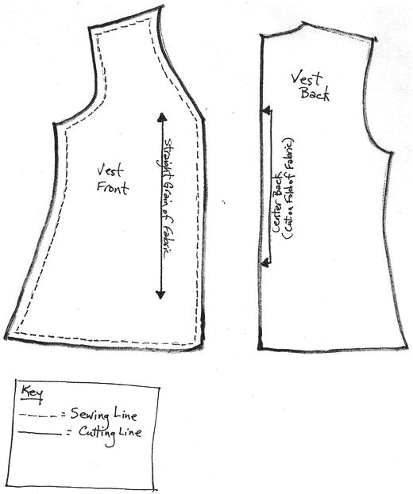

图 4-2. 购买的纸样上的缝纫线和裁剪线

商业纸样通常被设计成可以用同一纸样制作出几种尺寸的服装。纸样上不同的线条（图 4-3）标示了几种不同尺寸的裁剪位置。在这个例子中，该纸样适用于 6 码到 10 码。

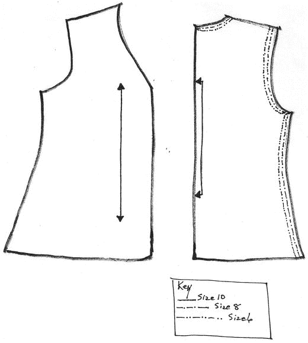

图 4-3. 尺寸线

小贴士：你可能希望在将纸样部件别到面料上之前，先按自己需要的尺寸剪出纸样部件。这有助于避免在错误的线迹上裁剪，从而导致成衣不合身。

### 制作纸样

你可能正在发明某种尚不存在的东西，或者只是找不到喜欢的纸样。在这种情况下，有许多服装书籍和网站提供了简单的纸样图样及放大说明。我个人偏爱的资源包括：芭芭拉和克莱图斯·安德森的《*服装设计*》第二版（Harcourt Brace College Publishers，1999 年）；雪莉·迪林的《*优雅节俭服装*》（Meriwether Publishing，1992 年）；希拉·杰克逊的《*舞台服装*》第二版（New Amsterdam Books，2001 年）；以及南希·布拉德菲尔德的《*1730–1930 服饰细节*》（Costume and Fashion Press，隶属 Quite Specific Media Group）。此外，我也是网站 [`http://sewing.craftgossip.com`](http://sewing.craftgossip.com) 和 [`www.wikihow.com/sew-using-patterns`](http://www.wikihow.com/sew-using-patterns) 的忠实粉丝。

另一种制作纸样的方法是仔细拆解一件衣物。你可以利用合身的旧衣服作为新作品的纸样。选择一件你想复制的衣服，用拆线器拆开接缝。最好使用已经破旧或不再想要的衣物。也可以专门从二手店购买一件用于此目的。将拆下的衣片用作纸样，或者用它们来制作纸质纸样。

在了解衣物的构造方式后，你可能会想为其他服装修改某些部分——例如，缩短或加长裙子、连衣裙或裤子，或者增加更长、更宽松的袖子或不同的领型。

纸样用纸可以在网上和布料店找到，但你也可以使用屠夫纸、牛皮纸袋（就像我本章示例中所用的那样），或者其他任何你能在上面画图、将其别在布料上并进行裁剪的纸张。不建议使用报纸，因为油墨会弄脏布料，而且难以看清你做的任何标记。

**注意**

随着激光切割机在公共创客空间越来越普及，你可能想制作一份能在这些机器上使用的纸样。激光切割机可以非常轻松地切割出复杂的形状。例如，Adobe Illustrator 软件包（`www.adobe.com/products/illustrator.html`）就是创建电子缝纫纸样的好工具，尽管其学习曲线较为陡峭。你需要创建一个包含二维矢量图形（而非光栅图形）的文件，以便在激光切割机上切割。

由于易于获得的激光切割机是相当新的设备，这一领域在不久的将来可能会显著扩展（尝试搜索"数字缝纫纸样"）。不过请注意，那些专为下载、分页打印并用于缝纫机缝合的电子纸样，很可能无法用于激光切割。即使格式正确，也需要对文件进行一些处理才能切割出正确的线条。

### 基本纸样形状与部件

裤子和衬衫是由几种基本形状构成的。裤子可以用一块纸样制作，从两块布料上剪出，并添加腰部松紧带或制作腰头。还可以通过增加拉链门襟、魔术贴、纽扣或按扣进行升级。

衬衫只需三块纸样即可制作——前片、后片和袖子。更精良的衬衫或女式衬衫则会包含领口、袖口以及纽扣襻或拉链。

### 选择布料

纸样信封的背面会列出推荐布料以获得最佳效果。最好从这些推荐中选择布料，以确保你的作品合身且垂坠自然。对于马甲项目，请勿使用弹性针织面料。同时还会列出所需辅料清单：缝线、拉链、纽扣、按扣等。

**提示**

购买布料时，大部分布料上都含有或浸有浆料。浆料是一种用于保持布料在卷筒上挺括无皱的溶液。我建议在裁剪纸样之前，先用你将来洗涤成品衣物的水温将布料进行清洗和烘干。这能预缩布料，并消除成品不合身的可能性。当然，如果你使用的是不能水洗的布料，就不要水洗。必要时进行干洗。

### 计算所需布料用量

纸样通常会附带需要购买多少布料的估算。如果你在自制纸样，可以通过先测量要使用的纸样部件，或测量要覆盖的身体或物体尺寸，来确定所需布料量。布料的幅宽各不相同。在美国，最常见的幅宽是 40 英寸和 60 英寸。请记住，所有纸样部件必须朝同一方向排列。如果你只是为了能放下所有部件而随意裁剪，想尽量少用布料，那么制成的服装或物品看起来会很奇怪，而且非常不合身。如果布料带有条纹或图案，且你希望前后片纹路对齐，那么就需要额外多买一些布料以便均匀对花。

## 使用纸样

一旦你备好了纸样和布料，准备开工，就需要将纸样铺在布料上进行裁剪。本节对此进行概述，你可以在稍后的马甲制作示例中看到更多照片。

### 布局纸样

将布料平铺在桌子、裁切板或地板上。布料应沿布边（已处理过的边缘，而非裁剪边缘）对折（图 4-4）。在图 4-4 中，布边位于图片底部。你可以看到我将布料往回折叠，使布料正面朝内折叠。演示布料正面带有些许闪光点，反面（服装内侧）则为哑光质地。

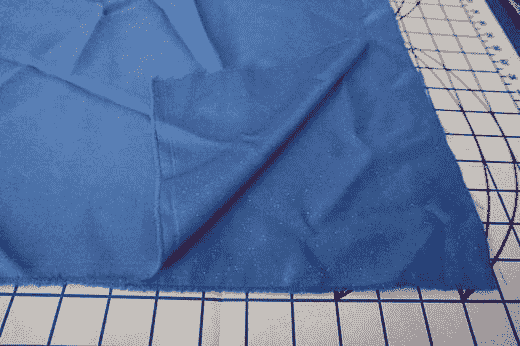

图 4-4.

折叠好的布料，准备裁剪——布边在底部，裁剪边在右侧
注意

如果布料有绒毛（如灯芯绒或天鹅绒），箭头方向应与绒毛平行，而非横向穿过。对于有强烈图案的布料也是如此。通常情况下，图案或绒毛方向应是平行于布边的。

你将需要穿过两层布料进行裁剪。如果某块纸样只需裁剪一片，它会被放置在布料折叠处，而这片纸样仅代表成品的一半。例如，我们本章稍后将要制作的马甲后片就是放在折叠处的。其他纸样则需要放置，以便裁剪出两片相同的部分。图 4-5 展示了我在裁开的杂货袋上手绘、然后别在布料上的马甲纸样。布料铺在一张纸板裁切板上，此例中我们准备将裁切板放在地板上使用。如果你有足够大的桌子，可能会觉得放在桌子上更方便。

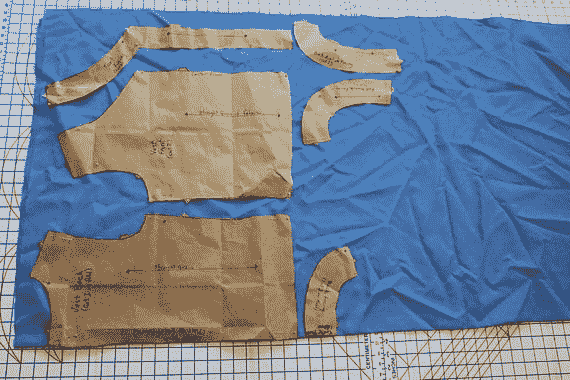

图 4-5.

别在裁切板布料上的马甲纸样（布料无绒毛）。折叠边在底部，布边在顶部。

我并未试图在这里最大化优化纸样布局；如果你使用的是昂贵的布料并且经常缝制衣物，那么在别针固定前多摆弄一下纸样位置是值得的。这样就能尽可能多地剩下布料用于其他项目。

你会注意到布料上有许多纸样乍看用途不明。这些是贴边纸样——用于处理袖窿、领口及其他部位，而不仅仅是简单折边。在本例中，有一片贴边（用于后领口）位于布料折叠处，另外三片则需要各裁剪两片。

纸样上有箭头指示布料的直丝方向（参见图 4-2 和 4-5 草图纸样上的箭头）。直丝方向与布边平行。

纸样上设计有剪口（从服装裁剪线向外突出的标记，如图 4-6 所示），以帮助你组装服装并避免混淆。本章使用的纸样是我凭经验手绘的，即便如此，我也加入了几个不同形状的剪口，以便于我们追踪各部分对应位置。否则，很容易将服装部分内外装反或组装出错。这些剪口从服装裁剪线向外突出——有些纸样的剪口则从裁剪线向内凹陷。

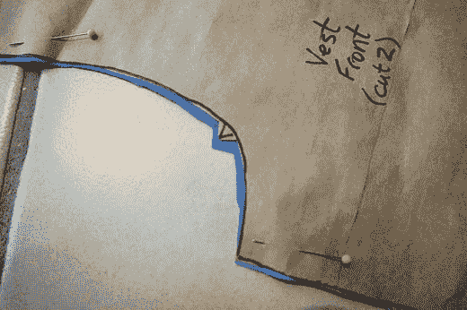

图 4-6.

一个剪口

### 固定与裁剪纸样

当你对折叠布料上的纸样布局满意后，用直针将纸样别在布上固定。确保别针没有伸到你将要裁剪的区域。

裁剪时，用另一只手按住布料以保持稳定（图 4-7）。否则（尤其是在处理有弹性的布料时），剪刀可能会偏离纸样线条。这通常意味着你需要不断移动身体：一只手操作剪刀，另一只手压住布料。

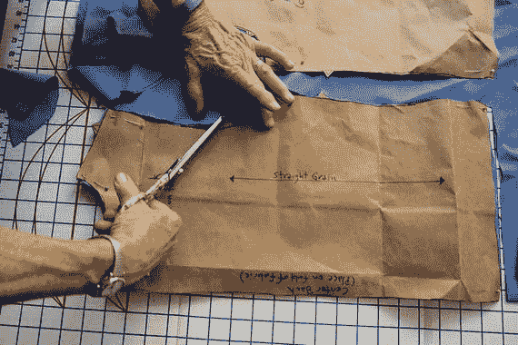

图 4-7.

按压布料以剪出剪口
提示

裁剪时，要沿着裁剪线剪，而非缝份线。使用长而均匀的剪刀行程，并剪出剪口。建议只用你的布料剪刀裁剪布料。如果用它们剪纸或其他物品，刀刃会很快变钝。如果剪刀钝了，就很难干净利落地裁剪布料。

### 标记布料

在移除纸样前，你可以用裁缝粉笔或可水洗笔，将所有你将用到的标记和结构线转移到布料的“反面”。记住，反面就是背面（服装穿着时不可见的部分，尽管某些贴边通常也不会外露）。对于简单的结构，比如本章的马甲示例，你通常无需为此费心。

## 制作一件简单的马甲

现在我将带你一步步制作一件简单的无衬里马甲。我们先做马甲，因为它是一件相对较小的衣物，所需布料比裤子或衬衫少。这意味着即使你犯了严重错误，也不会毁掉一大块昂贵的布料。制作过程涉及使用标准纸样，并采用手缝和机缝结合的方式。

对于可穿戴科技项目来说，马甲很方便，因为它可以套在其他衣服外面，并且比整条连衣裙或复杂的戏服更容易处理。所需的工具如图 4-8 所示，包括：

图 4-8.

制作马甲所需的材料，除缝纫机、布料、纸样和裁切板外。后三项已在图 4-5 中展示。

*   一台缝纫机
*   缝纫机针
*   线轴（面线）
*   简单马甲纸样（参见下方提示中的建议）
*   与面线相同线的梭芯
*   锋利的剪刀
*   直针
*   针插
*   拆线器
*   布料
*   裁切板（可选）

提示

首次使用标准缝纫纸样时，务必阅读并遵循纸样附带的说明，理解并遵循纸样上印制的标记。此处的示例使用了我从头绘制的纸样，但我建议你第一次尝试时购买一个简单的纸样。你可以购买以下一些基础马甲纸样来配合本教程操作：McCall's M6228（男女式马甲）、McCall's M2260（女式无衬里马甲）和 Kwik Sew K3899（简易女式马甲）。

这款马甲是基本设计，需要拼接的部件很少。你可以通过添加口袋、翻领、衬里、纽扣、按扣、系带或其他设计元素，使其成为一个更高级的项目。我们将在后续章节中展示你可能想要添加的不同电子元件。

### 选择布料

对于你的首次尝试，我建议你购买一些非常便宜的棉布，因为过程中很可能会出错，没必要在花哨布料上浪费太多钱。请参考本章前面的讨论，了解需要购买多少布料。此处使用的布料是一种轻质涤纶，正面带有些许闪光点。

### 排版与裁剪纸样

图 4-5 展示了背心纸样在面料上的整体排布。背心后片纸样将被固定到面料上，后中边缘对齐面料的折叠边缘（图 4-9）。

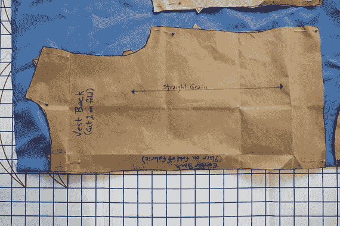

图 4-9. 背心后片纸样

背心前片纸样将被固定到靠近面料边缘的位置，而非折叠处。贴边（内部饰面）的排布方式与其所饰面的部件相同。一片贴边位于折叠处，其余贴边则远离折叠处（同样，你可以在图 4-5 中看到整体布局）。

### 缝制背心

裁剪并标记好纸样后，从面料的前片和后片上取下纸样。将前片与后片正面相对，在肩缝处用珠针固定（图 4-10）。注意观察当方向正确时，两片布料上的剪口是如何对齐的。

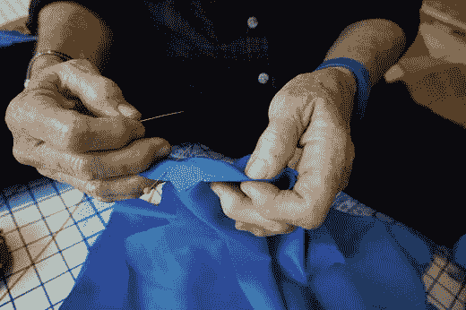

图 4-10. 将背心前片固定到后片上

#### 缝制肩部

如果还没准备好，请给缝纫机穿好线并绕好梭芯（如第 3 章所述）。本例使用对比色线以便看清操作，但通常应选用与面料匹配的缝线。将肩缝放置到缝纫机上（图 4-11），然后将压脚放下压住布料。

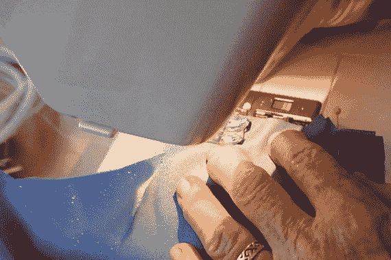

图 4-11. 将肩缝放到缝纫机上

在开始机缝之前，先手动（通常使用手轮）将机针扎入布料。选择短直线线迹（针距短且紧密），沿着每条肩缝的缝线进行缝合。可以在缝合过程中或缝完后拆除珠针。（如果缝合时留着珠针，请注意要跨过珠针缝合，而不是直接扎在珠针上——这很容易导致缝纫机针断裂。）图 4-12 展示了缝合效果。

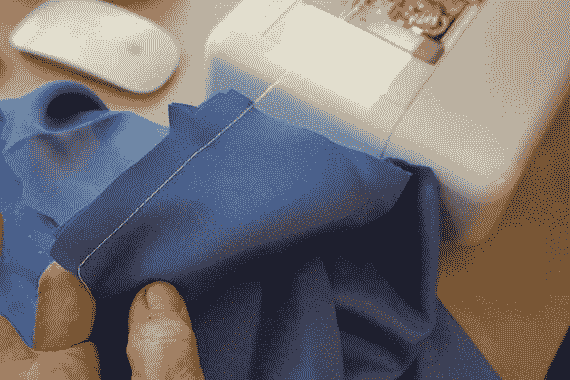

图 4-12. 肩缝的第一道线迹

**注意：** 很容易不小心缝合比预期更多的面料层。缝合一道缝线时，务必确保背心的其余部分远离针下。

不过，单一道线迹对服装接缝来说确实不够。如果就这样放着不处理，它可能会脱线。为了防止这种情况，我在刚缝好的线迹与布料裁边之间又加了一道之字形线迹（图 4-13）。

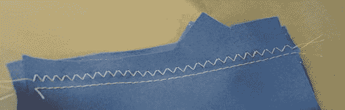

图 4-13. 增加之字形加固线迹

最后，我将缝份修剪了一下，使其更平整（图 4-14）。注意不要修剪过度，留出的缝份宽度略窄于之字形线迹的宽度即可。

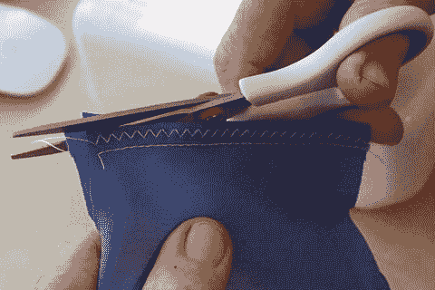

图 4-14. 修剪肩缝缝份

#### 缝制侧缝

为了缝制侧缝，将后片与前片的两片连接起来：用珠针固定，缝一道直线线迹，然后再缝一道双线加固（两道平行的直线线迹）。修剪缝份并将其熨开（图 4-15）。你可以使用熨斗，或者像我图 4-15 中那样直接用手抚平。

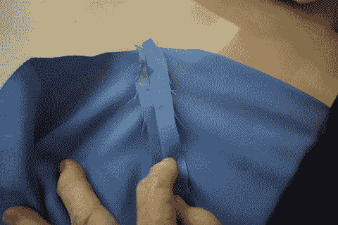

图 4-15. 缝合后熨开缝份

#### 组装前贴边

从贴边布片上取下纸样。将前贴边与后贴边正面相对，用珠针固定并缝合。修剪缝份并熨开。然后，将贴边与背心正面相对，沿缝线用珠针固定（图 4-16）。使用与之前相同的线迹沿缝线缝合。过弯位时要小心。我建议放慢速度，必要时停机调整角度。

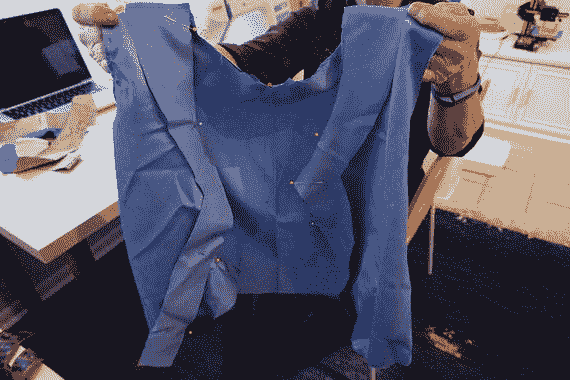

图 4-16. 将贴边固定到背心上

将贴边缝到背心上后，在弯位处用锋利的剪刀剪出小剪口（必要时），以便形成平整的接缝（图 4-17）。修剪缝份，然后将贴边翻到背心内侧，使反面相对。将贴边整齐地熨平。

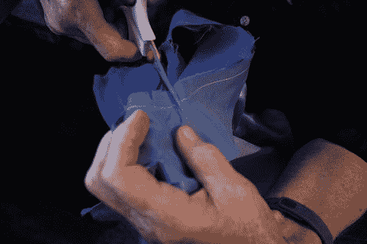

图 4-17. 修剪弧形缝份

最后，我要对这条缝线进行明缝。这意味着我将沿着贴边和背心外层缝合，形成一条与接缝平行的可见线迹（图 4-18）。明缝可以使用不同颜色的线作为装饰（像我这里做的），或者如果线色与面料更匹配，则仅作结构加固之用。

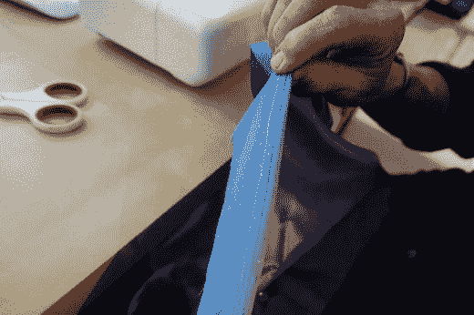

图 4-18. 明缝一道缝线

#### 组装袖窿贴边

图 4-19 展示了袖窿贴边两部分的其中一端如何连接。从袖窿贴边上取下纸样。将贴边两端正面相对缝合，形成两个环形——每个袖窿一个。

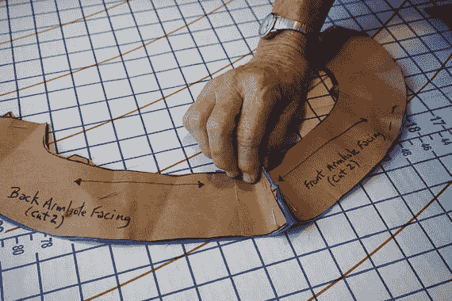

图 4-19. 袖窿贴边组装

将袖窿贴边与背心袖窿正面相对，用珠针固定。沿着整个袖窿的缝线仔细缝合。放慢速度，过弯时停机调整。用锋利的剪刀在弯位剪出剪口并修剪缝份。将贴边翻到内侧并熨平。

#### 下摆

沿着背心下摆边缘，用长线迹或之字形线迹缝合（图 4-20）。将下摆边缘内折 1/4 英寸（0.64 厘米）并熨平。用手缝或机缝的方式缝好下摆（图 4-21）。

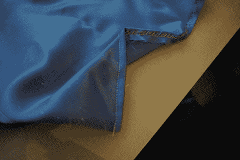

图 4-21. 第二道收尾工序

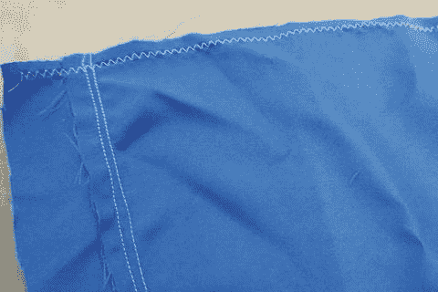

图 4-20. 下摆的第一道之字形线迹——注意贴边的双线加固。

### 其他收尾工作

至此，你已经完成了一件基础款背心。回顾图 4-1 查看我的最终成品效果。此时，你可以根据自己的想法添加纽扣、按扣或其他装饰。

## 常见问题

很容易犯一些愚蠢的错误，这可能会让人非常沮丧。缝合前，请务必确认你在正确的位置连接了正确的部件，并且面料正面相对。在开始裁剪或缝合之前进行双重检查很有帮助，尤其是在裁剪大块面料时，因为一旦裁得太小，可能会浪费很多布料。

我做缝纫已经很久了，但有时因为想赶进度或走神，仍然会犯一些愚蠢的错误。需要特别注意的地方包括：贴边之间如何连接、贴边与背心如何连接，以及你正在使用的线迹类型。如果不得不拆掉一道缝线重新缝，也没关系。重新开始前，只需把所有的旧线头清理干净即可。

## 时尚科技设计注意事项

在规划、裁剪和缝制服装时，要为电线、电池及其他组件预留空间。你可能需要添加口袋、布料导管，或采用其他方式来隐藏和收纳这些科技部件。

提前规划好所有电线的走向有助于避免一些错误，并且希望这能让你在焊接或连接它们时无需拆开缝线。即使先用较便宜的布料或边角料制作一个样品，也能确保最终成衣的良好状态。

同样重要的是，要考虑是否需要防止导电缝纫线或导电织物导致电路短路。要小心那些带有大量电路线且面料垂坠或宽松的服装。

## 总结

本章讨论了如何选择纸样、各种类型的面料，以及如何测量以获得合身的尺寸，并推荐了一些可以购买用品的网站和商店。我们还讨论了如何固定和裁剪缝纫纸样，以及用于制作纸样的服装裁片基本形状。本章还包含了制作简单无衬里马甲的教程——这也是我们的第一个项目。

