# 5. 可穿戴科技电子学

在第 3 章和第 4 章中，Lyn 为你提供了缝纫教程，以及制作项目中可穿戴“织物”部分的技能。在本章和第 6 章中，Joan 和 Rich 将向你介绍可穿戴科技项目中的“科技”部分。本章介绍本书后面项目所需的电子硬件基础知识。第 6 章则补充了关于这些电子设备如何运行的软件基础知识。

**注意**

如果你想学习缝纫（正如 Lyn 在第 3 章中所描述的那样），网上有很好的视频教程，这些技能相对独立，并且更适合碎片化地学习。然而，在可穿戴科技设计的电子学方面，你需要具备一定的基础知识才能起步。Rich 和 Joan 在本章中提供概述，但网上还有很多（也许是太多了？）资源供你深入探索。特别是[`http://arduino.cc`](http://arduino.cc)和[`www.instructables.com`](http://www.instructables.com)是学习 Arduino 生态系统基础知识的好去处，许多制造商，例如 Adafruit ([`http://learn.adafruit.com`](http://learn.adafruit.com)) 和 SparkFun ([`http://learn.sparkfun.com`](http://learn.sparkfun.com))，都为其基础产品提供了详尽的教程。一本基础的电子学教科书也可能有所帮助；你可以查阅当地图书馆的现有藏书，看看哪些符合你当前的知识水平。

## 电路设计

开始学习任何新领域时，首先要做的就是快速掌握大量词汇。我们两人都不特别喜欢罗列单词，因此在本节中，我们将通过上下文讨论来定义关键概念。

你需要知道的第一个词是`Arduino`。（是的，它确实是以意大利伊夫雷亚的一家酒吧命名的。）它是一个开源平台（一个允许其他人基于其进行设计的标准），包括一系列微控制器板和集成开发环境（IDE）软件，你将在第 6 章中学习。图 5-1 显示了一块常见的`Arduino`板。图 5-2 是来自`Fritzing`程序（本章稍后会讨论）的一个版本，其中包含一块面包板和一些电路元件。我们稍后会讨论面包板。

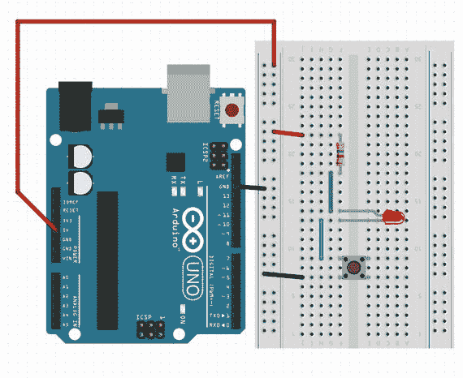

图 5-2. 一个`Arduino`（蓝色电路板）和一块面包板上的电路

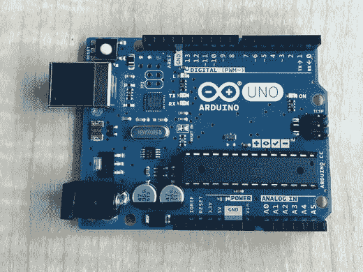

图 5-1. 一个`Arduino`

像`Arduino`这样的微控制器，与你习惯使用的 Mac、Windows 或 Linux 电脑并不完全相同。微控制器通常控制一些不太复杂的东西。虽然有变通方法，但它们通常只是反复执行一组指令，无法像你的笔记本电脑或智能手机那样在多个程序或应用之间来回切换。然而，这种能力足以驱动你的衣物项目。

一个`Arduino`有`引脚`，即电路板上的电气触点。母头排针永久性地固定在板上，这样你可以插入跨接线或其他板上的公头排针。（用于焊接的板子有不同的排列方式。）

`Arduino`板还有一个`USB`连接器，既可以给板子供电，也可以向其发送代码。你将在第 6 章中了解更多关于这些`引脚`及其工作原理。现在，我们只是要把`Arduino`当作一个高级电源来驱动电路。

### 面包板

图 5-2 中那个带有孔洞的白色矩形物体叫做面包板。面包板旨在让你轻松构建电路——即能实现某种功能的电子元件的组合。

面包板上成组的孔洞代表电气连接。电路通过让电流流过元件和导线来工作。电压是电路中某一点与参考电平之间的电势差（如果你受过物理学家训练，可能想把它理解为这两点之间的势能差）。（图 5-2 的示意图以及本章中的其他示意图均使用`Fritzing`软件创建——参见[`www.fritzing.org`](http://www.fritzing.org)。）

电流是从电路中一点流向另一点（具有不同电压）的电荷流动。电流遇到电阻会导致两点之间产生电压降。电压、电流和电阻通过一个称为欧姆定律的方程联系在一起，我们将在下一节讨论。

面包板上的电源轨（或电源总线）和地线轨（或地线总线）是垂直成组的孔洞，通常分别标记为`+`和`–`，或者像图 5-2 那样用红色和蓝色的垂直线标记。它们被用作具有标准电压的位置，我们称之为高电平（通常为 5 伏，在`Arduino`上标记为`5 V`）和低电平（地线，或零伏，在`Arduino`上缩写为`GND`）。

每五个一组构成的水平行仅在这些五个一组的内部相连。中间凹槽两侧的五针之间没有连接。凹槽的存在是为了让你可以将双列直插式（DIP）封装元件（集成电路芯片的一种常见形式）的引脚跨过凹槽放置。这里你可以看到一个黑色的按钮跨在凹槽上。

我们将在接下来的部分中介绍你在这里能看到的所有其他元件——跨接线、LED、按钮开关。

**注意**

你可能有一个类似`Gemma`、`Flora`或`Lilypad`这样的可穿戴电子板，它是“Arduino 兼容的”，并且看起来与图 5-1 中的板子不同。一些基本概念在传统的`Arduino`和面包板上比在可穿戴板子上更容易理解，在可穿戴板子上，我们即将描述的一些问题大部分时间都被隐藏起来。我们正在让你做好准备，以便在那些你需要了解电路板试图做什么从而能够绕开问题的时候派上用场。你不必为了跟上本章内容而特意购买标准的`Arduino`板和面包板，但如果你愿意，可以从[`www.sparkfun.com`](http://www.sparkfun.com)或[`www.adafruit.com`](http://www.adafruit.com)这样的供应商那里购买一套入门级的`Arduino`套件（这样你就能得到所有需要的零件）。否则，就跟着这里的内容学习，你将能更好地理解和欣赏你的可穿戴组件为你所做的一切。

### 欧姆定律

要设计电路，你需要对电的工作原理有一定了解。本章讨论的许多内容都基于一个基本法则——欧姆定律。欧姆定律可以非常简单地表述为：电压等于电流乘以电阻，通常写作 `V = I * R`。（这里使用 `*` 表示乘法，与计算机代码中的惯例一致。）

**注意**

根据维基百科，电流用 `I` 表示，是因为电流的单位“安培”以法国人安培（André-Marie Ampère）命名，他将电流大小称为“intensité de courant”。电流的单位是安培（通常简称为安，用大写 `A` 表示）。电压的单位是伏特，通常用大写 `V` 表示。电阻的单位是欧姆，通常用希腊字母欧米伽 `Ω` 表示。在网络上，当人们不想费力输入希腊字母，或担心文本编码转换后丢失时，有时会用 `R` 代替 `Ω`。

我们经常需要讨论非常大或非常小的电压、电流或电阻，这时会引入像毫（milli-）这样的前缀。一毫伏（`mV`）等于千分之一伏，一毫安（`mA`）等于千分之一安。其他前缀包括：

- 兆（`M`）= 乘以 1,000,000
- 千（`k`）= 乘以 1,000
- 微（`μ`）= 1/1,000,000

电压在整个电路中会发生变化，并且是相对于一个任意基准点（称为地）来测量的。由于电压是相对于地来标定的，因此地被定义为零伏。在大多数电路，比如我们面包板上搭建的电路中，地是电路中的最低电压，这样可以避免出现负数。由于电压会随着你在电路中的位置不同而改变，因此它是电路特定点上的属性，而不是整个电路的属性。实际上，更好的思考方式是关注电压在元器件两端的差异，即电压降。显然，如果元器件低电位一端是零伏，计算起来会更简单，这正是大多数电路如此布置的原因。

### 电路元件

两点之间的电压差会导致电流在这两点之间流动。如果你想在保持电路某部分两端电压不变的情况下，限制流经该部分的电流，就需要在电路中增加电阻。毫不意外，只增加电阻的元件被称为电阻器。（其他元件也会增加电阻，但电阻器只有这一种功能。）

电阻器（以及其他元件）可以串联——即电流先流经一个，再流经下一个——也可以并联，即电流在某一点分流，同时流经电路的两个部分。

如果并联电路中的两条路径电阻不同，电流倾向于选择电阻最小的路径，并且在分流点的那一侧会有更多电流流过。也就是说，会有更多电流流过电路中电阻较低的部分，但这两个部分会有相同的电压降。

在串联电路中（比如两个电阻依次相连），所有电流都必须流经同一条路径。相同的电流会流过两个电阻，但每个电阻会有各自的电压降，该电压降与其在电路总电阻中所占的份额成比例。

#### 电阻器

由于电阻器是相当小的元件，我们需要一种也能按比例缩小的标记方法。电阻器上通用的是一种色环系统。例如，在图 5-3 中的四环电阻器上，有棕-黑-红条纹，然后是一个小间隔，接着是金色条纹。

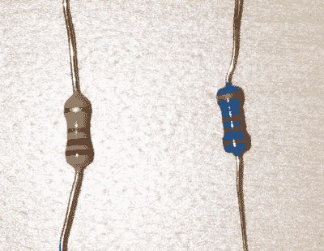

图 5-3. 一个四环电阻器和一个五环电阻器

如图 5-3 所示，两种主要惯例是四环电阻器和五环电阻器。你可以在 [`https://en.wikipedia.org/wiki/Electronic_color_code`](https://en.wikipedia.org/wiki/Electronic_color_code) 上找到关于颜色含义的详细解释，也可以在线搜索“resistor color chart”（电阻色环表）。我们将计算图 5-3 中两个电阻器的阻值，以便让你有个概念。

在四环电阻器上，前两个色环给出电阻值的前两位数字，第三个色环告诉你需要乘以 10 的多少次方。棕色代表 1，黑色代表 0，红色代表 2。因此棕-黑-红表示阻值为 `10` 乘以 `10²`，即这是一个 `1000 Ω` 的电阻器。金色条纹是误差环，它标明了该电阻器标称阻值的实际保证范围——对于金色环来说，是正负 5%。

五环电阻器是黄-紫-黑-黑-棕，计算结果为 `470 Ω`，误差为正负 1%。（黄色是 4，紫色是 7，黑色是 0，所以这是 `470` 乘以 `10⁰`。按照惯例，任何数的零次方都等于 1。）棕色误差环表示这是一个正负 1% 精度的电阻器。注意，无论是四环还是五环电阻器，乘数环并不表示最终电阻值的数字位数——它与科学记数法不同（如果你之前接触过的话）。在四环电阻器中，是将一个两位数乘以 10 的某次方；在五环电阻器中，是将一个三位数乘以 10 的某次方。

在图 5-3 中，误差环位于四环电阻器的顶部，五环电阻器的底部。我们这样摆放松是为了展示区分它们可能有多困难。经验会让你对常用电阻器有所感知。第一次从包装中取出电阻器时要仔细观察，以便学习辨认。理论上，在表示阻值的最后一环与误差环之间应该有一个间隔，但通常很难看出来。

以下是一些常见的四环电阻器（忽略其误差环）：

- 1 kΩ: 棕黑红
- 10 kΩ: 棕黑橙
- 470Ω: 黄紫棕

#### LED

发光二极管（LED）是一种低功耗光源，当电流沿一个方向（而非相反方向）通过时它会发光。LED 有一条腿比另一条长。独立 LED 较长的一侧应连接到电路的 `+`（`HIGH`，接 `Vcc` 或 `3.3 V`）端。NeoPixel 灯珠有独立的电源（`+`）和地（`–`）接头。NeoPixel 还有信号输入和信号输出焊盘，我们将在第 6 章讨论。图 5-4 展示了这两种类型各一个。

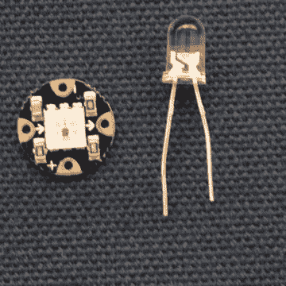

图 5-4. 一套可缝纫的 NeoPixel 3-LED 灯组（左）和一个普通单颗 LED（右）

不同颜色的 LED 会产生特定且固定的电压降。在 [`https://en.wikipedia.org/wiki/Light-emitting_diode#Colors_and_materials`](https://en.wikipedia.org/wiki/Light-emitting_diode#Colors_and_materials) 上有一个表格对此进行了说明。通常，这些值在 2 到 4 伏之间。LED 无法承受过高的电流通过，并且会阻止电流以错误方向流过。

### 电阻选型

假设我们要创建一个能让 LED 点亮而又不会烧毁它的电路。首先，查看通常在购买 LED 的网站上列出的数值，或者仅凭对 LED 常见值的了解，我们会发现一个红色 LED 能承受的最大电流约为 35 mA（即 0.035 安培）。Arduino 通常最大输出 5 伏特电压、约 20 mA 电流。因此，我们需要在 LED 电路中串联一个电阻，以免损坏 LED 或控制它的 Arduino 引脚。但电阻要多大呢？

欧姆定律指出 `V = I * R`，或者我们可以将其变形为 `R = V / I`。LED 会固定降低约 2 伏特的电压。这意味着我们的未知电阻上将下降约 3 伏特（5 伏特减去 2 伏特）。

我们希望通过 LED 的最大电流是 35 mA，这超过了 Arduino 的最大输出 20 mA（20 mA = 20/1000 A = 0.02 A）。我们选择对 LED 安全的最大电流与可能损坏 Arduino 引脚（20 mA）的电流中较小的那个值。因此，我们需要的电阻为 `R = V / I = 3 / 0.02 = 150 Ω`。所以我们至少需要一个这么大的电阻。在这种情况下，电阻值更大一些也是可以的（它只会降低 LED 的亮度）。

**注意**  
更复杂的元器件也有电阻，但其阻值可能会根据该元器件当时的工作状态而变化。不要想当然地认为只有电阻器才有有限的电阻。

### 杜邦线

为了连接面包板上的各个点，或者将面包板与 Arduino 相连，我们使用杜邦线。它们就是中间有绝缘层、两端露出硬质金属丝的导线。图 5-5 展示了常见的普通类型以及不太常见的“预成型”扁平跳线，它们看起来像巨大的订书钉。

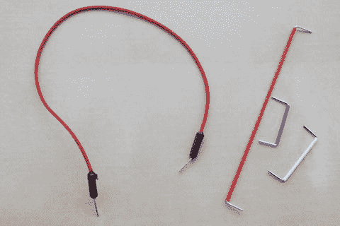

*图 5-5. 普通杜邦线与预成型杜邦线*

像订书钉那种类型的优点在于，对于初学者来说追踪线路走向要容易得多。这两种类型都称为公对公跳线，因为两端都是公头连接器。其他类型的连接器偶尔也会用到（例如公对母跳线）。

## 分压器

分压器是电路的一部分，其中使用两个或多个电阻来改变连接到电路输入或输出端的电路部分的电压。当两个或多个电阻串联时，它们的电阻值相加得到总电阻。

当电压在一系列串联电阻上下降时，它们之间会产生中间电压。典型的结构类似于图 5-6 所示（图中展示电阻也可以用波浪线表示——这两种画法是等效的）。

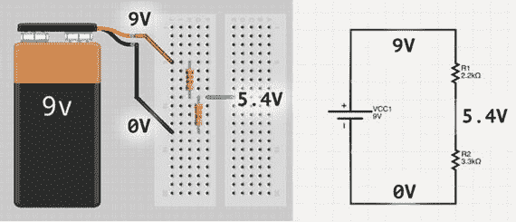

*图 5-6. 分压器*

### 模拟与数字的接口

Arduino 电路可以使用电流做两件事（可能同时进行）：为元器件供电，或者使 Arduino 特定引脚上的电压发生变化。后者通常被称为逻辑信号，电路设计通常使得数字引脚上的电压（更多内容见第 6 章）要么明确为高电平，要么明确为低电平。

当数字输入需要“看到”某个可靠的电压，并以此电压作为执行操作的基础时，分压器就很有用。例如，一个引脚为高电平或低电平可能会使 Arduino 上运行的程序执行某个操作。带有上拉或下拉电阻的按钮或开关也是一种分压器。在这种情况下，其中一个电阻（按钮）在按下时（对于常闭开关，则是释放时）会从无穷大电阻变为零电阻。我们在第 6 章中对此进行了大量讨论。许多传感器都用在这样的电路中，因此你也可以在第 8 章中查找相关示例。

分压器可用于改变逻辑信号的电压，以便让诸如输出为 5 伏特的 Arduino 这类元器件与另一个期望以 3 伏特高电平信号发送数据的设备（例如加速度计）进行通信。

但是，你不能使用分压器来产生为其他设备供电所需的 3 伏特电压。因为设备需要汲取电流来自我供电，它相当于在分压器中的一个电阻上并联了另一个电阻，从而改变了有效电阻。理论上，在设备上串联一个合适的电阻应该能限制电流并适当降低电压，但实际上，即使流过设备的电流发生变化（例如，当其输出端开启和关闭时很可能发生这种情况），设备也需要一个恒定的电压。

为此，需要使用电压调节器来产生恒定的输出电压，大多数 Arduino 板都内置有 5 伏特和/或 3.3 伏特的电压调节器。

### 电位器

有时，改变电路中特定点的电压是很有用的。当分压器中的一个或两个电阻可以改变其阻值时，你会得到一个可变电压，该电压可以被 Arduino 上的模拟输入引脚读取。

最常见的形式是电位器，有时也称为可变电阻器或变阻器。电位器是一个大的电阻器，带有一个滑动端，可以在电阻器的任意位置建立导电连接。

这意味着从一端到另一端，电位器可能测得 10 kΩ，但滑动端的一侧可能是 0 kΩ，另一侧是 10 kΩ，也可能是 4 kΩ / 6 kΩ，或者 8.73 kΩ / 1.27 kΩ，或者任何其他比例。因此，如果你将电位器的两端分别连接到 5 V 和地线，你可以转动电位器的旋钮，在滑动端上获得介于这两者之间的任意电压。

Arduino 可以读取这个电压，从而知道电位器或用作分压器的等效设备（如第 8 章中的传感器）的位置。

### 示例

如果电阻串联电路位于两个不同的电压电平之间，通常是 5 V 和地线（0 V），那么整个串联电阻上的总电压降将等于这两个电压之差，但串联电路中任何一个特定电阻上的电压降将与其占总电阻的比例成正比。因此，对于一个 2.2 kΩ 的电阻和一个 3.3 kΩ 的电阻，2.2 kΩ 电阻将分得 2 伏特电压，3.3 kΩ 电阻将分得 3 伏特电压。如果 2.2 kΩ 电阻连接到 5 V，而 3.3 kΩ 电阻连接到地线，那么两个电阻连接点的电压将为 3 V。

在制作分压器时，通常应使用阻值为几千欧姆的电阻，因为电流会一直流过分压器。在前面的示例中，总电阻为 5.5 kΩ，因此电流为 5 V / 5500 Ω = 0.91 mA。如果我们改用 2.2 Ω 和 3.3 Ω 的电阻，电流将约为 910 mA（这可能超出了电源的提供能力——例如，Flora 只有 250 mA 的调节器），并且两个电阻之间会耗散 4.55 瓦的功率（2.2 kΩ 电阻上 1.82 瓦，3.3 kΩ 电阻上 2.73 瓦）。（瓦特是功率单位，计算方式为电流乘以电压。也就是说，电压降为 1 V、电流为 1 安的电阻会耗散 1 瓦功率。）

这不仅浪费，而且你在面包板上使用的电阻通常额定功率仅为四分之一瓦，如果试图耗散那么多功率，它们就会烧毁。

另一方面，如果你使用几百兆欧姆（MΩ）的阻值，你的信号可能会非常嘈杂，因为电阻之间导线上拾取的无线电波所产生的感应电流可能几乎与分压器两端的电压相当。分压器的总电阻通常应大致在 1 kΩ 到 100 kΩ 的范围内。

### 制作电路

现在，我们将使用之前介绍的一些元件来制作一个电路。回顾图 5-2，我们看到一个简单的串联电路，其中包含一个 470 Ω 电阻、一个 LED 和一个按钮。

首先需要注意，从 Arduino 的 5 V 引脚连接到面包板垂直电源轨的一根长红色导线，以及从 Arduino 的 GND（接地）引脚连接到旁边电源轨的一根较短导线，正如我们在本章前面的“面包板”一节中所讨论的那样。

从上到下追踪这个电路，我们有一个 470 Ω 的电阻与一个红色 LED 和一个按钮串联。查阅本章“LED”一节中引用的网站，我们看到红色 LED 两端固有压降为 1.8 V，误差范围为 ±0.2 V。

Arduino 输出 5 伏电压。如果我们使用前面讨论欧姆定律时的例子，我们会发现 470 Ω 的电阻足够大，可以保护 LED。如果你将这个电路插入兼容电脑的 USB 端口并按下按钮，那么当按钮按下时，你应该会看到 LED 亮起。

如果按下按钮，LED 通过电阻连接到 5 V，并通过按钮连接到 GND。这意味着有足够的电流流过 LED，它将亮起。如果按钮断开，LED 的一端连接到 5 V，另一端则连接到未知的、未设定的电压上。这被称为浮空状态。在本章中我们不必关心这一点，因为我们并不试图使用电路中的任何电压来控制其他东西。然而，在第 6 章中我们将关注这一点，并在此引入一些概念来开始解释它。

在图 5-7 中，我们展示了一种不同的电路。如果 Arduino 仅仅被用作电源，并且你按下按钮，什么也不会发生。LED 仅连接到地，并通过引脚 12 弱连接到一个未知电压。按钮则位于一个独立的电路中。在第 6 章中，我们将把它作为下拉电阻的一个例子来研究。我们在这里引入它，是为了展示你可以在硬件中创建未连接的电路，而这些电路需要通过软件连接才能发挥作用。

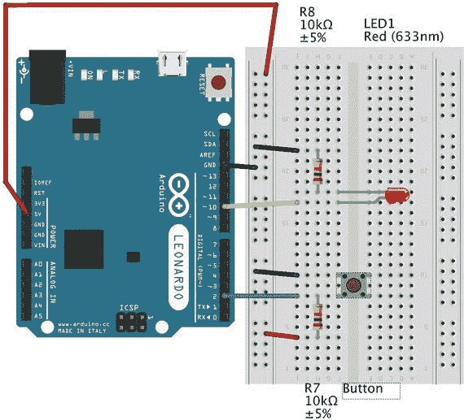

图 5-7. 带下拉电阻的电路

图 5-7 中的电路在本章中不起任何作用，因为我们只是将 Arduino 用作电源，并且按钮和 LED 之间没有直接的电气连接。在第 6 章中，我们将展示如何使用代码让 Arduino 通过按钮来控制 LED 的亮灭。按钮与第二个 10 kΩ 电阻构成了一个分压器。如果按下按钮，它的电阻非常小。如果按钮未按下，则其电阻为无穷大。

当按钮未按下时，引脚 2 弱连接到 5 V——“弱”是因为它是通过一个阻值较大的电阻连接的，而分压器的“另一半”（断开的按钮）具有无穷大的电阻——因此没有明显的电流流动。引脚 2 将检测到 Arduino 会解释为 `HIGH` 的电压（将在下一章讨论）。

如果按下按钮，按钮的电阻几乎为零。引脚 2 现在将连接到（几乎）接地。我们称“几乎”，是因为大部分压降将发生在 10 kΩ 电阻上，而不是按钮连接处的小电阻上。因此，引脚 2 将检测到 Arduino 会解释为 `LOW` 的电压。

在后面的章节中，我们将这样做，在我们用来观察电路状态的引脚上创建定义好的 `HIGH` 和 `LOW` 电压。这称为使用下拉电阻，因为该电阻将输出下拉到一个已知值，而不是让其处于浮空状态。在按钮按下之前，引脚 2 连接到 5 V，但当你按下按钮时，它会建立一个到 GND 的强连接，并允许少量电流（与电阻值成反比）流过。

**提示**

上拉和下拉电阻的值不应小于 1 kΩ，最大可达 100 kΩ。阻值过高的电阻可能使连接过弱，导致反应过慢或易受干扰。Arduino 使用的芯片具有内部上拉（但无内部下拉）电阻，可以通过将输入引脚写为 `HIGH` 来激活。

### Fritzing

Fritzing 程序允许你整洁地绘制电路图，从而可以清晰明了地与他人分享电路。你可以分享漫画式的“面包板”视图（我们到目前为止在本文中使用的视图），或者将电路显示为原理图，或者在制作专用电路板时显示其印刷电路板 (PCB) 布局的外观。你可以从 [`www.fritzing.org`](http://www.fritzing.org) 免费下载该程序，并且可以在 [`http://fritzing.org/learning/`](http://fritzing.org/learning/) 找到相关教程。

#### 使用检查器

要更改元件详细信息或查看默认设置，请单击一个元件，然后转到“窗口”菜单项，确保勾选了 `检查器`，这将显示检查器窗口。在这个例子中，我们选择了一个电阻。当我们查看右下角的检查器窗格时，我们看到可以从下拉菜单中选择电阻值，它将会使显示出的元件上的色环变为该电阻的正确值。这对于电阻来说特别方便，但也适用于其他元件。

#### 添加新元件

Fritzing 附带了一套标准元件。要添加更多元件，你可能需要四处搜索，看看是否有人创建了其他元件。例如，要了解如何添加 Adafruit 元件，请参阅 [`https://learn.adafruit.com/using-the-adafruit-library-with-fritzing/download-the-fritzing-library-from-github`](https://learn.adafruit.com/using-the-adafruit-library-with-fritzing/download-the-fritzing-library-from-github) 或，对于 Sparkfun 元件，请参阅 [`https://learn.sparkfun.com/tutorials/make-your-own-fritzing-parts`](https://learn.sparkfun.com/tutorials/make-your-own-fritzing-parts)。

#### Fritzing 专家提示

要在面包板视图中添加更多元件，请转到右上角并单击放大镜图标。你可以输入要查找的内容（制造商、元件类型等）来查找元件。

在元件上右键单击（在 Mac 上是 Control 单击）也会弹出其他可以更改的选项（例如导线颜色）。

**注意**

我们很容易忘记，任何给定的物理电路都可以运行不同的软件，反之亦然。你的电路及其软件所实现的功能是这两个方面共同作用的结果，并且通常有许多方法可以创建电路来完成你想要做的事情。你可能会考虑先尝试一种方法，拍照，然后再尝试另一种。这些照片是防止你无法找到另一种方法的保障。

## 可缝纫组件

Arduino 电路板有各种形状和尺寸。到目前为止，本章介绍的那些更适合在桌面上搭建项目。但如果你想把组件嵌入到可穿戴物品中呢？这时你就会想使用可缝纫组件，并用导电缝线将它们连接起来。有一些基于 Arduino 的微处理器是扁平、圆形的，旨在缝制到衣物上。

图 5-8 是我们将在第 7 章中制作的围裙项目。锅身由两层导电织物制成，中间夹着一块带孔的电工垫。处理器是一块 Adafruit Gemma（Arduino 兼容板），在“蒸汽”部分带有一个 NeoPixel 多色 LED。轻敲锅身时，LED 会闪烁红色，持续时间由编程者设定，然后变为绿色，持续另一个可设置的时长。你将在第 7 章中详细了解如何组装这个项目。

图 5-8.

来自第 7 章的电子围裙

### 可缝纫 Arduino 电路板

市面上有多种可缝纫 Arduino 电路板。在撰写本文时，Flora、Gemma 和 Lilypad 电路板是常用的型号。Gemma 比其他两款更便宜、更小巧，但它有一些操作上的限制，我们将在第 6 章中讨论。图 5-8 中的小型圆形电路板就是一块 Gemma。

图 5-9 展示的是来自 Adafruit（[`www.adafruit.com`](http://www.adafruit.com)）的 Flora 处理器。它没有排针，而是带有大孔的焊盘，这些焊盘可以用导电缝线（用于创建电路）或普通缝线（用于固定在衣物上）进行缝制。出于原型设计的目的，你可以暂时用鳄鱼夹将电路连接起来（图 5-10）。按照惯例，这些（带孔的）焊盘也被称为“引脚”，以类比传统 Arduino 电路板。现在也有带按扣的电路板，当你读到本书时，可能还有其他变种。

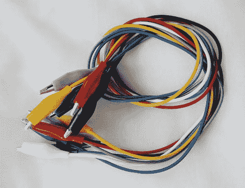

图 5-10.

鳄鱼夹

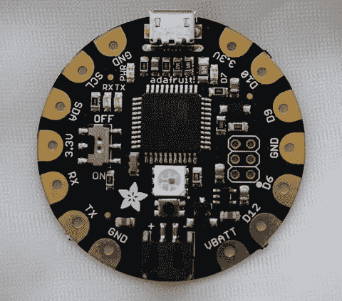

图 5-9.

Flora 电路板

### 使用可缝纫 Arduino 电路板进行原型开发

从根本上说，可穿戴电路板（此处我们以 Adafruit Flora 为例）和 Arduino 是相同的，不过它可能减少了一些引脚。然而，差异开始显现的地方在于更小的组件——即专门为可缝纫而制造的 LED、传感器等。

图 5-11 展示了一块连接了 NeoPixel LED 电路板的 Flora 电路板，该 LED 板在一个封装内集成了红、绿、蓝像素以及合适的限流电路。图 5-12 展示了用鳄鱼夹搭建的这个电路原型。在普通 Arduino 上需要自行选配的电阻，在可缝纫对应产品中通常是内置的。坏消息是，可缝纫组件通常比它们的传统对应产品要昂贵得多。

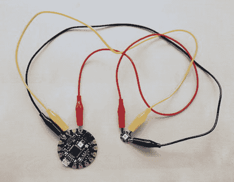

图 5-12.

用鳄鱼夹连接的 Flora 和 NeoPixel 电路

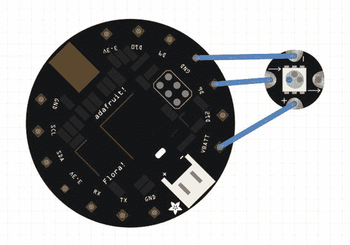

图 5-11.

Flora 和 NeoPixel 电路的 Fritzing 连线图

如果你手头有 Flora 和 NeoPixel，请使用鳄鱼夹进行如下连接：

*   Flora 上的 `GND` 连接到 NeoPixel 上的 `–`
*   Flora 上的 `Vbatt` 连接到 NeoPixel 上的 `+`
*   Flora 上的 `D6` 连接到 NeoPixel 上的 `->`

在第 6 章中，我们将编写代码，使这个电路的功能不仅仅是当 USB 插入时让 NeoPixel 亮起。当你用鳄鱼夹连接好电路，并测试完我们在第 6 章中讨论的软件后，如果对电路工作正常感到满意，就可以用导电缝线缝合电路了。请参见第 7 章关于围裙开发的讨论，了解这需要提前多少规划。在柔软的衣物上，避免导电缝线在非预期位置接触可能颇具挑战性。

### 电池

在开发过程中，你最可能通过将 Arduino 电路板插入 USB 端口来供电。一旦你穿戴好成品或在现场使用它时，很可能需要一块电池。如果项目只是运行几个 NeoPixel 和一个电路板（比如围裙项目），你可能可以使用纽扣电池——就是你在手表和其他小型电子产品中见过的那种扁平金属小电池。这些电池很适合放入小电池盒（图 5-12），并且电池很容易取出。AAA 电池（放在合适的带连接器的电池盒中）也可能是一个选择。

查看电池包装上的说明，了解其提供的电压和功率，并分析你的项目中的电路，以确定你需要什么。许多较小的电池是碱性电池，提供 1.5 V 电压。要驱动一个需要三伏电压的组件，你需要将两个这样的电池串联起来。购买已为你安排好的电池组。电池连接器连接到电压调节器，该调节器要求输入电压高于输出电压（对于某些调节器，可能高出 1.5 V，这被称为压差电压）。在这种情况下，我们使用两块 3 V 锂纽扣电池。

注意

不要在可穿戴项目中使用“枕头”型锂聚合物电池。它们很脆弱，可能会破裂并起火。你可能会在网上看到使用这些电池的旧设计，但请避免使用它们，并使用更新、更安全且封装更好的电池。如果你使用可充电电池，请阅读制造商的充电说明。

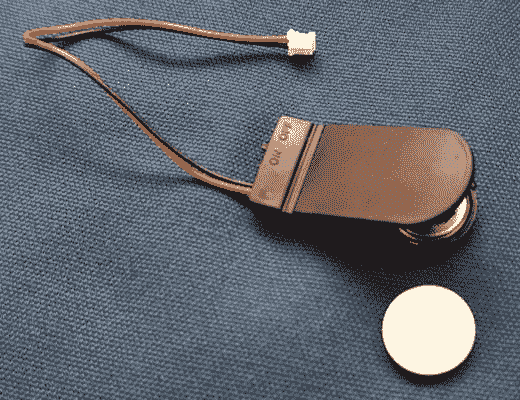

图 5-13.

设计用于连接到可缝纫处理器连接器的纽扣电池盒（打开状态，旁边放有一块电池）

### 导电丝带和缝线

要连接可缝纫电路，你需要使用某种导电材料。你可以手工缝制电路；我们将展示的项目最好用这种方法完成。然而，市面上也有其他产品，比如带有五条并行导线的丝带，你可能想尝试一下。相对于使用丝带，Lyn 更偏好手工缝制，因为她发现用丝带时，在紧密排列的并行导体上很容易造成电路短路。

## 其他组件

还有几种其他杂项组件类型你应该了解，以免在你决定尝试的项目中遇到它们。

有些组件可能配有扩展板或分线板。扩展板实际上仅适用于传统的 Arduino 板，因为它们被设计为夹在引脚顶部（这无法在可穿戴设备的焊盘连接器上工作）。而分线板则旨在接收传感器或其他设备的一组输出，并将其（直接或间接）路由到 Arduino。如果还没有可缝制的版本，你可能需要发挥创意，弄清楚如何将这些板连接到可穿戴设备上。

`电容器` 是用于储存少量能量或平滑电流尖峰的组件。如果你因某种原因（例如电机或大量 LED 同时点亮）预料到项目中会出现电压尖峰，就可能用得上它。

电致发光（EL）线是一种带有涂层的导线，当交流电通过时会发光。需要逆变器将 Arduino 电压升压至 EL 线使用的更高值（但电流非常低）。有时会使用序列器在 EL 线片段之间切换，以产生运动效果，就像老式的动画霓虹灯标志一样。我们在第 11 章中有一个 EL 线项目。

### 我需要学习焊接吗？

你将能够完成本书中提供说明的所有项目，而无需进行焊接。然而，你可能会发现非常想使用某些传感器或其他组件，但用缝制或其他非永久性连接方式并不实用。网上有许多学习焊接的教程和线下课程，如果你想转向更复杂的项目，我们建议你了解一下这些内容。

### 洗涤

如果你正在制作一件打算穿着的作品，迟早需要清洗它。有些组件可以手洗，但其他组件则不行。你可以将电路放在可拆卸的襟翼上，将不可清洗的部件放在可以滑出的口袋或肩垫中，以此类推。你的部件制造商网站上很可能有关于此问题的说明。请注意，干洗实际上并非“干燥”，干洗液可能会损坏组件。

注意

切勿清洗或干洗电池、逆变器、序列器或其他敏感部件。设计你的作品时，应确保电池、EL 线以及任何未特别标明可清洗的部件都能轻松拆卸。

## 总结

本章回顾了 Arduino 平台及其产品生态系统中的组件。我们讨论了如何确定电阻的尺寸以及如何搭建基本电路原型。在下一章中，我们将学习如何编写代码，使其在我们本章讨论的电路上运行。我们将在 Arduino IDE（软件环境）中编写一些程序，既用于可缝制板，也用于其通用的非可缝制组件。

